
# arxiv digest (quant-ph + cond-mat) — 2026-08-28

*111 papers · 19 relevant · 3 highlighted*

## 🔥 Most relevant (19)

*Every paper with at least one nonzero topic score, sorted by best-matching score. 🔥 marks scores ≥4/5. Click the title to jump to the full entry below; click [arXiv] to open the paper page. `(secondary)` marks papers from de-prioritized cond-mat archives.*

Show 19 relevant papers

- [Dynamical development of long-range spatial coherence in non-equilibrium bosonic condensation](#paper-2608.25407) [[arXiv]](http://arxiv.org/abs/2608.25407v1) — 🔥 `driven-dissipative phase transition` **4/5** · `Tavis-Cummings & cavity-many-emitter` **3/5** · `analog quantum simulation` **3/5** · `methods for driven-dissipative` **3/5** · `non-equilibrium universality` **3/5** · `quantum optics experiment` **3/5** · `Keldysh / 2PI / non-Gaussian methods` **2/5** · `correlated / nonlocal dissipation` **2/5** · `Dicke superradiance` **1/5** · `scars & prethermalization` **1/5** · `superradiant laser` **1/5**
- [Feedback-enabled magnomechanics in lithium ferrite](#paper-2608.25101) [[arXiv]](http://arxiv.org/abs/2608.25101v1) — 🔥 `quantum measurements` **4/5** · `analog quantum simulation` **3/5** · `correlated / nonlocal dissipation` **3/5** · `driven-dissipative phase transition` **3/5** · `methods for driven-dissipative` **3/5** · `quantum optics experiment` **3/5** · `Keldysh / 2PI / non-Gaussian methods` **2/5** · `non-equilibrium universality` **2/5** · `Tavis-Cummings & cavity-many-emitter` **1/5** · `interference shaping light` **1/5**
- [Mixed-State Symmetry-Protected Topology and Strong-to-Weak Spontaneous Symmetry Breaking in a Superconducting Qubit Array](#paper-2608.24993) [[arXiv]](http://arxiv.org/abs/2608.24993v1) — 🔥 `QC/QI experiment` **4/5** · `analog quantum simulation` **3/5** · `correlated / nonlocal dissipation` **3/5** · `driven-dissipative phase transition` **3/5** · `quantum measurements` **3/5** · `methods for driven-dissipative` **2/5** · `non-equilibrium universality` **2/5** · `Full counting statistics` **1/5** · `Keldysh / 2PI / non-Gaussian methods` **1/5**
- [Yang-Lee Criticality as a Dissipative Dynamical Phase Transition: Quantum Simulation of non-Hermitian Physics without Post-selection](#paper-2608.26082) [[arXiv]](http://arxiv.org/abs/2608.26082v1) — 🔥 `driven-dissipative phase transition` **4/5** · 🔥 `methods for driven-dissipative` **4/5** · `analog quantum simulation` **3/5** · `correlated / nonlocal dissipation` **3/5** · `non-equilibrium universality` **3/5** · `Keldysh / 2PI / non-Gaussian methods` **2/5** · `quantum measurements` **2/5**
- [Mass-anisotropy driven stripe pattern formation and directional modulational instability in polariton condensate](#paper-2608.25825) [[arXiv]](http://arxiv.org/abs/2608.25825v1) — 🔥 `driven-dissipative phase transition` **4/5** · `analog quantum simulation` **3/5** · `methods for driven-dissipative` **3/5** · `non-equilibrium universality` **3/5** · `Keldysh / 2PI / non-Gaussian methods` **2/5** · `correlated / nonlocal dissipation` **2/5** · `Tavis-Cummings & cavity-many-emitter` **1/5** · `interference shaping light` **1/5**
- [Quantum skyrmion parallelism via metasurface-tailored high-dimensional entanglement](#paper-2608.25415) [[arXiv]](http://arxiv.org/abs/2608.25415v1) — 🔥 `quantum optics experiment` **4/5** · `QC/QI experiment` **3/5** · `analog quantum simulation` **3/5** · `interference shaping light` **3/5** · `correlated / nonlocal dissipation` **1/5** · `driven-dissipative phase transition` **1/5** · `methods for driven-dissipative` **1/5** · `quantum measurements` **1/5**
- [Finite relaxation protocols with minimal dissipation](#paper-2608.25207) [[arXiv]](http://arxiv.org/abs/2608.25207v1) — 🔥 `non-equilibrium universality` **4/5** · `driven-dissipative phase transition` **3/5** · `Keldysh / 2PI / non-Gaussian methods` **2/5** · `correlated / nonlocal dissipation` **2/5** · `methods for driven-dissipative` **2/5** · `quantum measurements` **2/5** · `analog quantum simulation` **1/5**
- [Quantum motility-induced phase separation](#paper-2608.25649) [[arXiv]](http://arxiv.org/abs/2608.25649v1) — 🔥 `methods for driven-dissipative` **4/5** · `driven-dissipative phase transition` **3/5** · `non-equilibrium universality` **3/5** · `Keldysh / 2PI / non-Gaussian methods` **2/5** · `analog quantum simulation` **1/5** · `correlated / nonlocal dissipation` **1/5** · `quantum measurements` **1/5**
- [The Geometric Phase as a Diagnostic for Driven-Dissipative Oscillators](#paper-2608.25742) [[arXiv]](http://arxiv.org/abs/2608.25742v1) — 🔥 `driven-dissipative phase transition` **4/5** · `methods for driven-dissipative` **3/5** · `non-equilibrium universality` **3/5** · `Keldysh / 2PI / non-Gaussian methods` **2/5** · `Tavis-Cummings & cavity-many-emitter` **1/5** · `correlated / nonlocal dissipation` **1/5** · `quantum measurements` **1/5**
- [A heterogeneously integrated coupled-cavity frequency beam splitter](#paper-2608.26028) [[arXiv]](http://arxiv.org/abs/2608.26028v1) — 🔥 `QC/QI experiment` **4/5** · `interference shaping light` **3/5** · `quantum optics experiment` **3/5** · `analog quantum simulation` **1/5** · `driven-dissipative phase transition` **1/5**
- [Depth Control of Room-Temperature Quantum Emitters in Gallium Nitride](#paper-2608.26057) [[arXiv]](http://arxiv.org/abs/2608.26057v1) `(secondary)` — 🔥 `quantum optics experiment` **4/5** · `Tavis-Cummings & cavity-many-emitter` **2/5** · `QC/QI experiment` **1/5** · `analog quantum simulation` **1/5** · `driven-dissipative phase transition` **1/5** · `interference shaping light` **1/5** · `methods for driven-dissipative` **1/5** · `quantum measurements` **1/5**
- [Directed walks shape a universal square-root law of entropy production rate in nonreciprocal systems](#paper-2608.25030) [[arXiv]](http://arxiv.org/abs/2608.25030v1) — 🔥 `non-equilibrium universality` **4/5** · `correlated / nonlocal dissipation` **2/5** · `driven-dissipative phase transition` **2/5** · `Keldysh / 2PI / non-Gaussian methods` **1/5** · `analog quantum simulation` **1/5** · `methods for driven-dissipative` **1/5**
- [Low-leakage superconducting-qubit measurement with sub-100-ns total duration](#paper-2608.25484) [[arXiv]](http://arxiv.org/abs/2608.25484v1) — 🔥 `QC/QI experiment` **4/5** · `quantum measurements` **3/5** · `Tavis-Cummings & cavity-many-emitter` **1/5** · `quantum optics experiment` **1/5**
- [The Gain-Engineered Transmon](#paper-2608.26018) [[arXiv]](http://arxiv.org/abs/2608.26018v1) — 🔥 `QC/QI experiment` **4/5** · `correlated / nonlocal dissipation` **1/5** · `driven-dissipative phase transition` **1/5** · `quantum measurements` **1/5** · `quantum optics experiment` **1/5**
- [From Round-Trip State Echo to Error Recovery: Snapshot-Resolved Quantum-Hardware Diagnostics](#paper-2608.26010) [[arXiv]](http://arxiv.org/abs/2608.26010v1) — 🔥 `QC/QI experiment` **4/5** · `quantum measurements` **2/5**
- [Hardware-Aware Fermion-to-Qubit Mappings for Simulating the 2D Hubbard Model on Heavy-Hexagon Quantum Processors](#paper-2608.25024) [[arXiv]](http://arxiv.org/abs/2608.25024v1) — 🔥 `QC/QI experiment` **4/5** · `analog quantum simulation` **2/5**
- [High-Fidelity Entangled States in a Connectivity-Four Fluxonium Quantum Processor](#paper-2608.25503) [[arXiv]](http://arxiv.org/abs/2608.25503v1) — 🔥 `QC/QI experiment` **4/5**
- [The View from Within: What Can Embedded Observers (Not) Learn?](#paper-2608.25800) [[arXiv]](http://arxiv.org/abs/2608.25800v1) — 🔥 `quantum measurements` **4/5**
- [Torsion balances as operational probes of semiclassical gravity: Matched-filter bounds, torque-diffusion constraints, and quantum-noise benchmarks](#paper-2608.26096) [[arXiv]](http://arxiv.org/abs/2608.26096v1) — 🔥 `quantum measurements` **4/5**

## ⭐ Highlighted (3)

*Papers by authors on your watch list. Click the title to jump to the full entry below; click [arXiv] to open the paper page.*

Show 3 highlighted papers

- ⭐ [How much randomness in a quantum process can be explained using memory?](#paper-2608.25878) [[arXiv]](http://arxiv.org/abs/2608.25878v1) — Derek D. C. Chang
- ⭐ [Immittance formulas for exact blackbox quantization and divergence-free effective models in circuit QED](#paper-2608.26027) [[arXiv]](http://arxiv.org/abs/2608.26027v1) — Peter Rabl
- ⭐ [Structured Non-Locality and Emergent Locality in Cavity-QED Many-Body Dynamics](#paper-2608.25908) [[arXiv]](http://arxiv.org/abs/2608.25908v1) — Darrick E. Chang

## All papers (79, sorted by relevance)

*Papers from quant-ph and your primary cond-mat archives (quant-gas, stat-mech, str-el, dis-nn). Highlighted papers (⭐) come first, then everything else sorted by topic-relevance score, highest first.*

### ⭐ [How much randomness in a quantum process can be explained using memory?](http://arxiv.org/abs/2608.25878v1)

**Highlighted author(s):** Derek D. C. Chang  
**Authors:** Derek D. C. Chang, Graeme D. Berk, Mile Gu  
**Type:** theory · **Category:** quantum information and computing · **PDF:** <https://arxiv.org/pdf/2608.25878v1>  
**Analysis basis:** full PDF text, analyzed in chunks
**Topic relevance:** `correlated / nonlocal dissipation` **3/5** · `driven-dissipative phase transition` **3/5** · `methods for driven-dissipative` **3/5** · `Keldysh / 2PI / non-Gaussian methods` **2/5** · `non-equilibrium universality` **2/5** · `quantum measurements` **2/5**

📷 Fig 1

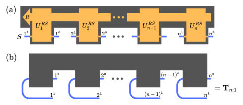 
FIG. 1. (a) A quantum stochastic process encodes all multi- time input-output relations of a system S undergoing open quantum dynamics. The underlying dynamics (orange) may be described by recurrent global unitary evolution of the sys- tem and its complement environment R. An experimenter may interact arbitrarily with S at each time-step t via in- put and output arms, for example by state preparation on ti

📷 Fig 2

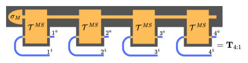 
FIG. 2. A time-homogeneous recurrent quantum circuit model of the underlying dynamics for a 4-step window T4:1 of a quantum stochastic process, consisting of a stationary mem- ory state σM sequentially undergoing fixed system-memory channel T MS.

📷 Fig 3

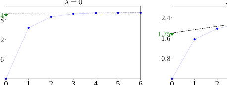 
FIG. 3. √

**Summary.** This paper introduces a quantum information-theoretic framework to quantify how much randomness in a quantum process is genuinely unpredictable versus how much is merely structured due to limited memory. By defining the quantum excess entropy, the authors show this quantity equals the quantum mutual information between the past and future halves of the process. This provides a powerful tool to estimate the minimum memory resources needed to simulate complex quantum dynamics.

**Why it may be interesting.** This work provides fundamental information-theoretic tools for characterizing the memory content and predictability of open quantum systems, which is crucial for understanding quantum noise and decoherence in physical implementations.

Detailed structure

**Main problem.** The paper aims to develop a rigorous quantum measure to distinguish between true, irreducible randomness and structured temporal correlations within a quantum stochastic process.

**Main result.** It establishes that the quantum excess entropy ($E$) quantifies the temporal correlations and provides a lower bound on the memory resources required to model the process using a recurrent quantum circuit.

**Method.** The authors utilize the Choi state representation of process tensors to define and analyze the quantum entropy rate ($s_T$) and the quantum excess entropy ($E$) for stationary quantum processes.

**Model / system.** The analysis focuses on general stationary quantum stochastic processes, modeled by repeated interactions with a quantum memory system ($M$) via a time-homogeneous quantum operation ($T_{MS}$).

**Key observables.** Quantum entropy rate ($s_T$), Quantum Excess Entropy ($E$), and Quantum Mutual Information (QMI).

**Important parameters / regimes.** The process is assumed to be stationary; the memory state $\sigma_M$ and the noise parameter $\lambda$ are key parameters in simulations.

**Assumptions / limitations.** The process is assumed to be stationary, and the analysis relies on the existence of a time-homogeneous recurrent quantum circuit model.

**Figures summary.** Figures illustrate the encoding of multi-time input-output relations via the Choi state and show the convergence of the process entropy growth rate and the alignment of the excess entropy with the past-future QMI.

**Paper structure.** The paper builds from defining the quantum entropy rate ($s_T$) as the measure of irreducible randomness, then introduces the excess entropy ($E$) to quantify structured correlations, culminating in proving $E$'s equivalence to the QMI between past and future halves, and bounding $E$ by the memory state entropy.

Abstract

For a stochastic process describing observations of a dynamical system, complexity science provides systematic methods to decompose the information produced into true irreducible randomness, and that which corresponds to structure superficially disguised as random but can in fact be learned and predicted. Such methods then equip vital tools for prediction, control and inference of the system's internal structure. However, quantum analogs remain underdeveloped due to the inherent complications of invasive measurements and quantum correlations. By harnessing the Choi state representation of process tensors which encode multi-time input-output relations, we formulate a convergent measure of irreducible randomness in stationary quantum stochastic processes. This directly enables a measure of temporal correlations which lower bounds the memory resources required to replicate the process via a recurrent quantum circuit.

[↑ back to top](#top)

### ⭐ [Immittance formulas for exact blackbox quantization and divergence-free effective models in circuit QED](http://arxiv.org/abs/2608.26027v1)

**Highlighted author(s):** Peter Rabl  
**Authors:** Philippe Gigon, Peter Rabl, Adrian Parra-Rodriguez  
**Type:** theory · **Category:** other · **PDF:** <https://arxiv.org/pdf/2608.26027v1>  
**Analysis basis:** full PDF text, analyzed in chunks
**Topic relevance:** `correlated / nonlocal dissipation` **3/5** · `methods for driven-dissipative` **3/5** · `Keldysh / 2PI / non-Gaussian methods` **2/5** · `driven-dissipative phase transition` **2/5** · `quantum measurements` **2/5** · `analog quantum simulation` **1/5** · `non-equilibrium universality` **1/5**

📷 Fig 1

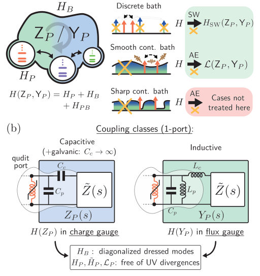 
Figure 1. (a) From the immittance response ZP (s) or YP (s), we construct exact Hamiltonians for superconducting qudit ports linearly coupled to possibly nonreciprocal environments. We also derive effective Hamiltonian or Lindbladian dynam- ics when the environment is either discrete and dispersive or a smooth continuum remaining close to its ground state. Sharply varying baths or additional external driving may be treated using appropriate adiabatic-elimination schemes. (b) General one-port coupling classes considered. Qudits based on nonlinear inductive elements are coupled capacitively (in- ductively) to generic passive sub-environments characterized by ˜Z. Combined with the charge...

📷 Fig 2

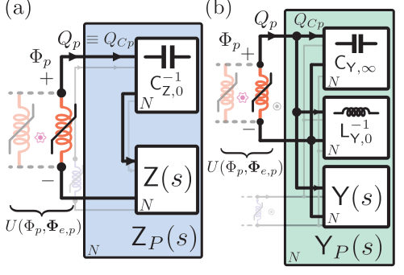 
Figure 2. N nonlinear port degrees of freedom coupled to lin- ear dissipative environments described by (a) impedance or (b) admittance matrices, corresponding to generic (a) capac- itive and (b) inductive coupling. A set of nonlinear parallel inductors defines a port p. Multiport connectivity is shown faintly for simplicity (see Appendices B and C).

📷 Fig 3

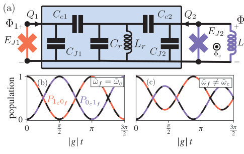 
Figure 4. Resonator-mediated population exchange between |1c, 0f⟩and |0c, 1f⟩for a CPB-like charge qudit and a flux- onium capacitively coupled to the same LC mode (a). The lower panels show (b) the dressed-resonant case, ˜ωc = ˜ωf, and (c) an off-resonant case obtained by shifting the charge-qudit Josephson energy by ∆EJ1/h = 1 MHz from the dressed- resonant working point, thereby retaining a finite effective detuning between the transitions. Solid curves show the exact tripartite dynamics, including the resonator, whereas dashed curves are obtained from the complete effective qudit–qudit Hamiltonian in Eq. (36), constructed using the immittance formulas. The circuit parameters are ωr/(2π)...

📷 Fig 4

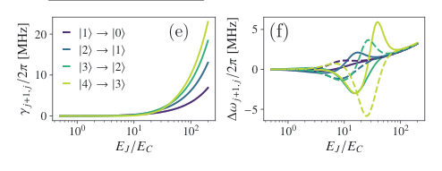 
Figure 5. The transmon qudit capacitively coupled to (a) a semi-infinite and (c) an infinite TL, both of characteristic impedance Z0, can be represented by the equivalent circuit in panel (b), with the impedance seen from the coupling point in the infinite-line case being half that of the semi-infinite line. (d) Coupling parameter G(ω) for R = Z0 and CJ = 10 fF as a function of the coupling capacitance, approaching the galvanic limit (Cc →∞). Panels (e) and (f) show the decay rates and corrections to the transition frequencies, as defined in Eq. (71), for a charge qudit capacitively coupled to a semi-infinite TL. In both panels, Z0 = 50 Ω, CJ = 10 fF, Cc = CJ/50, and EJ is varied to explore...

📷 Fig 5

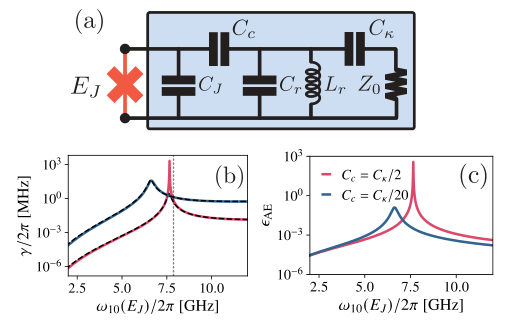 
Figure 6. (a) Transmon qudit (CJ = 200 fF, variable EJ, and ng = 0) capacitively coupled (Cc = CJ/50) to a lossy resonator (Cr = 200 fF, ELr/h = 80 GHz). (b) Decay rate of the transmon for different ratios of Cc/Cκ and (c) valid- ity condition of adiabatic elimination. The result from the impedance formula is compared with the decay rate obtained from the poles of the linearized circuit (dashed lines). The bare resonator frequency is indicated by the dotted line; the actual pole is shifted due to the coupling capacitances.

**Summary.** This paper introduces a general framework to derive exact Hamiltonians for superconducting qudits coupled to complex, realistic linear environments characterized by their impedance or admittance. By extending black-box quantization, it yields divergence-free effective models for both dispersive and dissipative regimes. This establishes a scalable route for designing and analyzing large-scale superconducting quantum hardware.

**Why it may be interesting.** This work provides a powerful, systematic, and rigorous theoretical tool to model open quantum systems in superconducting circuits, directly addressing issues like spurious divergences in previous treatments.

Detailed structure

**Main problem.** The paper aims to provide simple, exact formulas for constructing Hamiltonians describing superconducting qudits coupled to complex, passive linear environments.

**Main result.** It successfully derives divergence-free dispersive Hamiltonians and transition-resolved weak-coupling master equations for these coupled systems.

**Method.** The method involves characterizing the environment via its impedance or admittance matrices and mapping the environment's port response directly into the Hamiltonian structure using canonical multiport circuit representations.

**Model / system.** The system consists of Josephson-junction-based superconducting qudits coupled to arbitrary linear environments (multiport, multimode, nonreciprocal). The theory is built upon extending black-box quantization to these complex settings.

**Key observables.** Mode structure, frequency renormalizations, environment-mediated interactions, decay rates, and directional cross couplings.

**Important parameters / regimes.** Weak-coupling regime, impedance ($\mathbf{Z}$) or admittance ($\mathbf{Y}$) matrices, and the specific gauge choice (charge or flux gauge).

**Assumptions / limitations.** The derivation of effective models is restricted to the two extreme gauges (charge and flux gauges), and the method is best suited for numerical inputs from electromagnetic solvers.

**Figures summary.** Figure 1(a) shows constructing exact Hamiltonians from the immittance response for nonreciprocal environments. Figure 2 illustrates coupling nonlinear qudits to linear environments via impedance or admittance.

**Paper structure.** The paper builds upon prior circuit quantization methods, details the decomposition of the immittance response, derives the exact Hamiltonian in the chosen gauge, and then applies this framework to various physical circuits.

Abstract

Building on the first-order circuit quantization method [arXiv:2304.12252, arXiv:2401.09120], we provide simple formulas to construct exact Hamiltonians for Josephson-junction-based superconducting qudits capacitively, inductively, or galvanically coupled to passive linear environments. These environments may be multiport, multimode, discrete or continuous, reciprocal or nonreciprocal, and are characterized directly by their impedance or admittance matrices. In the weak-coupling regime, we further derive \emph{divergence-free} dispersive Hamiltonians for mode-resolved environments and transition-resolved weak-coupling master equations for dissipative continua. Mode structure, frequency renormalizations, environment-mediated interactions, decay rates, and directional cross couplings then follow from the same causal immittance response, while spurious Lamb-shift divergences arising from uncontrolled approximations in previous treatments are made explicit and avoided. We apply the theory to a set of illustrative circuits comprising a discrete resonator filter, finite-band metamaterial environments, nonreciprocal waveguide-QED systems, and superconducting giant atoms, for which analytical response matrices can be obtained, although the method is particularly well suited to numerical responses from electromagnetic solvers or experimental characterization. We thereby extend the black-box quantization framework to multiport, dissipative, and nonreciprocal settings, establishing a simple and scalable route toward optimized and automated electromagnetic design of large-scale superconducting quantum hardware.

[↑ back to top](#top)

### ⭐ [Structured Non-Locality and Emergent Locality in Cavity-QED Many-Body Dynamics](http://arxiv.org/abs/2608.25908v1)

**Highlighted author(s):** Darrick E. Chang  
**Authors:** Mark A. Oehlgrien, Błażej Jaworowski, Darrick E. Chang, Charlie-Ray Mann  
**Type:** theory · **Category:** other · **PDF:** <https://arxiv.org/pdf/2608.25908v1>  
**Analysis basis:** full PDF text, analyzed in chunks
**Topic relevance:** `Tavis-Cummings & cavity-many-emitter` **3/5** · `analog quantum simulation` **3/5**

📷 Fig 1

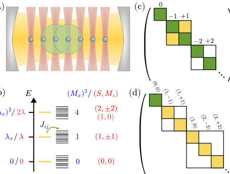 
FIG. 1. (a) A Rydberg-tweezer cavity interface: a delocalized cavity mode (yellow) mediates all-to-all interactions between atoms (blue) trapped by optical tweezers (red), while Rydberg dressing produces short-range interactions (green). (b) We consider two paradigmatic collective models. In the first, λy = 0, the cavity creates degenerate subspaces labeled by (Mx)2, while in the second, λx = λy = λ, the degenerate subspaces are labeled by (S, Mz). The values of (Mx)2

📷 Fig 2

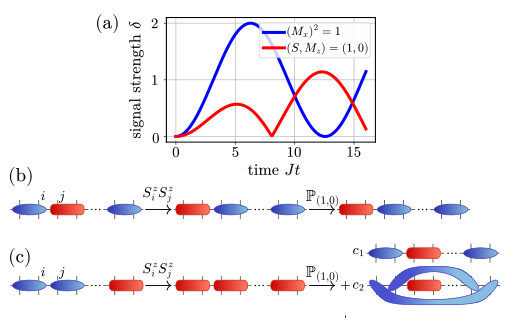 
FIG. 2. (a) Signal strength δ = |⟨OB(t)⟩0 −⟨OB(t)⟩1| versus time Jt for the product-state subspace protocol (blue) and the entangled- subspace protocol (red). The indices 0 and 1 represent Alice’s bit, and Bob’s observable, OB, is 2Sx N (blue) or (SN−1 · SN)2 (red). A non-zero value of δ allows Bob to distinguish Alice’s encoded bit. Because δ is independent of system size N and the separation between Alice and Bob grows with N, both protocols demonstrate distance-independent signaling. (b) &amp; (c) Action of a projected local Ising interaction on sites i and j for two valence-bond configurations in the (S = 1, Mz = 0)-subspace. Blue ovals denote singlets and red rounded squares denote...

**Summary.** This paper analyzes many-body dynamics in cavity QED systems where interactions are a mix of local and collective. By projecting the dynamics onto specific subspaces, the authors show that the resulting effective interactions are either purely local (if the subspace is product-state-like) or structured non-local (if the subspace is entangled). This framework reveals a new class of dynamics beyond simple local or fully collective models.

**Why it may be interesting.** This work provides a deep theoretical understanding of how global constraints (like total angular momentum) can fundamentally alter the nature of local interactions, leading to structured non-local physics relevant for quantum simulation and quantum information.

Detailed structure

**Main problem.** The paper investigates many-body dynamics governed by a mixture of short-range microscopic interactions and long-range, cavity-mediated collective interactions, where neither locality nor full collectivity is a sufficient description.

**Main result.** The effective dynamics within a subspace is dictated by whether that subspace admits a local product-state basis; entangled subspaces generate structured non-local dynamics, while product-state subspaces retain local spatial structure.

**Method.** The authors analyze the system by projecting the short-range interaction onto subspaces defined by the dominant collective coupling, utilizing techniques involving spherical tensor operators and Wigner-Eckart theorem.

**Model / system.** The model is Cavity Quantum Electrodynamics (QED) applied to interacting spin-1/2 systems, described by a generalized XYZ Hamiltonian. The analysis focuses on the effective Hamiltonian derived within specific subspaces (e.g., fixed total spin $S$ or magnetization $M_x$).

**Key observables.** Signal strength $\delta(t)$ used to diagnose non-locality, and the structure of the effective Hamiltonian $H_{	ext{eff}}$ (local vs. non-local terms).

**Important parameters / regimes.** The ratio of collective coupling strength to short-range coupling ($ \lambda/J_{ij} 	o \infty $), and the global spin quantum numbers $(S, M_z)$ or $(M_x)^2$.

**Assumptions / limitations.** The analysis relies on the clean conceptual limit where cavity-mediated interactions dominate, allowing for spectral separation into distinct subspaces.

**Figures summary.** Figures illustrate the physical setup (Rydberg-tweezer cavity), the block-diagonal structure of the effective Hamiltonian distinguishing local and non-local interactions, and the time evolution of signal strength $\delta$ demonstrating non-local signaling.

**Paper structure.** The paper progresses by first establishing the physical context (Cavity-QED), then analyzing the spectral separation into subspaces, deriving the effective Hamiltonians for different subspaces (e.g., $(M_x)^2=1$ vs. $(S, M_z)$), and finally using non-locality diagnostics (signal strength) to confirm the structured non-local nature of the dynamics.

Abstract

Cavity quantum electrodynamics (QED) modifies many-body systems by combining cavity-mediated collective interactions with microscopic short-range interactions. The resulting dynamics lies between the local and fully collective limits, such that neither locality nor collectivity alone provides a complete organizing principle. In the clean conceptual limit of dominant collective coupling, we show that the effective dynamics within each energetically isolated subspace is generically controlled by whether that subspace admits a local product-state basis, and identify exceptions imposed by angular-momentum selection rules. Product-state subspaces generically retain the spatial structure of the microscopic interaction. Entangled subspaces instead generically dress local processes with global operators, generating non-local but highly structured dynamics. We illustrate this by deriving the corresponding effective Hamiltonians in two representative cavity-QED spin models. The cavity-isolated subspace thus becomes a resource for generating competing short-range interactions or globally conditioned local processes, opening a class of many-body dynamics without local or fully collective counterparts.

[↑ back to top](#top)

### [Dynamical development of long-range spatial coherence in non-equilibrium bosonic condensation](http://arxiv.org/abs/2608.25407v1)

**Authors:** Bianca Rae Fabricante, Dąbrówka Biegańska, Paolo Comaron, Mateusz Król, Matthias Wurdack, Maciej Pieczarka, Mark Steger, David W. Snoke, Kenneth West, Daniele Sanvitto, Dario Ballarini, Dimitrios Trypogeorgos, Loren N. Pfeiffer, Andrew G. Truscott, Marzena Szymańska, Elena A. Ostrovskaya, Eliezer Estrecho  
**Type:** both · **Category:** other · **PDF:** <https://arxiv.org/pdf/2608.25407v1>  
**Analysis basis:** full PDF text, analyzed in chunks
**Topic relevance:** 🔥 `driven-dissipative phase transition` **4/5** · `Tavis-Cummings & cavity-many-emitter` **3/5** · `analog quantum simulation` **3/5** · `methods for driven-dissipative` **3/5** · `non-equilibrium universality` **3/5** · `quantum optics experiment` **3/5** · `Keldysh / 2PI / non-Gaussian methods` **2/5** · `correlated / nonlocal dissipation` **2/5** · `Dicke superradiance` **1/5** · `scars & prethermalization` **1/5** · `superradiant laser` **1/5**

📷 Fig 1

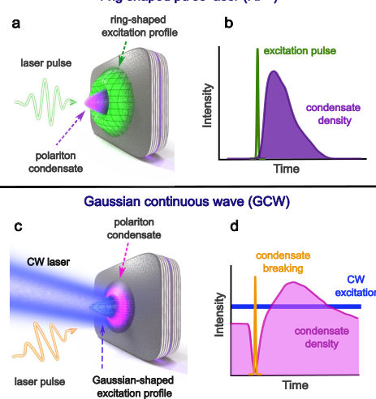 
Fig. 1. Two experimental configurations. a) In the ring-shaped pulsed laser (RPL) pump configuration, a pump pulse creates the dynamical polariton condensate trapped inside a ring- shaped excitonic reservoir generated by the pump. The con- densate forms after the arrival of the pulse and subsequently decays, as shown in (b). c) In the Gaussian continuous wave pump (GCW) configuration, a steady-state condensate flow- ing away from the excitation spot is formed. A red-detuned laser pulse is then used to break the condensate. The pulse ini- tiates a rapid polariton density depletion followed by a rapid growth and recovery of the condensate, as shown in (d).

📷 Fig 2

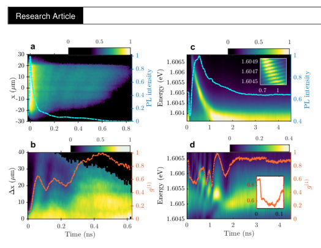 
Fig. 2. Typical time evolution of the condensate density and g(1) for (a,b) RPL and (c,d) GCW configurations, with the ra- tios of the pump power relative to the condensation threshold P/Pth = 26 and Bp/Bp,0 = 12, respectively. a) Condensate density evolution (quantified by PL intensity heatmap) and its value integrated over the spatial (x) dimension and normal- ized by the peak value (blue line). b) Condensate coherence heatmap (shown for half of the spatial range, x &gt; 0) and g(1)

📷 Fig 3

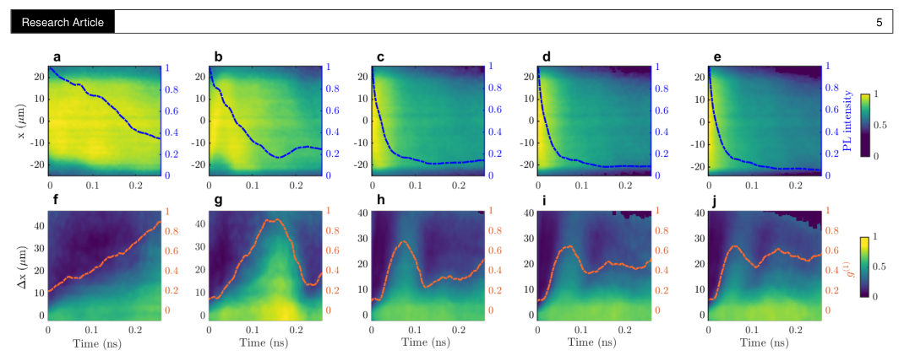 
Fig. 3. Time-resolved condensate PL and g(1) heatmaps for the excitonic fraction |X|2 = 0.50 and the pump power ratio P/Pth of (a,f) 4, (b,g) 6, (c,h) 17, (d,i) 22, and (e,j) 26 in the TCO regime of the RPL experiment. The blue line is the condensate density quantified by integrating the PL intensity over the spatial (x) dimension and normalizing it by the peak value. The orange line is the spatial coherence integrated over the spatial coordinate (x) and normalized to its peak value.

📷 Fig 4

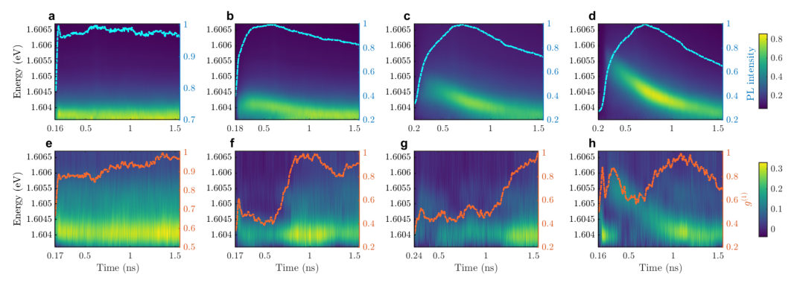 
Fig. 4. Time-resolved condensate PL and g(1) heatmaps for the breaking pulse power ratio Bp/Bp,0 of (a,e) 1, (b,f) 2, (c,g) 4, and (d,h) 8 in the TCO regime of the GCW experiment, after the condensate-breaking pulse. Bp,0 is the threshold pulse power for breaking the condensate. The blue line is the total detected PL intensity at each time normalized to its peak value. The orange line is the spatial coherence integrated along the vertical axis normalized to its peak value.

📷 Fig 5

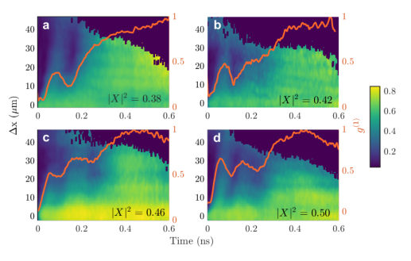 
Fig. 5. Dependence of spatial coherence dynamics on the ex- citonic fraction in the RPL configuration. (a-d) Time-resolved g(1) profile heatmaps at increasing (from a to d) excitonic frac- tion with a fixed pump power (P/Pth ≈26). The orange curve is g(1) integrated (along x) and normalized to its peak value.

**Summary.** This paper investigates how long-range spatial coherence emerges in exciton-polariton condensates that are driven far from equilibrium. Using time-resolved experiments and simulations, the authors demonstrate that coherence develops in two distinct phases: an initial, oscillatory interaction-driven phase, followed by a stable, high-coherence steady state. This sheds light on the complex, non-equilibrium physics governing bosonic condensation.

**Why it may be interesting.** This work provides deep insight into the non-equilibrium dynamics of coherence formation in cavity QED systems, offering a detailed picture of how coherence builds up beyond simple steady-state assumptions.

Detailed structure

**Main problem.** The study investigates the dynamical development of long-range spatial coherence in non-equilibrium bosonic condensation, focusing on the temporal evolution of coherence as the condensate forms.

**Main result.** Spatial coherence develops through two distinct stages: an early-time, interaction-driven stage featuring transient oscillations, followed by a persistent, spatially-uniform steady-state regime.

**Method.** The research combines time-resolved experiments (using pulsed and continuous wave laser excitation) with numerical modeling to track coherence dynamics.

**Model / system.** The system is an exciton-polariton condensate formed in a microcavity, which is a driven-dissipative, non-equilibrium bosonic system.

**Key observables.** Spatial coherence (measured via the first-order correlation function, g^(1)), condensate density, and coherence length (l_coh).

**Important parameters / regimes.** Detuning ($\Delta$), excitation power relative to the threshold ($P/P_{th}$), and the excitation configuration (Ring-Shaped Pulsed Laser vs. Gaussian Continuous Wave).

**Assumptions / limitations.** The early-time dynamics are attributed to underlying microscopic processes of energy relaxation and interactions, distinct from simple density oscillations.

**Figures summary.** Figures illustrate the experimental setups (RPL and GCW), time-resolved measurements of g^(1) and density, and how coherence length evolves across different detunings and pumping powers.

**Paper structure.** The paper systematically explores the coherence dynamics using multiple experimental setups (RPL, GCW) and varying physical parameters (detuning, pump power), confirming the two-stage coherence development across different regimes.

Abstract

Development of spontaneous coherence is one of the hallmarks of bosonic condensation in a variety of physical systems, such as cold atoms, confined photons, and hybrid light-matter quasiparticles like exciton polaritons in semiconductors. While spatial coherence is well understood once a steady-state condensate has been established, its temporal evolution as the condensate forms is largely unexplored. Here, we explore the dynamical formation of a non-equilibrium, driven-dissipative exciton-polariton condensate through both time-resolved experiments and numerical modeling. Our study reveals that the spatial coherence is established through two distinct stages. The early-time stage is interaction-driven and features transient oscillations in spatial coherence. This stage is followed by a steady-state regime characterized by a spatially-uniform high degree of coherence that extends over the entire size of the system and persists over time. These stages of spatial coherence development occur in both free flowing and confined exciton-polariton systems that undergo a quench - rapid growth of the condensate starting from two different initial settings. Our study offers a deep insight into the process by which long-range spatial coherence is established in a non-equilibrium bosonic condensate.

[↑ back to top](#top)

### [Feedback-enabled magnomechanics in lithium ferrite](http://arxiv.org/abs/2608.25101v1)

**Authors:** Mehri Ebrahimi, Yunhu Huang, Ali Rashedi, John P. Davis  
**Type:** experiment · **Category:** other · **PDF:** <https://arxiv.org/pdf/2608.25101v1>  
**Analysis basis:** full PDF text, analyzed in chunks
**Topic relevance:** 🔥 `quantum measurements` **4/5** · `analog quantum simulation` **3/5** · `correlated / nonlocal dissipation` **3/5** · `driven-dissipative phase transition` **3/5** · `methods for driven-dissipative` **3/5** · `quantum optics experiment` **3/5** · `Keldysh / 2PI / non-Gaussian methods` **2/5** · `non-equilibrium universality` **2/5** · `Tavis-Cummings & cavity-many-emitter` **1/5** · `interference shaping light` **1/5**

📷 Fig 1

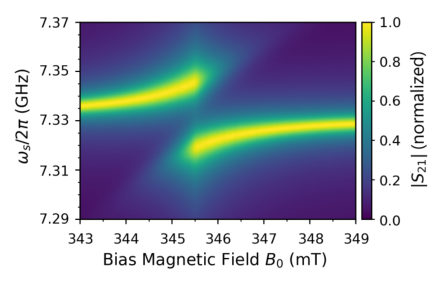 
FIG. 1. Normalized transmission spectrum |S21| as a function of bias magnetic field B0, showing the avoided crossing between the cavity and magnon modes. The resulting upper and lower branches correspond to the hybridized cavity–magnon polariton modes.

📷 Fig 2

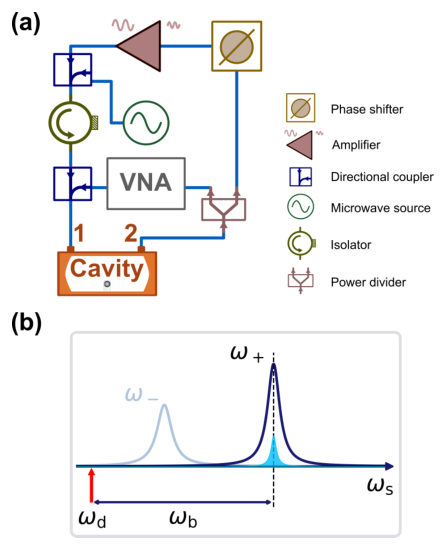 
FIG. 2. (a) Schematic of the cavity magnomechanical system and microwave feedback loop. The LiFe sphere is positioned inside a copper microwave cavity and probed by a vector network analyzer (VNA). A fraction of the cavity output is routed through the feed- back loop, where the signal is amplified, phase shifted, and subse- quently fed back into the cavity. An independent microwave source provides the drive tone for the magnomechanical measurements. (b) Frequency schematic of the measurement showing the drive tone, ωd, approximately one mechanical frequency, ωb, red-detuned from the upper-polariton mode, ω+.

📷 Fig 3

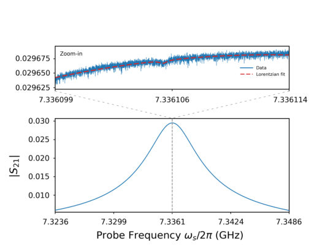 
FIG. 3. Transmission amplitude |S21| of the upper polariton mea- sured without feedback at a drive power of 25 dBm. The expanded view in the upper reveals the weak magnomechanical feature near the mechanical resonance, which is barely detectable against the broader upper-polariton response.

📷 Fig 4

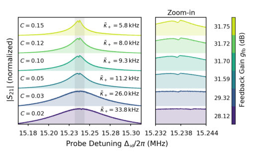 
FIG. 4. Feedback-enabled observation of magnomechanically in- duced transparency in LiFe. Normalized transmission |S21| is shown as a function of probe detuning ∆sd = ωs −ωd for increasing feed- back gain gfb (bottom to top), with constant pump tone power, Pd = 22.6dBm. The feedback suppresses the upper-polariton linewidth from κ+/2π = 3.53 MHz without feedback to ˜κ+/2π = 33.8 kHz and 5.8 kHz at feedback gains gfb = 28.12 dB and 31.75 dB, respec- tively, while increasing the extracted magnomechanical cooperativity from C = 1.9×10−3 without feedback to C = 0.02 and 0.15, respec- tively. Curves are vertically offset for clarity and are color coded by feedback gain. The right panel enlarges...

📷 Fig 5

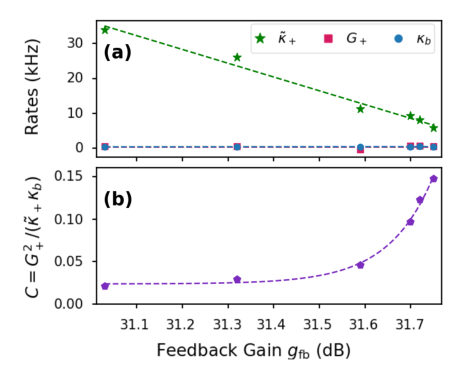 
FIG. 5. Effect of coherent feedback on the magnomechanical inter- action. (a) Extracted effective upper-polariton linewidth ˜κ+, drive- enhanced upper-polariton–phonon coupling rate G+, and mechani- cal linewidth κb as functions of the feedback gain gfb. Increasing the feedback gain strongly reduces ˜κ+, while G+ and κb remain com- paratively small. Dashed lines are guides to the eye. (b) Correspond- ing magnomechanical cooperativity C = G2+/( ˜κ+κb) as a function of feedback gain. The suppression of the upper-polariton linewidth results in a pronounced increase in the cooperativity. The dashed line is a guide to the eye.

**Summary.** This paper reports the first observation of cavity magnomechanics in Lithium ferrite (LiFe) by utilizing coherent microwave feedback. The feedback technique is crucial because it suppresses cavity dissipation, dramatically increasing the measurable cooperativity. This allows the researchers to quantify the weak magnomechanical coupling in LiFe, demonstrating a powerful method for probing subtle quantum interactions.

**Why it may be interesting.** This work is highly relevant as it uses active dissipation engineering (feedback) to access and quantify weak coupling regimes, a core theme in open quantum systems and cavity QED.

Detailed structure

**Main problem.** The primary challenge was observing and characterizing the weak magnomechanical coupling in Lithium ferrite (LiFe) when the mechanical signal was otherwise obscured by cavity dissipation.

**Main result.** The authors successfully demonstrated cavity magnomechanics in LiFe using coherent microwave feedback, significantly increasing the measurable cooperativity and revealing a clear magnomechanically induced transparency feature.

**Method.** The technique involves implementing coherent microwave feedback into the cavity to suppress polariton dissipation, thereby enhancing the detectability of the weak mechanical interaction.

**Model / system.** The system uses a single-crystal LiFe sphere coupled to a microwave cavity, exhibiting cavity magnonics and cavity magnomechanics. The dynamics are analyzed using cavity field equations modified by the feedback loop.

**Key observables.** Polariton linewidth ($	ilde{\kappa}_{\pm}$), Magnomechanical Cooperativity ($C$), and the Magnomechanically Induced Transparency (MMIT) feature.

**Important parameters / regimes.** The single-magnon coupling rate ($g_{mb}/2\pi$) for LiFe ($0.26 	ext{ mHz}$) and the enhancement factor provided by the feedback gain ($g_{fb}$).

**Assumptions / limitations.** The analysis assumes that coherent feedback can effectively engineer the cavity dissipation to reveal underlying weak coupling mechanisms.

**Figures summary.** Figures illustrate the avoided crossing defining polariton branches, the feedback setup, and crucially, show the MMIT feature becoming resolvable as the microwave feedback gain increases.

**Paper structure.** The paper establishes the physical system, details the necessity and implementation of coherent microwave feedback, presents quantitative measurements showing the enhancement of cooperativity and the resolution of the MMIT feature, and concludes with a comparison of the coupling strength between LiFe and YIG.

Abstract

Lithium ferrite (LiFe) is a promising material for cavity magnonics because its large spin density enables strong coupling between magnons and microwave photons. Its potential for cavity magnomechanics, however, has remained unexplored. Here, we observe magnomechanical interactions in a single-crystal LiFe sphere using coherent microwave feedback to suppress dissipation of the cavity--magnon polariton. In the absence of sufficient feedback, the narrow mechanical response is difficult to resolve against the much broader polariton background. Increasing the feedback gain reduces the polariton linewidth and correspondingly increases the magnomechanical cooperativity, revealing a clear magnomechanically induced transparency feature. In the measurements presented here, the effective upper-polariton linewidth is reduced from $3.53~\mathrm{MHz}$ without feedback to $5.8~\mathrm{kHz}$ in the presence of feedback, while the measured cooperativity increases from $C=1.9\times10^{-3}$ to $C=0.15$. These measurements provide, to our knowledge, the first observation of cavity magnomechanics in LiFe and demonstrate coherent feedback as a practical route for accessing weak interactions that would otherwise be obscured by dissipation.

[↑ back to top](#top)

### [Mixed-State Symmetry-Protected Topology and Strong-to-Weak Spontaneous Symmetry Breaking in a Superconducting Qubit Array](http://arxiv.org/abs/2608.24993v1)

**Authors:** Qian Cao, Zhen Bi, Kater W. Murch  
**Type:** experiment · **Category:** statistical mechanics · **PDF:** <https://arxiv.org/pdf/2608.24993v1>  
**Analysis basis:** full PDF text, analyzed in chunks
**Topic relevance:** 🔥 `QC/QI experiment` **4/5** · `analog quantum simulation` **3/5** · `correlated / nonlocal dissipation` **3/5** · `driven-dissipative phase transition` **3/5** · `quantum measurements` **3/5** · `methods for driven-dissipative` **2/5** · `non-equilibrium universality` **2/5** · `Full counting statistics` **1/5** · `Keldysh / 2PI / non-Gaussian methods` **1/5**

📷 Fig 1

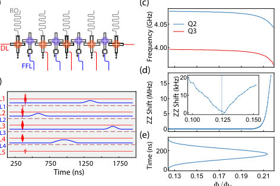 
FIG. 1. Cluster state preparation in a supercon- ducting qubit array. (a) Schematic of the five-qubit device with nearest-neighbor coupling mediated by tunable couplers and dispersive readout via readout resonators. (b) Pulse se- quence used in preparing the one-dimensional cluster state: qubits are initialized in |+⟩states via resonant rotations (red pulses on the drive lines) and entangled via sequential nearest- neighbor controlled-Z (CZ) gates (adiabatic baseband pulses on the fast flux lines). (c–e) Implementation of the CZ gate using an adiabatic flux pulse. As an example, (c) displays the dependence of Q2 and Q3’s frequencies on the coupler’s flux. (d) Displays the measured ZZ...

📷 Fig 2

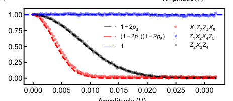 
FIG. 2. Characterization of average symmetry- protected topological order under measurement- induced dephasing. (a) Circuit diagram for probing the response of different average string orders to dephasing strengths on p1, p3, p5 on Q1, Q3, Q5. (b) Ramsey measure- ments are used to characterize the effective dephasing channel induced by driving the qubits’ readout resonators at variable amplitude, from which a dephasing strength pi is extracted. (c) Measured nonlocal string order parameters as a function of measurement strength, demonstrating the persistence of SPT order over a range of conditions. The observed behav- ior is consistent with the selective robustness of string or- der expected...

📷 Fig 3

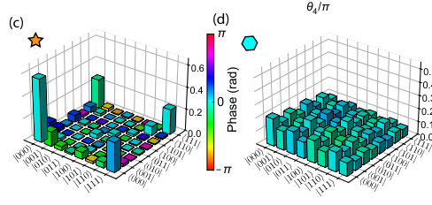 
FIG. 3. Measurement-induced interpolation between long-range-entangled and separable states. (a) Circuit for tuning between measurement-induced orders in the cluster state: Q2 and Q4 are measured in a tunable basis defined by the rotation angles θ2 and θ4, followed by state tomography conditioned on the measurement outcomes. (b) The Z1Z5 ex- pectation value versus θ2 and θ4. (c) Reconstructed density matrix via conditioned quantum state tomography of Q1, Q3, and Q5 for θ2 = θ4 = 0, showing preparation of a GHZ state with 67% fidelity. (d) Reconstructed density matrix for mea- surement angles θ2 = θ4 = π/2 demonstrating fidelity to the paramagnetic |+⟩1,3,5 of 89%.

**Summary.** This paper experimentally investigates how topological order survives and changes in superconducting qubits subjected to decoherence and measurement. By analyzing string order and fidelity correlators, the authors distinguish between different types of symmetry protection, providing a superconducting platform to study the transition from strong to weak spontaneous symmetry breaking in mixed states.

**Why it may be interesting.** This work provides a concrete, circuit-based realization for probing subtle concepts in topological order and symmetry breaking in open quantum systems, bridging abstract theory with measurable superconducting circuit physics.

Detailed structure

**Main problem.** The study investigates how symmetry-protected topological (SPT) order manifests in mixed quantum states, specifically examining the transition between strong-to-weak spontaneous symmetry breaking (SW-SSB) and average SPT order.

**Main result.** The experiments demonstrate that underlying SPT correlations can be revealed through distinct signatures—such as robust string order under dephasing or finite nonlinear fidelity correlators—depending on whether the measurement record is conditioned or averaged.

**Method.** The research uses superconducting qubits to prepare and probe a 1D cluster state, employing controlled dephasing, measurement-induced state preparation, and advanced correlator measurements.

**Model / system.** The physical platform is a five-qubit superconducting transmon array initialized in a cluster state, governed by a stabilizer Hamiltonian. The analysis focuses on symmetry protection ($Z_2 	imes Z_2$) and the effects of open system dynamics (decoherence/measurement).

**Key observables.** Nonlocal string order parameters ($S_o, S'_o, S_e$), conventional long-range correlators, nonlinear fidelity correlators ($F_{SWSSB}$), and cluster-state fidelity ($F_{LB}$).

**Important parameters / regimes.** Dephasing strengths ($\pi_i$), measurement bases ($	heta_i$), and the ratio distinguishing strong vs. average symmetry protection.

**Assumptions / limitations.** The analysis assumes that measurement-induced phase accumulation can be mitigated using rotationally invariant combinations of correlators, and that readout errors can be corrected via Bayesian unfolding.

**Figures summary.** Figures illustrate the experimental setup, the pulse sequence for cluster state preparation, the decay of string order parameters under dephasing, and the measurement of various correlators.

**Paper structure.** The paper progresses by first characterizing the ideal SPT order via string order, then introducing controlled dephasing to observe the transition to ASPT order, and finally analyzing measurement-conditioned states to reveal signatures of SW-SSB.

Abstract

We experimentally investigate how symmetry-protected topological order in a one-dimensional cluster state is transformed by measurement and decoherence in a five-qubit superconducting array. We first characterize the state's nonlocal string order and show that controlled dephasing selectively suppresses one symmetry sector while leaving the other robust, consistent with average symmetry-protected topological order. We then measure one sublattice in a tunable basis and show that the remaining qubits are driven between a long-range-entangled GHZ state and a paramagnetic state. When the measurement record is discarded, the conventional long-range correlator vanishes while a nonlinear fidelity correlator remains finite, providing a finite-size signature of strong-to-weak spontaneous symmetry breaking. These experiments demonstrate how conditioning, averaging, and decoherence reveal distinct manifestations of order encoded in the same underlying cluster state, and establish a superconducting-circuit setting for probing mixed-state symmetry and topology.

[↑ back to top](#top)

### [Yang-Lee Criticality as a Dissipative Dynamical Phase Transition: Quantum Simulation of non-Hermitian Physics without Post-selection](http://arxiv.org/abs/2608.26082v1)

**Authors:** Stephen W. Yan  
**Type:** theory · **Category:** statistical mechanics · **PDF:** <https://arxiv.org/pdf/2608.26082v1>  
**Analysis basis:** full PDF text, analyzed in chunks
**Topic relevance:** 🔥 `driven-dissipative phase transition` **4/5** · 🔥 `methods for driven-dissipative` **4/5** · `analog quantum simulation` **3/5** · `correlated / nonlocal dissipation` **3/5** · `non-equilibrium universality` **3/5** · `Keldysh / 2PI / non-Gaussian methods` **2/5** · `quantum measurements` **2/5**

📷 Fig 1

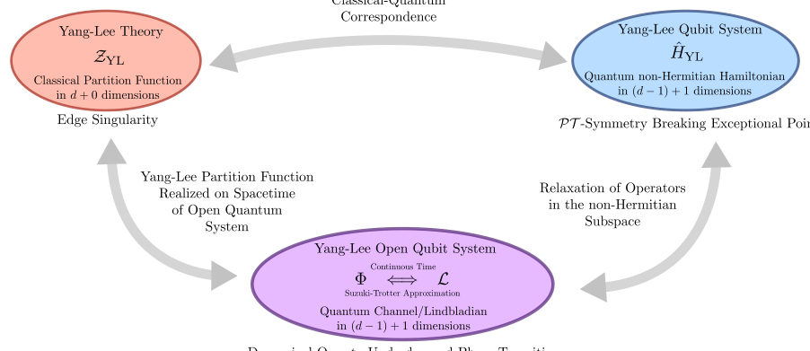 
Figure 1: Overview of the main ideas of this paper allowing us to realize Yang-Lee theory in an open quantum system without the use of post-selection. The classical partition function ZYL is related to ˆHYL through the standard classical-quantum mapping which in turn emerges as the description of the decay of operators in the non-Hermitian subspace of an open quantum system.

📷 Fig 2

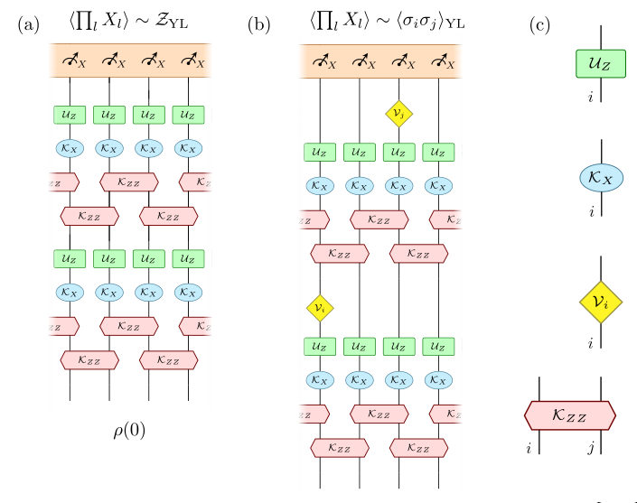 
Figure 2: In (a), we diagram the quantum circuit which realizes ˆHYL and consequently, the Yang-Lee theory with engineered dissipation but without post-selection. At the final time-step, we measure Q

📷 Fig 3

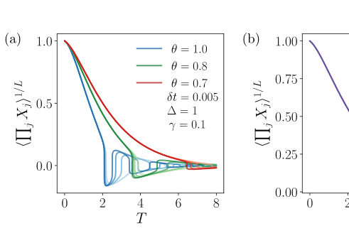 
Figure 3: The expectation value ⟨Q

📷 Fig 4

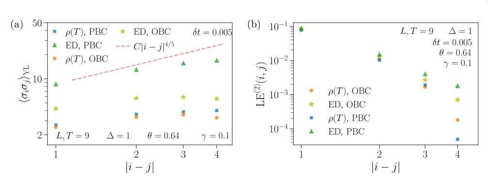 
Figure 4: Two-point correlation functions at the critical point θ = 0.64, γ = 0.1, ∆= 1. In (a), we plot ⟨σiσj⟩YL of the Yang-Lee theory obtained by inserting V = eiπZ/4 at sites (i, j) on an equal-time slice. In red, we plot the ∝|i −j|4/5 scaling predicted by the Yang-Lee conformal field theory. In (b), we plot LE(2)(i, j), also obtained by inserting V at sites (i, j) at time t = T/2 except the bulk dynamics are generated by L, L† for t &lt; T/2, t &gt; T/2, respectively. In both, ρ(T) (squares) indicates the correlator obtained by directly time-evolving ρ(T) under L while ED (triangle, star) indicates the correlator measured in the left/right ground eigenstates of ˆHYL to which ρ(T) is...

**Summary.** This paper shows how to simulate the Yang-Lee critical point, a non-Hermitian physical phenomenon, using the controlled dissipation of an open quantum system. By engineering the Lindbladian evolution, the system's dynamics effectively mimic the non-Hermitian Hamiltonian, allowing for direct measurement of critical correlation functions without relying on post-selection. This establishes a general method for simulating arbitrary non-Hermitian physics on near-term quantum hardware.

**Why it may be interesting.** This work provides a powerful, physically realizable framework for simulating non-Hermitian quantum dynamics, which is crucial for understanding phenomena like exceptional points and non-unitary statistical mechanics, directly applicable to quantum simulation hardware.

Detailed structure

**Main problem.** The paper addresses the challenge of realizing the Yang-Lee critical point, which is governed by a non-Hermitian theory, as a physical process in an open quantum system without resorting to post-selection techniques.

**Main result.** It demonstrates that the Yang-Lee theory can be effectively described by the non-Hermitian generator of the open system's Lindbladian evolution, allowing for the direct measurement of critical correlation functions.

**Method.** The approach involves mapping the classical Yang-Lee model to the time evolution of an open quantum system governed by a Lindbladian superoperator, which is then shown to be equivalent to non-Hermitian Hamiltonian dynamics in a doubled Hilbert space.

**Model / system.** The system is an open quantum system of qubits evolving under a Lindbladian. This dynamics is engineered to mimic the non-Hermitian time evolution associated with the Yang-Lee transfer matrix, which describes the critical point of the Ising model in an imaginary field.

**Key observables.** Spin correlation functions, Loschmidt Echo correlator, and the time-dependence of linear observables transitioning from underdamped to overdamped decay.

**Important parameters / regimes.** Tunable parameters ($	heta, \Delta, \gamma$) controlling the competition between unitary and dissipative dynamics, and the dimensionless field $h = 	heta/\Delta$.

**Assumptions / limitations.** The construction relies on the existence of an extensive number of weak-symmetries of the Lindbladian, and the analysis often involves approximations in the continuous-time limit.

**Figures summary.** Figure 1 provides an overview of the mapping from the Yang-Lee partition function to the non-Hermitian Hamiltonian. Figure S1 illustrates the quantum circuit realizing the nearest-neighbor Kraus operator.

**Paper structure.** The paper first establishes the mapping from the classical Yang-Lee model to the open quantum system dynamics. It then details the mathematical machinery, including the use of the doubled Hilbert space and the Lindbladian evolution. Finally, it analyzes specific observables and demonstrates the connection to the critical point and general non-Hermitian embedding.

Abstract

We show that the $d+0$-dimensional Yang-Lee theory describing classical Ising spins in an imaginary magnetic field can be realized, without post-selection, within a $(d-1)+1$ open quantum system whose dynamics consist of local unitaries and engineered dissipation. Competition between the coherent unitary and dissipative dynamics drives a transition wherein the time-dependence of a particular class of linear observables changes from damped oscillatory "underdamped" to purely exponential "overdamped" decay. Our construction relies on an extensive number of weak-symmetries of the Lindbladian fixed by the choice of observable but is otherwise exact. Consequently, we show that the dynamics are described by the non-Hermitian generator of the Yang-Lee transfer matrix, leading to an effective Yang-Lee theory defined on the spacetime history of the open system. By locally modifying the dynamics, we directly measure spin correlation functions of the Yang-Lee theory as well as a related "Loschmidt Echo" correlator which we detail. We explicitly show that the required dissipation channels can be obtained through local $2$-qubit gates and discuss potential realization on near-term quantum simulator devices. Finally, we generalize our construction to embed arbitrary non-Hermitian Hamiltonians within an open quantum system under Lindbladian time-evolution without post-selection, drawing connections between unconditional open quantum dynamics, exceptional point physics, and non-unitary statistical mechanics.

[↑ back to top](#top)

### [Mass-anisotropy driven stripe pattern formation and directional modulational instability in polariton condensate](http://arxiv.org/abs/2608.25825v1)

**Authors:** Hari Sadhan Ghosh, Soumyadeep Halder, Subrata Das, Sonjoy Majumder  
**Type:** theory · **Category:** quantum gases · **PDF:** <https://arxiv.org/pdf/2608.25825v1>  
**Analysis basis:** full PDF text, analyzed in chunks
**Topic relevance:** 🔥 `driven-dissipative phase transition` **4/5** · `analog quantum simulation` **3/5** · `methods for driven-dissipative` **3/5** · `non-equilibrium universality` **3/5** · `Keldysh / 2PI / non-Gaussian methods` **2/5** · `correlated / nonlocal dissipation` **2/5** · `Tavis-Cummings & cavity-many-emitter` **1/5** · `interference shaping light` **1/5**

📷 Fig 1

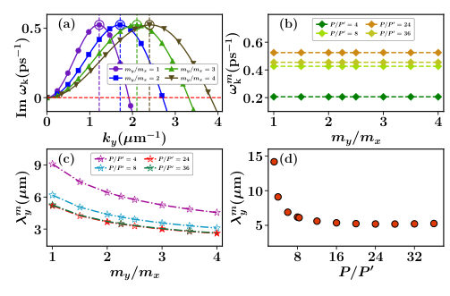 
FIG. 1. (a) Imaginary part of the selected Bogoliubov spec- trum, Im ωk, which has both positive and negative values, at pump power P = 24P ′ with different mass ratio my/mx. The circular markers in (a) mark the analytically calculated point (km y , ωm k ), while the dashed vertical lines indicate the corresponding values extracted numerically from Figs. 2(b1)- 2(b2). (b) Variation of ωm k = Max(Im ωk) with mass ratio at different pump strengths. (c) Variation of the most unsta- ble wavelength λm y with mass ratio my/mx at different pump power P. The filled star markers ( ) denote the most unsta- ble wavelength λm y for mass ratio my/mx = 1, 2, 3, and 4. (d) shows the change in λm y with...

📷 Fig 2

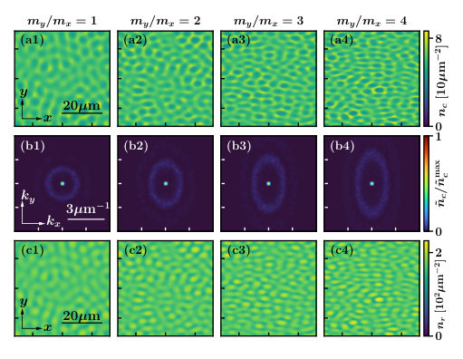 
FIG. 2. Pattern formation due to modulational instabil- ity. The upper panel [(a1)-(a4)] shows the modulated con- densate density nc(r, t) = |ψc(r, t)|2 for different my/mx at t = 20.5 ps, while the middle panel [(b1)-(b4)] shows the corresponding momentum-space density ˜nc(k, t). The lower panel [(c1)-(c4)] shows the reservoir densities nr(r, t) for same values of my/mx. Simulation parameters are the same as in Fig. 1.

📷 Fig 3

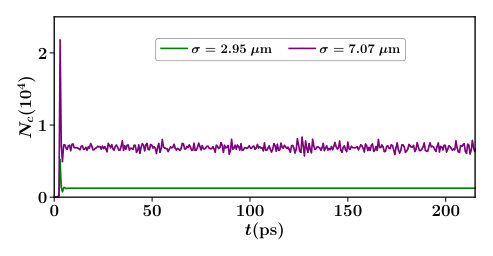 
FIG. 4. Time evolution of the condensate particle number Nc = R dr |ψc(r, t)|2 for beam widths σ = 2.95 µm and σ = 7.07 µm with mass ratio my/mx = 1 .

📷 Fig 4

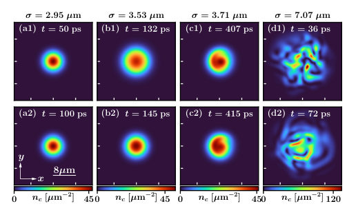 
FIG. 3. Time evolution of non-resonantly pumped polari- ton condensates under Gaussian pumping with different beam widths σ and mass ratio my/mx = 1. (a1) and (a2) show sta- ble Gaussian shaped condensate for beam width σ = 2.95 µm at two different time instants. (b1) and (b2) display a breath- ing Gaussian shaped condensate for beam width σ = 3.53 µm. (c1) and (c2) are self-rotating condensates at two different time instants for beam width σ = 3.71 µm. (d1) and (d2) correspond to a modulationally unstable condensate exhibit- ing pattern formation for beam width σ = 7.07 µm. Other parameters are identical to those used in Fig. 1.

📷 Fig 5

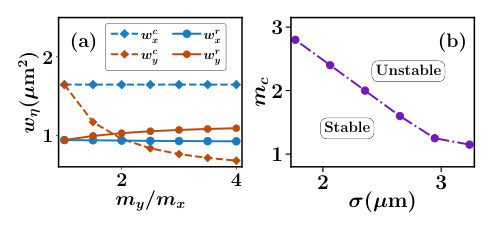 
FIG. 6. (a) Condensate and reservoir mean-square widths wc(r) x and wc(r) y , after the system reaches the stationary state, as a function of mass ratios my/mx for beam width σ = 1.18 µm. (b) Variation of critical mass ratio mc with beam width σ, above which the condensate becomes unsta- ble. Other parameters are the same as in Fig. 1.

**Summary.** This paper explores how tuning the mass anisotropy in polariton condensates controls their pattern formation and stability. By analyzing the system's linear excitations, the authors show that unequal effective masses induce stable, directionally preferred stripe patterns. This establishes mass anisotropy as a powerful control knob for directional instability in these non-equilibrium quantum systems.

**Why it may be interesting.** This work directly addresses non-equilibrium many-body dynamics in an optical cavity setting, providing a clear mechanism (mass anisotropy) to control pattern selection and directional instabilities, which is highly relevant to quantum optics and open quantum systems.

Detailed structure

**Main problem.** The study investigates how mass anisotropy affects modulational instability, pattern formation, and collective dynamics in driven-dissipative polariton condensates.

**Main result.** Mass anisotropy is identified as a key control parameter, inducing stripe patterns along the direction of the greater effective mass, which is a directional effect absent in isotropic systems.

**Method.** The analysis employs linear stability analysis using the Bogoliubov-de Gennes approximation on the open-dissipative Gross-Pitaevskii equation.

**Model / system.** The system is an exciton-polariton condensate, modeled as a driven-dissipative system with an effective mass that can be tuned to exhibit anisotropy.

**Key observables.** Stripe pattern formation, center-of-mass oscillations, most unstable wavelength ($\lambda_m$), and the imaginary part of the Bogoliubov spectrum ($	ext{Im } \omega_k$).

**Important parameters / regimes.** Mass anisotropy ratio ($m_y/m_x$), pump power ($P$), and pump width ($\sigma$).

**Assumptions / limitations.** The analysis relies on a small perturbation approximation around the steady state and uses a mean-field description.

**Figures summary.** Figures illustrate the Bogoliubov spectrum showing instability regions, and time evolution plots demonstrate the formation of anisotropic stripe patterns and oscillations.

**Paper structure.** The paper proceeds by establishing the governing equations and performing linear stability analysis to determine instability criteria, followed by numerical simulations to observe pattern formation and directional dynamics.

Abstract

Motivated by recent experimental advances toward electrical control of the effective mass and the realization of anisotropic mass distributions, we investigate the impact of mass anisotropy on driven-dissipative polariton condensates, focusing on modulational instability, pattern formation, and the collective dynamics of the emergent patterns. We show that unequal effective masses along the two orthogonal directions induce stripe pattern formation in an exciton-polariton condensate pumped by a non-resonant Gaussian laser beam above a critical mass ratio. A Bogoliubov analysis of the homogeneously pumped system reveals that mass anisotropy leaves the modulational-instability criteria unchanged but reshapes the unstable-mode dispersion by reducing the most unstable wave- length along the direction of larger effective mass with increasing mass ratio. This introduces an anisotropy-controlled length scale for pattern selection. When the pump width becomes comparable to the most unstable wavelength, the condensate becomes modulationally unstable and develops stripe patterns along the direction of larger effective mass, accompanied by particle-number fluctua- tions and center-of-mass oscillations along the same direction. As the pump width increases further, the stripes become distorted and develop spatial irregularities during the time evolution, indicative of modulational instability. Nevertheless, the anisotropic mass distribution preserves a pronounced directional preference, in contrast to the fully disordered patterns observed in the isotropic-mass case. Our results identify mass anisotropy as a key control parameter for directional modulational instability and pattern formation in nonequilibrium polariton condensates.

[↑ back to top](#top)

### [Quantum skyrmion parallelism via metasurface-tailored high-dimensional entanglement](http://arxiv.org/abs/2608.25415v1)

**Authors:** Pedro Ornelas, Ramona Bedford, Fazilah Nothlawala, Chi Li, Haoyi Yu, Isaac Nape, Stefan A. Maier, Haoran Ren, Andrew Forbes  
**Type:** experiment · **Category:** quantum information and computing · **PDF:** <https://arxiv.org/pdf/2608.25415v1>  
**Analysis basis:** full PDF text, analyzed in chunks
**Topic relevance:** 🔥 `quantum optics experiment` **4/5** · `QC/QI experiment` **3/5** · `analog quantum simulation` **3/5** · `interference shaping light` **3/5** · `correlated / nonlocal dissipation` **1/5** · `driven-dissipative phase transition` **1/5** · `methods for driven-dissipative` **1/5** · `quantum measurements` **1/5**

📷 Fig 1

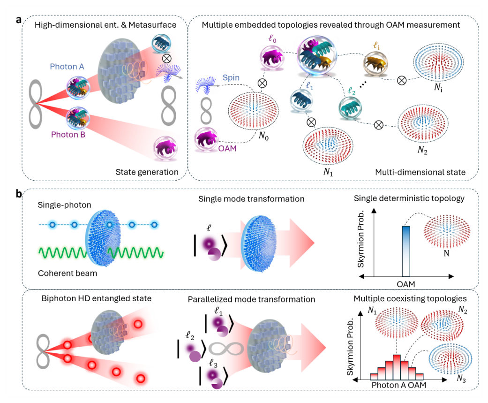 
FIG. 1. Multi-channel quantum topology generated from metasurface and high-dimensional entangled OAM state. a By interfacing high-dimensional biphoton entanglement with a metasurface, multi-dimensional states are generated with several embedded topologies, derived from the joint correlations of the polarization of photon A and OAM of photon B, and only revealed through OAM measurements on photon A. b Single photons and coherent beams incident on a metasurface yield single mode transformations with a single deterministic topological structure. In contrast, biphoton high-dimensional (HD) entangled states incident on a metasurface allows for multiple mode transformations occurring in parallel,...

📷 Fig 2

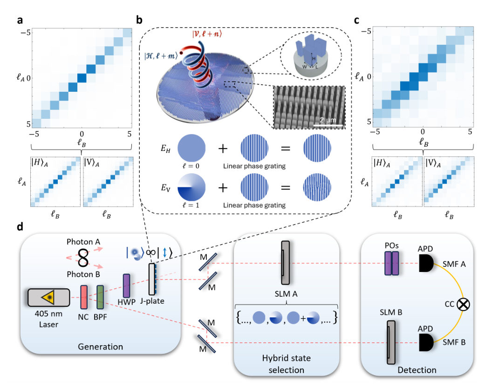 
FIG. 2. Metasurface design and characterization. a, OAM spiral bandwidth depicting the nature of the high-dimensional state correlations produced directly after the SPDC process (after having passed through the half-wave plate (HWP)). b, Schematic of the metasurface generating spatially overlapped beams with independent phase control in decoupled polarization channels. Insets show the unit-cell geometry, consisting of amorphous silicon (a-Si) cuboid nanopillars. The lower panel illustrates the azimuthal OAM phase profiles with an additional linear phase gradient encoded for both channels. c, Shifted OAM spiral bandwidth measured after passing the OAM-OAM entangled state through the J-plate...

📷 Fig 3

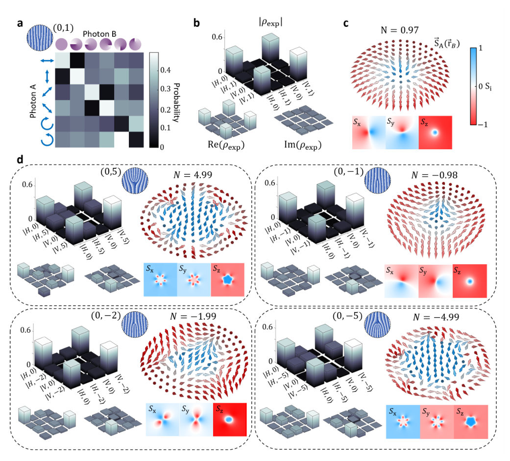 
FIG. 3. Various Metasurface assisted topologies. a, Measured quantum state tomography and b, reconstructed absolute, real and imaginary components of the density matrix for the state, |H⟩A|0⟩B + |V ⟩A|1⟩B, along with its c, quantum Stokes parameters, {Sx, Sy, Sz}, and quantum Stokes vector ⃗S(⃗rB)A created using the metasurface with (m, n) = (0, 1). d, corre- sponding density matrix components, quantum Stokes components and Quantum Stokes vector field for states produced using metasurfaces with (m, n) = (0, 5), (0, −1), (0, −2) and (0, −5).

📷 Fig 4

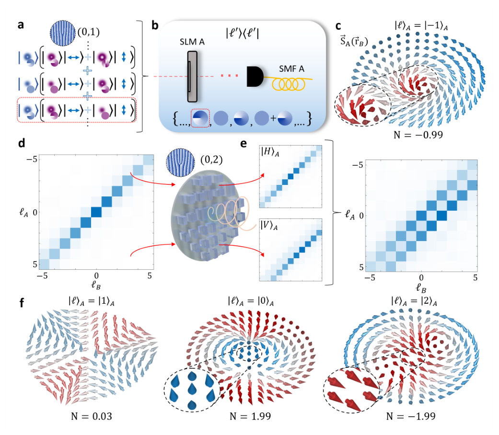 
FIG. 4. Multi-Skyrmion state. a Example of multi-dimensional hybrid entangled state after passing high-dimensional OAM-OAM entangled state through J-plate metasurface with (m, n) = (0, 1). b, Projection of a particular hybrid state is done by displaying the conjugate OAM of photon A on SLM A and passing that photon through a SMF. For example, selection of the c OAM state |−1⟩A, collapses the system to a hybrid state possessing a flipped polarity and Skyrmion number when compared to the selection of |0⟩A. d, OAM spiral bandwidth of initial high-dimensional state. e, OAM spiral bandwidth of multi-dimensional state showing horizontal, |H⟩A, and vertical, |V ⟩A, polarized components that...

📷 Fig 5

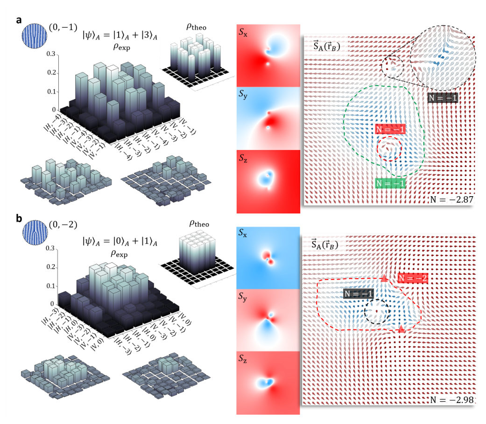 
FIG. 5. Complex hybrid states possessing topological structures. Measured density matrices, quantum Stokes compo- nents and Stokes vector fields for hybrid states generated by projecting onto superposition OAM states, a |ℓ⟩A = |1⟩A + |3⟩A and b, |ℓ⟩A = |0⟩A + |1⟩A for states generated by metasurfaces with (m, n) = (0, −1) and (m, n) = (0, −2), respectively. Topological features are highlighted by different coloured regions with highlighted topological numbers representing empirical numbers associated with each ”local” topological feature. Calculated topological number of the full field is given in the inset at the bottom right of each vector field.

**Summary.** This paper presents a novel method to generate multiple, distinct quantum skyrmion topologies simultaneously from a single metasurface device. By coupling high-dimensional photonic entanglement (OAM-OAM pairs) to a structured metasurface, the authors overcome the limitation of single-topology generation. This establishes a new, compact pathway for engineering complex quantum states for quantum information applications.

**Why it may be interesting.** This work directly addresses the generation and control of complex topological quantum states using structured light and engineered matter, which is highly relevant to quantum optics and photonic quantum information processing.

Detailed structure

**Main problem.** Existing methods for generating quantum skyrmions are limited to producing pre-determined two-dimensional qubit states with a single topology.

**Main result.** The authors demonstrated the compact generation of multiple, distinct topological quantum states from a single metasurface device by interfacing it with high-dimensional photonic entanglement.

**Method.** The approach uses a metasurface to induce a non-local, probabilistic topological transformation on a high-dimensional OAM-OAM entangled photonic state.

**Model / system.** The system utilizes quantum skyrmions realized in optical platforms, specifically employing biphoton entanglement generated via SPDC and interacting with a metasurface (J-plate) designed with amorphous silicon nanopillars.

**Key observables.** Topological winding number (N), Concurrence (C), Purity ($\gamma$), and Fidelity (F) are used to characterize the generated states and their entanglement.

**Important parameters / regimes.** The topological control is achieved by varying parameters $(m, n)$ related to the metasurface transformation, yielding multiple distinct topological classes.

**Assumptions / limitations.** The analysis relies on the ability to characterize the joint state correlation structure and the assumption that the metasurface interaction can be modeled to induce controlled topological shifts.

**Figures summary.** Figures compare the proposed scheme (biphoton HD entanglement $
ightarrow$ multiple topologies) against single-photon methods, and show the metasurface design and resulting shifted OAM spiral bandwidth.

**Paper structure.** The paper progresses from identifying the limitation of single-topology generation to proposing the metasurface-entanglement interface, detailing the physical implementation using OAM-OAM entangled pairs, and finally quantifying the resulting multi-topological states using various quantum metrics.

Abstract

Quantum skyrmions are topological structures that have garnered significant interest due to their demonstrated robustness and versatility across diverse optical platforms. However, existing approaches for their generation are limited to producing pre-determined two dimensional qubit states with a single topology. Here we create multi-dimensional topological states by introducing a non-local interaction between high-dimensional photonic entanglement and a metasurface, where the topological transformation induced by the metasurface is made non-deterministic by the probabilistic nature of the interfacing entangled state. Within this framework, we demonstrate that individual quantum states can host multiple co-existing topologies that are only revealed upon measurement, allowing for their parallel transport within distinct spatial mode channels. We confirm this by revealing the rich topological landscape within our modified Hilbert space while controlling the desired output topology by orbital angular momentum (OAM) projections on one of the entangled photons, producing multiple non-local polarization-OAM entangled states characterized by distinct topological classes, all from a single metasurface device. Our results reveal new capability when structured high-dimensional entanglement is interfaced with structured matter capable of coupling photonic degrees of freedom, establishing a new pathway for the compact generation of complex quantum states.

[↑ back to top](#top)

### [Finite relaxation protocols with minimal dissipation](http://arxiv.org/abs/2608.25207v1)

**Authors:** Ben Ansbacher, Harrison Hartle, Abhishek Yadav, Jan Korbel, David H. Wolpert  
**Type:** theory · **Category:** statistical mechanics · **PDF:** <https://arxiv.org/pdf/2608.25207v1>  
**Analysis basis:** full PDF text, analyzed in chunks
**Topic relevance:** 🔥 `non-equilibrium universality` **4/5** · `driven-dissipative phase transition` **3/5** · `Keldysh / 2PI / non-Gaussian methods` **2/5** · `correlated / nonlocal dissipation` **2/5** · `methods for driven-dissipative` **2/5** · `quantum measurements` **2/5** · `analog quantum simulation` **1/5**

📷 Fig 1

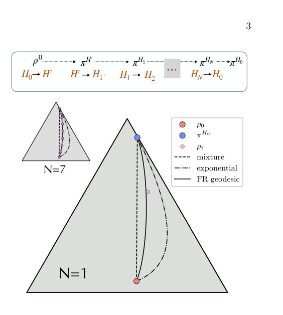 
FIG. 1. Top: Schematic of quench and relax protocol us- ing finite many Hamiltonians. Bottom: Plot on 2-simplex of the optimal intermediary ρi (magenta) given by (5). The ini- tial distribution is ρ0 and the final distribution is πβ. ρi is relatively close to the the Fisher-Rao geodesic, but not ex- actly on it. Moreover, ρi does not fall on the linear mixture interpolation (1−t)ρ0(x)+tπβ(x) or the exponential interpo- lation ρ0(x)t(πβ(x))1−t/Z(t) [23]. Inset: Optimal intermedi- aries for N = 7. The optimal intermediary distributions ρi for i = 1, ..., 7 satisfy (5). We can see the optimal intermediary distributions converge to the FR geodesic for large N.

📷 Fig 2

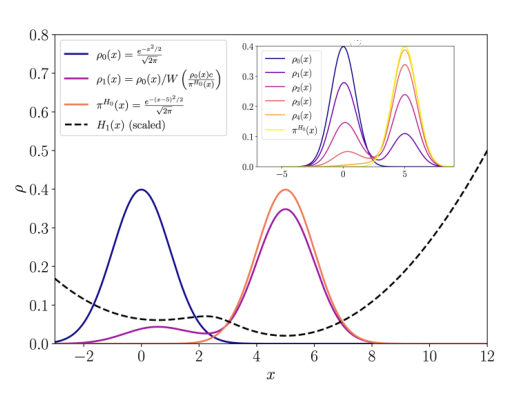 
FIG. 3. Optimal intermediary ρ(x) for N = 1 with quadratic Hamiltonians at β = 1, for initial and final distributions ρ0(x) = e−1

📷 Fig 3

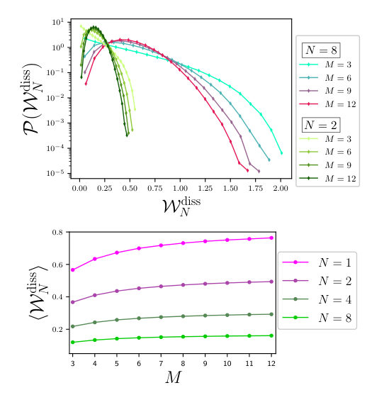 
FIG. 2. Minimal dissipated work Wdiss N (Eq. (7)) from 9×105

📷 Fig 4

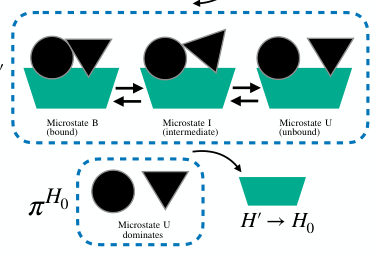 
FIG. 4. Schemtic of an enzyme-catalyzed reaction as modeled in Sec. IV B. Before the enzyme arrives, the substrate is in a meta-stable distribution, ρ0, dominated by the microstate B (bound) representing the substrate before reaction. The enzyme arrives and attaches by van der Waals forces, corre- sponding to an effective quench H0 →H′. In the presence of the enzyme, the system relaxes to the equilibrium associated with H′. The enzyme eventually disconnects due to ther- mal fluctuations, corresponding to a second effective quench, H′ →H0. The system finally relaxes to the equilibrium of the original Hamiltonian, πH0, which is dominated by microstate U (unbound).

📷 Fig 5

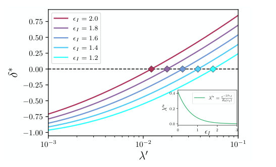 
FIG. 5. Optimal change in barrier height ϵI →ϵI −δ as a function of the weight towards time-minimization λ′ in the composite cost function C(δ) at β = 1, ϵB = 1, ϵU = 0. For λ′ &gt; λ′∗, the solution δ∗is positive; diamonds display (λ′, δ) = (λ′∗, 0) at each value of ϵI considered. Inset: decay of λ′∗as a function of barrier height ϵI; for larger initial barriers, less weight towards time-minimization is required to achieve barrier-lowering.

**Summary.** This work develops a theory for minimizing energy dissipation when extracting work from non-equilibrium systems using a finite sequence of controlled quenches. By relating the optimal protocols to the Fisher-Rao geodesic, the authors establish quantitative lower bounds on the maximum extractable work. The framework is successfully applied to model complex physical processes, including optical trapping and enzyme kinetics.

**Why it may be interesting.** It provides rigorous, quantitative bounds on non-equilibrium work extraction, connecting fundamental thermodynamic concepts (dissipation) to geometric measures (Fisher-Rao distance) in a discrete, step-wise manner.

Detailed structure

**Main problem.** The paper determines the optimal sequence of intermediary Hamiltonians for work extraction from non-equilibrium systems when restricted to a finite number of quench-relax steps, aiming to minimize dissipated work.

**Main result.** The minimal dissipated work scales asymptotically as the square of the Fisher-Rao distance divided by $2eta N$, and a lower bound on extracted work is derived based on this distance.

**Method.** The problem is formulated as minimizing a sum of Kullback-Leibler divergences over a sequence of quenches, leading to optimal intermediaries defined by a recurrence relation involving the Lambert W function.

**Model / system.** The analysis covers general non-equilibrium systems, extending to specific models like optical traps (1D Gaussian distributions) and enzyme-catalyzed reactions (3-state Markov chains).

**Key observables.** Dissipated work ($W_{	ext{diss}}$), extracted work ($W_{	ext{ext}}$), and the Fisher-Rao distance ($d_{	ext{FR}}$).

**Important parameters / regimes.** The number of steps ($N$), inverse temperature ($eta$), and the coupling/rate parameters ($\delta, \epsilon$) in the applied models.

**Assumptions / limitations.** The primary assumption is the restriction to a finite number ($N$) of quench-relax steps, and in applications, assumptions about timescales (e.g., separation of timescales in catalysis) are made.

**Figures summary.** Figures illustrate optimal intermediary distributions (sometimes bimodal) compared to geodesics, show the scaling of mean dissipated work with $N$, and schematically depict the enzyme-catalyzed reaction process.

**Paper structure.** The paper builds from the general theory of finite relaxation protocols minimizing KL divergence sums, deriving the optimal intermediary form using the Lambert W function, and then applying this framework to concrete examples like optical traps and enzyme catalysis.

Abstract

Work extraction from nonequilibrium systems is a major challenge across biological, chemical, physical, and engineering systems. Idealized protocols generally require a quasistatic relaxation stage in which the Hamiltonian is gradually adjusted through a continuum of intermediaries. Here, we consider protocols restricted to a finite number $N$ of intermediary Hamiltonians, consisting of a sequence of quench-relax steps. We determine the sequence of quenches that minimizes the dissipated work, which can be expressed in terms of a recurrence involving the Lambert function. The optimal sequence converges to the Fisher-Rao geodesic, saturating known leading-order dissipation bounds at large $N$. We obtain lower bounds on work extraction from a nonequilibrium distribution as a function of its Fisher-Rao distance to equilibrium. We extend and apply the framework in two simple models: (i) an optical trap experiment, showing that the optimal intermediary distribution can be bimodal even for unimodal initial and final distributions, and (ii) an enzyme-catalyzed reaction, showing that that accounting for relaxation time in addition to dissipation can favor barrier-lowering.

[↑ back to top](#top)

### [Quantum motility-induced phase separation](http://arxiv.org/abs/2608.25649v1)

**Authors:** Laurin Brunner, Ricard Alert, Reyhaneh Khasseh, Markus Heyl  
**Type:** theory · **Category:** statistical mechanics · **PDF:** <https://arxiv.org/pdf/2608.25649v1>  
**Analysis basis:** full PDF text, analyzed in chunks
**Topic relevance:** 🔥 `methods for driven-dissipative` **4/5** · `driven-dissipative phase transition` **3/5** · `non-equilibrium universality` **3/5** · `Keldysh / 2PI / non-Gaussian methods` **2/5** · `analog quantum simulation` **1/5** · `correlated / nonlocal dissipation` **1/5** · `quantum measurements` **1/5**

📷 Fig 1

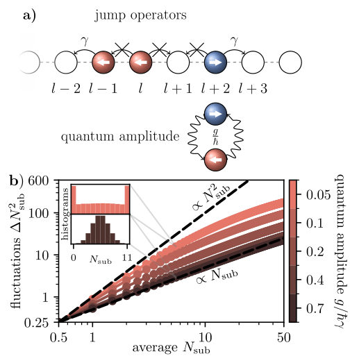 
FIG. 1. a) Schematic of dynamic processes in the minimal model. Particles jump only in the direction of their inter- nal spin (no left jumps for →particles, and vice versa) and only if the target site is empty. The jump from l to l −1 is blocked since l −1 is occupied. b) Giant number fluctuations for different subsystem sizes. Total system size L = 1000, Ntraj = 5 · 104 independent trajectories, one spatial configu- ration sampled per trajectory. Insets show histograms of Nsub for Lsub = 11. The exponent for g/ℏγ = 0.05 is β ≈1.7.

📷 Fig 2

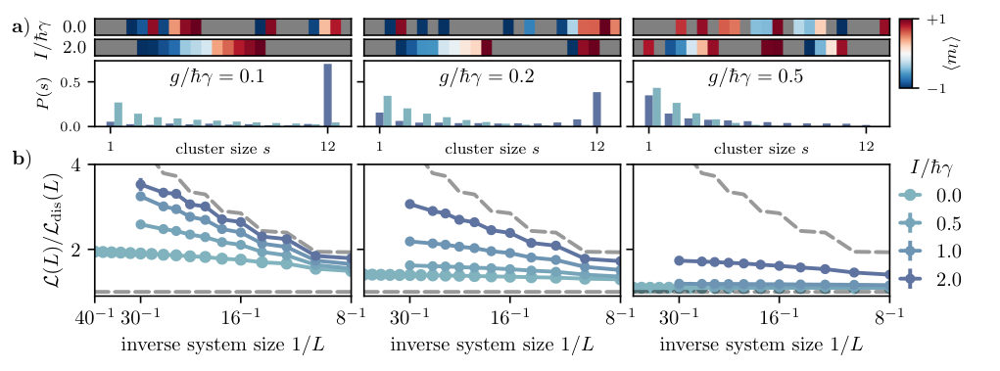 
FIG. 2. a) State of a representative trajectory of the steady-state for the minimal model (top) and the extended model with I/ℏγ = 2 (bottom), both for system size L = 24. The colors indicate the local spin magnetization ⟨ml⟩= ⟨nl←−nl→⟩, where the expectation value is taken over the trajectory’s spin degree of freedom. Below are histograms of cluster sizes s, defined as the number of consecutive occupied sites. The colors correspond to the interaction strength in b) for I/ℏγ = 0.0, 2.0. At g/ℏγ = 0.1, the extended model exhibits a single large cluster, while the minimal model still shows multiple smaller clusters. For larger quantum amplitudes the cluster size distribution of both models...

📷 Fig 3

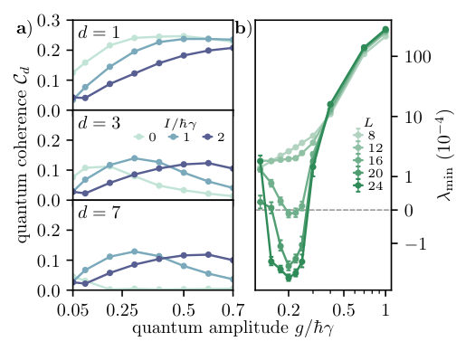 
FIG. 3. a) Quantum coherence Cd for L = 20 as a function of quantum amplitude g/ℏγ for subsystem distances d = 1, 3, 7 (vertical panels) and interaction strengths I/ℏγ = 0, 1, 2 (curves, light to dark). For the minimal model, the coherence for weak quantum amplitudes remains finite even at large distances d, whereas it decays rapidly for strong quantum amplitudes. For the extended model, the coherence gener- ally remains finite even at large distances for a broad range of quantum amplitudes, although slightly suppressed when com- pared to the minimal model. b) Smallest eigenvalue λmin of the partial transpose of the nearest-neighbor reduced density matrix for I/ℏγ = 2. Computed from Ntraj =...

📷 Fig 4

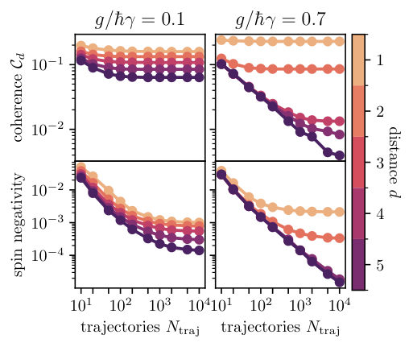 
FIG. 4. Top row: Convergence of quantum coherence (6) of the reduced density matrix ρd for L = 20 at I = 0. Bot- tom row: Convergence of spin negativity. For larger quantum amplitudes g/ℏγ and distances d convergence cannot yet be observed for the Ntraj = 104 trajectories. In this case, we use the value at Ntraj = 104 as an upper bound estimate for the quantum coherence.

**Summary.** This paper theoretically investigates quantum Motility-Induced Phase Separation (MIPS) in a model of active hard-core bosons. By incorporating nearest-neighbor repulsive interactions, the authors show that the system can achieve genuine phase separation while simultaneously maintaining long-distance quantum coherence. This establishes quantum MIPS as a novel, non-equilibrium quantum state driven by the interplay between activity and quantum mechanics.

**Why it may be interesting.** This work directly tackles the intersection of non-equilibrium statistical mechanics (active matter) and quantum physics, providing a theoretical framework for understanding how quantum coherence can stabilize novel, non-classical steady states.

Detailed structure

**Main problem.** The paper investigates the existence and nature of quantum Motility-Induced Phase Separation (MIPS), specifically addressing how quantum coherence interacts with dissipative self-propulsion in active matter.

**Main result.** The authors provide evidence that quantum MIPS can occur in a model of active hard-core bosons, establishing it as a genuinely non-equilibrium quantum state distinct from classical MIPS.

**Method.** The study employs theoretical modeling using a Lindblad master equation and numerical simulations, including the Monte Carlo Wave-Function (MCWF) method, to track quantum dynamics.

**Model / system.** The system is a one-dimensional chain of hard-core bosons with an internal spin degree of freedom, evolving under a combination of coherent Hamiltonian dynamics (tumble) and dissipative jumps (directed hopping/run).

**Key observables.** Superlinear number fluctuations ($\Delta N^2_{	ext{sub}} \propto N^2_{	ext{sub}}$), characteristic length scale ($L$) derived from the structure factor, quantum coherence ($C_d$), and spatial entanglement (Negativity).

**Important parameters / regimes.** The ratio of coupling strengths ($g/\hbar\gamma$) and the strength of nearest-neighbor repulsive interactions ($I$).

**Assumptions / limitations.** The analysis relies on the MCWF method and assumes that the breakdown of factorization in the extended model is necessary to stabilize macroscopic phase separation.

**Figures summary.** Figures illustrate superlinear number fluctuations, the growth of the characteristic length scale $L$ upon adding repulsion, and the convergence of quantum coherence and spin negativity in the steady state.

**Paper structure.** The paper progresses by first analyzing a minimal model showing microphase separation, then extending the model with nearest-neighbor repulsion to achieve genuine phase separation, and finally confirming the quantum nature by demonstrating persistent long-distance quantum coherence and entanglement in the clustered steady states.

Abstract

Motility-induced phase separation (MIPS) describes a central clustering phenomenon in active matter systems where particles spontaneously separate into dense and dilute phases even in the absence of interparticle attractive forces. Recent theoretical and experimental efforts have taken the first steps to extend active matter concepts to the quantum level. However, whether a genuine quantum analog of MIPS exists and how quantum coherence would compete or cooperate with the dissipative self-propulsion has remained open so far. Here, we provide evidence that quantum MIPS can occur in a model of active hard-core bosons in one dimension. Our model yields superlinear number fluctuations characteristic of MIPS, leading to microphase separation with large but finite cluster size. Adding nearest-neighbor repulsive interactions, we find numerical evidence for restoring genuine phase separation with a divergent correlation length. Crucially, the clustered steady states maintain a long-distance quantum coherence, revealing a genuinely quantum feature with no classical counterpart. These results provide a foundation for exploring quantum MIPS and suggest that the coherence-activity interplay can generate new types of nonequilibrium quantum states.

[↑ back to top](#top)

### [The Geometric Phase as a Diagnostic for Driven-Dissipative Oscillators](http://arxiv.org/abs/2608.25742v1)

**Authors:** Zeen Sun, Yuan Shen, Haitao Ding, Yuancheng Zhan, Leong-Chuan Kwek  
**Type:** theory · **Category:** other · **PDF:** <https://arxiv.org/pdf/2608.25742v1>  
**Analysis basis:** full PDF text, analyzed in chunks
**Topic relevance:** 🔥 `driven-dissipative phase transition` **4/5** · `methods for driven-dissipative` **3/5** · `non-equilibrium universality` **3/5** · `Keldysh / 2PI / non-Gaussian methods` **2/5** · `Tavis-Cummings & cavity-many-emitter` **1/5** · `correlated / nonlocal dissipation` **1/5** · `quantum measurements` **1/5**

📷 Fig 1

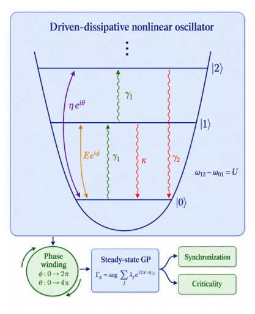 
FIG. 1. Schematic of the driven-dissipative nonlinear oscil- lator (1) and phase-winding protocol used to generate the steady-state GP, which probes synchronization and critical- ity.

📷 Fig 2

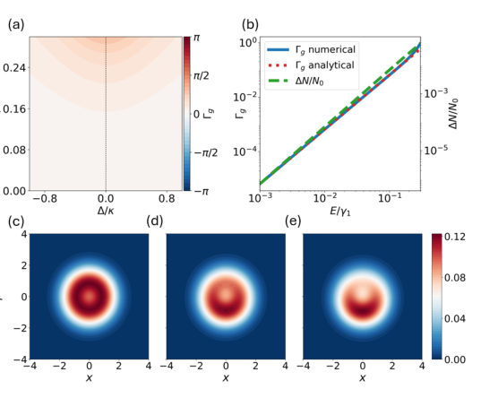 
FIG. 2. Perturbative GP response. γ2/γ1 = 3 and κ/γ1 = 0.1 (a) Arnold tongue in this quantum regime. (b) The GP re- sponse at zero detuning. Blue solid line indicates the numer- ical GP, while the orange dotted line is obtained by pertur- bation. The green dashed line indicates the relative change in the limit-cycle amplitude as the drive strength increases. (c)-(e) The Wigner functions at E/γ1 = 0, 0.1, and 0.2, re- spectively.

📷 Fig 3

 
Fig. 2(a) shows that the GP forms an Arnold-tongue- like response in the detuning–drive plane, reflecting the resonantly enhanced phase-locking response of the limit cycle, similar to the phase coherence. To check that the system remains in the perturbative regime, we monitor the relative amplitude deformation, ∆N/N0 = (⟨a†a⟩E − ⟨a†a⟩0)/⟨a†a⟩0, where N0 = ⟨a†a⟩0. For the weak drives considered, ∆N/N0 remains small, so the drive mainly locks the phase rather than deforming the limit cycle. In the quantum regime γ1 ≤γ2, the numerical GP follows the predicted quadratic scaling for E/γ1 ≲0.2, as shown in Fig. 2(b), with ∆N/N0 ≃0.02. The quadratic behavior is valid in the strongly damped system...

📷 Fig 4

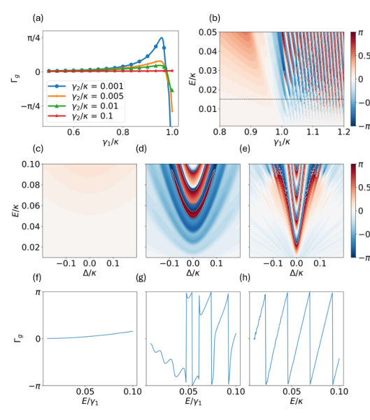 
FIG. 3. (a) GP for different values of γ2/κ at the same drive strength E/κ = 0.015. Smaller nonlinear damping produces a sharper change in the GP near the critical point. (b) GP diagram at γ2/κ = 0.005 and ∆= 0. The black dotted line denotes the orange curve from (a). (c)-(e) GP as a function of E/κ and ∆/κ at fixed γ1/κ = 0.6, 1, 1.4, respectively. (f) - (h) Zero-detuning cross sections for γ1/κ = 0.6, 1, 1.4

📷 Fig 5

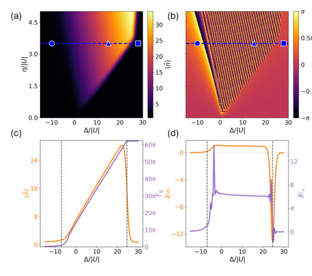 
FIG. 4. Geometric response of the squeezing-driven Kerr res- onator for U &lt; 0 and γ1 = γ2 = κ = 0.1|U|. (a) Steady-state photon number ⟨ˆn⟩as a function of the rescaled squeezing strength η/|U| and detuning x = ∆/|U|. The dotted line marks the cut at η/|U| = 3.5. The circle, triangle, and square indicate representative low-detuning vacuum-like, bright, and high-detuning vacuum-like states, respectively. (b) GP for the same parameters. (c) Cross sections of ⟨ˆn⟩and Γg/π at η/|U| = 3.5. The GP is unwrapped only as a visual guide. The vertical dashed lines mark the independently iden- tified second- and first-order boundaries. (d) Local responses χ⟨n⟩= ∂x⟨ˆn⟩and χΓg = ∂xΓg. The left and right...

**Summary.** This work introduces the geometric phase as a universal diagnostic tool for understanding steady-state reorganization in driven-dissipative quantum oscillators. By analyzing the phase winding protocol, the authors show that the GP captures critical phenomena like phase locking and dissipative phase transitions. This method is highly valuable because it probes the entire eigensystem structure, offering a more comprehensive view than traditional observables.

**Why it may be interesting.** It provides a powerful, unified geometric tool to diagnose complex non-equilibrium dynamics in open quantum systems, moving beyond simple mean-field observables to probe the underlying structure of the steady-state eigensystem.

Detailed structure

**Main problem.** The paper aims to find a unified geometric diagnostic to characterize steady-state reorganization in driven-dissipative quantum oscillators, linking phase locking and dissipative phase transitions.

**Main result.** The geometric phase (GP) provides a unified, experimentally accessible diagnostic that captures the reorganization of the steady-state eigensystem across different critical regimes.

**Method.** The analysis utilizes the kinematic geometric phase approach, particularly by winding the drive phase to generate a closed loop of non-equilibrium steady states, reducing the GP to an eigensystem functional.

**Model / system.** The study models driven-dissipative bosonic systems, including the Quantum Stuart-Landau (QSL) oscillator and the two-photon-driven Kerr resonator, governed by a master equation.

**Key observables.** Geometric Phase ($\Gamma_g$), Phase Coherence ($S_q$), and the local geometric response ($\chi_{\Gamma_g}$), which is decomposed into eigenvalue ($\chi_\lambda$) and eigenvector ($\chi_n$) contributions.

**Important parameters / regimes.** Drive strengths ($E, \eta$), damping rates ($\gamma_1, \gamma_2, \kappa$), and the proximity to critical points like the Hopf threshold.

**Assumptions / limitations.** The analysis relies on perturbative expansions in the weak-drive limit, and for measurement, it employs mixed-state interferometry (Ramsey sequence) to bypass full density matrix reconstruction.

**Figures summary.** Figures illustrate the perturbative GP response showing Arnold-tongue behavior, the GP near the Hopf threshold showing nonperturbative reorganization, and the decomposition of the GP response across first and second-order transitions in the Kerr resonator.

**Paper structure.** The paper progresses from defining the general geometric phase for nonunitary evolution, applying it to the QSL oscillator to show its connection to phase locking, and finally analyzing the Kerr resonator to decompose the response into eigenvalue and eigenvector contributions near phase transitions.

Abstract

Driven-dissipative quantum oscillators lock their phase, deform their limit cycles, and undergo dissipative phase transitions, yet these behaviors are read from unrelated quantities defined on the same steady-state density matrix. We show that a single geometric quantity organizes them. Winding the phase of the drive generates a closed loop of nonequilibrium steady states, and because the Liouvillian is covariant under number rotations, the kinematic mixed-state geometric phase of this loop reduces exactly to an eigensystem functional of a single steady state. Under weak driving, it is governed by the same nearest-neighbor coherences that produce phase locking and inherits the Arnold tongue of synchronization. Near the Hopf threshold, it registers the nonperturbative reorganization of the steady-state eigenvectors. And in the squeezing-driven Kerr resonator, it develops distinct signatures at the first and second order dissipative phase transitions. The geometric phase thus provides a unified and experimentally accessible characterization of steady-state reorganization.

[↑ back to top](#top)

### [A heterogeneously integrated coupled-cavity frequency beam splitter](http://arxiv.org/abs/2608.26028v1)

**Authors:** Lucas M. Cohen, Manuel H. Muñoz-Arias, Mohan Sarovar, Nicholas A. Boynton, Shawn C. Arterburn, Thomas A. Friedmann, Nils T. Otterstrom, Paul S. Davids, Michael Gehl  
**Type:** experiment · **Category:** quantum information and computing · **PDF:** <https://arxiv.org/pdf/2608.26028v1>  
**Analysis basis:** full PDF text, analyzed in chunks
**Topic relevance:** 🔥 `QC/QI experiment` **4/5** · `interference shaping light` **3/5** · `quantum optics experiment` **3/5** · `analog quantum simulation` **1/5** · `driven-dissipative phase transition` **1/5**

📷 Fig 1

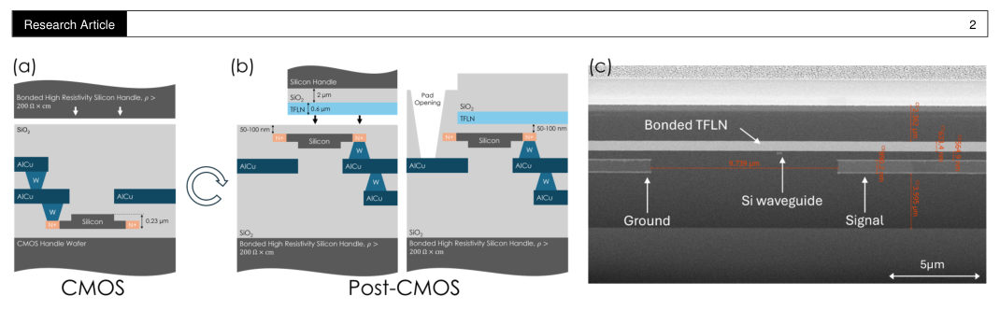 
Fig. 1. Heterogeneous Si/TFLN platform fabrication. (a) Process flow performed in the CMOS foundry. (b) Post-foundry HI and microfabrication process. (c) SEM cross-section image of the fully processed platform.

📷 Fig 2

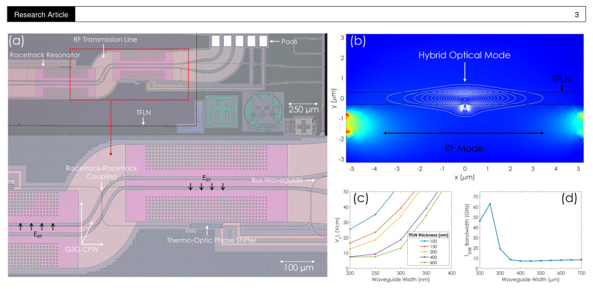 
Fig. 2. CCM device design. (a) Optical microscope image of the CCM modulator. (b) Simulated overlay of the Ex component of the optical and RF fields in the EO modulation region. (c) Simulated single-arm VπL as a function of TFLN slab thickness and silicon waveguide width. (d) Estimated RF 3 dB bandwidth for a 250 nm-wide silicon waveguide with 600 nm-thick TFLN layer.

📷 Fig 3

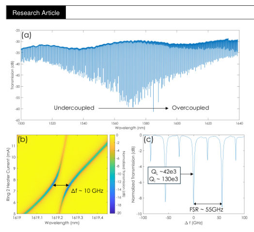 
Fig. 3. Passive optical characterization of the CCM. (a) Broad- band transmission spectrum of the untuned device. (b) Ther- mally tuned avoided mode crossing near 1620 nm center wave- length, showing a supermode splitting ∼10 GHz. (c) Zoomed- in transmissions spectrum with resonators in the CCM de- tuned, used to extract quality factors.

📷 Fig 4

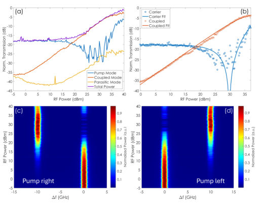 
Fig. 4. RF-driven conversion in the Si/TFLN CCM. (a) Mea- sured conversion efficiency versus RF drive power while pumping the high-frequency supermode. (b) Measured data and fit conversion efficiencies. c,d) Conversion efficiency spec- trogram while pumping the high- (c) and low- (d) frequency optical supermode.

📷 Fig 5

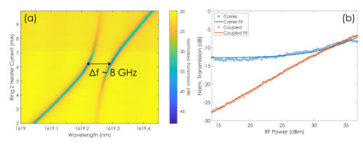 
Fig. 5. Material flexibility demonstration using bonded TFLT. (a) Avoided mode crossing for the CCM with bonded TFLT. (b) Measured and fitted RF conversion efficiencies.

**Summary.** This paper reports the successful demonstration of a heterogeneously integrated coupled-cavity modulator using thin-film lithium niobate on a silicon platform. The device achieves tunable frequency-mode transformations, such as 50/50 beam splitting, essential for building integrated quantum photonic circuits. This work showcases a scalable, foundry-compatible approach for quantum information processing hardware.

**Why it may be interesting.** This work provides a highly practical, integrated platform for quantum light manipulation, directly addressing hardware bottlenecks in scalable quantum communication and computation.

Detailed structure

**Main problem.** The paper addresses the need for efficient components to coherently mix frequency modes for frequency-encoded photonic qubits, which is crucial for scalable high-dimensional quantum information processing.

**Main result.** They demonstrated a heterogeneously integrated coupled-cavity modulator capable of tunable bidirectional frequency-mode transformations, including 50/50 beam splitting and near-complete frequency swapping.

**Method.** The experiment involves fabricating and characterizing a coupled-cavity modulator by bonding thin-film lithium niobate onto a silicon photonics platform and driving it with both optical and microwave signals.

**Model / system.** The system is a coupled-cavity modulator built on a silicon photonics platform using thin-film lithium niobate. It functions by coupling hybridized optical supermodes using a microwave drive, allowing for controlled frequency transformations.

**Key observables.** Transmission spectra, power extinction ratios (e.g., >20 dB pump extinction), and the realization of specific beam-splitting ratios (e.g., 50/50).

**Important parameters / regimes.** Supermode splitting (10 GHz), coupling rates ($\kappa_e, \kappa_i$), and the electro-optic modulation strength ($V_\pi L$).

**Assumptions / limitations.** The approach assumes compatibility with foundry-fabricated silicon photonics platforms and the ability to bond high-quality electro-optic films like TFLN.

**Figures summary.** Figures illustrate the heterogeneous Si/TFLN platform fabrication process flow, and subsequent figures show characterization results like avoided mode crossings and frequency conversion spectra.

**Paper structure.** The paper details the physical system design, presents the fabrication process flow, and then reports experimental characterization results showing the device's ability to perform frequency beam splitting and shifting.

Abstract

Frequency encoded photonic qubits promise a scalable path towards high-dimensional quantum information processing, but require efficient components for coherently mixing frequency modes. Coupled cavity modulators provide this functionality by using only a single driving microwave tone to couple hybridized optical supermodes. Here, we demonstrate a heterogeneously integrated thin-film lithium-niobate-on-silicon coupled-cavity modulator that realizes tunable bidirectional frequency mode transformations, including \(50/50\) beam splitting and near complete frequency swapping with \(>20~\mathrm{dB}\) pump extinction at a \(10~\mathrm{GHz}\) supermode splitting. Because the electro-optic film is bonded onto a foundry fabricated silicon photonics platform, the approach is compatible with co-integration of photon pair sources, spectral filters, active tuning elements, and single photon detectors. We also bond thin-film lithium tantalate onto the same coupled-cavity platform, demonstrating material flexibility for scalable integrated frequency bin quantum photonic circuits.

[↑ back to top](#top)

### [Directed walks shape a universal square-root law of entropy production rate in nonreciprocal systems](http://arxiv.org/abs/2608.25030v1)

**Authors:** Thiparat Chotibut, Ewa Gudowska-Nowak, Maciej A. Nowak  
**Type:** theory · **Category:** statistical mechanics · **PDF:** <https://arxiv.org/pdf/2608.25030v1>  
**Analysis basis:** full PDF text, analyzed in chunks
**Topic relevance:** 🔥 `non-equilibrium universality` **4/5** · `correlated / nonlocal dissipation` **2/5** · `driven-dissipative phase transition` **2/5** · `Keldysh / 2PI / non-Gaussian methods` **1/5** · `analog quantum simulation` **1/5** · `methods for driven-dissipative` **1/5**

📷 Fig 1

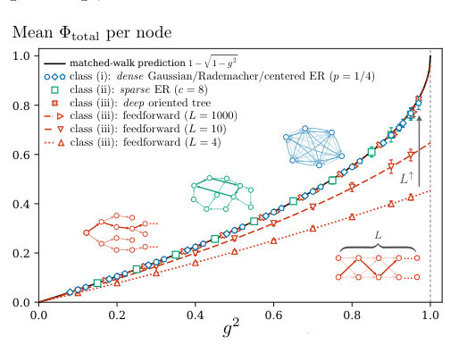 
FIG. 1. The matched-walk prediction and the square- root law. Numerical ensemble mean EPR per node (symbols) for acyclic networks and large-N contractive recurrent ensem- bles agree with the analytic predictions shown in curves. The finite-depth feedforward curves follow Eq. (21) and converge to the square-root law ϕ∗(g) as L →∞. The vertical dashed line at g2 = 1 marks the radius-of-convergence boundary of the Catalan series resummation over all walk lengths, indicating the divergence of the susceptibility dϕ∗ d(g2) = 1

📷 Fig 2

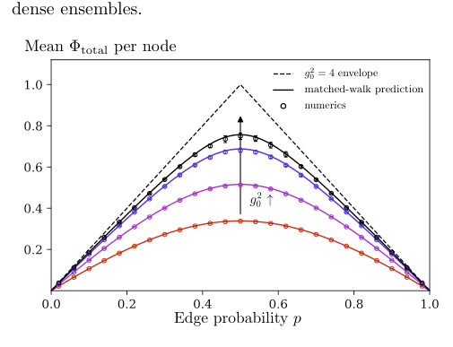 
FIG. 2. Dissipation is non-monotonic in edge proba- bility. For centered dense Erd˝os-R´enyi networks the effective interaction is g2 = g2 0p(1 −p), so the EPR rises then falls with edge probability, peaking at p = 1/2: beyond half-filling, adding edges dilutes the effective interaction strength and lowers dissipation. The square-root law ϕ∗(g) predicts the full EPR (solid lines) at fixed g2 0 ∈{1.502, 1.752, 1.902, 1.942}. Symbols are large-N ensemble means from direct Lyapunov solution, conditioned on ρ(W) &lt; 1, with error bars showing SD across retained realizations. The dashed g2 0 = 4 envelope touches the Catalan-series convergence boundary g2 = 1 at p = 1/2; see SM M. This is an...

**Summary.** This theoretical work determines the entropy production rate (EPR) in non-equilibrium systems governed by network interactions. It shows that the EPR is fundamentally controlled by the statistics of directed walks on the interaction graph. Crucially, it proves that this rate converges to a universal square-root law, suggesting that the mechanism generating dissipation is dictated by shared directed-walk properties rather than specific network details.

**Why it may be interesting.** The universal square-root law derived from purely topological/combinatorial walk properties provides a powerful, model-independent constraint on the thermodynamics of complex, non-equilibrium systems, which is relevant for understanding dissipation in quantum open systems.

Detailed structure

**Main problem.** The paper addresses how the complex structure of an interaction network generates the entropy production rate (EPR), a key measure of irreversibility in non-equilibrium steady states.

**Main result.** The mean EPR per node universally follows a square-root law, $\phi^*(g) = 1 - \sqrt{1-g^2}$, regardless of whether the network is recurrent or deep acyclic.

**Method.** The analysis involves recasting the EPR as a quadratic form in walk non-reciprocity matrices, leading to a walk-counting formulation that is then analyzed in the large-N limit.

**Model / system.** The model uses multivariate Ornstein-Uhlenbeck dynamics on a network described by an interaction matrix $W$. The system is analyzed by examining directed walks on this network structure.

**Key observables.** Entropy Production Rate ($\Phi_{total}$), walk non-reciprocity matrices ($A(r)$), and walk quantities (shared-endpoint pairs $K_{r,\ell}$ and closed walks $L_s$).

**Important parameters / regimes.** Interaction strength parameter $g \in [0,1)$, network depth, and the spectral radius $
ho(W)$.

**Assumptions / limitations.** The analysis relies on the contractivity condition $
ho(W) < 1$ for power series expansions, and the derivation of the universal law requires satisfying a 'matched-walk moment condition' in the large-N limit.

**Figures summary.** Figure 1 shows the universal square-root curve across different network ensembles (recurrent vs. acyclic), confirming convergence to the analytic prediction $\phi^*(g)$.

**Paper structure.** The paper first establishes the EPR in terms of walk non-reciprocity (Theorem 1), reformulates it using walk counting (Theorem 2), connects this to spectral properties (Theorem 3), and finally derives the universal square-root law by analyzing the limit behavior under specific moment conditions (Theorem 4).

Abstract

The entropy production rate (EPR) quantifies irreversibility of a nonequilibrium steady state, yet standard formulas obscure how a complex interaction network generates it. For multivariate Ornstein-Uhlenbeck dynamics on such networks, we express the EPR as a quadratic form in antisymmetric matrices measuring the nonreciprocity of aggregate directed walks at every length, and, equivalently, as two weighted-walk quantities: pairs of directed walks sharing both endpoints, and directed closed walks. For diagonalizable interactions, an exact correspondence translates these walk quantities into eigenvalues and biorthogonal eigenvector overlaps. Across dense, sparse, and deep acyclic random interactions satisfying matched-walk conditions, the mean EPR per node universally follows the square-root law $φ_*(g)=1-\sqrt{1-g^2}$, where $g \in [0,1)$ parametrizes the interaction strength. Deep acyclic interaction matrices are nilpotent, with all eigenvalues fixed at zero for every $g$, yet, as their depth increases, their mean EPR per node approaches $φ_*(g)$. Thus, the square-root law arises from directed walk properties, rather than from a shared spectral density or specific network topology.

[↑ back to top](#top)

### [Low-leakage superconducting-qubit measurement with sub-100-ns total duration](http://arxiv.org/abs/2608.25484v1)

**Authors:** Peter A. Spring, Adrian L. Hesse, Shiyu Wang, Shuhei Tamate, Yasunobu Nakamura  
**Type:** experiment · **Category:** quantum information and computing · **PDF:** <https://arxiv.org/pdf/2608.25484v1>  
**Analysis basis:** full PDF text, analyzed in chunks
**Topic relevance:** 🔥 `QC/QI experiment` **4/5** · `quantum measurements` **3/5** · `Tavis-Cummings & cavity-many-emitter` **1/5** · `quantum optics experiment` **1/5**

📷 Fig 1

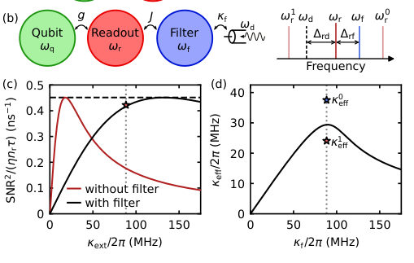 
FIG. 1. Optimal readout conditions. (a),(b) Coupled-mode representations of dispersive readout (a) without and (b) with a dedicated filter resonator. The readout drive and filter resonator are detuned from the mean readout-resonator fre- quency ωr =  ω0 r + ω1 r  /2 by ∆rd = ωr−ωd and ∆rf = ωr−ωf, respectively. (c) Steady-state SNR2 per photon per nanosec- ond, with (black) and without (red) the filter resonator, for ∆rd = 0 and ∆rf = 0. The term κext corresponds to κ and κf for the circuit without and with the filter resonator, re- spectively. The black dashed line indicates the maximum SNR2 max/ (ηnrτ) = 8|χ|. (d) Effective readout-resonator de- cay rate with a filter resonator, for ∆rf...

📷 Fig 2

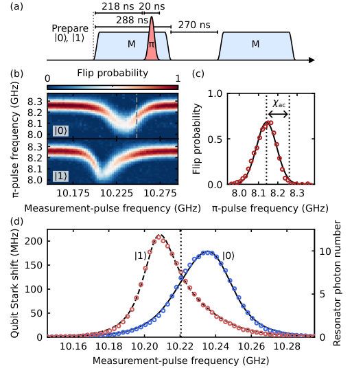 
FIG. 2. Readout parameter characterization. (a) Pulse se- quence. The carrier frequencies of the first measurement pulse and the qubit π pulse are both swept. (b) Qubit state-flip probability, for the |0⟩- and |1⟩-state preparations. (c) Line cut along the dashed gray line in (b), fit to a normal distribu- tion (black curve). The peak of the fitted distribution gives the ac-Stark-shifted qubit frequency. (d) Magnitude of the ac Stark shift for the |0⟩and |1⟩states. The solid(dashed) line shows the fit to the input–output model for the |0⟩(|1⟩) state. The right axis shows the readout-resonator photon number inferred using χac = 2χnr. The dotted vertical line indicates the drive frequency...

📷 Fig 3

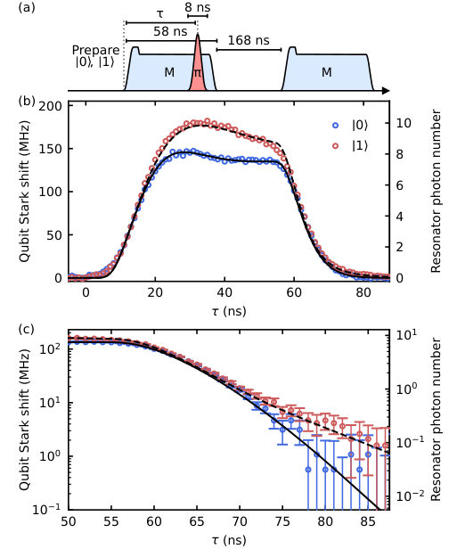 
FIG. 3. Readout-resonator time response. (a) Pulse sequence. The elapsed time τ between the start of the first measurement and the peak of the π pulse is swept. The π-pulse frequency is also swept. (b) Magnitude of the dynamical ac Stark shift for the |0⟩and |1⟩state. The solid(dashed) lines show the predictions of the input–output model for the |0⟩(|1⟩) state. (c) Log-scale detail of the ringdown dynamics.

📷 Fig 4

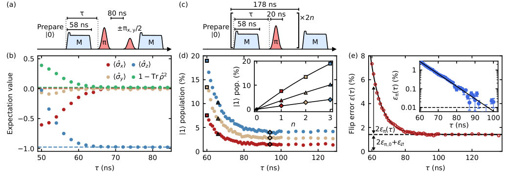 
FIG. 4. Total measurement duration. (a) Pulse sequence used to perform state tomography of a 20-ns π pulse applied at time τ after the start of a measurement pulse. (b) Measured tomography components against the π-pulse start time. The dashed lines show the result of a reference tomography experiment with the measurement preceding the π pulse removed. (c) Pulse sequence used to determine the total measurement duration. The time τ is the interval between the measurement start and the subsequent π-pulse start. The measurement–π-pulse block is repeated 2n times. (d) Excited-state population determined by the final measurement pulse, for n = 1 (red), n = 2 (tan), and n = 3 (blue). The inset...

📷 Fig 5

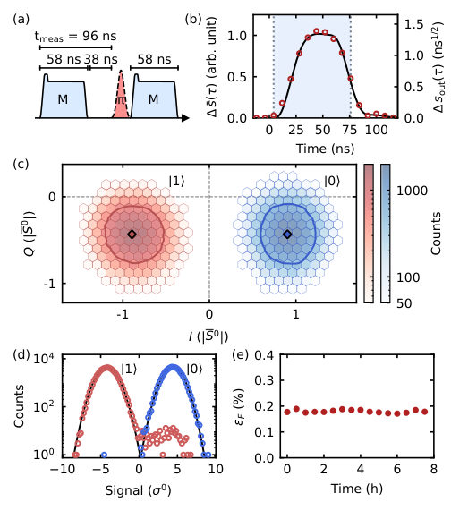 
FIG. 5. Two-state measurement. (a) Pulse sequence used to determine the assignment fidelity. The sequence is re- peated with and without the 20-ns π pulse. (b) Time- dependent signal separation ∆s(τ) ≡ s 0(τ) −s 1(τ) for the postselected second measurement pulse. The 8-ns spacing of the data points results from in-FPGA downsampling of the raw samples, which are acquired at 0.5 GSa/s. The black curve gives the coherent output-field separation ∆sout(τ) ≡ s0 out(τ) −s1 out(τ) predicted by the input–output model. The blue-shaded region shows the integration window used for two-state classification. (c) Hexagonal-bin histograms of the integrated heterodyne signal, with 6 × 104 shots per qubit...

**Summary.** This paper reports on an optimized, fast, and low-leakage measurement protocol for superconducting transmon qubits. By combining a large resonator decay rate with optimal dispersive coupling, the authors achieved sub-100 ns readout times while keeping measurement-induced leakage rates extremely low. This advances the feasibility of building large-scale quantum processors requiring high-fidelity state readout.

**Why it may be interesting.** This work provides concrete experimental benchmarks for optimizing superconducting qubit readout, directly addressing the fidelity and speed requirements necessary for scaling up quantum computation architectures.

Detailed structure

**Main problem.** The primary challenge addressed is achieving fast, accurate, and low-leakage qubit measurement, which is a critical bottleneck for implementing quantum error correction protocols.

**Main result.** The authors demonstrated a measurement process with a total duration of 97 ns and a very low per-measurement leakage rate of $2.7 	imes 10^{-5}$, enabling high-fidelity readout.

**Method.** The measurement fidelity was characterized using a combination of pulse sequences, state-dependent measurements, and theoretical analysis (Floquet simulations) to quantify leakage and timing.

**Model / system.** The system involves a superconducting transmon qubit coupled to a readout resonator, operating in the small qubit-resonator detuning regime.

**Key observables.** Total measurement duration (97 ns), assignment error (0.17%), per-measurement leakage rate ($2.7 	imes 10^{-5}$), and state-dependent effective resonator decay rates ($\kappa_{0,	ext{eff}}/2\pi = 37.5$ MHz, $\kappa_{1,	ext{eff}}/2\pi = 24.1$ MHz).

**Important parameters / regimes.** Large effective resonator decay rate ($\kappa_{	ext{eff}}/2\pi = 30.8$ MHz) and a dispersive shift near the optimal SNR-per-photon condition.

**Assumptions / limitations.** The analysis assumes that multiphoton resonances are weakly coupled and traversed diabatically, and that the readout process can be accurately modeled by input-output theory.

**Figures summary.** Figures illustrate the coupled modes for readout (with/without a filter), the pulse sequence for characterization, and the time-domain response showing the decay of the ac Stark shift and photon number.

**Paper structure.** The paper proceeds by first characterizing the readout parameters using pulse sequences, then determining the total measurement duration by monitoring the decay of the measurement-induced error, and finally analyzing leakage mechanisms using Floquet simulations.

Abstract

Fast, accurate, and low-leakage qubit measurement is a key requirement for quantum error correction. Here, we demonstrate measurement of a superconducting transmon qubit with a total duration of 97(1) ns, defined as the time from the start of the measurement pulse until the measurement-induced error on a subsequent $π$-pulse operation falls below $10^{-4}$. By combining a large state-averaged resonator decay rate of $κ_\mathrm{eff}/2π$ = 30.8 MHz with a dispersive shift close to the optimal SNR-per-photon condition, we achieve an assignment error of 0.17(1)% using a 58-ns measurement pulse, with residual readout photons depleting passively in tens of nanoseconds without an active depletion pulse. Using a repeated-measurement sequence together with a leakage-sensitive measurement, we benchmark the measurement-induced state transitions, finding a per-measurement leakage rate of $2.7(2) \times 10^{-5}$, only twice the background rate and two orders of magnitude below the measurement-induced relaxation rate, which dominates the assignment error. Floquet simulations indicate that the multiphoton resonances present at the operating point are weakly coupled and traversed diabatically, without causing leakage. These results demonstrate that a large resonator decay rate, combined with a dispersive shift close to the optimal SNR-per-photon condition, can enable fast, high-fidelity, low-leakage dispersive readout at small qubit-resonator detuning.

[↑ back to top](#top)

### [The Gain-Engineered Transmon](http://arxiv.org/abs/2608.26018v1)

**Authors:** Ian Yang, Francesco Adinolfi, Alessandro Bruno, Venus Hasanuzzaman Kamrul, Daniel Z. Haxell, Alexander Grimm  
**Type:** both · **Category:** quantum information and computing · **PDF:** <https://arxiv.org/pdf/2608.26018v1>  
**Analysis basis:** full PDF text, analyzed in chunks
**Topic relevance:** 🔥 `QC/QI experiment` **4/5** · `correlated / nonlocal dissipation` **1/5** · `driven-dissipative phase transition` **1/5** · `quantum measurements` **1/5** · `quantum optics experiment` **1/5**

📷 Fig 1

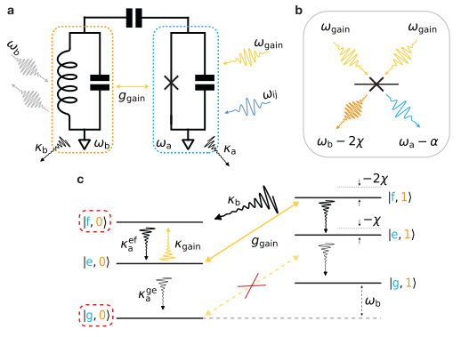 
FIG. 1. Concept of the gain-engineered transmon. a, Circuit schematic of the transmon-cavity system. The trans- mon (cavity) is shown inside the blue (orange) dashed box, with associated frequency ωa (ωb) and single-photon loss rate κa (κb). The two-mode squeezing interaction of rate ggain is shown as a yellow double arrow. Colored pulse arrows indicate the readout tone at ωb (gray), the gain pump at ωgain (yel- low), and the qubit control drive at ωij (blue). b, Schematic representation of the four-wave mixing process generating the engineered single-photon gain. The Josephson junction non- linearity converts two pump photons at ωgain into one trans- mon photon at ωa −α and one cavity...

📷 Fig 2

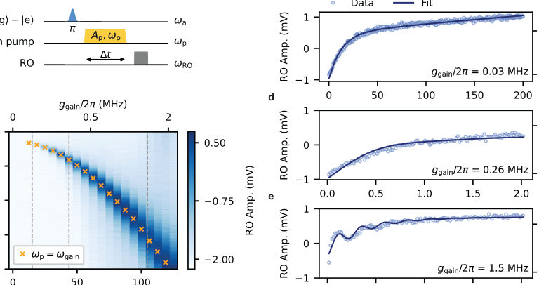 
FIG. 2. Calibration of the engineered gain. a, Pulse sequence for calibrating the gain-pump frequency ωgain and engineered interaction strength ggain. b, Readout amplitude (RO Amp.) as a function of pump frequency ωp and pump amplitude Ap. Orange crosses mark the resonance condition ωp = ωgain, at which the engineered gain drives the |e⟩→|f⟩transition. The calibrated top axis shows the corresponding ggain for ωp = ωgain. Here, the readout is performed at ωRO = ωb −2χ. The vertical dashed lines indicate the ggain values for the data plotted in panels c, d, and e. c, d, e Readout signal as a function of ∆t at ggain/2π = 31 kHz (c), 261 kHz (d) and 1.5 MHz (e). The left axis shows the RO Amp....

📷 Fig 3

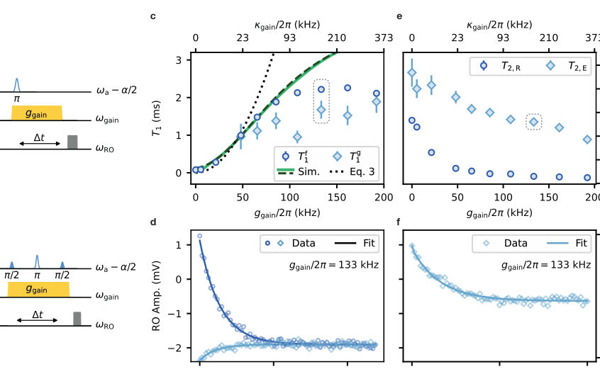 
FIG. 3. Relaxation and coherence times of the gain-engineered transmon as a function of engineered gain rate ggain. a, Pulse sequence for T f 1 measurements in c,d. The white fill in the πgf pulse indicates its use for the T f 1 measurement only. b, Pulse sequence for T gf 2 and T gf 2E measurements in e,f. The white fill in the πgf pulse indicates that it is used only for the T gf 2E measurement. c, Decay times T f 1 (T g 1 ) out of the |f⟩(|g⟩) state as a function of ggain. The T f 1 begins to saturate at ggain/2π = 133 kHz (κgain/2π = 165 kHz), which we indicate by the dotted gray box. The solid light green line (dashed dark green line) is a numerical simulation of T f 1 (T g 1 ) with...

📷 Fig 4

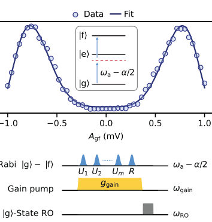 
FIG. 4. Two-photon gate calibration and randomized benchmarking. a, Readout amplitude as a function of the drive amplitude Agf, showing Rabi oscillations of the |g⟩- |f⟩ transition. Circles are data and the solid line is a fit. The right axis marks the readout values corresponding to |g⟩and |f⟩. The inset shows the process underlying the two-photon |g⟩- |f⟩drive (see text). b, Pulse sequence for randomized benchmarking measurement used in c. c, Average gate fidelity as a function of ggain (bottom axis) and κgain (top axis).

**Summary.** This paper introduces and experimentally realizes a noise-biased qubit in a transmon circuit by applying a single microwave tone to engineer a frequency-selective gain channel. This technique suppresses single-photon loss errors, leading to significant enhancements in qubit coherence times. Furthermore, the authors demonstrate that this gain-engineered qubit can serve as a robust ancilla for implementing advanced quantum error correction protocols.

**Why it may be interesting.** This work directly addresses the physical implementation challenges of fault-tolerant quantum computing by providing a scalable, hardware-efficient method to suppress dominant error channels in superconducting qubits.

Detailed structure

**Main problem.** The goal is to engineer noise bias in superconducting qubits to reduce hardware overhead for fault-tolerant quantum computation while maintaining high operational fidelity.

**Main result.** The authors successfully demonstrated an order-of-magnitude enhancement in relaxation time by encoding the qubit in the $|g
angle-|f
angle$ states using engineered gain, while maintaining compatibility with fast, high-fidelity gate operations.

**Method.** The technique involves introducing a frequency-selective gain channel via a single microwave tone to counteract single-photon loss errors, thereby biasing the noise towards a manageable error type.

**Model / system.** The physical platform is a standard transmon-readout resonator circuit. The mechanism is modeled by adding an engineered gain interaction Hamiltonian, which is activated via a four-wave mixing process.

**Key observables.** Relaxation times ($T_{f1}, T_{g1}$), echo-coherence time ($T_{2E}$), single-qubit gate fidelity ($F$), and Holevo variance ($\Delta V_{x,p}/V_{0,x,p}$) for error detection.

**Important parameters / regimes.** Engineered gain rate ($\kappa_{gain}$), coupling strength ($g_{gain}$), and comparison to conventional $|g
angle-|e
angle$ encoding.

**Assumptions / limitations.** The gain acts selectively on the $|e
angle - |f
angle$ transition due to the transmon's large anharmonicity, and the analysis often relies on adiabatic elimination limits.

**Figures summary.** Figures illustrate the concept diagram, resonance mapping, time evolution of readout signals, and comparisons of decay times and gate fidelities as a function of engineered gain strength.

**Paper structure.** The paper first introduces the concept of noise bias and experimentally realizes it in a transmon circuit. It then quantifies the improvement in coherence times and gate fidelity compared to standard encodings. Finally, it extends the concept to use the gain-engineered qubit as an ancilla for implementing and testing various quantum error correction codes.

Abstract

The interaction between a qubit and its environment can be engineered such that one error channel dominates over all others, resulting in noise bias. This property enables error correction codes to focus on the dominant error type, thereby significantly reducing the number of physical systems required for fault-tolerant quantum computation. However, engineering noise bias typically introduces complexity at the physical system level, which decreases its usefulness by limiting scalability. Here, we introduce and experimentally realize a noise-biased qubit in a standard transmon-readout resonator circuit, one of the most common superconducting architectures, by only adding a single microwave tone. We encode the qubit in the transmon $|\mathrm{g}\rangle$- and $|\mathrm{f}\rangle$-states, and engineer a frequency-selective gain channel that counteracts single-photon loss errors between the computational states. We demonstrate an order-of-magnitude enhancement in relaxation time compared to the $|\mathrm{g}\rangle-|\mathrm{e}\rangle$ encoding, conceding only a factor-of-two decrease in the echo-coherence time. Furthermore, we show that this qubit is compatible with fast, high-fidelity operations. Our results open a path towards using this system as a simple building-block for hardware-efficient quantum error detection and correction schemes.

[↑ back to top](#top)

### [From Round-Trip State Echo to Error Recovery: Snapshot-Resolved Quantum-Hardware Diagnostics](http://arxiv.org/abs/2608.26010v1)

**Authors:** Isaac Barouch Essayag, Aryeh Lev Zabokritskiy  
**Type:** experiment · **Category:** quantum information and computing · **PDF:** <https://arxiv.org/pdf/2608.26010v1>  
**Analysis basis:** full PDF text, analyzed in chunks
**Topic relevance:** 🔥 `QC/QI experiment` **4/5** · `quantum measurements` **2/5**

📷 Fig 1

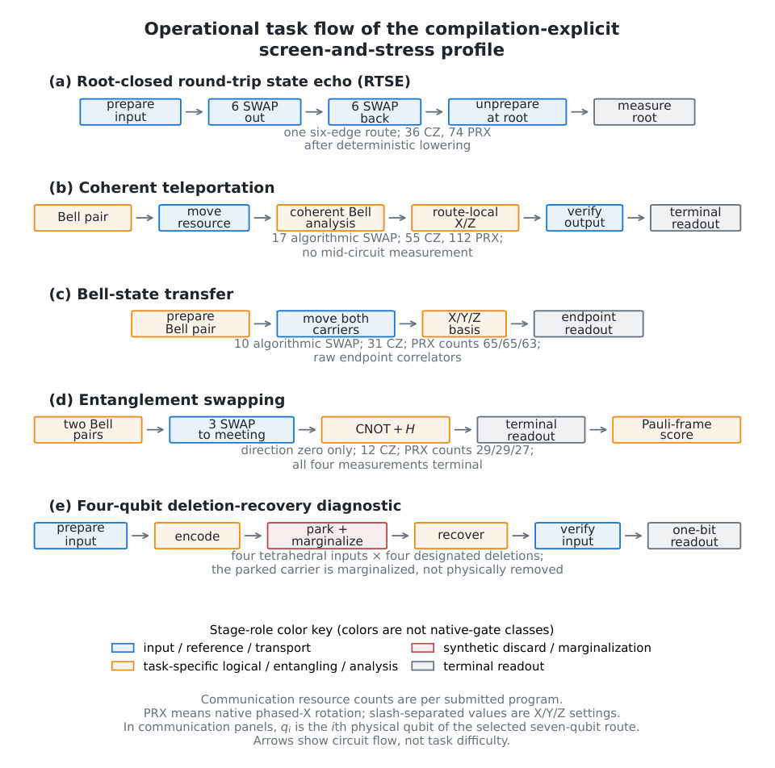 
Figure 1: Circuit flow of the five workload families. The communication panels show the operational stages and compiled resource counts for the frozen program variants; the recovery panel shows preparation, encoding, synthetic discard, coherent decoding, verification, and terminal readout. Native counts are omitted from the recovery panel because that separately compiled workload is itemized later in table 6; the omission conveys no resource or complexity ordering. Across these panels, blue marks input, reference, or transport stages; orange marks task-specific logical, entangling, basis, or analysis stages; red marks synthetic discard by marginalization; and gray marks terminal readout....

📷 Fig 2

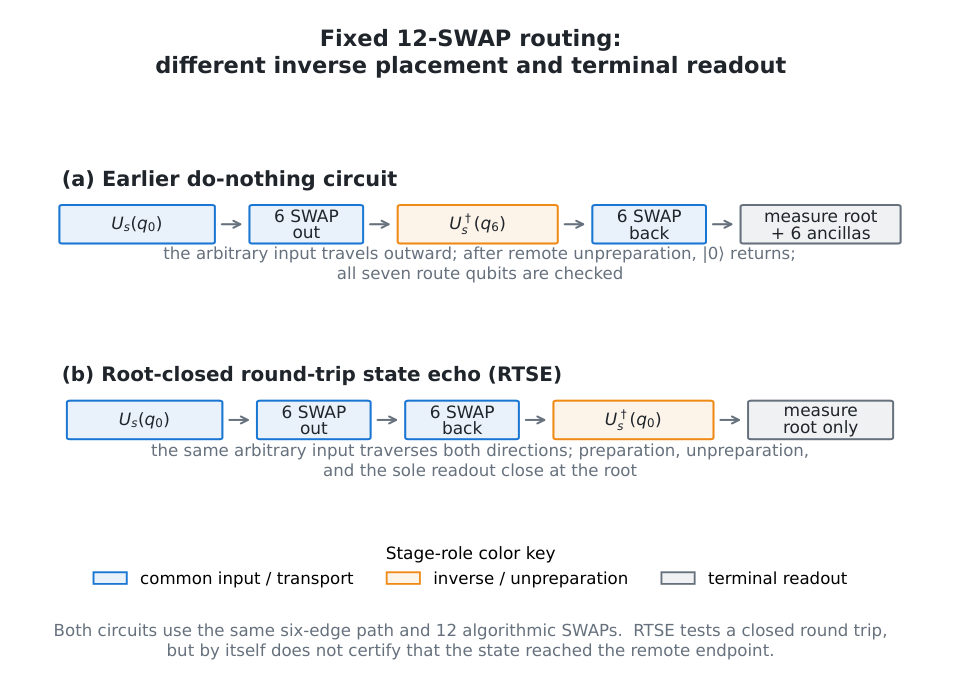 
Figure 2: Operational distinction between the predecessor do-nothing protocol and RTSE on a six-edge route. Both use the same 12-swap round trip, but the predecessor applies U† s remotely so that |0⟩returns and reads the root plus all six returned route ancillas, whereas RTSE returns |ψs⟩, applies U† s at the root, and records only that root output. Within this comparison, blue boxes show the common preparation and transport stages, orange highlights the inverse placement, and gray denotes terminal readout. RTSE is a deliberately permissive round-trip execution diagnostic, not endpoint-arrival certification.

📷 Fig 3

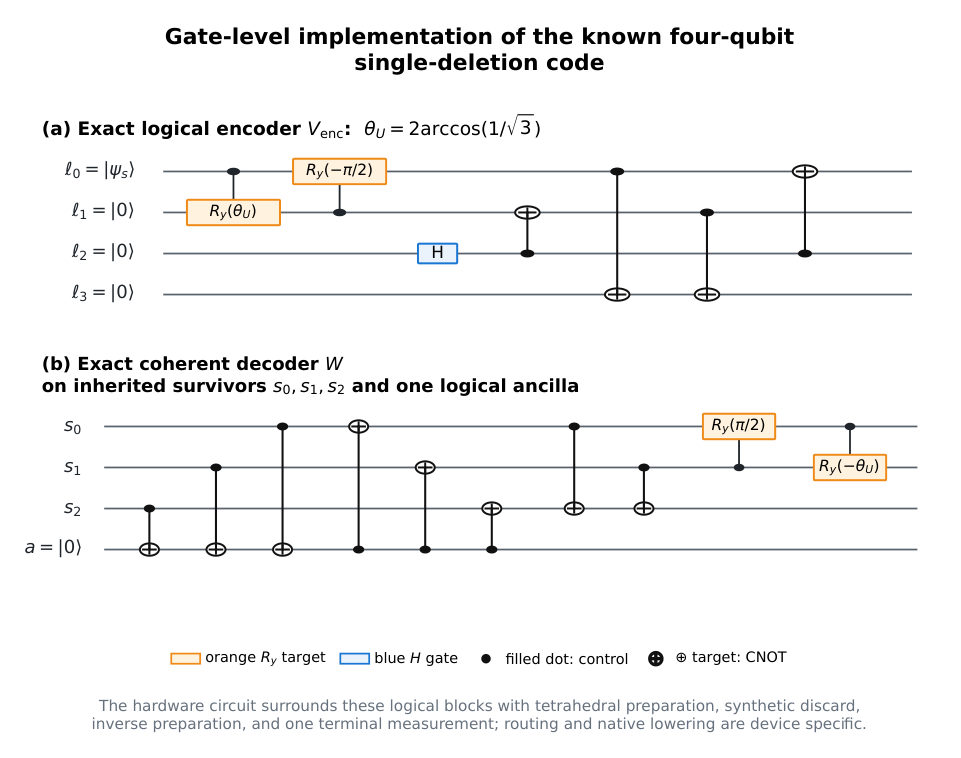 
Figure 3: Exact gate-level logical encoder and coherent decoder used in the deletion-recovery workload, read from left to right. Panel (a) implements Venc with input |ψs⟩on ℓ0 and |0⟩on ℓ1, ℓ2, ℓ3. Panel (b) implements W on the three surviving data wires (s0, s1, s2) in inherited order and on one fresh logical ancilla initialized in |0⟩. An orange Ry target connected vertically to a filled control dot denotes a controlled rotation; a ⊕target connected to a filled control dot denotes a CNOT. The blue box is H. This is a logical circuit, not a routed or provider-native circuit; the decoder gate sequence has no runtime dependence on the designated deletion position. State preparation, parking...

📷 Fig 4

 
Figure 4: Full 2 August IQM capability-document graph and the eight exact routes. Solid and dashed paths denote the two route directions; color and marker shape jointly denote the root, and direct R15, R19, R35, and R39 labels repeat that identity. Root-colored, root-shaped outer rings mark the first five nodes of each root’s direction-zero path, later inherited by recovery; concentric rings preserve shared prefix membership without relying on color alone. Slightly offset parallel strokes preserve multiple route memberships on a shared edge. The exact ordered paths are listed in table 2. Node placement is schematic and connectivity is exact. The device advertised 54 qubits, while qubit 25...

📷 Fig 5

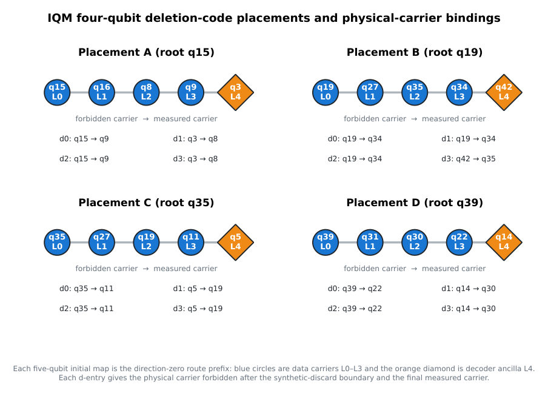 
Figure 5: Exact IQM recovery placement and carrier bindings. Each panel gives the initial mapping of logical data wires L0–L3 and the logical decoder ancilla L4. For every designated deletion d0–d3, the lower grid reports the physical carrier forbidden after the discard boundary and the carrier measured after decoding, routing, and inverse preparation. No outcome is encoded.

**Summary.** This paper introduces a comprehensive diagnostic framework to accurately assess quantum hardware performance by moving beyond aggregate scores. It tests superconducting and trapped-ion systems using structured protocols like Round-Trip State Echo (RTSE) across various workloads. The key finding is that hardware capability is highly dependent on the specific task, compilation, and execution context, necessitating workload-resolved diagnostics.

**Why it may be interesting.** It provides a rigorous, structured methodology for benchmarking quantum hardware that moves beyond simple volume metrics, offering insights into how specific communication and error-correction protocols perform under realistic, time-stamped execution constraints.

Detailed structure

**Main problem.** Determining the true, workload-dependent performance of quantum hardware, as aggregate metrics fail to capture task-specific limitations.

**Main result.** Hardware performance must be assessed using diagnostics tied to the specific workload, compilation, and execution snapshot, rather than relying on single, universal scores.

**Method.** The authors developed a structured 'screen-and-stress' profile, utilizing protocols like Round-Trip State Echo (RTSE) and deletion-recovery cells, to test hardware under controlled, task-specific conditions.

**Model / system.** The study tests superconducting qubits (IQM Emerald) and trapped-ion systems (IonQ Forte) using fixed input ensembles and structured circuit families.

**Key observables.** Round-Trip State Echo (RTSE) average, selected-output return probability, and route-level contrasts.

**Important parameters / regimes.** Workload type, compilation details, execution snapshot timing, and route length ($L$).

**Assumptions / limitations.** The results are explicitly framed as 'execution-workload diagnostics' and do not claim to measure fundamental error suppression or coding gain.

**Figures summary.** Figures illustrate the circuit flow for five workload families (including RTSE, teleportation, etc.) and detail the compiled resource counts for these structured tests.

**Paper structure.** The paper introduces the limitations of aggregate metrics, details the structured diagnostic profile (RTSE, etc.), presents comparative results across different hardware platforms and workloads, and concludes by emphasizing the workload-indexed nature of the findings.

Abstract

End-to-end quantum-hardware scores need not transfer across workloads, compilations, or execution times. We specify a compilation-explicit screen-and-stress profile whose opening diagnostic is round-trip state echo (RTSE): prepare one of four tetrahedral qubit states at a route root, move it out and back by swaps, apply inverse preparation at the root, and record zero. An execution snapshot means a dated submitted task batch together with its captured capability document where available, not a certified calibration epoch. On sparse superconducting hardware, a byte-identical communication rerun changed route-level contrasts although the aggregate RTSE estimates differed by only 0.00125. In a separate prospectively frozen two-window length study, RTSE and the remote-inverse do-nothing predecessor's root marginal both fell from length 2 to length 10; the prespecified interaction did not support superior RTSE retention. The mean selected-output return probability across 64 deletion-recovery cells changed from 0.738 to 0.624 between IQM execution snapshots. On a trapped-ion service advertising all-to-all connectivity among five submitted virtual wires, recovery was 0.911 and 0.923 in two windows, exceeding the frozen two-thirds reference; recovery-minus-adjoint-control differences were 0.446 and 0.443. These are execution-workload diagnostics, not coding-gain, error-suppression, physical-loss, fault-tolerance, or architecture-ranking claims. The results support assessment indexed by workload, placement or virtual-wire contract, compilation, architecture, and execution snapshot.

[↑ back to top](#top)

### [Hardware-Aware Fermion-to-Qubit Mappings for Simulating the 2D Hubbard Model on Heavy-Hexagon Quantum Processors](http://arxiv.org/abs/2608.25024v1)

**Authors:** Alessio Esposito, Andrea Giachero, Zoltàn Zimboràs, Leonardo Banchi  
**Type:** both · **Category:** strongly correlated electrons · **PDF:** <https://arxiv.org/pdf/2608.25024v1>  
**Analysis basis:** full PDF text, analyzed in chunks
**Topic relevance:** 🔥 `QC/QI experiment` **4/5** · `analog quantum simulation` **2/5**

📷 Fig 1

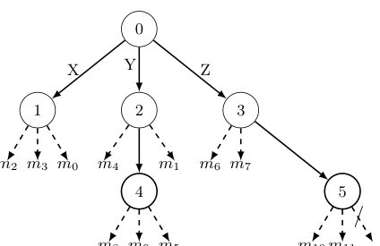 
FIG. 1. A TT example consisting of 6 qubits. Every node must have three links (edges or legs). The outgoing links from a node are associated with the X, Y, Z label. Every Majorana string stems from one of the paths from the root to a leg, and to guarantee the algebraic independence, the path composed of Z links is ruled out. The remaining strings are coupled together as discussed.

📷 Fig 2

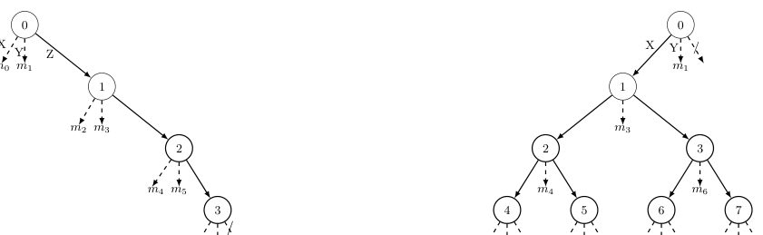 
FIG. 2. Two ternary tree (TT) examples. The left panel shows a TT with 4 qubits that maps to the JW mapping, the right panel a TT with 8 qubits that maps to the BK mapping. The first TT has a number of levels of the tree equal to the number of qubits, then the corresponding Pauli strings are linear with the scalability, whereas the second one is logarithmic with the number of qubits.

📷 Fig 3

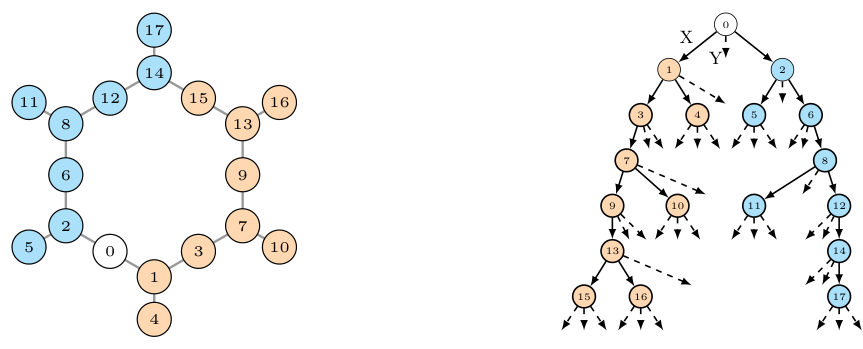 
FIG. 3. The Bonsai mapping for the 18 qubit chip. First, we span the entire heavy-hexagon connectivity graph to build the tree structure as illustrated in Subsec. II C. Then, we use homogeneous localization to associate the X,Y and Z Pauli gates to the legs and edges properly. Note that in the first branch the priority order of labeling is X, Y, Z, while in the second branch Z, X, Y in order to maximize the length of the path with only Zs, as described in [5].

📷 Fig 4

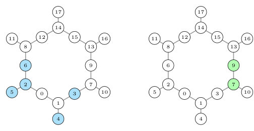 
FIG. 4. An illustrative comparison between JW and Bonsai mapping. Both the transformations implement the fermionic single excitation m4m12. The coloured nodes are the actual qubits on which the single excitation operates. Due to Pauli cancellations, the qubits on which the JW mapping acts are disconnected, and a SWAP operation on qubit 0 and 1 is nec- essary to reconnect all the nodes. By contrast, the Bonsai mapping does not require extra operations. Note that for a chip of this size in principle we could label the nodes for the JW mapping in order to reduce the overhead operations, but in practice, for a larger graph, the SWAP is determined by the topology, independently from the labeling...

📷 Fig 5

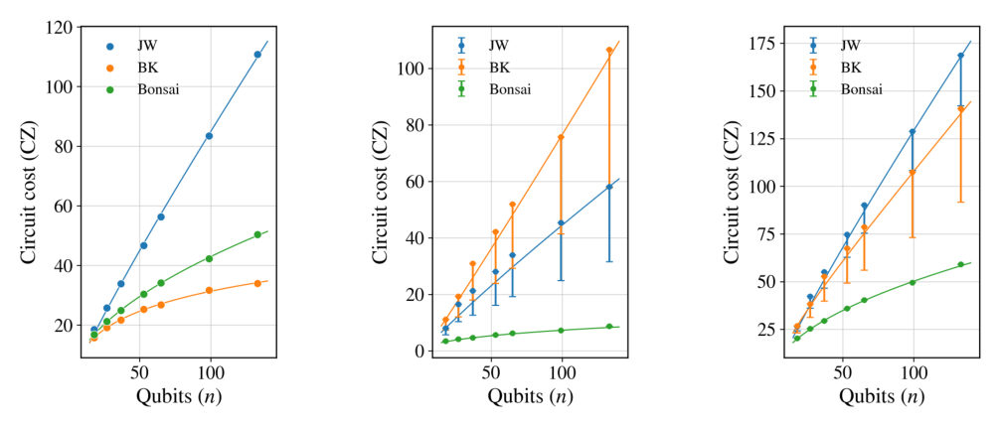 
FIG. 5. On the left, the ideal Pauli weight scaling of the mimjmkml interactions, expressed in terms of the number of CZ gates (y-axis) to be executed for JW, BK and Bonsai mappings, as a function of the number of qubits (x-axis). At the center, the additional SWAP operations (isolated from ideal Pauli weight of the left picture) required to implement these interactions on chips with heavy-hexagon connectivity without violating the locality principle, quantified by the number of CZ to be perform, in order to make the comparison between the two figures more readable. On the right, the composition of the first two graph, in order to show the effective circuit cost of the three maps on a...

**Summary.** This paper tackles the practical challenge of simulating the 2D Hubbard model on real quantum hardware by comparing multiple fermion-to-qubit mappings. The authors demonstrate that the Bonsai mapping is superior for heavy-hexagon processors, and they improve the simulation by using simulated annealing to optimize the resulting qubit Hamiltonian. This confirms the viability of performing large-scale, hardware-aware quantum simulations for strongly correlated electron systems.

**Why it may be interesting.** This work directly addresses the critical gap between theoretical quantum simulation models and the practical constraints of physical quantum hardware, providing actionable guidelines for mapping complex fermionic physics onto superconducting qubits.

Detailed structure

**Main problem.** The core challenge is achieving efficient quantum simulation of strongly correlated fermionic systems, like the 2D Hubbard model, on current near-term quantum hardware.

**Main result.** The Bonsai mapping was identified as the most hardware-efficient baseline transformation for heavy-hexagon processors, and combining it with simulated annealing significantly reduced the cost function for large-scale 2D simulations.

**Method.** The authors benchmarked three fermion-to-qubit mappings (JW, BK, Bonsai) by analyzing Pauli weight and SWAP overhead on specific hardware architectures, followed by optimizing the Hamiltonian construction using simulated annealing.

**Model / system.** The study focuses on the two-dimensional (2D) spinful Fermi-Hubbard model, simulated on superconducting quantum processors featuring heavy-hexagon connectivity. The simulation involves mapping fermionic operators to Pauli strings via unitary embeddings.

**Key observables.** Pauli weight, SWAP overhead, local magnetization, energy, and spatial spin–spin correlation functions.

**Important parameters / regimes.** Heavy-hexagon chip size (up to $6 	imes 6$ lattices), coupling constants ($J, U$), and noise parameters ($\lambda$).

**Assumptions / limitations.** The analysis assumes linear fermion-to-qubit mappings ($n=m$) and relies on the hardware connectivity graph to assess overheads.

**Figures summary.** Figures illustrate the theoretical structures of the mappings (JW, BK, Bonsai) and show the time evolution of local magnetization on $4 	imes 4$ lattices, confirming the preservation of the initial Néel order despite noise.

**Paper structure.** The paper proceeds by first analyzing the theoretical efficiency of various fermion-to-qubit mappings on specific hardware topologies. It then applies the best mapping (Bonsai) to construct and optimize the Hamiltonian for the 2D Hubbard model, culminating in time evolution simulations and noise mitigation techniques.

Abstract

Quantum simulation of strongly correlated fermionic systems is among the most promising near- term applications of quantum computing, but its practical efficiency depends critically on the choice of fermion-to-qubit mapping and on the connectivity of the underlying hardware. In this work we address this problem in the context of the two-dimensional Hubbard model, simulated on IBM superconducting quantum processors with heavy-hexagon connectivity. We numerically benchmark the Jordan-Wigner, Bravyi-Kitaev, and Bonsai transformations, evaluating their Pauli weight and SWAP overhead across seven heavy-hexagon chips of increasing size. We show that, while the Bravyi-Kitaev mapping initially exhibits a lower Pauli weight, this advantage is eliminated once routing costs are taken into account, confirming the Bonsai mapping as the most hardware-efficient baseline transformation for this architecture. We then use the Bonsai mapping to construct the qubit Hamiltonian of the 2D spinful Fermi-Hubbard model, introducing a simulated annealing algorithm that optimizes the assignment of Majorana strings to lattice sites, reducing the cost function by nearly 50% percent. Finally, we simulate on quantum hardware the time evolution of fermionic states up to 6x6 lattices, confirming the viability of the Bonsai encoding for hardware-aware large-scale two-dimensional simulations.

[↑ back to top](#top)

### [High-Fidelity Entangled States in a Connectivity-Four Fluxonium Quantum Processor](http://arxiv.org/abs/2608.25503v1)

**Authors:** J. Schirk, N. Bruckmoser, S. M. Taubenberger, F. Wallner, N. J. Glaser, M. Zetzl, L. Huang, I. Tsitsilin, M. Werninghaus, L. Södergren, K. Liegener, C. M. F. Schneider, Stefan Filipp  
**Type:** experiment · **Category:** quantum information and computing · **PDF:** <https://arxiv.org/pdf/2608.25503v1>  
**Analysis basis:** full PDF text, analyzed in chunks
**Topic relevance:** 🔥 `QC/QI experiment` **4/5**

📷 Fig 1

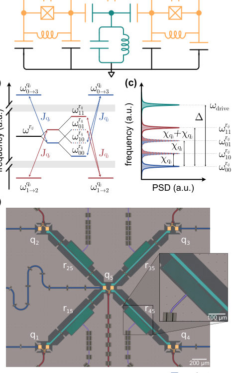 
FIG. 1. Overview of the chip architecture. (a) Simpli- fied circuit diagram of the FRF architecture, where qubits qi and qj are in a floating configuration and the coupler rij is in a grounded configuration, resulting in the suppression of the static ZZ-interaction. (b) Spectral diagram of qubit and coupler transitions leading to the dispersive shift used for the RIP gate. For qubit qi and qj respectively, the |1⟩→|2⟩and |0⟩→|3⟩transitions dispersively shift the resonator frequency ωrij, resulting in four spectral lines conditional on the four computational states. Blue arrows indicate coupling when a qubit is in |0⟩, red arrows when it is in |1⟩. (c) Setup of the resonator drive. The...

📷 Fig 2

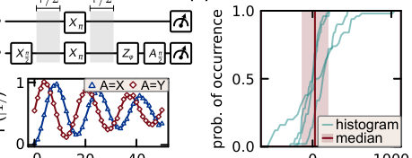 
FIG. 2. Qubit performance. (a) Exemplary single-qubit RB of q1 with up to 3000 Cliffords. (b) Average single-qubit gate fidelity measured simultaneously on all qubits. The error is smaller than the marker size (cf. Table I). (c) Refocusing sequence for measuring static ξZZ, where a single qubit is initialized in a superposition state, followed by a wait time τ/2, a refocusing pulse on both qubits. For a robust fit, we apply a virtual frequency through a virtual-Z rotation before the second π/2-pulse and extract the conditional phase from the deviation to the virtual oscillation. (d) Histogram of 50 repetitions of the procedure shown in (c) for all connected qubit pairs, resulting in a...

📷 Fig 3

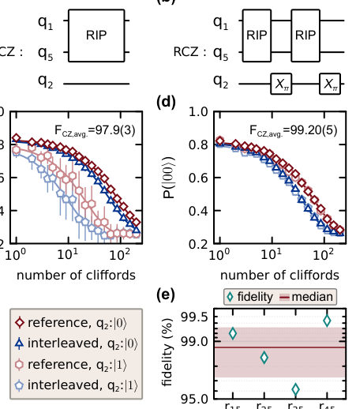 
FIG. 3. Spectator error mitigation. (a) Configuration of a regular RIP gate between two qubits q1 and q5 with no operation on the spectator qubit q2 results in a spectator state-dependent error when q2 is in |1⟩, as characterized by IRB (c). The gate is calibrated for the case where q2 is in |0⟩. (b) Refocusing RIP gate. The RIP pulse is split into two sections, split by a π-pulse on q2, resulting in a cancellation of conditional phases caused by the spectator qubit and no dependence of the CZ-gate fidelity in IRB (d). (e) Average two-qubit gate fidelity using the refocusing sequence on dif- ferent qubit pairs.

📷 Fig 4

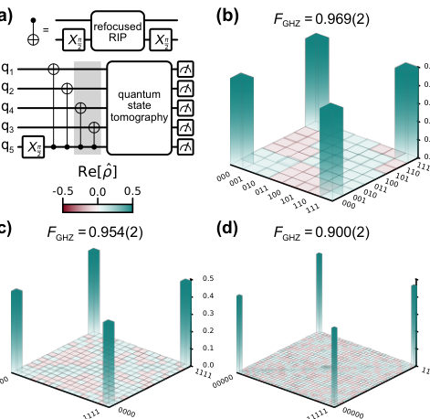 
FIG. 4. GHZ states. (a) Circuit diagram to prepare and to- mographically determine the fidelity of a three-qubit(b) four- qubit (c) and five-qubit (d) GHZ-state. q5 is prepared in an equal superposition, followed by effective CNOT gates to all other qubits. This is followed by a state tomography circuit which prepares all Pauli-correlators with subsequent measure- ment. CNOT gates marked in grey are only applied for the four- and five-qubit GHZ state. Each ˆρ is recorded with 30720 single shots. All fidelities shown are corrected for SPAM er- rors by classical detector error correction.

📷 Fig 5

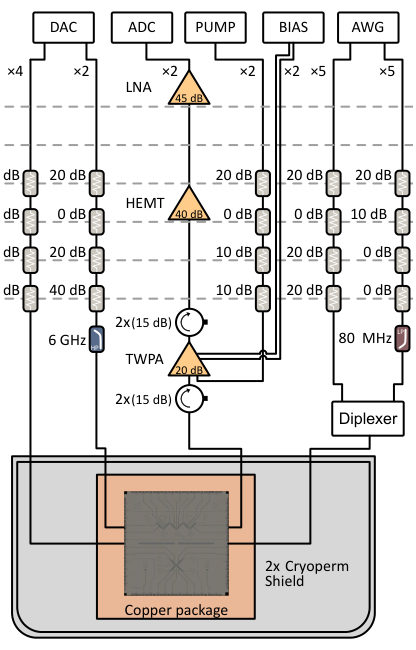 
FIG. 5. Experimental setup.

**Summary.** This paper reports the realization of a high-connectivity (connectivity-four) quantum processor using fluxonium qubits coupled via resonators. The authors achieved state-of-the-art gate fidelities and demonstrated robust multi-qubit entanglement preparation. This establishes the fluxonium-resonator-fluxonium architecture as a viable, scalable path toward error-correction-compatible quantum hardware.

**Why it may be interesting.** The work directly addresses scalable hardware implementation for quantum computation, providing concrete metrics (high fidelity, controlled connectivity) for superconducting qubit platforms relevant to quantum error correction.

Detailed structure

**Main problem.** The central challenge is extending qubit connectivity to two-dimensional lattices for quantum error correction in fluxonium processors while suppressing parasitic interactions.

**Main result.** The authors demonstrated a connectivity-four unit cell using a fluxonium-resonator-fluxonium architecture, achieving high-fidelity single-qubit gates (>99.9%) and controlled two-qubit gates (>99%).

**Method.** Gate fidelities were measured using randomized benchmarking (RB/IRB), and multi-qubit entanglement was verified by preparing and measuring GHZ states via quantum state tomography.

**Model / system.** The system uses fluxonium qubits coupled via lumped-element resonator couplers, realizing a connectivity-four unit cell. The Hamiltonian includes terms for qubits and the resonator, with coupling mediated by state-dependent dispersive shifts.

**Key observables.** Single-qubit gate fidelities, two-qubit gate fidelities, GHZ state tomographic fidelity, and residual static ZZ interactions.

**Important parameters / regimes.** Single-qubit fidelity > 99.9%; Two-qubit fidelity > 99%; Residual ZZ interaction < 1 kHz; Connectivity = 4.

**Assumptions / limitations.** The coupling strategy relies on exploiting selection rules at the lower sweet-spot where even-numbered transitions are forbidden.

**Figures summary.** Figure 1 illustrates the chip architecture, showing the FRF coupling scheme and the spectral diagram of dispersive shifts. Other figures detail fidelity measurements and error mitigation protocols.

**Paper structure.** The paper introduces the connectivity-four architecture, details the Hamiltonian and coupling mechanism, presents experimental results for single-qubit and two-qubit gates, and concludes by validating multi-qubit entanglement preparation.

Abstract

A central challenge in fluxonium-based quantum processors is the extension of the qubit connectivity to two-dimensional lattices compatible with quantum code-error correction. Here, we present a fluxonium quantum processor that employs lumped-element resonator couplers which realizes, for the first time, a connectivity-four unit cell with suppressed parasitic interactions. We achieve parallel single-qubit gate fidelities exceeding 99.9 % in simultaneous randomized benchmarking experiments, while maintaining residual static ZZ interactions below 1 kHz across all coupled qubit pairs. We implement resonator-induced phase (RIP) gates and benchmark two-qubit gate fidelities exceeding 99 % using interleaved randomized benchmarking. To cancel spectator errors observed in two-qubit operations, we implement a refocused RIP gate, recovering coherent control in the presence of multi-qubit connectivity. Furthermore, we prepare Greenberger-Horne-Zeilinger states of up to five qubits with a tomographic fidelity of 90 %, verifying multi-qubit entanglement within the unit cell. These results establish the fluxonium-resonator-fluxonium architecture as a viable approach to realizing densely connected fluxonium processors and provide a scalable path toward quantum error-correction-compatible processor architectures.

[↑ back to top](#top)

### [The View from Within: What Can Embedded Observers (Not) Learn?](http://arxiv.org/abs/2608.25800v1)

**Authors:** Tomáš Gonda, Johannes Fankhauser, Gemma De les Coves  
**Type:** theory · **Category:** other · **PDF:** <https://arxiv.org/pdf/2608.25800v1>  
**Analysis basis:** full PDF text, analyzed in chunks
**Topic relevance:** 🔥 `quantum measurements` **4/5**

📷 Fig 1

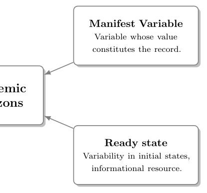 
Figure 1: Four aspects of learning in nomic toy theory that determine a toy subject’s epistemic horizons.

📷 Fig 2

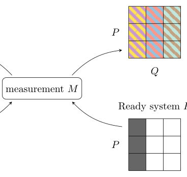 
Figure 3: Illustration of a measurement interaction, with individual state spaces as in Figure 2. The manifest variable of the toy subject is πQ and subject’s states with identical records are represented by matching colours. The ready state variability V is P (allowed initial states are in grey). Matching colours between the subject and the two instances of the object depict the correlation facilitated by the interaction. Namely, the position of the subject being 0 (yellow/purple) implies that the initial position of the object is 0 (yellow) and also that the final momentum of the object is 0 (purple), and similarly for other colours. The inaccessible subspaces are Iret = P and Ipre = Q....

**Summary.** This work develops a formal theory to analyze the knowledge limits faced by an observer who is itself a physical part of the system being observed. By using a classical toy model, the authors demonstrate that fundamental epistemic horizons exist, even when the underlying physics is deterministic. This provides mathematical tools to bridge the gap between objective physical description and subjective, first-person knowledge.

**Why it may be interesting.** It provides a rigorous, mathematical framework for quantifying the inherent limitations of knowledge acquisition from the perspective of a physical agent, which has deep conceptual implications for quantum measurement theory.

Detailed structure

**Main problem.** The paper investigates the fundamental tension between the third-person (external) view of physics and the first-person (embedded observer) perspective, determining the limits of knowledge acquisition.

**Main result.** Embedded observers face an inherent 'epistemic horizon' limiting what they can learn, even in classical, deterministic toy models, providing tools to study first-person uncertainty.

**Method.** The authors use a formal framework based on a toy model of classical particles, analyzing learning constraints by mapping physical interactions to mathematical structures like Poisson maps and coisotropic subspaces.

**Model / system.** The model uses classical particles described by a symplectic vector space, where observers (subjects) are physical systems characterized by a manifest variable (empirical record) and ready states (initial information).

**Key observables.** Epistemic horizon, manifest variable, ready states, predictively inaccessible subspace (I_pre), and preparation support (im(beta)).

**Important parameters / regimes.** The type of learning (past/future), the completeness of the manifest variable, and the structure of the measurement interaction.

**Assumptions / limitations.** The analysis is built upon a 'nomic toy theory' framework, assuming information gathering is equivalent to physical interaction, and relies on symplectic geometry tools.

**Figures summary.** Figures illustrate the four components determining epistemic horizons and depict the structure of measurement interactions, showing correlations between subsystems.

**Paper structure.** The paper progresses by first establishing the general framework of learning constraints, then developing the mathematical tools using symplectic geometry to analyze prediction vs. retrodiction, culminating in the explicit construction of measurement interactions that realize specific knowledge limitations.

Abstract

Physics is usually done from a third-person perspective, as if the world were described from outside. Yet, observers are themselves physical systems within the world they observe. Here, we investigate this tension using a toy model of classical particles. Observers are physical systems characterised by a choice of (i) a manifest variable, whose value constitutes their empirical record, and (ii) ready states, which provide initial information. We ask what such observers (subjects) can learn about the world through interactions that establish a correlation with another system (the object). For each combination of the three types of learning (about the past, the future, or both), manifest variables, and ready states, we determine what the subject can learn. This shows that many subjects face an epistemic horizon---a limitation to what they can learn about the world---even though the model is classical and deterministic. For example, a subject with a complete manifest variable---one whose ontic state is the empirical record---and partial initial information can learn at most half the object's variables, recovering Spekkens' knowledge-balance principle, i.e. an analogue of Heisenberg's uncertainty principle. More generally, we find that subjects face more severe epistemic horizons when predicting than when retrodicting, and that learning by repeatable measurements can be more limited than either prediction or retrodiction alone. Our work provides language and tools to study how the first-person perspective can differ from the third-person perspective beyond the toy model studied here, and invites explanations of the inherent uncertainty in quantum theory from the standpoint of embedded observers.

[↑ back to top](#top)

### [Torsion balances as operational probes of semiclassical gravity: Matched-filter bounds, torque-diffusion constraints, and quantum-noise benchmarks](http://arxiv.org/abs/2608.26096v1)

**Authors:** Jyotirmaya Mohanta, Yutaka Shikano  
**Type:** both · **Category:** other · **PDF:** <https://arxiv.org/pdf/2608.26096v1>  
**Analysis basis:** full PDF text, analyzed in chunks
**Topic relevance:** 🔥 `quantum measurements` **4/5**

📷 Fig 1

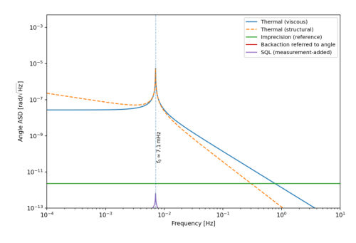 
FIG. 1. Benchmark angle ASDs for the representative Cavendish parameters in Eq. (40). The thermal curves are shown for both viscous and structural damping. The impreci- sion and backaction curves are the reference pair of Eq. (43), tuned to touch the measurement-added SQL at resonance. The values at f0 ≃7.1 mHz are numerically consistent with Eqs. (44)–(47).

📷 Fig 2

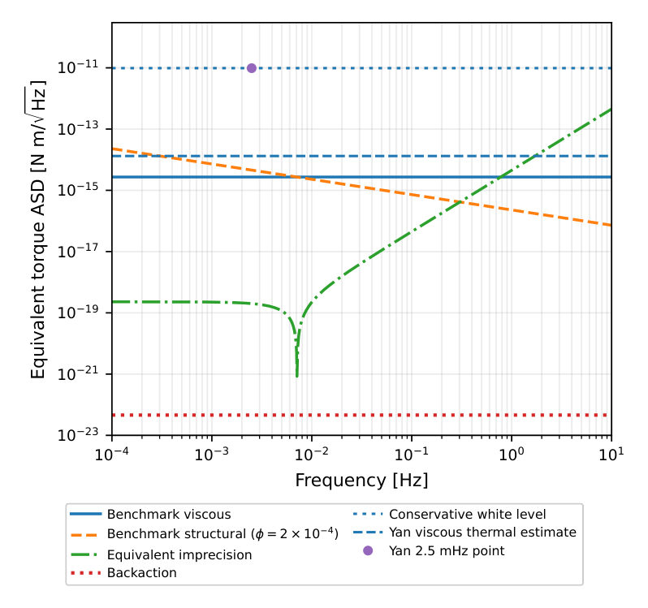 
FIG. 2. Equivalent torque ASDs on common axes. The benchmark curves show, in equivalent torque units, the representative room-temperature viscous thermal, structural thermal, equivalent-imprecision, and backaction levels for Eq. (40); the structural- loss curve uses ϕ = 2×10−4 only as an illustration of the red 1/√f scaling in equivalent torque units. The point marks the public sensitivity quoted by Yan et al. at 2.5 mHz, converted by Eq. (50). The dashed horizontal line shows the illustrative viscous thermal level inferred from the published f0, Q, and I via Eq. (52); the dotted horizontal line shows the conservative white level obtained by interpreting the public point as a...

**Summary.** This paper develops a comprehensive statistical framework for analyzing torsion-balance data to test deviations from Newtonian gravity. It quantifies constraints on both deterministic signals and stochastic noise sources by carefully subtracting calibrated noise budgets. The methodology provides a standardized, quantum-limited interface for experimental searches in semiclassical gravity.

**Why it may be interesting.** The rigorous application of quantum noise analysis (e.g., backaction, quantum limits) to macroscopic, low-frequency gravitational measurements provides a unique bridge between quantum measurement theory and fundamental physics tests.

Detailed structure

**Main problem.** The paper aims to use calibrated torsion-balance measurements to set rigorous bounds on both deterministic and stochastic deviations from standard Newtonian gravity, providing an interface for testing semiclassical gravity models.

**Main result.** The analysis derives specific bounds, such as a torque-diffusion coefficient $D_τ \lesssim 2.4	imes10^{-23}\,\mathrm{N^2\,m^2\,s}$ from existing sensitivities, which constrain potential deviations from standard gravity.

**Method.** It employs advanced signal processing techniques, including matched-filter bounds (Cramér-Rao) for deterministic signals and residual spectrum analysis for stochastic noise, all calibrated against known noise sources.

**Model / system.** The physical system is a torsion balance, modeled as a linear torsional oscillator. The analysis incorporates the full noise budget, including thermal, Newtonian, environmental, imprecision, and backaction noise sources, using the torsional susceptibility $\chi(\omega)$.

**Key observables.** Calibrated angle-equivalent noise budget, residual torque spectrum, and the torque-diffusion coefficient ($D_τ$).

**Important parameters / regimes.** Room-temperature resonant thermal ASD ($1.36	imes10^{-4}\,\mathrm{rad}/\sqrt{\mathrm{Hz}}$) and the measurement-added SQL ($3.25	imes10^{-12}\,\mathrm{rad}/\sqrt{\mathrm{Hz}}$).

**Assumptions / limitations.** The analysis constrains observable torque projections rather than testing the full relativistic semiclassical Einstein equation, and the white-noise limit is required to simplify the stochastic bound to $D_τ$.

**Figures summary.** Not specified.

**Paper structure.** The paper establishes a standardized measurement interface using one-sided PSDs, details the matched-filter formalism for deterministic tests, and develops the residual spectrum analysis for stochastic noise, culminating in the derivation of $D_τ$.

Abstract

Calibrated torsion-balance spectra constrain deterministic and stochastic deviations from standard Newtonian gravity. Using one-sided spectra, we derive a calibrated angle-equivalent noise budget and finite-time matched-filter/Cramér-Rao bounds for known torque templates. For stochastic models, subtracting the calibrated standard noise budget (thermal, Newtonian, environmental, imprecision, backaction) from the observed angle spectrum yields a residual spectrum, convertible to an equivalent residual torque spectrum via calibrated torsional susceptibility. This bounds additional stationary stochastic torque noise. This frequency-resolved bound compresses to a single torque-diffusion coefficient, $D_τ$, only in the Markovian white-noise limit; non-Markovian or colored models require the full residual spectrum. Page--Geilker branch discrimination and Fedida-Kent mixture-equivalence tests address distinct physical questions, but upon projection onto torque templates, both reduce to the same statistical matched-filter discrimination problem. For a room-temperature Cavendish benchmark, resonant thermal angle ASD is $1.36\times10^{-4}\,\mathrm{rad}/\sqrt{\mathrm{Hz}}$, while measurement-added SQL is $3.25\times10^{-12}\,\mathrm{rad}/\sqrt{\mathrm{Hz}}$. For the Yan \emph{et al.} search, the reported $0.3\,μ\mathrm{rad}/\sqrt{\mathrm{Hz}}$ sensitivity at $2.5\,\mathrm{mHz}$ yields a conservative bound $D_τ\lesssim 2.4\times10^{-23}\,\mathrm{N^2\,m^2\,s}$, assuming white torque noise. These formulations provide an interface linking calibrated torsion-balance data, deterministic tests, and stochastic semiclassical-gravity searches, without asserting a direct test of the full relativistic semiclassical Einstein equation.

[↑ back to top](#top)

### [Current fluctuations in a gas of active Ornstein-Uhlenbeck particles](http://arxiv.org/abs/2608.25916v1)

**Authors:** Sandeep Jangid, Aman Kumbhakar, Juliane U. Klamser, Tridib Sadhu  
**Type:** theory · **Category:** statistical mechanics · **PDF:** <https://arxiv.org/pdf/2608.25916v1>  
**Analysis basis:** full PDF text, analyzed in chunks
**Topic relevance:** `Full counting statistics` **3/5** · `Keldysh / 2PI / non-Gaussian methods` **3/5** · `non-equilibrium universality` **3/5** · `driven-dissipative phase transition` **2/5** · `methods for driven-dissipative` **2/5** · `Frenkel-Kontorova` **1/5** · `analog quantum simulation` **1/5** · `correlated / nonlocal dissipation` **1/5** · `quantum measurements` **1/5** · `scars & prethermalization` **1/5**

📷 Fig 1

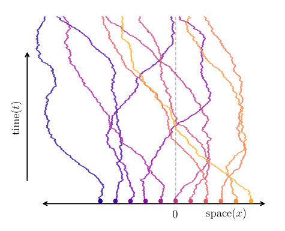 
Fig. 1: Schematic trajectories of a collection of non-interacting AOUPs on a one-dimensional line. In this example, all particles start with zero initial velocity (v0 = 0). Particle current is measured across the origin, indicated by a dashed line.

📷 Fig 2

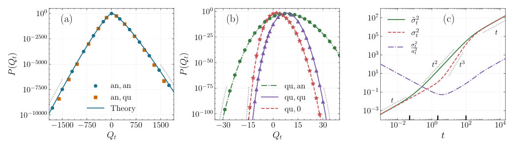 
Fig. 2: Probability distribution of the current: (a) For annealed initial positions, the circles and squares denote the numerical simulation results obtained by importance sampling [48] for the annealed-velocity and quenched-velocity ensembles, respectively. The blue solid line represents the normalised distribution in Eq. (8) with Φ(q) obtained by Legendre transform of Eq. (3). The dotted lines indicate the e−Qt ln Qt-tails. (b) For quenched initial positions, the green circles, purple triangles, and red stars denote numerical simulation results for the annealed-velocity, quenched-velocity, and zero-velocity ensembles, respectively. The green dash-dotted, purple solid, and red dashed lines...

📷 Fig 3

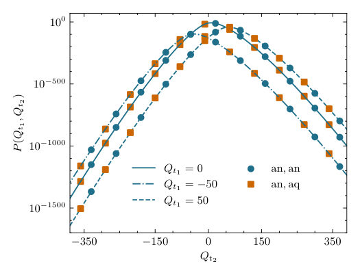 
Fig. 3: Joint distribution of the current at two times: The lines show the joint probability distribution P(Qt1, Qt2), plotted as a function of Qt2 for fixed Qt1, obtained using the Legendre transform of Eq. (12) and writing the distribution in a form analogous to Eq. (8). The results shown are for times t1 = 10 and t2 = 20, with densities ρa = 3

📷 Fig 4

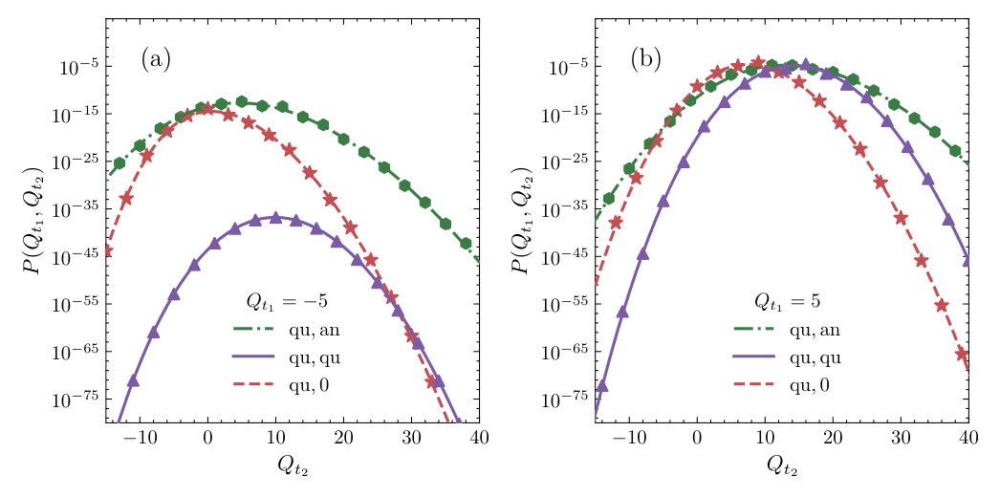 
Figure 1. Domain-wall state: Two-time current probability distribution at times t1 = 10 and t2 = 20 for non-uniform densities (ρa, ρb) = ( 3

📷 Fig 5

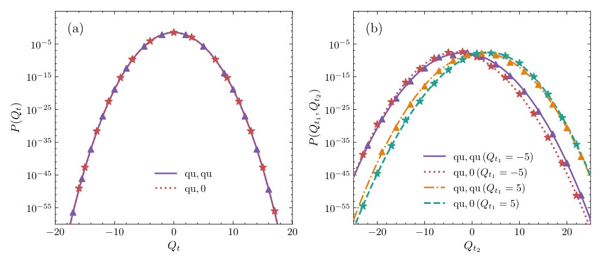 
Figure 2. Equilibrium state: (a) Comparison of the single-time current probability distribution in the (qu, qu) and (qu, 0) ensembles. The lines indicate the theoretical results obtained from the corresponding single-time CGFs, given in Eqs. (6) and (9) of the Letter. The data points denote the corresponding numerical simulation results, with triangles for the (qu, qu) ensemble and stars for the (qu, 0) ensemble. (b) Two-time current probability distribution at times t1 = 10 and t2 = 20, shown for the fixed values of Qt1 indicated in the legend. For the (qu, qu) ensemble, the theoretical predictions (lines), obtained using the Legendre transform of the CGF in Eq. (20), match the...

**Summary.** This work analyzes the current fluctuations in a model of active particles (AOUPs) using advanced statistical tools like large-deviation theory. It establishes that active systems exhibit complex, time-dependent scaling regimes unlike passive ones. The methodology involves calculating complex CGFs for both single-time and two-time current measurements, providing a detailed statistical characterization of non-equilibrium transport.

**Why it may be interesting.** The study of active matter dynamics and non-equilibrium statistical mechanics is highly relevant to AMO physics, particularly in systems involving particle transport or driven quantum systems where non-Markovian effects and non-equilibrium fluctuations are key.

Detailed structure

**Main problem.** The paper investigates the statistics of the time-integrated current in a gas of active Ornstein-Uhlenbeck particles, contrasting its behavior with passive diffusive systems.

**Main result.** Active systems exhibit distinct diffusive, super-diffusive, and sub-diffusive scaling regimes for current fluctuations, and the statistics retain a memory of the initial state even at large times.

**Method.** The analysis relies heavily on large-deviation theory, calculating Cumulant Generating Functions (CGFs) for both one-time and two-time current measurements.

**Model / system.** The model is an infinite one-dimensional gas of independent active Ornstein-Uhlenbeck particles (AOUPs), whose dynamics are governed by coupled equations for position and velocity.

**Key observables.** Time-integrated current ($Q_t$), joint probability distribution $P(Q_{t_1}, Q_{t_2})$, and the associated Large-Deviation Function (LDF) $\Phi(q)$.

**Important parameters / regimes.** Initial densities ($
ho_a, 
ho_b$), time scales ($	au$), and the ratio of active to diffusive effects (related to $Pe^2/2D	au$).

**Assumptions / limitations.** The analysis distinguishes between 'annealed' and 'quenched' averaging procedures over initial conditions, and uses rare-event importance sampling for numerical verification.

**Figures summary.** Figures illustrate the scaling of current fluctuation variances ($	ilde{\sigma}_t^2$ vs. time) showing multiple dynamical regimes, and show the joint probability distribution $P(Q_{t_1}, Q_{t_2})$ for different initial conditions.

**Paper structure.** The paper systematically derives the CGFs for the current in various ensembles (annealed/quenched for position and velocity), analyzes the resulting scaling regimes, and extends the formalism to calculate the two-time joint current statistics.

Abstract

We investigate the statistics of the time-integrated current in an infinite one-dimensional gas of independent active Ornstein--Uhlenbeck particles, as a model system for studying an active generalisation of the corresponding passive (diffusive) phenomenology. Unlike the latter, where current fluctuations exhibit universal sub-diffusive scaling, active systems display diffusive, super-diffusive, and sub-diffusive regimes over different time scales. We fully characterise the distribution of current in terms of large-deviation asymptotics, showing that all of these scaling regimes are described by a single scaled cumulant generating function. Moreover, the statistics retain a dependence on the initial condition even at large times, revealing a persistent memory of the initial state. We further obtain the joint large-deviation statistics of currents measured at two distinct times, characterising temporal correlations. Our analytical predictions are verified using rare-event importance sampling, which resolves probabilities as small as $10^{-1000}$.

[↑ back to top](#top)

### [Optical centrifuge as a probe of strong dissipative coupling between a molecular rotor and superfluid helium](http://arxiv.org/abs/2608.25161v1)

**Authors:** Ian MacPhail-Bartley, Sören E. Mahr, Cameron E. Peters, Baptiste Coquinot, Volker Karle, Giacomo Bighin, Ragheed Alhyder, Mikhail Lemeshko, Henrik Stapelfeldt, Valery Milner  
**Type:** both · **Category:** other · **PDF:** <https://arxiv.org/pdf/2608.25161v1>  
**Analysis basis:** full PDF text, analyzed in chunks
**Topic relevance:** `correlated / nonlocal dissipation` **3/5** · `driven-dissipative phase transition` **3/5** · `methods for driven-dissipative` **3/5** · `non-equilibrium universality` **2/5** · `quantum measurements` **2/5** · `Frenkel-Kontorova` **1/5** · `Keldysh / 2PI / non-Gaussian methods` **1/5** · `analog quantum simulation` **1/5** · `scars & prethermalization` **1/5**

📷 Fig 1

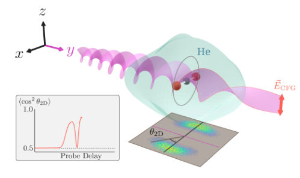 
Figure 1. Geometry of the Velocity Map Imaging experiment. The magenta corkscrew represents the electric field of the optical centrifuge (⃗ECFG), propagating to the right along the y axis. The VMI spectrometer, oriented along the z axis, projects the ion fragment velocities onto the xy plane of the detector. θ2D is the angle of a detected ion fragment, measured with respect to the xz plane of centrifuge rotation. A carbon disulfide (CS2) molecule inside a helium droplet is shown aligned to the centrifuge, with a simulated distribution of S+ fragments shown below. The inset illustrates ⟨cos2 θ2D⟩(t) for a molecule following the rotation of ⃗ECFG during the initial portion of the centrifuge...

📷 Fig 2

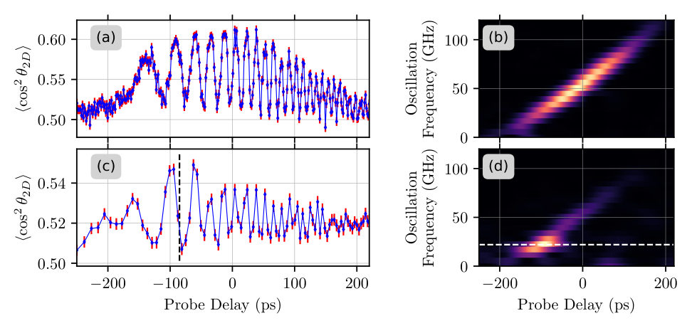 
Figure 2. Degree of alignment in the ensemble of centrifuged CS2 molecules, expressed as ⟨cos2 θ2D⟩(t) (blue markers with red error bars) and measured in (a) the seeded molecular jet, and (c) helium nanodroplets. Blue lines connect the data points to help guide the eye. Applying a short-time Fourier transform to both signals results in the corresponding two-dimensional spectrograms, shown in panels (b) and (d). The white dashed line in panel (d) marks the “centrifugal wall” of the CS2-helium complex, occurring around 22 GHz (Ref. 18).

📷 Fig 3

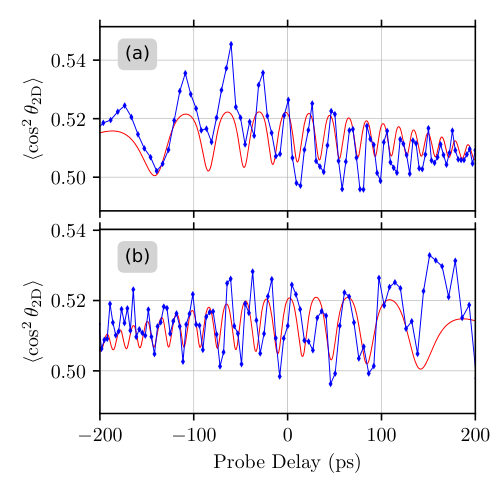 
Figure 3. The alignment dynamics of CS2 molecules embedded in helium droplets spun by accelerating and decelerating ultraslow optical centrifuges, with ⟨cos2 θ2D⟩(t) shown in (a) and (b), respectively. The experimental data (connected blue diamonds) is compared with the results of our numerical simulations (red traces).

📷 Fig 4

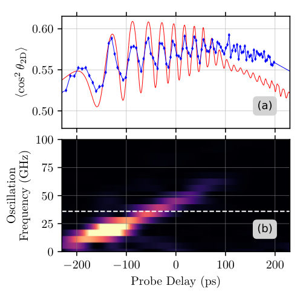 
Figure 4. (a) The alignment dynamics of centrifuged OCS molecules embedded in helium droplets. The experimental data (connected blue diamonds) is compared with the results of our numerical simulations (red traces). (b) Short-time Fourier transform, with the “centrifugal wall’ indicated by the white dashed line.

📷 Fig 5

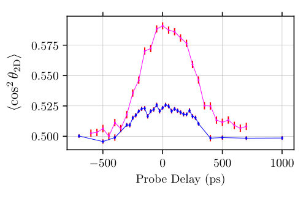 
Figure 5. ⟨cos2 θ2D⟩signal averaged over the random initial orientation of the centrifuge polarization (see Supplementary Information for details). Connected blue (magenta) diamonds with red error bars correspond to CS2 (OCS) molecules embedded in helium droplets.

**Summary.** This paper investigates molecular rotation in superfluid helium using an optical centrifuge to probe strong dissipative coupling. By continuously driving the rotor, the system is forced into a regime where molecular energy matches the superfluid excitation spectrum. The resulting dynamics allow researchers to directly measure the molecule-bath coupling strength by tracking the decay of molecular alignment.

**Why it may be interesting.** This work is highly relevant to AMO physics as it tackles open quantum systems problems—specifically, how coherent quantum dynamics are modified and controlled by strong coupling to a complex quantum bath (superfluid helium).

Detailed structure

**Main problem.** The research aims to understand the breakdown of frictionless motion at the nanoscale when objects move through superfluid helium, specifically reaching the regime of strong dissipative coupling.

**Main result.** The use of an ultraslow optical centrifuge successfully drives the system into the strong-dissipation regime, allowing for a direct measurement of the molecule-bath coupling strength by observing the loss of molecular alignment.

**Method.** The study combines experimental techniques (VMI, optical centrifuging) with theoretical modeling using master equations and time-dependent Lindblad dynamics to simulate the rotor-bath interaction.

**Model / system.** The system involves molecular rotors ($	ext{CS}_2$, $	ext{OCS}$) embedded in superfluid helium, driven by a time-varying optical centrifuge field. The dynamics are modeled using a Hamiltonian in the rotating frame coupled to a thermal bath via a master equation.

**Key observables.** The degree of molecular alignment, $\langle \cos^2 	heta_{2D} 
angle(t)$, is the primary diagnostic observable, tracked via time-resolved measurements and spectrograms.

**Important parameters / regimes.** Key parameters include the Landau critical velocity, the centrifugal wall limit, and the characteristic thermalization rate ($	au$) which defines the strong-dissipation regime.

**Assumptions / limitations.** The analysis relies on phenomenological master equations and Lindblad ansatzes to model the bath interaction, and the steady-state construction is noted to omit transient memory effects.

**Figures summary.** Figures illustrate the VMI geometry and time evolution of the alignment signal $\langle \cos^2 	heta_{2D} 
angle(t)$ for $	ext{CS}_2$ in both jets and droplets, comparing model predictions (Lindblad vs. steady-state) against experimental data.

**Paper structure.** The paper progresses by establishing the physical problem (dissipation in superfluid helium), introducing the optical centrifuge as a novel probe, developing the theoretical framework (Hamiltonian and master equation), and finally comparing model predictions (steady-state vs. time-dependent Lindblad) against experimental measurements for both $	ext{CS}_2$ and $	ext{OCS}$.

Abstract

A macroscopic manifestation of superfluidity is that objects moving through liquid helium experience negligible friction below the Landau critical velocity. How this frictionless motion breaks down at the nanoscale remains an open question. Molecules embedded in helium nanodroplets represent a well-controlled system for studying this breakdown, yet none has reached the regime of strong dissipative coupling, when energy transfer from the molecule to the superfluid dominates the observed dynamics. Molecular rotation, induced by short laser pulses, offer a suitable probe to reach rotational energies in the range of the roton gap, where superfluid helium supports a large number of elementary excitations. However, the solvation shell around a rotating molecule caps the energy reachable by a free rotor after impulsive excitation well below the roton excitation energy. Here we show that continuous driving with an ultraslow optical centrifuge overcomes this limitation: the strong field dresses the molecule into pendular states whose energies fall within the spectrum of the collective excitations of the superfluid, placing the system in the strong-dissipation regime. The resulting rapid thermalization locks the molecule to the rotating field until the rotation-induced level splittings overtake the thermalization rate, beyond which the molecular alignment is progressively lost. Our approach offers a direct measurement of the molecule-bath coupling in a quantum fluid.

[↑ back to top](#top)

### [Fluctuation-dissipation structure of quantum geometry](http://arxiv.org/abs/2608.25006v1)

**Authors:** Per Moosavi  
**Type:** theory · **Category:** statistical mechanics · **PDF:** <https://arxiv.org/pdf/2608.25006v1>  
**Analysis basis:** full PDF text, analyzed in chunks
**Topic relevance:** `correlated / nonlocal dissipation` **3/5** · `driven-dissipative phase transition` **3/5** · `non-equilibrium universality` **3/5** · `Keldysh / 2PI / non-Gaussian methods` **2/5** · `methods for driven-dissipative` **2/5** · `quantum measurements` **2/5** · `analog quantum simulation` **1/5**

📷 Fig 1

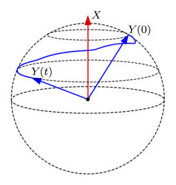 
FIG. 2. Sketch of transport behavior in terms of induced tangent vectors to the space of density operators: The vec- tor Y (t) rotates in time t on a higher-dimensional sphere around a fixed vector X, their angle [see Eq. (23)] corre- sponding to a time-dependent conductivity. Generically, on physical grounds, Y (t) starts on a small circle, orthog- onal to X, and rotates asymptotically onto a larger paral- lel small circle. If the two circles are the same (constant angle) and lie above the “equator”, transport is purely bal- listic; if they are different (decaying angle) and the larger circle is the “equator”, it is purely diffusive.

📷 Fig 2

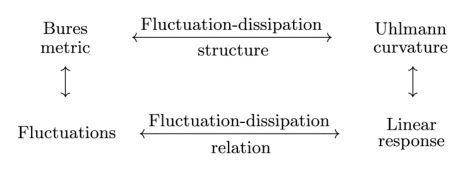 
FIG. 1. Fluctuation-dissipation and the geometry of quan- tum states. The upper horizontal relation [see Eq. (4)] always holds, and the right and left vertical relations [see Eqs. (19) and (20)] are established for equilibrium states. The lower horizontal arrow is the usual fluctuation- dissipation relation, and it follows from the upper relation.

**Summary.** This work develops a unified geometric framework that links the metric and curvature of mixed quantum states via a fluctuation-dissipation structure. It demonstrates that this structure naturally reduces to the known Kähler geometry for pure states. Crucially, it uses this geometric insight to provide a physical characterization of diverse transport behaviors, such as diffusion and ballistic motion, based on the system's linear response.

**Why it may be interesting.** It provides a deep, unified geometric framework connecting fundamental concepts like quantum geometry (Bures/Uhlmann metrics) directly to measurable transport properties (conductivity), which is highly relevant for understanding open quantum systems and non-equilibrium dynamics.

Detailed structure

**Main problem.** The paper aims to identify a general geometric structure relating the distance measure (metric) and curvature for mixed quantum states that embodies the physical principle of fluctuation-dissipation.

**Main result.** This structure unifies quantum geometry with fluctuation-dissipation, showing that the geometry is Kähler if and only if the state is pure, and providing a geometric characterization for various transport behaviors.

**Method.** The authors define and analyze the metric ($G_
ho$) and curvature ($F_
ho$) tensors for mixed states, relating them via a generalized fluctuation-dissipation structure and connecting them to linear response functions ($\kappa_{ab}(t)$).

**Model / system.** The analysis applies to general quantum states ($
ho$) on a Hilbert space, covering both pure and mixed states, and relates these abstract geometric concepts to physical transport phenomena.

**Key observables.** Distance measure ($G_
ho$), Curvature ($F_
ho$), Linear response function ($\kappa_{ab}(t)$), and the derived quantum geometric tensor.

**Important parameters / regimes.** Finite temperature (mixed states), time evolution ($t$), and frequency ($\omega$) in the response functions.

**Assumptions / limitations.** The analysis assumes the existence of a general structure relating metric and curvature, and for transport, it assumes the initial state is in equilibrium.

**Figures summary.** Figure 1 illustrates the general fluctuation-dissipation structure relating distance measure and curvature; Figure 2 sketches transport behavior regimes (ballistic, diffusive) based on vector rotation.

**Paper structure.** The paper first establishes the general fluctuation-dissipation structure for mixed states, showing its reduction to the Kähler structure for pure states. It then applies this framework to linear response theory, equating the response function to the Uhlmann curvature, and finally uses this relationship to geometrically classify transport regimes (diffusion, ballistic) via the time evolution of tangent vectors.

Abstract

The geometry of quantum states is a fundamental research area with applications ranging from band theory in condensed matter to variational algorithms in quantum information. Due to their relative simplicity, pure states are usually studied, while mixed ones are needed in general, for instance to allow for finite temperatures. The geometry of mixed states, however, is much more challenging, with important aspects yet to be explored. Here, we provide one missing piece by identifying the structure that relates distance measure and curvature for general (mixed or pure) quantum states. This structure is shown to carry the physical meaning of fluctuation-dissipation---by directly relating distance measure with fluctuations and curvature with linear response---and it turns into the corresponding well-known structure for pure states, where it is Kähler, and only then. We thus obtain a general, simple fluctuation-dissipation picture, which, among its consequences, implies that response functions inherently probe the mixed-state quantum geometric tensor. We end by using this picture to give geometric characterizations of generic transport behaviors.

[↑ back to top](#top)

### [Fate of the non-Abelian Moore-Read manifold under the non-Hermitian skin effect](http://arxiv.org/abs/2608.25816v1)

**Authors:** Jiaxuan Guo, Simin Nie, Xiting Zhang, Fritz B. Prinz  
**Type:** theory · **Category:** strongly correlated electrons · **PDF:** <https://arxiv.org/pdf/2608.25816v1>  
**Analysis basis:** full PDF text, analyzed in chunks
**Topic relevance:** `analog quantum simulation` **3/5** · `driven-dissipative phase transition` **3/5** · `methods for driven-dissipative` **3/5** · `Keldysh / 2PI / non-Gaussian methods` **2/5** · `Full counting statistics` **1/5** · `correlated / nonlocal dissipation` **1/5** · `non-equilibrium universality` **1/5** · `quantum measurements` **1/5**

📷 Fig 1

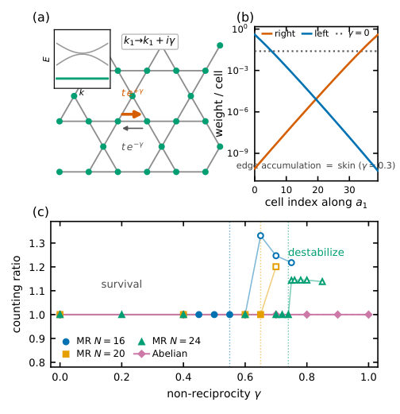 
FIG. 1. Model and results. (a) Kagome flat band with the imaginary-gauge (Hatano–Nelson) deformation k1 →k1 + iγ, the generator of the non-Hermitian skin effect. The inset is a schematic of the flattened band structure, with the flat lowest band (green) isolated from the two dispersive bands. (b) The resulting skin effect on the underlying single-particle carrier. With an open a1 boundary (γ = 0.3), the right eigenstates pile at one edge and the left eigenstates at the other (mean weight per cell over all states, log scale), compared with the flat γ = 0 profile; the full set of single-particle skin signatures is in the Supplemental Material, Sec. S5. (c) The Moore– Read (2, 4)...

📷 Fig 2

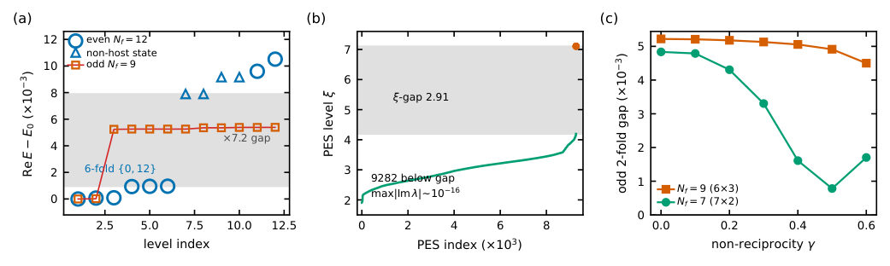 
FIG. 2. Clean Moore–Read baseline at γ = 0 and its Ising even-odd fingerprint. (a) Low-lying many-body spectrum E −E0 versus level index. Even fermion number (Nf = 12, N = 24; blue) gives the sixfold near-degenerate Moore–Read manifold in momentum sectors {0, 12} (circles below the shaded gap; gap-to-manifold-width ratio 7.2); above the gap sit the first intruders from other momentum sectors (triangles) and higher host-sector states (circles). Odd fermion number (Nf = 9, N = 18; orange squares) instead gives a twofold Ising-odd manifold, the dσ = √

📷 Fig 3

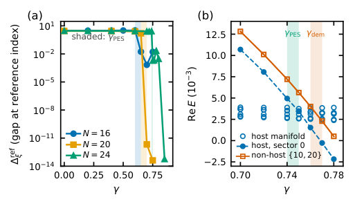 
FIG. 4. (a) Instantaneous-lowest-six reference-rank entangle- ment gap ∆ref ξ versus γ for N = 16, 20, 24 (log scale); shading marks each γPES bracket. (b) Re E at N = 24 for six plot- ted host-sector branches (open circles), a descending host- sector-0 branch (filled circles), and the lowest non-host pair {10, 20} (squares). Shaded intervals mark PES delocking, γPES ∈(0.74, 0.75], and non-host entry, γdem ∈(0.76, 0.77]; instantaneous-lowest-six delocking precedes non-host entry.

📷 Fig 4

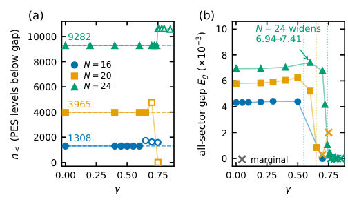 
FIG. 3. Survival of the Moore–Read (2, 4) counting under the skin effect. (a) Number of PES levels below the entan- glement gap, n&lt;, versus nonreciprocity γ for N = 16, 20, 24 (NA = 4). The count remains at the clean references 1308/3965/9282 (dashed lines) throughout the reported win- dows γ ≤0.55/0.65/0.74 and changes at the first sampled point beyond the size-dependent γPES. At N = 16, the main convention still returns 1308 at γ = 0.60, outside the reported window, while sign-blind readings give a different result; γPES therefore remains (0.60, 0.65]. Filled/open symbols denote samples locked/delocked under the main convention (Sec. V). (b) Many-body real-line gap Eg from the six...

**Summary.** This paper analyzes the stability of the non-Abelian Moore-Read topological order when subjected to a non-Hermitian skin effect in a fractional Chern insulator model. Using particle-entanglement counting, the authors demonstrate that the topological signature remains robust over a finite range of nonreciprocity, although the Abelian counterpart proved more stable. This establishes a diagnostic tool for characterizing topological phases in open, non-Hermitian quantum systems.

**Why it may be interesting.** The work provides a concrete theoretical framework for diagnosing topological order in open, non-Hermitian systems, which is highly relevant for understanding edge physics in synthetic quantum materials.

Detailed structure

**Main problem.** The study investigates how the non-Hermitian skin effect alters the topological order of a non-Abelian Moore-Read fractional Chern insulator.

**Main result.** The non-Abelian Moore-Read entanglement counting remains robust and locks to clean references over finite nonreciprocity windows, although the Abelian Laughlin state was found to be even more robust.

**Method.** The analysis uses biorthogonal methods to solve the non-Hermitian Hamiltonian and diagnoses topological order via the biorthogonal (2, 4)-admissible particle-entanglement counting.

**Model / system.** The model is a non-Abelian Moore-Read fractional Chern insulator realized on a kagome lattice, incorporating a Hatano-Nelson type imaginary-gauge deformation and a three-body interaction.

**Key observables.** Biorthogonal (2, 4)-admissible particle-entanglement counting (Moore-Read fingerprint), spectral gaps, and the persistence of the count versus the nonreciprocity parameter $\gamma$.

**Important parameters / regimes.** Nonreciprocity parameter $\gamma$, system size $N$ ($16, 20, 24$), and the filling fraction $
u$ ($
u=1/2$ for Moore-Read, $
u=1/3$ for Laughlin).

**Assumptions / limitations.** The analysis relies on selecting the six lowest-Re energy eigen-pairs to define the ground-state manifold and the entanglement spectrum.

**Figures summary.** Figures illustrate the imaginary-gauge deformation on the kagome lattice, the skin effect on single-particle eigenstates, and the entanglement-counting ratio remaining locked for the Moore-Read state over a finite window.

**Paper structure.** The paper introduces the non-Hermitian model and the diagnostic tool (PES counting), presents results showing the finite-size survival window for the Moore-Read count, compares it to the Abelian Laughlin state, and discusses the physical implications of the delocking threshold.

Abstract

We study a non-Abelian Moore-Read fractional Chern insulator under a translation-preserving, nonreciprocal deformation that generates the non-Hermitian skin effect under open boundaries. The model combines the imaginary-gauge Hatano-Nelson deformation with a kagome-lattice three-body interaction designed to stabilize Moore-Read order at $ν=1/2$. Our primary diagnostic is the biorthogonal $(2,4)$-admissible particle-entanglement counting of the sixfold Moore-Read manifold, the standard Moore-Read fingerprint. Across three sizes ($N=16,20,24$), the counting locks to the clean references 1308, 3965, and 9282 over finite nonreciprocity windows through $γ\le0.55$, $0.65$, and $0.74$, respectively, with positive reference-rank entanglement gaps. Within every reported window the count is unchanged by the spectral readings tested; at $N=16$ it is also unchanged across three reduced density operators, with all 15 combinations returning 1308. The sixfold pattern for even $N_f$ and the adiabatically tracked Ising-odd doublet remain separated over the tested range $γ\le0.6$. Beyond a geometry-dependent threshold the instantaneous-lowest-six reference-rank gap drops sharply and its counting destabilizes. At $N=24$ a sector-0 branch pair becomes complex conjugate over a narrow interval inside the delocking bracket; both continuations through the interval are delocked at the tested PES points $γ=0.76$, $0.77$, and $0.80$. A same-lattice Abelian $ν=1/3$ Laughlin realization retains its counting to $γ=1.0$, so its counting is the more robust. On the torus the eigenstates remain extended; under open boundaries the right and left states skin-localize at opposite edges while the biorthogonal particle-entanglement spectrum is invariant under the imaginary-gauge similarity, so the torus and the open cylinder probe the same deformation under periodic and open boundaries.

[↑ back to top](#top)

### [Exact chemo--thermal Metropolis Brownian engine: chemical leverage, temperature-neutral stall, power optimization, and multicyclic dissipation](http://arxiv.org/abs/2608.25638v1)

**Authors:** Mesfin Taye  
**Type:** theory · **Category:** statistical mechanics · **PDF:** <https://arxiv.org/pdf/2608.25638v1>  
**Analysis basis:** full PDF text, analyzed in chunks
**Topic relevance:** `driven-dissipative phase transition` **3/5** · `methods for driven-dissipative` **3/5** · `non-equilibrium universality` **3/5** · `Keldysh / 2PI / non-Gaussian methods` **2/5** · `analog quantum simulation` **1/5** · `correlated / nonlocal dissipation` **1/5** · `quantum measurements` **1/5**

📷 Fig 1

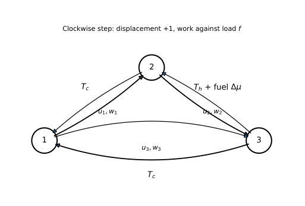 
FIG. 1. Three-state chemo–thermal Metropolis engine. The cold bath acts on links 1 ↔2 and 3 ↔1; the hot bath acts on 2 ↔3. A forward hot transition consumes one fuel molecule of free-energy drop ∆µ. Each clockwise jump advances the particle by one lattice spacing against load f.

📷 Fig 2

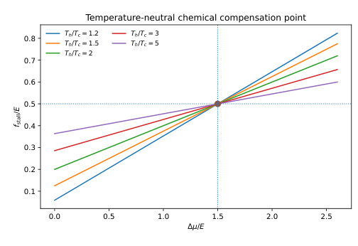 
FIG. 2. Exact stall force versus chemical free energy for sev- eral hot/cold temperature ratios, with E = Tc = 1. All curves cross at the temperature-neutral point ∆µ/E = 3/2, fstall/E = 1/2.

📷 Fig 3

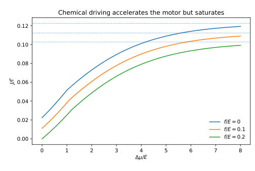 
FIG. 3. Exact stationary current versus chemical affinity for several loads (E = Tc = 1, Th = 2, Γ = 1). The dotted hori- zontal lines are the strong-chemical-driving limits in Eq. (88).

📷 Fig 4

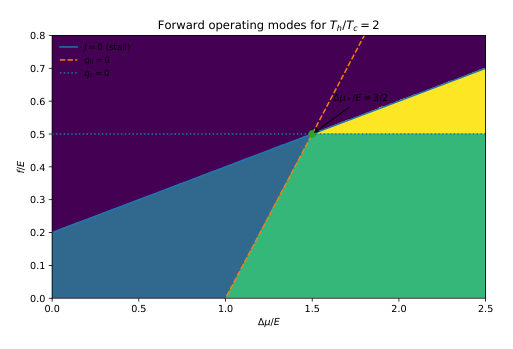 
FIG. 4. Exact operating-mode map for Th/Tc = 2. The solid line is stall, the dashed line is qh = 0, and the dotted horizontal line is qc = 0. The three forward-running colored regions correspond to a hybrid heat engine (qh &gt; 0, qc &gt; 0), a chemical motor dissipating into both baths (qh &lt; 0, qc &gt; 0), and a chemical motor that also refrigerates the cold bath (qh &lt; 0, qc &lt; 0).

📷 Fig 5

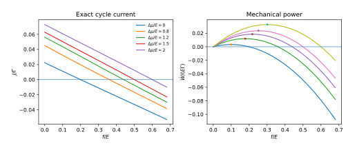 
FIG. 5. Exact current and mechanical power versus load for several chemical affinities (E = Tc = 1, Th = 2, Γ = 1). Chemical driving moves stall to larger load and increases the maximum power. The dots indicate numerical solutions of the exact stationarity condition (100).

**Summary.** This work provides an exact theoretical framework for a chemo-thermal Brownian engine, modeling energy conversion driven by both temperature gradients and chemical fuel. Key findings include determining the stall force and identifying a unique temperature-neutral point where performance is robust against temperature changes. The methodology is highly valuable for understanding non-equilibrium processes in complex open systems.

**Why it may be interesting.** The rigorous, exact treatment of non-equilibrium thermodynamics in a coupled chemo-thermal system provides powerful analytical tools applicable to open quantum systems where multiple energy reservoirs (heat, chemical potential) drive dynamics.

Detailed structure

**Main problem.** The paper develops an exactly solvable model to study energy transduction in a chemo-thermal Brownian heat engine, driven by both temperature gradients and chemical free energy drops.

**Main result.** It derives the exact stall force and identifies a temperature-neutral chemical compensation point where the stall force is independent of reservoir temperatures. The analysis also shows that the stationary current increases monotonically with chemical fuel consumption.

**Method.** The analysis uses the master equation approach derived from local detailed balance to obtain exact stationary probabilities and currents, avoiding common approximations like linear-response theory.

**Model / system.** The system is a three-state periodic energy sequence engine ($0 	o E 	o 2E 	o 0$) coupled to two cold and one hot reservoir, with chemical fuel ($\mu$) consumed during the hot transition.

**Key observables.** Cycle Affinity ($\mathcal{A}$), Stall Force ($f_{stall}$), Stationary Current ($J$), and Exergy Efficiency ($\eta_x$).

**Important parameters / regimes.** Temperature difference ($\Th - \Tc$), energy gap ($E$), and chemical potential drop ($\mu$).

**Assumptions / limitations.** The analysis is exact for the unicyclic case, though a multicyclic extension is introduced later. The Metropolis dynamics are assumed.

**Figures summary.** Figures illustrate the universal intersection of stall curves at the temperature-neutral point, the monotonic increase of current with chemical affinity, and the dependence of power on the mechanical load.

**Paper structure.** The paper first establishes the model and derives the exact cycle affinity and stall force. It then analyzes the temperature-neutral point and the current's dependence on chemical potential. Finally, it discusses the power optimization and extends the analysis to multicyclic operation.

Abstract

We develop an exactly solvable chemo--thermal extension of the three-state Metropolis Brownian heat engine. The particle moves through the periodic energy sequence $0\to E\to 2E\to0$, performs mechanical work against a load $f$ on every forward step, interacts with two cold links and one hot link, and consumes one fuel molecule of free-energy drop $\muu$ on the hot transition. Local detailed balance gives an exact cycle affinity \begin{equation*} \mathcal A=E\left(\Tc^{-1}-\Th^{-1}\right)+\muu/\Th-f\left(2/\Tc+1/\Th\right), \end{equation*} and the full stationary probabilities and current are obtained without linear-response, weak-driving, or high-barrier approximations. Several results follow. First, the exact stall force is \begin{equation*} \fs=\frac{E(\Th-\Tc)+\Tc\muu}{2\Th+\Tc}. \end{equation*} Second, there is a temperature-neutral chemical compensation point $\muu_*=3E/2$ at which $\fs=E/2$ for every $\Th>\Tc$ and the hot and cold heats both vanish at reversible stall. Third, in both Metropolis branches the stationary current is a strictly increasing function of $\muu$ at fixed mechanical parameters, but approac

[↑ back to top](#top)

### [Quantum sampling in hybrid light-matter systems with mixed statistics](http://arxiv.org/abs/2608.25788v1)

**Authors:** Franziska Barkhausen, Laura Ares, Stefan Schumacher, Jan Sperling  
**Type:** theory · **Category:** quantum information and computing · **PDF:** <https://arxiv.org/pdf/2608.25788v1>  
**Analysis basis:** full PDF text, analyzed in chunks
**Topic relevance:** `analog quantum simulation` **3/5** · `Full counting statistics` **2/5** · `Keldysh / 2PI / non-Gaussian methods` **2/5** · `methods for driven-dissipative` **2/5** · `Tavis-Cummings & cavity-many-emitter` **1/5** · `correlated / nonlocal dissipation` **1/5** · `driven-dissipative phase transition` **1/5** · `non-equilibrium universality` **1/5** · `quantum measurements` **1/5**

📷 Fig 1

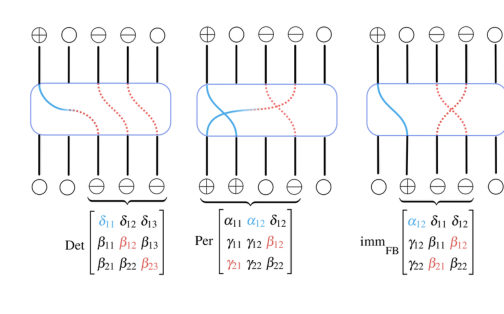 
FIG. 1. Sketch of sampling network with two bosonic ⊕, three fermionic ⊖, and vacuum ⃝modes drawn from top to bottom. The three cases yield output probabilities for determinants (Det, left), per- manents (Per, middle), and immanants (Imm, right), depending on the output-mode distribution. A purely fermionic output with one bosonic input transitioning to a fermionic mode yields the determi- nant. A mixed fermion boson output with two bosonic and one fer- moinic excitation yields the permanent, whereas two fermions and one boson yield a general matrix function. The network paths are exemplary for the colored matrix element contributions, solid blue and dotted red lines referring to bosons and...

📷 Fig 2

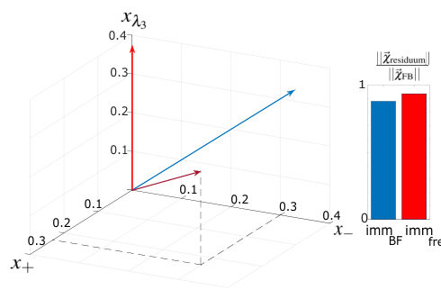 
FIG. 2. Plot of the coefficients x+ (zero), x−(blue arrow), and xλ3 (red arrow), jointly forming the purple vector, which is the expression in Eq. (34) without the residual component. The bar plot features the permanent-and-determinant-free part (left) and residuum normalized to the full length of ⃗χFB.

**Summary.** This paper develops a mathematical framework to analyze quantum sampling in hybrid light-matter systems combining fermionic and bosonic excitations. It shows that the resulting output probabilities are described by generalized matrix immanants, which are mathematically distinct from simple determinants or permanents. This demonstrates that such mixed-statistics systems enable computational functionalities beyond what is achievable with pure bosonic or fermionic quantum circuits.

**Why it may be interesting.** This work directly addresses the mathematical complexity of quantum computation in realistic, mixed-statistics physical platforms, providing a rigorous framework for quantifying quantum advantage beyond established models.

Detailed structure

**Main problem.** The paper investigates quantum sampling in hybrid light-matter systems where the statistics of excitations are mixed (fermionic and bosonic), moving beyond standard boson or fermion sampling.

**Main result.** The output probabilities are governed by generalized matrix immanants, which are proven to be linearly independent from standard determinants and permanents, indicating novel computational resources.

**Method.** The analysis uses the Born rule applied to the output state derived from a unitary linear transformation acting on mixed fermionic and bosonic operators, leading to the definition of generalized immanants.

**Model / system.** The model involves interacting light-matter systems described by a linear network transformation acting on fermionic and bosonic excitations. The complexity is analyzed by generalizing the mathematical structure beyond simple commutation relations.

**Key observables.** The output probability $p$, which is proportional to the square of the generalized immanant, $|	ext{imm}(A)|^2$.

**Important parameters / regimes.** The structure of the immanant depends on the exchange symmetries encoded by the function $\chi(\sigma)$, which can be an irreducible character of $S_N$.

**Assumptions / limitations.** The analysis often assumes single excitations per output mode and focuses on the operator part of the output state, neglecting higher-excitation terms.

**Figures summary.** Figures illustrate the sampling network for mixed modes and plot the decomposition coefficients of the resulting immanant into contributions from determinants, permanents, and residual components.

**Paper structure.** The paper progresses by first establishing the mathematical framework using immanants, then applying it to mixed fermionic/bosonic systems, and finally extending the analysis to quasiparticle sampling, showing the resulting functions exceed standard immanant forms.

Abstract

Boson sampling is one of the most prominent methods to verify quantum advantage, harnessing the computational complexity of the permanent of a network matrix. Similar quantum sampling problems utilize other expressions for the output probabilities, such as the fermion-based analog applying determinants. In this work, we study sampling setups of interacting light-matter systems, combining fermion and boson sampling. The mixed network input consists of fermionic and bosonic excitations. Sampling the output probability of the modes then yields contributions that are neither purely determinant nor permanent but general immanants. Specifically, we prove that these immanant contributions are linearly independent from determinants and permanents, rendering our mixed sampling network an ideal candidate for light-matter quantum application beyond pure fermion and boson sampling. Furthermore, quantum sampling with statistics that are neither bosonic nor fermionic results in expressions which even exceed immanants, further extending the functionality of quantum samplers.

[↑ back to top](#top)

### [Competing Soft Modes and Tunable Multicriticality in a Generalized Two-Mode Quantum Rabi Model](http://arxiv.org/abs/2608.25455v1)

**Authors:** Xiufeng Cao, Ofri Adiv, Neil G. R. Broderick  
**Type:** theory · **Category:** other · **PDF:** <https://arxiv.org/pdf/2608.25455v1>  
**Analysis basis:** full PDF text, analyzed in chunks
**Topic relevance:** `Tavis-Cummings & cavity-many-emitter` **3/5** · `analog quantum simulation` **3/5** · `Keldysh / 2PI / non-Gaussian methods` **2/5** · `methods for driven-dissipative` **2/5** · `Dicke superradiance` **1/5** · `driven-dissipative phase transition` **1/5** · `superradiant laser` **1/5**

📷 Fig 1

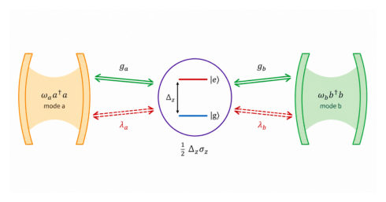 
FIG. 1: Schematic of the generalized two-mode quantum Rabi model. Two cavity modes with frequencies ωa and ωb couple to a two-level system with level splitting ∆z. Solid (dashed) arrows denote rotating-wave (counter-rotating-wave) couplings.

📷 Fig 2

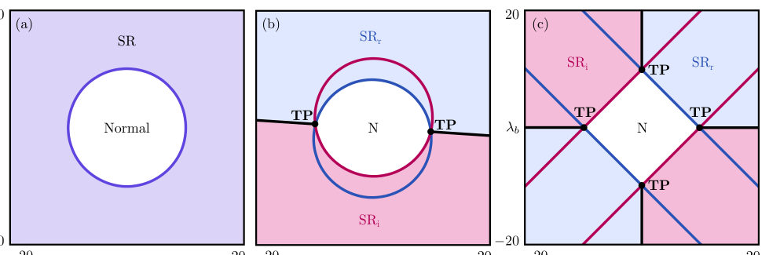 
FIG. 2: Emergence of tunable multicritical topologies in the generalized two-mode quantum Rabi model. (a) In the U(1)-symmetric limit (λa = λb = 0), the SRr and SRi phases merge into a continuously degenerate superradiant manifold bounded by a circular soft-mode instability line, supporting a Goldstone-like collective mode. (b) Finite anisotropy (λa = 0.1, λb = 1.8) lifts the Goldstone degeneracy and generates a two-triple-point topology in the (ga, gb) plane. (c) Under a different parameter section (ga = 0.1, λa = 1.8), the competing superradiant orders reorganize into a diamond-shaped four-triple-point topology in the (gb, λb) plane. Blue and magenta curves denote continuous soft-mode...

📷 Fig 3

 
Figure 2(b) shows the phase diagram in the (ga, gb) plane for finite anisotropy, with λa = 0.1 and λb = 1.8. The U(1) degeneracy is lifted, splitting the superradi- ant manifold into the competing SRr and SRi phases. In Fig. 2(b), the continuous soft-mode boundaries inter- sect the first-order SRr–SRi boundary at two symmetry- related triple points, where the normal and both su- perradiant phases coexist. This two-triple-point topol- ogy reflects the competition between coordinate- and momentum-like ordering channels. A distinct structure appears in Fig. 2(c), where ga = 0.1 and λa = 1.8 are fixed while (gb, λb) are varied. The nearly linear soft- mode boundaries form a diamond-shaped...

📷 Fig 4

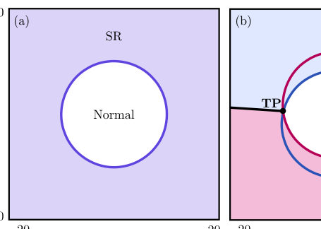 
Figure 3 reveals the dynamical origin of the multicrit- ical topologies identified in Fig. 2. The central result is that the phase diagram is governed not by a single su- perradiant instability, but by the competition between

📷 Fig 5

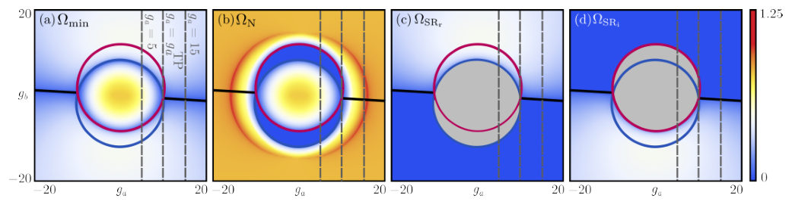 
FIG. 3: Competing soft-mode structure underlying the two-triple-point topology of the generalized two-mode quantum Rabi model. (a) Global physical soft mode selected by the ground-state phase. (b) Normal-phase soft mode. (c) SRr soft mode. (d) SRi soft mode. Blue and magenta curves denote continuous soft-mode instability boundaries, and the black solid line denotes the first-order boundary separating the SRr and SRi phases. The two triple points arise from the competition between coordinate-like and momentum-like instability channels. The redistribution of the dominant soft mode among the normal, SRr, and SRi phases establishes the dynamical mechanism responsible for the multicritical phase...

**Summary.** This theoretical study analyzes a generalized two-mode quantum Rabi model to map out its multicritical phase diagram. By employing a unified Bogoliubov-deGennes framework, the authors show that anisotropy lifts a continuous symmetry, generating distinct multicritical topologies. The key finding is that competing soft-mode instabilities, derived from collective excitations, microscopically determine the system's phase boundaries.

**Why it may be interesting.** This work provides a rigorous quantum many-body approach to understanding how microscopic couplings (like anisotropy) dictate the macroscopic phase diagram topology in light-matter interactions, which is central to quantum optics and cavity QED.

Detailed structure

**Main problem.** The paper investigates the microscopic origin and geometric organization of multicritical structures in quantum many-body systems, linking competing soft modes to phase topology.

**Main result.** Anisotropy lifts the U(1)-symmetric superradiant manifold, providing a common origin for coordinate- and momentum-like soft-mode instabilities that determine the multicritical phase structure.

**Method.** The analysis employs a unified Bogoliubov-deGennes (BdG) framework applied to an effective low-energy Hamiltonian derived via Schrieffer-Wolff transformations.

**Model / system.** The system is a generalized two-mode quantum Rabi model involving two bosonic modes and a two-level system, characterized by independently tunable rotating- and counter-rotating-wave couplings.

**Key observables.** Collective excitation spectrum ($\Omega_{N,\pm}$), ground-state energy ($E_{	ext{GS}}$), and soft-mode conditions derived from the vanishing of the lower Bogoliubov branch.

**Important parameters / regimes.** Tunable coupling strengths ($g_{a,b}, \lambda_{a,b}$), detuning ($\Delta_z$), and the ratio of coupling strengths to detuning.

**Assumptions / limitations.** The analysis relies on the large-frequency-ratio regime to apply the Schrieffer-Wolff transformation and assumes the physical phase is determined by the global minimum of the quantum-corrected ground-state energy.

**Figures summary.** Figures illustrate the phase diagram evolution, showing the transition from a U(1)-symmetric Goldstone phase to distinct multicritical topologies (two- or four-triple-point) upon introducing anisotropy.

**Paper structure.** The paper first establishes the Hamiltonian and then analyzes the normal phase using BdG theory to find soft-mode conditions. It then extends this to the two superradiant branches (SRr and SRi), unifying the analysis across all three phases to map the full multicritical phase diagram.

Abstract

Multicritical phenomena play a central role in quantum many-body systems, yet their microscopic origin in light--matter platforms remains largely unexplored. Here we investigate a generalized two-mode quantum Rabi model with independently tunable rotating- and counter-rotating-wave couplings. We demonstrate that anisotropy lifts the parent U(1)-symmetric superradiant manifold with a gapless Goldstone-like mode by phase locking the complex superradiant order parameter. This phase-locking mechanism provides the common microscopic origin of the coordinate- and momentum-like soft-mode instabilities, the emergence of symmetry-related two- and four-triple-point multicritical topologies, and the corresponding thermodynamic responses. Within a unified Bogoliubov framework, we further show how the dominant soft mode is redistributed between the two symmetry-related instability channels, thereby determining the multicritical phase structure. The resulting phase boundaries are determined by collective soft-mode softening and coincide exactly with the mean-field instability conditions. We further show that the multicritical topology is directly encoded in the full quantum ground-state energy and its response functions, establishing a unified connection between phase topology, competing collective excitations, and thermodynamic observables. Our results identify competing soft-mode channels as the microscopic origin of tunable multicriticality in strongly coupled light--matter systems.

[↑ back to top](#top)

### [Fast-forwarding quantum algorithms for weakly nonlinear dissipative differential equations and beyond](http://arxiv.org/abs/2608.25822v1)

**Authors:** Yixiang Li, Dong An  
**Type:** theory · **Category:** quantum information and computing · **PDF:** <https://arxiv.org/pdf/2608.25822v1>  
**Analysis basis:** full PDF text, analyzed in chunks
**Topic relevance:** `driven-dissipative phase transition` **3/5** · `methods for driven-dissipative` **3/5** · `non-equilibrium universality` **2/5** · `Keldysh / 2PI / non-Gaussian methods` **1/5** · `analog quantum simulation` **1/5** · `correlated / nonlocal dissipation` **1/5** · `quantum measurements` **1/5**

📷 Fig 1

 
Figure 1: Error decay EN = maxt∈[0,T ] ∥u(t) −ˆy[N] 1 (t)∥2 for dissipative systems under different choices of (f2, f0). The plots show that Carleman convergence persists not only in the regime R &lt; 1, but also for several cases with R &gt; 1.

📷 Fig 2

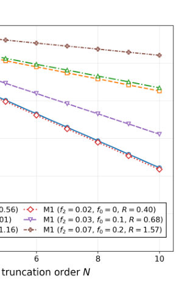 
Figure 1 shows the decay of the error EN as N increases. One observes that, for all tested parameter choices, the truncation error decreases monotonically with respect to the Carleman truncation order. In particular, for the cases with R &lt; 1, the convergence is very rapid. The error drops by several orders of magnitude as N increases from 1 to 10. This is fully consistent with the theoretical prediction. More interestingly, the cases with R &gt; 1 also exhibit clear numerical convergence. In particular, even when R ≈1.01, 1.16, or 1.57, the error still decreases as N grows, although the decay rate becomes significantly slower than in the cases with R &lt; 1. This suggests that the condition R &lt; 1...

📷 Fig 3

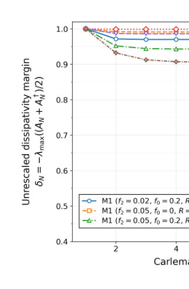 
Figure 2: Dissipativity margin δN = −λmax((AN + A† N)/2) for dissipative systems.

📷 Fig 4

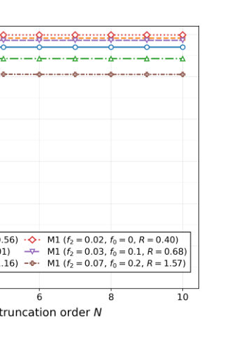 
Figure 3 shows the truncation error EN as a function of N. The error decreases rapidly with the truncation order, improving by several orders of magnitude already at small N, and reaching the reference-solver accuracy floor by N = 9 or N = 10. This indicates strong numerical convergence of the Carleman approximation for this model. However, the dissipativity behavior is qualitatively different. As shown in Figure 4, δ1 = 0, δN &lt; 0 for all N ≥2, and δN becomes more negative as N increases. Thus, although the Carleman

📷 Fig 5

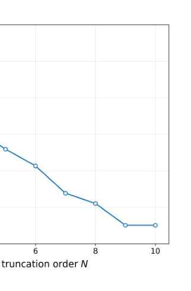 
Figure 3: Error decay EN = maxt∈[0,T ] ∥u(t)−ˆy[N] 1 (t)∥2 for Model 2. The truncation error decreases rapidly as the Carleman truncation order increases.

**Summary.** This paper introduces a fast-forwarded quantum algorithm to solve weakly nonlinear dissipative ODEs, achieving a time-independent complexity scaling. It achieves this by linearizing the nonlinear system using the Carleman embedding technique and applying advanced quantum simulation methods. This breakthrough significantly improves the feasibility of simulating complex, dissipative physical processes on quantum hardware.

**Why it may be interesting.** This work provides a concrete, complexity-improving quantum algorithm for simulating open quantum systems described by dissipative dynamics, which is a major challenge in quantum simulation.

Detailed structure

**Main problem.** The paper addresses the challenge of efficiently simulating the time evolution governed by weakly nonlinear dissipative ordinary differential equations (ODEs) using quantum computation.

**Main result.** A novel fast-forwarded quantum algorithm is proposed that achieves a computational complexity explicitly independent of the evolution time T, significantly improving upon previous scaling bounds.

**Method.** The approach combines the Carleman embedding technique to linearize the nonlinear ODEs with a fast-forwarded quantum linear ODE solver, leveraging the dissipativity of the linearized system.

**Model / system.** The focus is on solving general weakly nonlinear dissipative ODEs, exemplified by quadratic nonlinear forms. The core technique involves transforming the nonlinear system into a high-dimensional, linear, dissipative system via Carleman embedding.

**Key observables.** Component probabilities, quadratic observables $\langle u(T)| M |u(T)
angle$, and the final trace distance error $D(
ho, |u_\gamma(T)
angle\langle u_\gamma(T)|)$.

**Important parameters / regimes.** The dissipativity condition ($\mu(F_1) < 0$) and the weak nonlinearity condition ($R < 1$) are crucial for the algorithm's convergence and complexity bounds.

**Assumptions / limitations.** The primary fast-forwarding algorithm requires the linear part of the ODE to be dissipative. Alternative contour-integral methods are restricted to time-independent coefficients.

**Figures summary.** Figures illustrate the dissipativity margin ($\delta_N$) and error decay ($E_N$) for various models, confirming the theoretical behavior of the linearized system.

**Paper structure.** The paper builds from establishing the physical problem (nonlinear ODEs) to the mathematical tool (Carleman embedding for linearization), then develops the quantum algorithm (combining LCHS with fast-forwarding), and finally analyzes the error bounds and limitations.

Abstract

We study a fast-forwarded quantum algorithm for solving weakly nonlinear dissipative ordinary differential equations. Our approach is a combination of the Carleman embedding technique and the linear combination of Hamiltonian simulation algorithm for linearized systems with fast-forwarded scaling. The complexity of our algorithm does not explicitly depend on the evolution time $T$, thus greatly improving the previous state-of-the-art $\widetilde{\mathcal{O}}(\sqrt{T})$ to $\mathcal{O}(1)$, and any remaining time dependence enters through the output norm and forcing parameters. We rigorously analyze the performance of this approach by convergence guarantees of the Carleman embedding for time-dependent coefficient matrices and detailed complexity estimates, and improve the realization of the Carleman-embedding-based algorithms by simplifying the post-selection step. In addition, we perform a numerical study on differential equations beyond the weakly nonlinear case, and identify possibility of achieving fast-forwarding scaling for systems with stronger nonlinearity or linear non-resonant effect.

[↑ back to top](#top)

### [Thermalization packets and optimal ice cubes](http://arxiv.org/abs/2608.25141v1)

**Authors:** Israel Klich, Marija Vucelja  
**Type:** theory · **Category:** statistical mechanics · **PDF:** <https://arxiv.org/pdf/2608.25141v1>  
**Analysis basis:** full PDF text, analyzed in chunks
**Topic relevance:** `scars & prethermalization` **3/5** · `methods for driven-dissipative` **2/5** · `quantum measurements` **2/5** · `Keldysh / 2PI / non-Gaussian methods` **1/5** · `analog quantum simulation` **1/5** · `correlated / nonlocal dissipation` **1/5** · `driven-dissipative phase transition` **1/5** · `non-equilibrium universality` **1/5**

📷 Fig 1

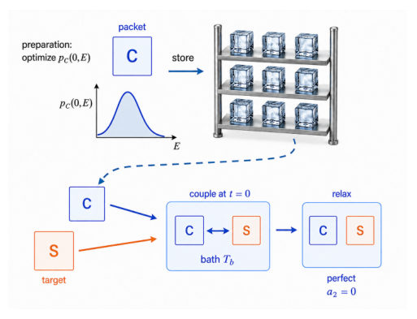 
FIG. 1. Relaxation packets. A finite auxiliary system C is prepared independently from a target system S. At time t = 0 the systems are coupled to each other and to a bath at Tb. The preparation |pC(0)⟩affects the slow-mode amplitude a2 of the post-coupling dynamics. A perfect packet has a2 = 0. In cooling applications, we refer to the packet as an ice cube.

📷 Fig 2

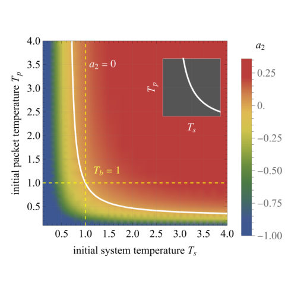 
FIG. 2. Complete-graph Metropolis packet. The color scale shows the projection a2, defined in Eq. (18), for two independently Boltzmann-prepared subsystems: target system at temperature Ts and a packet at temperature Tp. The target system and packet have 10 and 5 levels respectively, defined as follows: ES(i) = ϵi with i = 1, . . . , 10, and EC(j) = ϵj with j = 1, . . . , 5. The bath temperature is fixed at Tb = 1 and ϵ = 0.1Tb. The white curve denotes the perfect-packet condition a2 = 0 [Eq. (20)] and passes through the equilibrium point (Ts, Tp) = (Tb, Tb). The inset shows a magnified view of the a2 = 0 contour near equilibrium, illustrating the generic local structure described by Eq....

📷 Fig 3

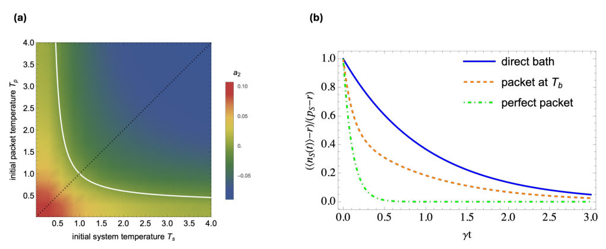 
FIG. 3. Two-qubit example. (a) Slowest mode amplitude. The color scale shows the projection a2, see Eq. (27), for two independently Boltzmann-prepared subsystems at temperatures Ts and Tp. The bath temperature is fixed at Tb/ϵ = 1. The white curve denotes the perfect-packet condition a2 = 0 [Eq. (28)] and passes through the equilibrium point (Ts, Tp) = (Tb, Tb). (b) The plot shows the relaxation of the normalized excited fraction excess of the target system, (⟨nS(t)⟩−r)/(pS −r), for κ = 0, i.e., “direct” cooling (blue solid), and two curves for κ/γ = 4 — one with a packet initially at the bath temperature (orange dashed), and the other with a perfect packet (green dot-dashed). The target...

📷 Fig 4

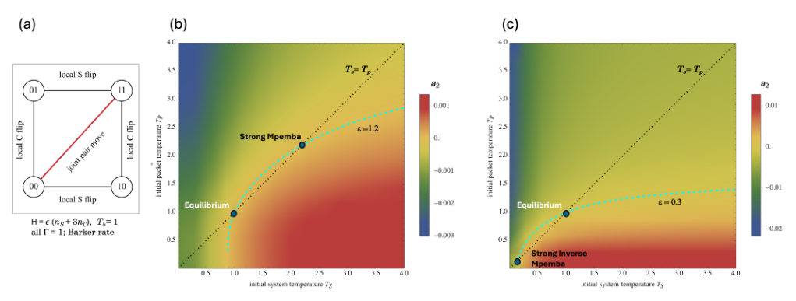 
FIG. 4. Coexistence of a perfect-packet contour and a strong Mpemba point in two coupled qubits. (a) The target qubit S, with gap ϵ, and packet qubit C, with gap 3ϵ, are energetically noninteracting. The post-coupling dynamics contains local S and C flips and the bath-mediated joint pair move 00 ↔11; all attempt rates are Γ = 1, and Barker acceptance rates are evaluated at Tb = 1. (b,c) The slow-mode amplitude a2 for the factorized initial preparation πS(Ts) ⊗πC(Tp), for ϵ = 1.2 and ϵ = 0.3 . The curves describe the perfect-packet condition a2 = 0, and the dotted line is Ts = Tp. In each panel, one intersection is the equilibrium point (1,1); the second is a nontrivial strong Mpemba point...

📷 Fig 5

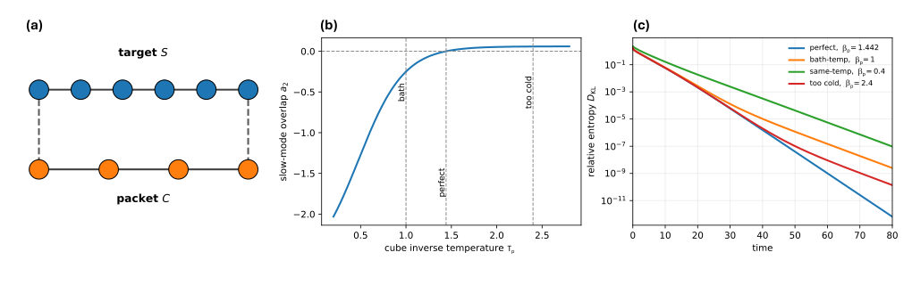 
FIG. 5. Interacting 6 + 4 spin ice cube. (a) The target and packet have independent Ising Hamiltonians; they are dynamically coupled only by two bath-mediated boundary exchanges. (b) Exact diagonalization yields a zero of the slow-mode amplitude at β∗ p = 1.442 . . . for an initially hot target with βs = 0.4 and in a bath with βb = 1. (c) Exact relaxation of the relative entropy, DKL. The perfect ice cube removes the tail associated with λ2 and relaxes asymptotically with the tail associated with the λ3 mode, while neutral or hot packets retain the slow mode.

**Summary.** This work introduces 'thermalization packets' as an auxiliary system used to actively accelerate the relaxation of a target system toward equilibrium. By optimizing the packet's preparation, one can suppress the slowest relaxation mode, achieving faster dynamics. The research highlights that this optimization can lead to counterintuitive effects, such as the Mpemba effect analog, where cooling too much can actually slow the process.

**Why it may be interesting.** It provides a general, controllable mechanism to manipulate non-equilibrium relaxation dynamics, offering a theoretical tool to engineer faster thermalization protocols beyond simple cooling.

Detailed structure

**Main problem.** The paper develops a strategy to accelerate the relaxation of a target system toward a prescribed thermal state by coupling it to an auxiliary system, termed a "thermalization packet."

**Main result.** Perfect packets can suppress the slowest relaxation mode, and counterintuitively, the optimal packet for cooling is not necessarily the coldest one, leading to an analog of the Mpemba effect.

**Method.** The analysis uses the spectral solution of the master equation to identify the slowest relaxation mode and defines perfect/optimal packets by controlling the amplitude of this mode.

**Model / system.** The framework is general but demonstrated using exactly solvable Metropolis dynamics, a minimal two-qubit model, and a boundary-coupled interacting Ising-spin system.

**Key observables.** Slowest mode amplitude ($a_2$), relaxation time, and the perfect-packet contour in the temperature space.

**Important parameters / regimes.** Initial temperatures of the target system ($T_s$) and the packet ($T_p$), and the bath temperature ($T_b$).

**Assumptions / limitations.** The analysis initially focuses on bath-mediated dynamics where energy is additive, and preparation effort is treated as a sunk cost.

**Figures summary.** Figures illustrate the concept of relaxation packets, showing how preparation affects the slow-mode amplitude, and depict the $a_2=0$ contour for the two-qubit model.

**Paper structure.** The paper introduces the concept of thermalization packets, derives the mathematical conditions for perfect/optimal packets, demonstrates these concepts in solvable models (two-qubit, Ising spin chain), and discusses the implications for non-monotonic cooling (Mpemba effect).

Abstract

Relaxation toward equilibrium is usually accelerated by modifying the environment or by cooling a system further from equilibrium. Here we introduce a distinct strategy: thermalization packets, auxiliary systems prepared in advance and later coupled to a target system to accelerate its relaxation toward a prescribed thermal state. Thus, thermalization packets trade preparation effort for reduced waiting time. When the objective is cooling, we colloquially refer to such packets as ice cubes. Unlike ordinary coolants, thermalization packets are characterized not only by their temperature or heat capacity, but also by their microscopic preparation. We define perfect and optimal packets by their ability to suppress the slowest relaxation mode of the coupled dynamics: perfect packets eliminate it entirely, while optimal packets minimize its amplitude. We show that, under generic conditions, perfect packets exist among thermal preparations near equilibrium. Surprisingly, for asymptotic relaxation, the optimum among thermal preparations is generally not the coldest packet: cooling the packet beyond the slow-mode-cancelling optimum restores a nonzero slow mode and can therefore slow relaxation, yielding a packet analog of the Mpemba effect. We demonstrate the concept in exactly solvable Metropolis dynamics, a minimal two-qubit model, and a boundary-coupled interacting Ising-spin system. We also extend the framework to packets optimized for finite readout times. Finally, we show that the perfect-packet contour can connect the trivial bath-equilibrium point to a nontrivial strong Mpemba or strong inverse-Mpemba point.

[↑ back to top](#top)

### [Topology of Fluctuation Bands in Chiral Active Matter](http://arxiv.org/abs/2608.26055v1)

**Authors:** Raphaël Maire  
**Type:** theory · **Category:** statistical mechanics · **PDF:** <https://arxiv.org/pdf/2608.26055v1>  
**Analysis basis:** full PDF text, analyzed in chunks
**Topic relevance:** `driven-dissipative phase transition` **3/5** · `non-equilibrium universality` **3/5** · `Keldysh / 2PI / non-Gaussian methods` **2/5** · `methods for driven-dissipative` **2/5** · `Frenkel-Kontorova` **1/5** · `correlated / nonlocal dissipation` **1/5**

📷 Fig 1

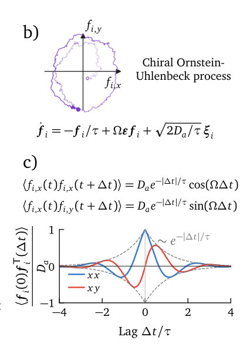 
Figure 1: Reciprocal lattice and rotating active forcing. a) Honeycomb lattice with reciprocal nearest-neighbor springs driven by rotating active forces, with two sites A and B per primitive unit cell and sublattice-dependent pinning µA and µB. b) A realization of the rotating active force fi. c) Longitudinal and transverse entries of the covariance q(∆t).

📷 Fig 2

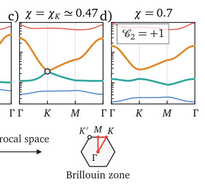 
Figure 2: Polarization-driven transition of the correlation bands. a–d) Dimen- sionless eigenvalues κ2sn/q0 along Γ →K →M →Γ for χ = 0, 0.30, χK, and 0.70, respectively. Here χK ≃0.47 is the spectral polarization at which s2 and s3 touch at K. e) Brillouin zone corresponding to the real-space lattice. In all panels, κ/δ = κ/µ = 2, κτ/γ = 10, and γω/κ = 0.1.

📷 Fig 3

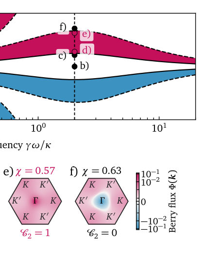 
Figure 3: Middle-gap topological diagram with asymmetric pinning. a) Value of the middle-gap Chern number C2 as the frequency and dimensionless rotation rate are varied. The solid lines indicate the boundary |χ| = χK, while the dashed lines indicate |χ| = χΓ . b–f) Discretized Berry-curvature flux through one finite plaquette Φ(k) at γω/κ = 2 as the spectral polarization is increased. The corresponding state points are indicated in a). In all panels, κ/δ = κ/µ = 2 and κτ/γ = 10.

📷 Fig 4

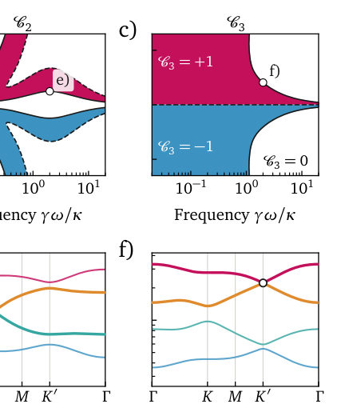 
Figure 4: Topology of all three correlation gaps. a–c) Numerically evaluated gap Chern numbers C1, C2, and C3 in the observation-frequency and drive-parameter plane (γω/κ,Ωτ). Blue, white, and orange denote −1, 0, and +1, respectively. Solid curves mark finite-χ gap closings, while dashed curves mark closings at Γ; for the outer gaps in a) and c), the latter occur along Ω= 0. d–f) Dimensionless correlation-band spectra κ2sn/q0 along Γ →K →M →K′ →Γ at representative positive-polarization transitions. In all panels, κ/δ = κ/µ = 2 and κτ/γ = 10.

📷 Fig 5

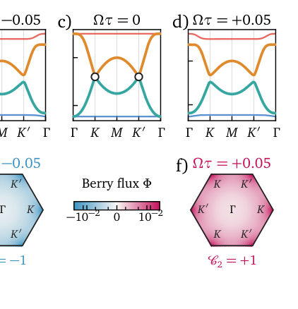 
Figure 5: Middle-gap topology without sublattice-asymmetric pinning. a) Value of C2 as the frequency and dimensionless rotation rate are varied for µA = µB = 0. The solid line indicates the simultaneous K/K′ middle-gap closing |χ| = χK = 0, while the dashed lines indicate the Γ-point boundary |χ| = χΓ . The vertical dashed line marks γω/κ = 2, and the selected state points correspond to the panels on the right. b–d) Dimensionless correlation eigenvalues κ2sn/q0 along Γ →K →M →K′ →Γ. At Ω= 0, the middle correlation gap closes simultaneously at K and K′. e–f) Middle-gap Berry flux for the two gapped states. In all panels, µA = µB = 0 and κτ/γ = 10.

**Summary.** This work demonstrates that topological properties, quantified by Chern numbers, can emerge in the fluctuation spectrum of chiral active matter, even when the underlying deterministic physics is topologically trivial. This is achieved by analyzing the correlation spectrum driven by non-equilibrium chiral noise. The finding suggests that fluctuations themselves can host robust, topologically protected modes, distinct from standard mechanical edge states.

**Why it may be interesting.** The concept of topological invariants arising from non-equilibrium fluctuations, rather than just deterministic Hamiltonians, provides a powerful new lens for understanding active matter dynamics and non-Hermitian physics.

Detailed structure

**Main problem.** Investigating whether band topology, typically associated with deterministic dynamics, can reside in the fluctuations of a system driven far from equilibrium.

**Main result.** The displacement spectrum can exhibit bands with nonzero Chern numbers despite the underlying deterministic mechanics and noise spectrum being individually Chern-trivial.

**Method.** Analysis is performed in Fourier space using the displacement spectrum $S(\mathbf{k},\omega)$ and calculating the Chern number for the correlation matrix.

**Model / system.** The system is a periodic 2D honeycomb lattice undergoing overdamped dynamics driven by a non-equilibrium chiral Ornstein–Uhlenbeck active noise force.

**Key observables.** Displacement spectrum $S(\mathbf{k},\omega)$, Chern number $C_m(\omega)$, and fluctuation eigenvalues $s_n(k,\omega)$.

**Important parameters / regimes.** Stiffness ($\kappa$), pinning potentials ($\mu_A, \mu_B$), noise persistence time ($	au$), and observation frequency ($\omega$).

**Assumptions / limitations.** The analysis treats the fluctuations themselves as a band structure, and the topology is defined on the correlation subspace, differing from standard band theory.

**Figures summary.** Figure 1 illustrates the lattice setup, chiral noise, and covariance structure. Figure 2 shows the evolution of the four eigenvalues $s_n$ along the Brillouin zone path, highlighting gap closing at a critical polarization $\chi_K$.

**Paper structure.** The paper establishes the physical model (honeycomb lattice, active noise), derives the fluctuation spectrum $S(\mathbf{k},\omega)$, and then analyzes its topology by calculating the Chern number, demonstrating the emergence of non-trivial topology via a Haldane-like effective coupling.

Abstract

While band topology is usually associated with the deterministic dynamics of a system, we show that it can instead reside in its fluctuations. Using a reciprocal lattice driven by nonequilibrium chiral active noise, we find that the displacement spectrum---which quantifies displacement fluctuations---admits bands with nonzero Chern numbers despite a Chern-trivial deterministic mechanics. A Haldane-like effective coupling in the correlation spectrum explains this topology and produces topological transitions controlled by both the stochastic driving and the observation frequency. Through the bulk--boundary correspondence, we find boundary-localized fluctuation modes that are distinct from the usual propagating mechanical edge states.

[↑ back to top](#top)

### [Delta-Function Kicks are Optimal for Rapidly Driven Inertial Stochastic Systems](http://arxiv.org/abs/2608.25070v1)

**Authors:** Steven Blaber  
**Type:** theory · **Category:** statistical mechanics · **PDF:** <https://arxiv.org/pdf/2608.25070v1>  
**Analysis basis:** full PDF text, analyzed in chunks
**Topic relevance:** `non-equilibrium universality` **3/5** · `Keldysh / 2PI / non-Gaussian methods` **2/5** · `methods for driven-dissipative` **2/5** · `quantum measurements` **2/5** · `correlated / nonlocal dissipation` **1/5** · `driven-dissipative phase transition` **1/5**

📷 Fig 1

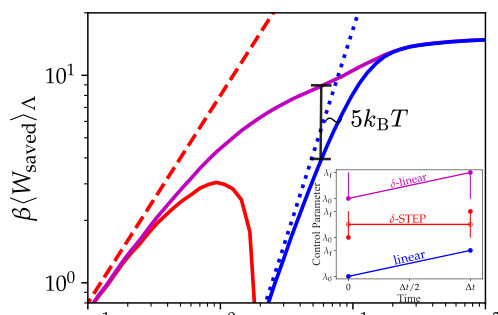 
FIG. 1. Saved work three different protocols. Dashed and dotted lines are the short time approximations, scaling as ∼∆t and ∼(∆t)2 respectively. Inset: Schematic diagram of the three protocols implemented: a linear protocol (blue), δ−STEP (red) described by Eq. (S41), and δ-linear (purple) protocol which has the impulses as described by Eq. (29) but with a linear trap center protocol. The energy scale is set by thermal energy kBT and time by the systems natural re- laxation time τ ≡mξ/k. All simulations have βVB = 1, ka2/VB = 8, k/(mξ2) = 8, λ0/a = −1, and λf/a = 1.

**Summary.** This work determines the optimal control strategy for rapidly driving inertial stochastic systems to minimize energy dissipation. It proves that delta-function kicks are universally optimal, allowing the saved work to scale linearly with the driving time. This linear scaling represents a significant theoretical improvement over quadratic scaling, providing deep insights into non-equilibrium thermodynamics.

**Why it may be interesting.** The finding that optimal control requires impulsive kicks to achieve linear work scaling is a powerful, non-intuitive result in non-equilibrium thermodynamics, providing a fundamental constraint on how fast processes can be driven.

Detailed structure

**Main problem.** The paper investigates the optimal control strategy required to minimize energy dissipation (or maximize saved work) when rapidly driving inertial stochastic systems.

**Main result.** Optimal control necessitates the application of delta-function kicks, which allows the saved work to scale linearly with the short protocol duration ($\propto \Delta t$), leading to an infinitely large ratio of work savings compared to protocols without kicks.

**Method.** The analysis uses short-time approximations ($\Delta t 	o 0$) applied to the dynamics governed by generalized Langevin equations, optimizing the average work done using impulse control theory.

**Model / system.** The system models inertial stochastic dynamics, including active matter and quantum Brownian motion, described by Klein-Kramers dynamics or generalized Langevin equations. The control is implemented via instantaneous momentum shifts (delta-function kicks).

**Key observables.** Saved work ($\langle W_{	ext{saved}} 
angle_\Lambda$), average work ($\langle W 
angle_\Lambda$), and the scaling of these quantities with the time step $\Delta t$.

**Important parameters / regimes.** Short time limit ($\Delta t 	o 0$), damping coefficient ($\xi$), mass ($m$), and the parameters defining the external driving force ($\Delta F$).

**Assumptions / limitations.** The analysis assumes the system is inertial and that the optimal control involves impulsive momentum shifts. Specific derivations rely on approximations up to $O(\Delta t^2)$ and assumptions about the dissipator coupling to position.

**Paper structure.** The paper builds from general optimal control theory in stochastic thermodynamics, applies it to inertial systems using short-time expansions, and compares the performance of delta-function kick protocols against standard linear protocols, showing the superior scaling of the former.

Abstract

Optimal control helps guide our understanding of stochastic thermodynamics, leading to universal properties and geometric formulations. Among the initially surprising properties of optimal control, not only discrete jumps but delta function kicks have been shown to be necessary to minimize dissipation in specific example systems. Using a short-time approximation, I show that delta-function kicks are universally optimal for minimizing dissipation in inertial stochastic systems, including active and quantum dynamics under general constraints. Fundamentally stemming from basic kinematics, delta-function kicks are required to achieve linear scaling of work with short protocol durations compared to the quadratic scaling without the kicks. This implies a diverging (infinite) ratio of saved work in the short-time limit.

[↑ back to top](#top)

### [Phase-sensitive cascade quantum amplifier with nearly noiseless operation](http://arxiv.org/abs/2608.25645v1)

**Authors:** Ilari Lilja, Ekaterina Mukhanova, Michael Perelshtein, Kirill Petrovnin, Stanislav Khaldeev, Visa Vesterinen, Gheorghe Sorin Paraoanu, Pertti Hakonen  
**Type:** experiment · **Category:** other · **PDF:** <https://arxiv.org/pdf/2608.25645v1>  
**Analysis basis:** full PDF text, analyzed in chunks
**Topic relevance:** `driven-dissipative phase transition` **3/5** · `quantum optics experiment` **3/5** · `quantum measurements` **2/5** · `Keldysh / 2PI / non-Gaussian methods` **1/5** · `QC/QI experiment` **1/5** · `methods for driven-dissipative` **1/5**

📷 Fig 1

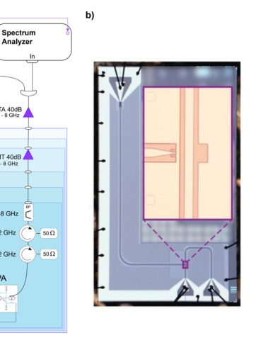 
Fig. 1 a) Schematic of the sample and the low-temperature configuration of the experimental setup. For studies of phase-sensitive amplification, a TWPA is added to the output side of the JPA, where it acts as a pre-amplifier, with a circulator and a directional coupler/diplexer in between. This is done to ensure that the strong pump tone can be applied at the input of the TWPA without affecting the operation of the JPA. b) An optical image of the sample with a close-up of the SQUID and its flux bias line (vertical strip). The JPA reflection port is seen at the top while the two pads at the bottom are for supplying flux bias and drive for the SQUID. Each pad is bonded using two Al wires.

📷 Fig 2

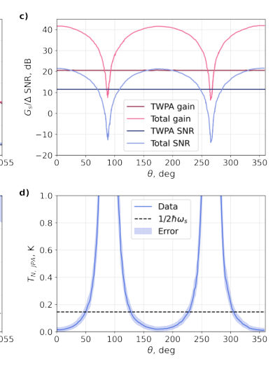 
Fig. 2 a) Phase-preserving parametric amplification as a function of signal frequency, showing the narrow-band performance of the JPA on top of the TWPA performance. b) The initial system noise temperature (at GJPA = 0 dB) of approximately TS,TWPA ≃0.75 K is achieved in part due to the pre- amplification provided by the TWPA. (Right side) c) Gain as a function of relative phase difference between signal and pump θ in the degenerate operating mode of the JPA. d) Phase dependence of TN in degenerate operation. When the signal and pump are out of phase, deamplification occurs, and the input-referred noise appears to increase as a result.

📷 Fig 3

 
Figure 3 shows the JPA added noise temperature, TN,JPA, and the corresponding system noise temperature, TS,JPA, as functions of JPA gain. In the phase-preserving regime, the added noise increases with gain and saturates at 200±54 mK, correspond- ing to approximately 56 mK above the standard quantum limit of Tq = ℏωs/(2kB) = 144 mK. In contrast, during phase-sensitive operation the added noise saturates at only 17 ± 12 mK, well below the quantum limit for phase-preserving amplification. Expressed in terms of added input-referred noise, the phase-preserving mode adds 0.71 photons, whereas the phase-sensitive mode adds only 0.06 photons. The corresponding system noise temperatures are shown in...

📷 Fig 4

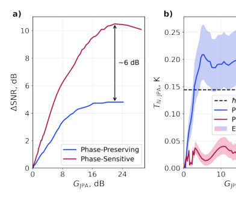 
Fig. 3 a) Improvement in Signal-to-Noise ratio ∆SNR as a function of gain. Note tha approximately 6 dB enhancement in signal visibility is achieved in phase-sensitive operation. b) TN,JPA and c) TS,JPA as functions of GJPA. At very low gain, no noise is added to the measurement by the JPA, while at sufficiently large gains the added noise becomes nearly constant. In contrast, the system noise temperature keeps lowering as the JPA gain actively suppresses noise contributions from following amplifiers in the cascade.

**Summary.** The authors report on a superconducting quantum amplifier cascade (JPA-TWPA) designed for ultra-low-noise microwave measurements. By operating the Josephson Parametric Amplifier in a phase-sensitive regime, they achieved a system noise temperature significantly below the standard quantum limit. This technique enables direct, high-fidelity probing of quantum devices without complex background noise subtraction.

**Why it may be interesting.** This work is highly relevant to quantum optics and open quantum systems as it demonstrates a practical method to measure quantum noise below the standard quantum limit using superconducting circuits.

Detailed structure

**Main problem.** The research investigates phase-sensitive quantum amplification using superconducting circuits to achieve noise performance below the standard quantum limit.

**Main result.** Phase-sensitive operation in a JPA-TWPA cascade achieved a minimum system noise temperature of $94 \pm 12$ mK, significantly beating the standard quantum limit of 288 mK.

**Method.** The performance was characterized by comparing noise added in phase-preserving versus phase-sensitive parametric amplification regimes using a cascaded amplifier setup.

**Model / system.** The core system is a Josephson Parametric Amplifier (JPA) based on a SQUID, which is cascaded with a Traveling-Wave Parametric Amplifier (TWPA). The device is fabricated using VTT SWAPS technology and operated at millikelvin temperatures.

**Key observables.** System noise temperature ($T_S$), added noise temperature ($T_N$), and output quadrature variances ($\Delta X^2_{	ext{out}}$, $\Delta P^2_{	ext{out}}$).

**Important parameters / regimes.** Operating frequency of 6 GHz; the standard quantum limit (SQL) of 288 mK; the phase-sensitive regime ($\omega_s = \omega_p/2$).

**Assumptions / limitations.** The analysis relies on the JPA being driven in a three-wave mixing configuration and utilizes the Friis formula for cascade noise estimation.

**Figures summary.** Figures illustrate the device setup, comparing JPA performance in phase-preserving versus phase-sensitive modes, and plotting noise temperatures versus JPA gain.

**Paper structure.** The paper establishes the theoretical framework for noise analysis in parametric devices, compares the noise performance of phase-preserving versus phase-sensitive regimes, and presents experimental results demonstrating sub-SQL noise levels using the JPA-TWPA cascade.

Abstract

Phase-sensitive parametric devices enable quadrature-selective amplification with the potential for sub-quantum-limited noise performance. In this work, we investigate the operation of a SQUID-based Josephson Parametric Amplifier (JPA), comparing its performance in the phase-preserving and phase-sensitive regimes. The device, fabricated using VTT SWAPS technology, is driven in a three-wave mixing configuration and characterized in a reflection-based measurement setup at millikelvin temperatures. To directly probe the noise performance at low JPA gains, we employ a cascaded amplification scheme in which a Traveling-Wave Parametric Amplifier (TWPA) provides low-noise pre-amplification of the JPA output. In a phase-preserving operation, the JPA exhibits near-quantum-limited performance with a system noise temperature of $351\pm53$ mK at 6 GHz. In contrast, phase-sensitive operation yields a minimum system noise temperature of $94\pm12$ mK, well below the standard quantum limit of 288 mK. Our results demonstrate that a JPA-TWPA amplifier cascade opens the door to direct, high-fidelity probing of quantum devices without the need for background noise subtraction.

[↑ back to top](#top)

### [The Pauli Lightcone: Information-Theoretic Error Mitigation Beyond the Autocorrelation](http://arxiv.org/abs/2608.25254v1)

**Authors:** Paolo D'Alberto  
**Type:** theory · **Category:** quantum information and computing · **PDF:** <https://arxiv.org/pdf/2608.25254v1>  
**Analysis basis:** full PDF text, analyzed in chunks
**Topic relevance:** `analog quantum simulation` **3/5** · `methods for driven-dissipative` **3/5** · `correlated / nonlocal dissipation` **1/5** · `driven-dissipative phase transition` **1/5** · `non-equilibrium universality` **1/5** · `quantum measurements` **1/5**

📷 Fig 1

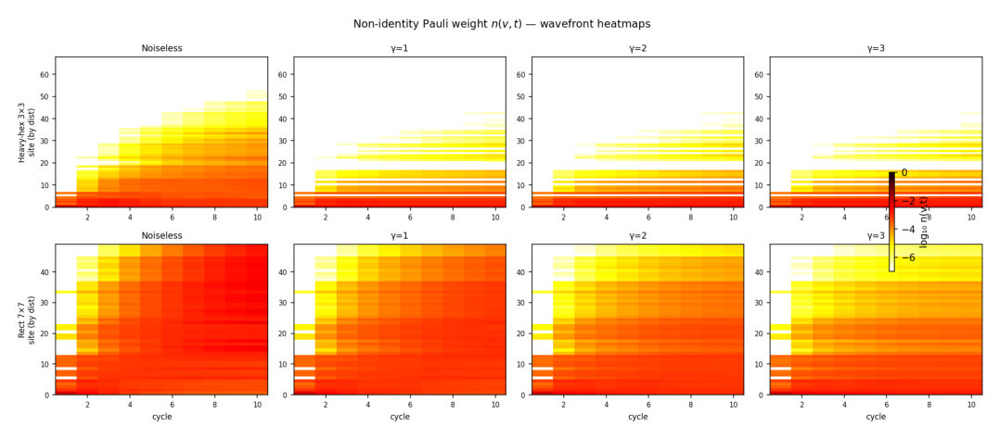 
Figure 1: Non-identity Pauli weight n(v, t) per site per cycle for noiseless (NL) and three noise levels (γ = 1, 2, 3) on the heavy-hex 3 × 3 lattice (top) and rect 7 × 7 (bottom), both initialized at the center site. Color encodes log10 n(v, t); white = below threshold. The wavefront advances diagonally in the (space, time) plane at velocity vhop. Noise suppresses amplitudes, pushing the threshold-crossing later, a uniform shift of the wavefront, not a change of its spatial pattern.

📷 Fig 2

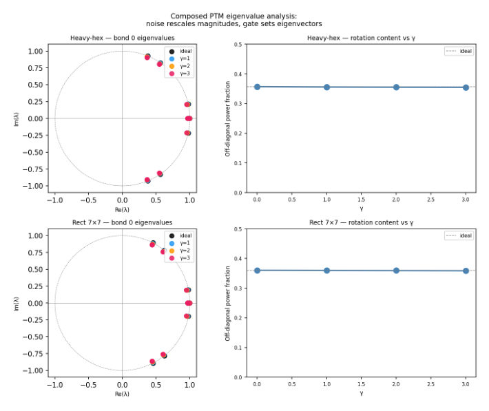 
Figure 2: Eigenvalue spectra of the composed noisy PTMs for one representative heavy-hex bond (top) and one rect 7 × 7 bond (bottom), across γ = 1, 2, 3. Eigenvalue positions are nearly unchanged across γ: noise rescales magnitudes slightly without rotating eigenvectors. The off-diagonal power fraction (36%) is constant; Pauli mixing is a gate property, not a noise property.

📷 Fig 3

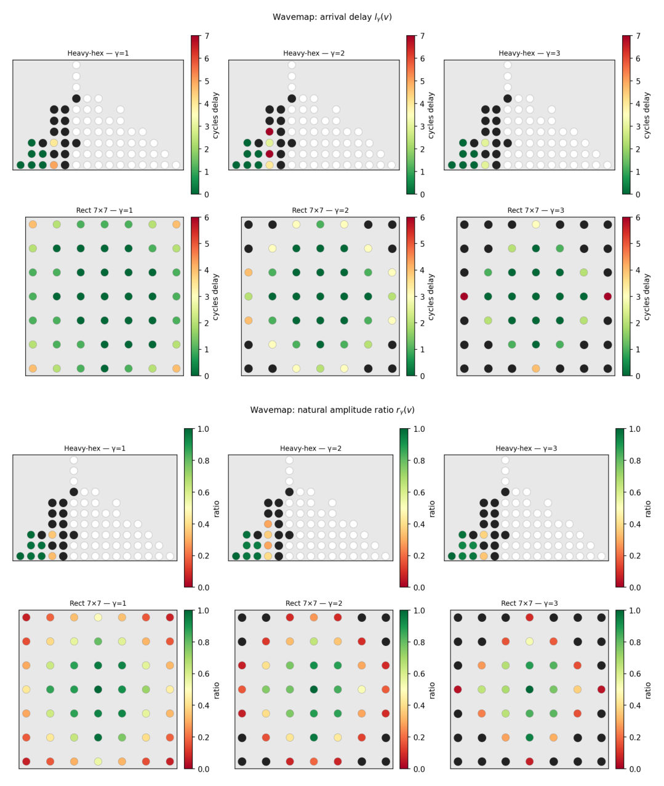 
Figure 3: Wavemap for rect 7 × 7 and heavy-hex, γ = 1, 2, 3. Top: arrival delay lγ(v) in cycles (white = outside lightcone, black = noiseless arrived but noisy did not). Bottom: amplitude ratio rγ(v) = nγ(v, tγ)/nnl(v, tγ); all values ≤1 confirm the Lieb-Robinson bound.

📷 Fig 4

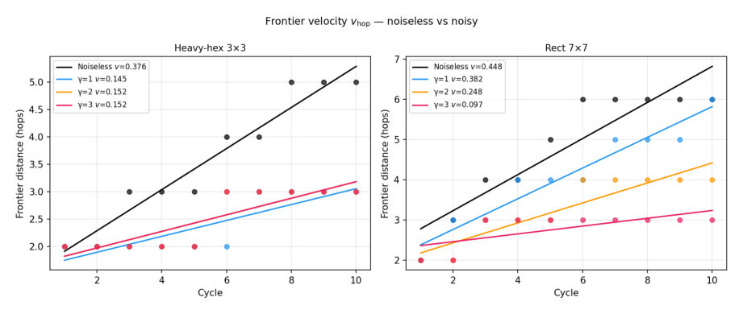 
Figure 4: Frontier distance Fγ(t) = maxv∈Fγ(t) d(v, c) vs cycle for NL and γ = 1, 2, 3 on both topologies. Lines show linear fits; slopes give vhop (Table 2). Rect 7 × 7: monotone decrease vnl &gt; v1 &gt; v2 &gt; v3. Heavy-hex: near-degeneracy v2 ≈v3, consistent with near-equal PTM eigenvalue spectra at γ = 2, 3.

📷 Fig 5

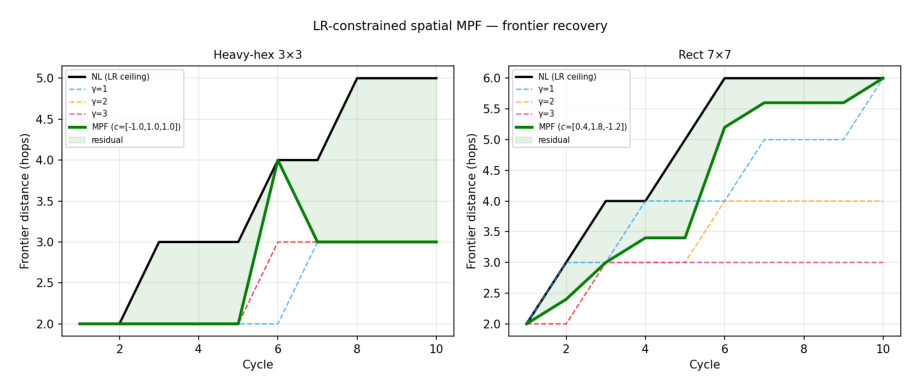 
Figure 9: LR-constrained spatial MPF frontier recovery. Black: noiseless Fnl(t) (Lieb-Robinson ceiling). Colored: noisy frontiers Fγi(t). Dashed: MPF-corrected Flr(t) = P

**Summary.** This work introduces the 'wavemap,' a novel, model-free diagnostic tool to quantify information loss in quantum simulations under noise. By analyzing the spatial propagation of quantum information across a lattice, the authors use an entropy-optimal extrapolation technique to recover lost information. This method is particularly valuable for understanding hardware noise limitations in quantum computation.

**Why it may be interesting.** It provides a highly detailed, spatially resolved, and information-theoretically grounded diagnostic tool for characterizing noise effects in quantum simulations, which is crucial for scaling quantum computation.

Detailed structure

**Main problem.** Quantifying information loss during quantum time evolution due to noise, going beyond simple autocorrelation methods.

**Main result.** The developed wavemap diagnostic successfully recovers a significant fraction of lost information (up to 55%) by exploiting the information-rich frontier region, providing a model-free tool for error mitigation.

**Method.** The authors employ an entropy-optimal Multi-Product Formula (MPF) constrained by the Lieb-Robinson causal bound, fitting time-adaptive coefficients over the lightcone frontier.

**Model / system.** The study analyzes quantum evolution (e.g., Kicked Heisenberg Ising model) simulated on heavy-hex and rectangular lattices using tensor network methods.

**Key observables.** Wavemap (arrival delay $l_\gamma(v)$ and cross-entropy loss $L_\gamma(v)$), Pauli weight $n(v, t)$, and the frontier $F(t)$.

**Important parameters / regimes.** Noise strength ($\gamma$), Lieb-Robinson causal constraint, and the time-adaptive coefficients $\alpha(t)$.

**Assumptions / limitations.** The analysis is most faithful at the wavefront where the bond dimension is small ($\chi \approx 1$), and the noise is characterized as pure amplitude damping.

**Figures summary.** Figures illustrate noise suppression on the lightcone, eigenvalue spectra confirming noise is purely damping, and the wavemap showing spatial deformation of the lightcone.

**Paper structure.** The paper introduces the wavemap diagnostic, analyzes the noise structure via PTMs, applies the MPF constrained by causality, and finally demonstrates the superior performance of time-adaptive coefficient fitting ($\alpha(t)$) over simpler extrapolation methods.

Abstract

We introduce the wavemap: a spatial portrait of noise effects that assigns each site a per-noise-level arrival delay l_γ(v) and cross-entropy loss L_γ(v). These observables are exact at the lightcone frontier, where bond dimension χis small and the simulation is most faithful. Eigenvalue analysis of the composed gate-plus-noise Pauli transfer matrices confirms that the studied noise is pure amplitude damping: the spatial propagation pattern is entirely determined by the gate, making the wavemap a model-free noise diagnostic. We apply the multi-product formula (MPF) to recover the noiseless Pauli weight field from the noisy samples, subject to the Lieb-Robinson causal constraint nMPF <= nnl . Fitting time-adaptive coefficients α(t) over the frontier recovers up to 55% of the information loss relative to the best noisy sample, exploiting the fact that the frontier is where truncation error is smallest. On an IBM heavy-hex lattice with heterogeneous hardware noise the method identifies an information-starved regime, pointing to calibrated synthetic noise as the next required experiment.

[↑ back to top](#top)

### [Characterizing Full Nonequilibrium Dynamics of Simple Exclusion Processes](http://arxiv.org/abs/2608.25606v1)

**Authors:** Zhimao Liu, Jing Liu, Pan Zhang, Ying Tang  
**Type:** theory · **Category:** statistical mechanics · **PDF:** <https://arxiv.org/pdf/2608.25606v1>  
**Analysis basis:** full PDF text, analyzed in chunks
**Topic relevance:** `methods for driven-dissipative` **3/5** · `non-equilibrium universality` **3/5** · `Keldysh / 2PI / non-Gaussian methods` **2/5** · `driven-dissipative phase transition` **1/5**

📷 Fig 1

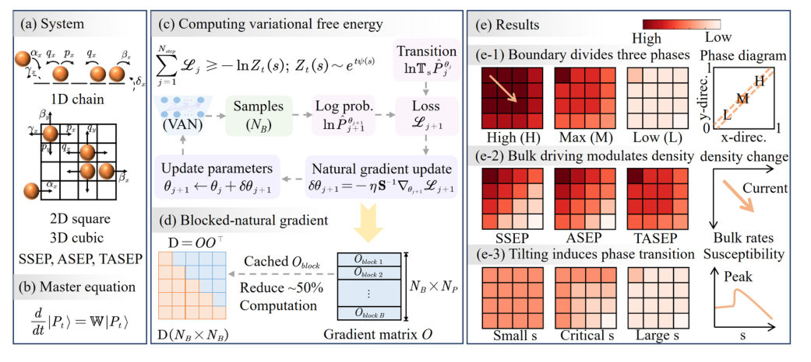 
FIG. 1. Unified framework for nonequilibrium dynamics of simple exclusion processes (SEPs) across dimensions. (a) Illustration of SEP models on 1D chain, 2D square, and 3D cubic lattices, with the mathematical symbols denoting boundary and bulk rates. (b) Master equation (Eq. (1)) governing the time evolution of the probability vector |Pt⟩under the tilted generator Ws of symmetric (SSEP), asymmetric (ASEP), and totally asymmetric (TASEP) simple exclusion processes. (c) Pipeline for calculating the variational free energy −ln Zt(s) (Eq. (2)) and the scaled cumulant generating function (SCGF) ψ(s) (Eq. (4)) using a variational autoregressive network (VAN) with parameters θj at each time step,...

📷 Fig 2

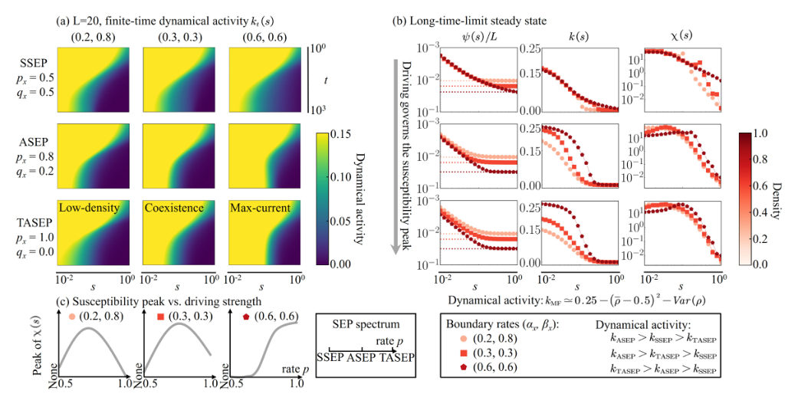 
FIG. 2. Finite-time activity and boundary and bulk effects in 1D SEPs. (a) Finite-time evolution of dynamical activity kt(s) for L = 20, illustrating the crossover from an active phase (yellow) to an inactive phase (dark blue) across the counting field s and trajectory time t. Rows display SSEP (px = qx = 0.5), ASEP (px = 0.8, qx = 0.2), and TASEP (px = 1, qx = 0). Columns represent three transport regimes in 1D TASEP defined by boundary rates (αx, βx): low-density (0.2, 0.8), coexistence (0.3, 0.3), and maximal-current (0.6, 0.6). The narrowing of dark inactive regions reflects the boundary-induced transition from low-density to maximal-current phases. (b) Steady-state SCGF ψ(s)/L,...

📷 Fig 3

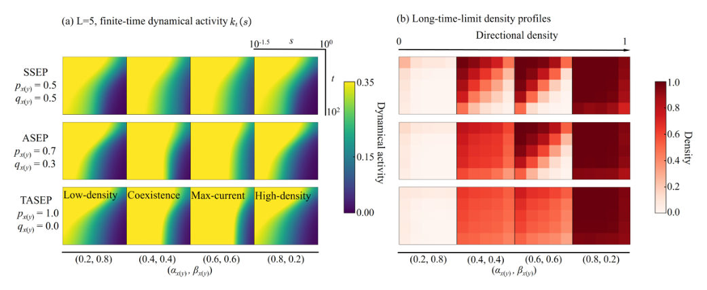 
FIG. 3. Crossover from diffusive to ballistic regimes in 2D SEPs and spatial density profiles. (a) Finite-time dynamical activity kt(s) as a function of the counting field s and trajectory time t for system size L = 5. Rows represent symmetric (SSEP, px(y) = qx(y) = 0.5), asymmetric (ASEP, px(y) = 0.7, qx(y) = 0.3), and totally asymmetric (TASEP, px(y) = 1.0, qx(y) = 0.0) bulk driving. From left to right, as the directional density gradually increases across the columns, the active phase (light-yellow) first broadens and then narrows, whereas the inactive phase (dark-blue) correspondingly narrows and then widens. Columns represent four typical boundary rate pairs (αx(y), βx(y)). (b)...

📷 Fig 4

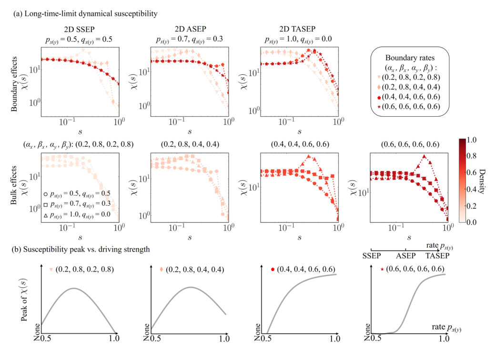 
FIG. 4. Boundary and bulk effects in 2D SEPs. (a) Top row: Steady-state susceptibility χ(s) in the long-time limit for L = 5 in the SSEP (px(y) = qx(y) = 0.5), ASEP (px(y) = 0.7, qx(y) = 0.3), and TASEP (px(y) = 1.0, qx(y) = 0.0). Symbols represent four boundary combinations (αx, βx, αy, βy) spanning low-activity (light) to high-activity (dark) regimes. In the diffusive SSEP, low-activity regimes exhibit stronger susceptibility responses, whereas increasing the bulk driving shifts the dominant response toward high-activity regimes in the ballistic TASEP limit. Bottom row: Dependence of the susceptibility response on bulk driving for the same four boundary combinations, progressing from SSEP...

📷 Fig 5

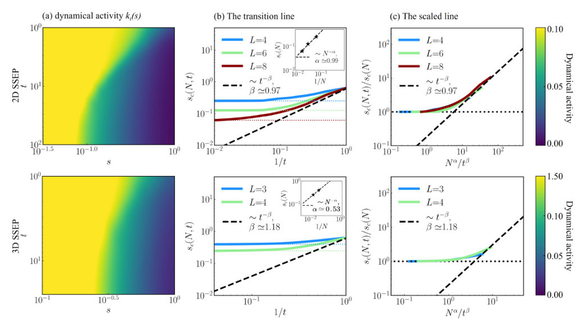 
FIG. 5. The dynamical active-inactive phase transition of 2D and 3D SSEP. The top and bottom rows present results for 2D SSEP on square lattices and 3D SSEP on cubic lattices, respectively. (a) The dynamical activity kt(s) denoted by color reveals the phase transition versus trajectory time t and the counting field s, with L = 8 for 2D and L = 4 for 3D, illustrating the crossover from an active phase (light-yellow) to an inactive phase (dark-blue). (b) The critical point sc(N, t) over time, giving critical exponents α from the steady-state scaling sc(N) ∼N −α (shown in the insets and the horizontal dotted lines) and β from the finite-time power-law scaling sc(N, t)−sc(N) ∼t−β (the black...

**Summary.** This work develops a novel, unified framework using variational neural networks to simulate and characterize the complex, time-dependent dynamics of Simple Exclusion Processes (SEP) in multiple dimensions. By calculating key quantities like the SCGF, the authors provide detailed insights into phase transitions and transport regimes, establishing a powerful computational tool for nonequilibrium statistical mechanics.

**Why it may be interesting.** The application of advanced machine learning techniques (VANs) to solve fundamental, analytically intractable problems in non-equilibrium statistical mechanics provides a powerful computational tool for studying complex many-body dynamics.

Detailed structure

**Main problem.** The paper tackles the notoriously difficult problem of characterizing the full, time-dependent joint distribution for Simple Exclusion Processes (SEP) in nonequilibrium settings.

**Main result.** The authors establish a unified framework using variational neural networks to characterize finite-time dynamics across 1D, 2D, and 3D, revealing dimension-independent scaling laws for phase transitions.

**Method.** They employ Variational Autoregressive Networks (VAN) to approximate the evolution of the system's probability distribution governed by a master equation, calculating the Scaled Cumulant Generating Function (SCGF).

**Model / system.** The primary model is the Simple Exclusion Process (SEP), including variants like SSEP, ASEP, and TASEP, studied on lattices of increasing dimensions (1D to 3D).

**Key observables.** Dynamical activity, dynamical susceptibility, time-dependent joint distribution, and the SCGF ($\psi_t(s)$).

**Important parameters / regimes.** System size ($L$), time ($t$), and the counting field ($s$) conjugate to the dynamical observable.

**Assumptions / limitations.** The core approximation is using the Variational Autoregressive Network (VAN) ansatz to manage the exponentially large configuration space.

**Figures summary.** Figures illustrate the unified framework, showing the master equation under a tilted generator and the pipeline for calculating the variational free energy, alongside comparisons of finite-time vs. steady-state results in 3D.

**Paper structure.** The paper introduces the intractable problem, details the variational framework using VANs, validates the approach against known results (1D TASEP, 2D SSEP), and then presents dimension-specific findings (1D, 2D, 3D) to establish the unified theory.

Abstract

The simple exclusion process (SEP) is a paradigmatic model for nonequilibrium transport, yet the rich dynamics of its time-dependent joint distribution over an exponentially large configuration space remain notoriously intractable. Here, we leverage variational autoregressive networks to systematically characterize the nonequilibrium dynamics of symmetric (SSEP), asymmetric (ASEP), and totally asymmetric (TASEP) cases from one to three dimensions. We first validate the approach by reproducing the previous finite-time results for the 1D SSEP and long-time tensor-network results for the 2D SSEP, and then provide richer finite-time dynamics of the SSEP, ASEP, and TASEP in 1D and 2D, and a new finite-time analysis in 3D. Specifically, in 1D, we reveal that finite-time dynamical-activity maps directly correspond to the classical three-phase TASEP steady-state organization, and, in the long-time limit, boundary and bulk effects separately govern the dynamical susceptibility during the crossover from diffusive to ballistic transport. In 2D, we establish a mean-field directional-density criterion, supported by our neural-network calculations, and show that long-time boundary and bulk effects mirror their 1D counterparts. In 3D, we uncover new finite-time scaling relations for the active-inactive phase transition of the SSEP, and reveal a broadly consistent scaling exponent of the phase-transition point versus system size, implying that the phase-transition point is asymptotically controlled by the characteristic length scale ($s_c\sim L^{-2}$) regardless of dimension. This work thus establishes a unified framework for characterizing the nonequilibrium dynamics of representative transport systems.

[↑ back to top](#top)

### [Non-Hermitian topological Euler insulators](http://arxiv.org/abs/2608.25411v1)

**Authors:** Longwen Zhou  
**Type:** theory · **Category:** other · **PDF:** <https://arxiv.org/pdf/2608.25411v1>  
**Analysis basis:** full PDF text, analyzed in chunks
**Topic relevance:** `driven-dissipative phase transition` **3/5** · `non-equilibrium universality` **2/5** · `Keldysh / 2PI / non-Gaussian methods` **1/5** · `analog quantum simulation` **1/5** · `correlated / nonlocal dissipation` **1/5** · `methods for driven-dissipative` **1/5**

📷 Fig 1

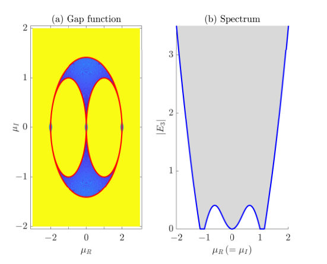 
FIG. 1. Spectral information of the Model I. (a) shows the spectral gap function ∆vs the real and imaginary parts of system parameter µ = µR + iµI. The value of ∆is trun- cated at 0.01, so that all regions with ∆≥0.01 are colored in yellow. The red solid lines are phase boundaries obtained from Eq. (37). (b) shows the spectrum of the system along the parameter line µI = µR in (a) under PBC. It is zoomed in around |E3| = 0 to show the gapped and gapless regions clearly. The gray area and blue solid line denote the bulk and lower edge of the highest band E3. Two other flat bands E1 and E2 at zero energy are not shown.

📷 Fig 2

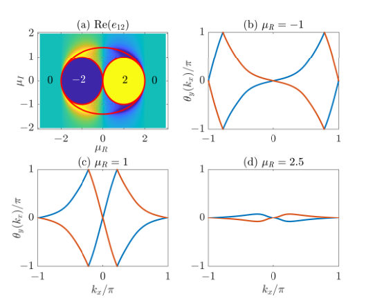 
FIG. 2. Topological characterization of the Model I. (a) shows the real parts of Euler class e12 at different µ = µR + iµI [see Fig. 13(a) for the imaginary parts]. The values of e12 in different gapped phases are given explicitly. The red solid lines represent the analytically obtained phase boundaries in Fig. 1. (b)–(d) show the Wilson loop spectrum θy(kx) of the two degenerate bulk bands E1,2 vs kx for µI = 0.5.

📷 Fig 3

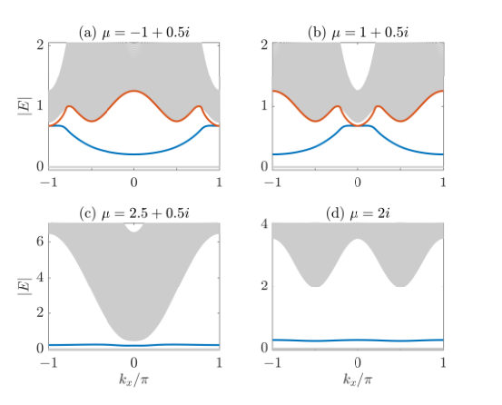 
FIG. 4. Bulk-boundary correspondence of the Model I. (a)– (d) show the absolute value of spectrum |E| with periodic and open boundary conditions taken along x and y directions, re- spectively. The system has Ny = 200 unit cells along the y direction. In each panel, the gray (blue and red) lines corre- spond to the spectra of bulk (edge) states.

📷 Fig 4

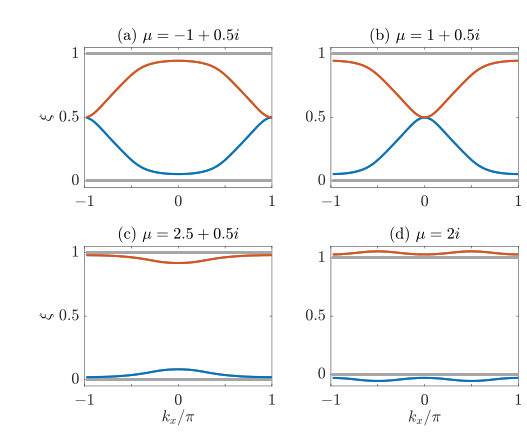 
FIG. 3. Entanglement spectrum of the Model I. The system has Ny = 100 unit cells along the y direction, and an equal bipartition is taken along y for evaluating the entanglement spectrum in each panel. In all panels, the gray (blue and red) lines are entanglement spectrum corresponding to bulk states (edge states generated along the entanglement cuts).

📷 Fig 5

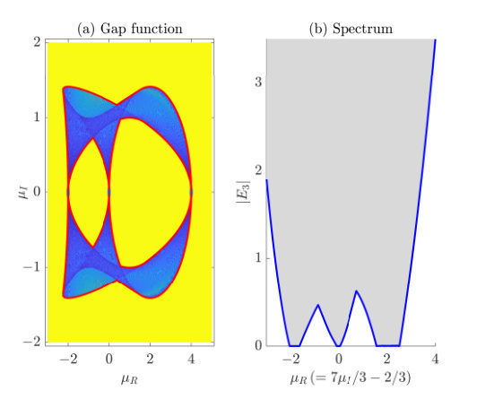 
FIG. 5. Spectral information of the Model II. The system parameter is set as λ = 2 for both panels. (a) shows the spectral gap function ∆vs the real and imaginary parts of µ = µR + iµI. The value of ∆is truncated at 0.01, so that all regions with ∆≥0.01 are colored in yellow. The red solid lines are phase boundaries extracted numerically from Eq. (43). (b) shows the spectrum of the system along the parameter line µI = (3µR + 2)/7 in (a) under PBC. It is zoomed in around |E3| = 0 to show the gapped and gapless regions clearly. The gray area and blue solid line denote the bulk and lower edge of the highest band E3. Two other flat bands E1 and E2 at zero energy are not shown.

**Summary.** This work generalizes the concept of topological Euler insulators to non-Hermitian systems, providing a theoretical framework to characterize their nontrivial topology. By analyzing three-band lattice models, the authors demonstrate that topological Euler bands persist in non-Hermitian regimes, revealing unique phase transitions and edge-band overlaps. This broadens the scope of topological matter theory into the realm of open quantum systems.

**Why it may be interesting.** The extension of topological invariants like the Euler class to non-Hermitian systems is crucial for understanding open quantum systems where gain/loss are present, bridging topological theory with open quantum dynamics.

Detailed structure

**Main problem.** The paper extends the concept of topological Euler insulators, characterized by the Euler class, from Hermitian to non-Hermitian quantum systems.

**Main result.** It establishes the existence of topological Euler bands in non-Hermitian systems and identifies non-Hermiticity-induced phase transitions and anomalous edge-band overlaps.

**Method.** The authors develop a theoretical framework using a generalized Euler class ($e_{12}$) and analyze the entanglement spectrum and bulk-boundary correspondence for non-Hermitian lattice models.

**Model / system.** The focus is on two-dimensional, three-band non-Hermitian lattice models with symmetric Hamiltonians, described by a Bloch Hamiltonian $H(\mathbf{k})$.

**Key observables.** Topological Euler bands, entanglement spectrum, spectral gap ($\Delta$), and the Euler class ($e_{12}$).

**Important parameters / regimes.** The system is analyzed in gapped non-Hermitian phases ($\Delta > 0$).

**Assumptions / limitations.** The theory is formulated for the three-band Hamiltonian but claims generalizability to multiple band systems.

**Paper structure.** The paper introduces the problem, develops the theoretical framework using the Euler class and spectral diagnostics, applies it to construct and investigate three explicit non-Hermitian models, and concludes by discussing the physical implications.

Abstract

Topological Euler insulators emerge in multiband systems with real Bloch Hamiltonians and wavefunctions. Their fragile topologies are characterized by the Euler class of degenerate bands and protected by the $PT$ or $C_2T$ symmetry in two dimensions, which go beyond the tenfold $K$-theory classification of topological matter. In this work, we extend the conception of topological Euler insulators to non-Hermitian systems and propose a theoretical framework to unlock their nontrivial Euler topology. Focusing on two-dimensional, three-band non-Hermitian lattice models with symmetric Hamiltonians, we formulate a comprehensive description of their topological Euler bands, entanglement spectrum and bulk-boundary correspondence. Three typical models of non-Hermitian Euler insulators are constructed and investigated explicitly to illustrate our theory. Unique topological phase transitions and anomalous edge-band overlaps with non-Hermitian origins are further identified. Our study establishes the presence of topological Euler bands in non-Hermitian systems and unveils their intriguing physical characteristics, thereby broadening the existing territory of topological matter in non-Hermitian open systems.

[↑ back to top](#top)

### [Superextensive learning in quantum reservoirs at the onset of information scrambling](http://arxiv.org/abs/2608.25511v1)

**Authors:** Jonas Freiheit, Francesco Campaioli  
**Type:** theory · **Category:** disordered systems and neural networks · **PDF:** <https://arxiv.org/pdf/2608.25511v1>  
**Analysis basis:** full PDF text, analyzed in chunks
**Topic relevance:** `analog quantum simulation` **3/5** · `driven-dissipative phase transition` **2/5** · `non-equilibrium universality` **2/5** · `methods for driven-dissipative` **1/5**

📷 Fig 1

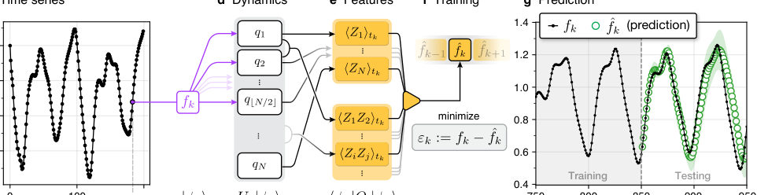 
FIG. 1. Time-series prediction with quantum Ising networks, and the role of information scrambling. a We consider a reservoir of N = Lx × Ly spins on a two-dimensional lattice, coupled to their nearest neighbours by a weakly disordered Ising interaction Jij, driven by a global transverse field hx and a weakly disordered local longitudinal field hz,i. Only local ⟨Zi⟩and two-body ⟨ZiZj⟩correlations in the computational basis are measured to limit measurement and memory costs. b A local perturbation encoded in the transverse field is applied to the system, spreading via the reservoir dynamics. When hx/J is small the reservoir is frozen and the perturbation remains localised. When it is large...

📷 Fig 2

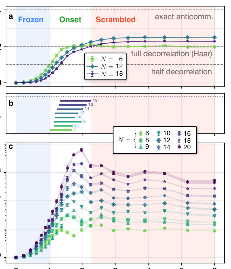 
FIG. 2. Information scrambling and computational basis states a OTOC saturation C, defined in Eq. (15), versus the transverse field hx/J, for three network sizes N = 6, 12, 18. C measures how completely a local pertur- bation has decorrelated from its initial support, with dashed lines marking half decorrelation (C = 1), full decorrelation (C = 2), and exact anticommutation (C = 4). b The scram- bling onset region for each size N, bounded by the fields at which C crosses 1 and 2. The window width and position de- pend on network size and geometry. The frozen (C &lt; 1, blue) and scrambled (C &gt; 2, red) regions are shown with coloured shading in every panel, marking the fields lying below and...

📷 Fig 3

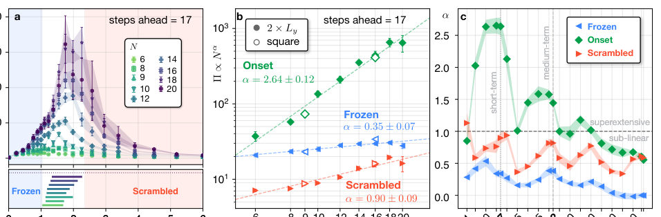 
FIG. 3. Superextensive predictive precision at the onset of scrambling. a Forecasting precision Π = ε−1, with ε the normalised root-mean-square error between target and prediction of Eq. (13), versus the transverse field hx/J at a forecast horizon of 17 steps ahead, matching the intrinsic timescale of the Mackey–Glass task at τMG = 17, for network sizes N = 6 to 20. The lower strip reproduces the scrambling onset region for each N. b Precision at the same horizon as a function of reservoir size N on logarithmic axes, evaluated at its peak within the onset region and at representative frozen and scrambled fields, hx/J = 0.237 and hx/J = 6.00, with power-law fits Π ∝N α. Precision grows...

📷 Fig 4

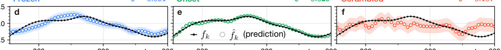 
FIG. 4. Feature-space activity in the three regimes. a–c The feature space of a 2 × 3 reservoir (N = 6), at hx/J = 0.05 (frozen), 1.75 (onset) and 6.00 (scrambled), represented as a graph. All 63 computational-basis correlators are shown, stratified into layers of s-body operators; node colour and size give the activity of a feature over the run, per Eq. (5), and an edge joins any pair carrying almost identical information, as per Eq. (6). In-plane node positions are chosen so that similar features are drawn together both within and across layers. A layer whose features are mutually degenerate carries no relative geometry and is drawn as an evenly spaced ring. d–f Forecasts of the...

📷 Fig 5

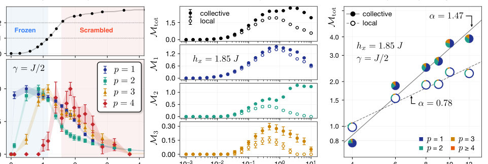 
FIG. 5. Superextensive memory capacity via collective relaxation. a Memory capacity Mp of polynomial degree p = 1–4, each normalised to its own maximum, versus the transverse field for a network of N = 6 spins under collective relaxation at rate γ = J/2. The upper strip shows the OTOC saturation C over the same sweep, with the frozen (C &lt; 1) and scrambled (C &gt; 2) regions shaded, here obtained by averaging over the time interval t ∈[π/2, π]; see Eq. (15) for details. Linear memory peaks in the frozen region and successively higher degrees peak at successively stronger fields, so that nonlinear memory requires deeper scrambling than linear memory does. b Total memory capacity Mtot and its...

**Summary.** This work investigates quantum reservoirs, modeled by Ising spin networks, to test if optimal information processing occurs at the boundary between order and chaos. By analyzing information scrambling using OTOCs, the authors demonstrate that prediction performance peaks at this critical onset point. Crucially, they show that the memory capacity scales superextensively at this onset, establishing information scrambling as a fundamental scaling law for quantum machine learning devices.

**Why it may be interesting.** It provides a concrete, scalable physical mechanism (information scrambling) within quantum many-body systems that directly dictates the performance scaling of artificial neural network components, bridging quantum dynamics with machine learning theory.

Detailed structure

**Main problem.** The paper tests the hypothesis that optimal information processing occurs near the boundary between order and chaos, applying this principle to quantum many-body systems used as quantum reservoirs for time-series forecasting.

**Main result.** Prediction precision peaks precisely at the onset of information scrambling, where the reservoir's memory capacity exhibits superextensive scaling ($\alpha>1$) with system size $N$.

**Method.** The study uses numerical simulations on 2D Ising networks, characterizing dynamics using Out-of-Time-Order Correlators (OTOCs) to locate the scrambling onset, and benchmarking performance via time-series forecasting.

**Model / system.** The model is a 2D Ising network of spins, governed by a Hamiltonian involving Ising couplings and transverse fields. The system is operated as a quantum reservoir for time-series prediction, with the control parameter being the ratio $h_x/J$.

**Key observables.** Prediction precision, Out-of-Time-Order Correlators (OTOCs), Participation Ratio (basis spreading), and Memory Capacity (linear vs. nonlinear).

**Important parameters / regimes.** The critical control parameter is the ratio $h_x/J$, which separates the frozen, onset, and scrambled regimes. Scaling exponents ($\alpha$) are key to quantifying performance.

**Assumptions / limitations.** The readout mechanism is assumed to be linear (ridge regression), and the reservoir state is reset at each time step to simulate practical constraints.

**Figures summary.** Figures illustrate the time-series prediction protocol, showing the transition from localized (frozen) to global (scrambled) feature population at the onset of scrambling.

**Paper structure.** The paper establishes the theoretical framework by linking information processing optimization to the order-chaos boundary. It then details the simulation protocol using Ising networks and OTOCs to measure scrambling. Finally, it quantifies the scaling laws for prediction precision and memory capacity across the different dynamical regimes.

Abstract

The idea that information processing is optimised near the boundary between order and chaos has emerged as a recurring principle across neuroscience, complex systems, and machine learning. Here we test this hypothesis in quantum many-body systems, numerically simulating two-dimensional Ising networks of up to $N=20$ spins, operated as quantum reservoirs for time-series forecasting. Using out-of-time-order correlators (OTOCs), we locate the onset of information scrambling as the input strength is swept, separating regimes where information is frozen and scrambled across the whole reservoir state. We show that prediction precision peaks at the onset of scrambling, along with the number of computational-basis states that the reservoir actively populates. We then show that prediction precision grows as a power law $\sim N^α$ in the reservoir size, superextensively $(α>1)$ at the onset of scrambling and only sublinearly $(α<1)$ in either neighbouring regime. Finally, we show that scrambling enhances the nonlinear components of the reservoir memory while reducing its linear capacity. At the onset, the total memory capacity grows superextensively, provided that the necessary ``forgetting'' mechanism is supplied by a collective relaxation channel. These results consolidate the role of information scrambling in learning systems, turning it from an operating point into a scaling law for the performance of quantum reservoirs.

[↑ back to top](#top)

### [A universal loss-limited optimum for fixed multi-pass quantum sensing per absorbed photon](http://arxiv.org/abs/2608.25534v1)

**Authors:** Christoph F. Wildfeuer  
**Type:** theory · **Category:** other · **PDF:** <https://arxiv.org/pdf/2608.25534v1>  
**Analysis basis:** full PDF text, analyzed in chunks
**Topic relevance:** `interference shaping light` **3/5** · `quantum measurements` **3/5**

📷 Fig 1

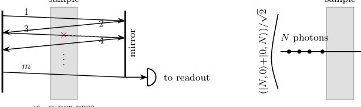 
FIG. 1. Two ways to spend Nm probe uses on a sample. (a) A single photon folded m times through the sample, detected once. A photon absorbed on one pass makes no later pass, so the dose is weighted by survival. (b) A maximally path-entangled state of N photons, each meeting the sample once. The coherence requires all N photons to survive, but every photon doses the sample whatever becomes of the others. The weighting is hypothesis (H3), and it is the entire difference between the constants 0.648 and 1/e. Only the sensing arm is drawn: in both schemes it is one arm of an interferometer, and the reference arm and the recombination that reads the phase are omitted. In (b) the drawn branch is...

📷 Fig 2

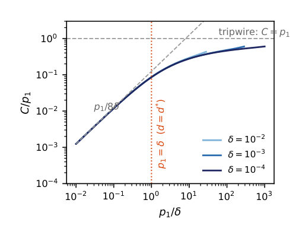 
FIG. 2. The crosstalk ceiling. Exact two-outcome Chernoff exponent C, normalised by the ideal value p1, against p1/δ for three crosstalk levels. Dashed lines: the asymptotes of Eq. (13), first obtained for the symmetric configuration in Ref. [11]. Dotted line: the crossover p1 = δ, that is d = dc of Eq. (14).

**Summary.** This theoretical paper establishes a universal limit on the performance of multi-pass quantum sensors by optimizing the information gained relative to the energy absorbed by the sample. It finds that the optimal strategy is governed by a single mathematical function, suggesting that for fragile samples, the simplest measurement—using a single recycled photon—is the best approach.

**Why it may be interesting.** It provides a rigorous, quantitative framework for understanding fundamental resource limitations in quantum metrology, showing how the optimal measurement strategy is dictated by the most constrained resource (absorbed photons).

Detailed structure

**Main problem.** The paper determines the universal loss-limited optimum for quantum sensing schemes, specifically quantifying the maximum information gain achievable per photon absorbed by a sample.

**Main result.** The optimum gain is governed by a universal trade-off function, $h(x) = x^2/(e^x-1)$, yielding a maximum value of $\approx 0.648$. For fragile samples, the optimal measurement strategy converges to the simplest one: using a single, recycled photon.

**Method.** The analysis involves deriving the figure of merit (information gained per absorbed photon) for various multi-pass quantum sensing setups, comparing sequential versus parallel probe strategies.

**Model / system.** The study models fixed multi-pass quantum sensing schemes, including interaction-free interrogation, multi-pass phase interferometry, and the detection of faint companions near a strong source.

**Key observables.** Information gained per absorbed photon, Fisher information, and the dose absorbed by the sample ($n_{abs}$).

**Important parameters / regimes.** Loss per pass ($\epsilon$), absorption ($\alpha$), number of passes ($m$), and the ratio of faint companion intensity to primary source intensity ($\epsilon_r$).

**Assumptions / limitations.** The analysis is restricted to fixed arrangements (single-photon multi-pass chains) and assumes the resource measure is 'information per absorbed photon.'

**Figures summary.** Figures compare different sensing cases (absorption estimation, Zeno chain, phase accumulation, N00N states) based on the resource measure, and one figure illustrates sequential versus parallel spending methods.

**Paper structure.** The paper systematically compares the performance of multiple quantum sensing protocols (e.g., phase sensing, interaction-free interrogation) under the constraint of limited absorbed photons, deriving a universal mathematical optimum that dictates the best measurement strategy.

Abstract

Multi-pass schemes send a photon through a sample several times to learn more about it. When the sample rather than the light is scarce, the natural figure of merit is the information gained per photon the object absorbs. We show that one constant fixes the loss-limited optimum of every fixed scheme in which a single photon passes repeatedly through the sample and is detected once at the end. Three properties suffice: information that grows as the square of the pass number, a fixed survival probability per pass, and no dose from a photon already lost. They force a single trade-off function $h(x)=x^2/(e^x-1)$, where $x$ is the number of passes times the loss per pass. Its maximum, 0.648, sits at $x_{\mathrm{opt}}=1.594$. The loss-limited ceiling of interaction-free interrogation and the multi-pass phase optimum of Yu et al. are two instances. Phase sensing of a weakly absorbing object is a third, optimal at $m_{\mathrm{opt}}=x_{\mathrm{opt}}/(ε+α)$ passes; the absorption $α$ and the parasitic loss $ε$ enter the optimum only through their sum, but the damage counts only $α$. N00N states and their loss-robust generalisations do worse per absorbed photon, and optimising over photon number and pass number together returns a single recycled photon. Two further problems are priced in the same measure. Absorption estimation gains nothing, for any scheme. Detecting a faint companion below the Rayleigh limit costs the companion a dose that does not depend on its faintness, while under direct imaging the dose grows without bound. For a fragile sample the gentlest measurement is also the simplest one: a single photon, recycled.

[↑ back to top](#top)

### [Dissipatively Stabilized 0-n Fock Qubits for Noise-Biased Quantum Computing](http://arxiv.org/abs/2608.25959v1)

**Authors:** Su Direkci, Simon Lieu, Kyungjoo Noh, Connor T. Hann  
**Type:** theory · **Category:** quantum information and computing · **PDF:** <https://arxiv.org/pdf/2608.25959v1>  
**Analysis basis:** full PDF text, analyzed in chunks
**Topic relevance:** `methods for driven-dissipative` **3/5** · `correlated / nonlocal dissipation` **1/5** · `driven-dissipative phase transition` **1/5** · `quantum measurements` **1/5**

📷 Fig 1

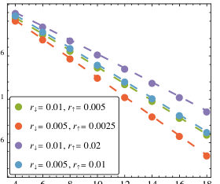 
FIG. 1. a) Schematic of the 0-n Fock qubit. We encode the logical states {|0L⟩, |1L⟩} into the ground state |0⟩and the n-th excited state |n⟩of a Fock qubit. b) Smallest non-zero eigenvalue (in absolute magnitude) λmin of the Lindbladian describing the evolution of the 0-n Fock qubit. We define r↑,↓:= κ↑,↓ i /κs ≪1 as the ratio of the rates between the intrinsic processes and the engineered dissipation. The nu- merical values are plotted with the markers, whereas the an- alytical fit given by Eq. (9) is plotted with the dashed lines.

📷 Fig 2

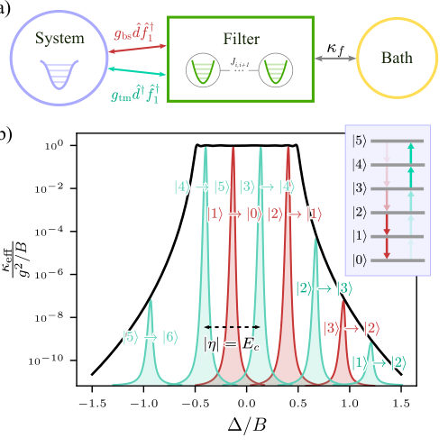 
FIG. 2. a) Schematic of the implementation for the 0-n Fock qubit. The qubit (system, drawn in purple) is connected to a multimode filter with coupling rates gbs and gtm for the beam splitter and the two-mode squeezing interaction, respectively. The excitations travel along the filter and are dissipated to a bath, with a rate κf. b) Effective rates κeff of engineered processes between adjacent levels of a 0-n Fock qubit, with n = 5. Decay and gain are engineered via the beam splitter and two-mode squeezing coupling with the filter. The rates are plotted as a function of the detuning ∆, normalized with the filter bandwidth B. We observe that κeff g2/B ≈2π, where g is the coupling rate for...

📷 Fig 3

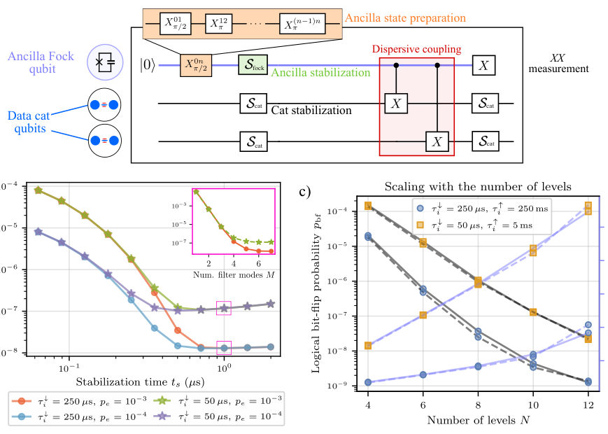 
FIG. 3. Use of the 0-n Fock qubit as an ancilla for noise-biased CX gates on stabilized cat qubits. a) Schematic of the protocol. The ancilla is prepared in the |+0n⟩= 1 √

📷 Fig 4

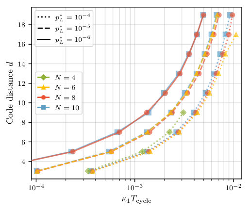 
FIG. 4. Average logical error per round p∗ L when the 0-n Fock qubit is used as an ancilla in the repetition code, paired with cat data qubits. The contours for p∗ L ∈{10−4, 10−5, 10−6} are shown as a function of κ1Tcycle and the code distance d, where κ1 is the single-photon loss rate of the cat qubits, and Tcycle is the cycle time for a single round of error correction. We work with a phenomenological noise model, where Z errors are applied on the ancilla and the data qubits at the start of each error correction round. The ancilla Z errors occur only due to single-photon events (τ ↓ i = 250 µs, τ ↑ i = 250 ms) during the stabilization (ts = 500 ns), or the CX gates (tg = 200 ns): we...

📷 Fig 5

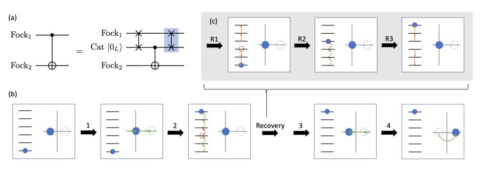 
FIG. 5. Proof-of-principle implementation of a bias-preserving CX between 0-n Fock qubits. (a) Circuit decomposition. The CX can be implemented by transferring the state of one Fock qubit into an auxiliary cat qubit, then using Fock-cat CX from the main text. Here state transfers are represented by SWAP gates, and the cat is initialized in |0L⟩≈|α⟩C. (b) State transfer sequence. The pulse sequence implementing the highlighted SWAP gate is depicted step by step, illustrating each step’s action on the initial state |−α⟩C|0⟩F . Green arrows indicate coherent unitary operations, and orange arrows indicate engineered dissipation. The red arrow and dashed red circle indicate a possible pulse...

**Summary.** This work proposes a novel '0-n' Fock qubit architecture that uses engineered dissipation to stabilize a noise bias, making it robust against bit-flip errors. By encoding information across multiple levels of a nonlinear oscillator, the authors show that bit-flip errors are exponentially suppressed with the number of levels ($n$). This technique allows for the simulation of fault-tolerant quantum computation with achievable logical error rates in the megaquop regime.

**Why it may be interesting.** The use of engineered dissipation to control error channels in a structured, multi-level system is highly relevant to open quantum systems and quantum control theory, providing a concrete physical realization for error suppression.

Detailed structure

**Main problem.** The paper addresses the challenge of maintaining the inherent noise bias of qubits during gate operations, especially when ancillary qubits are involved.

**Main result.** They demonstrate that a '0-n' Fock qubit architecture can achieve exponentially suppressed bit-flip errors (approaching $10^{-8}$) while keeping phase-flip errors manageable, enabling high-fidelity quantum computation.

**Method.** The core method involves engineering dissipative stabilization using a Lindblad master equation to selectively suppress unwanted decay channels while preserving the logical subspace.

**Model / system.** The system is the '0-n' Fock qubit, modeled as a nonlinear multi-level system (like a transmon) where information is encoded in the ground state $|0
angle$ and the $n$-th excited state $|n
angle$. The dynamics are governed by engineered dissipation rates.

**Key observables.** Bit-flip probabilities ($p_{	ext{bf}}$), phase-flip probabilities ($p_{	ext{pf}}$), and logical error rates ($p^*_L$).

**Important parameters / regimes.** The number of levels ($n \ge 9$), the engineered dissipation rates ($\kappa_s$), and the target error rates ($10^{-8}$ for bit-flips, $10^{-6}$ for logical error).

**Assumptions / limitations.** The analysis assumes the engineered dissipation rate greatly exceeds intrinsic decay rates, and later sections analyze the inclusion of dephasing noise effects.

**Figures summary.** Figures illustrate the schematic of the qubit and the spectral gap dependence on $n$, and later show contours comparing logical error rates for different code distances and dephasing levels.

**Paper structure.** The paper first establishes the noise bias mechanism via dissipative stabilization (analyzing $Q$ and $L_{	ext{coh}}$ blocks), then details the physical implementation using multi-mode filters, and finally recomputes logical error rates for a repetition code, including dephasing effects.

Abstract

Noise-biased qubits have bit-flip errors that are exponentially suppressed relative to phase-flip errors, and offer a promising route toward fault-tolerant quantum computing. However, this bias can be compromised during gate operations with non-biased control qubits. To address this limitation, we propose a "0-n" Fock qubit architecture that maintains the noise bias by encoding information in the ground state and n-th excited state of a nonlinear multi-level system, such as a transmon. This encoding is achieved via a dissipative stabilization that acts as decay and gain for lower and upper intermediate levels, respectively. We first analytically demonstrate that bit-flip errors are exponentially suppressed with the number of levels. Then, we present a practical implementation using a multi-mode lossy filter to achieve the frequency-selective dissipation. Finally, we numerically demonstrate that bit-flip probabilities approaching $10^{-8}$ are achievable for controlled-X gates on cat qubits using the 0-n qubit as an ancilla with $n \geq 9$ (i.e. ten or more levels), for realistic experimental parameters. Building on this, we simulate syndrome extraction in a repetition code, achieving logical error rates in the megaquop regime with only a distance of $d=9$.

[↑ back to top](#top)

### [Enhanced quantum metrology with robust multipass interferometry](http://arxiv.org/abs/2608.25842v1)

**Authors:** Sayak Mukherjee, José Afonso Oliveira, Sean William Moore, Jacob A. Dunningham  
**Type:** theory · **Category:** other · **PDF:** <https://arxiv.org/pdf/2608.25842v1>  
**Analysis basis:** full PDF text, analyzed in chunks
**Topic relevance:** `interference shaping light` **3/5** · `quantum measurements` **2/5**

📷 Fig 1

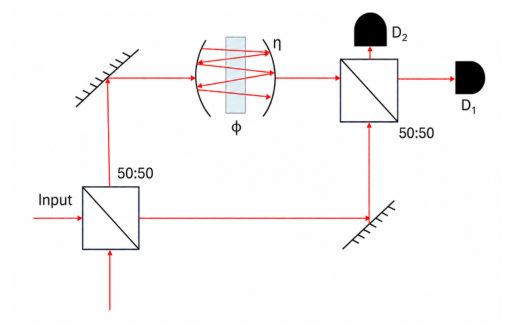 
FIG. 1. The multipass Mach-Zehnder interferometer consisting of two 50:50 beam splitters, two mirrors, photon number counting detectors D1 and D2 and an optical cavity. The upper path is passed multiple times through the sample in the cavity, accumulating a phase, ϕ, each time. Environmental losses are modelled by considering the cavity mirrors to be leaky with a reflection probability of η.

📷 Fig 2

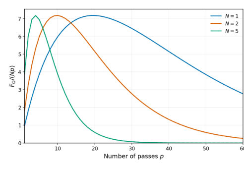 
FIG. 2. The quantum Fisher information per particle-pass, FQ/(Np), is shown as a function of the number of passes, p, for NOON states with N = 1, 2, 5. In each case η = 0.95. All the different sized NOON states achieve the same maximum value.

📷 Fig 3

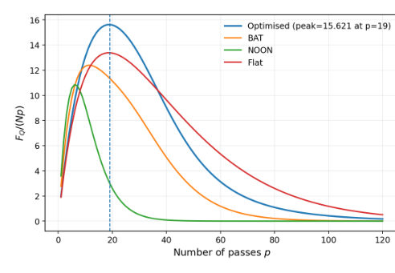 
FIG. 3. FQ/(Np) plotted as a function of p for different states. The general state (8) with optimised coefficients is shown as the blue line. This is compared with the other states discussed in the text. In each case N = 4 and η = 0.95.

📷 Fig 4

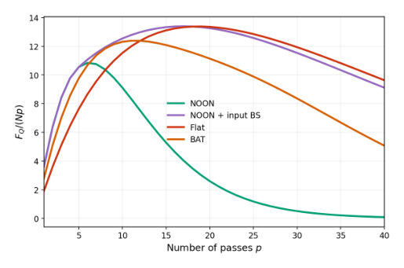 
FIG. 4. The results of Fig. 3 – redisplayed with a different p range and the optimised state removed – are compared with the rotated NOON state. The rotated NOON state outperforms all the other states. For the parameters used here, N = 4 and η = 0.95, the optimal number of passes is p = 17 and the optimal beam splitter reflectivity is 0.83.

📷 Fig 5

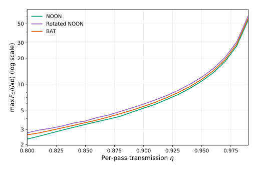 
FIG. 6. maxp FC/(Np) is plotted as a function of η, the per-pass transmission. There is a clear hierarchy where the rotated NOON dominates the BAT which in turn dominates the NOON for all η displayed.

**Summary.** This paper proposes a hybrid quantum metrology technique that merges the benefits of multipass interferometry with the robustness of small entangled states. By analyzing the Quantum Fisher Information under realistic loss models, the authors demonstrate that a 'rotated NOON state' approach significantly enhances measurement precision compared to standard methods. This offers a practical pathway toward achieving quantum-enhanced sensing using current experimental technology.

**Why it may be interesting.** This work directly addresses the practical limitations of quantum enhancement in optical systems, providing concrete, loss-robust protocols that are highly relevant to experimental quantum optics and sensing.

Detailed structure

**Main problem.** The primary challenge is achieving measurement precisions beyond the standard quantum limit in realistic quantum metrology setups, particularly when particle loss and decoherence are present.

**Main result.** A hybrid strategy combining small, loss-resilient entangled states with multipass interferometry significantly outperforms standard NOON-state or single-photon multipass schemes under realistic loss conditions.

**Method.** The authors analyze the Quantum Fisher Information (QFI) and Classical Fisher Information ($F_C$) to determine the ultimate measurement precision limit ($\delta\phi$).

**Model / system.** The model is a Mach-Zehnder interferometer incorporating a multipass element in one arm, where loss is modeled by imperfect mirror reflectivity ($\eta < 1$).

**Key observables.** Measurement precision ($\delta\phi$), Quantum Fisher Information ($F_Q$), and Classical Fisher Information ($F_C$).

**Important parameters / regimes.** Number of particles ($N$), number of passes ($p$), and the loss parameter ($\eta$).

**Assumptions / limitations.** The analysis assumes asymptotic estimation theory applies and that loss occurs primarily in the sensing arm.

**Figures summary.** Figures compare the scaling of $F_Q/(Np)$ and $F_C/(Np)$ for various states (NOON, BAT, Rotated NOON) versus the number of passes ($p$), demonstrating the superiority of the rotated NOON state.

**Paper structure.** The paper progresses from establishing the theoretical limits (Heisenberg scaling) to analyzing the failure modes of large entangled states and single-photon schemes due to loss. It then introduces and analyzes the hybrid strategy using rotated NOON states and multipass interferometry.

Abstract

Quantum metrology typically uses entangled states to achieve measurement precisions beyond the standard quantum limit. The advantage increases with the size of the entangled state, however generating and preserving large entangled states remains a major experimental challenge. Multipass protocols offer an alternative approach by allowing a single probe to interact repeatedly with the parameter of interest, but their performance is highly susceptible to loss, which accumulates over successive passes and rapidly erodes the quantum advantage. Here we introduce a hybrid strategy that combines small, loss-resilient entangled states with multipass interferometry. We show that this approach retains the robustness of small entangled probes while exploiting repeated interactions to achieve substantial enhancements in measurement precision. Furthermore, we propose a concrete implementation using currently available technologies, demonstrating that the predicted performance gains should be experimentally accessible with existing capabilities.

[↑ back to top](#top)

### [The Effects of Inter-Valley Coupling of Dirac Fermions near Four Dimensions](http://arxiv.org/abs/2608.25132v1)

**Authors:** S. Thiagarajan, F. Krüger  
**Type:** theory · **Category:** strongly correlated electrons · **PDF:** <https://arxiv.org/pdf/2608.25132v1>  
**Analysis basis:** full PDF text, analyzed in chunks
**Topic relevance:** `analog quantum simulation` **3/5** · `Keldysh / 2PI / non-Gaussian methods` **2/5**

📷 Fig 1

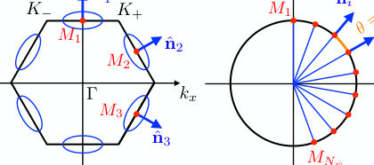 
FIG. 1. (a) Hexagonal Brillouin zone with Dirac valleys at the three M points, as observed at the topological phase transi- tion of the Kitaev QSL in magnetic field along the [111] di- rection [16–19]. The directors ˆni determine the orientation of the local coordinate frames. (b) Generalization to Nψ Dirac points, where the directors of neighboring valleys enclose an angle of θ = π/Nψ.

📷 Fig 2

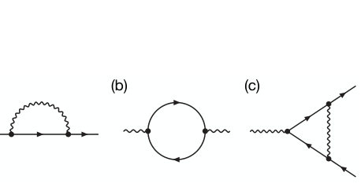 
FIG. 2. Feynman diagrams that correspond to (a) fermionic self-energy corrections, (b) bosonic self-energy corrections, and (c) the renormalization of the Yukawa vertices. The solid lines represent fermionic Grassmann fields, wiggly lines bosonic intra- and inter-valley fluctuation fields.

📷 Fig 3

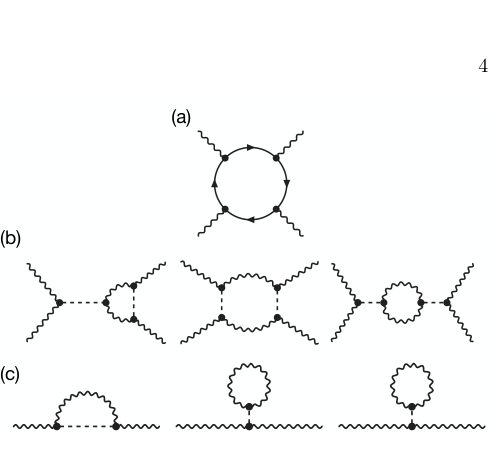 
FIG. 3. Feynman diagrams that correspond to the renor- malization of bosonic interaction vertices by the (a) Yukawa couplings and (b) the bosonic interactions. (c) Diagrams that generate mass terms of the bosonic fluctuation fields.

📷 Fig 4

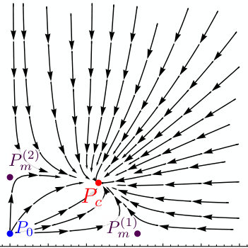 
FIG. 4. RG flow of the intra- and inter-valley Yukawa cou- plings gϕ and gφ for Nψ = 3 valleys. For other Nψ the same qualitative behavior is observed. The critical GNY fixed point P (1) m in the GNY theory of decoupled valleys is unsta- ble against inter-valley coupling, leading to the formation of a new critical fixed point Pc.

📷 Fig 5

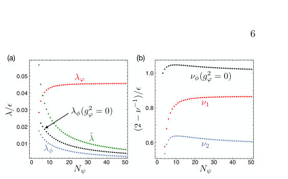 
FIG. 6. (a) Critical values of the bosonic interactions λϕ, λφ, and ˜λ at the GNY fixed point Pc as a function of Nψ. For comparison, the coupling strength λϕ(g2 φ = 0) of the ϕ4 vertex in the GNY theory with decoupled valleys is shown in black. (b) The correlation length exponents ν1 and ν2 as a function of Nψ.

**Summary.** This theoretical work investigates the quantum critical behavior of Dirac fermions in a multi-valley system using a renormalization group approach. It finds that inter-valley interactions stabilize a new critical fixed point, which breaks Lorentz invariance. The results are particularly valuable for understanding quantum criticality in materials with multiple degenerate electronic bands.

**Why it may be interesting.** The study of critical points in interacting fermion systems, especially those exhibiting topological features like Dirac valleys, is central to understanding strongly correlated materials and quantum phase transitions relevant to condensed matter physics.

Detailed structure

**Main problem.** The paper analyzes the quantum criticality of an Ising Gross-Neveu-Yukawa (GNY) theory describing Dirac fermions with both intra- and inter-valley interactions.

**Main result.** A new critical fixed point is found where inter-valley coupling is finite, leading to broken Lorentz invariance, although this symmetry is asymptotically restored in the large $N_\psi$ limit.

**Method.** The analysis employs a renormalization-group (RG) technique using an $\epsilon$ expansion in $4-\epsilon$ dimensions, calculated to one-loop order.

**Model / system.** The model involves $N_\psi$ Dirac fermion valleys, motivated by topological phase transitions (like the Kitaev model), coupled to Ising order parameter fields ($\phi$ and $\varphi_{i, i+1}$).

**Key observables.** Critical exponents, anomalous dimensions ($\eta_\psi, \eta_\phi, \eta_\varphi$), dynamical critical exponent ($z$), and correlation-length exponents ($
u_1, 
u_2$).

**Important parameters / regimes.** The number of valleys ($N_\psi$), the dimension parameter ($\epsilon$), and the coupling constants ($g_\phi, g_\varphi, \lambda$).

**Assumptions / limitations.** The analysis assumes short-ranged interactions and is performed to one-loop order in the continuum field theory approximation.

**Figures summary.** Figures illustrate the Brillouin zone with Dirac valleys, Feynman diagrams for self-energy and vertex corrections, and plots showing the RG flow of couplings and critical exponents as a function of $N_\psi$.

**Paper structure.** The paper builds from defining the full action and the RG methodology (integrating out UV modes) to deriving the coupled RG flow equations for couplings and velocities, culminating in the determination of the stable critical fixed point $P_c$ and its large-$N_\psi$ limit.

Abstract

We analyze the criticality of an Ising Gross-Neveu-Yukawa (GNY) theory of $N_ψ$ Dirac fermion valleys with intra- and inter-valley interactions, using a renormalization-group analysis in $4-ε$ space-time dimensions to one-loop order. The conventional GNY fixed point of decoupled valleys is unstable against inter-valley fluctuations which are naturally present if the symmetry breaking is driven by short-ranged interactions. At the new fixed point, the critical exponents differ from the conventional GNY universality. Most importantly, Lorentz invariance is broken due to interference effects resulting from the relative rotation between valley coordinate frames. In the limit of large $N_ψ$ the critical fixed point with finite inter-valley coupling remains stable but Lorentz invariance is asymptotically restored.

[↑ back to top](#top)

### [A Unified Framework for Operator Backpropagation and Observable Measurement in Quantum Computing](http://arxiv.org/abs/2608.25042v1)

**Authors:** Kevin Dougherty, Ji Liu  
**Type:** theory · **Category:** quantum information and computing · **PDF:** <https://arxiv.org/pdf/2608.25042v1>  
**Analysis basis:** full PDF text, analyzed in chunks
**Topic relevance:** `quantum measurements` **3/5** · `analog quantum simulation` **1/5**

📷 Fig 1

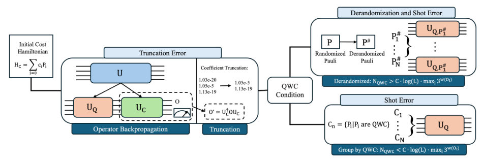 
Fig. 1: Comprehensive framework to determine the appropriate measurement protocol to achieve a desired level of accuracy with the fewest number of measurements based on the number of commuting groups generated from backpropagation.

📷 Fig 2

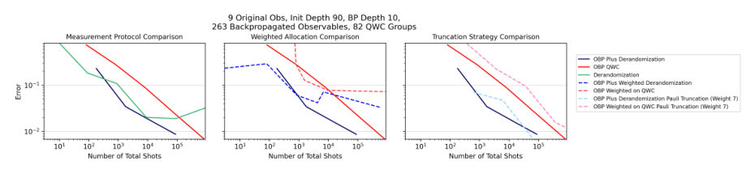 
Fig. 3: Operator Backpropagation-Derandomization Protocol Results on a XYZ Heisenberg Hamiltonian Circuit.

📷 Fig 3

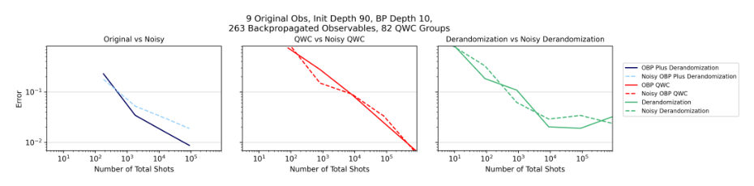 
Fig. 4: Operator Backpropagation-Derandomization Protocol Noisy Results on a XYZ Heisenberg Hamiltonian Circuit.

📷 Fig 4

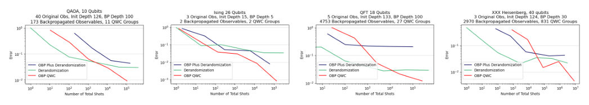 
Fig. 5: Evaluation Results of Operator Backpropagation-Derandomization Protocol on: QAOA, Ising, and QFT Circuits.

**Summary.** This paper presents a unified framework to optimize the process of estimating quantum expectation values by combining Operator Backpropagation (OBP) with advanced measurement protocols. It systematically determines the most efficient measurement strategy—choosing between QWC grouping or derandomization—by analyzing accumulated errors and resource scaling. This guides the development of more resource-efficient quantum algorithms for NISQ devices.

**Why it may be interesting.** It provides rigorous, resource-aware guidelines for running variational quantum algorithms, which is crucial for designing practical quantum circuits that minimize measurement overhead.

Detailed structure

**Main problem.** To develop a unified framework that co-optimizes operator backpropagation and observable measurement protocols to achieve a desired accuracy with the minimum number of measurements.

**Main result.** The optimal measurement strategy depends on a trade-off between Qubit-wise Commuting (QWC) grouping and derandomization, leading to a combined OBP-Derandomization protocol that significantly improves efficiency over individual methods.

**Method.** The authors propose a framework that analyzes error sources (backpropagation, truncation, shot noise) and selects the measurement protocol by comparing the cost scaling of QWC grouping versus derandomization bounds.

**Model / system.** The work is applied to quantum computing circuits, tested on models like the XYZ Heisenberg Hamiltonian, QAOA, Ising, and QFT circuits, relevant for near-term quantum devices.

**Key observables.** Expectation values of observables ($\langle O 
angle$), backpropagated observables (linear combinations of Pauli observables), and the measurement cost (number of required measurements).

**Important parameters / regimes.** Desired accuracy ($\epsilon$), number of QWC groups ($N_{QWC}$), and the scaling factor related to Pauli weights ($\log(L) \cdot \max_{\ell} 3^{w(O_\ell)}$).

**Assumptions / limitations.** The number of backpropagated observables can grow exponentially, necessitating truncation strategies (coefficient-based or Pauli-weight-based).

**Figures summary.** Figures illustrate the comprehensive framework for protocol selection, analyze the distribution of Pauli weights, and show performance comparisons (including noisy results) across various circuit families (QAOA, Ising, QFT) using the OBP-Derandomization protocol.

**Paper structure.** The paper introduces the unified framework, analyzes error sources, compares measurement protocols (QWC vs. Derandomization), and provides case studies on various Hamiltonians to determine the optimal measurement strategy.

Abstract

Decoherence imposes severe limits on quantum circuit depth, motivating methods to reduce circuit depth. Operator backpropagation has recently been proposed as a way to lower circuit depth by classically backpropagating observables through subcircuits. While it lowers the circuit depth, it also significantly increases the number of backpropagated observables that must be measured. This calls for an efficient measurement protocol tailored to these backpropagated observables. Moreover, errors arise both during the backpropagation procedure and during measurement, and they accumulate in the final computation. No prior work has examined how to integrate operator backpropagation with advanced measurement protocols, and how to jointly optimize the combined process.   In this paper, we introduce a comprehensive framework to determine the appropriate measurement protocol to achieve a desired level of accuracy with the fewest number of measurements based on the number of qubit-wise commuting (QWC) groups formed from operator backpropagation. We analyze and categorize the primary sources of error that arise through our workflow, including error incurred from the backpropagation algorithm, truncation error, and shot noise variation. We also examine truncation strategies to reduce the number of backpropagated observables by characterizing the structure of the set of backpropagated observables.

[↑ back to top](#top)

### [Electric excitation of spin resonance in altermagnetic and antiferromagnetic conductors](http://arxiv.org/abs/2608.25265v1)

**Authors:** R. Ramazashvili, V. Shablenko, Ya. B. Bazaliy  
**Type:** theory · **Category:** strongly correlated electrons · **PDF:** <https://arxiv.org/pdf/2608.25265v1>  
**Analysis basis:** full PDF text, analyzed in chunks
**Topic relevance:** `Keldysh / 2PI / non-Gaussian methods` **3/5** · `methods for driven-dissipative` **1/5**

📷 Fig 1

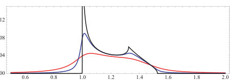 
Figure 1: Spin absorption Ps ω, plotted in units of P0 (defined immediately below Eq. (12)) for m/M = 0.1. The black line represents the clean limit (τ = ∞) and shows the divergent threshold peak of Eq. (4) and the second, finite peak of Eq. (5). In the presence of a finite relaxation time τ, both peaks are rounded off, as illustrated by the blue line (ω−τ = 40) and the red line (ω−τ = 10).

📷 Fig 2

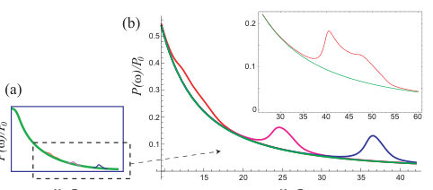 
Figure 2: (a) Sketch of the full absorption P(ω) = Pe ω + Ps ω (not to scale), showing the Drude background (green line) and the EDSR peaks against its backdrop. (b) The full ab- sorption P(ω) obtained by numeric integration of Eq. (11). With increasing magnetic field (ω−= 2H⊥/ℏ) the EDSR peaks progressively rise above the ohmic background. Curves are shown for ω−τ = 12 (red line), ω−τ = 24 (magenta), and ω−τ = 36 (blue). Parameters are set to m/M = 0.1 and µτ/ℏ= 50. Inset: the two-peak structure emerges for ω−τ = 40 and µτ/ℏ= 150.

📷 Fig 3

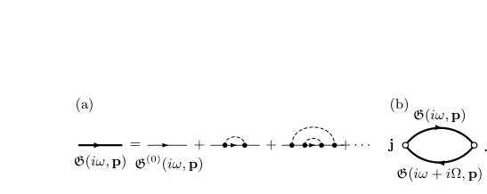 
Figure 3: (a) The ‘rainbow’ diagrams, contributing to the disorder-averaged Green’s function G(iω, p), shown by the bold solid line. Thin solid line denotes the Green’s function G(0)(iω, p) in an impurity-free crystal: the inverse of the r.h.s. of Eq. (14) without the last term. Dashed line denotes the disorder correlator nu2 0δ(r −r′), see main text. (b) The po- larization ‘bubble’ diagram, corresponding to the Matsubara current-current correlator Παβ(iΩ, q = 0) in Eq. (15).

**Summary.** This theoretical work predicts that altermagnetic conductors exhibit a unique Electric-Dipole Spin Resonance (EDSR) peak when subjected to an AC electric field perpendicular to the magnetization. This resonance occurs above a threshold frequency determined by the transverse magnetic field, offering a powerful method to experimentally distinguish altermagnetism from conventional antiferromagnetism.

**Why it may be interesting.** The theoretical framework for EDSR provides a concrete, measurable spectroscopic signature related to magnetic order, which is highly relevant for understanding exotic electronic states in correlated materials.

Detailed structure

**Main problem.** The paper aims to predict and provide a diagnostic signature for Electric-Dipole Spin Resonance (EDSR) in altermagnetic and antiferromagnetic conductors, allowing differentiation from other magnetic orders.

**Main result.** EDSR manifests as a distinct spin resonance peak above a lower threshold frequency $\omega_- = 2H_\perp/\hbar$, which can serve as a unique diagnostic tool for altermagnetism.

**Method.** The analysis uses a combination of kinetic equation treatments and diagrammatic calculations within the Matsubara formalism to derive the spin polarization and absorption rate.

**Model / system.** The system involves altermagnetic and antiferromagnetic conductors, modeled using a low-energy Hamiltonian incorporating spontaneous spin splitting ($\Delta_p$) and an external transverse magnetic field ($\mathbf{H}_\perp$).

**Key observables.** The primary observable is the EDSR absorption rate ($P_{s\omega}$), which is compared against the background ohmic absorption ($P_{e\omega}$).

**Important parameters / regimes.** Key parameters include the transverse magnetic field $H_\perp$, the ratio $m/M$ characterizing spin splitting, and the clean limit condition $k_F l \approx 2\mu	au \gtrsim 300$.

**Assumptions / limitations.** The analysis relies on the relaxation-time approximation for the spin polarization and assumes that vertex corrections vanish for $\delta$-correlated disorder.

**Figures summary.** Figure 1 illustrates the theoretical EDSR peak shape (with and without finite scattering time $	au$) compared to the ohmic background. Figure 2 shows the evolution of the total absorption $P(\omega)$ with increasing magnetic field, and Figure 3 details the diagrammatic calculation framework.

**Paper structure.** The paper establishes the physical model and Hamiltonian, derives the EDSR signal using kinetic equations and diagrammatic methods, predicts the characteristic frequency thresholds ($\omega_-$), and discusses the experimental conditions required for clear observation.

Abstract

We predict electric-dipole spin resonance (EDSR) in altermagnetic conductors: in a magnetic field ${\mathbf H}_\perp$, perpendicular to the magnetization axis, an AC electric field will induce a \textit{spin} resonance peak above the lower threshold frequency $ω_- = 2H_\perp$. In sufficiently clean samples, this peak shall be clearly visible on the background of ohmic absorption. EDSR can thus serve as a diagnostic of altermagnetism in conducting materials and as a means to distinguish it from higher-symmetry antiferromagnetic order.

[↑ back to top](#top)

### [Position- and Momentum-Space Quantum Information Measures of the Double-Morse Oscillator](http://arxiv.org/abs/2608.25953v1)

**Authors:** Firoz Chogle, Ernesto Damiani, Berihu Teklu  
**Type:** theory · **Category:** other · **PDF:** <https://arxiv.org/pdf/2608.25953v1>  
**Analysis basis:** full PDF text, analyzed in chunks
**Topic relevance:** `analog quantum simulation` **3/5** · `quantum measurements` **1/5**

📷 Fig 1

 
FIG. 1. Double Morse potential for A = 0.1, 0.4, 0.7 and µ = 2.

📷 Fig 2

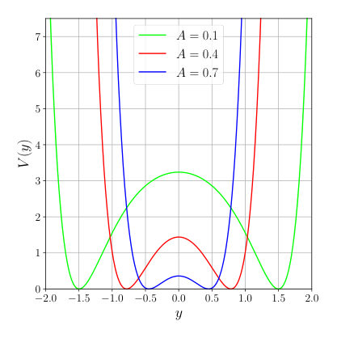 
Figure 1 shows the plot of the double Morse potential in dimensionless units, i.e., V (y) = µ2(A cosh(2y) −1)2. The influence of the well’s structure is governed by A. For small values of A, the potential shows two distinct wells and as A →1−, the two wells merge into one.

📷 Fig 3

 
FIG. 2. The profile of ground state (top) and excited state (bottom) position wavefunctions for parameter value A = 0.1, 0.4 and 0.7.

📷 Fig 4

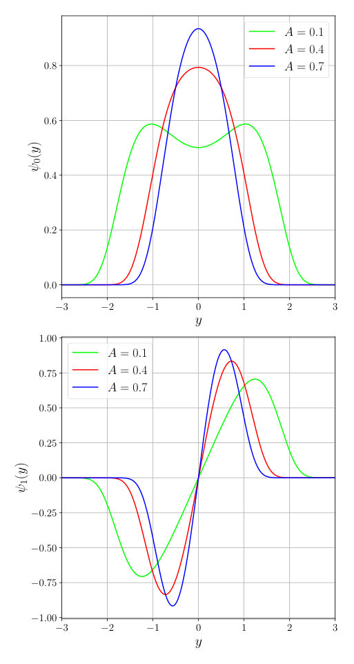 
Figure 3 shows the variation of the ground- and excited-state energies as functions of A. When A →1−,

📷 Fig 5

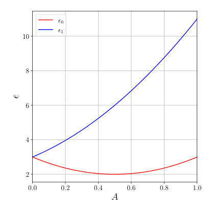 
FIG. 3. The energy of ground and excited state as a function of A.

**Summary.** This theoretical study analyzes the quantum information properties of a particle in the double-Morse potential by calculating metrics like entropy and Fisher information. The research tracks how these measures change as the potential transitions from two separated wells to a single merged well. It demonstrates that the complexity of the position distribution and the uncertainty in the momentum distribution exhibit complementary behaviors across this physical crossover.

**Why it may be interesting.** This work provides a quantitative link between the geometry of a confining potential (double-well structure) and the resulting quantum uncertainty and complexity, which is highly relevant for understanding quantum state preparation and measurement in cold atom or superconducting circuit platforms.

Detailed structure

**Main problem.** The paper investigates how quantum information measures characterize the particle confinement within the double-Morse potential in both position and momentum spaces.

**Main result.** The position distribution shows increased structural complexity when the double-well character is strong, while the momentum distribution exhibits a complementary trend. The Fisher-Shannon product approaches the Gaussian reference value as the wells merge.

**Method.** The analysis employs various information-theoretic measures—including Shannon entropy, Onicescu energy, and Fisher information—calculated for the first two bound states using quasi-exactly solvable analytical expressions.

**Model / system.** The system is the double-Morse oscillator, governed by a potential $V_{DM} = D(A \cosh(\alpha x) - 1)^2$. This model is relevant for systems like ultracold atoms or semiconductor quantum wells.

**Key observables.** Shannon entropy ($S_
ho, S_\gamma$), Onicescu energy ($O_
ho, O_\gamma$), Fisher information ($I_
ho, I_\gamma$), statistical complexity ($CGL$), and the Fisher-Shannon product ($P$).

**Important parameters / regimes.** The dimensionless shape parameter $A$ controls the crossover from a double-well to a single-well profile, with the analysis focusing on $A \in (0, 1)$.

**Assumptions / limitations.** The analysis is limited to the ground and first excited states due to the quasi-exactly solvable sector used, and the results are interpreted diagnostically rather than as a full device-specific estimation protocol.

**Figures summary.** Figures illustrate the potential $V(y)$ vs. $A$, wavefunctions ($\psi_0, \psi_1$) vs. $A$, energy levels ($\epsilon_0, \epsilon_1$) vs. $A$, and the evolution of various information measures ($S_
ho, S_\gamma, O, P, CGL$) as $A$ changes.

**Paper structure.** The paper introduces the double-Morse potential and its quasi-exact solvability. It then systematically calculates and analyzes several quantum information measures (Shannon, Onicescu, Fisher, etc.) as a function of the parameter $A$, detailing the physical interpretation of the trends observed in the position and momentum domains.

Abstract

We investigate the quantum-information properties of a particle confined by the double Morse potential in position and momentum spaces. The quasi-exact solvability of the model gives analytical expressions for the first two bound states, allowing the corresponding probability densities to be analyzed directly. Shannon entropy, Onicescu energy, Fisher information, statistical complexity, and Fisher-Shannon products are evaluated as functions of the parameter $A$, which controls the transition from a well-separated double well to a merged single-well profile. The position distribution is more delocalized and structurally complex when the double-well character is pronounced, whereas the momentum distribution exhibits the complementary trend. As the wells merge, the ground-state Fisher--Shannon product approaches its Gaussian reference value, whereas the excited state retains stronger non-Gaussian structure.

[↑ back to top](#top)

### [Real-time decoder for a MegaQuOp quantum computer using a single CPU](http://arxiv.org/abs/2608.25027v1)

**Authors:** Min Ye, Andrii Maksymov, Nicolas Delfosse  
**Type:** theory · **Category:** quantum information and computing · **PDF:** <https://arxiv.org/pdf/2608.25027v1>  
**Analysis basis:** full PDF text, analyzed in chunks
**Topic relevance:** `QC/QI experiment` **3/5** · `quantum measurements` **1/5**

📷 Fig 1

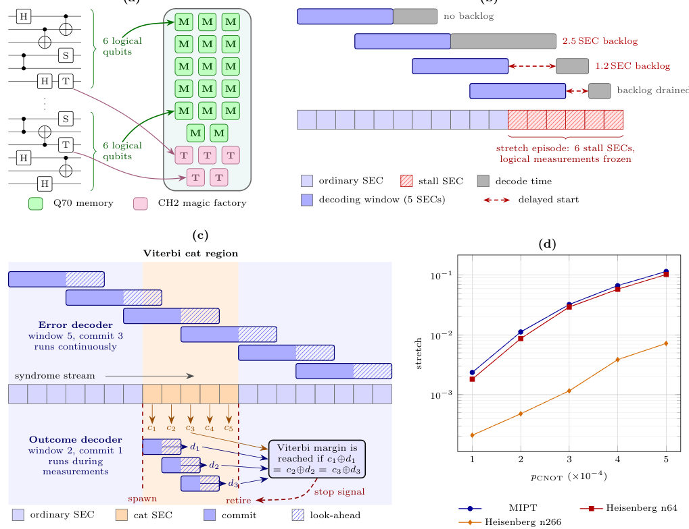 
FIG. 1. (a) Distributing a compiled Clifford + T circuit onto a WCA instance. Each memory block (M) is encoded by the Q70 code and holds 6 logical qubits; each T gate consumes a magic state from a CH2 factory (T). Both Q70 code and CH2 factory were introduced in [35]. (b) Anatomy of a stretch episode. The decoding time budget per window is 3 SECs. The second window runs 2.5 SECs over budget, so the machine inserts stall SECs until the backlog drains (2.5 →1.2 →0). The inserted stall SECs form one stretch episode. (c) Two decoders on one block’s syndrome stream. The error decoder runs continuously and produces the Pauli-frame corrections. A cat SEC is a cat-based measurement followed by an...

**Summary.** This paper presents a complete, real-time decoding stack for fault-tolerant quantum computation targeting MegaQuOp scale devices. By implementing a dual-decoder system on a single CPU, the authors successfully demonstrated that the decoding overhead remains negligible even for circuits involving millions of gates and hundreds of qubits. This work is crucial for realizing large-scale, practical quantum computation.

**Why it may be interesting.** The work directly addresses the engineering bottleneck of fault-tolerant quantum computation by providing a concrete, high-performance decoding pipeline runnable on classical hardware.

Detailed structure

**Main problem.** Developing a decoding system capable of real-time error correction for 'MegaQuOp' quantum computers, which execute millions of gates on hundreds of logical qubits.

**Main result.** The authors demonstrated real-time decoding at MegaQuOp scale on a single conventional CPU, showing decoding delays of less than 0.3% at $p_{\mathrm{CNOT}}=10^{-4}$.

**Method.** They implemented an end-to-end real-time decoding stack utilizing a dual sliding-window decoder (error and outcome decoders) running on a single CPU.

**Model / system.** The system is designed for a universal fault-tolerant trapped-ion quantum computer architecture, benchmarked on circuits simulating Heisenberg models and Measurement-Induced Phase Transitions (MIPT).

**Key observables.** Decoding delay (stretch) relative to computation time, total number of T gates, and total logical measurements.

**Important parameters / regimes.** Logical qubit count (up to 408), number of T gates (up to $10^6$), and physical error rates ($p_{\mathrm{CNOT}}=10^{-4}$ to $5	imes 10^{-4}$).

**Assumptions / limitations.** The architecture relies on the 'walking-cat architecture' (WCA), which simplifies decoding by keeping logical computation structure regular and avoiding block merging.

**Figures summary.** Figures illustrate the circuit mapping onto the WCA, the dual-decoder structure (continuous error vs. measurement outcome decoder), and plots showing the decoding stretch versus $p_{\mathrm{CNOT}}$ for various benchmarks.

**Paper structure.** The paper details the necessity of real-time decoding for large-scale quantum computation, presents the dual-decoder methodology optimized for the WCA, benchmarks this stack on complex circuits (MIPT, Heisenberg), and quantifies the resulting low decoding overhead.

Abstract

As quantum computers advance toward the regime of MegaQuOp machines executing millions of gates, a decoding system capable of real-time error correction in such a device will be crucial. Recent efforts have been focused on decoding an error-corrected memory or a small number of logical operations. Here we demonstrate an end-to-end real-time decoding stack for a universal fault-tolerant trapped-ion quantum computer architecture capable of decoding real workloads with millions of logical gates over hundreds of logical qubits. The complete pipeline, including on the fly detector error model generation, decoding of all logical qubits, logical operations, and magic-state factories, runs on a single CPU. We benchmark the decoder on practically relevant quantum applications spanning up to 408 logical qubits, and up to one million $T$ gates. Assuming a trapped-ion architecture with 1 to 5 ms cycle time, the decoding delay stretches the computation by less than $0.3\%$ at $p_{\mathrm{CNOT}}=10^{-4}$ and less than $12\%$ at $p_{\mathrm{CNOT}}=5\times 10^{-4}$ for all workloads studied. These results demonstrate real-time decoding at MegaQuOp scale on a single conventional CPU.

[↑ back to top](#top)

### [Distributed Trotterization with optimal time-scaling entanglement cost](http://arxiv.org/abs/2608.25896v1)

**Authors:** Tianfeng Feng, Jinzhao Sun, Yunlong Xiao, Qi Zhao  
**Type:** theory · **Category:** quantum information and computing · **PDF:** <https://arxiv.org/pdf/2608.25896v1>  
**Analysis basis:** full PDF text, analyzed in chunks
**Topic relevance:** `analog quantum simulation` **3/5**

📷 Fig 1

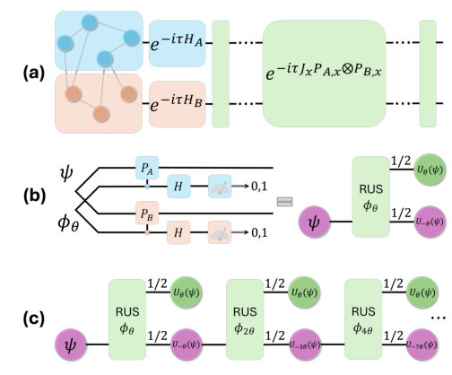 
FIG. 1. Distributed Trotterization. (a) Schematic of the Distributed Quantum Simulation. A many-body Hamiltonian distributed across spatially separated quantum processors. The system is partitioned into subsystems A and B, whose local dynamics are generated by HA and HB, respectively, while the interaction term HAB is implemented through en- tangling evolutions. (b) Repeat-Until-Success Protocol. The ancillary state ϕθ, together with LOCC, implements the tar- get evolution Uθ probabilistically: the even- and odd-parity outcomes occur with equal probability, yielding Uθ(ψ) and U−θ(ψ), respectively. (c) Adaptive Quantum Simulation. If a round returns the odd-parity outcome, the protocol is...

📷 Fig 2

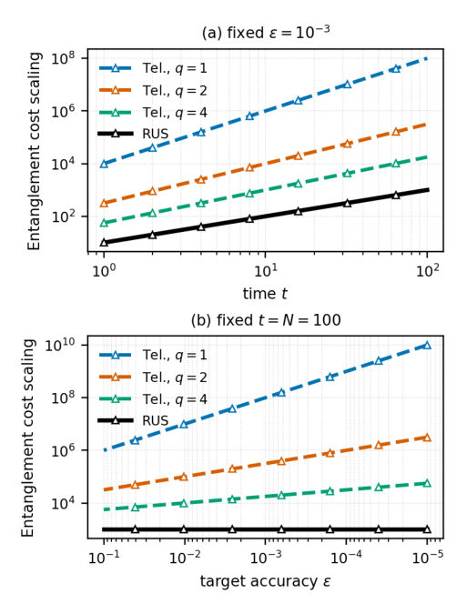 
FIG. 2. Upper-bound scaling of the entanglement cost for distributed Trotterization. The plotted quantity is an upper-bound scaling of entanglement cost for simulating a 2-dimensional lattice with N = 100. Fixed prefactors, in- cluding νq, the commutator factor αq, and other constants independent of the plotted variables, are omitted. (a) At fixed target error ϵ, the cost of standard teleportation-based implementation grows superlinearly with evolution time t, whereas the RUS cost remains linear in t. (b) At fixed t = N = 100, the cost of standard teleportation-based imple- mentation increases as ϵ−1/q with increasing simulation ac- curacy, whereas the RUS cost is independent of ϵ. Dashed...

**Summary.** This paper introduces an adaptive Repeat-Until-Success (RUS) protocol to simulate quantum dynamics across multiple processors. It demonstrates that this protocol allows the total entanglement cost to scale only linearly with simulation time, independent of the required accuracy. This linear scaling is proven to be optimal, establishing a resource-efficient foundation for high-fidelity quantum simulation on distributed hardware.

**Why it may be interesting.** This work directly tackles the resource scaling bottleneck in large-scale quantum simulation, providing a theoretically optimal resource estimate for networked quantum processors.

Detailed structure

**Main problem.** The paper addresses the resource-efficient simulation of many-body dynamics on distributed quantum processors, specifically minimizing the entanglement cost associated with nonlocal operations.

**Main result.** By using a Repeat-Until-Success (RUS) protocol, the total entanglement cost for high-accuracy simulation scales only linearly with the evolution time ($O(t)$), which is proven to be optimal.

**Method.** The authors compare the entanglement cost scaling of the proposed adaptive RUS protocol against conventional teleportation methods within the framework of product formula Trotterization.

**Model / system.** The model is the distributed quantum simulation of a many-body system governed by a Hamiltonian $H = H_A + H_B + H_{AB}$, where interactions occur between spatially separated subsystems A and B.

**Key observables.** Entanglement Cost (measured in ebits), Total Entanglement Cost scaling ($O(t)$ vs. superlinear/divergent), and Simulation Error ($\epsilon$).

**Important parameters / regimes.** Evolution Time ($t$), Target Error ($\epsilon$), Trotterization Order ($q$), and Interaction Strengths ($J_x$).

**Assumptions / limitations.** The analysis assumes the applicability of the RUS protocol and relies on matching lower bounds from quantum communication complexity to establish optimality.

**Figures summary.** Figures schematically illustrate the distributed simulation setup, the RUS protocol mechanism, and the comparative scaling of entanglement costs showing $C_{	ext{RUS}}$ remaining linear while $C_{	ext{TEL}}$ diverges as accuracy increases.

**Paper structure.** The paper first establishes the problem of resource-intensive nonlocal gates in distributed simulation. It then introduces and analyzes the RUS protocol, deriving its expected entanglement cost. Finally, it compares this cost scaling against standard teleportation methods, proving the linear scaling is optimal.

Abstract

Distributed architectures extend quantum simulation of many-body dynamics beyond the reach of any single processor, with shared entanglement mediating interactions between spatially separated devices. Conventional implementations rely on quantum teleportation, which provides a universal realization of nonlocal operations but incurs a fixed entanglement cost per gate, irrespective of its strength. This becomes increasingly inefficient in product formula simulation, where higher accuracy requires ever more numerous, yet progressively weaker, nonlocal rotations, causing the entanglement cost to diverge in the high-accuracy limit. Here we introduce a simple repeat-until-success protocol that makes entanglement consumption adaptive to interaction strength. Incorporating this primitive into distributed product formulas yields a total entanglement cost that scales linearly with evolution time and remains independent of Trotter error. A matching lower bound from quantum communication complexity proves this time scaling to be optimal, establishing a resource-efficient foundation for high-accuracy quantum simulation across networked processors.

[↑ back to top](#top)

### [Electrical manipulation of oxygen stoichiometry in multiterminal YBa$_2$Cu$_3$O$_{7-δ}$ junctions](http://arxiv.org/abs/2608.26045v1)

**Authors:** Daniel Stoffels, Caio C. Quaglio-Gomes, Nicolas Lejeune, Emile Fourneau, Pedro Schio, Huidong Li, Lourdes Fabrega, Anna Palau, Maycon Motta, Alejandro V. Silhanek  
**Type:** both · **Category:** strongly correlated electrons · **PDF:** <https://arxiv.org/pdf/2608.26045v1>  
**Analysis basis:** full PDF text, analyzed in chunks
**Topic relevance:** `quantum measurements` **3/5**

📷 Fig 1

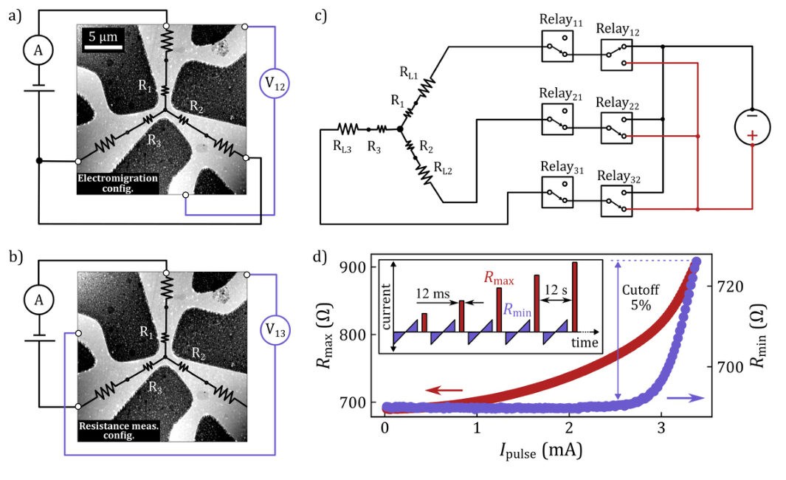 
Figure 1: Methods: (a) AFM image overlaid with the schematic electrical connections for EM applied to terminal 1 with negative polarity. (b) Same AFM image with the electrical connections for resistance measurement of R13 = R1 + R3 between terminals 1 and 3. (c) Equivalent circuit and relay wiring used to automate configuration switching during electrical measurements. Each terminal is modeled by a resistor Ri, while the additional resistor RLi represents the series resistance of the remaining material outside the region between the voltage probes, i.e., the ohmic contribution from areas farther from the central node. (d) Experimental electrical response during a representative EM cycle....

📷 Fig 2

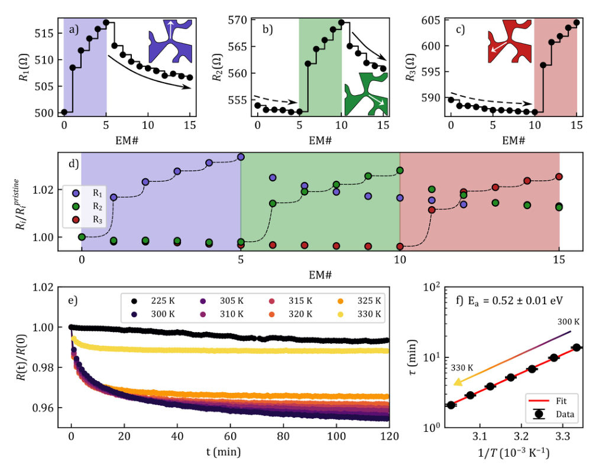 
Figure 2: Results of 15 EM runs highlighting the method’s selectivity: During runs 1–5, terminal R1 was targeted; runs 6–10 targeted R2; and runs 11–15 targeted R3. Panels (a)–(c) show the evolution of the resistances of terminals R1, R2, and R3, respectively, measured after each EM run. Panel (d) displays the resistances normalized to their initial values. Panel (e) presents the resistance relaxation as a function of time following eight 5% EM runs performed at different temperatures and monitored for 2 h. Stretched-exponential fits yielded temperature-dependent relaxation time constants with an average stretching exponent of β = 0.455 ± 0.004; almost no relaxation was observed at 225 K...

📷 Fig 3

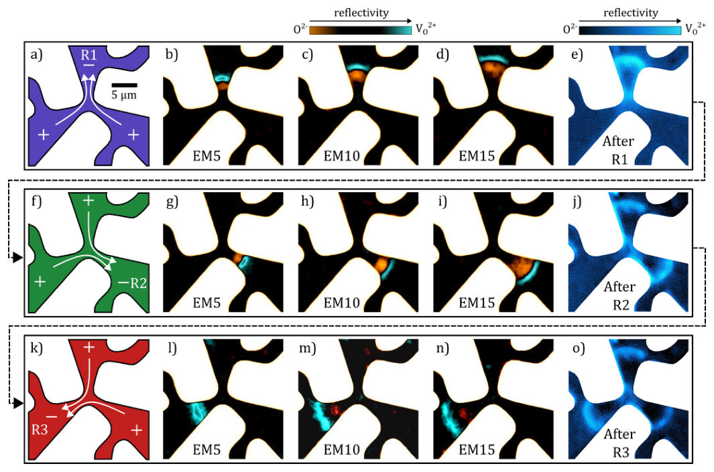 
Figure 3: Results obtained from optical microscopy collected during 15 successive EM runs performed on each terminal of the same device: Panels (a-e), (f-j), and (k-o) correspond to EM of terminals R1, R2, and R3, respectively. In each group, the first panel illustrates the electrical configuration used to selectively drive EM, while the following three panels show differential optical micrographs acquired after 5, 10, and 15 runs. In these images, the substrate appears in white, the YBCO film in black, while oxygen-depleted regions (with higher concentration of oxygen vacancies, VO2+), characterized by increased optical reflectivity, are highlighted in light blue. The orange features arise...

📷 Fig 4

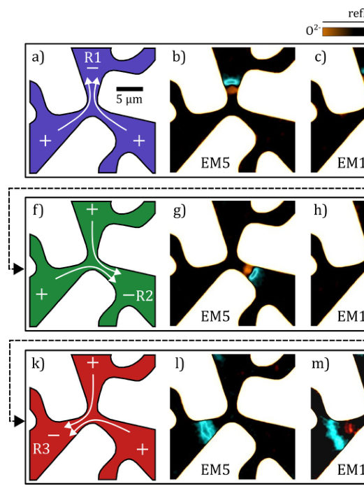 
Figure 4(b) shows the KPFM map of a second device af- ter five successive EM cycles under positive polarity per- formed for each terminal. In contrast to the negative- polarity case (panel (a)), the surface potential distribu- tion indicates vacancy accumulation at the central node. In this case, the maximum work function difference is ap- proximately -0.2 eV, smaller than that observed for neg- ative polarity, which is attributed to the smaller accumu- lated EM dose resulting from the lower number of pulsing cycles. Additional experimental results and finite-element simulations for the positive-polarity case are provided in the Supplementary Material S2. Together, the two KPFM maps provide...

📷 Fig 5

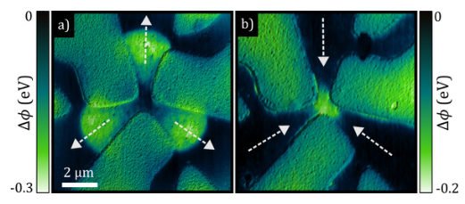 
Figure 4: Kelvin Probe Force Microscopy: (a) KPFM map of the YBCO device after EM under negative polarity (same device as Fig. 3), showing work function variations (∆ϕ) associated with oxygen redistribution. (b) KPFM map of a second device after five EM cycles under positive polarity applied to each terminal. White arrows indicate the inferred direction of vacancy migration. The zero references correspond to pristine regions far from the center of the devices.

**Summary.** This work demonstrates a novel, post-fabrication method to locally tune the superconducting properties of YBCO junctions by electrically driving oxygen vacancy migration. By applying controlled currents, researchers can direct oxygen depletion fronts, which is confirmed by changes in resistance, $T_c$, and crystal structure. This establishes a route for engineering superconducting weak links.

**Why it may be interesting.** The ability to induce controlled, non-equilibrium changes in the electronic structure of a high-Tc superconductor via ionic motion provides a powerful, tunable handle on correlated electron behavior, relevant to understanding charge/orbital ordering.

Detailed structure

**Main problem.** The study addresses the challenge of locally controlling the electronic properties of complex oxide superconductors by selectively manipulating oxygen stoichiometry in multi-terminal junctions.

**Main result.** The authors successfully demonstrated that oxygen vacancy migration can be electrically controlled in a Y-shaped YBCO junction, leading to measurable changes in resistance, superconducting transition temperature, and lattice structure.

**Method.** The research combines electromigration (EM) experiments with advanced characterization techniques like KPFM, SLM, and nanoprobe XRD, complemented by finite-element modeling.

**Model / system.** The physical system is a YBa2Cu3O7-delta superconductor patterned into a three-terminal junction. The underlying physics involves oxygen vacancy diffusion driven by applied current, modeled by coupled diffusion and electromigration equations.

**Key observables.** Resistance ($R$), superconducting critical temperature ($T_c$) contrast, work-function changes (KPFM), $c$-axis lattice parameter (XRD), and optical reflectivity changes.

**Important parameters / regimes.** Current polarity (determining front direction), applied current density, and relaxation time constants ($	au$).

**Assumptions / limitations.** The relaxation process is assumed to be a thermally activated diffusion process, and the correlation between $T_c$ contrast and oxygen content is assumed to be quantitative.

**Figures summary.** Figures illustrate the electrical response during EM cycles, visualization of oxygen-vacancy fronts via optical contrast, and quantitative structural changes via XRD lattice parameter modulation.

**Paper structure.** The paper establishes the problem of local stoichiometry control, details the multi-modal experimental setup (electrical, optical, structural), presents results showing current-direction dependent vacancy movement, and validates these findings using continuum modeling.

Abstract

Local manipulation of oxygen stoichiometry offers a route to control the electronic properties of complex oxides, yet the selective modification of individual current-carrying branches through oxygen redistribution remains unexplored in multiterminal high-temperature superconducting junctions. In a YBa$_2$Cu$_3$O$_{7-δ}$ Y-shaped three-terminal device, we demonstrate the possibility to electrically control oxygen vacancy migration on a hand-picked terminal while largely preserving the other two. Oxygen-depleted propagating fronts are directly visualized by the resulting change in optical reflectivity and they are linked to the evolution of the electrical response. The process is highly directional and determined by the polarity of the applied current, allowing for the creation of either a converging or a diverging propagating front from the central node of the Y-shaped device. The associated changes in resistance exhibit relaxation on a timescale of minutes, driven by the vacancy concentration gradient. Effects of oxygen migration are also mapped by Kelvin Probe Force Microscopy and Scanning Laser Microscopy, which probe work-function changes and spatially resolved variations in the superconducting transition, respectively. Notably, the Tc contrast revealed by the latter provides a quantitative handle on the underlying oxygen content, enabling direct visualization of oxygen redistribution. Finite-element modeling and nanoprobe X-ray diffraction qualitatively reproduce the observed vacancy redistribution. These results establish a post-fabrication route to locally tune properties of superconducting multiterminal devices such as nanocryotrons, yTron, and tunable weak links.

[↑ back to top](#top)

### [Entirely nonlocal quantum magic without entanglement](http://arxiv.org/abs/2608.25950v1)

**Authors:** Fuchuan Wei, Ruixia Wang, Yujia Zhang, Huihui Li, Junfeng Li, Fei Yan, Zi-Wen Liu  
**Type:** both · **Category:** quantum information and computing · **PDF:** <https://arxiv.org/pdf/2608.25950v1>  
**Analysis basis:** full PDF text, analyzed in chunks
**Topic relevance:** `QC/QI experiment` **3/5**

📷 Fig 1

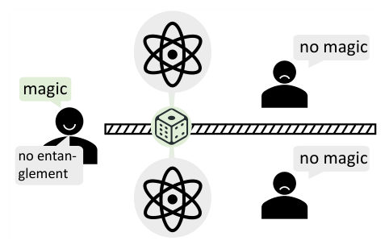 
FIG. 1. Entirely nonlocal magic without entanglement. In a separable bipartite state or channel, magic can be encoded entirely in correlations while both local reductions remain magic-free. Cooperation using stabilizer operations and clas- sical communication recovers the hidden resource.

📷 Fig 2

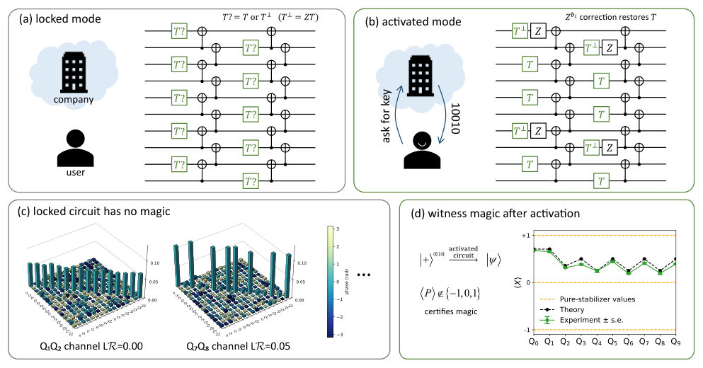 
FIG. 2. Magic activation key. A classical secret key switches a Clifford+T processor between a magic-free locked mode and n activated mode that restores the intended computation, without quantum communication or shared entanglement. (a) In the locked mode, each protected T gate use implements either T or T ⊥:= ZT according to the key unknown to the user. Without the key, hidden randomization (possibly correlated across gates) makes user’s effective protected dynamics a stabilizer channel. (b) Once the key bit bi is revealed, the user applies the Pauli correction Zbi after the corresponding protected gate, restoring the intended T operation. The figure shows a two-gate mask: one key bit...

📷 Fig 3

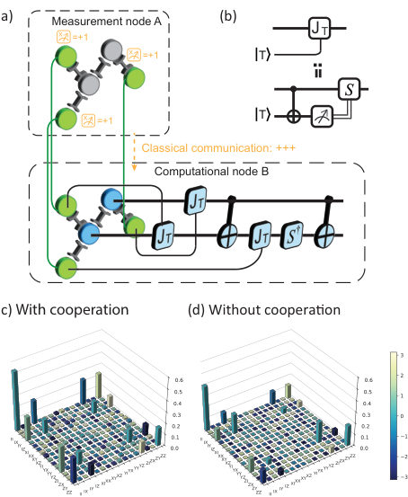 
FIG. 3. Magic secret sharing with two-way T-type ENM links. (a) Three separable ENM links (green) connect mea- surement node A to computational node B. Measuring the link qubits at A in the X basis and postselecting on X = +1 for all three, with the outcomes communicated to B, localizes three |T⟩states at B. These states are consumed to imple- ment CS on two target qubits at B. (b) The standard T-state injection gadget JT . (c,d) Experimental process tomography yields reconstructed Choi-state log-RoM values of 0.83 with cooperation and 0.18 without cooperation, which are close to ideal values.

📷 Fig 4

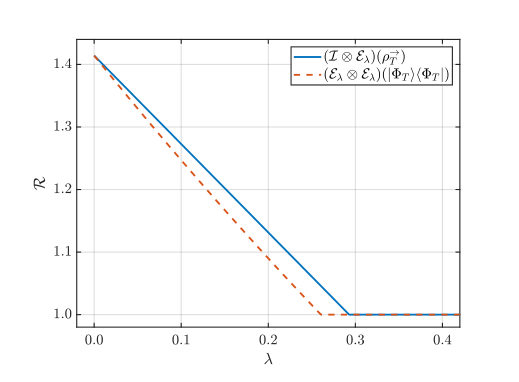 
FIG. 4. Comparison of the RoM of (I ⊗Eλ)(ρ→ T ) and (Eλ ⊗Eλ)(|ΦT ⟩⟨ΦT |). The former is shown by the blue solid line and decays linearly until reaching the threshold 1 − 1 √

📷 Fig 5

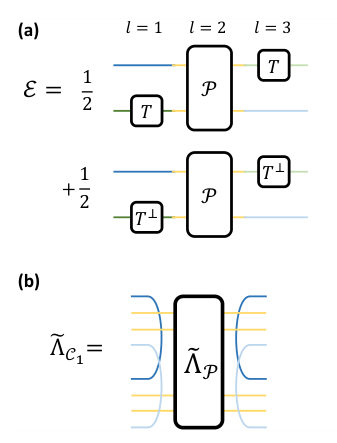 
FIG. 5. Graphical proof of Proposition 12, for the case E = 1

**Summary.** This paper introduces and experimentally verifies Entirely Nonlocal Magic (ENM), a quantum resource that carries magic only in correlations, not locally, and crucially, without entanglement. The authors develop protocols to use ENM for classical key-controlled activation of non-Clifford operations and for magic secret sharing. This establishes a new paradigm for controlling quantum computational power in distributed quantum systems.

**Why it may be interesting.** It provides a novel mechanism to control quantum computational power (magic) using only classical control and separable resources, which is highly relevant for understanding resource management in distributed quantum computing architectures.

Detailed structure

**Main problem.** The paper investigates Entirely Nonlocal Magic (ENM), a quantum resource where nonstabilizerness exists only in global correlations and not locally, and demonstrates that this magic can be controlled without relying on entanglement.

**Main result.** They show that magic can be classically activated, localized, and secret-shared using separable ENM states, providing new resource-control primitives for distributed quantum computation.

**Method.** The study involves systematic construction of separable ENM states and channels, followed by experimental demonstrations of activation key protocols and magic secret sharing on a superconducting quantum processor.

**Model / system.** The work is demonstrated on a superconducting quantum processor, utilizing bipartite and multipartite separable quantum states ($
ho^{(n)}_\psi$, $
ho^{(n)}_T$) and channels.

**Key observables.** Robustness of Magic (RoM), Choi-state log-RoM ($L_R$), and state/process fidelities.

**Important parameters / regimes.** The analysis considers scaling with the number of qubits ($n$) and the parameter $\alpha$ in the Pauli-moment functional $M_\alpha$.

**Assumptions / limitations.** The protocols rely fundamentally on the availability of local stabilizer processing and classical communication.

**Figures summary.** Figures illustrate ENM in separable states/channels, the Magic Activation Key switching between locked/activated modes, and the implementation of Magic Secret Sharing.

**Paper structure.** The paper first establishes the theoretical framework for ENM, then develops protocols for activation keys and secret sharing, and finally provides experimental demonstrations on superconducting hardware, supplemented by theoretical scaling analyses using Pauli moments.

Abstract

Nonstabilizerness, or magic, is an archetypal \emph{quantum} resource that is necessary for quantum computational advantage. Here we uncover a phenomenon seemingly at odds with the quantum nature of magic: entirely nonlocal magic (ENM)---magic present only in correlations and absent from each party's marginal---can live without entanglement. We systematically study this separation and show it is universal and operationally reversible: every magical state or channel can be encoded into and recovered from a separable ENM realization using only local stabilizer processing and classical communication. We leverage this mechanism to devise an activation key protocol in which a classical key controls access to non-Clifford operations. We further formulate magic secret sharing, in which computational power inaccessible to any party alone becomes accessible through cooperation. On a superconducting quantum processor, we experimentally demonstrate activation key and network computing primitives, together with separable ENM state preparation and extraction protocols. Together, our results establish that magic can be classically activated, localized, and secret-shared without entanglement, providing new resource-control primitives for distributed quantum computation.

[↑ back to top](#top)

### [Exact analytical spectrum, eigenstates, and quantum geometry of the quarter-flux Harper-Hofstadter model](http://arxiv.org/abs/2608.26099v1)

**Authors:** Isaac Tesfaye, André Eckardt  
**Type:** theory · **Category:** other · **PDF:** <https://arxiv.org/pdf/2608.26099v1>  
**Analysis basis:** full PDF text, analyzed in chunks
**Topic relevance:** `analog quantum simulation` **3/5**

📷 Fig 1

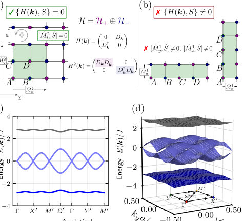 
FIG. 1. Sublattice symmetry and analytical spectrum of the quarter-flux Harper-Hofstadter model. (a) Real space lat- tice of HH-model with a quarter flux Φ = π/2 per plaquette, the symmetric 2 × 2 MUC (green shaded area) with its four sublattice sites A, B, C, D. The sublattice symmetry ˆS = (−1)m+n|m, n⟩⟨m, n| corresponding to the bipartite checker- board pattern (purple/blue colored sites for the even/odd sub- lattice), commutes with the associated magnetic translation operators (MTOs) ˆ M 2 i of the MUC, [ ˆS, ˆ M 2 i ] = 0, and is pre- served in momentum space via S = diag(1, −1, −1, 1), and anti-commutes with the Bloch Hamiltonian (2), {H(k), S} = 0. (b): Same as (a) for the other two...

📷 Fig 2

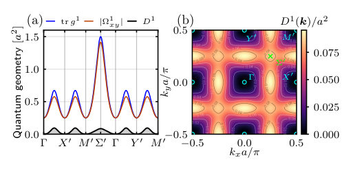 
FIG. 2. Local trace-condition (ideal-band) defect D1(k) = tr g1(k) −|Ω1 xy(k)| ≥ 0 (9) of the quarter-flux Harper- Hofstadter ground band |Ψ−,1⟩obtained from the analytical Berry curvature (8) and the quantum metric (7). (a) D1(k) along the high-symmetry path Γ–X′–M ′–Σ′–Γ–Y ′–M ′ [as in Fig. 1], together with tr g1 (blue) and |Ω1 xy| (red) overlaid, which fluctuate across the FBZ, but coincide at the high- symmetry points (Γ, X′, Y ′, M ′ cyan circles in (b)), so the shaded gap D1 (black) stays small. (b) D1(k) depicted over the 2D FBZ. The defect is pointwise non-negative and van- ishes exactly at the cyan-colored high-symmetry points where the band is locally an ideal LLL while it peaks...

**Summary.** This paper provides an exact analytical solution for the spectrum and quantum geometry of the quarter-flux Harper-Hofstadter model. By exploiting sublattice symmetry, the authors derive closed-form expressions for the energy bands and the full Quantum Geometric Tensor. The results confirm the model's topological nature, showing the lowest band is nearly an ideal Chern insulator, which is highly relevant for experimental realization using ultracold atoms.

**Why it may be interesting.** The explicit analytical solution for the QGT and the quantification of topological stability defects provide powerful, exact benchmarks for understanding topological phases in lattice models relevant to AMO experiments.

Detailed structure

**Main problem.** To derive exact analytical expressions for the spectrum, eigenstates, and quantum geometry of the quarter-flux Harper-Hofstadter model.

**Main result.** The model is solved analytically by exploiting sublattice symmetry, revealing that the lowest band is nearly an ideal Chern band with a calculated Chern number of -1.

**Method.** The analysis uses the sublattice symmetry to block-diagonalize the Bloch Hamiltonian, allowing for the analytical derivation of the spectrum via singular value decomposition and the calculation of the full Quantum Geometric Tensor (QGT).

**Model / system.** The system is the Harper-Hofstadter model, describing charged particles on a 2D square lattice subjected to a uniform magnetic field at quarter flux ($\alpha=1/4$). The model is realized in platforms like ultracold atoms and superconducting circuits.

**Key observables.** Full Quantum Geometric Tensor (QGT), Berry curvature, quantum metric, Chern numbers ($C_n$), and various integrated stability defects (e.g., $	ext{THH}$).

**Important parameters / regimes.** Quarter flux ($\alpha=1/4$), lattice geometry (2D square lattice), and the magnetic field strength.

**Assumptions / limitations.** The analytical solution hinges on the preservation of sublattice symmetry in the symmetric $2 	imes 2$ Magnetic Unit Cell (MUC) in quasimomentum space.

**Figures summary.** Figures illustrate the energy spectrum along high-symmetry paths and across the full Brillouin zone, confirming the analytical results for the four bands.

**Paper structure.** The paper first establishes the model and the symmetry enabling the analytical solution. It then derives the spectrum and eigenstates, followed by the calculation of the QGT. Finally, it evaluates global stability criteria for hosting Fractional Chern Insulators (FCIs).

Abstract

Quantum geometry has emerged as a guiding principle across atomic and condensed-matter physics, shaping the topological responses of Bloch bands and the stability of the correlated phases they host. Beyond two-band models, however, closed-form expressions for both the spectrum and the quantum geometry are rare. Here we provide such expressions for a paradigmatic four-band model that has recently been realized experimentally with ultracold atoms, photons and in superconducting circuits: the Harper-Hofstadter model at quarter flux, describing charged particles on a two-dimensional square lattice subjected to a uniform magnetic field. We achieve this by first showing that the model possesses a sublattice symmetry, which renders its Bloch Hamiltonian anti-block-diagonal allowing us to derive the spectrum and the eigenstates analytically. From that we also obtain closed-form expressions for the full quantum geometric tensor (QGT), including both the Berry curvature and the quantum metric, for all the bands of the model. For this purpose we first derive a general expression for the QGT for sublattice-symmetric systems in terms of contributions from the individual sublattice sectors. Finally, we evaluate fractional-Chern-insulator stability criteria analytically and quantify the lowest band of the quarter-flux Harper-Hofstadter model to be a nearly ideal Chern band.

[↑ back to top](#top)

### [From rings to resonance: an inverse method links biophotonic structural color to inverse photonic glasses](http://arxiv.org/abs/2608.25900v1)

**Authors:** Florin Hemmann, Matthias Saba, Ullrich Steiner, Mauro S. Ferreira, Felipe A. Pinheiro  
**Type:** theory · **Category:** disordered systems and neural networks · **PDF:** <https://arxiv.org/pdf/2608.25900v1>  
**Analysis basis:** full PDF text, analyzed in chunks
**Topic relevance:** `interference shaping light` **3/5**

📷 Fig 1

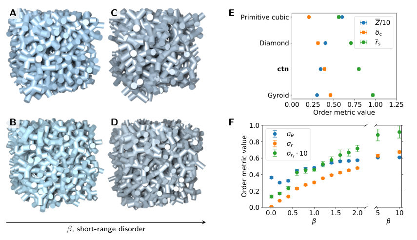 
Figure 1: The effect of network type and the disorder parameter β on short-range order metrics and color appearance. (A,B) Diamond- and ctn-like networks generated at beta = 0.2. (C,D) Corresponding networks generated at beta = 0.8. Diamond-like networks have Z = 4, ctn-like networks Z = 3.4. The rendered colors in (A)-(D) correspond to the simulated optical response for an equilibrium bond length d = 160 nm. (E) An increase in mean coordination scales down the critical pore size δc and the mean ring radius rs for networks generated at β = 0.2. (F) As the network generation parameter β of diamond-like networks increases, the bond length standard deviation σr and the ring radius standard...

📷 Fig 2

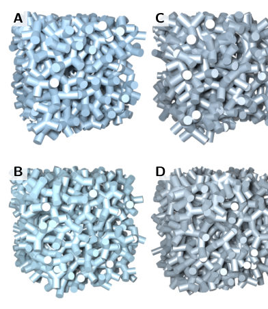 
Figure 2A displays the average reflectance spectra of diamond-like networks with different β values. At low fre- quencies ν, the reflectance is weak because light averages over the network structure with an effective refractive in- dex only slightly above unity. The oscillations at ν ≲0.2 arise from Fabry-P´erot resonances of the finite-thickness slab. As the frequency enters the resonant regime at ν ≳0.2, the reflectance increases and peaks near ν ≈0.3. The peak broadens with increasing β, consistent with the enhanced bond-length and ring disorder shown in Figure 1F. Interpreting these structural motifs as local resonators, size disorder broadens the distribution of resonance frequencies....

📷 Fig 3

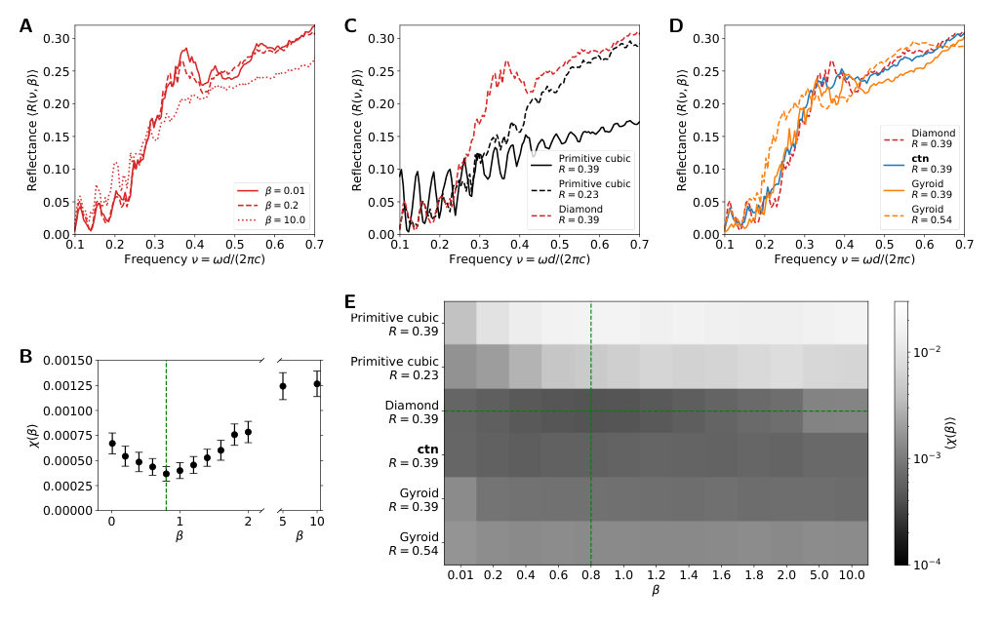 
Figure 2: The disorder parameter β primarily affects the spectral shape of the reflectance, while the network type induces a frequency shift. These effects are detected by the misfit function, which can be used to determine β and the network type of an unknown spectrum. (A) Average reflectance spectra for diamond-like networks with R = 0.39 and three values of β. (B) Misfit function comparing a diamond-like test network with β = 0.8 to diamond-like networks of all β values. Average reflectance spectra of different network types with (C) Z ≥4 and (D) Z ≤4. All networks in (C) and (D) were generated at β = 0.2. For primitive-cubic- and gyroid-like networks, we vary the bond radius to bring...

📷 Fig 4

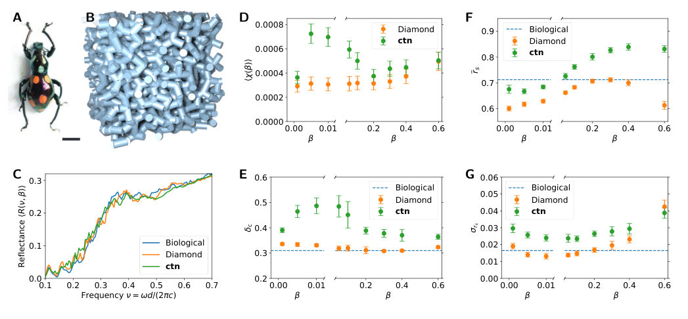 
Figure 3: The reflectance spectrum of the biophotonic network exhibiting blue structural color resembles the spectra of diamond- and ctn-like networks when their pore and ring radii match. (A) Photograph of a Pachyrhynchus congestus mirabilis weevil. Scale bar: 0.5 cm [3]. (B) A section of the weevil’s skeletonized photonic network, giving rise to blue structural coloration. The rendered color corresponds to the simulated optical response for the experimental mean bond length d = 160 nm [3]. (C) The biological reflectance spectrum compared to the average reflectance spectra for diamond-like networks and ctn-like networks, both at β = 0.001. For all networks, we set the bond radius to R =...

📷 Fig 5

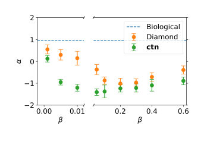 
Figure 4: The hyperuniformity metric α of the biological network and computer-generated networks.

**Summary.** This work uses an inverse method to decode the structural information encoded in the reflectance spectrum of natural biophotonic materials. By comparing measured spectra to simulations of disordered photonic networks, the authors determined that blue coloration arises from local scattering resonances associated with pores and rings. This leads to a novel analogy linking biological color to the physics of inverse photonic glasses.

**Why it may be interesting.** The application of inverse methods to link macroscopic optical properties (color) back to microscopic structural motifs (rings/pores) is highly relevant to understanding emergent behavior in complex, disordered physical systems.

Detailed structure

**Main problem.** The study aims to understand the fundamental relationship between the complex, disordered structure and the resulting color of natural biophotonic materials, such as those found in beetles.

**Main result.** The blue structural coloration is governed by local scattering mechanisms involving rings and pores, suggesting an analogy to an inverse photonic glass rather than long-range photonic band-gap effects.

**Method.** The authors employed an inverse method, comparing the measured reflectance spectrum of a biological sample against a database of simulated spectra generated from computer-designed disordered photonic networks.

**Model / system.** The system involves light interacting with nanoscale, disordered photonic networks (e.g., diamond-like or ctn-like structures) whose disorder is controlled by a parameter $\beta$. The structure is modeled using an extended Wooten-Weaire-Winer algorithm and analyzed via FDTD simulations.

**Key observables.** Reflectance spectrum $R(\nu)$, critical pore radius ($\delta_c$), mean ring radius ($r_s$), and the misfit function $\chi(\beta)$.

**Important parameters / regimes.** Disorder parameter $\beta$, mean coordination number ($Z$), and the volume fraction ($\phi$).

**Assumptions / limitations.** The primary assumption is that local scattering motifs (rings and pores) dictate the spectral response, allowing for an analogy to inverse photonic glasses.

**Figures summary.** Figures illustrate how structural metrics (like $r_s$ and $\delta_c$) change with the disorder parameter $\beta$ and network type, and how the misfit function $\chi(\beta)$ can be minimized to identify the best structural match to the biological spectrum.

**Paper structure.** The paper establishes the problem of complex structural color, details the inverse method using spectral comparison, applies this method to the weevil's blue coloration, and concludes by proposing the inverse photonic glass analogy based on local resonator physics.

Abstract

Structural color arises from the interaction of light with nanoscale structures and is widespread in nature. As structural complexity increases, the mechanisms governing coloration become progressively less understood. The optical response of periodic photonic crystals with a spatially periodic refractive index is well described by Bloch theory, whereas that of photonic glasses composed of randomly assembled uniform spheres is more subtle yet well studied. In contrast, disordered photonic networks found in many beetles are among the most complex natural photonic architectures, and the fundamental relationships between their structure and color remain unclear. Here, we use an inverse method to identify the structural features encoded in the reflectance spectrum. By comparing the spectrum of an unknown system with a database of simulated spectra from computer-generated photonic networks, we infer its structural properties. Applying this approach to both simulated networks and the biophotonic network responsible for the blue coloration of the weevil Pachyrhynchus congestus mirabilis, we identify rings and pores as the key local scattering motifs. Their characteristic sizes govern the spectral position of the reflectance peak, whereas short-range disorder controls its width. The inverse method reveals clear spectral signatures of short-range order, whereas the influence of hyperuniformity and primitive similarity appears comparatively weak. This suggests that blue structural coloration is governed by local scattering mechanisms rather than photonic band-gap effects. We propose an analogy to an inverse photonic glass, in which pores and rings act as correlated local resonators. This perspective provides new design principles for bio-inspired structural-color materials.

[↑ back to top](#top)

### [Interpretable Activation-Selection Neural Networks for Symbolic Regression of Parameter-Dependent Hamiltonian Eigenvalues](http://arxiv.org/abs/2608.25475v1)

**Authors:** Alexander Yu. Kharin, Kirill F. Sheberstov  
**Type:** theory · **Category:** disordered systems and neural networks · **PDF:** <https://arxiv.org/pdf/2608.25475v1>  
**Analysis basis:** full PDF text, analyzed in chunks
**Topic relevance:** `analog quantum simulation` **3/5**

📷 Fig 1

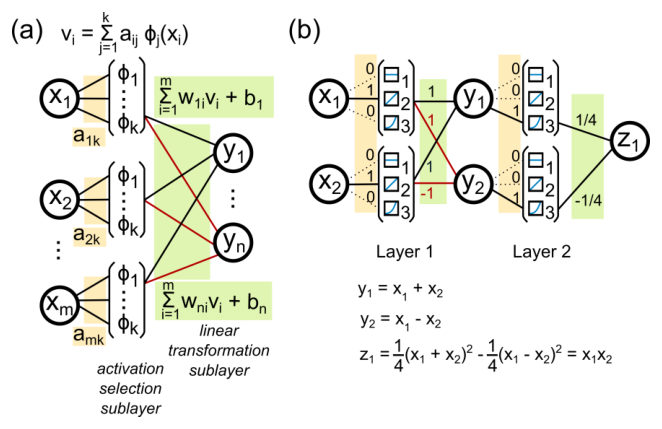 
Fig. 1. Architecture of the activation-selection network (ASN). (a) Structure of a single ASN layer. For each input 𝑥𝑖, 𝑘 candidate activation functions 𝜙𝑗(𝑥𝑖) are evaluated and combined using the softmax- normalized coefficients 𝑎𝑖𝑗. An L0.5-type penalty favours nearly one-hot coefficient vectors, thereby promoting the selection of a single activation for each input node. The transformed variables 𝑣𝑖 are then combined by a linear transformation with weights 𝑤𝑙𝑖 and biases 𝑏𝑙 to produce the output nodes 𝑦𝑙. (b) Two- layer ASN that exactly implements multiplication of two inputs. The first layer forms 𝑦1 = 𝑥1 + 𝑥2 and 𝑦2 = 𝑥1 −𝑥2. The second layer selects the quadratic activation and...

📷 Fig 2

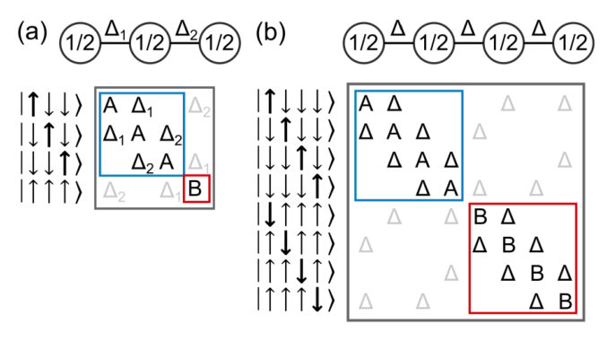 
Fig. 2. Block structure of the Hamiltonian matrices for aliphatic spin chains containing three (a) and four (b) sites. Blue and red outlines indicate the manifolds with diagonal energies A and B, respectively. Black off-diagonal elements describe exchange between neighbouring sites, whereas grey elements connect the two manifolds through simultaneous neighbouring-site spin flips. For (a) Δ1 = ΔJ1/2, Δ2 = ΔJ2/2, A = -5/4 Jintra, B = 3/4 Jintra. For (b), Δ = ΔJ/2, A = -2 Jintra, B = 0.

📷 Fig 3

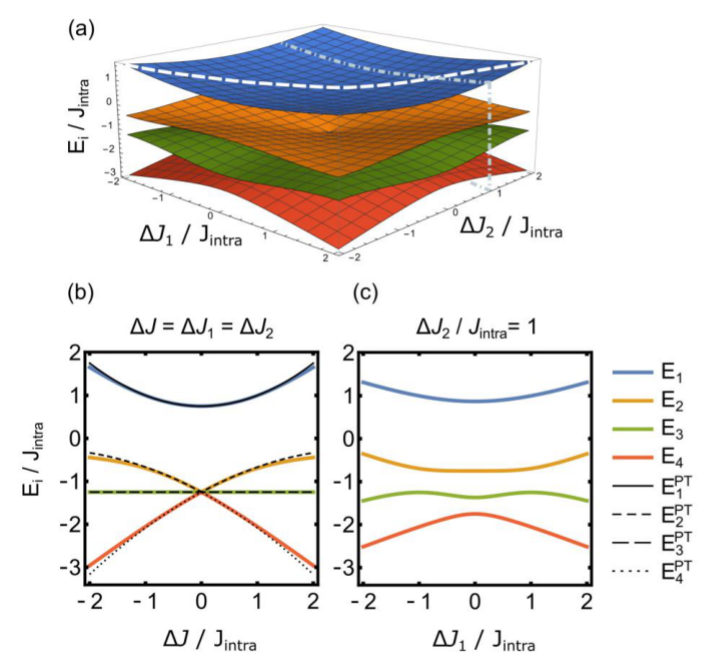 
Fig. 3. Dimensionless eigenenergy surfaces and representative cross-sections for the Hamiltonian of the three- site spin chain. All energies and coupling constants are scaled by Jintra. (a) Numerically calculated eigenenergy surfaces Ei/Jintra as functions of the dimensionless couplings ΔJ1/Jintra and ΔJ2/Jintra. The white dashed and the grey dot- dash lines indicate cross-sections used for (b) and (c), respectively. (b) Cross-section corresponding to the uniform chain, ΔJ1 = ΔJ2 = ΔJ. Coloured curves show the numerically calculated, energy-ordered eigenenergies, while the black solid, dashed, dash-dotted, and dotted curves show the second-order perturbative expressions in Eqs. (9). Across...

📷 Fig 4

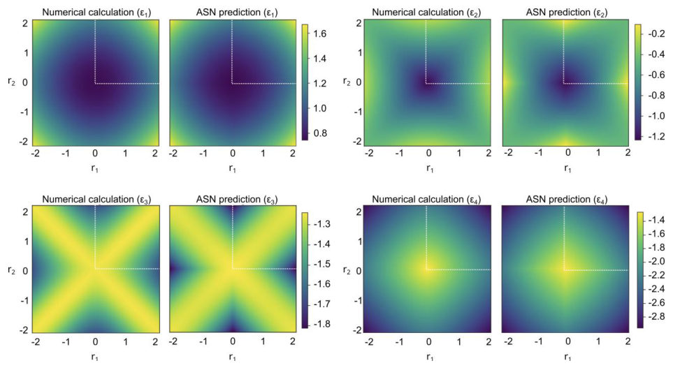 
Fig. 4. Comparison of numerically calculated and ASN-predicted dimensionless eigenenergy surfaces for the three-site spin chain. Here, ri = ΔJi/Jintra and εk = Ek/Jintra. For each εk, the left and right panels show the numerical eigenenergies and corresponding ASN predictions, respectively. The ASN was trained within the first-quadrant domain 0 ≤ r1, r2 ≤ 2, indicated by the white dotted lines, and the remaining quadrants were reconstructed using the independent sign-reversal symmetries of r1 and r2. A common colour scale is used for the numerical and predicted surfaces within each pair. The activation set used for training was {0, 𝑥, 𝑥2}.

📷 Fig 5

 
Fig. 4 compares the numerically calculated dimensionless eigenenergy surfaces with the ASN predictions. Within the first-quadrant training domain, the ASN reproduces the curvature and

**Summary.** This paper introduces an Activation-Selection Network (ASN) to perform symbolic regression on the eigenvalues of complex, parameter-dependent spin-chain Hamiltonians. By training the network on numerical data derived from NMR systems, the authors generate explicit, analytical mathematical expressions for the eigenvalues. The work establishes the ASN as a differentiable framework for extracting compact physical laws, though it notes that predefined basis sets can sometimes achieve comparable accuracy.

**Why it may be interesting.** This work directly bridges machine learning (symbolic regression) with quantum many-body physics, offering a powerful, differentiable tool to extract physical insight (analytical forms) from complex numerical eigenvalue calculations, which is highly valuable for understanding quantum dynamics.

Detailed structure

**Main problem.** The paper aims to find interpretable analytical approximations for the eigenvalues of parameter-dependent Hamiltonians by employing symbolic regression techniques.

**Main result.** The proposed Activation-Selection Network (ASN) successfully generates explicit, compact symbolic expressions for the eigenvalues, though it was found that a suitable predefined basis can match or slightly outperform the adaptive selection mechanism.

**Method.** The core method is the use of an ASN, a differentiable symbolic-regression architecture, trained to map input parameters to eigenvalue ratios. The process involves normalizing parameters to dimensionless ratios and using sparse regularization to enforce sparsity in the learned functional combination.

**Model / system.** The study applies the method to effective three- and four-site spin-chain Hamiltonians relevant to zero-quantum nuclear magnetic resonance (NMR). The Hamiltonian involves intrapair and interpair coupling terms, and the analysis often separates the system into even- and odd-parity blocks.

**Key observables.** Eigenvalues (or eigenvalue differences) of the Hamiltonian, which determine observable zero-quantum transition frequencies.

**Important parameters / regimes.** Coupling constants like $J_{	ext{intra}}$ and $\Delta J_i$, and the dimensionless ratios formed from these couplings.

**Assumptions / limitations.** The primary assumption is that the underlying physical relationship can be approximated by a combination of predefined analytical functions (e.g., $\{0, x, x^2\}$). The method also relies on normalizing parameters to ensure dimensional homogeneity.

**Figures summary.** Figures illustrate the structure of the ASN layers, demonstrate the network's ability to implement basic arithmetic (like multiplication), and show the resulting dimensionless eigenenergy surfaces for the three-site spin chain.

**Paper structure.** The paper introduces the ASN framework, details the physical model (spin-chain Hamiltonians), applies the method to calculate eigenvalues for three- and four-site systems, compares the results against established methods like degenerate perturbation theory, and concludes by analyzing the performance and limitations of the adaptive selection process.

Abstract

Analytical approximations to eigenvalues of parameter-dependent Hamiltonians can provide physical insight that is not readily apparent from numerical diagonalization alone. Here, we introduce an activation-selection network (ASN), a differentiable symbolic-regression architecture in which each input node learns a sparse combination of predefined analytical functions, and the trained network can be converted directly into an explicit expression. Before regression, the Hamiltonian parameters and eigenvalues are expressed as dimensionless ratios. This normalization enforces dimensional homogeneity, reduces the number of independent variables, and ensures that the extracted expressions do not depend on the choice of energy units. Using the library {0, x, x^2}, compositions across successive hidden layers generate polynomial expansions of progressively higher degree; polynomial expansions of arbitrary finite degree can therefore be obtained in principle by increasing the network depth. We apply the ASN to effective three- and four-site spin-chain Hamiltonians relevant to zero-quantum nuclear magnetic resonance. Comparisons with degenerate perturbation theory show that the extracted expressions capture the expected constant, linear, and quadratic structure. Fixed-basis least-squares models match or slightly outperform the ASN when an appropriate quadratic basis is specified in advance, while inclusion of a radial feature improves the local approximation near the degeneracy. These results establish the ASN as a differentiable framework for selecting compact symbolic representations when several functional forms are plausible, while showing that adaptive activation selection does not provide an intrinsic accuracy advantage over a suitable predefined basis.

[↑ back to top](#top)

### [Magic of Kitaev spin liquids](http://arxiv.org/abs/2608.25929v1)

**Authors:** Eleonora Lamma, Tim Bauer, Marcello Dalmonte, Mario Collura  
**Type:** theory · **Category:** strongly correlated electrons · **PDF:** <https://arxiv.org/pdf/2608.25929v1>  
**Analysis basis:** full PDF text, analyzed in chunks
**Topic relevance:** `analog quantum simulation` **3/5**

📷 Fig 1

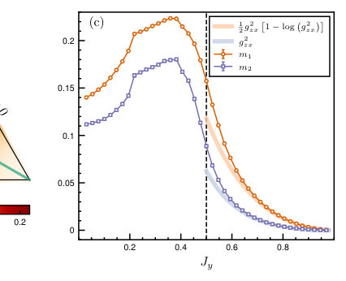 
Figure 1: (a) Slice of a honeycomb lattice with the three bond types x, y and z corresponding to different edge colors. We consider lattices with periodic boundary conditions and supercell lattice vectors L1e1 and L2e2, where e1,2 = (± 1

📷 Fig 2

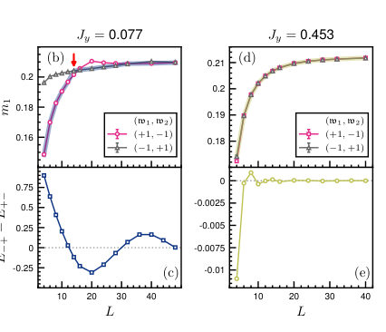 
Figure 2: (a) Ground-state SRE density m1 vs linear system size L for different val- ues of Jy = 1 −2Jx = 1 −2Jz along the green line in Fig. 1(b), with dashed (solid) lines corresponding to the gapped (gapless) phase. The data for Jy &gt; 0 were ob- tained for a 2D system with linear system sizes L1 = L2 = L and twisted periodic boundary conditions, with sample sizes Ns ranging from 104 for Jy ∼0 to 105 for Jy ∼0.5. The data for the decoupled limit Jy = 0 were obtained for a 1D spin chain and Ns = 107, see App. B. (b), (d) m1 vs L for vacuum states in different vortex- free sectors parametrized by (w1,w2) at (b) Jy = 0.077 and (d) Jy = 0.453. The corresponding energy differences E+−−E−+ are...

📷 Fig 3

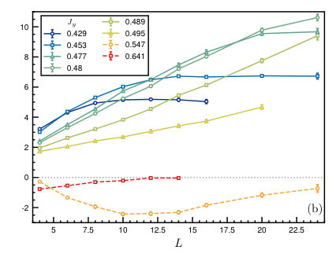 
Figure 3: Volume-law correction D1 (Eq. (35)) vs L (a) for low Jy and (b) close to the phase transition at Jy = 0.5. The results were obtained for the same system parameters used in Fig. 2, see the caption for details.

📷 Fig 4

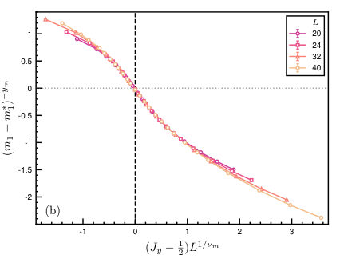 
Figure 4: (a) SRE density m1 around the critical point Jy = 0.5 for different linear system sizes. The shaded area indicates the interval used in the χ2 minimization. (b) Finite-size collapse of m1 according to the rescaling in Eq. (36) for the system sizes used in the χ2 minimization, with obtained values m∗ 1 = 0.3229 ± 0.0001, ym = −0.6701 ± 0.0078, νm = 1.0878 ± 0.0122. These values, however, strongly depend on the selected interval (shaded area in (a)). The results were obtained for the same system parameters used in Fig. 2, see the caption for details.

📷 Fig 5

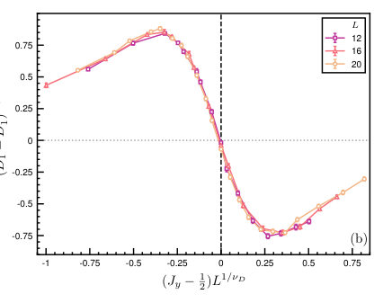 
Figure 5: (a) Volume-law corrections D1 vs Jy close the the phase transition at Jy = 0.5 for different linear system sizes. The shaded area indicates the interval used in the χ2 minimization. (b) Finite-size collapse of D1 according to the rescal- ing in Eq. (36), with obtained values D∗ 1 = 1.6396 ± 0.1137, yD = 0.7424 ± 0.0172, νD = 1.0484 ± 0.0318. The results were obtained for the same system parameters used in Fig. 2, see the caption for details.

**Summary.** This work analyzes the Kitaev honeycomb model to quantify quantum complexity using the stabilizer Rényi entropy (SRE), or 'magic.' By calculating SRE across the model's phase diagram, the authors demonstrate that this measure peaks in the gapless QSL phase and provides universal scaling information at the topological phase transition.

**Why it may be interesting.** The use of 'magic' as a complexity measure provides a novel tool to probe the structure of quantum correlations in strongly correlated magnetic systems, complementing standard entanglement measures.

Detailed structure

**Main problem.** The paper investigates quantum complexity in Quantum Spin Liquids (QSLs) by studying a diagnostic measure called 'magic' or nonstabilizerness, which goes beyond standard entanglement measures.

**Main result.** Magic is found to be largest in the gapless phase of the Kitaev model, decreases in gapped phases, and exhibits universal scaling at the topological phase transition.

**Method.** The authors compute the stabilizer Rényi entropy (SRE) by mapping Pauli strings to itinerant Majorana operators in the model's free-fermion description, enabling sampling via optimized algorithms for Gaussian states.

**Model / system.** The study focuses on the Kitaev honeycomb model (KHM) on the honeycomb lattice, which realizes QSLs and is characterized by three bond types ($x, y, z$). The model is analyzed across its phase diagram, including gapless and gapped topological phases.

**Key observables.** Stabilizer Rényi entropy (SRE) and its density ($m_n$), which quantifies 'magic' or nonstabilizerness.

**Important parameters / regimes.** The ratio of coupling constants ($J_x, J_y, J_z$), the system size ($N$ or $L$), and the proximity to the gapless/gapped phase boundaries.

**Assumptions / limitations.** The analysis relies on the free-fermion description of the KHM and adapting an existing sampling algorithm for fermionic Gaussian states.

**Figures summary.** Figures illustrate the SRE across the phase diagram, showing the peak in the gapless phase and the scaling behavior at the critical point.

**Paper structure.** The paper systematically studies SRE across the entire phase diagram of the KHM, deriving the mathematical correspondence between Pauli strings and Majorana operators, and analyzing the results in the gapless, gapped, and critical regimes.

Abstract

Quantum spin liquids (QSLs) are long-range entangled phases of matter and a natural setting for exploring how quantum correlations generate quantum complexity. Motivated by the emergence of magic, or nonstabilizerness, as a diagnostic of many-body complexity beyond entanglement, we study magic of QSLs by computing the stabilizer Rényi entropy (SRE) of the Kitaev honeycomb model. We derive a correspondence between Pauli strings and products of itinerant Majorana operators in the model's free-fermion description; this enables the sampling of SRE using an optimized algorithm for Gaussian states in systems with thousands of spins. Our results show that magic is largest in the gapless phase, where subleading volume-law corrections indicate nonlocal contributions, while in the gapped phases, SRE decreases in quantitative agreement with a perturbative expansion that we develop in the anisotropic limit. At the topological phase transition, SRE exhibits universal scaling dictated by critical exponents.

[↑ back to top](#top)

### [Multipair-resilient entanglement swapping with complementary linear-optical measurements](http://arxiv.org/abs/2608.25211v1)

**Authors:** Siavash Mirzaei Ghormish, Ryan M. Camacho  
**Type:** theory · **Category:** quantum information and computing · **PDF:** <https://arxiv.org/pdf/2608.25211v1>  
**Analysis basis:** full PDF text, analyzed in chunks
**Topic relevance:** `quantum measurements` **3/5**

📷 Fig 1

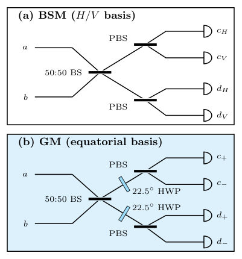 
FIG. 1. Analyzer layouts. Both mix the input rails a and b on a 50:50 beam splitter (BS). The BSM resolves H/V directly at a polarizing beam splitter (PBS) in each output rail; the GM inserts a 22.5◦half-wave plate (HWP) before each PBS and resolves +/−. Their complementary decisions are sum- marized in Table I.

📷 Fig 2

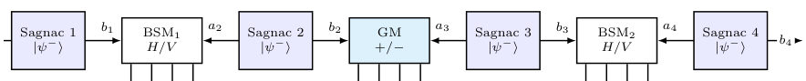 
FIG. 2. Four-source PBP transmitter. Two outer BSMs connect source pairs 1–2 and 3–4, while the central GM connects sources 2–3. Each black line is one spatial rail containing both polarization modes; the surviving outer rails a1 and b4 are delivered to Alice and Bob. The four resolved outputs of each analyzer are monitored by photon-number-resolving detectors. Removing Sagnac 4 and BSM2 gives the three-source BSM–GM transmitter, whose right endpoint is b3.

📷 Fig 3

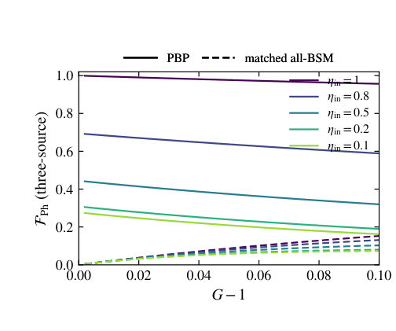 
FIG. 3. Photon–photon fidelity FPh versus mean photon number G −1 for internal efficiencies ηT = ηG = ηin = 1, 0.8, 0.5, 0.2, 0.1, three-source. Solid: PBP network (BSM– GM). Dashed: matched all-BSM chain (BSM–BSM). The PBP fidelity approaches unity at low brightness for all effi- ciencies, whereas the all-BSM fidelity collapses toward zero because its pre-postselection state is vacuum-dominated.

📷 Fig 4

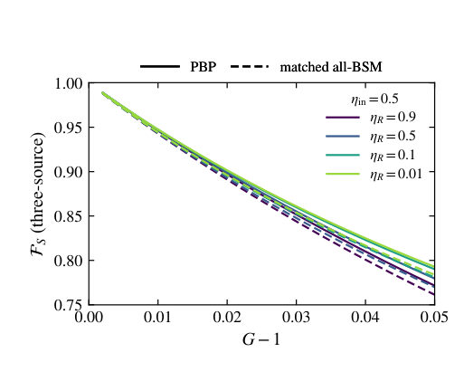 
FIG. 4. Spin–spin fidelity FS versus G −1 for output trans- missions ηR = 0.9, 0.5, 0.1, 0.01, three-source, ηin = 0.5. Solid: PBP; dashed: matched all-BSM chain. The PBP network lies above the matched chain throughout; the modest rise with de- creasing ηR arises from the reweighting of histories admitted by internal loss (see text).

📷 Fig 5

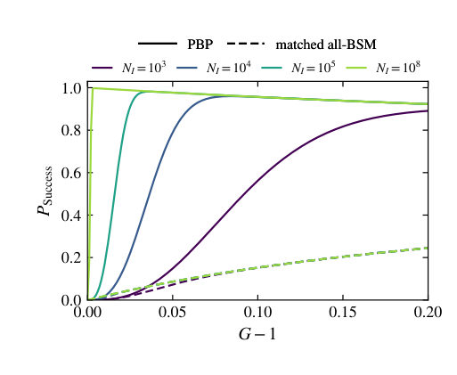 
FIG. 5. Success probability PSuccess versus G −1 for spec- tral multiplexing NI = 103, 104, 105, 108 (bottom to top), three-source, lossless. Solid: PBP; dashed: matched all-BSM chain. The PBP network reaches near-deterministic opera- tion at high multiplexing; the all-BSM chain remains below the quasi-deterministic threshold.

**Summary.** This paper addresses false heralds in multi-source entanglement swapping caused by multipair emission in SPDC sources. The authors propose and analyze the use of a complementary measurement, the Green Machine (GM), alongside the standard BSM. This combination allows the network to maintain high fidelity and herald an exact Bell state even in complex, multi-stage quantum communication links.

**Why it may be interesting.** This work provides rigorous theoretical bounds and protocols for improving quantum communication links by designing optimal measurement apparatuses to overcome fundamental source limitations like multipair emission.

Detailed structure

**Main problem.** Entanglement swapping using spontaneous parametric down-conversion (SPDC) sources suffers from false heralds due to multipair emission, which conventional Bell-state measurements (BSM) cannot resolve.

**Main result.** A cascaded network employing a complementary analyzer, the Green Machine (GM), can resolve these ambiguities, leading to an exact Bell state herald in the lossless limit for four or more sources.

**Method.** The authors analyze the acceptance probabilities of BSM and GM for various two-photon Fock states, utilizing an all-orders Gaussian-state analysis to characterize the required complementary measurement pair.

**Model / system.** The system models entanglement swapping in a network of multiple SPDC sources, analyzed in the two-photon input space with polarization and rail degrees of freedom.

**Key observables.** Acceptance probabilities for different two-photon classes ($C1, C2, C3, C4$), photon-photon fidelity ($F_{Ph}$), and Bell fraction ($B_{Ph}$).

**Important parameters / regimes.** Number of sources ($N \ge 3$), coupling/detector/channel loss, and the phase parameter ($\phi$) of the GM.

**Assumptions / limitations.** The analysis assumes passive four-mode, number-resolving analyzers and ideal lossless propagation for the ultimate theoretical limit.

**Figures summary.** Figure 1 illustrates the BSM and GM analyzer layouts; Figure 2 shows the four-source network structure; Table D3 confirms the unit photonic fidelity for $N=4, 5, 6$ in the lossless limit.

**Paper structure.** The paper first establishes the failure of conventional BSMs, introduces the complementary GM, derives the necessary class-covering condition, and then extends the analysis to multi-source chains (three-source and four-source) using all-orders Gaussian methods.

Abstract

Multipair emission is a principal source of false heralds in entanglement swapping with spontaneous parametric down-conversion sources. A conventional Bell-state measurement (BSM) cannot distinguish the desired arrival of one photon from each neighboring source from a mixed-polarization double emission by one source accompanied by vacuum from the other. We show that a cascaded network can resolve this ambiguity by allowing its successive swapping stations to perform different measurements. A direct-basis BSM rejects same-polarization double emissions, whereas a balanced equatorial analyzer, implemented by a four-mode Green Machine (GM), uses two-photon interference to reject mixed-polarization double emissions. At the same time, it recovers same-polarization inter-source events rejected by the BSM as resolved $φ$-type Bell heralds. Their rejection sets jointly cover both single-source two-photon classes while retaining contributions from both useful inter-source classes. We classify the passive four-mode, number-resolving analyzers satisfying this condition and identify the BSM and GM as canonical balanced representatives. Using a Gaussian-state analysis exact to all orders of multipair emission, we evaluate three-source BSM--GM and four-source BSM--GM--BSM Pure Bell Pair sources under coupling, detector, and channel loss. The three-source network suppresses the leading infidelity, while the four-source network heralds an exact Bell state in the lossless limit, a property that holds for every alternating BSM--GM chain with four or more sources. The fidelity advantage over source-count-matched all-BSM networks persists at every loss level studied, a single-channel rate advantage appears without multiplexing, and spectral multiplexing raises the Bell-pair delivery probability toward the asymptotically deterministic limit.

[↑ back to top](#top)

### [Physics-informed quantum algorithms for glueball-like excitations in a $\mathbb{Z}_2$ lattice gauge theory](http://arxiv.org/abs/2608.25696v1)

**Authors:** Dan-Bo Zhang  
**Type:** theory · **Category:** quantum information and computing · **PDF:** <https://arxiv.org/pdf/2608.25696v1>  
**Analysis basis:** full PDF text, analyzed in chunks
**Topic relevance:** `analog quantum simulation` **3/5**

📷 Fig 1

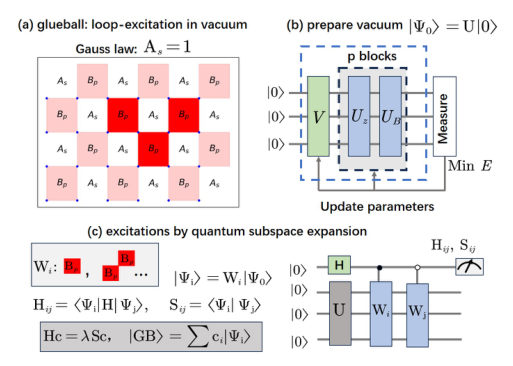 
FIG. 1. Algorithmic workflow. (a) Rotated representation of the Z2 gauge model. Contractible products of magnetic pla- quettes generate closed-flux loops on a vacuum. (b) Vacuum preparation starts from the loop-gas circuit V (θ) and is re- fined by gauge-preserving variational layers. (c) Wilson-loop excitations define a nonorthogonal subspace in which low- lying glueball-like states and their observables are obtained from measured overlap and Hamiltonian matrices.

📷 Fig 2

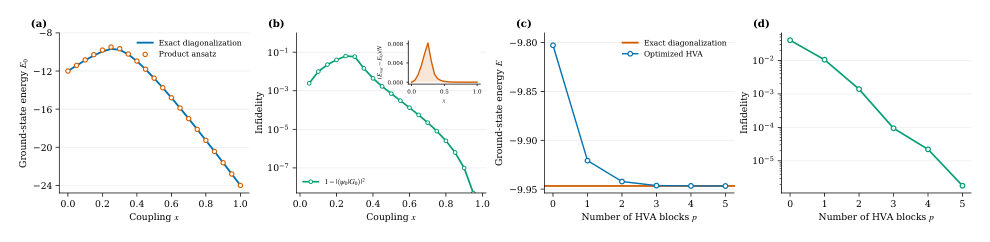 
FIG. 2. Vacuum preparation on the 6 × 4 periodic lattice. Left (a and b): comparison of the one-parameter loop-gas ansatz with exact diagonalization over the interpolation parameter x. Right(c and d): HVA refinement at the representative point x = 0.2. The variational energy approaches the exact value and the state infidelity decreases with layer number p. The two panels illustrate complementary roles: the loop gas captures the exactly solvable limits and much of the bulk trend, while the HVA repairs the intermediate-coupling correlations that the factorized plaquette coordinates cannot represent.

📷 Fig 3

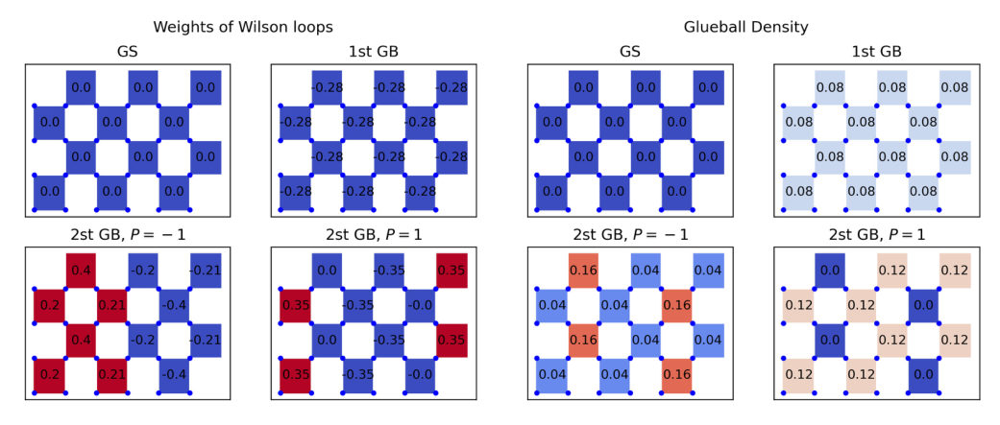 
FIG. 3. Structure of the low-lying QSE states at x = 0.6. Left: coefficients associated with elementary-plaquette loop operators in a fixed QSE basis. Right: local elementary-loop motif density ⟨np⟩. The first excited state is spatially uniform in these diagnostics. The two higher states are degenerate within the reported precision; their individual coefficient patterns are therefore basis-dependent until a spatial symmetry is diagonalized inside the degenerate subspace. Choosing reflection eigenstates produces the displayed even/odd patterns (P = ±1), while the motif density provides a basis-independent view of their spatial support.

📷 Fig 4

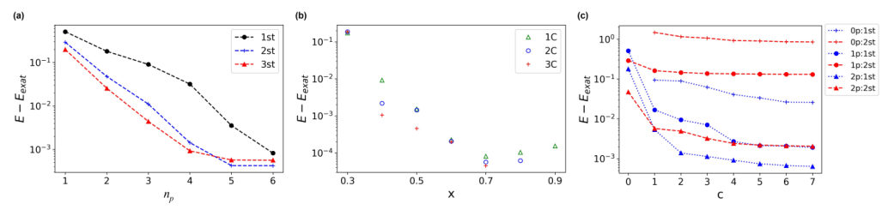 
FIG. 4. Subspace compression. (a) energy errors of the three lowest glueball-like excitations decrease as the largest Wilson-loop area np is increased. (b) vacuum-only EC for the first excitation, using the training set {x −0.05C, . . . , x, . . . , x + 0.05C} with C = 1, 2, 3. (c) combined EC and loop bases for the two lowest excitations of the target Hamiltonian at x = 0.4. The available training vacua are sampled on the grid x = 0.05, 0.10, . . . , 0.70, and C enlarges the selected training set. The labels 0p, 1p, and 2p denote the three loop-basis choices used in the data, with loop-size cutoffs np = 0, 1, 2, respectively.

📷 Fig 5

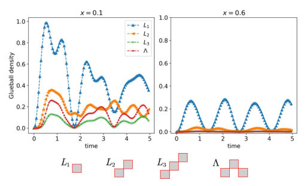 
FIG. 6. Production of bare closed-loop motifs after quenches from the electric vacuum at x0 = 1 to x1 = 0.1 and x1 = 0.6. The curves correspond to four loop shapes, denoted L1, L2, L3, and Λ in the original numerical data. The deep quench to x1 = 0.1 generates substantially more loop weight, including larger motifs, whereas the x1 = 0.6 quench remains electric- field dominated and suppresses extended loops.

**Summary.** This work introduces a physics-informed quantum algorithm to study glueball-like excitations in a Z2 lattice gauge theory. It uses variational quantum circuits and Wilson-loop expansions to calculate the excitation spectrum and spatial size of these excitations. The approach is valuable because it systematically incorporates physical symmetries and structure, making it transferable to more complex, non-Abelian gauge theories.

**Why it may be interesting.** The methodology—using physical structure (gauge invariance, loop operators) to constrain the quantum computational basis—is a powerful paradigm for applying quantum algorithms to strongly correlated lattice models, which is highly relevant to quantum simulation.

Detailed structure

**Main problem.** The paper develops a physics-informed quantum-computing framework to study glueball-like excitations in a lattice gauge theory.

**Main result.** The framework successfully characterizes the low-lying excitation spectrum and the spatial profile of these excitations by projecting the Hamiltonian onto a gauge-invariant subspace.

**Method.** It employs a combination of variational quantum circuits for vacuum preparation, Wilson-loop quantum subspace expansion (QSE) for excitations, and eigenvector continuation for basis compression.

**Model / system.** The study is performed on a (2+1)-dimensional Z2 lattice gauge theory, governed by a Hamiltonian involving magnetic and electric plaquette terms. The physical states must satisfy Gauss's law.

**Key observables.** Glueball-like excitation energy spectrum, Bethe-Salpeter (BS)-type radius quantifying spatial broadening, and quench observables $N_K(t)$.

**Important parameters / regimes.** The coupling parameter $x$ controls the transition between confined ($x > x_c$) and deconfined ($x < x_c$) regimes, with $x_c \simeq 0.2473$.

**Assumptions / limitations.** The framework is demonstrated in an Abelian model but is claimed to be naturally transferable to non-Abelian lattice gauge theories. The QSE basis size is limited by the maximum loop size considered.

**Figures summary.** Figures illustrate the workflow, showing vacuum preparation via loop-gas circuits refined by variational layers, and visualizing how Wilson-loop excitations define a nonorthogonal subspace for state calculation.

**Paper structure.** The paper proceeds by defining the physical problem in the Z2 lattice gauge theory, developing the physics-informed quantum framework (vacuum preparation and excitation construction), and then applying this to calculate spectral properties and spatial profiles using BS-radius and quench dynamics.

Abstract

Glueball spectroscopy with quantum computing requires both a correlated gauge vacuum and a systematic construction of its low-lying pure-gauge excitations. We develop a physics-informed quantum-computing framework for these tasks in a $(2+1)$-dimensional $\mathbb{Z}_2$ lattice gauge theory. We use the term \emph{glueball-like} for localized closed-flux excitations on the confining side of this Abelian model, without identifying them with the non-Abelian glueballs of QCD. The central strategy is to organize the computation around the physical structure of the glueball-like state rather than to search a generic many-body excitation space. We prepare the gauge vacuum variationally and use Wilson-loop quantum subspace expansion to construct and characterize the low-lying excitations. Moreover, eigenvector continuation uses nearby ground states to capture the growing loop dressing without a rapidly enlarged Wilson-loop basis, while a Bethe--Salpeter-type radius quantifies the associated spatial broadening. We further use quench dynamics to probe nonequilibrium production. Although demonstrated in an Abelian model, the framework is built from gauge-invariant vacuum and excitation structures and is naturally transferable to non-Abelian lattice gauge theories.

[↑ back to top](#top)

### [Rare-earth oxysulfides RE$_2$O$_2$S as model mixed-anion frustrated magnets](http://arxiv.org/abs/2608.26023v1)

**Authors:** Austin M. Ferrenti, Ksenia Khoroshun, Mohamed Oudah, Graham King, Jonathan Gaudet, Alannah M. Hallas  
**Type:** both · **Category:** strongly correlated electrons · **PDF:** <https://arxiv.org/pdf/2608.26023v1>  
**Analysis basis:** full PDF text, analyzed in chunks
**Topic relevance:** `analog quantum simulation` **3/5**

📷 Fig 1

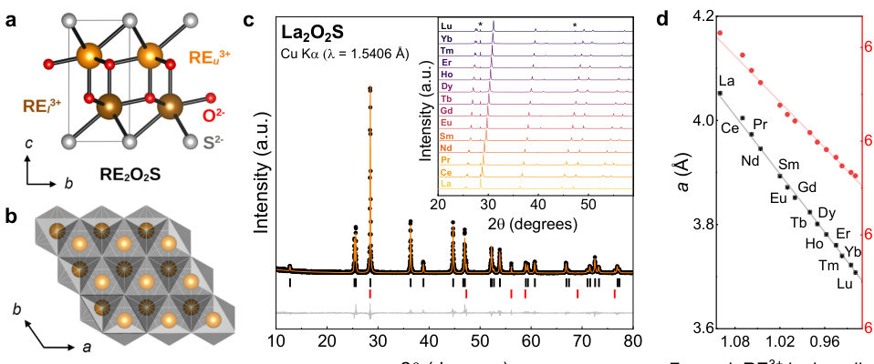 
FIG. 1. Crystal structure of the RE2O2S family of mixed-anion magnets, shown (a) within and (b) normal to the triangular-bilayer slab. Although equivalent by symmetry, RE atoms in the upper (RE3+ u ) and lower (RE3+ l ) halves of the bilayer slab have been shaded differently for clarity. (c) Representative Rietveld refinement of powder X-ray diffraction (pXRD) data for La2O2S, where the black, orange, and gray datasets denote the experimental and modeled patterns, and the difference between them. The black and red tick marks represent reflections attributed to La2O2S and an internal Si standard, respectively. The pXRD patterns for the full lanthanide series are shown in the inset with...

📷 Fig 2

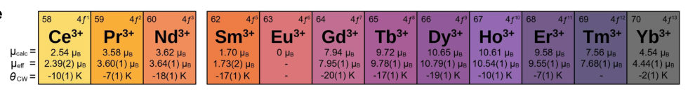 
FIG. 2. (a) Representative temperature-dependent magnetic susceptibility (black), its inverse (gold), and Curie Weiss fit lines (dashed black) of a Ce2O2S powder sample. Scaled low-temperature magnetic susceptibility of representative RE2O2S powder samples for (b) RE = Ce - Sm, (c) RE = Eu - Dy, and d) RE = Ho - Yb, highlighting the observed magnetic ordering transitions. (e) Expected and calculated effective magnetic moments (µeff) and Curie-Weiss temperatures (θCW) for each RE2O2S phase, derived from high- and low-temperature Curie-Weiss fitting of the measured magnetic susceptibility, respectively.

📷 Fig 3

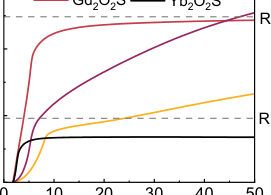 
FIG. 4. a) Zero-field specific heat as a function of temperature for Ce2O2S (brown), La2O2S (black line), and their differ- ence (gold). (b) Zero-field magnetic specific heat divided by temperature as a function of temperature for Ce2O2S (gold), Gd2O2S (red), Dy2O2S (purple), and Yb2O2S (black) powder samples. (c) Integrated magnetic entropy rise as a function of temperature for each composition up to T = 50 K.

📷 Fig 4

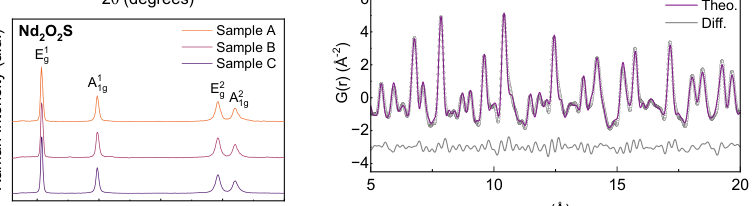 
FIG. 5. (a) Inverse magnetic susceptibility as a function of temperature, (b) powder diffraction patterns, and (c) Raman scattering spectra collected from Nd2O2S powder samples A (gold), B (magenta), and C (purple). The stars in (a) denote peaks attributed to an internal Si standard and the solid black lines in (c) represent the high-temperature Curie-Weiss fit for each sample. (d) Reduced pair distribution function [G(r)] collected from each Nd2O2S powder sample. Experimental datasets are shown in black, theoretical fits are colored by sample as in (a)-(c), and the difference curve between them is shown in gray.

**Summary.** This work reports on rare-earth oxysulfides ($	ext{RE}_2	ext{O}_2	ext{S}$), which are mixed-anion magnets with a quasi-2D slab structure. By synthesizing and characterizing these materials, the authors demonstrate that the mixed-anion character allows for the tuning of magnetic frustration. The combination of structural analysis and magnetic measurements confirms the existence of tunable, anisotropic magnetic ground states.

**Why it may be interesting.** The interplay between structural disorder (mixed anions) and magnetic frustration in quasi-2D systems is a rich area for theoretical modeling, potentially involving spin liquid physics or complex exchange Hamiltonians.

Detailed structure

**Main problem.** The study investigates the tunability of frustrated magnetic ground states in rare-earth mixed-anion materials.

**Main result.** The $	ext{RE}_2	ext{O}_2	ext{S}$ compounds exhibit long-range antiferromagnetic order and show tunable magnetic frustration due to their quasi-2D, mixed-anion structure.

**Method.** The study combines synthesis, structural characterization (pXRD, PDF analysis), and magnetic measurements ($\chi(T)$, $M(H)$) with theoretical modeling (CEF calculations).

**Model / system.** The physical system is the rare-earth oxysulfide ($	ext{RE}_2	ext{O}_2	ext{S}$), which forms a triangular-bilayer slab lattice geometry, acting as an intermediate between 3D oxides and 2D delafossites.

**Key observables.** Long-range AFM order, metamagnetic transitions, lattice parameters ($a, c$), and magnetic susceptibility ($\mu_{	ext{eff}}, 	heta_{	ext{CW}}$).

**Important parameters / regimes.** The rare-earth element (RE) identity, the degree of structural disorder ($x$ in $	ext{RE}_2	ext{O}_{2+x}	ext{S}_{1-x}$), and temperature ($T_N$).

**Assumptions / limitations.** The structural disorder observed via PDF analysis is attributed to synthesis-dependent oxygen/sulfur mixing, and average structural changes are assumed representative across the RE series.

**Figures summary.** Figures show crystal structures, pXRD refinements tracking lattice parameter changes with RE size, and PDF data illustrating structural disorder across different samples.

**Paper structure.** The paper progresses from structural characterization (pXRD, PDF) to magnetic measurements ($\chi(T)$, $M(H)$), establishing the structural basis for the observed magnetic frustration and tunability.

Abstract

The study of low-dimensional and anisotropic magnetism is a promising avenue for the discovery of novel quantum phenomena. Mixed-anion materials, defined by the coordination of metal cations by two or more distinct anionic species, provide an intrinsically anisotropic platform for the tuning of structural, magnetic, and electronic properties. In this work, we report the synthesis and characterization of a family of rare-earth oxysulfide (RE$_2$O$_2$S) antiferromagnets (AFM) possessing a triangular-bilayer slab lattice geometry. Long-range AFM order is observed for the majority of compositions, with several (RE = Ce, Pr, Nd, Sm) having been previously unreported. Although assumed to form stoichiometrically, pair distribution function (PDF) analysis provides evidence for significant, synthesis-dependent interslab structural disorder as RE$_2$O$_{2+x}$S$_{1-x}$, resulting in significant variability in the bulk magnetic response of the Nd member. This work highlights the tunability of frustrated magnetic ground states in rare-earth-based mixed-anion materials, and the importance of thorough structural characterization in the discovery of new mixed-anion magnets.

[↑ back to top](#top)

### [Dynamical and conformational behavior of a polymer in a crowded solution](http://arxiv.org/abs/2608.25242v1)

**Authors:** Setarehalsadat Changizrezaei, Colin Denniston  
**Type:** theory · **Category:** statistical mechanics · **PDF:** <https://arxiv.org/pdf/2608.25242v1>  
**Analysis basis:** full PDF text, analyzed in chunks
**Topic relevance:** `correlated / nonlocal dissipation` **2/5** · `methods for driven-dissipative` **2/5** · `Frenkel-Kontorova` **1/5** · `Keldysh / 2PI / non-Gaussian methods` **1/5** · `analog quantum simulation` **1/5** · `driven-dissipative phase transition` **1/5** · `non-equilibrium universality` **1/5** · `quantum measurements` **1/5**

📷 Fig 1

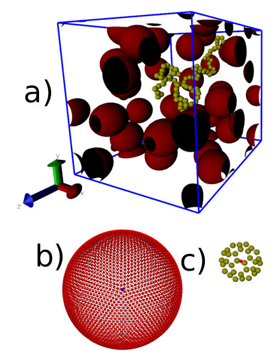 
FIG. 1. A schematic representation of the simulation system. (a) A polymer chain (yellow) is shown within the simulation box, sur- rounded by a crowded solution of mobile spherical colloids (red). (b) Each colloid consists of a central atom and a spherical surface shell. (c) Each monomer is similarly composed of a central atom and a smaller surface shell. Direct particle interactions, such as the FENE bond potential and Lennard-Jones repulsion, are applied between the central atoms, while the shell nodes interact with the Lattice- Boltzmann fluid to capture long-range hydrodynamic effects.

📷 Fig 2

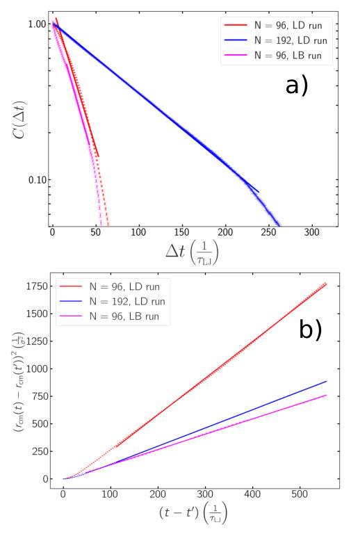 
FIG. 2. a) The time autocorrelation of the end-to-end distance of the polymer as a function of lag time. The line corresponds to the fit of the time autocorrelation, which is used to determine the relaxation time of the polymer. b) Time evolution of Mean Squared Displace- ment (MSD), ⟨(r(t)−r(t′))2⟩in the absence of colloidal particles within the system. The lines correspond to the fits used to determine the diffusion constant D.

📷 Fig 3

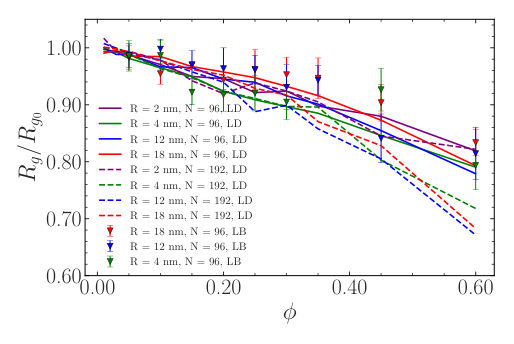 
FIG. 3. The polymer radius of gyration normalized by its value in free solution, Rg/Rg0, as a function of the colloid volume fraction φ. Solid lines show the N = 96 lattice-Boltzmann results, dotted lines show the N = 96 Langevin-dynamics results, and dashed lines show the N = 192 Langevin-dynamics results.

📷 Fig 4

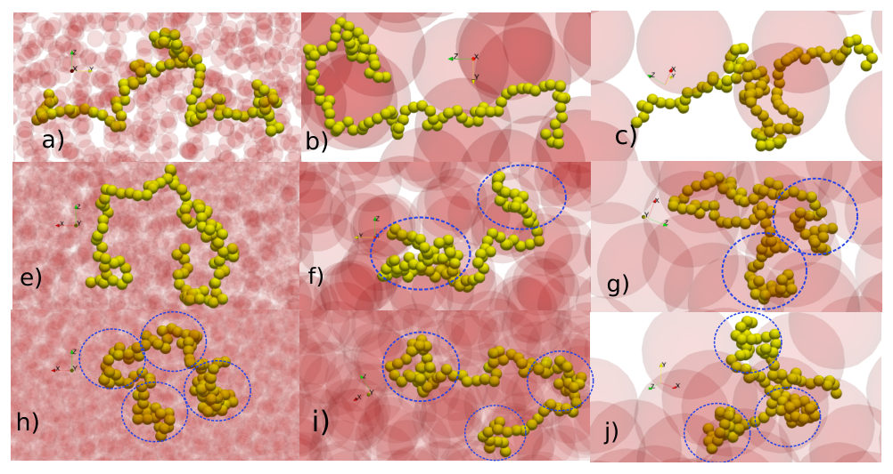 
FIG. 4. The polymer and colloid conformations in lattice Boltzmann simulations at low volume fraction of 0.10 for a) R=4nm, b) R=12nm, c) R=18nm, at intermediate volume fraction of 0.35 for d) R=4nm, e) R=12nm, f) R=18nm, and at high volume fraction of 0.60 for g) R=4nm, h) R=12nm, and i) R=18nm. Monomer clumps, or clusters, that will potentially give rise to de Gennes "blob"-like polymer behavior are indicated by the blue dashed regions. (Multimedia available online for (f) and (i))

📷 Fig 5

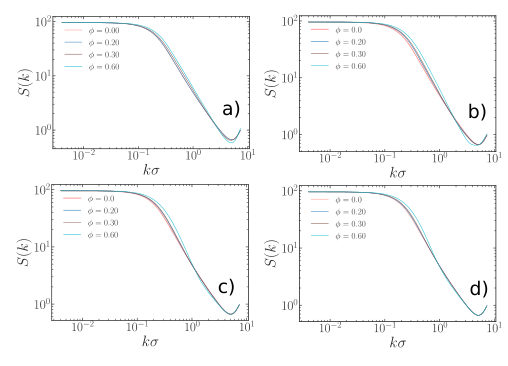 
FIG. 5. Plot of S(k) for N = 96 at different volume fractions for the Langevin simulations for a) R = 2nm, b) R=4 nm, c) R=12nm , and d) R=18nm.

**Summary.** This work simulates a polymer in a crowded colloidal solution using both Langevin Dynamics and Lattice-Boltzmann Molecular Dynamics. It finds that crowding causes polymer compaction, and crucially, the inclusion of full hydrodynamic interactions (LBMD) yields different, more physically accurate scaling laws for diffusion compared to simpler models. This underscores the necessity of accurate solvent coupling in polymer physics simulations.

**Why it may be interesting.** The detailed comparison between LD and LBMD highlights the critical importance of correctly modeling long-range hydrodynamic interactions in polymer dynamics, a concept relevant to open quantum systems where environmental coupling is crucial.

Detailed structure

**Main problem.** The study investigates how the presence of mobile colloidal crowders modifies the static structure and dynamic behavior of a polymer chain in a fluid.

**Main result.** Crowding induces polymer compaction, with large colloids degrading the effective long-wavelength Flory exponent, while polymer diffusion exhibits distinct size-dependent scaling when comparing Langevin Dynamics (LD) to full hydrodynamic simulations (LBMD).

**Method.** The authors employed molecular simulations, comparing Langevin Dynamics (LD) with Lattice-Boltzmann Molecular Dynamics (LBMD) to model polymer-colloid interactions.

**Model / system.** The system consists of a polymer chain interacting with mobile spherical colloidal crowders in a fluid. The simulation models include FENE bonds, Lennard-Jones interactions, and the LBMD approach explicitly incorporates long-range hydrodynamic interactions.

**Key observables.** Polymer compaction, diffusion coefficient (D), radius of gyration ($R_g$), and Rouse-mode relaxation times ($	au_p$).

**Important parameters / regimes.** Colloid size ratio ($R/r$), volume fraction ($\phi$), and the comparison between LD and LBMD simulation frameworks.

**Assumptions / limitations.** LD simulations assume an implicit solvent lacking long-range hydrodynamics, while LBMD explicitly couples particle motion to the fluid momentum exchange.

**Figures summary.** Figures illustrate the system setup, polymer structure, and dynamic scaling behavior (e.g., $	au_p$ vs. $p/N$ for LD data, and exponent vs. $\phi$ for LB/Langevin simulations).

**Paper structure.** The paper systematically compares the results from LD and LBMD simulations across varying colloid concentrations and sizes, analyzing structural changes (compaction, Flory exponent) and dynamic changes (diffusion, Rouse modes) to delineate the role of hydrodynamic interactions.

Abstract

We investigate the structure and dynamics of a polymer in a fluid containing mobile spherical colloidal crowders of radius $R$. We compare and contrast the behavior with Langevin dynamics (LD) and lattice--Boltzmann molecular dynamics (LBMD), the latter incorporating long-range hydrodynamic interactions. Both the colloid size relative to the monomer radius $r$ and the volume fraction $φ$ are varied to determine how crowding modifies polymer behavior. Increasing volume fraction induces polymer compaction, with the mechanism strongly dependent on the size ratio $R/r$. Small colloids primarily modify the short-wavelength polymer conformation, causing self-avoiding-walk-like behavior to persist to shorter length scales, whereas large colloids reduce the effective long-wavelength Flory exponent, indicating degraded solvent quality consistent with a confinement-blob picture. Polymer diffusion exhibits distinct behavior in LD and LBMD. In LD, diffusion decreases rapidly and depends strongly on $R/r$; a phenomenological scaling involving $\ln(1+R/r)$ captures this size dependence, and additional scaling with $R_g$ reduces scatter, indicating polymer-scale correlations induced by crowding. In contrast, LBMD diffusion follows an effective-medium-like exponential dependence on concentration, governed by hydrodynamic coupling. Rouse-mode analysis identifies three regimes: scaling breakdown at low volume fraction, Zimm-like behavior at intermediate density in both LD and LB, and at high density hydrodynamic screening in LB with confinement-dominated dynamics in LD.

[↑ back to top](#top)

### [The temperature-dependent non-Abelian gauge potential](http://arxiv.org/abs/2608.25437v1)

**Authors:** Zheng-Chuan Wang  
**Type:** theory · **Category:** other · **PDF:** <https://arxiv.org/pdf/2608.25437v1>  
**Analysis basis:** full PDF text, analyzed in chunks
**Topic relevance:** `Keldysh / 2PI / non-Gaussian methods` **2/5** · `methods for driven-dissipative` **2/5** · `correlated / nonlocal dissipation` **1/5** · `driven-dissipative phase transition` **1/5** · `non-equilibrium universality` **1/5**

📷 Fig 1

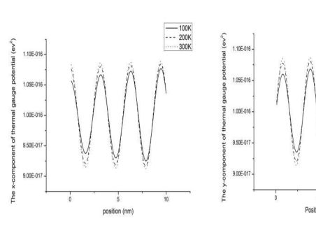 
Fig.1 The three components of the thermal gauge potential at different

📷 Fig 2

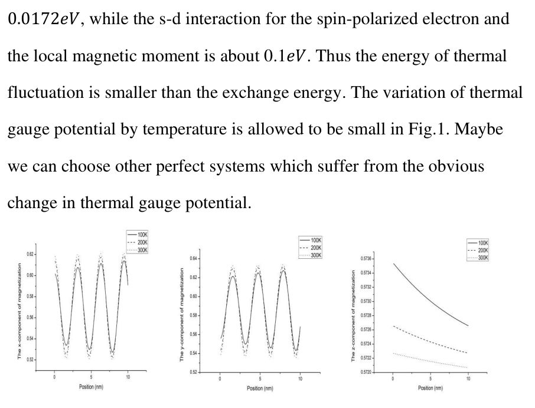 
Fig.2 The three components of the magnetization at different temperatures

**Summary.** This paper investigates how temperature influences the non-Abelian gauge potential governing magnetization dynamics in a ferromagnet driven by spin currents. By applying the adiabatic approximation to the LLG equation, the authors derive a temperature-dependent gauge potential and analytically solve the linearized dynamics. This work connects concepts from gauge theory to mesoscopic spintronics phenomena.

**Why it may be interesting.** The connection between thermal gauge potentials and magnetization dynamics in condensed matter systems provides a novel theoretical framework for understanding dissipation and transport phenomena in magnetic materials.

Detailed structure

**Main problem.** The study determines the temperature-dependent non-Abelian thermal gauge potential that emerges in the magnetization dynamics of a ferromagnet when driven by a spin-polarized current.

**Main result.** The analysis yields a temperature-dependent gauge potential and provides an analytical solution for the linearized, temperature-dependent Landau-Lifshitz-Gilbert (LLG) equation.

**Method.** The authors use the adiabatic approximation, linearize the LLG equation around the stationary state, and solve the resulting differential equation analytically.

**Model / system.** The system is a ferromagnet modeled by conduction electrons (spin-1/2) interacting with a local magnetic moment. The dynamics are governed by the Landau-Lifshitz-Gilbert (LLG) equation.

**Key observables.** The temperature-dependent non-Abelian thermal gauge potential, and the time-dependent magnetization components ($M_x, M_y, M_z$).

**Important parameters / regimes.** Temperature ($T$), spin-polarization current, and the damping parameter ($\alpha$).

**Assumptions / limitations.** The adiabatic approximation is used, assuming magnetization changes much slower than conduction electrons. Linearization of the LLG equation is also employed.

**Figures summary.** Figure 1 illustrates the temperature-dependent gauge potential changing slightly between 100K and 300K. Figure 2 shows the temperature-dependent magnetization solution, where $M_x$ and $M_y$ oscillate with increasing amplitude as temperature rises.

**Paper structure.** The paper first establishes the connection between time evolution operators and non-Abelian gauge transformations. It then derives the temperature-dependent gauge potential within the LLG framework and concludes by analytically solving the linearized, temperature-dependent LLG equation.

Abstract

This study shows that the usual time evolution operator can act as a U(1) gauge transformation on the initial wavefuntion. When considering the spin freedom in the system, the time evolution operator corresponds to a non-Abelian SU(2) gauge transformation for spin-1/2 particles and a SU(3) gauge transformation for spin-1 particles. If we adopt the adiabatic approximation in the magnetization dynamics of a ferromagnetic system driven by a spin-polarized current, a temperature-dependent non-Abelian thermal gauge potential will appear. We can employ a temperature-dependent Landau-Lifshitz-Gilbert (LLG) equation to describe the magnetization dynamics in the semi-classical limit, a linear approximated solution for this equation is given analytically.

[↑ back to top](#top)

### [Signatures of a ferro-Josephson effect in twisted graphene](http://arxiv.org/abs/2608.25257v1)

**Authors:** Ruiheng Su, Zhenxiang Gao, Christopher Coleman, Manabendra Kuiri, Dacen Waters, Kenji Watanabe, Takashi Taniguchi, Matthew Yankowitz, Nemin Wei, Chunli Huang, Allan H. MacDonald, Joshua Folk  
**Type:** experiment · **Category:** other · **PDF:** <https://arxiv.org/pdf/2608.25257v1>  
**Analysis basis:** full PDF text, analyzed in chunks
**Topic relevance:** `analog quantum simulation` **2/5** · `Keldysh / 2PI / non-Gaussian methods` **1/5** · `driven-dissipative phase transition` **1/5** · `non-equilibrium universality` **1/5** · `quantum measurements` **1/5**

📷 Fig 1

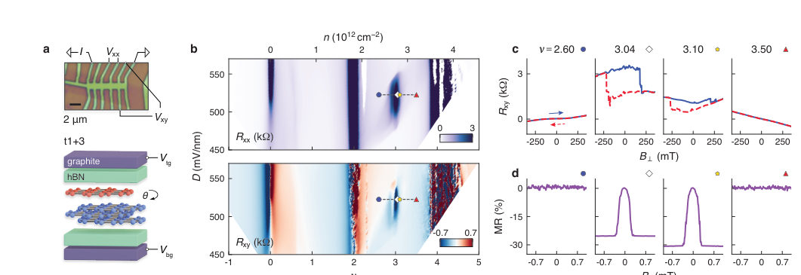 
FIG. 1. Anomalous in-plane magnetoresistance. a, Optical micrograph of the twisted monolayer-trilayer graphene (t1+3) device labeled with the measurement configuration and schematic rendering of the van der Waals stack with dual graphite gates. b, Longitudinal resistance Rxx = Vxx/Iac (top) and Hall resistance Rxy = Vxy/Iac (bottom) as functions of displacement field D and carrier density n (upper axis) /moir´e band filling factor ν (lower axis). Data were field symmetrized (antisymmetrized) at B⊥= ±100 mT. Colored markers correspond to gate voltage settings (D = 0.523 V/nm) for data c, d. c, Out-of-plane magnetic field dependence of Rxy, showing the anomalous Hall effect near ν = 3. d,...

📷 Fig 2

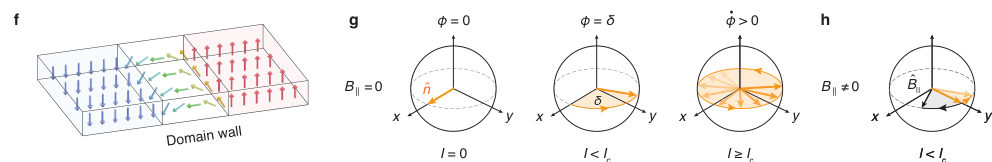 
FIG. 2. Signatures of a ferro-Josephson effect. a Rxx(B∥) obtained at ν = 3.02, D = 0.523 V/nm, for applied AC bias ranging from Iac = 0.4 to 9.6 nA. Traces are vertically offset by 50 Ωfor clarity; each corresponds to a 0.4 nA increment in Iac. b, Differential resistance obtained at gate voltages as in a, showing nearly no dependence on the DC bias (Idc) at B x ∥= −0.5 mT, and sharp resonances at no applied B x ∥. Data was obtained at B⊥= 20 mT. c,e, Differential resistance as a function of DC bias and Bx ∥, at B⊥= 18 mT (c) and 30 mT (e). d, Constant-current planar cuts of dV/dI across the {Bx ∥, By ∥} plane at Idc = 0.20, 0.36 and 0.43 nA. f, Schematic rendering of a domain wall between...

📷 Fig 3

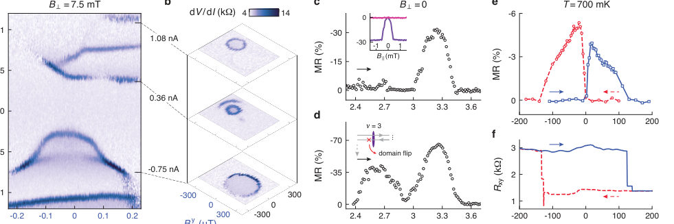 
FIG. 3. Role of B⊥and domain preparation in stabilizing the ferro-Josephson effect a, dV/dI map versus By ∥and Idc at B⊥= 7.5 mT. b, In-plane magnetic field dependence of dV/dI at fixed Idc = 1.08, 0.36 and -0.75 nA, showing a shift in the central feature between positive and negative current bias. c, d, Dependence of the in-plane magnetoresistance (here calculated at B∥= 1 mT) on the history of the gate voltage. MR sequentially measured for increasing ν, starting from ν = 2 + 0.27 (indicated by the right pointing arrow), and along a contour of D = 0.523 V/nm (B⊥= 0). Inset: representative MR traces at ν = 2.8 and ν = 3.2. d, MR measured after a sequence of gate voltage sweeps between ν =...

**Summary.** This work reports experimental signatures of a ferro-Josephson effect in twisted graphene heterostructures. The effect arises from spin-polarized currents causing domain wall precession, which modulates the Berry curvature. The evidence is presented through sharp, field-sensitive peaks in resistance measurements, establishing the material as a sensitive probe of isospin domain-wall dynamics.

**Why it may be interesting.** The study connects topological phenomena (Berry curvature, Josephson effect) to emergent magnetism and transport in 2D materials, providing a platform to study non-linear, current-driven quantum dynamics.

Detailed structure

**Main problem.** The paper reports on the observation of a ferro-Josephson effect in a twisted graphene van der Waals heterostructure.

**Main result.** Signatures consistent with the ferro-Josephson effect are found, characterized by a sharp peak in longitudinal resistance at zero in-plane magnetic field ($B_{\parallel}=0$) and resonant features in differential resistance.

**Method.** Electrical transport measurements ($R_{xx}, R_{xy}, dV/dI$) are performed as a function of applied magnetic fields ($B_{\perp}, B_{\parallel}$), gate voltage, and current bias.

**Model / system.** The system is a twisted graphene van der Waals heterostructure, where spin and valley textures are coupled by exchange, Hund's coupling, and spin-orbit interactions. The effect is theoretically linked to spin-transfer torque driving domain wall precession.

**Key observables.** Sharp peak in $R_{xx}$ at $B_{\parallel}=0$; sharp resonances in $dV/dI$; anomalous Hall effect ($R_{xy}$ hysteresis); negative in-plane magnetoresistance ($\Delta R_{xx}$).

**Important parameters / regimes.** Low temperatures ($T \approx 25 	ext{ mK}$); small in-plane magnetic fields ($	ext{microtesla}$ to $	ext{millitesla}$); current bias ($I_{ac}$ dependence).

**Assumptions / limitations.** The observed features are interpreted as evidence for the current-driven precession of spin-domain-wall moments, which is distinct from simple depinning or Joule heating.

**Figures summary.** Figures map out phase diagrams ($R_{xx}$ vs. gate voltage), show $R_{xy}$ hysteresis, and provide detailed $R_{xx}(B_{\parallel})$ and $dV/dI$ spectra demonstrating the field and current dependence of the ferro-Josephson signature.

**Paper structure.** The paper systematically presents measurements across various magnetic field and gate voltage regimes, first establishing the anomalous Hall effect and then focusing on the current-dependent, field-sensitive features in the differential resistance to confirm the ferro-Josephson mechanism.

Abstract

When a spin-polarized current is driven across a magnetic domain wall, the resulting spin-transfer torque could, beyond a critical threshold, set the wall's moments into precession. This precession would modulate the Berry curvature experienced by electrons traversing the wall, producing an electromotive force that is topological in nature, proportional to the precession frequency, mapping precisely onto the DC Josephson effect and leading to the name ferro-Josephson effect. We report signatures consistent with this effect in a twisted graphene van der Waals heterostructure, where spin and valley textures are linked by exchange, Hund's coupling, and spin-orbit interactions. Tuned to fillings where the isospin degeneracy is spontaneously broken, the samples develop a sharp peak in the longitudinal resistance within a fraction of a millitesla of $B_\parallel=0$---a peak that disappears as the current is reduced toward zero. In differential resistance the feature resolves into sharp resonances that disperse with $B_\parallel$ on microtesla and picoampere scales. We argue that these arise from the current-driven precession of spin-domain-wall moments, in competition with the in-plane anisotropy set by a minuscule applied field, and that they establish nonlinear transport as a sensitive probe of isospin domain-wall dynamics at energy scales far below $k_BT$.

[↑ back to top](#top)

### [Incommensurate spin fluctuations in one-dimensional Kondo metal CeCo2Ga8](http://arxiv.org/abs/2608.26071v1)

**Authors:** Yixuan Huang, P. Murgatroyd, Yi Wu, M. Cook, P. F. S. Rosa, E. D. Bauer, Asish K. Kundu, A. Rajapitamahuni, E. Vescovo, S. Zhang, V. Anil, P. Piyawongwatthana, N. Murai, M. Kofu, K. M. Shen, F. Ronning, Jian-Xin Zhu, A. Scheie  
**Type:** both · **Category:** strongly correlated electrons · **PDF:** <https://arxiv.org/pdf/2608.26071v1>  
**Analysis basis:** full PDF text, analyzed in chunks
**Topic relevance:** `analog quantum simulation` **2/5** · `Frenkel-Kontorova` **1/5** · `methods for driven-dissipative` **1/5**

📷 Fig 1

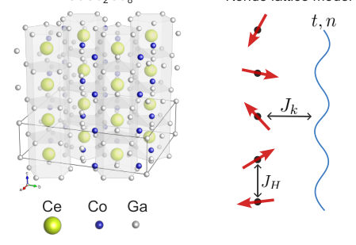 
FIG. 1. CeCo2Ga8 crystal structure (left) showing effective one- dimensional chains of Ce ions along the c-axis. We describe this with a simplified Kondo lattice model (right) where a one-dimensional chain of spins interact with each other with magnetic exchange in- teraction JH and also with an itinerant band (described by hopping t and filling n) via Kondo interaction Jk.

📷 Fig 2

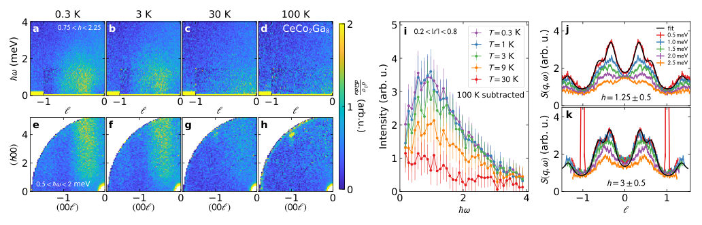 
FIG. 2. CeCo2Ga8 neutron scattering data. Panels a through d show the energy-dependent scattering as a function of ℓ(along the chains). Panels e through h show the inelastic 0.5 &lt; ℏω &lt; 2 meV scattering along and transverse to the chains in reciprocal lattice units. Along the chains there is strong modulation, but transverse to the chains there is no momentum dependence. (Note that the (h00) direction is actually an azimuthal average in the (hk0) plane.) Panel i shows the energy-dependence of the ℓ= 0.5 intensity, showing a clear finite-energy maximum at ≈1 meV. Panels j and k show constant energy cuts of T = 0.3 K CeCo2Ga8 neutron scattering data at h = 1.25 and h = 3 rlu. At low energies,...

📷 Fig 3

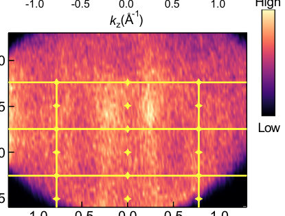 
FIG. 3. Highly anisotropic electronic structure of CeCo2Ga8. a Out- of-plane (kx −kz) Fermi surface of CeCo2Ga8 measured over the pho- ton energy range hν = 80 −122 eV. b In-plane (kx −ky) Fermi sur- face of CeCo2Ga8 measured at hν = 115 eV. Quasi-1D Fermi sheets are observed about the zone-center, consistent with a strongly sup- pressed transverse dispersion. The Brillouin zone is indicated in yel- low. Fermi surfaces were obtained at T = 18 K and integrated over an energy window of EF ± 15 meV.

📷 Fig 4

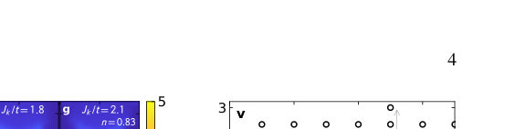 
fig. 4 h-n

📷 Fig 5

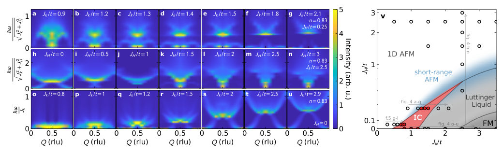 
FIG. 4. DMRG simulations of the 1D Kondo lattice model, calculating S (Q, ω). Panels on the left (a - u) show representative inelastic spectra tuning across the Luttinger Liquid phase boundary. Panel v shows the n = 0.83 simulation parameters on the phase diagram of Ref. [26], but with the incommensurate (IC) phase added. Circles show the parameters we simulated, and the plotted spectra are referenced in light grey text. Points filled with red are where incommensuration is observed (e.g., panels c - e). In the 1D AFM phase (i.e., ”spin gap” [26]) the spectrum resembles (and is continuously connected to) the 1D Heisenberg solution: a dispersive continuum with a lower boundary [27]. However,...

**Summary.** This work experimentally and numerically investigates the spin fluctuations in the 1D Kondo metal CeCo2Ga8. By combining inelastic neutron scattering and ARPES with DMRG simulations, the authors confirm the material's quasi-1D nature and place it within the incommensurate phase of the 1D Kondo lattice diagram. This validates the use of the Kondo lattice model as a microscopic description for heavy fermion behavior.

**Why it may be interesting.** The successful mapping of complex heavy fermion physics onto a solvable 1D quantum model (Kondo lattice) provides a powerful benchmark for understanding emergent quantum phases in strongly correlated materials.

Detailed structure

**Main problem.** The study aims to characterize the spin fluctuations and electronic structure in the 1D Kondo metal CeCo2Ga8 and determine if its behavior can be accurately modeled by the 1D Kondo lattice model.

**Main result.** The material exhibits highly one-dimensional electronic and magnetic behavior, showing incommensurate spin fluctuations that are successfully reproduced by non-perturbative DMRG simulations of the 1D Kondo lattice model.

**Method.** The research combines experimental measurements using inelastic neutron spectroscopy and ARPES with theoretical interpretation via Density Matrix Renormalization Group (DMRG) simulations.

**Model / system.** The physical system is the heavy fermion metal CeCo2Ga8, which is modeled using the 1D Kondo lattice model. This model describes the competition between Kondo screening and magnetic interactions.

**Key observables.** Incommensurate magnetic fluctuations ($\ell=0.354(2)$), quasi-1D electronic band structure (ARPES), and the localized spin susceptibility ($\chi_{SS}$).

**Important parameters / regimes.** Low-energy scale ($\approx 1 	ext{ meV}$), Kondo coupling strengths ($J_H, J_k$), and the dimensionality (highly 1D).

**Assumptions / limitations.** The analysis assumes the Kondo lattice model is the appropriate minimal description for the heavy fermion physics, despite potential neglect of higher-dimensional bands.

**Figures summary.** Figures show neutron scattering intensity mapping out incommensurate peaks, ARPES contours confirming 1D dispersion, and DMRG results illustrating the spectral evolution across different theoretical phases.

**Paper structure.** The paper proceeds by first presenting experimental evidence (neutron scattering and ARPES) confirming 1D, incommensurate fluctuations, followed by theoretical modeling using DMRG to map these features onto the known phase diagram of the 1D Kondo lattice.

Abstract

We present an experimental and numerical study of the spin fluctuations in 1D Kondo metal CeCo$_2$Ga$_8$. Using inelastic neutron spectroscopy, we measure highly one-dimensional magnetism with low-energy incommensurate short-ranged magnetic fluctuations. ARPES similarly shows a highly one-dimensional electronic band structure, confirming the one-dimensional nature of the system. We use density matrix renormalization group (DMRG) simulations of the 1D Kondo lattice model to interpret the measured spectrum, which successfully reproduce the neutron scattering features. We are thus able to place CeCo$_2$Ga$_8$ within the emergent incommensurate phase of the 1D Kondo lattice phase diagram, and demonstrate that the Kondo lattice simulated non-perturbatively is an accurate microscopic model for heavy fermion physics. This shows CeCo$_2$Ga$_8$ to be one-dimensional despite its complexities, and reveals a coexistence of low-energy Kondo and magnetic features in its inelastic spectrum.

[↑ back to top](#top)

### [Anomalous behavior of Wilson fermions in the presence of monopoles](http://arxiv.org/abs/2608.25143v1)

**Authors:** Manuel Cortina, Rajamani Narayanan, Ray Romero  
**Type:** theory · **Category:** other · **PDF:** <https://arxiv.org/pdf/2608.25143v1>  
**Analysis basis:** full PDF text, analyzed in chunks
**Topic relevance:** `analog quantum simulation` **2/5** · `Keldysh / 2PI / non-Gaussian methods` **1/5**

📷 Fig 1

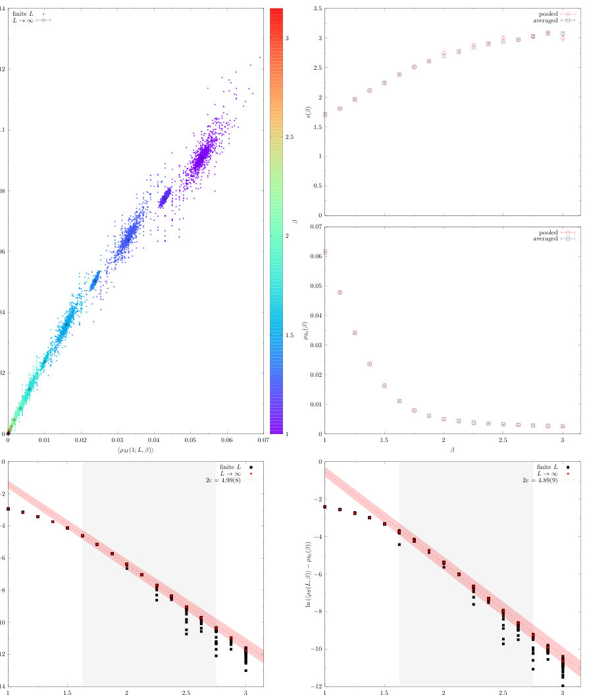 
FIG. 1: Behavior of the monopole density and associated action density as a function of the lattice gauge coupling, β.

📷 Fig 2

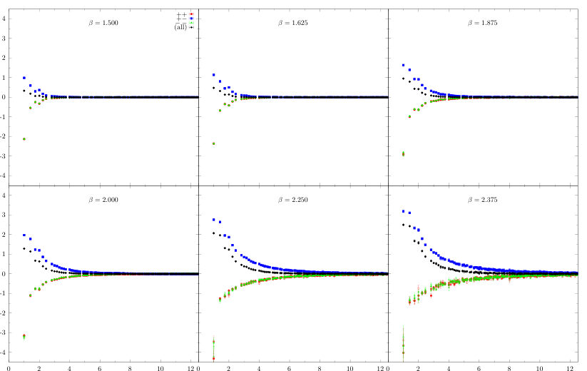 
FIG. 2: log of g(r), ratio of pairs found at distance r to pairs at distance r if randomly distributed as a function of r.

📷 Fig 3

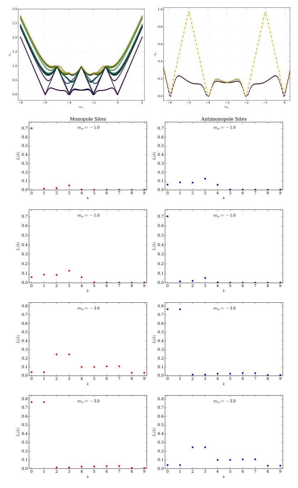 
FIG. 3: Behavior of the low lying spectrum of W as a function of mw for a fixed monopole-anti-monopole pair.

📷 Fig 4

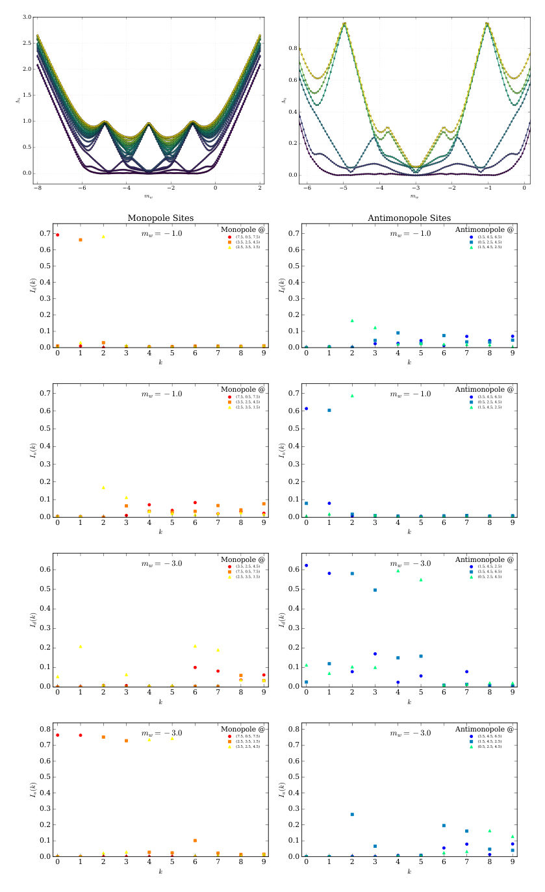 
FIG. 4: Behavior of the low lying spectrum of W as a function of mw for a thermalized configurations with three monopole-anti-monopole pairs.

📷 Fig 5

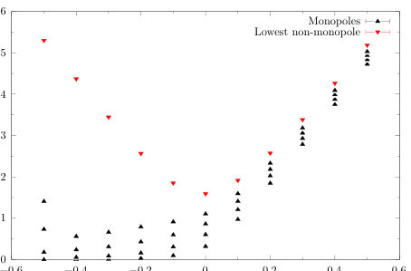 
FIG. 5: The eigenvalues Λk(L; mw, β) as a function of mw at a fixed value of L and β.

**Summary.** This work studies how magnetic monopoles affect the electronic spectrum of fermions in a 3D U(1) gauge theory on a lattice. The key finding is that monopoles induce anomalously small eigenvalues in the fermion operator, which are directly related to the monopole density. This suggests a topological mechanism causing flavor symmetry breaking in the system.

**Why it may be interesting.** The study of fermion zero modes coupled to topological defects (monopoles) is a fundamental topic in condensed matter and high-energy physics, relevant to understanding topological superconductivity or fractionalization in strongly correlated systems.

Detailed structure

**Main problem.** The paper investigates the anomalous behavior of Wilson fermions when coupled to magnetic monopoles within a three-dimensional compact U(1) gauge theory.

**Main result.** The presence of monopoles leads to anomalously small, exponentially decaying eigenvalues in the fermion spectrum, with the number of these eigenvalues corresponding to the monopole density, indicating flavor symmetry breaking.

**Method.** The analysis uses lattice gauge theory techniques, studying the low-lying spectrum of the Wilson-Dirac operator and relating its behavior to the monopole density.

**Model / system.** The system is a three-dimensional compact U(1) gauge theory regularized on a lattice, probed by two flavors of two-component Wilson fermions.

**Key observables.** Low-lying eigenvalues of the Wilson-Dirac operator, monopole density ($
ho_M$), and the fermion condensate ($\Sigma_f$).

**Important parameters / regimes.** Lattice gauge coupling ($eta$), bare Wilson mass ($m_w$), and lattice size ($L$).

**Assumptions / limitations.** The analysis assumes the monopole density can be calculated independently and that the small eigenvalues are localized at monopole/anti-monopole sites.

**Figures summary.** Figures illustrate the dependence of monopole density and action density on $eta$, and show the exponential decay of low-lying eigenvalues as a function of lattice size $L$ and Wilson mass $m_w$.

**Paper structure.** The paper first establishes the existence and density of monopoles in the U(1) theory. It then analyzes the fermion spectrum, demonstrating that the presence of monopoles causes specific eigenvalues to approach zero, correlating this behavior with the monopole count.

Abstract

Three dimensional compact U(1) gauge theory supports a finite density of monopoles at a fixed lattice gauge coupling. After showing evidence for the expected dependence on the lattice coupling of the density of monopoles, we study the low lying spectrum of a two flavors of two-component Wilson fermions as a function of the bare Wilson mass. The Wilson-Dirac operator that realizes the two flavors are hermitian conjugate of each other to restore parity invariance and the commutativity of the two operators expected in the typical continuum limit is not the case in the presence of monopoles for all values of the lattice gauge coupling. This results in an anomalous behavior where we see clear evidence for the presence of very small eigenvalues for a wide range of a particular sign of the bare Wilson mass. These eigenmodes are typically in one-to-one correspondence with the number of monopoles as defined by the gauge field and the spectrum associated with these modes are separated by a gap from the bulk in the asymptotic regime of the lattice gauge coupling. The eigenvalues come in pairs around zero and the eigenvalues of one sign couple to the monopoles while the modes of the opposite sign couple to the anti-monopole implying flavor symmetry breaking.

[↑ back to top](#top)

### [Phase calibration of quantum oscillations in the magnetostrictive coefficient using the topological antiferromagnet YbMnBi$_2$](http://arxiv.org/abs/2608.25656v1)

**Authors:** Qin Deng, Long Zhang, Zeyu Li, Ying Zhu, Shuai Wu, Yan Liu, Aifeng Wang, Yu Pan, Yisheng Chai  
**Type:** experiment · **Category:** strongly correlated electrons · **PDF:** <https://arxiv.org/pdf/2608.25656v1>  
**Analysis basis:** full PDF text, analyzed in chunks
**Topic relevance:** `quantum measurements` **2/5** · `analog quantum simulation` **1/5**

📷 Fig 1

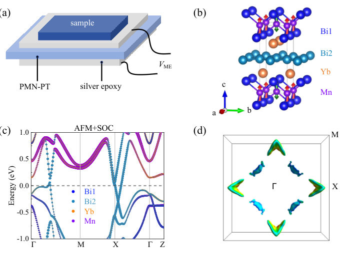 
FIG. 1. (a) Schematic setup of the composite ME method used to measure the ac magnetostrictive coefficient. A sample is mechanically bonded to a PMN-PT single crystal with Ag epoxy. In a magnetic field, the magnetostrictive strain 𝜖𝑖of the sample generates a voltage 𝑉ME across the PMN-PT through the piezoelectric effect. (b) Side view of the crystal structure of YbMnBi2. Arrows on the Mn atoms indicate the magnetic moments in the C-type antiferromagnetic (AFM) structure. (c) and (d) Electronic band structure and Fermi surface of YbMnBi2 calculated with spin–orbit coupling (SOC) included in the absence of spin canting. Dirac-like bands appear near the Fermi level along the Γ– M and Γ– X...

📷 Fig 2

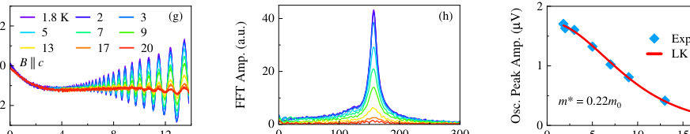 
FIG. 2. Quantum oscillations in magnetization and the ac magnetostrictive coefficient for 𝐵∥𝑐. (a,d) Representative raw magnetization and ME-voltage data, with 𝑉ME ∝𝜕𝜖𝑖/𝜕𝐵. (b,e) FFT spectra of the corresponding oscillatory components. (c,f) LK fits (red lines) to the oscillatory parts plotted versus inverse field 1/𝐵. (g,h) Temperature-dependent oscillations in the ME signal and the corresponding FFT spectra. (i) Fit of the oscillation peak amplitude at a fixed magnetic field of 12.4 T using the LK thermal damping factor (red line), yielding 𝑚∗= 0.22𝑚0.

📷 Fig 3

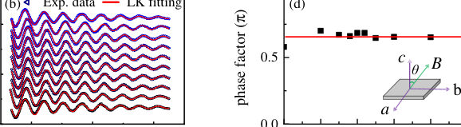 
FIG. 3. Quantum oscillations in the thermopower 𝑆𝑥𝑥for magnetic fields close to the 𝑐axis. (a) 𝑆𝑥𝑥measured at selected angles. (b) The oscillator components (open triangles) of 𝑆𝑥𝑥fitted with the LK formula (red solid line). All curves in (a,b) except the one at −10◦have been vertically offset for clarity. (c,d) Angular dependence of the fitted oscillation frequency and phase, respectively. Red lines are guides to the eye. The inset in (d) illustrates the measurement geometry and the nominal angle 𝜃is defined between the magnetic field and the 𝑐axis.

**Summary.** This work calibrates the phase offset for quantum oscillations measured via the ac magnetostrictive coefficient in the topological antiferromagnet $	ext{YbMnBi}_2$. By directly comparing the oscillation phases from magnetization and magnetostriction, the authors confirm a $\pi/2$ phase shift predicted by thermodynamics. This calibration is crucial for accurately extracting Berry phase information from magnetostrictive measurements.

**Why it may be interesting.** While focused on condensed matter magnetism, the rigorous phase comparison technique is a powerful diagnostic tool for probing fundamental symmetries and topological properties of electronic band structures, which has parallels in understanding quantum phases in other strongly correlated systems.

Detailed structure

**Main problem.** The primary goal is to experimentally calibrate the phase offset associated with quantum oscillations when measured using the ac magnetostrictive coefficient.

**Main result.** The study observed a relative phase shift of approximately $\pi/2$ between the quantum oscillations in magnetization and the ac magnetostrictive coefficient, consistent with the Maxwell relation.

**Method.** The authors measured quantum oscillations in both magnetization and the ac magnetostrictive coefficient on a single crystal of $	ext{YbMnBi}_2$ and compared the resulting phases.

**Model / system.** The system studied is the topological antiferromagnet $	ext{YbMnBi}_2$. Its electronic structure is analyzed using DFT calculations, revealing Dirac-like bands near the Fermi level, which are sensitive to the magnetic ordering.

**Key observables.** Oscillation frequencies (around 160 T), relative phase shift ($\approx \pi/2$), and the temperature dependence of oscillation amplitudes.

**Important parameters / regimes.** Magnetic field up to 14 T, fundamental frequency $F \approx 160$ T, and the relative phase shift $\Delta\varphi \approx \pi/2$.

**Assumptions / limitations.** The analysis relies on the validity of the Maxwell relation linking the magnetostrictive coefficient to the stress derivative of magnetization, and the use of the leading-phase approximation for theoretical derivations.

**Figures summary.** Figures illustrate the composite magnetoelectric setup, the crystal structure, and the calculated electronic band structure/Fermi surface of $	ext{YbMnBi}_2$.

**Paper structure.** The paper establishes the theoretical framework using the Lifshitz-Kosevich theory and Maxwell relations, details the experimental setup using the composite ME method, presents comparative measurements of oscillations in M and $\epsilon$, and concludes by using the phase comparison to calibrate the required phase offset.

Abstract

The Berry phase accumulated along a cyclotron orbit encodes important information about electronic band topology and is commonly inferred from the phase of quantum oscillations. Measurements of the ac magnetostrictive coefficient have recently emerged as a sensitive thermodynamic probe of quantum oscillations, but the phase offset has not been experimentally calibrated. Here, using the topological antiferromagnet YbMnBi$_2$, we calibrate this offset by directly comparing quantum oscillations in magnetization with those in the ac magnetostrictive coefficient. Measurements of both responses on the same single crystal reveal a single fundamental frequency of approximately 160 T in fields up to 14 T, enabling a direct phase comparison free from ambiguities associated with multiple frequencies. We observe an approximately $π/2$ relative phase shift between the two oscillatory responses, consistent with the Maxwell relation linking the magnetostrictive coefficient to the stress derivative of magnetization. Our results establish the appropriate phase needed to extract cyclotron-orbit phase information from quantum oscillations in the ac magnetostrictive coefficient.

[↑ back to top](#top)

### [Asymptotically optimal purification of noisy unitary channels in any dimension](http://arxiv.org/abs/2608.26061v1)

**Authors:** Ryotaro Niwa, Satoshi Yoshida, Mio Murao  
**Type:** theory · **Category:** quantum information and computing · **PDF:** <https://arxiv.org/pdf/2608.26061v1>  
**Analysis basis:** full PDF text, analyzed in chunks
**Topic relevance:** `quantum measurements` **2/5**

📷 Fig 1

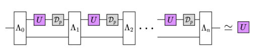 
FIG. 1. A quantum superchannel Ξ implementing noisy uni- tary purification. Quantum channels Λi, (i = 0, 1, · · · n) are inserted between the noisy unitary channel NU,p to produce an approximation of a single use of U.

📷 Fig 2

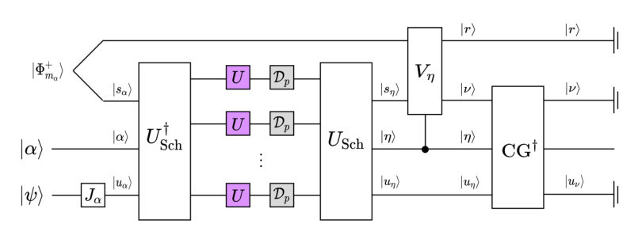 
FIG. 2. In the above figure, Jα is the basis transformation implementing the isomorphism Cd ≃Uα, USch denotes the quantum Schur transform [49–51], |Φ+ mα⟩:= 1 √mα Pmα sα=1 |sα⟩Sα ⊗|sα →ˆλ⟩E is a maximally entangled state between the Specht module Sα and the environment, Vη is an isometry, and CG denotes the Clebsch-Gordan transformation. See Appendix for details.

**Summary.** This theoretical paper determines the fundamental limits for purifying unknown unitary quantum channels corrupted by noise. It establishes that the optimal strategy achieves a query complexity scaling of $\Theta(d^2 p / \epsilon)$, which is an improvement over prior methods. The work rigorously proves these bounds using advanced mathematical tools from quantum information theory and representation theory.

**Why it may be interesting.** The rigorous derivation of fundamental bounds and the explicit construction of optimal protocols for channel estimation and purification are central to quantum information theory, providing concrete benchmarks for quantum hardware.

Detailed structure

**Main problem.** The paper addresses the fundamental limits on purifying an unknown unitary quantum channel corrupted by depolarizing noise, and analyzes the dual problem of noisy unitary conjugation.

**Main result.** The optimal query complexity for purification is found to be $\Theta(d^2 p / \epsilon)$, achieving a scaling better than naive methods, and the optimal fidelity for purification matches that of conjugation in the low-noise limit.

**Method.** The analysis employs advanced techniques including the Choi matrix formalism, semidefinite programming (SDP) to establish lower bounds, and constructing explicit $\mathrm{SU}(d)$-covariant parallel protocols to saturate these bounds.

**Model / system.** The system involves unknown $d$-dimensional unitary channels ($U \in SU(d)$) subjected to depolarizing noise ($D_p$). The goal is to design a superchannel that reconstructs $U$ from noisy measurements.

**Key observables.** Channel fidelity ($f_{	ext{Choi}}$), first-order infidelity coefficient ($C_{n,d}$), and the query complexity ($\Theta(d^2 p / \epsilon)$).

**Important parameters / regimes.** Noise strength ($p$), dimension ($d$), and number of uses/queries ($n$). The analysis focuses on the low-noise ($p 	o 0$) and large-query ($n 	o \infty$) limits.

**Assumptions / limitations.** The analysis relies on assuming the use of the 'twirled protocol' for universality and utilizes complex algebraic machinery involving Schur transforms and Young's orthogonal representation for deriving bounds.

**Figures summary.** Figures illustrate the structure of the quantum superchannel for purification, the relationship between Young diagrams, and the Stinespring circuit diagram used in the fidelity calculation.

**Paper structure.** The paper establishes the problem formulation, derives fundamental lower bounds using SDP (Theorem 1), constructs an explicit $\mathrm{SU}(d)$-covariant protocol to achieve an upper bound (Theorem 2), and then analyzes the dual problem of noisy unitary conjugation, showing the results coincide.

Abstract

We consider the problem of noisy unitary purification. Given access to an unknown $d$-dimensional unitary channel followed by depolarizing noise of strength $p$, we aim to construct a superchannel that universally purifies the noisy unitary back to the original unknown unitary. We optimize over arbitrary adaptive sequential strategies and analytically derive the optimal fidelity to the leading order in the noise strength and number of channel uses, while also providing a concrete $\mathrm{SU}(d)$-covariant parallel strategy that attains the optimum. Our result implies the query complexity $Θ(d^2p/ε)$ for achieving leading-order infidelity $ε$ in the low-noise regime, which scales better than the naive approach combining optimal state purification and storage-and-retrieval of quantum channels. We also consider the dual problem of noisy unitary conjugation, where the goal is to obtain the best approximation of the complex conjugate of the original unknown unitary from access to noisy queries. We show that the optimal fidelity for this task coincides with that of noisy unitary purification to the leading-order in the low-noise and large-query limit.

[↑ back to top](#top)

### [Kochen-Specker Configurations from Grids on Dual Quadrics](http://arxiv.org/abs/2608.25008v1)

**Authors:** Giuseppe Favacchio  
**Type:** theory · **Category:** other · **PDF:** <https://arxiv.org/pdf/2608.25008v1>  
**Analysis basis:** full PDF text, analyzed in chunks
**Topic relevance:** `quantum measurements` **2/5**

📷 Fig 1

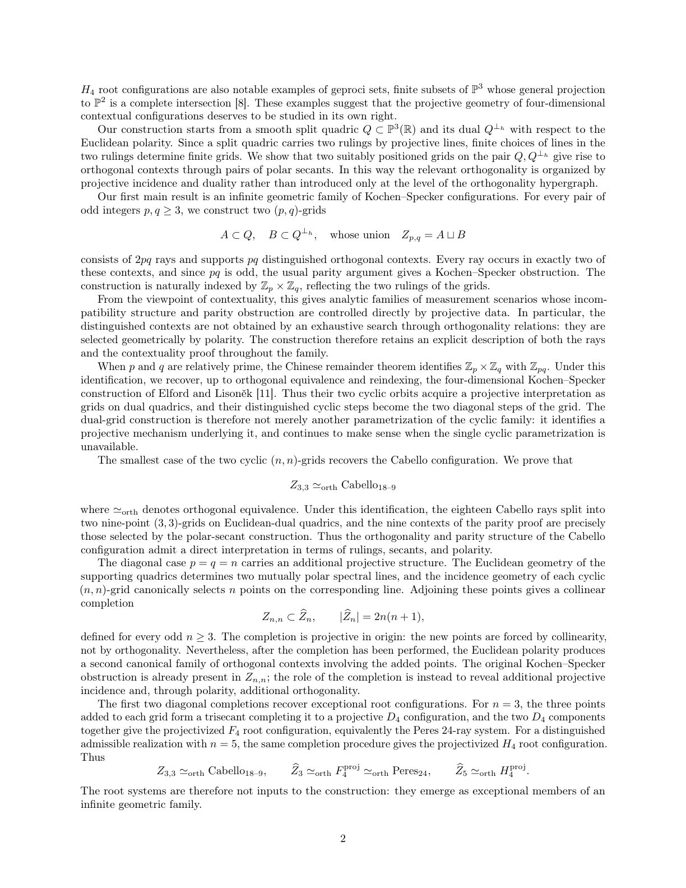 
Low-resolution page preview, page 2

📷 Fig 2

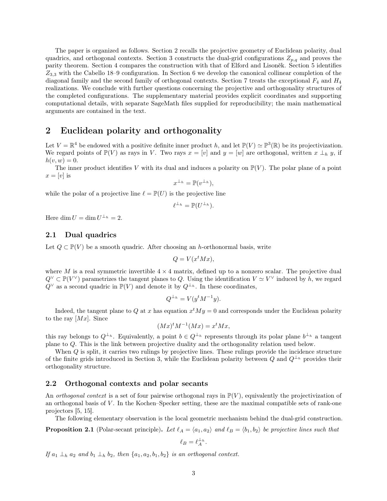 
Low-resolution page preview, page 3

📷 Fig 3

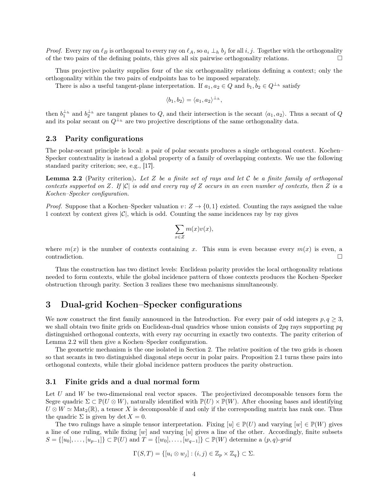 
Low-resolution page preview, page 4

📷 Fig 4

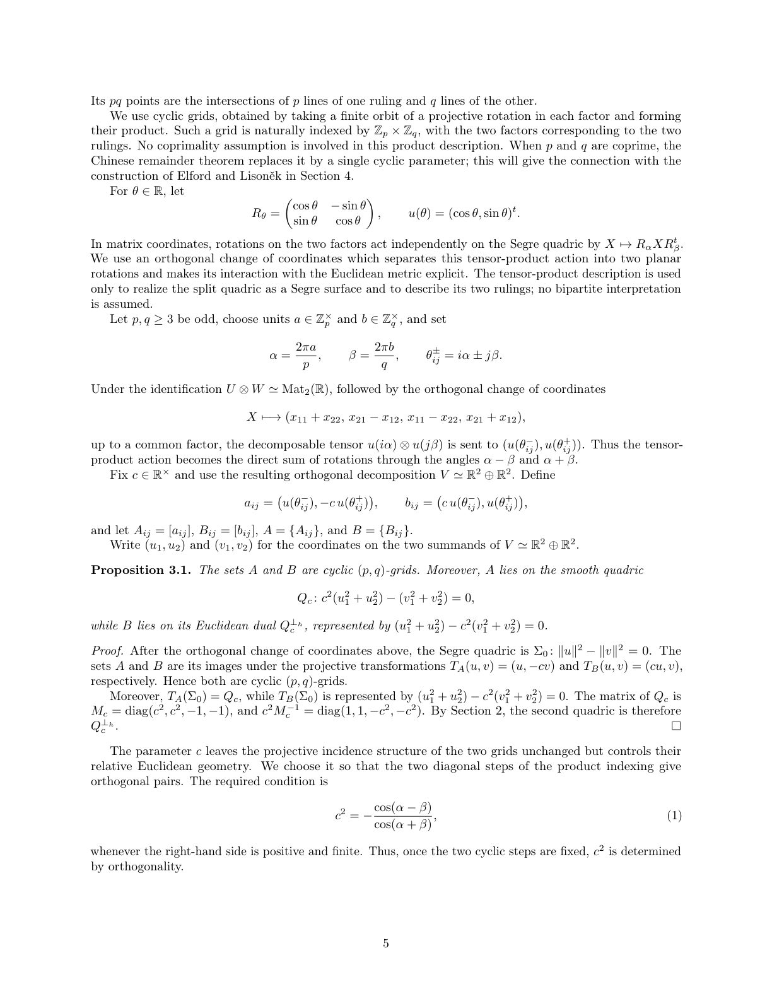 
Low-resolution page preview, page 5

📷 Fig 5

 
Low-resolution page preview, page 6

**Summary.** This paper introduces a novel, unified projective-geometric method using grids on dual quadrics to systematically construct Kochen-Specker configurations. It shows that this single mechanism can generate numerous known examples of quantum contextuality, including those related to $F_4$ and $H_4$. The work provides deep mathematical insight into the structure of quantum contextuality.

**Why it may be interesting.** While highly mathematical, the core subject—quantum contextuality—is fundamental to quantum foundations and has implications for understanding measurement limitations in quantum information theory.

Detailed structure

**Main problem.** The paper develops a systematic geometric framework to construct and organize Kochen-Specker (KS) configurations, which are mathematical realizations of quantum contextuality.

**Main result.** It demonstrates that several prominent contextual configurations (like those related to $F_4$ and $H_4$) arise from a single, unified projective-geometric mechanism involving grids on dual quadrics in $\mathbb{P}^3(\mathbb{R})$.

**Method.** The construction uses finite grids on pairs of smooth quadrics related by Euclidean polarity, employing a 'polar-secant principle' to generate orthogonal measurement contexts.

**Model / system.** The model is quantum contextuality, mathematically represented by sets of rays (vectors) in a Hilbert space that must satisfy specific constraints (contextuality) regardless of the measurement context chosen.

**Key observables.** Orthogonal contexts (sets of four pairwise orthogonal rays), the existence of infinite families of KS configurations, and the recovery of known exceptional root configurations ($F_4, H_4$).

**Important parameters / regimes.** Odd integers $p, q \geq 3$ used to define the grid parameters $Z_{p,q}$.

**Assumptions / limitations.** The construction relies on the properties of Euclidean polarity and the parity criterion for KS configurations; later sections test assumptions about complete intersections in projective space.

**Figures summary.** Not specified in the notes, but the structure involves geometric constructions on quadrics and verification of algebraic relationships.

**Paper structure.** The paper builds from the general geometric framework (quadrics and polarity) to construct an infinite family of configurations ($Z_{p,q}$), then analyzes specific cases (Cabello, $F_4, H_4$), and finally verifies advanced structural properties using computational algebra (e.g., checking for complete intersections).

Abstract

We develop a geometric framework for constructing and organizing Kochen--Specker configurations in real four-dimensional space. The construction uses finite grids on pairs of smooth quadrics related by Euclidean polarity. Their incidence geometry directly produces orthogonal measurement contexts and parity proofs of quantum contextuality, yielding infinite families of configurations and a geometric interpretation and extension of a previously known cyclic construction. For a distinguished subfamily, the same geometry admits a canonical completion determined by secant lines. The first two instances of this completion recover the exceptional root configurations of types $F_4$ and $H_4$, while the smallest case also recovers the Cabello configuration and its embedding in the Peres configuration. Thus several prominent four-dimensional contextual configurations, previously obtained from different constructions, arise from a single projective-geometric mechanism.

[↑ back to top](#top)

### [$(k,n)$-core percolation on hypergraphs with anchor nodes](http://arxiv.org/abs/2608.25560v1)

**Authors:** Hoseung Jang, Byungjoon Min, Ginestra Bianconi  
**Type:** theory · **Category:** statistical mechanics · **PDF:** <https://arxiv.org/pdf/2608.25560v1>  
**Analysis basis:** full PDF text, analyzed in chunks
**Topic relevance:** `analog quantum simulation` **1/5** · `driven-dissipative phase transition` **1/5** · `non-equilibrium universality` **1/5**

📷 Fig 1

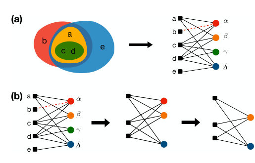 
FIG. 1. (a) Schematic illustration of the mapping between a hypergraph and its corresponding factor network. (b) An example of (k, n) = (2, 3)-core first-neighbor pruning. The nodes b and e are removed because they have fewer than 2 hyperedges and the hyperedge γ is removed because it has fewer than 3 nodes. In addition, the hyperedge α is further removed due to the removed anchor node b, even though it has three active nodes.

📷 Fig 2

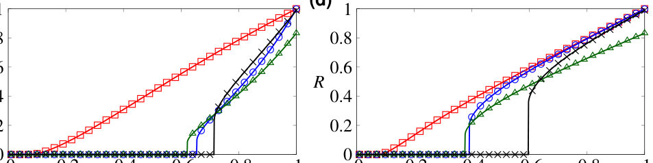 
FIG. 2. The size S and R as a function of (a,b) pN with pH = 1 and (c,d) pH with pN = 1 for various core thresholds (k, n) and the anchor density θ. The numerical results (symbols) for N = 105 and the analytical predictions (lines) are shown together. All hypergraphs have Poisson degree and cardinality distributions given by Eqs. (13) and (14) with ⟨q⟩= 7.6 and ⟨m⟩= 3.8.

📷 Fig 3

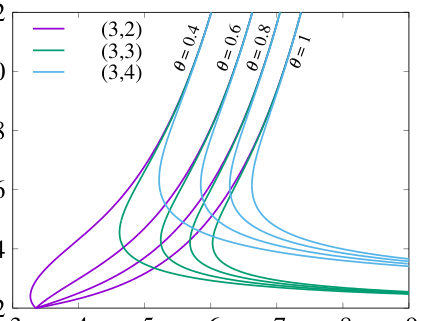 
FIG. 3. Phase diagram of (k, n)-core percolation with anchor nodes on random Poisson hypergraphs in the ⟨q⟩-⟨m⟩plane. Here, pN = pH = 1. The dashed lines and the solid lines denote continuous transitions and discontinuous transitions, respectively.

📷 Fig 4

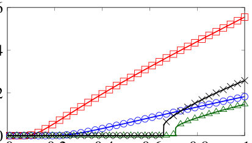 
FIG. 4. (a) The size R as a function of pN for the second- neighbor node pruning with pH = 1. The dashed lines cor- respond to R of the first-neighbor pruning. (b,c) The size S and R as a function of pH for the second-neighbor hyperedge pruning with pN = 0.6. The numerical results (symbols) for N = 105 and the analytical predictions (lines) are shown to- gether for various core thresholds (k, n) and anchor density θ. All hypergraphs have Poisson degree and cardinality dis- tributions given by Eqs. (13) and (14) with ⟨q⟩= 7.6 and ⟨m⟩= 3.8.

📷 Fig 5

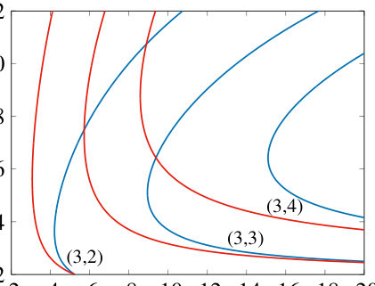 
FIG. 5. Phase diagram of second-neighbor hyperedge (k, n)- core percolation with anchor nodes on random Poisson hyper- graphs in the ⟨q⟩-⟨m⟩plane. Here, pN = 0.8 and pH = 1. The dashed lines and the solid lines denote continuous transitions and discontinuous transitions, respectively.

**Summary.** This paper develops a theoretical framework for analyzing percolation on hypergraphs where nodes have distinct functional roles (anchors vs. non-anchors). By deriving self-consistency equations, the authors map out the phase diagram governing the existence of a giant core, showing that node heterogeneity can fundamentally change the transition from gradual to catastrophic collapse.

**Why it may be interesting.** While focused on classical network theory, the study of critical transitions, phase diagrams, and structural robustness in complex systems shares mathematical parallels with phase transitions studied in quantum many-body systems.

Detailed structure

**Main problem.** To develop a comprehensive theoretical framework for $(k,n)$-core percolation models on hypergraphs that accounts for functional heterogeneity in node roles.

**Main result.** The study derives self-consistency equations for first- and second-neighbor pruning processes, revealing how node heterogeneity and extended interactions affect network robustness, leading to phase diagrams with continuous and discontinuous transitions.

**Method.** The authors use the cavity approach to derive self-consistency equations for the percolation process, comparing analytical predictions with numerical simulations on random hypergraphs.

**Model / system.** The model is based on hypergraphs $H = (V, E)$, where nodes can be designated as 'anchor nodes' with probability $	heta$. The core structure is defined by simultaneous constraints: a node must belong to at least $k$ active hyperedges, and a hyperedge must retain at least $n$ active nodes.

**Key observables.** The size of the giant $(k, n)$-core, and the nature of the phase transition (continuous vs. discontinuous).

**Important parameters / regimes.** Anchor probability ($	heta$), minimum node degree ($k$), minimum hyperedge size ($n$), and the connectivity range (first-neighbor vs. second-neighbor).

**Assumptions / limitations.** Nodes independently become anchor nodes with probability $	heta$. The analysis covers first-neighbor and second-neighbor pruning processes.

**Figures summary.** Figures illustrate phase diagrams in the $\langle q 
angle-\langle m 
angle$ plane, showing phase boundaries separating percolating/non-percolating regimes for second-neighbor pruning.

**Paper structure.** The paper introduces the model, derives self-consistency equations for first-neighbor and second-neighbor pruning, analyzes limiting cases ($	heta=0, 	heta=1$), and concludes by discussing the implications of functional heterogeneity on network robustness.

Abstract

Hypergraphs describe higher-order interactions that involve more than a pair of nodes. A characteristic feature of hypergraphs is that their robustness can be strongly affected by the different roles of the nodes. Indeed, some nodes might be essential for a hyperedge's function, while others might not be. The loss of a single essential node completely destroys the hyperedge it belongs to, while the loss of a non-essential node has a buffering effect, inducing the hyperedge to simply reduce its size. In order to capture this phenomenology, we formulate a comprehensive theoretical framework for $(k,n)$-core percolation models on hypergraphs, where each node of a hyperedge is an anchor with probability $θ$, and a hyperedge fails if an anchor node fails. Hypergraph $(k,n)$-core percolation problems can be classified as first-neighbor and second-neighbor problems, indicating that in the pruning process the connectivity is ensured only by the state of the first neighbors or the second neighbors, respectively. We derive self-consistency equations for first-neighbor and second-neighbor (node- and hyperedge-based) pruning processes, and obtain the size of the giant $(k,n)$-core. We obtain the phase diagram, including continuous and discontinuous transitions, and confirm our theory on random hypergraphs using numerical simulations. The results show how the heterogeneity of the nodes' functional roles and the extended range of the interactions affect the robustness of higher-order networks.

[↑ back to top](#top)

### [Multicomponent Magnetic Domain Walls in Rhombohedral Graphene](http://arxiv.org/abs/2608.26104v1)

**Authors:** Mainak Das, Nemin Wei, Chunli Huang  
**Type:** theory · **Category:** strongly correlated electrons · **PDF:** <https://arxiv.org/pdf/2608.26104v1>  
**Analysis basis:** full PDF text, analyzed in chunks
**Topic relevance:** `Keldysh / 2PI / non-Gaussian methods` **1/5** · `analog quantum simulation` **1/5** · `quantum measurements` **1/5**

📷 Fig 1

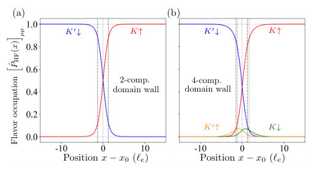 
Figure 1. Two- and four-component domain walls in the valley- imbalanced quarter metal, determined by the competition between spin-orbit coupling 𝜆soc and intervalley Hund’s coupling 𝑔⊥|𝑛𝑒|. In (a), 𝜆soc ≫𝑔⊥|𝑛𝑒| the magnetic texture only has two flavors, whereas in (b), 𝜆soc ≪𝑔⊥|𝑛𝑒| allows all four flavors to participate inside the wall. The curves show the diagonal component of the local spin- valley order parameter [ ˆ𝑃HF(𝑥)]𝜇𝜇.

📷 Fig 2

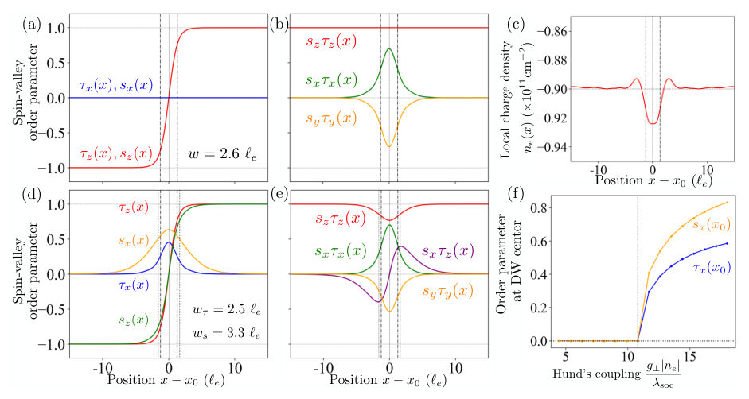 
Figure 2. Self-consistent HF solutions of the two-component and the four-component spin–valley domain walls. (a–c) Results for the two- component domain wall at 𝑔⊥= 0 centered at 𝑥= 𝑥0. (a,b) Local Spin–valley texture shows that the spin and valley polarizations reverse simultaneously while remaining locked throughout the domain wall, giving rise to 𝑠𝑧𝜏𝑧(𝑥) = 1 throughout the space. The characteristic length scale is the average hole spacing, ℓ𝑒= 1/ √︁

📷 Fig 3

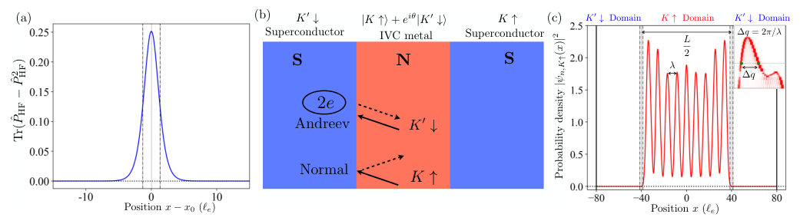 
Figure 3. (a) Deviation of the microscopic HF spin–valley projector from the pure-state condition, quantified by Tr( ˆ𝑃HF −ˆ𝑃2 HF). A finite value near the domain-wall center demonstrates that the local spin–valley density matrix is mixed, in contrast to the pure projector assumed in the 𝐶𝑃3 theory. (b) Schematic of spin–valley-selective scattering across an 𝑆|𝑁|𝑆junction, where time-reversal-related chiral superconductors are separated by an intervalley-coherent(IVC) normal-metal, ∝|𝐾↑⟩+ 𝑒𝑖𝜃|𝐾′ ↓⟩. The IVC region coherently mixes the two valley flavors, enabling normal reflection and intervalley-assisted Andreev conversion. (c) Probability density |𝜓𝑛,𝐾↑(𝑥)|2 of a representative Bloch...

**Summary.** This theoretical work explores novel magnetic domain walls in rhombohedral graphene, which possess both spin and valley degrees of freedom. By modeling the system using Hartree-Fock theory, the authors identify two distinct wall types whose existence depends on the competition between Hund coupling and SOC. Crucially, they show that the dynamics of these textures can couple to superconducting transport, suggesting potential signatures for quantum electronic devices.

**Why it may be interesting.** The coupling of magnetic texture dynamics to superconducting transport (generating a voltage) provides a mechanism for reading out complex quantum states using superconducting junctions, which is highly relevant for quantum device physics.

Detailed structure

**Main problem.** The study investigates the emergence of qualitatively new spatial magnetic textures, specifically domain walls, in rhombohedral graphene due to the interplay of spin and valley degrees of freedom.

**Main result.** The research uncovers two distinct classes of domain walls—a two-component and an intrinsically multicomponent (four-component) wall—whose existence is controlled by the competition between intervalley Hund's coupling and spin-orbit coupling.

**Method.** The study employs a microscopic approach using the self-consistent Hartree–Fock (HF) Hamiltonian, supplemented by continuum $CP^3$ theory for analysis.

**Model / system.** The physical system is rhombohedral multilayer graphene, analyzed in the valley-imbalanced quarter-metal phase. The model incorporates spin-valley-momentum (SWMc) band structure, intrinsic SOC, and Hund's exchange interactions.

**Key observables.** Local charge density, spin-valley order parameters ($\langle s_i \omega_j 
angle$), and the superconducting phase difference coupling to the texture's internal phase.

**Important parameters / regimes.** The ratio between intervalley Hund's coupling ($g_{\perp}|n_e|$) and spin-orbit coupling ($\lambda_{soc}$), which dictates the transition between the two wall types.

**Assumptions / limitations.** The analysis relies on the HF approximation and, when using continuum theory, assumes a uniform local carrier density and a rank-one projector for the order parameter.

**Figures summary.** Figures illustrate the spatial profiles of order parameters for both two-component and four-component walls, demonstrating the continuous development of transverse spin and valley coherence above a critical coupling ratio.

**Paper structure.** The paper progresses from establishing the physical problem in rhombohedral graphene, detailing the microscopic HF calculations, characterizing the two distinct domain wall regimes based on coupling strengths, and finally exploring the coupling of these textures to superconducting transport.

Abstract

Spatial textures of magnetic order, such as domain walls and skyrmions, are fundamental objects in magnetism. In rhombohedral multilayer graphene, magnetic order involves spin and valley degrees of freedom, opening the possibility of qualitatively new spatial textures. Here, we explore this possibility through a microscopic study of a one-dimensional domain wall in the valley-imbalanced quarter-metal phase of rhombohedral graphene. We uncover two different classes of domain walls. One resembles a conventional magnetic domain wall, locally rotating between the two bulk states, whereas the other is intrinsically multicomponent and explores states that are not occupied in either bulk domain. Which texture is realized is controlled by the competition between intervalley Hund's coupling and spin-orbit coupling, and we identify experimental signatures to distinguish them. We further show that, in a superconducting junction formed across the wall, the superconducting phase difference couples directly to the intervalley-coherent phase of the texture. Precession of this internal phase can therefore generate a voltage across the junction. Our theory shows that rhombohedral graphene indeed has magnetic textures beyond conventional magnet and that their dynamics can couple to superconducting transport.

[↑ back to top](#top)

### [Parity Anomaly as Modular Commutator with Massless Dirac Fermion](http://arxiv.org/abs/2608.26078v1)

**Authors:** Meng Zeng  
**Type:** theory · **Category:** other · **PDF:** <https://arxiv.org/pdf/2608.26078v1>  
**Analysis basis:** full PDF text, analyzed in chunks
**Topic relevance:** `analog quantum simulation` **1/5** · `quantum measurements` **1/5**

📷 Fig 1

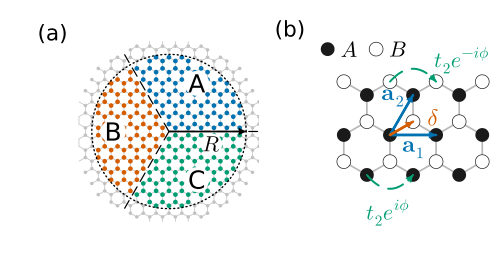 
FIG. 1: Setup. (a) Tripartition used in this work: three 120◦regions A, B, C of a disk with radius R, meeting at a plaquette center. (b) Conventions on the Haldane hon- eycomb model: the two sublattices, the Bravais vectors a1 = (1, 0) and a2 = (1, √

📷 Fig 2

 
FIG. 2: Transition between the C = 0 and C = 1 phases. M = −0.6 is used for the gapped case. (a) Schematic spectrum at the transition, with one gapless node and one gapped node. (b) Entanglement entropy of a disk of radius R. Both states follow the area law. (c) MC for the tripartition of Fig. 1(a). The gapped state returns the Chern number, whereas the critical point converges to 0.5. (d) Correction of MC decays as power law in system size.

📷 Fig 3

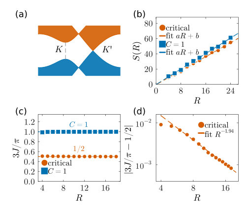 
Fig. 2(c) plots the measured MC in different cases. The non-trivial gapped case simply gives the Chern number, which in this case is just the CCC c−, agreeing with

📷 Fig 4

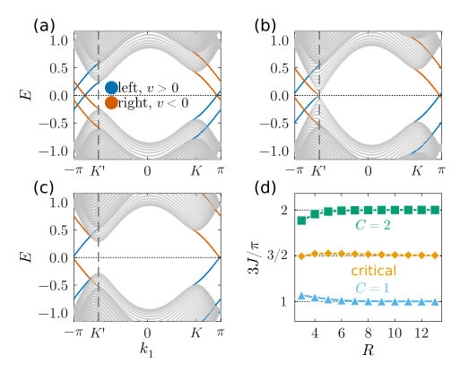 
FIG. 3: Chiral edge mode coexisting with a bulk Dirac node, Eq. (7), at tc = 0.3 and M1 = 0. (a)-(c) Cylin- der spectra (periodic along a1). Grey marks bulk states; colored points are edge modes (the higher the color inten- sity, the more localized to the edge) , blue for left-moving (v &gt; 0) and orange for right-moving (v &lt; 0). The dashed line is the projection of K′. (a) C = 2: two pairs of co- propagating chiral edge modes. (b) At M2 = M c 2 the bulk closes, where one pair of edge modes delocalize into the bulk and the other pair remains robust. (c) C = 1: one pair of edge modes. (d) 3J/π versus R for the three cases in (a)-(c): converges to 2, 3/2, and 1, respectively.

📷 Fig 5

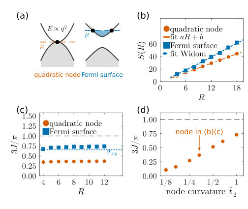 
FIG. 4: (a) Schematic figures for quadratic node (left) and finite Fermi surface with µ = 0.75 (right). (b) En- tanglement scaling: Quadratic node still satisfies the area law, whereas the FS follows the Widom scaling [19]. (c) The MC: both cases seem to converge in the thermody- namic limit, but we note that the quadratic node case dif- fers significantly from 1 = (C+ + C−)/2, and the FS case differs from the Berry curvature σxy (dotted line) [39]. (d) Curvature dependence of the MC for a quadratic node.

**Summary.** This work extends the concept of the modular commutator, originally used to measure the chiral central charge in gapped topological phases, to gapless systems. The key finding is that at a Dirac node, the commutator yields a robust half-quantized value, which the authors interpret as the entanglement signature of the parity anomaly. This provides a novel, information-theoretic measurement tool for topological properties.

**Why it may be interesting.** The connection drawn between entanglement measures (modular commutator) and fundamental topological invariants (parity anomaly, Chern number) provides a powerful, information-theoretic tool for characterizing topological phases, which is highly relevant to modern condensed matter theory.

Detailed structure

**Main problem.** The paper investigates what the modular commutator measures when the 2D bulk state transitions from a gapped phase to a gapless phase, generalizing its utility beyond gapped systems.

**Main result.** For a single Dirac node, the modular commutator exhibits a robust half-quantized value, which is proposed to be the entanglement manifestation of the parity anomaly. This quantization is lost in other types of gaplessness like Fermi surfaces.

**Method.** The analysis uses the modular commutator $J(A,B,C)$ formalism, comparing its behavior in gapped versus gapless regimes, and employing symmetry arguments and correlation function analysis.

**Model / system.** The primary model is the free-fermion Haldane honeycomb model, studied at its critical point hosting an isolated Dirac node. The analysis also considers systems with chiral edge modes and compares results to quadratic nodes and Fermi surfaces.

**Key observables.** Modular Commutator ($J$), Chiral Central Charge ($c^-$), Half-quantized value (1/2), Hall conductance ($\sigma_{xy}$), and Conditional Mutual Information ($	ext{CMI}$).

**Important parameters / regimes.** Dirac velocity, Dirac cone anisotropy, system size (for finite-size corrections), and energy cutoff ($\Lambda$).

**Assumptions / limitations.** The analysis relies on the free-fermion approximation and assumes that the half-quantization is robust against tripartition deformation for the Dirac node case.

**Figures summary.** Figures illustrate the setup using the Haldane model, showing the MC converging to 0.5 at the critical point, and comparing entanglement scaling for different gapless systems.

**Paper structure.** The paper progresses from the gapped case where $J$ measures $c^-$, to the gapless Dirac node case where $J$ is half-quantized, and finally generalizes the analysis by comparing this behavior to other gapless scenarios and relating it to the parity anomaly.

Abstract

The modular commutator $J(A,B,C) = i\langle[K_{AB},K_{BC}]\rangle$ extracts the chiral central charge $c_-$ from a single bulk wavefunction of a \emph{gapped} 2d state, where $3J/π=c_-$. Inspired by the recent developments in the field of gapless symmetry-protected topological phases, we ask: what does the modular commutator measure, if it is well-defined at all, when the 2d bulk becomes \textit{gapless}? Several interesting new insights can already be obtained using the simple Haldane honeycomb model. For the critical point hosting an isolated Dirac node we find that $J$ remains sharp: it converges to a \textit{half-quantized} value, with corrections that decay as a power law in the subsystem size rather than exponentially, mirroring the power-law correlations in gapless systems. We prove the half-quantization using an emergent reflection symmetry of the massless Dirac cone, and show that the half-quantized contribution comes from the other gapped cone (the massive partner of the massless one). This massive partner can be interpreted as the physical incarnation of the Pauli-Villars regulator, which is the origin of the parity-breaking level-$\frac{1}{2}$ Chern-Simons term (with half-quantized Hall conductance) and the parity anomaly. When protected chiral edge modes coexist with a bulk Dirac node we obtain $3J/π= c_-+\frac{1}{2}$. The half-quantization is also shown to be robust against tripartition deformation, tuning Dirac velocity and Dirac cone anisotropy. We further investigate other types of gaplessness---quadratic nodes (in contrast to linear Dirac) and the case with Fermi surface---and show that the robust half-quantization of $J$ is lost in such non-Dirac cases. These results generalize the modular commutator beyond gapped phases, and at the same time provide an information-theoretic measurement of the parity anomaly.

[↑ back to top](#top)

### [Surpassing Gaussian optimality in multiparameter estimation with indefinite causal order](http://arxiv.org/abs/2608.25870v1)

**Authors:** Sudipta Das, Rivu Gupta, Aditi Sen De, Himadri Shekhar Dhar  
**Type:** theory · **Category:** other · **PDF:** <https://arxiv.org/pdf/2608.25870v1>  
**Analysis basis:** full PDF text, analyzed in chunks
**Topic relevance:** `quantum measurements` **1/5** · `quantum optics experiment` **1/5**

📷 Fig 1

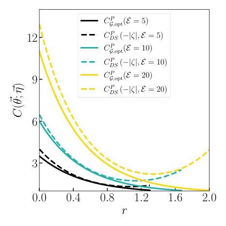 
FIG. 1: SLD-CRB for single-mode pure Gaussian states em- ployed in multiparameter estimation. The SLD-CRB, C(⃗θ;⃗η) (ordinate), is shown against the encoding squeezing strength, r (abscissa), for the optimal Gaussian probe state, CP G,opt (solid line), and the displaced-squeezed state with momen- tum squeezing, CDS(−ζ) (dashed line). We consider probes of different energy, E P = 5 (dark black), E P = 10 (light blue), and E P = 20 (very light yellow). The displaced- squeezed probe parameters for the different energies are given as {βx = 0.1, βp = 2}E P=5, {βx = 0.2, βp = 3}E P=10, and {βx = 0.3, βp = 4}E P=20, where in each case, the momentum-squeezing strength is calculated according to ζ =...

📷 Fig 2

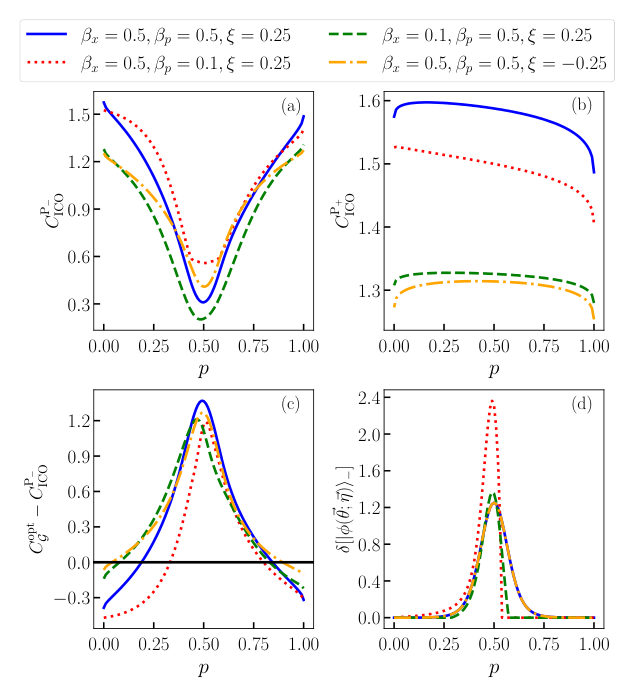 
FIG. 2: SLD-CRB for probes prepared through ICO. (a) CP− ICO (ordinate) is shown against the ICO parameter, p (abscissa), for

📷 Fig 3

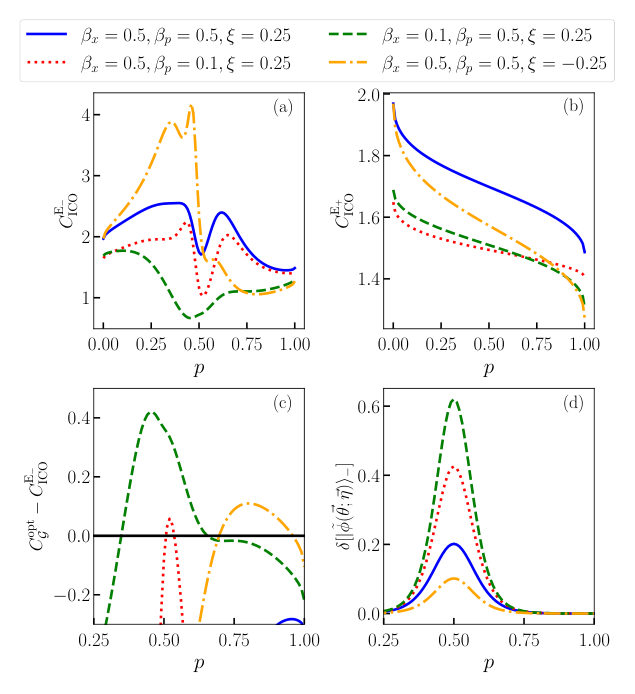 
FIG. 3: SLD-CRB for displaced-squeezed probes after ICO encoding. (a) The SLD-CRB for the displaced-squeezed probe when considering the odd superposition of ICO encoding, CE− ICO (ordinate), is shown against the ICO parameter, p (abscissa).

**Summary.** This work investigates enhancing quantum parameter estimation in continuous-variable systems by analyzing optimal probe states for estimating displacement and squeezing. The authors demonstrate that while Gaussian probes are optimal under standard assumptions, incorporating indefinite causal order (ICO) allows for surpassing the Gaussian precision limit. This highlights ICO as a novel, independent resource for quantum metrology.

**Why it may be interesting.** It directly tackles fundamental limits in quantum sensing, showing how non-standard resources like ICO can enhance metrological performance beyond what is achievable with simple Gaussian states.

Detailed structure

**Main problem.** The paper aims to improve the precision of simultaneous multiparameter estimation (displacement and squeezing) in continuous-variable quantum systems beyond the standard Gaussian optimality limits.

**Main result.** Introducing indefinite causal order (ICO) in the protocol can surpass the Gaussian precision bound, and this advantage is shown to be independent of non-Gaussianity.

**Method.** The analysis uses quantum metrology frameworks, calculating bounds via the Quantum Fisher Information Matrix (QFIM) and comparing the standard SLD-CRB against the Holevo-Cramér-Rao bound (HCRB).

**Model / system.** The system involves single-mode Gaussian probes generated by displacement and squeezing operations on the vacuum state, analyzed in the context of continuous-variable quantum systems.

**Key observables.** Estimation precision (quantified by the CRB) for displacement ($\alpha$) and squeezing ($r$) parameters.

**Important parameters / regimes.** Probe energy ($E_P$), squeezing strength ($\zeta$), and the parameters defining the unknown transformations ($\alpha, r$).

**Assumptions / limitations.** The analysis compares the SLD-CRB to the HCRB, and the optimal Gaussian probe state is found to be agnostic to the operation ordering.

**Figures summary.** Figure 1 compares the SLD-CRB versus encoding squeezing strength ($r$) for different probe energies, showing the optimal Gaussian bound ($C_{G,opt}$) and the displaced-squeezed bound ($C_{DS}$).

**Paper structure.** The paper analyzes Gaussian probe optimality first, followed by dedicated sections studying the introduction of ICO in probe preparation and ICO in parameter encoding.

Abstract

We identify single-mode Gaussian probes, generated by displacement and squeezing operations on the vacuum state, which are optimal for the simultaneous estimation of displacement and squeezing operations in continuous-variable quantum systems. Importantly, our results reveal that the best precision at a fixed energy is achieved not by an experimentally costly squeezing resource, but rather by redirecting some of the energy towards displacement, thus allowing for more resource-effective operations. Furthermore, introducing indefinite causal order (ICO) in either the probe preparation or parameter encoding step can surpass the Gaussian precision bound, even though the optimal Gaussian probe state is agnostic to the ordering of the operations. Specifically, we observe that odd-parity superpositions of the two definite orders can enhance precision over optimal Gaussian probes in specific parameter regimes. Further, the observed advantage cannot be attributed solely to non-Gaussianity, as quantified by the relative entropy of non-Gaussianity, highlighting ICO as an independent resource for enhancing multiparameter estimation.

[↑ back to top](#top)

### [Computing key rates for one-sided device-independent quantum key distribution](http://arxiv.org/abs/2608.25915v1)

**Authors:** Andreas Bluhm, Gereon Koßmann, Martin Sandfuchs, René Schwonnek, Giuseppe Viola, Ramona Wolf  
**Type:** theory · **Category:** quantum information and computing · **PDF:** <https://arxiv.org/pdf/2608.25915v1>  
**Analysis basis:** full PDF text, analyzed in chunks
**Topic relevance:** `quantum measurements` **1/5**

📷 Fig 1

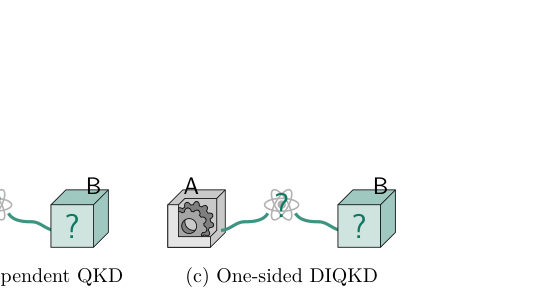 
Figure 1: Different levels of device characterisation in QKD protocols. Device-dependent QKD (a) assumes fully characterised measurement devices for both parties A and B, whereas DIQKD (b) requires no assumptions about the devices and relies only on observed correlations. One-sided DIQKD (c) represents an intermediate scenario, where one measurement device is characterised while the other is treated as a black box.

📷 Fig 2

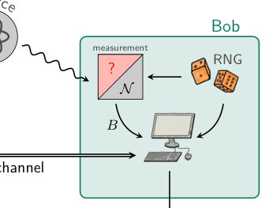 
Figure 2: Setup for one-sided DIQKD. An untrusted source distributes a quantum state to Alice and Bob, who perform local measurements and exchange classical information I. One measurement device is treated as a black box, indicated by the question mark, while the other is fully characterised, denoted by M or N for Alice or Bob, respectively. Throughout this work, Alice generates the raw key S. The choice of which party’s measurement device is characterised is part of the protocol specification.

📷 Fig 3

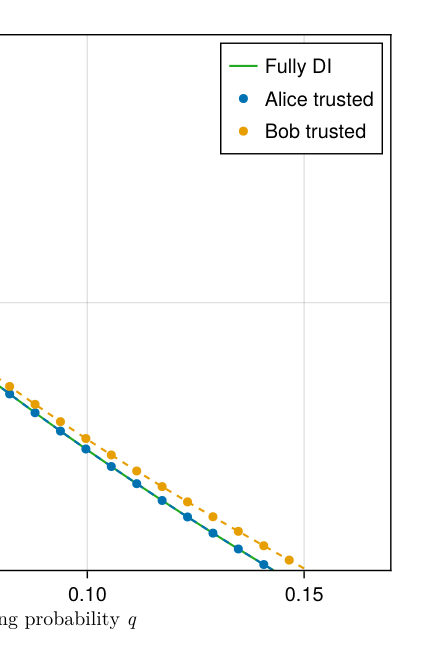 
Figure 3: Plot of the asymptotic key rate as a function of the depolarizing probability q. Shown are the cases when Bob is trusted (and Alice is not), the case when Alice is trusted (and Bob is not), and when neither party is trusted (fully device-independent). In all cases, the key is extracted from Alice’s measurement results.

📷 Fig 4

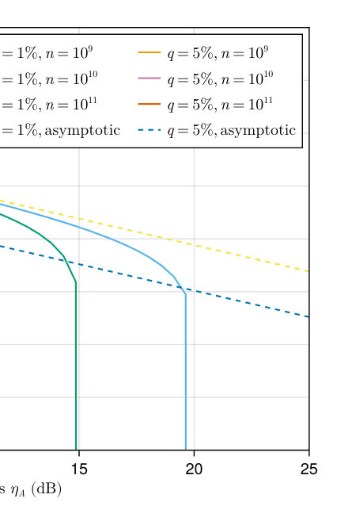 
Figure 4: Key rates for the one-sided device-independent BB84 protocol with trusted Alice as a function of Alice’s detection efficiency ηA for different values of the depolarizing probability q and the number of rounds n. Bob’s detection efficiency is fixed at ηB = 0.8 and he assigns non-detection events to the outcome b = 0. The testing probability is fixed at γ = 0.1. The soundness parameter is set to εsnd = 10−12 and the completeness parameter is set to εcomp = 0.01.

📷 Fig 5

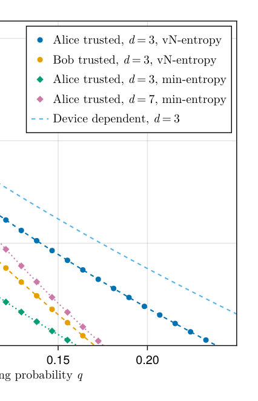 
Figure 5: Key rates for the one-sided DIQKD protocol based on d + 1 mutually unbiased bases in d-dimensional Hilbert spaces. We compare bounds derived via the von Neumann entropy with bounds based on the min-entropy. The former are calculated using our method based on the KS objective function and the NPA-MP hierarchy, whereas for the latter we used the SDP relaxation of the min- entropy from [MGG+26]. We observe that even in dimension d = 3, the von Neumann entropy provides better noise tolerance than the min-entropy at d = 7.

**Summary.** This work provides a comprehensive mathematical toolbox for calculating key rates in one-sided device-independent Quantum Key Distribution (DIQKD). By extending the NPA hierarchy and using advanced algebraic techniques, the authors solve the key rate problem as a complex optimization over C*-algebras. The results highlight that the security performance is critically dependent on the asymmetric placement of trust between the two communicating parties.

**Why it may be interesting.** The rigorous mathematical framework developed—linking key rate computation to C*-algebraic optimization—provides powerful, general tools applicable to analyzing security in various quantum communication protocols beyond simple qubit systems.

Detailed structure

**Main problem.** The paper focuses on developing general tools and methods to calculate the achievable secret key rates for one-sided device-independent quantum key distribution (DIQKD).

**Main result.** The key rate calculation is shown to be highly dependent on which party's device is characterized, demonstrating no universal ordering for optimal trust placement.

**Method.** The authors develop extensions of the NPA hierarchy and utilize the Generalized Entropy Accumulation Theorem (GEAT) to formulate the key rate problem as a non-commutative polynomial optimization over C*-algebras.

**Model / system.** The model is the one-sided DIQKD setting, characterized by an asymmetric trust model where one party's device is fully characterized while the other is treated as a black box.

**Key observables.** Achievable secret key rate ($r_\infty$), conditional von Neumann entropy ($H(S|IQE)_
ho - H(S|IB)_
ho$).

**Important parameters / regimes.** The choice of which party (Alice or Bob) is characterized; the size of the key ($n$) for finite-size bounds.

**Assumptions / limitations.** The public information ($I$) must not depend on the memory of the untrusted device; the analysis relies on advanced algebraic structures like C*-algebras and the NPA hierarchy extensions.

**Figures summary.** Figure 1 illustrates different levels of device characterization in QKD (Device-dependent, DIQKD, One-sided DIQKD). Figure 2 shows the setup for one-sided DIQKD, distinguishing between the characterized and black-boxed measurement devices.

**Paper structure.** The paper progresses from defining the one-sided DIQKD setting and the key rate optimization problem (using entropy bounds) to developing advanced mathematical tools. These tools involve extending the NPA hierarchy and establishing rigorous algebraic isomorphisms between the measurement constraints and tensor products of algebras.

Abstract

The defining feature of one-sided device-independent quantum key distribution is its asymmetric trust model in which only one party is characterized. This scenario sets an interesting middle ground between high key rates achievable by characterizing devices and the security of full device-independence. Here, we provide new tools, methods, and benchmarks for calculating key rates in this setting. To achieve this, we develop and compare two extensions of the NPA hierarchy and derive finite-size security bounds against general attacks with arbitrary device memory. The latter is based on the Generalized Entropy Accumulation Theorem. We then investigate the performance of various protocols: the BB84 protocol both with and without losses, a qutrit mutually unbiased bases protocol, and protocols based on Bell inequalties such as CHSH and $I_{3322}$. We find that the choice of which party is characterized can strongly affects the key rate, surprisingly without a universal ordering. Our work thus offers a general toolbox for calculating key rates for one-sided device-independent QKD protocols.

[↑ back to top](#top)

### [Convergence of the conformal Ward identity in the derivative expansion approximation](http://arxiv.org/abs/2608.25103v1)

**Authors:** Jorge Ibañez, Matthieu Tissier, Gonzalo De Polsi  
**Type:** theory · **Category:** statistical mechanics · **PDF:** <https://arxiv.org/pdf/2608.25103v1>  
**Analysis basis:** full PDF text, analyzed in chunks
**Topic relevance:** `Keldysh / 2PI / non-Gaussian methods` **1/5**

📷 Fig 1

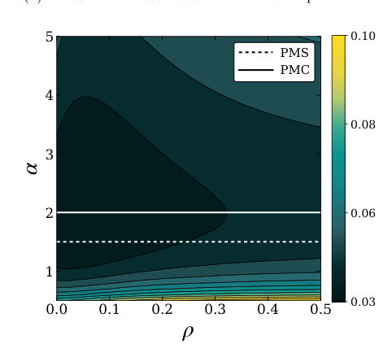 
FIG. 1. Function |f (1,1) 1,∂2 (ρ, α)| corresponding to perturbations associated to critical exponents ν and ω using the exponential regulator given in (6) at order O(∂2) of the DE. Horizontal lines correspond to αPMS (dashed) and αPMC (continuous).

📷 Fig 2

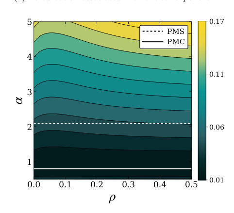 
FIG. 2. Function |f (1,1) 1,∂4 (ρ, α)| corresponding to perturbations associated to critical exponents ν and ω using the exponential regulator given in (6) at order O(∂4) of the DE. Horizontal lines correspond to αPMS (dashed) and αPMC (continuous) whenever available.

📷 Fig 3

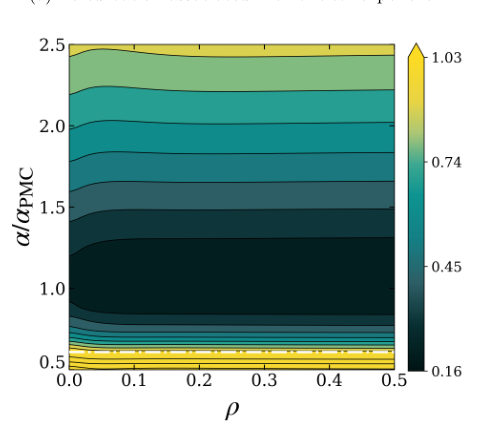 
FIG. 3. Function g(ρ, ¯α) corresponding to perturbations as- sociated with the critical exponents ν and ω, using the expo- nential regulator given in (6). White dot-dashed lines indicate the values of ¯α = α/αPMC for which ∥g(·, ¯α)∥= 1.

📷 Fig 4

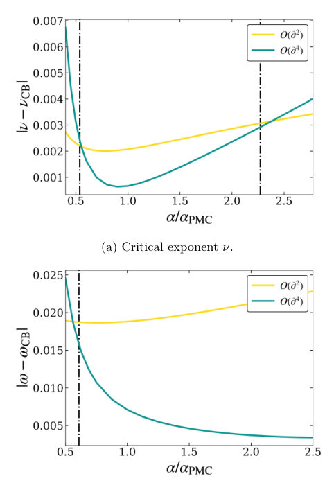 
FIG. 4. Deviations of the critical exponents ν and ω from the reference values νCB and ωCB, respectively, obtained from the conformal bootstrap [12], as functions of α/αPMC, at orders O(∂2) (yellow) and O(∂4) (blue), using the exponential regu- lator given in (6). Black dot-dashed lines mark the values of α/αPMC for which ∥g(·, α)∥= 1.

📷 Fig 5

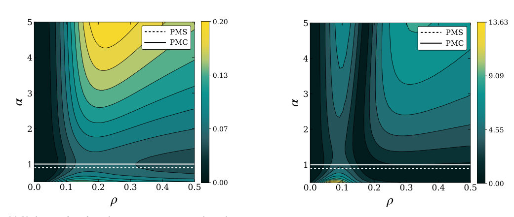 
FIG. 5. Remaining conformal constraints study of function |f (n,1) i,∂4 (ρ, α)| for the operator associated with critical exponent ν using the exponential regulator, Eq. (6).

**Summary.** This theoretical work examines how well the conformal symmetry is preserved when using the derivative expansion approximation within the Functional Renormalization Group for critical systems like the 3-d Ising model. By systematically increasing the order of the approximation up to $O(\partial^4)$, the authors demonstrate that the violation of conformal constraints decreases, strongly suggesting the convergence of the approximation scheme.

**Why it may be interesting.** While focused on critical phenomena, the rigorous study of symmetry restoration and approximation convergence techniques (like PMS/PMC) is highly relevant to understanding effective field theories in complex quantum systems.

Detailed structure

**Main problem.** The paper investigates the convergence of the conformal Ward identity when using the derivative expansion approximation within the functional renormalization group framework.

**Main result.** The analysis shows that increasing the order of the derivative expansion systematically reduces the breaking of conformal invariance, providing evidence for the convergence of this approximation scheme.

**Method.** The study employs the Functional Renormalization Group (FRG) coupled with a Derivative Expansion (DE) approximation, analyzing constraints derived from conformal Ward identities at orders up to $O(\partial^4)$.

**Model / system.** The focus is on the 3-d Ising universality class, modeled via $\phi^4$ theory near its critical point, where conformal invariance is expected.

**Key observables.** Universal critical exponents ($
u, \omega$), the degree of conformal symmetry breaking, and the function $g(
ho, ar{\alpha})$ measuring constraint improvement.

**Important parameters / regimes.** The regulator parameter $\alpha$, the order of the derivative expansion (up to $O(\partial^4)$), and the scale-dependent cutoff $k$.

**Assumptions / limitations.** The primary assumption is that the DE is a systematically improvable approximation, and the analysis relies on specific regulator choices (e.g., exponential or Wetterich regulators).

**Figures summary.** Figures illustrate the improvement of constraints ($g(
ho, ar{\alpha})$) and the reduction of symmetry violations as higher orders of the derivative expansion are included, comparing results to conformal bootstrap values.

**Paper structure.** The paper builds by first establishing the FRG framework and the DE ansatz, then analyzing the conformal constraints at increasing orders, culminating in quantitative comparisons showing the convergence trend.

Abstract

Conformal invariance is expected to be an emergent property of many systems in their critical regime. However, approximation schemes generically spoil this property. This is in particular the case of the derivative expansion, a widely used approximation scheme in the framework of the functional renormalization group. In this article, we consider Ward identities associated with conformal invariance in the 3-d Ising universality class with truncations at order 4 (next-to-next-to-leading order) in the derivative expansion, with $Z_2$ invariant composite operators. Our results confirm that the regulating functions which yield a small breaking of conformal invariance also present a small sensitivity of the universal critical exponents with the choice of this regulating function. We also show that, in the vicinity of regulator-parameter values for which the conformal constraints are best satisfied, the breaking of conformal invariance reduces as the order of the derivative expansion is increased, providing a new indication of the convergence of this approximation scheme.

[↑ back to top](#top)

### [Defect states in three-dimensional diamond photonic band gap crystals](http://arxiv.org/abs/2608.25541v1)

**Authors:** Julia Rocha, Bart A. van Tiggelen, Ad Lagendijk, Willem L. Vos, Sergey E. Skipetrov  
**Type:** theory · **Category:** disordered systems and neural networks · **PDF:** <https://arxiv.org/pdf/2608.25541v1>  
**Analysis basis:** full PDF text, analyzed in chunks
**Topic relevance:** `analog quantum simulation` **1/5**

📷 Fig 1

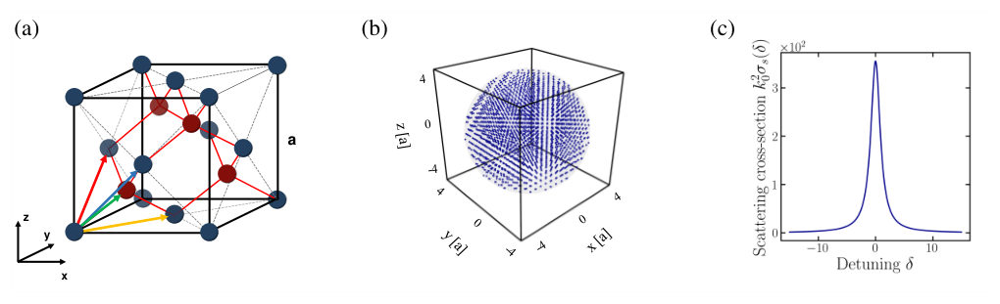 
Figure 1. (a) Cubic unit cell of the diamond crystal structure. Scatterers occupying sites A and B are shown as blue and red spheres, respectively, and their connecting vector d = (a/4, a/4, a/4) is shown in green. The primitive lattice vectors, a1 = (0, a/2, a/2), a2 = (a/2, 0, a/2) and a3 = (a/2, a/2, 0) are shown as red, yellow, and blue arrows, respectively. (b) A crystal of finite size k0R = 15 and lattice spacing k0a = 3.4, made of N = 2869 scatterers. (c) Dimensionless scattering cross-section of a resonant scatterer with polarizability α(ω) defined by Eq. (8).

📷 Fig 2

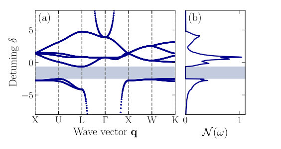 
Figure 2. (a) Band diagram and (b) normalized DOS for light in a diamond crystal consisting of point scatterers with a lattice constant k0a = 3.4. The band diagram is computed along the standard irreducible path X–U–L–Γ–X–W–K in the first Brillouin zone of the underlying fcc crystal. The DOS is obtained by uniformly sampling 106 q vectors throughout the first Brillouin zone. The shaded region indicates the complete photonic band gap.

📷 Fig 3

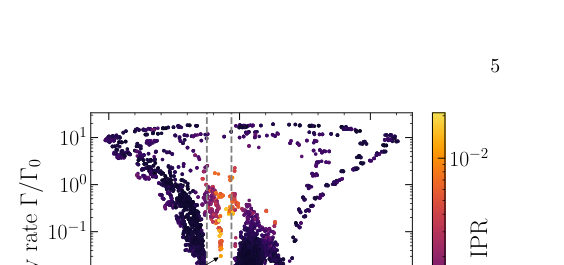 
Fig. 4(b) Fig. 4(a) 10−3

📷 Fig 4

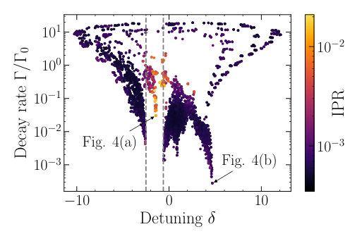 
Figure 3. Distribution of resonances in the complex plane for a diamond crystal of lattice spacing k0a = 3.4 and radius k0R = 15. Each eigenvalue is colored according to the IPR of the corresponding eigenvector, showing the degree of its spatial localization. Vertical dashed lines indicate the band edges of the infinite crystal.

📷 Fig 5

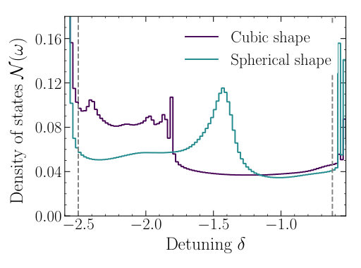 
Figure 5. DOS of a diamond photonic crystal of finite size and lattice constant k0a = 3.4, for two different sample shapes. Spherical (cubic) sample has radius k0R = 15 (edge length k0L = 24) and contains N = 2869 (N = 3059) scatterers.

**Summary.** This paper theoretically examines defect states in 3D photonic band gap crystals, showing that defects create localized modes within the gap. The study rigorously compares finite-size effects with the infinite-crystal limit using Green's function techniques. It is significant for understanding how engineered disorder can lead to highly confined, long-lived photonic resonances.

**Why it may be interesting.** This work provides a detailed theoretical framework for understanding how engineered disorder (defects) can create robust, long-lived quantum states (photonic band gap modes) whose properties are governed by localization physics, analogous to Anderson localization in electronic systems.

Detailed structure

**Main problem.** The study investigates the existence, properties, and localization of defect states within the photonic band gap of three-dimensional diamond crystals.

**Main result.** Defects introduce localized states inside the photonic band gap whose lifetimes increase exponentially with crystal size, while the theory also addresses the possibility of Anderson localization in the infinite limit.

**Method.** The analysis uses theoretical methods involving the Green's function formalism, solving eigenvalue problems for both finite and infinite crystal sizes, and employing the coupled-dipole method for lifetime calculations.

**Model / system.** The system is a diamond crystal modeled with point scatterers, governed by the Maxwell-Helmholtz equation. The theory analyzes the impact of substitutional defects on the photonic band structure.

**Key observables.** Defect eigenfrequencies, state lifetimes ($\Gamma$), and the Inverse Participation Ratio (IPR) quantifying spatial localization.

**Important parameters / regimes.** Crystal size (finite vs. infinite limit), frequency detuning ($\delta$), and the on-site Green's function of the ideal crystal.

**Assumptions / limitations.** Initial analyses often rely on the single-scattering approximation, and the theory compares results from the infinite-crystal limit with finite-size numerical simulations.

**Figures summary.** Figures illustrate the cubic unit cell structure, finite crystal sizes, the photonic band gap structure (DOS), and spatial profiles of representative localized states.

**Paper structure.** The paper progresses from defining the governing equations and the role of the Green's function in the ideal crystal, to analyzing the resonance conditions for defects, comparing finite-size effects via the coupled-dipole method, and finally extending the theory to multiple scattering and Anderson localization.

Abstract

We perform a theoretical study of defect states within the photonic band gap of three-dimensional diamond crystals composed of point scatterers and doped with substitutional defects. The defects introduce localized states inside the photonic band gap, whose existence conditions and eigenfrequencies are expressed in terms of the on-site Green's function of the ideal defect-free crystal. Off-site Green's functions are also calculated as function of distance and are shown to vanish within approximately two unit cells. Finite-size effects are analyzed by comparing the results obtained in the infinite-crystal limit with numerical simulations based on the coupled-dipole method. The latter not only reproduce the eigenfrequencies of the defect states within the band gap, but also provide their lifetimes originating from the finite crystal size. The lifetimes of the defect states increase exponentially with crystal size, becoming very long for large crystals. In addition to defect states in the three-dimensional photonic band gap, the defects also give rise to strongly detuned states outside the gap, which decouple from the spectrum of the ideal defect-free crystal.

[↑ back to top](#top)

### [Fault-tolerant $|\sqrt{ \mathrm{T} }\rangle$ state preparation and injection for more efficient fine-grained quantum circuit synthesis](http://arxiv.org/abs/2608.25797v1)

**Authors:** Berat Yenilen, Markus Müller, Manuel Rispler  
**Type:** theory · **Category:** quantum information and computing · **PDF:** <https://arxiv.org/pdf/2608.25797v1>  
**Analysis basis:** full PDF text, analyzed in chunks
**Topic relevance:** `quantum measurements` **1/5**

📷 Fig 1

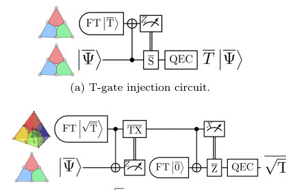 
FIG. 1. Magic-state injection circuits for encoded qubits. The injected magic states are prepared fault-tolerantly: the | √

📷 Fig 2

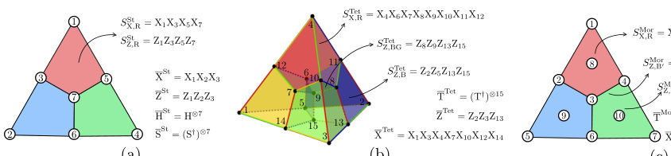 
FIG. 2. Representative quantum error-correcting codes used in this work. (a) The Steane [[7, 1, 3]] color code with face stabilizers SSt X,c and SSt Z,c for c ∈{R, G, B} and transversal logical Clifford gates. (b) The tetrahedral [[15, 1, 3]] color code with cell X-stabilizers STet X,c (c ∈{R, G, B, Y}) and face Z-stabilizers STet Z,f ; it admits a transversal logical T gate. (c) The morphed [[10, 1, 2]] error-detecting code with pyramid-type 5-qubit X-stabilizers and face-type Z-stabilizers; it supports a fault-tolerant logical T implementation.

📷 Fig 3

 
FIG. 3. The one-way transversal logical CX gate between the tetrahedral and Steane codes follows Ref. [30].

📷 Fig 4

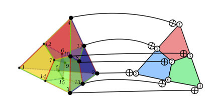 
Fig. 3 [30]. The gate is implemented transversally by ap- plying physical CX gates between the Steane code and a suitable seven-qubit subset of the tetrahedral code. It is one-way because this construction realizes a logical CX only for a fixed control-target qubit orientation. In that orientation, the relevant stabilizers and logical Pauli op- erators propagate as required for a logical CX, preserving fault tolerance through transversality [30].

📷 Fig 5

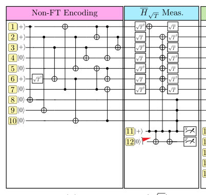 
FIG. 4. Quantum circuits for preparing the | √

**Summary.** This paper develops fault-tolerant protocols to prepare the $|\sqrt{T}
angle$ magic state using advanced QEC codes like the tetrahedral code. By incorporating this new gate primitive, the authors demonstrate a significant (20-30%) reduction in the required resources for synthesizing complex quantum circuits compared to using only the standard Clifford+T gate set.

**Why it may be interesting.** While focused on abstract quantum computation, the rigorous analysis of noise coefficients and resource scaling is highly relevant to understanding the practical limitations and scaling of any physical quantum hardware platform (like trapped ions or superconducting qubits).

Detailed structure

**Main problem.** The paper aims to improve the efficiency of fine-grained quantum circuit synthesis by expanding the available set of fault-tolerant non-Clifford gates beyond the standard Clifford+T set.

**Main result.** Access to the $\sqrt{T}$ primitive reduces the average space-time cost for synthesizing Haar-random single-qubit unitaries by approximately 20%–30% compared to the standard Clifford+T gate set.

**Method.** The authors introduce flag fault-tolerant protocols for preparing the logical $|\sqrt{T}
angle$ state on specific Quantum Error Correction (QEC) codes and simulate the resulting circuits under noise.

**Model / system.** The work uses quantum computation models based on CSS stabilizer codes, specifically the 3D tetrahedral color code and its morphed variant, to implement fault-tolerant logical operations.

**Key observables.** Logical error rates (LERs), acceptance probabilities, and the space-time cost for synthesizing single-qubit unitaries.

**Important parameters / regimes.** The physical error rate ($p$), the QEC code distance ($d=2t+1$), and the comparison between Clifford+T and Clifford+T + $\sqrt{T}$ gate sets.

**Assumptions / limitations.** The analysis assumes that the $\sqrt{T}$ primitive can be prepared fault-tolerantly using the specified codes, and it models noise using circuit-level depolarizing channels.

**Figures summary.** Figures illustrate magic-state injection circuits for $|T
angle$ and $|\sqrt{T}
angle$ states, and show representative codes like the Steane, Tetrahedral, and Morphed codes.

**Paper structure.** The paper details the protocols for preparing $|\sqrt{T}
angle$ states on various codes, simulates these protocols under noise, and quantifies the resulting reduction in computational overhead compared to existing gate sets.

Abstract

Magic-state injection is a standard route to realize universal fault-tolerant quantum computation. Whereas the set of Clifford gates in combination with the non-Clifford T gate is a widely used universal gate set, extending the available set of non-Clifford primitives can reduce compilation overhead, provided that the additional primitives can be prepared fault-tolerantly with competitive resource costs and at sufficiently low logical noise rates. In this work, we introduce flag fault-tolerant protocols for preparing logical $|\sqrt{\mathrm{T}} \rangle $ magic states on the 3D tetrahedral color code and its smaller morphed variant. Our simulations under circuit-level noise verify fault tolerance, quantify acceptance and logical error rates, and we reconstruct the effective logical channels of the corresponding circuits for gate injection via logical process tomography. We find that access to $\sqrt{\mathrm{T}}$ reduces the average space-time cost of synthesizing Haar-random single-qubit unitaries by approximately $20$-$30$% relative to the Clifford+T gate set across practically relevant approximation regimes. These results demonstrate how expanding the set of fault-tolerant non-Clifford primitives can improve computational efficiency and broaden the design space for universal quantum computation in the early fault-tolerant era.

[↑ back to top](#top)

### [GNSS-free quantum gravity-aided navigation and fine-scale marine surveying with a strapdown quantum gravimeter](http://arxiv.org/abs/2608.25563v1)

**Authors:** Patrick J. Everitt, Donald H. White, Todd Lyon, Murat Muradoglu, Alessandro D'Ortenzio, Aaron J. Canciani, Malo Cadoret, Daniel D. Brown, David Adams, Yosri Ben-Aïcha, Suraj Bijjahalli, Mojtaba K. Farsani, Alexander Rischka, Karandeep S. Gill, Magdalena Meyer, Henry W. Orton, Nicholas P. Robins, Reuben Symon, Michael J. Biercuk, Michael R. Hush, Stuart S. Szigeti, Russell P. Anderson  
**Type:** experiment · **Category:** other · **PDF:** <https://arxiv.org/pdf/2608.25563v1>  
**Analysis basis:** full PDF text, analyzed in chunks
**Topic relevance:** `quantum measurements` **1/5**

📷 Fig 1

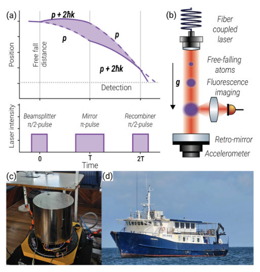 
FIG. 1. Marine trial with a quantum gravimeter. (a), Space–time diagram of the free-falling Mach–Zehnder atom- interferometer sequence used during the trial. Three square laser pulses split, redirect and recombine the 87Rb matter waves by imparting the atoms with differing momenta p aug- mented by the quantum of momentum carried by the laser light ℏk; the lower panel shows the corresponding laser- intensity sequence used to perform an acceleration-sensitive interferometer over a total time of 2T s. The shaded area between the effective interferometer arms represents the en- closed interferometer phase imparted due to differential im- pact of gravity on atoms with different momenta along the...

📷 Fig 2

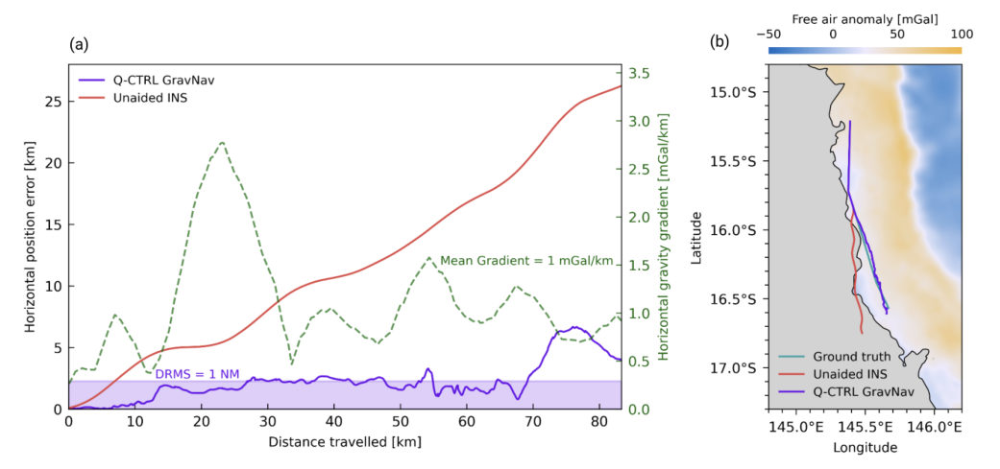 
FIG. 2. Demonstration of gravity-aided navigation using a quantum gravimeter. (a), Pointwise horizontal position error versus distance traveled for Q-CTRL GravNav (purple) and the unaided inertial navigation system (INS; red). Both solutions exclude GNSS observations during the evaluated segment; GNSS is used only as the post-processed reference against which error is calculated. The dashed green trace, on the right axis, is the magnitude of the horizontal gradient of the grav SWOT 04 map evaluated along the withheld ground-truth trajectory and is diagnostic only. The purple band marks horizontal errors below one nautical mile (1.852 km); it is a distance reference rather than a reported...

📷 Fig 3

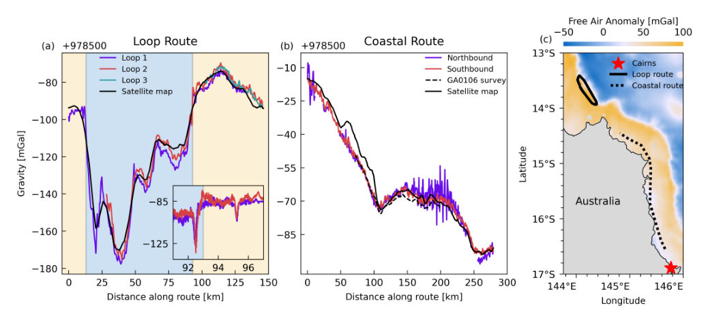 
FIG. 3. Comparison of quantum-gravity measurements with satellite and ship-survey gravity. (a), Gravity measured during three traversals of the 145 km loop route in (c). A Bessel low-pass filter with a 300 s time constant is applied, and gravity predicted by grav SWOT 04 is shown in black [8–10]. The inset expands the 92–96 km region using a 60 s filter. Kilometer zero is (13.5725◦S, 144.0567◦E), and distance is measured clockwise from this point. Blue shading from 13 to 93 km denotes open water outside the Great Barrier Reef; yellow shading denotes water within the reef. Loops 1 and 2 are clockwise and Loop 3 anticlockwise. Mean vessel speed is 8.4 knots. (b), Gravity measured on...

📷 Fig 4

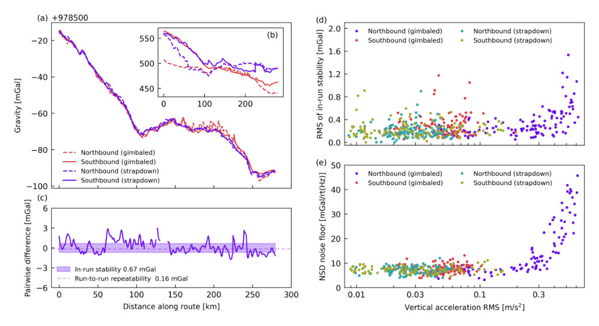 
FIG. 4. Comparison of gravimeter performance in gimbaled and strapdown configurations. (a), Gravity measured along the 280 km coastal route during northbound and southbound traversals with the quantum gravimeter operated in gimbaled and strapdown configurations. (b), Gravity estimates along the same 280 km coastal route from the same gravimetric pipeline without hybrid quantum-classical stabilization applied, relying exclusively on classical sensors (see Methods). (c), Effective pairwise residual between the repeated gravity profiles as a function of distance. The shaded band denotes the route-wide residual RMS of 0.67 mGal and the dashed line the run-to-run repeatability of 0.16 mGal. (d),...

📷 Fig 5

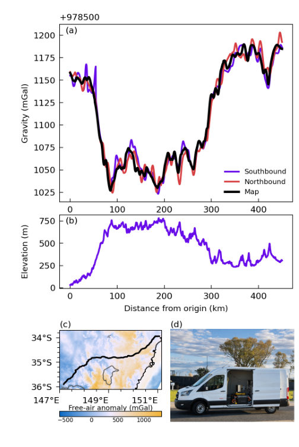 
FIG. 5. Road gravimetry survey along the Hume Highway in New South Wales. The quantum gravimeter was mounted on a gimbal inside a van and driven along the highway at an average speed of 100 km h−1. (a) Northbound (red) and southbound (purple) gravity profiles are compared with the gravity trace extracted from an airborne-survey map (black). Kilometer zero is the north-eastern endpoint in south-west Sydney; distance increases towards Mullengandra in southern New South Wales. (b) WGS84 elevation along the journey acquired by GNSS. (c) The route from Sydney to Mullengan- dra is plotted on the free-air anomaly map from the airborne gravimetry survey [46]. (d) The gravimeter mounted on the...

**Summary.** This paper reports the first demonstration of quantum-gravity-aided navigation that is entirely independent of GNSS signals. By integrating a quantum gravimeter with an INS, the system successfully corrected navigation drift over long maritime paths and performed high-resolution gravity surveys. This proves the viability of compact, autonomous quantum sensing for critical applications in denied or remote environments.

**Why it may be interesting.** While the core technology is applied geodesy/navigation, the reliance on quantum sensing (atomic interferometry) for highly stable, drift-free measurements makes it relevant to quantum sensing applications in dynamic environments.

Detailed structure

**Main problem.** The primary challenge addressed is maintaining accurate navigation and performing fine-scale surveying at sea when Global Navigation Satellite Systems (GNSS) are unavailable or unreliable, and unaided Inertial Navigation Systems (INS) suffer from drift.

**Main result.** The system successfully demonstrated bounded positioning accuracy at the nautical-mile level during GNSS-free navigation and achieved mGal-level agreement with gravity maps during surveying, resolving anomalies 50 times finer than the reference map.

**Method.** The authors employed gravity map matching, using a quantum gravimeter to constrain the drift of a navigation-grade INS by referencing local gravity measurements to a satellite-derived anomaly map.

**Model / system.** The physical system is a hybrid sensor package installed on a surface vessel, combining a quantum gravimeter (atomic sensor), a classical accelerometer, and a navigation-grade IMU. The system was tested in both gimbaled and strapdown configurations.

**Key observables.** Position error (DRMS at nautical-mile level), gravity anomaly agreement (mGal-level), repeatability/stability (sub-mGal), and long-term drift reduction factor ($\sim 70	imes$).

**Important parameters / regimes.** 83 km maritime trajectory length, Sea State 4 conditions, $\sim 300$ m along-track anomaly resolution.

**Assumptions / limitations.** The navigation demonstration is claimed to be fully GNSS-independent, excluding GNSS from the entire measurement chain, including INS mechanization and map-matching protocols.

**Figures summary.** Figures compare the positioning error of the quantum-aided navigation against unaided INS drift over a maritime trajectory, and show gravity measurements overlaid on reference anomaly maps to highlight recovered fine-scale features.

**Paper structure.** The paper details the setup of the quantum gravimeter on a vessel, presents the methodology for both GNSS-free navigation and gravity surveying, and then presents the comparative results showing the performance gains and resolution capabilities of the quantum-aided system.

Abstract

Global navigation satellite systems (GNSS) are often disrupted or unavailable at sea, and unaided inertial navigation systems (INS) drift without correction. Quantum-sensing-based gravity map matching offers a passive, infrastructure-free aid, but field demonstrations of GNSS-free quantum gravimetric navigation have not been reported. Here we perform gravity map matching and fine-resolution gravity survey with a mobile quantum gravimeter aboard a 29 m surface vessel. We hybridize an atomic sensor with a classical accelerometer for bias stabilization and independently mechanize a navigation-grade IMU, all installed in an uncontrolled cabin with no environmental stabilization or calibration. Operated in both gimbaled and strapdown configurations over identical traversals, the hybrid sensor corrected the inertial solution over an 83 km maritime trajectory by referencing locally measured gravity to a satellite-derived anomaly map. Gravity-aiding constrains INS drift and delivers bounded positioning at nautical-mile-level accuracy, with GNSS excluded throughout the measurement chain. In a separate GNSS-referenced mode, the same system surveyed coastal routes up to Sea State 4, achieving mGal-level agreement with gravimetric maps and sub-mGal repeatability and stability, with gimbaled and strapdown operation performing comparably. Resolved anomalies reach an along-track scale of ~300 m, 50X finer than the satellite map's half-power wavelength. A 56 h stationary test shows atom referencing lowers long-term drift ~70X versus the classical channel alone. These results provide the first same-instrument comparison of gimbaled and strapdown mobile quantum gravimetry and the first fully GNSS-independent gravity-map-matching navigation demonstration using a quantum gravimeter, pointing toward compact, autonomous-platform-ready quantum sensing for GNSS-denied maritime navigation and survey.

[↑ back to top](#top)

### [High-pressure phase transitions in the quantum spin liquid candidate Na2Co2TeO6 probed by Raman spectroscopy](http://arxiv.org/abs/2608.25076v1)

**Authors:** Ihsan Ahmed Kolasseri, Maria Mei Ravnebæk, Subhadip Das, Carl Jonas Linnemann, Haidong Zhou, Christian Frydendahl, Martin Bremholm, Yong P. Chen  
**Type:** experiment · **Category:** strongly correlated electrons · **PDF:** <https://arxiv.org/pdf/2608.25076v1>  
**Analysis basis:** full PDF text, analyzed in chunks
**Topic relevance:** `analog quantum simulation` **1/5**

📷 Fig 1

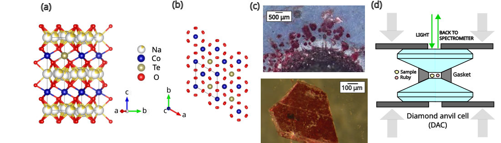 
FIG. 1: (a) Schematic of the crystal structure of hexagonal NCTO generated with a crystallographic information file from Xiao et al. [12]. The partial occupancy of the Na atoms is shown with the partial yellow color. (b) View of the crystal structure along the c axis. Na atoms are hidden here to show the hexagonal arrangement of Co atoms. Each Co has 6 surrounding O atoms making a CoO6 octahedron. In this projection the O atoms of vertically stacked octahedra overlap, so each Co appears surrounded by twelve O atoms rather than six. The black lines indicate the unit cell. (c) Top: ‘Type A’ crystals from the synthesis crucible. A crystal with approximate size of 90 µm was loaded into the...

📷 Fig 2

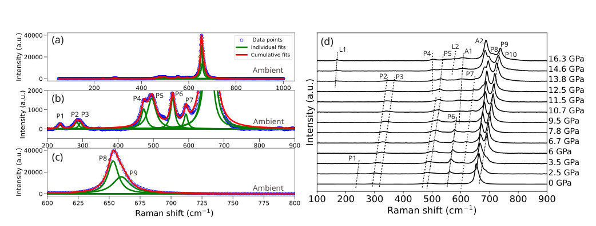 
FIG. 2: (a) Raman spectrum of Crystal A from 50 to 1000 cm−1 at ambient pressure, fitted using Lorentzian functions. The blue points represent the experimental data, the red line denotes the cumulative fit, and the green lines indicate individual peak fits. (b) Zoomed-in view of Fig. 2(a) showing low-intensity Raman modes. (c) Zoomed-in view of Fig. 2(a) showing high-intensity Raman modes. (d) Raman spectra of Crystal A from ambient pressure (marked as 0 GPa) up to 16.3 GPa. The emergence of a new mode L1 above 13.8 GPa is clearly visible.

📷 Fig 3

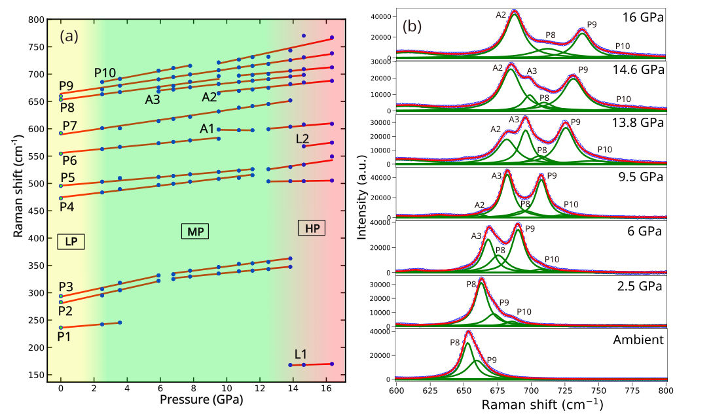 
FIG. 3: (a) Evolution of Raman frequencies of Crystal A with pressures up to 16.3 GPa. The graph is divided into three regions - LP: Low pressure regime, MP: Medium pressure regime, HP: High pressure regime. The ambient pressure points are marked in green to indicate that these data are taken from outside the DAC. (b) Evolution of modes between 600 to 800 cm−1, up to 16.3 GPa. These high intensity peaks deconvolute into three to five peaks at various pressures.

📷 Fig 4

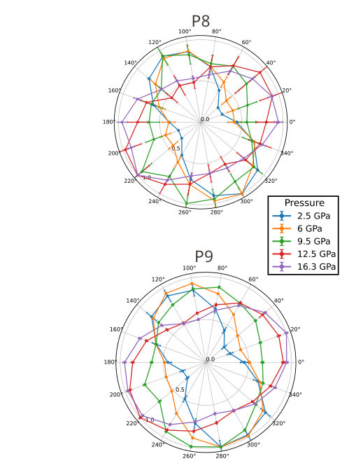 
FIG. 4: (a) Polar plot of normalized intensities of (a) mode P8 and (b) mode P9. The intensities of both modes are normalized by the maximum intensity of the Raman spectrum at the corresponding pressure. Zero degrees refers to the situation where the input polarization is parallel to the linear polarizer in the detection path.

**Summary.** This work uses high-pressure Raman spectroscopy on $	ext{Na}_2	ext{Co}_2	ext{TeO}_6$ to study its behavior as a candidate Kitaev Quantum Spin Liquid. By monitoring changes in vibrational modes up to 16.3 GPa, the researchers identified multiple pressure-induced phase transitions. These findings provide experimental evidence for tuning the quantum magnetic interactions in this strongly correlated material.

**Why it may be interesting.** The study uses high-pressure spectroscopy to probe the fundamental electronic and structural transitions in a material relevant to exotic quantum magnetism (Kitaev model), providing experimental data on tuning quantum ground states.

Detailed structure

**Main problem.** The study investigates pressure-induced phase transitions in $	ext{Na}_2	ext{Co}_2	ext{TeO}_6$, a material candidate for a Kitaev Quantum Spin Liquid (KQSL) state.

**Main result.** Raman spectroscopy reveals that the material undergoes structural phase transitions at high pressures, notably marked by the emergence of a new Raman mode ($	ext{L}_1$) above 13.8 GPa.

**Method.** The research employed Raman spectroscopy performed inside a Diamond Anvil Cell (DAC) to probe the material's vibrational modes under extreme pressure.

**Model / system.** The physical system is $	ext{Na}_2	ext{Co}_2	ext{TeO}_6$, a quasi-2D magnet whose magnetic interactions are hypothesized to be governed by the Kitaev model due to strong spin-orbit coupling in the $	ext{Co}^{2+}$ ions.

**Key observables.** Changes in Raman mode frequencies, appearance/disappearance of modes, and changes in the polarization dependence of representative modes.

**Important parameters / regimes.** Applied pressure up to 16.3 GPa (and up to 20 GPa in related studies); the pressure evolution is analyzed in Low, Medium, and High Pressure regimes.

**Assumptions / limitations.** The analysis assumes that changes in Raman modes are indicative of underlying structural or electronic phase transitions, and that the Kitaev model is relevant for describing the magnetic interactions.

**Figures summary.** Figures illustrate the schematic crystal structure, ambient pressure spectra, and waterfall plots showing the evolution of various Raman modes across the applied pressure range, highlighting mode changes at high pressure.

**Paper structure.** The paper systematically analyzes the Raman spectra across different pressure regimes (LP, MP, HP), correlating observed spectroscopic changes (mode shifts, new peaks) with potential structural phase transitions in the KQSL candidate.

Abstract

The quasi-2D magnet Na2Co2TeO6 (NCTO) is a candidate for a Kitaev Quantum Spin Liquid (KQSL) state. Pressure-tuning in such materials is of interest as a potential method to tune the Kitaev exchange interactions, which are strongly dependent on bond geometry. Here we report a Raman spectroscopic study of NCTO inside a diamond anvil cell (DAC) with pressure applied up to 16.3 GPa. Based on the changes in the Raman modes, this pressure range is divided into three regions. The appearance and disappearance of several modes and changes in the polarization dependence of the representative modes, most prominently above 13.8 GPa, point to pressure-induced phase transitions in this material.

[↑ back to top](#top)

### [Microscopic Modeling of the Charge-Density-Waves in the Rare-Earth Tritellurides](http://arxiv.org/abs/2608.24995v1)

**Authors:** Sijia Zhao, Julian May-Mann, Ian R. Fisher, Steven A. Kivelson  
**Type:** theory · **Category:** strongly correlated electrons · **PDF:** <https://arxiv.org/pdf/2608.24995v1>  
**Analysis basis:** full PDF text, analyzed in chunks
**Topic relevance:** `Frenkel-Kontorova` **1/5**

📷 Fig 1

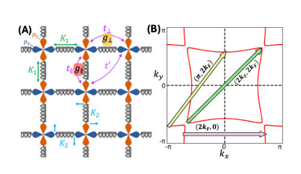 
FIG. 1. (A) Schematic of the single-layer Te-square-net model. Here, t∥, t⊥, and t′ denote the three hopping ampli- tudes, g∥,⊥the corresponding SSH couplings, and K1,2 the longitudinal and transverse stiffnesses. (B) Tight-binding Fermi surface with competing nesting vectors.

📷 Fig 2

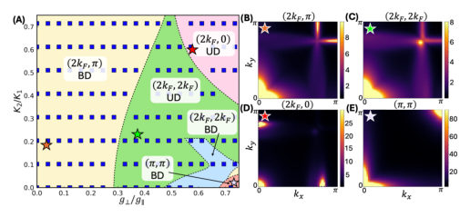 
FIG. 2. (A) Phase diagram showing the nature of the CDW order at T slightly below Tc1 for fixed g∥= 0.75 t/a and K1 = 0.5 t/a2 as a function of g⊥/g∥and K2/K1. Each region is labeled by the ordering wavevector and by its unidirectional (UD) or bidirectional (BD) charac- ter. (B-E) Representative susceptibility maps at T = Tc1 for the four starred points in (A) at which ordering types (2kF , π), (2kF , 2kF ), (2kF , 0), &amp; (π, π) occur. Only one quad- rant of the Brillouin zone is shown.

📷 Fig 3

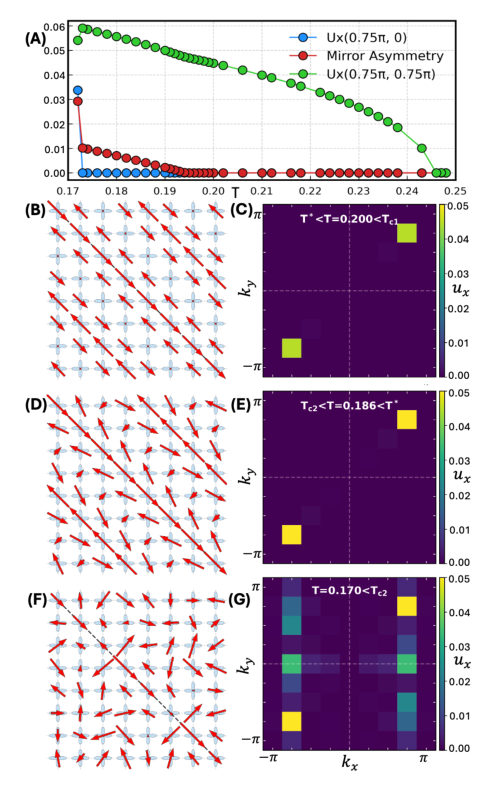 
FIG. 3. (A)Temperature evolution of |ux(Q)| at Q = 2π( 3

📷 Fig 4

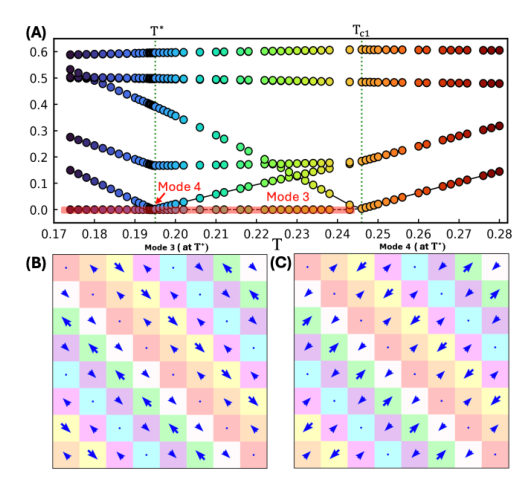 
FIG. 4. (A) Temperature dependence of the low-energy non- Goldstone spectrum. Notably, the mirror-odd sliding mode (Mode 3, highlighted by the red shading) is anomalously soft from immediately below Tc1, whereas a secondary soft mode (Mode 4, indicated by the arrow) emerges specifically at T ∗and drives the glide symmetry-breaking instability[46]. (B,C) Real-space profiles of Mode 3 and 4. Comparison with Fig. 3(B) shows that Mode 3 is odd under Mx+y. Background colors label the eight inequivalent site classes of the period- 8 supercell; identically colored sites are related by preserved translations and share the same displacement.

📷 Fig 5

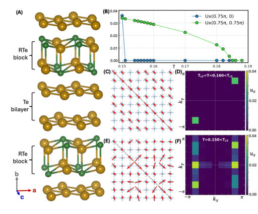 
FIG. 5. (A) Crystal structure of RTe3. (B) Tempera- ture dependence of |ux(Q)| at 2π( 3

**Summary.** This theoretical study models CDW formation in rare-earth tritellurides using a 2D electron-phonon Hamiltonian. By analyzing the free energy and collective excitations, the authors predict a sequence of symmetry-breaking transitions, crucially demonstrating that the CDW state is highly susceptible to mirror-symmetry breaking. This provides a microscopic framework to explain complex experimental observations in these materials.

**Why it may be interesting.** The detailed analysis of symmetry breaking (mirror and glide) in a strongly correlated electronic state driven by lattice coupling provides a rich theoretical playground for understanding emergent symmetries in condensed matter systems.

Detailed structure

**Main problem.** The paper investigates the origin of surprising experimental observations in rare-earth tritellurides ($	ext{RTe}_3$), specifically focusing on evidence suggesting mirror-symmetry breaking associated with the onset of Charge-Density-Wave (CDW) order.

**Main result.** The model predicts a sequence of transitions ($T_{c1} 	o T^* 	o T_{c2}$) and shows that the CDW phase is intrinsically susceptible to mirror-symmetry breaking, which can be amplified by weak perturbations.

**Method.** The study employs mean-field theory, Ginzburg-Landau functional expansions, and real-space minimization techniques applied to a 2D electron-phonon model.

**Model / system.** The system is the quasi-2D rare-earth tritelluride ($	ext{RTe}_3$), modeled using a 2D electron-phonon Hamiltonian ($\hat{H} = \hat{H}_e + \hat{H}_{e-	ext{ph}} + \hat{H}_{	ext{ph}}$) for a single Te square-net plane.

**Key observables.** CDW order parameter, phonon spectrum (especially low-lying modes), mirror susceptibility ($\chi_M$), and the temperature evolution of symmetry breaking.

**Important parameters / regimes.** Coupling ratios ($g_{\perp}/g_{\parallel}$), stiffness ratios ($K_2/K_1$), and temperature ($T_{c1}, T^*, T_{c2}$).

**Assumptions / limitations.** The analysis relies on mean-field theory, the adiabatic limit (neglecting quantum phonon fluctuations), and uses commensurate approximations for the ordering vector for numerical tractability.

**Figures summary.** Figures illustrate phase diagrams showing CDW instability dependence on parameters, and temperature evolution plots detailing the sequence of transitions and the softening of specific phonon modes (Mode 3 and Mode 4).

**Paper structure.** The paper progresses by establishing the basic 2D electron-phonon model, analyzing the high-temperature CDW onset via mean-field theory, and then refining the analysis by examining the low-temperature sequence of symmetry-breaking transitions ($T^*, T_{c2}$) using advanced free energy minimization and mode analysis.

Abstract

Despite being arguably the simplest and best characterized quasi-2D charge-density-wave (CDW) systems, the rare-earth tritellurides ($R$Te$_3$) continue to yield surprising experimental results, including recent evidence suggestive of mirror-symmetry breaking associated with the onset of CDW order. Motivated by this, we consider a 2D electron-phonon model for a single Te square-net plane, which we analyze using mean-field theory. For an appropriate region of parameter space, we find a finite-temperature continuous transition from the normal state to a unidirectional CDW state with an ordering vector matching that observed experimentally. At lower temperatures, we find a second translation-symmetry-breaking transition, similar to what occurs in $R$Te$_3$ compounds with heavier rare-earth elements. In certain parameter regimes, we also find an intervening mirror-symmetry-breaking transition occurring between the two transitions described above. These results reveal an intrinsic susceptibility to mirror-symmetry breaking in the unidirectional CDW phase, which is relevant to understanding recent experiments on the $R$Te$_3$ compounds.

[↑ back to top](#top)

### [No Free Compression in Quantum Relaxations for Optimization](http://arxiv.org/abs/2608.25151v1)

**Authors:** Stuart Hadfield  
**Type:** theory · **Category:** quantum information and computing · **PDF:** <https://arxiv.org/pdf/2608.25151v1>  
**Analysis basis:** full PDF text, analyzed in chunks
**Topic relevance:** `quantum measurements` **1/5**

📷 Fig 1

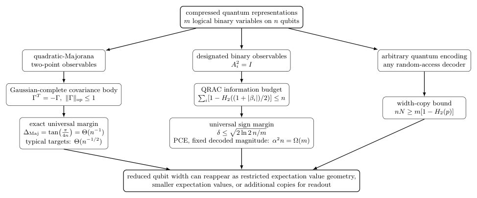 
FIG. 1. Three levels of compression limits. Majorana-specific. The exact result gives a Θ(n−1) universal worst-case margin despite Θ(n−1/2) typical behavior, together with a Gaussian-complete set of attainable two-point correlations (the covariance body). Designated observables. Standard QRAC information theory bounds the universal margin for fixed binary observables. Arbitrary random-access codes. Nayak’s bound converts width reduction into a copy cost for reliable recovery.

**Summary.** This paper analyzes the resource cost of compressing classical information into quantum expectation values using Majorana fermions. It establishes that while the Majorana encoding offers a superior worst-case margin ($\Theta(1/n)$) compared to general bounds ($\Theta(1/\sqrt{n})$), this compression shifts the computational cost into the restricted geometry of the expectation values themselves.

**Why it may be interesting.** The work provides quantitative limits on how much classical information can be compressed into quantum expectation values, which is crucial for designing efficient quantum algorithms and resource estimation.

Detailed structure

**Main problem.** The paper investigates the resource trade-offs inherent in using quantum relaxations to compress classical decision variables for quantum optimization.

**Main result.** The exact universal worst-case margin for the quadratic-Majorana encoding is $\Theta(1/n)$, which is parametrically stronger than generic information-theoretic bounds of $\Theta(1/\sqrt{n})$.

**Method.** The authors use minimax optimization techniques, comparing the achievable margin against theoretical bounds derived from quantum random access codes (QRAC) and geometric constraints on the covariance body.

**Model / system.** The model focuses on encoding $m$ classical binary variables using $n$ qubits via Pauli correlation encodings, specifically analyzing the complete quadratic-Majorana family.

**Key observables.** Universal Margin ($\Delta_{	ext{Maj}}$), Covariance Body ($\Gamma$), expectation values of quadratic observables ($\langle A_{ab} 
angle$).

**Important parameters / regimes.** Number of qubits ($n$), number of variables ($m$), and the scaling factors $\Theta(1/n)$ vs $\Theta(1/\sqrt{n})$.

**Assumptions / limitations.** The analysis relies on comparing the specific Majorana geometry against general information-theoretic bounds, and the results are highly dependent on the fixed family of observables considered.

**Figures summary.** Figure 1 compares three levels of compression limits: Majorana-specific ($\Theta(n^{-1})$ worst-case margin), designated observables (QRAC bound), and arbitrary random-access codes (Nayak's bound).

**Paper structure.** The paper progresses by defining the problem via the covariance body, deriving the exact Majorana margin using spectral methods, and then contrasting this result against general information-theoretic bounds derived from QRAC and random access coding theory.

Abstract

Qubit-efficient quantum relaxations compress classical decision variables into expectation values on substantially fewer qubits. We ask what resource tradeoffs this compression entails for quantum optimization. For the complete quadratic-Majorana encoding on $n$ qubits, pairwise correlators can represent $m=Θ(n^2)$ binary variables. We define the universal margin as the smallest correlator magnitude that can be guaranteed with prescribed signs for every target sign assignment. We show that it is exactly $Δ_{\rm Maj}(n)=\tan\!\left(\fracπ{4n}\right)=Θ(1/n)$, whereas uniformly random sign assignments retain $Θ(1/\sqrt n)$ target-specific margins. The stronger $1/n$ worst-case scaling is Majorana-specific. Moreover, arbitrary density operators and fermionic Gaussian states generate the same quadratic-Majorana covariance body, so non-Gaussian state resources cannot enlarge this two-point relaxation. Beyond Majoranas, standard quantum random access code bounds provide general information-theoretic baselines. For any fixed family of $m$ designated binary observables on $n$ qubits, the universal margin is at most $\sqrt{(2\ln2\;n/m)}$, while arbitrary random access decoding from $N$ copies with constant success probability above $1/2$ requires $nN=Ω(m)$. For a fixed Pauli correlation encoding required to work uniformly over all targets, maintaining a fixed nonzero decoded magnitude under smooth sign decoding therefore requires a rescaling parameter that grows as the available margin shrinks. Thus, while providing substantial qubit savings, compression can shift cost into restricted expectation value geometry, smaller expectation value magnitudes, or more demanding information recovery rather than eliminate it.

[↑ back to top](#top)

### [Oscillator-Based Processing Unit for Formant Recognition](http://arxiv.org/abs/2608.25191v1)

**Authors:** Tamás Rudner-Halász, Wolfgang Porod, Gyorgy Csaba  
**Type:** theory · **Category:** disordered systems and neural networks · **PDF:** <https://arxiv.org/pdf/2608.25191v1>  
**Analysis basis:** full PDF text, analyzed in chunks
**Topic relevance:** `Frenkel-Kontorova` **1/5**

📷 Fig 1

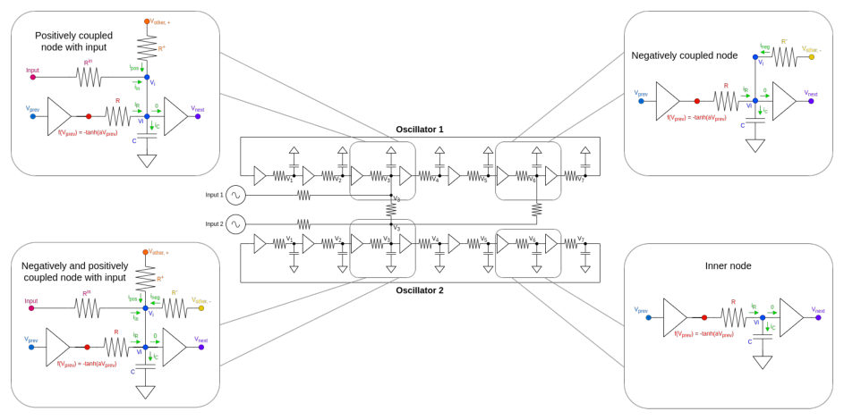 
Figure 1: The architecture of a two-oscillator system. The oscillators are coupled both positively (node 3–3 connection) and negatively (node 6–3 connection). The different types of node, in terms of connectivity, that can occur in a ring oscillator are highlighted on the sides. For generality, the figure shows both positive (in-phase) and negative (anti-phase) couplings, but only positively coupled oscillators are used in this work.

📷 Fig 2

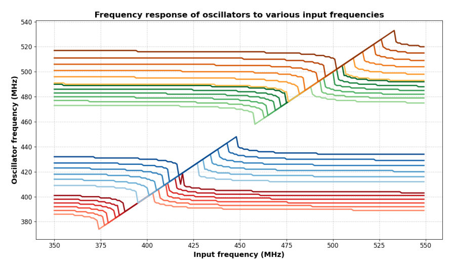 
Figure 2: Frequency synchronization of oscillators to an input sinusoid. The frequency of a single input sinusoidal voltage generator, connected to a network of 24 uncoupled oscillators, is swept over a range of frequencies. The four groups of oscillators either synchronize to the input signal or not, depending on the frequency of the input. Within each group the oscillators synchronize to the input frequency one by one, until all of them are synchronized; they then run together over a range of frequencies, after which they depart from the group one by one again.

📷 Fig 3

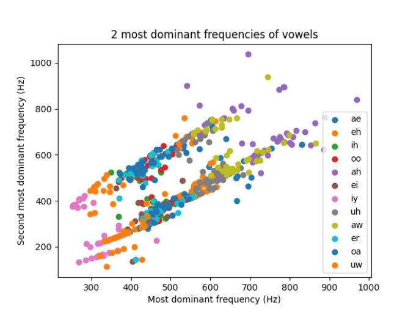 
Figure 3: Scatter plot of the first and second most dominant frequency components of all the vowels in the dataset. The two lines along which the data points gather possibly arise from the fact that these vowels were recorded by both male and female speakers, and female speakers tend to have a higher pitch.

📷 Fig 4

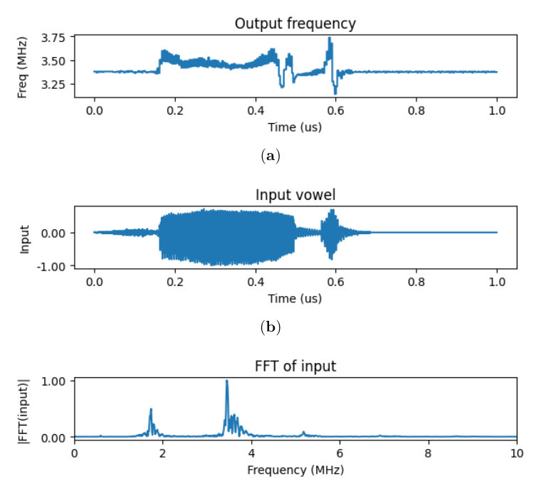 
Figure 4: Effect of a time-domain waveform on a single oscillator. (a) Instantaneous frequency of an oscillator that is driven by the vowel waveform through a voltage generator. (b) The vowel in the time domain. (c) The Fourier spectrum of the vowel; the dominant frequency component of this particular vowel is around 350 MHz. Note that the vowel has been sped up, and hence shifted in frequency, by applying it over 1 µs instead of 1 s. The frequency of the oscillator changes while the vowel is spoken on the recording and synchronizes to about 350 MHz, after which it returns to its free-running value of about 330 MHz. This shows that ring oscillators are capable of reacting to external...

📷 Fig 5

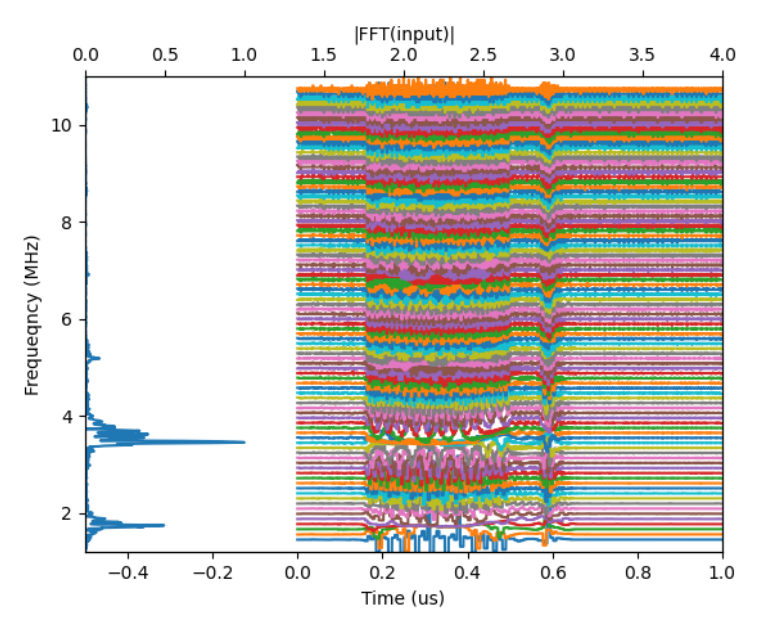 
Figure 5: Frequency response of a layer of oscillators to a single, time-domain input vowel. Oscillators with free-running frequencies close to the peaks of the input spectrum synchronize in frequency to each other for as long as the vowel is spoken, and then return to their original frequencies. Colors are used only for better visibility.

**Summary.** This paper proposes an Oscillator-Based Processing Unit (ONN) for speech analysis, aiming for ultra-low-power edge AI by processing raw, time-domain audio signals directly. It uses coupled ring oscillators whose synchronization behavior acts as a frequency filter bank to detect vocal formants. The approach demonstrates high classification accuracy while significantly reducing the computational overhead associated with traditional signal preprocessing.

**Why it may be interesting.** The work directly applies concepts of coupled, nonlinear oscillators—a topic relevant to studying complex dynamics in AMO physics—to build a novel, low-power computational device, bridging nonlinear dynamics with AI.

Detailed structure

**Main problem.** Developing an energy-efficient, oscillator-based processing unit (ONN) capable of directly processing time-dependent waveforms for tasks like formant recognition.

**Main result.** The proposed ONN architectures demonstrated high classification accuracy (up to 93-100%) for vowel recognition using raw or preprocessed time-domain signals.

**Method.** The core method uses coupled ring oscillators whose synchronization behavior is leveraged to act as a frequency-detecting filter bank, followed by a conventional classifier.

**Model / system.** The system is modeled using coupled ring oscillators governed by ODEs, designed to operate in an analog, frequency-based manner, mimicking the function of a neural network layer.

**Key observables.** Oscillator frequency synchronization strength, classification accuracy (e.g., 93% on test set), and the detection of specific frequency components (formants).

**Important parameters / regimes.** Operating frequency range (scaled to MHz/GHz), coupling strengths, and the number of oscillator groups used for feature extraction.

**Assumptions / limitations.** The primary assumption is that the energy efficiency gained by avoiding preprocessing (like spectrogram generation) outweighs the complexity of the oscillator circuit. The method relies on the separability of formant frequencies.

**Figures summary.** Figures illustrate oscillator architecture, frequency sweeping demonstrating synchronization, and the final two-layer classification scheme mapping input waveforms to synchronized output states.

**Paper structure.** The paper introduces the ONN concept, details the ODE model and two proposed architectures (formant-based vs. raw waveform), presents results on vowel recognition, and discusses the energy efficiency gains.

Abstract

Oscillatory neural networks have been successfully applied to a number of computing problems, such as associative memories and computationally hard optimization tasks. In this paper, we show how to use oscillators to process time-dependent waveforms with minimal or no preprocessing. Since preprocessing and first-layer processing are often the most power-hungry steps in neural networks, our findings may open new doors to simple and power-efficient edge-AI devices.

[↑ back to top](#top)

### [Quantum spin Hall crystals at fractional filling of twisted MoTe$_2$](http://arxiv.org/abs/2608.24989v1)

**Authors:** Xiaoyang Shen, Raul Perea-Causin, Christopher Ekman, Jiong-Hao Wang, Hui Liu, Emil J. Bergholtz  
**Type:** theory · **Category:** strongly correlated electrons · **PDF:** <https://arxiv.org/pdf/2608.24989v1>  
**Analysis basis:** full PDF text, analyzed in chunks
**Topic relevance:** `analog quantum simulation` **1/5**

📷 Fig 1

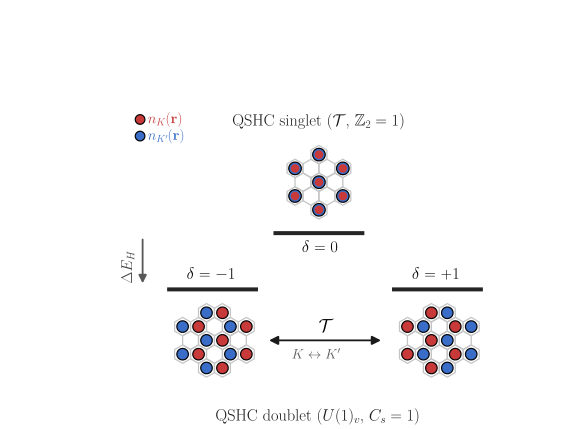 
FIG. 1. √

📷 Fig 2

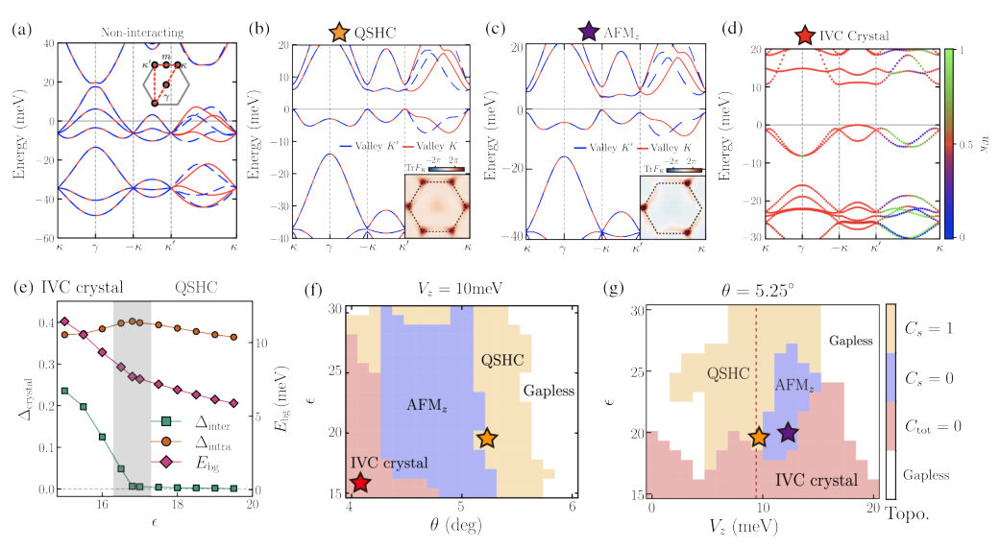 
FIG. 2. (a–d) Crystal band structures of the non-interacting system, the QSHC, the AFMz state, and the IVC crystal, respectively. For the QSHC and AFMz states, the valley-resolved non-Abelian Berry curvature Tr FK of the occupied bands is shown in the insets. For the IVC crystal, the bands are colored by the valley weight wK. (e) The IVC crystal–QSHC phase transition at Vz = 9.5 meV and θ = 5.25◦(red dashed line in (g)), characterized by the indirect HF band gap Ebg and the crystal order parameters strength ∆crystal = P

📷 Fig 3

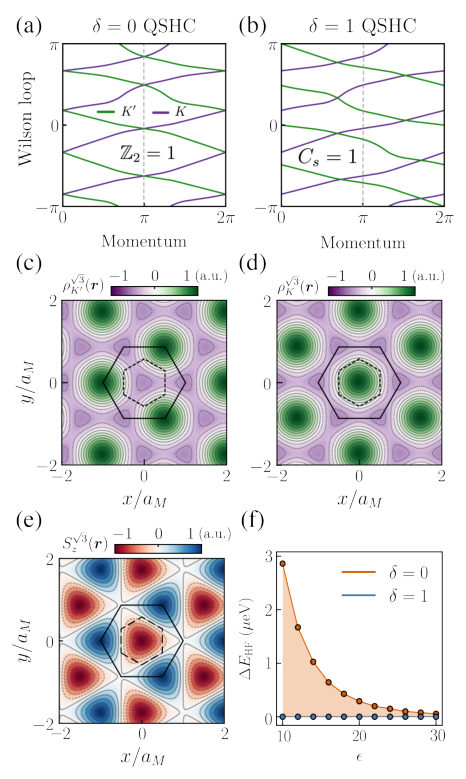 
FIG. 3. (a,b) Wilson-loop eigenphases of the occupied bands for the δ = 0 and δ = 1 QSHC, respectively, yielding dif- ferent topological indicators Z2 = 1 and Cs = 1. (c,d) Valley-resolved density modulations ρ √

📷 Fig 4

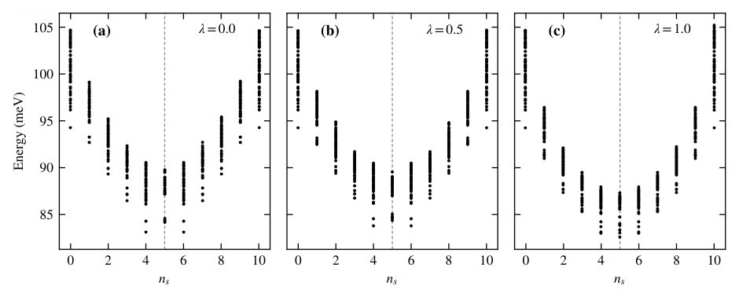 
FIG. 4. One band per valley exact diagonalization for the second moir´e band at θ = 5.25◦, Vz = 10meV, and ϵ = 17. Here, λ changes the intervalley interaction strength, ns is the occupation number in valley K, and ns = 5 indicates the symmetric filling Sz = 0 for the tilted sample T1 = (4, 1) and T2 = (1, 4).

📷 Fig 5

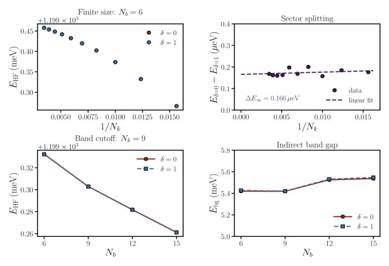 
FIG. 5. Finite-size and band-cutoff convergence of the δ = 0 and δ = 1 QSHC states. The calculations are performed at θ = 5.25◦, ϵ = 20, and Vz = 10 meV. The upper panels show the Hartree–Fock energies and sector splitting Eδ=0 −Eδ=1 versus 1/Nk for Nb = 6; linear extrapolation gives finite positive splitting ∆E∞= 0.17µeV. The lower panels show the Hartree–Fock energies and indirect band gaps versus the number of retained bands Nb at Nk = 9. The δ = 1 state remains energetically favored, while the indirect gap is stable against increasing the band cutoff.

**Summary.** This theoretical work predicts and classifies Quantum Spin Hall Crystals (QSHCs) in twisted bilayer $	ext{MoTe}_2$ at fractional filling. Using advanced mean-field calculations, the authors demonstrate a $\sqrt{3} 	imes \sqrt{3}$ QSHC state protected by specific symmetries. The research provides a detailed understanding of how intervalley interactions stabilize these topologically rich, charge-ordered phases.

**Why it may be interesting.** The detailed analysis of symmetry protection ($\mathbb{Z}_2$ vs $U(1)_v$) and the quantitative determination of energy splittings in topological phases are highly relevant to understanding emergent order in strongly correlated electronic systems.

Detailed structure

**Main problem.** The paper aims to predict and classify interaction-driven Quantum Spin Hall Crystals (QSHCs) that emerge at fractional filling due to the interplay between topology and spontaneous translation-symmetry breaking.

**Main result.** The system exhibits a $\sqrt{3} 	imes \sqrt{3}$ QSHC state at $
u = -8/3$ in twisted bilayer $	ext{MoTe}_2$, which forms a complex ground state manifold organized by a $\mathbb{Z}_3$ index.

**Method.** The study employs Self-Consistent Hartree-Fock (SCHF) calculations performed in the crystal Brillouin zone, supplemented by topological characterization using Wilson loops and Chern numbers.

**Model / system.** The physical system is twisted bilayer $	ext{MoTe}_2$. The analysis uses continuum models and mean-field approximations to study the interplay between topology, interaction effects, and lattice ordering.

**Key observables.** Spin-Chern number ($C_s$), valley Chern numbers ($C_K, C_{K'}$), crystal order parameters ($\Phi_\mu(\mathbf{Q})$), and energy splitting ($\Delta E$).

**Important parameters / regimes.** Fractional filling ($
u = -8/3$), twist angle ($	heta \approx 5^\circ$), and interaction strength ($\epsilon$).

**Assumptions / limitations.** The primary approximation is the use of the Hartree-Fock mean-field theory, which is noted to be limited in capturing fully fractionalized topological orders.

**Figures summary.** Figures illustrate the $\sqrt{3} 	imes \sqrt{3}$ QSHC structure, band structures for different phases (QSHC, AFMz, IVC), and phase diagrams showing the competition between these phases as a function of twist angle and interaction strength.

**Paper structure.** The paper systematically predicts QSHCs, analyzes the $\mathbb{Z}_3$ organization of the ground state manifold based on relative valley alignment ($\delta$), and quantitatively determines the energetic preference between different topological sectors using first-order energy corrections.

Abstract

We predict and classify interaction-driven quantum spin Hall crystals (QSHCs), a class of states emerging at fractional filling through an interplay of topology and spontaneous translation-symmetry breaking. QSHCs form nearly degenerate manifolds whose members can realize distinct topological phases protected by time-reversal or valley $U(1)_v$ symmetry, with time-reversal acting nontrivially within the manifold. As a representative of this broad class of states we provide evidence for 9-fold quasi-degenerate $\sqrt{3}\times\sqrt{3}$ charge ordered QSHCs at $ν= -8/3$ of twisted bilayer MoTe$_2$ near a $5^\circ$ twist. Here a $\mathbb{Z}_3$ index organizes states related by lattice translation into three time-reversal invariant states with nontrivial $\mathbb{Z}_2$ topology and three time-reversal related doublets whose individual members spontaneously break time-reversal and carry a $U(1)_v$ protected spin-Chern number. Finally, we determine the conditions that favor QSHCs over closely competing intervalley-coherent crystals.

[↑ back to top](#top)

### [Size and Impurity Effects on Scattering of Valley Hall Modes in Gate-Defined Bilayer Graphene Superlattices](http://arxiv.org/abs/2608.25931v1)

**Authors:** Marcus N. Kanestrøm, Antonio L. R. Manesco, D. O. Oriekhov  
**Type:** theory · **Category:** other · **PDF:** <https://arxiv.org/pdf/2608.25931v1>  
**Analysis basis:** full PDF text, analyzed in chunks
**Topic relevance:** `analog quantum simulation` **1/5**

📷 Fig 1

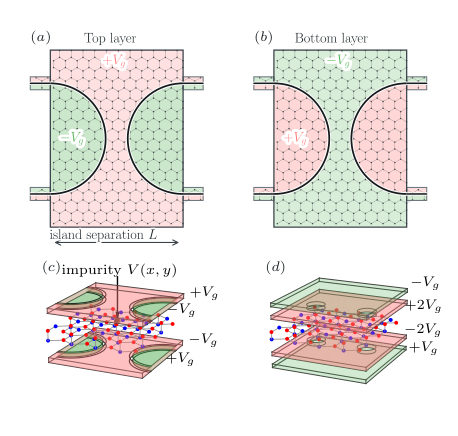 
FIG. 1. (a),(b) The impurity free BLG device and the as- sociated layer potentials. Attached leads are the extended portions of the rectangular shape on both the left and right side, where the domain wall enters. (a) The top graphene layer, where the half circle cutouts have a negative bias and the bulk scattering region has a positive bias. (b) The bot- tom graphene layer, which is a mirror copy of the top layer, but this time the interlayer bias is opposite to that of the top layer. Panels (c) and (d) represent a 3D view of devices studied in this paper. The (c) setup is used to study the scattering properties of helical modes with and without im- purity potential V (x, y). The two island...

📷 Fig 2

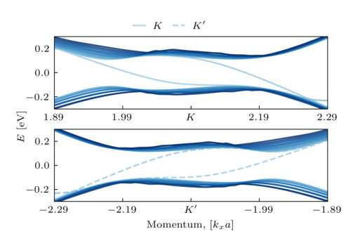 
FIG. 2. The band structure of BLG at each of the K-points when an interlayer bias is applied. From the Bulk-Boundary correspondence, one dimensional chiral modes appear in the band gap. The in-gap K valley modes are denoted with the solid blue lines, while the K’ valley modes are the dashed blue lines.

📷 Fig 3

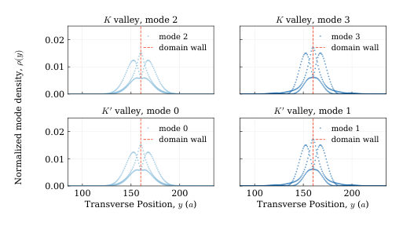 
FIG. 3. The transverse VHM profile along the electrostatic domain wall for each of the two helical modes present on either side. The electrostatic domain wall is denoted by the vertical red dashed line. What we see is that due to the unequal A and B lattice sites on either side of the domain wall, the wavefunction has two peaks on the inside and outside.

📷 Fig 4

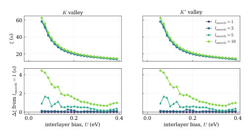 
FIG. 4. The evanescent decay lengths of the VHM for various interlayer biases and smoothening parameters. To make the domain wall sign shift more like a step-function, a smaller smoothening parameter (Ismooth) is chosen. Whereas a larger smoothening parameter indicates a longer bias sign transition. We see that for small interlayer biases (on the top row), we get larger decay lengths ζ(a). Additionally, for larger Ismooth, we get a longer decay length which is seen on the bottom row. ∆ζ is the difference in decay length units (a) between the chosen smoothening parameter and Ismooth = 1.

📷 Fig 5

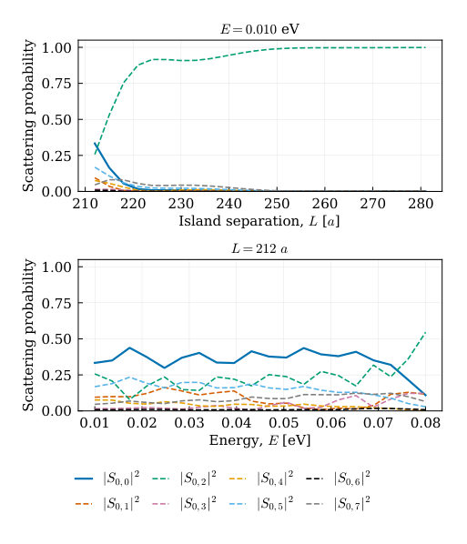 
FIG. 5. The length and energy sweep for the half circle sys- tem versus the scattering probability. For this plot, the mode originates from lead zero and can tunnel to seven other pos- sible modes, before leaving the scattering region. At a length of 250a, there is an increased likelihood that the mode tun- nels to other possible channels. Different energies at a fixed length, can enhance certain modes or suppress them.

**Summary.** This work simulates the behavior of topologically-protected valley Hall modes in patterned bilayer graphene superlattices. Using tight-binding methods, the authors show that impurities can facilitate resonant tunneling between islands, while the topological protection remains robust against certain device imperfections. This research advances the understanding of engineered topological quantum transport in 2D materials.

**Why it may be interesting.** The study directly models topological edge states and their interaction with disorder (impurities), which is highly relevant for understanding robust quantum transport in mesoscopic systems.

Detailed structure

**Main problem.** The paper investigates the scattering properties of topologically-protected valley Hall modes in engineered bilayer graphene superlattices.

**Main result.** Resonant tunneling via impurities enhances island overlap, and the topological protection remains robust even with misalignment of gate patterns.

**Method.** The study employs tight-binding simulations and analyzes the scattering matrix (S-matrix) to probe quantum transport phenomena.

**Model / system.** The system is Bernal bilayer graphene (BLG) patterned into superlattices using gate-defined islands, creating a sign-alternating gap structure that hosts valley Hall modes.

**Key observables.** Scattering probability, resonant tunneling enhancement, and the persistence of topological protection.

**Important parameters / regimes.** Interlayer bias ($U_0$), impurity potential strength, and the separation distance ($L$) between superlattice islands.

**Assumptions / limitations.** The model assumes the ability to engineer a device with an alternating gap structure and treats the system using a spinless, nearest-neighbor tight-binding Hamiltonian.

**Figures summary.** Figures illustrate the device setup, the VHM profile near domain walls, and energy sweeps showing oscillatory tunneling effects dependent on island separation.

**Paper structure.** The paper first establishes the theoretical framework using a tight-binding Hamiltonian, then analyzes the existence of topologically-protected valley Hall modes, and finally investigates how impurity scattering and island geometry affect these modes.

Abstract

In the present paper we perform a tight-binding simulation of gate-defined islands in Bernal bilayer graphene (BLG). The inversion of the gap sign on the boundaries of the islands creates topologically-protected valley Hall modes. We focus on the specific questions of whether the valley Hall modes around such islands could serve as a host for quantum walks or simulate weakly coupled systems, and how their tunneling is affected by in-gap impurities. In addition, we discuss the effect of misalignment of top and bottom gate patterns on the tunneling properties between islands. Our main results show that resonant tunneling via an impurity enhances overlap between superlattice islands, while misalignment does not break topological protection over a wide parameter regime. In addition, we study the two-island geometry and show that it is possible to leverage suppressed scattering to place islands more densely on a single sample.

[↑ back to top](#top)

### [The bottleneck dimension of quantum operations](http://arxiv.org/abs/2608.25010v1)

**Authors:** Pavel Sekatski  
**Type:** theory · **Category:** quantum information and computing · **PDF:** <https://arxiv.org/pdf/2608.25010v1>  
**Analysis basis:** full PDF text, analyzed in chunks
**Topic relevance:** `quantum measurements` **1/5**

📷 Fig 1

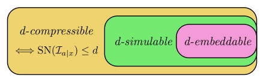 
FIG. 5. Hierarchy of the dimension-bottleneck properties. The sets of instrument families {Ia|x} that are d-embeddable, d-simulable and d-compressible are strictly nested.

📷 Fig 2

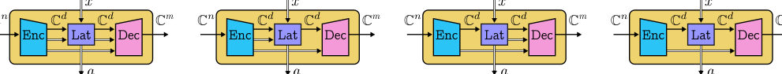 
FIG. 7. The four decompositions of a set of instruments {Ia|x} featuring a latent instrument acting on the d-dimensional system. They differ only in which classical variables are exchanged between the encoder, the latent instrument and the decoder. Concretely, the “blind” decompositions are obtained by forbidding the auxiliary classical communication between the encoder and the latent instrument.

**Summary.** This paper develops a rigorous, operational framework to define the 'effective coherent quantum dimension' of noisy quantum operations. It introduces and distinguishes three related concepts—$d$-compressibility, $d$-simulability, and $d$-embeddability—which quantify how much quantum information can be processed despite noise. The work culminates in calculating the precise noise threshold required for a universal quantum processor to maintain a specific level of coherence.

**Why it may be interesting.** This work provides fundamental theoretical tools for quantifying the operational limitations of noisy quantum hardware, which is crucial for designing fault-tolerant quantum computation protocols.

Detailed structure

**Main problem.** The paper aims to characterize the effective coherent quantum dimension of programmable quantum operations when noise prevents coherence across the full nominal Hilbert space.

**Main result.** It establishes a strict hierarchy among three notions—$d$-embeddability $\implies d$-simulability $\implies d$-compressibility—and derives the white-noise threshold for $d$-embeddability of noisy unitary channels.

**Method.** The authors introduce an operational, basis-independent framework using decompositions involving encoders, latent instruments, and decoders to formalize the dimension bottleneck.

**Model / system.** The model involves programmable quantum devices acting on a Hilbert space of dimension $n$, characterized by sets of quantum instruments $\{I_{a|x}\}$ mapping between systems of dimensions $n$ and $m$.

**Key observables.** The primary observables are the three notions of dimension bottleneck ($d$-compressibility, $d$-simulability, $d$-embeddability) and the white-noise threshold $f_2(d, n)$.

**Important parameters / regimes.** The key parameters are the nominal dimension $n$, the bottleneck dimension $d$, and the noise level (related to the white-noise threshold).

**Assumptions / limitations.** The analysis relies on the assumption of a 'dimensional bottleneck' and, in later parts, the use of the Haar measure for random unitaries to prove optimality.

**Figures summary.** Figures illustrate the structural decompositions corresponding to $d$-compressibility, $d$-simulability, and $d$-embeddability for both single channels and sets of instruments.

**Paper structure.** The paper first introduces the operational framework and defines the three notions, establishing the hierarchy. It then analyzes special cases (measurements, states) and progresses to derive the optimal decomposition strategy and calculate the exact white-noise threshold for noisy unitary channels.

Abstract

Programmable quantum devices nominally act on a Hilbert space whose dimension grows exponentially with the number of constituents, but the presence of noise makes it unlikely that they remain coherent across all of this immense Hilbert space. Then, what is the effective coherent quantum dimension that should be associated with such imperfect devices? To answer this question we here introduce an operational basis-independent framework which imposes a dimension bottleneck on the programmable transformations. Concretely we ask how strongly the quantum information they process can be compressed. Formalizing this idea we identify three inequivalent notions, termed $d$-compressibility, $d$-simulability and $d$-embeddability, which differ in the causal structure used to impose the bottleneck and form a strict hierarchy. The framework unifies several existing notions: joint measurability and simulability of quantum measurements, and the absolute dimensionality of state ensembles, are recovered as special cases. We illustrate the hierarchy with noisy qubit measurements in complementary bases, and we determine the white-noise thresholds at which the set of all noisy unitary channels in dimension $n$, a noisy universal quantum processor, becomes $d$-compressible, $d$-simulable and $d$-embeddable. The thresholds confirm the expectation -- maintaining coherence across the full Hilbert space becomes increasingly demanding as the nominal dimension $n$ increases.

[↑ back to top](#top)

## Other papers (10)

*Papers from primary archives without highlighted authors or any topic match. Click to expand.*

Show other papers

### [Affine-Profile Stabilizer Thresholds for Magic in Codeword-Stabilized Quantum Codes](http://arxiv.org/abs/2608.25414v1)

**Authors:** Li-Yi Hsu, En-Jui Kuo  
**Type:** theory · **Category:** quantum information and computing · **PDF:** <https://arxiv.org/pdf/2608.25414v1>  
**Analysis basis:** full PDF text, analyzed in chunks

📷 Fig 1

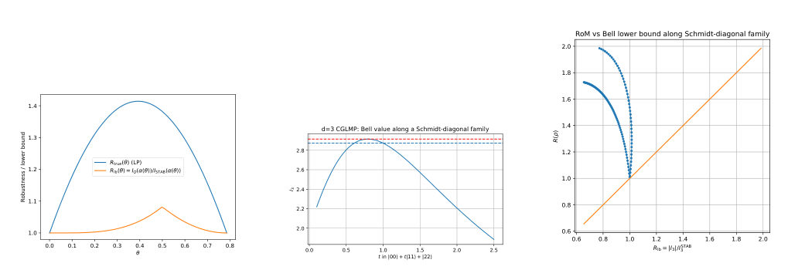 
FIG. 1: Small-scale numerical checks of the witness-induced RoM lower-bound principle. Panel (a) shows the two-qubit family |ψθ⟩= cos θ |00⟩+ sin θ |11⟩: the blue curve is the exact RoM computed by the stabilizer-decomposition linear program, while the orange curve is the tilted-CHSH stabilizer-threshold lower bound. Panel (b) shows the symmetric line ϕ = π/4 in the generalized three-qubit W family. Again, the blue curve is the exact RoM and the orange curve is the optimized Bell-type lower bound B⋆/6; the vertical dashed line marks the standard |W⟩state. Panel (c) plots the same three-qubit scan as exact RoM versus Bell-certified lower bound. The diagonal line is y = x, and the points...

**Summary.** This paper introduces a novel geometric framework to determine the robustness of magic for quantum states encoded by Codeword-Stabilized codes. By developing a CWS-adapted magic-witness, the authors reduce a complex quantum optimization problem to a tractable classical affine-incidence problem. This yields precise, computable lower bounds on quantum resource robustness based purely on the geometry of the underlying classical word set.

**Why it may be interesting.** It provides a powerful geometric tool (affine geometry) to analyze quantum resource bounds (magic robustness) in QEC codes, connecting abstract quantum optimization to concrete classical combinatorial problems.

Detailed structure

**Main problem.** The paper develops a framework to compute lower bounds on the robustness of magic ($R(
ho)$) for quantum states arising from Codeword-Stabilized (CWS) codes.

**Main result.** The quantum optimization problem is exactly reduced to a classical affine-incidence problem over the CWS word set, providing a fixed-parameter algorithm for calculating the stabilizer threshold.

**Method.** The authors use a CWS-adapted magic-witness framework to isolate codeword coherence, converting the quantum optimization into a geometric problem involving affine intersections of the classical word set.

**Model / system.** The model involves CWS codes, which provide a unified graph-state description for both stabilizer and non-additive quantum error-correcting codes. The states analyzed are coherent superpositions of individual word states.

**Key observables.** Robustness of magic ($R(
ho)$), the stabilizer threshold ($eta_{	ext{coh}}$), and the affine-intersection profile $M_r(C)$.

**Important parameters / regimes.** The size of the word set ($K$), the number of qubits ($n$), and the structure of the classical word set $C \subseteq \mathbb{F}_2^n$.

**Assumptions / limitations.** The certificate relies on calibrated Pauli measurements and is a magic witness, not a device-independent Bell inequality. The analysis is most meaningful when the target state is the coherent CWS superposition.

**Figures summary.** Figures illustrate the lower-bound principle using CHSH/W-type scans, comparing exact RoM versus the calculated lower bound.

**Paper structure.** The paper progresses by defining the coherence witness, deriving the general bound, specializing to the equal-weight case where phase optimization collapses, and finally establishing the exact reduction to the classical affine-incidence problem.

Abstract

Codeword-stabilized quantum codes give a unified graph-state description of stabilizer and nonadditive quantum error-correcting codes. Although each individual CWS word state is stabilizer, coherent superpositions of different word states can be nonstabilizer. We develop a CWS-adapted magic-witness framework that isolates this codeword coherence and converts it into certified lower bounds on robustness of magic.   The main result is an exact reduction of the stabilizer threshold of a natural CWS coherence witness to a finite-geometric problem over the classical CWS word set. For general weighted superpositions, the threshold is computed by enumerating affine intersections and affine-quadratic phases. For equal-weight superpositions, the phase optimization collapses, and the threshold is determined entirely by how many CWS words can lie in affine flats of each dimension. Thus a quantum optimization over stabilizer states becomes a classical affine-incidence problem.   This reduction yields a fixed-parameter algorithm, an analytic lower bound for an infinite union-stabilizer family, and exact rational certificates for several standard nonadditive CWS examples. The framework also clarifies why exact enumeration fails for large structured families and identifies the remaining task as an affine-intersection problem. The result provides a geometric mechanism by which nonlinear CWS word sets generate certifiable magic.

[↑ back to top](#top)

### [Certified decoding of quantum LDPC codes](http://arxiv.org/abs/2608.25545v1)

**Authors:** Ragavi Krishnamoorthy, Florian Gerhardt, Johannes Knaute, Thomas Klir, Stefan Raimund Maschek, Erik Schulze, Tomislav Maras, Alexander Dotterweich, Loong Kuan Lee, Christian Bauckhage, Nico Piatkowski  
**Type:** theory · **Category:** quantum information and computing · **PDF:** <https://arxiv.org/pdf/2608.25545v1>  
**Analysis basis:** full PDF text, analyzed in chunks

📷 Fig 1

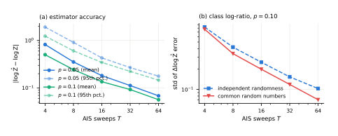 
Figure 1: Estimator validation on the rotated surface code d = 5 against exact coset sums (200 syndromes per point, K = 128 chains). (a) Absolute error of log ˆZλ versus the number of AIS sweeps T: the error decays as roughly T −1 and is ≈0.1 nats at T = 32. (b) Standard deviation of the error of the class log-ratio log ˆZ0 −log ˆZ1: common random numbers dominate in- dependent randomness uniformly in T (variance reduc- tion 1.2×–2.2×, growing with T).

📷 Fig 2

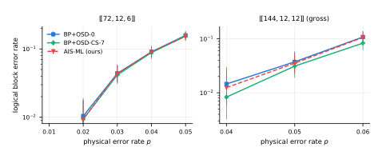 
Figure 3: Block logical error rates on the bivariate bi- cycle codes (Wilson 95% intervals; zero-failure points at p = 0.01 omitted from the log axis, see Table 1). On [[72, 12, 6]] the three decoders are statistically in- distinguishable; on the gross code BP+OSD-CS-7 re- tains an edge over both BP+OSD-0 and the (candidate- restricted) AIS decoder.

📷 Fig 3

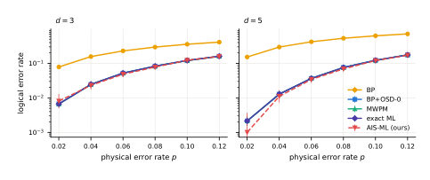 
Figure 2: Logical error rate versus physical bit-flip rate on rotated surface codes (d = 3 left, d = 5 right; Wilson 95% intervals). The BP+OSD-0, MWPM, and exact- ML curves coincide to within statistical resolution at these distances; the AIS decoder (dashed) reproduces the decisions of the exact degenerate ML decoder al- most perfectly (see text). Plain BP fails at all rates, as expected from the degenerate posterior of Section 6.

**Summary.** This work tackles the difficult problem of decoding quantum LDPC codes by reformulating it as estimating partition functions within a Markov Random Field model. The authors introduce novel, certified decoders that surpass existing heuristic methods by providing mathematical guarantees of optimality for most decisions. This advances the practical feasibility of fault-tolerant quantum computation by improving error correction decoding.

**Why it may be interesting.** The rigorous mathematical framework for handling error degeneracy in quantum codes, especially the development of certified decoding methods, provides tools applicable to understanding the limits of fault-tolerant quantum computation.

Detailed structure

**Main problem.** The primary challenge is decoding quantum Low-Density Parity-Check (qLDPC) codes, which is significantly harder than classical decoding because errors are equivalent up to stabilizers, requiring the comparison of entire error class probabilities (partition functions).

**Main result.** The authors developed a certified sampling decoder that matches or exceeds existing decoders while providing formal certificates of optimality for the majority of syndrome decisions.

**Method.** The problem is reframed as probabilistic inference in an undirected graphical model (Markov Random Field) over the code's check variables, allowing for the estimation of class partition functions using techniques like Annealed Importance Sampling (AIS) and Bethe free energy approximations.

**Model / system.** The system is quantum error correction using qLDPC codes, which are treated as an MRF. The framework generalizes concepts from the surface code to arbitrary CSS codes and spacetime decoding.

**Key observables.** Logical error rates, certified fractions of correct decisions, and the comparison of decoding performance against heuristic decoders like BP+OSD.

**Important parameters / regimes.** Code structure (e.g., [[72, 12, 6]]), noise models (depolarizing, circuit-level), and the computational cost (e.g., millisecond decoding time).

**Assumptions / limitations.** The core assumption is that the problem can be mapped to an MRF partition function estimation, and the Bethe decoder's bias cancels out when comparing different error classes.

**Paper structure.** The paper introduces the difficulty of degenerate quantum decoding, proposes the MRF framework for partition function estimation, details two main decoders (certified sampling and region-based), and validates them across various codes and noise models, concluding with hardware implementation results.

Abstract

Quantum low-density parity-check (qLDPC) codes reduce the qubit overhead of fault-tolerant quantum computation by an order of magnitude, but their decoding is harder than its classical counterpart: because many physical errors are equivalent up to stabilizers, the degenerate maximum-likelihood (ML) decoder must compare the probabilities of entire equivalence classes of errors, that is, partition functions, rather than single errors. The workhorse decoder BP+OSD sidesteps degeneracy heuristically and offers no guarantees. We treat degenerate decoding as probabilistic inference in an undirected graphical model: the probability of each logical class is the partition function of an unconstrained, strictly positive Markov random field over the code's check variables, a construction that generalizes the random-bond Ising mapping of the surface code to arbitrary CSS codes and to spacetime decoding with measurement errors and circuit-level noise. On this model we build two decoders. The first estimates all class partition functions by annealed importance sampling with common random numbers and attaches to every decision a certificate of optimality: a paired bootstrap test, or, composed with constant-factor estimators such as WISH, an exact optimality proof. The second is region-based: the Bethe free energy, whose bias cancels between classes, reproduces exact ML decoding on every tested surface-code instance at millisecond cost, and enlarging the regions to elimination clusters makes exact degenerate ML decoding of the [[72,12,6]] bivariate bicycle code feasible. Across surface codes and the bivariate bicycle codes [[72,12,6]] and [[144,12,12]], under code-capacity, phenomenological, and circuit-level noise, the sampling decoder matches or exceeds BP+OSD while certifying the bulk of its decisions, and the certificate flags exactly the syndromes on which any fast decoder should be distrusted.

[↑ back to top](#top)

### [Generalized Efficient Quantum Circuit Implementation of Discrete-Time Quantum Walks on Cayley Graphs](http://arxiv.org/abs/2608.25136v1)

**Authors:** Seoyoon Kang  
**Type:** theory · **Category:** quantum information and computing · **PDF:** <https://arxiv.org/pdf/2608.25136v1>  
**Analysis basis:** full PDF text, analyzed in chunks

📷 Fig 1

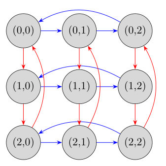 
Figure 1: Examples of different types of Cayley graphs. (a) An undirected regular graph with an involution at σ = 3. Each edge is color-coded according to its corresponding generator in the generating set. (b) A directed torus grid graph with each cyclic group and its generator edges color-coded accordingly.

📷 Fig 2

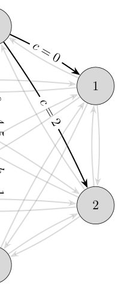 
Figure 2: Graphical representation of the DTQW setup on an N-node Cayley graph with k generators. Each node represents a position state |x⟩in the Hilbert space H(N) p . The directed edges originating from node 0 illustrate the conditional shifts to neighboring nodes, where each transition is governed by a specific coin state |c⟩from the k-dimensional coin space H(k) c .

📷 Fig 3

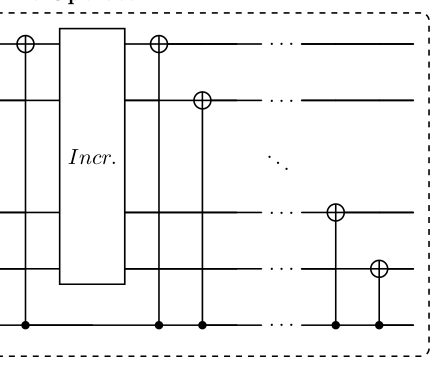 
Figure 4: Quantum circuit implementation of a single-step discrete-time quantum walk (DTQW) using the decomposed shift operator. The shift operator is realized through a sequence of controlled-NOT operations acting on the position register, with the control provided by the coin register, and an increment operator independent of the coin state. The coin operator is applied prior to the conditional shift, completing one time step of the walk.

📷 Fig 4

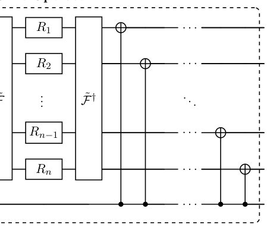 
Figure 5: Final quantum circuit implementation of a single-step DTQW in the stepwise QFT scheme [20], showing the decomposition of the increment operator using QFT, phase rotations Rλ, and the IQFT.

📷 Fig 5

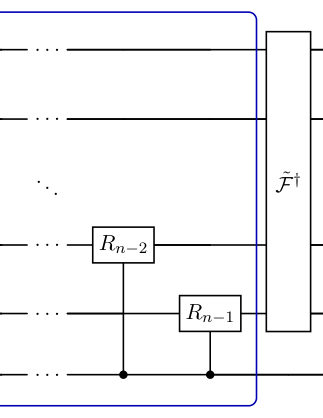 
Figure 6: Quantum circuit implementation of DTQW in the boundary QFT scheme [21]. The QFT and its inverse are implemented only once at the start and the end excluding the SWAP operation. The central block corresponds to the single time step and is to be repeated t times.

**Summary.** This paper presents a generalized, efficient quantum circuit framework for simulating discrete-time quantum walks on arbitrary Cayley graphs. By systematically decomposing the complex shift operator using a multi-stage factorization technique, the authors achieve substantial reductions in required CNOT gates compared to standard methods. This provides a crucial, hardware-conscious tool for realizing quantum walk simulations on near-term quantum hardware.

**Why it may be interesting.** This work directly tackles the resource estimation for implementing quantum walks, which are fundamental models for quantum search and simulation, making it highly relevant for quantum algorithm development.

Detailed structure

**Main problem.** The paper addresses the challenge of developing a generalized and efficient quantum circuit framework for implementing discrete-time quantum walks (DTQWs) on Cayley graphs of arbitrary dimension.

**Main result.** The proposed multi-stage decomposition of the shift operator significantly reduces the upper-bound CNOT cost compared to naive implementations, providing a scalable pathway for near-term quantum devices.

**Method.** The authors build upon the Boundary QFT scheme by introducing a systematic, hierarchical multi-stage decomposition of the shift operator, which factorizes the QFT-diagonalized operator into structured block components.

**Model / system.** The model is the Discrete-Time Quantum Walk (DTQW) evolving on a Cayley graph $\Gamma(G, S)$. The evolution is governed by $U = S(C \otimes I_p)$, where $S$ is the shift operator, which is the primary computational bottleneck.

**Key observables.** Upper-bound CNOT cost, gate complexity, and the reduction factor compared to naive implementations.

**Important parameters / regimes.** The degree of the generating set ($k$) is identified as the dominant resource parameter, with efficiency gains shown for $k \le 64$ (inverse-closed) and $k \le 16$ (non-inverse-closed).

**Assumptions / limitations.** The analysis relies on the linear CNOT scaling established by Rosa et al. and assumes the efficiency gain is largely insensitive to the system size $N$.

**Figures summary.** The figures illustrate examples of different Cayley graphs and provide a graphical representation of the DTQW setup, including specific optimized quantum circuits for 2D torus graphs.

**Paper structure.** The paper first establishes the DTQW model and the role of the shift operator. It then details the systematic multi-stage decomposition, generalizing the Boundary QFT scheme. The core of the work involves applying this decomposition to specific graph examples (1D and 2D torus graphs) and performing gate complexity analysis to demonstrate the efficiency gains.

Abstract

We present a generalized and efficient quantum circuit framework for implementing discrete-time quantum walks (DTQWs) on Cayley graphs of arbitrary dimension. Building on the Boundary QFT scheme of Razzoli et al., we introduce a systematic multi-stage decomposition of the shift operator for 1D Cayley graphs across three classes of generating sets: inverse-closed without involutions, inverse-closed with an involution, and non-inverse-closed. The decomposition hierarchically factorizes the QFT-diagonalized shift operator into structured block components, progressively reducing the control degree of the required rotation gates and replacing high-degree multi-qubit controlled operations with collections of lower-degree equivalents. We extend this construction to $d$-dimensional torus graphs and provide explicit circuit implementations for an 8-Cayley graph and a $\mathbb{Z}_{16} \times \mathbb{Z}_8$ torus graph as concrete illustrations. Gate complexity analysis using the linear CNOT scaling of Rosa et al. demonstrates that the decomposed implementation achieves a substantial reduction in upper-bound CNOT cost relative to the naive implementation within the regime $k \leq 64$ for inverse-closed graphs and $k \leq 16$ for non-inverse-closed graphs, where $k$ denotes the degree of the generating set. Benchmarking further reveals that this efficiency gain is largely insensitive to the system size $N$, identifying $k$ as the dominant resource parameter for the shift operator. These results provide a scalable and hardware-conscious pathway toward practical DTQW implementations on near-term quantum devices.

[↑ back to top](#top)

### [Light-Hole Spin Qubits in Strained SiGe Lattice-Matched to Ge](http://arxiv.org/abs/2608.25852v1)

**Authors:** Edmondo Valvo, Davide Costa, Patrick Del Vecchio, Stefano Bosco, Giordano Scappucci, Maximilian Rimbach-Russ  
**Type:** theory · **Category:** quantum information and computing · **PDF:** <https://arxiv.org/pdf/2608.25852v1>  
**Analysis basis:** full PDF text, analyzed in chunks

📷 Fig 1

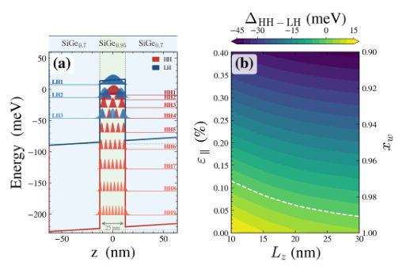 
FIG. 1. We study a heterostructure lattice matched to bulk Ge comprising stacked Si1−xGex layers of different com- position leading to a tensile-strained quantum well. We show in (a) an exemplary parameter choice with a relaxed Ge buffer at the left-most edge and then an alternation of Si0.30Ge0.70/Si0.05Ge0.95/Si0.30Ge0.70. In (b) a map of the energy gap between HH ground state and LH ground state as a function of well thickness and Ge concentration in the SiGe well. The dashed white line represents the transition line where the HH-LH gap closes. The strain ε∥is computed from the linear Vegard interpolation of the lattice constant of the Si1−xwGexw well.

📷 Fig 2

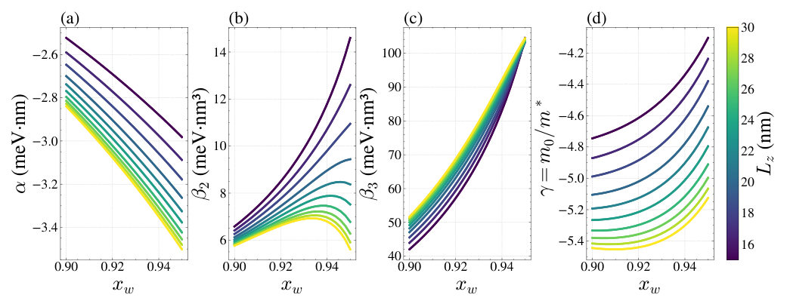 
FIG. 2. Subband parameters as a function of Germanium concentration (xw) in the SiGe well and well thickness. (a) linear Rashba coefficient α, (b) cubic Rashba coefficient β2 proportional to k3 + in the folded Hamiltonian, (c) cubic Rashba coefficient β3 proportional to k−k+k−in the folded Hamiltonian and finally the effective mass of the lowest subband in (d). All four figures were extracted for a vertical field of 1 MV/m and barrier composition Si0.3Ge0.7

📷 Fig 3

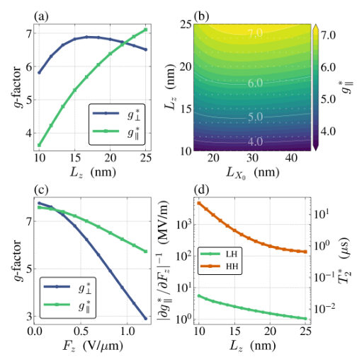 
FIG. 3. Simulated g-factors in the growth direction (g∗ ⊥) and purely in plane along the x direction (g∗ ∥) at an electric field Fz = 0.5 MV/m for (a) a sweep of the Si0.05Ge95 well thickness (Lz) with fixed planar confinement at 35 nm, (b) isotropic planar confinement LX0 and well thickness and (c) out-of-plane linear electric field Fz for Lz = 25 nm and LX0 = 35 nm. The barrier composition is set to Si0.30Ge0.70. (d) The inverse of the derivative of the in-plane g-factor with re- spect to the vertical electric field (and corresponding dephas- ing time) is computed as a function of well thickness for the proposed tensile strained heterostructure with Si0.05Ge95 well and a typical ε-Ge...

📷 Fig 4

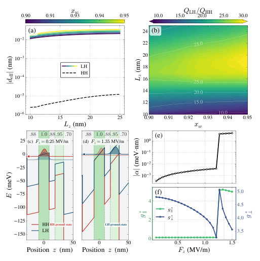 
FIG. 4. (a) Computed dipole moment as the transition matrix element of the position operator between the two computa- tional states d = ⟨0| x |1⟩, expressed in nm, for a planar con- finement LX0 = 35 nm, barrier composition Si70Ge30, vertical electric field Fz = 1.2 MV/m and magnetic field amplitude 15 mT. Overlayed in black is the dipole moment of the ε-Ge HH heterostructure utilized for comparison. (b) Ratio of Quality factors Q = T ∗ 2 deffeEAC/ℏfor a Light-Hole ground state in the tensile strained SiGe well (QLH) and a ε-Ge HH hole spin qubit (QHH) computed for fluctuations around a vertical field of 1.2 MV/m. (c)-(d) Proposed heterostructure to achieve a HH-LH bilayer for 0.25 MV/m and...

📷 Fig 5

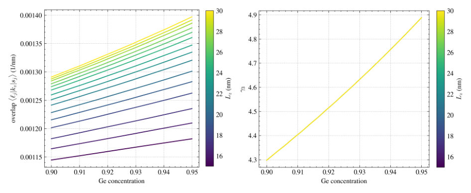 
FIG. 5. (a) Light-Hole/Split-Off overlap as a function of the Ge concentration in the well and well thickness. (b) Luttinger parameter γ3. We plot these quantities as a function of Ge concentration in the well and well thickness. These quantities were extracted for a vertical field of 1 MV/m.

**Summary.** This theoretical work proposes using tensile-strained SiGe/Ge heterostructures to create light-hole (LH) spin qubits, overcoming limitations found in conventional heavy-hole (HH) qubits. By engineering the lattice structure, the authors achieve a significantly more isotropic spin response and a substantial increase in the qubit's quality factor. The model also demonstrates the feasibility of electrically switching between HH and LH ground states.

**Why it may be interesting.** The detailed theoretical modeling of spin-orbit coupling and g-tensor renormalization in semiconductor heterostructures is highly relevant for designing solid-state qubits, providing concrete material parameters for quantum device engineering.

Detailed structure

**Main problem.** The paper addresses the need for advanced hole-based spin qubits with improved coherence and reduced spin anisotropy compared to established heavy-hole (HH) platforms.

**Main result.** The proposed tensile-strained Light-Hole (LH) heterostructure lattice-matched to Ge successfully stabilizes an LH ground state exhibiting large spin-orbit coupling and an order-of-magnitude improvement in the quality factor.

**Method.** The study employs theoretical calculations involving the numerical diagonalization of a 6-band k.p Hamiltonian and projecting the resulting Hamiltonian to analyze spin properties.

**Model / system.** The physical system is a quantum well/barrier structure made of tensile-strained SiGe/Ge, designed to confine holes in a light-hole (LH) ground state. The model uses a k.p Hamiltonian incorporating linear and cubic spin-orbit coupling terms.

**Key observables.** Spin-orbit coupling parameters ($\alpha, eta_2, eta_3$), g-tensor components ($g^*_{\parallel}, g^*_{\perp}$), dipole moment, and Quality factor ($Q$).

**Important parameters / regimes.** Well thickness ($L_z$), Ge concentration ($x_w$), and applied electric field ($F_z$).

**Assumptions / limitations.** The analysis assumes the system remains structurally stable against strain relaxation, and calculations are performed by projecting the full Hamiltonian onto the LH ground state doublet.

**Figures summary.** Figures illustrate the energy gap closure between HH and LH states, the dependence of SOC parameters and effective mass on composition/thickness, and the tunability of the g-tensor components with applied electric fields.

**Paper structure.** The paper systematically compares the proposed LH platform against traditional HH platforms, deriving the effective Hamiltonian, calculating key spin parameters (SOC, g-tensor), and demonstrating the advantages in coherence and tunability, culminating in the proposal of a switching bilayer structure.

Abstract

Strained germanium ($\varepsilon$-Ge) quantum wells on metamorphic SiGe buffers have enabled advanced hole-based spin qubit devices. Alternatively, unstrained Ge with lattice-matched strained silicon-germanium ($\varepsilon$-SiGe) barriers eliminates the need for metamorphic buffers altogether. The ground state character of both these platforms is predominantly heavy-hole (HH) with a largely anisotropic spin response. We propose and study an alternative heterostructure, lattice-matched to Ge, in which both the SiGe quantum well and barriers are tensile strained, with their composition contrast providing the band offset for confinement and the tensile strain stabilizing a light-hole (LH) ground state. We show large spin-orbit coupling (SOC), both linear and cubic, along with a significantly more isotropic spin response compared to strained HH qubits. We also study the decoherence properties of the proposed device, showing an appreciable gain in the quality factor compared to their HH counterparts. Finally, we propose a bilayer heterostructure that allows for electrical switching between HH and LH ground state character.

[↑ back to top](#top)

### [Quasi two dimensional magnetic structure of the triclinic double perovskite Ca$_2$CuWO$_6$](http://arxiv.org/abs/2608.25778v1)

**Authors:** Bangye Qin, Dmitry D. Khalyavin, Xuan Liang, Kazunari Yamaura, Alexei A. Belik, Roger D. Johnson  
**Type:** both · **Category:** strongly correlated electrons · **PDF:** <https://arxiv.org/pdf/2608.25778v1>  
**Analysis basis:** full PDF text, analyzed in chunks

📷 Fig 1

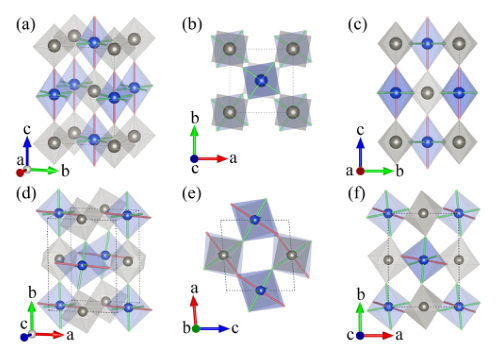 
FIG. 1. Comparison of the crystal structures and co-operative Jahn–Teller distortions of Sr2CuWO6 and Ca2CuWO6, shown in panes (a)-(c) and (d)-(f), respectively (note relative origin shift). The elongated Cu-O bonds shown in red are parallel to the tetragonal c axis in Sr2CuWO6 and to [¯101] in the native P¯1 setting of Ca2CuWO6, which follows Ref. [12] in which b is the largest unit cell parameter. W and Cu atoms are shown in gray and blue, respectively meanwhile Sr and Ca atoms are omitted for clarity.

📷 Fig 2

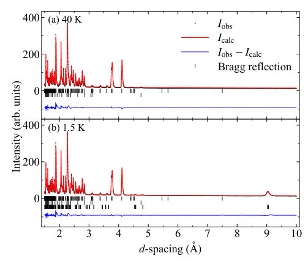 
FIG. 2. Neutron powder diffraction data for Ca2CuWO6 collected in (a) the paramagnetic phase and (b) the antiferro- magnetic phase. A representative pattern from the detector bank centred at 58.330◦is shown. Black points denote the observed intensities, the red curves are the calculated pro- files, and the blue curves are the observed-minus-calculated differences, offset vertically for clarity. In (a), the tick marks indicate, from top to bottom, Ca2CuWO6 and CaWO4 im- purity nuclear Bragg positions, respectively. In (b), the ad- ditional row indicates magnetic Ca2CuWO6 reflections. The magnetic reflection near d ≃9.0 Å is indexed as ( 1

📷 Fig 3

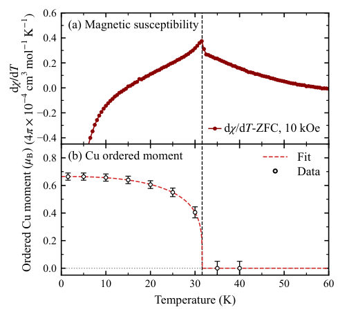 
FIG. 3. (a) Low-temperature dependence of the mag- netic susceptibility for Ca2CuWO6 measured under zero-field- cooled (ZFC) conditions, shown here in SI units as the first derivative with respect to temperature to clearly identify the magnetic phase transition at TN ≃32 K. (b) Temperature dependence of the ordered Cu moment per Cu site obtained from Rietveld refinements against NPD data. The dashed curve is the phenomenological fit described in the main text. The vertical dashed lines in both panels indicate the magnetic phase transition at TN.

📷 Fig 4

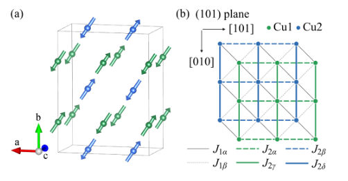 
FIG. 4. (a) The collinear magnetic structure of Ca2CuWO6 at 1.5 K, described by the propagation vector k = ( 1

📷 Fig 5

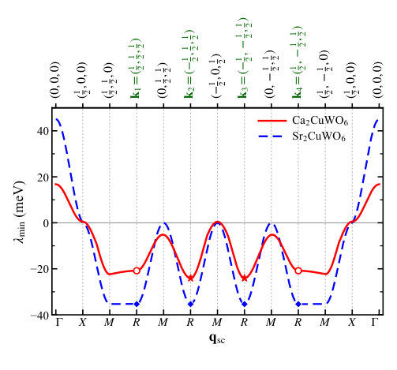 
FIG. 5. Lowest energy mean-field eigenvalue, λmin, for Ca2CuWO6 (red solid line) and Sr2CuWO6 (blue dashed line) plotted along a selected path in the first Brillouin zone of the pseudo-cubic supercell, as defined at the top of the figure. The four R points correspond to the k-domains (see Table II) with k1,4 indicated by open circles and k2,3 by closed stars. We note that the nearly degenerate line of wavevectors ap- pearing close to k1 and k4 in this plot result from the very weak, out-of-plane interactions J3 and J4 that involve doubly occupied d3z2−r2 Cu orbitals.

**Summary.** This research determines the antiferromagnetic ground state of the triclinic double perovskite Ca2CuWO6 using neutron diffraction. By comparing it to the tetragonal analogue, Sr2CuWO6, the authors show that the structural symmetry lowering selects a single, common magnetic ordering vector. This highlights how subtle symmetry changes can dictate the precise magnetic ground state in strongly correlated oxides.

**Why it may be interesting.** The work provides a detailed case study of how crystal symmetry breaking (tetragonal to triclinic) can select a specific ground state among several theoretically possible magnetic configurations, which is a key concept in understanding magnetic phase transitions in correlated materials.

Detailed structure

**Main problem.** To determine the antiferromagnetic ground state of the triclinic double perovskite Ca2CuWO6 and analyze how symmetry breaking affects its magnetic structure compared to the tetragonal analogue, Sr2CuWO6.

**Main result.** The magnetic ground state is collinear with equal-magnitude, antiparallel moments on the two Cu sites, and the symmetry breaking from tetragonal to triclinic structure selects a single magnetic propagation vector domain.

**Method.** The study combines neutron powder diffraction measurements to determine the magnetic structure with mean-field theoretical calculations using a supercell approach to model magnetic interactions.

**Model / system.** The system involves double perovskites (A2BB'O6) containing Jahn-Teller active Cu2+ ions, leading to quasi-two-dimensional magnetic networks mediated by W-site interactions. The analysis uses a supercell construction to compare the magnetic motifs of the triclinic and tetragonal phases.

**Key observables.** Magnetic Bragg reflections indexed by k = (1/2, 1/2, 0); ordered moment of 0.66(3) μB per Cu at 1.5 K; the selected magnetic propagation vector k-domain.

**Important parameters / regimes.** Transition temperatures (T_N ~ 32 K for Ca2CuWO6); exchange interaction strengths (J values); the difference in mean-field eigenvalues (Delta k).

**Assumptions / limitations.** The magnetic interactions are dominated by W-mediated, second-neighbor superexchange pathways, and the comparison is made by mapping both structures onto a common crystallographic supercell.

**Figures summary.** Figures show NPD data confirming magnetic reflections at 1.5 K, and theoretical plots compare the lowest energy mean-field eigenvalue along the Brillouin zone path for both compounds.

**Paper structure.** The paper first establishes the magnetic ordering in Ca2CuWO6 via NPD, determining the collinear structure and moment size. It then employs a supercell model and mean-field theory to compare this result with Sr2CuWO6, showing that symmetry breaking selects a specific, common magnetic motif.

Abstract

We present the antiferromagnetic ground state of the triclinic double perovskite Ca$_2$CuWO$_6$solved by neutron powder diffraction, and analyze it in direct comparison with tetragonal Sr$_2$CuWO$_6$. Below $T_\mathrm{N} \simeq 32$ K, the magnetic Bragg reflections of Ca$_2$CuWO$_6$ are indexed by the commensurate propagation vector $\mathbf{k}=(\tfrac{1}{2},\tfrac{1}{2},0)$ in its native $P\bar{1}$ cell. Rietveld refinement yields a collinear structure with equal-magnitude, antiparallel moments on the crystallographically inequivalent Cu1 and Cu2 sites and an ordered moment of $0.66(3)~μ_{\mathrm B}$ per Cu at 1.5 K. A direct comparison with Sr$_2$CuWO$_6$ is obscured by different crystallographic settings and orientations of the cooperative Jahn-Teller elongation axes. Hence, we introduce a common crystallographic supercell through which effects of symmetry lowering from tetragonal to triclinic in the double perovskite are explored: Apparently different magnetic propagation vectors map onto the same supercell wave vector, revealing a common magnetic structure stabilized by tungsten-mediated, second-neighbor interactions. Mean field calculations further show that tetragonal symmetry preserves the degeneracy of four magnetic $\mathbf{k}$-domains in Sr$_2$CuWO$_6$, whereas the triclinic splitting of symmetry-related exchange pathways in Ca$_2$CuWO$_6$, most strongly within the Cu2 network, selects a single $\mathbf{k}$-domain. These results establish the magnetic ground state of Ca$_2$CuWO$_6$ and show how symmetry breaking selects a given ordered state without changing the underlying magnetic motif of the Sr analogue.

[↑ back to top](#top)

### [Semi-localized ground state in a 1D system with long-range hopping](http://arxiv.org/abs/2608.25806v1)

**Authors:** Murod S. Bahovadinov, Faridun N. Jalolov, Vladimir E. Kravtsov, Boris L. Altshuler, Georgy V. Shlyapnikov  
**Type:** theory · **Category:** disordered systems and neural networks · **PDF:** <https://arxiv.org/pdf/2608.25806v1>  
**Analysis basis:** full PDF text, analyzed in chunks

📷 Fig 1

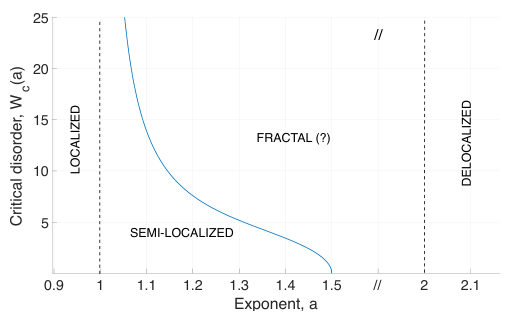 
FIG. 1. Sketch of the phase diagram of the ground state in the momentum space.

📷 Fig 2

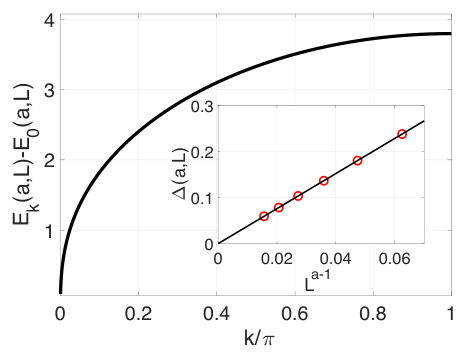 
FIG. 2. Typical single-particle energy spectrum Ek(a, L) − E0(a, L) for a = 1.4. Inset: The scaling of energy gap ∆(a, L) between the ground state and the first excited state as a func- tion of La−1. The straight line is a linear fit.

📷 Fig 3

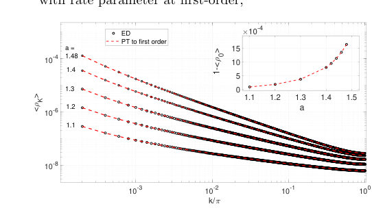 
FIG. 3. ED and PT results for the mean normalized tail intensities ⟨ρK⟩, shown on a log–log scale at fixed disorder amplitude W = 0.1 for L = 104. Different curves correspond to different values of a. Inset: 1 −⟨ρ0⟩as a function of a. Error bars are smaller than the symbol size. The PT results to first order reproduce the ED results with the accuracy of few percent.

📷 Fig 4

 
Figure 3 compares the exact-diagonalization (ED) and perturbation-theory (PT) results for the mean normal- ized tail intensities ⟨ρK⟩at a fixed disorder strength W = 0.1 for L = 104. We observe excellent agreement between the two approaches over the full momentum

📷 Fig 5

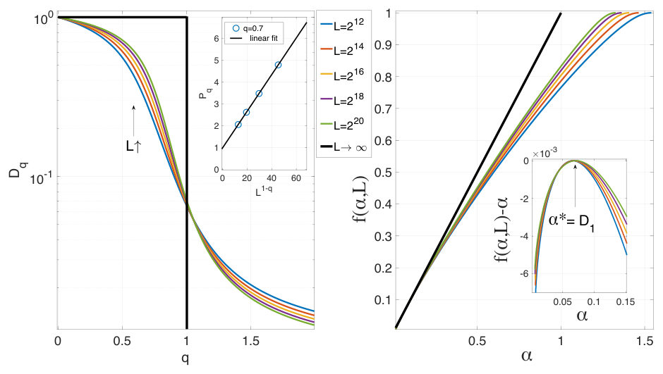 
FIG. 4. Left panel: Fractal dimensions Dq obtained from PT for several system sizes L at fixed disorder strength W = 0.6 and a = 1.48. The black solid curve denotes the predicted thermodynamic-limit for Dq, Eq. (47). The finite-size data converge toward this limit with increasing L but the convergence is very slow. Inset: Finite-size scaling of Pq at fixed q = 0.7, illustrating the fit to the ansatz Pq = aq + bqL1−q. The solid line is a linear fit. Right panel: Corresponding singularity spectrum f(α, L) obtained via Legendre transform of τL(q) = −ln Pq/ ln L. The singularity spectrum approaches at L →∞the semi-localized form f(α, ∞) ≡f(α) = α, (0 &lt; α &lt; 1), predicted by perturbation theory,...

**Summary.** This theoretical work analyzes quantum localization in 1D systems with long-range hopping and disorder. Using advanced perturbation theory and SUSY techniques, the authors find that the ground state exhibits a unique 'semi-localized' state for certain hopping decay rates. This is quantified by a specific set of fractal dimensions, extending the understanding of wave function statistics in disordered quantum matter.

**Why it may be interesting.** The concept of 'semi-localization' and the derivation of multifractal spectra provide a detailed theoretical understanding of how disorder affects quantum wavefunctions beyond simple localization/delocalization transitions, which is relevant for understanding transport in disordered quantum materials.

Detailed structure

**Main problem.** The paper investigates the localization properties of a quantum particle in a 1D system subjected to long-range hopping and diagonal disorder, focusing on the ground state in momentum space.

**Main result.** For specific hopping decay rates ($1 < a < 3/2$), the ground state exhibits 'semi-localization' rather than conventional localization, characterized by a specific set of fractal dimensions $D_q$.

**Method.** The analysis employs weak-disorder perturbation theory in the momentum basis, supplemented by techniques utilizing supersymmetric (SUSY) structure decomposition and asymptotic analysis of wavefunction moments.

**Model / system.** The model is a 1D quantum system described by a Hamiltonian with long-range hopping amplitudes $t(r) \propto r^{-a}$ and on-site disorder $\epsilon_i$. The study focuses on the ground state properties.

**Key observables.** Generalized fractal dimensions ($D_q$), normalized momentum-space intensity ($
ho_K$), and the zero-momentum mode weight ($
ho_0$).

**Important parameters / regimes.** The hopping decay exponent $a$, which dictates the behavior; the disorder strength $W$; and the hybridization parameter $\epsilon$.

**Assumptions / limitations.** The analysis relies heavily on weak-disorder perturbation theory (up to second order in $W$) and asymptotic limits for large system size $L$.

**Figures summary.** Figures compare Exact Diagonalization (ED) results with Perturbation Theory (PT) predictions for the energy spectrum, moment ratios, and the fractal dimensions $D_q$ across different disorder strengths.

**Paper structure.** The paper progresses by defining the Hamiltonian and the physical problem, applying SUSY and perturbation theory to derive expressions for wavefunction moments, and finally analyzing the asymptotic behavior of these moments to determine the fractal dimensions $D_q$ in different regimes of the parameter $a$.

Abstract

We study the localization of a quantum particle in a one-dimensional disordered system with long-range hopping amplitudes $t(r)\propto r^{-a}$. In contrast to the standard one-dimensional Anderson model ($a\to\infty$), in which all states are localized and the localization length is minimal at the band edge, the long-range model with $1<a<3/2$ exhibits a disorder-driven transition at the band edge, while high-energy states remain localized at arbitrary disorder strength. We investigate this transition for the ground state in momentum space. In the weak-disorder regime, we derive perturbative expressions for the characteristic functions and moments of the momentum-space wave function, as well as for its fractal dimensions. Our results demonstrate that the ground state exhibits $\it semilocalization$ rather than conventional localization, thereby extending the class of models displaying the unusual $\it semifractality$ of wave functions.

[↑ back to top](#top)

### [Separating Quantum Indistinguishability Obfuscation from Falsifiable Assumptions](http://arxiv.org/abs/2608.25195v1)

**Authors:** Mohammed Barhoush, Tomoyuki Morimae, Ramis Movassagh  
**Type:** theory · **Category:** quantum information and computing · **PDF:** <https://arxiv.org/pdf/2608.25195v1>  
**Analysis basis:** full PDF text, analyzed in chunks

📷 Fig 1

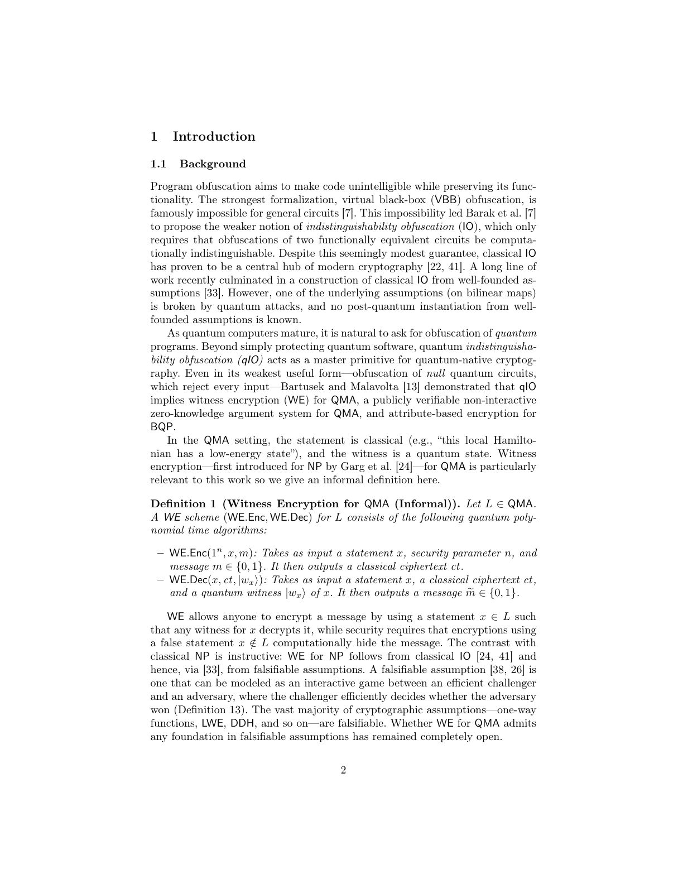 
Low-resolution page preview, page 2

📷 Fig 2

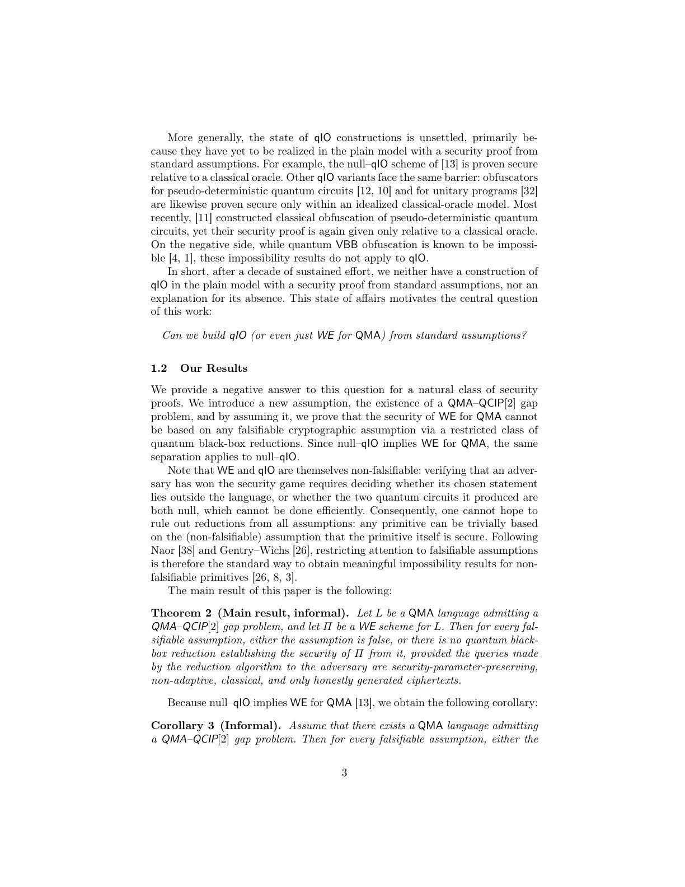 
Low-resolution page preview, page 3

📷 Fig 3

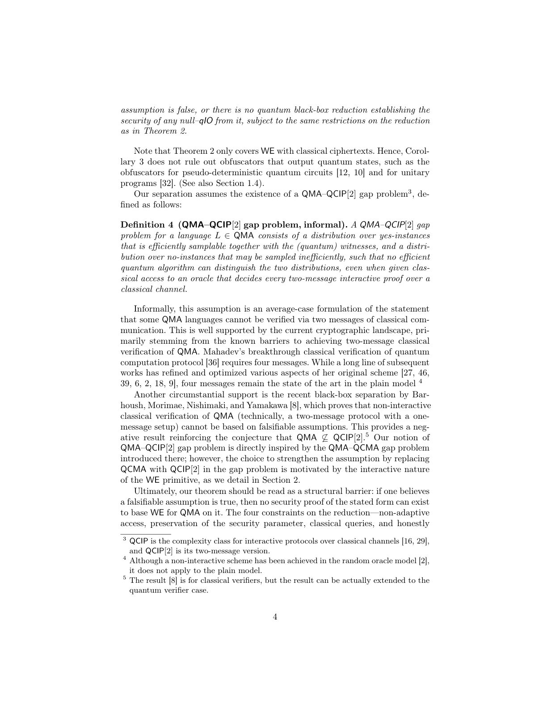 
Low-resolution page preview, page 4

📷 Fig 4

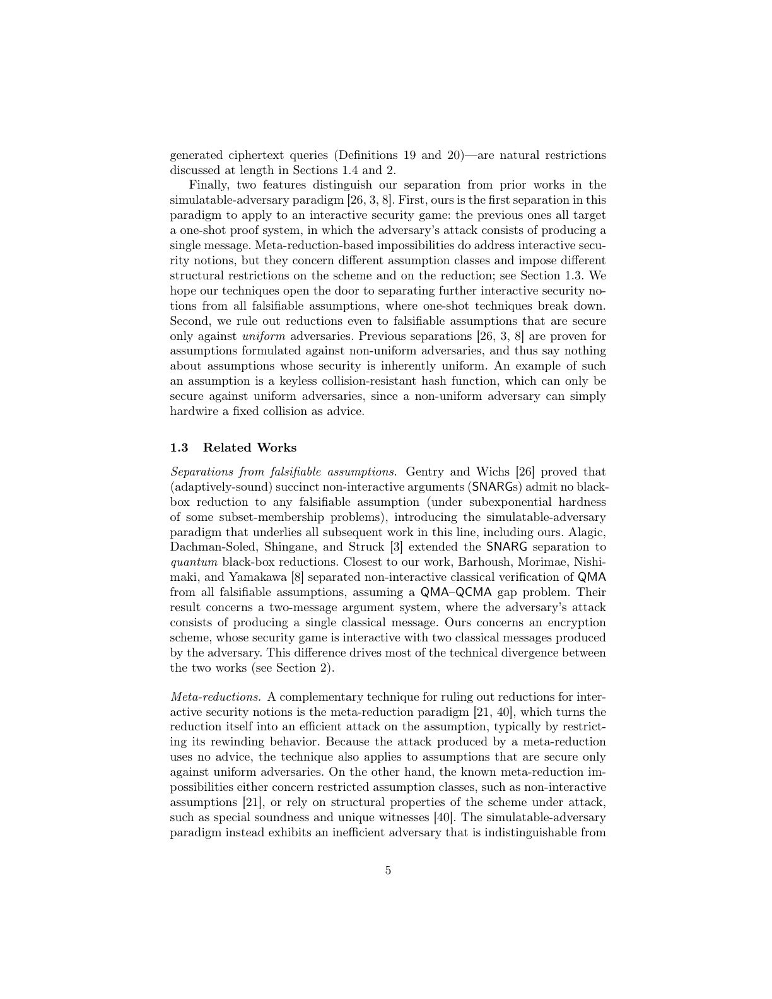 
Low-resolution page preview, page 5

📷 Fig 5

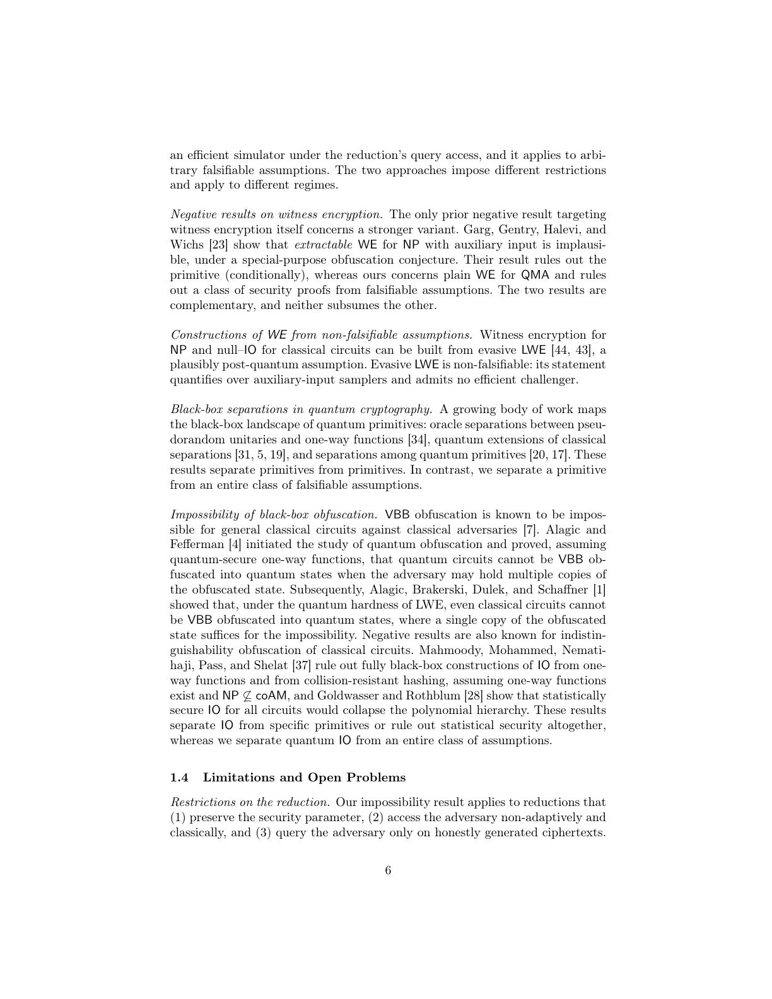 
Low-resolution page preview, page 6

**Summary.** This paper tackles the fundamental cryptographic question of whether quantum indistinguishability obfuscation (qIO) can be secured using standard, falsifiable computational assumptions. By proving an impossibility result under specific reduction constraints, the authors show that qIO security for QMA cannot be based on these assumptions. This establishes a significant theoretical barrier for constructing such primitives.

**Why it may be interesting.** While highly theoretical, the concepts of quantum obfuscation and complexity separation are foundational to understanding the limits of quantum cryptography, which underpins many advanced quantum information protocols.

Detailed structure

**Main problem.** The paper aims to separate the security of Quantum Indistinguishability Obfuscation (qIO) and Witness Encryption (WE) for QMA from standard, falsifiable cryptographic assumptions.

**Main result.** It proves that the security of WE for QMA cannot be based on any falsifiable cryptographic assumption under a restricted class of quantum black-box reductions, thereby establishing a structural barrier for qIO security.

**Method.** The proof utilizes a restricted class of quantum black-box reductions and relies on the existence of a QMA–QCIP[2] gap problem as a necessary assumption.

**Model / system.** The work operates within the framework of quantum computation, focusing on quantum circuits, the complexity class QMA, and cryptographic primitives like qIO and WE.

**Key observables.** The advantage of the qIO-adversary, which measures the success probability of breaking the obfuscation scheme.

**Important parameters / regimes.** The security parameter $n$, and the assumption of a QMA–QCIP[2] gap problem.

**Assumptions / limitations.** The result is restricted to WE with classical ciphertexts and relies on the existence of the QMA–QCIP[2] gap problem; it does not cover all possible reductions or quantum state outputs.

**Paper structure.** The paper establishes the formal definitions for null-qIO and WE for QMA, then constructs the restricted null-qIO reduction, culminating in a theorem that proves the separation between the security of qIO and falsifiable assumptions.

Abstract

Quantum indistinguishability obfuscation (qIO) aims to make a quantum circuit unintelligible while preserving its functionality. It serves as a foundational primitive for advanced applications, such as witness encryption (WE) for QMA, non-interactive zero-knowledge arguments for QMA, and attribute-based encryption for BQP. Despite its importance, constructing qIO from standard assumptions remains a major open problem.   In this work, we prove that the security of WE for QMA cannot be based on any falsifiable cryptographic assumption via a restricted class of quantum black-box reductions. Because qIO for null quantum circuits implies WE for QMA, this also separates null-qIO from falsifiable assumptions. Since almost all standard cryptographic assumptions are falsifiable, our result presents a barrier to basing qIO on standard cryptographic assumptions.   The reductions we rule out are restricted: the reduction must query the adversary classically, non-adaptively, at the same security parameter, and only on honestly generated ciphertexts. Moreover, our impossibility applies only to WE with classical ciphertexts, and therefore does not rule out qIO with obfuscators whose output is a quantum state. Ruling out more general reductions, as well as more general forms of WE and qIO, remains open.   Our impossibility relies on the existence of a QMA-QCIP[2] gap problem, an average-case assumption postulating a QMA language that cannot be verified with two messages of classical communication.

[↑ back to top](#top)

### [Superadditivity of classical communication over quantum channels via random and deterministic permutations](http://arxiv.org/abs/2608.25961v1)

**Authors:** Benjamin Lovitz, Peixue Wu  
**Type:** theory · **Category:** quantum information and computing · **PDF:** <https://arxiv.org/pdf/2608.25961v1>  
**Analysis basis:** full PDF text, analyzed in chunks

📷 Fig 1

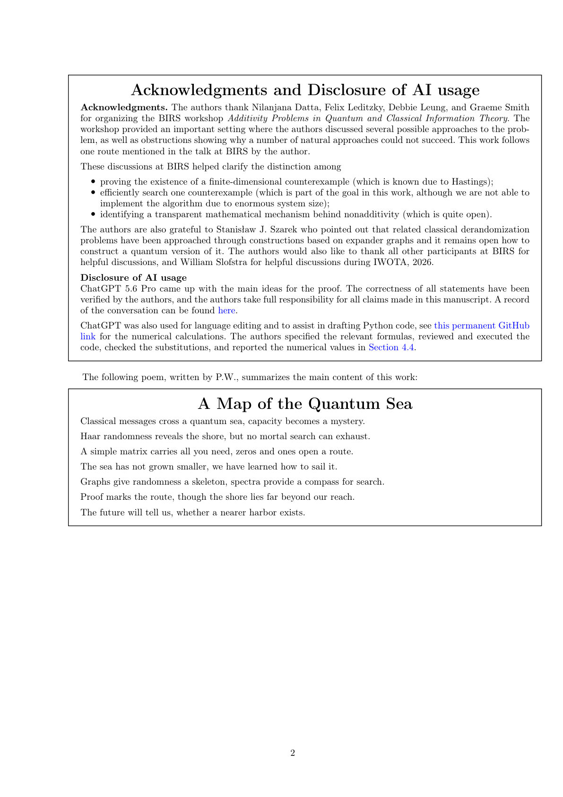 
Low-resolution page preview, page 2

📷 Fig 2

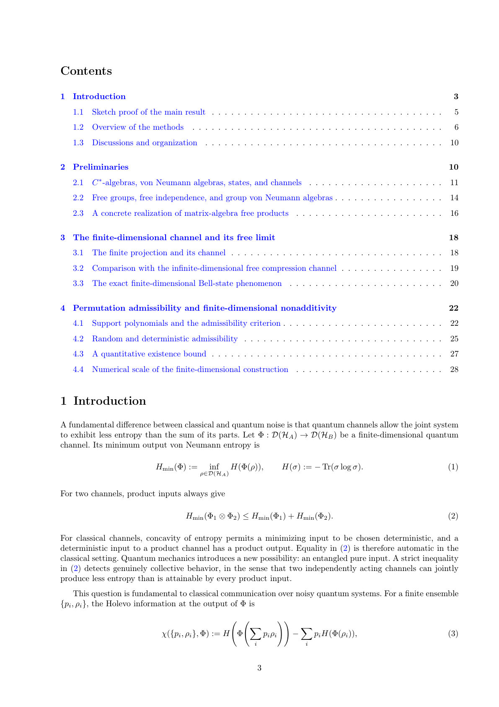 
Low-resolution page preview, page 3

📷 Fig 3

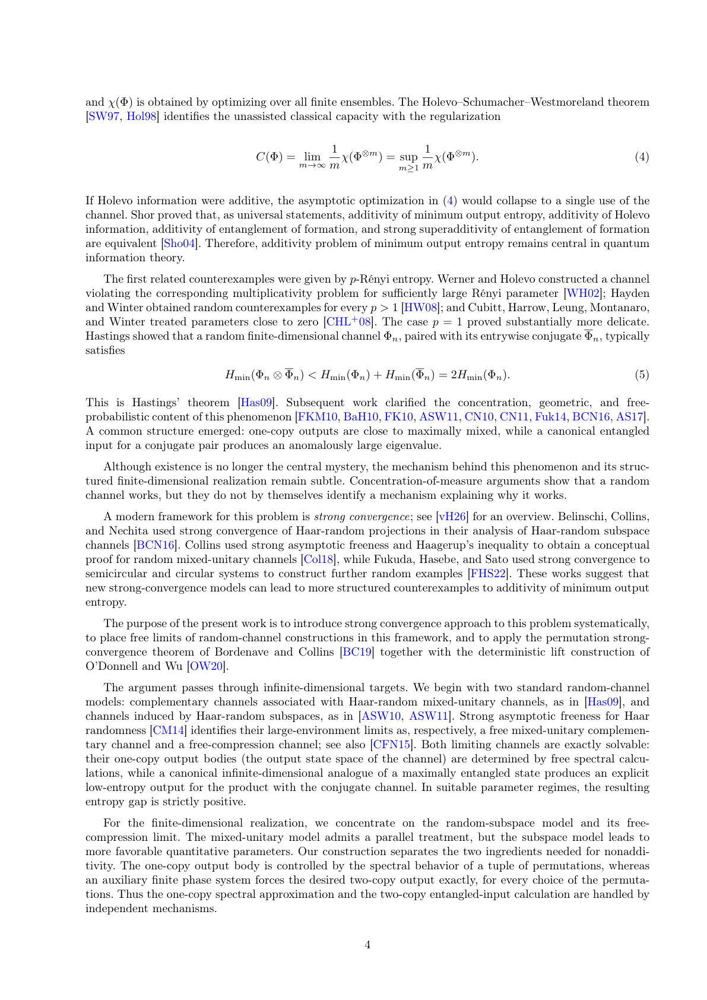 
Low-resolution page preview, page 4

📷 Fig 4

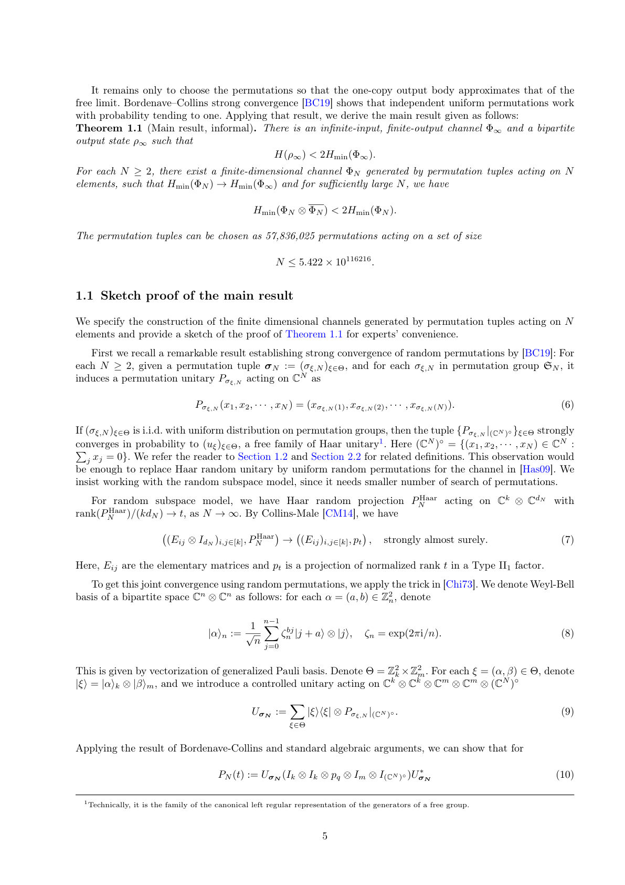 
Low-resolution page preview, page 5

📷 Fig 5

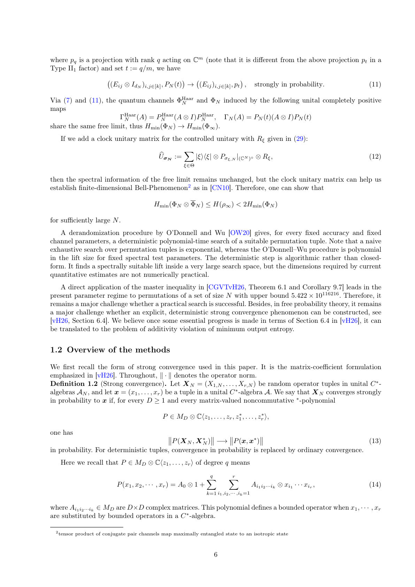 
Low-resolution page preview, page 6

**Summary.** This paper tackles the superadditivity of classical communication over quantum channels by replacing continuous random unitaries with discrete random permutations. This transformation converts the problem into a combinatorial one, allowing for asymptotic derandomization. While the theory provides powerful structural tools, the required system sizes for explicit counterexamples remain computationally infeasible.

**Why it may be interesting.** This work provides deep structural insights into fundamental capacity theorems in quantum information theory, showing how continuous random matrix theory results can be translated into discrete combinatorial statements, which is a major theoretical advance.

Detailed structure

**Main problem.** The paper investigates the structural explanation for the superadditivity of classical communication over quantum channels, which was first established using concentration of measure for Haar random unitaries.

**Main result.** The authors show that the continuous problem over unitaries can be replaced by a discrete combinatorial problem over random permutations, leading to asymptotic derandomization of the nonadditivity proof.

**Method.** The approach involves replacing Haar randomness with random permutations, utilizing theorems like Bordenave and Collins, and employing asymptotic constructions derived from strong convergence in free probability theory.

**Model / system.** The study concerns finite-dimensional quantum channels $\Phi: D(\mathcal{H}_A) 	o D(\mathcal{H}_B)$, analyzed using the random-subspace model. The core comparison is between the minimum output von Neumann entropy of the tensor product channel versus the sum of individual minimum entropies.

**Key observables.** Minimum output von Neumann entropy ($H_{\min}$), Holevo information ($\chi$), and the comparison $H_{\min}(\Phi_1 \otimes \Phi_2)$ vs $H_{\min}(\Phi_1) + H_{\min}(\Phi_2)$.

**Important parameters / regimes.** The required system size $N$ for a finite counterexample is astronomically large ($N \le 5.422 	imes 10^{116216}$), indicating the difficulty of practical construction.

**Assumptions / limitations.** The primary assumption is that the limiting geometry responsible for nonadditivity is preserved when moving from continuous Haar randomness to discrete random permutations.

**Paper structure.** The paper progresses by first establishing the connection between Haar randomness and random permutations, then providing asymptotic constructions for derandomization, and finally presenting explicit, albeit numerically enormous, finite-dimensional counterexamples to superadditivity.

Abstract

Since Hastings' proof of superadditivity of classical communication over quantum channels, considerable effort has been devoted to finding a structural explanation of this phenomenon that was originally established by concentration of measure for Haar random unitaries.   The main observation of this work is that Haar randomness can be replaced by random permutations without changing the limiting geometry responsible for nonadditivity. This replacement turns a continuous problem over unitary matrices into a discrete combinatorial problem over zero--one permutation matrices, and thereby opens a path toward derandomization.   The theorem of Bordenave and Collins shows that random permutations have the required limiting behavior and the algorithm of O'Donnell and Wu then provides a deterministic asymptotic construction, running in polynomial time in the size when the channel parameters and accuracy are fixed. Thus the random construction can be derandomized in an asymptotic algorithmic sense, although finding a simple closed-form or practically computable counterexample remains open.   Finally, a quantitative random permutation estimate by Chen, Garza-Vargas, Tropp and van Handel gives a fully numerical estimate: there exists a tuple of 57,836,025 permutations acting on a set of size \[ N \le 5.422\times 10^{116216}\] such that the associated finite dimensional channel exhibits nonadditivity. This enormous value remains an obstacle to a practical construction.

[↑ back to top](#top)

### [Switchable heavy-hole/light-hole spin qubit](http://arxiv.org/abs/2608.25914v1)

**Authors:** Zoltán György, Dmitry Miserev, Jelena Klinovaja, Daniel Loss  
**Type:** theory · **Category:** quantum information and computing · **PDF:** <https://arxiv.org/pdf/2608.25914v1>  
**Analysis basis:** full PDF text, analyzed in chunks

📷 Fig 1

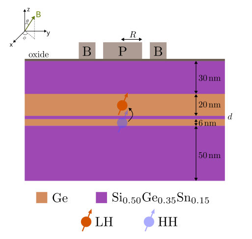 
FIG. 1. Heterostructure for switchable heavy-hole/light-hole spin qubit. The SiGeSn barriers are assumed to be un- strained, while the Ge quantum wells are slightly tensile- strained. A single hole is confined in the lower layer, where it has heavy-hole character. After shuttling it to the upper Ge layer, it becomes a light-hole qubit. The two barrier gates (B) provide the in-plane confinement, while the plunger gate (P) is used for shuttling.

📷 Fig 2

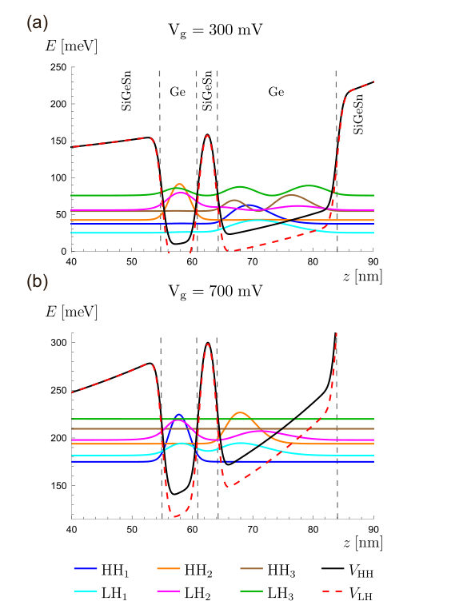 
FIG. 2. Quantum well confinement and lowest eigenstates. The quantum well confinement profile is shown for heavy holes (black curve) and light holes (red dashed line), together with the lowest three heavy-hole and light-hole eigenstates from Eq. (5). By changing the gate voltage Vg, we can tune the character of the ground state from (a) light hole (LH1) to (b) heavy hole (HH1).

📷 Fig 3

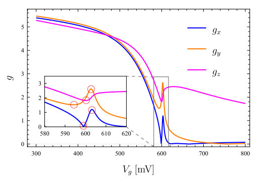 
FIG. 3. Effective qubit g-factors as a function of plunger gate voltage Vg. The magnetic field is along the x (blue line), y (orange line), or z (magenta line) direction. The qubit tran- sitions from the light-hole regime to the heavy-hole regime. In the heavily mixed regime, around Vg = 602.7 mV, the g-factors show nonmonotonic behavior. The red circles show first-order charge noise sweet spots. The confinement frequen- cies are ℏωx = 2 meV, ℏωy = 2.6 meV, and the barrier width is d = 3 nm (see Fig. 1).

📷 Fig 4

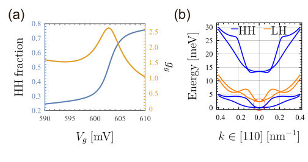 
FIG. 4. HH-LH resonance and g-factor peak. (a) The g-factor gy as a function of gate voltage (orange curve) and the heavy- hole fraction of the quantum dot ground state (blue curve). At the g-factor peak, the qubit has a fully hybridized HH-LH state, with 50% HH fraction. The confinement frequencies are ℏωx = 2 meV and ℏωy = 2.6 meV, the barrier width is d = 3 nm. (b) 2DHG spectrum at the gate voltage corresponding to the g-factor peak, Vg = 602.7 mV. The blue curves are heavy- hole subbands, and the orange curves are light-hole subbands. The red circle shows the four spin-split subbands participating in the HH-LH resonance.

📷 Fig 5

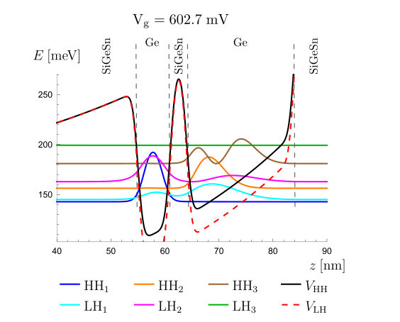 
FIG. 5. Quantum well confinement and eigenstates at the HH- LH resonance, at Vg = 602.7 mV with a barrier width d = 3 nm. The HH-LH splitting between the lowest HH (dark blue) and the lowest LH (light blue) state is small enough for the resonance to be induced by the in-plane confinement. There is also substantial overlap between these wavefunctions in the thin Ge well.

**Summary.** This paper proposes a novel switchable heavy-hole/light-hole spin qubit architecture in a Ge heterostructure. By shuttling the hole state between HH and LH regimes, the device combines the robustness of HH qubits with the strong spin-orbit coupling of LH qubits. Theoretical calculations predict high coherence times ($100 \mu$s) and fast gate operations, advancing the feasibility of solid-state quantum computation.

**Why it may be interesting.** This work directly addresses the hardware realization of solid-state qubits, providing theoretical predictions for optimizing coherence times and control mechanisms in semiconductor quantum dots, which is central to quantum information science.

Detailed structure

**Main problem.** The research aims to develop a highly controllable and switchable spin qubit by combining the best features of heavy-hole (HH) and light-hole (LH) spin qubits.

**Main result.** The authors propose a switchable HH-LH qubit in a bilayer Ge heterostructure that achieves a coherence time significantly longer than the LH regime while maintaining fast gate operation.

**Method.** The study uses theoretical modeling based on the 6-band Luttinger-Kohn-Bir-Pikus Hamiltonian, incorporating quantum well and in-plane confinement potentials.

**Model / system.** The physical system is a bilayer Ge heterostructure with SiGeSn barriers, allowing the hole qubit character to be tuned between HH and LH states via gate voltage shuttling.

**Key observables.** Effective qubit g-factors ($g_x, g_y, g_z$), coherence time ($T_2$), and Rabi frequencies.

**Important parameters / regimes.** Gate voltages ($V_g$), in-plane confinement strengths ($\omega_x, \omega_y$), and the material composition of the barriers (SiGeSn).

**Assumptions / limitations.** The model uses an anisotropic harmonic potential for in-plane confinement and approximates the plunger gate potential; linear interpolation for Luttinger parameters is noted as potentially inaccurate.

**Figures summary.** Figures illustrate the heterostructure geometry, quantum well confinement profiles for HH and LH states as a function of gate voltage, and plots of effective qubit g-factors versus gate voltage, highlighting the HH-LH resonance.

**Paper structure.** The paper first introduces the concept of combining HH and LH advantages, models the system using the LKBP Hamiltonian, details the gate-tunable switching mechanism, and presents calculations showing enhanced coherence and resonance features.

Abstract

Compressively strained Ge quantum wells in planar SiGe/Ge heterostructures are the state-of-the-art platform for hole spin qubits. While they exhibit robust coherence times, they possess weak intrinsic spin-orbit interaction (SOI) due to the heavy-hole (HH) character of the wavefunction. Recently, light-hole (LH) qubits were proposed in GeSn/Ge heterostructures, offering strong, intrinsic, linear-in-momentum SOI. In this work, we propose a switchable HH-LH spin qubit in a bilayer Ge heterostructure with SiGeSn barriers, combining the advantages of HH and LH devices. The character of the qubit can be changed by shuttling from an LH well to an HH well, which also enables fast, hopping-based single-qubit rotations. Additionally, we observe an HH-LH resonance introduced by the in-plane confinement, resulting in $g$-factor peaks and first-order charge noise sweet spots. Our calculations reveal a sweet spot with Rabi frequencies on the order of 100 MHz, comparable to the LH regime, but with a more than tenfold increase in coherence time, on the order of 100 $μ$s.

[↑ back to top](#top)

### [Symmetry Origins of the Field-Free Superconducting Diode Effect in the Kagome Superconductor CsV$_3$Sb$_5$](http://arxiv.org/abs/2608.26022v1)

**Authors:** Xin-Jie Liu, Shengbiao Sun, Ke-Fan Song, Jia-Peng Peng, Xilin Feng, Lang Xiao, Tong Liu, Qilin Han, Ya-Qing Bie, Ning Kang, Xiaosong Wu, Yanfei Wu, Shouguo Wang, Kam Tuen Law, Shuo Wang, Dapeng Yu, Ben-Chuan Lin  
**Type:** experiment · **Category:** other · **PDF:** <https://arxiv.org/pdf/2608.26022v1>  
**Analysis basis:** full PDF text, analyzed in chunks

📷 Fig 1

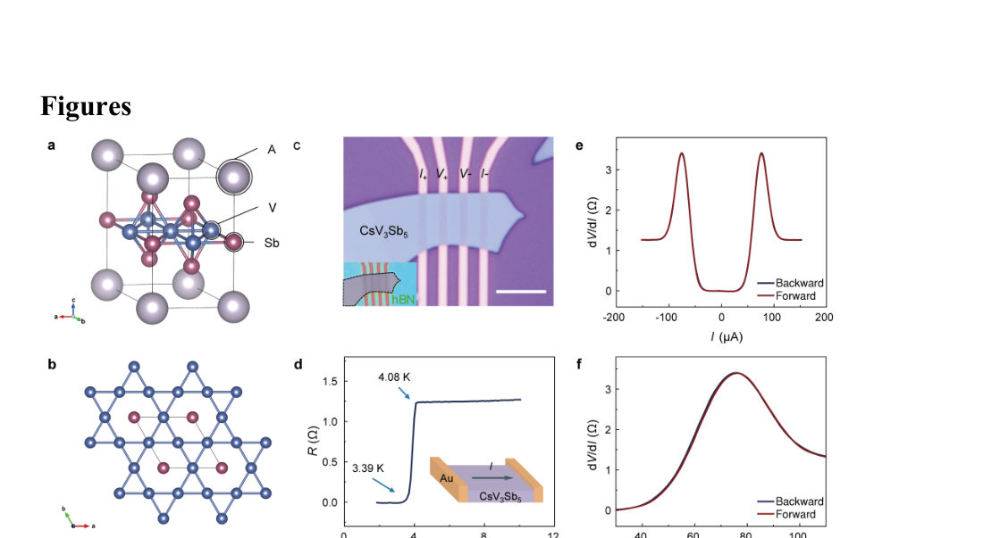 
Fig. 1. Pristine encapsulated CsV3Sb5 devices exhibit no field-free superconducting diode effect. a Crystal structure of AV3Sb5. The kagome lattice is formed by V atoms (blue), while Sb atoms (pink) occupy two distinct sites. b The V–Sb sublattice forms a kagome network, with V atoms arranged in a corner-sharing triangular lattice and Sb atoms located at the centers of the kagome hexagons. c Optical micrograph of CsV3Sb5 Device 1. The inset shows the same device encapsulated with hBN. Current is applied through I+ and I–, and voltage is measured between V+ and V–. Scale bar, 5 μm. d Resistance versus temperature for Device 1. Left arrows mark Tconset = 4.08 K and Tczero = 3.39 K....

📷 Fig 2

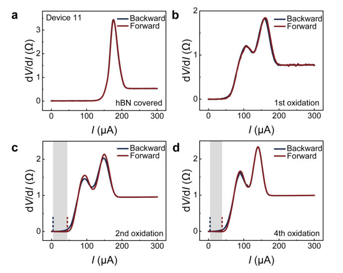 
Fig. 2. Surface oxidation induces a field-free diode response by breaking inversion

📷 Fig 3

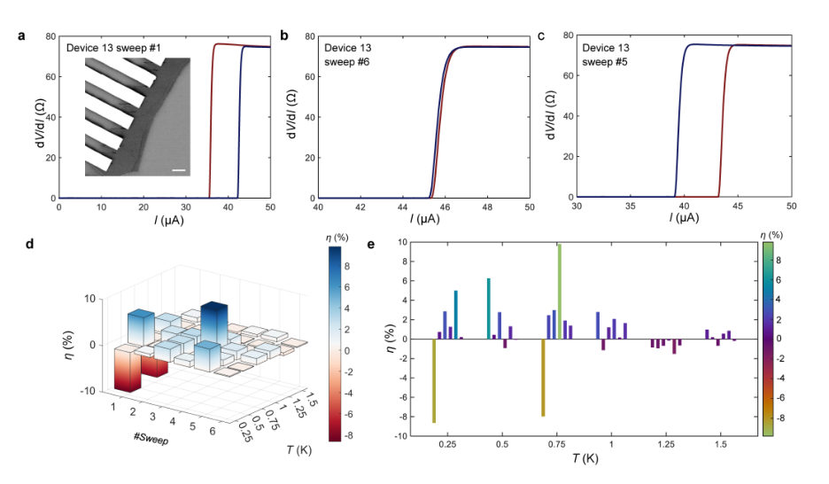 
Fig. 3. Geometrically inversion-broken devices show stochastic field-free superconducting

📷 Fig 4

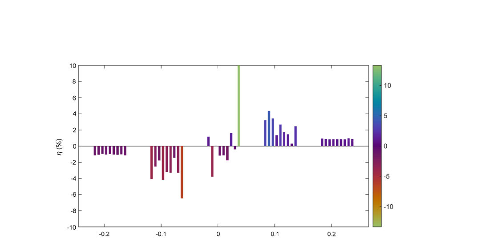 
Fig. 4. Out-of-plane magnetic fields stabilize the stochastic superconducting diode response. Diode efficiency of Device 13 under magnetic fields between -0.2 and 0.2 T, with nine consecutive sweeps at each field. The field fixes the diode polarity and, at larger magnitude, stabilizes the amplitude.

**Summary.** This experimental work investigates the superconducting diode effect in CsV3Sb5, finding that the effect only appears when inversion symmetry is externally broken. Crucially, the authors link this non-reciprocal supercurrent to the presence of charge-density-wave order, demonstrating that suppressing the CDW order eliminates the diode effect.

**Why it may be interesting.** The work provides a detailed experimental test of symmetry protection in superconductivity, linking macroscopic transport phenomena (diode effect) to microscopic electronic orders (CDW) and symmetry breaking mechanisms.

Detailed structure

**Main problem.** The study investigates the origin and symmetry requirements for the field-free superconducting diode effect (SDE) in the Kagome superconductor CsV3Sb5.

**Main result.** The SDE requires extrinsic inversion symmetry breaking and is linked to time-reversal symmetry (TRS) breaking associated with the charge-density-wave (CDW) order, as its disappearance upon CDW suppression confirms this link.

**Method.** The authors performed transport measurements (dI/dV) on fabricated devices, systematically inducing symmetry breaking via surface oxidation or asymmetric etching, and comparing results with doped samples.

**Model / system.** The physical system is the Kagome superconductor CsV3Sb5, which is centrosymmetric. The study probes the superconducting state's response to symmetry breaking, particularly focusing on the interplay between inversion symmetry, TRS, and CDW order.

**Key observables.** Diode asymmetry parameter ($\eta$), nonreciprocal supercurrent ($	ext{I}_{c+} 
eq 	ext{I}_{c-}$), and the stability of the diode response under applied magnetic fields.

**Important parameters / regimes.** Temperature (low T, e.g., 1.8 K), applied magnetic fields (out-of-plane and in-plane), and the degree of CDW order (controlled by Ti doping).

**Assumptions / limitations.** The initial pristine state is assumed to be centrosymmetric and thus diode-inactive; the stochastic nature is interpreted as arising from metastable domain configurations.

**Figures summary.** Figures illustrate the induction of SDE via oxidation/etching, show the stochastic nature of the response across multiple sweeps, demonstrate field stabilization of the diode polarity, and confirm the loss of SDE upon Ti doping.

**Paper structure.** The paper establishes the baseline (pristine, no SDE), then demonstrates the activation of SDE through controlled symmetry breaking (oxidation/etching). It characterizes the stochastic nature and field dependence, and finally confirms the underlying physical mechanism by showing the SDE vanishes when the CDW order is suppressed by doping.

Abstract

Field-free superconducting diode effects require both inversion-symmetry breaking and an internal time-reversal-symmetry (TRS) breaking field, making them sensitive probes of hidden order in superconductors. In centrosymmetric kagome AV$_3$Sb$_5$, the inversion symmetry generally should generally preclude the observation of the superconducting diode effect. Furthermore, though TRS breaking has been reported in the superconducting regime of CsV$_3$Sb$_5$, whether it is generated by superconductivity or inherited from charge-density-wave (CDW) order remains unresolved. Here we show that pristine CsV$_3$Sb$_5$ devices exhibit no intrinsic field-free superconducting diode effect, whereas surface oxidation or asymmetric etching activates a large nonreciprocal supercurrent. Moreover, the response is stochastic, with sweep-dependent polarity and magnitude, indicating metastable TRS-breaking domain configurations. Small out-of-plane magnetic fields stabilize the superconducting diode response, consistent with field selection of such domains. Finally, when long-range CDW order is suppressed by Ti doping, the SDE disappears. Our results establish the symmetry requirements for the field-free SDE in CsV$_3$Sb$_5$, reveal its stochastic domain-controlled character, and link superconducting-state TRS breaking to CDW-related order.

[↑ back to top](#top)

## Secondary cond-mat archives

*Papers from  mes-hall, other, soft, supr-con. These archives are de-prioritized — they appear at the end regardless of relevance score.*

### Relevant in secondary archives (16)

### [Depth Control of Room-Temperature Quantum Emitters in Gallium Nitride](http://arxiv.org/abs/2608.26057v1)

**Authors:** Alexandros Bampis, Johann Stachurski, Anna Schwab, Jean-François Carlin, Raphaël Butté, Nicolas Grandjean  
**Type:** experiment · **Category:** other · **PDF:** <https://arxiv.org/pdf/2608.26057v1>  
**Analysis basis:** full PDF text, analyzed in chunks
**Topic relevance:** 🔥 `quantum optics experiment` **4/5** · `Tavis-Cummings & cavity-many-emitter` **2/5** · `QC/QI experiment` **1/5** · `analog quantum simulation` **1/5** · `driven-dissipative phase transition` **1/5** · `interference shaping light` **1/5** · `methods for driven-dissipative` **1/5** · `quantum measurements` **1/5**

📷 Fig 1

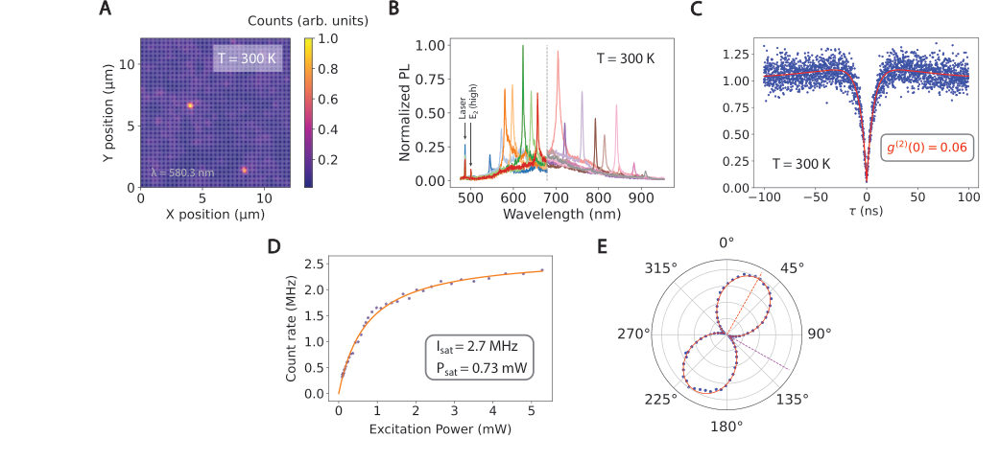 
Figure 1: Optical properties of naturally occurring emitters in GaN. (A) Room-temperature PL map of a GaN layer grown on c-plane sapphire, displaying the normalized PL intensity within a narrow spectral window centered at 580.3 nm. Two QEs emitting at this wavelength appear as bright spots on the map. (B) Optical signatures of 15 distinct QEs with emission wavelengths ranging from 550 nm to 910 nm. The spectra are selected from 2 PL maps acquired with complementary spectral windows (vertical dashed line). (C) Second-order correlation function measurement of a GaN QE at room temperature fitted with a 3-level system model,24 yielding g(2)(0) = 0.06. The excitation power was set to 12.5 µW in...

📷 Fig 2

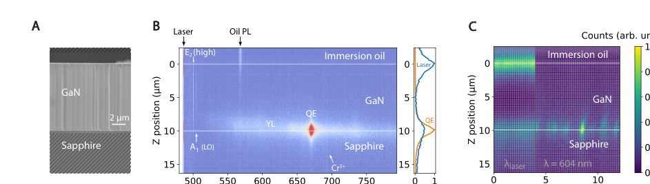 
Figure 2: Depth of naturally occurring emitters in GaN on sapphire. (A) Cross-sectional SEM image of a 10 µm-thick GaN layer. Scale bar: 2 µm. The hatched part of the image is digitally added to match the PL measurement scale. (B) Left: Depth-dependent PL spectrum of a QE embedded in the sample imaged in (A) and emitting at 671 nm. Right: Depth-dependent PL intensity averaged over the laser line (blue) and the QE ZPL (orange). (C) XZ PL map of the same sample plotted at the laser wavelength to highlight the GaN interfaces (left) and at the emission wavelength of a QE (right).

📷 Fig 3

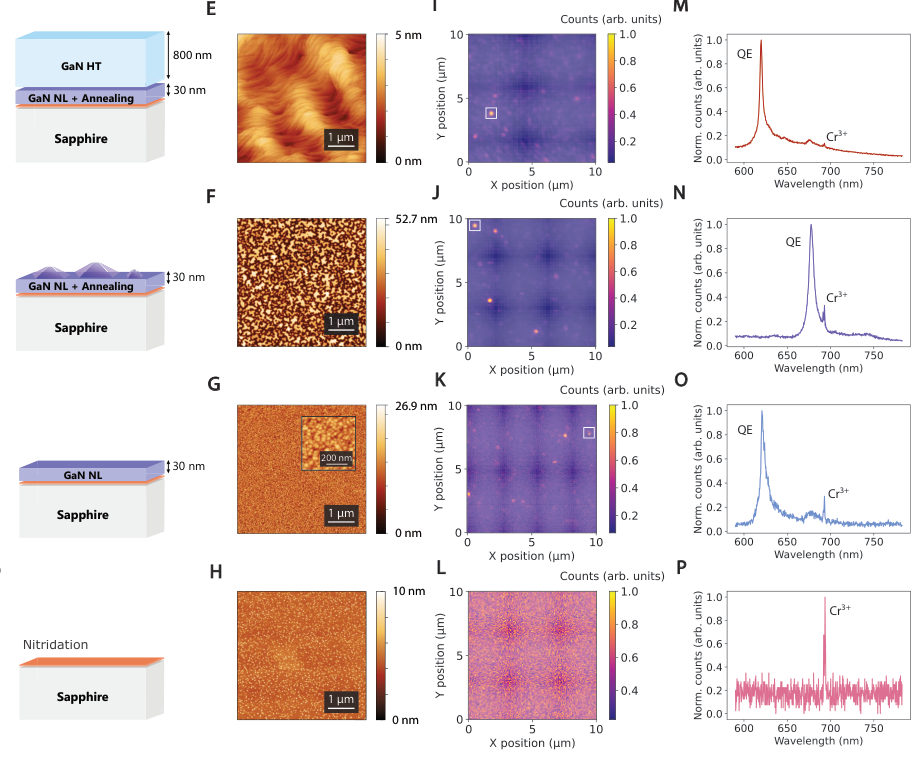 
Figure 3: Growth steps involved in the formation of naturally occurring emitters in GaN on sapphire. (A-D) Schematic of the investigated sample structures employed to identify the growth steps involved in QE formation. The depicted orange layer indicates that the sapphire has undergone nitridation. (E-H) AFM scans of the sample surfaces. (I-K) PL maps at the emission wavelengths of the boxed emitters (0.3 nm bandwidth). The QEs are still present in the nucleation layer of GaN on sapphire. (L) PL map of the nitridated sapphire sample. As no emitter was observed, the map is displayed at 640 nm, chosen as a representative wavelength. (M-O) PL spectra of the highlighted emitters in the...

📷 Fig 4

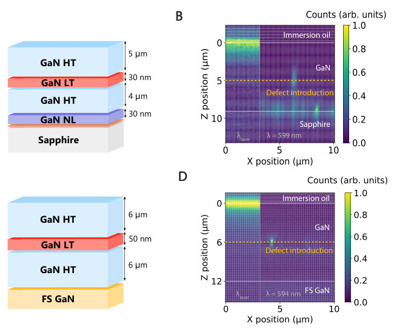 
Figure 4: Controlled depth positioning of QEs in GaN. (A) Structure of the sample grown on sapphire, designed to introduce QEs in GaN at a controlled depth. (B) XZ PL map of the sample shown in (A), revealing naturally occurring emitters at the GaN/sapphire interface and an intentionally introduced emitter at the depth of the LT layer. The left-hand side is plotted at the laser wavelength to highlight the GaN interfaces, while the right-hand side is plotted at the emission wavelength of the introduced emitter located 5 µm within the layer (λ = 599 nm). (C) Structure of the sample grown on FS GaN. (D) XZ PL map of the sample depicted in (C), plotted at the laser wavelength and at the...

📷 Fig 5

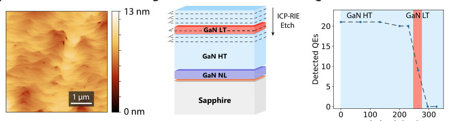 
Figure 5: Localization of intentionally introduced emitters within the GaN layer. (A) 5 µm × 5 µm AFM scan of a sample in which emitters are purposely formed 250 nm below the surface, prior to any fabrication step. The surface is fully coalesced, with an RMS surface roughness of 0.94 nm. (B) Schematic of the sample structure and measurement sequence, with successive µ-PL measurements and ICP-RIE etching. (C) Number of detected QEs within the same sample area as a function of cumulative etch depth. The QEs disappear at the depth of the GaN LT layer.

**Summary.** This paper reports a major advance in solid-state quantum emitters by demonstrating precise, depth-controlled placement of bright quantum emitters in Gallium Nitride. By engineering the growth process using a low-temperature interlayer, the authors overcome the natural limitation of emitters being stuck at the substrate interface. This capability is crucial for realizing efficient, cavity-enhanced quantum light sources for quantum technologies.

**Why it may be interesting.** This work directly addresses the engineering challenge of coupling solid-state quantum emitters to optical cavities, which is a cornerstone problem in quantum optics and quantum information processing. The precise depth control mechanism is highly relevant for designing integrated quantum photonic circuits.

Detailed structure

**Main problem.** The primary challenge is the poor integration of bright, room-temperature quantum emitters (QEs) in Gallium Nitride (GaN) into functional photonic structures due to their natural location near the substrate interface.

**Main result.** The authors demonstrated a breakthrough by using a low-temperature GaN interlayer to precisely control the placement of QEs at arbitrary depths within the epilayer, enabling efficient coupling to optical cavities.

**Method.** The study combines advanced micro-photoluminescence ($\mu$-PL) mapping, depth-resolved spectroscopy, and epitaxial growth engineering (using low-temperature interlayers) to physically manipulate and characterize the emitters.

**Model / system.** The physical system is radiative point defects acting as single-photon emitters within GaN epilayers grown on sapphire. The methodology involves controlling the growth process (e.g., introducing a low-temperature GaN interlayer) to dictate the physical location of these defects.

**Key observables.** Narrow linewidths ($\sim 4-6$ nm), high photon count rates ($> 2$ MHz), strong antibunching ($g^{(2)}(0) \le 0.06$), and precise depth control (sub-60 nm accuracy).

**Important parameters / regimes.** Room temperature operation, visible to telecom O-band emission, and the ability to place emitters independent of the substrate material.

**Assumptions / limitations.** The optical properties of the intentionally introduced QEs are assumed to be comparable to naturally occurring ones, and the depth profiling relies on empirical matching to structural measurements (SEM/SIMS).

**Figures summary.** Figures show $\mu$-PL maps confirming emitter localization, depth-resolved XZ PL maps demonstrating depth control, and spectra confirming high-quality single-photon emission characteristics.

**Paper structure.** The work progresses from identifying the initial limitation (interface confinement) to developing an engineering solution (LT interlayer deposition) and finally confirming the success of this method by showing depth-tunable, high-quality emitters compatible with cavity fabrication.

Abstract

Bright quantum emitters are key components for quantum communication systems. Radiative point defects in gallium nitride (GaN) are promising candidates for room-temperature single-photon emission, operating from the visible to the telecom O-band. Despite their potential, their integration into photonic structures has remained limited in the literature, with experimental photon extraction efficiencies far below simulated predictions. To identify the origin of this limitation, we investigate visible and near-infrared quantum emitters in GaN epilayers grown on $c$-plane sapphire substrates exhibiting narrow linewidths ($\sim$4 nm), high photon count rates ($ > $2 MHz), and strong antibunching, reaching $g^{(2)}(0)$ values as low as 0.06 at room temperature. We find that these emitters are located near the GaN/substrate interface, explaining their limited coupling to optical modes. Building on this observation, we show that the insertion of a thin low-temperature GaN interlayer enables the formation of quantum emitters at arbitrary depths with sub-60 nm accuracy, independent of the substrate. The intentionally introduced emitters retain optical properties comparable to naturally occurring ones, including narrow linewidths ($\sim$6 nm), saturation count rates exceeding 1.5 MHz, high Debye-Waller factors (0.69-0.98), and strong antibunching. The resulting epilayer fully coalesces within less than 250 nm ensuring compatibility with GaN-based cavity fabrication and enabling emitter placement within intrinsic regions of p-i-n diode architectures. These results mark a decisive step toward efficient emitter-cavity coupling, enabling the realization of cavity-enhanced quantum emission in GaN.

[↑ back to top](#top)

### [Lab earthquakes confirm the theory of frictional slip pulses](http://arxiv.org/abs/2608.26065v1)

**Authors:** Alina Shafir, Tom Gabrieli, Yuval Tal, Eran Bouchbinder  
**Type:** both · **Category:** other · **PDF:** <https://arxiv.org/pdf/2608.26065v1>  
**Analysis basis:** full PDF text, analyzed in chunks
**Topic relevance:** `Frenkel-Kontorova` **3/5** · `analog quantum simulation` **3/5** · `driven-dissipative phase transition` **2/5** · `non-equilibrium universality` **2/5** · `Keldysh / 2PI / non-Gaussian methods` **1/5** · `correlated / nonlocal dissipation` **1/5** · `methods for driven-dissipative` **1/5** · `scars & prethermalization` **1/5**

📷 Fig 1

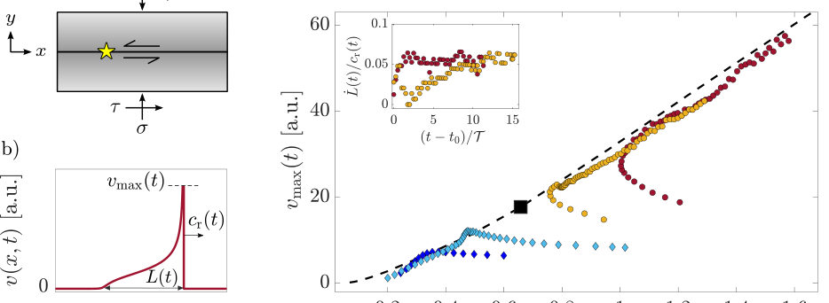 
Fig. 1. Theoretical predictions for the dynamics of slip pulses. (a) A sketch of a frictional system, composed of two large and identical linear elastic blocks, forming a nominally flat contact interface (fault). The coordinate along the fault is x and it is located at y =0, where y is a fault-perpendicular coordinate. The third dimension of the blocks is either small compared to the two other dimensions or the system’s dynamics are independent of it, such that the system is effectively two dimensional (2D). The fault prestress (background stress) features a normal compressive component σ and a shear component τ. Rupture is nucleated at a localized region along the fault (the hypocenter,...

📷 Fig 2

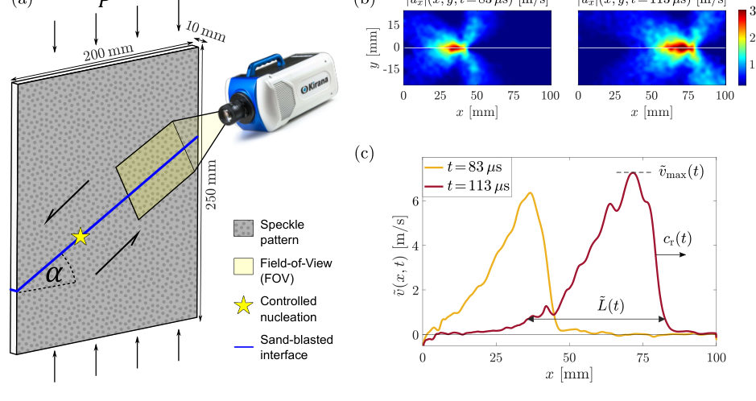 
Fig. 2. Experimental setup and measured slip pulses. (a) A sketch of the experimental system mimicking a natural fault. It is composed of two, quasi-2D (physical dimensions are stated) PMMA plates, forming a nominally flat interface/fault (blue plane) at an angle α relative to a direction perpendicular to an applied compressive stress of magnitude P. These two parameters allow to carefully control the prestress conditions on the fault through the relations τ = 1

📷 Fig 3

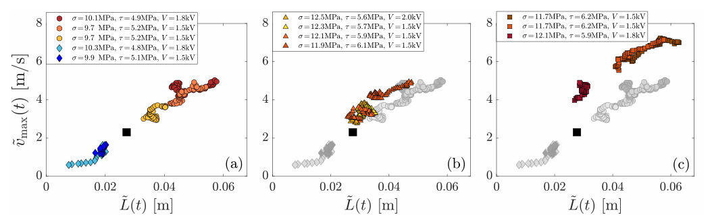 
Fig. 3. Experimental validation of the theory. (a) Experimental results for ˜vmax(t) vs. ˜L(t) of 5 slip pulses obtained with σ =10±0.3 MPa, τ =5 ∓0.2 MPa and two values of the nucleation voltage V (see legend). Growing pulses (circles) appear in hot colors and decaying ones (diamonds) appear in cold colors, following the symbol and color codes of the theoretical Fig. 1c. The black square is an estimate of the location of the relevant steady-state point, separating decaying and growing pulses. See text for an extensive discussion of the experimental results and their relations to the theoretical predictions. (b) The same as (b), but for growing pulses obtained with σ = 12.2 ± 0.3 MPa, τ =...

📷 Fig 4

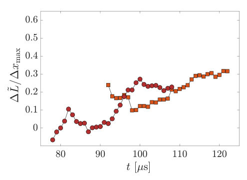 
Fig. 4. The slow evolution of growing pulses. ∆˜L(t)/∆xmax(t) of two growing pulses presented in Fig. 3 (one from panel (a) and the other from panel (c) therein, using the same symbols and colors). The experimental results support the theoretical prediction in Eq. (4) through its integral corollary ∆˜L(t)/∆xmax(t) ≪1 (see text and Supplementary Materials), demonstrating the slow evolution of growing pulses (featured by all observed growing pulses). See text for additional discussion.

**Summary.** This work experimentally validates a comprehensive theory describing slip pulses, which are key features of large natural earthquakes. By conducting lab experiments, the authors confirmed that the evolution of these pulses follows predicted slow, unsteady dynamics, demonstrating the theoretical attractor governing their size and peak slip rate. This provides major progress in understanding the physics of earthquake rupture.

**Why it may be interesting.** While focused on geophysics, the underlying mathematical framework—analyzing the stability and evolution of localized, non-linear structures (pulses) governed by rate-dependent constitutive laws—shares mathematical parallels with modeling non-equilibrium dynamics in complex quantum systems or open quantum systems.

Detailed structure

**Main problem.** The paper investigates the spatiotemporal dynamics of frictional rupture, specifically focusing on the behavior of 'slip pulses' which are considered a dominant rupture mode in natural earthquakes.

**Main result.** Laboratory experiments successfully confirmed the theoretical predictions regarding the intrinsically slow, unsteady evolution of pulse-like earthquakes, including the predicted transition between decaying and slowly growing pulse regimes.

**Method.** The study combines theoretical modeling based on rate-and-state friction laws with extensive laboratory earthquake experiments using controlled fault interfaces.

**Model / system.** The physical system is a frictional interface (fault) between two elastic blocks. The dynamics are governed by a constitutive law incorporating prestresses and wave radiation, leading to the concept of self-healing slip pulses.

**Key observables.** Pulse size L(t), peak slip rate v_max(t), and the dimensionless growth rate of the pulse.

**Important parameters / regimes.** Prestress levels (sigma, tau), fault roughness amplitudes, and the time-dependent evolution parameters.

**Assumptions / limitations.** The theory assumes that steady-state solutions are categorically unstable but form a dynamic attractor for the unsteady pulse evolution.

**Figures summary.** Figures illustrate the experimental setup, profiles of slip pulses, and superpositions of measured v_max vs. L data points confirming the theoretical attractor line.

**Paper structure.** The paper progresses from establishing the theoretical framework for slip pulses, detailing the experimental setup and measurement techniques (DIC), presenting the confirmation of the time-dependent dynamics, and finally demonstrating the predicted transition between pulse growth and decay.

Abstract

Large natural earthquakes are typically mediated by frictional pulse-like rupture, which features a finite slipping zone. Recently, a comprehensive two-dimensional theory of frictional slip pulses has been developed. It predicts that pulses are categorically unstable rupture modes, whose evolution is intrinsically slow. Unsteady pulses satisfy an equation of motion expressed in terms of discrete observables, which is inherently related to their steady-state counterparts. The theory also predicts a transition from decaying to slowly growing pulses. Here, we perform extensive lab earthquake experiments to test the theory. The experiments confirm the theoretical predictions for pulse-like lab earthquakes over a range of prestress levels, rupture nucleation conditions and small-scale fault roughness amplitudes. Specifically, the predicted time-dependent dynamics are tested in a plane defined by the evolving pulse size and peak slip rate, along with measurements of the dimensionless growth rate of pulses, demonstrating their intrinsically slow unsteady nature. The predicted transition between decaying and growing pulses is also experimentally demonstrated. These results constitute major progress in understanding a dominant earthquake rupture mode.

[↑ back to top](#top)

### [Chirality-Selective Phonon Pumping by Ferroelectric Dynamics](http://arxiv.org/abs/2608.25684v1)

**Authors:** Dapeng Yao, Ping Tang  
**Type:** theory · **Category:** other · **PDF:** <https://arxiv.org/pdf/2608.25684v1>  
**Analysis basis:** full PDF text, analyzed in chunks
**Topic relevance:** `Keldysh / 2PI / non-Gaussian methods` **3/5** · `analog quantum simulation` **2/5** · `driven-dissipative phase transition` **2/5** · `methods for driven-dissipative` **2/5** · `non-equilibrium universality` **2/5** · `correlated / nonlocal dissipation` **1/5** · `quantum measurements` **1/5**

📷 Fig 1

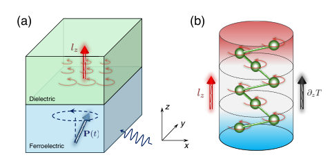 
FIG. 1. (a) Schematic of chirality-selective phonon pump- ing in a ferroelectric|dielectric bilayer proposed in this Let- ter. The precessing electric polarization P(t) in the xy plane transfers its angular momentum with a definite chirality to the lattice via electrostrictive coupling, generating chiral phonons that propagate along the z direction in the dielectric with a net angular-momentum density polarized along the z axis. (b) Thermally induced chiral-phonon generation in chiral crystals via the phonon thermal Edelstein effect [42, 43]. A temper- ature gradient ∂zT applied along the screw (z) axis induces PAM polarized along the z direction. In both cases, the chiral phonons exhibit...

📷 Fig 2

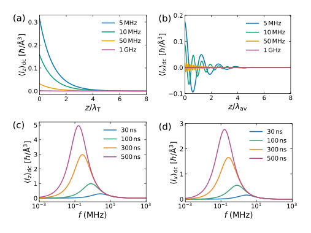 
FIG. 2. Spatial distribution and frequency dependence of the induced PAM density in the YAG layer. (a) Longitudinal component ⟨lz(z)⟩dc as a function of z/λT , induced by the in-plane polarization precession δP(t) shown in Fig. 1, and (b) transverse component ⟨lx(z)⟩dc as a function of z/λav, in- duced by the polarization precession δP′(t) in the yz plane, at different driving frequencies. The phonon relaxation time is fixed at τ = 300 ns. Frequency dependence of (c) the lon- gitudinal component ⟨lz⟩dc and (d) the transverse component ⟨lx⟩dc at the interface for different phonon relaxation times.

**Summary.** This work proposes using the dynamic precession of electric polarization in a ferroelectric material to generate propagating, chirality-selective phonons in an adjacent ordinary dielectric. By coupling the polarization's intrinsic angular momentum to the lattice via electrostriction, the authors show this method is highly efficient and electrically tunable, opening a new route for programmable phononic devices.

**Why it may be interesting.** While focused on condensed matter/solid-state physics, the concept of injecting angular momentum into a lattice via an external, controllable field (polarization) is analogous to driving non-equilibrium quantum systems or studying energy/momentum transfer in open quantum systems.

Detailed structure

**Main problem.** The paper addresses the need for an efficient and controllable method to generate propagating chiral phonons in ordinary dielectric materials, overcoming limitations associated with naturally chiral crystals.

**Main result.** It demonstrates that ferroelectric polarization precession can act as a powerful electrical source, pumping chirality-selective phonons with an efficiency significantly higher than thermal generation in common materials like LiNbO3|YAG.

**Method.** The mechanism is derived theoretically by coupling the intrinsic angular momentum of the precessing electric polarization to the lattice vibrations via electrostrictive coupling.

**Model / system.** The model considers a bilayer structure (Ferroelectric|Dielectric) and uses the elastic Lagrangian density incorporating an electrostrictive coupling term. The dynamics are solved using Green's function approaches.

**Key observables.** Chirality-selective Phonon Angular Momentum (PAM) density ($\langle l(z) 
angle_{dc}$), which is the primary diagnostic for the pumped chirality.

**Important parameters / regimes.** Polarization amplitude ($P_0, A$), frequency ($\omega$), and the strength of the electrostrictive coupling tensor components.

**Assumptions / limitations.** The analysis assumes the existence of strong electrostrictive coupling and models the polarization dynamics using a monochromatic precession.

**Figures summary.** Figure 1 schematically compares the proposed chiral-phonon pumping in a ferroelectric|dielectric bilayer against thermal generation in chiral crystals. Figure 2 shows the spatial and frequency dependence of the induced PAM density components.

**Paper structure.** The paper establishes the physical problem, derives the governing equations based on electrostrictive coupling, calculates the pumped angular momentum density using Green's functions, and quantifies the pumping efficiency by comparing it to thermal limits.

Abstract

The discovery of chiral phonons has expanded the conventional view of lattice vibrations as passive heat carriers, opening new opportunities for phononic spintronic devices. However, their realization has been largely limited to chiral crystals or to specific regions of momentum space in certain achiral materials. Here, we propose a generic mechanism for generating propagating chiral phonons in an ordinary dielectric through the precession of the electric polarization in an adjacent ferroelectric. The polarization dynamics transfers its intrinsic angular momentum to the lattice via electrostrictive coupling, thereby pumping chirality-selective phonons whose handedness is dictated by that of the polarization precession. For a typical LiNbO$_{3}$$|$Y$_{3}$Al$_{5}$O$_{12}$ bilayer, we find that the pumping efficiency quantified by an interfacial convertance substantially exceeds those of thermally induced chiral-phonon generation in chiral crystals, owing to the strong electrostrictive coupling in ferroelectrics. Our work establishes ferroelectric dynamics as a versatile electrical source of chiral phonons and provides a general route toward electrically programmable chiral-phononic and spintronic functionalities.

[↑ back to top](#top)

### [Metastable magnetic domains and the anomalous $B_\parallel=0$ resistance peak in twisted double bilayer graphene](http://arxiv.org/abs/2608.25263v1)

**Authors:** Zhenxiang Gao, Christopher Coleman, Silvia Folk, Ruiheng Su, Manabendra Kuiri, Kenji Watanabe, Takashi Taniguchi, Nemin Wei, Chunli Huang, Joshua Folk  
**Type:** experiment · **Category:** other · **PDF:** <https://arxiv.org/pdf/2608.25263v1>  
**Analysis basis:** full PDF text, analyzed in chunks
**Topic relevance:** `non-equilibrium universality` **3/5** · `scars & prethermalization` **3/5** · `analog quantum simulation` **2/5** · `quantum measurements` **2/5** · `Keldysh / 2PI / non-Gaussian methods` **1/5** · `driven-dissipative phase transition` **1/5** · `methods for driven-dissipative` **1/5**

📷 Fig 1

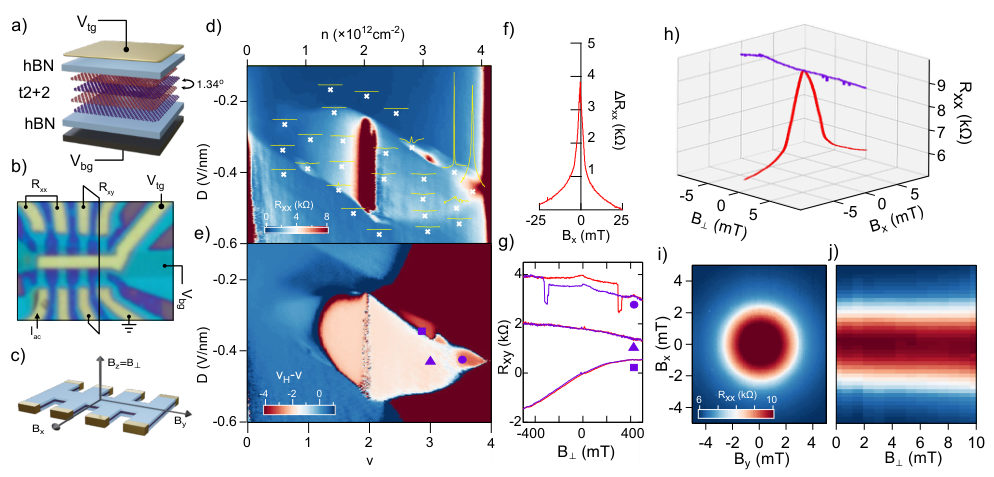 
FIG. 1. a) Stacking configuration of the device. t2+2 consists of two Bernal (AB)-stacked bilayer graphene with a twist angle θ ∼1.34◦, Vtg is the gate voltage on a CrAu top gate; Vbg is the gate voltage applied to a graphite bottom gate. b) Optical image of the device showing measurement configuration. c) Hall bar geometry defining Bx and By as B∥components as well as Bz ≡B⊥. d) Longitudinal resistance Rxx across the halo region (100 mK). Yellow lines show Rxx(Bx) measurements at the ν, D locations specified by white crosses (25 mK). e) Reduced Hall filling |νH −ν| (see methods) extracted at |B⊥| = 0.5 T across the halo region, with markers at the three ν, D locations where data in panel...

📷 Fig 2

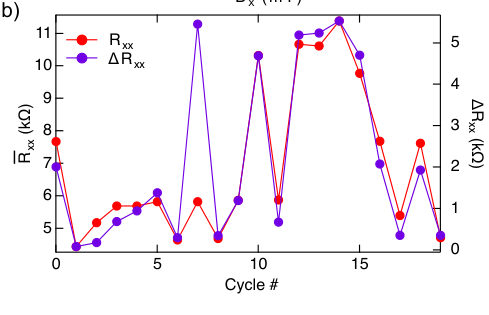 
FIG. 2. a) Rxx(B∥) for five consecutive approaches to the AHE region via each of two gate-voltage trajectories α and β (inset), connecting the fully-degenerate metal (white cir- cle, {ν, D} = {0, 0}) to the quarter-metal region (black cir- cle, {3.46, −0.44}). Path α never yielded an Rxx(B∥) peak, whereas path β almost always did, with varying peak height. Approaches were carried out with zero current in the in-plane magnet coils, corresponding to a residual in-plane field of or- der 0.5 mT. b) Correlation between the average resistance Rxx (red markers) measured over 10 s after arrival via the β trajec- tory, and the peak height ∆Rxx ≡Rxx(B∥= 0) −Rxx(B∥= 10 mT) (purple markers) determined...

📷 Fig 3

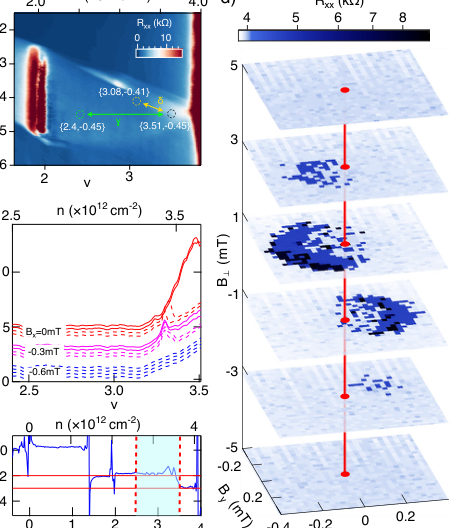 
FIG. 3. a) Rxx map of the tip of the halo region where the B∥= 0 MR peak is observed, with gate-driven trajectories γ (green) and δ (yellow) used for panels (b) and (d); starting and ending points are labelled in terms of {ν, D}. b) Rxx(ν) traces along γ at three values of Bx, with B⊥and By set to zero. Solid (dashed) lines indicate traces terminating in the large-peak (small-peak) state. (c) Reduced Hall filling, |νH −ν|, measured along the full range ν = 0 to 4 at constant D; the light blue shading highlights the portion corresponding to trajectory γ. (d) Terminal Rxx after ramping along δ in (a) for various ⃗B.

**Summary.** This work investigates an anomalous resistance peak at zero in-plane magnetic field in twisted double bilayer graphene. The authors show this peak is highly sensitive to how the material reaches its electronic state, pointing to a mechanism rooted in the domain structure of orbital magnetism. They argue that spin, coupled to valley polarization via spin-orbit interaction, is the key degree of freedom governing this exotic transport signature.

**Why it may be interesting.** The strong coupling between transport measurements and the history-dependent formation of magnetic domains touches upon non-equilibrium dynamics and emergent topological phenomena, which are relevant to understanding quantum state preparation in condensed matter systems.

Detailed structure

**Main problem.** The paper investigates the microscopic origin of a sharp, metastable peak in longitudinal resistance ($R_{xx}$) observed precisely at zero in-plane magnetic field ($B_\parallel=0$) in twisted double bilayer graphene.

**Main result.** The peak's existence and magnitude are highly sensitive to the history of gate-voltage sweeps and the applied magnetic field, strongly suggesting it is governed by the domain structure of orbital magnetism, which involves spin textures.

**Method.** The study uses low-temperature transport measurements, mapping $R_{xx}$ and $R_{xy}$ as functions of gate voltages and applied in-plane magnetic fields, complemented by differential resistance measurements.

**Model / system.** The physical system is twisted double bilayer graphene (t2+2) operating in a valley-polarized quarter-metal state. The physics involves moiré superlattices, orbital magnetism, and the interplay between valley, spin, and charge degrees of freedom.

**Key observables.** Longitudinal resistance $R_{xx}(B_\parallel)$, anomalous Hall resistance $R_{xy}$, and differential resistance $	ext{dV}_{xx}/	ext{dI}$ vs. bias current $	ext{I}_{	ext{DC}}$.

**Important parameters / regimes.** Low temperatures (100-300 mK), in-plane magnetic field components ($B_x, B_y$), and the gate-voltage trajectory used to prepare the electronic state.

**Assumptions / limitations.** The peak is attributed to metastable magnetic domain configurations, and the underlying physics involves spin-transfer torques acting on domain walls.

**Figures summary.** Figures illustrate $R_{xx}(B_\parallel)$ scans showing the $B_\parallel=0$ peak, demonstrating its dependence on the approach path (gate voltage trajectory) and its robustness against out-of-plane fields ($B_z$).

**Paper structure.** The paper systematically maps the resistance landscape by varying gate voltages and magnetic fields, establishing the dependence of the $B_\parallel=0$ peak on the preparation history, and finally proposing a mechanism involving spin-transfer torques at domain walls.

Abstract

In graphene moirés, valley polarization gives rise to orbital magnetism, manifested as an anomalous Hall effect and resulting in Barkhausen jumps in longitudinal resistance when changing domain configurations modify quasiparticle scattering. Beyond a simple picture of polarized domains, however, spin and valley textures within and between the domains are less well understood, as is the effect of these textures on transport. In the valley-polarized quarter-metal state of twisted double bilayer graphene, a sharp and metastable peak in longitudinal resistance often appears at zero in-plane magnetic field, whose microscopic origin has yet to be identified. Here, we show that this peak depends on the configuration of domains of orbital magnetism, which is itself set by the gate-voltage trajectory used to enter the ordered state and by the magnetic field --- particularly the in-plane component --- present during that trajectory. The sensitivity of the effect to in-plane magnetic field components points to spin, linked to valley polarization through spin-orbit coupling, as the key degree of freedom in both the domain formation and the resistance peak.

[↑ back to top](#top)

### [Photonic spin-Hall effect as a probe for time-reversal-symmetry broken band topological phases](http://arxiv.org/abs/2608.25002v1)

**Authors:** Deblina Samanta, Darshan G. Joshi  
**Type:** theory · **Category:** other · **PDF:** <https://arxiv.org/pdf/2608.25002v1>  
**Analysis basis:** full PDF text, analyzed in chunks
**Topic relevance:** `analog quantum simulation` **3/5** · `interference shaping light` **2/5** · `quantum optics experiment` **2/5** · `Keldysh / 2PI / non-Gaussian methods` **1/5** · `quantum measurements` **1/5**

📷 Fig 1

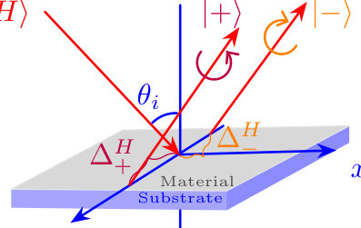 
FIG. 1. Schematic of the photonic spin-Hall effect where an incident Gaussian wavepacket of light polarized in the H plane (here x−z plane) upon reflection splits into two beams of op- posite circular polarizations that are spatially separated along the y axis, denoted by ∆H ±.

📷 Fig 2

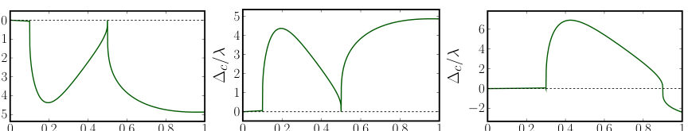 
FIG. 2. Centroid shift in the Chern insulator and trivial phases. (a) M = 0.1eV , ϕ = π/2 with C = 1. (b) M = 0.1eV , ϕ = −π/2 with C = −1. (c) M = 0.3eV , ϕ = π/2 with C = 0.

📷 Fig 3

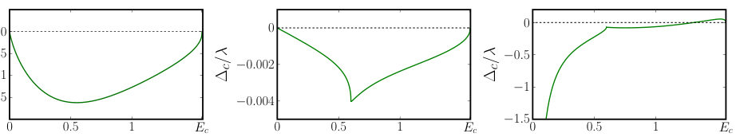 
FIG. 3. (a) Centroid shift in the WSM phase with the incident plane being the x −y plane. (b) Centroid Shift in x −y plane for QAH phase. (c) Centroid Shift in x −y plane for NI phase. Centroid shifts in the x −z and y −z planes are zero for all the phases. For plots (b) and (c), we have set |α| = 0.3 eV, |β| = 0.5a2/2 eV˚A2 with a = 2˚A. Here Ec is the high-energy cut-off.

**Summary.** This work proposes using the Photonic Spin-Hall Effect (PSHE) as a novel, non-invasive method to detect topological phases in materials. By measuring the frequency-dependent centroid shift of reflected light, the authors show that the resulting signature uniquely reveals whether the system possesses a time-reversal-symmetry broken topological band structure. This provides a powerful optical diagnostic tool for condensed matter physics.

**Why it may be interesting.** The use of light polarization and reflection geometry (photonic setup) to probe bulk topological invariants ($\sigma_{xy}$) is a powerful, non-invasive technique relevant to quantum optics and condensed matter theory.

Detailed structure

**Main problem.** To find an unambiguous and non-invasive probe to detect time-reversal-symmetry broken band topological phases.

**Main result.** The frequency dependence of the photonic spin-Hall effect's centroid shift ($\Delta_c$) exhibits a unique sign structure that allows for the unambiguous distinction between topological and trivial band phases.

**Method.** The analysis relates the measurable centroid shift ($\Delta_c$) to the optical Hall conductivity ($\sigma_{xy}$) using Fresnel reflection coefficients derived from the Kubo-Greenwood formula.

**Model / system.** The study applies to various topological systems, including 2D Chern insulators (Haldane model), 3D Weyl semimetals (WSM), and Quantum Anomalous Hall (QAH) insulators.

**Key observables.** The centroid shift ($\Delta_c$), which is the intensity-weighted average of the right and left circularly polarized beam shifts, and the optical Hall conductivity ($\sigma_{xy}(\omega)$).

**Important parameters / regimes.** Frequency ($\omega$), incident angle ($	heta_i$), and topological invariants like the Chern number ($C$).

**Assumptions / limitations.** The analysis assumes the PSHE shift is directly proportional to the optical Hall conductivity, and that the measurement can probe the frequency dependence of this conductivity.

**Figures summary.** Figures illustrate the PSHE splitting ($\Delta H_\pm$) and the frequency dependence of the centroid shift ($\Delta_c$) for various phases (Chern, WSM, QAH, NI), showing distinct sign patterns.

**Paper structure.** The paper establishes the PSHE as a diagnostic tool, derives the relationship between the centroid shift and optical Hall conductivity, and then applies this formalism to model Hamiltonians for Chern insulators, WSM, and QAH phases to demonstrate the unique sign signatures.

Abstract

When a plane polarized Gaussian beam of light is incident on a surface, upon reflection it splits into right and left circularly polarized beams that are spatially separated in the direction perpendicular to the plane of incidence. This is known as the photonic spin-Hall effect (PSHE). In this work, we show that the centroid shift, which is the intensity weighted average of the shifts of the right and the left circularly polarized beams directly probes the optical Hall conductivity, which carries the essential information about the topological properties of the system. We show that the centroid shift as a function of the frequency of light has a unique sign structure depending on whether the system is in a time-reversal symmetry broken band topological phase or a trivial phase. Thus, the PSHE may serve as an unambiguous and a non-invasive probe to detect time-reversal symmetry broken band topological phases.

[↑ back to top](#top)

### [Grain Boundary Engineering Effect on Vortex Matter in Superconducting Films](http://arxiv.org/abs/2608.25268v1)

**Authors:** Qun Wang, Ting Chen, Ya-Xun He, Xing-Jian Liu, Jian-Wen Sun, Kang-Hong Yin, Fang-Ting Lin, Shi-Xun Cao, Jun-Yi Ge  
**Type:** experiment · **Category:** other · **PDF:** <https://arxiv.org/pdf/2608.25268v1>  
**Analysis basis:** full PDF text, analyzed in chunks
**Topic relevance:** `analog quantum simulation` **3/5** · `Frenkel-Kontorova` **1/5** · `driven-dissipative phase transition` **1/5** · `non-equilibrium universality` **1/5**

📷 Fig 1

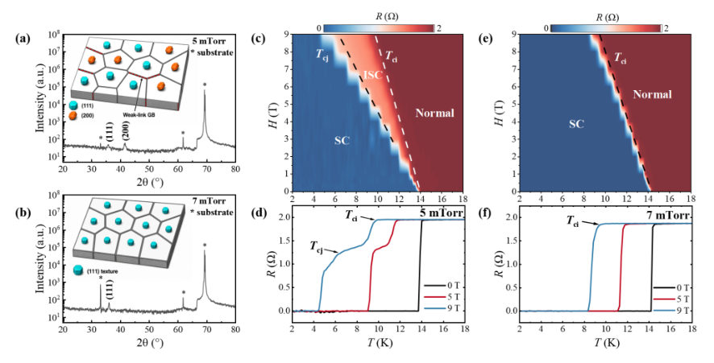 
Figure 1: Structural and transport characterization of NbTiN films with different grain- orientation distributions and GB connectivity. (a,b) XRD patterns of the 5 and 7 mTorr films, respectively. The 5 mTorr film shows comparable (111) and (200) reflections, whereas the 7 mTorr film exhibits a pronounced (111) texture. These texture differences are associated with the distinct effective GB coupling states identified by transport. Insets schematically illustrate the orientation distributions and corresponding GB networks. (c,e) H–T resistance maps of the 5 and 7 mTorr films. Dashed lines mark the characteristic transition boundaries; Tci and Tcj are distinguished for the 5 mTorr film,...

📷 Fig 2

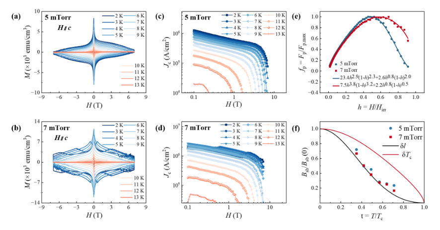 
Figure 2: Magnetic properties and vortex-pinning response of the NbTiN films. (a,b) Isothermal M–H loops of the 5 and 7 mTorr films. (c,d) Field dependence of Jc, calculated from the hysteresis loops using the extended Bean model. (e) Normalized pinning force fp = Fp/Fp,max as a function of reduced field h = H/Hirr; solid curves are two-component Dew–Hughes fits. (f) Temperature dependence of the single-vortex-to-small-bundle crossover field Bsb; solid curves are fits to the collective-pinning expression.

📷 Fig 3

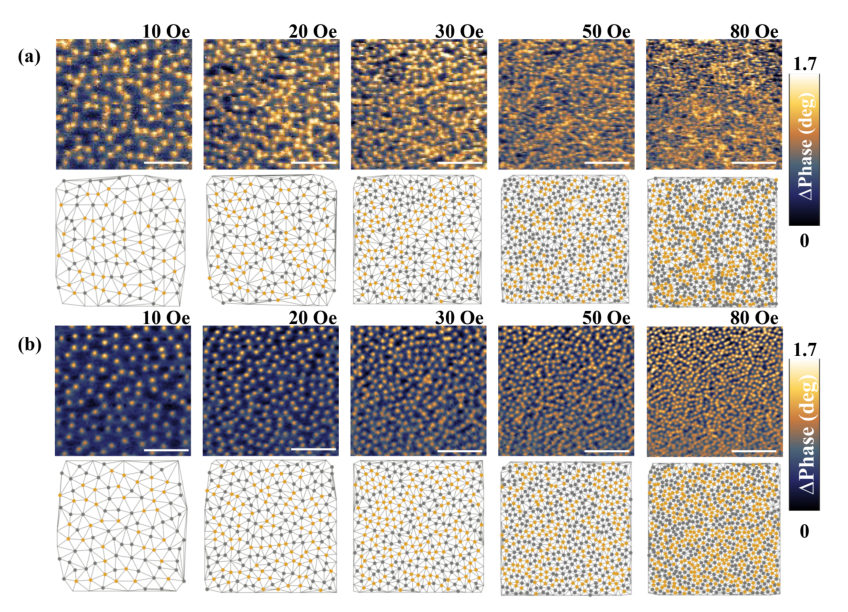 
Figure 3: Real-space vortex configurations and corresponding Delaunay triangulations. MFM phase images and triangulations for (a) the 5 mTorr and (b) the 7 mTorr films. Bright features represent individual vortices according to the selected MFM phase contrast. Images were acquired at 1.7 K after field cooling in 10–80 Oe. For each field, the Delaunay triangulation obtained from the extracted vortex positions is shown below the MFM image. Yellow circles denote sixfold-coordinated vortices and gray circles denote other coordination numbers. Scale bars: 5 µm.

📷 Fig 4

 
Figure 4(e) compares dcenter with the ideal square-lattice spacing asq = (Φ0/B)1/2 and the ideal triangular-

📷 Fig 5

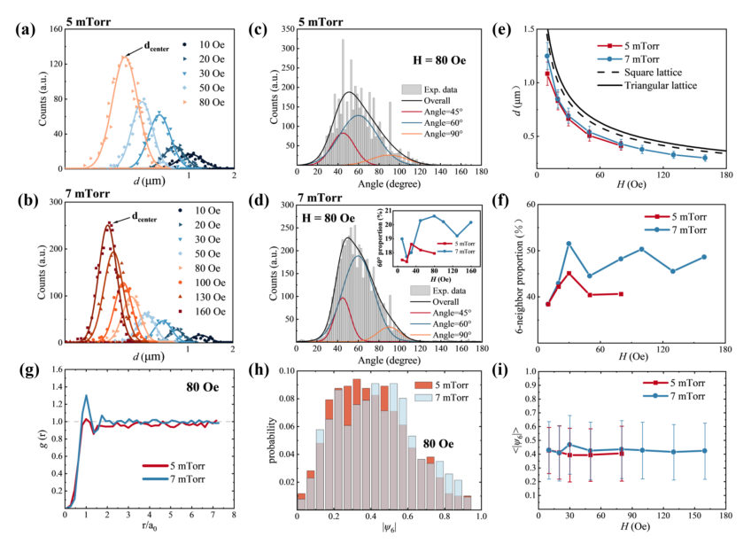 
Figure 4: Quantitative comparison of vortex ordering. (a,b) Nearest-neighbor distance distributions at different fields for the 5 and 7 mTorr films; solid curves are Gaussian fits. (c,d) Delaunay bond-angle distributions at 80 Oe. Colored curves are Gaussian components centered at 45°, 60°, and 90°, and the dashed curve is their sum. (e) Field dependence of dcenter, compared with the theoretical intervortex spacings for ideal square and triangular lattices. Bars indicate the fitted distribution widths at 90% of the corresponding peak maxima and are not statistical uncertainties. (f) Fraction of sixfold-coordinated vortices. (g) Pair- correlation functions g(r) at 80 Oe, plotted against...

**Summary.** This work demonstrates that controlling grain boundary connectivity in superconducting films via deposition pressure fundamentally alters vortex matter. By comparing films with poor vs. improved GB coupling, the authors link macroscopic transport signatures (like resistive transitions) to microscopic vortex organization, providing a practical method to engineer vortex pinning for superconducting devices.

**Why it may be interesting.** While focused on superconductivity, the methodology of using a continuous tuning parameter (sputtering pressure) to control the connectivity of weak links and observing the resulting change in collective, ordered states (vortex lattice) is analogous to tuning disorder or coupling strength in many-body quantum systems.

Detailed structure

**Main problem.** The study aims to determine how tuning the connectivity of grain boundaries (GBs) in superconducting films reorganizes the vortex matter in real space, bridging the gap between macroscopic transport and microscopic vortex structure.

**Main result.** Increasing the sputtering pressure from 5 mTorr to 7 mTorr improves GB coupling, leading to a single-step resistive transition, higher critical current density, and a more uniform, locally ordered vortex distribution.

**Method.** The researchers used reactive magnetron sputtering to create polycrystalline NbTiN films, varying the sputtering pressure to control GB coupling, and characterized the films using electrical transport measurements, magnetic force microscopy (MFM), and quantitative vortex ordering analysis.

**Model / system.** The physical system is polycrystalline NbTiN superconducting thin films. The key variable is the sputtering pressure, which controls the effective coupling strength of the grain boundaries, influencing the superconducting state and vortex pinning landscape.

**Key observables.** Resistive transition steps (two-step vs. single-step), critical current density ($J_c$), second magnetization peak (SMP), vortex spatial distribution (cluster-like vs. uniform), and quantitative vortex ordering metrics ($\psi_6$, bond angles).

**Important parameters / regimes.** Sputtering pressure (5 mTorr vs. 7 mTorr), magnetic field ($H$), temperature ($T$), and the resulting GB coupling strength.

**Assumptions / limitations.** The analysis relies on the London vortex-line approximation for calculating local forces and assumes that the measured transport properties are sensitive to the degree of GB connectivity.

**Figures summary.** Figures compare XRD patterns showing texture changes, R-T curves illustrating the transition steps, and MFM images contrasting the heterogeneous, cluster-like vortices in the 5 mTorr film versus the uniform, ordered vortices in the 7 mTorr film.

**Paper structure.** The paper systematically compares two film conditions (5 mTorr vs. 7 mTorr) by analyzing transport signatures (resistive transitions, $J_c$), magnetic response (SMP), and finally, performing detailed real-space and quantitative analysis of the resulting vortex lattice structure.

Abstract

Grain boundaries (GBs) in polycrystalline superconducting films act as a double-edged sword: they can pin vortices or degrade superconductivity through Josephson-like weak-link coupling. Here, we demonstrate that sputtering pressure tunes GB coupling in NbTiN films and visualize its consequences for vortex matter. The 5 mTorr film exhibits dispersed grain orientations and a two-step resistive transition under field, signaling intergranular weak-link behavior. In contrast, the 7 mTorr film develops a (111) texture, a single-step transition, higher critical current density, a second magnetization peak, and a δl-type pinning response consistent with improved GB coupling. Cryogenic magnetic force microscopy reveals a spatially heterogeneous, cluster-like vortex configuration in the 5 mTorr film, whereas the 7 mTorr film hosts a more uniform distribution with enhanced local order. These results establish a connection between deposition-controlled GB connectivity, macroscopic weak-link transport, and microscopic vortex organization, providing a practical route to tailor vortex pinning in polycrystalline superconducting films.

[↑ back to top](#top)

### [Landau Theory for Commensurate Charge-Density Waves Coupled to Uniform Lattice Deformation](http://arxiv.org/abs/2608.25951v1)

**Authors:** Keiji Nakatsugawa, Toshiyuki Fujii, Satoshi Tanda  
**Type:** theory · **Category:** other · **PDF:** <https://arxiv.org/pdf/2608.25951v1>  
**Analysis basis:** full PDF text, analyzed in chunks
**Topic relevance:** `Frenkel-Kontorova` **3/5** · `Keldysh / 2PI / non-Gaussian methods` **1/5** · `analog quantum simulation` **1/5** · `driven-dissipative phase transition` **1/5**

📷 Fig 1

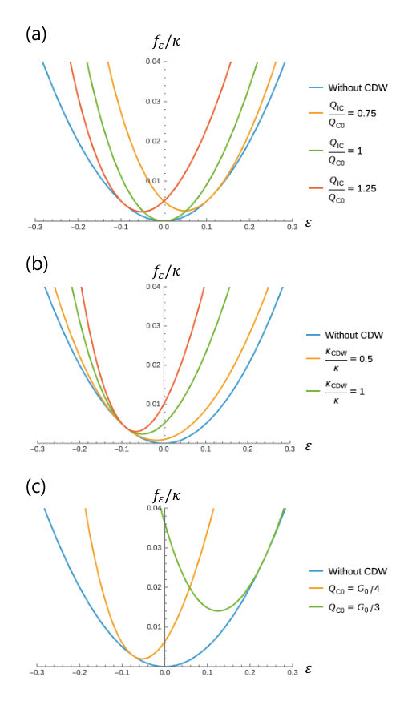 
FIG. 1. Strain free energy density fε = κCDW

📷 Fig 2

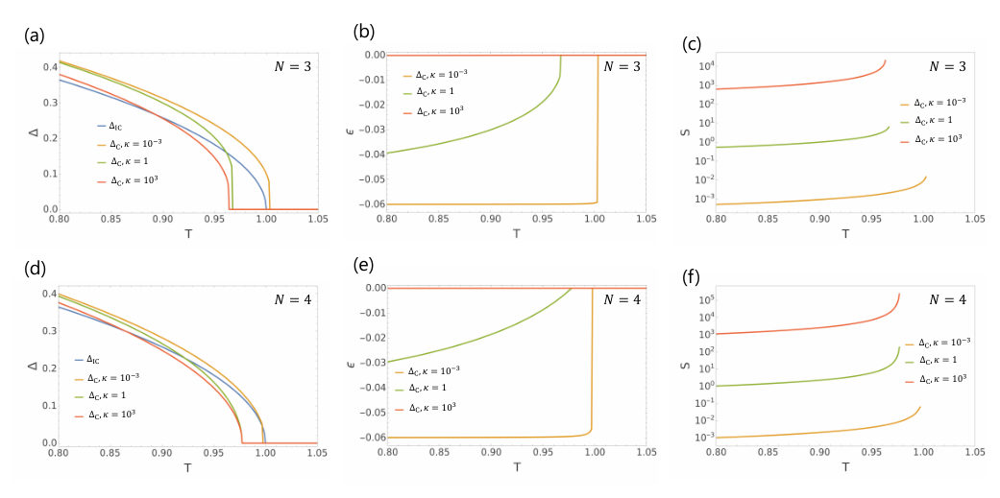 
FIG. 2. Temperature dependence of the commensurate state for different lattice stiffnesses κ. (a), (d) Comparison of the incommensurate amplitude ∆IC and the commensurate amplitude ∆C for different values of κ. In the rigid lattice limit κ →∞ the incommensurate–commensurate phase transition occurs at a temperature T &lt; TIC. In the soft lattice limit κ →0 the energy is minimized by deforming the lattice such that “the lattice is commensurate with the incommensurate CDW wavelength”. For a finite κ the incommensurate–commensurate phase transition still occurs, but at a higher temperature. (b), (e) The strain ε increases as ∆C develops and saturates at the geometric bound ε →1 −r, equal to −0.06...

**Summary.** This work formulates a Landau theory for CDWs coupled to a deformable lattice, addressing the limitations of treating the lattice as rigid. It shows that the CDW and lattice share the geometric mismatch proportionally based on their relative stiffnesses. The results provide a unified picture of commensurate lock-in, suggesting that lattice elasticity is a crucial, often overlooked, degree of freedom in density-wave systems.

**Why it may be interesting.** While focused on CDWs, the methodology of coupling an order parameter to a mechanical degree of freedom (strain) and analyzing the resulting phase transition/locking mechanism is highly relevant to understanding coupling effects in quantum many-body systems.

Detailed structure

**Main problem.** The paper develops a minimal Landau theory to describe Charge-Density Waves (CDWs) whose commensurability is defined relative to a lattice that can undergo uniform deformation.

**Main result.** The theory successfully interpolates between rigid and soft lattice limits, showing that the lattice strain and CDW amplitude are coupled, leading to a feedback mechanism that stabilizes the commensurate state.

**Method.** The authors minimize the coupled free energy density with respect to the CDW order parameter and the lattice strain, deriving equilibrium conditions based on stiffness ratios.

**Model / system.** The model describes a CDW coupled to a lattice strain ($\varepsilon$), motivated by observations in single-chain $	ext{NbS}_3$ where a commensurate CDW is accompanied by lattice shrinkage.

**Key observables.** Equilibrium lattice strain ($\varepsilon$), CDW amplitude ($\Delta_C$), and the resulting wave number mismatch.

**Important parameters / regimes.** Stiffness ratio ($S = \kappa/\kappa_{CDW}$), geometric misfit ratio ($r = Q_{IC}/Q_{C0}$), and the commensurability number ($N$).

**Assumptions / limitations.** The analysis uses a single-mode ansatz for the CDW, excluding discommensurations, and assumes the lattice deformation is uniform.

**Figures summary.** Figures illustrate the strain free energy density dependence on strain ($\epsilon$) for different misfit ratios ($r$) and stiffness ratios ($S$), and show the temperature evolution of CDW amplitude and strain in the soft limit.

**Paper structure.** The paper establishes the coupled free energy functional, analyzes the limiting cases (rigid vs. soft lattice), derives the equilibrium strain and CDW amplitude, and discusses the implications for existing lock-in theories.

Abstract

We formulate a minimal Landau theory for a charge-density wave (CDW) whose commensurability is defined with respect to a deformed lattice. The motivation is provided by recent observations on an isolated single NbS$_3$ chain, which exhibits a commensurate CDW state accompanied by a $6\%$ shrinkage of the lattice constant. A uniform stretch $a_0\to a_0(1+\varepsilon)$ changes the reciprocal lattice wave number to $G(\varepsilon)=G_0/(1+\varepsilon)$, so that an $N$-fold commensurate CDW has the wave number $Q_\mathrm{C}(\varepsilon)=G(\varepsilon)/N$, whereas the wave number $Q_\mathrm{IC}$ favored by the incommensurate instability remains fixed. We propose an amplitude-strain free energy for both $N=3$ and $N=4$, in which the CDW induces a finite uniform strain by relieving the mismatch between $Q_\mathrm{C}(\varepsilon)$ and $Q_\mathrm{IC}$. The mismatch is shared between the CDW and the lattice in a proportion set by their stiffness ratio; since the CDW stiffness grows with the CDW amplitude, the lattice takes up an increasing share of the mismatch as the CDW develops. Our results suggest a reexamination of lock-in theories and of strain-tuning experiments on density-wave systems.

[↑ back to top](#top)

### [Topological phases of a generalised tripartite Haldane model](http://arxiv.org/abs/2608.25875v1)

**Authors:** Ahmed Al-kharusi, Alessandro Principi, Niels R. Walet  
**Type:** theory · **Category:** other · **PDF:** <https://arxiv.org/pdf/2608.25875v1>  
**Analysis basis:** full PDF text, analyzed in chunks
**Topic relevance:** `analog quantum simulation` **3/5**

📷 Fig 1

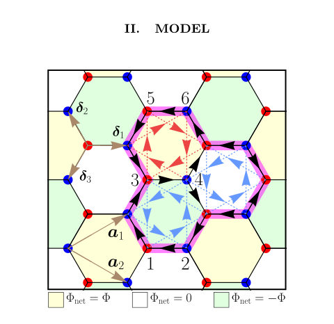 
FIG. 1. A graphical representation of the generalised tripartite Haldane model. The sign of the phase of the nearest-neighbour hopping t1e±iθ is positive if the hopping is in the direction of the black arrows, and negative otherwise. Similarly, the dotted arrows show the sign of the phase in the next-nearest-neighbour hopping t2e±iϕ. The dotted lines are coloured in blue and red to easily distinguish between the clockwise and the anticlockwise directions. The magenta lines show the primitive unit cell, which contains six atoms numbered 1 to 6. The graphene unit cells are coloured according to the net magnetic flux. We use light yellow and light green for Φnet = Φ or −Φ, respectively, while...

📷 Fig 2

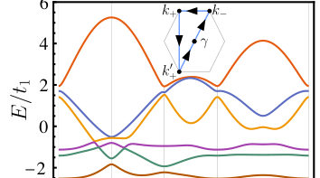 
FIG. 2. The energy bands of the generalised Haldane model for t2/t1 = 4/10, θ = π/12 and ϕ = π/15. There is no actual band crossing in this plot, but the apparent crossing that can be seen shows the narrowness of the band gaps. The inset shows the path taken through the BZ connecting the high symmetry points.

📷 Fig 3

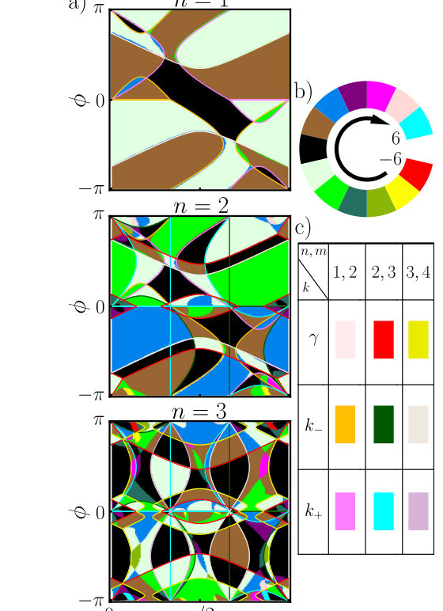 
FIG. 3. (a) The topological phase diagrams of the upper three bands of the generalised Haldane model, where n is the band index. The bands are numbered from highest energy value to lowest energy value such that n = 1 is the uppermost energy band, and n = 6 is the lowermost energy band. The phase diagrams show the Chern number as a function of the phases θ and ϕ, where t2/t1 = 4/10. The numerical calculations were done only for ϕ ∈[0, π], and the other halves of the phase diagrams, namely for ϕ ∈[−π, 0) were generated by symmetry as explained in the main text. Calculation were performed on a grid of (θ, ϕ) values of size Nθ × Nϕ = 161 × 321. Each point is then coloured by its Chern number,...

📷 Fig 4

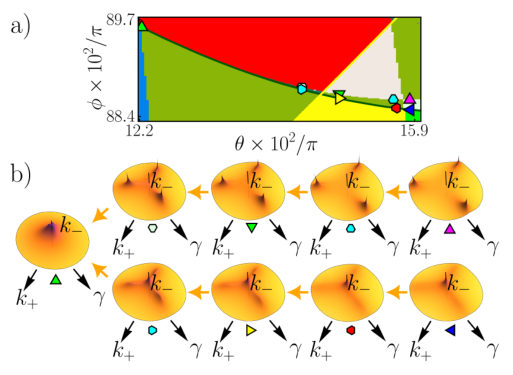 
FIG. 5. An example of a merger between two different types of crossings. (a) a zoomed-in plot of the topological phase diagram of the third energy band; colour coding as in Fig. 3. In the light brown area, the Chern number is equal to −7. Markers are plotted in (a) along two different crossing lines. The dark green line (see Fig. 3(c)) is associated with a crossing at k−, while the other line is associated with three crossings {ki}, away from the high symmetry point. (b) Plots of −ln(E2 −E3) for the two crossing lines in the vicinity of k−. Each peak in (b) indicates a crossing between E2 and E3. The radii of the plots in (b) are equal to k/a = 0.3. See main text for discussion.

📷 Fig 5

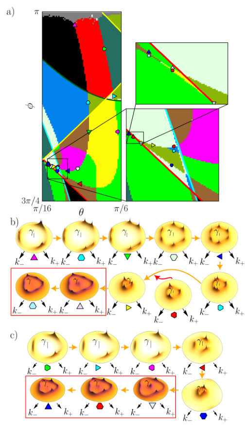 
FIG. 4. Examples of lines in the phase diagrams where the second and third energy bands cross at a set of points {ki}, where none of {ki} is a high symmetry point. (a) A zoomed-in region of the topological phase diagram of the third band; colour coding as in Fig. 3. Markers are plotted along two different separatrices in the phase diagram, and each marker in a) corresponds to the plot with the same marker in b) and c). The plots in (b) and (c) show −ln(E2 −E3) in the vicinity of γ in the BZ. Thus, each peak indicates a crossing between the second and third energy bands. The radius of the disks inside the red rectangles in (b) and (c) is k/a = 0.3, while the radius of the other plots in (b)...

**Summary.** This work analyzes the topological properties of a generalized tripartite Haldane model using a tight-binding Hamiltonian. By calculating the Chern number across a complex phase diagram, the authors demonstrate that the model supports much larger topological invariants than simpler analogues. The analysis relies heavily on identifying and characterizing the energy band crossings that define the phase boundaries.

**Why it may be interesting.** The study of topological phases in lattice models, especially those involving complex hopping parameters and emergent loop currents, provides deep insights into the robustness of quantum states against perturbations, which is fundamental to topological quantum computing concepts.

Detailed structure

**Main problem.** The paper investigates the topological phase diagram of a generalized tripartite Haldane model defined on a hexagonal lattice.

**Main result.** The model exhibits a highly complex topological phase diagram, with Chern numbers reaching absolute values as large as 7, significantly exceeding the simple values found in the original Haldane model.

**Method.** Topological invariants (Chern numbers) are calculated by integrating the Berry curvature over the Brillouin zone, supported by analytical derivations of energy band crossings at high-symmetry points.

**Model / system.** The system is described by a tight-binding Hamiltonian on a hexagonal lattice, forming a tripartite unit cell. The Hamiltonian incorporates complex nearest and next-nearest neighbor hopping parameters, and the analysis is based on diagonalizing a $6 	imes 6$ matrix.

**Key observables.** Chern number (C), energy bands ($E_n$), and the Berry curvature ($\Omega_n(k)$).

**Important parameters / regimes.** Phases of hopping parameters ($	heta, \phi$), and the ratio of hopping parameter magnitudes ($t_2/t_1$).

**Assumptions / limitations.** The Chern number calculation requires the energy band of interest to be well separated from other bands ($\Delta E \geq 10^{-4}t_1$).

**Figures summary.** Figures illustrate the model structure, the topological phase diagrams showing Chern numbers vs. parameter phases, and plots detailing energy band crossings both at high-symmetry points and away from them.

**Paper structure.** The paper first introduces the model and its Hamiltonian, then details the numerical and analytical methods for calculating the Chern number. It systematically analyzes the phase diagram by deriving explicit analytical expressions for band crossings at high-symmetry points ($\gamma, k_\pm, k'_\pm$), which dictate the phase transitions.

Abstract

We present a generalised tripartite Haldane model with a complex nearest neighbour hopping parameter. The total magnetic flux through the primitive unit cell, which consists of three hexagonal unit cells is zero, and thus the model has the structure of a loop-current model. We calculate topological phase diagrams of the Chern numbers as a function of the phases of the nearest and next-nearest neighbour hopping parameters for a fixed ratio of the magnitude of the hopping parameters. We show that, unlike the Haldane model, the topological phase diagram of this model is very complex, but some aspects can still be dealt with analytically. Furthermore, the Chern numbers of the topological phases are as large as $7$ in absolute value. The analysis is supported by explicit expressions for energy bands crossing at high symmetry points in the Brillouin zone, which show as linear phase boundaries in the phase diagram. We show that such lines explain many features in the topological phase diagrams. Finally, we analyse a few representative examples of the nature of level crossings away from high symmetry and their evolution with model parameters.

[↑ back to top](#top)

### [Carrier-Resolved Attosecond Valley Polarimetry of Monolayer MoS$_2$](http://arxiv.org/abs/2608.25121v1)

**Authors:** Navdeep Rana, Lun Yue, Mette B. Gaarde  
**Type:** both · **Category:** other · **PDF:** <https://arxiv.org/pdf/2608.25121v1>  
**Analysis basis:** full PDF text, analyzed in chunks
**Topic relevance:** `Keldysh / 2PI / non-Gaussian methods` **2/5** · `methods for driven-dissipative` **2/5** · `quantum measurements` **2/5** · `analog quantum simulation` **1/5** · `correlated / nonlocal dissipation` **1/5** · `driven-dissipative phase transition` **1/5** · `non-equilibrium universality` **1/5**

📷 Fig 1

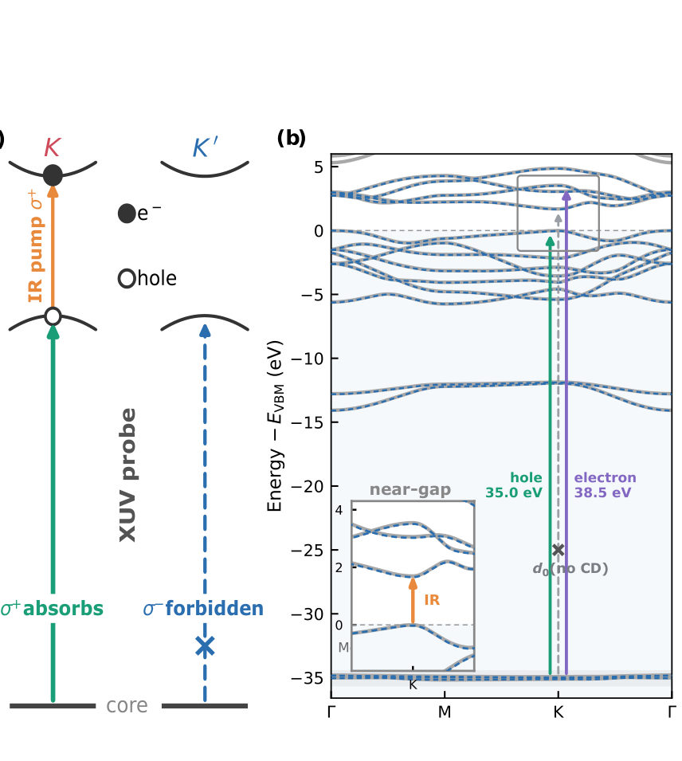 
FIG. 1. Core-level valley readout in monolayer MoS2. (a) Readout scheme for a σ+ pump at K.

📷 Fig 2

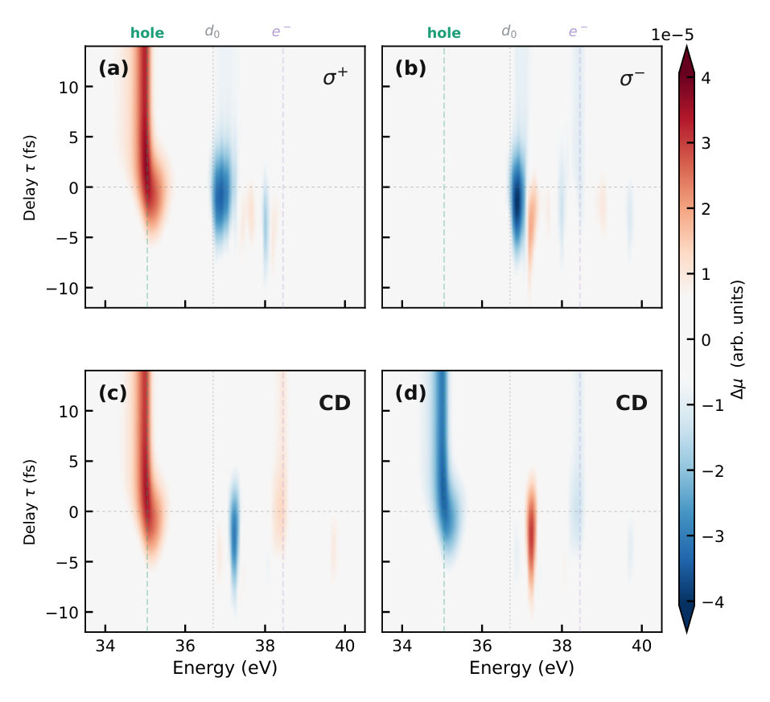 
FIG. 2. Two-channel, carrier-resolved readout. (a),(b) Transient absorption ∆µ±(ω, τ) for σ+ and

📷 Fig 3

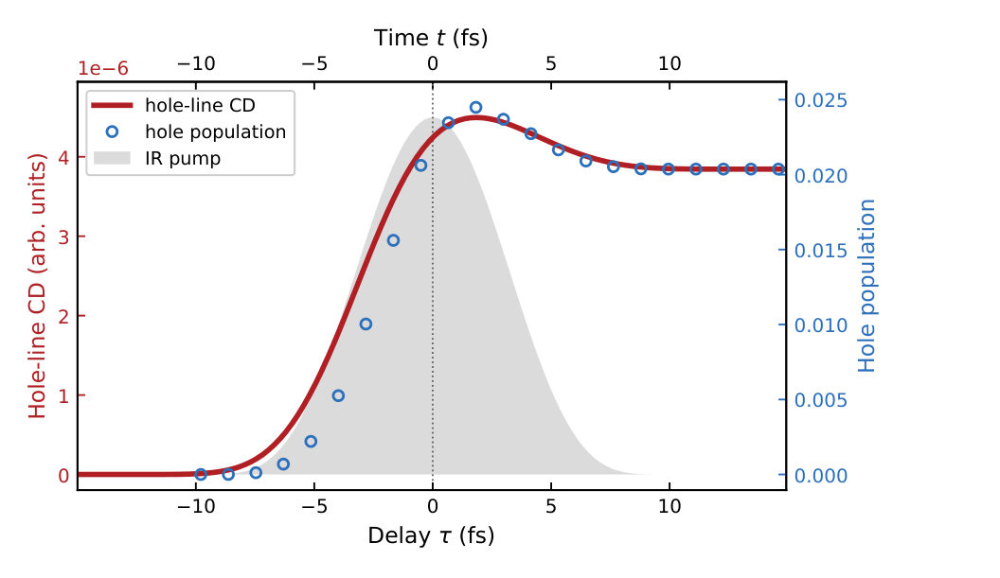 
FIG. 3. Attosecond readout of valley-polarization buildup (σ+ pump). Before the pump, the hole

📷 Fig 4

 
Figure 3 shows the hole-line CD as a function of pump–probe delay (left axis), together

📷 Fig 5

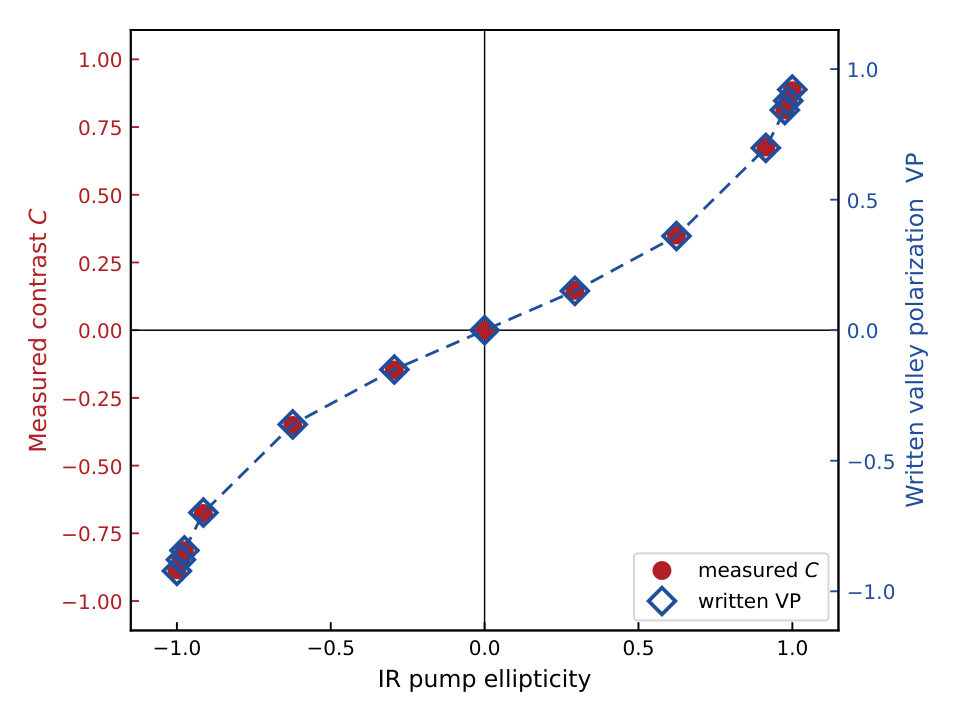 
FIG. 4. The valley polarimeter. Scanning the pump polarization from σ−through linear polariza-

**Summary.** This work demonstrates that attosecond transient absorption spectroscopy can serve as a quantitative, carrier-resolved polarimeter for measuring valley polarization in monolayer MoS2. By analyzing the circular dichroism at the Mo 4p core edge, the authors can track the creation and evolution of valley polarization in real time, providing a powerful tool for ultrafast valleytronics research.

**Why it may be interesting.** The methodology of using core-level transitions to create a highly sensitive, background-free, and carrier-resolved probe for non-equilibrium quantum states (valley polarization) is highly relevant to open quantum systems and quantum optics.

Detailed structure

**Main problem.** The core challenge is developing a method to read out valley polarization (VP) in 2D semiconductors on the same ultrafast timescale (attosecond) that it can be written or switched.

**Main result.** Attosecond transient absorption spectroscopy (ATA) successfully functions as a carrier-sensitive, quantitative polarimeter, allowing the real-time tracking of valley polarization buildup and dynamics.

**Method.** The study combines theoretical simulations using semiconductor Bloch equations with the concept of attosecond core-level dichroism measurements.

**Model / system.** The system is monolayer MoS2, a 2D semiconductor whose valley pseudospin is probed using the Mo 4p semicore edge. The theory employs a tight-binding model solved via semiconductor Bloch equations.

**Key observables.** Circular Dichroism (CD) of the transient absorption spectrum ($\Delta\mu_{\pm}$), which is shown to be linearly proportional to the valley polarization (VP).

**Important parameters / regimes.** Attosecond probe delay (time resolution), pump helicity ($\sigma^\pm$), and the energy separation between hole ($\approx 35.0 	ext{ eV}$) and electron ($\approx 38.5 	ext{ eV}$) transitions.

**Assumptions / limitations.** The simulation assumes the core semicore level is localized on Mo atoms and neglects population relaxation, though the symmetry rules are robust.

**Figures summary.** Figures illustrate the readout scheme, showing how $\sigma^+$ and $\sigma^-$ probes yield different signals, and demonstrate the time evolution of the hole-line CD tracking the valley population buildup.

**Paper structure.** The paper establishes the need for ultrafast readout, details the use of ATA and core-level transitions to separate electron/hole signals, presents the quantitative relationship between CD and VP, and finally demonstrates time-resolved tracking of the valley dynamics.

Abstract

In recent years, all-optical writing and switching of valley polarization in two-dimensional semiconductors has been demonstrated on femtosecond timescales. Reading this polarization out on the same timescale, carrier by carrier, has so far remained out of reach. Employing semiconductor Bloch equation simulations of monolayer MoS$_2$, we show that attosecond transient absorption closes this gap by turning the Mo $4p$ semicore edge into a quantitative valley polarimeter. We find that pump-enabled core-to-valence absorption probes the holes while core-to-conduction bleaching probes the electrons, so that a single spectrum identifies each carrier by its photoabsorption energy. The hole channel, Pauli-blocked in equilibrium, emerges background-free. Its circular dichroism reverses sign with the pump helicity, and its normalized magnitude is proportional to the valley polarization. Finally, we show that scanning the probe delay clocks the few-femtosecond write in real time. Thus, attosecond core-level dichroism is a carrier-sensitive, quantitative probe of the creation and evolution of valley polarization.

[↑ back to top](#top)

### [Fluxtube Bouquets and Type-1.5 Clustering in Superfluid Neutron Star Cores](http://arxiv.org/abs/2608.25943v1)

**Authors:** Adarsh Karekkat, Gabriele Montefusco, Marco Antonelli  
**Type:** theory · **Category:** other · **PDF:** <https://arxiv.org/pdf/2608.25943v1>  
**Analysis basis:** full PDF text, analyzed in chunks
**Topic relevance:** `Keldysh / 2PI / non-Gaussian methods` **2/5** · `analog quantum simulation` **2/5** · `driven-dissipative phase transition` **2/5** · `methods for driven-dissipative` **2/5** · `Frenkel-Kontorova` **1/5** · `non-equilibrium universality` **1/5**

📷 Fig 1

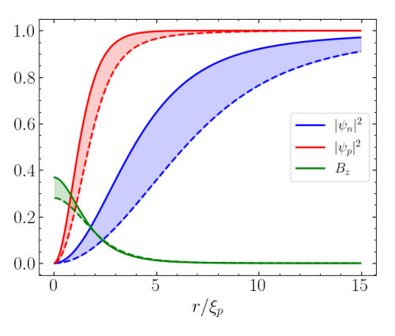 
FIG. 1: Single-defect profiles in a domain with Lx = Ly = 50. Solid curves show the uncoupled case. Dashed curves show the coupled case α = g = 0.1, which gives the largest deformation in the scan. The shaded bands indicate the spread over the explored coupling values. The |ψn|2 profile refers to a single vortex (|Qn| = 1, Qp = 0), while |ψp|2 and Bz refer to a single fluxtube (Qn = 0, Qp = 1). The case (Qn = 0, Qp = −1) is identical, but with Bz reversed.

📷 Fig 2

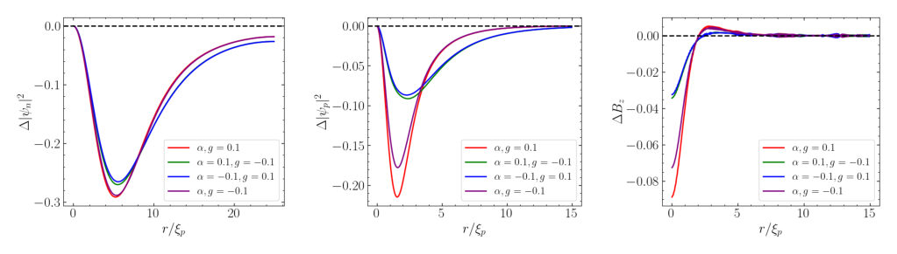 
FIG. 2: Differences in the relaxed single-defect radial profiles induced by inter-condensate couplings α, g = ±0.1 with respect to the case α = g = 0.

📷 Fig 3

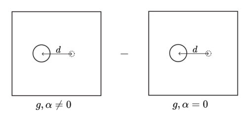 
FIG. 3: Schematic constrained minimization protocol used to extract the vortex-fluxtube interaction energy at fixed separation d, see Sec. III B: each box represents D with |Qn| = |Qp| = 1; the wider cylinder denotes the vortex and the narrower cylinder denotes the proton fluxtube. The difference between the two configurations represents (12).

📷 Fig 4

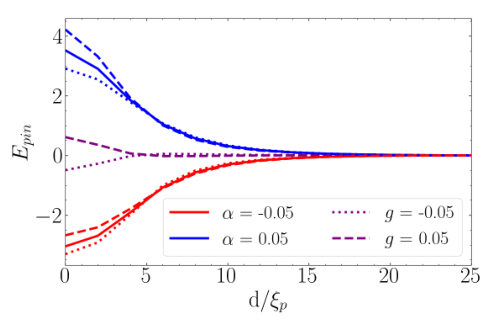 
FIG. 4: The vortex-fluxtube pinning energy per unit length Epin(d; α, g) as a function of their imposed separation d. The effects of α and g are essentially additive. The same result is obtained for the anti-aligned case Qn = −Qp = 1, see Fig. 5. For the fiducial parameters used here, one dimensionless unit of Epin corresponds to 0.13 MeV fm−1.

📷 Fig 5

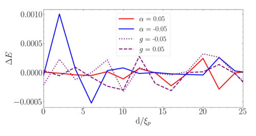 
FIG. 5: The difference of Epin(d; α, g) between the aligned case Qn = Qp = 1 and the anti-aligned case Qn = −Qp = 1. The difference is absolute, to be compared against the curves in Fig. 4 and essentially due to the numerical resolution of the minimisation procedure (the peak at 0.001 of the blue curve corresponds to a relative error of about 0.03%).

**Summary.** This theoretical paper models the interaction between superfluid neutron vortices and proton magnetic flux-tubes in neutron star cores. Using a Ginzburg-Landau free energy approach, the authors predict the formation of dense 'fluxtube bouquets' around vortices. The findings suggest novel mechanisms for energy dissipation and transport within these extreme astrophysical objects.

**Why it may be interesting.** While focused on astrophysics, the methodology of minimizing complex, coupled Ginzburg-Landau free energies to study defect interactions (vortices/flux lines) is highly relevant to understanding topological defects in superfluids, which has parallels in AMO physics.

Detailed structure

**Main problem.** The study investigates the mesoscopic interactions between topological defects—specifically neutron vortices and proton flux-tubes—within the outer core of a neutron star.

**Main result.** The authors predict the formation of 'fluxtube bouquets' where multiple proton fluxtubes bind around a neutron vortex, and they confirm the existence of a Type-1.5-like clustering regime.

**Method.** The analysis involves minimizing a two-component Ginzburg-Landau free energy functional in two spatial dimensions using quasi-periodic boundary conditions and constrained phase-imprinting calculations.

**Model / system.** The system models a neutron superfluid coupled to a proton superconductor in a neutron star's outer core. The physics is governed by a two-component Ginzburg-Landau free energy density, which includes coupling terms ($\alpha, g$) between the condensates and the magnetic field.

**Key observables.** Vortex-fluxtube interaction energies, the formation of fluxtube bouquets, and the stability characteristics of the Type-1.5 regime.

**Important parameters / regimes.** Locally attractive couplings ($\alpha < 0$), the zero-entrainment limit, and the coupling constants $\alpha$ and $g$.

**Assumptions / limitations.** The study neglects genuine phase-gradient entrainment and uses a scalar field approximation for the neutron order parameter.

**Figures summary.** The notes mention figures comparing uncoupled vs. coupled single-defect profiles and showing the numerical convergence limits for varying coupling constants.

**Paper structure.** The paper develops by defining the free energy functional, applying minimization techniques (QPBC and phase imprinting) to study defect interactions, and then analyzing the resulting stable configurations and clustering phenomena.

Abstract

We study mesoscopic configurations of a neutron superfluid coupled to a proton superconductor in the outer core of a neutron star. The condensates are described by a two-component Ginzburg-Landau free energy with local couplings, neglecting genuine phase-gradient entrainment. In two spatial dimensions, we minimize the free energy using quasi-periodic boundary conditions and constrained phase-imprinting calculations to study vortex-fluxtube and fluxtube-fluxtube interactions. We find that, for locally attractive couplings in the free energy, vortex-fluxtube overlap is energetically favoured and several pre-existing proton fluxtubes can bind around a neutron vortex, forming finite vortex-centred aggregates that we call fluxtube bouquets. These bouquet configurations may become so dense that a vortex can effectively accommodate several quanta of magnetic flux. We also confirm the possible presence of a type-1.5-like regime and find that it survives in the zero-entrainment regime considered here. In this type-1.5 regime, the fluxtube-fluxtube interaction is repulsive at short distances and attractive at intermediate distances, leading to self-assembled clusters while the individual fluxtubes remain topologically distinct. Possible implications for dissipative coupling and transport in neutron stars are discussed.

[↑ back to top](#top)

### [Viscochiral Transport: Chiral Selection of Hydrodynamic Vortices by Berry Curvature](http://arxiv.org/abs/2608.26102v1)

**Authors:** Archisman Panigrahi, Khachatur Nazaryan  
**Type:** theory · **Category:** statistical mechanics · **PDF:** <https://arxiv.org/pdf/2608.26102v1>  
**Analysis basis:** full PDF text, analyzed in chunks
**Topic relevance:** `Keldysh / 2PI / non-Gaussian methods` **2/5** · `methods for driven-dissipative` **1/5**

📷 Fig 1

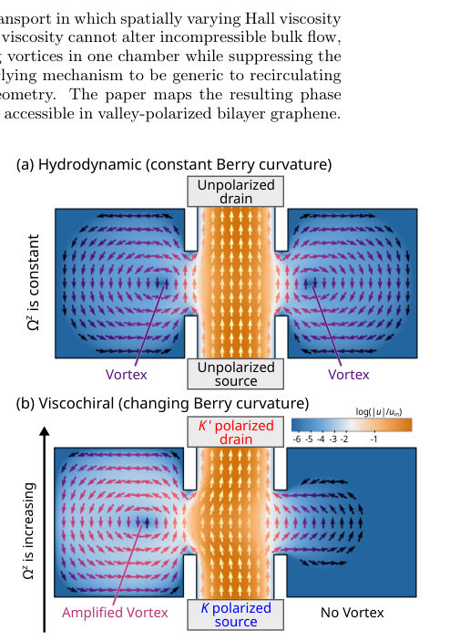 
FIG. 1. Chiral vortex selection by a gradient of Berry- curvature (Ωz) in a Bernal bilayer graphene device. (a) For constant Berry curvature, the two chambers are equivalent and the hydrodynamic flow forms a mirror-related pair of vor- tices. (b) When the Berry curvature varies across the device, the induced odd-viscous force biases the circulations in the two chambers differently: one vortex is amplified, while the other is completely suppressed. The background color repre- sents local flow speed in a logarithmic scale, and the arrows indicate the local flow direction.

📷 Fig 2

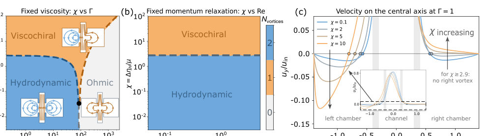 
FIG. 2. Phase diagram of the flow-profiles in two chambers: (a) Different regimes as a function of the dimensionless jump in Hall viscosity and the dimensionless Ohmic scattering rate Γ = ργW 2 ch/µ. The phase diagram hosts three regimes, hydrodynamic (blue), with a symmetric pair of vortices of opposite signs, viscochiral (orange), in which one vortex is amplified and the other is extinguished, and Ohmic (gray), a potential flow lacking vortices. The schematics of the flow profile in each regime is shown in the insets. At small Γ the transition between viscochiral regime and the hydrodynamic regime occurs at χc ≈2.9, whereas near the hydrodynamic-Ohmic boundary, the viscochiral phase...

📷 Fig 3

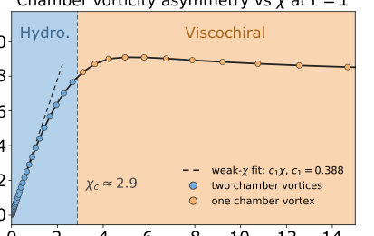 
FIG. 3. The relative asymmetry in the strength of vorticity in the two chambers as a function of the dimensionless jump in Hall viscosity, χ, for a fixed value of Ohmic scattering rate. Here, the magnitude of the vorticity in a chamber is defined as Ω1,2 = R

📷 Fig 4

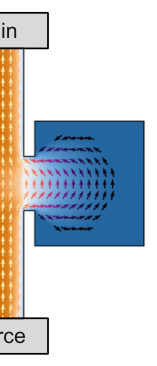 
FIG. 4. A typical flow profile in the Ohmic regime, lacking vortices in either chamber.

**Summary.** This work predicts a 'viscochiral' transport regime in electronic fluids where the spatial gradient of the Hall viscosity controls the flow structure. By modifying the Navier-Stokes equations, the authors show that this gradient selectively amplifies one hydrodynamic vortex while suppressing the other. This mechanism is theoretically derived and proposed to be experimentally accessible in valley-polarized bilayer graphene.

**Why it may be interesting.** The concept of chirality selection driven by geometric/topological properties (Berry curvature) in fluid dynamics is a rich area connecting condensed matter topology to non-equilibrium statistical mechanics.

Detailed structure

**Main problem.** The paper investigates a 'viscochiral regime' of electronic transport where the spatial variation of Hall viscosity dictates the selection and pattern of hydrodynamic vortices.

**Main result.** A non-uniform Hall viscosity gradient acts as a chiral selector, causing the mean-square vorticity to amplify in one chamber while suppressing or extinguishing the vortex in the other.

**Method.** The analysis uses modified Navier-Stokes equations incorporating an odd viscosity term derived from Berry curvature, solving for the vorticity evolution.

**Model / system.** The system is modeled as an incompressible charged electronic fluid flowing in a two-chamber geometry, with the physics being demonstrated using bilayer graphene.

**Key observables.** Mean-square vorticity ($\langle \omega^2 
angle$) and enstrophy, which show asymmetric distribution in the viscochiral regime.

**Important parameters / regimes.** The dimensionless parameter $\chi = \Delta\eta_H/\mu$ (contrast in Hall viscosity to shear viscosity) and the Ohmic scattering rate ($\Gamma$) define the phase diagram.

**Assumptions / limitations.** The analysis assumes the incompressible limit ($
abla \cdot \mathbf{u} = 0$) and relies on the gradient of Hall viscosity being the primary driving force for vortex selection.

**Figures summary.** Figures illustrate the transition from symmetric counter-rotating vortices (constant Hall viscosity) to an asymmetric state where one vortex is amplified and the other is suppressed (varying Hall viscosity).

**Paper structure.** The paper establishes the governing equations, analyzes the standard hydrodynamic regime, and then introduces the gradient term ($\partial_y \eta_H$) to derive the vorticity evolution equation, culminating in the phase diagram mapping the viscochiral regime.

Abstract

We predict a new \textit{viscochiral regime} of electronic transport in which spatially varying Hall viscosity selects vortical flow patterns. Although uniform Hall viscosity cannot alter incompressible bulk flow, its spatial gradient redistributes vorticity, amplifying vortices in one chamber while suppressing the vortex in the other. We further determine the underlying mechanism to be generic to recirculating flows and insensitive to the details of the device geometry. The paper maps the resulting phase diagram and shows that the regime is experimentally accessible in valley-polarized bilayer graphene.

[↑ back to top](#top)

### [Generalizing Thermal Transport in High-Contrast Metamaterials through Interfacial Fresnel Reflection](http://arxiv.org/abs/2608.25499v1)

**Authors:** Seung Hyeon Ham, Yu Min Kim, In Hyeok Choi, Jeong Woo Han  
**Type:** theory · **Category:** statistical mechanics · **PDF:** <https://arxiv.org/pdf/2608.25499v1>  
**Analysis basis:** full PDF text, analyzed in chunks
**Topic relevance:** `Keldysh / 2PI / non-Gaussian methods` **1/5** · `analog quantum simulation` **1/5** · `correlated / nonlocal dissipation` **1/5** · `interference shaping light` **1/5**

📷 Fig 1

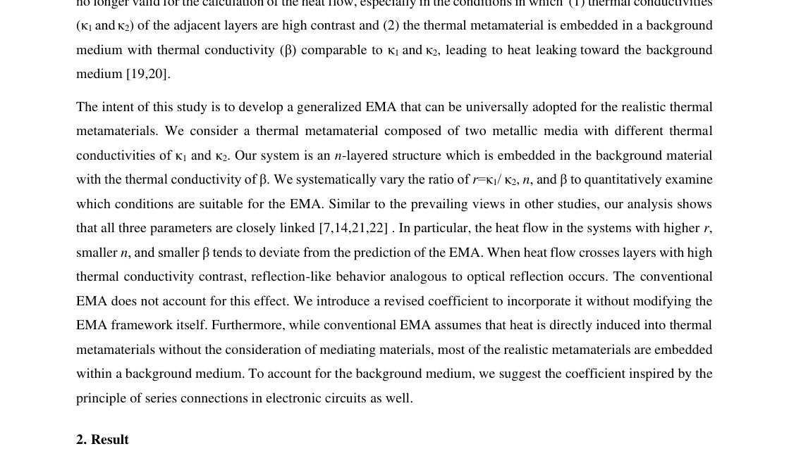 
Figure 1(a) shows the geometry of the thermal metamaterial used in this simulation study. It is composed of two

📷 Fig 2

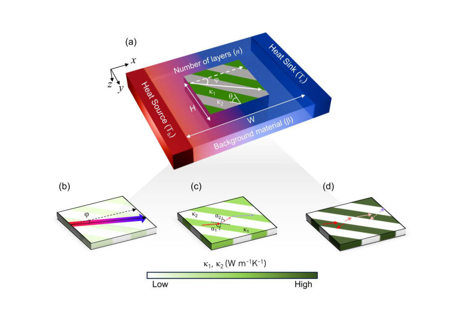 
Fig. 1. (a) Schematic geometry of the thermal metamaterial used in the simulation study. The thermal conductivities of the two metallic layers and the background medium are denoted by κ1, κ2, and β, respectively, with n representing the number of layers. W is the width of the entire structure and H is the height of thermal metamaterial. The entire structure is sandwiched between a heat source (Th) and a heat sink (Tc). The heat flow bending angle within the layered structure is denoted by φ. The metamaterial structure is aligned with θ = 45o. (b-d) Heat flow distributions under different conditions: (b) effectively isotropic, (c) partially anisotropic, and (d) strongly anisotropic. While...

📷 Fig 3

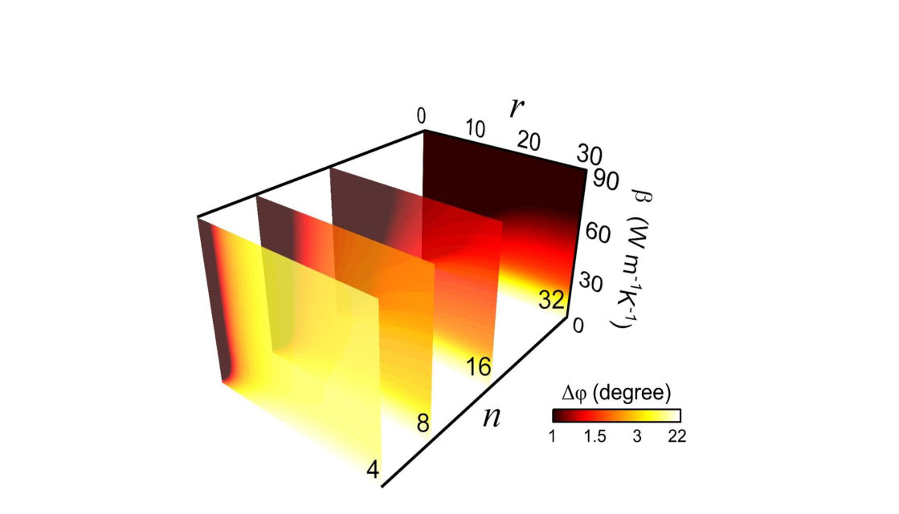 
Fig. 2. Deviation of the heat-flow direction Δφ between the simulation results (FEM) and the prediction value from conventional EMA. n and r indicate the number of layers of the thermal metamaterial and the ratio of their thermal conductivities (κ1/κ2), respectively. β is the thermal conductivity of the background medium.

📷 Fig 4

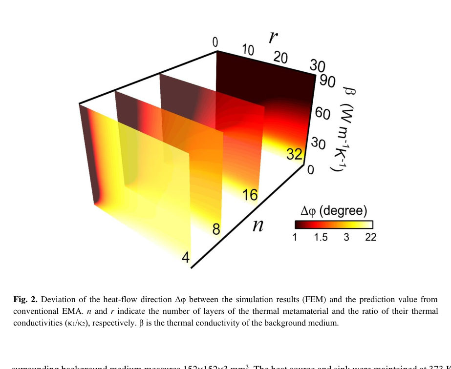 
Figure 2 illustrates the deviation in the heat-flow bending angle (Δφ) on a logarithmic scale, defined as the

📷 Fig 5

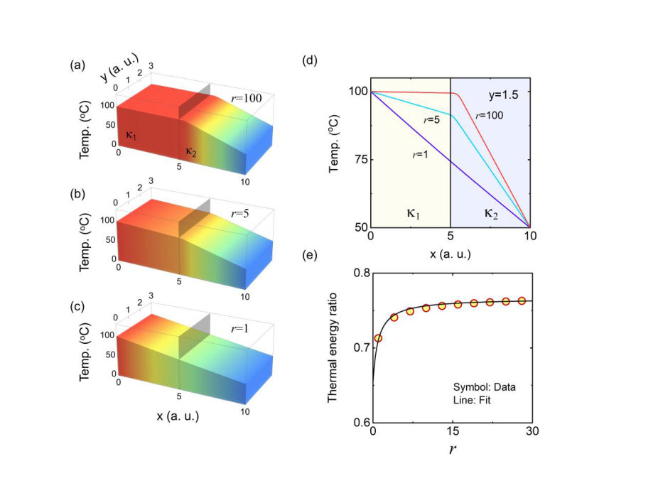 
Fig. 3. Temperature distributions for the two-layer structure with thermal conductivity ratios of r=κ1/κ2=100 (a), 5 (b), and 1 (c). The interface between the two adjacent layers is located at x=5. (d) Corresponding temperature profiles along the x-direction at the cross section of y=1.5. (e) Thermal energy ratio, A2/A1, as a function of r. The symbols represent the integrated values of thermal energy (see the main text), while the solid line shows the empirical fit based on a mathematical form similar to the Fresnel reflection coefficient.

**Summary.** This paper improves the theoretical modeling of heat transport in layered metamaterials by generalizing the Effective Medium Approximation (EMA). The authors introduce corrective terms, one mimicking optical reflection, to account for high thermal conductivity contrasts and background media effects. This allows for more accurate prediction of heat flow direction in technologically relevant thermal structures.

**Why it may be interesting.** While focused on classical heat transfer, the mathematical analogy drawn between heat flow and optical reflection (Fresnel coefficients) provides a powerful, transferable framework for analyzing energy transport in complex, structured media, which has parallels in quantum wave phenomena.

Detailed structure

**Main problem.** The paper addresses the need for accurate thermal modeling in high-contrast metamaterials, particularly for applications like data center heat dissipation.

**Main result.** The authors generalize the Effective Medium Approximation (EMA) by introducing corrective coefficients, allowing the model to accurately predict heat flow behavior where conventional EMA fails due to high conductivity contrast or background media effects.

**Method.** The study develops a generalized EMA by incorporating two corrective coefficients: one analogous to Fresnel reflection and another inspired by series electronic circuits.

**Model / system.** The system modeled is a layered thermal metamaterial composed of alternating layers ($\kappa_1, \kappa_2$) embedded in a background medium ($eta$), governed by Fourier's law.

**Key observables.** Heat flow bending angle ($\varphi$) and its deviation ($\Delta\varphi$) from conventional EMA predictions.

**Important parameters / regimes.** Thermal conductivities ($\kappa_1, \kappa_2, eta$) and the conductivity ratio ($r = \kappa_1 / \kappa_2$).

**Assumptions / limitations.** The conventional EMA fails when the thermal conductivity contrast is high or when the background medium significantly influences heat flow.

**Figures summary.** Figures illustrate the heat flow bending angle under various conditions and plot the deviation ($\Delta\varphi$) of the heat-flow bending angle as a function of conductivity ratio, layer number, and background medium conductivity.

**Paper structure.** The paper first identifies the limitations of the conventional EMA in high-contrast thermal systems. It then proposes and derives the generalized EMA using two corrective coefficients. Finally, it validates the generalized model through numerical simulations comparing results against the conventional EMA.

Abstract

The rapid growth of generative AI has intensified the need for efficient heat dissipation in large-scale data centers. To control heat flow, thermal metamaterials with layered structures have been widely used, which impart the anisotropic properties of thermal conductivities. However, the conventional effective medium approximation (EMA) often fails to provide accurate predictions in systems with a high thermal conductivity contrast between adjacent layers embedded in a background medium. Here, we generalize the EMA by introducing two corrective coefficients that extend its validity to regimes where the conventional EMA was previously inapplicable, i.e., high-contrast thermal metamaterials with the background medium. Notably, one of these coefficients that we proposed has the same mathematical form as the Fresnel reflection coefficient in optics. This allows us to interpret the "reflection-like" behavior of heat flow as it penetrates adjacent layers with high thermal contrast. Our findings suggest that heat diffusion, traditionally viewed as a purely dissipative process, can be understood intuitively through the framework of ray optics.

[↑ back to top](#top)

### [Room-temperature graphene sub-terahertz detector integrated on a silicon dielectric waveguide](http://arxiv.org/abs/2608.25895v1)

**Authors:** A. Titchenko, K. Shein, M. Titova, M. Kashchenko, O. Popova, R. Izmaylov, E. I. Titova, I. Gayduchenko, G. Goltsman  
**Type:** experiment · **Category:** other · **PDF:** <https://arxiv.org/pdf/2608.25895v1>  
**Analysis basis:** full PDF text, analyzed in chunks
**Topic relevance:** `analog quantum simulation` **1/5** · `quantum measurements` **1/5** · `quantum optics experiment` **1/5**

📷 Fig 1

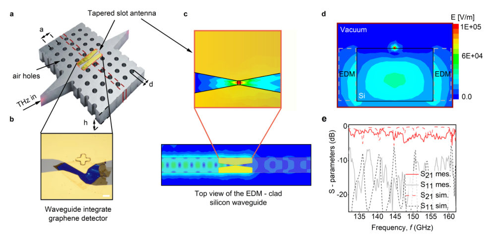 
FIG. 1. Design and electromagnetic characterization of the graphene-on-silicon-waveguide sub-terahertz de- tector. (a) High-resistivity silicon dielectric waveguide (ρ &gt; 3 kΩ· cm, thickness h = 400 µm) with effective-dielectric-medium (EDM) cladding formed by a square lattice of subwavelength through-holes (period a = 165 µm, hole diameter d = 73 µm). An hBN-encapsulated graphene detector is monolithically integrated at the waveguide center and coupled to the guided mode via a tapered slot-line antenna. (b) Optical micrograph of the antenna-coupled graphene detector (active channel 10 × 20 µm, scale bar: 10 µm) (c) Simulated |E| at 139 GHz: in-plane distribution showing concentration at the...

📷 Fig 2

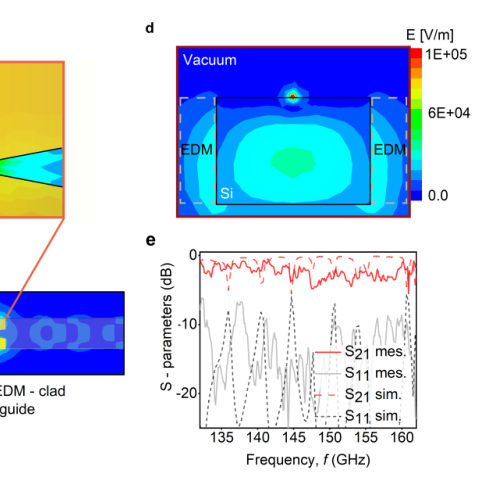 
Fig. 1(e) over 132–162 GHz, confirm low reflection and transmission losses. The graphene detector is monolithically integrated at the center of the waveguide (Fig. 1(b)). It comprises an hBN-encapsulated graphene channel (L × W = 10 × 20 µm) placed across the feed gap of a tapered slot-line antenna patterned on the silicon surface. As in the near- infrared and visible ranges5,54,55, the graphene layer ab- sorbs THz radiation by direct coupling to the evanescent waveguide mode. At 139 GHz the in-silicon wavelength (λSi = 0.63 mm) would normally require a large absorb- ing area, but this raises the heat capacity and degrades bolometric sensitivity. To resolve this trade-off, the ta- pered...

📷 Fig 3

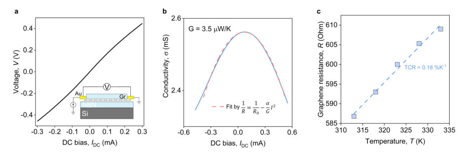 
FIG. 2. Electrical transport characterization of the graphene channel at room temperature. (a) Current–voltage characteristic of the hBN-encapsulated graphene channel measured at T0 = 300 K. The trace is symmetric in bias polarity and weakly nonlinear, the deviation from ohmic behavior at higher |Idc| arising from Joule self-heating. Inset: schematic cross-section showing Au contacts to the graphene channel encapsulated between top and bottom hBN flakes on the silicon waveguide. (b) Differential conductivity σ = dI/dV as a function of DC bias current Idc (solid blue), together with the fit to the self-heating model 1/R(I) = 1/R0 −(α/G)I2 (dashed red). The fit yields a thermal conductance G...

📷 Fig 4

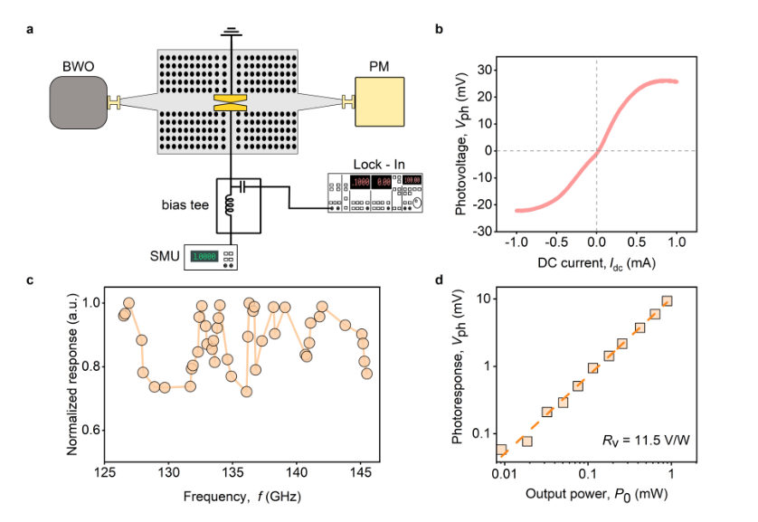 
FIG. 3. Terahertz photoresponse of the integrated graphene detector at room temperature. (a) Schematic of the measurement setup. BWO output (amplitude-modulated 100 kHz) launched into silicon waveguide via WR-6 horn. Transmitted power measured by calibrated PM. Graphene biased via SMU through bias tee and photovoltage recorded by lock-in amplifier. (b) Photovoltage Vph versus DC bias current Idc at f = 139 GHz. Odd response in Idc vanishing at zero bias is characteristic of bolometric detection. (c) Normalized photovoltage across 125–146 GHz at fixed bias. The response varies by less than 30% across the band. (d) Photovoltage versus incident power P0 (log-log). Linear scaling Vph ∝P0 (slope...

📷 Fig 5

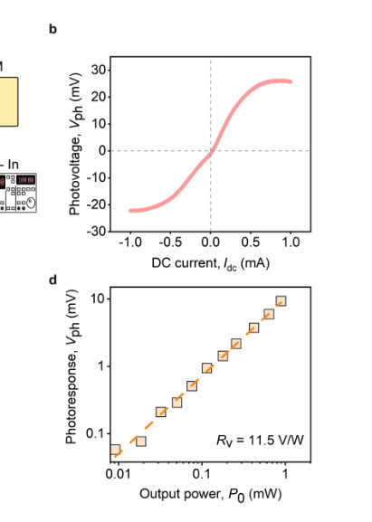 
Fig. 3(a). Continuous-wave radiation from a backward- wave oscillator (BWO) was coupled into the silicon di- electric waveguide through a WR-6 horn and a tapered silicon transition. The BWO power and the waveguide insertion loss were calibrated using a power meter (see supplementary material). The graphene channel was bi- ased through a bias tee connected to a source-measure unit, and the photovoltage was recorded by a lock-in amplifier synchronized to a 100 kHz amplitude modu- lation of the BWO source. Figure 3(b) shows the pho- tovoltage Vph as a function of the DC bias current Idc at f0 = 139 GHz. The dependence is approximately odd in Idc, with Vph vanishing near Idc = 0 and re- versing...

**Summary.** This paper reports the successful demonstration of a room-temperature, monolithic graphene sub-THz detector integrated directly onto a silicon dielectric waveguide. By coupling the guided THz mode via a patterned antenna, the authors achieved high responsivity, establishing a practical platform for fully integrated THz photonic circuits. This work addresses a major technological bottleneck in on-chip THz detection.

**Why it may be interesting.** While focused on photonics and solid-state devices, the work demonstrates advanced integration techniques and characterization of nanoscale electronic components (graphene) coupled to electromagnetic waves, which has parallels with quantum optics and open quantum systems research.

Detailed structure

**Main problem.** The primary challenge addressed is achieving room-temperature, monolithic integration of sub-terahertz detectors directly onto low-loss dielectric waveguides, overcoming limitations associated with hybrid assembly methods.

**Main result.** The authors successfully demonstrated a room-temperature, monolithic graphene sub-THz detector on a silicon waveguide, achieving a voltage responsivity of 11.5 V/W and a 3 dB bandwidth of 1.94 GHz.

**Method.** The detection relies on coupling the guided THz mode to an hBN-encapsulated graphene channel using a tapered slot-line antenna patterned directly onto the silicon surface.

**Model / system.** The platform utilizes a high-resistivity silicon dielectric waveguide with an Effective-Dielectric-Medium (EDM) cladding. The detection mechanism is bolometric, measuring the photoresponse of the graphene to the evanescent waveguide mode.

**Key observables.** Voltage responsivity (11.5 V/W), 3 dB bandwidth (1.94 GHz), Temperature Coefficient of Resistance (0.18% K^-1), and Noise-Equivalent Power (2.46 nW/Hz^1/2).

**Important parameters / regimes.** Operating band: D-band (110–170 GHz); Operating frequency: 139 GHz; The bandwidth is currently limited by parasitic readout inductance.

**Assumptions / limitations.** The EDM cladding model is assumed valid in the long-wavelength regime; the measured bandwidth is attributed to external readout parasitics, not the intrinsic graphene response.

**Figures summary.** Figure 1 illustrates the device design, field distribution, and S-parameters. Figure 2 shows electrical characterization, including the I-V curve, temperature dependence of resistance, and photoresponse measurements.

**Paper structure.** The paper details the physical setup, presents the measured and simulated S-parameters and electrical transport characteristics, and concludes by discussing the device's potential for fully integrated THz photonic circuits.

Abstract

Terahertz (THz) photonics offers a promising platform for next-generation 6G wireless communications, on-chip spectrometers, and non-invasive biomedical sensors. In the near- and mid-infrared, monolithically integrated photodetectors are a cornerstone of photonic integrated circuits (PICs). In the THz range, however, such integration on low-loss dielectric waveguides remains an open challenge: to date, room-temperature on-waveguide detection has been realized only through hybrid flip-chip assembly of discrete elements, which leads to poor mode coupling, larger footprint, and reduced mechanical stability. Here we address this gap by demonstrating a room-temperature graphene sub-THz detector monolithically integrated on a high-resistivity silicon dielectric waveguide for D-band (110-170 GHz) operation. We couple an hBN-encapsulated graphene channel to the guided mode using a tapered slot-line antenna patterned directly onto the silicon surface. The detector achieves a voltage responsivity of 11.5 V/W and a 3 dB bandwidth of 1.94 GHz, with the latter currently limited by parasitic inductance of the readout interconnects rather than by the intrinsic graphene response. This platform provides a practical pathway to fully integrated room-temperature THz photonic circuits, where electrostatic gating and impedance matching can improve both responsivity and bandwidth by roughly an order of magnitude.

[↑ back to top](#top)

### [Raman magnon spectroscopy of local interactions and ground state selection in $\mathrm{Sr_2IrO_4}$](http://arxiv.org/abs/2608.25040v1)

**Authors:** Xiang Li, Scott E. Cooper, Ahmed E. Fahmy, Yuan-Ming Lu, A. de la Torre, R. S. Perry, D. Hsieh, T. F. Rosenbaum, Yejun Feng, D. M. Silevitch  
**Type:** experiment · **Category:** strongly correlated electrons · **PDF:** <https://arxiv.org/pdf/2608.25040v1>  
**Analysis basis:** full PDF text, analyzed in chunks
**Topic relevance:** `analog quantum simulation` **1/5** · `quantum measurements` **1/5**

📷 Fig 1

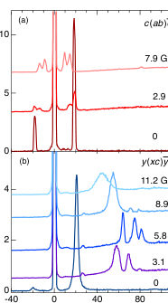 
FIG. 1. Pressure dependence of optical Raman modes in Sr2IrO4. (left) Representative Raman spectra focusing on the low-wavenumber magnon mode, in the top-plane (a) and side-plane (b) scattering geometries for a range of pressures. The mode is weakly pressure-dependent in the top plane ge- ometry and varies strongly with pressure in the side-plane geometry. Traces offset vertically for clarity. The “y” direc- tion is along [1¯10]. (c) Magnon mode energies vs pressure. Colors indicate top vs. side plane scattering geometries. The top-plane magnon mode is red-shifted with increasing pres- sure and the side-plane mode is blue-shifted with significant variation in energy depending on spot...

📷 Fig 2

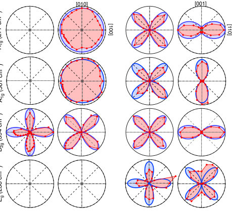 
FIG. 2. Angle-resolved polarization Raman spectra for four phonon modes in Sr2IrO4. The ab (top plane) and xc (side plane) scattering geometries are described in the text; || and ⊥denote polarizer and analyzer parallel and perpendicular to each other, respectively. Red points are normalized areas of the peak in the Raman spectra centered at the indicated wavenumber; blue curves are the predicted behavior of an ideal D4h lattice.

📷 Fig 3

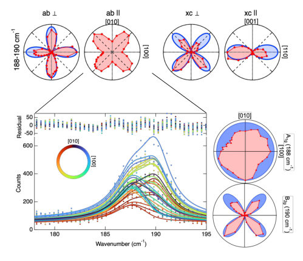 
FIG. 3. Angle-resolved polarization Raman spectra for over- lapping A1g and B2g phonon modes in Sr2IrO4. (top) In- tegrated Raman intensity vs. angle for the four scattering geometries shown in Fig. 2. For the ab ⊥geometry, A1g is identically zero and the response is entirely due to the B2g mode. For both side-plane modes, A1g and B2g are predicted to have the same angular response. (bottom) For the ab || mode, a self-consistent two-peak global fit is performed (see text for details), allowing the clear observation of an A1g mode at 188 cm−1 and a B2g mode at 190 cm−1.

📷 Fig 4

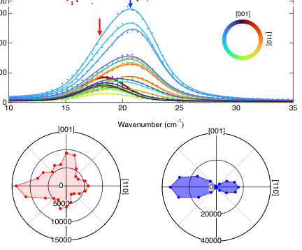 
FIG. 5. Angle-resolved polarization Raman spectra for over- lapping magnon modes in Sr2IrO4. Top: Raman spectra in the xc (side plane) geometry with polarizer parallel to ana- lyzer. (bottom) A self-consistent global fit to two overlapping peaks (see text for details) yields two modes with contrasting angular behavior at 18 and 21 cm−1.

📷 Fig 5

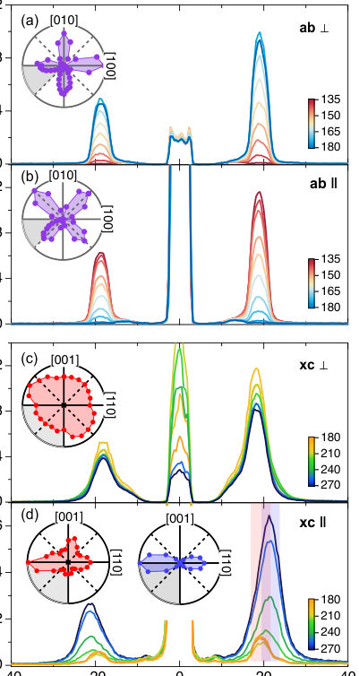 
FIG. 4. Angle-resolved polarization data of Sr2IrO4 magnon modes at T = 5 K. Main panels show low-wavenumber raw spectra over one quadrant or octant of angles with trace color indicating the angle; insets show the full angular depen- dence of the peak area. The xc || scattering geometry (panel d) exhibits two overlapping modes at different frequencies; shaded rectangles denote the approximate frequencies of the two modes. See text and Fig. 5 below for details on the sep- aration procedure.

**Summary.** This work uses angle-resolved Raman spectroscopy to probe the magnetic excitations in the correlated magnet Sr2IrO4 under high pressure. By analyzing how magnon modes change with pressure, the researchers demonstrate that these techniques can detect weak, competing interlayer interactions that dictate the material's magnetic ground state. This provides a powerful experimental tool for understanding quantum magnetism in strongly correlated materials.

**Why it may be interesting.** The sensitivity of magnon modes to weak, anisotropic interlayer couplings under pressure provides a direct spectroscopic probe into the subtle energy balances governing magnetic ground state selection in strongly correlated systems.

Detailed structure

**Main problem.** The study investigates how local interactions and disorder influence the selection of the magnetic ground state in correlated quantum materials, particularly in the context of competing magnetic stacking configurations.

**Main result.** Raman-active magnons are shown to amplify weak, $\mu$eV-scale interactions responsible for ground-state selection into easily measurable spectral changes, with pressure enhancing magnetic heterogeneity.

**Method.** The research employs angle-resolved Raman polarization measurements on single crystals, performing measurements under high pressure up to 12 GPa.

**Model / system.** The physical system is the layered magnet, Sr2IrO4, which exhibits a Mott insulating ground state due to strong spin-orbit coupling. The analysis compares experimental results to linear spin wave calculations.

**Key observables.** Phonon and magnon mode symmetries, mode energies ($\omega$) as a function of pressure and scattering geometry, and polarization patterns.

**Important parameters / regimes.** High pressure (up to 12 GPa), temperature (5 K), and the strength of interlayer exchange couplings ($J_{1c}, J_{2c}$).

**Assumptions / limitations.** The analysis assumes that the observed magnon energy spread reflects variations in weak interlayer interactions, which may locally favor competing magnetic stacking configurations.

**Figures summary.** Figures illustrate the pressure dependence of optical Raman modes in both $ab$-plane and side-plane geometries, and show angle-resolved polarization data for both phonon and magnon modes.

**Paper structure.** The paper systematically characterizes the symmetries and pressure dependence of both phonon and magnon modes using polarization-resolved Raman spectroscopy, comparing these findings to theoretical predictions based on spin wave theory.

Abstract

Competing and coupled spin and charge interactions in quantum materials lead to a variety of ordered states where local configurations preferentially influence the long-range order. When these interactions are finely balanced in energy, disorder and fluctuations play an outsized role. Raman scattering is particularly well-suited to revealing the underlying physics in such situations because of its sensitivity to local environments and ability to reveal overall symmetries. We perform angle-resolved Raman polarization measurements on single crystals of the correlated, layered magnet, \ce{Sr2IrO4}, where the Mott insulating ground state arises from strong spin-orbit coupling. We characterize the symmetries of both the phonon and magnon modes through comprehensive measurements in both the $ab$-plane and out-of-plane geometries from 10 to 700 cm$^{-1}$, and trace the evolution of these modes in both configurations to 12 GPa in a diamond anvil cell with perforated diamonds. Pressure does not significantly alter the lattice as the phonon modes shift linearly under compression, but at the same time the magnon modes become position dependent and spread over a range of wavenumbers. We attribute this magnetic heterogeneity to pressure-enhanced variations in the weak interlayer interactions, which may locally favor competing magnetic stacking configurations, and compare our experimental results to the predictions of linear spin wave calculations. Our results demonstrate that Raman-active magnons amplify $μ$eV-scale interactions responsible for ground-state selection into easily measurable spectral changes.

[↑ back to top](#top)

### [Realization of Air-Stable Two-Dimensional Superconductor Nb2Pd3Te5 With Quasi-One-Dimensional Pair Density Modulation](http://arxiv.org/abs/2608.25331v1)

**Authors:** Jiayi Wang, Hui Guo, Hao Zhang, Haowei Chen, Peixuan Li, Xianghe Han, Ziang Wang, Siyu Xu, Qian Fang, Haohao Xu, Shixuan Du, Chengmin Shen, Hui Chen, Wang Yao, Hong-Jun Gao  
**Type:** experiment · **Category:** strongly correlated electrons · **PDF:** <https://arxiv.org/pdf/2608.25331v1>  
**Analysis basis:** full PDF text, analyzed in chunks
**Topic relevance:** `Frenkel-Kontorova` **1/5** · `analog quantum simulation` **1/5**

📷 Fig 1

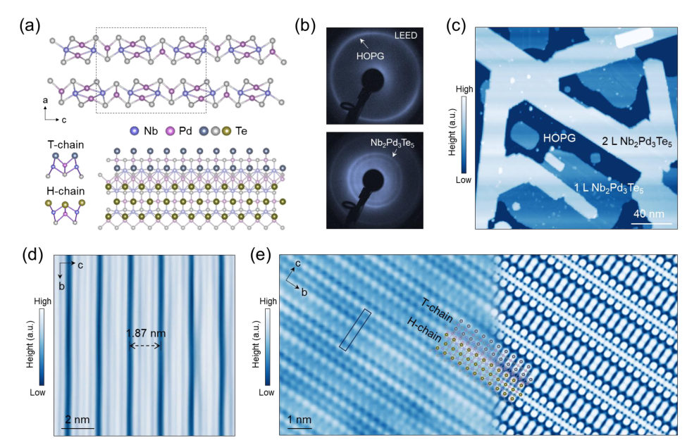 
Figure 1. Synthesis of monolayer and bilayer Nb2Pd3Te5 on HOPG substrate. (a) Side and top views of the crystal

📷 Fig 2

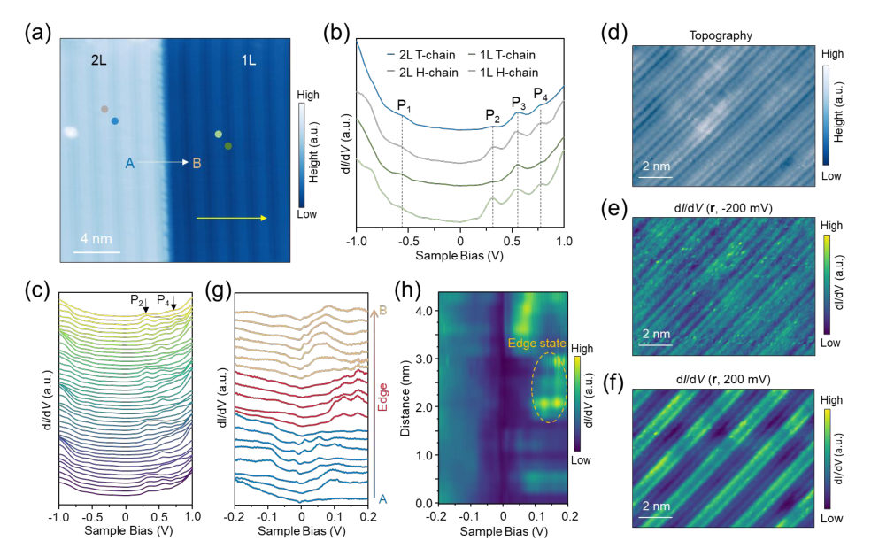 
Figure 2. Observation of quasi-1D structure and electronic properties of Nb2Pd3Te5. (a) STM topography, showing

📷 Fig 3

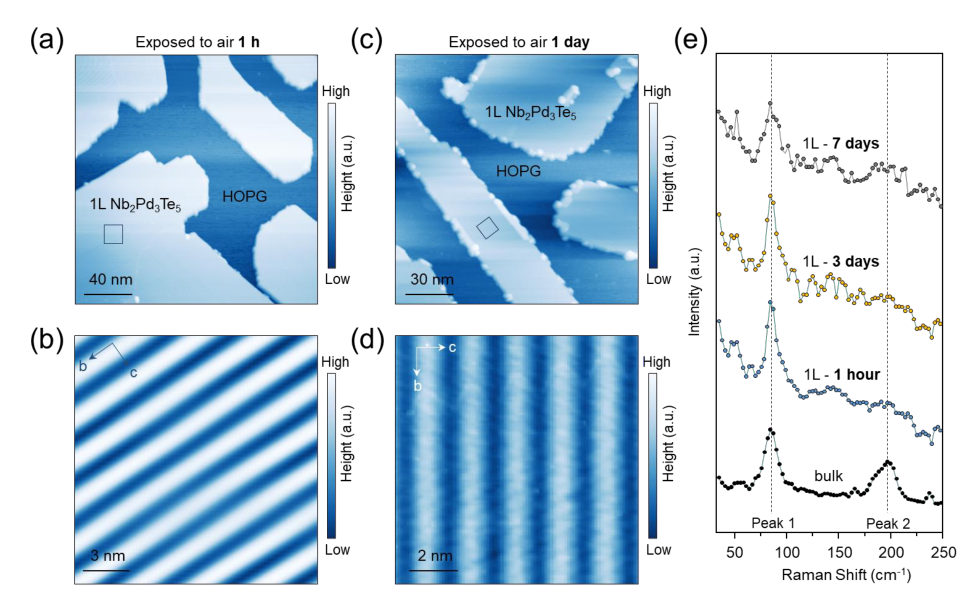 
Figure 4. Stability of the monolayer Nb2Pd3Te5 in ambient conditions. (a) Large-scale STM topography of

**Summary.** This work reports the synthesis and characterization of $	ext{Nb}_2	ext{Pd}_3	ext{Te}_5$, a novel 2D superconductor exhibiting an intrinsic quasi-1D structure. Using advanced STM/STS, the authors confirmed a pronounced quasi-1D modulation in the superconducting pair density and demonstrated the material's remarkable air stability. This establishes the compound as a promising platform for engineering anisotropic superconducting quantum devices.

**Why it may be interesting.** The demonstration of intrinsic quasi-1D electronic and superconducting modulation in a highly stable 2D material provides a clean, tunable platform for studying low-dimensional quantum phenomena, which is highly relevant to superconducting quantum circuits and correlated electron physics.

Detailed structure

**Main problem.** The primary goal was to realize and characterize an air-stable, atomically 2D superconductor exhibiting intrinsic quasi-one-dimensional (quasi-1D) pair density modulation.

**Main result.** The authors successfully synthesized and characterized $	ext{Nb}_2	ext{Pd}_3	ext{Te}_5$ as a robust 2D superconductor showing clear evidence of quasi-1D pair density modulation in its superconducting gap, alongside exceptional air stability.

**Method.** The study employed van-der-Waals epitaxy for synthesis, followed by ultra-low-temperature Scanning Tunneling Microscopy/Spectroscopy (STM/STS) and Raman spectroscopy for characterization.

**Model / system.** The physical system is the 2D superconductor $	ext{Nb}_2	ext{Pd}_3	ext{Te}_5$, which possesses an intrinsic quasi-1D crystal structure composed of alternating T- and H-chains. The investigation focuses on the superconducting and electronic properties within this low-dimensional platform.

**Key observables.** Superconducting gap ($\Delta \sim 121 \mu	ext{eV}$), quasi-1D pair density modulation in $	ext{d}I/	ext{d}V$ spectra, ambient stability (structural and chemical), and the intrinsic T-chain/H-chain electronic anisotropy.

**Important parameters / regimes.** Superconducting critical temperature ($T_c \approx 613 	ext{ mK}$), operating temperatures ($\sim 5 	ext{ mK}$), and the periodicity of the modulation ($\sim 1.87 	ext{ nm}$).

**Assumptions / limitations.** The observed modulation is attributed to the intrinsic lattice arrangement of T- and H-chains, rather than necessarily implying long-range Charge Density Wave (CDW) order, which was not confirmed by LEED.

**Figures summary.** Figures illustrate the crystal structure (T/H-chains), STM topography showing stripe modulation, STS linecuts revealing the quasi-1D modulation of the superconducting gap, and Raman spectra confirming ambient stability.

**Paper structure.** The paper progresses by first establishing the synthesis and quasi-1D structure via STM/LEED, then detailing the superconducting properties and the pair density modulation using low-temperature STS, and finally emphasizing the exceptional ambient stability of the material for device applications.

Abstract

Two-dimensional (2D) superconductors provide a fertile platform for exploring reduced-dimensional superconductivity and emergent quantum phenomena. Incorporating quasi-one-dimensional (quasi-1D) structural motifs into 2D superconductors offers a powerful route to engineer strong electronic anisotropy, enabling unconventional superconducting states and anisotropic superconducting transport functionalities. However, such systems remain rarely realized. Here we report the realization of a 2D superconductor Nb2Pd3Te5, exhibiting an intrinsic quasi-1D pair density modulation. Monolayer and bilayer Nb2Pd3Te5 is synthesized via van-der-Waals epitaxy. Using ultralow-temperature scanning tunneling microscopy/spectroscopy, we observe the quasi-1D crystal structure and superconductivity below ~0.6 K with a pronounced quasi-1D pair density modulation. Remarkably, both monolayer and bilayer Nb2Pd3Te5 show strong air stability. Our findings establish atomically 2D Nb2Pd3Te5 as a robust and promising platform for exploring novel low-dimensional quantum phenomena and anisotropy-enabled superconducting devices.

[↑ back to top](#top)

### [Distinct Surface and Bulk Superconductivity in the Kagome Superconductor SrSn$_3$](http://arxiv.org/abs/2608.25271v1)

**Authors:** Qun Zhu, Yong-Wei Wang, Ji-Hai Zhang, Qiang-Jun Cheng, Chen-Yu Hu, Jun-Zhong Wang, Qi-Kun Xue, Xu-Cun Ma, Can-Li Song  
**Type:** experiment · **Category:** other · **PDF:** <https://arxiv.org/pdf/2608.25271v1>  
**Analysis basis:** full PDF text, analyzed in chunks
**Topic relevance:** `quantum measurements` **1/5**

📷 Fig 1

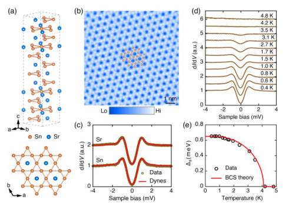 
Figure 1 (a) Crystal structure of SrSn3. Upper panel: side view along the crystallographic c axis. Lower panel:

📷 Fig 2

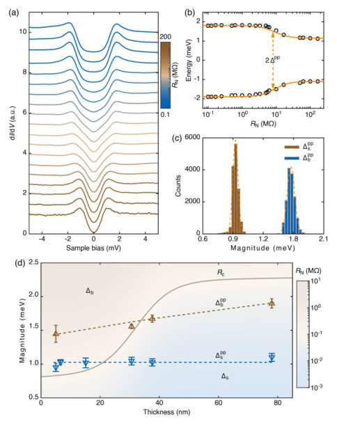 
Figure 2 (a) Evolution of the low-energy dI/dV spectra with tunneling junction resistance, RN (denoted by the

📷 Fig 3

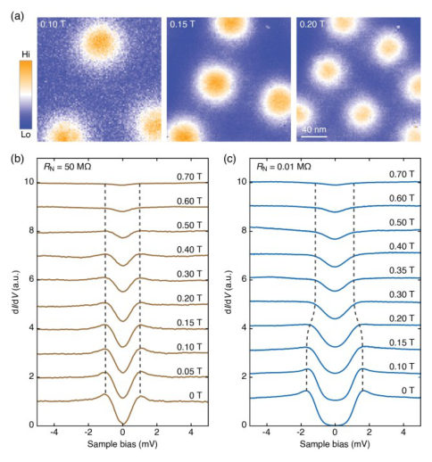 
Figure 3 (a) Zero-bias conductance (ZBC) maps acquired over a 240 nm  240 nm field of view under out-

📷 Fig 4

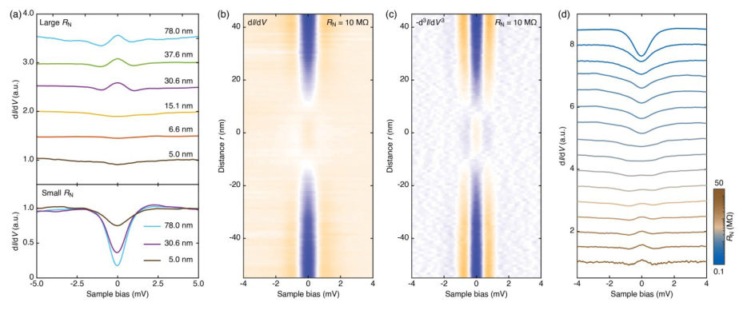 
Figure 4 (a) Representative dI/dV spectra acquired at the vortex-core center in the large-RN regime for SrSn3

**Summary.** This work reveals that the Kagome superconductor $	ext{SrSn}_3$ exhibits distinct surface and bulk superconducting states. By tuning the tunneling junction resistance in STS, the researchers spectroscopically separated these two channels, finding they possess different gaps and critical fields. This provides new insight into how the superconducting environment dictates vortex-bound electronic states in topological materials.

**Why it may be interesting.** The ability to use a tunable spectroscopic probe ($R_N$) to decouple multiple superconducting orders is a powerful technique for understanding complex, multi-band superconductivity, which has implications for topological superconductivity.

Detailed structure

**Main problem.** The study aims to spectroscopically distinguish between potentially distinct superconducting surface and bulk channels in quantum materials, as their signals often overlap experimentally.

**Main result.** The researchers successfully demonstrated the coexistence of two distinct superconducting channels ($\Delta_s$ and $\Delta_b$) in $	ext{SrSn}_3$, characterized by different gaps, upper critical fields, and unique vortex-core electronic signatures.

**Method.** They employed high-resolution Scanning Tunneling Spectroscopy (STS) on epitaxial films, systematically tuning the tunneling junction resistance ($R_N$) to selectively probe the surface or bulk superconducting states.

**Model / system.** The physical system is epitaxial thin films of the Kagome superconductor $	ext{SrSn}_3$. The analysis relies on interpreting the differential conductance ($	ext{d}I/	ext{d}V$) spectra as a function of applied magnetic field and tunneling junction resistance.

**Key observables.** Superconducting gaps ($\Delta_s$ and $\Delta_b$), upper critical fields ($B_{c2}$), and zero-bias conductance peaks (ZBCPs) within magnetic vortex cores.

**Important parameters / regimes.** Tunneling junction resistance ($R_N$), film thickness, and applied magnetic field ($B$).

**Assumptions / limitations.** The separation of the two superconducting channels is achieved by tuning $R_N$, and the observed spectral evolution directly maps to the underlying physical channels.

**Figures summary.** Figures show the systematic evolution of the superconducting gap with $R_N$, the thickness dependence of both gaps, and distinct vortex-core spectra (ZBCP vs. zero-bias suppression) depending on the probed channel.

**Paper structure.** The paper establishes the need for channel-selective spectroscopy, presents evidence for two distinct gaps ($\Delta_s$ and $\Delta_b$) tunable by $R_N$, and uses vortex-core states to confirm the distinct nature of the surface and bulk superconducting channels.

Abstract

Surface and bulk superconductivity may possess fundamentally different superconducting properties in quantum materials with nontrivial electronic structures, yet their superimposed spectroscopic signatures often prevent direct experimental access to each superconducting channel. Here we reveal, in epitaxial films of the kagome superconductor SrSn$_3$, distinct surface and bulk superconducting channels with markedly different superconducting gaps, upper critical fields, and vortex-core electronic states by tuning the tunneling junction resistance in scanning tunneling spectroscopy. The surface superconductivity is characterized by a thickness-independent superconducting gap and an enhanced upper critical field, whereas the bulk superconducting channel exhibits a larger superconducting gap that decreases with reducing film thickness and a much lower upper critical field. Within magnetic vortex cores, robust non-split zero-bias conductance peaks are observed exclusively in the surface superconducting channel, while pronounced zero-bias suppression is consistently associated with the bulk superconducting channel. These findings demonstrate that the vortex-core electronic structure depends sensitively on the underlying superconducting channel, providing new insight into vortex-bound states in topological quantum materials.

[↑ back to top](#top)

### Other secondary papers (6)

Show other secondary papers

### [Nearly Isotropic Quantum-Critical Transport in Single-Crystal CeNiC2](http://arxiv.org/abs/2608.25616v1)

**Authors:** Hanming Ma, Jun Gouchi, Dilip Bhoi, Toru Shigeoka, Bosen Wang, J. -G. Cheng, Yoshiya Uwatoko  
**Type:** experiment · **Category:** strongly correlated electrons · **PDF:** <https://arxiv.org/pdf/2608.25616v1>  
**Analysis basis:** full PDF text, analyzed in chunks

📷 Fig 1

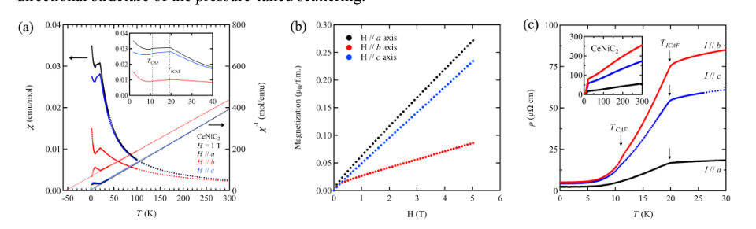 
FIG. 1. Ambient-pressure anisotropy of CeNiC2. (a) Magnetic susceptibility and inverse susceptibility along the three axes; the inset expands the magnetic transitions. (b) Magnetization at 1.8 K. (c) Low-temperature resistivity, with the 0–300 K range in the inset. All axes share a common temperature evolution with direction-dependent magnitudes.

📷 Fig 2

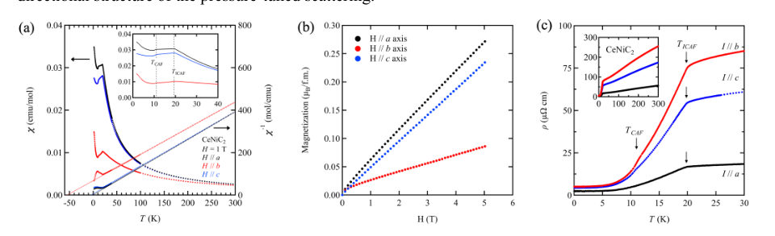 
Figure 2 shows ρi(T) (i = a, b, and c) at pressures up to 12–13 GPa. The room-temperature resistivity rises with pressure for all three current directions. At lower temperatures, the incommensurate ordering temperature TICAF first increases from about 19 K to a maximum near 34 K at approximately 7 GPa and then decreases, becoming unresolved near 10 GPa. At the same time, a broad resistivity maximum associated with the Kondo/coherence scale TK appears between 4 and 6 GPa and shifts rapidly to higher temperature above about 8 GPa; beyond 10 GPa, it lies above our 300 K measurement range. The opposing pressure dependences of TICAF and TK reveal a crossover from magnetic-order-dominated...

📷 Fig 3

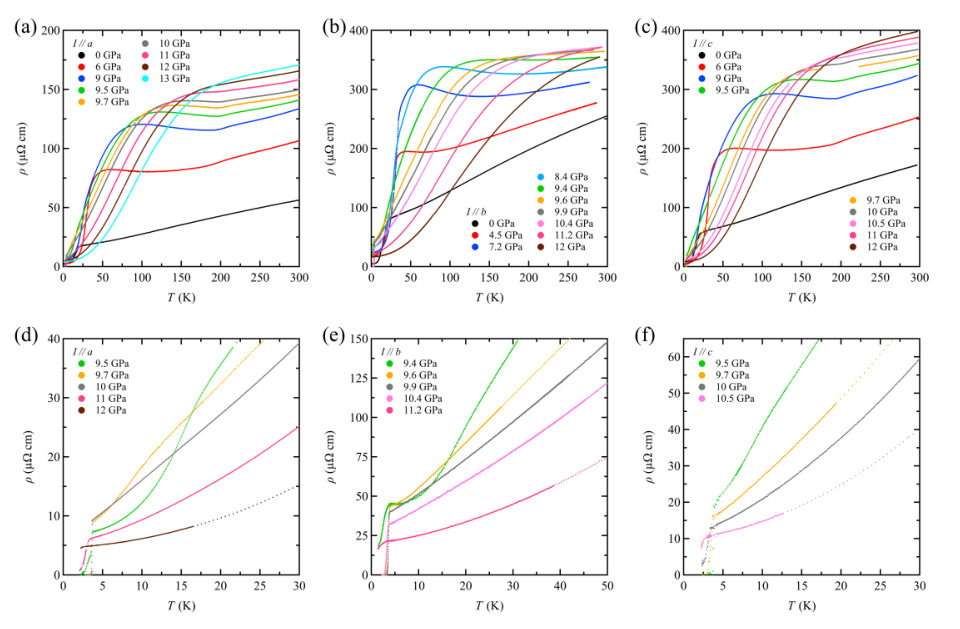 
FIG. 2. Temperature-dependent resistivity under pressure for (a, d) I//a, (b, e) I//b, and (c, f) I//c. The upper row shows the full temperature range; the lower row expands the superconducting and magnetic transitions. All three orientations show the same sequence: enhancement and suppression of magnetic order, growth of the Kondo/coherence scale, and a narrow superconducting dome near 9.5-10 GPa.

📷 Fig 4

 
FIG. 3. Field and critical-scattering diagnostics near the superconducting dome. Field-dependent resistivity for (a) H//a at 10.4 GPa and (b) H//c at 10.5 GPa, with I//b. (c) Upper critical fields with WHH extrapolations and the weak-coupling Pauli scale. (d) Fitted residual resistivity ρ0(P) for the three current directions, showing a common enhancement in the critical pressure range.

📷 Fig 5

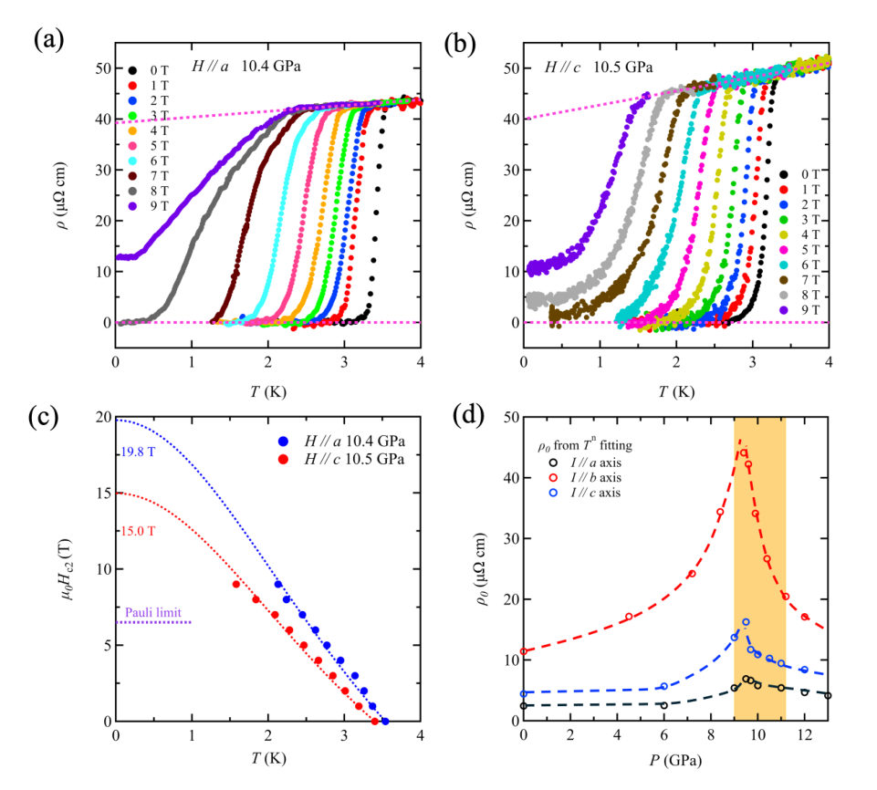 
Figure 4 summarizes the pressure-temperature phase diagrams and n(T,P). The central result is that measurements for the three current directions reveal the same topology: (i) TICAF forms a broad maximum near

**Summary.** This experimental work investigates the quantum critical transport in the heavy-fermion superconductor CeNiC2 using single crystals. By measuring resistivity along all crystallographic axes under pressure, the authors found a common, nearly isotropic evolution near the superconducting dome. This strongly suggests that valence fluctuations, rather than simple magnetic fluctuations, are the primary source of the critical scattering responsible for superconductivity.

**Why it may be interesting.** While focused on condensed matter, the concept of identifying a universal, isotropic critical scattering mechanism that dictates pairing symmetry is relevant to understanding emergent quantum phases in strongly interacting systems.

Detailed structure

**Main problem.** To determine the directional character of critical scattering in the quantum-critical regime of CeNiC2, distinguishing between wave-vector-selective magnetic scattering and more local electronic channels.

**Main result.** The common evolution of resistivity across all crystallographic axes suggests a nearly isotropic quantum-critical transport regime, implicating valence fluctuations as the leading source of critical scattering rather than simple low-dimensional spin fluctuations.

**Method.** The study uses high-quality single crystals to measure pressure-dependent, temperature-dependent, and field-dependent resistivity along the a, b, and c crystallographic axes.

**Model / system.** The physical system is the heavy-fermion metal CeNiC2, which exhibits superconductivity under high pressure, allowing investigation near a quantum critical point (QCP).

**Key observables.** Resistivity ($
ho$) dependence on temperature ($T$) and pressure ($P$); residual resistivity ($
ho_0$); superconducting transition temperature ($T_c$); and upper critical fields ($H_{c2}$).

**Important parameters / regimes.** Critical pressure range ($P_c \approx 9.5-10$ GPa); temperature dependence exponent ($n \approx 1$); and magnetic field strengths (up to 9 T).

**Assumptions / limitations.** The analysis assumes that the common evolution across axes points to a universal, isotropic critical mechanism, and that the power-law fitting accurately captures the critical scattering behavior.

**Figures summary.** Figures illustrate the common sequence of magnetic suppression, Kondo scale growth, and the superconducting dome across all three current directions under pressure, alongside field dependence measurements.

**Paper structure.** The paper progresses by first establishing the cleaner transport regime in single crystals, then mapping the common pressure evolution of magnetic order and superconductivity across all axes, culminating in the conclusion that valence fluctuations govern the critical transport.

Abstract

Pressure-induced superconductivity and $T$-linear resistivity have been reported in polycrystalline CeNiC$_2$, but orientational averaging has left the directional character of the critical scattering unresolved. We report pressure-dependent resistivity of high-quality single crystals for current along each crystallographic axis. These crystals have substantially lower residual resistivity and a slightly higher maximum onset $T_c$ than the polycrystalline sample, placing superconductivity in a cleaner transport regime. Near $P_c \approx 9.5-10$ GPa, the normal-state resistivity becomes nearly $T$-linear along every axis, the fitted residual resistivity is strongly enhanced, and superconductivity forms a narrow dome. For $I \parallel b$, the $T$-linear normal state remains nearly unchanged in magnetic fields up to 9 T applied along $a$ and $c$; the upper critical field is large and only moderately anisotropic. The common evolution along all three axes establishes a nearly isotropic quantum-critical transport regime, inconsistent with a simple low-dimensional spin-fluctuation picture and implicates valence fluctuations as the leading source of critical scattering associated with the superconducting dome.

[↑ back to top](#top)

### [Numerical Direct Scattering Transform for Dark Solitons](http://arxiv.org/abs/2608.26054v1)

**Authors:** Ilya Mullyadzhanov, Sergey Dremov, Andrey Gelash  
**Type:** theory · **Category:** other · **PDF:** <https://arxiv.org/pdf/2608.26054v1>  
**Analysis basis:** full PDF text, analyzed in chunks

📷 Fig 1

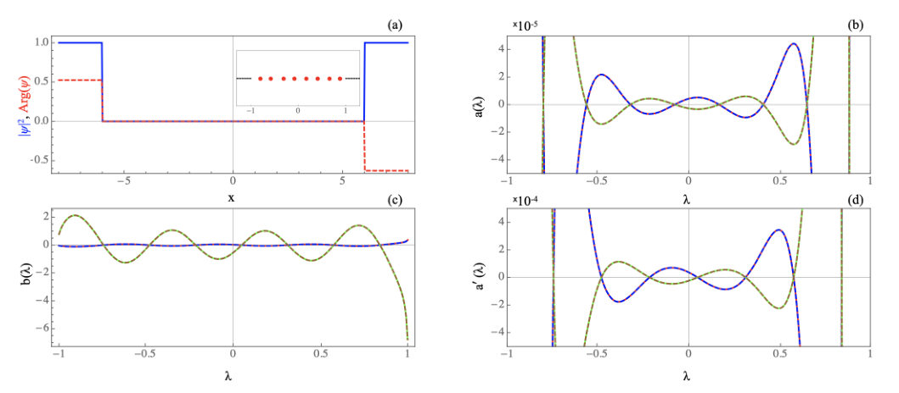 
FIG. 1: Verification of the developed DST algorithm using inverse step potential: (a) The wave field is represented by a potential that vanishes on [−m/2, m/2] with m = 12 (blue line); a red dashed line shows phase behavior. The inset shows eigenvalues as red dots, and the branch cut of the function ζ(λ), see Eq. (6), is indicated by a black dotted line. (b), (c), (d) present the behavior of the scattering coefficients a(λ), b(λ), and a′(λ), respectively. Numerical results (solid lines) are compared with analytical results (dashed lines) to validate the algorithm. Blue and red colors correspond to the real part, while green and brown correspond to the imaginary part. Panel (b) shows where...

📷 Fig 2

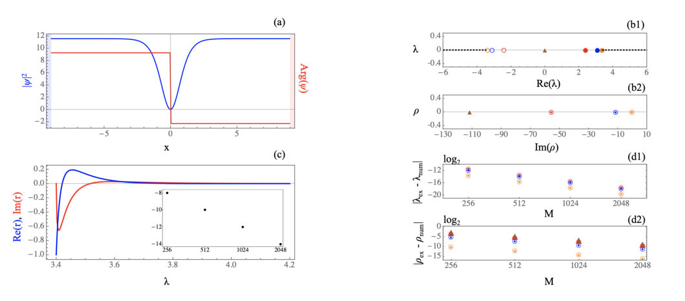 
FIG. 2: Verification of the developed DST algorithm using hyperbolic tangent potential. Panel (a) shows the wave field (blue line) represented by A tanh(x) with A = 3.4, and the red line shows the phase behavior. Panel (b1) illustrates the λ-plane of the spectral parameter: the branch cut of the function ζ(λ), see Eq. (6), is shown as a black dotted line, and the phase constants ρn are displayed in panel (b2). Filled and empty circles denote positive and negative eigenvalues λn (which are real) and the corresponding phase constants ρn (which are imaginary), respectively. Panel (c) shows the behaviour of the real (blue) and imaginary (red) parts of reflection coefficient r(λ) representing...

📷 Fig 3

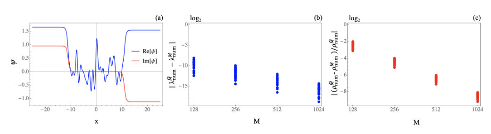 
FIG. 3: Verification of the developed DST algorithm using an arbitrary-modulated hollow in the CW background as a test potential. (a) Real and imaginary parts of the potential modeled by Eq. (53). (b,c) Second-order convergence of numerical errors for the identified N = 28 dark solitons, evaluated at different number of discretization points M with respect to analogous data obtained for the most accurate potential detalization at ˜ M = 211.

**Summary.** This paper introduces a numerical Direct Scattering Transform (DST) algorithm to analyze dark solitons governed by the defocusing Nonlinear Schrödinger Equation. By solving the auxiliary Zakharov-Shabat problem numerically, the authors can accurately determine the complete scattering data, including soliton parameters. This robust method is valuable for analyzing complex wave fields in optical and hydrodynamical systems.

**Why it may be interesting.** This work provides a powerful, robust numerical tool (DST) to analyze complex wave phenomena like dark solitons in nonlinear media, which is highly relevant to quantum optics and Bose-Einstein condensate dynamics.

Detailed structure

**Main problem.** The paper develops a numerical Direct Scattering Transform (DST) scheme to characterize dark solitons in the defocusing Nonlinear Schrödinger Equation (dNLSE).

**Main result.** The scheme successfully computes the full scattering data, including discrete eigenvalues and norming constants, for various potential profiles, demonstrating high accuracy through testing on known analytical cases.

**Method.** The methodology involves numerically solving the auxiliary Zakharov-Shabat scattering problem using a transfer matrix approach, supplemented by high-precision arithmetic for accurate parameter recovery.

**Model / system.** The primary model is the defocusing Nonlinear Schrödinger Equation (dNLSE), which describes the evolution of wave fields in defocusing media. The analysis is applied to potentials such as the inverse step potential and hyperbolic tangent hollows.

**Key observables.** Scattering data $\{ \lambda_n, 
ho_n \}$ (discrete eigenvalues and norming constants) and the continuous reflection coefficient $r(\lambda)$.

**Important parameters / regimes.** The spectral parameter $\lambda$ is real, and the analysis is performed under constant-amplitude boundary conditions ($\psi 	o A e^{i\Theta_\pm}$).

**Assumptions / limitations.** The DST reconstruction is stated to be possible asymptotically at large times, and the method requires careful handling for the zero eigenvalue case ($\lambda_0=0$).

**Figures summary.** Figures demonstrate the numerical verification of the DST by comparing computed scattering coefficients and norming constants against known analytical results for the inverse step and hyperbolic tangent potentials, including convergence tests for multiple solitons.

**Paper structure.** The paper introduces the DST for the dNLSE, details the mathematical framework using the Zakharov-Shabat system and transfer matrices, derives explicit formulas for benchmark potentials (inverse step, $	anh(x)$), and validates the full algorithm using these analytical solutions and complex test cases.

Abstract

We introduce a numerical direct scattering transform scheme for dark solitons of the nonlinear Schrodinger equation, enabling the identification and complete characterization of nonlinear coherent structures in defocusing media with a continuous-wave (CW) background. Our scheme is based on numerically solving the auxiliary Zakharov-Shabat scattering problem with CW boundary conditions and on analytically derived expressions that relate the elements of the transfer matrix to the scattering data for dark solitons and continuous-spectrum waves. To test our approach, we consider two analytically solvable cases of the scattering problem: i) rectangular, and ii) hyperbolic tangent hollows in the CW background, which can contain an arbitrary number of dark solitons, with known scattering data. We revisit the analytical derivations and obtain a complete set of soliton parameters represented by discrete eigenvalues and norming constants. By supplementing the direct scattering transform algorithm with high-precision arithmetic to accurately recover soliton norming constants, we provide a robust method to analyze data from numerical or natural experiments on complex wave fields in optical, hydrodynamical, and other physical systems.

[↑ back to top](#top)

### [Origin of High-Temperature Antiferromagnetic Order in a van der Waals Material](http://arxiv.org/abs/2608.25209v1)

**Authors:** Rabindra Basnet, Hari Paudyal, Gicela Saucedo Salas, Nicholas P. Butch, Durga Paudya, Ramesh C. Budhani  
**Type:** both · **Category:** strongly correlated electrons · **PDF:** <https://arxiv.org/pdf/2608.25209v1>  
**Analysis basis:** full PDF text, analyzed in chunks

📷 Fig 1

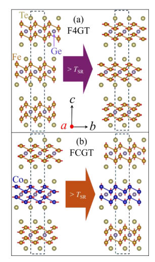 
FIG. 1. Crystal and magnetic structures of (a) F4GT and (b) FCGT, both crystallizing in the rhombohedral structure (R3̅m space group) with the a, b, and c axes indicated. Left and right panels depict the low- and high-temperature magnetic states below and above TSR, respectively.

📷 Fig 2

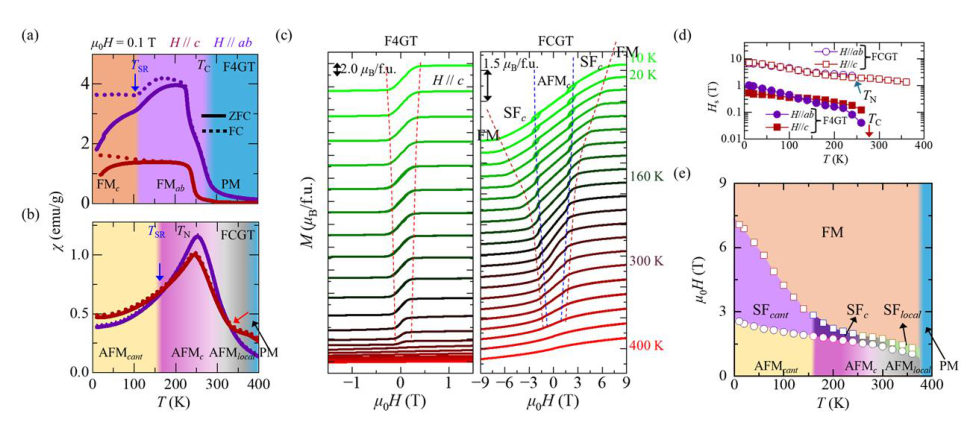 
FIG. 2. Temperature dependence of susceptibility [χ(T)] measured under H//ab and H//c magnetic fields of µ0H = 0.1 T for (a) F4GT and (b) FCGT. Solid and dotted lines correspond to ZFC and FC measurements, respectively. The blue arrows in (a) and (b) indicate TSR. The different colored regions in Figs.a and b denote distinct magnetic phases. Field dependence of magnetization [M(H)] for F4GT under H//ab field from T = 400 K to 10 K (c) F4GT and (d) FCGT. The red dashed line represents moment saturation, whereas the blue lines in Fig. 2d denote AFM-to-SF transition. (e) Temperature dependence of the in-plane and out-of-plane saturation fields (HS) for both samples. (e) Magnetic phase diagram...

📷 Fig 3

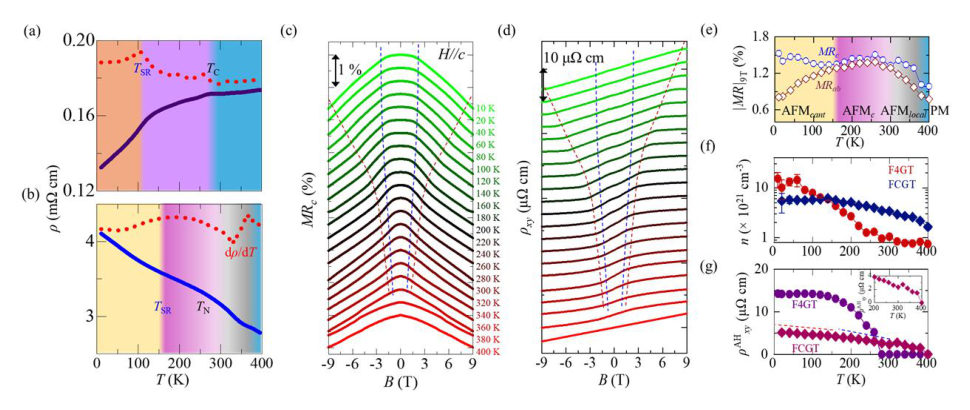 
FIG. 3. Temperature dependence of the longitudinal resistivity for (a) F4GT and (b) FCGT, with red curves showing the corresponding derivatives dρ/dT. (c) Field dependence of Normalized magnetoresistance MRc of FCGT at different temperatures from T = 400 K to 10 K under H//c field.

📷 Fig 4

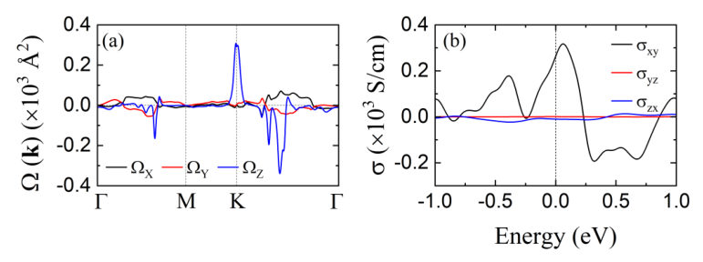 
FIG. 4. (a) Berry curvature Ω(k) (in 103 Å2) along the high-symmetry path and (b) anomalous Hall conductivity components σxy, σyz, and σzx (in 103 S/cm) near the EF as a function of energy.

**Summary.** This work investigates the origin of high-temperature antiferromagnetism in the vdW material $(	ext{Fe}_{0.65}	ext{Co}_{0.35})_4	ext{GeTe}_2$. By combining experiments and DFT calculations, the authors attribute the high $T_N$ to a complex interplay between Co-driven magnetic correlations and the itinerant-localized nature of the $3d$ electrons. This establishes the material as a promising platform for next-generation antiferromagnetic spintronics.

**Why it may be interesting.** The concept of itinerant-localized duality in stabilizing high-$T_N$ magnetism is highly relevant to understanding strongly correlated electron systems, which often exhibit complex magnetic ground states beyond simple mean-field theories.

Detailed structure

**Main problem.** The paper aims to unravel the physical origin of the unusually high Néel temperature ($T_N \approx 250 	ext{ K}$) in a van der Waals (vdW) itinerant antiferromagnet.

**Main result.** The high $T_N$ is stabilized by a unique interplay involving layer-selective Co substitution, robust AFM interactions driven by Co moments, and the itinerant–localized duality of the $3d$ electrons.

**Method.** The study combines experimental measurements (magnetometry, specific heat, transport) with advanced theoretical calculations, including DFT incorporating Hubbard parameters.

**Model / system.** The physical system is the newly identified vdW compound $(	ext{Fe}_{0.65}	ext{Co}_{0.35})_4	ext{GeTe}_2$, which is a Co-substituted derivative of $	ext{Fe}_4	ext{GeTe}_2$. The magnetism is governed by the correlated $3d$ electrons in this layered structure.

**Key observables.** Néel temperature ($T_N$), magnetic susceptibility ($\chi(T)$), magnetization ($M(H)$), specific heat ($\gamma$), and electronic structure details like the Density of States at the Fermi level ($	ext{D}(E_F)$).

**Important parameters / regimes.** The high $T_N$ ($\approx 250 	ext{ K}$), the effective Hubbard parameter ($U_{	ext{eff}} = 4 	ext{ eV}$), and the magnetic field strength ($	ext{H}_S \approx 7 	ext{ T}$).

**Assumptions / limitations.** The analysis assumes that the magnetic behavior can be understood by modeling the interplay between itinerant (Stoner-like) and localized (exchange-like) magnetic interactions.

**Figures summary.** Figures summarize the magnetic phase space in the T-H plane, showing transitions between PM, $	ext{AFM}_{	ext{local}}$, $	ext{AFM}_c$, and field-induced phases, alongside transport measurements showing negative magnetoresistance.

**Paper structure.** The paper progresses by establishing the material's magnetic ground state via measurements, using DFT to model the electronic structure and magnetic ordering, and finally synthesizing these results to propose the physical mechanism responsible for the high $T_N$.

Abstract

While Van der Waals (vdW) itinerant antiferromagnets with high Neel temperatures (TN) are highly desirable for spintronics, they remain relatively scarce. Here, we unravel the physical origin of the unusually high TN (= 250 K) in the newly identified vdW compound (Fe0.65Co0.35)4GeTe2. The substitution of Co in Fe4GeTe2 induces layer-selective Fe-Co ordering and stabilizes a robust antiferromagnetic (AFM) state primarily driven by Co moments. The AFM order is further strengthened by enhanced electronic correlations of quasi-localized Co 3d-states at the Fermi level, giving rise to an itinerant-localized duality of the 3d electrons. This interplay generates strong magnetic correlations well above TN and stabilizes low-temperature spin canting with a possible nontrivial Berry curvature. Our results establish (Fe0.65Co0.35)4GeTe2 as a rare material bridging fundamental magnetic interactions with potential applications in AFM spintronics.

[↑ back to top](#top)

### [PCB-Integrated CoPt Micromagnets for Magnetophoresis](http://arxiv.org/abs/2608.25732v1)

**Authors:** Melissa Mitchell, Henrique Mira, Simon Bending, Chris Bell, Ali Mohammadi  
**Type:** both · **Category:** other · **PDF:** <https://arxiv.org/pdf/2608.25732v1>  
**Analysis basis:** full PDF text, analyzed in chunks

📷 Fig 1

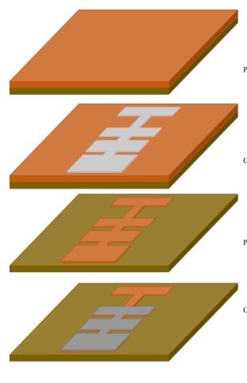 
Figure 1: Proposed process for preparing the substrate, including cross-section illustrations for each step. 3D illustration (left) and cross-section (right).

📷 Fig 2

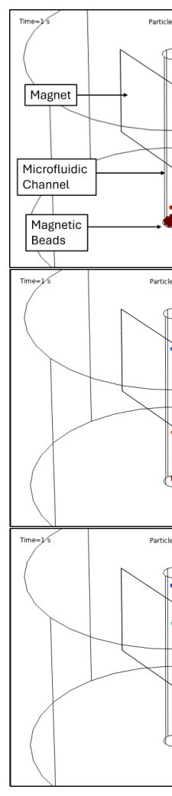 
Figure 2: COMSOL simulations of MNPs in water being trapped by magnets with different magnetic field strengths. Top: 500mT. Middle: 1T. Bottom: 1.5T.

📷 Fig 3

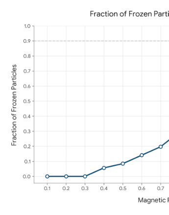 
Figure 3: COMSOL model of percentage of particles trapped against remanence of CoPt magnet. saturation of particles trapped at 1.4T.

📷 Fig 4

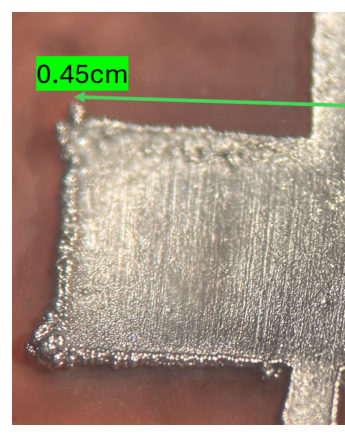 
Figure 4: Tilted optical microscope images of an electroplated CoPt micromagnet on the Cu-on-Kapton substrate. The dimensions have been included.

📷 Fig 5

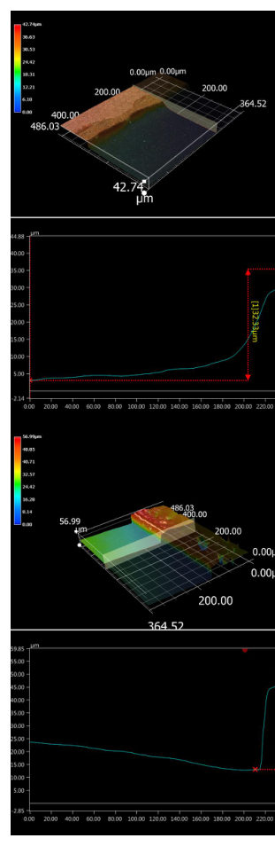 
Figure 5: Keyence 3D microscope images of the copper-on-Kapton substrate (top) and the electroplated CoPt on the copper-on-Kapton substrate (bottom). For each image, the top left shows a 3D recreation of the area being investigated, top right shows a microscope image of the area, and the bottom shows a graph of the thickness results based on the blue line seen in the top right image.

**Summary.** This paper details the creation of a novel, scalable magnetic platform by electroplating and annealing Cobalt-Platinum (CoPt) micromagnets onto Printed Circuit Boards. The resulting magnets exhibit significantly enhanced magnetic properties, which are then used to experimentally demonstrate the precise trapping of magnetic nanoparticles within microfluidic channels. This work merges advanced materials science with microfluidics for high-throughput biomedical applications.

**Why it may be interesting.** While the core application is in bio-sensing, the development of highly controllable, patterned magnetic materials (CoPt) on flexible, scalable substrates (PCB) represents an advanced materials engineering achievement relevant to creating complex, patterned electromagnetic environments.

Detailed structure

**Main problem.** The goal is to improve the throughput and precision of biotechnology processes, such as magnetophoresis, by creating a scalable magnetic platform capable of generating strong, controlled magnetic field gradients at the microscale.

**Main result.** The researchers successfully developed and characterized CoPt micromagnets integrated onto PCB substrates, achieving a six-fold increase in in-plane magnetic remanence after annealing. These magnets were experimentally validated by successfully trapping magnetic nanoparticles in microfluidic channels, consistent with FEA simulations.

**Method.** The work combines materials science (electroplating, annealing, XRD, VSM, EDX) with microfluidics and computational modeling (FEA using COMSOL) to characterize and test the magnetic trapping capability.

**Model / system.** The physical system is a magnetic platform built using CoPt micromagnets electroplated onto PCB substrates. The magnetic force governing particle trapping is modeled using the magnetophoretic force equation, $F_m = 2\pi r_p^3 \mu_0 \mu_r K 
abla|	ext{H}|^2$.

**Key observables.** In-plane magnetic remanence (increased from 0.24T to 1.4T), ordered L10 phase in XRD, and the percentage of trapped magnetic nanoparticles as a function of applied magnetic field strength.

**Important parameters / regimes.** Annealing temperature ($600^\circ	ext{C}$), magnet dimensions ($2	ext{mm} 	imes 4.5	ext{mm}$), and the magnetic field strength required for trapping (up to $\sim 1.4	ext{T}$).

**Assumptions / limitations.** The FEA model assumes the easy magnetization axis of the CoPt film is parallel to the out-of-plane field, and the process requires careful photoresist removal before high-temperature annealing.

**Figures summary.** Figures illustrate the fabrication process, FEA simulations showing particle trapping at various field strengths (500mT, 1T, 1.5T), and experimental characterization data including VSM comparisons (before/after annealing) and XRD spectra confirming the L10 phase.

**Paper structure.** The paper follows a structure detailing the need for scalable magnetic platforms, describing the fabrication process (electroplating on PCB), presenting the material characterization (XRD, VSM, EDX) showing property enhancement, and finally validating the performance through microfluidic trapping experiments and comparison with FEA modeling.

Abstract

Integration of magnetic material with scalable microfluidic platforms can significantly improve the throughput and precision in biotechnology processes. In this work we have developed a new magnetic platform based on printed circuit board (PCB) technology. Cobalt-Platinum (CoPt) micromagnets are electroplated on copper pads with an arbitrary footprint on a Kapton substrate to enable generation of different magnetic field gradients. The magnets are characterized by XRD and VSM, before and after thermal annealing. The ordered L10 phase appear in XRD results after annealing at 600 °C, and VSM results show around six times increase for in-plane magnetic remanence from 0.24T to 1.4T. The near equiatomic ratios of Co:Pt is confirmed by EDX observations. The performance of these magnets is experimentally validated by trapping magnetic nanoparticles in microfluidic channels. These results are in excellent agreement with FEA models presented in COMSOL Multiphysics.

[↑ back to top](#top)

### [Probing bulk superconductivity in centrosymmetric Te-doped PtBi$_2$ single crystals](http://arxiv.org/abs/2608.25093v1)

**Authors:** Kilian Srowik, Pablo Pedrazzini, Soumen Ash, Oksana Kvitnitskaya, Andrii Kuibarov, Susmita Changdar, Oleksandr Suvorov, Volodymyr Bezguba, Alexander Kordyuk, Rafał Kurleto, Dawid Wutke, Reza Firouzmandi, Robert Kluge, Swarnamayee Mishra, Alexander Mistonov, Saicharan Aswartham, Jochen Geck, Sergey Borisenko, Laura T. Corredor, Bernd Büchner  
**Type:** experiment · **Category:** other · **PDF:** <https://arxiv.org/pdf/2608.25093v1>  
**Analysis basis:** full PDF text, analyzed in chunks

📷 Fig 1

 
Figure 1. (a) Map of x-ray scattering intensities in the (hk1)-plane, (b) crystal structure of PtBi1.96Te0.04.

📷 Fig 2

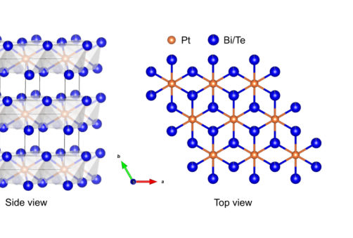 
Figure 2 displays a collection of results intended to establish and characterize the bulk nature of supercon- ductivity for our sample with x = 0.04 Te-doping. The upper panel (a) depicts the dc magnetic susceptibility χ ≡M/H measured at H = 5 Oe with field applied along the ab-plane, showing a strong diamagnetic response be- low T ∼2.4 K. We chose a representation that highlights the full shielding observed at low temperatures, where the ZFC curve reaches 4πχ ≈−1 as expected for SC in mag- netic fields lower than the critical field Hc1, in contrast to the other compositions, where a reduced supercon- ducting volume fraction was observed (see Supplemental Material [26]). The FC curve, on...

📷 Fig 3

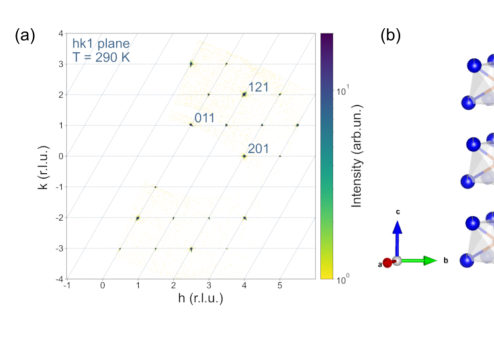 
Figure 1-a) shows the hk1) slice of the PtBi1.96Te0.04 reciprocal lattice, demonstrating correctness of the found unit cell (other slices are also presented in the Supple- mentary [26]). Although the simple centric test for the entire peak set was not reliable, the structure solution and following refinement converged directly to the cen- trosymmetric model. Thus, the crystal is indexed to the P3m1 space group, consistent with previous reports that pointed out the suppression of the distortion in the Pt triangular network present in the pristine PtBi2, sta- bilizing the centrosymmetric structure [20]. The ob- tained lattice parameters are a = b = 4.0545(10) Å

📷 Fig 4

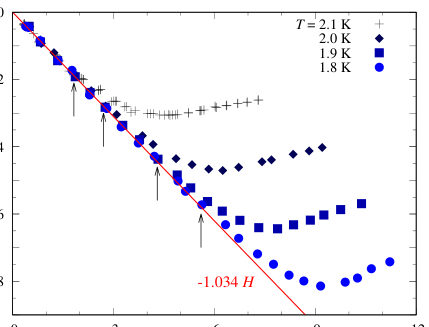 
Figure 3. Low field magnetization measurements of PtBi1.96Te0.04 for different constant temperatures between 1.8 K and 2.1 K. Black arrows indicate the deviation of the measured data from the linear regime, serving as estimation for the penetration field HP ∼H∥ c1.

📷 Fig 5

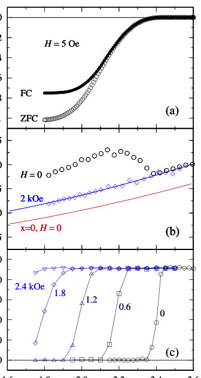 
Figure 2. Bulk superconducting transition in PtBi1.96Te0.04 at Tc ≈2.4 K, as seen from (a) magnetization measurements, (b) heat capacity and (c) electrical resistivity measurements. Panel (a) displays the dc magnetic susceptibility measured at H = 5 Oe following ZFC and FC protocols. Panel (b) depicts our H = 0 and 2 kOe data, a field high enough to suppress any evidence of SC in the measured T-range. Full lines are fittings to the H = 2 kOe data (blue line) and H = 0 data for our x = 0 reference sample. Panel (c) shows the resistivity SC transition at different applied fields, reaching a large normal state value ρ(2.5 K) ≈135 µΩcm ∼ρ(300 K).

**Summary.** This paper reports on the synthesis and characterization of Te-doped PtBi2 single crystals, which exhibit a structural transition to a centrosymmetric phase. This structural change is correlated with the observation of robust bulk superconductivity at Tc ~ 2.4 K, confirmed by multiple transport and thermodynamic measurements. The findings link the restoration of inversion symmetry to the superconducting state in this topological material.

**Why it may be interesting.** The work provides a clear experimental link between crystal symmetry (centrosymmetry restoration) and the emergence/enhancement of bulk superconductivity in a topological material class, which is highly relevant to understanding pairing mechanisms in correlated superconductors.

Detailed structure

**Main problem.** The study investigates the bulk superconductivity in Te-doped PtBi2 single crystals, contrasting the behavior with the parent non-centrosymmetric Weyl semimetal.

**Main result.** The doping induces a structural transition to a centrosymmetric phase, which correlates with the observation of robust bulk superconductivity with a critical temperature of approximately 2.4 K.

**Method.** The research employed a combination of techniques including single crystal X-ray diffraction, magnetization/specific heat measurements, electrical resistivity, and ARPES.

**Model / system.** The system is Te-doped PtBi2 single crystals (PtBi1.96Te0.04), which undergo structural modification from a non-centrosymmetric P31m to a centrosymmetric P3m1 structure upon electron doping.

**Key observables.** Superconducting critical temperature (Tc), upper critical fields (Hc2), absence of Fermi arcs in ARPES, and bulk superconducting volume fraction.

**Important parameters / regimes.** Doping concentration (x=0.04), critical temperature (Tc ~ 2.4 K), and structural symmetry (P3m1).

**Assumptions / limitations.** The structural transition to the centrosymmetric phase is responsible for the observed bulk superconductivity enhancement.

**Figures summary.** Figures show X-ray scattering maps confirming the crystal structure and the electronic structure via ARPES, which shows the absence of Fermi arcs in the doped sample.

**Paper structure.** The paper establishes the context by contrasting the non-centrosymmetric parent material with the doped, centrosymmetric material. It then presents multiple characterization results (XRD, transport, thermodynamics, ARPES) to confirm the structural change and the emergence of bulk superconductivity, concluding with the physical implications of symmetry restoration.

Abstract

The Weyl semimetal $γ$-PtBi$_2$ has been shown to be one of the most promising novel materials, recently proposed as a topological i-wave superconductor. A crucial requirement for observing this physics is the absence of inversion symmetry in its trigonal $P31m$ crystal structure. Centrosymmetry has been reported to be readily restored in the $P\overline{3}m1$ structure upon electron doping, partially substituting Bi with as little as 2% Te. In this work, we synthesized Te-doped PtBi$_{2-x}$Te$_{x}$ samples and thoroughly investigated the bulk superconductivity of selected single crystals with nominal composition PtBi$_{1.96}$Te$_{0.04}$, exhibiting the highest superconducting volume fraction of $\sim100$%. Single crystal XRD measurements confirm the centrosymmetric $P\overline{3}m1$ structure in our samples, whereas bulk superconductivity with a critical temperature of $T_\mathrm{c} \approx 2.4\,$K was observed in magnetization and specific heat measurements. The upper critical fields for two different orientations were determined as $H^{\parallel}_{\mathrm{c2}}(0)\approx 6.3\,$kOe for in-plane and $H^{\perp}_{\mathrm{c2}}(0)\approx 4.7\,$kOe for out-of-plane magnetic fields. Robust superconductivity was also found in resistance and point contact measurements, where the latter showed a slight enhancement of the critical temperature up to $T_\mathrm{c} \sim 3\,$K. Finally, ARPES measurements corroborate the centrosymmetric structure of our samples, showing a single surface termination and the absence of Fermi arcs.

[↑ back to top](#top)

### [Quantum geometric signatures of Link-Unlink transitions and nonlinear Hall response in Hopf-link semimetals](http://arxiv.org/abs/2608.25352v1)

**Authors:** Kamalesh Bera, Arijit Saha, Debashree Chowdhury  
**Type:** theory · **Category:** other · **PDF:** <https://arxiv.org/pdf/2608.25352v1>  
**Analysis basis:** full PDF text, analyzed in chunks

📷 Fig 1

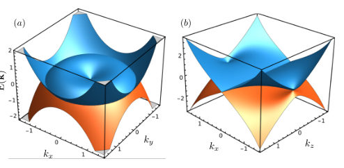 
FIG. 1. Electronic band dispersion of the Hopf-link semimetal is demonstrated. (a) Band dispersion is shown in the kx-ky plane, manifesting a gapless point at the center surrounded by a gapless nodal ring. (b) Band dispersion in the kx-kz plane is displayed, where a gapless nodal line is visible along the kz axis, accompanied by two additional gapless points located on either side of the line. The mass parameter is fixed at m = 1 for both the panels.

📷 Fig 2

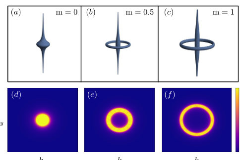 
FIG. 2. Link-unlink transition and the corresponding quan- tum metric in a Hopf-link semimetal are displayed. The up- per panels [(a)-(c)] show the evolution of the nodal structure for m = 0, 0.5, and 1.0, respectively. The case m = 0 cor- responds to the unlinked phase, whereas m &gt; 0 refers to the linked Hopf-link semimetal. The lower panels [(d)-(f)] present the corresponding zz-component of the quantum metric, gzz, in the kx-ky plane with kz = 0 for the same values of m. In the linked phase, gzz develops a ring-shaped structure whose radius increases with the mass parameter, reflecting the evo- lution of the nodal loop across the link-unlink transition.

📷 Fig 3

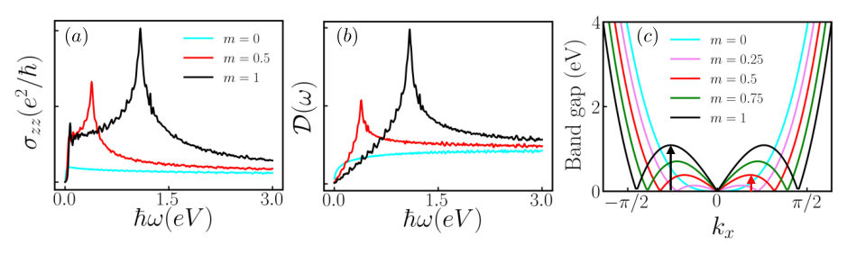 
FIG. 3. (a) Interband optical conductivity along the z direction, σzz, is displayed as a function of the photon frequency for m = 0, 0.5, and 1.0, indicated by the cyan, red, and black curves, respectively. Pronounced peaks appear for finite values of the mass parameters. (b) Interband JDOS for the same values of m is shown using the same color schemes. The JDOS peaks coincide with those in the optical conductivity, confirming their common origin. (c) Band gap, ∆ε, is depicted as a function of kx with ky = kz = 0 for different values of the mass parameter m. The curves correspond to m = 0, 0.25, 0.5, 0.75, and 1.0, are shown in cyan, purple, red, green, and black colors, respectively. Three...

📷 Fig 4

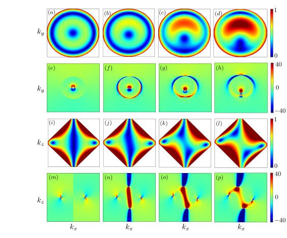 
FIG. 4. Momentum-space distributions of the band gap and the QMD kernel, (vygxx −vxgyx), are demonstrated for dif- ferent values of the perturbation strength β. Panels (a)- (d) exhibit the band-gap distribution in the kx-ky plane for β = 0, 0.1, 0.3, and 0.5, respectively. The corresponding dis- tributions of the QMD kernel are presented in panels (e)-(h). Panels (i)-(l) display the band-gap distribution in the kx-kz plane for the same values of β, while panels (m)-(p) show- case the corresponding momentum-space distributions of the QMD kernel. The progressive distortion of both the nodal structure and the QMD kernel with increasing β gives rise to a finite intrinsic nonlinear Hall response...

📷 Fig 5

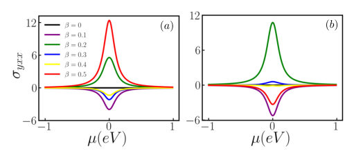 
FIG. 5. In panels (a) and (b), we present the QMD-induced nonlinear Hall conductivity, σyxx, (in units of e3/ℏ· eV), as a function of the chemical potential µ (in units of eV) for two different values of the Hopf mass, m = 0.5 and m = 1, respectively, considering different values of the perturbation strength β. The black, violet, green, blue, yellow, and red curves correspond to β = 0, 0.1, 0.2, 0.3, 0.4, and 0.5, respec- tively.

**Summary.** This work theoretically examines the quantum geometry of Hopf-link semimetals undergoing a link-unlink transition. It shows that while the system's inherent symmetry suppresses the nonlinear Hall effect, a small perturbation can activate a finite, intrinsic nonlinear response solely due to the quantum metric. This provides a deep understanding of topological transport mechanisms beyond conventional Berry curvature effects.

**Why it may be interesting.** The focus on intrinsic, symmetry-protected responses derived from geometric properties (quantum metric) provides a theoretical framework for understanding novel transport phenomena in topological materials, which is relevant to advanced condensed matter theory.

Detailed structure

**Main problem.** The paper investigates the quantum geometric signatures associated with Link-Unlink transitions and the resulting nonlinear Hall response in a specific topological material class.

**Main result.** The intrinsic nonlinear Hall conductivity, which is suppressed by symmetry in the unperturbed system, can be made finite by introducing a symmetry-breaking perturbation, revealing a purely quantum metric-driven response.

**Method.** The study employs theoretical calculations involving the Quantum Geometric Tensor (QGT), decomposing it into the quantum metric and Berry curvature, and analyzing the resulting nonlinear transport coefficients.

**Model / system.** The system studied is the Hopf-link semimetal, a topological material characterized by a nodal link-unlink transition. The analysis uses a low-energy continuum Hamiltonian derived from lattice models.

**Key observables.** Interband optical conductivity, the quantum metric components ($g_{\mu
u}$), and the intrinsic nonlinear Hall conductivity (NLHC).

**Important parameters / regimes.** The mass parameter ($m$ or $m_0$) controls the topological transition between linked and unlinked phases.

**Assumptions / limitations.** The analysis relies on deriving a low-energy effective continuum model from initial lattice Hamiltonians and focusing on the intrinsic, $	au$-independent component of the nonlinear response.

**Figures summary.** Figures illustrate band dispersions showing nodal rings, the evolution of the quantum metric component $g_{zz}$ across the link-unlink transition, and the optical conductivity peaks distinguishing the linked phase.

**Paper structure.** The paper systematically introduces the topological system, derives the quantum geometric quantities (QGT, metric, curvature), analyzes the optical response to characterize the link-unlink transition, and finally calculates the nonlinear Hall response, highlighting the role of symmetry breaking.

Abstract

Quantum geometry, comprising of quantum metric and Berry curvature, plays a significant role in the electronic transport properties of solids. In this work, we theoretically investigate the quantum geometric properties of a Hopf-link semimetal, a distinct topological class that is charecterized by a nodal link-unlink transition. We compute the interband optical conductivity of the Hopf link, which effectively distinguishes between linked and trivial phases. While recent studies establish quantum metric dipole-mediated scattering-free nonlinear Hall effect, this effect becomes even more fascinating in systems where the Berry-curvature-dipole contribution to nonlinear Hall conductivity vanishes. Owing to the underlying $PT$ symmetry of the Hopf-link semimetal, the Berry curvature and its corresponding contribution to the nonlinear Hall effect are entirely suppressed. Consequently, by introducing an appropriate perturbation, a finite nonlinear Hall conductivity emerges solely due to the quantum metric in the Hopf semimetal. Notably, this purely intrinsic, symmetry-driven nonlinear response remains entirely unmixed with extrinsic components.

[↑ back to top](#top)

