
# arxiv digest (quant-ph + cond-mat) — 2026-08-29

*139 papers · 18 relevant · 4 highlighted*

## 🔥 Most relevant (18)

*Every paper with at least one nonzero topic score, sorted by best-matching score. 🔥 marks scores ≥4/5. Click the title to jump to the full entry below; click [arXiv] to open the paper page. `(secondary)` marks papers from de-prioritized cond-mat archives.*

Show 18 relevant papers

- [Stochastic transport of a Goldstone mode in a self-organized atomic crystal](#paper-2608.27387) [[arXiv]](http://arxiv.org/abs/2608.27387v1) — 🔥 `non-equilibrium universality` **4/5** · 🔥 `quantum optics experiment` **4/5** · `Tavis-Cummings & cavity-many-emitter` **3/5** · `analog quantum simulation` **3/5** · `driven-dissipative phase transition` **3/5** · `methods for driven-dissipative` **3/5** · `quantum measurements` **3/5** · `Keldysh / 2PI / non-Gaussian methods` **2/5** · `correlated / nonlocal dissipation` **2/5** · `Frenkel-Kontorova` **1/5** · `interference shaping light` **1/5**
- [Long-time Dynamics of Many-body Open Quantum Systems using Quantum Generating Functions](#paper-2608.27237) [[arXiv]](http://arxiv.org/abs/2608.27237v1) — 🔥 `methods for driven-dissipative` **4/5** · `Full counting statistics` **3/5** · `Keldysh / 2PI / non-Gaussian methods` **3/5** · `correlated / nonlocal dissipation` **3/5** · `driven-dissipative phase transition` **3/5** · `non-equilibrium universality` **3/5** · `analog quantum simulation` **2/5** · `quantum measurements` **1/5** · `scars & prethermalization` **1/5**
- [Emergent non-Markovianity in time-delayed waveguide QED](#paper-2608.26427) [[arXiv]](http://arxiv.org/abs/2608.26427v1) — 🔥 `correlated / nonlocal dissipation` **4/5** · `Tavis-Cummings & cavity-many-emitter` **3/5** · `Dicke superradiance` **2/5** · `driven-dissipative phase transition` **2/5** · `methods for driven-dissipative` **2/5** · `Keldysh / 2PI / non-Gaussian methods` **1/5** · `analog quantum simulation` **1/5** · `non-equilibrium universality` **1/5** · `quantum measurements` **1/5** · `superradiant laser` **1/5**
- [Programmable Cavity Squeezing for Distributed Sensing in a Tweezer Array](#paper-2608.27132) [[arXiv]](http://arxiv.org/abs/2608.27132v1) — 🔥 `Tavis-Cummings & cavity-many-emitter` **4/5** · `Rydberg arrays` **3/5** · `analog quantum simulation` **3/5** · `Keldysh / 2PI / non-Gaussian methods` **2/5** · `methods for driven-dissipative` **2/5** · `correlated / nonlocal dissipation` **1/5** · `interference shaping light` **1/5**
- [Quenched activity induces nonuniversal scaling in nonreciprocal XY Models and surfaces](#paper-2608.26919) [[arXiv]](http://arxiv.org/abs/2608.26919v1) — 🔥 `non-equilibrium universality` **4/5** · `driven-dissipative phase transition` **3/5** · `Keldysh / 2PI / non-Gaussian methods` **2/5** · `methods for driven-dissipative` **2/5** · `Frenkel-Kontorova` **1/5** · `correlated / nonlocal dissipation` **1/5**
- [Localization Delocalization Transition in Diffusion with Adaptive Resetting](#paper-2608.27090) [[arXiv]](http://arxiv.org/abs/2608.27090v1) — 🔥 `non-equilibrium universality` **4/5** · `driven-dissipative phase transition` **3/5** · `methods for driven-dissipative` **2/5** · `Keldysh / 2PI / non-Gaussian methods` **1/5** · `analog quantum simulation` **1/5** · `correlated / nonlocal dissipation` **1/5**
- [Observing relativistic trajectories of single photons](#paper-2608.26778) [[arXiv]](http://arxiv.org/abs/2608.26778v1) — 🔥 `quantum measurements` **4/5** · 🔥 `quantum optics experiment` **4/5** · `interference shaping light` **3/5**
- [Occupation-Driven Josephson Diode in a Symmetric Junction](#paper-2608.27213) [[arXiv]](http://arxiv.org/abs/2608.27213v1) `(secondary)` — 🔥 `Keldysh / 2PI / non-Gaussian methods` **4/5** · `methods for driven-dissipative` **3/5** · `correlated / nonlocal dissipation` **1/5** · `driven-dissipative phase transition` **1/5** · `quantum measurements` **1/5**
- [Efficient formation and identification of single emitters in 4H-SiC following maskless heavy ion implantation](#paper-2608.27281) [[arXiv]](http://arxiv.org/abs/2608.27281v1) — 🔥 `QC/QI experiment` **4/5** · `quantum optics experiment` **3/5** · `quantum measurements` **2/5**
- [A Superconducting Phase Transition Single-Electron Transistor](#paper-2608.27045) [[arXiv]](http://arxiv.org/abs/2608.27045v1) — 🔥 `QC/QI experiment` **4/5** · `quantum measurements` **3/5** · `driven-dissipative phase transition` **1/5**
- [Detuning- and Stark-robust Rydberg gates](#paper-2608.27426) [[arXiv]](http://arxiv.org/abs/2608.27426v1) — 🔥 `Rydberg arrays` **4/5** · `QC/QI experiment` **2/5** · `Keldysh / 2PI / non-Gaussian methods` **1/5** · `analog quantum simulation` **1/5**
- [Detuning-robust Rydberg entangling gates from echoed pulses](#paper-2608.26446) [[arXiv]](http://arxiv.org/abs/2608.26446v1) — 🔥 `Rydberg arrays` **4/5** · `QC/QI experiment` **2/5** · `analog quantum simulation` **1/5**
- [Least Variable Quantum Counting Processes](#paper-2608.26240) [[arXiv]](http://arxiv.org/abs/2608.26240v1) — 🔥 `quantum measurements` **4/5** · `Full counting statistics` **3/5**
- [Real-Space Analysis of Two-Photon Polarization States in Type-II SPDC for High-Purity Polarization Entanglement](#paper-2608.26499) [[arXiv]](http://arxiv.org/abs/2608.26499v1) — 🔥 `quantum optics experiment` **4/5** · `interference shaping light` **3/5**
- [The heavy Fermi polaron I: the Lithium-Cesium experiment](#paper-2608.27322) [[arXiv]](http://arxiv.org/abs/2608.27322v1) — 🔥 `analog quantum simulation` **4/5** · `Keldysh / 2PI / non-Gaussian methods` **1/5** · `quantum measurements` **1/5**
- [Low-temperature magnetism and spin dynamics in the disordered triangular-lattice Yb$^{3+}$ compound LiCaYb$_5$(BO$_3$)$_6$](#paper-2608.26946) [[arXiv]](http://arxiv.org/abs/2608.26946v1) — 🔥 `analog quantum simulation` **4/5** · `scars & prethermalization` **1/5**
- [Exploiting overcompleteness of Platonic-solid POVMs for shadow estimation](#paper-2608.26318) [[arXiv]](http://arxiv.org/abs/2608.26318v1) — 🔥 `quantum measurements` **4/5**
- [Uncertainty limits for post-selected metrology](#paper-2608.26781) [[arXiv]](http://arxiv.org/abs/2608.26781v1) — 🔥 `quantum measurements` **4/5**

## ⭐ Highlighted (4)

*Papers by authors on your watch list. Click the title to jump to the full entry below; click [arXiv] to open the paper page.*

Show 4 highlighted papers

- ⭐ [Fast GHZ encoding with $1-o(1)$ fidelity](#paper-2608.26241) [[arXiv]](http://arxiv.org/abs/2608.26241v1) — Alexey V. Gorshkov
- ⭐ [Lieb-Schultz-Mattis Constraints for Quantum Channels: A Spacetime-Duality View](#paper-2608.26266) [[arXiv]](http://arxiv.org/abs/2608.26266v1) — Sarang Gopalakrishnan
- ⭐ [Why Cooper pairs live in AdS2: a spectral analysis of the Yukawa-SYK model](#paper-2608.26251) [[arXiv]](http://arxiv.org/abs/2608.26251v1) — Jörg Schmalian
- ⭐ [A continuous confinement-deconfinement transition in a triangular quantum magnet](#paper-2608.27411) [[arXiv]](http://arxiv.org/abs/2608.27411v1) — Johannes Knolle

## All papers (85, sorted by relevance)

*Papers from quant-ph and your primary cond-mat archives (quant-gas, stat-mech, str-el, dis-nn). Highlighted papers (⭐) come first, then everything else sorted by topic-relevance score, highest first.*

### ⭐ [Lieb-Schultz-Mattis Constraints for Quantum Channels: A Spacetime-Duality View](http://arxiv.org/abs/2608.26266v1)

**Highlighted author(s):** Sarang Gopalakrishnan  
**Authors:** Sarang Gopalakrishnan, Yu-Jie Liu, Tsung-Cheng Lu, Frank Pollmann, Yizhi You  
**Type:** theory · **Category:** statistical mechanics · **PDF:** <https://arxiv.org/pdf/2608.26266v1>  
**Analysis basis:** full PDF text, analyzed in chunks
**Topic relevance:** `correlated / nonlocal dissipation` **3/5** · `driven-dissipative phase transition` **3/5** · `methods for driven-dissipative` **3/5** · `non-equilibrium universality` **3/5** · `Keldysh / 2PI / non-Gaussian methods` **2/5** · `analog quantum simulation` **1/5** · `quantum measurements` **1/5** · `scars & prethermalization` **1/5**

↔ Scroll figures horizontally

<figure class="paper-figure-card">
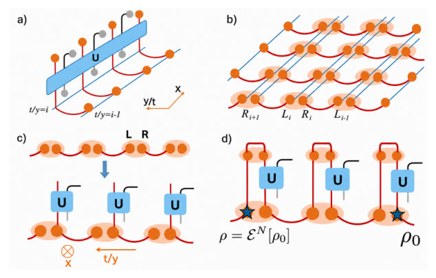
<figcaption class="paper-figure-caption"><b>Fig 1.</b> FIG. 1. a) Single step of a 1d quantum channel: a system chain (orange) is locally entangled with ancillas (gray) by a unitary circuit U, evolving the state from t = i −1 to t = i. Under the spacetime rotation t ↔y, these time slices become adjacent columns, y = i −1 and y = i, of a wavefunction on a ladder. b) Coupled-wire construction of the corresponding 2d SPT state in the absence of ancilla. Each column at y = i contains two spin- 1</figcaption>
</figure>
<figure class="paper-figure-card">
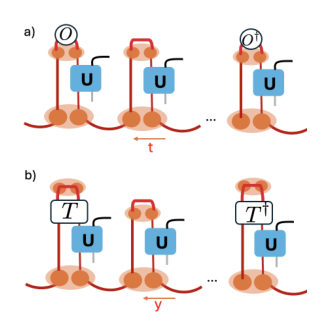
<figcaption class="paper-figure-caption"><b>Fig 2.</b> FIG. 2. a) The TRNC of Q probes temporal correlations generated by the repeated quantum channel. b) After im- plementing spacetime duality, the TRNC is mapped to the strange correlator of the corresponding 2d SPT state.</figcaption>
</figure>
<figure class="paper-figure-card">
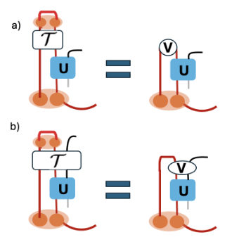
<figcaption class="paper-figure-caption"><b>Fig 3.</b> FIG. 3. a) Operator mapping for the TRNC in Eq. 28, which detects temporal correlations of the strong-symmetry charge. The left panel shows the corresponding operator insertion in the 2d SPT, while the right panel shows how the operators are inserted in the 1d quantum channel. b) Operator mapping for the TRNC in Eq. 30, which detects temporal correlations of the weak-symmetry charge. The left panel shows the cor- responding operator insertion in the 2d SPT, while the right panel shows how the operators are inserted in the quantum channel.</figcaption>
</figure>
<figure class="paper-figure-card">
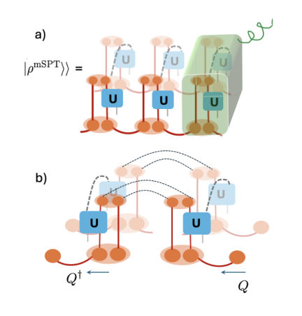
<figcaption class="paper-figure-caption"><b>Fig 4.</b> FIG. 4. a) The 2d mSPT defined in Eq. 22, shown in its Choi-doubled representation. The front and back layers cor- respond to the ket and bra spaces of ρmSPT, respectively. b) A spatial bipartition of |ρmSPT⟩⟩yields a reduced density matrix (RDM). Owing to the coupled-wire structure, it is sufficient to analyze a single building block of the wavefunction, whose RDM is related to Ω= Q†Q.</figcaption>
</figure>
<figure class="paper-figure-card">
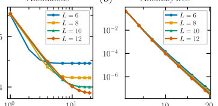
<figcaption class="paper-figure-caption"><b>Fig 5.</b> FIG. 5. The connected TRNC constructed from Ωfor quan- tum channels on rings of length L = 6, 8, 10, and 12, plot- ted as a function of the replica number N. a) The con- nected TRNC of Ωfor anomalous quantum-channel dynamics with a = c = 1/2 is plotted in log-log scale. b) The con- nected TRNC for anomaly-free quantum-channel dynamics with a = 0.04 and c = 0.36, and with y-axis shown in log scale, demonstrating the exponential decay of the TRNC.</figcaption>
</figure>

**Summary.** This paper extends the Lieb-Schultz-Mattis theorem to open quantum systems by analyzing the dynamics governed by quantum channels. Using a spacetime duality, the authors map the time evolution to a higher-dimensional mixed-state topological phase. This allows them to diagnose long-range temporal order, implied by LSM anomalies, by studying dual spatial correlators.

**Why it may be interesting.** This work provides a powerful, general framework connecting fundamental theorems from condensed matter (LSM) to the non-equilibrium dynamics of open quantum systems using advanced topological concepts (mSPT).

Detailed structure

**Main problem.** The paper investigates how Lieb-Schultz-Mattis (LSM) constraints, typically for ground states, dictate the dynamical signatures and temporal correlations in open quantum systems.

**Main result.** The authors establish a spacetime duality mapping the dynamics of a quantum channel to a higher-dimensional mixed-state symmetry-protected topological (mSPT) phase, providing a bulk-boundary diagnostic for LSM anomalies.

**Method.** The core method involves using spacetime duality to map the time evolution governed by a quantum channel's Liouvillian to a spatial correlation problem in a dual mSPT phase.

**Model / system.** The system under study is an open quantum system undergoing Markovian dynamics, modeled by repeated application of a quantum channel $E$. The analysis uses the Liouvillian formalism on a doubled Hilbert space.

**Key observables.** Twisted Rényi-N correlator (TRNC), Liouvillian singular spectrum, and the operator entanglement spectrum of the dual mSPT.

**Important parameters / regimes.** The dimensionality $d$ of the channel, and the nature of the mixed anomaly between strong $S$ and weak $G$ symmetries.

**Assumptions / limitations.** The analysis relies fundamentally on the spacetime duality correspondence between the channel dynamics and the mSPT phase.

**Figures summary.** Not specified.

**Paper structure.** The paper first extends the LSM theorem to open systems, then uses the Choi-Jamiolkowski isomorphism to map the channel to a transfer matrix $Q$. It then employs spacetime duality to map the temporal evolution to a higher-dimensional mSPT, defining the TRNC and relating it to the mSPT strange correlator.

Abstract

Quantum anomalies strongly constrain the possible behavior of many-body systems. A prime example is the Lieb-Schultz-Mattis (LSM) theorem, which relates UV symmetry and filling constraints to IR features of the energy spectrum and ground-state structure. Here, we ask how LSM constraints shape dynamical signatures and temporal correlations in open quantum systems. Using a spacetime duality, we show that the Liouvillian of a $d$-dimensional repeated quantum channel with a mixed anomaly between strong $S$ and weak $G$ symmetry can be mapped to a $(d{+}1)$-dimensional mixed-state symmetry-protected topological (mSPT) phase. Under this correspondence, the initial and steady states of the channel are identified with boundary states of the higher-dimensional mSPT in the presence of bulk projection. We further introduce the twisted Renyi-$N$ correlator (TRNC) as a probe of temporal correlations in the channel and demonstrate that it is dual to the mSPT strange correlator, providing a direct bulk-boundary route to diagnose long-range temporal order implied by the LSM anomaly. Finally, we identify the \textit{Liouvillian singular spectrum}, rather than the Liouvillian spectrum itself, as a more fundamental diagnostic of quantum anomalies, and show that it is dual to the operator entanglement spectrum of the mSPT.

[↑ back to top](#top)

### ⭐ [A continuous confinement-deconfinement transition in a triangular quantum magnet](http://arxiv.org/abs/2608.27411v1)

**Highlighted author(s):** Johannes Knolle  
**Authors:** Suguru Hosoi, Sejun Park, Michihiro Hirata, Minseong Lee, Adam P Dioguardi, Joe D Thompson, Filip Ronning, Allen O Scheie, Kumpei Imamura, Kenichiro Hashimoto, Takasada Shibauchi, Bishnu P Belbase, Arjun Unnikrishnan, Johannes Knolle, Arnab Banerjee, Yuji Matsuda  
**Type:** experiment · **Category:** strongly correlated electrons · **PDF:** <https://arxiv.org/pdf/2608.27411v1>  
**Analysis basis:** full PDF text, analyzed in chunks
**Topic relevance:** `analog quantum simulation` **3/5**

↔ Scroll figures horizontally

<figure class="paper-figure-card">
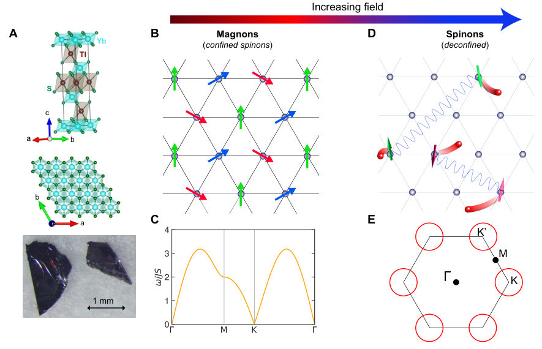
<figcaption class="paper-figure-caption"><b>Fig 1.</b> FIG. 1. Crystal structure, magnetic order and quantum spin liquid state in TlYbS2. (A) Trigonal crystal structure of TlYbS2. Top, layered structure viewed along the c axis showing Yb (cyan), S (green), and Tl (brown) atoms. Center, triangular lattice of Yb3+ ions in the ab plane. Bottom, optical image of representative thin plate-like single crystals. See Supplementary Materials for details of crystal growth and structural characterization. Crystal structures were visualized using VESTA software [20]. (B to E) Schematic illustration of the confinement–deconfinement transition in TlYbS2 under magnetic field applied along the c axis. The field drives a continuous transition from a phase with...</figcaption>
</figure>
<figure class="paper-figure-card">
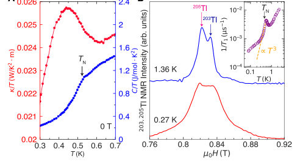
<figcaption class="paper-figure-caption"><b>Fig 2.</b> FIG. 2. Evidence for AFM ordering. (A) Temperature dependence of κ/T (red) and C/T (blue) at zero field. A kink in C/T and an inflection in κ/T at TN ≈0.53 K identify the onset of AFM order. On cooling, κ/T rises below ∼0.6 K and peaks at ∼0.45 K as magnetic scattering is suppressed by developing spin correlations, while the broad feature in C/T above TN reflects the short-range correlations expected for a triangular-lattice antiferromagnet. (B) 203,205Tl NMR spec- tra in the low-H regime for H ∥c. Two sharp peaks corre- sponding to the 203Tl and 205Tl resonances are observed. The spectrum exhibits pronounced broadening and a substantial change in lineshape below TN, consistent with a...</figcaption>
</figure>
<figure class="paper-figure-card">
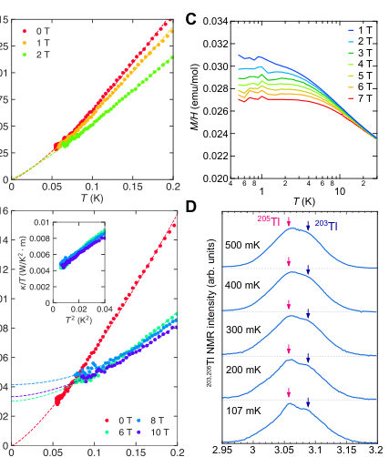
<figcaption class="paper-figure-caption"><b>Fig 3.</b> FIG. 3. Evidence for a field-induced U(1) quantum spin liquid state with a spinon Fermi surface. (A) Temperature dependence of κ/T, at low magnetic fields for H ∥c. The dashed lines represent polynomial fits to the data, used to estimate the T →0 limit. The extrapolated residual term κ0/T vanishes in the AFM ordered state. (B) κ/T at higher magnetic fields in the high-field phase. A finite resid- ual term κ0/T emerges, indicating the appearance of mobile gapless excitations. Inset: κ/T plotted against T 2, demon- strating the finite residual term κ0/T. (C) Temperature de- pendence of the magnetic susceptibility M/H measured at several magnetic fields for H ∥c. A T-independent Pauli- like...</figcaption>
</figure>
<figure class="paper-figure-card">
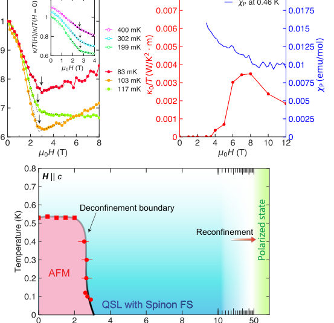
<figcaption class="paper-figure-caption"><b>Fig 4.</b> FIG. 4. H–T phase diagram of TlYbS2. (A) Magnetic-field dependence of κ/T for H ∥c, normalized by its zero-field value, measured at several temperatures. A clear kink is observed at µ0H ≈2.92 T at 83 mK, consistent with a continuous phase transition between the AFM and QSL phases. Arrows indicate the kink positions used to determine the phase boundary. Inset: field dependence of κ/T at higher temperatures, where the anomaly broadens but remains visible. For clarity, the data are vertically offset by 0.05. (B) Field dependence of the residual linear term κ0/T obtained from low-T extrapolation of κ/T, together with the Pauli-like susceptibility χP measured at 0.46 K in pulsed field for H ∥c....</figcaption>
</figure>

**Summary.** This work reports evidence for a continuous confinement-deconfinement transition in the triangular magnet TlYbS2. By measuring transport and magnetic properties across a critical field, the authors distinguish the ordered antiferromagnetic state from a gapless Quantum Spin Liquid. The findings suggest the physics is governed by fractionalized excitations, offering a solid-state realization of concepts from high-energy theory.

**Why it may be interesting.** The experimental demonstration of a transition involving fractionalized excitations (spinons) in a solid-state magnet provides a tangible platform to study concepts usually confined to high-energy particle physics (like QCD confinement).

Detailed structure

**Main problem.** The study investigates the continuous confinement-deconfinement transition in a quantum magnet, drawing an analogy to the transition in quantum chromodynamics.

**Main result.** The triangular-lattice antiferromagnet TlYbS2 exhibits evidence for a field-induced continuous transition from an ordered AFM phase to a gapless U(1) Quantum Spin Liquid (QSL) phase.

**Method.** The research combines multiple experimental techniques, including magnetization, specific heat, thermal conductivity, and NMR spectroscopy, across varying magnetic fields.

**Model / system.** The physical system is the triangular-lattice antiferromagnet TlYbS2. The transition is theorized to occur between a phase characterized by bosonic magnons (confined) and a QSL phase hosting fermionic spinons (deconfined).

**Key observables.** Thermal conductivity ($\kappa/T$) showing a finite residual term ($\kappa_0/T$), Pauli-like susceptibility, and temperature-independent NMR Knight shift in the high-field phase.

**Important parameters / regimes.** The transition is observed around a critical field $\mu_0H_c \approx 3\,\mathrm{T}$ and the Néel temperature $T_\mathrm{N} \approx 0.53\,\mathrm{K}$.

**Assumptions / limitations.** The transition is argued to be continuous and governed by fractionalized excitations, moving beyond the standard Ginzburg-Landau description.

**Figures summary.** Figures illustrate the structural details, the anomalies in $C/T$ and $\kappa/T$ marking the AFM ordering at $T_N$, and the emergence of the gapless QSL state signatures at high fields.

**Paper structure.** The paper first establishes the material's structure and then presents evidence for the AFM ordering ($T_N$). Subsequently, it details high-field measurements showing the transition into the gapless QSL state, ruling out alternative magnetic ordering scenarios.

Abstract

A continuous transition between phases hosting distinct excitations---bosonic magnons versus fermionic spinons---is a long-sought phenomenon in quantum magnetism, analogous to the confinement--deconfinement transition in quantum chromodynamics. We report evidence for such a transition in the triangular-lattice antiferromagnet TlYbS$_2$. Antiferromagnetic order develops below $T_\mathrm{N} \approx 0.53\,\mathrm{K}$. A $c$-axis field suppresses this order, driving the system into a gapless quantum spin liquid with a spinon Fermi surface above $μ_0 H_\mathrm{c} \approx 3\,\mathrm{T}$, evidenced by a finite residual linear term in thermal conductivity, a Pauli-like susceptibility, and a temperature-independent NMR Knight shift. Approaching $H_\mathrm{c}$ from above, the scattering rate of itinerant excitations is strongly enhanced while their density of states shows no critical enhancement, atypical of conventional magnetic quantum criticality. These results point to a continuous confinement--deconfinement transition governed by fractionalized excitations beyond the Ginzburg--Landau paradigm.

[↑ back to top](#top)

### ⭐ [Why Cooper pairs live in AdS2: a spectral analysis of the Yukawa-SYK model](http://arxiv.org/abs/2608.26251v1)

**Highlighted author(s):** Jörg Schmalian  
**Authors:** Veronika Carolin Stangier, Jörg Schmalian  
**Type:** theory · **Category:** strongly correlated electrons · **PDF:** <https://arxiv.org/pdf/2608.26251v1>  
**Analysis basis:** full PDF text, analyzed in chunks
**Topic relevance:** `Keldysh / 2PI / non-Gaussian methods` **2/5**

↔ Scroll figures horizontally

<figure class="paper-figure-card">
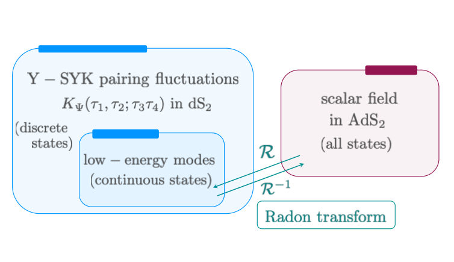
<figcaption class="paper-figure-caption"><b>Fig 1.</b> Figure 1. Schematic illustration of the holographic map between pairing fluctuations in the Y-SYK model and a scalar field in AdS2. Pairing fluctuations of scale-invariant fermions, governed by the pairing kernel KΨ(τ1, τ2; τ3, τ4), span the two-dimensional de Sitter space dS2. This space contains both continuous and discrete eigenstates of KΨ. The discrete states remain non-critical w.r.t. the onset of superconductivity and can therefore be excluded from the universal low-energy theory of fluctuating Cooper-pairs. The remaining continuous sector can be mapped, via an invertible Radon transform R, onto the full Euclidean anti-de Sitter space AdS2, which thus provides the natural geometric...</figcaption>
</figure>
<figure class="paper-figure-card">
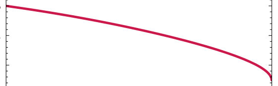
<figcaption class="paper-figure-caption"><b>Fig 2.</b> Figure 2. Exponent ∆for varying ratio of the boson and fermion flavor numbers M and N, respectively, where ∆(M ≪N) →1/2 −M/(8N) and ∆(M ≫N) →1/4 + (N/(8πM))1/2.</figcaption>
</figure>
<figure class="paper-figure-card">
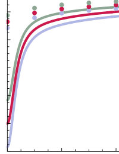
<figcaption class="paper-figure-caption"><b>Fig 3.</b> Figure 3. 1 −k (h), with k(h) the eigenvalue of the the mutually similar pairing kernels KF , KΦ, KΘ or KΨ, as function of p (for the continuous spectrum with h = 1</figcaption>
</figure>
<figure class="paper-figure-card">
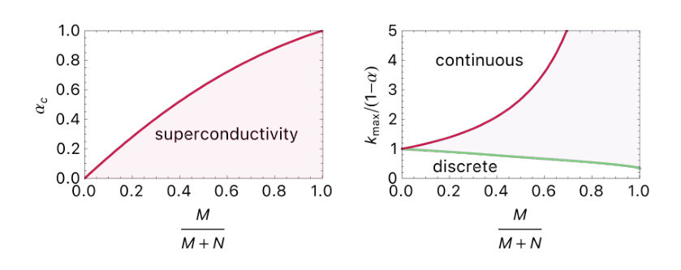
<figcaption class="paper-figure-caption"><b>Fig 4.</b> Figure 4. Left Panel: Critical value αc of the pair-breaking parameter α for varying ratio of the boson and fermion flavor numbers M and N, respectively. Right panel: maximal eigenvalue of the continuous part of the spectrum k (1/2) (red), corresponding to p = 0 in h = 1</figcaption>
</figure>

**Summary.** This paper provides a spectral foundation for understanding Cooper pairing in the Y-SYK model by analyzing its large-N effective action. It shows that the critical low-energy physics is confined to the continuous spectrum of the associated de Sitter Laplacian. This continuous sector can then be rigorously mapped via the Radon transform to a local scalar field theory propagating in AdS2, clarifying the holographic description of superconductivity.

**Why it may be interesting.** The explicit derivation of a local field theory (AdS2) from a bilocal pairing theory provides a rigorous, microscopic justification for holographic approaches used to model superconductivity in strongly correlated systems.

Detailed structure

**Main problem.** To establish the spectral foundation for the geometric formulation of Cooper pairing in the Yukawa–Sachdev–Ye–Kitaev (Y-SYK) model, clarifying how a local bulk field emerges from the bilocal pairing theory.

**Main result.** The superconducting instability and low-energy fluctuations are confined to the continuous scattering sector, which allows the bilocal Cooper-pair field to be mapped onto a local scalar matter field propagating in AdS2.

**Method.** The analysis uses spectral methods, deriving the Gaussian fluctuation kernel from the large-N bilocal effective action and resolving pairing fluctuations using the de Sitter space Laplacian.

**Model / system.** The study focuses on Cooper pairing in the Y-SYK model, a system exhibiting quantum criticality, analyzed through its large-N effective action.

**Key observables.** The pairing kernel eigenvalue k(h), the superconducting instability condition (eigenvalue reaching unity), and the resulting Klein-Gordon action on AdS2.

**Important parameters / regimes.** Conformal weight h, the continuous scattering sector ($h = 1/2 \pm ip$), and the AdS2 Breitenlohner-Freedman stability bound.

**Assumptions / limitations.** The analysis relies on the saddle-point approximation and the assumption that the physical low-energy theory is governed by the continuous spectrum of the de Sitter Laplacian.

**Figures summary.** Figure 1 schematically illustrates the holographic map: pairing fluctuations in Y-SYK span dS2 (with continuous and discrete eigenstates); the continuous sector maps via an invertible Radon transform R to AdS2.

**Paper structure.** The paper proceeds by deriving the fluctuation kernel, analyzing its spectrum (continuous vs. discrete), and then using the Radon transform to project the relevant continuous sector dynamics onto a local scalar field theory in AdS2.

Abstract

We establish the spectral foundation of the geometric formulation of Cooper pairing in the Yukawa--Sachdev--Ye--Kitaev model. Starting from the large-$N$ bilocal effective action, we derive the Gaussian fluctuation kernel in the even-frequency spin-singlet Cooper channel. Following the construction of Maldacena and Stanford, we determine the kernel eigenvalue $k\left(h\right)$ analytically for arbitrary conformal weight $h$ and resolve the pairing fluctuations into the continuous and discrete sectors of the associated de-Sitter space Laplacian. We show that the superconducting instability and the universal low-energy fluctuations near it reside entirely in the continuous scattering sector, while the discrete modes remain non-critical. Expanding the kernel about the lowest continuum mode yields a Klein--Gordon action on ${\rm dS}_2$, restricted to the continuous spectral subspace. This is precisely the subspace on which the inverse Radon transform to ${\rm AdS}_2$ is well defined. The projected bilocal Cooper-pair field can therefore be mapped onto a scalar matter field propagating in ${\rm AdS}_2$, without requiring any further spectral restriction on the bulk theory. Our results provide the missing microscopic justification for the projection implicit in earlier holographic formulations and clarify how a local bulk field emerges from the bilocal pairing theory.

[↑ back to top](#top)

### ⭐ [Fast GHZ encoding with $1-o(1)$ fidelity](http://arxiv.org/abs/2608.26241v1)

**Highlighted author(s):** Alexey V. Gorshkov  
**Authors:** Laura Shou, T. C. Mooney, Twesh Upadhyaya, Alexey V. Gorshkov  
**Type:** theory · **Category:** quantum information and computing · **PDF:** <https://arxiv.org/pdf/2608.26241v1>  
**Analysis basis:** full PDF text, analyzed in chunks

↔ Scroll figures horizontally

<figure class="paper-figure-card">
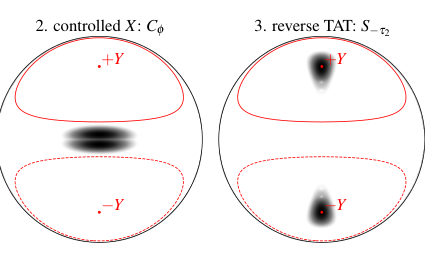
<figcaption class="paper-figure-caption"><b>Fig 1.</b> Figure 1. Illustration of the first three steps (TAT, controlled X rotation, reverse TAT) of the protocol in [Yin25a] on the Dicke sphere with N = 1000. The Husimi distribution of the current state of each packet is shown overlayed in log scale, using a Lambert azimuthal projection of the sphere with the center being the +Z pole. Note that due to the log scale, the packets in the third panel after the controlled X step are actually much more separated than they may appear. While not relevant for the protocol in [Yin25a], the red contours show the boundaries y = ±1/3, to compare with Figure 2.</figcaption>
</figure>
<figure class="paper-figure-card">
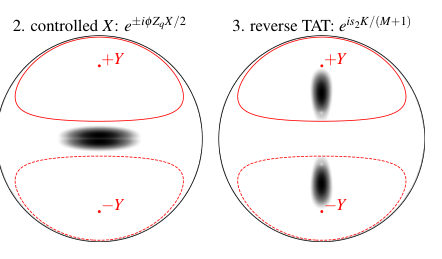
<figcaption class="paper-figure-caption"><b>Fig 2.</b> Figure 2. Illustration of the TAT packet separation in the new protocol, which consists of the same steps as the start of the protocol from [Yin25a] shown in Figure 1, but with different squeezing and rotation parameters. The parameters used for the three steps are those in the table in Section 1.3 with a = 9/20, κ = 9, and M = 1000. The red contours show the boundaries y = ±1/3. In Step 1, we squeeze the state further than in Figure 1, while in Step 2, we do a shorter controlled X rotation. In Step 3, we squeeze a smaller amount to send the “core” of the packet past the y = ±1/3 boundaries, but not all the way to the ±Y poles. Stopping before reaching the ±Y poles lets us handle the exact...</figcaption>
</figure>
<figure class="paper-figure-card">
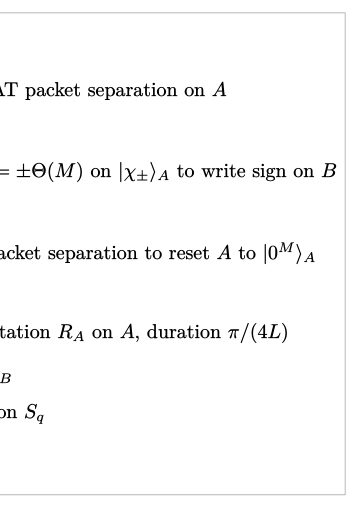
<figcaption class="paper-figure-caption"><b>Fig 3.</b> Figure 3. Sequence of operations in the new GHZ encoding protocol, with the target state (i.e. ignoring errors in the QSP read/write step) for each step shown. The changes of the state in each step are shown in red color.</figcaption>
</figure>

**Summary.** This paper presents a theoretical protocol to generate highly entangled Greenberger–Horne–Zeilinger (GHZ) states on $N$ qubits with near-perfect fidelity. By ingeniously combining spin-squeezing dynamics with Quantum Signal Processing, the authors achieve a time complexity of $O(\log N/N)$, matching the best-known theoretical lower bound. This represents a significant advancement in the speed and reliability of quantum state preparation.

**Why it may be interesting.** This work provides a concrete, optimized quantum circuit implementation for generating highly entangled states (GHZ states) at the fastest possible rate, which is crucial for quantum communication and computation protocols.

Detailed structure

**Main problem.** The primary goal is to demonstrate a method for achieving Greenberger–Horne–Zeilinger (GHZ) encoding on $N$ qubits with high fidelity in a time complexity that saturates the theoretical lower bound.

**Main result.** The authors propose a protocol that achieves $(1-o(1))$-fidelity GHZ encoding in time $O(\log N/N)$, matching the established lower bound for all-to-all Hamiltonians.

**Method.** The protocol combines spin-squeezing dynamics (Two-Axis Twisting, TAT) with Quantum Signal Processing (QSP) to efficiently implement the necessary unitary transformations.

**Model / system.** The system is an $N$-qubit quantum processor governed by all-to-all 2-local Hamiltonians. The encoding maps a single-qubit state into the GHZ subspace via controlled unitary evolution.

**Key observables.** Fidelity of the GHZ state, time complexity $T$, and the separation of quantum state packets on the Bloch/Dicke sphere.

**Important parameters / regimes.** The system size $N$, the interaction strength decay exponent $\gamma$, and the time scales $O(\log N/N)$.

**Assumptions / limitations.** The analysis relies on the continuum limit approximation for the Gaussian packet core and assumes the QSP method accurately implements the required sign function.

**Figures summary.** Figure 1 illustrates the three steps of the protocol from previous work, while Figure 2 and Figure 3 detail the state evolution in the new, optimized protocol, showing packet separation on the Dicke sphere.

**Paper structure.** The paper establishes the theoretical lower bounds for GHZ encoding time, introduces the novel protocol combining TAT squeezing and QSP, and then rigorously analyzes the fidelity and time complexity through detailed mathematical derivations involving operator derivatives and error bounding.

Abstract

We prove that $(1-o(1))$-fidelity $N$-qubit Greenberger--Horne--Zeilinger (GHZ) encoding can be performed in time $O(\log N/N)$ using all-to-all 2-local Hamiltonians with bounded 2-qubit interaction terms. This saturates the theoretical lower bound $Ω(\log N/N)$, and by rescaling, also saturates the lower bound on signaling time for Hamiltonians with power-law interaction strengths $1/r^γ$, $γ<d$ in dimension $d$. The protocol uses spin-squeezing dynamics combined with quantum signal processing.

[↑ back to top](#top)

### [Stochastic transport of a Goldstone mode in a self-organized atomic crystal](http://arxiv.org/abs/2608.27387v1)

**Authors:** Zhanhai Yu, Di Xiang, Xiaotian Zhang, Hao Zhang  
**Type:** both · **Category:** other · **PDF:** <https://arxiv.org/pdf/2608.27387v1>  
**Analysis basis:** full PDF text, analyzed in chunks
**Topic relevance:** 🔥 `non-equilibrium universality` **4/5** · 🔥 `quantum optics experiment` **4/5** · `Tavis-Cummings & cavity-many-emitter` **3/5** · `analog quantum simulation` **3/5** · `driven-dissipative phase transition` **3/5** · `methods for driven-dissipative` **3/5** · `quantum measurements` **3/5** · `Keldysh / 2PI / non-Gaussian methods` **2/5** · `correlated / nonlocal dissipation` **2/5** · `Frenkel-Kontorova` **1/5** · `interference shaping light` **1/5**

↔ Scroll figures horizontally

<figure class="paper-figure-card">
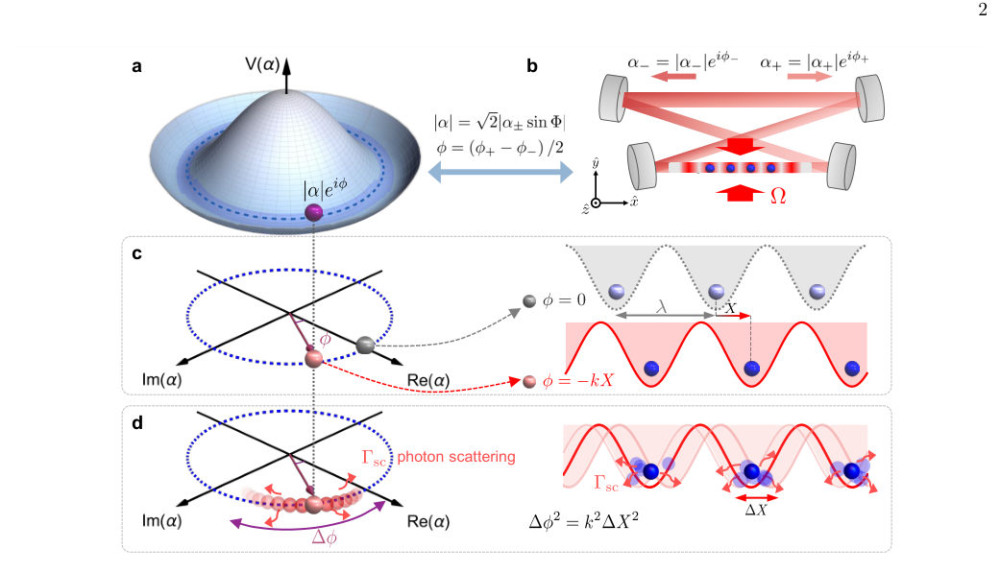
<figcaption class="paper-figure-caption"><b>Fig 1.</b> FIG. 1. Ring-cavity system for Goldstone-mode dynamics. a, Effective Mexican-hat potential for the atom-cavity system with the U(1) symmetry. The purple sphere denotes a symmetry-broken collective state of the atoms and their self- generated optical lattice, with the order-parameter amplitude |α| and azimuthal phase ϕ. b, Experimental setup. Inside the ring cavity, atoms driven by a transverse standing-wave pump field with Rabi frequency Ωemit light into two counter-propagating traveling-wave cavity modes ˆa±, with complex amplitudes α± = |α±|eiϕ±. The order parameter and cavity fields have the relations |α| = √</figcaption>
</figure>
<figure class="paper-figure-card">
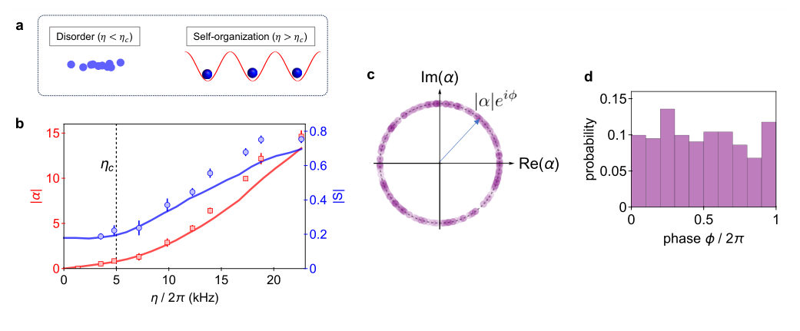
<figcaption class="paper-figure-caption"><b>Fig 2.</b> FIG. 2. Superradiant self-organization and spontaneous U(1) symmetry breaking. a, Illustration of the self- organization. Below the threshold (η &lt; ηc), atoms remain disordered and do not generate an optical lattice. Above threshold (η &gt; ηc), atoms self-organize into an emergent lattice with period λ. b, Order-parameter amplitude |α| and atomic structure</figcaption>
</figure>
<figure class="paper-figure-card">
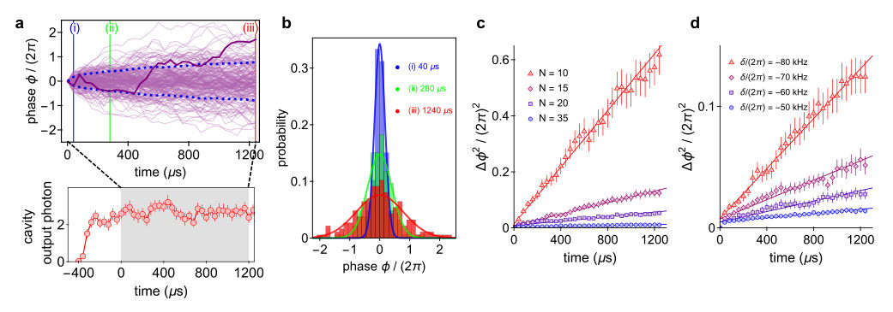
<figcaption class="paper-figure-caption"><b>Fig 3.</b> FIG. 3. Real-time observation of stochastic Goldstone-mode transport. a, The phase ϕ undergoes stochastic motion over time (top) while the cavity photon number remains approximately constant after a settling time (bottom). The transmitted cavity field is measured by heterodyne detection. The panel shows 186 experimental trajectories. The dark purple line is one representative trajectory. Blue dashed lines indicate standard deviation ±∆ϕ(t). Data are taken at N = 10, δ = −2π × 80 kHz, and Ω= 2π × 125 MHz. b, Phase distributions at the times marked in a. Solid lines are Gaussian fits. c, Phase variance ∆ϕ2 versus time for different atom numbers N at fixed pump Rabi frequency Ω= 2π × 125 MHz...</figcaption>
</figure>
<figure class="paper-figure-card">
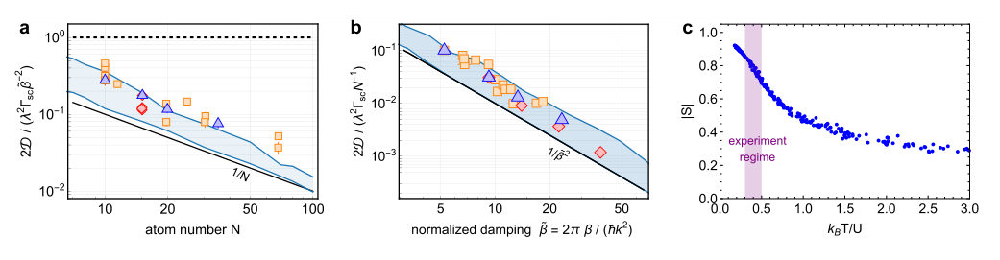
<figcaption class="paper-figure-caption"><b>Fig 4.</b> FIG. 4. Universal scaling of the normalized diffusion constant. a, Normalized diffusion constant versus atom number N. The solid line represents the zero-temperature theory, D ∝1/N. The dashed line at unity indicates the diffusion constant for independent atoms. b, Normalized diffusion constant versus the normalized damping coefficient ˜β. The solid line is the zero-temperature theory, D ∝1/˜β2. Small deviations of the measurements from the zero-temperature prediction arise from finite temperature effects. Blue triangles and red diamonds correspond to the data in Fig. 3d and Fig. 3e, respectively. Orange squares denote measurements taken under other conditions, including simultaneous scans...</figcaption>
</figure>

**Summary.** This paper investigates the stochastic transport of a Goldstone mode in an atomic crystal coupled to an optical ring cavity. By measuring the collective motion of the lattice phase, the authors demonstrate that the atoms move coherently, showing diffusion scaling inversely with atom number. This work opens new avenues for studying non-equilibrium collective dynamics in quantum matter.

**Why it may be interesting.** This work provides a direct, real-time measurement of Goldstone mode dynamics in a driven-dissipative setting, extending the study beyond traditional frequency-domain excitation measurements into non-equilibrium transport.

Detailed structure

**Main problem.** The study aims to track the stochastic transport of a Goldstone mode, which emerges from the spontaneous breaking of a continuous symmetry, in a system subject to intrinsic fluctuations and dissipation.

**Main result.** The atoms move collectively as a rigid object, resulting in a diffusion constant that scales inversely with the number of atoms ($D \propto 1/N$), and the transport exhibits universal scaling behavior.

**Method.** The research combines theoretical modeling (Langevin equations) with experimental measurement techniques, specifically monitoring the cavity output phase via heterodyne detection to track the center-of-mass motion.

**Model / system.** The system is a self-organized atomic crystal formed by atoms coupled to an optical ring cavity. The physics is governed by a Hamiltonian exhibiting a U(1) symmetry that is spontaneously broken, leading to the Goldstone mode.

**Key observables.** Diffusion constant ($D$), cavity output phase ($\phi$), phase variance ($\Delta\phi^2$), and the normalized diffusion constant.

**Important parameters / regimes.** Atom number ($N$), damping coefficient ($	ilde{eta}$), and the ratio of thermal energy to lattice depth ($k_B T/U$).

**Assumptions / limitations.** The analysis relies on the dispersive regime, the mean-field approximation, and the assumption that atoms move as a rigid body at low temperatures.

**Figures summary.** Figures illustrate the ring-cavity setup mapping phase to position, show the transition to self-organized lattice, and demonstrate universal scaling of the diffusion constant versus damping and atom number.

**Paper structure.** The paper establishes the physical model via the Hamiltonian and symmetry breaking, develops the Langevin equation for the collective coordinate, and then analyzes the resulting stochastic transport, culminating in measurements of scaling laws.

Abstract

Spontaneous breaking of a continuous symmetry produces a massless Goldstone mode that can evolve across a degenerate manifold at zero energy cost. Goldstone modes have been identified primarily through excitation spectra, mode softening or collective oscillations. However, their time-domain transport under intrinsic fluctuations and dissipation has remained largely unexplored. Here we directly track the stochastic transport of a Goldstone mode in a self-organized atomic crystal inside an optical ring cavity. The ring cavity maps the order-parameter phase onto the real-space position of the emergent crystal. Without any external perturbation, fundamental photon-scattering recoil drives the collective transport, while cavity dissipation generates friction. We monitor individual trajectories of the atoms and their self-generated optical lattice by measuring the cavity output phase. We find that the diffusion constant decreases as $1/N$, indicating that all atoms move collectively as a rigid object rather than independently. By tuning the Langevin driving force and cavity-mediated damping, we show that the normalized diffusion constant collapses onto a single universal curve. This work extends the study of continuous symmetry breaking from excitation-frequency measurements to real-time tracking of transport, and opens routes for studying non-equilibrium collective transport, phonon dynamics, and defect formation in driven-dissipative quantum matter.

[↑ back to top](#top)

### [Long-time Dynamics of Many-body Open Quantum Systems using Quantum Generating Functions](http://arxiv.org/abs/2608.27237v1)

**Authors:** Katha Ganguly, Dario Poletti, Bijay Kumar Agarwalla  
**Type:** theory · **Category:** statistical mechanics · **PDF:** <https://arxiv.org/pdf/2608.27237v1>  
**Analysis basis:** full PDF text, analyzed in chunks
**Topic relevance:** 🔥 `methods for driven-dissipative` **4/5** · `Full counting statistics` **3/5** · `Keldysh / 2PI / non-Gaussian methods` **3/5** · `correlated / nonlocal dissipation` **3/5** · `driven-dissipative phase transition` **3/5** · `non-equilibrium universality` **3/5** · `analog quantum simulation` **2/5** · `quantum measurements` **1/5** · `scars & prethermalization` **1/5**

↔ Scroll figures horizontally

<figure class="paper-figure-card">
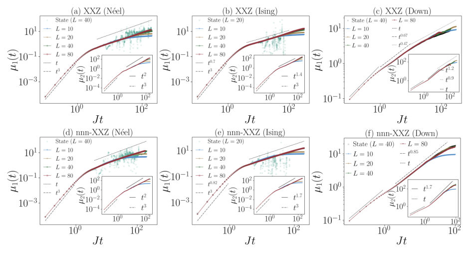
<figcaption class="paper-figure-caption"><b>Fig 1.</b> FIG. 1. First moment µ1(t) (main figures) and second moment µ2(t) (inset figures) of the transferred magnetization for the XXZ chain (top panel) and nnn-XXZ chain (bottom panel), subjected to excitation injection for the initial states (a) N´eel, (b) Ising-type, and (c) all spins down. Results are shown for system sizes L = 10, 20, 40, and 80. The scattered data points correspond to the state-evolution method using MPS, while the solid curves are obtained from the QGF approach. For both models, we set ∆= 1.0J, ΓG = 1.0J, |λ| = 0.03, and ϕ = 0. For the nnn-XXZ model, the next-nearest-neighbour coupling is Jb = J. In both the QGF and MPS simulations, the dynamics is simulated using the TEBD...</figcaption>
</figure>
<figure class="paper-figure-card">
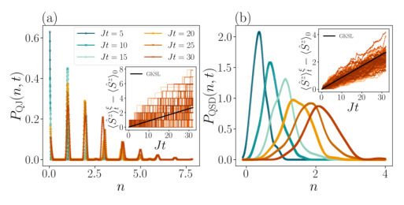
<figcaption class="paper-figure-caption"><b>Fig 2.</b> FIG. 2. Probability distribution of the injected charge ⟨Sz⟩ξ t − ⟨Sz⟩0 = n, at different times Jt, obtained by sampling 200 quantum trajectories for the (a) quantum-jump (QJ) and (b) quantum-state-diffusion (QSD) protocols. In both cases, we consider the XXZ chain (Jb = 0) with anisotropy ∆= 1.0J. The remaining parameters are ΓG = 0.1J, and λ = 0.03, for a system of size L = 20. The simulations are performed using TEBD algorithm with bond dimension χ = 256 and a truncation cutoff 10−10. The insets in (a) and (b) show the time evolution of the injected charge ⟨ˆSz⟩ξ t −⟨ˆSz⟩0 for different trajectories. The solid black curve in the inset denotes the ensemble-averaged injected charge, which...</figcaption>
</figure>

**Summary.** This paper introduces the Quantum Generating Function (QGF) formalism to overcome the computational bottleneck of simulating long-time dynamics in open quantum many-body systems. By calculating moments without evolving the full quantum state, the authors successfully characterize transport phenomena in spin chains. This establishes QGF as a robust and scalable method for studying non-equilibrium quantum dynamics.

**Why it may be interesting.** This work provides a powerful, scalable theoretical tool (QGF) to analyze non-equilibrium dynamics in complex quantum systems, which is highly relevant for understanding energy/particle transport in quantum materials.

Detailed structure

**Main problem.** The primary challenge addressed is efficiently simulating the long-time dynamics of many-body open quantum systems, where conventional methods struggle due to Hilbert space growth.

**Main result.** The Quantum Generating Function (QGF) formalism provides an efficient and scalable framework to compute higher-order moments and fluctuation statistics for open systems, successfully characterizing distinct initial state-dependent transport regimes in XXZ and nnn-XXZ chains.

**Method.** The authors developed and applied the QGF formalism, which computes dynamics via Fourier transformation of the probability distribution, allowing moment extraction without explicitly evolving the full quantum state.

**Model / system.** The study focuses on open quantum many-body systems, specifically using the XXZ and next-nearest-neighbor XXZ spin chains. The dynamics are governed by a Lindblad master equation incorporating both unitary evolution and environmental dissipation (e.g., local injection or dephasing).

**Key observables.** Higher-order moments ($\mu_n(t)$) of transferred magnetization, fluctuation statistics ($\kappa_2(t)$), and the identification of transport regimes (ballistic, diffusive, superdiffusive).

**Important parameters / regimes.** The counting field $\lambda$, the injection rate $\Gamma_G$, and the initial state (Néel, Ising-type, fully polarized).

**Assumptions / limitations.** The approach relies on the GKSL quantum master equation framework for open dynamics, and moment extraction via QGF assumes convergence of the perturbative expansion in $\lambda$.

**Figures summary.** Figures compare the first and second moments of transferred magnetization ($\mu_1(t), \mu_2(t)$) for XXZ and nnn-XXZ chains, contrasting QGF results against state-evolution methods (MPS) and showing different scaling behaviors for different initial states.

**Paper structure.** The paper develops the QGF formalism, proves its equivalence to Full Counting Statistics (FCS) derived from quantum jump trajectories, and then applies it to model open dynamics in spin chains, comparing results across different initial conditions and Hamiltonian types.

Abstract

The interplay between coherent unitary evolution and environment-induced dissipation can give rise to a wide range of non-equilibrium dynamics in open quantum systems, ranging from interesting transport phenomena to dynamical phase transitions. However, accessing such long-time dynamics remains challenging for the existing methods developed for the simulation of many-body open quantum systems. We address this problem by developing a quantum generating function (QGF) formalism for open many-body systems for both ensemble-averaged dynamics governed by a Markovian quantum master equation and trajectory-resolved dynamics described by the quantum trajectory formalism, including quantum jumps, and quantum state diffusion. Our approach computes the dynamics of higher-order moments and fluctuation statistics without explicitly evolving the quantum state, thereby providing an efficient and scalable approach for investigating many-body open quantum systems. We demonstrate the versatility of the formalism by applying it to both the integrable open XXZ chain and the nonintegrable open next-nearest-neighbor XXZ spin chain, where it uncovers distinct initial state dependent long-time transport regimes. Our work establishes quantum generating functions as an efficient and scalable framework for investigating long-time dynamics in open quantum many-body systems.

[↑ back to top](#top)

### [Emergent non-Markovianity in time-delayed waveguide QED](http://arxiv.org/abs/2608.26427v1)

**Authors:** Debsuvra Mukhopadhyay, Stuart J. Masson  
**Type:** theory · **Category:** other · **PDF:** <https://arxiv.org/pdf/2608.26427v1>  
**Analysis basis:** full PDF text, analyzed in chunks
**Topic relevance:** 🔥 `correlated / nonlocal dissipation` **4/5** · `Tavis-Cummings & cavity-many-emitter` **3/5** · `Dicke superradiance` **2/5** · `driven-dissipative phase transition` **2/5** · `methods for driven-dissipative` **2/5** · `Keldysh / 2PI / non-Gaussian methods` **1/5** · `analog quantum simulation` **1/5** · `non-equilibrium universality` **1/5** · `quantum measurements` **1/5** · `superradiant laser` **1/5**

↔ Scroll figures horizontally

<figure class="paper-figure-card">
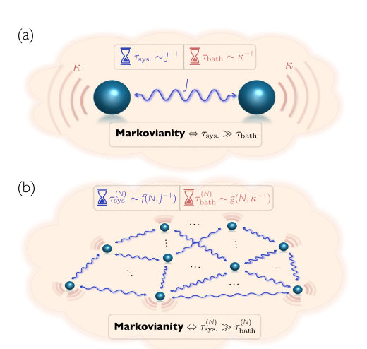
<figcaption class="paper-figure-caption"><b>Fig 1.</b> FIG. 1. Markov approximation in many-body systems. (a) In bipartite systems, the relevant timescales for the Markov approximation to be valid are readily identified. The rele- vant system timescale is determined by the interaction rate between the particles, J, and the relevant environmental timescale by how fast bath correlations are erased, κ. (b) For N particles, the relevant timescales are less obvious. Both timescales are still determined by the microscopic rates but can also be modified by system size.</figcaption>
</figure>
<figure class="paper-figure-card">
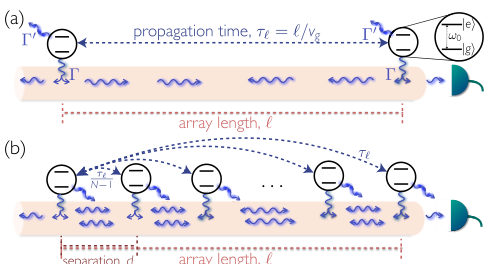
<figcaption class="paper-figure-caption"><b>Fig 2.</b> FIG. 2. Setup. (a) two to (b) N emitters coupled to a waveg- uide spaced evenly at k0d = 2πq with total length ℓand thus total propagation time τl = ℓ/vg, where vg is the group veloc- ity. Each emitter is coupled to the waveguide at rate Γ and to free space at rate Γ′.</figcaption>
</figure>
<figure class="paper-figure-card">
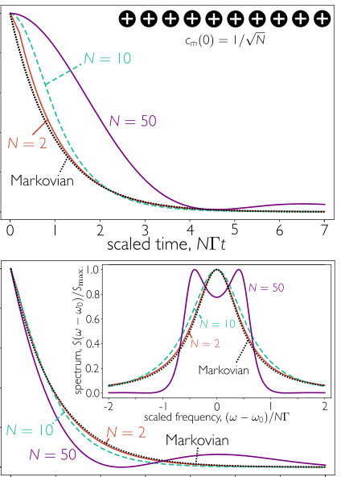
<figcaption class="paper-figure-caption"><b>Fig 3.</b> FIG. 3. Emergent non-Markovian dynamics for superradi- ant states. (a) Time evolution of total emitter population, PN m=1 |cm(t)|2, for different emitter numbers. (b) Intensity registered by a photon detector at the position of the right- most emitter, offset by the delay time, for different emitter numbers. (inset) Power spectrum of the emitted light, nor- malized by the maximum spectral weight, for different emit- ter numbers. In all plots, the dotted black line represents the N-independent Markovian limit, and simulations use a total end-to-end delay of Γℓ/vg = 0.1 and an initial single- excitation superradiant state |ψ(t = 0)⟩= ˆS+ |g⟩⊗N / √</figcaption>
</figure>
<figure class="paper-figure-card">
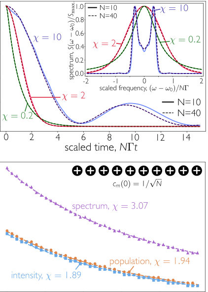
<figcaption class="paper-figure-caption"><b>Fig 4.</b> FIG. 4. Extracting relevant timescales for Markovianity. (a) Time evolution of total emitter population, PN m=1 |cm(t)|2, for different values of χ = NΓℓ/vg with N = 10 (solid lines) and N = 40 (dashed). (inset) Power spectrum of the emit- ted light, normalized by the maximum spectral weight, for different values of χ with N = 10 (solid lines) and N = 40 (dashed). (b) Minimum emitter number for which certain features appear at fixed end-to-end delay. These features are two peaks in the spectrum (purple triangles), revivals in the emitted intensity (blue squares), and revivals in the emitter population (orange circles). All datasets are fitted to lines of constant χ (dashed lines). Both...</figcaption>
</figure>
<figure class="paper-figure-card">
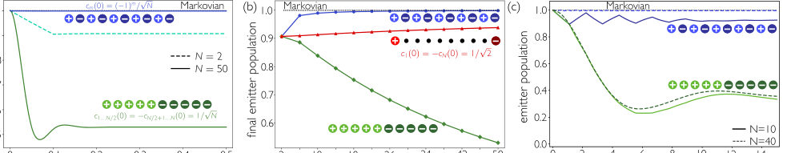
<figcaption class="paper-figure-caption"><b>Fig 5.</b> FIG. 5. Emergent non-Markovian dynamics for subradiant states. (a) Time evolution of total emitter popula- tion, PN m=1 |cm(t)|2, for different subradiant states. The initial state has equal amplitude on all emitters with (green)</figcaption>
</figure>

**Summary.** This paper investigates non-Markovian dynamics in a system of emitters coupled to a time-delayed waveguide. By analyzing the collective behavior in the large emitter limit, the authors show that memory effects become dominant, causing deviations from simple exponential decay. The findings emphasize the critical need for careful consideration of relevant timescales when applying the Markov approximation in complex quantum many-body systems.

**Why it may be interesting.** This work provides concrete theoretical examples of how memory effects, arising from system geometry and collective coupling, invalidate standard approximations in quantum optics, which is crucial for designing scalable quantum devices.

Detailed structure

**Main problem.** The paper addresses the failure of the Markov approximation in open quantum systems, particularly in complex, many-body settings where environmental memory effects are significant.

**Main result.** Collective effects in time-delayed waveguide QED can induce non-Markovian dynamics, with the dynamics being governed by an emergent parameter $\chi$ that combines system and environmental timescales.

**Method.** The analysis involves deriving and solving delayed differential equations for emitter amplitudes, comparing results against the Markov approximation, and analyzing the system in the large-$N$ limit.

**Model / system.** The system is a time-delayed waveguide Quantum Electrodynamics (wQED) setup consisting of $N$ two-level emitters coupled to a one-dimensional waveguide. The dynamics are modeled using delayed differential equations.

**Key observables.** Total emitter population, emitted intensity, and the finite-time power spectrum of the emitted field.

**Important parameters / regimes.** The emergent parameter $\chi \equiv N\Gamma\ell/v_g$, the superradiant lifetime, and the end-to-end delay time $	au_\ell$.

**Assumptions / limitations.** The analysis often assumes a phase-matched geometry and focuses on the single-excitation sector, though it explores deviations from these assumptions.

**Figures summary.** Figures illustrate the time evolution of total population and emitted intensity, showing deviations from the Markovian limit at large $N$, and demonstrate the dependence of dynamics on the parameter $\chi$.

**Paper structure.** The paper progresses by establishing the physical model, deriving the governing equations, analyzing the breakdown of the Markov approximation through varying $N$, and finally characterizing the emergent non-Markovian dynamics using the collective parameter $\chi$.

Abstract

Quantum systems are invariably coupled to a surrounding environment. A common theoretical method to simplify the problem is to trace over the environment under a Markov approximation, which assumes that the environment holds no memory over the timescales that the system evolves under. In interacting many-body systems, it is often not trivial to extract which of the multiple collective timescales are relevant. We consider a time-delayed waveguide QED setup with a single excitation. By fixing the maximum propagation time and increasing the number of emitters, we show that, even for small delay times, collective effects are sufficient to cause non-Markovianity. The impact of memory is intrinsically state-dependent. For superradiant states, the relevant system timescale is the superradiant lifetime while the relevant bath timescale is the end-to-end delay time. For subradiant states, both timescales depend on the structure of the specific state. Our results demonstrate the importance of prudently making Markov approximations in quantum many-body systems, and highlight potential pitfalls to avoid in scaling up quantum devices to large system sizes.

[↑ back to top](#top)

### [Programmable Cavity Squeezing for Distributed Sensing in a Tweezer Array](http://arxiv.org/abs/2608.27132v1)

**Authors:** Youssef Trifa, Marco Fattori, Luca Pezzè  
**Type:** theory · **Category:** other · **PDF:** <https://arxiv.org/pdf/2608.27132v1>  
**Analysis basis:** full PDF text, analyzed in chunks
**Topic relevance:** 🔥 `Tavis-Cummings & cavity-many-emitter` **4/5** · `Rydberg arrays` **3/5** · `analog quantum simulation` **3/5** · `Keldysh / 2PI / non-Gaussian methods` **2/5** · `methods for driven-dissipative` **2/5** · `correlated / nonlocal dissipation` **1/5** · `interference shaping light` **1/5**

↔ Scroll figures horizontally

<figure class="paper-figure-card">
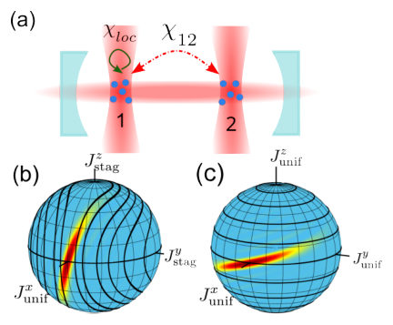
<figcaption class="paper-figure-caption"><b>Fig 1.</b> FIG. 1. Geometric configuration of the system studied: two atomic clouds are trapped within an optical cavity. We approximate each atom as a two-level system, and construct spin operators for each cloud. Local and long-range interactions lead to the Hamiltonian de- scribed in Eq. 1 for M = 2. (b-c) Wigner distribution of the evolved state after a quench protocol from a coherent spin state along x with (b) χ12 = −2χloc and (c) χ12 = 2χloc, with N1 = N2 = 20 atoms in each cloud. Black lines indicates the semiclassical trajectories, see main text for more details. Note that in (b) the axes correspond to the staggered collective spin -one of its components being uniform to ensure standard spin...</figcaption>
</figure>
<figure class="paper-figure-card">
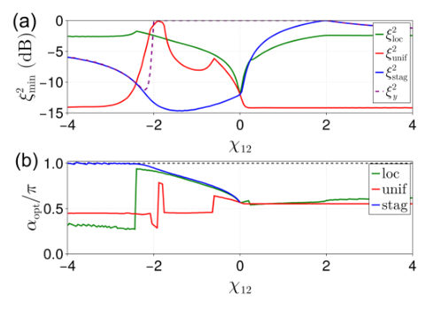
<figcaption class="paper-figure-caption"><b>Fig 2.</b> FIG. 2. (a) Minimal collective (red uniform, blue staggered) and lo- cal (green) squeezing achieved in time versus χ12, with χloc = 1. The dashed purple line corresponds to the staggered squeezing along the fixed y direction. (b) Squeezing angle αopt at the time of the min- imum for different values of χ12. The dashed line corresponds to α = π. Here, we took N1 = N2 = 100. The squeezing angle for uni- form squeezing for χ12 around −1.5 displays large fluctuations which are due to the very small amount of uniform squeezing for these val- ues of χ12 and are not physically relevant. For similar reasons, we did not show αopt for the staggered squeezing for positive χ12.</figcaption>
</figure>
<figure class="paper-figure-card">
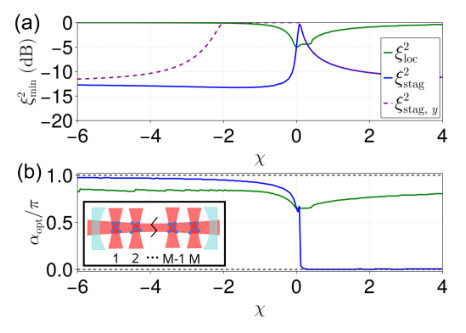
<figcaption class="paper-figure-caption"><b>Fig 3.</b> FIG. 3. (a) Minimal collective staggered (blue) and local (green) squeezing achieved in time for different values of χ with χloc = 1. The dashed purple line corresponds to the staggered squeezing along the fixed y direction. (b) Squeezing angle αopt at the time of the minimum for different values of χ. In both figures (a, b) we took N = 10 and M = 20. The black dashed lines correspond to 0 and π. Inset: schematic of the system with M tweezers.</figcaption>
</figure>
<figure class="paper-figure-card">
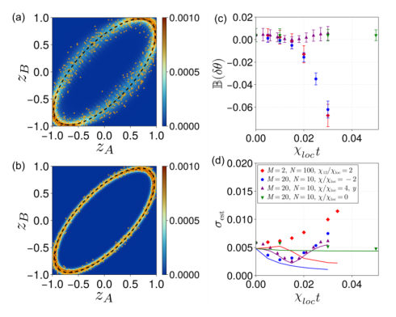
<figcaption class="paper-figure-caption"><b>Fig 4.</b> FIG. 4. Ellipse fitting from 1000 points sampled from the distri- bution ¯P  mA z , mB z , χloct = 0.01, π/4  for (a) a collective uniform OAT dynamics (χloc = 1, χ12 = 2, M = 2 and N = 100) and (b) a stag- gered squeezed state (M = 20, N = 10, χ/χloc = 4, without local ro- tation to change the squeezing direction). We note z j = 4mj z/(MN), j = A, B. The black dashed ellipse is obtained with a non linear ge- ometric fit. (c) Time evolution of the bias and (d) standard deviation of the estimator for the different Hamiltonian parameters. The solid lines correspond to the Cram`er-Rao bound, computed from the clas- sical Fisher information of the density probability ¯P.</figcaption>
</figure>
<figure class="paper-figure-card">
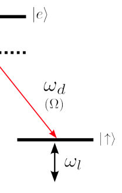
<figcaption class="paper-figure-caption"><b>Fig 5.</b> FIG. 5. Schematic of the three levels and atomic transitions used to engineer the cavity Hamiltonian.</figcaption>
</figure>

**Summary.** This paper demonstrates how to use programmable cavity interactions in a tweezer array to generate tailored quantum entanglement for distributed sensing. By tuning the competition between local and inter-cloud couplings, researchers can generate strong, nonlocal squeezing in a specific spatial mode. This technique successfully reduces phase uncertainty below the Standard Quantum Limit for differential interferometry.

**Why it may be interesting.** This work provides a detailed theoretical blueprint for engineering specific, non-local quantum correlations in an atomic array using cavity QED, which is highly relevant for quantum sensing and metrology.

Detailed structure

**Main problem.** The primary goal is to overcome the limitation of using uncorrelated devices in field sensing by engineering quantum correlations (entanglement) among spatially-separated devices using distributed sensing protocols.

**Main result.** Programmable cavity interactions allow generating nonlocal squeezing tailored to specific sensing tasks, enabling phase uncertainty reduction below the Standard Quantum Limit in differential Ramsey interferometry.

**Method.** The analysis involves modeling the system dynamics using an XY-exchange Hamiltonian supplemented by local nonlinearities, employing semiclassical analysis, and utilizing the Truncated Cumulant Expansion (TCE) for large systems.

**Model / system.** The physical platform is a tweezer array of M atomic ensembles trapped in a common optical cavity. The dynamics are governed by tunable cavity-mediated interactions ($\chi_{ij}$) competing with local interactions ($\chi_{	ext{loc}}$).

**Key observables.** Squeezing parameters ($\xi^2_{	ext{unif}}$, $\xi^2_{	ext{stag}}$), phase uncertainty, and the ratio R used to check for Heisenberg-Robertson inequality violation.

**Important parameters / regimes.** The coupling ratio ($\chi_{12}$ vs $\chi_{	ext{loc}}$) is crucial; negative coupling ($\chi_{12} = -2\chi_{	ext{loc}}$) is shown to generate strong nonlocal squeezing.

**Assumptions / limitations.** The analysis relies on the assumption of equal atom numbers ($N_j = N$) and utilizes the Truncated Cumulant Expansion (TCE) method, which assumes higher-order cumulants are negligible.

**Figures summary.** Figures illustrate the Wigner distribution for different coupling regimes (uniform vs. staggered squeezing) and show the evolution of squeezing parameters and the ratio R for varying system sizes and coupling strengths.

**Paper structure.** The paper progresses from establishing the need for distributed sensing to deriving the effective Hamiltonian, analyzing the competition between local and inter-cloud couplings to select the squeezing mode, and finally applying the scheme to differential Ramsey interferometry.

Abstract

Field sensing with state-of-the-art atom interferometers is restricted to the use of uncorrelated devices op- erating in parallel. We can overcome this limitation by using distributed sensing protocols where quantum correlations among spatially-separated devices are engineered in the spatial mode carrying the signal. We show that a tweezer array in a cavity offers an ideal testbed to engineer quantum states for distributed sensing, with the possibility to generate entanglement both within and between the clouds. The competition between local and intercloud cavity-mediated exchange allows the sign and spatial pattern of the intercloud couplings to select the squeezed mode. For two ensembles, positive coupling produces uniform collective squeezing, whereas negative coupling generates strong staggered, nonlocal squeezing. A semiclassical analysis reveals a counter-twisting- like phase-space flow, qualitatively distinct from standard one-axis twisting. The analysis and results can be further generalized to a larger number of ensembles. We apply the scheme to differential Ramsey interferometry with common phase noise spanning the full 2 πrange, the resulting staggered states reduce the phase uncertainty below the standard quantum limit, with an ellipse estimator approaching the Cramèr-Rao bound. These results establish programmable cavity interactions as a scalable route to entanglement tailored to distributed signals.

[↑ back to top](#top)

### [Quenched activity induces nonuniversal scaling in nonreciprocal XY Models and surfaces](http://arxiv.org/abs/2608.26919v1)

**Authors:** Sudip Mukherjee, Abhik Basu  
**Type:** theory · **Category:** statistical mechanics · **PDF:** <https://arxiv.org/pdf/2608.26919v1>  
**Analysis basis:** full PDF text, analyzed in chunks
**Topic relevance:** 🔥 `non-equilibrium universality` **4/5** · `driven-dissipative phase transition` **3/5** · `Keldysh / 2PI / non-Gaussian methods` **2/5** · `methods for driven-dissipative` **2/5** · `Frenkel-Kontorova` **1/5** · `correlated / nonlocal dissipation` **1/5**

↔ Scroll figures horizontally

<figure class="paper-figure-card">
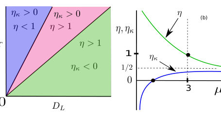
<figcaption class="paper-figure-caption"><b>Fig 1.</b> FIG. 1: (left)Phase diagram of the model in the DL −DT plane. The blue region with η &lt; 1, ηκ &gt; 0 has strong quasi- ordered phase and logarithmically faster than diffusive dy- namics, the pink region with η &gt; 1, ηκ &gt; 0 has weak quasi- ordered phase and logarithmically faster than diffusive dy- namics, and the green region with η &lt; 1, ηκ &lt; 0 has weak quasi-ordered phase and logarithmically slower than diffusive dynamics. We conjecture that the phases in the pink and green regions will be destroyed by vortex proliferation in the 2D NRB XY model. See text. (right) Variation of the expo- nents η (green) ηκ (blue) with µ. Both η, ηκ approach 1/2 for µ →∞(horizontal broken line). Black dots...</figcaption>
</figure>
<figure class="paper-figure-card">
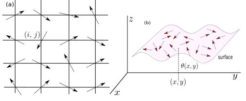
<figcaption class="paper-figure-caption"><b>Fig 2.</b> FIG. 2: (a) 2D NRB XY model on a square lattice. (b) An active surface in the Monge gauge coupled with quenched random tangential velocities represented by the arrows.</figcaption>
</figure>
<figure class="paper-figure-card">
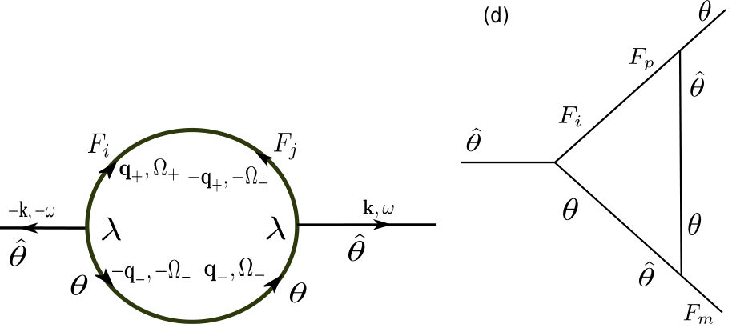
<figcaption class="paper-figure-caption"><b>Fig 3.</b> FIG. 3: Feynman graphs for (a) Tree-level vertex, (b) one-loop propagator, (c) one-loop correlator, (d) one-loop vertex.</figcaption>
</figure>

**Summary.** This paper demonstrates that the hydrodynamic description for a nonreciprocal XY model and an active surface advected by quenched disorder are mathematically identical. Using Renormalization Group theory, the authors predict that the resulting phase order is nonuniversal, depending continuously on the disorder characteristics. This provides a unified theoretical framework for studying non-equilibrium ordering in both condensed matter and active matter physics.

**Why it may be interesting.** The connection between non-equilibrium active matter (surfaces) and classical statistical mechanics models (XY model) via a shared hydrodynamic equation is highly relevant for understanding non-equilibrium phase transitions in complex physical systems.

Detailed structure

**Main problem.** The paper investigates the scaling behavior and phase order in nonreciprocal, non-equilibrium systems by establishing an equivalence between two distinct physical models.

**Main result.** The theory predicts that both systems exhibit nonuniversal scaling exponents, allowing for phase order that can be stronger or weaker than the quasi-long-range order characteristic of the standard 2D XY model.

**Method.** The analysis relies on deriving and analyzing a common hydrodynamic equation for both systems, followed by applying perturbative Dynamic Renormalization Group (RG) techniques.

**Model / system.** The models include a 2D Nonreciprocal Random Bond XY Model (NRB XY model) and an active surface advected by quenched velocities. Both are governed by a continuum hydrodynamic equation involving spin stiffness, random disorder fields, and coupling constants.

**Key observables.** Phase order (XY model) and positional order (active surface); scaling exponents ($\eta, \eta_\kappa$); correlation functions $\langle|	heta(\mathbf{k}, t)|^2
angle$.

**Important parameters / regimes.** Disorder variance transversality; coupling constants ($\kappa, \lambda$); disorder ratios ($\mu = D_T / D_L$).

**Assumptions / limitations.** The derivation uses continuum limit approximations, assumes rotational invariance in 2D, and employs perturbative RG techniques.

**Figures summary.** Figure 1 shows the phase diagram in the $D_L - D_T$ plane mapping regions based on scaling exponents. Figure 2 illustrates the setup for both the 2D NRB XY model on a lattice and the active surface in the Monge gauge.

**Paper structure.** The paper first establishes the equivalence between the microscopic dynamics of the XY model and the continuum equation for the active surface. It then uses continuum approximations and RG methods to calculate the scaling exponents and analyze the resulting phase transitions and ordering properties.

Abstract

Active XY models and active surfaces are two paradigmatic nonequilibrium systems with distinct microscopic origins. We show that the hydrodynamic theories for a quenched-disordered nonreciprocal random bond two-dimensional XY model and an inversion-symmetric active surface tangentially advected by quenched velocities are identical. This theory predicts sub-logarithmic phase order in the XY model and sub- or super-logarithmic positional order in the surface for short-range disorder with nonuniversal exponents, which vary continuously with the degree of transversality of the disorder variance. We argue that the nonreciprocal random bond XY model can disorder through vortex proliferation.

[↑ back to top](#top)

### [Localization Delocalization Transition in Diffusion with Adaptive Resetting](http://arxiv.org/abs/2608.27090v1)

**Authors:** Tommer D. Keidar, Shlomi Reuveni  
**Type:** theory · **Category:** statistical mechanics · **PDF:** <https://arxiv.org/pdf/2608.27090v1>  
**Analysis basis:** full PDF text, analyzed in chunks
**Topic relevance:** 🔥 `non-equilibrium universality` **4/5** · `driven-dissipative phase transition` **3/5** · `methods for driven-dissipative` **2/5** · `Keldysh / 2PI / non-Gaussian methods` **1/5** · `analog quantum simulation` **1/5** · `correlated / nonlocal dissipation` **1/5**

↔ Scroll figures horizontally

<figure class="paper-figure-card">
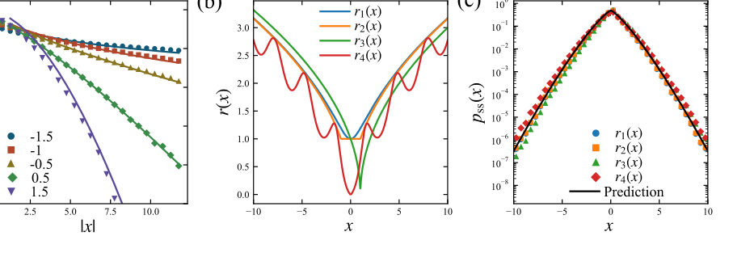
<figcaption class="paper-figure-caption"><b>Fig 1.</b> FIG. 1. a. The NESS of diffusion (D = 1) under adaptive resetting with the power-law asymptotics of Eq. (3). Symbols are numerical evaluations, and solid lines are the theoretical predictions of Eqs. (5) and (7). The resetting rates used are r(x) = |x|λ for λ &gt; 0 and r(x) = (0.5+|x|)λ for λ &lt; 0, with λ ∈{−1.5, −1, 0.5, 1.5}. b. Four different resetting rates with the same power-law asymptotics of r(x) ∼|x|0.5. The resetting rates are: r1(x) = (1 + x2)1/4, r2(x) = Θ(1 −|x|) + √xΘ(|x| −1) where Θ(·) is Heavyside step function, r3(x) = p</figcaption>
</figure>
<figure class="paper-figure-card">
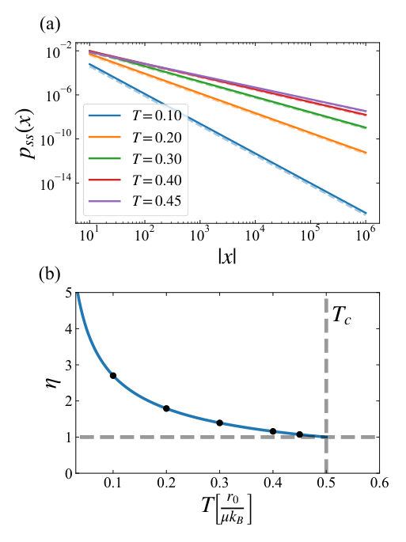
<figcaption class="paper-figure-caption"><b>Fig 2.</b> FIG. 2. (a) The NESS solution of Eq. (2) with r(x) = (1 + x2)−1 for different temperatures. The solid line comes from a numerical solution of the equation, and dashed lines are given by Eqs. (9) and (10). Temperature is measured in r0/(µkB). (b) Plot of Eq. (10). Dots come from a fit to the steady state found numerically for the five temperatures presented in panel (a).</figcaption>
</figure>
<figure class="paper-figure-card">
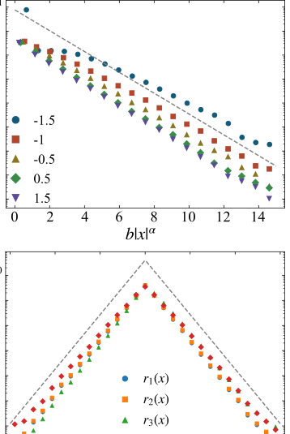
<figcaption class="paper-figure-caption"><b>Fig 3.</b> FIG. 3. a The NESS presented in Fig. 1(a). b The NESS presented in Fig. 1(c). In both cases the y-axis is logarithmic and the x-axis was taken as b|x|α where b and α are given by Eq. (7). All simulation parameters are the same as for Fig. 1(a, c) except for the trajectory length which was here chosen to be 3 · 104. Dashed lines with slope −sgn(x) are added to show the agreement between theory and simulations.</figcaption>
</figure>

**Summary.** This theoretical paper classifies diffusion under spatially dependent stochastic resetting by analyzing the resulting non-equilibrium steady state (NESS). It establishes a critical scaling exponent $\lambda = -2$, which separates localized diffusion (stretched-exponential tails) from a new, power-law decaying regime. This marginal case provides a nonequilibrium analogue to temperature-driven delocalization seen in equilibrium statistical mechanics.

**Why it may be interesting.** The work provides a rigorous, non-equilibrium framework for understanding localization transitions, drawing direct analogies between quantum/classical confinement potentials and stochastic resetting mechanisms, which is relevant for open quantum systems dynamics.

Detailed structure

**Main problem.** The paper aims to establish a general classification for diffusion under adaptive resetting, determining the nature of the non-equilibrium steady state (NESS) based on the spatial dependence of the resetting rate $r(x)$.

**Main result.** A sharp threshold exists at $r(x) \sim |x|^{-2}$; for stronger resetting ($\lambda > -2$), the state is localized with stretched-exponential tails, while the marginal case ($\lambda = -2$) yields a power-law tail, establishing a nonequilibrium counterpart to equilibrium delocalization.

**Method.** The analysis involves solving the governing ordinary differential equation for the NESS using analytical ansatz solutions (stretched-exponential and power-law forms) and comparing these results to numerical simulations.

**Model / system.** The model describes a particle undergoing diffusion (with coefficient $D$) subjected to an adaptive resetting rate $r(x)$ that scales as a power law, $r(x) \sim |x|^\lambda$. The system is analyzed by examining the steady-state probability distribution $p(x)$.

**Key observables.** The asymptotic decay exponent ($\eta$ or $\alpha$) of the NESS tails, and the critical temperature ($T_c$) marking the delocalization transition.

**Important parameters / regimes.** The exponent $\lambda$ characterizing the resetting rate $r(x) \sim |x|^\lambda$, and the ratio $r_0/D$ which determines the transition point.

**Assumptions / limitations.** The analysis assumes the resetting rate $r(x)$ follows a power-law asymptotic form, $r(x) \simeq r_0|x|^\lambda$ for large $|x|$.

**Figures summary.** Figure 1 compares the NESS under different $\lambda$ values, showing stretched-exponential decay for $\lambda > 0$ and illustrating the theoretical fit to the derived asymptotics.

**Paper structure.** The paper systematically analyzes the governing ODE for the NESS under adaptive resetting, deriving explicit forms for the steady-state tails in the localized ($\lambda > -2$) and marginal ($\lambda = -2$) regimes, drawing parallels to equilibrium potential theory.

Abstract

Stochastic resetting can localize diffusion and generate nonequilibrium steady states, but the conditions under which spatially dependent resetting produces localization remain unclear. Here, we establish a general classification for diffusion under adaptive resetting, where the resetting rate $r(x)$ depends on position. For rates with the asymptotic scaling $r(x)\sim |x|^λ$, we identify a sharp threshold at $λ=-2$. For $λ>-2$, the steady state is localized and exhibits stretched-exponential tails, whereas for $λ<-2$, resetting is asymptotically too weak to localize the particle. Precisely at the marginal scaling $r(x)\sim |x|^{-2}$, a qualitatively new regime emerges: the steady state develops power-law tails with a temperature-dependent exponent and exhibits a finite-temperature delocalization transition. Thus, inverse-square resetting plays the role of the logarithmic potential in equilibrium, establishing a nonequilibrium counterpart of the temperature-driven delocalization seen there.

[↑ back to top](#top)

### [Observing relativistic trajectories of single photons](http://arxiv.org/abs/2608.26778v1)

**Authors:** Sayantan Das, Daniel S. Dahl, Daniel Peace, Marcelo P. Almeida, Abhishek Roy, Markus Rambach, Andrew G. White, Timothy C. Ralph, Jacquiline Romero  
**Type:** experiment · **Category:** other · **PDF:** <https://arxiv.org/pdf/2608.26778v1>  
**Analysis basis:** full PDF text, analyzed in chunks
**Topic relevance:** 🔥 `quantum measurements` **4/5** · 🔥 `quantum optics experiment` **4/5** · `interference shaping light` **3/5**

↔ Scroll figures horizontally

<figure class="paper-figure-card">
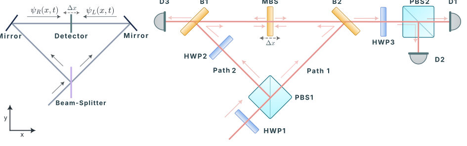
<figcaption class="paper-figure-caption"><b>Fig 1.</b> FIG. 1. Conceptual and experimental schematic. (A) Conceptual setup of the Michelson-Sagnac interferometer consisting of the beam-splitter in purple and the mirrors in black. The detector in dark grey measures the weak value of momentum ⟨ˆkx⟩w, at different positions x, allowing the determination of the relativistic Bohmian trajectories of a single photon which is in a superposition of a right-moving wavefunction ψR(x, t) and a left-moving wavefunction ψL(x, t). (B) The schematic of the Michelson-Sagnac interferometer used to implement the conceptual setup. It consists of polarising beam-splitters PBS1 and PBS2 in cyan, half-waveplates HWP1, HWP2, and HWP3 in blue, plate beam-splitters B1,...</figcaption>
</figure>
<figure class="paper-figure-card">
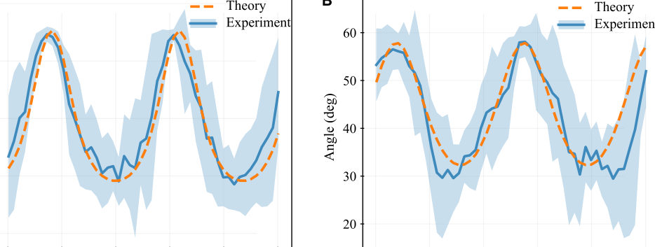
<figcaption class="paper-figure-caption"><b>Fig 2.</b> FIG. 2. Velocity-vector-angles as a function of MBS position. (A) and (B) illustrates experimental velocity-vector-angles compared with the theory as a function of MBS position for 20-80 and 5-95 intensity splitting ratios in the interferometer, respectively. The theoretical plot is shown in dashed orange lines and the experimental data are shown in blue solid lines with blue shaded region of uncertainty by ± 1 standard deviation.</figcaption>
</figure>
<figure class="paper-figure-card">
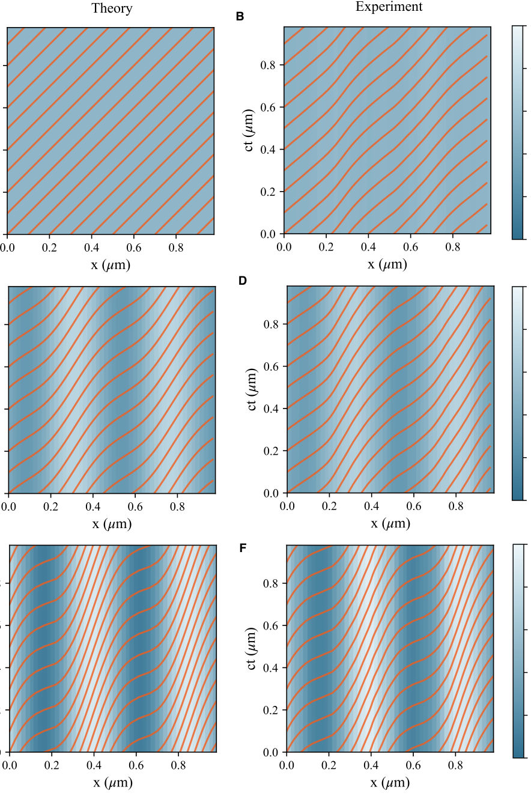
<figcaption class="paper-figure-caption"><b>Fig 3.</b> FIG. 3. Theoretical and experimental relativistic Bohmian trajectories overlaid on the probability densities. (A), (C), and (E) show the theoretical trajectories in dark orange on the theoretical probability densities. (B), (D), and (F) illustrate the experimental trajectories in dark orange on the experimental probability densities. The common colourmap for the probability densities are shown to the right of each row.</figcaption>
</figure>

**Summary.** This paper experimentally investigates relativistic Bohmian mechanics by measuring the trajectory of a single photon in a Michelson-Sagnac interferometer. By weakly measuring path information, the authors reconstruct the Bohmian velocity, observing characteristic subluminal and superluminal deviations from the speed of light. This provides novel experimental access to the deterministic, yet counterintuitive, predictions of Bohmian theory in a relativistic context.

**Why it may be interesting.** This work provides a direct, experimental test of a non-standard interpretation of quantum mechanics (Bohmian mechanics) in a relativistic setting, which is highly relevant to foundational quantum physics and quantum optics.

Detailed structure

**Main problem.** The paper addresses the challenge of reconciling Bohmian mechanics, which posits definite particle trajectories, with the principles of special relativity, specifically by experimentally reconstructing the relativistic Bohmian trajectory of a single photon.

**Main result.** The experiment successfully observed subluminal and superluminal features in the reconstructed Bohmian trajectories as the photon passes through interference fringes, confirming predictions of relativistic Bohmian theory.

**Method.** The measurement protocol involves weakly measuring 'which-path' information in a Michelson-Sagnac interferometer using the photon's polarization degree of freedom to reconstruct the relativistic Bohmian velocity $v(x)$.

**Model / system.** The physical system is a single photon propagating through a Michelson-Sagnac interferometer. The theoretical framework is relativistic Bohmian mechanics, which predicts the velocity $v(x) = j_x/
ho$ based on the probability current and density.

**Key observables.** The primary observable is the relativistic Bohmian velocity $v(x)$, which is reconstructed from the ratio of average photon counts ($\langle\hat{N}_1 - \hat{N}_2
angle / \langle\hat{N}_1 + \hat{N}_2
angle$).

**Important parameters / regimes.** The key parameters include the amplitude splitting ratio $\eta$ (or related $\delta$), the relative phase $\phi(x)$, and the measurement beam-splitter position $x$.

**Assumptions / limitations.** The analysis assumes natural units ($c = \hbar = 1$), utilizes the optical approximation, and relies on the assumption that all particles passing through a point follow the same deterministic trajectory.

**Figures summary.** Figure 1 illustrates the conceptual setup for head-on interference. Figure 2 shows the velocity-vector-angle $\chi$ vs. MBS position for varying splitting ratios. Figure 3 compares theoretical and experimental trajectories overlaid on probability densities, demonstrating the curvature of the path.

**Paper structure.** The paper first introduces the theoretical necessity of reconciling Bohmian mechanics with relativity. It then details the experimental platform using a Michelson-Sagnac interferometer and weak measurement techniques. Finally, it presents the quantitative results, comparing the measured velocity profile to the theoretical predictions, highlighting the subluminal/superluminal features.

Abstract

While the standard interpretation of quantum mechanics does not assign definite trajectories to particles, the Bohmian interpretation does. Only recently has an operational method for reconciling Bohmian mechanics with relativity been proposed. Here, we experimentally reconstruct relativistic Bohmian trajectories of a single photon in a Michelson-Sagnac interferometer, where counter-propagating probability amplitudes interfere head-on at the speed of light. As predicted by the relativistic Bohmian theory, we observe subluminal and superluminal features of the Bohmian trajectories of the photon traversing through the fringes. Our work provides experimental access to relativistic Bohmian mechanics and enables exploration of its unusual and counterintuitive properties.

[↑ back to top](#top)

### [Efficient formation and identification of single emitters in 4H-SiC following maskless heavy ion implantation](http://arxiv.org/abs/2608.27281v1)

**Authors:** S. Eserin, L. K. S. Zimmermann, E. Schneider, M. Ludlow, J. Heiler, O. G. Lloyd-Willard, K. Stockbridge, G. Aresta, L. Antwis, S. K. Clowes, M. Hofmann, S. Kucera, P. Berwian, F. Kaiser, B. N. Murdin  
**Type:** experiment · **Category:** quantum information and computing · **PDF:** <https://arxiv.org/pdf/2608.27281v1>  
**Analysis basis:** full PDF text, analyzed in chunks
**Topic relevance:** 🔥 `QC/QI experiment` **4/5** · `quantum optics experiment` **3/5** · `quantum measurements` **2/5**

↔ Scroll figures horizontally

<figure class="paper-figure-card">
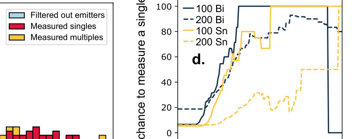
<figcaption class="paper-figure-caption"><b>Fig 1.</b> Figure 1: a. Confocal photoluminescence map of a Bi2+ array, implanted with 200 ions/spot and annealed at 900 ◦C, under 5 mW of 940 nm off-resonant excitation. Red circles indicate confirmed single emitters, yellow circles indicate multiple emitters, and light blue circles are filtered-out implants due to a combination of count rate/spot shape. b. Deviations of the fitted single-emitter positions from the idealised grid for the array in (a), showing an RMS displacement of 146 nm. c. Histogram of intensities for all fitted emitter locations for the array in (a). d. Percentage change to measure a single emitter as a function of intensity threshold, shown here for Bi2+ and Sn2+ (blue and...</figcaption>
</figure>
<figure class="paper-figure-card">
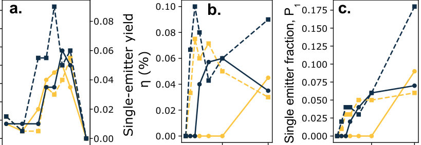
<figcaption class="paper-figure-caption"><b>Fig 2.</b> Figure 2: a. Single-emitter fraction and single-emitter yield as a function of annealing temperature for the Bi+/2+, and Sn+/2+ 200 ions/spot arrays. b. The single-emitter yield as a function of the dose for each species for the 900 ◦C sample. c. The single-emitter fraction for the same species and doses annealed at 900 ◦C.</figcaption>
</figure>
<figure class="paper-figure-card">
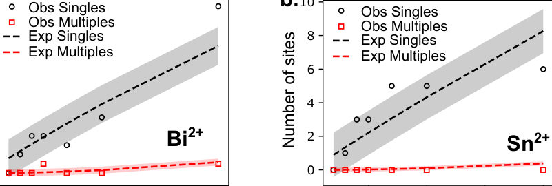
<figcaption class="paper-figure-caption"><b>Fig 3.</b> Figure 3: Numbers of single and multiple emitters as a function of dose for a. Bi2+ and b. Sn2+, with the expected number of sites given by a Poisson model in the low-dose regime shown as dashed lines with best-fit ˆα of Bi2+: (8.1±1.3)×10−4 emitters per ion and Sn2+: (4.5±0.9)×10−4 emitters per ion. The shaded bands in each plot represent the standard deviation of the residuals from each fit.</figcaption>
</figure>
<figure class="paper-figure-card">
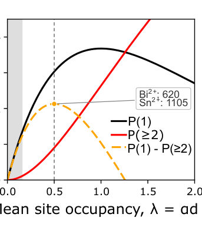
<figcaption class="paper-figure-caption"><b>Fig 4.</b> Figure 4: Modelled distributions (probability of dif- ferent numbers of emitters per spot) for multiple and single emitters as a function of the mean site occupancy (λ = αd). The difference distribution is also shown. The grey shaded region indicates the maximum extent of λ found in this work (λ = 0.16 for Bi2+). The peak in the difference distribution at λ = 0.5 corresponds to doses of 620 and 1105 ions/spot for Bi2+ and Sn2+, respectively.</figcaption>
</figure>
<figure class="paper-figure-card">
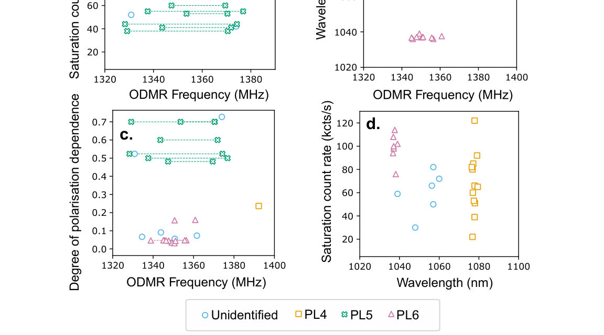
<figcaption class="paper-figure-caption"><b>Fig 5.</b> Figure 5: Pairwise scatter plots showing the correlations between different characterisation metrics. Each data point represents a single emitter in either the Bi+/2+ or Sn+/2+ in the 900 ◦C sample. Blue circles denote unidentified emitters, yellow squares PL4, green crosses PL5 and pink triangles PL6. a. Saturation count rate as a function of ODMR frequency. PL6 and PL5 centres form distinct clusters. Dashed lines connect the two ODMR frequencies of emitters with split resonances. These indicate hyperfine coupling to a nearby nuclear spin for the PL6 centres. b. ZPL wavelength as a function of ODMR frequency. No PL5 ZPLs were observed during this study. c. Degree of polarisation dependence...</figcaption>
</figure>

**Summary.** This research presents an efficient, scalable method to create and identify single photon emitters in 4H-SiC using maskless heavy-ion implantation. By combining implantation with a tiered characterization process—including photon correlation measurements and ODMR—the authors demonstrate high yields and rapid type identification at room temperature. This advances the feasibility of solid-state quantum technologies.

**Why it may be interesting.** This work directly addresses the hardware bottleneck in solid-state quantum emitters by providing a scalable, non-destructive, and rapid identification protocol, which is crucial for building quantum circuits.

Detailed structure

**Main problem.** The paper addresses the challenge of efficiently forming and rapidly identifying high-quality single photon emitters in silicon carbide (SiC) for use in scalable quantum technologies.

**Main result.** The authors demonstrated that maskless heavy-ion implantation combined with a tiered characterization scheme allows for the formation and rapid identification of single emitters, achieving yields up to 18% at optimal annealing temperatures.

**Method.** The methodology involves implanting heavy ions (Bi, Sn) into 4H-SiC, annealing the material, and then using a multi-step screening process involving PL mapping, photon correlation measurements ($g^{(2)}(	au)$), and ODMR spectroscopy.

**Model / system.** The physical system is single photon emitters (e.g., oxygen-vacancy related centers) embedded in 4H-SiC. The formation process is modeled using Poisson statistics to estimate the optimal implantation dose required to maximize the single-emitter yield.

**Key observables.** Second-order autocorrelation function ($g^{(2)}(	au)$), Photoluminescence (PL) spectra, Optically Detected Magnetic Resonance (ODMR) frequencies, and saturation count rates ($I_{	ext{sat}}$).

**Important parameters / regimes.** Optimal annealing temperature ($900–1000^\circ	ext{C}$); Single-emitter yield ($\eta$) up to $18\%$; Characteristic ODMR frequencies for different emitter types.

**Assumptions / limitations.** The identification relies on the assumption that the brightest emitters are above a fixed count rate threshold, and that the Poisson model accurately describes site occupancy.

**Figures summary.** Figures show PL maps confirming single emitter locations, and detailed spectra (PL and ODMR) comparing the signatures of different emitter types (PL5 vs PL6) and their saturation behavior.

**Paper structure.** The paper follows a structure detailing the implantation process, presenting the tiered characterization scheme (intensity threshold $
ightarrow g^{(2)}(	au) 
ightarrow$ spectral analysis), and concluding with quantitative results on yield and identification efficiency.

Abstract

Single photon emitters in silicon carbide (SiC) are a leading platform for scalable quantum technologies. Recent interest has focused on oxygen-vacancy-related emitters, which show exceptionally high optical brightness and strong spin readout contrast. One barrier to scalable quantum devices based on these emitters is the challenge of maskless formation and rapid identification. Here, we demonstrate the formation of isolated bright single emitters in 4H-SiC, using low-energy maskless implantation of heavy ions bismuth and tin. Following annealing, up to 18% of implanted sites host a single emitter, with optimal yields achieved at annealing temperatures of 900-1000 degrees C. Occupancy statistics are modelled to estimate the implantation dose that maximises single-emitter yield. We introduce a tiered characterisation scheme, where a simple intensity threshold isolates single-emitter candidates, confirmed through photon correlation measurements, after which correlations between polarisation, saturation count rate and magnetic resonance frequency assign emitter type. It is shown that time-consuming low-temperature spectroscopy is not necessary to distinguish emitter types. Together, maskless heavy-ion implantation and selective screening offer an efficient route to forming and rapidly identifying near-surface single emitters for room-temperature quantum technologies such as quantum sensing.

[↑ back to top](#top)

### [A Superconducting Phase Transition Single-Electron Transistor](http://arxiv.org/abs/2608.27045v1)

**Authors:** Gorka Aizpurua-Iraola, Thomas H. Swift, Felix-Ekkehard von Horstig, Domenic Prete, James Kirkman, Grayson M. Noah, Fabio Olivieri, Alberto Gomez-Saiz, M. Fernando Gonzalez-Zalba  
**Type:** experiment · **Category:** quantum information and computing · **PDF:** <https://arxiv.org/pdf/2608.27045v1>  
**Analysis basis:** full PDF text, analyzed in chunks
**Topic relevance:** 🔥 `QC/QI experiment` **4/5** · `quantum measurements` **3/5** · `driven-dissipative phase transition` **1/5**

↔ Scroll figures horizontally

<figure class="paper-figure-card">
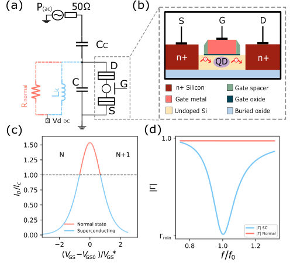
<figcaption class="paper-figure-caption"><b>Fig 1.</b> Figure 1. PTSET principle of operation. (a) Schematic view of the matching circuit with both TiN states: resis- tive state (red), superconducting state (blue). (b) Schematic cross-section of the SET showing a charged island at the silicon layer directly under the gate as well as the flow of the single-electron AC current (red arrows). (c) Simulated Coulomb oscillation: Normalized drain current to the crit- ical current of the superconductor thin film vs normalized gate-source voltage. (d) Calculated reflection coefficient |Γ| as a function of the frequency (normalized to the resonance frequency, f0) for both TiN thin film possible states: Super- conducting state (blue) and resistive state...</figcaption>
</figure>
<figure class="paper-figure-card">
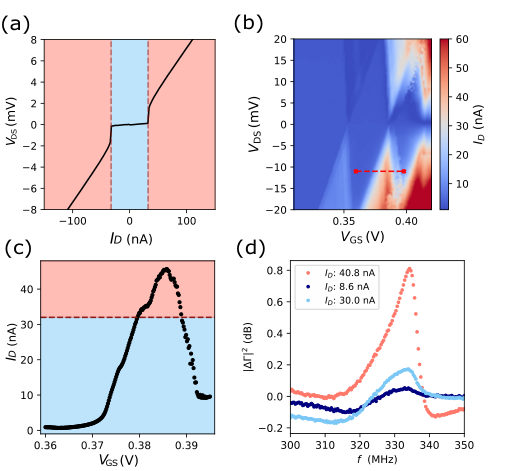
<figcaption class="paper-figure-caption"><b>Fig 2.</b> Figure 2. Circuit tuning of the PTSET. (a) Current- biased IV curve measurements of the TiN thin films taken at 0.6 T out-of plane field and VGS = 1 V, well in the on state of the transistor. A constant slope of 312 kΩ, 112 kΩasso- ciated with the on-state resistance of the FET and 200 kΩ with drain and source low-pass filters, is removed to highlight the superconducting region. Red and blue backgrounds repre- sent normal and superconducting states respectively. Vertical dashed lines indicate the phase transition current. (b) Drain current as a function of the gate-source and drain-source voltages, showing regions of charge stability, i.e. Coulomb diamonds. The horizontal red dashed line...</figcaption>
</figure>
<figure class="paper-figure-card">
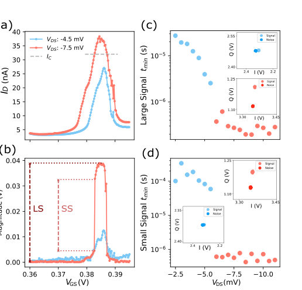
<figcaption class="paper-figure-caption"><b>Fig 3.</b> Figure 3. PT-SET SNR characterization. (a) Coulomb blockade oscillation plot: Drain current as a function of the applied gate voltage for -7.5 mV (red) and -4.5 mV( blue) DS bias. (b) Magnitude of the reflected rf voltage as a function of applied gate-source voltage for -7.5 mV (red) and -4.5 mV (blue) DS bias cases. The vertical dashed lines represent our definition of large and small signal regimes, where the charge sensing is mimicked by a VGS shift larger or smaller than the linewidth of the Coulomb peak, respectively. For the small signal regime, we take points separated by VGS = 467 µV. (c,d) Minimum integration time versus DS voltage in the large signal and small signal regime,...</figcaption>
</figure>
<figure class="paper-figure-card">
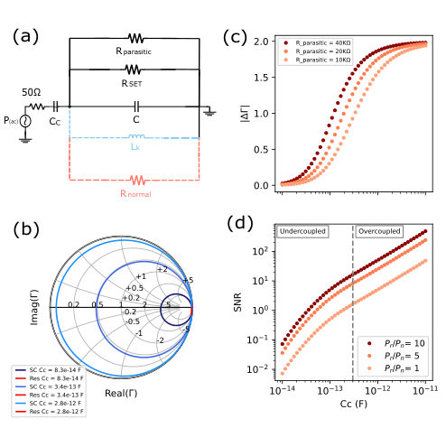
<figcaption class="paper-figure-caption"><b>Fig 4.</b> Figure 4. Theoretical SNR limits (a) The schematic model of the matching circuit with both TiN behaviour possibilities: resistive state (red), superconducting state (blue). (b) Smith chart for S parameter simulations in both resistive and su- perconducting models, for three different CC values. (c) Re- flection coefficient magnitude change from superconducting to resistive state as a function of CC , for three different Rparasitic values. (d) SNR as a function of CC for several Pr/Pnoise ra- tios and Rparasitic = 20 kΩ. The vertical line marks the CC value in which the circuit is critically coupled.</figcaption>
</figure>

**Summary.** This paper introduces the Phase-Transition Single-Electron Transistor (PTSET) as a novel, highly sensitive charge sensor for semiconductor spin qubits. By exploiting the abrupt impedance change during a superconducting-to-normal phase transition, the device achieves significant sensitivity enhancements over existing readout technologies. This establishes a promising, integrated route for next-generation quantum computing hardware.

**Why it may be interesting.** The work directly addresses a critical component of quantum computing infrastructure—high-fidelity, low-power readout electronics—by coupling quantum measurement principles to superconducting phenomena.

Detailed structure

**Main problem.** The paper addresses the need for ultrasensitive, integrated charge sensors to improve qubit state detection in semiconductor spin qubits.

**Main result.** The Superconducting Phase Transition Single-Electron Transistor (PTSET) demonstrates sensitivity improvements of one to two orders of magnitude over conventional rfSETs.

**Method.** The authors measured the change in reflected power ($\Delta\Gamma$) as the SET current forces a superconducting-to-normal phase transition in an integrated circuit.

**Model / system.** The system is a PTSET, integrating a Single-Electron Transistor (SET) with a superconducting inductor whose state changes abruptly when the bias current exceeds the critical current ($I_c$).

**Key observables.** Change in reflected power ($\Delta\Gamma$), minimum integration time ($t_{\min}$), and Signal-to-Noise Ratio (SNR).

**Important parameters / regimes.** Critical current ($I_c$), coupling capacitance ($C_C$), and the ratio of signal to noise power.

**Assumptions / limitations.** The analysis assumes certain conditions for noise power and approximates the SET resistance in the 'on' state for theoretical modeling.

**Figures summary.** Figures illustrate the PTSET principle, showing the superconducting vs. normal state impedance change; they also plot SNR vs. coupling capacitance and $t_{\min}$ vs. bias voltage, demonstrating the enhancement.

**Paper structure.** The paper establishes the physical principle of PTSET, demonstrates the enhanced sensing capability through measurements of $\Delta\Gamma$ and $t_{\min}$, and theoretically quantifies the resulting SNR improvement over standard rfSETs.

Abstract

Quantum computers require fast and accurate methods for qubit state detection. Phase-transition sensors exploit the abrupt change between two physical states of a material to achieve enhanced sensitivity and have enabled advanced detectors for quantum technologies, such as superconducting nanowire single-photon detectors. However, this sensing principle has not yet been applied to semiconductor spin qubits. Here, we demonstrate a superconducting phase-transition radio-frequency single-electron transistor (PTSET), a charge sensor for semiconductor spin qubits whose response is enhanced by a superconducting-to-normal phase transition. The transition is engineered by linking the sensor current to a low-critical-current, high-kinetic-inductance inductor integrated into the radio-frequency matching network. We demonstrate improvements in sensitivity of one and two orders of magnitude over conventional rfSETs in the large- and small-signal regimes, respectively. Our results establish phase-transition sensing as a route towards ultrasensitive, integrated charge sensors for semiconductor quantum computing and point to broader applications, including cryogenic photon detection for radio astronomy.

[↑ back to top](#top)

### [Detuning- and Stark-robust Rydberg gates](http://arxiv.org/abs/2608.27426v1)

**Authors:** Elie Bataille, Gyohei Nomura, Manuel Endres  
**Type:** theory · **Category:** other · **PDF:** <https://arxiv.org/pdf/2608.27426v1>  
**Analysis basis:** full PDF text, analyzed in chunks
**Topic relevance:** 🔥 `Rydberg arrays` **4/5** · `QC/QI experiment` **2/5** · `Keldysh / 2PI / non-Gaussian methods` **1/5** · `analog quantum simulation` **1/5**

↔ Scroll figures horizontally

<figure class="paper-figure-card">
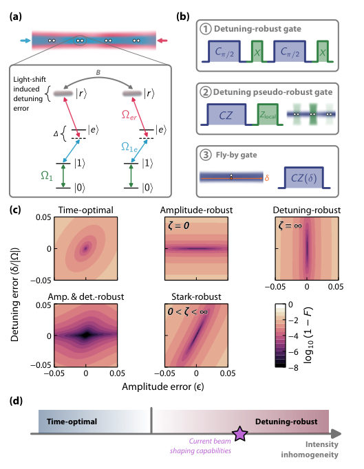
<figcaption class="paper-figure-caption"><b>Fig 1.</b> FIG. 1. Overview of the physical setup and results. (a) Two-atom level structure for two-photon Rydberg exci- tation, with Rydberg blockade B. The inhomogeneous laser intensity results in inhomogeneous light shifts, which induce detrimental detuning errors. (b) Protocols introduced in this work. Top: robust gates with composite (shown) or si- multaneous (not shown) Rydberg and single-qubit control. Middle: pseudo-robust gates, where known detuning errors are mapped to correctable single-qubit errors. Bottom: fly- by gate, tailored to a fixed, calibrated differential Doppler shift. (c) Infidelity under static amplitude and detuning er- rors for the time-optimal gate [27, 28], the...</figcaption>
</figure>
<figure class="paper-figure-card">
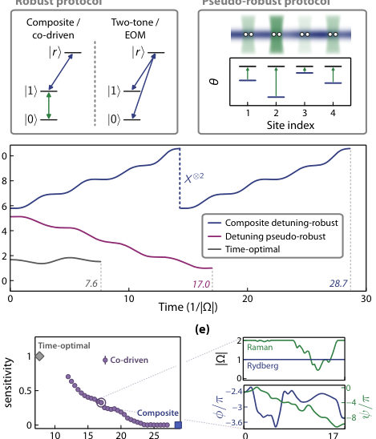
<figcaption class="paper-figure-caption"><b>Fig 2.</b> FIG. 2. Detuning-robust and pseudo-robust protocols. (a) Level diagram for the robust protocols, realized by driving both the qubit and Rydberg transitions, or by using a two- tone Rydberg scheme. (b) Schematic of the pseudo-robust protocol, where detuning errors are not suppressed but con- verted into correctable single-qubit errors. (c) Phase mod- ulation waveforms and gate durations for the time-optimal protocol [27, 28], the composite detuning-robust gate, and the detuning pseudo-robust gate. (d) Required gate duration to achieve a given detuning error sensitivity reduction with the co-driven protocol, compared with the time-optimal gate and the composite detuning-robust gate. (e)...</figcaption>
</figure>
<figure class="paper-figure-card">
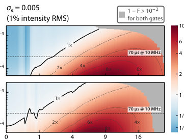
<figcaption class="paper-figure-caption"><b>Fig 3.</b> FIG. 3. Stark-robust and pseudo-robust protocols. (a) Minimal gate duration for composite Stark-robust and Stark pseudo-robust protocols with correlation ζ. At ζ →∞the protocols converge to their detuning-robust versions. (b) Ra- tio of expected infidelity from the time-optimal gate to that of the robust and pseudo-robust protocol depending on ζ and the normalized Rydberg decay rate Γr/|Ω|, for a Gaussian- distributed static relative intensity error with 1% RMS. Re- gions where none of the three protocols achieves F &gt; 1−10−2</figcaption>
</figure>
<figure class="paper-figure-card">
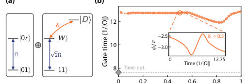
<figcaption class="paper-figure-caption"><b>Fig 4.</b> FIG. 4. Fly-by gate protocol. (a) Level diagram for the fly-by gate with differential detuning δ−. The detuning intro- duces a coupling to the Rydberg dark state |D⟩. (b) Required gate time for a fly-by gate depending on the differential de- tuning δ−/|Ω| and example phase modulation waveform at δ−/|Ω| = 1/2 (inset). The discontinuity between δ−= 0 and δ−&gt; 0 relaxes into a sharp but continuous gate time increase when the infidelity threshold is loosened.</figcaption>
</figure>

**Summary.** This paper develops novel, robust protocols for Rydberg entangling gates in neutral atoms that overcome the inherent limitations of conventional designs regarding light-shift detuning errors. By modifying the gate dynamics to involve both qubit states, the authors achieve error cancellation or conversion into correctable single-qubit errors. This advances the feasibility of high-fidelity quantum computation using Rydberg excitations.

**Why it may be interesting.** This work directly addresses the primary bottleneck in scaling Rydberg quantum computing: error mitigation. By providing theoretically derived, robust gate protocols, it offers concrete pathways for improving gate fidelity in neutral atom quantum simulators and processors.

Detailed structure

**Main problem.** Conventional Rydberg entangling gates suffer from adverse scaling of light-shift-induced detuning errors, and existing protocols cannot achieve robustness against these errors.

**Main result.** The authors demonstrate new gate constructions that achieve full or partial robustness to detuning and Stark errors by involving both qubit states in the gate dynamics. These protocols can outperform time-optimal gates in specific noise regimes.

**Method.** The work analyzes the gate fidelity under noise using advanced theoretical techniques, including defining robustness criteria by setting second derivatives of fidelity to zero, and comparing error scaling between different protocols.

**Model / system.** The system involves neutral alkali atoms used for quantum computing, where entanglement is generated via Rydberg gates driven by two-photon transitions. The analysis uses a block-diagonal Hamiltonian considering couplings between $|0
angle, |1
angle$, and the Rydberg state $|r
angle$.

**Key observables.** Gate fidelity, residual sensitivity measures ($S_\epsilon, S_\delta$), and the error scaling relative to noise strength ($\sigma_\delta$).

**Important parameters / regimes.** Light-shift strength, intensity inhomogeneity, Rydberg decay rate, and the ratio $\zeta_{ij}$ quantifying intensity-to-detuning error conversion.

**Assumptions / limitations.** The analysis assumes the Rabi frequency is kept at its maximum value ($\Omega = \Omega_{	ext{max}}$) and treats errors as quasi-static (Gaussian) for some parts of the analysis.

**Figures summary.** Figures compare gate infidelity across various protocols (time-optimal vs. robust) under static errors, and show the parameter regimes where the new robust protocols outperform existing methods.

**Paper structure.** The paper first establishes the limitations of conventional gates, then introduces a general framework involving both qubit states. It presents two robust constructions (error cancellation/conversion) and analyzes the performance regimes, concluding with the demonstration of a 'fly-by' gate primitive.

Abstract

Rydberg entangling gates driven by a two-photon transition in alkali atoms suffer from an adverse scaling of light-shift-induced errors. Robustness to such detuning errors is known to be impossible to achieve in the design of conventional Rydberg gate protocols, where only one of the qubit states is coupled to the Rydberg state. Here, we show that in a more general framework, in which both qubit states take part in the gate, full or partial robustness to these errors can be realized. We present two gate constructions, which either cancel the errors outright or convert them into single-qubit errors that can be corrected locally. We map the regimes -- in terms of light-shift strength, intensity inhomogeneity, and Rydberg decay rate -- in which these protocols outperform the widely used time-optimal Rydberg gate, and find that they already include the conditions of state-of-the-art experiments. Finally, we show the existence of a Rydberg `fly-by' entangling gate, an important primitive for an emerging class of neutral-atom quantum computing architectures.

[↑ back to top](#top)

### [Detuning-robust Rydberg entangling gates from echoed pulses](http://arxiv.org/abs/2608.26446v1)

**Authors:** Zhubing Jia, Yichao Yu, Xiye Hu, Lintao Li, Jacob Zheng, Christopher Monroe, Jacob P. Covey  
**Type:** theory · **Category:** other · **PDF:** <https://arxiv.org/pdf/2608.26446v1>  
**Analysis basis:** full PDF text, analyzed in chunks
**Topic relevance:** 🔥 `Rydberg arrays` **4/5** · `QC/QI experiment` **2/5** · `analog quantum simulation` **1/5**

↔ Scroll figures horizontally

<figure class="paper-figure-card">
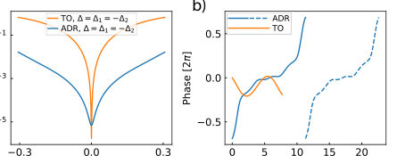
<figcaption class="paper-figure-caption"><b>Fig 1.</b> Figure 2. (a) Simulated gate infidelity under anti-symmetric two-atom detuning (∆1 = −∆2 = ∆) for the ADR and TO pulses. (b) Optimized phase profiles of the ADR and TO pulses, with ΩτTO = 7.695 and Ωτ√</figcaption>
</figure>
<figure class="paper-figure-card">
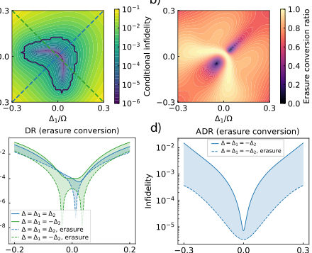
<figcaption class="paper-figure-caption"><b>Fig 2.</b> Figure 4. (a)(b) Conditional infidelity and erasure conversion ratio of the DR pulse of Fig. 3(c) under two-atom detuning, assuming complete conversion of residual Rydberg popula- tion into erasures. The contour encloses the region of sim- ulated conditional fidelity above 99.9%. The shapes of the high-conversion-ratio and high-conditional-fidelity regions are particular to this pulse solution and are not a generic feature of the robust-pulse construction. (c) Infidelity along the sym- metric and antisymmetric diagonals of (a), before (solid) and after (dashed) erasure conversion. (d) Infidelity of the ADR pulse of Fig. 2(b) under anti-symmetric detuning, before and after erasure conversion.</figcaption>
</figure>
<figure class="paper-figure-card">
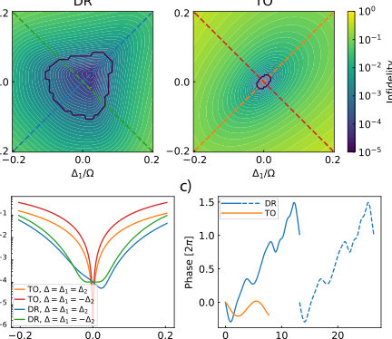
<figcaption class="paper-figure-caption"><b>Fig 3.</b> Figure 3. (a) Simulated gate infidelity as a function of the two-atom detunings ∆1 and ∆2 for the DR (left) and TO (right) pulses. Contours enclose the region of simulated fi- delity above 99.9%. (b) Infidelity along the symmetric (∆1 = ∆2) and antisymmetric (∆1 = −∆2) diagonals of (a); the leading-order response to detuning is removed for the DR pulse along both directions. (c) Optimized phase profiles of the DR and TO pulses with ΩτTO = 7.695 and Ωτ√</figcaption>
</figure>

**Summary.** This paper presents a novel, detuning-robust scheme for implementing two-qubit entangling gates using Rydberg atoms in neutral atom arrays. By designing specialized, echoed pulse sequences, the authors circumvent fundamental limitations in gate design, achieving high fidelity even when the laser frequency or intensity deviates significantly from the ideal calibration point. This significantly improves the feasibility of using neutral atoms for practical, fault-tolerant quantum computation.

**Why it may be interesting.** This work directly addresses the practical limitations of implementing quantum gates using neutral atoms, providing concrete pulse engineering techniques to enhance robustness against common experimental imperfections like frequency drift and intensity inhomogeneity.

Detailed structure

**Main problem.** The primary challenge is designing Rydberg entangling gates that are robust to detuning errors, overcoming the theoretical limitation that no simple pulse can make a controlled-Z gate first-order insensitive to detuning.

**Main result.** The authors propose an echoed pulse sequence that achieves a maximally-entangling ZZ gate with no leading-order response to arbitrary detunings, maintaining high fidelity ($<10^{-3}$) over a wide detuning range.

**Method.** The method involves using quantum optimal control and perturbation theory to design pulse shapes that cancel out leading-order detuning errors, supplemented by an echo sequence to remove residual single-qubit phase errors.

**Model / system.** The system utilizes neutral atoms trapped in optical tweezer arrays, employing Rydberg states to mediate two-qubit interactions. The analysis involves modeling the Hamiltonian under various detuning conditions ($\Delta_1, \Delta_2$) and optimizing the pulse sequence.

**Key observables.** Gate fidelity ($F$), infidelity as a function of detuning ($\Delta$), and the residual Rydberg population leakage.

**Important parameters / regimes.** Detuning ($\Delta$), Rabi frequency ($\Omega$), and the ratio of detuning to Rabi frequency ($\Delta/\Omega$).

**Assumptions / limitations.** The analysis relies on first-order perturbation theory, and it assumes that residual Rydberg population leakage can be converted into heralded erasures for fault-tolerant analysis.

**Figures summary.** Figures illustrate the level scheme and circuit diagram for the gate, showing error channels under various detunings. Other figures compare simulated gate infidelity for different pulse types (TO vs. ADR/DR) across detuning ranges and show the physical constraints on pulse shaping (modulation frequency).

**Paper structure.** The paper progresses from identifying the detuning robustness problem to developing the theoretical framework using perturbation theory and optimal control. It details the specific pulse sequence (echoed $\sqrt{CZ}$) and analyzes its performance under symmetric, anti-symmetric, and arbitrary detunings, concluding with discussions on physical constraints like bandwidth.

Abstract

Rydberg-based two-qubit gate fidelities in neutral atom arrays are limited chiefly by laser intensity inhomogeneity and by detuning errors from frequency miscalibration, background-field drift, intermediate state light shift and Doppler shifts. Quantum optimal control can suppress the former, but no pulse can render a controlled-Z gate first-order insensitive to detuning. Here we show that this obstruction can be circumvented by designing Rydberg gate pulses with every leading-order detuning error relegated to single-qubit Z-rotations, which an echoed sequence removes. The resulting maximally-entangling ZZ gate has no leading-order response to arbitrary detunings on either atom, maintaining an infidelity below $10^{-3}$ much wider range of single-atom detunings than previous gate designs. We further show that a large fraction of residual error is dominated by population outside the computational subspace, which can be converted into heralded erasures. Our results significantly reduce the requirements on laser frequency stability and intensity homogeneity, field calibration and atomic temperature toward practical fault-tolerant quantum computing with neutral atoms.

[↑ back to top](#top)

### [Least Variable Quantum Counting Processes](http://arxiv.org/abs/2608.26240v1)

**Authors:** Bita Olamaei, Florian Meier, Costantino Budroni, Pharnam Bakhshinezhad, Giuseppe Vitagliano  
**Type:** theory · **Category:** statistical mechanics · **PDF:** <https://arxiv.org/pdf/2608.26240v1>  
**Analysis basis:** full PDF text, analyzed in chunks
**Topic relevance:** 🔥 `quantum measurements` **4/5** · `Full counting statistics` **3/5**

↔ Scroll figures horizontally

<figure class="paper-figure-card">
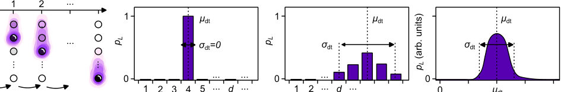
<figcaption class="paper-figure-caption"><b>Fig 1.</b> FIG. 1. Conceptual overview of the setup. (a) Discrete-time evolution of a finite-dimensional quantum system is considered. The waiting time probability distribution is shown as a function of the number of timesteps L in the panels b-d. (b) For memory size d, any number of counts up and including d can be deterministically counted. (c) For a mean tick time µdt strictly greater than d, the tick distribution necessarily becomes probabilistic. (d) In the limit of µdt →∞, the discrete-time process converges to a continuous-time one with continuous waiting time distribution.</figcaption>
</figure>
<figure class="paper-figure-card">
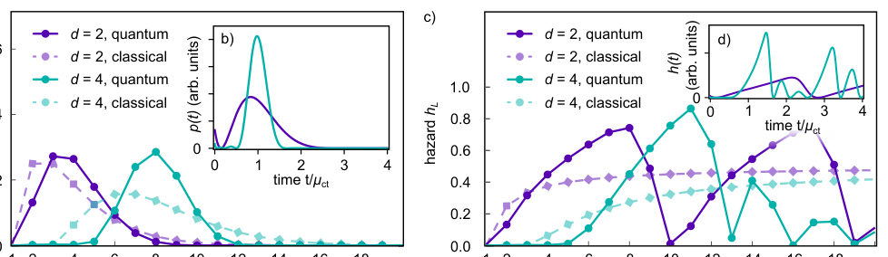
<figcaption class="paper-figure-caption"><b>Fig 2.</b> FIG. 2. First-tick statistics of an optimized discrete-time quantum counting process. (a) First-tick distribution pL = fL−1 −fL, shown as a function of the discrete waiting time L. The coherent dynamics concentrates most of the probability in a narrow interval around the prescribed mean µdt, here chosen to be µdt = 2d. (b) The inset shows the continuous-time waiting time distribution p(t). (c) Corresponding hazard hL = 1 −fL/ fL−1. The hazard remains suppressed during the initial no-tick evolution and rises sharply when the conditioned state reaches the detector direction. (d) The inset shows the hazard h(t) for continuous-time.</figcaption>
</figure>
<figure class="paper-figure-card">
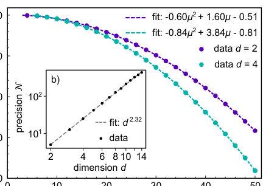
<figcaption class="paper-figure-caption"><b>Fig 3.</b> FIG. 3. Optimized cost and continuous-time accuracy. (a) Minimum discrete-time cost CFopt d (µdt) as a function of the prescribed mean first-tick time for different Hilbert-space dimensions d. Negative val- ues violate the classical d-state variance bound. At large µdt, the op- timized curves approach the continuous-time regime. (b) Relative precision N = µ2 ct/σ2 ct of the optimized continuous-time processes as a function of d, on logarithmic axes. The dashed line is a finite- size power-law fit Nopt ∝dα, with α ≃7/3. Because the general asymptotic bound of Ref. [31] is quadratic in d, this exponent should be understood as an effective scaling over the numerically accessible range and...</figcaption>
</figure>
<figure class="paper-figure-card">

<figcaption class="paper-figure-caption"><b>Fig 4.</b> FIG. 4. Illustration of the hazard-based lower bound on the discrete- time cost function, CFd ≥2dµdt/hmax −(d + 1)µ2 dt. At fixed d and µdt, a uniformly smaller maximal hazard forces a larger weighted survival tail and therefore a larger cost. The shaded region visualizes the forbidden region implied by the bound.</figcaption>
</figure>
<figure class="paper-figure-card">
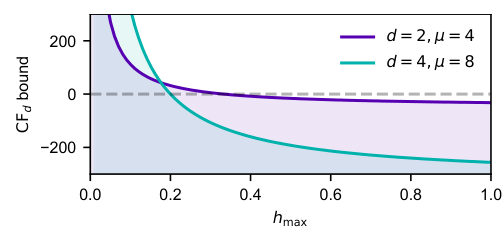
<figcaption class="paper-figure-caption"><b>Fig 5.</b> Figure 4 illustrates the resulting constraint imposed by the maximal hazard. For fixed dimension d and mean waiting time µdt, a smaller value of hmax raises the lower bound in Eq. (36).</figcaption>
</figure>

**Summary.** This paper establishes a quantum advantage in the temporal precision of counting processes when memory is finite. By deriving rigorous variance bounds for classical counting processes, the authors show that quantum dynamics can surpass these classical limits. This work connects discrete-time quantum measurement theory to continuous-time quantum timekeeping.

**Why it may be interesting.** This work directly addresses quantum timekeeping and the fundamental limits of measurement precision, which is highly relevant to quantum optics and open quantum systems theory.

Detailed structure

**Main problem.** The paper investigates the fundamental limits on temporal precision (tick timing) when counting stochastic events using finite memory resources, comparing classical and quantum constraints.

**Main result.** Quantum counting processes can achieve smaller first-tick fluctuations than any classical process with the same memory size and mean tick time, establishing a finite-memory quantum advantage in temporal precision.

**Method.** The authors derive rigorous finite-memory variance bounds for classical counting processes and use numerical optimization and asymptotic analysis to identify quantum processes that violate these classical bounds.

**Model / system.** The model involves finite-dimensional classical and quantum counting processes, described by substochastic transition matrices or quantum instruments/Kraus operators, respectively. The analysis covers both discrete-time and continuous-time limits.

**Key observables.** Variance ($\sigma^2_{dt}$), first-tick probability ($p_L$), hazard rate ($h_L$), and the relative precision measure ($N = \mu^2_{ct} / \sigma^2_{ct}$).

**Important parameters / regimes.** Memory dimension ($d$), mean tick time ($\mu_{dt}$), and the asymptotic limit ($\mu_{dt} 	o \infty$ or $\delta 	o 0^+$).

**Assumptions / limitations.** The analysis assumes autonomous machines operating cyclically (renewal processes) and utilizes approximations for large mean times and small time steps ($\delta$).

**Figures summary.** Figures illustrate the conceptual overview of discrete-time evolution, the waiting time probability distribution for various memory sizes, and the comparison of quantum vs. classical statistics.

**Paper structure.** The paper develops the classical variance bound, identifies quantum violations via numerical optimization, and then analyzes the asymptotic continuous-time limit, culminating in an analytical solution for the qubit case ($d=2$).

Abstract

Counting processes provide a fundamental description of stochastic events ranging from photon detection to clock ticks. A central question is how accurately such events can be timed when only finite memory resources are available. Here, we investigate this problem within a general framework of finite-dimensional classical and quantum counting processes. We derive a rigorous finite-memory variance bound obeyed by every classical $d$-state counting process, which is tight and saturated by a discrete Erlang-type ladder process. Through numerical optimization, we identify quantum counting processes that violate this classical bound, achieving smaller first-tick fluctuations than any classical process with the same memory size and mean tick time. For the qubit case, we further derive an analytical large-mean bound within a single-Kraus no-tick family, showing that the quantum advantage persists asymptotically within this class. The optimized quantum processes exhibit coherent conditioned dynamics and approach a continuous-time quantum-jump description as the mean increases. Our results establish a finite-memory quantum advantage in temporal precision and connect discrete-time counting processes with continuous-time quantum timekeeping.

[↑ back to top](#top)

### [Real-Space Analysis of Two-Photon Polarization States in Type-II SPDC for High-Purity Polarization Entanglement](http://arxiv.org/abs/2608.26499v1)

**Authors:** Koji Taninaka, Takashi Kakue, Ken Morita  
**Type:** both · **Category:** other · **PDF:** <https://arxiv.org/pdf/2608.26499v1>  
**Analysis basis:** full PDF text, analyzed in chunks
**Topic relevance:** 🔥 `quantum optics experiment` **4/5** · `interference shaping light` **3/5**

↔ Scroll figures horizontally

<figure class="paper-figure-card">
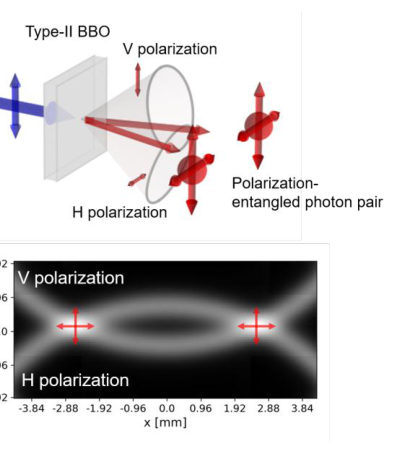
<figcaption class="paper-figure-caption"><b>Fig 1.</b> Fig. 1. (a) Schematic illustration of Type-II SPDC in a BBO crystal. Polarization-entangled photon pairs are generated in the overlap regions (A and B) of the signal and idler emission cones. (b) Calculated momentum-space intensity distributions of the signal and idler photons. (c) Calculated real-space intensity distributions evaluated at an observation plane located 10 cm from the crystal output surface. The calculations were performed for an optic-axis angle of 𝜃= 41.8∘, a pump wavelength of 𝜆𝑝= 405 nm, signal and idler wavelengths of 𝜆𝑠,𝑖= 810 nm, and a crystal length of 𝐿= 2 mm.</figcaption>
</figure>
<figure class="paper-figure-card">
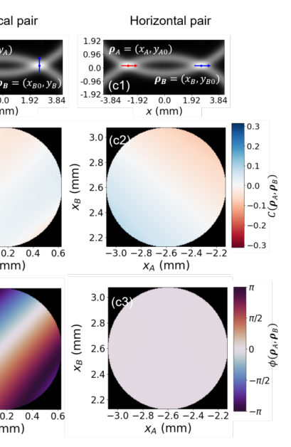
<figcaption class="paper-figure-caption"><b>Fig 2.</b> Fig. 2. Spatial distributions of the amplitude-balance parameter 𝐶(𝝆𝐴, 𝝆𝐵) and the relative phase 𝜙(𝝆𝐴, 𝝆𝐵) calculated from the real-space biphoton wavefunction. (a1) Analysis region 𝝆𝐵 (blue) for a fixed photon position 𝝆𝐴0 (red) located at the center of the overlap region of the two SPDC rings. (a2) Spatial distribution of 𝐶(𝝆𝐴0,𝝆𝐵) . (a3) Spatial distribution of 𝜙(𝝆𝐴0,𝝆𝐵) . (b1) Analysis region corresponding to 𝝆𝐴= (𝑥𝐴0, 𝑦𝐴) and 𝝆𝐵= (𝑥𝐵0, 𝑦𝐵), where 𝑥𝐵0 = −𝑥𝐴0. (b2) Spatial distribution of 𝐶(𝑥𝐴0,𝑦𝐴, 𝑥𝐵0, 𝑦𝐵). (b3) Spatial distribution of 𝜙(𝑥𝐴0, 𝑦𝐴, 𝑥𝐵0, 𝑦𝐵) . (c1) Analysis region corresponding to 𝝆𝐴= (𝑥𝐴, 𝑦𝐴0) and 𝝆𝐵= (𝑥𝐵, 𝑦𝐵0), where 𝑦𝐴0 = 𝑦𝐵0. (c2) Spatial distribution of 𝐶(𝑥𝐴, 𝑦𝐴0,...</figcaption>
</figure>
<figure class="paper-figure-card">

<figcaption class="paper-figure-caption"><b>Fig 3.</b> Figure 3(a) shows the calculated results for circular and elliptical apertures. The horizontal axis represents the brightness normalized to that obtained with the largest aperture, and the vertical axis represents the calculated 𝑆. The blue solid curve represents the results for circular apertures with different diameters, whereas the orange solid curve represents the results for elliptical apertures with a fixed length along the major axis (𝑥-direction) and a variable length along the minor axis (𝑦-direction). The red triangle and green circle in Fig. 3(a) correspond to the equal-area aperture configurations shown in Figs. 3(b) and 3(c), respectively. As the aperture size increases, the...</figcaption>
</figure>
<figure class="paper-figure-card">
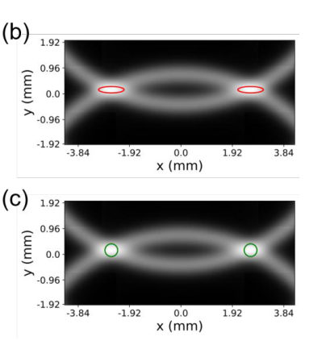
<figcaption class="paper-figure-caption"><b>Fig 4.</b> Fig. 3. Relationship between brightness and the 𝑆 parameter for different real-space aperture geometries. (a) Calculated 𝑆 for circular and elliptical apertures. The horizontal axis represents the brightness normalized to the value obtained with the largest circular aperture, whereas the vertical axis represents the calculated 𝑆. The blue curve corresponds to varying the diameter of the circular aperture, while the orange curve corresponds to varying the 𝑦-axis length of the elliptical aperture with the 𝑥-axis length fixed. The red triangle and green circle indicate the aperture configurations shown in (b) and (c), respectively.</figcaption>
</figure>
<figure class="paper-figure-card">
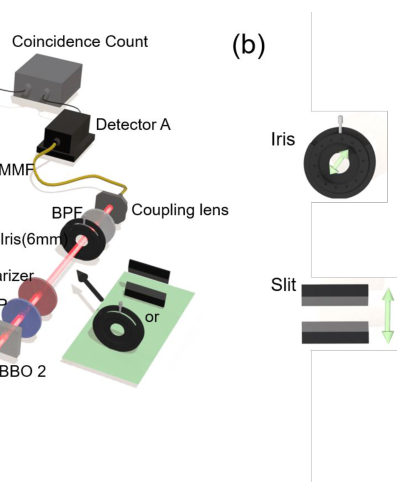
<figcaption class="paper-figure-caption"><b>Fig 5.</b> Fig. 4. Experimental setup and aperture geometries used to investigate the effect of aperture geometry on polarization entanglement. (a) Experimental setup. Photon pairs generated by Type-II SPDC are transmitted through either a circular aperture (iris) or a slit aperture before being coupled into multimode fibers and detected by Si avalanche photodiodes. The Bell parameter is evaluated from coincidence counts between detectors A and B. A band-pass filter (BPF, 810 nm center wavelength, 10 nm bandwidth) is used to select photon pairs centered at 810 nm. (b) Circular iris and slit apertures used for the measurements.</figcaption>
</figure>

**Summary.** This paper investigates how the geometry of photon collection apertures affects the quality of polarization entanglement generated via Type-II SPDC. By analyzing the real-space biphoton wavefunction, the authors demonstrate that restricting collection along specific spatial directions maximizes entanglement purity while maintaining high photon flux. This establishes a practical method for designing superior entangled-photon sources.

**Why it may be interesting.** This work provides a concrete, actionable design principle for optimizing quantum light sources by linking the fundamental quantum state structure (real-space wavefunction) directly to practical optical components (apertures).

Detailed structure

**Main problem.** The study aims to optimize the collection geometry for Type-II SPDC sources to simultaneously achieve high polarization-entanglement purity and high photon-pair collection efficiency.

**Main result.** Designing apertures based on the real-space biphoton wavefunction, specifically by restricting collection along the direction of strong polarization-position correlation, improves the trade-off between entanglement purity and brightness.

**Method.** The authors calculated the real-space two-photon wavefunction and analyzed its spatial dependence to guide the design of apertures, which were then tested through both numerical simulations and physical measurements.

**Model / system.** The system is Type-II Spontaneous Parametric Down-Conversion (SPDC) using a BBO crystal, generating polarization-entangled photon pairs. The analysis relies on the complex coupling between spatial and polarization degrees of freedom due to birefringence.

**Key observables.** CHSH Bell parameter (S) for entanglement purity, coincidence count rate (Brightness), Amplitude Balance (C), and Relative Phase ($\phi$).

**Important parameters / regimes.** Aperture shapes (circular vs. slit/elliptical), and the spatial correlation direction derived from the biphoton wavefunction.

**Assumptions / limitations.** The theoretical model assumes monochromatic pump, signal, and idler photons, which is noted as a potential source of discrepancy with the experimental results.

**Figures summary.** Figures illustrate the spatial dependence of entanglement diagnostics (C and $\phi$) and compare the Bell parameter (S) versus brightness for different aperture shapes (circular vs. slit), showing the slit's advantage.

**Paper structure.** The paper progresses from establishing the theoretical framework using the real-space wavefunction to analyzing the spatial dependence of entanglement diagnostics, culminating in experimental comparisons between different aperture geometries to validate the design principle.

Abstract

Spontaneous parametric down-conversion (SPDC) is one of the most widely used sources of polarization-entangled photon pairs, and understanding the generated biphoton state is essential for realizing high-brightness and high-purity entangled-photon sources. In particular, Type-II SPDC produces a biphoton wavefunction with a complex coupling between the spatial and polarization degrees of freedom owing to birefringence. In this study, we calculate the real-space distribution of the two-photon polarization state from the biphoton wavefunction of Type-II SPDC generated in a \b{eta}-barium borate (BBO) crystal. By identifying the spatial correlation direction between polarization and real-space coordinates, we designed aperture shapes that restrict the collection along this correlation direction. Through both numerical simulations and experiments, we demonstrate that such correlation-aligned apertures simultaneously achieve higher entanglement purity and improved photon collection efficiency. These results establish a practical design principle for optimizing aperture geometries based on the real-space biphoton wavefunction, providing a new approach to realizing high-purity and high-brightness SPDC entangled-photon sources.

[↑ back to top](#top)

### [The heavy Fermi polaron I: the Lithium-Cesium experiment](http://arxiv.org/abs/2608.27322v1)

**Authors:** Michael Rautenberg, Tobias Krom, Eleonora Lippi, Lauriane Chomaz, Matthias Weidemüller  
**Type:** experiment · **Category:** quantum gases · **PDF:** <https://arxiv.org/pdf/2608.27322v1>  
**Analysis basis:** full PDF text, analyzed in chunks
**Topic relevance:** 🔥 `analog quantum simulation` **4/5** · `Keldysh / 2PI / non-Gaussian methods` **1/5** · `quantum measurements` **1/5**

↔ Scroll figures horizontally

<figure class="paper-figure-card">
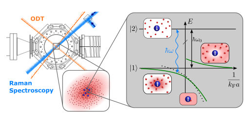
<figcaption class="paper-figure-caption"><b>Fig 1.</b> FIG. 1. Left: Major components of the experimental setup (final optical dipole trap, ODT, and two co-propagating Ra- man spectroscopy beams) and schematic representation of the resulting sample (bottom left) of a few Cs impurities (blue) in a dense quantum degenerate Fermi sea of Li (red). Right box: Level scheme relevant for the spectroscopy using two internal impurity states. The impurity Cs|1⟩state features tunable interactions with the surrounding bath atoms and forms a polaron, whereas the effectively non-interacting Cs|2⟩state serves as a reference state. Depending on the impurity-bath interaction parameter 1/(kFa), the system can either be in the attractive (negative energies) or...</figcaption>
</figure>
<figure class="paper-figure-card">
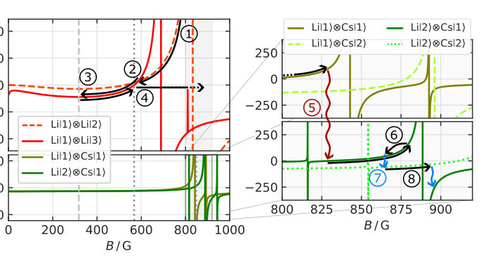
<figcaption class="paper-figure-caption"><b>Fig 2.</b> FIG. 2. Magnetic field dependence of intra- (upper panel) and interspecies (lower panel) interactions relevant for the sample preparation parametrized by their respective s-wave scattering lengths a. The gray dashed line marks the magnetic field where the Li|1⟩-Li|3⟩[32] mixture is evaporated, whereas the gray dotted line marks the field where Li|1⟩-Li|3⟩interactions vanish. A detailed view around the Li|2⟩-Cs|1⟩Feshbach resonance close to 888.6 G used for the polaron spectroscopy is presented on the right-hand side. The upper panel shows the Li|1⟩-Cs scattering lengths, whereas the lower panel contains those of Li|2⟩-Cs. Black arrows indicate magnetic field ramps during sample preparation...</figcaption>
</figure>
<figure class="paper-figure-card">
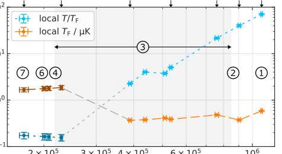
<figcaption class="paper-figure-caption"><b>Fig 3.</b> FIG. 3. Local Fermi temperature TF and ratio of temperature to TF as a function of the number of Li atoms (per spin state, where applicable) over the experimental sequence. Note that time t runs from right to left as indicated by the arrows at the top. The circled numbers correspond to the preparation steps in Fig. 2, and the shaded region marks the evaporation at 320 G. The darker (lighter) colored points refer to Li in the final trap (DT).</figcaption>
</figure>
<figure class="paper-figure-card">
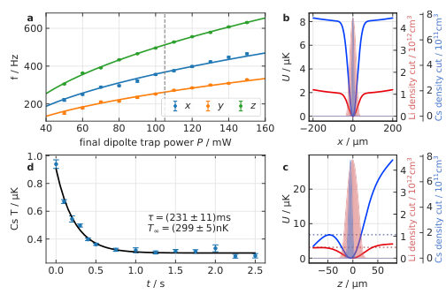
<figcaption class="paper-figure-caption"><b>Fig 4.</b> FIG. 4. a: Li trap frequencies in the final ODT. Each data point is the frequency resulting from fitting a damped sinu- soidal oscillation to the time evolution of the size of a non- interacting cloud of Li atoms following a sudden change in trap power. Error bars represent the standard error of the fit. Solid lines are predictions of the model including optical, mag- netic, and gravitational potentials. The colors represent mea- surements along three spatial directions. The vertical dashed line marks the trap power used in the polaron experiments. b and c: trap potentials for Li (Cs) as red (blue) solid lines to- gether with cuts of the density distributions through the trap minimum...</figcaption>
</figure>
<figure class="paper-figure-card">
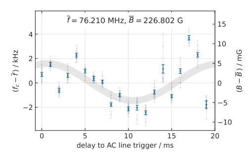
<figcaption class="paper-figure-caption"><b>Fig 5.</b> FIG. 5. Spectroscopic measurement of the magnetic field as a function of the delay with respect to a trigger that is syn- chronized to the AC power grid. Each data point (gray) rep- resents the resonance position fc determined by a fit to a Cs radio-frequency spectrum recorded with 156 µs square-shaped π-pulses. Each spectrum consists of 30 data points and the error bars represent the 1σ-error of the fit. Blue data points are the mean of four independent measurements at each de- lay with error bars representing their standard deviation. The gray line is a 50 Hz sine wave fit serving as a guide to the eye. The deviations of the fitted resonance positions (left y-axis) can be converted to...</figcaption>
</figure>

**Summary.** This paper reports on an experiment studying Fermi polarons using a quantum gas mixture of Lithium and Cesium atoms. By utilizing optical Raman spectroscopy, the researchers probe the impurity's excitation spectrum in a highly degenerate Fermi sea. The setup is notable for achieving a large mass imbalance, allowing exploration of new physics regimes in polaron systems.

**Why it may be interesting.** This work provides a clean, tunable platform to study strongly correlated impurity dynamics in a Fermi sea, directly relevant to understanding quasiparticle renormalization in quantum many-body systems.

Detailed structure

**Main problem.** The study of Fermi polarons, specifically investigating the system dynamics in a regime characterized by a large mass imbalance between the impurity and the surrounding Fermi sea.

**Main result.** The experiment successfully created and characterized the Fermi polaron in a highly degenerate quantum gas mixture, accessing regimes previously inaccessible due to the large mass ratio.

**Method.** Optical Raman spectroscopy without relative momentum transfer was used to perform injection spectroscopy, allowing for the measurement of polaron energies.

**Model / system.** The system is a quantum gas mixture of bosonic Cesium ($^{133}	ext{Cs}$) impurities immersed in a deeply degenerate Fermi gas of Lithium ($^6	ext{Li}$), with interspecies interactions tunable via a Feshbach resonance.

**Key observables.** Polaron energies (measured as deviations in two-photon transition frequency), local Fermi energy ($E_F$), and temperature ratio ($T/T_F$).

**Important parameters / regimes.** Large mass imbalance ($M/m \approx 22$), low temperature ($T/T_F \sim 0.2$), and tunable interspecies scattering lengths ($a_{	ext{Li-Cs}}$).

**Assumptions / limitations.** The sequential loading process is necessary due to differing atomic properties, and the determination of temperature relies on Cesium impurities acting as thermometers.

**Figures summary.** Figures illustrate the experimental setup, magnetic field dependence of interactions, and the evolution of the system's degeneracy ($T/T_F$) over the experimental sequence.

**Paper structure.** The paper details the complex, multi-step sample preparation process (loading, cooling, state preparation) followed by the spectroscopic measurement technique used to probe the polaron excitation spectrum.

Abstract

We present details of an experimental platform for studying Fermi polarons in a quantum-gas mixture. The system consists of about a thousand bosonic $^{133}$Cs impurities immersed in a deeply degenerate Fermi gas ($T/T_F \sim 0.2$) of approximately $2\times 10^5$ $^6$Li atoms in a single hyperfine state, with interspecies interactions tunable via a Feshbach resonance. Using optical Raman spectroscopy without relative momentum transfer, we perform injection spectroscopy and thereby create the Fermi polaron. Owing to the large mass imbalance between the two species, the setup provides access to previously unexplored regimes of Fermi polarons.

[↑ back to top](#top)

### [Low-temperature magnetism and spin dynamics in the disordered triangular-lattice Yb$^{3+}$ compound LiCaYb$_5$(BO$_3$)$_6$](http://arxiv.org/abs/2608.26946v1)

**Authors:** Monika Jawale, Saikat Nandi, Prashanta K. Mukharjee, Philipp Gegenwart, A. V. Mahajan  
**Type:** experiment · **Category:** disordered systems and neural networks · **PDF:** <https://arxiv.org/pdf/2608.26946v1>  
**Analysis basis:** full PDF text, analyzed in chunks
**Topic relevance:** 🔥 `analog quantum simulation` **4/5** · `scars & prethermalization` **1/5**

↔ Scroll figures horizontally

<figure class="paper-figure-card">
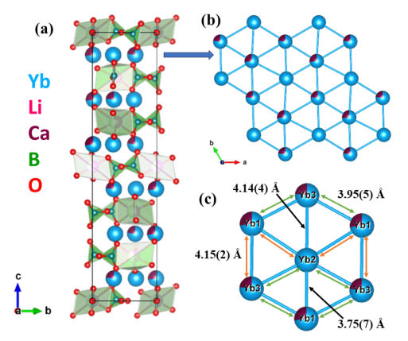
<figcaption class="paper-figure-caption"><b>Fig 1.</b> FIG. 1. (a) Crystal structure of LCYBO showing the stacking of the Yb-containing layers along the c-axis. Yb(1), Yb(2), and Yb(3) sites, which belong to the same distorted triangu- lar magnetic layer, are shown together with Li, Ca, B, and O in blue, pink, maroon, green, and red, respectively; the Ca sites are partially obscured in this projection. Equivalent distorted triangular magnetic layers are stacked along the c- axis. (b) ab-plane projection of a single distorted triangular magnetic layer formed by the Yb1, Yb2, and Yb3 sites. (c) Distorted triangular arrangement of the Yb ions within the same magnetic layer, showing the inequivalent Yb–Yb dis- tances (indicated). Structure...</figcaption>
</figure>
<figure class="paper-figure-card">
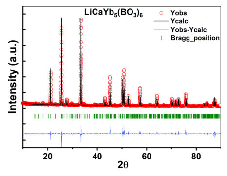
<figcaption class="paper-figure-caption"><b>Fig 2.</b> FIG. 2. Rietveld refinement of the powder XRD pattern of LCYBO showing observed, calculated, and difference profiles along with Bragg peak positions.</figcaption>
</figure>
<figure class="paper-figure-card">
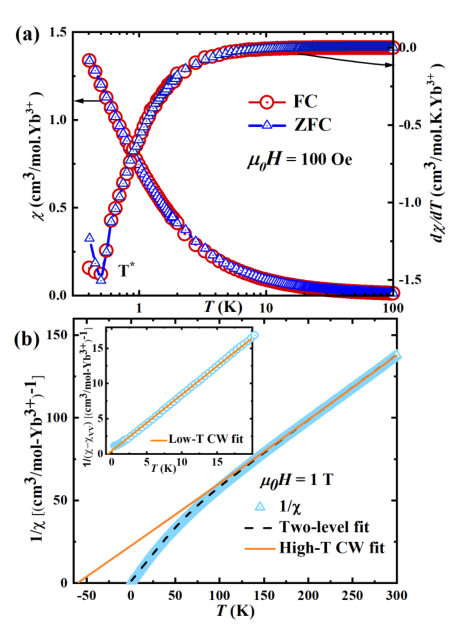
<figcaption class="paper-figure-caption"><b>Fig 3.</b> FIG. 3. (a)Temperature-dependent magnetic susceptibility of LCYBO measured in an applied field of 100 Oe under ZFC and FC conditions (left axis), and its first derivative (right axis) showing a clear minimum near 0.5 K. (b) Inverse mag- netic susceptibility measured at 10 kOe under ZFC conditions for LCYBO. The dashed and solid lines represent the two-level fit and the high-temperature Curie–Weiss fit (180–300 K), respectively. Inset: Curie–Weiss fit in the low-temperature range (0.75–20 K).</figcaption>
</figure>
<figure class="paper-figure-card">
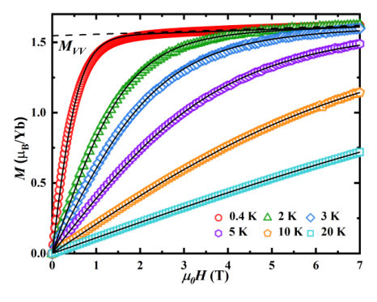
<figcaption class="paper-figure-caption"><b>Fig 4.</b> FIG. 4. Isothermal magnetization M(H) measured at 0.4 K, 2K and 50 K for LiCaYb5(BO3)6. Dashed line: linear fit extrapolated to saturation magnetization; solid line: Brillouin function fit.</figcaption>
</figure>
<figure class="paper-figure-card">
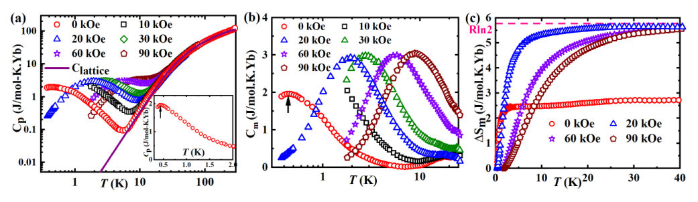
<figcaption class="paper-figure-caption"><b>Fig 5.</b> FIG. 5. (a)Temperature and field dependence of the total specific heat of LCYBO plotted on a log–log scale to emphasize the low-T region. The solid line represents the estimated lattice contribution. The inset shows the low-temperature zero-field data below 2 K, where the arrow marks the anomaly near 0.43 K. (b) Magnetic contribution to the specific heat, Cm(T), obtained after subtracting the lattice contribution. The broad maximum shifts toward higher temperature with increasing magnetic field, indicating field-induced evolution of the low-energy magnetic excitations. The arrow marks the low-temperature anomaly in zero field. (c) Magnetic entropy change, ∆Sm(T), obtained by integrating...</figcaption>
</figure>

**Summary.** This work characterizes the magnetic behavior of the disordered triangular-lattice magnet $	ext{LiCaYb}_5(	ext{BO}_3)_6$. By combining magnetic susceptibility, specific heat, and ${}^{7}	ext{Li}$ NMR measurements, the authors show that the system enters a correlated, low-energy spin dynamic regime. The findings highlight how structural disorder and geometric frustration suppress conventional magnetic ordering, establishing it as a model disordered frustrated magnet.

**Why it may be interesting.** The combination of geometric frustration, disorder, and strong spin-orbit coupling places this material in a highly relevant regime for studying quantum disordered magnetism, which shares conceptual links with frustrated quantum magnets studied in AMO physics.

Detailed structure

**Main problem.** The study investigates the low-temperature magnetism and spin dynamics in a geometrically frustrated, disordered triangular-lattice rare-earth magnet.

**Main result.** The compound exhibits correlated low-energy spin dynamics characterized by a well-isolated effective $J_{	ext{eff}}=1/2$ Kramers doublet, suggesting a correlated magnetic state rather than conventional long-range order.

**Method.** A combination of bulk measurements (magnetization, specific heat) and local probes (${}^{7}	ext{Li}$ NMR) was employed to characterize the magnetic ground state.

**Model / system.** The system is $	ext{LiCaYb}_5(	ext{BO}_3)_6$, a rare-earth magnet with $	ext{Yb}^{3+}$ ions forming a triangular lattice. The physics is complicated by geometric frustration, strong spin-orbit coupling, and structural disorder (antisite mixing and vacancies).

**Key observables.** Magnetic susceptibility ($\chi(T)$), specific heat anomaly ($T^* \approx 0.43 	ext{ K}$), ${}^{7}	ext{Li}$ NMR linewidth broadening, and spin-lattice relaxation components.

**Important parameters / regimes.** Effective $J_{	ext{eff}}=1/2$ doublet, weak antiferromagnetic interaction ($	heta_{	ext{CW}} \approx -0.54 	ext{ K}$), and a large Crystal Electric Field (CEF) gap ($\Delta_{	ext{CEF}} \approx 200 	ext{ K}$).

**Assumptions / limitations.** The low-energy physics can be effectively described by spin-$1/2$ Kramers doublets due to strong SOC/CEF effects.

**Figures summary.** The notes mention figures illustrating the refined crystal structure and powder XRD patterns confirming single-phase crystallization.

**Paper structure.** The paper proceeds by first characterizing the structure and disorder, then measuring bulk magnetic properties ($\chi, C_p$) to establish the effective low-energy spin model, and finally using local probes (${}^{7}	ext{Li}$ NMR) to map out the inhomogeneous spin dynamics.

Abstract

The interplay between geometric frustration, spin--orbit coupling, and structural disorder can give rise to unconventional magnetic ground states in rare-earth triangular-lattice magnets. We report low-temperature magnetic and $^7$Li NMR investigations of the disordered triangular-lattice compound LiCaYb$_5$(BO$_3$)$_6$ (LCYBO). Rietveld refinement confirms a hexagonal $P6_522$ structure with partial Ca/Yb antisite disorder and fractional Li occupancy. Magnetic susceptibility and magnetization measurements indicate a well-isolated effective $J_{\mathrm{eff}}=1/2$ Kramers doublet with weak antiferromagnetic interactions ($θ_{\mathrm{CW}} \approx -0.54$~K). The specific heat reveals a weak anomaly near 0.43 K, suggesting the development of short-range correlated magnetism rather than conventional long-range order. $^7$Li NMR spectra broaden strongly upon cooling, consistent with increasingly inhomogeneous internal magnetic fields. The spin-lattice relaxation exhibits two relaxation components consistent with disorder-induced distributions of local magnetic environments arising from antisite disorder and competing exchange pathways. Our results establish LCYBO as a structurally disordered frustrated triangular-lattice magnet with correlated low-energy spin dynamics.

[↑ back to top](#top)

### [Exploiting overcompleteness of Platonic-solid POVMs for shadow estimation](http://arxiv.org/abs/2608.26318v1)

**Authors:** Dario Melegari, Stefano Mangini, Keijo Korhonen, Hetta Vappula, Daniel Cavalcanti  
**Type:** theory · **Category:** quantum information and computing · **PDF:** <https://arxiv.org/pdf/2608.26318v1>  
**Analysis basis:** full PDF text, analyzed in chunks
**Topic relevance:** 🔥 `quantum measurements` **4/5**

↔ Scroll figures horizontally

<figure class="paper-figure-card">
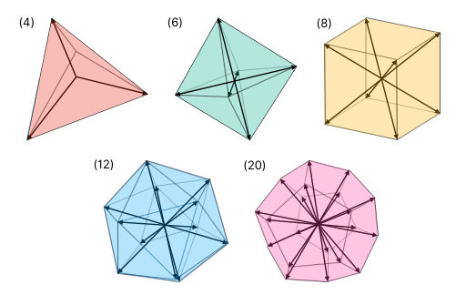
<figcaption class="paper-figure-caption"><b>Fig 1.</b> FIG. 1. The five Platonic solids. From left to right: the tetrahedron (4 effects), the octahedron (6), the cube (8), the icosahedron (12) and the dodecahedron (20). The arrows represent the vertices of the solids, which correspond to the effects of the associated POVMs. In the top left of each solid, the number of effects is indicated.</figcaption>
</figure>
<figure class="paper-figure-card">
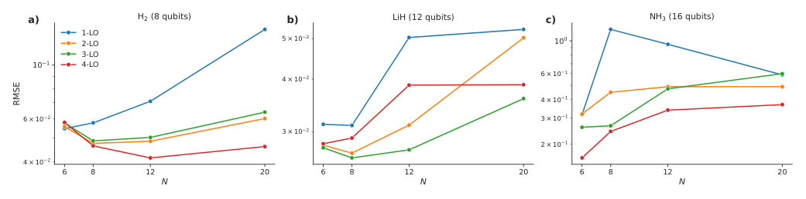
<figcaption class="paper-figure-caption"><b>Fig 2.</b> FIG. 2. RMSE as a function of the number of effects of the POVM for the H2 (8 qubits), LiH (12 qubits), and NH3 (16 qubits) molecules. The data show that the best-performing solid depends on both the molecule and the locality parameter of the dual frame: among the plotted settings, H2 (8 qubits) reaches its lowest RMSE with the icosahedron-based POVM and 4-LO duals, LiH (12 qubits) with the cube-based POVM and 3-LO duals, and NH3 (16 qubits) with the octahedron-based POVM and 4-LO duals. The corresponding numerical values are reported in Tab. II of Appendix D.</figcaption>
</figure>
<figure class="paper-figure-card">
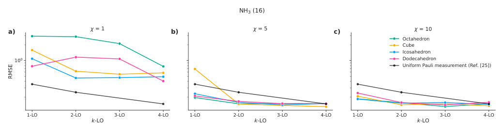
<figcaption class="paper-figure-caption"><b>Fig 3.</b> FIG. 3. RMSE for the NH3 molecule (16 qubits) as a function of the locality parameter k of the k-LO duals. The three panels correspond to MPS proxy states with bond dimensions χ = 1, χ = 5, and χ = 10, respectively. The RMSE is computed as in Eq. (9) using R = 103 independent realizations of the experiment, each with S = 103 measurement shots, and k-LO duals obtained from a separate dataset of S = 106 shots.</figcaption>
</figure>
<figure class="paper-figure-card">
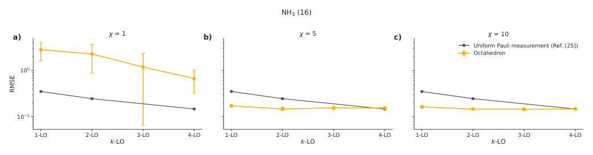
<figcaption class="paper-figure-caption"><b>Fig 4.</b> FIG. 4. RMSE for the NH3 molecule (16 qubits) as a function of the locality parameter k of the k-LO duals, for an octahedron-based POVM with fixed orientation. The three panels correspond to MPS proxy states with bond dimensions χ = 1, χ = 5, and χ = 10, used in the optimization procedure. The RMSE (see Eq. (9)) is computed using R = 103 independent experimental realizations, each with S = 103 measurement shots, while the k-LO duals are obtained from a separate dataset of S = 106 shots. Orange markers show the octahedron-based POVM results, with error bars indicating the standard deviation over five independent initializations of the optimization parameters. Black markers show the uniform...</figcaption>
</figure>
<figure class="paper-figure-card">
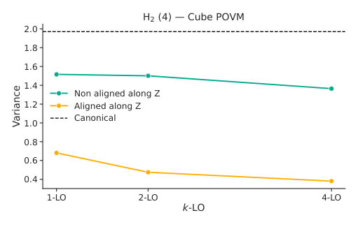
<figcaption class="paper-figure-caption"><b>Fig 5.</b> FIG. 5. Estimation variance as a function of the k-LO duals for the H2 (4 qubits) molecule and the uniform cube POVM. The variance is computed using Eq. (8). The orange solid line corresponds to the variance obtained by aligning one of the vertices of the cube with the +z axis, while the green line corresponds to the variance obtained by choosing the vertices as in Tab. I. The dashed black line corresponds to the variance obtained with the canonical duals. In this example, the aligned orientation yields a smaller variance than the reference orientation. This motivates the alignment procedure described in the text.</figcaption>
</figure>

**Summary.** This paper investigates improving quantum observable estimation by using highly symmetric, overcomplete measurements derived from Platonic solids. By optimizing these POVMs using advanced dual-frame techniques and classical state approximations, the authors show superior performance compared to standard methods. This reveals a practical pathway for enhancing measurement fidelity on current quantum hardware.

**Why it may be interesting.** This work provides a concrete, geometrically motivated method to improve quantum estimation protocols beyond standard Pauli measurements, which is highly relevant for near-term quantum hardware benchmarking.

Detailed structure

**Main problem.** The central challenge is accurately estimating expectation values of observables from a finite number of quantum measurement shots.

**Main result.** Optimized Platonic solid POVMs can outperform standard randomized Pauli measurements, demonstrating a trade-off between classical preprocessing and estimation accuracy.

**Method.** The authors utilize overcomplete POVMs derived from Platonic solids and optimize their parameters using k-locally optimal dual frames and classical proxy states (like MPS).

**Model / system.** The study focuses on single-qubit measurements (POVMs) whose effects correspond to the vertices of the five Platonic solids on the Bloch sphere, applied to estimating molecular Hamiltonians.

**Key observables.** Estimation Variance, Root Mean Squared Error (RMSE), and the expectation value of the observable $\langle O 
angle$.

**Important parameters / regimes.** The MPS bond dimension ($\chi$), the locality parameter ($k$), and the specific Platonic solid used (e.g., Octahedron, Dodecahedron).

**Assumptions / limitations.** The optimization relies on using a classical proxy state (MPS) to approximate the true quantum state, meaning the optimized POVM is not guaranteed to be optimal for the true state.

**Figures summary.** Figures compare RMSE values for different POVMs and locality parameters across various molecules ($	ext{H}_2$, $	ext{NH}_3$), and one figure compares the variance on the proxy state versus the true state.

**Paper structure.** The paper establishes the problem of observable estimation, introduces Platonic-solid POVMs, develops the optimization framework using $k$-LO duals and MPS proxies, and concludes by comparing the resulting RMSE against standard measurements for several molecular systems.

Abstract

Accurately estimating expectation values of observables from a finite number of measurement shots is a central challenge in quantum information science. Informationally overcomplete measurements provide a route to reduce estimation variance through optimized classical post-processing. However, the interplay between measurement geometry and dual-frame construction remains largely unexplored. In this work, we study Platonic solid POVMs ---highly symmetric, overcomplete single-qubit measurements whose effects correspond to the vertices of the five Platonic solids on the Bloch sphere--- for the estimation of molecular Hamiltonians. Using $k$-locally optimal dual frames, we show that the geometry of the POVM can have a non-trivial and non-monotonic effect on the estimation variance. We further propose a joint optimization of the POVM orientation and effect weights using a classical proxy state, either a product state or a Matrix Product State (MPS) approximation. We demonstrate that optimized Platonic solid POVMs can outperform standard randomized Pauli measurements, provided the MPS bond dimension is sufficient to faithfully represent the target state. These results reveal a trade-off between classical preprocessing and estimation accuracy, suggesting a practical route to improved observable estimation on near-term quantum hardware.

[↑ back to top](#top)

### [Uncertainty limits for post-selected metrology](http://arxiv.org/abs/2608.26781v1)

**Authors:** Ming Ji, Holger F. Hofmann  
**Type:** theory · **Category:** quantum information and computing · **PDF:** <https://arxiv.org/pdf/2608.26781v1>  
**Analysis basis:** full PDF text, analyzed in chunks
**Topic relevance:** 🔥 `quantum measurements` **4/5**

↔ Scroll figures horizontally

<figure class="paper-figure-card">
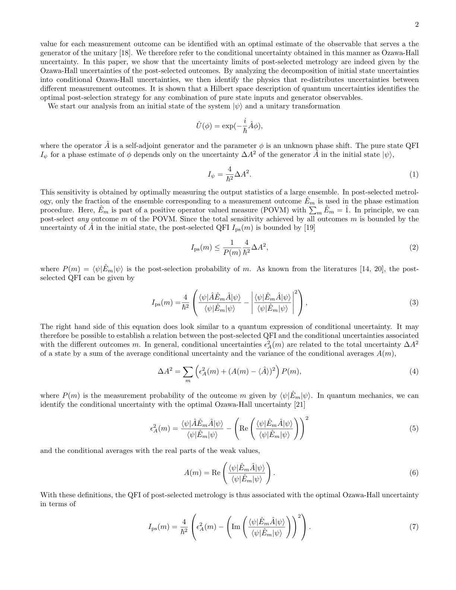
<figcaption class="paper-figure-caption"><b>Fig 1.</b> Low-resolution page preview, page 2</figcaption>
</figure>
<figure class="paper-figure-card">
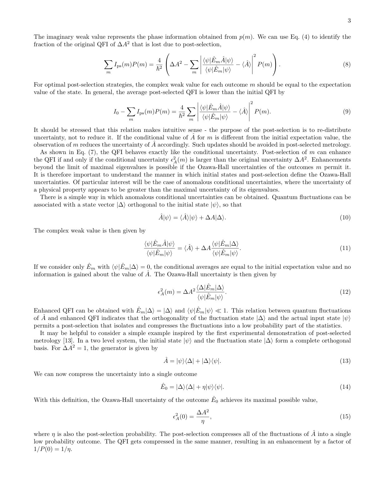
<figcaption class="paper-figure-caption"><b>Fig 2.</b> Low-resolution page preview, page 3</figcaption>
</figure>
<figure class="paper-figure-card">
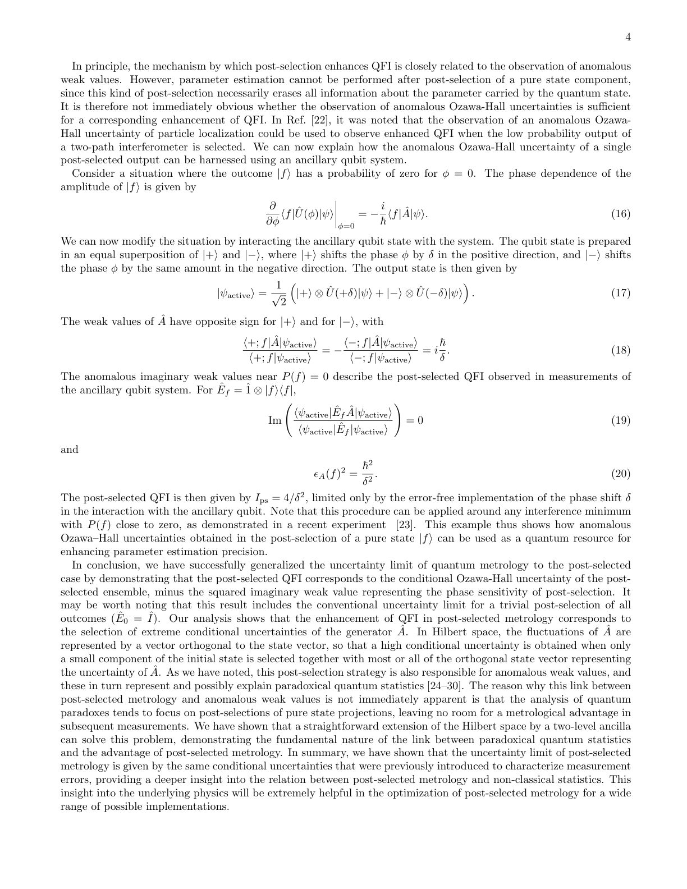
<figcaption class="paper-figure-caption"><b>Fig 3.</b> Low-resolution page preview, page 4</figcaption>
</figure>
<figure class="paper-figure-card">
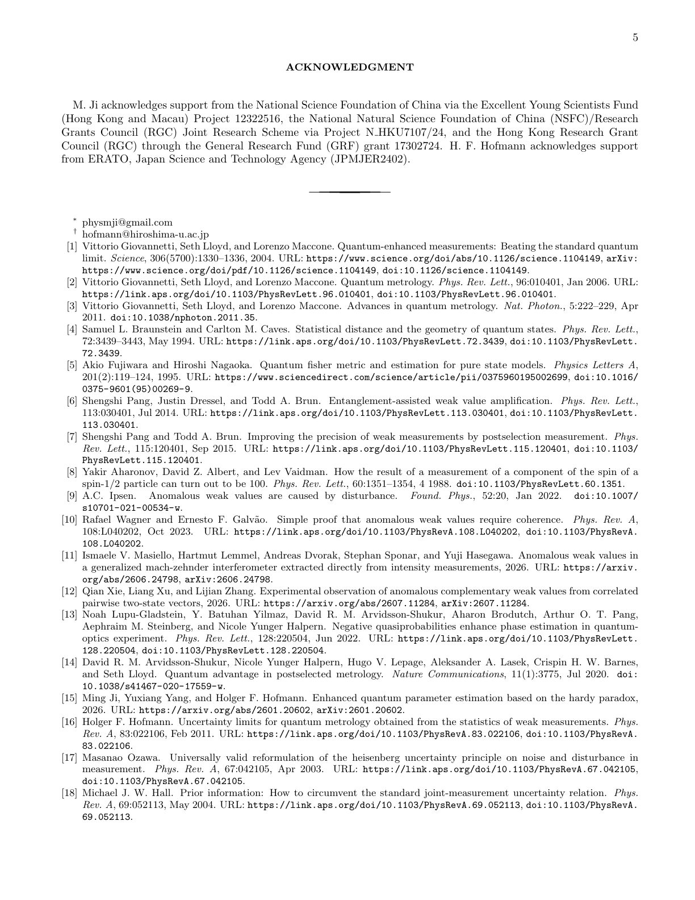
<figcaption class="paper-figure-caption"><b>Fig 4.</b> Low-resolution page preview, page 5</figcaption>
</figure>
<figure class="paper-figure-card">
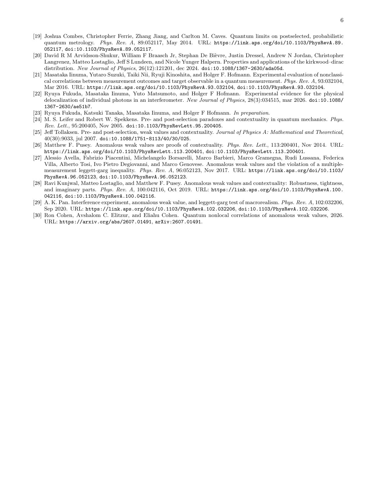
<figcaption class="paper-figure-caption"><b>Fig 5.</b> Low-resolution page preview, page 6</figcaption>
</figure>

**Summary.** This paper analyzes the uncertainty limits in quantum metrology when post-selection measurements are used. It proves that the achievable precision is governed by the Ozawa-Hall uncertainty associated with the measurement outcomes. The key finding is that post-selection can enhance sensitivity beyond standard limits by selectively amplifying certain quantum fluctuations.

**Why it may be interesting.** This work provides a rigorous theoretical framework connecting measurement back-action (post-selection) to fundamental limits on precision, which is crucial for designing quantum sensors and understanding the limits of quantum metrology.

Detailed structure

**Main problem.** The paper investigates the fundamental uncertainty limits governing quantum estimation precision when post-selection measurements are performed on a quantum system.

**Main result.** It shows that the achievable precision (QFI) in post-selected metrology is determined by the conditional Ozawa-Hall uncertainties associated with the measurement outcomes.

**Method.** The analysis involves deriving the post-selected QFI by relating it to the conditional quantum statistics of the generator, specifically utilizing the Ozawa-Hall uncertainty formalism.

**Model / system.** The study models parameter estimation for a unitary transformation $\hat{U}(\phi) = \exp(-i rac{\phi}{\hbar} \hat{A})$, where $\hat{A}$ is the generator. Simple examples use two-level systems, while advanced analysis employs ancillary qubit systems.

**Key observables.** Quantum Fisher Information (QFI), Ozawa-Hall uncertainty ($\epsilon^2_A(m)$), and anomalous imaginary weak values.

**Important parameters / regimes.** The unknown phase shift ($\phi$), the generator uncertainty ($\Delta A^2$), and the post-selection probability ($P(m)$ or $\eta$).

**Assumptions / limitations.** The enhancement mechanism relies on the ability to concentrate quantum fluctuations into low-probability post-selection outcomes, and the analysis assumes the validity of the Ozawa-Hall uncertainty definition for conditional statistics.

**Paper structure.** The paper first establishes the relationship between QFI and generator uncertainty for unitary transformations. It then introduces the post-selected QFI and links it mathematically to the Ozawa-Hall uncertainty. The core development involves demonstrating how post-selection leads to enhancements beyond standard limits, often illustrated using ancillary qubit systems and weak value calculations.

Abstract

For unitary transformations, the quantum Fisher information (QFI) of a pure state is given by the uncertainty of the generator in that state. In post-selected metrology, the QFI is given by a modified expression describing conditional quantum statistics of the generator. Here, we show that the conditional generator uncertainties defined by post-selected QFI correspond to Ozawa-Hall uncertainties known from the theoretical analysis of quantum measurements. The post-selected measurement outcome updates the generator uncertainty according to the quantum statistics of that outcome. Enhancements of QFI beyond the maximal uncertainties of the generator eigenvalues are possible because post-selection tends to concentrate the largest part of the initial generator uncertainty in low probability outcomes of the post-selection measurement. Anomalous conditional uncertainties thus explain the extreme sensitivities that can be achieved in post-selected metrology.

[↑ back to top](#top)

### [Bound-state-mediated remote charging of a quantum battery](http://arxiv.org/abs/2608.26862v1)

**Authors:** Jian-Jian Cheng, Hai-Bo Qiu, Lin Zhang, Ming-Liang Hu  
**Type:** theory · **Category:** other · **PDF:** <https://arxiv.org/pdf/2608.26862v1>  
**Analysis basis:** full PDF text, analyzed in chunks
**Topic relevance:** `analog quantum simulation` **3/5** · `correlated / nonlocal dissipation` **3/5** · `methods for driven-dissipative` **3/5** · `Tavis-Cummings & cavity-many-emitter` **2/5** · `driven-dissipative phase transition` **2/5** · `Keldysh / 2PI / non-Gaussian methods` **1/5** · `interference shaping light` **1/5** · `non-equilibrium universality` **1/5** · `quantum measurements` **1/5**

↔ Scroll figures horizontally

<figure class="paper-figure-card">
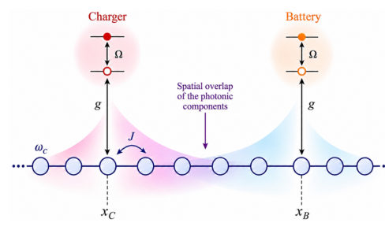
<figcaption class="paper-figure-caption"><b>Fig 1.</b> FIG. 1: Schematic of remote charging, where the charger and battery are two spatially separated TLSs without direct coupling. They have transition frequency Ωand are locally coupled to a one-dimensional coupled-cavity array at sites xC and xB, with the coupling strength g and separation d = |xB −xC|. Each cavity has frequency ωc, and the hopping amplitude between the neighboring cavities is J.</figcaption>
</figure>
<figure class="paper-figure-card">
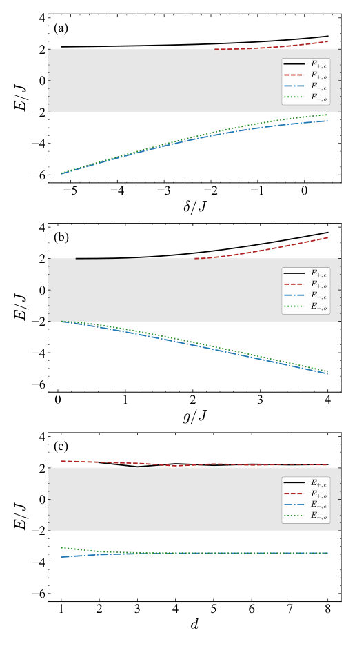
<figcaption class="paper-figure-caption"><b>Fig 2.</b> FIG. 2: Out-of-band bound-state spectrum. The gray shaded region marks the photonic continuum −2J &lt; E &lt; 2J. The four lines outside it are the upper-band even-parity E+,e and odd-parity E+,o, the lower- band even-parity E−,e and odd-parity E−,o branches. (a) E/J vs δ/J at fixed g/J = 2 and d = 2. (b) E/J vs g/J at fixed δ/J = −2 and d = 2. (c) E/J vs d at fixed δ/J = −2 and g/J = 2.</figcaption>
</figure>
<figure class="paper-figure-card">
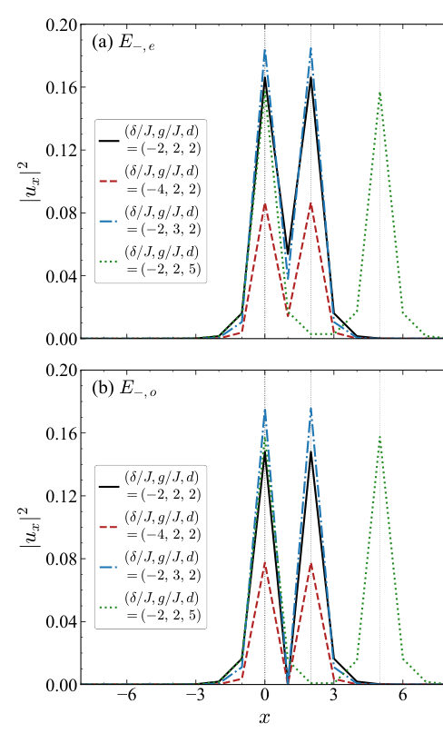
<figcaption class="paper-figure-caption"><b>Fig 3.</b> FIG. 3: Real-space photon distribution |ux|2 of the lower-band even- parity bound state E−,e (a) and odd-parity bound state E−,o (b). The vertical dotted lines mark the charger at xC = 0 and the QB at xB = 2 and xB = 5, respectively.</figcaption>
</figure>
<figure class="paper-figure-card">
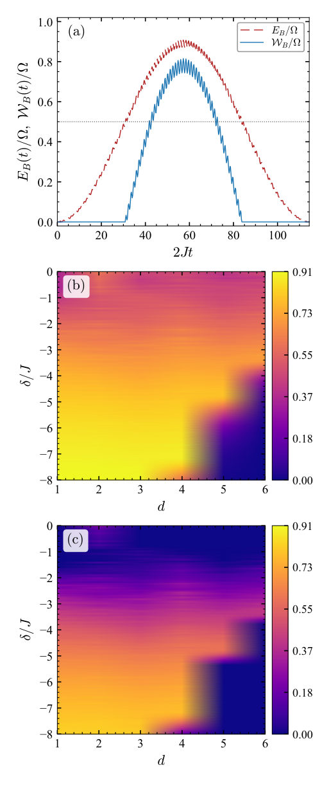
<figcaption class="paper-figure-caption"><b>Fig 4.</b> FIG. 4: (a) Dynamics of EB(t)/Ωand WB(t)/Ωfor d = 1 and δ/J = −8, where the horizontal dotted line marks the threshold EB/Ω= 1/2. (b) The stored maximum energy EB,max/Ωvs d and δ/J. (c) The charged maximum ergotropy WB,max/Ωvs d and δ/J. The coupling is fixed at g/J = 2 in all the plots.</figcaption>
</figure>
<figure class="paper-figure-card">
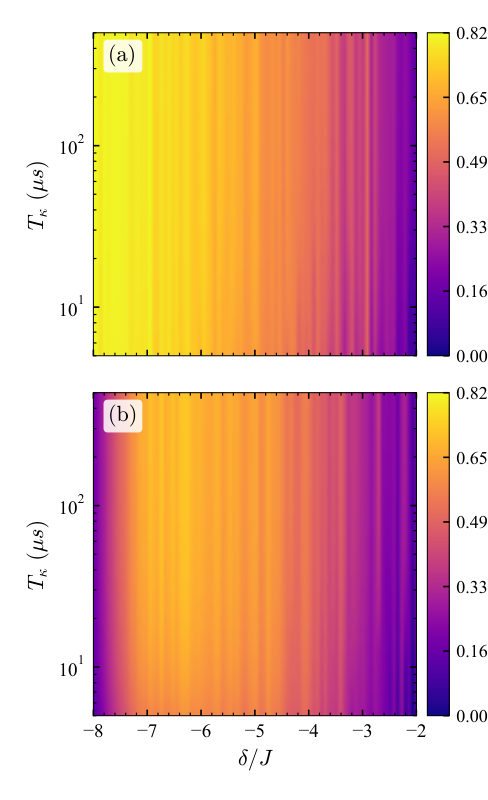
<figcaption class="paper-figure-caption"><b>Fig 5.</b> FIG. 5: The maximum ergotropy WB,max/Ωobtained from the Lind- blad dynamics (24) for (a) d = 1 and (b) d = 3. Other parameters are g/J = 2, T C 1 = 30µs, and T B 1 = 200µs. The cavity lifetime Tκ varies from 5 µs to 500 µs on a logarithmic scale.</figcaption>
</figure>

**Summary.** This paper investigates how to remotely charge a quantum battery by utilizing the bound states formed when the system's energy lies outside the photonic band gap. The key mechanism is the lifting of degeneracy between even and odd parity bound states, which drives coherent energy transfer. The results show that this bound-state mediation allows for efficient charging, with performance controlled by the separation distance and dissipation rates.

**Why it may be interesting.** This work directly addresses energy transfer in open quantum systems using engineered photonic structures, which is a core topic in cavity QED and quantum optics.

Detailed structure

**Main problem.** The remote charging of a quantum battery (QB) is hindered by energy leakage into the photonic environment.

**Main result.** The system achieves coherent remote charging when the TLS frequency lies outside the photonic band, forming localized bound states that mediate energy transfer via an even-odd energy splitting.

**Method.** The analysis uses the single-excitation Hamiltonian, solving for bound states and analyzing time evolution using the Lindblad master equation.

**Model / system.** The model consists of two two-level systems (TLSs) acting as a charger and a battery, coupled to two sites of a one-dimensional coupled cavity array.

**Key observables.** Charging time, stored energy ($E_B(t)$), and charged ergotropy ($W_B(t)$).

**Important parameters / regimes.** Separation distance ($d$), detuning ($\delta$), cavity hopping ($J$), and photon loss rate ($\kappa$).

**Assumptions / limitations.** The dynamics are confined to the single-excitation sector, and the analysis often assumes the thermodynamic limit ($N 	o \infty$).

**Figures summary.** Figure 1 schematically shows the setup. Figure 2 displays the four derived bound state energy branches. Figure 5 shows the maximum ergotropy as a function of cavity lifetime and detuning.

**Paper structure.** The paper first establishes the model and the role of the photonic band gap. It then derives the bound state energies and shows how the even-odd splitting facilitates energy transfer. Finally, it analyzes the charging dynamics and the impact of dissipation.

Abstract

Remote charging of a quantum battery (QB) is hindered by radiative leakage of the excitation into the photonic environment that acts as a mediator for energy transfer. We consider a charger-battery model consisting of two two-level systems (TLSs) that are locally coupled to two sites of a one-dimensional coupled cavity array. When their transition frequency lies outside the propagation band, the system forms atom-photon bound states with localized photonic components, and the overlap of these components lifts the degeneracy of the even- and odd-parity bound states, yielding an energy splitting that drives coherent energy transfer from the charger to the QB. In this way, the band gap suppresses resonant emission and the localized bound states mediate remote charging. From the parity-resolved spectrum, we relate the charging time to the energy splitting and the charged ergotropy to the fraction of TLS population on the bound states. Bound states closer to the band edge extend the interaction range of the TLSs but contain a large photonic fraction and are consequently more susceptible to photon loss.

[↑ back to top](#top)

### [Comparison of Two-Atom Cross Spectra in de Sitter Spacetime, Uniformly Accelerated Minkowski Vacuum, and a Thermal Bath](http://arxiv.org/abs/2608.26554v1)

**Authors:** Zhiming Huang  
**Type:** theory · **Category:** other · **PDF:** <https://arxiv.org/pdf/2608.26554v1>  
**Analysis basis:** full PDF text, analyzed in chunks
**Topic relevance:** `Keldysh / 2PI / non-Gaussian methods` **3/5** · `correlated / nonlocal dissipation` **3/5** · `driven-dissipative phase transition` **2/5** · `interference shaping light` **2/5** · `methods for driven-dissipative` **2/5** · `non-equilibrium universality` **2/5** · `quantum measurements` **2/5**

↔ Scroll figures horizontally

<figure class="paper-figure-card">
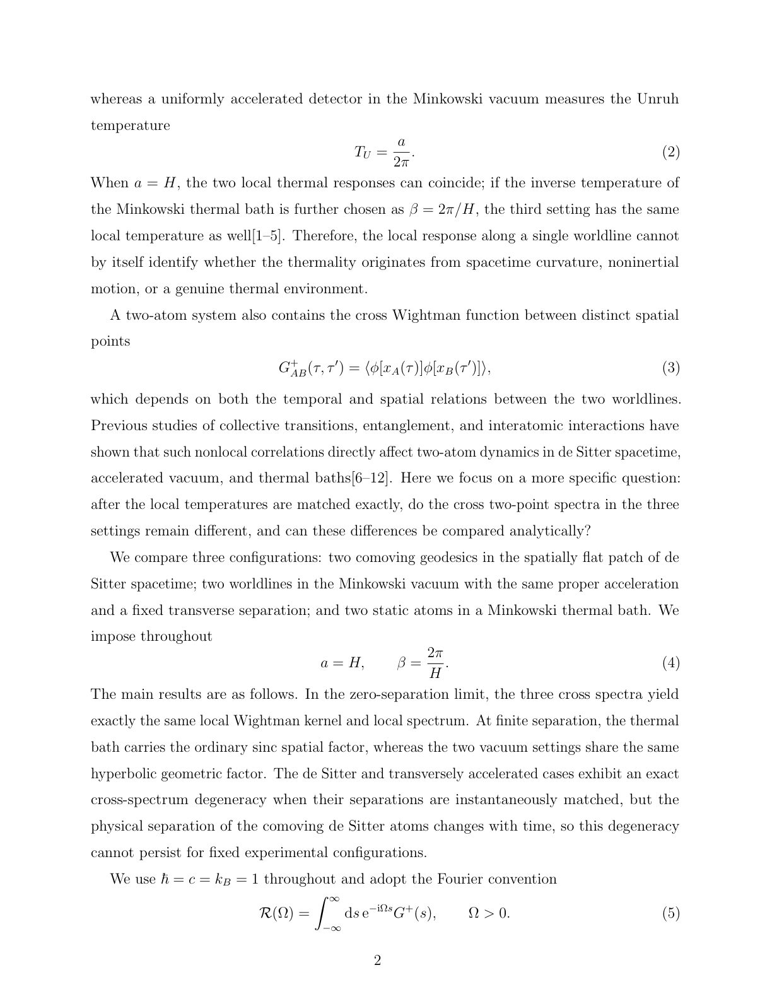
<figcaption class="paper-figure-caption"><b>Fig 1.</b> Low-resolution page preview, page 2</figcaption>
</figure>
<figure class="paper-figure-card">
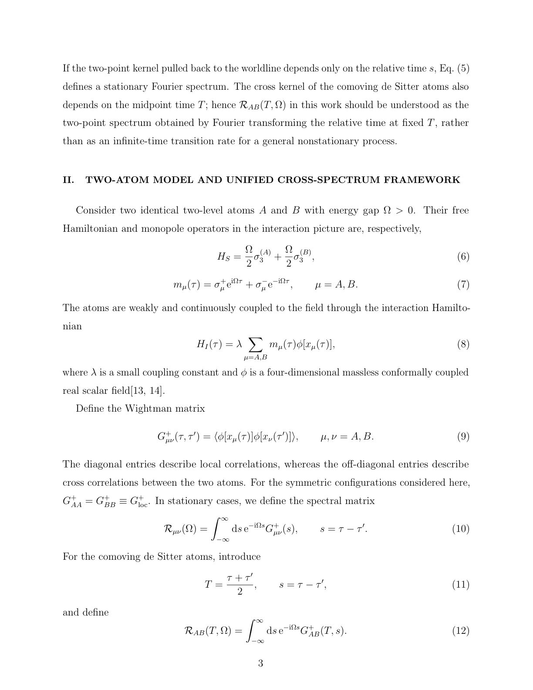
<figcaption class="paper-figure-caption"><b>Fig 2.</b> Low-resolution page preview, page 3</figcaption>
</figure>
<figure class="paper-figure-card">
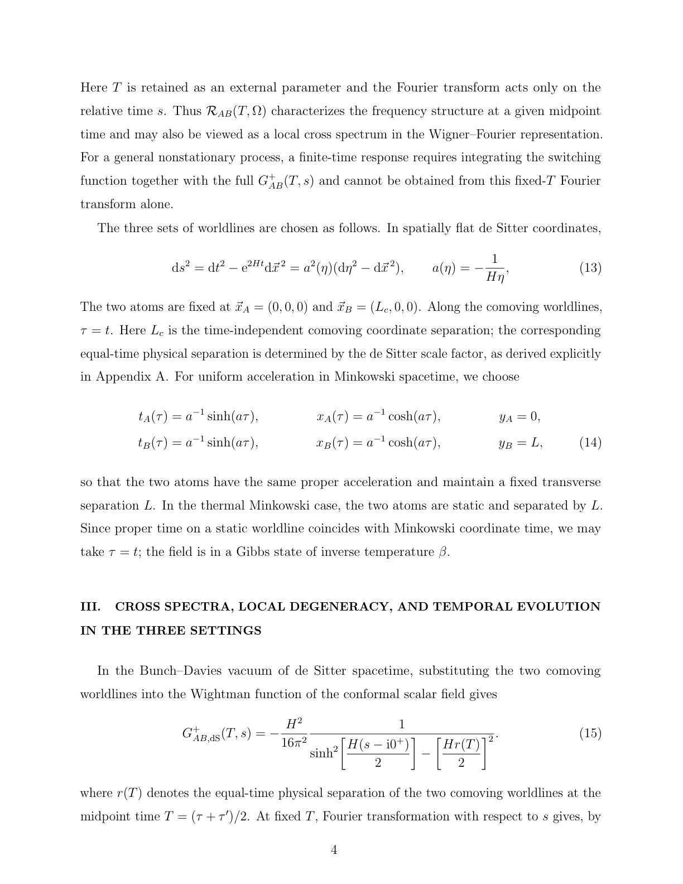
<figcaption class="paper-figure-caption"><b>Fig 3.</b> Low-resolution page preview, page 4</figcaption>
</figure>
<figure class="paper-figure-card">
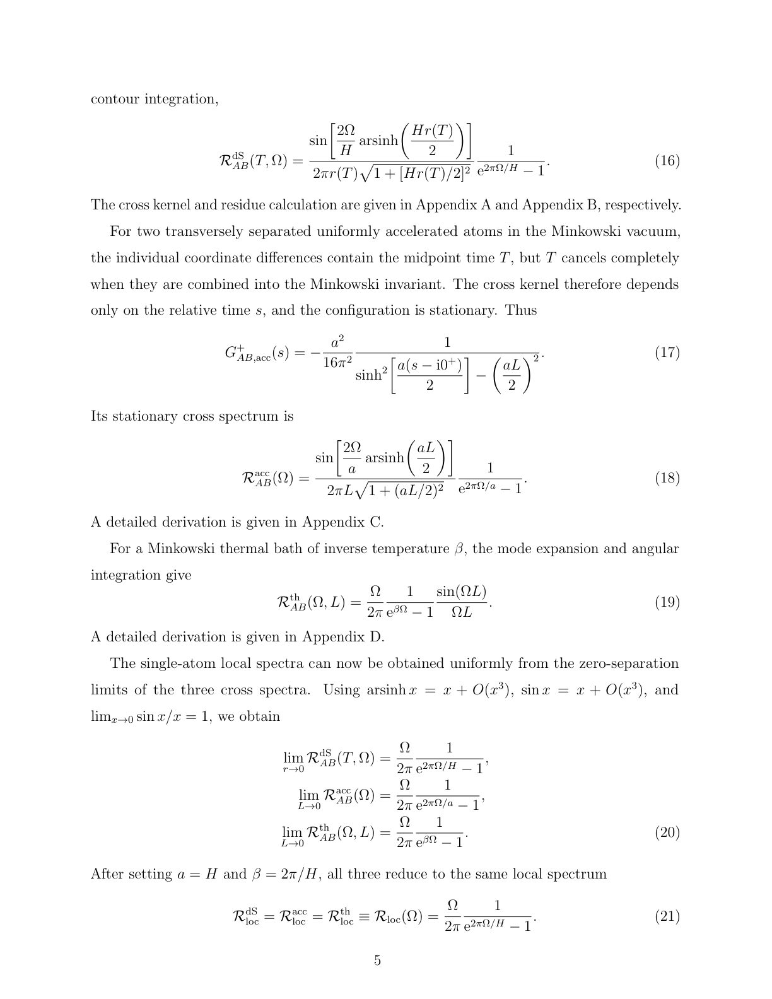
<figcaption class="paper-figure-caption"><b>Fig 4.</b> Low-resolution page preview, page 5</figcaption>
</figure>
<figure class="paper-figure-card">
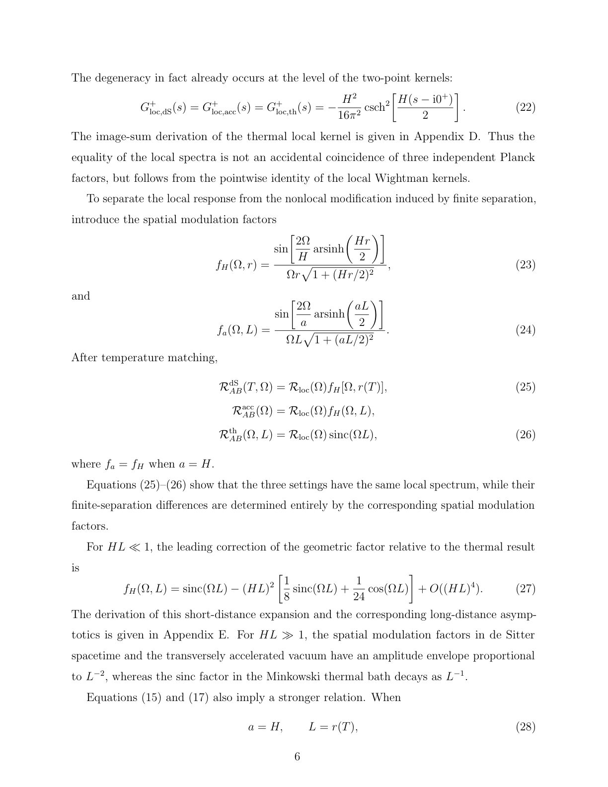
<figcaption class="paper-figure-caption"><b>Fig 5.</b> Low-resolution page preview, page 6</figcaption>
</figure>

**Summary.** This theoretical study compares the quantum correlations (cross spectra) of two atoms coupled to a scalar field in de Sitter spacetime, an accelerated vacuum, and a thermal bath. The key finding is that while the local physics can be made identical by tuning parameters, the finite separation correlations reveal distinct signatures, particularly in their spatial dependence and long-distance decay rates.

**Why it may be interesting.** This work is highly relevant to open quantum systems and quantum optics as it explores how the environment (spacetime curvature vs. thermal bath) dictates the correlations measured by quantum probes, even when local conditions are matched.

Detailed structure

**Main problem.** The paper compares the two-atom cross spectra of identical two-level atoms coupled to a massless conformally coupled scalar field across three distinct physical settings: de Sitter spacetime, uniformly accelerated Minkowski vacuum, and a Minkowski thermal bath.

**Main result.** While the local spectra are identical under specific parameter matching ($a=H, eta=2\pi/H$), the finite separation cross spectra differ significantly, showing distinct spatial modulation factors and different long-distance decay rates ($L^{-2}$ vs $L^{-1}$).

**Method.** The authors derive the cross spectra by calculating the two-point Wightman function in each background and performing Fourier transforms with respect to the time difference.

**Model / system.** The system involves two two-level atoms weakly coupled to a massless, conformally coupled scalar field ($\phi$). The comparisons are made in the Bunch-Davies vacuum of de Sitter spacetime, the accelerated vacuum of Minkowski space, and a thermal bath in Minkowski space.

**Key observables.** Two-atom cross spectra ($R^{AB}(\Omega)$), local Wightman kernels, and spatial modulation factors.

**Important parameters / regimes.** Local temperature parameters ($H, eta$), separation distance ($L$), and coupling constant ($\lambda$).

**Assumptions / limitations.** Weak coupling ($\lambda$ is small); the analysis relies on matching parameters like local temperature and instantaneous separation to find degeneracies.

**Figures summary.** The notes do not provide a summary of figures, but they detail the mathematical forms of the cross spectra in the three different backgrounds.

**Paper structure.** The paper proceeds by deriving the cross spectra for each of the three settings (dS, accelerated, thermal) and then comparing them, first in the zero-separation limit (local spectra) and then at finite separation, highlighting the differences in spatial dependence and long-distance decay.

Abstract

We study the weak coupling of two identical two-level atoms to a four-dimensional massless conformally coupled scalar field and compare three settings with the same local temperature but different physical origins: comoving atoms in the Bunch--Davies vacuum of de Sitter spacetime, transversely separated uniformly accelerated atoms in the Minkowski vacuum, and static atoms in a Minkowski thermal bath. We first derive the two-atom cross spectra in the three settings and then obtain the single-atom local spectra uniformly from the zero-separation limit. When $a=H$ and $β=2π/H$, the complete local Wightman kernels and local spectra are identical in all three cases. At finite separation, a genuine thermal bath produces a $\sinc(ΩL)$ spatial factor, whereas de Sitter spacetime and the transversely accelerated vacuum produce a hyperbolic geometric factor. In the long-distance limit, the cross correlations in de Sitter spacetime and the transversely accelerated vacuum decay as $L^{-2}$, whereas those in the Minkowski thermal bath decay only as $L^{-1}$. The de Sitter and transversely accelerated vacuum cross spectra coincide when $a=H$ and the separations are instantaneously matched. For a fixed experimental setup, the physical separation between the two comoving atoms in de Sitter space evolves with cosmic expansion, whereas the pulled-back cross correlations in the uniformly accelerated and thermal Minkowski configurations are stationary.

[↑ back to top](#top)

### [A thermometric quantum Brownian model for low-temperature electronics](http://arxiv.org/abs/2608.26646v1)

**Authors:** Harry T. H. Fung, Thomas M. Stace  
**Type:** theory · **Category:** statistical mechanics · **PDF:** <https://arxiv.org/pdf/2608.26646v1>  
**Analysis basis:** full PDF text, analyzed in chunks
**Topic relevance:** `correlated / nonlocal dissipation` **3/5** · `driven-dissipative phase transition` **3/5** · `methods for driven-dissipative` **3/5** · `Keldysh / 2PI / non-Gaussian methods` **2/5** · `non-equilibrium universality` **2/5** · `quantum measurements` **2/5**

↔ Scroll figures horizontally

<figure class="paper-figure-card">
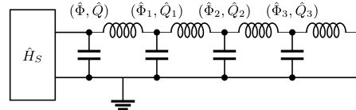
<figcaption class="paper-figure-caption"><b>Fig 1.</b> Figure 1. The waveguide model of a resistor, consisting of an infinite series of capacitors and inductors, connected to a system. The leftmost nodes are the two resistor terminals.</figcaption>
</figure>
<figure class="paper-figure-card">
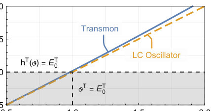
<figcaption class="paper-figure-caption"><b>Fig 2.</b> Figure 2. Steady state energy of a transmon hT(T) (solid) and an LC oscillator hLC(T) (dashed) as a function of the thermo- metric parameter ϑ. The shaded region below hT(ϑ) = ET 0 indicates the unphysical region where ϑT does not corre- spond to a physical temperature. Device parameters used here and in subsequent figures are EJ/h = 25 √</figcaption>
</figure>
<figure class="paper-figure-card">
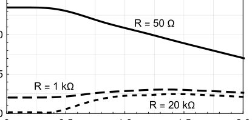
<figcaption class="paper-figure-caption"><b>Fig 3.</b> Figure 4. Trace distance between the QBME steady state ¯ρϑ(T ) and the Gibbs state ρG Eq. (3) of a transmon as a function of temperature. Results are shown for resistances of 50 Ω(solid), 1 kΩ(long dashes) and 20 kΩ(short dashes).</figcaption>
</figure>
<figure class="paper-figure-card">
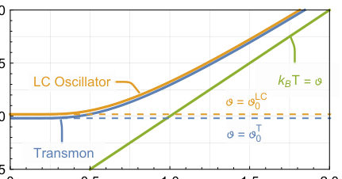
<figcaption class="paper-figure-caption"><b>Fig 4.</b> Figure 3. The thermometric parameter ϑ as a function of the physical temperature T for the LC oscillator (see Eq. (17)) and the transmon. Also shown is the thermometric parameter for the standard QBME Eq. (1), for which ϑ = kBT. ϑLC,T 0 is the value at which hLC,T(ϑ) = ELC,T 0 .</figcaption>
</figure>
<figure class="paper-figure-card">
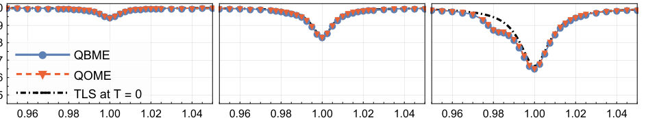
<figcaption class="paper-figure-caption"><b>Fig 5.</b> Figure 5. Each panel depicts the ground state population at equilibrium of a driven transmon shunted by a resistor (see Eq. (19)) as a function of the drive frequency. The dissipation rate increases down the rows (eΓ = Γ/ω0 = {0.0025, 0.005, 0.01}) and the Rabi frequency increases along the columns (eΩ= Ω/ω0 = {0.0025, 0.005, 0.01}). The ground state population is calculated with the thermometric QBME (circle, solid line), QOME (triangle, dashed line), and the analytical solution for a damped two-level system at zero temperature (dot-dashed line) (see Eq. (20)). Temperature is T = 15 mK (kBT/ℏω0 ≈0.03).</figcaption>
</figure>

**Summary.** This paper proposes a thermometric modification to the Quantum Brownian Model Equation (QBME) to accurately model resistive dissipation in superconducting circuits at low temperatures. By enforcing thermodynamic self-consistency, the model resolves unphysical predictions found in standard formulations. The results demonstrate that this modified approach provides a physically robust framework for analyzing quantum dissipation in superconducting electronics.

**Why it may be interesting.** This work directly addresses the modeling of open quantum systems in superconducting circuits, a key area where non-equilibrium statistical mechanics and open quantum system theory intersect. The comparison between different master equation formalisms (Lindbladian vs. non-Lindbladian) is highly relevant.

Detailed structure

**Main problem.** Developing a quantum mechanical model for resistors in low-temperature electronics that respects fundamental physical symmetries, particularly flux-translation invariance, while remaining thermodynamically consistent.

**Main result.** The proposed thermometric Quantum Brownian Model (QBME) successfully resolves the unphysical low-temperature behavior of standard QBME formulations, showing good agreement with the Quantum Optical Master Equation (QOME) in certain regimes.

**Method.** The authors compare three models (QOME, standard QBME, and a modified 'thermometric' QBME) by enforcing thermodynamic self-consistency constraints derived from the Gibbs free energy.

**Model / system.** The system models resistive dissipation in superconducting quantum devices, such as a transmon shunted by a resistor. The models are based on master equations (QOME and QBME) derived from the Caldeira-Leggett theory.

**Key observables.** Ground state population ($
ho_{00}$), steady-state energy expectation ($\langle\hat{H}_S
angle_{ss}$), and the trace distance between the model state and the Gibbs state.

**Important parameters / regimes.** Low temperatures ($k_B T 	o 0$), dissipation rate ($\Gamma$), and the ratio $k_B T / \hbar \omega_0$.

**Assumptions / limitations.** The thermometric modification assumes that the system's steady state must be energetically self-consistent with the thermal Gibbs state, leading to a non-Lindbladian master equation.

**Figures summary.** Figures compare the ground state population ($
ho_{00}$) vs. drive frequency ($\omega_d / \omega_0$) for the three models at intermediate temperatures, showing close agreement between the thermometric QBME and QOME.

**Paper structure.** The paper first establishes the limitations of QOME and standard QBME. It then introduces the thermometric QBME by enforcing thermodynamic self-consistency. Finally, it compares the resulting predictions for observables like ground state populations across different temperature regimes.

Abstract

Quantum mechanical models of resistors in quantum electronics are often based on the quantum optical master equation (QOME). The QOME overlooks several fundamental properties, limiting its ability to model certain superconducting phenomena. Here we present a thermometric model of resistors, adapted from the quantum Brownian motion equation (QBME), that facilitates practical use of the QBME in modelling dissipative electronics at low temperatures. We compare the thermometric QBME presented here with predictions of the QOME, in the simple example of a transmon shunted by a resistor. We show that both the QBME and QOME yield comparable but physically distinct predictions, and discuss potential experimental tests with which to discriminate their use in modelling practical experiments.

[↑ back to top](#top)

### [Dynamics and spectra of open quantum systems coupled to anharmonic environments](http://arxiv.org/abs/2608.27163v1)

**Authors:** Kian Damezin, Brendon W. Lovett, Erik M. Gauger, Adam Burgess  
**Type:** theory · **Category:** other · **PDF:** <https://arxiv.org/pdf/2608.27163v1>  
**Analysis basis:** full PDF text, analyzed in chunks
**Topic relevance:** `Keldysh / 2PI / non-Gaussian methods` **3/5** · `correlated / nonlocal dissipation` **3/5** · `driven-dissipative phase transition` **3/5** · `methods for driven-dissipative` **3/5** · `non-equilibrium universality` **2/5** · `quantum measurements` **1/5**

↔ Scroll figures horizontally

<figure class="paper-figure-card">
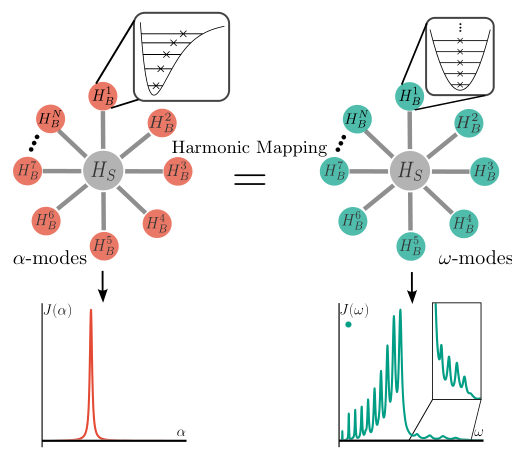
<figcaption class="paper-figure-caption"><b>Fig 1.</b> FIG. 1: Depiction of the mapping from a continuous anharmonic bath to an equivalent continuous harmonic bath. The grey circles represent the system Hamiltonian, coupled to either red α-anharmonic or green ω-harmonic modes, with Hi B denoting the Hamiltonian of the i-th mode. The insert within the red (green) circles illus- trates the corresponding potentials, while crosses repre- sent the mean position of each eigenstate ⟨B⟩. The bare spectral density produced of the anharmonic modes is represented in red. In the thermodynamic limit of an- harmonic modes, N →∞, higher-order correlations of the anharmonic bath operator vanish, allowing the bath to be mapped onto an equivalent harmonic...</figcaption>
</figure>
<figure class="paper-figure-card">
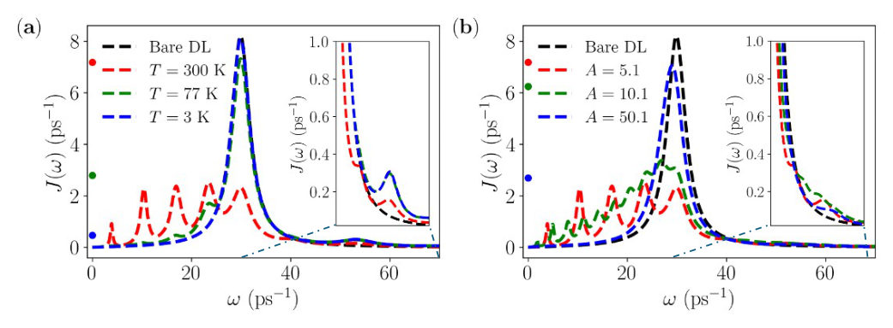
<figcaption class="paper-figure-caption"><b>Fig 2.</b> FIG. 2: The effective spectral density of a Morse oscillator environment with (a) varying temperatures for the ensemble with anharmonicity parameter A = 5.1 and (b) varying anharmonicity parameter A at 300 K, including the coupling of the zero-frequency term indicated at zero frequency. The underlying spectral density is the underdamped Ohmic Lorentzian defined as Bare DL (Eq. (50)) with parameters Ω= 30 ps−1, γ = 4.5 ps−1 and λ = 0.01 ps−1.</figcaption>
</figure>
<figure class="paper-figure-card">
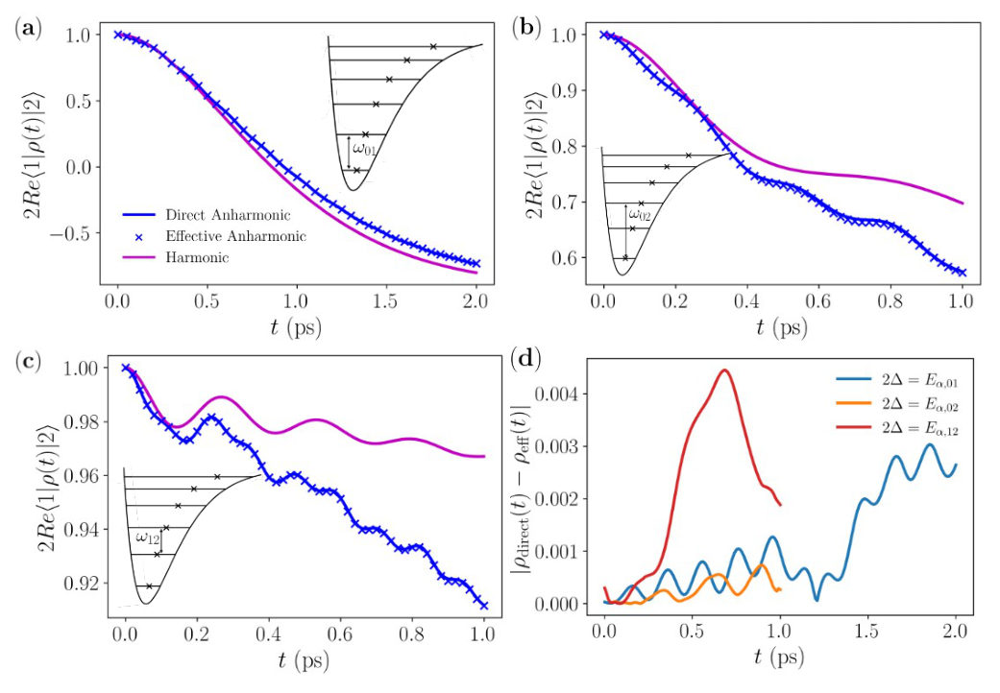
<figcaption class="paper-figure-caption"><b>Fig 3.</b> FIG. 3: Coherence dynamics of a dimer system coupled to a Morse potential-anharmonic environment with a poten- tial depth of A = 5.1 and an underlying underdamped spectral density given by Eq. (50). The direct approach models the environment as a collection of anharmonic oscillations referred to as ‘direct anharmonic’, whereas ‘effective anhar- monic’ and ‘harmonic’ model the environment as a collection of harmonic oscillators with the effective and bare spectral densities, respectively. The spectral density parameters are Ω= 30 ps−1, γ = 0.15Ω, λ = 0.001 ps−1, with system paramaters ϵ0 = ϵ1 = 0 and coupling between monomers are ∆= Eα,01/2, ∆= Eα,12/2, and ∆= Eα,02/2 for panels (a), (b),...</figcaption>
</figure>
<figure class="paper-figure-card">
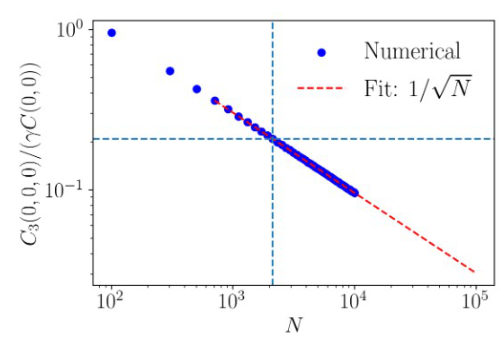
<figcaption class="paper-figure-caption"><b>Fig 4.</b> FIG. 4: Heuristic estimate for the number of discretised modes (N) required for the ratio of the third-order cor- relation function C3 and second-order correlation func- tion C for a Morse oscillator bath with spectral den- sity defined in Fig. 2 to tend to zero. The intersec- tion of the dashed lines indicates the number of modes used in the direct ACE simulations of the dimer coher- ence dynamics. This demonstrates that the discrepancy between the direct and effective mapping approaches arises from the finite discretization of the environment.</figcaption>
</figure>
<figure class="paper-figure-card">
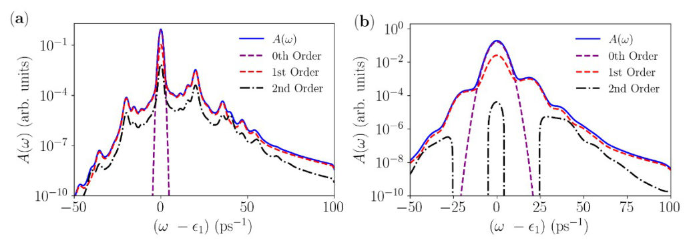
<figcaption class="paper-figure-caption"><b>Fig 5.</b> FIG. 5: Absorption spectra for a molecular dimer within the single-excitation manifold for anharmonicity parameter A = 5.1 at (a) T = 20 K and (b) T = 77 K with spectral density parameters γ = 1.0 ps−1, λ = 0.001 ps−1 and Ω= 20 ps−1. Within each plot, the phonon processes within the absorption spectra are plotted up to 2nd order.</figcaption>
</figure>

**Summary.** This paper presents advanced theoretical frameworks for analyzing open quantum systems coupled to anharmonic environments, moving beyond the limitations of standard harmonic bath models. It develops methods to map anharmonic baths onto effective harmonic ones while also providing tools to analyze complex few-mode anharmonic systems where the mapping breaks down. The results highlight that anharmonicity introduces unique spectral signatures, such as static disorder, and enhances non-Markovian dynamics.

**Why it may be interesting.** This work is highly relevant to AMO physics and quantum optics as it provides rigorous theoretical tools to model realistic, non-harmonic coupling to the environment, which is crucial for understanding energy transfer in molecular and condensed matter systems.

Detailed structure

**Main problem.** The paper addresses the challenge of accurately modeling the dynamics and spectral properties of open quantum systems coupled to anharmonic environments, which deviate significantly from standard harmonic approximations.

**Main result.** The authors develop frameworks to handle both continuous and few-mode anharmonic baths, showing that the anharmonicity introduces unique spectral features, such as a zero-frequency static disorder term and enhanced non-Markovian dynamics.

**Method.** The methodology involves developing a matching criterion to map anharmonic environments onto effective harmonic ones, and separately analyzing cases where this mapping fails due to non-Gaussianity.

**Model / system.** The system is an open quantum system ($H_S + H_I + H_B$) interacting with an environment modeled by anharmonic oscillators (AMs). The analysis covers both continuum and few-mode bath structures.

**Key observables.** System dynamics, absorption/emission spectra, non-Markovianity, and the effective spectral density $J_{	ext{eff}}(\omega, eta)$.

**Important parameters / regimes.** Temperature ($eta$), anharmonicity strength, and the number of coupled bath modes.

**Assumptions / limitations.** The harmonic mapping is valid for the continuum limit, but the matching criterion fails for few-mode baths due to non-Gaussianity. The analysis often relies on approximations like the secular approximation.

**Figures summary.** Figure 1 illustrates the mapping from a continuous anharmonic bath to an equivalent harmonic bath, comparing the bare and effective spectral densities.

**Paper structure.** The paper progresses by first establishing the general Hamiltonian and the harmonic mapping for continuous baths. It then develops specific frameworks for few-mode anharmonic environments where the mapping fails, analyzing the resulting unique spectral features and dynamic consequences.

Abstract

In open quantum systems, the environment is typically modelled as a collection of harmonic oscillators, whereas realistic environments often exhibit unique non-Markovian effects due to the anharmonicity of the environment. Here we present a framework for modelling anharmonic environments in open quantum systems numerically exactly, in which, via a matching criterion, we map the anharmonic environment onto an effective harmonic one. This results in an effective spectral density that is a collection of shifted bare spectra arising from the non-equidistant energy gaps of the anharmonic environment, along with a unique zero-frequency term that effectively acts as static disorder on the system. This is due to the non-zero variance of the diagonal of the bath coupling operator. In tandem, we develop a framework for investigating the effects of environments comprising a few damped anharmonic modes where the matching criterion fails to work due to the non-Gaussianity of the environment. For both continuous and discrete damped anharmonic environments, this work investigates their unique influence on the system's dynamics, including enhanced non-Markovianity compared to a harmonic approximation, novel effects in the absorption spectrum, and the potential for anharmonic environments to enhance energy transport.

[↑ back to top](#top)

### [Fluctuation--response relations from an emergent $\mathbb{Z}_2$ symmetry in the rotating stochastic Landau model](http://arxiv.org/abs/2608.26468v1)

**Authors:** Dhruv Kush, Nicki Mullins, Mauricio Hippert, Jorge Noronha  
**Type:** theory · **Category:** statistical mechanics · **PDF:** <https://arxiv.org/pdf/2608.26468v1>  
**Analysis basis:** full PDF text, analyzed in chunks
**Topic relevance:** `Keldysh / 2PI / non-Gaussian methods` **3/5** · `correlated / nonlocal dissipation` **3/5** · `driven-dissipative phase transition` **3/5** · `non-equilibrium universality` **3/5** · `methods for driven-dissipative` **2/5** · `quantum measurements` **1/5**

↔ Scroll figures horizontally

<figure class="paper-figure-card">

<figcaption class="paper-figure-caption"><b>Fig 1.</b> Low-resolution page preview, page 2</figcaption>
</figure>
<figure class="paper-figure-card">
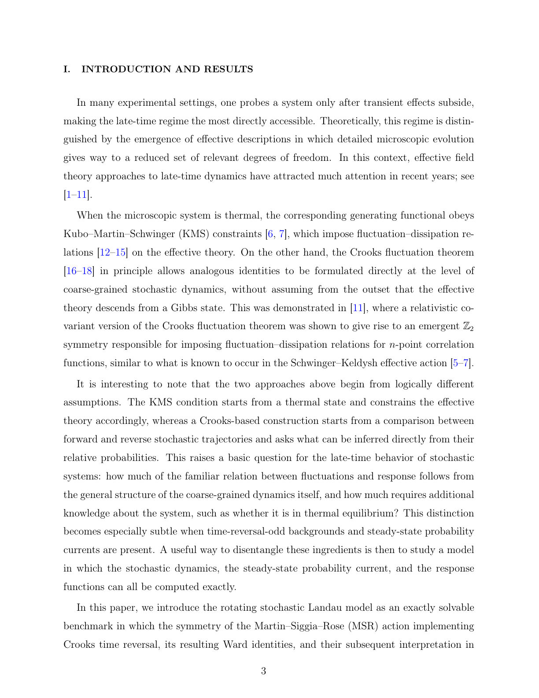
<figcaption class="paper-figure-caption"><b>Fig 2.</b> Low-resolution page preview, page 3</figcaption>
</figure>
<figure class="paper-figure-card">
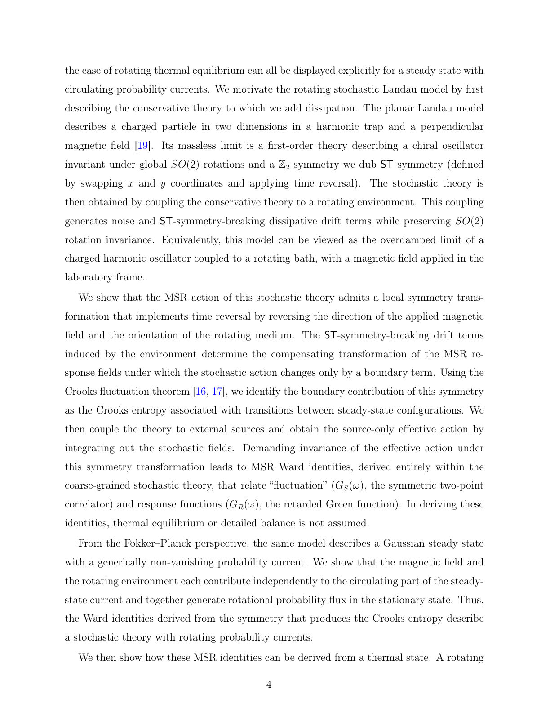
<figcaption class="paper-figure-caption"><b>Fig 3.</b> Low-resolution page preview, page 4</figcaption>
</figure>
<figure class="paper-figure-card">
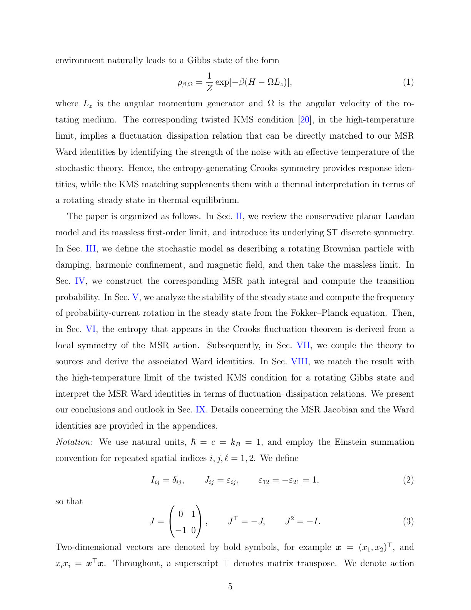
<figcaption class="paper-figure-caption"><b>Fig 4.</b> Low-resolution page preview, page 5</figcaption>
</figure>
<figure class="paper-figure-card">
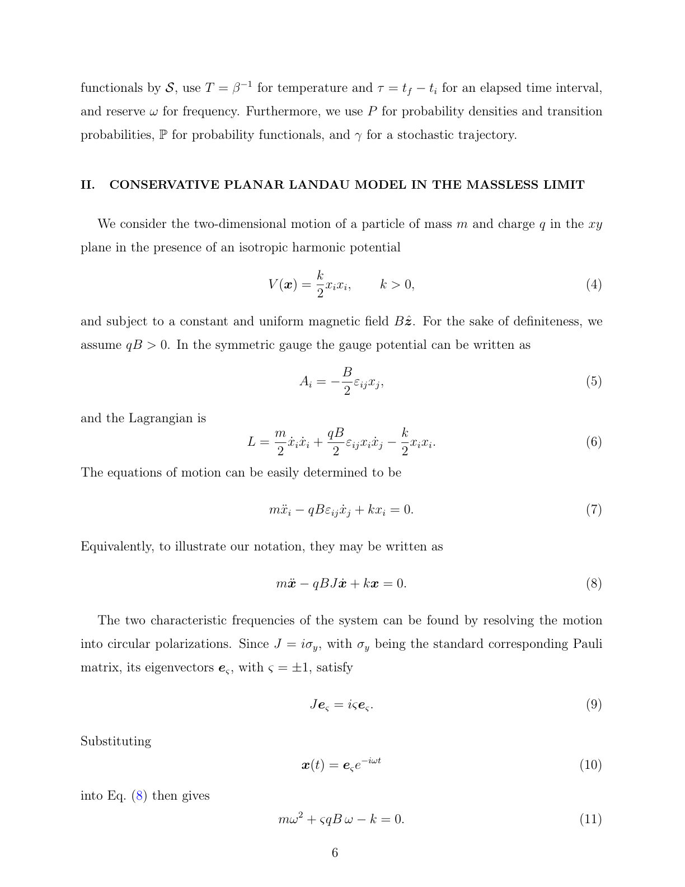
<figcaption class="paper-figure-caption"><b>Fig 5.</b> Low-resolution page preview, page 6</figcaption>
</figure>

**Summary.** This work analyzes the rotating stochastic Landau model to determine the origin of fluctuation-response relations. Using the MSR path integral, the authors derive Ward identities purely from the coarse-grained stochastic dynamics. They demonstrate that these identities successfully match the predictions of the thermal Kubo-Martin-Schwinger condition, establishing a deep connection between symmetry, non-equilibrium dynamics, and thermal physics.

**Why it may be interesting.** It provides a rigorous, non-equilibrium framework for deriving fundamental fluctuation-dissipation theorems, which is crucial for understanding open quantum systems where thermal assumptions might break down.

Detailed structure

**Main problem.** The paper investigates whether fluctuation-response relations in a complex stochastic system emerge solely from the coarse-grained dynamics or if they require assumptions of thermal equilibrium.

**Main result.** The derived Ward identities from the coarse-grained stochastic theory are shown to coincide with the fluctuation-dissipation relations predicted by the rotating Kubo-Martin-Schwinger condition when the Einstein relation is imposed.

**Method.** The authors employ the Martin-Siggia-Rose path integral formalism, comparing results derived from symmetry analysis (Ward identities) with those from thermal statistical mechanics (KMS condition).

**Model / system.** The system is the rotating stochastic Landau model, describing an overdamped charged Brownian particle in a constant magnetic field coupled dissipatively to a rotating environment.

**Key observables.** Fluctuation and response functions ($	ext{GS}(\omega)$ and $	ext{GR}(\omega)$), the emergent $\mathbb{Z}_2$ symmetry, and the Crooks entropy term.

**Important parameters / regimes.** Noise strength ($D_B$), rotation frequency ($\Omega$), inverse temperature ($eta$), and magnetic field ($B_{	ext{phys}}$).

**Assumptions / limitations.** The analysis focuses on the late-time, coarse-grained stochastic regime, and the final matching requires imposing the Einstein relation.

**Figures summary.** Not specified.

**Paper structure.** The paper builds from analyzing the conservative planar Landau model, through the stochastic MSR path integral construction, deriving the Crooks symmetry and Ward identities, and concluding with the matching of these results to the rotating Kubo-Martin-Schwinger condition.

Abstract

In this work, we investigate the extent to which fluctuation--response relations emerge from coarse-grained stochastic dynamics alone, and which aspects instead depend on additional information about the system. To address this question, we study the rotating stochastic Landau model, an exactly solvable system describing an overdamped charged Brownian particle in a constant magnetic field, coupled dissipatively to a rotating environment, whose steady state supports circulating probability currents. Using the Martin--Siggia--Rose path integral, we show that there is an emergent $\mathbb{Z}_2$ symmetry transformation that implements the time-reversed dynamics and changes the action by a boundary term. Comparison with the Crooks fluctuation theorem identifies this term with the entropy associated with transitions between steady-state configurations. After coupling the theory to external sources, the same symmetry yields Ward identities relating fluctuations and response. These identities follow entirely from the coarse-grained stochastic theory and do not fix the noise strength. Finally, upon imposing the Einstein relation, we show that they coincide with the high-temperature fluctuation--dissipation relations implied by the rotating Kubo--Martin--Schwinger condition for a microscopic Gibbs ensemble.

[↑ back to top](#top)

### [Thermally quenched metastability in metal-insulator transitions via elemental substitution](http://arxiv.org/abs/2608.26609v1)

**Authors:** Hiroshi Oike, Yasunori Takahashi, Keisuke Shibuya, Masaki Nakano, Tatsuki Hanada, Motoaki Hirayama, Hiroko Tokoro, Fumitaka Kagawa  
**Type:** both · **Category:** statistical mechanics · **PDF:** <https://arxiv.org/pdf/2608.26609v1>  
**Analysis basis:** full PDF text, analyzed in chunks
**Topic relevance:** `driven-dissipative phase transition` **3/5** · `non-equilibrium universality` **3/5** · `Keldysh / 2PI / non-Gaussian methods` **2/5** · `methods for driven-dissipative` **2/5** · `scars & prethermalization` **2/5** · `Frenkel-Kontorova` **1/5** · `analog quantum simulation` **1/5** · `quantum measurements` **1/5**

↔ Scroll figures horizontally

<figure class="paper-figure-card">
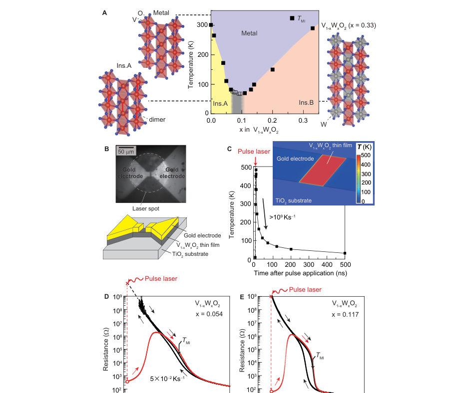
<figcaption class="paper-figure-caption"><b>Fig 1.</b> Figure 1: Thermally quenched metastable metallic phase in V1−𝑥W𝑥O2. (A) Temperature–𝑥</figcaption>
</figure>
<figure class="paper-figure-card">
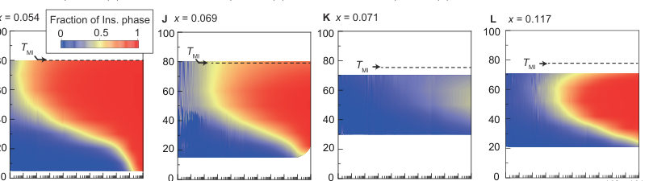
<figcaption class="paper-figure-caption"><b>Fig 2.</b> Figure 2: Isothermal time evolutions from metastable metallic phase to the most stable insu-</figcaption>
</figure>
<figure class="paper-figure-card">
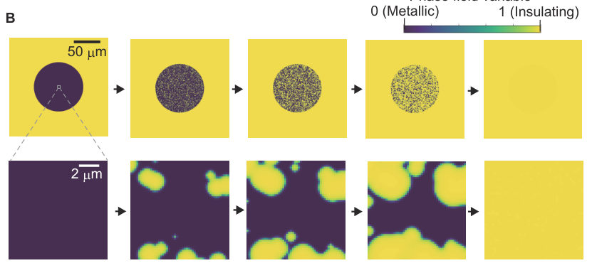
<figcaption class="paper-figure-caption"><b>Fig 3.</b> Figure 3: Real-space imaging of the metal-insulator transition. (A) Isothermal time evolution</figcaption>
</figure>
<figure class="paper-figure-card">
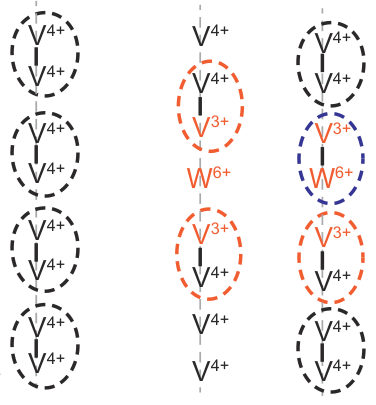
<figcaption class="paper-figure-caption"><b>Fig 4.</b> Figure 4: Evolution of dimer configurations across the metal–insulator transition. (A) Dimer</figcaption>
</figure>

**Summary.** This paper demonstrates that elemental substitution can induce thermally quenched metastability in metal-insulator transitions, moving the concept beyond purely structural systems. By rapidly cooling $	ext{V}_{1-x}	ext{W}_x	ext{O}_2$, the authors stabilize a long-lived metallic phase that relaxes back to the insulating state, confirming that electronic reorganization can be kinetically trapped.

**Why it may be interesting.** The work bridges concepts from structural glass physics (quenched metastability) into electronic phase transitions, providing a framework for controlling electronic states via non-equilibrium thermal protocols, which has parallels in controlling quantum states.

Detailed structure

**Main problem.** The study investigates whether thermally quenched metastability, typically seen in structural glasses, can be realized in metal-insulator transitions (MITs) governed by electronic reorganization.

**Main result.** Elemental substitution in $	ext{V}_{1-x}	ext{W}_x	ext{O}_2$ successfully stabilizes a long-lived, metastable metallic phase upon rapid cooling, confirming that electronic phases can exhibit quenched metastability.

**Method.** The research combines ultrafast laser quenching experiments with detailed kinetic modeling (Arrhenius analysis) and theoretical frameworks like the Slichter–Drickamer model and phase-field simulations.

**Model / system.** The primary system is tungsten-substituted vanadium dioxide ($	ext{V}_{1-x}	ext{W}_x	ext{O}_2$). The theoretical modeling uses concepts from phase transitions, free-energy landscapes, and domain evolution kinetics.

**Key observables.** Metastable metallic phase persistence, relaxation time ($	au$), activation barrier ($\Delta$), and the equilibrium site fraction ($\alpha$).

**Important parameters / regimes.** Quenching rates exceeding $10^9 	ext{ K s}^{-1}$; activation barriers in the range of $500–700 	ext{ K}$; doping concentration $x$ in the range $0.05–0.15$.

**Assumptions / limitations.** The kinetics are modeled as being nucleation-dominated, and the analysis relies on the assumption that local structural variations induced by substitution create the necessary energy barriers.

**Figures summary.** Figures illustrate the temperature-composition phase diagram showing the metastable region, time evolution of resistance post-quenching, and real-space optical imaging confirming nucleation-dominated relaxation.

**Paper structure.** The paper progresses from establishing the physical feasibility of quenching MITs to detailing the experimental evidence in $	ext{V}_{1-x}	ext{W}_x	ext{O}_2$, followed by detailed kinetic modeling using free-energy theory and phase-field simulations to explain the microscopic origin of the metastability.

Abstract

Thermal quenching inhibits equilibration toward the thermodynamic ground state during phase transitions, revealing metastable phases such as structural glasses and quenched alloys. Whether such thermally quenched metastability can be realized in metal-insulator transitions has remained an open question because these transformations are governed by collective electronic reorganization rather than atomic diffusion. We demonstrate that rapid cooling exceeding 10$^9$ K s$^{-1}$ kinetically avoids the metal-insulator transition, stabilizing a long-lived metastable metallic phase in tungsten-substituted VO$_2$. Temperature-dependent relaxation reveals nucleation-dominated kinetics with a thermal activation barrier introduced by tungsten substitution. Our results establish elemental substitution as a route to thermally quenched metastability in metal-insulator transitions, expanding metastable phase control to electronic phases.

[↑ back to top](#top)

### [Brownian yet non-Gaussian diffusion through equilibrium nonlinear friction](http://arxiv.org/abs/2608.26773v1)

**Authors:** Jakob Mihatsch, Andreas M. Menzel  
**Type:** theory · **Category:** statistical mechanics · **PDF:** <https://arxiv.org/pdf/2608.26773v1>  
**Analysis basis:** full PDF text, analyzed in chunks
**Topic relevance:** `Keldysh / 2PI / non-Gaussian methods` **3/5** · `correlated / nonlocal dissipation` **2/5** · `driven-dissipative phase transition` **2/5** · `methods for driven-dissipative` **2/5** · `non-equilibrium universality` **2/5** · `Frenkel-Kontorova` **1/5** · `analog quantum simulation` **1/5** · `quantum measurements` **1/5**

↔ Scroll figures horizontally

<figure class="paper-figure-card">
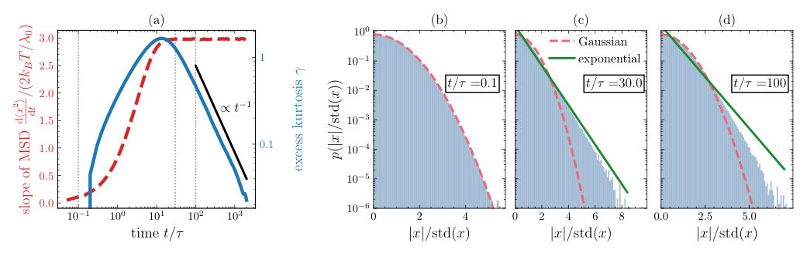
<figcaption class="paper-figure-caption"><b>Fig 1.</b> FIG. 1. Numerical results obtained from integrating Eq. (3) with λ(v) = λ0ϵ tanh(v/ϵ)/v and ϵ2 = 0.1kBT/m, using an Euler- Maruyama scheme. (a) Evolution of the slope of the MSD d⟨x2⟩/dt (red line) and the excess kurtosis γ (blue line) over time in units of τ = m/λ0. The black line reflects a power-law dependence ∝t−1 included for comparison. (b)–(d) Histograms of the displacement distributions p(|x|/std(x)) as a function of overall displacements x normalized by their standard deviation std(x) at the times indicated by vertical dotted lines in (a), in chronological order. Pink dashed lines are Gaussian fits to the data, the green solid line represents an exponential distribution.</figcaption>
</figure>
<figure class="paper-figure-card">
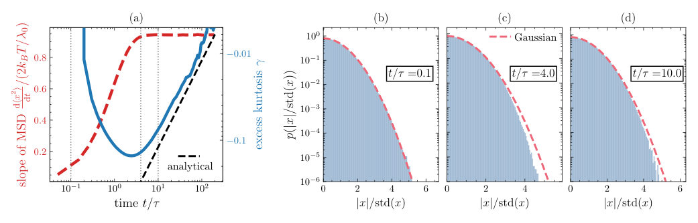
<figcaption class="paper-figure-caption"><b>Fig 2.</b> FIG. 2. Numerical results of integrating Eq. (3) with λ(v) = λ0(1 + αv2) and α = 0.05m/(kBT), using an Euler-Maruyama scheme. (a) Evolution of the slope of the MSD d⟨x2⟩/dt (dashed red line) and the excess kurtosis γ (solid blue line) over time in units of τ = m/λ0. The dashed black line is the analytical prediction from Eq. (13). (b)–(d) Histograms of the displacement distributions p(|x|/std(x)) as a function of overall displacements x normalized by their standard deviation std(x) at the times indicated by vertical dotted lines in (a), in chronological order. Dashed pink lines correspond to Gaussian fits to the data.</figcaption>
</figure>
<figure class="paper-figure-card">
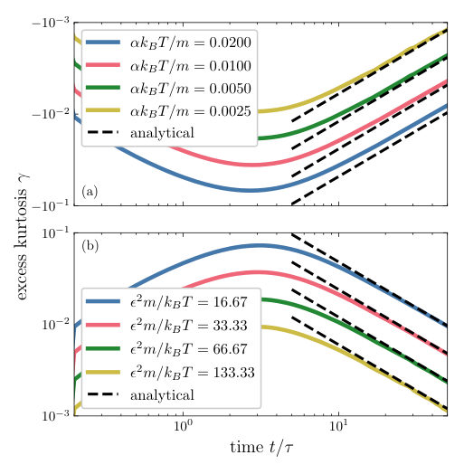
<figcaption class="paper-figure-caption"><b>Fig 3.</b> FIG. 3. Excess kurtosis γ evaluated from numerical simula- tions according to Eq. (3) as a function of time t for different strengths of nonlinear friction. Analytical predictions are in- cluded as black dashed lines following Eq. (13). (a) Results for the friction force according to Eq. (5) and varying values of the rescaled friction parameter ¯α = αkBT/m. (b) Anal- ogous results for the tanh-friction introduced in Eq. (4) and varying values of its strength as set by the parameter ϵ. For comparison with the analytical prediction in Eq. (13) and the results in (a), we use the relation α = −1/(3ϵ2).</figcaption>
</figure>

**Summary.** This work theoretically explains Brownian yet non-Gaussian diffusion (BnGD) by modeling a particle subject to nonlinear friction. The authors show that the specific form of nonlinear drag, when correctly balanced by thermal noise to maintain equilibrium, is sufficient to cause the displacement statistics to deviate from Gaussian predictions at intermediate times. This provides a fundamental physical mechanism for observing non-Gaussianity in otherwise diffusive processes.

**Why it may be interesting.** While focused on classical statistical mechanics, the mathematical techniques involving non-equilibrium noise and the analysis of higher-order moments (kurtosis) are highly relevant to open quantum systems where non-Markovian or nonlinear dissipation models are used.

Detailed structure

**Main problem.** The paper addresses the physical mechanism behind Brownian yet non-Gaussian diffusion (BnGD), where the mean squared displacement grows linearly (Brownian) but the displacement statistics are non-Gaussian at intermediate times.

**Main result.** Nonlinear friction, when coupled with velocity-dependent thermal noise under correct stochastic equilibrium conditions, is sufficient to generate the observed non-Gaussian displacement statistics.

**Method.** The analysis uses the Fokker-Planck equation approach, supplemented by systematic perturbative expansions in the nonlinearity parameter, and is validated through numerical simulation of the corresponding Langevin equation.

**Model / system.** The model is a 1D stochastic process governed by a Langevin equation incorporating a nonlinear friction function $\lambda(v)$. The system is analyzed under the constraint of stochastic equilibrium.

**Key observables.** Mean Squared Displacement (MSD), excess kurtosis ($\gamma$), and the displacement probability distribution (DisD).

**Important parameters / regimes.** The nonlinear friction function $\lambda(v)$ (e.g., sublinear or superlinear forms) and the small nonlinearity parameter $\mu$ used in the expansion.

**Assumptions / limitations.** The analysis assumes homogeneous environments and relies on perturbative expansions for small nonlinearity parameters ($\mu \ll 1$).

**Figures summary.** Figures demonstrate that for both sublinear and superlinear friction, the MSD remains linear while the excess kurtosis decays as $t^{-1}$, and the displacement histograms show non-Gaussianity at intermediate times.

**Paper structure.** The paper establishes the theoretical framework using the Fokker-Planck equation, derives the necessary stochastic differential equation (SDE) for simulation, and then presents results showing how specific nonlinear friction forms reproduce the characteristic non-Gaussian crossover behavior.

Abstract

In Brownian yet non-Gaussian diffusion (BnGD) the mean squared displacement grows linearly in time. However, the displacement statistics do not follow a normal distribution throughout. Typically, they are non-Gaussian at intermediate times, before they cross over to Gaussian in the long-time regime. We demonstrate that nonlinear friction under correctly applied stochastic equilibrium conditions provides an explanation of this phenomenon also for homogeneous environments.

[↑ back to top](#top)

### [The Geometry of Dissipative Complexity: A Levi-Type Decomposition Theorem for Markovian Quantum Dynamics via Lie Wedges and Invariant Cones](http://arxiv.org/abs/2608.27330v1)

**Authors:** Yibin Wang, Dhara Thakkar  
**Type:** theory · **Category:** other · **PDF:** <https://arxiv.org/pdf/2608.27330v1>  
**Analysis basis:** full PDF text, analyzed in chunks
**Topic relevance:** `correlated / nonlocal dissipation` **3/5** · `driven-dissipative phase transition` **3/5** · `methods for driven-dissipative` **3/5** · `Keldysh / 2PI / non-Gaussian methods` **2/5** · `non-equilibrium universality` **2/5** · `quantum measurements` **1/5**

↔ Scroll figures horizontally

<figure class="paper-figure-card">
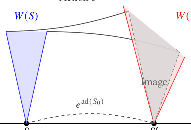
<figcaption class="paper-figure-caption"><b>Fig 1.</b> Figure 1: A schematic of the Fiber Compatibility Condition and the Shear-and-Compensate mechanism. The adjoint action 𝑒ad(𝑋0) moves the base point 𝑆to 𝑆′ and shears the fiber 𝑊(𝑆) (blue) into the dashed image. The FCC compensates by requiring the fiber 𝑊(𝑆′) (red) to contain that sheared image, so the wedge stays admissible under the action.</figcaption>
</figure>

**Summary.** This paper extends classical Lie algebra theory to open quantum systems by introducing the 'Dynamical Lie Wedge' to capture irreversible dissipation. It proves a Levi-Type Decomposition Theorem for this wedge, classifying the system's structure based on its semisimple and solvable components. This provides a rigorous mathematical framework for analyzing quantum control in dissipative environments.

**Why it may be interesting.** This work provides a deep mathematical structure for understanding how dissipation fundamentally alters the algebraic description of quantum evolution, offering tools for classifying open quantum control systems.

Detailed structure

**Main problem.** To develop a structural classification framework for open quantum systems undergoing Markovian dynamics by extending the classical Levi decomposition from Lie algebras to the geometry of dissipative generators.

**Main result.** The authors prove a Levi-Type Decomposition Theorem for dynamical Lie wedges, decomposing the structure into semisimple and solvable components and providing a converse reconstruction.

**Method.** The methodology combines Lie algebra theory (Levi decomposition) with convex geometry, utilizing the concept of the Dynamical Lie Wedge (a convex cone) to account for irreversible dissipation.

**Model / system.** The focus is on open Markovian quantum systems whose dynamics are governed by Lindbladians, which introduce irreversible directions not captured by standard Lie algebras.

**Key observables.** The structure of the dynamical Lie wedge ($\mathcal{W}$), the total dissipation strength, and the classification into four structural types.

**Important parameters / regimes.** The dissipation strength, the structure of the solvable radical, and the coupling between semisimple and solvable parts.

**Assumptions / limitations.** The core assumption is that the standard Lie algebra approach fails due to dissipation, necessitating the use of the Lie Wedge framework, which is constrained by physical requirements like Complete Positivity.

**Figures summary.** Not specified in the notes, but the structure implies diagrams illustrating the decomposition of the wedge into its semisimple and solvable components.

**Paper structure.** The paper builds from the known Levi decomposition for closed systems to the necessity of the Lie Wedge for open systems, culminating in the proposed decomposition theorem for the wedge itself, and providing concrete examples of failure (violating CCP) and successful classification.

Abstract

Lie algebras describe how control Hamiltonians combine in closed quantum systems. In open Markovian systems, however, dissipation introduces irreversible directions that the Lie algebra alone does not retain. A dynamical Lie wedge preserves this information as a convex cone of locally admissible generators. The classical Levi decomposition separates a finite-dimensional Lie algebra into semisimple and solvable parts. In this work, we prove a corresponding decomposition and reconstruction theorem for dynamical Lie wedges.   The theorem decomposes the wedge into semisimple and solvable data, records how these components are coupled, and provides a converse reconstruction of the wedge. The framework yields four structural types of the generated algebra. We further prove that the total dissipation strength of every admissible generator depends only on its coordinate in the solvable radical. In particular, if the generated Lie algebra is semisimple, every admissible generator is Hamiltonian. Together, these results extend Lie-algebraic structural methods to irreversible Markovian control and clarify how dissipation is encoded in the generator geometry.

[↑ back to top](#top)

### [Time and Momentum Resolved Tunneling Spectroscopy of Floquet dynamics](http://arxiv.org/abs/2608.26270v1)

**Authors:** Lucas Q. Silveira, Adrian E. Feiguin  
**Type:** theory · **Category:** strongly correlated electrons · **PDF:** <https://arxiv.org/pdf/2608.26270v1>  
**Analysis basis:** full PDF text, analyzed in chunks
**Topic relevance:** `analog quantum simulation` **3/5** · `quantum measurements` **3/5** · `Keldysh / 2PI / non-Gaussian methods` **2/5** · `driven-dissipative phase transition` **2/5** · `methods for driven-dissipative` **2/5** · `non-equilibrium universality` **2/5**

↔ Scroll figures horizontally

<figure class="paper-figure-card">
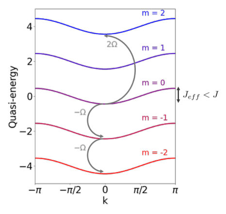
<figcaption class="paper-figure-caption"><b>Fig 1.</b> FIG. 1. Periodically driving the system induces formation of Floquet replicas, due to photon-assisted transitions, and lead to the renormalization of the bandwidth, resulting in a slower propagation of charges.</figcaption>
</figure>
<figure class="paper-figure-card">
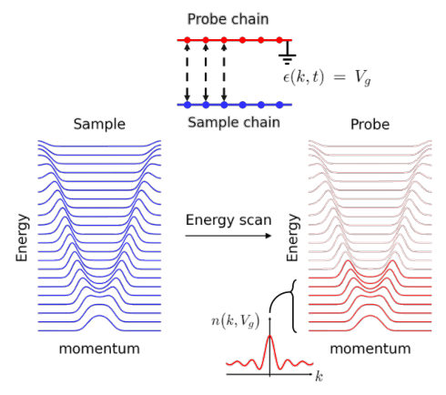
<figcaption class="paper-figure-caption"><b>Fig 2.</b> FIG. 2. A sample subject to a periodic drive is weakly coupled to a non-interacting probe held at bias voltage Vg, where the tunneling amplitude follows a gaussian envelope. The instan- taneous energy spectrum can then be measured by shifting the center of the gaussian envelope, and computing the mo- mentum distribution of the probe at each time step.</figcaption>
</figure>
<figure class="paper-figure-card">
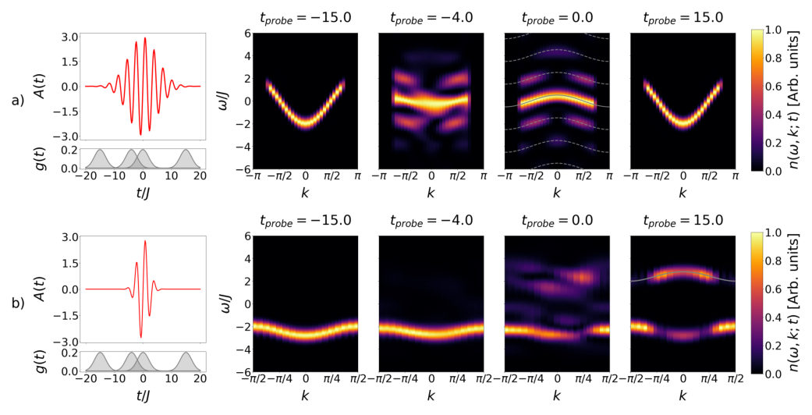
<figcaption class="paper-figure-caption"><b>Fig 3.</b> FIG. 3. Out-of-equilibrium energy spectrum of a periodically driven non-interacting fermionic chain subject to a gaussian pulse A(t) = A0 exp(−t2/2δ2) sin(Ωt). The color scale shows the occupation of the probe as a function of momentum and probing energy at different probing times tprobe. Solid and dashed gray lines indicate the instantaneous energy band and its Floquet replicas, respectively. a) Tight-binding model ∆/J = 0 at three-quarter filling, with (A0, Ω, δ) = (3, 2, 5). b) Ionic model ∆/J = 2 at half-filling, with (A0, Ω, δ) = (3, 2, 2).</figcaption>
</figure>
<figure class="paper-figure-card">
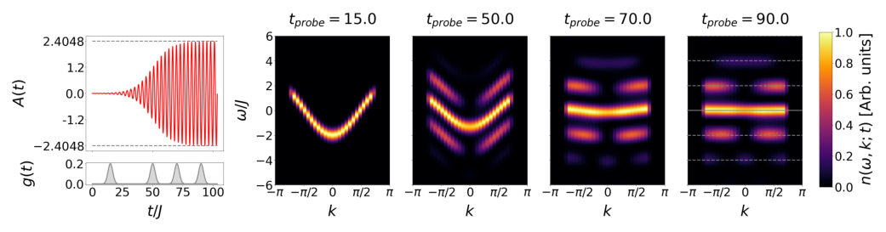
<figcaption class="paper-figure-caption"><b>Fig 4.</b> FIG. 4. Transition to a dynamically localized state for the three-quarter filled tight-binding model ∆/J = 0. The amplitude of the drive is tuned to the first zero of J0(A0) by following the hyperbolic pulse A(t) = A0/2 [1 + tanh ((t −t0)/δ)] sin(Ωt) with (A0, Ω, δ) = (2.40482 . . . , 2, 15). Conventions and color scale as in Fig. 3.</figcaption>
</figure>
<figure class="paper-figure-card">
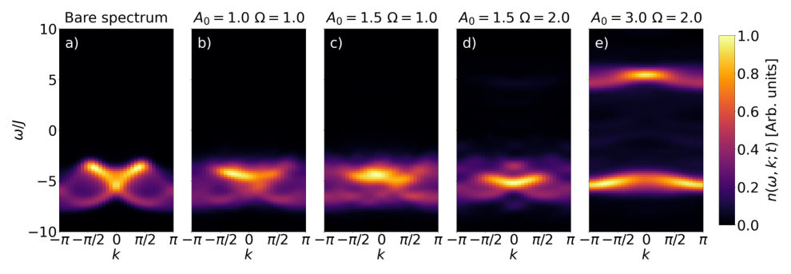
<figcaption class="paper-figure-caption"><b>Fig 5.</b> FIG. 5. Out-of-equilibrium energy spectrum of periodically driven Hubbard model at half-filling with U/J = 10. The color scale shows the occupation of the probe as a function of momentum and probing energy. We set tprobe = tmax/2 = 7.5 and use driving protocol A(t) = A0 sin(Ωt).</figcaption>
</figure>

**Summary.** This work presents a novel time and momentum resolved tunneling spectroscopy method to measure the instantaneous energy spectrum of periodically driven quantum systems. It moves beyond the high-frequency approximation to capture non-adiabatic physics in models ranging from non-interacting chains to strongly correlated Hubbard models. The key finding is the ability to microscopically describe the emergence of novel in-gap states driven by external fields or temperature.

**Why it may be interesting.** The technique provides a powerful, non-equilibrium diagnostic tool to measure spectral properties in driven many-body systems, which is crucial for understanding Floquet engineering beyond simple approximations.

Detailed structure

**Main problem.** The paper aims to probe the instantaneous energy spectrum of periodically driven quantum systems beyond the simplified high-frequency limit, capturing non-adiabatic effects.

**Main result.** The proposed spectroscopy protocol successfully maps the instantaneous energy spectrum, providing a microscopic description for the emergence of in-gap states driven by resonant driving or thermal effects.

**Method.** A time and momentum resolved tunneling spectroscopy protocol is introduced, involving weak coupling to a non-interacting probe chain whose occupation is measured as a function of bias voltage.

**Model / system.** The study analyzes periodically driven quantum systems, including non-interacting fermionic chains and strongly correlated models like the Hubbard and t-V chains, governed by time-dependent Hamiltonians.

**Key observables.** Instantaneous energy spectrum, momentum distribution of the probe, and the emergence of in-gap energy bands ($\epsilon_{DW}(k)$).

**Important parameters / regimes.** Driving frequency ($\Omega$), interaction strength ($U, V$), and the coupling strength of the probe ($g_0, \sigma$).

**Assumptions / limitations.** The method assumes the probe coupling remains in the perturbative regime, and some analyses rely on the atomic limit ($J=0$) or the strong coupling limit ($J \ll U$).

**Figures summary.** Figures illustrate Floquet replicas formed by driving, the schematic setup of the probe coupling, and the resulting spectral weight transfer and in-gap band structure.

**Paper structure.** The paper introduces the spectroscopy protocol, benchmarks it on non-interacting models, generalizes it to strongly correlated systems using tDMRG, and provides a detailed microscopic analysis of in-gap state formation via domain wall dynamics.

Abstract

Periodically driven quantum systems provide a powerful route to engineer novel states of matter by controlling their effective Hamiltonians through external fields. However, most treatments are usually simplified by considering the high-frequency limit, and do not account for the processes taking place in the transient regime during the onset of the drive. In this work, we introduce a time and momentum resolved tunneling spectroscopy protocol to probe the instantaneous energy spectrum of Floquet-driven systems beyond the high-frequency regime, capturing both emergent effects and non-adiabatic phenomena without requiring explicit reconstruction of the full time-dependent Green's function. We benchmark the method on driven non-interacting fermionic models, and then generalize the approach to strongly correlated systems with the aid of time-dependent density matrix renormalization group techniques. We also provide a microscopic description to the emergence of in-gap states under resonant driving, and briefly explore its finite temperature analog.

[↑ back to top](#top)

### [Energy Ordering from Nonlinear Quantum Dissipation](http://arxiv.org/abs/2608.26845v1)

**Authors:** Alireza Ataei, Olle Eriksson, Vahid Azimi-Mousolou  
**Type:** theory · **Category:** other · **PDF:** <https://arxiv.org/pdf/2608.26845v1>  
**Analysis basis:** full PDF text, analyzed in chunks
**Topic relevance:** `driven-dissipative phase transition` **3/5** · `methods for driven-dissipative` **3/5** · `non-equilibrium universality` **2/5** · `Keldysh / 2PI / non-Gaussian methods` **1/5** · `analog quantum simulation` **1/5** · `correlated / nonlocal dissipation` **1/5** · `quantum measurements` **1/5** · `scars & prethermalization` **1/5**

↔ Scroll figures horizontally

<figure class="paper-figure-card">
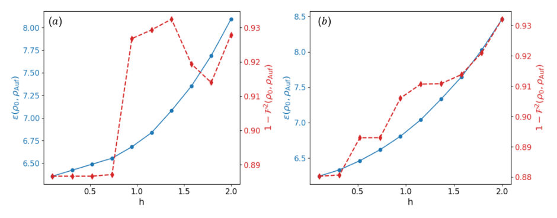
<figcaption class="paper-figure-caption"><b>Fig 1.</b> FIG. 1: Infidelity and residual energy error between the initial random state and the Aufbau state as a function of magnetic field strength h. The residual energy error and h are expressed in units of J and J/µ, respectively, while the infidelity is dimensionless.</figcaption>
</figure>
<figure class="paper-figure-card">
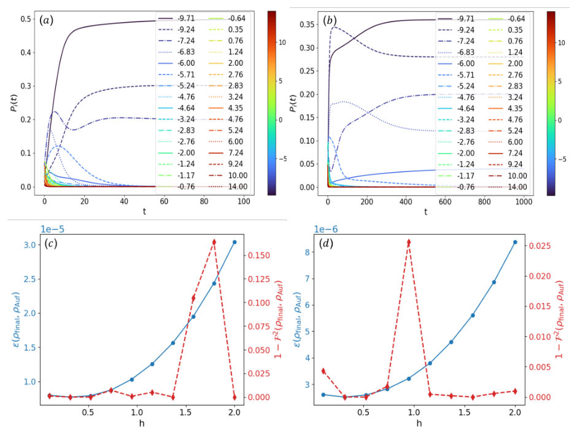
<figcaption class="paper-figure-caption"><b>Fig 2.</b> FIG. 2: Numerical simulations of QLLG dynamics converging to the Aufbau state for a five-spin Heisenberg chain. Panels (a) and (b) show the probability energy-level populations Pi(t) for rank-3 and rank-5 initial mixed states, respectively, at h = 2. In each panel, the line styles and colors identify the corresponding energy eigenvalues, as indicated in the legend. Panels (c) and (d) show the residual energy error, normalized by the exchange interaction J, and the infidelity between the final QLLG state and the Aufbau state as functions of the transverse field h. The magnetic field h and time t are expressed in units of J/µ and ℏ/J, respectively.</figcaption>
</figure>

**Summary.** This theoretical paper demonstrates that energy ordering, analogous to the Aufbau principle, can emerge dynamically in quantum many-body systems solely due to nonlinear quantum dissipation. By analyzing the QLLG dynamics, the authors prove that the system naturally relaxes to a unique, low-energy configuration. This offers a fundamental, non-principle-based route for selectively preparing quantum states.

**Why it may be interesting.** This work provides a non-Hamiltonian, dissipative mechanism for achieving quantum organization, which is highly relevant for understanding open quantum systems and state preparation protocols.

Detailed structure

**Main problem.** The paper addresses the fundamental question of the dynamical mechanism by which a generic quantum state spontaneously develops an energy hierarchy, mimicking the Aufbau principle.

**Main result.** The energy ordering emerges intrinsically under nonlinear quantum dissipation (QLLG dynamics), driving the system toward a unique, low-energy asymptotic state diagonal in the energy eigenbasis.

**Method.** The analysis combines analytical proofs using Lyapunov functionals and stability arguments with numerical simulations of the QLLG master equation.

**Model / system.** The system is modeled using the quantum Landau-Lifshitz-Gilbert (QLLG) dynamics applied to a Heisenberg spin-1/2 chain Hamiltonian. The evolution is governed by a non-Hermitian-like master equation.

**Key observables.** Population probabilities $P_i(t)$, residual energy error, and quantum fidelity relative to the ordered state $
ho_{	ext{Auf}}$.

**Important parameters / regimes.** The damping parameter $\kappa$, the system size $N$, and the energy gaps between eigenstates.

**Assumptions / limitations.** The analysis assumes the existence of a decreasing energy functional $V(
ho)$ and focuses on generic finite-rank mixed quantum states.

**Figures summary.** Figures show the convergence of population probabilities $P_i(t)$ towards an ordered state and the decay of residual energy error and infidelity as the system relaxes.

**Paper structure.** The paper establishes the problem, derives the QLLG dynamics, proves analytically that the system minimizes an energy functional leading to an energy-ordered state, and confirms this convergence via numerical simulations.

Abstract

Energy-ordered occupation is deeply embedded in quantum physics, from the Aufbau principle governing the filling of electronic states in atoms and molecules to the emergence of low-energy configurations in quantum many-body systems. However, the dynamical mechanism by which a generic quantum state develops such an energy hierarchy remains a fundamental question. Here we show that such an energy hierarchy can emerge dynamically from nonlinear quantum dissipation. Rather than being imposed as a principle or generated through coupling to a thermal reservoir, an Aufbau-like ordering of energy levels emerges intrinsically under quantum Landau-Lifshitz-Gilbert dynamics from a generic initial mixed state. This convergence is a nontrivial consequence of Lyapunov monotonicity and instability of disordered population configurations. The resulting dynamics establish an intrinsic nonlinear mechanism for organizing density-matrix populations and provides a route toward selective preparation of low-energy subspaces. Numerical simulations confirm analytical predictions and illustrate convergence toward low-energy sectors.

[↑ back to top](#top)

### [Strong Coupling of the Mo Mo Stretching Mode to a Locally Confined Stokes Raman Field in Mo2 Molecular Resonators](http://arxiv.org/abs/2608.26482v1)

**Authors:** Miao Meng, Ying Ning Tan, Guang Yuan Zhu, Chun Y. Liu  
**Type:** experiment · **Category:** other · **PDF:** <https://arxiv.org/pdf/2608.26482v1>  
**Analysis basis:** full PDF text, analyzed in chunks
**Topic relevance:** `Tavis-Cummings & cavity-many-emitter` **3/5** · `quantum optics experiment` **3/5** · `driven-dissipative phase transition` **2/5** · `analog quantum simulation` **1/5** · `correlated / nonlocal dissipation` **1/5** · `interference shaping light` **1/5** · `methods for driven-dissipative` **1/5** · `quantum measurements` **1/5**

↔ Scroll figures horizontally

<figure class="paper-figure-card">
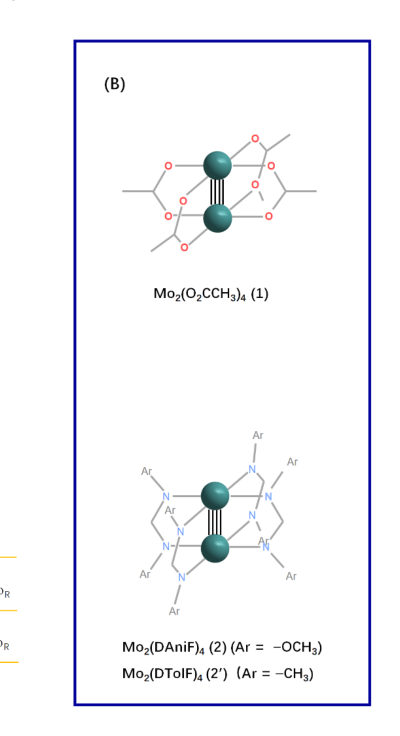
<figcaption class="paper-figure-caption"><b>Fig 1.</b> Figure 1. Molecular system and proposed vibration–field coupling framework. (A)</figcaption>
</figure>
<figure class="paper-figure-card">
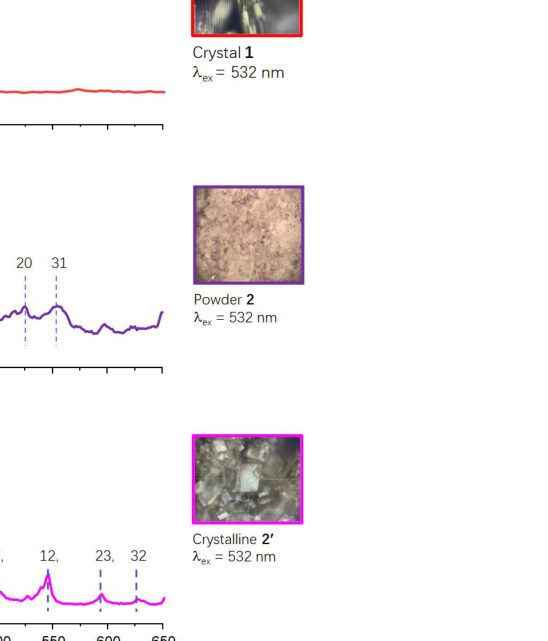
<figcaption class="paper-figure-caption"><b>Fig 2.</b> Figure 2. Raman spectra of Mo₂(O₂CCH₃)₄ (1), Mo₂(DAniF)₄ (2), and Mo₂(DTolF)₄ (2′)</figcaption>
</figure>
<figure class="paper-figure-card">
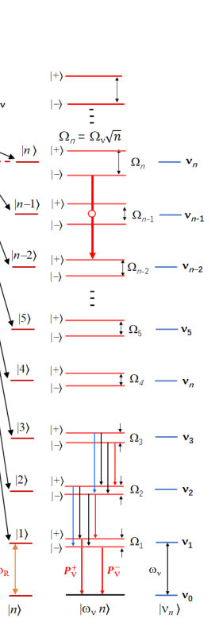
<figcaption class="paper-figure-caption"><b>Fig 3.</b> Figure 3. Effective dressed-state ladder for coupling of the Mo–Mo stretching vibration</figcaption>
</figure>
<figure class="paper-figure-card">
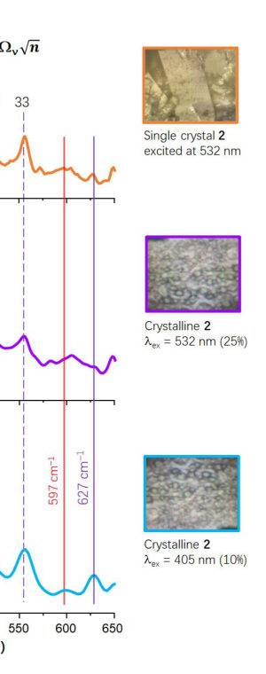
<figcaption class="paper-figure-caption"><b>Fig 4.</b> Figure 4 ．Multiplicity and reproducibility of Mollow-type Raman sidebands in</figcaption>
</figure>

**Summary.** The authors demonstrate strong coupling between the $	ext{Mo–Mo}$ stretching vibration and a locally confined Raman field within $	ext{Mo}_2$ molecular complexes. By analyzing spectral features like Mollow sidebands, they confirm that the $	ext{Mo}_2$ unit functions as an intrinsic molecular resonator. This establishes a new platform for observing cavity-free light-matter interaction in molecular systems.

**Why it may be interesting.** This work provides spectroscopic evidence for cavity-free light-matter coupling, extending concepts from engineered nanophotonics into the realm of molecular quantum optics, which is highly relevant to AMO physics.

Detailed structure

**Main problem.** To determine if a chemically defined molecular structure can intrinsically generate, confine, and enhance a local scattering field sufficiently to achieve coherent coupling with one of its own characteristic vibrations, moving beyond externally fabricated cavities.

**Main result.** The $	ext{Mo}_2$ unit acts as an intrinsic molecular optical resonator, exhibiting strong coupling between the $	ext{Mo–Mo}$ stretching vibration and the locally confined Raman field, evidenced by Rabi-type splitting and Mollow-type sidebands.

**Method.** Raman spectroscopy measurements on single crystals and powders of $	ext{Mo}_2$ complexes, analyzing spectral features like sideband displacements and splitting patterns.

**Model / system.** The system is modeled using a Jaynes-Cummings-type coupling Hamiltonian, treating the $	ext{Mo}_2$ unit as both the Raman-active oscillator and the molecular resonator supporting the local field.

**Key observables.** Rabi-type splitting, Mollow-type sidebands, and sideband displacements following the photon-number-dependent relation $\Omega_n = \Omega_
u \sqrt{n}$.

**Important parameters / regimes.** $	ext{Mo–Mo}$ stretching frequency ($\omega_
u \approx 400 	ext{ cm}^{-1}$); coupling strength ($g$); photon number index ($n$).

**Assumptions / limitations.** The $	ext{Mo}_2$ unit acts as a highly confining, enhancing optical resonator, allowing for the description via a quantized field model.

**Figures summary.** Figures compare spectra of different $	ext{Mo}_2$ complexes, showing a single band for the less polarizable complex and structured sidebands/splitting for the more polarizable ones.

**Paper structure.** The paper progresses by first establishing the need for intrinsic field confinement, then applying the JC coupling model to interpret observed sidebands, and finally reanalyzing historical data to confirm the model's applicability across different $	ext{Mo}_2$ complexes.

Abstract

Confining optical fields to molecular dimensions is a central objective in nanophotonics and molecular quantum optics. Here, we report strong coupling of the Mo Mo stretching vibration to a locally confined Raman scattering field in quadruply bonded dimolybdenum complexes. Under ambient, cavity-free conditions, the dimolybdenum formamidinate complexes Mo2(DAniF)4 and Mo2(DTolF)4 exhibit Rabi-type splitting, Mollow-type sidebands, and higher-order Raman features centered near the Mo Mo stretching frequency of 400 cm-1, indicating formation of dressed vibration field states. The sideband displacements from the resonance follow the photon-number-dependent relation Ωn=Ωνn, consistent with Jaynes Cummings-type coupling, while strongly displaced Raman features are assigned to leapfrog transitions within the same dressed-state ladder. In contrast, the less polarizable Mo2(O2CCH3)4 complex exhibits essentially a single Mo Mo stretching band. Reanalysis of reported resonance Raman spectra of an alkynyl Mo2 complex further supports this coupling framework. These results suggest that the Mo2 unit simultaneously serves as the Raman active oscillator and the molecular resonator that supports, confines, and enhances the locally generated scattering field, providing spectroscopic evidence for vibration field coupling and optical-field confinement within a chemically defined metal metal bond.

[↑ back to top](#top)

### [Topologically protected perfect crossed Andreev reflection in flux-engineered quantum wire junctions](http://arxiv.org/abs/2608.26702v1)

**Authors:** Abhiram Soori  
**Type:** theory · **Category:** other · **PDF:** <https://arxiv.org/pdf/2608.26702v1>  
**Analysis basis:** full PDF text, analyzed in chunks
**Topic relevance:** `Full counting statistics` **3/5** · `Keldysh / 2PI / non-Gaussian methods` **2/5** · `analog quantum simulation` **2/5** · `quantum measurements` **2/5** · `correlated / nonlocal dissipation` **1/5** · `driven-dissipative phase transition` **1/5** · `methods for driven-dissipative` **1/5** · `non-equilibrium universality` **1/5**

↔ Scroll figures horizontally

<figure class="paper-figure-card">
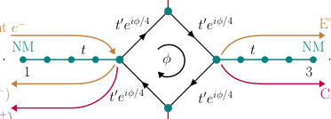
<figcaption class="paper-figure-caption"><b>Fig 1.</b> FIG. 1. Schematic of the flux-tuned junction. Two normal wires (1, 3) and two superconducting wires (2, 4) are coupled via a central square lattice threaded by a ϕ-flux. For an elec- tron incident from wire 1, destructive interference at ϕ = π completely suppresses both ET and AR. Tuning the lattice hopping to t′ ≃t/ √</figcaption>
</figure>
<figure class="paper-figure-card">
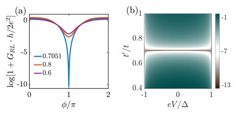
<figcaption class="paper-figure-caption"><b>Fig 2.</b> FIG. 2. Giant enhancement of crossed Andreev reflection. (a) The logarithmic nonlocal conductance, η = log[1 + GRLh/(2e2)], versus magnetic flux ϕ at zero bias for various junction hoppings t′/t (shown in the legend). (b) Dependence of η on bias voltage V and hopping t′ at ϕ = π. Parameters are µ = −t, ∆= 0.01t, and ϵ0 = 0.6∆.</figcaption>
</figure>
<figure class="paper-figure-card">
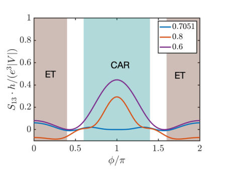
<figcaption class="paper-figure-caption"><b>Fig 3.</b> FIG. 4. Cross-correlation shot noise S13 between the nor- mal terminals as a function of the applied flux ϕ at a small bias voltage V near zero energy for various hopping ratios t′/t. The strictly positive noise near ϕ = π (green shaded region) is a feature of CAR-dominated Cooper-pair splitting. Notably, for the optimal hopping t′ = 0.7051t, the noise vanishes com- pletely at ϕ = π, reflecting the deterministic, fluctuation-free nature of perfect CAR (PCAR = 1). Conversely, the brown shaded regions denote the ET-dominated regime. Parameters are the same as in Fig. 2.</figcaption>
</figure>
<figure class="paper-figure-card">
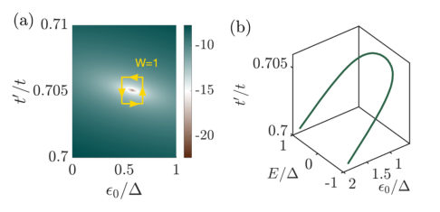
<figcaption class="paper-figure-caption"><b>Fig 4.</b> FIG. 3. Topological protection of perfect CAR. (a) Map of η versus ϵ0 and t′ at zero bias. The phase winding of the electron reflection (ER) amplitude along the indicated closed loop yields W = 1, topologically guaranteeing a zero of ER (perfect CAR) within the enclosed region. (b) Trajectory of the perfect CAR condition in the (E, ϵ0, t′) parameter space. Other parameters are the same as in Fig. 2.</figcaption>
</figure>
<figure class="paper-figure-card">
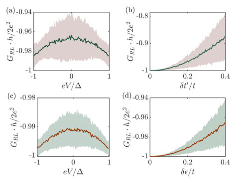
<figcaption class="paper-figure-caption"><b>Fig 5.</b> FIG. 5. Robustness of CAR-dominated non-local conduc- tance under structural and chemical potential fluctuations. (a,b) Bond disorder with hoppings in the range [t′ −δt′/2, t′ + δt′/2]. (a) Bias dependence of GRL at fixed bond disorder amplitude δt′ = 0.2t near t′ = 0.706t. (b) GRL versus bond disorder strength δt′ at zero bias. (c,d) Onsite disorder with site energies in [−δϵ/2, δϵ/2]. (c) Bias dependence of GRL at fixed onsite disorder amplitude δϵ = 0.2t. (d) GRL versus onsite disorder strength δϵ at zero bias. Solid lines denote configuration averages (over 250 realizations) and shaded re- gions represent standard deviation. The fixed parameters are identical to those in Fig. 2.</figcaption>
</figure>

**Summary.** This work proposes a novel, flux-tunable quantum junction architecture that achieves perfect Crossed Andreev Reflection (CAR) by engineering destructive quantum interferences at $\phi=\pi$. The authors use topological theory and cross-correlation shot noise measurements to prove that this perfect, non-local entanglement generation is robust and fundamentally protected against disorder.

**Why it may be interesting.** The use of topological invariants (winding number) to guarantee a physical transport property (perfect CAR) provides a powerful, robust design principle for quantum devices, which is highly relevant to open quantum systems engineering.

Detailed structure

**Main problem.** The core challenge is to isolate and deterministically generate non-locally entangled electron pairs via Crossed Andreev Reflection (CAR) in solid-state systems, separating it from competing processes like electron tunneling (ET) and local Andreev reflection (AR).

**Main result.** The authors demonstrate that at exactly half a magnetic flux quantum ($\phi = \pi$), a specific flux-tunable junction achieves 100% efficient, topologically protected CAR, confirmed by a strictly positive cross-correlation shot noise signature.

**Method.** The analysis combines theoretical modeling using a tight-binding Hamiltonian with advanced mathematical tools, specifically the Cauchy argument principle, to prove topological protection.

**Model / system.** The system is a flux-tunable four-terminal normal metal-superconductor junction, modeled by a central square lattice threaded by a magnetic flux $\phi$. The Hamiltonian describes hopping amplitudes and superconducting pairing.

**Key observables.** Nonlocal differential conductance ($G_{RL}$), cross-correlation shot noise ($S_{13}$), and the topological winding number ($W$).

**Important parameters / regimes.** The critical flux value $\phi = \pi$, the superconducting gap ($\Delta$), and the ratio of hopping amplitudes ($t'/t$).

**Assumptions / limitations.** The proof relies on the Cauchy argument principle to guarantee the topological protection of the perfect CAR state, and the analysis assumes the system can be modeled by a tight-binding lattice.

**Figures summary.** Figures illustrate the mechanism of interference suppression at $\phi=\pi$, show the quantized topological winding number ($W=1$), and confirm the unique positive cross-correlation shot noise signature ($S_{13}$) at this flux.

**Paper structure.** The paper first establishes the physical problem and the Hamiltonian. It then calculates key observables like $G_{RL}$ and $S_{13}$. The core of the work uses topological arguments (Cauchy principle) to prove the existence of perfect CAR, followed by demonstrating its robustness against disorder.

Abstract

Generating non-locally entangled electron pairs via Cooper-pair splitting is vital for solid-state quantum information processing. However, isolating the underlying crossed Andreev reflection (CAR) is challenging due to competing transport processes like electron tunneling (ET) and local Andreev reflection (AR). Here, we propose a flux-tunable four-terminal normal metal-superconductor junction that achieves deterministic, 100\% efficient CAR. We demonstrate that at exactly half a magnetic flux quantum ($φ=π$), exact destructive Aharonov-Bohm and Peierls interferences structurally forbid ET and AR respectively. By tuning the central junction hopping, electron reflection is also suppressed to zero. Using the Cauchy argument principle, we prove that this suppression manifests as a quantized topological winding number, guaranteeing a topologically protected unit CAR probability. We establish that this regime is characterized by a strictly positive cross-correlation shot noise, providing an unambiguous experimental signature of Cooper-pair splitting. Furthermore, this perfect CAR is nearly broadband within the superconducting gap and remarkably robust against structural disorder, offering a highly resilient architecture for deterministic nonlocal entanglement generation.

[↑ back to top](#top)

### [Dynamics-based nonclassicality witness under dissipative dynamics](http://arxiv.org/abs/2608.27337v1)

**Authors:** Nguyen Vu Khoi Huynh, Nicky Nel Narido Labayna, Martine Schut, Valerio Scarani  
**Type:** theory · **Category:** other · **PDF:** <https://arxiv.org/pdf/2608.27337v1>  
**Analysis basis:** full PDF text, analyzed in chunks
**Topic relevance:** `driven-dissipative phase transition` **3/5** · `methods for driven-dissipative` **3/5** · `Keldysh / 2PI / non-Gaussian methods` **2/5** · `non-equilibrium universality` **2/5** · `correlated / nonlocal dissipation` **1/5** · `quantum measurements` **1/5**

↔ Scroll figures horizontally

<figure class="paper-figure-card">
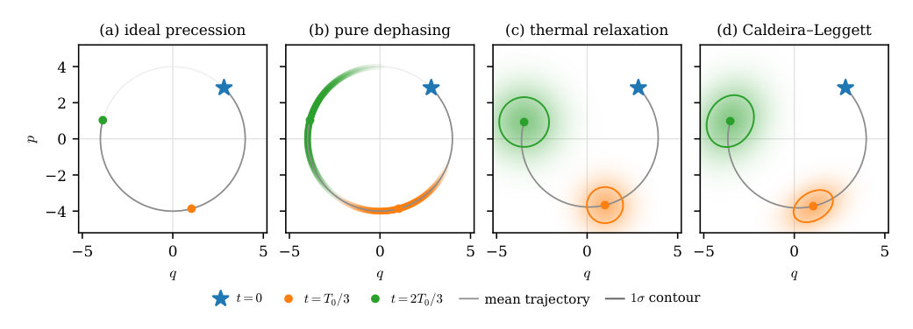
<figcaption class="paper-figure-caption"><b>Fig 1.</b> Figure 1: Phase space evolution of an initial Dirac. The point/star indicates the three equally spaced measurement points. The figure gives an intuitive understanding of how, for each of the three noise models, the dissipation affects the probability of finding the particle in {x &gt; 0}, showing that the classical score can change under dissipative dynamics. For pure dephasing (Section V) there is angular diffusion, for thermal relaxation (Section III) and in the Caldeira-Leggett model (Section IV) the trajectory in-spirals and the state’s variance increases until it thermalizes.</figcaption>
</figure>
<figure class="paper-figure-card">
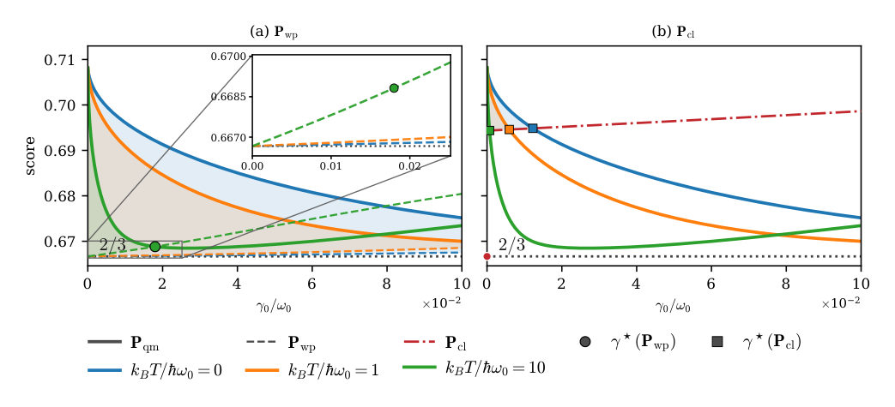
<figcaption class="paper-figure-caption"><b>Fig 2.</b> Figure 2: Score thresholds for the thermal relaxation channel at kBT/ℏω0 = 0, 1, 10 (colour). It compares the quantum maximum Pth qm = λmax( ˆS) (thick solid, (33)) against (a) the Wigner positivity bound Pth wp (dashed, (8)) and (b) against the Dirac bound Pth cl (dash-dotted, (24)).</figcaption>
</figure>
<figure class="paper-figure-card">
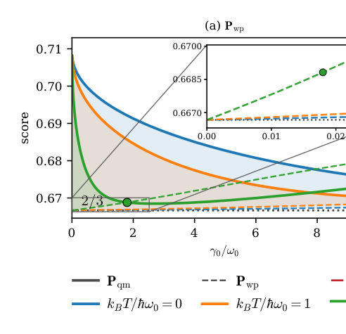
<figcaption class="paper-figure-caption"><b>Fig 3.</b> Figure 2 compares the noise-dependent quantum max- imum Pqm(γ0) = λmax( ˆS) versus the classical bound Pcl(γ0), and the Wigner positivity bound Pwp. As dis- cussed in Section III A, the conservative Dirac bound Pcl(γ0) jumps discretely to ≈0.6943 (25) and sits just below the noiseless optimum Pqm(0) ≈0.709, so the certifiable region Pqm &gt; Pcl closes rapidly. The cer- tifiable region boundary γ⋆ 0/ω0 (Section II D), which is the crossing point of the two curves, lies at 1.22 × 10−2, 5.95×10−3 and 6.72×10−4 for kBT/ℏω0 = 0, 1 and 10, re- spectively. The scale-aware Wigner positivity bound, by contrast, leaves 2/3 continuously, so the certifiable region for Wigner negativity using our Wigner...</figcaption>
</figure>
<figure class="paper-figure-card">
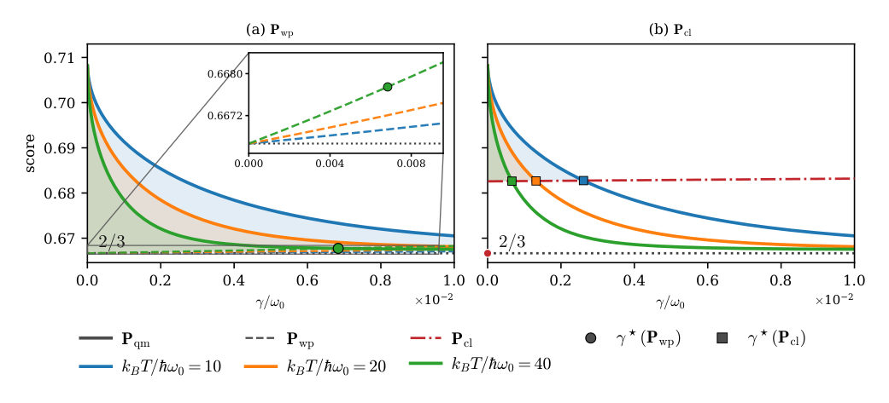
<figcaption class="paper-figure-caption"><b>Fig 4.</b> Figure 3: Score thresholds for the Caldeira-Leggett channel at kBT/ℏω0 = 10, 20, 40 (colour). It compares the quantum maximum Pqm = λmax( ˆS) (thick solid, (41)) against (a) the Wigner positivity bound Pwp (dashed, (8)) and (b) against the temperature-independent Dirac bound Pcl (dash-dotted, (38)).</figcaption>
</figure>
<figure class="paper-figure-card">
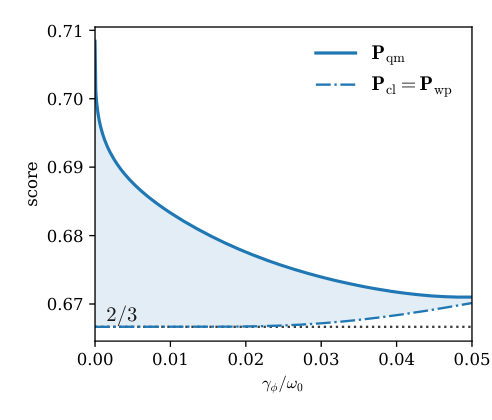
<figcaption class="paper-figure-caption"><b>Fig 5.</b> Figure 4: Quantum maximum score (Pqm) and Dirac- delta bound (which coincides with the exact Wigner pos- itivity bound in this case Pcl = Pwp,e = Pwp) for the pure dephasing channel</figcaption>
</figure>

**Summary.** This paper extends a dynamics-based test for quantum nonclassicality to account for environmental dissipation in harmonic oscillators. Using the Wigner formalism, the authors derive how dissipation shifts the classical bounds, providing quantitative thresholds for when quantum features can still be certified despite noise. This is crucial for interpreting experimental results in realistic quantum systems.

**Why it may be interesting.** This work is highly relevant to open quantum systems and quantum optics, providing rigorous theoretical tools to quantify quantum resources (nonclassicality) in realistic, noisy experimental settings.

Detailed structure

**Main problem.** The paper addresses how to certify quantum nonclassicality in continuous-variable systems when the system dynamics are corrupted by environmental dissipation, which violates the assumption of isolation.

**Main result.** The introduction of dissipation necessitates a 'dissipation-dependent shift' in the classical bound, allowing the authors to derive updated thresholds for nonclassicality witnesses across various noise models.

**Method.** The analysis employs the Moyal-Wigner formalism in phase space to extend Tsirelson's dynamics-based test to include thermal relaxation, pure dephasing, and the Caldeira-Leggett model.

**Model / system.** The physical system is a harmonic oscillator whose dynamics are governed by a Lindblad master equation, which is mapped onto a Fokker-Planck equation for the Wigner function.

**Key observables.** The protocol score $S$, the classical bound $P_{cl}$, and the Wigner positivity bound $P_{wp}$ are the key diagnostics used to certify nonclassicality.

**Important parameters / regimes.** Dissipation rates ($\gamma_0$), thermal occupation number ($ar{n}$), and frequency uncertainty ($\delta$) are crucial parameters defining the noise regimes.

**Assumptions / limitations.** The analysis assumes the validity of the Wigner function approach and relies on taking limits (e.g., $\gamma_0 	o 0^+$) to characterize the behavior of the classical bounds.

**Figures summary.** Figures illustrate the phase space evolution and show the calculated certification thresholds ($P_{wp}$ and $P_{cl}$) for the thermal relaxation channel as a function of noise strength and frequency uncertainty.

**Paper structure.** The paper first introduces the general dynamics-based protocol, then analyzes the specific cases of thermal relaxation, dephasing, and the Caldeira-Leggett model sequentially, deriving updated bounds for each.

Abstract

A dynamics-based test, originally proposed by Tsirelson for the harmonic oscillator, provides a method for certifying quantumness under the assumption of a known Hamiltonian. These tests, however, are typically proposed for isolated systems, an assumption that breaks down in experimental implementation. In this paper, we extend the protocol to the harmonic oscillator coupled to standard models of dissipation: thermal relaxation, pure dephasing, and the Caldeira--Leggett model. Using the Moyal-Wigner formalism of quantum mechanics in phase space, we show that the introduction of dissipation requires a dissipation-dependent shift of the classical bound, and provide the threshold under which the nonclassicality witness retains its validity.

[↑ back to top](#top)

### [Measuring the Sr$^+$ 5s$_{1/2}$ Landé $g$-factor Using Singlet-Triplet Oscillations in a Circular Rydberg State of Strontium](http://arxiv.org/abs/2608.26784v1)

**Authors:** Baptiste Muraz, Mathis Pepin, Corentin Guimard, Michel Brune, Brice Bakkali-Hassani, Sébastien Gleyzes  
**Type:** experiment · **Category:** other · **PDF:** <https://arxiv.org/pdf/2608.26784v1>  
**Analysis basis:** full PDF text, analyzed in chunks
**Topic relevance:** `Rydberg arrays` **3/5** · `analog quantum simulation` **3/5** · `quantum measurements` **3/5** · `QC/QI experiment` **2/5** · `quantum optics experiment` **1/5**

↔ Scroll figures horizontally

<figure class="paper-figure-card">
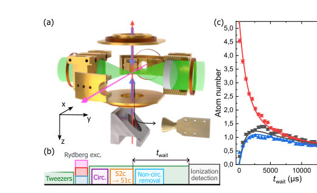
<figcaption class="paper-figure-caption"><b>Fig 1.</b> Figure 1. (a) Scheme of the experimental setup. Six gilded electrodes control the electric field at the position of the atoms. For clarity, only half of the front and right elec- trodes are shown. The electrodes along the y axis include ITO-coated lenses (NA = 0.28), one of which focuses an in- coming 532 nm laser beam (green) into an array of 49 gaus- sian tweezers (900-µm waist). Rydberg excitation is achieved using three laser beams at wavelengths of 461 nm (vertical, blue), 767 nm (vertical, red) and 896 nm (horizontal, pink). A σ−polarized rf field at 250 MHz is generated via the elec- trodes in the horizontal plane. Rydberg atoms are ionized by applying a large electric field across...</figcaption>
</figure>
<figure class="paper-figure-card">
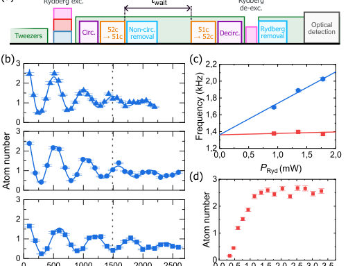
<figcaption class="paper-figure-caption"><b>Fig 2.</b> Figure 2. (a) Experimental sequence. The sequence is iden- tical to that of Fig 1(a) until the end of twait, after which we apply a decircularization sequence (time-reversal of the circu- larization sequence). After decircularization, the tweezers are briefly switched off and the atoms are transferred back to the ground state using a short 896 nm laser pulse, before a large electric field ionizes the remaining Rydberg atoms. (b) Aver- aged number of atoms detected over all traps as a function of twait for different tweezer powers PRyd [squares: 0.94(3) mW, disks: 1.35(4) mW, triangles: 1.77(5) mW]. The solid lines are fits to the expression N(t) = e−t/t1[Ae−t/t2 sin(2πνt + ϕ0) + y1] where...</figcaption>
</figure>
<figure class="paper-figure-card">
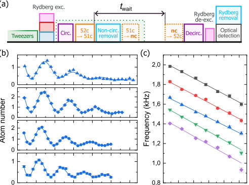
<figcaption class="paper-figure-caption"><b>Fig 3.</b> Figure 3. (a) Experimental sequence. The tweezers are not switched back on during twait (except shortly for B0 &lt; 0, dotted green, see Appendix A). To detect the atoms, we col- lect their fluorescence immediately after transferring the sin- glet circular states back to the ground state. (b) Spin oscil- lations recorded for n = 51 without trapping the Rydberg atoms, for different values of B0 [squares: −3.130(1) G, disks: 0.272(1) G, diamonds: 3.160(1) G, triangles: 6.280(1) G]. The differences in amplitude between the different datasets result from variations in laser excitation efficiency. The points are experimental with statistical error bars, and the solid lines is a fit to the same...</figcaption>
</figure>
<figure class="paper-figure-card">
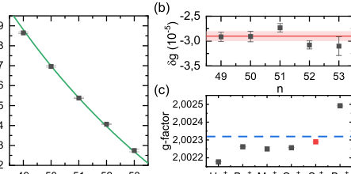
<figcaption class="paper-figure-caption"><b>Fig 4.</b> Figure 4. (a) Values of νso(n) for n ranging from 49 to 53. The points correspond to the intercepts of the linear fits in Fig. 3(b) with statistical error bars. The solid line is the theo- retical value (no free parameter). (b) Measurement of δg. The points are the slope of each individual fits of Fig. 3(b) with statistical error bars, while the solid line shows the result of a global fit of data of Fig. 3(b) with δg as a shared parame- ter. The red-shaded area shows the statistical error bar of the global fit. (c) Measured g-factors of different alkali-like ions [33], with the free-electron value shown as the blue dashed line. This work is shown in red.</figcaption>
</figure>
<figure class="paper-figure-card">
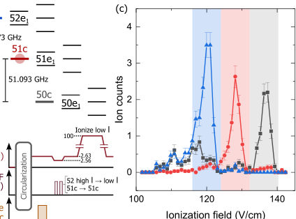
<figcaption class="paper-figure-caption"><b>Fig 5.</b> Figure 5. (a) Schematic of the main high-angular momentum Rydberg energy levels involved in the experiment sorted by mℓ. (b) State purification sequence: after selectively trans- ferring the circular atoms from n = 52 to n = 51 with a microwave pulse, a sequence of radio-frequency pulses at 250 MHz brings the remaining high-ℓstates in n = 52 down to low-angular-momentum states. A DC electric field is then ramped to a large value to ionize these low-ℓstates, while leaving 51c unaffected. (c) Number of ions detected with the channeltron as a function of the ionization field. Each point corresponds to a 20 µs detection window in the arrival time centered around the corresponding ionization...</figcaption>
</figure>

**Summary.** The researchers measured the Landé g-factor of the $	ext{Sr}^+$ $5s_{1/2}$ core electron by studying singlet-triplet spin oscillations in circular Rydberg states. They trapped these states using optical tweezers and observed the spin dynamics by monitoring population decay. This provided a first high-precision determination of the core's g-factor, advancing quantum metrology using alkaline-earth atoms.

**Why it may be interesting.** This work provides a high-precision quantum measurement of an atomic property ($g$-factor) using highly excited, long-lived Rydberg states, demonstrating advanced control over complex multi-electron spin dynamics in an optical tweezer platform.

Detailed structure

**Main problem.** To precisely measure the Landé g-factor of the Sr$^+$ $5s_{1/2}$ ionic core electron.

**Main result.** The measurement yields a high-precision value for the Landé g-factor: $g_{	ext{Sr}^+, 5s_{1/2}} = 2.002290(1)$.

**Method.** The measurement relies on observing and analyzing singlet-triplet spin oscillations in a circular Rydberg state of Strontium, which are sensitive to the difference in Landé g-factors.

**Model / system.** The system uses circular Rydberg states of $	ext{Sr}^+$ trapped in optical tweezers. The physics is modeled by considering the interplay between spin-orbit coupling, vector light shifts from the tweezers, and the difference in Landé g-factors between the core and Rydberg electrons.

**Key observables.** Damped oscillations of the recapture signal (singlet-triplet dynamics) as a function of time delay, and the oscillation frequency dependence on the external magnetic field $B_0$.

**Important parameters / regimes.** The measured difference in Landé g-factor ($\delta g \sim 10^{-5}$), the lifetime of the $51c$ state ($1.8(1)\ 	ext{ms}$), and the external magnetic field $B_0$.

**Assumptions / limitations.** The analysis assumes the spin dynamics are governed by the effective spin Hamiltonian derived from the interaction of the two electron spins with the magnetic field, and that the observed oscillations are dominated by the $\delta g$ term.

**Figures summary.** Figures illustrate the experimental setup (trapping, detection), the time evolution of circular state populations, and the measured spin oscillations as a function of time delay and external magnetic field.

**Paper structure.** The paper details the experimental setup for trapping and preparing circular Rydberg states, describes the optical detection scheme to isolate singlet atoms, and finally presents the measurement of spin-orbit coupling and the Landé g-factor by fitting the magnetic field dependence of the spin oscillation frequency.

Abstract

Circular states of strontium are promising platforms for quantum technologies. They exhibit much longer lifetimes than laser-accessible Rydberg states and possess an optically active ionic core that can be manipulated with laser light. Here we trap circular states in optical tweezers by exploiting the dynamical polarizability of the ionic core. We measure the decay of the orbital component of a n=51 circular state and observe singlet-triplet spin oscillations arising from the interplay of vector light shifts induced by the optical tweezers, spin-orbit coupling associated with the Rydberg electron, and the difference in Landé $g$-factor between the ionic core and the Rydberg electrons. By observing the two electron spin dynamics, we measure the spin-orbit interaction and the correction $δg \sim$ 10^(-5) of the Landé $g$-factor of the Sr$^+$ 5s$_{1/2}$ ionic core electron with respect to that of a free electron. This provides a first high-precision measurement of $g_{\textrm{Sr}^+, 5s_{1/2}}$ = 2.002290(1).

[↑ back to top](#top)

### [Geometric optimality of entanglement-induced fast qubit reset](http://arxiv.org/abs/2608.26897v1)

**Authors:** Davide Rinaldi, Mattia Moroder, Dario Gerace, Giacomo Guarnieri, Steve Campbell  
**Type:** theory · **Category:** quantum information and computing · **PDF:** <https://arxiv.org/pdf/2608.26897v1>  
**Analysis basis:** full PDF text, analyzed in chunks
**Topic relevance:** `correlated / nonlocal dissipation` **3/5** · `methods for driven-dissipative` **3/5** · `quantum measurements` **2/5** · `driven-dissipative phase transition` **1/5** · `non-equilibrium universality` **1/5** · `scars & prethermalization` **1/5**

↔ Scroll figures horizontally

<figure class="paper-figure-card">
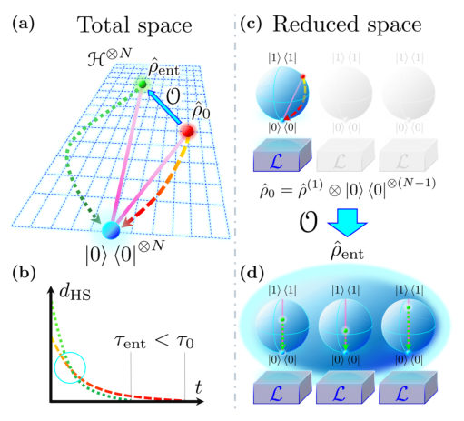
<figcaption class="paper-figure-caption"><b>Fig 1.</b> FIG. 1. Geometry of qubit reset. We aim to reset N qubits via the dissipative evolution induced by Eq. (2). (a) An entangling operation O is performed in the multi-qubit state space, such that the initial state ˆρ0 is transformed into the entangled state ˆρent. The evolution of ˆρent (green dotted line) in the multi-qubit space follows a path that is farther from the corresponding geodesic path (shown by the pink straight line) compared to the evolution of ˆρ0 (red dashed line). De- spite traversing a longer path, in (b) we find that a Mpemba crossing between the distance curves according to the Hilbert-Schmidt met- ric, dHS, can be observed in the total multi-qubit space, demonstrating...</figcaption>
</figure>
<figure class="paper-figure-card">

<figcaption class="paper-figure-caption"><b>Fig 2.</b> FIG. 2. Multi-qubit Mpemba effect from a geometric perspec- tive. (a) Total-space reset dynamics of the states |+00⟩and |ψent⟩= 1√</figcaption>
</figure>
<figure class="paper-figure-card">
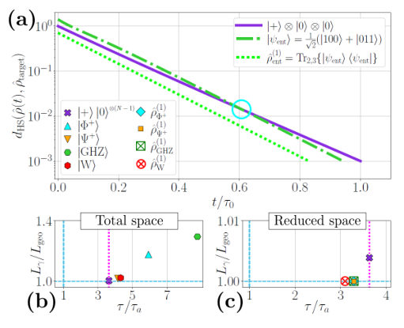
<figcaption class="paper-figure-caption"><b>Fig 3.</b> Fig. 2, the states ˆρent and ˆρ0 evolve with different decay rates |Re{λent}| &gt; |Re{λ0}|, thus we achieve characteristic Mpemba- effect crossing between the two associated curves defined by dHS in the multi-qubit space, highlighted by the cyan circle in Fig. 2. The light green dotted curve corresponds to the HS distance between the reduced state of the system qubit, ˆρ(1) ent(t) = Tr2,3{ˆρent}, and its target reset state, |0⟩⟨0|. We see that when the system has been entangled with the auxiliary qubits, its decay rate is asymptotically identical to the multi- qubit rate, as evidenced by the fact that both curves become parallel in the long time limit. Fig. 2(a) therefore recapitu- lates and...</figcaption>
</figure>
<figure class="paper-figure-card">
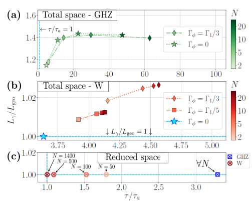
<figcaption class="paper-figure-caption"><b>Fig 4.</b> FIG. 3. Total-space versus reduced-space optimality for W and GHZ states. Each point in the plane represents how far from op- timality a given N-qubit reset process is. Distance from optimal- ity is quantified for (a) generalized GHZ states and (b) generalized W states evolving according to Eq. (2), varying Γϕ/Γ1 in the total multi-qubit state space with N ∈{2, 5, 10, 20}. (c) In the reduced- state space, the evolution always travels along the geodesic path: Lγ/Lgeo = 1 for each point. Note also that the points are indepen- dent of Γϕ. However, the AQSL τ/τa &gt; 1 is in general not saturated, because the evolution speed on the geodesic path is not constant. In spite of that, in the case of...</figcaption>
</figure>
<figure class="paper-figure-card">
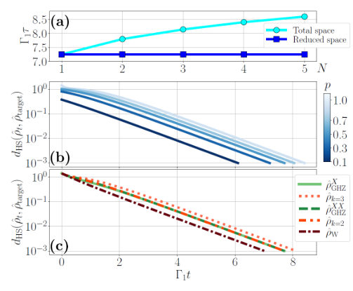
<figcaption class="paper-figure-caption"><b>Fig 5.</b> FIG. 4. Different spaces and role of entanglement. (a) Evolution of the factorized state |1⟩⊗N i under the local map (2). The total-space re- set time τ increases with N, because each τ(N) is related to a distance computed in a specific Hilbert space. Thus, no fair comparison can be made between timescales computed in the total space for different number of qubits N. However, direct comparisons can be made by considering the reduced-space reset times. (b) For a fixed N = 4, the total-space reset time increases with the amount of excitation p present in the single-qubit reduced state. (c) The amount of entangle- ment in different entangled states has no clear role in the dissipation...</figcaption>
</figure>

**Summary.** This work analyzes fast qubit reset by applying geometric principles to the state space of multi-qubit systems. It demonstrates that entanglement can accelerate reset by ensuring that individual qubit states follow optimal geodesic paths, even if the overall system evolution is not globally optimal. This offers a powerful geometric tool for designing better quantum processors.

**Why it may be interesting.** It provides a rigorous geometric framework to analyze transient quantum dynamics, linking concepts like quantum speed limits and the Mpemba effect to the structure of the state space, which is highly relevant for designing optimal quantum control protocols.

Detailed structure

**Main problem.** The paper addresses the need for fast and reliable qubit reset protocols, aiming to understand the optimality of the full reset dynamics beyond simple asymptotic decay models.

**Main result.** Entangling operations can induce a faster reset time (Mpemba effect) by allowing the reduced state of each qubit to follow a geodesic path, even if the collective evolution in the full state space is suboptimal.

**Method.** The authors employ a geometric analysis using the Hilbert-Schmidt metric to quantify state evolution speed and compare the actual path length to the theoretical geodesic path length.

**Model / system.** The system involves N qubits undergoing dissipative evolution, modeled by a Lindbladian master equation. The analysis compares the dynamics of initial, entangled, and ground states in the multi-qubit density matrix space.

**Key observables.** Reset time ($	au$), geodesic path length ($L_{	ext{geo}}$), distinguishability measures ($d(t)$), and the ratio of actual to geodesic speed ($	au/	au_a$).

**Important parameters / regimes.** Dissipation rates ($\Gamma_1, \Gamma_\phi$), number of qubits ($N$), and the initial state structure (e.g., GHZ or W states).

**Assumptions / limitations.** The analysis relies on the HS metric defining the geometry of the state space, and it compares total-space evolution against locally optimal reduced-space evolution.

**Figures summary.** Figures illustrate the geometry of state paths, comparing initial vs. entangled states, showing the Mpemba crossing, and detailing the coherence evolution of single qubits relative to the geodesic.

**Paper structure.** The paper establishes the physical problem (fast reset), introduces the geometric framework (HS metric, geodesics), analyzes the dynamics using specific entangled states (W/GHZ), and concludes by comparing local vs. global optimality.

Abstract

Fast and reliable qubit reset is essential for the efficient operation of quantum processors. Among the proposed strategies, Mpemba-effect-based protocols offer a simple route to accelerated relaxation, but provide limited insight into the optimality of the full reset dynamics. Geometric approaches, by contrast, quantify optimality but do not generally suggest practical acceleration protocols. Here, we bridge these perspectives through a geometric analysis of entanglement-assisted qubit reset. We show that entangling operations can redistribute local coherences across a multi-qubit register, allowing the reduced state of each qubit to follow a geodesic path towards the ground state. Remarkably, this locally optimal behaviour can emerge even when the collective evolution becomes suboptimal in the full state space. We illustrate this interplay for different families of initial multi-qubit states. Our results provide a geometric perspective on Mpemba-inspired reset acceleration and clarify when extending two-qubit protocols to larger registers provides a further advantage in the reset process.

[↑ back to top](#top)

### [When dissipative steady states admit thermodynamic occupation laws](http://arxiv.org/abs/2608.26621v1)

**Authors:** Tetsu Ichitsubo  
**Type:** theory · **Category:** statistical mechanics · **PDF:** <https://arxiv.org/pdf/2608.26621v1>  
**Analysis basis:** full PDF text, analyzed in chunks
**Topic relevance:** `driven-dissipative phase transition` **3/5** · `methods for driven-dissipative` **3/5** · `non-equilibrium universality` **3/5** · `Keldysh / 2PI / non-Gaussian methods` **1/5** · `correlated / nonlocal dissipation` **1/5**

↔ Scroll figures horizontally

<figure class="paper-figure-card">
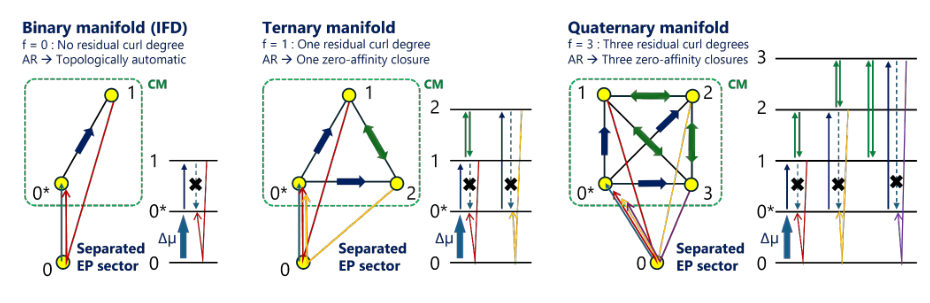
<figcaption class="paper-figure-caption"><b>Fig 1.</b> FIG. 1. EP-sector-separated dual geometry of dissipative current and thermodynamic occupation. Entropy- production exposure-and-separation (EPES) assigns the lower return/reset pathways to the separated entropy-producing (EP) sector. The full graph carries the dissipative Gauss–Kirchhoff current geometry, whereas the upper nodes form the conditional manifold C (CM) of physical or mechanical elements capable of reversible energy transduction, on which the Stokes–Kolmogorov occupation geometry is defined. Black crosses mark the prohibited direct microscopic transitions i →0∗; instead, the physical return/reset pathway i →0 →0∗lies outside C, passing through the separated state 0, and its...</figcaption>
</figure>
<figure class="paper-figure-card">
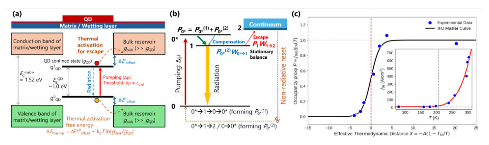
<figcaption class="paper-figure-caption"><b>Fig 2.</b> FIG. 2. Renewal-projected binary IFD mapping of a QD-laser threshold. (a) Physical source-fed topology of an InGaAs/GaAs quantum-dot (QD) laser. Injection and pumping belong to the exposed entropy-producing sector and maintain the source state 0∗, which supplies the confined radiative QD basin 1. Once the primary Bernard–Duraffourg population- inversion condition is satisfied, thermally activated escape from the confined QD state to the high-degeneracy continuum state 2 provides a secondary temperature-dependent loss channel. Direct microscopic recapture 2 →1 is negligible; once a carrier escapes through 1 →2, it is lost from the radiative branch and its loss is compensated by a new source...</figcaption>
</figure>

**Summary.** This theoretical paper establishes the conditions under which non-equilibrium steady states (NESSs) in dissipative systems can obey thermodynamic occupation laws. By introducing techniques like entropy-production exposure-and-separation, the authors derive a generalized potential governing the system's probabilities. The framework successfully models physical phenomena, such as the threshold behavior in quantum-dot lasers, using the derived inverted Fermi-Dirac statistics.

**Why it may be interesting.** This work provides rigorous mathematical conditions for when non-equilibrium systems can be described by simple, equilibrium-like statistical laws, which is highly relevant for understanding energy transport and steady states in quantum optics and condensed matter devices.

Detailed structure

**Main problem.** The paper addresses the fundamental incompatibility between finite stationary circulation and the existence of a globally exact rate-ratio field in non-equilibrium steady states (NESSs), which prevents them from obeying standard thermodynamic occupation laws.

**Main result.** The authors develop a framework using entropy-production exposure-and-separation (EPES) and the strong-bias/rapid-reset (SR) limit to show that thermodynamic occupation laws can be recovered for dissipative NESSs, yielding forms like the inverted Fermi-Dirac law.

**Method.** The methodology involves constructing specialized geometric manifolds (conditional vs. full graph) and applying thermodynamic calibration based on first-law bookkeeping to derive the potential governing the occupation probabilities.

**Model / system.** The analysis is conducted on general Markov generators describing dissipative NESSs, with specific applications to quantum-dot lasers exhibiting energy transduction and threshold phenomena.

**Key observables.** Occupation probabilities ($p_\alpha, P_\alpha$), thermodynamic potential ($X_i$), and the net cycle current ($I$).

**Important parameters / regimes.** The bias ($\Delta\mu$), temperature ($T$), and the ratio of pumping/reset rates defining the SR limit are crucial parameters.

**Assumptions / limitations.** Key assumptions include the ability to define a thermodynamically complete conditional manifold and the use of the SR limit to simplify the kinetic embedding factor.

**Figures summary.** Figures illustrate the EP-sector-separated dual geometry, showing how the entropy-producing sector is separated from the conditional manifold $C$.

**Paper structure.** The paper progresses by first identifying the incompatibility in NESSs, then introducing EPES and the SR limit to construct the solvable manifold $C$. It derives the thermodynamic potential $X_i$ and shows the resulting occupation law. Finally, it applies this framework to model physical systems like QD lasers, deriving the IFD law.

Abstract

Non-equilibrium steady states (NESSs) generally lack thermodynamic occupation laws because finite stationary circulation and a globally exact rate-ratio field cannot coexist for the same Markov generator. Here we construct a sector-separated geometry that overcomes this incompatibility without arresting dissipation. Entropy-production exposure-and-separation excludes the entropy-producing state~$0$ from the conditional occupation manifold while retaining it in the dissipative full graph; physical returns $i\to0\to0^\ast$ become effectively Markovian in the strong-bias/rapid-reset (SR) limit. For a thermodynamically complete conditional manifold, autonomous redistribution (AR) eliminates residual futile circulation, making the rate-ratio one-form exact. Thermodynamic calibration gives $X_i=β(Δμ- \mathcal F_i^{\mathrm{cost}})$ and $p_i=e^{X_i}/Z_\mathcal{C}$, with $Z_\mathcal{C}=1+\sum_i e^{X_i}$. Full-graph probabilities factorize exactly as $P_α=(1-P_0)p_α$. In the SR limit, the kinetic factor tends to unity while $p_α\to e^{X_α}/Z_\mathcal C$, yielding $P_α\to p_α$ while finite dissipation persists. Near AR, integrability is lost linearly in residual cycle current whereas dissipation begins quadratically. In the binary zero-cycle-rank limit, occupation redistributes autonomously under maintained $Δμ$ bias, yielding the inverted Fermi--Dirac law, which is applied to thermal smearing in quantum-dot lasers. The framework provides constructive acquisition conditions and failure diagnostics for thermodynamic occupation laws in dissipative NESSs.

[↑ back to top](#top)

### [Ultra-Low-Loss Silicon Nitride on Sapphire for Broad-Transparency Nonlinear and Quantum Photonics](http://arxiv.org/abs/2608.27335v1)

**Authors:** Abdur-Raheem Al-Hallak, Shuai Liu, Kailu Zhou, Jiangnan Liu, Shawn Chen, James Hu, Ruhi Yusuf, Christopher Rodriguez, Maya Sarram, Yiming Lang, Zetian Mi, Zheshen Zhang  
**Type:** both · **Category:** other · **PDF:** <https://arxiv.org/pdf/2608.27335v1>  
**Analysis basis:** full PDF text, analyzed in chunks
**Topic relevance:** `interference shaping light` **3/5** · `quantum optics experiment` **3/5** · `analog quantum simulation` **2/5** · `QC/QI experiment` **1/5** · `driven-dissipative phase transition` **1/5**

↔ Scroll figures horizontally

<figure class="paper-figure-card">
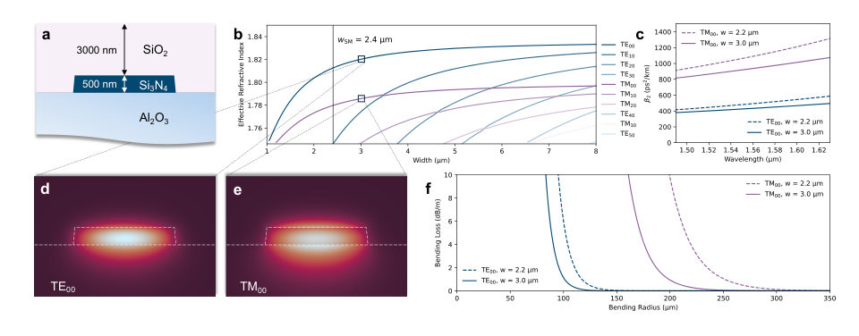
<figcaption class="paper-figure-caption"><b>Fig 1.</b> Fig. 1 Simulation and Design. a, Geometry of the designed Si3N4 on sapphire platform. b, Simulated TE and TM mode families and their respective effective refractive indices for the geometry shown in (a) as a function of width at 1550 nm, indicating single-mode width of 2.4 µm. c, Simulated group velocity dispersion (β2) of the fundamental TE00 and TM00 modes for widths of 2.2 and 3.0 µm and wavelengths between 1490 and 1630 nm. Simulated transverse mode profiles of the fundamental TE00 (d) and TM00 (e) modes for a width of 3.0 µm and a wavelength of 1550 nm. f, Simulated bending losses as a function of bending radius at 1550 nm for both fundamental TE00 and TM00 modes at widths of 2.2 and...</figcaption>
</figure>
<figure class="paper-figure-card">
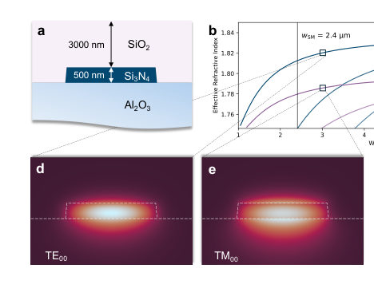
<figcaption class="paper-figure-caption"><b>Fig 2.</b> Figure 1a shows the designed geometry for our Si3N4- on-sapphire device: a thickness of 500 nm is chosen for the Si3N4 waveguide. At this thickness, the waveg- uide operates in the low-to-moderate confinement regime in contrast to moderate-to-high confinement in the conventional Si3N4-on-SiO2 structure due to</figcaption>
</figure>
<figure class="paper-figure-card">
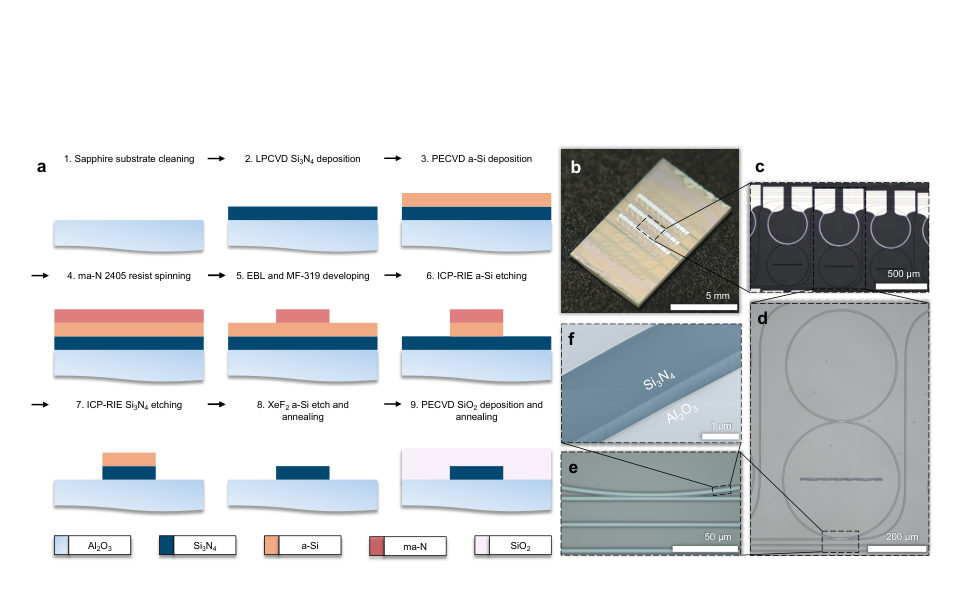
<figcaption class="paper-figure-caption"><b>Fig 3.</b> Fig. 2 Device Fabrication. a, Overview of fabrication flow for a Si3N4-on-sapphire PIC. b, Picture of a complete Si3N4- on-sapphire chip. Optical microscope images of an array of coupled microrings photonic molecules with microheaters at 5X magnification (c), a single coupled microring without microheaters at 10X magnification (d), and the bus-resonator coupling region for a coupled microring at 100X magnification (e). f, False colored scanning electron microscope image of an exposed Si3N4 waveguide on a sapphire substrate (scale indicated).</figcaption>
</figure>
<figure class="paper-figure-card">
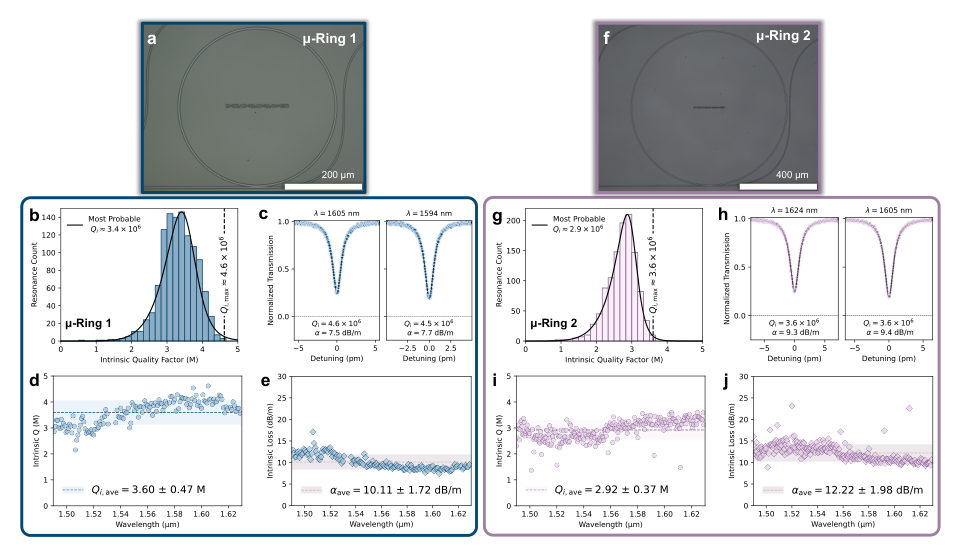
<figcaption class="paper-figure-caption"><b>Fig 4.</b> Fig. 3 Loss Characterization of Multi-Mode Microrings. Optical microscope images of multi-mode (3 µm width) microring resonators with radii of 200 µm (a) and 400 µm (f) with scales indicated. b, Distribution of extracted intrinsic-Q (Qi) for TE polarization across 6 type-1 micorings between 1490 and 1630 nm. Burr fitting of the distribution indicates a most-probable Qi of 3.4 × 106. c, Fitted transmission for the two highest Q resonances in the highest performance resonator, showing intrinsic quality factors (losses) of 4.6 × 106 (7.5 dB/m) and 4.5 × 106 (7.7 dB/m) respectively. Trends of intrinsic-Q (d) and loss (e) from 1490 nm to 1630 nm for TE-polarization in the highest performance...</figcaption>
</figure>
<figure class="paper-figure-card">
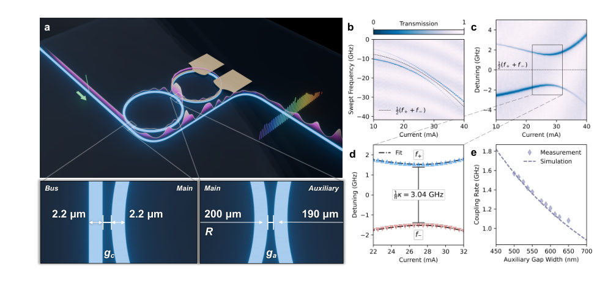
<figcaption class="paper-figure-caption"><b>Fig 5.</b> Fig. 4 Coupled Microring Photonic Molecule. a, Diagram of the coupled-microring photonic molecule. b, Recorded transmission spectra of a photonic-molecule split resonance near 1575 nm across a range of applied heater currents. Centerline indicates common-mode movement of the symmetric and anti-symmetric modes f±. c, Transmission spectra across applied heater currents with common-mode movement of f± removed and detuning from the centerline calibrated by a fiber-loop resonator reference cavity. d, Zoomed-in view of avoided mode crossing behavior of the split resonances with minimum splitting of κ/π = 3.04 GHz indicated. e, Coupling rates κ/2π near 1575 nm extracted from the measured avoided...</figcaption>
</figure>

**Summary.** This research introduces a novel and superior platform for photonics by utilizing Silicon Nitride deposited on sapphire substrates, overcoming spectral and loss limitations of traditional silicon-based chips. The authors report achieving record-low propagation losses and high quality factors, culminating in the first demonstration of complex nonlinear phenomena like soliton generation on this versatile material system.

**Why it may be interesting.** The demonstration of soliton and comb generation on a highly transparent, low-loss platform opens avenues for quantum-enhanced sensing and spectroscopy in spectral regions previously inaccessible to Si3N4 photonics.

Detailed structure

**Main problem.** The paper addresses the limitations of traditional silicon dioxide on silicon platforms for advanced photonics, aiming to create a superior platform for ultra-low-loss, broad-transparency nonlinear and quantum applications.

**Main result.** They successfully fabricated ultra-low loss photonic integrated circuits on a Si3N4-on-sapphire platform, achieving record-low losses and demonstrating Kerr-comb and soliton generation.

**Method.** The work combines advanced semiconductor fabrication techniques (LPCVD deposition, annealing) with optical characterization methods (transmission spectroscopy, dispersion fitting) to test nonlinear optical phenomena.

**Model / system.** The physical system is a 500-nm-thick Silicon Nitride (Si3N4) waveguide deposited on a sapphire substrate. This platform is used to create high-Q microring resonators and coupled-ring photonic molecules.

**Key observables.** Intrinsic quality factors ($Q_i$) up to $4.6 	imes 10^6$, ultra-low propagation loss ($< 0.1 	ext{ dB/cm}$), and the generation of Kerr-comb and soliton states.

**Important parameters / regimes.** Waveguide thickness (500 nm), operating wavelength range (1490 nm to 1630 nm), and coupling rates ($\kappa$).

**Assumptions / limitations.** The analysis assumes that TE-polarization is preferred due to lower bending loss compared to TM-polarization on this platform. Dispersion fitting for photonic molecules is limited to the second order.

**Figures summary.** Figure 1 illustrates the geometry of the Si3N4 on sapphire platform and shows simulated mode confinement and dispersion characteristics for TE and TM polarizations.

**Paper structure.** The paper details the advantages of the sapphire host, presents the fabrication process for the Si3N4-on-sapphire platform, characterizes the ultra-low loss and high-Q factors for different polarizations, and finally demonstrates nonlinear phenomena like comb and soliton generation.

Abstract

The field of photonic integrated circuits (PIC) has flourished in the past two decades, fueling numerous cutting-edge applications across sensing, networking, data interconnect, and quantum information processing. As a guiding material for PIC, Si$_3$N$_4$ has seen extensive use for its ultra-low loss, broad transparency, and diversity in implementation across both thin and thick films. Although the standard, traditional silicon dioxide (SiO$_2$) on silicon (Si) substrates that underpin the majority of Si$_3$N$_4$ photonics face drawbacks in the form of long-wavelength transparency limited by SiO$_2$, high-stress deposition for anomalous dispersion thick-film Si$_3$N$_4$, and leakage loss to the Si layer for low-confinement thin-film Si$_3$N$_4$. Featuring increased long-wavelength transparency into the mid-infrared, low-stress deposition of Si$_3$N$_4$, and a low index, this work investigates sapphire substrates as alternate hosts for Si$_3$N$_4$ photonics with greater spectral coverage and reduced fabrication complexity. This work presents a robust method of fabricating ultra-low loss photonic integrated circuits on a 500-nm-thick Si$_3$N$_4$-on-sapphire platform, exhibiting record-low losses below $0.1 \rm \;dB/cm$. Implemented using this process are high-Q microrings with intrinsic quality factors in excess of $4.5\times10^6$ and coupled-ring photonic molecules to support nonlinear gain. Leveraging the achievable low loss and high-Q, this work further reports the first demonstration of Kerr-comb and soliton generation on the Si$_3$N$_4$-on-sapphire platform. These advances in loss, quality factor, and soliton generation on this versatile, broad-transparency platform pave the way for future work in spectroscopy and quantum-enhanced sensing across previously prohibited spectral regions for Si$_3$N$_4$ photonics with reduced fabrication complexity.

[↑ back to top](#top)

### [Dynamical slowdown, bottlenecks, and multiscaling in Voigt-regularised turbulence](http://arxiv.org/abs/2608.27355v1)

**Authors:** Anikat Kankaria, Bikram Pal, Edriss S. Titi, Samriddhi Sankar Ray  
**Type:** theory · **Category:** statistical mechanics · **PDF:** <https://arxiv.org/pdf/2608.27355v1>  
**Analysis basis:** full PDF text, analyzed in chunks
**Topic relevance:** `non-equilibrium universality` **3/5** · `scars & prethermalization` **3/5** · `analog quantum simulation` **1/5** · `correlated / nonlocal dissipation` **1/5** · `driven-dissipative phase transition` **1/5**

↔ Scroll figures horizontally

<figure class="paper-figure-card">
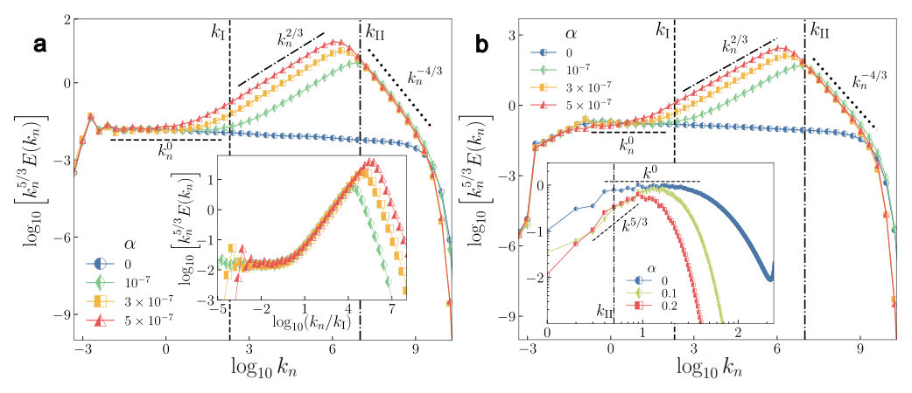
<figcaption class="paper-figure-caption"><b>Fig 1.</b> FIG. 1. (a) Compensated energy spectra, k5/3E(k), obtained from statistically stationary forced Voigt–SABRA simulations for different values of the Voigt parameter α (see legend). The vertical dashed and dash-dotted lines indicate the crossover wavenumbers kI and kII, respectively, for the smallest non-zero value of α. The inset shows the corresponding compensated spectra with the wavenumbers normalised by kI. (b) Compensated energy spectra from decaying Voigt–SABRA simulations, evaluated at the time of maximum enstrophy for each value of α with the pair of vertical dashed and dash-dotted lines indicating kI and kII. The inset shows the corresponding DNS results for the decaying...</figcaption>
</figure>
<figure class="paper-figure-card">
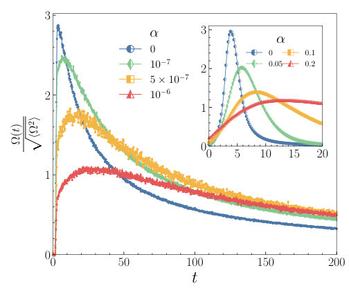
<figcaption class="paper-figure-caption"><b>Fig 2.</b> FIG. 2. Normalised enstrophy as a function of time for differ- ent values of the Voigt parameter α obtained from the shell model and (inset) the corresponding results from our DNS of the Navier–Stokes–Voigt equations. Increasing α systemati- cally shifts the enstrophy maximum to later times, indicating a progressive delay in cascade completion and providing evi- dence of the scale-dependent dynamical slowdown induced by the Voigt regularisation.</figcaption>
</figure>
<figure class="paper-figure-card">
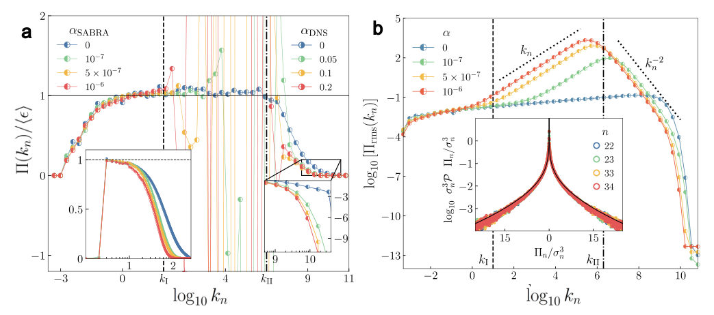
<figcaption class="paper-figure-caption"><b>Fig 3.</b> FIG. 3. (a) Normalised energy Flux, Π(k)/ε, obtained from statistically stationary forced Voigt–SABRA simulations for different values of the Voigt parameter α (see legend). The vertical dashed and dash-dotted lines indicate the crossover wavenumbers kI and kII, respectively, for the largest value of α. The left inset shows the corresponding normalised flux obtained from DNS of the forced Navier–Stokes–Voigt equations, including α = 0, the Navier–Stokes case. Both insets show the progressively faster decay of the flux as the values of α are increased. (b) R.M.S of the energy flux averaged over time from forced Voigt–SABRA simulations, showing two scaling as predicted from the theory (See...</figcaption>
</figure>
<figure class="paper-figure-card">
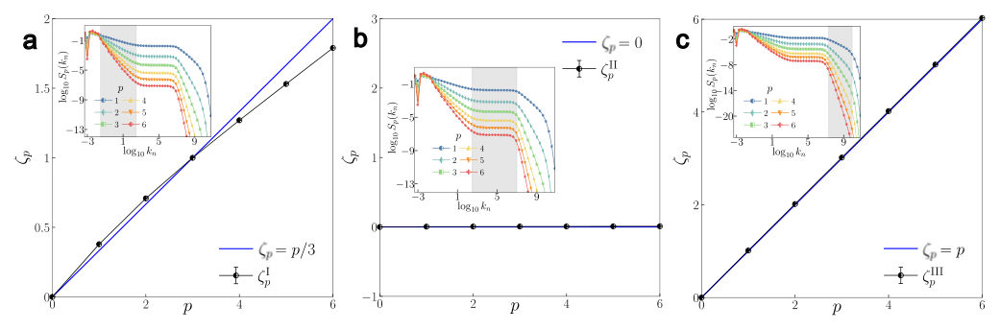
<figcaption class="paper-figure-caption"><b>Fig 4.</b> FIG. 4. Equal-time scaling exponents obtained from the Voigt–SABRA shell model for α = 10−7. Panels (a)–(c) show the exponents ζp as a function of order p (1 ≤p ≤6), evaluated in the low-wavenumber, intermediate, and high-wavenumber regimes, respectively. The corresponding equal-time structure functions Sp are shown in the insets, with the fitting ranges indicated by the shaded regions. The three panels reveal distinct scaling behaviour in the turbulent, intermediate equilibrium- like, and Voigt-dominated equilibrium regimes identified from the energy spectra in Fig. 1.</figcaption>
</figure>
<figure class="paper-figure-card">
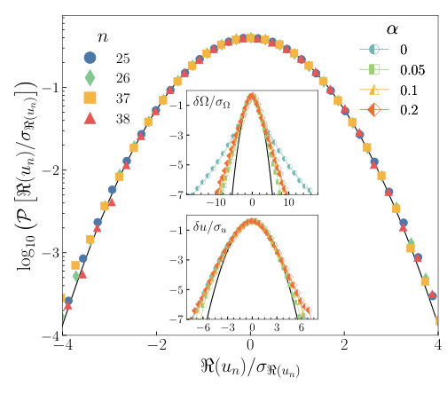
<figcaption class="paper-figure-caption"><b>Fig 5.</b> FIG. 5. Probability distribution function of the shell veloci- ties un obtained from Voigt–SABRA simulations for represen- tative shells lying in the intermediate and high-wavenumber regimes identified in Fig. 1. (Insets) The lower inset shows p.d.f. of velocity increments δur obtained from DNS of the Navier–Stokes–Voigt equations, while the upper inset shows the corresponding p.d.f. of vorticity increments δΩr. As the Voigt parameter α increases, the shell-model PDFs become progressively closer to Gaussian distributions. A similar trend is observed in the DNS results, particularly for the vorticity increments, although noticeable departures from Gaussianity persist.</figcaption>
</figure>

**Summary.** This work analyzes turbulence using a Voigt-regularized model to study energy transfer and bottleneck formation. It reveals that these bottlenecks stem from a scale-dependent dynamical slowdown leading to partial thermalization at small scales. The findings confirm the model's validity by reproducing known Navier-Stokes turbulence statistics in the appropriate limit.

**Why it may be interesting.** The concept of scale-dependent dynamical slowdown and the emergence of multiple quasi-equilibrium states across different scales is relevant to understanding non-equilibrium dynamics in complex many-body systems, which shares mathematical parallels with open quantum systems approaching steady states.

Detailed structure

**Main problem.** The paper investigates bottleneck formation in fully developed turbulence and characterizes the interplay between nonlinear energy transfer and thermalized behavior using a regularized model.

**Main result.** Bottleneck formation is shown to arise from scale-dependent dynamical slowdown and incipient thermalization, rather than being purely dissipative. The Voigt model successfully reproduces the inertial-range statistics of the standard Navier-Stokes equations for small regularization parameters.

**Method.** The study employs both Direct Numerical Simulations (DNS) of the Voigt-regularised Navier-Stokes equations and analysis using the Voigt-regularised SABRA shell model.

**Model / system.** The system is classical fluid turbulence, modeled by the Navier-Stokes-Voigt equations. The Voigt regularization introduces a scale-dependent slowdown of nonlinear interactions without enhancing dissipation, leading to three distinct spectral regimes.

**Key observables.** Energy spectra, dynamic scaling exponents, enstrophy evolution, and the location of crossover wavenumbers ($k_I$ and $k_{II}$).

**Important parameters / regimes.** The regularization parameter $\alpha$, the dissipation length scale $\eta$, and the Reynolds number $	ext{Re}$.

**Assumptions / limitations.** The analysis relies on the Voigt regularization providing a natural setting to study the competition between non-equilibrium cascade dynamics and equilibrium behavior.

**Figures summary.** Figures illustrate the three spectral regimes (inertial, intermediate equilibrium, high-wavenumber equilibrium) via compensated energy spectra, showing spectral transitions and scaling changes.

**Paper structure.** The paper systematically analyzes the spectral regimes, deriving scaling laws for crossover wavenumbers ($k_I \propto \alpha^{-3}$ vs $k_I \propto \alpha^{-6/11}$), and comparing results from shell models and DNS to confirm the physical picture of slowdown and multiple scaling states.

Abstract

We investigate bottleneck formation in turbulence using the Voigt-regularised SABRA model and DNS of the corresponding Voigt-Navier-Stokes (NSV) equations. The Voigt regularisation introduces a scale-dependent slowdown of nonlinear interactions without enhancing dissipation, providing a natural setting to study the interplay between nonlinear transfer and thermalised behaviour. We find three distinct spectral regimes: an inertial range at $k<k_I$, an intermediate equilibrium-like range associated with partial thermalisation for $k_I<k<k_{II}$, and a high-$k$ thermal regime for $k>k_{II}$, where the Voigt contribution dominates the conserved invariant. The crossover to the high-$k$ regime occurs at $k_{II}\sim 1/α$, while $k_I$ marks the onset of thermalised behaviour. Equal and multi-time statistics reveal a progressive suppression of intermittency and a tendency towards Gaussianity at small scales, together with a transition from dynamic multiscaling in the turbulent regime to simple scaling in the equilibrium ranges. The shell model resolves these three regimes over a broad range of scales, while DNS of the corresponding NSV equations reproduces the same qualitative trends, including bottleneck formation, delayed cascade completion, reduced intermittency, and a tendency towards Gaussianity at small scales. We find that bottleneck formation might be associated with scale-dependent dynamical slowdown and incipient thermalisation, rather than being purely dissipative in origin. We provide strong evidence that, in the regime where the regularization parameter $α$ is much smaller than the dissipation length scale, the Voigt model reproduces the same inertial-range turbulent regime and turbulence statistics as the Navier-Stokes (NS) equations. This provides evidence that the Voigt model constitutes an excellent practical approximation to the NS equations for small $α$.

[↑ back to top](#top)

### [Large Deviations for the Bose--Einstein Condensate of the Ideal Gas in the Canonical Ensemble](http://arxiv.org/abs/2608.26378v1)

**Authors:** Andreas Deuchert, Xuanyu Li  
**Type:** theory · **Category:** quantum gases · **PDF:** <https://arxiv.org/pdf/2608.26378v1>  
**Analysis basis:** full PDF text, analyzed in chunks
**Topic relevance:** `Full counting statistics` **3/5** · `Keldysh / 2PI / non-Gaussian methods` **2/5** · `non-equilibrium universality` **2/5** · `analog quantum simulation` **1/5** · `quantum measurements` **1/5**

↔ Scroll figures horizontally

<figure class="paper-figure-card">
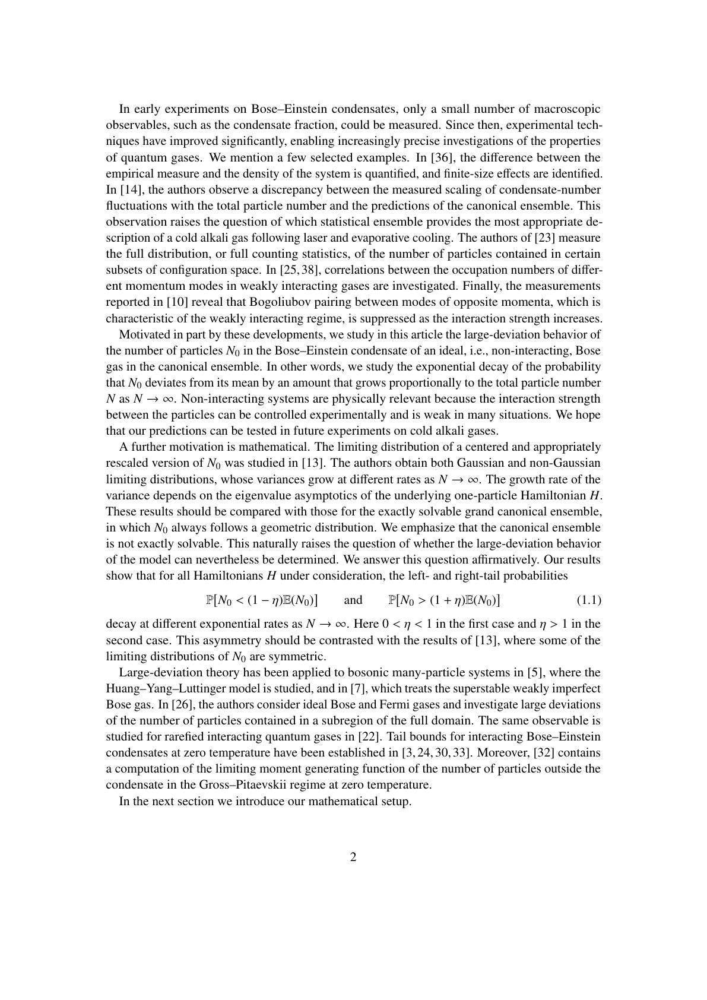
<figcaption class="paper-figure-caption"><b>Fig 1.</b> Low-resolution page preview, page 2</figcaption>
</figure>
<figure class="paper-figure-card">
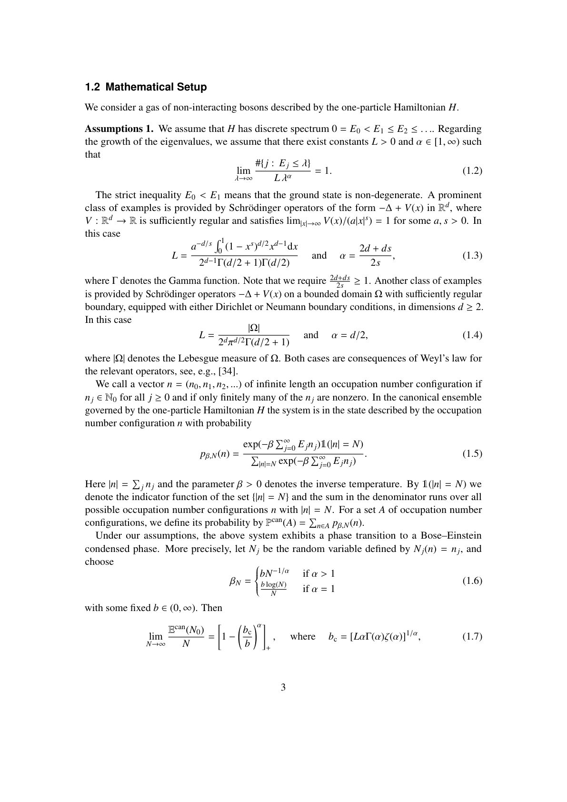
<figcaption class="paper-figure-caption"><b>Fig 2.</b> Low-resolution page preview, page 3</figcaption>
</figure>
<figure class="paper-figure-card">
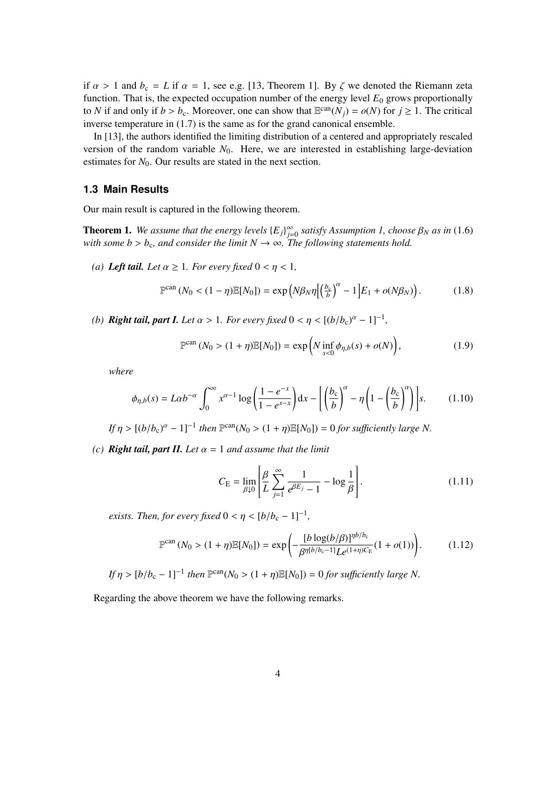
<figcaption class="paper-figure-caption"><b>Fig 3.</b> Low-resolution page preview, page 4</figcaption>
</figure>
<figure class="paper-figure-card">
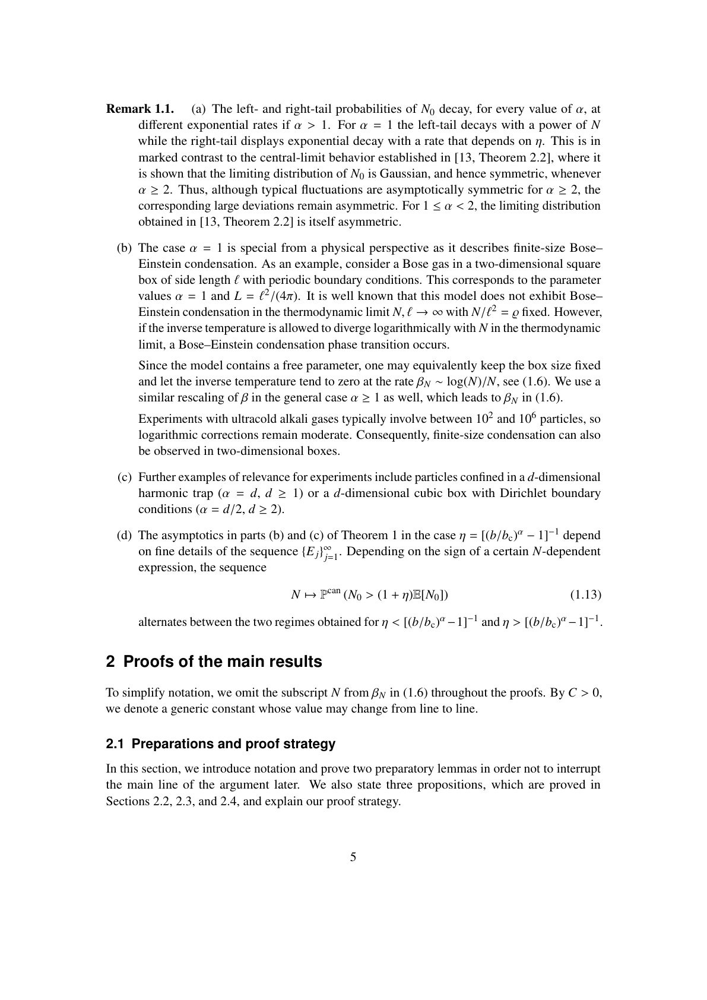
<figcaption class="paper-figure-caption"><b>Fig 4.</b> Low-resolution page preview, page 5</figcaption>
</figure>
<figure class="paper-figure-card">
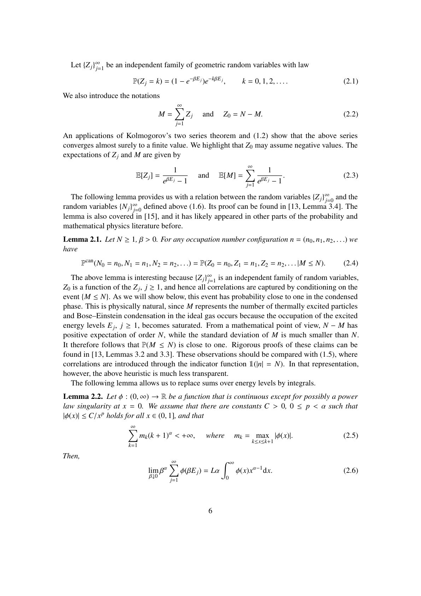
<figcaption class="paper-figure-caption"><b>Fig 5.</b> Low-resolution page preview, page 6</figcaption>
</figure>

**Summary.** This work applies large-deviation theory to study the fluctuations of the condensate fraction in an ideal Bose gas within the canonical ensemble. The authors derive precise exponential decay rates for the probabilities of observing significantly fewer or more particles in the BEC than expected. The key finding is the asymmetry between the left and right tails of the distribution, providing a quantitative measure of the system's deviation from Gaussian behavior.

**Why it may be interesting.** The explicit calculation of large deviation functions for the BEC occupation number provides deep insights into the fluctuations around the mean field, which is crucial for understanding non-equilibrium dynamics and finite-size effects in ultracold atomic gases.

Detailed structure

**Main problem.** The paper determines the large-deviation estimates for the number of particles ($N_0$) occupying the Bose-Einstein condensate (BEC) of an ideal Bose gas.

**Main result.** The left- and right-tail probabilities for $N_0$ decay at different exponential rates as the total number of particles tends to infinity, demonstrating a significant asymmetry.

**Method.** The analysis heavily relies on large-deviation theory, employing probability bounds and asymptotic analysis to characterize the decay rates of rare events.

**Model / system.** The system is an ideal (non-interacting) Bose gas analyzed in the canonical ensemble, governed by a general one-particle Hamiltonian $H$ with a discrete spectrum $\{E_j\}$.

**Key observables.** Number of particles in the BEC ($N_0$), total number of particles ($N$), and the probability distribution $P_{	ext{can}}(A)$.

**Important parameters / regimes.** The inverse temperature ($eta$), the total particle number ($N$), and the spectral growth rate parameter ($\alpha$).

**Assumptions / limitations.** The analysis assumes a specific structure for the energy spectrum $\{E_j\}$ and relies on taking limits in the thermodynamic limit ($N 	o \infty$).

**Paper structure.** The paper builds from establishing the general framework for large deviations in the canonical ensemble, deriving specific rate functions for the left and right tails, and finally proving the asymptotic bounds for these probabilities across different spectral regimes ($\alpha \ge 1$).

Abstract

We consider a non-interacting Bose gas governed by a general one-particle Hamiltonian in the canonical ensemble. Our main results are large-deviation estimates for the number of particles in the Bose--Einstein condensate. We show that the left- and right-tail probabilities decay at different exponential rates as the number of particles tends to infinity.

[↑ back to top](#top)

### [Spectral Fingerprints of Gauge Theories on a Quantum Computer](http://arxiv.org/abs/2608.27457v1)

**Authors:** Graham Van Goffrier, Debasish Banerjee, Bipasha Chakraborty, Emilie Huffman  
**Type:** both · **Category:** quantum information and computing · **PDF:** <https://arxiv.org/pdf/2608.27457v1>  
**Analysis basis:** full PDF text, analyzed in chunks
**Topic relevance:** `QC/QI experiment` **3/5** · `analog quantum simulation` **3/5** · `quantum measurements` **2/5**

↔ Scroll figures horizontally

<figure class="paper-figure-card">
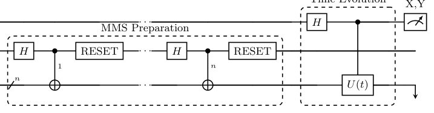
<figcaption class="paper-figure-caption"><b>Fig 1.</b> Figure 1. Quantum circuit for maximally mixed-state spectral sampling using a reusable garbage qubit. The garbage qubit is entangled sequentially with each model qubit, measured with the outcome ignored, and reset before the next step. This prepares the model register in the maximally mixed state while reducing the qubit count from 2n + 1 to n + 2, including the Hadamard-test ancilla.</figcaption>
</figure>
<figure class="paper-figure-card">
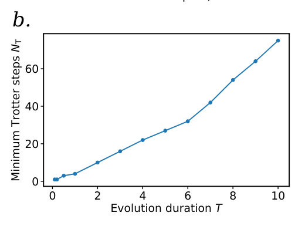
<figcaption class="paper-figure-caption"><b>Fig 2.</b> Figure 2. Convergence of the first-order Trotter decom- position. (a) Process fidelity as a function of the number of Trotter steps, for several evolution durations T. (b) Minimum number of Trotter steps required to attain a process fidelity greater than 0.9, as a function of T.</figcaption>
</figure>
<figure class="paper-figure-card">
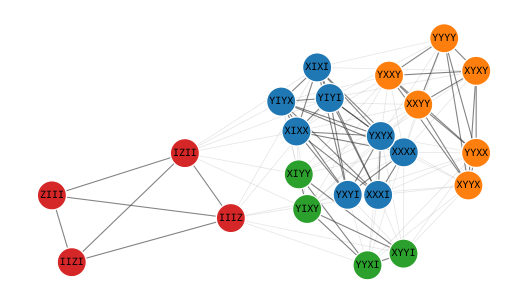
<figcaption class="paper-figure-caption"><b>Fig 3.</b> Figure 4. Terms of the 4-qubit Hamiltonian for the (1 + 1)d SO(3) QLM, arranged minimally (though not uniquely) into mutually-commuting blocks.</figcaption>
</figure>
<figure class="paper-figure-card">
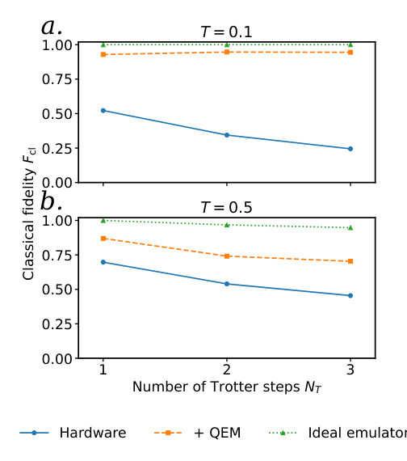
<figcaption class="paper-figure-caption"><b>Fig 4.</b> Figure 3. Classical fidelity of the measured output distri- bution after NT = 1, 2, 3 circuitised Trotter steps on IBM quantum hardware, relative to the exact-theory distribution. Results are shown for (a) T = 0.1 and (b) T = 0.5, compar- ing the raw hardware data, the hardware data after T = 0 background subtraction (Hardware + QEM), and an ideal shot-based emulator.</figcaption>
</figure>
<figure class="paper-figure-card">
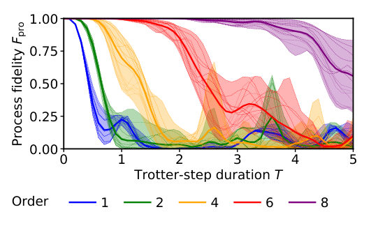
<figcaption class="paper-figure-caption"><b>Fig 5.</b> Figure 5. Process fidelity of a single Trotter step as a func- tion of its duration T, for product-formula orders p = 1, 2, 4, 6, and 8. For each order, the curves show all 4! = 24 per- mutations of the four commuting Hamiltonian blocks. The separation between orders is greater than the variation in- duced by the block ordering.</figcaption>
</figure>

**Summary.** This paper presents a quantum algorithm, Maximally Mixed State (MMS) spectral sampling, to extract the full density of states from a quantum Hamiltonian by measuring its time evolution. The technique is demonstrated on a non-Abelian $	ext{SO}(3)$ gauge theory, showing its feasibility on near-term quantum hardware. It provides a powerful, unbiased tool for probing diverse physical regimes, from ground state physics to thermalization, using quantum signal processing.

**Why it may be interesting.** This work directly addresses the computational bottleneck of characterizing complex quantum Hamiltonians by proposing a time-series quantum algorithm that bypasses the need for full eigenstate preparation, making it highly relevant for simulating strongly correlated systems.

Detailed structure

**Main problem.** The primary goal is to extract the full spectral distribution of a quantum many-body Hamiltonian, which contains crucial information about ground state properties, thermalization, and quantum criticality.

**Main result.** The authors demonstrate that the Maximally Mixed State (MMS) spectral sampling protocol can be successfully applied to an interacting lattice gauge theory, showing feasibility on near-term superconducting quantum hardware.

**Method.** The core method is MMS spectral sampling, which measures the characteristic function $	ext{Tr}[
ho_{	ext{MMS}} e^{-iHt}]$ via controlled quantum evolution circuits, followed by a Fourier transform to yield the density of states.

**Model / system.** The technique is applied to a $(1+1)$d non-Abelian $	ext{SO}(3)$ gauge theory (the $	ext{SO}(3)$ Quantum Link Model coupled to staggered fermions). The general framework applies to any system whose Hamiltonian $H$ can be mapped to a quantum circuit.

**Key observables.** Density of States ($\varrho_H(E)$), low-lying energies (for quantum criticality), and mid-spectrum features (for thermalization behavior).

**Important parameters / regimes.** The spectral resolution is limited by the total evolution time $T$; the circuit depth was demonstrated to be manageable (e.g., 78 two-qubit gates deep).

**Assumptions / limitations.** The output is a finite-resolution spectral distribution, not an exact listing of all eigenvalues. The method relies on the availability of mid-circuit measurement and reset for qubit optimization.

**Figures summary.** Figure 14 illustrates the Pauli-frame-optimized controlled-Trotter step for the $	ext{SO}(3)$ QLM, and Figure 15 compares the effect of using a Hann window versus a rectangular window in the post-processing Fourier transform.

**Paper structure.** The paper introduces the MMS protocol for spectral sampling, details the necessary quantum circuit compilation (including Pauli-frame optimizations), applies this technique to the $	ext{SO}(3)$ QLM, and discusses the interpretation of the resulting spectral fingerprints for various physical phenomena.

Abstract

Maximally mixed state spectral sampling is an unbiased quantum algorithm that allows for extraction of a finite-resolution spectral distribution from a Hamiltonian over potentially the entire allowed range of energies. We show how it may be focused on any desired area of the spectrum in order to learn about the full \textit{fingerprint} of the model of interest: from its ground state phenomena such as quantum criticality, obtained from the lowest lying energies, to its thermalization behavior, obtained from the mid-spectrum. We demonstrate this technique specifically on a $(1+1)d$ non-Abelian $SO(3)$ gauge theory, providing a comprehensive analysis of the steps necessary for performing this algorithm, as well as what is possible in the near-term with superconducting quantum hardware, performing simulations with circuits that are $78$ two-qubit gates deep. We show how this algorithm is able to take advantage of emerging dynamical circuit capabilities in near-term hardware to roughly halve the number required qubits, as well as how quantum readout error mitigation is trivial for this method. Along the way, we propose a novel strategy for compiling the controlled-time evolutions needed for spectral sampling by means of Pauli-frame optimizations. We illustrate two physical applications of quantum spectral sampling -- disordered many-body transitions, and mid-spectrum densities of states -- and what postprocessing steps they require beyond the Fourier outputs of the algorithm.

[↑ back to top](#top)

### [Cavity-assisted homodyne detection with a single photodiode](http://arxiv.org/abs/2608.26938v1)

**Authors:** Jonas Junker  
**Type:** theory · **Category:** other · **PDF:** <https://arxiv.org/pdf/2608.26938v1>  
**Analysis basis:** full PDF text, analyzed in chunks
**Topic relevance:** `quantum measurements` **3/5** · `analog quantum simulation` **1/5** · `driven-dissipative phase transition` **1/5** · `interference shaping light` **1/5** · `quantum optics experiment` **1/5**

↔ Scroll figures horizontally

<figure class="paper-figure-card">
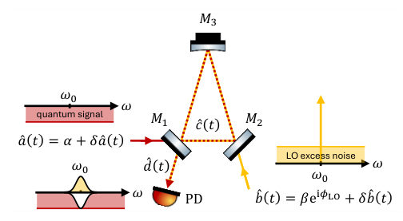
<figcaption class="paper-figure-caption"><b>Fig 1.</b> FIG. 1. Concept and schematic spectral response of cavity- assisted homodyne detection with a single photodiode. The quantum signal ˆa (red) enters through M1, while the LO ˆb (yellow) enters through M2. Both fields are mode matched to the same co-propagating cavity eigenmode, and M3 is nomi- nally highly reflecting. The spectral sketches show the signal input (upper left), the LO carrier and its technical excess noise (right), and the detector-port field (lower left). At impedance matching, resonant signal components are suppressed at the M1 output, while the resonant LO carrier is transferred from M2 to the same port. Several cavity linewidths from reso- nance, signal sidebands are...</figcaption>
</figure>
<figure class="paper-figure-card">
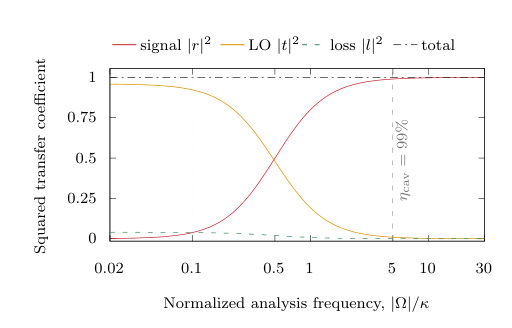
<figcaption class="paper-figure-caption"><b>Fig 2.</b> FIG. 2. Squared detector-port transfer coefficients for a resonant, impedance-matched cavity with κ1/κ = 0.50, κ2/κ = 0.48, and κℓ/κ = 0.02. The red curve is the signal- port coefficient ηcav = |r|2. The orange curve is the LO-port coefficient |t|2 = TLO(0)|HLO|2, and the green curve is the internal-loss coefficient |l|2. For vacuum inputs, these coef- ficients partition the unit detector-port vacuum-noise level. The black dash-dotted line shows their sum. The vertical gray dotted line marks ηcav = 0.99.</figcaption>
</figure>
<figure class="paper-figure-card">
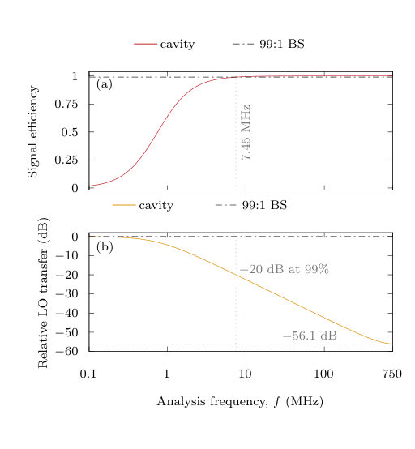
<figcaption class="paper-figure-caption"><b>Fig 3.</b> FIG. 3. Frequency-dependent response of the practical equal-coupler cavity from resonance to the first antiresonance, with Lrt = 0.20 m, F = 1000, T1 = T2 ≃0.304%, and round- trip internal power loss Lint = 200 ppm. (a) Signal efficiency compared with a 99:1 beam splitter, which directs 99% of the incident quantum-signal power to the detected output. The vertical line marks the first frequency at which the cav- ity reaches the same 99% signal efficiency, f = 7.45 MHz. (b) Technical LO amplitude-noise transfer, normalized to the transmitted LO carrier, compared with the unfiltered 99:1 beam-splitter readout. At the 99% signal-efficiency point, the cavity suppresses the relative LO...</figcaption>
</figure>
<figure class="paper-figure-card">
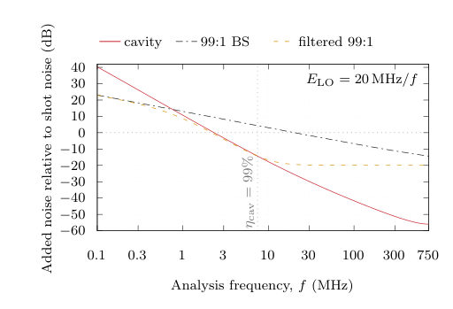
<figcaption class="paper-figure-caption"><b>Fig 4.</b> FIG. 4. Input-referred added noise from Eqs. (39) and (40) for the practical cavity of Fig. 3, a 99:1 beam splitter, and the same beam splitter with the LO pre-filtered by an identical second cavity, all at equal detected LO power. The filtered readout floors at (1 −R)/R = −20 dB. The plotted quan- tity is Nadd, not the total noise Va + Nadd. The calculation uses PLO,det = 5 mW, ELO(f) = 20 MHz/f, and Sel = 0. The vertical line marks ηcav = 0.99, where both schemes have the same signal efficiency. The 1/f spectrum is an illustra- tive technical LO-noise model. Below approximately 2 MHz, relaxation-oscillation and control-loop features are laser spe- cific. The plotted interval ends at the...</figcaption>
</figure>

**Summary.** This paper introduces cavity-assisted homodyne detection as an advanced technique for measuring quantum quadratures at high frequencies. By coupling the signal and local oscillator through a resonant cavity, it overcomes the need for perfectly matched photodetection channels required by standard methods. The resulting setup offers high signal efficiency and superior suppression of technical noise sidebands using only a single photodiode.

**Why it may be interesting.** This work provides a detailed theoretical framework for implementing high-bandwidth quantum measurements using cavity QED principles, which is highly relevant for open quantum systems and quantum optics.

Detailed structure

**Main problem.** Measuring quadrature components of high-frequency squeezed states is challenging, especially at gigahertz frequencies, due to limitations in standard detection methods.

**Main result.** Cavity-assisted homodyne detection achieves near-unity signal-transfer efficiency at moderate LO power while effectively suppressing technical LO noise sidebands.

**Method.** The authors derive quantum input-output relations for a traveling-wave cavity where the signal and LO interact, leading to a single-photodiode readout.

**Model / system.** The system uses an impedance-matched traveling-wave ring cavity where the quantum signal enters one port and the LO enters a separate port. The detection relies on the LO carrier beating with off-resonant signal sidebands reflected from the cavity.

**Key observables.** The photocurrent $\delta \hat{I}(\Omega)$ and the signal-transfer efficiency $\eta_{	ext{cav}}(\Omega)$.

**Important parameters / regimes.** Cavity linewidth ($\kappa$), Free Spectral Range (FSR), and the ratio of LO power to signal power.

**Assumptions / limitations.** The analysis assumes the detected LO carrier amplitude dominates the residual signal carrier amplitude, and the cavity is impedance-matched.

**Figures summary.** Figure 1 illustrates the concept of signal and LO entering separate ports of the cavity, resulting in the detected field. Figure 2 shows the partitioning of the unit transfer coefficients ($\eta_{	ext{cav}}$, $|t|^2$, $|l|^2$).

**Paper structure.** The paper first establishes the limitations of BHD, then proposes the cavity-assisted setup, deriving the input-output relations. Subsequent sections analyze the noise suppression and compare the single-photodiode readout against alternative methods like beam-splitter readouts.

Abstract

High-frequency squeezed states are important for quantum metrology and information processing, but quadrature measurements at gigahertz frequencies remain challenging. Balanced homodyne detection (BHD), the standard approach, requires closely matched complex transfer functions in both photodetection channels to suppress local-oscillator (LO) noise and maintain a well-defined readout quadrature. This matching becomes increasingly difficult at high bandwidths. Strongly asymmetric single-photodiode homodyne detection avoids this requirement, but achieving high signal efficiency and shot-noise clearance typically requires hundreds of milliwatts of LO power and does not suppress technical LO sidebands. I propose cavity-assisted homodyne detection, in which the quantum field and LO enter separate ports of an impedance-matched traveling-wave cavity. The resonant LO carrier is transmitted to the photodetector, where it beats with off-resonant signal sidebands reflected from the cavity. At the same time, technical LO sidebands outside the cavity linewidth are suppressed. I derive the quantum input-output relations and linearized photocurrent including intracavity loss, and show that near-unity signal-transfer efficiency can be achieved at moderate incident LO power. The cavity linewidth and free spectral range determine the usable detection band.

[↑ back to top](#top)

### [How quantum is quantum geometry?](http://arxiv.org/abs/2608.26269v1)

**Authors:** Ady Stern, Felix von Oppen  
**Type:** theory · **Category:** other · **PDF:** <https://arxiv.org/pdf/2608.26269v1>  
**Analysis basis:** full PDF text, analyzed in chunks
**Topic relevance:** `analog quantum simulation` **3/5** · `Keldysh / 2PI / non-Gaussian methods` **2/5** · `methods for driven-dissipative` **1/5** · `quantum measurements` **1/5**

↔ Scroll figures horizontally

<figure class="paper-figure-card">
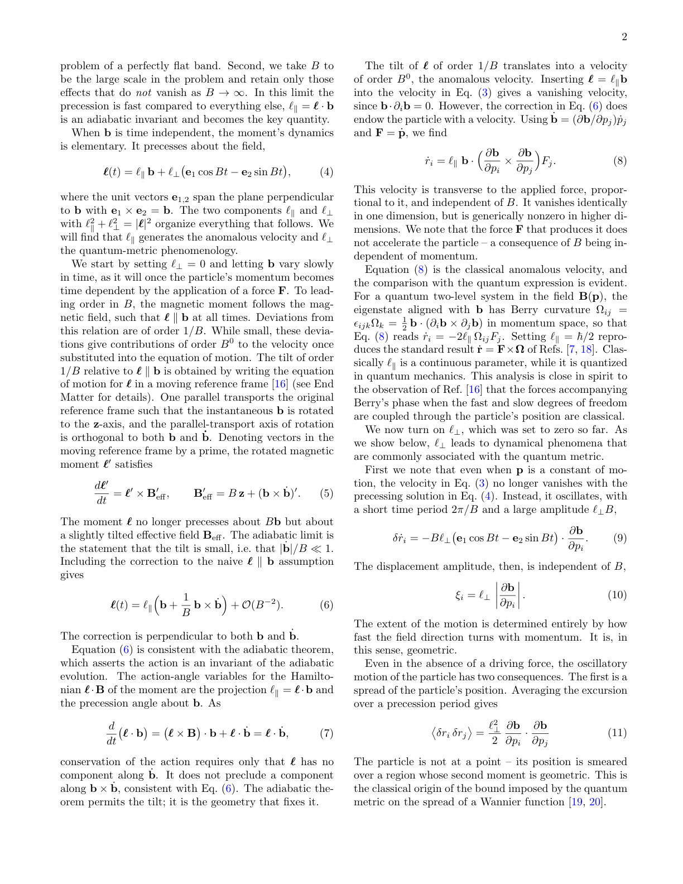
<figcaption class="paper-figure-caption"><b>Fig 1.</b> Low-resolution page preview, page 2</figcaption>
</figure>
<figure class="paper-figure-card">
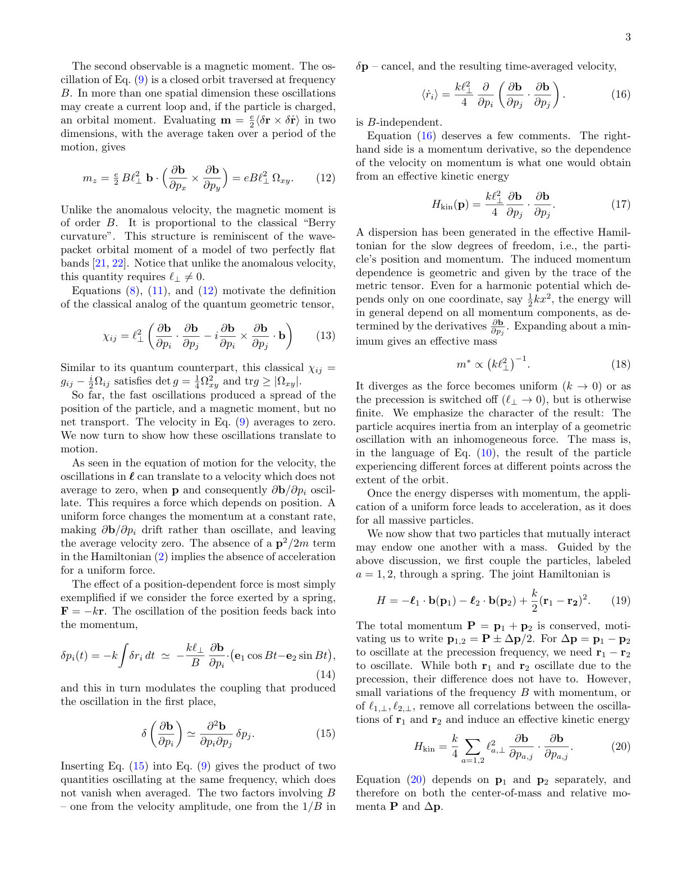
<figcaption class="paper-figure-caption"><b>Fig 2.</b> Low-resolution page preview, page 3</figcaption>
</figure>
<figure class="paper-figure-card">
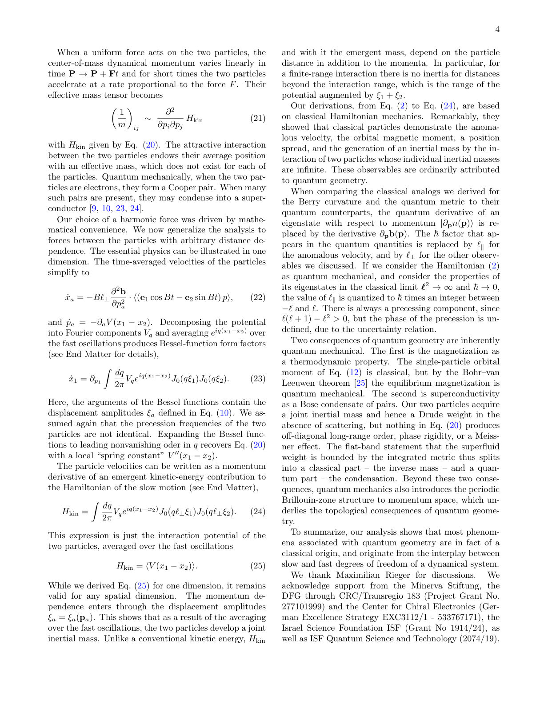
<figcaption class="paper-figure-caption"><b>Fig 3.</b> Low-resolution page preview, page 4</figcaption>
</figure>
<figure class="paper-figure-card">
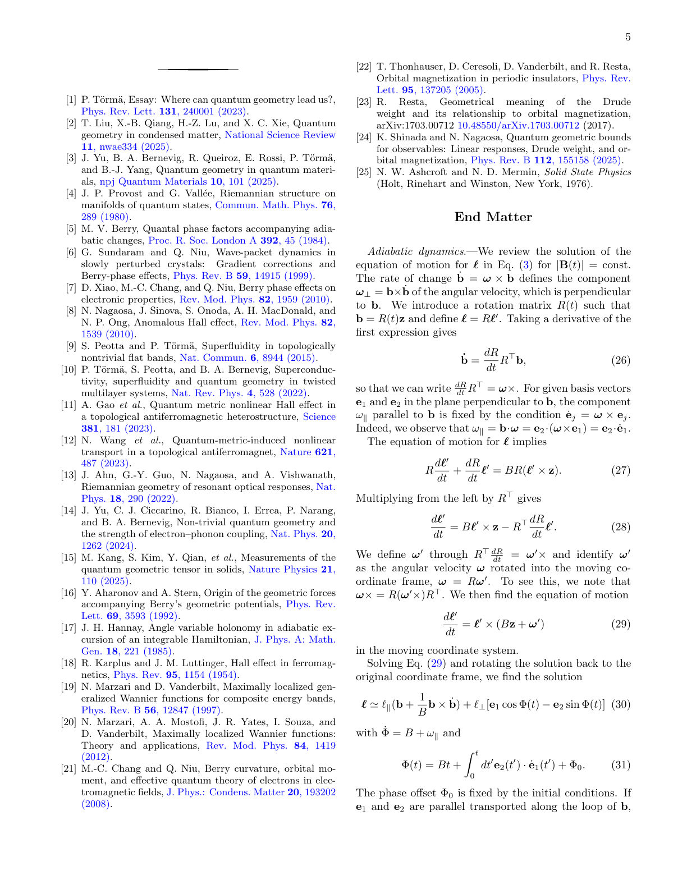
<figcaption class="paper-figure-caption"><b>Fig 4.</b> Low-resolution page preview, page 5</figcaption>
</figure>
<figure class="paper-figure-card">
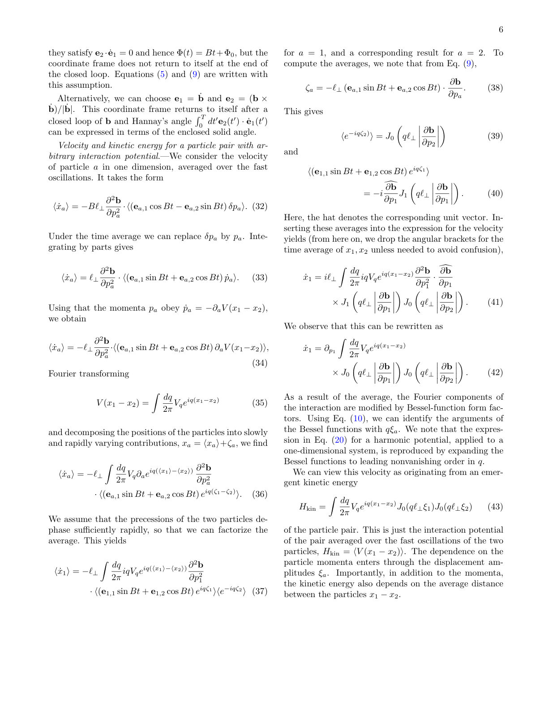
<figcaption class="paper-figure-caption"><b>Fig 5.</b> Low-resolution page preview, page 6</figcaption>
</figure>

**Summary.** This paper explores the quantum geometric tensor by studying a classical model of a precessing magnetic moment. It demonstrates that several key quantum phenomena, such as anomalous velocity and emergent mass, have direct classical analogues arising from the interplay between fast and slow degrees of freedom. This suggests that the quantum nature of these effects might be less fundamental than previously thought for certain observables.

**Why it may be interesting.** It provides a powerful theoretical tool for distinguishing between genuinely quantum effects and those that can be captured by semi-classical or classical descriptions, which is crucial for interpreting experimental results in condensed matter.

Detailed structure

**Main problem.** The paper investigates whether the physical phenomena associated with 'quantum geometry' (like anomalous Hall effects or superfluid weights) fundamentally require quantum mechanics by analyzing a purely classical analogue.

**Main result.** Most key observables associated with quantum geometry, including anomalous velocity, orbital magnetic moment, and emergent inertial mass, can be reproduced by analyzing the dynamics of a classical particle system.

**Method.** The analysis uses Hamiltonian classical mechanics, employing the adiabatic approximation to separate fast precession dynamics from slow particle motion, and calculating time-averaged quantities.

**Model / system.** The model is a point particle carrying a classical magnetic moment $\boldsymbol{\ell}$ that precesses in a momentum-dependent magnetic field $\mathbf{B}(\mathbf{p})$. The analysis is generalized to include two interacting particles coupled by a spring potential.

**Key observables.** Anomalous velocity, position spread (metric), orbital magnetic moment, and emergent inertial mass/Drude weight.

**Important parameters / regimes.** The magnetic moment $\boldsymbol{\ell}$, the coupling constant $k$, and the characteristic precession frequency $B$.

**Assumptions / limitations.** The analysis relies on the adiabatic approximation (fast precession relative to slow dynamics) and the ability to average over fast oscillations.

**Figures summary.** Not specified.

**Paper structure.** The paper first establishes the classical analog of the quantum geometric tensor using a single particle. It then extends the analysis to two interacting particles, deriving an effective kinetic energy and showing how emergent mass arises from the interaction averaged over fast oscillations.

Abstract

The quantum geometric tensor - the Berry curvature together with the quantum metric - now underlies a long list of observables, from the anomalous Hall effect to the superfluid weight of a flat band. We ask which of these observables actually require quantum mechanics. To answer this question, we study a purely classical system: a point particle carrying a classical magnetic moment $\boldsymbol{\ell}$ that precesses in a momentum-dependent magnetic field $\mathbf{B}(\mathbf{p})$. Within Hamiltonian classical mechanics, the component of $\boldsymbol{\ell}$ along the field reproduces the Berry-curvature phenomena, while its precessing transverse component reproduces the quantum-metric phenomena. The particle acquires a position spread whose second moment is the metric, an orbital magnetic moment, and - most strikingly - an inertial mass generated by a position-dependent force, and with it a nonzero Drude weight in a system that is nominally dispersionless.

[↑ back to top](#top)

### [Isotropic Nanoscale Quantum Sensor at Room-Temperature](http://arxiv.org/abs/2608.26942v1)

**Authors:** Daniel T. Möller, Baha Sakar, Ekrem T. Güldeste, Dhruv Wadhwani, Olt Gashi, Daniel A. García Vaca, Mokessh K. Ciwan, Simone P. Crozier, Christian Laube, Sirswa K. Shree Ram, Matteo Slaviero, Nabeel Aslam  
**Type:** experiment · **Category:** other · **PDF:** <https://arxiv.org/pdf/2608.26942v1>  
**Analysis basis:** full PDF text, analyzed in chunks
**Topic relevance:** `QC/QI experiment` **3/5** · `quantum measurements` **2/5** · `quantum optics experiment` **2/5**

↔ Scroll figures horizontally

<figure class="paper-figure-card">
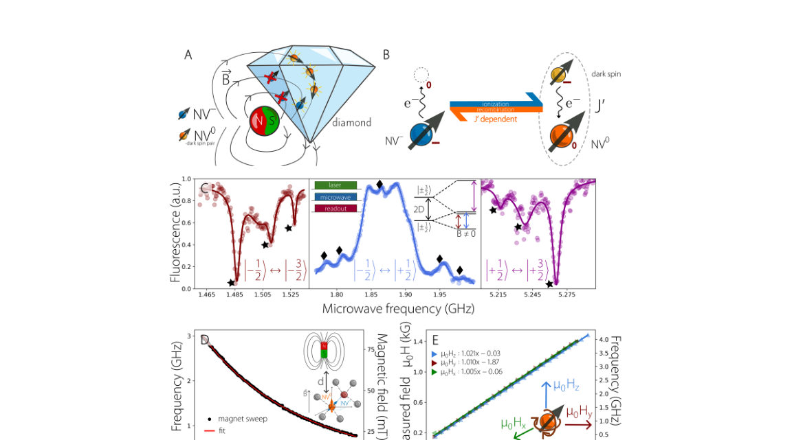
<figcaption class="paper-figure-caption"><b>Fig 1.</b> Fig. 1. Platform and isotropic spin-to-charge (SC-)ODMR. (A) Schematic comparison of NV⁰- and NV⁻-based quantum magnetometry. Unlike the NV⁻ center, whose quantization axis is fixed to the diamond lattice, the NV⁰-dark spin pair&#x27;s axis aligns dynamically with the local magnetic field, yielding an isotropic response via its central |+1/2⟩ ↔ |−1/2⟩ transition. (B) Schematic of SC-ODMR mechanism: Charge cycles form an NV⁰-dark spin pair with total spin angular momentum 𝐽𝐽′. Charge recombination is allowed for certain J&#x27; states but blocked for others, mapping the spin pair’s state onto the NV⁻/NV⁰ charge ratio. (C) CW SC-ODMR spectra of the 3/2 spin of NV⁰ and the dark spin at a magnetic field...</figcaption>
</figure>
<figure class="paper-figure-card">
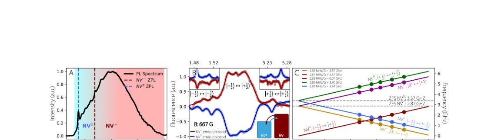
<figcaption class="paper-figure-caption"><b>Fig 2.</b> Fig. 2. Dual-band spin readout and multi-species magnetometry. (A) Fluorescence emission spectrum displaying distinct zero-phonon lines (ZPLs) and phonon sidebands for NV⁰ (575 nm) and NV⁻ (637 nm), enabling simultaneous dual-band detection. (B) SC-ODMR spectra of the 3/2 NV⁰-dark spin system. The central |+1/2⟩ ↔ |−1/2⟩ transition exhibits positive contrast in the NV⁻ fluorescence channel and negative contrast in the NV⁰ channel, whereas the outer |±1/2⟩ ↔ |±3/2⟩ transitions show reversed polarity. Matching resonance frequencies across both detection bands confirm a spin-to-charge conversion mechanism. Spectral substructure arises from hyperfine coupling to the intrinsic ¹⁴N nuclear spin...</figcaption>
</figure>
<figure class="paper-figure-card">
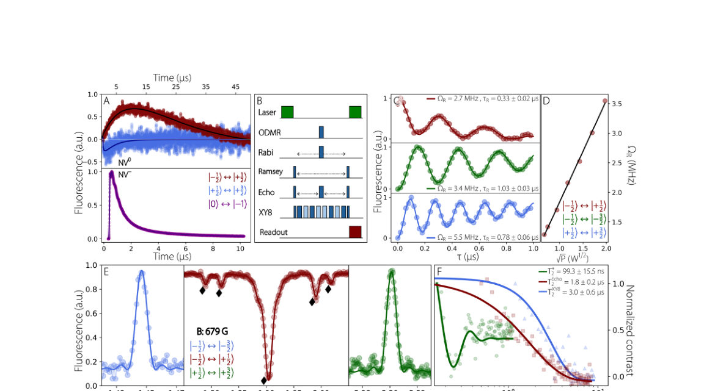
<figcaption class="paper-figure-caption"><b>Fig 3.</b> Fig. 3. Coherent control of the NV⁰ spin 3/2-dark spin pair under ambient conditions. (A) Decay of fluorescence contrast following microwave excitation resonant with the central (|−1/2⟩ ↔ |+1/2⟩) and outer (|+1/2⟩ ↔ |+3/2⟩) NV⁰ transitions. Signal decay occurs on a 5 µs timescale for the outer transition, whereas signal persists beyond 50 µs for the center isotropic transition. The case for NV⁻ is also shown for comparison. (B) Diagram of microwave and optical pulses used for coherent manipulation, including pulsed ODMR, Rabi oscillations, Ramsey interferometry, Hahn echo, and XY8 dynamical decoupling (MW pulses: narrow blue 𝜋𝜋𝑥𝑥2 ൗ, blue 𝜋𝜋𝑥𝑥; light blue 𝜋𝜋𝑦𝑦). (C) Rabi oscillations for...</figcaption>
</figure>
<figure class="paper-figure-card">
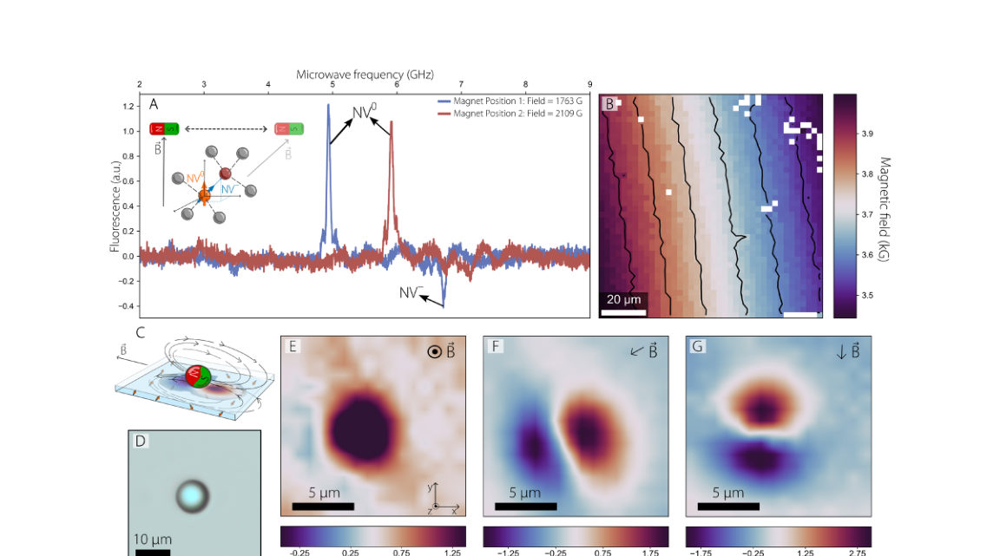
<figcaption class="paper-figure-caption"><b>Fig 4.</b> Fig. 4, Isotropic magnetic field mapping of individual paramagnetic microbeads. (A) CW ODMR spectra recorded at two locations near a permanent magnet. At ~1760 G, both NV⁻ and the NV⁰-dark spin pair yield clear resonance signals. At ~2110 G, the increased off-axis field component induces spin-state mixing in NV⁻, quenching its signal. The NV⁰-based sensor maintains a robust resonance. (B) Magnetic mapping near a permanent magnet using the NV⁰-dark spin pair. Scanning a 100 µm × 100 µm area on the diamond yields the local magnetic field magnitude maps, independent of field orientation or gradient strength. (C) Illustration of NV⁰ centers in a diamond substrate probing stray magnetic field...</figcaption>
</figure>
<figure class="paper-figure-card">
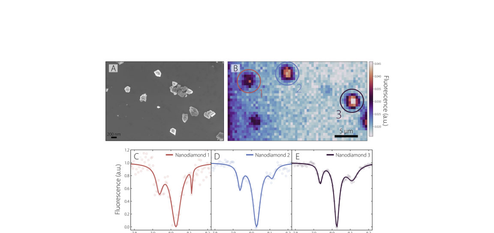
<figcaption class="paper-figure-caption"><b>Fig 5.</b> Fig. 5, Isotropic spin readout of NV⁰-dark spin pairs in nanodiamonds at room temperature. (A) Scanning electron microscopy (SEM) image showing the topography of nanodiamonds with a nominal size of 250 nm. (B) Confocal fluorescence map of multiple individual nanodiamonds, acquired with a longpass filter selective to NV⁻- fluorescence. (C to E) CW SC-ODMR spectra of NV⁰-dark spin system recorded from three single nanodiamonds marked in (B) under an out-of-plane bias magnetic field of 2865 G using an optical bandpass filter optimized for NV⁰- fluorescence. Despite the random crystallographic orientations of the individual particles, all three nanodiamonds exhibit identical resonance...</figcaption>
</figure>

**Summary.** This paper introduces an isotropic nanoscale quantum sensor based on the $	ext{NV}^0$ center in diamond, overcoming the major limitation of conventional sensors whose sensitivity is restricted by crystal orientation. By utilizing a spin-pair mechanism, the sensor's response dynamically aligns with the external magnetic field, enabling nanotesla sensitivity and alignment-free magnetometry at room temperature.

**Why it may be interesting.** This work is highly relevant to AMO physics and quantum optics as it demonstrates a robust, solid-state quantum sensor operating at ambient conditions with long coherence times, pushing the boundaries of practical quantum sensing.

Detailed structure

**Main problem.** Conventional color-center quantum sensors suffer from signal loss in off-axis magnetic fields because their spin quantization axes are fixed to the host lattice, limiting real-world applicability.

**Main result.** The use of the neutrally charged nitrogen-vacancy center ($	ext{NV}^0$) enables an isotropic magnetometer whose spin pair dynamically aligns with the external field, achieving nanotesla sensitivity at room temperature.

**Method.** The system uses Spin-to-Charge (SC)-ODMR spectroscopy to read out the spin state of the $	ext{NV}^0$-dark spin pair, which exhibits field-direction independence.

**Model / system.** The platform utilizes the $	ext{NV}^0$ center in diamond, specifically exploiting a spin-pair mechanism with an optically inactive dark spin. This pair's quantization axis dynamically aligns with the external magnetic field, providing an isotropic sensing mechanism.

**Key observables.** Resonance frequency of the central $|+1/2
angle \leftrightarrow |−1/2
angle$ transition, signal contrast, and coherence time ($T_2$).

**Important parameters / regimes.** Room temperature operation, nanotesla sensitivity, microsecond coherence time ($T_2 \approx 3 \mu	ext{s}$), and alignment-free operation.

**Assumptions / limitations.** The core assumption is that the $	ext{NV}^0$-dark spin pair's spin selection rules result in a quantization axis that is rotationally invariant with respect to the external field.

**Figures summary.** Figures illustrate the dynamic alignment of the $	ext{NV}^0$-dark spin pair, the dual-band SC-ODMR readout mechanism, and field mapping demonstrating isotropic response across various orientations.

**Paper structure.** The paper progresses from identifying the limitation of fixed-axis sensors to proposing the $	ext{NV}^0$-dark spin pair mechanism. It details spectroscopic measurements (SC-ODMR), validates the isotropic nature through field mapping, and confirms long coherence times using quantum control techniques.

Abstract

Color-center based quantum sensors provide nanoscale resolution under ambient conditions, yet their applicability remains limited. Because the quantization axes are locked to the host lattice, conventional color centers suffer severe signal loss in off-axis magnetic fields. To address this, we report an isotropic magnetometer enabled by the neutrally charged nitrogen-vacancy center (NV0) in diamond. Here, spin-to-charge dynamics yield an NV0-dark spin pair whose quantization axis dynamically aligns with the external field. Read out through NV charge-state-selective fluorescence, this system exhibits microsecond room-temperature coherence and nanotesla sensitivity for arbitrary field directions. We demonstrate alignment-free mapping of steep field gradients and single paramagnetic micro-targets, alongside isotropic readout from randomly oriented nanodiamonds. Resolving longstanding orientation constraints, this platform unlocks unrestricted nanoscale magnetometry across life sciences and quantum materials.

[↑ back to top](#top)

### [Vortex lattices in coupled one-dimensional Bose-Einstein condensates with a synthetic magnetic field](http://arxiv.org/abs/2608.26966v1)

**Authors:** Holly A. J. Middleton-Spencer, Rose Davies, David G. Reid, Anna Dalmasso, Theodore Kazanas, Hannah M. Price  
**Type:** theory · **Category:** quantum gases · **PDF:** <https://arxiv.org/pdf/2608.26966v1>  
**Analysis basis:** full PDF text, analyzed in chunks
**Topic relevance:** `analog quantum simulation` **3/5** · `Keldysh / 2PI / non-Gaussian methods` **2/5** · `Frenkel-Kontorova` **1/5** · `methods for driven-dissipative` **1/5**

↔ Scroll figures horizontally

<figure class="paper-figure-card">
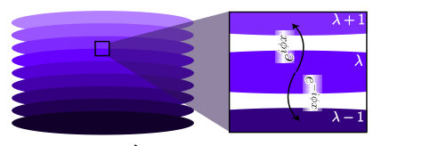
<figcaption class="paper-figure-caption"><b>Fig 1.</b> FIG. 1. Schematic of the non-interacting coupled-wire model. Particles can move freely along each wire in the (continuous) x direction, and hop between wires in the (discrete) λ direction. A synthetic magnetic flux through the x −λ plane is encoded via the phase ϕ, which is acquired when particles hop between neighbouring wires.</figcaption>
</figure>
<figure class="paper-figure-card">
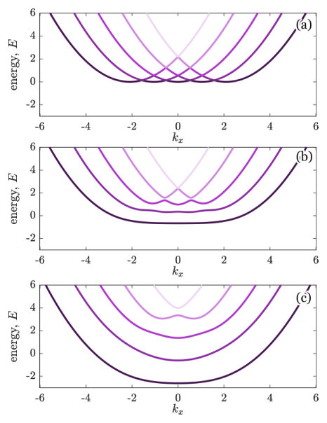
<figcaption class="paper-figure-caption"><b>Fig 2.</b> FIG. 2. The band structure for a non-interacting coupled wire system with N = 5 wires and open boundary conditions in the discrete direction and periodic boundary conditions in the continuous direction with ϕ = 2π/6, and (a) J = 0.01, (b) J = 0.6 and (c) J = 1.8. Here ℏ= m = 1.</figcaption>
</figure>
<figure class="paper-figure-card">
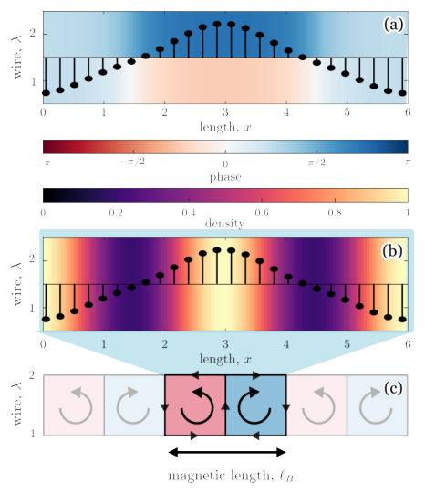
<figcaption class="paper-figure-caption"><b>Fig 3.</b> FIG. 3. (a) The phase and (b) density of the interacting ground state of two coupled wires with periodic boundaries conditions in both directions as obtained from solving Eq. 4 via imaginary time evolution for ϕ = 2π/6, ℓB = 6, L = lB and J = 1. The inter-wire current j⊥ 1,2 (Eq. 7) is superim- posed as black dots on each figure (with an arbitrary scale) to better see the correspondence between density, phase and inter-wire current. (c) Schematic of the ground state as a vortex-antivortex pair per magnetic length, with arrows and shading indicating the direction of current flow.</figcaption>
</figure>
<figure class="paper-figure-card">
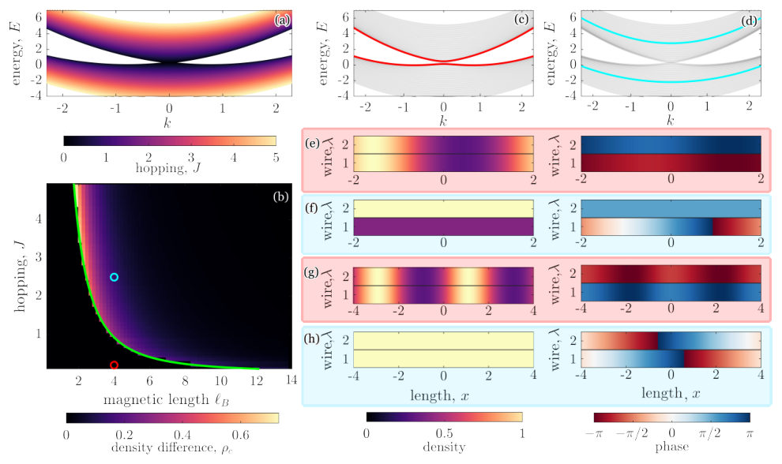
<figcaption class="paper-figure-caption"><b>Fig 4.</b> FIG. 4. Interacting ground-states of two coupled wires with open boundary conditions along the discrete direction as obtained numerically from the variational method. (a) The non-interacting band structure [Eq. 14] for hopping values ranging from J = 0.0 to J = 5.0 with ϕ = π/2 (i.e. ℓB = 2π/ϕ = 4). (c) &amp; (d) The non-interacting energy bands (grey lines), replotted from panel (a), highlighting (c) J = 0.2 (red line) and (d) J = 2.5 (blue line). For the highlighted band in (c), the lowest energy band has two minima, while in (d) the band has a single minimum at kx = 0. (b) The numerically-calculated spatially-averaged density difference, |ρc| ≡|¯ρ1 −¯ρ2|, plotted as a function of the...</figcaption>
</figure>
<figure class="paper-figure-card">
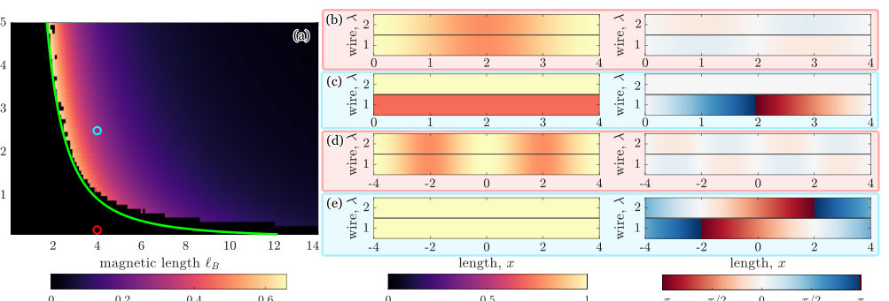
<figcaption class="paper-figure-caption"><b>Fig 5.</b> FIG. 5. Interacting ground-states of two coupled wires with open boundary conditions along the discrete direction as obtained numerically from numerically solving the Gross-Pitaevskii equation using imaginary-time evolution. (a) The density difference between the two wires, |ρc|, as a function of the inter-wire hopping J, and the magnetic length of the system, ℓB, for L = ℓB. The analytical prediction [Eq. 46] for the transition between the vortex-like and density-biased phase is indicated by the green line. The red and blue dots mark the parameters ϕ = π/2, with J = 0.2 and J = 2.5 respectively. Panels (b) and (c) show the density and phase profiles for the red and blue points in panel...</figcaption>
</figure>

**Summary.** This paper theoretically examines how vortex lattices form in coupled 1D Bose-Einstein condensates subjected to a synthetic magnetic field. By analyzing the mean-field ground states, the authors show that the resulting vortex structure is critically governed by whether the system boundaries are periodic or open. The findings provide crucial insights into controlling quantum fluid behavior in engineered atomic potentials.

**Why it may be interesting.** This work directly addresses the interplay between topology (synthetic fields), geometry (finite size/boundary conditions), and superfluidity in ultracold atomic systems, which is a major frontier in AMO physics.

Detailed structure

**Main problem.** The study investigates the mean-field ground states of coupled one-dimensional Bose-Einstein condensates subjected to a synthetic magnetic field.

**Main result.** The system's vortex structure is highly dependent on boundary conditions, favoring Abrikosov-like lattices under periodic boundary conditions and confining vortices centrally under open boundary conditions.

**Method.** The analysis employs mean-field theory, solving coupled Gross-Pitaevskii equations using numerical methods like imaginary time evolution and variational ansatz.

**Model / system.** The model is a coupled-wire system of 1D BECs, characterized by one continuous and one discrete spatial direction, allowing interpolation between few-leg ladders and extended vortex lattices.

**Key observables.** Density ($
ho_\lambda$), phase ($	heta_\lambda$), longitudinal and inter-wire currents ($j_{\parallel}, j_{\perp}$), and the emergence of vortex patterns.

**Important parameters / regimes.** Synthetic magnetic flux ($\phi$), inter-wire hopping strength ($J$), and the boundary conditions (Periodic vs. Open) in the discrete direction.

**Assumptions / limitations.** The analysis relies on mean-field approximations, treating the system as a bosonic condensate described by coupled Gross-Pitaevskii equations.

**Figures summary.** Figures illustrate the band structure for $N$ wires with open boundary conditions, showing how energy minima merge as coupling increases.

**Paper structure.** The paper progresses by first analyzing the non-interacting model, then developing the mean-field coupled-wire model, and finally comparing the resulting vortex states and ground state evolution under different boundary conditions.

Abstract

We investigate the mean-field ground states of coupled one-dimensional Bose-Einstein condensates subject to a synthetic magnetic field. The resulting interacting coupled-wire model has one continuous and one discrete spatial direction, providing a controlled way to interpolate between the physics of few-leg ladders and extended vortex lattices. For two wires, we study the vortex-like, biased-density, and Meissner-like states, exploring how the finite longitudinal size of the system modifies the transitions between them. Increasing the number of wires, the ground state evolves towards an extended vortex lattice. We find numerically that periodic boundary conditions in the discrete direction can favour staggered arrays of like-signed vortices resembling an Abrikosov lattice, while open boundaries in small finite-size systems confine the vortices into rows near the centre of the synthetic direction. Our results explore how finite size effects and boundary conditions govern the emergence and spatial organisation of vortices in continuous-discrete quantum fluids, with relevance to future experiments in tunnel-coupled atomic wires or with synthetic dimensions.

[↑ back to top](#top)

### [Neural Renormalization Group Flow for Percolation](http://arxiv.org/abs/2608.26764v1)

**Authors:** Anaclara Alvez, Luca Camagna, Sergio Chibbaro, Cyril Furtlehner, François Landes, Gianluca Manzan, Lorenzo Mensi  
**Type:** theory · **Category:** disordered systems and neural networks · **PDF:** <https://arxiv.org/pdf/2608.26764v1>  
**Analysis basis:** full PDF text, analyzed in chunks
**Topic relevance:** `non-equilibrium universality` **3/5** · `analog quantum simulation` **1/5** · `driven-dissipative phase transition` **1/5** · `methods for driven-dissipative` **1/5**

↔ Scroll figures horizontally

<figure class="paper-figure-card">
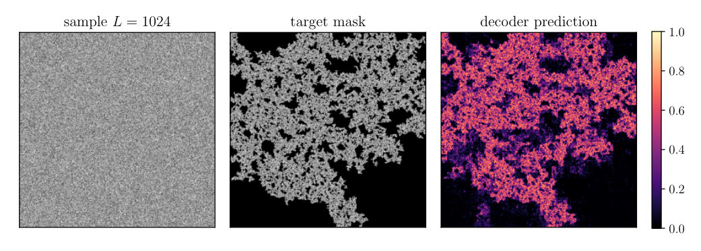
<figcaption class="paper-figure-caption"><b>Fig 1.</b> FIG. 1. Site-percolation configuration at criticality (left), mask of the spanning cluster (center), and prediction of the neural network (right). The lattice size is L = 1024, which lies outside the training range and therefore probes finite-size extrapolation.</figcaption>
</figure>
<figure class="paper-figure-card">
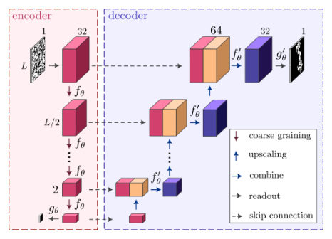
<figcaption class="paper-figure-caption"><b>Fig 2.</b> FIG. 2. Scale-shared RG-inspired encoder-decoder architec- ture. The encoder applies the same learned coarse-graining map fθ at every scale until the lattice is represented by a single latent vector, from which a readout gθ predicts the percola- tion probability. The decoder applies the same learned fine- graining map f ′ θ at every scale, combining coarse information with encoder features to reconstruct the largest-cluster mask.</figcaption>
</figure>
<figure class="paper-figure-card">
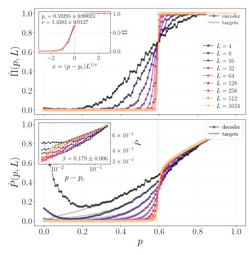
<figcaption class="paper-figure-caption"><b>Fig 3.</b> FIG. 3. Finite-size scaling of the learned percolation observ- ables. Top Panel: predicted crossing probability bΠ(p, L) as a function of p, with inset showing the collapse as a function of x = (p −pc)L1/ν. Bottom Panel: predicted order parameter ˆP∞(p, L) obtained from the decoder output, compared with the target cluster mass fraction. The inset shows the behavior above the critical point and the corresponding estimate of β.</figcaption>
</figure>
<figure class="paper-figure-card">
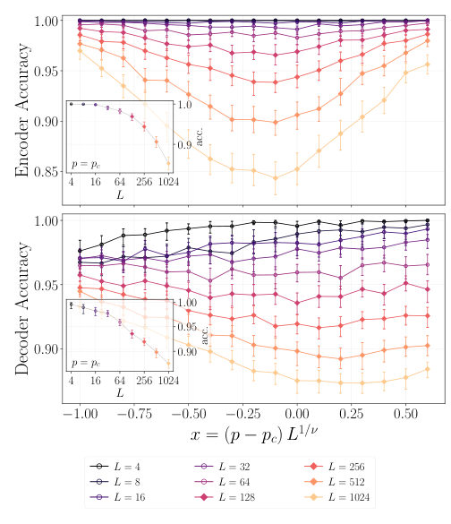
<figcaption class="paper-figure-caption"><b>Fig 4.</b> FIG. 4. Classification and reconstruction performance as a function of the rescaled occupation probability x = (p − pc)L1/ν. Top: encoder accuracy for the percolation label. Bottom: decoder accuracy for the largest-cluster mask. The largest size used during training is L = 64, while the test sizes extend up to L = 1024. For each value of x, the reported value is the median over N = 5000 test samples. Error bars indi- cate bootstrap uncertainty over test samples. Insets show the performance at criticality as a function of L.</figcaption>
</figure>
<figure class="paper-figure-card">
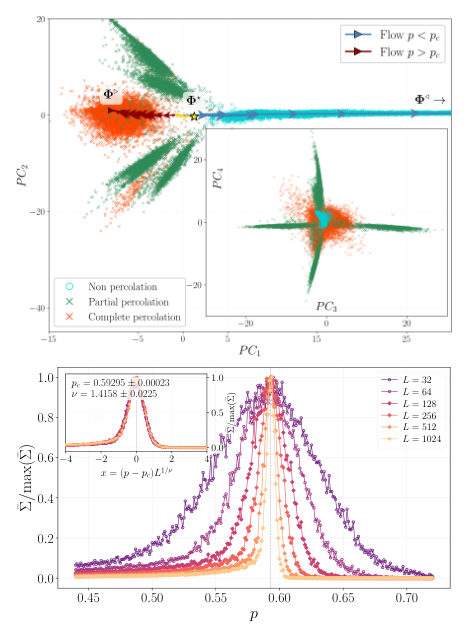
<figcaption class="paper-figure-caption"><b>Fig 5.</b> FIG. 5. Top:Projection of the coarsest latent representation Φ onto principal components computed from critical samples at the largest training size. Points show critical samples. Colors correspond to distinct connectivity patterns, including non- percolating configurations (light blue), configurations span- ning in both directions (orange), and other percolating pat- terns related by rotations (green). Six clusters are clearly apparent. Arrows indicate the motion of the distribution Φ(p, L)’s centroid as the lattice size increases, for values of p below and above pc, providing an empirical visualization of the learned scale flow. Bottom: Finite-size scaling of the normalized latent...</figcaption>
</figure>

**Summary.** This paper proposes using a scale-shared neural network architecture to perform real-space renormalization group calculations for 2D site percolation. By forcing the network to learn scale-dependent transformations, the model accurately predicts critical observables and exhibits finite-size scaling behavior, demonstrating the power of integrating physical symmetries into machine learning models.

**Why it may be interesting.** The explicit incorporation of RG principles into a neural network architecture provides a powerful, data-driven tool for analyzing critical phenomena, which shares conceptual links with how quantum critical points are studied in many-body physics.

Detailed structure

**Main problem.** Developing a data-driven, real-space renormalization group (RG) approach using machine learning to handle nonlocal observables in scale-invariant systems.

**Main result.** The model successfully predicts critical percolation observables, showing that the learned latent representation must exhibit critical fluctuations consistent with RG theory to achieve accurate finite-size scaling.

**Method.** A novel, scale-shared encoder-decoder neural architecture is trained to recursively apply coarse-graining and fine-graining rules across multiple scales.

**Model / system.** The study analyzes two-dimensional site percolation on a square lattice, a classic model for studying critical phenomena and phase transitions.

**Key observables.** Percolation probability ($\Pi$), order parameter ($P_\infty$), and the finite-size scaling variable $x = (p - p_c)L^{1/
u}$.

**Important parameters / regimes.** The critical probability $p_c$ and the correlation length exponent $
u$ are key parameters tested against theoretical predictions.

**Assumptions / limitations.** The core assumption is that the RG structure provides a necessary inductive bias that allows the network to extrapolate accurately to much larger systems than those used for training.

**Figures summary.** Figures illustrate the model's prediction of the spanning cluster mask at large sizes, the collapse of predicted observables onto finite-size scaling functions, and the schematic of the scale-shared RG-inspired architecture.

**Paper structure.** The paper introduces the problem of data-driven RG for nonlocal observables, details the scale-shared encoder-decoder architecture (encoder for coarse-graining, decoder for reconstruction), trains the model using specific losses, and validates its performance by demonstrating adherence to known finite-size scaling laws.

Abstract

Machine learning offers a possible route to data-driven real-space renormalization when the relevant observables are nonlocal and difficult to prescribe explicitly. We explore this idea for two-dimensional site percolation developping a supervised, scale-shared neural architecture. The model recursively applies the same learned coarse-graining rule across scales, producing a latent field from which the crossing probability is predicted, while a corresponding fine-graining decoder reconstructs the largest-cluster mask. Trained only on small lattices, the model extrapolates to substantially larger systems, recovers the spanning cluster with high fidelity, and produces observables obeying the expected finite-size scaling near the critical point. We observe that to get such performance it is key that the learned latent representation exhibits critical fluctuations and scale-dependent flows consistent with the renormalization-group structure of percolation.

[↑ back to top](#top)

### [The Role of Geometric Analysis in Interferometer Design and Optimization for Gravitational Quantum Entanglement](http://arxiv.org/abs/2608.26420v1)

**Authors:** Alireza Maleki  
**Type:** theory · **Category:** other · **PDF:** <https://arxiv.org/pdf/2608.26420v1>  
**Analysis basis:** full PDF text, analyzed in chunks
**Topic relevance:** `quantum measurements` **3/5** · `interference shaping light` **2/5** · `analog quantum simulation` **1/5**

↔ Scroll figures horizontally

<figure class="paper-figure-card">
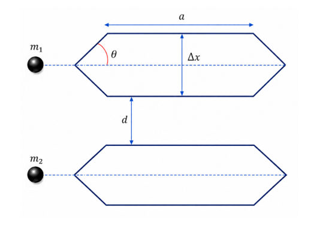
<figcaption class="paper-figure-caption"><b>Fig 1.</b> FIG. 1: Experimental setup for generating gravitationally in- duced quantum entanglement using two interferometers for massive particles in Stern-Gerlach interferometers.</figcaption>
</figure>
<figure class="paper-figure-card">
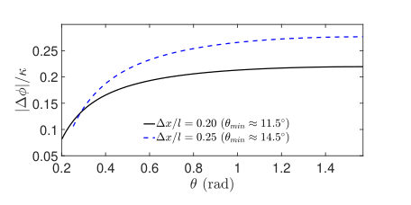
<figcaption class="paper-figure-caption"><b>Fig 2.</b> FIG. 2: Rescaled induced phase |∆ϕ|/κ as a function of the deviation angle θ for ∆x/l = 0.20 and ∆x/l = 0.25 at fixed d/l = 0.5. The allowed region is restricted by the geometric constraint leading to θmin = arcsin(∆x/l).</figcaption>
</figure>
<figure class="paper-figure-card">
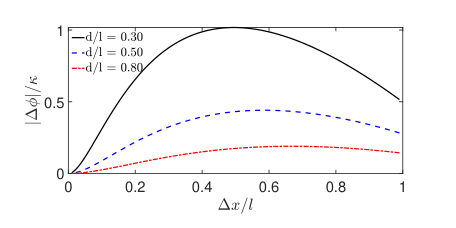
<figcaption class="paper-figure-caption"><b>Fig 3.</b> FIG. 3: Rescaled induced phase |∆ϕ|/κ as a function of ∆x/l for several values of the normalized separation d/l = 0.3, 0.5, 0.8 at fixed θ = π/2.</figcaption>
</figure>
<figure class="paper-figure-card">
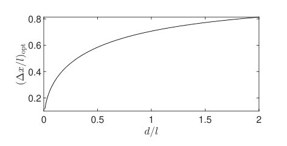
<figcaption class="paper-figure-caption"><b>Fig 4.</b> FIG. 4: Optimal value (∆x/l)opt that maximizes |∆ϕ|/κ as a function of the normalized separation d/l for θ = π/2.</figcaption>
</figure>
<figure class="paper-figure-card">
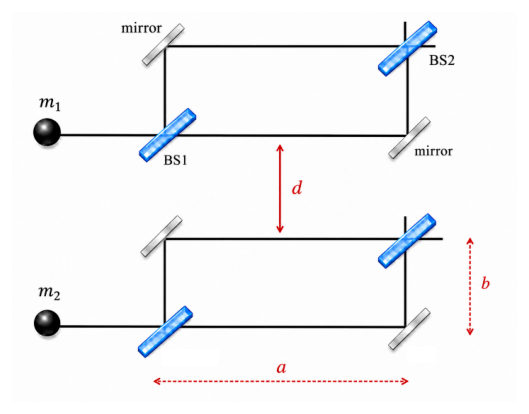
<figcaption class="paper-figure-caption"><b>Fig 5.</b> FIG. 5: Experimental setup for generating gravitationally in- duced quantum entanglement using two Mach-Zehnder inter- ferometers for massive particles.</figcaption>
</figure>

**Summary.** This paper investigates using quantum entanglement in massive particle interferometers as a potential probe for quantum gravity effects. The authors rigorously show that simplified models of the interferometer geometry fail to accurately predict the induced entanglement. They provide exact solutions demonstrating that the full geometric details are crucial for correctly assessing the potential for gravity-induced quantum correlations.

**Why it may be interesting.** This work is highly relevant as it applies advanced quantum measurement techniques (interferometry) to fundamental physics (quantum gravity), providing concrete, calculable predictions for future quantum sensing experiments that might involve matter waves.

Detailed structure

**Main problem.** The study aims to probe the quantum nature of gravity by detecting gravitationally induced quantum entanglement between two massive particles using interferometry.

**Main result.** The analysis demonstrates that neglecting the full geometry of the interferometer, particularly the vertical path segments, leads to incorrect predictions for the induced entanglement, which can vanish entirely in specific configurations.

**Method.** The authors derive exact analytical solutions for the gravitational phase shifts and quantify entanglement using the concurrence measure, comparing these to simplified approximations.

**Model / system.** The physical system involves two massive particles passing through interferometer geometries (Stern-Gerlach and Mach-Zehnder setups). The evolution is governed by gravitational phase shifts derived from the interaction with the gravitational potential.

**Key observables.** Concurrence (C) quantifying entanglement, and the accumulated phase difference ($\Delta\phi$).

**Important parameters / regimes.** Particle masses ($m_1, m_2$), separation distance ($d$), and geometric ratios like $b/l$ and $\Delta x/l$.

**Assumptions / limitations.** The primary assumption being tested is the validity of approximations that neglect phase contributions from the vertical segments of the particle trajectories.

**Figures summary.** Figures illustrate the experimental setups (Fig. 1, Fig. 5) and show the dependence of the rescaled induced phase ($\Delta\phi/\kappa$) on geometric parameters like deviation angle ($	heta$), horizontal separation ($\Delta x/l$), and vertical arm ratio ($b/l$).

**Paper structure.** The paper progresses by establishing the physical problem, deriving simplified models, and then presenting exact solutions that incorporate full geometry. The structure emphasizes comparing the results of the simplified versus the exact treatments to highlight the necessity of full geometric consideration.

Abstract

The pursuit of a quantum theory of gravity, aiming to unify general relativity and quantum mechanics, remains one of the most enduring challenges in physics. Because of the extreme energy scales associated with the Planck regime, direct experimental evidence for quantum gravity remains elusive. However, recent proposals suggest that quantum entanglement between two massive particles may provide a pathway to probe the quantum nature of gravity. In this study, we examine the interferometer geometries proposed in these works, with particular attention to the commonly used approximation that neglects phase contributions from the vertical segments of the particle trajectories. Our analysis shows that this approximation can lead to incorrect predictions and, in certain parameter regimes, to null results where entanglement would otherwise be expected. We derive exact solutions that incorporate the full particle trajectories and demonstrate that the vertical arms can significantly affect the accumulated phase. Crucially, we identify configurations in which the induced entanglement vanishes entirely, a feature missed by simplified treatments. These findings show that accounting for the full interferometer geometry is not merely a refinement, but is essential for accurately assessing gravity-induced entanglement.

[↑ back to top](#top)

### [Dynamics of local quantum information in random unitary circuits](http://arxiv.org/abs/2608.27440v1)

**Authors:** Ratul Thakur, Sthitadhi Roy  
**Type:** theory · **Category:** statistical mechanics · **PDF:** <https://arxiv.org/pdf/2608.27440v1>  
**Analysis basis:** full PDF text, analyzed in chunks
**Topic relevance:** `non-equilibrium universality` **3/5** · `analog quantum simulation` **1/5** · `scars & prethermalization` **1/5**

↔ Scroll figures horizontally

<figure class="paper-figure-card">
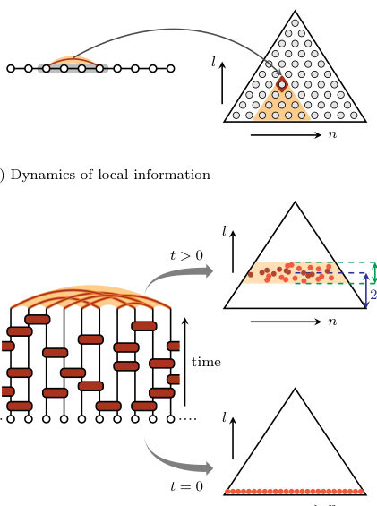
<figcaption class="paper-figure-caption"><b>Fig 1.</b> FIG. 1. Schematic summary of the main message of the pa- per. (a) The information lattice defined in the (n, l) plane en- codes the local information contained at length scale exactly l within a subsystem centred at n. (b) Dynamics of local in- formation. At time t = 0 the state is initialised in a product state and therefore all the information lives on scale l = 0. Evolution of this state with a generic, chaotic circuit leads to entanglement growth and information scrambling. This is manifested on the information lattice at a later time t by the local information residing at a length scale which grows ballistically, 2vEt, on an average accompanied by fluctuations which scale as t1/3....</figcaption>
</figure>
<figure class="paper-figure-card">
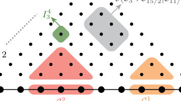
<figcaption class="paper-figure-caption"><b>Fig 2.</b> FIG. 2. (a) Regions Cl n, Cl−1 n+1/2, Cl−1 n−1/2 and Cl−2 n , which ap- pear in the equation for Il n for (n, l) = (3, 4) are shown on a chain of L = 10 spins. (b) The information lattice for L = 10 spins; The site (n, l) = (3, 4) is highlighted in green. Subsys- tem lattices for the subsystems C2 3 and C1 15/2 are highlighted (in red and orange respectively), where the sum of the local information content in these regions equals the respective von Neumann information. Local information in the gray region sums up to the conditional mutual information between he two subsystems, conditioned on the region which separates them.</figcaption>
</figure>
<figure class="paper-figure-card">
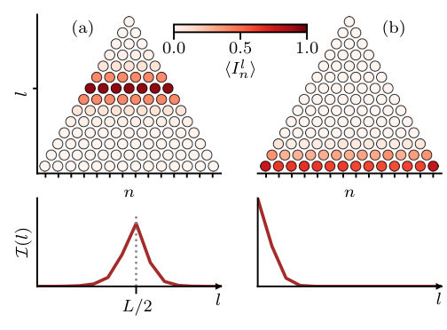
<figcaption class="paper-figure-caption"><b>Fig 3.</b> FIG. 3. Examples of the anatomy of the information lattice and the local information per scale. The colour intensity de- notes the value of Il n at the information lattice point (n, l) (a) For Haar-random states, the average Il n is peaked at l = L/2 with an exponential decay away from it. (b) For area-law states, generated by by low-depth local random unitary cir- cuits, the information is almost entirely concentrated on scales of l ∼O(1).</figcaption>
</figure>
<figure class="paper-figure-card">
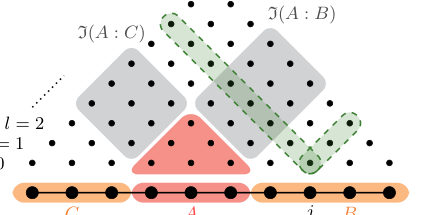
<figcaption class="paper-figure-caption"><b>Fig 4.</b> FIG. 4. Non-local constraints on the information lattice. The sum of the Il n over all points in the grey boxes yield the QMIs, I(A : B) and I(A : C), and sum over all points in the red triangle equals EA. The sum of these three quantities is con- strained by the length of the subsystem A (see Eq. 10). The same notion but for a single site, j, constrains the total sum of all Il n inside the two green boxes to 2 (see Eq. 11).</figcaption>
</figure>
<figure class="paper-figure-card">
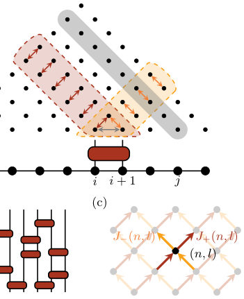
<figcaption class="paper-figure-caption"><b>Fig 5.</b> FIG. 6. (a) Flow of local information on the information lat- tice under the action of a 2-qudit local unitary gate sites i and i + 1. The flows are confined within the V-shaped region en- closed by the red and yellow boxes. Conservation of the total information within the grey boxes (due to Eq. 11 being satis- fied for all j) mandates the information flows only diagonally as indicated by the arrows except at l = 0. (b) Illustration of a random circuit composed solely of nearest-neighbour gates. (c) For a generic circuit of the form in (b), currents on the in- formation lattice flow diagonally which lets us define J±(n, l) with the arrow direction denoting the sign convention.</figcaption>
</figure>

**Summary.** This work develops a novel framework, the information lattice, to track how local quantum information spreads across different length scales in chaotic quantum systems. By analyzing random unitary circuits, the authors find that this information flow exhibits universal scaling characterized by a Tracy-Widom distribution. This establishes a powerful, fine-grained diagnostic tool for understanding quantum scrambling.

**Why it may be interesting.** It provides a concrete, length-scale-resolved measure of information flow that bridges microscopic quantum dynamics with macroscopic, hydrodynamic-like descriptions of scrambling and thermalization.

Detailed structure

**Main problem.** The paper addresses the limitation of standard, coarse-grained diagnostics (like bipartite entanglement) in characterizing the fine-grained spatiotemporal flow of local quantum information in out-of-equilibrium many-body systems.

**Main result.** The dynamics of local information are found to follow a universal scaling law, described by a Tracy-Widom distribution that grows ballistically in time ($\propto t$) with a $\sim t^{1/3}$ broadening, regardless of whether the system is Haar-random or Clifford.

**Method.** The authors develop a theory using an 'information lattice' to track information content at every length scale and location, mapping the dynamics onto an exact classical stochastic process for the infinite-dimensional limit.

**Model / system.** The study uses random unitary circuits as minimal models for quantum chaos, specifically examining Haar-random circuits (infinite local Hilbert space) and random Clifford circuits acting on qubits.

**Key observables.** Local information distribution across length scales, the dynamics of the information lattice, and the resulting Tracy-Widom distribution.

**Important parameters / regimes.** Time ($t$), local Hilbert-space dimension ($q$), and the specific type of random unitary circuit (Haar vs. Clifford).

**Assumptions / limitations.** Standard diagnostics are too coarse-grained; the local information dynamics can be mapped onto a classical stochastic process, and the results are assumed to be universal across different circuit types.

**Figures summary.** Figure 1 schematically illustrates the information lattice structure and the ballistic growth of information flow ($\propto t$) with $\sim t^{1/3}$ fluctuations.

**Paper structure.** The paper first introduces the information lattice framework to resolve local information flow. It then derives the dynamics for Haar-random circuits, mapping it to a classical stochastic process. Finally, it confirms the universal scaling behavior using random Clifford circuits via a phenomenological Markov process.

Abstract

The physics of information scrambling in quantum many-body systems is intimately related to thermalisation and emergence of chaos. However, its standard characterisation through bipartite entanglement or operator growth remains inherently coarse-grained, obscuring the spatiotemporal anatomy of how quantum information flows between different regions of the system and across various length scales. In this work, we develop a theory for the dynamics of local information in local random unitary circuits which resolves the fine-grained microscopic structures of local information flow in such systems. Using the framework of information lattice which systematises the information content at each length scale within each subsystem, we identify a distribution of length scales at which information resides and obtain the dynamics of the distribution. For Haar-random circuits with infinite local Hilbert-space dimensions, we map this dynamics onto an exact classical stochastic process which reveals that this distribution is described by a Tracy-Widom form which moves ballistically in time ($ \propto t$) toward larger scales, accompanied by a $\sim t^{1/3}$ broadening. We also find the same qualitative behaviour for random Clifford circuits acting on qubits. The similar scaling behaviour in two rather different settings hints strongly towards the universality of our results. In the case of Clifford circuits, we develop a phenomenological Markov process for the dynamics of the stabiliser generators in a specific gauge which confirms the Tracy-Widom distribution and the $t^{1/3}$ scaling of the fluctuations. Ultimately, our results establish the universal properties of the dynamics of local quantum information in a length scale-resolved fashion and provide a possible route towards bridging exact microscopic theories for information dynamics with emergent hydrodynamic descriptions of information flow.

[↑ back to top](#top)

### [Emptiness formation in the Lieb-Liniger gas: hydrodynamic instantons and a conjectured rate function](http://arxiv.org/abs/2608.26640v1)

**Authors:** Boris A. Khanikati, Alexander G. Abanov  
**Type:** theory · **Category:** quantum gases · **PDF:** <https://arxiv.org/pdf/2608.26640v1>  
**Analysis basis:** full PDF text, analyzed in chunks
**Topic relevance:** `Keldysh / 2PI / non-Gaussian methods` **3/5** · `methods for driven-dissipative` **1/5** · `non-equilibrium universality` **1/5**

↔ Scroll figures horizontally

<figure class="paper-figure-card">
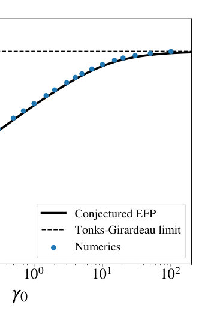
<figcaption class="paper-figure-caption"><b>Fig 1.</b> Figure 1: Comparison of the conjectured EFP rate function f (γ0), obtained from Eqs. (3) and (4), with the numerical minimization of the hydrodynamic action. The solid line represents the conjecture, while the points show the numerical results. Both f (γ0) and the dimensionless Lieb–Liniger coupling γ0 = c/ρ0 are displayed on loga- rithmic scales. The numerical results follow the conjectured interaction dependence across the full range shown, with a systematic relative difference of approximately 3%–5%.</figcaption>
</figure>
<figure class="paper-figure-card">
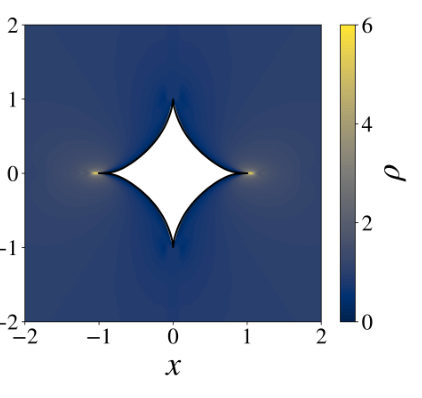
<figcaption class="paper-figure-caption"><b>Fig 2.</b> Figure 2: Representative numerical emptiness instantons at strong coupling, γ0 = 20 (left), and intermediate coupling, γ0 = 1 (right). The color scale shows the density ρ(x,τ). The axes show the dimensionless coordinates x/R and ħhρ0τ/(mR); the numerical calculations use R = ρ0 = ħh = m = 1. The empty interval |x| &lt; R is formed at τ = 0, and its astroid-like boundary closes at the critical imaginary times τ = ±τc.</figcaption>
</figure>
<figure class="paper-figure-card">
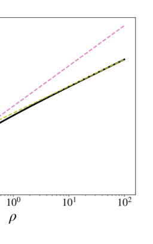
<figcaption class="paper-figure-caption"><b>Fig 3.</b> Figure 3: Lieb–Liniger ground-state energy density ε(ρ) at fixed coupling c = 1 (solid black line). At low density, γ = c/ρ ≫1, and the equation of state approaches the Tonks–Girardeau asymptote ε(ρ) ≃π2ρ3/6 (magenta dashed line). At high density, γ ≪1, it approaches the Gross–Pitaevskii asymptote ε(ρ) ≃cρ2/2 (yellow dashed line). Both axes are logarithmic.</figcaption>
</figure>
<figure class="paper-figure-card">
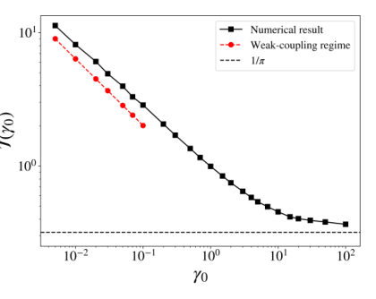
<figcaption class="paper-figure-caption"><b>Fig 4.</b> Figure 4: Numerical comparison across the interaction crossover. (Left) Relative difference between the numerically minimized hydrodynamic rate function and the conjecture, δf = 100[fnum(γ0) −fconj(γ0)]/fconj(γ0). The numerical result lies ap- proximately 3%–5% above the conjecture throughout the range shown. (Right) Dimensionless critical time T (γ0) = ħhρ0τc/(mR) extracted from the numerical in- stanton (black squares). The red dashed curve shows the weak-coupling prediction T (γ0) ≃2/(πpγ0), while the horizontal dashed line shows the Tonks–Girardeau limit T →1/π.</figcaption>
</figure>
<figure class="paper-figure-card">
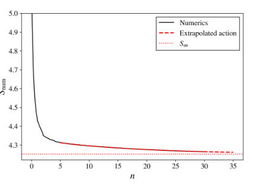
<figcaption class="paper-figure-caption"><b>Fig 5.</b> Figure 5: Late-stage optimization history of the physical action at γ0 = 20 for the 200×200 and 300×300 computational grids. The black curve shows the numerical action, while the dashed curves show fits to S(n) = S∞+ Ae−n/τ. For the 200 × 200 grid, the fitting window is over n = 5–20; for 300 × 300, it is n =5–30.</figcaption>
</figure>

**Summary.** This theoretical paper calculates the rate function governing the probability of finding a macroscopic empty region in a 1D Lieb-Liniger Bose gas. By combining advanced techniques from quantum field theory and hydrodynamics, the authors derive a conjectured rate function that successfully reproduces known limits and matches high-precision numerical simulations. This provides a powerful, unified description of rare quantum fluctuations in strongly interacting quantum gases.

**Why it may be interesting.** This work provides deep insights into non-equilibrium quantum dynamics and rare events in interacting quantum gases, connecting field-theoretic methods (Fredholm determinants) to macroscopic observables like vacuum decay rates.

Detailed structure

**Main problem.** The paper investigates the emptiness formation probability (EFP) in the ground state of the repulsive one-dimensional Lieb-Liniger Bose gas.

**Main result.** The authors derive a conjectured rate function $f(\gamma_0)$ for the EFP, which is shown to match known weak-coupling, strong-coupling, and numerical results for the Lieb-Liniger model.

**Method.** The analysis combines techniques from Fredholm determinants, dual-field representations, and variational minimization of the Euclidean hydrodynamic action.

**Model / system.** The system is the repulsive 1D Bose gas described by the Lieb-Liniger model, characterized by a repulsive delta-function interaction potential. The physics is analyzed in the ground state context.

**Key observables.** The Emptiness Formation Probability $P(R)$ for a macroscopic empty interval of length $2R$, and its asymptotic rate function $f(\gamma_0)$.

**Important parameters / regimes.** The dimensionless interaction strength $\gamma_0 = c/
ho_0$, and the empty interval length $R$.

**Assumptions / limitations.** The primary assumption is the validity of a 'double-scaled determinant hypothesis' for the asymptotic evaluation, which the authors note remains unproven.

**Figures summary.** Figures illustrate the numerical emptiness instantons, which are characterized by astroid-like vacuum regions, confirming the theoretical predictions.

**Paper structure.** The paper progresses from the initial Fredholm determinant representation of the EFP to a proposed double-scaled determinant hypothesis. It then relates this to the minimization of the hydrodynamic action, culminating in the derivation and verification of the rate function $f(\gamma_0)$ across different coupling regimes.

Abstract

We study the emptiness formation probability (EFP) in the ground state of the repulsive one-dimensional Lieb-Liniger Bose gas. For a macroscopic empty interval of length $2R$, its leading asymptotic behavior is described by a rate function $f(γ_0)$, defined by $-\log P(R)\sim(ρ_0R)^2f(γ_0)$, where $ρ_0$ is the mean density and $γ_0$ is the dimensionless interaction strength. We propose a parameter-free integral equation for $f(γ_0)$. Starting from the exact dual-field Fredholm-determinant representation of the EFP, we show how the conjectured kernel arises formally and identify the uniform asymptotic statement that remains to be proven for a rigorous derivation. The conjecture reproduces the Tonks-Girardeau and weak-coupling limits, as well as the first correction obtained independently in both limits. It also agrees at the few-percent level with numerical minimization of the Lieb-Liniger hydrodynamic action over more than four orders of magnitude in coupling. The numerical calculation yields the corresponding emptiness instantons and their astroid-like vacuum regions.

[↑ back to top](#top)

### [Enhancing the phase sensitivity of a Mach-Zehnder interferometer beyond the Heisenberg limit through dynamic squeezing](http://arxiv.org/abs/2608.26350v1)

**Authors:** Lakshya Bhardwaj, Ankit Tiwari, Mohan Sarovar, Christian Arenz  
**Type:** theory · **Category:** quantum information and computing · **PDF:** <https://arxiv.org/pdf/2608.26350v1>  
**Analysis basis:** full PDF text, analyzed in chunks
**Topic relevance:** `interference shaping light` **3/5** · `quantum measurements` **1/5**

↔ Scroll figures horizontally

<figure class="paper-figure-card">
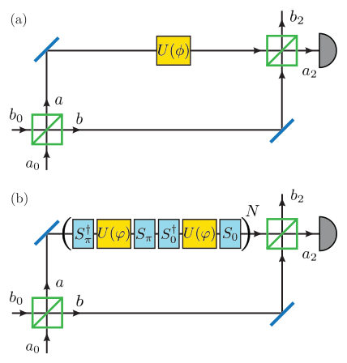
<figcaption class="paper-figure-caption"><b>Fig 1.</b> FIG. 1. Schematic representation of (a) a conventional Mach– Zehnder interferometer and (b) a HA-enhanced Mach–Zehnder interferometer introduced in this work. The phase shift in one arm of the Mach–Zehnder interferometer is described by the phase shifter U(ϕ) (yellow). In (b), squeezing transformations of orthogonal phase (blue) are placed equidistantly where φ = ϕ 2N in one arm of the interferometer. For sufficiently many repetitions N of the squeezing sequence, the phase shift ϕ is enhanced by cosh(2r) where r is the squeezing strength of each squeezer independently of the input states to the interferometer. In both setups, the phase estimation of ϕ is performed via the single-mode...</figcaption>
</figure>
<figure class="paper-figure-card">
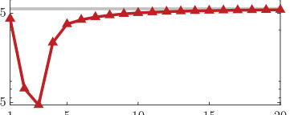
<figcaption class="paper-figure-caption"><b>Fig 2.</b> FIG. 2. Minimum phase uncertainty obtained for the HA- enhanced MZI as a function of the number of Trotter steps N (red) employed in the squeezing sequence given by Eq. (3) for a coherent-vacuum state input defined in Eq. (7). The Trotter limit given in Eq. (8) is shown by the grey line. The squeezing strength was set to r = 1 and the average number of photons was chosen to be |α|2 = 100 in the input state. For each Trotter step N, the optimal working point ϕ∗∈  0, 2π</figcaption>
</figure>
<figure class="paper-figure-card">
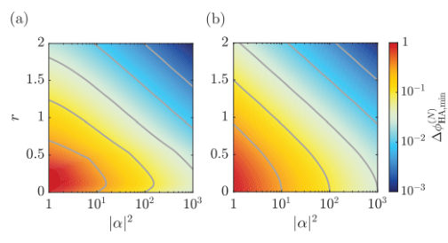
<figcaption class="paper-figure-caption"><b>Fig 3.</b> FIG. 3. Minimum phase uncertainty for the HA-enhanced MZI as a function of the squeezing strength r employed in the amplification sequence given in Eq. (3) and the average number of photons |α|2 in the coherent input state |ψ1⟩. The color maps show the minimum phase uncertainty, where in (a) N = 1 while in (b) N →∞.</figcaption>
</figure>
<figure class="paper-figure-card">
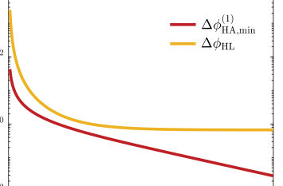
<figcaption class="paper-figure-caption"><b>Fig 4.</b> FIG. 4. Minimum phase uncertainty obtained with the HA- enhanced MZI for N = 1 with vacuum-vacuum input given in Eq. (9) (red) and the corresponding Heisenberg-limited sensitivity defined in Eq. (11) (yellow) as a function of the squeezing strength r employed in the HA sequence. In both cases, the phase uncertainty is calculated at the optimal work- ing point ϕ∗given in Eq. (10).</figcaption>
</figure>
<figure class="paper-figure-card">
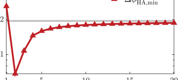
<figcaption class="paper-figure-caption"><b>Fig 5.</b> FIG. 5. Minimum phase uncertainty obtained with the HA- enhanced MZI as a function of the number of Trotter steps N employed in the squeezing sequence given in Eq. (3) (red) for a coherent-squeezed vacuum state defined in Eq. (7) as the input state. The squeezing strength was set to r = 1 in the HA sequence, the average number of photons |β|2 = 100, and the squeezing strength ξ = 0.5 in the input state. For comparison, we also plot the Trotter limit shown in Eq. (14) (grey) and the minimum uncertainty given by Eq. (13) (blue) obtained with the assumed input state without employing HA.</figcaption>
</figure>

**Summary.** This paper proposes a dynamic squeezing technique, called Hamiltonian Amplification, to significantly boost the phase sensitivity of a Mach-Zehnder interferometer. By strategically applying squeezing operations, the protocol achieves sensitivity enhancements surpassing the standard quantum limit and even the Heisenberg limit. Crucially, the method is shown to maintain high performance even when accounting for realistic photon losses.

**Why it may be interesting.** This work provides a concrete, implementable quantum sensing protocol that surpasses fundamental quantum limits, which is highly relevant for quantum optics and quantum metrology.

Detailed structure

**Main problem.** The paper addresses the challenge of enhancing the phase sensitivity of a Mach-Zehnder interferometer (MZI) beyond the standard quantum limit and potentially beyond the Heisenberg limit.

**Main result.** A dynamic squeezing protocol, implemented via Hamiltonian Amplification (HA), was shown to enhance phase sensitivity generically, achieving super-Heisenberg scaling even with vacuum input and remaining robust against moderate photon loss.

**Method.** The enhancement is achieved by applying alternating squeezing operations within the MZI structure, modeled using a Trotterized sequence of unitary operations.

**Model / system.** The physical system is a Mach-Zehnder interferometer used for phase estimation. The model involves applying squeezing operators ($S_	heta(r)$) interleaved with the phase shifter $U(\phi)$ in one arm.

**Key observables.** Phase uncertainty ($\Delta\phi$), minimum phase uncertainty ($\Delta\phi_{\min}$), and the enhancement factor ($\lambda$).

**Important parameters / regimes.** Squeezing strength ($r$), number of Trotter steps ($N$), and the effective loss parameter ($l_{	ext{eff}}$).

**Assumptions / limitations.** The analysis relies on the Trotter limit ($N 	o \infty$) for the ideal enhancement, and later incorporates models for photon loss occurring after each squeezing operation.

**Figures summary.** Figures illustrate the minimum phase uncertainty versus the number of Trotter steps ($N$) for various input states, comparing the HA protocol against the Standard Quantum Limit (SQL). Other figures show robustness against varying levels of photon loss.

**Paper structure.** The paper first introduces the HA protocol using squeezing sequences, deriving the enhancement factor in the Trotter limit. It then compares the resulting phase sensitivity for coherent, vacuum, and squeezed vacuum inputs relative to the SQL and HL. Finally, it extends the analysis to include realistic photon loss models.

Abstract

We propose a method to enhance the phase sensitivity of a Mach-Zehnder interferometer, independent of its input states. This is achieved by applying squeezing sequences to one arm of the interferometer. By alternating between squeezing along orthogonal quadratures, we demonstrate that the phase sensitivity of a Mach-Zehnder interferometer can be generically enhanced. Since this enhancement is independent of the input states, the proposed dynamic squeezing method allows for further improvement in phase sensitivity when combined with non-classical input states. We compare the dynamic squeezing approach with existing quantum sensing protocols and show that super-Heisenberg scaling can be achieved. Finally, we demonstrate that the scheme is robust against moderate photon loss.

[↑ back to top](#top)

### [Exact Stiffness and Dynamical Responses from Fock-Space Fragmentation](http://arxiv.org/abs/2608.27446v1)

**Authors:** Jonah Herzog-Arbeitman, Eslam Khalaf, Zhaoyu Han  
**Type:** theory · **Category:** strongly correlated electrons · **PDF:** <https://arxiv.org/pdf/2608.27446v1>  
**Analysis basis:** full PDF text, analyzed in chunks
**Topic relevance:** `scars & prethermalization` **3/5** · `analog quantum simulation` **1/5**

↔ Scroll figures horizontally

<figure class="paper-figure-card">
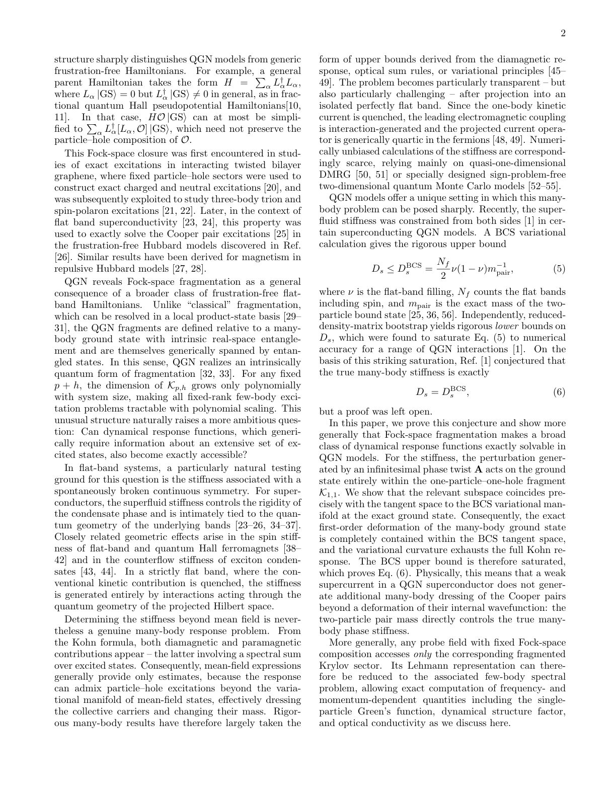
<figcaption class="paper-figure-caption"><b>Fig 1.</b> Low-resolution page preview, page 2</figcaption>
</figure>
<figure class="paper-figure-card">
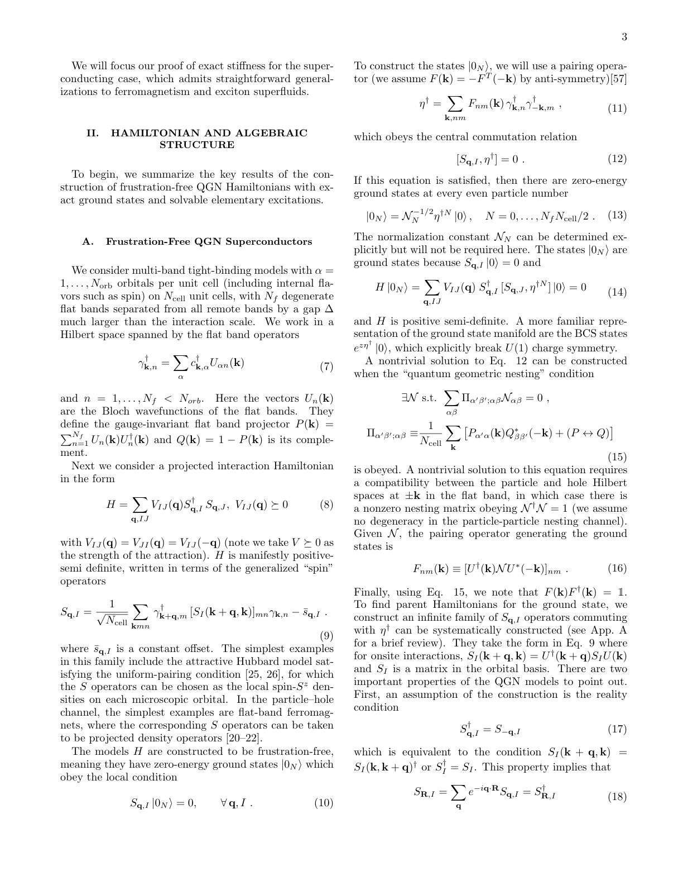
<figcaption class="paper-figure-caption"><b>Fig 2.</b> Low-resolution page preview, page 3</figcaption>
</figure>
<figure class="paper-figure-card">
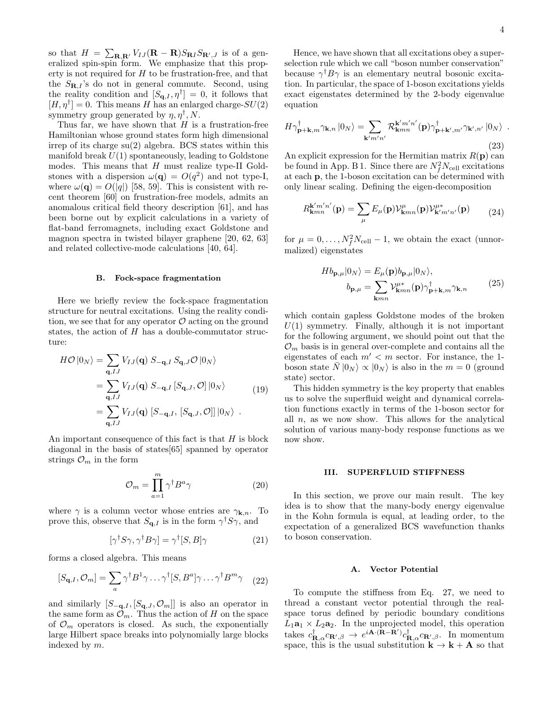
<figcaption class="paper-figure-caption"><b>Fig 3.</b> Low-resolution page preview, page 4</figcaption>
</figure>
<figure class="paper-figure-card">
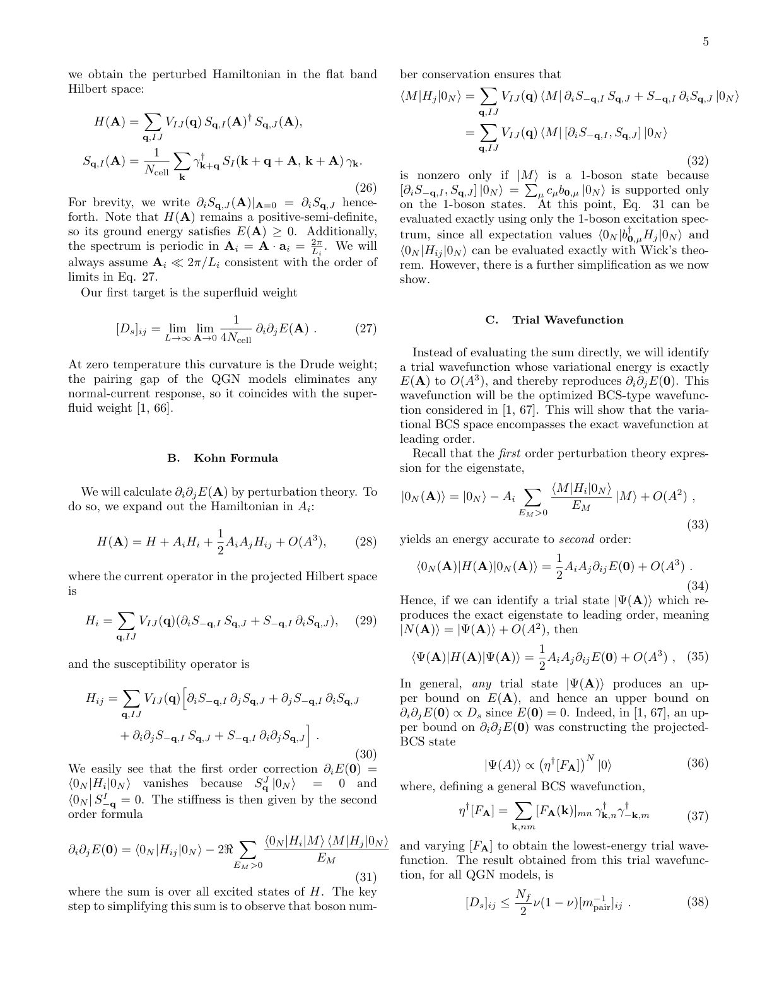
<figcaption class="paper-figure-caption"><b>Fig 4.</b> Low-resolution page preview, page 5</figcaption>
</figure>
<figure class="paper-figure-card">
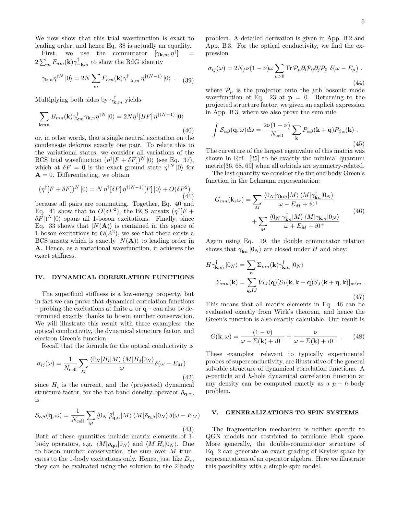
<figcaption class="paper-figure-caption"><b>Fig 5.</b> Low-resolution page preview, page 6</figcaption>
</figure>

**Summary.** This work tackles the difficulty of calculating dynamic properties in complex quantum many-body systems by identifying a structural feature called Fock-space fragmentation in QGN models. This fragmentation allows the system's excitations to decouple into manageable subspaces. By exploiting this, the authors prove that key quantities, such as the superconducting stiffness, can be calculated exactly using variational methods.

**Why it may be interesting.** The concept of Fock-space fragmentation provides a powerful, exact solvability mechanism for calculating dynamic responses in strongly correlated systems, bypassing the need to diagonalize the full, complex spectrum.

Detailed structure

**Main problem.** The primary challenge is obtaining exact dynamical responses (like stiffness or susceptibility) for quantum many-body models, as these probes typically couple to an extensive number of excited states.

**Main result.** The stiffness of the spontaneously broken continuous symmetry in Quantum Geometric Nesting (QGN) models is proven to be exactly equal to its variational value, confirming a key conjecture in the field.

**Method.** The proof exploits a structural property called Fock-space fragmentation, which causes excitations to decouple into subspaces with fixed particle and hole numbers.

**Model / system.** The study focuses on Quantum Geometric Nesting (QGN) models, which are idealized, frustration-free descriptions of symmetry-breaking orders in fermionic flat bands. The Hamiltonian structure allows for this fragmentation.

**Key observables.** Stiffness of spontaneously broken continuous symmetry, static susceptibility, optical conductivity, dynamical structure factors, and single-particle Green's functions.

**Important parameters / regimes.** The analysis is particularly sensitive to the fixed particle-hole composition of the excitations and the coupling strength related to the phase twist.

**Assumptions / limitations.** The general result holds for perturbations whose action remains confined within a fixed Fock-space fragment.

**Paper structure.** The paper establishes the general problem, introduces the QGN model and the concept of Fock-space fragmentation, and then applies this structure to prove the exactness of the stiffness calculation by showing the relevant perturbation is confined to the one-particle–one-hole fragment.

Abstract

Exactly solvable quantum many-body models are rare, and even when their spectra are algebraically organized, dynamical responses generally remain difficult to obtain because they probe an extensive number of excited states. Here we show that quantum geometric nesting (QGN) models admit an unusually strong form of solvability rooted in \emph{Fock-space fragmentation}: excitations on top of the exact frustration-free ground states decouple into Krylov subspaces with a fixed number of particle and hole operators, and hence remain dynamically invariant. Exploiting this structure, we prove that the stiffness of the spontaneously broken continuous symmetry in QGN models is exactly equal to its variational value in the Gaussian manifold, confirming a conjecture from quantum many-body bootstrap~\cite{GaoHanKhalaf2026}. The proof shows that an infinitesimal phase twist couples the ground state only to the one-particle, one-hole fragment, which coincides with the tangent space of the ground state within the variational manifold, thereby making the variational curvature exact. More generally, perturbations whose action remains within a fixed Fock-space fragment have response functions determined exactly by the corresponding few-body sector, enabling exact access to quantities including static susceptibility, optical conductivity, dynamical structure factors, and single-particle Green's functions.

[↑ back to top](#top)

### [Fast On-Chip Thermometry with TiN Kinetic Inductance Resonators in 22 nm Process Technology](http://arxiv.org/abs/2608.27057v1)

**Authors:** Johann Drayne, George Ridgard, Lorenzo Peri, Frederic Schlattner, Fabio Olivieri, Mathieu de Kruijf, Isaac Harris, Grayson Noah, James Kirkman, Alberto Gomez-Saiz, M. Fernando Gonzalez-Zalba, Thomas Swift  
**Type:** experiment · **Category:** other · **PDF:** <https://arxiv.org/pdf/2608.27057v1>  
**Analysis basis:** full PDF text, analyzed in chunks
**Topic relevance:** `QC/QI experiment` **3/5** · `quantum measurements` **1/5**

↔ Scroll figures horizontally

<figure class="paper-figure-card">
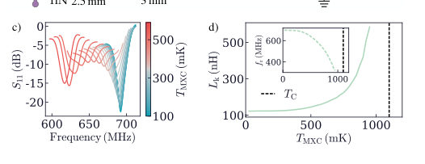
<figcaption class="paper-figure-caption"><b>Fig 1.</b> FIG. 1. Device layout and temperature-dependent re- sponse. (a) 22 nm FDSOI chip floorplan showing the ap- proximate positions of three TiN thermometers and a tran- sistor serving as a local heat source. Colour coding for the TiN (0.2 mm green, 1.6 mm pink, 2.5 mm purple) is main- tained throughout this work. (b) Equivalent resonant cir- cuit diagram. The shaded region indicates on-chip compo- nents: the TiN kinetic inductor Lk, system resistance Rsys, parallel capacitance Cp (combining an on-chip resonator ca- pacitor and intrinsic inductor parasitic capacitance) and line coupling capacitor Cc2. Total line coupling is established via Cc2 in series with an off-chip capacitor Cc1. (c)...</figcaption>
</figure>
<figure class="paper-figure-card">
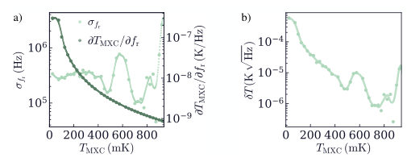
<figcaption class="paper-figure-caption"><b>Fig 2.</b> FIG. 2. Thermometer Bandwidth-Normalised Sensi- tivity (BWNS). (a) Resonant frequency uncertainty (σfr, light green) and temperature responsivity (∂fr/∂TMXC, dark green) as a function of mixing chamber temperature TMXC. (b) Bandwidth-normalised sensitivity δT versus TMXC. The order-of-magnitude enhancement in δT at higher tempera- tures is driven primarily by the sharp increase in temperature responsivity rather than a reduction in frequency measure- ment uncertainty.</figcaption>
</figure>
<figure class="paper-figure-card">
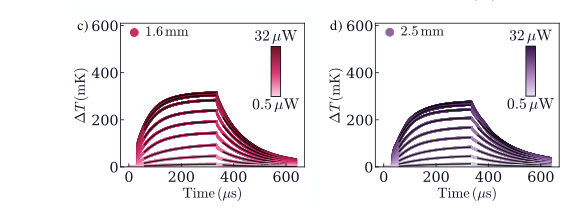
<figcaption class="paper-figure-caption"><b>Fig 3.</b> FIG. 3. Time-resolved temperature response under pulsed heating. (a) Example measurement showing the time-resolved resonant frequency shift during a single stepped heating pulse (Pheat = 32 µW). Markers highlight the ex- tracted resonance as the TiN film warms and cools. (b–d) Calculated temperature response across varying heater pow- ers at heater distances of 0.2 mm (b), 1.6 mm (c) and 2.5 mm (d) from the heat source.</figcaption>
</figure>
<figure class="paper-figure-card">
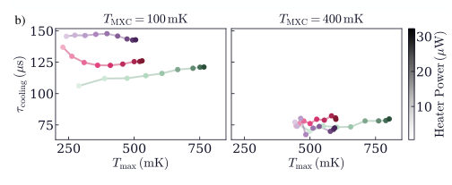
<figcaption class="paper-figure-caption"><b>Fig 4.</b> FIG. 4. Thermal cooling times across parameter space. (a) Cooling time constant τcooling versus mixing chamber temperature TMXC for three heater distances (d = 0.2 mm, 1.6 mm, 2.5 mm) from the heat source across varying heater powers. (b) τcooling versus peak pulse temperature Tmax at TMXC = 100 mK (left) and 400 mK (right) across varying heater powers.</figcaption>
</figure>
<figure class="paper-figure-card">
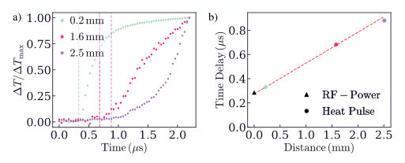
<figcaption class="paper-figure-caption"><b>Fig 5.</b> FIG. 5. Time delay of system response to heating. (a) Time-resolved temperature response following a single stepped heating pulse step (applied at t = 0), measured at three distances from the heat source. Dashed lines mark the onset of the delayed temperature rise following the heating pulse, identified as the cross-over from an initial linear seg- ment to exponential growth obtained from a bi-partite fit. Temperatures are normalised for clarity. (b) Time delay ver- sus distance from the heater. A straight line to the coloured markers yields a velocity 1/m = 3.9 ± 0.1 mm µs−1 and time offset c = 274 ± 4 ns. The black marker (not included in the fit) denotes the delayed response due to a...</figcaption>
</figure>

**Summary.** This paper presents a novel, highly sensitive, on-chip thermometry platform using superconducting TiN resonators to measure temperature fluctuations in cryogenic environments. By performing time-resolved pulsed heating experiments, the authors quantified the speed and mechanism of heat dissipation, revealing that thermal transport is limited by substrate or interface resistance rather than the superconducting material itself. This capability is vital for designing and operating next-generation quantum processors.

**Why it may be interesting.** This work provides a crucial, highly integrated, and quantitative tool for characterizing the thermal environment of quantum devices, which is essential for understanding decoherence mechanisms in solid-state quantum computing architectures.

Detailed structure

**Main problem.** The primary challenge is accurately measuring fast, time- and distance-dependent temperature fluctuations within high-performance cryogenic devices like quantum processors.

**Main result.** The authors demonstrated sub-millikelvin temperature sensitivity and quantified the heat propagation velocity as $3.9 \pm 0.1 	ext{ mm } \mu	ext{s}^{-1}$, identifying the rate-limiting thermal bottlenecks at different cryogenic temperatures.

**Method.** They employed a time-resolved thermometry platform using TiN kinetic inductance resonators integrated into a 22 nm FDSOI chip, measuring temperature via shifts in the microwave resonant frequency.

**Model / system.** The system involves superconducting TiN films whose kinetic inductance ($L_k$) is temperature-dependent due to Cooper-pair depairing. Thermal dynamics are modeled using lumped-element approximations involving temperature-dependent heat capacity ($C_{total}$) and thermal conductance ($G_{total}$).

**Key observables.** Temperature-dependent resonant frequency shifts ($\partial f_r/\partial T$), thermal relaxation time ($	au_{	ext{cooling}}$), and the onset delay time ($t_0$).

**Important parameters / regimes.** Sub-millikelvin temperature sensitivity, heat propagation velocity ($3.9 	ext{ mm } \mu	ext{s}^{-1}$), and distinct thermal regimes (substrate-limited vs. Kapitza boundary-limited).

**Assumptions / limitations.** The analysis assumes kinetic inductance dominates over geometric inductance, and that the measured thermal response is limited by substrate or interface resistance rather than intrinsic superconducting recovery.

**Figures summary.** Figures illustrate the temperature dependence of the resonant response, the calculated temperature sensitivity ($\delta T$), and time-resolved measurements showing how thermal relaxation times ($	au_{	ext{cooling}}$) change with distance and temperature, revealing distinct physical regimes.

**Paper structure.** The paper first establishes the thermometry technique using kinetic inductance resonators. It then moves to time-resolved pulsed heating experiments to map thermal decay kinetics. Finally, it analyzes the distance dependence of the thermal relaxation time to determine the rate-limiting heat transport mechanism.

Abstract

Understanding the temporal and spatial dependence of temperature is critical in high-performance cryogenic devices. Typical thermometry techniques struggle to simultaneously combine high bandwidth, sensitivity and on-chip integration, limiting their ability to measure fast intra-device thermal fluctuations. Here, we demonstrate a time-resolved thermometry platform based on TiN kinetic inductance resonators integrated in a 22 nm FDSOI chip. By tracking temperature-dependent shifts in the resonant frequency, we achieve sub-millikelvin temperature sensitivity down to temperatures of 100 mK. Time-resolved on-chip pulsed heating experiments as a function of distance reveal an onset delay, consistent with a quasi-ballistic heat propagation velocity of 3.9 ${\pm}$ 0.1 mm $μ$s${}^{-1}$. We also show that elevated temperatures increase net thermal conductance, shortening thermal relaxation times across all spatial separations. This behaviour manifests in two distinct regimes: a substrate-limited regime at 100 mK, where cooling rates vary with heater distance, and a Kapitza boundary-limited regime at 400 mK, where thermal relaxation becomes more spatially uniform.These measurements demonstrate kinetic inductance thermometry's ability to rapidly probe non-equilibrium temperature dynamics in cryogenic devices such as quantum processors.

[↑ back to top](#top)

### [Field-amplified readouts of weak altermagnetic exchange in MnF$_2$](http://arxiv.org/abs/2608.26540v1)

**Authors:** Guowen Jiang, Feilong Wang, Yunhua Wang, Fawei Zheng, Bin Xi, Hong-Gang Luo, Jize Zhao  
**Type:** both · **Category:** other · **PDF:** <https://arxiv.org/pdf/2608.26540v1>  
**Analysis basis:** full PDF text, analyzed in chunks
**Topic relevance:** `quantum measurements` **3/5** · `analog quantum simulation` **1/5**

↔ Scroll figures horizontally

<figure class="paper-figure-card">
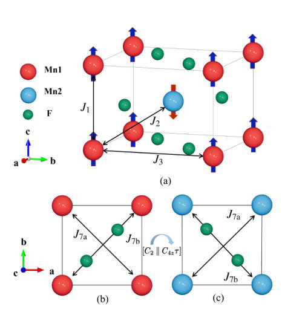
<figcaption class="paper-figure-caption"><b>Fig 1.</b> FIG. 1. Structure and exchange paths of MnF2. (a) Rutile magnetic cell with the two antiparallel Mn sublattices (Mn1 red, Mn2 blue), the F ions (green), and the near-neighbor exchange paths J1, J2, and J3; bold arrows indicate the an- tiparallel moments along the c axis. (b),(c) ab-plane projec- tion of the two seventh-neighbor paths as seen from sublattice Mn1 (b) and Mn2 (c). J7a and J7b have equal length and are interchanged by the spin-group operation [C2 ∥C4zτ] connect- ing the sublattices—hence the exchanged labels between the panels—but only J7b is bridged by two fluorine ions.</figcaption>
</figure>
<figure class="paper-figure-card">
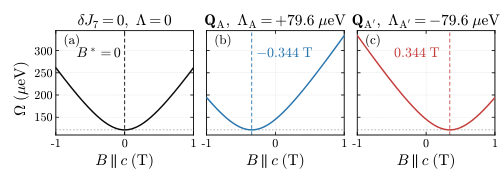
<figcaption class="paper-figure-caption"><b>Fig 2.</b> FIG. 2. Two-mode compensation mechanism, Eq. (5), for fixed D = 121.6 µeV and 2geffµB = 231.5 µeV/T. (a) δJ7 = 0 (Λ = 0), (b) QA, ΛA = +79.6 µeV, (c) QA′, ΛA′ = −79.6 µeV. In all panels the minimum floor equals D; the detuning only translates the minimum, to B∗= 0, −0.344 T, and +0.344 T (dashed lines). Panel (a) is the null case, the minimum pinned at B = 0; panels (b) and (c) re- alize the two partner momenta of MnF2 at a common field, and their fixed-field difference is the directly measurable sign contrast.</figcaption>
</figure>
<figure class="paper-figure-card">
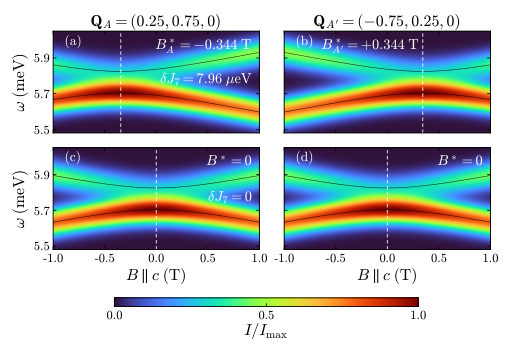
<figcaption class="paper-figure-caption"><b>Fig 3.</b> FIG. 3. Resolution-convolved unpolarized INS intensity I/Imax versus energy transfer ω and field B ∥c at QA = (0.25, 0.75, 0) (left column) and QA′ = (−0.75, 0.25, 0) (right column), from the full BdG calculation with Ewald-summed DDI and Gaussian energy convolution of 0.12 meV FWHM; black lines mark the unconvolved branch energies. (a),(b) Physical model, δJ7 = 7.96 µeV: the doublet is narrowest at B∗ A = −0.344 T and B∗ A′ = +0.344 T (dashed lines), the two maps being mirror images about B = 0 as Eq. (4) requires. (c),(d) Equal-J7 reference, δJ7 = 0 with identical DDI: the dipolar splitting and its field dependence remain, but both minima are pinned at B∗= 0 and each map is symmetric in B.</figcaption>
</figure>
<figure class="paper-figure-card">
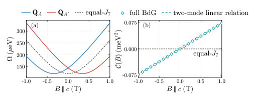
<figcaption class="paper-figure-caption"><b>Fig 4.</b> FIG. 4. Field dependence of the magnon splitting and its sublattice-odd combination. (a) Full BdG splittings ΩA(B) and ΩA′(B) at QA and QA′ for finite δJ7, together with the equal-J7 reference. The finite exchange imbalance shifts the two minima to opposite fields, while the reference remains centered at zero field; all three curves share the minimum floor D. (b) C(B) = Ω2 A(B) −Ω2 A′(B): open diamonds, full BdG; dashed line, the two-mode relation (10) with slope 0.074 meV2/T. The equal-J7 reference remains zero within numerical accuracy.</figcaption>
</figure>

**Summary.** This study develops a method to measure the weak altermagnetic exchange coupling ($\delta J_7$) in $	ext{MnF}_2$ by exploiting its field-dependent magnetic excitations. By applying a longitudinal magnetic field, the authors linearize the readout, allowing the weak coupling to be determined from the shift of the minimum magnon splitting ($B^*$) or the field-linear contrast ($C(B)$). This technique proves that subtle, symmetry-related interactions can be brought into the reach of current experimental measurements.

**Why it may be interesting.** This work provides a sophisticated example of using external fields to linearize the measurement of a weak, symmetry-protected interaction, a concept applicable to detecting subtle couplings in complex quantum materials.

Detailed structure

**Main problem.** The paper aims to detect and quantify the weak, sublattice-odd exchange coupling ($\delta J_7$) that characterizes the altermagnetic nature of $	ext{MnF}_2$, as this signal is otherwise masked by dominant interactions at zero field.

**Main result.** The authors demonstrate two complementary, field-dependent readouts—the compensation field shift ($B^*$) and the fixed-field contrast ($C(B)$)—that linearly amplify the weak exchange scale, confirming its existence and magnitude ($\delta J_7 \simeq +8 \mu	ext{eV}$).

**Method.** The analysis combines first-principles total-energy mapping to determine the coupling scale with theoretical modeling using linear spin-wave theory applied to the resulting effective Hamiltonian.

**Model / system.** The system is $	ext{MnF}_2$, modeled as a two-sublattice antiferromagnet. The effective Hamiltonian includes Heisenberg exchange, long-range dipole-dipole interaction (DDI), and Zeeman coupling, analyzed via the bosonic Bogoliubov-de Gennes spectrum.

**Key observables.** The primary observables are the minimum splitting position $B^*(\mathbf{Q})$ (compensation field) and the field-dependent contrast $C(B) = \Omega_{\mathbf{A}}(B) - \Omega_{\mathbf{A}'}(B)$, both of which are linear in $\delta J_7$.

**Important parameters / regimes.** The key scale is the seventh-neighbor imbalance $\delta J_7 \simeq +8 \mu	ext{eV}$. The readouts are quantified by the compensation field $|B^*| \simeq 0.34 	ext{ T}$ and the fixed-field contrast $\simeq 0.14 	ext{ meV}$ at $1 	ext{ T}$.

**Assumptions / limitations.** The analysis assumes that the DDI dominates the visible fine structure, allowing the weak exchange to manifest as a measurable asymmetry amplified by an external longitudinal magnetic field.

**Figures summary.** Figures illustrate the structure of $	ext{MnF}_2$ and show the field dependence of the magnon splitting $\Omega(B)$, demonstrating the shift of the minimum splitting ($B^*$) and the linear, odd dependence of the contrast $C(B)$ on the applied field.

**Paper structure.** The paper establishes the physical problem (masked $\delta J_7$), develops the theoretical framework using symmetry relations and the BdG spectrum, proposes two field-dependent readouts ($B^*$ and $C(B)$), and finally presents calculations confirming the measurable, linear amplification of the weak exchange scale.

Abstract

MnF$_2$, the textbook two-sublattice antiferromagnet, has reemerged as a prototypical altermagnet, yet the sublattice-odd exchange that defines this identity remains under active debate: it enters the magnon splitting only in quadrature with the dipole--dipole interaction, its magnitude suppressed and its sign erased. An overdetermined first-principles total-energy mapping resolves this scale as a seventh-neighbor imbalance $δ{J_7}\simeq+8~μ$eV. The resulting Hamiltonian, with the dipole--dipole interaction included explicitly, reproduces the low-energy gap and the visible finite-momentum splitting. A longitudinal field $B\parallel c$ then acts as a linear amplifier of the hidden scale, opening two signed, field-linear readouts. The first is the compensation field $B^\ast(\mathbf Q)$, the position of minimum splitting, which is equal and opposite at the rotation-related partner momenta: a shift from zero field is itself evidence of a finite imbalance, its side gives the sign, and its magnitude, $|B^\ast|\simeq0.34$~T here, gives the scale. The second is the fixed-field contrast of the partner splittings, $\simeq0.14$~meV at $1$~T, six times the zero-field excess: a sign check from just two spectra. Both readouts survive a $0.12$~meV energy resolution, and the construction carries over to any easy-axis collinear altermagnet, bringing $μ$eV altermagnetic exchange within present instrumental reach.

[↑ back to top](#top)

### [Misunderstanding Convivial Solipsism: the Necessity of a Perspectival Logic](http://arxiv.org/abs/2608.26361v1)

**Authors:** Herve Zwirn  
**Type:** theory · **Category:** other · **PDF:** <https://arxiv.org/pdf/2608.26361v1>  
**Analysis basis:** full PDF text, analyzed in chunks
**Topic relevance:** `quantum measurements` **3/5** · `analog quantum simulation` **1/5**

↔ Scroll figures horizontally

<figure class="paper-figure-card">
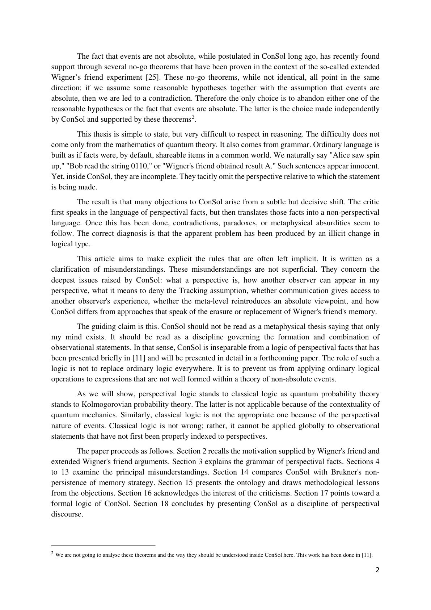
<figcaption class="paper-figure-caption"><b>Fig 1.</b> Low-resolution page preview, page 2</figcaption>
</figure>
<figure class="paper-figure-card">
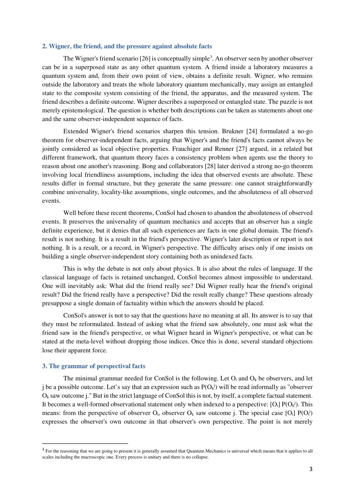
<figcaption class="paper-figure-caption"><b>Fig 2.</b> Low-resolution page preview, page 3</figcaption>
</figure>
<figure class="paper-figure-card">
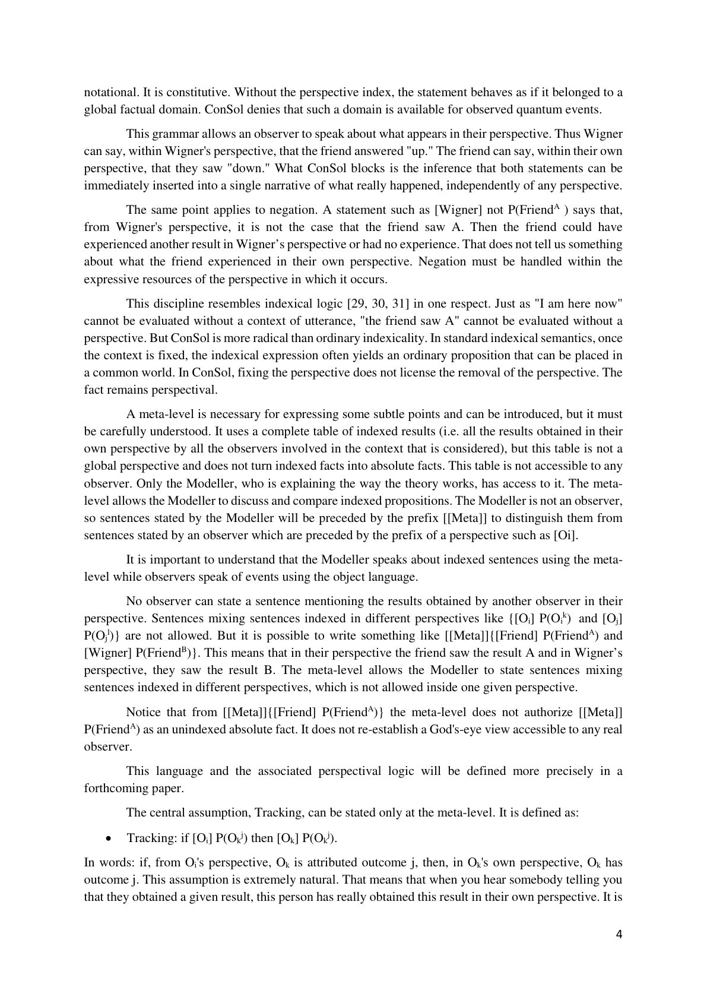
<figcaption class="paper-figure-caption"><b>Fig 3.</b> Low-resolution page preview, page 4</figcaption>
</figure>
<figure class="paper-figure-card">
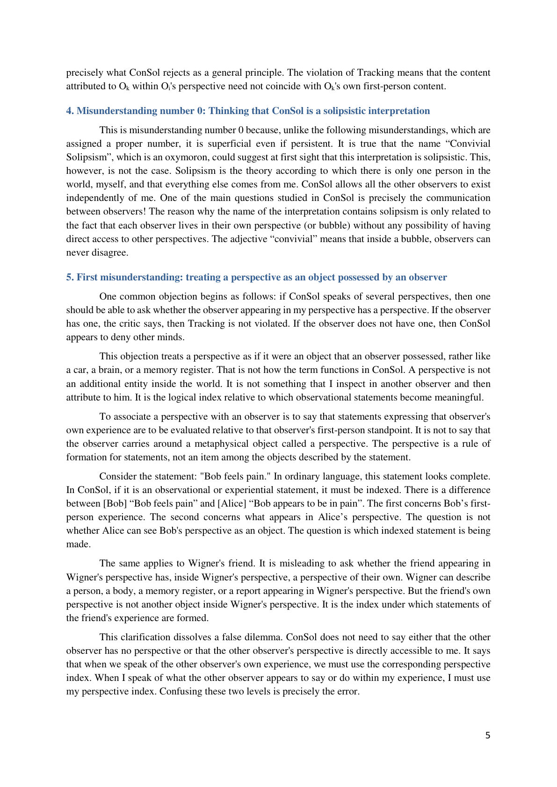
<figcaption class="paper-figure-caption"><b>Fig 4.</b> Low-resolution page preview, page 5</figcaption>
</figure>
<figure class="paper-figure-card">
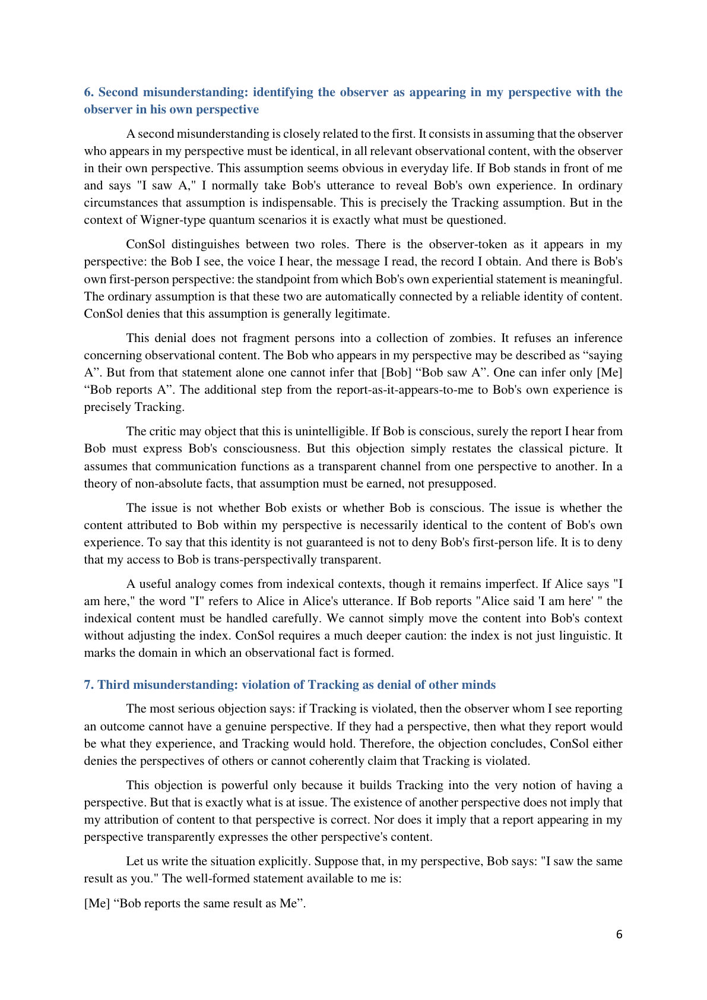
<figcaption class="paper-figure-caption"><b>Fig 5.</b> Low-resolution page preview, page 6</figcaption>
</figure>

**Summary.** This paper argues that quantum observations are inherently perspectival, meaning facts must always be indexed to the observer's viewpoint. It develops a formal 'Perspectival Logic' to prevent classical fallacies from treating these indexed statements as belonging to a single, absolute factual domain. This reframes the measurement problem as a problem of logical discourse rather than solely a physical collapse mechanism.

**Why it may be interesting.** While highly philosophical, the rigorous development of a formal logic for perspectival facts provides a novel framework for interpreting measurement processes in open quantum systems, which is central to quantum information theory.

Detailed structure

**Main problem.** The paper addresses the conceptual difficulties in interpreting quantum mechanics, specifically how to treat observed quantum events when they are not absolute facts.

**Main result.** It establishes 'Convivial Solipsism' as a 'discipline of perspectival discourse,' arguing that all observational facts must be indexed to the perspective from which they are viewed.

**Method.** The methodology involves reconstructing a formal logic (Perspectival Logic) to govern the formation and combination of observational statements, contrasting it with classical logic.

**Model / system.** The discussion uses thought experiments derived from quantum mechanics, particularly Wigner's friend scenarios, to illustrate the breakdown of classical assumptions about shared, absolute facts.

**Key observables.** The primary observables are the structure and indexing of observational statements, such as '[Observer] saw outcome X'.

**Important parameters / regimes.** The key conceptual parameters are the 'perspective index' and the 'Tracking Assumption' (the inference that an attributed outcome matches the observer's actual experience).

**Assumptions / limitations.** The core assumption is that quantum observations are inherently perspectival, leading to the rejection of a single, global factual domain for measurement outcomes.

**Paper structure.** The paper systematically identifies misunderstandings arising from classical language applied to quantum phenomena, proposes the formal grammar of perspectival indexing, and contrasts this new logic with standard logical frameworks.

Abstract

Convivial Solipsism is easily misunderstood. Because it denies the absoluteness of observed events while preserving the universality of quantum mechanics, it invites objections that are often formulated in a classical, non-perspectival language. Such objections appear powerful only because they smuggle back into the discussion the very assumptions that Convivial Solipsism rejects. This article reconstructs a family of misunderstandings that arise in discussions of Convivial Solipsism, especially in connection with Wigner's friend and extended Wigner's friend scenarios. The aim is not merely defensive. The objections are useful because they identify the conceptual discipline required by any interpretation that takes non-absolute facts seriously. The central claim is that observational facts must be indexed to perspectives. A statement such as "the friend saw outcome A" is not a complete factual statement within Convivial Solipsism. It must be reformulated as "from the friend's perspective, the friend saw outcome A" or "from Wigner's perspective, the friend reported outcome B." The mistake consists in removing these indices and then treating the resulting expressions as if they belonged to a single global factual domain. This leads to apparent contradictions and to false dilemmas concerning consciousness, communication, other minds, and intersubjectivity. When that is taken into account, it appears that Convivial Solipsism is not a retreat into psychological solipsism, but a discipline of perspectival discourse. It is also shown that perspectival logic stands to classical logic as the quantum calculus of probability stands to Kolmogorovian probability theory.

[↑ back to top](#top)

### [Quantum-Inspired Computational Fluid Dynamics for Transient Turbulent Compressible Flows](http://arxiv.org/abs/2608.26995v1)

**Authors:** Shang Xian Matthew Lee, Melissa Kozul, Muhammad Usman, Martin Sevior, Matthew L. Sims-Goh, Richard D. Sandberg  
**Type:** theory · **Category:** numerical methods · **PDF:** <https://arxiv.org/pdf/2608.26995v1>  
**Analysis basis:** full PDF text, analyzed in chunks
**Topic relevance:** `methods for driven-dissipative` **3/5** · `analog quantum simulation` **1/5**

↔ Scroll figures horizontally

<figure class="paper-figure-card">
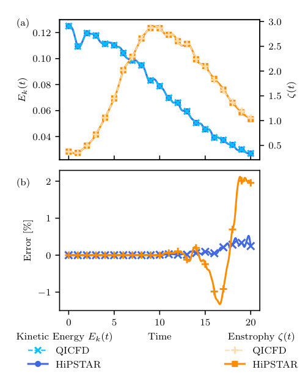
<figcaption class="paper-figure-caption"><b>Fig 1.</b> FIG. 1. Taylor-Green vortex validation test case results, showing (a) the total kinetic energy and enstrophy and (b) percentage error at simulation time t ∈[0, 20] for the Ma = 0.8 case produced by the QICFD solver and HiPSTAR clas- sical reference.</figcaption>
</figure>
<figure class="paper-figure-card">
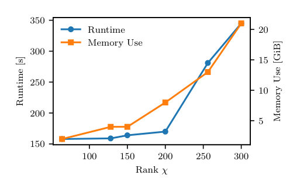
<figcaption class="paper-figure-caption"><b>Fig 2.</b> FIG. 3. Runtime and memory use per step for a 2563 grid size Ma = 0.8 TGV test case with N = 24 TT tensors saturated with χ ∈[50, 300]. Tests are performed on a single GH200 superchip.</figcaption>
</figure>
<figure class="paper-figure-card">
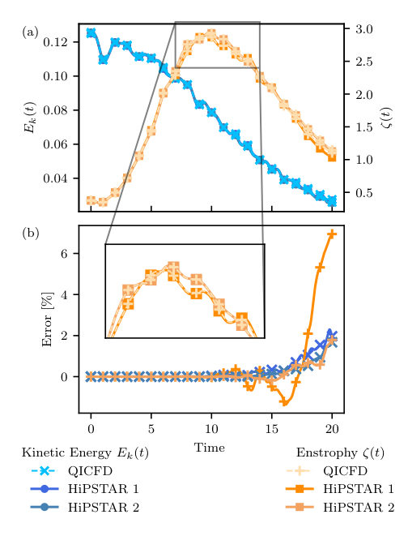
<figcaption class="paper-figure-caption"><b>Fig 3.</b> FIG. 2. (a) Simultaneous simulation validation results show- ing (a) the total kinetic energy and enstrophy and (b) per- centage error of two different TGV test cases at Ma = 0.8 initialised differently produced by the QICFD solver and HiP- STAR classical reference. QICFD results are produced in a single run, while HiPSTAR results are produced in two sepa- rate runs.</figcaption>
</figure>
<figure class="paper-figure-card">

<figcaption class="paper-figure-caption"><b>Fig 4.</b> FIG. 4. Highest χ for all fields in a high-fidelity Ma = 0.8 TGV test case for Re ∈[200, 1600] throughout all simulation time when encoded as a TTS. Each line represents different σc ∈{10−6, 10−9, 10−12} during the encoding.</figcaption>
</figure>
<figure class="paper-figure-card">
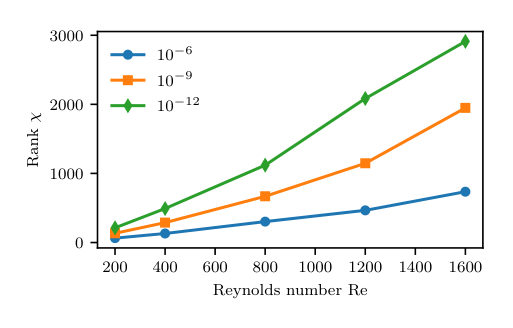
<figcaption class="paper-figure-caption"><b>Fig 5.</b> Figure 4 shows the effects of Re on χ. The simula- tion parameters are Ma = 0.8, ∆t = 0.001, L = 2π in all dimensions, and 5123 grid size. The Reynolds numbers are Re ∈{200, 400, 600, 800, 1200, 1600}. For all Re con- sidered, these simulation parameters are considered over- resolved in classical CFD. Relative singular value cutoffs σc ∈{10−6, 10−9, 10−12} are used during TTS encoding. For the TGV case, χ of the problem scales as a power law with Re, indicating high Re compressible TGV simula- tions may prove difficult for QICFD. In contrast, large computational grid simulations of low Re cases may be</figcaption>
</figure>

**Summary.** This work presents a novel Quantum-Inspired Computational Fluid Dynamics (QICFD) solver capable of simulating compressible, turbulent flows using the Tensor Train (TT) format. It overcomes previous limitations by introducing new algorithms for TT division and square-root operations. The successful validation on the Taylor-Green Vortex test case demonstrates that TT methods can accurately handle complex, non-linear physics beyond incompressible regimes.

**Why it may be interesting.** While focused on classical fluid dynamics, the reliance on tensor networks (TT format) and the development of specialized arithmetic operations for high-dimensional tensor representations are highly relevant to quantum simulation techniques used in many-body physics.

Detailed structure

**Main problem.** The paper addresses the challenge of applying quantum-inspired computational fluid dynamics (QICFD) methods, which use tensor network representations, to simulate compressible fluid flows governed by the Navier-Stokes equations.

**Main result.** The authors successfully introduce a complete QICFD solver for compressible flow by developing new, robust algorithms for division and square-root operations within the Tensor Train (TT) format, achieving excellent agreement with classical solvers on challenging test cases.

**Method.** The core method involves representing the high-dimensional fluid state using the Tensor Train (TT) format and developing specialized algorithms (based on Newton-Raphson) to perform necessary arithmetic operations like division and square-root required for compressible physics.

**Model / system.** The physical system is compressible fluid flow, modeled by the Navier-Stokes equations. The numerical framework uses the TT format to encode the state, allowing for efficient computation of derivatives and non-linear terms.

**Key observables.** Density (rho), velocity components (u, v, w), temperature (T), pressure (p), total kinetic energy, and enstrophy.

**Important parameters / regimes.** Mach number (Ma), Reynolds number (Re), and the bond dimension ($\chi$) governing the TT approximation.

**Assumptions / limitations.** The primary assumptions involve the applicability of the TT decomposition to the flow field and the successful implementation of the new TT arithmetic algorithms for division and square-root.

**Figures summary.** Figures illustrate the general structure of finite difference Tensor Train Operators (TTOs) and the use of binary lookup tables to construct these operators for various stencil widths.

**Paper structure.** The paper systematically builds the QICFD framework: first, by establishing the TT representation for operators (TTOs) to handle spatial derivatives; second, by developing the necessary arithmetic tools (division, square-root); and finally, by applying these tools to solve the full, compressible Navier-Stokes equations using a time-stepping scheme.

Abstract

Quantum-inspired algorithms are an emerging class of algorithms for computational fluid dynamics (CFD) with potentially favourable scaling for large problems compared to classical methods. However, their applications have been limited to incompressible flows due to arithmetic limitations, which are addressed in this work. This work introduces the first complete quantum-inspired computational fluid dynamics (QICFD) solver for direct numerical simulation of the compressible Navier--Stokes equations, that is, all arithmetic operations are undertaken in the tensor train (TT) format. Importantly, new division and square-root algorithms using TTs enable the use of Sutherland's law for viscosity. The new QICFD solver is validated by comparison with the classical CFD solver HiPSTAR and by way of a challenging fluid-flow test case, the low resolution Taylor--Green Vortex (TGV) at Mach numbers of 0.8 and 0.1. The TGV test case is a transient turbulent case that is very sensitive to accumulating errors, yet our QICFD solver achieves excellent agreement with the classical CFD reference. This work demonstrates the correctness of the new TT division and square-root algorithms, and that QICFD is capable of compressible flow simulations. The new QICFD solver is also able to perform simultaneous simulations, running multiple TGV-like cases initialised differently in parallel with marginal (10-20%) extra cost. Finally, the demonstrated TGV test case reveals additional challenges of QICFD as well as highlight the need for future advances to make TT methods viable for industrially-relevant conditions.

[↑ back to top](#top)

### [2-Morita Theory of $E_2$-Algebras and Module Categories](http://arxiv.org/abs/2608.27228v1)

**Authors:** Rongge Xu, Holiverse Yang  
**Type:** theory · **Category:** strongly correlated electrons · **PDF:** <https://arxiv.org/pdf/2608.27228v1>  
**Analysis basis:** full PDF text, analyzed in chunks
**Topic relevance:** `analog quantum simulation` **3/5**

↔ Scroll figures horizontally

<figure class="paper-figure-card">
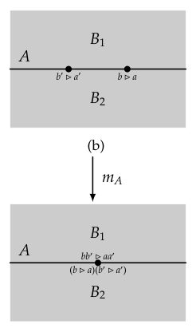
<figcaption class="paper-figure-caption"><b>Fig 1.</b> Figure 2: Elements in the algebras and their fusion behavior.</figcaption>
</figure>
<figure class="paper-figure-card">
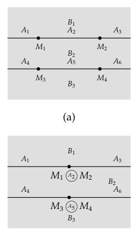
<figcaption class="paper-figure-caption"><b>Fig 2.</b> Figure 3: Compatibility between the two compositions of 2-morphisms requires M1</figcaption>
</figure>
<figure class="paper-figure-card">
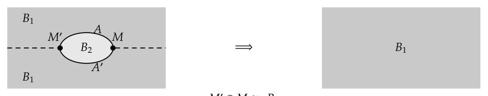
<figcaption class="paper-figure-caption"><b>Fig 3.</b> Figure 5: This figure shows 2-Morita equivalent data: the inverse 2-morphisms M and M′, together with the 3-isomorphisms identifying their two composites with the identity 2-morphisms.</figcaption>
</figure>
<figure class="paper-figure-card">
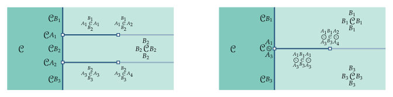
<figcaption class="paper-figure-caption"><b>Fig 4.</b> Figure 6: Vertical fusion of two bi-bimodule defects across the intermediate B2-phase. The two bound- ary labels on each side fuse by the corresponding relative tensor products over B2.</figcaption>
</figure>
<figure class="paper-figure-card">
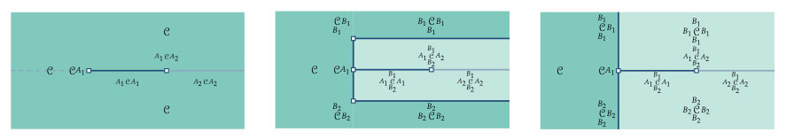
<figcaption class="paper-figure-caption"><b>Fig 5.</b> Figure 7: Passing from ordinary bimodule data in C to bi-bimodule data after making the two adjacent E2-actions explicit. The left panel lies in the unit corner of the finite Morita target, while the middle and right panels display the same representable cell after choosing the B1- and B2-actions. Thus the passage should be read as a refinement of module structure rather than as a change of the underlying object.</figcaption>
</figure>

**Summary.** This paper establishes a rigorous mathematical framework, using $n$-Morita categories, to unify the study of higher Morita equivalence for topological orders. By proving the equivalence of the module-realization functor for $n=1, 2$, it provides a powerful tool to relate abstract algebraic structures to concrete module categories describing physical defects.

**Why it may be interesting.** Topological order theories are deeply connected to condensed matter physics, particularly in describing fractional quantum Hall states and exotic phases of matter, making this highly relevant for understanding strongly correlated systems.

Detailed structure

**Main problem.** The paper develops a systematic framework to compare and unify different notions of higher Morita equivalence for $E_n$-algebras, particularly in the context of topological orders.

**Main result.** The module-realization functor $	ext{Mod}_n$ is proven to be an equivalence for $n=1$ and $n=2$, successfully relating the abstract algebraic description to its concrete realization in module categories.

**Method.** The authors utilize advanced category theory, introducing $n$-Morita categories $\mathrm{Mrt}_{E_n}(\mathcal{C})$ and defining the functor $	ext{Mod}_n$ by relating higher algebraic structures (like $E_n$-algebras) to module categories.

**Model / system.** The theory is applied to topological orders, which are mathematically described using $E_n$-algebras and their associated module categories, providing a framework for understanding defects and condensation.

**Key observables.** The structure of higher Morita categories, the explicit orientation data, and the fusion rules governing defects arising from condensation in topological orders.

**Important parameters / regimes.** The dimension $n$ of the topological order ($E_n$-algebras) and the underlying fusion category $\mathcal{C}$.

**Assumptions / limitations.** The authors do not establish a general equivalence between all three proposed constructions of higher Morita categories (Haugseng, Gwilliam–Scheimbauer, bi-bimodule model) and expect the equivalence to hold for all $n$.

**Figures summary.** Figure 1 illustrates complex bimodule structures involving multiple algebras ($A_1, A_2, A_3, A_4$), while the text describes the structure of the 2-category $	ext{Mrt}E_1(\mathcal{C})$.

**Paper structure.** The paper progresses by defining the $n$-Morita category, comparing different formalisms for higher Morita theory, and culminating in the proof that the module-realization functor $	ext{Mod}_n$ establishes key equivalences for low dimensions ($n=1, 2$).

Abstract

Building on our previous work on 2-Morita equivalence for $E_2$-algebras using topological pictures, we develop a systematic framework for Morita equivalence of topological orders in different dimensions in terms of $n$-Morita categories $\mathrm{Mrt}_{E_n}(\mathcal{C})$. In this framework, various notions of $n$-Morita equivalence are unified as equivalences of objects in $\mathrm{Mrt}_{E_n}(\mathcal{C})$. We also compare the constructions of higher Morita categories due to Haugseng and to Gwilliam--Scheimbauer.   For $n=1,2$, we prove that the functor $\mathrm{Mod}_n:\mathrm{Mrt}_{E_n}(\mathcal{C})\to \mathrm{Mrt}_{E_{n-1}}(\mathrm{LMod}^{\mathrm{rep}}(\mathcal{C}))$ is an equivalence, relating the algebraic description of higher Morita theory to its realization in terms of module categories. In this formulation, the notion of a bi-bimodule arises naturally and provides a common framework for local and confined modules. Its explicit orientation data, together with the corresponding fusion rules, clarifies the relations among defects arising from condensation in topological orders.

[↑ back to top](#top)

### [Demystifying Relativistic Quantum Collapse](http://arxiv.org/abs/2608.26474v1)

**Authors:** R. Muciño, E. Okon, D. Sudarsky, M. Wiedemann  
**Type:** theory · **Category:** other · **PDF:** <https://arxiv.org/pdf/2608.26474v1>  
**Analysis basis:** full PDF text, analyzed in chunks
**Topic relevance:** `quantum measurements` **3/5**

↔ Scroll figures horizontally

<figure class="paper-figure-card">
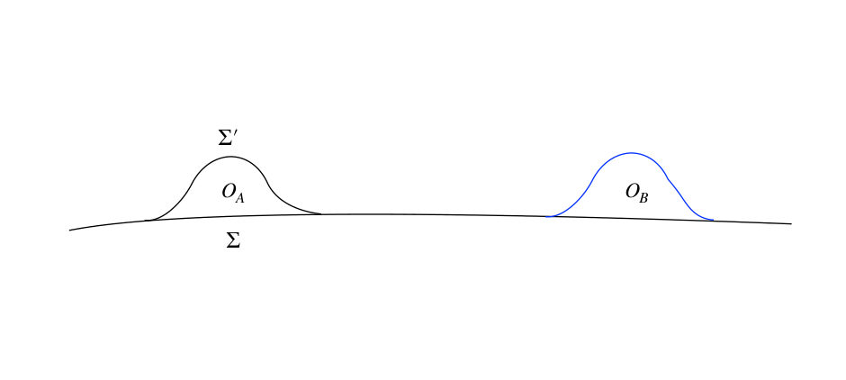
<figcaption class="paper-figure-caption"><b>Fig 1.</b> Figure 1: The regions OA and OB are spacelike separated and the hypersurfaces Σ and Σ′</figcaption>
</figure>
<figure class="paper-figure-card">
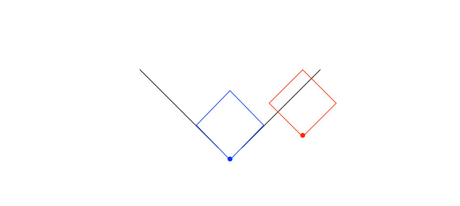
<figcaption class="paper-figure-caption"><b>Fig 2.</b> Figure 2: The collapse points are spacelike separated and one smearing region contains points in the causal future of the other, but no points in its causal past.</figcaption>
</figure>
<figure class="paper-figure-card">
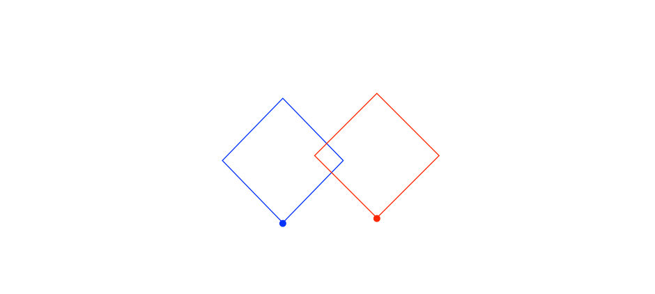
<figcaption class="paper-figure-caption"><b>Fig 3.</b> Figure 3: The smearing regions are mutually related in causal order: each contains points both to the future and to the past of the other.</figcaption>
</figure>

**Summary.** This paper tackles the profound challenge of making objective collapse theories—which solve the quantum measurement problem—compatible with special and general relativity. The authors systematically rebut common conceptual objections, such as frame-dependence, and propose technical strategies, like using state-dependent collapse operators, to build a viable, fully relativistic quantum framework.

**Why it may be interesting.** This work is highly relevant as it tackles the fundamental intersection of quantum foundations and general relativity, which is a major open problem in theoretical physics, impacting any theory attempting to describe quantum gravity effects.

Detailed structure

**Main problem.** The central challenge is extending objective collapse theories, which solve the measurement problem non-relativistically, into a fully consistent and covariant relativistic framework.

**Main result.** The authors argue that conceptual objections to relativistic collapse theories are surmountable, providing a structured path forward that suggests these theories remain a promising route to a fully relativistic quantum description.

**Method.** The paper employs systematic conceptual rebuttals against objections (like frame-dependence and superluminal signaling) and analyzes technical constraints imposed by special and general relativity on collapse dynamics.

**Model / system.** The discussion centers on objective collapse models (like GRW and CSL) and their mathematical formulation when subjected to relativistic constraints, contrasting non-relativistic stochastic/nonlinear modifications with covariant field theory requirements.

**Key observables.** Frame-independent property acquisition, stochasticity determination, and adherence to Lorentz invariance.

**Important parameters / regimes.** Collapse rate ($\lambda$), smearing width ($r$), and the distinction between Minkowski and curved spacetime backgrounds.

**Assumptions / limitations.** The analysis critically examines the assumptions underlying existing 'no-go' theorems (e.g., Myrvold's theorem), noting their dependence on state-independent dynamics and Minkowski spacetime.

**Figures summary.** Figures illustrate the causal relationships between smearing regions in spacetime, showing cases where a natural, covariantly defined ordering can be established, thereby potentially resolving apparent conflicts with relativity.

**Paper structure.** The paper first reviews the success and requirements of non-relativistic collapse models, then systematically addresses the conceptual objections arising in the relativistic domain (e.g., frame-dependence), and finally proposes technical strategies (like state-dependent operators and covariant ordering) to reconcile collapse with special and general relativity.

Abstract

Non-relativistic objective collapse theories have been remarkably successful in addressing the conceptual problems of standard quantum mechanics. Despite substantial efforts, the project of extending them to the relativistic domain remains burdened by significant conceptual objections and technical challenges, often taken to cast doubt on the viability of the program as a whole. On the conceptual side, relativistic collapse theories have been claimed to face challenges involving tension between instantaneous collapse and relativity, frame-dependence of property values and probabilities, the possibility of superluminal signaling and the failure of narratability. On the technical side, persistent infinities, difficulties in constructing fully covariant frameworks and the apparent need for non-standard fields have hindered the development of workable models. In this paper, we offer a systematic rebuttal of the conceptual objections and provide a structured account of the remaining technical challenges. We conclude that relativistic collapse theories do provide a promising route toward a fully relativistic quantum framework that overcomes the conceptual limitations of standard quantum theory.

[↑ back to top](#top)

### [Dynamical signatures of deconfined spinons in dimerized sawtooth chains](http://arxiv.org/abs/2608.26347v1)

**Authors:** Nishan Ranabhat, Brandon B. Le, Seung-Hun Lee, Gia-Wei Chern  
**Type:** theory · **Category:** strongly correlated electrons · **PDF:** <https://arxiv.org/pdf/2608.26347v1>  
**Analysis basis:** full PDF text, analyzed in chunks
**Topic relevance:** `analog quantum simulation` **3/5**

↔ Scroll figures horizontally

<figure class="paper-figure-card">
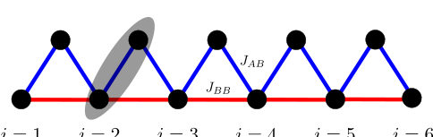
<figcaption class="paper-figure-caption"><b>Fig 1.</b> FIG. 1. Geometry of the sawtooth chain in Eq. (1), with apical spins SA i and basal spins SB i . The apex-base and base- base exchange interactions are denoted by JAB (blue) and JBB (red), respectively. The index i labels the unit cell; the shaded region indicates one unit cell containing a basal and an apical spin.</figcaption>
</figure>
<figure class="paper-figure-card">
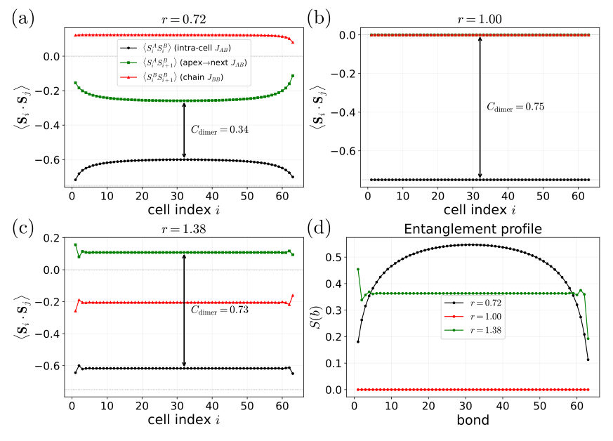
<figcaption class="paper-figure-caption"><b>Fig 2.</b> FIG. 2. Ground-state characterization at L = 64, χDMRG = 128, from two different diagnostics of the dimerization. (a)- (c) Bond-resolved ground-state energy ⟨Si·Sj⟩for (a) r = 0.72, (b) r = 1.000, and (c) r = 1.38, decomposed into the intra-cell apex-base bond (⟨SA i ·SB i ⟩, JAB; black), the apex-to-next-cell bond (⟨SA i ·SB i+1⟩, JAB; green), and the basal bond (⟨SB i ·SB i+1⟩, JBB; red); the dimer order parameter Cdimer is marked in each. (d) Bipartite entanglement entropy S(b) across each bond b for the three regimes. Both diagnostics collapse to the exact valence-bond solid at r = 1: perfect intra-cell singlets (−3</figcaption>
</figure>
<figure class="paper-figure-card">
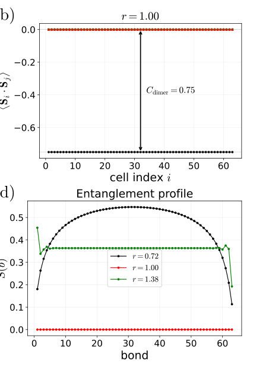
<figcaption class="paper-figure-caption"><b>Fig 3.</b> Figure 4 summarizes the central numerical result of this work: the dynamical structure factor Szz(q, ω) across the dimerized phase. The left column [(a),(c),(e)] presents the TDVP results over the full extended zone, while the right column [(b),(d),(f)] overlays the analytical and semi-analytical results developed below. Despite the substantial differences in the ground states at the three</figcaption>
</figure>
<figure class="paper-figure-card">
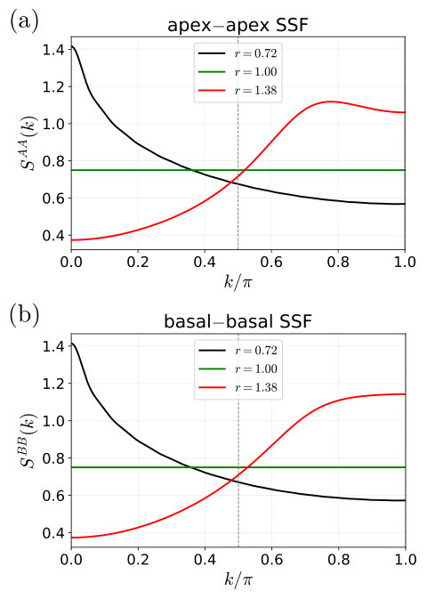
<figcaption class="paper-figure-caption"><b>Fig 4.</b> FIG. 3. Equilibrium static spin structure factor Sσσ(k) [Eq. (6)] of the L = 64 ground state, resolved by sublat- tice: (a) apex-apex SAA(k) and (b) basal-basal SBB(k), for r = 0.72 (black), 1.000 (green), and 1.38 (red). At the VBS point, the same-sublattice correlations are those of decou- pled singlets and S(k) is flat at 3</figcaption>
</figure>
<figure class="paper-figure-card">
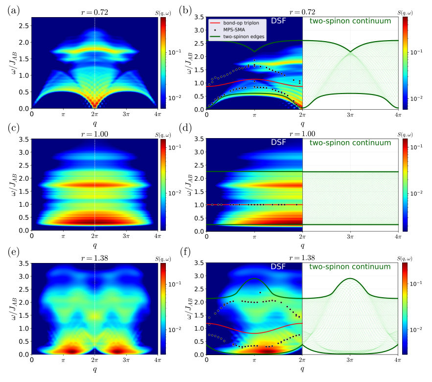
<figcaption class="paper-figure-caption"><b>Fig 5.</b> FIG. 4. Dynamical structure factor Szz(q, ω) of the dimerized sawtooth chain (L = 32, χTDVP = 600, tmax = 8/JAB) across the three regimes: (a),(b) r = 0.72; (c),(d) r = 1.000 (exact VBS); (e),(f) r = 1.38. All panels are plotted in the physical (apex-offset, extended-zone) convention q ∈[0, 4π]; energies are in units of JAB. Left column [(a),(c),(e)]: the measured DSF over the full extended zone. Right column [(b),(d),(f)]: interpretation of the same data; the left half (q ∈[0, 2π]) repeats the TDVP DSF with the analytic/semi-analytic overlays, and the right half (q ∈[2π, 4π]) shows the two-spinon continuum. Overlays: the two-spinon kink–antikink continuum [thick green = kinematic edges...</figcaption>
</figure>

**Summary.** This work analyzes the quantum spin dynamics of the sawtooth chain, a model for frustrated quantum magnets. Using DMRG and TDVP, the authors show that the low-energy excitations are not simple quasiparticles but rather a broad continuum of deconfined two-spinons. This provides a key theoretical insight into fractionalization relevant to materials like kagome fluorides.

**Why it may be interesting.** The identification of a deconfined two-spinon continuum provides a concrete theoretical model for understanding fractionalization in geometrically frustrated quantum magnets, which is highly relevant to strongly correlated materials.

Detailed structure

**Main problem.** The study investigates the ground-state properties and dynamical response of the Heisenberg model on the sawtooth chain, focusing on the nature of fractionalized excitations (spinons) in the dimerized phase.

**Main result.** The dynamical structure factor is found to be dominated by a broad two-spinon continuum, rather than a simple one-triplon mode, providing a microscopic picture of fractionalized excitations.

**Method.** The research employs advanced numerical techniques including U(1)-symmetric DMRG for ground states and TDVP for dynamics, complemented by analytical derivations of two-kink models.

**Model / system.** The system is the antiferromagnetic sawtooth chain, modeled by a Heisenberg Hamiltonian involving interactions between basal and apical spins. The analysis explores different regimes controlled by the ratio of exchange couplings, $r = J_{BB}/J_{AB}$.

**Key observables.** Zero-temperature dynamical structure factor ($S^{zz}(q, \omega)$), dimer order ($C_{	ext{dimer}}$), and bipartite entanglement entropy ($S(b)$).

**Important parameters / regimes.** The ratio $r = J_{BB}/J_{AB}$ controls the phase, with specific focus on the VBS point ($r=1$) and transitions to gapless phases.

**Assumptions / limitations.** The analysis relies on mapping the continuum to a two-kink model and uses approximations like the linear ramp approximation for closed-form derivations.

**Figures summary.** Figures illustrate the dual signatures of energy and entanglement entropy across different coupling regimes ($r=0.72, 1.00, 1.38$), confirming phase transitions.

**Paper structure.** The paper systematically analyzes the system across different coupling regimes using DMRG and TDVP to calculate static and dynamic observables, culminating in a detailed two-kink construction to map out the spinon continuum.

Abstract

We study the ground-state properties and dynamical response of the Heisenberg model on the sawtooth chain in and away from the exactly solvable valence-bond-solid (VBS) point. We employ U(1)-symmetric density-matrix renormalization group (DMRG) and time-dependent variational principle (TDVP) methods to compute equilibrium diagnostics and the zero-temperature dynamical structure factor (DSF) $S^{zz}(q,ω)$ across the dimerized phase, a valence-bond-ordered state in which the two symmetry-equivalent apex--base bonds of each triangle develop unequal spin correlations, probing the approach to the continuous lower phase boundary, the exact VBS point, and the approach to the first-order upper boundary. In every regime, the DSF is a broad continuum dominated by a bright band at its lower edge, with the intensity at the one-triplon energy $ω\simeq J_{AB}$ suppressed. We identify the spectrum as a deconfined two-spinon continuum of kink and antikink domain walls between the two degenerate singlet coverings. Closed-form spinon dispersions fix the continuum edges and track the dominant band across the zone in all three regimes, while an explicit finite-separation two-kink calculation in a constrained Hilbert space reproduces the measured intensity distribution. Our results provide a microscopic picture of fractionalized excitations in the dimerized sawtooth chain and are relevant to the recently discovered Ti$^{3+}$ kagome fluorides, where strongly anisotropic exchange interactions can generate sawtooth-chain building blocks.

[↑ back to top](#top)

### [Exact pair density wave in topological moire flat bands and universal superfluid stiffness](http://arxiv.org/abs/2608.26245v1)

**Authors:** Zhengzhi Wu, Ming-rui Li, Hong Yao  
**Type:** theory · **Category:** strongly correlated electrons · **PDF:** <https://arxiv.org/pdf/2608.26245v1>  
**Analysis basis:** full PDF text, analyzed in chunks
**Topic relevance:** `analog quantum simulation` **3/5**

↔ Scroll figures horizontally

<figure class="paper-figure-card">
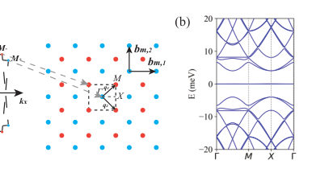
<figcaption class="paper-figure-caption"><b>Fig 1.</b> FIG. 1. (a) Moir´e Brillouin zone of the TBCB model, illus- trating the M-point moir´e structure and the finite momentum transfer relevant for the nonsymmorphic symmetry. (b) Band structure in the chiral limit. Two exact flat bands (per spin) lie at zero energy, while the dispersive bands are symmetric with respect to the flat bands owing to the chiral symmetry.</figcaption>
</figure>
<figure class="paper-figure-card">
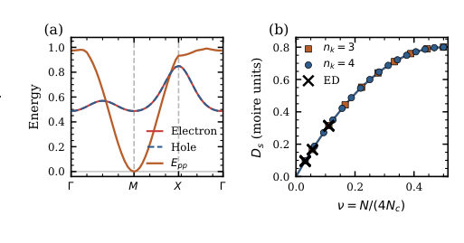
<figcaption class="paper-figure-caption"><b>Fig 2.</b> FIG. 2. Exact excitation spectra and PDW stiffness of the PDW ground state. (a) The single-particle excitation en- ergy Ep/h (the single electron and hole excitations are de- generate) and the spin-0 particle-particle excitation spectrum Epp evaluated along the high-symmetry line in the moir´e Brillouin zone. The two-particle excitation is strictly gap- less at the M point, corresponding to the Goldstone mode. The apparent non-smoothness of the high-energy part of the plotted Epp branch reflects crossings with higher exci- tation branches. (b) Rescaled finite-size PDW stiffness with NC = n2 k unit cells for nk = 3, 4, which are represented as red and blue dots. The solid curve shows the...</figcaption>
</figure>

**Summary.** This work establishes the existence of an exact Pair-Density Wave (PDW) ground state in a topological moiré flat band system using Quantum Geometric Nesting. Crucially, the authors derive a universal formula for the superfluid stiffness, linking it directly to the band topology and filling fraction. This provides a robust theoretical framework for understanding unconventional superconductivity in correlated electronic materials.

**Why it may be interesting.** The universal relation connecting superfluid stiffness to band topology and filling ($
u$) is highly valuable, providing a powerful diagnostic tool for identifying exotic superconducting orders like PDWs in moiré heterostructures.

Detailed structure

**Main problem.** The primary challenge is rigorously identifying and characterizing Pair-Density Wave (PDW) states, especially in interacting models built upon topological flat bands, and determining the associated superfluid stiffness.

**Main result.** The authors prove that an exact PDW ground state can be induced in a topological moiré flat band system via Quantum Geometric Nesting (QGN), and they derive a universal relation for the superfluid stiffness: $D_s = 2N_{	ext{flat}}
u(1 - 
u)m_{	ext{pair}}^{-1}$.

**Method.** The analysis combines constructing an exact ground state using symmetry constraints (QGN) with calculating the superfluid stiffness using both two-particle excitation spectra and mean-field/Fubini-Study metric approaches.

**Model / system.** The system is a twisted bilayer checkerboard lattice (TBCB) featuring topological flat bands, modeled by a Hamiltonian $\hat{H} = \hat{H}_0 + \hat{V}$. The model is analyzed in the strong-coupling limit where the flat bands are effectively frozen.

**Key observables.** Superfluid stiffness ($D_s$), ground state energy scaling ($E''_{N}(0)$), and the topological lower bound for $D_s$.

**Important parameters / regimes.** Topological flat bands, flat band filling ($
u$), number of flat bands ($N_{	ext{flat}}$), and the two-particle effective mass ($m_{	ext{pair}}$).

**Assumptions / limitations.** The analysis relies on the existence of momentum-space nonsymmorphic symmetry ($	ilde{M}_z$) and the applicability of the Hellman-Feynman theorem in the mean-field calculations.

**Figures summary.** Figure 1 illustrates the Moiré Brillouin zone and the resulting two zero-energy flat bands. Table I provides numerical data on the rescaled second-order response of the $\eta$-paired branch for various mesh sizes.

**Paper structure.** The paper establishes the physical model (TBCB/topological flat bands), constructs the exact PDW ground state using QGN, and then calculates the superfluid stiffness using multiple complementary theoretical frameworks (excitation spectrum, mean-field, Fubini-Study metric) to confirm the universal scaling relation.

Abstract

Pair-density waves (PDWs) are unconventional superconducting states beyond the BCS paradigm, but identifying them unambiguously in microscopic lattice models is generally challenging due to various competing orders. In particular, an exact realization of PDW in interacting models with topological bands remains elusive. Here we construct an interacting model on a twisted bilayer checkerboard lattice (TBCB) featuring topological flat bands, and rigorously show that an exact PDW ground state can be induced by quantum geometric nesting (QGN), owing to its momentum-space nonsymmorphic symmetry. We further prove that the superfluid stiffness of any nondegenerate QGN superconductor (including the PDW studied here and uniform superconductor) obeys the universal relation $D_s=2N_{\rm flat}ν(1-ν)m_{\rm pair}^{-1}$, where $N_{\rm flat}$, $ν$, and $m_{\rm pair}$ are the number of flat bands, flat band filling, and the two-particle effective mass, respectively. Our results reveal a rich interplay among PDW order, quantum geometry, and band topology.

[↑ back to top](#top)

### [Quantum estimation theory with quantum noise control](http://arxiv.org/abs/2608.26635v1)

**Authors:** Osamu Hirota, Masaki Sohma  
**Type:** theory · **Category:** quantum information and computing · **PDF:** <https://arxiv.org/pdf/2608.26635v1>  
**Analysis basis:** full PDF text, analyzed in chunks
**Topic relevance:** `quantum measurements` **3/5**

↔ Scroll figures horizontally

<figure class="paper-figure-card">
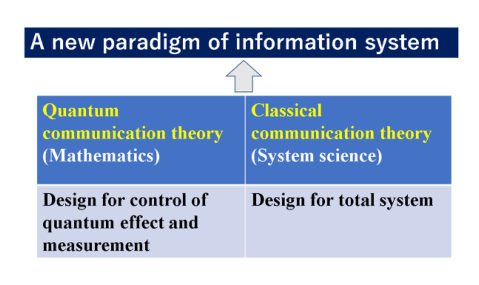
<figcaption class="paper-figure-caption"><b>Fig 1.</b> Fig. 1. Design concept of a new paradigm of information system which exhibits quantum advantage due to quantum effects..</figcaption>
</figure>
<figure class="paper-figure-card">
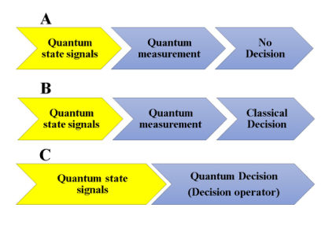
<figcaption class="paper-figure-caption"><b>Fig 2.</b> Fig. 2. Basic Structure of Quantum Measurement. Decision theory for discrete quantum signal ensembles falls under Type C, whereas estimation theory dealing with continuous quantities falls under Type B.</figcaption>
</figure>
<figure class="paper-figure-card">
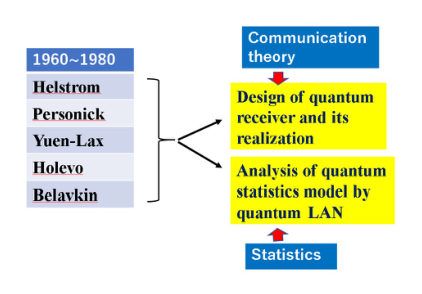
<figcaption class="paper-figure-caption"><b>Fig 3.</b> Fig. 3. Current concepts of quantum estimation theory based on communication theory and statistics for exploring quantum advantage.</figcaption>
</figure>
<figure class="paper-figure-card">
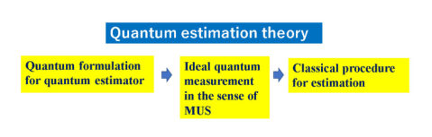
<figcaption class="paper-figure-caption"><b>Fig 4.</b> Fig. 4. Measurement process separation theory iin quantum estimation therory for estimation including non-commuting physical quantities as parameters.The degrees of freedom for quantum noise control in quan- tum measurement are encompassed by MUS (Minimum Unceratainty State).</figcaption>
</figure>
<figure class="paper-figure-card">
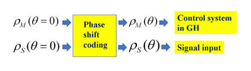
<figcaption class="paper-figure-caption"><b>Fig 5.</b> Fig. 5. Framework for auto quantum noise control. GH is the generalized heterodyne.</figcaption>
</figure>

**Summary.** This paper advances quantum estimation theory by integrating quantum noise control into the framework, building upon seminal work by Monras and Paris. It shows that by leveraging generalized heterodyne detection, the theory provides a practical pathway to achieving quantum advantage in next-generation information technologies. The core methodology relies on optimizing quantum measurements using the Symmetric Logarithmic Derivative (SLD) formalism.

**Why it may be interesting.** This work directly tackles the operational realization of quantum advantage in sensing and estimation, linking fundamental quantum information theory (SLD, POVMs) to practical quantum optical measurements like heterodyne detection.

Detailed structure

**Main problem.** The paper aims to extend quantum estimation theory by incorporating quantum noise control mechanisms to meet the stringent requirements of near-future quantum information technologies.

**Main result.** It demonstrates that a scheme based on generalized heterodyne detection, derived from extending the work of Monras and Paris, can effectively meet the requirements for quantum advantage in continuous signal estimation.

**Method.** The theory utilizes Positive Operator-Valued Measures (POVMs) for generalized quantum measurement and employs the Symmetric Logarithmic Derivative (SLD) equation to determine the optimal quantum estimator.

**Model / system.** The framework analyzes quantum systems described by density operators ($
ho$), covering both discrete (Quantum Detection Theory) and continuous (Quantum Estimation Theory) signals. The analysis draws heavily on established quantum estimation bounds like the Cramér-Rao bound.

**Key observables.** Quantum state ($
ho$), observable ($T$), probability of detection/error, and the variance of the estimator ($	ext{Var}\hat{	heta}$).

**Important parameters / regimes.** Quantum advantage, quantum noise control, and the specific parameters defining the continuous signal being estimated.

**Assumptions / limitations.** The primary theoretical challenge noted is the physical realization of the optimal POVM, although the method provides a constructive approach via the SLD operator.

**Figures summary.** Figure 1 illustrates the design concept of a new information system paradigm exhibiting quantum advantage due to quantum effects. Figure 2 relates measurement and decision theory across different models.

**Paper structure.** The paper builds upon the foundations of quantum estimation theory, contrasting discrete and continuous signal processing. It details the use of POVMs, derives the optimal estimator via the SLD equation, and applies this framework to show how generalized heterodyne detection addresses modern technological demands.

Abstract

Quantum estimation theory serves as one of fundamental backbones of quantum Shannon information theory and was mathematically systematized by pioneers of quantum information science. Although its applied research saw limited progress for a long period, the 21st century has witnessed active discussions and numerous fruitful proposals regarding its applications. Notably, the contributions of Monras and Paris represent one of the most remarkable achievements addressing the realization problem of estimation bounds. This paper aims to demonstrate a practical direction for extending their original ideas. Next-generation quantum information mechanisms urgently demand guarantees of quantum advantage unattainable by classical theory, alongside strict real-time processing without delays. By leveraging the concept of generalized heterodyne detection proposed nearly half a century ago, we demonstrate that a scheme based on their results can effectively meet the stringent requirements of near-future information technologies.

[↑ back to top](#top)

### [Information-theoretic formulation of the Traveling Salesman Problem](http://arxiv.org/abs/2608.26339v1)

**Authors:** Enrico Maria Fenoaltea, Riccardo Piombo, Aurelio Patelli  
**Type:** theory · **Category:** statistical mechanics · **PDF:** <https://arxiv.org/pdf/2608.26339v1>  
**Analysis basis:** full PDF text, analyzed in chunks
**Topic relevance:** `Keldysh / 2PI / non-Gaussian methods` **2/5** · `analog quantum simulation` **2/5** · `methods for driven-dissipative` **2/5**

↔ Scroll figures horizontally

<figure class="paper-figure-card">
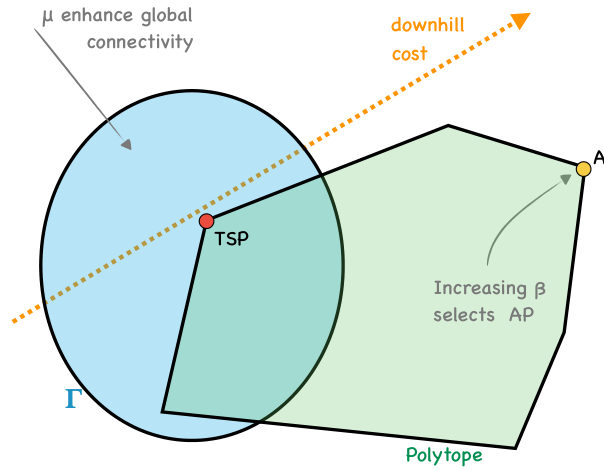
<figcaption class="paper-figure-caption"><b>Fig 1.</b> Figure 1: Schematic representation of the space of graphs considered in the probabilistic formulation. The assignment polytope represents the region in which the local degree constraints are satisfied. Within this region, the assignment-problem solution, denoted by AP, is selected by increasing the inverse temperature β when only local constraints and edge costs are considered. The TSP solution, denoted by TSP, belongs to a region that is an intersection between the AP polytope and the Γ region. Indeed Γ is defined as a region that, when the degree constraints in Eq.1 are satisfied, contains only hamiltonian cycles. Varying µ reinforces the probability of this globally region. The figure is...</figcaption>
</figure>
<figure class="paper-figure-card">
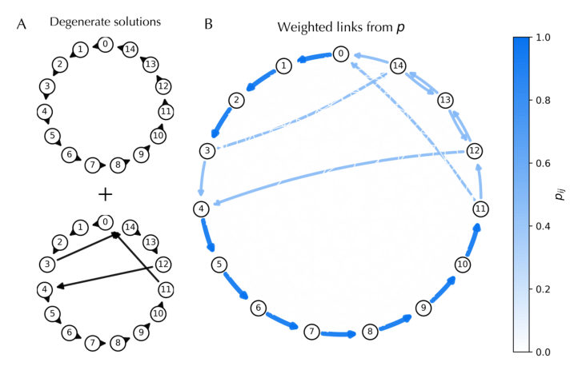
<figcaption class="paper-figure-caption"><b>Fig 2.</b> Figure 2: (A) Two equal-cost Hamiltonian cycles used to construct the degenerate cost matrix, displayed on a circular vertex layout ordered according to the first cycle. (B) Corresponding mean- field matrix pij on the same layout; link color scale and thickness indicate edge probability.</figcaption>
</figure>
<figure class="paper-figure-card">
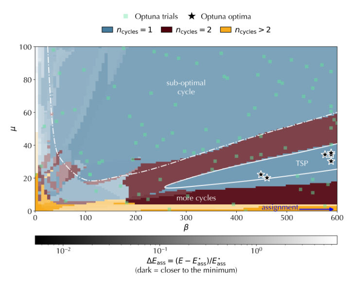
<figcaption class="paper-figure-caption"><b>Fig 3.</b> Figure 3: Diagram of the solutions obtained for a fixed cost matrix c as a function of µ and β. Colors indicate the number of cycles in the extracted solution, and their intensity represents the relative energy gap with respect to the assignment-problem minimum. The solid white line marks the parameter region where the TSP solution is recovered, while the dashed line indicates sub-optimal connected solutions. Green dots show the points sampled by Optuna, and stars mark successful trials in which the correct TSP solution is found.</figcaption>
</figure>

**Summary.** This paper reformulates the Traveling Salesman Problem using an information-theoretic maximum-entropy framework. It overcomes the challenge of enforcing global cycle constraints by introducing a global penalty term that 'tilts' the probability distribution. The resulting mean-field algorithm provides a computationally tractable method that yields near-optimal solutions for the TSP.

**Why it may be interesting.** While the problem is classical optimization, the methodology—reducing a hard combinatorial problem by coupling local statistical ensembles with global constraints via an effective field—is highly relevant to modeling complex many-body systems with hard constraints (e.g., lattice gauge theories or constrained quantum states).

Detailed structure

**Main problem.** The paper addresses the difficulty of formulating the Traveling Salesman Problem (TSP) within a probabilistic, information-theoretic framework due to the coexistence of local and hard global constraints.

**Main result.** The authors propose a method that successfully incorporates the global Hamiltonian cycle constraint by tilting a maximum-entropy ensemble, leading to an algorithm that converges to near-optimal tours in polynomial time.

**Method.** They employ the maximum-entropy principle on the probability distribution over graphs, deriving a mean-field approximation that couples local assignment constraints with a global cycle penalty term.

**Model / system.** The model is the TSP, viewed as finding the minimum-cost Hamiltonian cycle on a set of cities. The mathematical framework involves defining a probability distribution $P(G)$ over graphs $G$ using Lagrangian multipliers.

**Key observables.** The probability matrix $P_{ij}$ (edge occupancy), the global connectivity penalty $N_{	ext{conn}}(G)$, and the resulting candidate tour cost.

**Important parameters / regimes.** The parameters $eta$ (controlling energetic cost) and $\mu$ (controlling the global connectivity penalty) are crucial for tuning the solution regime.

**Assumptions / limitations.** The derivation relies on a mean-field approximation, which neglects loop-induced correlations, simplifying the intractable global constraint into a manageable effective field.

**Figures summary.** Figure 1 schematically shows the transition from the assignment polytope (local constraints) to the Hamiltonian cycle region ($\Gamma$) by varying the penalty parameter $\mu$. Figure 3 illustrates the solution space in the $(eta, \mu)$ plane.

**Paper structure.** The paper first establishes the information-theoretic formulation using maximum entropy. It then derives the mean-field approximation, which reduces the problem to solving self-consistent equations for edge occupancies. Finally, it details the numerical procedure for finding the tour and compares its performance against state-of-the-art heuristics.

Abstract

The Traveling Salesman Problem (TSP) asks for the shortest route to visit a set of cities exactly once. It combines a simple local rule - each city must be visited once - with a hard, global constraint- all cities must be traversed within a single cycle. We cast the problem within a probabilistic, information-theoretic framework. The coexistence of local and global constraints is precisely what makes the problem difficult to address in this framework: the local rule can be enforced through vertex-level constraints, whereas the global constraint cannot be captured by independent edge probabilities. We show that this obstacle can be overcome by defining a maximum-entropy probability distribution over graphs, in which edge costs and degree constraints generate an assignment-like ensemble, and a global term, describing the hard constraint, tilts this ensemble toward Hamiltonian cycles. To make the construction tractable, we derive a mean-field approximation in terms of edge occupancies and implement a differentiable cycle penalty that suppresses sub-tours. This leads to a self-consistent numerical procedure whose output is not only a candidate tour but also a probability matrix encoding competing edges and degenerate solutions. We test the method on synthetic ensembles and on TSPLIB instances. The algorithm converges to connected tours in polynomial time, matching the best-known solution in the majority of instances and remaining within a small relative gap otherwise. Beyond its competitive performance, the proposed framework offers a general approach for handling hard constraints while reducing hard combinatorial optimization problems to simpler ones.

[↑ back to top](#top)

### [Quantum-enhanced ghost imaging recognition via joint optimization of speckle patterns and quantum network parameters](http://arxiv.org/abs/2608.26972v1)

**Authors:** Yirui Mao, Xiangyu Ge, Yuhang Tu, Anqi Zhang, Le Wang, Shengmei Zhao  
**Type:** both · **Category:** quantum information and computing · **PDF:** <https://arxiv.org/pdf/2608.26972v1>  
**Analysis basis:** full PDF text, analyzed in chunks
**Topic relevance:** `interference shaping light` **2/5** · `quantum optics experiment` **2/5** · `QC/QI experiment` **1/5** · `quantum measurements` **1/5**

↔ Scroll figures horizontally

<figure class="paper-figure-card">
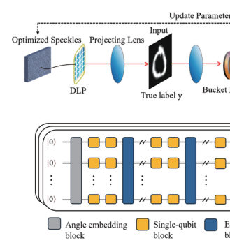
<figcaption class="paper-figure-caption"><b>Fig 1.</b> FIG. 1. Schematic diagram of the proposed ghost recognition method.</figcaption>
</figure>
<figure class="paper-figure-card">
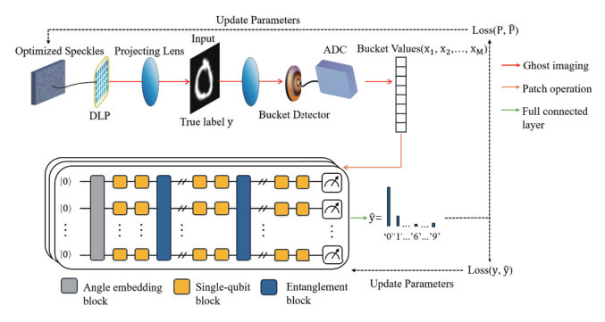
<figcaption class="paper-figure-caption"><b>Fig 2.</b> Fig. 1 illustrates the proposed ghost recognition method. Speckles are modeled as train-</figcaption>
</figure>
<figure class="paper-figure-card">
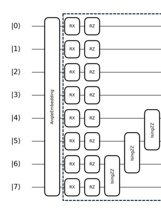
<figcaption class="paper-figure-caption"><b>Fig 3.</b> FIG. 2. Detailed architecture of the parameterized quantum circuit.</figcaption>
</figure>
<figure class="paper-figure-card">
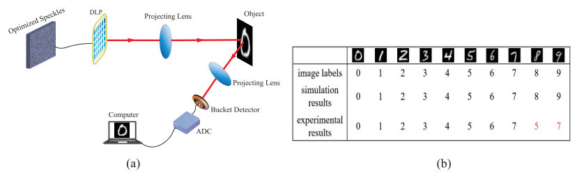
<figcaption class="paper-figure-caption"><b>Fig 4.</b> FIG. 3. Recognition results of different digits. (a) Experimental setup; (b) Simulated and experi-</figcaption>
</figure>
<figure class="paper-figure-card">
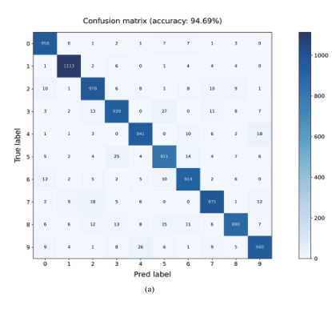
<figcaption class="paper-figure-caption"><b>Fig 5.</b> FIG. 4. Confusion matrices for the test set. (a) Simulation; (b) Experiment.</figcaption>
</figure>

**Summary.** This paper proposes a novel framework for ghost imaging recognition that jointly optimizes the physical speckle patterns and the parameters of a quantum circuit. By integrating a speckle consistency regularization term, the method overcomes the limitations of traditional quantum machine learning approaches at low sampling rates. The results show significant accuracy improvements over classical and existing quantum methods, validating its potential for practical quantum-enhanced imaging.

**Why it may be interesting.** It directly applies quantum computing concepts (variational circuits, entanglement structures) to a quantum optics imaging problem, demonstrating a practical pathway for quantum enhancement in measurement science.

Detailed structure

**Main problem.** The core challenge is achieving high-fidelity image recognition using ghost imaging, particularly when data sampling rates are extremely low.

**Main result.** The proposed joint optimization framework significantly improves recognition accuracy (e.g., 90.1% on MNIST at 1.5625% sampling) compared to classical or traditional quantum machine learning baselines.

**Method.** The method jointly optimizes the classical speckle patterns (optical coding) and the parameters of a parameterized quantum circuit (quantum feature extraction) via a regularization mechanism.

**Model / system.** The system uses Ghost Imaging (GI) combined with a hardware-efficient variational quantum circuit. The quantum circuit employs a star-shaped entanglement structure and processes input bucket signals encoded via an angle embedding.

**Key observables.** Recognition accuracy on MNIST and Fashion-MNIST datasets, and the average accuracy measured on a real optical GI system.

**Important parameters / regimes.** Ultra-low sampling rates (e.g., 1.5625%), quantum circuit parameters (Theta), and the regularization strength ($\lambda$).

**Assumptions / limitations.** The primary assumption is that jointly optimizing the physical speckle patterns and the quantum circuit parameters provides a robust solution superior to fixing one component.

**Figures summary.** Figures illustrate the schematic of the proposed method, the detailed architecture of the parameterized quantum circuit, and comparison tables/plots showing accuracy improvements over baselines.

**Paper structure.** The paper introduces the problem, details the joint optimization methodology involving speckle regularization and quantum circuit design, presents simulation results comparing performance across varying sampling rates, and concludes with validation on a real optical system.

Abstract

Ghost imaging enables nonlocal image reconstruction and exhibits strong robustness against interference, but achieving high-fidelity recognition at ultra-low sampling rates remains challenging. Quantum machine learning offers a novel approach for efficient feature extraction on noisy medium-scale quantum devices; however, existing methods generally suffer from low recognition accuracy and weak noise resistance. This paper proposes a ghost imaging recognition method based on the simultaneous optimization of speckle patterns and quantum network parameters. By leveraging the mathematical equivalence between classical convolution and speckle-object dot product operations in ghost imaging, a speckle consistency regularization mechanism is introduced to achieve end-to-end joint optimization of optical coding and quantum feature extractors. A parallel 8-qubit quantum circuit employing block coding and a star-shaped entanglement structure is designed to extract higher-order features from bucket signals. Simulation results on the MNIST and Fashion-MNIST datasets show that at an ultra-low sampling rate of 1.5625%, the proposed framework achieves recognition accuracies of 90.1% and 81.7%, respectively, representing a 2.6% improvement over classical convolutional neural networks and a maximum improvement of 14.2% over traditional hybrid quantum machine learning models. This method also exhibits strong robustness to quantum noise and has been validated on a real optical ghost imaging system, achieving an average recognition accuracy of 84.8%. These results confirm that the joint optimization of speckle patterns and quantum network parameters provides a reliable and practical solution for low-sampling ghost imaging recognition.

[↑ back to top](#top)

### [Critical Properties and Glass Transitions in Randomly Coupled Fields](http://arxiv.org/abs/2608.26279v1)

**Authors:** Amer Al-Hiyasat  
**Type:** theory · **Category:** disordered systems and neural networks · **PDF:** <https://arxiv.org/pdf/2608.26279v1>  
**Analysis basis:** full PDF text, analyzed in chunks
**Topic relevance:** `Keldysh / 2PI / non-Gaussian methods` **2/5** · `analog quantum simulation` **2/5**

↔ Scroll figures horizontally

<figure class="paper-figure-card">
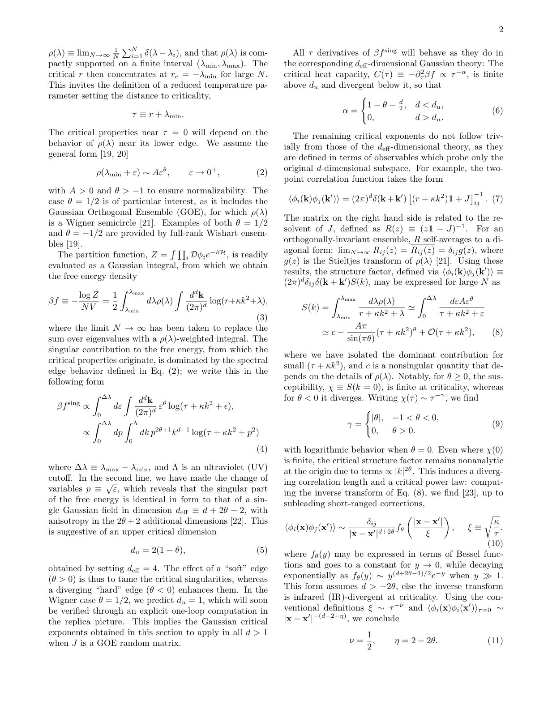
<figcaption class="paper-figure-caption"><b>Fig 1.</b> Low-resolution page preview, page 2</figcaption>
</figure>
<figure class="paper-figure-card">
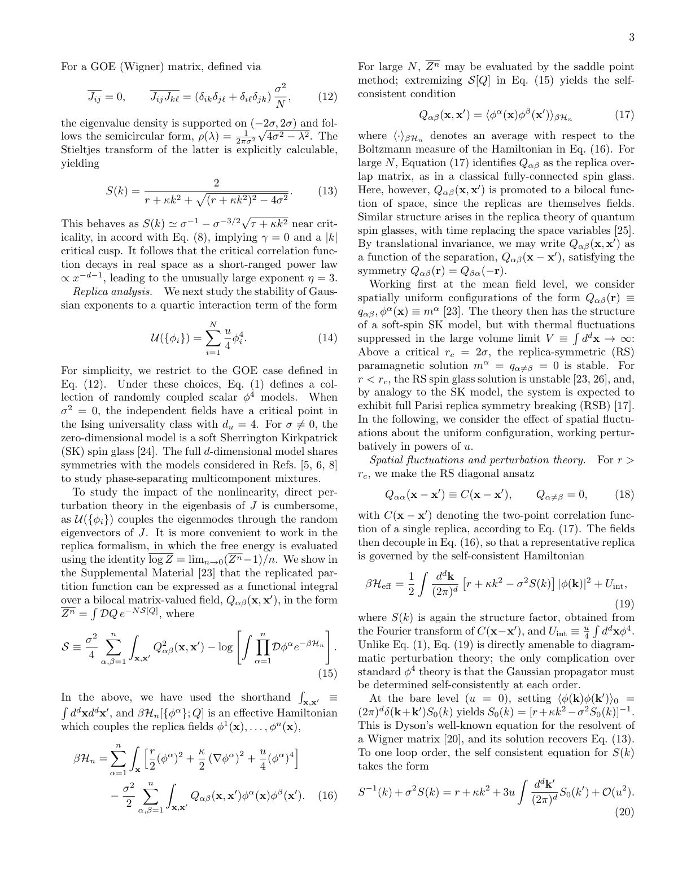
<figcaption class="paper-figure-caption"><b>Fig 2.</b> Low-resolution page preview, page 3</figcaption>
</figure>
<figure class="paper-figure-card">
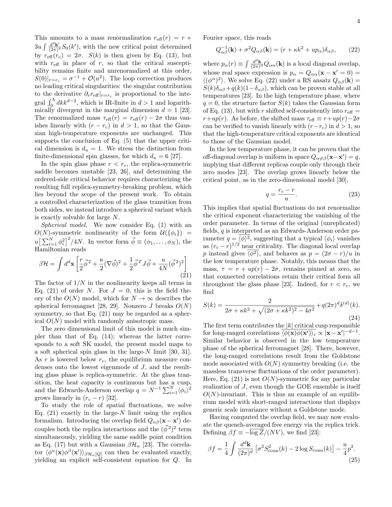
<figcaption class="paper-figure-caption"><b>Fig 3.</b> Low-resolution page preview, page 4</figcaption>
</figure>
<figure class="paper-figure-card">
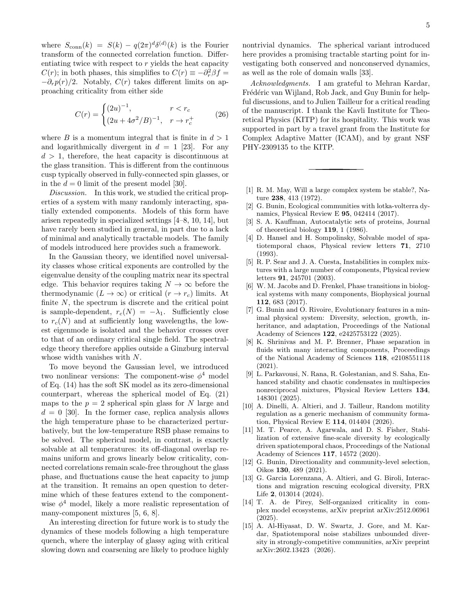
<figcaption class="paper-figure-caption"><b>Fig 4.</b> Low-resolution page preview, page 5</figcaption>
</figure>
<figure class="paper-figure-card">
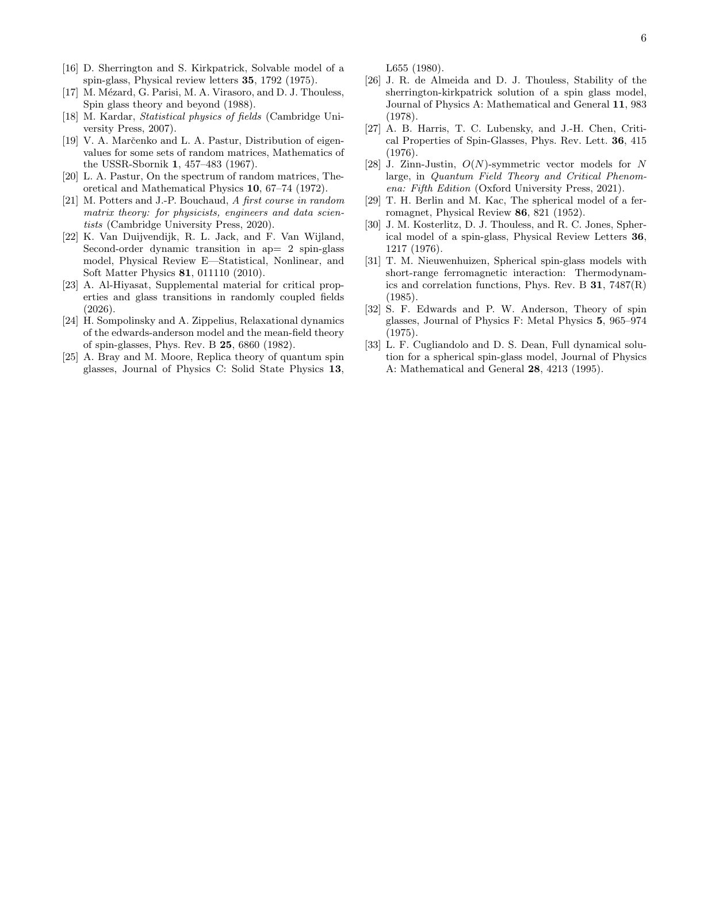
<figcaption class="paper-figure-caption"><b>Fig 5.</b> Low-resolution page preview, page 6</figcaption>
</figure>

**Summary.** This work investigates the critical phenomena in systems of randomly coupled, extended scalar fields, treating the system as a generalization of a spin glass. Using replica theory and large-N limits, the authors derive scaling laws and determine the upper critical dimension for the transition. The results provide deep insights into how disorder governs phase transitions in extended quantum or classical field theories.

**Why it may be interesting.** The techniques used—replica methods and analyzing critical exponents in random media—are foundational to understanding complex many-body systems, which share mathematical parallels with quantum many-body physics.

Detailed structure

**Main problem.** The paper characterizes the critical behavior and universality classes of systems composed of a large number of spatially extended, randomly coupled scalar fields.

**Main result.** The analysis determines an upper critical dimension ($d_u$) for the system, finding $d_u=1$ for the Wigner case, and shows that the heat capacity exhibits a discontinuity at the critical point for $d>1$.

**Method.** The study employs the replica formalism combined with the saddle point method to evaluate the quenched-averaged free energy and analyze the stability of the replica-symmetric solution.

**Model / system.** The model consists of $N$ scalar fields coupled by a quenched random interaction, analogous to a spin glass where spins are promoted to fields. A specific, exactly solvable variant is the Spherical Model.

**Key observables.** Free energy density ($eta f$), critical heat capacity ($C(	au)$), structure factor ($S(k)$), and the two-point correlation function.

**Important parameters / regimes.** Large number of fields ($N 	o \infty$), system size ($L 	o \infty$), and the reduced temperature parameter ($	au$).

**Assumptions / limitations.** The analysis relies heavily on the large-$N$ limit and the saddle point approximation applied to the replicated partition function.

**Paper structure.** The paper progresses by first establishing the general Gaussian theory, then analyzing the nonlinear case using the replica formalism, and finally examining the stability of the saddle point solution via the Hessian matrix.

Abstract

We study an assembly of $N$ scalar fields coupled via a quenched random interaction, equivalent to a spin glass whose spins are promoted to $d$-dimensional fields. When $N$ is large, the random coupling matrix produces a family of Gaussian universality classes whose critical exponents are determined by the behavior of the eigenvalue density near the spectral edge. For a Wigner matrix, the correlation length diverges at criticality but the susceptibility remains finite, and one-loop replica analysis supports an upper critical dimension of unity. In an exactly solvable spherical variant, the heat capacity jumps at the transition in $d>1$, and correlations remain pinned to their critical form throughout the glass phase, giving generic scale invariance despite the absence of a Goldstone mode.

[↑ back to top](#top)

### [Metallogenic quantum criticality: Fermi surface nucleation at transitions between gapped phases](http://arxiv.org/abs/2608.27453v1)

**Authors:** Zhengyan Darius Shi  
**Type:** theory · **Category:** strongly correlated electrons · **PDF:** <https://arxiv.org/pdf/2608.27453v1>  
**Analysis basis:** full PDF text, analyzed in chunks
**Topic relevance:** `Keldysh / 2PI / non-Gaussian methods` **2/5** · `analog quantum simulation` **1/5**

↔ Scroll figures horizontally

<figure class="paper-figure-card">
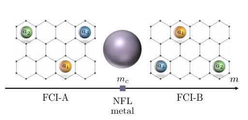
<figcaption class="paper-figure-caption"><b>Fig 1.</b> FIG. 1. Schematic phase diagram in which a critical non- Fermi liquid (NFL) metal with a gapless Fermi surface emerges at the phase transition between two fully gapped frac- tional Chern insulators (FCIs) with Abelian anyons ai.</figcaption>
</figure>
<figure class="paper-figure-card">
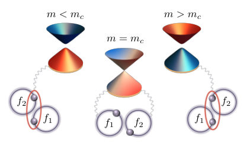
<figcaption class="paper-figure-caption"><b>Fig 2.</b> FIG. 2. Physical mechanism for a metallogenic quantum crit- ical point. In the vicinity of the critical point, the system decomposes into a QED3 (2+1D quantum electrodynamics) sector and two Fermi surfaces f1, f2 coupled to the same set of emergent U(1) gauge fields. For either sign of the Dirac mass in QED3, gauge fluctuations induce a pairing instability between f1 and f2, leading to fully gapped phases. Precisely at criticality, gapless Dirac fermions modify the gauge field dynamics and stabilize the Fermi surfaces.</figcaption>
</figure>
<figure class="paper-figure-card">
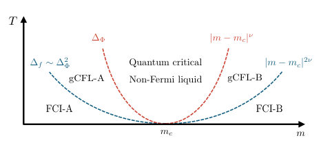
<figcaption class="paper-figure-caption"><b>Fig 3.</b> FIG. 3. Finite temperature crossover near the MGQCP. An ϵ- expansion estimate of the correlation length exponent ν ≈1.5 explains the shape of the crossover curves. The critical NFL and the gCFLs all have gapless Fermi surfaces. One crucial difference is that the electron is gapped in the gCFLs but gapless and strongly damped in the critical NFL.</figcaption>
</figure>

**Summary.** This theoretical work introduces Metallogenic Quantum Critical Points (MGQCPs), where a Fermi surface unexpectedly emerges at a quantum phase transition between two gapped insulating states. By constructing effective field theories for these transitions, the authors show that the critical point exhibits non-Fermi liquid behavior, challenging established paradigms of quantum criticality.

**Why it may be interesting.** The concept of MGQCPs provides a powerful, non-standard framework for understanding critical points in strongly correlated electron systems, particularly those involving topological insulators and moire heterostructures.

Detailed structure

**Main problem.** The paper investigates a radical failure of standard quantum critical point theory, where an entire gapless Fermi surface can emerge at a quantum critical point separating two fully gapped insulating phases.

**Main result.** These exotic transitions, called Metallogenic Quantum Critical Points (MGQCPs), are characterized by a critical Fermi surface and exhibit non-Fermi liquid spectral function signatures, despite the neighboring phases being gapped.

**Method.** The authors construct controlled effective field theories by combining analyses of fermionic composite fermion fluctuations with critical bosonic field theories (like QED3) using parton constructions and mean-field theory.

**Model / system.** The minimal model is a quantum Hall bilayer system transitioning between two distinct Fractional Chern Insulators (FCIs). The physics is described by coupling fermionic partons to background gauge fields arising from the bosonic transition.

**Key observables.** Fermi surface existence, spectral function non-analyticity, resistivity scaling laws, and topological invariants (Hall conductivities, central charges).

**Important parameters / regimes.** Filling fractions ($
u_i$), background flux ($B$), and the nature of the Coulomb interaction (screened vs. unscreened).

**Assumptions / limitations.** The analysis relies on mean-field approximations for the bosonic phases and the use of parton constructions to decouple the low-energy physics.

**Figures summary.** Figures schematically illustrate the phase diagram showing the emergence of an NFL metal at the FCI transition, and diagrams detail the underlying QED3 sector and the role of gauge fluctuations.

**Paper structure.** The paper proceeds by establishing the general principle, constructing the effective Lagrangian by coupling fermionic and bosonic sectors, analyzing the stability of pairing instabilities via RG flow, and finally confirming the MGQCP nature through specific FCI transitions.

Abstract

Continuous quantum phase transitions in interacting many-body systems exhibit universal phenomena that are largely independent of microscopic details. An organizing principle distilled from canonical examples such as the magnetic transition in Ising models is that the low-energy physics of transitions between gapped phases is governed by scale-invariant quantum field theories with gapless degrees of freedom at isolated points in momentum space. In this paper, we show that this principle can fail in a radical way: an entire gapless Fermi surface can emerge at a quantum critical point separating two fully gapped insulators. These exotic phase transitions are dubbed \textit{metallogenic quantum critical points} (MGQCP). We construct a controlled family of effective field theories for MGQCPs between distinct fractional Chern insulators and propose a periodically modulated quantum Hall bilayer as a minimal microscopic setting. The critical theory exhibits an unusual mixture of physical signatures: while transport and compressibility follow scaling laws compatible with a conformal field theory, the electron spectral function develops a power-law non-analyticity at the Fermi momentum, characteristic of non-Fermi-liquid metals. We discuss how the concept of MGQCP may shed new light on critical phenomena in moire materials with tunable Chern bands. More generally, our results point to a broader class of quantum critical phenomena in which extended manifolds of gapless excitations emerge in momentum space despite being absent in both neighboring phases.

[↑ back to top](#top)

### [Quantum-enhanced single and multiparameter metrology in qutrit ensembles by generalized twisting dynamics](http://arxiv.org/abs/2608.26630v1)

**Authors:** Deep Datta, Sayam Chakraborty, John Drew Wilson, Vaibhav Madhok, Athreya Shankar  
**Type:** theory · **Category:** other · **PDF:** <https://arxiv.org/pdf/2608.26630v1>  
**Analysis basis:** full PDF text, analyzed in chunks
**Topic relevance:** `quantum measurements` **2/5** · `analog quantum simulation` **1/5**

↔ Scroll figures horizontally

<figure class="paper-figure-card">
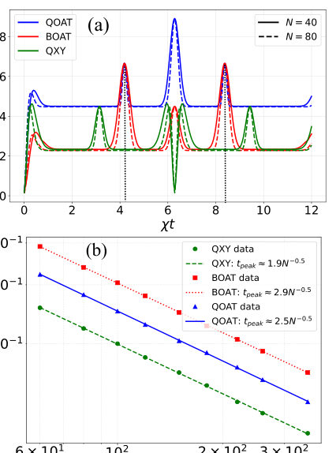
<figcaption class="paper-figure-caption"><b>Fig 1.</b> FIG. 1. (a) Long time evolution of µmax for QOAT (blue), BOAT (red), and QXY (green) model, solid lines and dashed lines correspond to N = 40 and N = 80 respectively. At χt = 4π</figcaption>
</figure>
<figure class="paper-figure-card">
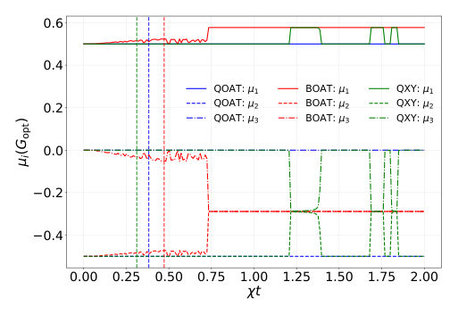
<figcaption class="paper-figure-caption"><b>Fig 2.</b> FIG. 3. The eigenvalues of the optimal generator for QOAT (Blue), BOAT(Red) and QXY(Green) models have been shown for short time duration. The vertical dashed lines mark the tpeak for the respective models. At tpeak for the QOAT and QXY model, the eigen spectrum is strictly 1 2{1, −1, 0}. Whereas for the BOAT model, the spectrum is close to 1 2{1, −1, 0}.</figcaption>
</figure>
<figure class="paper-figure-card">
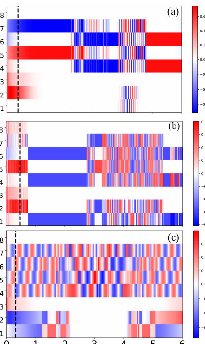
<figcaption class="paper-figure-caption"><b>Fig 3.</b> FIG. 2. Contribution of the Gell-Mann operators in the opti- mal generator Gopt for (a) QOAT (N = 40), (b)BOAT(N = 40) and (c) QXY (N = 40). The vertical black dashed lines indicate the tpeak for each model. At tpeak, for the QOAT and QXY models, the optimal generator has no contribution from λ8. However, there is very little contribution from λ8 for the BOAT model.</figcaption>
</figure>
<figure class="paper-figure-card">
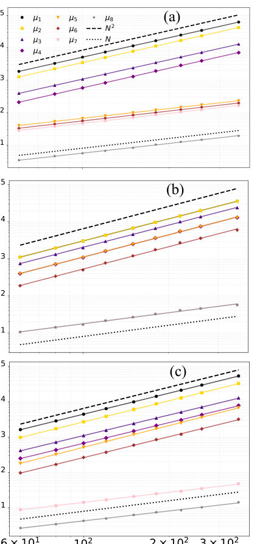
<figcaption class="paper-figure-caption"><b>Fig 4.</b> FIG. 4. Scaling of eigenvalues of Σ matrix at tpeak with system size N for (a)QOAT, (b) BOAT and (c) QXY models. The solid lines are linear fits, and the markers are the plot points. The slope of the fit lines gives the exponent of N. QOAT has a 4 orthogonal generators for which sensitivity scales approx- imately as Heisenberg scaling (∝N 2), whereas BOAT and QXY have 6 such generators. The N 2 and N scaling lines are shown as dashed and dotted black lines, respectively, in each plot.</figcaption>
</figure>
<figure class="paper-figure-card">
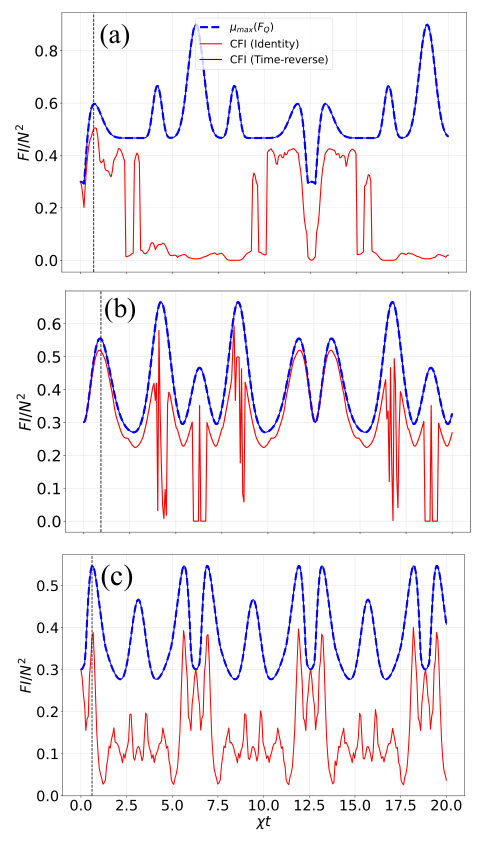
<figcaption class="paper-figure-caption"><b>Fig 5.</b> FIG. 5. Comparison of the classical Fisher information (CFI) obtained using the time-reversal (solid blue line) and identity (solid red line) protocols with the maximum quantum Fisher information, µmax(FQ) (blue dashed), for N = 10. Results are shown for (a) the QOAT model, (b) the BOAT model, and (c) the QXY model. The vertical black dashed line marks the tpeak for each model. The CFI obtained under the time- reversal protocol saturates the optimal QFI for all models, whereas under the identity protocol it does not. The same measurement basis also saturates the QFI corresponding to any other encoding direction.</figcaption>
</figure>

**Summary.** This paper explores quantum sensing using three novel qutrit models derived from the OAT Hamiltonian. By analyzing the Quantum Fisher Information, the authors show these systems achieve near-Heisenberg scaling and, crucially, enable simultaneous, compatible estimation of multiple parameters—a feat difficult in qubit systems. This advances the field by demonstrating robust, high-precision sensing in multi-level atomic ensembles.

**Why it may be interesting.** This work extends quantum sensing theory to multi-level systems (qutrits), providing concrete, experimentally feasible models that surpass the limitations of qubit-only approaches, particularly regarding multiparameter estimation compatibility.

Detailed structure

**Main problem.** Investigating quantum-enhanced single and multiparameter metrology using qutrit ensembles, moving beyond standard qubit protocols.

**Main result.** The proposed qutrit models achieve near-Heisenberg scaling for sensing and demonstrate a novel mechanism for compatible multiparameter estimation using commuting generators from the su(3) algebra.

**Method.** The metrological utility is characterized using the Quantum Fisher Information (QFI) toolbox, analyzing the scaling of the QFIM and the Uhlmann curvature.

**Model / system.** The system involves N three-level atoms (qutrits) whose dynamics are governed by generalizations of the One-Axis Twisting (OAT) model, specifically QOAT, BOAT, and QXY Hamiltonians, operating within the su(3) algebra.

**Key observables.** Quantum Fisher Information (QFI), Mean Squared Error (MSE), Uhlmann Curvature, and the scaling of incompatibility measures (R).

**Important parameters / regimes.** System size (N), evolution time ($t$), and the operating point of the sensor.

**Assumptions / limitations.** The study addresses practical issues like local dissipation and estimation ambiguity by optimizing the sensor operating point.

**Figures summary.** Figure 9 illustrates the time evolution of eigenvalues and the Frobenius norm of the commutator for two generators in the BOAT model, showing compatibility.

**Paper structure.** The paper reviews metrology concepts, introduces and analyzes the three qutrit extensions (QOAT, BOAT, QXY) using QFI, discusses experimental protocols, and finally addresses practical limitations like dissipation and compatibility.

Abstract

Quantum-enhanced sensing with atomic ensembles has predominantly focused on qubit-based protocols, despite the growing ability of many experimental platforms to coherently control and entangle multi-level systems. Here, we investigate quantum-enhanced sensing with qutrit ensembles by introducing three experimentally feasible qutrit generalisations of the one-axis twisting (OAT) model that involve entangling operations only between two levels, while the third level primarily acts as a spectator. We characterize the metrological utility of the dynamically generated states using the quantum Fisher information toolbox. We find numerically that all three models offer considerable freedom in encoding direction for quantum-enhanced sensing, with up to 6 out of 8 possible directions exhibit near-Heisenberg scaling after a short evolution time. We discuss experimental access to this enhanced metrological precision via effective time-reversal protocols. Furthermore, we examine the practical issues of estimation ambiguity and local dissipation, and show that they can be largely overcome by optimizing the sensor operating point. Finally, we show that the measurement incompatibility in estimating multiple parameters simultaneously encoded in different directions with near-Heisenberg scaling of precision is suppressed at the zero operating point as the system size increases. In the process, we find that one of the models enables near-Heisenberg scaling metrology with a pair of commuting generators, a possibility that arises from the $su(3)$ algebra and is thus absent in qubit-ensemble based sensors of collective $SU(2)$ rotations.

[↑ back to top](#top)

### [Dynamical phase selection controls compute scaling in looped transformers](http://arxiv.org/abs/2608.26556v1)

**Authors:** Gunn Kim  
**Type:** theory · **Category:** disordered systems and neural networks · **PDF:** <https://arxiv.org/pdf/2608.26556v1>  
**Analysis basis:** full PDF text, analyzed in chunks
**Topic relevance:** `non-equilibrium universality` **2/5**

↔ Scroll figures horizontally

<figure class="paper-figure-card">
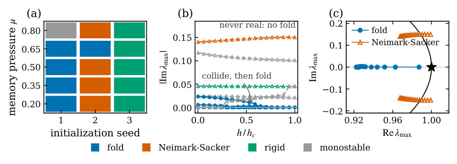
<figcaption class="paper-figure-caption"><b>Fig 1.</b> FIG. 1. (a) Phase across memory pressure and initialization, fifteen networks. (b) |Im λmax| along the branch, with the symmetry mode removed; fold networks are solid. (c) λmax in the complex plane for one fold and one Neimark–Sacker network.</figcaption>
</figure>
<figure class="paper-figure-card">
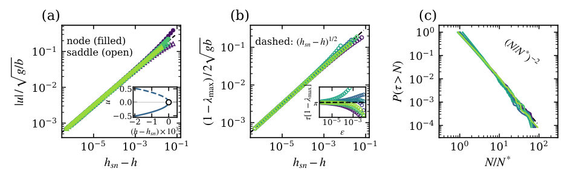
<figcaption class="paper-figure-caption"><b>Fig 2.</b> FIG. 2. Seven fold-phase networks, each rescaled by its predicted amplitude; dashed lines carry no free parameter. (a) Node (filled) and saddle (open) branches; inset, sign retained. (b) Critical slowing down; inset, Π(ε) of Eq. (5). (c) Complementary cumulative distributions of τ.</figcaption>
</figure>
<figure class="paper-figure-card">
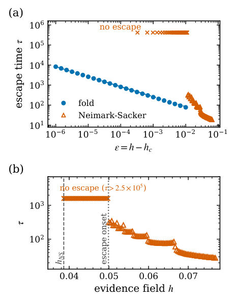
<figcaption class="paper-figure-caption"><b>Fig 3.</b> FIG. 3. (a) Escape time against distance to the critical field for a fold network (blue; dashed, Eq. (4)) and a Neimark– Sacker network (orange); crosses mark fields with no escape within 2.5 × 105 iterations. (b) The Neimark–Sacker scan on a linear field axis. The non-escaping fields form a contiguous low-field interval and escape begins at a single onset near h = 0.0499, well above the crossing hNS = 0.0386: loss of fixed-point stability and escape are distinct events.</figcaption>
</figure>

**Summary.** This work treats looped transformers as dynamical systems, showing that their computational cost scaling is not fixed by their design but by the specific dynamical phase selected during training. By analyzing bifurcations, the authors derive universal power-law scaling laws for certain phases, demonstrating that the underlying physics of the solution dictates its computational limits.

**Why it may be interesting.** The connection between the stability analysis of a complex, high-dimensional dynamical system (the transformer) and a universal, low-dimensional critical scaling law ($N^{-2}$) provides a powerful, physics-based lens for understanding AI computation.

Detailed structure

**Main problem.** The paper investigates what fundamentally governs the computational scaling of looped transformers, arguing it is determined by the network's underlying dynamical phase rather than just its architecture or training objective.

**Main result.** Distinct dynamical phases (like fold vs. Neimark-Sacker) can emerge for networks with identical structure, and the specific phase dictates the universal power-law scaling of test-time compute.

**Method.** The analysis uses dynamical systems theory, classifying network behavior based on bifurcations (saddle-node fold, Neimark-Sacker) of the weight-tied iterative map.

**Model / system.** The model is a looped transformer performing inference by iterating a weight-tied map, $z_{t+1} = F_	heta(z_t; h)$, which is analyzed as a dynamical system.

**Key observables.** The dynamical phase (fold vs. Neimark-Sacker), the relaxation time $	au(\epsilon)$, the spectral gap $\lambda_{\max}(-\epsilon)$, and the workload tail probability $P(	au > N)$.

**Important parameters / regimes.** The control field $h$ (or $\epsilon$), which drives the system through bifurcations, and the initialization state of the network weights.

**Assumptions / limitations.** The analysis relies on local normal-form reductions near codimension-one bifurcations (fold and Neimark-Sacker crossings).

**Figures summary.** Figure 1 summarizes phase assignments across different conditions; Figure 2 shows the collapse of the cumulative distribution of relaxation times for fold-phase networks onto a universal power law; Figure 3 compares escape times for fold and Neimark-Sacker dynamics.

**Paper structure.** The paper first introduces the looped transformer as a dynamical system, then analyzes the fixed-point stability and bifurcation mechanisms to classify the system into distinct phases, deriving universal scaling laws for the fold phase and showing their absence in the Neimark-Sacker phase.

Abstract

A looped transformer performs inference by iterating a weight-tied map, making its computation a dynamical process whose cost is set by the resulting inference dynamics. Here we show that networks with identical architecture and objective, trained to identical accuracy, nevertheless realize distinct dynamical phases depending strongly on initialization, and that the bifurcation defining each phase determines how test-time compute scales. The phases are distinguished by their bifurcation mechanisms, including a saddle-node fold and a Neimark-Sacker-type transition to bounded nonstationary motion. In the fold phase, a one-dimensional normal-form reduction predicts both the relaxation-time and spectral-gap amplitudes from local derivatives of the trained map, yielding the parameter-free relation $τ(\varepsilon)[1-λ_{\max}(-\varepsilon)]\toπ$. Composed with a regular distribution of problem difficulty, the same critical slowing down produces the workload-level tail $P(τ>N)\sim N^{-2}$. In the Neimark--Sacker phase, the fold scaling law disappears rather than merely changing its prefactor. Thus, test-time compute is not determined by architecture alone. It is governed by the dynamical phase of the solution found by training.

[↑ back to top](#top)

### [Optimal Gaussian networks for private distributed quantum sensing](http://arxiv.org/abs/2608.27136v1)

**Authors:** Hanbom Yoo, Byeongyun Yang, Hyunwoo Yoo, Seongjin Hong  
**Type:** theory · **Category:** quantum information and computing · **PDF:** <https://arxiv.org/pdf/2608.27136v1>  
**Analysis basis:** full PDF text, analyzed in chunks
**Topic relevance:** `quantum measurements` **2/5**

↔ Scroll figures horizontally

<figure class="paper-figure-card">
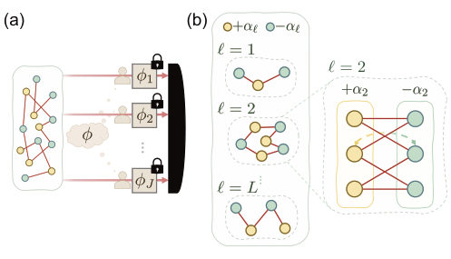
<figcaption class="paper-figure-caption"><b>Fig 1.</b> FIG. 1. Schematic of private DQS. (a) A multimode quantum probe interrogates spatially separated phase shifts {ϕj}J j=1, while the sensing network is designed such that the target parameter ϕ = PJ j=1 wjϕj is accessible and all protected in- dividual local parameters remain hidden. (b) After a suitable permutation, nodes are grouped into independent ℓ-block, each partitioned into +αℓand −αℓsectors again. The en- larged ℓ= 2 block illustrates the corresponding connectivity between the two sectors and non-connectivity within a sector.</figcaption>
</figure>
<figure class="paper-figure-card">
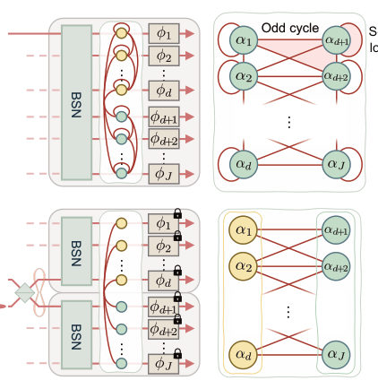
<figcaption class="paper-figure-caption"><b>Fig 2.</b> FIG. 2. Example graph structures and optical implementa- tions for a system with J sensing nodes. (a) An SMSV is dis- tributed over the sensing nodes through a beam-splitter net- work (BSN). The corresponding graph contains self-loops and odd cycles, which violate the privacy condition. (b) A TMSV is distributed over the two sensing-node sectors through sep- arate BSNs. The resulting graph contains no self-loops and connects only the two opposite sectors, forming the bipartite structure required by the privacy condition.</figcaption>
</figure>
<figure class="paper-figure-card">
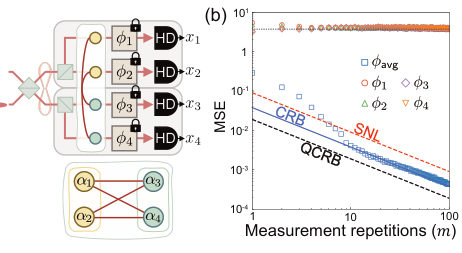
<figcaption class="paper-figure-caption"><b>Fig 3.</b> FIG. 3. (a) Schematic of the sensitivity-optimal scheme for 4-mode private DQS, where the target weight is w = (1, 1, 1, 1)/4. A TMSV is distributed through BS to local phase shifts, and each node performs local homodyne mea- surement (HD). (b) MSEs of maximum-likelihood estimates for both the target and individual local parameters, with r = 1 and (ϕ1, ϕ2, ϕ3, ϕ4) = (−2, −1, 1, 2), evaluated over 3000 independent estimations. The target MSE approaches to CRB (blue solid line) with the number of measurement repetitions, whereas the local MSEs remain near the uniform- random-guessing benchmark (dotted line). The shot-noise limit (SNL, red dashed line) is obtained using a coherent state probe...</figcaption>
</figure>

**Summary.** This work establishes a general framework for designing Gaussian quantum networks for distributed sensing that guarantees perfect local privacy. By characterizing the required structure of the quantum state using the pairing matrix, the authors derive an optimal probe state based on TMSV states. This state achieves Heisenberg scaling for the collective parameter estimate while ensuring individual local parameters remain hidden, even under realistic noise like optical loss.

**Why it may be interesting.** It provides a rigorous, general framework for designing quantum sensors that are robust against information leakage, which is crucial for practical, multi-user quantum network applications.

Detailed structure

**Main problem.** To characterize Gaussian quantum networks that can estimate a collective parameter in a distributed setting while ensuring that no individual local parameter can be estimated independently (perfect local privacy).

**Main result.** The optimal private Gaussian probe state is constructed from Two-Mode Squeezed Vacuum (TMSV) states, achieving Heisenberg scaling in sensitivity while rigorously maintaining perfect local privacy.

**Method.** The authors analytically derive necessary and sufficient conditions on the pairing matrix of the Gaussian state imposed by the local privacy constraint, leading to a structural characterization of the optimal state.

**Model / system.** The system involves continuous-variable quantum states (Gaussian networks) used for distributed quantum sensing (DQS), where local phase shifts are encoded onto a probe state.

**Key observables.** Quantum Fisher Information Matrix (QFIM), Mean Squared Error (MSE) of the global phase estimate, and local MSEs for individual phases.

**Important parameters / regimes.** Photon number ($N_s$), number of sensing modes ($J$), and the weights ($w_j$) defining the collective parameter.

**Assumptions / limitations.** The analysis assumes the use of local homodyne measurements and that the optimal sensitivity can be attained by a pure state; it also considers phase-independent quantum channels.

**Figures summary.** Figures illustrate the schematic of private DQS, the graph structures of privacy-preserving vs. violating networks, and the comparison of the global phase MSE converging to the CRB while local MSEs remain near the random-guessing benchmark.

**Paper structure.** The paper proceeds by defining the privacy condition mathematically using the QFIM, deriving the structural constraints on the Gaussian pairing matrix, identifying the elementary building blocks (TMSV states), and finally optimizing the probe state and measurement scheme to achieve the desired scaling.

Abstract

Private distributed quantum sensing aims to estimate an authorized collective parameter while preventing independent estimation of individual local parameters. Here, we analytically characterize Gaussian quantum networks satisfying this perfect local privacy condition. Using a graph representation of the Gaussian pairing matrix, we show that two-mode squeezed vacuum states constitute the essential building blocks of privacy-preserving Gaussian states. We then analytically derive the optimal sensitivity under perfect local privacy and determine a Gaussian probe that achieves Heisenberg scaling with respect to both the photon number and the number of sensing modes. Using local homodyne measurements and maximum-likelihood estimation, we numerically verify quantum-enhanced sensitivity beyond the shot-noise limit while preserving perfect local privacy. We further show that the local-privacy condition is preserved under arbitrary phase-independent quantum channels, including optical loss. Our results provide a general framework for constructing and optimizing privacy-preserving continuous-variable quantum sensing networks.

[↑ back to top](#top)

### [Phase transitions and microphases in elastomers. II. Anisotropy-driven morphologies](http://arxiv.org/abs/2608.26520v1)

**Authors:** Manu Mannattil, David Andelman, Haim Diamant  
**Type:** theory · **Category:** statistical mechanics · **PDF:** <https://arxiv.org/pdf/2608.26520v1>  
**Analysis basis:** full PDF text, analyzed in chunks
**Topic relevance:** `Keldysh / 2PI / non-Gaussian methods` **2/5**

↔ Scroll figures horizontally

<figure class="paper-figure-card">
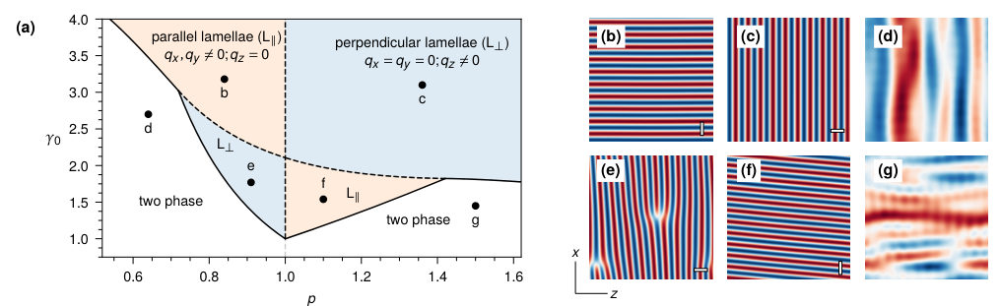
<figcaption class="paper-figure-caption"><b>Fig 1.</b> FIG. 1. Phase diagram indicating the stability of the various phases of an elastomer that is uniaxially stretched or compressed in the (p, γ0) plane. These phases are the ones that appear first during a temperature quench at the critical volume fraction where the order parameter ψ0 = 0. The anisotropy factor p &lt; 1 denotes compression, p &gt; 1 denotes stretching, and γ0 is the elastocapillary number. For illustrative purposes, we set the critical parameters to (ϕc, Tc) = (0.2, 0), and all other free-energy parameters are set to unity. The temperature T varies across the diagram, and at a given point, it is taken to be slightly less than the microphase separation temperature Tm(0) at that point...</figcaption>
</figure>
<figure class="paper-figure-card">
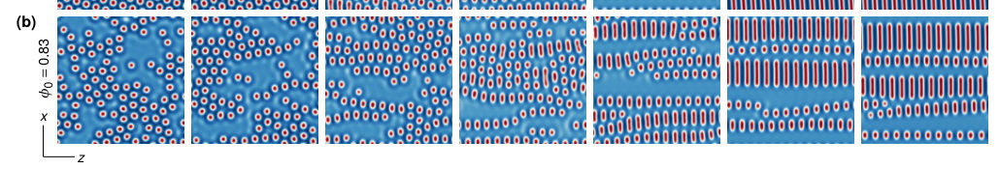
<figcaption class="paper-figure-caption"><b>Fig 2.</b> FIG. 2. Evolution of the microphase morphology as the anisotropy in the initial swelling increases in equal increments from p = 1 (isotropic state) to p = 1.5 (left to right). Polymer-rich and solvent-rich regions are shown in blue and red, respectively. In all panels, the temperature T = −3.4 and the elastocapillary number γ0 = 4. Other parameters are the same as in Fig. 1. The mean polymer volume fraction ϕ0 is chosen to be ϕ0 = 0.61 in (a), and ϕ0 = 0.83 in (b). For isotropic swelling, they correspond to a hexagonal phase and the hexagonal-uniform phase coexistence (see Fig. 2 of Part I [20]). As the anisotropy increases, the system undergoes a series of first-order transitions,...</figcaption>
</figure>
<figure class="paper-figure-card">
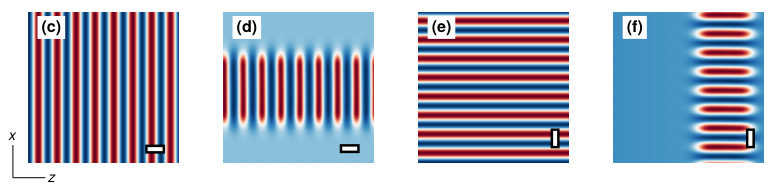
<figcaption class="paper-figure-caption"><b>Fig 3.</b> FIG. 3. Phase diagram in the polymer volume fraction–temperature (ϕ0, T) plane for a uniaxially deformed elastomer with elastocapillary number γ0 = 4 and anisotropy factor (a) p = 3/2 &gt; 1 (elongation) and (b) p = 2/3 &lt; 1 (compression). For illustrative purposes, we took the critical parameters (ϕc, Tc) = (0.2, 0), and set all other parameters in the free energy to unity. Other parameters are the same as in Fig. 1. In both panels (a) and (b), the dashed curves indicate a line of second-order transitions from the uniform phase to the perpendicular (L⊥) or parallel (L∥) lamellar phase, respectively. The colored regions bounded by first-order transition lines (solid curves) show coexistence...</figcaption>
</figure>
<figure class="paper-figure-card">
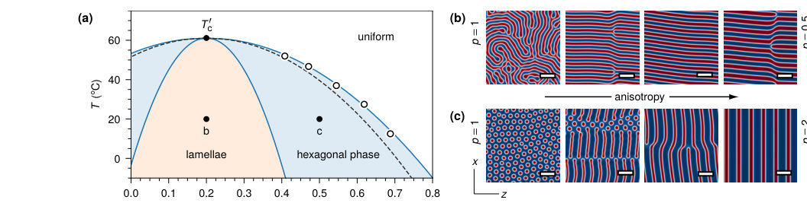
<figcaption class="paper-figure-caption"><b>Fig 4.</b> FIG. 4. Phase diagram in the (ϕ0, T) plane for an isotropically swollen elastomer with dry-state Young’s modulus Y = 350 kPa. The dashed curve marks the microphase-separation boundary predicted by linear stability analysis. The binodals (solid curves) terminate at a shifted critical point T ′ c. For constructing the phase diagram, we chose the parameter values κ = 0.013 kPa µm2, Tc = 70 ◦C, ϕc = 0.2, a = 0.025 kPa K−1, and b = 2 kPa in the free energy [20]. Representative morphologies obtained via numerical minimization of the free energy are shown in panels (b) and (c). The associated (ϕ0, T) values are marked by black dots in panel (a). In both (b) and (c), the degree of anisotropy...</figcaption>
</figure>
<figure class="paper-figure-card">
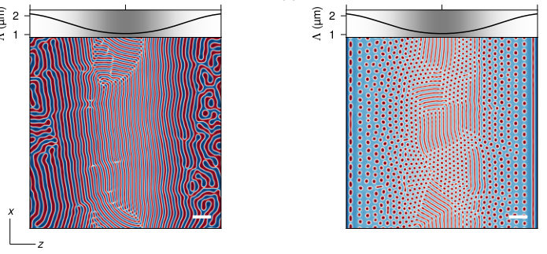
<figcaption class="paper-figure-caption"><b>Fig 5.</b> FIG. 5. Morphologies of the microphase-separated domains in an elastomer with varying stiffness when the mean polymer volume fraction is (a) at criticality, ϕ0 = ϕc = 0.2 and (b) off critical, ϕ0 = 0.5 &gt; ϕc. Polymer-rich and solvent-rich regions are colored in blue and red, respectively, and the scale bar is 4 µm. In both (a) and (b), the dry Young’s modulus varies from Y = 200 kPa to Y = 800 kPa (as indicated by the gradient in the top panels). This leads to a predicted domain size Λ = 2πq−1 m ≈1–2 µm (solid curves in the top panels), in agreement with the experimental observations in Ref. [6].</figcaption>
</figure>

**Summary.** This work theoretically examines how mechanical anisotropy, induced by uniaxial swelling or stiffness gradients, dictates the phase behavior and resulting microstructures in swollen elastomers. By coupling Ginzburg-Landau theory with linearized elastic energy, the authors predict the formation of specific microphases and quantify how external mechanical fields modify these transitions.

**Why it may be interesting.** While focused on soft matter, the methodology of coupling phase separation (order parameter dynamics) with mechanical constraints (elastic energy) is relevant to non-equilibrium statistical mechanics and pattern formation in complex systems.

Detailed structure

**Main problem.** The paper investigates how mechanical anisotropy influences the phase transitions and resulting microphase morphologies in swollen elastomers.

**Main result.** Uniaxial swelling can stabilize lamellar microphases whose orientation depends on the applied stretch, and stiffness gradients cause spatial variations in the characteristic microphase domain size.

**Method.** The analysis uses a free energy functional approach, linearizing the elastic energy and deriving an effective free energy in terms of the order parameter, followed by stability analysis in Fourier space.

**Model / system.** The system is swollen elastomers modeled by a crosslinked polymer network and solvent. The free energy combines a Ginzburg-Landau term with an elastic energy term derived from the nonlinear elastic energy.

**Key observables.** Microphase separation temperature (Tm), bulk instability temperature (T0), and the characteristic microphase domain size.

**Important parameters / regimes.** Anisotropy factor (p), Elastocapillary Number (gamma_0), and the wavevector dependence of the longitudinal modulus (M_q).

**Assumptions / limitations.** The system is assumed to be at thermodynamic equilibrium in an affinely deformed state, and the elastic energy is linearized to quadratic order in the displacement field.

**Figures summary.** The paper discusses a phase diagram showing the stability of lamellar microphases in the plane of the anisotropy factor (p) and the elastocapillary number (gamma_0).

**Paper structure.** The paper builds upon previous work (Part I), first deriving the total free energy functional by combining Ginzburg-Landau and linearized elastic energies. It then analyzes the effects of uniaxial swelling and stiffness gradients by examining the resulting wavevector-dependent moduli and stability criteria.

Abstract

In swollen elastomers, elasticity can arrest macroscopic demixing between the polymer network and the solvent, producing stable domains of finite size. While previous theories have focused on isotropically swollen elastomers, anisotropy strongly influences the phase behavior of many related systems, such as gels and crosslinked polymer blends. Building on the approach developed in Part I of this two-part paper, we investigate the effects of two experimentally induced sources of anisotropy: uniaxial swelling and stiffness gradients. We show that uniaxial swelling can lead to the formation of stable lamellar microphases and modify phase behavior, while stiffness gradients can cause spatial variations in the characteristic microphase size.

[↑ back to top](#top)

### [Quantizing the guiding center: do quantization and coarse graining commute?](http://arxiv.org/abs/2608.26277v1)

**Authors:** Rodrigo Andrade e Silva, Ted Jacobson  
**Type:** theory · **Category:** other · **PDF:** <https://arxiv.org/pdf/2608.26277v1>  
**Analysis basis:** full PDF text, analyzed in chunks
**Topic relevance:** `Keldysh / 2PI / non-Gaussian methods` **2/5**

↔ Scroll figures horizontally

<figure class="paper-figure-card">
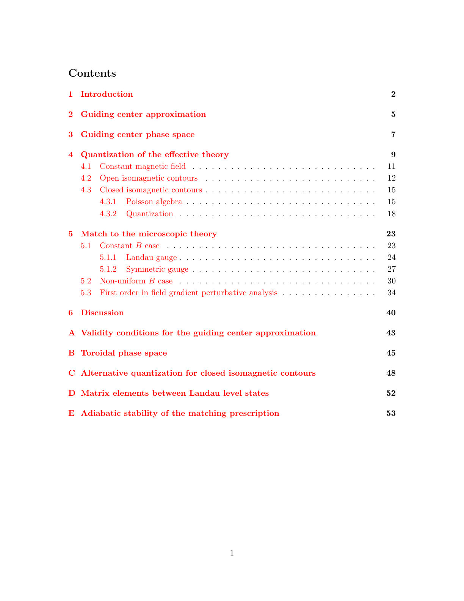
<figcaption class="paper-figure-caption"><b>Fig 1.</b> Low-resolution page preview, page 2</figcaption>
</figure>
<figure class="paper-figure-card">
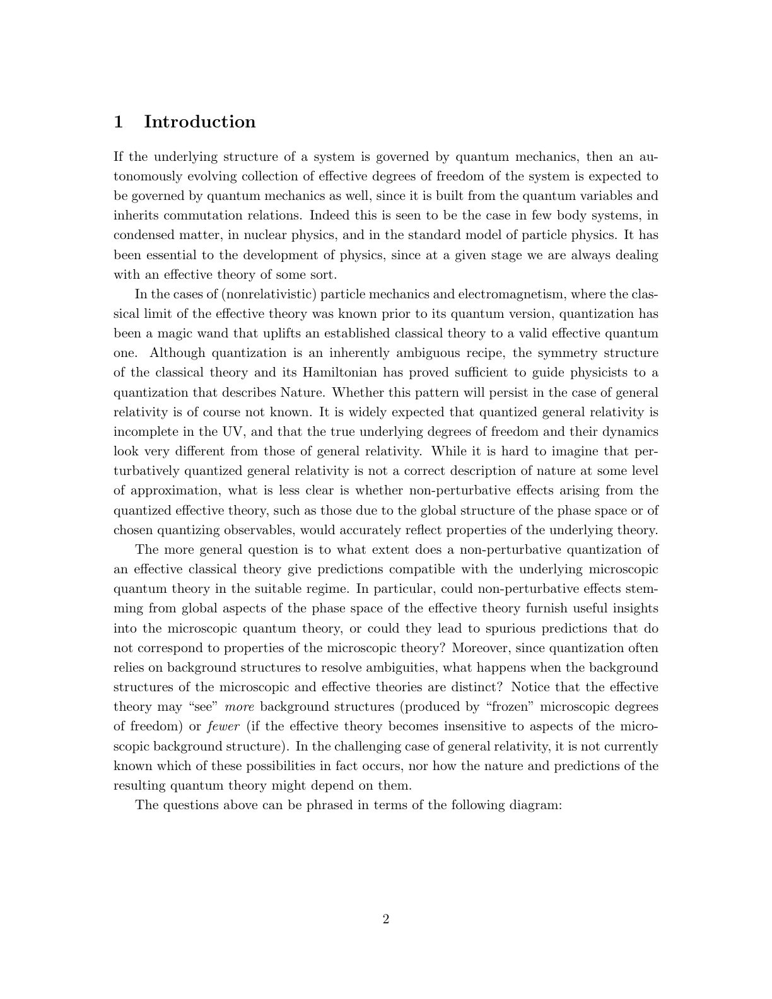
<figcaption class="paper-figure-caption"><b>Fig 2.</b> Low-resolution page preview, page 3</figcaption>
</figure>
<figure class="paper-figure-card">
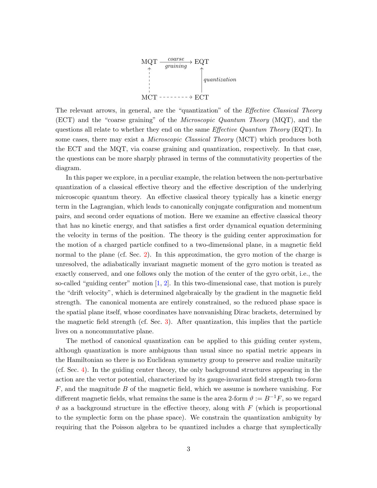
<figcaption class="paper-figure-caption"><b>Fig 3.</b> Low-resolution page preview, page 4</figcaption>
</figure>
<figure class="paper-figure-card">
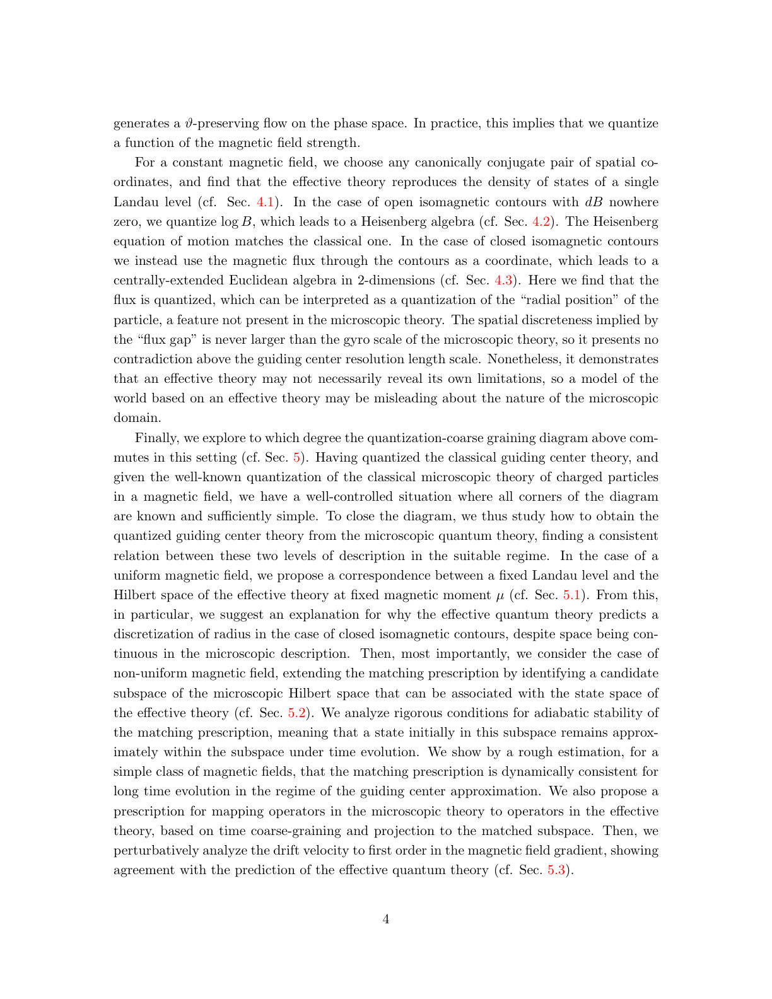
<figcaption class="paper-figure-caption"><b>Fig 4.</b> Low-resolution page preview, page 5</figcaption>
</figure>
<figure class="paper-figure-card">
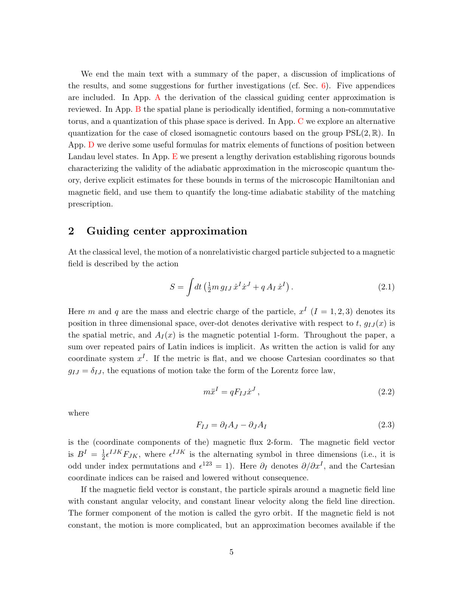
<figcaption class="paper-figure-caption"><b>Fig 5.</b> Low-resolution page preview, page 6</figcaption>
</figure>

**Summary.** This work addresses the fundamental question of whether quantizing an effective theory yields the same results as coarse-graining the full microscopic theory. Using a charged particle in a magnetic field, the authors find that while the theories match generally, the effective theory predicts unphysical quantization effects for closed magnetic paths. This serves as a cautionary example regarding the reliability of effective quantum descriptions.

**Why it may be interesting.** The core theme—the failure of quantization procedures to commute with coarse-graining—is a fundamental issue in effective field theories, relevant across quantum gravity, condensed matter, and quantum optics.

Detailed structure

**Main problem.** The paper investigates whether the process of quantizing an effective classical theory commutes with the process of coarse-graining the underlying microscopic quantum theory.

**Main result.** While the quantized effective theory generally agrees with the microscopic theory, it predicts spurious spatial discreteness (quantization of 'radius') for closed magnetic contours, suggesting quantization of effective theories can yield nonphysical predictions.

**Method.** The authors use nonperturbative, group-theoretic quantization techniques and compare the results against the coarse-graining procedure applied to the full microscopic theory.

**Model / system.** The system modeled is a charged particle drifting in a two-dimensional magnetic field. The analysis uses the guiding center approximation, which simplifies the dynamics by ignoring small-scale gyro motion.

**Key observables.** Quantization of 'radius' (spatial discreteness), density of states (Landau levels), and the consistency of the matching prescription.

**Important parameters / regimes.** Magnetic field strength B(x), magnetic moment $\mu$, and the gyro scale (which sets the limit for spurious effects).

**Assumptions / limitations.** The guiding center approximation is valid when the gyro radius is much smaller than the magnetic field variation length scale. The analysis also assumes the existence of a matching prescription between the two quantum descriptions.

**Paper structure.** The paper develops the effective theory via the guiding center approximation, derives the reduced phase space dynamics, performs the nonperturbative quantization, and then rigorously compares this quantum result against the coarse-grained microscopic theory, highlighting discrepancies in specific geometric regimes.

Abstract

We develop a nonperturbative, group-theoretic quantization of the effective guiding center theory of a charged particle drifting in a magnetic field in two spatial dimensions, and compare the resulting quantum theory with a corresponding coarse graining of the underlying microscopic theory. In the classical effective theory, the small gyro motion is not resolved, while the motion of the center of the gyro orbit remains observable. The reduced phase space is the physical space itself, so quantization leads to noncommuting spatial coordinates, and the effective theory loses access to the metric structure of physical space, retaining only its area structure. By formulating a prescription to match between the microscopic and effective quantum theories, we find that the predictions of the quantized effective theory are generally consistent with those of the microscopic theory. However, for closed isomagnetic contours the effective theory predicts a quantization of ``radius'', a spatial discreteness absent from the microscopic theory. This illustrates that quantization of an effective theory may yield spurious nonperturbative predictions, even if that quantum theory shows no internal signs of breakdown.

[↑ back to top](#top)

### [Quantum Chaos and Spread of States in Krylov Subspace: A Topical Review](http://arxiv.org/abs/2608.26825v1)

**Authors:** Hyun-Sik Jeong, Juan F. Pedraza  
**Type:** theory · **Category:** other · **PDF:** <https://arxiv.org/pdf/2608.26825v1>  
**Analysis basis:** full PDF text, analyzed in chunks
**Topic relevance:** `analog quantum simulation` **2/5**

↔ Scroll figures horizontally

<figure class="paper-figure-card">
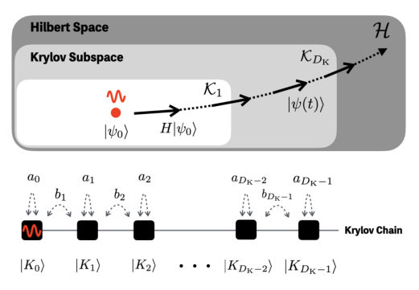
<figcaption class="paper-figure-caption"><b>Fig 1.</b> Figure 1 Schematic dynamics of the initial state |ψ0⟩within DK-dimensional Krylov subspace KDK under the given Hamil- tonian H. Any initial state |ψ0⟩is mapped or projected to the first site (n = 0) of the Krylov chain, KDK |ψ0⟩= (1, 0, · · · , 0)T , and the evolution corresponds to the particle hopping to subsequent sites.</figcaption>
</figure>
<figure class="paper-figure-card">
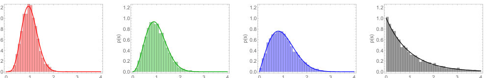
<figcaption class="paper-figure-caption"><b>Fig 2.</b> Figure 2 Nearest-neighbor level spacing distributions. The probability density p(s) is shown for the three standard random matrix ensembles (GSE, GUE, and GOE) (red, green, blue) and the integrable Poisson system (black). Histograms represent numerical data obtained by diagonalizing random matrices of dimension 200, with statistics averaged over 50 independent realizations. Solid colored lines denote the corresponding analytical predictions: the exact the Wigner surmise for the Gaussian ensembles (16) and Poisson distribution (17).</figcaption>
</figure>
<figure class="paper-figure-card">
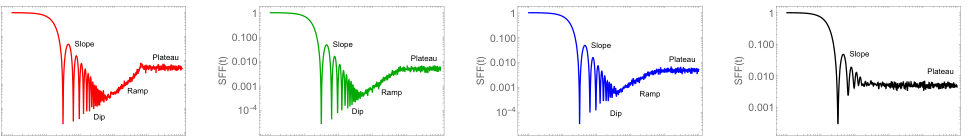
<figcaption class="paper-figure-caption"><b>Fig 3.</b> Figure 3 Spectral form factor for the random matrix ensembles (GSE, GUE, and GOE) (red, green, blue) and the integrable Poisson system (black). The SFF is evaluated at infinite temperature (β = 0) and plotted on a log-log scale. The numerical curve is generated from matrices of size 200, averaged over 50 realizations. The evolution displays the defining dynamical signatures of quantum chaos for the random matrix ensembles, i.e., the ramp structure: an initial early decay governed by the average density of states, an interruption at the dip time, a subsequent linear ramp reflecting two-level correlations, and a final saturation into a constant plateau.</figcaption>
</figure>
<figure class="paper-figure-card">
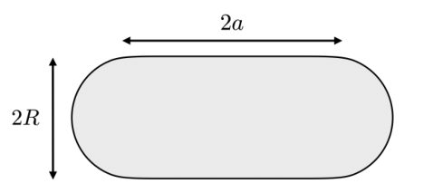
<figcaption class="paper-figure-caption"><b>Fig 4.</b> Figure 4 The geometry of the stadium billiard with the area A = πR2 + 4aR.</figcaption>
</figure>
<figure class="paper-figure-card">
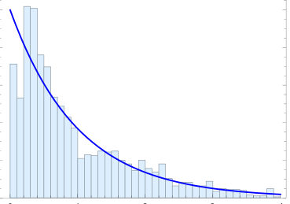
<figcaption class="paper-figure-caption"><b>Fig 5.</b> Figure 6 Nearest-neighbor level spacing distribution in the mixed-field Ising model (23) for the even symmetry sector H1 with N = 12 sites when (hx, hz) = (−1.05, 0.5) (upper panel) and hx, hz) = (−1, 0.001) (lower panel).</figcaption>
</figure>

**Summary.** This review introduces Krylov state complexity as a powerful, general diagnostic for quantifying quantum chaos and information spreading. By utilizing the Lanczos algorithm to map dynamics onto a Krylov subspace, it provides a measure that bridges spectral analysis and real-time evolution. The paper demonstrates its utility across diverse models, from quantum billiards to holographic gravity, highlighting the characteristic 'overshoot' as a key signature of chaotic behavior.

**Why it may be interesting.** This work is highly relevant as it provides a unified, mathematically rigorous tool (Krylov complexity) to probe chaos and information spreading, connecting spectral theory to real-time dynamics, which is crucial for understanding open quantum systems and many-body dynamics.

Detailed structure

**Main problem.** The paper seeks a universal diagnostic tool to characterize quantum chaos and the spreading of quantum information across diverse physical systems.

**Main result.** Krylov state complexity is proposed as a versatile diagnostic that bridges spectral properties and real-time dynamics, revealing characteristic overshoots in chaotic systems.

**Method.** The core method involves constructing the Krylov subspace using the Lanczos algorithm to map the system's dynamics onto a one-dimensional chain, allowing the calculation of state complexity.

**Model / system.** The analysis applies to a broad range of quantum systems, including quantum billiards, quantum spin chains, the SYK model, and holographic gravity models (AdS/CFT).

**Key observables.** Krylov State Complexity (Spread Complexity), Characteristic Overshoot, Spectral Statistics (GOE/GUE), and Out-of-Time-Order Correlators (OTOCs).

**Important parameters / regimes.** The analysis considers regimes ranging from integrable to chaotic dynamics, and includes both Hermitian and non-Hermitian settings.

**Assumptions / limitations.** The primary assumption is that Krylov complexity provides a robust, general diagnostic that complements existing, but incomplete, chaos measures like OTOCs and spectral statistics.

**Paper structure.** The review progresses by first establishing the need for a general diagnostic, then detailing the formal construction of Krylov complexity via the Lanczos algorithm, and finally applying this tool to various model classes (Hermitian, non-Hermitian, holographic).

Abstract

Krylov state complexity, or spread complexity, has emerged as a sharp and versatile diagnostic of quantum chaos, information spreading, and many-body dynamics. Built from the Lanczos algorithm and grounded in the optimal-basis theorem, Krylov complexity thereby provides a robust spectroscopic window into quantum dynamics. A central theme is the characteristic overshoot observed in chaotic systems: a complexity peak in which chaotic evolution drives the state deeper into the Krylov chain than in integrable systems before relaxing to equilibrium. This behavior, tied to random-matrix universality classes of spectral statistics, is illustrated across a broad range of models, including quantum billiards, quantum spin chains, and variants of the SYK model. We also discuss proposed holographic descriptions of Krylov complexity in Einstein gravity, and conclude by outlining future directions and open problems, including time-dependent systems and quantum-field-theoretic formulations. A Mathematica notebook is provided for numerical exploration of Krylov complexity and spectral statistics across models.

[↑ back to top](#top)

### [Tight Bounds for Purity and Product Testing from Partial Transposition](http://arxiv.org/abs/2608.27217v1)

**Authors:** Oren Akresh, Jacob Beckey  
**Type:** theory · **Category:** quantum information and computing · **PDF:** <https://arxiv.org/pdf/2608.27217v1>  
**Analysis basis:** full PDF text, analyzed in chunks
**Topic relevance:** `quantum measurements` **2/5**

↔ Scroll figures horizontally

<figure class="paper-figure-card">
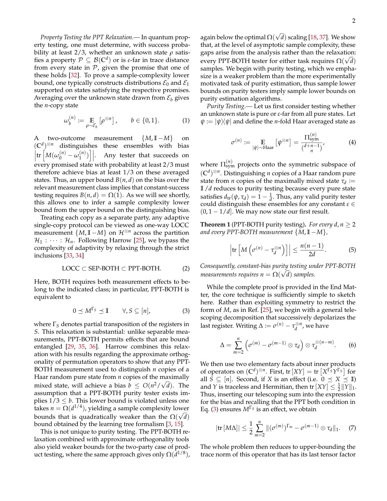
<figcaption class="paper-figure-caption"><b>Fig 1.</b> Low-resolution page preview, page 2</figcaption>
</figure>
<figure class="paper-figure-card">
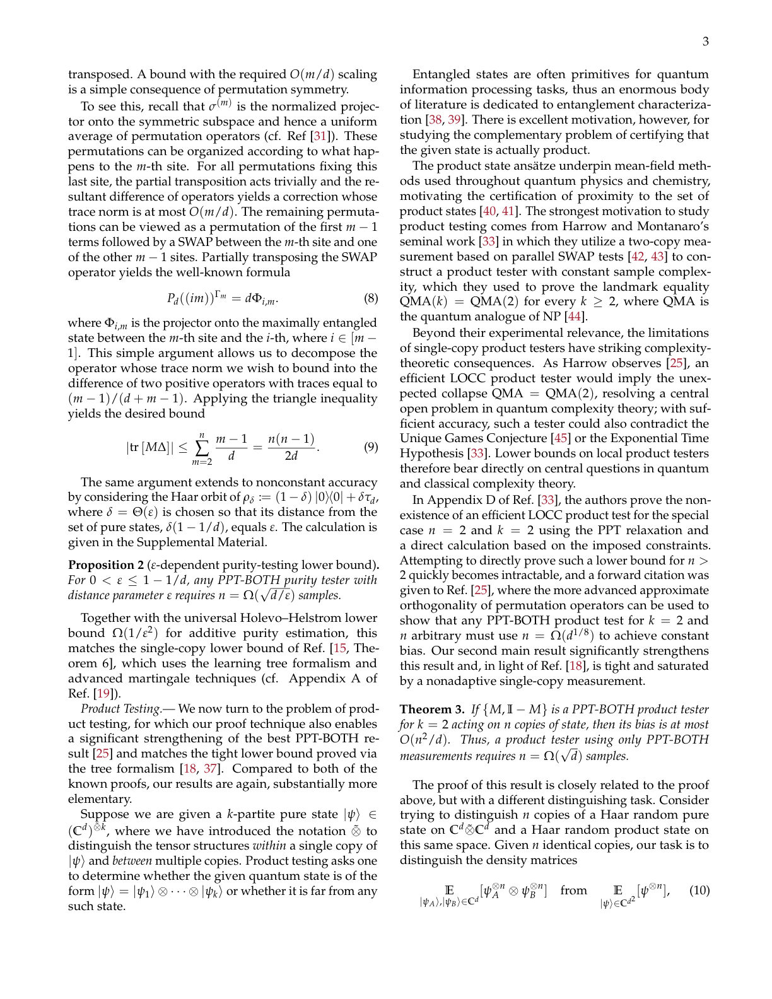
<figcaption class="paper-figure-caption"><b>Fig 2.</b> Low-resolution page preview, page 3</figcaption>
</figure>
<figure class="paper-figure-card">
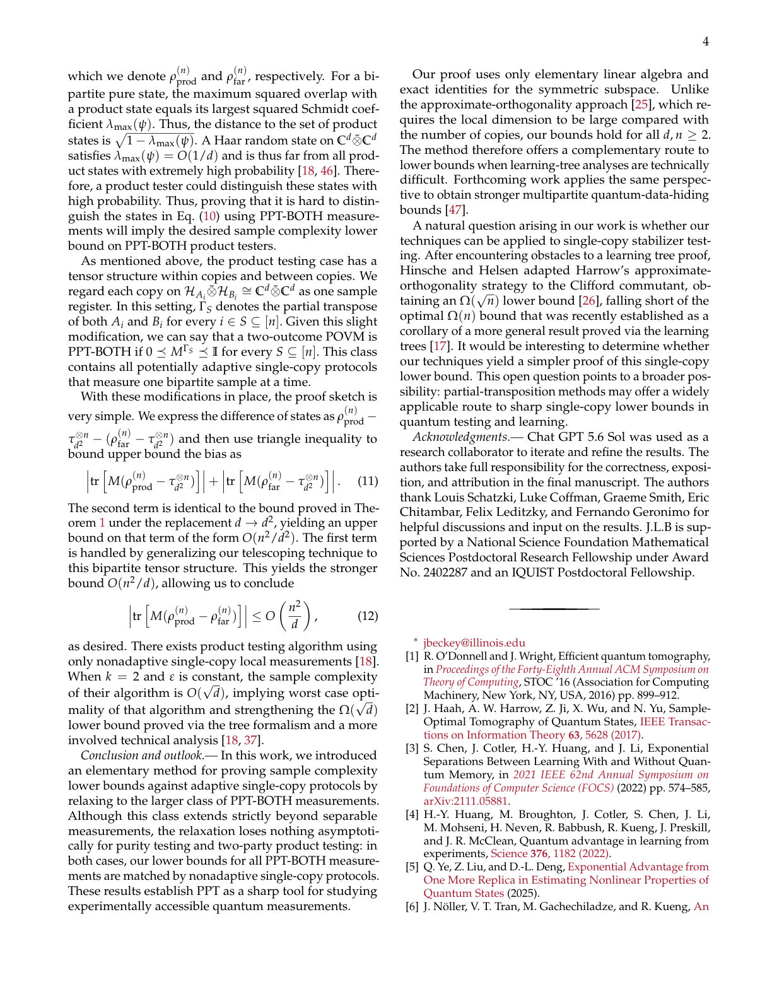
<figcaption class="paper-figure-caption"><b>Fig 3.</b> Low-resolution page preview, page 4</figcaption>
</figure>
<figure class="paper-figure-card">
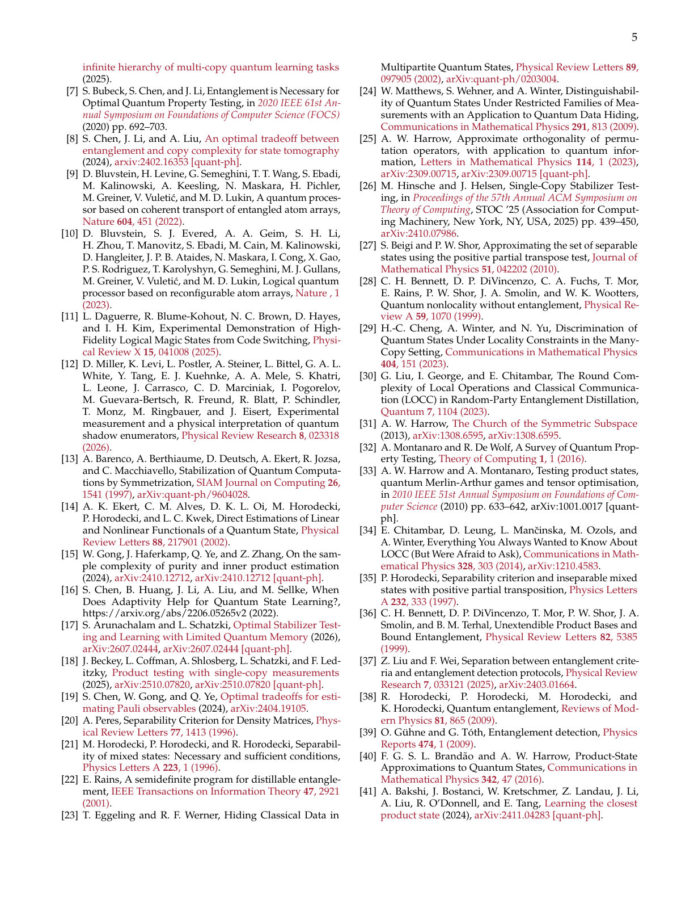
<figcaption class="paper-figure-caption"><b>Fig 4.</b> Low-resolution page preview, page 5</figcaption>
</figure>
<figure class="paper-figure-card">
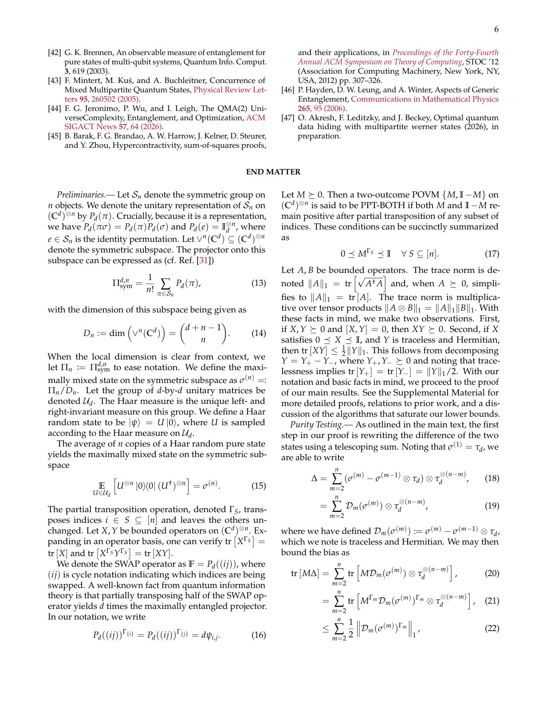
<figcaption class="paper-figure-caption"><b>Fig 5.</b> Low-resolution page preview, page 6</figcaption>
</figure>

**Summary.** This theoretical paper derives lower bounds for quantum state testing (purity and product testing) using only measurements constrained by the PPT condition. The authors demonstrate that this mathematical relaxation is surprisingly strong, preserving the optimal $\Omega(\sqrt{d})$ scaling for the required number of samples. This provides a simple, powerful technique for establishing fundamental limits in quantum information theory.

**Why it may be interesting.** The result provides a powerful, elementary method to derive sharp lower bounds for quantum state discrimination tasks, which is crucial for understanding the limits of quantum characterization protocols.

Detailed structure

**Main problem.** The paper establishes lower bounds on the sample complexity required to test quantum properties, specifically purity and product structure, of an unknown quantum state.

**Main result.** It shows that using the Positive-Partial-Transpose (PPT) relaxation does not weaken the asymptotic sample complexity bounds for these tasks, matching the optimal single-copy lower bounds of $\Omega(\sqrt{d})$.

**Method.** The authors use techniques involving telescoping sums and bounding the trace norm of the difference between the state being tested and a reference state, utilizing the PPT-BOTH measurement constraint.

**Model / system.** The analysis concerns an unknown quantum state $
ho$ in a $d$-dimensional Hilbert space, tested across $n$ copies ($
ho^{\otimes n}$). The tasks involve distinguishing the Haar averaged pure state ($\sigma(n)$) from the maximally mixed state ($	au^{\otimes n}$) for purity testing, and distinguishing product states from mixed states for product testing.

**Key observables.** Bias of the measurement, sample complexity ($n$), purity ($\sigma(n)$ vs $	au^{\otimes n}$), and product structure ($
ho(n)_{	ext{prod}}$ vs $	au^{\otimes n}$).

**Important parameters / regimes.** Local dimension ($d$), number of samples ($n$), and the accuracy parameter ($\epsilon$).

**Assumptions / limitations.** The analysis is restricted to measurements satisfying the Positive-Partial-Transpose (PPT-BOTH) condition, which is a mathematical relaxation of the full measurement set.

**Paper structure.** The paper develops the lower bounds for purity testing and product testing separately, using similar mathematical machinery involving bounding the trace norm of the difference operator via telescoping sums and the PPT constraint.

Abstract

Coherent measurements across multiple copies of an unknown quantum state can substantially reduce the number of samples required to learn its properties, but remain experimentally challenging. Current experiments typically prepare and measure one copy at a time, potentially adapting later measurements to earlier outcomes. A central challenge is adaptivity, which makes the space of possible measurement strategies difficult to characterize. The positive-partial-transpose (PPT) relaxation bypasses this complexity by considering a larger, mathematically tractable class of measurements, at the risk of weakening the resulting bounds. Here we show, surprisingly, that the relaxation loses nothing at the level of asymptotic sample complexity for two fundamental tasks: purity testing and product testing. In both cases, lower bounds against the full class of PPT measurements are matched by nonadaptive single-copy protocols. Moreover, our proof requires only basic symmetric subspace identities, providing a simple route to sharp lower bounds for adaptive single-copy measurements.

[↑ back to top](#top)

### [QH-GEM: Quantum-Hydrodynamic Generative Modeling](http://arxiv.org/abs/2608.27216v1)

**Authors:** Harbir Antil, Alex Kaltenbach, Sarswati Shah  
**Type:** both · **Category:** numerical methods · **PDF:** <https://arxiv.org/pdf/2608.27216v1>  
**Analysis basis:** full PDF text, analyzed in chunks
**Topic relevance:** `Keldysh / 2PI / non-Gaussian methods` **1/5** · `methods for driven-dissipative` **1/5** · `quantum measurements` **1/5**

↔ Scroll figures horizontally

<figure class="paper-figure-card">
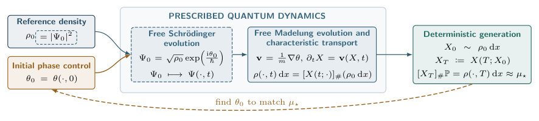
<figcaption class="paper-figure-caption"><b>Fig 1.</b> Figure 1: Phase-controlled quantum-hydrodynamic generation obtained from the free Schr¨odinger problem (1.1) via the Madelung transform (1.2). The reference Born probability density ρ0 : Rd →R&gt;0 is fixed, whereas the initial phase function θ0 : Rd →R is selected through PDE-constrained phase control, so that, given an initial sample X0 ∼ρ0 dx, the terminal-time measure ρ(·, T) dx ∈P(Rd), equivalently the law of XT := X(T; X0), approximates the target measure µ⋆∈P(Rd). Once θ0 : Rd →R is fixed, sample transport is deterministic.</figcaption>
</figure>
<figure class="paper-figure-card">
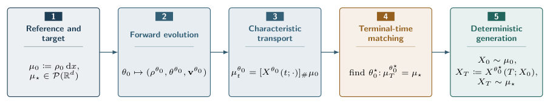
<figcaption class="paper-figure-caption"><b>Fig 2.</b> Figure 2: Phase-controlled generative procedure. Steps 1–4 seek an initial phase function θ⋆ 0 : Rd →R satisfying the terminal-time matching condition (2.17); then, once such a phase function has been found, Step 5 maps an initial sample X0 ∼µ0 deterministically to a (terminal-time) generated sample XT ∼µ⋆ via the characteristic-flow representation (2.14) in Proposition 2.3.</figcaption>
</figure>
<figure class="paper-figure-card">
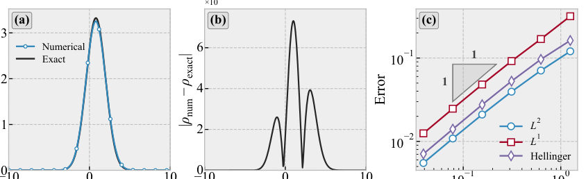
<figcaption class="paper-figure-caption"><b>Fig 3.</b> Figure 3: Validation of the discrete forward solver against the exact Gaussian solution at T = 0.3. (a) computed and exact terminal densities for Nx = 301. (b) corresponding pointwise absolute error. (c) discrete L2-, L1-, and Hellinger errors under the uniform mesh refinements Nx ∈{2i | i = 4, . . . , 9}, with the time step refined accordingly.</figcaption>
</figure>
<figure class="paper-figure-card">
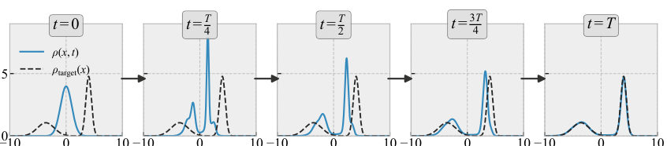
<figcaption class="paper-figure-caption"><b>Fig 4.</b> Figure 4: Density evolution induced by the computed full-grid initial phase function θ⋆ 0,h = mq⋆ h ∈Vh,0, identified by minimizing the PDE-constrained discrete cost functional (5.3) to approximate the target density ρ⋆,h ∈Ph at T = 0.3. The snapshots show t = 0, T</figcaption>
</figure>
<figure class="paper-figure-card">
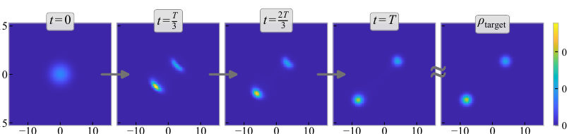
<figcaption class="paper-figure-caption"><b>Fig 5.</b> Figure 5: 2D density evolution induced by the computed full-grid initial phase θ⋆ 0,h = mq⋆ h ∈Vh,0, identified by minimizing the PDE-constrained discrete cost functional (5.3) to approximate the target probability density ρ⋆,h ∈Ph at T = 0.3. On a 91 × 91 grid, the first four panels show t = 0, T</figcaption>
</figure>

**Summary.** This paper introduces QH-GEM, a generative model that uses the deterministic evolution dictated by the free-particle Schrödinger equation to sample from a target quantum state. It achieves this by solving a PDE-constrained optimization problem to determine the necessary initial phase function. This approach offers a physically rigorous alternative to standard generative models by embedding the generation process within established quantum hydrodynamics.

**Why it may be interesting.** This work provides a novel, physically grounded method for generative modeling in quantum dynamics, bypassing the need to learn complex time-dependent Hamiltonians or velocity fields directly from data.

Detailed structure

**Main problem.** The paper develops a deterministic, physically constrained generative framework to sample from a target probability distribution by controlling the initial phase function of a free-particle quantum system.

**Main result.** The framework successfully demonstrates the ability to steer the evolution of a reference Gaussian density to match complex, asymmetric bimodal target distributions using PDE-constrained optimization.

**Method.** It formulates terminal-time distribution matching as a PDE-constrained phase-identification problem, optimizing the initial phase function ($	heta_0$) within the free Madelung system.

**Model / system.** The model is based on the free-particle Schrödinger equation, analyzed via the Madelung transform, which couples the Born probability density ($
ho$) and the phase function ($	heta$) through the Bohm quantum potential.

**Key observables.** Born probability density ($
ho$), phase function ($	heta$), hydrodynamic velocity field ($\mathbf{v}$), and the resulting time-evolved density.

**Important parameters / regimes.** The optimization uses regularization parameters ($\lambda_s, \lambda_c$) and involves matching specific Gaussian and bimodal target structures.

**Assumptions / limitations.** The analysis relies on the existence of a unique global characteristic flow and the assumption that the initial phase control is sufficient to govern the entire evolution.

**Figures summary.** Figures illustrate the phase-controlled generation process, showing the evolution from an initial Gaussian state towards an asymmetric bimodal target density.

**Paper structure.** The paper introduces the free Madelung system and its Hamiltonian structure, formulates the PDE-constrained phase-identification problem, derives explicit dynamics for Gaussian cases, and validates the solver numerically on bimodal targets.

Abstract

In this paper, we develop a deterministic, physically constrained generative framework based on the Madelung formulation of the free-particle Schrödinger equation. A reference Born probability density and a controllable initial phase function serve as initial data for the free Madelung system, which couples the Born probability density and phase function through the Bohm quantum potential, while the phase function determines the hydrodynamic velocity field. Provided that the Born probability density remains positive and the hydrodynamic velocity field generates a unique global characteristic flow, samples drawn from the reference density and transported along the characteristic flow are distributed according to the evolving Born probability density at every time.   As a consequence, randomness enters only through the initial sampling; the subsequent generation is deterministic and involves neither stochastic dynamics nor an independently parameterized time-dependent velocity field. We formulate terminal-time distribution matching as a PDE-constrained phase-identification problem and derive the underlying Hamiltonian and Fisher-information structure. For isotropic Gaussian wave packets, we obtain explicit dynamics and a necessary and sufficient condition for exact reachability of isotropic Gaussian targets by quadratic initial phase functions, together with the corresponding sampling map. For a smooth prescribed potential initial velocity field, we further establish that the characteristic flow approximates the associated first-order transport map with an O(T^2) error, both uniformly and in the 1- and 2-Wasserstein distances. A numerical Gaussian benchmark validates the fully discrete forward solver, while full-grid PDE-constrained phase identification is demonstrated for asymmetric bimodal targets.

[↑ back to top](#top)

### [Auditing Structured Randomness for Quantum Error Correction under a Bounded Cloud Fault Model](http://arxiv.org/abs/2608.26600v1)

**Authors:** Ziqing Guo, Anthony Lawrence, Renyu Wang, Randy Kuang, Ziwen Pan  
**Type:** both · **Category:** quantum information and computing · **PDF:** <https://arxiv.org/pdf/2608.26600v1>  
**Analysis basis:** full PDF text, analyzed in chunks
**Topic relevance:** `QC/QI experiment` **1/5** · `quantum measurements` **1/5**

↔ Scroll figures horizontally

<figure class="paper-figure-card">
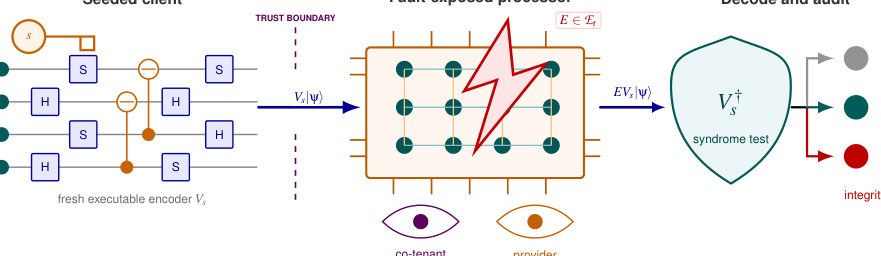
<figcaption class="paper-figure-caption"><b>Fig 1.</b> Figure 1. Integrity audit. A client samples a fresh executable encoder Vs and submits the encoded state to a remote processor exposed to a bounded fault E. The provider observes the compiled seed; a co-tenant that commits before compilation is seed-blind. Inverse decoding and the ancilla syndrome test separate rejection, harmless acceptance, and accepted logical corruption.</figcaption>
</figure>
<figure class="paper-figure-card">
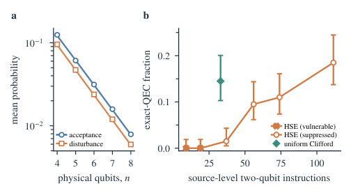
<figcaption class="paper-figure-caption"><b>Fig 2.</b> Figure 2. Dense results for k = 1 over 200 seeds per condition. (a) Closed-form Haar expectations (lines) and measured seed means (markers) for acceptance and accepted disturbance. (b) Fraction of n = 8 encoders that correct every tested single- qubit fault, plotted against the median source-level two-qubit instruction count. Connected points are HSE depths; the diamond is uniform Clifford. Crosses mark median worst- fault disturbance above 0.5; open circles mark values below it. Bars show 95% bootstrap intervals in (a) and Wilson intervals in (b).</figcaption>
</figure>
<figure class="paper-figure-card">
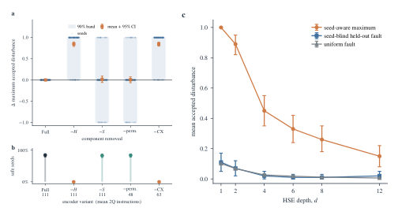
<figcaption class="paper-figure-caption"><b>Fig 3.</b> Figure 3. HSE ablation and attacker knowledge. Left: paired ablation at (n,k,d) = (8,1,12) over 200 seeds. (a) Change in worst-fault disturbance relative to the full HSE; squares show means and shading the central 90%. (b) Fraction of seeds safe against every tested fault; labels give mean two-qubit instruction counts. Right: (c) held-out scores at n = 8 for seed-aware, seed-blind, and uniformly random fault selection. Bars show 95% intervals.</figcaption>
</figure>
<figure class="paper-figure-card">
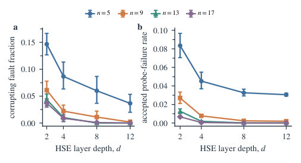
<figcaption class="paper-figure-caption"><b>Fig 4.</b> Figure 4. Gate-level HSE results over 20 seeds per condition. (a) Fraction of single-qubit Pauli faults that cause an accepted logical change in ideal circuits. (b) Fraction of all noisy shots that are both accepted and corrupted under gate-local depolarization with (p1, p2) = (10−3,10−2). Points show seed means and bars show 95% bootstrap intervals. Neither panel includes idle or leakage noise.</figcaption>
</figure>

**Summary.** This paper develops a rigorous audit framework to measure the integrity of QEC circuits running on untrusted cloud quantum hardware. By defining 'accepted logical disturbance,' the authors quantify how much corruption slips through the system despite error correction. They demonstrate that implementing per-run reseeding significantly boosts the system's resilience against sophisticated fault-injecting adversaries.

**Why it may be interesting.** While focused on QEC, the rigorous mathematical framework for quantifying 'accepted corruption' and separating detection from actual error correction provides a generalizable robustness auditing tool applicable to any complex, fault-prone quantum computation.

Detailed structure

**Main problem.** The paper addresses the critical issue of auditing the integrity of Quantum Error Correction (QEC) circuits executed on untrusted cloud quantum processors susceptible to fault injection.

**Main result.** Reseeding the encoder significantly reduces the mean accepted logical disturbance from 0.150 to 0.020, quantifying a major integrity gain against sophisticated adversaries.

**Method.** The authors define 'accepted logical disturbance' as an acceptance-weighted measure and derive its exact Haar expectation, evaluating this using a polynomial-cost seeded Clifford encoder family.

**Model / system.** The model involves QEC encoding ($V_s$) on cloud quantum processors, where an adversary injects Pauli faults ($Q$) into the physical-to-logical fault map. The analysis uses both seed-aware and seed-blind attacker models.

**Key observables.** Accepted logical disturbance, which quantifies harmful logical action in accepted results; the reduction factor between seed-aware and seed-blind fault models.

**Important parameters / regimes.** Fault weight ($t$), code parameters (e.g., $[[5,1,3]]$ code), and the ratio of disturbance reduction ($\Delta_{blind}$).

**Assumptions / limitations.** The analysis assumes the fault set $\mathcal{E}_t$ is restricted to Pauli strings and relies on the mathematical properties of Haar-random unitaries for expectation calculations.

**Figures summary.** Figure 1 illustrates the integrity audit process, classifying outcomes as rejected, harmlessly accepted, or accepted with logical corruption. Table 1 compares the proposed audit against prior methods.

**Paper structure.** The paper first defines the security metric (accepted logical disturbance) and derives its Haar expectation. It then evaluates this metric using a seeded Clifford encoder family under two distinct attacker knowledge models (seed-aware vs. seed-blind), culminating in quantitative results demonstrating the benefit of reseeding.

Abstract

Cloud quantum processors compile submitted quantum error correction circuits and may colocate them with untrusted workloads. A fixed public encoder gives a fault-injection adversary a reusable target. Per-run reseeding changes the physical-to-logical fault map. Exact Haar-random encoders have exponential circuit cost. Efficient random ensembles provide average-moment guarantees and leave worst-case accepted corruption uncharacterized. We define accepted logical disturbance, an acceptance-weighted measure of harmful logical action in accepted results, and derive its exact Haar expectation. We evaluate a polynomial-cost seeded Clifford encoder family using dense linear algebra and gate-level stabilizer simulation against faults chosen before or after the encoder is known. Reseeding reduces mean accepted logical disturbance from 0.150 for faults chosen after learning each encoder to 0.020 for one fault chosen before it is known. The 86.7% reduction results from rejection. The fixed distance-three \([[5,1,3]]\) code corrects every tested weight-one Pauli, while 18.5% of sampled encoders in the selected ensemble satisfy exact quantum error correction. The measured reduction quantifies the integrity gain from reseeding and separates postselected detection from exact correction under explicit fault and attacker-knowledge models.

[↑ back to top](#top)

### [Band's Geometry Origin of Quantum Spin Transport Phenomena](http://arxiv.org/abs/2608.27445v1)

**Authors:** Elena Derunova, Mazhar N. Ali  
**Type:** theory · **Category:** other · **PDF:** <https://arxiv.org/pdf/2608.27445v1>  
**Analysis basis:** full PDF text, analyzed in chunks
**Topic relevance:** `Keldysh / 2PI / non-Gaussian methods` **1/5** · `analog quantum simulation` **1/5**

↔ Scroll figures horizontally

<figure class="paper-figure-card">
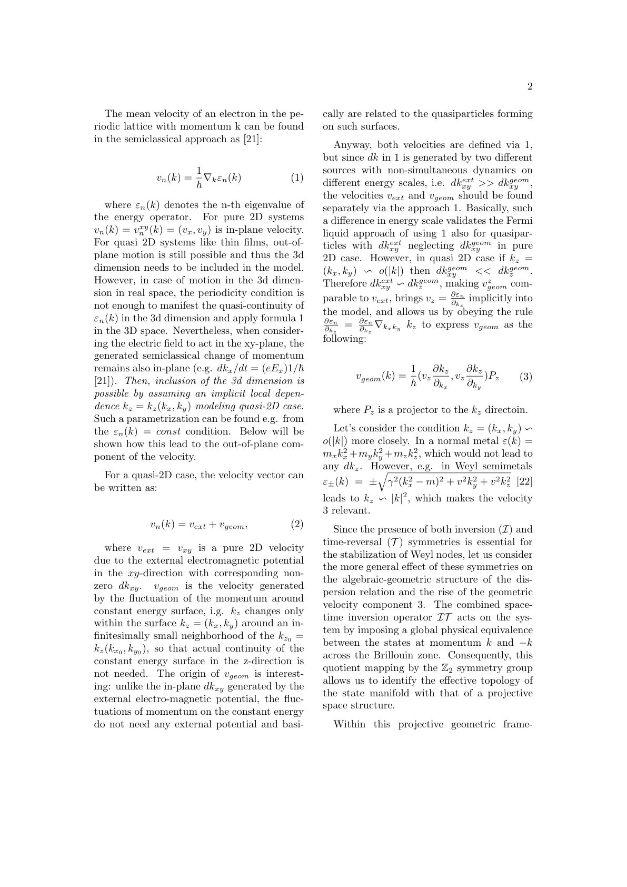
<figcaption class="paper-figure-caption"><b>Fig 1.</b> Low-resolution page preview, page 2</figcaption>
</figure>
<figure class="paper-figure-card">
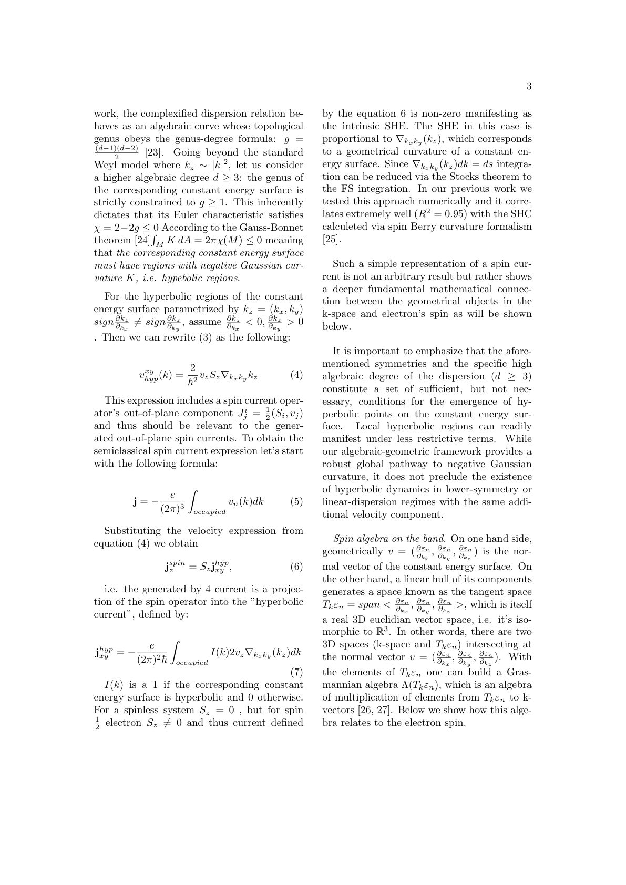
<figcaption class="paper-figure-caption"><b>Fig 2.</b> Low-resolution page preview, page 3</figcaption>
</figure>
<figure class="paper-figure-card">
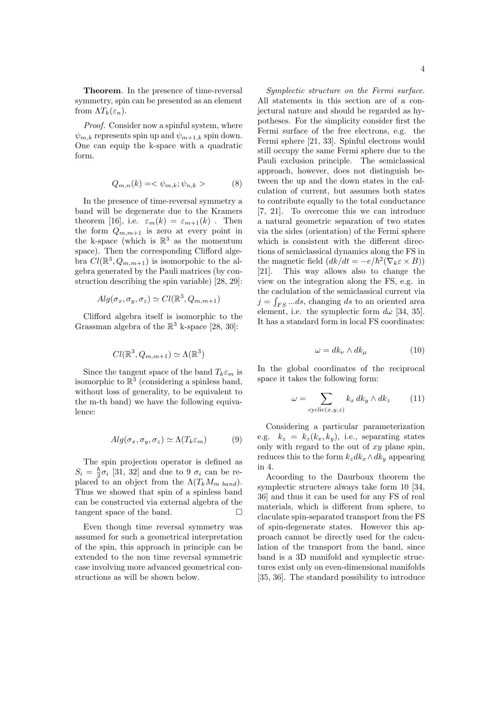
<figcaption class="paper-figure-caption"><b>Fig 3.</b> Low-resolution page preview, page 4</figcaption>
</figure>
<figure class="paper-figure-card">
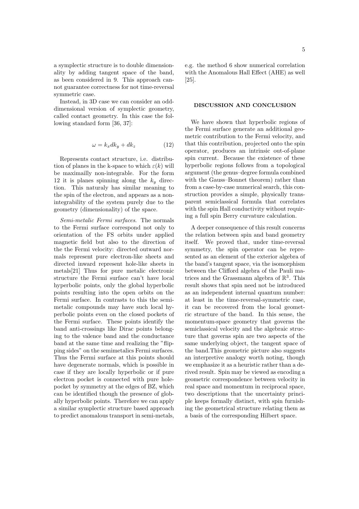
<figcaption class="paper-figure-caption"><b>Fig 4.</b> Low-resolution page preview, page 5</figcaption>
</figure>
<figure class="paper-figure-card">
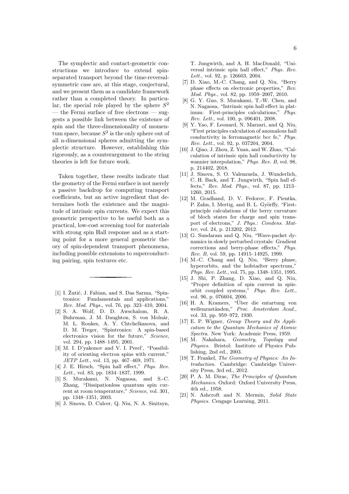
<figcaption class="paper-figure-caption"><b>Fig 5.</b> Low-resolution page preview, page 6</figcaption>
</figure>

**Summary.** This theoretical work provides a novel geometric interpretation of spin transport in electronic materials by connecting the intrinsic spin current directly to the curvature and topology of the electronic Fermi surface. Using tools from differential geometry, the authors show that hyperbolic regions on the energy bands generate a spin-current response, offering a powerful, geometry-first approach to understanding phenomena like the Spin Hall Effect.

**Why it may be interesting.** While focused on condensed matter transport, the deep reliance on advanced geometric structures (exterior algebra, symplectic/contact geometry) provides a powerful mathematical toolkit for describing quantum degrees of freedom (like spin) in terms of underlying manifold geometry, which has parallels in quantum information theory.

Detailed structure

**Main problem.** The paper aims to develop a rigorous geometric framework to describe spin-dependent transport phenomena, specifically linking the intrinsic spin current to the local geometry of electronic energy bands and Fermi surfaces.

**Main result.** It establishes that hyperbolic regions on constant-energy surfaces generate a geometrical contribution to the Fermi velocity that directly produces a measurable spin-current response, bypassing the need for full spin Berry curvature calculations.

**Method.** The methodology combines semi-classical transport theory with advanced differential geometry, utilizing concepts like the exterior algebra, Gauss-Bonnet theorem, and symplectic/contact geometry to encode spin in momentum space.

**Model / system.** The study focuses on quasi-two-dimensional (quasi-2D) electronic systems characterized by electronic bands $\epsilon_n(\mathbf{k})$ and their corresponding Fermi surfaces. The analysis extends the geometric description to three-dimensional band manifolds.

**Key observables.** Out-of-plane spin currents ($\mathbf{j}_{	ext{spin}}^z$), geometric curvature of the constant energy surface, and the spin operator represented by elements of the exterior algebra.

**Important parameters / regimes.** The existence of hyperbolic regions (negative curvature) on the constant-energy surfaces, and the requirement of time-reversal symmetry for the algebraic mapping of spin.

**Assumptions / limitations.** The derivation relies on the assumption of high algebraic degree for the dispersion relation to guarantee hyperbolic regions, and the extension to 3D uses conjectural symplectic/contact geometric analogues.

**Paper structure.** The paper progresses by first introducing the geometric description of spin-dependent transport in quasi-2D systems, showing the link between hyperbolic regions and spin current. It then deepens the mathematical formalism by relating the spin operator to the exterior algebra under time-reversal symmetry, and finally extends the framework to symplectic and contact geometry for higher dimensions.

Abstract

We develop a geometric description of spin-dependent transport based on the local geometric structure of electronic bands and the Fermi surfaces. For quasi-two-dimensional systems, we show that hyperbolic regions of constant-energy surfaces generate a geometrical contribution to the Fermi velocity that couples naturally to electron spin and produces a spin-current response. We further show that, in the presence of time-reversal symmetry, the algebra of spin operators can be related to the exterior algebra of the band's tangent space, providing an additional geometric interpretation of spin in momentum space. This framework motivates a symplectic description of spin-separated transport on Fermi surfaces and its extension to three-dimensional band manifolds through contact geometry. Our results establish a direct connection between Fermi-surface geometry and intrinsic spin transport.

[↑ back to top](#top)

### [Multi-orbital physics in inverse Lieb lattice altermagnets](http://arxiv.org/abs/2608.27200v1)

**Authors:** Mercè Roig, Jannik Gondolf, Andreas Kreisel, Brian M. Andersen, Daniel F. Agterberg  
**Type:** theory · **Category:** strongly correlated electrons · **PDF:** <https://arxiv.org/pdf/2608.27200v1>  
**Analysis basis:** full PDF text, analyzed in chunks
**Topic relevance:** `Keldysh / 2PI / non-Gaussian methods` **1/5** · `analog quantum simulation` **1/5**

↔ Scroll figures horizontally

<figure class="paper-figure-card">
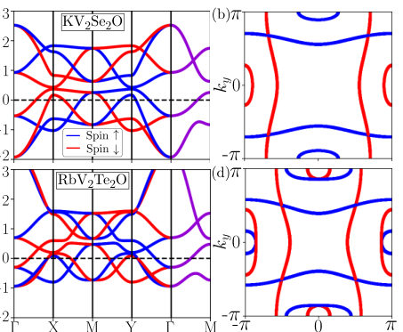
<figcaption class="paper-figure-caption"><b>Fig 1.</b> FIG. 1. Altermagnetic band structures and Fermi surfaces including xy and xz/yz orbitals for (a)-(b) KV2Se2O and (c)- (d) RbV2Te2O obtained from the minimal models in Eqs. (1)- (5), using the hopping parameters and altermagnetic order Nzτzσz detailed in Table I. We emphasize reproducing the Fermi surfaces obtained from DFT calculations [45, 46] and providing realistic magnetic band splittings.</figcaption>
</figure>
<figure class="paper-figure-card">
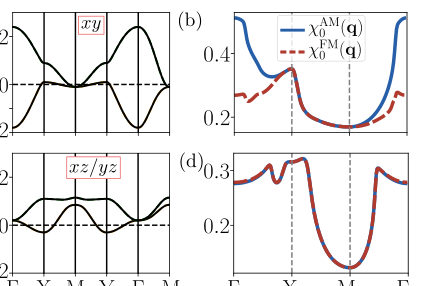
<figcaption class="paper-figure-caption"><b>Fig 2.</b> FIG. 2. Normal state band structures and bare susceptibilities for (a)-(b) xy and (c)-(d) xz/yz orbitals for KV2Se2O. The hopping parameters are detailed in Table I.</figcaption>
</figure>
<figure class="paper-figure-card">
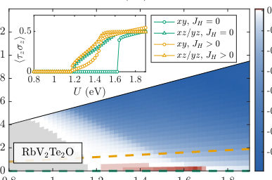
<figcaption class="paper-figure-caption"><b>Fig 3.</b> FIG. 3. Difference in free energy of AM and FM states for (a) KV2Se2O and (b) RbV2Te2O in U–JH phase space. Blue (red) color shows regions where altermagnetism (ferromag- netism) is favorable. Regions shaded gray represent the non- magnetic state. The insets show the order parameters as a function of U for JH = 0 (green) and JH = 0.1U (yellow). The xy and xz/yz orbital are shown with circle and triangle markers, respectively. The introduction of finite Hund’s cou- pling results in the concurrent ordering of both orbitals and enhancement of the magnetic order parameter. Calculations are performed at temperature T = 0.02 eV.</figcaption>
</figure>
<figure class="paper-figure-card">
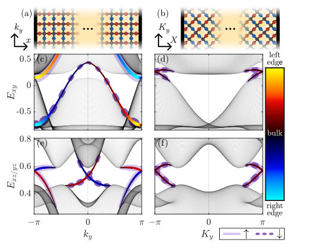
<figcaption class="paper-figure-caption"><b>Fig 4.</b> FIG. 5. Strip geometry of the inverse Lieb lattice with vertical (a) and diagonal (b) termination. The spectra for KV2Se2O in the topological regime for Nz = 0.45 are shown for the vertical orientation in the left column and for the diagonal orientation in the right column, respectively. (c,d) show the xy orbital and (e,f) the xz/yz orbital, using Eqs. (1)-(5) and the hopping parameters detailed in Table I. The color of the topological states indicate their amount of localization at the edges and the light purple (dashed dark purple) shading indicates up (down) polarization of the states.</figcaption>
</figure>
<figure class="paper-figure-card">
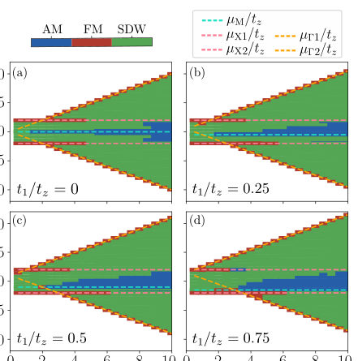
<figcaption class="paper-figure-caption"><b>Fig 5.</b> FIG. 4. Phase diagrams obtained from the bare FM and AM susceptibilities, considering the model for xy orbitals in Eq. (2) and Eqs. (4)-(5), with tz = 0.2. The different phases correspond to altermagnet (AM), ferromagnet (FM), or in- commensurate spin-density wave (SDW). The blue, green, and orange dashed lines indicate the values of the chemical potential µ/tz at which the M, X, and Γ points are at the Fermi level, respectively.</figcaption>
</figure>

**Summary.** This work develops a multi-orbital model for altermagnets in the inverse Lieb lattice, moving beyond simple sublattice descriptions. By incorporating orbital degrees of freedom and electron correlations, the authors show that different orbitals stabilize different magnetic orders. The results highlight orbital selectivity, where $	ext{xy}$ orbitals drive the altermagnetism, while $	ext{xz/yz}$ orbitals require Hund's coupling, leading to topologically rich phases.

**Why it may be interesting.** The detailed treatment of orbital selectivity and the interplay between crystal symmetry, electron correlations (Hund's coupling), and topological properties makes this highly relevant for understanding emergent quantum phenomena in correlated materials.

Detailed structure

**Main problem.** The study aims to develop a comprehensive microscopic Hamiltonian for altermagnets in the inverse Lieb lattice, incorporating both sublattice and orbital degrees of freedom.

**Main result.** The $	ext{xy}$ orbitals are crucial for stabilizing the altermagnetic state, while the $	ext{xz/yz}$ orbitals require Hund's coupling to exhibit altermagnetism, leading to orbital-selective topological edge states.

**Method.** The research employs symmetry-based tight-binding Hamiltonians, extended to include full Hubbard-Kanamori interactions, analyzed using Hartree-Fock mean-field theory and Random Phase Approximation (RPA).

**Model / system.** The system models vanadium oxychalcogenide family altermagnets ($	ext{AV}_2	ext{Q}_2	ext{O}$) on the inverse Lieb lattice, considering $d_{xy}$ and $d_{xz}/d_{yz}$ orbitals.

**Key observables.** Altermagnetic (AM) and Ferromagnetic (FM) order parameters, Helmholtz free energy difference ($\Delta F$), and topological edge state characteristics.

**Important parameters / regimes.** Interaction strengths ($U, U', J_H$), filling ($n$), and hopping anisotropy ($t_z$).

**Assumptions / limitations.** The analysis is often restricted to the 2D limit (single $	ext{V}_2	ext{O}$ layer), and approximations like spherical symmetry for d-orbitals are used.

**Figures summary.** Figures illustrate altermagnetic band structures, bare susceptibilities comparing AM vs. FM correlations, and phase diagrams mapping the ground state (AM, FM, or SDW) dependence on interaction parameters.

**Paper structure.** The paper progresses from developing the symmetry-based multi-orbital Hamiltonian to analyzing the magnetic ground state using RPA and mean-field theory, culminating in phase diagrams that map the competition between different magnetic orders.

Abstract

The inverse Lieb lattice has recently emerged as a promising platform for altermagnetism, with several materials with this structure proposed as $d$-wave altermagnetic candidates. Here, we develop a symmetry-based microscopic Hamiltonian for these materials that includes both sublattice and orbital degrees of freedom, going beyond the sublattice-only minimal models that have been extensively used to study such altermagnets. We apply these models to examine multi-orbital electron correlation physics in the vanadium oxychalcogenide family altermagnets, which contain dominant $xy$ and $xz/yz$ orbitals character at the Fermi level in the altermagnetic state. We demonstrate that $xy$ orbitals are crucial to stabilize the altermagnetic state observed within a single V$_2$O layer, and altermagnetic order in the $xz/yz$ orbitals is induced through Hund's coupling. Additionally, we show that these multi-orbital models reveal topological regimes in which topological edge states are naturally orbital selective.

[↑ back to top](#top)

### [Quantum Rare-Event Estimation for Ising Graphical Models with Belief-Propagation State Preparation](http://arxiv.org/abs/2608.26840v1)

**Authors:** Mario Hernández Vera, Narges Jamialahmadi, Burak Mete, Susanne Schneider, Marco De Pascale  
**Type:** theory · **Category:** statistical mechanics · **PDF:** <https://arxiv.org/pdf/2608.26840v1>  
**Analysis basis:** full PDF text, analyzed in chunks
**Topic relevance:** `analog quantum simulation` **1/5** · `quantum measurements` **1/5**

↔ Scroll figures horizontally

<figure class="paper-figure-card">
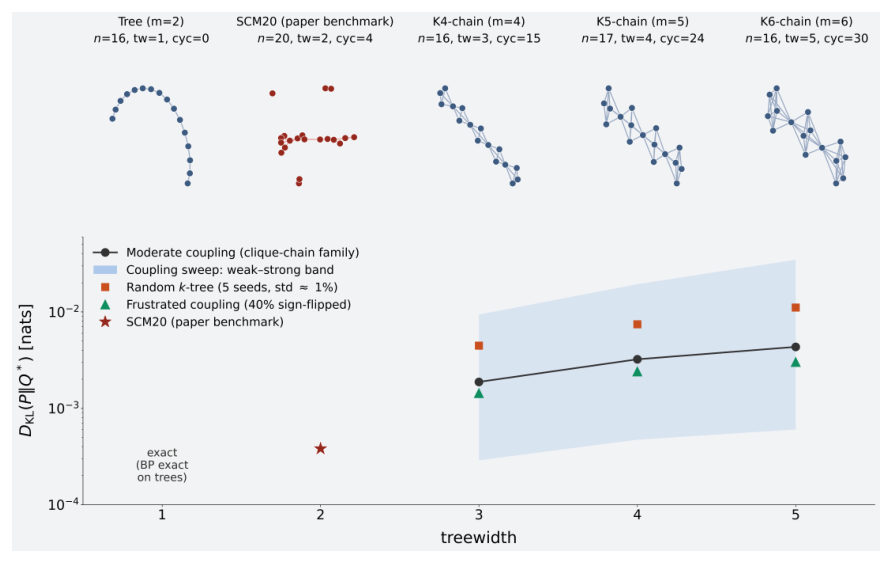
<figcaption class="paper-figure-caption"><b>Fig 1.</b> Figure 1: Robustness of BPCL state preparation to graph topology and coupling structure. Top: force-directed layouts of the synthetic clique-chain family and SCM-20, ordered by treewidth. Labels give the number of vertices n, treewidth (tw), and cycle rank (cyc). Bottom: DKL(P∥Q∗) against treewidth, where lower values indicate a more accurate approximation. Dark-gray circles and the connecting line show the moderate-coupling clique-chain family, the red star shows SCM-20, and the blue band shows the range obtained by sweeping the coupling magnitude from weak to strong. Orange squares report the mean over five random k-tree topologies, while green triangles show the frustrated case with 40%...</figcaption>
</figure>
<figure class="paper-figure-card">
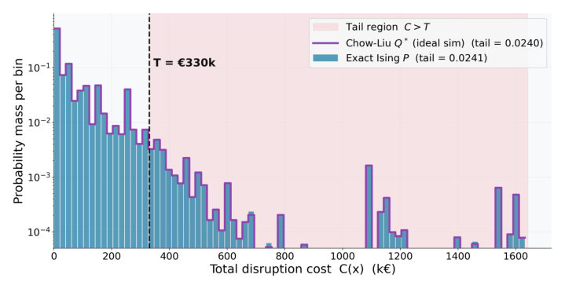
<figcaption class="paper-figure-caption"><b>Fig 2.</b> Figure 2: Probability-mass distribution of the disruption cost over all configurations of SCM-20, shown on a logarithmic scale. Blue bars: exact Ising distribution P. Purple step line: Chow-Liu approximation Q∗encoded in the state-preparation circuit. The dashed vertical line marks the reference threshold Tref; the shaded region to its right marks the rare tail targeted by MLAE. The two distributions are nearly indistinguishable on this scale.</figcaption>
</figure>
<figure class="paper-figure-card">
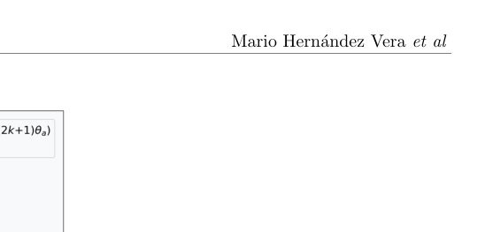
<figcaption class="paper-figure-caption"><b>Fig 3.</b> Figure 3: Grover amplification in the MLAE cir- cuit for the model oracle, displayed in decreasing- amplification order (k = 3 to k = 0, left to right). Red bars show the theoretical prediction; dark bars show the observed |1⟩ancilla fraction from simulated shots. Annotated factors above each bar pair confirm that QkA correctly implements k Grover iterations.</figcaption>
</figure>
<figure class="paper-figure-card">
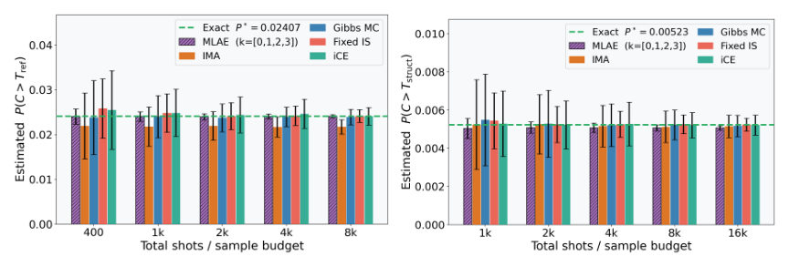
<figcaption class="paper-figure-caption"><b>Fig 4.</b> Figure 4: Tail-probability estimates ˆp as a function of sample/shot budget N; error bars show one standard deviation over independent repetitions. The dashed green line marks the exact ground truth in each panel.</figcaption>
</figure>
<figure class="paper-figure-card">
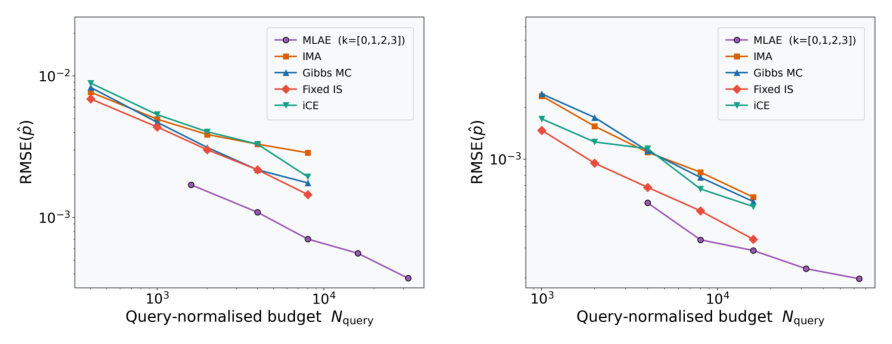
<figcaption class="paper-figure-caption"><b>Fig 5.</b> Figure 5: RMSE against the query-normalised budget Nquery. Lines connect swept budget points; least-squares slopes of log10 RMSE against log10 Nquery over the shown range are reported in the text below. A slope of −1 would indicate the ideal RMSE = O(N−1 query) rate; −1/2 indicates ordinary classical O(N −1/2) statistical scaling.</figcaption>
</figure>

**Summary.** This paper tackles the challenge of estimating rare-event probabilities in complex Ising graphical models, such as those modeling supply-chain disruptions. It proposes a quantum approach using Quantum Amplitude Estimation, mitigating state preparation difficulties via Belief Propagation and implementing event checking with a structural quantum oracle. The results show that the quantum estimator achieves a constant-factor improvement in accuracy over state-of-the-art classical Monte Carlo methods.

**Why it may be interesting.** The application of quantum estimation techniques to classical statistical physics problems like network reliability and phase transitions is highly relevant for developing quantum algorithms for condensed matter simulations.

Detailed structure

**Main problem.** The core problem is the rare-event probability estimation, specifically calculating the tail probability $P(C > T)$ that a total disruption cost $C$ exceeds a critical threshold $T$ in complex systems.

**Main result.** The quantum estimator achieves the same asymptotic error scaling as classical methods but provides a constant factor reduction in the estimation error, particularly when using amplitude-encoding queries.

**Method.** The work proposes using Quantum Amplitude Estimation (QAE) combined with an approximate state preparation method (Belief-Propagation-Assisted Chow–Liu) and a structural oracle to estimate the rare event probability.

**Model / system.** The system is modeled by a binary Ising graphical model describing supply-chain disruption. The probability distribution follows a Boltzmann distribution, and the cost function $C(\mathbf{x})$ is a superadditive function of the binary state vector $\mathbf{x}$.

**Key observables.** The primary observable is the tail probability $P(C > T)$. Diagnostics include the estimation error, Fisher information, and resource counts (CX, CCX, MCX gates, depth).

**Important parameters / regimes.** The system size ($n=20$ nodes), coupling strengths ($J_{ij}$), local fields ($h_i$), and the critical threshold $T$ are key parameters.

**Assumptions / limitations.** The quantum pipeline relies on approximations: using Belief Propagation for state preparation and constructing a structural oracle for event marking, which introduces deterministic errors separate from the statistical error.

**Figures summary.** The notes mention tables detailing qubit allocation and circuit resources (CX, CCX, MCX, Depth) for the structural oracle, and figures illustrating the circuit phases (compute, copy, uncompute).

**Paper structure.** The paper systematically introduces the problem (rare-event estimation in Ising models), details the classical benchmarks (IMA, GMC, FIS), proposes the quantum approach (BPCL state prep, structural oracle), and concludes with performance comparisons and analysis of error sources.

Abstract

Quantum amplitude estimation can reduce the sampling cost of rare-event probability estimation, but applying it to correlated Ising graphical models is limited by the difficulty of preparing the target distribution and building a practical event oracle. This work explores two approximate strategies for mitigating these challenges. We introduce a sample-free state-preparation method combining loopy belief propagation with the Chow--Liu algorithm. The resulting tree approximation is compiled into a quantum circuit with linear gate count and depth, and its accuracy is evaluated across graph families spanning different topologies, coupling strengths, and coupling signs. We also construct a structural oracle that evaluates threshold rules with reversible Boolean gates. Using a twenty-node supply-chain disruption model as a case study, we compare maximum likelihood amplitude estimation against four classical Monte Carlo baselines. Under the fixed-depth schedule used throughout this work, the quantum estimator has the same asymptotic error scaling as the classical methods but achieves lower estimation error by a constant factor. This reduction narrows when amplitude-encoding queries replace raw shots as the resource metric. We separate statistical error from the deterministic errors caused by approximate state preparation and oracle construction, and identify the requirements for achieving an improvement beyond a constant factor.

[↑ back to top](#top)

### [Recovery-Free CHSH Nonlocality with Particle Loss](http://arxiv.org/abs/2608.26407v1)

**Authors:** Giovanni Scala, Cosmo Lupo  
**Type:** theory · **Category:** quantum information and computing · **PDF:** <https://arxiv.org/pdf/2608.26407v1>  
**Analysis basis:** full PDF text, analyzed in chunks
**Topic relevance:** `correlated / nonlocal dissipation` **1/5** · `quantum measurements` **1/5**

↔ Scroll figures horizontally

<figure class="paper-figure-card">
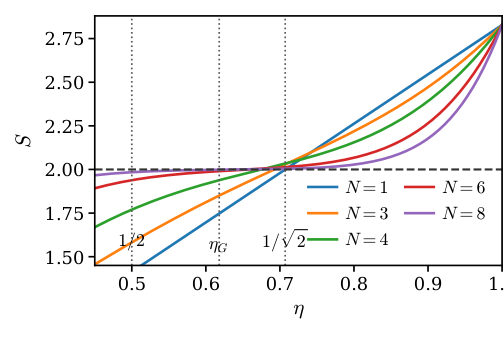
<figcaption class="paper-figure-caption"><b>Fig 1.</b> FIG. 1. Recovery-free CHSH violation under particle loss for the PI protocols. The dashed horizontal line is the local bound S = 2. For the one-excitation encoding (N = 1), the threshold is η = 1/ √</figcaption>
</figure>
<figure class="paper-figure-card">
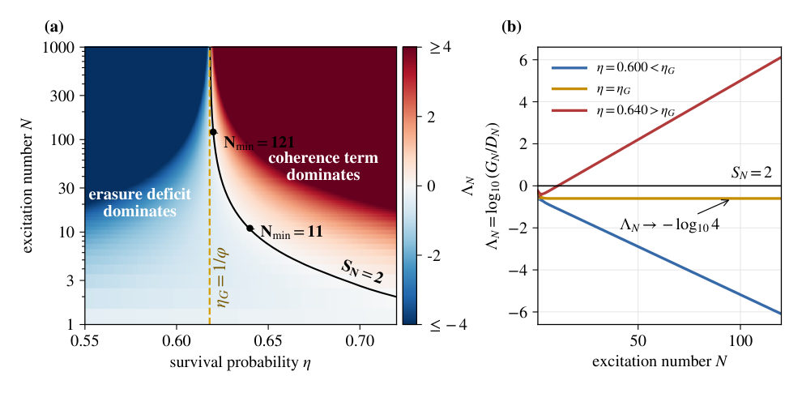
<figcaption class="paper-figure-caption"><b>Fig 2.</b> FIG. 2. Competition between coherence and complete-erasure errors in the vacuum-anchored N-excitation protocol. (a) The color scale shows the exact logarithmic ratio ΛN(η) = log10[GN(η)/DN(η)]. The black contour ΛN = 0 is exactly the CHSH boundary SN = 2; the region ΛN &gt; 0 violates CHSH. The vertical reference line marks ηG = ( √</figcaption>
</figure>
<figure class="paper-figure-card">
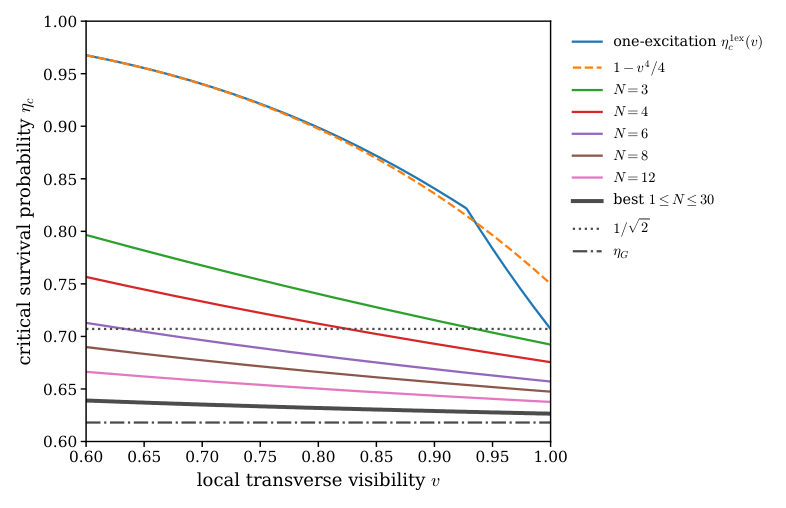
<figcaption class="paper-figure-caption"><b>Fig 3.</b> FIG. 3. Critical survival probability ηc versus local measurement visibility v. CHSH violation occurs for η &gt; ηc, so lower curves correspond to greater loss tolerance. The blue one-excitation curve changes slope because the CHSH optimum switches from the mixed longitudinal–transverse branch to the transverse–transverse branch; the dashed line ηc ≃1 −v4/4 is the small-loss approximation to the former. Curves labelled by N refer to the vacuum–N-excitation encodings, while the thick gray curve is the best threshold obtained over 1 ≤N ≤30 at each v.</figcaption>
</figure>
<figure class="paper-figure-card">
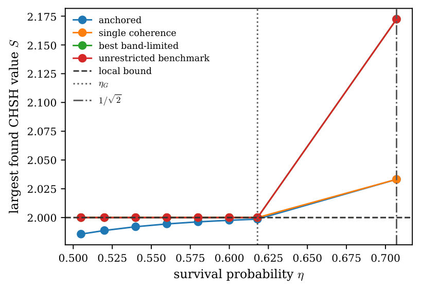
<figcaption class="paper-figure-caption"><b>Fig 4.</b> FIG. 4. Largest CHSH value found at each tested survival probability. The anchored curve uses the closed-form N-excitation expression, the single-coherence search permits one optimized Fock-level coherence, the band-limited search permits several coherences with |r −s| ≤B, and the unrestricted benchmark permits arbitrary Hermitian contractions within the tested cutoff. Vertical lines mark ηG and 1/ √</figcaption>
</figure>
<figure class="paper-figure-card">
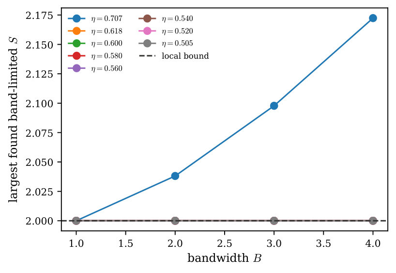
<figcaption class="paper-figure-caption"><b>Fig 5.</b> FIG. 5. Largest CHSH values found by the band-limited search as a function of the bandwidth B. A bandwidth B permits matrix elements between Fock levels satisfying |r −s| ≤B. The values are obtained with projected sign and linear updates and are feasible lower bounds, not SDP-certified optima.</figcaption>
</figure>

**Summary.** This work determines the threshold for maintaining quantum nonlocality (CHSH violation) when quantum particles are lost. The authors develop explicit, recovery-free protocols using highly entangled Dicke states to show that nonlocality persists up to specific loss rates $\eta$. This work clarifies the fundamental limits imposed by physical loss channels compared to theoretical measurement constraints.

**Why it may be interesting.** It provides a rigorous, constructive framework for testing the robustness of quantum nonlocality against realistic noise channels (particle loss) without relying on idealized recovery operations, which is crucial for experimental quantum communication.

Detailed structure

**Main problem.** The paper investigates whether quantum nonlocality, quantified by the CHSH inequality, can survive particle loss without requiring an explicit recovery operation.

**Main result.** The authors construct recovery-free protocols using Dicke states that maintain CHSH violation for loss probabilities $\eta$ exceeding specific thresholds, such as $\eta > \eta_G = (\sqrt{5}-1)/2$ for large $N$.

**Method.** The analysis involves comparing the limits imposed by direct measurements on the lossy state versus those achievable with explicit recovery, utilizing permutation-invariant (PI) encodings.

**Model / system.** The system models quantum correlations tested via the CHSH inequality subjected to particle loss, distinguishing between flagged erasure (detectable loss record) and unflagged deletion (no record).

**Key observables.** The CHSH value $S$, the loss probability $\eta$, and the achievable quantum maximum $2\sqrt{2}$.

**Important parameters / regimes.** Loss thresholds include $\eta > 1/2$ (for flagged erasure) and $\eta > \eta_G = (\sqrt{5}-1)/2$ (for PI protocols).

**Assumptions / limitations.** The analysis distinguishes fundamental limits imposed by loss from those set by explicit measurements without recovery.

**Figures summary.** Figure 1 compares the CHSH violation thresholds for various PI protocols, showing the relationship between the $N=1$ threshold, the large-$n$ limit ($\eta_G$), and the local bound ($S=2$).

**Paper structure.** The paper progresses by first establishing the theoretical bounds for lossy CHSH violation, then constructing explicit recovery-free protocols using low-excitation and general $N$-excitation Dicke states, and finally presenting a sparse-deletion binomial PI protocol.

Abstract

Can CHSH nonlocality survive particle loss without applying an explicit recovery operation? In principle, any deterministic recovery can be absorbed into the measurement. Operationally, we show that the answer depends on the allowed measurements on the lossy system. We distinguish flagged erasure, in which each lost particle leaves a detectable record, from unflagged deletion, in which no such record remains. For flagged erasure and survival probability $η>1/2$, using known quantum-capacity results, we show measurements that asymptotically approach the quantum maximum $2\sqrt2$. In contrast, for $η\le1/2$, CHSH violation is impossible for both loss models. Then, we construct explicit recovery-free protocols using permutation-invariant encodings built from $n$-qubit Dicke states $| D_N^n\rangle$ and measurements on the surviving particles. A one-excitation $(N=1)$ encoding violates CHSH for $η>1/\sqrt{2}$. Increasing the excitation number $N$ yields a family of protocols that violates CHSH for $η>η_G=(\sqrt{5}-1)/2$, with the asymptotic golden ratio approached as $N \to \infty$. Finally, we present a sparse-deletion binomial PI protocol that guarantees CHSH violation for up to $O(\sqrt n)$ deletion errors. Our results distinguish fundamental limits imposed by loss from those set by explicit measurements without recovery.

[↑ back to top](#top)

### [Adiabatic Otto-like quantum thermodynamical cycle in the non-quasi-static regime](http://arxiv.org/abs/2608.26690v1)

**Authors:** Salvador J. Robles-Pérez, Salvador Castillo-Rivera  
**Type:** both · **Category:** statistical mechanics · **PDF:** <https://arxiv.org/pdf/2608.26690v1>  
**Analysis basis:** full PDF text, analyzed in chunks
**Topic relevance:** `analog quantum simulation` **1/5**

↔ Scroll figures horizontally

<figure class="paper-figure-card">
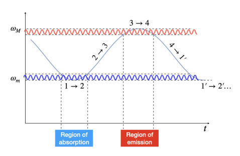
<figcaption class="paper-figure-caption"><b>Fig 1.</b> FIG. 1. The frequency of the central harmonic oscillator dur- ing the quantum Otto cycle.</figcaption>
</figure>
<figure class="paper-figure-card">
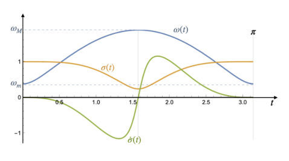
<figcaption class="paper-figure-caption"><b>Fig 2.</b> FIG. 2. The frequency (1), for a = 1 + q and q = 0.855, for which ωF = ωm = 0.381, and the associated π-periodic values of σ(t) and ˙σ(t).</figcaption>
</figure>
<figure class="paper-figure-card">
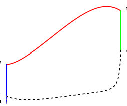
<figcaption class="paper-figure-caption"><b>Fig 3.</b> FIG. 3. Comparative analysis of the quantum Otto cycle across different operation regimes. (A) The traditional quasi-static regime in the energy representation, yielding the ideal performance limit but vanishing net power in the infinite-cycle-time limit. (B) The non-quasi-static regime in the energy representation for the first operational cycle. Quantum inertia and non-adiabatic population redistribution deform the cycle path and leave a residual excitation at 1′, so that the final state does not coincide with the initial ground state 1, despite the Hamiltonian having returned to its initial value. (C) The finite-time adiabatic implementation in the Lewis–Riesenfeld invariant...</figcaption>
</figure>
<figure class="paper-figure-card">
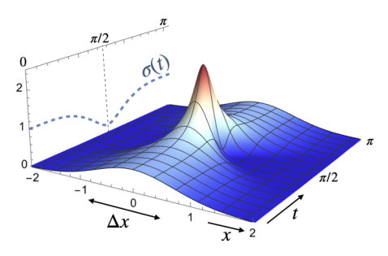
<figcaption class="paper-figure-caption"><b>Fig 4.</b> FIG. 4. Squeezing of the ground state wave packet of the ion, given by |ψ0(x, t)|2 (see Eq. (3)), in a three-dimensional representation. The initially relaxed wave packet with an ini- tial width ∆x ∼1 (in normalized units) undergoes severe localized compression in the non-quasi-static regime, peak- ing at the maximum squeezing point t3 = π/2, according to ∆x ∼σ(t), where the Ermakov parameter σ(t) is projected onto the lateral boundary plane (x = −2, dashed blue line) showing the direct causal link between the driving potential and the transient geometric narrowing of the quantum state before it unitarily breathes back to its initial configuration.</figcaption>
</figure>
<figure class="paper-figure-card">
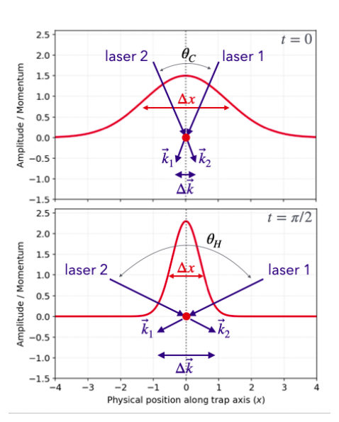
<figcaption class="paper-figure-caption"><b>Fig 5.</b> FIG. 5. Geometric schematic of the two Raman configura- tions required to implement the invariant-basis transitions at the two isochoric turning points. (Top) At the cold point t = 0, the unperturbed wave packet is spatially extended and the Raman beams intersect at the angle θC, with the corre- sponding spectral detuning δC. (Bottom) At the hot point t = π/2, quantum squeezing reduces the spatial width of the wave packet. The Raman configuration is therefore changed to the larger intersection angle θH, while the spectral detuning is simultaneously adjusted to the dressed energetic splitting Ω(t3).</figcaption>
</figure>

**Summary.** This paper develops a method to realize an Otto-like quantum thermodynamic cycle in a finite time without relying on the slow, quasi-static limit. It achieves this by reformulating the dynamics using the Lewis-Riesenfeld invariant representation, which prevents non-adiabatic energy loss. The theoretical framework is validated by proposing a detailed experimental implementation using a trapped-ion Paul trap.

**Why it may be interesting.** This work is highly relevant as it provides a concrete, experimentally viable pathway to circumvent the limitations of the quasi-static approximation in quantum thermodynamics, a key area bridging quantum optics and non-equilibrium statistical mechanics.

Detailed structure

**Main problem.** The paper addresses the challenge of performing quantum thermodynamic cycles in a finite time, avoiding the need for the quasi-static limit while maintaining high efficiency.

**Main result.** By formulating the dynamics in the Lewis-Riesenfeld invariant representation, the authors demonstrate a method to preserve the adiabatic population structure during fast, non-quasi-static driving, thereby achieving finite-time quantum thermal cycles.

**Method.** The core method involves using the Lewis-Riesenfeld invariant representation to describe the time evolution of a time-dependent harmonic oscillator, which circumvents the non-adiabatic population redistribution seen in conventional energy representations.

**Model / system.** The system is modeled as a time-dependent harmonic oscillator undergoing an Otto-like quantum cycle. The dynamics are analyzed theoretically and proposed for experimental realization in a trapped-ion Paul trap using stimulated Raman interactions.

**Key observables.** Coefficient of Performance (COP), finite-time effectiveness ($\chi$), and the preservation of the adiabatic population structure.

**Important parameters / regimes.** The cycle operates in the non-quasi-static regime, involving parameters like the trap frequency variation ($\omega_M - \omega_m$) and the detuning/beam angle control in the trapped-ion setup.

**Assumptions / limitations.** The analysis initially assumes unitary evolution (no dissipation) and relies on the ability to implement the cycle interactions in the invariant basis, which requires precise control over laser detuning and beam geometry.

**Figures summary.** Figures illustrate the comparison of the quantum Otto cycle path in different representations (quasi-static vs. non-quasi-static vs. invariant basis) and schematically detail the two required Raman beam configurations for the trapped-ion implementation.

**Paper structure.** The paper progresses from analyzing the general quantum properties of the TDHO, establishing the quasi-static thermodynamic framework, identifying the failure modes of fast non-quasi-static protocols, and finally proposing the invariant representation solution followed by the trapped-ion experimental realization.

Abstract

We show a finite-time Otto-like quantum thermodynamic cycle that preserves the adiabatic population structure of a time-dependent harmonic oscillator in the non-quasi-static regime. In the conventional energy representation, finite-rate driving induces non-adiabatic population redistribution and leaves residual excitations after the Hamiltonian has returned to its initial value. We show that this difficulty can be avoided by formulating the dynamics in the Lewis-Riesenfeld invariant representation, without modifying the physical Hamiltonian through auxiliary counterdiabatic driving. For a parametric Mathieu protocol, quantum inertia produces a mismatch between the spatial width of the working mode and its transient dressed energy scale. We propose an experimental implementation of this scheme in a trapped-ion Paul trap using stimulated Raman interactions, with independent control of the laser detuning and beam intersection angle. This provides a finite-time implementation in which the invariant population structure is preserved while the physical trap frequency evolves non-quasi-statically. Our results establish a clear distinction between adiabatic operation and quasi-static driving, providing a route toward finite-time quantum thermal cycles that retain the adiabatic energy structure without requiring the quasi-static limit.

[↑ back to top](#top)

### [Competition between Geometrical Frustration and the Kondo Effect in CePdAl Revealed by High-Resolution Magnetization](http://arxiv.org/abs/2608.26534v1)

**Authors:** Yusei Shimizu, Shota Nakamura, Yoichi Ikeda, Yohei Kono, Shunichiro Kittaka, Toshiro Sakakibara, Yosikazu Isikawa  
**Type:** experiment · **Category:** strongly correlated electrons · **PDF:** <https://arxiv.org/pdf/2608.26534v1>  
**Analysis basis:** full PDF text, analyzed in chunks
**Topic relevance:** `analog quantum simulation` **1/5**

↔ Scroll figures horizontally

<figure class="paper-figure-card">
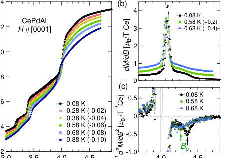
<figcaption class="paper-figure-caption"><b>Fig 1.</b> FIG. 2: (a) The magnetization curves M(B) of CePdAl, measured at T = 0.08, 0.28, 0.38, 0.58, 0.68, and 0.88 K. Here, the plotted values are shifted vertically for clarity, with the vertical shifts indicated in parentheses. (b) The differential magnetization, dM/dB, at 0.08, 0.58, and 0.68 K. (c) The quantity χ3 ≃B−1d2M/dB2 for data obtained at 0.08, 0.58, and 0.68 K. The upper arrows indicate the nonlinear susceptibility anomalies at Bp.</figcaption>
</figure>
<figure class="paper-figure-card">
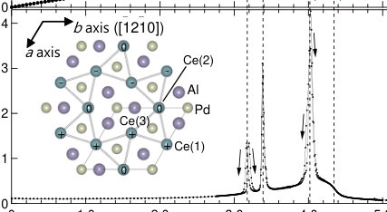
<figcaption class="paper-figure-caption"><b>Fig 2.</b> FIG. 1: (a) The magnetization M(B) of CePdAl for B || [0001] at 80 mK. The inset shows M(B) in fields up to 14.5 T. (b) The differ- ential magnetization dM/dB of CePdAl for B || [0001] at 80 mK, where arrows indicate increasing and decreasing processes.The inset shows the crystal structure of CePdAl in the basal plane, with ordered moments at the Ce(1) and Ce(3) sites and disordered moments at the Ce(2) sites, where +, −, and 0 indicate up, down, and disordered spins, respectively [10].</figcaption>
</figure>
<figure class="paper-figure-card">
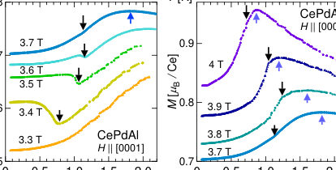
<figcaption class="paper-figure-caption"><b>Fig 3.</b> FIG. 3: (a) Temperature dependence of the magnetization M(T ) measured at 0.5, 1, and 2 T along H || [0001] between 2 and 100 K on a logarithmic temperature scale. (b) Low-T magnetization M(T ) below 2 K, measured along H || [0001] at 3.3, 3.4, 3.5, 3.6, and 3.7 T, and (c) at 3.8, 3.9, and 4 T (with 3.7 T for comparison). The AF transitions and the susceptibility maxima are indicated by the upper and lower arrows, respectively.</figcaption>
</figure>
<figure class="paper-figure-card">
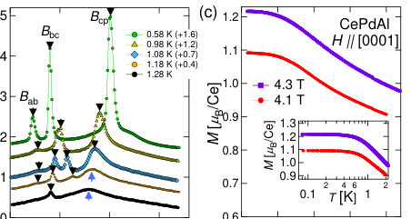
<figcaption class="paper-figure-caption"><b>Fig 4.</b> FIG. 4: (a) B-T phase diagram of CePdAl in fields applied along the hexagonal [0001] axis, obtained from M(B) (closed markers) and M(T ) (open markers). The heat-capacity anomalies of crossovers B∗, T ∗, TA, T0, B0, and phase transitions (cross markers) are cited from the Ref. [20]. The solid and dashed lines are guides to the eyes. (b) The differential magnetization dM/dB at 0.58, 0.98, 1.08, 1.18, and 1.28 K with shifted values. The up and down arrows indi- cate transitions and crossover (susceptibility anomaly), respectively. (c) The magnetization M(T ), measured at 4.1 and 4.3 T. The inset shows the corresponding semi-logarithmic plot.</figcaption>
</figure>

**Summary.** This experimental work uses high-field magnetization measurements on CePdAl to probe the competition between geometrical frustration and the Kondo effect. The authors report clear first-order magnetic transitions and identify anomalies suggesting nondipolar correlations in the high-field state. These findings establish crucial thermodynamic constraints for developing a unified theory of the field-induced spin-liquid state in this heavy-fermion material.

**Why it may be interesting.** The interplay between crystal structure (frustration) and electronic correlations (Kondo effect) is a central theme in strongly correlated electron physics, providing experimental benchmarks for theoretical models of quantum criticality.

Detailed structure

**Main problem.** The study investigates the complex competition between geometrical frustration and the Kondo effect in the heavy-fermion compound CePdAl.

**Main result.** The research reveals clear first-order metamagnetic transitions linked to the suppression of the Kondo effect, while anomalies suggest the presence of nondipolar correlations in the field-induced disordered state.

**Method.** High-resolution DC magnetization measurements ($M(B)$ and $M(T)$) were performed using a sensitive magnetometer, supplemented by nonlinear susceptibility measurements.

**Model / system.** The system is CePdAl, an unconventional heavy-fermion material possessing a quasi-kagome structure, which naturally leads to competing magnetic interactions.

**Key observables.** Magnetization jumps (first-order transitions), nonlinear magnetic susceptibility anomalies, and the absence of non-Fermi-liquid behavior in the high-field regime.

**Important parameters / regimes.** Low temperatures (down to 70 mK), applied magnetic fields up to 14.5 T, and critical fields defining phase boundaries ($B_{ab}, B_{bc}, B_{cp}$).

**Assumptions / limitations.** The analysis assumes that the observed transitions and anomalies provide essential thermodynamic constraints for understanding the field-induced spin-liquid state.

**Figures summary.** Figures illustrate $M(B)$ and $dM/dB$ confirming first-order transitions, and $M(T)$ dependence showing phase boundaries and anomalies at specific fields.

**Paper structure.** The paper systematically analyzes the magnetic response across varying fields and temperatures, first identifying multiple first-order transitions, then investigating the nature of the high-field disordered state via nonlinear susceptibility, and finally constraining the theoretical understanding of the spin-liquid state.

Abstract

CePdAl is a heavy-fermion compound with a quasi-kagome structure, where geometrical frustration competes with the Kondo effect. Using a high-sensitivity magnetometer, we observe clear first-order metamagnetic transitions without magnetization plateaus in CePdAl at 80 mK, indicating a lifting of frustration through the suppression of the Kondo effect and spin flips of ordered moments under fields. An anomaly in the nonlinear magnetic susceptibility at 4.3 T suggests nondipolar correlations in the polarized paramagnetic state. Furthermore, we found no evidence of non-Fermi-liquid behavior in the high-field region, where the antiferromagnetic order is completely suppressed. These findings establish the essential thermodynamic constraints for understanding the field-induced spin-liquid state in CePdAl.

[↑ back to top](#top)

### [Decoupled domain-texture switching from magnetic easy axis in kagome ferromagnet EuTi3Bi4](http://arxiv.org/abs/2608.26954v1)

**Authors:** Yunhao Wang, Shiyu Zhu, Guohao Xi, Runnong Zhou, Ruwen Wang, Jianfeng Guo, Jiali Liu, Zichao Chen, Kailin Xu, Cong Wang, Chengmin Shen, Jiang Xiao, Haitao Yang, Xiaoli Dong, Wei Ji, Hong-Jun Gao  
**Type:** both · **Category:** other · **PDF:** <https://arxiv.org/pdf/2608.26954v1>  
**Analysis basis:** full PDF text, analyzed in chunks
**Topic relevance:** `analog quantum simulation` **1/5**

↔ Scroll figures horizontally

<figure class="paper-figure-card">
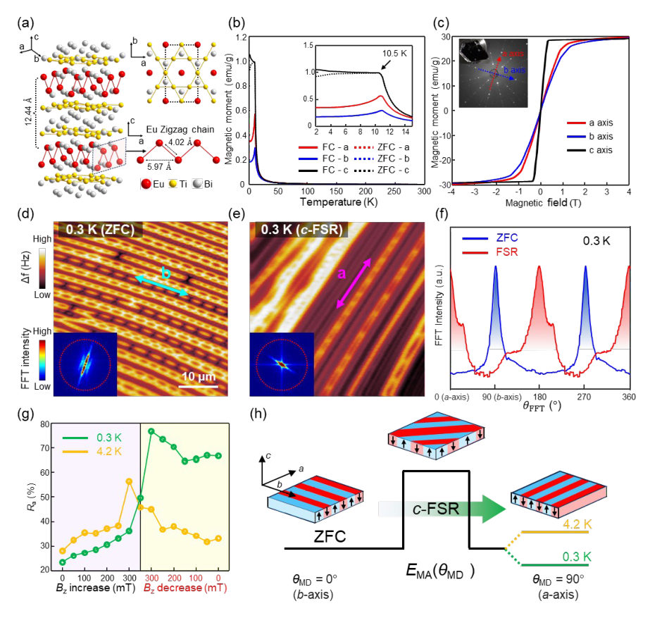
<figcaption class="paper-figure-caption"><b>Fig 1.</b> Fig.1. Out-of-plane field induced MDS of EuTi3Bi4. (a) Crystal structure of EuTi3Bi4 crystal. (b) Temperature-dependent magnetization curves of EuTi3Bi4 measured under an external magnetic field of 10 mT. Zero-field-cooled (ZFC) and field-cooled (FC) data with the field applied along the a/b/c- axis are presented. The inset highlights a zoomed-in view of the temperature range around the Curie temperature. (c) Field-dependent magnetization curves of EuTi3Bi4 at 2 K, under a magnetic field along a/b/c-axis of the crystal, respectively. Inset shows the a/b-axis orientations of the crystal as determined by Laue diffraction. (d) MFM images of magnetic domains in EuTi3Bi4 crystal after ZFC to 0.3...</figcaption>
</figure>
<figure class="paper-figure-card">
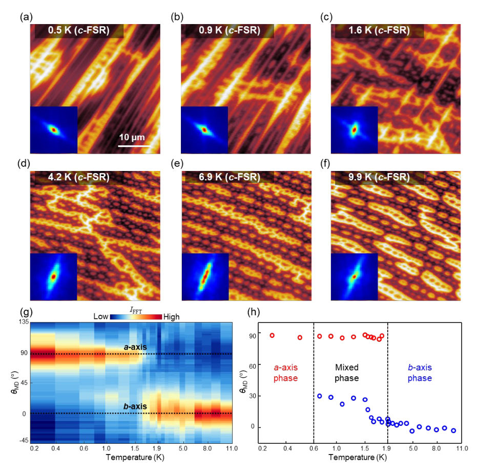
<figcaption class="paper-figure-caption"><b>Fig 2.</b> Fig.2. Temperature-dependent domain orientation switch of EuTi3Bi4 crystal. (a)-(f) MFM images of magnetic domains after out-of-plane FSR at different temperatures. (g) Temperature-dependent magnetic phase diagram revealing significant magnetic domain orientation switch at around 1.6 K. (h) Extracted magnetic domain orientation component from (g).</figcaption>
</figure>
<figure class="paper-figure-card">
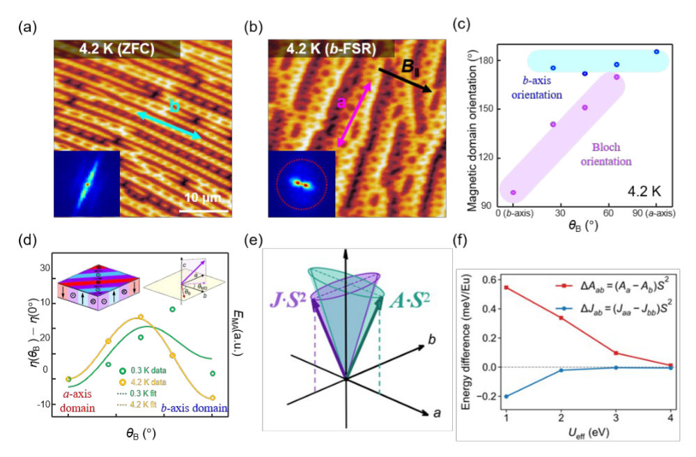
<figcaption class="paper-figure-caption"><b>Fig 3.</b> Fig.3. In-plane anisotropy model. (a) Magnetic domain textures in EuTi3Bi4 crystal after ZFC to 4.2 K. (b) Magnetic domains formed after FSR along b-axis at 4.2 K. Insets of (a)-(b) show corresponding FFT images. (c) Extracted magnetic domain orientation component from FSR images under magnetic field along different θB. Blue and purple stripes represent b-axis orientation and orientation perpendicular to θB (Bloch-type domain wall), respectively. (d) The extracted field regulation factor η following in-plane FSR results along variable directions at 0.3 K and 4.2 K, dashed curves indicate the orientation-dependent variation of EMA within the plane, the inset illustrates the magnetic texture...</figcaption>
</figure>
<figure class="paper-figure-card">
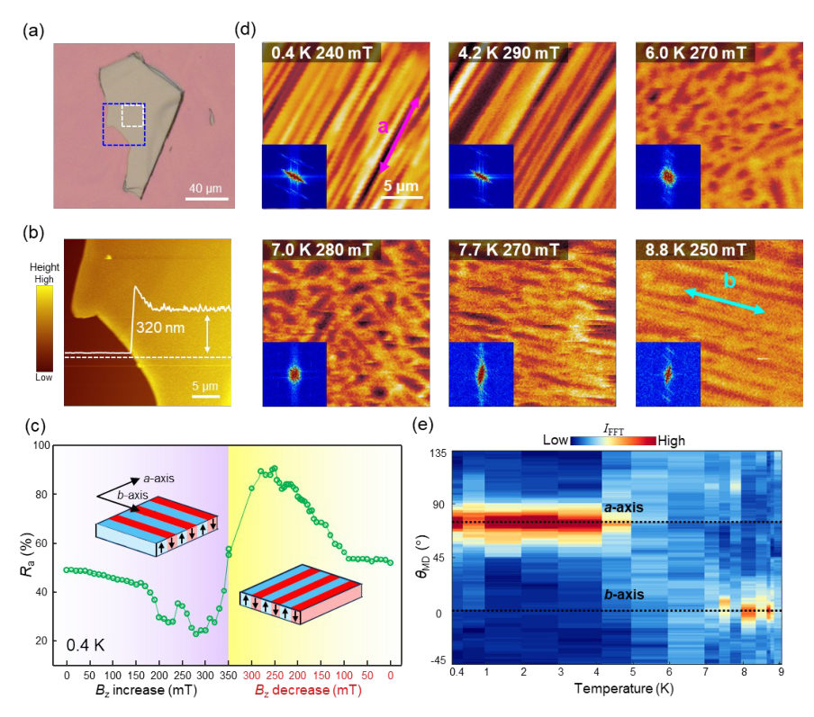
<figcaption class="paper-figure-caption"><b>Fig 4.</b> Fig.4. Temperature-dependent domain orientation switch of EuTi3Bi4 flake. (a) Optical image of EuTi3Bi4 flake (b) Topography image of the EuTi3Bi4 flake measured by AFM. (c) Bz–dependent a- axis ratio component Ra curve at 0.3 K in a EuTi3Bi4 flake. (d) MFM images of magnetic domains in EuTi3Bi4 flake during FSR at different temperatures, measured in the white dashed box in (a). Insets show corresponding FFT images. (e) Temperature-dependent magnetic phase diagram revealing significant magnetic domain orientation switch at 6~7 K.</figcaption>
</figure>

**Summary.** This work reports on a novel mechanism for controlling magnetic domain textures in the kagome ferromagnet $	ext{EuTi}_3	ext{Bi}_4$. By combining MFM and DFT, the authors show that the domain orientation switches between the a- and b-axes purely due to temperature changes. This switching is governed by the competition between two anisotropic exchange interactions, demonstrating a low-energy pathway for magnetic control without altering the primary easy axis direction.

**Why it may be interesting.** The concept of manipulating macroscopic magnetic textures via tuning the competition between competing anisotropic interactions, rather than changing the easy axis, offers a highly tunable and potentially low-energy control mechanism relevant to advanced spintronics.

Detailed structure

**Main problem.** The research addresses how magnetic domain textures can be switched in a ferromagnet without requiring the high energy input associated with reorienting the material's magnetic easy axis.

**Main result.** They demonstrate that the domain texture switching in $	ext{EuTi}_3	ext{Bi}_4$ is governed by the temperature-dependent competition between single-ion anisotropy (favoring a-axis) and nearest-neighbor anisotropic exchange (favoring b-axis).

**Method.** The study combines low-temperature magnetic force microscopy (MFM) to observe domain patterns, magnetization measurements, and Density Functional Theory (DFT) calculations to model the underlying magnetic anisotropy energy landscape.

**Model / system.** The physical system is the kagome ferromagnet $	ext{EuTi}_3	ext{Bi}_4$. The magnetic anisotropy energy landscape is modeled by considering the competition between single-ion anisotropy and anisotropic exchange interactions, which dictates the in-plane domain preference.

**Key observables.** Magnetic domain orientation (switching between a-axis and b-axis), the ratio $R_a = I_a / (I_a + I_b)$, and the critical switching temperature ($T_s$).

**Important parameters / regimes.** Temperature (T), applied magnetic field ($B$), and the relative strengths of the single-ion anisotropy ($A$) and anisotropic exchange ($J$) interactions.

**Assumptions / limitations.** The switching mechanism is attributed solely to the temperature dependence of the in-plane anisotropic interactions, ruling out conventional spin-reorientation transitions.

**Figures summary.** Figures illustrate the temperature-dependent domain switching via MFM images and $R_a$ vs $B_z$ curves, while DFT calculations confirm the c-axis as the global easy axis, showing the competition between $A$ and $J$.

**Paper structure.** The paper establishes the problem by noting the difficulty of anisotropy engineering, presents experimental evidence of in-plane texture switching in $	ext{EuTi}_3	ext{Bi}_4$, and then uses DFT and theoretical modeling to attribute this switching to the temperature-dependent competition between two specific anisotropic exchange terms.

Abstract

Magnetic anisotropy defines the easy axis of a magnetic material and governs the spatial arrangement of its domains. To date, anisotropy engineering has focused on reorienting the easy axis or tuning the anisotropy energy, both of which demand substantial energy input. Here, we demonstrate that magnetic domain textures can be switched without reorienting the easy axis, as observed in a kagome ferromagnet EuTi3Bi4 crystal. Using low-temperature magnetic force microscopy, we observe that the preferred orientation of magnetic domains switches from the a-axis to the b-axis upon temperature variation, and that this switching can also be triggered by an out-of-plane magnetic-field reset. Magnetization measurements and density functional theory calculations confirm a robust c-axis easy magnetization, ruling out a conventional spin-reorientation transition. Instead, the texture switching is governed by the temperature dependence of the in-plane variation of the Magnetic anisotropy energy landscape, which arises from two competing interactions with different decay rates: single-ion anisotropy favors a-oriented spin components, while nearest-neighbor anisotropic exchange favors b-oriented ones. Furthermore, the critical switching temperature is substantially elevated in a mechanically exfoliated EuTi3Bi4 flake. Our findings establish that macroscopic magnetic textures can be effectively manipulated by tuning the competition between in-plane anisotropic interactions, without the energy cost of reorienting the easy axis.

[↑ back to top](#top)

### [Efficient Quantum Simulations of Yang-Mills theory with Maximal-tree Gauge](http://arxiv.org/abs/2608.27267v1)

**Authors:** Tianyin Li, Ying-Ying Li, Xiaoyang Wang, Hongxi Xing  
**Type:** theory · **Category:** quantum information and computing · **PDF:** <https://arxiv.org/pdf/2608.27267v1>  
**Analysis basis:** full PDF text, analyzed in chunks
**Topic relevance:** `analog quantum simulation` **1/5**

↔ Scroll figures horizontally

<figure class="paper-figure-card">
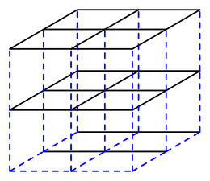
<figcaption class="paper-figure-caption"><b>Fig 1.</b> FIG. 1. Maximal tree (dashed lattice links) for a cubic lat- tice with open boundary conditions, where n0 represents the origin.</figcaption>
</figure>
<figure class="paper-figure-card">
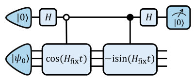
<figcaption class="paper-figure-caption"><b>Fig 2.</b> FIG. 2. Circuit realizing the time evolution operator cor- responding to Hfix by QSVT. The two control operations |0⟩⟨0| ⊗cos(Hfixt) + |1⟩⟨1| ⊗Isys and |0⟩⟨0| ⊗Isys −i |1⟩⟨1| ⊗ sin(Hfixt) are realized by the block encoding of Hfix.</figcaption>
</figure>

**Summary.** This paper presents a quantum algorithmic framework to simulate Yang-Mills theories, specifically QCD, by employing the maximal-tree gauge to simplify the Hamiltonian. The time evolution is efficiently implemented using the Quantum Singular Value Transformation (QSVT). The key achievement is deriving polynomial complexity bounds, proving that such non-Abelian theories are efficiently simulable on quantum computers.

**Why it may be interesting.** The work provides a concrete, resource-efficient quantum algorithm for simulating a cornerstone problem in high-energy physics (QCD), which is highly relevant for quantum simulation research.

Detailed structure

**Main problem.** Developing an efficient quantum algorithmic framework to simulate the dynamics of Yang-Mills theories, such as SU(3) QCD.

**Main result.** The authors provide rigorous complexity bounds demonstrating that non-Abelian Yang-Mills theories can be simulated efficiently on quantum computers with polynomial scaling in key parameters.

**Method.** The simulation uses the maximal-tree gauge to fix gauge redundancies, digitizes the resulting Hamiltonian in the field-amplitude basis, and implements the time evolution via the Quantum Singular Value Transformation (QSVT).

**Model / system.** The system is Quantum Chromodynamics (QCD), modeled by an SU(3) non-Abelian Yang-Mills theory. The dynamics are governed by a gauge-fixed Hamiltonian $H_{	ext{fix}} = H_{\Pi} + H_B + H_V$.

**Key observables.** Qubit count ($N_G$) and gate complexity ($\mu$) for the time evolution operator $U_{	ext{fix}}(t)$.

**Important parameters / regimes.** Inverse simulation precision ($1/\epsilon_s$), lattice volume ($\mathcal{V}$ or $V$), gauge coupling ($g$), and target energy scale ($E$).

**Assumptions / limitations.** The derivation assumes the global Gauss-law constraint subspace allows the necessary matrix $K$ to be positive definite and invertible; the Hamiltonian includes an $O(a_s)$ discretization error.

**Figures summary.** Figure 1 illustrates the maximal tree structure on a cubic lattice, and Figure 2 shows the quantum circuit realizing the time evolution operator $U_{	ext{fix}}(t)$ using QSVT.

**Paper structure.** The paper first establishes the gauge-fixed Hamiltonian using the maximal-tree gauge, derives the necessary constraints (like Gauss's law), and then details the quantum implementation using QSVT. Finally, it derives the polynomial scaling bounds for the required qubits and gate complexity.

Abstract

We develop a quantum algorithmic framework for the efficient simulation of Yang--Mills theories, including the $\mathrm{SU}(3)$ gauge theory in Quantum Chromodynamics (QCD). The framework uses maximal-tree gauge in terms of gauge field variables that removes all local gauge redundancies. In the resulting gauge-fixed formulation and digitization in the field-amplitude basis, we show that Hamiltonian time evolution admits an efficient implementation based on quantum singular value transformation (QSVT). We derive upper bounds on the total number of qubits and gate complexity, finding polynomial scaling with the inverse simulation precision $1/\varepsilon_s$, lattice volume $\mathcal{V}$, gauge coupling $g$, and target energy scale $E$. Our results provide a rigorous complexity-theoretic demonstration that non-Abelian Yang--Mills theories can be simulated efficiently on quantum computers, paving the way toward first-principles quantum simulations of non-perturbative QCD dynamics.

[↑ back to top](#top)

### [Evaluating Quantum Kernel Methods for Track-Based Classification in High-Energy Physics](http://arxiv.org/abs/2608.27333v1)

**Authors:** Emmanuel Billias, Nikos Chrisochoides  
**Type:** both · **Category:** other · **PDF:** <https://arxiv.org/pdf/2608.27333v1>  
**Analysis basis:** full PDF text, analyzed in chunks
**Topic relevance:** `quantum measurements` **1/5**

↔ Scroll figures horizontally

<figure class="paper-figure-card">
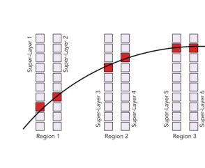
<figcaption class="paper-figure-caption"><b>Fig 1.</b> Figure 1: Wire activations in a drift-chamber superlayer produced by a traversing charged particle. Activated segments (left) and individual hit cells (right) illustrate the spatial structure from which centroid-based features are derived [5].</figcaption>
</figure>
<figure class="paper-figure-card">
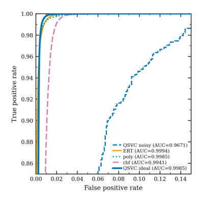
<figcaption class="paper-figure-caption"><b>Fig 2.</b> Figure 2: ROC diagnostics comparing the QSVC with classical baselines. Left: Global ROC curves show that ERT achieves the highest AUC (0.9994), while the ideal QSVC (AUC 0.9985) exhibits a near-vertical rise from the origin consistent with its near-zero false-negative rate. The noisy QSVC (AUC 0.9671) shows a markedly slower rise, reflecting degraded background rejection under hardware noise. Right: Optimal operating points illustrate the complementary trade-offs between the two strongest ideal models: ERT maximises precision and specificity while the QSVC maximises recall; the noisy QSVC’s operating point sits well outside this cluster, quantifying the performance cost of circuit- level...</figcaption>
</figure>
<figure class="paper-figure-card">
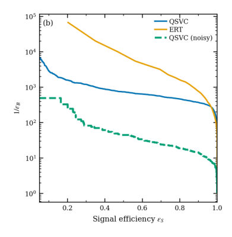
<figcaption class="paper-figure-caption"><b>Fig 3.</b> Figure 3: Physics-motivated performance diagnostics comparing the ideal QSVC, noisy QSVC, and ERT. (a) Background rejection curves show that ERT leads the ideal QSVC across nearly the entire efficiency range; the noisy QSVC’s rejection curve sits well below both. (b) The ideal QSVC’s SIC maximum occurs at much higher signal efficiency than ERT’s, though at a lower absolute value; ERT’s peak is higher but narrower and more sen- sitive to threshold choice. The noisy QSVC’s flattened, low-amplitude SIC curve indicates that hardware noise degrades not only peak significance but also the threshold-tunability that makes a classifier operationally useful.</figcaption>
</figure>
<figure class="paper-figure-card">
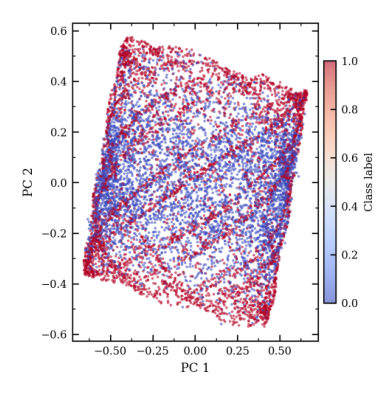
<figcaption class="paper-figure-caption"><b>Fig 4.</b> Figure 4: Visualizations of the quantum feature space produced by the ZZFeatureMap. Left: PCA shows that although the embedding is highly expressive, its nonlinear struc- ture cannot be captured by linear projections. Right: t-SNE reveals meaningful geometric organization, with signal and background forming intertwined but locally distinguishable regions. Together, these projections illustrate that the quantum kernel induces a smooth, nonlinear manifold structure that enables the QSVC to construct a sharp decision bound- ary in the full Hilbert space.</figcaption>
</figure>
<figure class="paper-figure-card">
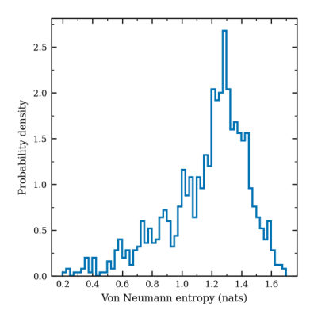
<figcaption class="paper-figure-caption"><b>Fig 5.</b> Figure 5: Quantum-state structure induced by the ZZFeatureMap under ideal simula- tion. Left: Entanglement entropy characterises the expressivity of the static feature-map encoding. Right: Fidelity distributions reveal that inter-class states tend toward near- orthogonality while intra-class states retain coherent local neighbourhoods, consistent with the ideal QSVC’s decision-boundary geometry. A quantitative, ideal-versus-noisy compar- ison of this fidelity structure is presented in Section 7.3.</figcaption>
</figure>

**Summary.** This work presents a scalable framework for applying Quantum Support Vector Classifiers to particle-track identification in HEP. By encoding detector features into a quantum state, the authors demonstrate that the quantum kernel maintains a critical advantage in signal retention over classical methods, even when accounting for realistic hardware decoherence.

**Why it may be interesting.** While the application is HEP, the core methodology—quantifying the performance gap between ideal quantum computation and noisy, scalable quantum kernel estimation—is highly relevant to open quantum systems research.

Detailed structure

**Main problem.** The paper evaluates the utility of quantum kernel methods for distinguishing particle tracks from background noise in high-energy physics (HEP) data.

**Main result.** The Quantum Support Vector Classifier (QSVC) achieved the highest recall (99.99%) in ideal simulations, demonstrating a signal-retention advantage over classical methods, which persists even under realistic hardware noise.

**Method.** A quantum kernel is constructed using a fully entangled ZZFeatureMap, which is then integrated into a standard Support Vector Machine (SVM) framework for classification.

**Model / system.** The system is particle-track classification using centroid-based features from the CLAS12 drift-chamber detector. The methodology involves simulating the quantum kernel computation on large datasets using multi-node HPC resources.

**Key observables.** Recall (99.99% ideal, 99.51% noisy), AUC (0.9985 ideal, 0.9671 noisy), and peak significance improvement.

**Important parameters / regimes.** Scales up to $4.0 	imes 10^5$ test events; performance is quantified under a calibrated hardware noise model (FakeMumbaiV2).

**Assumptions / limitations.** The primary assumption is that the quantum kernel's ability to capture non-linear correlations provides a distinct advantage in signal-retention, even when hardware noise degrades performance.

**Figures summary.** The notes suggest geometric analysis showing near-orthogonal inter-class states under ideal conditions, and performance curves comparing ideal vs. noisy metrics.

**Paper structure.** The paper systematically designs the QSVC workflow, benchmarks it against classical kernels (linear, RBF, etc.), and then rigorously tests its performance under both ideal simulation and realistic hardware noise models.

Abstract

We present a systematic design for large-scale quantum kernel classification, demonstrated through a quantum support vector classifier (QSVC) for particle-track classification using centroid-based CLAS12 drift-chamber features. Each event is encoded into a six-qubit state via a fully entangled ZZFeatureMap, whose fidelities define a quantum kernel within a standard SVM framework. By decoupling state preparation from kernel construction and distributing evaluation across a multi-node MPI-based HPC allocation, the approach scales to 1.0x10^5 training and 4.0x10^5 test events with an exactly constructed kernel matrix, to our knowledge more than an order of magnitude larger than prior high-energy-physics quantum-kernel studies.   Benchmarked against linear, polynomial, RBF, and sigmoid SVM kernels and extremely randomized trees (ERT), the ideal QSVC achieves the highest recall (99.99%) among all models. Under a calibrated hardware noise model (FakeMumbaiV2, 500 training / 2,000 test events), AUC falls from 0.9985 to 0.9671 and peak significance improvement falls from 17.5 to ~3.5, yet recall remains at 99.51% -- indicating this signal-retention advantage is attenuated but not eliminated by circuit-level decoherence.   Geometric analysis of the quantum embedding shows near-orthogonal inter-class states with coherent intra-class neighborhoods under ideal simulation; under noise this structure compresses toward the maximally mixed state while preserving its relative ordering.   These results demonstrate a scalable, reproducible workflow for quantum kernel experimentation at HEP-relevant scale, quantifying the practical cost of realistic hardware noise on quantum-enhanced classification.

[↑ back to top](#top)

### [Krylov Break Times from an Inhomogeneous Lieb--Robinson Light Cone](http://arxiv.org/abs/2608.27399v1)

**Authors:** Shunji Matsuura, Yoji Kawamura, Joseph Salfi, Satoshi Iso  
**Type:** theory · **Category:** disordered systems and neural networks · **PDF:** <https://arxiv.org/pdf/2608.27399v1>  
**Analysis basis:** full PDF text, analyzed in chunks
**Topic relevance:** `analog quantum simulation` **1/5**

↔ Scroll figures horizontally

<figure class="paper-figure-card">
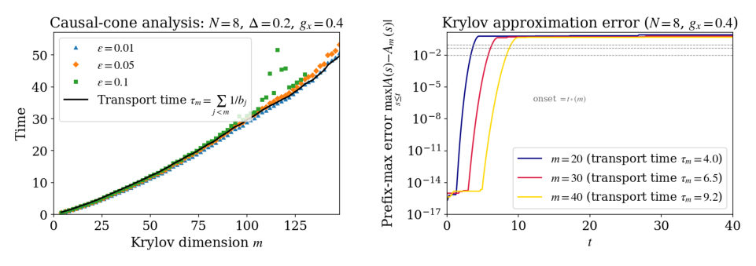
<figcaption class="paper-figure-caption"><b>Fig 1.</b> Figure 1: Krylov causal cone and the definition of the break time. The break time t∗(m; ϵ) is the first time at which the prefix-maximum error maxs≤t |A(s) −Am(s)| exceeds the tolerance ϵ. Left: for the N = 8 XXZ ring with ∆= 0.2 and gx = 0.4 and a broad-spectrum probe, t∗(m; ϵ) tracks the transport time τm = P j&lt;m 1/bj with a slope close to one for all three tolerances. A broad probe excites essentially the whole spectrum, so it stays transport-limited over the entire accessible range and does not undergo spectral capture until the chain itself terminates; the state-dependent capture dimension m∗and its dependence on the initial state are shown separately in Fig. 3. Right: for fixed m, the...</figcaption>
</figure>
<figure class="paper-figure-card">
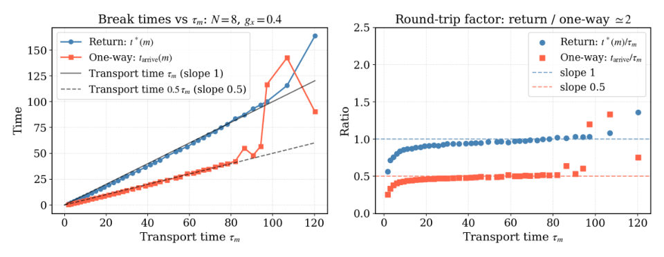
<figcaption class="paper-figure-caption"><b>Fig 2.</b> Figure 2: One-way arrival and round-trip break time measure the same light cone. The red data show the endpoint arrival time tarr, defined by the first appearance of probability at the Krylov boundary. It scales as tarr/τm ≃1/2, as expected for one-way propagation with velocity 2. The blue data show the return-amplitude break time t∗, which scales as t∗/τm ≃1 because the boundary signal must travel out and back. The two slopes therefore support the same Lieb–Robinson velocity, not two different velocities.</figcaption>
</figure>
<figure class="paper-figure-card">
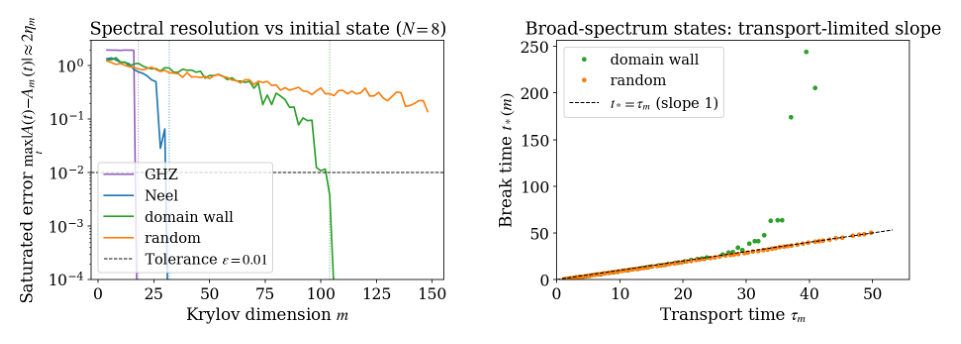
<figcaption class="paper-figure-caption"><b>Fig 3.</b> Figure 3: Initial-state dependence of spectral capture. Left: the saturated amplitude error maxt |A(t) −Am(t)| ≈2ηm as a function of Krylov dimension m, for four initial states of the N = 8 XXZ ring (Greenberger–Horne–Zeilinger (GHZ), N´eel, domain wall, and a random broad- spectrum state). Each state resolves its spectral measure at a different rate, so the error drops below the tolerance ϵ (dashed line) at a different, state-dependent dimension m∗: a narrow-spectrum state such as GHZ is captured after only a few steps (m∗≈18), whereas a broad state stays uncaptured over the whole accessible range. Right: for the broad-spectrum states the break time t∗(m) still tracks τm with slope one...</figcaption>
</figure>
<figure class="paper-figure-card">
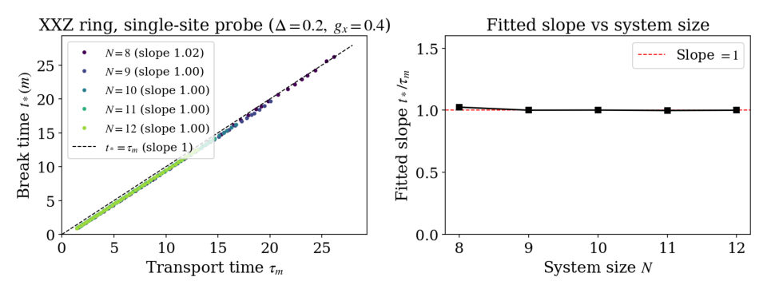
<figcaption class="paper-figure-caption"><b>Fig 4.</b> Figure 4: Transport-limited slope for the XXZ ring at several system sizes (single-site probe |v0⟩= XN/2|0 · · · 0⟩, ∆= 0.2, gx = 0.4, tolerance ϵ = 10−2). Left: the break time t∗(m) against the transport time τm for N = 8–12; all sizes track t∗≃τm. Right: the fitted slope stays close to one for every N (even sizes and N ≥9), so the transport law is not a small-size artifact.</figcaption>
</figure>
<figure class="paper-figure-card">
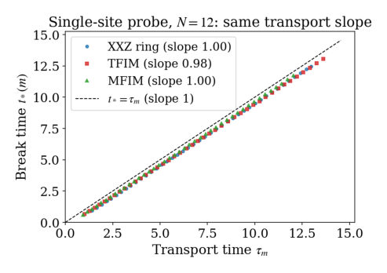
<figcaption class="paper-figure-caption"><b>Fig 5.</b> Figure 5: Same transport slope for three models (single-site probe, N = 12, ϵ = 10−2): the XXZ ring, the transverse-field Ising model (TFIM, P j ZjZj+1 + P j Xj), and the mixed-field Ising model (MFIM, P j ZjZj+1 + 1.05 P j Xj + 0.5 P j Zj). After passing to the transport coordinate τm, all three collapse onto t∗≃τm; the model-dependent Lanczos plateaus are absorbed into the metric.</figcaption>
</figure>

**Summary.** This theoretical work establishes a precise lower bound for the 'break time' of Krylov subspace approximations used to simulate quantum dynamics. The break time is found to be dictated by the inhomogeneous transport time scale ($	au_m$) derived from the system's underlying Jacobi chain structure. This result connects computational limitations directly to fundamental concepts like Lieb-Robinson bounds and causal propagation in quantum many-body systems.

**Why it may be interesting.** It provides a rigorous, physically motivated timescale ($	au_m$) for the breakdown of computationally intensive quantum simulation techniques (Krylov methods) when applied to spatially extended quantum systems.

Detailed structure

**Main problem.** The paper addresses the fundamental question of determining the reliable time window (break time) for using a finite-dimensional Krylov subspace approximation of quantum dynamics.

**Main result.** The break time $t^*(m; \epsilon)$ is shown to be lower-bounded by a characteristic transport time $	au_m = \sum 1/b_j$, suggesting that the approximation error is governed by the round-trip time scale.

**Method.** The analysis combines the derivation of a Lieb-Robinson bound in an inhomogeneous transport metric with Duhamel's formula to establish a rigorous lower bound on the approximation error.

**Model / system.** The system is modeled by a quantum Hamiltonian restricted to a Jacobi chain representation, which arises from the Lanczos recursion applied to an initial state $|v_0\rangle$. The dynamics are analyzed via the principal truncation $J_m$ of this matrix.

**Key observables.** Break time $t^*(m; \epsilon)$, Transport time $	au_m$, Lieb-Robinson velocity $v_{LR}$.

**Important parameters / regimes.** The error tolerance $\epsilon$, the dimension of the truncation $m$, and the local hopping parameters $b_j$.

**Assumptions / limitations.** The analysis relies on the structure of the Jacobi chain and assumes specific spectral properties (e.g., purely absolutely continuous spectrum) to establish the saturation of the lower bound.

**Paper structure.** The paper proceeds by defining the inhomogeneous transport metric, proving a Lieb-Robinson bound within this metric, deriving the lower bound on the break time using Duhamel's formula, and finally discussing the saturation of this bound under various spectral assumptions.

Abstract

Krylov and Lanczos approximations are used in quantum dynamics, quantum subspace methods, and Hamiltonian learning. A practical question is how long an $m$-dimensional Krylov truncation can be trusted. We argue that this time is fixed by causal propagation on the associated Jacobi chain. The relevant distance is not the Krylov index itself, but the inhomogeneous transport metric $ρ(m,n) = \sum_{j=\min(m,n)}^{\max(m,n)-1} 1/b_j$, where $b_j$ is the Lanczos hopping across the bond $j \leftrightarrow j+1$. We prove a Lieb--Robinson bound in this metric. Its small-weight limit gives the velocity $v_{\rm LR} = 2$, meaning that propagation is exponentially suppressed outside the cone $ρ(m,n) \simeq 2|t|$. The error of a finite Krylov approximation to the return amplitude is a round-trip effect: information has to travel from the probe to the truncation boundary and back. Combining the Lieb--Robinson bound with Duhamel's formula yields a lower bound on the error of the truncated dynamics. For a fixed tolerance $ε$, let the break time $t_\ast(m;ε)$ denote the longest time for which the $m$-dimensional truncation is guaranteed to reproduce the exact return amplitude within error $ε$. We show that $t_\ast(m;ε) \ge τ_m[1-o(1)]$, where $τ_m = ρ(0,m) = \sum_{j<m} 1/b_j$. When the probe spreads along the chain, this lower bound is also tight, so $t_\ast(m) \simeq τ_m$. The situation is different when the probe excites only a localized part of the spectrum, or a part already resolved by the truncation. In this case, essentially no signal reaches the boundary. Beyond a state-dependent Krylov dimension $m_\ast$, the approximation can therefore remain accurate at all times, and the break time is effectively infinite. Numerical tests on spin chains and random Jacobi matrices support $t_\ast(m) \simeq τ_m$ in the transport-limited regime.

[↑ back to top](#top)

### [Optimal cloning of mixed states](http://arxiv.org/abs/2608.27298v1)

**Authors:** Marco Fanizza, Dmitry Grinko, Thilo Scharnhorst, Jack Spilecki  
**Type:** theory · **Category:** quantum information and computing · **PDF:** <https://arxiv.org/pdf/2608.27298v1>  
**Analysis basis:** full PDF text, analyzed in chunks
**Topic relevance:** `quantum measurements` **1/5**

↔ Scroll figures horizontally

<figure class="paper-figure-card">

<figcaption class="paper-figure-caption"><b>Fig 1.</b> Figure 4: On the left, the diagram σ = (5, 4, 2), with each cell filled with its content. In the middle, σ with the cells counted by the hook-length of (2, 1) shaded. Thus, hσ(2, 1) = 5. On the right, the diagram σ + 2 · e1. The new boxes are shaded.</figcaption>
</figure>
<figure class="paper-figure-card">
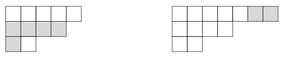
<figcaption class="paper-figure-caption"><b>Fig 2.</b> Figure 5: On the left, an SYT S of shape τ = (4, 2, 1). On the right, an SSYT T of shape τ and alphabet [3].</figcaption>
</figure>

**Summary.** This paper rigorously solves the sample complexity problem for approximately cloning unknown mixed quantum states. By establishing matching upper and lower bounds using the PCT cloner and projector states, it determines that the required number of input copies scales as $\Theta(krd/\epsilon)$. This result sets a fundamental limit on quantum information processing tasks.

**Why it may be interesting.** This work provides fundamental, quantitative bounds on the information-theoretic limits of quantum state manipulation, which is crucial for designing quantum communication protocols and understanding the robustness of quantum information.

Detailed structure

**Main problem.** The paper determines the minimum number of input copies ($n$) required to approximate the cloning of $k$ additional copies of an unknown mixed quantum state $
ho$ to a specified fidelity ($1-\epsilon$).

**Main result.** The sample complexity for both mixed state cloning and approximate transposition is found to be $\Theta(krd/\epsilon)$, where $r$ is the rank of the state, $d$ is the dimension, and $\epsilon$ is the error tolerance.

**Method.** The authors establish the upper bound using a 'Purify-Clone-Trace' (PCT) cloner, which reduces the mixed state problem to the pure state case. The matching lower bound is proven by analyzing the special, hard-to-clone case of projector states.

**Model / system.** The study concerns the theoretical limits of quantum state cloning and transposition for mixed states $
ho$ in a $d$-dimensional Hilbert space. The analysis uses tools from representation theory, including Schur polynomials, to derive rigorous bounds.

**Key observables.** Fidelity ($F$), Sample Complexity ($n$), State Rank ($r$), and Dimension ($d$).

**Important parameters / regimes.** The required fidelity $1-\epsilon$, the number of copies to clone $k$, and the state rank $r$.

**Assumptions / limitations.** The lower bound proof relies on considering projector states ($
ho = P/r$) as the worst-case scenario for cloning.

**Figures summary.** Figure 1 illustrates the PCT cloner process: purifying the input state, applying the Werner cloner in the larger space, and tracing out auxiliary registers.

**Paper structure.** The paper first reviews the known optimal result for pure states. It then constructs the PCT cloner to establish an upper bound for mixed states. Finally, it proves the matching lower bound using projector states, thereby resolving the sample complexity.

Abstract

We consider the problem of approximate cloning of quantum states: given $n$ copies of an unknown state $ρ\in \mathbb{C}^{d \times d}$, prepare an $(n+k)$-copy state with high fidelity to $ρ^{\otimes (n+k)}$. Werner's pure state cloner is the optimal channel for the pure state case, and shows that $n = Θ(kd/\varepsilon)$ copies are necessary and sufficient to clone $k$ additional copies of an unknown pure state to fidelity $1-\varepsilon$. The random purification channel gives a straightforward extension of Werner's cloner to mixed state inputs: given $n$ copies of a mixed state, randomly purify your input, apply Werner's channel in the larger Hilbert space, and then trace out the auxiliary registers. This gives a mixed state cloner using $n = O(krd/\varepsilon)$ copies to clone rank-$r$ states. Can one do any better? We show that the answer is no: one must use $n = Ω(krd/\varepsilon)$ copies. We prove our lower bound by studying the special case of projector cloning, in which the input state $ρ$ is promised to be of the form $P/r$, where $P$ is a rank-$r$ orthogonal projector.   As a further application of our techniques, we consider the closely related problem of approximate transposition of quantum states, where one seeks to convert $ρ^{\otimes n}$ to a $k$-copy state with high fidelity to $(ρ^T)^{\otimes k}$. Here, we again show $n = Θ(krd/\varepsilon)$ copies are necessary and sufficient for this task.

[↑ back to top](#top)

### [Randomness can be certified in energy-constrained semi-device-independent scenarios](http://arxiv.org/abs/2608.27357v1)

**Authors:** Shashank Kumar Ranu, Lewis Wooltorton, Alastair A. Abbott, Omar Fawzi  
**Type:** theory · **Category:** quantum information and computing · **PDF:** <https://arxiv.org/pdf/2608.27357v1>  
**Analysis basis:** full PDF text, analyzed in chunks
**Topic relevance:** `quantum measurements` **1/5**

↔ Scroll figures horizontally

<figure class="paper-figure-card">
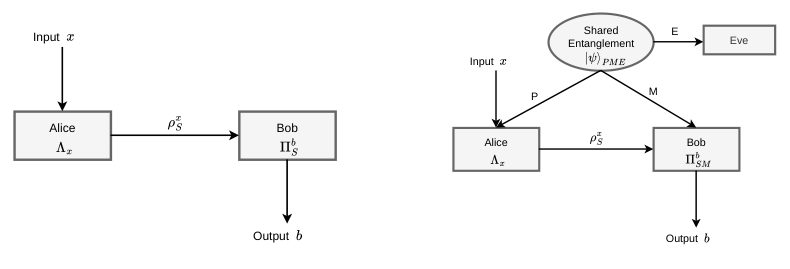
<figcaption class="paper-figure-caption"><b>Fig 1.</b> FIG. 1: Energy-constrained prepare-and-measure scenario (a) honest implementation and (b) adversarial implementation with shared entanglement.</figcaption>
</figure>
<figure class="paper-figure-card">
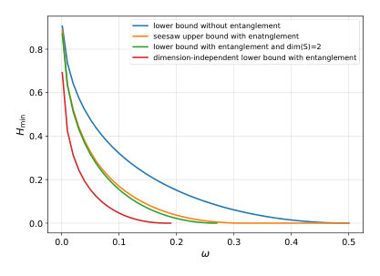
<figcaption class="paper-figure-caption"><b>Fig 2.</b> FIG. 2: Certified min-entropy Hmin as a function of the energy parameter ω without the dimension assumption (red curve). The blue curve shows the certified lower bound in the separable (no shared entanglement) scenario [17]. The orange curve shows the upper bound obtained via the seesaw method in the entangled scenario with dim(HS) = dim(HM) = 2 [22, 23]. The green curve shows our certified lower bound with dim(HS) = 2 and dim(HM) unbounded.</figcaption>
</figure>
<figure class="paper-figure-card">

<figcaption class="paper-figure-caption"><b>Fig 3.</b> FIG. 3: Certified lower bounds on Hmin as a function of the energy parameter ω for source dimensions dim(HS) = 2 (orange) and dim(HS) = 3 (blue).</figcaption>
</figure>
<figure class="paper-figure-card">
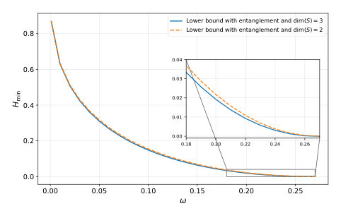
<figcaption class="paper-figure-caption"><b>Fig 4.</b> Figure 4 shows the certified min-entropy as a function of Iexp corr at ω = 0.05 and ω = 0.1. In both cases Hmin decreases monotonically as the observed correlator is reduced and vanishes at a value strictly below the ideal one. For ω = 0.05, the bound remains positive down to Iexp corr ≈0.50, compared with the ideal value of ≈0.87. Similarly, for ω = 0.1, the ideal correlator value is 1.2, and positive min-entropy is certified above approximately 0.948, corresponding to about 79% of the ideal value. Operating at low energy is therefore doubly advantageous, yielding both a higher certified rate and greater robustness to imperfections in the observed statistics.</figcaption>
</figure>
<figure class="paper-figure-card">
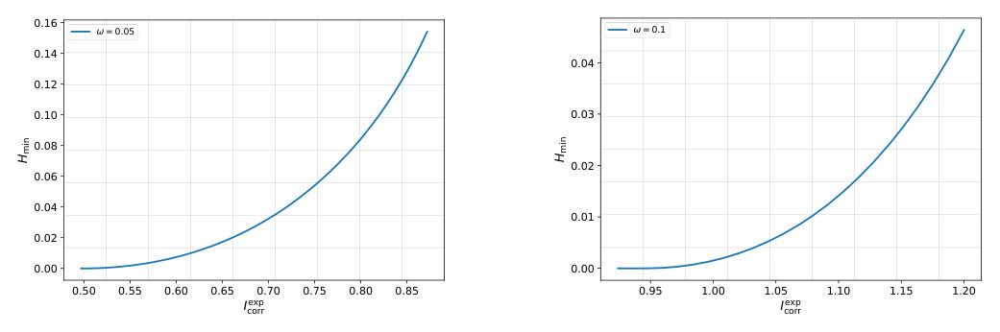
<figcaption class="paper-figure-caption"><b>Fig 5.</b> FIG. 4: Certified min-entropy Hmin from the dimension-independent relaxation as a function of the observed correlator Iexp corr at (a) ω = 0.05 and (b) ω = 0.1. The ideal correlator values are approximately 0.87 and 1.2, respectively, attained at the right-hand end of each curve.</figcaption>
</figure>

**Summary.** This paper establishes the theoretical possibility of generating certified randomness in energy-constrained semi-device-independent quantum cryptography. By adapting the NPA hierarchy to incorporate energy bounds, the authors derive SDP relaxations that provide lower bounds on the min-entropy even when the adversary has full quantum access. This resolves a long-standing open question in the field.

**Why it may be interesting.** This work provides rigorous, device-independent security guarantees for quantum random number generation under realistic physical constraints (energy), which is highly relevant for quantum optics and quantum information hardware.

Detailed structure

**Main problem.** To determine if certified randomness can be generated in energy-constrained semi-device-independent (SDI) quantum cryptography scenarios, especially when the adversary can share quantum entanglement.

**Main result.** The authors affirmatively answer the open question, proving that certified randomness generation is theoretically possible even against a fully quantum adversary, yielding positive lower bounds on the min-entropy.

**Method.** They adapt the Navascués-Pironio-Acín (NPA) hierarchy to construct semidefinite programming (SDP) relaxations of the guessing probability, allowing for dimension-independent security proofs.

**Model / system.** The model is a prepare-and-measure (PM) framework for quantum random number generation, constrained by a finite energy bound ($\omega$) on the prepared states.

**Key observables.** The primary observables are the extractable min-entropy ($H_{\min}$) and the correlator difference ($I_{	ext{corr}}$), which quantify the security and randomness rate.

**Important parameters / regimes.** The energy parameter ($\omega$) is crucial, as the certified rate remains positive for a range of small energy values.

**Assumptions / limitations.** The core assumption is the energy constraint on the prepared states. The analysis is strongest when assuming the adversary can share full quantum entanglement.

**Figures summary.** Figures illustrate the energy-constrained PM scenario, showing the certified $H_{\min}$ vs. $\omega$ for different dimension assumptions, and demonstrating the robustness of $H_{\min}$ when the observed correlator is reduced.

**Paper structure.** The paper develops the SDP relaxation by adapting the NPA hierarchy to the energy-constrained setting, deriving structural constraints on the POVM elements, and finally solving the optimization problem to yield the certified lower bound on randomness.

Abstract

The prepare-and-measure framework based on energy constraints offers a practical middle ground between fully device-dependent and device-independent quantum cryptography. The only assumption on an otherwise uncharacterized prepare-and-measure device is that the energy of the prepared states is bounded. Existing security analyses of this framework assume that the preparation and measurement devices share at most classical correlations, and under this assumption certified lower bounds on the extractable randomness have been established. Recent work has shown that an adversary who pre-distributes entanglement between the devices can mount attacks that are strictly more powerful than those available when the devices share only classical correlations, reducing the extractable randomness below the previously certified rates. This leaves open the fundamental question of whether randomness can be certified at all in this scenario.   We address this open question by constructing semidefinite programming relaxations of the guessing probability by adapting the Navascués-Pironio-Acín hierarchy to the energy-constrained setting where shared entanglement between the devices is permitted. Our relaxations yield certified lower bounds on the extractable randomness without enforcing any restrictions on the dimensions of the quantum state shared between the preparation and measurement devices. We show that these certified lower bounds are strictly positive for a range of energy values, thereby answering the open question affirmatively: certified randomness generation is theoretically possible in the energy-constrained SDI framework even in the presence of a fully quantum adversary.

[↑ back to top](#top)

## Other papers (20)

*Papers from primary archives without highlighted authors or any topic match. Click to expand.*

Show other papers

### [3D- (H-theta-phi) magnetic phase diagram of antiferromagnetic metal GdB6 with electron and lattice instability](http://arxiv.org/abs/2608.27134v1)

**Authors:** A. N. Azarevich, A. V. Bogach, T. F. Garipova, V. V. Voronov, M. Rajnak, S. Gabani, K. Flachbart, N. B. Bolotina, O. N. Khrykina, V. M. Gridchina, A. Yu. Tsvetkov, S. Yu. Gavrilkin, N. E. Sluchanko  
**Type:** experiment · **Category:** strongly correlated electrons · **PDF:** <https://arxiv.org/pdf/2608.27134v1>  
**Analysis basis:** full PDF text, analyzed in chunks

↔ Scroll figures horizontally

<figure class="paper-figure-card">
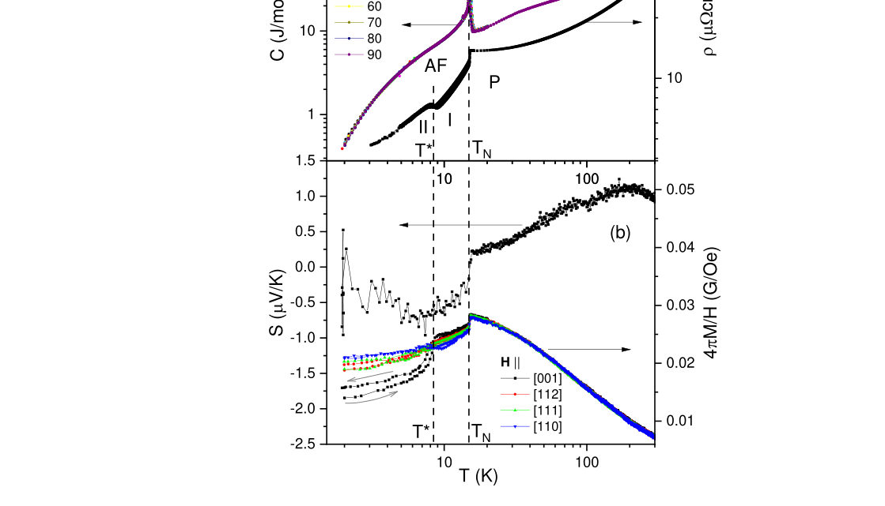
<figcaption class="paper-figure-caption"><b>Fig 1.</b> Fig. 1. Temperature dependences of (a) the specific heat C(T, H0) in various magnetic fields H0 ≤ 90 kOe, and zero field resistivity (T), and (b) the Seebeck coefficient S(T) and magnetic susceptibility 4πM/H(T, H0 = 100 Oe) for H||[001], [112], [111] and [110] in GdB6. I, II and P denote two AF and paramagnetic phases, TN and T* are the temperatures of magnetic phase transitions.</figcaption>
</figure>
<figure class="paper-figure-card">

<figcaption class="paper-figure-caption"><b>Fig 2.</b> Fig. 3. Temperature dependences of susceptibility 4πM/H0(T, H0) of GdB6 (a) in the range T ≤ 18 K in magnetic field up to 180 kOe for the principal direction H||[001], and (b) in magnetic field up to 50 kOe for H||[111]. Panels (c) - (d) show field dependences of the susceptibility at temperatures fixed in the range 2-16 K for (c) H||[001] in the interval H ≤ 5 kOe, where the hysteresis is observed, and for (d) H||[111] up to 50 kOe. Vertical arrows mark the magnetic phase transitions I-II and I-P.</figcaption>
</figure>
<figure class="paper-figure-card">
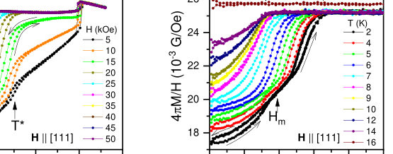
<figcaption class="paper-figure-caption"><b>Fig 3.</b> Fig. 4. Magnetic field dependences of resistivity (H, T0) of GdB6 at fixed temperatures T0 ≤ 16 K for principal field directions H||[001] (a), H||[110] (b) and H||[111] (c). Arrows mark the magnetic phase transitions in the AF state, Roman numerals denote the magnetic phases (see Fig. 5). HN and H* denote the critical fields of the AF phase transitions at TN (I-P) and T* (I-II).</figcaption>
</figure>
<figure class="paper-figure-card">
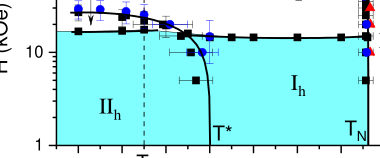
<figcaption class="paper-figure-caption"><b>Fig 4.</b> Fig. 5. Magnetic H-T phase diagrams of GdB6 along three principal directions of the external magnetic field (a) H||[001], (b) H||[110] and (c) H||[111]. Roman numerals denote different magnetically ordered phases, P- paramagnetic state. Vertical dashed line marks T0 = 5 K, which corresponds to the results of angular measurements (Figs. 6-7) and to the H-φ diagram in the (110) and (111) planes (Figs. 8-9). Low field hysteresis areas (phases Ih and IIh) are shaded.</figcaption>
</figure>
<figure class="paper-figure-card">
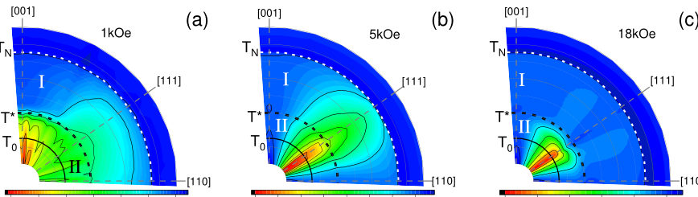
<figcaption class="paper-figure-caption"><b>Fig 5.</b> Fig. 6. (Color online). Temperature dependences of magnetic susceptibility in the range T≤ 18 K for magnetic field intensity H0 = 1 kOe (a), 5 kOe (b) and 18 kOe (c) with rotation of H in the (1-10) plane. Radial dotted lines show the principal directions when vector H is aligned with the principal axes in the cubic lattice. Circular dotted lines mark TN, T* and Т0 = 5 К. Roman numerals I and II denote different magnetically ordered phases. The amplitude of 4πM/H(φ, H0, T0) is shown by color.</figcaption>
</figure>

**Summary.** This experimental work characterizes the complex magnetic phase diagram of the antiferromagnetic metal GdB6 by measuring magnetization and resistivity under varying magnetic fields and angles. The authors find evidence of dynamic charge stripes and structural distortions that fundamentally alter the magnetic exchange interactions. This work provides a detailed picture of how coupled electron and lattice instabilities govern the material's unusual magnetic anisotropy.

**Why it may be interesting.** The detailed mapping of magnetic phase diagrams and the explicit connection drawn between charge density wave physics (stripes) and magnetic anisotropy are highly relevant to understanding emergent quantum phenomena in strongly correlated materials.

Detailed structure

**Main problem.** The study investigates the origin of charge transport and magnetization anisotropy in the antiferromagnetic (AF) metal GdB6, focusing on the role of electron and lattice instabilities.

**Main result.** The research identified 'impeller-type patterns' in the H-phi magnetic phase diagrams and proposed that dynamic charge stripes suppress the RKKY exchange, leading to unusual charge scattering anisotropy.

**Method.** The study employed detailed measurements of resistivity, magnetization, and X-ray diffraction at low temperatures to map out complex magnetic and electronic phase diagrams.

**Model / system.** The physical system is GdB6, an antiferromagnetic metal with a cubic lattice and Gd S-type magnetic ions. The analysis focuses on the interplay between magnetic ordering (AF(I) and AF(II) phases) and electronic instabilities like dynamic charge stripes.

**Key observables.** Magnetization (M), resistivity ($
ho$), magnetic susceptibility ($\chi$), and structural distortions detected via X-ray diffraction.

**Important parameters / regimes.** Low temperatures (down to helium temperatures), external magnetic fields up to 180 kOe, and angular dependence ($\phi$).

**Assumptions / limitations.** The analysis assumes the importance of the spin density wave 5d- component in the AF(II) state and links charge fluctuations in stripes to the observed magnetic anisotropy.

**Figures summary.** Figures detail H-T, H-phi, and 3D H-theta-phi phase diagrams, showing transitions between AF phases I and II, and mapping angular dependencies of resistivity and susceptibility.

**Paper structure.** The paper systematically presents measurements across various magnetic field, temperature, and angle regimes to construct comprehensive magnetic phase diagrams, linking structural distortions (Jahn-Teller) to electronic instabilities (charge stripes) and magnetic behavior.

Abstract

The origin of charge transport and magnetization anisotropy was studied in GdB6, an antiferromagnetic (AF) metal (Néel temperature TN ~ 15.5 K) with cubic lattice and Gd S-type magnetic ions. Both small static Jahn-Teller distortions and nanoscale electronic instabilities (dynamic charge stripes) were found in precise low temperature X-ray diffraction measurements. The detailed magnetic field (H) vs temperature (T) phase diagrams were constructed with two main magnetic phases AF(I) and AF(II). Using the angular phi-dependences of magnetoresistance and magnetization, impeller-type patterns of the H-phi magnetic phase diagrams in the (110) and (111) planes were found at helium temperatures, which included the AF phases I and II separated from each other by radial and circular boundaries. The results argue in favor of the important role of the spin density wave 5d- component in the magnetic structure of AF(II) state. Charge fluctuations in stripes are proposed to be responsible for the suppression of the Ruderman-Kittel-Kasuya-Yoshida (RKKY) indirect exchange between the first and second neighboring Gd3+ ions located along the <100> and <110> directions. These dynamic charge stripes and vibrationally coupled Gd-Gd pairs produce unusual anisotropy of charge scattering and the impeller-type diagrams in GdB6 with S-type magnetic ion.

[↑ back to top](#top)

### [Approximating the peculiar velocity distribution of dark matter halos with Tsallis statistics](http://arxiv.org/abs/2608.26572v1)

**Authors:** Jun Pan, Ming Li  
**Type:** theory · **Category:** statistical mechanics · **PDF:** <https://arxiv.org/pdf/2608.26572v1>  
**Analysis basis:** full PDF text, analyzed in chunks

↔ Scroll figures horizontally

<figure class="paper-figure-card">
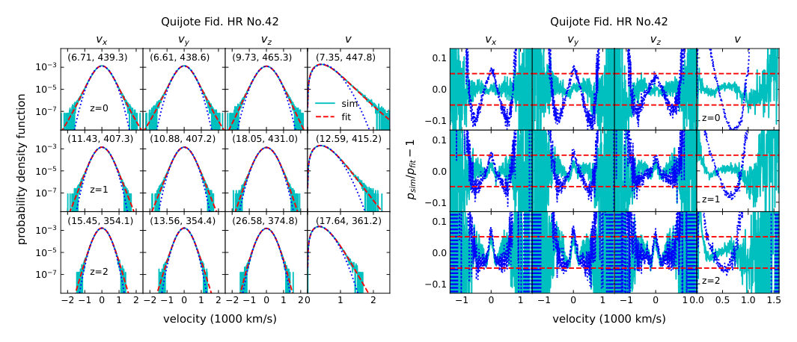
<figcaption class="paper-figure-caption"><b>Fig 1.</b> Fig. 1: Left panel: Halo velocity distribution functions (solid cyan lines) from realization No. 42 of the Quijote fiducial high- resolution simulation at redshifts z = 0, 1, 2. The dashed red lines represent the best fits derived with Eq. 10 with the corresponding (κ0, σκ0) parameters listed in each subpanel. The dotted blue lines represent the best-fit Gaussian models. Right panel: Relative differences between the simulation and the best-fit Tsallis (cyan lines) and Gaussian (blue dotted lines) models. The horizontal dashed red lines indicate the 5% precision level. The velocity bin width is 5 km s−1.</figcaption>
</figure>
<figure class="paper-figure-card">
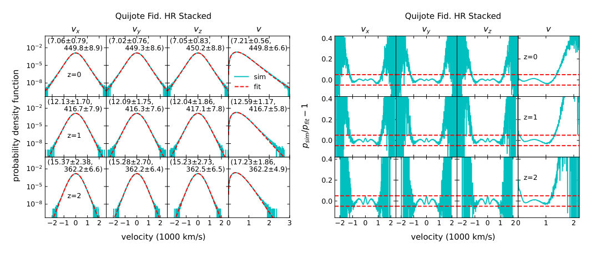
<figcaption class="paper-figure-caption"><b>Fig 2.</b> Fig. 2: Left panel: psim (cyan solid) and pfit (red dashed) for the stacked halo samples at z = 0, 1, 2. The parenthetical numbers represent the best fits (κ0, σκ0). Right panel: Relative differences between psim and pfit. The horizontal dashed red lines indicate 5% precision. The velocity bin width is 5 km s−1.</figcaption>
</figure>
<figure class="paper-figure-card">
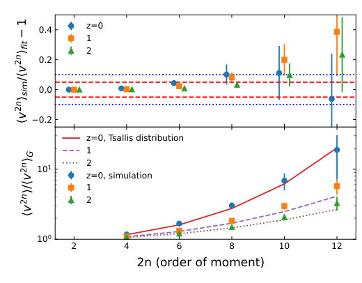
<figcaption class="paper-figure-caption"><b>Fig 3.</b> Fig. 3: Comparison of halo velocity moments from the simula- tions with the best-fit Tsallis predictions. In the top panel, data points at different redshifts slightly offset horizontally for clarity. The horizontal dashed red and dotted blue lines indicate 5% and 10% deviation, respectively. In the bottom panel, the Gaussian model, ⟨v2n⟩G, has the same variance as the simulation. The er- ror bars indicate the standard deviations across 100 realizations.</figcaption>
</figure>
<figure class="paper-figure-card">
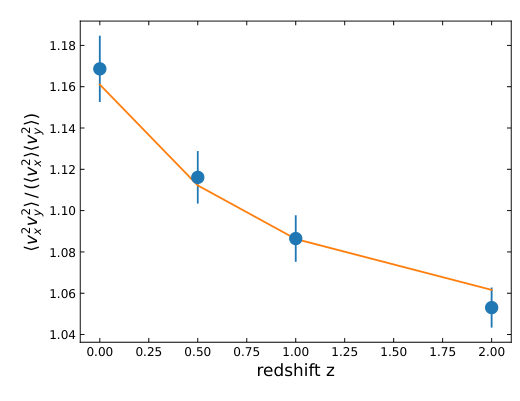
<figcaption class="paper-figure-caption"><b>Fig 4.</b> Fig. 4: Quadratic correlation between the velocity components of halos. The symbols represent measurements from the simulation, and the solid line represents the prediction of the best-fit Tsallis model.</figcaption>
</figure>
<figure class="paper-figure-card">
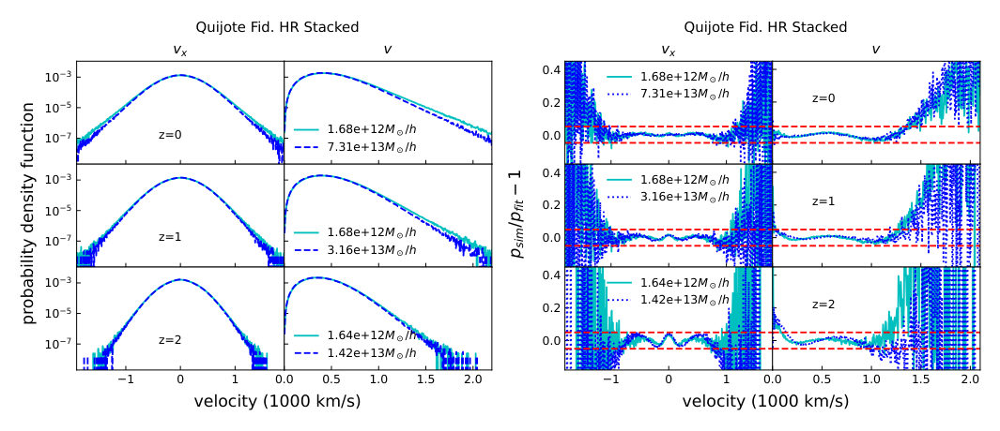
<figcaption class="paper-figure-caption"><b>Fig 5.</b> Fig. 5: Left: psim (solid cyan lines) for the stacked halo samples in the lightest and heaviest mass bins at z = 0, 1, 2. Right: Relative differences psim/pfit −1 with pfit from the best-fit Tsallis models. The horizontal dashed red lines indicate 5% precision. Mean masses are indicated in the legends. The bin width is 5 km s−1.</figcaption>
</figure>

**Summary.** This paper models the peculiar velocity distribution of dark matter halos using Tsallis statistics, a tool from non-extensive statistical mechanics. By fitting simulations, the authors show that the Tsallis distribution accurately captures the non-Gaussian, non-equilibrium nature of these velocities. This provides a powerful, ready-to-use prior for cosmological analyses like kSZ effect measurements.

**Why it may be interesting.** The application of non-extensive statistical mechanics (Tsallis statistics) to astrophysical systems like dark matter halos provides a concrete example of how generalized statistical frameworks can model complex, non-equilibrium dynamics in large-scale structure.

Detailed structure

**Main problem.** Characterizing the peculiar velocity distribution of dark matter halos, which are far from thermal equilibrium, to improve understanding of the gravitational evolution of the cosmic web.

**Main result.** The Tsallis distribution provides an accurate and concise model for the halo peculiar velocity distribution, achieving good fit quality for velocities below 1000 km/s across redshifts $z=0-2$.

**Method.** The authors use maximum-likelihood fitting and theoretical superstatistics frameworks to model the non-equilibrium velocity distribution.

**Model / system.** The system is dark matter halos in the $\Lambda$CDM model, whose peculiar velocities are analyzed. The model employs Tsallis statistics, derived from non-extensive statistical mechanics, to describe the non-Gaussian nature of the distribution.

**Key observables.** The one-point distribution function of halo peculiar velocities, $p(v)$, and its moments ($\langle v^{2n} 
angle$).

**Important parameters / regimes.** The Tsallis parameters, the invariant index $\kappa_0$ and the characteristic velocity $\sigma_{\kappa_0}$.

**Assumptions / limitations.** The zeroth-order approximation (a single Tsallis function) is assumed to be sufficient, despite the theoretical possibility of a superposition of Tsallis functions. The standard halo model framework is also utilized.

**Figures summary.** Figures compare the simulated $p(v)$ against the best-fit Tsallis models across different redshifts and halo masses, showing good agreement for low velocities.

**Paper structure.** The paper develops from the limitations of the standard halo model to the application of Tsallis statistics, deriving the model from superstatistics, fitting it to N-body simulation data, and finally discussing the physical implications of the derived parameters.

Abstract

Dark matter halos, which host galaxies and galaxy clusters, have peculiar velocities far from thermal equilibrium. Characterizing the nonlinear and non-Gaussian features of this velocity distribution improves our understanding of the gravitational evolution of the cosmic web and supports related cosmological applications. We endeavor to establish a connection between the peculiar velocity distribution of halos and nonequilibrium statistical mechanics, with the objective of obtaining a model that is both concise and accurate for practical applications. We extracted halo samples from large N-body simulations and performed maximum-likelihood fits to the peculiar velocity distributions using a two-parameter Tsallis model, derived from non-extensive statistical mechanics. On the theoretical side, we reformulated the halo distribution in the superstatistics framework by means of a generalized Gram-Charlier expansion based on the gamma distribution. For halo peculiar velocities below 1000 km/s, the Tsallis model achieves 5 percent accuracy over z=0-2, with performance improving toward lower redshifts. Our results show that the halo velocity distribution becomes increasingly non-Gaussian and departs further from equilibrium over time. The best-fit parameters depend only weakly on mass, though low-mass halos exhibit slightly stronger non-Gaussianity. The two parameters, especially the velocity dispersion, offer promising probes of cosmological parameters. Theoretically, we find that in general the halo peculiar velocity distribution function is expressible as a superposition of a series of Tsallis distribution functions, while simulation results demonstrate that the zeroth-order approximation, namely a single Tsallis function, already achieves sufficient accuracy.

[↑ back to top](#top)

### [Bosonic Encodings for Hermite-Galerkin Discretizations of High-Dimensional PDEs and Bayesian Inverse Problems](http://arxiv.org/abs/2608.26268v1)

**Authors:** Alice Barthe  
**Type:** theory · **Category:** quantum information and computing · **PDF:** <https://arxiv.org/pdf/2608.26268v1>  
**Analysis basis:** full PDF text, analyzed in chunks

↔ Scroll figures horizontally

<figure class="paper-figure-card">
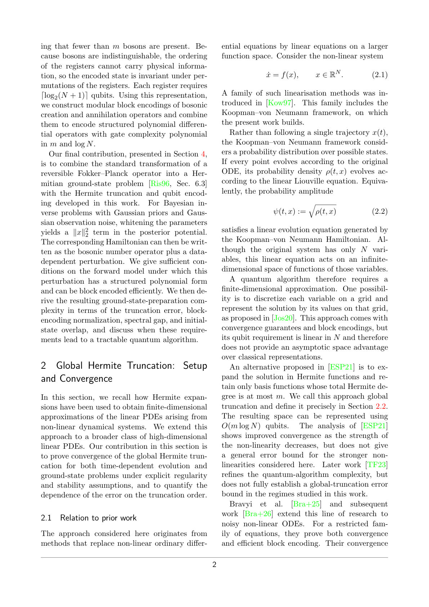
<figcaption class="paper-figure-caption"><b>Fig 1.</b> Low-resolution page preview, page 2</figcaption>
</figure>
<figure class="paper-figure-card">
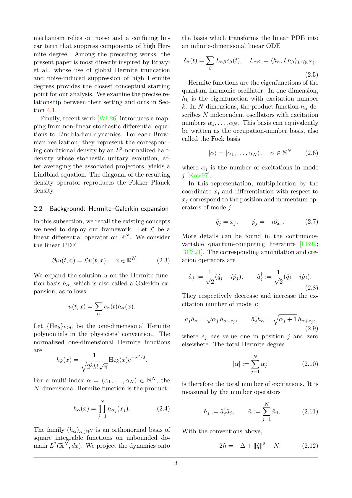
<figcaption class="paper-figure-caption"><b>Fig 2.</b> Low-resolution page preview, page 3</figcaption>
</figure>
<figure class="paper-figure-card">
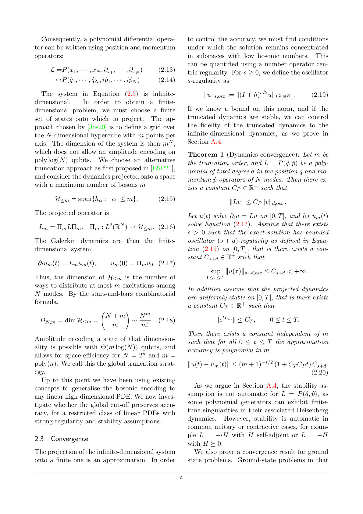
<figcaption class="paper-figure-caption"><b>Fig 3.</b> Low-resolution page preview, page 4</figcaption>
</figure>
<figure class="paper-figure-card">
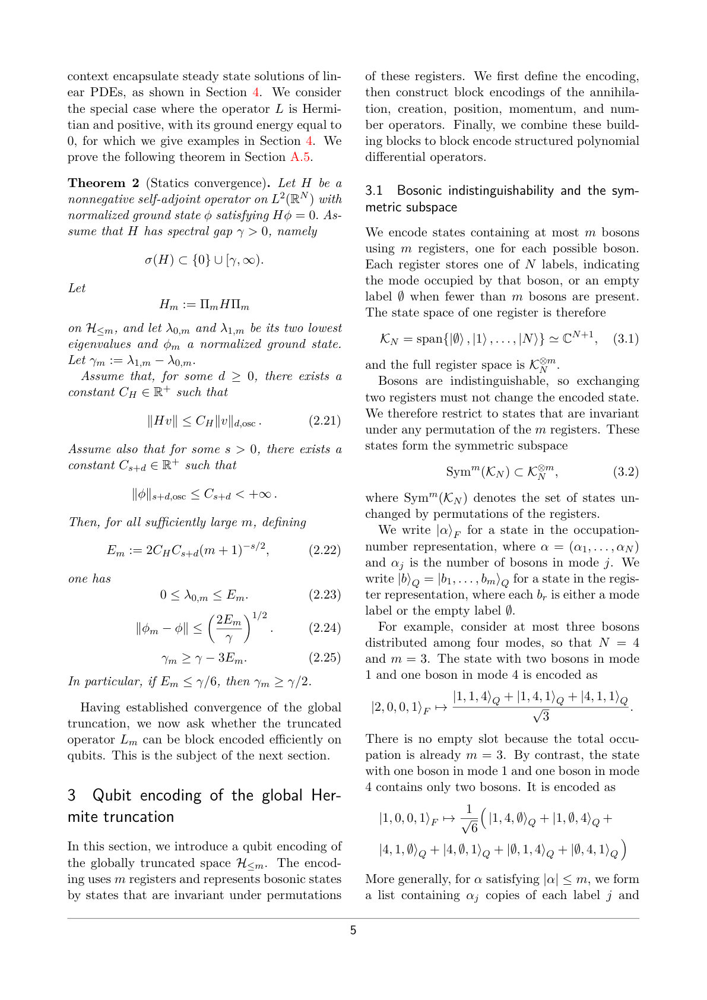
<figcaption class="paper-figure-caption"><b>Fig 4.</b> Low-resolution page preview, page 5</figcaption>
</figure>
<figure class="paper-figure-card">
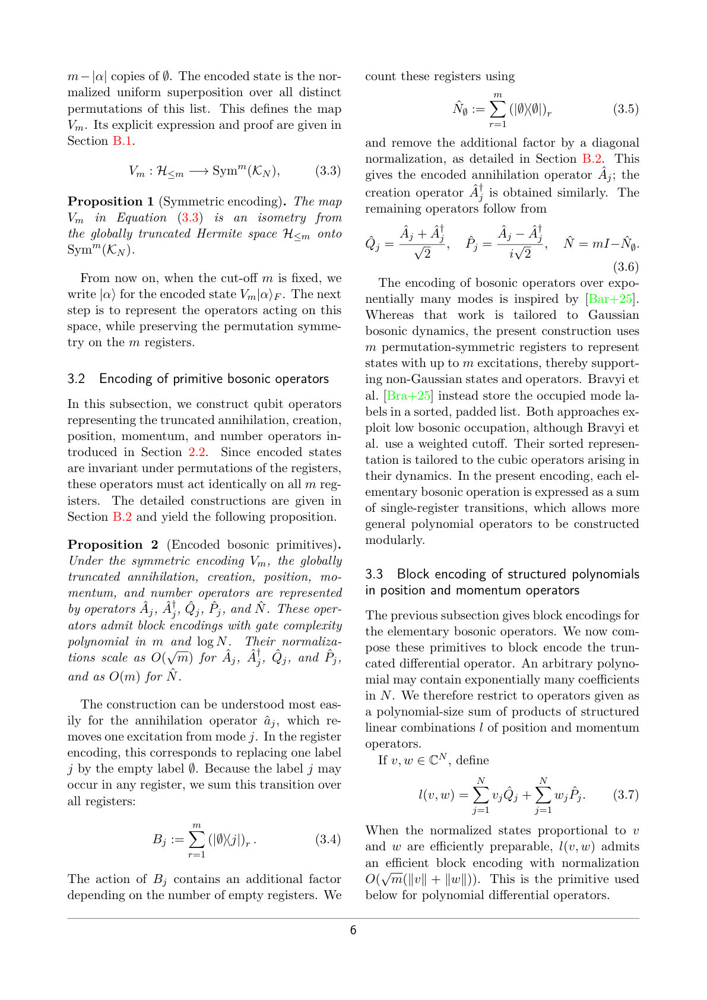
<figcaption class="paper-figure-caption"><b>Fig 5.</b> Low-resolution page preview, page 6</figcaption>
</figure>

**Summary.** This paper develops a quantum algorithm framework to solve high-dimensional PDEs and Bayesian inverse problems by mapping the dynamics onto a linear system solvable via the Hermite basis. It achieves a space-efficient qubit encoding scaling as $O(m \log N)$ and proves convergence for the approximation, making complex physical inference problems tractable on quantum hardware.

**Why it may be interesting.** This work provides a concrete, scalable quantum computational pathway for solving complex, high-dimensional physical problems (like those encountered in quantum field theory or statistical physics) by leveraging bosonic encoding techniques.

Detailed structure

**Main problem.** The paper addresses the challenge of designing quantum algorithms to solve high-dimensional Partial Differential Equations (PDEs) and Bayesian Inverse Problems.

**Main result.** It establishes a framework that efficiently encodes the dynamics and posterior state preparation using a qubit representation scaling as $O(m \log N)$ qubits, and proves convergence theorems for the truncation.

**Method.** The core method involves mapping non-linear dynamics to linear PDEs, expanding solutions in the Hermite function basis (Galerkin), and implementing the resulting operators using structured block encodings on qubits.

**Model / system.** The system involves high-dimensional probability amplitudes governed by linear PDEs (like Fokker-Planck equations) or the posterior distribution in Bayesian inference. The dynamics are discretized by truncating the Hermite expansion to a finite degree $m$.

**Key observables.** The total Hermite degree ($m$), the reduced Hermite matrix ($\Gamma^{(j)}$), and the effective Hamiltonian ($H$ or $H_y$) governing the state evolution.

**Important parameters / regimes.** The truncation order $m$ and the number of variables $N$ dictate the qubit scaling $O(m \log N)$. Convergence depends on regularity and stability assumptions.

**Assumptions / limitations.** Convergence proofs require explicit regularity and stability assumptions on the underlying PDEs and dynamics. The efficient encoding relies on the structured polynomial form of the differential operators.

**Paper structure.** The paper progresses from establishing the mathematical framework (Koopman-von Neumann, Hermite basis, global truncation) to proving convergence theorems for both time-dependent and ground-state problems. It then details the efficient qubit encoding of the resulting structured operators and applies this machinery to solve Bayesian inverse problems by mapping them to ground-state preparation.

Abstract

The Koopman-von Neumann framework has been proposed to design quantum algorithms for non-linear dynamics. It maps a non-linear ordinary differential equation to a linear partial differential equation (PDE) governing a probability amplitude. Previous works represents this amplitude in the Hermite-function basis, equivalently as a bosonic state, and truncates the total Hermite degree to obtain a representation over $Θ(m\log N)$ qubits, where $N$ is the number of variables and $m$ the truncation order. We extend this approach to a broader class of linear PDEs whose differential operators have a structured polynomial form. We prove convergence of the truncation for both time-dependent dynamics and gapped ground-state problems under explicit regularity and stability assumptions. We then introduce a qubit encoding that supports efficient block encodings of the truncated operators. Finally, we apply the framework to Bayesian inverse problems with Gaussian priors and observation noise, reducing posterior-state preparation to the preparation of a structured Hamiltonian's ground state.

[↑ back to top](#top)

### [Conditional contraction coefficients and their applications to quantum networks](http://arxiv.org/abs/2608.27171v1)

**Authors:** Christoph Hirche, Ian George, Theshani Nuradha, Mark M. Wilde  
**Type:** theory · **Category:** quantum information and computing · **PDF:** <https://arxiv.org/pdf/2608.27171v1>  
**Analysis basis:** full PDF text, analyzed in chunks

↔ Scroll figures horizontally

<figure class="paper-figure-card">
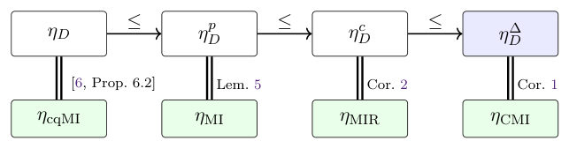
<figcaption class="paper-figure-caption"><b>Fig 1.</b> Figure 1: Relations between the contraction coefficients considered in this paper for the relative entropy. Arrows denote inequalities and double lines denote equalities. References indicate the corresponding results in the paper. The depicted inequalities are summarized in Corollary 3.</figcaption>
</figure>
<figure class="paper-figure-card">
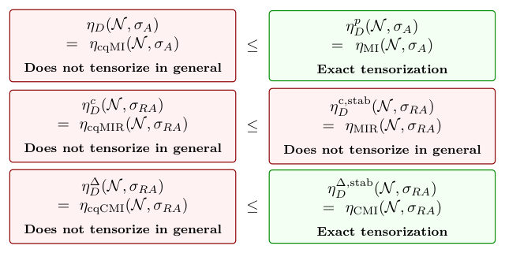
<figcaption class="paper-figure-caption"><b>Fig 2.</b> Figure 2: Status of tensorization of the relative-entropy SDPI constants considered in this work. Stabilization cannot decrease the corresponding coefficient. Green entries tensorize exactly for fixed product states and red entries do not tensorize in general. The ordinary SDPI nevertheless tensorizes under the sufficient conditions established in Corollary 9. Section C features a proof that the stabilized complete SDPI does not tensorize in general. For all quantities on the left side, we have an approximate tensorization result.</figcaption>
</figure>
<figure class="paper-figure-card">
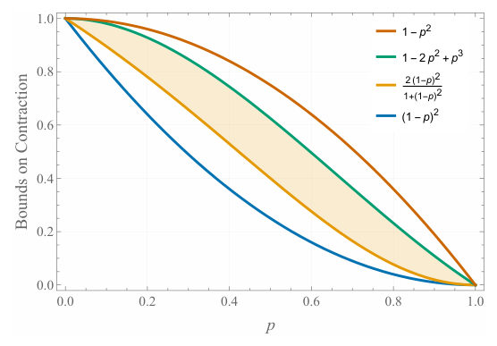
<figcaption class="paper-figure-caption"><b>Fig 3.</b> Figure 3: Illustration of the bounds on ηD(D⊗2 p ) as given in (6.20). The shaded area gives the remaining range of possible values for the contraction coefficient.</figcaption>
</figure>
<figure class="paper-figure-card">
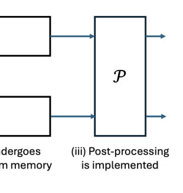
<figcaption class="paper-figure-caption"><b>Fig 4.</b> Figure 4: Depiction of the setting we consider in Section 6.2.</figcaption>
</figure>
<figure class="paper-figure-card">
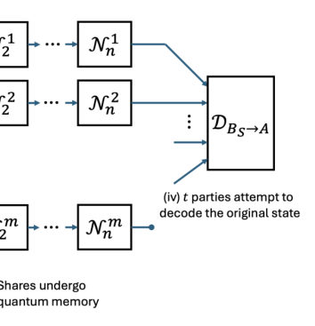
<figcaption class="paper-figure-caption"><b>Fig 5.</b> Figure 5: Depiction of model considered in Subsection 6.3.</figcaption>
</figure>

**Summary.** This work introduces conditional contraction coefficients to provide a robust measure of information loss in quantum channels when quantum side information is present. It unifies the analysis of information contraction by extending data-processing inequalities to include reference systems. The results establish fundamental limits for quantum networks and memory capacity by providing a comprehensive theoretical framework.

**Why it may be interesting.** The development of generalized information measures that explicitly account for side information is crucial for accurately modeling realistic quantum communication protocols and network constraints.

Detailed structure

**Main problem.** The paper addresses the challenge of quantifying information loss (distinguishability loss) through quantum channels when arbitrary quantum side information (reference systems) is present.

**Main result.** It introduces conditional contraction coefficients, establishing a unified framework for analyzing information contraction in quantum networks, and proving key equalities for the quantum relative entropy.

**Method.** The authors develop a general mathematical framework by defining novel contraction coefficients based on the difference of divergences involving the reference system, extending existing data-processing inequalities.

**Model / system.** The analysis centers on general quantum channels ($\mathcal{N}$) acting on quantum states, explicitly incorporating an arbitrary quantum reference system ($R$) to model side information.

**Key observables.** Conditional contraction coefficients ($\eta_{\Delta}^D(\mathcal{N})$), standard contraction coefficients ($\eta_D(\mathcal{N})$), and the conditional mutual information.

**Important parameters / regimes.** The type of quantum divergence used (e.g., trace distance, quantum relative entropy) and the presence/nature of the reference system $R$.

**Assumptions / limitations.** The framework relies on the ability to define and manipulate divergences that account for side information, with specific results depending on properties like the extended direct-sum property.

**Figures summary.** Figure 1 summarizes relationships between various contraction coefficients for the relative entropy, showing inequalities and equalities.

**Paper structure.** The paper progresses by defining the novel conditional contraction coefficients, proving key identities (especially for relative entropy), establishing general inequalities between different types of coefficients, and concluding with applications to network bounds and memory limits.

Abstract

Contraction coefficients quantify the loss of distinguishability induced by a channel and provide a strong form of the data-processing inequality. While standard contraction coefficients ignore auxiliary quantum systems, existing extensions based on complete contraction coefficients require the compared states to have identical reference marginals. In this work, we introduce conditional contraction coefficients, a novel family that incorporates arbitrary quantum reference systems by subtracting the distinguishability already present in the reference system. We develop a general framework for contraction coefficients with such quantum side information, including the corresponding strong-data-processing-inequality (SDPI) constants, expansion coefficients, and relative contraction coefficients. For the trace distance, we show that the optimization can be restricted to orthogonal input states. For the quantum relative entropy, we prove that its conditional contraction coefficient is exactly equal to the contraction coefficient of the conditional mutual information, extending the classical correspondence between relative-entropy contraction and mutual-information contraction to the setting with quantum side information. More generally, we identify structural properties of divergences required for these results and discuss extensions beyond the relative entropy. These results establish a unified framework for analyzing information contraction in quantum network settings, where quantum side information and distributed correlations are intrinsic features of the information-processing task. Applications include an extension of the Polyanskiy-Wu bounds on mutual information contraction, new perspectives on mixing times, and fundamental limits on quantum memories.

[↑ back to top](#top)

### [Correcting Connectivity in Arc-Based QUBO Models for Fixed-Fleet Vehicle Routing](http://arxiv.org/abs/2608.26894v1)

**Authors:** Omer Gurevich, Maor Matityahu, Tal Mor, Aryeh Lev Zabokritskiy  
**Type:** both · **Category:** quantum information and computing · **PDF:** <https://arxiv.org/pdf/2608.26894v1>  
**Analysis basis:** full PDF text, analyzed in chunks

↔ Scroll figures horizontally

<figure class="paper-figure-card">
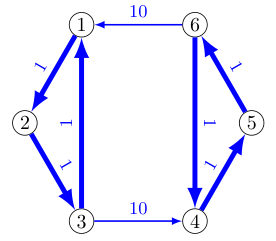
<figcaption class="paper-figure-caption"><b>Fig 1.</b> Fig. 1 A fully specified counterexample for K = 1. The six bold arcs have cost 1 and form an optimal degree-feasible assignment of cost 6, but they consist of two disconnected cycles. Every unshown arc has cost 10; the two thin arcs illustrate a connected Hamiltonian cycle of cost 24.</figcaption>
</figure>
<figure class="paper-figure-card">
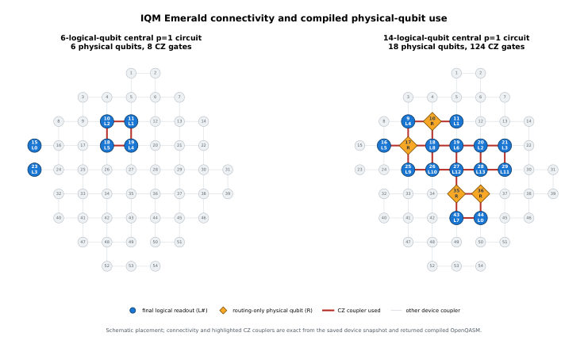
<figcaption class="paper-figure-caption"><b>Fig 2.</b> Fig. 2 Provider-compiled placement of the selected p = 1 termwise-Ising circuits on the saved IQM Emerald topology. The first line in each node is the physical-qubit index. On a blue node, Lj denotes logical wire qj under the variable dictionary stated immediately before the figure; the prefix L means “logical” and is unrelated to the flow-word length L. On a yellow node, R denotes a physical compiler-routing location absent from the final readout mapping, not a route variable. Each red edge is a distinct physical coupler used at least once; the number in the panel title counts total CZ-gate occurrences. The word “central” inside the archived graphic refers to the selected angle pair. The...</figcaption>
</figure>
<figure class="paper-figure-card">
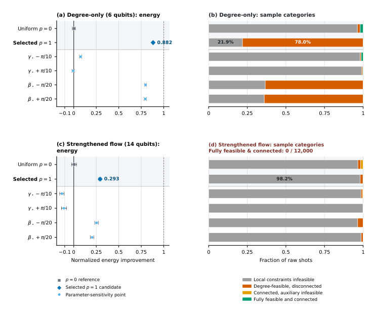
<figcaption class="paper-figure-caption"><b>Fig 3.</b> Fig. 3 IQM Emerald measurements for the N = 4, K = 1 diagnostic instance. Panel (a) shows normalized mean energy and panel (b) the outcome fractions for the degree-only Hamiltonian; panels (c) and (d) show the corresponding quantities for the reduced flow-augmented Hamiltonian. Rows in each bar panel correspond to the parameter labels in the adjacent point panel, and every bar partitions 2,000 raw shots among local-constraint violations, degree-feasible disconnected assignments, connected assignments with invalid retained flow (flow case only), and fully feasible assign- ments. The point-panel horizontal axis is I = (Eunif −¯E)/(Eunif −Emin): the solid line I = 0 is the exact uniform...</figcaption>
</figure>

**Summary.** This work develops a mathematically rigorous method to correct connectivity flaws in QUBO models designed for the Vehicle Routing Problem. By incorporating a single-commodity flow repair into the Hamiltonian, the authors guarantee that the lowest energy state corresponds to a valid, connected route. The research combines theoretical proof with hardware benchmarking to characterize the feasibility of mapping complex combinatorial problems onto quantum processors.

**Why it may be interesting.** It directly tackles the gap between theoretical QUBO formulation and physical realizability by providing a rigorous method to enforce global constraints (connectivity) necessary for complex combinatorial optimization problems on quantum hardware.

Detailed structure

**Main problem.** The paper addresses the critical issue of ensuring global connectivity in QUBO models used for the Vehicle Routing Problem (VRP), where initial formulations only enforce local cycle covers.

**Main result.** The authors construct and prove a polynomial-size QUBO repair using capped single-commodity flow that guarantees the ground state corresponds to a connected and cost-optimal routing.

**Method.** The methodology involves reformulating the VRP constraints into a flow-augmented QUBO, followed by resource analysis (qubits, gates) and benchmarking on quantum hardware simulators and actual quantum processors.

**Model / system.** The system is the fixed-fleet, homogeneous, uncapacitated VRP, modeled using an arc-based QUBO Hamiltonian. The core challenge is augmenting the Hamiltonian to enforce single-commodity flow constraints to guarantee connectivity.

**Key observables.** Connectivity gap, logical problem qubits required, number of written Hamiltonian interactions, and the probability of observing disconnected ground states on quantum hardware.

**Important parameters / regimes.** Number of customers (N), number of routes (K), and the size of the graph (E).

**Assumptions / limitations.** The analysis assumes the VRP is fixed-fleet, homogeneous, and uncapacitated. The quantum results are explicitly stated to characterize compilation limitations rather than asymptotic algorithmic advantages.

**Figures summary.** The notes mention a counterexample (N=6, K=1) illustrating the cost difference between disconnected cycle covers and valid Hamiltonian cycles, and references to resource scaling comparisons between flow-augmented and position-indexed encodings.

**Paper structure.** The paper first identifies the connectivity failure in degree-only arc Hamiltonians, proposes the flow-augmented QUBO repair, analyzes the resource scaling and theoretical guarantees, and concludes with experimental characterization on quantum hardware using diagnostic counterexamples.

Abstract

We revisit a degree-only arc Hamiltonian for fixed-fleet, homogeneous, uncapacitated vehicle routing. Because its local penalties define only a cycle cover, ground states may contain customer cycles disconnected from the depot. We construct a polynomial-size quadratic unconstrained binary optimization (QUBO) repair using capped single-commodity flow and prove that every ground-state routing is connected and cost-optimal under explicit penalty assumptions. For $N-1$ customers and $K$ nonempty routes, the unreduced encoding uses exactly $|E|(1+\lceil\log_2(N-K+1)\rceil)$ logical problem qubits. A reversible compute--phase--uncompute realization evaluates the flow penalties in $O(N^2\log N+N\log^2N)$ logical gates on a complete graph with $O(\log N)$ reusable workspace and no product register. On complete loopless graphs, a depot-delimited single-sequence position encoding uses fewer problem qubits and fewer written terms when the flow-word length grows. Conversely, the flow model achieves a smaller structured logical-gate upper bound under a common reversible accounting model. Exact audits of the Hamiltonian and circuit implementation, combined with a $1{,}200$-matrix classical benchmark, verify the formulation and quantify the connectivity gap. Finally, a 32,000-shot Amazon Braket task on IQM Emerald characterizes depth-one termwise Ising circuits on a diagnostic $N = 4,\, K = 1$ counterexample instance. In the degree-only circuit, $78.05\%$ of selected $p=1$ shots realize the invalid disconnected ground state; the reduced 14-qubit flow-augmented circuit yields no fully feasible sample. These device results characterize mapped Hamiltonians and compilation rather than an asymptotic routing solution advantage.

[↑ back to top](#top)

### [Coupled-channel scattering from artificial confinement](http://arxiv.org/abs/2608.26865v1)

**Authors:** Tafat Weiss Attia, Itay Horin, Betzalel Bazak  
**Type:** theory · **Category:** other · **PDF:** <https://arxiv.org/pdf/2608.26865v1>  
**Analysis basis:** full PDF text, analyzed in chunks

↔ Scroll figures horizontally

<figure class="paper-figure-card">
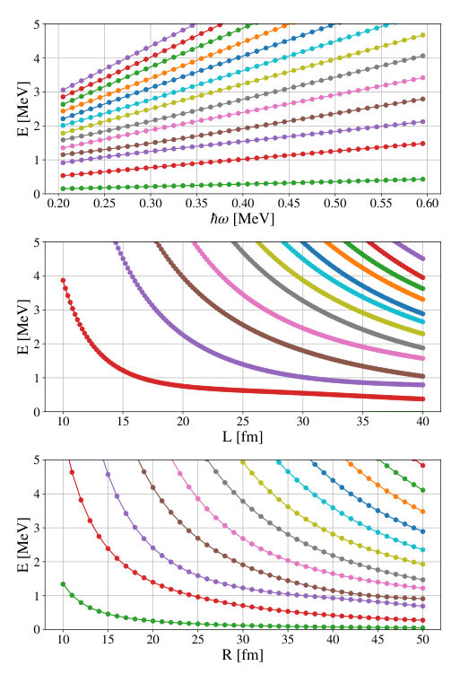
<figcaption class="paper-figure-caption"><b>Fig 1.</b> FIG. 1. Coupled-channel 1S0 spectra for the three confine- ment geometries. From top to bottom, the panels show the discrete energies as functions of the oscillator energy ℏω, periodic-box length L, and spherical-wall radius R. Each curve represents one confined level. PCHIP interpolation of the individual curves locates the confinement parameters at which several levels cross a common scattering energy.</figcaption>
</figure>
<figure class="paper-figure-card">
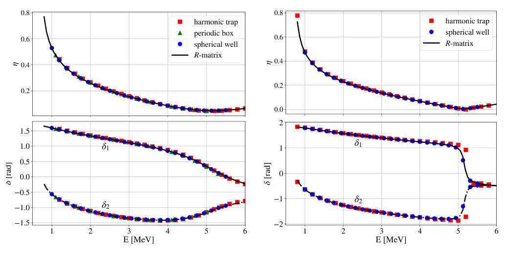
<figcaption class="paper-figure-caption"><b>Fig 2.</b> FIG. 2. Inelasticity and phase shifts in the 1S0 partial wave as functions of scattering energy. The left panel omits the Coulomb interaction, while the right panel includes it in the charged 3H + p channel. In each panel, the upper plot shows η(E) and the lower plot shows δ1(E) and δ2(E). Black curves are the R-matrix reference; colored symbols are the observables extracted from the HO trap (red), spherical hard wall (blue), and periodic cubic box (green). Periodic-box results are not included in the calculation with Coulomb interactions.</figcaption>
</figure>
<figure class="paper-figure-card">
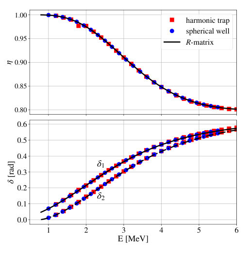
<figcaption class="paper-figure-caption"><b>Fig 3.</b> FIG. 3. Same as Fig. 2, but for the 3P1 partial wave.</figcaption>
</figure>
<figure class="paper-figure-card">
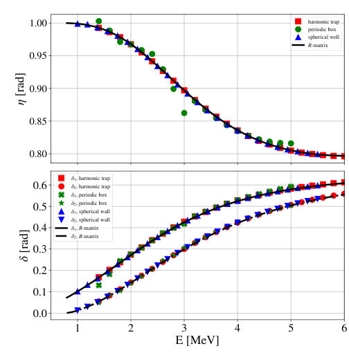
<figcaption class="paper-figure-caption"><b>Fig 4.</b> Figure 4 shows the HO results. With 0.1% spectral un- certainty, η and δ+ follow the R-matrix reference through most of the interval. The difference δ−is the least stable combination: its band remains useful to about 4 MeV and then widens sharply toward 5 MeV. At 1% uncer- tainty, the η and δ−bands broaden at lower energies. Near 3 MeV, the 1% interval for η is already several times wider than the 0.1% interval; by 4–5 MeV, the 1% ensemble shifts upward in η, while δ−spans several radi- ans. The sum δ+ remains comparatively well determined at both noise levels. The periodic-box results in Fig. 5 exhibit the same hierarchy: δ+ is robust, whereas η and δ−are sensitive. The 1% bands...</figcaption>
</figure>
<figure class="paper-figure-card">
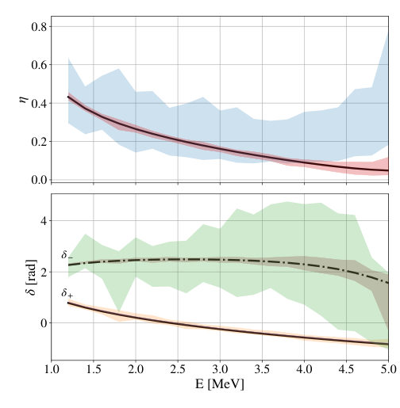
<figcaption class="paper-figure-caption"><b>Fig 5.</b> FIG. 4. Propagation of spectral uncertainties to the extracted 1S0 observables without Coulomb interactions for the HO trap. Relative Gaussian relative uncertainties of 1% and 0.1% are applied to the confined energies. The upper panel shows the inelasticity η, and the lower panel shows δ± = δ1 ± δ2. Solid curves are the R-matrix reference; shaded regions are the 16–84% Monte Carlo intervals from 2 × 105 realizations. At each energy, the same number of constraints is used for all three geometries.</figcaption>
</figure>

**Summary.** This paper develops a methodology to extract continuum scattering parameters (phase shifts and inelasticity) for a Helium cluster model by fitting multiple discrete energy levels obtained from different artificial confinement potentials (HO, hard wall, box). The results confirm the consistency of these methods when compared to a continuum R-matrix calculation, while also quantifying the sensitivity of the extracted observables to spectral noise and the specific confinement geometry used.

**Why it may be interesting.** This work is highly relevant as it provides a rigorous, quantitative benchmark for using artificial confinement potentials to calculate fundamental scattering properties in few-body and nuclear physics systems, which is a key area for theoretical AMO/open quantum systems.

Detailed structure

**Main problem.** The paper addresses the theoretical challenge of extracting continuum scattering information, which is defined by asymptotic wave functions, from discrete, bound-state-like spectra generated by finite-basis or finite-domain calculations.

**Main result.** The study demonstrates that multiple confinement geometries (HO, hard wall, cubic box) yield consistent results for scattering observables when fitted using an overdetermined approach, providing a controlled benchmark for such methods.

**Method.** The authors employ a unified quantization-condition framework, fitting multiple confined energy levels at a common scattering energy to determine coupled-channel observables like phase shifts and inelasticity.

**Model / system.** The system modeled is a two-channel cluster model of Helium-4, involving open channels like $^3	ext{H}+	ext{p}$ and $^3	ext{He}+	ext{n}$, and includes long-range Coulomb interactions in one channel.

**Key observables.** Two-channel phase shifts ($\delta_1, \delta_2$) and the inelasticity ($\eta$).

**Important parameters / regimes.** The comparison is made across three confinement geometries: Harmonic-Oscillator (HO) trap, spherical hard wall, and periodic cubic box.

**Assumptions / limitations.** The analysis assumes that matching the number of usable constraints across different geometries allows for a fair comparison, and it notes that spectral uncertainties are amplified near trap-function poles.

**Figures summary.** Figures illustrate the extracted observables (e.g., $3P_1$ partial wave) across different geometries compared to the R-matrix reference, and show the propagation of spectral uncertainties for different traps.

**Paper structure.** The paper first establishes the theoretical framework by comparing confinement methods (HO, hard wall, box) against a continuum R-matrix benchmark. It then details the fitting procedure using multiple energy crossings to extract the three key scattering parameters, concluding with a detailed analysis of the stability and limitations of each confinement geometry.

Abstract

Artificial confinement encodes continuum scattering information in discrete, bound-state-like spectra, allowing reaction observables to be extracted with finite-basis or finite-domain methods. We apply this strategy to a two-channel cluster model of $^4$He with open $^3$H+p and $^3$He+n channels. We extract coupled-channel observables from spectra generated by a harmonic-oscillator (HO) trap, a spherical hard wall, and, within a single-partial-wave truncation, a periodic cubic box. The three geometries are formulated in a unified quantization-condition framework and benchmarked against a continuum $R$-matrix calculation. Above the second-channel threshold, several confined levels at a common scattering energy are combined in an overdetermined fit to determine two phase shifts and an inelasticity. Without Coulomb interactions, all three geometries yield consistent results for the $^1S_0$ and $^3P_1$ partial waves. With Coulomb interactions in the charged $^3$H+p channel, the HO and spherical-wall results also agree closely with the continuum reference. A Monte Carlo propagation study shows that spectral uncertainties are amplified near trap-function poles and along poorly conditioned directions associated with the inelasticity and phase-shift difference, whereas the phase-shift sum remains comparatively robust. These results provide a controlled benchmark for confinement-based scattering methods and delineate their strengths and limitations for future few-body and ab initio reaction calculations.

[↑ back to top](#top)

### [Factorized Boolean representations for efficient quantum synthesis](http://arxiv.org/abs/2608.27430v1)

**Authors:** Mehul Shah, Robert Fiszer, Marek Perkowski  
**Type:** theory · **Category:** quantum information and computing · **PDF:** <https://arxiv.org/pdf/2608.27430v1>  
**Analysis basis:** full PDF text, analyzed in chunks

↔ Scroll figures horizontally

<figure class="paper-figure-card">
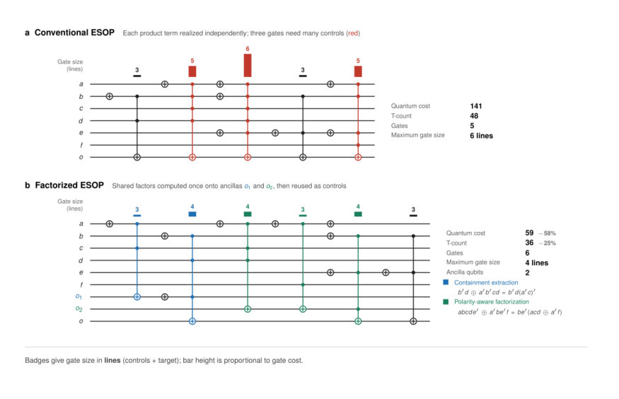
<figcaption class="paper-figure-caption"><b>Fig 1.</b> Fig. 1 | Factorization reduces gate arity rather than gate count. a, Conventional realization of the benchmark function con1f1, in which each of five product terms becomes an independent multi-controlled gate; three require many controls (red) and the widest spans six lines. b, The same function after containment-based factor extraction (blue) and polarity- aware factorization (green). Shared factors are computed onto auxiliary lines that then act as additional controls, so that no gate exceeds four lines. Badges give gate size in lines (controls plus target) and bar height is proportional to gate cost. The factorized circuit contains six gates rather than five, yet quantum cost falls from...</figcaption>
</figure>
<figure class="paper-figure-card">
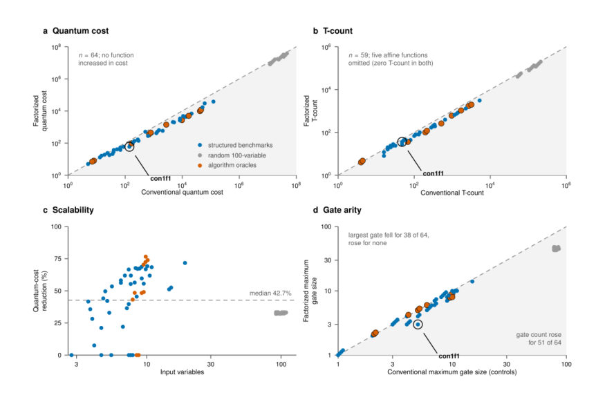
<figcaption class="paper-figure-caption"><b>Fig 2.</b> Fig. 2 | Resource reductions across 64 Boolean functions. Colour distinguishes three groups: structured benchmarks (blue), randomly generated 100-variable functions (grey), and oracles derived from quantum algorithms (vermillion). a, Factorized versus conventional quantum cost; the dashed line marks equality and the shaded region a reduction. No function increased in cost. The example worked on Fig. 1 is highlighted. b, Factorized versus conventional T-count for the 59 functions with non-zero conventional T-count; five affine functions require no non-Clifford resources in either representation and are omitted. c, Quantum-cost reduction against input-variable count, with median 42.7% (dashed...</figcaption>
</figure>
<figure class="paper-figure-card">
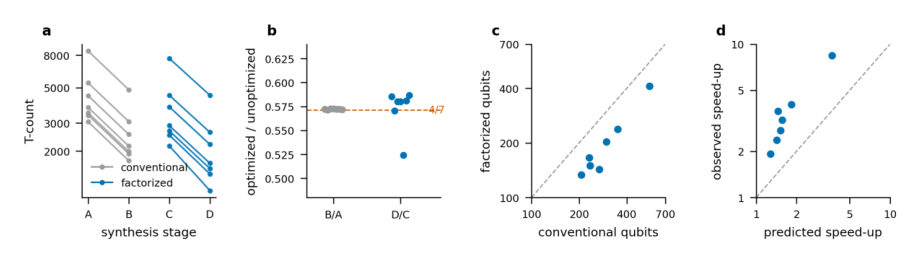
<figcaption class="paper-figure-caption"><b>Fig 3.</b> Fig. 3 | Factorization improves circuit-level optimization on the largest completed comparisons. Seven benchmark pairs whose PyZX optimization exceeded ten minutes. a, T- count at each of four stages: conventional (A), conventional optimized (B), factorized (C), factorized optimized (D) as a slopegraph; every trajectory from B to D decreases. b, Ratio of optimized to unoptimized T-count for both representations; values cluster tightly around a constant near 4/7, indicating the optimizer applies a fixed local rewrite independent of input structure. c, Qubit count, conventional against factorized; every point falls below the equality line, a reduction PyZX does not produce on its own. d,...</figcaption>
</figure>
<figure class="paper-figure-card">
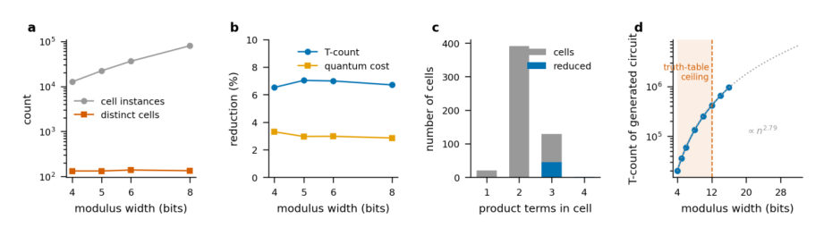
<figcaption class="paper-figure-caption"><b>Fig 4.</b> Fig. 4 | Factorization applied to compositionally generated modular exponentiation. Circuits for ax mod N were generated from their arithmetic structure at moduli of 4, 5, 6 and 8 bits and factorized cell by cell. a, Number of cell instances in the generated circuit against the number of distinct cells among them; instances grow with modulus width while the distinct inventory does not. b, T-count and quantum-cost reduction for the complete circuit, obtained by weighing each distinct cell by its multiplicity; both are flat in modulus width. c, Distinct cells grouped by the number of product terms they contain, with the subset whose T-count was reduced shown in colour; reduction is confined...</figcaption>
</figure>

**Summary.** This paper introduces a novel factorized Boolean representation technique to optimize the synthesis of quantum circuits from Boolean specifications. By exploiting algebraic relationships like containment and complementary polarity, the method reduces the critical resource cost—the control count of the widest gate—which is superlinearly expensive. This optimization is shown to yield circuits that are significantly cheaper to execute than those derived from standard minimization techniques.

**Why it may be interesting.** While focused on digital quantum computation, the rigorous resource analysis and optimization techniques developed for circuit synthesis provide valuable theoretical tools for understanding resource scaling in complex quantum protocols.

Detailed structure

**Main problem.** The core challenge is efficiently translating complex Boolean specifications into resource-optimized reversible quantum circuits for fault-tolerant quantum computation.

**Main result.** A novel factorized representation method was shown to reduce the superlinear cost (widest gate control count) of quantum circuits, achieving significant reductions (e.g., median 42.7% quantum cost reduction) compared to conventional synthesis methods.

**Method.** The authors developed a two-stage factorization procedure leveraging containment and complementary-polarity relationships among product terms to create a factorized Boolean representation.

**Model / system.** The model is the quantum circuit synthesis process, requiring the transformation of Boolean logic into reversible quantum gates (Clifford+T basis) suitable for error-corrected hardware.

**Key observables.** Quantum cost (superlinear cost), T-count, qubit count, and the arity of the widest gate.

**Important parameters / regimes.** The cost is dominated by the control count of the widest operation, which scales superlinearly with the number of controls.

**Assumptions / limitations.** The factorized circuit is guaranteed not to increase either the quantum cost or T-count relative to the original representation, although some advantage is lost upon full circuit uncomputation.

**Figures summary.** Figures compare resource reductions (quantum cost, T-count) across 64 functions, demonstrating that factorization reduces gate arity, and later figures compare resource usage across multiple optimization stages for complex oracles.

**Paper structure.** The paper introduces the problem of quantum synthesis cost, details the factorized representation method (using containment and polarity), validates the approach on structured benchmarks and complex oracles (like modular exponentiation), and compares the resulting circuits against state-of-the-art circuit-level optimizers.

Abstract

Quantum algorithms promise advantages beyond classical reach, but running them on error-corrected hardware requires translating Boolean specifications into reversible circuits, and the resources that translation demands determine what is executable. Established methods minimize a Boolean expression and map it to a circuit, assuming the minimized form is best. Here we show that minimized expressions retain algebraic structure minimization cannot reach, arising from containment and complementary-polarity relationships among their terms, and that extracting it yields circuits cheaper to execute despite having more operations. The decisive quantity is not a circuit's operation count but the control count of its widest operation, a superlinear cost; extracting shared factors trades a few wide operations for many narrow ones and reduces qubit count. Across benchmarks and oracles from quantum search and factoring algorithms, at the representation level the transformation never increases either cost measure, a guarantee from its construction. Translation to an executable circuit returns part of that advantage, since auxiliary lines must be uncomputed, yet the factorized circuit still left a leading circuit-level optimizer reaching lower final counts, and faster, than unaided. The representation of a computation is therefore itself a resource, optimizable before compilation and distinct from both logic minimization and circuit-level optimization.

[↑ back to top](#top)

### [Fault-tolerant quantum computation cannot be achieved with constant spacetime overhead](http://arxiv.org/abs/2608.26272v1)

**Authors:** Kishor Bharti, Tobias Haug, Andrew Tanggara  
**Type:** theory · **Category:** quantum information and computing · **PDF:** <https://arxiv.org/pdf/2608.26272v1>  
**Analysis basis:** full PDF text, analyzed in chunks

↔ Scroll figures horizontally

<figure class="paper-figure-card">
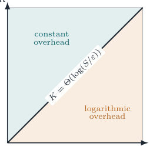
<figcaption class="paper-figure-caption"><b>Fig 1.</b> FIG. 1. The optimal relative overhead under independent erasure noise is controlled by the ratio log(S/ϵ)/K, where K is the number of logical qubits, S the storage duration and ϵ the target error. At the crossover K = Θ(log(S/ϵ)), the costs of retaining the logical information and maintaining reliability are comparable. For K = Ω(log(S/ϵ)), the relative overhead remains constant, whereas for K = o(log(S/ϵ)) the reliability cost dominates and the overhead grows logarithmically.</figcaption>
</figure>

**Summary.** This work establishes fundamental limits on the resources needed for fault-tolerant quantum computation, particularly concerning the overhead required for quantum memory. It proves that while constant *relative* overhead is possible for wide computations, an unavoidable logarithmic cost exists in the cumulative spacetime overhead. The findings provide crucial scaling laws for designing practical, large-scale quantum processors.

**Why it may be interesting.** It establishes rigorous, fundamental resource bounds on the overhead required for fault tolerance, which directly impacts the feasibility estimates for large-scale quantum computation architectures.

Detailed structure

**Main problem.** The paper determines the fundamental limits on the cumulative spacetime overhead required for achieving fault-tolerant quantum computation.

**Main result.** It shows that while constant *relative* overhead is achievable for sufficiently wide computations, an unavoidable logarithmic contribution to the cumulative spacetime overhead exists for quantum memory.

**Method.** The analysis uses information-theoretic bounds derived from the probability of surviving erasure events and compares these to the required physical resources using adaptive protocol models and spacetime-code constructions.

**Model / system.** The primary model is quantum memory—preserving an arbitrary quantum state for a duration $S$ under independent erasure noise. The analysis extends to general fault-tolerant circuits using spacetime-code descriptions.

**Key observables.** Minimum worst-case physical storage locations ($Cmin$), relative overhead ($rac{Cmin}{KS}$), and physical circuit size ($	ext{CFT}$).

**Important parameters / regimes.** Logical qubit count ($K$), storage duration ($S$), target error ($\epsilon$), and the ratio $\log(S/\epsilon)/K$.

**Assumptions / limitations.** The analysis assumes an optimistic noise model (independent erasure noise) and general adaptive protocols, though the limitation is argued to persist for general noise.

**Figures summary.** Figure 1 illustrates the optimal relative overhead controlled by the ratio $\log(S/\epsilon)/K$, showing a crossover point where constant relative overhead becomes possible.

**Paper structure.** The paper progresses by first establishing the memory overhead bound ($	ext{Cmin}$), then extending this to general circuit overhead ($	ext{CFT}$), and finally analyzing the fundamental scaling using spacetime-code representations to derive the width-duration trade-off.

Abstract

The threshold theorem states that quantum computations can be made reliable below a physical error threshold, at the cost of additional physical qubits and circuit depth. Recent work has reduced these space and time overheads to polylogarithmic or nearly logarithmic scalings, but whether the cumulative spacetime overhead can be constant has remained unclear. Here, we show that even for the simplest task of preserving quantum information in a quantum memory, under an optimistic noise model and allowing general adaptive protocols, there is an unavoidable logarithmic contribution to the cumulative spacetime overhead. This additional cost can nevertheless be shared among many logical qubits, so sufficiently wide computations, including standard implementations of Shor's algorithm, may still achieve constant relative overhead. We further give a positive-rate CSS code construction that attains the memory bound, identify sufficient conditions under which the same scaling extends from quantum memory to fault-tolerant circuit implementations, and derive circuit-size bounds for subsystem spacetime codes. Our work establishes fundamental limits on the resources required for quantum fault tolerance.

[↑ back to top](#top)

### [Interlayer-engineering of Charge Order Wave Vector in Kagome Metals](http://arxiv.org/abs/2608.26751v1)

**Authors:** Muntafa M. Mahi, Quazi D. M. Khosru, M. Zahid Hasan, Mahbub Alam, Md Shafayat Hossain  
**Type:** theory · **Category:** strongly correlated electrons · **PDF:** <https://arxiv.org/pdf/2608.26751v1>  
**Analysis basis:** full PDF text, analyzed in chunks

↔ Scroll figures horizontally

<figure class="paper-figure-card">
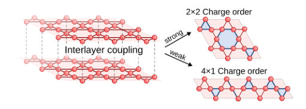
<figcaption class="paper-figure-caption"><b>Fig 1.</b> FIG. 1. Schematic illustration of how interlayer coupling rec- onciles the competing 4×1 and 2×2 charge-order instabilities in CsV3Sb5.</figcaption>
</figure>
<figure class="paper-figure-card">
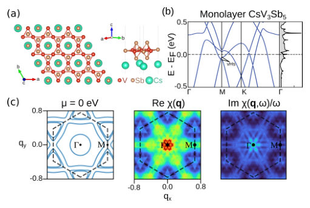
<figcaption class="paper-figure-caption"><b>Fig 2.</b> FIG. 2. Electronic structure of CsV3Sb5 monolayer: (a) Crys- tal configuration, (b) band structure, (c) Fermi surface at zero chemical potential (left), real part (middle), and imaginary part (right) of electronic susceptibility.</figcaption>
</figure>
<figure class="paper-figure-card">
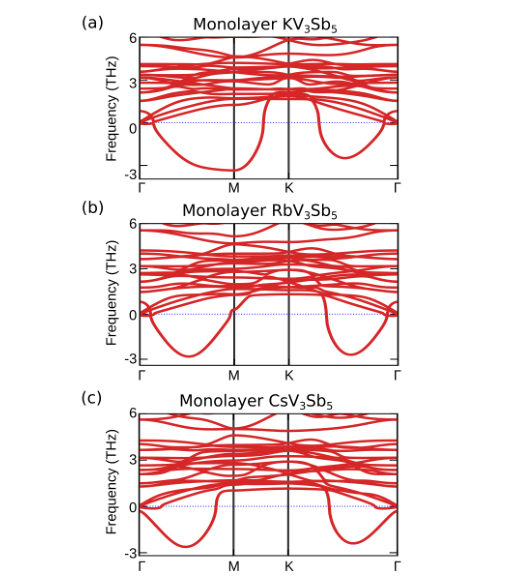
<figcaption class="paper-figure-caption"><b>Fig 3.</b> FIG. 3. Phonon spectrum of monolayers: (a) KV3Sb5, (b) RbV3Sb5 and (c) CsV3Sb5. The M-point phonon mode is unstable exclusively in KV3Sb5.</figcaption>
</figure>
<figure class="paper-figure-card">
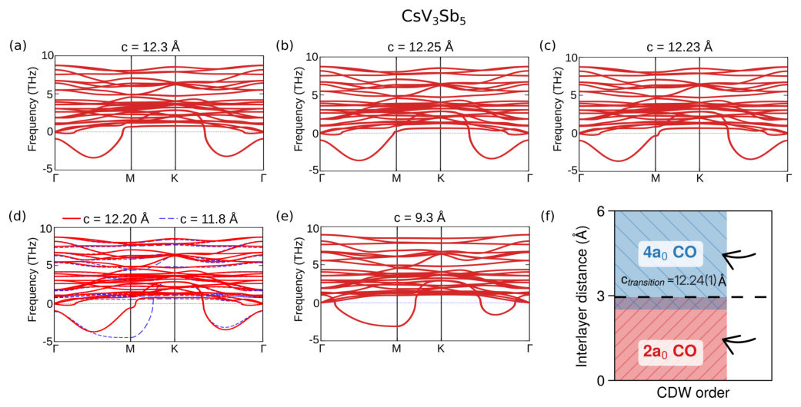
<figcaption class="paper-figure-caption"><b>Fig 4.</b> FIG. 4. Tuning the interlayer coupling in CsV3Sb5: (a–e) phonon spectra at varying interlayer spacing. The M-point phonon mode becomes unstable at c = 12.24(1) Å and the instability strengthens as the interlayer spacing approaches the bulk value c = 9.3 Å. (f) Evolution of the leading instabilities as a function of interlayer spacing, showing the emergence of 2×2 instability; both charge orders coexist in the shaded region. The interlayer distance is defined as the difference between the c-axis lattice constant and the bulk c-value</figcaption>
</figure>

**Summary.** This work uses first-principles calculations to study how interlayer coupling controls the charge ordering in Kagome metals like $	ext{AV}_3	ext{Sb}_5$. By tuning the interlayer distance, the researchers demonstrate a clear transition from a $4 	imes 1$ instability characteristic of the 2D monolayer to a $2 	imes 2$ instability characteristic of the bulk. This establishes interlayer coupling as the key parameter unifying the competition between these two distinct charge-ordered states.

**Why it may be interesting.** The concept of a structural parameter (interlayer spacing) acting as a continuous tuning knob to select between competing electronic ground states (CDW wave vectors) is highly relevant to understanding phase diagrams in layered quantum materials.

Detailed structure

**Main problem.** The paper addresses the unresolved question of the microscopic origin and competition between different charge ordering wave vectors ($2 	imes 2$ vs. $4 	imes 1$) in Kagome metals.

**Main result.** Interlayer coupling acts as a crucial control parameter, unifying the understanding of how the system transitions between the $4 	imes 1$ (2D) and $2 	imes 2$ (3D/Bulk) charge-ordered states.

**Method.** The study employs first-principles calculations, specifically analyzing the phonon spectrum instability by systematically tuning the interlayer separation using Density Functional Theory (DFT).

**Model / system.** The physical system is the Kagome metal $	ext{AV}_3	ext{Sb}_5$ ($	ext{A} = 	ext{K}, 	ext{Rb}, 	ext{Cs}$), where the interlayer coupling is varied from a monolayer limit to a bulk limit.

**Key observables.** Phonon spectrum instability (phonon softening), charge ordering wave vectors ($\mathbf{q} = (1/4, 0, 0)$ for $4 	imes 1$ and M-point for $2 	imes 2$), and the free energy gain associated with these orders.

**Important parameters / regimes.** Interlayer separation ($c$), which is tuned from the monolayer limit to the bulk limit, serving as the primary control parameter.

**Assumptions / limitations.** The analysis assumes that the observed instabilities are governed by the lattice dynamics and that interlayer coupling provides a systematic mechanism linking the competing orders.

**Figures summary.** Figures illustrate the schematic relationship between interlayer coupling and the competition between $4 	imes 1$ and $2 	imes 2$ instabilities, and show the evolution of phonon instabilities as the interlayer distance is varied.

**Paper structure.** The paper systematically investigates the lattice instability by first examining the monolayer limit (finding $4 	imes 1$ instability) and then gradually increasing the interlayer coupling by reducing the spacing, observing the progressive softening and emergence of the $2 	imes 2$ instability.

Abstract

Charge orders in the kagome metals AV$_3$Sb$_5$ sit at the center of a rich phase diagram that also includes superconductivity, nematicity, and signatures of time-reversal-symmetry breaking. Yet even the basic question of which charge ordering wave vectors are intrinsic, and which are selected by dimensionality and lattice coupling, remains unsettled. Importantly, the microscopic origin of different charge orders and, in particular, the relationship between the robust bulk $2 \times 2$ charge order and the controversial $4 \times 1$ modulation, which is primarily resolved by surface probes, remains unresolved. Here, we use first-principles calculations to study the role of interlayer coupling in CsV$_3$Sb$_5$ by tuning the interlayer separation from the monolayer limit to the bulk limit. In the monolayer AV$_3$Sb$_5$ (A = Rb, Cs), the phonon spectrum exhibits no instability at the M point; instead, the dominant lattice instability occurs at q = (1/4, 0, 0), consistent with a $4 \times 1$ modulation. As interlayer coupling increases in CsV$_3$Sb$_5$, an M-point phonon progressively softens and becomes unstable already near c = 12.24 Å, evolving into the strong $2 \times 2$ instability characteristic of the bulk. These results identify interlayer coupling as a control parameter at a fixed stoichiometry that links competing $4 \times 1$ and $2 \times 2$ tendencies, providing a unified framework for understanding why multiple charge-order wave vectors coexist and compete in kagome metals.

[↑ back to top](#top)

### [Kramers pseudospin and the quantum number proposed for the many-electron Dirac?Coulomb Hamiltonian](http://arxiv.org/abs/2608.27112v1)

**Authors:** Shadan Ghassemi Tabrizi  
**Type:** theory · **Category:** strongly correlated electrons · **PDF:** <https://arxiv.org/pdf/2608.27112v1>  
**Analysis basis:** full PDF text, analyzed in chunks

↔ Scroll figures horizontally

<figure class="paper-figure-card">
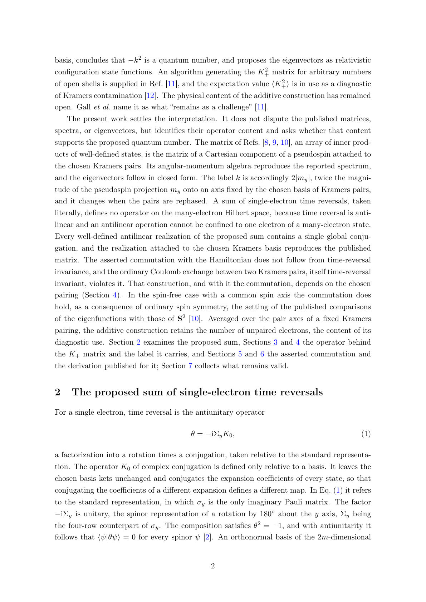
<figcaption class="paper-figure-caption"><b>Fig 1.</b> Low-resolution page preview, page 2</figcaption>
</figure>
<figure class="paper-figure-card">
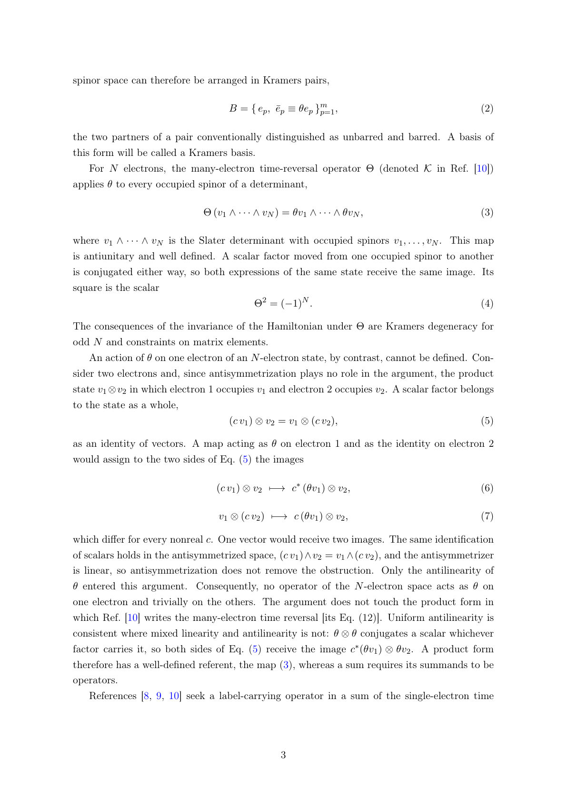
<figcaption class="paper-figure-caption"><b>Fig 2.</b> Low-resolution page preview, page 3</figcaption>
</figure>
<figure class="paper-figure-card">
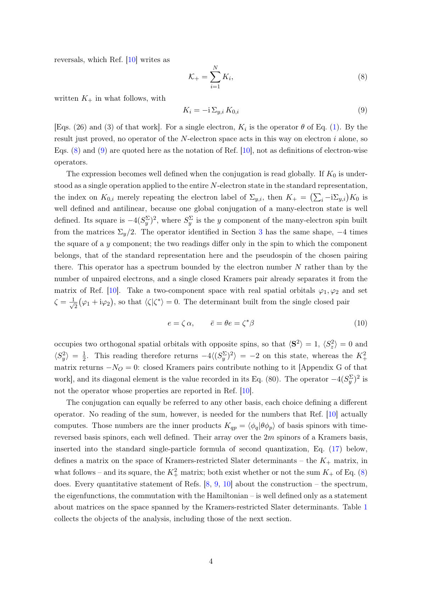
<figcaption class="paper-figure-caption"><b>Fig 3.</b> Low-resolution page preview, page 4</figcaption>
</figure>
<figure class="paper-figure-card">
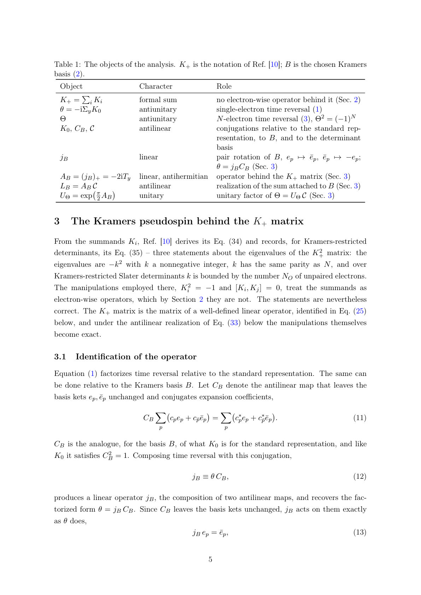
<figcaption class="paper-figure-caption"><b>Fig 4.</b> Low-resolution page preview, page 5</figcaption>
</figure>
<figure class="paper-figure-card">
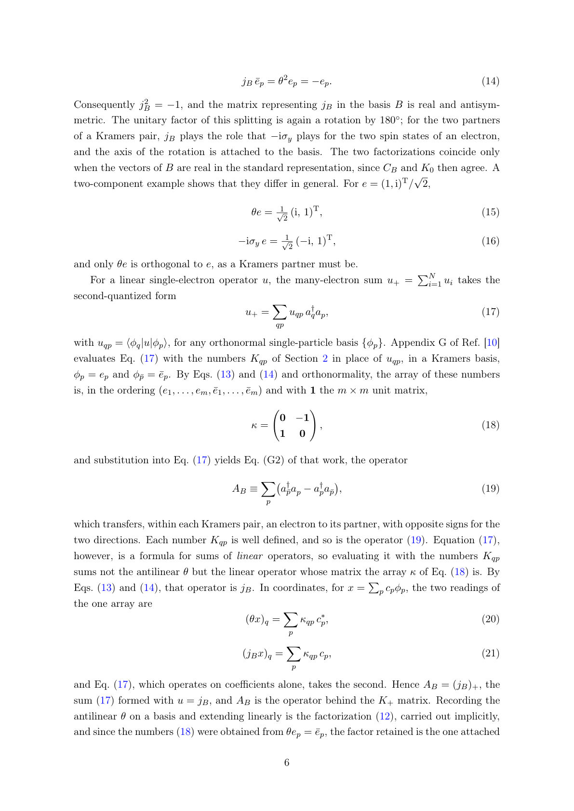
<figcaption class="paper-figure-caption"><b>Fig 5.</b> Low-resolution page preview, page 6</figcaption>
</figure>

**Summary.** This work investigates a proposed quantum number for the Dirac-Coulomb Hamiltonian based on time-reversal symmetry. The authors demonstrate that the operator underlying this quantum number is ill-defined and, crucially, does not commute with the Hamiltonian. Therefore, the proposed quantum number is deemed physically unfounded, despite its apparent mathematical structure.

**Why it may be interesting.** It provides a rigorous theoretical critique of symmetry-protected quantum numbers in complex many-body systems, which is crucial for developing reliable theoretical models for correlated materials.

Detailed structure

**Main problem.** The paper critically analyzes the validity of a proposed conserved quantum number, derived from a sum of single-electron time reversals, for the many-electron Dirac-Coulomb Hamiltonian.

**Main result.** The authors conclude that the proposed quantum number does not stand because the underlying operator does not commute with the Hamiltonian, and the formal sum of time-reversal operators is ill-defined due to anti-linearity.

**Method.** The analysis involves identifying the operator content of the proposed conserved quantity using pseudospin algebra and testing the commutation relation $[H, 	ext{Operator}] = 0$ against known physical constraints.

**Model / system.** The system is many-electron atoms or molecules governed by the Dirac-Coulomb Hamiltonian, analyzed within a Kramers basis derived from time-reversal symmetry.

**Key observables.** The expectation value $\langle K_2^+ 
angle$ is used as a diagnostic for Kramers contamination; the overlap diagnostic $N-D$ (number of unpaired electrons) is shown to be robust.

**Important parameters / regimes.** The number of electrons ($N$), the pseudospin projection ($\mu_y$), and the structure of the basis (Kramers pairs).

**Assumptions / limitations.** The analysis assumes the validity of the matrix representations derived in previous works, but ultimately questions the physical validity of the underlying operator structure.

**Figures summary.** Not specified in the notes, but the analysis relies on comparing formal operator sums with their matrix representations.

**Paper structure.** The paper proceeds by first identifying the operator content of the proposed quantum number, then deriving its pseudospin structure, and finally testing its commutation with the Hamiltonian using overlap diagnostics and integral tests.

Abstract

The square of a sum of single-electron time reversals has been proposed as a conserved quantity with an integer eigenvalue spectrum for the many-electron Dirac-Coulomb Hamiltonian [Phys. Rev. A 94, 052104 (2016)], and its expectation value is in use as a diagnostic of Kramers contamination. This work identifies the operator behind the construction, a component of a pseudospin attached to the chosen Kramers pairs, whose angular-momentum algebra reproduces the reported spectrum and yields the eigenvectors in closed form. The label $k$ entering the proposed quantum number $-k^2$ is twice the magnitude of a pseudospin projection onto an axis fixed by the basis and changes when the Kramers pairs are rephased. The commutation with the Hamiltonian is unfounded, and the proposed quantum number does not stand.

[↑ back to top](#top)

### [Quantum cellular automata and invertible phases of matter](http://arxiv.org/abs/2608.26456v1)

**Authors:** Corey Jones, Nikita Sopenko, Ryan Thorngren  
**Type:** theory · **Category:** other · **PDF:** <https://arxiv.org/pdf/2608.26456v1>  
**Analysis basis:** full PDF text, analyzed in chunks

↔ Scroll figures horizontally

<figure class="paper-figure-card">
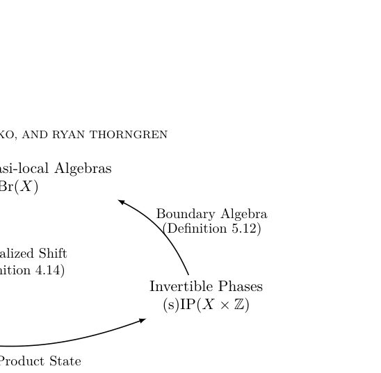
<figcaption class="paper-figure-caption"><b>Fig 1.</b> Figure 1. Schematic of maps in proof of Theorem A</figcaption>
</figure>
<figure class="paper-figure-card">
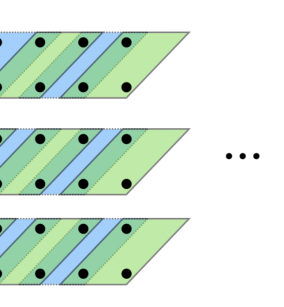
<figcaption class="paper-figure-caption"><b>Fig 2.</b> Figure 2. A depiction of the quantum circuit β constructed in the proof of Proposition 4.6, which shows that all QCA acting only in a half-space are quantum circuits after stabilization. One can think of this construction as first forming an infinite tower of rows, with the vertical direction denoting the ancillas, and then applying the circuit C which on each pair (2n, 2n + 1) produces α−1 ⊗α. Then applying a ”shear” transformation we obtain a circuit on the wedge above. Projection to the horizontal axis (the Z factor of X × Z) groups a finite amount of points in the vertical direction for each point of Z. Thus, we can regard the resulting circuit as defined in a product algebra over X ×...</figcaption>
</figure>
<figure class="paper-figure-card">
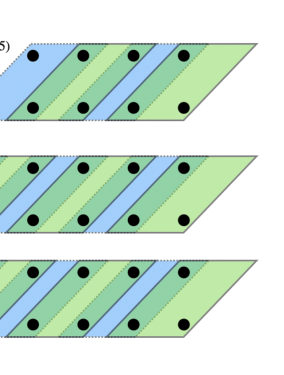
<figcaption class="paper-figure-caption"><b>Fig 3.</b> Figure 4. This figure depicts the construction in Proposition 5.8, where the state ψ = ˜ω(0) ⊗ω(1) ⊗· · · is created from ψ0 = ω(0) 0 ⊗ω(1) 0 ⊗· · · by a circuit. Here we have drawn the circuit mapping ω0 ⊗ω0 to ω ⊗˜ω as a depth-two circuit consisting of blue and green circuit elements, drawing only the Z≥0 coordinate. This picture is then compressed onto the Z≥0 axis to give a circuit on Z≥0. This results in a circuit, since on each finite U ⊂X × Z≥0, we only take a finite tensor product of sites and unitaries. The picture shows that the spread is bounded by l + 1 if the spread of the original circuit is l.</figcaption>
</figure>
<figure class="paper-figure-card">
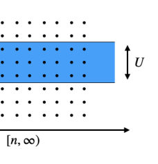
<figcaption class="paper-figure-caption"><b>Fig 4.</b> Figure 5. An illustration of Definition 5.12 of the boundary algebra of a state ω. For each U ⊂Zd−1, We take all the quasi-local operators whose support lies in [n, ∞) × U and complete this algebra to a von Neumann algebra in the GNS representation of ω. This gives a quasi-local algebra on Zd−1. In Proposition 5.15 we show that for an invertible state ω, this defines an invertible quasi-local algebra.</figcaption>
</figure>

**Summary.** This theoretical paper develops a deep mathematical connection between three concepts: quantum cellular automata, invertible phases of matter, and the algebraic structure of local observables. By using advanced tools from K-theory and operator algebras, the authors prove these three groups are isomorphic, providing a powerful classification tool for topological phases beyond simple lattice models.

**Why it may be interesting.** It provides deep mathematical connections between algebraic quantum field theory (CFT/QFT), topological order, and discrete symmetries (QCA), which is crucial for understanding the mathematical structure underlying exotic quantum phases.

Detailed structure

**Main problem.** The paper aims to establish a rigorous mathematical framework for classifying invertible phases of matter and relating them to quantum cellular automata (QCA) using infinite-dimensional local algebras.

**Main result.** The authors establish isomorphisms between the groups of stable QCA, Brauer equivalence classes of invertible quasi-local algebras, and invertible phases for systems over a metric space X.

**Method.** The methodology involves using K-theory of the symmetric monoidal category of invertible quasi-local algebras and analyzing the algebraic structure of observables derived from conformal field theories.

**Model / system.** The study concerns topological phases of matter modeled by quasi-local algebras on infinite-dimensional local Hilbert spaces, specifically examining chiral conformal nets like the $c=1/2$ Majorana fermion net and the $(E_8)_1$ net.

**Key observables.** The group of Brauer equivalence classes of invertible quasi-local algebras, the group of stable QCA, and the group of invertible phases.

**Important parameters / regimes.** The dimension of the underlying space (e.g., $\mathbb{Z}^2$), the central charge $c$ of the CFT, and the structure of the metric space $X$.

**Assumptions / limitations.** The analysis relies on generalizing to infinite-dimensional local Hilbert spaces to ensure the isomorphism between QCA and invertible phases holds, contrasting with finite-dimensional cases.

**Figures summary.** Figure 1 schematically illustrates the mathematical maps connecting QCA, Brauer equivalence classes, and invertible phases.

**Paper structure.** The paper introduces invertible quasi-local algebras, proves the fundamental isomorphism relating QCA, Brauer classes, and invertible phases, defines the $\Omega$-spectrum using K-theory, and concludes with explicit constructions using known CFTs.

Abstract

We introduce and study (fermionic and bosonic) invertible quasi-local algebras over uniformly locally finite metric spaces $X$ with infinite-dimensional local von Neumann algebras. We show that the group of Brauer equivalence classes of such algebras is isomorphic to both the group of phases of invertible states and the group of stable equivalence classes of quantum cellular automata over $X\times \mathbb{Z}$. Using K-theory of the symmetric monoidal category of invertible quasi-local algebras and bounded spread isomorphisms, we propose a definition of an $Ω$-spectrum of invertible phases as conjectured by Kitaev. We then show that the $c=\frac{1}{2}$ chiral Majorana fermion net and the $(E_{8})_{1}$ conformal net provide Brauer non-trivial invertible quasi-local algebras, thus providing explicit constructions of non-trivial invertible states and quantum cellular automata on $\mathbb{Z}^{2}$. In addition, we show that the time-slice nets of rational diagonal conformal field theories admit lattice degrees of freedom, which implies the discretization of any holomorphic conformal net is invertible.

[↑ back to top](#top)

### [Quantum Chaos and Quantum Optimal Transport](http://arxiv.org/abs/2608.27350v1)

**Authors:** Jordan Cotler, Felipe Hernández  
**Type:** theory · **Category:** other · **PDF:** <https://arxiv.org/pdf/2608.27350v1>  
**Analysis basis:** full PDF text, analyzed in chunks

↔ Scroll figures horizontally

<figure class="paper-figure-card">
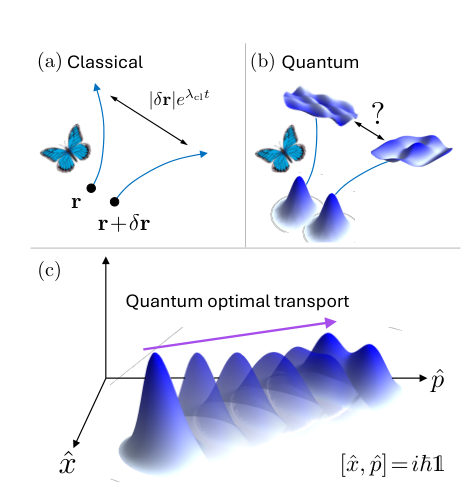
<figcaption class="paper-figure-caption"><b>Fig 1.</b> Figure 1. (a) In classical chaos, trajectories from initial con- ditions r and r + 𝛿r diverge as |𝛿r| 𝑒𝜆cl𝑡, where 𝜆cl is the maximal Lyapunov exponent. (b) Quantum states are ex- tended in phase space, making it unclear how to measure dis- tances between evolved states. (c) Quantum optimal trans- port provides a natural distance metric by quantifying the cost of transporting between quantum configurations while respecting noncommutativity of quantum variables.</figcaption>
</figure>
<figure class="paper-figure-card">
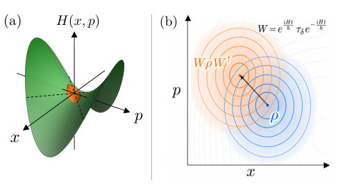
<figcaption class="paper-figure-caption"><b>Fig 2.</b> Figure 2. (a) Inverted harmonic oscillator Hamiltonian en- ergy surface in phase space 𝑥, 𝑝. The initial distribution (or- ange) stretches exponentially along the diagonal and com- presses exponentially perpendicular to it (dotted lines). (b) Part of the proof strategy for the 𝜆q ≤𝜆exp upper bound. A quantum state 𝜌evolves under 𝑊= 𝑒𝑖𝐻𝑡𝜏𝛿𝑒−𝑖𝐻𝑡(left). The quantum optimal transport distance between 𝜌and 𝑊𝜌𝑊† is bounded in the companion work [32] using clas- sical coarse-graining together with phase-space localization estimates (right).</figcaption>
</figure>

**Summary.** This work develops a rigorous theory of quantum chaos by employing Quantum Optimal Transport (QOT) theory as a geometric foundation. It defines a quantum Lyapunov exponent that successfully avoids mathematical divergences inherent in naive generalizations. The key finding is that this quantum exponent recovers the classical maximal Lyapunov exponent in the semiclassical limit, establishing QOT as the unifying tool for the field.

**Why it may be interesting.** It provides a powerful, geometrically grounded tool (QOT) to quantify chaos in quantum systems, bridging the gap between classical dynamical systems theory and quantum dynamics, which is vital for understanding quantum thermalization and scrambling.

Detailed structure

**Main problem.** The paper addresses the challenge of rigorously extending classical chaos theory, characterized by Lyapunov exponents, to the quantum domain due to the wavelike nature of quantum states and non-commutative phase space geometry.

**Main result.** Quantum Optimal Transport (QOT) theory provides a unifying mathematical foundation for quantum chaos, leading to a quantum Lyapunov exponent that recovers the classical maximal Lyapunov exponent in the semiclassical limit.

**Method.** The authors define quantum Lyapunov exponents by leveraging the Wasserstein distance (a metric from QOT) applied to phase-space distributions (like the Husimi distribution) to measure the divergence of quantum states over time.

**Model / system.** The framework is general, applicable to quantum systems ranging from simple few-body models to complex many-body systems, analyzed through the evolution of quantum states in phase space.

**Key observables.** Quantum Lyapunov exponents ($\lambda_q$), classical Lyapunov exponents ($\lambda_{cl}$), Out-of-Time-Order Correlators (OTOCs), and the Quantum Optimal Transport distance ($W_p$).

**Important parameters / regimes.** The semiclassical limit ($\hbar 	o 0$) is crucial for recovering classical results; the initial separation of states must be carefully chosen to avoid divergences.

**Assumptions / limitations.** The approach relies on building upon modern noncommutative quantum optimal transport frameworks and defining admissible quantum distances satisfying specific axioms.

**Figures summary.** Figures illustrate the comparison between classical trajectory divergence, quantum state evolution as extended distributions, and how QOT provides a natural distance metric respecting non-commutativity.

**Paper structure.** The paper develops the theory by first establishing the need for QOT, then defining the quantum Lyapunov exponent via the time evolution of the QOT distance, and finally proving its connection to the classical expansion rate and comparing it to OTOC diagnostics.

Abstract

Chaos in classical systems can be characterized by Lyapunov exponents that measure the exponential divergence of nearby trajectories, but directly extending this framework to quantum mechanics has been a persistent challenge. The wavelike nature of quantum states and the non-commutative geometry of quantum phase space obstruct a straightforward generalization of classical chaos theory. Here we develop a rigorous approach to quantum chaos by leveraging quantum optimal transport theory, which provides the missing geometric foundation for measuring distances between extended quantum distributions. We define quantum Lyapunov exponents that naturally avoid divergences encountered when naïvely generalizing classical exponents, and show that in the semiclassical limit they recover the classical global expansion rate, and hence the usual maximal Lyapunov exponent when they coincide. Our framework provides a tight connection between the divergence of classical trajectories and semiclassical phase space evolution, and additionally clarifies the role of out-of-time-order correlators as diagnostics of quantum chaos. These results establish quantum optimal transport as a unifying mathematical foundation for quantum chaos theory, providing new tools to characterize dynamical behavior across the full range of quantum dynamics from simple few-body models to complex many-body systems.

[↑ back to top](#top)

### [Quantum Interconnects Part I: Strategic Quantum Network Formation](http://arxiv.org/abs/2608.26886v1)

**Authors:** Gustavo Castro do Amaral  
**Type:** theory · **Category:** quantum information and computing · **PDF:** <https://arxiv.org/pdf/2608.26886v1>  
**Analysis basis:** full PDF text, analyzed in chunks

↔ Scroll figures horizontally

<figure class="paper-figure-card">
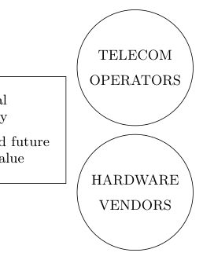
<figcaption class="paper-figure-caption"><b>Fig 1.</b> FIG. 1. Current strategical landscape of quantum network actors and their motivations.</figcaption>
</figure>
<figure class="paper-figure-card">

<figcaption class="paper-figure-caption"><b>Fig 2.</b> FIG. 2. Expected strategical landscape for quantum network actors and their motivations under a utility-driven network formation paradigm.</figcaption>
</figure>
<figure class="paper-figure-card">
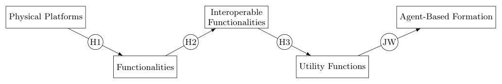
<figcaption class="paper-figure-caption"><b>Fig 3.</b> FIG. 3. Conceptual framework proposed in this work. H1 states that network-relevant properties emerge at the functionality level rather than the physical platform level. H2 states that quantum interconnects enable the abstraction of heterogeneous platforms into interoperable functionalities. H3 states that interoperable functionalities enable the definition of utility functions, allowing quantum network formation to transition from technology-driven deployment to agent-based formation under the JW model [13].</figcaption>
</figure>

**Summary.** This paper addresses the gap in understanding how heterogeneous quantum technologies can form large-scale networks. It proposes a five-level hierarchical model to abstract physical platforms into reusable functionalities. The central argument is that quantum interconnects are crucial enablers that allow this abstraction, thereby enabling the definition of utility functions necessary for strategic, market-like network growth.

**Why it may be interesting.** It provides a high-level theoretical framework for understanding the necessary architectural evolution of quantum networks, framing interconnects not just as physical links but as abstract enablers of utility.

Detailed structure

**Main problem.** The challenge is developing a framework to explain the evolution of large-scale quantum networks from isolated, heterogeneous technologies into interconnected infrastructures driven by utility rather than mere technical feasibility.

**Main result.** The authors propose a hierarchical architecture (PP $
ightarrow$ F $
ightarrow$ S $
ightarrow$ A $
ightarrow$ UC) and argue that quantum interconnects are fundamental enablers that allow for the necessary abstraction to define utility functions and enable strategic, agent-based network formation.

**Method.** The work uses a conceptual modeling approach, proposing a hierarchical abstraction framework and modifying network formation models (like agent-based models) to incorporate utility derived from functional interoperability.

**Model / system.** The model describes heterogeneous quantum platforms (e.g., quantum dots, trapped ions) connected by quantum interconnects. The system is conceptualized through a five-level hierarchy: Physical Platforms, Functionalities, Services, Applications, and Use-Cases.

**Key observables.** Utility functions ($U_i$), interoperability parameters ($I_{ij}$), and the degree of abstraction achieved at the functionality level.

**Important parameters / regimes.** The structure of the utility function, which must be defined independently of the underlying physical platform.

**Assumptions / limitations.** The core assumption is that quantum interconnects provide sufficient interoperability to decouple network functionalities from specific physical implementations, thereby enabling utility-driven decision-making.

**Figures summary.** Figures illustrate the transition from a technology-driven strategic landscape to an expected utility-driven landscape, supported by the proposed hierarchical model.

**Paper structure.** The paper establishes the problem (technology-driven growth), proposes the hierarchical abstraction framework (PP to UC), develops the role of interconnects in enabling functional decoupling, and concludes by showing how this enables utility-based, agent-driven network formation.

Abstract

The realization of large-scale quantum networks requires more than advances in quantum repeaters, memories, and processors, it requires a framework explaining how heterogeneous quantum technologies evolve from isolated deployments into interconnected infrastructures. While the classical Internet evolved under strong utility incentives associated with resource sharing and communication demands, quantum networking currently lacks dominant applications capable of generating comparable incentives. As a consequence, contemporary quantum networks are largely formed through technology-driven decisions motivated by technical feasibility, experimental validation, and expected future value. This work argues that the absence of utility-driven network formation is not solely a consequence of immature applications, but also of insufficient abstraction. In particular, heterogeneous quantum platforms remain tightly coupled to the functionalities they provide, preventing the definition of technology-independent utility functions. A hierarchical architecture consisting of Physical Platforms (PP), Functionalities (F), Services (S), Applications (A), and Use-Cases (UC) is proposed, together with the argument that quantum interconnects constitute the enabling technology required to decouple physical implementations from network functionalities. Such decoupling permits the definition of utility functions at the functionality level and establishes the conditions under which strategic (agent-based) network formation becomes applicable. Quantum interconnects should therefore be viewed not only as interoperability devices, but also as fundamental enablers of strategic quantum network evolution.

[↑ back to top](#top)

### [Random Recursive Simplicial Complexes](http://arxiv.org/abs/2608.26547v1)

**Authors:** P. L. Krapivsky, M. Lucas  
**Type:** theory · **Category:** disordered systems and neural networks · **PDF:** <https://arxiv.org/pdf/2608.26547v1>  
**Analysis basis:** full PDF text, analyzed in chunks

↔ Scroll figures horizontally

<figure class="paper-figure-card">
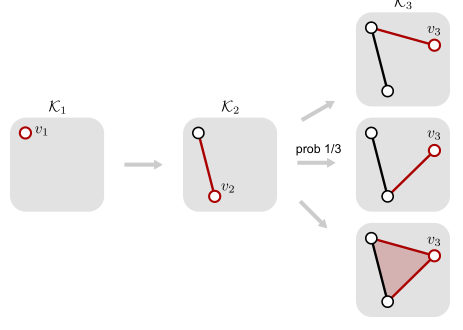
<figcaption class="paper-figure-caption"><b>Fig 1.</b> FIG. 1. Illustration of the RRSC(2) model: the first three steps yield simplicial complexes K1, K2, and K3. Add each step, a new vertex and simplices (red) are added at random. Each of the three possible K3 occurs with probability 1/3.</figcaption>
</figure>
<figure class="paper-figure-card">
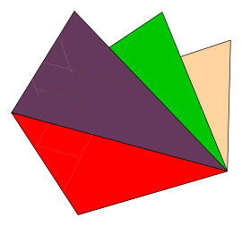
<figcaption class="paper-figure-caption"><b>Fig 2.</b> FIG. 2. An open book simplicial complex with four triangular pages.</figcaption>
</figure>
<figure class="paper-figure-card">
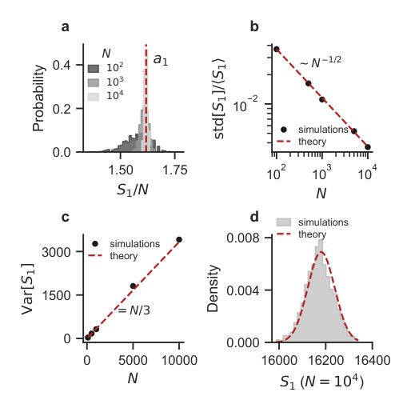
<figcaption class="paper-figure-caption"><b>Fig 3.</b> FIG. 3. Concentration and self-averaging of S1 for RRSC(2). Black dots (b, c) and gray histograms (a, d) are simula- tions, each computed from 1000 independent RRSC(2) re- alizations; red dashed lines are theory. (a) Distributions of S1/N at N = 102, 103, and 104 concentrate sharply around a1 = (1 + √</figcaption>
</figure>
<figure class="paper-figure-card">
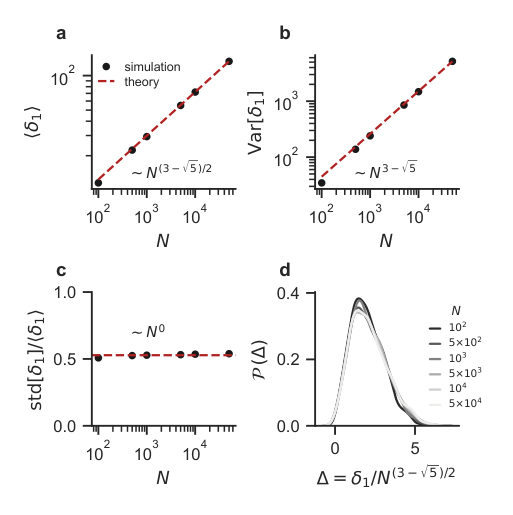
<figcaption class="paper-figure-caption"><b>Fig 4.</b> FIG. 4. Distribution of the degree δ1 of the primordial ver- tex, as N grows, for RRSC(2). Black dots (a, b, c) and gray distributions (d) are simulations, each computed from 1000 in- dependent RRSC(2) realizations; red dashed lines are theory. (a) The average primordial degree scales as ⟨δ1⟩∼N (3− √</figcaption>
</figure>
<figure class="paper-figure-card">
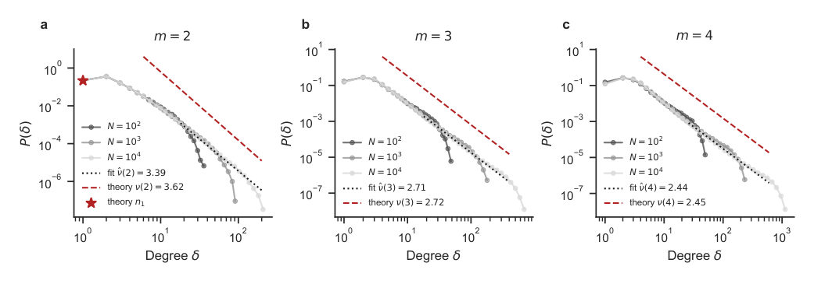
<figcaption class="paper-figure-caption"><b>Fig 5.</b> FIG. 5. Degree distribution for (a) RRSC(2), (b) RRSC(3), and (c) RRSC(4). In each case, degree distributions are computed from numerical simulations for N = 102, 103, and 104 (shades of gray), with 1000 independent realizations for each N. Numerical exponents ˆν(m) are computed from fitting the data (dotted black line) and theoretical scalings (dashed red line) are obtained from the theoretical exponents in Eqs. (5), (88) and (93), respectively. In panel (a), numerics also match the theoretical value of n1 (Eq. (6)).</figcaption>
</figure>

**Summary.** This work analyzes Random Recursive Simplicial Complexes (RRSC), stochastic models for higher-dimensional random networks. By deriving recurrence relations and solving them using ODE approximations, the authors determine the asymptotic linear growth laws for the average number of simplices of various dimensions. This provides deep insights into the topological scaling of complex, randomly built structures.

**Why it may be interesting.** While focused on pure combinatorics/topology, the study of random complexes and their spectral dimension relates to the geometry of complex systems, which can inform models of quantum entanglement structure or network connectivity in quantum computation.

Detailed structure

**Main problem.** The paper investigates the asymptotic growth laws and structural properties of random recursive simplicial complexes (RRSC), which are stochastic models for higher-dimensional random networks.

**Main result.** The average number of simplices $\langle S_d 
angle$ grows linearly with the number of vertices $N$, and the analysis yields specific amplitudes for this growth law for low dimensions.

**Method.** The analysis relies on deriving recurrence relations for the average number of simplices and approximating these discrete recurrences with Ordinary Differential Equations (ODEs) to find asymptotic solutions.

**Model / system.** The model is the Random Recursive Simplicial Complex (RRSC(m)), which grows by iteratively adding a vertex and connecting it to a randomly chosen existing simplex. It is related to Random Recursive Trees (RRT) and Hypergraphs.

**Key observables.** The primary observables are $S_d$, the number of $d$-simplices, and their average $\langle S_d 
angle$ and variance $	ext{Var}[S_d]$. The Euler characteristic $\chi = \sum (-1)^d S_d$ is also a key invariant.

**Important parameters / regimes.** The dimension $m$ of the complex, and the number of vertices $N$. The analysis focuses on the asymptotic limit $N 	o \infty$.

**Assumptions / limitations.** The analysis assumes asymptotic self-averaging, allowing the use of average values $\langle S_d 
angle$ to characterize the system's behavior for large $N$.

**Figures summary.** Figures illustrate the construction steps of the RRSC(2) model for small $N$, show the concentration and self-averaging of $S_1$ for RRSC(2), and demonstrate the numerical convergence of calculated amplitudes for various dimensions.

**Paper structure.** The paper systematically analyzes the growth of $\langle S_d 
angle$ and $	ext{Var}[S_d]$ by deriving recurrence relations, solving them via ODE approximations, and comparing the results for different dimensions $m$. It also examines related models like the Homogeneous Simplicial Complex (HSC).

Abstract

We investigate random recursive simplicial complexes growing by adding, at each step, a vertex together with a simplex formed by joining the new vertex with a randomly chosen existing simplex. We also add all faces of the new simplex to ensure that the resulting object remains a simplicial complex. If the choice of an existing simplex is uniform among simplices of dimension $<m$, the number $S_d$ of simplices of any admissible dimension $d\leq m$ is an asymptotically self-averaging random variable. This feature allows us to determine the asymptotic growth law of the average of $S_d$ when the number of vertices diverges. We also probe the degree distribution, examine the probabilities of various extreme outcomes, and analyze the characteristics of the first vertex.

[↑ back to top](#top)

### [Strain-driven orbital-selective reconstruction and bicollinear-to-stripe evolution in FeTe](http://arxiv.org/abs/2608.26652v1)

**Authors:** Zhenfeng Ouyang, Yin Chen, Yi-Heng Tian, Jia-Ming Wang, Rong-Qiang He, Kai Liu, Zhong-Yi Lu  
**Type:** theory · **Category:** strongly correlated electrons · **PDF:** <https://arxiv.org/pdf/2608.26652v1>  
**Analysis basis:** full PDF text, analyzed in chunks

↔ Scroll figures horizontally

<figure class="paper-figure-card">
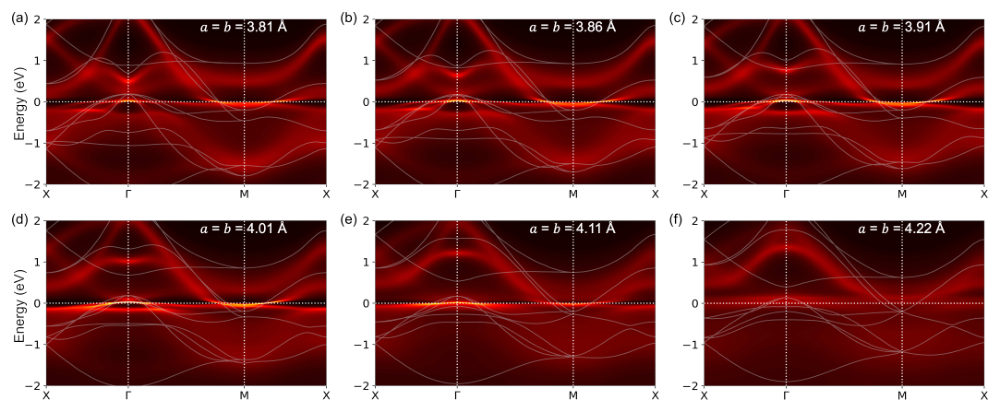
<figcaption class="paper-figure-caption"><b>Fig 1.</b> FIG. 1. DFT+DMFT calculated spectral functions A(k,ω) (temperature T = 100 K) and the DFT calculated band structures (grey lines) for different in-plane biaxial tensile-strained FeTe. The Fermi level is set as zero.</figcaption>
</figure>
<figure class="paper-figure-card">
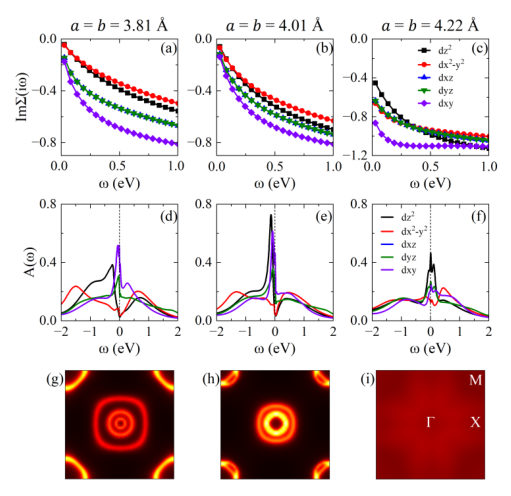
<figcaption class="paper-figure-caption"><b>Fig 2.</b> FIG. 2. DFT+DMFT calculated (temperature T = 100 K) (a)-(c) imaginary parts of Matsubara self-energy functions ImΣ(iω), (d)- (f) spectral functions A(ω), and (g)-(i) Fermi surfaces at the kz = 0 plane for in-plane tensile-strained FeTe with crystal lattice constants a = 3.81, 4.01, and 4.22 Å, respectively.</figcaption>
</figure>
<figure class="paper-figure-card">
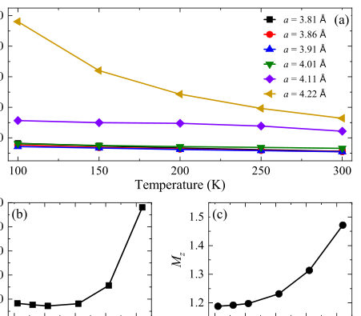
<figcaption class="paper-figure-caption"><b>Fig 3.</b> FIG. 3. (a) Evolution of static local spin susceptibilities χspin of FeTe with temperature under different strain. (b) Evolution of static lo- cal spin susceptibilities χspin of FeTe at 100 K with in-plane tensile strain. (c) Evolution of effective local spin moments Mz of FeTe with in-plane tensile strain.</figcaption>
</figure>
<figure class="paper-figure-card">
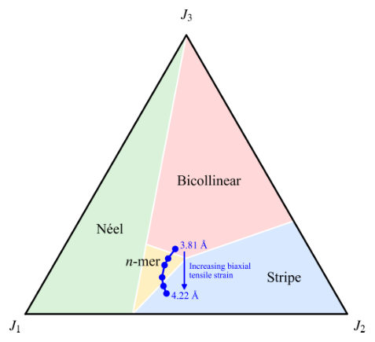
<figcaption class="paper-figure-caption"><b>Fig 4.</b> FIG. 4. Phase diagram of the J1-J2-J3 Heisenberg model for FeTe. The phase boundaries separating the Néel, stripe, bicollinear, and staggered n-mer AFM phases are determined from the results of Ref. [1, 24, 25]. The blue symbols denote the normalized exchange couplings extracted from DFT calculations for FeTe under different in-plane biaxial tensile strains.</figcaption>
</figure>

**Summary.** This theoretical study investigates how applying tensile strain tunes the electronic and magnetic properties of the iron-based superconductor FeTe. Using DFT+DMFT and Heisenberg models, the authors reveal a strain-driven pathway that causes the magnetic order to evolve from bicollinear to stripe antiferromagnetism. This magnetic change is intrinsically linked to an orbital-selective reconstruction of the electronic structure, providing a unified picture of correlated behavior.

**Why it may be interesting.** The study provides a detailed, quantitative mapping of how external strain tunes the interplay between electronic correlations (orbital selectivity) and magnetic order in a strongly correlated material, which is a key theme in modern condensed matter theory.

Detailed structure

**Main problem.** To establish a complete, unified, strain-driven trajectory connecting the magnetic and correlated electronic states of FeTe, specifically addressing the orbital-selective reconstruction and the evolution from bicollinear to stripe antiferromagnetism (AFM).

**Main result.** Tensile strain drives a pronounced orbital-selective reconstruction and a magnetic transition trajectory from bicollinear to stripe AFM via an intermediate staggered n-mer AFM regime.

**Method.** The study combines Density Functional Theory plus Dynamical Mean-Field Theory (DFT+DMFT) calculations with Heisenberg model analysis.

**Model / system.** The system is FeTe, a parent material among iron-based superconductors, studied under systematically varied in-plane biaxial tensile strain.

**Key observables.** Momentum-resolved spectral functions, imaginary part of the Matsubara self-energy, local spin susceptibility, and local spin moment ($M_z$).

**Important parameters / regimes.** Tensile strain (ranging from small to large values), and the magnetic coupling parameters ($J_1, J_2, J_3$) derived from the Heisenberg model.

**Assumptions / limitations.** The analysis relies on DFT+DMFT to capture correlated electronic structure effects and an effective Heisenberg model to map the magnetic phase transitions.

**Figures summary.** Figures illustrate the spectral evolution under strain, showing changes in coherence and spectral weight, alongside plots detailing the evolution of magnetic susceptibilities and local spin moments across different strain regimes.

**Paper structure.** The paper systematically analyzes the effect of tensile strain on FeTe, first using DFT+DMFT to track orbital reconstruction and correlation strength, and then coupling these electronic findings to the magnetic phase diagram derived from Heisenberg model analysis, establishing the full strain-driven trajectory.

Abstract

FeTe, as a representative parent material among iron-based superconductors, provides an ideal platform for exploring the interplay among orbital-selective correlations, magnetism, and unconventional superconductivity. However, a unified picture of the correlated electronic structure and magnetism of FeTe under strain remains to be fully clarified. Here, combining density functional theory plus dynamical mean-field theory and Heisenberg model analysis, we uncover an orbital-selective reconstruction of the correlated electronic structure and reveal a strain-driven trajectory from bicollinear to stripe antiferromagnetism (AFM) via an intermediate competing staggered $n$-mer AFM regime in FeTe. Moderate strain gives rise to a regime where more coherent quasiparticles coexist with suppressed local moments. Further strain drives FeTe into an incoherent correlated regime with robust local moments and Fe-$3d_{z^2}$-dominated low-energy states. These results establish a strain-driven trajectory across distinct magnetic and correlated electronic states in FeTe.

[↑ back to top](#top)

### [Strong Converse Exponent of Quantum State Merging](http://arxiv.org/abs/2608.27202v1)

**Authors:** Mario Berta, Hao-Chung Cheng, Roberto Rubboli, Marco Tomamichel  
**Type:** theory · **Category:** quantum information and computing · **PDF:** <https://arxiv.org/pdf/2608.27202v1>  
**Analysis basis:** full PDF text, analyzed in chunks

↔ Scroll figures horizontally

<figure class="paper-figure-card">
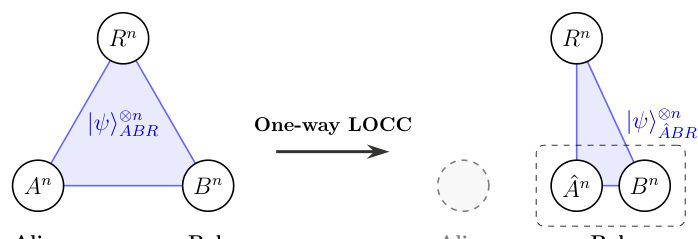
<figcaption class="paper-figure-caption"><b>Fig 1.</b> FIG. 1. Illustration of the quantum state merging task protocol. Left: Alice and Bob share n copies of a tripartite pure state |ψ⟩⊗n ABR alongside preshared entanglement of Schmidt rank |Kn|. Right: After applying a one-way local operation and classical communication (LOCC) protocol, Alice’s system An is merged at Bob’s side, consuming or distilling entanglement such that the final entangled state has a Schmidt rank of |Ln|.</figcaption>
</figure>

**Summary.** This theoretical paper calculates the exact strong converse exponent for quantum state merging, a key task in quantum information theory. It establishes that this exponent is governed by optimized $\alpha$-$z$ conditional Rényi entropies, which differs from standard results. The findings provide rigorous bounds on the achievable rates for quantum information transfer protocols.

**Why it may be interesting.** The precise characterization of the strong converse exponent using specific conditional entropy forms provides deep insights into the fundamental limits of quantum information processing tasks.

Detailed structure

**Main problem.** The paper determines the strong converse exponent for the entanglement cost associated with quantum state merging.

**Main result.** The strong converse exponent is characterized by optimized $\alpha$-$z$ conditional Rényi entropies, contrasting with typical results governed by sandwiched conditional Rényi entropies.

**Method.** The analysis adapts the club-sandwiched converse method and utilizes techniques from Schatten-norm Hölder theory to establish asymptotic bounds on the fidelity decay.

**Model / system.** The study concerns the quantum state merging task, where a tripartite pure state $\psi_{ABR}$ is used to transfer information from Alice (A) to Bob, preserving coherence relative to an inaccessible reference system R.

**Key observables.** Entanglement Cost ($r$), Squared Fidelity ($F$), Purified Distance, and various conditional Rényi entropies ($H^{\uparrow}_{\alpha, \alpha/2}(A|B)_{\psi}$).

**Important parameters / regimes.** The exponent depends on the optimization parameter $\alpha \in [1/2, 1]$ and the rate $r$.

**Assumptions / limitations.** The analysis assumes finite-dimensional Hilbert spaces and focuses on the strong converse regime where the optimal fidelity decays exponentially.

**Figures summary.** Figure 1 illustrates the quantum state merging protocol. Table I summarizes the strong converse and error exponents for different smoothing types (Globally vs. Partially smoothed).

**Paper structure.** The paper develops the result by establishing upper and lower bounds on the fidelity decay rate, comparing the constraints imposed by global vs. partial smoothing, and deriving the final exponent using variational representations.

Abstract

We determine the strong converse exponent for the entanglement cost of quantum state merging, showing that it is characterized by the optimized $α$-$z$ conditional Rényi entropies with $z=α/2\in[1/2,1]$. This contrasts with the sandwiched conditional Rényi entropies that typically govern strong converse exponents in quantum information theory. As a consequence, we derive the strong converse exponent of the partially smoothed conditional min-entropy in purified distance. This exponent is governed by club-sandwiched conditional entropies, whereas global smoothing leads to a sandwiched expression.

[↑ back to top](#top)

### [The Capacity of Entanglement and Holographic Entropies at Finite Resources](http://arxiv.org/abs/2608.26377v1)

**Authors:** Ning Bao, Jacob March  
**Type:** theory · **Category:** other · **PDF:** <https://arxiv.org/pdf/2608.26377v1>  
**Analysis basis:** full PDF text, analyzed in chunks

↔ Scroll figures horizontally

<figure class="paper-figure-card">
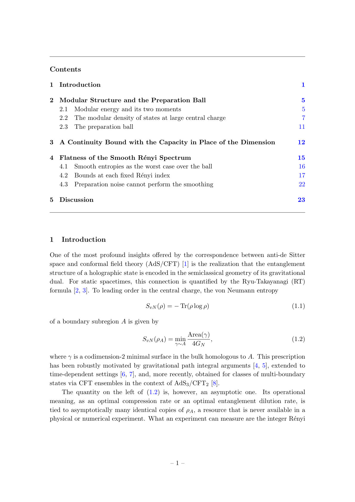
<figcaption class="paper-figure-caption"><b>Fig 1.</b> Low-resolution page preview, page 2</figcaption>
</figure>
<figure class="paper-figure-card">
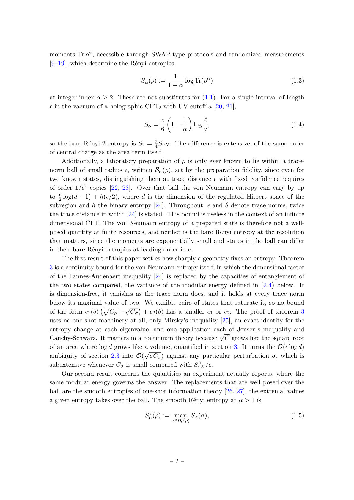
<figcaption class="paper-figure-caption"><b>Fig 2.</b> Low-resolution page preview, page 3</figcaption>
</figure>
<figure class="paper-figure-card">
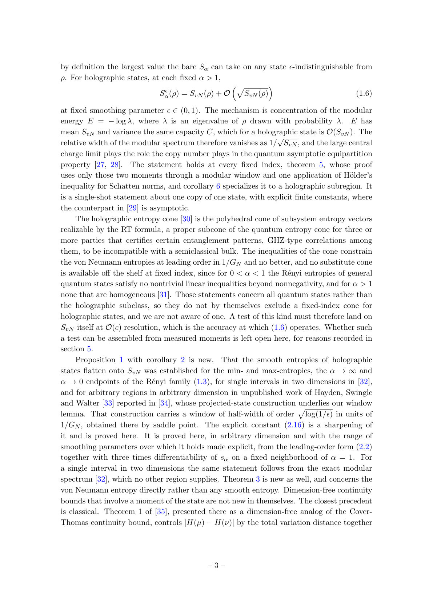
<figcaption class="paper-figure-caption"><b>Fig 3.</b> Low-resolution page preview, page 4</figcaption>
</figure>
<figure class="paper-figure-card">
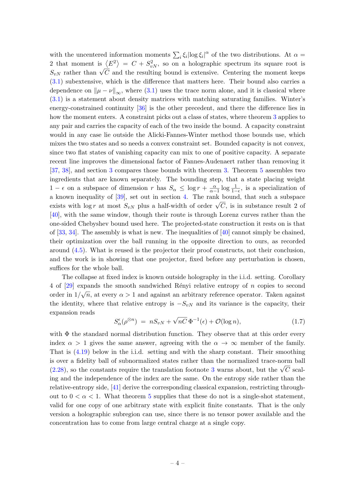
<figcaption class="paper-figure-caption"><b>Fig 4.</b> Low-resolution page preview, page 5</figcaption>
</figure>
<figure class="paper-figure-card">
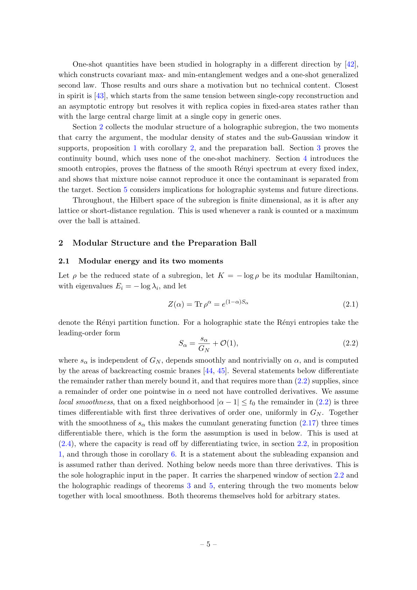
<figcaption class="paper-figure-caption"><b>Fig 5.</b> Low-resolution page preview, page 6</figcaption>
</figure>

**Summary.** This work refines the understanding of holographic entropy by replacing problematic, dimension-dependent bounds with the capacity of entanglement. It proves that this capacity provides a robust, dimension-free constraint on the entanglement structure of quantum states. This is crucial for understanding the fundamental limits of entropy estimation in quantum gravity settings.

**Why it may be interesting.** It provides rigorous, resource-aware bounds on entanglement entropy derived from gravity/holography, which informs the fundamental limits of quantum information processing in strongly coupled systems.

Detailed structure

**Main problem.** The paper addresses ambiguities in applying holographic entropy formulas, like Ryu-Takayanagi, to finite resources by refining the theoretical bounds on entanglement entropy.

**Main result.** It establishes that the capacity of entanglement provides a dimension-free, saturated bound, and shows that the minimal surface fixes all one-shot Rényi entropies simultaneously for holographic states.

**Method.** The analysis involves replacing dimension-dependent factors with the capacity of entanglement (variance of modular energy) and using concentration inequalities derived from the modular Hamiltonian.

**Model / system.** The framework is based on the AdS/CFT correspondence, relating boundary von Neumann entropy to the area of minimal surfaces in the bulk geometry.

**Key observables.** Von Neumann entropy ($S_{vN}$), Rényi entropies ($S_\alpha$), and the capacity of entanglement ($C$).

**Important parameters / regimes.** The entanglement area, the central charge, and the small perturbation scale relative to $S_{vN}^2$.

**Assumptions / limitations.** The analysis assumes local smoothness of the remainder in the Rényi spectrum and relies on the holographic input structure for concentration estimates.

**Paper structure.** The paper progresses by identifying the ambiguities in the RT formula, proposing the capacity of entanglement as a replacement bound, and then demonstrating how this leads to strong constraints on the state's one-shot entropy spectrum.

Abstract

The Ryu-Takayanagi formula equates the area of a minimal surface with the von Neumann entropy of a boundary subregion, and leaves two things about that identification open.   The first is how sharply a geometry fixes an entropy. Fannes-Audenaert answers with a Hilbert-space dimension, which diverges as the cutoff is removed however close the two states are. We replace it with the capacity of entanglement, the variance of the modular energy, whose square root grows like the square root of the entangling area where the dimensional factor grows like the regulated volume. The bound is dimension-free and saturated, and it makes the ambiguity of the entropy subextensive for any perturbation whose capacity is small compared with $S_{vN}^2$ times the trace norm.   The second is what the area means for a single state, since compression and dilution rates are defined only for many copies while a geometry describes one. When a single replica saddle dominates near $α= 1$, every smooth Rényi entropy at fixed $α> 1$ agrees with $S_{vN}$ to $\textit{O}(\sqrt{S_{vN}})$, as do the smooth min- and max-entropies. The minimal surface therefore fixes every one-shot entropy of the state at once, with large central charge playing the role of large copy number in the asymptotic equipartition property.   As a consequence we bound how far outside the holographic entropy cone a holographic state can appear to fall, leaving estimation and certification open.

[↑ back to top](#top)

### [The Find Rows and Columns and Decode algorithm for quantum expander codes](http://arxiv.org/abs/2608.27211v1)

**Authors:** Dimiter Ostrev  
**Type:** theory · **Category:** quantum information and computing · **PDF:** <https://arxiv.org/pdf/2608.27211v1>  
**Analysis basis:** full PDF text, analyzed in chunks

↔ Scroll figures horizontally

<figure class="paper-figure-card">
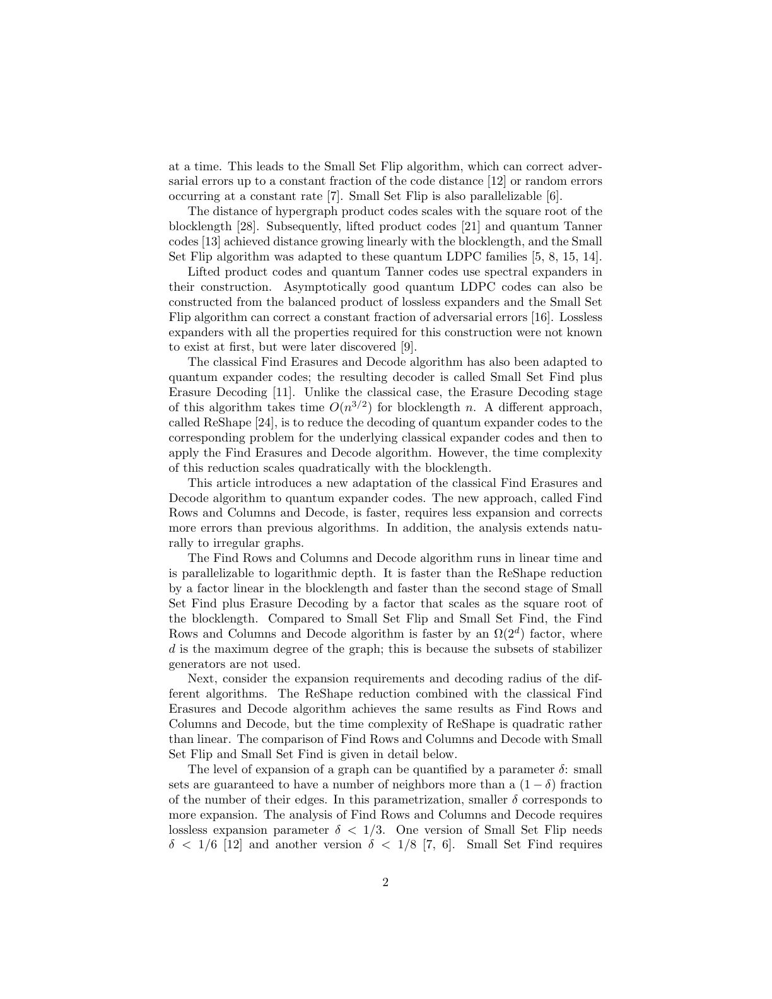
<figcaption class="paper-figure-caption"><b>Fig 1.</b> Low-resolution page preview, page 2</figcaption>
</figure>
<figure class="paper-figure-card">
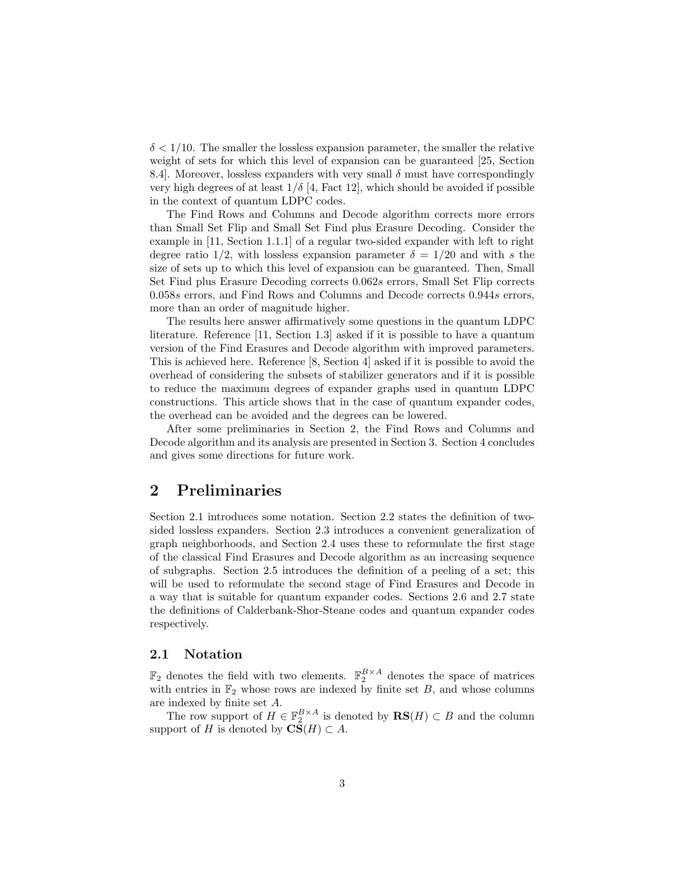
<figcaption class="paper-figure-caption"><b>Fig 2.</b> Low-resolution page preview, page 3</figcaption>
</figure>
<figure class="paper-figure-card">
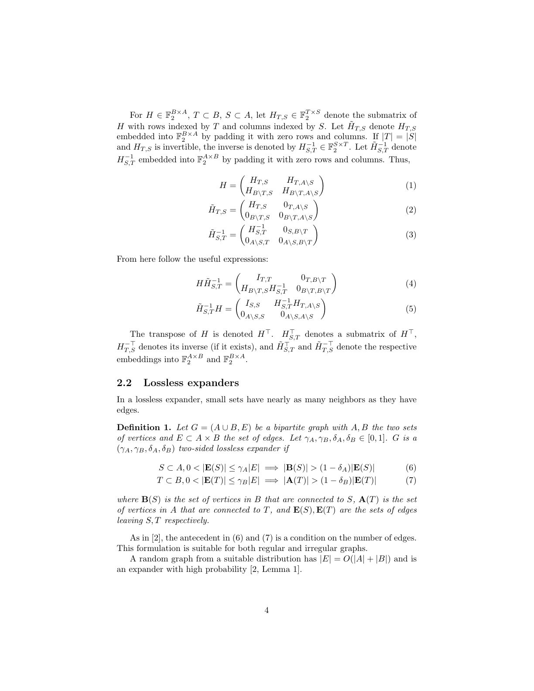
<figcaption class="paper-figure-caption"><b>Fig 3.</b> Low-resolution page preview, page 4</figcaption>
</figure>
<figure class="paper-figure-card">
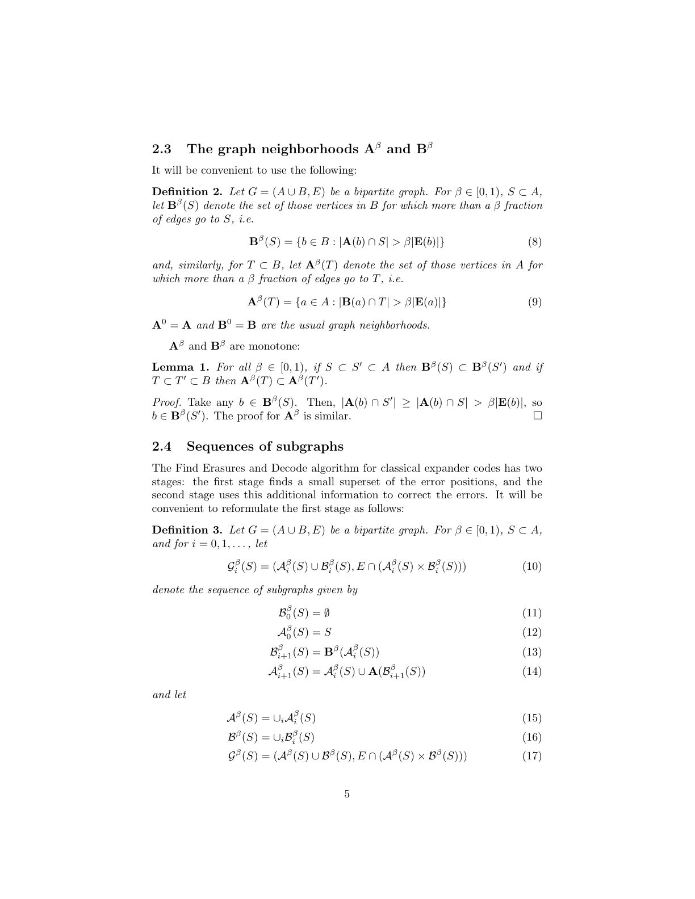
<figcaption class="paper-figure-caption"><b>Fig 4.</b> Low-resolution page preview, page 5</figcaption>
</figure>
<figure class="paper-figure-card">
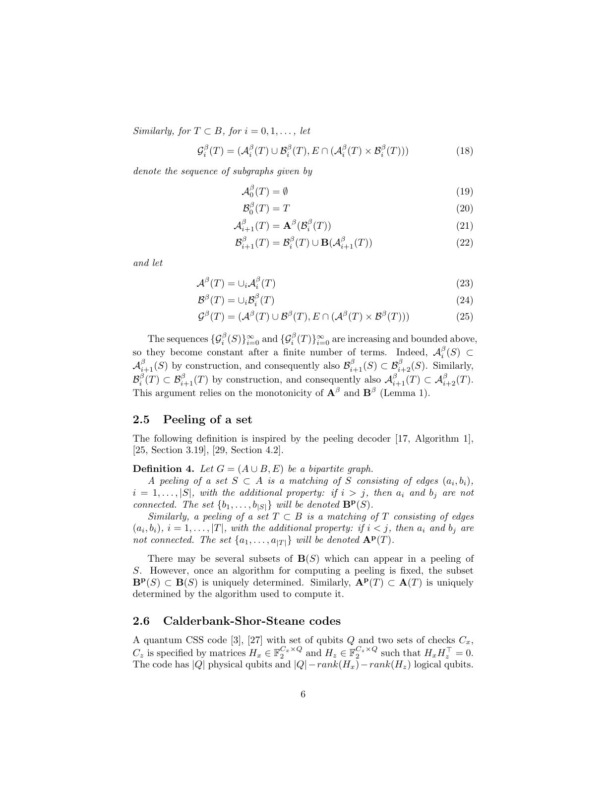
<figcaption class="paper-figure-caption"><b>Fig 5.</b> Low-resolution page preview, page 6</figcaption>
</figure>

**Summary.** This paper introduces a novel, highly efficient quantum algorithm for decoding quantum expander codes. It significantly improves upon existing methods by achieving linear time complexity and logarithmic parallel depth. The development is crucial for advancing fault-tolerant quantum computation by enabling the correction of a larger fraction of errors in these quantum codes.

**Why it may be interesting.** This work provides a highly efficient theoretical tool for quantum error correction, which is fundamental to building fault-tolerant quantum computers, directly impacting the feasibility of large-scale quantum computation.

Detailed structure

**Main problem.** The paper develops a faster and more efficient quantum adaptation of the 'Find Erasures and Decode' algorithm for quantum expander codes.

**Main result.** The new 'Find Rows and Columns and Decode' algorithm runs in linear time and is parallelizable to logarithmic depth, correcting significantly more errors than previous methods.

**Method.** The method adapts classical decoding techniques by reformulating the decoding process using iterative subgraphs and peeling procedures derived from the graph structure of the expander code.

**Model / system.** The work focuses on quantum CSS codes derived from lossless expander bipartite graphs, which are used to construct quantum expander codes for error correction.

**Key observables.** Error correction capability (number of correctable errors), time complexity (linear time, logarithmic depth), and the required expansion parameter $\delta$.

**Important parameters / regimes.** The lossless expansion parameter $\delta$, the maximum degree $d$, and the blocklength $\ell$.

**Assumptions / limitations.** The analysis requires the lossless expansion parameter $\delta < 1/3$ for the presented algorithm to function optimally.

**Figures summary.** Not specified.

**Paper structure.** The paper builds from defining the quantum expander code structure, introducing the 'Find Rows and Columns and Decode' algorithm, detailing the steps involving row/column support computation and peeling, and concluding with a rigorous complexity analysis for both sequential and parallel execution.

Abstract

A new adaptation of the Find Erasures and Decode algorithm from classical to quantum expander codes is presented. It runs in linear time and is parallelizable to logarithmic depth. Compared to Small Set Flip and Small Set Find, the new algorithm avoids the overhead of considering the subsets of stabilizer generators, requires less expansion and corrects more errors.

[↑ back to top](#top)

### [Towards Reproducible Evaluation of Distributed Quantum Circuit Partitioning Algorithms](http://arxiv.org/abs/2608.27099v1)

**Authors:** Javier Vela-Tambo, Davud Azizov, Tian Guo  
**Type:** both · **Category:** quantum information and computing · **PDF:** <https://arxiv.org/pdf/2608.27099v1>  
**Analysis basis:** full PDF text, analyzed in chunks

↔ Scroll figures horizontally

<figure class="paper-figure-card">
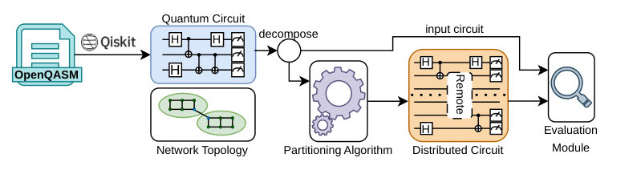
<figcaption class="paper-figure-caption"><b>Fig 1.</b> Fig. 1: The evaluation pipeline. Monolithic OpenQASM quantum circuits are ingested and decomposed using Qiskit. The circuits are then distributed to the specified network topology using the selected partitioning algorithms. The original monolithic circuit and the distributed circuit, which contains explicit remote gate instructions, are profiled by our evaluation module to extract the desired metrics. The pipeline is controlled by a YAML configuration file to ensure the reproducibility of the experiments.</figcaption>
</figure>
<figure class="paper-figure-card">
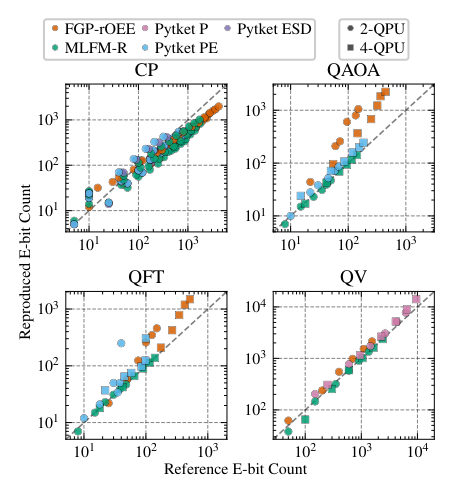
<figcaption class="paper-figure-caption"><b>Fig 2.</b> Fig. 2: Replication analysis of entanglement cost (measured in e-bits) across the CP, QAOA, QFT, and QV benchmarks. Each point compares our reproduced e-bit count against the approximated reference value reported in prior literature [10].</figcaption>
</figure>
<figure class="paper-figure-card">
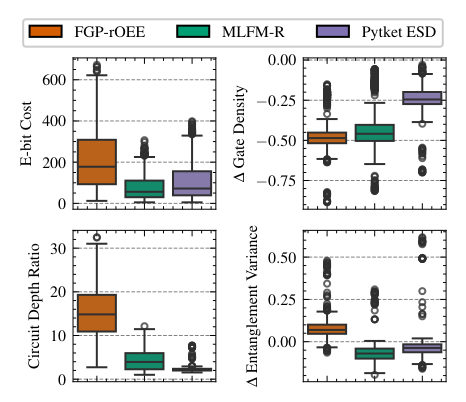
<figcaption class="paper-figure-caption"><b>Fig 3.</b> Fig. 4: Multidimensional evaluation of DQC partitioning over- heads. The grouped box plots contrast e-bit cost, circuit depth ratio, ∆gate density, and ∆entanglement variance across partitioning methods.</figcaption>
</figure>
<figure class="paper-figure-card">
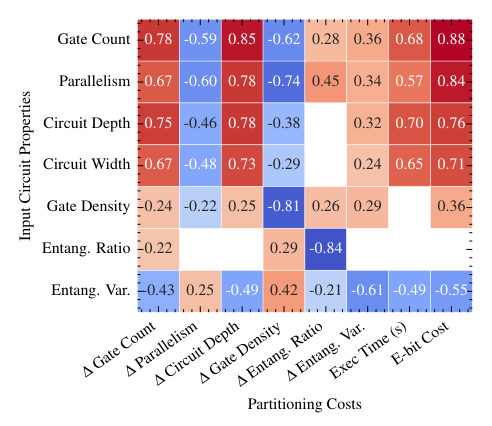
<figcaption class="paper-figure-caption"><b>Fig 4.</b> Fig. 3: Spearman correlation matrix mapping input quantum circuit properties against DQC partitioning cost and structural penalties. Darker shades indicate stronger correlations (red for positive, blue for negative). Missing entries denote correlations that are not statistically significant (p &gt; 0.05) or fall below the strength threshold (|r| &lt; 0.20).</figcaption>
</figure>
<figure class="paper-figure-card">
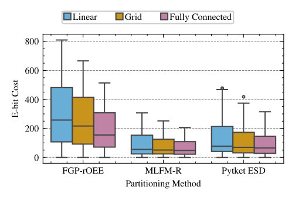
<figcaption class="paper-figure-caption"><b>Fig 5.</b> Fig. 5: Comparison of DQC partitioning e-bit cost across different 4-QPU network topologies (linear, grid, and fully connected) and partitioning methods.</figcaption>
</figure>

**Summary.** This paper addresses the critical gap in evaluating distributed quantum circuit partitioning by moving beyond simple entanglement cost metrics. Using an automated pipeline, the authors systematically test various algorithms on simulated DQC architectures across different network topologies. The findings prove that structural metrics, such as circuit depth and gate density, are crucial for accurately predicting real-world performance penalties in modular quantum processors.

**Why it may be interesting.** The focus on quantifying physical overheads like circuit depth and gate density in a distributed setting is highly relevant for understanding the practical limitations of scaling quantum computation beyond single, monolithic chips.

Detailed structure

**Main problem.** Current evaluations of Distributed Quantum Computing (DQC) circuit partitioning algorithms are insufficient because they focus too narrowly on total entanglement cost, ignoring crucial structural and temporal overheads from network constraints.

**Main result.** The study demonstrates that partitioning algorithms with similar entanglement costs can yield drastically different physical execution penalties, emphasizing that structure-aware metrics are essential for guiding DQC compiler design.

**Method.** The authors developed an automated, reproducible evaluation pipeline that applies established monolithic benchmarking metrics to partitioned distributed circuits across various quantum network topologies and standardized workloads.

**Model / system.** The system modeled is Distributed Quantum Computing (DQC), which networks modular Quantum Processing Units (QPUs). Circuits are represented in OpenQASM format and are mapped onto specified network topologies (e.g., linear, grid, fully connected).

**Key observables.** Inter-QPU communication bottlenecks, circuit depth inflation, gate density reduction, e-bit count, circuit depth ratio, and $\Delta$gate density.

**Important parameters / regimes.** Standardized workloads include QASMBench, Quantum Fourier Transform (QFT), and QAOA; topologies include 4-QPU linear, grid, and fully connected networks.

**Assumptions / limitations.** The evaluation assumes that intra-QPU connectivity is fully connected, and the analysis relies on applying monolithic metrics to distributed structures.

**Figures summary.** Figures illustrate the evaluation pipeline, compare reproduced e-bit counts across benchmarks (QFT, QAOA, etc.), and show correlation matrices mapping input circuit properties against DQC partitioning costs and structural penalties.

**Paper structure.** The paper establishes the evaluation gap, details the automated pipeline for testing various partitioning algorithms (MLFM-R, FGP-rOEE, Pytket variants) across multiple topologies and workloads, presents empirical results comparing structural penalties, and concludes that comprehensive metrics are necessary for compiler design.

Abstract

Distributed Quantum Computing (DQC) addresses the physical scaling limitations of monolithic quantum processors by networking modular Quantum Processing Units (QPUs). Efficient execution of quantum algorithms on DQC architectures requires compiling them across QPUs while minimizing inter-QPU communication bottlenecks, primarily through circuit partitioning. However, current evaluations of state-of-the-art partitioning heuristics focus primarily on the total entanglement cost of the partitions, failing to capture the broader structural and temporal overheads introduced by distributed network constraints. This paper addresses this evaluation gap by applying established monolithic benchmarking metrics to partitioned distributed circuits to quantify the performance impact of network constraints. Using an open-source, automated evaluation pipeline, we systematically assess diverse partitioning algorithms across standardized workloads and quantum network topologies. Our empirical results reveal that partitioning algorithms with comparable entanglement costs can still introduce drastically different physical execution penalties. By exposing these hidden trade-offs, such as severe increases in circuit depth and substantial reductions in gate density, this study demonstrates that comprehensive circuit-level metrics are essential for guiding the future design of DQC compilers.

[↑ back to top](#top)

### [Universality and sharp thresholds for ellipsoid fitting](http://arxiv.org/abs/2608.27372v1)

**Authors:** Frederic Koehler, Youngtak Sohn  
**Type:** theory · **Category:** disordered systems and neural networks · **PDF:** <https://arxiv.org/pdf/2608.27372v1>  
**Analysis basis:** full PDF text, analyzed in chunks

↔ Scroll figures horizontally

<figure class="paper-figure-card">
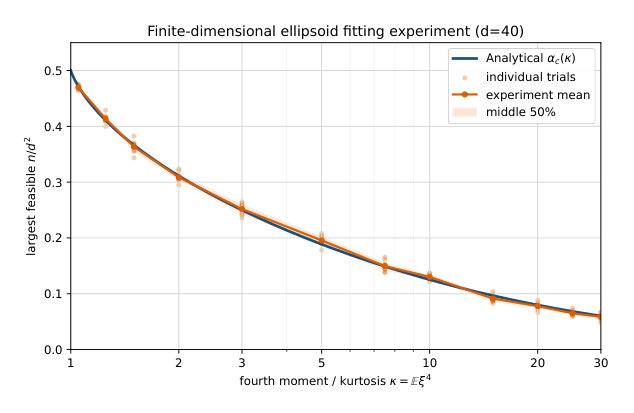
<figcaption class="paper-figure-caption"><b>Fig 1.</b> Figure 1: The phase diagram and a numerical experiment in dimension d = 40. The curve is the theoretical threshold α⋆(κ). For each value of κ, eight independent trials use i.i.d. coordinates drawn from a centered, variance one mixture of two Gaussians with fourth moment κ; we refer to Appendix A.5. For each trial, a binary search in the number of samples n (y-axis) estimates the largest sample size for which the SDP maximizing t subject to R −tId ⪰0 and x⊤ i Rxi = d, i = 1, . . . , n, is feasible with nonnegative optimum.</figcaption>
</figure>
<figure class="paper-figure-card">
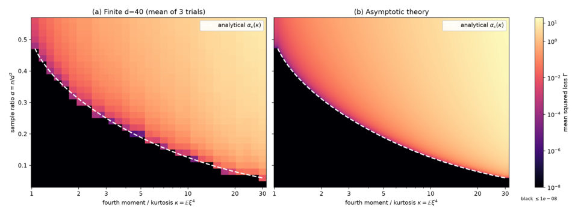
<figcaption class="paper-figure-caption"><b>Fig 2.</b> Figure 2: Squared loss for the d = 40 experiment. The setup is the same as Figure 1, except that for each cell we average the squared loss over three trials. The left panel is empirical and the right panel is the asymptotic formula. The x-axis is the fourth moment κ, the y-axis is n/d2, and black denotes zero loss.</figcaption>
</figure>
<figure class="paper-figure-card">
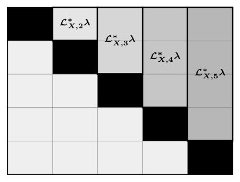
<figcaption class="paper-figure-caption"><b>Fig 3.</b> Figure 3: Sequential blocks for L = 5. At stage ℓ, the shaded rectangle L∗ X,ℓλ uses the previously exposed rows Uℓ= I1 ∪· · · ∪Iℓ−1 and the fresh columns Iℓ.</figcaption>
</figure>
<figure class="paper-figure-card">
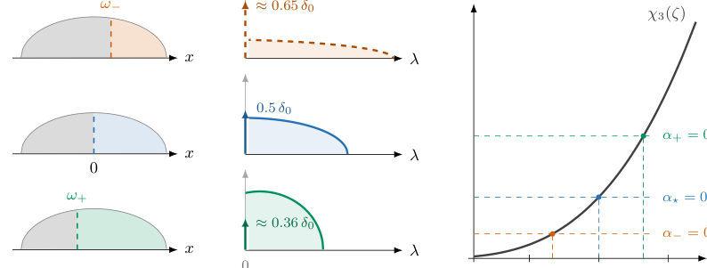
<figcaption class="paper-figure-caption"><b>Fig 4.</b> Figure 4: Spectral interpretation of the CGMT calculation for κ = 3. Panel (a) shows the GOE semicircle law and the cutoff ω = −ζ: the gray region x ≤ω is clipped to zero, while x &gt; ω is retained. Panel (b) shows the resulting trace-normalized spectral profiles; the curves are the continuous parts and the spikes are the atoms at zero. In the SAT phase α−&lt; α⋆, the orange profile is the continuation of the signed CGMT auxiliary optimizer, but our exact fitting proof instead uses the well-conditioned fit constructed in Lemma 5.17. Panel (c) shows how the level crossings χ3(ζ) = α select the corresponding values of ζ = −ω.</figcaption>
</figure>

**Summary.** This paper rigorously establishes a sharp phase transition for the problem of fitting random data points with an ellipsoid in high dimensions. It determines a critical threshold $\alpha^\star(\kappa)$ that dictates whether an exact fit exists, revealing a universality property dependent only on the fourth moment of the data distribution. This resolves a long-standing conjecture for Gaussian data.

**Why it may be interesting.** The mathematical framework of phase transitions in high-dimensional geometry and optimization is highly relevant to understanding the generalization capabilities and phase transitions in complex machine learning models.

Detailed structure

**Main problem.** The paper establishes the existence and nature of a sharp phase transition for determining if a set of random vectors can be perfectly fitted by a positive definite ellipsoid.

**Main result.** A sharp threshold $\alpha^\star(\kappa)$ exists, separating the regime where a fit is possible from the regime where the minimum fitting error is strictly positive. For Gaussian data, this threshold is found to be $1/4$.

**Method.** The analysis uses tools from random matrix theory and convex optimization, framing the problem as a random Semidefinite Program (SDP) in both satisfiable (SAT) and unsatisfiable (UNSAT) regimes.

**Model / system.** The model consists of $n$ random vectors $\{x_i\} \subset \mathbb{R}^d$ with independent subgaussian coordinates, mean zero, and a common fourth moment $\kappa$. The problem is finding $R \succeq 0$ such that $x_i^	op R x_i = 1$ for all $i$.

**Key observables.** The ratio $\alpha = n/d^2$, the threshold $\alpha^\star(\kappa)$, and the optimal squared fitting error $\Gamma_X$.

**Important parameters / regimes.** The common fourth moment $\kappa$ of the coordinate distribution, and the dimension $d$ relative to the number of samples $n$.

**Assumptions / limitations.** The vectors are assumed to have independent coordinates satisfying subgaussian bounds, though later results extend universality to broader classes of distributions.

**Figures summary.** Figures illustrate the phase diagram showing the theoretical threshold $\alpha^\star(\kappa)$ versus numerical estimates, and the average squared loss in the unsatisfiable regime.

**Paper structure.** The paper develops results by analyzing the SAT and UNSAT regimes separately, deriving the threshold $\alpha^\star(\kappa)$ based on the fourth moment $\kappa$, and proving universality for the asymptotic error in the failure regime.

Abstract

We establish a sharp phase transition for fitting random vectors by an ellipsoid. The random vectors have independent subgaussian coordinates with mean zero, variance one, and a common fourth moment, and the number of vectors is proportional to the square of the dimension. We identify an explicit satisfiability threshold such that, with high probability, a positive definite ellipsoid passes through every data point below the threshold, whereas no positive semidefinite fit exists above it. We also determine the optimal squared fitting error throughout the unsatisfiable regime. In particular, the threshold depends on the coordinate distributions only through their common fourth moment, revealing a fourth moment universality phenomenon. For standard Gaussian data the threshold is $1/4$, resolving the ellipsoid fitting conjecture.

[↑ back to top](#top)

## Secondary cond-mat archives

*Papers from cond-mat.mtrl-sci, mes-hall, other, soft, supr-con. These archives are de-prioritized — they appear at the end regardless of relevance score.*

### Relevant in secondary archives (29)

### [Occupation-Driven Josephson Diode in a Symmetric Junction](http://arxiv.org/abs/2608.27213v1)

**Authors:** Jianxiong Zhai, Zelei Zhang, Jiawei Yan  
**Type:** theory · **Category:** other · **PDF:** <https://arxiv.org/pdf/2608.27213v1>  
**Analysis basis:** full PDF text, analyzed in chunks
**Topic relevance:** 🔥 `Keldysh / 2PI / non-Gaussian methods` **4/5** · `methods for driven-dissipative` **3/5** · `correlated / nonlocal dissipation` **1/5** · `driven-dissipative phase transition` **1/5** · `quantum measurements` **1/5**

↔ Scroll figures horizontally

<figure class="paper-figure-card">
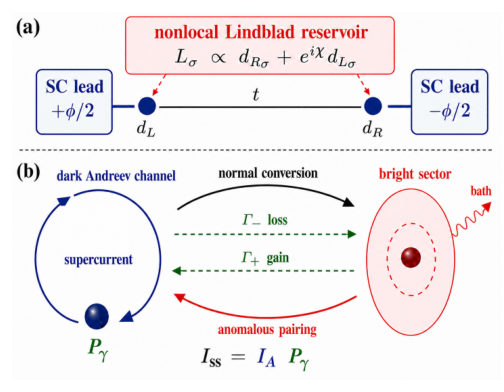
<figcaption class="paper-figure-caption"><b>Fig 1.</b> FIG. 1. Zeno filtering in a dissipative double-dot Josephson junction. (a) Two dots (dL, dR) coupled by hopping t and proximitized by superconducting leads with phases ±ϕ/2. A nonlocal reservoir with jump operator Lσ ∝dRσ + eiχdLσ damps one collective orbital; the phase χ is set by the flux through the loop formed by the two paths to the reservoir. (b) In the bright-dark basis, the bright orbital (damped at rate κ) is frozen out in the Zeno regime, while the dark orbital survives as the Andreev channel carrying the spectral cur- rent IA. Virtual bright-sector processes (normal conversion ∝sin χ and anomalous pairing ∝sin η) generate the effective loss and gain rates Γ−and Γ+ that fix the...</figcaption>
</figure>
<figure class="paper-figure-card">
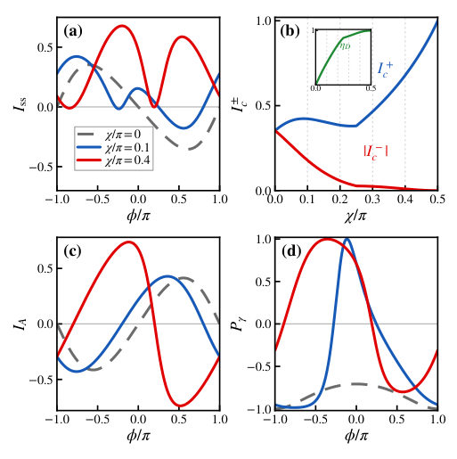
<figcaption class="paper-figure-caption"><b>Fig 2.</b> FIG. 2. Occupation-reweighted Josephson diode. (a) Steady- state current Iss for χ/π = 0, 0.1, and 0.4. (b) Forward and backward critical currents and the diode efficiency ηD as functions of χ [Eq. (9)]. (c,d) The factorization in Eq. (1) resolved into (c) the spectral Andreev current IA and (d) the dark-channel occupation imbalance Pγ, for the same values of χ as in panel (a). All panels show the Zeno-projected steady state of the noninteracting junction at Γ = t = 1.</figcaption>
</figure>
<figure class="paper-figure-card">
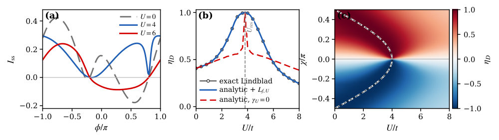
<figcaption class="paper-figure-caption"><b>Fig 3.</b> FIG. 3. Interaction-assisted dark-pair resonance. (a) Current-phase relations Iss(ϕ) at U/t = 0, 4, and 6 for χ/π = 0.1 and κ = 300. (b) Signed diode efficiency ηD versus U/t at the same reservoir phase. The full microscopic Lindblad result is compared with the interacting projected theory including the induced two-particle loss Lf,U and with the corresponding theory without this channel, γU = 0. The vertical dashed line marks the dark-pair resonance Ures = 4t cos χ. (c) Signed diode efficiency ηD of the interacting projected steady state in the (U/t, χ/π) plane for κ = 300. The dashed curve follows Ures = 4t cos χ [Eq. (10)]. Throughout, t = ΓL = ΓR = 1.</figcaption>
</figure>
<figure class="paper-figure-card">
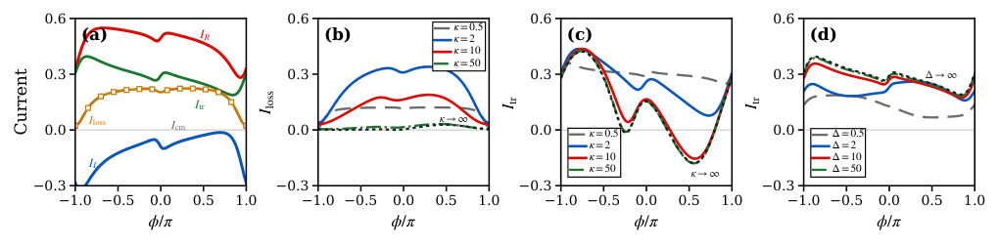
<figcaption class="paper-figure-caption"><b>Fig 4.</b> FIG. 4. Transport beyond the Zeno and infinite-gap limits (all panels: χ/π = 0.10). (a) Lead currents IL and IR, transport current Itr = (IL −IR)/2, common-mode current Icm = (IL + IR)/2, and reservoir outflow Iloss at κ = ∆= 1; Icm = Iloss verifies steady-state continuity. (b,c) Iloss(ϕ) and Itr(ϕ), respectively, for κ = 0.5, 2, 10, and 50 at ∆= 1. The black dotted curves show the strong-dissipation analytic limit, with panel (c) approaching κ →∞. (d) Itr(ϕ) for ∆= 0.5, 2, 10, and 50 at κ = 1; the black dotted curve denotes the ∆→∞limit.</figcaption>
</figure>

**Summary.** This paper introduces a mechanism for achieving a Josephson diode effect in a symmetric junction by engineering the non-equilibrium occupation of quantum states via attached reservoirs. By analyzing the system using advanced Green's function techniques, the authors demonstrate that the diode asymmetry originates solely from the reservoir-induced occupation factor, not from intrinsic junction asymmetry. This provides a powerful tool for designing superconducting electronic components.

**Why it may be interesting.** This work provides a sophisticated theoretical framework for engineering non-reciprocity in superconducting devices using reservoir engineering, which is highly relevant to superconducting quantum circuits and mesoscopic physics.

Detailed structure

**Main problem.** The paper proposes a novel mechanism for generating a Josephson diode effect in a symmetric junction, where the nonreciprocity arises purely from non-equilibrium occupation of current-carrying states rather than an inherent asymmetry in the Andreev spectrum.

**Main result.** The diode effect is shown to be entirely governed by a reservoir-controlled occupation factor ($P_\gamma$), which can be engineered to approach ideal rectification ($\eta_D 	o 1$) even when the underlying spectral current ($I_A$) is reciprocal.

**Method.** The analysis employs the Keldysh-Lindblad formalism, first in the simplified Quantum Zeno limit, and later extended to finite superconducting gaps and dissipation using contour-ordered Green's functions.

**Model / system.** The system is a double-quantum-dot junction coupled to superconducting leads and engineered reservoirs. The dynamics are governed by a Lindblad master equation, which is analyzed using Green's function techniques.

**Key observables.** Diode efficiency ($\eta_D$), critical currents ($I_c^+, |I_c^-|$), and the current factorization $I_{ss} = I_A P_\gamma$.

**Important parameters / regimes.** Reservoir coupling strength ($\kappa$), superconducting gap ($\Delta$), and local Coulomb repulsion ($U$).

**Assumptions / limitations.** The initial analysis relies on the Quantum Zeno limit ($\kappa \gg t, \Gamma$), but the results are shown to be robust and extend to finite $\kappa$ and finite $\Delta$.

**Figures summary.** Figures illustrate Zeno filtering separating bright/dark orbitals, the diode effect via occupation reweighting ($P_\gamma$), and the effect of Coulomb repulsion inducing a dark-pair resonance.

**Paper structure.** The paper progresses from the simplified Zeno limit analysis to deriving the full steady-state Green's functions using contour formalism, culminating in the characterization of the finite-gap diode efficiency.

Abstract

We propose a Josephson diode mechanism in which nonreciprocity arises not from a conventional asymmetric Andreev spectrum but from nonequilibrium occupation of the current-carrying states engineered by attached reservoirs. We realize this mechanism in a double-quantum-dot junction, where a phase-textured nonlocal reservoir acts as a quantum Zeno selector: rapid dissipation freezes out the bright state directly coupled to the jump operator $L$, while preserving an orthogonal dark Andreev channel whose supercurrent remains comparable to that of the lossless junction. In the infinite-gap limit, the steady-state current factorizes as $I_{\rm ss}=I_A P_γ$, so that even when the Andreev current $I_A$ is strictly reciprocal, the phase asymmetry of $P_γ$ alone can produce a Josephson diode effect through reservoir engineering. We further show that local Coulomb repulsion can drive the system toward a nearly ideal diode regime via a dark-pair resonance. Using Keldysh-Lindblad calculations, we demonstrate that our results remain robust for realistic junctions with a finite superconducting gap and dissipation.

[↑ back to top](#top)

### [Non-Hermitian Skin Effect from Radiative Coupling in a Reciprocal Chiral Medium](http://arxiv.org/abs/2608.26705v1)

**Authors:** Kin Hung Fung, Changhao Meng, Yixin Xiao, C. T. Chan  
**Type:** theory · **Category:** other · **PDF:** <https://arxiv.org/pdf/2608.26705v1>  
**Analysis basis:** full PDF text, analyzed in chunks
**Topic relevance:** `correlated / nonlocal dissipation` **3/5** · `driven-dissipative phase transition` **3/5** · `Keldysh / 2PI / non-Gaussian methods` **2/5** · `methods for driven-dissipative` **2/5** · `non-equilibrium universality` **2/5** · `analog quantum simulation` **1/5** · `interference shaping light` **1/5**

↔ Scroll figures horizontally

<figure class="paper-figure-card">
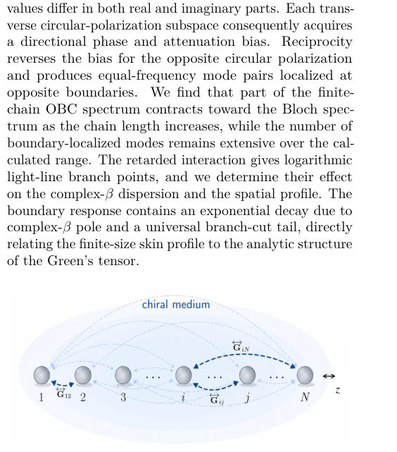
<figcaption class="paper-figure-caption"><b>Fig 1.</b> FIG. 1. Schematic of a chain of long-range coupled electric dipoles in a reciprocal chiral medium. The full retarded electro- magnetic Green tensor ←→ G ij couples every pair of sites (i and j). Reciprocity relates the two transverse circular-polarization subspaces, and produces equal-frequency skin pairs whose spa- tial profiles are related by reversal of the site index. The two partners therefore accumulate at opposite boundaries.</figcaption>
</figure>
<figure class="paper-figure-card">
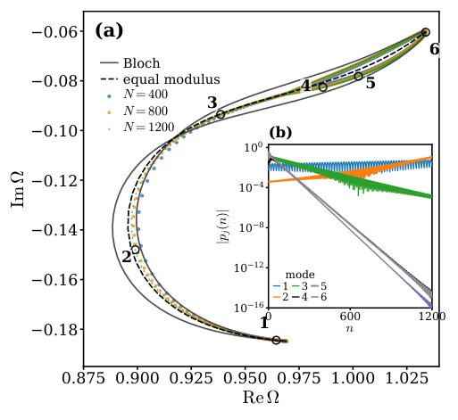
<figcaption class="paper-figure-caption"><b>Fig 2.</b> FIG. 3. Open-boundary spectra and reciprocal boundary localization. (a) Eigenvalues of the linearized coupled-dipole matrix for open chains with N = 400, 800, and 1200, plotted together with the Bloch spectrum B and the analytically continued equal-modulus locus C. (b) Representative right- eigenvector amplitudes for the σ = −1 subspace at N = 1200. The σ = +1 partners have reversed site profiles. The examples span weak two-boundary localization (mode 1), broad opposite- edge profiles (modes 2 and 3), and light-line-limited strong decay (modes 4–6).</figcaption>
</figure>
<figure class="paper-figure-card">
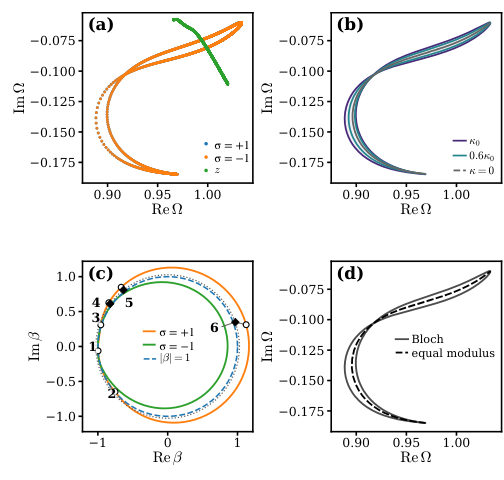
<figcaption class="paper-figure-caption"><b>Fig 3.</b> FIG. 2. Bloch spectrum and analytically continued equal- modulus locus for ϵr = 1.3221 + 0.020i, µr = 1 + 0.002i, base- line chirality κ0 = 0.080 + 0.004i, η0 = π, and Γnr = 1/120. The remaining onsite parameters, radiative normalization, and passivity checks are given in the Supplemental Material [24]. (a) Bloch spectra of the two reciprocal transverse circular- polarization subspaces and of the longitudinal control. (b) Transverse Bloch spectra for κ = κ0, 0.6κ0, and 0; for κ = 0, the spectral loop collapses to a reciprocal arc. (c) Directly com- puted solutions of the analytically continued equal-modulus condition in the complex-β plane. The dashed curve is the unit Bloch circle; the...</figcaption>
</figure>
<figure class="paper-figure-card">
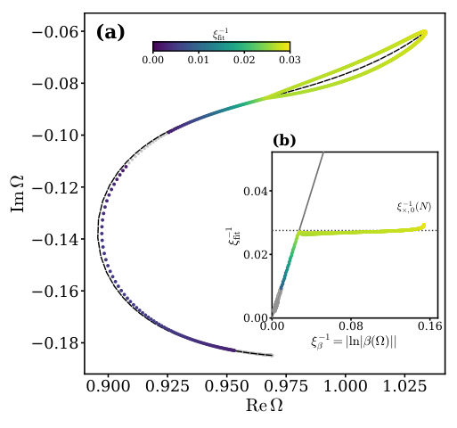
<figcaption class="paper-figure-caption"><b>Fig 4.</b> FIG. 4. Mode-by-mode comparison of spatial decay rates for the 1080 localized modes at N = 1200. (a) Effective inverse decay rates obtained by fitting the eigenvector envelopes over sites 150–900. (b) Comparison with the complex-β-pole pre- diction ξ−1 β = | ln |β|| from the nearest point of the analytically continued equal-modulus locus. The two rates agree for roots near the unit circle. For more strongly localized roots, the fitted rates approach the finite-size crossover value in Eq. (9) because the light-line branch-cut contribution limits the ob- servable decay.</figcaption>
</figure>
<figure class="paper-figure-card">
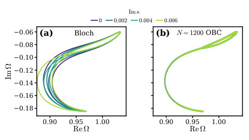
<figcaption class="paper-figure-caption"><b>Fig 5.</b> FIG. 5. Dependence on the dissipative part of the chirality parameter, Im κ. (a) Bloch spectra of the two transverse circular-polarization subspaces. (b) Open-boundary spectra for N = 1200. Varying Im κ strongly deforms the Bloch spectrum by moving a light-line branch point, whereas the OBC spectrum remains nearly unchanged over the same range. The more visible open-chain response occurs in the directional decay of the eigenvectors. All material parameters in the sweep satisfy the passivity conditions derived in the Supplemental Material [24].</figcaption>
</figure>

**Summary.** This paper theoretically analyzes the Non-Hermitian Skin Effect in a chain of dipoles coupled via long-range radiative interactions within a chiral medium. The authors find that the resulting skin mode profile has a unique decay structure involving both an exponential pole contribution and a slower, logarithmic tail. This work advances the understanding of boundary effects in open, chiral, and long-range coupled quantum systems.

**Why it may be interesting.** This work extends the study of NHSE into the realm of long-range radiative coupling in chiral media, providing a detailed profile of the boundary localization that goes beyond simple exponential decay, which is highly relevant for understanding open quantum systems and photonic structures.

Detailed structure

**Main problem.** The study investigates the Non-Hermitian Skin Effect (NHSE) in a system characterized by long-range radiative coupling within a reciprocal chiral medium.

**Main result.** The system exhibits a complex skin mode profile composed of an exponential term from a complex-beta pole and a longer-range tail decaying as 1/[n(ln n)^2].

**Method.** The analysis involves comparing the open-boundary condition (OBC) spectrum to the Bloch spectrum using complex analysis techniques, particularly analyzing the complex-beta plane structure.

**Model / system.** The model is a straight chain of electric dipoles embedded in a passive reciprocal chiral medium, whose coupling is mediated by long-range radiative interactions.

**Key observables.** OBC spectrum vs. Bloch spectrum, skin mode profile decay rates, and the contraction of the OBC spectrum toward the Bloch spectrum.

**Important parameters / regimes.** Chirality parameter (kappa), lattice site distance (n), and the chain length (N).

**Assumptions / limitations.** The analysis notes that the standard equal-modulus construction is insufficient because the finite-chain decay is ultimately limited by light-line branch cuts.

**Figures summary.** Figures illustrate the Bloch spectrum versus the equal-modulus locus, show representative eigenvector amplitudes exhibiting different decay types, and compare OBC eigenvalues to the Bloch spectrum for increasing chain lengths.

**Paper structure.** The paper builds upon established theory of NHSE, analyzing the governing equations derived from the dipole interaction and radiative coupling. It proceeds by calculating and comparing the OBC and Bloch spectra, deriving the asymptotic decay profile, and discussing the implications of the light-line branch cuts.

Abstract

We find that long-range radiative coupling through a passive reciprocal chiral medium produces an unusual non-Hermitian skin effect in a chain of electric dipoles. Although the system is reciprocal, the chirality generates polarization-dependent phase accumulation and attenuation, leading to degenerate pairs of skin modes localized at opposite boundaries. We find that the skin mode profile consists of an exponential contribution from an isolated complex-$β$ pole and a longer-range tail proportional to $1/[n(\ln n)^2]$, where $n$ is the distance from the occupied boundary measured in lattice sites. Finite-chain calculations show that part of the OBC spectrum contracts toward the Bloch spectrum, whereas the number of boundary-localized modes remains extensive.

[↑ back to top](#top)

### [Cavity Solitons](http://arxiv.org/abs/2608.26985v1)

**Authors:** W. J. Firth, G. K. Harkness  
**Type:** theory · **Category:** other · **PDF:** <https://arxiv.org/pdf/2608.26985v1>  
**Analysis basis:** full PDF text, analyzed in chunks
**Topic relevance:** `driven-dissipative phase transition` **3/5** · `analog quantum simulation` **2/5** · `methods for driven-dissipative` **2/5** · `non-equilibrium universality` **2/5** · `Keldysh / 2PI / non-Gaussian methods` **1/5** · `correlated / nonlocal dissipation` **1/5** · `interference shaping light` **1/5**

↔ Scroll figures horizontally

<figure class="paper-figure-card">
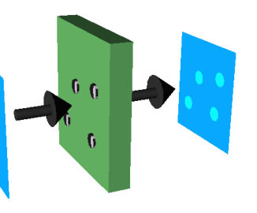
<figcaption class="paper-figure-caption"><b>Fig 1.</b> Figure 1: Schematic representation of an optical memory system based on localised states in a driven optical cavity.</figcaption>
</figure>
<figure class="paper-figure-card">
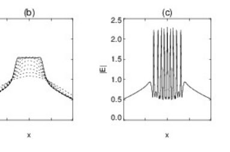
<figcaption class="paper-figure-caption"><b>Fig 2.</b> Figure 2: Gaussian beam switching in an OB cavity. The central section of a smooth broad beam (a) switches; a switching wave then forms and moves out (dotted curves in (b); the high- intensity central region then breaks up into spikes (after Moloney et al. [2]).</figcaption>
</figure>
<figure class="paper-figure-card">
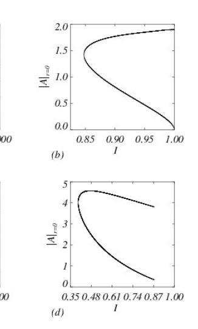
<figcaption class="paper-figure-caption"><b>Fig 3.</b> Figure 3: Bifurcation diagrams illustrating the 2D Kerr cavity soliton states for a) θ = 0.9, b) θ = 1.2, c) θ = 1.5 and d) θ = 1.8.</figcaption>
</figure>
<figure class="paper-figure-card">
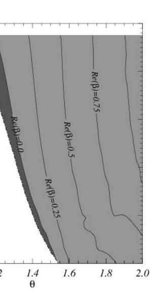
<figcaption class="paper-figure-caption"><b>Fig 4.</b> Figure 4: Existence domain of the 2D Kerr cavity soliton (shaded region), stable only in the darker region (near the existence boundary, c.f. Fig. 3).</figcaption>
</figure>
<figure class="paper-figure-card">
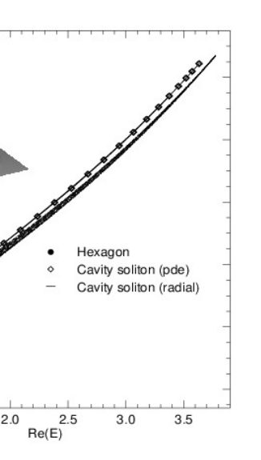
<figcaption class="paper-figure-caption"><b>Fig 5.</b> Figure 5: Phase-plane plot of cavity soliton field (see text).</figcaption>
</figure>

**Summary.** This review surveys cavity solitons, stable light spots in nonlinear optical cavities, detailing their mathematical modeling using equations like the Lugiato-Lefever equation. The authors establish that these solitons possess unique robustness and plasticity, making them promising candidates for next-generation all-optical memory and processing units.

**Why it may be interesting.** This work is highly relevant to open quantum systems and quantum optics, as cavity solitons represent stable, localized excitations in nonlinear wave systems, analogous to engineered quantum states or information carriers.

Detailed structure

**Main problem.** The paper reviews the history, physical interpretation, and potential applications of cavity solitons—stable, bright, non-diffracting spots of light in driven optical cavities.

**Main result.** Cavity solitons can exist even when the nonlinear medium properties oppose those needed for standard Kerr solitons, suggesting they are robust candidates for all-optical information processing.

**Method.** The analysis involves deriving and solving mean-field models, such as the Lugiato-Lefever equation, and performing stability analysis using Jacobian eigenvalues.

**Model / system.** The system is a driven optical cavity containing a nonlinear medium, modeled by perturbed Nonlinear Schrödinger Equations (NLS) or the Lugiato-Lefever (LL) equation. These models describe the spatial evolution of light fields.

**Key observables.** Soliton stability (eigenvalues of the Jacobian), field profiles (localized spots), and the existence domain of stable solutions.

**Important parameters / regimes.** Linear loss ($\epsilon$), cavity mistuning ($	heta$), and pump intensity ($I$).

**Assumptions / limitations.** The analysis relies on mean-field approximations, particularly the high-finesse assumption used to derive the LL equation from the full cavity dynamics.

**Figures summary.** Figures illustrate schematic memory systems, Gaussian beam switching, bifurcation diagrams showing soliton states vs. parameters, and phase-plane plots confirming soliton stability regions.

**Paper structure.** The paper progresses by reviewing the historical context (Stone Age to Information Age), developing the mathematical models (NLS to LL), analyzing the stability and physical interpretations of the solitons, and concluding with potential applications in all-optical processing.

Abstract

A driven optical cavity containing a nonlinear medium can support stable, soliton-like objects, bright non-diffracting spots of light on a uniform background. Importantly, the nonlinear medium need not support ordinary (propagating) spatial solitons, and cavity solitons have been both predicted and observed in a saturable absorber, and predicted to even exist in self-defocusing media. The history, present status, and physical interpretation of such cavity solitons is reviewed. Recent research predicts cavity solitons in semiconductor cavity models with properties interesting for applications to optical information processing. Cavity solitons are natural `bits' for spatial information, possessing both robustness and plasticity, and some potential applications of their unique properties are mentioned.

[↑ back to top](#top)

### [Stabilization of Interband Phase Solitons in Two-Band Noncentrosymmetric Superconducting Rings](http://arxiv.org/abs/2608.26782v1)

**Authors:** Yuriy Yerin, Boris Malomed, Stefan-Ludwig Drechsler, F. Sebastian Bergeret  
**Type:** theory · **Category:** other · **PDF:** <https://arxiv.org/pdf/2608.26782v1>  
**Analysis basis:** full PDF text, analyzed in chunks
**Topic relevance:** `driven-dissipative phase transition` **3/5** · `Keldysh / 2PI / non-Gaussian methods` **2/5** · `methods for driven-dissipative` **2/5** · `non-equilibrium universality` **2/5** · `Frenkel-Kontorova` **1/5** · `analog quantum simulation` **1/5** · `quantum measurements` **1/5**

↔ Scroll figures horizontally

<figure class="paper-figure-card">
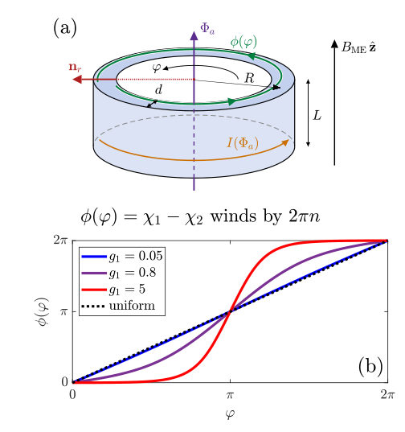
<figcaption class="paper-figure-caption"><b>Fig 1.</b> FIG. 1. (a) The physical setup: a thin-walled ring (with the mean radius R, wall thickness d, and height L) of a noncentrosymmetric two-band superconductor, whose local inversion-symmetry-breaking axis nr is radial (red arrows; the dotted line: a radius). The green curve shows the relative- phase profile: its radial displacement represents φ(ϕ) (with the phase circulation 2π around the ring) for visualization only, not a real-space deformation [cf. (b)]. The axial bias magnetic field BME activates the Lifshitz invariant. The probe flux Φa is tuned independently and the circulating current I(Φa) is to be measured. (b) An exact double-sine- Gordon profiles φ(ϕ) with n = 1 [see Eq. (1)] at...</figcaption>
</figure>
<figure class="paper-figure-card">
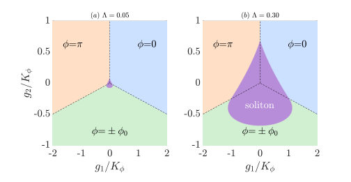
<figcaption class="paper-figure-caption"><b>Fig 2.</b> FIG. 2. The ground-state phase diagram in the plane of interband-coupling parameters, (g1/Kφ, g2/Kφ), as produced by the minimization of energy Eq. (4) with respect to inte- ger n at fH = 1/2. Four domains appear: the homogeneous states φ = 0 (blue) and φ = π (orange), the double-well state φ = ±φ0 (green), and the winding interband soliton (pur- ple). Dashed lines: homogeneous-state boundaries (g1 = 0 for g2 &gt; 0; g2 = −|g1|/4 for g2 &lt; 0); spinodal branches (|g1| = 4|g2|) are not shown. As Λ grows, the area of the soli- ton ground state expands from a small region near the origin (a) Λ = 0.05 to a broad basin (b) Λ = 0.30. Parameters: c2 = 0.5, ǫ = 0.05, fL = 0; locking strengths in units...</figcaption>
</figure>
<figure class="paper-figure-card">
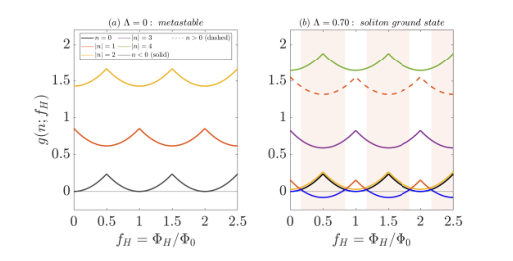
<figcaption class="paper-figure-caption"><b>Fig 3.</b> FIG. 3. The reduced Gibbs energy g(n; fH), defined as per Eq. (4), vs. the applied flux for several winding sectors, with the line style encoding the sign of n (solid for n &lt; 0, dashed for n &gt; 0). The bold black and blue curves represent the ground state for (a) Λ = 0 and (b) Λ = 0.7, respectively. Shaded windows mark flux ranges where the solitons pick up the role of the ground state. The parameters are g1 = 0.8, g2 = 0.1; the others are as in Fig. 2.</figcaption>
</figure>
<figure class="paper-figure-card">
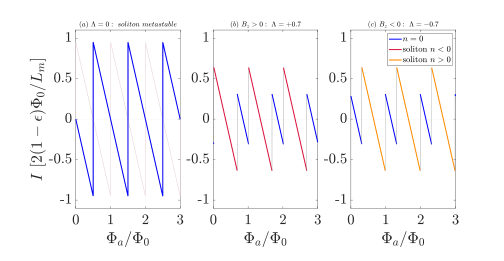
<figcaption class="paper-figure-caption"><b>Fig 4.</b> FIG. 4. The equilibrium current In(fH) = −∂G/∂Φa versus the probe flux at a fixed magneto-electric bias. Occupied sec- tors are drawn bold [blue for n = 0, and crimson or orange for the IBPS with n &lt; 0 or n &gt; 0 , respectively. Faint branches in (a) are metastable ones. Thin vertical lines mark fluxoid jumps, and the dotted line stands for I = 0. (a) Λ = 0: the equilibrium response is similar to the n = 0 sawtooth in Ref. [15]. (b) BME &gt; 0 and (c) BME &lt; 0 (Λ = ±0.7): soliton segments appear in the equilibrium response. Their chirality and flux positions reverse with the reversal of the bias. Pa- rameters are the same as in Fig. 3, with fL = 0.15 sgn(BME) in (b,c).</figcaption>
</figure>

**Summary.** This theoretical work investigates how breaking inversion symmetry in two-band superconductors stabilizes interband phase solitons (IBPS) in a ring geometry. The key mechanism is a magneto-electric coupling term that acts as a chiral bias, forcing the soliton to become the true ground state. This transition is predicted to manifest as a unique, field-odd signature in the measured current-flux response.

**Why it may be interesting.** The mechanism of stabilizing a topological excitation (the soliton) via a symmetry-breaking coupling term ($\Lambda$) is analogous to controlling quantum states in superconducting circuits or Josephson junctions, making it relevant to open quantum systems and topological physics.

Detailed structure

**Main problem.** The study determines the conditions under which an Interband Phase Soliton (IBPS) in a two-band superconducting ring transitions from a metastable state to a true ground state.

**Main result.** Breaking inversion symmetry introduces a magneto-electric coupling term that biases the energy balance, allowing the soliton to become the true ground state, which is observable as a field-odd branch in current-flux measurements.

**Method.** The analysis involves minimizing a reduced Gibbs energy functional derived from the two-band Ginzburg-Landau theory, solving the Double Sine-Gordon equation, and analyzing the resulting phase diagram.

**Model / system.** The system is a two-band superconductor confined to a ring geometry. The physics is modeled using a GL functional augmented by a magneto-electric Lifshitz term, leading to a relative-phase degree of freedom ($\phi$) that supports soliton excitations.

**Key observables.** Field-odd soliton branches in the equilibrium current-flux response $I_n(\Phi_a)$; the ground state selection between uniform and solitonic configurations.

**Important parameters / regimes.** The magneto-electric coupling strength ($\Lambda$), the winding number ($n$), and the superconducting gap parameters ($g_1, g_2$).

**Assumptions / limitations.** The analysis assumes a thin-walled ring geometry and that the order parameters are rigid, depending only on the azimuthal coordinate $\phi$.

**Figures summary.** Figures illustrate the physical setup in a noncentrosymmetric ring, the double-sine-Gordon profile for the soliton, and phase diagrams showing the transition between uniform and solitonic ground states as the bias $\Lambda$ increases.

**Paper structure.** The paper progresses from establishing the physical model and the problem of metastability in centrosymmetric rings, to incorporating the symmetry-breaking magneto-electric term ($\Lambda$), deriving the energy minimization conditions, and finally predicting the observable signature in current-flux measurements.

Abstract

Two-band superconductors maintain a relative interband phase which can carry winding soliton excitations in a superconducting ring, supported by independent winding numbers in the two bands. In rings of superconductors obeying the inversion symmetry the interband phase solitons are metastable states, separated from the uniform ground state by the energy of screening currents. In this work we find that, breaking the inversion symmetry strongly enough, one can make the soliton a true ground state. In that case, a magneto-electric coupling, absent in centrosymmetric materials, contributes critically above a certain threshold, a relevant, free-energy term, odd with respect to the winding number, which biases the energy balance in favor of a particular winding sign. Once the bias outweighs the energy cost that originally made the soliton metastable, a phase soliton with a finite winding number becomes the ground state, with chirality set by the applied field. In current--flux measurements performed in equilibrium states, the effect is demonstrated by field-odd soliton branches, that replace the metastable ones existing in mesoscopic rings, built by two-component superconductors, realizing a magneto-electric analog of the Little--Parks fluxoid-branch physics in the interband relative-phase sector.

[↑ back to top](#top)

### [Distinguishing Quantum Capacitance Signatures of a Topological Majorana Wire from a Normal Wire Segment](http://arxiv.org/abs/2608.27452v1)

**Authors:** Binayyak Bhusan Roy, Jay Deep Sau, Sumanta Tewari  
**Type:** theory · **Category:** other · **PDF:** <https://arxiv.org/pdf/2608.27452v1>  
**Analysis basis:** full PDF text, analyzed in chunks
**Topic relevance:** `driven-dissipative phase transition` **3/5** · `analog quantum simulation` **2/5** · `quantum measurements` **2/5** · `Keldysh / 2PI / non-Gaussian methods` **1/5** · `methods for driven-dissipative` **1/5**

↔ Scroll figures horizontally

<figure class="paper-figure-card">
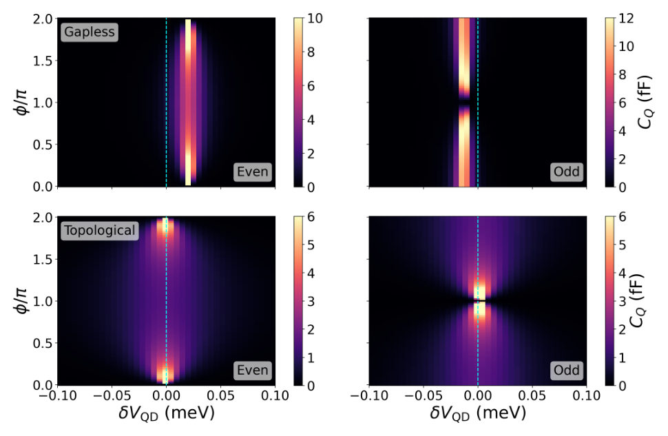
<figcaption class="paper-figure-caption"><b>Fig 1.</b> FIG. 1. Parity-resolved capacitance maps for the clean gapless and topological interferometers. The upper panels show |CQ| in the even and odd sectors of the clean gapless wire at µ = −0.48 meV and Γ = 0.50 meV. The even and odd responses are centered near the g and τ resonances at δVQD ≃+19.4 µeV and −13.9 µeV, respectively, relative to V ∗ QD = 0.585 meV. The lower panels show the corresponding topological responses at µ = 0.50 meV and Γ = 0.65 meV, using V ∗ QD = 0.686 meV. The gapless Majorana-like response occurs between two narrow parity resonances, whereas the topological branches occupy the same broader gate region. Cyan dashed lines mark δVQD = 0.</figcaption>
</figure>
<figure class="paper-figure-card">
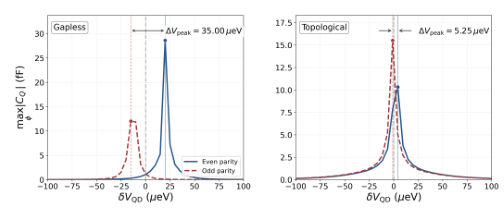
<figcaption class="paper-figure-caption"><b>Fig 2.</b> FIG. 2. Flux-maximized parity-resolved capacitance in the clean systems. Maximum of |CQ| over ϕ as a function of δVQD for the gapless (left) and topological (right) wires. Solid blue and dashed red curves denote even and odd parity, respectively. The gapless maxima lie near the separate τ and g resonances and are separated by 35.00 µeV, whereas the topological maxima remain within the same gate region and are separated by 5.25 µeV. Colored vertical lines mark the maxima, the black dash-dotted line marks δVQD = 0.</figcaption>
</figure>
<figure class="paper-figure-card">
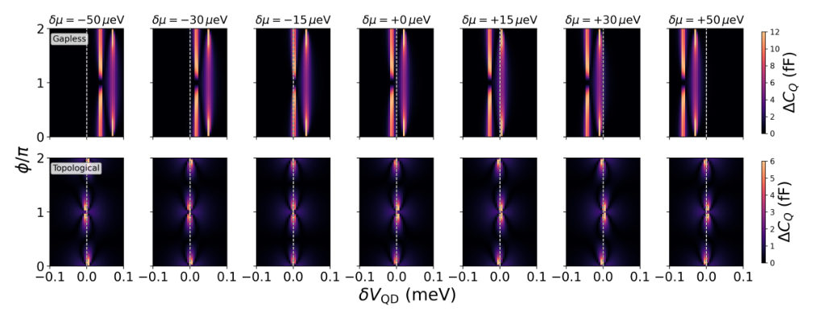
<figcaption class="paper-figure-caption"><b>Fig 3.</b> FIG. 3. Stability under chemical-potential detuning. Parity contrast ∆CQ as a function of δVQD and ϕ for δµ = (−50, −30, −15, 0, 15, 30, 50) µeV. The upper row shows the gapless wire with µ0 = −0.48 meV and Γ = 0.50 meV; its two narrow resonances move across the unchanged operating gate as µ is varied. The lower row shows the topological wire with µ0 = 0.50 meV and Γ = 0.65 meV; the response remains within the same gate region.</figcaption>
</figure>
<figure class="paper-figure-card">
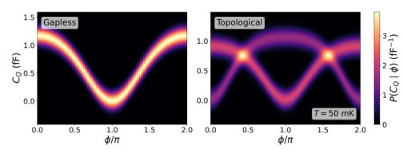
<figcaption class="paper-figure-caption"><b>Fig 4.</b> FIG. 4. Thermally weighted capacitance response in the clean systems. Conditional probability density P(CQ | ϕ) for the clean gapless benchmark (left) and topological reference (right) at T = 50 mK. The energy cost of occupying the second gapless-wire level strongly suppresses one parity branch, whereas both topological branches retain appreciable weight.</figcaption>
</figure>
<figure class="paper-figure-card">
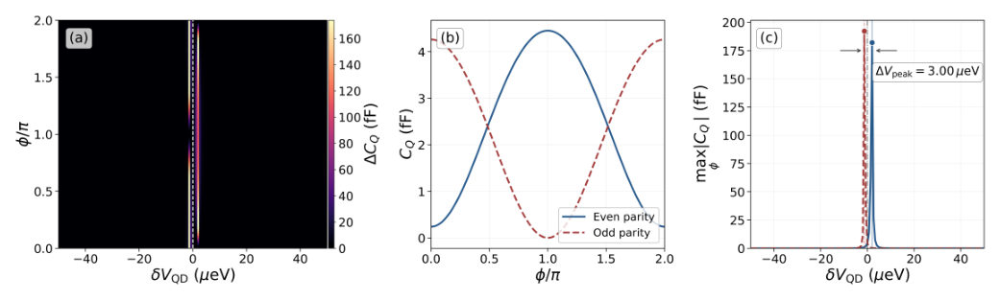
<figcaption class="paper-figure-caption"><b>Fig 5.</b> FIG. 5. Fine-tuned Majorana-like response of a clean gapless wire. (a) Parity contrast ∆CQ as a function of δVQD and ϕ near the optimized point. (b) Even- and odd-parity capacitance at δVQD = 0. The two h/e-periodic branches have comparable amplitudes and are displaced by approximately half a period, producing an apparently h/2e-periodic parity contrast. (c) Flux-maximized parity-resolved capacitance. The two resonance maxima are separated by only 3.00 µeV, but remain distinct and confine the balanced response to a narrow gate interval.</figcaption>
</figure>

**Summary.** This theoretical work addresses the challenge of distinguishing true Majorana zero modes in a topological superconductor from spurious signals in a normal wire segment. By analyzing the stability of the quantum capacitance response across a range of independently controlled parameters, the authors demonstrate that only the topological system exhibits the required robust, persistent signature, providing a clear experimental benchmark.

**Why it may be interesting.** This work provides a crucial, experimentally testable diagnostic tool—parametric stability—to confirm the topological nature of superconducting states, which is vital for realizing topological quantum computing hardware.

Detailed structure

**Main problem.** The paper aims to experimentally distinguish the quantum capacitance signatures arising from a true Topological Majorana Wire (TS wire) versus those from a gapless Normal Wire Segment, as both can exhibit misleading Majorana-like flux-dependent oscillations.

**Main result.** The topological response is characterized by the persistence of the two parity branches over a finite range of independently controlled parameters, a stability criterion that the gapless normal wire segment fails to meet.

**Method.** The authors calculated parity-resolved quantum capacitance ($\Delta C_Q$) by analyzing the system's response to varying external parameters ($\mu, V_{QD}$) in both theoretical models.

**Model / system.** The study models a quantum-dot interferometer coupled to either a superconducting topological wire or a gapless normal wire segment. The analysis involves calculating the quantum capacitance using parity-resolved methods based on the system's effective Hamiltonian.

**Key observables.** Parity-resolved quantum capacitance ($\Delta C_Q$), flux-dependent oscillations, and the stability/persistence of the two parity branches over a finite parameter range.

**Important parameters / regimes.** Dot potential ($V_{QD}$), chemical potential ($\mu$), magnetic flux, and temperature ($T=50$ mK).

**Assumptions / limitations.** The distinction relies on the parametric stability of the response over a finite region, rather than matching the signal at a single optimized point in parameter space.

**Figures summary.** Figures compare parity-resolved capacitance maps for both gapless and topological interferometers, showing the separation of maxima (e.g., 35.0 $\mu$eV vs. 5.25 $\mu$eV) and the stability of the response under parameter sweeps.

**Paper structure.** The paper establishes the problem of mimicking Majorana signatures, develops the theoretical framework using parity-resolved quantum capacitance, calculates and compares the signatures for the gapless and topological cases, and concludes by emphasizing the necessity of parameter-space stability for definitive identification.

Abstract

Majorana zero modes (MZMs) are spatially separated, near-zero-energy excitations expected at the ends of a topological superconducting (TS) wire. A quantum-dot interferometer can be used to probe the quantum capacitance of the TS wire, and the location and magnitude of the capacitance resonances provide information about the MZMs, while their magnetic flux dependence probes coherent coupling to the two Majorana modes. It has been recently shown that, a gapless (i.e., $Δ=0$) wire segment can also exhibit flux-dependent quantum capacitance oscillations through Aharonov-Bohm interference and, with suitable tuning, can reproduce a Majorana-like response. Here we show that the two mechanisms can be distinguished experimentally. In the gapless normal wire segment, the two parity-dependent signals originate from separate energy resonances corresponding to the lack of generic zero-energy states. By contrast, in the topological wire, the pair of low energy levels with even and odd parity are nearly degenerate in energy, and therefore, the two parity branches remain within the same broader resonance region in the quantum-dot potential, and persist under independent variations of the dot potential and wire chemical potential. Our results show that the experimentally observed quantum capacitance response is distinguished not by a particular flux trace at one optimized point in parameter space, but by its persistence over a finite range of independently controlled parameters, including the quantum-dot potential. This parameter space stability provides a direct means of ruling out the gapless normal wire segment as the origin of the observed Majorana-like response.

[↑ back to top](#top)

### [Majorana signatures in an asymmetrically coupled quantum dot--topological superconducting nanowire junction](http://arxiv.org/abs/2608.26341v1)

**Authors:** Levente Máthé, Ioan Grosu, Liviu P. Zârbo, Ionel Ţifrea  
**Type:** theory · **Category:** quantum information and computing · **PDF:** <https://arxiv.org/pdf/2608.26341v1>  
**Analysis basis:** full PDF text, analyzed in chunks
**Topic relevance:** `Keldysh / 2PI / non-Gaussian methods` **3/5** · `analog quantum simulation` **3/5** · `methods for driven-dissipative` **2/5**

↔ Scroll figures horizontally

<figure class="paper-figure-card">
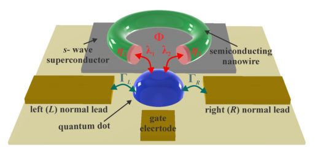
<figcaption class="paper-figure-caption"><b>Fig 1.</b> FIG. 1. Schematic representation of a QD attached to two MBSs hosted by a topological superconducting nanowire loop, threaded by a magnetic flux Φ. The central QD is coupled to two metallic leads (left L and right R) with coupling strengths ΓL and ΓR, respectively. The central QD is also coupled to the two MBSs (denoted by the operators η1 and η2) located at the ends of a topological superconducting nanowire with coupling parameters λ1 and λ2, respectively. The central QD characteristic energy level can be tuned by a gate voltage applied to the gate electrode.</figcaption>
</figure>
<figure class="paper-figure-card">
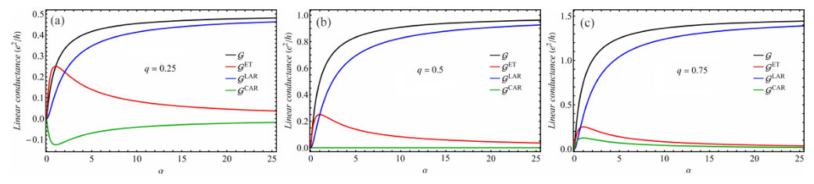
<figcaption class="paper-figure-caption"><b>Fig 2.</b> FIG. 2. The zero–temperature linear conductance G (black line) and its components related to electron tunneling GET (red line), local Andreev reflection GLAR (blue line), and crossed Andreev reflection GCAR (green line) as a function of the coupling asymmetry parameter α = ΓL/ΓR in the case of unhybridized MBSs (εM/Γ = 0). The magnetic flux phase is set at ϕ = π. The applied bias voltage asymmetry parameter is (a) q = 0.25, (b) q = 0.5, and (c) q = 0.75.</figcaption>
</figure>
<figure class="paper-figure-card">
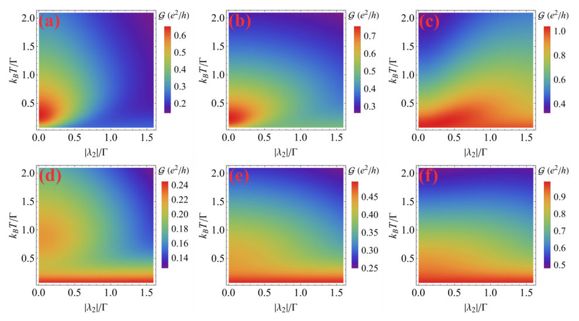
<figcaption class="paper-figure-caption"><b>Fig 3.</b> FIG. 3. The linear conductance G in the case of unhybridized MBSs (εM/Γ = 0) as a function of QD-MBS coupling strength |λ2|/Γ and temperature kBT/Γ for a symmetric leads–QD coupling parameter (α = 1) at different values of the QD–MBS coupling strength |λ1| and bias voltage asymmetry parameter q. The QD characteristic energy level εd/Γ = 0, and the magnetic flux phase ϕ = π. The values of the QD-MBS coupling strength |λ1| are: (a)-(c) |λ1|/Γ = 0.3 and (d)-(f) |λ1|/Γ = 1.2. The bias voltage asymmetry parameter is set to q = 0.25 for (a) and (d), q = 0.5 for (b) and (e), and q = 1 for (c) and (f).</figcaption>
</figure>
<figure class="paper-figure-card">
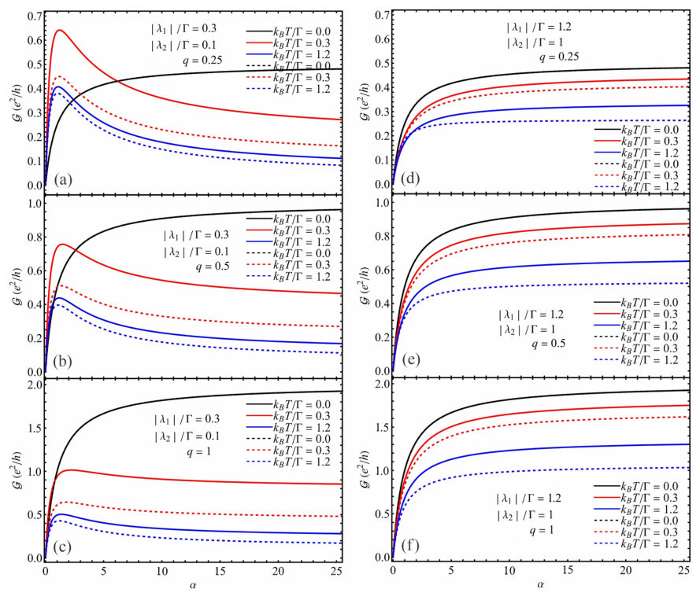
<figcaption class="paper-figure-caption"><b>Fig 4.</b> FIG. 4. Total linear conductance G for the case of unhybridized MBSs (εM/Γ = 0) as a function of the coupling asymmetry parameter α at different temperature values (kBT/Γ = 0 – black line, kBT/Γ = 0.3 – red line, and kBT/Γ = 1.2 – blue line) and QD-MBS coupling strengths: (a)-(c) |λ1|/Γ = 0.3, |λ2|/Γ = 0.1 and (d)-(f) |λ1|/Γ = 1.2, |λ2|/Γ = 1. The bias voltage asymmetry parameter q = 0.25 for (a) and (d), q = 0.5 for (b), (e), and q = 1 for (c) and (f). The magnetic flux phase is ϕ = π, and the QD characteristic energy level εd/Γ = 0 (solid lines) and εd/Γ = −1 (dashed lines).</figcaption>
</figure>
<figure class="paper-figure-card">
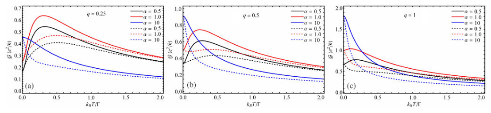
<figcaption class="paper-figure-caption"><b>Fig 5.</b> FIG. 5. The total linear conductance G in the case of unhybridized MBSs (εM/Γ = 0) as a function of temperature kBT/Γ at different values of the leads–QD coupling asymmetry parameter (α = 0.5 – black line, α = 1 – red line, and α = 10 – blue line) and different values of the bias voltage asymmetry parameter (a) q = 0.25, (b) q = 0.5 and (c) q = 1. The QD-MBSs coupling strengths are |λ1|/Γ = 0.3 and |λ2|/Γ = 0.1, and the magnetic flux phase is ϕ = π. The solid and dashed lines correspond to the QD characteristic energy level εd/Γ = 0 and εd/Γ = −1, respectively.</figcaption>
</figure>

**Summary.** This theoretical study models quantum transport through a quantum dot coupled to Majorana bound states in a superconducting nanowire. By analyzing the linear conductance, the authors predict distinct oscillatory behaviors dependent on magnetic flux and bias voltage asymmetries. The findings emphasize that these asymmetry parameters are critical factors that must be accounted for when interpreting experimental measurements of MBS signatures.

**Why it may be interesting.** The explicit dependence of transport signatures on asymmetry parameters ($\alpha, q$) provides crucial, testable predictions for experimental realization and characterization of topological qubits.

Detailed structure

**Main problem.** The study investigates the quantum transport signatures of Majorana Bound States (MBSs) through a quantum dot coupled asymmetrically to a topological superconducting nanowire junction.

**Main result.** The linear conductance exhibits characteristic oscillations dependent on the magnetic flux phase ($\phi$) and the bias voltage asymmetry parameter ($q$), with periodicity changing based on whether the central QD energy level is tuned to the Fermi level.

**Method.** The analysis employs non-equilibrium Green's function techniques to calculate the linear conductance ($G$) in the subgap regime.

**Model / system.** The system consists of a central quantum dot (QD) coupled asymmetrically to normal leads and to two MBSs localized at the ends of a topological superconducting nanowire threaded by a tunable magnetic flux. The Hamiltonian includes terms for leads, MBSs, the QD, and tunneling.

**Key observables.** Linear conductance ($G$), which is analyzed by decomposing it into electron tunneling ($G_{	ext{ET}}$), local Andreev reflection ($G_{	ext{LAR}}$), and crossed Andreev reflection ($G_{	ext{CAR}}$).

**Important parameters / regimes.** Leads–QD coupling asymmetry ($\alpha$), bias voltage asymmetry ($q$), magnetic flux phase ($\phi$), and the QD energy level ($\epsilon_d$).

**Assumptions / limitations.** The analysis is performed in the zero-temperature and finite-temperature limits, assuming the low-energy transport regime.

**Figures summary.** Figures schematically represent the junction setup and illustrate the dependence of conductance on parameters like $\phi$, $T$, $\alpha$, and $q$.

**Paper structure.** The paper develops the theoretical framework using Green's functions, analyzes the conductance components ($G_{	ext{ET}}, G_{	ext{LAR}}, G_{	ext{CAR}}$) separately, and presents results for both unhybridized and hybridized MBSs in both zero and finite temperature regimes.

Abstract

We present a theoretical study of the quantum transport through a nanoscale system in which a central quantum dot (QD) is coupled asymmetrically to normal leads and to two Majorana bound states (MBSs) localized at the ends of a topological superconducting nanowire threaded by a tunable magnetic flux. The effects of the leads--QD coupling asymmetry parameter $α$ and the bias voltage asymmetry parameter $q$ on the system's linear conductance are considered for the case of unhybridized and hybridized MBSs. In the zero-temperature limit, for unhybridized MBSs the system's linear conductance is finite only when the magnetic flux phase $φ= (2n+1)π$ ($n\in\mathbb{Z}$) and it scales as $\mathcal{G}=2qαe^2/[h(α+1)]$, while for hybridized MBSs it presents a complicated dependence on the system's parameters. At finite temperature, for unhybridized MBSs, the system's linear conductance oscillates as a function of the magnetic flux phase $φ$ with a period of $2π$, and the position of the linear conductance maxima can be shifted from $φ=2nπ$ to $φ=(2n+1)π$ by simply varying the value of the bias voltage asymmetry parameter $q$. For hybridized MBSs, the conductance exhibits a similar behavior when the energy level of the central QD, $\varepsilon_d$, is tuned at the leads' Fermi level ($\varepsilon_d=\varepsilon_F$), although when $\varepsilon_d\neq\varepsilon_F$ the oscillation period changes to $4π$, and the position of the linear conductance maxima depends on the actual value of $\varepsilon_d$ and other parameters in the system. Our results highlight the experimental importance of the leads-QD and bias voltage asymmetry parameters, which are often present in realistic experimental setups, and can strongly affect the identification and observation of MBSs transport signatures.

[↑ back to top](#top)

### [Trapping $e/4$ quasiparticles in bilayer graphene](http://arxiv.org/abs/2608.27444v1)

**Authors:** Mario Di Luca, Emily Hajigeorgiou, Ning Ma, Alexandra Waldherr, Kenji Watanabe, Takashi Taniguchi, Mitali Banerjee  
**Type:** experiment · **Category:** strongly correlated electrons · **PDF:** <https://arxiv.org/pdf/2608.27444v1>  
**Analysis basis:** full PDF text, analyzed in chunks
**Topic relevance:** `analog quantum simulation` **3/5** · `Full counting statistics` **2/5** · `quantum measurements` **2/5** · `QC/QI experiment` **1/5**

↔ Scroll figures horizontally

<figure class="paper-figure-card">
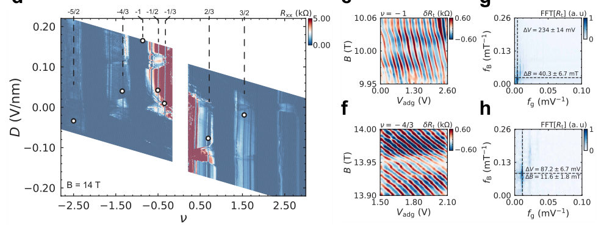
<figcaption class="paper-figure-caption"><b>Fig 1.</b> FIG. 1. Gate-defined antidot in bilayer graphene controlled by an air-bridge. a, Schematic of the gate-defined antidot in bilayer graphene controlled by an air-bridge. The top and bottom graphite gates are shown in purple, while the air-bridge is shown in yellow. The top and bottom hBN are not shown for clarity. b, False-color SEM of a device with the air-bridge. The top graphite gate is shown in purple, the exposed hBN regions, where the top graphite has been etched away, are shown in blue, and the metallic gates, including the suspended air-bridge gate, are shown in yellow. We apply an AC current Iac = 0.2 −1 nA and measure the voltage drop across the AD longitudinally (Vt) and diagonally...</figcaption>
</figure>
<figure class="paper-figure-card">
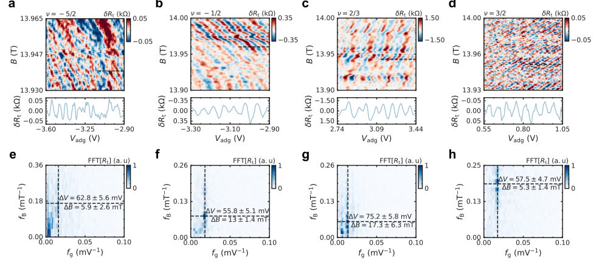
<figcaption class="paper-figure-caption"><b>Fig 2.</b> FIG. 2. Minimal-excitation oscillations at even-denominator and hole-conjugate FHQ states. a–d, Variation of the transmitted resistance oscillations δRt as a function of the ADG voltage Vadg and the magnetic field B for filling factors ν = −5/2, −1/2, 2/3 and 3/2 respectively. For each panel, the lower light blue trace shows a line cut through the oscillations along the black dashed line indicated in the corresponding map. e–h, 2D-FFT of the oscillations with the corresponding extracted ADG (∆V ) and magnetic field (∆B) periods for each filling factor.</figcaption>
</figure>
<figure class="paper-figure-card">
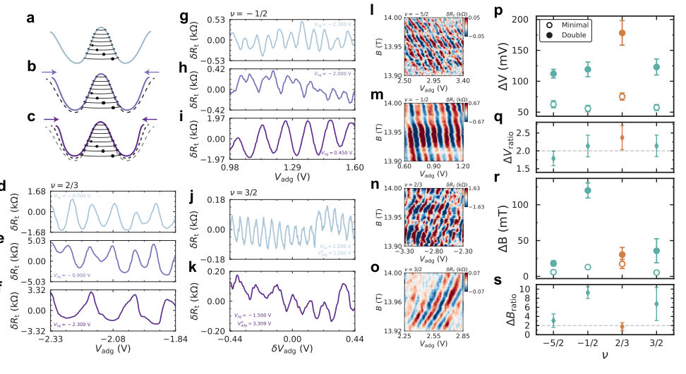
<figcaption class="paper-figure-caption"><b>Fig 3.</b> FIG. 3. Crossover from minimal excitation to double-gate-period as a function of side gate voltage Vsg. a–c, Schematic of the AD potential landscape with its quantized bound states. Making the side gates increasingly positive (negative) on the hole (electron) side brings the extended edge states closer to the AD-bound states, increasing their coupling and resulting in a doubling of the measured ADG voltage period. d–f, Transmitted resistance variation δRt oscillations at ν = −1/2 as a function of AD-gate voltage Vadg for increasingly positive side-gate voltage. The oscillation period evolves from ∆V ≈0.25 ∆V1 in the weak-coupling regime (d) to ∆V ≈0.5 ∆V1 in the stronger-coupling regime...</figcaption>
</figure>
<figure class="paper-figure-card">
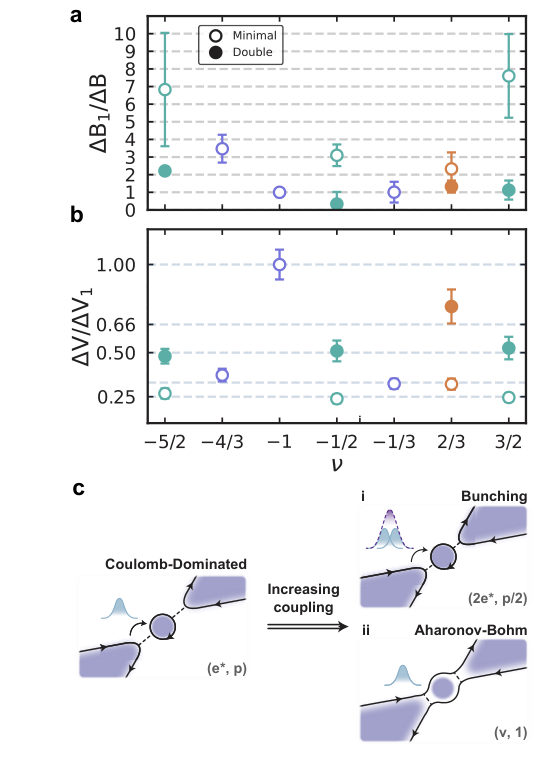
<figcaption class="paper-figure-caption"><b>Fig 4.</b> FIG. 4. Normalized gate voltage and magnetic field ra- tios. a, Ratio of the magnetic field at filling factor ν = −1, ∆B1 used as a reference and corresponding to a flux periodic- ity of ϕ0, to the magnetic field period at a given filling factor ∆B as a function of the filling factor ν. b, Ratio of the ADG voltage period at a given filling factor ∆V to the ADG voltage period at ν = −1, used as reference ∆V1, and corresponding to the addition of one electron to the AD. Open circles denote the minimal excitation and filled circles the double periodic- ity. In addition, three colours are used: light purple for the electron-like odd-denominator fractional and integer quantum Hall states,...</figcaption>
</figure>

**Summary.** This experimental work measures the charge of quasiparticles in even-denominator Fractional Quantum Hall states within bilayer graphene using a gate-defined antidot. The key finding is the observation of a localized charge of $e/4$, which strongly suggests that these states possess a non-Abelian topological ground state. The study utilizes precise measurements of oscillation periodicities to confirm these fractional charges.

**Why it may be interesting.** The investigation of fractional charge and non-Abelian statistics in a solid-state platform like graphene is highly relevant to understanding exotic correlated electron states and potential topological quantum computation.

Detailed structure

**Main problem.** The study aims to measure the charge of quasiparticles hosted by even-denominator Fractional Quantum Hall (FQH) states to determine the underlying topology of the ground state.

**Main result.** The authors observed localized quasiparticle charges of $e/4$ at several even-denominator FQH states ($
u = -5/2, -1/2, 3/2$), suggesting compatibility with a non-Abelian ground state.

**Method.** Measurements were performed using a gate-defined antidot in bilayer graphene, analyzing oscillations in transmitted resistance ($\delta R_t$) as a function of gate voltage and magnetic field.

**Model / system.** The physical system is Bernal-stacked bilayer graphene (BLG) containing a gate-defined antidot, which hosts the FQH liquid in the surrounding region.

**Key observables.** Localized quasiparticle charge ($q$), oscillation periodicities in gate voltage ($\Delta V$) and magnetic field ($\Delta B$), and the filling factor ($
u$).

**Important parameters / regimes.** Even-denominator filling factors ($
u = -5/2, -1/2, 3/2$), the coupling strength between antidot-bound states and edge states, and temperature ($T$).

**Assumptions / limitations.** The analysis relies on extracting charge from periodicity ratios, though limitations regarding unique charge determination versus filling factor are noted.

**Figures summary.** Figures detail device schematics, SEM images, and maps showing $\delta R_t$ oscillations across various filling factors, including evidence for minimal excitation and doubled periodicity regimes.

**Paper structure.** The paper systematically measures quasiparticle charges and periodicities across different FQH states, first establishing the $e/4$ charge, then investigating the crossover behavior upon increasing coupling, and finally addressing measurement ambiguities like gate hysteresis.

Abstract

Measuring the charge of the quasiparticles hosted by even-denominator fractional quantum Hall (FQH) states is essential to identify the topology of their ground state. Here, we use a gate-defined antidot in bilayer graphene, with an additional gate to control only the antidot potential, to measure the charge of the quasiparticles trapped around it in even-denominator FQH states. We observe a localized charge of $e/4$ at $ν=-5/2$, $-1/2$, and $3/2$, consistent with the minimal excitation expected for leading candidate even-denominator ground states, and $e/3$ at the hole-conjugate state $ν=2/3$. We further show that increasing the coupling between the antidot-bound states and extended edge states drives a crossover between two regimes, characterized by the minimal-excitation gate-voltage period and approximately twice that period, respectively. We discuss two possible explanations for this crossover: quasiparticle bunching and a crossover between distinct antidot transport regimes. Our results, together with previous observations of the daughter states, show that the even-denominator FQH states in bilayer graphene are compatible with a non-Abelian ground state, and that their quasiparticles can be localized around a quantum Hall antidot, a necessary ingredient for topological quantum computation.

[↑ back to top](#top)

### [Circular Dichroism Spectroscopy of Single Objects: Problems, Artifacts, and Corrections](http://arxiv.org/abs/2608.26717v1)

**Authors:** Stefan Goppelt, Lisa M. Günther, Jürgen Köhler  
**Type:** both · **Category:** other · **PDF:** <https://arxiv.org/pdf/2608.26717v1>  
**Analysis basis:** full PDF text, analyzed in chunks
**Topic relevance:** `quantum optics experiment` **3/5** · `interference shaping light` **2/5** · `quantum measurements` **2/5**

↔ Scroll figures horizontally

<figure class="paper-figure-card">
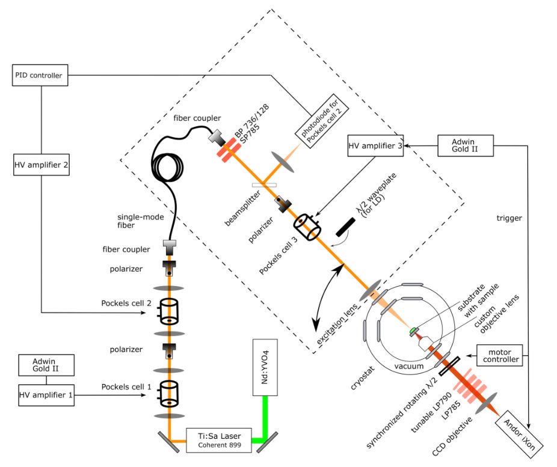
<figcaption class="paper-figure-caption"><b>Fig 1.</b> Fig.2: Schematic sketch of the setup used for single-object CD spectroscopy. The dashed box indicates the components that are mounted on a rail that can be rotated around an axis perpendicular to the optical table (double-headed bent arrow) centered at the position of the sample. For further details see text.</figcaption>
</figure>
<figure class="paper-figure-card">
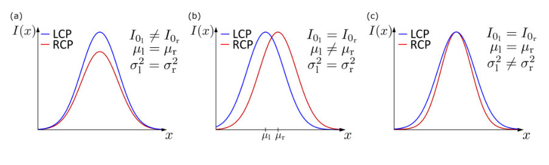
<figcaption class="paper-figure-caption"><b>Fig 2.</b> Fig.3: Possible sources for imbalanced excitation intensities for LCP (𝑙, blue) and RCP (𝑟, red) excitation light at the position of a single nano-object. The beam profiles</figcaption>
</figure>
<figure class="paper-figure-card">
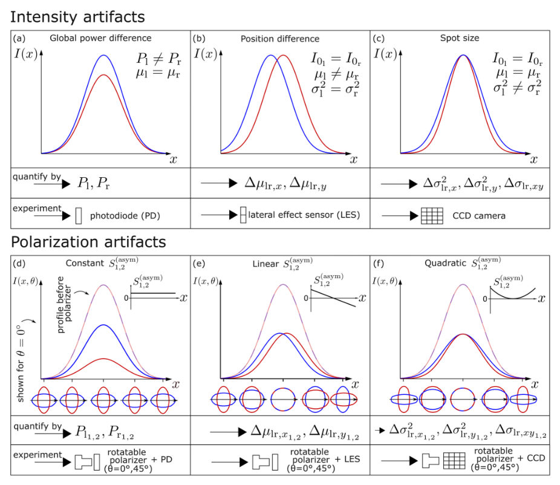
<figcaption class="paper-figure-caption"><b>Fig 3.</b> Fig.6: Illustration of the sources for intensity (top) and polarization (bottom) artifacts and how their magnitude can be quantified experimentally. For details see text. Inspired by47.</figcaption>
</figure>
<figure class="paper-figure-card">
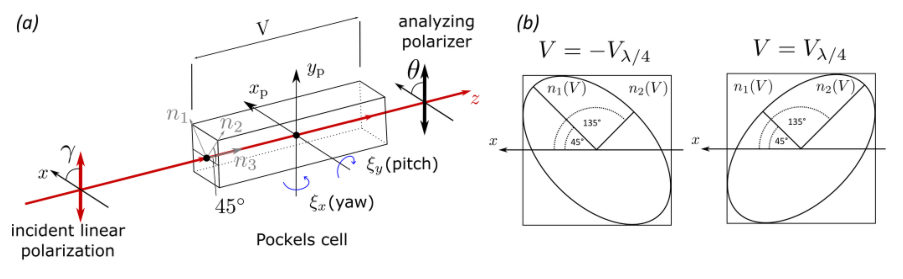
<figcaption class="paper-figure-caption"><b>Fig 4.</b> Fig.7: (a) Mode of operation of a Pockels cell. Light that is linearly polarized at an angle 𝛾 with respect to the horizontal axis (𝑥-axis) of the laboratory frame propagates along the 𝑧-direction through a Pockels cell. The cell is positioned, (coordinates: 𝑥b and 𝑦b) and oriented (angles: yaw (𝜉I) and pitch (𝜉J)) such that both its optical axis and the direction of the applied voltage 𝑉 coincide with the 𝑧-axis. A linear polarizer oriented at an angle 𝜃 relative to the 𝑥-axis serves to quantify residual linearly polarized components (b) Front view of the Pockels cell and principal axes of the index ellipsoid perpendicular to the propagation direction of the incident light as a function of...</figcaption>
</figure>
<figure class="paper-figure-card">
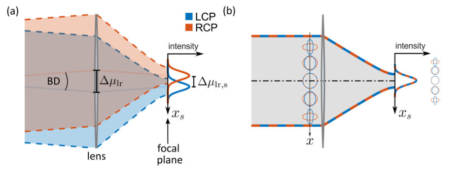
<figcaption class="paper-figure-caption"><b>Fig 5.</b> Fig.11: Schematic illustration of the mechanisms underlying the transformation of (a) intensity artifacts and (b) polarization artifacts from the measurement plane at the position of the lens to the focal plane at the position of the sample. (a) Propagation of LCP (blue) and RCP (red) Gaussian beams through the focusing lens. At the lens position an angular beam deviation (𝐵𝐷) between both beams results in a displacement of the two beams denoted as ∆𝜇=&gt;. This, in turn, is transformed by the lens into the lateral beam displacement 𝛥𝜇=&gt;,l in the focal plane and corresponds to a spatial mismatch of the excitation beams along the lateral focal coordinate 𝑥l as illustrated by the one-dimensional...</figcaption>
</figure>

**Summary.** This paper addresses the significant experimental hurdle of performing Circular Dichroism spectroscopy on individual molecules. The authors develop a comprehensive theoretical and practical guide to systematically identify, quantify, and correct for polarization-related artifacts that plague single-object measurements. By achieving artifact suppression, the work enables the reliable probing of single-particle chirality in complex biophysical systems.

**Why it may be interesting.** This work is highly relevant to AMO physics and quantum optics as it deals with the precise characterization and control of polarization states in complex, non-ideal optical systems, which is crucial for single-molecule spectroscopy.

Detailed structure

**Main problem.** Performing Circular Dichroism (CD) spectroscopy on single molecular objects is extremely challenging because the lack of spatial and orientational averaging makes the measurements highly susceptible to experimental polarization artifacts.

**Main result.** The authors present a systematic theoretical and experimental framework demonstrating that reliable single-object CD measurements are achievable by rigorously characterizing and controlling polarization-related artifacts.

**Method.** The work combines theoretical modeling (e.g., Taylor expansion of intensity distributions) with experimental implementation using fluorescence-excitation spectroscopy with controlled LCP/RCP light sources.

**Model / system.** The study focuses on single chiral molecular aggregates, such as chlorosomes, which are used as the physical system. The measurement relies on the difference in fluorescence-excitation spectra recorded using Left and Right Circularly Polarized light.

**Key observables.** The primary observable is the dissymmetry factor, $g(\lambda_{35})$, which quantifies the chirality of the sample.

**Important parameters / regimes.** The analysis is concerned with controlling artifacts arising from LCP/RCP intensity imbalances, deviations from ideal circular polarization, and coupling with linear dichroism.

**Assumptions / limitations.** Key assumptions include the use of small angle approximations for polarization variations and the ability to model complex polarization artifacts using Gaussian intensity distributions.

**Figures summary.** The notes mention a schematic sketch of the experimental setup used for single-object CD spectroscopy, detailing the components for polarization control.

**Paper structure.** The paper progresses from establishing the physical basis of CD spectroscopy to detailing the experimental limitations imposed by single-object measurements, developing a mathematical framework to quantify polarization artifacts, and finally presenting the methodology for artifact suppression.

Abstract

Molecular aggregates are at the basis of a broad range of functional systems, including photosynthetic light-harvesting complexes, organic photovoltaics, optoelectronic devices, and molecular sensors. Their structural organization, however, is often difficult to resolve because intrinsic heterogeneity. In this context, circular dichroism (CD) spectroscopy is particularly powerful because of its sensitivity to the three-dimensional organization of molecular building blocks. Extending CD measurements from ensembles to individual objects therefore offers a unique approach to probing supramolecular architecture in heterogeneous, non-crystallizable systems. However, without spatial and orientational averaging, measurements are highly sensitive to imbalances between left- and right-circularly polarized excitation, deviations from ideal circular polarization, and polarization imperfections coupled to linear dichroism, which creates spurious CD signals. Here, we present a systematic theoretical and experimental framework for understanding, quantifying, and controlling artifacts in single-object CD spectroscopy. We develop a mathematical description of the principal artifact mechanisms, identify their origins in practical implementations, including Pockels-cell-based polarization modulation, and establish strategies for their minimization. We validate this framework using an experimental implementation capable of acquiring CD spectra from individual molecular aggregates over 690-785 nm. Our results demonstrate that reliable single-object CD measurements are achievable when polarization-related artifacts are rigorously characterized and controlled. This Tutorial Review provides a unified theoretical framework and practical guide for single-object CD spectroscopy and its application to single-particle chirality, supramolecular photonics, and biophotonics.

[↑ back to top](#top)

### [Exceptional point induced by hyperbolicity in an electrostatic spherical shell](http://arxiv.org/abs/2608.26905v1)

**Authors:** Álvaro Buendía, Marcelo S. Barreiro, Nuno M. R. Peres  
**Type:** theory · **Category:** other · **PDF:** <https://arxiv.org/pdf/2608.26905v1>  
**Analysis basis:** full PDF text, analyzed in chunks
**Topic relevance:** `driven-dissipative phase transition` **3/5** · `non-equilibrium universality` **2/5** · `analog quantum simulation` **1/5** · `correlated / nonlocal dissipation` **1/5**

↔ Scroll figures horizontally

<figure class="paper-figure-card">
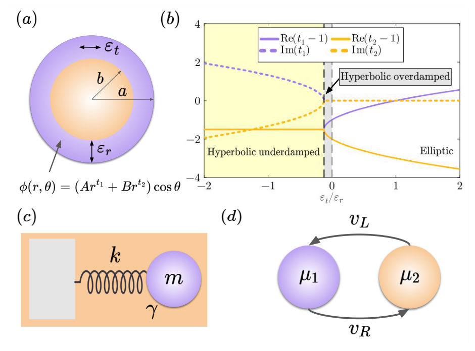
<figcaption class="paper-figure-caption"><b>Fig 1.</b> FIG. 1. (a) Anisotropic uniaxial shell of inner and outer radii b and a, respectively, with radial (εr) and tangential (εt) permittivities. (b) Universal phase diagram: real and imaginary parts of the field exponents t1,2 −1 as a function of the single control parameter εt/εr. The exceptional point sits at εt/εr = −1</figcaption>
</figure>
<figure class="paper-figure-card">
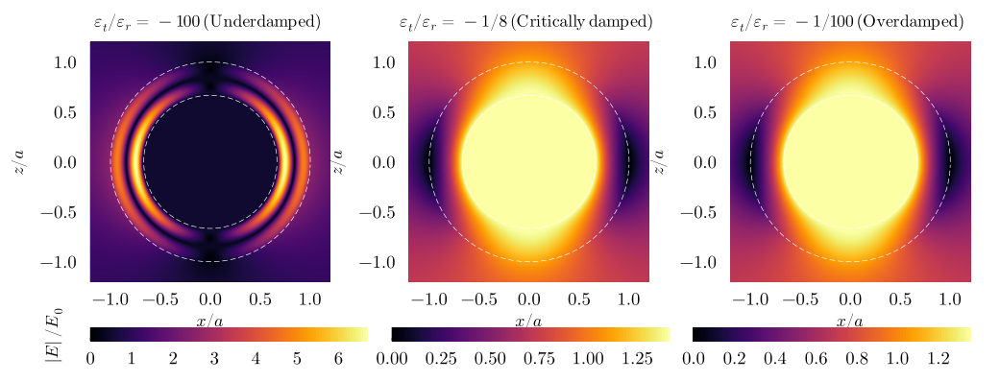
<figcaption class="paper-figure-caption"><b>Fig 2.</b> FIG. 2. xz-plane cross section of the field amplitude |E|/E0 across the core–shell structure, with radius b = 20 nm and a = 30 nm, marked by dashed lines. We fix εc = εh = εr = 1 and plot for the three different regimes (εt/εr &lt; −1</figcaption>
</figure>

**Summary.** This work shows that an electrostatic spherical shell can host an exceptional point (EP) and exhibit non-Hermitian physics solely by exploiting dielectric anisotropy, without needing gain or loss. By mapping the radial problem to a damped oscillator, the authors demonstrate that crossing a hyperbolicity threshold causes the internal electric field to switch from decaying to oscillating. This establishes hyperbolic media as a powerful, passive platform for simulating non-Hermitian phenomena.

**Why it may be interesting.** The ability to engineer non-Hermitian physics (like EPs) using purely classical, passive electromagnetic boundary conditions (hyperbolicity) is highly relevant for designing novel metamaterials and optical devices.

Detailed structure

**Main problem.** The paper demonstrates that an exceptional point (EP) and non-Hermitian phase transition can be realized in a passive, reciprocal, and lossless electrostatic spherical shell using only dielectric anisotropy.

**Main result.** Hyperbolic media provide a platform to simulate non-Hermitian physics, causing the internal electric field to transition from monotonic decay to spatial oscillation across the EP.

**Method.** The problem is reduced to solving a Cauchy-Euler equation in the logarithmic radial coordinate, which maps onto a damped oscillator and a two-site Hatano-Nelson Hamiltonian.

**Model / system.** The system is an anisotropic core-shell nanoparticle where the permittivity tensor in the shell is diagonal, $\epsilon_b = 	ext{diag}(\epsilon_r, \epsilon_t, \epsilon_t)$. The physics is governed by the dielectric anisotropy factor, $\epsilon_t/\epsilon_r$.

**Key observables.** Electric field amplitude $|E|/E_0$, field localization in the $	heta$ parameter, and the appearance of anomalous secular modes at the EP.

**Important parameters / regimes.** The dielectric anisotropy factor $\epsilon_t/\epsilon_r$ acts as the sole control parameter, defining regimes like elliptic, hyperbolic overdamped, and hyperbolic underdamped.

**Assumptions / limitations.** The analysis is restricted to the dipolar term ($l=1$) in the initial notes, and the general framework uses separation of variables for the electrostatic potential.

**Figures summary.** Figures illustrate the physical setup, the phase diagram of field exponents vs. anisotropy, and cross-sections of the field amplitude $|E|/E_0$ showing the transition across the EP for different anisotropy values.

**Paper structure.** The paper analyzes the electrostatic potential using separation of variables, deriving a Cauchy-Euler equation. It then maps this equation to known non-Hermitian models (damped oscillator, Hatano-Nelson) to analyze the transition controlled by the anisotropy parameter.

Abstract

Exceptional points (EPs) are non--Hermitian degeneracies at which both eigenvalues and eigenvectors coalesce, usually engineered through balanced gain and loss or non--reciprocity. In this work, we show that the radial electrostatic problem of an anisotropic core--shell nanoparticle realizes an EP without any of the alluded conditons. Written in the logarithmic radial coordinate, the problem is a Cauchy--Euler equation that maps onto a damped oscillator and, equivalently, onto a two-site Hatano--Nelson Hamiltonian, so that the non-Hermiticity is emulated in space rather than in time and the sole control parameter is the degree of dielectric anisotropy, $\varepsilon_t/\varepsilon_r$. The shell is passive, reciprocal, and lossless, yet it hosts an EP and a non--Hermitian phase transition governed by hyperbolicity alone. Beyond a hyperbolicity threshold the electric field inside the shell turns from monotonic decay into spatial oscillation, producing hotspots at intermediate radii which can be exploited to tailor fluorescence, strong coupling, sensing, or cloaking. More broadly, this establishes hyperbolic media as a platform to simulate non--Hermitian physics without gain, loss, or non--reciprocity.

[↑ back to top](#top)

### [Diamond quantum-sensing platform with integrated boron-doped diamond microwave antenna and thermometer](http://arxiv.org/abs/2608.27160v1)

**Authors:** Masahiro Ohkuma, Ryo Matsumoto, Shintaro Adachi, Shinobu Onoda, Kensei Terashima, Takao Watanabe, Yoshihiko Takano, Keigo Arai  
**Type:** experiment · **Category:** other · **PDF:** <https://arxiv.org/pdf/2608.27160v1>  
**Analysis basis:** full PDF text, analyzed in chunks
**Topic relevance:** `QC/QI experiment` **3/5** · `quantum measurements` **3/5**

↔ Scroll figures horizontally

<figure class="paper-figure-card">
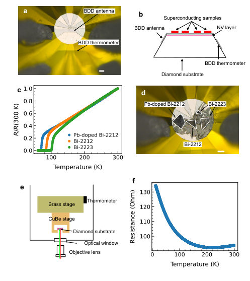
<figcaption class="paper-figure-caption"><b>Fig 1.</b> FIG. 1. (a) Optical image of the diamond substrate with boron-doped diamond antenna and thermometer. (b) Schematic of the diamond substrate with a boron-doped di- amond antenna, thermometer, and superconducting samples. (c) Temperature dependence of the resistance of Bi-based cuprate superconductors. The resistance values were normal- ized to their respective values at 300 K. (d) Optical image of the superconducting samples on the diamond substrate. (e) Schematic of the low-temperature setup for wide-field ODMR measurements. (f) Temperature dependence of the resistance of the boron-doped diamond thermometer. The scale bars in (a) and (d) represent 50 µm</figcaption>
</figure>
<figure class="paper-figure-card">

<figcaption class="paper-figure-caption"><b>Fig 2.</b> FIG. 2. Local thermometry using the integrated BDD ther- mometer. (a) Laser-power dependence of the temperature measured by the stage-mounted thermometer and BDD ther- mometer. (b) Microwave-power dependence of the tempera- ture under continuous laser irradiation at 300 mW. The mi- crowave frequency was set to 2.87 GHz. The horizontal axis represents the nominal input microwave power estimated from the microwave-source output setting and amplifier gain.</figcaption>
</figure>
<figure class="paper-figure-card">
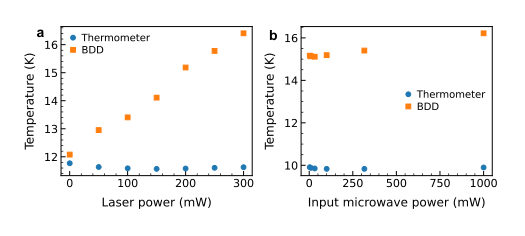
<figcaption class="paper-figure-caption"><b>Fig 3.</b> Figure 1f shows the temperature dependence of the electrical resistance of the BDD thermometer. The re- sistance exhibited a non-monotonic temperature depen- dence, with a minimum at approximately 220 K. To de- termine the temperature from the BDD resistance in the range relevant to the present measurements, the data be- tween 10 and 120 K were fitted with a fourth-order poly- nomial. The resulting fitting curve was used to convert the measured resistance into temperature. Figure 2a compares the temperatures measured by the stage-mounted thermometer and integrated BDD ther- mometer as a function of the laser power. Although the stage temperature remained nearly constant, the BDD thermometer...</figcaption>
</figure>
<figure class="paper-figure-card">
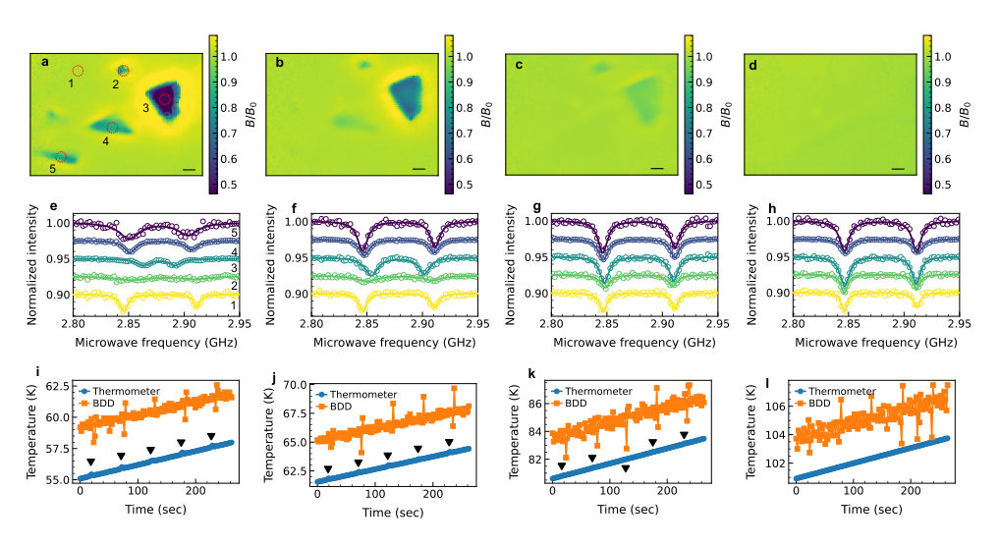
<figcaption class="paper-figure-caption"><b>Fig 4.</b> FIG. 3. Temperature-dependent wide-field ODMR imaging of superconducting samples with simultaneous local thermometry. (a)–(d) Magnetic-field maps normalized by the applied magnetic field acquired at different temperatures. Four superconducting samples are included in the field of view; the diamagnetic signals disappeared sequentially as the temperature increased. Scale bars indicate 20 µm. (e)–(h) Representative ODMR spectra measured at the positions indicated by the red dotted circles and labels 1–5 in the corresponding magnetic-field maps. The ODMR spectra are vertically offset by 0.025 for clarity. (i)– (l) Temperature traces recorded during the corresponding ODMR measurements. The local...</figcaption>
</figure>
<figure class="paper-figure-card">
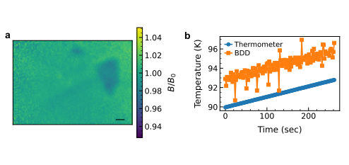
<figcaption class="paper-figure-caption"><b>Fig 5.</b> FIG. 4. (a) Magnetic-field maps normalized by the applied magnetic field, acquired at a temperature of 94.3 ± 1.1 K as measured by the BDD thermometer. The scale bar indicates 20 µm. (b) Temperature traces recorded during the corre- sponding ODMR measurements.</figcaption>
</figure>

**Summary.** This work reports an integrated diamond platform combining NV centers for magnetic sensing with BDD structures for microwave delivery and local thermometry. By demonstrating that the integrated BDD thermometer accurately measures local heating effects missed by external thermometers, the authors prove this platform is a practical tool for quantitative, wide-field magnetic imaging of temperature-sensitive materials like superconductors at cryogenic temperatures.

**Why it may be interesting.** The development of an integrated, on-chip platform for quantum sensing that self-monitors its local thermal environment is crucial for quantitative studies of quantum materials under extreme conditions, bridging quantum sensing with advanced metrology.

Detailed structure

**Main problem.** Wide-field nitrogen-vacancy (NV) magnetic imaging at cryogenic temperatures requires both microwave excitation and accurate local temperature knowledge near the sensing region.

**Main result.** The integrated boron-doped diamond (BDD)–NV platform successfully enables wide-field magnetic imaging while simultaneously providing local thermometry, demonstrating its practicality for cryogenic quantum sensing.

**Method.** The authors integrated NV centers, a BDD microwave antenna, and a BDD thermometer onto a single diamond substrate to perform Optically Detected Magnetic Resonance (ODMR) measurements.

**Model / system.** The system utilizes NV centers in diamond for magnetic sensing, coupled with BDD structures for microwave delivery and local temperature monitoring. This integrated platform allows for simultaneous measurement of magnetic fields and thermal environment near superconducting samples.

**Key observables.** Temperature-dependent Meissner response of cuprate superconductors, magnetic-field maps, and local temperature readings (comparing BDD vs. stage thermometer).

**Important parameters / regimes.** Cryogenic temperatures, microwave power, superconducting transition temperatures (Tc), and local heating effects (e.g., laser-induced heating > 4 K).

**Assumptions / limitations.** The BDD thermometer's resistance-to-temperature calibration required fitting data with a fourth-order polynomial, and the microwave power was estimated based on nominal input power.

**Figures summary.** Figures show the platform schematic, comparisons of temperature readings (BDD vs. stage thermometer) under varying power, and temperature-dependent wide-field ODMR imaging of superconducting samples.

**Paper structure.** The paper introduces the need for integrated sensing, details the platform construction (NV/BDD), presents comparative measurements showing the BDD thermometer's superior local temperature resolution, and concludes by applying the platform to map superconducting properties as a function of local temperature.

Abstract

Wide-field nitrogen-vacancy (NV) magnetic imaging at cryogenic temperatures requires microwave excitation and reliable knowledge of the temperature near the sensing region. Here, we report an integrated diamond quantum-sensing platform combining an ensemble of NV centers with a boron-doped diamond (BDD) microwave antenna and thermometer formed on the same diamond substrate. The BDD antenna provides microwave excitation for optically detected magnetic resonance measurements, and the BDD thermometer monitors the thermal environment near the NV sensing region. The BDD thermometer detected laser-induced local heating that was not clearly resolved by a stage-mounted thermometer. Using this platform, we imaged the temperature-dependent Meissner response of multiple cuprate superconductors while recording the temperature. These results demonstrate that the integrated BDD--NV platform provides a practical approach for cryogenic wide-field magnetic imaging with integrated microwave delivery and local thermometry.

[↑ back to top](#top)

### [Magnetic Communication with an Acoustically Actuated Magnetoelectric Resonator and a Quantum Diamond Magnetometer](http://arxiv.org/abs/2608.26396v1)

**Authors:** Christopher T. -K. Lew, Andrew D. M. Charles, Brant C. Gibson, Jean-Philippe Tetienne, David A. Broadway  
**Type:** experiment · **Category:** other · **PDF:** <https://arxiv.org/pdf/2608.26396v1>  
**Analysis basis:** full PDF text, analyzed in chunks
**Topic relevance:** `quantum measurements` **3/5** · `QC/QI experiment` **2/5** · `quantum optics experiment` **1/5**

↔ Scroll figures horizontally

<figure class="paper-figure-card">
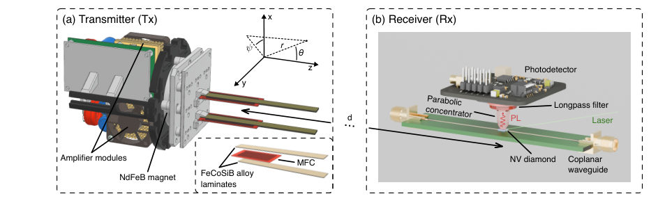
<figcaption class="paper-figure-caption"><b>Fig 1.</b> FIG. 1. Hybrid magnetic communication system. (a) Simplified schematic of the magnetoelectric (ME) resonator trans- mitter subsystem and the coordinate system used, including the amplifier module, bias magnet, and end-clamped multi-layered ME resonators attached via a 3D-printed structure. An expanded view of a single resonator element with the two FeCoSiB alloy/epoxy laminates bonded symmetrically above and below the Macro-Fiber Composite (MFC) package is shown in the inset. (b) Simplified schematic of the NV diamond receiver subsystem separated by distance, d, from the ME resonator. At the core of the receiver sensing element is the NV diamond, which is placed on a coplanar waveguide for...</figcaption>
</figure>
<figure class="paper-figure-card">
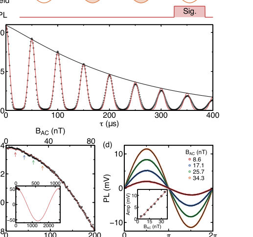
<figcaption class="paper-figure-caption"><b>Fig 2.</b> FIG. 2. NV diamond ensemble AC magnetometry. (a) AC magnetic field measurement scheme based on the Hahn- echo pulse sequence. (b) Example spin-echo measurement. Collapses and revivals are due to interactions with the 13C nuclear spin bath. The black solid line is the exponential de- cay fit to the spin echo envelop, and the red solid line is the overall fit to the observed spin-echo modulation. (c) Measured spin-echo signal as a function of Vdrive. For fAC = 20 kHz (τ = 50 µs), the NV spin ensemble accumulates one phase cy- cle (red solid line) every BAC = 1.12 µT (inset), which is used to determine the conversion factor between Vdrive and BAC. (d) Measured PL response as a function of the...</figcaption>
</figure>
<figure class="paper-figure-card">
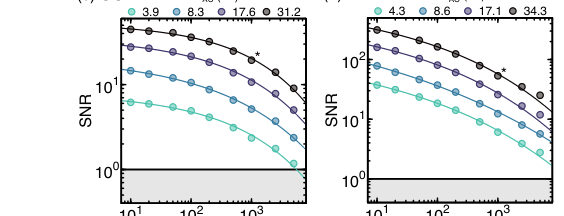
<figcaption class="paper-figure-caption"><b>Fig 3.</b> FIG. 3. Demonstration of transmission and reception of amplitude and phase modulated magnetic fields.(a) Example 100 s time trace of the measured 1 Hz amplitude- modulated (BAC = 0 and 31.2 nT, ϕdrive = π/2) AC magnetic field waveform (top inset) transmitted over d∼0.9 m and sam- pled at fsamp = 1 kHz. The corresponding histogram is shown on the right, where the SNR is calculated from the double Gaussian fit to the experimental data. (b) Example 100 s time trace of the measured phased-modulated (ϕdrive = 3π/4 and 5π/4, BAC = 34.3 nT) AC magnetic field. The transmit- ted phase-modulated AC magnetic field waveform is shown in the top inset and the corresponding histogram is shown on the...</figcaption>
</figure>
<figure class="paper-figure-card">
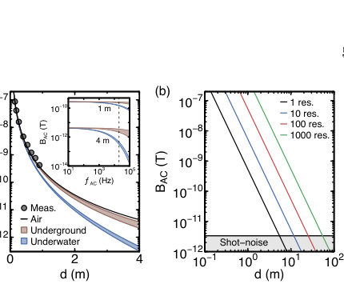
<figcaption class="paper-figure-caption"><b>Fig 4.</b> FIG. 4. Magnetic field strength at larger distances. (a) Measured and calculated magnetic field strength drop-off as a function of transmitter-receiver distance in air (black), underground (brown), and underwater (blue), accounting for additional attenuation due to skin depth at fAC = 20 kHz. The inset plots the calculated magnetic field strength atten- uation as a function of AC frequency at 1 m and 4 m. The vertical dotted line indicates fAC = 20 kHz used in this work. (b) Extrapolated magnetic field strength (in air) expected when driving multiple transmitters in parallel at full power (Vdrive = 200 V) as a function of transmitter-receiver dis- tance. Horizontal line indicate current...</figcaption>
</figure>
<figure class="paper-figure-card">
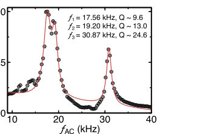
<figcaption class="paper-figure-caption"><b>Fig 5.</b> FIG. 5. ME resonator modes. Normalized frequency re- sponse of the ME resonator. The measured response (black symbols) is fitted using three Lorentzians and a linear poly- nomial background to determine the resonant frequency and quality factor of each resonance (red solid line).</figcaption>
</figure>

**Summary.** This work presents a novel magnetic communication system pairing an acoustically actuated magnetoelectric resonator as a transmitter with a highly sensitive quantum diamond magnetometer receiver. By demonstrating amplitude and phase-encoded transmission at 20 kHz, the authors establish a viable, compact alternative to traditional loop-based magnetic communication methods for conductive environments.

**Why it may be interesting.** While the core physics involves quantum sensing (NV centers), the application is in classical communication engineering. However, the use of quantum sensors to measure classical fields at low frequencies makes it relevant to open quantum systems research concerning environmental coupling and noise characterization.

Detailed structure

**Main problem.** To develop a compact and highly sensitive alternative magnetic communication system for short-to-medium range transmission in conductive media, overcoming limitations of traditional loop antennas.

**Main result.** The hybrid system combining an acoustically actuated magnetoelectric resonator transmitter and a quantum diamond magnetometer receiver successfully demonstrated communication, achieving sensitivities of 50 pT/sqrt(Hz) and 1.2 mrad/sqrt(Hz).

**Method.** The system uses amplitude and phase encoding of AC magnetic fields, measured via the spin-echo decay of Nitrogen-Vacancy (NV) centers in diamond, driven by an acoustically actuated magnetoelectric resonator.

**Model / system.** The platform consists of a transmitter using a multi-layered ME resonator heterostructure and a receiver utilizing a micrometer-scale NV diamond magnetometer. The magnetometry relies on measuring the phase accumulation ($\delta\phi$) via a Hahn-echo sequence.

**Key observables.** Amplitude and phase sensitivity (50 pT/sqrt(Hz) and 1.2 mrad/sqrt(Hz)), Signal-to-Noise Ratio (SNR), and magnetic field decay with distance.

**Important parameters / regimes.** Operating frequency ($f_{AC} = 20 	ext{ kHz}$), spin coherence time ($T_2 = 231 \pm 3 \mu	ext{s}$), and field decay proportional to $1/d^3$ in the near-field.

**Assumptions / limitations.** The primary limitation is residual laser-intensity noise, although the theoretical shot-noise limit is calculated to be $0.33 	ext{ pT}/\sqrt{	ext{Hz}}$.

**Figures summary.** Figures illustrate the schematic of the hybrid system, the AC magnetometry measurement using Hahn-echo sequences, the successful transmission/reception using OOK and BPSK modulation, and the decay of the magnetic field strength with distance in various media.

**Paper structure.** The paper details the physical setup, demonstrates communication using modulation schemes (OOK/BPSK), analyzes the magnetic field decay in different media, and provides theoretical appendices on resonator characterization and noise limits.

Abstract

Wireless communication via propagating magnetic fields is a communication modality that has recently garnered significant interest for short-to-medium range communication in conductive mediums, such as underwater and underground, where existing approaches utilizing electric fields are highly inefficient. Typical implementations of magnetic communication make use of loop antennas as both the transmitter and receiver, with the sensitivity and frequency response scaling with and inversely with the loop cross-sectional area, respectively. Here, we explore an alternative hybrid magnetic communication system consisting of an highly radiation efficient and compact acoustically actuated magnetoelectric resonator as the transmitter, and a highly sensitive micrometer scale quantum magnetometer based on nitrogen-vacancy centers in diamond as the receiver, with their core properties unconstrained by size. We demonstrate amplitude and phase-encoded transmission and reception of AC magnetic fields at $f_{\mathrm{AC}}$ = 20 kHz, achieving a sensitivity of 50 pT/$\sqrt{\mathrm{Hz}}$ and 1.2 mrad/$\sqrt{\mathrm{Hz}}$, respectively. This work establishes the use of hybrid magnetoelectric resonator and quantum diamond magnetometer communication system as a viable alternative to existing loop-based approaches.

[↑ back to top](#top)

### [Supercurrent detection and manipulation of topological phase transitions in Shiba-Majorana hybrid systems](http://arxiv.org/abs/2608.26265v1)

**Authors:** Debika Debnath, Ioannis Ioannidis, Paramita Dutta, Mircea Trif, Thore Posske  
**Type:** theory · **Category:** other · **PDF:** <https://arxiv.org/pdf/2608.26265v1>  
**Analysis basis:** full PDF text, analyzed in chunks
**Topic relevance:** `quantum measurements` **3/5** · `Full counting statistics` **1/5** · `Keldysh / 2PI / non-Gaussian methods` **1/5** · `analog quantum simulation` **1/5**

↔ Scroll figures horizontally

<figure class="paper-figure-card">
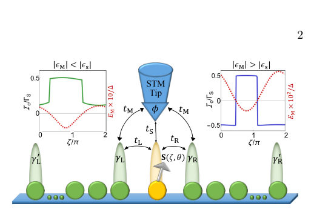
<figcaption class="paper-figure-caption"><b>Fig 1.</b> FIG. 1. Schematic setup for supercurrent-based detection and manipulation of the Majorana hybridization mediated by a control Shiba state. Two chains of magnetic adatoms (green) are deposited on a superconducting substrate (blue). In the nontrivial topological phase, each chain supports a pair of Majoranas, labeled γL(R) and γ′ L(R). The bare hy- bridization energy associated with the inner Majoranas, γL and γR, is denoted by ϵM. A control magnetic adatom (yellow), with bare Shiba energy ϵS and magnetic moment S = S(sin θ cos ζ, sin θ sin ζ, cos θ), parametrized by the az- imuthal and polar angles (ζ, θ), is placed between the chains. The hybridization of the inner Majoranas is mediated by...</figcaption>
</figure>
<figure class="paper-figure-card">
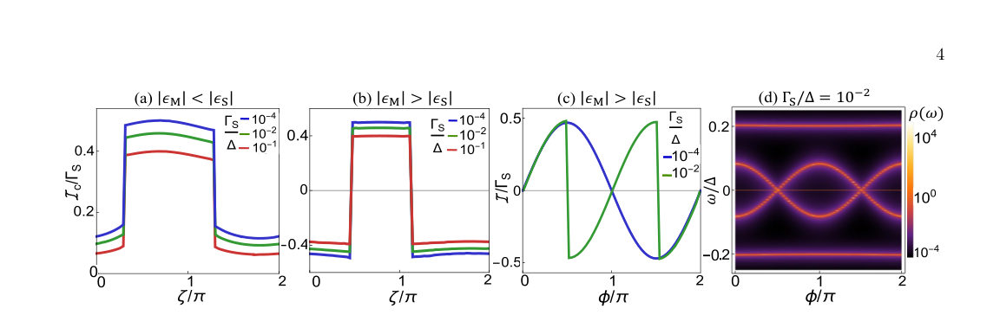
<figcaption class="paper-figure-caption"><b>Fig 2.</b> FIG. 2. Supercurrent from the superconducting tip to the control magnetic adatom as a function of the adatom azimuthal angle ζ and the superconducting phase bias ϕ. (a) Critical supercurrent as a function of ζ for the regime |ϵM| &lt; |ϵS|, with ϵM = −0.02∆ and ϵS = 0.04∆, for several tip–Shiba tunneling rates ΓS/∆. (b) Same as in (a), but for |ϵM| &gt; |ϵS|, with ϵM = −0.2∆and ϵS = 0.002∆. In both regimes, the discontinuities in the critical current occur at the critical magnetic orientations where the effective Majorana hybridization energy EM changes sign, corresponding to the transition between the two parity/topological sectors shown in the inset panels of Fig. 1. We use θ = π/2 in panels...</figcaption>
</figure>
<figure class="paper-figure-card">
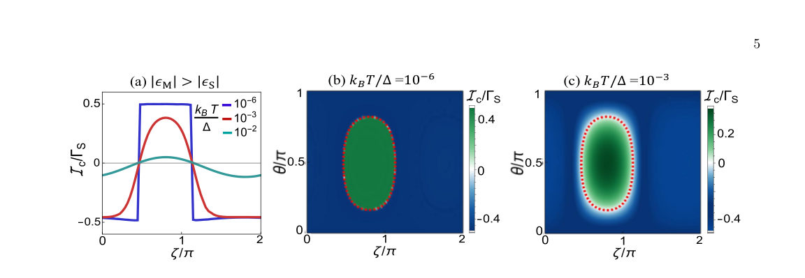
<figcaption class="paper-figure-caption"><b>Fig 3.</b> FIG. 3. Effect of finite temperature and adatom orientation on the Shiba-mediated Josephson current at weak tunneling regime. (a) Critical supercurrent with respect to the adatom magnetization angle ζ at θ = π/2 for different temperatures showing the signature of the quantum phase transition, which smears out as T increases. We consider the electron tunneling rate from the tip–to–Shiba state ΓS/∆= 10−4 at tip–to–Majorana tunneling rate ΓM/∆= 0. The remaining parameters are the same as in Fig. 2(b). (b) 2D plot of critical supercurrent for the variation of the magnetization angles of the adatom (ζ, θ) at kBT/∆= 10−6, at the same parameters as in (a). The sign change in the current represents...</figcaption>
</figure>
<figure class="paper-figure-card">
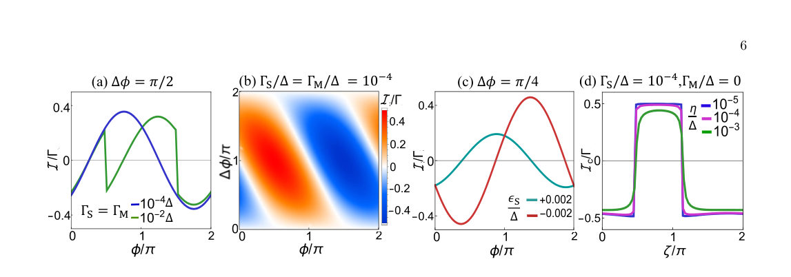
<figcaption class="paper-figure-caption"><b>Fig 4.</b> FIG. 4. Josephson current in the presence of both tip–Shiba and tip–Majorana coupling. (a) Supercurrent as a function of the phase ϕ entering the tip–Shiba tunneling, for several total couplings Γ = ΓS + ΓM, (b) Supercurrent map in the (ϕ, ∆ϕ) plane for Γ/∆= 10−4. Here, ϕ and ϕ + ∆ϕ denote the phases associated with the two effective tunneling paths from the tip to the Shiba and Majorana sectors. For panels (a) and (b), we use ϵM = −0.2∆, ϵS = 0.002∆, and (ζ, θ) = (π/2, π/2). (c) Supercurrent for positive and negative Shiba energies, showing the supercurrent changes with the sign of ϵS. The parameters are Γ/∆= 10−4, ϵM = −0.2∆, and (ζ, θ) = (π/2, π/2). (d) Critical current as a function of...</figcaption>
</figure>

**Summary.** This work proposes using the supercurrent flowing through Shiba-Majorana hybrid systems to detect topological phase transitions. By analyzing characteristic discontinuities in the critical supercurrent, the authors introduce a non-invasive method to read out and control the ground state parity of Majorana zero modes. This advances the field by linking measurable transport properties to abstract topological quantum states.

**Why it may be interesting.** The use of supercurrent measurements as a diagnostic tool for topological transitions bridges superconducting transport measurements with fundamental topological physics, which is relevant for understanding quantum state readout in superconducting circuits.

Detailed structure

**Main problem.** The paper addresses the detection and manipulation of topological phase transitions occurring in Shiba-Majorana hybrid superconducting systems.

**Main result.** Supercurrent discontinuities observed when passing supercurrent through the system provide a non-invasive method to read out and control the ground state parity of Majorana states.

**Method.** The authors utilize theoretical modeling based on the supercurrent calculation derived from the ground state energy, $I(\phi) = 2\partial E_{GS}(\phi) / \partial \phi$.

**Model / system.** The system involves Shiba-Majorana hybrid structures, modeled by an effective Hamiltonian $H_{eff}$ coupling a superconducting STM tip to low-energy Shiba-Majorana modes mediated by a control magnetic adatom.

**Key observables.** Supercurrent $I(\phi)$ as a function of superconducting phase bias $\phi$, and characteristic discontinuities in the critical current $I_c$.

**Important parameters / regimes.** Superconducting phase bias $\phi$, finite temperature $T$, and the relative energy scales of the Shiba and Majorana couplings ($|\epsilon_M|$ vs $|\epsilon_S|$).

**Assumptions / limitations.** The analysis assumes that the system follows the lowest-energy branch and focuses on the contribution of discrete in-gap states.

**Figures summary.** Figures illustrate the schematic setup involving adatom chains and the supercurrent jump coinciding with the sign change of the inner Majoranas hybridization energy, and show the effect of finite temperature smearing on the transition signature.

**Paper structure.** The paper develops the theoretical framework by projecting the Hamiltonian onto the low-energy subspace, deriving the supercurrent dependence on the phase bias, and then analyzing the resulting discontinuities as signatures of topological phase transitions.

Abstract

The non-Abelian statistics of Majorana zero modes has inspired numerous proposals for their detection and manipulation in topological superconductors. Implementations based on magnetic adatoms deposited on superconductors draw particular attention due to their capabilities for precise atomic manipulation and the control over disorder. Here, we propose a scheme for detecting changes in the ground state parity of a topologically non-trivial adatom system by passing supercurrent through their low-energy modes. We unravel characteristic discontinuities in the critical current driven by zero-energy level crossings. We apply these findings to a setup where the Majorana coupling is mediated by a single control magnetic adatom hosting a Yu-Shiba-Rusinov state, and test the robustness of our results against finite temperatures and different tunneling regimes. Our findings introduce a non-invasive approach for reading out and controlling the ground state parity of Majorana states in Shiba-Majorana hybrid systems.

[↑ back to top](#top)

### [Hidden Frustration in Collinear Altermagnets: Pairing Vortices and Equilibrium Spin Current Loops](http://arxiv.org/abs/2608.26260v1)

**Authors:** Vincent P. Flynn, Benedetta Flebus  
**Type:** theory · **Category:** other · **PDF:** <https://arxiv.org/pdf/2608.26260v1>  
**Analysis basis:** full PDF text, analyzed in chunks
**Topic relevance:** `analog quantum simulation` **3/5** · `Keldysh / 2PI / non-Gaussian methods` **1/5**

↔ Scroll figures horizontally

<figure class="paper-figure-card">
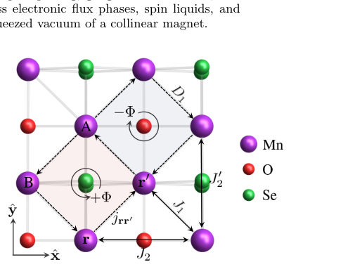
<figcaption class="paper-figure-caption"><b>Fig 1.</b> FIG. 1. An MnSeO layer of the d-wave altermagnet LOMS, shown as an illustrative realization of the model under con- sideration. The nearest and next-nearest neighbor symmet- ric exchanges J1 and (J2, J′ 2), respectively, are shown with double-sided arrows. Nearest neighbors are coupled via a DMI of strength D1 along ˆz. An arrow pointing from S1 to S2 represents a term +D1ˆz · (S1 × S2) in the Hamiltonian Eq. (1). Staggered enclosed fluxes ±Φ responsible for chiral equilibrium spin currents jrr′ in Eq. (11) are shown in neigh- boring plaquettes.</figcaption>
</figure>
<figure class="paper-figure-card">
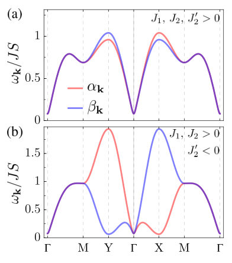
<figcaption class="paper-figure-caption"><b>Fig 2.</b> FIG. 2. The altermagnetic magnon dispersion Eq. (5). (a) The case of all AFM couplings using the experimental pa- rameters in Table I of Ref. [18]. (b) The case with J′ 2 = −1.55 meV FM, with J1 = 1.6 meV and J2 = 1.5 meV both AFM. Here, X and Y are global minima. In both plots, K = 0.01 meV and D1 = 0.5 meV.</figcaption>
</figure>
<figure class="paper-figure-card">
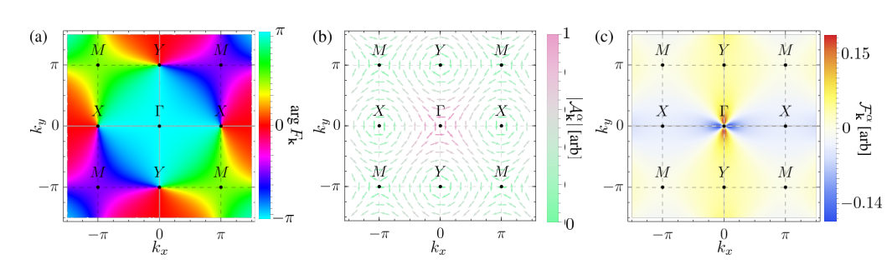
<figcaption class="paper-figure-caption"><b>Fig 3.</b> FIG. 3. (a) Phase of the anomalous correlator Fk = ⟨akb−k⟩. A counterclockwise circuit around Y (X) accumulates a phase of (−)2π. (b) A vector plot of the α-mode Berry connection in Eq. (9). Oppositely oriented vortices are hosted at X and Y . (c) The corresponding Berry curvature F α k . For all three plots, we use the parameters of Fig. 2(b).</figcaption>
</figure>

**Summary.** This work demonstrates that even when a magnet maintains a simple, collinear classical spin structure, quantum correlations can harbor hidden frustration. This frustration is induced by a symmetry-allowed Dzyaloshinskii-Moriya interaction, leading to topological vortices in the magnon correlations. These vortices manifest macroscopically as a pattern of counter-circulating, equilibrium spin currents in the quantum vacuum.

**Why it may be interesting.** The concept of emergent, non-trivial quantum fluxes and currents existing entirely within the quantum vacuum, decoupled from static magnetic order, is highly relevant to understanding topological phases in condensed matter systems.

Detailed structure

**Main problem.** The paper investigates how hidden frustration, manifested as circulating quantum correlations, can exist in a magnet that remains classically collinear.

**Main result.** The system hosts a frustrated, current-carrying quantum vacuum despite classical collinearity, driven by symmetry-allowed Dzyaloshinskii-Moriya coupling.

**Method.** The analysis uses Holstein-Primakoff expansion, Bogoliubov diagonalization for magnon modes, and topological diagnostics like Berry curvature and Wilson loops.

**Model / system.** The study focuses on a 2D inverse Lieb lattice realized in a centrosymmetric altermagnet insulator, modeled by a spin Hamiltonian including exchange and Dzyaloshinskii-Moriya interactions.

**Key observables.** Anomalous magnon pair correlations, gauge-invariant fluxes, and antiferrochiral equilibrium spin currents.

**Important parameters / regimes.** The regime requires $J_1 > 0$, $D_1 
eq 0$, and $K > 0$ for the collinear G-type AFM ground state.

**Assumptions / limitations.** The analysis is performed using linear spin-wave theory (Holstein-Primakoff expansion) and assumes a centrosymmetric structure.

**Figures summary.** Figures illustrate the model lattice, the phase accumulation of the anomalous correlator $F_k$ showing vortices at high-symmetry points (X and Y), and vector plots of the Berry connection and curvature showing opposite-chirality vortices.

**Paper structure.** The paper proceeds by defining the Hamiltonian, linearizing it via Holstein-Primakoff, calculating magnon dispersions, identifying topological features (vortices) in the anomalous correlators, and finally deriving the real-space consequences as counter-circulating spin currents.

Abstract

We show that a magnet can remain perfectly collinear while its quantum vacuum circulates. In a centrosymmetric altermagnet, a symmetry-allowed locally staggered Dzyaloshinskii-Moriya coupling imprints a gauge-irremovable vortex-antivortex pair into the anomalous magnon pair correlations at high-symmetry points in momentum space. In real space, these hidden vortices produce an antiferrochiral array of equilibrium spin currents circulating oppositely around neighboring plaquettes. Gauge-irremovable frustration therefore survives despite classical collinearity: it exists entirely in the quantum correlations. Our results show that complex pairing, gauge-invariant fluxes, and equilibrium loop currents - structures encountered across electronic flux phases, spin liquids, and frustrated quantum magnets - can be encoded in the squeezed vacuum of a collinear magnet.

[↑ back to top](#top)

### [Magnon-induced phononic Chern insulator](http://arxiv.org/abs/2608.27011v1)

**Authors:** Rui-Chang Shen, Yihao Yang, Haoran Xue  
**Type:** theory · **Category:** other · **PDF:** <https://arxiv.org/pdf/2608.27011v1>  
**Analysis basis:** full PDF text, analyzed in chunks
**Topic relevance:** `analog quantum simulation` **3/5**

↔ Scroll figures horizontally

<figure class="paper-figure-card">
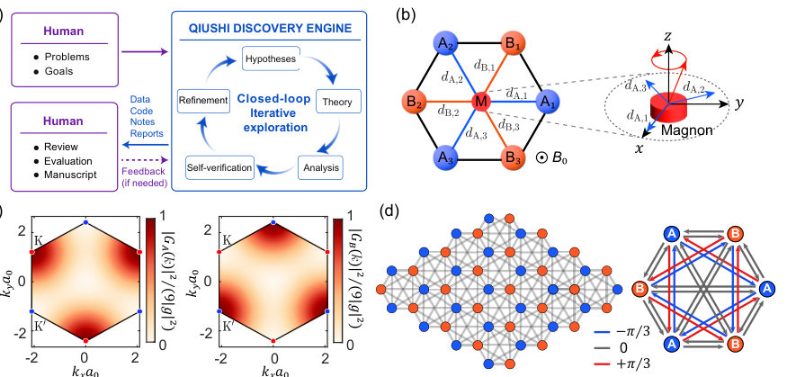
<figcaption class="paper-figure-caption"><b>Fig 1.</b> FIG. 1. (a) Schematic of Human-Agentic hybrid workflow. (b) A honeycomb phononic crystal with one phonon mode on each A and B sublattice site. A magnetic island at the plaquette center supports a right-handed circular Kittel mode. The six surrounding phononic sites are labeled in their physical counterclockwise order as A1, B1, A2, B2, A3, B3. Their radial vectors are dα,i = a0(cos θα,i, sin θα,i), with θA,i = 2π(i −1)/3, θB,i = (2i −1)π/3, and a0 is the distance from the plaquette center to each surrounding phononic site. (c) Momentum-space intensity of the magnon–phonon terms |GA(k)|2 and |GB(k)|2, showing that the magnon couples selectively to sublattice A at K and to sublattice B at K′....</figcaption>
</figure>
<figure class="paper-figure-card">
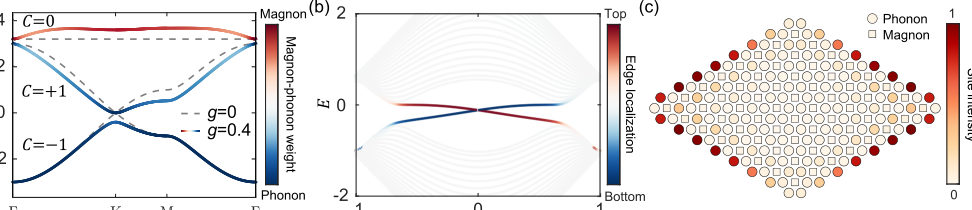
<figcaption class="paper-figure-caption"><b>Fig 2.</b> FIG. 2. (a) Bulk band structures in the absence (gray dashed curves) and presence (colored solid curves) of the magnon- phonon coupling, which explicitly opens a gap at the Dirac points. The lower, middle and upper bands have the Chern numbers C = (−1, +1, 0), respectively. (b) The corresponding strip spectrum for g = 0.4, with periodic boundary conditions applied along a1 = a0(3, √</figcaption>
</figure>
<figure class="paper-figure-card">
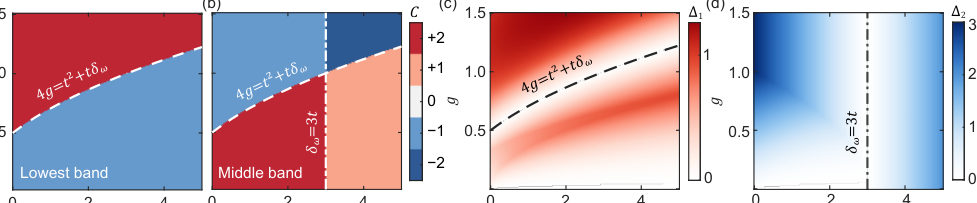
<figcaption class="paper-figure-caption"><b>Fig 3.</b> FIG. 3. (a) and (b) Chern-number phase diagrams of the lowest band and the middle band, respectively, as functions of the magnon detuning δω and the magnon–phonon coupling strength g, with t = 1. The dashed curve 4g2 = t2 + tδω, marks the gap-closing condition at the M point, while the vertical dashed line in (b) indicates the Γ-point transition at δω = 3t. (c) and (d) Plots of bulk bandgaps ∆1 (gap between the lower and middle bands) and ∆2 (gap between the middle and upper bands), respectively, as functions of δω and g.</figcaption>
</figure>

**Summary.** This paper proposes using the coupling between magnons and phonons in a honeycomb phononic crystal to engineer a phononic Chern insulator. By breaking time-reversal symmetry via a circularly polarized magnon mode, the system opens a topological gap, allowing for the creation of tunable, non-dissipative edge states. This establishes a route for magnetically reconfigurable topological phononics in GHz acoustic devices.

**Why it may be interesting.** This work provides a concrete, solid-state platform (acoustic/phononic) for realizing topological phenomena, bridging concepts from magnetism (magnons) and condensed matter topology (Chern insulators) in a potentially observable, high-frequency domain.

Detailed structure

**Main problem.** The primary goal is to realize a phononic Chern insulator at high frequencies (GHz) to achieve robust, one-way boundary transport in acoustic devices.

**Main result.** The study demonstrates that chiral magnon-phonon hybridization can create a topologically gapped phononic Chern phase with tunable Chern numbers (|C|=1 and |C|=2).

**Method.** The analysis involves deriving an effective Hamiltonian using the Schrieffer-Wolff transformation in the large-detuning limit, leading to a Haldane-type model.

**Model / system.** The system is a honeycomb phononic crystal hybridized with ferromagnetic islands. The physics is governed by the coupling between lattice phonons and magnons (Kittel mode).

**Key observables.** Chern numbers (C), topological gaps ($\Delta_1, \Delta_2$), and the existence of chiral edge states.

**Important parameters / regimes.** Magnon-phonon coupling strength ($g$), detuning ($\delta\omega$), and the ability to tune the Chern number by varying these parameters.

**Assumptions / limitations.** The analysis relies on the large-detuning approximation ($|\delta\omega| \gg g, t$) and assumes the coupling phase originates from projecting the right-circular Kittel mode.

**Figures summary.** Figures illustrate the honeycomb structure, momentum-space coupling intensity, and bulk band structures showing the Chern numbers and the spatial distribution of edge states.

**Paper structure.** The paper establishes the full Hamiltonian ($H = H_{ph} + H_m + H_{int}$), derives the effective Hamiltonian ($H_{eff}$) via Schrieffer-Wolff, and then analyzes the resulting Haldane-type model to predict tunable Chern phases.

Abstract

High-frequency artificial phononic crystals offer a low-loss platform compatible with on-chip integration, yet realizing Chern phononic phases at GHz frequencies remains challenging. Here, we propose a magnon-induced phononic Chern insulator in a honeycomb phononic crystal hybridized with ferromagnetic islands at the hexagon centers. A circularly polarized Kittel mode couples to the surrounding phonons with a phase winding, which breaks time-reversal symmetry and opens a full Chern gap. In the large-detuning regime, this mechanism leads to an effective Haldane-type phononic model with magnon-induced complex hopping. By tuning the magnon-phonon interaction, the full hybrid system accesses Chern phases with tunable Chern numbers |C|=1 and |C|=2. The predicted gaps can exceed realistic phonon and magnon linewidths, enabling their observation in GHz acoustic devices. Our work establishes chiral magnon--phonon hybridization as a route to magnetically reconfigurable topological phononics.

[↑ back to top](#top)

### [Quantized Transport through a Supermoiré Chern Mosaic](http://arxiv.org/abs/2608.26252v1)

**Authors:** Li-Qiao Xia, Aviram Uri, Zachary W. Gomez, Molly P. Andersen, Julian May-Mann, Kenji Watanabe, Takashi Taniguchi, Trithep Devakul, Yves H. Kwan, Pablo Jarillo-Herrero, Aaron Sharpe  
**Type:** both · **Category:** other · **PDF:** <https://arxiv.org/pdf/2608.26252v1>  
**Analysis basis:** full PDF text, analyzed in chunks
**Topic relevance:** `analog quantum simulation` **3/5**

↔ Scroll figures horizontally

<figure class="paper-figure-card">
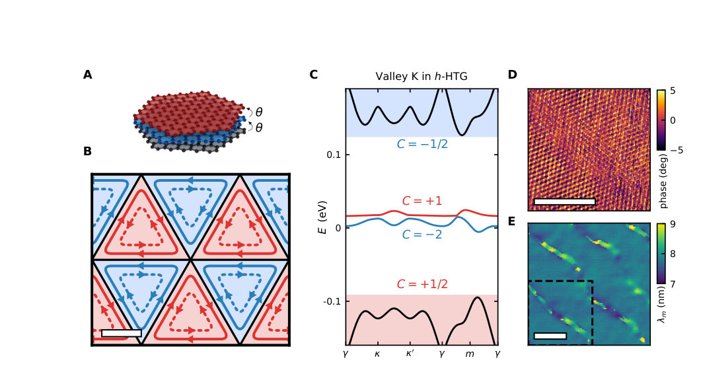
<figcaption class="paper-figure-caption"><b>Fig 1.</b> FIG. 1. Helical Trilayer Graphene (HTG). (A) Schematic of HTG. (B) Idealized supermoir´e structure of HTG near the magic angle of θ = 1.8◦. Moir´e-periodic h-HTG (red shading) and ¯h-HTG (blue shading) domains formed by lattice relaxation are indicated. When the system is charge-neutral and time-reversal symmetric, each domain wall hosts six pairs of counter- propagating modes, which we schematically draw as solid (K) and dashed (K′) lines, each representing three modes. The lines are spatially separated for clarity. (C) Single-particle band structure for the K valley of h-HTG (identical to K′ in ¯h-HTG). The Chern numbers of the central bands and the total Chern number of the remote bands...</figcaption>
</figure>
<figure class="paper-figure-card">
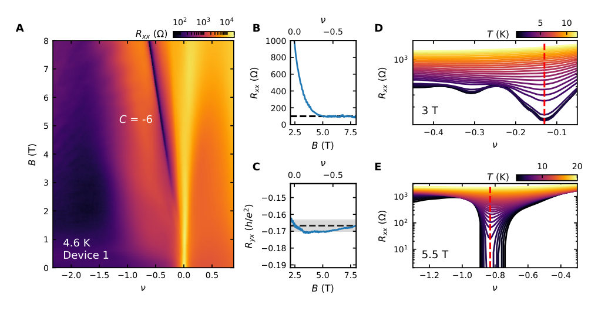
<figcaption class="paper-figure-caption"><b>Fig 2.</b> FIG. 2. Magnetotransport of HTG. (A) Longitudinal resistance Rxx as a function of ν and B at D = 0 and T = 4.6 K. The sharp suppression of Rxx emanating from the CNP exhibits a slope consistent with a C = −6 state. (B,C) Rxx (B) and Ryx (C) interpolated along the dip in Rxx of (A). The horizontal dashed lines indicate 100 Ωand −h/6e2 in (B) and (C), respectively. The gray shaded region in (C) indicates a 2% window around −h/6e2. (D) Temperature dependence of Rxx from 0.5 K to 12 K in ∼0.5 K steps as a function of ν at B = 3 T. (E) Same as (D) for T from 2.6 K to 20 K and B = 5.5 T. In (D) and (E), vertical dashed red lines indicate ν where C = −6 is expected for the given magnetic field....</figcaption>
</figure>
<figure class="paper-figure-card">
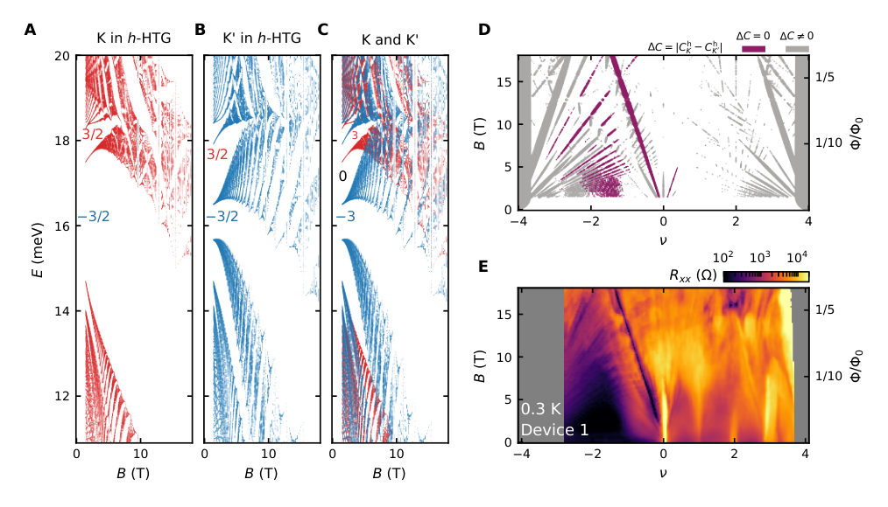
<figcaption class="paper-figure-caption"><b>Fig 3.</b> FIG. 3. Hofstadter Spectrum of HTG. (A) Calculated Hofstadter spectrum for valley K in 1.79◦h-HTG (equivalently valley K′ in ¯h-HTG). The Chern numbers of selected gaps that emanate from the CNP are indicated, not accounting for spin degeneracy. (B) Same as (A) for valley K′ in h-HTG (equivalently valley K in ¯h-HTG). (C) The combined spectra of both valleys in h-HTG. (D) Wannier diagram corresponding to (C). The size of each dot corresponds to the size of the gap in the spectrum. Each gap is color-coded according to Eq. 1, evaluated within h-HTG as the difference between its two valleys, ∆C = Ch K −Ch K′ . Magenta dots indicate gaps where h-HTG and ¯h-HTG have the same flavor-resolved...</figcaption>
</figure>
<figure class="paper-figure-card">
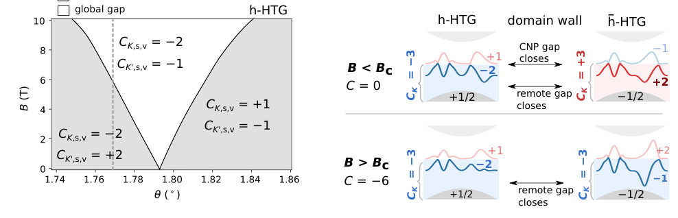
<figcaption class="paper-figure-caption"><b>Fig 4.</b> FIG. 4. Orbital Zeeman model. (A) Chern number of the central valence band in each flavor as a function of B and θ for h-HTG, within the orbital Zeeman model. Gray (white) region corresponds to a total Chern number C = 0 (C = −6) of the central valence bands including spin, and leads to a gapless network (globally gapped state). (B) Schematic comparison of Chern numbers in valley K between h-HTG and ¯h-HTG domains. The central bands are labeled with their individual Chern numbers. We also indicate the half-integer values for the set of remote valence bands. C2z fixes the Chern numbers of valley τ in h-HTG to be identical to those of valley −τ in ¯h-HTG. At B = 0, the total valley-resolved...</figcaption>
</figure>

**Summary.** This work reports the observation of quantized Hall resistance in a supermoiré Chern mosaic formed from twisted graphene, contradicting initial expectations of gapless transport. The authors explain this robust quantization by proposing that a moderate magnetic field drives a valley-selective topological transition, establishing a global Chern insulator state with a Chern number of -6.

**Why it may be interesting.** The mechanism of field-induced topological phase transitions in moiré heterostructures, which can be modeled using continuum theories and analyzed via Chern numbers, provides a rich platform for understanding emergent topological quantum phenomena relevant to quantum simulation.

Detailed structure

**Main problem.** The study investigates the mechanism behind quantized charge transport in a Supermoiré Chern Mosaic, contrasting the expected unquantized behavior from domain-wall modes with the observed quantized Hall resistance.

**Main result.** The system exhibits a robust, quantized Hall resistance ($R_{yx} \approx -h/6e^2$) under a perpendicular magnetic field, attributed to a field-induced, valley-selective topological transition that gaps the domain-wall modes.

**Method.** The research combines magnetotransport measurements (Landau fan measurements) with theoretical calculations using the Bistritzer-MacDonald continuum model and the Hofstadter spectrum analysis.

**Model / system.** The physical system is helical trilayer graphene (HTG) twisted by a magic angle ($\sim 1.8^\circ$), forming a supermoiré mosaic of domains with opposite valley-resolved Chern numbers.

**Key observables.** Quantized Hall resistance ($R_{yx}$), longitudinal resistance ($R_{xx}$), and the topological invariant, the Chern number ($C$).

**Important parameters / regimes.** Low temperatures (e.g., 4.6 K), perpendicular magnetic field ($B$), and the twist angle ($	heta$).

**Assumptions / limitations.** The analysis relies on the orbital Zeeman model and assumes that the observed quantization implies a global gap, overriding the expected gapless domain-wall transport.

**Figures summary.** Figures show magnetotransport data (Landau Fans) confirming quantized plateaus, and theoretical figures illustrate the evolution of the Hofstadter spectrum and the conditions for a global Chern gap.

**Paper structure.** The paper progresses from establishing the physical system and the initial theoretical conflict (gapless vs. quantized transport) to presenting experimental measurements confirming quantization, and finally developing theoretical models (Hofstadter/Orbital Zeeman) to explain the field-induced topological transition responsible for the global gap.

Abstract

Magic-angle helical trilayer graphene---three graphene layers sequentially twisted in the same direction by $\sim1.8^\circ$---relaxes into a mosaic of domains that, at zero field, carry opposite valley-resolved Chern numbers, with boundaries hosting a network of gapless conducting modes. Charge transport through this network depends sensitively on how the modes connect and scatter, making well-quantized transport unlikely. Contrary to this expectation, we observe a field-induced Chern gap with Chern number $C=-6$ emanating from charge neutrality; in this gap, the Hall resistance is quantized to within $2\%$ of the expected value, $-h/6e^2$, at 4.6 K. We explain this behavior using both Hofstadter and orbital Zeeman calculations, which show that a moderate magnetic field drives a valley-selective topological transition. Above the transition, the total Chern number of the occupied states in each spin-valley flavor becomes identical across neighboring domains, and the domain-wall modes can become gapped. Though the central valence-band Chern numbers still differ between the two domain types, the observed quantized transport attests to a global gap.

[↑ back to top](#top)

### [Wedge problems and dispersive shock waves in the two-dimensional Toda lattice](http://arxiv.org/abs/2608.27415v1)

**Authors:** Marco Calabrese, Gino Biondini, Christopher Chong, Panayotis Kevrekidis  
**Type:** theory · **Category:** other · **PDF:** <https://arxiv.org/pdf/2608.27415v1>  
**Analysis basis:** full PDF text, analyzed in chunks
**Topic relevance:** `Keldysh / 2PI / non-Gaussian methods` **2/5** · `analog quantum simulation` **2/5** · `methods for driven-dissipative` **2/5** · `Frenkel-Kontorova` **1/5** · `driven-dissipative phase transition` **1/5** · `non-equilibrium universality` **1/5**

↔ Scroll figures horizontally

<figure class="paper-figure-card">
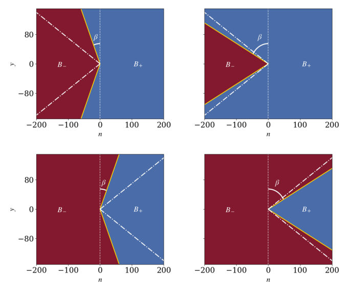
<figcaption class="paper-figure-caption"><b>Fig 1.</b> Figure 1: The four dynamical regimes of the wedge problem (1.5), with B−= 0.5 (dark red) and B+ = 0 (blue) as in the numerical simulations of Section 4. Top row: type I wedges, with q = 0.4 (subcritical, left) and q = 1.8 (supercritical, right). Bottom row: type II wedges, with q = −0.4 (subcritical, left) and q = −1.8 (supercritical, right). The gold line marks the wedge boundary at the slope q of each panel; the angle β formed with the y−axis which satisfies β = arctanq is indicated in each panel. The vertical dashed line marks n = 0. The white dash-dotted lines correspond to the critical slope |q| = qcr ≈1.429 from Eq. (4.10) separating the subcritical and supercritical regimes.</figcaption>
</figure>
<figure class="paper-figure-card">
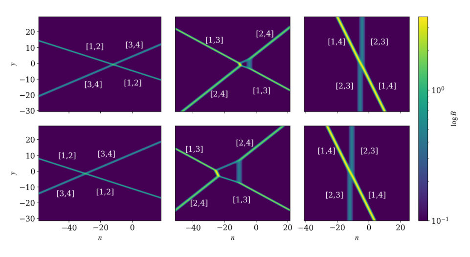
<figcaption class="paper-figure-caption"><b>Fig 2.</b> Figure 2: The three types of elastic two-soliton solutions of the 2DTL (index pairs as labeled), with phase parameters (P1,P2,P3,P4) = (−2.3,−0.69,0.69,2.71), as in [14]. Columns, from left to right: ordinary, resonant, and asymmetric interactions. Rows: earlier and later snapshots (top row: t = 4; bottom row: t = 10), illustrating the temporal evolution of each solution type. In the resonant interaction (center column), the pair of Y-junctions mediating the stem visibly separates further between the two snapshots.</figcaption>
</figure>
<figure class="paper-figure-card">
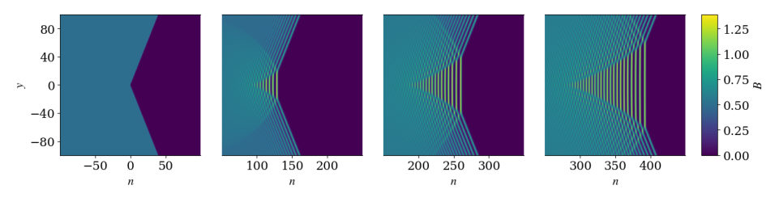
<figcaption class="paper-figure-caption"><b>Fig 3.</b> Figure 3: Density plots illustrating the evolution of a subcritical type II wedge with q = −0.4. The snapshots are at t = 0, 100, 200, 300. Note the formation of the vertical stem and its growth in y as time progresses.</figcaption>
</figure>
<figure class="paper-figure-card">
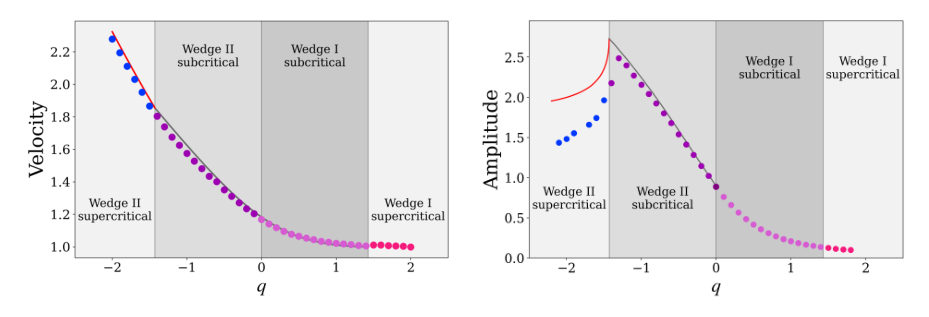
<figcaption class="paper-figure-caption"><b>Fig 4.</b> Figure 4: Left: Numerically measured horizontal velocity of the leading-edge as a function of q: cstem for subcritical type II wedges (purple dots) and subcritical type I wedges (pink dots) as a function of q (dots) compared to the theoretical prediction from (4.14) (solid gray curve); cpeak for supercritical type II wedges (blue dots) and supercritical type I wedges (magenta dots). Supercritical type II wedges are compared with the theoretical prediction from(4.18) (solid red curve). Right: Numerically measured maximum amplitude at y = 0 as a function of q for subcritical type II wedges (purple dots) and supercritical type II wedges (blue dots) compared with the theoretical prediction...</figcaption>
</figure>
<figure class="paper-figure-card">
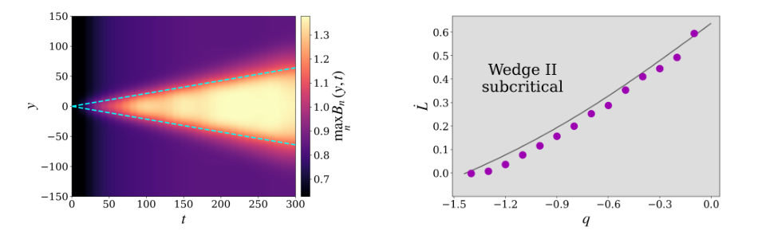
<figcaption class="paper-figure-caption"><b>Fig 5.</b> Figure 5: Left: Space-time density plot of maxn B(y,t) for the subcritical type II wedge with q = −0.4, smoothed via spline interpolation with Gaussian filters. The cyan dashed lines show the analytical predic- tion for the stem y±(t) from equations (4.12a) and (4.13a). Right: Numerically measured vertical expansion rated ˙L as a function of q (purple dots) compared with the theoretical prediction (4.14) (solid curve) for all subcritical type II wedges −qcr &lt; q &lt; 0.</figcaption>
</figure>

**Summary.** This paper analyzes dispersive shock wave formation in the 2D Toda lattice using wedge-type initial conditions. The key finding is that the interaction of these waves exhibits a discrete Mach reflection, characterized by a critical slope that separates resonant (expanding) from ordinary (localized peak) interaction regimes. The work provides a rigorous analytical framework validated against numerical simulations and the KP equation.

**Why it may be interesting.** While the core physics is in nonlinear wave dynamics, the mathematical techniques—such as the use of integrable systems (Toda lattice) and modulation theory—are highly relevant to understanding complex, non-equilibrium dynamics in many-body quantum systems.

Detailed structure

**Main problem.** The study investigates the formation and interaction of Dispersive Shock Waves (DSWs) within the framework of the two-dimensional Toda lattice (2DTL) when subjected to wedge-type initial conditions.

**Main result.** The interaction of the generated oblique DSWs yields a discrete analog of Mach reflection, with the dynamics bifurcating into resonant (expanding DSW) and ordinary (localized peak) regimes depending on a critical slope parameter $q_{cr}$.

**Method.** The analysis uses local reduction to the one-dimensional Toda lattice (Riemann problem) and employs Whitham modulation theory to determine soliton amplitudes, validating results against numerical simulations and the continuum KP equation limit.

**Model / system.** The primary model is the two-dimensional Toda lattice (2DTL), described by a specific non-linear partial difference equation. The system is initialized with wedge-type conditions defined by a slope parameter $q$.

**Key observables.** The amplitude, length, and velocity of the resulting DSWs, and the existence of a critical slope $q_{cr}$ separating dynamic regimes.

**Important parameters / regimes.** The slope parameter $q$ defining the wedge geometry, and the critical slope $q_{cr}$ which dictates the nature of the wave interaction.

**Assumptions / limitations.** The analysis assumes the applicability of Whitham modulation theory and relies on the consistency between the discrete 2DTL results and the continuum limit theory for the Kadomtsev-Petviashvili (KP) equation.

**Figures summary.** Figure 1 illustrates the geometrically distinct initial data for Type I and Type II wedges. Later figures show density plots illustrating the formation of tilted stems in asymmetric subcritical/supercritical regimes.

**Paper structure.** The paper builds from the 1D Toda lattice Riemann problem to the 2D DSW interaction in the 2DTL. It classifies dynamics based on wedge type (I/II) and parameter regimes (sub/supercritical), deriving explicit analytical solutions for the resulting wave structures.

Abstract

We study the formation and interaction of dispersive shock waves (DSWs) in the two-dimensional Toda lattice subject to wedge-type initial conditions, and show that their interaction gives rise to a discrete analog of Mach reflection for dispersive shock waves in discrete systems. The initial jump across each leg of the wedge acts locally as a Riemann problem for the one-dimensional Toda lattice, producing two oblique DSWs whose leading-edge soliton amplitude is determined explicitly by the one-dimensional Whitham modulation theory. The two-dimensional nature of the problem manifests when these oblique DSWs meet along the symmetry axis. We show that, for compressive wedges (i.e., when the initial conditions are such that two oblique DSWs that are generated propagate toward each other), a critical slope $q_{\mathrm{cr}}$ separates two regimes: in the subcritical regime ($q<q_{\mathrm{cr}}$) the interaction is resonant and it produces an expanding DSW whose amplitude, length and velocity are explicitly computed by using exact soliton solutions of the two-dimensional Toda lattice; in the supercritical regime ($q>q_{\mathrm{cr}}$) the interaction is ordinary and produces a localized peak whose amplitude is determined analytically. We also show qualitatively that a similar dichotomy between two regimes exists for expansive wedges (i.e., when the initial conditions are such that the two oblique DSWs propagate away from each other). We confirm all analytical predictions by comparing them with the results of direct numerical simulations. Finally, we show that the continuum limit of the result is consistent with the analogous theory for the Kadomtsev-Petviashvili equation, providing an independent validation of the analytical framework.

[↑ back to top](#top)

### [Terahertz anomalous Hall effect in magnetic Weyl semimetal Co$_3$Sn$_2$S$_2$](http://arxiv.org/abs/2608.27195v1)

**Authors:** Ashutosh Singh, Hongjing Xu, Xielin Wang, Kohei Fujiwara, Atsushi Tsukazaki, Shengxi Huang, Andrey Baydin, Junichiro Kono, Alexey Belyanin  
**Type:** both · **Category:** other · **PDF:** <https://arxiv.org/pdf/2608.27195v1>  
**Analysis basis:** full PDF text, analyzed in chunks
**Topic relevance:** `Keldysh / 2PI / non-Gaussian methods` **2/5** · `analog quantum simulation` **1/5** · `driven-dissipative phase transition` **1/5**

↔ Scroll figures horizontally

<figure class="paper-figure-card">
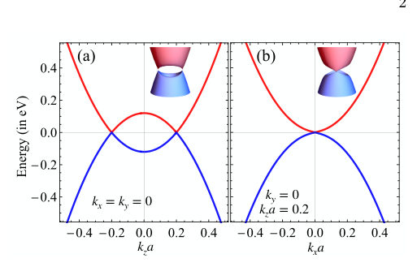
<figcaption class="paper-figure-caption"><b>Fig 1.</b> FIG. 2. Energy dispersion for Eq. (1) as a function of (a) kz for kx = ky = 0, and (b) kx for ky = 0 and kz = 0.2/a. Here we have chosen b = 0.12 eV, t1 = 0.25 eV, t2 = 3 eV, and a = 1˚A, which corresponds to the separation between Weyl nodes to be 0.4 ˚A−1.</figcaption>
</figure>
<figure class="paper-figure-card">
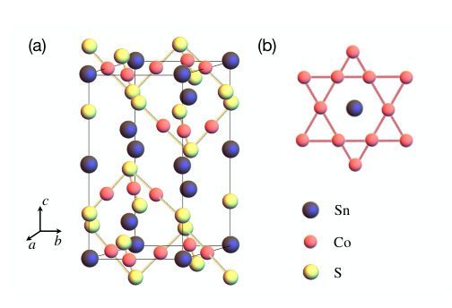
<figcaption class="paper-figure-caption"><b>Fig 2.</b> FIG. 1. (a) Layered structure of Co3Sn2S2 and (b) two di- mensional Co3Sn kagome layer. Reproduced from Fig. 1(a) of Ref.23.</figcaption>
</figure>
<figure class="paper-figure-card">
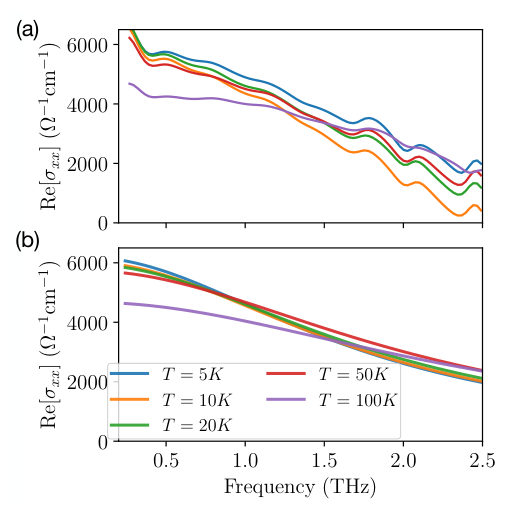
<figcaption class="paper-figure-caption"><b>Fig 3.</b> FIG. 3. Real part of the longitudinal optical conductivity as a function of frequency for five different temperatures as (a) measured experimentally and (b) computed using the model Hamiltonian given in Eq. (1) with parameters a = 1 ˚A, b = 0.12 eV, t1 = 0.25 eV, t2 = 3 eV, µ = 43 meV, γ0 = 7 meV, and γ = 0.034 meV/K.</figcaption>
</figure>
<figure class="paper-figure-card">
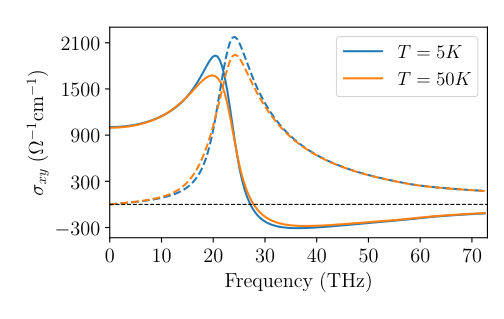
<figcaption class="paper-figure-caption"><b>Fig 4.</b> FIG. 4. Real (solid) and imaginary (dashed) parts of the transverse optical conductivity as a function of frequency for two different temperatures. Here, the interband scattering energy is Γinter = 10 meV, whereas the rest of the parameters are the same as in Fig. 3.</figcaption>
</figure>
<figure class="paper-figure-card">
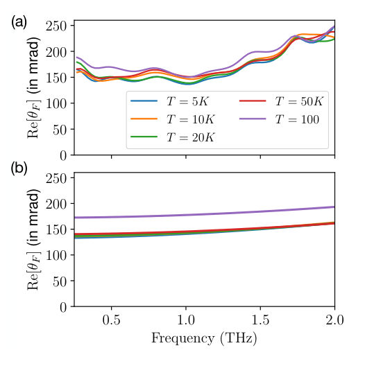
<figcaption class="paper-figure-caption"><b>Fig 5.</b> FIG. 5. Real part of the Faraday angle as a function of fre- quency for different values of temperature from (a) experi- mental data and (b) Eq. (1). The film thickness is d = 50 nm, and the substrate refractive index is ns = 1.6. Other param- eters are the same as in Fig. 3.</figcaption>
</figure>

**Summary.** This work systematically analyzes the Terahertz anomalous Hall effect in the Weyl semimetal $	ext{Co}_3	ext{Sn}_2	ext{S}_2$. By developing an effective low-energy model Hamiltonian, the authors calculate the intrinsic optical conductivity components ($\sigma_{xx}$ and $\sigma_{xy}$). The theoretical results provide a robust explanation for the observed magneto-optical behavior by linking it directly to the momentum-space separation of the Weyl nodes.

**Why it may be interesting.** While primarily condensed matter physics, the use of linear response theory (Kubo formalism) to model optical response and the explicit connection between band topology (Weyl nodes) and macroscopic transport properties (AHE) are relevant concepts in open quantum systems and quantum optics.

Detailed structure

**Main problem.** The study investigates the Terahertz anomalous Hall effect (AHE) in the magnetic Weyl semimetal $	ext{Co}_3	ext{Sn}_2	ext{S}_2$ by linking its intrinsic optical response to the momentum-space separation of its Weyl nodes.

**Main result.** The theoretical model successfully reproduces the measured magneto-optical phenomena, explaining the longitudinal and transverse conductivity signatures in the THz range via intrinsic gyrotropy.

**Method.** The authors employ the Kubo formalism to calculate optical conductivity ($\sigma_{xx}, \sigma_{xy}$) using a minimal two-band effective Hamiltonian, comparing these calculations against THz time-domain spectroscopy (THz-TDS) measurements.

**Model / system.** The system is the magnetic Weyl semimetal $	ext{Co}_3	ext{Sn}_2	ext{S}_2$. The analysis uses a minimal two-band model Hamiltonian describing the electronic structure near the Weyl nodes, which exhibit Berry curvature sources and sinks.

**Key observables.** Longitudinal conductivity ($	ext{Re}[\sigma_{xx}]$), transverse (Hall) conductivity ($	ext{Re}[\sigma_{xy}]$), and the Faraday rotation angle ($	ext{Re}[\Theta_F]$) in the THz frequency range.

**Important parameters / regimes.** Momentum-space separation ($Q$) between Weyl nodes, chemical potential ($\mu$), and the energy parameter $b$ derived from the material structure.

**Assumptions / limitations.** Key approximations include neglecting interband transitions ($\hbar\omega \ll \mu$) and assuming an effective low-energy model based on the two-node picture.

**Figures summary.** Figures compare measured $	ext{Re}[\sigma_{xx}]$ vs. temperature with model calculations, show $	ext{Re}[\sigma_{xy}]$ saturation, and illustrate the temperature dependence of the chemical potential.

**Paper structure.** The paper establishes the theoretical basis of AHE in Weyl semimetals, develops a minimal effective Hamiltonian, calculates the optical conductivity components ($\sigma_{xx}, \sigma_{xy}$) using the Kubo formula, and finally compares these theoretical predictions with experimental THz-TDS data.

Abstract

Time-reversal-symmetry-broken Weyl semimetals are known to have at least two nodes in their electronic band structure, separated in momentum space and acting as sources and sinks of Berry curvature. This gives rise to a transverse Hall conductivity, known as the anomalous Hall effect (AHE), which, in the simplest two-node picture, is proportional to the momentum-space separation between the nodes in the zero frequency limit. In the recently discovered Weyl semimetal $\mathrm{Co_3Sn_2S_2}$, a giant AHE has been observed. However, experimental investigations in the low-energy regime, which directly probe quasiparticle excitations near the Weyl nodes, remain limited. Here, we present a systematic study of the intrinsic low-energy gyrotropic optical response of $\mathrm{Co_3Sn_2S_2}$ using terahertz spectroscopy combined with semianalytical calculations based on a physically intuitive effective model. Our results provide a robust and transparent explanation of the observed magnetooptical phenomena in terms of intrinsic gyrotropy arising from momentum-space separation of the Weyl nodes. Furthermore, quantitative comparison between experiment and theory places stringent constraints on the material parameters.

[↑ back to top](#top)

### [Intrinsic anomalous Hall response in the bilayer kagome ferromagnet Co$_3$Sn](http://arxiv.org/abs/2608.27025v1)

**Authors:** Yuqi Qin, Soumya Sankar, Xingkai Cheng, Yifan Jiang, Shiming Lei, Junwei Liu, Berthold Jäck  
**Type:** both · **Category:** other · **PDF:** <https://arxiv.org/pdf/2608.27025v1>  
**Analysis basis:** full PDF text, analyzed in chunks
**Topic relevance:** `analog quantum simulation` **2/5**

↔ Scroll figures horizontally

<figure class="paper-figure-card">
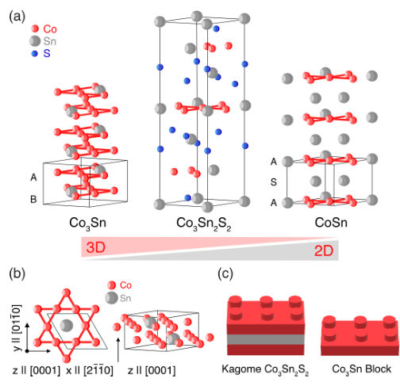
<figcaption class="paper-figure-caption"><b>Fig 1.</b> FIG. 1: Co3Sn: A kagome Lego. (a) Shown is the alternating arrangement of kagome Co3Sn and stanene (Sn2) layers, which facilitates the transition from a 3D compound to a quasi-2D compound CoSn. (b) Shown is the crystal structure of a Co3Sn layer (left) and the 3D crystal structure of Co3Sn. (c) Shown is the formation of Co3Sn2S2 kagome lattices from the Co3Sn kagome block.</figcaption>
</figure>
<figure class="paper-figure-card">
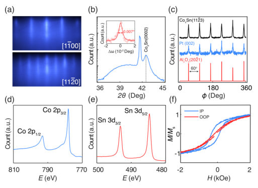
<figcaption class="paper-figure-caption"><b>Fig 2.</b> FIG. 2: Structural and magnetic characterization of the in-plane kagome ferromagnet Co3Sn. (a) Shown are the RHEED patterns of the Co3Sn thin film after growth along the [1¯100] (top) and [11¯20] (bottom) azimuths. (b) Shown is the X-ray diffraction pattern of a Co3Sn thin film, exhibiting diffraction peaks correspond- ing to Al2O3 (0006) and Co3Sn (0002) at 41.7◦and 42.6◦, respectively. (c) Shown is the ϕ-scan spectrum of the Co3Sn thin film. (d) Shown is the XPS core-level spec- trum of Co 2p, revealing the characteristic Co 2p3/2 and Co 2p1/2 peaks along with their shake-up satellites. (e) Shown is the XPS core-level spectrum of Sn 3d, display- ing the Sn 3d5/2 and Sn 3d3/2 peaks. (f)...</figcaption>
</figure>
<figure class="paper-figure-card">
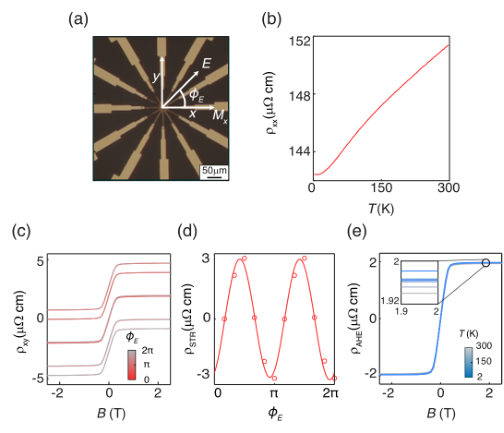
<figcaption class="paper-figure-caption"><b>Fig 3.</b> FIG. 3: Electric transport of in-plane kagome fer- romagnetic Co3Sn. (a) Shown is the optical image of the circular Hall bar device; the magnetization is fixed along Mx, and ϕE is the azimuthal angle between the electric field and the x-axis. (b) Shown is the temper- ature (T) dependent longitudinal resistivity (ρxx). (c) Shown is the transverse resistivity (ρxy) as a function of azimuthal angle ϕE. (d) Shown is the dependence of ρSTRS as a function of the azimuthal angle ϕE. (e) Shown is the anomalous Hall resistivity (ρAHE) as a function of the magnetic field B at different indicated temperatures.</figcaption>
</figure>
<figure class="paper-figure-card">
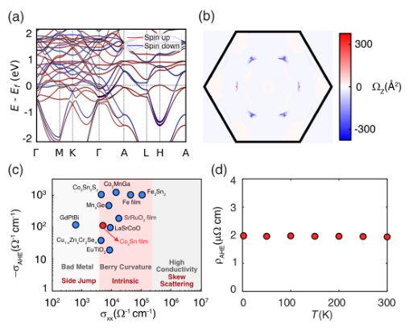
<figcaption class="paper-figure-caption"><b>Fig 4.</b> FIG. 4: Berry curvature, band structure, and anomalous Hall conductivity. Calculated band struc- ture with SOC along high-symmetry paths in the Bril- louin zone, where red and blue dots denote the spin pro- jection along the z direction. (b) Calculated Berry cur- vature Ωz(k) distribution in the kz = 0 plane, showing intense hotspots around the Fermi-level. (c) Scaling anal- ysis of −σAHE as a function of σxx for various material systems [7, 35–43]. The Co3Sn film (red) falls into the intrinsic Berry curvature-dominated regime. (d) Tem- perature (T) dependence of ρAHE from 2 to 300 K.</figcaption>
</figure>

**Summary.** This work reports the synthesis and characterization of $	ext{Co}_3	ext{Sn}$, a room-temperature kagome ferromagnet thin film. Experimentally, the material exhibits a large, temperature-independent anomalous Hall effect. Theoretically, the AHE is successfully linked to intrinsic Berry curvature hotspots calculated from the material's spin-split band structure.

**Why it may be interesting.** While not directly related to quantum information, the study of topological electronic properties (Berry curvature) in magnetic materials is foundational to understanding emergent quantum phenomena in condensed matter physics, which underpins quantum computing hardware.

Detailed structure

**Main problem.** The study investigates the intrinsic anomalous Hall response in the bilayer kagome ferromagnet $	ext{Co}_3	ext{Sn}$.

**Main result.** The material exhibits robust easy-plane ferromagnetism and a large, temperature-independent anomalous Hall conductivity ($\sigma_{	ext{AHE}} \approx 90 \ \Omega^{-1} \cdot 	ext{cm}^{-1}$), which is theoretically attributed to intrinsic Berry curvature hotspots.

**Method.** The research combines experimental techniques like Molecular Beam Epitaxy (MBE) and magneto-transport measurements with first-principles Density Functional Theory (DFT) calculations.

**Model / system.** The physical system is high-quality thin films of $	ext{Co}_3	ext{Sn}$, a kagome metal, grown epitaxially in a bilayer stacking sequence. The electronic properties are analyzed using DFT to map the spin-split band structure and Berry curvature.

**Key observables.** Anomalous Hall conductivity ($\sigma_{	ext{AHE}}$), magnetic anisotropy (easy-plane ferromagnetism), and the Berry curvature hotspots near the Fermi level.

**Important parameters / regimes.** Curie temperature ($T_C > 300\,	ext{K}$), carrier density ($n\approx5.01	imes10^{22}\,	ext{cm}^{-3}$), and the temperature independence of $\sigma_{	ext{AHE}}$ up to room temperature.

**Assumptions / limitations.** The anomalous Hall response is assumed to be dominated by the intrinsic Berry curvature effect, which is confirmed by matching DFT calculations to experimental transport data.

**Figures summary.** Figures illustrate the kagome structure, characterization results (XRD, XPS, $M(H)$ isotherms showing easy-plane ferromagnetism), and transport measurements showing the temperature-independent AHE.

**Paper structure.** The paper follows a standard structure: synthesis and structural characterization (MBE, XRD, XPS) $
ightarrow$ magnetic characterization (Magnetometry) $
ightarrow$ transport measurements (Hall effect, AHE) $
ightarrow$ theoretical modeling (DFT calculation of Berry curvature) $
ightarrow$ conclusion linking theory and experiment.

Abstract

Transition-metal kagome magnets provide a rich platform for investigating the interplay between layer stacking, magnetic order, and band topology. Here, we report the molecular beam epitaxy and experimental investigation of high-quality thin films of the kagome metal Co$_3$Sn, which has not been synthesized in bulk form yet. Structural and chemical analyses confirm a hexagonal lattice structure ($P6_3/mmc$) composed of direct A-B stacked Co$_3$Sn kagome bilayers. Magnetometry reveals robust easy-plane ferromagnetism with a Curie temperature exceeding $300\,\text{K}$. Magneto-transport measurements demonstrate metallic behavior (carrier density $n\approx5.01\times10^{22}\,\text{cm}^{-3}$) alongside a temperature-independent anomalous Hall conductivity of $σ_{\rm AHE}\approx90\,Ω^{-1}\cdot{\rm cm}^{-1}$, extending from $2\,\text{K}$ up to room temperature. Results from first-principles density functional theory calculations attribute this anomalous Hall response to intrinsic Berry curvature hotspots near the Fermi level in the spin-split band structure. Our results establish Co$_3$Sn as a room-temperature kagome ferromagnet and highlight the impact of the layer stacking sequence on the material properties of kagome metals from the CoSn family.

[↑ back to top](#top)

### [Mobility Enhancement in Si/SiGe Quantum Well Enabled by a Buried Si Layer Trapping Oxygen Impurities](http://arxiv.org/abs/2608.27377v1)

**Authors:** Felix Reichmann, Alberto Mistroni, Fabian Fidorra, Giovanni Capellini, Yuji Yamamoto, Marco Lisker, Marvin H. Zoellner  
**Type:** experiment · **Category:** other · **PDF:** <https://arxiv.org/pdf/2608.27377v1>  
**Analysis basis:** full PDF text, analyzed in chunks
**Topic relevance:** `QC/QI experiment` **2/5**

↔ Scroll figures horizontally

<figure class="paper-figure-card">
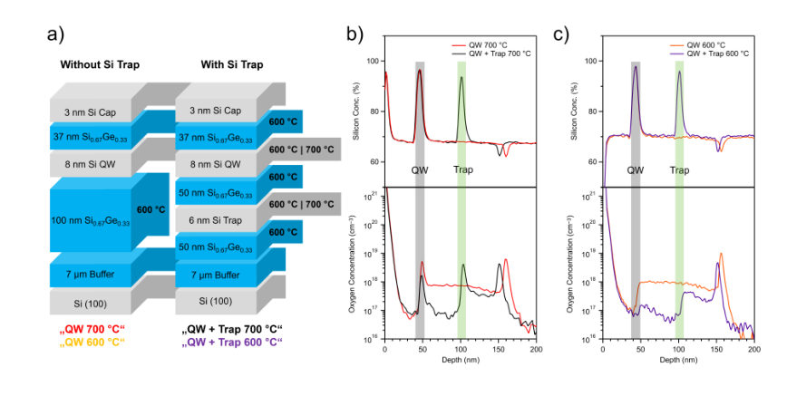
<figcaption class="paper-figure-caption"><b>Fig 1.</b> Figure 1: Schematic layer sequences and secondary-ion mass spectrometry analysis of oxygen incorporation in Si/SiGe heterostructures with different Si quantum-well (QW) growth temperatures and with or without an inserted Si trap layer. (a) Schematic layer sequences of the heterostructures without and with a buried 6 nm Si trap layer. The labels below the schematics denote the four investigated growth configurations and correspond to the color coding used in panels (b) and (c). In heterostructures with Si trap, the QW and trap were grown at the same temperature, either at 600 ◦C or at 700 ◦C. (b) Silicon and oxygen depth profiles for structures with a 700 ◦C-grown Si QW, comparing samples...</figcaption>
</figure>
<figure class="paper-figure-card">
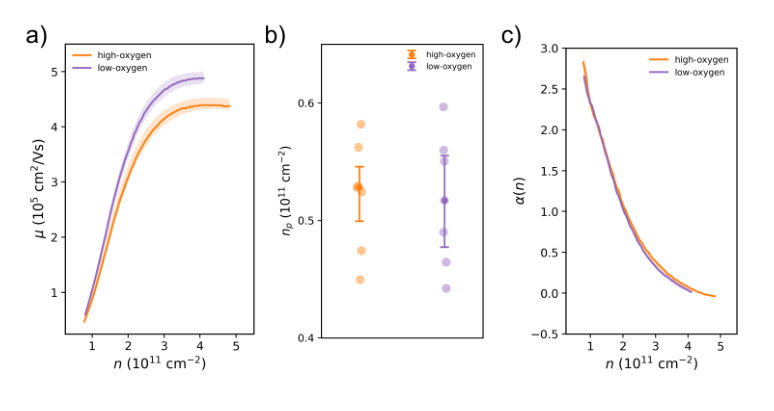
<figcaption class="paper-figure-caption"><b>Fig 2.</b> Figure 2: Density-dependent transport comparison of high-oxygen (orange) and low-oxygen (purple) Si/SiGe HB-FETs at 1.5 K. Seven devices have been investigated from each group. (a) Median mobility as a function of carrier density. Shaded regions indicate the 25th–75th percentile range within each group. (b) Percolation density np extracted from the low-density conductivity regime. Individual devices are shown as data points, with the box plot indicating the device-to-device distribution for each group. (c) Median density-dependent mobility exponent α(n), obtained by first extracting α(n) from each raw mobility curve using the logarithmic derivative and then taking the median across devices.</figcaption>
</figure>
<figure class="paper-figure-card">
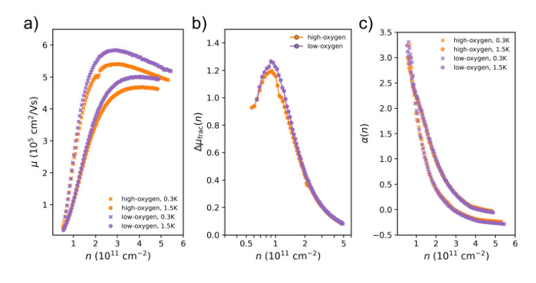
<figcaption class="paper-figure-caption"><b>Fig 3.</b> Figure 3: Temperature-dependent transport response of representative high-oxygen (orange) and low-oxygen (purple) Si/SiGe HB-FETs upon cooling from 1.5 K (dots) to 0.3 K (crosses). (a) Mobility as a function of carrier density. (b) Fractional mobility gain ∆µfrac(n) upon cooling from 1.5 K to 0.3 K. (c) Density- dependent mobility exponent α(n), extracted from the logarithmic derivative of the mobility curves.</figcaption>
</figure>

**Summary.** This work demonstrates a straightforward method—inserting a buried Si layer—to significantly reduce detrimental oxygen impurities in Si/SiGe quantum wells. By correlating impurity reduction with transport measurements, the authors show that while oxygen is a key mobility limiter, the fundamental density-dependent transport physics remains unchanged, providing a crucial materials engineering handle for improving quantum device performance.

**Why it may be interesting.** While the focus is on semiconductor device physics, the rigorous characterization of disorder effects ($\alpha(n)$ vs. $n_p$) and the engineering solution for impurity mitigation are highly relevant to controlling disorder in solid-state quantum platforms.

Detailed structure

**Main problem.** The primary challenge addressed is reducing disorder, specifically oxygen impurities, in undoped Si/SiGe heterostructures, which limits performance in scalable quantum devices like electron spin qubits.

**Main result.** Introducing a thin, buried Si layer successfully reduces the oxygen background concentration by a factor of five, leading to an increased absolute electron mobility without altering the fundamental density-dependent transport scaling or percolation threshold.

**Method.** The study combines materials characterization using Secondary-ion Mass Spectrometry (SIMS) with detailed magnetotransport measurements (Hall-bar FETs) across varying carrier densities and temperatures.

**Model / system.** The physical system is an undoped Si/SiGe quantum-well heterostructure grown via RP-CVD on 200 mm Si(100) substrates. The key modification is the introduction of an electrically passive buried Si layer within the SiGe barrier.

**Key observables.** Electron mobility ($\mu$), oxygen background concentration (SIMS), percolation density ($n_p$), and the density-dependent mobility exponent ($\alpha(n)$).

**Important parameters / regimes.** Temperature (0.3 K to 1.5 K), carrier density ($n$), and the concentration of oxygen impurities.

**Assumptions / limitations.** The buried Si layer is assumed to be electrically passive and acts solely as a physical barrier to trap oxygen impurities during growth.

**Figures summary.** Figures compare SIMS depth profiles showing oxygen reduction; transport measurements compare $\mu(n)$, $n_p$, and $\alpha(n)$ curves for high- vs. low-oxygen devices at different temperatures.

**Paper structure.** The paper first establishes the problem of oxygen-limited mobility. It then details the engineering solution (buried Si layer) and uses SIMS to confirm oxygen reduction. Finally, it presents magnetotransport data showing that while absolute mobility increases, the characteristic density-dependent transport scaling remains robust.

Abstract

Reducing disorder in undoped Si/SiGe field-effect heterostructures remains an important materials challenge for scalable quantum devices, particularly electron spin qubits. Background impurities such as oxygen have been identified as mobility-limiting, yet practical heterostructure-design strategies for suppressing their incorporation remain underexplored, and their influence across different transport regimes is not fully established. Here, we demonstrate a simple route to oxygen reduction and mobility enhancement in Si/SiGe quantum-well heterostructures grown by reduced-pressure chemical vapor deposition (RP-CVD) on 200 mm Si(100) substrates through the introduction of a thin, electrically passive buried Si layer within the lower SiGe barrier. Secondary-ion mass spectrometry shows that the buried Si layer reproducibly reduces the oxygen background in the subsequently grown SiGe by approximately a factor of five, without modifying the active quantum-well region. Density- and temperature-dependent magnetotransport measurements further show that this reduction increases the electron mobility, while leaving the percolation density and density-dependent mobility scaling largely unchanged. Upon cooling to 0.3 K, both high- and low-oxygen devices exhibit similar density-dependent fractional mobility enhancements, indicating that the reduced oxygen background improves momentum relaxation without substantially altering the dominant low-density disorder landscape. These results establish the buried Si layer as a straightforward and process-compatible heterostructure-design element for reducing oxygen incorporation and improving transport in 200 mm CVD-grown Si/SiGe quantum-device materials.

[↑ back to top](#top)

### [Giant bulk photovoltaic effect driven by interfacial symmetry breaking in MoS2/Ta2NiSe5 heterostructures](http://arxiv.org/abs/2608.27064v1)

**Authors:** Jianwen Ma, Pengliang Leng, Lei Peng, Congming Hao, Xianghao Meng, Jiaqi Liu, Yang Gan, Min Luo, Zifan Zhang, Jiaming Gu, Qinghang Liu, Lidan Duan, Du Xiang, Wu Shi, Peng Wang, Weibin Chu, Xiang Yuan, Weida Hu, Cheng Zhang  
**Type:** both · **Category:** other · **PDF:** <https://arxiv.org/pdf/2608.27064v1>  
**Analysis basis:** full PDF text, analyzed in chunks
**Topic relevance:** `Keldysh / 2PI / non-Gaussian methods` **1/5** · `analog quantum simulation` **1/5** · `driven-dissipative phase transition` **1/5** · `methods for driven-dissipative` **1/5** · `non-equilibrium universality` **1/5** · `quantum measurements` **1/5**

↔ Scroll figures horizontally

<figure class="paper-figure-card">
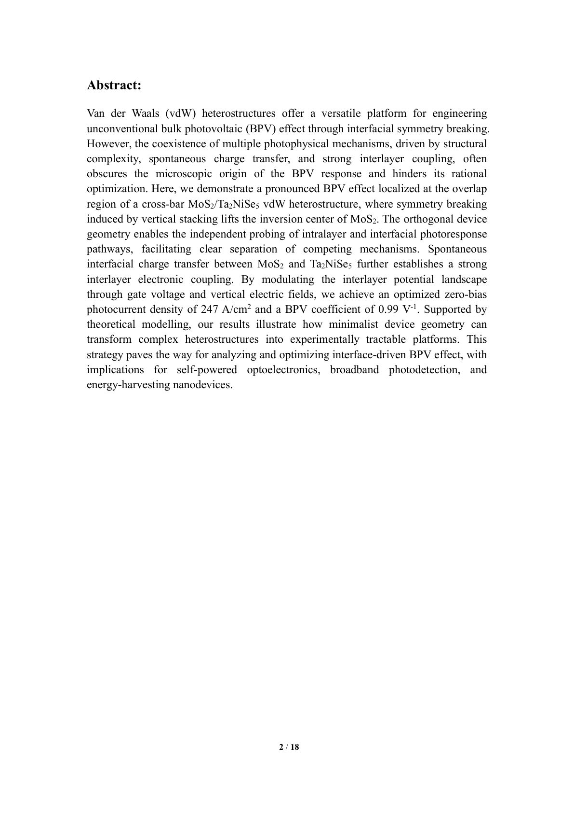
<figcaption class="paper-figure-caption"><b>Fig 1.</b> Low-resolution page preview, page 2</figcaption>
</figure>
<figure class="paper-figure-card">
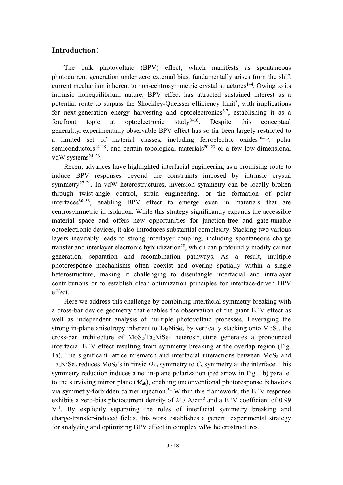
<figcaption class="paper-figure-caption"><b>Fig 2.</b> Low-resolution page preview, page 3</figcaption>
</figure>
<figure class="paper-figure-card">
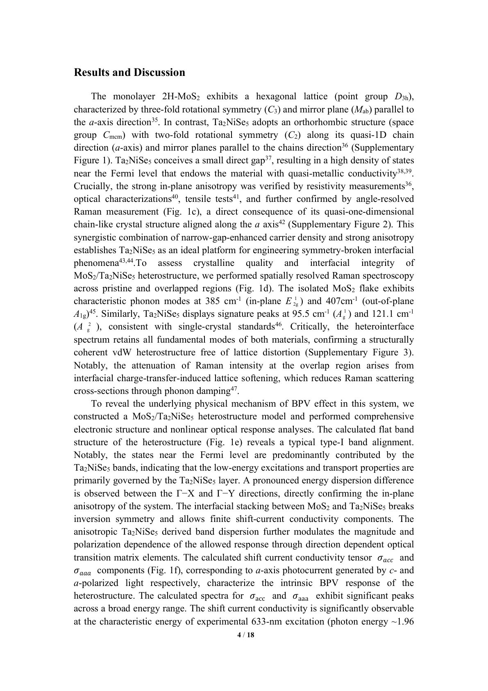
<figcaption class="paper-figure-caption"><b>Fig 3.</b> Low-resolution page preview, page 4</figcaption>
</figure>
<figure class="paper-figure-card">
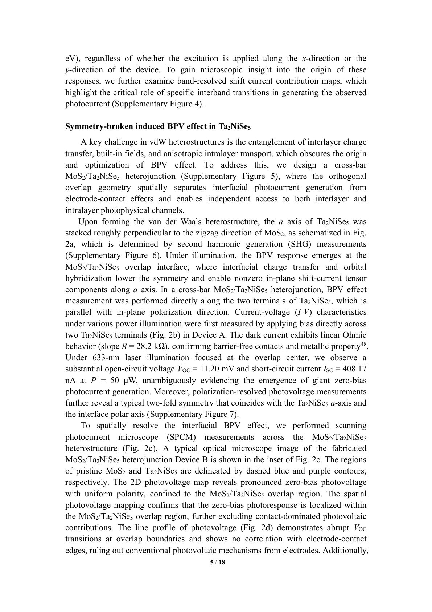
<figcaption class="paper-figure-caption"><b>Fig 4.</b> Low-resolution page preview, page 5</figcaption>
</figure>
<figure class="paper-figure-card">
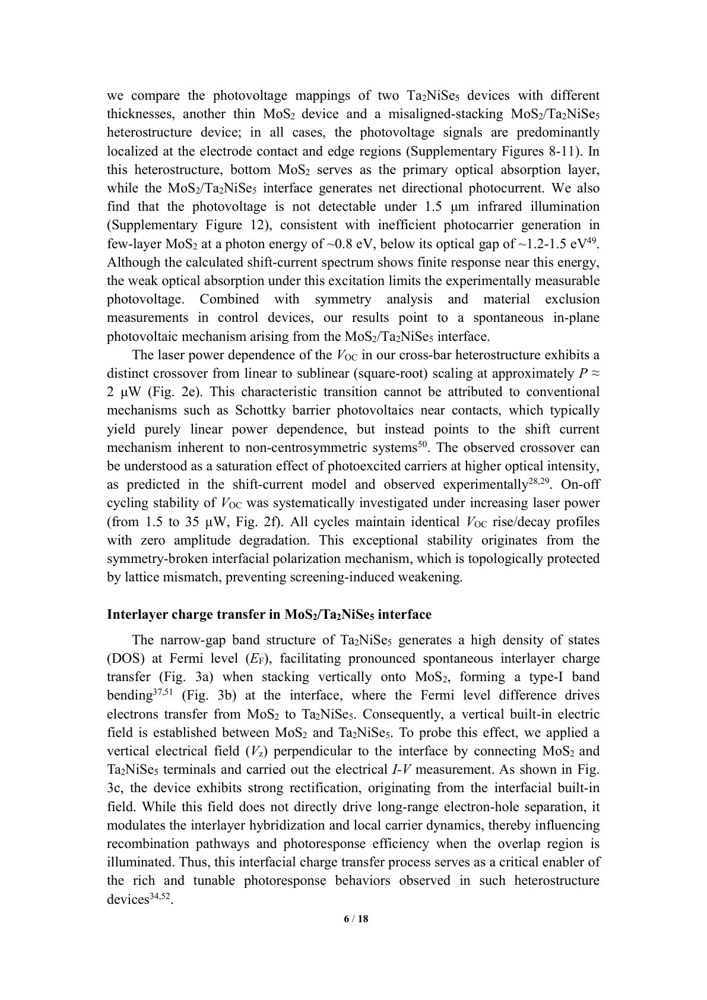
<figcaption class="paper-figure-caption"><b>Fig 5.</b> Low-resolution page preview, page 6</figcaption>
</figure>

**Summary.** This paper reports on achieving a giant bulk photovoltaic effect in a $	ext{MoS}_2/	ext{Ta}_2	ext{NiSe}_5$ heterostructure by engineering interfacial symmetry breaking. Using a specialized cross-bar device, the authors successfully separated competing photophysical mechanisms to quantify a high BPV response. This work provides a platform for designing self-powered optoelectronic devices based on interface engineering.

**Why it may be interesting.** While focused on solid-state optoelectronics, the concept of engineered symmetry breaking to control electronic response is analogous to controlling coupling terms in open quantum systems or designing tailored quantum interfaces.

Detailed structure

**Main problem.** The primary challenge is disentangling the microscopic origins and optimizing the bulk photovoltaic (BPV) effect in complex Van der Waals (vdW) heterostructures where multiple photophysical mechanisms overlap.

**Main result.** The authors demonstrate a giant BPV effect localized at the $	ext{MoS}_2/	ext{Ta}_2	ext{NiSe}_5$ interface, achieving a high photocurrent density ($247 	ext{ A/cm}^2$) by exploiting symmetry breaking.

**Method.** The study combines advanced electrical measurements (I-V, photovoltage mapping, gate-tuning) with theoretical modeling (DFT calculations of conductivity tensors).

**Model / system.** The physical system is the $	ext{MoS}_2/	ext{Ta}_2	ext{NiSe}_5$ vdW heterostructure, studied using a cross-bar device geometry to isolate interfacial photoresponse.

**Key observables.** Zero-bias photocurrent density ($247 	ext{ A/cm}^2$), BPV coefficient ($0.99 	ext{ V}^{-1}$), localized photovoltage enhancement, and gate-tunable barrier heights.

**Important parameters / regimes.** Gate voltage ($	ext{V}_{	ext{BG}}$), vertical electric field ($	ext{V}_z$), and laser power density ($P$).

**Assumptions / limitations.** The cross-bar geometry is crucial as a strategy to spatially separate and independently probe the contributions of interfacial symmetry breaking versus intralayer effects.

**Figures summary.** Figures illustrate the device architecture, the localization of the BPV effect at the overlap region, the dependence of photoresponse on external biases, and comparisons of the BPV coefficient against other materials.

**Paper structure.** The paper progresses by establishing the complex nature of BPV in vdW heterostructures, presenting the cross-bar device setup for controlled measurement, quantifying the giant BPV effect through electrical characterization, and supporting these findings with theoretical calculations of symmetry-dependent charge transport.

Abstract

Van der Waals (vdW) heterostructures offer a versatile platform for engineering unconventional bulk photovoltaic (BPV) effect through interfacial symmetry breaking. However, the coexistence of multiple photophysical mechanisms, driven by structural complexity, spontaneous charge transfer, and strong interlayer coupling, often obscures the microscopic origin of the BPV response and hinders its rational optimization. Here, we demonstrate a pronounced BPV effect localized at the overlap region of a cross-bar MoS2/Ta2NiSe5 vdW heterostructure, where symmetry breaking induced by vertical stacking lifts the inversion center of MoS2. The orthogonal device geometry enables the independent probing of intralayer and interfacial photoresponse pathways, facilitating clear separation of competing mechanisms. Spontaneous interfacial charge transfer between MoS2 and Ta2NiSe5 further establishes a strong interlayer electronic coupling. By modulating the interlayer potential landscape through gate voltage and vertical electric fields, we achieve an optimized zero-bias photocurrent density of 247 A/cm2 and a BPV coefficient of 0.99 V-1. Supported by theoretical modelling, our results illustrate how minimalist device geometry can transform complex heterostructures into experimentally tractable platforms. This strategy paves the way for analyzing and optimizing interface-driven BPV effect, with implications for self-powered optoelectronics, broadband photodetection, and energy-harvesting nanodevices.

[↑ back to top](#top)

### [Observation of dodecagonal replica bands in 30$^{\circ}$-twisted bilayer WSe$_2$](http://arxiv.org/abs/2608.26864v1)

**Authors:** Christian Valentiner-Branth Fokdal, Chakradhar Sahoo, Thomas S. Nielsen, Alfred J. H. Jones, Zhihao Jiang, Kenji Watanabe, Takashi Taniguchi, Marcin Mucha-Kruczyński, Søren Ulstrup  
**Type:** both · **Category:** strongly correlated electrons · **PDF:** <https://arxiv.org/pdf/2608.26864v1>  
**Analysis basis:** full PDF text, analyzed in chunks
**Topic relevance:** `Keldysh / 2PI / non-Gaussian methods` **1/5** · `analog quantum simulation` **1/5** · `quantum measurements` **1/5**

↔ Scroll figures horizontally

<figure class="paper-figure-card">
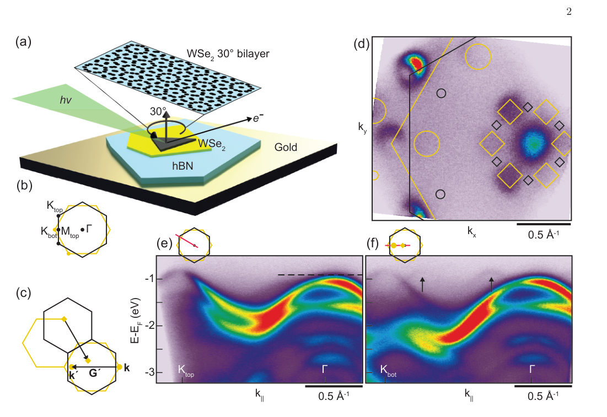
<figcaption class="paper-figure-caption"><b>Fig 1.</b> FIG. 1. (a) Schematic of micro-focused ARPES experiment on dodecagonal bilayer WSe2 supported on hBN on gold-coated SiO2. The blue panel illustrates the 30◦twist angle-induced structure. The black dots represent the W-atoms. The incoming photons with energy hν are focused on the sample, as illustrated by the green triangle, leading to emission of photoelectrons (e−). (b) Brillouin zones (BZs) of the 30◦-twisted WSe2 flakes. As in (a), yellow represents the bottom layer and black the top layer. (c) Overview of the relevant Umklapp scattering processes. (d) ARPES constant energy surface integrated over (−0.91±0.05) eV. The BZ segments are superimposed in black and yellow lines. Yellow (black)...</figcaption>
</figure>
<figure class="paper-figure-card">
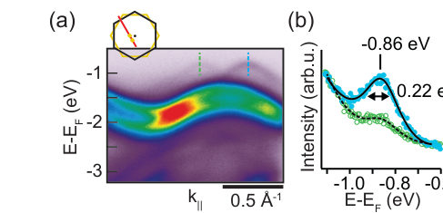
<figcaption class="paper-figure-caption"><b>Fig 2.</b> FIG. 2. (a) ARPES spectrum along a cut containing two second-order replicas. The red bar in the BZ inset marks the cut direction. (b) EDCs extracted along the green and blue dotted lines in (a), represented with open and filled cir- cles, respectively. The full and dashed curves overlaid on the data represent fits to a Voigt peak on a polynomial back- ground. The peak is centred at -0.86 eV and has Lorentzian full width at half maximum (FWHM) of 0.22 eV, as illus- trated by double-headed arrows.</figcaption>
</figure>
<figure class="paper-figure-card">
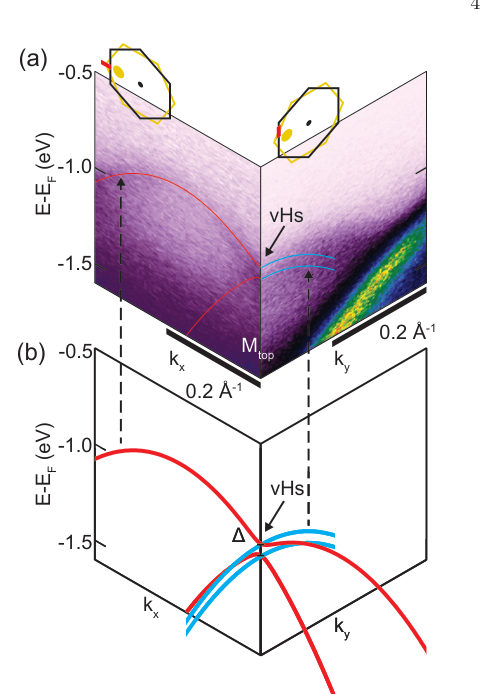
<figcaption class="paper-figure-caption"><b>Fig 3.</b> FIG. 3. (a) ARPES E(k)-dispersion cuts around the crossing between the main band of the bottom layer and a first order replica extracted along Γ-Kbot (left panel) and Ktop -Mtop (right panel). The red bars in the BZ insets show the cut directions. (b) Extracted dispersion around the band cross- ing based on fitting a gapped two-band model to the ARPES spectra in (a) [28]. The red (blue) curves correspond to the bands along kx (ky). The arrow points to a van Hove sin- gularity (vHs) at -1.05 eV where the band curvature changes sign between the two orthogonal cuts. Dashed arrows indicate the band positions in the ARPES spectra. An assumed gap of ∆= 0.06 eV at the band crossing is marked by a...</figcaption>
</figure>
<figure class="paper-figure-card">
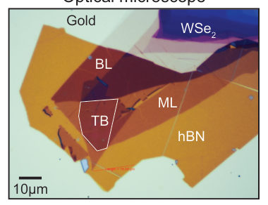
<figcaption class="paper-figure-caption"><b>Fig 4.</b> FIG. 4. Optical microscope image of the sample. The regions of monolayer (ML), bilayer (BL), twisted bilayer (TB), hBN, and gold are indicated. The blue region near the top is multilayer WSe2 acting as electrical contact to the gold.</figcaption>
</figure>
<figure class="paper-figure-card">
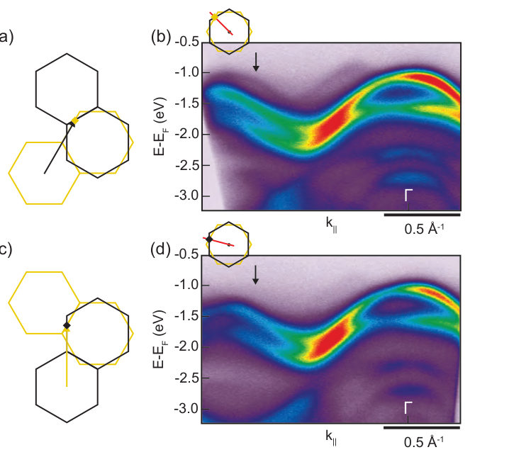
<figcaption class="paper-figure-caption"><b>Fig 5.</b> FIG. 5. (a) Scattering path for a bottom-to-top Γ-replica band using a top-layer reciprocal lattice vector (black arrow). (b) ARPES intensity measured along the cut shown in the BZ inset, which contains the Γ-replica originating from the process shown in (a). The black arrow demarcates the replica. (c) Scattering path for a top-to-bottom Γ-replica band, using a bottom-layer reciprocal vector (yellow arrow). (d) ARPES intensity along the direction shown in the BZ inset, through the expected position of a top-to-bottom Γ-replica. The arrow indicates where the missing replica should be.</figcaption>
</figure>

**Summary.** This work reports the direct observation of dodecagonal replica bands in $30^\circ$-twisted bilayer $	ext{WSe}_2$ using ARPES. By analyzing the spectral reconstruction, the authors confirm the presence of a van Hove singularity near the K-valleys. This suggests that large-angle twisted bilayer TMDs are promising platforms for inducing novel electronic states.

**Why it may be interesting.** The study investigates emergent electronic properties (like vHs) in engineered van der Waals heterostructures using advanced spectroscopic techniques, which is highly relevant to understanding correlated phases in low-dimensional quantum materials.

Detailed structure

**Main problem.** The research aims to determine the electronic structure and scattering processes within 2D quasicrystals exhibiting multiorbital dodecagonal replica bands.

**Main result.** The authors directly observed replica bands in $30^\circ$-twisted bilayer $	ext{WSe}_2$ using ARPES, attributing them to interlayer Umklapp scattering and confirming a van Hove singularity near the K-valleys.

**Method.** The study combines Angle-Resolved Photoemission Spectroscopy (ARPES) measurements with theoretical modeling using a two-band model to simulate the observed spectral function.

**Model / system.** The physical system is $30^\circ$-twisted bilayer $	ext{WSe}_2$, which forms a quasicrystal structure. The analysis employs a two-band model to describe the hybridization and spectral reconstruction caused by interlayer coupling between the top and bottom layers.

**Key observables.** Direct observation of dodecagonal replica bands, spectral function measurements showing a van Hove singularity (vHs) near the K-valleys, and layer-dependent intensity asymmetries.

**Important parameters / regimes.** The twist angle of $30^\circ$, the energy of the vHs ($-1.05 	ext{ eV}$), and the replica band maximum energy ($-0.86 	ext{ eV}$).

**Assumptions / limitations.** The analysis assumes that only states from the top and bottom valence bands mix, and that scattering processes can be modeled using first-order interlayer coupling approximations.

**Figures summary.** Figures illustrate the ARPES setup and spectra along $\Gamma-	ext{K}$ cuts, showing replica bands. Other figures compare measured intensity to predictions from the two-band model, highlighting the vHs location and the effect of gap/linewidth on the spectral shape.

**Paper structure.** The paper progresses from identifying the physical system and the unknown electronic structure to presenting ARPES measurements confirming replica bands. It then develops a theoretical framework (two-band model) to explain the observed spectral weight transfer and the existence of the vHs.

Abstract

Twisted bilayers of two-dimensional (2D) transition metal dichalcogenides are promising systems for achieving tunable quasicrystalline orders with emergent properties. The underpinning electronic structure and scattering processes in 2D quasicrystals with multiorbital dodecagonal replica bands have so far not been determined. Here, we utilize angle-resolved photoemission spectroscopy (ARPES) with micrometer spatial resolution to directly observe replica bands in 30$^{\circ}$-twisted bilayer WSe$_2$. The symmetry and intensity distribution of the observed replicas are explained by interlayer Umklapp scattering from bottom to top WSe$_2$ layers. Our spectral function measurements are consistent with the presence of a van Hove singularity adjacent to the $\mathrm{K}$-valleys, which underlines the possibility of inducing electronic reconstructions in bilayers with a large interlayer twist angle.

[↑ back to top](#top)

### [Hall effect in viscous flows of two-dimensional electrons in samples with edges of arbitrary roughness](http://arxiv.org/abs/2608.26979v1)

**Authors:** A. V. Gert, P. S. Alekseev  
**Type:** theory · **Category:** other · **PDF:** <https://arxiv.org/pdf/2608.26979v1>  
**Analysis basis:** full PDF text, analyzed in chunks
**Topic relevance:** `Keldysh / 2PI / non-Gaussian methods` **1/5** · `correlated / nonlocal dissipation` **1/5**

↔ Scroll figures horizontally

<figure class="paper-figure-card">
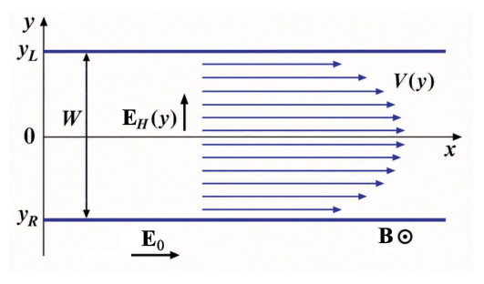
<figcaption class="paper-figure-caption"><b>Fig 1.</b> FIG. 1. Flow of a 2D electron fluid in a long sample with mod- erately rough edges, corresponding to substantial slip of the fluid flow at the edges. The following quantities are indicated: the external electric field E0; the magnetic field B, perpendic- ular to the 2D electron layer; Hall electric field EH(y), arising to compensate for the magnetic Lorentz force in the y direc- tion; the velocity profile of the electron flow Vx(y) = V (y).</figcaption>
</figure>
<figure class="paper-figure-card">
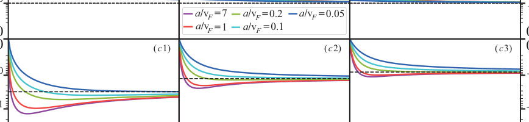
<figcaption class="paper-figure-caption"><b>Fig 2.</b> FIG. 2. Characteristics of the flow of the 2D electron fluid in long samples with three widths W and various degrees of edge roughness, described by the parameter a. The columns correspond to different ratios of the sample width to the relaxation lengths limp = vF τimp and lee = vF τee, indicated at the top. The parameter ξ0 = λ0W/2, governing the relative contributions of the Ohmic and hydrodynamic components at zero magnetic field, takes the values 0.16, 0.32, and 0.63 for the three columns. The top row [panels (a1)–(a3)] shows the hydrodynamic velocity profiles V (y) on a linear scale (see Fig. 1). The middle row [panels (b1)–(b3)] presents the mean sample longitudinal resistivities ρxx =...</figcaption>
</figure>
<figure class="paper-figure-card">
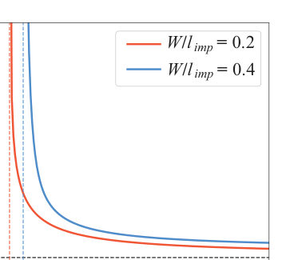
<figcaption class="paper-figure-caption"><b>Fig 3.</b> FIG. 3. Position of the minimum βmin of the correction to the Hall resistance δρxy(β) [see Fig. 2(c1)–(c3)] as a func- tion of the parameter a for samples of two different widths. The curves βmin(a) have vertical asymptotes at a = a0 = W/(2τimp), corresponding to s = [W/(2τimp)]/a = 1, at which the dependence δρxy(β) changes from monotonic to non-monotonic, with a minimum. As the parameter a in- creases, all curves saturate at βmin &gt; 1, corresponding to the purely bulk result [Eq. (12) at s = 0].</figcaption>
</figure>

**Summary.** This theoretical work models the magnetotransport of 2D electron fluids in samples with rough edges by treating the system hydrodynamically. It derives expressions for the Hall resistance correction, $\delta
ho_{xy}(B)$, which is predicted to show a characteristic minimum at high magnetic fields when edge roughness is significant. This minimum provides a measurable signature to experimentally determine the degree of edge roughness.

**Why it may be interesting.** While focused on condensed matter transport, the use of hydrodynamic equations and the development of diagnostic signatures (like the minimum in $\delta
ho_{xy}$) to characterize boundary conditions is relevant to understanding non-equilibrium dynamics in mesoscopic systems.

Detailed structure

**Main problem.** The paper develops a theory to describe the hydrodynamic magnetotransport of two-dimensional (2D) electron fluids in samples whose edges possess arbitrary roughness.

**Main result.** The Hall resistance correction, $\delta
ho_{xy}(B)$, exhibits a non-monotonic dependence on the magnetic field, showing a minimum at sufficiently rough edges, which can be used as a diagnostic tool to measure edge roughness.

**Method.** The analysis uses the Navier-Stokes equations for the electron fluid flow, incorporating boundary conditions derived from a local collision operator to model edge scattering.

**Model / system.** The system is a 2D electron gas confined in a sample geometry, modeled as a viscous electron fluid. The theory accounts for bulk scattering (defects) and boundary scattering (edges) using a hydrodynamic approximation for the distribution function.

**Key observables.** Longitudinal and Hall resistances ($
ho_{xx}, 
ho_{xy}$), and specifically the relaxation contribution to the Hall resistance, $\delta
ho_{xy}(B)$.

**Important parameters / regimes.** Edge roughness parameter ($a$), sample width ($W$), bulk defect scattering rate ($\gamma_{imp}$), and the magnetic field ($B$).

**Assumptions / limitations.** The theory relies on the hydrodynamic approximation for the distribution function and assumes the electron-electron collision time is much shorter than the impurity scattering time ($	au_{ee} \ll 	au_{imp}$).

**Figures summary.** Figures illustrate velocity profiles, longitudinal resistivity, and the Hall correction ($\delta
ho_{xy}$) for varying sample widths and edge roughness parameters, showing the minimum dependence on the magnetic field.

**Paper structure.** The paper builds the theory by defining the governing equations (Navier-Stokes, collision integrals) for the hydrodynamic flow. It then calculates the resistivities ($
ho_{xx}, 
ho_{xy}$) and analyzes the magnetic field dependence of the Hall correction ($\delta
ho_{xy}$), establishing diagnostic criteria based on the minimum value.

Abstract

In ultra-clean conductors, fast inter-particle collisions can lead to the formation of a viscous electron fluid and realization of the hydrodynamic transport regime. Here we develop a theory of hydrodynamic magnetotransport of two-dimensional (2D) electrons in samples with low densities of defects and edges of arbitrary roughness. Within our model the roughness is described by a single parameter with the dimension of speed in the boundary conditions on sample edges. The electron-fluid flow profiles in long samples, as well as the corresponding longitudinal and Hall resistances, are calculated. The contribution to the Hall resistance associated with the relaxation processes exhibits a saturation in the limit of high magnetic field and a minimum as a function of the magnetic field for sufficiently rough edges. The minimum disappears as the edge roughness decreases or the sample width and bulk scattering by defects increase. These properties of the Hall resistance can serve as the signs to identify the hydrodynamic regime of electron transport in experiments and can be used to determine its parameters, in particular, the degree of edge roughness.

[↑ back to top](#top)

### [Optical spectroscopy of composite fermion edge states in the fractional quantum Hall effect](http://arxiv.org/abs/2608.26521v1)

**Authors:** Maria Sebastian, Ashutosh Singh, Alexey Belyanin  
**Type:** theory · **Category:** strongly correlated electrons · **PDF:** <https://arxiv.org/pdf/2608.26521v1>  
**Analysis basis:** full PDF text, analyzed in chunks
**Topic relevance:** `Keldysh / 2PI / non-Gaussian methods` **1/5** · `analog quantum simulation` **1/5**

↔ Scroll figures horizontally

<figure class="paper-figure-card">
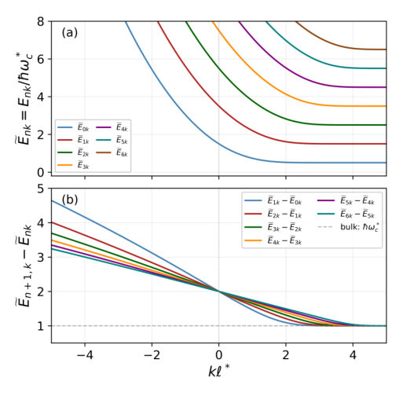
<figcaption class="paper-figure-caption"><b>Fig 1.</b> FIG. 1. CF Λ-level dispersion near a hard-wall edge. All quantities are dimensionless. Energies are normalized by ℏω∗ c and momentum by ℓ∗. (a) The seven lowest Λ-level energies eEnk = Enk/ℏω∗ c as a function of kℓ∗, with n = p −1. Levels are flat and equidistant in the bulk (large positive kℓ∗) and bend upward nonuniformly near the edge (negative kℓ∗). (b) Consecutive transition energies eEn+1,k −eEnk for n = 0 to 5. All approach the bulk cyclotron energy ℏω∗ c (dashed line) for large positive kℓ∗and rise to higher frequencies near the edge.</figcaption>
</figure>
<figure class="paper-figure-card">
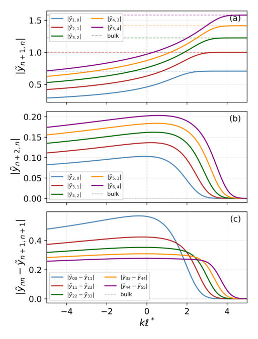
<figcaption class="paper-figure-caption"><b>Fig 2.</b> FIG. 2. CF dipole matrix elements as a function of the di- mensionless cyclotron orbit center kℓ∗. These are properties of the CF Λ-levels, computed from the dimensionless eigen- functions, and are therefore independent of the filling fraction. All quantities are dimensionless, normalized by ℓ∗. (a) Ma- trix elements |˜yn+1,n,k| of the transitions dipole-allowed in the bulk, for n = 0 to 4. Dashed lines show the bulk harmonic os- cillator values p</figcaption>
</figure>
<figure class="paper-figure-card">
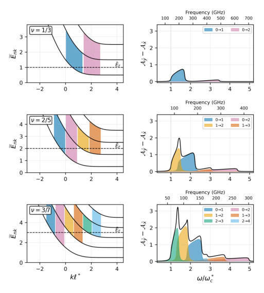
<figcaption class="paper-figure-caption"><b>Fig 3.</b> FIG. 3. Optical response of CFs for three filling fractions ν = 1/3, 2/5, and 3/7 (three positions of the CF Fermi level). Left column: Λ-level electron dispersion near the edge, with dashed line marking the normalized CF Fermi level eEF = p = 1, 2, 3 from top to bottom. Shaded regions show the phase-space windows that contribute to each transition, colored to match the corresponding features in the spectra. Right column: dimensionless absorbance difference Aˆy −Aˆx normalized by the geometric overlap factor (see the text) as a function of normalized frequency ω/ω∗ c (bottom axis) and absolute frequency in GHz (top axis) for GaAs at B = 10 T, assuming m∗ CF = 0.66 m0 [26], γ = 0.03 ω∗ c,...</figcaption>
</figure>

**Summary.** This theoretical work demonstrates how sub-terahertz optical spectroscopy can be used to selectively probe the edge states in Fractional Quantum Hall systems. By employing the Composite Fermion mean-field theory, the authors calculate characteristic absorption peaks whose frequency scale directly reveals the electron-electron interaction-induced effective mass. This offers a powerful, non-invasive optical diagnostic tool for understanding strongly correlated quantum matter.

**Why it may be interesting.** This work provides a concrete, measurable optical signature (sub-THz absorption) linked directly to the interaction physics ($m_{CF}^*$) governing strongly correlated electron systems, which is highly relevant to quantum optics and many-body dynamics.

Detailed structure

**Main problem.** The goal is to selectively probe and excite the edge states present in Fractional Quantum Hall (FQH) effect samples using sub-terahertz optical spectroscopy.

**Main result.** The calculated edge-state absorption peaks appear in the millimeter-wave to sub-terahertz range, providing a direct optical probe of the electron-electron interaction-induced effective mass ($m_{CF}^*$).

**Method.** The authors calculated the absorbance spectrum using the Composite Fermion (CF) mean-field framework, analyzing the difference between $\hat{y}$- and $\hat{x}$-polarized absorption to isolate edge contributions.

**Model / system.** The system is a 2D electron gas in the FQH regime, modeled by mapping the strongly correlated problem onto an effective integer quantum Hall problem using Composite Fermions. The analysis involves solving a differential equation derived from the CF Hamiltonian.

**Key observables.** CF edge-state absorption peaks (60–500 GHz at 10 T), the number of resolved peaks (counting filled $\Lambda$-levels), and the difference spectrum $A^{\hat{y}} - A^{\hat{x}}$.

**Important parameters / regimes.** Filling fractions ($
u = p/(2p+1)$), magnetic field ($B=10$ T), and the CF effective mass ($m_{CF}^*$).

**Assumptions / limitations.** The calculations are performed within the CF mean-field approximation, and the edge state contribution is isolated by calculating the difference spectrum $A^{\hat{y}} - A^{\hat{x}}$.

**Figures summary.** Figures illustrate the CF $\Lambda$-level dispersion and transition energies near a hard-wall edge, and show the calculated dimensionless absorbance difference $A^{\hat{y}} - A^{\hat{x}}$ for various filling fractions ($
u = 1/3, 2/5, 3/7$).

**Paper structure.** The paper establishes the physical problem (probing FQH edge states), details the theoretical framework (CF mean-field mapping), outlines the calculation of optical response using polarization differences, and presents the key results showing spectral fingerprints and mass determination.

Abstract

We show that edge states in fractional quantum Hall effect samples can be selectively probed and excited with sub-terahertz optical spectroscopy. Using the composite fermion (CF) mean-field framework, which maps the strongly correlated fractional quantum Hall problem onto an effective integer quantum Hall problem, we calculate the absorbance spectrum for the Jain sequence of filling fractions including both bulk and edge states. The CF edge-state absorption peaks appear in the millimeter-wave to sub-terahertz range, e.g., 60-500 GHz at B = 10 T in GaAs, i.e. they are blueshifted with respect to the bulk CF cyclotron frequency but are well below the integer quantum Hall cyclotron frequency scale at the same magnetic fields. The number of resolved peaks in each series of the absorption spectrum counts the filled Lambda-levels and fingerprints the fraction. Inversion symmetry breaking near the edge activates optical transitions forbidden in the bulk and enables second-order nonlinear processes in electric-dipole approximation. The absolute frequency scale of the spectrum is set by the CF effective mass, which is generated entirely by electron-electron interactions, so the absorption spectrum provides a direct optical probe of this interaction-induced mass.

[↑ back to top](#top)

### [Optically Induced Thermal Runaway in Phase-Change VO2 Nanostructures](http://arxiv.org/abs/2608.26401v1)

**Authors:** Jiří Kabát, Peter Kepič, Andrea Konečná, Filip Ligmajer  
**Type:** theory · **Category:** statistical mechanics · **PDF:** <https://arxiv.org/pdf/2608.26401v1>  
**Analysis basis:** full PDF text, analyzed in chunks
**Topic relevance:** `driven-dissipative phase transition` **1/5** · `non-equilibrium universality` **1/5**

↔ Scroll figures horizontally

<figure class="paper-figure-card">
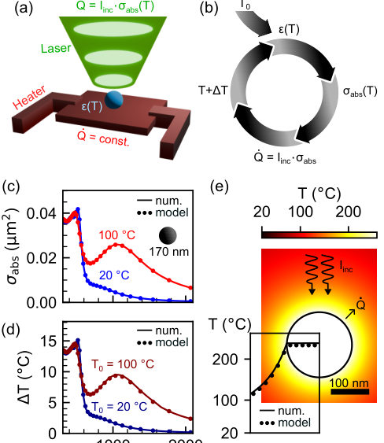
<figcaption class="paper-figure-caption"><b>Fig 1.</b> FIG. 1. (a) Schematic of the studied system featuring a VO2 nanosphere with temperature-dependent dielectric function ε(T). External heat can be provided by either a heater (ab- sorbed power ˙Q is constant) or by laser heating (absorbed power depends on the nanosphere’s temperature). (b) Scheme of the positive-feedback loop: The nanostructure with a di- electric function ε(T) at ambient temperature T0 is illumi- nated by a monochromatic plane wave of intensity Iinc and absorbs a portion of the incident field depending on its absorp- tion cross-section σabs(T). This absorption yields a dissipated power ˙Q that drives a temperature increase ∆T. The dielec- tric function is then updated to ε(T...</figcaption>
</figure>
<figure class="paper-figure-card">
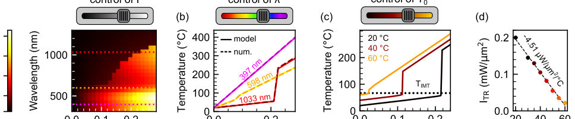
<figcaption class="paper-figure-caption"><b>Fig 2.</b> FIG. 2. (a) Parametric map of the steady-state temperature as a function of excitation wavelength of the laser and its intensity for the 170 nm nanosphere. Each point was calculated using the analytical model and the iterative cycle until the temperature converged. (b) Cross-sectional cuts of the map in (a) at three excitation wavelengths. These reveal linear heating behavior at λexc = 397 nm, minor non-linearity at λexc = 598 nm, and a pronounced step-like non-linearity at λexc = 1033 nm. Solid lines correspond to the analytical model; dashed lines are the results of numerical simulations. (c) Effect of thermal bias introduced by the heater. Preheating the nanosphere to an ambient...</figcaption>
</figure>
<figure class="paper-figure-card">
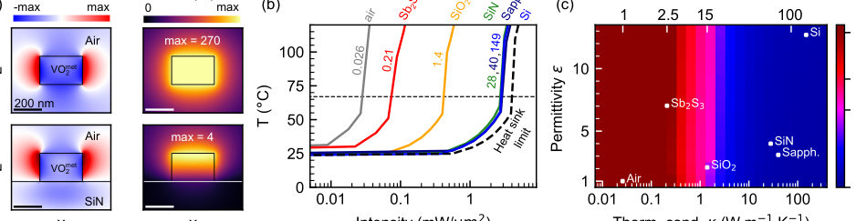
<figcaption class="paper-figure-caption"><b>Fig 3.</b> FIG. 3. Influence of the substrate on the photothermal heating of a metallic (met) VO2 nanodisc (D = 300 nm, h = 200 nm). (a) Distribution of the induced electric field for the nanodisc evaluated for λ = 1033 nm (left column) and the resulting steady- state temperature change (right column). The nanodisc is either surrounded by air (first row) or placed on a SiN substrate (second row). (b) Dependence of the steady-state temperature, averaged over the nanodisc, on the illumination intensity for the nanodisc positioned on various substrates with values of κ. (c) Map of final steady-state temperature of the nanodisc as a function of substrate’s permittivity ε and its thermal conductivity κ....</figcaption>
</figure>
<figure class="paper-figure-card">
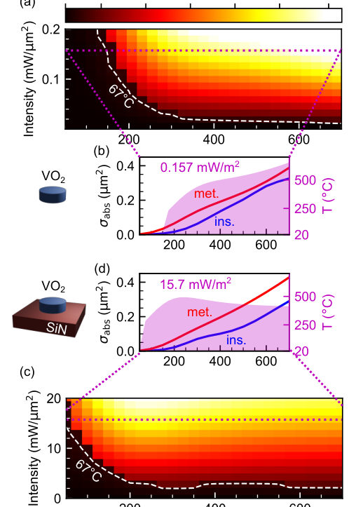
<figcaption class="paper-figure-caption"><b>Fig 4.</b> FIG. 4. Steady-state temperature of VO2 nanodiscs. (a) Calculated intensity dependence of the steady-state tempera- ture of the nanodiscs with different diameters D and fixed height 200 nm in air, calculated at excitation wavelength 1033 nm. (b) Calculated absorption cross-sections of the nan- odiscs from (a) for insulating and metallic phases of VO2 (in- creases with D) and the steady-state temperature (magenta) at Iinc (abrupt jump for nanodiscs larger than 150 nm when IMT-boosted heating occurs). (c) Same as (a) but the nan- odisc is on a SiN substrate. The intensities needed for the self-heating threshold are higher compared to those in (a). (d) Calculated absorption cross-sections of...</figcaption>
</figure>

**Summary.** This work develops an iterative multiphysics model to study thermal runaway in VO2 nanostructures undergoing a phase transition. By coupling electrodynamics and heat transfer, the authors predict that the runaway threshold is highly sensitive to external factors like ambient temperature and substrate properties. This provides crucial design principles for active photonic devices.

**Why it may be interesting.** The strong, non-linear, and temperature-dependent nature of the optical absorption coefficient ($\sigma_{	ext{abs}}(T)$) driving the thermal runaway mechanism shares conceptual links with non-equilibrium phase transitions studied in statistical mechanics.

Detailed structure

**Main problem.** The paper investigates optically induced thermal runaway in phase-change VO2 nanostructures, addressing the failure of existing models near sharp optical transitions.

**Main result.** Thermal runaway is predicted, showing that the ignition threshold depends on wavelength, ambient temperature, and substrate; preheating significantly lowers the required optical intensity.

**Method.** An iterative multiphysics framework is introduced, coupling full-wave electrodynamics with steady-state heat transfer calculations.

**Model / system.** The system involves VO2 nanostructures exhibiting an insulator-metal transition (IMT) and strong temperature-dependent optical properties. The model iteratively solves for the temperature change ($\Delta T$) by coupling absorbed power ($\dot{Q}$) to heat transfer.

**Key observables.** Thermal runaway behavior, required optical intensity for ignition (ITR), and steady-state temperature maps.

**Important parameters / regimes.** Illumination wavelength ($\lambda_{	ext{exc}}$), incident intensity ($I_{	ext{inc}}$), ambient temperature ($T_0$), and substrate thermal conductivity ($\kappa$).

**Assumptions / limitations.** The model requires iterative calculations because the change in temperature significantly alters the material's dielectric function, invalidating one-step approximations.

**Figures summary.** Figures show parametric maps of steady-state temperature dependence on wavelength and intensity, confirming step-like runaway signatures. Other figures compare heating on different substrates, highlighting the dominant role of substrate thermal conductivity.

**Paper structure.** The paper establishes the multiphysics framework, demonstrates the runaway effect in free-standing structures, and then systematically analyzes how the surrounding substrate (via $\kappa$ and $\epsilon$) modifies the thermal runaway threshold and steady-state temperature profiles.

Abstract

While thermal runaway occurs across diverse physical disciplines, its presence in subwavelength phase-change photonics remains unexplored because existing thermo-optical models break down near sharp optical transitions. Here, we introduce an iterative multiphysics framework coupling full-wave electrodynamics with heat transfer, and we discover optically induced thermal runaway in vanadium dioxide (VO2) nanostructures. The runaway switching threshold depends on the illumination wavelength, ambient temperature, and underlying substrate, with external thermal biasing significantly reducing the optical intensity required for runaway ignition. Our results push forward the modeling of sharp photothermal transitions and provide essential design principles for active metasurfaces, neuromorphic photonic devices, and nanoscale thermal management.

[↑ back to top](#top)

### [Scalable, Simple, and Versatile Encapsulation of 2D Materials and Devices](http://arxiv.org/abs/2608.27383v1)

**Authors:** Gabriel Natale, Uma Chirkova, Flávio Henriques Feres, Ran Jing, Michael Geiwitz, Wenyao Liu, Emma Low, Josh Leeman, Kyung-Mo Kim, Leslie M. Schoop, Mohamed Shehabeldin, Qiong Ma, Michael A. Susner, Pijush Bhattacharya, Genda Gu, Katherine Lee, James Hone, Mengkun Liu, Kenneth S. Burch  
**Type:** experiment · **Category:** other · **PDF:** <https://arxiv.org/pdf/2608.27383v1>  
**Analysis basis:** full PDF text, analyzed in chunks
**Topic relevance:** `analog quantum simulation` **1/5** · `quantum measurements` **1/5**

↔ Scroll figures horizontally

<figure class="paper-figure-card">
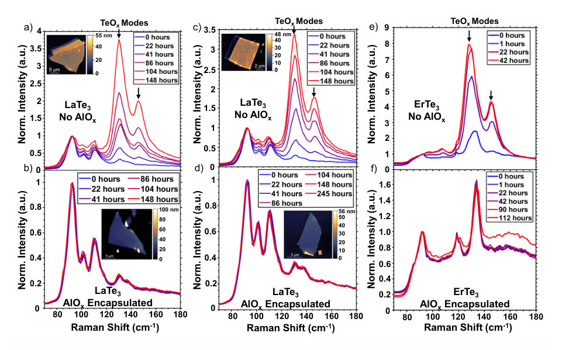
<figcaption class="paper-figure-caption"><b>Fig 1.</b> Figure 1: Evolution of thin (tflake &lt; 30 nm) LaTe3 and ErTe3 flakes with exposure to the ambient environment measured via Raman spectra normalized to the lowest energy, intrinsic phonon. The flakes without AlOx capping (a,c,e) reveal a rapid and continued enhancement of the TeOx peaks (black arrows), while the AlOx coated flakes (b,d,f) remain unchanged. Insets in a-d display the AFM topography of the flakes, revealing that encapsulated flakes remain uniform, whereas flakes without AlOx capping exhibit a rough surface and interlayer delamination.</figcaption>
</figure>
<figure class="paper-figure-card">
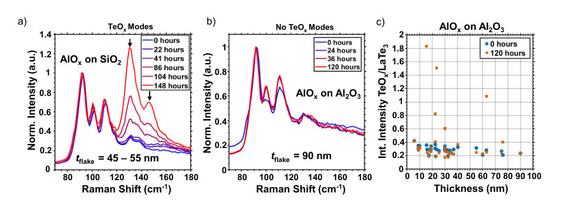
<figcaption class="paper-figure-caption"><b>Fig 2.</b> Figure 2: The impact of substrate choice on edge encapsulation quality is demonstrated by com- paring the evolution of LaTe3 Raman spectra normalized to the lowest energy phonon mode for flakes with tflake ≥45 nm on a) SiO2 and b) sapphire (Al2O3) substrates. c) Ratio of the integrated intensity of the TeOx-related mode (130 cm−1) to the lowest energy LaTe3 mode (92 cm−1) vs flake thickness for 37 measurement points across 26 unique flakes.</figcaption>
</figure>
<figure class="paper-figure-card">
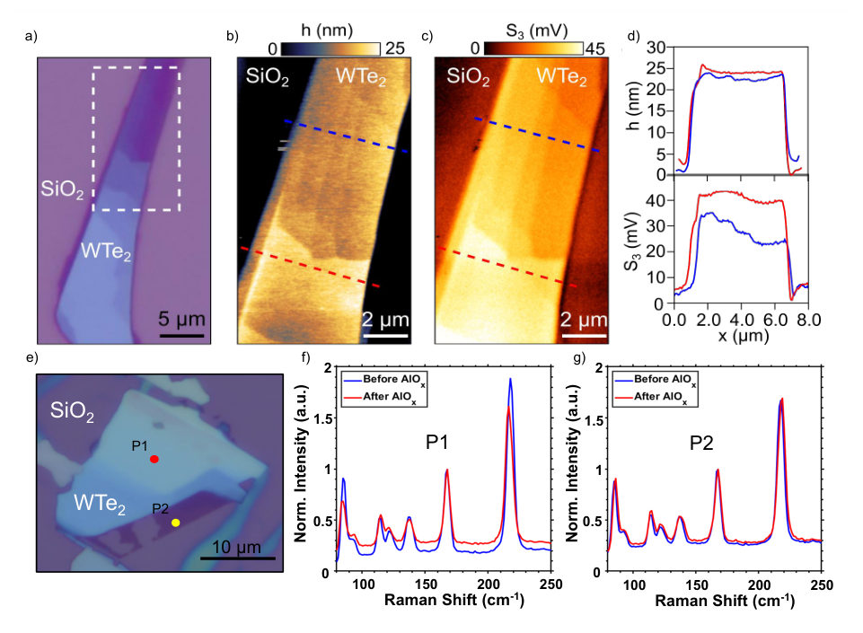
<figcaption class="paper-figure-caption"><b>Fig 3.</b> Figure 3: Protection and impact of AlOx deposition on WTe2. a) Optical microscopy image of the WTe2 flake on SiO2 substrate after AlOx deposition. b) AFM/topography image and c) 1550 cm−1 s-SNOM image performed in the white dashed highlighted area. The blue and red dashed lines indicate the spatial profiles displayed in d) AFM topography (top) and near-field optical image (bottom). e) Optical microscopy image of an exfoliated WTe2 flake on SiO2 substrate after AlOx deposition with point spectra locations marked in thick (P1) and thin (P2) regions. f) Thick and g) thin region WTe2 Raman spectra normalized to the peak located at 167 cm−1, plotted before (blue) and after (red) AlOx deposition.</figcaption>
</figure>
<figure class="paper-figure-card">
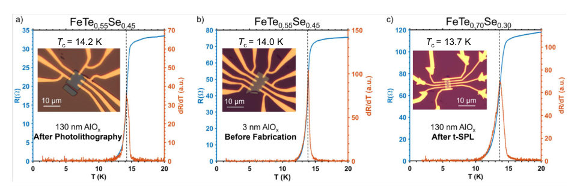
<figcaption class="paper-figure-caption"><b>Fig 4.</b> Figure 4: Resistance (blue) and dR/dT (red) vs temperature with device images shown in the inset for a) FeTe0.55Se0.45 fabricated using photolithography followed by encapsulation b) FeTe0.55Se0.45 fabricated directly through a 3 nm sacrificial AlOx layer without subsequent thick encapsulation and c) FeTe0.70Se0.30 fabricated using t-SPL followed by encapsulation. Dashed lines mark the peak position in dR/dT, and thus Tc.</figcaption>
</figure>

**Summary.** This work introduces e-beam evaporated aluminum oxide (AlOx) as a superior, scalable encapsulation method for highly air-sensitive 2D quantum materials. By demonstrating that AlOx preserves the electronic and optical properties of materials like WTe2 and superconducting FeTeSe, the authors resolve a major bottleneck in fabricating functional quantum devices.

**Why it may be interesting.** While primarily materials science, the ability to precisely control the environment and interface chemistry of quantum materials using a scalable deposition technique is crucial for realizing any quantum device, linking directly to open quantum system engineering.

Detailed structure

**Main problem.** Air-sensitive 2D materials are difficult to integrate into functional devices due to environmental degradation and complex fabrication requirements.

**Main result.** Electron-beam evaporated aluminum oxide (AlOx) serves as a scalable, simple encapsulation layer that preserves the intrinsic electronic and optical properties of various 2D materials, enabling straightforward device fabrication.

**Method.** The authors used e-beam evaporation to deposit AlOx over 2D materials and characterized the results using Raman spectroscopy, s-SNOM, and electrical transport measurements.

**Model / system.** The study focuses on several 2D materials, including rare-earth tritellurides (RTe3), semimetallic WTe2, and superconducting iron-based compounds (FeTe_xSe_{1-x}). These materials are tested both in their pristine state and after encapsulation.

**Key observables.** Oxidation peaks (TeOx) in Raman spectra, plasmonic response contrast via s-SNOM, superconducting critical temperature (Tc) from R vs T measurements, and preservation of intrinsic optical/electronic properties.

**Important parameters / regimes.** AlOx thickness (e.g., 3 nm, 130 nm), flake thickness, temperature range (low T for superconductivity), and substrate type (SiO2 vs. Al2O3).

**Assumptions / limitations.** The method overcomes the traditional trade-off between effective encapsulation and simple, scalable device fabrication procedures.

**Figures summary.** Figures show Raman spectra comparing encapsulated vs. uncapped flakes (demonstrating oxidation suppression), s-SNOM images showing preserved optical contrast through AlOx, and R vs T curves confirming superconductivity in encapsulated devices.

**Paper structure.** The paper systematically demonstrates the protective capability of AlOx using RTe3 (Raman analysis), then validates its compatibility with optical probing (s-SNOM on WTe2), and finally proves its utility in device fabrication by maintaining superconductivity in FeTeSe.

Abstract

Air-sensitive 2D materials present a fundamental challenge for device integration. Encapsulation is often required to preserve intrinsic properties, yet conventional protection strategies often fail for thicker layers and complicate fabrication. Here, we demonstrate that electron-beam (e-beam) evaporated aluminum oxide ($\mathrm{AlO}_x$) serves as both an effective encapsulation layer and a platform for direct device fabrication. Unlike transfer-based approaches, this scalable method is compatible with thicker flakes and full device or wafer coverage. It requires no stacking procedures and enables contacts without post-encapsulation etching. Using rare-earth tritellurides ($\mathrm{RTe}_3$, R = La, Er), semimetallic $\mathrm{WTe}_2$, and superconducting $\mathrm{FeTe}_x\mathrm{Se}_{1-x}$, we show that $\mathrm{AlO}_x$ suppresses oxidation and preserves intrinsic optical and electronic properties. We establish substrate-dependent optimization of encapsulation across a range of flake thicknesses, demonstrate that ultrathin $\mathrm{AlO}_x$ preserves $\mathrm{WTe}_2$'s plasmonic response and maintains superconducting performance in $\mathrm{FeTe}_x\mathrm{Se}_{1-x}$. Thus we overcome the longstanding tradeoff between encapsulation and straightforward device fabrication in fragile quantum materials.

[↑ back to top](#top)

### [Spin preservation in screw-symmetric molecules](http://arxiv.org/abs/2608.27002v1)

**Authors:** Jonas Bloch, Fedor Baranov, Maxim Breitkreiz  
**Type:** theory · **Category:** other · **PDF:** <https://arxiv.org/pdf/2608.27002v1>  
**Analysis basis:** full PDF text, analyzed in chunks
**Topic relevance:** `Keldysh / 2PI / non-Gaussian methods` **1/5** · `methods for driven-dissipative` **1/5**

↔ Scroll figures horizontally

<figure class="paper-figure-card">
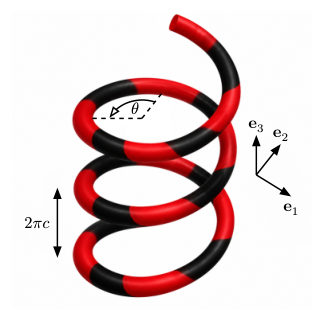
<figcaption class="paper-figure-caption"><b>Fig 1.</b> FIG. 1: Schematic illustration of a screw-symmetric he- lical object with screw angle θ = π/2, chirality χ = −1, and pitch 2πc, encoded in the periodic color texture al- ternating between black and red.</figcaption>
</figure>
<figure class="paper-figure-card">
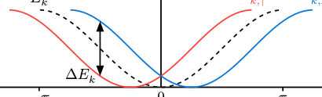
<figcaption class="paper-figure-caption"><b>Fig 2.</b> FIG. 2: Schematic illustration of the spin-dependent band shift by χθ arising from the screw geometry (here, χ = −1 and θ = π/2). A strong energy splitting, ∆Ek = Ek,↑−Ek,↓̸= 0 arises for most values of k. The only values of k with a weak splitting correspond to the intersection points of the curves for Ek,↑and Ek,↓.</figcaption>
</figure>
<figure class="paper-figure-card">
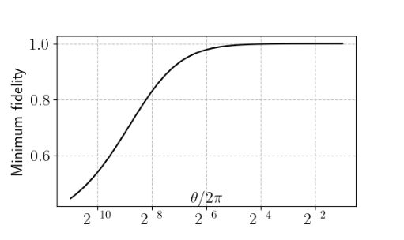
<figcaption class="paper-figure-caption"><b>Fig 3.</b> FIG. 3: Spin fidelity F computed at k = π/3 and initial spin ↑. One observes a loss in fidelity when θ = 2π/m de- creases, as the molecule approaches a continuum of ions. Here, t0 = 1 eV, λ = t0/100, ξ0 = −(1, 1, 1)T / √</figcaption>
</figure>
<figure class="paper-figure-card">
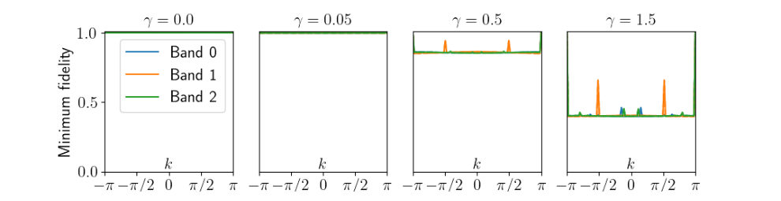
<figcaption class="paper-figure-caption"><b>Fig 4.</b> FIG. 4: Spin fidelity F computed against k with initial spin ↑for different values of γ, using F =</figcaption>
</figure>
<figure class="paper-figure-card">
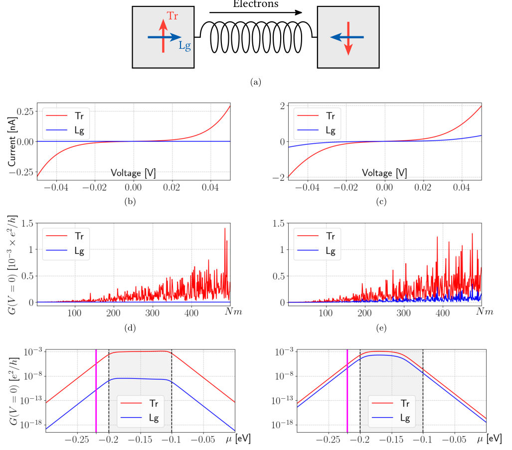
<figcaption class="paper-figure-caption"><b>Fig 5.</b> FIG. 5: Spin-valve transport simulations for a long molecule with screw symmetry (left) and weakly broken screw symmetry (right). (a) Sketch of an AP spin-valve setup. (b,c), (d,e), and (f,g) Current as a function of bias voltage, zero-bias conductance as a function of molecule length, and chemical potential, respectively, for a screw-symmetric molecule, γ = 0 (left) and weakly broken screw symmetry, γ = 0.25 (right). In (b), the Lg current does not exceed 10−4 nA. In (f) and (g), the vertical axis is in logscale, the highlighted area indicates the conducting regime (where bands of the molecule and that of the leads overlap), and the solid purple vertical line indicates the chemical...</figcaption>
</figure>

**Summary.** This theoretical study demonstrates that molecules possessing discrete screw symmetry can dramatically enhance spin preservation during electron transport. This effect, which surpasses predictions based solely on spin-orbit coupling, is quantified by calculating spin fidelity and predicted to manifest as a strong, measurable magnetoresistance in a spin-valve device.

**Why it may be interesting.** This work directly addresses spin-dependent transport in molecular systems, linking topological/geometric symmetries (screw symmetry) to robust quantum phenomena (spin preservation), which is highly relevant to molecular electronics and quantum spintronics.

Detailed structure

**Main problem.** The paper investigates how spin polarization is preserved during electronic transport through long molecular structures, particularly focusing on the role of discrete screw symmetry.

**Main result.** Screw symmetry significantly enhances spin preservation far beyond the timescale predicted by spin-orbit coupling, leading to a measurable, symmetry-protected magnetoresistance signature in a spin-valve setup.

**Method.** The analysis employs the Bloch Hamiltonian formalism, analyzing spin-flip probabilities via perturbation theory and calculating spin fidelity over time.

**Model / system.** The system is modeled using tight-binding Hamiltonians for molecules exhibiting discrete screw symmetry. The analysis is extended to a spin-valve setup connecting the molecule to two magnetic leads.

**Key observables.** Spin fidelity (F), zero-bias conductance (G(V=0)), and the ratio of currents in different magnetic alignments (e.g., $	ext{Tr}/	ext{Lg}$).

**Important parameters / regimes.** Chirality ($\chi$), pitch ($c$), screw angle ($	heta$), and the degree of symmetry breaking ($\gamma$).

**Assumptions / limitations.** The analysis assumes the spin-splitting energy remains small compared to other energy scales, and that phonon scattering is negligible compared to hopping amplitudes.

**Figures summary.** Figures illustrate the spin-dependent band shift ($\Delta E_k$) due to screw geometry, the decay of spin fidelity as symmetry is broken, and the resulting spin-valve current-voltage characteristics.

**Paper structure.** The paper progresses from establishing the theoretical framework using the screw symmetry operator and Bloch Hamiltonian, to testing the effect using tight-binding models, and finally demonstrating the physical consequence via transport simulations in a spin-valve setup.

Abstract

In electronic transport through long molecules, spin is expected to be preserved only when the dwell time is much shorter than the characteristic spin-mixing timescale $\hbar/Δ$, where $Δ$ is the magnitude of a spin-dependent potential, such as spin-orbit coupling. We show that, in molecules featuring discrete screw symmetry, spin preservation can be enhanced far beyond this timescale owing to strong spin separation in quasi-momentum. This spin fidelity in long molecules is consistent with chirality-induced spin selectivity (CISS), suggesting spin-dependent transport in long, chiral molecules with amplified spin-splitting mechanisms. We provide analytical derivation of the enhanced spin preservation and test it on tight-binding models, which confirm that the effect gradually weakens when the screw symmetry is broken or changes from discrete to continuous. Furthermore, we perform transport simulations to show that a strong magnetoresistance trace of symmetry-protected spin fidelity emerges in a spin-valve setup with two magnetic leads, which we propose as an experimentally accessible signature.

[↑ back to top](#top)

### [Atomic-scale composition of the ternary III-V semiconductor (Al,Ga)Sb visualized by cross-sectional scanning tunneling microscopy](http://arxiv.org/abs/2608.27013v1)

**Authors:** Hitesh Kumar, Vladimir Kaganer, Zijin Lei, Rüdiger Schott, Werner Wegscheider, Stefan Fölsch  
**Type:** experiment · **Category:** other · **PDF:** <https://arxiv.org/pdf/2608.27013v1>  
**Analysis basis:** full PDF text, analyzed in chunks
**Topic relevance:** `analog quantum simulation` **1/5**

↔ Scroll figures horizontally

<figure class="paper-figure-card">
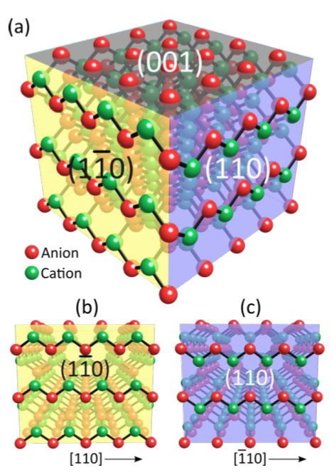
<figcaption class="paper-figure-caption"><b>Fig 1.</b> Figure 1(a) illustrates the relative orientations between the (001) growth plane and the (11̅0) and</figcaption>
</figure>
<figure class="paper-figure-card">
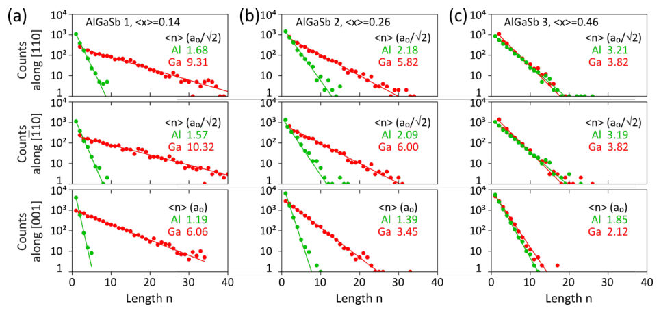
<figcaption class="paper-figure-caption"><b>Fig 2.</b> Fig. 5. (a) Total counts plotted on logarithmic scale versus aggregate length n along [110] (upper plot), [1̅10] (center), and [001] (bottom) obtained for the first (Al,Ga)Sb layer; no Ga monomers are observed along the 110 in-plane directions (upper and center plot). Lines in each plot represent geometric distributions with the decay determined by the observed mean length values n; the same information for the second layer is shown in (b) and for the third layer in (c). The count statistics in panels (a) to (c) was extracted from a total of forty-two individual images each including 95 × 34 cation sublattice sites (along [110]/[1̅10] and [001]).</figcaption>
</figure>

**Summary.** This work uses cross-sectional STM to examine the atomic arrangement in (Al,Ga)Sb semiconductors. By directly counting atoms and analyzing electronic contrast, the researchers determined that the cation mixing is statistically random. This finding suggests the material possesses remarkable atomic-level homogeneity, consistent with either ideal mixing or weak, non-anisotropic interactions.

**Why it may be interesting.** While primarily materials science, the analysis of local atomic order and the comparison to theoretical models (random vs. correlated) touches upon concepts of quenched disorder and local energy minimization, which are relevant to understanding complex many-body systems.

Detailed structure

**Main problem.** The study investigates the atomic-scale composition and cation mixing behavior within the ternary III-V semiconductor (Al,Ga)Sb.

**Main result.** The cation distribution was found to be statistically random both along the growth direction and within the growth plane, indicating an exceptionally high degree of atomic-level homogeneity.

**Method.** Cross-sectional Scanning Tunneling Microscopy (XSTM) was employed at 5 K, utilizing electronic contrast to perform direct atom counting on cleaved surfaces.

**Model / system.** The physical system is the (Al,Ga)Sb alloy grown by Molecular Beam Epitaxy (MBE). Analysis involves comparing experimental cation statistics against theoretical models, such as random occupancy or Markov-chain models accounting for strain-mediated interactions.

**Key observables.** Cation distribution statistics (randomness vs. correlation), mean number of consecutive cations of the same type ($\langle n 
angle$), and electronic contrast between Al and Ga surface cations.

**Important parameters / regimes.** Temperature (5 K), semiconductor composition (Al/Ga ratio), and crystallographic directions ($\langle 110 
angle$, $[001]$).

**Assumptions / limitations.** The observed contrast is attributed to electronic differences (dangling-bond states) between Al and Ga atoms, and that statistical averaging over subsurface cations restores isotropy.

**Figures summary.** Figures illustrate the relative orientations of cleavage planes, show cross-sections revealing chemical contrast between Al and Ga, and compare measured mean cation lengths ($\langle n 
angle$) against theoretical predictions from random and correlated models.

**Paper structure.** The paper progresses by detailing the experimental setup (XSTM on specific planes), presenting the direct atom counting results, developing theoretical models (random vs. correlated mixing), and concluding by comparing the measured statistics against these models to establish the degree of homogeneity.

Abstract

Cross-sectional scanning tunneling microscopy at 5 K is used to investigate cation mixing in (Al,Ga)Sb layers grown by molecular beam epitaxy, via direct atom counting at the (1-10) and (110) cleavage planes. Electronic contrast between Al and Ga surface cations enables statistical analysis of the metal sublattice along the non-equivalent <110> directions within the zincblende (001) surface and along the [001] growth direction. The cation distribution is found to be random both along the growth direction and within the growth plane, with no evidence of long-range order or anisotropic growth kinetics; notably, the mean numbers of consecutive cations of the same type along the two in-plane directions are equal, possibly due to statistical averaging over randomly distributed subsurface cations. The results are compatible with either strain-mediated interactions during cation incorporation at the growth front or ideal, uncorrelated cation mixing. Overall, the examined (Al,Ga)Sb alloy shows an exceptionally high degree of atomic-level homogeneity.

[↑ back to top](#top)

### [High-Temperature Superconductivity of the Fe-Se-H compound](http://arxiv.org/abs/2608.27349v1)

**Authors:** S. I. Bondarenko, A. A. Prokhorov, N. N. Galtsov, V. P. Timofeev, V. P. Koverya, I. S. Bondarenko, A. V. Krevsun  
**Type:** experiment · **Category:** strongly correlated electrons · **PDF:** <https://arxiv.org/pdf/2608.27349v1>  
**Analysis basis:** full PDF text, analyzed in chunks
**Topic relevance:** `quantum measurements` **1/5**

↔ Scroll figures horizontally

<figure class="paper-figure-card">
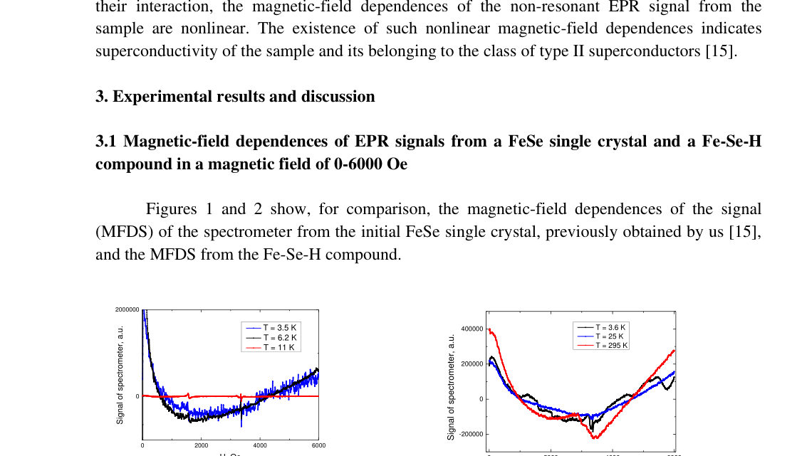
<figcaption class="paper-figure-caption"><b>Fig 1.</b> Fig. 1. MFDS from a single crystal FeSe at temperatures 3.5 K, 6.2 K, 11 K.</figcaption>
</figure>
<figure class="paper-figure-card">
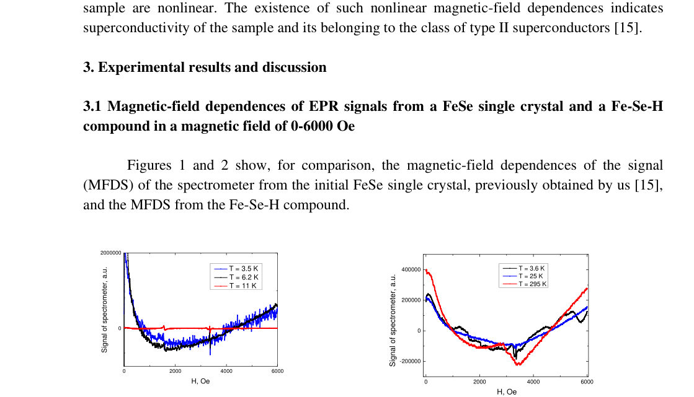
<figcaption class="paper-figure-caption"><b>Fig 2.</b> Fig. 2. МFDS from the compound Fe-Se-Н at temperatures 3.6 K, 25 K, 295 K. The original FeSe single crystal is a type-II superconductor. The typical shape of its U- shaped MFDS (Fig. 1) corresponds to its mixed superconducting state [15]. These dependences</figcaption>
</figure>
<figure class="paper-figure-card">
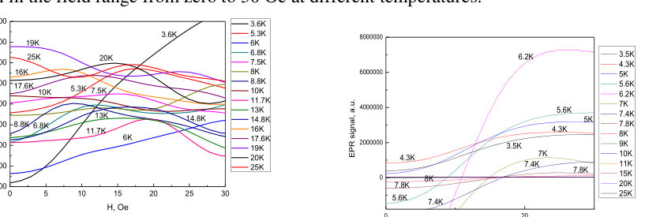
<figcaption class="paper-figure-caption"><b>Fig 3.</b> Fig. 3. MFDS of the Fe-Se-H compound at zero and weak magnetic field up to 30 Oe at T=3.6-25 K.</figcaption>
</figure>
<figure class="paper-figure-card">
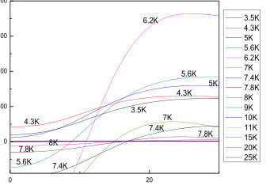
<figcaption class="paper-figure-caption"><b>Fig 4.</b> Fig. 4. MFDS of a FeSe single crystal at T = 3.5-7.8 K [15].</figcaption>
</figure>
<figure class="paper-figure-card">
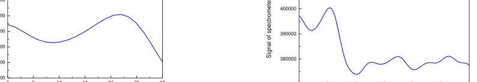
<figcaption class="paper-figure-caption"><b>Fig 5.</b> Fig. 5. MFDS powder in a field of 0-30 Oe. Fig. 6. MFDS powder in a field of 0-120 Oe.</figcaption>
</figure>

**Summary.** This experimental study investigates the superconducting properties of the $	ext{Fe-Se-H}$ compound using EPR spectroscopy. By measuring magnetic field dependence at room temperature (295 K), the authors provide evidence for superconductivity and extrapolate the critical temperature to significantly higher values. The findings are significant for materials science due to the potential for room-temperature superconductivity.

**Why it may be interesting.** The work directly addresses high-$T_c$ superconductivity, a major topic in condensed matter physics, using advanced spectroscopic techniques to probe superconducting vortex dynamics.

Detailed structure

**Main problem.** The primary goal is to establish evidence for high-temperature superconductivity in the Fe-Se-H compound, aiming to increase the critical temperature ($T_c$) towards room temperature at normal pressure.

**Main result.** The $	ext{Fe-Se-H}$ compound exhibits superconductivity at normal pressure, confirmed by characteristic U-shaped magnetic-field dependences and quasi-periodic EPR signals observed up to 295 K.

**Method.** The study utilizes Electron Paramagnetic Resonance (EPR) spectroscopy to measure the dependence of microwave power absorption on magnetic field and temperature.

**Model / system.** The physical system is the $	ext{Fe-Se-H}$ compound, formed by hydrogen diffusion into an $	ext{FeSe}$ single crystal. Measurements are performed on both powdered and single-crystal samples.

**Key observables.** The derivative of microwave power absorption ($	ext{dP/dH}$), U-shaped magnetic-field dependences (MFDS), and quasi-periodic oscillations in the EPR signal.

**Important parameters / regimes.** Temperatures ranging from 3.6 K to 295 K; magnetic fields up to 6000 Oe; the calculated critical temperature extrapolation suggests $T_c \approx 340 	ext{ K}$.

**Assumptions / limitations.** The quasi-periodic variations in the EPR signal are attributed to the presence of Abrikosov vortices, and the vortex area is approximated by $S_0 \approx \pi [\lambda(T)]^2/4$.

**Figures summary.** Figures show the U-shaped MFDS for both the single crystal $	ext{FeSe}$ and the $	ext{Fe-Se-H}$ powder at various temperatures, and high-resolution EPR signals demonstrating quasi-periodicity.

**Paper structure.** The paper presents measurements of microwave power absorption using EPR spectroscopy on $	ext{Fe-Se-H}$ across a wide temperature range. Evidence for superconductivity is drawn from the U-shaped MFDS and the analysis of quasi-periodic signals, leading to an extrapolation of the critical temperature.

Abstract

Using an EPR spectrometer, the dependences of microwave power absorption on magnetic field up to 6000 Oe were measured at temperatures of 3.6-25 K and 295 K in a powdered compound Fe-Se-H, obtained by thermal diffusion of hydrogen into a FeSe single crystal with a critical temperature of 8 K. The shape of the dependences and the analysis of the measurement results confirm the superconductivity of the Fe-Se-H compound at normal pressure, both at temperatures of 3.6-25 K and at 295 K, i.e., at room temperature.

[↑ back to top](#top)

### [Self-selective growth of GaAs1-xBix on GaAs zinc blende/wurtzite nanowire heterostructures](http://arxiv.org/abs/2608.26855v1)

**Authors:** Rohit Yadav, Sebastian Lehmann, Vidar Flodgren, Evangelos Golias, Alexei Zakharov, Kimberly A. Dick, Anders Mikkelsen, Rainer Timm  
**Type:** experiment · **Category:** other · **PDF:** <https://arxiv.org/pdf/2608.26855v1>  
**Analysis basis:** full PDF text, analyzed in chunks
**Topic relevance:** `quantum measurements` **1/5**

↔ Scroll figures horizontally

<figure class="paper-figure-card">
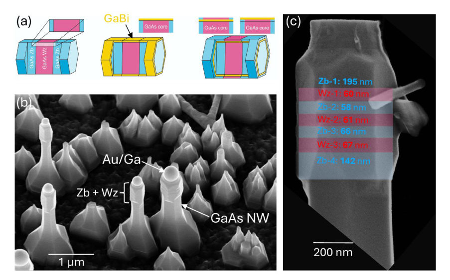
<figcaption class="paper-figure-caption"><b>Fig 1.</b> Figure 1 (a) Schematic representation of the GaBi/GaAs NW growth with Zb and Wz heterostructure; SEM image of (b) grown NWs on the growth substrate; (c) a transferred NW on the patterned Si substrate for XPEEM measurement, color coded for identifying heterostructures, red for Wz and blue for Zb.</figcaption>
</figure>
<figure class="paper-figure-card">
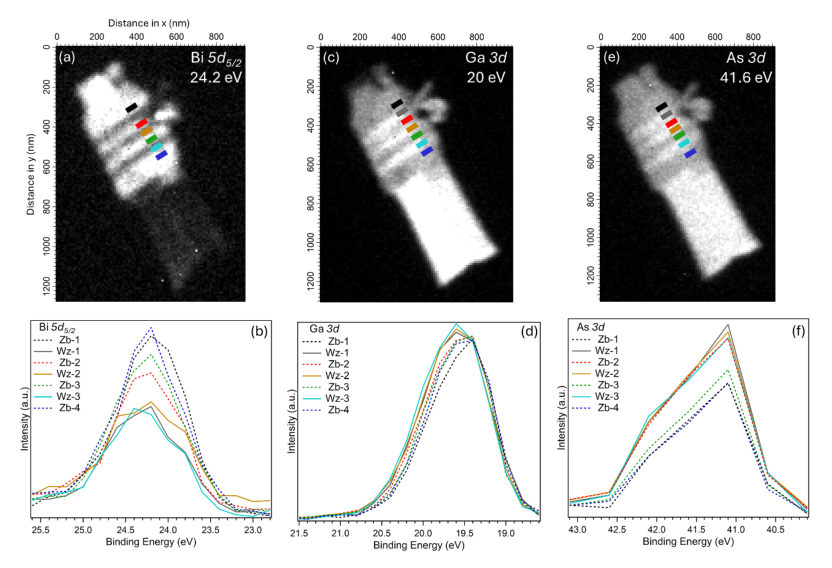
<figcaption class="paper-figure-caption"><b>Fig 2.</b> Figure 2 XPEEM (a) Bi 5d, (c) Ga 3d, and (e) As 3d core-level maps of the same NW, and corresponding (b) Bi 5d5/2, (d) Ga 3d, and (f) As 3d core-level spectra, extracted from series of XPEEM maps with slightly varying BE, for different color coded regions in (a,c,e) corresponding to the Wz and Zb segments of the NW. The photon energy used for XPEEM mapping is 80 eV. The NW growth structure is illustrated in Fig. 1.</figcaption>
</figure>
<figure class="paper-figure-card">
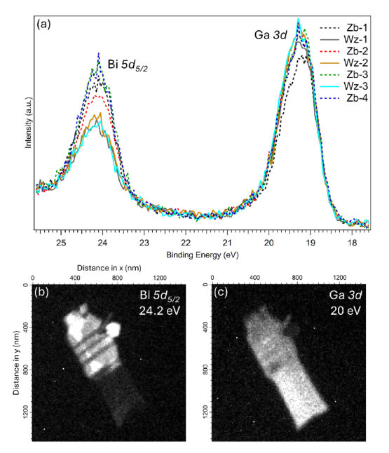
<figcaption class="paper-figure-caption"><b>Fig 3.</b> Figure 3 (a) Combined Ga 3d and Bi 5d core-level spectra obtained at the same positions as those shown in Fig. 2(a,c), extracted from a series of XPEEM maps, including those shown in (b,c), covering a larger energy range. (b) Bi 5d and (c) Ga 3d XPEEM maps. XPEEM data were obtained after annealing at a higher temperature (300 °C), at 80 eV photon energy.</figcaption>
</figure>
<figure class="paper-figure-card">
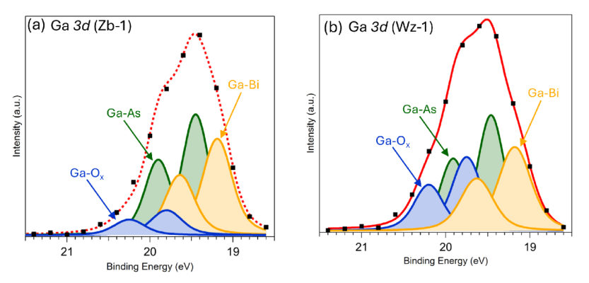
<figcaption class="paper-figure-caption"><b>Fig 4.</b> Figure 4 Fitted Ga 3d core-level spectra corresponding to (a) the Zb-1 segment and (b) the Wz-1 segment shown in Fig. 2d, the intensity of the Ga-oxide component (blue peak) is smaller at the Zb and larger at the Wz segment.</figcaption>
</figure>

**Summary.** This work demonstrates the controlled, site-selective growth of $	ext{GaAs}_{1-x}	ext{Bi}_x$ shells on $	ext{GaAs}$ nanowire heterostructures containing alternating zinc blende and wurtzite phases. Using advanced electron microscopy, the researchers found that bismuth incorporation strongly depends on the crystal phase, favoring the Zb segments through an anion-exchange mechanism. This provides a pathway for engineering quantum materials with tailored functionalities.

**Why it may be interesting.** While the focus is on solid-state materials science, the precise control over crystal phase and atomic-scale material deposition is crucial for realizing novel quantum devices, linking to concepts of engineered quantum interfaces.

Detailed structure

**Main problem.** The study aims to engineer quantum materials by achieving site-selective nanostructure growth and material incorporation at the atomic scale.

**Main result.** Bi incorporation into GaAs nanowires is found to be crystal-phase-dependent, favoring the zinc blende (Zb) segments via an anion-exchange process, while the wurtzite (Wz) segments show higher susceptibility to oxidation.

**Method.** The research utilizes X-ray photoemission electron microscopy (XPEEM) and X-ray Photoelectron Spectroscopy (XPS) to map elemental distribution and local chemical bonding across the heterostructure.

**Model / system.** The physical system consists of GaAs nanowires (NWs) with an axial heterostructure alternating between zinc blende (Zb) and wurtzite (Wz) crystal phases, which are used as templates for overgrowth.

**Key observables.** Elemental distribution ($	ext{Bi } 5d$, $	ext{Ga } 3d$, $	ext{As } 3d$), local chemical bonding, and crystal-phase-dependent Bi incorporation ratios.

**Important parameters / regimes.** The study highlights the difference in incorporation behavior between the Zb and Wz facets, and the resulting difference in oxidation susceptibility.

**Assumptions / limitations.** The analysis relies on the assumption that the observed differences in elemental signals reflect distinct chemical incorporation mechanisms (anion exchange vs. direct growth).

**Figures summary.** Figures show schematic representations of the NW growth, SEM images of the grown structures, and PEEM maps illustrating the spatial distribution of Bi and Ga signals across the Zb/Wz segments.

**Paper structure.** The paper follows a structure of establishing the need for site-selective growth, detailing the experimental setup using NW templates, presenting XPEEM/XPS data comparing Zb and Wz segments, and concluding with the mechanism of Bi incorporation.

Abstract

Site-selective nanostructure growth and material incorporation at the atomic scale offer a promising pathway for engineering quantum materials and nanodevices. Here, GaAs nanowires (NWs) with an axial heterostructure of alternating zinc blende (Zb) and wurtzite (Wz) crystal phases are employed as templates for site-selective Ga and Bi overgrowth. Using X-ray photoemission electron microscopy (XPEEM) with nanoscale spatial resolution, we map elemental distribution and local chemical bonding to reveal the incorporation behavior of Bi atoms in {110} Zb and {11-20} Wz facets. Bi incorporation proceeds through an anion-exchange process, where Bi atoms replace As, forming local Ga-Bi bonds and producing a thin GaAs1-xBix shell. We observe crystal-phase-dependent Bi incorporation, with higher Bi concentration in the Zb segments than in the neighboring Wz segments within the same NW. Furthermore, the Zb segment with higher Bi content exhibits reduced susceptibility to oxidation compared with the Wz segment, resulting in increased Ga-oxide in the Wz surfaces. This study highlights GaAs NW Zb/Wz heterostructures as a template for controlled growth of GaBi and GaAs1-xBix nanostructures with tailored functionalities for quantum applications

[↑ back to top](#top)

### Other secondary papers (5)

Show other secondary papers

### [Beyond geometric symmetry: Broadband linear relations in wave scattering](http://arxiv.org/abs/2608.26562v1)

**Authors:** Malte Röntgen, Sucui Luo, Xuelong Chen, Chenyu Zhang, Ruotao Ye, Tianshu Jiang, Wenlong Gao  
**Type:** both · **Category:** other · **PDF:** <https://arxiv.org/pdf/2608.26562v1>  
**Analysis basis:** full PDF text, analyzed in chunks

↔ Scroll figures horizontally

<figure class="paper-figure-card">
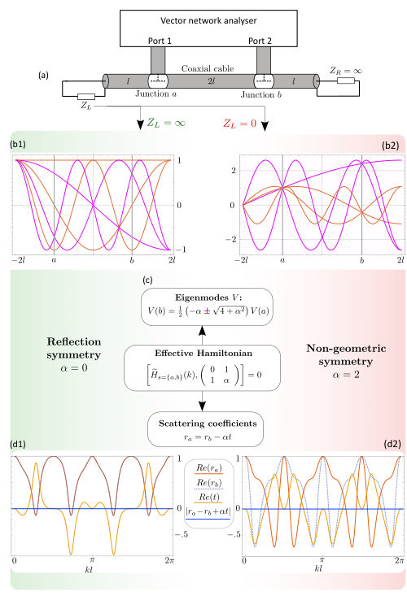
<figcaption class="paper-figure-caption"><b>Fig 1.</b> FIG. 1. (a) Simple resonator, formed by three coaxial cables. Left panel: Reflection symmetric choice of ZL = ZR, right panel: Choosing ZL = 0 breaks geometric symmetry, but in- duces a non-geometric symmetry (see text for details). The (non-)geometric symmetry induces relations on both eigen- modes and scattering parameters (c), depicted graphically in (b1), (b2), and (d1), (d2), respectively. In (b1), (b2), lines colours red and purple are used to mark modes with positive and negative (point-wise scaled) parity, respectively.</figcaption>
</figure>
<figure class="paper-figure-card">
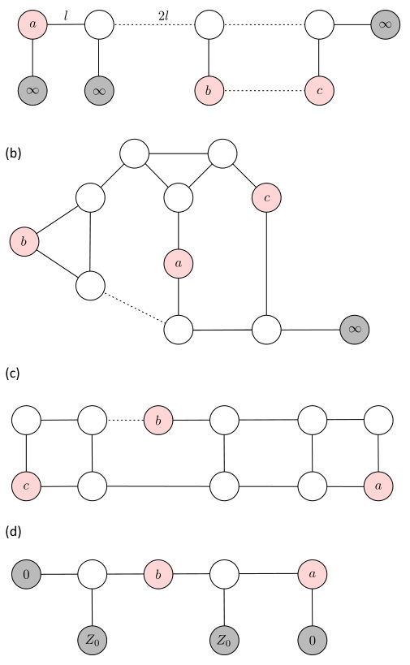
<figcaption class="paper-figure-caption"><b>Fig 2.</b> FIG. 2. Graph representation of different transmission line networks with non-geometric symmetries and thus non-trivial relations between scattering parameters when probing the network via the red-marked junctions a, b, c. Lines represent coaxial cables of length l or 2l. Grey circles denote stubs, with termination resistance indicated (0 for short-circuit, ∞ for open-circuit, Z0 for matched termination). White and red circles denote junctions, with the important junctions a, b, c marked in red.</figcaption>
</figure>
<figure class="paper-figure-card">
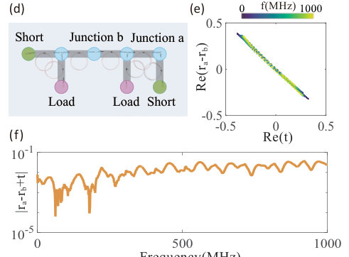
<figcaption class="paper-figure-caption"><b>Fig 3.</b> FIG. 3. Experimental verification of the broadband linear scattering relation. (a) A photo of the experimental transmis- sion line network for the model in Fig. 1(a). (b) Experimen- tally measured relationship between Re(ra−rb) and Re(t). (c) Frequency dependence of the residual |ra −rb + 2t|. (d)–(f) The same plots as in (a)–(c), but for the model in Fig. 2(d).</figcaption>
</figure>

**Summary.** This work introduces a method to find novel, broadband linear relations in wave scattering parameters that go beyond standard symmetries like reciprocity. By analyzing the effective Hamiltonian of waveguide networks, the authors show that the existence of a non-geometric symmetry guarantees such a linear relationship. This principle is demonstrated both theoretically and experimentally using coaxial cables.

**Why it may be interesting.** The methodology of finding hidden, broadband symmetries in the effective Hamiltonian to predict linear relations in the scattering matrix is a powerful tool for designing novel wave devices, bridging concepts from symmetry theory to applied electromagnetics and photonics.

Detailed structure

**Main problem.** To identify and utilize novel, broadband, linear relations between wave scattering parameters that cannot be derived from conventional physical symmetries like reciprocity or geometric symmetry.

**Main result.** The existence of a non-geometric symmetry, characterized by a commuting operator Q, guarantees the existence of a broadband linear relation between scattering parameters, which was experimentally verified.

**Method.** The analysis involves deriving an effective Hamiltonian for wave scattering in waveguide networks and imposing the condition that this Hamiltonian commutes with a symmetry operator Q across a broad frequency range.

**Model / system.** The primary model is wave scattering in waveguide networks, implemented using coaxial cables, which are mathematically analogous to quantum graphs or RLC circuits. The dynamics are governed by an effective Hamiltonian H_s(k) derived via techniques like the Schur complement.

**Key observables.** Scattering parameters (reflection $r_i$ and transmission $t_{ij}$), which are measured over a broad frequency range (0 to 1 GHz).

**Important parameters / regimes.** Frequency (k), impedance mismatch ($\Gamma_L$), and the symmetry operator Q.

**Assumptions / limitations.** The analysis assumes the existence of a broadband symmetry Q that commutes with the effective Hamiltonian H_s(k) for all relevant frequencies k.

**Figures summary.** Figures illustrate physical setups (coaxial cables, 3-port networks) and show the resulting scattering matrix relations for both symmetric and novel non-geometric cases.

**Paper structure.** The paper systematically develops the theoretical framework by deriving the governing equations for wave propagation in complex networks, deriving the effective Hamiltonian H_s, establishing the link between symmetry in H_s and symmetry in the scattering matrix S_s, and finally presenting both theoretical derivations and experimental verification.

Abstract

The design and control of wave scattering, that is, of the reflection and transmission parameters of a device, is of ubiquitous importance. These parameters generally change with varying frequency, though certain \emph{frequency-independent} linear relations may exist between them. Reciprocity and geometric symmetry (reflections, rotations, etc.) are classic and well-known examples that are present in many devices and significantly ease their design. In this work, we go beyond these and introduce a new class of relations that cannot be induced by reciprocity or geometric symmetry. Choosing networks of waveguides as our workhorse, we discuss the conditions and consequences of such novel behaviour and showcase suitable example setups. We further experimentally test our predictions using coaxial cables and find excellent agreement in the broad frequency range between 0 and 1 GHz. Our work not only deepens the theoretical understanding of waveguide network dynamics, but also opens new avenues for applications in broadband signal processing, quantum information, and integrated photonics.

[↑ back to top](#top)

### [Magnetic permeability and zone-folded phonons in layered NiPS$_3$](http://arxiv.org/abs/2608.26405v1)

**Authors:** André A. A. Silva, Eduardo D. Stefanato, Nicolas M. Kawahala, Flávio H. Feres, João Vítor T. P. Vital, Bernardo R. A. Neves, Jan Plutnar, Zdenek Sofer, Ana C. F. Brito, Felix G. G. Hernandez, Raul O. Freitas  
**Type:** experiment · **Category:** other · **PDF:** <https://arxiv.org/pdf/2608.26405v1>  
**Analysis basis:** full PDF text, analyzed in chunks

↔ Scroll figures horizontally

<figure class="paper-figure-card">
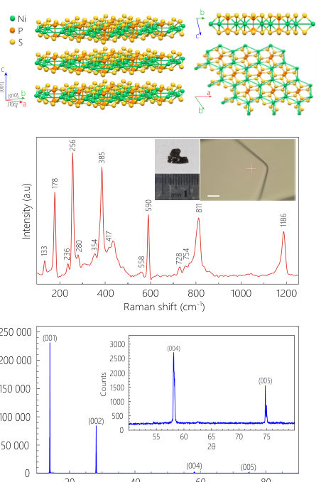
<figcaption class="paper-figure-caption"><b>Fig 1.</b> Figure 1: Structural characterization of the NiPS3 crystal. (a) Schematic represen- tation of the NiPS3 crystal structure, belonging to the monoclinic system with space group C2/m. The illustration displays projections along the crystallographic planes formed by the b-c axes (highlighting the van der Waals layer stacking along the c-axis) and the a-b axes (highlighting the distorted hexagonal arrangement of metal ions in the basal plane). Spheres represent Ni (green), P (orange), and S (yellow) atoms. (b) Raman spectrum of the NiPS3 bulk sample at room temperature. The observed vibrational modes confirm the structural integrity of the material. The inset shows an optical microscopy image of...</figcaption>
</figure>
<figure class="paper-figure-card">
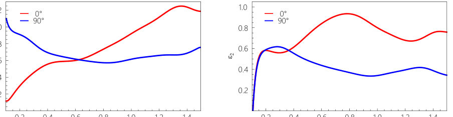
<figcaption class="paper-figure-caption"><b>Fig 2.</b> Figure 2: Experimental setup and anisotropic dielectric characterization of NiPS3 at room temperature. (a) Schematic illustration of Terahertz Time-Domain Spectroscopy (THz-TDS) in transmission geometry. The system is driven by a femtosecond laser and em- ploys photoconductive antennas (PCAs) for the emission and coherent detection of radiation. The THz beam passes through the sample positioned inside a cryostat (for thermal control) or a standard sample holder, with the entire optical path enclosed in a purge box to eliminate water vapor absorption. (b) Time-domain waveforms of the THz pulse transmitted through the NiPS3 crystal at room temperature (T = 300 K), measured for two orthogonal...</figcaption>
</figure>
<figure class="paper-figure-card">
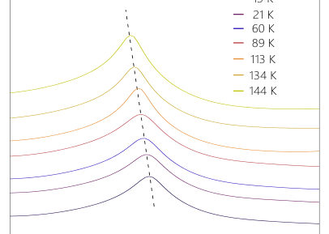
<figcaption class="paper-figure-caption"><b>Fig 3.</b> Figure 3: Thermal evolution of the Terahertz response and mode dispersion in NiPS3 for different orientations. (a) Time-domain profiles of THz pulses transmitted through the sample across the temperature range from 144 K to 13 K for the 0◦and 90◦</figcaption>
</figure>
<figure class="paper-figure-card">
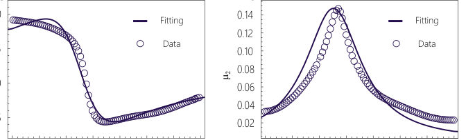
<figcaption class="paper-figure-caption"><b>Fig 4.</b> Figure 4: Extraction of the complex magnetic permeability of the magnon mode at 13 K (0° orientation). (a, b) Components of the measured complex refractive index: (a) Real and (b) Imaginary part. These spectra represent the total optical response, containing mixed contributions from electric permittivity and magnetic permeability. The solid line represent the experimental data. (c, d) Isolated complex magnetic permeability obtained via the extraction methodology established in this work: (c) Real part and (d) Imaginary part. The data (dots) were calculated by removing the background dielectric contribution obtained in the paramagnetic phase at 300 K. The solid line represents the...</figcaption>
</figure>

**Summary.** This paper uses Terahertz Time-Domain Spectroscopy on $	ext{NiPS}_3$ to overcome limitations in separating magnetic and dielectric responses. By assuming the dielectric constant is stable upon cooling, the authors successfully isolate the magnetic permeability. This allowed them to distinguish between a temperature-dependent magnon mode and a symmetry-breaking zone-folded phonon, providing fundamental spin dynamics parameters.

**Why it may be interesting.** This work provides a sophisticated experimental technique to probe coupled magnetic and lattice excitations in quantum materials, which is highly relevant for understanding emergent quantum phenomena in condensed matter systems.

Detailed structure

**Main problem.** The study aims to investigate the electrodynamic response of $	ext{NiPS}_3$ to decouple the magnetic permeability ($\mu$) from the electric permittivity ($\epsilon$) in the Terahertz (THz) range.

**Main result.** The research successfully identified a magnon mode near $1 	ext{ THz}$ (temperature-dependent) and a distinct zone-folded phonon activated by symmetry breaking (temperature-independent) using THz-TDS.

**Method.** The authors developed an extraction methodology using THz-TDS data, assuming the dielectric contribution ($\epsilon$) is invariant below the Néel temperature ($T_N$), allowing $\mu(\omega)$ to be isolated.

**Model / system.** The physical system is single-crystalline $	ext{NiPS}_3$, a layered Mott insulator exhibiting XY-type antiferromagnetic order. Measurements are performed using THz-TDS across different crystal orientations ($0^\circ$ and $90^\circ$) and temperatures.

**Key observables.** Complex permittivity ($\epsilon(\omega)$), complex permeability ($\mu(\omega)$), magnon mode resonance, and zone-folded phonon resonance.

**Important parameters / regimes.** Temperature ($13 	ext{ K}$ to $300 	ext{ K}$), THz frequency ($\sim 1 	ext{ THz}$), and crystallographic orientation ($0^\circ$ vs $90^\circ$).

**Assumptions / limitations.** The dielectric contribution ($\epsilon$) is assumed to remain invariant when cooling below the Néel temperature ($T_N$), and the magnetic permeability can be modeled using Drude-Lorentz oscillators.

**Figures summary.** Figures illustrate structural characterization, anisotropic dielectric measurements, and dispersion plots showing temperature-dependent magnon shifts ($0^\circ$) versus constant phonon frequencies ($90^\circ$).

**Paper structure.** The paper establishes the limitation of conventional THz analysis, introduces the decoupling methodology, presents THz-TDS measurements at varying temperatures and orientations, and finally models the isolated magnetic permeability using Drude-Lorentz oscillators to extract spin dynamics parameters.

Abstract

Nickel phosphorus trisulfide (NiPS$_3$) stands out as a Mott insulator exhibiting XY-type antiferromagnetic order. In this work, we investigate the electrodynamic response of single-crystalline NiPS$_3$ using Terahertz Time-Domain Spectroscopy (THz-TDS) as a function of temperature. In cases where the magnetic permeability cannot be approximated to unity, conventional THz transmission analysis is often restricted to the complex refractive index, hindering the distinction between magnetic and dielectric contributions. To overcome this limitation, we demonstrate an extraction methodology capable of decoupling the magnetic permeability from the electric permittivity. Assuming that the dielectric contribution remains invariant below the N'eel temperature (TN), we used data from the paramagnetic phase to isolate the intrinsic magnetic component at 13 K. The angular and thermal dependence of the spectra revealed a magnon mode near 1 THz (for 0$^\circ$ orientation) and, distinctively, a zone-folded phonon activated by symmetry breaking (at 90$^\circ$). The isolated magnetic permeability was successfully modeled using Drude-Lorentz oscillators, enabling the extraction of fundamental spin dynamics parameters in this material.

[↑ back to top](#top)

### [Statistical Disorder in MBE-Grown AlGaAs/GaAs Superlattices for Quantum Bragg Mirrors using Synchrotron X-ray Diffraction](http://arxiv.org/abs/2608.26406v1)

**Authors:** Mateus T. Souza, Germano M. Penello, Guilherme A. Calligaris, Sergio L. Morelhao  
**Type:** experiment · **Category:** other · **PDF:** <https://arxiv.org/pdf/2608.26406v1>  
**Analysis basis:** full PDF text, analyzed in chunks

↔ Scroll figures horizontally

<figure class="paper-figure-card">
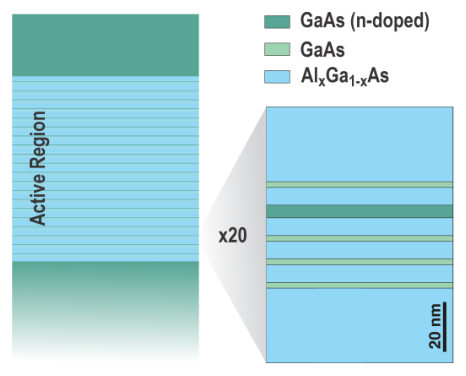
<figcaption class="paper-figure-caption"><b>Fig 1.</b> FIG. 1. Schematic diagram of the nominal device heterostructure (left) and the detailed layer sequence of a single 20× repeating unit within the active region (right), consisting of alternating GaAs (un- doped and n-doped) and AlxGa1−xAs layers.</figcaption>
</figure>
<figure class="paper-figure-card">
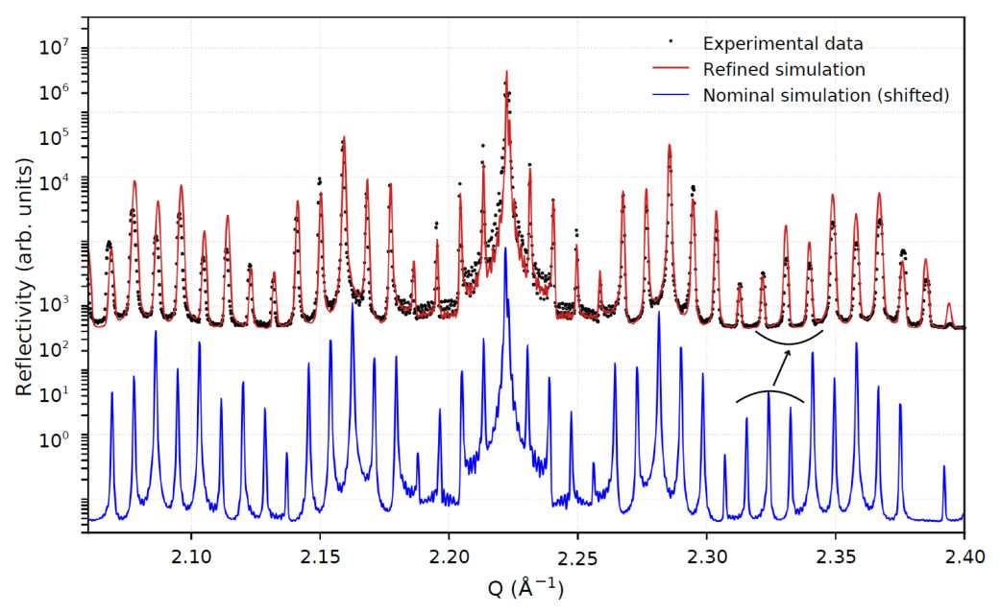
<figcaption class="paper-figure-caption"><b>Fig 2.</b> FIG. 2. Comparison of experimental and simulated X-ray reflectivity curve for the AlGaAs/GaAs superlattice. Refined parameters simulation (red), χ2 = 1.49 and nominal parameters simulation (blue), χ2 = 4.98 around the 002 peak.</figcaption>
</figure>
<figure class="paper-figure-card">
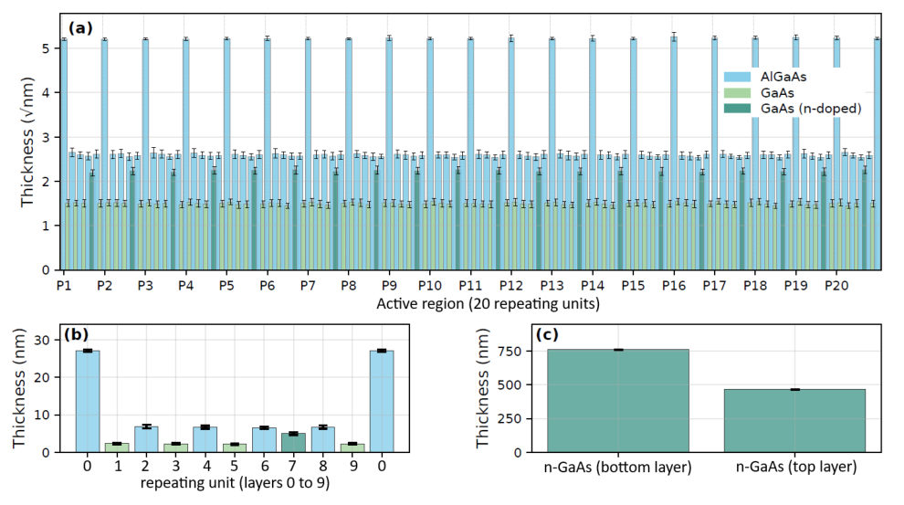
<figcaption class="paper-figure-caption"><b>Fig 3.</b> FIG. 3. (a) Thickness profile within the active region. (b) Average periodic structure. (c) Thickness of the top and bottom layers</figcaption>
</figure>

**Summary.** This work uses high-energy synchrotron X-ray diffraction combined with simulated annealing to precisely map the layer-by-layer structure of an AlGaAs/GaAs superlattice QBM. The analysis successfully quantified systematic growth errors, such as consistent thinning of barrier layers, providing critical, non-destructive feedback to improve the Molecular Beam Epitaxy growth process for high-performance quantum devices.

**Why it may be interesting.** While the core physics is solid-state characterization, the rigorous application of advanced numerical optimization (SA) to extract precise, actionable structural parameters from complex scattering data is valuable for understanding material limitations in quantum devices.

Detailed structure

**Main problem.** The study aims to quantify nanoscale structural disorder in AlGaAs/GaAs superlattices used in Quantum Bragg Mirror (QBM) infrared detectors.

**Main result.** The analysis revealed systematic, material-specific thinning of AlGaAs barrier layers (0.3-0.6 nm) and significant deficits in the top and bottom contact layers, providing actionable feedback for MBE flux calibration.

**Method.** High-resolution structural characterization was performed using synchrotron X-ray diffraction, coupled with a recursive dynamical diffraction formalism and ensemble simulated annealing refinement.

**Model / system.** The physical system is a 203-layer AlGaAs/GaAs superlattice designed as a QBM. The analysis models the structural periodicity and composition to match experimental X-ray reflectivity data.

**Key observables.** Layer-by-layer thickness profiles, structural parameters ($ar{X}$), and the $\chi^2$ cost function value comparing simulated vs. experimental reflectivity.

**Important parameters / regimes.** Synchrotron X-ray energy (25 keV); diagnostic precision of 0.2 to 0.6 nm (1-2 atomic monolayers); systematic thickness deficits (e.g., 35 nm, 40 nm).

**Assumptions / limitations.** The method assumes that structural disorder can be quantified by fitting the X-ray reflectivity curve, and the optimization is heavily weighted towards reproducing peak positions.

**Figures summary.** Figure 1 shows the schematic of the nominal heterostructure. Figure 2 compares experimental and simulated X-ray reflectivity curves (Refined vs. Nominal). Figure 3 details the thickness profile within the active region.

**Paper structure.** The paper establishes the need to quantify disorder, details the methodology combining dynamical diffraction theory with simulated annealing optimization, presents the systematic analysis of the 203-layer structure, and concludes with actionable feedback for improving MBE growth protocols.

Abstract

AlGaAs/GaAs superlattices grown by Molecular Beam Epitaxy (MBE) are foundational for advanced optoelectronic devices, including Quantum Bragg Mirror (QBM) infrared detectors. The performance of these devices critically depends on achieving near-perfect periodicity and abrupt interfaces, however, intrinsic statistical fluctuations during MBE growth introduce nanoscale structural disorder that can degrade device efficiency. In this study, we present a comprehensive methodology for quantifying this disorder in a 203-layer QBM device. High-resolution structural characterization was performed using high-energy (25 keV) synchrotron X-ray diffraction. By coupling a recursive dynamical diffraction formalism with an ensemble simulated annealing refinement, we extracted statistically robust, layer-by-layer thickness profiles. Our analysis reveals highly systematic, material-specific deviations from the nominal design: all AlGaAs barrier layers were consistently thinner than nominal by 0.3-0.6 nm. Furthermore, the sequential thickness profile successfully identified a significant 35 nm deficit in the final macroscopic top contact layer and a 40 nm deficit in the first GaAs layer. Achieving a statistical precision of about 0.2 to 0.6 nm (approximately 1-2 atomic monolayers), this non-destructive diagnostic approach provides directly actionable feedback for MBE flux calibration protocols.

[↑ back to top](#top)

### [Switchable giant room-temperature nonlinear Hall effect in Bilayer Graphene](http://arxiv.org/abs/2608.26869v1)

**Authors:** Margherita Melegari, Ignacio Gutiérrez-Lezama, Justin C. W. Song, Alberto F. Morpurgo  
**Type:** experiment · **Category:** other · **PDF:** <https://arxiv.org/pdf/2608.26869v1>  
**Analysis basis:** full PDF text, analyzed in chunks

↔ Scroll figures horizontally

<figure class="paper-figure-card">
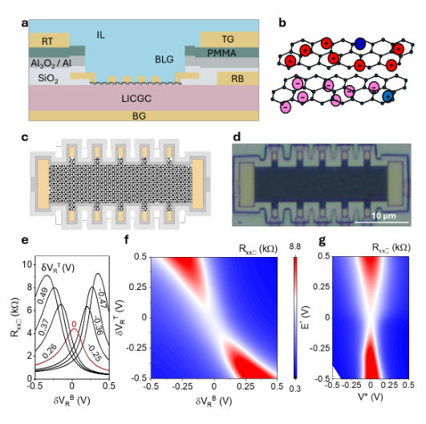
<figcaption class="paper-figure-caption"><b>Fig 1.</b> FIG. 1: Double ionic gated BLG devices. a Schematic side view of a double ionic gated Hall bar BLG device (not to scale). A BLG on a LICGC elec- trolyte substrate with gold electrodes is in direct con- tact with a top ionic liquid (IL) electrolyte. The LICGC and the IL are electrostatically decoupled by a stack of SiO2/Al/Al2O3/PMMA layers. The top gate (TG) and the top reference (RT) electrodes are large metallic pads (Ti/Au) deposited onto the PMMA; the back gate (BG) and bottom reference (RB) electrodes are metallic con- tacts (Cr/Au) deposited respectively on the back and on the top of the LICGC substrate. b The top and bottom layers of BLG are in direct contact with ions in the two...</figcaption>
</figure>
<figure class="paper-figure-card">
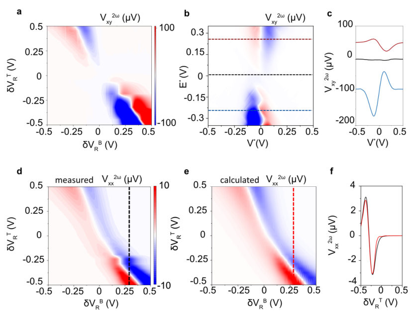
<figcaption class="paper-figure-caption"><b>Fig 2.</b> FIG. 2: Nonlinear transverse and longitudinal signals. a Second harmonic transverse voltage V 2ω xy measured with excitation current Iω = 2µA at frequency ω, as a function of δV B R and δV T R . b Same data as in a, plotted versus V ∗and E∗. V 2ω xy changes sign when V ∗is reversed (i.e., when the Fermi level is shifted from the valence to the conduction band) and when E∗is reversed (i.e., when the perpendicular electric field reverses its polarity). The three dashed horizontal lines (blue, E∗&lt; 0; black, E∗= 0; red, E∗&gt; 0) indicate the values of E∗for which the three V 2ω xy traces in panel c are shown. d Second harmonic longitudinal voltage V 2ω xx measured with an excitation current Iω =...</figcaption>
</figure>
<figure class="paper-figure-card">
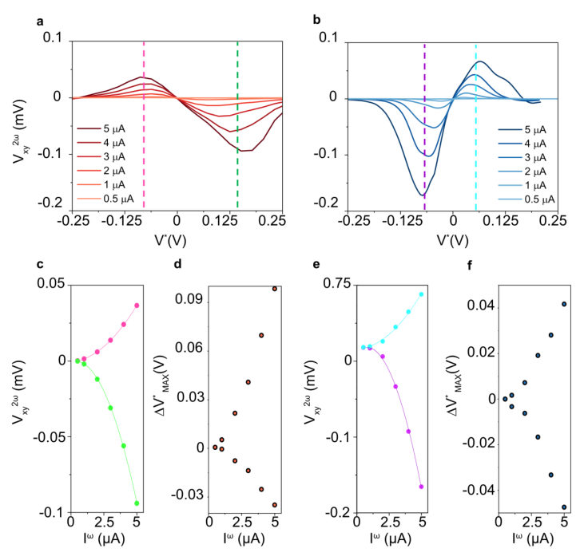
<figcaption class="paper-figure-caption"><b>Fig 3.</b> FIG. 3: Scaling of second-harmonic signals with excitation current. a Second harmonic transverse voltage V 2ω xy as a function of V ∗for different values of Iω (see legend), measured for E∗= 0.25V . b Same measurements as in panel a, taken for the opposite sign of perpendicular electric field, at E∗= −0.28V . c, e Irrespective of the sign and the value of V ∗and of E∗, the second-harmonic Hall voltage V 2ω xy scales quadratically with Iω (in panel c: V ∗= −0.075V, 0.14V , E∗= 0.25V ; in panel e: V ∗= −0.063V, 0.055V , E∗= −0.28V ). Panels a and b further show that the value of V ∗at which V 2ω xy peaks shifts with the applied current Iω. The shift ∆VMAX increases quadratically with Iω (see...</figcaption>
</figure>
<figure class="paper-figure-card">
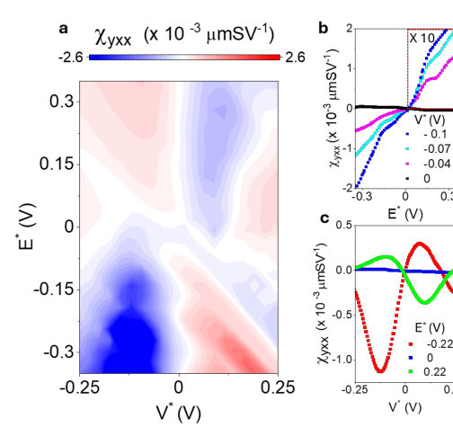
<figcaption class="paper-figure-caption"><b>Fig 4.</b> FIG. 4: Gate-dependence of the nonlinear suscep- tibility tensor. a Component χ(2) yxx of the nonlinear susceptibility tensor responsible for the nonlinear trans- verse Hall effect, plotted as a function of V ∗and E∗. As expected for a nontrivial effect χ(2) yxx when the sign of E∗changes (i.e., when the polarity of the perpendicular electric field that breaks parity is reversed) and when V ∗</figcaption>
</figure>
<figure class="paper-figure-card">
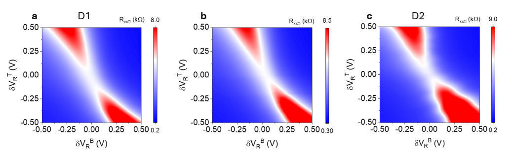
<figcaption class="paper-figure-caption"><b>Fig 5.</b> FIG. 5: Evolution of Rxx□upon double ionic gating BLG. (a–b) Color maps of Rxx□vs δV T R and δV B R , measured in device D1 using different pairs of voltage probes and (c) Rxx□measured in device D2.</figcaption>
</figure>

**Summary.** This work reports observing a giant and switchable nonlinear Hall effect in double-ionic gated bilayer graphene at room temperature. By utilizing the ionic gating to break inversion symmetry, the authors achieved nonlinear susceptibilities significantly larger than previously reported room-temperature values. This positions bilayer graphene as a promising platform for next-generation, junction-free nonlinear electronic technology.

**Why it may be interesting.** The ability to engineer large, switchable nonlinear responses at room temperature in a 2D material platform like graphene is highly relevant for developing novel quantum electronic components that operate outside cryogenic conditions.

Detailed structure

**Main problem.** The primary challenge is developing materials with large and tunable nonlinearities at room temperature for practical, junction-free electronic devices.

**Main result.** The authors demonstrated a switchable, giant nonlinear Hall effect in double-ionic gated bilayer graphene, achieving susceptibilities comparable to low-temperature records.

**Method.** Measurements involved injecting alternating current at a fixed frequency and measuring both the second harmonic ($2\omega$) and fundamental ($\omega$) transverse and longitudinal voltages while sweeping gate voltages.

**Model / system.** The study uses double-ionic gated Bernal stacked bilayer graphene (BLG) devices. The ionic gating allows for precise control over the perpendicular electric field ($E_{BLG}$), which is crucial for breaking inversion symmetry.

**Key observables.** Nonlinear Hall voltage ($V_{2\omega}^{xy}$), second-order nonlinear susceptibility ($\chi^{(2)}_{yxx}$), and THz voltage responsivity.

**Important parameters / regimes.** Room temperature operation, perpendicular electric field strength ($E_{BLG}$), and the magnitude of $\chi^{(2)}_{yxx}$ ($\sim 3 	imes 10^{-3} \mu	ext{m S/V}$).

**Assumptions / limitations.** The analysis assumes that the observed nonlinear response is dominated by the second-order susceptibility and that the ionic gating mechanism provides the necessary symmetry breaking.

**Figures summary.** Figures illustrate the device structure, the dependence of longitudinal resistance on gate voltages, and the sign change of the nonlinear transverse voltage ($V_{2\omega}^{xy}$) upon reversing the perpendicular electric field.

**Paper structure.** The paper systematically analyzes the measurement setup, confirms the nonlinear Hall effect's dependence on the perpendicular electric field, rules out trivial contributions (like the Berry curvature dipole), and quantifies the resulting large nonlinear coefficients.

Abstract

Utilizing quantum second-order nonlinear transport for practical junction-free devices require materials with large and tunable nonlinearites at room temperature -- a current materials platform challenge. Here, we report the nonlinear Hall effect (NLHE) in double-ionic gated bilayer graphene devices that enable unusually strong inversion breaking. We observe NLHE that are readily switchable (on, off, and sign reversed) with second order nonlinear susceptibilities $χ^{(2)}_{yxx}$ that reaches giant room-temperature values of $3\,10^{-3}\,μ\mathrm{m}\,\mathrm{S/V}$, comparable to values commonly observed at low temperature in WTe$_2$ or in graphene-based moiré superlattices, and three-to-four orders of magnitude larger than values reported in material systems recently employed in search of a room-temperature NLHE. Our devices produce corresponding THz voltage responsivities $\simeq 4\,10^{4}\,\mathrm{V/W}$, comparable to commercially available Schottky diodes. These are orders of magnitude better than for previously reported room-temperature NLHE devices rendering double-ionic gated bilayer graphene a choice platform for junction-free nonlinear technology.

[↑ back to top](#top)

### [The Effect of Geometry on Thermodynamic Response](http://arxiv.org/abs/2608.26898v1)

**Authors:** Bojana Bokic, Sébastien R. Mouchet, Biljana Stankov, Sanja Ostojic, Nicolas Roy, Darko Vasiljevic, Yin Chang, Marija Radmilovic-Radjenovic, Branislav Radjenovic, Thierry Verbiest, Mohamed Hatifi, Branko Kolaric  
**Type:** both · **Category:** statistical mechanics · **PDF:** <https://arxiv.org/pdf/2608.26898v1>  
**Analysis basis:** full PDF text, analyzed in chunks

↔ Scroll figures horizontally

<figure class="paper-figure-card">
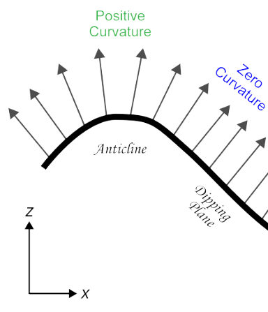
<figcaption class="paper-figure-caption"><b>Fig 1.</b> Figure 1: Curvature influences the mutual interaction between a surface and its environment. The chemical potential is therefore modified: a positive curve (also referred to as anticline or convex surface) corresponds to a high chemical potential, whereas a negative curvature (also known as syncline or concave surface) corresponds to a low chemical potential.</figcaption>
</figure>
<figure class="paper-figure-card">
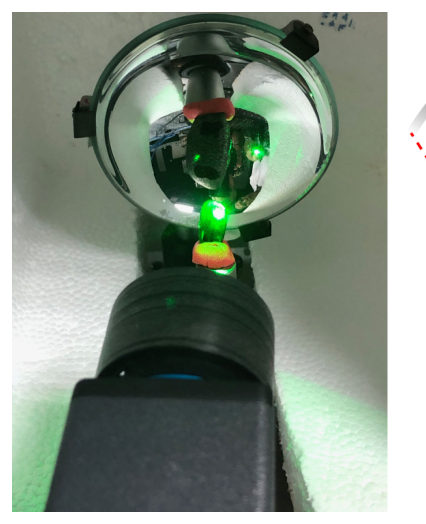
<figcaption class="paper-figure-caption"><b>Fig 2.</b> Figure 2: The setup is designed to capture both direct and mirror-reflected thermal images in real time, allowing precise quantification of front and back temperature differences under laser irradiation: (left) setup in the laboratory during the experiment, (right) scheme of the setup (1 - FLIR camera; 2 - aluminum mount with the sample; 3 - laser pointer with a 532-nm wavelength; 4 - spherical mirror).</figcaption>
</figure>
<figure class="paper-figure-card">
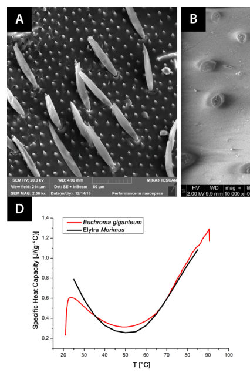
<figcaption class="paper-figure-caption"><b>Fig 3.</b> Figure 3: Species-specific surface patterns on the elytra of Morimus asper funereus (A) and Euchroma giganteum (B) reveal how geometry observed here by SEM may affect the thermal behavior. The heat capacity of the entire elytra of M. asper funereus (C) and E. giganteum exhibits minima as a function of the temperature (D). This is a behavior distinct from reported films and bulk materials [27–30]. The heat capacity of the black spots and the gray zone of M. asper funereus also differs from the curve corresponding to an entire elytron. Figures (B) and (C) were reproduced from ref. [36] and ref. [23], respectively.</figcaption>
</figure>
<figure class="paper-figure-card">
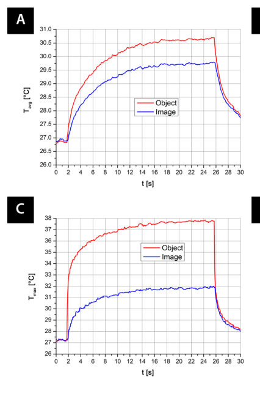
<figcaption class="paper-figure-caption"><b>Fig 4.</b> Figure 4: Time-resolved thermal imaging reveals how laser irradiation generates distinct front–back temper- ature gradients across the elytron in four measurements on Morimus asper funereus. Average temperature of the outer (object) and inner (image) side of the elytra illuminated by a laser pointer at A) 405 nm, B) 650 nm. Maximum temperature of the outer (object) and inner (image) side of the elytra illuminated by a laser pointer at C) 405 nm, D) 650 nm. Here, &quot;object&quot; refers to the directly illuminated front side of the elytron, and &quot;image&quot; refers to the temperature of the back side as seen via reflection in the spherical mirror (Fig. 2).</figcaption>
</figure>
<figure class="paper-figure-card">
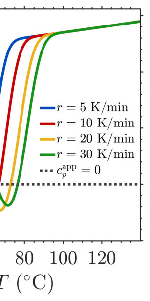
<figcaption class="paper-figure-caption"><b>Fig 5.</b> Figure 5: The model predicts that sufficiently strong internal relaxation may drive the apparent heat- capacity signal below 0 J/g/K under certain conditions. Heating-rate dependence of the apparent heat- capacity anomaly predicted by the internal-relaxation model. The sample is driven through a temperature ramp T(t) = T0 + rt, while metastable internal states release stored enthalpy during the scan. Increasing the heating rate r shifts the capp p dip to higher temperature because the internal states have less time to relax at a given temperature. The dotted horizontal line marks capp p = 0 J/g/K. This rate-dependent shift is a characteristic signature of thermally activated relaxation and...</figcaption>
</figure>

**Summary.** This work demonstrates that the intricate geometry of nanostructures, exemplified by insect elytra, profoundly dictates their thermal behavior. By analyzing heat capacity measurements and thermal imaging, the authors show that geometric features can induce anomalous thermodynamic responses, such as negative apparent heat capacity, through structural relaxation pathways. This highlights geometry as a primary control knob for thermal energy management at the nanoscale.

**Why it may be interesting.** The explicit mathematical linkage between geometric curvature (a classical structural parameter) and the thermodynamic response (heat capacity anomaly) provides a powerful, non-chemical mechanism for controlling energy storage and dissipation, relevant to understanding complex many-body systems.

Detailed structure

**Main problem.** The paper investigates how complex nanoscale geometries influence and shape the apparent thermodynamic response, particularly the heat-capacity, in materials like insect elytra.

**Main result.** Complex geometries can induce unusual, non-monotonic thermal responses, such as a decrease in apparent heat capacity, by modifying the energy barriers for internal relaxation mechanisms.

**Method.** The study combines experimental measurements (DSC, thermal imaging) with theoretical modeling based on relaxation kinetics and geometric constraints.

**Model / system.** The system studied is the nanostructure of insect elytra, modeled using thermodynamic principles that link chemical potential changes to surface curvature ($\Delta\mu \propto 1/R_1 + 1/R_2$).

**Key observables.** Apparent heat capacity ($C_{app}$), temperature profiles under laser irradiation, and the rate-dependent shift of the heat-capacity anomaly.

**Important parameters / regimes.** Curvature ($R_1, R_2$), temperature range (20°C to 140°C), and the activation energy barriers ($E_i$) governing relaxation.

**Assumptions / limitations.** The unusual thermal response is attributed to geometry-driven internal relaxation mechanisms rather than bulk phase transitions, and the model uses a coarse-grained description of structural rearrangements.

**Figures summary.** Figures illustrate the relationship between curvature and chemical potential, the experimental setup for thermal imaging, and the measured heat capacity curves showing non-monotonic behavior.

**Paper structure.** The paper progresses from establishing the importance of nanoscale geometry in thermal management, presenting experimental evidence from insect elytra using DSC and laser thermography, and concluding with a theoretical model linking geometry to the apparent heat capacity anomaly via relaxation kinetics.

Abstract

At the nano- and microscale, various patterns influence and shape thermal and optical response, making them essential for the survival of various biological species. In addition, controlling thermal radiation is vital for a broad range of applications, such as thermal management, spectroscopy, optoelectronics, and energy conversion technologies. For this reason, there is strong pressure to elucidate the physics of thermal radiation at the nanoscale. In this article, we provide evidence that complex nanoscale geometries affect thermal management, leading to an unusual thermal response in heat-capacity measurements as a function of temperature. Beyond identifying the structural constraints associated with this unusual thermodynamic response, the current study introduces the possibility of shaping the apparent heat-capacity response through geometry without necessarily altering the system's chemistry.

[↑ back to top](#top)

