
# arxiv digest (quant-ph + cond-mat) — 2026-09-01

*114 papers · 14 relevant · 3 highlighted*

## 🔥 Most relevant (14)

*Every paper with at least one nonzero topic score, sorted by best-matching score. 🔥 marks scores ≥4/5. Click the title to jump to the full entry below; click [arXiv] to open the paper page. `(secondary)` marks papers from de-prioritized cond-mat archives.*

Show 14 relevant papers

- [Self-partitioned Interfacial Time Crystals](#paper-2608.28126) [[arXiv]](http://arxiv.org/abs/2608.28126v1) — 🔥 `driven-dissipative phase transition` **5/5** · `analog quantum simulation` **3/5** · `correlated / nonlocal dissipation` **3/5** · `methods for driven-dissipative` **3/5** · `non-equilibrium universality` **3/5** · `Keldysh / 2PI / non-Gaussian methods` **2/5** · `Frenkel-Kontorova` **1/5** · `Tavis-Cummings & cavity-many-emitter` **1/5** · `quantum measurements` **1/5**
- [Role of the Drive in Mediating Correlations Between Two Qubits Through a Shared Dissipative Cavity](#paper-2608.28251) [[arXiv]](http://arxiv.org/abs/2608.28251v1) — 🔥 `correlated / nonlocal dissipation` **4/5** · `Tavis-Cummings & cavity-many-emitter` **3/5** · `analog quantum simulation` **3/5** · `driven-dissipative phase transition` **3/5** · `methods for driven-dissipative` **3/5** · `non-equilibrium universality` **2/5** · `Keldysh / 2PI / non-Gaussian methods` **1/5** · `quantum measurements` **1/5**
- [Topological signatures in the quench dynamics of periodically driven quantum systems](#paper-2608.27588) [[arXiv]](http://arxiv.org/abs/2608.27588v1) `(secondary)` — 🔥 `non-equilibrium universality` **4/5** · `analog quantum simulation` **3/5** · `driven-dissipative phase transition` **3/5** · `methods for driven-dissipative` **3/5** · `Keldysh / 2PI / non-Gaussian methods` **2/5** · `Full counting statistics` **1/5** · `correlated / nonlocal dissipation` **1/5** · `quantum measurements` **1/5** · `scars & prethermalization` **1/5**
- [Pulling strings in real time: flux tube dynamics in (2+1)-d $\mathbb{Z}_2$-Higgs Gauge Theories](#paper-2608.27561) [[arXiv]](http://arxiv.org/abs/2608.27561v1) — 🔥 `methods for driven-dissipative` **4/5** · 🔥 `scars & prethermalization` **4/5** · `driven-dissipative phase transition` **3/5** · `non-equilibrium universality` **3/5** · `Keldysh / 2PI / non-Gaussian methods` **2/5** · `analog quantum simulation` **2/5**
- [A Single Spin Switches the Steady-State Phase of an Open Quantum System](#paper-2608.28390) [[arXiv]](http://arxiv.org/abs/2608.28390v1) — 🔥 `driven-dissipative phase transition` **4/5** · `correlated / nonlocal dissipation` **3/5** · `methods for driven-dissipative` **3/5** · `non-equilibrium universality` **3/5** · `analog quantum simulation` **2/5** · `Keldysh / 2PI / non-Gaussian methods` **1/5** · `quantum measurements` **1/5**
- [Topological Winding Readout of an Emergent Page-Wootters Clock](#paper-2608.27650) [[arXiv]](http://arxiv.org/abs/2608.27650v1) — 🔥 `quantum optics experiment` **4/5** · `analog quantum simulation` **3/5** · `interference shaping light` **3/5** · `quantum measurements` **2/5** · `Full counting statistics` **1/5** · `QC/QI experiment` **1/5** · `Tavis-Cummings & cavity-many-emitter` **1/5** · `driven-dissipative phase transition` **1/5** · `methods for driven-dissipative` **1/5**
- [Subcritical bifurcation and on-off bistability in ballistic polariton condensates](#paper-2608.27823) [[arXiv]](http://arxiv.org/abs/2608.27823v1) `(secondary)` — 🔥 `driven-dissipative phase transition` **4/5** · `analog quantum simulation` **3/5** · `non-equilibrium universality` **3/5** · `Keldysh / 2PI / non-Gaussian methods` **2/5** · `methods for driven-dissipative` **2/5** · `correlated / nonlocal dissipation` **1/5**
- [Crystal-phase quantum dots in AlGaAs nanowires](#paper-2608.28353) [[arXiv]](http://arxiv.org/abs/2608.28353v1) — 🔥 `QC/QI experiment` **4/5** · `quantum optics experiment` **3/5** · `analog quantum simulation` **2/5** · `interference shaping light` **1/5** · `quantum measurements` **1/5**
- [Kerr nonlinearity and three-wave mixing in superconducting resonators hosting Al-InAs weak links](#paper-2608.28428) [[arXiv]](http://arxiv.org/abs/2608.28428v1) — 🔥 `QC/QI experiment` **4/5** · `driven-dissipative phase transition` **3/5** · `quantum optics experiment` **2/5** · `analog quantum simulation` **1/5** · `quantum measurements` **1/5**
- [Postselection-loophole-free Bell test under strict spacetime constraints](#paper-2608.28190) [[arXiv]](http://arxiv.org/abs/2608.28190v1) — 🔥 `quantum optics experiment` **4/5** · `QC/QI experiment` **3/5** · `interference shaping light` **2/5** · `quantum measurements` **2/5**
- [From integrability to many-body quantum chaos through a Markovian bath](#paper-2608.27897) [[arXiv]](http://arxiv.org/abs/2608.27897v1) — 🔥 `Keldysh / 2PI / non-Gaussian methods` **4/5** · `methods for driven-dissipative` **2/5** · `correlated / nonlocal dissipation` **1/5** · `driven-dissipative phase transition` **1/5** · `non-equilibrium universality` **1/5**
- [Spin-Selective Spectral Flattening and Wave-Packet Dynamics in a Flux-Engineered Lieb Lattice](#paper-2608.28054) [[arXiv]](http://arxiv.org/abs/2608.28054v1) — 🔥 `analog quantum simulation` **4/5** · `Keldysh / 2PI / non-Gaussian methods` **1/5** · `methods for driven-dissipative` **1/5** · `quantum measurements` **1/5** · `scars & prethermalization` **1/5**
- [Hardware-Efficient Error Mitigation and Shot-Efficient Sampling on IBM Quantum Hardware](#paper-2608.28535) [[arXiv]](http://arxiv.org/abs/2608.28535v1) — 🔥 `QC/QI experiment` **4/5** · `quantum measurements` **2/5**
- [Scaling Alternating-Bias-Assisted Annealing for Precision Transmon Frequency Targeting on Superconducting Quantum Processors](#paper-2608.27789) [[arXiv]](http://arxiv.org/abs/2608.27789v1) — 🔥 `QC/QI experiment` **4/5** · `quantum measurements` **1/5**

## ⭐ Highlighted (3)

*Papers by authors on your watch list. Click the title to jump to the full entry below; click [arXiv] to open the paper page.*

Show 3 highlighted papers

- ⭐ [Error-Adaptive Quasi-local Decoding of the Toric Code](#paper-2608.27740) [[arXiv]](http://arxiv.org/abs/2608.27740v1) — Sarang Gopalakrishnan
- ⭐ [Interaction corrections to topological density three-point functions in two-dimensional Fermi liquids: a coadjoint orbit perspective](#paper-2608.28588) [[arXiv]](http://arxiv.org/abs/2608.28588v1) — Andrew Lucas
- ⭐ [Input-Output Analysis of Quantum Dot SUPER Excitation](#paper-2608.28470) [[arXiv]](http://arxiv.org/abs/2608.28470v1) — Helmut Ritsch

## All papers (74, sorted by relevance)

*Papers from quant-ph and your primary cond-mat archives (quant-gas, stat-mech, str-el, dis-nn). Highlighted papers (⭐) come first, then everything else sorted by topic-relevance score, highest first.*

### ⭐ [Input-Output Analysis of Quantum Dot SUPER Excitation](http://arxiv.org/abs/2608.28470v1)

**Highlighted author(s):** Helmut Ritsch  
**Authors:** Johannes Kerber, Christoph Hotter, Helmut Ritsch, Klaus Mølmer  
**Type:** theory · **Category:** other · **PDF:** <https://arxiv.org/pdf/2608.28470v1>  
**Analysis basis:** full PDF text, analyzed in chunks
**Topic relevance:** `free-space correlated emission` **3/5** · `Keldysh / 2PI / non-Gaussian methods` **2/5** · `analog quantum simulation` **2/5** · `methods for driven-dissipative` **2/5** · `Tavis-Cummings & cavity-many-emitter` **1/5** · `correlated / nonlocal dissipation` **1/5** · `driven-dissipative phase transition` **1/5** · `interference shaping light` **1/5** · `quantum measurements` **1/5** · `quantum optics experiment` **1/5**

📷 Fig 1

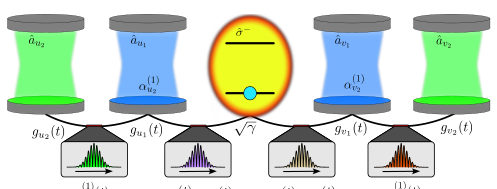 
FIG. 1. Cascade setup corresponding to the SLH triplet: Gcas (from left to right). The virtual input cavities (ˆaui, gui(t)) emit the pulses u1(t) and u(1) 2 (t), respectively. The distortion amplitude α(1) u2 modifies u(1) 2 (t) such that u2(t) together with u1(t) interact with the TLS, simul- taneously. Similarly for the virtual output cavities (ˆavi, gvi(t)), where the outgoing pulse v2(t) is modified to v(1) 2 (t) by the amplitude α(1) v2 .

📷 Fig 2

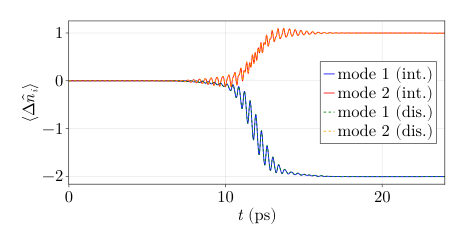 
FIG. 3. The photon loss/gain of each mode ⟨∆ˆni⟩in the interaction picture (int.) remains the same, where the trajectories converge to- wards (-2,+1) directly. Applying the displacement frame (dis.) and solving the full master equation yields the exact same results as the cumulative interaction picture.

📷 Fig 3

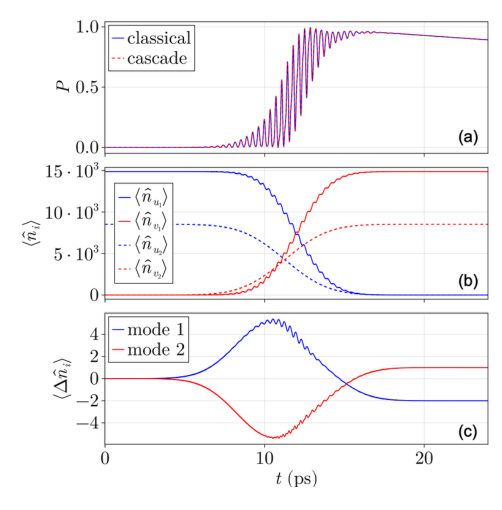 
FIG. 2. Plot (a) demonstrates that the cascade input-output solution for the population P = ⟨ˆσ+ ˆσ−⟩coincides with the classical drive description. The mean photon numbers of each pulse ⟨ˆni⟩= ⟨ˆa† i ˆai⟩ are depicted in plot (b). Initially, all photons are contained in the incident pulses ui(t) (blue lines) and the majority are transferred to the pulses vi(t) (red lines) during the excitation process. The final occupation number ⟨ˆnvi⟩is changed slightly from the initial one ⟨ˆnui⟩. Mode 1 experiences a loss of two photons (-2), whereas mode 2 gains one (+1), which is observed in plot (c).

📷 Fig 4

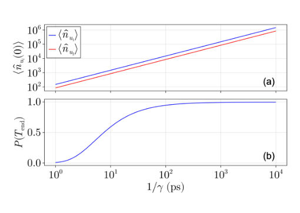 
FIG. 4. In plot (a) the initial mean photon numbers ⟨ˆnui(0)⟩(1/γ) with 1/γ in logarithmic scaling are shown. Reducing the decay rate γ implies a linear increase of ⟨ˆnui(0)⟩∝1/γ. The final TLS population P = ⟨ˆσ+ ˆσ−(Tend)⟩(1/γ) is depicted in plot (b). Here, Tend denotes the time immediately after the SUPER excitation process is over.

📷 Fig 5

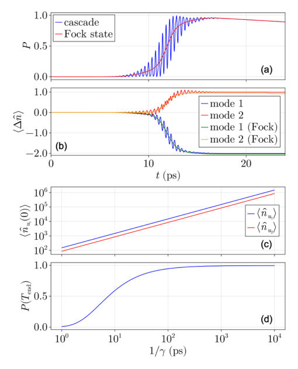 
FIG. 5. The pure Fock state population dynamics P is compared to the cascaded system in plot (a). The fundamental excitation process without additional oscillatory behavior can be observed clearly. Sim- ilar is the case for the loss/gain functions ⟨∆ˆni⟩in plot (b), which fit almost perfectly. Due to the choice of time steps and size of the trun- cated Fock spaces, small deviations appear. In plot (c) and (d), we visualize that the success of the SUPER scheme in the Fock space full-master equation description is subject to the same 1/γ depen- dence as shown previously. Since the fundamental process is the same, this behavior is expected.

**Summary.** This theoretical paper investigates the quantum dynamics of the SUPER excitation scheme in a quantum dot driven by two pulsed lasers. By employing a full quantum input-output formalism and cumulant expansion, the authors confirm the mechanism's inherent multi-photon nature in free space. The results are crucial for understanding high-fidelity quantum control in open quantum systems.

**Why it may be interesting.** This work provides a rigorous quantum electrodynamics treatment of coherent light-matter interaction in the weak coupling regime, extending standard cavity QED models to free-space pulsed excitation using advanced input-output formalisms.

Detailed structure

**Main problem.** The paper analyzes the counterintuitive dynamics of the Swing-UP of the quantum Emitter population (SUPER) two-color pulsed excitation scheme.

**Main result.** The free-space realization confirms the underlying nonlinear three-photon Raman-type character of the SUPER mechanism, requiring high photon numbers for high-fidelity inversion, contrasting with cavity-enhanced models.

**Method.** The analysis employs a full quantum input-output description, extending the formalism with a cumulant expansion approach to handle large coherent-state amplitudes.

**Model / system.** The system involves a two-level quantum emitter (TLS) driven by two time-overlapping, far off-resonant red detuned Gaussian pulses, modeled using the SLH formalism and cascade product rules.

**Key observables.** TLS population inversion ($P$), photon loss/gain ($\langle\Delta\hat{n}
angle$), and mean photon numbers ($\langle\hat{n}_i
angle$).

**Important parameters / regimes.** Red detuning (several meV below resonance), pulse photon numbers (requiring values much larger than one for free space).

**Assumptions / limitations.** The formalism assumes the ability to model the pulse dynamics via virtual input/output cavities and utilizes cumulant expansion for large coherent amplitudes.

**Figures summary.** Figures illustrate the cascade setup, the population dynamics ($P$) for both two-pulse and single-pulse descriptions, and the resulting photon loss/gain signatures, confirming the $(-2, +1)$ exchange.

**Paper structure.** The paper builds from a classical reference model to a full quantum input-output description, detailing the cascade Hamiltonian, applying the cumulant expansion in the interaction picture, and comparing results across different pulse representations (two-pulse vs. single-pulse).

Abstract

The Swing-UP of the quantum EmitteR population (SUPER) two-color pulsed excitation scheme allows for robust and close to 100\% excitation of a two-level quantum emitter using only red detuned light. We analyze the underlying counterintuitive dynamics using a full quantum input-output description of the in- and outgoing light pulses for the case of two coherent free-space input pulses at realistic photon numbers. At the microscopic level, the SUPER mechanism exhibits its nonlinear three-photon Raman-type character, leading to a net photon-number change of $-2$ in one mode and $+1$ in the other, as was first guessed from cavity-enhanced model descriptions at low photon numbers. We confirm that in free space, a sufficiently high pulse photon number, much larger than one, is required to achieve high-fidelity inversion. To treat the large coherent-state amplitudes (photon numbers) relevant for SUPER, we extend the quantum input-output formalism to include a cumulant expansion approach. With an interaction-picture formulation, the few exchanged photons that govern the nontrivial dynamics enable direct full-quantum calculations in truncated Hilbert spaces, including treatments in a displacement frame and for initial Fock-state pulses.

[↑ back to top](#top)

### ⭐ [Error-Adaptive Quasi-local Decoding of the Toric Code](http://arxiv.org/abs/2608.27740v1)

**Highlighted author(s):** Sarang Gopalakrishnan  
**Authors:** Hossein Dehghani, Sarang Gopalakrishnan, Michael Gullans  
**Type:** theory · **Category:** quantum information and computing · **PDF:** <https://arxiv.org/pdf/2608.27740v1>  
**Analysis basis:** full PDF text, analyzed in chunks
**Topic relevance:** `analog quantum simulation` **2/5** · `methods for driven-dissipative` **2/5** · `quantum measurements` **2/5**

📷 Fig 1

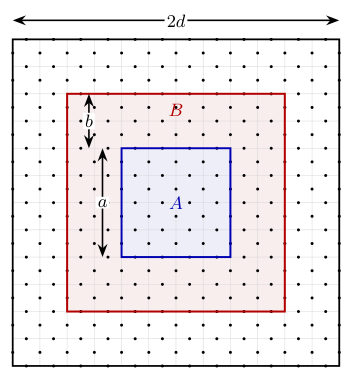 
FIG. 1. Geometry of the local decoder region for the toric code (qubits live on edges, shown as filled circles). The local decoder acts on a target square A of linear size a (blue) to- gether with a surrounding buffer region B of width b (red). The full system is a distance-d toric code with periodic bound- ary conditions (not shown), drawn on the underlying 2d × 2d grid; one X-stabilizer (vertex) lattice spacing corresponds to two grid units, and a and b are quoted in vertex-lattice spac- ings throughout the paper.

📷 Fig 2

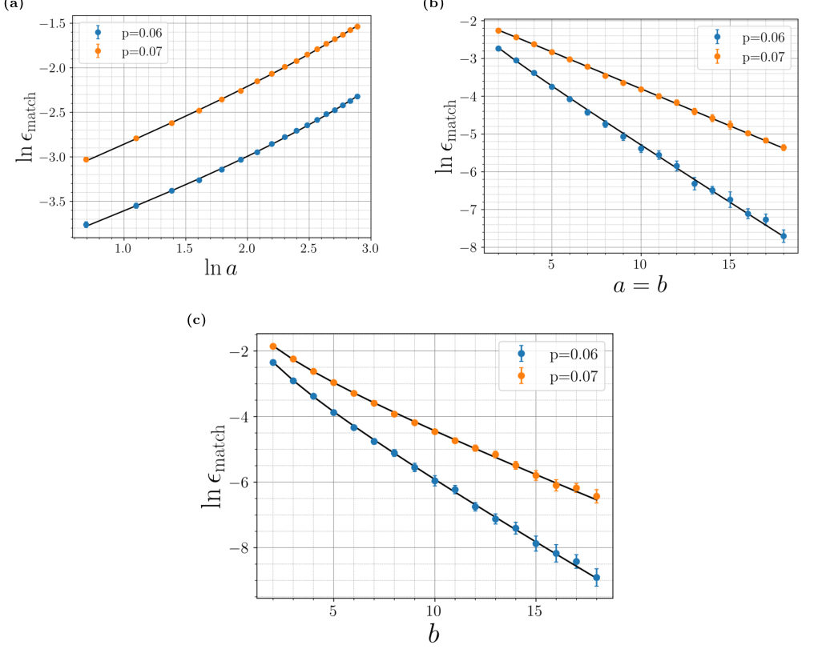 
FIG. 2. Numerical scaling of the local-global mismatch. (a) ln ϵmatch versus ln a. (b) ln ϵmatch for the constrained family a = b. (c) ln ϵmatch versus b. Panel (a) isolates target-size dependence, panel (b) probes the scaled family used later in the decoder construction, and panel (c) isolates buffer-size dependence. Taken together, the three panels motivate the two-geometry ansatz in Eq. (6) rather than a single-variable CMI-style scaling form controlled only by buffer width. All panels are at d = 64, with the complementary length held fixed at vertex scale 4 (b = 4 in (a), a = 4 in (c)); error bars are 1σ statistical. Black lines are fits to Eq. (6), i.e. ln ϵmatch = ln C + α(p) ln(a/b)...

📷 Fig 3

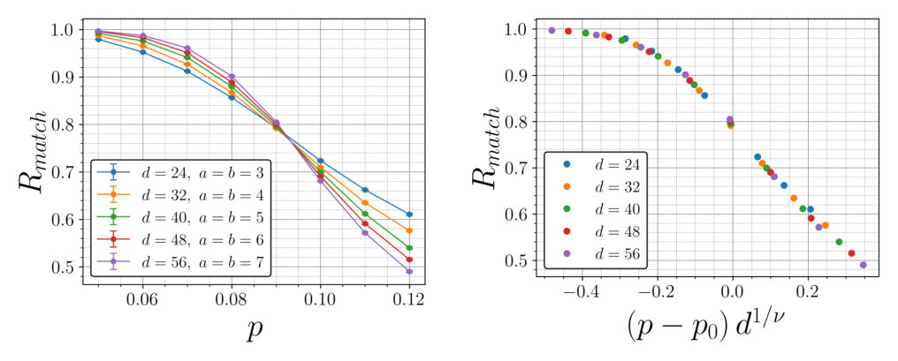 
FIG. 3. Crossing and finite-size scaling of the matching ratio for the scaled family a = b = d/8. (a) Crossing behavior of Rmatch(p) across code distances. (b) Corresponding finite-size collapse around p0. The crossing signals transition-like behavior of the local-global agreement once the local support is scaled with system size.

📷 Fig 4

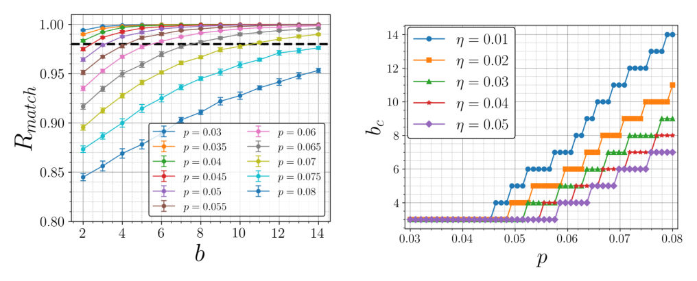 
FIG. 4. Error-adaptive choice of the buffer size. (a) Rmatch versus b for representative physical error rates p; the dashed line marks the agreement level Rmatch = 1−η = 0.98 corresponding to η = 0.02. (b) Adaptive buffer size bc(p, η) extracted from the same fixed-geometry data, shown for target mismatch tolerances η = 0.01–0.05; the required buffer grows as p approaches the transition and as the tolerance η is tightened. This analysis motivates the distance-scaled initialization used for the composite decoder below.

📷 Fig 5

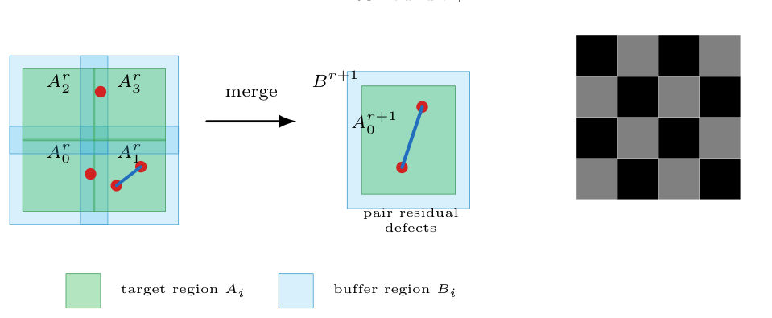 
FIG. 5. Composite quasi-local decoder architecture. (a) Adjacent local regions Ai with overlapping buffers Bi at RG round r, and their merge to a larger region at RG round (r+1). Local sectors with no residual defects or with two bulk defects are resolved within RG round r, while boundary-associated residual defects are paired after the merge step. Blue segments mark the defect-pairing paths used to annihilate syndrome defects and correct errors. (b) Two-step checkerboard schedule used to parallelize patch updates without double counting on neighboring regions.

**Summary.** This paper tackles the scalability challenge in topological quantum error correction by introducing a 'matching ratio' diagnostic to quantify local recoverability. This diagnostic is used to build a composite, quasi-local Renormalization Group decoder for the Toric Code. The resulting decoder exhibits threshold behavior, suggesting a viable path toward fault-tolerant quantum computation that balances accuracy and computational cost.

**Why it may be interesting.** The work provides a concrete, theoretically motivated, and computationally structured approach to designing fault-tolerant quantum computation protocols by bridging the gap between idealized global theory and practical local computation.

Detailed structure

**Main problem.** The paper addresses the fundamental trade-off in topological quantum error correction between achieving global accuracy near the threshold and maintaining the computational locality required for scalable, practical decoders.

**Main result.** By developing an adaptive, composite quasi-local decoder based on a matching ratio diagnostic, the authors demonstrate a threshold-like logical-failure behavior that appears at a lower error rate than conventional global decoders.

**Method.** The core method involves defining a 'matching ratio' ($R_{	ext{match}}$) comparing local decoding results to global ones, which is then used to formulate an adaptive, multi-scale Renormalization Group (RG) decoder structure.

**Model / system.** The study analyzes the dephased Toric Code, which is a model for topological quantum memory, using syndrome measurements under dephasing noise.

**Key observables.** Matching ratio ($R_{	ext{match}}$), mismatch ($\epsilon_{	ext{match}}$), and the logical-failure curve crossing point ($p_{	ext{comp}} 	imes$).

**Important parameters / regimes.** Error rate ($p$), target region size ($a$), buffer width ($b$), and code distance ($d$).

**Assumptions / limitations.** The analysis focuses specifically on dephasing noise with perfect syndrome measurements, and the matching ratio uses literal Pauli-string equality.

**Figures summary.** Figures illustrate the geometry of the local/buffer regions, show the scaling collapse of $R_{	ext{match}}$ for specific geometries, and display the final logical-failure curves for the composite decoder.

**Paper structure.** The paper first introduces the local-global trade-off, develops the matching ratio diagnostic, uses this to derive scaling laws, and finally implements and analyzes a composite, quasi-local RG decoder structure.

Abstract

Topological quantum memories need decoders that are both reliable and scalable, but these goals compete: globally informed decoders are accurate near threshold yet expensive, while strictly local rules are fast but can miss long-range structure. Motivated by recent recoverability and mixed-state viewpoints, we make this tradeoff operational for the dephased toric code through a decoder-level local recoverability diagnostic. We compare global MWPM corrections to quasi-local corrections inside a target region and define a matching ratio $R_{\mathrm{match}}$, with mismatch $ε_{\mathrm{match}}=1-R_{\mathrm{match}}$. Across geometry families, $ε_{\mathrm{match}}$ shows strong buffer-controlled suppression and is well organized by a two-geometry scaling form. For scaled families, especially $a=b=d/8$, $R_{\mathrm{match}}$ exhibits a clear crossing and finite-size collapse near $p\!\sim\!0.09$, consistent with a growing recoverability scale near the decoding transition. We use this scaling to formulate an adaptive buffer-selection rule and to identify a distance-scaled initialization for a composite quasi-local RG decoder on the full torus. In the tuned family $a_0=b_0=d/8$, the resulting logical-failure curves show an apparent finite-size crossing at $p\simeq0.09$--$0.10$, below the conventional MWPM threshold scale. We focus on dephasing noise with perfect syndrome measurements to cleanly isolate the underlying behavior.

[↑ back to top](#top)

### ⭐ [Interaction corrections to topological density three-point functions in two-dimensional Fermi liquids: a coadjoint orbit perspective](http://arxiv.org/abs/2608.28588v1)

**Highlighted author(s):** Andrew Lucas  
**Authors:** Akshay Pal, Andrew Lucas, Umang Mehta  
**Type:** theory · **Category:** strongly correlated electrons · **PDF:** <https://arxiv.org/pdf/2608.28588v1>  
**Analysis basis:** full PDF text, analyzed in chunks
**Topic relevance:** `Keldysh / 2PI / non-Gaussian methods` **2/5** · `analog quantum simulation` **1/5**

📷 Fig 1

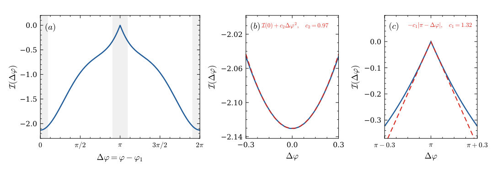 
Figure 1: The ϵ′′(pF ) contribution to the equal-time three-point density correlator, Eq. (37), as a function of the relative orientation ∆φ = φ −φ1 of the external momenta, for |⃗k| = |⃗k1| and angle-independent Landau interaction F(2,0) θθ′ = F0. (a) Full angular range; shading marks the regions enlarged in (b) and (c). (b) Near the parallel configuration, ∆φ = 0, I(∆φ) = I(0) + c2∆φ2 with c2 ≃1.0 (dashed). (c) Near the antiparallel configuration, ∆φ = π, I(∆φ) ≈−c1|π −∆φ| with c1 ≃1.32 (dashed).

**Summary.** This theoretical paper examines how interactions modify the topological information contained in density three-point correlations in 2D Fermi liquids. Using the coadjoint-orbit effective field theory, the authors calculate interaction corrections, finding a new nonanalytic structure dependent on the band curvature. This shows that interaction effects can fundamentally alter the way the system's topology is probed by these correlation functions.

**Why it may be interesting.** While focused on Fermi liquids, the use of advanced effective field theories (coadjoint orbits) to probe subtle nonanalytic behavior in correlation functions is a powerful theoretical tool applicable to understanding quantum critical points and interacting many-body systems in general.

Detailed structure

**Main problem.** The study investigates how electron-electron interactions modify the topological information encoded in density three-point correlation functions within two-dimensional Fermi liquids.

**Main result.** Interaction effects introduce a novel nonanalytic contribution to the density three-point function, proportional to the band curvature $\epsilon''(\mathbf{p}_F)$, demonstrating that topology-detecting correlations are sensitive to interaction details beyond simple renormalization.

**Method.** The authors employ the coadjoint-orbit effective field theory to systematically calculate perturbative corrections to the density correlation function, analyzing specific momentum limits to pinpoint nonanalytic behavior.

**Model / system.** The system is a two-dimensional Fermi liquid. The analysis compares the behavior of density correlations in the noninteracting limit, the Luttinger liquid (1D), and the interacting 2D case, using the coadjoint-orbit formalism for the latter.

**Key observables.** The equal-time density three-point correlation function, $\langle\delta
ho_{\mathbf{k}} \delta
ho_{\mathbf{k}_1} \delta
ho_{\mathbf{k}_2}
angle$, and its nonanalytic structure near specific momentum configurations.

**Important parameters / regimes.** The band curvature $\epsilon''(\mathbf{p}_F)$ and the generalized Landau interaction parameters $F^{(2,0)}$.

**Assumptions / limitations.** The calculations rely on the coadjoint-orbit effective field theory framework and assume angle-independent Landau parameters for explicit limit calculations.

**Figures summary.** The notes reference a figure showing numerical confirmation of a distinct linear cusp in the correlation function near the antiparallel momentum configuration ($\Delta\varphi 	o \pi$).

**Paper structure.** The paper develops the theory by first establishing the noninteracting baseline, then applying the coadjoint-orbit formalism to calculate interaction corrections to the three-point function, analyzing the resulting nonanalytic behavior in specific momentum limits.

Abstract

Density three-point correlations are known to probe the topology of the Fermi sea in two-dimensional noninteracting systems. Here, we study how these correlations are modified by interactions using the coadjoint-orbit effective field theory. A key advantage of the coadjoint-orbit formulation is that it provides a systematic way to incorporate generalized Landau interactions in terms of bosonized degrees of freedom, mapping fermionic loop contributions onto simpler tree-level diagrams. We show that, for a general isotropic dispersion $ε(p)$, even at linear order in the generalized Landau interaction, $\mathcal{O}(\mathcal{F}^{(2,0)})$, there exists a contribution proportional to the band curvature $ε''(p_F)$ that changes the nonanalytic structure of the free density three-point correlation function.   This contribution introduces a distinct nonanalytic structure beyond that found in either the noninteracting case or an interacting Galilean-invariant system, showing that interaction effects can modify the topology-detecting density three-point correlation.

[↑ back to top](#top)

### [Self-partitioned Interfacial Time Crystals](http://arxiv.org/abs/2608.28126v1)

**Authors:** Joseph Huang, Yi Yang  
**Type:** theory · **Category:** other · **PDF:** <https://arxiv.org/pdf/2608.28126v1>  
**Analysis basis:** full PDF text, analyzed in chunks
**Topic relevance:** 🔥 `driven-dissipative phase transition` **5/5** · `analog quantum simulation` **3/5** · `correlated / nonlocal dissipation` **3/5** · `methods for driven-dissipative` **3/5** · `non-equilibrium universality` **3/5** · `Keldysh / 2PI / non-Gaussian methods` **2/5** · `Frenkel-Kontorova` **1/5** · `Tavis-Cummings & cavity-many-emitter` **1/5** · `quantum measurements` **1/5**

📷 Fig 1

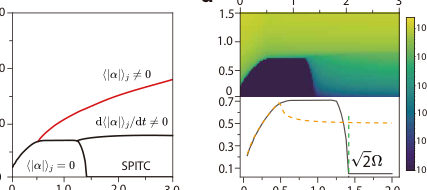 
Figure 2. PBC and OBC Phase diagrams of the Rabi-Hatano- Nelson model. a. The heatmap of vacuum-superradiant PBC phase boundary shown via the critical JPBC c (κ, g). ω0 = Ω= 1, N = 400 and Γ = 0.5. b. The contour map of JPBC c = 0.2 PBC phase bound- ary for different Γ. c. The OBC phase diagram. Black lines are well described by the BdG Hamiltonian, while red lines are extra- polated from the late-time behavior of Eq. (2). d. Upper panel: max ImE of HBdG under OBC. Lower panel: Analytical understand- ing of the boundary [Eq. (4) (orange dashed line) and Eq. (11) (green vertical dashed line) compared with the numerical diagonalization (black line) of the real space BdG Hamiltonian with N =...

📷 Fig 2

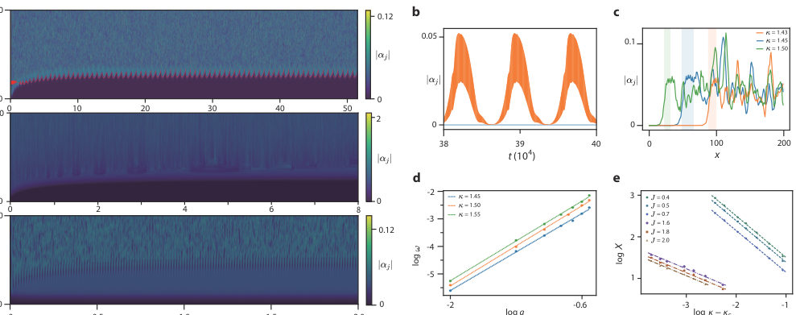 
Figure 3. Self-partitioned interfacial time crystal. a. The space-time diagram for a Γ = 0 Rabi-Hatano-Nelson model when time evolves from a random initial state. Here J = 0.5, g = 0.2, κ = 1.45 and ω = Ω= 1. See SM 2D for the rule of drawing the red curve. b. Dynamics of |α j| in (a) on the 20th site (blue line) and the 50th site (orange line), located outside and within the oscillatory front, respectively. c. Time snapshots of the smoothed photon field in (a) at time t ≈4.0 × 105 for different κ = 1.43, 1.45, 1.5. The shaded regions indicate the location of the spontaneously formed interfacial oscillation. d. The scaling of SPITC frequency as a function of light-matter coupling strength g...

**Summary.** This paper theoretically establishes the existence of a Self-partitioned Interfacial Time Crystal (SPITC) in a nonreciprocal quantum system. By analyzing the Rabi-Hatano-Nelson model, the authors show that the system spontaneously generates an internal interface where time-translation symmetry is broken. The work derives specific scaling laws for this novel spatiotemporal order, providing a route to understanding boundary dynamics in open quantum systems.

**Why it may be interesting.** This work provides a detailed theoretical framework for realizing spatiotemporal order in open, non-Hermitian quantum systems, which is highly relevant to cavity QED and driven quantum optics.

Detailed structure

**Main problem.** The paper investigates whether a homogeneous, open many-body system can spontaneously develop both spatial and temporal order simultaneously, leading to a Self-partitioned Interfacial Time Crystal (SPITC).

**Main result.** The existence of the SPITC phase is demonstrated, which is intrinsically driven by nonreciprocity and open boundary conditions, leading to unique scaling laws for its frequency and boundary position.

**Method.** The analysis uses mean-field theory, linearizing equations of motion via the Bogoliubov de-Gennes (BdG) Hamiltonian, and performing secular approximations to derive effective spin dynamics.

**Model / system.** The system is modeled using a dissipative, nonreciprocal extension of the Rabi-Hatano-Nelson model, involving coupled bosonic chains and two-level spin systems, governed by a Lindblad master equation.

**Key observables.** SPITC frequency ($\omega_{	ext{SPITC}}$), front position ($X$), and the growth rate of the system's stability ($	ext{Re}[d](k^*)$).

**Important parameters / regimes.** Nonreciprocity parameter ($\kappa$), spin-photon coupling strength ($g$), and the ratio of coupling to hopping ($J/\Omega$).

**Assumptions / limitations.** The analysis relies on mean-field approximations and the separation of time scales, treating the slow envelope dynamics separately from fast spin precession.

**Figures summary.** Figures illustrate phase diagrams (PBC and OBC) showing transitions between vacuum, superradiant, and SPITC phases, and the scaling of the boundary position $X$ with nonreciprocity.

**Paper structure.** The paper progresses from establishing the general model and the concept of SPITC, to deriving the effective spin dynamics by integrating out the photon field, and finally analyzing the stability and scaling laws of the resulting interfacial order.

Abstract

Nonequilibrium many-body systems can spontaneously break symmetry in time, as in time crystals, or in space, through self-organized domains and interfaces. Whether these two forms of symmetry breaking can intertwine so that an emergent interface alone hosts time-crystalline order remains unknown. In this work, by introducing the Rabi-Hatano-Nelson model, we unveil the existence and mechanism of a self-partitioned interfacial time crystal (SPITC), where a homogeneous system generates its own internal and tunable interface, at which the time-translation symmetry is also spontaneously broken. Such a SPITC phase is intrinsically induced by nonreciprocity and open boundary conditions, without external pumping or long-range interaction. The periodic and open boundary phase diagrams of the system are both mapped out; vacuum and Dicke-like superradiance with static or active orders are identified, with analytical phase boundaries in the weak coupling limit. The frequency of the SPITC is found to scale quadratically with the spin-photon coupling strength, as we derive analytically for the slow dynamics of the spins. The position of the SPITC boundary scales with a critical exponent of $-1$ as a function of the degree of nonreciprocity, in stark contrast to $-1/2$ for an otherwise stationary boundary. Our construction of SPITC establishes a route to spatiotemporal order in non-Hermitian many-body systems.

[↑ back to top](#top)

### [Role of the Drive in Mediating Correlations Between Two Qubits Through a Shared Dissipative Cavity](http://arxiv.org/abs/2608.28251v1)

**Authors:** Nozhat Ghaseminezhad, Vahid Ameri, Alidad Askari  
**Type:** theory · **Category:** other · **PDF:** <https://arxiv.org/pdf/2608.28251v1>  
**Analysis basis:** full PDF text, analyzed in chunks
**Topic relevance:** 🔥 `correlated / nonlocal dissipation` **4/5** · `Tavis-Cummings & cavity-many-emitter` **3/5** · `analog quantum simulation` **3/5** · `driven-dissipative phase transition` **3/5** · `methods for driven-dissipative` **3/5** · `non-equilibrium universality` **2/5** · `Keldysh / 2PI / non-Gaussian methods` **1/5** · `quantum measurements` **1/5**

📷 Fig 1

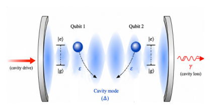 
FIG. 1. Two distinct qubits are coupled to a shared cavity.

📷 Fig 2

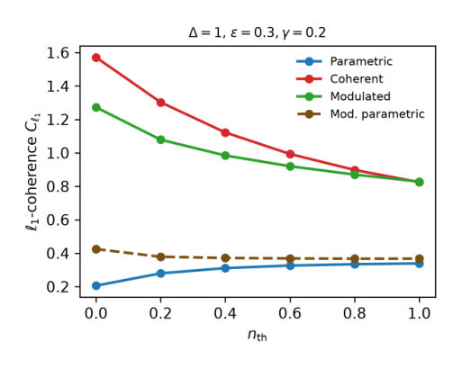 
FIG. 3. ℓ1-norm coherence of the two-qubit state as a function of nth for the parametric (blue), coherent (red), modulated (green), and time-modulated parametric (dashed brown) drives at ∆= 1, ε = 0.3, γ = 0.2 (N3 = 20).

📷 Fig 3

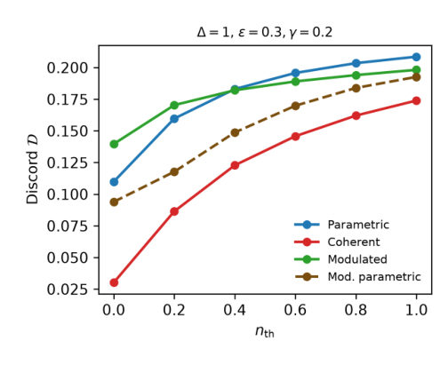 
FIG. 2. Steady-state quantum discord D as a function of the cavity thermal occupation nth for the parametric (blue), coherent (red), modulated (green), and time-modulated para- metric (dashed brown) drives, at detuning ∆= 1, coupling ε = 0.3, damping γ = 0.2 (N3 = 20).

📷 Fig 4

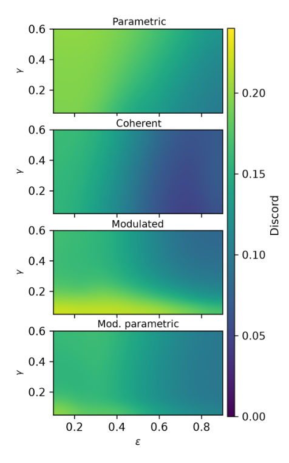 
FIG. 4. Steady-state discord in the (ε, γ) plane at nth = 0.5 (9×9 grid) at ∆= 1, for the parametric, coherent, modulated, and time-modulated parametric (mod. param.) drives.

📷 Fig 5

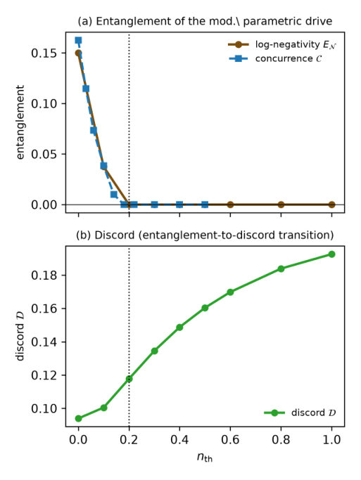 
FIG. 5. Entanglement-to-discord transition of the time- modulated parametric drive (A = 0.10, w = ∆= 1, ε = 0.3, γ = 0.2, N3 = 20). (a) Log-negativity EN (solid) and con- currence C (dashed) versus the cavity temperature nth: the two-qubit entanglement is destroyed by nth ≃0.2. (b) The quantum discord, which keeps growing as the entanglement vanishes, so a single drive tunes the correlations from entan- gled at low temperature to discordant (still non-classical) at high temperature.

**Summary.** This paper investigates how driving a shared dissipative cavity mediates correlations between two qubits. It finds that while static drives only generate quantum discord, a time-modulated parametric drive can generate genuine entanglement at low temperatures. Crucially, increasing thermal noise causes the system to undergo a transition from entanglement to a state characterized only by discord.

**Why it may be interesting.** This work is highly relevant to AMO physics and open quantum systems, as it models how engineered dissipation and driving fields can be used to control the transition between different types of quantum correlations (entanglement to discord) in cavity QED setups.

Detailed structure

**Main problem.** To determine how the specific driving mechanism applied to a shared dissipative cavity controls the nature and magnitude of quantum correlations (discord vs. entanglement) between two coupled qubits.

**Main result.** The time-modulated parametric drive is uniquely capable of generating genuine two-qubit entanglement at low temperatures, which subsequently decays into a state exhibiting only quantum discord as temperature increases.

**Method.** The study employs numerical simulation of the master equation, often utilizing an adiabatic elimination technique to derive an effective two-qubit model.

**Model / system.** The system consists of two qubits coupled solely through a single, shared, damped, and driven optical cavity mode. The dynamics are governed by the master equation incorporating dissipation and various driving Hamiltonians.

**Key observables.** Quantum Discord, Entanglement (Logarithmic Negativity, Concurrence), and single-qubit coherence ($\ell_1$-norm).

**Important parameters / regimes.** Cavity temperature ($n_{	ext{th}}$), coupling strength ($\epsilon$), and damping rate ($\gamma$).

**Assumptions / limitations.** The analysis relies on the adiabatic elimination of the cavity mode to derive an effective two-qubit Hamiltonian and dissipation channel.

**Figures summary.** Figures illustrate the growth of quantum discord with increasing temperature for various drives, and specifically show the entanglement-to-discord transition curve for the time-modulated parametric drive.

**Paper structure.** The paper systematically compares four different driving schemes (Parametric, Coherent, Modulated, Time-modulated Parametric) by analyzing the steady-state values of discord and entanglement as a function of temperature and coupling parameters.

Abstract

Using a numerically exact master equation, we demonstrate that two qubits, coupled solely through a shared damped, driven cavity, can become correlated. The drive influences both the amount and the type of correlation. For parametric, coherent, and resonantly modulated drives, the qubits develop quantum discord that increases with cavity temperature, while the logarithmic negativity remains numerically zero. This indicates the presence of discord without entanglement. In contrast, a time-modulated parametric drive is the only one that generates genuine two-qubit entanglement, achieving \(E_\mathcal{N} \simeq 0.15\) and concurrence \(\simeq 0.16\) at \((\eps, γ) = (0.3, 0.2)\), which rises to \(E_\mathcal{N} \simeq 0.32\) in the weak-coupling, moderate-damping region. Heating eventually destroys this entanglement around \(n_{\mathrm{th}} \simeq 0.2\), while discord continues to grow, resulting in a temperature-driven transition from entanglement to discord within a single drive. Moreover, the parametric drive offers the best protection for single-qubit coherence, unlike the coherent and modulated drives. An adiabatic-elimination model indicates that the cavity generates an effective coupling and a collective dephasing channel, both of which increase with temperature, explaining the observed discord without entanglement.

[↑ back to top](#top)

### [Pulling strings in real time: flux tube dynamics in (2+1)-d $\mathbb{Z}_2$-Higgs Gauge Theories](http://arxiv.org/abs/2608.27561v1)

**Authors:** Zeno Bacciconi, Martina Frau, Luca Tagliacozzo, Michele Caselle, Marcello Dalmonte  
**Type:** theory · **Category:** statistical mechanics · **PDF:** <https://arxiv.org/pdf/2608.27561v1>  
**Analysis basis:** full PDF text, analyzed in chunks
**Topic relevance:** 🔥 `methods for driven-dissipative` **4/5** · 🔥 `scars & prethermalization` **4/5** · `driven-dissipative phase transition` **3/5** · `non-equilibrium universality` **3/5** · `Keldysh / 2PI / non-Gaussian methods` **2/5** · `analog quantum simulation` **2/5**

📷 Fig 1

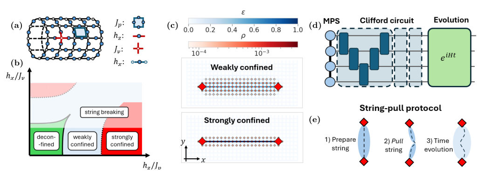 
FIG. 1. Framework for large-scale string simulations. (a) Schematic representation of the Z2-Higgs gauge theory Hamiltonian introduced in Eq. 2, comprising plaquette (Jp), vertex (Jv), confining field (hz), and gauge-matter coupling (hx) terms. (b) Phase diagram as a function of hx/Jv and hz/Jp, showing the deconfined, weakly confined, and strongly confined regimes, as discussed in Sec. II A 2. Owing to electric–magnetic duality, the phase diagram is symmetric with respect to the diagonal; hence, we restrict our analysis to hx &lt; 0.2, indicated by the unshaded region. String breaking can occur for any finite gauge–matter coupling, hx &gt; 0. (c) Representative snapshots of strings connecting...

📷 Fig 2

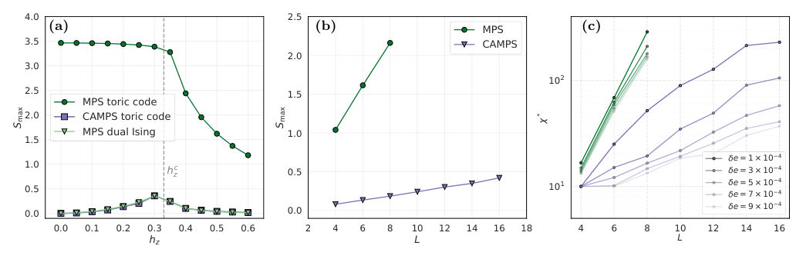 
FIG. 2. Comparison of entanglement scaling and computational costs. (a) Maximum bipartite entanglement entropy, Smax, for the toric code and its dual Ising model as a function of the magnetic field ⃗h = (0, 0, hz). Ground states are obtained using both standard MPS and CAMPS. (b) Maximum bipartite entanglement entropy, Smax, of the toric code [Eq. 2] in a magnetic field ⃗h = (0.2, 0.0, 0.5), comparing groundstates computed via standard MPS and CAMPS. (c) Bond dimension needed to reach cylinders of size L × L for the two methods. Different lines correspond to different target accuracies in the groundstate energies.

📷 Fig 3

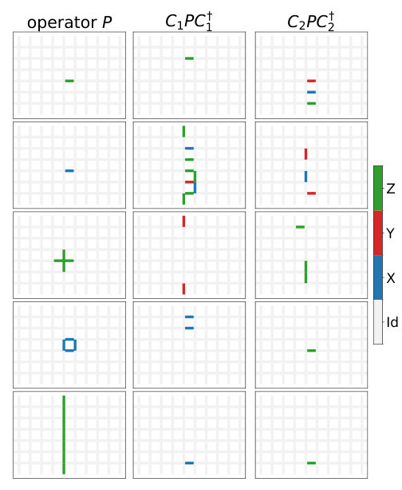 
FIG. 3. Operator mappings under the optimized Clif- ford circuit in different phases. Left column: Few im- portant initial operators P. Center column: Mapping of P under the Clifford part of the CAMPS ansatz in the decon- fined phase hx = 0.2, hz = 0.2 (C1) Right column: Mapping of P under the Clifford part of the CAMPS ansatz in the confined phase hx = 0.2, hz = 0.5 (C2) . The Clifford is non- local up to a range Ly, which is needed to reduce the area law prefactor in the entanglement entropy that the MPS part has to represent.

📷 Fig 4

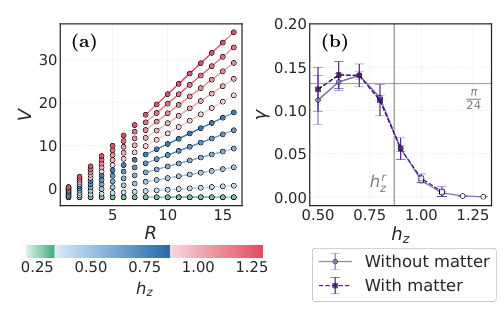 
FIG. 4. Confining potential and L¨uscher term. (a) Confining potential V (Eq.42). Different curves correspond to values of the magnetic field ⃗h = (0, 0, hz), with hz uni- formly spaced in the interval [0.2, 1.3] in steps of 0.1.Values with hz &lt; hc z ≃0.33 lie in the deconfined phase (green lines), hc z &lt; hz &lt; hr z ≃0.87 correspond to the weakly confined (rough) phase (blue lines), and hz &gt; hr z to the strongly con- fined (stiff) phase (red lines). Data are obtained with a bond dimension of χ = 100. The values of the string tension σ ob- tained from the fits are summarized in the table. (b) L¨uscher term γ = γ0/v. The coefficient γ0 is extracted by fitting Eq. 42. The two curves correspond...

📷 Fig 5

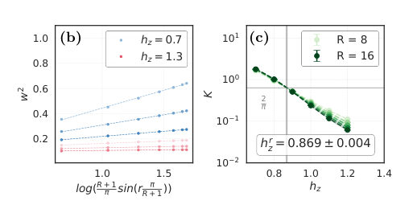 
FIG. 5. String profile and widths. (a) Transverse string profiles as a function of position, for size 30 × 12, and for two values of magnetic field: ⃗h1 = (0.0, 0.0, 0.5) and ⃗h2 = (0.2, 0.0, 0.5). The profile is fitted with two functional forms: a Gaussian, shown by solid lines, and a modified Bessel function, shown by dashed lines. The table below panel (a) reports, for ⃗h1 (first row) and ⃗h2 (second row), the ratio χ2 red,K0/χ2 red,G, together with the fitted K0-ansatz parameters w2 and λ. Since the modified-Bessel ansatz yields a reduced χ2 approximately three orders of magnitude smaller than that of the Gaussian ansatz, only the parameters of the former are reported.Errors smaller...

**Summary.** This work investigates flux tube dynamics in a 2D $\mathbb{Z}_2$-Higgs gauge theory using the advanced CAMPS tensor network method. By simulating dynamics far beyond current computational limits, the authors confirm that effective string theory describes non-equilibrium string behavior. The results reveal a previously unknown long-lived prethermal regime in strongly confined systems.

**Why it may be interesting.** The use of advanced tensor network techniques (CAMPS) to simulate real-time dynamics in gauge theories provides a powerful, scalable tool for studying non-equilibrium quantum many-body physics, bridging condensed matter and high-energy theory.

Detailed structure

**Main problem.** The core problem is understanding the non-perturbative physics of confinement by studying real-time flux-tube dynamics in higher spatial dimensions.

**Main result.** The study provides *ab initio* evidence that effective string theory accurately captures non-equilibrium string dynamics, revealing a novel, long-lived prethermal regime for strongly confined flux tubes.

**Method.** The authors employ a specialized Clifford-augmented Matrix Product States (CAMPS) framework combined with a string-pull protocol to simulate real-time evolution.

**Model / system.** The system studied is a $\mathbb{Z}_2$-Higgs Gauge Theory defined on a $(2+1)$-dimensional lattice, whose dynamics are governed by a Hamiltonian related to the toric code.

**Key observables.** Confining potential (Lüscher term), energy spectrum of the flux tube, string roughening properties, and the persistence time of local dynamics ($t_J \gtrsim 100$).

**Important parameters / regimes.** System sizes and timescales are pushed orders of magnitude beyond current experimental and numerical capabilities.

**Assumptions / limitations.** The method assumes that Clifford-augmentation can incorporate gauge invariance and approximate duality, and the analysis is limited to $2+1$ dimensions.

**Figures summary.** Figures illustrate the Hamiltonian terms, the phase diagram showing confinement regimes, snapshots of string fields, the CAMPS ansatz, and the visualization of the string-pull protocol.

**Paper structure.** The paper introduces the physical problem, details the CAMPS methodology, benchmarks the approach using string-pulling to test effective string theory predictions, and concludes by analyzing the dynamics in different confinement regimes.

Abstract

Understanding real-time flux-tube dynamics in more than one spatial dimension is key to unlocking the non-perturbative physics of confinement, and is now actively pursued by quantum computing and simulation experiments. However, describing such dynamics has proven to be extremely challenging with both experiments and state-of-the-art numerical simulations limited to small volumes and short timescales. Here we investigate flux tube statics and real-time evolution in a genuine two-dimensional $\mathbb{Z}_2$ Higgs gauge theory at system sizes and timescales order of magnitude beyond present experiments and numerics. The key enabling element is the recently introduced Clifford-augmented matrix product states (CAMPS) framework, which we demonstrate to parametrically reduce the entanglement that must be represented in the matrix product state; both in the pure-gauge limit and in the presence of dynamical matter. We benchmark this capability through stringent tests of effective string theory, including universal spectral features and flux tube roughening properties in presence of matter. We then introduce a string-pull protocol that selectively excites transverse modes and reconstructs their finite-size spectrum in real time. In the rough regime, the response is collective, and our simulations show that this is also well captured by universal effective string theory predictions. Strong confinement instead produces long-lived, lattice-locked local dynamics persisting to times $tJ \gtrsim 100$. These results provide ab initio evidence that effective string theory captures nonequilibrium string dynamics and reveal a hitherto unexplored long-lived prethermal regime of strongly confined flux tubes, providing a novel angle on how confinement dictates dynamics in more than one spatial dimension.

[↑ back to top](#top)

### [A Single Spin Switches the Steady-State Phase of an Open Quantum System](http://arxiv.org/abs/2608.28390v1)

**Authors:** Jianwen Jie  
**Type:** theory · **Category:** statistical mechanics · **PDF:** <https://arxiv.org/pdf/2608.28390v1>  
**Analysis basis:** full PDF text, analyzed in chunks
**Topic relevance:** 🔥 `driven-dissipative phase transition` **4/5** · `correlated / nonlocal dissipation` **3/5** · `methods for driven-dissipative` **3/5** · `non-equilibrium universality` **3/5** · `analog quantum simulation` **2/5** · `Keldysh / 2PI / non-Gaussian methods` **1/5** · `quantum measurements` **1/5**

📷 Fig 1

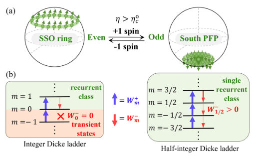 
FIG. 1. (a) Parity-selected macroscopic states. At fixed η &gt; ηo c, adding or removing one spin switches between the even-N SSO ring and the odd-N south-polar fixed point. (b) Parity-dependent Dicke-ladder connectivity. Blue (red) ar- rows denote W + m (W − m). For integer S, the jump zero W − 0 = 0 makes m &lt; 0 transient and leaves m ≥0 as the closed recur- rent class; for half-integer S, m = 0 is absent and W − 1/2 &gt; 0 connects the full ladder into a single recurrent class.

📷 Fig 2

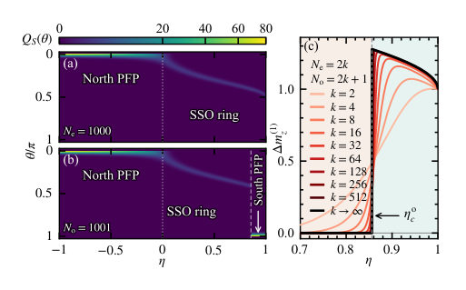 
FIG. 2. Finite-size parity comparison. (a,b) Normalized Husimi-Q functions QS(θ) for the adjacent sizes Ne = 1000 and No = 1001. The dotted and dashed vertical lines mark η = 0 and ηo c, respectively. (c) Adjacent-size magnetization contrast ∆m(1) z,k = |mo z,k −me z,k| for Ne = 2k and No = 2k+1. The black curve is the thermodynamic-limit result.

📷 Fig 3

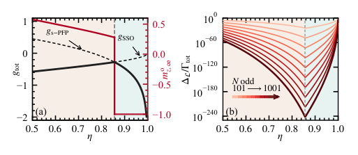 
FIG. 3. First-order DPT of the odd-N sequence. (a) Branch- resolved rate potentials gSSO and gs-PFP (black dashed), their lower envelope gtot (black solid, left axis), and the conjugate order parameter—the odd-sequence steady-state polarization mo z,∞(red, right axis). (b) Liouvillian gap ∆L/Γtot for odd N = 101, 201, . . . , 1001; darker curves denote larger N, and the vertical dashed line marks ηo c.

📷 Fig 4

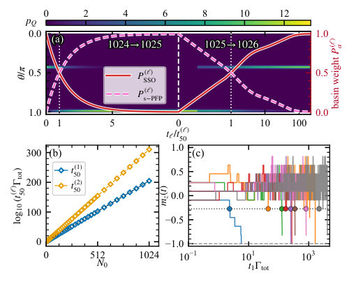 
FIG. 4. (a) Sector-weighted polar Husimi density pQ(θ, tℓ) = 2π sin θ P

📷 Fig 5

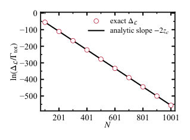 
FIG. 5. Full Liouvillian gaps at η = ηo c for the odd sizes used in Fig. 3(b) (symbols); for every symbol the minimum lies in the population block. The solid guide has the analytic population-gap slope −2zc from Eq. (B4).

**Summary.** This paper demonstrates that adding a single spin to an open quantum system can induce a first-order phase transition, switching the steady state between two macroscopically distinct regimes. This control mechanism is fundamentally linked to the parity of the system size, which dictates whether the system samples a specific zero in the loss amplitude. The findings establish jump-operator zeros as a general route for single-constituent control over quantum steady states.

**Why it may be interesting.** This work provides a powerful, non-perturbative mechanism—using parity selection via jump-operator zeros—to control the macroscopic steady state of an open quantum system, which is highly relevant for understanding quantum dissipation and control in AMO physics.

Detailed structure

**Main problem.** The study investigates whether adding a single constituent spin to a many-body open quantum system can induce a macroscopic switch between distinct steady-state phases.

**Main result.** The system exhibits a first-order dissipative phase transition, where the steady state switches between a phase-averaged ring and a south-polar fixed point, depending on the parity of the number of spins.

**Method.** The analysis employs steady-state calculations using the Lindblad equation, focusing on rate potentials, large-deviation theory, and analyzing parity-dependent connectivity defects in the Dicke ladder.

**Model / system.** The model is an open quantum system of N spin-1/2 constituents governed by a Lindblad equation, analyzed on the Dicke ladder structure. The dynamics are controlled by a dissipation imbalance parameter, $\eta$.

**Key observables.** Steady-state phases (SSO ring vs. s-PFP), magnetization contrast ($\Delta m_z$), and the order parameter derived from rate potentials.

**Important parameters / regimes.** Dissipation imbalance ($\eta$), critical imbalance ($\eta_c$), and the parity of the total number of spins (N).

**Assumptions / limitations.** The analysis relies on the assumption that the macroscopic switch is a global large-deviation effect, not a finite-order correction, and involves analyzing the system's behavior near specific zero-current conditions.

**Figures summary.** Figures illustrate the macroscopic switch between even-N and odd-N steady states, the parity-dependent connectivity defect (jump zero) in the Dicke ladder, and the evolution of rate potentials and crossing times with system size.

**Paper structure.** The paper progresses from establishing the general problem of single-constituent control, to deriving the parity-dependent connectivity defect, calculating the first-order phase transition via rate potentials, and finally analyzing the associated metastable dynamics and switching exponents.

Abstract

Changing a many-body system by one constituent is normally expected to produce only a vanishing correction to an intensive observable. Here we show that, above a critical dissipation imbalance, adding one spin at fixed intensive controls switches the steady state of a dissipative collective spin between a phase-averaged ring and a south-polar fixed point. Unlike previously proposed one-spin sensing through dark-state interference, parity here determines whether the Dicke ladder samples a zero of the state-dependent nonlinear-loss amplitude. The integer-spin ladder samples this zero, making Dicke states with m<0 transient; the half-integer ladder misses it and remains a single recurrent class. Exact finite-size steady states show that exponential competition between stationary weights amplifies this microscopic connectivity difference, yielding a first-order dissipative phase transition confined to the odd-N sequence. One-spin loading, with all populated spin sectors retained, confirms that rare quantum fluctuations induce the switch without postselection. Our results establish jump-operator zeros as a route for single-constituent control of steady-state phases.

[↑ back to top](#top)

### [Topological Winding Readout of an Emergent Page-Wootters Clock](http://arxiv.org/abs/2608.27650v1)

**Authors:** Hesam Zaravashan, Gabriele Gradoni, Mohsen Khalily  
**Type:** both · **Category:** quantum information and computing · **PDF:** <https://arxiv.org/pdf/2608.27650v1>  
**Analysis basis:** full PDF text, analyzed in chunks
**Topic relevance:** 🔥 `quantum optics experiment` **4/5** · `analog quantum simulation` **3/5** · `interference shaping light` **3/5** · `quantum measurements` **2/5** · `Full counting statistics` **1/5** · `QC/QI experiment` **1/5** · `Tavis-Cummings & cavity-many-emitter` **1/5** · `driven-dissipative phase transition` **1/5** · `methods for driven-dissipative` **1/5**

📷 Fig 1

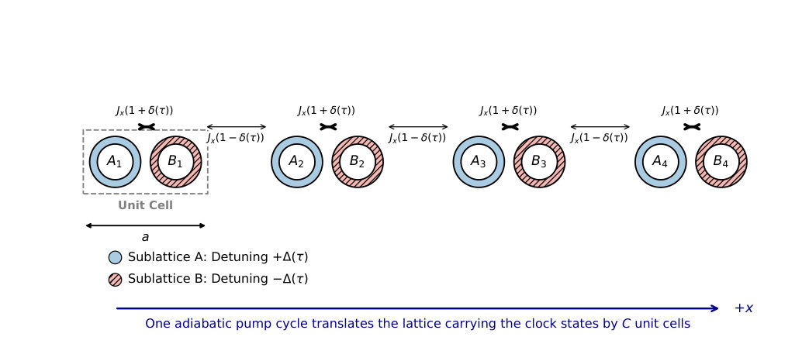 
Figure 1: Rice–Mele microring chain carrying the clock band. Each unit cell contains two rings, A and B, of length a. Alternating couplings Jx(1±δ) dimerise the chain and a staggered detuning ±∆offsets the two sublattice resonances; both are control parameters, cycled adiabatically around the Dirac point at (δ, ∆) = (0, 0) in Sec. 3.

📷 Fig 2

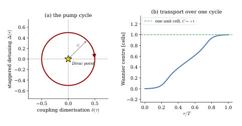 
Figure 2: (a) The cycle of Eq. (20) in the (δ, ∆) plane, a circle of radius R encircling the Dirac point without touching it; the minimum gap on the loop is 2RJx. (b) Hybrid Wannier centre of the lower band through one cycle, computed from the King-Smith–Vanderbilt polar- isation. It advances by one unit cell in the +x conven- tion, corresponding to Eq. (23) with C = +1.

📷 Fig 3

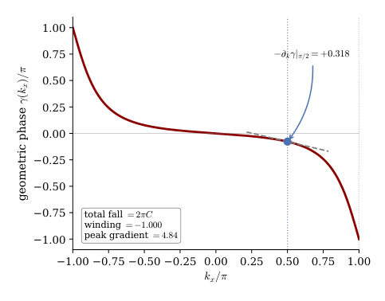 
Figure 3: Geometric phase γ(kx) accumulated over one pump cycle, computed as a Wilson loop in τ at each momentum. The unwrapped profile falls by −1.000 turns across the zone, which is Eq. (25) with C = +1. The dashed line is the tangent at the operating point kx = π/2, where the local slope −∂kxγ = 0.318 lies well below the zone average of unity; the gradient peaks at 4.84 near the zone edge, which is what sets the sam- pling condition of Eq. (33). This profile is the quantity the fringe of Sec. 4 samples.

📷 Fig 4

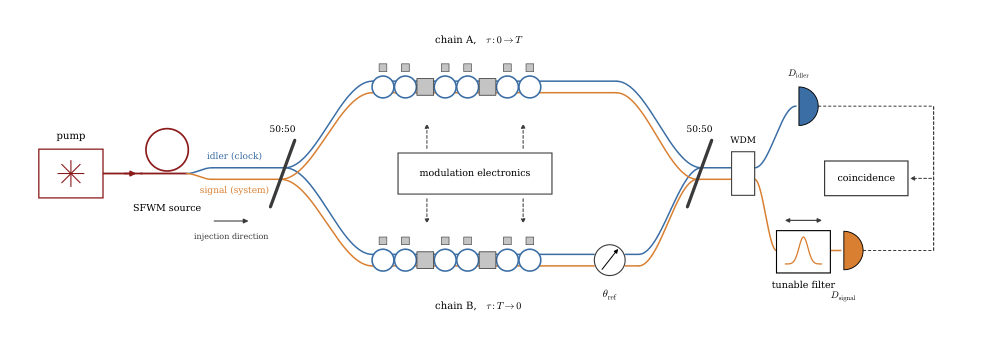 
Figure 4: The winding readout in the parallel implementation of Sec. 6.1. A degenerate pump drives spontaneous four-wave mixing in a microring source, and the pair is split into an idler, which carries the clock, and a signal, which serves as the system and as the phase reference. The idler amplitude is divided between two nominally identical Rice–Mele chains, which the modulation electronics drive through the loop of Eq. (20) in opposite orientations, τ : 0 →T in one and τ : T →0 in the other, so that the dynamical phase cancels and the fringe difference isolates 2γ(kx). A tunable narrowband filter on the signal steps the heralded idler momentum through the anticorrelation of Eq. (10),...

📷 Fig 5

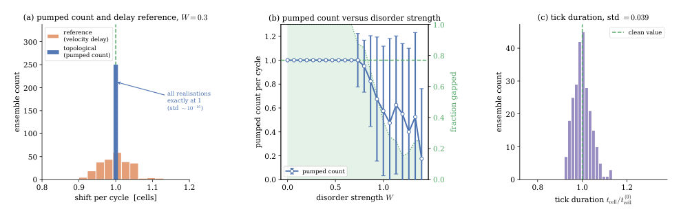 
Figure 5: Quenched disorder at strength W, from Resta polarisation transport on a finite ring. (a) At W = 0.3 the pumped count is pinned at one cell across the whole ensemble, with a standard deviation at the level of machine precision, while a group-velocity delay reference drifts with a spread set linearly by the disorder. (b) The count stays quantised until the disorder closes the bulk gap; the shaded curve is the fraction of realisations that remain gapped. (c) The tick duration inherits the disorder of the group velocity and spreads by 3.9% over the same ensemble. The count is protected; the scale is not.

**Summary.** This paper proposes a photonic experiment to measure a topological invariant associated with time, modeled after the Page-Wootters construction. Using coupled microring resonators, they generate entangled photon pairs whose properties encode the topological winding number. This demonstrates a pathway to experimentally verify topological concepts in quantum optics.

**Why it may be interesting.** This work directly connects fundamental concepts from topological band theory (Chern numbers, winding numbers) to a physical, measurable quantum optical platform, providing a novel method for quantum resource quantification.

Detailed structure

**Main problem.** The paper addresses whether a clock degree of freedom, when time is encoded in a Hilbert space via the Page-Wootters construction, can carry a measurable topological invariant.

**Main result.** They demonstrate that the topological winding of the geometric phase, quantified by the Chern number, can be measured using a photonic architecture, providing a robust, quantized readout.

**Method.** The measurement involves adiabatically cycling control parameters in a coupled microring array to induce a controlled geometric phase, which is then read out via two-photon coincidence interference.

**Model / system.** The system uses spontaneous four-wave mixing in a coupled microring array, modeling the clock/system partition using the Rice-Mele Hamiltonian. The process relies on the non-product nature of the generated signal-idler pair state.

**Key observables.** The winding number (related to the Chern number), the geometric phase $\gamma(k_x)$, and the quantized Wannier center displacement.

**Important parameters / regimes.** The gap closing point, the coupling strength ($\delta, \Delta$), and the required total number of coincidences ($\approx 5.6 	imes 10^3$).

**Assumptions / limitations.** The measurement assumes the gap remains open for topological protection, and the readout relies on the signal photon providing the phase reference relationally.

**Figures summary.** Figures illustrate the loop in the control parameter space, the Berry curvature, and the quantized Wannier-centre advance, while tables detail parameter budgets and readout performance comparisons.

**Paper structure.** The paper first establishes the theoretical framework linking time to a topological invariant, then details the photonic implementation using coupled resonators, and finally presents the measurement protocol and robustness analysis.

Abstract

The Page--Wootters construction gives time a Hilbert space, representing it as an internal degree of freedom whose readings the rest of the system evolves with respect to. We ask whether such a clock degree of freedom can carry a topological invariant, and we propose a photonic architecture in which it does and in which the invariant can be measured. Signal--idler pairs from spontaneous four-wave mixing in a coupled microring array supply the clock--system partition, with the idler occupying a Rice--Mele band whose staggered coupling and detuning are cycled adiabatically around a gap-closing point. One cycle acts on that band as a rigid translation by \(C\) unit cells, times a geometric phase periodic in the crystal momentum, times a dynamical phase, an identity exact in the adiabatic limit and independent of the state on which it acts. The readout targets the winding of that geometric phase across the Brillouin zone. Reversing the traversal of the pump loop cancels the dynamical phase and isolates twice the geometric phase in a two-photon coincidence fringe, while energy anticorrelation lets a filter on the signal scan the clock momentum without touching the clock and supplies the phase reference relationally, in place of an external optical reference. The estimate is protected on two independent levels, by the gap against smooth deformation and by the digital character of the unwrapping against noise below a threshold. A parameter budget anchored to thin-film lithium niobate places the requirements within reach at a conservative operating point.

[↑ back to top](#top)

### [Crystal-phase quantum dots in AlGaAs nanowires](http://arxiv.org/abs/2608.28353v1)

**Authors:** Rohan Radhakrishnan, Rodion Reznik, Gilles Patriarche, Lorenzo Leandro, Igor Ilkiv, Anna Andreeva, Artem Khrebtov, George Cirlin, Nika Akopian  
**Type:** experiment · **Category:** quantum information and computing · **PDF:** <https://arxiv.org/pdf/2608.28353v1>  
**Analysis basis:** full PDF text, analyzed in chunks
**Topic relevance:** 🔥 `QC/QI experiment` **4/5** · `quantum optics experiment` **3/5** · `analog quantum simulation` **2/5** · `interference shaping light` **1/5** · `quantum measurements` **1/5**

📷 Fig 1

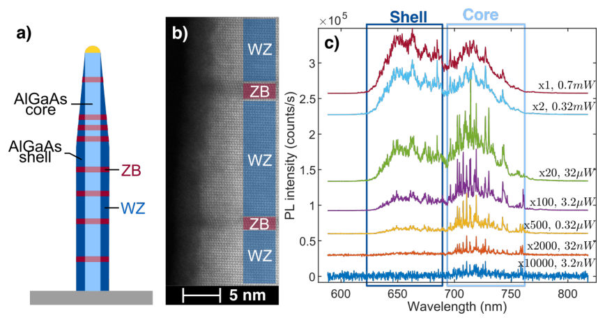 
Figure 1: Core-shell structure and emission. (a) Schematic of the AlGaAs nano-

📷 Fig 2

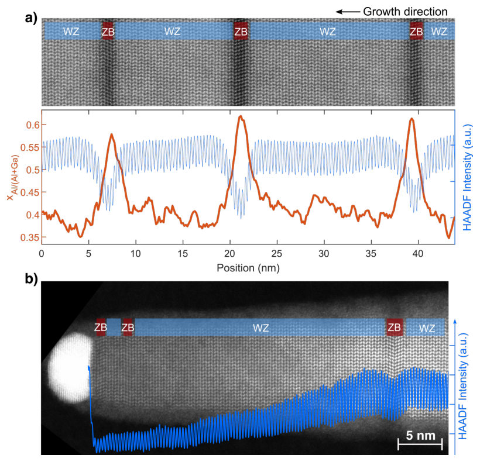 
Figure 2: Compositional analysis of the crystal-phase insertions. (a) HAADF-

📷 Fig 3

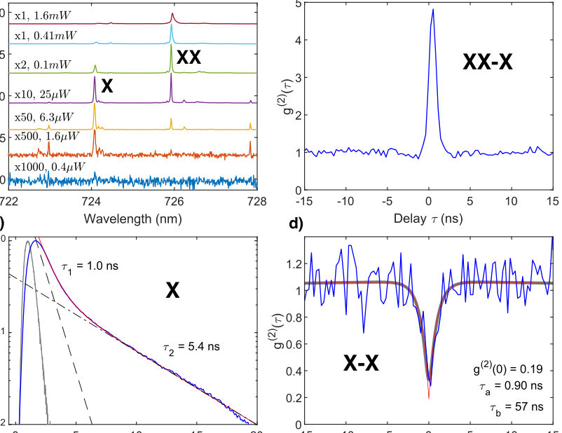 
Figure 3: Exciton - biexciton complex in an AlGaAs CPQD. (a) Power-dependent

📷 Fig 4

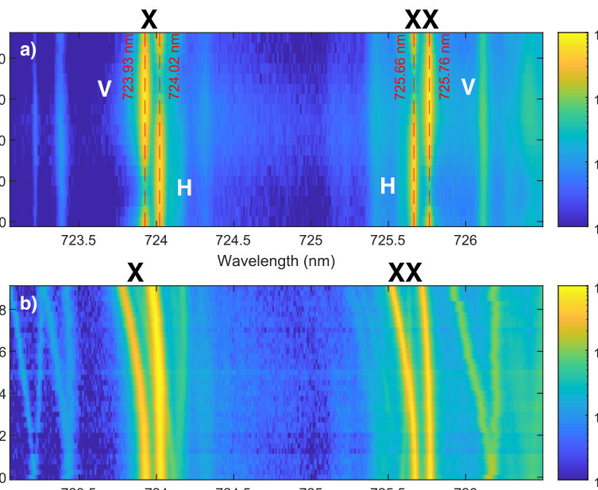 
Figure 4: Fine-structure of the exciton state and its magnetic evolution. (a) Linear-

**Summary.** This work reports on the use of crystal-phase quantum dots (CPQDs) in AlGaAs nanowires as a highly controllable platform for quantum emitters. By achieving narrow linewidths and confirming single-photon emission, the authors demonstrate that these structures can meet the stringent optical quality requirements for quantum technologies. The findings establish the utility of crystal-structure control over material composition for scalable quantum device fabrication.

**Why it may be interesting.** The demonstration of high-quality, deterministically placed single-photon emitters in a novel material system (AlGaAs CPQDs) directly addresses a key hardware challenge for quantum photonic circuits and quantum networking.

Detailed structure

**Main problem.** The paper addresses the need for scalable, high-quality quantum dot platforms for photonic quantum technologies by investigating crystal-phase quantum dots (CPQDs).

**Main result.** They report achieving bright single-photon emission with narrow linewidths ($\sim 61 \mu	ext{eV}$) in AlGaAs nanowires, attributing this superior optical quality to a favorable type-I band alignment.

**Method.** The study combines structural characterization (HAADF-STEM, EDX) with advanced optical measurements, including time-resolved photoluminescence, polarization-resolved PL, and photon correlation measurements.

**Model / system.** The physical system is Quantum Dots formed by crystal-phase switches (CPQDs) embedded in AlGaAs nanowires, where confinement is dictated by the band offset between zincblende and wurtzite crystal structures.

**Key observables.** Narrow linewidths ($\sim 61 \mu	ext{eV}$), single-photon antibunching ($g^{(2)}(0) < 0.5$), exciton fine-structure splitting, and Zeeman splitting.

**Important parameters / regimes.** Exciton lifetime ($\sim 1 	ext{ ns}$), linewidths ($\mu	ext{eV}$ range), and magnetic field strength (up to 9 T).

**Assumptions / limitations.** The superior performance is linked to the type-I band alignment, which avoids issues associated with type-II alignment, and the confinement potential is determined by the band offset, not just composition.

**Figures summary.** Figures illustrate the core-shell structure, compositional analysis showing Al fluctuations confined to the shell, and optical measurements confirming single-photon emission and quantum dot characteristics.

**Paper structure.** The paper progresses from establishing the limitations of previous QD platforms to presenting structural evidence of the AlGaAs core-shell structure, followed by detailed optical characterization proving high-quality single-photon emission and determining the type-I band alignment.

Abstract

Crystal-phase quantum dots (CPQDs)$\unicode{x2014}$quantum dots in nanowires defined by crystal structure rather than material composition$\unicode{x2014}$constitute the only platform capable of fabricating quantum-dot arrays with the ultimate precision of a single atomic layer. This intrinsic control yields perfectly aligned quantum dots with atomically sharp interfaces, providing a unique pathway toward scalable quantum-dot-based photonic quantum technologies. To date, CPQDs have been studied primarily in binary semiconductors, such as InP and GaAs, where their emission linewidths are typically in the meV range, thereby limiting their technological potential. Here, we report, for the first time, CPQDs in AlGaAs nanowires and show bright single-photon emission with linewidths as narrow as 61 $μeV$ and low background emission, demonstrating optical quality well beyond typical CPQDs. We attribute this performance to a type-I band alignment, as suggested by an exciton lifetime of 1 ns, significantly shorter than that typically observed in type-II CPQDs. Additionally, we observe an exciton fine-structure splitting and a Zeeman splitting, as commonly observed in standard type-I self-assembled quantum dots.

[↑ back to top](#top)

### [Kerr nonlinearity and three-wave mixing in superconducting resonators hosting Al-InAs weak links](http://arxiv.org/abs/2608.28428v1)

**Authors:** Vittorio Buccheri, Ivo P. C. Cools, Nermin Trnjanin, Ankit Khola, Oleg Shvetsov, Thomas Kanne, Jesper Nygård, Attila Geresdi, Simone Gasparinetti  
**Type:** experiment · **Category:** quantum information and computing · **PDF:** <https://arxiv.org/pdf/2608.28428v1>  
**Analysis basis:** full PDF text, analyzed in chunks
**Topic relevance:** 🔥 `QC/QI experiment` **4/5** · `driven-dissipative phase transition` **3/5** · `quantum optics experiment` **2/5** · `analog quantum simulation` **1/5** · `quantum measurements` **1/5**

📷 Fig 1

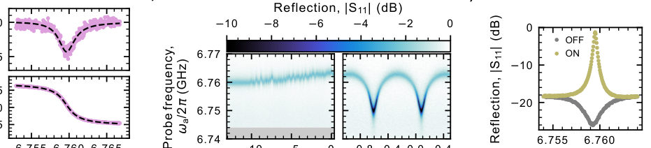 
FIG. 1: Device and characterization. a) False-colored scanning electron micrograph showing two InAs junctions (red), JJ1 and JJ2, defined by selectively etching a 250-nm section of the Al shell (green) covering the nanowire. The nanowire is embedded in the resonator structure (made of NbTiN, not shown) via Ti-Al contacts (yellow) obtained from a standard lift-off process, together with the gate lines V1 and V2 (purple), and a ground screening line (light gray) separating the two gates. b) Simplified circuit diagram. An LC resonator with total inductance Lr + 2Ls shares two equal inductive sections Ls with two gate-tunable weak links arranged in superconducting loops. The magnetic fluxes...

📷 Fig 2

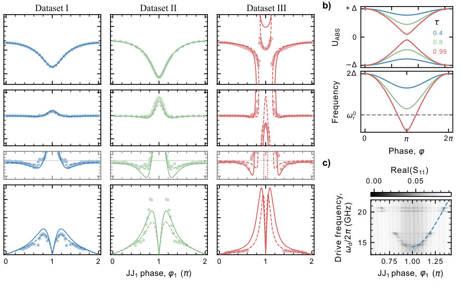 
FIG. 2: Single-junction configuration (JJ1 active, JJ2 pinched-off). a) Measured frequency shift, δωr, as a function of the phase across JJ1, φ1, for Dataset I (left, V1 = 0.35 V), II (center, V1 = 2.2 V) and III (right, V1 = 1.25 V). Solid and dashed lines reproduce single- (Eq. 1) and double-channel (Eq. S8) model, respectively, with the parameters given in Tab.S1. b) Single Andreev bound state (ABS) model for three representative transparencies τ. Top: Ground- and excited-state ABS energies versus superconducting phase, ±UABS(φ). Bottom: Corresponding ABS excitation frequency 2UABS(φ). The horizontal dashed line indicates the bare resonator frequency ω0 r . c) Two-tone spectroscopy...

📷 Fig 3

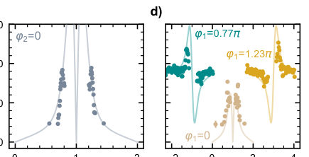 
FIG. 3: Two-junction configuration. Kerr nonlinearity K measured at gate voltages V1 = 1.58 V and V2 = 1.94 V, a) versus φ1 with φ2 = 0, and b) versus φ2 with φ1 = 0 (sand) and φ1 = π (violet). Solid lines show K(φ1) + K(φ2) calculated from Eq. 3. Cubic nonlinearity g3 measured at gate voltages V1 = −0.05 V and V2 = 1.15 V, c) versus φ1 with φ2 = 0, and d) versus φ2 with φ1 = 0 (sand), φ1 = 0.77π (teal) and φ1 = 1.23π (gold). The three datasets in d) are displayed over successive phase periods for clarity. Solid lines show |g3(φ1) + g3(φ2)| calculated from Eq. 2. Model param- eters are listed in Tab. S2.

**Summary.** This paper reports on the experimental realization and characterization of highly nonlinear superconducting resonators using Al-InAs weak links. The researchers demonstrated the ability to tune the Kerr nonlinearity to zero while maintaining a strong, controllable cubic nonlinearity. This establishes the semiconductor-superconductor hybrid platform as a promising tool for quantum parametric amplification and quantum control.

**Why it may be interesting.** This work directly addresses the engineering challenge of creating nonlinear quantum elements, which is crucial for building scalable quantum circuits and quantum memories.

Detailed structure

**Main problem.** The primary goal is to engineer superconducting resonators that exhibit a controllable cubic nonlinearity for quantum applications while simultaneously suppressing unwanted quartic (Kerr) nonlinearities.

**Main result.** The authors successfully demonstrated tunable three-wave mixing parametric amplification in a semiconductor-superconductor hybrid device, confirming the platform's viability for quantum control.

**Method.** The study combines electrical characterization (single-tone spectroscopy, power sweeps) with advanced microwave measurements (VNA) to map out nonlinear responses.

**Model / system.** The system is a superconducting resonator coupled to weak links formed by Al-InAs nanowires. The physics is modeled using an effective Andreev bound state (ABS) potential, which captures the nonlinear response.

**Key observables.** Kerr nonlinearity ($\delta\omega_{	ext{kerr}}$), three-wave mixing gain ($G$), resonance frequency ($\omega_r$), and the $-1	ext{dB}$ compression point.

**Important parameters / regimes.** Gate voltages ($V$), external magnetic flux ($\Phi$), and the ratio of linear to nonlinear coupling strengths.

**Assumptions / limitations.** The analysis relies on an effective model based on Andreev bound states phenomenology and approximations like the short-junction limit.

**Figures summary.** Figures detail SEM images of the device, circuit diagrams, and spectroscopy results showing junction activation, flux modulation, and power-dependent frequency shifts used to extract nonlinear coefficients.

**Paper structure.** The paper progresses from characterizing the basic linear response and junction behavior via spectroscopy, to quantifying the Kerr nonlinearity, and finally demonstrating and modeling the three-wave mixing parametric amplification.

Abstract

Nonlinear microwave resonators are a versatile tool in quantum information processing, enabling parametric amplification, continuous variable quantum computing, and engineered mode interactions. Many of these applications especially benefit from cubic nonlinearities enabling three-wave mixing; at the same time, they are limited by quartic nonlinearities giving rise to undesired Kerr effects. A recurrent challenge is therefore to engineer resonators with a finite cubic nonlinearity while suppressing quartic terms. Here, we investigate a superconducting resonator hosting two weak links fabricated from an aluminum-capped indium arsenide nanowire. We characterize the Kerr nonlinearity as a function of magnetic flux and gate bias, showing that it can be tuned to zero with either control parameter. Furthermore, we experimentally demonstrate three-wave mixing in a semiconductor-superconductor hybrid device, establishing nonzero cubic nonlinearity. An effective model based on Andreev bound states qualitatively captures the observed trends. Our results validate semiconductor-superconductor hybrid devices as a promising platform for tunable nonlinear superconducting circuits, with applications in parametric amplification, quantum control of bosonic modes, and engineering interactions between microwave modes.

[↑ back to top](#top)

### [Postselection-loophole-free Bell test under strict spacetime constraints](http://arxiv.org/abs/2608.28190v1)

**Authors:** Kannan Vijayadharan, Matías Rubén Bolaños, Andrea Pompermaier, Tommaso Bertapelle, Francesco B. L. Santagiustina, Costantino Agnesi, Giuseppe Vallone, Paolo Villoresi  
**Type:** experiment · **Category:** quantum information and computing · **PDF:** <https://arxiv.org/pdf/2608.28190v1>  
**Analysis basis:** full PDF text, analyzed in chunks
**Topic relevance:** 🔥 `quantum optics experiment` **4/5** · `QC/QI experiment` **3/5** · `interference shaping light` **2/5** · `quantum measurements` **2/5**

📷 Fig 1

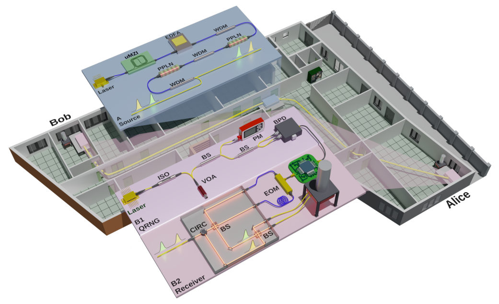 
FIG. 1. Experimental layout of the Bell test, qualitatively representing the positions of Alice and Bob (pink boxes) and the entanglement source (blue box) within the laboratory building, with the photon propagation paths from the source to each receiver shown by the single-mode fibers. (A) Entanglement source. (B) Each of the receiving stations, with (B1) representing the QRNG system and (B2) the time-bin receiver, implemented with a custom-made micro-optic assembly with fiber interfaces. uMZI: unbalanced Mach-Zehnder interferometer; EDFA: erbium-doped fiber amplifier; WDM: wavelength division multiplexing filter; PPLN: periodically-poled lithium niobate; ISO: isolator; VOA: variable...

📷 Fig 2

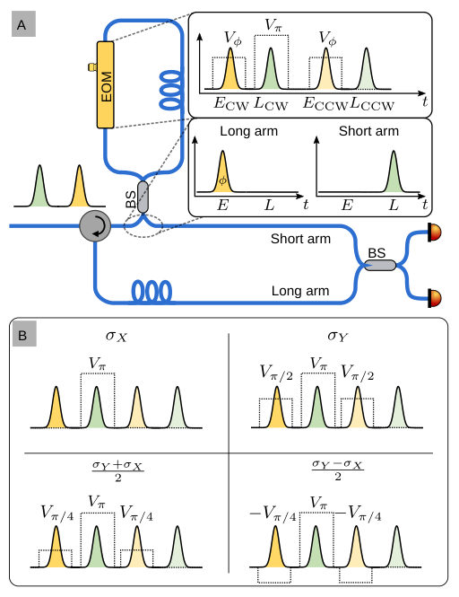 
FIG. 2. A) Scheme of the fast optical switch. A photon wavepacket is routed to the long arm of the interferometer when an arbitrary but equal phase is applied to both its clock- wise (CW) and counterclockwise (CCW) components, and to the short arm when a π phase shift is applied to only one component (here, the CW component). B) The four phase configurations implementing the four measurement operators required for the CHSH test, according to Eq. (9).

📷 Fig 3

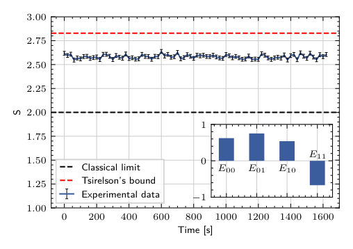 
FIG. 3. Measured S parameter during 1650 seconds of acqui- sition. Each point represents the S parameter determined by 20 seconds of integration. Inset: CHSH correlators of the Bell test for the entire measurement.

📷 Fig 4

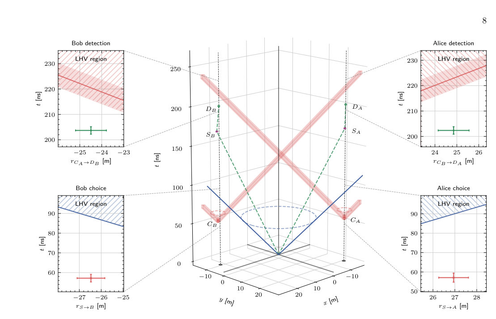 
FIG. 4. (2+1D) space-time diagram of the Bell test events relative to the generation of an entangled pair. The spatial and temporal coordinates for all represented events are written explicitly in the Supplementary Information. The future light-cone of the pair generation event is represented by solid blue lines, while the light-cone of the measurement setting choice is shown by extruding the entire event span in the direction of the other party’s detection event. The dashed green line represents the actual photon propagation from the pair generation to its detection. The zoomed-in insets are represented as (1+1D) events by projecting the 2 spatial dimensions to the line joining both...

📷 Fig 5

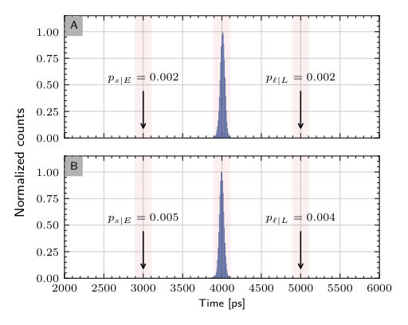 
FIG. 5. Histogram of detection events with the switch enabled for both (A) Alice and (B) Bob. The plots illustrate the estimated probability of ‘incorrect’ routing, denoted as ps|E (pℓ|L), representing the probability that an early (late) photon takes the short (long) arm of the receiver interferometer.

**Summary.** This paper reports a significant experimental achievement in quantum physics by demonstrating a loophole-free Bell test using time-bin entangled photons over a 49-meter distance. By employing a novel Sagnac-modulator architecture, the authors successfully eliminated the postselection loophole, confirming nonlocality with a high violation of the CHSH inequality. The results establish time-bin entanglement as a robust platform for practical quantum communication.

**Why it may be interesting.** This work provides a highly practical, device-independent demonstration of nonlocality using time-bin entanglement, which is crucial for advancing quantum communication protocols and quantum internet infrastructure.

Detailed structure

**Main problem.** The paper addresses the challenge of performing loophole-free Bell tests using time-bin entangled photons while operating under strict spacetime constraints.

**Main result.** They successfully demonstrated a loophole-free Bell test achieving a CHSH violation of S = 2.583 ± 0.002 at a separation distance of 49.0 m, closing locality, freedom-of-choice, and postselection loopholes.

**Method.** The experiment utilizes a fiber-based platform with a Sagnac-modulator architecture to perform postselection-free measurements on time-bin entangled photons.

**Model / system.** The system uses time-bin encoding of photonic entanglement generated via SPDC, measured using customized fiber-coupled unbalanced Mach-Zehnder interferometers (uMZIs). The analysis incorporates a (2+1D) spacetime formalism to rigorously check loophole closure conditions.

**Key observables.** CHSH parameter S, fidelity ($\langle\Phi|
ho|\Phi
angle$), min-entropy ($H_{\min}$), and measured latencies (e.g., $t_{	ext{loopback}}$).

**Important parameters / regimes.** Separation distance of 49.0 ± 0.7 m; CHSH violation exceeding the local-realistic bound by over 265 standard deviations.

**Assumptions / limitations.** The authors explicitly note that the detection loophole remains open due to current technological limitations in achieving required overall detection efficiency.

**Figures summary.** Figures illustrate the experimental layout (Source, Alice, Bob) and the detailed scheme of the fast optical switch used for postselection-free measurement.

**Paper structure.** The paper progresses from defining the scientific problem (loophole-free Bell tests with time-bin entanglement) to detailing the advanced hardware implementation (Sagnac switch for postselection removal), followed by rigorous characterization of timing and randomness sources.

Abstract

Entanglement gives rise to correlations between distant quantum systems that cannot be explained by local realistic theories. Bell inequality violations provide a direct way to reveal these correlations and certify nonlocality, especially when the relevant experimental loopholes are closed. Time-bin encoding, in which quantum information is encoded into well-defined temporal modes, is a commonly used platform for distributing photonic entanglement in optical fibers. Yet loophole-free Bell tests with time-bin entanglement have received comparatively little attention, owing in part to the postselection loophole introduced by conventional interferometric measurements. Here, we demonstrate a fiber-based platform for Bell tests with time-bin entanglement that simultaneously closes the locality, freedom-of-choice, and postselection loopholes. We observe a CHSH violation of $S=2.583 \pm 0.002$, exceeding the local-realistic bound by over 265 standard deviations. Notably, this rigorous certification of nonlocality is achieved at a separation distance of $49.0 \pm 0.7$ m, substantially shorter than previous photonic Bell tests addressing comparable space-time constraints. Beyond its foundational significance, our results demonstrate time-bin entanglement as a viable route towards practical device-independent quantum communication and a future quantum internet.

[↑ back to top](#top)

### [From integrability to many-body quantum chaos through a Markovian bath](http://arxiv.org/abs/2608.27897v1)

**Authors:** Xianlong Liu, Antonio M. García-García  
**Type:** theory · **Category:** other · **PDF:** <https://arxiv.org/pdf/2608.27897v1>  
**Analysis basis:** full PDF text, analyzed in chunks
**Topic relevance:** 🔥 `Keldysh / 2PI / non-Gaussian methods` **4/5** · `methods for driven-dissipative` **2/5** · `correlated / nonlocal dissipation` **1/5** · `driven-dissipative phase transition` **1/5** · `non-equilibrium universality` **1/5**

📷 Fig 1

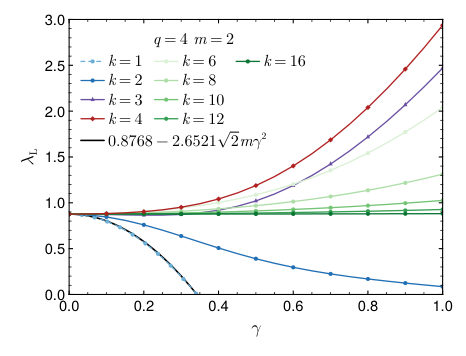 
FIG. 1. The Lyapunov exponent for the Lindblad SYK Eq. (1) with jump operators Eq. (4) versus the dissipation strength γ for different values of k and q = 4, J = 1 and m = 2. The solid black line Eq. (23) is the best fitting of the numerical solution of λL for k = 1.

📷 Fig 2

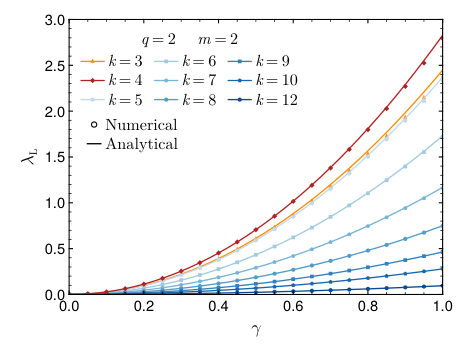 
FIG. 2. Lyapunov exponent λL as a function of γ for various k, in the case of (q = 2) integrable Lindblad SYK at a fixed m = 2. λL is always positive and increases with γ so a Marko- vian environment can induce quantum chaos. Scatters stand for the numerical solution of the Schwinger-Dyson equations while the lines are the analytical prediction Eqs. (13) and (31).

📷 Fig 3

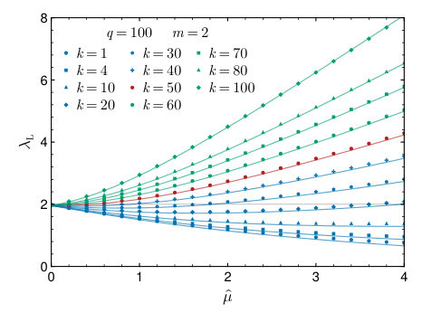 
FIG. 3. Lyapunov exponents for q = 100 for various k and J = 1. Scatters stand for the numerical solution of the Schwinger-Dyson equation while the lines are the analytical prediction Eq. (35) that includes the leading 1/q correction.

**Summary.** This theoretical paper investigates the interplay between quantum chaos and environmental coupling using the SYK model. By analyzing the Lyapunov exponent via OTOCs, the authors demonstrate that coupling to a specific type of bath can induce positive chaos even when the underlying system is integrable. This suggests a novel route to control scrambling in quantum many-body systems.

**Why it may be interesting.** This work provides a concrete theoretical mechanism demonstrating that environmental coupling can actively induce or enhance quantum chaos, which is crucial for understanding quantum information processing in realistic, noisy settings.

Detailed structure

**Main problem.** The paper challenges the common belief that coupling a quantum system to an environment always suppresses quantum chaos, investigating how this coupling affects the Lyapunov exponent.

**Main result.** The authors show that for specific bath couplings (isotropic random $k>2$-body Majoranas), the Lyapunov exponent remains positive and can even increase with the coupling strength, inducing quantum chaos.

**Method.** The analysis employs the Schwinger-Keldysh formalism, deriving Schwinger-Dyson equations and utilizing Out-of-Time-Order Correlators (OTOCs) to calculate the Lyapunov exponent.

**Model / system.** The system studied is the $q$-body Majorana Sachdev-Ye-Kitaev (SYK) model coupled to a Markovian bath, whose dynamics are governed by a Lindblad master equation.

**Key observables.** Lyapunov exponent ($\lambda_L$), Out-of-Time-Order Correlators (OTOCs), and Green's functions ($G^>, G^<$).

**Important parameters / regimes.** Bath coupling strength ($\gamma$), number of Majorana bodies ($q$), and bath interaction order ($k$).

**Assumptions / limitations.** The analysis is performed in the large $N$ limit and involves approximations up to $O(m\gamma^4)$ in the action expansion.

**Figures summary.** Figures illustrate the calculated Lyapunov exponent ($\lambda_L$) versus dissipation strength ($\gamma$) for various $q$ and $k$ values, demonstrating the predicted enhancement of chaos.

**Paper structure.** The paper progresses from setting up the Lindblad dynamics and the path integral formulation to deriving the necessary Schwinger-Dyson equations, and finally calculating the OTOC kernels to determine the maximal eigenvalue ($\lambda_L$).

Abstract

Recent examples have confirmed the common belief that quantum chaos is always suppressed in the presence of an environment. Here we show that this is not always the case. We compute the Lyapunov exponent of a $q$-body Majorana Sachdev-Ye-Kitaev (SYK) model coupled to a Markovian bath. Provided that the jump operators describing the bath are isotropic random $k > 2$-body Majoranas fields, the Lyapunov exponent is positive for any strength of the coupling to the bath. Interestingly, this also applies to $q=2$ where the SYK is integrable which indicates that many-body quantum chaos can be induced by the environment. Moreover, for $q > 2$, where the unitary dynamics is quantum chaotic, and sufficiently large $k$, the Lyapunov exponent increases with the coupling to the bath. Explicit analytical results are obtained in the $q=2$ and large $q$ limits. Our results put forward an alternate route to induce and control the generation of scrambling in quantum many-body systems which is of potential relevance in the design of quantum information devices.

[↑ back to top](#top)

### [Spin-Selective Spectral Flattening and Wave-Packet Dynamics in a Flux-Engineered Lieb Lattice](http://arxiv.org/abs/2608.28054v1)

**Authors:** Nana Chang, Xiaoji Zhou, Yanglin Zhou, Song Ci  
**Type:** theory · **Category:** other · **PDF:** <https://arxiv.org/pdf/2608.28054v1>  
**Analysis basis:** full PDF text, analyzed in chunks
**Topic relevance:** 🔥 `analog quantum simulation` **4/5** · `Keldysh / 2PI / non-Gaussian methods` **1/5** · `methods for driven-dissipative` **1/5** · `quantum measurements` **1/5** · `scars & prethermalization` **1/5**

📷 Fig 1

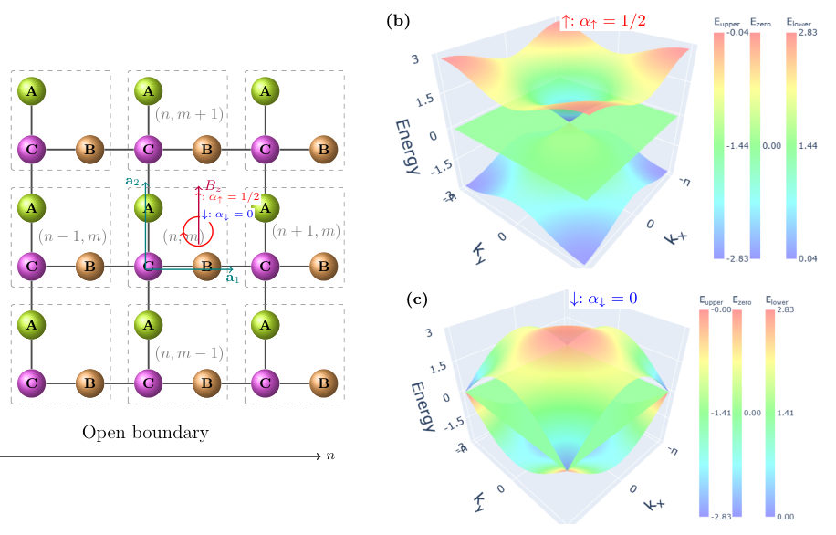 
FIG. 1. Spin-dependent synthetic flux and spectral reconstruction in a two-dimensional Lieb lattice. (a) Schematic of a finite 3×3 Lieb-lattice patch containing sublattices A (lime), B (orange), and C (magenta). Dashed gray squares indicate the central cell (n, m) and its neighboring cells (n ± 1, m) and (n, m ± 1). Solid lines connect each four-coordinated C site to adjacent A and B sites. The spin-dependent Peierls phases generate the effective fluxes α↑= 1/2 and α↓= 0. The spin-up component is tuned to half flux, where the magnetic subbands are substantially flattened, whereas the spin-down component experiences zero synthetic flux. The purple arrow denotes an optional longitudinal...

📷 Fig 2

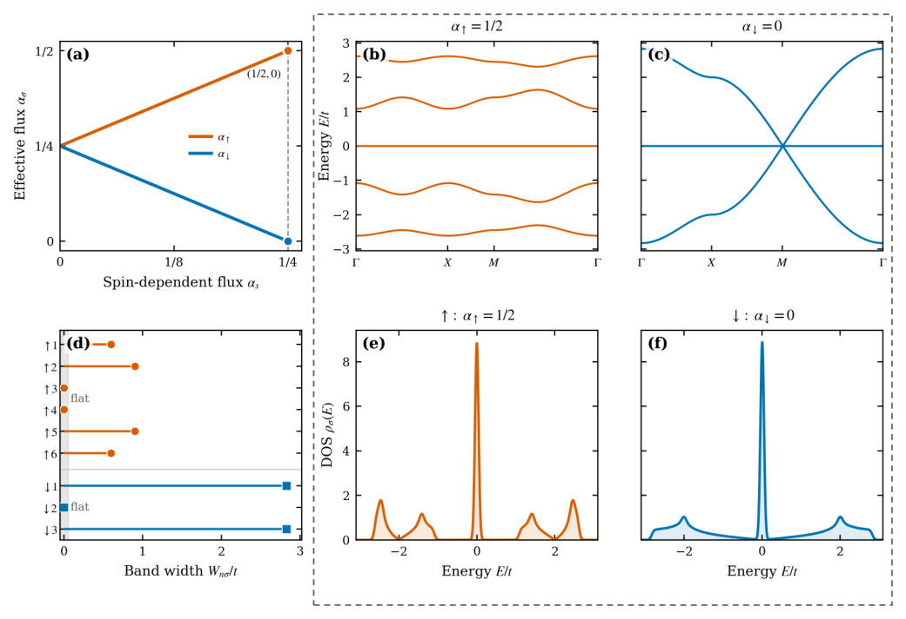 
FIG. 2. Spin-selective reconstruction of the Lieb-lattice spectrum. (a) Effective fluxes α↑= α0 + αs and α↓= α0 −αs as functions of the spin-dependent flux αs for α0 = 1/4. The marked working point αs = 1/4 gives (α↑, α↓) = (1/2, 0). (b) Spin-up magnetic bands at α↑= 1/2. Two of the six magnetic subbands are dispersionless within numerical precision, while the remaining bands retain finite bandwidths. (c) Spin-down bands at α↓= 0, consisting of one intrinsic flat band and two dispersive bands. (d) Band-resolved bandwidths Wnσ at the working point; the shaded strip identifies numerically flat bands. (e) Spin-up and (f) spin-down densities of states. The dashed rectangle groups the...

📷 Fig 3

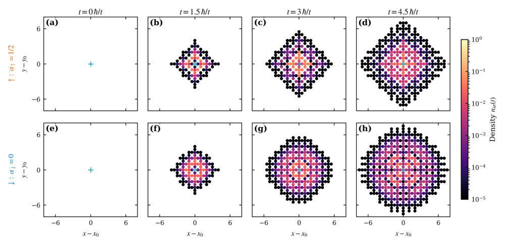 
FIG. 3. Spin-resolved real-time wave-packet dynamics. The upper and lower rows show the spin-up and spin-down density distributions, respectively, at the indicated dimensionless evolution times τ = thopt/ℏ. At α↑= 1/2, the spin-up component displays slower spreading and enhanced central retention, whereas the spin-down component spreads more rapidly at α↓= 0. All density panels use the same logarithmic color scale. The cyan cross marks the initially populated central C site.

📷 Fig 4

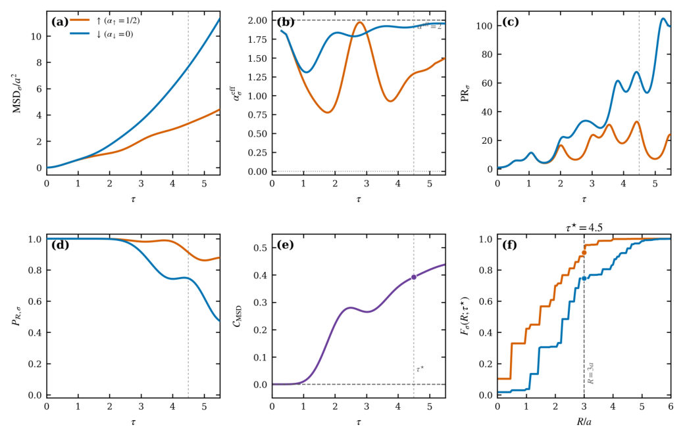 
FIG. 4. Quantitative characterization of spin-selective wave-packet dynamics at (α↑, α↓) = (1/2, 0). (a) Spin-resolved mean- square displacement MSDσ. (b) Local effective spreading exponent αeff σ ; the horizontal dashed line marks the ballistic value αeff = 2. Values at τ &lt; 0.3 are omitted because the logarithmic derivative is ill-conditioned in the short-time limit. (c) Spin- resolved participation ratio PRσ. (d) Probability PR,σ retained within the region R = {i : |ri −r0| ≤3a}. (e) Normalized MSD contrast CMSD. The vertical dotted lines in (a)–(e) identify the representative observation time τ ⋆= 4.5. (f) Cumulative radial probability Fσ(R; τ ⋆) evaluated at the same time; the vertical...

📷 Fig 5

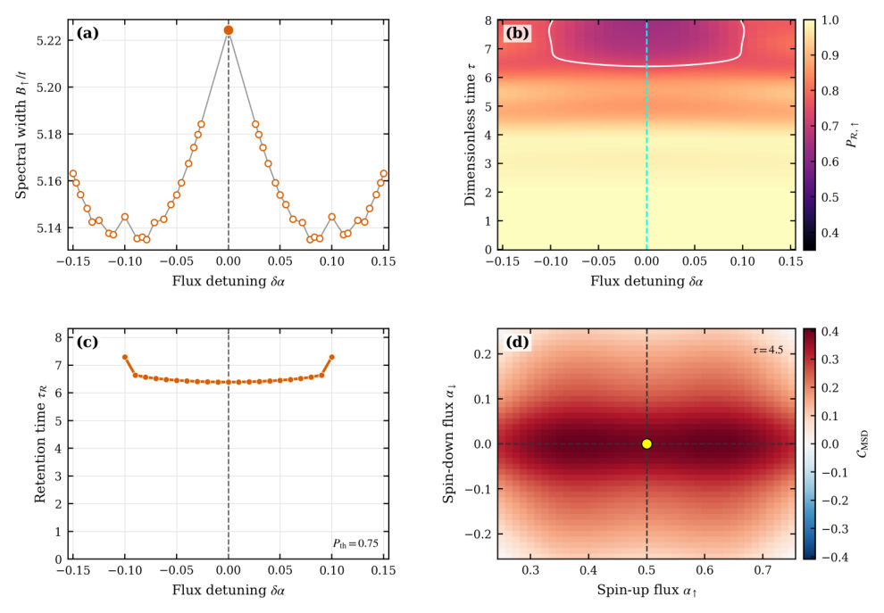 
FIG. 5. Response of the spin-selective spectral and dynamical contrast to flux detuning. (a) Total spin-up spectral width B↑= Emax,↑−Emin,↑as a function of δα = α↑−1/2. The points correspond to reduced rational fluxes with denominators q ≤20. (b) Spin-up finite-region retention probability PR,↑(τ) versus evolution time and flux detuning. The white contour denotes PR,↑= Pth = 0.75, and the cyan dashed line marks δα = 0. (c) First-passage retention time τR extracted from Eq.(60). Upward triangles indicate cases for which the threshold is not reached within 0 ≤τ ≤8 and therefore represent the lower bound τR &gt; 8. (d) MSD spin contrast CMSD in the (α↑, α↓) plane at τ = 4.5. Thin solid contours...

**Summary.** This paper investigates controlling quantum wave-packet transport in a Lieb lattice by applying spin-dependent synthetic magnetic fluxes. The authors show that this flux engineering allows for a robust, reversible suppression of wave-packet spreading for one spin component relative to another. This establishes a powerful tool for state-selective quantum control in lattice simulators.

**Why it may be interesting.** This work provides a concrete, tunable mechanism for controlling quantum transport based purely on internal quantum states (spin) using engineered gauge fields, which is highly relevant for quantum simulation platforms.

Detailed structure

**Main problem.** The research aims to achieve reversible, internal-state-selective control over matter-wave transport without relying on spin-flip processes or inter-particle interactions.

**Main result.** The study demonstrates that spin-dependent synthetic flux can induce pronounced, controllable dynamical slowing for one spin component relative to another, even when the spectral flattening does not meet the criteria for exact Aharonov-Bohm caging.

**Method.** The authors combine band-resolved calculations of the magnetic Bloch Hamiltonian with real-time wave-packet simulations to diagnose transport properties.

**Model / system.** The system is a two-dimensional nearest-neighbor Lieb lattice hosting spin-1/2 particles. The model incorporates a spin-dependent synthetic gauge field introduced via Peierls phases, leading to spin-dependent effective fluxes ($\alpha_\sigma$).

**Key observables.** Mean-square displacement ($\langle r^2 
angle$), finite-region retention probability, and the contrast in mean-square displacement ($	ext{CMSD}$).

**Important parameters / regimes.** The working point is set at $\alpha_0 = \alpha_s = 1/4$, yielding fluxes $(\alpha_\uparrow, \alpha_\downarrow) = (1/2, 0)$. The analysis also probes flux detuning ($\delta\alpha$).

**Assumptions / limitations.** The primary limitation noted is that spectral flattening alone is insufficient for strict caging; real-time dynamics must confirm the slowing effect.

**Figures summary.** Figures illustrate the lattice geometry and spin-dependent fluxes. Band structures show spin-up having flattened bands while spin-down remains dispersive. Dynamics show spin-up propagation suppression relative to spin-down, and the contrast reverses upon flux reversal.

**Paper structure.** The paper first establishes the model using spin-dependent fluxes in the Lieb lattice. It then analyzes the spectral properties, noting the failure of the all-bands-flat condition. Finally, it uses real-time simulations to demonstrate the robust, reversible, and selective dynamical slowing effect.

Abstract

We investigate reversible internal-state-selective wave-packet transport induced by spin-dependent Peierls phases in a two-dimensional nearest-neighbor Lieb lattice. The two conserved spin components experience effective fluxes $α_σ=α_{0}+s_σα_{s}$, where $s_{\uparrow,\downarrow}=\pm1$. At the working point $α_{0}=α_{s}=1/4$, the spin-up and spin-down components experience $α_{\uparrow}=1/2$ and $α_{\downarrow}=0$, respectively. A band-resolved calculation in the $q=2$ magnetic unit cell shows that the spin-up spectrum contains two zero-energy flat subbands associated with the sublattice-imbalance flat-band sector, whereas the remaining four subbands retain finite bandwidths. The half-flux sector therefore fails the all-bands-flat condition and does not realize exact Aharonov--Bohm caging for a generic localized initial state. Nevertheless, real-time simulations reveal a pronounced suppression of spin-up propagation relative to the dispersive spin-down component, manifested by a smaller mean-square displacement and an enhanced finite-region retention probability over the pre-reflection time window. Reversing the state-dependent flux interchanges the slow and fast spin channels, while the dynamical contrast remains robust against moderate flux detuning. These results establish spin-dependent synthetic flux as a reversible means of controlling internal-state-resolved matter-wave transport without spin-flip processes or interactions, and provide complementary spectral and real-space criteria for distinguishing exact caging from finite-time dynamical slowing in atomic and photonic flat-band simulators.

[↑ back to top](#top)

### [Hardware-Efficient Error Mitigation and Shot-Efficient Sampling on IBM Quantum Hardware](http://arxiv.org/abs/2608.28535v1)

**Authors:** Sumit Chongder  
**Type:** experiment · **Category:** quantum information and computing · **PDF:** <https://arxiv.org/pdf/2608.28535v1>  
**Analysis basis:** full PDF text, analyzed in chunks
**Topic relevance:** 🔥 `QC/QI experiment` **4/5** · `quantum measurements` **2/5**

📷 Fig 1

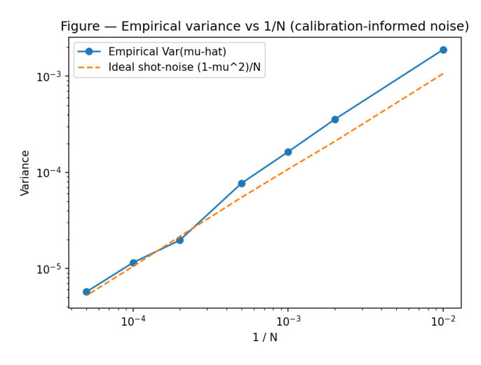 
Figure 1: Empirical estimator variance versus 1/N for simulated shot counts N ∈{100, . . . , 20000}, compared against the theoretical shot-noise prediction of Eq. 1.

📷 Fig 2

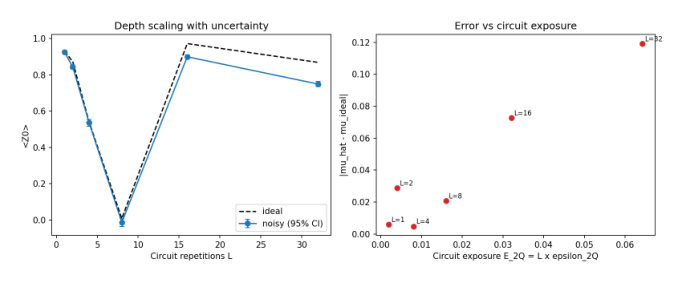 
Figure 2: Simulated ideal and noisy expectation values and absolute error as a function of layer count L and cumu- lative two-qubit gate exposure.

📷 Fig 3

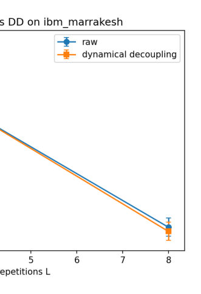 
Figure 3: Hardware-measured ⟨Z0⟩versus layer count L, raw versus dynamical decoupling.

📷 Fig 4

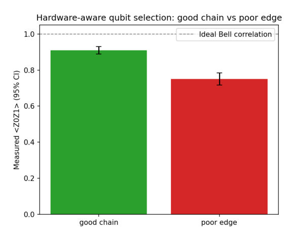 
Figure 4: Measured ⟨Z0Z1⟩on a low-error qubit pair versus a deliberately high-error qubit pair from the same calibration snapshot.

📷 Fig 5

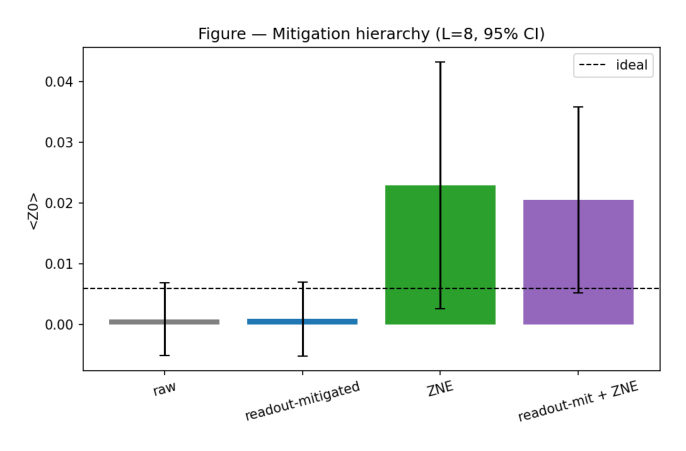 
Figure 5: Simulated mitigation hierarchy: expectation-value estimate and absolute bias for raw, readout-mitigated, ZNE, and combined readout-mitigation-plus-ZNE conditions.

**Summary.** This paper experimentally characterizes error mitigation and sampling strategies on superconducting quantum hardware under strict, fixed measurement budgets. By decomposing the Mean-Squared Error into bias and variance, the authors demonstrate that advanced techniques like ZNE do not guarantee improvement and must be carefully validated for each specific hardware setup and circuit depth.

**Why it may be interesting.** It provides crucial, practical guidelines for quantum algorithm developers, showing that theoretical error mitigation gains can be nullified or outweighed by finite-shot noise costs on real hardware.

Detailed structure

**Main problem.** The study evaluates the true benefit of quantum error mitigation techniques (like ZNE) on NISQ hardware when the total measurement-shot budget is fixed, addressing the tension between bias reduction and increased sampling variance.

**Main result.** Neither standard Zero-Noise Extrapolation (ZNE) nor adaptive shot allocation should be applied by default, as the benefit must be validated per device, circuit, and fixed sampling budget.

**Method.** The authors used a fixed-budget, bias-variance-aware benchmarking protocol comparing raw measurements against ZNE and adaptive shot allocation schemes.

**Model / system.** The experiments were conducted on a superconducting quantum processor (IBM Quantum Heron) using circuits like GHZ states and repeated-layer circuits to test error scaling.

**Key observables.** Expectation-value error, Mean-Squared Error (MSE), bias, variance, and mitigation gain.

**Important parameters / regimes.** Fixed total measurement-shot budget, circuit depth ($L$), effective noise scale, and qubit connectivity.

**Assumptions / limitations.** The analysis relies on the bias-variance decomposition of the MSE, and the adaptive allocation rule is seeded using pilot runs.

**Figures summary.** Figures are mentioned to show empirical estimator variance tracking $1/N$ shot-noise prediction and depth scaling trends for repeated-layer circuits.

**Paper structure.** The paper is structured around a hardware-validated benchmarking protocol, comparing raw estimation against various mitigation techniques (ZNE, adaptive allocation) across different circuit depths and noise regimes.

Abstract

We experimentally study error mitigation and finite-shot sampling on superconducting quantum hardware under a constrained execution budget. The study combines calibration-aware qubit selection, circuit-depth scaling, zero-noise extrapolation, dynamical decoupling, readout-error mitigation, and repeated-shot estimation on an IBM Quantum processor. Experiments are organized across ideal simulation, noise-model simulation, and physical-device execution to separate sampling uncertainty from device-induced error. We investigate how mitigation performance changes with circuit depth, effective noise scale, qubit connectivity, and measurement budget, and quantify accuracy using expectation-value error, mean-squared error, statistical uncertainty, and mitigation gain. A fixed hardware-execution budget is used to evaluate shot allocation strategies and repeated measurements without relying on unlimited sampling. The resulting analysis provides a hardware-aware characterization of when mitigation improves expectation-value estimation and when finite-shot fluctuations offset the benefit of additional mitigation overhead. The implementation uses contemporary Qiskit and IBM Quantum Runtime workflows and is designed to provide reproducible experimental evidence for error-mitigation studies on current quantum processors.

[↑ back to top](#top)

### [Scaling Alternating-Bias-Assisted Annealing for Precision Transmon Frequency Targeting on Superconducting Quantum Processors](http://arxiv.org/abs/2608.27789v1)

**Authors:** Xiqiao Wang, Mark Field, Teng Zhang, Xian Wu, Ferhat Aydinoglu, Joel Howard, Angela Q. Chen, Sara Elzeiny, Robert Smith, Timothy McSorley, Nicholas Sharac, Eyob Sete, Alysson Gold, Hilal Cansizoglu, Greg Stiehl, Josh Mutus, Kameshwar Yadavalli, Andrew Bestwick, Stefano Poletto, Raja Katta, David P. Pappas  
**Type:** experiment · **Category:** quantum information and computing · **PDF:** <https://arxiv.org/pdf/2608.27789v1>  
**Analysis basis:** full PDF text, analyzed in chunks
**Topic relevance:** 🔥 `QC/QI experiment` **4/5** · `quantum measurements` **1/5**

📷 Fig 1

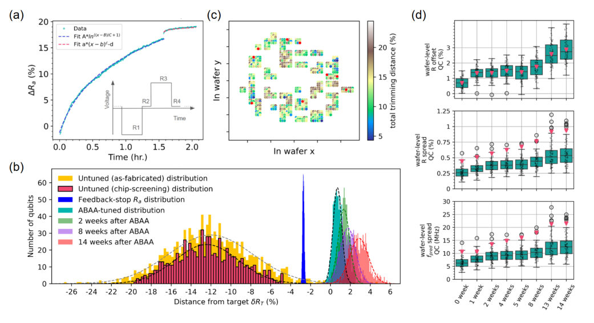 
FIG. 1. ABAA targeting at the wafer scale. (a) A typical profile of junction resistance during the ABAA process. The blue and red dashed curves represent numerical fits to the active-tuning phase (where the alternating-bias annealing sequence is applied) and the post-tuning relaxation phase (where spontaneous relaxation in junction resistance is monitored at low bias), respectively. The inset illustrates the alternating-bias annealing voltage sequence used in this study, where steps 𝑅1 and 𝑅3 denote annealing intervals, and steps 𝑅2 and 𝑅4 denote monitoring intervals. (b) Histogram distributions of the Josephson junction (JJ) resistance, normalized to the target resistance, across different...

📷 Fig 2

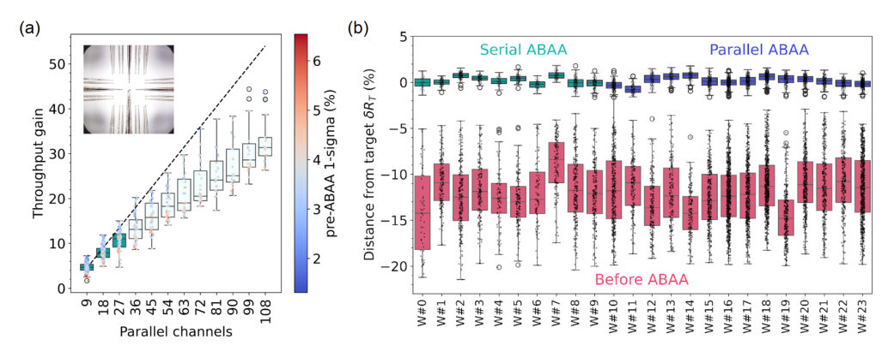 
FIG. 2. Parallel ABAA scaling and spread reduction performance. (a) Throughput gain plotted as a function of the number of parallel channels. Each data point represents the throughput gain per probe-card touchdown, with the marker color indicating the initial pre-tuning spread. Experimental data were collected for 9, 18, and 27 parallel channels (teal boxplots), while projections for higher channel counts were estimated via extrapolation from the existing datasets (white boxplots). Inset: An optical image of a cantilever-probe array used in this study. (b) Comparison of wafer-scale resistance spread reduction between the serial ABAA (teal) and parallel ABAA (neon blue) methods. For each...

📷 Fig 3

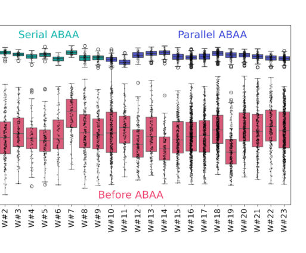 
Fig. 2(b) compares the resistance spread reduction for wafers tuned via serial (teal) versus parallel (blue) ABAA. For each wafer, the lower and upper boxes represent the pre- and post-tuning resistance distributions, respectively, with each data point corresponding to a individual qubit. Table II sum- marizes the wafer-level statistics, demonstrating that parallel and serial ABAA achieve equivalent targeting performance. Furthermore, the significantly higher density of data points provided by parallel-ABAA wafers underscores the technique’s ability to tune more components within standard production- line time constraints.

📷 Fig 4

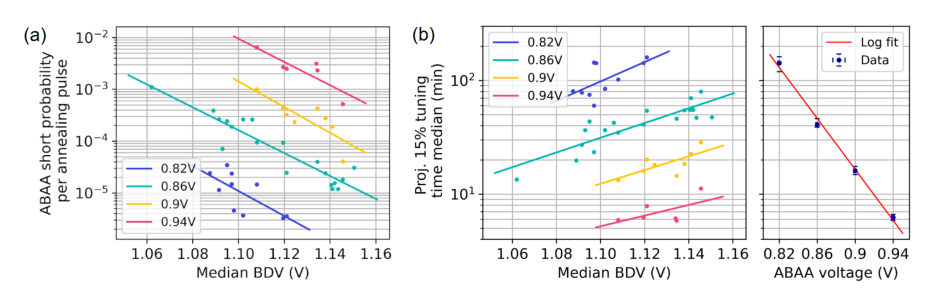 
FIG. 3. Relationship between the Josephson junction (JJ) breakdown voltage and the yield and throughput of the ABAA process. (a) Wafer- level ABAA short probability per annealing pulse versus wafer-median breakdown voltage (BDV) across a selection of alternating annealing amplitudes. (b) Left panel: Wafer-median ABAA tuning time (at a 15% active tuning) versus wafer-median BDV across the same selection of annealing amplitudes. Right panel: Wafer-median ABAA tuning time (at a 15% active tuning) versus ABAA annealing voltage on a wafer with a median breakdown voltage (BDV) of 1.12 V. Error bars represent the 25th to 75th percentiles. In both (a) and (b), each data point corresponds to the...

📷 Fig 5

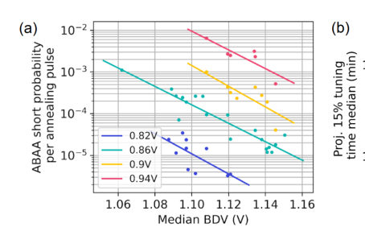 
Figure 3 summarizes the room-temperature experimental data collected across a set of commonly used annealing voltage amplitudes, characterizing the dependence of both the wafer- scale ABAA short probability and the median tuning time (at a fixed 15% active tuning distance) on the wafer-median breakdown voltages. As illustrated in Fig. 3(a), the ABAA short probability per annealing pulse decreases exponentially with increasing BDV at a constant annealing voltage, as well as when the annealing voltage amplitude is reduced (moving from red to blue). The extreme sensitivity of the short probability to the baseline BDV is noteworthy; for example, along the 0.86 V operational line, a minor ∼100...

**Summary.** This paper details the use of Alternating-Bias-Assisted Annealing (ABAA) to achieve high-precision, scalable frequency tuning for superconducting transmon qubits. By demonstrating high yield and precision across entire wafers and multi-module processors, the authors confirm ABAA's role as a critical enabler for building large-scale quantum computers. The research addresses key engineering hurdles related to fabrication variation and yield limitations in superconducting quantum hardware.

**Why it may be interesting.** This work provides critical experimental validation of a scalable, high-precision tuning mechanism (ABAA) necessary to realize complex, large-scale quantum processors, directly impacting the physical realization of quantum computation.

Detailed structure

**Main problem.** The primary challenge is enhancing the throughput and yield of qubit frequency tuning techniques as superconducting quantum processors scale up to large qubit counts.

**Main result.** The Alternating-Bias-Assisted Annealing (ABAA) technique achieves high wafer-scale tuning precision ($\sigma \sim 0.5\%$) and high component yield ($\ge 98.8\%$), enabling the realization of modular processors exceeding 1600 qubits.

**Method.** The authors characterize ABAA performance on 150-mm wafers, employing a modular tiling strategy to overcome monolithic yield limitations, and demonstrating its application on a quad-module QPU.

**Model / system.** The work focuses on superconducting transmon qubits coupled via Josephson junctions (JJs) on a 150-mm wafer platform, utilizing the ABAA process for post-fabrication frequency tuning.

**Key observables.** Wafer-scale JJ resistance tuning precision ($\sigma$), component-level yield, empirical frequency targeting precision ($\sigma \sim 30 	ext{ MHz}$), and two-qubit gate fidelities.

**Important parameters / regimes.** JJ breakdown voltage (BDV) is identified as a vital process control parameter; the modular tiling approach is key to scaling beyond single-wafer limits.

**Assumptions / limitations.** The modular architecture is necessary because the intrinsic component yield of monolithic QPUs is insufficient for very large qubit counts.

**Figures summary.** Figures illustrate the tuning profile, wafer maps showing tuned components, and plots correlating gate fidelity with detuning errors, demonstrating the success of ABAA tuning.

**Paper structure.** The paper progresses from characterizing the ABAA technique on a wafer scale (precision and yield) to demonstrating its application on a multi-module quantum processor, validating its scalability for high-fidelity Hamiltonian targeting.

Abstract

Recent advances in the alternating-bias-assisted annealing (ABAA) technique have successfully mitigated intrinsic Josephson-junction (JJ) fabrication variations. This new technique enables precision qubit frequency tuning alongside simplicity. However, it is critical to enhance tuning throughput and yield while investigating the factors that drive targeting performance as the technology scales. Here, we characterize ABAA tuning performance within a 150-mm wafer process flow and extend this technique to simultaneous, multi-channel tuning, demonstrating that a wafer-scale JJ resistance tuning precision of $σ=0.50\pm0.05\%$ alongside a component-level yield of $\ge 98.8\%$ can be achieved. Furthermore, we demonstrate a strong correlation between yield, tuning speed, and junction breakdown voltage, establishing the latter as a vital process control parameter for meeting production goals. Finally, we demonstrate a successful implementation of ABAA tuning on a quad-module quantum processor (Rigetti Cepheus-1-36Q), where we achieve an empirical frequency targeting precision of $σ\sim 30\text{ MHz}$ in both qubit and qubit-qubit detuning frequencies, contributing to high median two-qubit gate fidelities. These results confirm the efficacy and scalability of ABAA for high-precision Hamiltonian targeting, a critical enabler for modular superconducting quantum processor technology.

[↑ back to top](#top)

### [Langevin Theory of Non-Markovian Quantum Dynamics: Application to Delayed Coherent Feedback and the Laser Linewidth](http://arxiv.org/abs/2608.28506v1)

**Authors:** Marc Cuenca-Laràs, Ming Li, Carlos Navarrete-Benlloch, Germán J. de Valcárcel  
**Type:** theory · **Category:** other · **PDF:** <https://arxiv.org/pdf/2608.28506v1>  
**Analysis basis:** full PDF text, analyzed in chunks
**Topic relevance:** `Keldysh / 2PI / non-Gaussian methods` **3/5** · `correlated / nonlocal dissipation` **3/5** · `driven-dissipative phase transition` **3/5** · `methods for driven-dissipative` **3/5** · `quantum measurements` **3/5** · `superradiant laser` **3/5** · `interference shaping light` **2/5** · `non-equilibrium universality` **2/5**

📷 Fig 1

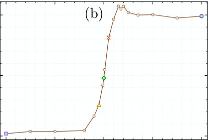 
Figure 1. Linewidth of a laser subject to delayed coherent feedback. (a) Laser linewidth, normalized to its feedback-free value, as a function of 1+κ = 1+fT for different values of the pump parameter C, with the delay and noise strength fixed at T = 10γ−1 and g = 10−2, respectively. Symbols correspond to numerical simulations, and lines to fits of the power law (1 + κ)−p—note the log-log plot. (b) Narrowing exponent p as a function of the distance to threshold C −1, for the same parameters as in (a). The exponent crosses over between the values 1 (below threshold) and 2 (above it) predicted by the linearized theory, and exhibits a maximum at C −1 ≈0.015– 0.02, signaling enhanced narrowing...

**Summary.** This paper develops a generalized Langevin theory to handle non-Markovian open quantum dynamics by extending phase-space methods to include environmental memory effects. It applies this theory to the problem of delayed coherent feedback in a laser, successfully predicting the characteristic narrowing of the laser linewidth both above and just below the lasing threshold.

**Why it may be interesting.** This work provides a powerful, systematic extension of established phase-space techniques into the non-Markovian regime, which is crucial for accurately modeling complex quantum optical systems like lasers with memory effects.

Detailed structure

**Main problem.** The primary challenge addressed is extending phase-space methods to accurately describe non-Markovian open quantum dynamics.

**Main result.** The framework successfully models non-Markovian effects via a memory kernel in the deterministic Langevin terms, and it is applied to predict laser linewidth narrowing in delayed coherent feedback systems.

**Method.** The authors apply phase-space representations (like the P representation) to the full system+environment dynamics, integrating out the environment to yield a general Langevin equation for the system of interest.

**Model / system.** The system involves an open quantum system (S) coupled to an environment (E), with a specific application being a laser driven by delayed coherent feedback. The dynamics are governed by a Liouville equation, which is mapped onto stochastic Langevin equations.

**Key observables.** Laser linewidth ($\Lambda$), Power Spectrum ($S(\omega)$), and the narrowing exponent ($p$).

**Important parameters / regimes.** Delay time ($T$), feedback strength ($f$), and the environment correlation time/kernel ($K(	au)$).

**Assumptions / limitations.** The analysis assumes the environment starts in the vacuum state (vanishing noise term) and relies on the use of normally ordered phase-space representations.

**Figures summary.** Figure 1(a) plots the normalized laser linewidth vs. $1+\kappa$ for various pump parameters, fitted to a power law $(1+\kappa)^{-p}$. Figure 1(b) shows the narrowing exponent $p$ as a function of $C-1$.

**Paper structure.** The paper develops a general Langevin framework for non-Markovian dynamics by treating the full S+E system. It then applies this framework to the specific problem of delayed coherent feedback, deriving analytical predictions for the laser linewidth both above and below threshold.

Abstract

Phase-space methods are powerful tools for the treatment of Markovian open quantum systems: they map the reduced dynamics of a system S, in interaction with an environment E, exactly onto Langevin equations for c-number stochastic variables, as opposed to Heisenberg-Langevin equations for operators. Langevin equations provide analytical insight in key regimes and excel at handling strong nonlinearities and couplings, where other methods often falter. Extending phase-space methods to non-Markovian dynamics, however, has remained a long-standing challenge. Here we address this gap by applying phase-space representations to the full S+E system; integrating out the environmental degrees of freedom then yields a general Langevin framework for S that incorporates both deterministic and stochastic contributions from E. Normally ordered representations, such as the Glauber-Sudarshan P representation and its positive variant due to Drummond and Gardiner, lead to Langevin equations in which (i) non-Markovian effects emerge exclusively in the deterministic terms, via a memory kernel, and (ii) noise contributions vanish when E is initially in the vacuum state. To demonstrate the power of this framework, we address the paradigmatic problem of delayed coherent feedback, in which the system is driven by its own past state, and study its impact on the laser linewidth: we recover the narrowing observed well above threshold and predict an enhanced narrowing just above it. Crucially, the number of stochastic variables scales linearly with the system size, making the framework suitable for problems ranging from a few degrees of freedom to genuinely many-body systems. This opens the way to the systematic study of non-Markovian driven-dissipative quantum systems using the same analytical and numerical tools that have long made phase-space methods so successful in the Markovian regime.

[↑ back to top](#top)

### [Microscopic Theory of Drag in a Bose Condensate Interacting with a Moving Reservoir](http://arxiv.org/abs/2608.27898v1)

**Authors:** Hassan Alnatah, Shuang Liang, Shouvik Mukherjee, Qi Yao, Ashton S. Bradley, David W. Snoke  
**Type:** theory · **Category:** quantum gases · **PDF:** <https://arxiv.org/pdf/2608.27898v1>  
**Analysis basis:** full PDF text, analyzed in chunks
**Topic relevance:** `Keldysh / 2PI / non-Gaussian methods` **3/5** · `correlated / nonlocal dissipation` **3/5** · `driven-dissipative phase transition` **3/5** · `methods for driven-dissipative` **3/5** · `analog quantum simulation` **2/5** · `non-equilibrium universality` **2/5** · `quantum measurements` **2/5** · `Frenkel-Kontorova` **1/5**

📷 Fig 1

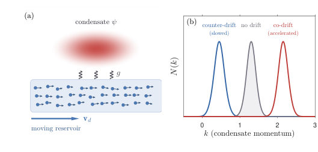 
Figure 1. Schematic of a condensate interacting with a moving reservoir. (a) A condensate ψ interacting with a reservoir drifting with a velocity vd, producing a drag potential Vdrag acting on the condensate. (b) Momentum distribution N(k) of the moving condensate: the reservoir current accelerates it (co-drift) or slows it toward k = 0 (counter-drift), relative to no drift.

📷 Fig 2

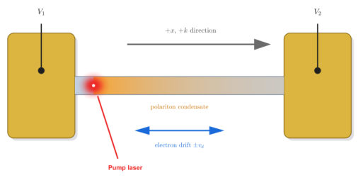 
Figure 2. Schematic of the simulated polaritons in a one- dimensional wire. A non-resonant pump laser shown in red is focused near one end of the wire generating a polariton condensate at the pump spot and propagating ballistically along the wire (orange). A voltage bias is applied between the contacts driving a current of electrons through the wire; depending on the sign of the voltage, the electron drift velocity ±vd can be positive or negative, so that the electron flow can be made either co-propagating or counter-propagating with the condensate. The condensate flow direction defines the positive x (equivalently +k) axis.

📷 Fig 3

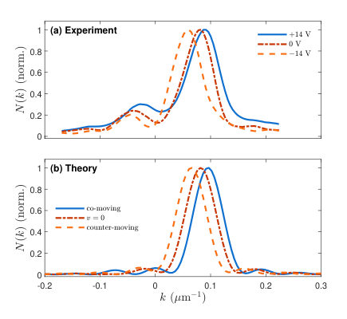 
Figure 3. Momentum-space drag of the polariton conden- sate. (a) Measured PL intensity vs. in-plane momentum k (reproduced from Ref. [3]) at 0 V (v = 0), +14 V (+115.4 µA, co-moving), and −14 V (−143.4 µA, counter- moving). (b) Simulated momentum distribution N(k) from the driven–dissipative Gross–Pitaevskii equation with the mi- croscopic drag potential, same three cases (vd = 0, ±0.14 µm/ps). In both, the forward peak shifts with the electron current (co →higher k, counter →lower k).

**Summary.** This paper develops a microscopic theory for calculating the drag force on a Bose-Einstein condensate due to interaction with a moving fermionic reservoir. By employing the Born-Markov approximation, the authors derive an effective drag potential that modifies the condensate's Gross-Pitaevskii equation. The resulting drag force is shown to be linearly proportional to the relative velocity, providing a fundamental understanding of dissipation in quantum fluids.

**Why it may be interesting.** This work provides a rigorous, microscopic derivation of dissipation (drag) in quantum gases, connecting the environment's fluctuations (via the Fluctuation-Dissipation Relation) directly to the macroscopic dynamics of the condensate.

Detailed structure

**Main problem.** The paper derives a microscopic theory to calculate the drag force experienced by a Bose-Einstein condensate (BEC) when it interacts with a moving, noncondensed fermionic reservoir.

**Main result.** The drag force is found to be proportional to the relative velocity between the condensate and the reservoir, leading to a friction law $F = -\Gamma_d (v_\psi - v_d)$.

**Method.** The derivation uses the Born-Markov approximation to eliminate reservoir degrees of freedom, resulting in an effective, history-dependent drag potential added to the Gross-Pitaevskii equation.

**Model / system.** The system consists of a BEC (bosons, $\psi$) interacting with a drifting fermionic bath (reservoir, $\phi$). The interaction is modeled via a Hamiltonian, and the dynamics are governed by an effective G-P equation incorporating the drag potential.

**Key observables.** Drag potential ($V_{	ext{drag}}$), drag force ($F$), and the friction coefficient ($\Gamma_d$).

**Important parameters / regimes.** Reservoir density fluctuations, condensate density profile, and the relative drift velocity ($v_\psi - v_d$).

**Assumptions / limitations.** The Born approximation, the Markov approximation (short reservoir memory), and the assumption that the reservoir is spatially uniform and in a steady state.

**Figures summary.** Figure 1 schematically illustrates the condensate interacting with a drifting reservoir, leading to a drag potential, and shows how the momentum distribution shifts based on the relative drift velocity.

**Paper structure.** The paper builds the theory by starting from the full Hamiltonian, applying approximations to derive the master equation, transforming it into the Schrödinger picture, and finally deriving the explicit form of the drag potential and the resulting force equation.

Abstract

We derive a microscopic theory of drag for a Bose-Einstein condensate interacting with a moving reservoir. Starting from interactions between a condensate and a drifting fermionic bath, we integrate out the bath degrees of freedom within the Born--Markov approximation to obtain an effective Gross--Pitaevskii equation with a drag potential. From this potential we derive an effective drag force and obtain a closed expression for the drag coefficient, determined by the reservoir density fluctuations and the condensate density profile. As an application, we simulate the drag for an exciton--polariton condensate interacting with a drifting electron gas.

[↑ back to top](#top)

### [Approaching Resource-Theoretic Optimal Performance with Structured Environments](http://arxiv.org/abs/2608.28488v1)

**Authors:** Lea Lautenbacher, Giovanni Spaventa, Susana F. Huelga, Martin B. Plenio  
**Type:** theory · **Category:** statistical mechanics · **PDF:** <https://arxiv.org/pdf/2608.28488v1>  
**Analysis basis:** full PDF text, analyzed in chunks
**Topic relevance:** `correlated / nonlocal dissipation` **3/5** · `driven-dissipative phase transition` **3/5** · `methods for driven-dissipative` **3/5** · `Keldysh / 2PI / non-Gaussian methods` **2/5** · `non-equilibrium universality` **2/5** · `quantum measurements` **2/5** · `scars & prethermalization` **1/5**

📷 Fig 1

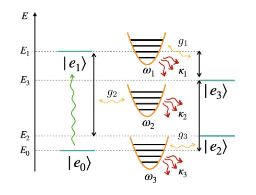 
FIG. 1. Minimal model of a photoisomer coupled to a struc- tured vibrational environment. A four-level electronic system interacts with three pseudomodes with coupling strengths gi. Each pseudomode is damped into an independent Markovian reservoir at rate κi. The parameters gi and κi control the transition between Markovian and non-Markovian regimes.

📷 Fig 2

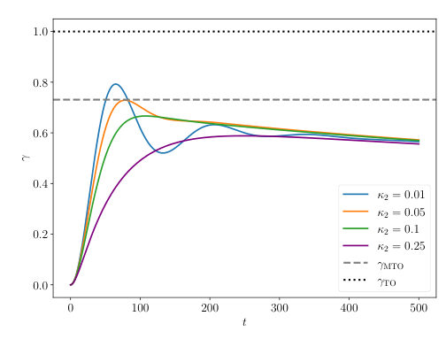 
FIG. 2. Time evolution of the yield γ for different values of non-Markovianity controlled by damping rate of mode 2. The molecule is initially fully excited q = 1, and its energy values are fixed at βE0 = 0, βE1 = 2, βE2 = 1, βE3 = 1.5. The three modes are truncated to 14, 12 and 10 Fock levels, re- spectively. The coupling and damping parameters are fixed at g1 = 0.01, g2 = 0.02, g3 = 0.01 and κ1 = κ3 = 0.4. The hori- zontal lines correspond to the optimal thermal bound (dotted black) and the optimal Markovian thermal bound (dashed gray).

📷 Fig 3

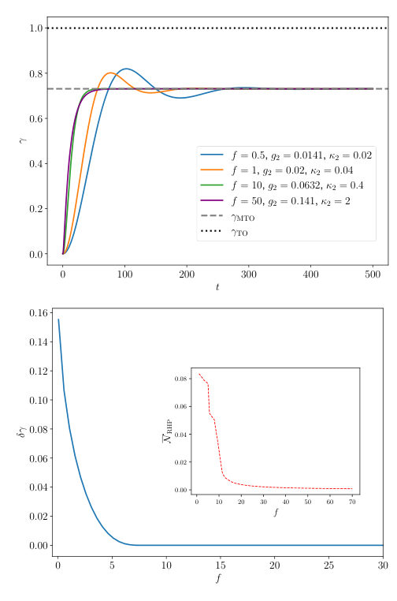 
FIG. 3. Top: Time evolution of the yield γ as a function of non-Markovianity controlled by the parameter f. Energy val- ues are fixed at βE0 = 0, βE1 = 2, βE2 = 1, βE3 = 1.5, and the molecule is initially fully excited q = 1. The pseudomode is truncated to twelve levels, g0 = 0.02, κ0 = 0.04. Bottom panel: Relative yield advantage δγ = (γmax −γMTO)/γMTO as a function of f. In the inset we depict the degree of non-Markovianity N RHP as a function of f (see Appendix B for details). The dynamics is tracked over the time interval I = [0, 500], which fully encompasses the relevant memory fea- tures of the system. Numerical sampling was performed with a step size of ∆t = 10−2 which was chosen to...

📷 Fig 4

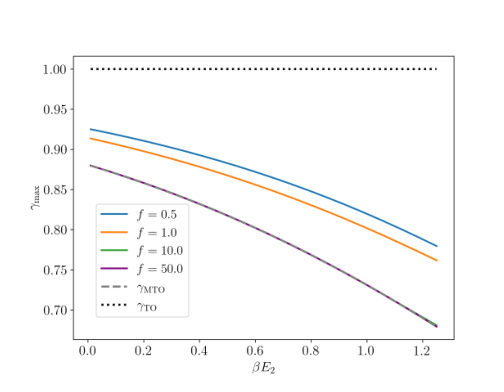 
FIG. 4. Maximum yield γmax as a function of the energy of the target level βE2 for different f-values. Energy values are fixed at βE0 = 0, βE1 = 2, βE3 = 1.5, and the molecule is initially fully excited q = 1. The mode is truncated to twelve levels, with g0 = 0.02 and κ0 = 0.04. For each energy value, we tracked the time evolution over the interval I = [0, 500]. For f = 10 and f = 50 the curves coincide with the Markovian thermal bound.

📷 Fig 5

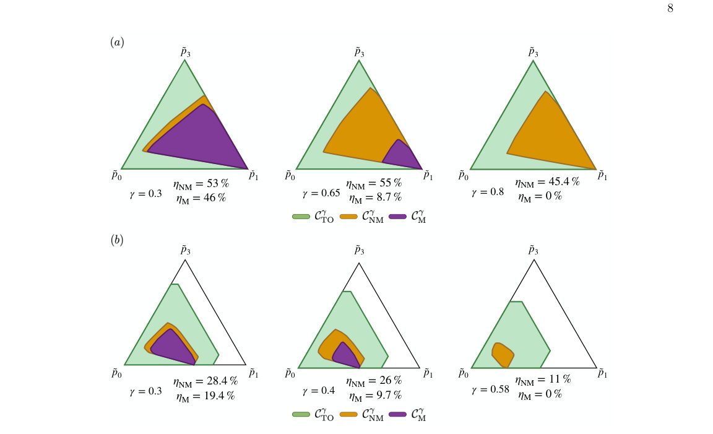 
FIG. 5. Enlarged dynamical accessibility facilitated by thermal non-Markovian operations. Depicted are the cross-sections of the sampled reachable sets at fixed target population γ, for the initially excited state p0(q) = (1 −q, q, 0, 0)T and energies βE = (0, 2, 1, 1.5). Each triangle represents the normalized residual populations (˜p0, ˜p1, ˜p3). The plotted polygons are the intersections of the Markovian and non-Markovian model convex hulls with the plane p2 = γ. The displayed percentages are the TO coverages 100 ηM and 100 ηNM. The dynamical hulls are constructed from a sample over g2 ∈[0.01, 0.1], κ2 ∈[0.02, 2.5], and Γ1, Γ3 ∈[10−4, 0.1]. The sampling comprises an initial global design...

**Summary.** This work examines how environmental memory affects the efficiency of molecular photoreactions compared to theoretical thermodynamic limits. By modeling the system with a structured environment, the authors demonstrate that non-Markovian dynamics can surpass the limitations imposed by simple Markovian assumptions. Ultimately, they argue that achieving the absolute optimal performance requires a specific, engineered microscopic coupling structure.

**Why it may be interesting.** It directly addresses the gap between model-independent thermodynamic limits and the constraints imposed by realistic, structured quantum environments, which is central to modern open quantum system theory and quantum thermodynamics.

Detailed structure

**Main problem.** The paper investigates whether environmental memory (non-Markovianity) can allow a physical process to approach the optimal performance bounds set by resource theories, particularly in molecular photoreactions.

**Main result.** Non-Markovian dynamics are shown to lift dynamical restrictions associated with Markovian thermal evolutions, allowing for enhanced population transfer, although the memory effects studied are not sufficient to reach the absolute optimal thermal operation bound.

**Method.** The analysis uses resource-theoretic bounds (Thermal Operations) and compares them against the time evolution governed by a microscopic master equation, quantifying non-Markovianity using measures like the RHP measure.

**Model / system.** The model is a tunable microscopic system of a molecular photoswitch (a 4-level electronic system) coupled to a structured vibrational environment, allowing interpolation between Markovian and non-Markovian regimes.

**Key observables.** Efficiency/Yield ($\gamma$), which is the population in the desired electronic state; resource bounds ($\gamma_{TO}$ and $\gamma_{MTO}$).

**Important parameters / regimes.** Coupling strengths ($g_i$), damping rates ($\kappa_i$), and mode frequencies ($\omega_i$); the degree of non-Markovianity.

**Assumptions / limitations.** The analysis relies on resource-theoretic bounds derived from general thermal operations, which are model-independent benchmarks.

**Figures summary.** Figures illustrate the comparison between the achievable yield ($\gamma$) and the theoretical bounds ($\gamma_{TO}$ vs $\gamma_{MTO}$), showing how non-Markovianity enhances transfer beyond the Markovian limit.

**Paper structure.** The paper establishes resource-theoretic bounds, models the system dynamics using a tunable Hamiltonian, and then analyzes how non-Markovianity modifies the accessible state space relative to these theoretical limits, concluding by focusing on the necessary microscopic structure for optimal performance.

Abstract

Resource-theoretic approaches to thermodynamics provide powerful, model-independent bounds on the efficiency of physical processes, because they do not rely on microscopic details of the environment. Whether such bounds can be approached by realistic dynamics generated by explicit system-environment interactions remains an open question. Photoisomerization, a fundamental molecular photoreaction, offers a concrete setting to examine this issue. We introduce a tunable microscopic model of a molecular photoswitch coupled to a structured vibrational environment, which interpolates continuously between Markovian and non-Markovian regimes. Resource-theoretic analysis predicts in particular that Markovian Thermal Operations achieve strictly lower yields than general Thermal Operations. We show that environmental memory lifts dynamical restrictions associated with Markovian thermal evolutions, thereby enlarging the set of transformations accessible to the microscopic dynamics. Approaching the thermal operation bound, however, depends on the microscopic coupling structure that generates this memory and directs the resulting dynamics towards the target transformation.

[↑ back to top](#top)

### [Coherence Resonance Phenomena in an Atom-Dimer Two Mode BECs](http://arxiv.org/abs/2608.27947v1)

**Authors:** Avinaba Mukherjee  
**Type:** theory · **Category:** quantum gases · **PDF:** <https://arxiv.org/pdf/2608.27947v1>  
**Analysis basis:** full PDF text, analyzed in chunks
**Topic relevance:** `analog quantum simulation` **3/5** · `driven-dissipative phase transition` **3/5** · `non-equilibrium universality` **3/5** · `Keldysh / 2PI / non-Gaussian methods` **2/5** · `methods for driven-dissipative` **2/5** · `correlated / nonlocal dissipation` **1/5** · `quantum measurements` **1/5** · `scars & prethermalization` **1/5**

📷 Fig 1

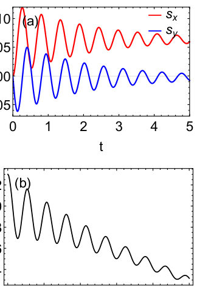 
FIG. 1: Relaxation dynamics of the Bloch vector components (si): (a) sx ( ) and sy ( ), and (b) sz, in the presence of both coupling noise (γx) and detuning noise (γz) acting simultaneously.

📷 Fig 2

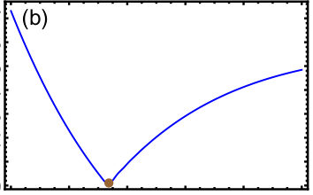 
FIG. 2: Dependence of system time scale, Tx(z) on the Initial polarization, (|s0 z|). The ( ) and ( ) curves correspond to the cases where only (a) coupling noise, γx and only (b) detuning noise, γz are activated, respectively. The equilibrium position is highlighted using (•).

📷 Fig 3

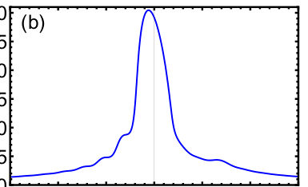 
FIG. 3: System time scale, Tx(z) as a function of the Feshbach detuning, ϵb. The ( ) and ( ) curves correspond to the cases where only (a) coupling noise, γx and only (b) detuning noise, γz are activated, respectively.

📷 Fig 4

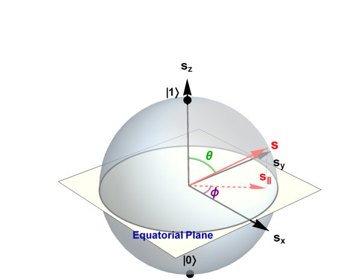 
FIG. 4: Bloch sphere illustrating the north (|1⟩) and south (|0⟩) poles, the coordinate axes sx, sy, and sz, and the Bloch vector s. Here, s∥denotes the projection of s onto the equatorial plane, while θ and ϕ are the polar and azimuthal angles, respectively. The equatorial plane is marked for reference.

📷 Fig 5

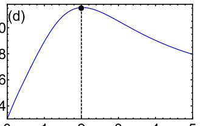 
FIG. 5: Time-averaged purity ¯P in (a) and (c), and time-averaged Husimi-Q distribution ¯H in (b) and (d), plotted as functions of the noise strengths γx and γz, corresponding to fluctuations in the Feshbach coupling and Feshbach detuning, respectively. Panels correspond to different values of γx and γz, varied independently. The ( ) and ( ) curves represent ¯P and ¯H, respectively. The extremum value of both ¯P, and ¯H are indicated by a (•).

**Summary.** This theoretical study examines how noise affects coherence resonance in BECs formed from coupled atoms and molecules via a Feshbach resonance. By using the Bloch-sphere formalism, the authors show that noise can induce resonant behavior, allowing researchers to map out optimal parameter regimes for controlling quantum coherence in these quantum gas systems.

**Why it may be interesting.** This work directly addresses noise-induced phenomena (Coherence Resonance) in a highly relevant platform (BECs), providing quantitative tools (Purity, Bloch formalism) to study non-equilibrium quantum dynamics.

Detailed structure

**Main problem.** The paper investigates Coherence Resonance (CR) phenomena in the non-equilibrium dynamics of atomic-molecular Bose-Einstein Condensates (BECs) coupled via a Feshbach resonance.

**Main result.** The interplay between intrinsic system timescales and external noise sources can lead to noise-induced resonant behavior, which is characterized by extrema in coherence measures like purity and the Husimi-Q distribution.

**Method.** The analysis employs the Bloch-sphere formalism and the large-N limit to derive and solve the stochastic evolution equations for the system's first moments.

**Model / system.** The system is an atom-dimer two-mode BEC modeled as a two-level system, governed by a Hamiltonian including atom-atom, molecule-molecule, and atom-molecule interactions, coupled by a Feshbach resonance.

**Key observables.** Purity, Husimi-Q distribution, and the characteristic relaxation time scale ($T_i$).

**Important parameters / regimes.** Initial polarization, Feshbach detuning ($\epsilon_b$), and noise strengths ($\gamma_x, \gamma_z$).

**Assumptions / limitations.** The analysis uses a single-mode condensate approximation and assumes the total particle number is conserved.

**Figures summary.** Figures illustrate the real-time relaxation dynamics of the Bloch vector components under noise, and show the dependence of the characteristic time scale on initial polarization and detuning.

**Paper structure.** The paper first establishes the Hamiltonian and dynamics using the Bloch-vector formalism, then analyzes the relaxation time scale by linearizing the equations, and finally examines how noise modifies the coherence resonance point by analyzing time-averaged coherence measures.

Abstract

We investigate the non-equilibrium dynamics of atomic-molecular Bose-Einstein condensates coupled via a Feshbach resonance, with Gaussian white noise acting on both the coupling strength and the detuning. Using the bosonic Josephson-junction and Bloch-sphere formalisms, we examine how coherence (coupling) noise and imbalance (detuning) noise modify the coherence-resonance point as functions of the initial polarization and the Feshbach detuning. Noise plays a more coherent role when its characteristic timescale matches the intrinsic timescales of the dynamics, leading to extrema in the time-averaged purity and the Husimi-Q distribution.

[↑ back to top](#top)

### [Engineering Coherence and Ergotropy through Spatial Arrangement of Environmental Channel in a Two-Qubit Quantum Battery](http://arxiv.org/abs/2608.28153v1)

**Authors:** Gayatree Swain  
**Type:** theory · **Category:** quantum information and computing · **PDF:** <https://arxiv.org/pdf/2608.28153v1>  
**Analysis basis:** full PDF text, analyzed in chunks
**Topic relevance:** `correlated / nonlocal dissipation` **3/5** · `driven-dissipative phase transition` **3/5** · `methods for driven-dissipative` **3/5** · `non-equilibrium universality` **2/5** · `quantum measurements` **2/5** · `Keldysh / 2PI / non-Gaussian methods` **1/5** · `analog quantum simulation` **1/5** · `scars & prethermalization` **1/5**

📷 Fig 1

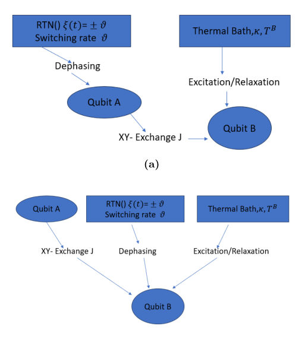 
FIG. 1. Schematic representation of the two environmental- channel configurations: (a) separated configuration, in which RTN acts on qubit A while the thermal reservoir is coupled to qubit B; and (b) co-located configuration, in which both RTN and the thermal reservoir act on qubit B. In both configura- tions, qubits A and B are coupled through the XY exchange interaction.

📷 Fig 2

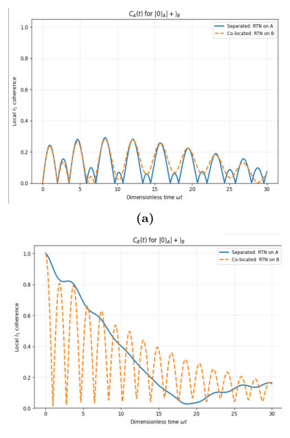 
FIG. 2. Local-coherence dynamics for J = 0.2ω: (a) co- herence CA(t) of qubit A, and (b) coherence CB(t) of qubit B. The remaining parameters are κ = 0.05ω, µ = 0.8ω, ν = 0.02ω, and β = ln(6)/ω.

📷 Fig 3

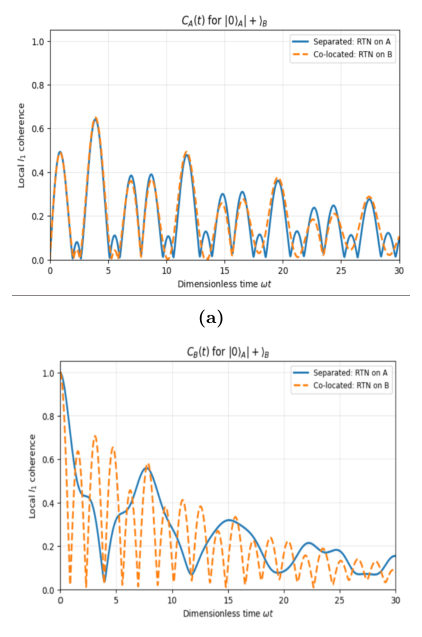 
FIG. 3. Local-coherence dynamics for J = 0.45ω: (a) co- herence CA(t) of qubit A, and (b) coherence CB(t) of qubit B. The remaining parameters are κ = 0.05ω, µ = 0.8ω, ν = 0.02ω, and β = ln(6)/ω.

📷 Fig 4

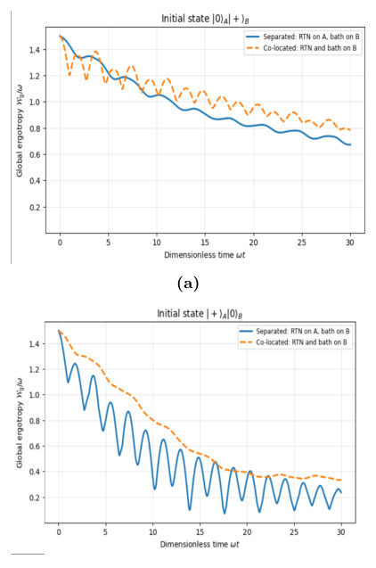 
FIG. 4. Global-ergotropy dynamics for J = 0.2ω: (a) initial state |0⟩A |+⟩B, and (b) initial state |+⟩A |0⟩B. The remaining parameters are κ = 0.05ω, µ = 0.8ω, ν = 0.02ω, and β = ln(6)/ω.

📷 Fig 5

 
Figure 2 for J = 0.2ω, and Figure 3 for J = 0.45ω displays the local l1-norm coherence CA(t) and CB(t) for the initial state |0⟩A |+⟩B at ωt = 0, all coherence resides in qubit B, giving CA(0) = 0 and CB(0) = 1. the XY interaction redistribute this coherence between the qubits. Consequently, oscillatory coherence develops in qubit A, whereas qubit B undergoes simultaneous re- duction and revival of coherence. In the lower-exchange case, J = 0.2ω is shown in Figure 2 for J = 0.2ω, the coherence generated in qubit A does not exceed the value

**Summary.** This paper analyzes a two-qubit quantum battery to determine how coupling the qubits to the environment affects energy storage and coherence. By comparing 'separated' versus 'co-located' environmental noise channels, the authors show that the optimal setup depends on whether one prioritizes total extractable work or the advantage gained from collective operations. This highlights environmental placement as a key control knob for quantum device performance.

**Why it may be interesting.** This work directly addresses open quantum system control, showing how engineering the coupling to the environment can be a tunable resource to optimize quantum battery performance for specific tasks.

Detailed structure

**Main problem.** The study investigates how the spatial arrangement of environmental coupling channels influences the dynamics of coherence and the extractable work (ergotropy) in a two-qubit quantum battery.

**Main result.** The optimal environmental configuration (separated vs. co-located) depends on the initial coherence distribution and the specific performance metric (e.g., global ergotropy vs. global-local gap).

**Method.** The dynamics are analyzed using master equations incorporating thermal baths and Random Telegraph Noise (RTN), evaluating coherence via $l_1$-norm and work extraction via global and local ergotropy.

**Model / system.** The system is a two-qubit quantum battery coupled by an XY-exchange interaction, subjected to environmental noise modeled by a Lindblad master equation and RTN terms. Two configurations are compared: separated (RTN on A, bath on B) and co-located (both on B).

**Key observables.** Local $l_1$-norm coherence, global ergotropy (extractable work), and the global-local ergotropy gap.

**Important parameters / regimes.** Exchange interaction strength ($J$), thermal coupling ($\kappa$), initial coherence location, and the specific environmental configuration.

**Assumptions / limitations.** The analysis relies on weak-coupling approximations for the thermal bath.

**Figures summary.** Figures compare the dynamics of local coherence and the maximum global-local ergotropy gap ($\Delta W_{	ext{max}}$) as a function of the exchange interaction strength ($J$) for different initial states and thermal couplings.

**Paper structure.** The paper models the system dynamics using master equations for two distinct environmental placements (separated vs. co-located) and analyzes the evolution of coherence and work extraction using multiple diagnostics.

Abstract

We investigate how the spatial arrangement of environment channel influences the dynamics of coherence and work extraction in a two-qubit quantum battery with resonant qubits coupled through an XY-exchange interaction. Qubit B is attached to a finite-temperature thermal bath, while RTN noise is applied either to qubit A or to qubit B, depending on whether it is in a separated or co-located configuration, respectively. Two complementary product states are considered to initialise the coherence on different qubits. The dynamics are evaluated using local $l_{1}$-norm coherence, global ergotropy and the global-local ergotropy gap. The results suggest that a stronger exchange interaction enhances the redistribution of coherence without necessarily improving retention of extractable work. For the parameter investigated, the greater global ergotropy is retained in the case of the co-located configuration, especially when the initially coherent qubit is not directly affected by the RTN. However, the configuration provides the largest global-local ergotropy gap, which varies with the exchange interaction, initial state and thermal coupling. Suppression of the gap at large $J$ is typically observed in the case of stronger thermalisation, although enhancement of intermediate-coupling may occur. These results establish that total extractable work, local coherence and collective work advantage quantify the distinct aspects of quantum battery performances. The initial distribution of coherence and the spatial arrangement thus provide complementary mechanisms for regulating locally and collectively extractable work in interacting open quantum batteries.

[↑ back to top](#top)

### [How Long-Range Tails Reshape Non-Hermitian Spectra](http://arxiv.org/abs/2608.28577v1)

**Authors:** Ding Gu, Zhanpeng Fu, Yu-Min Hu, Zhong Wang  
**Type:** theory · **Category:** other · **PDF:** <https://arxiv.org/pdf/2608.28577v1>  
**Analysis basis:** full PDF text, analyzed in chunks
**Topic relevance:** `correlated / nonlocal dissipation` **3/5** · `driven-dissipative phase transition` **3/5** · `methods for driven-dissipative` **3/5** · `Keldysh / 2PI / non-Gaussian methods` **2/5** · `analog quantum simulation` **2/5** · `non-equilibrium universality` **2/5** · `quantum measurements` **1/5**

📷 Fig 1

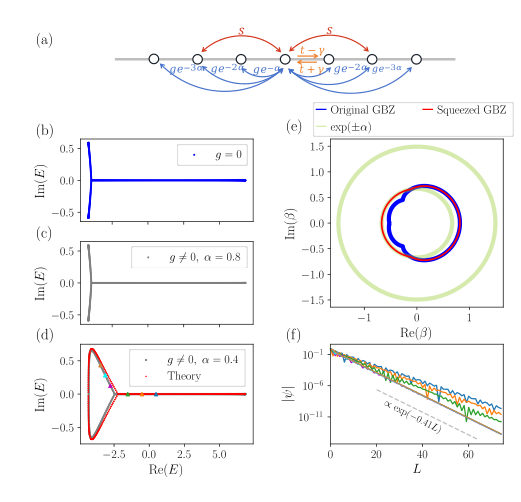 
FIG. 1. Squeezing of the GBZ induced by small exponentially decaying long-range hopping. (a) The 1D model in Eq. (1), with t = 3, γ = 1, and s = 0.5. (b) OBC spectrum for g = 0. (c) OBC spectrum for g = 0.005 and α = 0.8. (d) OBC spectrum for g = 0.005 and α = 0.4. Blue/gray dots in (b–d) are ED results for L = 500. Red dots in (d) are obtained from the squeezed GBZ via h0(β), shown in (e). (e) GBZ of H0 (blue), circles |β| = e±α with α = 0.4 (green), and the squeezed GBZ (red). (f) Spatial profiles of eigenstates with energies marked in (d). Eigenstates associated with the unsqueezed part of GBZ retain their original localization lengths; eigenstates associated with the squeezed part of...

📷 Fig 2

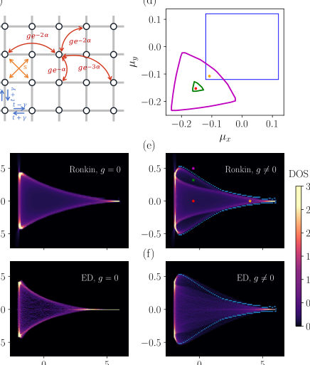 
FIG. 2. The density of states (DOS) of a 2D non-Hermitian system H0 [Eq. (4)] subjected to small long-range hoppings δH [Eq. (7)]. (a) The illustrative model with fixed parameters t = 1, γ = 0.2, s = 0.5. (b) DOS of H0 calculated from the Ronkin function. (c) DOS of H0 from exact diagonalization on a square with system size L = 130. An on-site random potential distributed uniformly in [−0.5, 0.5] is added at each boundary site. (d)(e)(f) DOS squeezed by long-range hoppings with α = 0.12. (d) The minimum plateaus/points of the Ronkin function RE(µx, µy) at different energies are marked by points in (e). When the Ronkin function minima are reached at a plateau, the boundaries of the plateau...

📷 Fig 3

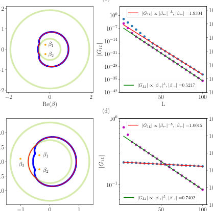 
FIG. 3. The scaling of the Green’s function for h0(β) in Eq.(1) subjected to long-range hoppings δh(β) in Eq.(2). The parameters are t = 3.0, γ = 0.5, s = 0.5, g = 0.01. Upper panel: α = 0.65, ω = −6.5+0.1i. (a) GBZ of h0(β) is shown in blue, GBZ of h(β) is depicted in red, and circles e±α are shown in light green. The roots of ω−h0(β) = 0 within the plot range are indicated in yellow. (b) Scaling of the Green’s function: |G1L| ∼|β←|−Lwith |β←| = 1.9304 ≈eα; |GL1| ∼|β→|L with |β→| = 0.5217 ≈e−α. Lower panel: α = 0.3, ω = −5 + 0.1i. (c) This panel is analogous to (a). (d) Scaling of the Green’s function: |G1L| ∼|β←|−L with |β←| = 1.0015 ≈|β3|; |GL1| ∼ |β→|Lwith |β→| = 0.7402 ≈e−α.

📷 Fig 4

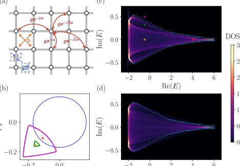 
FIG. 5. DOS in a 2D system with 2-norm exponentially decaying hopping. (a) The model with long-range hopping decaying as g exp(−α p

📷 Fig 5

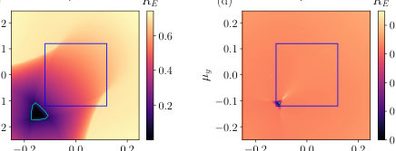 
FIG. 4. Ronkin function RE(µx, µy) of different energies on the (µx, µy) plane. The blue square corresponds to the boundary of the restricted domain |µx|, |µy| ≤α. (a)(d) The minimum of the Ronkin function is reached at a single point. (b)(c) The minimum of the Ronkin function is reached on a plateau.

**Summary.** This paper demonstrates that even infinitesimally weak, long-range hopping terms can drastically reshape the energy spectrum of non-Hermitian quantum systems under open boundary conditions. It develops mathematical tools, such as the squeezed GBZ and amoeba formulation, to describe this spectral reconstruction. The findings are significant because they show that the system's fundamental properties are dictated by the competition between the hopping decay rate and the system's inherent localization scale.

**Why it may be interesting.** The work provides a powerful, general framework for understanding how weak, non-local interactions can fundamentally change the spectral topology and transport properties of open quantum systems, which is highly relevant for engineered quantum devices.

Detailed structure

**Main problem.** The paper investigates how exponentially decaying long-range hoppings nonperturbatively reconstruct the spectrum and eigenstates of short-range non-Hermitian systems under open boundary conditions.

**Main result.** Long-range hoppings cause the original Generalized Brillouin Zone (GBZ) to be replaced by a 'squeezed GBZ' in 1D, and a 'squeezed amoeba formulation' in 2D, fundamentally altering the spectral density and dynamics.

**Method.** The analysis employs non-Bloch band theory, utilizing the Ronkin function and its minimization in the complex plane (amoeba formulation) to determine the spectral density of states.

**Model / system.** The model consists of non-Hermitian tight-binding systems, perturbed by long-range hopping terms decaying exponentially, $e^{-\alpha |n|}$. The analysis extends to Lindbladian open systems governed by a Liouvillian equation.

**Key observables.** The primary observables are the Open Boundary Condition (OBC) spectrum, the spectral density of states (DOS), and the Liouvillian gap ($\Lambda$).

**Important parameters / regimes.** The competition between the decay length of the long-range hoppings ($\alpha$) and the localization length of the non-Hermitian skin modes is crucial.

**Assumptions / limitations.** The analysis relies on treating the long-range hopping as a perturbation ($\delta H$) and using non-Bloch band theory techniques.

**Figures summary.** Figures illustrate the squeezing of the GBZ in 1D, the comparison of DOS using the squeezed amoeba formulation in 2D, and the evolution of dynamics showing chiral damping affected by the long-range hopping strength $\alpha$.

**Paper structure.** The paper develops the theory by first analyzing the 1D case using the GBZ renormalization, then generalizing to 2D using the squeezed amoeba formulation for the DOS, and finally applying the concepts to the dynamics of open quantum systems via the Liouvillian formalism.

Abstract

Exponentially decaying long-range hoppings are ubiquitous in realistic tight-binding models and are often truncated to obtain a finite-range description. We show that this approximation can fail dramatically in non-Hermitian systems under open boundary conditions: an infinitesimal long-range hopping can nonperturbatively reconstruct the spectrum and eigenstates of a short-range non-Hermitian system. The mechanism is controlled by a competition between the decay length of infinitesimal long-range hoppings and the localization length of non-Hermitian skin modes, leading to a sharp transition as the decay rate is tuned. In one dimension, we show that a squeezed generalized Brillouin zone (GBZ) replaces the original GBZ of the short-ranged Hamiltonian, yielding the reconstructed open-boundary spectrum. In two or higher dimensions, we formulate a squeezed amoeba formulation describing the reconstructed spectral density. We further show that long-range hoppings can qualitatively reshape Green's function, which can be readily detected in experiments.

[↑ back to top](#top)

### [Pulsed single-photon magnetometry with a $Λ$-type three-level system: near-optimal frequency-resolved photon counting](http://arxiv.org/abs/2608.27979v1)

**Authors:** Seyed Mostafa Moniri, Elnaz Darsheshdar, Mikayel Khanbekyan  
**Type:** theory · **Category:** other · **PDF:** <https://arxiv.org/pdf/2608.27979v1>  
**Analysis basis:** full PDF text, analyzed in chunks
**Topic relevance:** `Full counting statistics` **3/5** · `interference shaping light` **3/5** · `quantum measurements` **3/5** · `Tavis-Cummings & cavity-many-emitter` **1/5** · `analog quantum simulation` **1/5** · `correlated / nonlocal dissipation` **1/5** · `driven-dissipative phase transition` **1/5** · `methods for driven-dissipative` **1/5**

📷 Fig 1

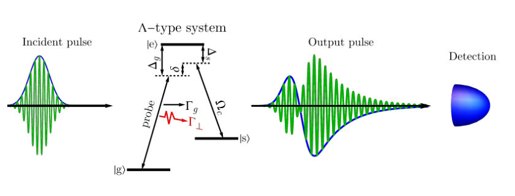 
Figure 1. Schematic of pulsed single-photon magnetometry with a Zeeman-sensitive Λ-type three-level system. An incident single-photon pulse couples the |g⟩↔|e⟩transition at rate Γg, while a classical control field with Rabi frequency Ωc drives the |s⟩↔|e⟩transition. The magnetic field modifies the one-photon detuning ∆g and the two-photon detuning δ. Emission into environmental modes is described by Γ⊥.

📷 Fig 2

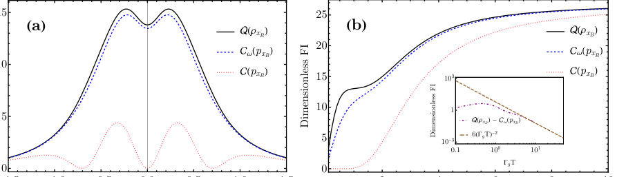 
Figure 2. Magnetic-field and pulse-duration dependence for the 40Ca+ value rZ = 0.76 at critical coupling Γ⊥= Γg, with Ωc/Γg = 1 and δ0 = ∆g,0 = 0. (a) Total output-state QFI Q(ρxB), frequency-resolved CFI Cω(pxB), and photon-loss CFI C(pxB) versus xB for ΓgT = 2. (b) The same quantities versus ΓgT at xB = 0.3. The inset shows the information gap Q −Cω on log-log axes together with a T −2 reference dependence; the numerical data follow the predicted asymptotic scaling at large T.

📷 Fig 3

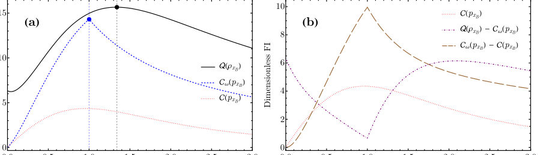 
Figure 3. Information redistribution as a function of the normalized environmental coupling rate Γ⊥/Γg for rZ = 0.76, xB = 0.3, ΓgT = 2, Ωc/Γg = 1, and δ0 = ∆g,0 = 0. (a) Total QFI Q, frequency-resolved CFI Cω, and photon-loss CFI C. The blue vertical line marks critical coupling, Γ⊥/Γg = 1, while the second vertical line marks the QFI maximum at Γ⊥/Γg ≃1.34. (b) Exact decomposition into photon-loss information C, additional spectral-intensity information Cω −C, and residual spectral-phase information Q −Cω.

📷 Fig 4

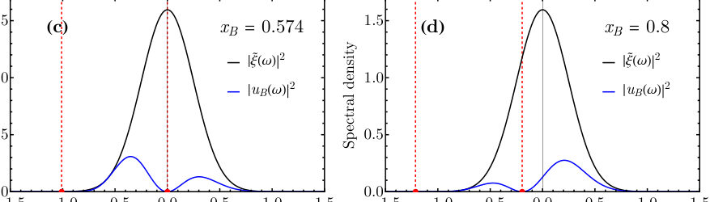 
Figure 4. Incident spectral density |˜ξ(ω)|2 and output spectral density |uB(ω)|2 at critical coupling Γ⊥= Γg, for rZ = 0.76, ΓgT = 2, Ωc/Γg = 1, and δ0 = ∆g,0 = 0. The panels correspond to (a) xB = 0, (b) xB = 0.3, (c) xB = 0.574, and (d) xB = 0.8. Vertical dashed lines mark the analytical scattering-zero positions ω(0) ± . In panel (c), one zero lies at the pulse center.

📷 Fig 5

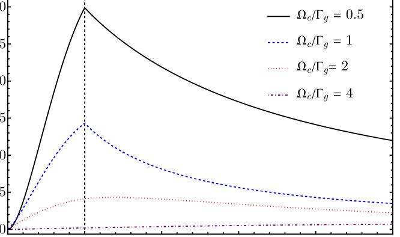 
Figure 5. Frequency-resolved CFI Cω(pxB) versus Γ⊥/Γg for Ωc/Γg = 0.5, 1, 2, 4, using rZ = 0.76, xB = 0.3, ΓgT = 2, and δ0 = ∆g,0 = 0. The vertical dashed line marks critical coupling, Γ⊥= Γg. The critical feature is pronounced for weak and moderate control and becomes suppressed when the scattering zeros move away from the incident pulse bandwidth.

**Summary.** The paper investigates single-photon magnetometry using a $\Lambda$-system, comparing information extraction from photon loss versus frequency-resolved photon counting. It shows that environmental coupling can enhance sensitivity, and crucially, at critical coupling, frequency-resolved counting can approach the ultimate quantum limit by accessing information previously hidden in the spectral phase.

**Why it may be interesting.** This work provides a detailed theoretical framework for quantum sensing using cavity/atomic systems, specifically quantifying how different measurement observables (loss vs. spectral intensity) relate to the fundamental quantum limits (QFI) in the presence of environmental coupling.

Detailed structure

**Main problem.** To determine if frequency-resolved photon counting can extract magnetic-field information from a single-photon scattering process in a $\Lambda$-type three-level system, potentially surpassing the limits set by simple photon-loss measurements.

**Main result.** Frequency-resolved photon counting can capture nearly all the magnetic-field information encoded in the output state, especially at critical coupling where scattering amplitude zeros redistribute information to measurable spectral intensity.

**Method.** The analysis involves deriving the asymptotic output state and decomposing the Quantum Fisher Information (QFI) into classical (photon-loss) and quantum (spectral-intensity/phase) contributions.

**Model / system.** The system is a Zeeman-sensitive $\Lambda$-type three-level atom probed by a single-photon pulse and driven by a classical control field. The dynamics are analyzed using the Hamiltonian in the rotating frame, incorporating environmental coupling.

**Key observables.** Quantum Fisher Information (QFI), frequency-resolved Correlation Function of Intensity ($C_\omega(pB)$), spectral intensity, and spectral phase.

**Important parameters / regimes.** Environmental coupling rates ($\Gamma_g, \Gamma_\perp$), detunings ($\Delta_g, \delta$), and the ratio $\Gamma_\perp/\Gamma_g$ (especially at critical coupling).

**Assumptions / limitations.** Approximations include neglecting spontaneous branching from $|e
angle	o |s
angle$ and lower-state coherence dephasing, and analyzing the long-pulse limit using Gaussian pulse profiles.

**Figures summary.** Figures illustrate the schematic of the magnetometry setup, the spectral densities of the output fields at different magnetic fields, and the frequency-resolved CFI plotted against the ratio of coupling rates ($\Gamma_\perp/\Gamma_g$).

**Paper structure.** The paper progresses by setting up the physical model and Hamiltonian, deriving the asymptotic output state, decomposing the QFI, and then analyzing the specific measurement scheme of frequency-resolved photon counting, culminating in the comparison between the achievable CFI and the theoretical QFI.

Abstract

We investigate pulsed single-photon magnetometry with a Zeeman-sensitive $Λ$-type three-level system driven by a classical control field. We derive the asymptotic output state and decompose its quantum Fisher information into photon-loss, spectral-intensity, and spectral-phase contributions. Environmental coupling reshapes the scattering response and can increase magnetic-field information. At critical coupling, real-frequency zeros of the scattering amplitude redistribute information toward measurable spectral intensity, allowing frequency-resolved photon counting to capture nearly all of the magnetic-field information encoded in the output state when the zeros lie within the pulse bandwidth. For long Gaussian pulses with a smooth, nonzero central-frequency scattering amplitude, the additional spectral-intensity contribution and residual spectral-phase information gap decrease as $T^{-2}$ or faster.

[↑ back to top](#top)

### [Modifying van der Waals Materials via Cavity Vacuum Fluctuations](http://arxiv.org/abs/2608.28521v1)

**Authors:** Mohammad Hassan, Cankut Tasci, Leonardo A. Cunha, Johannes Flick  
**Type:** theory · **Category:** other · **PDF:** <https://arxiv.org/pdf/2608.28521v1>  
**Analysis basis:** full PDF text, analyzed in chunks
**Topic relevance:** `analog quantum simulation` **3/5** · `Keldysh / 2PI / non-Gaussian methods` **2/5** · `Tavis-Cummings & cavity-many-emitter` **2/5** · `methods for driven-dissipative` **2/5** · `correlated / nonlocal dissipation` **1/5** · `driven-dissipative phase transition` **1/5** · `interference shaping light` **1/5** · `quantum measurements` **1/5**

📷 Fig 1

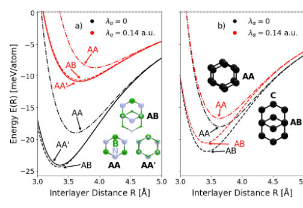 
FIG. 1. Binding curves for bilayer hBN and bilayer graphene. The y-axis is the sum of the DFT energy and Exc with respect to an offset at an interlayer distance of 10 ˚A. a) Binding curves for bilayer hBN in AA, AB, and AA’ stacking. The black curves are the energies outside the cavity (λα = 0 a.u.). The red curves are the energies in the cavity with ω = 2 eV and λα = 0.14 a.u., with a single cavity mode polarized in the out-of-plane direction. b) Binding curves for bilayer graphene in AA and AB stacking.

📷 Fig 2

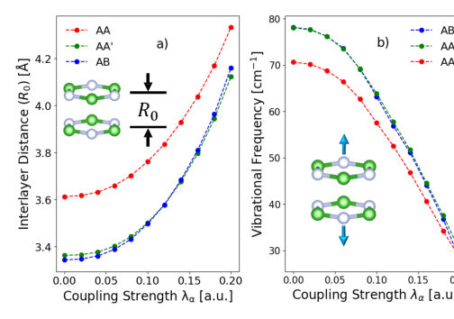 
FIG. 2. Interlayer distances (a) and layer breathing mode fre- quencies (b) as a function of coupling strength for bilayer hBN in a cavity with single cavity mode polarized in the out-of-plane direction with a cavity frequency of ω = 2 eV.

**Summary.** This paper develops a novel theoretical method using QEDFT to incorporate cavity vacuum fluctuations into the description of vdW materials. By applying this to bilayer hBN and graphene, the authors demonstrate that these vacuum fields can tune structural properties, such as interlayer spacing and stacking preference. This establishes cavity vacuum fluctuations as a powerful, non-invasive control mechanism for quantum materials.

**Why it may be interesting.** This work directly bridges quantum optics (cavity vacuum fluctuations) with condensed matter structure (vdW materials), providing a theoretical tool to engineer material properties using fundamental quantum field effects, which is highly relevant to AMO physics.

Detailed structure

**Main problem.** The study addresses how vacuum fluctuations from optical cavities can modify the ground-state structural properties of van der Waals (vdW) materials without requiring external driving fields.

**Main result.** The authors predict that cavity vacuum fluctuations act as a tunable knob, causing cavity-modified stacking, increasing equilibrium interlayer distances, and softening layer breathing modes in materials like hBN and graphene.

**Method.** They introduce a periodic formulation of the photon many-body dispersion (pMBD) functional within the Quantum Electrodynamical Density-Functional Theory (QEDFT) framework.

**Model / system.** The system involves layered 2D vdW materials, specifically bilayer hBN and graphene. The theory models the interaction using a Hamiltonian adapted for periodic boundary conditions in reciprocal space (q-space).

**Key observables.** Binding curves, cavity-mediated energy ($\Delta 	ext{Exc}$), equilibrium interlayer distances, and layer breathing mode (LBM) frequencies.

**Important parameters / regimes.** Light-matter coupling strength ($\lambda$), cavity frequency ($\omega$), and the momentum transfer point (focusing on the $\Gamma$-point, $q=0$).

**Assumptions / limitations.** The method assumes a periodic solid on a supercell and simplifies the calculation by assuming the cavity primarily influences the $\Gamma$-point ($q=0$).

**Figures summary.** Figure 1 shows binding curves for hBN and graphene under different coupling strengths. Figure 2 illustrates the predicted expansion of interlayer distance and softening of LBM frequencies as the coupling strength increases.

**Paper structure.** The paper establishes the theoretical framework (QEDFT/pMBD) to calculate cavity-modified interactions, applies this method to bilayer hBN and graphene, and presents quantitative results showing structural changes dependent on the coupling strength.

Abstract

In the field of cavity quantum materials, vacuum fluctuations of optical cavities are used for modifying ground-state properties of quantum materials without external driving. Here, one example is the van der Waals (vdW)/dispersion interaction in layered 2D vdW materials, where non-additive long-range correlations can dominate the interlayer binding. While cavity-induced changes of such interactions have been predicted and described using ab initio methods for molecular systems, no efficient description exists yet for extended materials. In this Letter, we close this gap by introducing a periodic formulation of the photon many-body dispersion (pMBD) functional within quantum electrodynamical density-functional theory (QEDFT). Applying this method with efficient $\textbf{q}$-point sampling to bilayer hBN and graphene, we predict cavity-modified stacking, increased equilibrium interlayer distances, and softened layer breathing modes with increasing light-matter coupling strength. Our results establish cavity vacuum fluctuations as a tuning knob for the structural properties of vdW materials.

[↑ back to top](#top)

### [Diamond optomechanical crystals for high-frequency strain and comb generation](http://arxiv.org/abs/2608.27581v1)

**Authors:** Elham Zohari, Waleed El-Sayed, Aria Jafari, Ahmas El-hamamsy, Peyman Parsa, Joseph E. Losby, Natália C. Carvalho, Paul E. Barclay  
**Type:** both · **Category:** other · **PDF:** <https://arxiv.org/pdf/2608.27581v1>  
**Analysis basis:** full PDF text, analyzed in chunks
**Topic relevance:** `analog quantum simulation` **3/5** · `quantum optics experiment` **3/5** · `QC/QI experiment` **1/5** · `Tavis-Cummings & cavity-many-emitter` **1/5** · `driven-dissipative phase transition` **1/5** · `interference shaping light` **1/5** · `methods for driven-dissipative` **1/5** · `quantum measurements` **1/5**

📷 Fig 1

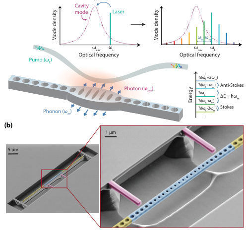 
Figure 1. Diamond OMC cavity and cascaded photon–phonon interactions. (a) Schematic illustration: A continuous-wave pump laser drives an optomechanical cavity, generating Stokes and anti-Stokes sidebands through cascaded scattering with a mechanical mode at frequency ωm. The energy diagram shows the underlying phonon emission and absorption pro- cesses, producing equally spaced comb lines at ωL ± ωm. (b) False-coloured SEM image of a fabricated diamond OMC cav- ity, showing the central cavity region (blue), Bragg mirror sections (yellow), and integrated fibre-coupling support struc- tures (pink).

📷 Fig 2

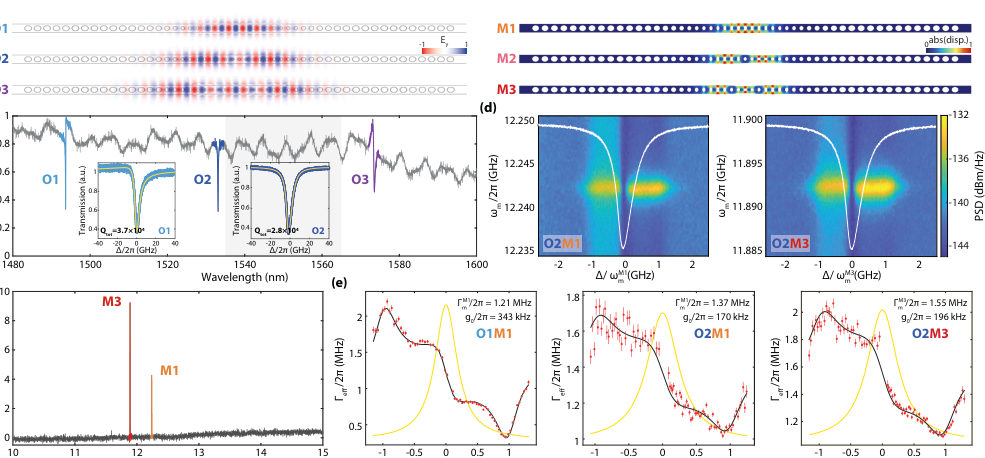 
Figure 2. Diamond OMC cavity mode characterization. (a) Simulated spatial profiles of the optical and mechanical cavity modes. Left: Electric field intensity distributions of the first- (O1, 1497 nm), second- (O2, 1530 nm), and third-order (O3, 1566 nm) optical modes. Right: Mechanical displacement profiles of the first- (M1, 12.43 GHz), second- (M2, 12.27 GHz), and third-order (M3, 12.08 GHz) acoustic breathing modes. The colour scheme identifying each mode is used consistently throughout. (b) Normalized broadband transmission spectrum of the diamond OMC showing three optical resonances at 1494, 1530, and 1571 nm. The shaded region shows the operational range of the EDFA used. Insets show...

📷 Fig 3

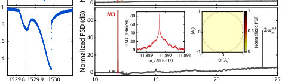 
Figure 3. Thermal-to-self-oscillation transition of the M3 me- chanical mode. (a) Normalized optical transmission at input powers Pi = 7.1 mW (top) and 19.1 mW (bottom). The dashed black line indicates the laser detuning (∆/ωM3 m = 1.0) used for all measurements. (b) Normalized PSD of the op- tically transduced RF spectrum, showing thermal Brownian motion (top) and self-sustained oscillation (bottom). Insets: high-resolution PSD of the M3 mode showing linewidth nar- rowing at self-oscillation, and phase-space distributions from IQ quadrature measurements showing the PDF for thermal noise and limit-cycle oscillation.

📷 Fig 4

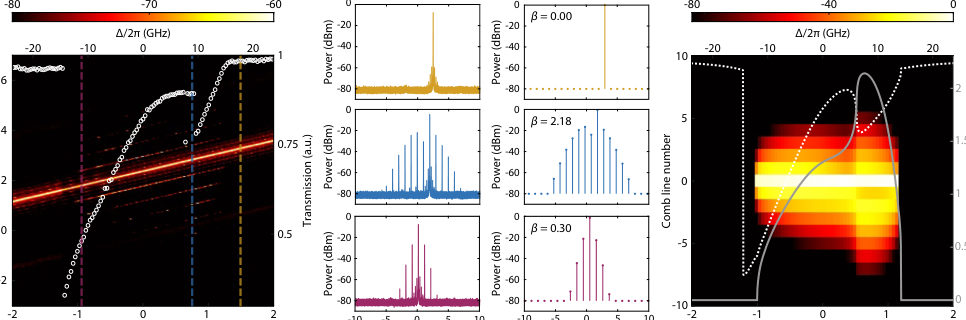 
Figure 4. Cascaded photon-phonon scattering and optical frequency comb generation. (a) Two-dimensional map of the transmitted optical spectrum as a function of normalized laser-cavity detuning ∆/ωM3 m , recorded by sweeping the laser across the O2 resonance (red arrow indicates sweep direction). The overlaid white circles indicate the cavity transmission profile. (The colour scale is truncated to enhance visibility of the sideband structure.) (b) Optical spectra extracted at the three detunings marked in (a), showing the evolution of the optomechanical frequency comb. At optimal blue detuning, thirteen equally spaced comb lines appear spanning 143 GHz. The comb spacing matches the M3...

📷 Fig 5

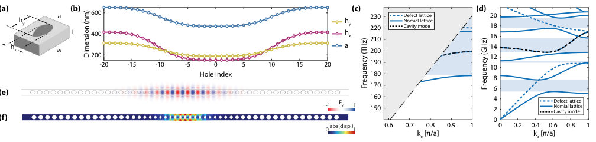 
Figure 5. Device design parameters and simulated mode profiles for the 1D OMC. (a) Unit cell schematic showing a, hx, hy, w, and t. (b) Evolution of unit cell parameters through the tapered defect region. Simulated (c) optical and (d) mechanical band diagrams. Simulated fundamental (e) optical mode profile (electric field intensity) and (f) mechanical breathing-mode profile (displacement magnitude).

**Summary.** Researchers developed a diamond optomechanical crystal cavity to enhance quantum optomechanical coupling. By achieving self-sustained mechanical oscillations, the device generates a large-scale optical frequency comb. This demonstrates a high dynamic strain, making the platform highly promising for controlling diamond spin qubits using light.

**Why it may be interesting.** This work directly addresses the coupling of mechanical motion to optical fields in a solid-state quantum system (diamond), which is a cornerstone of cavity QED and optomechanics for quantum information processing.

Detailed structure

**Main problem.** The goal is to demonstrate a diamond optomechanical crystal cavity capable of generating a high-frequency optical frequency comb while achieving a large dynamic strain for future quantum control applications.

**Main result.** The system successfully generates an optical frequency comb spanning 143 GHz, corresponding to a maximum dynamic strain of $1.1 	imes 10^{-3}$ in the mechanical oscillation.

**Method.** The study combines theoretical simulation (COMSOL) for device design and characterization with experimental measurements of cavity resonances and frequency comb generation under self-sustained oscillation.

**Model / system.** The platform is a diamond optomechanical crystal (OMC) cavity, which leverages diamond's high elastic modulus, low absorption, and inherent spin qubits. The system supports multiple optical and mechanical resonances that are coupled via the optomechanical interaction.

**Key observables.** Frequency comb spectrum (143 GHz span), peak mechanical oscillation amplitude (130 pm), total dynamic strain ($1.1 	imes 10^{-3}$), and optomechanical coupling rate ($g_0$).

**Important parameters / regimes.** Mechanical resonance frequency ($\sim 12$ GHz), high mechanical quality factor ($Q_m 	imes f_m$), and the resolved-sideband regime ($\omega_m > \kappa_{tot}$).

**Assumptions / limitations.** The analysis assumes the system operates in the resolved-sideband regime and requires careful modeling to account for photothermal shifts when determining the effective detuning.

**Figures summary.** Figures illustrate the OMC cavity schematic, mode profiles (optical and mechanical), transmission spectra showing resonances, and the final frequency comb structure via sideband analysis.

**Paper structure.** The paper progresses from device design and mode characterization (simulations) to demonstrating the transition from thermal motion to self-sustained oscillation, culminating in the quantitative measurement and analysis of the generated frequency comb.

Abstract

Quantum optomechanical technologies benefit from mechanical oscillators that are high-frequency, can be coherently driven, and are capable of coupling to other quantum systems. Diamond supports all of these criteria: its large elastic modulus increases mechanical resonance frequency, its low nonlinear optical absorption increases the allowed intensity of fields used for coherent optomechanics, and it hosts spin qubits that interact with mechanical modes. Here we demonstrate a diamond optomechanical crystal cavity that supports multiple mechanical resonances with $\sim$12 GHz frequency and high $Q_\text{m} \times f_\text{m}$ product that can be coherently coupled to multiple optical modes. By exciting this sideband resolved system into mechanical self-sustained oscillations, we generate a frequency comb spanning 143 GHz. Analysis of the comb spectrum, combined with systematic characterization of the system's optomechanical coupling, allows us to quantitatively show that its mechanical oscillation amplitude reaches 130 pm. This corresponds to a maximum total dynamic strain of $1.1 \times 10^{-3}$ that is sufficiently high for future demonstrations of optomechanical control of diamond spin qubits.

[↑ back to top](#top)

### [Machine Learning-Based Characterisation of the Non-Markovian Dynamics of a Nitrogen-Vacancy Centre](http://arxiv.org/abs/2608.27632v1)

**Authors:** Tom Lannon, Mauro Paternostro, John Martin Gregg, Amit Kumar  
**Type:** both · **Category:** other · **PDF:** <https://arxiv.org/pdf/2608.27632v1>  
**Analysis basis:** full PDF text, analyzed in chunks
**Topic relevance:** `QC/QI experiment` **3/5** · `methods for driven-dissipative` **3/5** · `quantum measurements` **2/5** · `Keldysh / 2PI / non-Gaussian methods` **1/5** · `correlated / nonlocal dissipation` **1/5** · `driven-dissipative phase transition` **1/5** · `quantum optics experiment` **1/5**

📷 Fig 1

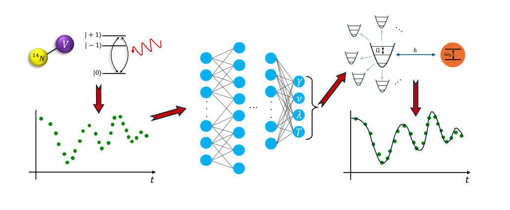 
Figure 1. A schematic of the machine-learning based parameter estimation procedure. A continuous microwave signal drives the spin of the NV centre between two states, resulting in a photoluminescence signal that oscillates and decays (possibly non-monotonically) in time due to coupling to an external environment. This signal is fed into a trained neural network to perform regression on the parameters of the environment. These parameters are used to simulate a reaction coordinate model of the NV dynamics that is able to reproduce the experimental data.

📷 Fig 2

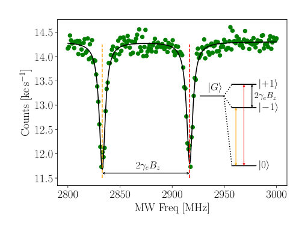 
Figure 2. ODMR signal in the ground state of the NV centre. Green points are experimental data, and the black line is a fit to the fine structure Hamiltonian. The relevant energy levels and transitions for this experiment are shown in the inset.

📷 Fig 3

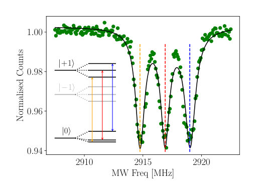 
Figure 3. Normalised pulsed ODMR signal in the electronic transition |0⟩→|+1⟩of the NV centre. Green points are experimental data, and the black line is a fit to the hyperfine Hamiltonian. The relevant energy levels and transitions for this experiment are shown in the inset, and the orange dashed line indicates the transition that is addressed during Rabi oscillation experiments.

📷 Fig 4

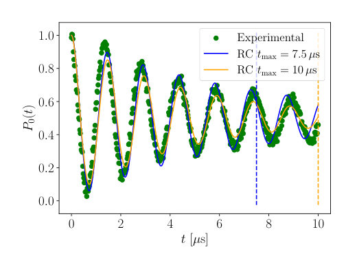 
Figure 4. NV centre Rabi oscillations. The green points are experimental data normalised between the PL of the |0⟩state and the PL after the first π-pulse. The solid blue (orange) line is the RC model with parameters returned by the neural net- work trained on simulated data of duration 7.5 µs (10 µs). The vertical dashed lines indicate the duration of experimental data fed into the corresponding neural network.

📷 Fig 5

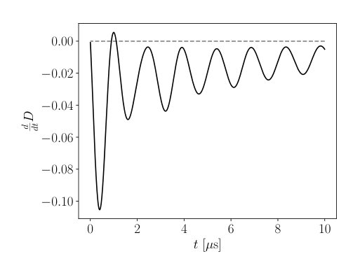 
Figure 5. The time derivative of the trace distance between initial states |0⟩and |1⟩under the map corresponding to the predicted RC model. Regions above the horizontal dashed line indicate a backflow of information.

**Summary.** This paper reports the first experimental use of machine learning to reconstruct the full spectral density parameters governing the non-Markovian dynamics of an NV center. By analyzing Rabi oscillations from ODMR measurements, the authors trained a neural network to estimate environmental parameters, showing performance comparable to established quantum estimation techniques.

**Why it may be interesting.** This work represents a powerful synergy between quantum physics and AI, showing how ML can extract detailed spectral information about open quantum systems that is otherwise difficult to measure or model accurately.

Detailed structure

**Main problem.** The primary goal is to characterize the non-Markovian dynamics of a quantum system, specifically an NV center, by reconstructing the spectral density function parameters from experimental Rabi dynamics.

**Main result.** The authors successfully demonstrated that a machine learning approach can reconstruct all spectral density parameters from the NV dynamics, achieving variance estimates comparable to the Maximum Likelihood Estimator for certain parameters.

**Method.** The study combines experimental measurements (ODMR/Rabi oscillations) with advanced computational techniques, using neural networks trained to map measured dynamics onto underlying environmental spectral density parameters.

**Model / system.** The system is a negatively charged Nitrogen-Vacancy (NV) center in diamond, modeled as a spin-boson system. Non-Markovian dynamics are incorporated via a Reaction Coordinate (RC) mapping, which governs the system's interaction with its environment.

**Key observables.** Pulsed ODMR signal, Rabi oscillations ($\langle\sigma_z(t)
angle$), and the reconstructed spectral density parameters ($\gamma, 
u, \lambda, T$).

**Important parameters / regimes.** The spectral density parameters ($\gamma, 
u, \lambda, T$) characterizing the environment's coupling to the quantum system.

**Assumptions / limitations.** The analysis relies on the RC mapping to handle strong coupling and non-Markovian effects, and the ML approach is benchmarked against the Cramér-Rao bound and MLE.

**Figures summary.** Figures illustrate the ODMR signal and Rabi oscillations, showing experimental data compared against fits derived from the RC model and the ML reconstruction process.

**Paper structure.** The paper introduces the physical model (NV center, spin-boson), details the experimental measurements (ODMR/Rabi), presents the ML methodology for parameter estimation, compares its performance against theoretical bounds (CRB/MLE), and concludes with a proposed two-step estimation workflow.

Abstract

The interaction between a quantum system and its environment can be characterized by the spectral density function: knowing its structure is important for optimizing applications of quantum technologies such as quantum sensing protocols. In this work, we present the first experimental demonstration of a machine learning-based reconstruction of reaction-coordinate spectral density parameters from NV centre Rabi dynamics. Unlike the previous work, we recover all spectral density parameters rather than only the central frequency, and benchmark the performance of the neural network against the Cramér-Rao bound and maximum likelihood estimator. Our results demonstrate that the model predicted by the neural network can reliably reproduce the NV dynamics over the estimation window, and can produce estimates for some parameters with variances comparable to that of maximum likelihood.

[↑ back to top](#top)

### [Correlated disorder versus correlated noise: Ordering in active systems](http://arxiv.org/abs/2608.28012v1)

**Authors:** Sudip Mukherjee, Abhik Basu  
**Type:** theory · **Category:** statistical mechanics · **PDF:** <https://arxiv.org/pdf/2608.28012v1>  
**Analysis basis:** full PDF text, analyzed in chunks
**Topic relevance:** `driven-dissipative phase transition` **3/5** · `non-equilibrium universality` **3/5** · `Keldysh / 2PI / non-Gaussian methods` **2/5** · `methods for driven-dissipative` **2/5** · `correlated / nonlocal dissipation` **1/5**

📷 Fig 1

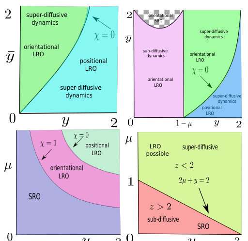 
FIG. 1: Schematic phase diagrams in 2D for an active surface with quenched tangential velocity: (a) In the y −¯y plane for a fixed µ with µ &gt; 1. Phases with positional LRO (blue) and or- intational LRO but positional SRO (green) are marked. The phase boundary is given by χ = 0. The dynamics is super- diffusive everywhere. For the 2D NRB XY model, the phases are phase LRO (blue) and phase SRO (green). (b) For y −¯y plane for a fixed µ with µ &lt; 1. Phases with positional LRO and super-diffusive dynamics (blue), orientational LRO but positional SRO with super-diffusive dynamics (green), orien- tational LRO but positional SRO with sub-diffusive dynamics (red) and orientational SRO (checkerboard)...

📷 Fig 2

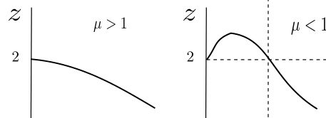 
FIG. 2: Variation of z with y in 2D for a fixed µ. (a) µ &gt; 1: z monotonically decreases with y, starting from 2 at y →0. (b) µ &lt; 1: z first rises from 2 at y →0, then decreases monotonically with y, crossing 2 at y = 1 −µ to become less than 2. Thus z has a non-monotonic dependence on y. See text.

📷 Fig 3

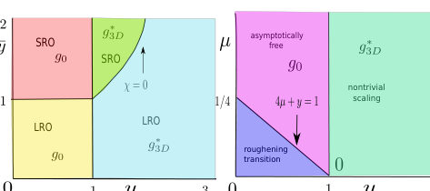 
FIG. 3: (a) Phase diagram of the 3D NRB XY model in the y −¯y plane. Phase LRO controlled by the nontrivial fixed point g∗ 3D (blue), phase SRO controlled by g∗ 3D (green), LRO controlled by g0 = 0 (yellow) and SRO controlled by g0 = 0 (red) are marked. The phase boundary between phase LRO and phase SRO, both controlled by g∗ 3D is given by χ = 0. (b) Phases in the y −µ plane: Phases controlled by g∗ 3D with nontrivial scaling different from those in the linear or free theory (phase LRO or phase SRO, green), roughening tran- sition between asymptotically free phase LRO or SRO and perturbatively inaccessible strong coupling phases (violate) and asymptotically free with linear theory scaling...

**Summary.** This theoretical work explores how correlated disorder influences ordering in non-equilibrium active systems, specifically using the nonreciprocal XY model. By applying renormalization group techniques, the authors demonstrate that long-range disorder can stabilize long-range order in 2D and 3D, even when the clean system would otherwise exhibit only short-range order. This provides a quantitative framework for understanding disorder-induced order in driven matter.

**Why it may be interesting.** The study of non-equilibrium phase transitions driven by disorder is crucial for understanding complex active matter systems, which often lack simple thermal equilibrium descriptions.

Detailed structure

**Main problem.** The paper investigates whether quenched disorder can induce long-range order in driven, non-equilibrium systems, contrasting this effect with the influence of long-range noise.

**Main result.** Sufficiently long-range quenched disorder can induce long-range order in 2D nonreciprocal XY systems, and in 3D, disorder combined with nonreciprocity creates a novel transition between strong-coupling and noninteracting regimes.

**Method.** The analysis employs a hydrodynamic model and utilizes perturbative Dynamic Renormalization Group (RG) techniques to study the scaling behavior of the system parameters.

**Model / system.** The primary model is the nonreciprocal XY (NRB XY) system, described by a hydrodynamic equation. The system is driven by quenched disorder (correlated velocities) and potentially long-range noise.

**Key observables.** Long-range order (LRO) vs. Short-range order (SRO), dynamic relaxation exponents (super/sub-diffusive), and scaling exponents (z, $\chi$).

**Important parameters / regimes.** The disorder correlation exponent ($y$), the noise correlation exponent ($ar{y}$), and the disorder strength parameter ($\mu$).

**Assumptions / limitations.** The analysis relies on a hydrodynamic description and uses perturbative RG methods, assuming non-local correlation functions for disorder and noise.

**Figures summary.** Figures illustrate phase diagrams in 2D and 3D space (e.g., $y-ar{y}$ or $y-\mu$ planes), mapping out boundaries between LRO and SRO phases based on disorder and noise parameters.

**Paper structure.** The paper proceeds by analyzing the 2D case to show LRO induction, then extends the analysis to 3D using RG flow equations to map out phase transitions between different coupling regimes.

Abstract

Can quenched disorder generate ordering in driven systems? Using a recently proposed hydrodynamic model, we show that sufficiently long-ranged quenched disorder can induce long-range order in two-dimensional (2D) nonreciprocal XY systems, even when the clean system exhibits only short-range order at finite noise. Active surfaces tangentially advected by quenched velocities, governed by the same hydrodynamic equation, become statistically flat with super- or subdiffusive relaxation. In three dimensions (3D), quenched disorder combined with nonreciprocity produces a novel transition between strong-coupling and asymptotically noninteracting regimes, supporting either long- or short-range order. In both 2D and 3D, the exponents are nonuniversal, which vary continuously with the degree of transversality of the quenched disorder. The degree of transversality of the quenched disorder can be tuned to induce transitions in the model for fixed disorder and noise variances.

[↑ back to top](#top)

### [Turning Zeeman splitting into switchable charge polarization in a double quantum dot](http://arxiv.org/abs/2608.27625v1)

**Authors:** Chi Sun, Jacob Linder  
**Type:** theory · **Category:** strongly correlated electrons · **PDF:** <https://arxiv.org/pdf/2608.27625v1>  
**Analysis basis:** full PDF text, analyzed in chunks
**Topic relevance:** `Keldysh / 2PI / non-Gaussian methods` **3/5** · `methods for driven-dissipative` **3/5** · `analog quantum simulation` **2/5** · `driven-dissipative phase transition` **1/5** · `quantum measurements` **1/5**

📷 Fig 1

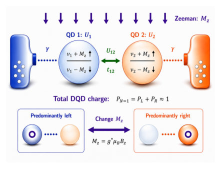 
FIG. 1. Double quantum dot (DQD) charge-qubit setup. Two inter- acting QDs, with onsite Coulomb interactions 𝑈1,2, are coupled by the interdot interaction 𝑈12 and tunneling 𝑡12, and separately coupled to electronic reservoirs with strength 𝛾. A uniform Zeeman field 𝑀𝑧 shifts the gate levels as 𝑣𝑖𝜎= 𝑣𝑖+𝜎𝑀𝑧. In the single-electron regime, 𝑃𝑁=1 = 𝑃𝐿+ 𝑃𝑅≃1, varying 𝑀𝑧controls the charge distribution between the two QDs.

📷 Fig 2

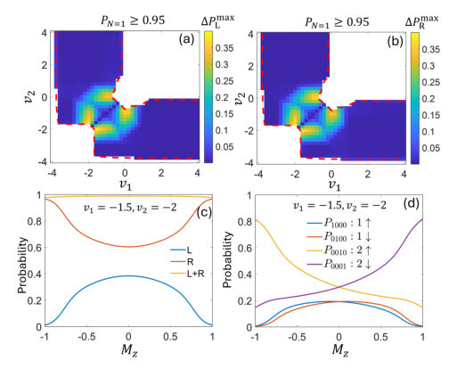 
FIG. 2. Magnetic charge reconfiguration for 𝑈1 = 𝑈2. (a,b) Maximum field-induced changes Δ𝑃max 𝐿,𝑅(𝑣1, 𝑣2) = max|𝑀𝑧|≤1 |𝑃𝐿,𝑅(𝑣1, 𝑣2; 𝑀𝑧) −𝑃𝐿,𝑅(𝑣1, 𝑣2; 0)|, restricted to 𝑃𝑁=1 ≥ 0.95 throughout the field sweep |𝑀𝑧| ≤1. (c) Left, right, and total single-electron probabilities and (d) the four spin-resolved single- electron probabilities versus 𝑀𝑧at 𝑣1 = −1.5 and 𝑣2 = −2. Parameters are 𝑈1 = 𝑈2 = 4, 𝑈12 = 3, 𝑡12 = 0.3, 𝑇= 0.05, and 𝛾= 0.05, with Δ𝑖𝜎= −𝑖𝛾/2. The red dashed line in (a,b) denotes the boundary 𝑃𝑁=1 = 0.95 and the white regions outside the red dashed line do not satisfy the 𝑃𝑁=1 ≥0.95 criterion.

📷 Fig 3

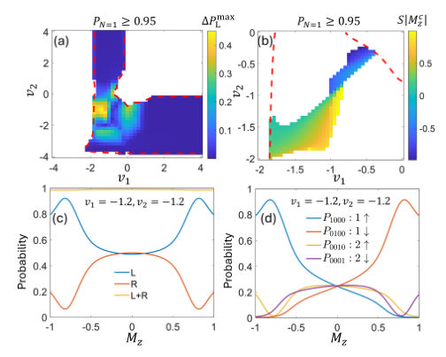 
FIG. 3. Magnetic charge switching for 𝑈1 ≠𝑈2. (a) Maximum charge redistribution Δ𝑃max 𝐿 . (b) Signed switching threshold 𝑆|𝑀𝑐 𝑧|, where 𝑃𝐿(𝑀𝑐 𝑧) = 𝑃𝑅(𝑀𝑐 𝑧) and 𝑆&gt; 0 (𝑆&lt; 0) denotes right-to-left (left-to- right) switching. (c) Left, right, and total single-electron probabilities and (d) spin-resolved probabilities versus 𝑀𝑧at 𝑣1 = 𝑣2 = −1.2. The red dashed line in (a,b) denotes the boundary 𝑃𝑁=1 = 0.95 throughout |𝑀𝑧| ≤1 and the white regions outside the red dashed line do not satisfy the 𝑃𝑁=1 ≥0.95 criterion. Here 𝑈1 = 2, 𝑈2 = 4, and 𝑈12 = 3.5; other parameters are as in Fig. 2.

📷 Fig 4

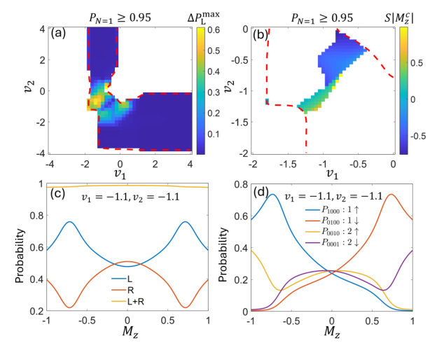 
FIG. 4. Magnetic charge switching for 𝑈1 ≠𝑈2. (a) Maximum charge redistribution Δ𝑃max 𝐿 . (b) Signed switching threshold 𝑆|𝑀𝑐 𝑧|, where 𝑃𝐿(𝑀𝑐 𝑧) = 𝑃𝑅(𝑀𝑐 𝑧) and 𝑆&gt; 0 (𝑆&lt; 0) denotes right-to-left (left-to-right) switching. (c) Left, right, and total single-electron probabilities and (d) spin-resolved probabilities versus 𝑀𝑧at 𝑣1 = 𝑣2 = −1.1. The red dashed line in (a,b) denotes the boundary 𝑃𝑁=1 = 0.95 throughout |𝑀𝑧| ≤1 and the white regions outside the red dashed line do not satisfy the 𝑃𝑁=1 ≥0.95 criterion. Here 𝑈1 = 2, 𝑈2 = 4 and 𝑈12 = 2.5, satisfying 𝑈12 &lt; √𝑈1𝑈2; other parameters are as in Fig. 3 in the main text.

**Summary.** This theoretical study demonstrates that a uniform magnetic field can be used to switch the charge polarization between two quantum dots, even if the dots are otherwise symmetric. This control arises because the coupling to external reservoirs and the presence of Coulomb interactions allow the uniform spin splitting to manifest as a directional charge bias. The findings establish a robust mechanism for magnetic control of charge qubits.

**Why it may be interesting.** This work provides a detailed theoretical mechanism for controlling charge polarization using magnetic fields in strongly correlated nanoscale systems, which is highly relevant for quantum computing architectures based on charge qubits.

Detailed structure

**Main problem.** To determine if a uniform Zeeman field can induce a controllable left-right charge polarization in an asymmetric double quantum dot (DQD), contrary to initial expectations.

**Main result.** The authors show that in an open, interacting DQD, the uniform Zeeman field can strongly reconfigure and even reverse the single-electron charge polarization through mechanisms involving unequal gate levels or unequal onsite interactions.

**Method.** The study employs a symmetry-preserving Green's-function Equation-of-Motion (EOM) approach, solving for density correlators up to three-body terms to reconstruct the full probability distribution over the system's Fock states.

**Model / system.** The system is an open, interacting double quantum dot (DQD) coupled to electronic reservoirs. The Hamiltonian includes intra-dot and inter-dot Coulomb repulsions, and the magnetic field enters via Zeeman splitting, $M_z$.

**Key observables.** Left-localized probability ($P_L$), right-localized probability ($P_R$), and the resulting charge polarization $D = P_L - P_R$.

**Important parameters / regimes.** Zeeman field strength ($M_z$), gate detuning ($v_1 - v_2$), and onsite interaction differences ($U_1 - U_2$).

**Assumptions / limitations.** The EOM hierarchy is truncated, and the authors use a symmetry-preserving closure technique to ensure the calculated correlators are free from artificial route dependence.

**Figures summary.** Figures illustrate the magnetic field dependence of charge reconfiguration ($\Delta P_{	ext{max}}$) for both unequal gate levels and unequal onsite interactions, showing the switching behavior of $P_L$ and $P_R$ versus $M_z$.

**Paper structure.** The paper first establishes the theoretical framework using the EOM approach, then analyzes the case of level asymmetry ($v_1 
eq v_2$), followed by the case of interaction asymmetry ($U_1 
eq U_2$), concluding with a discussion of the underlying physics of open-system conversion.

Abstract

A magnetic field that acts identically on two quantum dots is not expected to move charge between them. Nevertheless, we show that a uniform Zeeman field can strongly reconfigure and even reverse the single-electron charge polarization of an asymmetric open double quantum dot. Using a symmetry-preserving Green's-function equation-of-motion approach, we identify regimes where the preferred dot occupation reverses while the system remains in the single-electron charge sector. Two distinct mechanisms produce this behavior. Unequal gate levels produce different occupation responses because the Zeeman-shifted resonances lie at different positions relative to the reservoir chemical potential, whereas unequal onsite interactions distinguish the dots through their many-body addition spectra. Coulomb blockade stabilizes the single-electron sector, causing the reservoir-mediated response to appear as spatial charge redistribution rather than a change in total occupation. Our results establish a mechanism for magnetic control of charge polarization at fixed electrostatic detuning.

[↑ back to top](#top)

### [Beyond sensitivity: mechanism-resolved error budgets for designing quantum sensors](http://arxiv.org/abs/2608.28519v1)

**Authors:** Nima Leclerc, Marco Capelli, Kevin James Rietwyk, Mark Dong, Dmitry Lyakh, Geoffrey Iwata, Brandon Rodenburg, Sean Oliver, Benedikt Kloss, Jin-Sung Kim, Stefan Bogdanovic, Yunheng Chen, Meysam Sharifzadeh Mirshekarloo, Cedric Weber, Marcus Doherty, Ethan Pratt, Joseph Hagmann  
**Type:** theory · **Category:** other · **PDF:** <https://arxiv.org/pdf/2608.28519v1>  
**Analysis basis:** full PDF text, analyzed in chunks
**Topic relevance:** `methods for driven-dissipative` **3/5** · `quantum measurements` **3/5** · `Keldysh / 2PI / non-Gaussian methods` **1/5** · `correlated / nonlocal dissipation` **1/5** · `driven-dissipative phase transition` **1/5**

📷 Fig 1

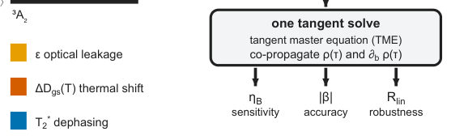 
Figure 1: Per-mechanism, multi-metric attribution from one open quantum system model. A single open-system solve returns a sensor’s three performance metrics, its sensitivity (ηB, the smallest field resolvable per unit bandwidth), accuracy (limited by the systematic bias β of the recovered field), and robustness (Rlin, the stability of the sensitivity under parameter drift), and attributes each to individual physical mechanisms. (a) Simplified level scheme of the nitrogen-vacancy (NV) center. Optical pumping at 532 nm and spin-selective intersystem crossing (ISC) through the singlet set the readout contrast C, the microwave drive Ωaddresses the |0⟩↔|−1⟩ transition whose splitting responds...

📷 Fig 2

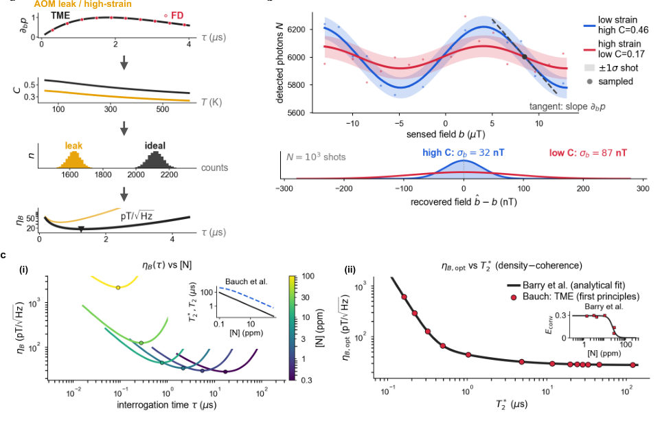 
Figure 2: Validation of the first-principles sensitivity engine. The engine computes the shot-noise-limited sensitivity ηB (smallest field resolvable per unit bandwidth) as a function of the interrogation time τ. (a) The single-solve pipeline, from the field derivative ∂bρ(τ) of the density matrix (computed by the tangent master equation and checked against finite differencing, red circles; agreement &lt; 10−4) through the readout contrast C and the photon statistics to ηB(τ). Each stage is traced for an ideal, low-strain ensemble (black) and a degraded case combining high transverse strain with acousto-optic-modulator (AOM) leakage (orange). The AOM gates the pump laser on for initialization...

📷 Fig 3

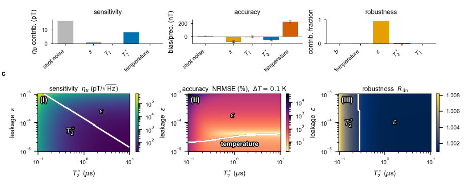 
Figure 3: Metric-dependent attribution. For a fixed device, the per-mechanism budget of each metric, computed from one open-system solve: sensitivity (ηB), accuracy (the systematic bias, summarized by the root-mean-square error, RMSE), and robustness (the linearized drift index Rlin, equal to one when drift leaves the sensitivity untouched). (a) Per-mechanism contribution versus interrogation time τ (solid, left axis; Eq. 5), one panel per metric, with the mechanisms color-coded (dephasing T ⋆ 2 in blue, optical leakage ε in orange, thermal shift in vermillion, and longitudinal relaxation T1 in gray). The shares are Shapley values for sensitivity and accuracy and the additive...

📷 Fig 4

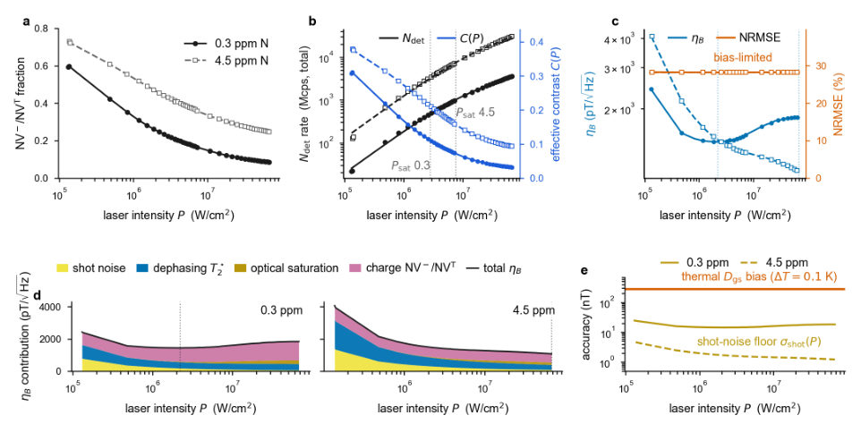 
Figure 4: Metric-dependent attribution on a measured operating knob. The optical readout intensity P serves as a measured control knob on two diamonds of differing nitrogen content (0.3 and 4.5 ppm; solid and dashed curves). (a) the measured NV−/NVT charge fraction (the spin-active fraction of centers) versus laser intensity P. (b) the detected-photon budget Ndet(P) (saturation intensities marked) and the effective readout contrast Ceff(P). (c) the sensitivity ηB(P) (smallest field resolvable per unit bandwidth, left axis), with an interior optimum on the 0.3 ppm diamond, and the accuracy as a normalized root-mean-square error NRMSE(P) (right axis), flat because it is limited by a...

📷 Fig 5

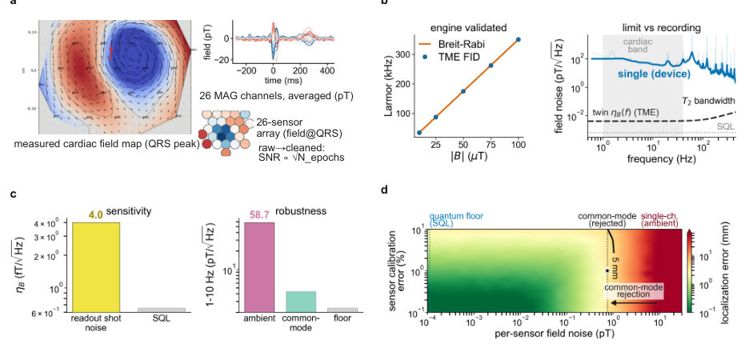 
Figure 5: One framework, two platforms: design by specification on a real scalar-OPM magnetocardiogram. A 26-sensor scalar (total-field) cesium (Cs) optically pumped magnetometer (OPM) array, unshielded at the geomagnetic field, records a human magnetocardiogram. (a) The measured cardiac-dipole field map at the QRS peak (the largest deflection of the heartbeat), the averaged waveform, and the array geometry. (b) The model grounded in the recording: the Larmor frequency versus the exact Breit–Rabi prediction, and the frequency-resolved sensitivity ηB(f) with its fundamental spin-projection (standard-quantum-limit) floor, against the measured field noise. (c) The sensitivity and robustness...

**Summary.** This paper presents a novel framework to analyze quantum sensors by calculating performance metrics like sensitivity, accuracy, and robustness simultaneously. It uses open quantum system theory and Shapley values to attribute the limitation of each metric to specific physical mechanisms. This allows engineers to design sensors by targeting the root cause of performance degradation rather than just optimizing for sensitivity.

**Why it may be interesting.** This work provides a rigorous, quantitative framework for characterizing and actively controlling quantum sensors by decomposing performance limitations into fundamental physical mechanisms, which is crucial for next-generation quantum sensing hardware.

Detailed structure

**Main problem.** Current quantum sensor characterization methods fail to provide a mechanism-resolved budget for multiple performance metrics (sensitivity, accuracy, robustness).

**Main result.** The authors introduce a framework that attributes each performance metric to its specific limiting physical mechanism, showing that the dominant limiter differs across metrics.

**Method.** The method uses an open quantum system simulation solved via a tangent-linear construction, employing Shapley values to perform non-additive error attribution.

**Model / system.** The analysis is based on modeling the sensor as an open quantum system whose evolution is governed by a Lindblad master equation, applicable to platforms like NV diamond ensembles and OPMs.

**Key observables.** Sensitivity ($\eta_B$), Accuracy (systematic bias $eta$), and Robustness ($R_{lin}$); error contributions attributed to specific mechanisms (e.g., dephasing, thermal shift).

**Important parameters / regimes.** Interrogation time ($	au$), environmental noise parameters, and the set of controllable device parameters ($	heta$).

**Assumptions / limitations.** The sensor dynamics can be accurately described by an open quantum system, and the readout must be sufficiently informative to separate contributions from different error mechanisms.

**Figures summary.** Figures illustrate the per-mechanism attribution (Shapley share) for the three metrics, and later figures detail the closed-loop process for online adaptation and diagnosis.

**Paper structure.** The paper first establishes the need for multi-metric error budgeting, introduces the open-system/tangent-solve framework, demonstrates metric-dependent attribution using NV diamond examples, and concludes by outlining an adaptive, closed-loop control strategy.

Abstract

Quantum sensors are specified by a headline sensitivity, yet applications also demand accuracy and reliability. The dominant limiter of one metric is often known, but no method resolves how interacting mechanisms combine into a signed, per-mechanism budget for each metric. We introduce a framework that computes a sensor's sensitivity, accuracy, and robustness from one open-system simulation and attributes each to its limiting mechanism. For a nitrogen-vacancy diamond ensemble the attribution inverts across metrics: dephasing limits sensitivity, the thermal ground-state shift limits accuracy, and optical leakage limits robustness. At identical sensitivity the recovered-field bias spans $8$ to $1500$\,nT, so tuning to sensitivity alone can miss the accuracy target by two orders of magnitude. The same modeling transfers to a cesium optically pumped magnetometer recording a human magnetocardiogram. As a digital twin, it predicts the gain from addressing each limiter, so sensors can be designed to the required metrics.

[↑ back to top](#top)

### [Detecting Axion-Like Particles With Coiled Optical Fibers I: Silica Fibers](http://arxiv.org/abs/2608.27551v1)

**Authors:** Gia Dvali, Sebastian Zell, Tongxuan Zhang  
**Type:** theory · **Category:** other · **PDF:** <https://arxiv.org/pdf/2608.27551v1>  
**Analysis basis:** full PDF text, analyzed in chunks
**Topic relevance:** `interference shaping light` **3/5** · `analog quantum simulation` **2/5** · `methods for driven-dissipative` **2/5** · `Keldysh / 2PI / non-Gaussian methods` **1/5** · `quantum measurements` **1/5**

📷 Fig 1

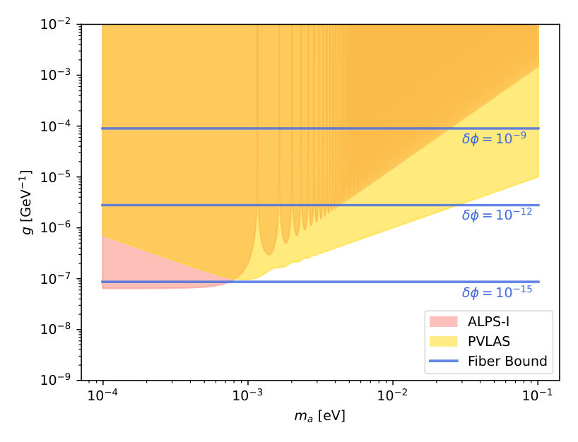 
Figure 1: The exclusion plot for previous experiments and the proposed fiber-based interferometer. The results shown for comparison are taken from ALPS-I [48] and PVLAS [8] experiments. The parameters used for the calculation of the fiber bound according to eq. (1.2) are n = 1.5, ω = 1 eV, B = 5 T, L = 105 m, and different values of δϕ shown in the plot below each bound.

📷 Fig 2

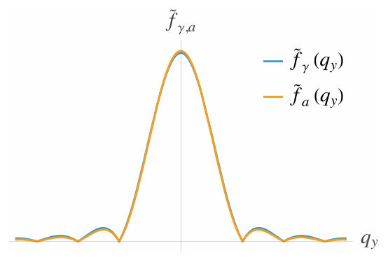 
Figure 2: A sketch for the comparison of the photon and ALP transverse profiles in momentum space. Here, ˜fγ(qy) and ˜fa(qy) are obtained by the Fourier transform of sin(k⊥y)1{0≤y≤l} and fa(y), respectively. We use the absolute value for plotting.

**Summary.** This paper details a theoretical proposal for detecting Axion-Like Particles (ALPs) using long, coiled optical fibers placed in a magnetic field. By developing a framework that accounts for boundary effects in the fiber, the authors show that the most promising observable is the phase shift of the photon. This technique offers a pathway to constrain ALP properties, especially for larger ALP masses, complementing existing astrophysical searches.

**Why it may be interesting.** This work is highly relevant to quantum optics and open quantum systems as it models particle mixing (photon $\leftrightarrow$ ALP) within a structured, confined waveguide (the fiber), requiring the application of boundary conditions to the quantum field equations.

Detailed structure

**Main problem.** The paper proposes a novel method to search for Axion-Like Particles (ALPs) by exploiting photon-ALP conversion within long, coiled optical fibers subjected to an external magnetic field.

**Main result.** For solid silica fibers, the primary detectable signal is a phase shift of the photon, allowing for setting new constraints on the ALP coupling constant, particularly for large ALP masses.

**Method.** The authors develop a theoretical framework incorporating transverse boundary conditions and fiber bending to model the photon-ALP mixing, solving coupled differential equations derived from the interaction Lagrangian.

**Model / system.** The system involves the interaction between photons and ALPs ($\mathcal{L}_{	ext{int}} = -g_a E \cdot B$) propagating through an optical fiber. The analysis considers both solid silica fibers (high refractive index) and hollow-core fibers, treating the propagation as a wave mixing problem.

**Key observables.** Phase shift of the propagating photon ($\delta\phi$), and the general probability of photon-to-ALP conversion.

**Important parameters / regimes.** ALP mass ($m_a$), ALP coupling constant ($g_a$), external magnetic field ($B$), and the refractive index ($n$) of the fiber material.

**Assumptions / limitations.** Initial analyses use plane-wave approximations, but the full treatment incorporates transverse boundary conditions and bending effects. The sensitivity analysis is particularly strong for large ALP masses.

**Figures summary.** Figure 1 is an exclusion plot comparing the proposed 'Fiber Bound' sensitivity against existing experimental limits for ALP detection. Figure 2 compares the transverse profiles of the photon and ALP fields in momentum space.

**Paper structure.** The paper builds from the general theoretical description of ALP-photon mixing in a medium (Chunk 2), develops the specific formalism for coiled fibers incorporating boundary effects (Chunk 1), and analyzes the resulting mixing dynamics in different physical regimes (Chunk 3).

Abstract

We propose a new approach to axion-like particle (ALP) searches based on long, coiled optical fibers in an external magnetic field. We develop the theoretical framework required to describe photon-ALP conversion in this geometry by incorporating transverse boundary conditions and fiber bending. For solid silica fibers with refractive index considerably larger than unity, we show that the leading signal is a phase shift of the photon, with negligible loss due to ALP production. This setup has the potential to set new constraints in the regime of large ALP mass. We further identify parameter regions in which boundary effects become important, in particular for hollow-core fibers, where signals due to ALPs can be significantly enhanced.

[↑ back to top](#top)

### [Constant-time equilibration of observables under rapid Lindbladian dynamics](http://arxiv.org/abs/2608.28451v1)

**Authors:** Štěpán Šmíd, Richard Meister, Mario Berta, Roberto Bondesan  
**Type:** theory · **Category:** statistical mechanics · **PDF:** <https://arxiv.org/pdf/2608.28451v1>  
**Analysis basis:** full PDF text, analyzed in chunks
**Topic relevance:** `methods for driven-dissipative` **3/5** · `analog quantum simulation` **1/5** · `correlated / nonlocal dissipation` **1/5** · `driven-dissipative phase transition` **1/5** · `non-equilibrium universality` **1/5** · `scars & prethermalization` **1/5**

📷 Fig 1

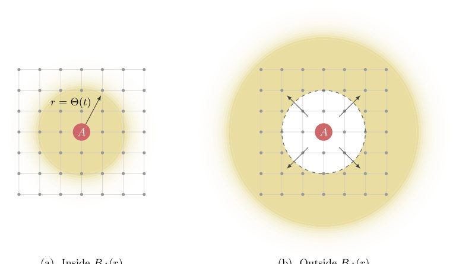 
Figure 1: Splitting the contractivity of a local term OA. (a) Inside the ball BA(r) the truncated dynamics etLBA(r) equilibrates OA rapidly, contributing poly(|BA(r)|) · e−∆t · ∥OA∥; the radius grows linearly with time, but the exponential decay asymptotically beats the polynomial growth. (b) Outside BA(r) the dynamics is suppressed by the Lieb-Robinson bound, and is made small by the radius increasing with time. Neither contribution depends on the system size, so OA mixes after interacting with only a finite portion of L.

📷 Fig 2

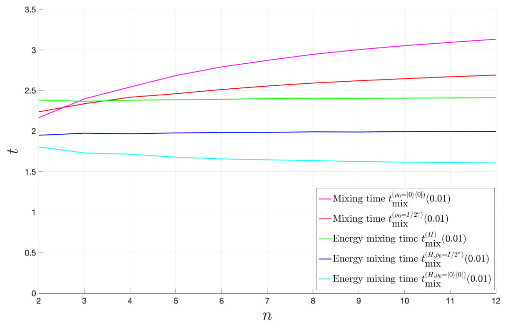 
Figure 2: Comparing different mixing time notions for the 1D transverse-field Ising model with J = 0.5, h = 1, at β = 1.

📷 Fig 3

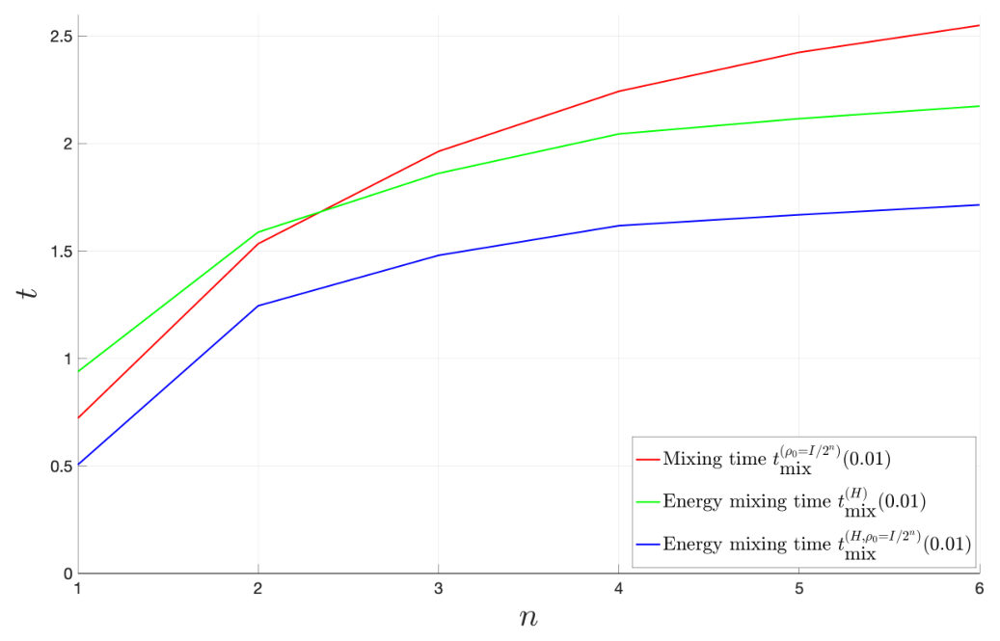 
Figure 3: Comparing different mixing time notions for the spinful 1D Fermi-Hubbard model with U = 1, t = 1, at β = 1.

📷 Fig 4

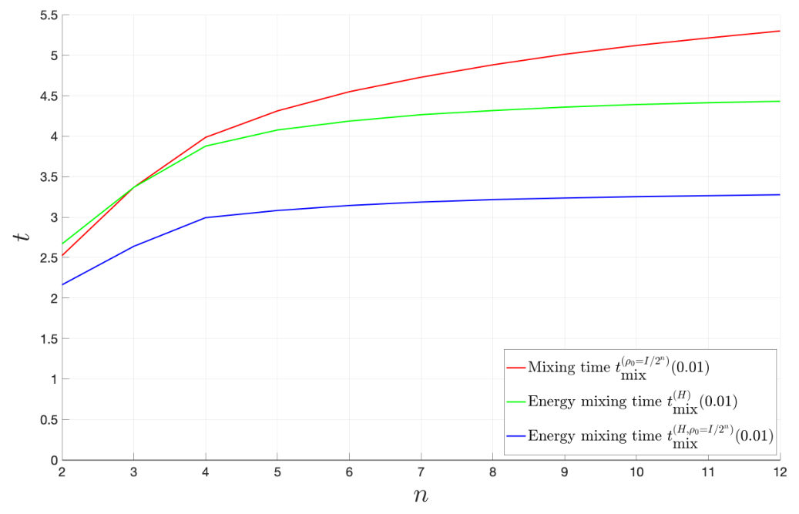 
Figure 4: Comparing different mixing time notions for the spinless 1D Fermi-Hubbard model with U = 2, t = 1, at β = 1.

📷 Fig 5

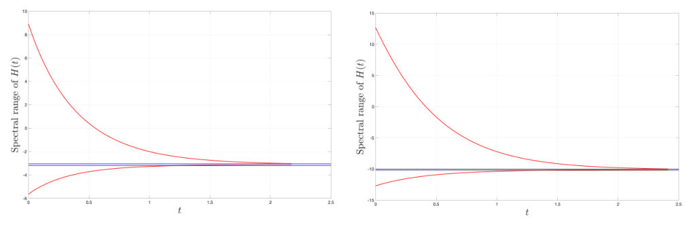 
Figure 5: Contractivity of the spectral range of H(t) around its expectation value Tr(H · σ) in the steady state. The mixing time is defined by the whole spectrum being contained around the steady value within an error ϵ = 0.01 relative to the spectral norm of H.

**Summary.** This paper introduces observable-specific mixing times for open quantum systems, proving that local observables equilibrate in a time independent of system size for rapidly mixing dynamics. This finding drastically reduces the required runtime for quantum algorithms like Gibbs samplers. It establishes a key theoretical separation between local and global convergence rates in quantum thermalization.

**Why it may be interesting.** This work provides a crucial theoretical tool for quantum simulation, demonstrating that computational complexity can be dictated by local observables rather than the full state space, which is vital for simulating thermalization processes.

Detailed structure

**Main problem.** The paper addresses whether full state convergence is necessary to accurately estimate physically relevant local observables in open quantum systems undergoing rapid dynamics.

**Main result.** For quasi-local, rapidly mixing Lindbladians, observables that are sums of geometrically-local terms equilibrate in a time independent of system size, significantly improving algorithmic scaling compared to global state mixing.

**Method.** The authors introduce and study observable-specific mixing times, contrasting them with the global trace distance, and employ scaling arguments combined with Lieb-Robinson bounds.

**Model / system.** The study concerns open quantum systems governed by Markovian dynamics described by a Lindbladian. Applications include quantum Gibbs samplers and estimating local order parameters in lattice models.

**Key observables.** Observable-specific mixing time $t(O)_{	ext{mix}}(\epsilon)$, local order parameters, and the Gibbs state energy.

**Important parameters / regimes.** The mixing time $\epsilon$ (error tolerance), system size $n$, and the spatial dimension $D$.

**Assumptions / limitations.** The Lindbladian must be quasi-local and rapidly mixing for the main results to hold.

**Figures summary.** Figure 1 illustrates the separation of dynamics into local and non-local contributions, showing that the equilibration of local terms is independent of system size.

**Paper structure.** The paper first defines observable-specific mixing times, proves the constant-time equilibration for local sums of observables, contrasts this with global state mixing, and then complements the quantum result with a classical algorithm analysis.

Abstract

Markovian open-system dynamics have widespread applications throughout quantum information science, including algorithmic state preparation. Their convergence is commonly quantified using the worst case global trace distance between the evolving and stationary states. However, this criterion can be unnecessarily stringent when only physically relevant observables are of interest. Here we introduce and study observable-specific mixing times. We prove that, for quasi-local, rapidly mixing Lindbladians, sums of geometrically local observables equilibrate in a time independent of system size, in contrast to the logarithmic dependence of global state mixing. This separation reduces the runtime of dissipative quantum algorithms, including quantum Gibbs samplers, for estimating quantities such as the Gibbs state energy and local order parameters, yielding an overall scaling that is linear in system size. Complementing this quantum result, we develop a quantum-inspired classical algorithm for estimating the same quantities. Its runtime is likewise linear in system size, but scaling exponentially in $\mathcal{O}\big(\log(1/ε)^D\big)$, where $D$ denotes the spatial dimension of the lattice. We further analyse non-interacting Lindbladians over qudits, fermions, and bosons, demonstrating that locality of observables is not always necessary for a qualitatively faster mixing. Small-scale simulations of quantum Gibbs samplers reveal no large hidden constants in our asymptotic analysis and show that the theoretical predictions closely capture the finite-size dynamics.

[↑ back to top](#top)

### [From quantum reservoirs to quantum extreme learning machines through a nearest-neighbor spin chain with tunable quantum memory](http://arxiv.org/abs/2608.28440v1)

**Authors:** Carlos Ramon-Escandell, Arnau Riera, Marcin Płodzień  
**Type:** theory · **Category:** disordered systems and neural networks · **PDF:** <https://arxiv.org/pdf/2608.28440v1>  
**Analysis basis:** full PDF text, analyzed in chunks
**Topic relevance:** `analog quantum simulation` **3/5** · `Frenkel-Kontorova` **1/5** · `driven-dissipative phase transition` **1/5** · `methods for driven-dissipative` **1/5** · `non-equilibrium universality` **1/5** · `scars & prethermalization` **1/5**

📷 Fig 1

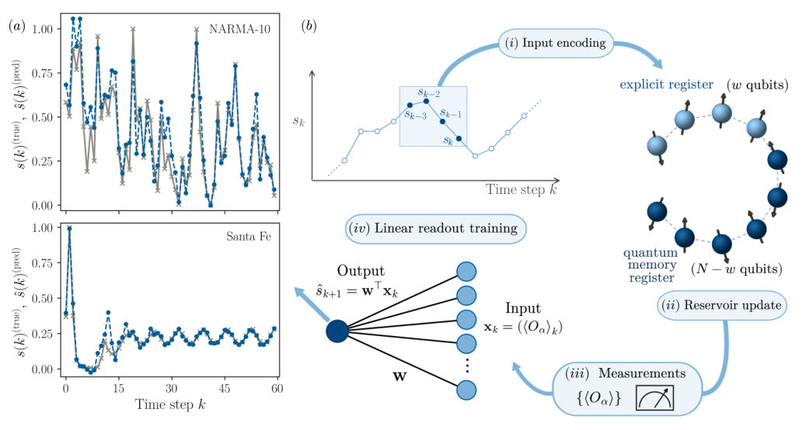 
FIG. 1. Quantum Reservoir Computing with a tunable memory register. (a) Example of the reservoir prediction ˆs(k)(pred)

📷 Fig 2

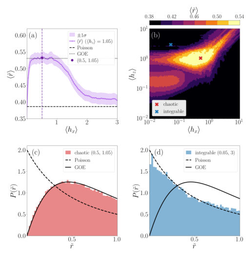 
FIG. 2. Spectral characterization of the MFIM reservoir for N = 10 at coupling J = 1, with fields drawn from Gaussian distributions of width ϵ = 0.05 around their nominal values ⟨h•⟩and averaged over nr = 1000 realizations in (a, b) and nr = 200 in (c, d). (a) Average gap ratio ⟨˜r⟩versus the longi- tudinal field ⟨hx⟩at fixed ⟨hz⟩= 1.05, with the shaded band showing ±1σ. The dashed and dotted lines mark the Pois- son (0.386) and GOE (0.531) values, and the dot marks the chaotic point used in this work, (⟨hx⟩, ⟨hz⟩) = (0.5, 1.05). (b) Heatmap of ⟨˜r⟩over the field plane, with the chaotic (red) and integrable (blue) reference points marked. (c-d) Gap- ratio distributions P(˜r) at the chaotic...

📷 Fig 3

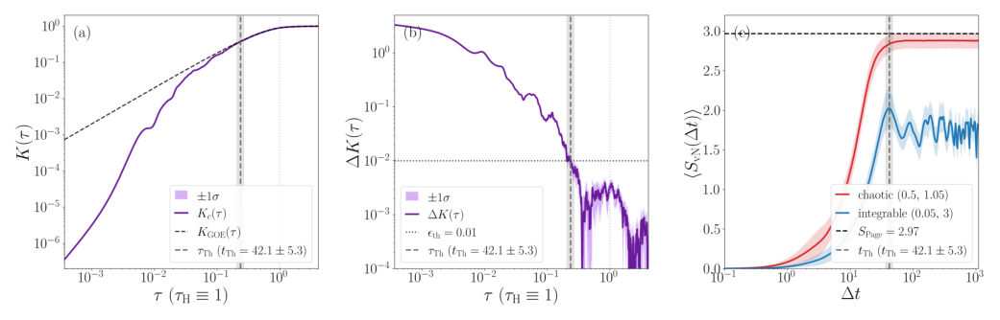 
FIG. 3. Dynamical signatures of quantum chaos in the MFIM reservoir, at the chaotic point (hx, hz) = (0.5, 1.05) and, for comparison in (c), also at the integrable point (0.05, 3). (a) Connected spectral form factor (SFF) Kc(τ) as a function of the rescaled time τ = t/tH (solid), compared with the GOE prediction KGOE(τ) (dashed), averaged over nr = 2000 realizations with fields drawn uniformly from a window of half-width ϵdis = 0.15 around the chaotic point. (b) Deviation ∆K(τ) = | log10[Kc(τ)/KGOE(τ)]|, with the threshold ϵth = 0.01 (dotted horizontal line) whose crossing gives tTh = 42.1 ± 5.3 in physical units. (c) Half-chain von Neumann entropy ⟨SvN(t)⟩, averaged over 200 initial random...

📷 Fig 4

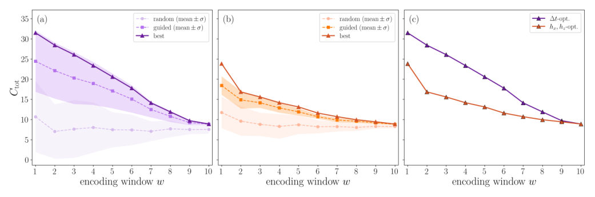 
FIG. 4. Total short-term memory capacity Ctot = P50 d=1 C(d) of the N = 10 MFIM reservoir versus encoding window w, under the two strategies of Sec. II D, optimizing ∆t at the fixed chaotic point (hx, hz) = (0.5, 1.05) in (a) and (hx, hz) at fixed ∆t = 70 in (b). Light markers with band show the mean ±σ over the 50 random configurations, dark markers the 100 guided (TPE) trials, and the solid line the single best configuration. Panel (c) overlays the two best curves. All collapse to a common value at the QELM limit w →N.

📷 Fig 5

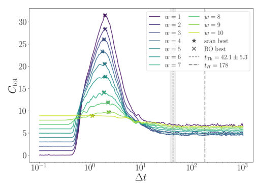 
FIG. 5. Total memory capacity Ctot = P50 d=1 C(d) versus evolution time ∆t at the chaotic point (hx, hz) = (0.5, 1.05), scanned for each window w = 1 to 10. For every window the maximum of the scan (star) coincides with the BO optimum (cross). The capacity peaks at intermediate ∆t, well before the Thouless time tTh = 42.1 ± 5.3 (dashed) and the Heisen- berg time tH = 178 (dash-dotted), and settles onto a low plateau at long ∆t. The peak height decreases monotonically with w, from w = 1 to the QELM limit w = N.

**Summary.** This paper unifies Quantum Reservoir Computing and Quantum Extreme-Learning Machines by showing they are limits of a single quantum architecture whose memory capacity is controlled by an 'input-encoding length.' Using a tunable spin chain model, the authors demonstrate that optimal performance for temporal tasks requires operating in the chaotic regime, confirming that the system's dynamics, rather than just its connectivity, is key for quantum memory processing.

**Why it may be interesting.** The work directly connects concepts from quantum computation (reservoir computing) with the physics of many-body dynamics (chaos, spectral statistics) in a tunable spin chain model, providing insights into how memory capacity emerges from physical Hamiltonians.

Detailed structure

**Main problem.** The paper demonstrates that Quantum Reservoir Computing (QRC) and Quantum Extreme-Learning Machines (QELM) are not separate paradigms but rather two limits of a single underlying quantum architecture.

**Main result.** The optimal performance for temporal tasks is achieved at the edge of chaos, suggesting that the dynamical regime, rather than the connectivity structure, dictates the necessary quantum processing capability.

**Method.** The authors analyze the system's dynamics by varying the 'input-encoding length,' which controls the balance between explicit (recent) and recurrent (historical) quantum memory.

**Model / system.** The physical model employed is a nearest-neighbor spin chain governed by the Mixed-Field Ising Model (MFIM) Hamiltonian, which is tunable between integrable and chaotic regimes.

**Key observables.** Gap ratio ($\langle	ilde{r}
angle$), Thouless Time ($t_{Th}$), Spectral Form Factor (SFF), and task-specific scores (e.g., for NARMA or Mackey-Glass).

**Important parameters / regimes.** Input-encoding length (qubits overwritten), Hamiltonian fields ($h_x, h_z$), and evolution time ($\Delta t$).

**Assumptions / limitations.** The analysis relies on the 'erase-and-write' non-unitary map for input encoding, and the comparison between the linear chain and the densely connected model.

**Figures summary.** Figures illustrate the QRC pipeline, the comparison of spectral statistics (gap ratios) across different regimes, and the dependence of optimal time scales ($\Delta t_{opt}$) on the encoding window size ($w$).

**Paper structure.** The paper first establishes the theoretical link between QRC and QELM. It then characterizes the system's spectral and dynamical properties (using gap ratios and SFF) across tunable Hamiltonian regimes. Finally, it applies this framework to benchmark the model's performance on various time-series forecasting tasks using optimized parameters.

Abstract

Quantum Reservoir Computing (QRC) processes temporal data by retaining a memory of past inputs in the recurrent state of a quantum system, whereas a Quantum Extreme-Learning Machine (QELM) discards that memory, resetting the system at every step so that only the most recent input shapes the response. The two are usually treated as separate computational paradigms. We show that they are the two limits of a single architecture, connected by the input-encoding length, that is, the number of qubits overwritten with fresh data at each step. When a single qubit is re-encoded the system operates as a standard QRC, when the whole register is re-encoded it operates as a QELM, and intermediate lengths interpolate between them. The overwritten qubits hold the recent past in an explicit register, while the remaining qubits are never reset and carry older inputs forward in their evolving quantum state, so the encoding length redistributes memory between explicit and recurrent storage at fixed system size. Tuning the reservoir Hamiltonian and the evolution time with Bayesian optimization at each encoding length, we find that recurrent quantum memory is essential when a task must reach far into the past, and dispensable when the relevant history is short, where the memoryless reset limit already suffices. For every task the best reservoirs operate at the edge of chaos, where they perform as well as a densely connected reservoir with random all-to-all couplings of the same size, indicating that what temporal processing requires is the dynamical regime rather than the connectivity.

[↑ back to top](#top)

### [Quantifying the Dual-isotope Advantage for Ytterbium-array Surface Codes using Realistic Noise Models](http://arxiv.org/abs/2608.27568v1)

**Authors:** Fumiyoshi Kobayashi, Toshi Kusano, Nicholas Fazio, Yuma Nakamura  
**Type:** theory · **Category:** quantum information and computing · **PDF:** <https://arxiv.org/pdf/2608.27568v1>  
**Analysis basis:** full PDF text, analyzed in chunks
**Topic relevance:** `Rydberg arrays` **3/5** · `QC/QI experiment` **2/5** · `analog quantum simulation` **1/5** · `correlated / nonlocal dissipation` **1/5** · `quantum measurements` **1/5**

📷 Fig 1

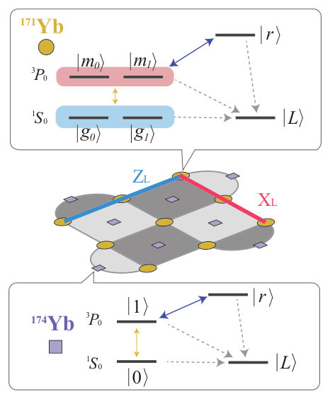 
Figure 1: Schematic of the surface code layout in a dual- isotope Yb system. Data qubits (yellow circle) and an- cilla qubits (purple square) are encoded in 171Yb and 174Yb, respectively. For the 171Yb data qubits, we evaluate two encoding schemes: the 1S0 ground-state encoding (g-qubit: |g•⟩, shaded in blue) and the 3P0 metastable-state encoding (m-qubit: |m•⟩, shaded in red). The 174Yb ancilla qubits are encoded as optical clock qubits, with |0⟩and |1⟩repre- senting the ground and metastable states. Rydberg gates are mediated by the Rydberg blockade effect via a high-lying Ry- dberg state |r⟩. All computational states are susceptible to loss, depicted as grey dashed arrows; the state...

📷 Fig 2

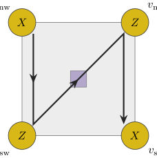 
Figure 2: Standard syndrome extraction circuits for the sur- face code. CZ gates are a native two-qubit gate in neutral- atom quantum devices utilising Rydberg blockade. Panels (a) and (b) show the Z- and X-stabiliser check circuits of the rotated surface code, respectively. Panel (c) shows a sin- gle face of the XZZX surface code, where each data qubit (yellow circle) on the vertices vnw, vne, vsw and vse is acted on by the Pauli operator denoted inside the circle and the N-shaped arrow denotes the order in which the CZ gates are applied between each data qubit and the ancilla qubit at the centre of a face. Since every face of the XZZX code carries a generator of the same form, the same...

📷 Fig 3

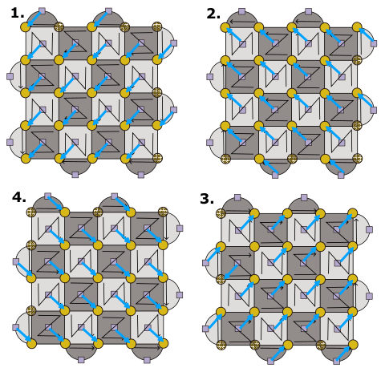 
Figure 4: Dynamical-ZN ordering for SWAP SE. The CZ gate order (black N/Z-shape arrows) differs between X-type and Z-type stabilisers [91]. The blue arrow represents the re- placement of data qubits by the ancilla qubit. The replaced qubit changes at each stabiliser round to maximise the num- ber of data qubits refreshed as ancilla qubits via SWAP op- erations. The cross-hatched data qubits are not refreshed in each respective round.

📷 Fig 4

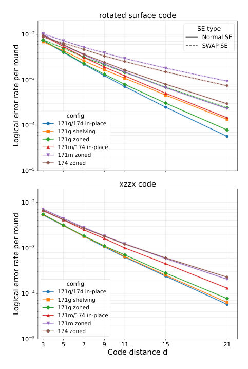 
Figure 5: The dependence of the LER per round of the ro- tated and XZZX surface codes at code distance d for differ- ent configurations of isotope, encoding and SE measurement method. Colour and marker delineate the isotope combi- nation and encoding, and the line style represents the SE method. The dual-isotope configuration using normal SE with in-place measurement (blue solid line with circle marker) achieves the lowest LER among all the configurations. The SWAP SE cases (dashed line) achieve similar or higher LER compared to normal SE for all configurations on the rotated surface code. Moreover, comparing the two codes, the XZZX code achieves a LER comparable to or lower than that of...

📷 Fig 5

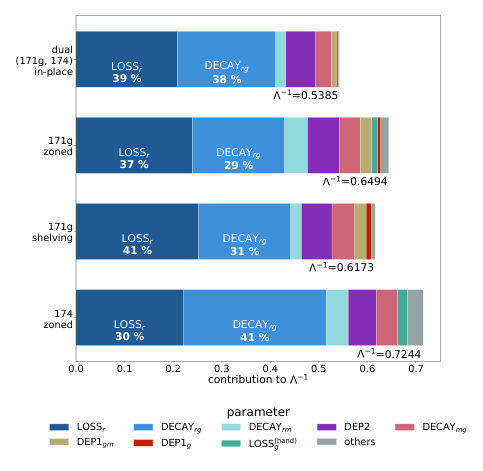 
Figure 6: Error budgets for (171Yb-g, 174Yb), 171Yb- g single-isotope with zoned measurement, 171Yb-g single- isotope with shelving, and 174Yb clock qubits with zoned measurement. This plot shows the division of the error con- tribution of each pi ∈P to Λ−1 as Ci. The main contri- butions are the decay errors from the Rydberg state during the application of two-qubit gates. The next most signifi- cant contributions are from two-qubit depolarising noise on two-qubit gates and metastable-to-ground decay. Small con- tributions and stray error that cannot be captured by the linear approximation are attributed to “others”.

**Summary.** This paper analyzes the performance of neutral-atom quantum computers for fault-tolerant quantum computation using Ytterbium isotopes. By developing a realistic noise model, the authors demonstrate that a dual-isotope architecture significantly outperforms single-isotope methods due to efficient in-place measurement. The study provides critical error-budget analysis, identifying Rydberg-state decay as the primary bottleneck for improving future quantum processors.

**Why it may be interesting.** This work directly tackles the engineering challenges of scaling quantum computation by providing quantitative metrics on architectural advantages (dual-isotope vs. single-isotope) and identifying the dominant physical error sources that must be addressed experimentally.

Detailed structure

**Main problem.** To quantify the advantage of using a dual-isotope Ytterbium architecture for implementing surface codes in fault-tolerant quantum computation (FTQC) compared to single-isotope schemes.

**Main result.** The dual-isotope architecture with in-place measurement achieves the lowest logical error rates, and the analysis pinpoints Rydberg-state decay as the dominant error source, contributing 74-80% of the logical error rate.

**Method.** The authors developed an experimentally motivated Clifford-compatible noise model using generalized Pauli twirling and simulated surface codes (rotated and XZZX) using an open-source Python library, DualYbSim.

**Model / system.** The system uses neutral-atom quantum computers with dual-isotope Yb arrays ($^{171}	ext{Yb}$ and $^{174}	ext{Yb}$). Qubits are encoded in different ground/metastable states, and gates rely on the Rydberg blockade effect. The noise model accounts for various decay and measurement channels.

**Key observables.** Logical Error Rates (LER) for surface codes, and the contribution of specific noise channels (e.g., Rydberg-state decay) to the total error budget.

**Important parameters / regimes.** The ratio of logical error rates between dual-isotope vs. single-isotope schemes; the decay rate of the Rydberg state.

**Assumptions / limitations.** The noise model simplifies complex sublevel structures, and the analysis ignores transportation noise associated with qubit replenishment.

**Figures summary.** Figure 1 schematically shows the dual-isotope layout for surface code memories. Figure 2 illustrates the syndrome extraction circuits for the surface code and the XZZX stabilizer check.

**Paper structure.** The paper introduces the challenge of noise in neutral-atom FTQC, details the dual-isotope architecture and its noise model, simulates performance on various surface codes, and concludes with an error-budget analysis identifying key physical limitations.

Abstract

Neutral-atom quantum computers are a promising platform for fault-tolerant quantum computation, but logical performance depends on systemic realistic noise factors during syndrome extraction. In dual-isotope Yb arrays, the roles of data and ancilla qubits are separated spectrally, allowing ancilla qubits to be measured in place without additional transport or shelving operations. Here we quantify the advantage of a dual-isotope Yb architecture for surface code memories. We develop an experimentally motivated Clifford-compatible noise model for dual-isotope 171Yb-174Yb systems using generalised Pauli twirling and implement it as a wrapper for Stim called DualYbSim, which has been packaged as an open source Python library. Simulations of rotated and XZZX surface codes show that a dual-isotope architecture with in-place measurement achieves the lowest logical error rates among the architectures considered, outperforming single-isotope schemes based on shelving or zoned measurement. Our error-budget analysis also identifies Rydberg-state decay as the dominant limitation, contributing to 74-80% of the logical error rate scaling, highlighting concrete experimental targets for improving FTQC performance.

[↑ back to top](#top)

### [Compact Variational Neural Networks for Spectral Inference from a Single Nonlinear 2D Perovskite Photodetector](http://arxiv.org/abs/2608.27977v1)

**Authors:** Karl Jonas Riisnaes, Ned Thaddeus Taylor, Hoi Tung Lam, Rosanna Mastria, Francesco Saverio Difeo, Monica Felicia Craciun, Saverio Russo  
**Type:** both · **Category:** disordered systems and neural networks · **PDF:** <https://arxiv.org/pdf/2608.27977v1>  
**Analysis basis:** full PDF text, analyzed in chunks
**Topic relevance:** `methods for driven-dissipative` **3/5** · `Keldysh / 2PI / non-Gaussian methods` **2/5** · `quantum measurements` **2/5**

📷 Fig 1

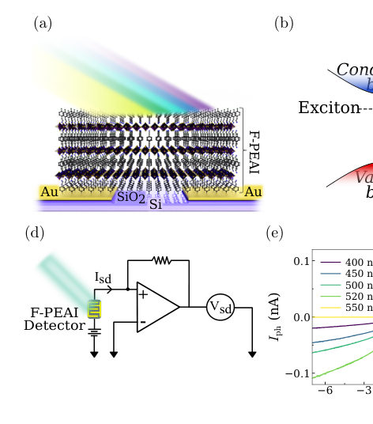 
Figure 1: Optoelectronic response of the 2D F-PEAI photodetector.

📷 Fig 2

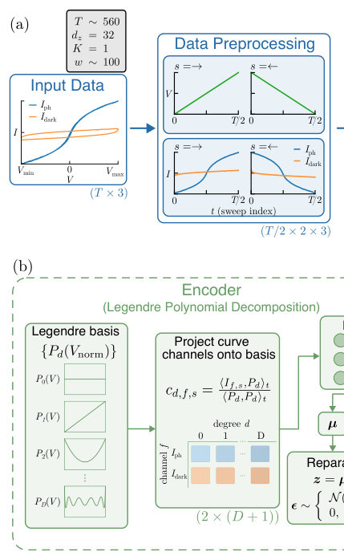 
Figure 2: Structure-aware variational encoder-decoder for spectral

📷 Fig 3

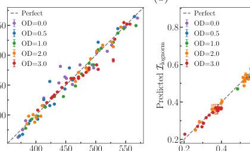 
Figure 3: Predictive performance of the spectral reconstruction model.

📷 Fig 4

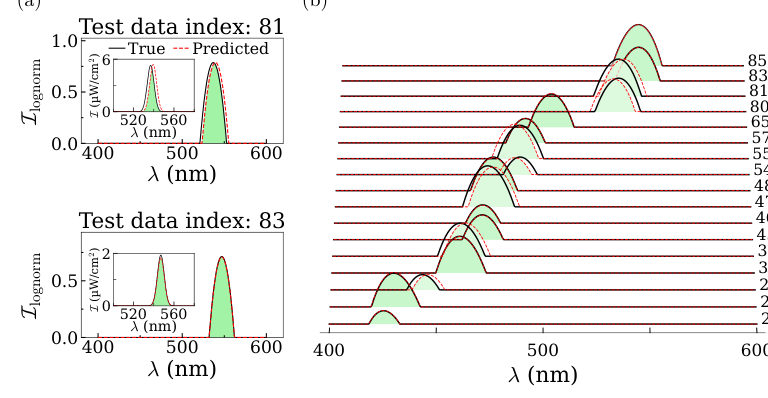 
Figure 4: Representative spectral reconstructions from the held-out test set.

📷 Fig 5

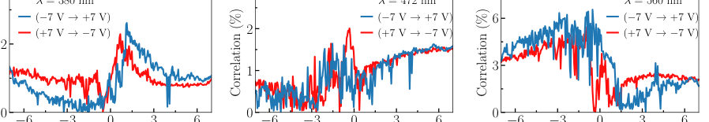 
Figure 5: Voltage-resolved encoding of wavelength information in the nonlinear

**Summary.** This paper proposes using the nonlinear electrical response of a single 2D perovskite photodetector to perform full spectral analysis, bypassing the need for traditional dispersive optics. A variational neural network is trained to invert the complex current-voltage curves, successfully reconstructing both the incident wavelength and irradiance with high accuracy. This establishes nonlinear material dynamics as a powerful computational resource for compact quantum sensing.

**Why it may be interesting.** This work exemplifies a strong hardware-algorithm co-design approach, using the complex, nonlinear physics of a solid-state material (perovskite) as the physical encoding mechanism for spectral data, which is highly relevant to developing compact quantum sensing or characterization tools.

Detailed structure

**Main problem.** Conventional spectroscopy is limited by the need for bulky dispersive optics or large detector arrays. The paper addresses this by proposing a method where the nonlinear dynamics of a single photodetector encode the incident spectrum.

**Main result.** The developed model successfully reconstructs incident wavelength ($R^2=0.958$) and irradiance ($R^2=0.987$) using only the photodetector's current-voltage signatures, demonstrating a path toward compact spectroscopic systems.

**Method.** A compact variational encoder-decoder neural network is trained to map the history-dependent, nonlinear current-voltage sweeps onto continuous spectral parameters (wavelength and irradiance).

**Model / system.** The physical system is a planar fluorinated phenethylammonium lead iodide (F-PEAI) 2D perovskite photodetector. The model leverages the photodetector's complex, nonlinear response to encode spectral information.

**Key observables.** Reconstructed wavelength ($\lambda$), log-normalised irradiance ($I$), and the measured bias-dependent current-voltage ($I-V$) signatures.

**Important parameters / regimes.** The model uses a truncated Legendre-polynomial basis for projection; performance is quantified by $R^2$ and MAE.

**Assumptions / limitations.** The core assumption is that the complex, multi-physics nonlinear material dynamics (photocarrier generation, trapping, transport) can be accurately modeled and inverted using the variational autoencoder structure.

**Figures summary.** Figures illustrate the device setup, the VAE workflow (including Legendre decomposition), and show representative photocurrent-voltage curves and spectral responsivity measurements.

**Paper structure.** The paper introduces the problem of spectral measurement limitations, details the F-PEAI device physics, presents the variational neural network architecture (encoder/decoder), and validates the model's performance through quantitative reconstruction metrics and ablation studies.

Abstract

Spectroscopy conventionally separates optical frequencies before detection, imposing persistent constraints on footprint, complexity and scalability. Here we establish an alternative paradigm in which the nonlinear optoelectronic dynamics of a single two-dimensional perovskite photodetector physically encode the incident optical field and machine learning performs the inverse spectral reconstruction. Using a planar fluorinated phenethylammonium lead iodide (F-PEAI) photodetector, we exploit wavelength- and irradiance-dependent current-voltage signatures arising from the coupled effects of photocarrier generation, trapping, interfacial transport and field-dependent carrier dynamics. A compact variational encoder-decoder preserves the functional and history-dependent structure of these responses by independently projecting forward and reverse voltage sweeps onto a truncated Legendre-polynomial basis before mapping them through a probabilistic latent representation to continuous spectral parameters. Trained on fewer than 400 experimental voltage sweeps, the model generalises to excitation wavelengths excluded from training, reconstructing wavelength with $R^2=0.958$ and a mean absolute error of 8.1 nm, while recovering log-normalised irradiance with $R^2=0.987$. Voltage-resolved analysis further reveals that wavelength and irradiance are encoded differently across the nonlinear device response, with distinct bias regions carrying complementary optical information. These results establish nonlinear material and interface dynamics as a computational resource for spectroscopy and point towards hardware-algorithm co-design in which materials, interfaces and inference architectures are engineered jointly to maximise information content, enabling compact spectroscopic systems without dispersive optics or detector arrays.

[↑ back to top](#top)

### [Fabrication-free assessment of microwave losses in germanium-based dielectrics and superconductors](http://arxiv.org/abs/2608.28463v1)

**Authors:** Haoran Lu, Kushagra Aggarwal, Xiangqin Wang, Pauline Drexler, Daniel Tong, Maciej W. Olszewski, Anand Ithepalli, Lingda Kong, Debdeep Jena, Peter L. McMahon, David A. Muller, Dominique Bougeard, Valla Fatemi  
**Type:** experiment · **Category:** other · **PDF:** <https://arxiv.org/pdf/2608.28463v1>  
**Analysis basis:** full PDF text, analyzed in chunks
**Topic relevance:** `QC/QI experiment` **3/5** · `quantum measurements` **2/5** · `correlated / nonlocal dissipation` **1/5** · `driven-dissipative phase transition` **1/5**

📷 Fig 1

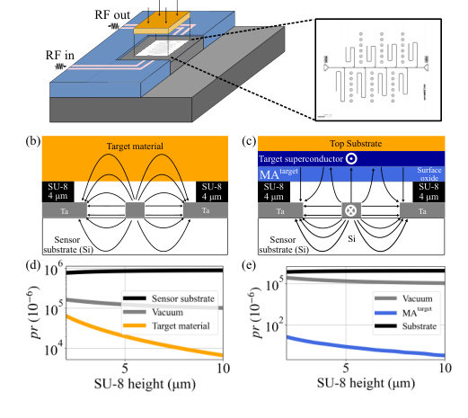 
FIG. 1. Sensing scheme. (a) Schematic of the flip-chip- based sensing scheme. The sensor chip, with microwave res- onators and 4 µm SU-8 pillars, is bonded to the package using Al wire. Target chips are placed above the sensor chip, and tight contact is ensured by four pogo pins that press the tar- get material from the top. (b) Dielectric material loss sensing scheme and EM field distribution. (c) Superconducting thin film loss sensing scheme with EM field and current distribu- tion. (d) Participation ratio of the dielectric target material prmaterial as a function of the height of the SU-8 pillar, with ϵr = 16.2 of the target dielectric material. (e) Participa- tion ratio of target...

📷 Fig 2

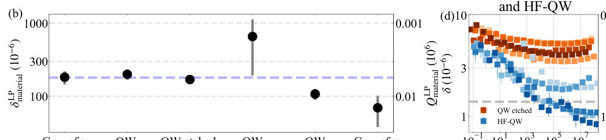 
FIG. 2. Dielectric material loss. (a) Box plots of low power (⟨n⟩&lt; 10) intrinsic loss δLP (dots) and high power (⟨n⟩&gt; 106) intrinsic loss δHP (stars) for dielectric materials measured by the flip-chip-based sensor. The dashed grey line indicates the median loss for the “vacuum” case, which serves as the reference loss. (b) Inferred low power material loss δLP material extracted from the measured sensor resonator loss. The dashed blue line is set at 180 × 10−6 for visual reference. (c) Measured loss of sensing resonator δ as a function of photon number with Ge (orange) and HF-treated Ge (blue) as the target material. (d) Measured loss of sensing resonator δ as a function of photon number...

📷 Fig 3

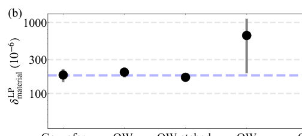 
Fig. 2(c,d) show the power dependence of the mi- crowave loss of Ge, HF-treated Ge, QW etched, and QW HF-treated. We note that the power dependence of Ge is relatively flat compared to “QW etched”, which does not saturate at ⟨n⟩≈1. This might be due to a rela- tively low concentration of two-level systems (TLSs) in- trinsically present in the epi-ready commercial Ge sub- strate, whereas the strain-relaxing composition grading of SiGe, different interfaces within the heterostructure, and/or the etching used to prepare the SiGe virtual layer may result in a higher concentration of TLSs. We remark

📷 Fig 4

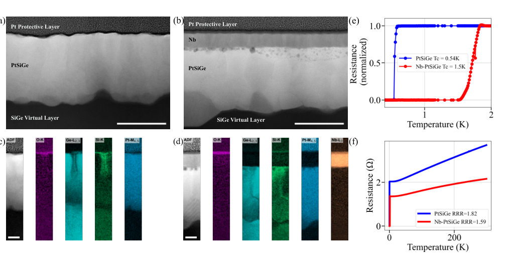 
FIG. 3. Scanning transmission electron microscopy (STEM) images of PtSiGe and Nb-coated PtSiGe (Nb- PtSiGe). Low-magnification STEM ADF images of the (a) PtSiGe and (b) Nb-PtSiGe films. Both films were kept under ambient conditions for 2 months prior to STEM imaging. The scale bar is 100 nm. (c), (d) Reference ADF images and EELS maps of the O-K, Ge-L2,3, Si-K, Pt-M4,5, Nb-L3 edges for the PtSiGe and Nb-PtSiGe samples, respectively. The scale bar is 25 nm. (e) Resistance as a function of temperature for PtSiGe and Nb-PtSiGe films near the superconductor transition temperature. (f) Residual resistivity ratio for PtSiGe and Nb-PtSiGe.

📷 Fig 5

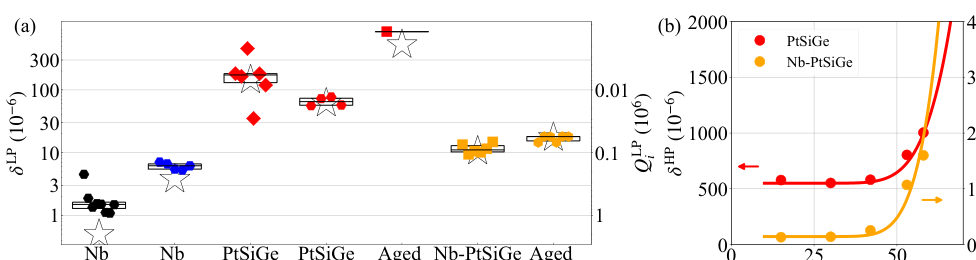 
FIG. 4. Superconducting thin film loss. (a) Box plot of low power (⟨n⟩&lt; 10) loss δLP (dots) and high power (⟨n⟩&gt; 106) loss δHP (star) for superconducting thin films measured by the flip-chip-based sensor. The PtSiGe and Nb-coated PtSiGe (Nb-PtSiGe) samples are remeasured after 2 months of aging. (b) Temperature dependence of high power δHP for PtSiGe and Nb-PtSiGe. Solid points indicate the measured values, and solid lines represent the Mattis-Bardeen fits. We extract RF critical temperatures of T RF C = 0.31 K for PtSiGe and T RF C = 0.32 K for Nb-PtSiGe, assuming ∆0 = 1.764kBTC where ∆0 is the superconducting gap.

**Summary.** This work presents a novel, fabrication-free microwave sensing technique using a flip-chip setup to quantify microwave losses in materials for quantum devices. The authors successfully applied this to measure losses in Ge/SiGe dielectrics and superconducting films like PtSiGe. This method provides critical material constraints and design guidance for building high-quality superconducting quantum circuits.

**Why it may be interesting.** The development of a non-destructive, rapid characterization tool for superconducting and dielectric losses is crucial for advancing superconducting quantum circuit design, bridging materials science and quantum engineering.

Detailed structure

**Main problem.** To develop a fabrication-free method to accurately measure effective microwave losses in novel materials intended for quantum technologies, specifically dielectrics and superconductors.

**Main result.** The technique successfully quantified losses in Ge/SiGe heterostructures and showed that coating PtSiGe with Nb significantly reduced microwave loss and enhanced the critical temperature.

**Method.** A flip-chip-based sensing scheme is employed where a microwave resonator placed over the target material measures the material's participation ratio for both dielectric and superconducting losses.

**Model / system.** The platform involves a microwave resonator sensor chip placed on top of the material under test (e.g., Ge/SiGe or PtSiGe) via pogo pins, allowing for non-destructive, in-situ loss measurement.

**Key observables.** Participation ratio (pr_material, pr_MA), microwave loss tangents ($\delta$), and the temperature dependence of microwave loss.

**Important parameters / regimes.** Low-photon and high-photon microwave regimes, strain engineering parameters in Ge/SiGe, and the superconducting critical temperature ($T_c$).

**Assumptions / limitations.** The method assumes that the measured loss is dominated by the target material's intrinsic properties and that the sensing setup accurately isolates the material's contribution.

**Figures summary.** Figures illustrate the flip-chip sensing schematics for both dielectric and superconducting loss measurement, showing how participation ratios are calculated and how material losses vary with geometry.

**Paper structure.** The paper introduces the sensing scheme, applies it to characterize dielectric losses in Ge/SiGe, then extends the method to measure superconducting losses in PtSiGe, concluding with design guidance and material constraints.

Abstract

We present a flip-chip-based sensing scheme to measure effective microwave losses associated with target materials for quantum technologies, without requiring any device fabrication on the material under test. Using this approach, we quantify the microwave losses of a strain-engineered Ge/SiGe quantum well heterostructure and investigate losses arising from its Ge substrate and intermediate layers. The quality factors of the fabricated microwave resonators agree with the losses of dielectric materials independently extracted from flip-chip sensing measurements. We further study the superconductor platinum silicon germanide (PtSiGe) prepared by thermal reaction with a deposited Pt film, finding high microwave losses that limit the suitability of the films studied here as the sole superconductor for high-quality resonator applications. By coating Pt with Nb prior to the reaction, we observe a substantial reduction in microwave loss and a nearly three-fold enhancement of the transport critical temperature. The temperature dependence of the microwave loss is consistent with gap inhomogeneity in both superconducting films. These results identify constraints on material choices, provide design guidance for microwave circuits on planar Ge heterostructures, and demonstrate a fast-turnaround testing method for new materials for superconducting quantum circuits.

[↑ back to top](#top)

### [Layer-Controlled Intermolecular Coupling and Many-Body Effects in C$_{60}$ Films](http://arxiv.org/abs/2608.28583v1)

**Authors:** Hai-Lan Luo, Weitang Li, Luca Moreschini, Jonathan Denlinger, Zhigang Shuai, Claudia Ojeda-Aristizabal, Alessandra Lanzara  
**Type:** both · **Category:** strongly correlated electrons · **PDF:** <https://arxiv.org/pdf/2608.28583v1>  
**Analysis basis:** full PDF text, analyzed in chunks
**Topic relevance:** `analog quantum simulation` **3/5** · `Keldysh / 2PI / non-Gaussian methods` **2/5** · `methods for driven-dissipative` **2/5**

📷 Fig 1

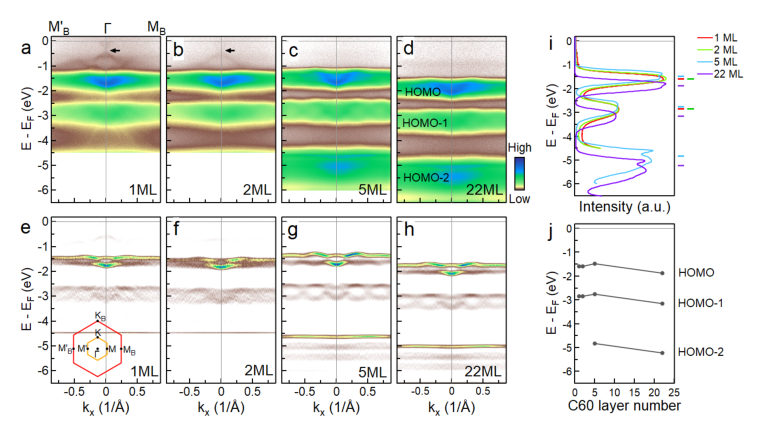 
FIG. 1. Thickness-dependent electronic structures of C60 films on a Bi2Se3 substrate. a-d, ARPES band structures of C60 films with thicknesses of 1 ML (a), 2 ML (b), 5 ML (c), and 22 ML (d) C60, measured along the MB ′-Γ-MB high-symmetry direction. Bands originating from the Bi2Se3 substrate are indicated by arrows in (a,b). e-h, Second-derivative images with respect to energy, derived from (a)-(d). The Brillouin zones of C60 and Bi2Se3 are outlined in yellow and red, respectively, in the inset of (e). i, EDCs integrated over the full MB ′-Γ-MB momentum range for all four thicknesses. The colored bars on the right indicate the centroid energy of each band manifold. j, Thickness dependence...

📷 Fig 2

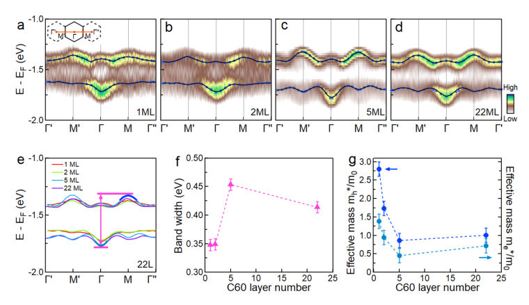 
FIG. 2. Thickness-dependent band dispersion and effective mass of HOMO band. a-d, Second-derivative ARPES spectra of the HOMO band along the M′-Γ-M high-symmetry direction for C60 films with thicknesses of 1 ML (a), 2 ML (b), 5 ML (c), and 22 ML (d). Blue dots indicate extracted peak positions of the dominant HOMO-derived dispersive spectral envelope, and black curves represent fits to these features. e, Fitted dispersions for all thicknesses overlaid for comparison. Blue curves show parabolic fits around the band top at M and the band bottom at Γ for the 22 ML film. The magenta arrow indicates the HOMO bandwidth (W ) of the dominant HOMO-derived dispersive spectral envelope, defined as the...

📷 Fig 3

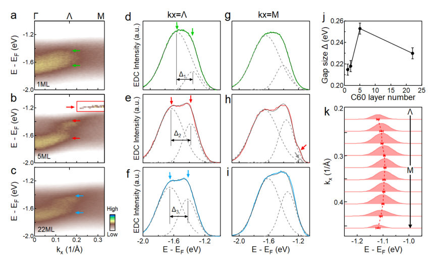 
FIG. 3. Thickness-dependent gap-like and sub-band features. a-c, Raw ARPES intensity maps of the HOMO band dispersion for 1 ML (a), 5 ML (b), and 22 ML (c) C60 films. The Λ point denotes the midpoint between Γ and M. The inset in (b) shows the second-derivative image, highlighting the sub-band feature in the 5 ML film; the corresponding raw-intensity evidence is provided in Supplementary Fig. S3. d-f, EDCs at the Λ point for C60 films with thicknesses of 1 ML (d), 5 ML (e), and 22 ML (f), showing gap-like structures. Spectra are fitted with two Gaussian components, as shown by gray dashed curves. g-i, EDCs at the M point for C60 films with thicknesses of 1 ML (g), 5 ML (h), and 22 ML (i). A...

📷 Fig 4

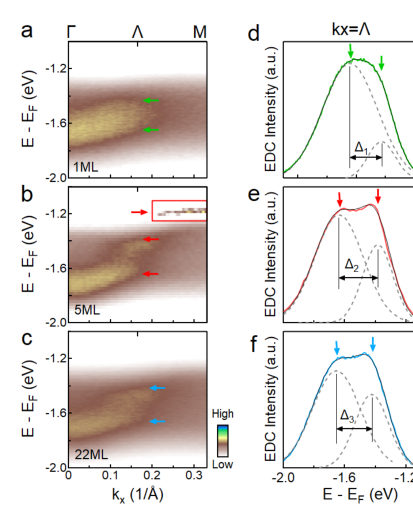 
Figure 4b shows the simulated spectral function in the presence of electron-phonon interactions. The Hg(7) and Hg(8) modes are included with equal coupling strengths, corresponding to a reorganization energy of 20 meV (see Methods). The resulting spectrum exhibits a gap (∆A) at k / / = π/2, but no sub-band feature near π, as confirmed by the corresponding EDCs obtained at π/2 (Fig. 4e) and π (Fig. 4h). This intermediate-coupling regime re- produces the partial spectral renormalization observed experimentally, characterized by the presence of a gap without a well-defined sub-band. In particular, it cap- tures the behavior of the thicker (22ML) film, where spectral reconstruction is present...

📷 Fig 5

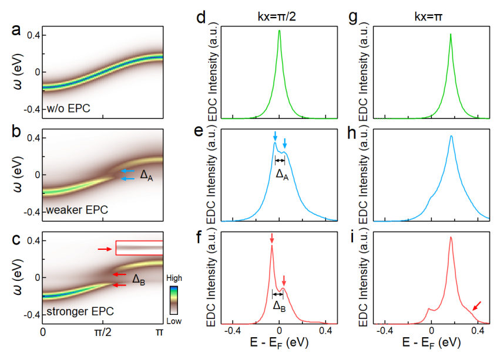 
FIG. 4. Simulated spectral functions with varying electron-phonon coupling strength. a-c, Simulated single- particle spectral functions of the HOMO band based on a Holstein model with coupling to the Hg(7) (1443 cm−1) and Hg(8) (1607 cm−1) intramolecular phonon modes. The mode-resolved reorganization energy (g2 mωm) for each of these two modes is set to 0 meV in (a), 20 meV in (b), and 30 meV in (c), corresponding to the no-coupling, intermediate-coupling, and stronger- coupling cases, respectively. Arrows indicate gap-like features and sub-band formation. d-f, Corresponding EDCs at k / / = π/2 for the three electron-phonon coupling strengths, showing the evolution from a single peak to a...

**Summary.** This work investigates how controlling the thickness of C60 molecular films tunes their electronic properties by manipulating intermolecular coupling and electron-phonon interactions. Using ARPES and Holstein model simulations, the authors demonstrate a non-monotonic evolution, identifying an optimal intermediate thickness where coupling effects are maximized. This establishes layer number as a powerful, experimentally accessible knob for engineering correlated electronic states in molecular thin films.

**Why it may be interesting.** The interplay between structural control (layer number) and emergent many-body physics (electron-phonon coupling) in molecular solids is highly relevant to understanding correlated phenomena in low-dimensional quantum materials.

Detailed structure

**Main problem.** To systematically understand how dimensionality (layer number) controls the electronic structure and many-body interactions in crystalline C60 films.

**Main result.** The intermediate-thickness film regime shows the largest bandwidth and minimum effective mass, indicating strengthened effective intermolecular electronic coupling and enhanced electron-phonon renormalization.

**Method.** The study combines Angle-Resolved Photoemission Spectroscopy (ARPES) experiments with theoretical modeling using the Holstein Hamiltonian.

**Model / system.** The physical system is crystalline C60 molecular films grown on a Bi2Se3 substrate. The electronic properties are governed by intermolecular hopping, electron correlations, and electron-vibration coupling.

**Key observables.** HOMO-derived band bandwidth (W), effective mass (m*), gap-like features, and sub-band formation.

**Important parameters / regimes.** Film thickness (layer number), electron-phonon coupling strength (reorganization energy).

**Assumptions / limitations.** The Holstein model provides a minimal phenomenological description of the electron-phonon interaction, and the HOMO bandwidth is defined as the energy range of the dominant spectral envelope.

**Figures summary.** Figures show thickness-dependent ARPES band structures, quantitative analysis of W and m* vs. thickness, and simulated spectral functions from the Holstein model comparing weak, intermediate, and strong coupling regimes.

**Paper structure.** The paper systematically presents experimental ARPES data showing thickness dependence, correlates these trends with theoretical predictions from the Holstein model, and uses the model to pinpoint the physical origin (electron-phonon coupling) of spectral features in the intermediate thickness regime.

Abstract

Crystalline C$_{60}$ is a molecular solid whose electronic properties emerge from the interplay of intermolecular hopping, electron correlations, and electron-vibration coupling. Unlike moir$\rm\acute{e}$ van der Waals heterostructures, where interaction strength is commonly tuned by twist angle, molecular materials offer a complementary route in which layer number, molecular orientation, and substrate registry provide experimentally accessible control parameters. Here we present a systematic thickness-dependent angle-resolved photoemission study of C$_{60}$ films, spanning the monolayer to the bulk limit. The HOMO-derived band exhibits a non-monotonic evolution: the intermediate-thickness film shows larger bandwidth, reduced effective mass, and pronounced gap-like and sub-band features. The experimental trends, together with Holstein-model simulations, point to strengthened effective intermolecular electronic coupling and enhanced electron-phonon-induced spectral renormalization in the intermediate-thickness regime. These results identify a dimensional crossover in C$_{60}$ films and establish layer number as an effective knob for engineering electronic structure and many-body interactions in molecular thin films.

[↑ back to top](#top)

### [Scale-free correlations in extremely persistent active matter](http://arxiv.org/abs/2608.27572v1)

**Authors:** Grzegorz Szamel  
**Type:** theory · **Category:** statistical mechanics · **PDF:** <https://arxiv.org/pdf/2608.27572v1>  
**Analysis basis:** full PDF text, analyzed in chunks
**Topic relevance:** `non-equilibrium universality` **3/5** · `Keldysh / 2PI / non-Gaussian methods` **2/5** · `driven-dissipative phase transition` **1/5** · `methods for driven-dissipative` **1/5**

📷 Fig 1

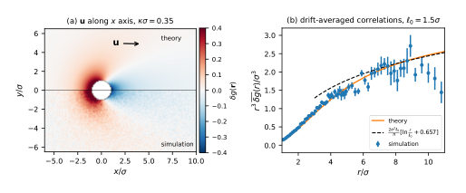 
FIG. 1. (a) Pair distribution function distortion, δg(r; e1, e2), in d = 2 and for relative drift u ∝e1 −e2 along x axis for κσ = 0.35. Upper half shows theoretical expression (6) and lower half shows results of Langevin simulations of the relative motion. (b) Drift-averaged d = 2 distortion compensated by (r/σ)3, r3δg(r)/σ3: full theory (solid line), a large r asymp- totics (9) (dashed line) and Langevin simulations (symbols).

📷 Fig 2

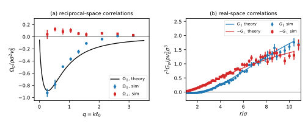 
FIG. 2. (a) Swim velocity correlations in d = 2 at l0 = 1.5σ. (a) Reciprocal-space correlations Ω∥and Ω⊥: full theory (line) and Langevin simulations (symbols). (b) Real-space correlations, Eq. (13), compensated by r3: full theory (lines) and Langevin simulations (symbols).

📷 Fig 3

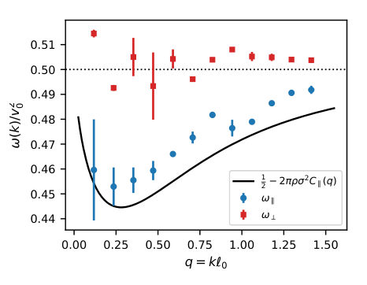 
FIG. 3. Longitudinal, ω∥, and transverse, ω⊥, velocity cor- relations in reciprocal space. Number density ρσ2 = 0.0623, l0 = 1.5σ. Theory (full line for ω∥and horizontal dashed line for ω⊥) compared with many-particle siulations (symbols).

**Summary.** This paper theoretically analyzes scale-free correlations in active matter composed of persistent Brownian particles. By examining the density and swim velocity correlations in the low-density limit, the authors derive power-law decay laws for these correlations in both 2D and 3D. The work confirms that these correlations manifest as cusps at zero wavevector in reciprocal space, providing a quantitative understanding of non-equilibrium spatial correlations.

**Why it may be interesting.** While focused on active matter, the rigorous derivation of non-equilibrium correlation functions and the identification of universal power-law decay exponents in the absence of thermal equilibrium provide valuable theoretical tools applicable to other non-equilibrium many-body systems.

Detailed structure

**Main problem.** The paper investigates the existence and nature of scale-free correlations in out-of-equilibrium active matter systems.

**Main result.** The analysis shows that both density and swim velocity correlations decay algebraically in real space, exhibiting power-law tails with logarithmic corrections in 2D and pure power laws in 3D.

**Method.** The authors use analytical derivations in the low-density and small-swim-velocity limit, solving differential equations for the pair distribution function and correlation tensors.

**Model / system.** The model consists of infinitely persistent active Brownian particles interacting via hard-sphere repulsion. The dynamics are governed by equations of motion involving self-propulsion and inter-particle forces.

**Key observables.** Pair distribution function distortion ($\delta g$), longitudinal ($\Omega_{\|}(k)$) and transverse ($\Omega_{\perp}(k)$) swim velocity correlations in reciprocal space, and the real-space correlation tensor $G_{\alphaeta}(r)$.

**Important parameters / regimes.** Low density limit, small swim-velocity limit, and dimensionality ($d=2$ vs $d=3$).

**Assumptions / limitations.** The analysis is restricted to the low density and small self-propulsion velocity limit.

**Figures summary.** Figures compare theoretical predictions for density correlations ($\delta g$) and swim velocity correlations ($\Omega_{\|}, \Omega_{\perp}$) against numerical simulations for both 2D and 3D systems.

**Paper structure.** The paper develops the theory by analyzing the pair distribution function distortion in the low-density limit, deriving the decay laws for positional and velocity correlations in both real and reciprocal space, and confirming these results with simulations.

Abstract

Scale-free correlations are believed to be generic in out of equilibrium systems but their explicit derivations are rare and often involve approximations. Here we analyze a system of infinitely persistent active Brownian particles in the low density and small-swim-velocity limit. We show that both the density and swim velocity correlations decay algebraically as r^{-(d+1)} (with logarithmic corrections in d=2). In reciprocal space these correlations manifest themselves as cusps at k=0. The analytical predictions are confirmed by numerical simulations. The results were obtained through interaction with Claude (Opus 4.8 and 5, and Fable 5) and verified by the author.

[↑ back to top](#top)

### [Evidence for Three-component Interlayer Coherent Exciton Condensation](http://arxiv.org/abs/2608.28338v1)

**Authors:** Subi Du, Xiaohan Zhang, Hongxi Song, Siyu Fan, Yiduo Wang, Zhenyu Wang, Song Liu, Kenji Watanabe, Takashi Taniguchi, Jiangping Hu, Yang Xu  
**Type:** experiment · **Category:** strongly correlated electrons · **PDF:** <https://arxiv.org/pdf/2608.28338v1>  
**Analysis basis:** full PDF text, analyzed in chunks
**Topic relevance:** `analog quantum simulation` **3/5** · `Rydberg arrays` **2/5** · `quantum optics experiment` **1/5**

📷 Fig 1

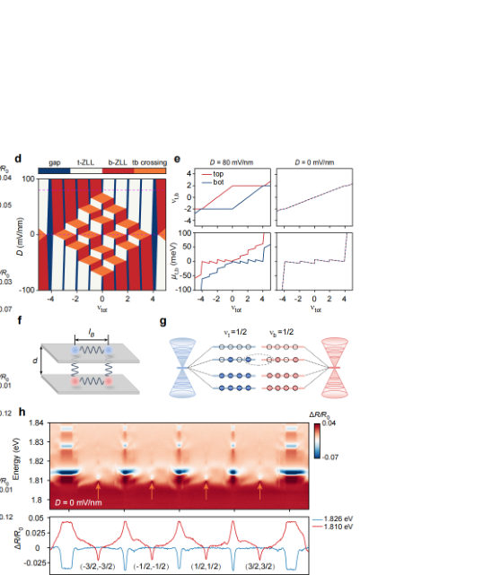 
Figure 1. Layer-resolved Rydberg exciton sensing spectroscopy of interlayer two- component QH coherence in double-layer graphene (DLG). a, Schematic of the DLG/WSe2 heterostructure, with the t-Gr and b-Gr (two graphene monolayers) separated by an approximately 2 nm hBN spacer. A monolayer WSe2 is placed above t- Gr and serves as an optical sensor. The total filling factor 𝜈!"! and displacement field 𝐷 are controlled by the top- and bottom-graphite gates (Vtg and Vbg, respectively) under an out-of-plane magnetic field 𝐵. b, Reflection-contrast spectrum DR/R0 as a function of photon energy (E) and 𝜈!"!, measured at 80 mV/nm, showing the sequential filling of the ZLLs of the two graphene...

📷 Fig 2

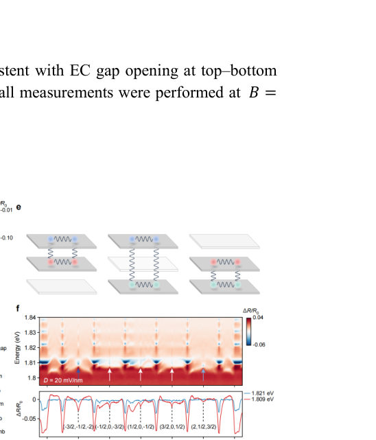 
Figure 2. Pairwise interlayer coherent states in triple-layer graphene (TLG). a, Schematic of the TLG/WSe2 heterostructure (not showing the outside gating graphite and hBN). Three monolayer graphene sheets, denoted t-Gr, m-Gr and b-Gr, are separated by two hBN spacers with thicknesses 1.3 nm and 2 nm, respectively. A bias voltage 𝑉#%&amp;' can be applied to the t-Gr, while m-Gr and b-Gr are grounded. b,c, Layer- resolved ZLL phase diagrams constructed from the reflection contrast at fixed photon energies of 1.809 eV (b) and 1.821 eV (c), corresponding to the 2s and the 3s exciton resonance, respectively. The horizontal dashed line in b marks D = 20 mV/nm, along which the spectrum and linecuts...

📷 Fig 3

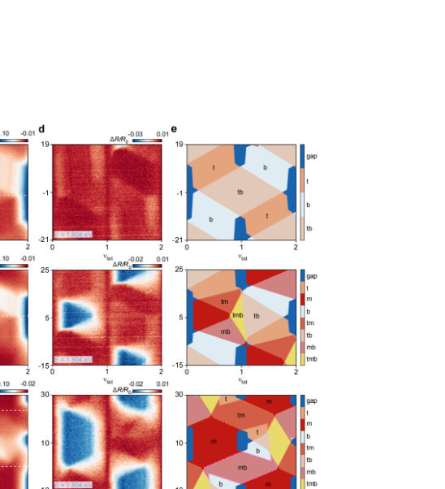 
Figure 3. Bias-tuned evolution from pairwise to three-layer LL crossings in TLG. a, 𝑉#%&amp;' and D dependent phase diagram of the TLG at fixed total filling 𝜈!"! = 1, extracted from the reflection contrast at the fixed 2s exciton energy of 1.809 eV. The bias voltage 𝑉#%&amp;' is applied to t-Gr. Blue regions correspond to regular QH gaps, whereas the red-toned branches between adjacent blue domains mark interlayer LL crossings. From the darkest to the lightest red, these regions are assigned to the middle– bottom (mb), top–bottom (tb) and top–middle (tm) coherent channels, respectively. Multiple sets of such interlayer crossings evolve continuously as 𝑉#%&amp;' and D are varied. The three yellow...

📷 Fig 4

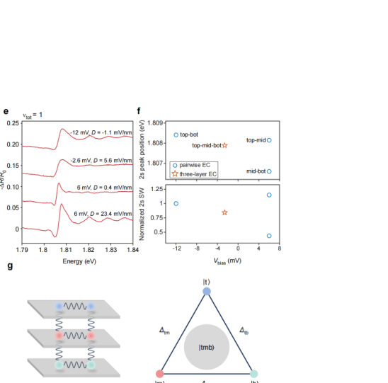 
Figure 4. Signatures of three-component QH coherence. a–d, Reflection-contrast spectra measured along the four displacement field cuts indicated by the white dashed lines in Fig. 3c. The upper panels show the spectra as functions of photon energy E and 𝜈!"!, and the lower panels show linecuts at the indicated photon energies, selected to maximize the contrast of the corresponding incompressible features at 𝜈!"! = 1. Panels a–d correspond, respectively, to top–bottom pairwise coherence at 𝑉#%&amp;' = −12 mV, the three-layer crossing regime at 𝑉#%&amp;' = −2.6 mV, and the middle–bottom and top– middle pairwise coherent states at 𝑉#%&amp;' = 6 mV. The orange star in b marks the unique incompressible...

**Summary.** This work reports experimental evidence for three-component interlayer coherent exciton condensation in a triple-layer graphene system using a WSe2 optical probe. By independently controlling layer potentials, the researchers demonstrated a continuous transition from pairwise to a three-component correlated state. This establishes multilayer graphene as a programmable platform for exploring higher-order quantum Hall physics.

**Why it may be interesting.** The ability to engineer and observe higher-component quantum Hall order in a tunable solid-state platform like multilayer graphene provides a clean, controllable model for studying complex many-body correlations.

Detailed structure

**Main problem.** The research investigates the existence and characteristics of three-component interlayer coherent exciton condensation in a triple-layer graphene system, extending beyond previously studied bilayer systems.

**Main result.** The authors report evidence for a continuous transition from pairwise to a three-component coherent state, marked by persistent incompressibility when all three layer-derived Landau levels approach simultaneous degeneracy.

**Method.** The study uses layer-sensitive optical spectroscopy employing Rydberg excitons in an adjacent WSe2 monolayer as a probe to map out the system's phase diagram.

**Model / system.** The physical system is a triple-layer graphene (TLG) heterostructure, whose electronic structure is analyzed using coupled electrostatic charge-balance equations. The coherence is studied in the context of Quantum Hall physics.

**Key observables.** Optical signature of QH incompressibility, layer-resolved ZLL crossings, and the evolution of exciton energy/spectral weight across different coherence regimes.

**Important parameters / regimes.** Interlayer bias voltage, displacement field, and the total filling factor ($
u_{tot}$), which are tuned to control the system's electronic state.

**Assumptions / limitations.** The WSe2 optical response provides intrinsic layer sensitivity, and the analysis relies on solving coupled electrostatic equations derived from capacitance networks.

**Figures summary.** Figures illustrate the device structure, layer-resolved ZLL crossings in double and triple layers, and phase diagrams showing the continuous tuning from pairwise to three-component coherent states.

**Paper structure.** The paper builds from establishing two-component coherence in double-layer graphene, then extends the analysis to triple-layer graphene, mapping out the phase space by tuning external fields to observe the transition into the three-component coherent regime.

Abstract

Increasing the number of internal components in a quantum many-body system can host collective orders inaccessible to simpler settings. Quantum Hall bilayers provide a canonical realization of interlayer exciton condensation, yet extending such coherence across three independently addressable electronic fluids has remained elusive. Here we report evidence for three-component interlayer coherent exciton condensation in triple-layer graphene system. Using Rydberg excitons in an adjacent WSe2 monolayer as a layer-sensitive optical probe, we resolve interaction-induced incompressibility at zeroth-Landau-level crossings for all three pairwise layer combinations, establishing top-middle, middle-bottom and top-bottom exciton condensate channels within the same device. Independent control of displacement field and interlayer bias continuously tunes these pairwise states towards a regime where Landau levels from all three layers approach simultaneous degeneracy. At their convergence, incompressibility persists while the exciton energy and spectral weight evolve smoothly between the pairwise limits, suggesting coherent participation of all three layers in a single three-component state. More broadly, the ability to independently control layer potentials and engineer interlayer interactions establishes multilayer graphene as a programmable synthetic dimension for exploring higher-component quantum Hall order and simulating strongly correlated quantum matter.

[↑ back to top](#top)

### [High-Dimensional Deterministic Secure Quantum Communication with Reed-Solomon Erasure Coding](http://arxiv.org/abs/2608.27679v1)

**Authors:** L. F. A. de Sousa Moura, G. L. Zanin, P. H. Souto Ribeiro, C. Becker Westphall  
**Type:** both · **Category:** quantum information and computing · **PDF:** <https://arxiv.org/pdf/2608.27679v1>  
**Analysis basis:** full PDF text, analyzed in chunks
**Topic relevance:** `quantum optics experiment` **3/5** · `QC/QI experiment` **1/5** · `interference shaping light` **1/5** · `quantum measurements` **1/5**

📷 Fig 1

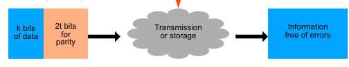 
FIG. 1. Reed-Solomon

📷 Fig 2

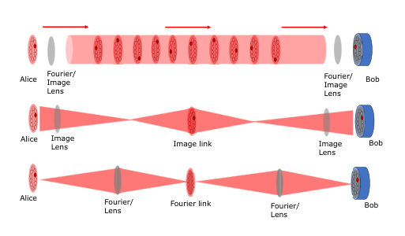 
FIG. 2. DSQC with Reed-Solomon protocol. Successful trans- mission with preparation and measurement in equal bases.

📷 Fig 3

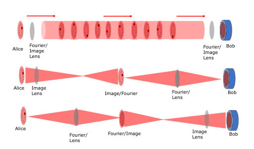 
FIG. 3. DSQC with Reed-Solomon protocol. Unsuccessful transmission with preparation and measurement in different bases.

📷 Fig 4

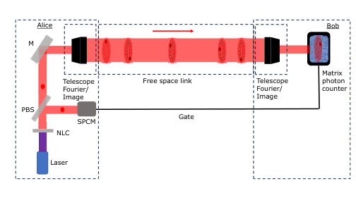 
FIG. 4. Proposed experimental setup using photon pairs from SPDC to produce heralded single photons. See more details in the main text.

📷 Fig 5

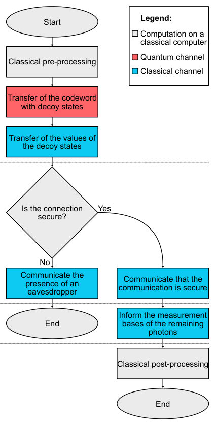 
FIG. 5. Flowchart of the protocol

**Summary.** This paper proposes a novel Deterministic Secure Quantum Communication protocol that enhances data resilience by incorporating Reed-Solomon erasure coding into a high-dimensional quantum state transmission scheme. It utilizes single photons encoded in spatial degrees of freedom, eliminating the need for quantum memory or entanglement. The combination of classical error correction with quantum security measures makes the protocol highly practical and robust.

**Why it may be interesting.** This work directly addresses quantum communication security and capacity enhancement by merging classical coding theory with quantum optics, which is highly relevant to photonic quantum information processing.

Detailed structure

**Main problem.** To develop a Deterministic Secure Quantum Communication (DSQC) protocol that transmits messages over a quantum channel while ensuring resilience against noise and eavesdropping, without requiring prior key distribution, quantum memory, or entanglement.

**Main result.** The protocol successfully integrates Reed-Solomon erasure coding with high-dimensional quantum states encoded in the transverse spatial degrees of freedom, achieving deterministic secure transmission.

**Method.** The method combines classical polynomial encoding (Reed-Solomon coding) with quantum state preparation and measurement in Mutually Unbiased Bases (MUB) using single photons.

**Model / system.** The system uses high-dimensional quantum states encoded in the Transverse Spatial Degrees of Freedom (TSDF) of single photons, generated via Spontaneous Parametric Down-Conversion (SPDC). Implementation relies on components like SLMs and photon counting matrices.

**Key observables.** Quantum Bit Error Rate (QBER), error introduced by Eve (EIR), and the successfully recovered message bits.

**Important parameters / regimes.** Alphabet size (q or d, a prime number), message length (k), and the number of parity bits (2t).

**Assumptions / limitations.** The protocol assumes the availability of an authenticated classical channel for announcing decoy positions and values, and that the total number of photons transmitted in a block satisfies n < q.

**Figures summary.** Figures illustrate the block diagram of the RS encoding/decoding process, the experimental setup using SPDC to generate heralded single photons, and flowcharts detailing the protocol steps.

**Paper structure.** The paper details the theoretical framework by first establishing the need for DSQC, then presenting the combination of RS coding with high-dimensional quantum states, followed by mathematical derivations for error rates and block sizes, and concluding with a discussion of the experimental realization.

Abstract

Deterministic Secure Quantum Communication (DSQC) is a quantum cryptographic technique engineered to transfer a message through a quantum channel, requiring an auxiliary classical channel for eavesdropping verification and decoding, but without prior key distribution. This article presents a theoretical high-dimensional prepare and measure DSQC protocol using the Reed-Solomon erasure coding to ensure data resilience to noise. This protocol offers the following benefits: it eliminates the need for quantum memory or entanglement, it can be built with commercially available technology, and its higher capacity improves the overall transmission rate.

[↑ back to top](#top)

### [Quantum thermodynamics near the border of a one-dimensional Bose gas](http://arxiv.org/abs/2608.28164v1)

**Authors:** Carsten Henkel  
**Type:** theory · **Category:** quantum gases · **PDF:** <https://arxiv.org/pdf/2608.28164v1>  
**Analysis basis:** full PDF text, analyzed in chunks
**Topic relevance:** `analog quantum simulation` **3/5** · `Keldysh / 2PI / non-Gaussian methods` **2/5** · `methods for driven-dissipative` **1/5**

📷 Fig 1

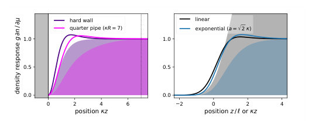 
FIG. 1. Kaleidoscope of condensate edges considered in this paper. Left panel: hard-wall potentials, right panel: soft potentials. The coloured shaded areas illustrate the density n(z) = |ϕ(z)|2 of the (quasi-)condensate mean field. The solid lines provide the response ∂n/∂µ to a change in the chemi- cal potential, related to the (local) compressibility. Param- eters: hard-wall potential V = 0, “quarter-pipe” potential connecting smoothly a hard wall at z = 0 to a flat bottom at z ≥R (dotted line), exponential V (z) = µ exp(−az) and linear V (z) = µ −Fz potential. See Table I for the potential parameters and the length scales 1/κ (healing length) and ℓ (linear potential). The turning point...

📷 Fig 2

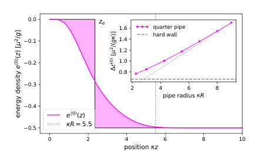 
FIG. 2. Ground state energy density e(0)(z) due to the condensate in the quarter-pipe potential. The position ze marks the abrupt termination of a homogeneous system with the same bulk density and (total) ground state energy (the shaded areas add to zero). Its product with the energy den- sity −µ2/(2g) gives the condensate contribution ∆E(0) to the surface energy. The inset illustrates the scaling with the “ra- dius” R of the quarter-pipe potential, the dotted line is the prediction of the Thomas-Fermi approximation.

📷 Fig 3

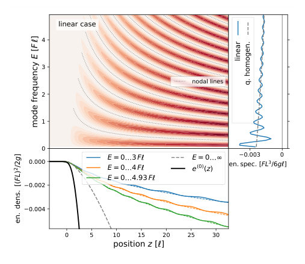 
FIG. 3. Spectral representation of the ground-state (zero tem- perature) energy density −E v2(z; E) in the border region of an inhomogeneous Bose gas confined by a linear potential (turning point at z = 0). Contributions from non-condensate excitations only. In the central contour plot, dotted are the nodal lines expected from the asymptotic form (19, 23) with δ = 0. The bottom and right panels give the energy density spectrum integrated along the energy or position axis, as in- dicated in the legends. The spatial upper limit is L = 32.5 ℓ. The results deep in the bulk (where mode functions are spa- tially averaged, see Eq. (35)) are plotted in dashed.

📷 Fig 4

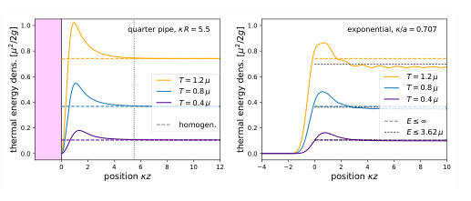 
FIG. 4. Thermal energy density, contribution from quasi- particles. (left) hard barrier with quarter-pipe potential, (right) exponential (soft) potential. Solid (black thin dashed) lines: numerical (analytical) calculation up to a finite energy; colored thick dashed lines: analytical prediction at infinite energy cutoff for homogeneous system. Data normalised to the bulk condensate energy density at T = 0.

📷 Fig 5

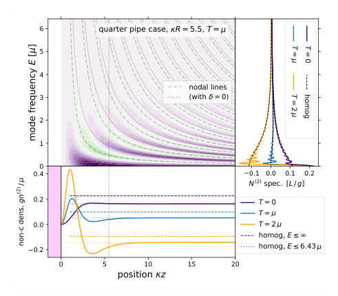 
FIG. 5. Non-condensate density near the turning point in the quarter pipe potential (Dirichlet boundary condition at z = 0 combined with a rounded potential between z = 0 and z = R). Central panel: space- and energy-resolved contribu- tion dn(2)(z; E)/dE of Eq. (44). Purple (green) color: posi- tive (negative) values, respectively. In dashed and dotted, the nodal lines expected from the large-distance asymptote of the Bogoliubov wave functions. Right panel: spatially integrated density from z = 0 . . . L ≈20/κ vs. mode energy; in dashed, predictions for a homogeneous system of size L where oscil- lations of mode functions are averaged out. Bottom panel: energy-integrated density. For the...

**Summary.** This paper theoretically examines the quantum thermodynamics of a quasi-1D Bose gas near its physical boundary. It moves beyond simple local approximations by calculating fluctuation corrections to the density and energy. The key finding is the presence of a dipolar density feature at the edge, providing deeper insight into condensate behavior in confined ultracold atomic systems.

**Why it may be interesting.** This work provides detailed, non-LDA descriptions of boundary physics in Bose gases, which is crucial for understanding trapped atom experiments where boundary effects dominate the physics.

Detailed structure

**Main problem.** The study investigates quantum thermodynamic properties, specifically particle and energy content, near the boundary of a quasi-one-dimensional Bose gas, moving beyond the limitations of the local density approximation.

**Main result.** The density profile near the edge exhibits a characteristic dipolar feature, which is distinct from Friedel oscillations seen in fermionic systems, and the analysis quantifies quantum fluctuation corrections to the density.

**Method.** The research employs Bogoliubov theory within the grand-canonical ensemble, solving excitations using Bogoliubov-de Gennes equations and analyzing energy density corrections up to the second and third order in fluctuations.

**Model / system.** The system is an ultracold Bose gas confined in a half-open potential well, modeled using the Gross-Pitaevskii equation for the condensate and Bogoliubov excitations for fluctuations.

**Key observables.** Density profile, excess/missing particles, surface tension, local compressibility, and the temperature dependence of fluctuation-induced particle density.

**Important parameters / regimes.** The analysis considers various potentials (hard wall, exponential, linear) and operates in the grand-canonical ensemble and thermodynamic limit.

**Assumptions / limitations.** The calculations avoid the local density approximation, and the analysis relies on expansions in fluctuations, noting that certain corrections vanish in the strict thermodynamic limit.

**Figures summary.** Figures illustrate the condensate edge behavior for various potentials, compare numerical vs. homogeneous particle numbers, and show the temperature dependence of fluctuation corrections for hard vs. exponential potentials.

**Paper structure.** The paper builds from solving the Bogoliubov equations in the grand-canonical ensemble, deriving energy density corrections, analyzing the boundary effects (dipolar feature), and finally quantifying the temperature dependence of quantum fluctuation corrections.

Abstract

We consider an ultracold Bose gas in a half-open potential well, otherwise confined to a quasi-one-dimensional geometry. The Bogoliubov equations for its elementary excitations are solved in the continuous spectrum to explore the particle and energy content near the edge of the gas, beyond the often applied local density approximation. In particular, gradients in the condensate density enhance density-dominated excitations in the border region. We discuss excess (missing) particles and their energy by comparing to suitable reference solutions for quasi-homogeneous systems. The density profile near the edge shows no Friedel oscillations, but a dipolar feature from the spill-out of thermally excited particles. The calculations are performed in the grand-canonical ensemble and in the thermodynamic limit.

[↑ back to top](#top)

### [Quantum transport and unified scaling law in graphene with polyadic Cantor electrostatic barriers](http://arxiv.org/abs/2608.28398v1)

**Authors:** Sudhanshu Shekhar, Mohammad Umar, Bhabani Prasad Mandal  
**Type:** theory · **Category:** other · **PDF:** <https://arxiv.org/pdf/2608.28398v1>  
**Analysis basis:** full PDF text, analyzed in chunks
**Topic relevance:** `non-equilibrium universality` **3/5** · `Frenkel-Kontorova` **1/5** · `Keldysh / 2PI / non-Gaussian methods` **1/5** · `analog quantum simulation` **1/5**

📷 Fig 1

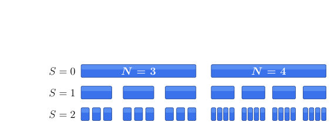 
FIG. 1. Schematic illustration of the PCP geometry for polyadic order N = 3 (left) and N = 4 (right).

📷 Fig 2

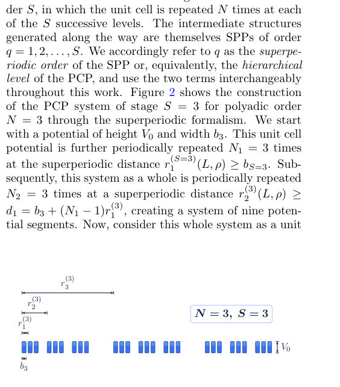 
FIG. 2. Construction of the PCP system of polyadic order N = 3 at stage S = 3 through the superperiodic formalism. It starts with a unit cell of width b3, and r(3) 1 , r(3) 2 , and r(3) 3 are the superperiodic distances of the first, second, and third orders, respectively.

📷 Fig 3

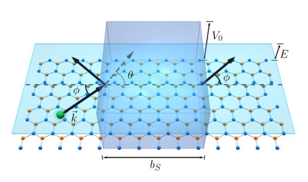 
FIG. 3. Schematic illustration of a graphene monolayer sub- jected to an electrostatic barrier of height V0. The vertical height denotes the energy scale, the Fermi level is shown as a horizontal plane, and the arrows show the scattering direction of charge carrier through the barrier.

📷 Fig 4

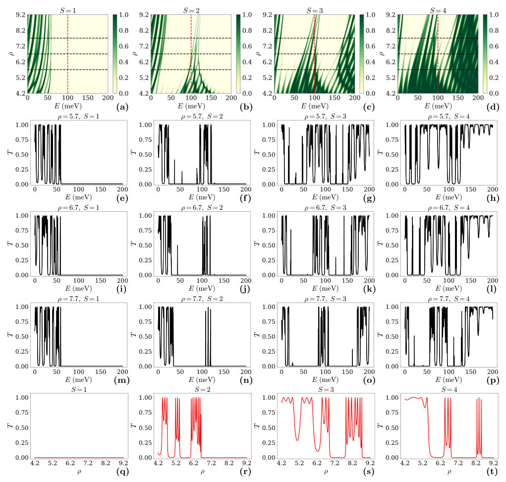 
FIG. 4. Transmission characteristics of monolayer graphene subjected to a polyadic Cantor electrostatic barrier, with each column corresponding to a successive Cantor stage, S = 1 to 4. The top row [(a)–(d)] shows the transmission density maps T(E, ρ) as functions of the Fermi energy E and the scaling parameter ρ. The next three rows show sectional transmission profiles T(E) at fixed values of the scaling parameter: ρ = 5.7 [(e)–(h)], ρ = 6.7 [(i)–(l)], and ρ = 7.7 [(m)–(p)]. The bottom row [(q)–(t)] shows T(ρ) evaluated at the Dirac point, E = V0. In all panels N = 4, ϕ = 40◦, V0 = 100 meV, and L = 800 nm.

📷 Fig 5

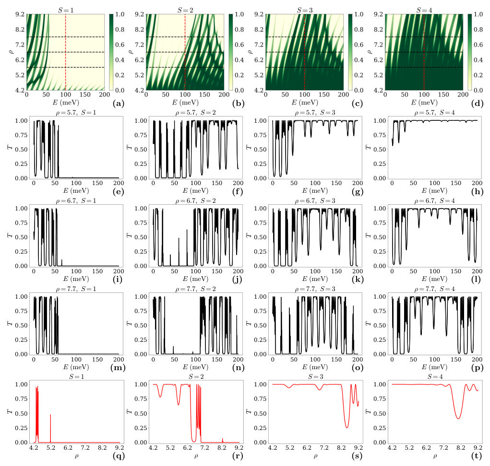 
FIG. 5. Same as Fig. 4, but for polyadic order N = 5. The top row [(a)–(d)] shows the transmission density maps T(E, ρ) for Cantor stages S = 1 to 4, and the remaining rows [(e)–(t)] show the corresponding sectional transmission profiles.

**Summary.** This paper theoretically analyzes how Dirac electrons in graphene tunnel through a complex, fractal electrostatic barrier modeled by a polyadic Cantor potential. By using the superperiodic potential formalism, the authors derive a unified scaling law that governs the transmission probability as the barrier structure becomes increasingly complex. This work demonstrates that the self-similar geometry of the potential dictates the macroscopic transport properties.

**Why it may be interesting.** The concept of universal scaling laws emerging from fractal potentials is highly relevant to open quantum systems, as it provides a mathematical framework to describe transport through complex, disordered, or quasi-periodic media, analogous to studying wave propagation in disordered photonic crystals.

Detailed structure

**Main problem.** The study investigates quantum transport and the derivation of a unified scaling law for Dirac electrons moving through a graphene sheet interrupted by a polyadic Cantor electrostatic barrier.

**Main result.** The transmission probability exhibits a transition from discrete superlattice resonances to a near-transparent regime, governed by a unified double-logarithmic scaling law dependent on multiple geometric and physical parameters.

**Method.** The authors employ the superperiodic potential formalism and calculate the transmission probability using the transfer matrix method.

**Model / system.** The system is graphene hosting massless Dirac electrons, subjected to a Polyadic Cantor Potential (PCP), which is a fractal electrostatic barrier structure generalizing the standard Cantor set.

**Key observables.** Transmission probability (T), angular response, and the scaling behavior of $\ln(-\ln T)$ with respect to four control parameters.

**Important parameters / regimes.** Cantor stage (S), potential height ($V_0$), initiator length (L), and angle of incidence ($\phi$); the polyadic order (N) is also crucial.

**Assumptions / limitations.** The analysis relies on the applicability of the superperiodic potential formalism and focuses on the low-lacunarity PCP system.

**Figures summary.** Figure 1 schematically illustrates the PCP geometry for polyadic orders N=3 and N=4 across increasing stages S. Figure 2 shows the construction of the PCP system using the superperiodic formalism.

**Paper structure.** The paper builds from defining the physical system (graphene/PCP) and the mathematical framework (superperiodic potential formalism) to derive the transmission probability, analyze its evolution across stages, and finally establish the unified scaling law.

Abstract

We study the quantum transport of Dirac electrons in graphene subjected to a polyadic Cantor-structured electrostatic potential. Using the superperiodic potential formalism, we obtain a closed-form expression for the transmission probability. As the Cantor stage increases, the transmission spectrum evolves from a sparse set of superlattice resonances to a near-transparent regime, with the polyadic order setting the rate of this evolution. The angular response depends on the doping configuration, showing distinct behavior in the $n$--$n$--$n$, $n$--$p$--$n$, and Dirac-point cases. In the near-transparent regime, the transmission follows double-logarithmic scaling laws with respect to four independent control parameters: the Cantor stage, the potential height, the initiator length, and the angle of incidence. By combining these individual scaling relations, we establish a unified scaling law governing quantum transport. These results show that the hierarchical self-similarity of the potential governs the transport properties of such systems.

[↑ back to top](#top)

### [Shape Evolution and Dynamics of Deformable Ring](http://arxiv.org/abs/2608.27952v1)

**Authors:** Arun Kumar, Partha Sarathi Mondal, Pritha Dolai, Shradha Mishra  
**Type:** theory · **Category:** statistical mechanics · **PDF:** <https://arxiv.org/pdf/2608.27952v1>  
**Analysis basis:** full PDF text, analyzed in chunks
**Topic relevance:** `non-equilibrium universality` **3/5** · `Frenkel-Kontorova` **1/5** · `driven-dissipative phase transition` **1/5** · `methods for driven-dissipative` **1/5**

📷 Fig 1

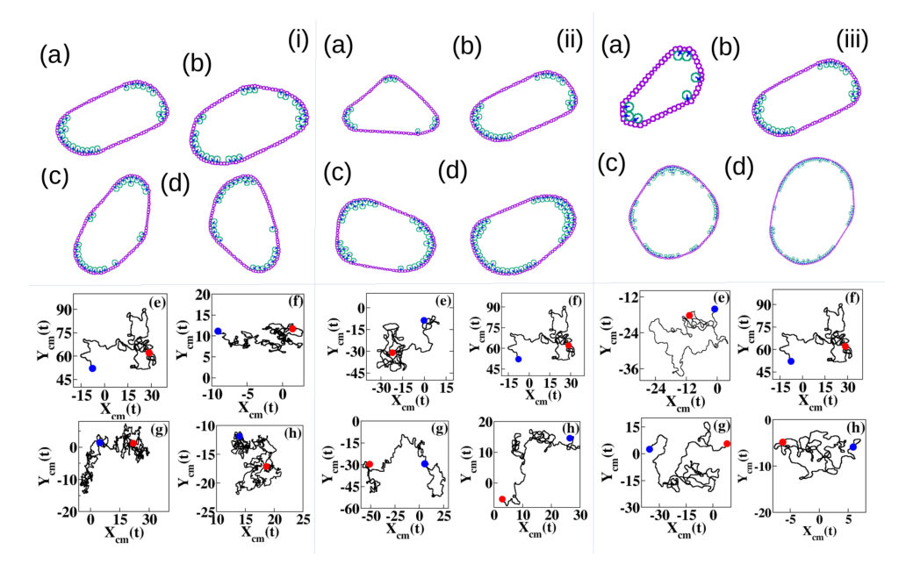 
FIG. 1: Shape transformations of a deformable ring under different system parameters. Configurations and corre- sponding center of mass trajectories: (i) fixed Nbeads = 100, ϕ = 0.10, and for different Dr = 0.01, 0.03, 0.05, and 0.07, shown in (a-d), (e-h), respectively. (ii) fixed Nbeads = 100, Dr = 0.10, and for different ϕ = 0.05, 0.10, 0.15, and 0.20, shown in (a-d), (e-h), respectively. (iii) fixed Dr = 0.01, ϕ = 0.1, and for different Nbeads = 50, 100, 150, and 200, shown in (a-d), (e-h), respectively. The magenta and cyan circles in (a-d) in all three (i)-(iii) columns represent the beads and ABPs, respectively. The red and blue solid circles represent the start and end point of a...

📷 Fig 2

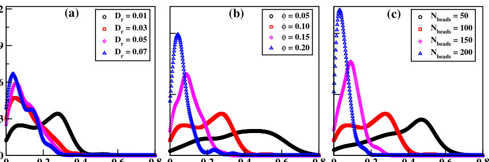 
FIG. 2: Probability distribution P(∆) of the asphericity parameter ∆. (a) At fixed Nbeads = 100, ϕ = 0.10 and for different Dr = 0.01, 0.03, 0.05, and 0.07. (b) At fixed Nbeads = 100, Dr = 0.10, and for different ϕ = 0.05, 0.10, 0.15, and 0.20. (c) At fixed Dr = 0.01, ϕ = 0.1 and for different Nbeads = 50, 100, 150, and 200.

📷 Fig 3

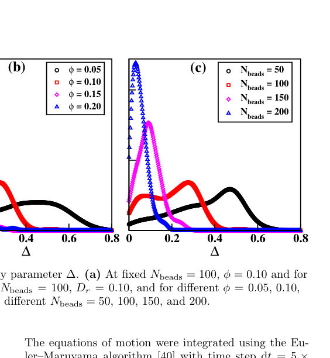 
Fig. 1(i) illustrates ring configurations for different ro- tational diffusion coefficients, Dr = 0.01, 0.03, 0.05, and 0.07, arranged from Fig. 1(i)(a-d) respectively. In these figures, the packing fraction is kept fixed at ϕ = 0.1, and the ring consists of Nbeads = 100 beads. As Dr increases, the orientations of the active particles randomize more rapidly, reducing the persistence of the propulsive forces exerted on the ring. Consequently, the active particles are unable to introduce significant force in a particular direction, resulting in a weaker ring deformation. As a result, ring shape fluctuations decrease, and the ring gradually approaches to a more circular configuration...

📷 Fig 4

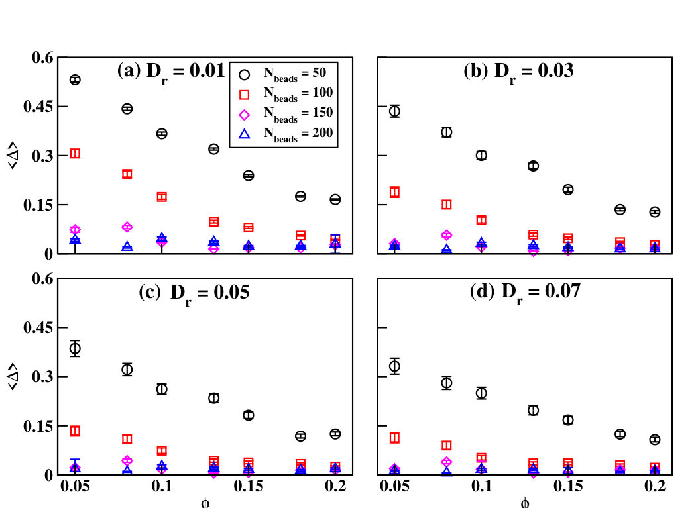 
FIG. 3: Variation of the mean asphericity ⟨∆⟩vs. ϕ for different Dr = 0.01, 0.03, 0.05, and 0.07. The different curves in each window in for different Nbeads = 50, 100, 150, and 200. Error bars represent the standard deviation obtained from independent realizations.

📷 Fig 5

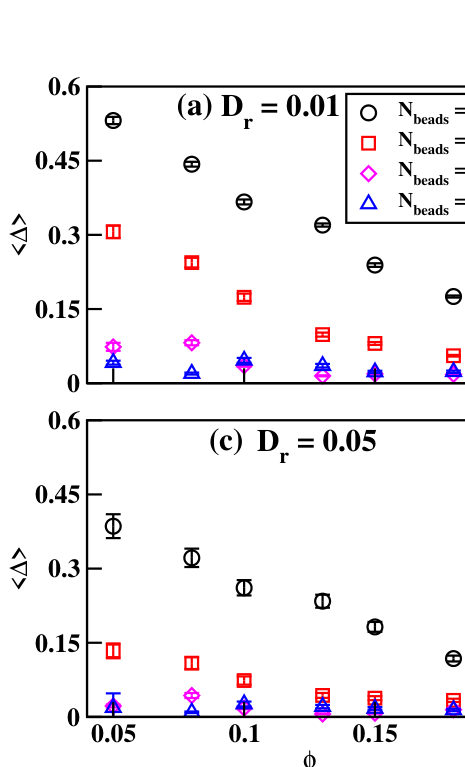 
Fig. 1(ii) shows the variation of the packing fraction of the ABPs while keeping the ring size fixed at Nbeads = 100 and the rotational diffusion coefficient fixed at Dr = 0.01. From Fig. 1(ii)(a-d), the packing fraction increases progressively. At low packing fractions, collisions be- tween the active particles and the ring are relatively in- frequent, resulting in an uneven distribution of forces along the ring. Consequently, the ring exhibits pro- nounced local shape deformations. As the packing frac- tion increases, particle bead collisions become more fre- quent and are distributed more uniformly along the ring boundary (Movie 2). This behavior is also evident from the corresponding...

**Summary.** This paper numerically investigates the collective dynamics of active particles confined within a deformable ring structure. By controlling parameters like particle density and activity, the researchers show that the internal activity drives the ring towards a more stable, circular shape. The study successfully models the emergent center-of-mass motion, demonstrating that the complex internal activity can be accurately described by an effective single-particle model.

**Why it may be interesting.** This work provides a concrete example of how non-equilibrium active matter can generate collective, macroscopic behavior (like directed motion or shape stabilization) from local particle interactions, which is a key area of modern statistical physics.

Detailed structure

**Main problem.** The study investigates how the internal dynamics of active particles confined within a deformable ring influence the ring's overall shape evolution and macroscopic center-of-mass motion.

**Main result.** The ring's shape is stabilized and driven towards a circular configuration by increasing the packing fraction, rotational diffusion coefficient, or the number of boundary beads. Furthermore, the collective activity generates emergent dynamics analogous to a single effective active particle.

**Method.** The research employs numerical simulations using Langevin dynamics for both the passive boundary beads and the active Brownian particles, supplemented by analytical derivations for Mean-Squared Displacement (MSD) based on effective particle models.

**Model / system.** The system consists of a deformable closed ring formed by passive beads connected by springs, filled with Active Brownian Particles (ABPs). The dynamics are governed by coupled Langevin equations incorporating harmonic, repulsive, and active self-propulsion forces.

**Key observables.** Asphericity parameter ($\Delta(t)$), Mean-Squared Displacement ($	ext{MSD}$) of the center of mass, and effective diffusion coefficients ($D_{eff}, 
u_r$).

**Important parameters / regimes.** Rotational diffusion coefficient ($D_r$), packing fraction ($\phi$), number of beads ($N_{	ext{beads}}$), and self-propulsion speed ($v_0$).

**Assumptions / limitations.** The system is modeled using overdamped Langevin dynamics, and the collective motion is successfully mapped onto an effective Self-Propelled Particle (SPP) model for analysis.

**Figures summary.** Figures illustrate shape transformations under varying parameters ($N_{	ext{beads}}$, $\phi$, $D_r$), show the probability distribution $P(\Delta)$ for shape fluctuations, and compare the MSD of the full ring simulation against the effective SPP model.

**Paper structure.** The paper systematically analyzes the dynamics by first defining the full coupled particle model, then quantifying shape fluctuations using the asphericity parameter, and finally deriving the effective large-scale dynamics (MSD) by treating the ring as a single effective active particle.

Abstract

We numerically investigate the dynamics of a deformable closed ring filled with active particles. The ring is modeled as a flexible boundary made up of passive beads interacting with a harmonic spring force. The interior of the ring is filled with active Brownian particles (ABPs), and their activity is controlled through the rotational diffusion coefficient. We explore how, by systematically varying the activity of ABPs, packing fraction, and size of the ring, we can control the shape deformation and dynamics of the ring. At low packing fractions, low rotational diffusion coefficients, and smaller ring sizes, the ring exhibits highly irregular and strongly deformed shapes due to the uneven spatial arrangement of active particles along the boundary. Increasing the packing fraction, rotational diffusion coefficient, or ring size promotes a more even distribution of active particles within the ring, thereby suppressing shape deformations and fluctuations, driving the ring toward a more circular shape. We further analyze the mean-squared displacement (MSD) of the ring's center of mass and observe a crossover from ballistic to diffusive dynamics, which can be tuned by varying the system parameters. Our results demonstrate that, despite its internal complexity and deformability, the ring exhibits emergent behavior analogous to that of a single effective active particle. This study provides insight into the collective effects of confined active matter and the resulting macroscopic dynamics of deformable systems.

[↑ back to top](#top)

### [Three-dimensional optical vortices in nonlinear Bessel waveguides](http://arxiv.org/abs/2608.28167v1)

**Authors:** Carlos F. Sánchez, Humberto Michinel, Boris Malomed, Ángel Paredes, José R. Salgueiro  
**Type:** theory · **Category:** other · **PDF:** <https://arxiv.org/pdf/2608.28167v1>  
**Analysis basis:** full PDF text, analyzed in chunks
**Topic relevance:** `analog quantum simulation` **3/5** · `interference shaping light` **3/5**

📷 Fig 1

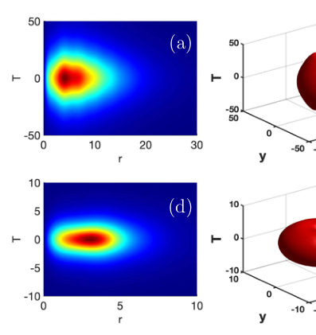 
Fig. 1 Two examples of numerical solutions of Eq. (8) for the Bessel lattice defined as per Eqs. (4) and (6), with ℓ= 1. Top row correspond to a solution with parameters γ = 2 and β = 0.05. Shown are views of the contour in (a) of the field in the plane (r, T), and the 3D isosurface view in (b). Panel (d) shows the the spatial and temporal profiles, plotted in cross-sections T = 0 and r = rmax, where rmax is the radial coordinate corresponding to the maximum of |ψ|. Botom row shows contour (d), isosurface (e) and profiles (f) for another solution with parameters γ = 2 and β = 0.25.

📷 Fig 2

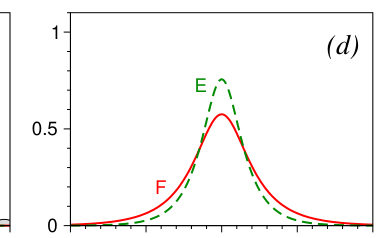 
Fig. 2 Examples of the numerically calculated profiles of the vortex bullets along r and T (the left and right panels, respectively) for β = 0.25 and γ = 2 in (a,b), and γ = 4 in (c,d). The thin black line bounding the shadowed area is the normalized squared-Bessel profile, J2 0(r). The colored solid and dashed curves correspond, severally, to the Bessel and Gaussian waveguiding structures. The profiles labelled with letters correspond to the white dots in Figs. 5 and 7 marked with the same labels.

📷 Fig 3

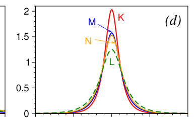 
Fig. 3 The same as in Fig. 2, but for the AWG, with γ &lt; 0 and β = 0.2. Top and bottom panels correspond to γ = −2 and γ = −4 respectively. The profiles labelled with letters correspond to the white dots marked with the same labels in Figs. 6 and 7.

📷 Fig 4

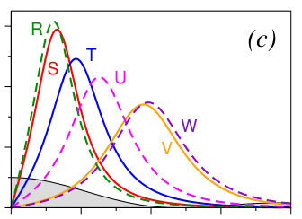 
Fig. 4 The same as in Fig. 3, but for β = 1.6. The top and bottom panels correspond to γ = −2 and γ = −4, respectively. The profiles labelled with letters correspond to the white dots marked with the same labels in Figs. 6 and 7.

📷 Fig 5

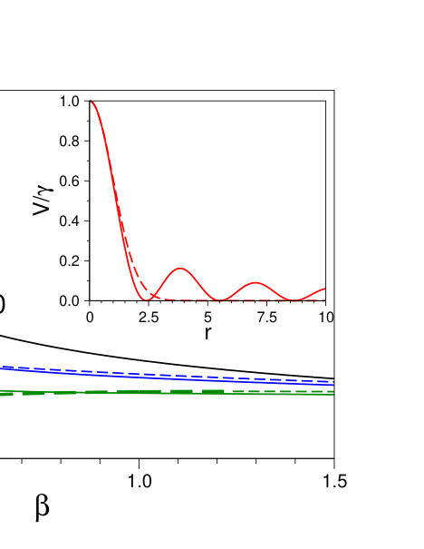 
Fig. 5 Norm N of several families of stationary LB solutions vs. the propagation constant β for the values of the waveguide strength γ = 0, 2, and 4. Continuous and dashed curves correspond, respectively, to the LBs maintained by the Bessel and Gaussian waveguiding structures. Thicker sections of the curves indicate the domain where LBs are stable. The black curve with γ = 0 is included for the comparison. White empty dots correspond to the LB profiles of the same label plotted in Fig. 2. The filled dot indicates the stable LB in Fig. 1. The inset shows the respective waveguiding profiles, viz., the squared-Bessel and Gaussian ones (continuous and dashed curve, respectively).

**Summary.** This paper theoretically analyzes how light bullets carrying orbital angular momentum propagate in nonlinear waveguides structured by Bessel potentials. By solving the nonlinear Schrödinger equation, the authors show that these structures stabilize the light against collapse, revealing complex multi-stability windows in both guiding and antiwaveguiding regimes. The findings advance the understanding of nonlinear light localization in multidimensional photonic systems.

**Why it may be interesting.** This work is highly relevant to quantum optics and open quantum systems as it deals with nonlinear wave localization, structured light, and stability analysis in complex media, which has analogs in quantum field theories.

Detailed structure

**Main problem.** The study investigates the formation, stability, and propagation dynamics of three-dimensional optical vortices (light bullets) within nonlinear Bessel-structured waveguides.

**Main result.** The paper demonstrates that structured potentials, particularly the squared-Bessel profile, can stabilize these vortices, preventing collapse that occurs in uniform media, and reveals complex multi-stability regimes.

**Method.** The analysis involves solving a nonlinear eigenvalue problem derived from the Nonlinear Schrödinger Equation (NLSE) using numerical techniques like the finite-differences scheme.

**Model / system.** The system models light propagation in a nonlinear medium characterized by Kerr nonlinearity and a graded-index potential, which can be Gaussian or a squared-Bessel profile. The governing equation is a modified NLSE incorporating transverse and temporal dispersion/nonlinearity.

**Key observables.** The 3D norm (N) of the stationary light bullet, the propagation constant (beta), and the stability determined by the Vakhitov-Kolokolov (VK) criterion.

**Important parameters / regimes.** Vortex topological charge (l=1), waveguide strength parameter (gamma), and the sign of dispersion/nonlinearity (sigma, alpha).

**Assumptions / limitations.** The analysis relies on a specific ansatz for the solution and assumes the validity of the transformation used to simplify the radial derivative structure.

**Figures summary.** Figures illustrate numerical solutions of the governing equations for Bessel lattices, show profiles of vortex bullets in both Bessel and Gaussian waveguides, and plot N vs. beta or N vs. gamma to map out stable/unstable regions.

**Paper structure.** The paper develops the governing nonlinear eigenvalue problem, analyzes the stability using the VK criterion, and then presents detailed numerical results comparing the behavior of light bullets in positive (waveguiding) and negative (antiwaveguiding) potential regimes.

Abstract

We explore the formation, stability, and propagation dynamics of light bullets carrying orbital angular momentum (vorticity) in Bessel-structured nonlinear graded-index waveguides. While these waves are prone to the collapse in uniform three-dimensional media, we demonstrate that their stabilization is provided by a squared-Bessel index profile in the plane orthogonal to the propagation direction, which may play the role of the waveguiding or antiwaveguiding potential. Different solution families are obtained, revealing a variety of power-vs.-propagation-constant diagrams, characterizing the coexistence of multiple families. We analyze the propagation dynamics in a wide experimentally accessible parameter range. Our results contribute to the understanding of nonlinear light localization in multidimensional settings and suggest new possibilities for using structured light in advanced photonic applications.

[↑ back to top](#top)

### [Criticality and universality in network dismantling](http://arxiv.org/abs/2608.27613v1)

**Authors:** Lorenzo Cirigliano, Claudio Castellano, Minsuk Kim, Filippo Radicchi, Hanlin Sun  
**Type:** theory · **Category:** statistical mechanics · **PDF:** <https://arxiv.org/pdf/2608.27613v1>  
**Analysis basis:** full PDF text, analyzed in chunks
**Topic relevance:** `non-equilibrium universality` **3/5** · `analog quantum simulation` **1/5** · `driven-dissipative phase transition` **1/5**

📷 Fig 1

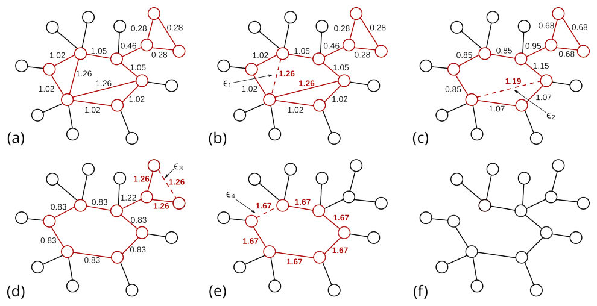 
FIG. 1. Biased adaptive percolation. Schematic representation of a biased and adaptive percolation process, Eq. (1), with bias a = +∞. Scores are s(e, Gt−1) &gt; 0 for the edges in the 2-core (highlighted in red), and zero otherwise; their values are reported. In this example, edge scores are equal to their non-backtracking centralities (NBC), Eq. (15), (multiplied by a factor of 10) and the process represented is the max-NBC-biased percolation described in details in Sec. IV. (a) The graph G0 with all non-zero scores reported. Panels (b)-(e) correspond to the different stages of the process: (b) t = 1, (c) t = 2, (d) t = 3, and (e) t = 4. At each step, the edge with the highest score (bold...

📷 Fig 2

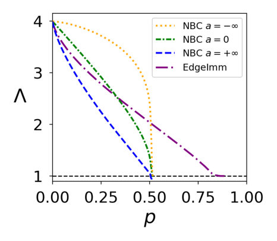 
FIG. 2. Quasi-optimality of NBC-biased percolation. The leading eigenvalue Λ of the NB matrix obtained via dif- ferent edge-removal strategies is shown as a function of the fraction of removed edges p. Link removal strategies NBC with different bias parameter a are compared. We also show the benchmark strategy “EdgeImm” proposed in Ref. [40]. Each curve is obtained by averaging results over Q = 100 instances of the Erd˝os–R´enyi model with size N = 104 and average degree ⟨k⟩= 4.

📷 Fig 3

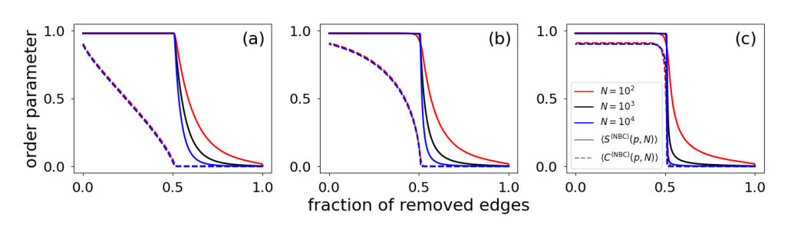 
FIG. 3. NBC-biased percolation on Erd˝os-R´enyi graphs. (a) Relative size of the giant component ⟨S(NBC)(p, N)⟩and of the 2-core ⟨C(NBC)(p, N)⟩as a function of the fraction p of edges removed from the initial graph. The initial graphs are instances of the Erd˝os-R´enyi (ER) model with average degree ⟨k⟩= 4 and different number of nodes N. Here, edges are selected based on the NBC-biased protocol with bias parameter a = −∞. Results are averaged over Q = 10000 graph instances. (b) Same as in (a), but with a = 0. (c) Same as in (a) and (b), but for a = +∞.

📷 Fig 4

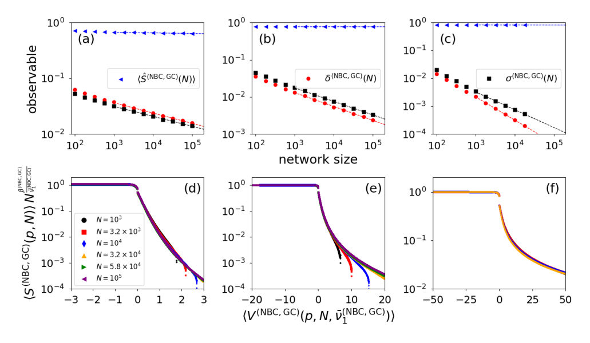 
FIG. 4. Critical properties of the GC transition for NBC-biased percolation on Erd˝os-R´enyi graphs. (a) We test the scaligns of Eq. (7), (8) and (9) for NBC-biased percolation with a = −∞. Averages are taken over Q = 10000 instances of the biased percolation model. The slopes of the dashed lines identify the scaling exponents. Best estimates are reported in Tab. I. (b) and (c) Same as in panel (a), but for a = 0 and a = +∞, respectively. (d-e) We test the finite-size scaling relationship of Eq. (11) for the NBC-biased percolation with bias parameter respectively equal to a = −∞, 0 and +∞.

📷 Fig 5

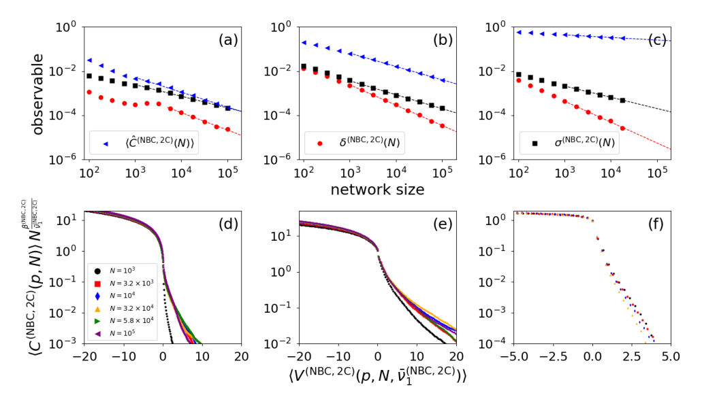 
FIG. 5. Critical properties of the 2C transition for NBC-biased percolation on Erd˝os-R´enyi graphs. Same as in Fig. 4, but for the 2C transition. The best of the critical exponents are reported in Tab. I.

**Summary.** This paper explores the physics of network dismantling by modeling edge removal using adaptive biased percolation. The key finding is that the structural collapse of the network exhibits a universal phase transition, meaning the critical behavior is independent of the underlying network's specific topology. This suggests a general, topology-agnostic theory for understanding network robustness.

**Why it may be interesting.** While focused on classical network theory, the study of universal critical exponents and phase transitions in complex systems shares deep mathematical and conceptual links with critical phenomena studied in quantum many-body physics.

Detailed structure

**Main problem.** The paper investigates the physics of network dismantling, specifically how the structural connectivity of a network changes when nodes or edges are removed, focusing on the thermodynamic limit.

**Main result.** The network dismantling process exhibits a universal phase transition where both the giant connected component and the largest 2-core disappear abruptly, suggesting a topology-agnostic theory can explain this critical behavior.

**Method.** The authors employ biased and adaptive percolation processes, analyzing critical behavior using finite-size scaling (FSS) analysis on synthetic and real network models.

**Model / system.** The system is an unweighted, undirected graph undergoing edge removal. The removal process is governed by an adaptive biased percolation rule, such as the max-NBC model, which prioritizes removing edges based on local topological centrality.

**Key observables.** Giant Connected Component (GC) size, largest 2-core (2C) size, and corresponding critical exponents ($eta, ar{
u}$).

**Important parameters / regimes.** The control parameter is the fraction of removed edges ($p=t/E$); the analysis compares different degree distributions (e.g., Poisson vs. power-law).

**Assumptions / limitations.** The analysis often relies on approximations, such as using a greedy quasi-optimal algorithm for the intractable optimal removal sequence, and assumes averaging over many network realizations.

**Figures summary.** The notes reference schematic figures illustrating the stages of biased adaptive percolation and tables summarizing calculated critical exponents for various network types and biases.

**Paper structure.** The paper develops from defining the general framework of biased percolation, moves to specific models like max-NBC, derives analytical tools using spectral decomposition, and concludes by presenting quantitative results on universal critical exponents.

Abstract

Identifying the smallest set of elements whose removal dismantle a complex network, known as the network dismantling problem, is a fundamental task with many practical applications. Whereas network dismantling has been extensively studied over the past decade, most work has focused on developing efficient algorithms for large but finite networks. By contrast, the physics of the network dismantling process, namely how the network structural connectivity is affected by the removal of nodes or edges, remains largely unexplored in the thermodynamic limit. Here, we shed light on this understudied aspect of network dismantling by introducing an adaptive biased percolation process able to optimally dismantle a network. Through a systematic analysis of synthetic network models, we find that the proposed percolation process displays a universal phase transition, characterized by the abrupt and simultaneous disappearance of both the giant connected component and the largest 2-core, across networks with markedly different degree distributions. Simulations on real networks further support this universality, indicating that the physics of network dismantling is insensitive to a broad range of topological properties. Together, these results suggest that a topology-agnostic theory could be developed to explain the critical behavior of network dismantling.

[↑ back to top](#top)

### [Lattice Green's function of the hyperkagome lattice: modular uniformization at level 30 from an orthogonal differential Galois group](http://arxiv.org/abs/2608.28141v1)

**Authors:** Bryan Nasr, Jean-Marie Maillard  
**Type:** theory · **Category:** other · **PDF:** <https://arxiv.org/pdf/2608.28141v1>  
**Analysis basis:** full PDF text, analyzed in chunks
**Topic relevance:** `analog quantum simulation` **3/5** · `Keldysh / 2PI / non-Gaussian methods` **2/5**

📷 Fig 1

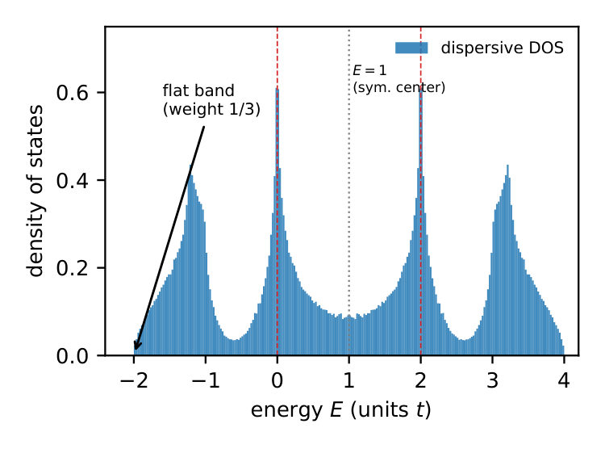 
Figure 1: Density of states of the hyperkagome tight-binding model at unit hopping. Four flat bands at E = −2 carry weight 1/3; the eight dispersive bands fill [−2, 4] and are exactly symmetric about E = 1, with principal van Hove singularities at E = 0, 2 (dashed) and weaker interior features at E = −1, 3 and E = 1 ± √

**Summary.** This paper solves the long-standing problem of finding the exact lattice Green's function for the hyperkagome lattice. By applying advanced techniques from differential Galois theory and modular forms, the authors prove the LGF is modular at level 30. This provides a closed-form solution for a key observable in frustrated quantum magnets.

**Why it may be interesting.** The connection between lattice Green's functions in frustrated magnetic materials and deep mathematical structures like modular forms provides a powerful, non-trivial link between condensed matter physics and number theory.

Detailed structure

**Main problem.** The primary goal was to find a closed-form, exact expression for the lattice Green's function (LGF) of the hyperkagome lattice.

**Main result.** The LGF is proven to be modular at level 30, governed by the uniformizing equation of the genus-zero modular curve X(Gamma_0(30)^+), providing the closed form sought by previous researchers.

**Method.** The authors employed differential Galois theory, analyzing the Picard-Fuchs operator governing the LGF, and linking its structure to modular forms and uniformization theory.

**Model / system.** The study focuses on the hyperkagome lattice, which models the Iridium sublattice of the spin-liquid candidate Na4Ir3O8. The LGF is derived from the resolvent of the nearest-neighbor tight-binding Bloch Hamiltonian.

**Key observables.** The Lattice Green's Function (LGF), the Local Density of States (LDOS), and the weight-two period of the LGF.

**Important parameters / regimes.** The modular level is 30, related to the structure of the differential Galois group and the associated modular curve.

**Assumptions / limitations.** The analysis assumes the LGF is holonomic (D-finite) and relies on establishing the equivalence between the physical operator and the modular uniformizing equation.

**Figures summary.** Figure 1 illustrates the Density of States (DOS) of the hyperkagome model, showing four flat bands and eight dispersive bands symmetric about E=1.

**Paper structure.** The paper progresses by first establishing the LGF's governing differential operator from spectral moments, then analyzing this operator using differential Galois theory to prove its irreducibility and modular structure, culminating in the identification of the modular parametrization.

Abstract

The lattice Green's functions of the cubic lattices are classical: each is a symmetric square of a second-order operator, with a closed form in complete elliptic integrals. The hyperkagome lattice, realized by the iridium sublattice of the spin-liquid candidate Na4Ir3O8, has resisted such a treatment: Varma and Monien reduced its density of states to a threefold integral they found no way to solve exactly. From exact lattice moments we obtain an irreducible third-order linear differential (Picard-Fuchs) operator annihilating the Green's function. It is not a literal symmetric square, yet its symmetric square carries a rational solution: the differential Galois group is orthogonal, and an order-two differential intertwiner makes the operator projectively a symmetric square. Our main result is that the underlying second-order operator is the uniformizing equation of the genus-zero modular curve of Gamma_0(30)+, the level-thirty group generated by Gamma_0(30) and all its Atkin-Lehner involutions, an explicit eta quotient parametrizing the natural variable. That uniformizing equation is itself not new - it is a row of the Lian-Yau table of genus-zero groups - so what is new here is the identification of a lattice Green's function with it, together with a proof: the Schwarzian identity is established by an a priori pole-degree bound rather than checked numerically, which also proves the tabulated entry. The hyperkagome Green's function is therefore modular at level thirty, supplying the closed form Varma and Monien sought. Its weight-two period is obtained explicitly: a depth-one quasimodular form which we prove is not a modular form times an algebraic function at any weight.

[↑ back to top](#top)

### [Physics-Constrained Conditional Generative Learning for Quantum State and Process Tomography](http://arxiv.org/abs/2608.28035v1)

**Authors:** Daming Li  
**Type:** theory · **Category:** quantum information and computing · **PDF:** <https://arxiv.org/pdf/2608.28035v1>  
**Analysis basis:** full PDF text, analyzed in chunks
**Topic relevance:** `quantum measurements` **3/5** · `methods for driven-dissipative` **2/5**

📷 Fig 1

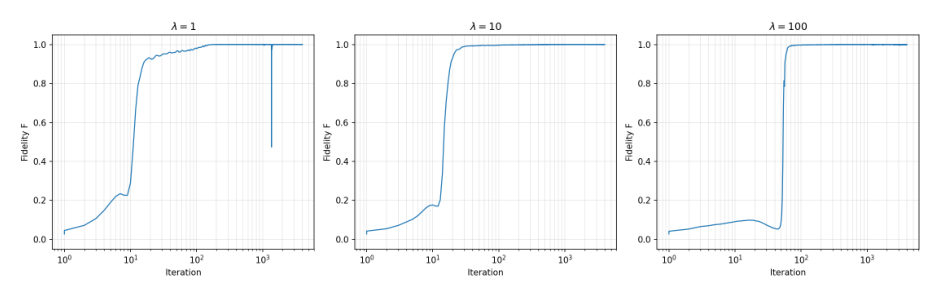 
Figure 1: Fidelity-convergence trajectories of the five-qubit GHZ state under L1 regularization weights λ = 1

📷 Fig 2

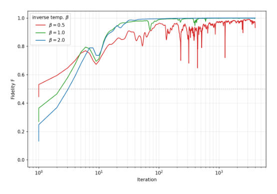 
Figure 2: Fidelity evolution of thermal Gibbs states at inverse temperatures β = 0.5, 1.0, 2.0; the high-

📷 Fig 3

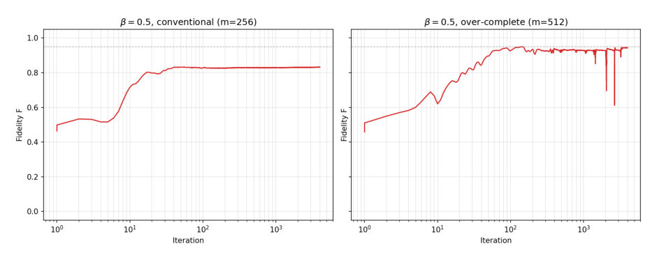 
Figure 3: Reconstruction of the β = 0.5 thermal state under conventional complete-basis sampling (left, m =

📷 Fig 4

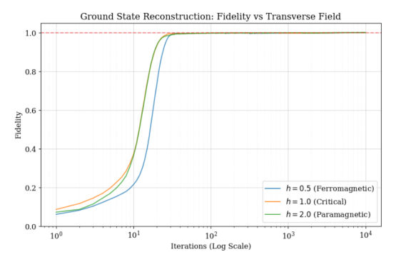 
Figure 4: Ground-state reconstruction fidelity of the 1D transverse-field Ising model at h = 0.5, 1.0, 2.0; all

📷 Fig 5

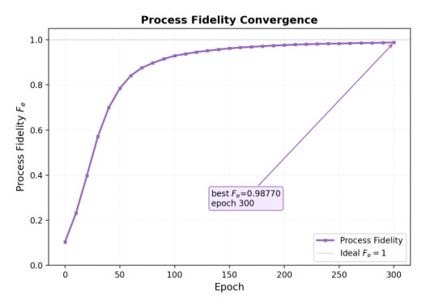 
Figure 5: The reconstructed two-qubit CNOT process reaches a best process fidelity of Fe = 0.98770 at epoch

**Summary.** This paper introduces a physics-constrained Conditional GAN to overcome the computational scaling issues in Quantum State and Process Tomography. By embedding a differentiable Cholesky layer, the model learns a direct generative mapping conditioned on Pauli measurements, ensuring the reconstructed states are physically valid. The results demonstrate high fidelity across various complex systems, while also addressing the exponential scaling bottleneck via tensor-network integration.

**Why it may be interesting.** This work provides a machine learning approach to tackle the fundamental resource scaling problem in quantum characterization, offering a potentially scalable, data-driven alternative to traditional, computationally intensive inversion methods.

Detailed structure

**Main problem.** Quantum State and Process Tomography (QST/QPT) suffer from prohibitive computational scaling as the number of qubits increases.

**Main result.** The proposed physics-constrained generative model achieves high-fidelity reconstruction for complex states (like GHZ) and processes (like CNOT) by learning a data-driven mapping.

**Method.** It employs a physics-constrained Conditional Generative Adversarial Network (CGAN) that uses a differentiable Cholesky layer to enforce physical constraints (Hermiticity, positive semi-definiteness, unit trace) directly during generation.

**Model / system.** The framework is applied to reconstruct quantum states ($
ho$) and quantum processes (channels) conditioned on measured Pauli expectation values. It discusses extending the method to handle the exponential growth bottleneck using tensor-network structures for $n \ge 6$ qubits.

**Key observables.** Fidelity ($F$), Pauli expectation values ($	ext{Tr}(
ho A_k)$), and the reconstructed density matrix ($\hat{
ho}_{	heta}$).

**Important parameters / regimes.** The strength of the $L^1$ penalty ($\lambda$) is critical for convergence; over-complete measurement bases are needed for high-temperature thermal states.

**Assumptions / limitations.** The primary bottleneck remains the exponential growth of the full density matrix representation, necessitating tensor-network integration for scalability.

**Figures summary.** Figures illustrate fidelity convergence trajectories for GHZ states based on the L1 penalty weight ($\lambda$), reconstruction of thermal Gibbs states using varying measurement bases, and ground-state reconstruction for the Ising model across different magnetic fields ($h$).

**Paper structure.** The paper introduces the CGAN framework, details the Cholesky constraint for physical enforcement, demonstrates its application to QST (e.g., GHZ states, thermal states), extends it to QPT (using the Choi matrix), and concludes with scalability discussions involving tensor networks.

Abstract

Quantum state and process tomography constitute essential diagnostic tools in quantum information science, yet their standard formulations suffer from prohibitive computational scaling as the number of qubits grows. In this work, we introduce a physics-constrained conditional generative adversarial network that bypasses iterative constrained inversion by directly learning a forward generative mapping conditioned on Pauli expectation values. The generator embeds a differentiable Cholesky layer at its output, which enforces Hermiticity, positive semidefiniteness, and unit trace by construction. Our experiments reveal that the strength of the $L^1$ penalty critically governs the emergence of GHZ coherence during training: an excessively large penalty postpones the coherence onset and yields a prolonged low-fidelity plateau, whereas an intermediate value enables the fastest stable convergence. Moreover, for high-temperature thermal states, an over-complete measurement basis proves necessary to prevent sustained late-stage fluctuations. By extending the same Cholesky constraint to the Choi-matrix representation, the framework naturally accommodates quantum process tomography. For systems with $n \ge 6$ qubits, the exponential growth of the underlying $2^n \times 2^n$ density matrix remains the fundamental bottleneck; we discuss how integrating tensor-network structures can contain the per-iteration cost while preserving reconstruction fidelity. Altogether, these results suggest that physically constrained generative learning offers a scalable and amortizable pathway toward data-driven tomography for noisy intermediate-scale quantum devices.

[↑ back to top](#top)

### [Rapid Charge Stability Diagram Generation from Device-level Modeling of Semiconductor Quantum Dots](http://arxiv.org/abs/2608.28263v1)

**Authors:** Ron Nodel, David W. Kanaar, Connor Nasseraddin, Tim J. Wilson, Hong-Wen Jiang, Jason R. Petta, Chris Anderson, Mark F. Gyure  
**Type:** both · **Category:** strongly correlated electrons · **PDF:** <https://arxiv.org/pdf/2608.28263v1>  
**Analysis basis:** full PDF text, analyzed in chunks
**Topic relevance:** `analog quantum simulation` **3/5** · `methods for driven-dissipative` **1/5**

📷 Fig 1

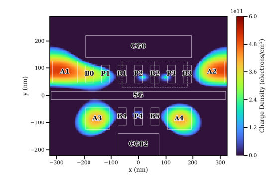 
FIG. 1. The approximate Tunnel Falls gate geometry and calculated charge density. The gate names are overlayed, with the MDMM subdomains shown by dashed lines around P2 and P3. The two-dimensional charge density associated with one electron in both P2 and P3 (1,1) is shown in the color map and is found using the autotuning procedure described in Section II A, integrated over the quantum well thickness. This is a triple quantum dot tuned up as a double quantum dot, with P1 and B1 acting as accumulation gates, following standard experimental tune-up. Sensor accumulation gates are modeled as smaller for computational efficiency and have minimal effect on the P2-P3 charge stability diagram.

📷 Fig 2

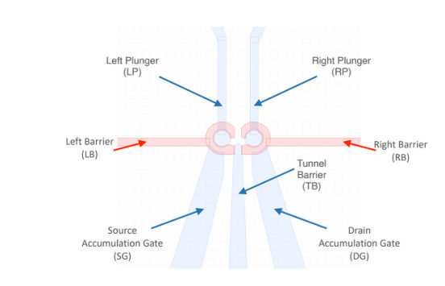 
FIG. 2. The schematic layout of the overlapping gate device design with each gate described. Additional information on this device is described in Section III.

📷 Fig 3

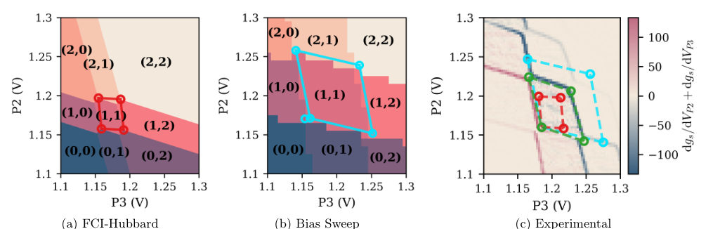 
FIG. 3. The Intel device charge stability diagrams found using three methods. (a) A Hubbard model parameterized using five autotuned points indicated by blue circles in (b), with an FCI calculation at these points. This parameterized model was then used to generate the rest of the diagram, with the (1,1) charge cell displayed in red. (b) The charge stability diagram obtained by running self-consistent Schrödinger-Poisson simulations at 441 (21 × 21) points in voltage space, with the autotuned points shown as reference. (c) The experimental data acquired using the procedure outlined in Sec. II C. The 5 nm HfO2 charging cells associated with the FCI-Hubbard for the (dashed red) and Autotuned...

📷 Fig 4

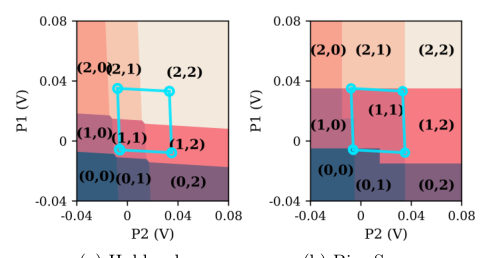 
FIG. 4. The overlapping gate device charge stability diagrams found using two simulation methods. (a) A Hubbard model parameterized using only five autotuned points (overlaid in blue) with an FCI calculation. This parameterized model was then used to generate the rest of the diagram. (b) The charge stability diagram obtained by running self-consistent Schrödinger-Poisson simulations at 169 (13 × 13) points in voltage space, with the blue autotuned points shown as refer- ence.

📷 Fig 5

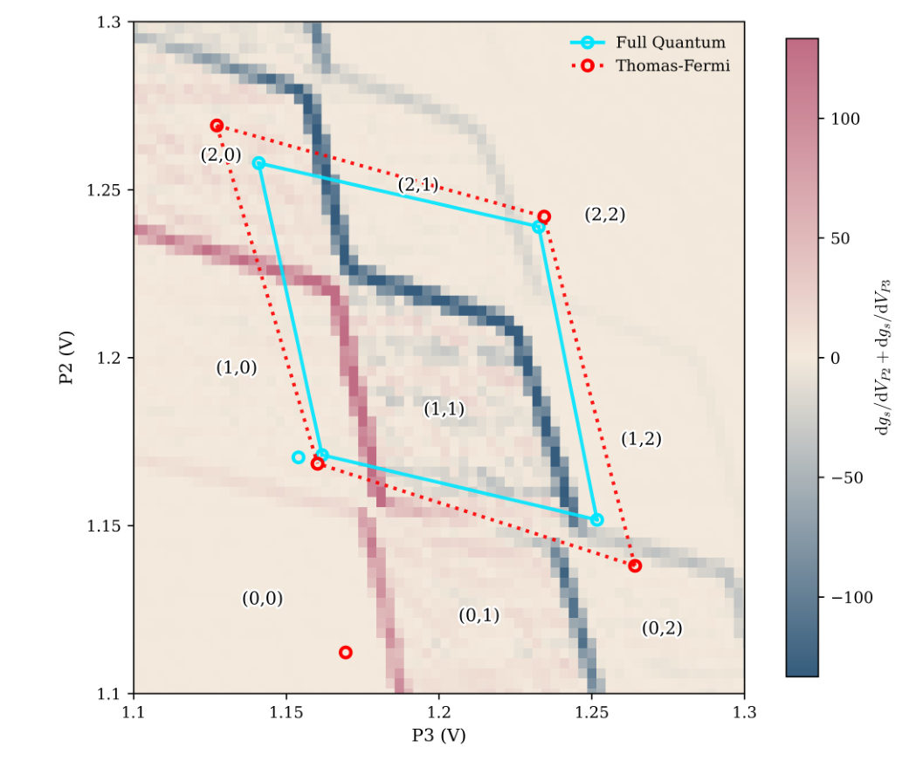 
FIG. 5. Comparison of the Thomas–Fermi and fully quantum charge models. Two autotuning runs are overlaid: the semiclassical Thomas–Fermi model (red and dotted) and the quantum model (blue and solid). The Thomas–Fermi model overestimates the charging energies relative to the fully quantum model, and the fully quantum model overestimates charging energies relative to the experiment.

**Summary.** This work presents a novel, computationally efficient workflow to generate charge stability diagrams for semiconductor quantum dots. By combining advanced device simulations (MDMM/Schrödinger-Poisson) with Full Configuration Interaction calculations, the authors parameterize an effective Hubbard model. This model allows for rapid prediction of device behavior, showing promising agreement with experimental results and paving the way for predictive quantum device modeling.

**Why it may be interesting.** The development of a predictive 'digital twin' model for quantum dot charge states, moving from expensive first-principles simulations to rapid, effective Hamiltonian descriptions, is highly relevant for designing and controlling quantum computing hardware.

Detailed structure

**Main problem.** Characterizing charge stability diagrams for semiconductor quantum dot devices is computationally expensive using full gate-voltage sweeps via self-consistent Schrödinger-Poisson calculations.

**Main result.** The derived Hubbard model, parameterized using a combination of MDMM simulations and FCI calculations, successfully reproduces charge stability diagrams with qualitative agreement to experimental data.

**Method.** The authors combine Multi-Domain Multi-Model (MDMM) Schrödinger-Poisson simulations with an automated tuning routine to identify gate voltages, which are then used alongside Full Configuration Interaction (FCI) calculations to parameterize an effective Hubbard model.

**Model / system.** The system is a layered semiconductor quantum dot device (e.g., Intel Tunnel Falls Si/SiGe). The physics is modeled using the extended Hubbard Hamiltonian, which captures intra-site and inter-site Coulomb interactions.

**Key observables.** Charge stability diagrams, charging energies, lever arms, and interdot Coulomb interactions.

**Important parameters / regimes.** Gate voltages ($V_1, V_2$), Hubbard parameters ($U_1, U_2, U_{12}$), and dielectric thicknesses ($	ext{HfO}_2$ variation).

**Assumptions / limitations.** The method relies on approximating the complex device physics by parameterizing a simplified Hubbard model using a small set of self-consistent simulations and assuming the validity of a constant lever arm matrix.

**Figures summary.** Figures illustrate the device geometry, the application of MDMM subdomains, and the resulting charge stability diagrams comparing theory to experiment.

**Paper structure.** The paper first establishes the computational bottleneck of full simulations, then details the MDMM/autotuning approach to extract parameters, parameterizes the Hubbard model, and finally validates the model by comparing predictions against experimental charge stability diagrams and testing its applicability to different architectures.

Abstract

Self-consistent Schrödinger-Poisson calculations are a powerful tool for predicting the behavior of layered semiconductor quantum dot devices. However, characterization of charge stability diagrams through fully simulated gate-voltage sweeps is computationally expensive. Combining a Multi-Domain Multi-Model (MDMM) approach with an automated tuning routine, we identify gate voltages associated with selected charge configurations. This small set of self-consistent simulations can be augmented with Full Configuration Interaction (FCI) energy calculations to extract charging energies, lever arms, and interdot Coulomb interactions to directly parameterize a Hubbard model for rapid charge stability diagram generation. For an Intel Tunnel Falls Si/SiGe device, we demonstrate the Hubbard model's ability to reproduce charge stability diagrams at a fraction of the computational cost in comparison to voltage bias sweeps. We further compare the simulated diagrams to experimental data and demonstrate qualitative agreement. Our result represents a step towards predictive digital twin models for semiconductor quantum dot devices. Finally, we apply this workflow towards lever arm engineering in a second device, demonstrating that the method extends to multiple architectures.

[↑ back to top](#top)

### [Sound propagation in one-dimensional quantum droplets](http://arxiv.org/abs/2608.28028v1)

**Authors:** Zizhou Yuan, Jiarui Xiao, Xiao-Long Chen  
**Type:** theory · **Category:** quantum gases · **PDF:** <https://arxiv.org/pdf/2608.28028v1>  
**Analysis basis:** full PDF text, analyzed in chunks
**Topic relevance:** `analog quantum simulation` **3/5** · `Keldysh / 2PI / non-Gaussian methods` **1/5**

📷 Fig 1

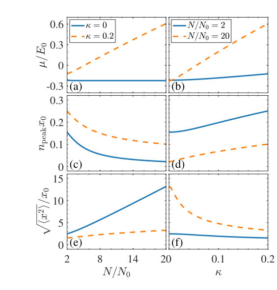 
FIG. 1. Ground-state properties for various values of con- finement strength κ (left column) and particle number N/N0 (right column). The chemical potential µ, peak density npeak with total density normalized to unity, and root-mean-square radius √

📷 Fig 2

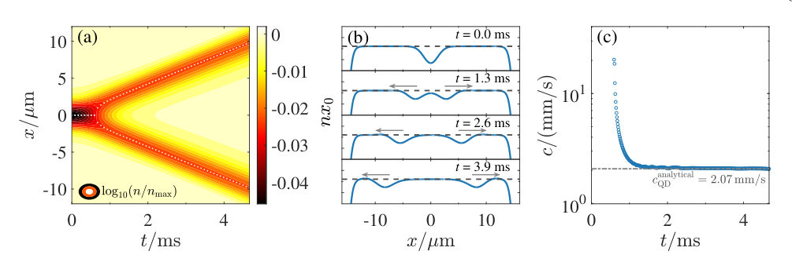 
FIG. 2. Schematic illustration of sound-wave excitation and velocity extraction for κ = 0 and N/N0 = 50. (a) Spatiotemporal contour plot of the total density n(x, t) with the color gradient scaled by log10(n/nmax). The density evolution shows the splitting of the initial density dip into two outward-propagating dips indicated by white dots. (b) Instantaneous density profiles with the dip splitting and moving at various times t = 0, 1.3, 2.6, and 3.9 ms. The gray dashed lines indicate the unperturbed flat-top density baseline, and gray arrows mark the propagation directions of the density dips. (c) Instantaneous sound velocity c obtained from the motion of the density-dip minimum. The gray...

📷 Fig 3

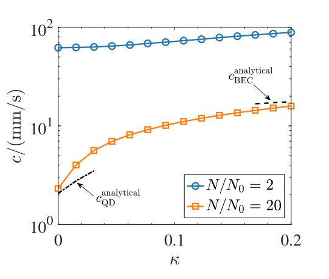 
FIG. 4. Sound velocity c as a function of confinement strength κ for particle numbers N/N0 = 2 (blue circles) and N/N0 = 20 (orange squares). Here, the black dash-dotted and dashed lines denote the analytical sound velocities of the quantum droplet and the weakly interacting BEC for N/N0 = 20, re- spectively. The other properties of the figure are the same as Fig. 3.

📷 Fig 4

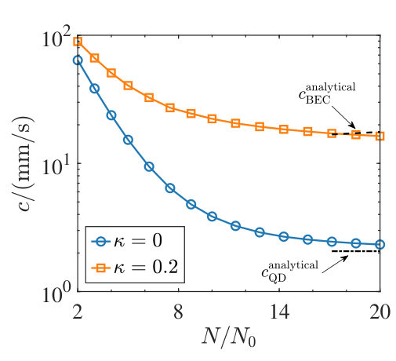 
FIG. 3. Sound velocity c as a function of particle number N for confinement strengths κ = 0 (blue circles) and κ = 0.2 (orange squares). The solid lines with hollow symbols repre- sent the results from numerical simulations of the extended GPE, while the black dash-dotted and dashed lines denote the analytical sound velocity for the quantum droplet canalytical QD in Eq. (11) for κ = 0 and that for a weakly interacting BEC canalytical BEC = √

📷 Fig 5

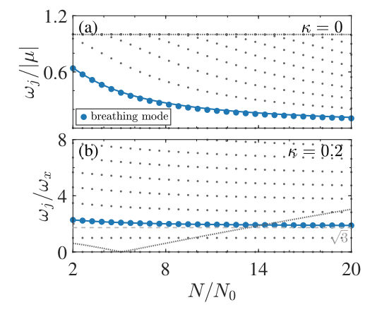 
FIG. 5. Collective excitation frequencies ωj as functions of particle number N/N0 for two confinement strengths (a) κ = 0 and (b) κ = 0.2. The excitation frequencies are shown in units of the particle-emission threshold |µ| and the har- monic trapping frequency ωx, respectively. All dots denote the low-lying excitation spectrum in Eq. (9) obtained from the linearization technique, and the breathing mode is high- lighted by blue circles. For comparison, the breathing-mode frequencies in Eq. (14) obtained from the sum-rule approach using the super-Gaussian ansatz are denoted by the blue lines. The gray dotted lines denote the particle-emission threshold |µ|, and the gray dashed line marks the...

**Summary.** This paper theoretically investigates sound propagation in 1D quantum droplets, showing that their acoustic behavior deviates significantly from standard BECs due to self-binding and quantum fluctuations. By comparing real-time wave dynamics with excitation spectrum analysis, the authors demonstrate that sound velocity is highly sensitive to droplet size and external trapping, providing a sensitive probe for quantum fluid physics.

**Why it may be interesting.** This work provides a detailed theoretical framework for understanding how quantum fluctuations and finite-size effects modify fundamental properties like sound propagation in ultracold atomic systems, offering testable predictions for current experimental setups.

Detailed structure

**Main problem.** The paper investigates the sound propagation and acoustic response in one-dimensional quantum droplets, contrasting this behavior with that observed in conventional Bose-Einstein condensates (BECs).

**Main result.** The sound velocity is strongly dependent on the droplet's finite size and quantum-pressure contribution, decreasing as the droplet profile flattens, while external confinement enhances this velocity.

**Method.** The study employs a combination of real-time simulations by introducing localized density perturbations and analyzing the low-energy excitation spectrum via linearization of the extended Gross-Pitaevskii equation.

**Model / system.** The system models 1D quantum droplets formed by a symmetric Bose-Bose mixture, governed by an effective energy density functional incorporating a repulsive Lee-Huang-Yang (LHY) correction. The dynamics are described by the time-dependent extended Gross-Pitaevskii equation.

**Key observables.** Sound velocity ($c$), collective excitation frequencies ($\omega_j$), chemical potential ($\mu$), and droplet density profile evolution.

**Important parameters / regimes.** Particle number ($N$), external harmonic confinement strength ($\kappa$), and the crossover between self-bound quantum droplets and conventional BECs.

**Assumptions / limitations.** The analysis relies on the linear-response regime following the removal of an excitation barrier, and the comparison between dynamical measurements and spectrum analysis is a key diagnostic tool.

**Figures summary.** Figures illustrate the evolution of droplet morphology (e.g., $\mu$, $n_{	ext{peak}}$, $\sqrt{\langle x^2 
angle}$) as a function of particle number and confinement, and compare calculated excitation frequencies under different conditions.

**Paper structure.** The paper systematically analyzes the acoustic response by first establishing the theoretical framework (extended GPE), then using real-time dynamics to measure sound velocity, and finally comparing these results with predictions derived from the low-energy excitation spectrum and sum-rule analysis.

Abstract

Sound propagation in quantum droplets differs from that in conventional Bose-Einstein condensates (BECs) because of their self-bound nature and the role of quantum fluctuations. We investigate sound propagation in one-dimensional quantum droplets formed by a symmetric Bose-Bose mixture, focusing on finite-size and confinement effects. Using the extended Gross-Pitaevskii equation, we extract the sound velocity from the real-time propagation of localized density perturbations and compare it with the low-energy excitation spectrum. We find that, unlike in a conventional BEC, the sound velocity of a finite droplet is strongly affected by its density profile and quantum-pressure contribution. It decreases with increasing particle number as the droplet evolves from a Gaussian-like to a flat-top profile, approaching the bulk quantum-droplet value. In contrast, external harmonic confinement compresses the droplet and enhances the sound velocity, driving the system toward the acoustic behavior of a trapped BEC. Our results establish sound propagation as a sensitive probe of finite-size effects and the crossover between self-bound quantum droplets and conventional Bose gases, and suggest a feasible route for experimental observation in ultracold $^{39}$K droplets.

[↑ back to top](#top)

### [Casimir-electrostatic pull-in in nanoelectromechanical actuators: Differentiable design sensitivities and the damping-dependent collapse boundary](http://arxiv.org/abs/2608.28494v1)

**Authors:** N. S. Akintsov, A. P. Nevecheria, S. N. Andreev, Qing-Hua Qin  
**Type:** theory · **Category:** numerical methods · **PDF:** <https://arxiv.org/pdf/2608.28494v1>  
**Analysis basis:** full PDF text, analyzed in chunks
**Topic relevance:** `methods for driven-dissipative` **3/5**

📷 Fig 1

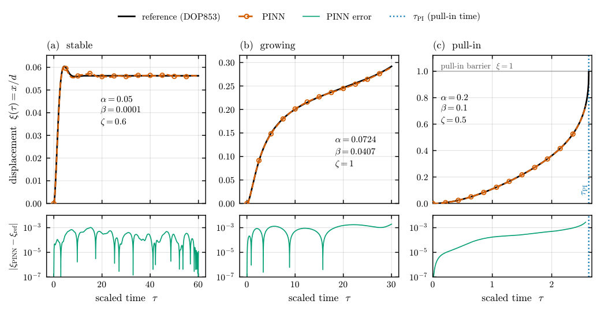 
FIG. 1. Representative normalized-displacement trajectories ξ(τ) = x/d for the three dynamical regimes of Eq. (2): (a) stable oscillation (α = 0.05, β = 10−4, ζ = 0.6) settling to ξ ≈0.056; (b) slow monotonic approach to a Casimir-shifted equilibrium (ξ ≈0.29) (α = 0.0724, β = 0.0407, ζ = 1.0); and (c) pull-in collapse (α = 0.20, β = 0.10, ζ = 0.5): the gap closes at τPI = 2.6226 (dotted line), and the last 2% of that interval carries ξ from 0.742 to the barrier ξ = 1 (gray line). Solid curves are the adaptive DOP853 reference, integrated through to the barrier; open markers are the physics-informed neural- network (PINN) solution, drawn only on its training window [0, 0.98 τPI]. The strip...

📷 Fig 2

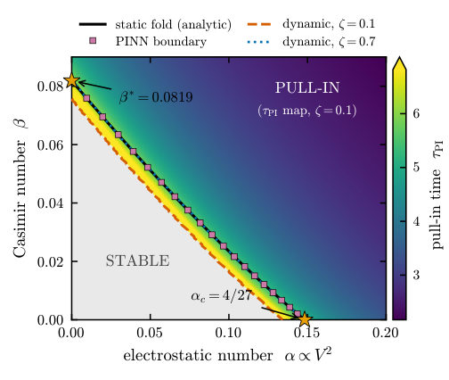 
FIG. 2. Pull-in phase diagram in the (α, β) control-parameter plane at damping ζ = 0.1. The color map gives the dynamic pull-in time τPI(α, β) for trajectories launched from rest; the gray region is stable. The solid line is the analytic quasi-static fold, Eq. (5), the square markers are the boundary located by the parametric PINN, and the dashed and dotted lines are the from-rest dynamic boundaries at ζ = 0.1 and ζ = 0.7. Stars mark the endpoints αc = 4/27 at β = 0 and β∗= 256/3125 = 0.0819 at α = 0. The dynamic boundary at ζ = 0.1 lies inside the fold by a kinetic-overshoot margin of mean width 0.0117 in α, and τPI diverges as the boundary is approached.

📷 Fig 3

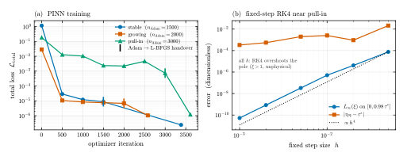 
FIG. 4. Numerical diagnostics. (a) Composite-loss histories for the three PINN trajectory trainings. Each run hands over from Adam to L-BFGS at its own iteration, 1500, 2000, and 3000, marked by a vertical tick in the color of that curve. The abscissa counts Adam steps up to the tick and L-BFGS func- tion evaluations after it, and the L-BFGS phase is logged only at its final evaluation, so the closing segment of each curve spans unsampled iterations. (b) Fixed-step classical fourth- order Runge–Kutta (RK4) near the pull-in pole: for h ≤0.01 the displacement error follows the fourth-order prediction to within 2.5%, while every tested step h ∈{0.05, . . . , 0.001} overshoots the movable...

📷 Fig 4

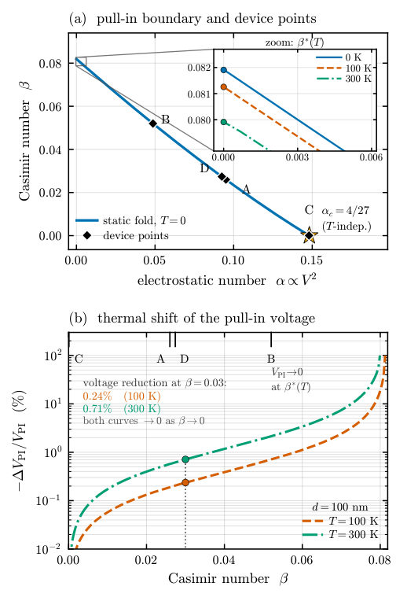 
FIG. 3. Classical-limit upper bound on the thermal Lifshitz contraction of the pull-in boundary for a d = 100 nm gap. (a) Static boundary in the (α, β) plane at T = 0 with the four device operating points of Table IV. The β = 0 endpoint αc = 4/27 is purely electrostatic and therefore temperature independent, and device C (β = 8.1 × 10−5) sits on it. The inset resolves the Casimir-axis intercept, which contracts from β∗= 0.0819 at 0 K to 0.0813 at 100 K and 0.0799 at 300 K. Outside that corner the three boundaries separate by less than the line width. (b) Relative reduction of the pull-in voltage, −∆VPI/VPI = 1 − p

📷 Fig 5

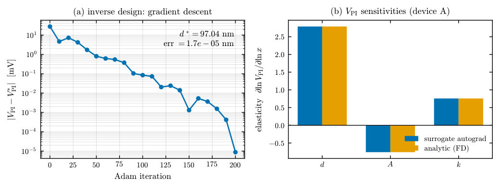 
FIG. 5. The differentiable surrogate as a design tool. (a) Gradient-based inverse design: with area and stiffness fixed, Adam on the gap through the differentiable fold network drives the pull-in voltage to the target V ∗ PI = 0.30 V, converging to d∗= 97.04 nm and reproducing the analytic root to ∼10−5 nm. (b) Pull-in-voltage elasticities ∂ln VPI/∂ln x for device A with respect to gap d, area A, and stiffness k, obtained by automatic differentiation through the surrogate (blue) and validated against a finite-difference evaluation of the analytic pipeline (orange). Each pair carries its elasticity and the relative disagreement of the underlying derivative, 3.4 × 10−6 or smaller. Table S5 of...

**Summary.** This work tackles the complex physics of pull-in instability in NEMS actuators driven by Casimir and electrostatic forces. The authors employ Physics-Informed Neural Networks (PINNs) trained in a specialized rapidity coordinate to overcome numerical difficulties near collapse singularities. This advanced computational approach allows for highly accurate determination of design sensitivities and mapping of the full, damping-dependent collapse boundary.

**Why it may be interesting.** The application of PINNs to solve complex, non-linear, time-dependent physical systems, especially those with singularities, represents a powerful extension of ML techniques into computational physics, particularly relevant for modeling open quantum systems dynamics.

Detailed structure

**Main problem.** The paper analyzes the pull-in instability in NEMS actuators caused by competing electrostatic and Casimir forces, focusing on accurately determining design sensitivities and the dynamic collapse boundary.

**Main result.** A Physics-Informed Neural Network (PINN) trained in a rapidity coordinate successfully reproduces the known static pull-in fold with high accuracy and extends the analysis to the complex, damping-dependent collapse boundary where no closed-form solution exists.

**Method.** The core methodology involves using PINNs trained on a rapidity coordinate transformation of the governing non-linear oscillator equation to solve the dynamics near singularities, coupled with automatic differentiation for sensitivity analysis.

**Model / system.** The system is a single-degree-of-freedom (SDOF) lumped oscillator modeling NEMS actuators, governed by forces derived from electrostatic ($\propto (d-x)^{-2}$) and Casimir ($\propto (d-x)^{-4}$) interactions.

**Key observables.** Pull-in voltage ($V_{PI}$), design sensitivities ($\partial V_{PI}/\partial p$), and the gap closure dynamics near the collapse threshold.

**Important parameters / regimes.** Damping ratio ($\zeta$), Casimir strength ($eta$), Electrostatic strength ($\alpha$), and the gap size ($d$).

**Assumptions / limitations.** The analysis uses the ideal-conductor model for the Casimir force, which is noted to be an upper bound, and the PINN approach requires careful handling of the movable pole singularity.

**Figures summary.** Figures illustrate displacement trajectories in different regimes (stable, monotonic, collapse) comparing PINN results to reference solutions, and show the evolution of the pull-in phase diagram across varying damping ratios.

**Paper structure.** The paper establishes the physical model, develops the PINN framework using a rapidity coordinate to handle singularities, validates the PINN against known analytic solutions (the fold), and then applies the differentiable framework to calculate sensitivities and map the full dynamic collapse boundary.

Abstract

Nanoelectromechanical actuators operating at sub-100-nm gaps collapse through a pull-in instability set by competing electrostatic and Casimir forces. The quasi-static fold that bounds their safe operating range has been known in closed form for three decades, together with the Casimir ceiling above which no static equilibrium survives, which fixes the smallest gap a given stiffness and area can hold open against the quantum vacuum. That fold does not give the threshold reached from rest, its dependence on damping, or the design sensitivities of either. We train a physics-informed neural network in a rapidity coordinate that maps the movable pull-in pole to infinity, which keeps the residual bounded across the collapse threshold where fixed-step Runge-Kutta integration steps into unphysical states. Differentiating the trained surrogate returns pull-in-voltage sensitivities that match the closed-form fold to a relative error of $3\times10^{-6}$ and inverts a device specification to a gap of 97.036 nm at a target actuation voltage. Applied to the from-rest boundary, which carries no closed form once the damping is finite, it supplies the same sensitivities where no analytic root exists. We prove that this boundary is bracketed by two closed-form curves, that it is nondecreasing in the damping ratio, that it merges with the fold once the damping ratio exceeds $2^{-1/4}$, and that the gap closes as $(τ_*-τ)^{2/5}$. Numerically the merger already occurs at $0.396$, and the growth of the collapse time changes there from logarithmic to inverse square root. The classical-limit bound on the thermal Lifshitz derating is at the percent level, and the physical shift at these gaps lies orders of magnitude below it.

[↑ back to top](#top)

### [Network steering with arbitrarily low detection efficiency of any entangled measurement](http://arxiv.org/abs/2608.27582v1)

**Authors:** Shubhayan Sarkar  
**Type:** theory · **Category:** quantum information and computing · **PDF:** <https://arxiv.org/pdf/2608.27582v1>  
**Analysis basis:** full PDF text, analyzed in chunks
**Topic relevance:** `quantum measurements` **3/5**

📷 Fig 1

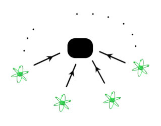 
FIG. 1. Witnessing entanglement in measurements. To de- tect entanglement in the measurement acting on N subsys- tems, one needs to consider N independent trusted sources that generate local states and send them to the untrusted mea- surement. From the obtained statistics, one can infer whether the measurement has entanglement or not.

📷 Fig 2

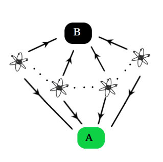 
FIG. 2. Swap-steering scenario. Alice and Bob are spatially separated and each of them receives N subsystems from the untrusted sources. On the received subsystem Bob performs a single measurement while Alice being trusted performs a to- mography on her subsystem. From the experiment, they ob- tain the correlations {p(a, b|i1 . . . iN)}.

**Summary.** This paper develops a protocol, termed 'swap-steering,' to demonstrate quantum steering in network settings. It overcomes the major experimental hurdle of low detector efficiency by showing that the required violation can be detected even with imperfect detectors, provided the sources have sufficient visibility. This significantly advances the feasibility of loophole-free quantum nonlocality tests.

**Why it may be interesting.** It provides a robust theoretical framework for loophole-free quantum tests that can be implemented using current, imperfect technology, which is highly relevant for experimental quantum information science.

Detailed structure

**Main problem.** The paper addresses the challenge of demonstrating quantum steering (asymmetric nonlocality) in a loophole-free manner, particularly when limited by low detector efficiency.

**Main result.** Quantum steering can be demonstrated for any non-zero detection efficiency using a 'swap-steering' protocol, and if sources are perfect, this can be achieved even with arbitrarily low detection efficiency.

**Method.** The authors construct and analyze 'swap-steering witnesses' to detect quantum steering by comparing predicted correlations against bounds derived from a Source-Only-Hidden-State (SOHS) model.

**Model / system.** The study focuses on quantum networks involving two parties (Alice and Bob) receiving subsystems from multiple classically correlated sources. The core model is the swap-steering scenario.

**Key observables.** Swap-steering inequality value ($S_{\{E_b\}}$), detection efficiency ($\eta$), and source visibility ($v$).

**Important parameters / regimes.** Critical visibility ($v_c$), non-zero detection efficiency ($\eta \in (0, 1]$).

**Assumptions / limitations.** The analysis assumes the correlations can be bounded by an SOHS model, and the initial challenge is overcoming the requirement for high-efficiency detectors.

**Figures summary.** Figure 1 illustrates witnessing entanglement in measurements using multiple trusted sources, and Figure 2 illustrates the swap-steering setup involving multiple sources.

**Paper structure.** The paper first establishes the theoretical framework for witnessing steering using witnesses, then develops the swap-steering inequality by comparing quantum predictions to SOHS bounds, culminating in the demonstration that the inequality can be violated under realistic, low-efficiency conditions.

Abstract

Quantum nonlocality and its asymmetric counterpart, quantum steering, are among the most intriguing manifestations of quantum mechanics. From a theoretical perspective, they are not only of fundamental significance but also hold promise for a wide range of applications. However, the stringent technological requirements for their experimental observation in a loophole-free way have largely restricted their realization to foundational demonstrations. A major challenge in these setups is the limited detection efficiency of current detectors as to observe nonlocality or steering in the standard scenarios, one requires detectors above a certain critical efficiency which can only be achieved with superconducting detectors. Considering the simplest quantum network, we demonstrate here that quantum steering between two parties, can be demonstrated for any non-zero detection efficiency, if the sources in the network generate states above a critical visibility well-within the current practical limits. This form of quantum steering in networks, is termed swap-steering. Moreover, when the sources are perfect, swap-steering can be observed using any entangled measurement on the untrusted side, even with arbitrarily low detection efficiency. Consequently, two major loopholes, the detection-loophole as well as free-will loophole can be closed easily in quantum steering experiments, when implemented using networks.

[↑ back to top](#top)

### [Noise-robust navigation from an adaptive run-and-tumble policy](http://arxiv.org/abs/2608.27751v1)

**Authors:** Aniruddha Datta, Shiladitya Banerjee  
**Type:** theory · **Category:** statistical mechanics · **PDF:** <https://arxiv.org/pdf/2608.27751v1>  
**Analysis basis:** full PDF text, analyzed in chunks
**Topic relevance:** `Keldysh / 2PI / non-Gaussian methods` **2/5** · `driven-dissipative phase transition` **2/5** · `methods for driven-dissipative` **2/5** · `non-equilibrium universality` **2/5** · `quantum measurements` **2/5** · `analog quantum simulation` **1/5** · `correlated / nonlocal dissipation` **1/5**

📷 Fig 1

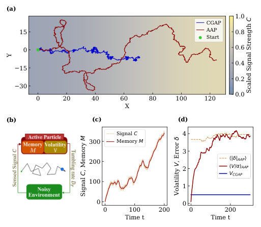 
FIG. 1. (a) Representative trajectories of the Adaptive Active Parti- cle and the Constant-Gain Active Particle in a linear signal gradient along the x direction, with additive white noise (not shown in the background coloration). The AAP travels farther along the gradient than the CGAP in the same time. (b) Schematic of the model, par- alleling the agent–environment loop of reinforcement learning. (c) Signal C and Memory M of the AAP over the trajectory shown in (a). M tracks Cl closely. (d) Volatility and prediction error for the AAP and CGAP over the trajectories shown in (a). The scaled volatility of the AAP slowly tracks the average prediction error. In contrast the volatility of the...

📷 Fig 2

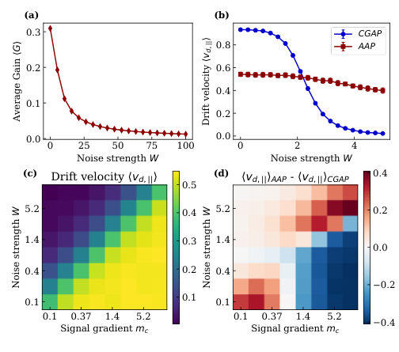 
FIG. 2. (a) The average gain ⟨G⟩= ⟨β/(kBT +V)⟩of the AAP de- creases with the standard deviation of the Gaussian white noise in the signal. (b) Drift velocity along the signal gradient against noise level for the CGAP and the AAP. The CGAP performs better in quiet environments but the AAP outperforms the CGAP at high noise strengths. (c) Drift velocity along the signal gradient across varying noise level and signal gradient for the AAP. (d) Difference in drift ve- locity along gradient between AAP and CGAP across varying noise strength and signal gradient. For a given signal gradient, the AAP performs better than the CGAP at higher W.

📷 Fig 3

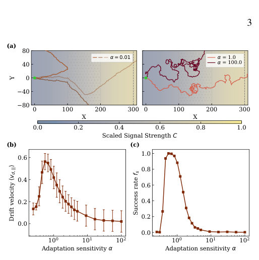 
FIG. 3. (a) Trajectories of the AAP in an alternating noise topogra- phy with varying adaptation sensitivity α. Left panel shows multiple trajectories at low α and right panel shows trajectories at intermedi- ate and high values of α. The signal has a linear gradient in the +x direction, noise amplitude W = 10.0 in the middle textured region and W = 1.0 everywhere else. (b) Drift velocity along the gradient for the AAP across varying sensitivities. ⟨vd,||⟩peaks around α ≈0.6 and decreases for very high and very low values of α. (c) The suc- cess rate of particles, defined as the fraction of trajectories that cross a predefined distance from the start (dotted line in (a)) in a given time,...

📷 Fig 4

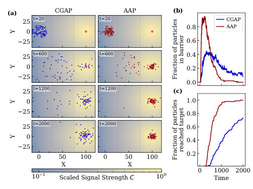 
FIG. 4. (a) Snapshots of collections of particles, CGAP (left) and AAP (right), searching for a point source of signal (magenta star) across a noise barrier (textured in gray). The signal decays exponen- tially from the source in the radial direction. The noise in the barrier is 20 times the surroundings. The CGAPs spend a longer time in- side the barrier and form a looser cluster around the target at the end compared to the AAPs. (b) Fraction of particles in the barrier over time. A larger fraction of CGAPs remain caught in the barrier at higher timepoints compared to the AAPs. (c) Fraction of particles that reach the target over time. All AAPs reach the target in a much shorter time...

**Summary.** This work develops a theoretical model for how organisms navigate using noisy sensory inputs, proposing that variance adaptation is key to robustness. By comparing adaptive and non-adaptive movement policies, the authors show that adaptation allows particles to maintain directed motion even when environmental noise is high. This provides a quantitative framework for understanding noise resilience in biological sensing and movement.

**Why it may be interesting.** While focused on biological motility, the underlying mathematical framework—optimality principles, noise filtering, and non-equilibrium steady states—shares conceptual links with open quantum systems where environmental noise dictates system dynamics and optimal control strategies.

Detailed structure

**Main problem.** The paper investigates how motile organisms maintain robust navigation when sensory signals are corrupted by noise, focusing on the role of variance adaptation in their movement policy.

**Main result.** Adaptive particles (AAP) significantly outperform constant-gain particles (CGAP) at high noise levels, demonstrating that variance adaptation is crucial for sustaining directed movement in noisy environments.

**Method.** The policy is derived by maximizing a utility function subject to a relative entropy penalty, leading to the analysis of mean drift velocity using Fokker-Planck equation solutions and approximations.

**Model / system.** The system is modeled as a minimal active Brownian particle undergoing run-and-tumble motion, sensing a noisy signal $C(\mathbf{r},t) = S(\mathbf{r}) + \xi$. The particle's rotational diffusivity adapts based on the prediction error.

**Key observables.** Average response gain ($\langle G 
angle$) and mean drift velocity ($\langle v_d 
angle$) along the signal gradient.

**Important parameters / regimes.** Noise strength ($W$), adaptation sensitivity ($\alpha$), and the intrinsic diffusion constants ($D_t, D_r$).

**Assumptions / limitations.** The analysis uses an approximation ($eta\mu \ll \Theta$) for analytical tractability, and the adaptation mechanism is treated as costless.

**Figures summary.** Figures compare AAP and CGAP trajectories and plot average gain and drift velocity versus noise strength, showing AAP's superior performance at high noise.

**Paper structure.** The paper introduces the minimal active Brownian particle model, derives the optimal run-and-tumble policy incorporating variance adaptation, and then analyzes the resulting transport properties by comparing AAP and CGAP performance across varying noise levels.

Abstract

How do organisms navigate when the signals guiding them are noisy? Variance adaptation, the rescaling of sensitivity to noise, is common in sensory systems, but its role in navigation is unexplored. We introduce a minimal active Brownian particle whose run-and-tumble policy follows from an optimality principle. Variance adaptation emerges as part of this policy. Adaptation keeps chemotactic drift finite as noise grows, while a non-adaptive particle's collapses exponentially. Adaptation also carries a cost, degrading performance in quiet environments and requiring a tuned adaptation sensitivity.

[↑ back to top](#top)

### [Positivity constraints on the dynamics of cusped impurities in CFTs](http://arxiv.org/abs/2608.28531v1)

**Authors:** Jeevan Chandra  
**Type:** theory · **Category:** other · **PDF:** <https://arxiv.org/pdf/2608.28531v1>  
**Analysis basis:** full PDF text, analyzed in chunks
**Topic relevance:** `Keldysh / 2PI / non-Gaussian methods` **2/5** · `methods for driven-dissipative` **2/5** · `analog quantum simulation` **1/5** · `correlated / nonlocal dissipation` **1/5** · `driven-dissipative phase transition` **1/5** · `non-equilibrium universality` **1/5** · `quantum measurements` **1/5**

📷 Fig 1

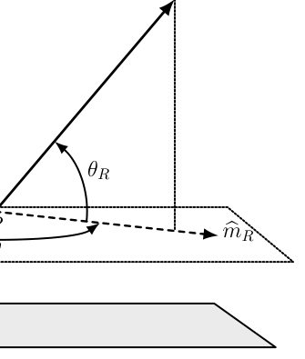 
Figure 2: The figure describes the geometry of the non-planar cusp. The defect rays meet at the cusp denoted P. θL,R are the elevation angles of the defect rays in their respective defect planes. ψ is the azimuthal angle between the defect planes. The cusp P is located at a distance y above the shaded boundary plane.

📷 Fig 2

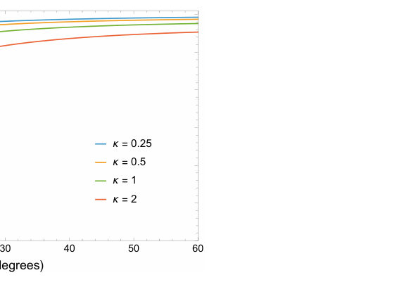 
Figure 3: This is a graph of the function Gκ(θ) that governs the coefficient of the IR cusp logarithm in the D5-ending phase. It can be also be interpreted as the interface-particle potential for an oblique defect ray making an angle θ with the interface. We have plotted the function for different flux parameters κ. The curves approach the limiting value −κ as θ →π

📷 Fig 3

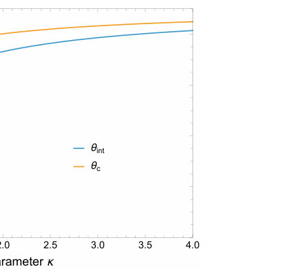 
Figure 4: A plot of the threshold angle θint below which the worldsheet in the vacuum saddle intersects the D5-brane, compared with the angle θc at which the vacuum saddle and the D5- ending saddle exchange dominance, for a range of the flux parameter κ. Importantly, the plot illustrates that θc &gt; θint so both the saddles exist independently across the transition.

📷 Fig 4

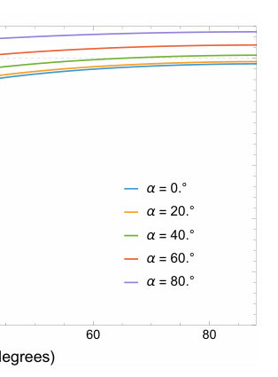 
Figure 5: This is a graph of the function Gκ(θ, α) governing the free energy of the generalized cusp in the D5-ending phase, against the geometric angle θ for various values of the scalar polarization angle α. The flux parameter is chosen to be κ = 0.1 for this plot. Observe that as we increase the value of α, the function could be positive for large-enough geometric angles.

**Summary.** This work extends the concept of the cusp anomalous dimension to defects near boundaries in CFTs, deriving powerful non-perturbative constraints using reflection positivity. The authors apply these constraints to various models, culminating in a holographic calculation that predicts a geometric phase transition. This advances the understanding of defect dynamics in strongly coupled quantum field theories.

**Why it may be interesting.** While focused on CFTs, the use of reflection positivity and boundary constraints provides powerful mathematical tools applicable to analyzing correlation functions and stability in strongly interacting quantum systems, which has parallels in AMO physics.

Detailed structure

**Main problem.** The paper generalizes the concept of the cusp anomalous dimension to cusped line defects situated near a planar conformal boundary or interface.

**Main result.** It derives non-perturbative constraints on the free energy coefficients, manifesting as negative semi-definiteness of the mixed angular Hessian, and finds a Gross-Ooguri-like phase transition in the holographic D3-D5 defect CFT.

**Method.** The primary method involves applying Euclidean reflection positivity to the free energy functional, alongside analyzing holographic calculations in the D3-D5 setup.

**Model / system.** The study focuses on Conformal Field Theories (CFTs) with cusped line defects, ranging from free scalar/Maxwell theories to strongly coupled holographic D3-D5 defect CFTs.

**Key observables.** The free energy $F(	heta_L, 	heta_R, \psi; y)$, the cusp anomalous dimension, and the coefficients of the logarithmic terms ($	ext{AIR}$).

**Important parameters / regimes.** The geometry is parameterized by three angles ($	heta_L, 	heta_R, \psi$) and the perpendicular distance $y$ of the cusp from the boundary.

**Assumptions / limitations.** The derivation relies on the assumption that the defect CFT is unitary and reflection positive, and the Lorentzian continuation assumes Rindler positivity.

**Figures summary.** Figures illustrate the geometry of the planar and non-planar cusps relative to the boundary, and Table 4 summarizes the alternating-sign derivative hierarchy for cusp logarithms in the holographic model.

**Paper structure.** The paper first introduces the generalization of the cusp anomalous dimension, derives general positivity constraints using reflection positivity for planar and general cusps, verifies these constraints in simple models, and culminates in a holographic calculation revealing a phase transition.

Abstract

The cusp anomalous dimension is the universal logarithmic contribution to the free energy of a line defect with a cusp, and provides a useful observable characterizing defect dynamics. We generalize this notion to cusped line defects in the presence of a planar conformal boundary or interface. The geometry is characterized by three angles, and the distance of the cusp from the boundary or interface which separates short-distance and long-distance regimes. The resulting free energy contains two large logarithmic terms: a short-distance contribution governed by the usual vacuum cusp anomalous dimension, and a new long-distance contribution sensitive to the boundary or interface. Using reflection positivity for transverse deformations of the defect rays, we derive several constraints on the coefficients of these logarithmic terms, which can be packaged into negative semi-definiteness of their angular Hessians. We also derive constraints on the continuation of these coefficients to Lorentzian kinematics. We compute these coefficients and verify the constraints explicitly in free scalar and Maxwell theories and in planar $\mathcal N=4$ super-Yang-Mills theory at weak coupling for various choices of boundary conditions. At strong coupling, we compute the logarithmic coefficients in the holographic D3-D5 defect CFT and find a Gross-Ooguri-like phase transition between competing string worldsheets driven by the geometry of the cusp relative to the interface. We also observe a close connection of the cusp free energy in this setup with holographic corner entanglement entropy.

[↑ back to top](#top)

### [A Generalized Model for Disordered Random Sequential Adsorption with Charge-Dependent Deposition](http://arxiv.org/abs/2608.28289v1)

**Authors:** G. Palacios, A. M. S. Macêdo  
**Type:** theory · **Category:** statistical mechanics · **PDF:** <https://arxiv.org/pdf/2608.28289v1>  
**Analysis basis:** full PDF text, analyzed in chunks
**Topic relevance:** `analog quantum simulation` **2/5** · `Frenkel-Kontorova` **1/5** · `Keldysh / 2PI / non-Gaussian methods` **1/5** · `driven-dissipative phase transition` **1/5** · `methods for driven-dissipative` **1/5** · `non-equilibrium universality` **1/5**

📷 Fig 1

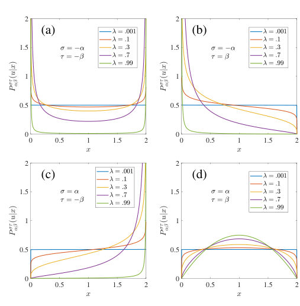 
FIG. 1: Charge-dependent deposition kernels for representative values of λ: (a) opposite charges at both contacts; (b) opposite charges at the left contact and equal charges at the right contact; (c) equal charges at the left contact and opposite charges at the right contact; and (d) equal charges at both contacts.

📷 Fig 2

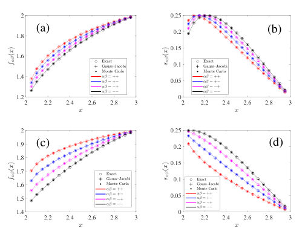 
FIG. 2: Mean occupation fαβ(x) and variance sαβ(x) in the first nontrivial shell 2 ≤x &lt; 3, for λ = 0.65 (top row) and λ = 0.90 (bottom row). The four colors represent the boundary polarities αβ, while circles, crosses, and dots denote, respectively, the ex- act method-of-steps solution, Gauss–Jacobi quadrature, and Monte Carlo simulations.

📷 Fig 3

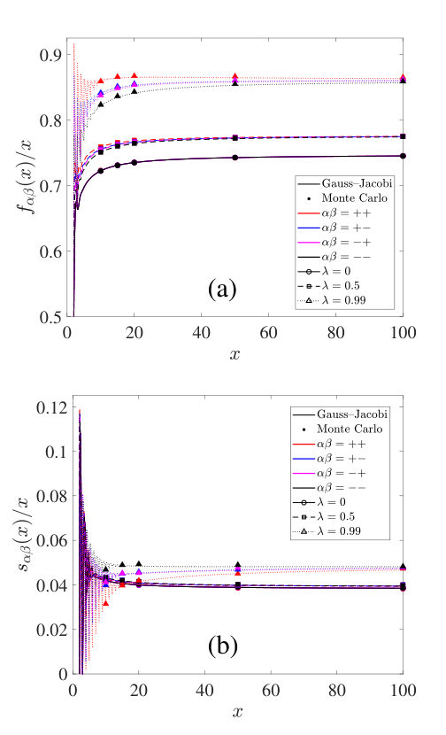 
FIG. 3: Mean occupation density (a) and Variance density (b) for the four boundary polarities and three values of λ. Lines repre- sent the Gauss–Jacobi solution and symbols represent Monte Carlo simulations; colors identify the boundary polarity, while line and marker styles identify λ.

📷 Fig 4

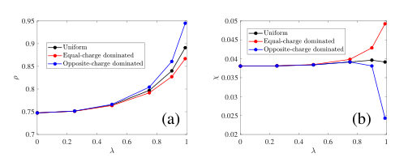 
FIG. 4: Mean occupation density (a) and Variance density (b) for the four boundary polarities and three values of λ. Lines repre- sent the Gauss–Jacobi solution and symbols represent Monte Carlo simulations; colors identify the boundary polarity, while line and marker styles identify λ.

**Summary.** This work develops a generalized 1D Random Sequential Adsorption model where particle deposition is biased by electrostatic interactions between charges. By deriving exact statistical recursions and performing asymptotic analysis, the authors show that charge selectivity enhances packing density and reduces statistical fluctuations compared to uniform deposition. This provides a powerful, tractable framework connecting simple geometric processes to complex, interaction-driven disorder.

**Why it may be interesting.** While focused on classical adsorption, the concept of using interaction-dependent kernels to model deposition/fragmentation processes is mathematically analogous to modeling energy landscapes or interaction-driven state transitions in quantum many-body systems.

Detailed structure

**Main problem.** The paper generalizes the 1D Random Sequential Adsorption (RSA) model to account for charge-dependent deposition probabilities, linking uniform deposition to interaction-driven processes.

**Main result.** Charge selectivity significantly increases the packing density, especially when opposite charges dominate the deposition, and the jammed density is proven to be self-averaging.

**Method.** The authors derive exact recursion relations using a four-component probability-generating-function equation and validate results using Gauss–Jacobi quadrature and Monte Carlo simulations.

**Model / system.** The system is a 1D line where charged segments adsorb sequentially. The deposition probability is governed by a Beta kernel dependent on the charges bounding the available gap and the incoming particle's charges.

**Key observables.** Mean and variance of the occupation statistics ($
ho$ and $\chi$), and the jammed density.

**Important parameters / regimes.** The interaction parameter $\lambda$ ($0 \le \lambda < 1$), which controls the strength of charge-dependent interactions, and the particle composition ($p$).

**Assumptions / limitations.** The model assumes that the deposition probability is prescribed by the boundary charges, allowing for a continuous interpolation between uniform RSA and strongly localized deposition.

**Figures summary.** Figures illustrate the charge-dependent deposition kernel for various charge configurations and show the asymptotic mean and variance densities ($
ho$ and $\chi$) as a function of $\lambda$ and particle composition.

**Paper structure.** The paper progresses from defining the generalized RSA model via a Beta kernel, deriving the exact recursive equations for statistics, and finally performing asymptotic analysis comparing Monte Carlo and quadrature results to quantify the effect of charge selectivity.

Abstract

We generalize a one-dimensional random sequential adsorption model (RSA) of charged unit segments in which the deposition position follows a beta kernel determined by the charges bounding the available gap and those of the incoming particle. The interaction parameter \(0\leqλ<1\) interpolates between uniform car parking and strongly localized deposition. We derive a four component generating function equation that provides exact recursions for the complete occupation statistics, although only the mean and variance are analyzed in detail here. Exact finite-shell solutions serve as benchmarks for the Gauss--Jacobi quadrature and Monte Carlo simulations. We prove that, although boundary charges affect finite size behavior, the four boundary states have the same asymptotic mean and variance densities, consequently, we prove that the jammed density is self-averaging. Numerical results show that charge selectivity increases the coverage, especially for mixtures dominated by opposite endpoint charges, which also exhibit strongly reduced fluctuations near \(λ=1\). The model provides a tractable connection between uniform RSA, dynamically generated disorder, and interaction-driven deposition.

[↑ back to top](#top)

### [Multi-dimensional spectroscopy of mobile excitons in two-dimensional semiconductors](http://arxiv.org/abs/2608.27951v1)

**Authors:** Ned Wheaton, Jeffrey A. Davis, Jesper Levinsen, Meera M. Parish  
**Type:** theory · **Category:** other · **PDF:** <https://arxiv.org/pdf/2608.27951v1>  
**Analysis basis:** full PDF text, analyzed in chunks
**Topic relevance:** `Keldysh / 2PI / non-Gaussian methods` **2/5** · `methods for driven-dissipative` **2/5** · `analog quantum simulation` **1/5** · `interference shaping light` **1/5**

📷 Fig 1

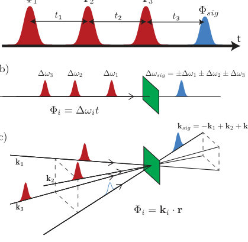 
FIG. 1. Pulse ordering and signal separation. (a) The time ordering of the excitation pulses and delays between them, ti, are defined with each pulse having a phase, Φi, which can be defined experimentally in different ways. The signal has a phase given by Φsig = ±Φ1±Φ2±Φ3, where the different sign combinations define the different pathways. (b) In collinear experiments, the phase of each pulse can be given a time de- pendent phase variation by imparting a small frequency shift, ∆ωi. The specific signal pathway can be isolated by selecting the specific beat frequency, ∆ωsig. (c) In non-collinear (box geometry) configurations, the different phases come from the different wavevectors, ki, and...

📷 Fig 2

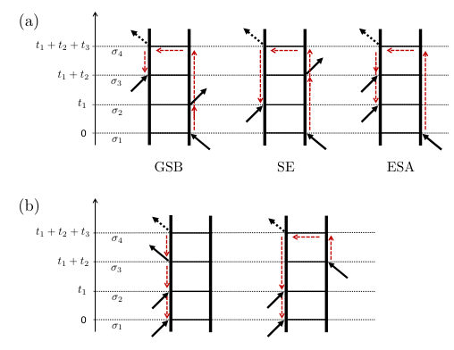 
FIG. 2. Double-sided Feynman diagrams for the differ- ent pathways. The rephasing pulse ordering (a) involves three terms in Eq. (19) corresponding to ground-state bleach (GSB), stimulated emission (SE) and excited state absorption (ESA), while the double quantum pulse sequence (b) involves the two terms in Eq. (24). Black arrows pointing to the right (left) represent electric fields with e−iωt (eiωt) and correspond to exciton creation (annihilation) operators. The left-to-right ordering of operators in each expectation value in Eqs. (19) and (24) is obtained by traversing each diagram in a counter- clockwise loop, as illustrated by the red arrows. The overall sign of each diagram is (−1)n,...

📷 Fig 3

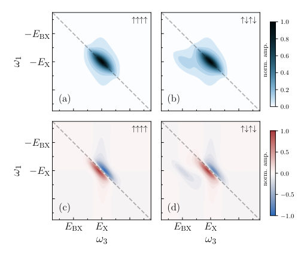 
FIG. 3. Absolute value (a-b) and real part (c-d) of 1Q rephas- ing spectra at t2 = 0 for immobile excitons described by the Hamiltonian in Eq. (27) with homogeneous broadening Γ/εBX = 0.1, and inhomogeneous broadening γ/εBX = 0.2. We have used the biexciton binding energy εBX as a common scale to compare the spectra and we have introduced the nota- tion EBX ≡EX−εBX, the energy needed to create a biexciton starting from a system with a single exciton. The dashed line indicates the diagonal ω3 = −ω1. Panels (a) and (c) show co-circular polarization with interaction U/εBX = 0.01, while panels (b) and (d) show cross-circular polarization with cou- pling λ/εBX = 0.01. The maximum values in all...

📷 Fig 4

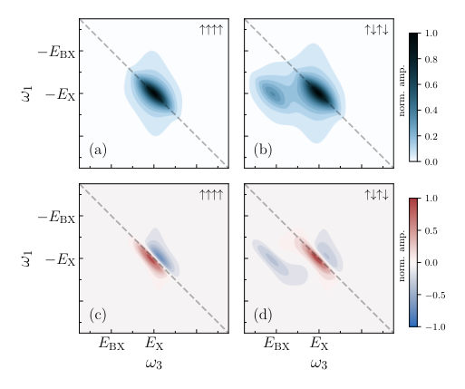 
FIG. 4. Absolute value (a-b) and real part (c-d) of 1Q rephas- ing spectra at t2 = 0 for mobile excitons described by the Hamiltonian in Eq. (31). We show results for the co-circular polarization (a,c), and the cross-circular polarization (b,d), where we take εX = 400 meV and εBX = 20 meV. All spectra are computed with area A · mXεBX = 100, corresponding to an exciton density of 5.25 × 1011 cm−2. We also use a ho- mogeneous broadening Γ/εBX = 0.1, and an inhomogeneous broadening γ/εBX = 0.2. The maximum values in all spectra are normalized to 1.

📷 Fig 5

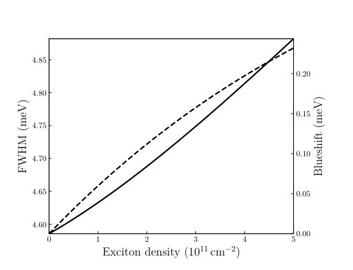 
FIG. 5. Behavior of the unbound exciton peak in the cross- circular spectrum of mobile excitons. Full width at half max- imum (solid line) and energy shift (dashed) as a function of exciton density, with homogeneous broadening Γ/εBX = 0.1 and zero inhomogeneous broadening. Axis labels are con- verted to experimental units assuming a biexciton binding energy εBX = 20 meV.

**Summary.** This work presents a microscopic theory for Multi-dimensional Coherent Spectroscopy (MDCS) applied to excitons in 2D semiconductors. By incorporating the continuous momentum of excitons, the theory captures complex interaction effects like decoherence and phase-space filling. The results provide a strong theoretical framework validated against recent experimental data on MoSe2.

**Why it may be interesting.** The detailed microscopic treatment of coherent spectroscopy in low-dimensional materials provides powerful tools for understanding many-body dynamics, correlation effects, and quasiparticle interactions in solid-state quantum optics.

Detailed structure

**Main problem.** To develop a microscopic theory for Multi-dimensional Coherent Spectroscopy (MDCS) that accurately models the delocalized nature of excitons in two-dimensional (2D) semiconductors, moving beyond simple phenomenological models.

**Main result.** The theory successfully predicts MDCS spectra that quantitatively agree with experiments on doped monolayer MoSe2, highlighting the crucial role of exciton momentum continuum and phase-space filling effects.

**Method.** The authors use time-dependent perturbation theory to calculate the nonlinear optical response, focusing on the third-order polarization ($P^{(3)}$) to probe higher-order correlations.

**Model / system.** The system involves excitons (bound electron-hole pairs) in 2D semiconductors, modeled microscopically to account for continuous momentum degrees of freedom and interactions with doping-induced polarons.

**Key observables.** MDCS spectra, specifically the third-order response, which reveals signatures of interaction-induced decoherence and phase-space filling.

**Important parameters / regimes.** Exciton momentum continuum, doping concentration, and the coupling strength of the optical field ($\hat{V}(t)$).

**Assumptions / limitations.** The theory relies on time-dependent perturbation theory and makes approximations regarding the initial state (pure state) and the dipole moment operator.

**Figures summary.** Figures illustrate the phase control mechanisms in MDCS using pulse ordering, frequency shifts, and wavevector differences, and show Feynman diagrams for rephasing and double quantum pathways.

**Paper structure.** The paper progresses from general MDCS theory (linear response) to modeling mobile excitons, culminating in a detailed, advanced model incorporating doping and polaron interactions in MoSe2.

Abstract

Multi-dimensional coherent spectroscopy (MDCS) goes beyond standard linear-response probes and provides a powerful tool for investigating correlations between quasiparticles such as excitons (bound electron-hole pairs). Here we present a microscopic theory of MDCS that accounts for the delocalized nature of excitons in two-dimensional semiconductors. In contrast to the more phenomenological few-level approaches typically employed for modelling MDCS, our theory features mobile excitons with continuous momentum degrees of freedom. We find that the energy continuum associated with exciton momenta is crucial for producing interaction-induced decoherence, as well as capturing the interference between different exciton-polaron quasiparticles in the case of charge-doped semiconductors. Crucially, our calculated MDCS spectra agree well with recent experiments on doped monolayer MoSe$_2$ [Hao et al., Nature Communications 8, 15552 (2017)], and they suggest that the interactions between exciton polarons depend strongly on phase-space filling effects, where exciton polarons compete for electrons. Our results demonstrate that microscopic approaches allow one to gain new insights from the fine structure of MDCS on two-dimensional semiconductors, and they illustrate the utility of microscopic approaches to modelling MDCS experiments more generally.

[↑ back to top](#top)

### [An Algebraic Obstruction to Ising Criticality for Finite-BCH Entanglers in Wavelet MERA](http://arxiv.org/abs/2608.27564v1)

**Authors:** Enrico Bertuzzo, Olindo Corradini, Claudia Frugiuele  
**Type:** theory · **Category:** statistical mechanics · **PDF:** <https://arxiv.org/pdf/2608.27564v1>  
**Analysis basis:** full PDF text, analyzed in chunks
**Topic relevance:** `Keldysh / 2PI / non-Gaussian methods` **2/5** · `methods for driven-dissipative` **2/5** · `analog quantum simulation` **1/5**

📷 Fig 1

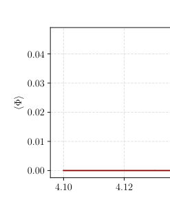 
Figure 1. Order parameter ⟨ϕ⟩as a function of g for χ = 20 and r = −1.

📷 Fig 2

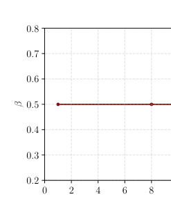 
Figure 2. The extracted β parameter as a function of χ for r = −1.

📷 Fig 3

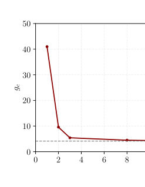 
Figure 3. Critical coupling gc as a function of χ for r = −1.

📷 Fig 4

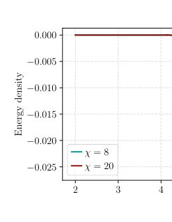 
Figure 4. Energy density as a function of g for χ = 20 (red) and χ = 8 blue.

**Summary.** This theoretical work analyzes the critical behavior of the 2D $\phi^4$ model using the Wavelet MERA ansatz restricted to polynomial entanglers. The authors prove an algebraic obstruction: these specific entanglers force the effective potential into a Landau form, thereby restricting the system's critical exponents to the mean-field value ($\beta=1/2$), and failing to reproduce the true Ising critical point ($\beta=1/8$).

**Why it may be interesting.** This work provides a rigorous theoretical constraint on the variational power of tensor network methods like MERA, showing that polynomial approximations inherently restrict the accessible critical physics to mean-field regimes, which is crucial for understanding the limitations of modern quantum simulation techniques.

Detailed structure

**Main problem.** The paper investigates an algebraic obstruction that limits the universality classes accessible when using finite-BCH polynomial entanglers within the Multi-Scale Entanglement Renormalization Ansatz (MERA) framework.

**Main result.** The analysis shows that the effective potential generated by these finite-BCH entanglers is necessarily of Landau form, confining the system's critical behavior to the mean-field universality class, regardless of the entangler's complexity.

**Method.** The authors use an analytical approach involving the minimization of the variational energy functional derived from the wavelet MERA, combined with techniques like Taylor expansion and analysis of the effective potential.

**Model / system.** The study applies to the interacting phi^4 theory in two dimensions, discretized using the wavelet MERA (wMERA) framework. The Hamiltonian includes quartic interaction terms, and the variational states are constructed using polynomial entanglers whose Baker-Campbell-Hausdorff (BCH) expansion terminates.

**Key observables.** Critical exponent $\beta$, effective potential $V_{\text{eff}}(\langle\Phi\rangle)$, and the critical coupling $g_c$.

**Important parameters / regimes.** Nonlocality range ($\chi$), variational complexity, and the coupling constant $g$.

**Assumptions / limitations.** The analysis is strictly limited to entanglers whose BCH expansion terminates at a finite order (finite-BCH polynomial entanglers).

**Figures summary.** Figures illustrate the continuous transition ($\langle\Phi\rangle$ vs $g$) and show that the extracted critical exponent $\beta$ remains consistently near the mean-field value of $1/2$ as the nonlocality range $\chi$ increases.

**Paper structure.** The paper establishes the problem by noting the challenge of non-Gaussian entanglers, then details the wMERA setup for $\phi^4$ theory. The core is the analytical derivation showing the effective potential must be Landau-like, leading to the conclusion that only mean-field criticality is accessible with polynomial entanglers.

Abstract

The computational treatment of non-Gaussian entanglers could pose a significant challenge when extending the Multi-Scale Entanglement Renormalization Ansatz (MERA) to interacting quantum field theories. A natural strategy is therefore to consider polynomial entanglers for which the Baker-Campbell-Hausdorff (BCH) expansion terminates at finite order. In this work, we identify an algebraic obstruction that limits the universality classes accessible to this family of entanglers. Working within the wavelet MERA (wMERA) framework applied to the interacting $φ^4$ theory in two dimensions, we show analytically that the effective potential generated by any finite-BCH polynomial entangler is necessarily of Landau form in the generic case, establishing mean-field universality for the full class; in non-generic, degenerate cases the resulting exponent departs from mean-field but still fails to reproduce the Ising value. As a numerical illustration, the critical exponent $β$ remains consistent with its mean-field value $β= 1/2$ across all ansätze considered, with no drift toward the Ising value $β= 1/8$ as the nonlocality range or variational complexity increases. Reproducing non-mean-field criticality therefore might require non-polynomial or infinite-BCH constructions.

[↑ back to top](#top)

### [Optomechanical inertial reference for atom interferometry](http://arxiv.org/abs/2608.28418v1)

**Authors:** A. Rajagopalan, K. Stolzenberg, D. Thomas, A. Herbst, S. Abend, E. M. Rasel, F. Guzmán, D. Schlippert  
**Type:** experiment · **Category:** other · **PDF:** <https://arxiv.org/pdf/2608.28418v1>  
**Analysis basis:** full PDF text, analyzed in chunks
**Topic relevance:** `quantum measurements` **2/5** · `quantum optics experiment` **2/5** · `interference shaping light` **1/5**

📷 Fig 1

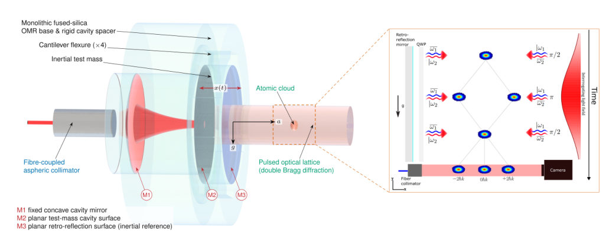 
FIG. 1. Illustration of the hybrid architecture comprising an atom interferometer, an optical resonator, and an inertial test mass with displacement x(t). The zoomed region shows a space-time diagram of a light-pulse atom interferometer employing double-Bragg diffraction with its acceleration measurement axis perpendicular to gravity.

📷 Fig 2

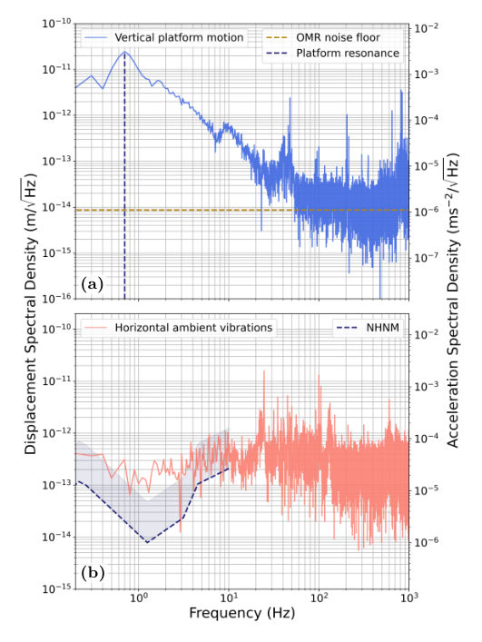 
FIG. 2. (a) Measuring vibration isolation platform motion os- cillating at its 700 mHz natural frequency using the optome- chanical resonator. The suppressed ambient vibration envi- ronment enables reaching its intrinsic sensitivity limit which is set by the photo detector shot noise at frequencies &gt; 50 Hz. (b) Ambient vibration noise measurement with the same cou- pling configuration to the atom interferometer without the use of vibration isolation. The white noise floor is limited by ambient vibrations and at lower frequencies the spectral den- sity shows a characteristic NHNM dip.

📷 Fig 3

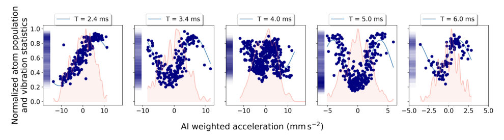 
FIG. 3. Ambient vibration noise post-correction using the optomechanical resonator signal for pulse separation times T = 2.4 ms to 6 ms. The scattered data points are the normalised atomic population with removed phase ambiguity via vibration noise post-correction comparison to the expected responses (solid blue curves), the gradient density bar highlights population distribution indicating atom interferometer technical noise. The normalised distribution of atom interferometer weighted vibration noise which randomly scans over its phase is depicted in the background (red curve).

📷 Fig 4

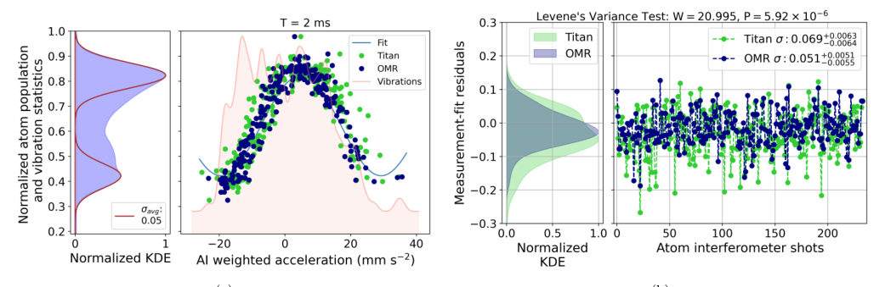 
FIG. 4. (a) Post-corrected T = 2 ms atom interferometer operated under very high ambient vibration correlated with the optomechanical resonator (blue data points) and a simultaneous comparison to the commercial accelerometer (green data points). The solid blue curve displays the expected atom interferometer response fitted to the OMR data. Coupled vibration noise induces an overall spread of ≈50 mm/s2 on the atom interferometer phase response. The atom interferometer technical noise is estimated by Gaussian fitting the individual peaks of its bi-modal kernel density estimation, amounting to an average value of σavg = 0.05. (b) Vibration noise suppression performance using the Titan and...

📷 Fig 5

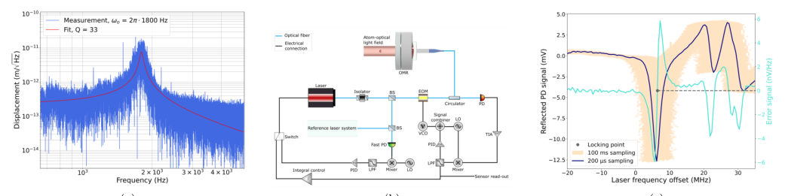 
FIG. 5. (a) Measured fundamental in-plane mode of the mechanical resonator via optical readout for operation under ambient atmosphere. (b) The complete optical readout schematic for measuring using the optomechanical resonator. It is a lock-in detection feedback loop based readout scheme using a single EOM sideband that efficiently suppresses low frequency readout noise and increases dynamic range despite the small optical resonator linewidth. The DC source laser optical frequency can possibly be stabilised to an external stable reference or to the probing optical cavity frequency as per experimental convenience to perform vibration measurements, this is indicated by a switch in the...

**Summary.** The authors present a novel hybrid inertial sensor that combines an atom interferometer with an optomechanical resonator (OMR). By using the OMR's test mass as a shared reference mirror, the system effectively cancels out vibration noise that typically degrades atom interferometry outside a lab. This approach achieves state-of-the-art sensitivity, making high-precision quantum sensing more viable for field applications.

**Why it may be interesting.** This work represents a sophisticated integration of quantum sensing (atom interferometry) with quantum optics/mechanics (optomechanics) to overcome fundamental environmental limitations, which is a key theme in advanced quantum sensing.

Detailed structure

**Main problem.** Atom interferometers, while highly sensitive inertial sensors, are limited in deployment due to ambient vibration noise.

**Main result.** The hybrid sensor successfully removes vibration-induced phase ambiguity up to $50 	imes 10^{-3} 	ext{ m/s}^2$, reaching the interferometer's intrinsic technical noise limit, surpassing commercial accelerometers.

**Method.** The technique fuses an optomechanical resonator (OMR) and an atom interferometer, using the OMR's test mass as the reference mirror to correlate and correct for environmental vibrations.

**Model / system.** The system comprises an atom interferometer coupled to an OMR, where the OMR measures displacement using a high-finesse optical cavity. The OMR's resonance frequency is set high (1800 Hz) to ensure a flat mechanical response over the interferometer's operating bandwidth.

**Key observables.** Minimum acceleration sensitivity ($1.1 	imes 10^{-6} 	ext{ m/s}^2/\sqrt{	ext{Hz}}$), displacement sensitivity ($8.6 	imes 10^{-15} 	ext{ m}/\sqrt{	ext{Hz}}$), and the recovered interferometer fringe visibility.

**Important parameters / regimes.** Bandwidth from sub-Hertz to 2.5 kHz; ambient vibration levels up to $50 	ext{ mm/s}^2$; OMR resonance frequency ($\omega_o = 2\pi \cdot 1800 	ext{ Hz}$).

**Assumptions / limitations.** The primary assumption is that fusing the sensors replaces the unknown transfer function between separate devices with the static response of a single mechanical element.

**Figures summary.** Figures illustrate the hybrid architecture, the OMR's ability to measure ambient vibration noise, and the post-correction of the atom interferometer signal using the OMR signal compared to classical accelerometer corrections.

**Paper structure.** The paper introduces the problem of vibration noise limiting atom interferometers, proposes the hybrid OMR-interferometer architecture, details the measurement techniques and performance metrics, and validates the noise suppression capability against commercial standards.

Abstract

Atom interferometers are among the most sensitive inertial sensors, yet deployment outside the laboratory is limited by vibration noise, conventionally mitigated by external sensors or bulky isolation. Here we demonstrate a hybrid inertial sensor which fuses an optomechanical resonator and an atom interferometer by exploiting the resonator's test mass as the interferometer's reference mirror. This allows for better correlation than with two separate sensors, whose unknown transfer function is replaced by the static response of one mechanical element. The resonator achieves a displacement sensitivity of $8.6\cdot 10^{-15}$ m/$\sqrt{\mathrm{Hz}}$ with suppressed 1/f noise and yields a minimum acceleration sensitivity of $1.1\cdot10^{-6}$ m/s$^2$/$\sqrt{\mathrm{Hz}}$ over a bandwidth extending from sub-Hertz to 2.5 kHz. Under ambient laboratory conditions the integrated system removes vibration-induced phase ambiguity for accelerations up to $50\cdot 10^{-3}$ m/s$^2$ and reaches the interferometer's technical noise limit, which a commercial force-balance accelerometer does not. Because the resonance-tracking readout is largely independent of the mechanical design, the architecture transfers directly to other precision sensing platforms.

[↑ back to top](#top)

### [Efficient perturbations for basin hopping in amorphous glasses](http://arxiv.org/abs/2608.27680v1)

**Authors:** Coraline Du, Hye Sol Kim, Scott C. Warren  
**Type:** theory · **Category:** disordered systems and neural networks · **PDF:** <https://arxiv.org/pdf/2608.27680v1>  
**Analysis basis:** full PDF text, analyzed in chunks
**Topic relevance:** `methods for driven-dissipative` **2/5** · `analog quantum simulation` **1/5** · `quantum measurements` **1/5**

📷 Fig 1

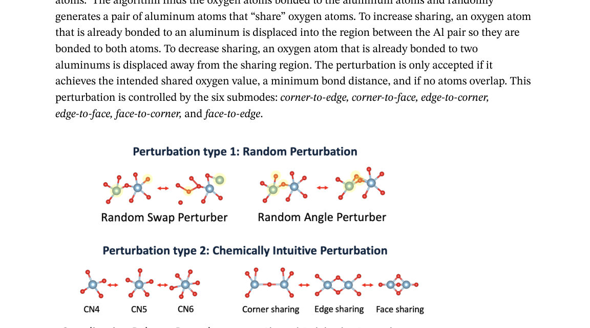 
Figure 1. Structural perturbation modes used to explore the configurational landscape of Al2O3. Red atoms represent oxygen, and blue atoms represent aluminum. B.​ Relaxation methods Structural relaxations were performed using a neuroevolution potential (NEP) [11] through the calorine CPUNEP calculator. Atomic positions and cell parameters were simultaneously optimized

📷 Fig 2

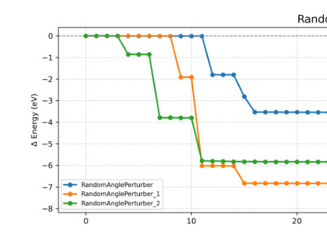 
Figure 3. Three runs consisting solely of random angle perturbations.

**Summary.** This work addresses the difficulty of sampling the complex energy landscape of amorphous materials by proposing large, nonlocal structural perturbations instead of relying solely on small, local moves. Using amorphous Al2O3, the authors demonstrate that specific perturbations, like the Coordination Balance Perturber, drastically improve the efficiency of finding low-energy structures. This suggests a powerful new class of sampling techniques for computational materials science.

**Why it may be interesting.** While focused on classical materials simulation, the methodology of using advanced sampling techniques to navigate high-dimensional, rugged energy landscapes is conceptually related to optimization problems in quantum many-body physics or quantum machine learning.

Detailed structure

**Main problem.** The primary challenge is efficiently exploring the complex potential-energy landscapes inherent to amorphous materials for computational structure discovery.

**Main result.** Nonlocal, relaxation-assisted perturbations, particularly the Coordination Balance Perturber, significantly improve configurational sampling by accessing low-energy states with far fewer trial moves than conventional local Monte Carlo methods.

**Method.** The study compares standard local sampling techniques (Monte Carlo, RMC) against four novel, larger, nonlocal perturbation algorithms applied to structural relaxation simulations.

**Model / system.** The model system used is amorphous aluminum oxide (Al2O3), chosen for its disordered network structure that allows for diverse local geometries and coordination environments.

**Key observables.** Energy change (Delta E), coordination numbers, and the number of trial moves required to reach low-energy configurations.

**Important parameters / regimes.** The simulation utilized a neuroevolution potential (NEP) and employed optimization algorithms like FIRE.

**Assumptions / limitations.** The authors assume that nonlocal moves followed by local relaxation can overcome kinetic trapping in local energy minima, though future work suggests improving acceptance criteria to filter out non-productive moves.

**Figures summary.** Figures illustrate the structural perturbation modes used on Al2O3, and energy trajectories compare the performance of different movement types, highlighting the superior performance of the Coordination Balance Perturber.

**Paper structure.** The paper introduces the problem of landscape exploration, details the development and testing of multiple perturbation types (e.g., Coordination Balance, Random Swap), presents comparative results showing efficiency gains, and concludes with suggestions for mixed-movement sequences and algorithmic refinement.

Abstract

Efficient exploration of the complex potential-energy landscapes of amorphous materials is central to computational structure discovery and refinement. Conventional Monte Carlo, reverse Monte Carlo, and related methods typically sample configuration space through small, local trial moves and may require millions to tens of millions of moves to converge. Here, we evaluate larger, nonlocal perturbations followed by local geometry relaxation as an alternative sampling strategy. We develop and test four perturbation types using amorphous Al$_2$O$_3$ as a model system. Among them, moving an oxygen atom to change the coordination numbers of two aluminum atoms, allows access to low-energy configurations with substantially fewer trial moves than a conventional Monte Carlo trajectory. These results suggest that relaxation-assisted nonlocal moves could reduce trapping in local minima and improve sampling in structure-search and reverse Monte Carlo workflows.

[↑ back to top](#top)

### [Efficient Quantum Simulation of Variable-Coefficient Transport with Continuous Source Injection](http://arxiv.org/abs/2608.27712v1)

**Authors:** Mohammad Mehedi Hasan Akash, Turag Dev, Nhat-Quang Nguyen, Yanzhu Chen, Huixuan Wu, Kourosh Shoele  
**Type:** theory · **Category:** quantum information and computing · **PDF:** <https://arxiv.org/pdf/2608.27712v1>  
**Analysis basis:** full PDF text, analyzed in chunks
**Topic relevance:** `analog quantum simulation` **2/5** · `methods for driven-dissipative` **2/5**

📷 Fig 1

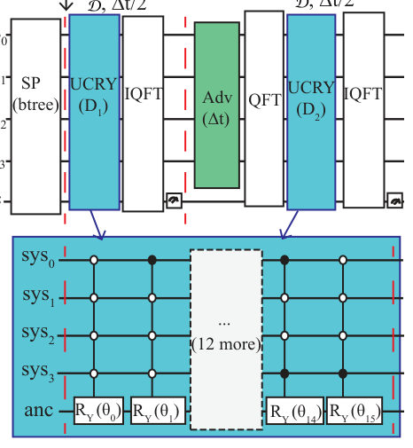 
FIG. 1: Quantum circuit for one D–A–D time step with nq = 4 (N = 16 Fourier modes). (a) Circuit overview. Sparse binary-tree state preparation, SP(btree), loads the source-corrected state | ˆS⟩directly in the Fourier basis, eliminating a QFT before the first diffusion half-step D(∆t/2). Each diffusion block applies a uniformly controlled Ry (UCRY) operation to the data register and a single ancilla, followed by an IQFT and post-selective ancilla measurement (⊗). The ancilla is reset and reused for the second diffusion half-step, which is preceded by a QFT because the advection step returns the register to the position basis. The advection circuit is detailed in Fig. 2. (b) UCRY...

📷 Fig 2

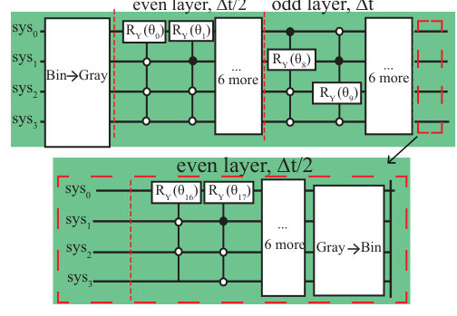 
FIG. 2: Quantum circuit for the advection substep Uadv(∆t) via the Gray-code Trotter decomposition (Eq. 14). The green background identifies this circuit as the detailed contents of the green Adv(∆t) box in Fig. 1. The circuit is shown in a two-row layout with vertical tick marks marking the row break. Read left to right, top row: Bin→Gray, a classically precomputed permutation converting the register sys0–sys3 to Gray- code order so that adjacent grid indices m, m + 1 differ in exactly one qubit; even layer, ∆t/2, (nq −1)-controlled Ry(θ) gates on the even edges (m, m + 1), m = 0, 2, 4, . . ., each targeting the single qubit that differs between the two coupled Gray-code labels...

📷 Fig 3

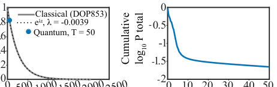 
FIG. 5: Post-selection statistics across viscosity and hori- zon length. (a) Per-step success probability at the canon- ical viscosity ν = 0.008, recovering toward unity as dis- sipation empties the high-wavenumber modes. (b) Cu- mulative success probability across the viscosity sweep of Table IV. (c) Long-horizon integration to T = 50: relative distance to the exact steady state us = −A−1f, where A is the discrete steady-state advection-diffusion operator and f the discrete forcing vector, along the classical tra- jectory, decaying on the slow-mode timescale τ = 257; the quantum solution at T = 50 (symbol) lies on the classical curve. (d) Cumulative log10 P of the post-selection record...

📷 Fig 4

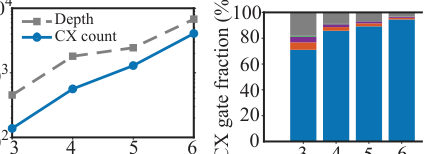 
FIG. 6: Transpiled diagnostic of the homogeneous D-A-D quantum kernel for nq = 3–6. (a) Depth and CX count per kernel. (b) Stacked CX contribution by circuit block; the Gray-code advection circuit, which encodes the N values of U(x), dominates at all sizes.

📷 Fig 5

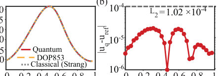 
FIG. 7: Validation at nq = 5: companion to Fig. 3. (a) Solution field at T = 1.0, ∆t = 10−3, against the DOP853 and matched split-step references. (b) Pointwise error on a logarithmic scale (nq = 5).

**Summary.** This paper introduces a novel, qubit-efficient quantum algorithm to simulate variable-coefficient advection-diffusion equations with continuous sources. It achieves this by unitarily implementing the advection term using a Gray-code Trotter sequence and handling diffusion and sources classically. The work demonstrates high accuracy and stability while keeping the required qubit count fixed, making it valuable for near-term quantum hardware.

**Why it may be interesting.** It presents a highly optimized quantum circuit structure for simulating complex PDEs, which is a major goal in quantum simulation for condensed matter physics.

Detailed structure

**Main problem.** Developing an efficient quantum algorithm to solve a variable-coefficient advection-diffusion equation that includes continuous source injection while maintaining a fixed qubit budget.

**Main result.** The proposed method successfully incorporates spatially varying velocity, viscous diffusion, and persistent source injection within a fixed-register qubit architecture, achieving high temporal accuracy.

**Method.** A hybrid quantum-classical time-marching algorithm is used, implementing advection via an ancilla-free Gray-code Trotter sequence and handling diffusion/source terms separately.

**Model / system.** The system is governed by a forced, variable-coefficient advection-diffusion equation in skew-symmetric form on a periodic domain.

**Key observables.** Second-order temporal convergence (fourth-order via Richardson extrapolation), stable evolution over $5 	imes 10^4$ time steps, and the ancillary failure probability.

**Important parameters / regimes.** Peak logical requirement of $n_q+1$ qubits; viscosity range (fifty-fold); time steps ($5 	imes 10^4$).

**Assumptions / limitations.** Classical readout and state re-preparation remain the main obstacles to coherent multistep evolution; the method assumes a fixed-width kernel structure.

**Figures summary.** Figure 9 shows energy growth over $T=50$ steps, confirming agreement between quantum and classical fields to a relative $L_2$ error of $1.8 	imes 10^{-5}$.

**Paper structure.** The paper details the governing equation, the quantum circuit architecture, validation against classical integrators, comparison with existing solvers, and a summary.

Abstract

Quantum time-marching algorithms for transport PDEs often represent variable coefficients and forcing through register-expanding dilations, block-encoding oracles, or repeated postselection. We present an alternative algorithm for a forced variable-coefficient advection-diffusion equation in flow-inspired skew-symmetric form that incorporates spatially varying velocity, viscous dissipation, and persistent source injection with a peak logical requirement of $n_q+1$ qubits. A centered skew-symmetric discretization makes the advection operator strictly skew-Hermitian for arbitrary velocity profiles, enabling an ancilla-free unitary realization using a Gray-code Trotter sequence of controlled-$R_y$ rotations. Diffusion is applied in the Fourier basis through a uniformly controlled rotation on one postselected ancilla, which is measured, reset, and reused between the two diffusion half-steps, while the source is incorporated classically through second-order Strang splitting. Statevector simulations for $N=16$ and $32$ recover second-order temporal convergence against high-accuracy classical solutions, while Richardson extrapolation gives fourth-order accuracy and reduces kernel calls by factors of four to fourteen. Independent tests through $N=256$ confirm second-order spatial consistency. We further show that the per-step ancilla failure probability is proportional to the instantaneous viscous dissipation rate, making postselection cost self-regulating over a fifty-fold viscosity range. Stable evolution is demonstrated for $5\times10^4$ time steps without observable secular error growth, while Gray-code advection accounts for $71$--$95\%$ of transpiled controlled-NOT gates. The fixed-width kernel provides a qubit-efficient building block for near-term hardware studies, although classical readout and state re-preparation remain the main obstacles to coherent multistep evolution.

[↑ back to top](#top)

### [Projected q-Shells for Nested Gausslet Bases](http://arxiv.org/abs/2608.28005v1)

**Authors:** Steven R. White  
**Type:** theory · **Category:** strongly correlated electrons · **PDF:** <https://arxiv.org/pdf/2608.28005v1>  
**Analysis basis:** full PDF text, analyzed in chunks
**Topic relevance:** `Keldysh / 2PI / non-Gaussian methods` **2/5** · `analog quantum simulation` **2/5**

📷 Fig 1

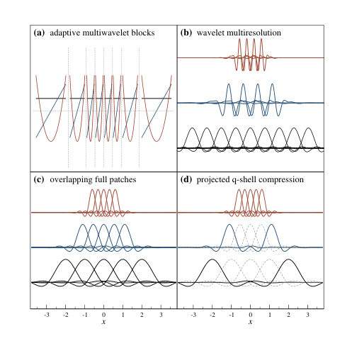 
FIG. 1. Four ways of changing spatial resolution. (a) Adaptive multiwavelet blocks. (b) Wavelet multiresolution. (c) Over- lapping full gausslet patches at several scales. (d) Projected q-shell compression of the same patches. The dashed interior functions in (d) are removed because their space is already supplied by the finer patch.

📷 Fig 2

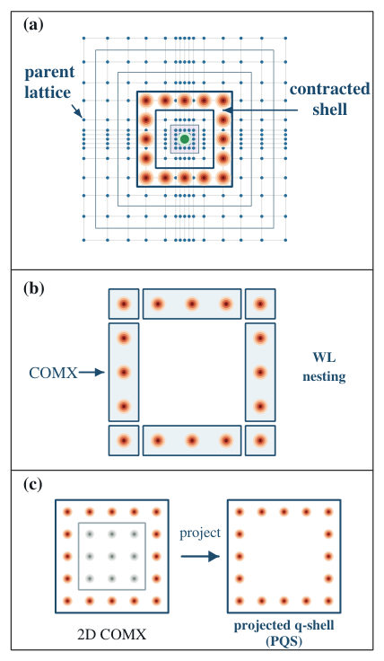 
FIG. 2. Parent lattice and two-dimensional q = 5 shell. (a) A distorted parent lattice, the uncontracted central block, and one surrounding shell. (b) WL treats the corners and the four three-function sides separately. (c) PQS starts from the complete 5 × 5 local block. Its 16 products having at least one edge factor are projected onto the shell of parent-lattice sites shown in (a) and then reorthogonalized; the nine middle– middle products are omitted. Panels (b) and (c) have the same number of functions but retain different local polynomial information.

📷 Fig 3

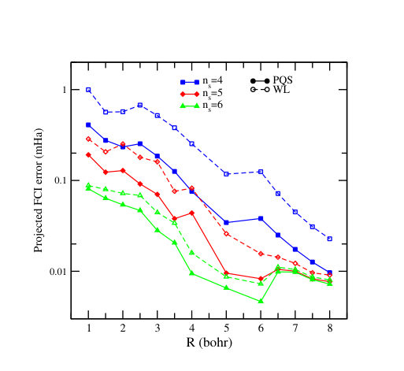 
FIG. 4. Projected full-configuration-interaction (FCI) errors for H2 with the same H/cc-pV6Z s, p residual-Gaussian supple- ment. At each geometry, every lower-order FCI wave function is projected into the same supplemented PQS ns = 7 basis and its energy is evaluated with the ns = 7 Hamiltonian. The plotted error is this energy minus the FCI complete-basis-set (CBS) limit of Pachucki. Colors and symbols denote ns as in Fig. 3; solid filled symbols denote PQS and dashed open sym- bols WL. The source dimensions are equal at each geometry and order.

📷 Fig 4

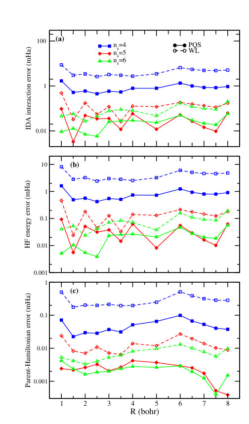 
FIG. 3. Restricted-HF comparison for H2 supplemented by contracted Cartesian H/cc-pV6Z s and p residual Gaussians, at equal PQS and WL dimensions. All three panels plot error magnitudes. Panel (a) compares the IDA Coulomb energy with the parent-basis value for the same converged orbital. Panel (b) uses the RHF energy obtained with the IDA Hamiltonian; panel (c) reevaluates the same orbital with the common parent Hamiltonian. The reference for (b) and (c) is the HF basis-set limit estimated from Cartesian aug-cc-pV5Z and aug-cc-pV6Z. Solid filled symbols denote PQS and dashed open symbols WL.

📷 Fig 5

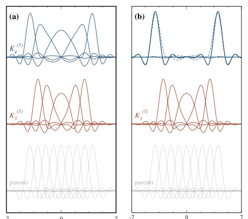 
FIG. 5. Numerical realization for an undistorted, unit-spaced parent chain, an outer segment with R = 4, and q = 5. The nine parent gausslets are gray. (a) The five outer-patch COMX functions (blue) and five inner-patch functions (red). (b) The original outer edge functions (dashed) and their projections onto the two endpoint parent gausslets forming the parent- lattice shell (solid), together with the inner-patch functions. The complete-patch union and the projected construction both have rank seven, and their projector residual is 1.12 × 10−15, illustrating Eq. (A17). Vertical offsets are for clarity.

**Summary.** This paper introduces Projected q-Shells (PQS), an advanced basis set technique designed to improve upon existing methods for electronic structure calculations. PQS enhances the accuracy and completeness of the basis set representation by mathematically restoring lost polynomial orders during the basis contraction process. This results in more accurate and efficient calculations for molecular electronic properties.

**Why it may be interesting.** While focused on quantum chemistry, the core mathematical machinery—developing highly accurate, compact, and systematically improvable basis sets for electron-electron interactions—is crucial for any simulation involving many-body quantum systems, including those studied in AMO physics.

Detailed structure

**Main problem.** Electronic-structure calculations require accurately representing both electronic wave functions and the Coulomb interaction using a finite basis set representation.

**Main result.** Projected q-Shells (PQS) offer an improvement over standard nested Gausslet constructions by approximately restoring the lost polynomial completeness order, leading to smaller computational errors for small molecules.

**Method.** The authors introduce PQS, an advanced basis set construction that improves upon nested Cartesian gausslets by using a projection technique to maintain high local polynomial completeness while keeping the interaction manageable.

**Model / system.** The method is applied to electronic structure calculations for atoms and molecules (e.g., H2+, H2, C2), focusing on approximating the computationally expensive four-index Coulomb interaction with a two-index form.

**Key observables.** One-electron and interaction errors; polynomial completeness order ($q$ vs $q-2$); mean Cartesian rms width ($\sigma^2$) and relative center shift ($d_{12}$).

**Important parameters / regimes.** The basis set parameter $q$ (related to polynomial order) and the degree of coordinate distortion.

**Assumptions / limitations.** The ideal model assumes undistorted parent lattices; practical use involves coordinate distortions, which slightly compromise the theoretical equivalence.

**Figures summary.** Figure 1 illustrates four methods of spatial resolution change, including PQS compression. Figure 2 compares WL nesting (disjoint pieces) versus PQS (full contraction $
ightarrow$ projection $
ightarrow$ reorthogonalization) in 2D.

**Paper structure.** The paper introduces the problem of basis set representation, details the limitations of standard nesting, mathematically derives the PQS construction via the projected-shell theorem, and validates the method by comparing PQS results against standard nesting for small molecules.

Abstract

Electronic-structure calculations require a finite representation of both the electronic wave functions and their Coulomb interaction. Conventional compact basis sets lead to a four-index interaction. Gausslet basis sets are one of a very small number of approaches that allow a much smaller two-index interaction, similar to a real-space grid, but with far fewer points. The continuing challenge in their development is reducing further the number of functions needed while maintaining high accuracy. Here we introduce projected q-shells (PQS), an improvement to the nested Cartesian gausslets of White and Lindsey. Their standard nesting construction divides a joining shell into disjoint faces, edges, and corners, reducing its polynomial completeness from order q to order q-2. PQS approximately restores the two lost orders. In terms of completeness, we prove that for an ideal, undistorted parent, the span of the PQS basis is equivalent to an overcomplete basis of overlapping patches. Coordinate distortions, which are always used in practice, harm this equivalence only slightly. The moment properties that allow two-index interactions also become inexact, even without distortion, but we show that the improvement in order more than makes up for this loss. For similar basis sizes, PQS gives smaller one-electron and interaction errors on small molecules, such as H2+, H2, and C2, than standard nesting. The improvement is largest for more compact bases with smaller q.

[↑ back to top](#top)

### [Quantum geometric bounds at finite temperature for one-dimensional chiral systems](http://arxiv.org/abs/2608.27944v1)

**Authors:** Peng He, Hai-Tao Ding, Yu-Guo Liu  
**Type:** theory · **Category:** other · **PDF:** <https://arxiv.org/pdf/2608.27944v1>  
**Analysis basis:** full PDF text, analyzed in chunks
**Topic relevance:** `analog quantum simulation` **2/5** · `Keldysh / 2PI / non-Gaussian methods` **1/5** · `quantum measurements` **1/5**

📷 Fig 1

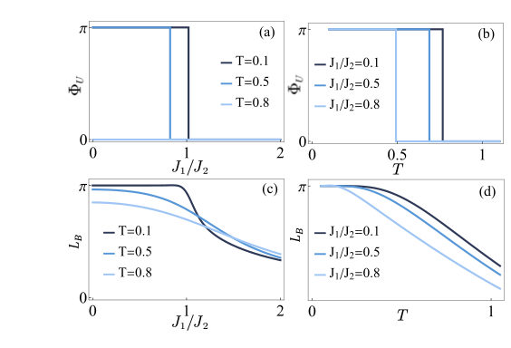 
FIG. 1. (a) The Uhlmann phase ΦU of the SSH model as a function of J1/J2. (b) The Uhlmann phase ΦU of the SSH model as a function of temperature T. (c) The Bures Length LB of the SSH model as a function of J1/J2. (d) The Bures Length LB of the SSH model as a function of temperature T.

📷 Fig 2

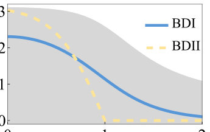 
FIG. 2. The two geometric bound for the Bures length of the SSH model at finite temperature T = 0.5. The gray region shows the values of Bures length.

📷 Fig 3

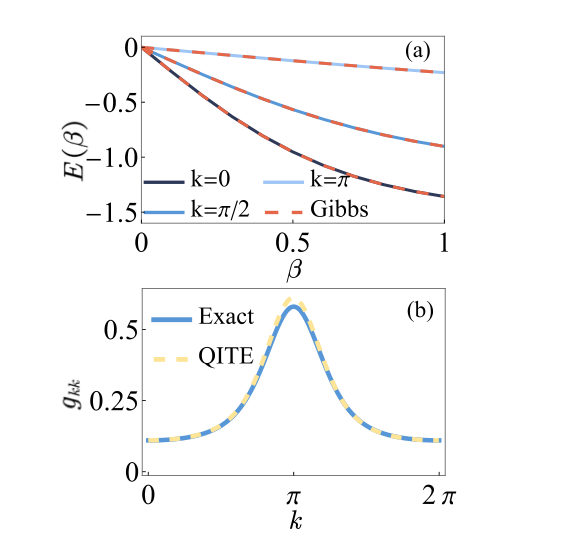 
FIG. 3. Numerical demonstration for the Bloch Hamiltonian of the SSH model H1,k. (a) Thermal average energy E(β) = Tr(ρQITE(β)H1,k) as a function of inverse temperature β for different momentum sectors k (solid lines), compared with the exact Gibbs state (dashed red line). (b) The Bures metric gkk as a function of momentum k calculated via the QITE method (yellow dashed line) and the exact solution (blue solid line) at β = 2. Both panels are within the topological region (J1 = 0.5, J2 = 1) with time step δτ = 0.1.

**Summary.** This paper develops and proves rigorous geometric lower bounds for the Bures length in 1D chiral quantum systems at finite temperatures. By utilizing Uhlmann's framework, the authors establish bounds that smoothly connect the known zero-temperature topological constraints to the high-temperature limit. The results are validated using standard models like the SSH chain.

**Why it may be interesting.** The connection between quantum geometry (like Bures distance) and topological invariants at finite temperature is a fundamental, challenging problem in condensed matter theory, relevant to understanding thermalization and quantum information storage.

Detailed structure

**Main problem.** The paper establishes rigorous quantum geometric lower bounds for one-dimensional chiral-symmetric systems at finite temperature, addressing the ambiguity of such relations when temperature is non-zero.

**Main result.** Two temperature-dependent bounds are derived for the Bures length ($L_B$): one related to the Uhlmann phase angle ($\Theta$), and another involving the minimum energy gap ($\Delta_{\min}$), which interpolates between zero and high temperatures.

**Method.** The analysis uses Uhlmann's framework for mixed states to calculate the Bures metric and connection coefficients, deriving bounds through analytical manipulation of these geometric quantities.

**Model / system.** The study focuses on general one-dimensional (1D) chiral-symmetric systems, exemplified by the Su-Schrieffer-Heeger (SSH) model and the spinless Kitaev chain model.

**Key observables.** Bures length ($L_B$), Uhlmann phase angle ($\Theta$), and the temperature-dependent bound involving the minimum energy gap ($\Delta_{\min}$).

**Important parameters / regimes.** Temperature ($T$), minimum energy gap ($\Delta_{\min}$), and the ratio of coupling constants (e.g., $J_1/J_2$ for SSH).

**Assumptions / limitations.** The analysis is restricted to 1D chiral-symmetric systems, and some derivations rely on approximations like the QITE method for numerical verification.

**Figures summary.** Figures illustrate the comparison of the derived geometric bounds for $L_B$ versus system parameters and temperature, and show numerical verification of the Bures metric calculation using the QITE method.

**Paper structure.** The paper first introduces the problem of finite-temperature geometric bounds, derives two distinct analytical bounds for the Bures length using Uhlmann's framework, and then verifies these results numerically using established models like the SSH chain.

Abstract

The geometry and topology of quantum states are intimately related at zero temperature through exact bounds that constrain geometric quantities from below by topological invariants. At finite-temperature, however, the analogous relations remain unclear. Here we establish rigorous geometric lower bounds for one-dimensional (1D) chiral-symmetric systems at finite temperature within the Uhlmann's framework for mixed states. We show that the Bures length is bounded by a continuous geometric phase angle. We further derive a temperature-dependent bound that interpolates between the zero-temperature limit and a trivial high-temperature regime. Our results are verified analytically and numerically using the Su-Schrieffer-Heeger (SSH) model and the spinless Kitaev chain model. Finally, we discuss potential ways to detect the geometry of the density matrix in quantum circuits, with the quantum imaginary time evolution (QITE) method.

[↑ back to top](#top)

### [Quantum Federated Learning Based on Bures--Uhlmann Geometry for Heterogeneous Noisy Clients](http://arxiv.org/abs/2608.28379v1)

**Authors:** Haruki Emori, Masaki Uchihara, Yuuki Tokunaga  
**Type:** both · **Category:** quantum information and computing · **PDF:** <https://arxiv.org/pdf/2608.28379v1>  
**Analysis basis:** full PDF text, analyzed in chunks
**Topic relevance:** `QC/QI experiment` **2/5** · `quantum measurements` **1/5**

📷 Fig 1

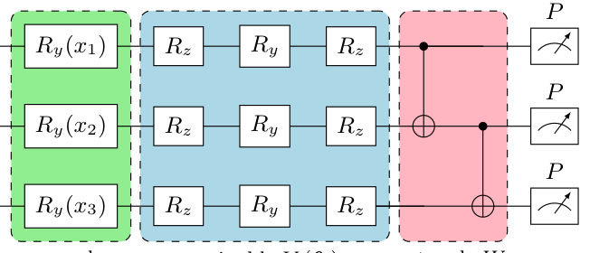 
FIG. 1. One layer of the shared variational quantum classifier, drawn for three qubits, with the experiments using n = 6 and L = 3. Each layer re-uploads the data through Ry(xj) (green), applies a trainable single-qubit block RzRyRz (blue), and a linear CNOT entangler (pink). After L layers the Pauli observables (23) are measured in three settings (Z, X, Y ) and fed to the shared readout head (24). The three QFL methods use this same circuit and the same head, and differ only in the local update and the aggregation.

📷 Fig 2

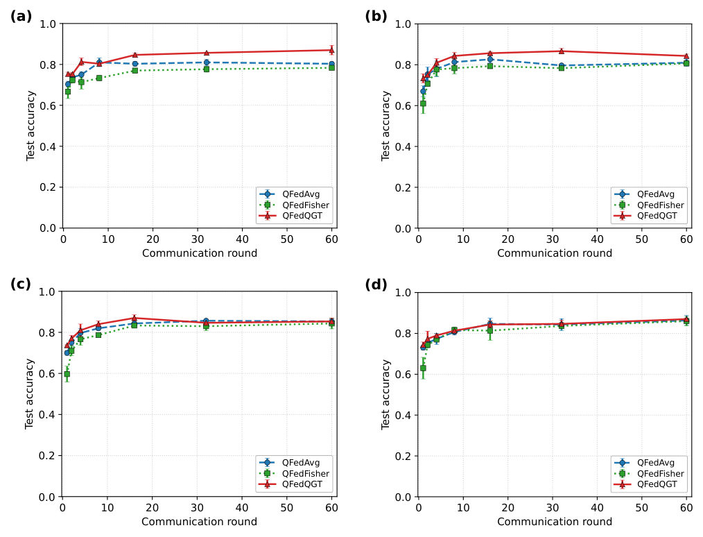 
FIG. 2. Test accuracy against the communication round on MNIST-10 (n = 6 qubits, L = 3 layers, K = 9 clients), evaluated on the reimei-E trapped-ion emulator with 4000 shots per circuit and averaged over three seeds, with error bars the cross-seed standard error. Panels (a)–(d) are the four device-heterogeneity conditions of Table I, namely (a) few shots and strong noise, (b) more shots and strong noise, (c) few shots and weak noise, (d) more shots and weak noise. QFedQGT (solid, red) attains the highest round-averaged accuracy in every panel. The two baselines are closest to it in the weak-noise panels (c), (d) and fall further behind in the strong-noise panels (a), (b). The top and bottom...

**Summary.** This paper proposes an advanced framework for Quantum Federated Learning designed for noisy quantum hardware. It leverages the Bures metric and mean Uhlmann curvature—derived from analyzing mixed quantum states—to create a superior aggregation rule. This method dynamically weights clients based on their local noise and parameter incompatibility, leading to better model convergence than standard averaging techniques.

**Why it may be interesting.** It directly addresses the practical challenges of applying quantum machine learning algorithms to real, noisy hardware by incorporating advanced concepts from quantum information geometry into the optimization framework.

Detailed structure

**Main problem.** Developing a robust aggregation rule for Quantum Federated Learning (QFL) that accurately accounts for data and hardware heterogeneity and noise in quantum devices.

**Main result.** The proposed method, utilizing the Bures metric and mean Uhlmann curvature, maintains high accuracy across diverse noise conditions and outperforms standard federated averaging, which degrades under strong noise.

**Method.** The authors extend quantum geometry from pure states to mixed states, employing the Bures metric as a local preconditioner and using the mean Uhlmann curvature to develop a dynamic, precision-aware aggregation rule.

**Model / system.** The model involves training variational quantum circuits (VQCs) on noisy quantum devices (NISQ era). Clients prepare mixed states $\rho_k(\theta)$ due to hardware noise, necessitating the use of mixed-state geometry.

**Key observables.** Bures metric (measures state change rate) and mean Uhlmann curvature (quantifies parameter estimation incompatibility).

**Important parameters / regimes.** Depolarizing rates (e.g., 0.4–0.6), data size ($p_k$), and local precision ($
ho_k$).

**Assumptions / limitations.** The core novelty is moving the geometric analysis from pure states to the mixed-state regime, which is necessary because pure-state approaches discard crucial correlation information.

**Figures summary.** The notes detail comparisons of aggregation weights (QFedQGT vs QFedFisher vs QFedAvg) and the final accuracy results on a trapped-ion quantum emulator.

**Paper structure.** The paper introduces the problem, derives the mixed-state geometry (Bures-Uhlmann), proposes the local update (Bures metric) and aggregation rule (Uhlmann curvature), provides theoretical convergence guarantees, and validates the method via empirical simulation on a trapped-ion emulator.

Abstract

Quantum federated learning enables collaborative model training across quantum devices without sharing raw data, and it faces the data and hardware heterogeneity inherent to noisy quantum devices. Utilizing the quantum geometric tensor is a natural remedy, yet pure-state approaches and diagonal approximations discard the correlations that encode parameter incompatibility. To address this, we extend the parameter-space geometry to the mixed states that noisy clients actually prepare. The real part of the resulting mixed-state geometric tensor is the Bures metric, which measures how fast the physical state changes under parameter variation, and the imaginary part is the mean Uhlmann curvature, which quantifies the incompatibility of estimating multiple parameters simultaneously. Accordingly, we employ the Bures metric as a local preconditioner and use the mean Uhlmann curvature to develop an achievable-precision aggregation rule that dynamically down-weights unreliable clients. Furthermore, we establish theoretical guarantees by proving a convergence theorem and a variance-dominance proposition. Empirical evaluations on a trapped-ion quantum emulator demonstrate that the proposed method maintains high accuracy across diverse device-heterogeneity conditions and outperforms standard federated averaging, whose accuracy degrades under strong noise.

[↑ back to top](#top)

### [A different kind of continuum limit for the three-dimensional U(1) gauge theory](http://arxiv.org/abs/2608.27976v1)

**Authors:** Andreas Athenodorou, Claudio Bonati, Ivan Soler Calero  
**Type:** theory · **Category:** statistical mechanics · **PDF:** <https://arxiv.org/pdf/2608.27976v1>  
**Analysis basis:** full PDF text, analyzed in chunks
**Topic relevance:** `analog quantum simulation` **2/5**

📷 Fig 1

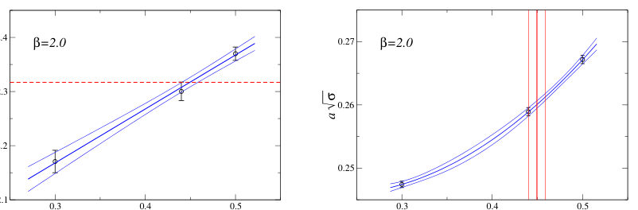 
Figure 1. (left) Behavior of M gs 0−−/√σ as a function of µ for β = 2 (see Tab. 3). The blue band represents the one-standard-deviation uncertainty of the linear fit, while the horizontal dashed line indicates the value given in Eq. (3.3). (right) Behavior of a√σ as a function of µ for β = 2 (see Tab. 8). The blue band represents the one-standard-deviation uncertainty of the quadratic fit, while the vertical red band indicates the value µ(β) obtained by imposing Eq. (3.3).

📷 Fig 2

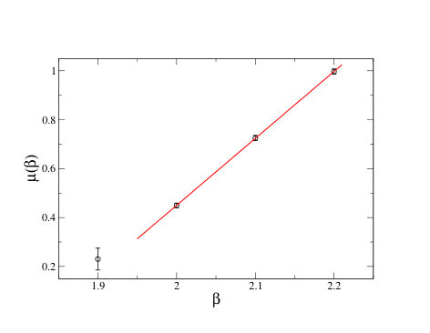 
Figure 2. Behavior of µ(β) as a function of β along the line of constant physics. The solid line shows a linear fit to the three largest-β data points.

📷 Fig 3

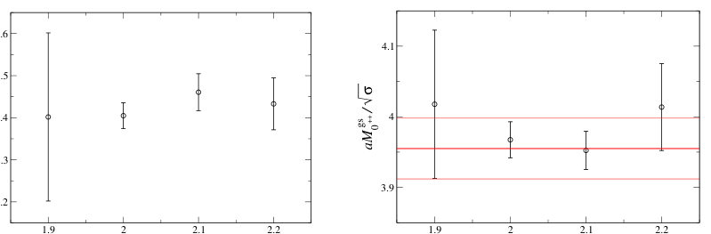 
Figure 3. Behavior of the ratios M ex1 0−−/√σ (left) and M gs 0++/√σ (right) as a function of β along the line of constant physics. In the right panel the horizontal band denotes the value of M gs 0++/√σ estimated in [27] for µ = 0 and β = 1.8, see Eq. (3.2).

📷 Fig 4

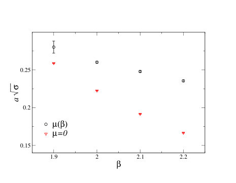 
Figure 4. Behavior of the string tension in lattice units as a function of β along the line of constant physics. For comparison we also report the results for µ = 0 obtained in [27].

**Summary.** This paper addresses the pathological continuum limit of 3D U(1) lattice gauge theory by modifying the standard action to include a term dependent on lattice monopoles. By tuning two parameters ($eta$ and $\mu$) along a specific trajectory, the authors demonstrate that a physically meaningful constant ratio between glueball mass and string tension can be maintained. This suggests a viable regularization scheme for the theory.

**Why it may be interesting.** While focused on gauge theory, the concept of finding a 'line of constant physics' by tuning parameters to regularize a pathological limit is a general concept in critical phenomena and phase transitions relevant to statistical mechanics.

Detailed structure

**Main problem.** The continuum limit of the three-dimensional compact U(1) lattice gauge theory is pathological because the ratio of glueball masses to the square root of the string tension vanishes.

**Main result.** By modifying the lattice action to couple to the total number of lattice monopoles, the authors found a line of constant physics where this ratio remains constant, suggesting a physically well-behaved continuum limit.

**Method.** The authors modified the Wilson action by adding a term proportional to the monopole number and tuned two parameters ($eta$ and $\mu$) simultaneously to trace this line of constant physics.

**Model / system.** The system is the three-dimensional compact U(1) lattice gauge theory. The model is the standard Wilson action extended by a term coupling to the total number of lattice monopoles, $S = -eta \sum 	ext{Re} P - \mu N_m$.

**Key observables.** Glueball masses ($m_0$), string tension ($\sqrt{\sigma}$), and the ratio $m_0/\sqrt{\sigma}$.

**Important parameters / regimes.** Lattice coupling $eta$, monopole coupling $\mu$, and the continuum limit ($eta 	o \infty$).

**Assumptions / limitations.** The analysis relies on the dilute monopole gas approximation, although the results suggest this approximation might be circumvented by the bounded nature of lattice monopole charges.

**Figures summary.** Not specified.

**Paper structure.** The paper first identifies the pathology of the standard continuum limit. It then introduces the modified action and demonstrates that tuning $eta$ and $\mu$ along a specific trajectory keeps the ratio $m_0/\sqrt{\sigma}$ constant, suggesting a regularization.

Abstract

In three-dimensional compact U(1) lattice gauge theory color confinement can be understood analytically through the dynamics of magnetic monopoles. However, its continuum limit is pathological, since the ratio of the glueball masses to the square root of the string tension vanishes as the continuum limit is approached. We investigate a simple extension of the Wilson action in which the total number of lattice monopoles is coupled to an additional parameter $μ$. By tuning $β$ and $μ$ simultaneously, we identify a line of constant physics along which the ratio of the lightest glueball mass to the square root of the string tension remains constant. We further show that the same scaling is satisfied, within numerical uncertainties, by the other low-lying glueball masses considered in this work. Along this trajectory, the string tension in lattice units decreases with increasing $β$, thus suggesting that the modified lattice action may provide a regularization of three-dimensional compact U(1) gauge theory with a physically well-behaved continuum limit.

[↑ back to top](#top)

### [Direct Adaptive Certification of High-Dimensional Entanglement with Bell Tests](http://arxiv.org/abs/2608.28235v1)

**Authors:** Xu Kang Tan, Jesvita Menezes, Sanjan D. Murthy, Adetunmise C. Dada  
**Type:** theory · **Category:** quantum information and computing · **PDF:** <https://arxiv.org/pdf/2608.28235v1>  
**Analysis basis:** full PDF text, analyzed in chunks
**Topic relevance:** `quantum measurements` **2/5**

📷 Fig 1

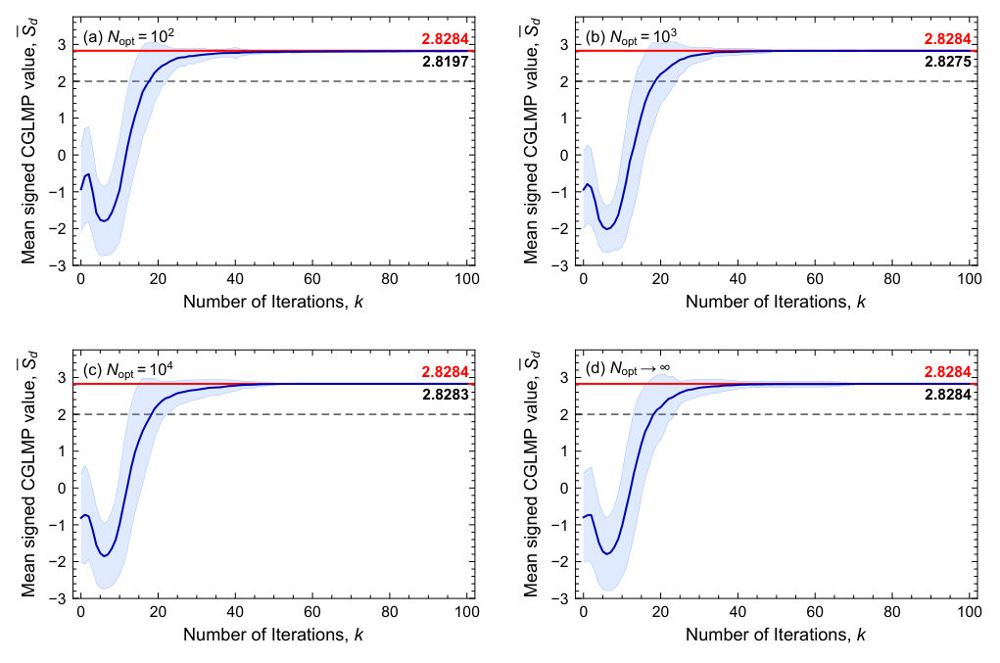 
FIG. 1. Per-update CSPSA convergence for a maximally entangled qubit pair at four optimisation photon budgets: (a) Nopt = 100, (b) Nopt = 1000, (c) Nopt = 10000 detected pairs per joint setting, and (d) the noiseless Nopt →∞reference. Each panel contains 100 independently seeded K = 100 trajectories. At each iteration, the dark-blue curve is the mean of the 100 exact central simulation values S2(θk). The pale-blue band shows how those values vary around the mean: its lower and upper edges, marked by fine blue lines, lie one between-run sample standard deviation below and above the mean. It is therefore not an estimator error bar or a confidence interval for one Bell measurement. Each...

📷 Fig 2

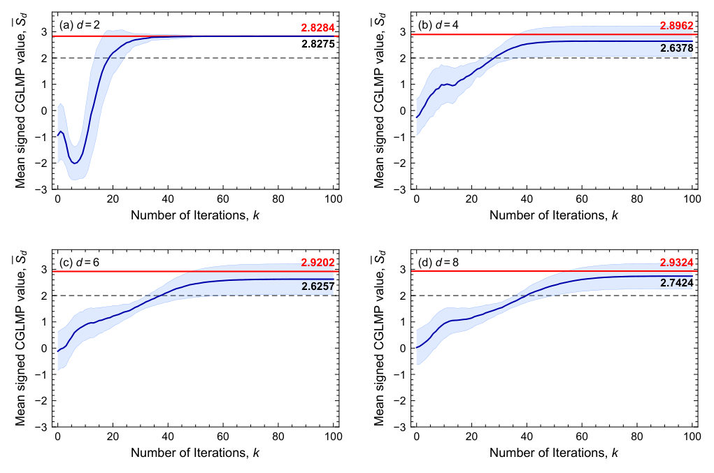 
FIG. 2. Per-update phase-only CSPSA convergence for maximally entangled inputs at Nopt = 1000 detected pairs per joint setting: (a) d = 2, (b) d = 4, (c) d = 6, and (d) d = 8. Each panel contains 100 independently seeded trajectories from the initial setting through K = 100. At each iteration, the dark-blue curve is the mean of the 100 exact signed central simulation values Sd(θk). The pale-blue again band shows how those values vary around the mean: its lower and upper edges, marked by fine blue lines, lie one between-run sample standard deviation below and above the mean. It is therefore not an estimator error bar or a confidence interval for one Bell measurement. The grey dashed line is...

📷 Fig 3

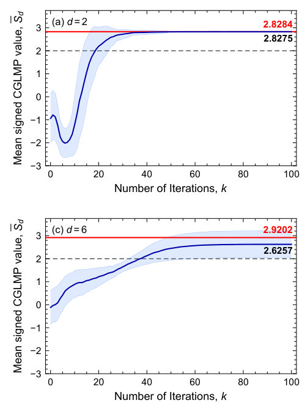 
Figure 4 condenses the same trajectories into an early- versus-final comparison. At k = 10 the four representative dimensions remain far from the standard-Fourier refer- ence. By k = 100, however, every median lies within 0.17% of that reference. The all-run means at d = 4, 6, 8 remain lower because 16%, 20% and 13% of the respec- tive ensembles occupy the lower stationary branch. Thus the median records the typical upper-basin trajectory, whereas the mean retains the operationally important cost of failed basin entry.

📷 Fig 4

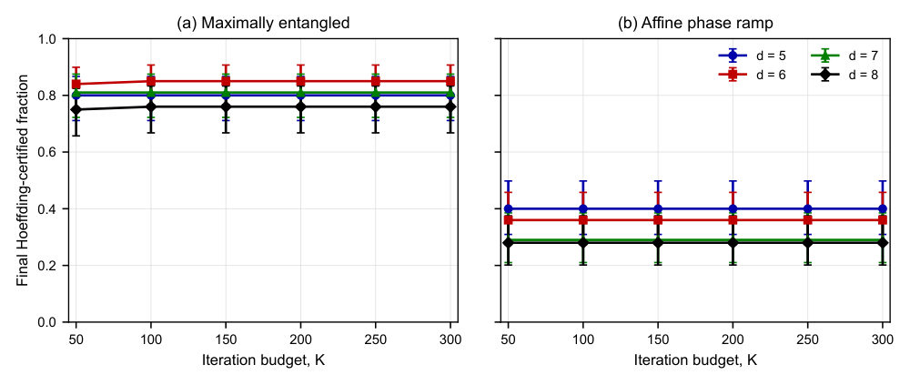 
FIG. 3. Final Bell-test certification rates at alternative iteration budgets for the high-dimensional scan d = 5, . . . , 8. Panel (a) shows maximally entangled inputs, and panel (b) shows maximally entangled inputs with a randomly chosen affine phase ramp. Colour and marker jointly identify the dimension. Points show the observed fraction from 100 trajectories and bars are pointwise Wilson 95% intervals. Each K ∈{50, 100, 150, 200, 250, 300} is costed as an alternative terminal design with a fresh Ncert = 10000 acquisition; certificate data are not accumulated across K. Because successive values use prefixes of the same trajectories, values at different K within a panel are correlated. The...

📷 Fig 5

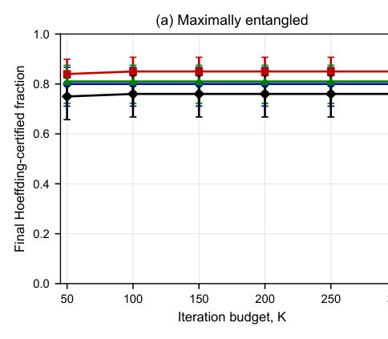 
Figure 5 shows that, for the three studied input-families, the unchanged protocol remains effective for maximally en- tangled reference inputs through d = 8, while the observed affine-versus-independent contrast exposes the model ca- pacity of four adjustable offsets. The dip in the maximally entangled certified rate at d = 3 reflects 26 of the 100 qutrit trials ending in a lower optimisation basin, rather than any change in the direct protocol’s detected-pair allocation.

**Summary.** This paper introduces a novel, adaptive Bell-test protocol to certify high-dimensional entanglement in unknown quantum states. By extending CSPSA to use the CGLMP inequality, the authors bypass the need for full quantum state tomography. The method successfully demonstrates certified entanglement violations up to $d=8$ while showing superior resource scaling compared to traditional characterization techniques.

**Why it may be interesting.** This work provides a powerful, resource-efficient alternative to full state tomography for verifying entanglement in complex, high-dimensional quantum systems, which is crucial for scalable quantum communication protocols.

Detailed structure

**Main problem.** The paper addresses the challenge of characterizing high-dimensional entanglement in unknown quantum states, which is resource-intensive using standard quantum state tomography (QST).

**Main result.** They successfully developed and demonstrated an adaptive Bell-test protocol that certifies entanglement in high-dimensional qudits ($d=2$ to $d=8$) without needing to reconstruct the full density matrix.

**Method.** The method extends Complex Simultaneous Perturbation Stochastic Approximation (CSPSA) to utilize the Collins-Gisin-Linden-Massar-Popescu (CGLMP) inequality for bipartite qudits, allowing for direct, adaptive violation testing.

**Model / system.** The system involves bipartite qudits (high-dimensional quantum systems) whose entanglement is tested using the CGLMP inequality. The analysis considers both pure and mixed states, including isotropic mixed states.

**Key observables.** The primary observable is the CGLMP parameter ($S_d$), where a violation ($S_d > 2$) certifies non-local correlations. Other diagnostics include the one-sided lower confidence bound ($S_L^d$).

**Important parameters / regimes.** The dimension of the qudits ($d$), the visibility of the mixed state, and the number of optimization iterations/runs are key parameters.

**Assumptions / limitations.** The method assumes that the measurement-setting cost for each CSPSA iteration is independent of the dimension $d$. The certification relies on a one-sided confidence bound derived from Hoeffding's inequality.

**Figures summary.** Figures compare the resource costs (measurement configurations vs. detected pairs) between the proposed adaptive Bell search and Quantum State Tomography (QST) across different dimensions.

**Paper structure.** The paper introduces the problem, details the extension of CSPSA to high-dimensional Bell testing using the CGLMP inequality, presents the statistical framework for confidence-certified violation, and concludes with numerical demonstrations comparing its efficiency against QST.

Abstract

Entangled photons play a crucial role in quantum applications, and determining and characterising their entanglement is vital to using them effectively. High-dimensional entangled states offer richer possibilities, but their additional measurement degrees of freedom make them increasingly demanding to characterise. However, adaptive Bell-test methods based on complex simultaneous perturbation stochastic approximation (CSPSA) have so far focused mainly on qubits. Here we numerically investigate a Bell-inequality-violation-based method for detecting entanglement in unknown quantum states. We extend CSPSA to high-dimensional Bell testing by using the Collins-Gisin-Linden-Massar-Popescu (CGLMP) inequality for bipartite qudits. The resulting protocol can detect Bell-nonlocal correlations in unknown entangled states, whether pure or mixed, without first reconstructing their density matrix. Using 100 optimisation iterations in each of 100 independent finite-shot runs per number of dimensions d, we demonstrate certified CGLMP violations throughout d=2-8. For isotropic mixed states tested at a visibility of just 0.05 above the standard-Fourier violation threshold, we likewise observe confidence-certified CGLMP violations throughout the range of d studied. We compare this direct stochastic approach with quantum state tomography, the standard method for characterising an unknown state. In the matched benchmark, CSPSA uses fewer measurement configurations per attempt from d=6, whereas tomography requires fewer detected pairs per certified result through d=8. We also derive the phase dependence of the CGLMP parameter and clarify the features of its landscape that govern the adaptive search. Because the measurement-setting cost of each CSPSA iteration is independent of dimension, the method offers a particularly attractive route to the certification of high-dimensional entanglement.

[↑ back to top](#top)

### [Adaptive workforce exploration in complex productivity landscapes](http://arxiv.org/abs/2608.27656v1)

**Authors:** Mateus F. B. Granha, Igor V. G. de Oliveira, André L. M. Vilela, Chao Wang, Paulo R. A. Campos  
**Type:** theory · **Category:** statistical mechanics · **PDF:** <https://arxiv.org/pdf/2608.27656v1>  
**Analysis basis:** full PDF text, analyzed in chunks
**Topic relevance:** `Frenkel-Kontorova` **1/5** · `Keldysh / 2PI / non-Gaussian methods` **1/5** · `analog quantum simulation` **1/5** · `driven-dissipative phase transition` **1/5** · `methods for driven-dissipative` **1/5** · `non-equilibrium universality` **1/5**

📷 Fig 1

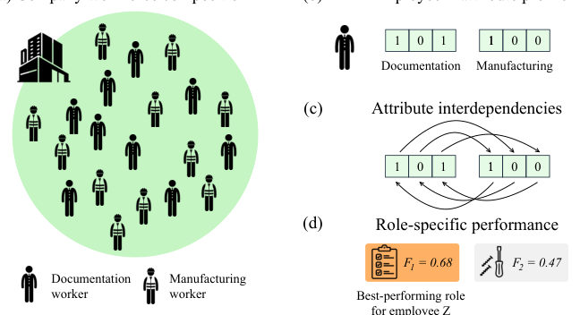 
Figure 1. Illustration of a company comprised of two departments: documentation and manufacturing. (a) Company workforce composition comprising 20 employees. (b) Visual representation of the trait structure of employee Z, where each task associated with a department has three attributes that the employee may or may not have, totaling N = 6 attributes per employee. (c) Arrows indicate interdependency between these attributes. In this example, there are no internal interdependencies kin = 0 and each attribute depends on one attribute of another task, kout = 1. (d) In this case, the first task has the highest performance (fitness). Hence, we highlight documentation as the best-performing task...

📷 Fig 2

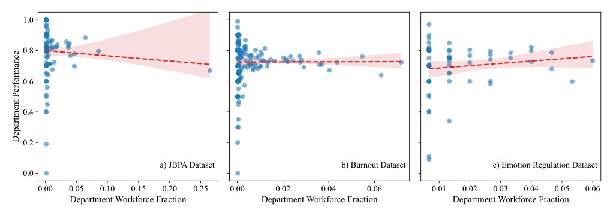 
Figure 2. Relationship between department workforce fraction and normalized department performance across three empirical public sector datasets: a) JBPA Dataset, b) Burnout Dataset, and c) Emotion Regulation Dataset. Dashed red lines represent fitted linear regression models accompanied by 95% confidence intervals (shaded regions). The linear regressions are nearly flat across all panels, indicating that department size is not significantly correlated with performance measures.

📷 Fig 3

 
Figure 3. Schematic representation of the organizational search and adaptation process for two roles. Employee shape identifies the role performed, with the two shapes representing the two available roles, whereas color indicates workforce strategy: blue represents specialists and orange represents generalists. (a) Candidate workforce designs differ in their employee compositions and attribute profiles. (b) Each design is evaluated according to its organizational productivity, which depends on workforce allocation, which is a function of θ, market demand β, and the generalist cost ε. Designs are selected with probabilities proportional to their productivity, as illustrated by the selection...

📷 Fig 4

 
Figure 4(a) displays the number of local optima, ρmax, as a function of kout for several values of kin. The results show a pronounced increase in ρmax with both within-task and cross- task interdependencies. For fixed kin, increasing kout produces a rapid growth in the number of local optima, indicating that stronger coupling between tasks substantially increases the ruggedness of the performance landscape. Likewise, larger values of kin systematically shift the curves upward, reflecting the additional complexity generated by interactions among attributes associated with the same task. Consequently, highly interdependent organizational structures give rise to a larger number of locally...

📷 Fig 5

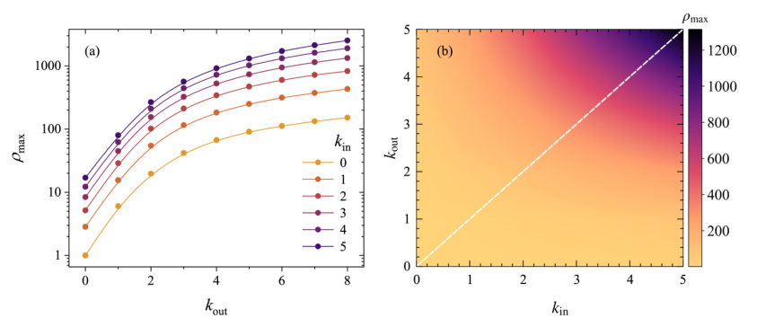 
Figure 4. Number of local maxima ρmax of the productivity landscape as a function of the interdependency parameter k between task attributes. In (a), we present the number of local maxima of the complex landscape versus kout. In (b), we display a heatmap of ρmax as a funcion of kin and kout. As k increases, the ruggedness and complexity of the productivity landscape increase, making it more challenging for organizations to find an optimal division of labor. The lines are guides to the eye. In (b), the dashed line is just a reference line for kin = kout.

**Summary.** This work models organizational efficiency by treating task allocation as an evolutionary process on a rugged fitness landscape, inspired by the NK model. It analyzes the trade-off between specialized and generalist labor forces to determine optimal strategies for maximizing productivity. The findings offer mathematical insights into how system complexity and interdependencies drive adaptive organizational change.

**Why it may be interesting.** While focused on socioeconomics, the underlying mathematical machinery—using fitness landscapes, group selection, and adaptive dynamics—is directly analogous to models used in non-equilibrium statistical mechanics and complex systems.

Detailed structure

**Main problem.** The paper investigates how the organizational division of labor and task interdependencies affect overall productivity and the capacity for adaptation in complex systems.

**Main result.** The model reveals the emergence of nonlinear adaptive dynamics, providing insights into how companies can adapt their strategies and foster innovation by optimizing labor division.

**Method.** The study employs group selection algorithms applied to a modified NK model, which simulates fitness landscapes shaped by task interdependencies.

**Model / system.** The model uses an NK-inspired framework applied to organizational structure, distinguishing between 'specialists' (fixed tasks) and 'generalists' (stochastic task selection). Productivity is optimized by balancing these two workforce types against task interdependencies.

**Key observables.** Organizational productivity, deviation from optimal labor division, and the emergence of nonlinear adaptive dynamics.

**Important parameters / regimes.** Ruggedness of the productivity landscape (related to task interdependency), generalization threshold ($	heta$), and the exploration rate ($\mu$).

**Assumptions / limitations.** The analysis often reduces to a minimal two-role setting for tractability, and empirical data suggests department size alone is not the primary predictor of performance.

**Figures summary.** Figure 1 illustrates employee attribute profiles and interdependencies in a company setting. Figure 2 shows department workforce fraction vs. normalized performance across empirical datasets.

**Paper structure.** The paper builds from an initial conceptual model (NK landscape applied to labor) to a detailed mathematical framework involving task allocation (specialist/generalist classification) and group selection evolution, with extensions proposed for dynamic market demands.

Abstract

Specialization and task allocation enhance efficiency and innovation across diverse systems, from biological organisms to socioeconomic institutions. The evolution of task distribution and its influence on organizational productivity encapsulate the dynamics between task dependencies and adaptive strategies. We explore the organizational division of labor, inspired by the NK model of rugged landscapes, which is widely applied in evolutionary biology, and incorporate interdependencies among the attributes of technical experts within an organization. Our model considers two types of employees characterized by their task allocation strategies: specialists, who are permanently assigned to a single task, and generalists, who stochastically select a task at each time step. We investigate how the ruggedness of the productivity landscape, shaped by task interdependency, affects the organization's capacity to optimize labor division and meet market demands. Using group selection algorithms, we reveal the emergence of nonlinear adaptive dynamics, providing insights into how companies can adapt their strategies to meet market demands and foster innovation.

[↑ back to top](#top)

### [Quantum many-body effects in the optical response of ideal thin films](http://arxiv.org/abs/2608.28261v1)

**Authors:** David Trejo-Garcia, Tapio T. Rantala, Marco Ornigotti, Juha Tiihonen  
**Type:** theory · **Category:** strongly correlated electrons · **PDF:** <https://arxiv.org/pdf/2608.28261v1>  
**Analysis basis:** full PDF text, analyzed in chunks
**Topic relevance:** `Keldysh / 2PI / non-Gaussian methods` **1/5** · `analog quantum simulation` **1/5** · `methods for driven-dissipative` **1/5**

📷 Fig 1

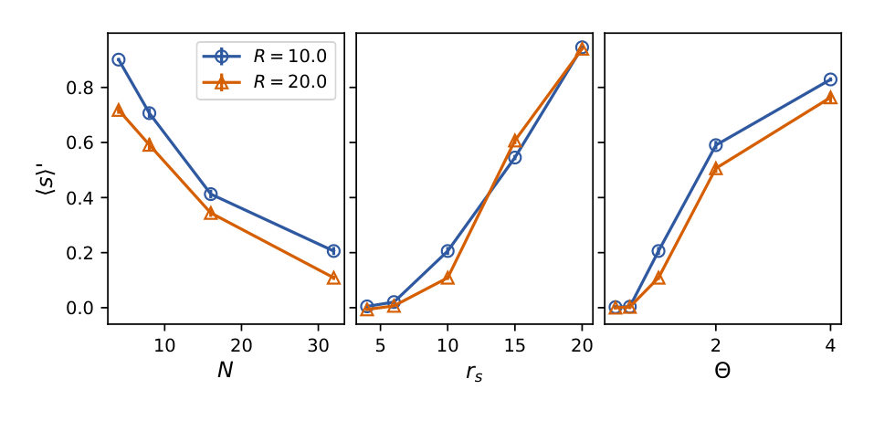 
FIG. 1. Plots of the average sign ⟨s⟩′ of spin-unpolarized simulation versus simulation parameters

📷 Fig 2

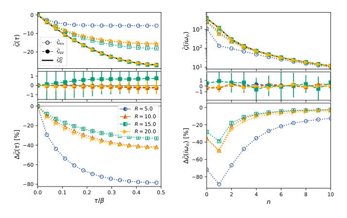 
FIG. 2. Plots of the periodic (zz) and confined (xx) components of the imaginary-time dipole

📷 Fig 3

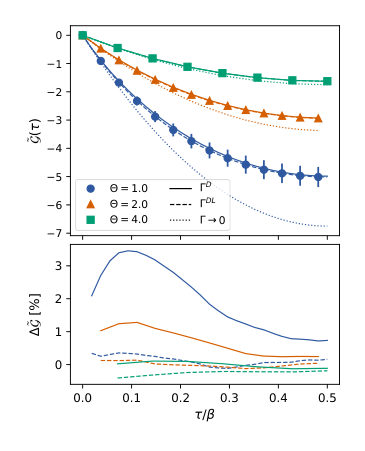 
FIG. 3. (top) The dipole autocorrelation function ˜G(τ) from PIMC (markers, no line) at variable

📷 Fig 4

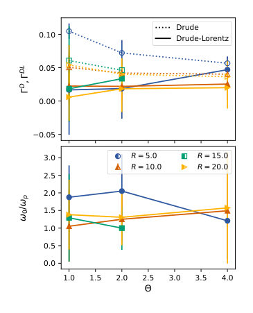 
FIG. 4. Least-squares fitted Drude ΓD and Drude–Lorentz ΓD (top) and ω0 (bottom) at various

📷 Fig 5

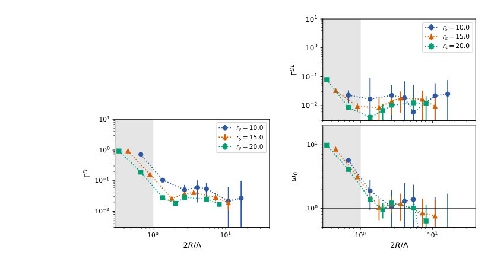 
FIG. 5. The effective Drude scattering ΓD (left) and Drude–Lorentz parameters ΓDL and ω0 versus

**Summary.** This paper uses Path-integral Monte Carlo simulations to study how confining electrons in thin slabs affects their optical response. It demonstrates that the boundaries break the ideal Drude behavior, leading to measurable scattering effects quantified by fitting the response to Drude and Drude-Lorentz models. The findings are important for understanding charge transport in nanoscale quantum materials.

**Why it may be interesting.** This work provides a rigorous, first-principles simulation of how geometric confinement and quantum statistics modify fundamental optical properties, which is crucial for designing nanoscale electronic devices.

Detailed structure

**Main problem.** The study investigates quantum many-body effects on the long-wavelength optical response of confined electrons at finite temperatures.

**Main result.** Slab confinement significantly breaks down the ideal Drude response, causing measurable scattering effects, particularly in the out-of-plane optical susceptibility.

**Method.** The authors employ the Path-integral Monte Carlo (PIMC) method to simulate the system's dynamics and analyze the optical response via the imaginary-time dipole autocorrelation function.

**Model / system.** The system modeled is an ideal homogeneous electron gas (HEG) confined within a quasi-2D slab geometry, allowing for the study of boundary effects on electron interactions.

**Key observables.** Optical susceptibility $\chi(\omega)$, the imaginary-time dipole autocorrelation function $	ilde{G}(	au)$, and fitted parameters for the Drude ($\Gamma_D$) and Drude-Lorentz ($\Gamma_{DL}, \omega_0$) models.

**Important parameters / regimes.** Slab thickness ($2R$), particle density ($r_s$), finite temperature ($\Theta$), and the ratio of confinement size to thermal wavelength ($2R/\Lambda$).

**Assumptions / limitations.** The analysis relies on fitting the PIMC data to Drude/Drude-Lorentz models for analytic continuation, and the PIMC method itself is limited by the Fermion sign problem.

**Figures summary.** Figures illustrate the dependence of fitted parameters ($\Gamma_D, \Gamma_{DL}, \omega_0$) on slab thickness relative to thermal wavelength and density, and compare results between fermionic and classical (Boltzmannon) simulations.

**Paper structure.** The paper establishes the problem by noting the breakdown of the ideal Drude response due to confinement. It details the PIMC methodology for calculating the optical response, presents quantitative results by fitting the imaginary-time correlation function to established models, and concludes by comparing the effects of quantum statistics and geometry.

Abstract

We study quantum many-body effects in the long-wavelength optical response of confined electrons at finite temperatures. We simulate homogeneous electron gas confined in one dimension into a slab of nanoscale thickness. We demonstrate how the slab boundaries break down the ideal Drude response of free charge carriers, giving rise to scattering effects due to both the surfaces and quantum many-body interactions. We use a recent path-integral Monte Carlo (PIMC) approach developed in [Tiihonen et al. Phys. Rev. A 113, 053711] to quantify these effects in high accuracy. We perform phenomenological fits to Drude and Drude-Lorentz models parameters, manifesting various trends of the optical response with physical parameters like density and temperature, and numerical effects like finite size and the quantum statistics.

[↑ back to top](#top)

### [The thermodynamic freedom of a thermodynamic computer](http://arxiv.org/abs/2608.27938v1)

**Authors:** Stephen Whitelam  
**Type:** theory · **Category:** statistical mechanics · **PDF:** <https://arxiv.org/pdf/2608.27938v1>  
**Analysis basis:** full PDF text, analyzed in chunks
**Topic relevance:** `driven-dissipative phase transition` **1/5** · `non-equilibrium universality` **1/5** · `quantum measurements` **1/5**

📷 Fig 1

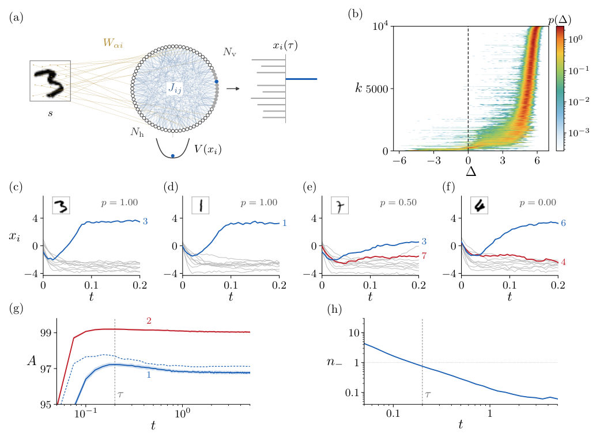 
FIG. 1. Dynamics of inference of our model thermodynamic computer. (a) A 784-pixel MNIST image s is connected to the computer via the couplings Wαi. The N = 74 units of the computer xi (divided into Nh = 64 hidden and Nv = 10 visible units) interact via the potential (5), and evolve via the Langevin dynamics (1). The computer’s predicted class c corresponds to the output unit with the largest value xc(τ) at time t = τ = 1/5 (times are measured in units of µ−1). (b) Probability distribution of the classification gap ∆, Eq. (6), for all 104 test-set digits, calculated using 103 trajectories per digit. Classification is correct when ∆&gt; 0. The index k runs over the test images in order of...

📷 Fig 2

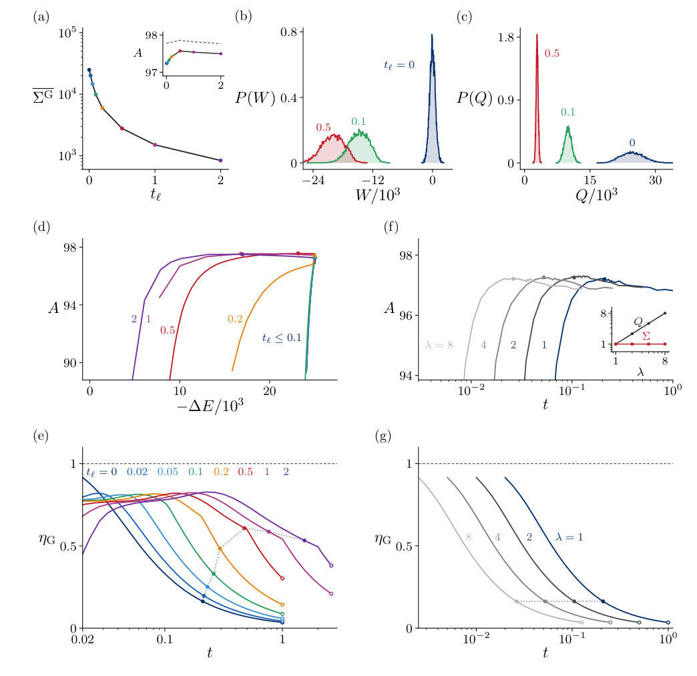 
FIG. 2. Thermodynamics of inference. (a) Mean entropy-production estimate (at the most accurate readout time) as a function of loading time. Inset: the corresponding MNIST test-set classification accuracy, with the T = 0 result shown dashed. Colors denote the loading times tℓ= 0, 0.02, 0.05, 0.1, 0.2, 0.5, 1, and 2 (from left to right). (b,c) Distributions of work and heat (in units of kBT); colors denote tℓ= 0, 0.1, and 0.5. (d) Test-set accuracy as a function of the mean energy (in kBT) lost by the computer; colors denote the loading times listed in panel (a). (e) The efficiency bound ηG(t) under loading. Colors denote the loading times listed in panel (a), while dots indicate the readout...

**Summary.** This work investigates the thermodynamic efficiency of a simulated quantum-like computer performing ML classification. By analyzing the system's dynamics under stochastic thermodynamics, the authors show that the computer can operate close to theoretical efficiency limits. The findings reveal that the operational protocols offer significant flexibility in balancing speed, accuracy, and energy dissipation.

**Why it may be interesting.** It provides a concrete, non-quantum example of applying fundamental non-equilibrium thermodynamic bounds (like speed limits) to assess the computational limits of physical hardware, which has parallels in open quantum system dynamics.

Detailed structure

**Main problem.** The paper assesses the thermodynamic efficiency of a simulated thermodynamic computer performing a machine-learning classification task.

**Main result.** Different inference protocols allow the computer to operate near the thermodynamic efficiency limit without losing accuracy, indicating considerable operational freedom.

**Method.** The study uses stochastic thermodynamics, specifically analyzing the Wasserstein speed limit and comparing it to the actual entropy production rate.

**Model / system.** The system is a stochastic physical device modeled by an overdamped Langevin equation, trained to classify MNIST images using a potential energy function with multiple interaction terms.

**Key observables.** Classification accuracy, $L_2$-Wasserstein distance ($W_2$), and thermodynamic efficiency ($\eta$).

**Important parameters / regimes.** Thermal energy scale ($k_B T$), runtime ($	au$), and the loading rate ($\Gamma_\ell(t)$).

**Assumptions / limitations.** The analysis relies on the Langevin equation approximation and uses Gaussian bounds for entropy production for practical calculations.

**Figures summary.** Figures illustrate the time evolution of classification accuracy, showing a peak at $	au=1/5$, and compare efficiency bounds under different loading protocols and time rescalings ($\lambda$).

**Paper structure.** The paper progresses by first establishing the basic performance metrics, then analyzing the effect of the loading protocol on efficiency, and finally examining the implications of the 'clock-acceleration procedure' on thermodynamic constraints.

Abstract

Thermodynamic computers are stochastic physical devices designed to perform calculations at the thermal energy scale. Their operation is constrained by the equations of stochastic thermodynamics, among which are a set of bounds, known as speed limits, that relate a thermodynamic computer's run time to its computational progress and the heat it dissipates. Using the Wasserstein speed limit we assess the thermodynamic efficiency of a simulation model of a thermodynamic computer trained to perform a standard machine-learning classification task. On this task the thermodynamic computer is as capable as a simple multilayer perceptron. We show that different inference protocols allow the computer to operate within 40\% of the thermodynamic limit of efficiency without loss of accuracy, or to perform inference increasingly rapidly at fixed accuracy and thermodynamic efficiency. These results indicate that a thermodynamic computer designed for a particular task retains considerable freedom in its thermodynamic operation.

[↑ back to top](#top)

### [A quantum generative model for in silico clinical trials using scarce training datasets](http://arxiv.org/abs/2608.28168v1)

**Authors:** Olatz Sanz Larrarte, Reza Dastbasteh, Roberto Sanchez-Navarro, Maria Diez-Campelo, Felipe Prosper, Ana Alfonso-Pierola, Mikel Hernaez, Sara Capponi, Pedro Crespo Bofill, Josu Etxezarreta Martinez  
**Type:** both · **Category:** quantum information and computing · **PDF:** <https://arxiv.org/pdf/2608.28168v1>  
**Analysis basis:** full PDF text, analyzed in chunks
**Topic relevance:** `QC/QI experiment` **1/5** · `methods for driven-dissipative` **1/5**

📷 Fig 1

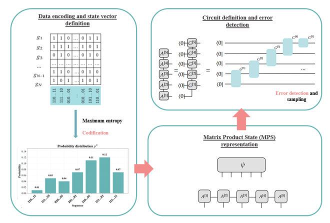 
Figure 1: Schematic representation of the methodology for synthetic data generation: (a) data encoding and definition of the joint state vector, (b) MPS discretization of the state, and (c) mapping onto a quantum circuit for sampling.

📷 Fig 2

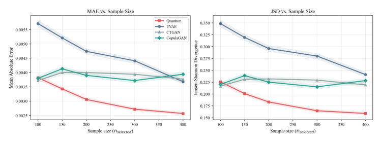 
Figure 2: Comparison of the proposed quantum model with classical baselines in terms of MAE and Jensen–Shannon divergence as a function of sample size.

📷 Fig 3

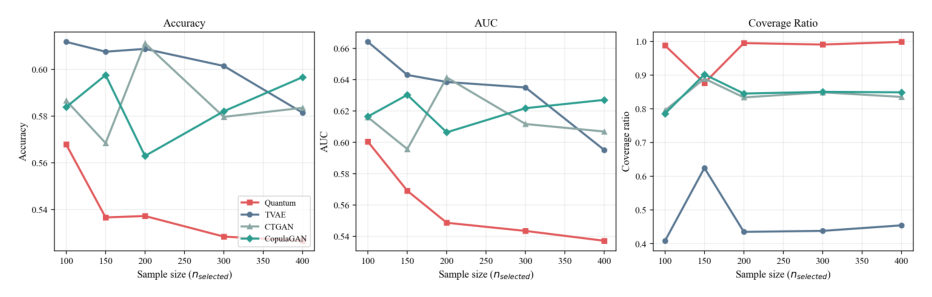 
Figure 3: Comparison of the proposed quantum model with classical baselines in terms of classification accuracy, AUC, and coverage ratio as a function of sample size.

📷 Fig 4

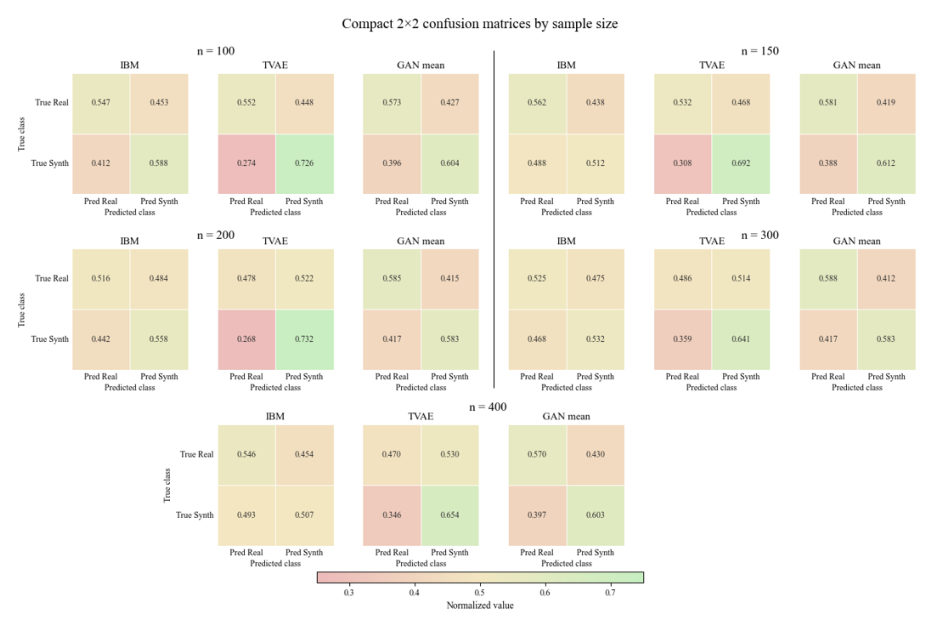 
Figure 4: Row-normalized 2×2 confusion matrices of the Random Forest classifier for the pro- posed quantum model and classical baselines (aggregated GAN baseline obtained by averaging the row-normalized confusion matrices of CTGAN and CopulaGAN) across all sample sizes. Values close to 0.5 indicate near-random discrimination between real and synthetic samples, supporting higher indistinguishability.

**Summary.** This paper introduces a quantum generative model designed to create realistic synthetic patient data for rare diseases where real data is scarce. It leverages quantum circuits, trained on maximum entropy principles, to model complex probability distributions. Results show this quantum approach outperforms established classical generative models in fidelity and expressivity metrics.

**Why it may be interesting.** While the application is biomedical, the core methodology involves advanced quantum circuit design, state preparation (MPS), and benchmarking against classical ML models, which is highly relevant to quantum algorithm development for complex data distributions.

Detailed structure

**Main problem.** The core problem is generating high-fidelity synthetic patient data for *in silico* clinical trials, especially when training datasets are scarce due to rare or heterogeneous diseases.

**Main result.** The proposed quantum generative model surpasses classical generative models in both generalization and expressivity metrics, indicating its potential for generating high-fidelity patient data.

**Method.** The authors propose a hybrid quantum-classical pipeline that maps the target joint probability distribution into a quantum circuit for sampling.

**Model / system.** The model uses a quantum generative approach, encoding the joint probability distribution into a quantum state, compressing it via a Matrix Product State (MPS), and executing the resulting circuit on a superconducting quantum computer (IBM Heron r2).

**Key observables.** Generalization metrics include Mean Absolute Error (MAE) and Jensen–Shannon Divergence (JSD); expressivity is measured by Random Forest classification accuracy, AUC, and Coverage Ratio.

**Important parameters / regimes.** The study tests performance across varying subsample sizes ($n_{	ext{selected}} \in \{100, 150, 200, 300, 400\}$) of the scarce data.

**Assumptions / limitations.** The primary limitations are the current noise levels and limited qubit counts of quantum devices, necessitating error-detection and post-selection steps.

**Figures summary.** Figures compare MAE/JSD and Accuracy/AUC vs. sample size, showing the quantum model's consistent superiority over classical baselines. Figure 4 displays confusion matrices confirming the quantum model's difficulty in distinguishing real from synthetic samples.

**Paper structure.** The paper introduces the problem of data scarcity in clinical trials, details the quantum generative pipeline (encoding via MPS, circuit mapping), compares performance against classical GANs/VAEs using multiple metrics, and concludes with empirical results demonstrating quantum superiority.

Abstract

In silico methods have emerged as a strategy to complement clinical trials. These are particularly relevant for rare or heterogeneous diseases for which traditional methods are costly or difficult to apply. While classical generative models have shown an extremely good ability to generate high fidelity data when trained using extensive databases, they often struggle when the available samples for training are scarce. In this work, we leverage the potential of quantum computers to represent complex probability distributions to generate high fidelity in silico patients. We propose a pipeline able to combine asymmetric databases into a quantum circuit that serves as a quantum generative model. We evaluate the efficacy of our proposal using a database of Myelodysplastic Syndrome (MDS) patients with 7 clinical variables as a proof-of-concept. We executed our quantum generative model in the IBM Heron r2 ``ibm\_basquecountry'' superconducting quantum computer and compare our method with well known classical baselines. Our results show that the quantum generative model surpasses the classical generative models in generalization and expressivity metrics, indicating its potential validity to generate high fidelity in silico patients for clinical trials.

[↑ back to top](#top)

### [Quantum computation of partonic Drell-Yan scattering cross sections and interference effects](http://arxiv.org/abs/2608.28057v1)

**Authors:** Erik Bashore, Stefano Moretti, Timea Vitos  
**Type:** theory · **Category:** quantum information and computing · **PDF:** <https://arxiv.org/pdf/2608.28057v1>  
**Analysis basis:** full PDF text, analyzed in chunks
**Topic relevance:** `Keldysh / 2PI / non-Gaussian methods` **1/5** · `interference shaping light` **1/5**

📷 Fig 1

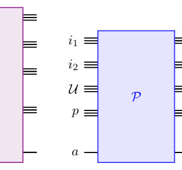 
Figure 1: Circuit diagram representations of the primary quantum gates.

📷 Fig 2

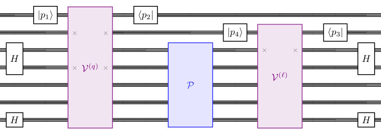 
Figure 2: The full quantum circuit for simulating a DY scattering process of the form q¯q →γ/Z →ℓ−ℓ+.

📷 Fig 3

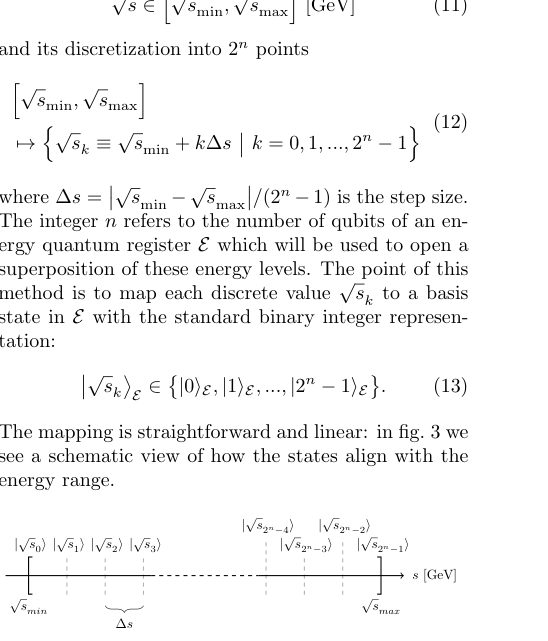 
Figure 3: Discretization and state encoding of the PS range √s ∈[√smin, √smax].

📷 Fig 4

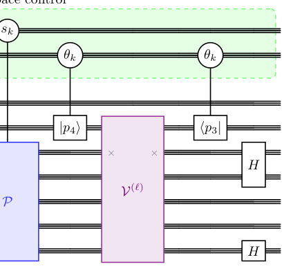 
Figure 4: The PS controlled version of the DY circuit with new registers E and Θ.

📷 Fig 5

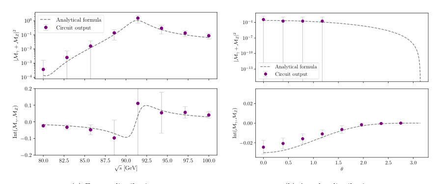 
Figure 5: Circuit output for DY scattering with (a) fixed θ = π/3 and (b) fixed √s = 80 GeV at the amplitude level with full amplitude squared (top) and the associated interference pattern (below). In both simulations the circuit was run for 2 × 107 shots and 25 batches where the presented errors are the standard deviations of the batches and the points are the batch averages. The true value was computed from the analytical expressions for Mγ and MZ in eqs. (A.18) to (A.19). For viewing convenience the interference plot has been zoomed in, the large uncertainty at the resonance peak reach up to ∼0.8.

**Summary.** This work proposes using quantum computation to calculate scattering cross sections for processes like Drell-Yan scattering by encoding Feynman diagrams into quantum gates. The authors develop a general circuit that can simultaneously compute the total cross-section and isolate interference effects by leveraging quantum superposition over phase space coordinates.

**Why it may be interesting.** While focused on particle physics, the core contribution is the development of a general, scalable quantum circuit framework for simulating complex quantum field theory amplitudes, which is a major computational primitive for quantum algorithms.

Detailed structure

**Main problem.** The paper addresses the challenge of efficiently calculating complex scattering cross sections, particularly including interference effects, by mapping Feynman diagram calculations onto quantum circuits.

**Main result.** They demonstrate a general quantum circuit design capable of simultaneously estimating the full integrated cross-section and isolating interference terms for processes like Drell-Yan scattering.

**Method.** The methodology involves constructing specialized quantum gates (Vertex, Propagator, Spinor) that encode Feynman rules, and then using quantum superposition and basis rotations to evaluate phase space integrals and interference terms.

**Model / system.** The physical system is the partonic Drell-Yan lepton pair creation process ($qar{q} 
ightarrow \gamma/Z 
ightarrow \ell^-\ell^+$) within the Standard Model electroweak theory. The computation is performed using quantum circuits simulating the underlying quantum field theory interactions.

**Key observables.** Full integrated cross-section ($\sigma$) and the isolated interference contribution ($	ext{Int} \langle M_i, M_j 
angle$).

**Important parameters / regimes.** The process depends on the interplay between photon ($\gamma$) and $Z$ boson contributions, and the calculation requires discretizing the phase space over energy ($\sqrt{s}$) and scattering angle ($	heta$).

**Assumptions / limitations.** The initial focus is restricted to the partonic level, neglecting Parton Distribution Functions (PDFs). Furthermore, unitarity requires defining a 'pole factor roof' $ar{m}$ for rescaling.

**Figures summary.** Figures illustrate the decomposition of fundamental gates (Dirac matrices, $\eta$ gate, spinor gates, Vertex, Propagator) and show the full quantum circuit for the DY process, including PS control registers $E$ and $\Theta$.

**Paper structure.** The paper systematically details the construction of necessary quantum gates (Dirac matrices, metric, spinor states, vertices, propagators) into fundamental quantum gates, followed by demonstrating the full circuit for the DY process, and finally showing how PS integration and interference isolation are achieved.

Abstract

We probe the possibilities of efficiently constructing simple Feynman diagrams into quantum devices. More precisely, we study Drell-Yan lepton pair creation at the partonic level of the form q qbar -> gamma/Z -> l- l+. We develop quantum gates that build up the relevant diagrams using simple Feynman rules, such as vertex and propagator gates V and P. We show how the quantum circuit may compute simultaneous amplitudes in the phase space and how to reach the full integrated cross section from the outputs. In addition to this, we also show how the circuit is able to simultaneously isolate the interference effects of the contributing diagrams by a simple basis rotation. The circuit design is made to be general, and thus this work constitutes a step towards the implementation of arbitrary scattering process computations and efficient interference analyses.

[↑ back to top](#top)

### [Vectorized Symmetric and Fermionic Tensor Network Implementations for GPU-Accelerated Variational Monte Carlo](http://arxiv.org/abs/2608.27861v1)

**Authors:** Si-Jing Du, Johnnie Gray, Ao Chen, Garnet Kin-Lic Chan  
**Type:** theory · **Category:** strongly correlated electrons · **PDF:** <https://arxiv.org/pdf/2608.27861v1>  
**Analysis basis:** full PDF text, analyzed in chunks
**Topic relevance:** `analog quantum simulation` **1/5** · `methods for driven-dissipative` **1/5**

📷 Fig 1

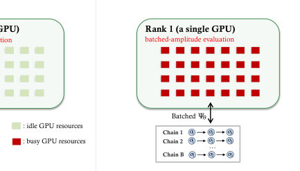 
Figure 1: Parallelization schemes for TN-VMC sampling. (a) In tradi- tional TN-VMC, an MPI-parallelized program assigns one Markov chain to each MPI rank, and amplitudes are evaluated sequentially along each chain. (b) A naive GPU port keeps the same one-chain-per-rank structure, exposing only a single-configuration amplitude evaluation to the GPU at each Markov move. (c) The vectorized GPU scheme assigns B chains to each GPU rank and evaluates the corresponding amplitudes at each move stage as a batched-amplitude evalu- ation with a shared computational graph and a leading batch axis.

📷 Fig 2

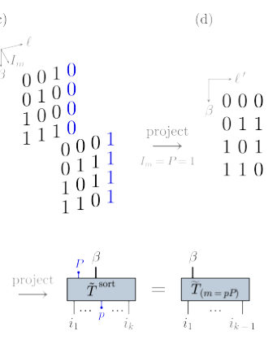 
Figure 3: An example of sorting, reshaping, and projecting the sector charge table, I, for a k = 4 rank tensor of Z2 symmetry and charge Q = 1, with leg m projected onto charge P = 1. (a) The array is initially indexed by α and ℓ. (b) Sorting by the entries on m yields a new index α′. (c) This can be reshaped into two sub-indices: Im, which indexes the charge of leg m, and β, which indexes the remaining charge tuples. (d) Finally we project onto the desired value Im = P = 1 and drop leg m, yielding a new charge table indexed by β and ℓ′. (e) The corresponding leading axis transformation and projection of the flat blocks, eT, depicted graphically.

📷 Fig 3

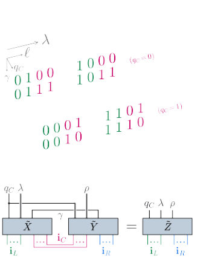 
Figure 4: An example of sorting and reshaping the sector charge table I of a flat tensor e X with Z2 symmetry and charge Q = 1 to prepare for contraction. (a) The array is initially indexed by sector index α and leg index ℓ. IL denotes the charge columns of legs to be kept, IC those to be contracted away. (b) Sorting the rows lexicographically by  qC, IL, IC  yields a new sector index α′. (c) This can be reshaped into three sub-indices: qc, which indexes the combined contracted charge (row-sum of ℓ∈C); λ, which indexes the possible charge sectors on the kept legs; and γ, which indexes the remaining charge sectors on the contracted legs. (d) The corresponding leading axis transformation on...

📷 Fig 4

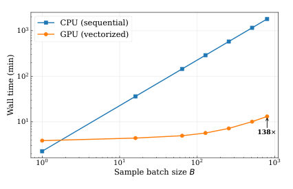 
Figure 5: Single-rank VMC step time as a function of the sample batch size B. (a) TNF-fPEPS with bond dimension D = 12 and boundary-MPS bond dimension χ = 12. (b) Standard fPEPS with bond dimension D = 8 and boundary-MPS bond dimension χ = 32, using boundary-MPS environment reuse. CPU timings use one MPI rank with a single CPU core and sequential amplitude evaluation. GPU timings use one MPI rank controlling one GPU and batched amplitude evaluation with batch size B.

📷 Fig 5

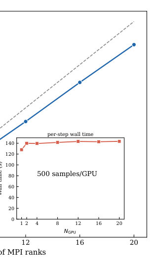 
Figure 6: Multi-GPU throughput scaling of batched TN-VMC. Standard fPEPS-VMC on an 8×8 Fermi–Hubbard lattice with bond dimension D = 8 and boundary-MPS bond dimension χ = 32. Each MPI rank controls one GPU and carries a fixed batch of B = 500 walkers. The main panel shows the total number of Monte Carlo samples processed per second of VMC-step wall time as a function of the number of MPI ranks/GPUs; the dashed line indicates ideal linear throughput scaling. The inset shows the VMC-step wall time remains constant as the number of GPUs is increased.

**Summary.** This paper tackles the computational bottleneck in Tensor Network Variational Monte Carlo (TN-VMC) by developing a vectorized framework optimized for GPUs. By reformulating tensor network operations into a 'flat' formalism, the authors enable batch processing of multiple Monte Carlo configurations. This results in dramatic speedups for simulating fermionic systems like the Fermi-Hubbard model, advancing the feasibility of studying strongly correlated materials.

**Why it may be interesting.** The focus on GPU acceleration and vectorization techniques for simulating strongly correlated electron models is highly relevant for computational quantum physics, providing concrete algorithmic improvements for simulating Hubbard-type Hamiltonians.

Detailed structure

**Main problem.** The primary challenge addressed is improving the computational efficiency of Tensor Network Variational Monte Carlo (TN-VMC) calculations by enabling full utilization of modern GPU acceleration.

**Main result.** The authors developed a vectorized, GPU-adapted workflow using a 'flat' symmetric tensor formalism, achieving significant speedups (up to $300	imes$) over CPU implementations for fermionic systems.

**Method.** The core method involves vectorizing the evaluation of tensor network amplitudes by batching computations over multiple Markov chains (configurations) that share the same underlying tensor structure.

**Model / system.** The work is applied to strongly correlated spin and fermionic systems, with the two-dimensional Fermi–Hubbard model serving as the primary demonstration case. The variational wavefunctions are represented by Tensor Networks (TNS).

**Key observables.** Variational energy $E(	heta)$, wavefunction amplitudes $\Psi_	heta(\sigma)$, and computational speedup factors.

**Important parameters / regimes.** The batch size $B$ (number of configurations processed simultaneously) and the structure of the tensor network (e.g., abelian symmetric vs. general).

**Assumptions / limitations.** The method assumes that the residual contraction graph for a set of configurations can be grouped by geometry, allowing for a shared computational graph suitable for dense batched tensor operations.

**Figures summary.** Figure 1 illustrates the transition from traditional MPI-parallelization to an efficient, vectorized GPU scheme by batching amplitude evaluations. Other figures detail the structure of tensor block representations and contraction schemes.

**Paper structure.** The paper first identifies the GPU bottleneck in existing TN-VMC. It then introduces the 'flat' symmetric tensor formalism to enable vectorization. The methodology is detailed by showing how to batch amplitude evaluations, which is demonstrated on the Fermi-Hubbard model, leading to performance benchmarks and extensions to other TN-VMC applications.

Abstract

Variational Monte Carlo (VMC) calculations based on tensor networks (TN) have recently achieved competitive accuracy in ground-state calculations of strongly correlated spin and fermionic systems. However, existing tensor network VMC (TN-VMC) algorithms have not been formulated in a manner that can fully utilize GPU acceleration. We tackle the key missing ingredient, namely, the vectorized evaluation of tensor network amplitudes and tensor network operations. This ensures high GPU utilization by batching over computations with identical structure. In particular, we show how to achieve vectorization for the practically relevant case of abelian symmetric tensor networks (which includes fermionic tensor networks) by developing a ``flat'' tensor network formalism for block-sparse tensor representation and contraction. Using this, we construct a GPU-adapted symmetric TN-VMC workflow with batched tensor network computation. In the two-dimensional Fermi--Hubbard model, we demonstrate a GPU speedup of up to $300 \times$ over single core CPU implementations, for fermionic TN variational wavefunctions.

[↑ back to top](#top)

### [High-Throughput Normalized Min-Sum Belief Propagation Decoding for Quantum LDPC Codes with Near-Memory Processing](http://arxiv.org/abs/2608.27901v1)

**Authors:** Jeonggeun Seo, Youngsun Han, Leanghok Hour, Dongmin Kim  
**Type:** both · **Category:** quantum information and computing · **PDF:** <https://arxiv.org/pdf/2608.27901v1>  
**Analysis basis:** full PDF text, analyzed in chunks
**Topic relevance:** `QC/QI experiment` **1/5**

📷 Fig 1

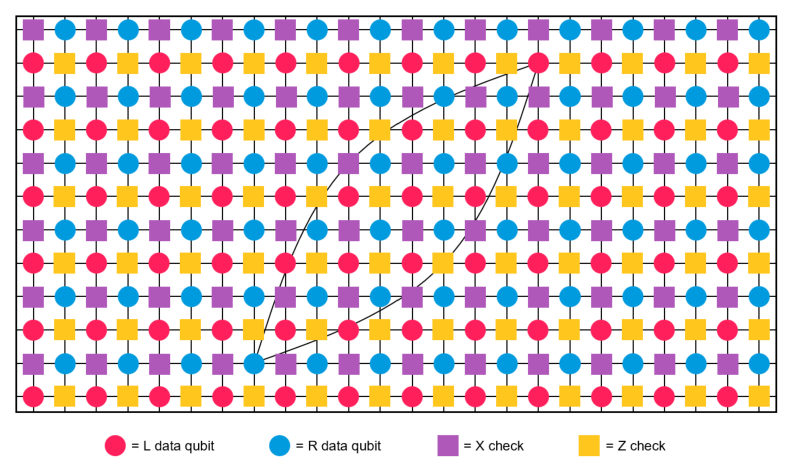 
Figure 1: Tanner-graph structure of the [[144, 12, 12]] Bivariate Bicycle qLDPC code used in this work. Circles represent data (variable) nodes, while squares represent check nodes. The data nodes are divided into two registers, and the check nodes are divided into two stabilizer- check types. Long-range connections are shown schematically, while individual edge types are not distinguished for visual clarity.

📷 Fig 2

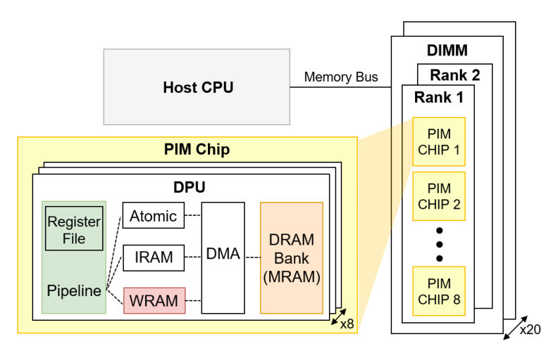 
Figure 2: DPU-based PIM architecture used as the near-memory processing platform in this work. The host CPU communicates with PIM-enabled DIMMs through the memory bus. Each DIMM contains two ranks, each rank contains eight PIM chips, and each PIM chip contains eight DPUs, giving 2,560 DPUs in the 20-DIMM configuration. Each DPU includes a processing pipeline, register file, atomic unit, IRAM, WRAM, DMA support, and a local DRAM bank referred to as MRAM.

📷 Fig 3

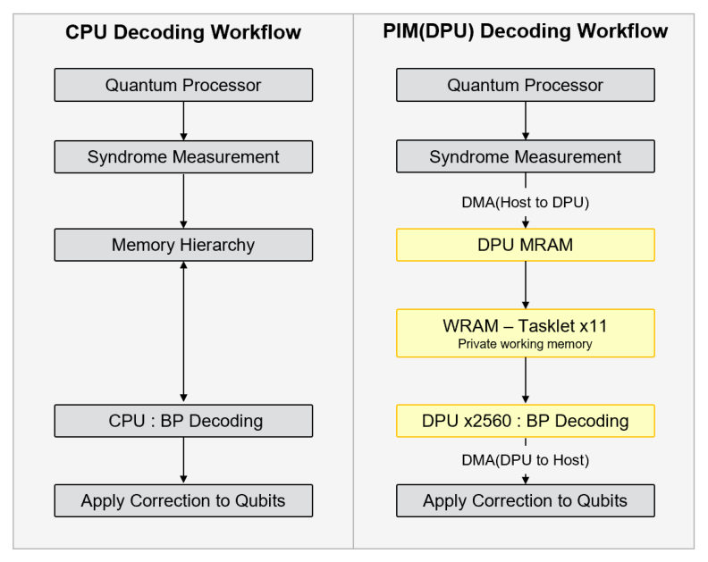 
Figure 3: Overview of the conventional CPU-based and proposed DPU-based PIM decoding workflows. The proposed workflow offloads normalized Min-Sum BP computation to the DPUs and distributes independent syndrome instances across multiple DPUs for parallel decoding.

📷 Fig 4

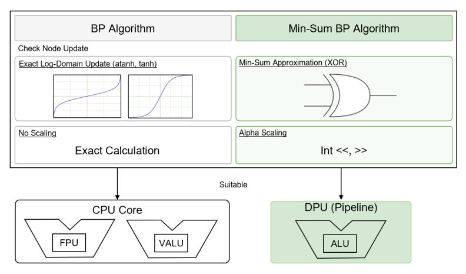 
Figure 4: Arithmetic comparison of standard log-domain BP and normalized Min-Sum BP for DPU execution. Standard BP evaluates nonlinear functions such as tanh and atanh in the check-node update. Normalized Min-Sum uses sign evaluation, minimum-magnitude selection, and fixed-point scaling. The evaluated implementation uses α = 0.75 = 3/4, allowing the normalization step to be expressed using integer addition and bit shifting.

📷 Fig 5

 
Figure 4 compares the arithmetic structures of standard log-domain BP and normalized Min-Sum BP from the DPU execution perspective. The normalized Min-Sum implementation used in this work fixes the normalization factor to α = 0.75 = 3/4. With this value, the normalization step in the fixed-point implementation can be expressed using integer addition and bit shifting. Let mv→c denote the message from variable node v to check node c, and let mc→v denote the message in the opposite direction. Let N(c) and N(v) denote the neighboring variable and check nodes of c and v, respectively. For a measured syndrome value sc, the normalized Min-Sum check-node update is expressed as

**Summary.** This paper demonstrates a high-performance computing solution for decoding quantum error-correcting codes using a DPU-based Processing-in-Memory (PIM) architecture. By mapping the iterative Belief Propagation decoding onto this near-memory platform, the authors achieve significant throughput gains and maintain predictable, low compute latency required for real-time quantum operations. This validates PIM as a viable accelerator for next-generation quantum hardware.

**Why it may be interesting.** This work is highly relevant as it tackles the computational bottleneck of fault-tolerant quantum computation by proposing a hardware acceleration strategy (PIM) for decoding algorithms central to QEC.

Detailed structure

**Main problem.** The paper addresses the need for classical decoders to process growing syndrome workloads in real-time quantum error correction (QEC) with low and predictable latency.

**Main result.** Implementing normalized Min-Sum Belief Propagation decoding on a DPU-based Processing-in-Memory (PIM) architecture yields an 8.8x throughput improvement over CPU baselines and maintains sub-millisecond compute latency.

**Method.** The authors mapped the iterative Min-Sum BP decoding algorithm onto a DPU-based PIM architecture, leveraging massive parallelism by distributing independent syndrome instances across thousands of DPUs.

**Model / system.** The work focuses on decoding for Quantum Low-Density Parity-Check (qLDPC) codes, specifically the [[144,12,12]] Bivariate Bicycle code. The computation is modeled using a DPU-based PIM architecture, which allows for near-memory processing.

**Key observables.** Throughput (decodes/s), per-syndrome processing time, single-syndrome tail latency, and Logical Error Rate (LER).

**Important parameters / regimes.** Component-wise physical error probability (p=0.001), number of BP iterations (1 to 5), and the 1 ms decoder-side timing reference for trapped-ion QEC.

**Assumptions / limitations.** The DPU latency measured is the decoder-side compute time, excluding host-DPU communication overhead. The Min-Sum BP normalization factor is fixed at 0.75 to enable integer arithmetic.

**Figures summary.** Figures illustrate the qLDPC code structure (Tanner graph) and compare the decoding workflows and latency distributions between the CPU and the proposed DPU-based PIM architecture.

**Paper structure.** The paper introduces the QEC decoding bottleneck, details the mapping of Min-Sum BP to the DPU-PIM architecture, presents quantitative comparisons of throughput and latency against a CPU baseline, and concludes with performance validation across varying error rates and iterations.

Abstract

Real-time quantum error correction requires classical decoders to process growing syndrome workloads with low and predictable latency. For quantum low-density parity-check (qLDPC) codes, iterative belief propagation (BP) repeatedly updates messages over sparse Tanner graphs, creating substantial memory-access and data-movement demands. We map normalized Min-Sum BP decoding of the [[144,12,12]] Bivariate Bicycle qLDPC code onto a DPU-based Processing-in-Memory (PIM) architecture. Within each DPU, 11 tasklets cooperatively decode one syndrome, while multiple DPUs process independent syndrome instances in parallel. Using uPIMulator and a data-qubit Pauli error model with ideal syndrome measurements, we compare throughput, per-syndrome processing time, logical error rate (LER), and single-syndrome tail latency against a 16-logical-CPU baseline. At a component-wise physical error probability of p=0.001 and one BP iteration, the projected aggregate kernel throughput of 2,560 DPUs reaches 1.071 x 10^7 decodes/s, compared with 1.22 x 10^6 decodes/s for the CPU, an 8.8x improvement. From two iterations onward, the measured LER remains below the physical error probability for every evaluated value of p. For one to five iterations, the maximum sampled serialized X+Z DPU compute latency remains below the 1 ms decoder-side reference for trapped-ion QEC, reaching approximately 0.873 ms at five iterations. These results show that near-memory processing can provide high aggregate throughput and sub-millisecond compute latency for qLDPC BP decoding under the evaluated conditions.

[↑ back to top](#top)

### [Hybrid Heralded Noiseless Amplification with Finite-Cutoff Quantum Scissors](http://arxiv.org/abs/2608.27872v1)

**Authors:** Haixi Miao, Timothy C. Ralph  
**Type:** theory · **Category:** quantum information and computing · **PDF:** <https://arxiv.org/pdf/2608.27872v1>  
**Analysis basis:** full PDF text, analyzed in chunks
**Topic relevance:** `quantum measurements` **1/5**

📷 Fig 1

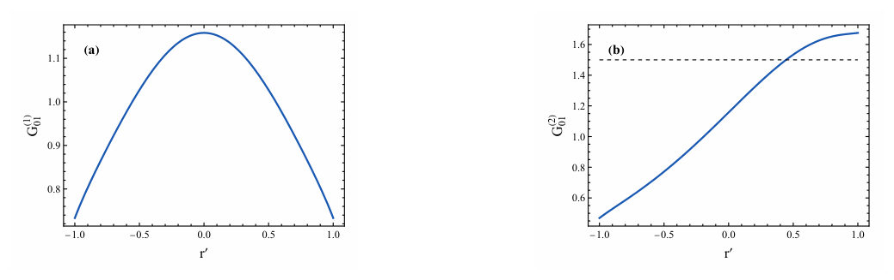 
FIG. 1. Effective gain G(N) 01 as a function of the second squeezing parameter r′ for (a) cutoff 1 and (b) cutoff 2. The parameters are r = 0.75, g = 1.5, and α = 0.1. The dashed line denotes the internal NLA gain g = 1.5.

📷 Fig 2

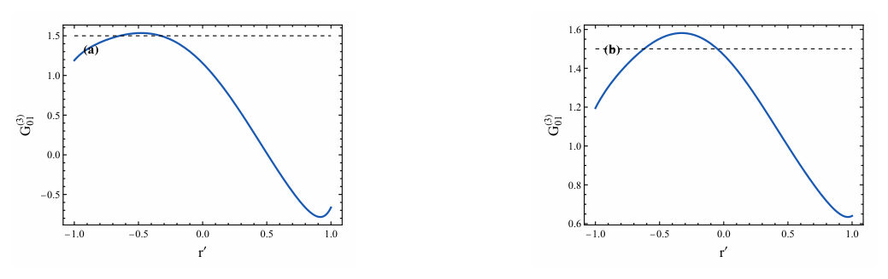 
FIG. 2. Effective gain G(3) 01 as a function of r′, with g = 1.5 and α = 0.1, for (a) r = 0.75 and (b) r = 0.20. The dashed line denotes the internal NLA gain g = 1.5.

📷 Fig 3

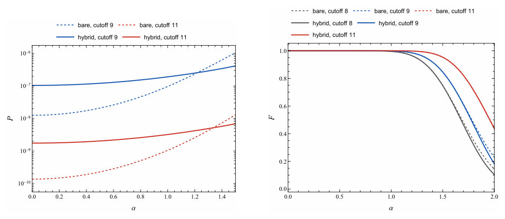 
FIG. 3. Comparison of the bare NLA and the hybrid device. (a) Success probability for cutoffs 9 and 11. Increasing the cutoff reduces the absolute success probability, while the hybrid device gives a higher probability than the bare NLA at each fixed cutoff before α = 1.4. (b) Fidelity with the target coherent state for cutoffs 8, 9, and 11. The hybrid fidelity approaches that of the bare NLA as the cutoff is increased. For each cutoff, the bare NLA is evaluated at the effective gain of the corresponding hybrid device.

📷 Fig 4

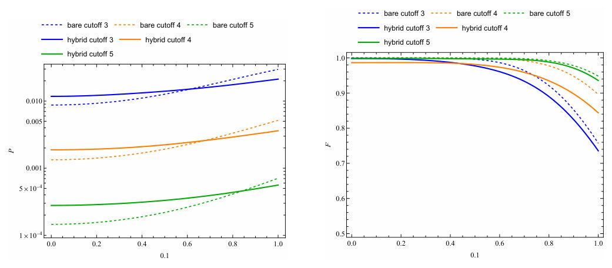 
FIG. 4. Comparison of the hybrid amplifier and the corresponding bare NLA at cutoffs 3, 4, and 5. For each cutoff, the second-squeezer parameter r′ is chosen at the maximum of the effective gain, and the bare NLA is evaluated at that same gain. The common parameters are r = 0.2 and g = 1.5. (a) Success probability and (b) fidelity with the corresponding target coherent state as functions of the real input amplitude α.

📷 Fig 5

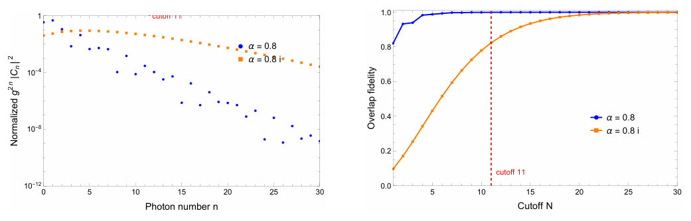 
FIG. 5. Effect of the finite photon-number cutoff for coherent inputs with the same magnitude and orthogonal phases. The parameters are r = 0.25 and g = 1.5. (a) Normalized photon-number weights g2n|Cn|2 after the first squeezer and NLA weighting. The imaginary input has substantially more weight above cutoff 11. (b) Fidelity between the cutoff-N output and the corresponding untruncated output, obtained from Eq. (39). The real input is already converged at cutoff 11, whereas the imaginary input requires a higher cutoff. The dashed lines indicate cutoff 11.

**Summary.** This paper analyzes a hybrid quantum amplifier that uses a finite-cutoff quantum-scissor mechanism to achieve noiseless amplification. While the ideal theory predicts perfect enhancement, the finite cutoff introduces phase dependence and limits fidelity. The results show that while the hybrid device offers a heralding advantage, maintaining high fidelity requires careful management of the input state phase and increasing the cutoff.

**Why it may be interesting.** This work directly addresses the practical limitations of achieving ideal quantum operations (like noiseless amplification) by modeling the effects of physical constraints, such as finite energy cutoffs, which is a key topic in quantum optics and quantum information.

Detailed structure

**Main problem.** The study investigates the performance of a hybrid noiseless linear amplifier (NLA) that incorporates a finite-cutoff quantum-scissor NLA placed between two single-mode squeezers.

**Main result.** The hybrid device shows a significant heralding probability advantage over a bare NLA, but its fidelity is highly sensitive to the input phase and degrades as the input squeezing increases due to the finite cutoff.

**Method.** The analysis uses Fock-basis expansions to model the state evolution through the hybrid amplifier, comparing the resulting effective gain, success probability, and fidelity against the ideal, infinite-cutoff case.

**Model / system.** The system is a quantum optical setup comprising two single-mode squeezers sandwiching a finite-cutoff NLA, which truncates the photon Fock space up to a maximum number $N$.

**Key observables.** Effective gain ($G$), Success probability ($P$), and Fidelity ($F$) are the primary observables used to characterize the amplification process.

**Important parameters / regimes.** The cutoff photon number ($N$), the squeezing parameters ($r, r'$), and the input coherent amplitude phase ($\alpha$) are crucial parameters.

**Assumptions / limitations.** The ideal NLA is assumed to have zero success probability over the full Fock space, and the finite cutoff introduces phase dependence and fidelity loss.

**Figures summary.** Figures compare the effective gain, success probability, and fidelity of the hybrid device versus the bare NLA at various cutoffs (e.g., cutoff 11) and input squeezing parameters ($\chi$).

**Paper structure.** The paper first establishes the ideal infinite-cutoff transformation, then analyzes the finite-cutoff device, demonstrating how gain enhancement emerges with increasing cutoff, and finally comparing the performance metrics (P and F) against the bare NLA.

Abstract

A noiseless linear amplifier (NLA) can probabilistically amplify an optical state without the noise required by deterministic phase-insensitive amplification. We study a hybrid amplifier in which a finite-cutoff quantum-scissor NLA is placed between two single-mode squeezers. Analysis based on an ideal (infinite cutoff) NLA finds a gain enhancement from the squeezing. We explore the physics of this enhancement as the cutoff of the quantum scissors is increased. The low-cutoff sequence shows how this gain enhancement emerges from the truncated Fock space. Cutoff 3 is the lowest order at which the additional even- and odd-photon components can both contribute to gain enhancement, albeit with some skewing of the coefficients which reduces the fidelity. As the cutoff is increased the fidelity improves. However, unlike the ideal transformation, the finite-cutoff device depends on the phase of the coherent amplitude relative to the squeezing axes, with states aligned with the anti-squeezing requiring higher cutoffs to achieve high fidelity. We track behavior to high cutoffs and eventually see the performance predicted in the ideal theory emerge.

[↑ back to top](#top)

### [Landau theory of quenched criticality in linear in-context learning](http://arxiv.org/abs/2608.28059v1)

**Authors:** Daesik Kim, Sumin Choi, Hyojae Jeon, Jung Hoon Han  
**Type:** theory · **Category:** disordered systems and neural networks · **PDF:** <https://arxiv.org/pdf/2608.28059v1>  
**Analysis basis:** full PDF text, analyzed in chunks
**Topic relevance:** `non-equilibrium universality` **1/5**

📷 Fig 1

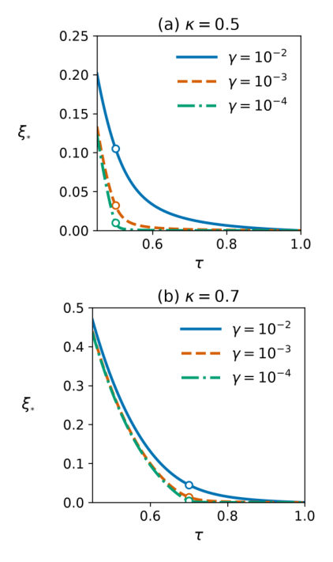 
FIG. 1: Order parameter ξ∗as a function of τ below the critical temperature τc = 1 for several values of κ &lt; 1 and γ ≪1. The crossover temperature τ = κ is indicated by hollow circles. The residual order in the crossover region κ &lt; τ &lt; 1 diminishes as γ →0.

📷 Fig 2

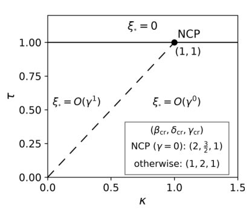 
FIG. 2: Schematic phase diagram for γ ≪1 in the (κ,τ) plane. The transition between the ordered phase ξ∗&gt; 0 and disordered phase ξ∗= 0 occurs at τc = 1 (solid line). Above the crossover temperature τ = κ (dashed line), the ordered phase exhibits a small residual order ξ∗= O(γ) characteristic of a pseudogap regime. When we take the γ →0 limit first, the crossover line becomes the exact phase transition. Furthermore, the nonanalytic critical point (NCP) at (κ,τ) = (1,1) develops new critical exponents (βcr,δcr,γcr) = (2,3/2,1) different from the rest of the phase diagram where (βcr,δcr,γcr) = (1,2,1).

📷 Fig 3

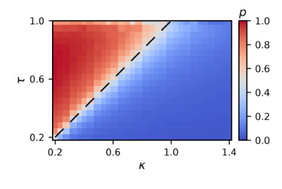 
FIG. 4: Map of the numerically extracted power-law exponents p in the assumed scaling relation ξ∗∝γ p. The ordered phase τ &lt; 1 separates into two distinct scaling regimes with p ≈0 and p ≈1 (pseudogap region), divided by the theoretically predicted crossover line τ = κ (dashed line).

📷 Fig 4

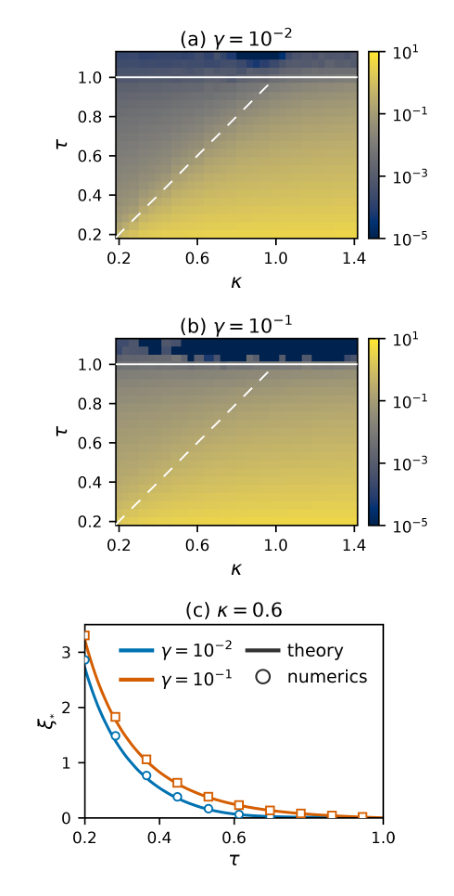 
FIG. 3: Plot of the order parameter ξ∗in the (κ,τ) plane for (a) γ = 10−2 and (b) γ = 10−1. The solid and dashed white lines are the true critical line τ = 1 and crossover line τ = κ, respectively. Other parameters used are d = 30, λ = 10−5, and σ = 0. A small shift ξ∗→ξ∗+10−5 was made to avoid numerical instability of the logarithm at small ξ∗. Depression of the order parameter in the pseudogap region is highly visible for very small value of γ used in (a). (c) Comparison of the order parameter extracted from Eq. (6.1) (hollow marks) with the theoretical curves obtained by solving the self-consistency equation (5.1) at κ = 0.6.

**Summary.** This paper analyzes the interpolation singularity in linear in-context learning by mapping the problem onto the framework of critical phenomena in disordered systems. Using a Landau theory approach, the authors derive critical exponents and predict the behavior of the system near the singularity. This work provides a solid statistical-physics understanding of how learning capacity limits manifest in modern AI models.

**Why it may be interesting.** The application of established critical phenomena tools (Landau theory, critical exponents) to the dynamics of deep learning models provides a powerful, physics-grounded framework for understanding generalization and learning capacity.

Detailed structure

**Main problem.** The paper investigates the interpolation singularity in linear in-context learning (ICL) by treating it as a critical phenomenon in a quenched disordered system.

**Main result.** A Landau theory is constructed, predicting critical exponents $(eta_{cr}, \delta_{cr}, \gamma_{cr}) = (1, 2, 1)$ for the singularity, which is confirmed by numerical simulations.

**Method.** The authors compare annealed and quenched descriptions of the linear ICL model, constructing a Landau potential from the cavity self-consistency equation.

**Model / system.** The model is linear ICL, where prediction error exhibits a double-descent singularity when pretraining samples approach the number of parameters. The analysis uses concepts from statistical physics, mapping ICL parameters to temperature and magnetic field variables.

**Key observables.** Landau susceptibility, order parameter ($\xi$), and the prediction error ($E$).

**Important parameters / regimes.** Normalized sample complexity ($	au$), context length ($\alpha$), task diversity ($\kappa$), and the critical temperature ($	au_c = 1$).

**Assumptions / limitations.** The theory assumes that connected sample-to-sample fluctuations are the microscopic origin of the singular error, and it relies on asymptotic limits ($d 	o \infty$).

**Figures summary.** Figures illustrate the order parameter $\xi^*$ in the $(\kappa, 	au)$ plane, showing the true critical line ($	au=1$) and crossover line ($	au=\kappa$), and map the numerically extracted power-law exponents $p$ in the scaling relation $\xi^* \propto \gamma^p$.

**Paper structure.** The paper follows a structure detailing the formulation, annealed theory, quenched cavity solution, Landau functional construction, numerical testing, and final summary.

Abstract

In-context learning (ICL) allows a pretrained model to infer a new task from examples supplied in its prompt without updating its parameters. In linear models of ICL, the prediction error develops a double-descent singularity when the number of pretraining samples becomes comparable to the number of learnable parameters. We formulate this interpolation singularity as a critical phenomenon of a quenched disordered system. By comparing annealed and quenched descriptions of the same linear ICL model, we identify the connected sample-to-sample fluctuations of the learned parameters as the microscopic origin of the singular error. A Landau potential is constructed by integrating the cavity self-consistency equation for the renormalized ridge parameter $ξ$. The role of (magnetization) order parameter is played by $ξ$, while the bare ridge parameter $λ$ becomes its conjugate magnetic field. The normalized sample complexity $τ$ acts as a temperature and the double-descent singularity occurs at the critical temperature $τ_c =1$. The Landau susceptibility is precisely the quantity that diverges in the fluctuation contribution to the prediction error. The order parameter is closely related to the fraction of zero eigenvalues of the empirical relaxation matrix in the ridgeless limit, which define flat directions in the learning dynamics. The Landau theory is generically cubic in the order parameter with critical exponents $(β_{\rm cr},δ_{\rm cr},γ_{\rm cr})=(1,2,1)$. In the large-context regime, there appears a pseudogap-like regime characterized by suppressed order parameter. Predictions of the Landau theory are independently confirmed from numerical solutions of the original learning problem with good quantitative agreement. Our results pave the way for solid statistical-physics understanding of the interpolation criticality in linear in-context learning.

[↑ back to top](#top)

### [Logical Neural Belief Propagation for Linear-Complexity Decoding of Surface Codes](http://arxiv.org/abs/2608.27682v1)

**Authors:** Hee-Youl Kwak, Seong-Joon Park, Dae-Young Yun, Eliya Nachmani, Jae-Won Kim  
**Type:** theory · **Category:** quantum information and computing · **PDF:** <https://arxiv.org/pdf/2608.27682v1>  
**Analysis basis:** full PDF text, analyzed in chunks
**Topic relevance:** `quantum measurements` **1/5**

📷 Fig 1

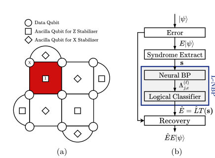 
FIG. 1. (a) A d = 3 surface-code lattice with data and ancilla qubits and stabilizers. (b) QEC workflow: a physical error E induces the syndrome s, and L-NBP uses s to infer a recovery operation.

📷 Fig 2

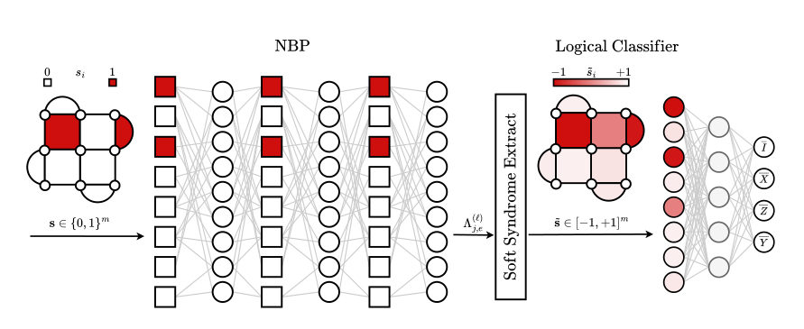 
FIG. 2. The proposed L-NBP decoder consists of two stages. The NBP module processes the measured hard syndrome s and produces posterior beliefs Λ(ℓ) j,e; the logical classifier then converts these beliefs into a soft syndrome ˜s and maps it to the logical operator. All stages of L-NBP are trained end-to-end for accurate logical classification.

📷 Fig 3

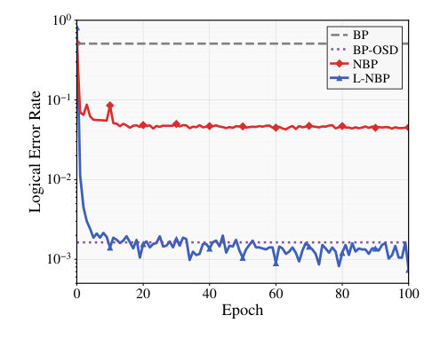 
FIG. 3. LER versus training epochs for the d = 9 surface code under the code-capacity model. Both NBP and L-NBP improve on BP, but only L-NBP converges to a substantially lower LER and surpasses the BP-OSD baseline.

📷 Fig 4

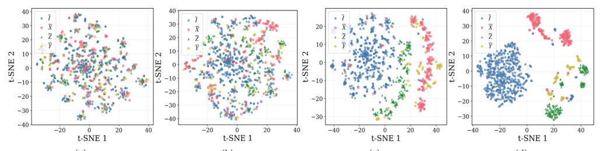 
FIG. 4. t-SNE visualization of the L-NBP soft syndrome ˜s at successive training stages, after (a) 100, (b) 500, and (c) 1000 training batches, and (d) at the end of training (surface code d = 9, p = 0.05). Each color represents one of the four logical operators {¯I, ¯ X, ¯Z, ¯Y }. As training proceeds, the soft syndrome separates into increasingly compact and well-separated clusters by logical operator.

📷 Fig 5

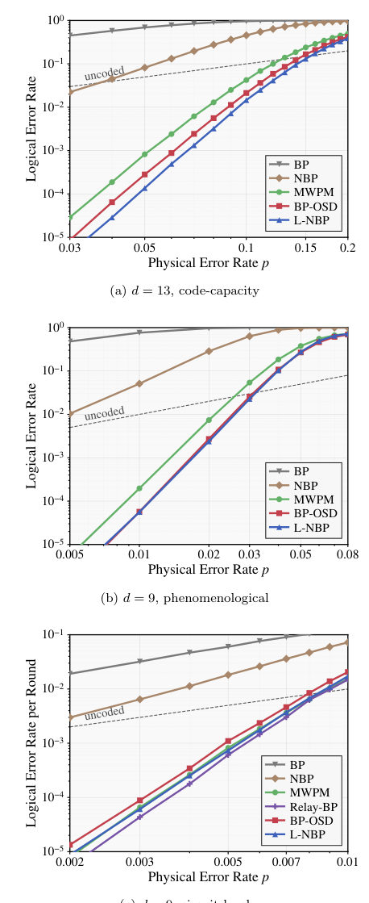 
FIG. 5. LER comparison under (a) code-capacity noise at d = 13, (b) phenomenological noise at d = 9, and (c) circuit- level noise at d = 9.

**Summary.** This paper introduces Logical Neural Belief Propagation (L-NBP), a novel decoder for surface codes that improves quantum error correction performance. L-NBP achieves this by training a neural network to decode directly at the logical level, rather than the physical error level. It successfully maintains the linear complexity of Belief Propagation while matching or exceeding the accuracy of more complex, non-scalable decoders.

**Why it may be interesting.** The combination of classical graph algorithms (BP) with modern machine learning techniques (Neural Networks) to solve a fundamental problem in quantum computation is highly relevant for developing practical quantum hardware.

Detailed structure

**Main problem.** Developing quantum error correction (QEC) decoders that achieve high logical accuracy while maintaining linear complexity scaling with code length.

**Main result.** The proposed L-NBP decoder matches or outperforms state-of-the-art decoders (MWPM, BP-OSD) while retaining the linear complexity of Belief Propagation.

**Method.** It uses a Neural Belief Propagation (NBP) module to generate soft posterior beliefs, which are then fed into a trainable logical classifier to predict the logical operator end-to-end.

**Model / system.** The work focuses on decoding surface codes, which are leading candidates for QEC due to their local connectivity and high error threshold.

**Key observables.** Logical Error Rate (LER), computational complexity (FLOPs), and the soft syndrome $\tilde{s}$ used for classification.

**Important parameters / regimes.** Depolarizing noise threshold (achieved 17.5%), code distance ($d=9$), and the linear complexity scaling ($O(n)$).

**Assumptions / limitations.** The primary assumption is that training the decoder end-to-end on the logical objective is necessary for optimal performance.

**Figures summary.** Figures illustrate the QEC workflow, the comparison of FLOPs scaling between L-NBP and BP-OSD across different noise models, and t-SNE plots showing the separation of logical operators in the soft syndrome space.

**Paper structure.** The paper introduces the problem, details the L-NBP architecture (NBP $\rightarrow$ Soft Syndrome $\rightarrow$ Logical Classifier), compares its performance and complexity against established decoders (MWPM, BP-OSD), and validates the end-to-end training objective.

Abstract

Quantum error correction (QEC) requires decoders that achieve high logical accuracy while scaling efficiently with the code length. Belief propagation (BP) is attractive for its linear decoding complexity, but conventional BP decoders often fail to reach sufficient logical accuracy on surface codes. We propose Logical Neural Belief Propagation (L-NBP), a BP-based neural decoder that redirects the decoding objective from physical-level decoding to logical-level decoding. L-NBP first runs a neural BP (NBP) module that produces posterior beliefs, and a logical classifier then transforms these beliefs into a continuous-valued soft syndrome and predicts the logical operator. Because all components in L-NBP are trainable by backpropagation, L-NBP is trained end-to-end, so that the NBP module learns to extract soft syndromes that are favorable for logical classification. On surface codes, L-NBP matches or outperforms the BP with ordered-statistics decoding (BP-OSD) and minimum-weight perfect matching (MWPM) while retaining the linear complexity of BP, and achieves a threshold of $17.5\%$ under depolarizing noise. Moreover, under circuit-level noise, L-NBP matches the accuracy of BP-OSD on the distance-$9$ surface code while requiring only $0.2\%$ of its complexity. These results show that combining BP, neural weights, and logical-level decoding enables scalable and high-accuracy quantum decoding.

[↑ back to top](#top)

### [Quantum Resource Estimation for Simulating the SYK Model with Trotterization, qDRIFT, and Asymmetric Qubitization](http://arxiv.org/abs/2608.27573v1)

**Authors:** Brian Goldsmith, Larissa Kroell, Nishna Aerabati  
**Type:** theory · **Category:** quantum information and computing · **PDF:** <https://arxiv.org/pdf/2608.27573v1>  
**Analysis basis:** full PDF text, analyzed in chunks
**Topic relevance:** `analog quantum simulation` **1/5**

📷 Fig 1

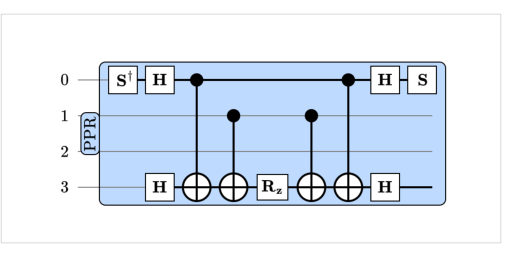 
Fig. 1. Circuit diagram for Pauli Product Rotation eiθY0Z1X3 obtained using Construct’s Circuit Designer. The Rz rotation in the diagram performs a rotation with angle 2θ.

📷 Fig 2

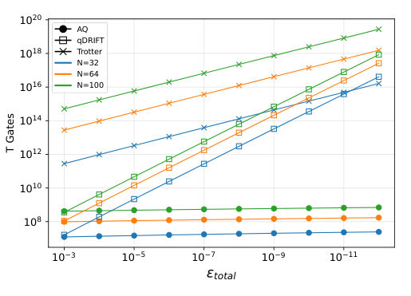 
Fig. 2. Number of T gates as a function of the total error εtotal for different methods at different Majorana counts. While qDRIFT requires fewer T gates for large εtotal, asymmetric qubitization is better overall with near constant scaling with εtotal. When calculating the T gates, εrot is assumed to be equal to εalg, as described in Section III-B. The coupling constants are set to equivalent values (Jt = 24 for Trotter and qDRIFT and Jt = 1 for AQ).

📷 Fig 3

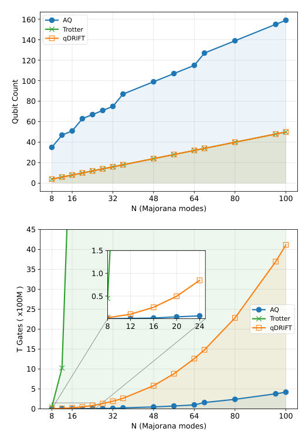 
Fig. 3. Qubit counts and total T gates as a function of the number of Majorana modes. The top plot shows the scaling in qubit count, while the bottom plot gives the scaling for the total number of T gates required. PPR based methods provide a better qubit count, but their T count (with qDRIFT requiring fewer resources) is much higher than the one for AQ. For the T gate scaling εtotal is fixed at 10−4. Coupling constants were again fixed equivalently for all methods (Jt = 24 for Trotter and qDRIFT and Jt = 1 for AQ).

**Summary.** This work compares three methods—Trotterization, qDRIFT, and asymmetric qubitization—for simulating the complex SYK model on quantum hardware. By estimating qubit and T gate counts, the authors demonstrate that while some methods are qubit-efficient, asymmetric qubitization offers superior resource scaling, particularly concerning the number of required T gates. This provides a crucial resource guide for future quantum simulation efforts.

**Why it may be interesting.** The comparison of resource scaling across different quantum simulation techniques (Trotter vs. QSP-based) provides concrete, actionable data for researchers designing quantum algorithms for strongly correlated quantum systems.

Detailed structure

**Main problem.** The paper addresses the critical need to understand the resource requirements for simulating the Sachdev-Ye-Kitaev (SYK) model on early fault-tolerant quantum computers.

**Main result.** While qDRIFT and Trotterization use fewer qubits, asymmetric qubitization proves advantageous in most cases due to the significantly lower required count of T gates.

**Method.** The authors compare three distinct quantum simulation techniques—Trotterization, qDRIFT, and asymmetric qubitization utilizing Quantum Signal Processing (QSP)—to estimate quantum resources.

**Model / system.** The study focuses on simulating the SYK model, a system of interacting Majorana fermions, which is theoretically important due to its connection to holographic duality and AdS/CFT correspondence.

**Key observables.** Qubit count and T gate count, analyzed as functions of simulation precision ($\epsilon_{alg}$) and the number of Majorana modes ($N$).

**Important parameters / regimes.** Precision ($\epsilon_{alg}$), number of Majorana modes ($N$), and simulation time ($t$).

**Assumptions / limitations.** The resource estimates are based on theoretical scaling analyses of the three distinct Hamiltonian simulation methods.

**Figures summary.** Figure 2 compares T gate scaling ($\epsilon$ dependence) showing QSP's superior scaling, while Figure 3 compares qubit count and T gate scaling ($N$ dependence) showing AQ's advantage in T gate count.

**Paper structure.** The paper introduces the SYK model and the simulation challenge, details the three methods (Trotterization, qDRIFT, AQ/QSP), presents resource estimates for qubit and T gates, and concludes with a comparison of the scaling laws.

Abstract

The Sachdev-Ye-Kitaev (SYK) model has been identified as a promising candidate to run on early fault-tolerant quantum computers due to the relatively modest resources required to probe non-trivial physics (namely holographic duality and AdS/CFT correspondence). As such, it is crucial that the details of how to run such a simulation are well understood. Using PsiQuantum's Construct platform, we implement and analyze three different approaches to simulate the SYK model: Trotterization, qDRIFT, and asymmetric qubitization with Quantum Signal Processing. We provide an open-source library containing implementations for SYK simulation using all three methods, which we use to obtain quantum resource estimates for qubit and T gate count as functions of the number of Majorana modes and precision. We find that while qDRIFT and Trotterization benefit from a lower qubit count, the large number of T gates required lead to asymmetric qubitization being advantageous in most cases. This reinforces previous theoretical considerations. We intend both the implementations and the estimates to be useful for researchers to continue to study the SYK model and understand how the techniques and resources vary.

[↑ back to top](#top)

### [Sufficient positive maps between von Neumann algebras: Rényi divergences](http://arxiv.org/abs/2608.28510v1)

**Authors:** Anna Jenčová, Lauritz van Luijk  
**Type:** theory · **Category:** quantum information and computing · **PDF:** <https://arxiv.org/pdf/2608.28510v1>  
**Analysis basis:** full PDF text, analyzed in chunks
**Topic relevance:** `quantum measurements` **1/5**

📷 Fig 1

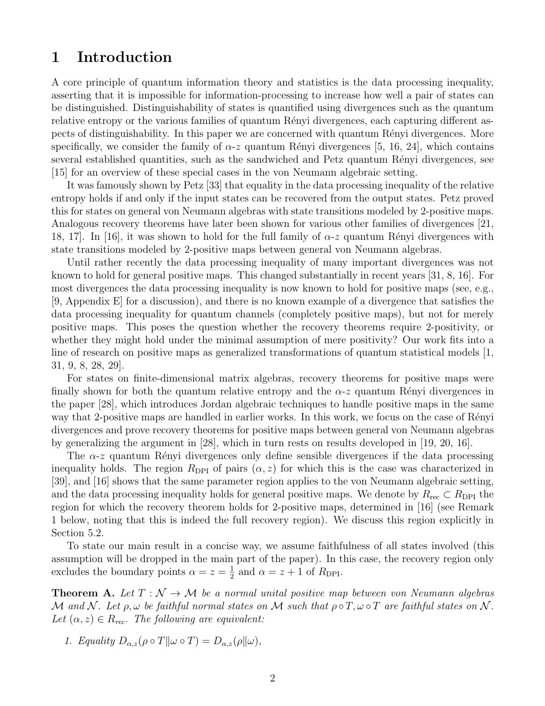 
Low-resolution page preview, page 2

📷 Fig 2

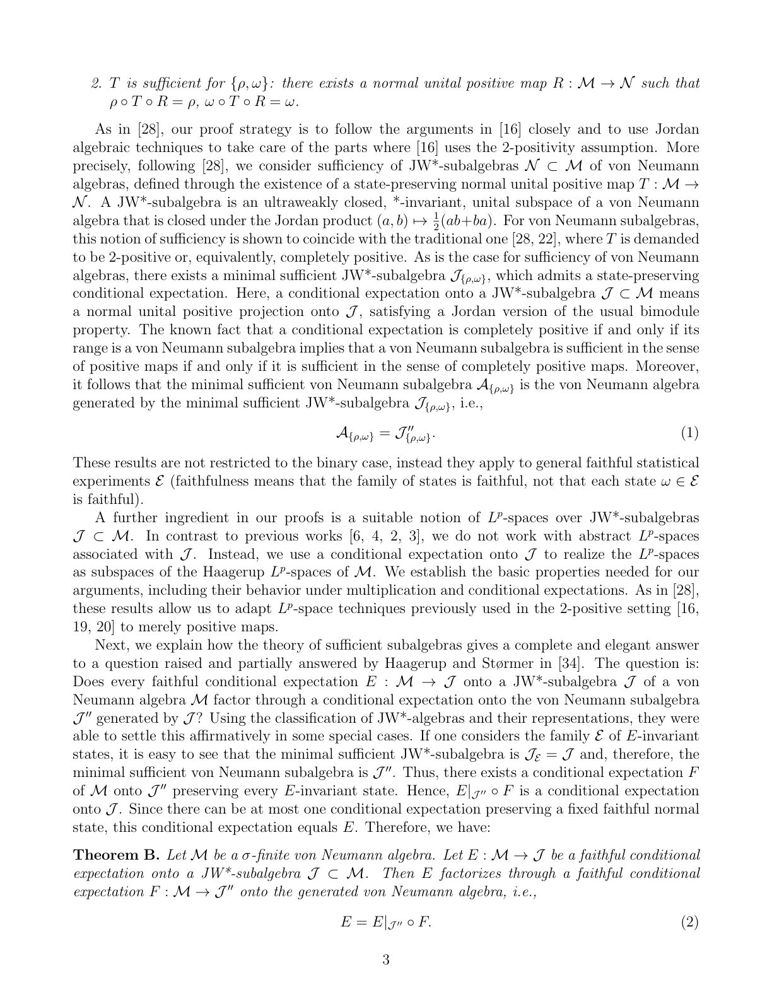 
Low-resolution page preview, page 3

📷 Fig 3

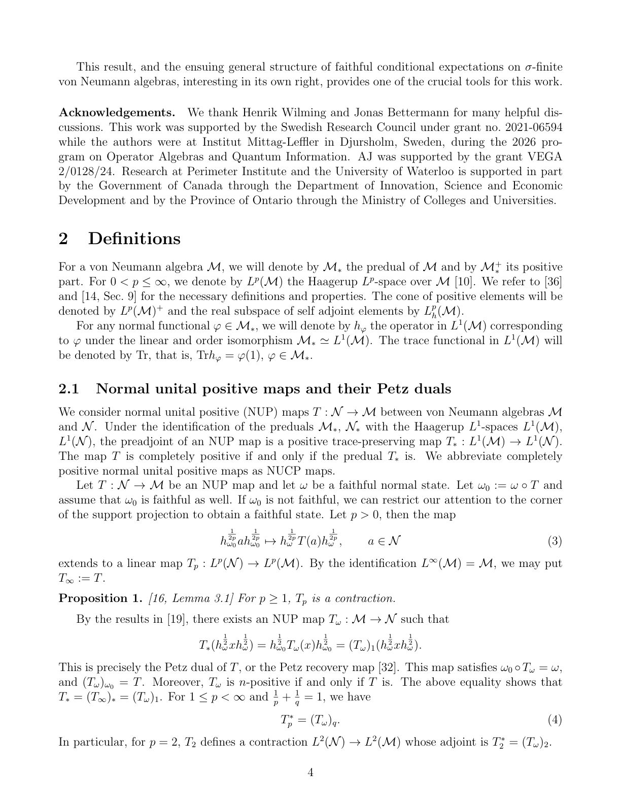 
Low-resolution page preview, page 4

📷 Fig 4

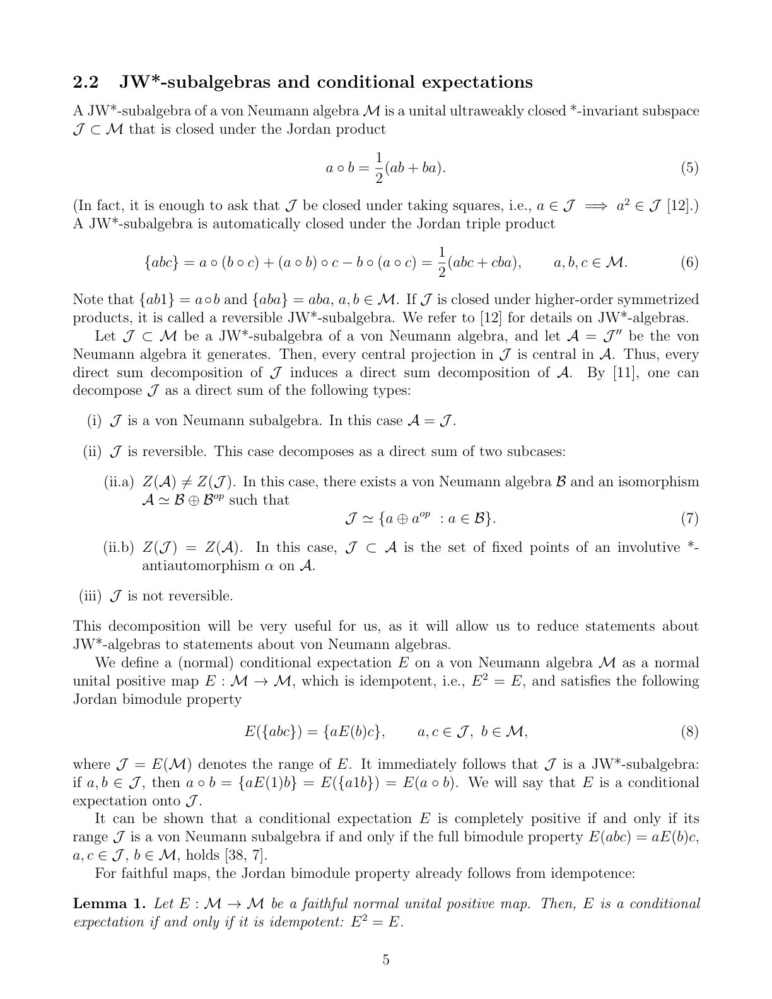 
Low-resolution page preview, page 5

📷 Fig 5

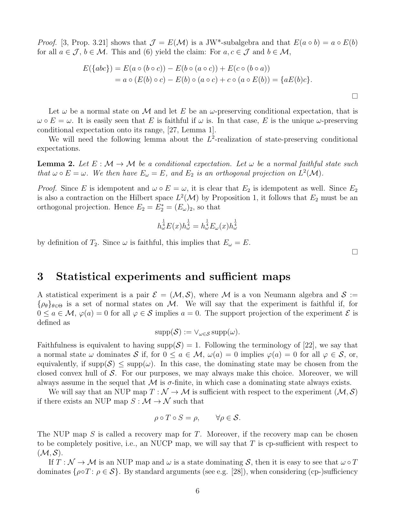 
Low-resolution page preview, page 6

**Summary.** This work develops recovery theorems for generalized Rényi divergences in the context of von Neumann algebras. It characterizes when the data processing inequality becomes an equality, linking this condition directly to the concept of a 'sufficient' quantum map. This provides deep mathematical insight into information preservation under general quantum operations.

**Why it may be interesting.** It provides rigorous mathematical tools to quantify how much information about a quantum state is preserved (or recoverable) when the state undergoes a general physical process (the map $T$), which is fundamental to quantum channel characterization.

Detailed structure

**Main problem.** The paper aims to establish recovery theorems for $\alpha$-$z$ Rényi divergences when applied to quantum states undergoing evolution via normal unital positive maps between von Neumann algebras.

**Main result.** Equality in the data processing inequality for these divergences is shown to be equivalent to the map being 'sufficient' with respect to the pair of states, which characterizes the recovery of information.

**Method.** The proof relies on analyzing the equality case of the data processing inequality using $L^p$-spaces associated with $JW^*$-subalgebras and generalizing techniques from the 2-positive setting to mere positivity.

**Model / system.** The mathematical framework involves von Neumann algebras ($M, N$) representing the observable structure, and the physical process is modeled by normal unital positive maps ($T: N \to M$) acting as quantum channels.

**Key observables.** $\alpha$-$z$ quantum Rényi divergences ($D_{\alpha,z}$), the data processing inequality (DPI), and the concept of map sufficiency.

**Important parameters / regimes.** The divergence parameter $\alpha$ and the auxiliary parameter $z$ are crucial, alongside the structure of the von Neumann algebras.

**Assumptions / limitations.** The initial theorems assume faithfulness of the involved states, though the work aims to relax this. The analysis heavily utilizes the structure of $JW^*$-subalgebras.

**Paper structure.** The paper develops from general results on the DPI to specific recovery theorems for Rényi divergences, utilizing the algebraic structure of $JW^*$-subalgebras and $L^p$-spaces to generalize previous findings.

Abstract

We prove recovery theorems for $α$-$z$ Rényi divergences under normal unital positive maps between von Neumann algebras. Previous results in this setting required 2-positivity, while recent finite dimensional work showed that this assumption can be relaxed to mere positivity. Our proof uses sufficiency for JW*-subalgebras and $L^p$-spaces over them to characterize equality in the data processing inequality. As a further application of our methods, we solve a problem discussed by Haagerup and Stormer: Every conditional expectation of a von Neumann algebra onto a JW*-subalgebra factors through a conditional expectation onto the generated von Neumann subalgebra.

[↑ back to top](#top)

## Other papers (22)

*Papers from primary archives without highlighted authors or any topic match. Click to expand.*

Show other papers

### [Benchmarking Quantum Feature Encoding Strategies for Binary Classification with QSVM](http://arxiv.org/abs/2608.27764v1)

**Authors:** Murat Kurt  
**Type:** both · **Category:** quantum information and computing · **PDF:** <https://arxiv.org/pdf/2608.27764v1>  
**Analysis basis:** full PDF text, analyzed in chunks

📷 Fig 1

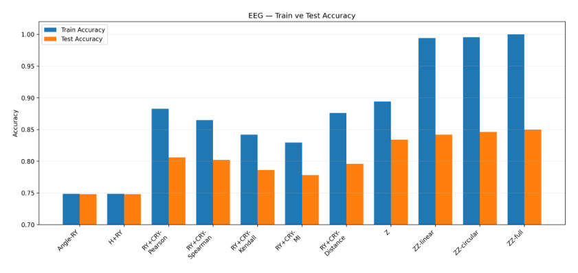 
Figure 1: Comparison of training and test accuracy across encoding strategies for the EEG Eye State Classification Dataset.

📷 Fig 2

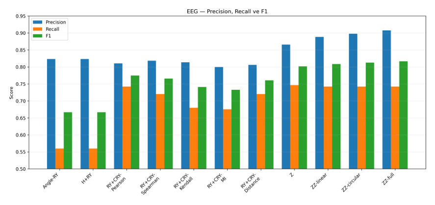 
Figure 2: Comparison of test Precision, Recall, and F1 scores for the EEG Eye State Classifica- tion Dataset.

📷 Fig 3

 
Figure 2 provides a more detailed view of the accuracy results in terms of Precision, Recall, and F1. The F1 score increased from 0.667 for Angle-RY to 0.775 for Pearson-based RY+CRY. Z feature Map achieved an F1 score of 0.802, whereas ZZ linear, ZZ circular, and ZZ full achieved 0.809, 0.813, and 0.817, respectively. The highest Precision value, 0.908, was obtained with ZZ full. ZZ circular and ZZ linear

📷 Fig 4

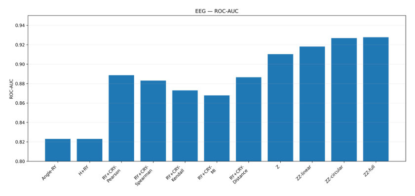 
Figure 3: Comparison of test ROC-AUC values across encoding strategies for the EEG Eye State Classification Dataset.

📷 Fig 5

 
Figure 4 illustrates how the improvement in classification performance is reflected in model generalization. The Accuracy Gap for Angle-RY and H+RY was approximately 0.001. However,

**Summary.** This paper benchmarks various quantum feature encoding strategies for use with Quantum Support Vector Machines on five different datasets. It finds that while incorporating data statistics into the encoding can improve performance, overly complex circuits do not guarantee better results. Ultimately, the best strategy requires balancing predictive accuracy with the actual resource cost of the quantum circuit.

**Why it may be interesting.** While focused on ML, the work directly addresses the resource cost (circuit depth/gates) versus performance trade-off in quantum algorithms, which is crucial for designing practical quantum circuits.

Detailed structure

**Main problem.** The study investigates how different methods of encoding classical data into quantum states affect the performance of Quantum Support Vector Machines (QSVM) for binary classification.

**Main result.** The choice of quantum feature encoding strategy is highly dependent on the underlying data structure, and a composite metric balancing predictive performance with quantum circuit complexity is necessary for proper evaluation.

**Method.** The authors benchmarked various feature maps, comparing standard encodings against novel methods that incorporate statistical dependencies (like Pearson or Mutual Information) using controlled gates.

**Model / system.** The model is a quantum computing framework utilizing QSVM. The experiments are simulated using state vector based numerical computation on five distinct binary classification datasets.

**Key observables.** Accuracy, F1 score, ROC-AUC, log-loss, circuit depth, and gate counts.

**Important parameters / regimes.** The statistical dependency measures used include Pearson correlation, Spearman correlation, Mutual Information, and Distance Correlation.

**Assumptions / limitations.** The results are based on the state vector representation of ideal quantum states and do not reflect noise or sampling uncertainty from physical hardware.

**Figures summary.** The notes reference tables (Table 24, 25, 26) showing the Quantum Feature Encoding Score (QFES) for specific datasets, comparing various encoding strategies.

**Paper structure.** The paper systematically compares multiple quantum feature encoding strategies (e.g., Angle-RY, Z feature Map, RY+CRY-Pearson) across five datasets, culminating in the use of a composite QFES metric to guide the selection of the optimal encoding.

Abstract

The way in which classical data are encoded into quantum states plays a significant role in both classification performance and quantum circuit complexity in Quantum Machine Learning. In this study, the effects of different quantum feature encoding strategies on Quantum Support Vector Machine performance were investigated using five binary classification datasets. In particular, the statistical relationships between features were incorporated into quantum circuits through \(RY(θ)\) and controlled-\(RY(θ)\) gates, and this approach was compared with conventional quantum feature maps. The results demonstrate that incorporating statistical relationships into the encoding process can influence classification performance. However, more complex and densely entangled circuits do not necessarily yield higher performance. In addition, a composite evaluation metric was employed to jointly assess predictive performance, generalization, and circuit cost. The findings across the five datasets indicate that the choice of quantum feature encoding strategy should account for the underlying structure of the data and that predictive performance should be evaluated together with quantum circuit complexity.

[↑ back to top](#top)

### [Bound state of a He-3 atom at free He-4 surfaces](http://arxiv.org/abs/2608.27664v1)

**Authors:** Massimo Boninsegni  
**Type:** theory · **Category:** statistical mechanics · **PDF:** <https://arxiv.org/pdf/2608.27664v1>  
**Analysis basis:** full PDF text, analyzed in chunks

📷 Fig 1

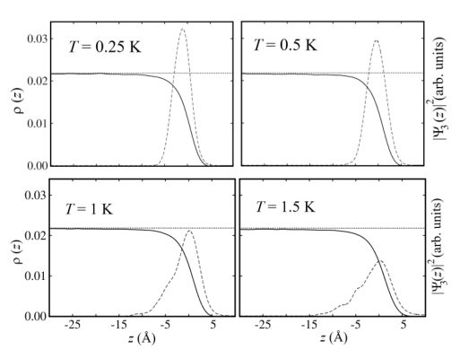 
FIG. 1. 4He density profile ρ(z) (in ˚A−3, solid lines) plotted along the direction perpendicular to the free surface at four different temperatures. The location of the origin is arbitrary, the same for all temperatures. Also shown (dashed lines) is the probability density of position for the 3He atom (arbitrary units). Horizontal dotted line shows the T = 0 equilibrium density ρ3d of superfluid 4He.

📷 Fig 2

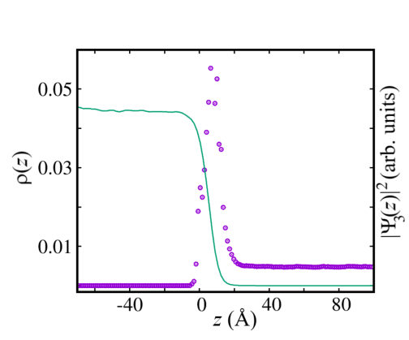 
FIG. 2. 4He density profile ρ(z) (in ˚A−2, solid lines) plot- ted along the direction perpendicular to the free surface. The temperature is T = 0.25 K. The location of the origin is arbi- trary. Also shown (open circles) is the probability density of position for the 3He atom (arbitrary units). Statistical errors are of the order of the size of the symbols.

📷 Fig 3

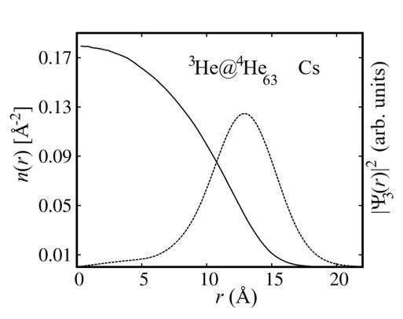 
FIG. 3. Radial 4He density profile n(r) (in ˚A−2, solid lines) integrated along the direction perpendicular to the substrate, for a cluster of N = 64 helium atoms (one of 3He, the oth- ers 4He) adsorbed on a Cs substrate. Profile is plotted with respect to an axis through the center of mass of the cluster. Also shown (dashed line) is the probability density of position for the 3He atom (arbitrary units).

📷 Fig 4

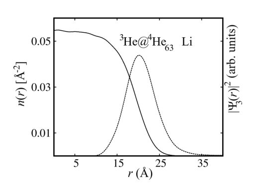 
FIG. 4. Same as Fig. 3 but for a Li substrate.

📷 Fig 5

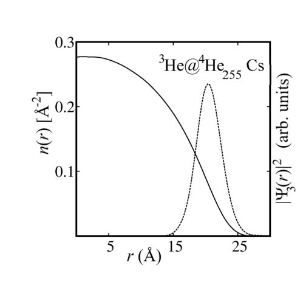 
FIG. 5. Same as Fig. 3 but for a cluster of N = 256 atoms.

**Summary.** This paper uses Quantum Monte Carlo simulations to determine if a He-3 atom forms a bound state at the surface of superfluid He-4. It finds a robust bound state in 3D but demonstrates that this state disappears entirely when the system is reduced to two dimensions. The study also extends these findings to small clusters, showing strong dependence on the substrate material.

**Why it may be interesting.** This work provides detailed insights into how dimensionality and confinement affect quantum surface phenomena, which is crucial for understanding quantum adsorption and surface-mediated interactions in quantum fluids.

Detailed structure

**Main problem.** The study investigates the existence and properties of a bound state for a single He-3 atom interacting with the surface of superfluid He-4, comparing 3D, 2D, and nanoscale cluster geometries.

**Main result.** A bound state exists at the 3D free surface with a binding energy of ~4 K, but this state vanishes in 2D and is highly dependent on the substrate interaction in nanoscale clusters.

**Method.** The research primarily employs Quantum Monte Carlo (QMC) simulations, specifically using the continuous-space Worm Algorithm, to calculate thermodynamic properties and binding energies.

**Model / system.** The system models He-3 atoms interacting with He-4 superfluid surfaces, ranging from infinite 3D free surfaces to finite nanoscale clusters adsorbed on alkali substrates (Cs, Li).

**Key observables.** Binding energy ($\Delta$ or $\epsilon$), He-4 density profiles ($
ho(z)$), and the He-3 probability density of position ($|\Psi_3(z)|^2$).

**Important parameters / regimes.** Temperature ($T$), dimensionality (3D vs 2D), and the strength of the substrate interaction.

**Assumptions / limitations.** The simulations use established interatomic potentials (e.g., Aziz pair potential) and rely on QMC techniques to handle the quantum nature of the superfluid.

**Figures summary.** Figures illustrate density profiles and the spatial localization of the He-3 atom at various temperatures and for different cluster sizes/substrates, showing confinement near the surface edge.

**Paper structure.** The paper systematically compares results across different dimensionalities: first establishing the 3D free surface case, then contrasting it with the 2D case, and finally extending the analysis to finite nanoscale clusters on various substrates.

Abstract

Quantum Monte Carlo simulations confirm the existence of a bound state of a single He-3 atom at a free superfluid He-4 surface in three dimensions, localized within a ~10-A thick low-density He-4 surface layer, with a binding energy of approximately 4 K with respect to vacuum. As the temperature is raised above ~ 1 K the He-3 atom leaves the surface to dissolve into the superfluid. The situation is entirely different in two dimensions, as the He-3 atom is excluded from the superfluid and no surface bound state exists. Results are also presented for the a He-3 atom binding to nanoscale size He-4 clusters adsorbed on weak substrates, a physical system that may allow for the observation of some of the physics predicted for extended surfaces. It is shown that a He-3 bound state localized at the perimeter of sufficiently small (a few tens of atoms) clusters exists not just on Cs, as previously reported, but on all alkali substrates.

[↑ back to top](#top)

### [Charge transfer and competing symmetry breaking drive orbital reconstruction and emergent ferromagnetism in insulating oxide superlattices](http://arxiv.org/abs/2608.28107v1)

**Authors:** Nandana Bhattacharya, Ranjan Kumar Patel, Siddharth Kumar, Sourav Chowdhury, Manav Beniwal, Suresh Chandra Joshi, Prithwijit Mandal, Jayjit Kumar Dey, Weibin Li, Manuel Valvidares, Zhan Zhang, Hua Zhou, Andrei Gloskovskii, Christoph Schlueter, Christoph Klewe, Srimanta Middey  
**Type:** experiment · **Category:** strongly correlated electrons · **PDF:** <https://arxiv.org/pdf/2608.28107v1>  
**Analysis basis:** full PDF text, analyzed in chunks

📷 Fig 1

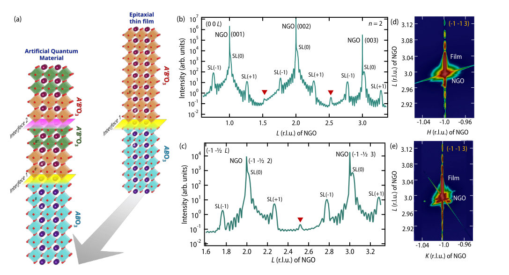 
FIG. 1. Thin film characterization: (a) Schematic comparison between a single-interface A′B′O3/ABO3 heterostructure and an A′B′O3/AB′′O3 superlattice grown on ABO3, illustrating the introduction of an additional interface per periodicity in the latter. (b) Syn- chrotron X-ray diffraction scan for the n = 2 superlattice along the (0 0 L) Bragg direction. The film peak is labeled as SL(0), while the first-order superlattice satellite is denoted as SL(± 1). Second-order satellite reflections are also observed and marked by red inverted triangles. (c) Off-specular half-order XRD measured along the (−1, −1/2, L) Bragg rod, confirming the same superlattice periodicity as observed in the specular...

📷 Fig 2

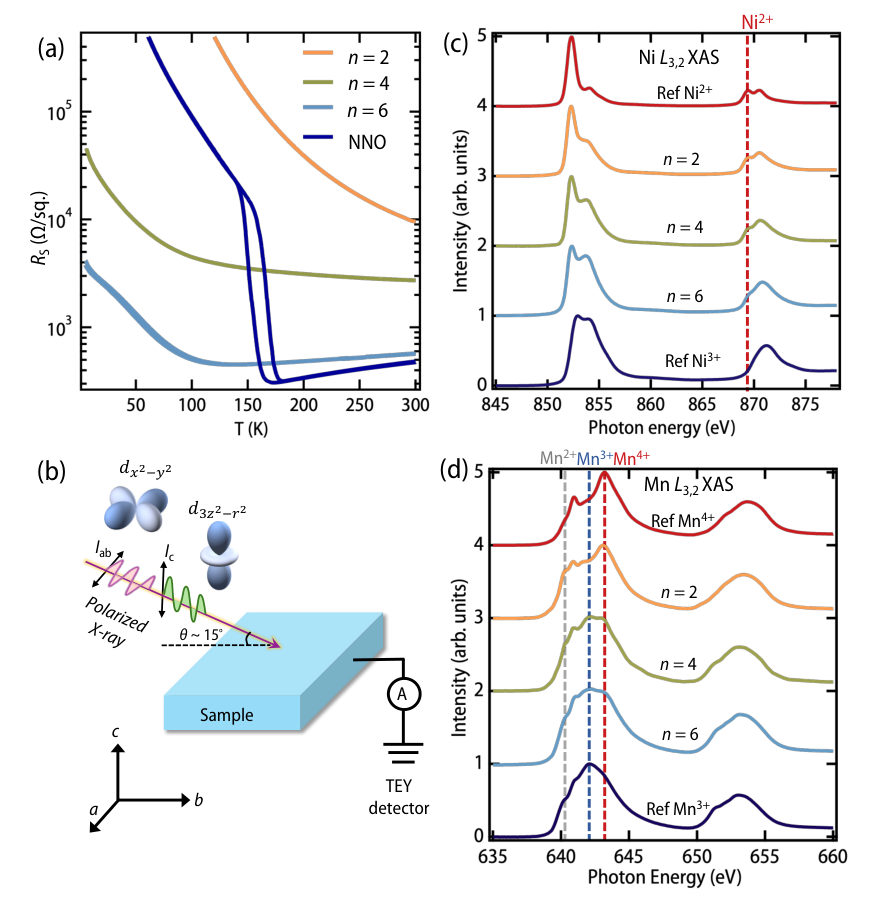 
FIG. 2. Electrical transport and demonstration of charge transfer: (a) Sheet resistance versus temperature plots for the n = 2, 4 and 6 superlattices along with pristine NNO film [also used in [34]]. (b) Schematic depiction of the XAS measurement setup. Linearly polarized X-rays (corresponding absorption spectra Ic and Iab respectively) are incident on the films at grazing incidence, and the spectra are recorded in total electron yield (TEY) mode. The average of these spectra is the recorded XAS at room temperature. (c) Ni L3,2 edge XAS for superlattices with n = 2, 4, and 6. Reference spectra for Ni3+ is from 15 uc NNO on NGO [also used in [39]], and for Ni2+ from 20 uc Nd2NiMnO6 grown on...

📷 Fig 3

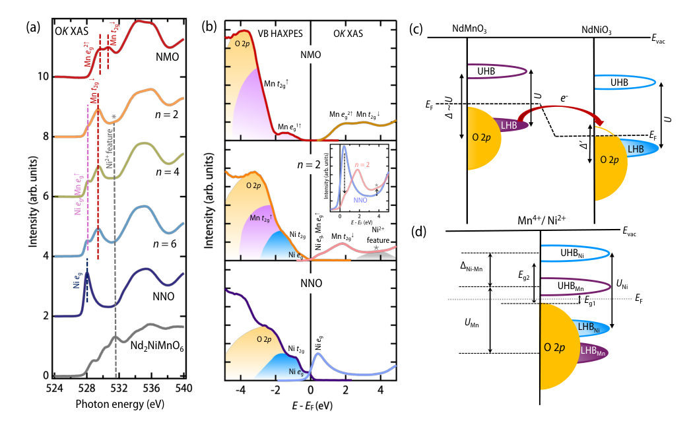 
FIG. 3. Correlated band reconstruction on interfacial charge transfer: (a) O K-edge XAS for pristine 15 uc NNO, 20 uc NMO, 20 uc Nd2NiMnO6 [for reference of Ni2+ states reflected in O K edge [40]] films and superlattices n = 2,4 and 6 films on NGO. The spectra have been vertically shifted for clarity. (b) Electronic states near the Fermi energy (EF ) using VB HAXPES (for occupied states) and O K-edge XAS (for unoccupied states) for: NMO (top), n = 2 superlattice (centre) and NNO (bottom). Inset shows the suppression of prepeak in n = 2 superlattice compared to pristine NNO, and enhancement of spectral weight ∼541.5 eV highlighting emergence of Ni2+ states. Shaded regions denote the occupied...

📷 Fig 4

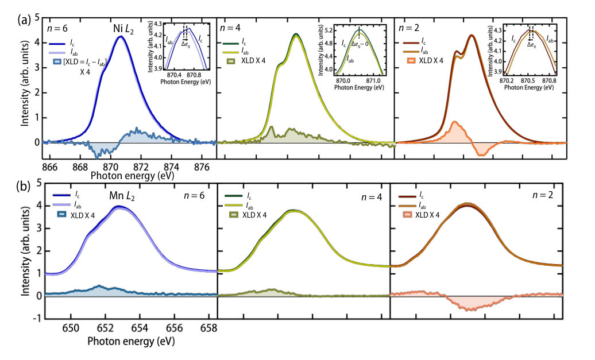 
FIG. 4. Orbital reconstruction due to competing interfacial symmetries: XAS spectra for n = 6, 4, and 2 superlattices measured with out-of-plane polarized (Ic) and in-plane polarized (Iab) X-rays. The corresponding XLD (Ic −Iab) signals (scaled for clarity) are shown below each spectrum, with insets highlighting the energy splitting ∆eg corresponding to the energy shift between the Ic and Iab peak at the (a) Ni L2-edge and (b) Mn L2-edge.

📷 Fig 5

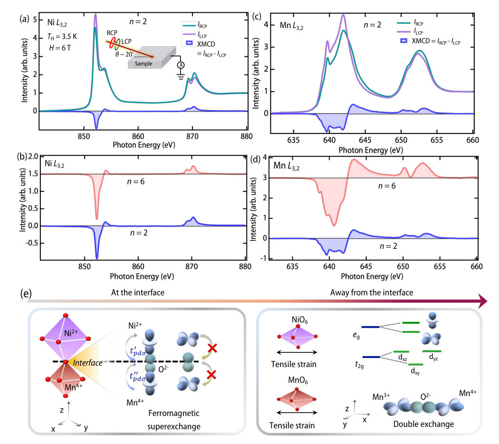 
FIG. 5. Emergent ferromagnetism and exchange pathways: (a) Right (IRCP) and left (ILCP) circularly polarized absorption spectra, and XMCD for the n = 2 superlattice at the Ni L3,2 edge. Inset: Schematic of the XMCD measurement geometry. (b) XMCD at Ni L3,2 edge for n = 2 and n = 6 superlattices. (c) IRCP, ILCP, and corresponding XMCD for the n = 2 superlattice at the Mn L3,2 edge. (d) XMCD at Mn L3,2 edge for n = 2 and n = 6 superlattices. (e) Comprehensive schematic of orbital symmetry and magnetic exchange. Near the interface, the d3z2−r2 occupancy is favored due to interfacial hybridization with the hopping parameter t ′ pdσ and t ′′ pdσ for Ni and Mn sites respectively. This promotes a...

**Summary.** This paper explores how engineering interfaces in oxide superlattices, specifically $	ext{NdNiO}_3/	ext{NdMnO}_3$, can induce novel electronic and magnetic states. By combining transport measurements with X-ray spectroscopy, the authors demonstrate that interfacial charge transfer drives orbital reconstruction, leading to a stable, emergent ferromagnetic insulating phase. This establishes a pathway for designing functional spin-insulatronic materials.

**Why it may be interesting.** The work provides experimental evidence of how interfacial chemistry dictates emergent magnetic and electronic phases in correlated oxides, which is highly relevant to understanding strongly correlated quantum materials.

Detailed structure

**Main problem.** The study investigates how charge transfer and competing symmetry breaking drive orbital reconstruction and emergent ferromagnetism in insulating oxide superlattices.

**Main result.** Electron transfer from $	ext{NdMnO}_3$ to $	ext{NdNiO}_3$ drives a room-temperature insulating state with orbital reversal, stabilizing an emergent ferromagnetic insulating state via interfacial superexchange.

**Method.** The research combines structural characterization (XRD, AFM) with advanced electronic measurements, including temperature-dependent transport and element-specific X-ray spectroscopy (XAS/HAXPES).

**Model / system.** The physical system is superlattices formed by alternating layers of $	ext{NdNiO}_3$ and Mott-insulating $	ext{NdMnO}_3$, allowing investigation of interface effects in strongly correlated $3d$ transition-metal oxides.

**Key observables.** Metal-Insulator Transition (MIT) temperature, orbital octahedral rotation patterns, $	ext{Ni}^{2+}/	ext{Ni}^{3+}$ and $	ext{Mn}^{3+}/	ext{Mn}^{4+}$ ratios from XAS, and electronic band structure shifts from HAXPES.

**Important parameters / regimes.** Superlattice periodicity ($n=2, 4, 6$), temperature ($T$), and the nature of the interface charge transfer.

**Assumptions / limitations.** The analysis assumes that interfacial charge transfer and orbital overlap dictate the ground state, overriding simple epitaxial strain effects.

**Figures summary.** Figures show XRD scans confirming superlattice periodicity and octahedral rotation modulation, alongside temperature-dependent electrical transport measurements illustrating the suppression of the MIT with increasing periodicity.

**Paper structure.** The paper systematically varies the superlattice periodicity ($n$) and measures transport and spectroscopy to correlate interfacial charge transfer (XAS) with electronic state changes (HAXPES) and magnetic ordering (emergent ferromagnetism).

Abstract

Electron correlation, hopping, and ligand-to-metal charge transfer collectively lead to diverse electronic and magnetic phenomena in 3$d$ transition-metal oxides, where directional d orbitals make hopping highly sensitive to symmetry-dependent orbital overlap. Heterostructure engineering with atomically flat interfaces adds symmetry-breaking charge transfer as a further route to emergent behavior, yet whether interfacial mismatch between constituent oxides of a superlattice shapes ground states independent of epitaxial strain remains unresolved. Here we examine superlattices combining NdNiO$_3$ with Mott-insulating NdMnO$_3$. Varying layer thickness and combining transport with X-ray spectroscopy, we show that electron transfer from NdMnO$_3$ to NdNiO$_3$ drives a room-temperature insulating state with a distinct electronic structure, accompanied by a reversal in orbital symmetry beyond simple strain considerations, underscoring the interface's central role. These reconstructions stabilize an emergent ferromagnetic insulating state arising from interfacial Ni$^{2+}$-O-Mn$^{4+}$ superexchange. Our results establish a pathway to interface-engineered ferromagnetic insulating phases via competing interactions, with potential for spin-insulatronic applications.

[↑ back to top](#top)

### [Classical Commitment over Quantum Channels with Limited Entanglement Assistance](http://arxiv.org/abs/2608.28500v1)

**Authors:** Remi A. Chou  
**Type:** theory · **Category:** quantum information and computing · **PDF:** <https://arxiv.org/pdf/2608.28500v1>  
**Analysis basis:** full PDF text, analyzed in chunks

📷 Fig 1

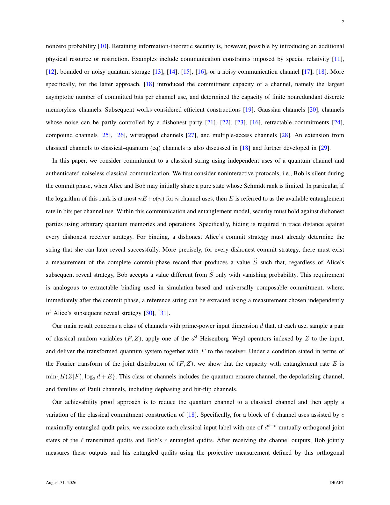 
Low-resolution page preview, page 2

📷 Fig 2

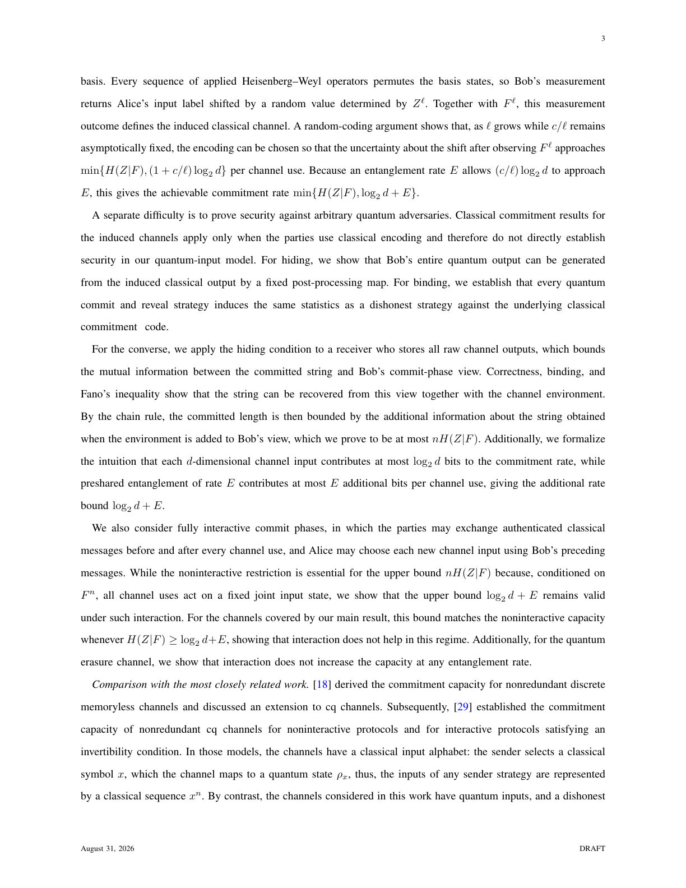 
Low-resolution page preview, page 3

📷 Fig 3

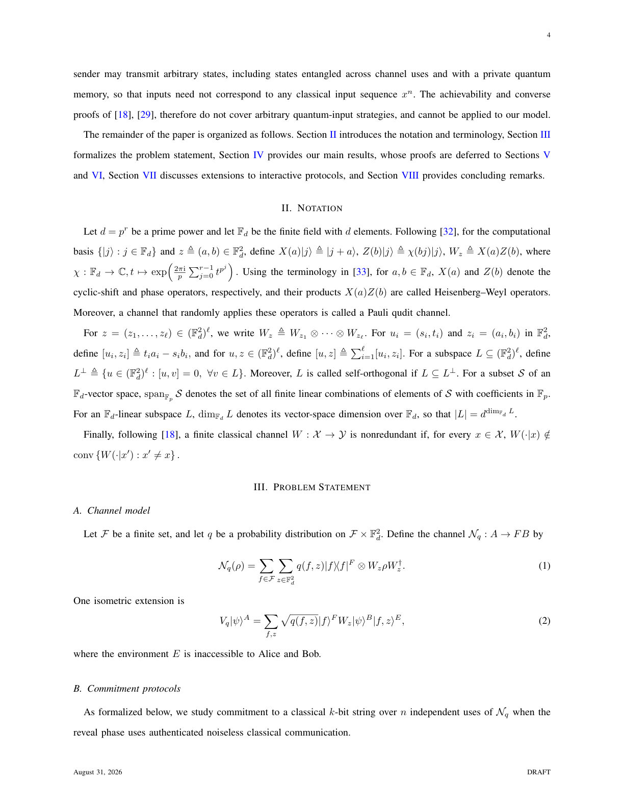 
Low-resolution page preview, page 4

📷 Fig 4

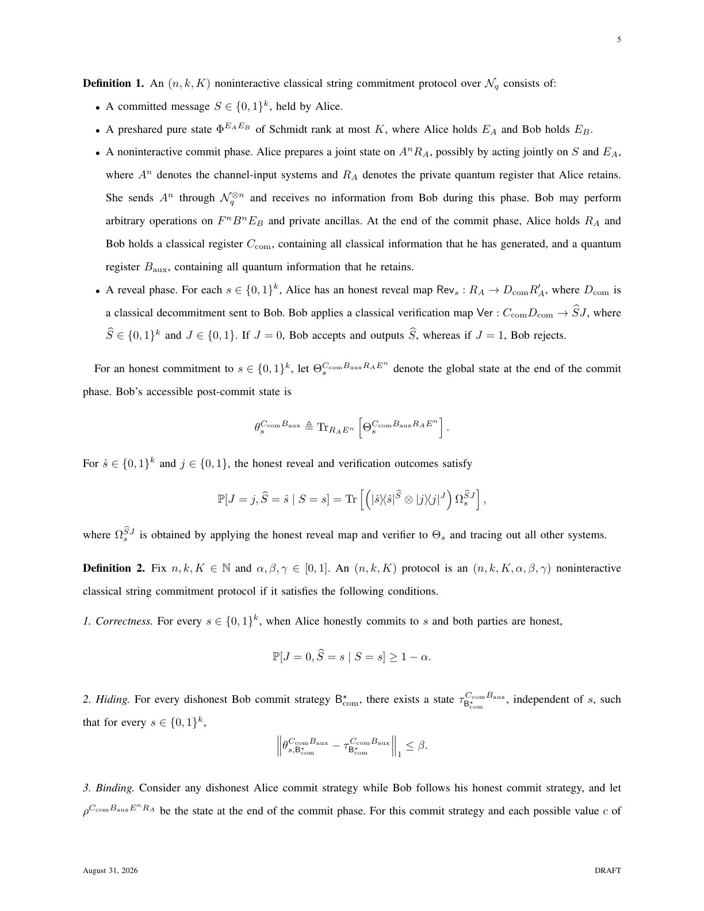 
Low-resolution page preview, page 5

📷 Fig 5

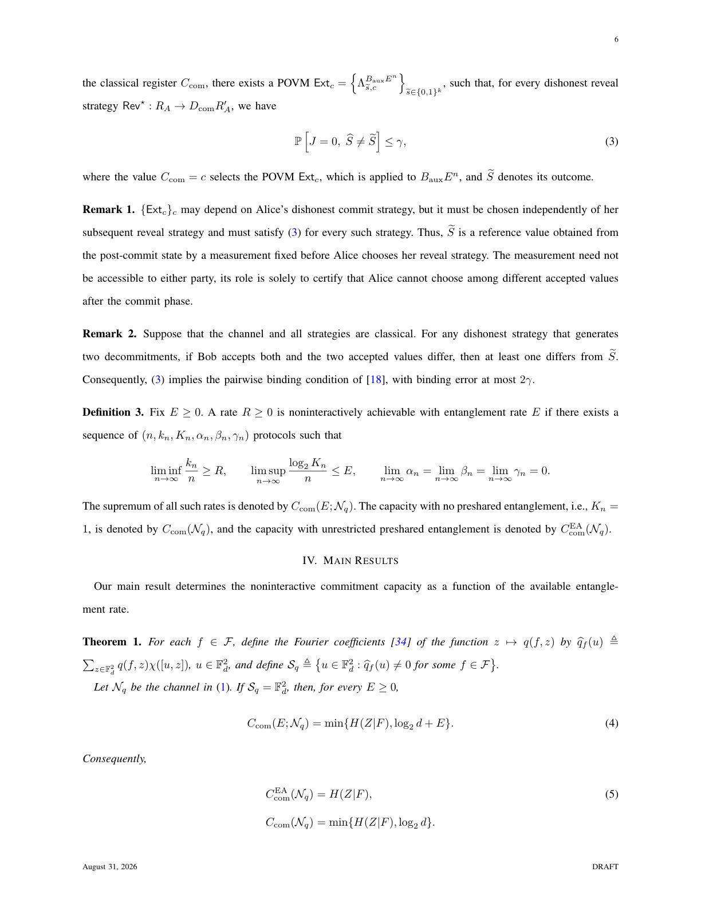 
Low-resolution page preview, page 6

**Summary.** This paper determines the maximum rate at which classical information can be committed to (made binding and concealing) when transmitted through a quantum channel with limited pre-shared entanglement. It establishes a capacity bound based on the channel's inherent randomness and the available entanglement resource. The results provide precise quantitative limits for quantum communication security protocols.

**Why it may be interesting.** While focused on cryptography/information theory, the rigorous bounding of information transfer over noisy quantum channels is foundational to understanding decoherence and communication limits in quantum systems.

Detailed structure

**Main problem.** The paper studies the fundamental limits of classical string commitment over noisy quantum channels when limited entanglement assistance is available.

**Main result.** For noninteractive protocols, the commitment capacity is determined by the minimum of the conditional entropy $H(Z|F)$ and the bound $\log_2 d + E$.

**Method.** The analysis combines techniques from quantum information theory, utilizing Fourier analysis, bounding mutual information, and establishing achievability via classical commitment constructions.

**Model / system.** The model involves a quantum channel $N_q$ acting on a quantum system, which samples classical random variables $(F, Z)$ and applies Heisenberg-Weyl operators. The capacity is limited by the available entanglement rate $E$.

**Key observables.** Commitment capacity ($C_{	ext{com}}$), conditional entropy $H(Z|F)$, and the entanglement rate $E$.

**Important parameters / regimes.** Input dimension $d$, entanglement rate $E$, and the structure of the channel defined by $F$ and $Z$.

**Assumptions / limitations.** The analysis assumes independent uses of the quantum channel and relies on the structure of the Heisenberg-Weyl operators and the availability of noiseless classical communication.

**Paper structure.** The paper establishes the capacity for noninteractive protocols first, deriving the $\min\{H(Z|F), \log_2 d + E\}$ bound. It then extends this to interactive protocols, showing that interaction does not increase the capacity beyond this bound, and finally determines the capacity for the quantum erasure channel.

Abstract

We study classical string commitment over quantum channels with limited preshared entanglement. For noninteractive protocols, we determine the commitment capacity of a class of channels with input dimension $d$ that, at each use, sample a pair of classical random variables $(F,Z)$, apply one of the $d^2$ Heisenberg--Weyl operators indexed by $Z$ to the input, and deliver the transformed quantum system together with $F$ to the receiver. If $E$ is the available entanglement rate in bits per channel use, then the capacity is $\min\{H(Z|F),\log_2d+E\}$. This class of channels encompasses quantum erasure and depolarizing channels, as well as families of Pauli channels. Additionally, for interactive protocols, we show that the commitment rate cannot exceed $\log_2d+E$ bits per channel use, so that when $H(Z|F)\geq\log_2d+E$, interactive communication does not increase the capacity. As a consequence, for interactive protocols, we determine the capacity of the quantum erasure channel.

[↑ back to top](#top)

### [Comparing Classical and Quantum Machine Learning for Regression in High Energy Physics Collision Data](http://arxiv.org/abs/2608.28084v1)

**Authors:** Tariq Mahmood, Zain ul Abidin, Itzel Luviano Soto, Alfredo Raya  
**Type:** theory · **Category:** quantum information and computing · **PDF:** <https://arxiv.org/pdf/2608.28084v1>  
**Analysis basis:** full PDF text, analyzed in chunks

📷 Fig 1

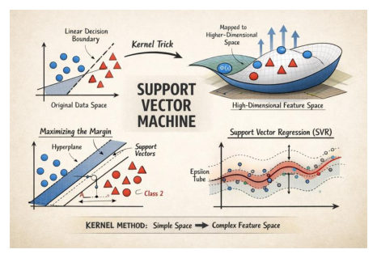 
FIG. 1. Schematic illustration of the SVM decision bound- ary and margin. The support vectors (filled symbols) are the training points closest to the hyperplane that jointly deter- mine the optimal boundary.

📷 Fig 2

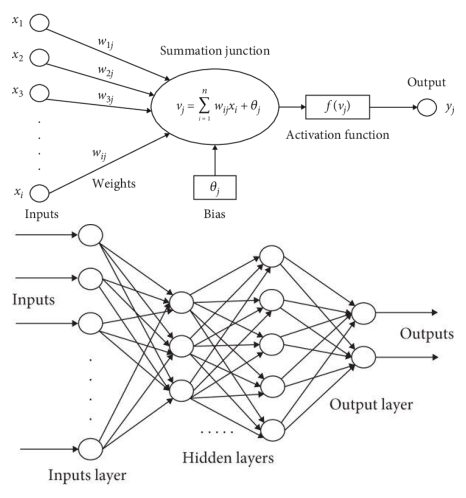 
FIG. 2. Feedforward ANN architecture. (Top) A single arti- ficial neuron applies a weighted sum to its inputs and passes the result through a nonlinear activation. (Bottom) A multi- layer network stacks such units into input, hidden, and output layers.

📷 Fig 3

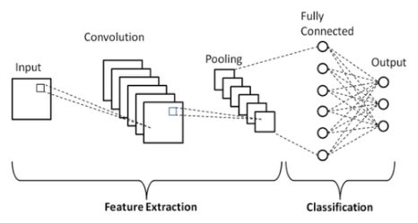 
FIG. 3. Block diagram of a one-dimensional CNN architec- ture as used in this study: convolutional layers extract local features from kinematic sequences, pooling reduces dimen- sionality, and a dense output layer produces the regression estimate.

📷 Fig 4

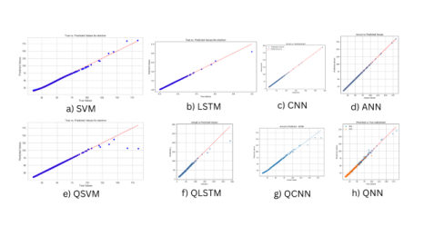 
FIG. 4. True vs. predicted transverse momentum for classical (a–d) and quantum (e–h) models. Points aligned with the diagonal indicate accurate regression; deviations reveal the characteristic error patterns of each architecture.

📷 Fig 5

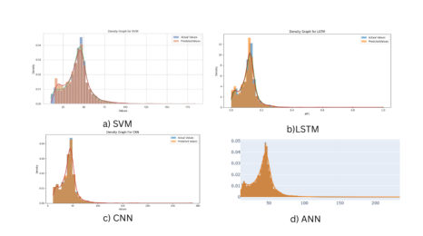 
FIG. 5. Kernel density estimates of actual (blue) and pre- dicted (orange) transverse-momentum distributions for the four classical architectures. High overlap indicates that each model has learned the statistical structure of the target vari- able, not only its mean behavior.

**Summary.** This work compares classical and quantum machine learning models for regression tasks using simulated particle collision data from the LHC. The study finds that while classical models perform slightly better now, quantum models exhibit a substantial advantage in parameter efficiency. This suggests that quantum approaches hold significant promise for future, resource-constrained quantum hardware applications in high-energy physics.

**Why it may be interesting.** The focus on parameter efficiency and benchmarking ML algorithms on complex physical data provides a direct, practical testbed for quantum computational advantage, which is highly relevant to quantum information theory.

Detailed structure

**Main problem.** The paper systematically compares classical and quantum machine learning architectures for performing regression tasks on high-energy physics collision data.

**Main result.** While classical models achieved marginally better quantitative performance under current constraints, quantum models demonstrated a significant parameter-efficiency advantage, notably with the QCNN matching classical CNN performance using far fewer qubits.

**Method.** The authors trained and compared ten models (four classical: SVM, ANN, CNN, LSTM; four quantum: QSVM, QNN, QCNN, QLSTM) on simulated proton-proton collision data using regression metrics like MAE, MSE, and R^2.

**Model / system.** The system involves simulated proton-proton (pp) collision events from the CERN Open Data portal, using transverse-momentum components as input features and transverse-momentum magnitude as the regression target.

**Key observables.** Mean Absolute Error (MAE), Mean Squared Error (MSE), Root Mean Squared Error (RMSE), and the coefficient of determination (R^2).

**Important parameters / regimes.** The comparison focuses on parameter count (e.g., QCNN using 36 parameters vs. CNN using $\sim 3,300$ parameters) and circuit depth.

**Assumptions / limitations.** The comparison is benchmarked under current hardware and dataset constraints, and the parameter count advantage is highlighted as a key indicator for future fault-tolerant quantum hardware.

**Figures summary.** Figures 4, 5, and 6 compare True vs. predicted transverse momentum distributions (KDE) for both classical and quantum models, illustrating performance differences.

**Paper structure.** The paper introduces the computational challenge in HEP, details the comparison of classical vs. quantum ML models, presents quantitative results comparing metrics and parameter counts, and concludes by characterizing the trade-offs and outlining future resource analysis needs.

Abstract

The classification and regression of particle collision events constitute a persistent computational challenge in experimental high energy physics, where large volumes of simulated data must be processed with both speed and precision. This work carries out a systematic comparison of four classical machine learning architectures, support vector machines (SVM), artificial neural networks (ANN), convolutional neural networks (CNN), and long short-term memory (LSTM) networks against their quantum counterparts: quantum SVM (QSVM), quantum neural networks (QNN), quantum CNN (QCNN), and quantum LSTM (QLSTM). All models are trained on simulated proton-proton collision events with electron-positron and muon-antimuon final states from the CERN Open Data portal, using transverse-momentum components as input features and transverse-momentum magnitude as the regression target. Classical architectures, and in particular the CNN and LSTM, achieve marginally better quantitative performance under current hardware and dataset constraints. Quantum models, however, reach competitive accuracy with substantially fewer trainable parameters: the QCNN reproduces the performance of the deep classical CNN using only four qubits and a circuit of depth three, pointing to a genuine parameter-efficiency advantage on near-term quantum devices. A baseline analysis confirms that the regression problem is non-trivial for shallow polynomial fits, supporting the relevance of the architectural comparison. These results characterize the trade-offs between classical and quantum approaches under realistic, resource-constrained conditions and provide a benchmark for future studies on actual quantum hardware.

[↑ back to top](#top)

### [Emergent aggregation from collective foraging](http://arxiv.org/abs/2608.28046v1)

**Authors:** Gorka Muñoz-Gil, Andrea López-Incera, Vide Ramsten, Giovanni Volpe, Thomas Müller, Hans J. Briegel  
**Type:** theory · **Category:** statistical mechanics · **PDF:** <https://arxiv.org/pdf/2608.28046v1>  
**Analysis basis:** full PDF text, analyzed in chunks

📷 Fig 1

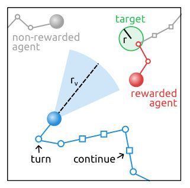 
FIG. 1. Model. An agent (blue) moves by continue and turn actions and perceives conspecifics within a vision cone of half-width π/8 and range rv. Targets (green, radius r) are not visible to the agents. A tagged agent (red) has just collected a target and is visible as rewarded for a time τR; grey agents are non-rewarded.

📷 Fig 2

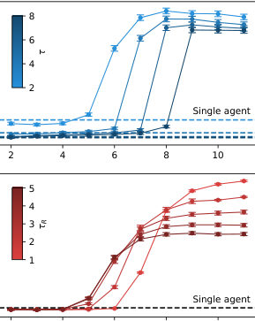 
FIG. 2. Foraging efficiency. Mean reward per step η versus visual range rv in the cooperative regime. (a) Fixed tag time τR = 9, several depletion times τ. (b) Fixed τ = 2, several tag times τR. Below a τ- and τR-dependent visual range the agents recover the blind single-agent efficiency (dashed lines); above it, η jumps and plateaus. Error bars: SEM over 4 runs of Na = 50 agents.

📷 Fig 3

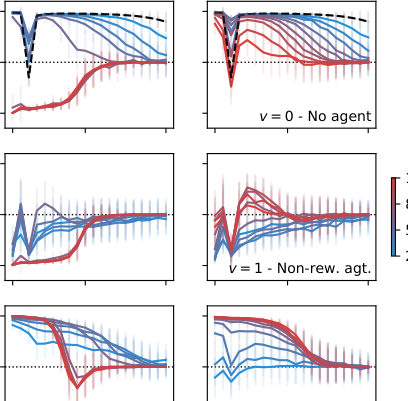 
FIG. 3. Learned policies. Continuing probability of the learned policies π for the three visual states, in the compet- itive and cooperative scenarios, at τ = 4, τR = 9, Na = 50. Dashed lines in no agent state: single-agent (blind) policy. Dotted lines: initial policy. Error bars: standard deviation over 4 runs and Na agents (collective) and over 12000 agents (single).

📷 Fig 4

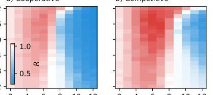 
FIG. 5. Role of the depletion rule. Clark–Evans index R over the (τR, rv) plane for the competitive and cooperative scenarios for Na = 25, τ = 2, and Nt = 100.

📷 Fig 5

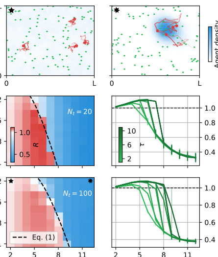 
FIG. 4. Aggregation. Results for an environment with Na = 25, τR = 9 and the cooperative scenario. a) Spatial distribution of agents over the final 5000 steps of a 15000 step run with Nt = 100 with trained policies at parameter values marked by the corresponding symbols in c. Four exemplary agent trajectories are overlaid. b, c) Clark–Evans index R for two target densities Nt. Left panels: R over the (τ, rv) plane; dashed lines show Eq. (1) with ℓ= 5, 8, respectively. Right panels: line cuts over previous plots; error bars: standard de- viation over 4 runs and Na agents.

**Summary.** This work demonstrates that collective spatial aggregation can emerge purely from optimizing an individual's search efficiency for local resources. By modeling foragers using reinforcement learning, the authors show that as the perception range increases, agents spontaneously adopt a collective strategy that leads to clustering, without any direct rule enforcing group cohesion.

**Why it may be interesting.** The concept of emergent collective behavior driven by optimizing individual utility functions is highly relevant to non-equilibrium statistical mechanics and pattern formation in complex systems.

Detailed structure

**Main problem.** The paper investigates whether collective aggregation in foraging behavior can emerge from an indirect, resource-driven objective rather than requiring direct social rewards.

**Main result.** Aggregation arises spontaneously as a by-product of optimal individual foraging strategies when the visual range exceeds a critical threshold, demonstrating that indirect cues can drive collective phenomena.

**Method.** The study uses reinforcement learning simulations and analytical modeling by comparing Mean First-Passage Times (MFPTs) for single-agent versus collective search strategies.

**Model / system.** The model consists of independent reinforcement learning foragers moving in a 2D box, optimizing their movement based on a purely individual reward for finding replenishable targets while only perceiving conspecifics.

**Key observables.** Foraging efficiency ($\eta$), Clark–Evans aggregation index ($R$), and the learned agent policies ($\pi$) conditioned on visual state.

**Important parameters / regimes.** Visual range ($r_v$), target depletion time ($	au$), and the reactive length ($\ell$).

**Assumptions / limitations.** The collective phase is shown to be a by-product of optimal foraging, not explicitly programmed; the crossover is identified as a sharp crossover, not a true thermodynamic phase transition.

**Figures summary.** Figures show the sharp jump in foraging efficiency ($\eta$) vs. $r_v$, the shift in learned policies from structured movement to random walking, and the mapping of the aggregation index ($R$) onto the parameter space.

**Paper structure.** The paper progresses by defining the RL framework, showing the emergence of two distinct search strategies (single-agent vs. collective), analytically deriving the crossover point by equating MFPTs, and finally confirming the transition using finite-size scaling analysis.

Abstract

Collective behaviour in living systems is usually modelled as the outcome of a \emph{direct} social drive: agents are rewarded, or hard-wired, to align with or approach their neighbours. Here we show that aggregation can instead emerge from an \emph{indirect} objective. We let reinforcement learning foragers, initially performing a random walk, optimize their dynamics from a purely individual reward for finding replenishable targets, while perceiving only their conspecifics and never the targets themselves. As the visual range grows, the agents undergo a sharp crossover from an environment-tuned individual search to a scale-agnostic collective one, and this crossover coincides with the onset of spatial aggregation. Thus a collective phase arises as a by-product of optimal foraging, without any direct reward for grouping. A minimal analytical first-passage model reproduces the transition as a crossover between the two search strategies. Our results identify indirect, resource-driven reward as a generic route to emergent collective phenomena.

[↑ back to top](#top)

### [Energy Internet Routing using Quantum Optimization Algorithms](http://arxiv.org/abs/2608.28401v1)

**Authors:** Alireza Alamgir Tehrani, Mehrdad Boroushaki, Abbas Rajabi  
**Type:** both · **Category:** quantum information and computing · **PDF:** <https://arxiv.org/pdf/2608.28401v1>  
**Analysis basis:** full PDF text, analyzed in chunks

📷 Fig 1

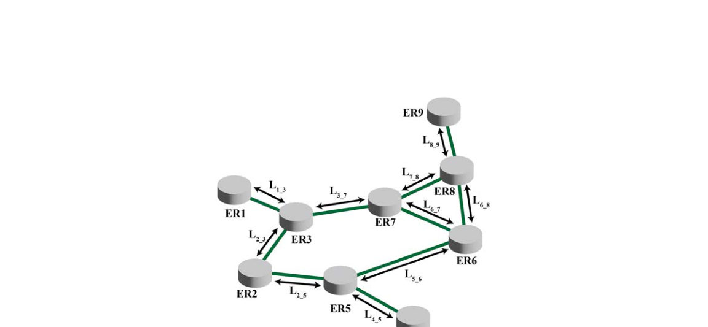 
Figure 2: A sample 9-node EI network comprises interconnected Energy Routers, where ER1 serves as the energy source and ER9 as the load. In the EI routing problem, the route with the minimum energy losses is used for energy transmission. The loss function 𝐿௦, for a given source-sink pair s, is deϐined as follows: 𝐿௦ൌ∑ ሺ∑𝑊௜൅∑𝑊௜௝ሻ ேೞ ௄ೞ (3) where 𝑊௜ is the power losses within the energy router i and is equal to.

📷 Fig 2

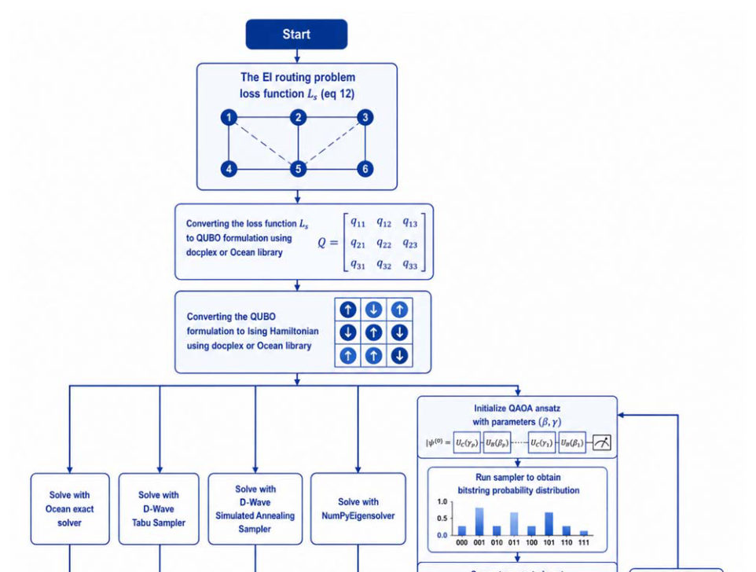 
Figure 3: Flowchart of different quantum computation methods applied to the EI routing problem. 3.1 The QUBO formulation of the EI routing problem To leverage quantum computing for optimization, the optimization problem must be transformed into QUBO form. The QUBO form can be used in both gate-based and annealing-based quantum computers. The energy routing problem is NP-hard. The objective function and constraints for this problem are reformulated using two binary variable sets for each node xi , and each edge xij.

📷 Fig 3

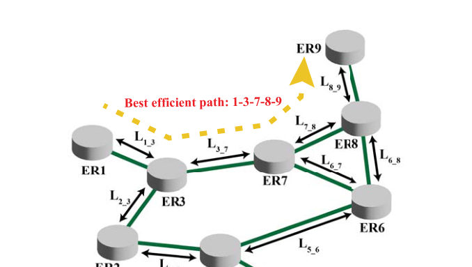 
Figure 4: The optimal path in energy routing with node 1 as the source node and node 9 as the load node

📷 Fig 4

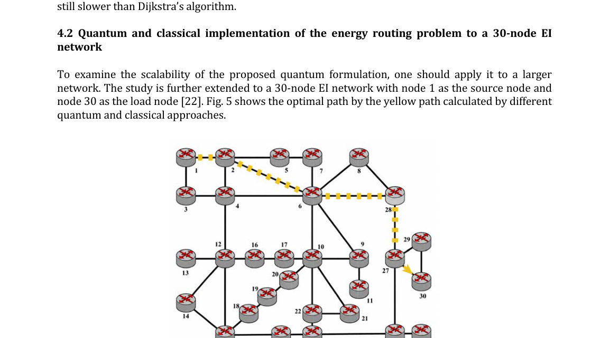 
Figure 5: The optimal energy routing path between the source and the load in the 30-node EI network Table 2 compares the results obtained for the 30-node EI network with different classical and quantum approaches. Comparative results show that the Dijkstra algorithm, with a runtime of 0.00005223 s, represents the most efficient method for addressing the energy routing problem, while the optimization-based method is the second most efficient method.

**Summary.** This research tackles the NP-hard energy routing problem in the Energy Internet by formulating it as a QUBO/Ising model. The authors compare solving this model using classical algorithms (like Dijkstra) against various quantum approaches (QAOA and Quantum Annealing). While the quantum methods validate the formulation, classical solvers demonstrated significantly faster runtime performance on the tested networks.

**Why it may be interesting.** The work demonstrates a direct application of quantum optimization techniques (QUBO/Ising) to a complex, real-world engineering problem, providing a benchmark for quantum computation feasibility in infrastructure management.

Detailed structure

**Main problem.** The paper addresses the NP-hard problem of finding the energy-efficient path selection (energy routing) within the Energy Internet (EI).

**Main result.** While quantum methods successfully formulated the problem, classical algorithms like Dijkstra's showed superior runtime performance for the tested 9-node and 30-node networks.

**Method.** The problem is mapped onto a Quadratic Unconstrained Binary Optimization (QUBO) and Ising Hamiltonian, which are then solved using comparative quantum and classical optimization techniques.

**Model / system.** The system modeled is the Energy Internet (EI), a network integrating renewable energy sources and loads. The core mathematical tool is the QUBO/Ising formulation derived from minimizing total energy losses (router and conduction losses).

**Key observables.** Optimal routing path, total energy losses (W), and computational time (s).

**Important parameters / regimes.** Network size (9-node and 30-node), transmission power (1 kW), and quantum circuit depth (p=1 for QAOA).

**Assumptions / limitations.** The analysis assumes treating power transmission as a constant parameter to linearize the non-linear loss function for QUBO formulation; quantum simulations are run on classical hardware.

**Figures summary.** Figures illustrate the EI components and the 9-node network graph structure; Tables compare the performance metrics (time, loss) across Dijkstra, QAOA, and quantum-inspired annealing for both 9-node and 30-node cases.

**Paper structure.** The paper first defines the EI routing problem and its NP-hard nature. It then develops the QUBO/Ising formulation by incorporating loss functions and constraints. Finally, it compares the performance of classical solvers (Dijkstra) against quantum approaches (QAOA, Quantum Annealing) on increasing network sizes.

Abstract

The Energy Internet (EI) is a new concept aimed at enhancing the integration of renewable energy sources with the energy grid. Energy-efficient path selection in EI is NP-hard. This research presents an innovative Quadratic Unconstrained Binary Optimization (QUBO) and Ising Hamiltonian formulation for energy routing. The validation and scalability of the proposed formulation were evaluated by applying quantum-inspired annealing and quantum gate optimization to two case studies, a 9-node and a 30-node EI network. A comparative analysis was presented between classical optimization using the Dijkstra algorithm, optimization-based methods, and QAOA using the Qiskit Sampler Primitive, NumpyEigenSolver, and quantum-inspired annealing using the Ocean exact Solver, D-Wave Tabu Sampler, and D-Wave Simulated Annealing. Simulation results based on the proposed formulation agree with the exact solution, while the runtime of classical approaches is less than that of quantum approaches. However, the Simulated Annealing sampler offers the shortest runtime among all quantum methods.

[↑ back to top](#top)

### [Exact quantification of nonlocal magic](http://arxiv.org/abs/2608.28563v1)

**Authors:** Piotr Sierant  
**Type:** theory · **Category:** quantum information and computing · **PDF:** <https://arxiv.org/pdf/2608.28563v1>  
**Analysis basis:** full PDF text, analyzed in chunks

📷 Fig 1

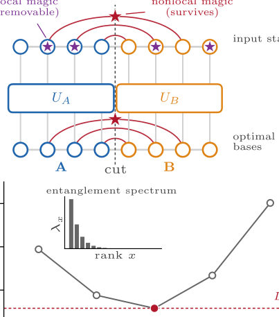 
FIG. 1. Quantifying nonlocal magic. a, A pure state |Ψ⟩ of qubits shared between two parties A and B carries magic in two places: on individual qubits (purple stars), where a lo- cal change of basis removes it, and in the correlations across the cut (red star), where no local operation can. Maximizing the stabilizer fidelity over local unitaries UA ⊗UB discards the former and defines the nonlocal min-relative entropy of nonstabilizerness DNL min, Eq. (1). b, Across any cut, a stabi- lizer state is equivalent under local Clifford operations to k Bell pairs, so its entanglement spectrum is flat with 2k equal entries. The nonlocal magic of |Ψ⟩is the Rényi-1/2 distance of its entanglement...

📷 Fig 2

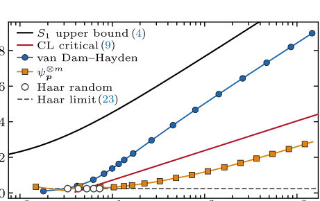 
FIG. 2. Nonlocal magic against entanglement entropy for four classes of states. The nonlocal min-relative en- tropy of nonstabilizerness DNL min versus the entanglement en- tropy S1 on a logarithmic scale. Black line: the entropy upper bound, which no state can exceed. Red line: the Calabrese–Lefevre asymptote of critical spectra. Blue cir- cles: exact values for the van Dam–Hayden catalysts |Γd⟩ with d = 22, . . . , 22900. Orange squares: exact values for the tensor powers ψ⊗m p , Eq. (8), with p = ( 1

**Summary.** This theoretical work introduces and solves the problem of quantifying 'nonlocal magic,' a measure of quantum correlation independent of local basis choices. The authors show this quantity is directly computable from the state's entanglement spectrum, providing a robust diagnostic tool. This advances the understanding of quantum resources by distinguishing genuine multipartite correlations from local redundancies.

**Why it may be interesting.** It provides a powerful, computable diagnostic tool ($D_{	ext{NL}}^{\min}$) for characterizing quantum correlations in many-body states, which is crucial for understanding resource theories beyond simple entanglement measures.

Detailed structure

**Main problem.** The paper aims to rigorously quantify 'nonlocal magic,' which is the component of quantum nonstabilizerness residing purely in the correlations between two subsystems, independent of local basis choices.

**Main result.** The nonlocal magic is quantified by the distance of the state's entanglement spectrum from the nearest Bell-pair sector, providing a universal and operationally meaningful measure of quantum correlation.

**Method.** The authors solve an intractable optimization problem by relating the nonlocal magic to the entanglement spectrum structure, leading to closed-form formulas based on Schmidt coefficients.

**Model / system.** The analysis focuses on pure multiqubit states $|\Psi
angle$ subjected to bipartitions $A \cup B$, utilizing concepts from stabilizer states and entanglement theory.

**Key observables.** Nonlocal Min-Relative Entropy of Nonstabilizerness ($	ext{NMRE}$ or $D_{	ext{NL}}^{\min}$), Nonlocal Stabilizer Fidelity ($F_{NL}$), and the entanglement spectrum.

**Important parameters / regimes.** The entanglement spectrum ($\lambda$), the number of qubits ($
u$), and the ratio of system sizes ($d/D$) in scaling limits.

**Assumptions / limitations.** The core results rely on solving the optimization problem by analyzing the structure of the entanglement spectrum, and later sections assume convergence properties for large random states.

**Figures summary.** Figures illustrate the concept of local vs. correlation magic, showing the nonlocal magic as a distance measure on the entanglement spectrum relative to Bell pairs.

**Paper structure.** The paper progresses from defining the intractable nonlocal magic problem to deriving a closed-form solution based on the entanglement spectrum. It then establishes equivalences with other measures and analyzes scaling behavior under tensor products and random state limits.

Abstract

Magic, or nonstabilizerness, is the resource that lifts Clifford circuits to universal quantum computation and has become a standard diagnostic of many-body states. For a state shared between two parties, however, a basic question has remained open: how much of the magic resides in the correlations between the parties rather than in their local bases? Isolating this nonlocal magic requires minimizing over all local bases, an optimization that has so far resisted exact solution. Here we solve it for the stabilizer fidelity: the nonlocal magic of every pure multiqubit state is the distance of its entanglement spectrum from the closest spectrum of Bell pairs. The same quantity governs an apparently unrelated task: a family of states universally embezzles entanglement under local operations and classical communication if and only if its nonlocal magic diverges. The deciding property is not the amount of entanglement but the way the entanglement spectrum spreads its weight across factor-of-two windows of rank, so that critical chains and random-singlet states, with identical logarithmic entanglement scaling, carry unbounded and vanishing nonlocal magic, respectively. Nonlocal magic thereby becomes an operationally meaningful property of quantum correlations, directly accessible to tensor-network simulations and, through entanglement spectroscopy, to experiments.

[↑ back to top](#top)

### [Field-tuned quasiparticles and electronic structure in heavy-fermion YbNi4P2](http://arxiv.org/abs/2608.28119v1)

**Authors:** Will Broad, Owen Moulding, Takaki Muramatsu, Manuel Brando, Alix McCollam, Femke Bangman, Gertrud Zwicknagl, Kristin Kliemt, Cornelius Krellner, Sven Friedemann  
**Type:** experiment · **Category:** strongly correlated electrons · **PDF:** <https://arxiv.org/pdf/2608.28119v1>  
**Analysis basis:** full PDF text, analyzed in chunks

📷 Fig 1

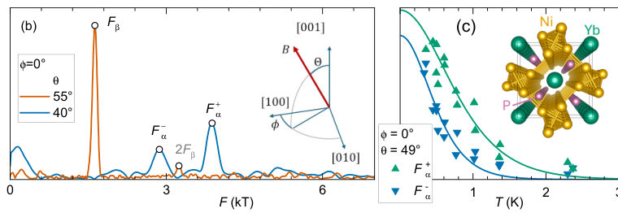 
FIG. 1. Quantum oscillations in YbNi4P2. (a) Oscillatory signal in the derivative of the magnetoresistance after removing a linear background for representative directions of the magnetic field as indicated by polar angle θ and azimuth ϕ. (b) Fast Fourier transform (FFT) for the data shown in (a). The traces at θ = 40◦and θ = 55◦were analysed over the field range 30 T to 35 T and 20 T to 35 T, respectively. Inset shows a sketch of the field orientation relative to the crystallographic directions. (c) Temperature dependence of peak amplitudes in the FFT, with Lifshitz-Kosevich fits for F + α and F − α . Inset shows crystal structure of YbNi4P2 projected along the [001] axis with the unit...

📷 Fig 2

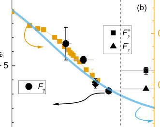 
FIG. 2. Field-dependence of quasiparticle mass. (a) Background-subtracted derivative of the resistance in the field range B4 &lt; B &lt; B7 (cf. Table S2). (b) Effective masses extracted from Lifshitz-Kosevich (LK) fits (Figure S2) as a function of magnetic field for Fγ below B9 and for F ± γ above B9. Horizontal (grey) bars denote the field range over which the mass was extracted. Vertical bars denote standard errors from LK fits. Yellow squares show the field dependence of the Sommerfeld coefficient [14] on separate axis (right). Solid blue line shows the de-renormalisation of the quasiparticle mass for a single-ion Kondo model with the parameters relevant for YbNi4P2 (see text for details).

📷 Fig 3

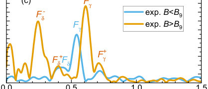 
FIG. 3. Change of quantum-oscillation frequencies across B9. (a) Resistance of sample 1 (grey) and linear fit to data (solid black line), left scale. Residual (blue) from linear fit on right scale. The LTs B7 and B9 (arrows, cf. Table S2) are visible as kinks in the residual [14, 16]. (b) Derivative of resistance after subtraction of linear background separately for field range below (blue) and above (yellow) B9. Solid black line marks a fit of two quantum oscillations frequencies to the experimental data below B9. The fit is extrapolated to above B9. (c) FFT for derivative below (blue) and above (yellow) B9. Labels indicate assigned frequencies.

📷 Fig 4

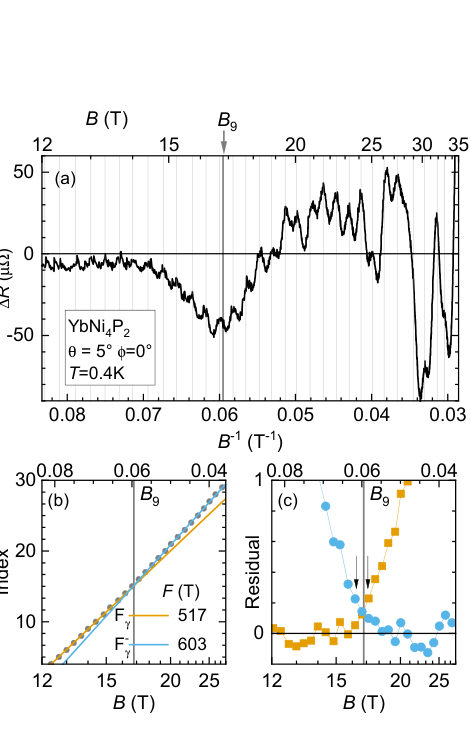 
FIG. 4. Abrupt Change of Quantum Oscillation Fre- quencies at B9. (a) Resistance after subtraction of 3rd or- der polynomial. Local maxima in R(B) are indicated by thin grey vertical lines and have been determined from the second derivative. B9 is indicated as thick grey vertical line. (b) In- dices of maxima from (a) vs inverse field together with linear fits for B &lt; B9 (yellow line) and B &gt; B9 (blue line). The slope of the lines in (b) corresponds to the quantum oscilla- tion frequencies listed in the figure legend. (c) Residual of linear fits from (b). Arrows in (c) indicate the fields where the residuals deviate from zero.

📷 Fig 5

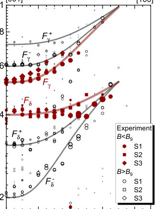 
FIG. 5. Anisotropy of frequency splitting. (a) Angular dependence of frequencies Fγ and Fδ detected below B9 but absent above B9 (filled red symbols) together with new fre- quencies detected above B9 only (open black symbols). Solid lines are guides to the eye for frequencies below (red) and above (grey) B9.

**Summary.** This paper uses quantum oscillation measurements on the heavy-fermion compound YbNi4P2 to probe its electronic structure under high magnetic fields. Key findings include observing a field-dependent renormalization of the quasiparticle mass and detecting an abrupt change in quantum oscillation frequencies at a critical field. This suggests that external magnetic fields can tune the electronic structure, providing crucial input for theoretical models of correlated electron systems.

**Why it may be interesting.** The study provides experimental evidence of field-tuning of electronic structure in a strongly correlated material, offering insights into how external fields can drive quantum phase transitions in heavy fermion systems, which is relevant to understanding correlated quantum matter.

Detailed structure

**Main problem.** The study investigates the electronic structure and quasiparticle properties in the heavy-fermion compound YbNi4P2 under the influence of high magnetic fields.

**Main result.** The research observes a field-dependent decrease in quasiparticle mass and detects an abrupt change in quantum oscillation frequencies at a critical field (17 T), suggesting a field-induced electronic structure transition.

**Method.** The primary method involves performing quantum oscillation (QO) measurements on magnetoresistance and its derivative, complemented by fitting temperature dependence to extract effective mass.

**Model / system.** The physical system is the heavy-fermion compound YbNi4P2, characterized by strong electronic correlations arising from the hybridization of local moments and conduction electrons. The analysis compares experimental results to predictions from the single-ion Kondo model.

**Key observables.** Quantum oscillation frequencies (F), quasiparticle effective mass (m*), Sommerfeld coefficient (gamma_S), and magnetoresistance R(B).

**Important parameters / regimes.** High magnetic fields (up to 35 T), the critical field B9 (17 T), and the characteristic energy scale of the Kondo effect.

**Assumptions / limitations.** The analysis assumes that the observed phenomena can be modeled by the single-ion Kondo model and that the abrupt frequency changes signal a Lifshitz transition or electronic structure change.

**Figures summary.** Figures illustrate QO signals across different field orientations, the field-dependence of the effective mass (showing splitting above B9), and the abrupt change in oscillation frequencies at the critical field B9.

**Paper structure.** The paper systematically analyzes QO data, first establishing the field-dependence of the quasiparticle mass relative to the Kondo model, then pinpointing the critical field B9 where frequency splitting occurs, and finally discussing the implications for Fermi surface topology.

Abstract

We study the Fermi surface topology and quasiparticle properties in the heavy fermion compound YbNi4P2 at high magnetic fields using quantum oscillation measurements. We observe a large decrease of the quasiparticle mass with increasing field and demonstrate good qualitative agreement with the single-ion Kondo model. At the putative Lifshitz transition at 17 T, we observe a sudden change of quantum oscillation frequencies suggesting an abrupt change of the electronic structure and/or quasiparticle characteristics. Our results demonstrate the ability to tune the electronic structure and provide input for theoretical models of YbNi4P2 and correlated electron systems in high magnetic fields.

[↑ back to top](#top)

### [Fractional Hall Conductance of Laughlin States from a Topological Index](http://arxiv.org/abs/2608.27767v1)

**Authors:** Sven Bachmann, Severin Schraven, Jacob Shapiro, Simone Warzel  
**Type:** theory · **Category:** strongly correlated electrons · **PDF:** <https://arxiv.org/pdf/2608.27767v1>  
**Analysis basis:** full PDF text, analyzed in chunks

📷 Fig 1

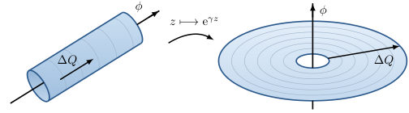 
FIG. 1. The conformal equivalence between a finite cylinder and a planar annulus under z 7−→eγz. The cylinder radius is Rcyl = ℓB/γ; extending the cylinder infinitely along its axis gives the punctured plane.

📷 Fig 2

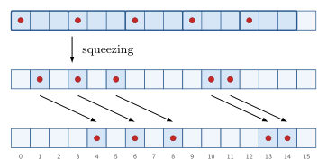 
FIG. 2. In the occupation picture, with red balls symbolizing particles, two elementary squeezings map the root with q = 3 and b = 0, N = 5 on the top line to the second line. The third line is a shift of the previous one, which corresponds to flux insertion.

**Summary.** This paper rigorously proves the fractional quantization of the Hall conductance for Laughlin states by defining and calculating a many-body topological index. Using an infinite Matrix Product State formalism on a thin cylinder, the authors show that this index yields $\sigma_H = 1/q$, establishing the quantization as a fundamental topological property of the FQH phase.

**Why it may be interesting.** The use of topological invariants derived from algebraic structures (like the index on the CAR algebra) to prove fundamental quantization results in strongly correlated electron systems provides a powerful, non-perturbative theoretical tool applicable to other quantum many-body problems.

Detailed structure

**Main problem.** The paper aims to rigorously establish the fractional quantization of the Hall conductance ($\sigma_H$) for Laughlin states by deriving it directly from a topological index, bypassing reliance on spectral gap assumptions.

**Main result.** The authors prove that the Hall conductance for Laughlin states is quantized to $\sigma_H = 1/q$, where $q$ is an integer, demonstrating that this value is a robust topological invariant.

**Method.** The core method involves recasting the Laughlin-pump argument into a topological invariant defined as an index ($	ext{ind}(\omega_1, \omega_2)$) for a pair of pure states, which is then calculated using an infinite Matrix Product State (iMPS) representation.

**Model / system.** The physical system is the Fractional Quantum Hall (FQH) effect, modeled by Laughlin states ($\omega_q$). The analysis is performed on a thin cylinder geometry using the CAR algebra of observables.

**Key observables.** Hall conductance ($\sigma_H$), the topological index ($	ext{ind}(\omega_1, \omega_2)$), and the filling fraction ($1/q$).

**Important parameters / regimes.** The analysis is most rigorous in the thin-cylinder limit (large $\gamma$) and involves the flux quantum insertion parameter $k$.

**Assumptions / limitations.** The derivation relies on the validity of the iMPS representation for sufficiently large cylinder radii ($\gamma$) and the definition of the index's stability under deformations.

**Figures summary.** Figure 1 illustrates the conformal equivalence between a cylinder and an annulus. Figure 2 shows the iMPS representation, detailing how elementary 'squeezing' operations map the root partition related to flux insertion.

**Paper structure.** The argument progresses by first defining the physical problem (flux insertion $
ightarrow \sigma_H$), then abstracting it into a topological index, proving the index's mathematical robustness (automorphism invariance, stability), and finally applying this index to the specific Laughlin state to derive the quantization result.

Abstract

We provide a rigorous Laughlin-pump argument that establishes the fractional quantization of the Hall conductance directly from the Laughlin state as a topological index. Our proof uses a recently defined index of a pair of pure states together with an infinite matrix product state analysis that is rigorous on a sufficiently thin cylinder. By virtue of the connection to an index, our result implies, in particular, that Laughlin states are representatives of topologically stable fractional quantum Hall phases.

[↑ back to top](#top)

### [Interplay between crystal structure and magnetism in CeCrB$_4$](http://arxiv.org/abs/2608.28238v1)

**Authors:** Mirosław Werwiński, Andrzej Szajek, Andrzej Kowalczyk  
**Type:** theory · **Category:** strongly correlated electrons · **PDF:** <https://arxiv.org/pdf/2608.28238v1>  
**Analysis basis:** full PDF text, analyzed in chunks

📷 Fig 1

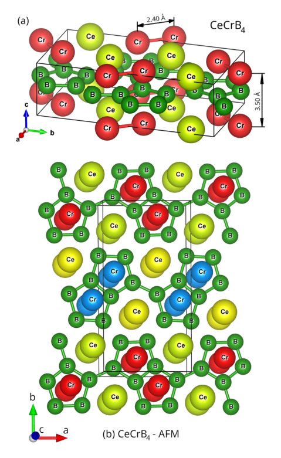 
Figure 1: CeCrB4 crystallizes in the orthorhombic YCrB4-type structure (space group P bam) with lattice parameters a = 5.942 Å, b = 11.580 Å, and c = 3.496 Å (our experimental data). (a) Single unit cell with the intra-dimer Cr–Cr distances indicated. (b) Antiferromagnetic configuration featuring two magnetically in- equivalent Cr sites, highlighted in different colors. The extended projection help to visualise the Cr–Cr dimers within the lattice.

📷 Fig 2

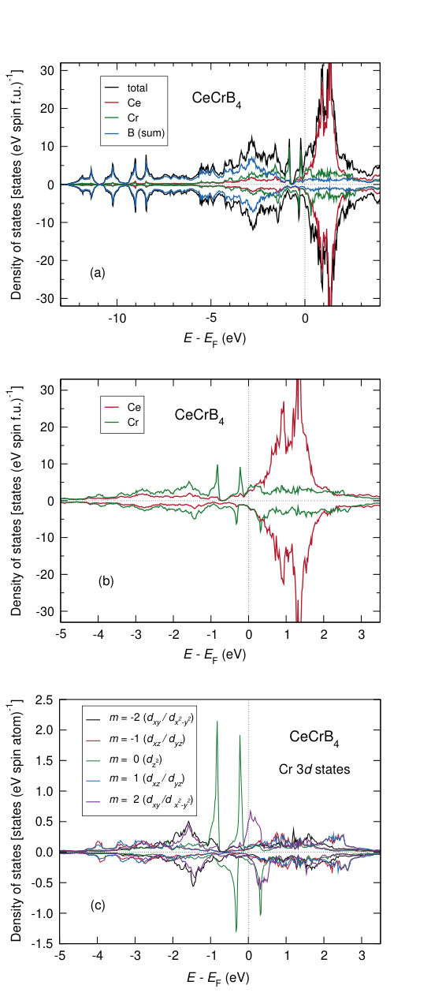 
Figure 2: Electronic density of states (DOS) for CeCrB4 in the ferromagnetic configuration: (a) total and site-projected DOS; (b) site-projected Ce and Cr DOS; (c) local Cr 3d orbital con- tributions. The results come from fully relativistic calculations with the magnetization (quantization) axis [001]. The calcula- tions were performed using the FPLO method within the PBE+U approach (U4f = 6 eV).

📷 Fig 3

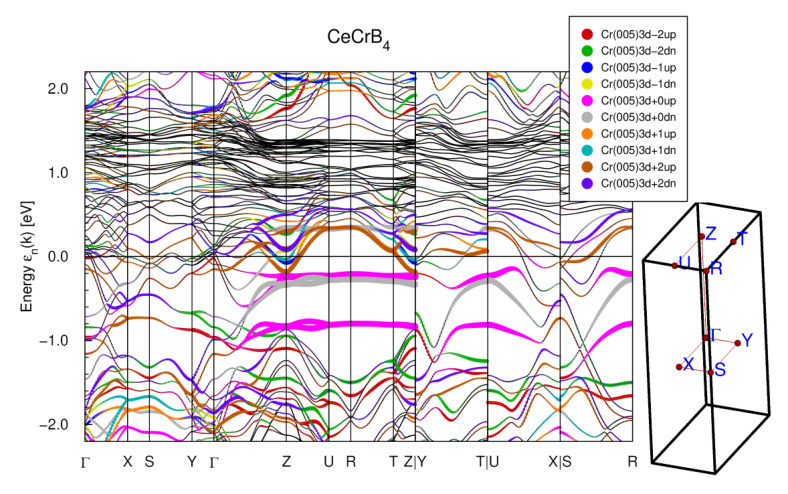 
Figure 3: Electronic band structure of CeCrB4 in the ferromagnetic configuration, presented in a fat-band representation. The local Cr 3d orbital contributions are highlighted in color. The partially flat Cr 3dz2 (m = 0) bands are indicated in magenta and gray for the two respective spin channels. The corresponding high-symmetry points are marked on the enclosed Brillouin zone. The calculations were performed using the fully relativistic FPLO method within the PBE+U approach (U4f = 6 eV).

📷 Fig 4

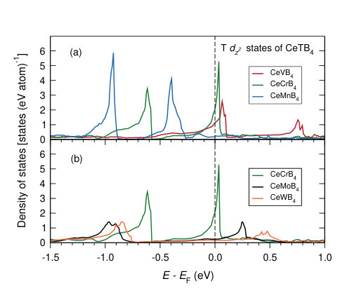 
Figure 5: Electronic density of states (DOS) for CeTB4 com- pounds: (a) local T 3dz2 orbital contributions for T = V, Cr, and Mn (consecutive elements within the 3d series); (b) local 3dz2, 4dz2, and 5dz2 orbital contributions for T = Cr, Mo, and W, re- spectively (three elements belonging to the same group of the periodic table). The calculations were performed using the non- magnetic scalar-relativistic FPLO method within the PBE+U ap- proach (U4f = 6 eV). For all considered compounds, the CeCrB4 structural model was utilized as a template, substituting only the chemical element at the Cr position.

📷 Fig 5

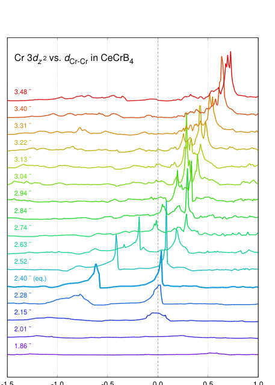 
Figure 4: Evolution of the orbital-resolved density of states (DOS) for the Cr 3dz2 (m = 0) state as a function of the intra-dimer dCr–Cr distance in CeCrB4. Individual spectra are vertically shifted by a constant offset for clarity. The vertical dashed line de- notes the Fermi level (E −EF = 0 eV). The spectrum highlighted with a thicker line at 2.40 Å corresponds to the equilibrium config- uration (eq.). The calculations were performed using the nonmag- netic scalar-relativistic FPLO method within the PBE+U frame- work (U4f = 6 eV). The variation in the interatomic distance dCr–Cr was modeled by scaling the area of the ab plane of the unit cell while keeping the lattice parameter c constant.

**Summary.** This work uses DFT to study the electronic and magnetic properties of $	ext{CeCrB}_4$, focusing on the $	ext{Cr–Cr}$ dimer motif. It determines that the material's ground state is ferromagnetic and elucidates that the $	ext{Cr–Cr}$ bonding states behave molecularly. The findings provide insights into how crystal structure dictates magnetic ordering and electronic behavior in these boride compounds.

**Why it may be interesting.** The investigation into localized magnetic moments and the strong correlation effects in the $4f$ electrons of Cerium, combined with the analysis of crystal field splitting in the $	ext{Cr}$ $3d$ orbitals, touches upon correlated electron physics relevant to heavy fermion systems.

Detailed structure

**Main problem.** To clarify the molecular nature of localized dimer states in $	ext{MTB}_4$ compounds, determine the magnetic ground state of $	ext{CeCrB}_4$, and resolve the valence state and magnetic moment of Ce.

**Main result.** The calculations predict that the ferromagnetic (FM) state is the magnetic ground state, and the $	ext{Cr–Cr}$ dimer electronic structure exhibits clear molecular-like bonding and antibonding splitting as a function of inter-dimer distance.

**Method.** Density Functional Theory (DFT) using the GGA+U framework, incorporating fully relativistic calculations and analyzing the electronic density of states (DOS) and magnetic moments.

**Model / system.** The study focuses on the $	ext{CeCrB}_4$ crystal structure, which belongs to the $	ext{MTB}_4$ family of ternary metal borides, featuring structurally embedded $	ext{Cr–Cr}$ dimers.

**Key observables.** Magnetic ground state ($	ext{FM}$ vs. $	ext{AFM}$ energy difference), $	ext{Cr–Cr}$ dimer electronic splitting, $	ext{Ce}$ valence state, and magnetic moments ($\mu_s, \mu_l$).

**Important parameters / regimes.** The Hubbard parameter $U_{4f} = 6 	ext{ eV}$ is used for the $	ext{Ce}$ $4f$ orbitals; the intra-dimer distance $d_{	ext{Cr–Cr}}$ is systematically varied.

**Assumptions / limitations.** The calculations are subject to DFT limitations, and the $	ext{PBE}+	ext{U}$ correction, while improving the $	ext{Ce}$ $4f$ description, cannot capture all dynamic many-body correlation effects.

**Figures summary.** Figures show the crystal structure and $	ext{Cr–Cr}$ dimers, and the DOS reveals strong hybridization near the Fermi level, with localized $	ext{Cr}$ states standing out.

**Paper structure.** The paper systematically investigates the magnetic ground state by comparing $	ext{FM}$ and $	ext{AFM}$ configurations, followed by a detailed electronic structure analysis focusing on the $	ext{Cr–Cr}$ dimer bonding mechanism by varying the inter-dimer distance.

Abstract

CeCrB$_4$ belongs to the family of MTB$_4$ ternary metal borides, some of whose magnetic phases have recently been identified as quantum spin dimers. Employing density functional theory within the GGA+$U$ framework, this work investigates the key ground-state properties of this system, including its ferromagnetic ground state, the mixed-valence nature of cerium, and the charge transfer from the cationic cerium--chromium layers to the anionic boron layers. In particular, we focus on elucidating the bonding mechanism within the structurally embedded Cr-Cr dimers. Specifically, we evaluate a previously proposed interpretation that the localized Cr $3d_{z^2}$ states are molecular-like bonding and antibonding states. The calculated dependence of the $3d_{z^2}$ electronic structure on the intra-dimer distance correlates with the level-splitting characteristics known for classical homonuclear diatomic molecules.

[↑ back to top](#top)

### [Learning to Decode Concatenated Quantum Codes with Hierarchical Message Passing](http://arxiv.org/abs/2608.28571v1)

**Authors:** Jiahui Wu, Chao Zhang, Zipeng Wu, Shilin Huang  
**Type:** theory · **Category:** quantum information and computing · **PDF:** <https://arxiv.org/pdf/2608.28571v1>  
**Analysis basis:** full PDF text, analyzed in chunks

📷 Fig 1

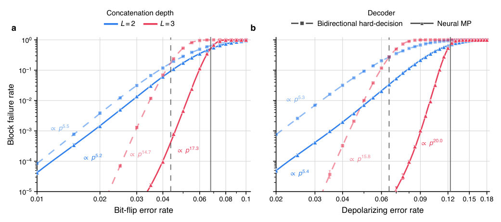 
Figure 1. Block failure rate of the concatenated [[15, 7, 3]] Hamming code at concatenation depths L = 2 and L = 3, comparing the neural message-passing (MP) decoder with the bidirectional hard-decision decoder. (a) Under bit-flip noise, the neural MP decoder raises the pseudo-threshold from p∗≈4.4% to 6.8%. (b) Under depolarizing noise, it nearly doubles the pseudo-threshold, from p∗≈6.5% to 12.3%.

📷 Fig 2

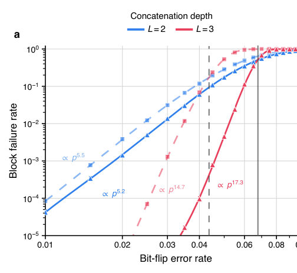 
Fig. 1 compares the neural MP decoder with the bidi- rectional hard-decision decoder [16] on the concatenated [[15, 7, 3]] quantum Hamming code [38, 39], which at level L encodes k = 7L logical qubits into n = 15L physical qubits. Each block carries 7 canonical logical triples plus 35 auxiliary weight-3 logical-observable triples, giving k′ = 42; k′′ = 14 of these are used to generate logical- observable triples at the next level. As shown in Fig. 1(a), under bit-flip noise, the neural MP decoder raises the pseudo-threshold from p∗≈4.4% to p∗≈6.8%, and at L = 3 its block failure rate is two to three orders of mag- nitude lower than the bidirectional decoder’s, reaching 1.6 × 10−5 versus 1.2...

📷 Fig 3

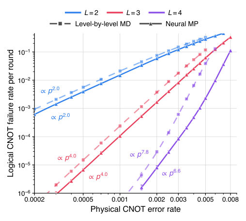 
Figure 2. Evaluation of the neural message-passing (MP) decoder and the level-by-level minimum-distance (MD) de- coder at concatenation depths L = 2,3 and 4 for the many- hypercube code family in circuit-level simulations under de- polarizing noise.

📷 Fig 4

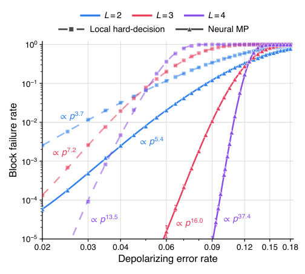 
Figure 3. Evaluation of the neural message-passing (MP) decoder and the local hard-decision decoder at concatenation depths L = 2, 3 and 4 for the non-CSS concatenated [[8, 3, 3]] code family under depolarizing noise.

**Summary.** This work presents a novel neural message-passing decoder for decoding complex concatenated quantum error-correcting codes. By propagating soft beliefs across code levels, the decoder achieves substantial improvements in error thresholds compared to existing state-of-the-art methods. This framework offers a general tool for advancing fault-tolerant quantum computation design.

**Why it may be interesting.** The use of neural networks to model complex, structured error correction processes provides a powerful, trainable tool for analyzing fault tolerance limits in quantum computation.

Detailed structure

**Main problem.** The paper addresses the challenge of efficiently and accurately decoding general concatenated quantum error-correcting codes.

**Main result.** The proposed neural message-passing decoder significantly outperforms state-of-the-art hard-decision decoders, notably nearly doubling the depolarizing pseudo-threshold for the [[15, 7, 3]] Hamming code.

**Method.** It introduces a neural message-passing framework where soft beliefs propagate bidirectionally across code concatenation levels, using lightweight networks only for message aggregation.

**Model / system.** The model focuses on concatenated quantum stabilizer codes, tested on specific examples like the [[15, 7, 3]] Hamming code and many-hypercube codes. The framework is designed to be generic for exploring various code constructions.

**Key observables.** Pseudo-threshold ($p^*$) under bit-flip and depolarizing noise, and logical-CNOT failure rates.

**Important parameters / regimes.** The number of message-passing iterations (fixed for bounded latency), and the specific noise models (bit-flip, depolarizing).

**Assumptions / limitations.** The core message-passing rules are kept fixed, departing from fully end-to-end neural decoders, and the initial state can be learned to capture circuit-level error distributions.

**Figures summary.** Figures compare block failure rates for the Hamming code and many-hypercube code under different noise types, demonstrating the decoder's superior performance compared to baseline decoders.

**Paper structure.** The paper details the neural message-passing architecture, presents results comparing its performance against hard-decision decoders on various code families, and discusses fine-tuning on circuit-level error data.

Abstract

We introduce a neural message-passing framework for decoding general concatenated stabilizer codes. Soft beliefs propagate bidirectionally across concatenation levels, and lightweight neural networks learn only to aggregate incoming messages. For the concatenated $[[15,7,3]]$ quantum Hamming code, the resulting decoder achieves substantially higher thresholds than the state-of-the-art bidirectional hard-decision decoder under both bit-flip and depolarizing noise. In particular, the depolarizing pseudo-threshold nearly doubles, from $6.5\%$ to $12.3\%$. For many-hypercube codes, a decoder fine-tuned on circuit-level errors in Knill's teleportation-based error correction can achieve lower logical-CNOT failure rates than their dedicated decoder, using a fixed number of message-passing iterations instead of extensive combinatorial search. Our framework provides a generic decoding tool for exploring the design space of concatenated codes, including non-CSS constructions, toward low-overhead fault tolerance.

[↑ back to top](#top)

### [Next-to-Leading-Order Electroweak Corrections to Quantum Observables in Lepton-Lepton Collisions](http://arxiv.org/abs/2608.27559v1)

**Authors:** Spencer Chang, Thomas Driscoll, Sokratis Trifinopoulos  
**Type:** theory · **Category:** other · **PDF:** <https://arxiv.org/pdf/2608.27559v1>  
**Analysis basis:** full PDF text, analyzed in chunks

📷 Fig 1

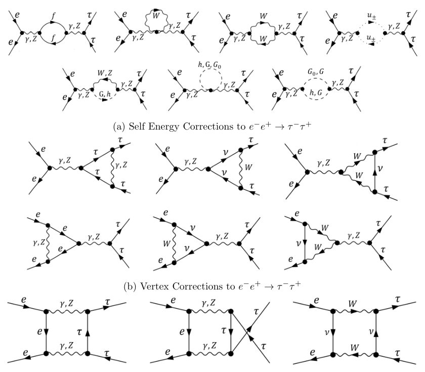 
Figure 1: Leading Feynman diagrams for e+e−→τ +τ −at NLO. Diagrams involving scalars are suppressed by the Yukawa couplings to the fermions.

📷 Fig 2

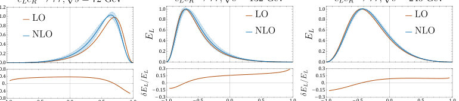 
Figure 2: Linear entropy EL for e−e+ →τ −τ + with LR initial states at NLO in the (cos θ, √s) plane. The LO density plot is visually similar, and the fixed-energy slices below make the LO–NLO comparison explicit. The RL channel is qualitatively identical and is shown in App. A.

📷 Fig 3

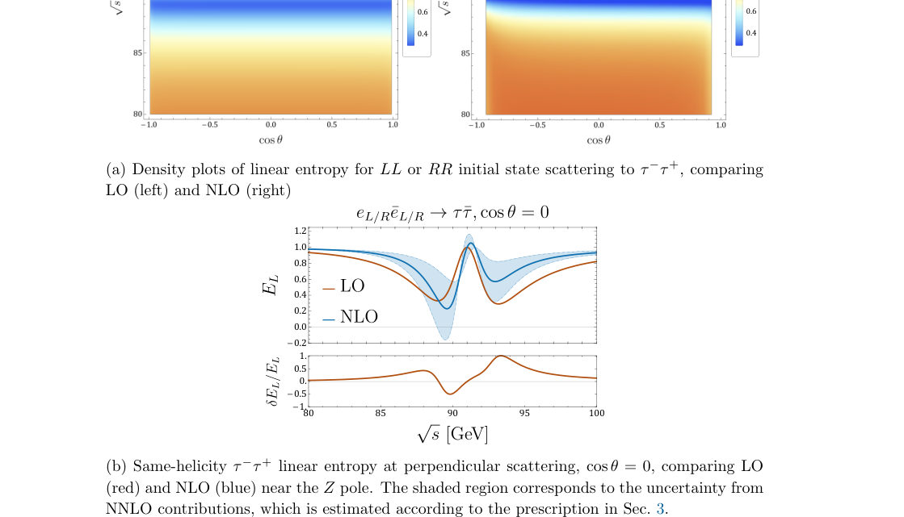 
Figure 3: Linear entropy EL for e−e+ →τ −τ + with LL or RR initial states in the Z-pole region.

📷 Fig 4

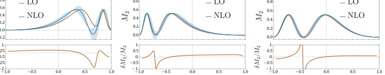 
Figure 4: Stabilizer second R´enyi entropy M2 for e−e+ →τ −τ + with LR initial states at NLO in the (cos θ, √s) plane. The LO density plot is visually similar, and the RL channel is shown in App. A.

📷 Fig 5

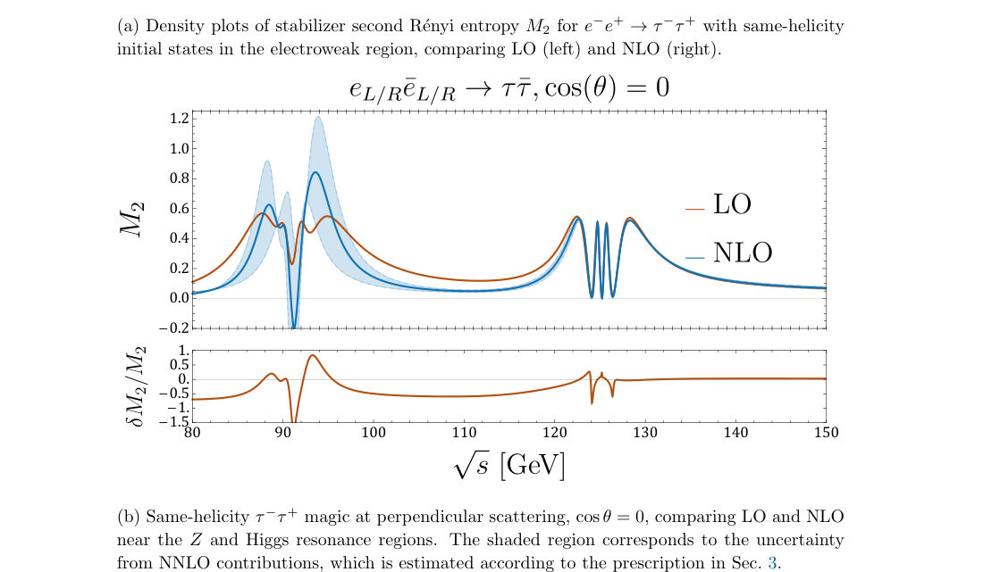 
Figure 5: Stabilizer second R´enyi entropy M2 for e−e+ →τ −τ + with same-helicity initial states in the electroweak region.

**Summary.** This paper calculates how electroweak radiative corrections affect quantum measures like entanglement and magic in processes such as $\ell^+\ell^- 	o 	au^-	au^+$ and $ZZ$. By treating the final state as a multi-qudit system, the authors show that these corrections coherently alter the quantum structure of the final state. The results establish these quantum observables as powerful, new tools for precision measurements at future lepton colliders.

**Why it may be interesting.** The application of quantum information diagnostics (entanglement, magic) to high-energy particle physics processes provides a novel, precision-sensitive probe of fundamental interactions, bridging quantum information theory with particle phenomenology.

Detailed structure

**Main problem.** The study investigates how virtual next-to-leading-order (NLO) electroweak corrections modify the quantum structure of observables like entanglement and magic in lepton-lepton collisions.

**Main result.** Radiative corrections coherently modify the quantum structure of the final state, causing shifts in regions of maximal entanglement and altering the generated magic relative to leading order.

**Method.** The authors compute entanglement entropy and stabilizer second Rényi entropy by treating outgoing particles as multi-qudit systems and performing one-loop calculations.

**Model / system.** The physical system is lepton-lepton collisions ($\ell^+\ell^- 	o 	au^-	au^+, ZZ$), analyzed within Quantum Field Theory. The outgoing particles are modeled as multi-qudit systems (qubits for fermions, qutrits for massive bosons).

**Key observables.** Entanglement entropy, stabilizer second Rényi entropy, and 'magic' (non-stabilizerness).

**Important parameters / regimes.** Next-to-leading-order (NLO) electroweak corrections, future lepton collider energies, and particle masses.

**Assumptions / limitations.** The analysis focuses on the production-side quantum state before decay reconstruction, and the initial state is assumed to have definite helicities.

**Paper structure.** The paper systematically calculates quantum observables by incorporating one-loop electroweak corrections, detailing the theoretical framework for handling divergences and projecting the state onto the outgoing two-particle Hilbert space.

Abstract

We study how virtual next-to-leading-order electroweak corrections affect the quantum observables of entanglement and magic in lepton--lepton collisions. Treating the outgoing particles as multi-qudit systems, $\textit{i.e.}$, qubits for spin-$\tfrac{1}{2}$ fermions and qutrits for massive vector bosons, we compute entanglement entropy and the stabilizer second Rényi entropy for the processes $\ell^+\ell^- \to τ^-τ^+,\, ZZ$ at one-loop accuracy. We show that radiative corrections coherently modify the quantum structure of the final state, shifting regions of maximal entanglement and altering the generated magic relative to leading order. Our results demonstrate that these quantum observables provide novel, precision-sensitive probes of electroweak dynamics at future lepton colliders and open a path toward their use in searches for new physics.

[↑ back to top](#top)

### [Orbital-Selective Coexistence of Interlayer Spin-Singlet Formation and SDW Order with Anomalous Spin Reconfiguration in Bilayer Nickelate La$_{3}$Ni$_{2}$O$_{7}$ Revealed by $^{17}$O-NMR](http://arxiv.org/abs/2608.27917v1)

**Authors:** H. Lee, M. Yashima, M. Kakoi, T. Ino, Y. Arai, K. Kitagawa, H. Sakurai, Y. Takano, K. Kuroki, H. Mukuda  
**Type:** experiment · **Category:** strongly correlated electrons · **PDF:** <https://arxiv.org/pdf/2608.27917v1>  
**Analysis basis:** full PDF text, analyzed in chunks

📷 Fig 1

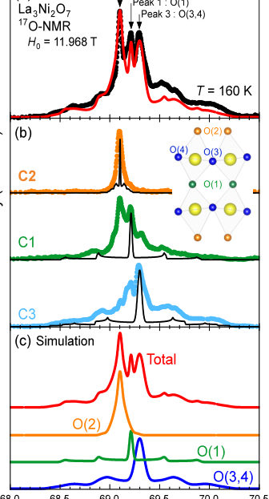 
FIG. 1. (color online) (a) 17O-NMR spectrum at 160 K (&gt; TSDW). The red curve is the simulated result shown in (c). Here, the broad background spectral component from the 139La-NMR is sub- tracted. The top axis indicates the shift relative to γH0 (γ is the gyromagnetic ratio of 17O), where the zero point corresponds to the position of K = 0 for 17O nuclear spins. (b) Three peaks are distin- guished using three different NMR pulse conditions (C1, C2, and C3), enabling the assignment of the outer apical O(2), inner apical O(1), and planar O(3,4) sites, respectively. The black curves are simulated spectra to determine the experimental values of νexp Q for the three O sites. (c) The simulation of...

📷 Fig 2

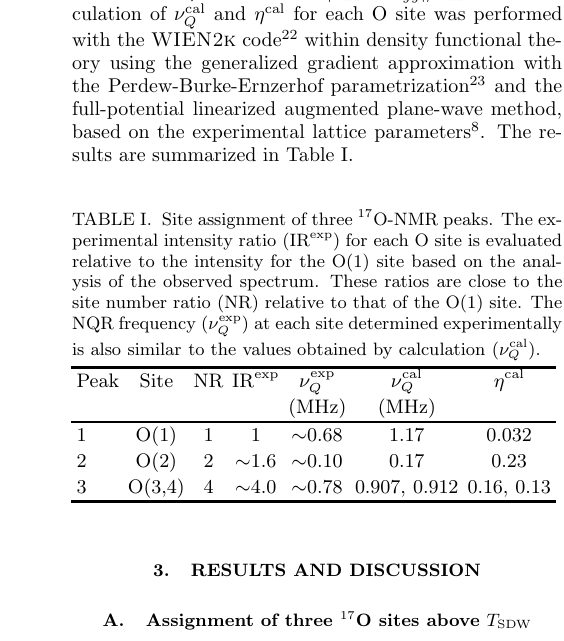 
Figure 1(a) shows the 17O-NMR spectra at 160 K above TSDW (= 150 K). Three distinct peaks are ob- served, which are labeled peak 2, peak 1, and peak 3 from low to high frequency. Ideally, there are four oxygen sites in orthorhombic La3Ni2O7: inner apical O(1), outer api- cal O(2), and planar O(3,4) sites, as shown in the inset of Fig. 1(b). To identify the origin of the three peaks, we

📷 Fig 3

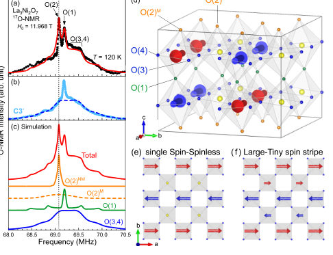 
FIG. 2. (color online) (a) 17O-NMR spectrum of the SDW state at 120 K (TA ≤T ≤TSDW). The peak of the O(3,4) sites is largely broadened due to a finite Hint from the adjacent Ni moments in the commensurate SDW order. The broad spectral component from the 139La-NMR on the background is subtracted. The vertical dot- ted line indicates the position of K = 0 for 17O nuclear spins. (b) The NMR pulse condition (C3’) can selectively highlight the spec- trum of the O(3,4) sites, revealing the presence of Hint(3, 4) ∼0.05 T from the simulation (broken curve). (c) Spectrum simulations for the O(3,4) with the finite Hint(3, 4), the O(2)NM with no or a negligibly small Hint and the O(2)M with finite...

📷 Fig 4

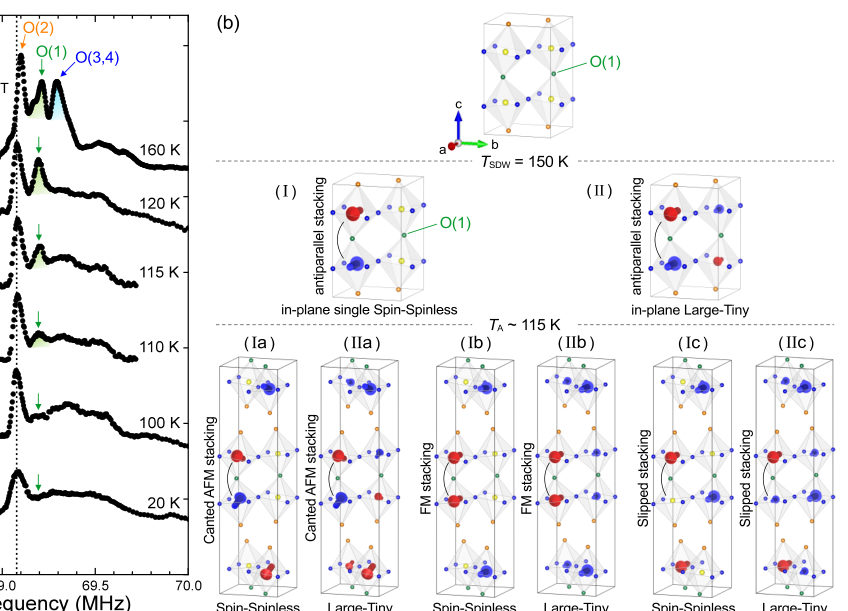 
FIG. 3. (color online) (a) T dependence of 17O-NMR spectra. Among the three narrow peaks of each O site, the peak associated with the planar O(3,4) sites broadens significantly below TSDW (= 150 K). As for the inner apical O(1) sites, the narrow peak is present from TSDW to 115 K (≡TA), suggesting that the interlayer spin configuration is predominantly antiparallel. However, this O(1) peak disappears drastically below TA, even though the in-plane SDW order does not change, implying that the interlayer spin configuration between adjacent SDW planes becomes non-antiparallel. The vertical dotted line indicates the position of K = 0 for 17O nuclear spins. (b) The possible stacking configurations...

📷 Fig 5

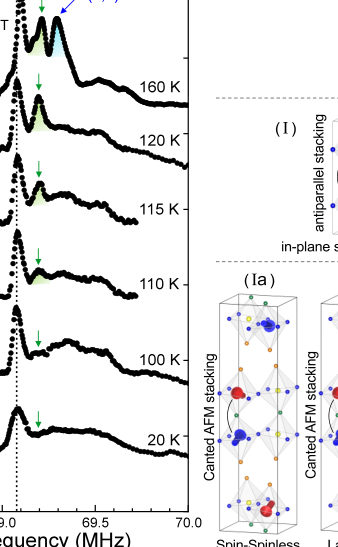 
Figure 3 shows the T dependence of the 17O-NMR spectra down to 20 K. We observed the pronounced re- duction of the O(1) peak most likely caused by the sig- nificant spectral broadening below 115 K (≡TA). This indicates that the Hint(1) is not fully canceled at all the O(1) sites below TA. We emphasize that the com- mensurate SDW order within each NiO2 plane does not change drastically, since no anomaly was detected across TA in the current O(2)-NMR and the previous La(2)-

**Summary.** This work uses site-selective $^{17}	ext{O-NMR}$ to probe the spin structure of the bilayer nickelate La3Ni2O7. It reveals a complex interplay between an in-plane Spin Density Wave (SDW) order and the formation of an interlayer spin-singlet state. The findings highlight that the magnetic behavior is highly orbital-selective, with different Ni orbitals governing different types of spin correlations.

**Why it may be interesting.** The concept of orbital-selective magnetism, where different orbitals participate in different types of magnetic ordering (e.g., SDW vs. spin-singlet), is highly relevant to understanding complex correlated electron physics in cuprates and nickelates.

Detailed structure

**Main problem.** To investigate the spin structure of the Spin Density Wave (SDW) order and understand the orbital-selective nature of interlayer spin coupling in the bilayer nickelate La3Ni2O7.

**Main result.** The study reveals the coexistence of SDW order (driven by $d_{x^2-y^2}$ spins) and interlayer spin-singlet formation (governed by $d_{3z^2-r^2}$ spins), characterized by distinct spin configurations at different oxygen sites.

**Method.** Site-selective $^{17}	ext{O-NMR}$ measurements were used to probe the local magnetic environment and spin susceptibility at different oxygen sites within the material.

**Model / system.** The physical system is the bilayer nickelate La3Ni2O7. The analysis distinguishes between different oxygen sites (O(1), O(2), O(3,4)) to map out the orbital-selective nature of the magnetic interactions.

**Key observables.** NMR spectral broadening/shifts, local spin susceptibility ($\chi_{	ext{loc}}^{	ext{spin}}$), and the temperature dependence of the internal magnetic field ($H_{	ext{int}}$) at various O sites.

**Important parameters / regimes.** Transition temperatures $T_{	ext{SDW}} (= 150 	ext{ K})$ and $T_{	ext{A}} (\sim 115 	ext{ K})$; the relative contributions of $d_{x^2-y^2}$ and $d_{3z^2-r^2}$ orbitals to magnetism.

**Assumptions / limitations.** The observed magnetic behavior is interpreted through the lens of orbital-selective spin coupling, distinguishing between in-plane SDW magnetism and interlayer spin-singlet formation.

**Figures summary.** Figures illustrate the temperature dependence of the $^{17}	ext{O-NMR}$ spectra, showing peak broadening below $T_{	ext{SDW}}$ and the disappearance of the O(1) signal below $T_{	ext{A}}$.

**Paper structure.** The paper systematically analyzes NMR data across different temperature regimes ($>T_{	ext{SDW}}$, $T_{	ext{SDW}} > T > T_{	ext{A}}$, $T < T_{	ext{A}}$) to map out the evolution of spin order, first establishing the SDW state, then identifying the spin-singlet formation, and finally detailing the anomalous spin reconfiguration below $T_{	ext{A}}$.

Abstract

The spin structure of the spin density wave (SDW) order in the bilayer nickelate La$_3$Ni$_2$O$_7$ has been investigated using site-selective $^{17}$O-NMR measurements on the inner apical O(1), outer apical O(2), and planar O(3,4) sites. Below $T_{\rm SDW}$ (= 150 K), the peak of all planar O(3,4) sites significantly broadens due to the emergence of a finite internal magnetic field, whereas O(2) sites remain with no (or a negligibly small) internal field. These results are consistent with commensurate SDW order with a single spin-spinless (or large-tiny spin) stripe. As for the O(1) sites that bridge the NiO$_2$ planes, the internal field is nearly canceled below $T_{\rm SDW}$, indicating an antiparallel spin configuration between adjacent planes. However, below $T_\text{A}$ ($\sim$ 115 K), the spectrum of the O(1) site disappears even though the in-plane SDW order remains robust, implying that the antiparallel spin configuration through the Ni--O(1)--Ni bond is not particularly stable below $T_{\rm A}$, despite the expected strong interlayer spin coupling between the NiO$_2$ planes. Above all, we emphasize that the local spin susceptibility is extremely small at the O(2) site that has a strong covalency with the $d_{3z^2-r^2}$ orbital, indicating a well-developed interlayer spin-singlet formation in the Ni-$d_{3z^2-r^2}$ orbitals bridging the NiO$_2$ planes. These findings shed new light on the interlayer spin-singlet formation and the anomalous spin reconfiguration through the $\text{Ni--O(1)--Ni}$ bonding orbitals connecting the NiO$_2$ planes, which characterize the orbital-selective nature of the bilayer nickelate La$_3$Ni$_2$O$_7$.

[↑ back to top](#top)

### [Plateau-Constrained Selection of Commuting Phase-Term Orderings Under a Fixed Maintained-Parity Compiler Contract](http://arxiv.org/abs/2608.27592v1)

**Authors:** Owen Friedewald, Ali Shiri Sichani, Chi-Ren Shyu  
**Type:** theory · **Category:** quantum information and computing · **PDF:** <https://arxiv.org/pdf/2608.27592v1>  
**Analysis basis:** full PDF text, analyzed in chunks

📷 Fig 1

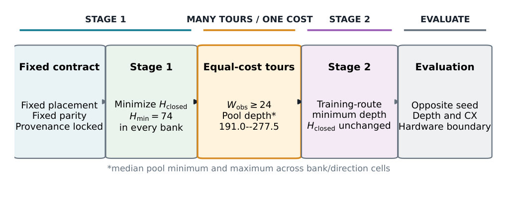 
FIGURE 1. Two-stage ordering under a fixed compiler contract, anchored by the 60 operating-scale 36-term banks. Stage 1 attains Hmin = 74; every frozen search bank supplies at least 24 observed equal-cost tours, whose opposite-seed depth distributions have median pool minimum and maximum 191.0 and 277.5. Stage 2 preserves Hclosed exactly while selecting by training-route depth; routed depth and CX under the opposite seed remain downstream evaluation quantities.

📷 Fig 2

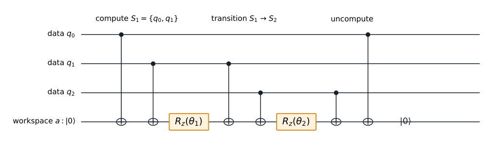 
FIGURE 2. Illustrative maintained-parity transition. The first phase uses support S1 = {q0, q1} and the second uses S2 = {q0, q2}. The S1 →S2 transition removes one contribution and adds the other without returning the workspace to empty between phases; final uncompute returns it to |0⟩. The maintained transition uses six CNOTs rather than the eight required by independently computing and uncomputing both pair supports.

📷 Fig 3

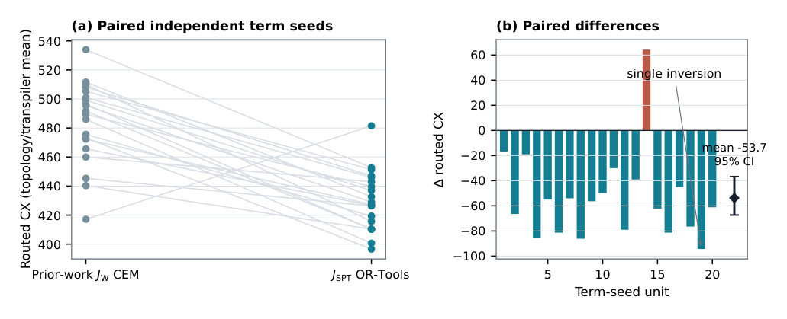 
FIGURE 3. Original registered 36-term prior-work replication comparison over 20 term-seed units, each averaged across three topologies and two transpiler seeds. Panel (a) uses a truncated vertical axis to expose the paired outcomes; panel (b) plots left-minus-right differences, so negative values favor JSPT OR-Tools. The mean marker carries a paired 95% bootstrap interval. No route is treated as an independent sample.

📷 Fig 4

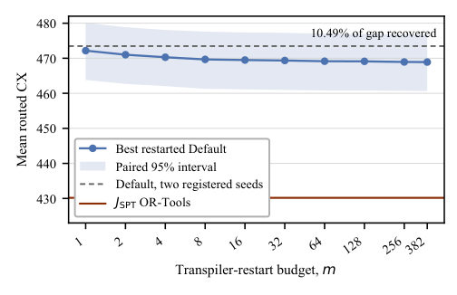 
FIGURE 4. Stage-1 resource control over 20 term-seed units, each aggregated across three topologies. For each budget, the best routed-CX result from nested transpiler restarts of the unoptimized order is compared with the five-second JSPT OR-Tools result; lower is better. The maximum count is the timing-only budget match 382 = ⌊5 s/0.013074 s⌋. The line is the term-seed mean and the shaded band is its 95% bootstrap interval.

📷 Fig 5

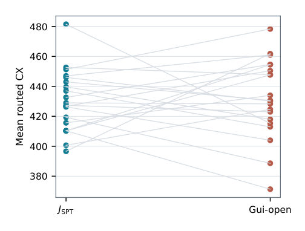 
FIGURE 5. Prior-cost audit over 20 term-seed units, each averaged across three topologies and two transpiler seeds. Lines pair independently optimized JSPT and Gui-open routed-CX means within term seed; lower is better. The figure carries no interval because the paired bootstrap interval and Holm-adjusted test are reported in Table 5.

**Summary.** This paper introduces a novel two-stage compiler optimization technique for ordering commuting phase terms in quantum circuits. It leverages the fact that multiple orderings can achieve the same minimum energy cost (a 'plateau'). By sampling and selecting among these equal-cost options, the authors demonstrate measurable improvements in circuit depth and gate count compared to prior state-of-the-art methods.

**Why it may be interesting.** This work tackles a highly practical, low-level optimization problem in quantum compilation—resource reduction—by mathematically characterizing and exploiting the inherent symmetries (degeneracy) in the problem space.

Detailed structure

**Main problem.** The paper addresses the challenge of selecting optimal orderings for commuting phase terms in quantum circuits, specifically exploiting the degeneracy (plateau) of multiple equal-cost solutions.

**Main result.** A two-stage search strategy that samples equal-cost tours significantly reduces circuit depth (e.g., 12.83% reduction) compared to prior methods, although this benefit is shown to be dependent on the specific quantum compiler routing used.

**Method.** The methodology employs a classical two-stage permutation search under a fixed compiler contract: Stage 1 finds the primary support optimum, and Stage 2 samples and selects among all equal-cost tours using a 'frozen routed score.'

**Model / system.** The work models quantum computation using synthetic 16-qubit assignment-Ising instances derived from a QUBO model, focusing on the ordering of commuting phase terms in the Hamiltonian simulation.

**Key observables.** Circuit depth (e.g., opposite-SABRE-seed depth), number of routed controlled-NOT (CNOT) gates, and the multiplicity of minimum-support-cost orderings.

**Important parameters / regimes.** The size of the system (e.g., 16 qubits, 36 or 48 terms) and the specific compiler contract constraints (fixed placement, maintained-parity).

**Assumptions / limitations.** The depth benefit is explicitly noted to be 'router-conditioned' and not a guaranteed hardware benefit, and the synthetic workload does not represent end-to-end electronic-design-automation behavior.

**Figures summary.** Figure 1 illustrates the two-stage ordering process, detailing how Stage 1 identifies the minimum support cost, and Stage 2 selects among multiple tours achieving that cost based on depth metrics.

**Paper structure.** The paper is structured around defining a fixed compiler contract, executing the two-stage search (Stage 1 for primary cost, Stage 2 for plateau selection), and then rigorously comparing the resulting circuit metrics against various benchmarks and sensitivity analyses.

Abstract

Ordering objectives for commuting phase terms can have many equal optima, yet prior methods do not characterize or exploit those ties. We use a classical two-stage permutation search under fixed placement and maintained-parity quantum lowering: Stage 1 certifies the primary support optimum, and Stage 2 samples equal-cost tours and selects by a frozen routed score. On synthetic 16-qubit assignment-Ising instances, exact counting through 20 terms establishes instance-dependent multiplicity; when the support lower bound is attained, the reversal-reduced width equals the number of undirected Hamiltonian paths of the support line graph. A revised engineering analysis found 9.14% fewer routed controlled-NOT gates than unoptimized order, while the registered comparison found 11.10% fewer than prior stochastic search. Among 24 sampled minimum-support-cost orders at 36 terms, direct-depth selection reduced opposite-SABRE-seed depth by 12.83% in all 20 aggregates, whereas a matched 24-restart control changed depth by only -0.41% (unresolved). Candidate rankings persisted across SABRE routing seeds, explaining why selection survived routing re-randomization. The depth benefit transferred to a second generator and to 48 terms, but reversed under BasicSwap. On a prospective IBM Heron panel, raw generator error shifted by -0.0025 (-0.59%); fixed-panel shot uncertainty excluded zero, but term-seed inference remained unresolved. Equal-primary-cost tours are a useful router-conditioned compiler freedom, not a guaranteed hardware benefit.

[↑ back to top](#top)

### [Predicting Multipartite Entanglement in Quantum Circuits using Transformer](http://arxiv.org/abs/2608.27993v1)

**Authors:** Darell Timothy Tarigan, Fadhil Fatih Shiddiq, Hadyan Luthfan Prihadi, Donny Dwiputra, Jusak S. Kosasih, Yanoar P. Sarwono, Freddy Permana Zen, Rui-Qin Zhang  
**Type:** theory · **Category:** quantum information and computing · **PDF:** <https://arxiv.org/pdf/2608.27993v1>  
**Analysis basis:** full PDF text, analyzed in chunks

📷 Fig 1

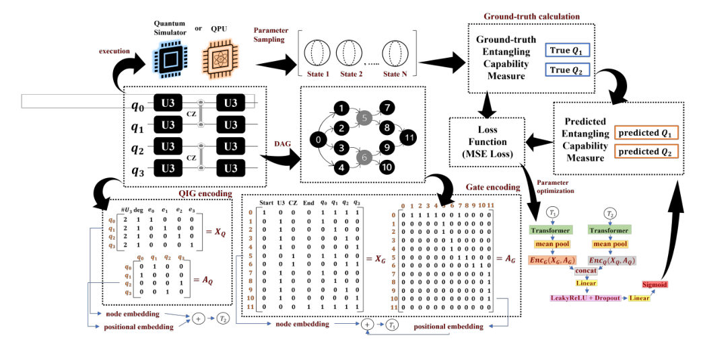 
FIG. 1. This pipeline consists of three stages: (1) gate-level and QIG encoding of PQC; (2) ground truth entanglement evaluation for Q1 and Q2 using quantum simulation; and (3) transformer-based learning to predict the entanglement measure.

📷 Fig 2

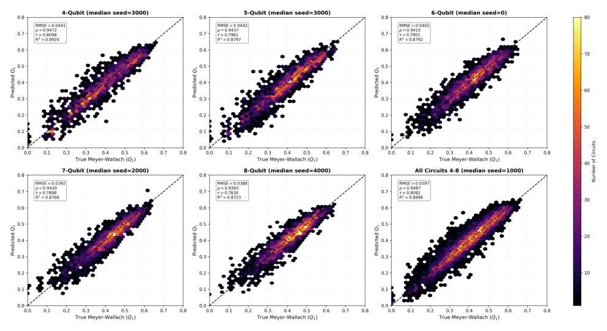 
FIG. 2. Correlation between the predicted and target Meyer-Wallach entanglement measures (Q1) on the test set, shown for the median-performing seed across 10 independent runs. Inset statistics correspond to the displayed median-RMSE seed; values reported in the main text are the mean ± standard deviation over 10 seeds. ; 4-, 5-, and 6- qubit circuits use padding (41 node, 10 feature dim), while 7- and 8- qubit circuits use padding (51 node, 12 feature dim).

📷 Fig 3

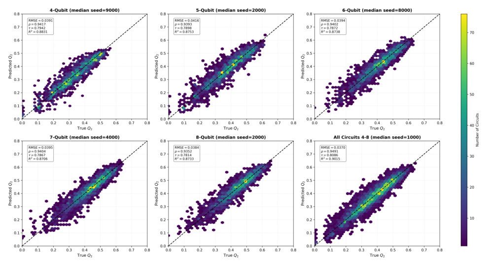 
FIG. 3. Correlation between the predicted second-order Scott entanglement measures (Q2) on the test set, shown for the median-performing seed across 10 independent runs. Inset statistics correspond to the displayed median-RMSE seed; values reported in the main text are the mean ± standard deviation over 10 seeds; 4-, 5-, and 6- qubit circuits use padding (41 node, 10 feature dim), while 7- and 8- qubit circuits use padding (51 node, 12 feature dim).

📷 Fig 4

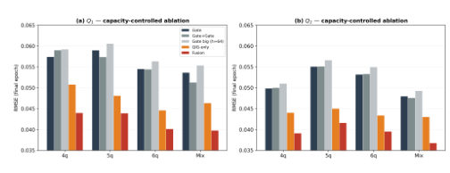 
FIG. 4. Final-epoch RMSE (mean over 10 seeds) for five en- coder variants on the 4-, 5-, 6-qubit datasets and their com- bined set (Mix), for Q1 (a) and Q2 (b). Variants: gate-level baseline (278k parameters), a parameter-matched dual gate– gate encoder (555k), a widened single gate encoder (h = 64, 570k), the QIG-only encoder (277k), and the proposed QIG- Fusion (554k). The dashed line marks the baseline level.

📷 Fig 5

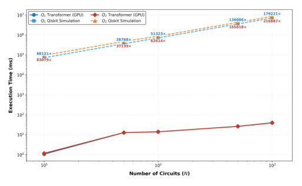 
FIG. 6. Wall-clock time to evaluate batches of 6-qubit cir- cuits with the trained surrogate (single GPU, batched forward pass) versus the ground-truth protocol (Qiskit statevector es- timation, 5,000 parameter samples per circuit), as a function of batch size. Annotations give the surrogate’s speed-up over the ground truth at each batch size.

**Summary.** This paper introduces QIG-Fusion, a novel Transformer model designed to predict complex multipartite entanglement measures ($Q_1$ and $Q_2$) in Parameterized Quantum Circuits. By encoding the circuit structure into a specialized graph format, the model bypasses the prohibitive computational cost of direct entanglement calculation. This breakthrough significantly accelerates Quantum Architecture Search by providing an efficient, high-fidelity surrogate objective function.

**Why it may be interesting.** The work provides a powerful, scalable machine learning tool to diagnose the fundamental resource (entanglement) of quantum circuits, which is essential for designing and optimizing quantum algorithms for NISQ devices.

Detailed structure

**Main problem.** The challenge is efficiently characterizing the multipartite entanglement within Parameterized Quantum Circuits (PQCs), which is crucial for assessing their utility in near-term quantum algorithms.

**Main result.** The proposed QIG-Fusion model achieves low prediction errors (RMSE $\approx 0.037$ for $Q_2$) and high correlation ($
ho \le 0.95$) when estimating entanglement measures for large-scale PQCs.

**Method.** The authors developed a graph-based Transformer surrogate model that fuses a Qubit-Interconnected Graph (QIG) encoding with a gate-level Directed Acyclic Graph (DAG) encoder.

**Model / system.** The study analyzes Parameterized Quantum Circuits (PQCs) acting on $n$-qubit systems, where the circuit structure is encoded into a graph representation for the Transformer input.

**Key observables.** Multipartite entanglement, quantified by the first-order Meyer-Wallach measure ($Q_1$) and the second-order Scott measure ($Q_2$).

**Important parameters / regimes.** System size (4- to 8-qubit systems), circuit depth, and the number of entangling gates.

**Assumptions / limitations.** The primary assumption is that the entanglement structure can be accurately predicted by a Transformer model trained on graph representations, bypassing computationally expensive direct quantum simulation.

**Figures summary.** Figures illustrate the pipeline: encoding the PQC structure using QIG and DAG, comparing predicted entanglement ($Q_1, Q_2$) against ground truth simulation results, and demonstrating the model's superior performance over simpler baselines.

**Paper structure.** The paper establishes the need for multipartite entanglement measures ($Q_1, Q_2$) in PQCs. It then details the limitations of direct measurement, leading to the proposal of the QIG-Fusion Transformer surrogate model. Finally, it presents extensive numerical results validating the model's accuracy and efficiency for Quantum Architecture Search (QAS).

Abstract

Multipartite entanglement is a critical property of parameterized quantum circuits (PQCs), particularly for near-term hybrid quantum-classical algorithms, as it characterizes their ability to generate highly entangled states. However, measuring entanglement remains computationally expensive because conventional Monte Carlo sampling scales unfavorably with system size. To overcome this challenge, we introduce a graph-based transformer surrogate that predicts both the first-order Meyer-Wallach measure ($Q_1$) and the second-order Scott measure ($Q_2$), resolving entanglement structures indistinguishable under $Q_1$ alone. Our central contribution is the qubit-interconnected graph (QIG) encoding for transformers, where each node represents a qubit and weighted adjacencies record entangling-gate multiplicities. Fused with a gate-level DAG encoder, this yields the QIG-Fusion model. Evaluated on 50,000 circuits spanning 4- to 8-qubit systems across a ten-seed protocol, QIG-Fusion achieves an RMSE as low as 0.037 ($Q_2$) and 0.038 ($Q_1$), with a Spearman rank correlation up to 0.95. This framework significantly reduces the computational cost of Quantum Architecture Search (QAS), enabling efficient entanglement estimation for large-scale PQCs.

[↑ back to top](#top)

### [Quantum Fourier transform for the symmetric group](http://arxiv.org/abs/2608.28569v1)

**Authors:** Carli Bruinsma, Dmitry Grinko, Maris Ozols  
**Type:** theory · **Category:** quantum information and computing · **PDF:** <https://arxiv.org/pdf/2608.28569v1>  
**Analysis basis:** full PDF text, analyzed in chunks

📷 Fig 1

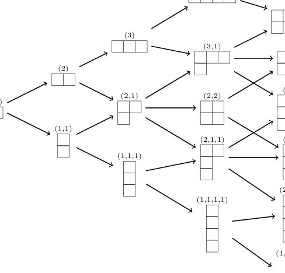 
Figure 1: The Bratteli diagram for the symmetric group S5. The nodes are shown as both integer partitions and their corresponding Young diagrams.

📷 Fig 2

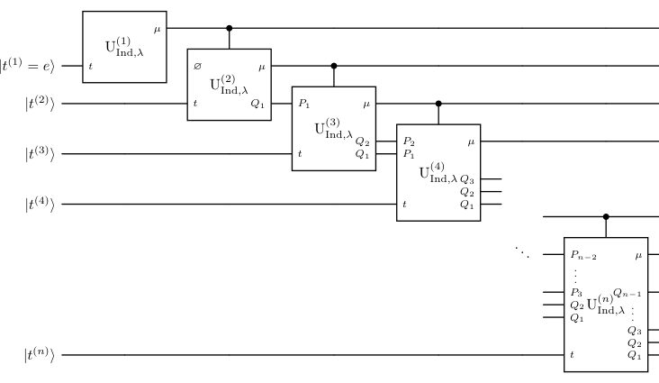 
Figure 2: Quantum circuit for the Fourier transform Fn. Group elements g ∈Sn are encoded with transversal elements t(m) ∈Tm as g = t(n) . . . t(3)t(2).For Fourier basis vectors, we let P = P1 →P2 →· · · →Pn and Q = Q1 →Q2 →· · · →Qn encodes paths in the Bratteli diagram, where Pm, Qm ∈bSm.

📷 Fig 3

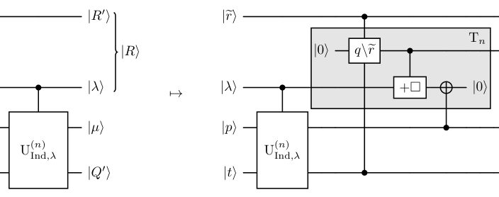 
Figure 3: Updated induction step for the Fourier transform with relative path encoding. The output of the quantum Fourier transform for Sn−1 is stored in |er⟩|λ⟩|p⟩, with er and p encoding path eR, Q ∈P(λ). We have |t⟩a transversal register for Sn−1 ⊂Sn like before.

📷 Fig 4

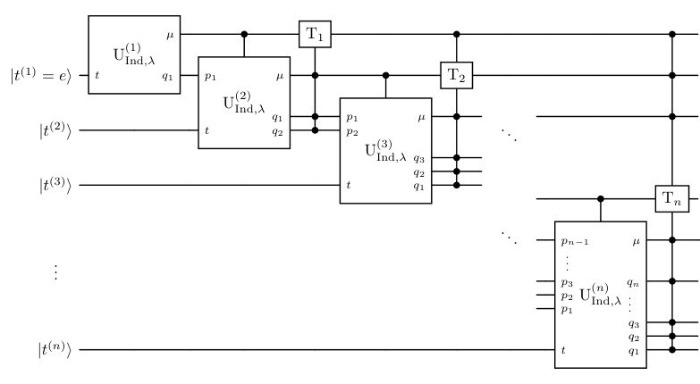 
Figure 4: Updated implementation of the Fourier transform for Sn. The circuit is the same as the circuit in Figure 2, but uses a Yamanouchi word encoding instead of storing the full paths.

📷 Fig 5

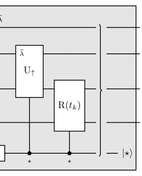 
Figure 5: Implementation for U(n) Ind of Beals, 1997, later generalized by Moore et al., 2006.

**Summary.** This paper provides a detailed, gate-level analysis and improved construction for the Quantum Fourier Transform specific to the symmetric group $S_n$. By analyzing the structure through Young tableaux and subgroup chains, the authors refine the gate complexity bounds, offering a more rigorous quantum circuit blueprint for this fundamental operation.

**Why it may be interesting.** The rigorous, low-level circuit decomposition of a group-theoretic quantum transform is highly relevant for developing practical quantum algorithms for representation theory, which underpins many quantum simulation tasks.

Detailed structure

**Main problem.** The paper aims to develop an efficient, low-level quantum circuit implementation for the Quantum Fourier Transform (QFT) associated with the symmetric group ($S_n$).

**Main result.** The authors revise previous complexity bounds, proposing a simplified realization of the $S_n$ QFT with improved gate complexity compared to prior literature.

**Method.** The approach involves decomposing the unitary operator into elementary one- and two-qubit gates by leveraging the structure of $S_n$ representations via subgroup chains and Young tableaux.

**Model / system.** The system is the symmetric group $S_n$, whose representations are indexed by integer partitions ($\lambda \vdash n$). The computation is realized through unitary transformations derived from restriction and induction operations along the subgroup chain $S_1 \subset S_2 \subset \cdots \subset S_n$.

**Key observables.** Gate complexity (depth and number of gates), circuit depth, and the structure of the unitary operator $U(m)_{Ind}$.

**Important parameters / regimes.** The size parameter $n$ (or $m$), and the integer partition $\lambda$ defining the representation.

**Assumptions / limitations.** The derivation assumes that the required unitary operators can be decomposed into basic one- and two-qubit gates and coherent arithmetic operations, and relies on the correctness of inductive steps.

**Figures summary.** Figures illustrate the Bratteli diagram for $S_5$, the circuit structure for the inductive step $U(m)_{Ind}$, and diagrams detailing how local structural changes (addable/removable cells) affect the determinant signs.

**Paper structure.** The paper reviews prior QFT constructions, establishes the mathematical framework using Young tableaux and subgroup chains, derives the circuit for the inductive step $U(m)_{Ind}$ by analyzing gate cancellations, and concludes by determining the signs of associated determinants.

Abstract

Quantum Fourier transforms (QFT) for general groups were recognized to be fundamental already early in the field. A canonical example of non-abelian QFT for the symmetric group was outlined by Beals (1997). Later, a more detailed analysis of this algorithm was carried out by Kawano and Sekigawa (2016). In this paper, we revisit that construction. After a careful analysis, we revise their gate complexity to $\widetilde{\mathcal{O}}(n^{3.5})$ and circuit depth to $\widetilde{\mathcal{O}}(n^3)$. Moreover, we observe that their construction is not optimal in the choice of transversal elements, so we propose simpler realization of the symmetric group QFT.

[↑ back to top](#top)

### [Quantum Fourier transform toolbox](http://arxiv.org/abs/2608.28573v1)

**Authors:** Carli Bruinsma, Pietro M. Posta, Joppe Stokvis, Dmitry Grinko, Maris Ozols  
**Type:** theory · **Category:** quantum information and computing · **PDF:** <https://arxiv.org/pdf/2608.28573v1>  
**Analysis basis:** full PDF text, analyzed in chunks

📷 Fig 1

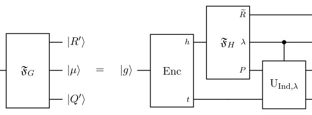 
Figure 1: Lemma 3.4 as a quantum circuit. The Fourier transform FG is decomposed into a subgroup Fourier transform FH and the induction map UInd.

📷 Fig 2

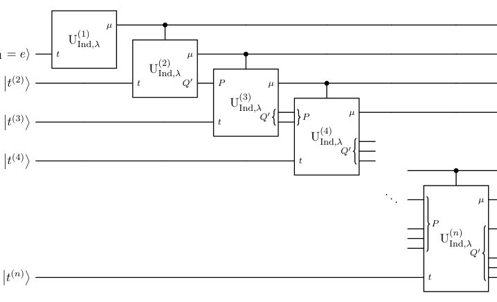 
Figure 2: Quantum circuit for the Fourier transform FG. Group elements g ∈G are encoded with transversal elements t(m) ∈Tm as g = t(n) . . . t(3)t(2). For Fourier basis vectors, we let P = P1 →P2 →· · · →Pn and Q = Q1 →Q2 →· · · →Qn encodes paths in the Bratteli diagram, where Pm, Qm ∈bGm.

📷 Fig 3

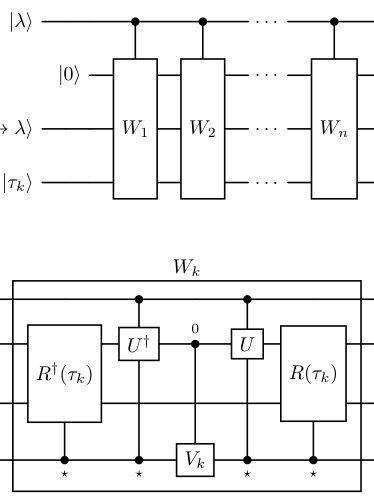 
Figure 3: Circuit of Beals’ algorithm for the induced transform from Theorem 4.5. The top circuit applies W1, W2, . . . , Wn from left to right. The lower circuit expands one block on the transversal register T, the path register P possibly extended with an extra node µ in the register above, and the remembered H-irrep label λ. On an input with transversal label τℓ, only Wℓ acts nontrivially. It replaces that basis state by the required superposition over extended paths, while the remaining blocks act as the identity by Lemma 4.4.

📷 Fig 4

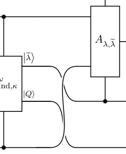 
Figure 5: Circuit to implement UInd,λ via Mackey decomposition.

📷 Fig 5

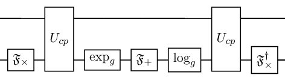 
Figure 6: Circuit implementing the Gauss phase on the nontrivial multiplicative-character branch. The work register is returned to |1⟩×.

**Summary.** This paper presents novel, theoretically rigorous methods to construct efficient quantum circuits for the Quantum Fourier Transform (QFT) over diverse finite groups. By employing advanced tools from representation theory, such as Mackey and Clifford theories, the authors overcome previous limitations on circuit size, providing systematic blueprints for quantum computation on structured algebraic systems.

**Why it may be interesting.** The rigorous development of QFTs for complex, non-abelian groups provides foundational tools for designing quantum algorithms that exploit group symmetries, which is a core area of quantum computation theory.

Detailed structure

**Main problem.** The primary goal is to develop efficient quantum circuits for the Quantum Fourier Transform (QFT) over various finite groups, especially non-abelian ones, which are crucial primitives in quantum algorithms.

**Main result.** The authors developed new systematic tools using Mackey and Clifford theories to construct QFT circuits for groups like $	ext{GL}_2(\mathbb{F}_q)$ and wreath products $F \wr S_n$, achieving polynomial scaling in $\log q$ or removing previous size restrictions.

**Method.** The work relies heavily on advanced representation theory concepts, including Mackey theory, Clifford theory, and subgroup induction, to systematically construct the required unitary transformations.

**Model / system.** The model is abstract quantum computation applied to finite groups $G$. The focus is on implementing the QFT, which is defined by transforming between different bases related to the group's representation theory (e.g., the 'little group' Fourier basis).

**Key observables.** Circuit size/cost (e.g., polynomial in $\log |G|$ vs. $|G|$), and the achievable gate count for specific group families.

**Important parameters / regimes.** Group structure (e.g., $	ext{GL}_2(\mathbb{F}_q)$, $S_n$, wreath products), the field size $q$, and the desired error tolerance $\epsilon$.

**Assumptions / limitations.** The complexity bounds depend on the chosen gate set, uniformity assumptions, and error criteria; previous constructions often imposed restrictive conditions on the size of subgroups.

**Figures summary.** Figures illustrate circuit structures for implementing the branching map $B_\gamma$ and the action of group elements on the basis states, showing sequences of unitary operations.

**Paper structure.** The paper builds from defining the QFT via representation theory, developing specific construction algorithms (Mackey, Little Group), and then applying these methods to derive concrete, efficient circuits for complex group families.

Abstract

Quantum Fourier transforms (QFTs) are essential primitives in quantum algorithms. While abelian groups admit efficient QFT circuits, with circuit size polynomial in the logarithm of the group order, efficient constructions are known for relatively few non-abelian families. We develop two new approaches to QFT circuit construction, based on Mackey theory and Clifford theory, respectively, and use them to show exponential improvement in circuit cost for specific group families. Using the Mackey-theoretic approach, we obtain explicit quantum circuits for the QFT over $\mathrm{GL}_2(F_q)$ that scale polynomially in $\log q$, rather than polynomially in $q$. Using the Clifford-theoretic approach, we obtain QFT circuits for wreath products $F\wr S_n$, whose cost depends on the cost of a QFT over $F$ and the size of its representation registers. This removes the restriction $|F|=\operatorname{poly}(n)$ required by previous generic constructions and can yield exponential improvements when $F$ itself has an efficient QFT. Together, these methods provide new systematic tools to construct QFTs for broad classes of finite groups.

[↑ back to top](#top)

### [Quantum SEDONet: Spectrally-Embedded Quantum Deep Operator Networks for Partial Differential Equations](http://arxiv.org/abs/2608.27626v1)

**Authors:** Muhammad Abid, Arth Sojitra, Bipin Tiwari, Omer San  
**Type:** both · **Category:** numerical methods · **PDF:** <https://arxiv.org/pdf/2608.27626v1>  
**Analysis basis:** full PDF text, analyzed in chunks

📷 Fig 1

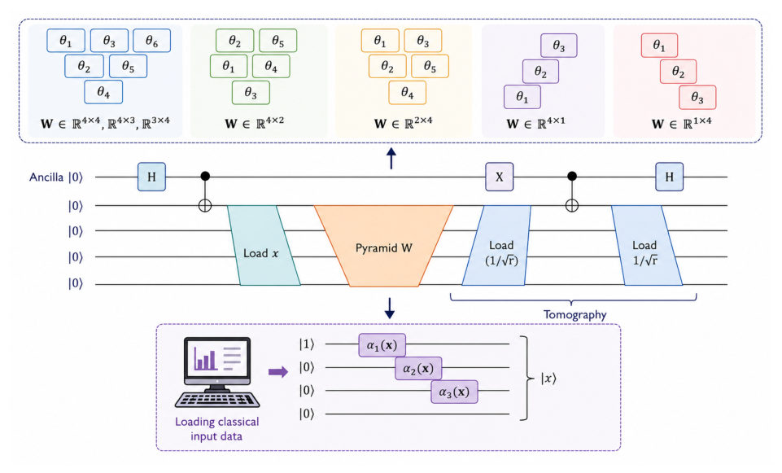 
Figure 1: The circuit of a single quantum layer, comprising data loading, a pyramidal orthogonal transformation, and tomography, with one ancillary qubit for the tomography. Vertical connectors denote the two-qubit RBS gates; θi parameterize the pyramid and αi the loader. The top panels show the pyramid geometry for representative weight shapes W ∈Rm×n.

📷 Fig 2

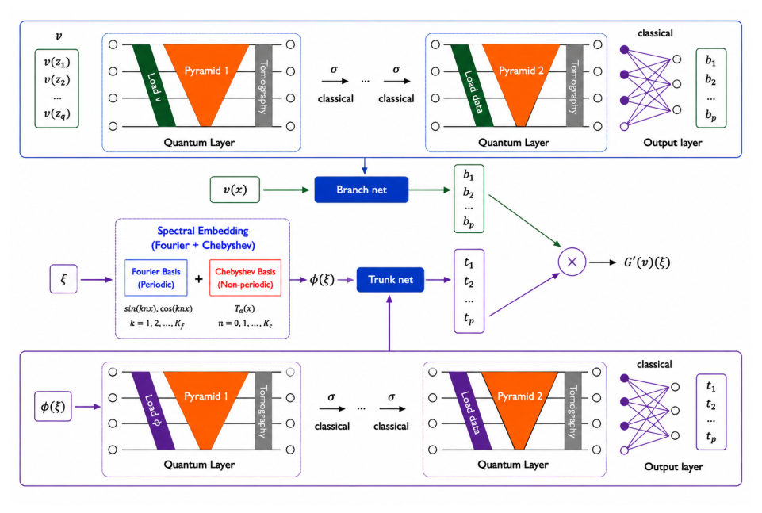 
Figure 2: The Quantum SEDONet architecture. As in Quantum DeepONet, a branch net encodes the input function v and a trunk net encodes the query coordinate ξ; each subnetwork is a stack of QOrthoNN quantum layers (Load →Pyramid →Tomography, with classical σ between layers and a classical output layer), and the two outputs are combined by an inner product to give G′(v)(ξ). Quantum SEDONet adds a single new block, the highlighted spectral embedding, which maps the trunk coordinate ξ to ϕ(ξ) using a Fourier basis for periodic coordinates and a Chebyshev basis for bounded non-periodic ones before the quantum layers.

📷 Fig 3

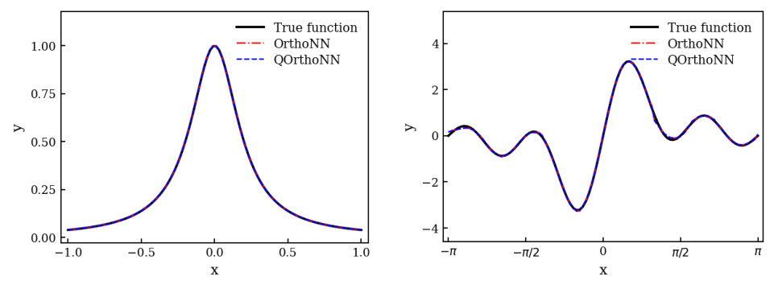 
Figure 3: Ideal quantum simulation of function approximation with a QOrthoNN. Black, red, and blue denote the reference function, the classical OrthoNN prediction, and the ideal quantum simulation of the QOrthoNN respectively; the three curves are superimposed by construction. (a) f(x) = 1/(1 + 25x2) on [−1, 1], relative L2 error 0.136%, classical–quantum agreement 7.8 × 10−9. (b) f(x) = P4 k=1 sin(kx) on [−π, π], relative L2 error 3.308%, agreement 1.0 × 10−6.

📷 Fig 4

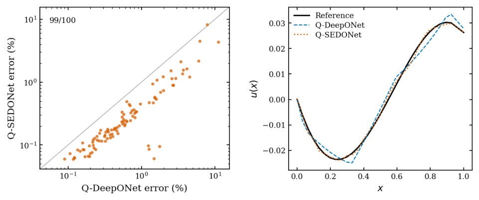 
Figure 4: Antiderivative operator, both arms at 11 trunk qubits. (a) Per-function comparison over the 100 test functions, each point giving the relative L2 error of the two arms on the same input function; points below the diagonal favor Quantum SEDONet, which is more accurate on 99 of 100 functions. (b) The test function on which the baseline performs worst. The Quantum DeepONet prediction is piecewise linear with visible hinge points, the signature of a ReLU trunk driven by a single affine coordinate; the Chebyshev embedding removes them. This sample has roughly 20× smaller amplitude than a typical test function, which inflates its relative error.

📷 Fig 5

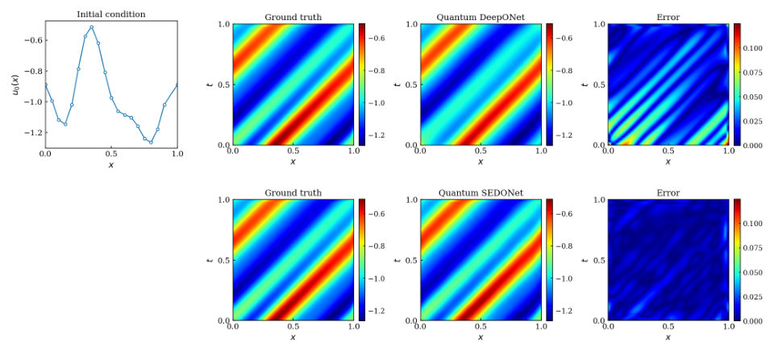 
Figure 5: Prediction comparison for one representative advection test sample, showing the initial condition, the ground truth, Quantum DeepONet and Quantum SEDONet predictions, and their corresponding absolute error maps on a common color scale. The baseline error follows the diagonal transport characteristics; the spectral embedding removes it.

**Summary.** This paper introduces Quantum SEDONet, an enhancement to quantum deep operator networks designed to solve PDEs more accurately. It improves performance by spectrally embedding the input coordinates using basis functions appropriate for the given boundary conditions (e.g., Fourier for periodic). The method achieves significant error reduction while maintaining low overhead on quantum hardware.

**Why it may be interesting.** While the core application is PDE solving, the integration of spectral basis functions (Fourier/Chebyshev) into a quantum machine learning framework is a sophisticated numerical technique relevant to modeling quantum systems where boundary conditions are critical.

Detailed structure

**Main problem.** The paper aims to accelerate the inference of solutions to Partial Differential Equations (PDEs) by improving the spectral representation used in quantum deep operator networks.

**Main result.** Quantum SEDONet significantly reduces the mean relative $L_2$ error across four PDE benchmarks (up to 54.1% reduction) while incurring negligible overhead in quantum resources (qubits/depth).

**Method.** It proposes Quantum SEDONet, which enhances the DeepONet trunk network by assigning a coordinate-specific spectral basis (Fourier for periodic, Chebyshev for bounded) to the input coordinates.

**Model / system.** The method is applied to solving various PDEs, including the antiderivative, advection, Burgers equation, and a mixed-boundary channel Poisson problem. The underlying computational framework is a quantum circuit evaluation of the neural operator.

**Key observables.** Mean relative $L_2$ error reduction (36% to 54%), qubit count, and circuit depth.

**Important parameters / regimes.** The boundary conditions (periodic vs. bounded) dictate the choice of spectral basis; results are reported in the ideal, noiseless, infinite-shot quantum regime.

**Assumptions / limitations.** The quantum evaluation path is assumed to perfectly reproduce the classical orthogonal network result in the ideal limit, and the spectral embedding is assumed to be resource-free.

**Figures summary.** The notes reference tables comparing the mean relative $L_2$ error reduction and resource costs between the baseline Q-DeepONet and the proposed Q-SEDONet across multiple PDE benchmarks.

**Paper structure.** The paper details the architecture, presents experimental results across four PDE benchmarks (integrative, convective, diffusion-dominated, elliptic), and discusses related work covering spectral methods and quantum PDE solvers.

Abstract

Quantum DeepONet accelerates neural-operator inference by evaluating an orthogonally parameterized network on a quantum computer, reproducing in ideal simulation the accuracy of its classical counterpart at asymptotically lower inference cost. Its trunk network, however, receives query coordinates with limited spectral structure, requiring the network to learn oscillatory features through its nonlinearities. We propose Quantum SEDONet (Spectral-Embedded Deep Operator Network), which assigns each trunk coordinate a spectral basis according to its boundary condition: Fourier features for periodic coordinates and Chebyshev features for bounded, non-periodic coordinates. The basis is selected per coordinate rather than per problem, allowing both representations within a single problem. Under unary amplitude encoding, the embedding incurs no additional qubits or circuit depth when its dimension remains within the network width, while increasing the parameter count by only a few percent. Across four benchmarks, Quantum SEDONet reduces the mean relative L2 error by 54.1% for the antiderivative, 49.6% for advection, 36.0% for Burgers, and 36.2% for a mixed-boundary channel Poisson problem. Quantum and classical evaluation paths agree to within 10^-8 throughout. The channel Poisson problem simultaneously uses Fourier features in the periodic direction and Chebyshev features in the bounded direction, demonstrating coordinate-wise boundary-matched spectral embedding without additional quantum-resource cost.

[↑ back to top](#top)

### [Solvable relaxation in discrete unitary systems: Ruelle-Pollicott resonances and CMV matrices](http://arxiv.org/abs/2608.28575v1)

**Authors:** Urban Duh, Friedrich Hübner, Marko Žnidarič  
**Type:** theory · **Category:** statistical mechanics · **PDF:** <https://arxiv.org/pdf/2608.28575v1>  
**Analysis basis:** full PDF text, analyzed in chunks

📷 Fig 1

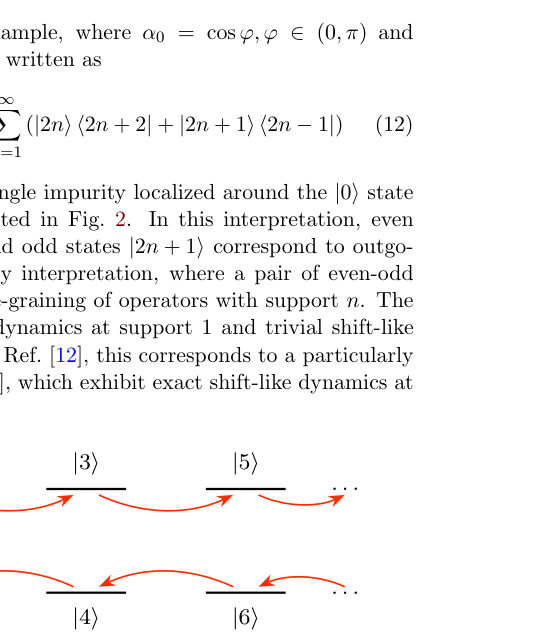 
Figure 2: Diagram of the simplest nontrivial CMV model, α0 = cos φ and αk&gt;0 = 0. Arrows denote nonzero matrix elements of the propagator U.

📷 Fig 2

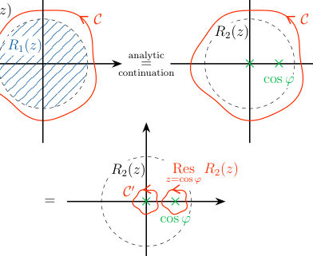 
Figure 3: (Left) The resolvent ⟨0|R(z)|0⟩in the simplest nontrivial CMV model, α0 = cos φ and αk&gt;0 = 0, and its analytic continuations to the first (R1, green) and second (R2, red) Riemann sheet. (Right) Extraction of RP resonances within the resolvent formalism, diagram of the top line of Eq. (18). Red curves denote the integration contour in the complex plane, green crosses correspond to the poles of the integrand and dashed black curve is the unit circle.

📷 Fig 3

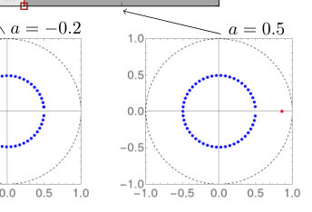 
Figure 4: Autocorrelation functions (50) (top), its asymptotic decay λ (middle), and eigenvalues of the truncated U50 (bottom) for CMV matrices with exponential αk (49) at µ = 1

📷 Fig 4

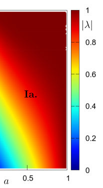 
Figure 5: The phase diagram for exponential αk = a · µk. The asymptotic decay λ of autocorrelations (50) in x0, i.e., the leading RP resonance, is shown as a function of µ and a. Green line is a special phase with a Gaussian decay, whereas black curves delimit different phases with exponential decay.

📷 Fig 5

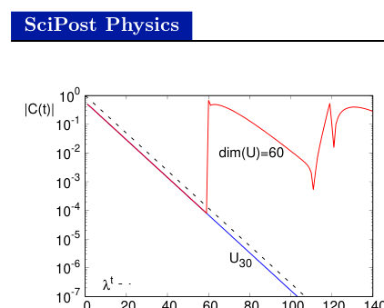 
Figure 6: Finite-size effects in phase I (left, a = 1

**Summary.** This paper investigates relaxation dynamics in closed, unitary quantum systems modeled by CMV matrices. It develops a sophisticated spectral analysis by comparing multiple mathematical techniques to find the system's decay rates (RP resonances). The key finding is the identification of distinct dynamic phases, showing that relaxation can be surprisingly accelerated by non-local 'backflow' effects.

**Why it may be interesting.** It provides a rigorous mathematical framework for understanding non-dissipative decay processes in quantum systems, connecting spectral theory (OPUC, resonances) to physical relaxation rates, which is crucial for open quantum systems theory.

Detailed structure

**Main problem.** The paper addresses how relaxation occurs in purely unitary many-body dynamics, which typically lacks external dissipation mechanisms.

**Main result.** It identifies two distinct phases in realistic systems: one with local relaxation and a second, faster phase driven by the backflow of large operators, where resonances are 'hidden' from simple spectral analysis.

**Method.** The study employs advanced spectral theory, comparing results from the truncated propagator, analytic continuation of the resolvent, and rigged Hilbert space formalism.

**Model / system.** The focus is on unitary propagators in their canonical form, represented by CMV matrices, which model the dynamics of unitary many-body systems.

**Key observables.** Ruelle-Pollicott (RP) resonances, correlation functions $C(t) = \langle A(0)A(t) 
angle$, and the spectrum of the unitary operator.

**Important parameters / regimes.** The system size ($N 	o \infty$ limit), the structure of the CMV matrix (e.g., impurities), and the phase regime (Phase I vs. Phase II).

**Assumptions / limitations.** The analysis relies on the mathematical framework of orthogonal polynomials on the unit circle and the assumption that focusing on local observables is sufficient to study relaxation.

**Paper structure.** The paper builds by first establishing the equivalence of multiple theoretical approaches (truncated propagator, resolvent, rigged Hilbert space) for simple solvable models, and then analyzing the complex dynamics of more realistic CMV matrices to delineate distinct relaxation phases.

Abstract

Leading eigenvalues of the truncated propagator, known as Ruelle-Pollicott (RP) resonances, are an elegant way of addressing the dynamics of unitary many-body systems. We study unitary propagators in their canonical form, known in the mathematical literature as the CMV matrices, and obtain a number of exact results for RP resonances and the associated norm-diverging eigenvectors. For the simplest CMV class describing a unilateral shift with an impurity, motivated by operator dynamics in dual-unitary circuits, we obtain closed-form results and in particular show that the three independent ways of obtaining RP resonances -- the truncated propagator, analytic continuation of the resolvent, and the rigged Hilbert space approach -- all give the same results. In more realistic CMV matrices, in which shift-like operator dynamics characteristic of chaotic systems is only asymptotic, we rely on the rich theory of orthogonal polynomials on the unit circle and identify two phases. In the first phase, relaxation occurs due to local operators effectively evolving into increasingly nonlocal ones with negligible backflow. Especially interesting is the second phase, which, surprisingly, exhibits faster relaxation because of contributions from the backflow of large operators. Additionally, in the second phase, RP resonances are not equal to the eigenvalues of the truncated propagator, instead, they are ``hidden'' within a ring of ill-conditioned eigenvalues.

[↑ back to top](#top)

### [Spectral Theory of Semisimple Bivariate Bicycle Codes](http://arxiv.org/abs/2608.27565v1)

**Authors:** Eric Sabo, Mahir Bilen Can, David Marquis  
**Type:** theory · **Category:** quantum information and computing · **PDF:** <https://arxiv.org/pdf/2608.27565v1>  
**Analysis basis:** full PDF text, analyzed in chunks

📷 Fig 1

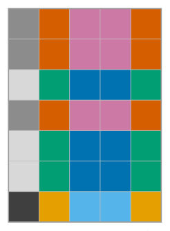 
Figure 1. The 4-Frobenius orbit decomposition of Z5 × Z7. Cells with the same shading lie in the same orbit.

**Summary.** This paper introduces an algebraic framework to systematically study bivariate bicycle codes, which are crucial for quantum error correction. By employing advanced tools from commutative algebra, the authors derive exact formulas for code dimensions and establish rigorous lower bounds on the quantum minimum distance. This moves the field beyond numerical searches toward deterministic code construction.

**Why it may be interesting.** The explicit connection between algebraic coding theory (semisimple algebras, ideals) and the construction of QLDPC codes provides a powerful, deterministic tool for designing quantum error correction codes.

Detailed structure

**Main problem.** The paper develops an algebraic method to analyze bivariate bicycle (BB) codes, which are identified as a leading family of quantum low-density parity-check (QLDPC) codes.

**Main result.** The authors derive systematic, computable formulas for the logical dimension and establish sharper, computable lower bounds on the quantum minimum distance for these codes.

**Method.** The approach uses advanced tools from commutative algebra, including decomposing the defining ring using Frobenius-orbit idempotents and analyzing code structures as ideals in group algebras.

**Model / system.** The model is the algebraic structure of bivariate bicycle codes, which are used to construct quantum error-correcting codes (QLDPC codes) for near-term quantum computing architectures.

**Key observables.** Logical dimension, quantum minimum distance ($d_Z$), and the structure of code symmetries (automorphisms).

**Important parameters / regimes.** The defining ring $R = 	ext{F}_q[x, y]/\langle x^{\ell-1}, y^{m-1} 
angle$, and the parameters $\ell$ and $m$ defining the code structure.

**Assumptions / limitations.** The analysis is most straightforward for coprime BB codes, and the method provides bounds rather than the exact distance.

**Paper structure.** The paper progresses from establishing the algebraic framework by relating BB codes to 2D cyclic codes, deriving dimension formulas via orbit decomposition, establishing duality, and finally calculating distance bounds using colon-ideal refinements.

Abstract

Extending the classical theory of two-dimensional cyclic codes, we develop an algebraic approach to bivariate bicycle codes. Using Frobenius-orbit idempotents, formulas for logical dimensions are derived and lower bounds on minimum distances are established. A systematic theory of code symmetries is formulated to construct a structured block-monomial subgroup of coordinate permutations. Several explicit examples show how to generate these codes from first principles without relying on numerical searches. An appendix extends the analysis to BCH-based product constructions.

[↑ back to top](#top)

### [Variationally Optimized Imaginary-time Polynomial Filters for Ground State Projection](http://arxiv.org/abs/2608.28357v1)

**Authors:** Bahman Seifi, Ibsal Assi, J. P. F. LeBlanc  
**Type:** theory · **Category:** quantum information and computing · **PDF:** <https://arxiv.org/pdf/2608.28357v1>  
**Analysis basis:** full PDF text, analyzed in chunks

📷 Fig 1

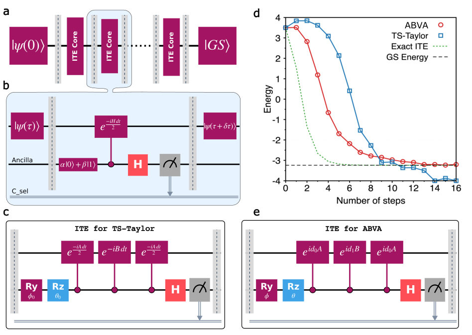 
FIG. 1: Ancilla-assisted implementation of ITE. (a) Repeated application of the ITE core filters an initial state |ψ(0)⟩toward the GS |GS⟩. (b) Measurement-induced LCU circuit for a single ITE step. An ancilla prepared as α |0⟩+ β |1⟩controls the real-time evolution block. After the Hadamard gate, measurement, and post-selection, the system is updated from |ψ(τ)⟩to |ψ(τ + δτ)⟩. (c) Taylor-based ITE circuit in which the controlled real-time propagator is implemented using a second-order Trotter–Suzuki decomposition. (d) Energy evolution obtained using the TS–Taylor and optimized implementations, compared with exact ITE and the exact GS energy for the benchmark Hamiltonian in Eq. (3) with N =...

📷 Fig 2

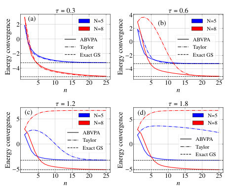 
FIG. 2: Convergence of the ground-state energy for the QIM (Eq.(3)) as a function of the number of time steps n, comparing the fixed-coefficient Taylor projector with its variational generalization, the imaginary time ABVPA, for (a) τ = 0.3, (b) τ = 0.6, (c) τ = 1.2, and (d) τ = 1.8. The Hamiltonian parameters are J = hz = hx = 1.0, for system sizes N = 5 and N = 8.

📷 Fig 3

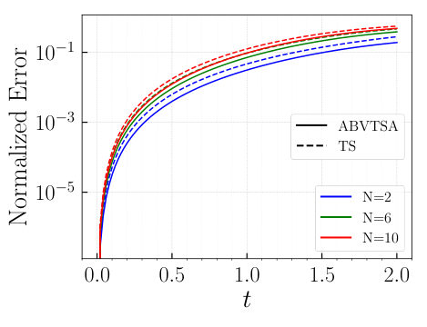 
FIG. 3: Log-scale plot of the normalized Frobenius-norm error 1 2 √

📷 Fig 4

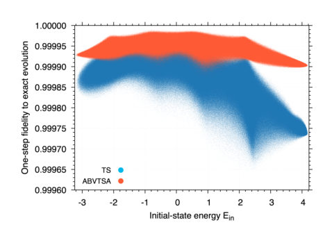 
FIG. 4: Time-evolution fidelity F as a function of the initial-state energy Ein = ⟨ψin| H |ψin⟩, comparing the standard TS decomposition with the ABVTSA of Eq. (37). Each point corresponds to one of 107 randomly sampled initial states |ψin⟩of the benchmark QIM with N = 5, evolved for a single time step δt = 0.4. The ABVTSA suppresses the energy-dependent deviations of the standard TS decomposition, yielding a fidelity that remains close to unity.

📷 Fig 5

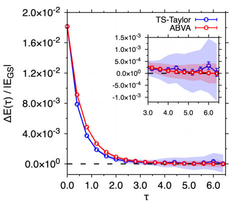 
FIG. 5: Convergence of the relative energy deviation ∆E(τ)/|EGS| during ITE, with ∆E(τ) = E(τ) −EGS. Here, EGS denotes the exact GS energy of the five-qubit benchmark QIM. The TS–Taylor ITE method (blue) and the ABVA implementation for ITE (red) both approach the exact GS energy as τ increases, using a time-step size of δτ = 0.4. Shaded bands show the standard deviation over 50 independent runs, each using 107

**Summary.** This paper introduces a variational imaginary-time evolution (ITE) framework using polynomial filtering to project quantum states onto their ground state. By optimizing the evolution parameters variationally, the method overcomes the accuracy and stability limitations of standard Trotter-Suzuki or Taylor approximations. Benchmarking on the Ising model shows this approach provides higher fidelity and robustness for quantum simulation on current hardware.

**Why it may be interesting.** This work directly addresses the resource limitations and accuracy bottlenecks in simulating ground states on near-term quantum devices by providing a more robust, variational circuit implementation for ITE.

Detailed structure

**Main problem.** The core problem is determining the ground state of a quantum many-body system by implementing imaginary-time evolution (ITE).

**Main result.** The proposed variational polynomial filtering framework significantly improves the accuracy and stability of ground-state projection compared to standard Trotter-Suzuki or Taylor approximations, especially for larger time steps.

**Method.** The authors develop an action-based variational approach (ABVA) to optimize the parameters in the imaginary-time evolution operator, replacing fixed-coefficient approximations with variational formulas.

**Model / system.** The methodology is benchmarked on the one-dimensional transverse-field Ising model (QIM), which serves as the quantum many-body system Hamiltonian.

**Key observables.** Success probability, convergence rate to the ground-state energy, and derived error bounds.

**Important parameters / regimes.** Imaginary time step ($	au$ or $\delta	au$), Hamiltonian parameters ($J, h_x, h_z$), and system size ($N$).

**Assumptions / limitations.** The process relies on postselection on the desired measurement outcome, inducing an effective non-unitary transformation, and the initial state must have non-zero overlap with the ground state.

**Figures summary.** Figures illustrate the ancilla-assisted implementation of ITE, comparing energy evolution for standard TS-Taylor methods against the optimized variational approach for the QIM.

**Paper structure.** The paper develops the ITE framework, details the variational optimization (ABVA/ABVPA) for the projector, derives rigorous error bounds based on static Hamiltonian properties, and validates the method using the QIM benchmark.

Abstract

In this work, we develop a variational imaginary-time evolution (ITE) framework based on polynomial filtering, derived from an operator-level action principle, which yields an optimized non-unitary projector expressed as a polynomial in the Hamiltonian. Starting from a single-ancilla, first-order imaginary-time update defined by a Taylor expansion and Trotter-Suzuki (TS) decompositions, we show that replacing these approximations with alternative variational formulas substantially improves both accuracy and stability at larger time steps, leading to up to an order-of-magnitude enhancement in the final success probability. We further derive rigorous error bounds that depend only on static properties of the Hamiltonian, providing practical guidance for selecting the simulation time step. Benchmarks on the transverse-field Ising model demonstrate faster convergence to the ground-state energy and improved robustness compared to standard TS--Taylor ITE, highlighting variational polynomial filtering as a practical route to higher-fidelity ground-state preparation on near-term quantum devices.

[↑ back to top](#top)

## Secondary cond-mat archives

*Papers from  mes-hall, other, soft, supr-con. These archives are de-prioritized — they appear at the end regardless of relevance score.*

### Relevant in secondary archives (18)

### [Topological signatures in the quench dynamics of periodically driven quantum systems](http://arxiv.org/abs/2608.27588v1)

**Authors:** Ashutosh Dubey, Hironmoy Pratihar, Diptiman Sen, Arijit Kundu  
**Type:** theory · **Category:** other · **PDF:** <https://arxiv.org/pdf/2608.27588v1>  
**Analysis basis:** full PDF text, analyzed in chunks
**Topic relevance:** 🔥 `non-equilibrium universality` **4/5** · `analog quantum simulation` **3/5** · `driven-dissipative phase transition` **3/5** · `methods for driven-dissipative` **3/5** · `Keldysh / 2PI / non-Gaussian methods` **2/5** · `Full counting statistics` **1/5** · `correlated / nonlocal dissipation` **1/5** · `quantum measurements` **1/5** · `scars & prethermalization` **1/5**

📷 Fig 1

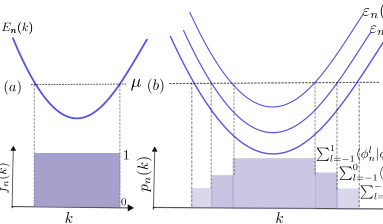 
FIG. 1: (Color online) Figure illustrating the band occupation for both static and periodically driven systems. Panel (a) shows the occupation of the static bands: all states below the chemical potential µ are fully occupied (distribution equal to 1), while those above are empty (distribution equal to 0). Panel (b) shows the occupation of the Floquet bands, which exhibits a staircase structure. In contrast to the static case, where the occupation is unity for all filled states, the occupation in the driven system is determined by the weights of the corresponding Floquet copies. As a result, even for states below the chemical potential µ0, set by the bath, the distribution takes nonzero...

📷 Fig 2

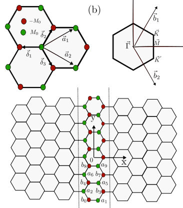 
FIG. 2: (Color online) (a) Honeycomb lattice of monolayer graphene with a staggered mass M0. The green and red dots represent the sublattices A and B with M0. The primitive lattice vectors are a1 = a  3 2, √

📷 Fig 3

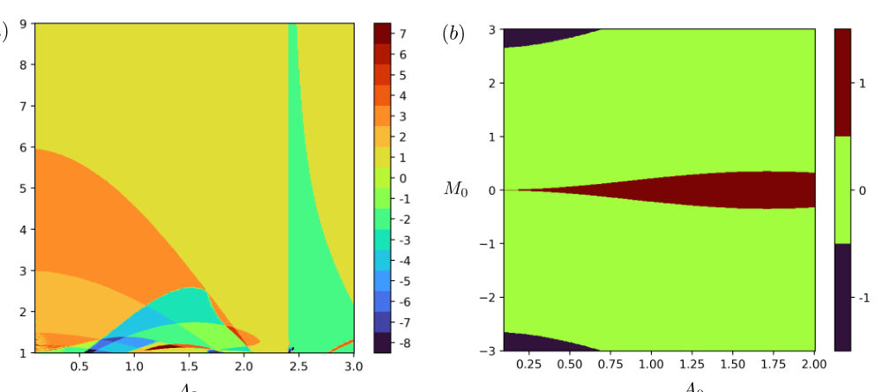 
FIG. 3: (Color online) Chern number phase diagram of periodically driven graphene without (and with) a staggered mass M0. Panel (a) phase diagram as a function of driving frequency and driving amplitude with a staggered mass M0 = 0 . In the low driving frequency regime, the system becomes topologically nontrivial in several regions of the phase space. Higher Chern numbers also appear at low driving frequencies, which arises from the hybridization of different Floquet sidebands with other sidebands or with the original bands. Panel (b) phase diagram as a function of M0 and driving amplitude at Ω= 8t0, where t0 is the hopping parameter and we set t0 = 1. The system is topologically nontrivial...

📷 Fig 4

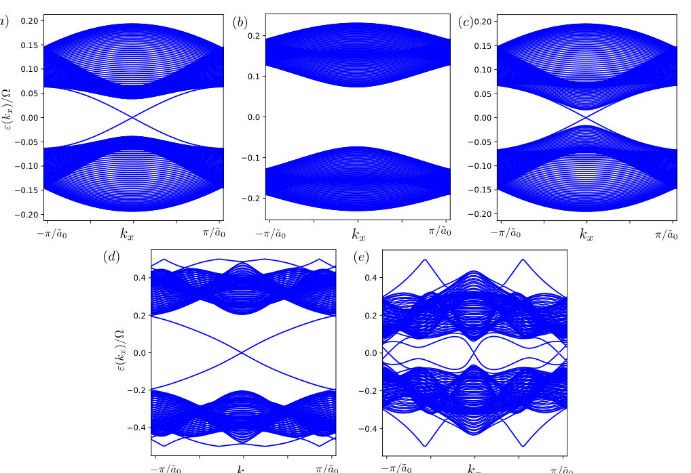 
FIG. 4: (Color online) Quasienergy band structure of periodically driven graphene with (and without) a staggered mass M0. Panels (a)–(c) show the dispersion at high driving frequency, Ω= 8t0, for different values of driving amplitude and M0. The parameters used in these panels are (a) M0 = 0.0, A0 = 1.5, (b) M0 = 1.0, A0 = 1.5, and (c) M0 = 0.2, A0 = 1.5. Panels (d)–(e) show the dispersion at low driving frequencies. The parameters used in these panels are (d)Ω= 1.7952t0, M0 = 0.0, A0 = 1.6 and (e) Ω= 1.0472t0, M0 = 0.0, A0 = 1.5.

📷 Fig 5

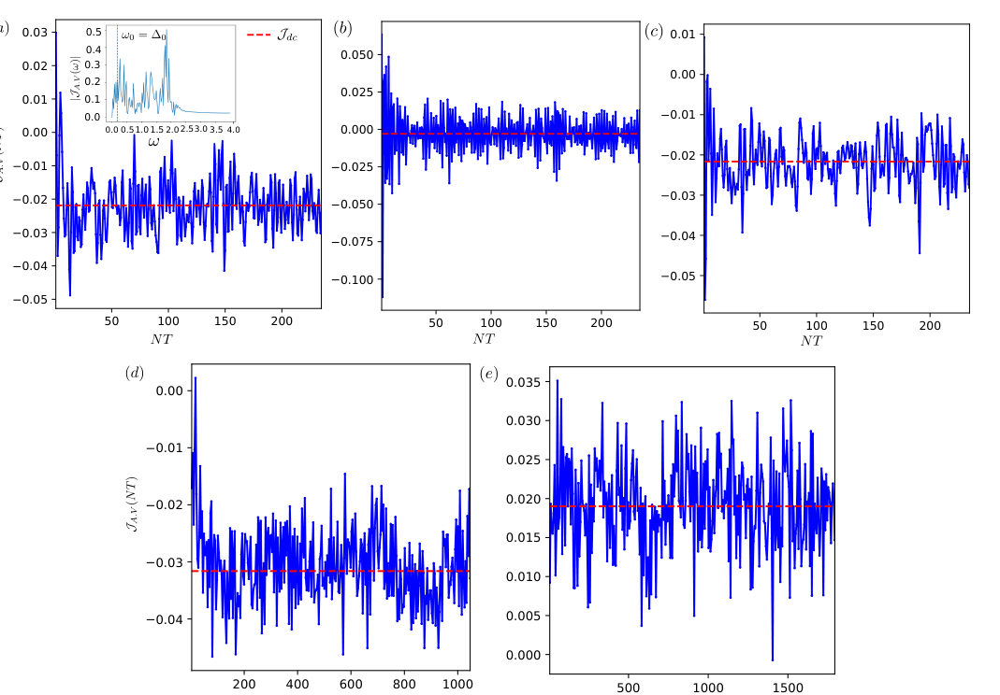 
FIG. 5: (Color online) Average bond current near the edge over one driving period in each successive time interval after the onset of the periodic drive. The current exhibits strong temporal oscillations around a finite dc value (red dashed line). This dc value is given by the weighted sum of the average current over one driving period in a Floquet band, with weights determined by the projected occupations of that Floquet band. A nonzero dc current indicates a topological phase of the driven graphene nanoribbon. The upper panels correspond to high driving frequency, Ω= 8t0. Panel (a) M0 = 0.0, A0 = 1.5 and (c) M0 = 0.2, A0 = 1.5 correspond to the topological phase, while panel (b) M0 = 1.0,...

**Summary.** This paper analyzes how topological properties manifest in the steady state of graphene nanoribbons driven by periodic light. By calculating bond currents and conductances, the authors demonstrate that topological invariants can be extracted from transport measurements, even when the system is coupled to an environment. This provides a powerful tool for characterizing topological phases in non-equilibrium quantum matter.

**Why it may be interesting.** This work directly addresses non-equilibrium dynamics in periodically driven systems, which is a major frontier in AMO and open quantum systems, linking topological invariants to measurable transport properties.

Detailed structure

**Main problem.** The study investigates the topological signatures that emerge during the quench dynamics of periodically driven quantum systems, especially when these systems are coupled to a fermionic bath.

**Main result.** The paper shows that a non-zero DC bond current in the isolated system signals an induced topological phase, and the conductance in the ideal bath limit quantizes, revealing the number of edge modes.

**Method.** The authors employ Floquet theory to analyze the time evolution, calculating period-averaged bond currents and steady-state conductances using density matrix formalisms.

**Model / system.** The primary model is an armchair nanoribbon of graphene, which is subjected to periodic driving (e.g., by circularly polarized light) and can be modeled with or without a staggered mass term, and coupled to a fermionic bath.

**Key observables.** Period-averaged bond current, quantized bond conductance, and the Chern number (topological invariant).

**Important parameters / regimes.** Driving frequency ($\Omega$), bath chemical potential ($\mu_0$), and the coupling strength ($\Gamma$).

**Assumptions / limitations.** The analysis relies on the Floquet formalism and includes specific limits, such as the ideal bath limit ($\Gamma 	o 0$) and the wide-band limit for conductance calculations.

**Figures summary.** Figures illustrate band occupations for static vs. driven systems, present a Chern number phase diagram based on driving parameters, and show quantized bond conductance results for the three-step driving protocol.

**Paper structure.** The paper systematically develops the theoretical framework by first analyzing the isolated system's DC current, then extending the analysis to the bath-coupled steady state, and finally deriving the quantized conductance using advanced mathematical techniques.

Abstract

We study the quench dynamics of graphene, without and with a staggered mass, following the sudden switch-on of circularly polarized light where coupling to a fermionic bath is also considered. Using an armchair nanoribbon, we compute the period-averaged bond current near the edge at successive stroboscopic times. For the isolated system, the current oscillates around a dc value which, we analytically show, equals the Floquet band currents weighted by their projected occupations; a nonzero dc current signals an induced topological phase. When coupled to a bath with a finite coupling, the current and conductance initially increase and then saturate, indicating a nonequilibrium steady state. In the limit of vanishingly small coupling, the period-averaged conductance becomes quantized after summing over bath chemical potentials shifted by integer multiples of the driving frequency, revealing the number of edge modes crossing the zero-quasienergy gap and the Floquet zone boundary gap. We support these results by computing the two-terminal conductance of a finite-size tight-binding model under a three-step driving protocol; the bond conductance after applying the sum rule corroborates our findings.

[↑ back to top](#top)

### [Subcritical bifurcation and on-off bistability in ballistic polariton condensates](http://arxiv.org/abs/2608.27823v1)

**Authors:** Oleg I. Utesov, Soohong Choi, Pavel Kozhevin, Min Park, Daegwang Choi, Hyungdo Lee, Alexey N. Osipov, Alexey V. Yulin, Se Kwon Kim, Yong-Hoon Cho, Igor S. Aranson, Hyoungsoon Choi, Anton V. Nalitov, Sergei V. Koniakhin  
**Type:** both · **Category:** other · **PDF:** <https://arxiv.org/pdf/2608.27823v1>  
**Analysis basis:** full PDF text, analyzed in chunks
**Topic relevance:** 🔥 `driven-dissipative phase transition` **4/5** · `analog quantum simulation` **3/5** · `non-equilibrium universality` **3/5** · `Keldysh / 2PI / non-Gaussian methods` **2/5** · `methods for driven-dissipative` **2/5** · `correlated / nonlocal dissipation` **1/5**

📷 Fig 1

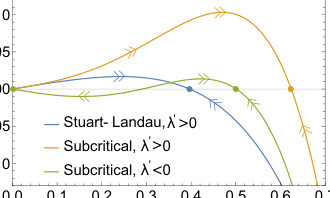 
FIG. 1. Sketch of the phase flow for the condensate ampli- tude |A0| according to Eqs. (9) and (13). In the conventional Stuart-Landau picture for the single-spot exciton-polariton condensate above the pumping threshold, there is a single stable fixed point that determines its density. For the subcrit- ical regime above the threshold, there is also a single stable fixed point. In contrast, slightly below the threshold, there are two stable fixed points: a non-trivial one with a nonzero condensate density and a trivial one with |A0| = 0, leading to bistability and memory effects. Upon further decrease of the pumping power, the nontrivial fixed point loses stability.

📷 Fig 2

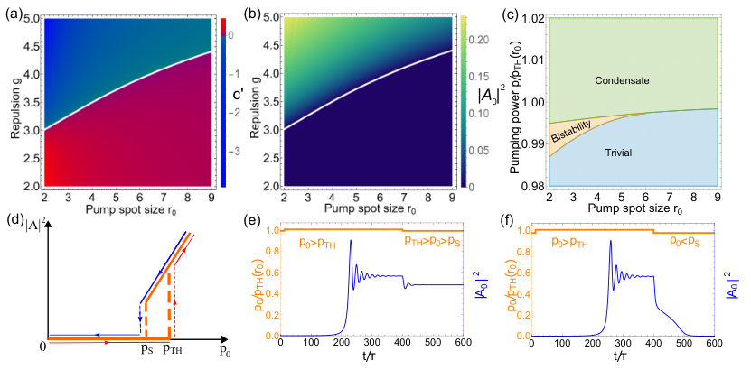 
FIG. 2. (a) Crucial parameter Re c ≡c′ [see Eqs. (9) and (13)] dependence on pumping spot size r0 and repulsion parameter g, which measures the ratio between polariton-reservoir and polariton-polariton interaction strengths. The parameter plane can be divided into two parts with c′ &gt; 0, where the condensates can be discussed in terms of the Stuart-Landau equation, and with c′ &lt; 0, where there is a subcritical bifurcation and observable bistability. The white curve indicates the corresponding boundary. (b) Color map of the condensate density at the condensation threshold. For the blue region of panel (a), one observes |A0|2 ̸= 0. (c) The condensation “phase diagram.” Here we fix g = 4 and...

📷 Fig 3

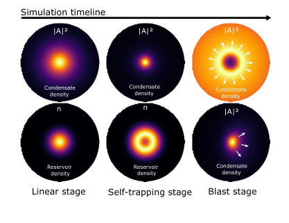 
FIG. 3. For yet smaller pumping spots and stronger repul- sions from the reservoir, the ballistic condensate solution is subject to self-trapping. At the linear stage |A| ≪1, it grows following the pumping profile. When the condensate density is large enough, γ|A|2 ∼1, it “collapses” to a narrow spot, thus reducing the potential energy due to repulsion from the reservoir. The reservoir is essentially depleted in the center (so-called “hole-burning” effect). The self-trapped state is dy- namically unstable. Depending on the model parameters, it can blast as a circular wave (upper-right panel) or “tunnel” from the trap (bottom-right panel) in a random direction.

📷 Fig 4

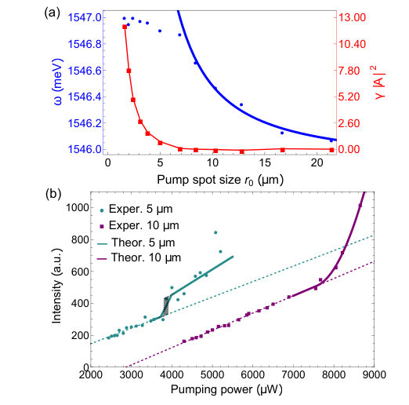 
FIG. 4. (a) Experimentally measured frequency of the con- densate spectral line near the threshold as a function of the pumping spot size (blue dots) in an AlGaAs-based sample with g ≈4 and the corresponding parameter of nonlinear- ity at the threshold γ|A|2 (red dots) defined in Eq. (16). Blue line indicates the frequency expected for the standard “Stuart-Landau” supercritical condensation. A crossover be- tween large (quasi-homogeneous) and small (ballistic) spot cases is apparent. (b) Spectral line intensity as a function of the pumping power (dots) and its interpretation in the model with fluctuating laser power (see End Matter). Dashed lines represent linear parts of the intensities...

**Summary.** This paper analyzes the non-equilibrium dynamics of polariton condensates, finding that the standard theoretical model breaks down under certain conditions. It introduces the quintic Stuart-Landau equation to accurately describe the system, revealing the existence of subcritical bifurcation, which manifests as observable on-off bistability and memory effects. This has implications for designing polaritonic devices that exploit these memory properties.

**Why it may be interesting.** This work provides a detailed theoretical framework for non-equilibrium phase transitions in interacting bosonic systems (polaritons), specifically identifying when and how the dynamics transition from simple supercritical behavior to complex, hysteretic subcritical regimes.

Detailed structure

**Main problem.** The paper investigates the dynamics of exciton-polariton condensates, demonstrating that the standard supercritical Stuart-Landau description fails in certain parameter regimes.

**Main result.** The system exhibits subcritical pitchfork bifurcation, leading to observable on-off bistability and a one-bit memory effect, which requires using a quintic Stuart-Landau equation for accurate modeling.

**Method.** The study combines theoretical analysis (deriving and solving the quintic Stuart-Landau equation) with numerical simulations and comparison to experimental measurements.

**Model / system.** The physical system is an exciton-polariton condensate in a microcavity, modeled using a mean-field driven-dissipative Gross-Pitaevskii equation. The analysis simplifies this to the quintic Stuart-Landau equation near the condensation threshold.

**Key observables.** Bistability (hysteresis) between trivial and non-trivial condensate states, spectral line blueshift, and condensate intensity vs. pump power.

**Important parameters / regimes.** Pumping power, pump spot size ($r_0$), repulsion parameter ($g$), and the bifurcation parameter $c'$.

**Assumptions / limitations.** The analysis relies on weak nonlinearity approximations, and the quintic equation is used to correct the standard Stuart-Landau model when the bifurcation is subcritical.

**Figures summary.** Figures illustrate the phase flow showing bistability, the dependence of bifurcation parameters on pump spot size and repulsion, and simulated/experimental hysteresis loops for condensate intensity.

**Paper structure.** The paper progresses from the full governing equations (ddGPE) to deriving the applicable amplitude equations (cGLE, then quintic Stuart-Landau). It then analyzes the resulting subcritical bifurcation, discusses the self-trapping regime, and validates the theory using simulated and experimental measurements of intensity and spectral shifts.

Abstract

Dynamics of exciton-polariton condensates under continuous-wave incoherent Gaussian optical pumping is considered. It is shown that the conventional supercritical Stuart-Landau picture is invalid in a certain domain of the parameter space. For strong polariton repulsion from the reservoir and relatively small pump spots, the dynamics is adequately described by the quintic Stuart-Landau equation. The corresponding subcritical pitchfork bifurcation leads to condensate formation, accompanied by bistability between the trivial and nontrivial states over a finite pump-power range and a one-bit memory. Further increase of the repulsion parameter or decrease of the spot size breaks down the perturbative approach and leads to a peculiar self-trapping regime with complex dynamics. Experimental evidence of the emergence of the proposed behavior is provided. Our findings can be used to design polaritonic setups that exploit the predicted memory effect.

[↑ back to top](#top)

### [Super-resolution Control of Two-dimensional Quantum Emitters](http://arxiv.org/abs/2608.28574v1)

**Authors:** Bosai Lyu, Valeria Vento, Ludivine Fausten, Daniel Suarez-Forero, Klevis Domi, Kenji Watanabe, Takashi Taniguchi, Alberto Morpurgo, Iaroslav Gaponenko, Patrycja Paruch, Ajit Srivastava  
**Type:** experiment · **Category:** other · **PDF:** <https://arxiv.org/pdf/2608.28574v1>  
**Analysis basis:** full PDF text, analyzed in chunks
**Topic relevance:** `quantum measurements` **3/5** · `quantum optics experiment` **3/5** · `Tavis-Cummings & cavity-many-emitter` **2/5** · `analog quantum simulation` **2/5** · `QC/QI experiment` **1/5** · `correlated / nonlocal dissipation` **1/5** · `driven-dissipative phase transition` **1/5** · `interference shaping light` **1/5** · `methods for driven-dissipative` **1/5**

📷 Fig 1

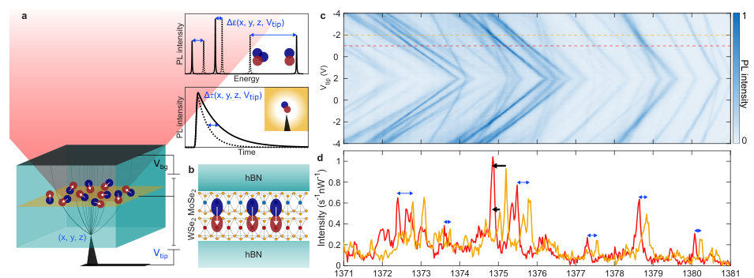 
Figure 1: Quantum optical super-resolution microscope. a, Schematic of the QOSMic. The tip produces

📷 Fig 2

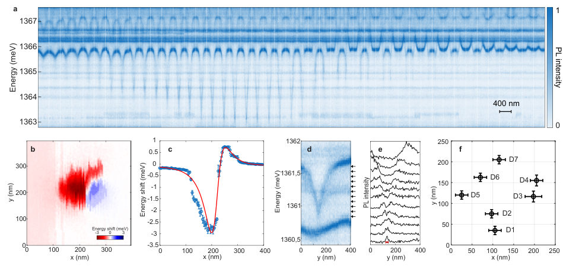 
Figure 2: Super-resolution localization of 2D quantum emitters. a, Tip-position dependence of the PL

📷 Fig 3

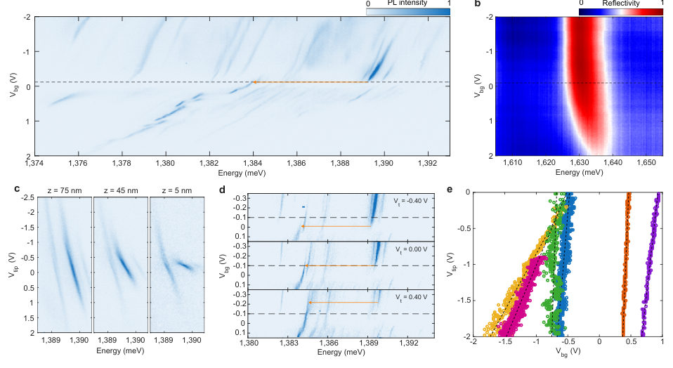 
Figure 3: Selective doping of 2D quantum emitters. a, Bottom gate dependence of the PL emission from

📷 Fig 4

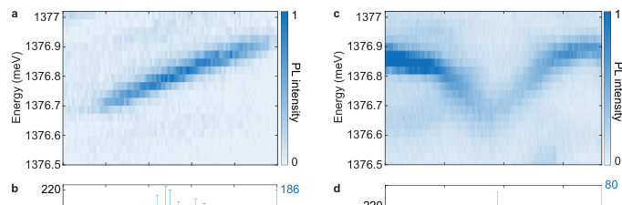 
Figure 4: Lifetime control of an individual quantum emitter. a, PL emission spectra as a function of

**Summary.** The researchers developed a Quantum Optical Super-resolution Microscope (QOSMic) to study interlayer excitons in TMD heterobilayers. By using an AFM tip, they achieved super-resolution spatial mapping and deterministic control over the charge state of individual emitters. This platform allows for the precise study of quantum phenomena like anyon dynamics by locally tuning the emitter's electronic and photonic environment.

**Why it may be interesting.** This work provides an exquisite example of using scanning probe techniques to engineer and probe quantum emitters at the nanoscale, directly relevant to understanding open quantum systems and cavity QED effects in solid-state materials.

Detailed structure

**Main problem.** The primary goal is to achieve super-resolution spatial control and deterministic charge state control of two-dimensional quantum emitters to probe complex correlated quantum phases.

**Main result.** The authors demonstrated super-resolution localization of emitters separated by tens of nanometers and achieved deterministic control over individual charge states, opening pathways for studying coherent inter-dot coupling.

**Method.** They utilized a novel Quantum Optical Super-resolution Microscope (QOSMic) combining cryogenic optical spectroscopy with an AFM tip to locally modify the electrostatic environment and photonic density of states around the emitters.

**Model / system.** The system involves localized interlayer excitons in semiconducting TMD heterobilayers ($	ext{WSe}_2/	ext{MoSe}_2$) encapsulated by hBN. The control mechanism relies on the permanent dipole moment interacting with the local electric field generated by the AFM tip.

**Key observables.** Stark shift in PL energy, local charge state (doping) transitions (e.g., trion formation), and modification of the emission lifetime ($	au$) due to local photonic density of states (LPDOS) changes.

**Important parameters / regimes.** Spatial resolution down to $\sim 40 	ext{ nm}$; cryogenic temperatures ($	ext{4 K}$); applied bias voltages ($V_{	ext{tip}}, V_{	ext{bg}}$).

**Assumptions / limitations.** The analysis relies on modeling the local electric field via the Stark shift ($\Delta E = -\mathbf{p} \cdot \mathbf{E}(\mathbf{r})$) and assuming the tip modifies the LPDOS in a quantifiable manner.

**Figures summary.** Figures illustrate the QOSMic setup, raster scans mapping energy shifts across multiple emitters, and plots detailing the dependence of PL energy and lifetime on tip position and applied bias voltages.

**Paper structure.** The paper details the QOSMic setup, presents measurements showing super-resolution mapping of energy shifts and charge state control via tip scanning, and analyzes the resulting lifetime modifications linked to LPDOS changes.

Abstract

Localized interlayer excitons in semiconducting transition-metal dichalcogenide heterobilayers are quantum emitters with a static electric dipole moment, making them excellent nanoscale charge sensors to probe correlated quantum phases in a proximal layer. These emitters are electrically tunable and inherit spin-valley selection rules, yet their deterministic spatial control remains challenging due to subwavelength confinement. Here, we present a platform that combines cryogenic optical spectroscopy with scanning probe microscopy to investigate trapped interlayer excitons in WSe$_2$/MoSe$_2$ bilayers. By exploiting AFM-based local Stark shift, we achieve super-resolution localization of emitters separated by only a few tens of nanometers and demonstrate deterministic control of individual charge states, including trion formation, opening a path towards coherent inter-dot coupling. Time-resolved measurements reveal tip-induced modification of the electromagnetic vacuum around individual emitters, thus controlling their radiative emission. Our multi-point charge sensing platform with optical readout is particularly well-suited to study fractionalization and anyon dynamics in semiconducting FCIs.

[↑ back to top](#top)

### [Significant modulation of acoustoelectric current associated with charge density wave transitions](http://arxiv.org/abs/2608.27959v1)

**Authors:** Natsumi Nikaido, Takuya Kawada, Koji Fujiwara, Jihoon Park, Nan Jiang, Kouta Kondou, Shintaro Takada, Yasuhiro Niimi  
**Type:** both · **Category:** other · **PDF:** <https://arxiv.org/pdf/2608.27959v1>  
**Analysis basis:** full PDF text, analyzed in chunks
**Topic relevance:** `Frenkel-Kontorova` **3/5** · `driven-dissipative phase transition` **3/5** · `non-equilibrium universality` **2/5** · `Keldysh / 2PI / non-Gaussian methods` **1/5** · `analog quantum simulation` **1/5** · `methods for driven-dissipative` **1/5** · `quantum measurements` **1/5**

📷 Fig 1

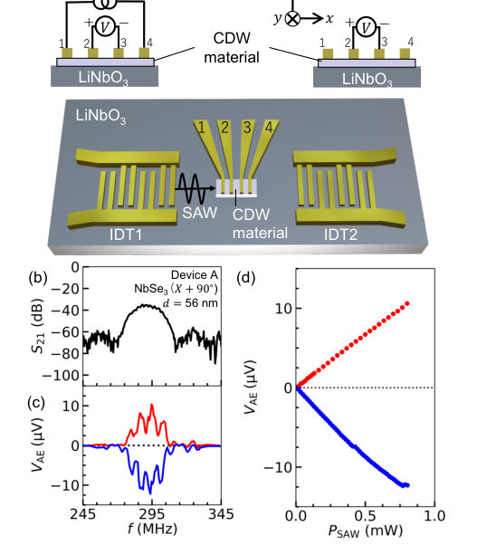 
FIG. 1. (a) Schematic illustration of the SAW device. The top left and right figures are, respectively, for the resistance measurement and for the AE current measurement. (b), (c) The scattering parameter |S21| (b) and the AE voltage VAE (c) as a function of rf frequency. The AE voltage was measured for the SAW power (PSAW) of 0.82 mW. (d) PSAW dependence of the AE current for f = 294 MHz. All the results were obtained for NbSe3(X +90◦) at T = 50 K. In (c) and (d), the data for the rf signal supplied to IDT1 and IDT2 are shown in red and blue, respectively.

📷 Fig 2

 
FIG. 3. (a) Schematic illustration of measurement geometries of IAE. The light gray square represents a 128◦Y-cut LiNbO3 substrate, where the blue arrow corresponds to the crystalline X axis of LiNbO3. The brown regions and the light blue rectangles indicate IDT1 and NbSe3, respectively. (b), (c) Temperature dependence of (b) ρ and (c) ˜IAE for NbSe3(X). The data in (c) were obtained with PSAW = 0.1 mW launched from IDT1.

📷 Fig 3

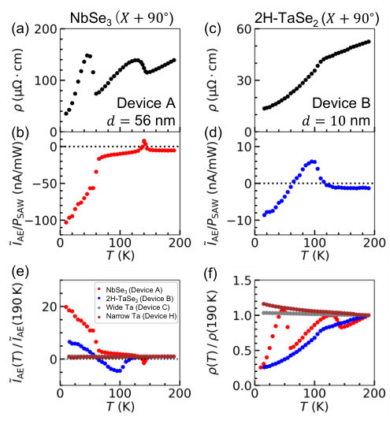 
FIG. 2. (a), (c) Resistivity ρ and (b), (d) ˜IAE obtained with NbSe3(X +90◦) and 2H-TaSe2(X +90◦) devices as a function of T. For (b) and (d), the SAW was irradiated from IDT1. (e), (f) T dependence of (e) ˜IAE and (f) ρ normalized by the values at T = 190 K for NbSe3 (red), 2H-TaSe2 (blue), Ta (gray and brown) devices.

📷 Fig 4

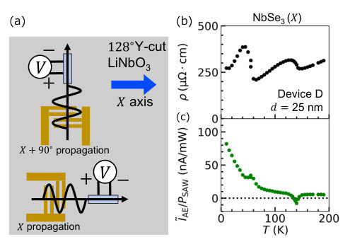 
Figure 2(e) compares the AE current for NbSe3, 2H- TaSe2, and Ta, normalized by their values at 190 K. In contrast to NbSe3 and 2H-TaSe2, the AE current in Ta is nearly independent of T and does not exhibit any polarity reversal regardless of the film size. This observation indi- cates that the characteristic T dependence and polarity change of the AE current are specific to CDW materials. We remark that T dependence of ˜IAE does not match that of ρ as shown in Fig. 2(f).

📷 Fig 5

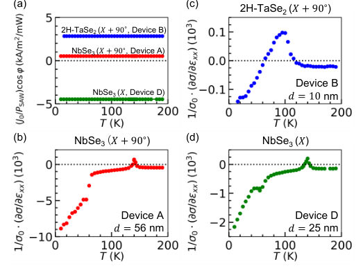 
FIG. 4. (a) Numerically calculated result of (J0/PSAW) cos φ. The results for NbSe3(X + 90◦), 2H-TaSe2(X + 90◦), and NbSe3(X) are shown in red, blue, and green, respectively. (b)-(d) Estimation of (1/σ0)(∂σ/∂εxx) for NbSe3(X + 90◦) (b), 2H-TaSe2(X + 90◦) (c), and NbSe3(X) (d), respectively.

**Summary.** This work explores the acoustoelectric effect in materials exhibiting charge density waves (CDWs) using surface acoustic waves (SAWs). The researchers found that the AE current is significantly modulated by CDW transitions and depends on the SAW propagation direction. A strain-modified conductivity model successfully accounts for these complex, anisotropic transport phenomena.

**Why it may be interesting.** The strong coupling between mechanical strain (from SAWs) and electronic state transitions (CDW) provides a platform for studying non-equilibrium charge transport and strain-mediated quantum phenomena, which is relevant to understanding open quantum systems dynamics.

Detailed structure

**Main problem.** The study investigates how charge density wave (CDW) transitions modulate the acoustoelectric (AE) current generated by surface acoustic waves (SAWs) in layered materials.

**Main result.** The AE current exhibits significant modulation and polarity changes correlated with CDW transitions and the SAW propagation direction, which is explained by a strain-modified conductivity model.

**Method.** The research combines experimental measurements of AE current and resistance using VNA on piezoelectric substrates with the development of a phenomenological model.

**Model / system.** The system involves thin films of CDW materials like NbSe3 and 2H-TaSe2 exfoliated onto piezoelectric LiNbO3 substrates. The physics is governed by the coupling between SAW-induced strain/electric fields and the electronic transport properties modulated by CDW formation.

**Key observables.** AE current polarity and magnitude, dependence on SAW power (P_SAW), and temperature dependence near CDW transition temperatures.

**Important parameters / regimes.** SAW frequency/velocity, SAW power (P_SAW), CDW transition temperatures (e.g., 140 K, 60 K).

**Assumptions / limitations.** The AE current is modeled as arising from the rectification of the SAW-induced electric field via strain-induced modulation of conductivity.

**Figures summary.** Figures illustrate the SAW device setup, S21 spectra, and plots showing AE current dependence on SAW power and temperature, highlighting modulation near CDW transitions.

**Paper structure.** The paper structure moves from characterizing the SAW excitation and measuring the AE current to analyzing the modulation effects linked to CDW transitions, culminating in the application of a phenomenological model to explain the observed directional and transition-dependent behavior.

Abstract

We studied acoustoelectric (AE) currents in materials that undergo charge density wave (CDW) transitions, induced by a surface acoustic wave (SAW) on a piezoelectric substrate. The polarity and magnitude of the AE current in NbSe$_3$ and 2H-TaSe$_2$ were modulated due to their CDW transitions. We also found that the sign of the AE current depends on the SAW propagation direction with respect to the crystalline axis of the substrate.A phenomenological model assuming strain-modified conductivity can qualitatively account for the significant modulation of the AE current associated with the CDW transition, as well as the SAW propagation orientation dependence. The present results offer a powerful probe for exploring SAW-electron interactions in van der Waals materials, thereby highlighting their potential for advancing the emerging field of straintronics.

[↑ back to top](#top)

### [Magnonic Combinatorial Memory based on a network of coupled active ring circuits](http://arxiv.org/abs/2608.28457v1)

**Authors:** Mykhaylo Balinskiy, Paulo Julio, Jeffrey Vargas, Diana Bisono Balaguer, Jacob Greenstein, Alexander Khitun  
**Type:** both · **Category:** other · **PDF:** <https://arxiv.org/pdf/2608.28457v1>  
**Analysis basis:** full PDF text, analyzed in chunks
**Topic relevance:** `driven-dissipative phase transition` **3/5** · `methods for driven-dissipative` **2/5** · `non-equilibrium universality` **2/5** · `Keldysh / 2PI / non-Gaussian methods` **1/5** · `analog quantum simulation` **1/5** · `correlated / nonlocal dissipation` **1/5**

📷 Fig 1

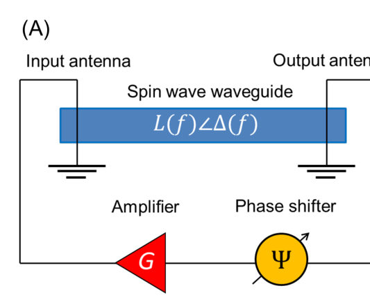 
Figure 1

📷 Fig 2

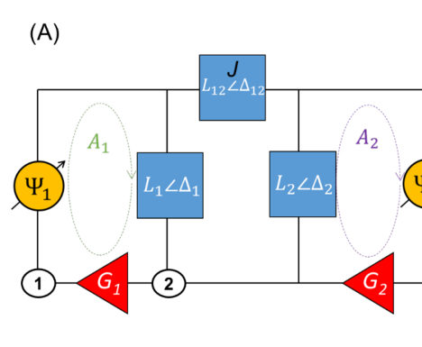 
Figure 2

📷 Fig 3

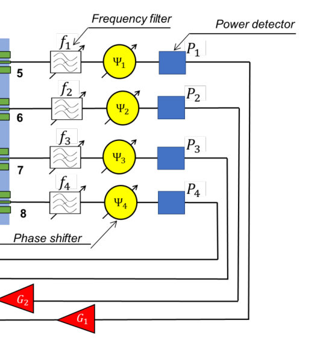 
Figure 3

📷 Fig 4

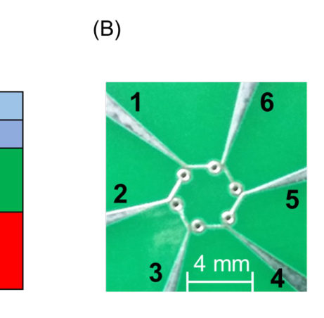 
Figure 4

📷 Fig 5

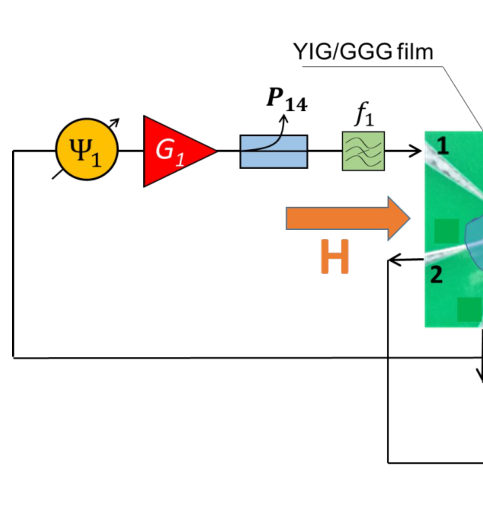 
Figure 5

**Summary.** This paper proposes a Magnonic Combinatorial Memory (MCM) that stores data by controlling the auto-oscillation state within a network of coupled active ring circuits. The system demonstrates a quadratic scaling of storage capacity with the number of coupled units, achieving high contrast ratios in experiments. It represents a solid-state approach to high-density, non-volatile memory using magnonics.

**Why it may be interesting.** The use of coupled, non-linear, dissipative systems (ARCs) to store classical information via collective oscillation states provides a rich platform for studying non-equilibrium dynamics and complex state spaces, relevant to open quantum systems.

Detailed structure

**Main problem.** The paper addresses the development of a novel, high-density memory device, the Magnonic Combinatorial Memory (MCM), whose information storage capacity scales quadratically with the number of coupled circuits.

**Main result.** Experimental demonstrations using three coupled active ring circuits achieved a 27-bit binary response pattern with a robust On/Off ratio exceeding 30 dB at room temperature.

**Method.** The research combines theoretical modeling of coupled oscillator dynamics (using transfer matrices and spectral radius) with experimental characterization of magnonic circuits.

**Model / system.** The system is based on a network of coupled Active Ring Circuits (ARCs) utilizing spin waves propagating in a Yttrium Iron Garnet (YIG) film. Information is encoded in the auto-oscillation state (presence/absence) determined by the phase and frequency settings of the coupled circuits.

**Key observables.** Auto-oscillation power (On/Off ratio), spectral radius ($
ho(T)$), and the number of accessible phase combinations (bits).

**Important parameters / regimes.** Quadratic scaling of bits with the number of circuits ($O(N^2)$); On/Off ratio > 30 dB; Room temperature operation.

**Assumptions / limitations.** The coupling mechanism is assumed reciprocal, and the analysis often relies on linearizing the dynamics or assuming independent control over coupling coefficients.

**Figures summary.** Figures illustrate schematics of single and coupled ARCs, phase maps showing oscillation regions, and experimental data correlating phase settings with measured circulating power.

**Paper structure.** The paper progresses from defining the MCM concept and its components (ARCs, coupling) to theoretical modeling of coupled dynamics, presenting experimental validation using multiple coupled circuits, and concluding with a discussion of scalability and limitations.

Abstract

Magnonic Combinatorial Memory (MCM) is a type of memory where the bits of information are encoded in the signal propagation paths in the network. In this work, we consider MCM based on the network of a coupled active ring circuit (ARC). Each circuit includes a broadband amplifier, a magnonic delay line, an adjustable frequency filter, an adjustable phase shifter, and a power detector. The coupling between the circuits is via spin waves propagating in the common delay line - ferrite film. There may or may not be auto-oscillations in the active ring circuits, depending on the combination of circuit parameters and circuit coupling. The address of MCM is defined as the combination of the states of the phase shifters and frequency filters, while the MCM state is defined as the presence/absence of the auto-oscillations. The coupling between the circuits is achieved by placing micromagnets on top of the ferrite film. The number of bits that can be encoded in the network increases quadratically with the number of coupled circuits. This scaling provides a fundamental advantage over conventional memory. We present experimental data obtained for three magnonic ARCs connected via a single-crystal yttrium iron garnet Y3Fe2(FeO4)3 (YIG) film. The data illustrate an example of encoding a 27-bit binary response pattern, corresponding to the 27 experimentally accessible phase combinations. The results demonstrate a robust operation of MCM with an On/Off ratio exceeding 30 dB at room temperature. The advantages and shortcomings of the proposed approach are discussed.

[↑ back to top](#top)

### [ScatterWorks: A Python package for building and solving scattering network models](http://arxiv.org/abs/2608.28479v1)

**Authors:** R. Johanna Zijderveld, Hélène Spring, Anton R. Akhmerov  
**Type:** theory · **Category:** disordered systems and neural networks · **PDF:** <https://arxiv.org/pdf/2608.28479v1>  
**Analysis basis:** full PDF text, analyzed in chunks
**Topic relevance:** `methods for driven-dissipative` **3/5** · `Keldysh / 2PI / non-Gaussian methods` **1/5** · `analog quantum simulation` **1/5** · `driven-dissipative phase transition` **1/5** · `non-equilibrium universality` **1/5**

📷 Fig 1

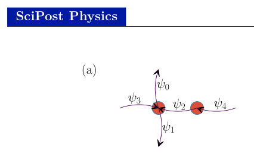 
Figure 1: Tiny basic network described by Eq. 2: (a) shows the link labels, and (b) indicates which scattering elements correspond to each link connection.

📷 Fig 2

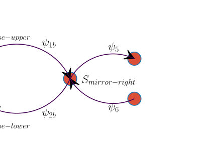 
Figure 2: The basic network setup with node and link labels of the Fabry-Perot interferometer. We omit the node labels of the boundary nodes at the sides, because they are only used for bookkeeping.

📷 Fig 3

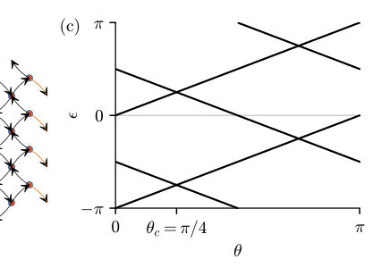 
Figure 3: Panels (a) and (b) present the unit cell and tiled Chalker–Coddington network, respectively, while panel (c) gives the eigenphases of the unit-cell scattering operator at zero momentum as a function of θ. The two eigenphase branches touch at θ = π/4.

📷 Fig 4

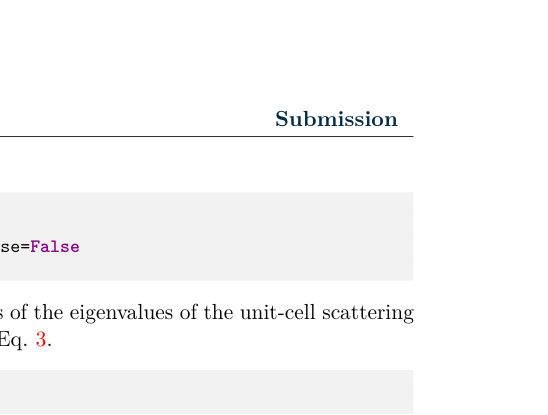 
Figure 3(c) shows that the energy bands cross at θ = π/4. This is the critical point of the Chalker-Coddington model, because at this value the probability of scattering to the left is equal to the probability of scattering to the right [1, 16, 27]. Far away from this critical θc the network is in a deeply localized phase, while near θc the localization length is determined by the symmetry class.

📷 Fig 5

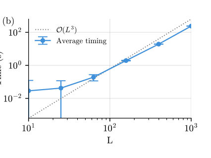 
Figure 4: Conductance and runtime scaling in the Chalker–Coddington model. Panel (a) plots the disorder-median conductance versus θ near θc = π/4 for different system sizes L; the shaded regions span the 16th–84th percentiles across 50 disorder realizations. The conductance peaks as expected near θ = π/4 at about 0.5 e2/h. Panel (b) plots the mean runtime versus L on log–log axes; the error bars show the standard deviation over 50 random seeds and all values of θ, and the dotted O(L3) line is a reference guide.

**Summary.** This paper introduces ScatterWorks, an open-source Python package designed to model and solve quantum transport problems in complex network geometries. It allows researchers to build systems using modular operations and calculate key observables like conductance and quasienergies. This tool is particularly valuable for studying disordered and topological systems where analytical solutions are intractable.

**Why it may be interesting.** The package provides a powerful, general-purpose tool for calculating transport properties in complex quantum structures, which is highly relevant for studying open quantum systems and mesoscopic physics.

Detailed structure

**Main problem.** The paper addresses the need for a flexible and unified computational framework to study non-interacting transport and wave-propagation phenomena in complex, disordered, and topological quantum systems.

**Main result.** The authors introduce ScatterWorks, a Python package that successfully models and solves transport problems for systems like the Chalker-Coddington model, recovering expected critical behavior.

**Method.** The package builds networks using composable transformations (tile, cut, union) and assembles local scattering matrices into a global scattering operator, which is then solved using Schur-based linear algebra techniques.

**Model / system.** The models studied are general scattering networks, applicable to disordered systems, topological insulators, and moiré lattices. Examples include the Fabry-Perot interferometer and the Chalker-Coddington model describing the quantum Hall transition.

**Key observables.** Quasienergies, conductance (G), effective scattering matrix (S_eff), transmission (t), and reflection (r) coefficients.

**Important parameters / regimes.** The critical point parameter ($	heta_c = \pi/4$) for the quantum Hall transition, and the system size ($L$) governing computational scaling.

**Assumptions / limitations.** The derivation of the effective scattering matrix assumes that the internal scattering block ($\mathbf{S}_{	ext{bb}}$) does not have an eigenvalue of one, preventing singularity.

**Figures summary.** Figures illustrate the structure of the global scattering matrix, the basic setup of a Fabry-Perot interferometer, and the tiled structure of the Chalker-Coddington network, showing conductance vs. disorder parameter.

**Paper structure.** The paper details a systematic workflow: defining the base network, modifying it using operations (tile, cut, union, relink), compiling the global scattering operator, and finally solving for transport observables using Schur complements.

Abstract

Network models provide an efficient framework for studying non-interacting transport and wave-propagation phenomena in disordered and topological systems. We introduce ScatterWorks, an open-source Python package for building and solving network models. The package uses a compact network representation with composable transformation operations (tile, cut, relink, and union) to enable flexible construction of periodic and finite networks. Local scattering matrices on nodes can be assigned by node labels or explicit indexing, assembled into global scattering equations, and used to compute quasienergies and transport observables. The package supports sparse scattering matrices, allowing transport observables to be evaluated with Schur-based solvers. We demonstrate the package workflow on a symbolic Fabry-Perot interferometer and a numerical Chalker-Coddington model, recovering analytical expressions and the expected near-critical transport behavior of the quantum Hall transition. Plotting utilities with label-aware rendering are included to streamline debugging and reproducible setup for larger, custom network geometries.

[↑ back to top](#top)

### [Electrically Tunable Two-Component Exciton Condensate in a Coulomb-Coupled Graphene Trilayer](http://arxiv.org/abs/2608.28381v1)

**Authors:** Bo Zou, A. Okounkova, Shuaiqing Zhang, Jian Liao, J. Pack, K. Watanabe, T. Taniguchi, Yihang Zeng  
**Type:** both · **Category:** strongly correlated electrons · **PDF:** <https://arxiv.org/pdf/2608.28381v1>  
**Analysis basis:** full PDF text, analyzed in chunks
**Topic relevance:** `analog quantum simulation` **3/5** · `Keldysh / 2PI / non-Gaussian methods` **1/5** · `quantum measurements` **1/5**

📷 Fig 1

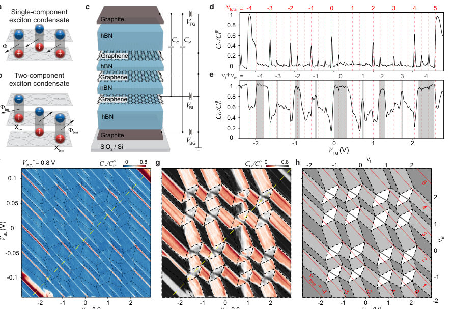 
FIG. 1. Coulomb-coupled trilayer graphene. a,b, Schematics of a single-component exciton condensate in a Coulomb- coupled bilayer (a) and a two-component condensate formed by the adjacent-layer exciton species Xtm and Xbm with order parameters Φtm and Φbm in a trilayer (b). c, Device and capacitance-measurement geometry. Three monolayer graphene sheets are separated by 2–3-nm hBN tunnel barriers. The penetration capacitance CP and gate capacitance CG are measured simultaneously at different frequencies. The layer densities are controlled by VTG, VBG and VBL. d,e, Normalized CP (d) and CG (e) along the yellow dashed trajectories in f and g, respectively. Peaks in CP occur at integer νtotal...

📷 Fig 2

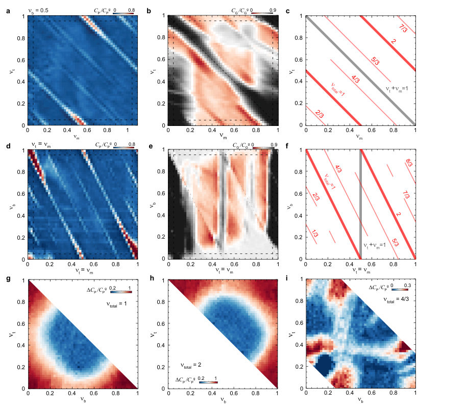 
FIG. 2. Incompressible quantum Hall states across layer-filling space. a,b, Normalized penetration capacitance CP (a) and gate capacitance CG (b) at fixed νb = 0.5. c, Guide to the incompressible-state assignments in a,b. d,e, Normalized CP (d) and CG (e) along νt = νm. f, Guide to the assignments in d,e. In c,f, thick red lines denote integer νtotal, thin red lines denote fractional νtotal, and gray lines denote the top–middle bilayer state at νt + νm = 1. g-i, Normalized penetration-capacitance peak amplitude ∆CP/Cg P at νtotal = 1 (g), 2 (h), and 4/3 (i), plotted as functions of νt and νb, with νm = νtotal −νt −νb. White regions in g–i lie outside the physical range 0 ≤νm ≤1.

📷 Fig 3

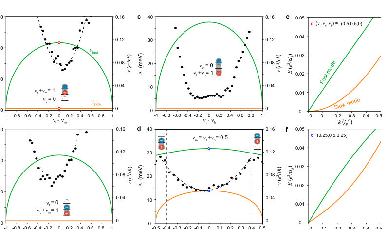 
FIG. 3. Charge gap and neutral collective modes at νtotal= 1. a-d, Measured thermodynamic charge gap ∆µ (black, left axis) and calculated sound velocities (right axis) along the top-middle bilayer limit νb=0 (a), middle-bottom bilayer limit νt =0 (b), top-bottom bilayer limit νm=0 (c), and νm=νt+νb=0.5 (d). Green and orange curves show the fast- and slow-mode velocity, vfastand vslow, respectively. The dashed parabolas are guides to the eye; in d, vertical black dashed lines mark crossovers into the gap-saturated bilayer-condensate regimes. e,f, Calculated neutral collective mode dispersions at (νt, νm, νb) = (0.5, 0.5, 0) (e) and (0.25, 0.5, 0.25) (f).

📷 Fig 4

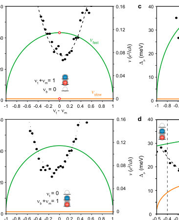 
Figure 3d follows a continuous trajectory between the two adjacent-layer exciton-condensate limits along νm = νt + νb = 0.5. Transferring charge from the bottom to the top layer carries the system from the Xbm con- densate limit at (0, 0.5, 0.5) to the Xtmcondensate limit at (0.5, 0.5, 0). Outside the vertical black dashed lines, the charge gap saturates at its bilayer-limit value as one outer layer becomes dilute. Between them, the charge gap remains finite and evolves continuously through the three-layer-filled region, again following an approx- imately quadratic dependence (dashed lines). Together with the negligible direct interlayer hybridization, this continuous evolution supports a...

📷 Fig 5

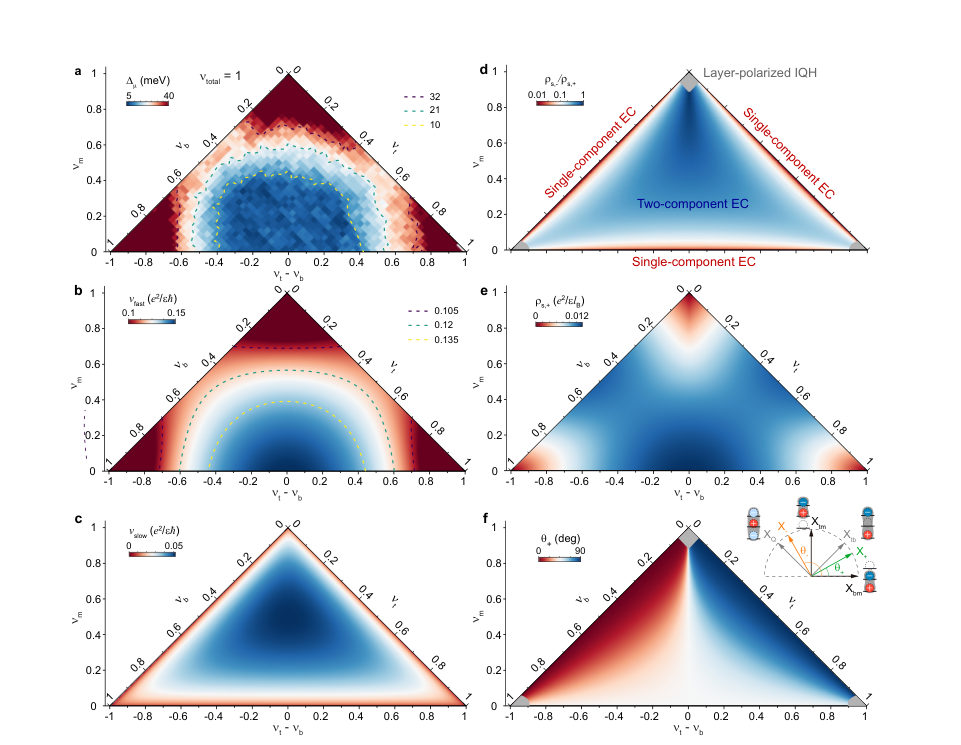 
FIG. 4. Filling factor phase diagram and electrical tunability. a, Experimentally measured thermodynamic charge gap of the νtotal= 1 state versus layer fillings. Gap values are displayed only up to the operational quantitative limit of 40 meV. Saturated regions denote nominal extractions above this limit. b,c, Calculated velocities of the fast (b) and the slow Goldstone mode (c) from TDHF. Dashed contours in a,b guide comparison of their opposite filling dependence. The color scale in b is clipped in the lower limit. See Extended Data Fig. 5 for plot with an unsaturated color scale. d, Ratio of the secondary to principal phase-stiffness eigenvalues, ρs,−/ρs,+, plotted on a logarithmic color...

**Summary.** This work reports on the realization of an electrically tunable two-component exciton condensate in a graphene trilayer. By combining quantum capacitance measurements with advanced mean-field theory, the authors demonstrate that the condensate's internal structure can be continuously controlled by electrostatic gating. This provides strong evidence for a highly controllable, correlated excitonic phase in solid-state matter.

**Why it may be interesting.** The ability to electrically tune the internal structure of a correlated quantum state (the exciton condensate) provides a clean platform to study the interplay between external control parameters and emergent many-body symmetries, relevant to understanding correlated phases in artificial lattices.

Detailed structure

**Main problem.** To realize and study the continuously tunable internal structure of a two-component exciton condensate in a solid-state system, moving beyond systems where component properties are fixed by material chemistry.

**Main result.** The experiment confirms the existence of a two-component exciton condensate with a continuously tunable internal structure, supported by the observation of persistent quantum Hall states and the continuous rotation of condensate mode composition.

**Method.** The study combines quantum-capacitance measurements (experimental) with Hartree-Fock and Time-Dependent Hartree-Fock calculations (theoretical) to analyze collective excitations.

**Model / system.** The system is a graphene trilayer with negligible interlayer tunneling, supporting excitons bound by Coulomb interaction. The condensate is modeled as having two independent relative U(1) symmetries.

**Key observables.** Quantum capacitance ($C_P, C_G$), charge-incompressible quantum Hall states ($
u_{	ext{total}}=1, 2$), phase-stiffness eigenmodes, and Goldstone mode dispersions.

**Important parameters / regimes.** Layer-specific carrier densities ($
u_t, 
u_m, 
u_b$), total filling factors ($
u_{	ext{total}}$), and applied electrostatic gating voltages.

**Assumptions / limitations.** The analysis assumes negligible single-particle tunneling between layers and relies on mean-field approximations (Hartree-Fock).

**Figures summary.** Figures illustrate schematics of single- and two-component condensates, quantum capacitance measurements showing QHS states, and 3D scans mapping incompressibility across the layer-filling space.

**Paper structure.** The paper establishes the physical platform and experimental control, uses quantum capacitance to map out incompressible states, and then employs theoretical calculations (HF/TDHF) to characterize the resulting two-component condensate modes and their continuous tunability.

Abstract

Multicomponent condensates possess internal phase degrees of freedom unavailable to a single-component condensate, yet their components are rarely controllable in solids. Here we realize a graphene trilayer with negligible interlayer tunnelling in which the layer-specific carrier densities are continuously tuned by electrostatic gating. Quantum-capacitance measurements demonstrate that charge-incompressible quantum Hall states at total filling factors 1 and 2 persist across the full range of layer-filling configurations and continuously connect the three bilayer exciton-condensate limits. This persistence provides evidence for a trilayer excitonic state. Static Hartree-Fock and time-dependent Hartree-Fock calculations yield two independent finite phase-stiffness eigenmodes and two linearly dispersing Goldstone modes, respectively, when all three layers are partially filled, whereas only one phase-stiffness eigenmode and one linear Goldstone mode remain when one layer is unfilled. The stiffness eigenmodes rotate continuously between the two adjacent-layer exciton bases as charge is transferred among the layers, revealing electrical control of the condensate-mode composition. Together, the experimental and theoretical results support the identification of a two-component exciton condensate with a continuously tunable internal structure.

[↑ back to top](#top)

### [Two-dimensional quantum Griffith singularity in three-dimensional ZrN$_x$ superconducting films](http://arxiv.org/abs/2608.28166v1)

**Authors:** Zi-Yan Han, Li-Min Yu, Yu-Cheng Cong, Yang Yang, Zhi-Xiang Sun, Zhi-Qing Li  
**Type:** experiment · **Category:** disordered systems and neural networks · **PDF:** <https://arxiv.org/pdf/2608.28166v1>  
**Analysis basis:** full PDF text, analyzed in chunks
**Topic relevance:** `non-equilibrium universality` **3/5**

📷 Fig 1

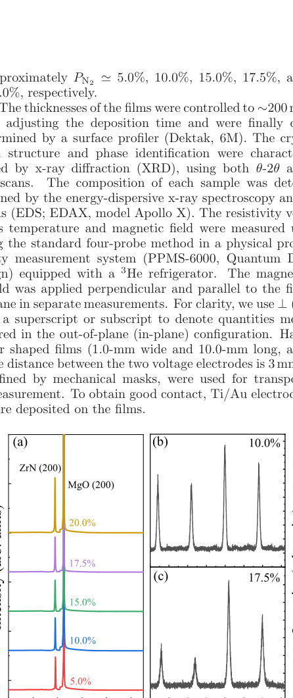 
FIG. 1. (a) XRD θ-2θ patterns for ZrNx films deposited at different nitrogen partial pressures. (b) and (c) are φ-scan spectra of (220) plane for the x ≃1.30 and x ≃1.42 films, respectively.

📷 Fig 2

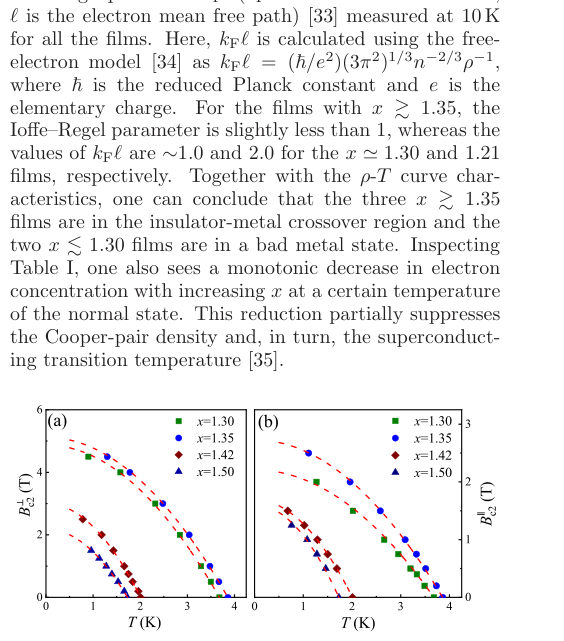 
FIG. 3. (a) The out-of-plane upper critical magnetic field B⊥ c2 vs temperature T for the x ≳1.30 films. (b) The in- plane upper critical magnetic field B∥ c2 vs temperature T for the x ≳1.30 films. The dashed curves are the least-squares fits to Bi c2(T ) = Bi c2(0)[1 −(T/Tc)2] with i =⊥in (a) and i =∥in (b).

📷 Fig 3

 
FIG. 2. (a) Resistivity ρ vs temperature T below 6.5 K for ZrNx films deposited at different nitrogen partial pressures. (b) Normalized resistivity ρ/ρ(300 K) vs temperature T from ∼5 to 300 K for ZrNx films deposited at different nitrogen partial pressures.

📷 Fig 4

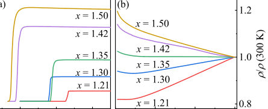 
Figure 2(a) shows the temperature T dependence of the resistivity ρ in the low temperature regime for the films with 1.21 ≲x ≲1.50. The superconducting transition temperature Tc, defined as the temperature at which the resistance falls to 90% of its normal-state value ρ(10 K), decreases with increasing x except for the x ≃1.30 and x ≃1.35 films. The value of Tc for each film is listed in Tabel I, Figure 2(b) shows the temperature T dependence of the normalized resistivity ρ/ρ(300 K) for the above films from 300 down to 5 K. For these x ≳1.35 films, the normal state resistivity increases with decreas- ing temperature in the whole temperature range. While for the x ≃1.21 and 1.30 films, the...

📷 Fig 5

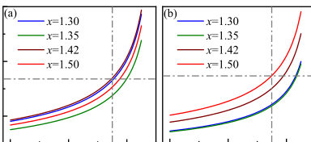 
FIG. 4. (a) The out-of-plane GL coherence length ξ⊥vs nor- malized temperature T/Tc for the x ≳1.30 films. (b) The in-plane GL coherence length ξ∥vs normalized temperature T/Tc for the x ≳1.30 films.

**Summary.** This work experimentally demonstrates the presence of a 2D quantum Griffiths singularity in bulk 3D superconducting films ($	ext{ZrN}_x$). By analyzing magnetoresistance scaling, the authors show that the transport properties near the quantum phase transition are dominated by 2D-like rare regions formed by intrinsic defects. This highlights that disorder-induced inhomogeneity can dictate the critical scaling behavior, even in ostensibly higher-dimensional superconductors.

**Why it may be interesting.** The discrepancy between the macroscopic 3D nature and the observed 2D critical scaling provides a concrete experimental realization of how disorder can induce lower-dimensional critical behavior in a higher-dimensional material, which is relevant to understanding quantum critical points in disordered quantum systems.

Detailed structure

**Main problem.** The study reports the experimental observation of a two-dimensional (2D) quantum Griffiths singularity (QGS) in superconducting films that are macroscopically three-dimensional (3D).

**Main result.** Despite the 3D superconducting nature, the magnetoresistance isotherms exhibit power-law scaling characteristic of 2D systems, indicating that disorder-induced rare regions govern the critical behavior near the quantum phase transition.

**Method.** The research utilized low-temperature electrical transport measurements, specifically analyzing magnetoresistance isotherms ($
ho$ vs. $B$) and resistivity scaling near the superconductor-insulator transition.

**Model / system.** The physical system is epitaxial $	ext{ZrN}_x$ superconducting films ($\sim 200$-nm-thick) with a rock-salt structure. The underlying physics is governed by quenched disorder from intrinsic defects (vacancies, interstitials) creating spatially inhomogeneous superconducting rare regions.

**Key observables.** Magnetoresistance isotherms, effective critical exponent $z
u$, and resistivity data near the superconductor-insulator transition.

**Important parameters / regimes.** Nitrogen concentration ($x \gtrsim 1.30$), magnetic field ($B$), and temperature ($T$).

**Assumptions / limitations.** The analysis assumes that the dynamics of the superconducting rare regions effectively behave as 2D systems near the quantum critical point, despite the bulk material being 3D.

**Figures summary.** Figures show XRD patterns confirming the rock-salt structure, and resistivity vs. temperature/field measurements used to extract scaling exponents.

**Paper structure.** The paper presents experimental characterization (XRD, EDS), followed by transport measurements ($
ho(T, B)$), analysis of superconducting coherence lengths, and finally, the core argument comparing the observed 2D scaling behavior against the expected 3D behavior near the QPT.

Abstract

We report the experimental observation of two-dimensional (2D) quantum Griffiths singularity (QGS) in $\sim$200-nm-thick epitaxial ZrN$_x$ superconducting films. The films possess a rock-salt structure and are three-dimensional (3D) with respect to superconductivity. For each film with $x \gtrsim 1.30$, the low-temperature magnetoresistance isotherms under fields perpendicular and parallel to the film plane cross over at a broad magnetic field range independently rather than at a single crossing point. Despite the macroscopic 3D nature of the superconductivity, the magnetoresistance isotherms at selected adjacent temperatures follow the theoretical prediction of power-law scaling for 2D superconducting systems, rather than that for 3D systems. The effective critical exponent $zν$, obtained by analyzing the magnetoresistance isotherms using the 2D power-law scaling, increases with decreasing temperature and diverges as the quantum phase transition is approached. In addition, the resistivity data near the superconductor-insulator or superconductor-metal transitions obey an activated scaling form that describes the quantum phase transition of 2D superconducting systems governed by an infinite-randomness critical point. The QGS in the ZrN$_x$ films is attributed to quenched disorder induced by intrinsic defects, such as Zr vacancies and N interstitials, which creates spatially inhomogeneous superconducting rare regions. The dynamics of these rare regions, which may exhibit effective 2D characteristics near the quantum critical point, dominate the transport properties of the system near the quantum phase transition. Our results provide compelling evidence for the existence of QGS in 3D superconductors and highlight the crucial role of disorder-induced inhomogeneity in determining the critical behavior of quantum phase transitions.

[↑ back to top](#top)

### [Game of Life on Archimedean Lattices: Glider Guns and Phase Dynamics](http://arxiv.org/abs/2608.27622v1)

**Authors:** Henrik Schou Guttesen  
**Type:** theory · **Category:** other · **PDF:** <https://arxiv.org/pdf/2608.27622v1>  
**Analysis basis:** full PDF text, analyzed in chunks
**Topic relevance:** `analog quantum simulation` **2/5** · `driven-dissipative phase transition` **2/5** · `interference shaping light` **2/5** · `methods for driven-dissipative` **2/5** · `correlated / nonlocal dissipation` **1/5** · `non-equilibrium universality` **1/5**

📷 Fig 1

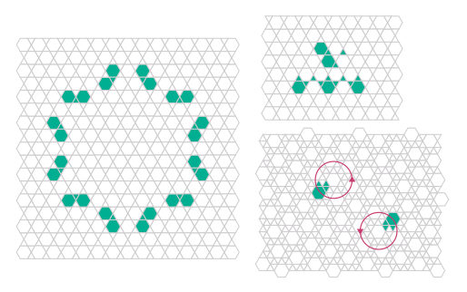 
FIG. 3. Oscillators on depleted traingular lattices. Left: star- shaped oscillator of period 3 on the Kagome lattice. Top right: Period-32 oscillator on the Kagome lattice, reminiscent of a bouncing glider. Lower right: period-24 oscillators comprising chiral circulating configurations on the maple leaf lattice.

📷 Fig 2

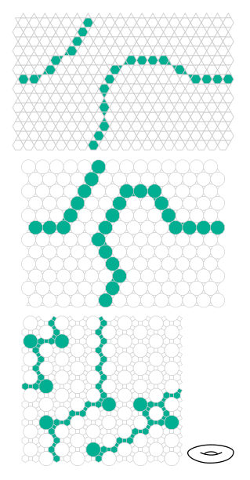 
FIG. 2. Topological still life on Archimedean lattices (3, 6, 3, 6), (3, 122), and (4, 6, 12) from top to bottom with periodic boundary conditions.

📷 Fig 3

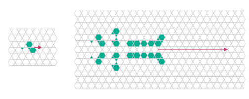 
FIG. 4. Kagome lattice GoL gliders with red translation vec- tors indicating the translation before a repetition of the pat- tern occurs (known as the glider period). Left: small glider, g, of period 4. Right: big C2 symmetric glider, G, of period 40 comprising an accompanying trail of two small gliders that wipe out intermediate debris.

📷 Fig 4

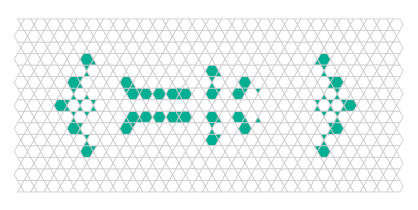 
FIG. 7. A (C2 symmetric) bouncer on the Kagome lat- tice comprising two bouncer walls and a big bouncing glider, G. The distance between the bouncer walls can be trivially expanded to encompass further glider periods to yield any bouncer period of the form Bn = 76 + 40n, for any n ∈N. Here n = 1.

📷 Fig 5

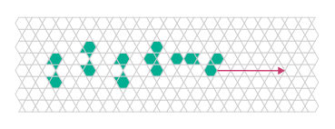 
FIG. 6. Puffer on the Kagome lattice, leaving behind a pre- dictable trail of still lives (footsteps) as it traverses the lattice. The mere existence of this puffer demonstrates infinite (yet sparse) growth on this lattice.

**Summary.** This work investigates Conway's Game of Life on complex crystal lattices, discovering robust structures like glider guns. Crucially, the authors extend the model by adding a phase degree of freedom, demonstrating that this allows for the creation of phase-periodic gliders. This suggests a pathway for developing phase-sensitive and interference-based computation within cellular automata frameworks.

**Why it may be interesting.** While not directly about qubits or standard quantum Hamiltonians, the introduction of phase dynamics and the comparison to Quantum Cellular Automata (QCA) makes it relevant for researchers studying non-unitary or extended classical/quantum computational models.

Detailed structure

**Main problem.** The paper explores Conway's Game of Life (GoL) on various Archimedean lattices, extending the model to incorporate phase degrees of freedom to study phase-sensitive computation.

**Main result.** A novel glider gun was constructed on the Kagome lattice, and the phase extension demonstrated the possibility of phase-periodic gliders, enabling interference-based computation.

**Method.** The authors used a combination of evolutionary search algorithms, simulation on composite lattices, and mathematical analysis of phase evolution governed by Toeplitz matrices.

**Model / system.** The core model is GoL applied to six composite Archimedean lattices. It is extended by assigning a phase degree of freedom ($\phi$) to each cell, leading to a multi-component state $c = r \exp(i\phi)$.

**Key observables.** Glider guns, oscillators (periodicity), puffers, bouncer walls, and phase-periodic gliders.

**Important parameters / regimes.** The phase interaction parameter $\kappa$ and the lattice structure (e.g., Kagome, Maple leaf).

**Assumptions / limitations.** The phase update rule is local and depends only on the local phase environment, allowing for a mathematical description via Toeplitz matrix iteration.

**Figures summary.** Figures illustrate the Moore neighborhood on the Kagome lattice, examples of topological still life, various oscillators, and specific phase-periodic glider examples.

**Paper structure.** The paper progresses from exploring basic GoL dynamics and finding structures like glider guns on specific lattices, to generalizing the model by adding a phase degree of freedom, and finally analyzing the resulting phase dynamics using Fourier decomposition.

Abstract

I explore Conway's Game of Life (GoL) on six composite Archimedean lattices. On the Kagome lattice, on which small gliders and puffers appear particularly frequently across inputs, I use the output of a symmetry-constrained evolutionary search algorithm to construct a novel glider gun. The glider gun comprises four interacting bouncers and stably emits a small glider every 276th generation. Serving as an extension of classical GoL, I also propose cells with a phase degree of freedom and an associated local phase rule, which on the Kagome lattice is demonstrated to host phase-periodic gliders. This enables the possibility of phase-sensitive and interference-based computations.

[↑ back to top](#top)

### [How a polymer filling enhances the rate and selectivity of colloid permeation across mesopores](http://arxiv.org/abs/2608.27995v1)

**Authors:** Mikhail Y. Laktionov, Frans A. M. Leermakers, Ralf P. Richter, Leonid I. Klushin, Oleg V. Borisov  
**Type:** theory · **Category:** statistical mechanics · **PDF:** <https://arxiv.org/pdf/2608.27995v1>  
**Analysis basis:** full PDF text, analyzed in chunks
**Topic relevance:** `Keldysh / 2PI / non-Gaussian methods` **2/5** · `methods for driven-dissipative` **2/5** · `analog quantum simulation` **1/5** · `driven-dissipative phase transition` **1/5** · `non-equilibrium universality` **1/5** · `quantum measurements` **1/5**

📷 Fig 1

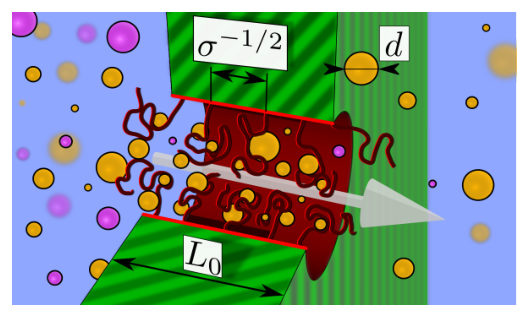 
Figure 1: Schematic of colloid diffusive transport through a pore filled with a polymer brush.

📷 Fig 2

 
Figure 2: Integration scheme for the layer resistance. The intrinsic orthogonal curvilinear

📷 Fig 3

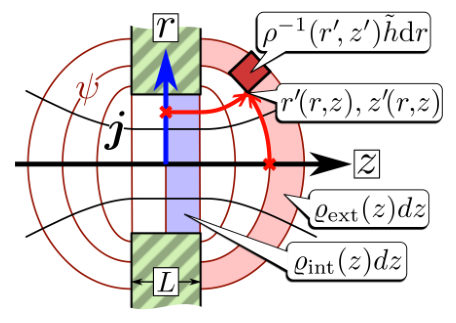 
Figure 3 further illustrates that while the brush remains confined within the pore lumen in poor

📷 Fig 4

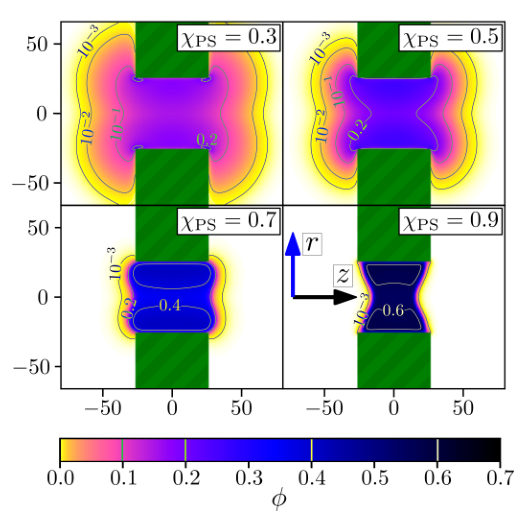 
Figure 3: Maps of the polymer volume fraction. Polymer volume fraction 𝜙(𝑟, 𝑧) for a polymer

📷 Fig 5

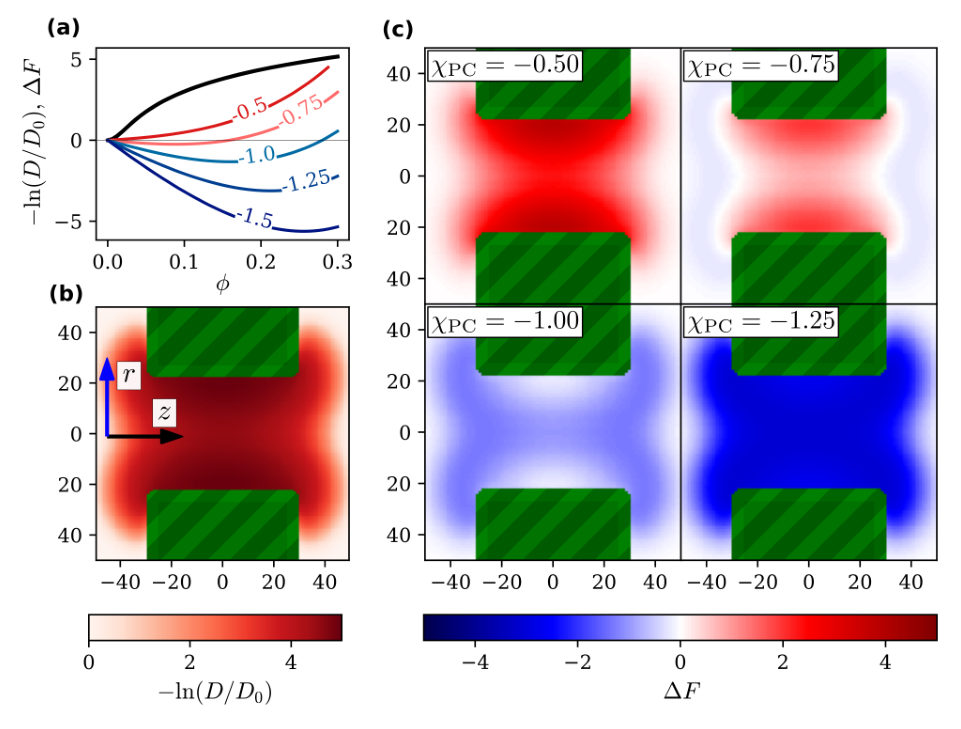 
Figure 4: Effect of the polymer meshwork on local diffusivity and insertion free energy.

**Summary.** This work develops a theoretical framework to model how polymer coatings inside mesopores control the passage of colloids. By treating the process as an electrical resistance problem, the authors show that polymer attraction can enhance, rather than just impede, transport. This provides a physical basis for understanding highly selective biological barriers like the Nuclear Pore Complex.

**Why it may be interesting.** While focused on soft matter transport, the use of resistance/conductivity analogies to model diffusion in complex, confined media touches upon non-equilibrium statistical mechanics and transport phenomena relevant to open quantum systems.

Detailed structure

**Main problem.** The study investigates how polymer filling within mesopores affects the rate and selectivity of colloid permeation, aiming to explain the exquisite permselectivity observed in Nuclear Pore Complexes (NPCs).

**Main result.** The theoretical framework demonstrates that polymer filling can enhance transport beyond bare pores by maximizing colloid capture, providing a rational design strategy for separation devices.

**Method.** The authors employ theoretical methods, reformulating the diffusion problem into calculating the total electrical resistance of a medium with position-dependent resistivity.

**Model / system.** The model uses a cylinder-shaped mesopore filled with a polymer brush, drawing inspiration from the biophysical system of the NPC. Transport is governed by the Smoluchowski equation, treated via electrical analogy.

**Key observables.** Stationary diffusive flux (j), total pore resistance (R), and the partition coefficient (P) for colloids.

**Important parameters / regimes.** Polymer grafting density ($\sigma$), degree of polymerization ($N$), Flory-Huggins parameter ($\chi$), and colloid diameter ($d$).

**Assumptions / limitations.** The analysis assumes unidirectional transport driven by concentration differences and uses simplified models for the pore geometry and colloid shape.

**Figures summary.** Figures illustrate the schematic of colloid transport through a polymer brush-filled pore and show theoretical predictions mapped against experimental data for NPC translocation.

**Paper structure.** The paper progresses from defining the physical system (polymer-filled mesopores/NPCs) to establishing the governing mathematical framework (electrical analogy for diffusion) and finally applying this theory to derive quantitative relationships for transport rates and selectivity.

Abstract

Polymer-functionalised mesopores are an emerging technology for colloid separation, sensing and delivery. Their potential is strikingly illustrated in living cells, where nuclear pore complexes (NPCs) control biocolloid transport between the nucleus and the cytosol. Even colloids much smaller than the biopolymer-filled NPC channel are effectively blocked, but some larger colloids with distinct surface features rapidly permeate. Simplistically, one may expect any polymer filling to obstruct and slow down colloid transport. We demonstrate how a polymer filling that attracts colloids and extends beyond the mesopore, thus maximizing colloid capture, can instead increase permeation compared to a bare pore. We also define how polymer-filled mesopores can effectively gate colloids according to their size and surface features. Our findings provide a basic physical explanation for the exquisite permselectivity of NPCs, and a rational design strategy for novel mesopore-based separation, sensing, catalysis and drug delivery devices with enhanced performance features.

[↑ back to top](#top)

### [First-Principles DFT Study of Ferroelectric-to-Antiferroelectric Phase Transitions in LiTaO$_3$ under Electric Boundary Conditions](http://arxiv.org/abs/2608.27645v1)

**Authors:** Eva Greene, Shaohui Qiu  
**Type:** theory · **Category:** statistical mechanics · **PDF:** <https://arxiv.org/pdf/2608.27645v1>  
**Analysis basis:** full PDF text, analyzed in chunks
**Topic relevance:** `driven-dissipative phase transition` **2/5** · `non-equilibrium universality` **2/5** · `Keldysh / 2PI / non-Gaussian methods` **1/5** · `analog quantum simulation` **1/5** · `methods for driven-dissipative` **1/5**

📷 Fig 1

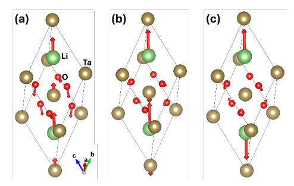 
Figure 1. Atomic structure of LiTaO3 in the high-symmetry rhombohedral unit cell. Red arrows indicate

📷 Fig 2

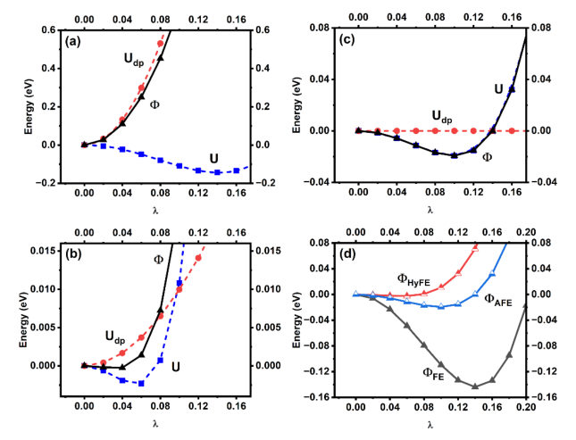 
Figure 2. Free-energy landscapes of the three competing structural phases of LiTaO3 as functions of

📷 Fig 3

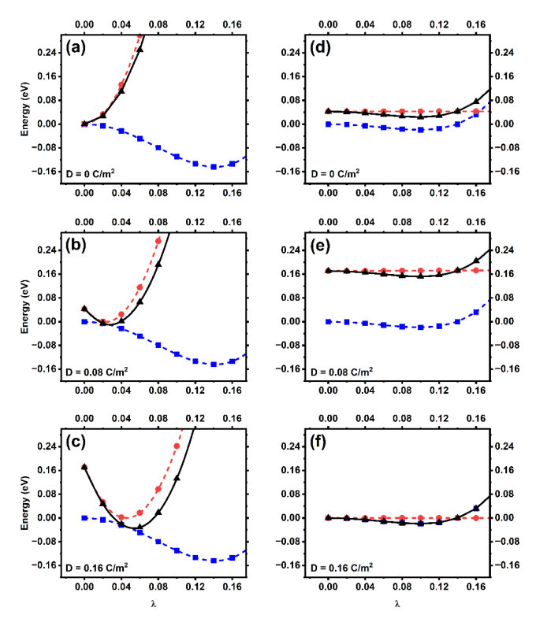 
Figure 3. Free-energy landscapes of the FE/TO phase (left column, panels a–c) and AFE phase (right

📷 Fig 4

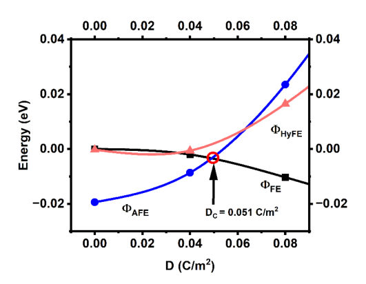 
Figure 4. Optimal free energy of the FE, AFE, and HyFE phases as a function of electric displacement D.

📷 Fig 5

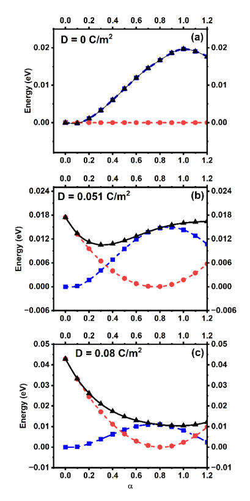 
Figure 5. Free energy along the linear-interpolation path between the AFE configuration (α = 0) and the

**Summary.** This theoretical study uses DFT to map the phase competition between ferroelectric and antiferroelectric states in LiTaO3. By analyzing the free energy under varying electric boundary conditions, the authors pinpoint a second-order phase transition at a specific critical electric displacement. This work is significant because it predicts an experimentally accessible pathway for switching between these two technologically relevant phases.

**Why it may be interesting.** While focused on condensed matter ferroelectrics, the methodology of mapping phase stability via free energy minimization under external fields (D) is a general technique applicable to understanding phase transitions in complex quantum or many-body systems.

Detailed structure

**Main problem.** The study investigates how competing ferroelectric (FE) and antiferroelectric (AFE) phases in LiTaO3 are selected by external electric boundary conditions.

**Main result.** The system undergoes a second-order FE-AFE phase transition at a critical electric displacement D_c = 0.051 C/m^2, which is more accessible experimentally than in similar materials.

**Method.** The research employs first-principles Density Functional Theory (DFT) calculations combined with phonon analysis and free-energy mapping techniques.

**Model / system.** The physical system is Lithium tantalate (LiTaO3), a ferroelectric perovskite oxide. The analysis models the competition between the FE and AFE states by calculating the free energy ($\Phi$) as a function of the electric displacement field (D).

**Key observables.** Free energy minima depths for FE and AFE phases, the critical electric displacement D_c, and the soft mode frequencies (A_2u and A_2g).

**Important parameters / regimes.** Boundary conditions (Short-Circuit vs. Open-Circuit), electric displacement D, and the comparison to LiNbO3 parameters.

**Assumptions / limitations.** The calculations utilize DFT with the local density approximation (LDA) and incorporate the depolarization energy term to account for boundary effects.

**Figures summary.** Figures illustrate the atomic structure and eigenvectors of the soft modes, and show the free energy ($\Phi$) landscapes for FE and AFE phases under different boundary conditions and as a function of D.

**Paper structure.** The paper systematically analyzes the stability of the FE and AFE phases under both short-circuit and open-circuit boundary conditions, mapping the free energy landscape versus electric displacement D to locate the second-order transition point.

Abstract

Ferroelectric and antiferroelectric phases of LiTaO$_3$ compete under different electric boundary conditions. First-principles density-functional calculations show that the high-symmetry reference structure supports two relevant unstable $Γ$ modes: a polar $A_{2u}$ mode at $181i$ cm$^{-1}$ that condenses into the ferroelectric (FE) phase, and an antipolar $A_{2g}$ mode at $103i$ cm$^{-1}$ that condenses into the antiferroelectric (AFE) phase. Under short-circuit conditions the FE phase is the global minimum, with a well depth of $\approx 144$ meV. Under open-circuit conditions the FE phase is destabilized by the unscreened depolarization field and the AFE phase becomes the ground state, with a well depth of $\approx 19$ meV. A weakly unstable longitudinal-optic mode at $48.3i$ cm$^{-1}$ yields a well of only $\approx 0.24$ meV and is thermodynamically irrelevant. Mapping the free energy versus electric displacement $D$ locates a second-order FE$\leftrightarrow$AFE transition at $D_c=0.051$ C/m$^2$, lower than the corresponding $0.07$ C/m$^2$ in LiNbO$_3$ and therefore more accessible experimentally.

[↑ back to top](#top)

### [Collinear altermagnetism for 3D chiral higher-order topological insulators](http://arxiv.org/abs/2608.27552v1)

**Authors:** Andreas Hadjipaschalis, Jennifer Cano  
**Type:** theory · **Category:** other · **PDF:** <https://arxiv.org/pdf/2608.27552v1>  
**Analysis basis:** full PDF text, analyzed in chunks
**Topic relevance:** `analog quantum simulation` **2/5**

📷 Fig 1

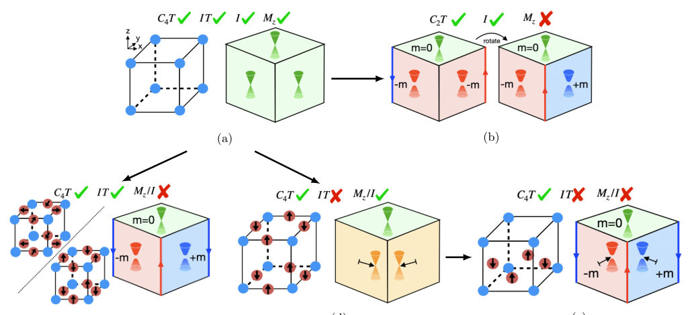 
FIG. 1: Comparison of C2nT -symmetric HOTI constructions. In (a) and (c)-(e), the left schematic shows the real-space lattice geometry and the right the corresponding surface Dirac cones and mass configurations, indicated by m; relevant symmetries are indicated above each panel. (a) The parent phase is a time-reversal-symmetric strong TI with gapless surface Dirac cones. (b) Breaking Mz, C2 and T while preserving I and C2T yields a C2T - and inversion-symmetric axion insulator with chiral modes on opposite hinges. (c) Breaking C4 and T while preserving their product yields the C4T -HOTI constructions using non-collinear [4] (top left) and collinear [27] (bottom left) antiferromagnetism....

📷 Fig 2

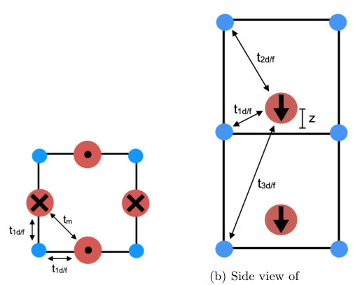 
FIG. 2: Schematic depiction of Hamiltonian terms involving altermagnetic atoms. The dots and crosses in (a) and arrows in (b) indicate the direction of the magnetic exchange term, J, while the hopping terms tm and t1/2/3,d/f are indicated by arrows. Blue dots indicate 3DTI atoms.

📷 Fig 3

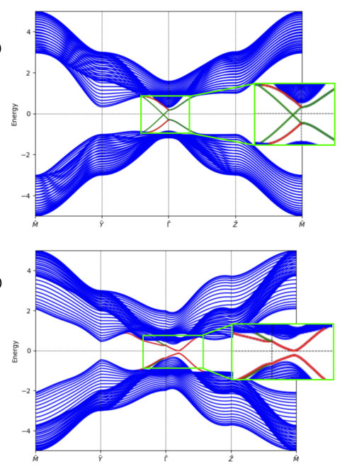 
FIG. 3: Spectrum of the Hamiltonian in Eq. (12) in a slab geometry, which is infinite in the ˆy and ˆz directions, but 20 unit cells thick in the ˆx-direction, with parameters M = 2, t = 1, λ = 1, J = 10, tm = 1.5. Red (green) color indicates surface states on the +ˆx-normal (−ˆx-normal) surface. (a) The magnetic atoms are placed at mirror symmetric positions; the Dirac cones shift in the ky direction without a gap opening (t1d = 1, t2d = t3d = t2f = 0.8, t3f = −0.8, t1f = 0). C2 symmetry requires the cone on the −ˆx-normal surface (green) to shift in the opposite direction to that on the +ˆx-normal surface (red). (Thus, the shift of the red cone is not visible on the present path, but...

📷 Fig 4

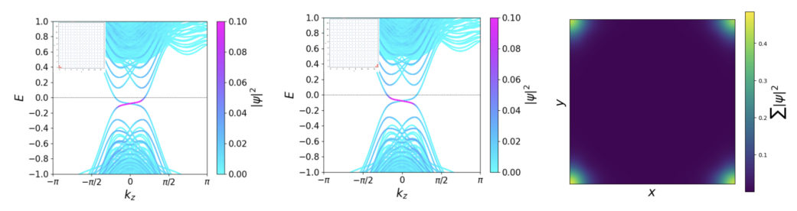 
FIG. 4: Gapless chiral modes in the spectrum of an infinite prism geometry, 15 unit cells wide in the ˆx- and ˆy-directions but infinite in the ˆz-direction, using the same parameters as Fig. 3b. The color scheme indicates the weights of the low energy states on the (a) lower left hinge and (b) lower right hinge; inset shows the specific lattice sites included in the weight. (c) Real-space wave function distribution of the degenerate states at kz = 0, showing chiral modes localized on all hinges.

**Summary.** This paper proposes that collinear altermagnetism offers a novel pathway to realize chiral Higher-Order Topological Insulators (HOTIs). By constructing a model combining a 3DTI with an altermagnetic order, the authors demonstrate that the resulting symmetry breaking successfully generates the characteristic gapless chiral hinge states. This establishes altermagnetism as a key mechanism for engineering advanced topological electronic materials.

**Why it may be interesting.** While focused on condensed matter topology, the use of symmetry-protected phases and the explicit construction of novel magnetic orders (altermagnetism) provides a rich theoretical framework applicable to understanding symmetry-driven quantum phenomena in engineered materials.

Detailed structure

**Main problem.** The primary goal is to find a physical mechanism to realize the elusive chiral $C_4T$-protected Higher-Order Topological Insulator (HOTI) in electronic materials.

**Main result.** The authors show that incorporating collinear altermagnetism into a 3D topological insulator model successfully generates the required symmetry breaking and gapless chiral hinge channels.

**Method.** The research employs analytical and numerical calculations, deriving an effective Hamiltonian by coupling a 3DTI to a collinear $d$-wave altermagnet on a Lieb lattice.

**Model / system.** The system combines a 3D Topological Insulator (3DTI) with magnetic atoms exhibiting collinear antiferromagnetic order (altermagnetism). The model is built upon a microscopic Hamiltonian that is analyzed via perturbation theory.

**Key observables.** Chiral hinge channels, gapped surface Dirac cones, and the symmetry protection ($C_4T$) of the topological state.

**Important parameters / regimes.** The breaking of mirror symmetry ($M_z$) and inversion symmetry ($I$) are crucial for achieving the desired HOTI state.

**Assumptions / limitations.** The analysis relies on the assumption of weak coupling between the magnetic and topological subsystems, allowing for the use of perturbation theory to derive an effective Hamiltonian.

**Figures summary.** Figures illustrate the symmetry requirements for $C_4T$-HOTIs, compare surface state spectra when symmetry is preserved versus when $M_z$ is broken, and show the predicted gapless chiral hinge states in an infinite prism geometry.

**Paper structure.** The paper progresses from identifying the theoretical challenge (chiral HOTIs) to proposing altermagnetism as the solution, developing a detailed microscopic model, and finally using surface/slab calculations to confirm the predicted topological signatures.

Abstract

Despite significant progress in the study of higher-order topological insulators (HOTIs), the chiral $C_4\mathcal{T}$-protected HOTI has remained elusive in electronic materials, where $C_4\mathcal{T}$ denotes the product of a four-fold rotation and time-reversal symmetry. We show that altermagnetism, a recently discovered form of collinear magnetism, provides a new route to realize this elusive phase. Specifically, we construct a microscopic model that combines a three-dimensional topological insulator with a collinear $d$-wave altermagnet on a Lieb lattice. Through analytical and numerical calculations, we show that the magnetism shifts and gaps the surface Dirac cones to produce the desired chiral hinge channels. Finally, we identify promising material classes to realise our proposal. Our results establish collinear altermagnetism as a route to intrinsic chiral higher-order topology and open a new path toward the discovery of $C_4\mathcal{T}$-protected HOTIs in real materials.

[↑ back to top](#top)

### [Gauge invariance, collective modes, and the justification of normal-state subtraction in Dirac superconductors](http://arxiv.org/abs/2608.28485v1)

**Authors:** Hiroshi Hayasaka  
**Type:** theory · **Category:** other · **PDF:** <https://arxiv.org/pdf/2608.28485v1>  
**Analysis basis:** full PDF text, analyzed in chunks
**Topic relevance:** `Keldysh / 2PI / non-Gaussian methods` **2/5**

📷 Fig 1

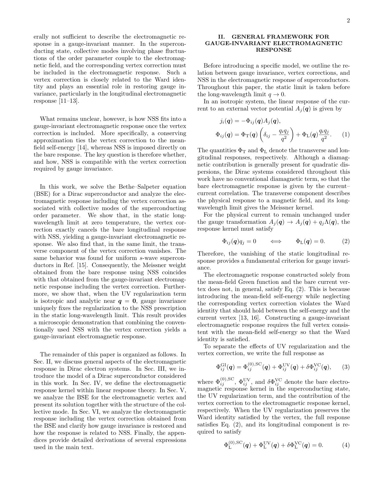 
Low-resolution page preview, page 2

📷 Fig 2

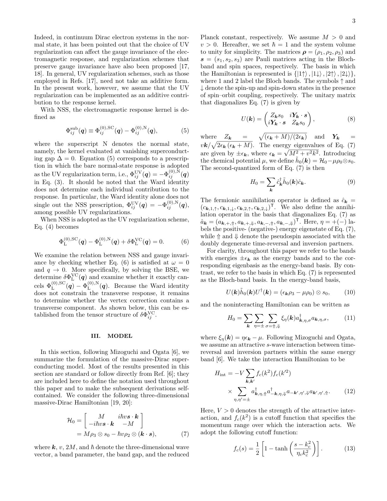 
Low-resolution page preview, page 3

📷 Fig 3

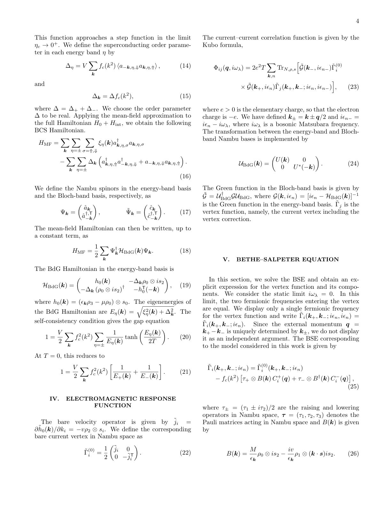 
Low-resolution page preview, page 4

📷 Fig 4

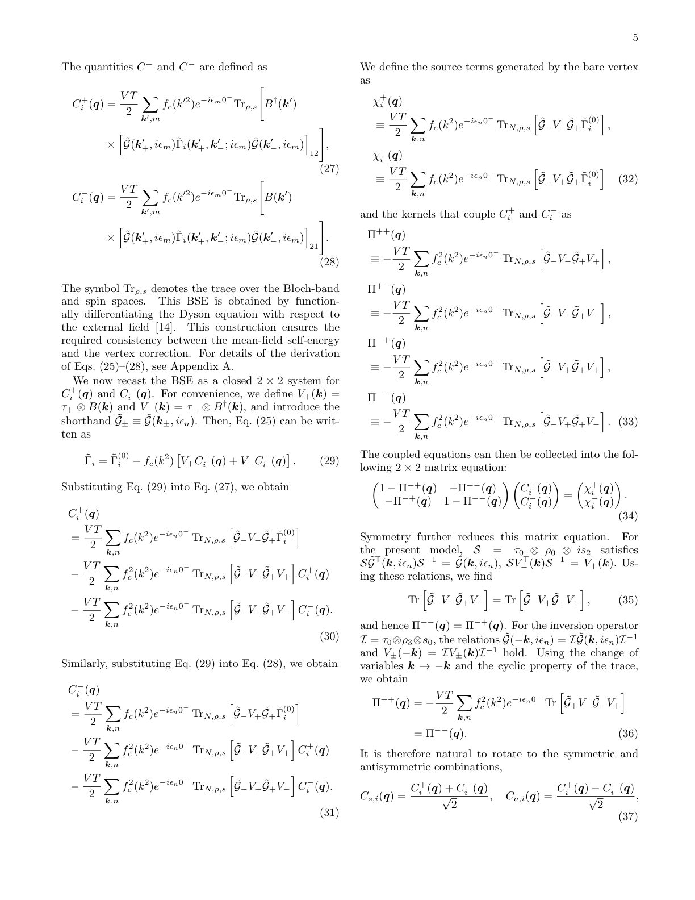 
Low-resolution page preview, page 5

📷 Fig 5

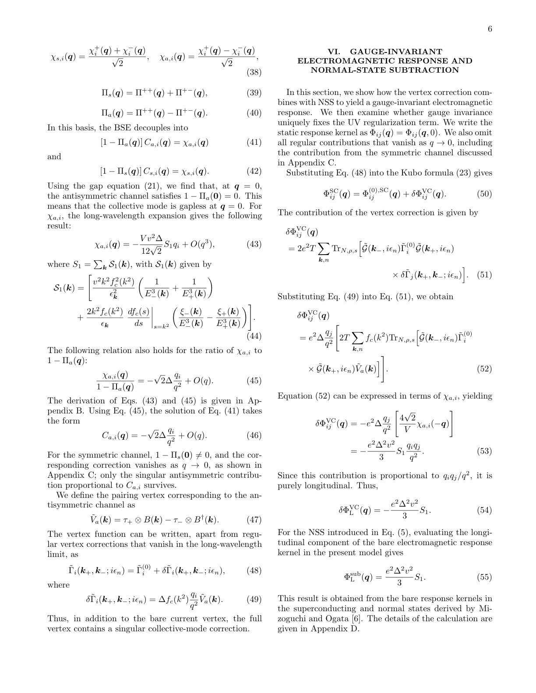 
Low-resolution page preview, page 6

**Summary.** This theoretical work addresses the ambiguity in calculating the electromagnetic response of Dirac superconductors by investigating the role of vertex corrections. The authors demonstrate that the Normal-State Subtraction (NSS) procedure is rigorously justified because the vertex correction exactly restores gauge invariance in the static limit. This provides a crucial microscopic foundation for a widely used approximation in superconducting theory.

**Why it may be interesting.** While focused on superconductivity, the rigorous application of gauge invariance constraints via vertex corrections and the justification of a subtraction scheme (NSS) is a fundamental theoretical technique applicable to many interacting quantum systems.

Detailed structure

**Main problem.** The paper aims to microscopically justify the use of Normal-State Subtraction (NSS) when calculating the gauge-invariant electromagnetic response in Dirac superconductors.

**Main result.** The vertex correction exactly cancels the bare longitudinal response with NSS in the static long-wavelength limit, satisfying the required gauge invariance condition. This confirms that NSS is a valid theoretical procedure for this system.

**Method.** The authors use linear response theory, solving the Bethe-Salpeter equation, and analyzing the electromagnetic response kernel in the static, long-wavelength limit.

**Model / system.** The system studied is a Dirac superconductor, modeled using a massive-Dirac Hamiltonian with s-wave pairing. The analysis involves calculating the current-current correlation function via the Kubo formula.

**Key observables.** Longitudinal ($\Phi_L$) and transverse ($\Phi_T$) components of the electromagnetic response kernel, and the Meissner weight.

**Important parameters / regimes.** Static long-wavelength limit ($\omega=0, q 	o 0$), superconducting gap ($\Delta$), and the normal-state response ($\Phi_N$).

**Assumptions / limitations.** The analysis assumes the UV regularization term can be treated as an additive contribution, and it focuses on the static, long-wavelength limit to enforce gauge invariance.

**Figures summary.** Not specified in the notes.

**Paper structure.** The paper develops the full response kernel by decomposing it into bare, UV regularization, and vertex correction terms. It then analyzes the longitudinal and transverse components separately, showing how the vertex correction enforces gauge invariance when NSS is applied.

Abstract

In Dirac superconductors, the unbounded spectrum of low-energy Dirac models is known to give rise to unphysical interband contributions from deep-lying states to the electromagnetic response. To eliminate these contributions, normal-state subtraction (NSS), in which the normal-state response is subtracted from the superconducting-state response, has been widely employed. However, the relation between NSS and a gauge-invariant electromagnetic response, particularly the role of the vertex correction required by the Ward identity, has remained unclear. In this work, we consider a massive-Dirac model with $s$-wave pairing and analytically investigate the electromagnetic response at zero temperature by solving the Bethe--Salpeter equation and incorporating the collective-mode contribution to the electromagnetic vertex. We show that, in the static long-wavelength limit, the vertex correction exactly cancels the bare longitudinal response with NSS, yielding the vanishing longitudinal response required by gauge invariance. In contrast, the transverse component of the vertex correction vanishes in the long-wavelength limit, so that the gauge-invariant Meissner weight coincides with that obtained from the bare transverse response with NSS. Moreover, within the class of isotropic and analytic UV regularization terms, we show that gauge invariance uniquely fixes the regularization term in the static long-wavelength limit to the value prescribed by NSS. Our results thus provide a microscopic justification for NSS.

[↑ back to top](#top)

### [Topological signatures in the curvature-induced energy response](http://arxiv.org/abs/2608.28146v1)

**Authors:** Jaehyeok Lee, Iuegyun Hong, Jinhong Park  
**Type:** theory · **Category:** other · **PDF:** <https://arxiv.org/pdf/2608.28146v1>  
**Analysis basis:** full PDF text, analyzed in chunks
**Topic relevance:** `analog quantum simulation` **2/5**

📷 Fig 1

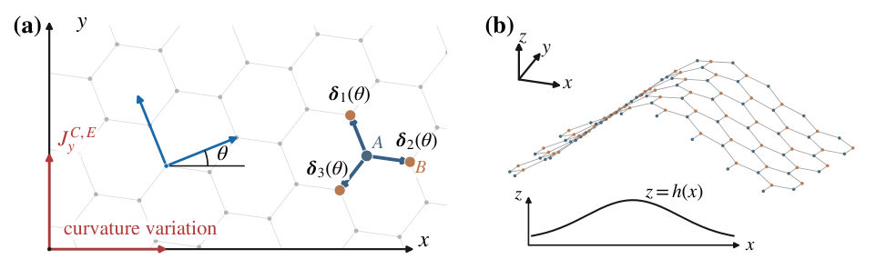 
Figure 1. (a) Flat graphene with crystal orientation specified by the angle θ, defined as the tilt of the armchair direction relative to the laboratory y axis. The deformation varies along the laboratory x direction, while the transverse charge and energy currents, JC y and JE y , flow along the y direction. The three nearest-neighbor bond vectors δℓ(θ) (ℓ= 1, 2, 3) are indicated. (b) Three-dimensional view of graphene under smooth pure bending, described by the height profile z = h(x) and translationally invariant along the y direction. The inset shows the corresponding profile z = h(x).

📷 Fig 2

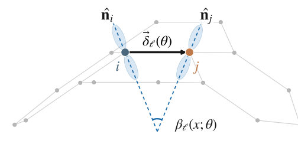 
Figure 2. Slater–Koster model for a nearest-neighbor hopping in smoothly curved graphene. The highlighted sites i ∈A and j ∈B are connected by the ℓth bond vector δℓ(θ). The local pz-orbital directions ˆni and ˆnj are misaligned by the bond- dependent angle βℓ(x; θ). This misalignment depends on the orientation of the bond relative to the bending direction and gives rise to the curvature-induced modulation of the nearest- neighbor hopping.

📷 Fig 3

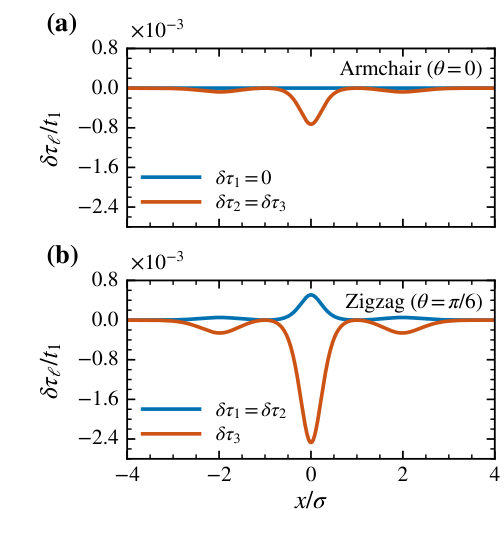 
Figure 3. Curvature-induced nearest-neighbor hopping mod- ulations δτℓ/t1 as functions of x/σ for two representative crys- tal orientations: (a) armchair, θ = 0, and (b) zigzag, θ = π/6. We use the Gaussian bending profile h(x) = Ae−x2/(2σ2) with A = 3.7 nm and σ = 2.5 nm, together with t1 = −Vppπ = 2.66 eV and Vppσ = 6.38 eV [32]. The three bond modulations can be obtained from Eq. (11) by computing the curvature κ(x) and the bond-orientation factors pℓ(θ) in Eq. (9).

📷 Fig 4

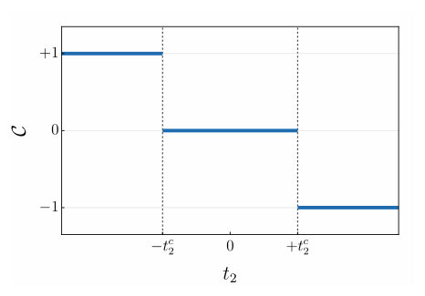 
Figure 4. Chern number C of the occupied band as a function of the next-nearest-neighbor hopping t2. It was obtained nu- merically by integrating the Berry curvature in Eq. (29) and performing the momentum integral in Eq. (30). The topologi- cal phase transitions occur at t2 = ±tc 2, where tc 2 = m/(3 √

📷 Fig 5

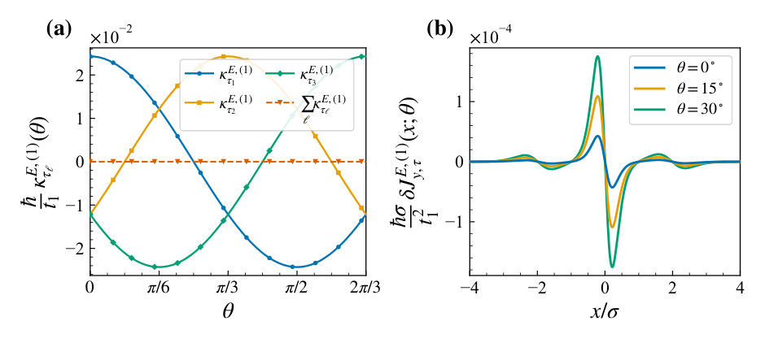 
Figure 5. Transverse energy-current response generated by the first spatial derivative of the curvature-induced hopping mod- ulation. (a) Bond-resolved response coefficients κE,(1) τℓ (θ) for ℓ= 1, 2, 3 as a function of the crystal orientation θ. Although the individual contributions depend on θ, their unweighted sum P

**Summary.** This theoretical work examines how geometric curvature induces an energy response in the Haldane model, a lattice model for graphene. The authors find that although the low-order energy response is sensitive to microscopic details, the third-order response reveals a universal topological signature matching relativistic predictions. This demonstrates that topological physics can manifest robustly even when the underlying physical response is complex.

**Why it may be interesting.** The focus on topological invariants emerging from nonrelativistic lattice models under geometric deformations provides a concrete, calculable realization of topological physics beyond standard band theory, which is relevant for understanding emergent phenomena in engineered quantum materials.

Detailed structure

**Main problem.** The paper investigates the topological energy response of a nonrelativistic system (Haldane model) to a smooth, curvature-induced deformation, comparing it to predictions from relativistic field theory.

**Main result.** While the leading first-order energy response is nonuniversal, the third-order energy response exhibits a universal discontinuity across the topological transition that matches the relativistic Chern-Simons prediction.

**Method.** The analysis uses a microscopic lattice formulation, employing a systematic spatial-gradient expansion of the energy-current response derived from the continuity equation.

**Model / system.** The system is modeled using the Haldane model on a graphene sheet subjected to a pure-bending out-of-plane deformation $z=h(x)$. The Hamiltonian incorporates nearest-neighbor and next-nearest-neighbor hopping terms modulated by the curvature.

**Key observables.** Energy-current response ($\delta J^E_y$), transverse charge current density ($\langle \hat{J}_{C,y} 
angle$), and the topological Chern number ($C$).

**Important parameters / regimes.** The third-order gradient expansion coefficient, the topological transition point, and the curvature magnitude ($\kappa$).

**Assumptions / limitations.** The analysis relies on the pure-bending approximation (neglecting changes in bond lengths) and utilizes a continuum approximation for slowly varying curvature.

**Figures summary.** Figures illustrate the flat graphene structure, the 3D view under pure bending, and the Slater-Koster model detailing how curvature modulates nearest-neighbor hopping.

**Paper structure.** The paper systematically calculates the energy response by expanding the energy current in powers of spatial gradients, showing that the leading terms vanish or are nonuniversal, while the third-order term captures the universal topological signature.

Abstract

Relativistic effective field theory predicts a topological energy response to a gravitational field that appears at third order in spatial gradients. Here, we investigate how this response emerges in the nonrelativistic Haldane model using a microscopic lattice formulation of curvature-induced deformations. We find that the leading first-order energy response is nonuniversal and depends on the bond-resolved structure of the deformation; in particular, it vanishes for a symmetric modulation of the three nearest-neighbor hoppings. In contrast, the third-order response exhibits a discontinuity across the topological transition whose magnitude agrees with the relativistic gravitational Chern--Simons prediction. Thus, although the absolute response is nonuniversal, its third-order discontinuity is universal and retains a characteristic topological fingerprint beyond the relativistic limit.

[↑ back to top](#top)

### [A Three-Fluid Model of Dissipation at Surfaces in Superconducting Radiofrequency Cavities](http://arxiv.org/abs/2608.28565v1)

**Authors:** Matthias Liepe Michelle M. Kelley, Sean Deyo, Nathan Sitaraman, Danilo B. Liarte, Tomás Arias, James P. Sethna, Thomas Oseroff  
**Type:** theory · **Category:** other · **PDF:** <https://arxiv.org/pdf/2608.28565v1>  
**Analysis basis:** full PDF text, analyzed in chunks
**Topic relevance:** `Keldysh / 2PI / non-Gaussian methods` **1/5** · `correlated / nonlocal dissipation` **1/5** · `methods for driven-dissipative` **1/5**

📷 Fig 1

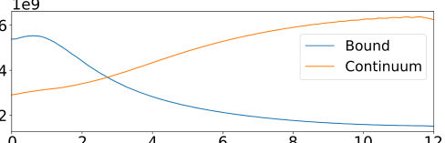 
FIG. 4. Elastic scattering rate of Bogoliubov quasiparticle at a nitrogen impurity concentration of 1 ppm as a func- tion of depth where the point-like delta-function potential is placed. Partioning the normal fluid into the two compo- nents discussed in Sec. III C, the scattering rates for contin- uum (orange curve) and surface-bound quasiparticle states (blue curve) are considered separately.

📷 Fig 2

 
FIG. 3. Electronic mean free path (left y-axis) and elastic relaxation time (right y-axis) as a function of the nitrogen impurity concentration in parts per million given by DFT calculations of niobium in its normal-conducting phase.

📷 Fig 3

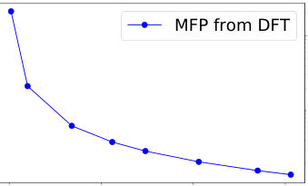 
Figure 3 shows the results of the elastic relaxation time, and associated mean free path, calculated for normal-conducting niobium as a function of concentra- tion of nitrogen impurities. We find an elastic scatter- ing lifetime of 1.1 × 10−11 s, corresponding to a rate of 9×1010 s−1, for a nitrogen concentration of one part per million. Considering more realistic impurity concentra- tions, say 10 −104 ppm, we would expect a scattering rate 10−12 −10−15 s. From this result and the calculated Fermi-level density of states, we determine the scattering potential strength of a nitrogen impurity in bulk niobium to be α ≈12.13 a3 0 Eh. This parameter then enters into the calculation for the...

📷 Fig 4

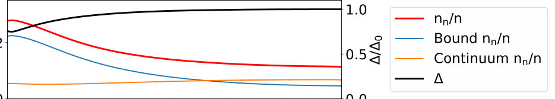 
FIG. 5. Local normal fluid fraction (red curve; left y-axis) and local superconducting gap (black curve; right y-axis) at H0 ≈130 mT, or Eacc ≈30 MV/m. The normal fluid fraction is partitioned into the bound state density (blue curve) and the continuum state density (orange curve), which sums to the total normal fluid fraction nn/n.

📷 Fig 5

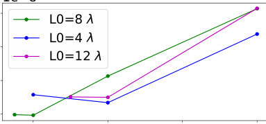 
FIG. 6. Convergence of calculated surface resistances Rs for various simulated cavity lengths L0 as a function of grid spac- ing dz in units of penetration depths.

**Summary.** This paper addresses the unexplained 'anti-Q slope' in superconducting cavities by developing a novel three-fluid model. It separates normal fluid excitations into surface-bound and continuum states, calculating dissipation using Bogoliubov quasiparticle scattering rates. The model successfully demonstrates that the differential scattering rates between these two populations can generate the observed field-dependent quality factor anomaly.

**Why it may be interesting.** This work provides a detailed, microscopic mechanism for macroscopic superconducting performance anomalies, linking quantum quasiparticle dynamics (surface states) to measurable RF cavity parameters (Q-factor).

Detailed structure

**Main problem.** The paper investigates the anomalous 'anti-Q slope' observed in superconducting radiofrequency (SRF) cavities, where the quality factor increases with the accelerating RF field amplitude.

**Main result.** The authors propose a three-fluid model that successfully explains the anti-Q slope by showing that the relative scattering rates between surface-localized and continuum quasiparticle states can induce this effect.

**Method.** The analysis involves solving the Bogoliubov-de Gennes equations numerically and employing a semi-classical theory of conductivity, modifying the standard two-fluid model.

**Model / system.** The system is superconducting niobium cavities operating under large RF fields. The model is a 'three-fluid' extension of the standard two-fluid model, separating the normal fluid into distinct continuum and surface quasiparticle components.

**Key observables.** Quality factor (Q) vs. accelerating field, local superconducting gap $\Delta(z)$, and the relative scattering rates ($	au_b/	au_c$) of bound vs. continuum quasiparticles.

**Important parameters / regimes.** Niobium parameters ($E_F = 5.32$ eV, $\Delta_0 = 1.5$ meV, $\lambda = 40$ nm), operating temperature ($T=2$ K), and RF frequency ($\omega = 1.3$ GHz).

**Assumptions / limitations.** The model assumes that bound states ($E_n < \Delta_0$) are governed by different scattering dynamics than continuum states ($E_n \ge \Delta_0$), necessitating the three-fluid approach.

**Figures summary.** Figures illustrate the partitioning of the normal fluid into bound and continuum components, the weakening of the superconducting gap at the surface, and the predicted Q vs. accelerating field curves based on different scattering rate assumptions.

**Paper structure.** The paper builds from identifying the experimental anomaly (anti-Q slope) to developing the theoretical framework (three-fluid model using BdG equations) to calculate dissipation via scattering rates, culminating in the prediction of the anti-Q slope mechanism.

Abstract

Experiments on superconducting cavities have found that under large RF fields the quality factor can improve with increasing field amplitude, a so-called ``anti-Q slope.'' We numerically solve the Bogoliubov-de Gennes equations at a superconducting surface in a parallel magnetic field, finding at large fields there are surface quasiparticle states with energies below the bulk superconducting gap that emerge and disappear as the field cycles. Modifying the standard two-fluid model, we introduce a ``three''-fluid model where we partition the normal fluid to consider continuum and surface quasiparticle states separately. We compute dissipation in a semi-classical theory of conductivity, where we provide physical estimates of elastic scattering times of Bogoliubov quasiparticles with point-like impurities having potential strengths informed from complementary \textit{ab initio} calculations of impurities in bulk niobium. We show, in this simple yet effective framework, how the relative scattering rates of surface and continuum quasiparticle states can play a role in producing an anti-Q slope while demonstrating how this model naturally includes a mechanism for turning the anti-Q slope on and off.

[↑ back to top](#top)

### [Euler Topological Metals in 1D](http://arxiv.org/abs/2608.27554v1)

**Authors:** Yichen Hu, Jacob Shapiro  
**Type:** theory · **Category:** statistical mechanics · **PDF:** <https://arxiv.org/pdf/2608.27554v1>  
**Analysis basis:** full PDF text, analyzed in chunks
**Topic relevance:** `Keldysh / 2PI / non-Gaussian methods` **1/5**

📷 Fig 1

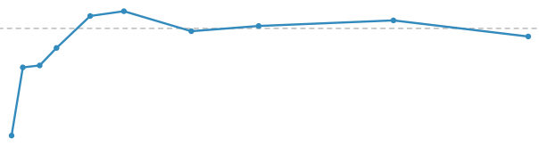 
Figure 1: The clean open-chain response evaluated along tL = L1/2. The dashed line is χ(ΣEF ) = 1. The residual oscillation reflects finite-time and finite-volume effects.

📷 Fig 2

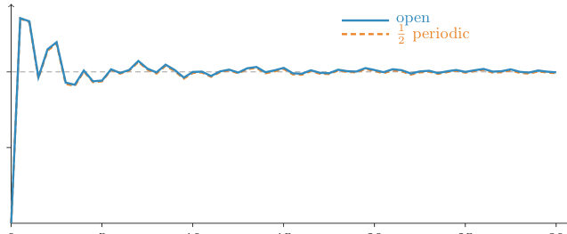 
Figure 2: Comparison at L = 151. The solid curve is the open-chain single-interface response. The dashed curve is one half of the periodic response, which contains two interfaces. The two agree throughout the pre-recurrence window.

📷 Fig 3

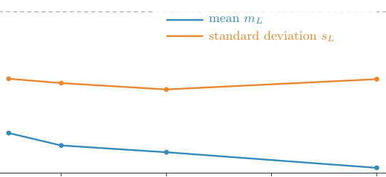 
Figure 3: Anderson scaling at W = 3, EF = 1, and tL = L1/2, using M = 200 nested disorder samples. The ensemble mean moves toward zero, but the sample standard deviation does not decrease. The data therefore give no evidence for a deterministic samplewise integer. The dashed line denotes the clean value 1.

**Summary.** This theoretical work establishes a rigorous connection between the large-time limit of a specific, regularized linear transport response and the Euler characteristic of the Fermi sea in 1D topological metals. By analyzing the continuum and lattice models, the authors provide a quantitative, observable quantity that measures a topological invariant, suggesting a new experimental pathway for topological characterization.

**Why it may be interesting.** The connection between a macroscopic, time-dependent transport measurement and a fundamental topological invariant like $\chi$ provides a novel, experimentally accessible diagnostic tool for characterizing topological phases in condensed matter systems.

Detailed structure

**Main problem.** The paper aims to find a direct, observable transport quantity that yields the topological invariant, the Euler characteristic ($\chi$), for a Fermi sea in a metal, contrasting with standard measurements like the Chern number in gapped systems.

**Main result.** The large-time limit of the Abel-regularized transport response is rigorously proven to equal the Euler characteristic of the Fermi sea, $\chi(\Sigma_{EF})$.

**Method.** The analysis uses Kubo's formula applied to a regularized linear response function, analyzing the large-time limit of the commutator trace in momentum space.

**Model / system.** The system is a non-interacting electron in a continuous one-dimensional wire governed by a Hamiltonian $H = f(P)$ with a real-analytic dispersion relation. The Fermi sea $\Sigma_{EF}$ is defined by the momentum range where $f(p) \le E_F$.

**Key observables.** The Abel-regularized and Fermi-compressed linear response, $\Delta N_R(t)$, which is hypothesized to equal $\chi(\Sigma_{EF})$ in the large-time limit.

**Important parameters / regimes.** The large-time limit ($t 	o \infty$) is crucial, as the finite-time response is not topologically quantized. The analysis also compares continuum and lattice limits.

**Assumptions / limitations.** The dispersion $f(p)$ is assumed to be real analytic, and the Fermi sea $\Sigma_{EF}$ is compact. The derivation relies on specific regularization techniques to handle non-trace-class operators.

**Figures summary.** The notes describe figures illustrating the approach to the expected value (1) in the clean lattice limit, comparing periodic vs. open boundary conditions, and showing the behavior of disorder-averaged quantities in the Anderson model.

**Paper structure.** The argument progresses from defining the problem (finding $\chi$ via transport), establishing the continuum 1D result using regularization and large-time limits, and then extending the methodology to the lattice analog.

Abstract

We give a rigorous one-dimensional formulation of Kane's transport proposal for probing the Euler characteristic of a Fermi sea. For a clean, translation-invariant continuum Hamiltonian with real-analytic dispersion, a Fermi sea confined to a finite momentum range, and nonzero Fermi velocity at every Fermi point, we analyze a particular Abel-regularized transport response (obtained by tracing over the Fermi sea) and prove that its large-time limit equals the Euler characteristic. We derive an explicit finite-time formula, show that quantization requires the large-time limit, and obtain a convergence rate under additional nonstationarity assumptions. We also prove the lattice analog, where the sharp commutator is trace-class and a completely filled band contributes zero. Finite-volume calculations illustrate the prescribed order of the thermodynamic and large-time limits.

[↑ back to top](#top)

### [Quantum Geometric Origin of Nonlinear Current Induced Orbital Magnetization](http://arxiv.org/abs/2608.28231v1)

**Authors:** Xue-Jin Zhang, Yue-Xin Huang, Wei Du, Xiaolong Feng, Shen Lai, Cong Xiao, Qian Niu, Shengyuan A. Yang  
**Type:** theory · **Category:** other · **PDF:** <https://arxiv.org/pdf/2608.28231v1>  
**Analysis basis:** full PDF text, analyzed in chunks
**Topic relevance:** `Keldysh / 2PI / non-Gaussian methods` **1/5**

📷 Fig 1

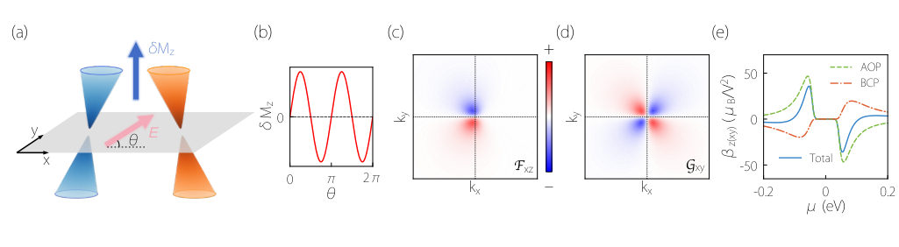 
FIG. 1. (a) Schematic spectrum of the 2D Dirac model (15), where an in-plane E field generates a nonlinear out-of-plane δMz. (b) Angular dependence of δMz. (c-d) k-space distribution of AOP F x z (k) and BCP Gxy(k) of the conduction band at ζ = + valley. (e) Calculated nonlinear CIOM response coefficient αz(xy) versus the chemical potential µ. In the calculation, we take vF = 1 eV · ˚A, w = 0.6vF , ∆= 50 meV, and τ = 50 fs.

📷 Fig 2

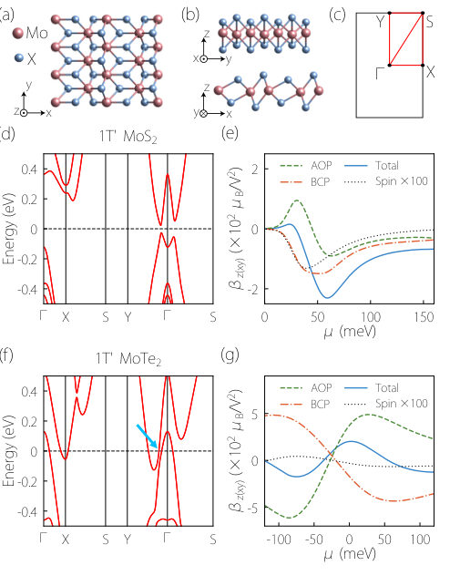 
FIG. 2. (a) Top and (b) side views of monolayer 1T’ MoX2 (X = S or Te). (c) Brillouin zone. (d) Calculated band struc- tures and (e) nonlinear CIOM coefficient βz(xy) for 1T’ MoS2. (f) and (g) show the corresponding results for 1T’ MoTe2. In (e) and (g), the results for nonlinear current-induced spin magnetization are also shown with dotted lines (multiplied by a factor of 100). In the calculation, we set T = 50 K and τ = 50 fs.

**Summary.** This work develops a rigorous quantum geometric theory for nonlinear current-induced orbital magnetization (CIOM). It shows that this effect arises from the interplay between anomalous orbital and Berry-connection polarizabilities. The theory predicts large, measurable nonlinear orbital magnetization in 2D materials like $	ext{MoS}_2$ and $	ext{MoTe}_2$, potentially surpassing the spin contribution even when SOC is weak.

**Why it may be interesting.** While focused on condensed matter magnetism, the rigorous derivation of a nonlinear response tensor based on geometric band structure properties (AOP/BCP) provides a powerful, generalizable theoretical tool for understanding non-equilibrium quantum responses in low-dimensional systems.

Detailed structure

**Main problem.** The paper addresses the fundamental challenge of formulating the proper theory for nonlinear current-induced orbital magnetization (CIOM), particularly due to the nonlocal nature of the orbital magnetic dipole operator.

**Main result.** The nonlinear CIOM is shown to originate from the quantum geometric properties of the band structure: the anomalous orbital polarizability (AOP) and the Berry-connection polarizability (BCP). The theory predicts that this orbital magnetization can dominate over its spin counterpart in topological materials.

**Method.** The authors develop a microscopic theory by deriving the field-corrected orbital magnetic moment and applying it within a linear response framework to calculate the second-order response tensor $\beta_{abc}$.

**Model / system.** The theory is applied to nonmagnetic crystals, modeled using a 2D massive Dirac Hamiltonian, and validated using first-principles calculations on monolayer transition metal dichalcogenides ($	ext{MoS}_2$ and $	ext{MoTe}_2$).

**Key observables.** Nonlinear orbital magnetization ($\delta M$), characterized by the tensor $\beta_{abc}$, and the contributions from AOP and BCP.

**Important parameters / regimes.** The response is highly dependent on the chemical potential ($\mu$) and is predicted to be significant in materials with topological band features, irrespective of the spin-orbit coupling (SOC) strength.

**Assumptions / limitations.** The derivation relies on expanding the expectation value of the magnetic dipole operator in powers of the electric field ($E$) and assumes carrier relaxation processes leading to $\delta f \propto \tau E$.

**Figures summary.** Figures illustrate the schematic generation of out-of-plane magnetization from an in-plane E field, and show the calculated nonlinear CIOM response coefficient $\beta_z(xy)$ versus chemical potential for model systems and $	ext{MoX}_2$ materials, highlighting AOP and BCP contributions.

**Paper structure.** The paper establishes the theoretical framework by deriving the field-corrected orbital moment, derives the nonlinear response tensor $\beta_{abc}$ using AOP and BCP, and then applies this theory to calculate and predict measurable nonlinear CIOM in specific 2D materials.

Abstract

Electric generation of magnetization is a focus of condensed matter research, and has recently been advanced into the nonlinear regime. However, due to the nonlocal nature of orbital magnetism, how to properly formulate nonlinear current-induced orbital magnetization remains a fundamental challenge. Here, we develop the proper theory for this effect. This is based on the microscopic derivation of field-corrected orbital magnetic moment of a Bloch electron, a critical missing piece in the present theory. We show that the quantum geometric origin of this phenomenon lies in both the anomalous orbital polarizability and the Berry-connection polarizability, which often provide competing contributions. Combining our theory with first-principles calculations, we predict significant, experimentally accessible nonlinear orbital magnetization generated in strained bilayer graphene, monolayer 1T' $\mathrm{MoS_2}$ and $\mathrm{MoTe_2}$. Remarkably, nonlinear orbital magnetization can dominate over its spin counterpart in materials with topological band features, irrespective of the spin-orbit coupling strength.

[↑ back to top](#top)

### [Topological Signatures of Hardness and Structural Order in Network-Forming Materials](http://arxiv.org/abs/2608.28365v1)

**Authors:** Yair Augusto Gutiérrez Fosado, Ayobami Daramola, Davide Marenduzzo, Ciprian G. Pruteanu  
**Type:** theory · **Category:** disordered systems and neural networks · **PDF:** <https://arxiv.org/pdf/2608.28365v1>  
**Analysis basis:** full PDF text, analyzed in chunks
**Topic relevance:** `analog quantum simulation` **1/5**

📷 Fig 1

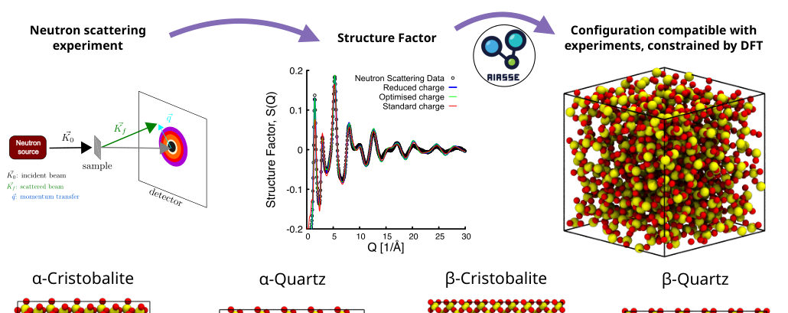 
FIG. 1. Experimentally constrained amorphous silica and crystalline reference structures. Top: AIASSE workflow used to generate amorphous silica configurations consistent with neutron-scattering data. EPSR refinement is performed using either standard (qSi = +4, qO = −2) or reduced (qSi = +2, qO = −1) fixed charges. For the optimized scheme, AIASSE iteratively updates the charges through DFT calculations, DDEC6 charge partitioning, and EPSR refinement until self- consistency is reached. A representative optimized-charge configuration is shown. The central panel compares the experimental neutron-scattering structure factor with the amorphous silica models. All reproduce the main experimental...

📷 Fig 2

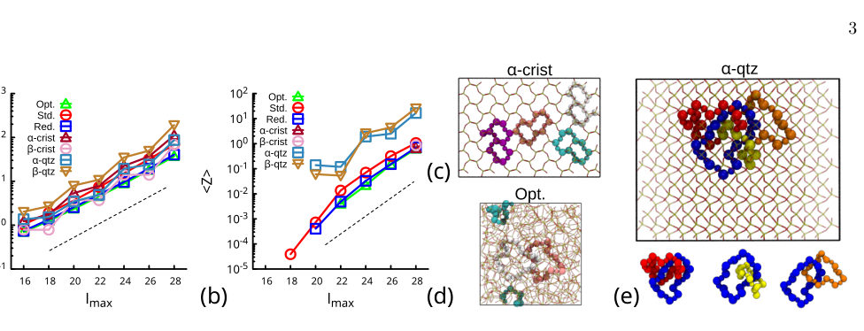 
FIG. 2. Topological analysis of silica networks. (a) Average number of loops per particle, Nloops/M, as a function of the maximum loop size lmax for amorphous silica, α- and β-cristobalite, and α- and β-quartz. The black dashed line shows the exponential scaling Nloops/M ∝exp(0.35 lmax). (b) Linking valence, Z = L/Nloops, as a function of lmax. The black dashed line shows the scaling Z ∝exp(0.82 lmax). (c-e) Representative examples of loops and mutually linked loops identified in different phases.

📷 Fig 3

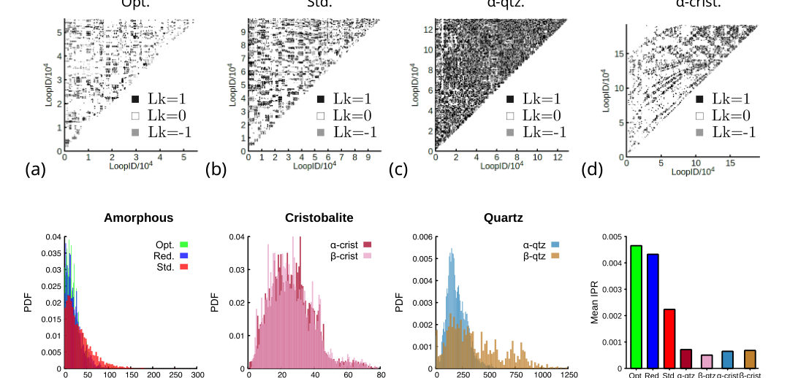 
FIG. 3. Global organization of topological constraints. (a)-(d) Linking matrices Lkij for different silica phases, all obtained using data with lmax = 28. (e) Laplacian eigenvalue spectra for the amorphous silica networks generated using optimized, reduced, and standard charge assignments. All three amorphous networks exhibit broad, monotonically decaying spectra. Interestingly, the decay rate of the amorphous network with standard-charge is significantly different, and larger, than those of the reduced and optimized charges, showing that quantum mechanics information leads to topologically different networks. (f) Corresponding spectra for α- and β-cristobalite, which display pronounced...

**Summary.** This work develops a topological framework using the 'linking valence' to characterize network-forming materials like silica. By analyzing the linking between structural loops, the authors successfully distinguish between amorphous and crystalline phases, correlating topological constraints with mechanical hardness. This establishes linking as a powerful new tool for connecting structure and physical properties in disordered solids.

**Why it may be interesting.** While focused on condensed matter structure, the use of graph theory, spectral analysis (Laplacian), and localization measures (IPR) to characterize structural order shares methodological overlap with analyzing complex quantum many-body systems or disordered quantum states.

Detailed structure

**Main problem.** The study aims to move beyond conventional geometric descriptors to understand how the topology of network-forming materials dictates their physical properties, particularly mechanical hardness.

**Main result.** The introduction of the linking valence successfully separates silica phases into distinct topological classes, correlating high linking values with mechanically harder crystalline phases like quartz.

**Method.** The authors characterize the network by constructing a graph from atomic bonds and analyzing the topology using the Gauss linking number to define a 'linking valence' descriptor.

**Model / system.** The research focuses on network-forming materials, specifically amorphous silica and its crystalline polymorphs (quartz, cristobalite), and amorphous ice, modeled using atomistic simulations constrained by neutron-scattering data.

**Key observables.** Linking valence (Z), Gauss linking number, graph Laplacian spectrum, and Inverse Participation Ratio (IPR).

**Important parameters / regimes.** The linking valence $Z$ is the key descriptor, which varies significantly based on the charge assignment used in the atomistic model.

**Assumptions / limitations.** The topological picture is highly sensitive to the underlying atomistic model (e.g., charge assignment) used to define the network structure.

**Figures summary.** Figures illustrate the AIASSE workflow, show the separation of silica phases based on linking valence vs. loop size, and present spectral analysis (Laplacian spectra and IPR) comparing different amorphous and crystalline states.

**Paper structure.** The paper progresses from establishing the inadequacy of geometric descriptors to introducing the linking valence, demonstrating its ability to distinguish phases, and finally complementing this with spectral analysis (Laplacian/IPR) to provide a comprehensive topological fingerprint.

Abstract

Understanding how the topology of network forming materials influences their physical properties remains a longstanding challenge. Here, we investigate the topology of experimentally compatible atomistic models of amorphous silica together with the crystalline polymorphs cristobalite and quartz. By comparing multiple atomistic models of amorphous silica that equally reproduce neutron-scattering data, we show that different microscopic descriptions can imply different topological interpretations of glass stability. To characterize the network beyond conventional geometric descriptors, we introduce the linking valence, which quantifies the average number of topological links per network loop. This topological descriptor separates silica into two distinct classes: the mechanically harder quartz exhibit values more than an order of magnitude larger than those of amorphous silica and cristobalite, despite their common tetrahedral building blocks. Spectral analysis of the loop-linking networks provides a complementary distinction, separating amorphous from crystalline phases and revealing differences in the long-range organization of topological constraints. These results establish topological linking as a new framework for connecting the structure and physical properties of network-forming materials.

[↑ back to top](#top)
