
# arxiv digest (quant-ph + cond-mat) — 2026-09-02

*221 papers · 28 relevant · 4 highlighted*

## 🔥 Most relevant (28)

*Every paper with at least one nonzero topic score, sorted by best-matching score. 🔥 marks scores ≥4/5. Click the title to jump to the full entry below; click [arXiv] to open the paper page. `(secondary)` marks papers from de-prioritized cond-mat archives.*

Show 28 relevant papers

- [Universal tuning of Förster resonance energy transfer in gate-programmable conductor-dielectric-conductor heterostructures](#paper-2608.30150) [[arXiv]](http://arxiv.org/abs/2608.30150v1) `(secondary)` — 🔥 `correlated / nonlocal dissipation` **4/5** · `Keldysh / 2PI / non-Gaussian methods` **3/5** · `analog quantum simulation` **3/5** · `driven-dissipative phase transition` **3/5** · `methods for driven-dissipative` **3/5** · `Dicke superradiance` **2/5** · `Tavis-Cummings & cavity-many-emitter` **2/5** · `interference shaping light` **2/5** · `non-equilibrium universality` **2/5** · `quantum measurements` **1/5**
- [Dark state as a measurable state by a dispersive readout without a Purcell limit](#paper-2608.29811) [[arXiv]](http://arxiv.org/abs/2608.29811v1) — 🔥 `quantum measurements` **4/5** · `QC/QI experiment` **3/5** · `Tavis-Cummings & cavity-many-emitter` **3/5** · `correlated / nonlocal dissipation` **3/5** · `quantum optics experiment` **3/5** · `analog quantum simulation` **2/5** · `driven-dissipative phase transition` **2/5** · `methods for driven-dissipative` **2/5** · `Keldysh / 2PI / non-Gaussian methods` **1/5**
- [Engineering multi-photon dissipation with a dc-voltage-biased Josephson junction](#paper-2608.31154) [[arXiv]](http://arxiv.org/abs/2608.31154v1) — 🔥 `QC/QI experiment` **4/5** · `correlated / nonlocal dissipation` **3/5** · `driven-dissipative phase transition` **3/5** · `methods for driven-dissipative` **3/5** · `quantum optics experiment` **3/5** · `quantum measurements` **2/5** · `Keldysh / 2PI / non-Gaussian methods` **1/5** · `Tavis-Cummings & cavity-many-emitter` **1/5** · `analog quantum simulation` **1/5** · `non-equilibrium universality` **1/5**
- [Demonstration of traveling-wave interactions between spontaneous photon emissions and atoms in a chiral F-P cavity](#paper-2608.29515) [[arXiv]](http://arxiv.org/abs/2608.29515v1) — 🔥 `quantum optics experiment` **4/5** · `Tavis-Cummings & cavity-many-emitter` **3/5** · `analog quantum simulation` **3/5** · `correlated / nonlocal dissipation` **3/5** · `driven-dissipative phase transition` **2/5** · `interference shaping light` **2/5** · `QC/QI experiment` **1/5** · `methods for driven-dissipative` **1/5** · `non-equilibrium universality` **1/5** · `quantum measurements` **1/5**
- [Dynamical backaction in nanoscale superfluid electromechanics](#paper-2608.29405) [[arXiv]](http://arxiv.org/abs/2608.29405v1) `(secondary)` — 🔥 `quantum measurements` **4/5** · `correlated / nonlocal dissipation` **3/5** · `driven-dissipative phase transition` **3/5** · `quantum optics experiment` **3/5** · `methods for driven-dissipative` **2/5** · `non-equilibrium universality` **2/5** · `Keldysh / 2PI / non-Gaussian methods` **1/5** · `Tavis-Cummings & cavity-many-emitter` **1/5** · `analog quantum simulation` **1/5** · `interference shaping light` **1/5**
- [Regularization of Vortex Core Size in Photon BECs due to Harmonic Trap: An Analytical Approach](#paper-2608.28862) [[arXiv]](http://arxiv.org/abs/2608.28862v1) — 🔥 `methods for driven-dissipative` **4/5** · `Keldysh / 2PI / non-Gaussian methods` **3/5** · `analog quantum simulation` **3/5** · `driven-dissipative phase transition` **3/5** · `correlated / nonlocal dissipation` **2/5** · `non-equilibrium universality` **2/5** · `Tavis-Cummings & cavity-many-emitter` **1/5** · `quantum measurements` **1/5**
- [Decay versus dephasing in Rydberg analog optimization: exchange rate, mechanism, and schedule design](#paper-2608.29858) [[arXiv]](http://arxiv.org/abs/2608.29858v1) — 🔥 `Rydberg arrays` **4/5** · `analog quantum simulation` **3/5** · `correlated / nonlocal dissipation` **3/5** · `methods for driven-dissipative` **3/5** · `driven-dissipative phase transition` **2/5** · `Keldysh / 2PI / non-Gaussian methods` **1/5** · `non-equilibrium universality` **1/5** · `quantum measurements` **1/5**
- [Entanglement-enabled Criticality in One-dimensional Quantum Contact Process](#paper-2608.30681) [[arXiv]](http://arxiv.org/abs/2608.30681v1) — 🔥 `driven-dissipative phase transition` **4/5** · 🔥 `non-equilibrium universality` **4/5** · `Keldysh / 2PI / non-Gaussian methods` **3/5** · `correlated / nonlocal dissipation` **3/5** · `methods for driven-dissipative` **3/5** · `quantum measurements` **1/5**
- [Analytical diagonalization of the open-boundary bosonic Kitaev chain: An asymmetric plane-wave ansatz approach](#paper-2608.29684) [[arXiv]](http://arxiv.org/abs/2608.29684v1) — 🔥 `methods for driven-dissipative` **4/5** · `Keldysh / 2PI / non-Gaussian methods` **3/5** · `driven-dissipative phase transition` **3/5** · `non-equilibrium universality` **2/5** · `analog quantum simulation` **1/5** · `correlated / nonlocal dissipation` **1/5** · `quantum measurements` **1/5**
- [Light-induced nonconservative static forces in many-body systems](#paper-2608.29122) [[arXiv]](http://arxiv.org/abs/2608.29122v1) — 🔥 `Keldysh / 2PI / non-Gaussian methods` **4/5** · `driven-dissipative phase transition` **3/5** · `Frenkel-Kontorova` **2/5** · `methods for driven-dissipative` **2/5** · `non-equilibrium universality` **2/5** · `analog quantum simulation` **1/5** · `correlated / nonlocal dissipation` **1/5**
- [Parametric amplification in a Kerr Oscillator based on Ne FIB Nanobridges](#paper-2608.29435) [[arXiv]](http://arxiv.org/abs/2608.29435v1) — 🔥 `driven-dissipative phase transition` **4/5** · `QC/QI experiment` **3/5** · `Keldysh / 2PI / non-Gaussian methods` **2/5** · `methods for driven-dissipative` **2/5** · `non-equilibrium universality` **1/5** · `quantum measurements` **1/5** · `quantum optics experiment` **1/5**
- [Efficient search for excitable zero-modes in constrained systems](#paper-2608.31165) [[arXiv]](http://arxiv.org/abs/2608.31165v1) — 🔥 `Rydberg arrays` **4/5** · `analog quantum simulation` **3/5** · `scars & prethermalization` **3/5** · `methods for driven-dissipative` **2/5** · `Frenkel-Kontorova` **1/5**
- [Quantum-interference metrology of dissipative Kerr solitons](#paper-2608.30313) [[arXiv]](http://arxiv.org/abs/2608.30313v1) — 🔥 `quantum optics experiment` **4/5** · `interference shaping light` **3/5** · `quantum measurements` **3/5** · `correlated / nonlocal dissipation` **1/5** · `driven-dissipative phase transition` **1/5**
- [Neutral atom quantum computing](#paper-2608.30783) [[arXiv]](http://arxiv.org/abs/2608.30783v1) — 🔥 `QC/QI experiment` **4/5** · 🔥 `Rydberg arrays` **4/5** · `analog quantum simulation` **3/5**
- [Quantum optomechanics with arbitrary mirror displacement: nonlinear Langevin equation with non-Markovian back-action noises](#paper-2608.29429) [[arXiv]](http://arxiv.org/abs/2608.29429v1) — 🔥 `Keldysh / 2PI / non-Gaussian methods` **4/5** · `quantum measurements` **3/5** · `methods for driven-dissipative` **2/5** · `correlated / nonlocal dissipation` **1/5**
- [Deterministic Universal Logical Gates for Finite-Energy GKP Qubits in Trapped Neutral Atoms](#paper-2608.30631) [[arXiv]](http://arxiv.org/abs/2608.30631v1) — 🔥 `QC/QI experiment` **4/5** · `Rydberg arrays` **2/5** · `quantum measurements` **2/5** · `quantum optics experiment` **1/5**
- [Effective Hardcore Exclusion Without Exclusion: Two-Species Pair Annihilation Revisited](#paper-2608.30630) [[arXiv]](http://arxiv.org/abs/2608.30630v1) — 🔥 `non-equilibrium universality` **4/5** · `Keldysh / 2PI / non-Gaussian methods` **2/5** · `methods for driven-dissipative` **2/5** · `driven-dissipative phase transition` **1/5**
- [Design and Modeling of the Charge Readout of a SiMOS Quantum Dot with a Single Electron Transistor and CryoCMOS](#paper-2608.28906) [[arXiv]](http://arxiv.org/abs/2608.28906v1) `(secondary)` — 🔥 `QC/QI experiment` **4/5** · `quantum measurements` **3/5**
- [Floquet engineering of competing antiferromagnetism and $d$-wave superconductivity on the square lattice](#paper-2608.28750) [[arXiv]](http://arxiv.org/abs/2608.28750v1) — 🔥 `analog quantum simulation` **4/5** · `methods for driven-dissipative` **2/5** · `Keldysh / 2PI / non-Gaussian methods` **1/5**
- [BAHAMAS: A Control Plane for Optimization and Execution of Variational Quantum Circuits](#paper-2608.28811) [[arXiv]](http://arxiv.org/abs/2608.28811v1) — 🔥 `QC/QI experiment` **4/5** · `quantum measurements` **2/5**
- [FIREQ: FPGA Instrumentation for Readout and Qubit control](#paper-2608.29399) [[arXiv]](http://arxiv.org/abs/2608.29399v1) — 🔥 `QC/QI experiment` **4/5** · `quantum measurements` **2/5**
- [Predictive wavelength tailoring of uniform GaSb-based quantum dots for emission at 1.55 um](#paper-2608.30628) [[arXiv]](http://arxiv.org/abs/2608.30628v1) `(secondary)` — 🔥 `quantum optics experiment` **4/5** · `QC/QI experiment` **1/5** · `interference shaping light` **1/5**
- [Well-conditioned iterative methods for large open quantum systems](#paper-2608.30860) [[arXiv]](http://arxiv.org/abs/2608.30860v1) — 🔥 `methods for driven-dissipative` **4/5** · `correlated / nonlocal dissipation` **1/5** · `driven-dissipative phase transition` **1/5**
- [Data and code for collision-model Dicke-state preparation: depth-fidelity frontiers, circuit costs, and superconducting-processor measurements](#paper-2608.30176) [[arXiv]](http://arxiv.org/abs/2608.30176v1) — 🔥 `QC/QI experiment` **4/5** · `quantum measurements` **1/5**
- [Device characterization of Si$/$SiGe double quantum dots using exchange oscillations in Earth's magnetic field](#paper-2608.31093) [[arXiv]](http://arxiv.org/abs/2608.31093v1) — 🔥 `QC/QI experiment` **4/5** · `quantum measurements` **1/5**
- [Quantum work extraction from partial information and with finite resources](#paper-2608.29394) [[arXiv]](http://arxiv.org/abs/2608.29394v1) — 🔥 `quantum measurements` **4/5** · `Keldysh / 2PI / non-Gaussian methods` **1/5**
- [Floquet Topological Spin-Valley-Layertronics on a Layered Dice Lattice](#paper-2608.29833) [[arXiv]](http://arxiv.org/abs/2608.29833v1) — 🔥 `analog quantum simulation` **4/5**
- [Hardware-Efficient Exchange-Only QML: Singlet-Triplet Spin Chains via Inter-pair Coupling without Magnetic Gradients](#paper-2608.29017) [[arXiv]](http://arxiv.org/abs/2608.29017v1) — 🔥 `analog quantum simulation` **4/5**

## ⭐ Highlighted (4)

*Papers by authors on your watch list. Click the title to jump to the full entry below; click [arXiv] to open the paper page.*

Show 4 highlighted papers

- ⭐ [A priori Assessment of Tensor-Network Encoding for Isotropic Turbulent Flows](#paper-2608.28869) [[arXiv]](http://arxiv.org/abs/2608.28869v1) — Andrew J. Daley
- ⭐ [Ballistic-to-Localized Dynamics as Signature of Quantum Phase Transition in Josephson Junction](#paper-2608.29830) [[arXiv]](http://arxiv.org/abs/2608.29830v1) — R. Fazio
- ⭐ [Direct Evidence of Unconventional Superconductivity in Doped Kagome system RV$_3$Sb$_5$](#paper-2608.28848) [[arXiv]](http://arxiv.org/abs/2608.28848v1) — Jörg Schmalian
- ⭐ [Cycle-Structure Generating Functions for Special Breakpoint Graphs](#paper-2608.30764) [[arXiv]](http://arxiv.org/abs/2608.30764v1) — Alexey V. Gorshkov

## All papers (138, sorted by relevance)

*Papers from quant-ph and your primary cond-mat archives (quant-gas, stat-mech, str-el, dis-nn). Highlighted papers (⭐) come first, then everything else sorted by topic-relevance score, highest first.*

### ⭐ [Ballistic-to-Localized Dynamics as Signature of Quantum Phase Transition in Josephson Junction](http://arxiv.org/abs/2608.29830v1)

**Highlighted author(s):** R. Fazio  
**Authors:** F. G. Capone, A. de Candia, G. Di Bello, V. Cataudella, R. Fazio, N. Nagaosa, C. A. Perroni, G. De Filippis  
**Type:** theory · **Category:** statistical mechanics · **PDF:** <https://arxiv.org/pdf/2608.29830v1>  
**Analysis basis:** full PDF text, analyzed in chunks
**Topic relevance:** `driven-dissipative phase transition` **3/5** · `methods for driven-dissipative` **3/5** · `non-equilibrium universality` **3/5** · `Keldysh / 2PI / non-Gaussian methods` **2/5** · `correlated / nonlocal dissipation` **1/5**

📷 Fig 1

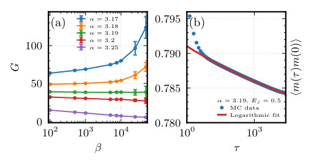 
FIG. 2. Scaling function G as a function of β for different values of α (s = 1). G turns out to be independent of β at α ≈3.19 (a). Correlation function ⟨m(τ)m(0)⟩(blue dots) and logarithmic fit 0.7609(5) + 1.03(4)/(ln τ + 34.2(8)) (red line) as functions of τ (in units of ℏ/EC) at α = 3.19 (b).

📷 Fig 2

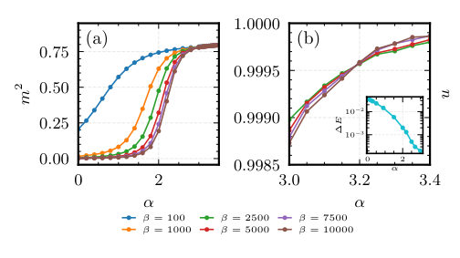 
FIG. 1. Order parameter m2 as a function of α for different values of β (in units of 1/EC), in the Ohmic case (s = 1). The order parameter becomes non-zero as the coupling α is increased (a). Binder cumulant u for the same values of β, showing a scale-invariant crossing at αc ≈3.2 (b). Inset: Bandwidth ∆E as a function of α, obtained via DMRG.

📷 Fig 3

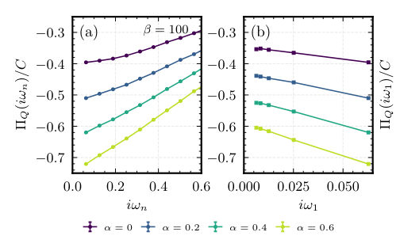 
FIG. 3. (a) Normalized charge-charge correlation function ΠQ(iωn)/C (with C = ⟨k⟩) versus Matsubara frequency iωn at inverse temperature βEC = 100 for various α. (b) The same normalized function evaluated at the first Matsubara frequency, iω1 = 2π/β (in units of EC/ℏ), versus iω1 for different α. For α &lt; αc, the ratio does not converge to −1, implying a non-vanishing DQ also for α ̸= 0.

📷 Fig 4

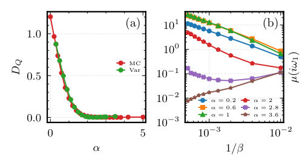 
FIG. 4. Singular contribution DQ (in units of e2/EC) to the response function µ(ω) as a function of α at β = 100 (in units of 1/EC), computed via Monte Carlo (red dots) and variational approach (green dots) (a). Dimensionless mobility µ(iω1) at first imaginary frequency as a function of 1/β (b).

📷 Fig 5

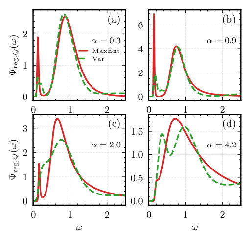 
FIG. 5. Analytic reconstruction of the regular part of the response function Ψreg,Q (in units of e2ℏ/E2 C) at β = 100 (in units of 1/EC) as a function of the frequency ω (in units of EC/ℏ). Red (green) curves show the results obtained via MaxEnt algorithm (variational approach [43]).

**Summary.** This paper analyzes the quantum phase transition in a Josephson junction by studying its response to different levels of environmental dissipation. It demonstrates that the transition is governed by the dissipation regime, showing a BKT transition in the Ohmic case. Crucially, it reveals a ballistic-to-localized dynamic crossover, challenging simple diffusive models of quantum tunneling.

**Why it may be interesting.** The work provides a detailed theoretical understanding of how environmental coupling (dissipation) fundamentally alters the nature of quantum phase transitions in superconducting circuits, linking equilibrium critical points to measurable transport dynamics.

Detailed structure

**Main problem.** The study investigates how quantum phase fluctuations and quasiparticle tunneling dictate the behavior of a Josephson junction across various dissipation regimes, aiming to pinpoint the signature of a Quantum Phase Transition (QPT).

**Main result.** The system exhibits a Berezinskii-Kosterlitz-Thouless (BKT) QPT in the Ohmic regime, while the dynamics show a ballistic-to-localized crossover, contradicting standard diffusive predictions.

**Method.** The research employs advanced numerical techniques, including Worldline Monte Carlo (WLMC), Density-Matrix Renormalization Group (DMRG), and real-frequency linear-response calculations.

**Model / system.** The physical system is a small-capacitance Josephson junction, modeled using an effective imaginary-time action incorporating charging energy, Josephson coupling, and dissipation characterized by a memory kernel.

**Key observables.** Order parameter ($m_2$), Binder cumulant ($u$), phase particle mobility ($\mu$), and the Drude weight ($D_Q$).

**Important parameters / regimes.** Dissipation exponent ($s$) defining Ohmic ($s=1$), sub-Ohmic ($s<1$), and super-Ohmic ($s>1$) regimes; coupling strength ($\alpha$).

**Assumptions / limitations.** The analysis relies on mapping the low-energy dynamics to the spin-boson model and comparing results against the Caldeira-Leggett (CL) model.

**Figures summary.** Figures confirm the QPT via Binder cumulant crossings ($\alpha_c \approx 3.2$) and show the collapse of the bandwidth ($\Delta E$) as the transition is approached.

**Paper structure.** The paper systematically analyzes the system across different dissipation regimes, first establishing the QPT signature using equilibrium methods, then detailing the dynamical crossover in the Ohmic regime, and finally comparing the results against established theoretical models like the spin-boson and polaronic models.

Abstract

Using state-of-the-art numerical techniques, we investigate how quantum phase fluctuations and quasiparticle tunneling shape the behavior of a small-capacitance Josephson junction across Ohmic, sub-Ohmic, and super-Ohmic dissipation regimes. We show that increasing the Ohmic dissipation strength drives a Berezinskii-Kosterlitz-Thouless quantum phase transition at thermodynamic equilibrium. Deviations from Ohmic behavior profoundly alter this scenario: the super-Ohmic regime exhibits no phase transition, whereas the sub-Ohmic regime displays a continuous second-order transition, consistent with the universality classes of the spin-boson model. Within the Ohmic regime, real-frequency linear-response calculations reveal that the phase particle does not undergo the commonly assumed diffusive-to-localized crossover. Instead, finite resistance progressively suppresses the singular zero-frequency response, producing a ballistic-to-localized change in the dynamics. At finite frequencies, coupling to the environment generates a long-lived excitation in the charge response, which evolves into a resonance as the subgap and shunt resistances are reduced.

[↑ back to top](#top)

### ⭐ [A priori Assessment of Tensor-Network Encoding for Isotropic Turbulent Flows](http://arxiv.org/abs/2608.28869v1)

**Highlighted author(s):** Andrew J. Daley  
**Authors:** Massen Esmaeili, Hirad Alipanah, Robert Pinkston, Peyman Givi, Daniel Livescu, Andrew J. Daley, Dieter Jaksch, Juan José Mendoza-Arenas  
**Type:** theory · **Category:** numerical methods · **PDF:** <https://arxiv.org/pdf/2608.28869v1>  
**Analysis basis:** full PDF text, analyzed in chunks
**Topic relevance:** `methods for driven-dissipative` **3/5** · `Keldysh / 2PI / non-Gaussian methods` **1/5** · `analog quantum simulation` **1/5**

📷 Fig 1

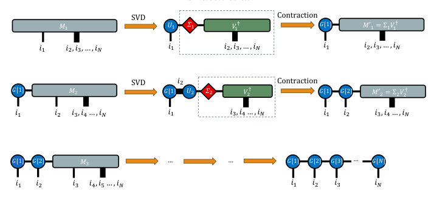 
Figure 1. Schematic of the iterative MPS construction consisting of repeated cycles of SVD, contraction, and reshaping.

📷 Fig 2

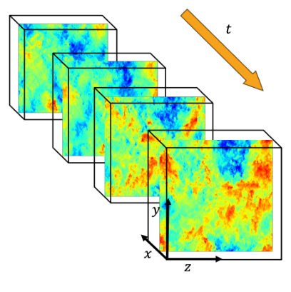 
Figure 3. Contours of the 𝑢-velocity component from the isotropic turbulence dataset (Li et al. 2008a).

📷 Fig 3

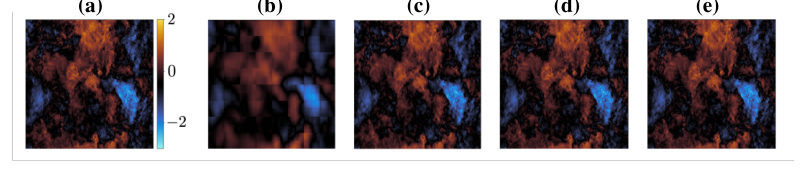 
Figure 4. Contour plot of 𝑢-velocity in the 𝑥𝑦-plane at 𝑧= 𝜋. Left to right: the original DNS field (a) and MPS reconstructions for cutoffs 10−𝐶with 𝐶=2 to 5 (b–e).

📷 Fig 4

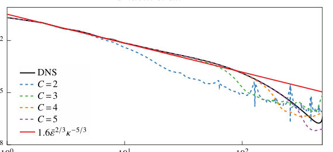 
Figure 5. Energy spectrum comparison between DNS and MPS-reconstructed data for 𝐶=2 to 5. The red line shows the Kolmogorov inertial-range scaling.

📷 Fig 5

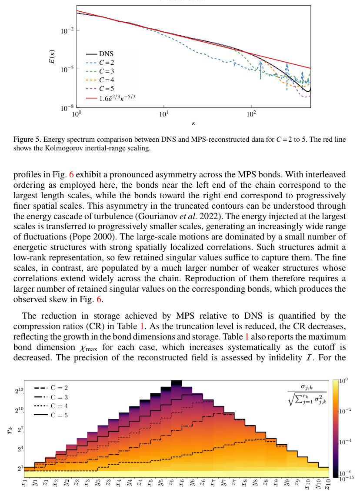 
Figure 6. Schmidt spectrum for the 𝑢velocity using the interleaved ordering scheme. For each truncation level 𝐶, the maximum height of the corresponding contour line (i.e. the largest value of 𝜒𝑘across all bonds) gives the maximum retained bond dimension 𝜒max reported in Table 1.

**Summary.** This work demonstrates that Matrix Product States (MPS) provide a highly effective and memory-efficient reduced-order modeling framework for complex, high-dimensional data like turbulent fluid fields. By systematically compressing the data using SVDs, the authors achieve near-DNS fidelity for key physical quantities while drastically reducing memory requirements. This validates TN methods for applying to complex classical physics problems beyond traditional quantum many-body simulations.

**Why it may be interesting.** While focused on fluid dynamics, the methodology—using TNs to compress high-dimensional data by exploiting underlying correlation structures—is directly transferable to approximating quantum many-body wavefunctions or correlation functions in complex quantum systems.

Detailed structure

**Main problem.** The paper assesses the suitability of Tensor-Network (TN) encoding, specifically the Matrix Product State (MPS) ansatz, for creating scalable, reduced-order models of high-dimensional fields, particularly complex turbulent flows.

**Main result.** MPS reconstructions achieve high fidelity for key observables—like total kinetic energy and scalar energy—using significantly less memory (e.g., 5% for velocity) compared to full Direct Numerical Simulation (DNS) data.

**Method.** The core method involves encoding the high-dimensional field tensor into an MPS via sequential Singular Value Decompositions (SVDs) and discarding small singular values to achieve compression.

**Model / system.** The study analyzes isotropic turbulent flows, including the incompressible velocity field and a conserved passive Fickian scalar, using data from DNS simulations.

**Key observables.** Fidelity of reconstructed fields, total kinetic energy, scalar energy, velocity gradients, dissipation rates ($\epsilon, \epsilon_\phi$), and structure functions.

**Important parameters / regimes.** Bond dimensions ($\chi_k$), compression ratio (CR), and the truncation cutoff ($10^{-C}$).

**Assumptions / limitations.** The dominant correlations in the turbulent field can be systematically captured by factorizing the field into a chain of interconnected tensors (the MPS ansatz).

**Figures summary.** Figures illustrate the MPS construction process via SVD, the optimal interleaved tensor ordering, and comparisons of reconstructed fields/statistics (e.g., PDFs of invariants) against DNS results.

**Paper structure.** The paper systematically assesses the compression-accuracy trade-off by applying the MPS encoding to both velocity and scalar fields, analyzing low-order statistics, gradient invariants, and scaling laws.

Abstract

Tensor networks (TNs), originally developed for simulating many-body quantum systems, provide a systematic framework for approximating high-dimensional fields. This is achieved by factorizing the field into interconnected tensors with small bond dimensions, thereby restricting the correlations captured across field bipartitions. Belonging to the family of TNs, the matrix product state (MPS) ansatz is utilized here as a reduced-order modeling framework to construct truncated representations of isotropic turbulent flow data. Two direct numerical simulation (DNS) datasets are considered: the hydrodynamic field of an incompressible three-dimensional flow, and a conserved Fickian scalar in a similar flow. Each field is encoded as an MPS through a sequence of singular value decompositions (SVDs) in which small singular values are discarded. The truncated representation is contracted back to the full grid, and the resulting reconstructed field is compared against DNS. An interleaved ordering of the spatial tensor indices of the transport variables is applied prior to decomposition in order to localize the dominant inter-tensor correlations. Velocity reconstructions achieve $99.8\%$ fidelity using only $5\%$ of the original DNS memory, while the scalar field reaches the same fidelity at $15\%$ memory usage. A wide range of lower- and higher-order statistics, including velocity gradients, dissipation, and structure functions, are systematically examined. At these compression levels, the total kinetic energy and the scalar energy are both recovered within $0.2\%$ relative error, while the mean dissipation and mean scalar dissipation remain within approximately $10\%$ of the DNS generated values. These findings support the suitability of MPS for scalable reduced-order analysis of complex turbulent datasets and motivate further exploration of TN-based methods in computational turbulence.

[↑ back to top](#top)

### ⭐ [Direct Evidence of Unconventional Superconductivity in Doped Kagome system RV$_3$Sb$_5$](http://arxiv.org/abs/2608.28848v1)

**Highlighted author(s):** Jörg Schmalian  
**Authors:** Avior Almoalem, Yuqing Xing, Iksu Jang, Daniel J. Schultz, Grgur Palle, Andrea N. Capa Salinas, Stephen D. Wilson, Rafael M. Fernandes, Jörg Schmalian, Vidya Madhavan  
**Type:** experiment · **Category:** strongly correlated electrons · **PDF:** <https://arxiv.org/pdf/2608.28848v1>  
**Analysis basis:** full PDF text, analyzed in chunks
**Topic relevance:** `quantum measurements` **2/5**

📷 Fig 1

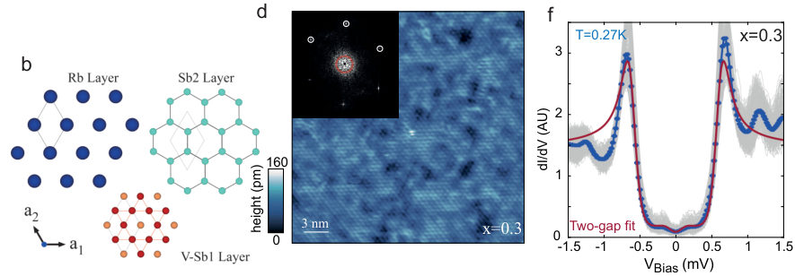 
Fig. 1 Crystal structure, topography, and superconducting spectroscopy of Sn-doped RbV3Sb5−xSnx. a Crystal structure of RbV3Sb5. b Top view of the crystal structure showing the triangular Rb layer (blue), Sb honeycomb layer (cyan), and V–Sb kagome layer (red and brown). c STM topography of RbV3Sb4.94Sn0.06 after removal of surface Rb adatoms, exposing the Sb honeycomb lattice and isolated Sn dopants (35×35 nm2, VS = −20 mV, It = 200 pA). Inset: Fourier transform showing Bragg peaks (white circles), CDW peaks (cyan squares), and Friedel oscillations arising from surface scatterers. d STM topography of RbV3Sb4.7Sn0.3 (32×32 nm2, VS = 10 mV, It = 100 pA). The CDW peaks are absent, while the...

📷 Fig 2

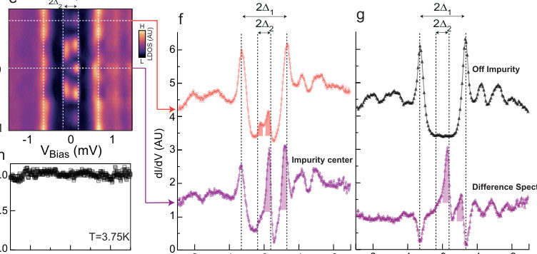 
Fig. 2 Spatial and spectroscopic characteristics of type-I Imp-BS. a STM topography of the Sb honeycomb lattice in the vicinity of a type-I state. No structural defects are resolved at the bound-state center (white dot), indicating that the impurity resides beneath the terminating Sb layer. The white square marks the region shown in panels b-d (VS = −3 V, It = 5 nA). b,c Differential conductance maps acquired at ±120 µeV, corresponding to the dominant impurity-induced states. Pronounced spatial oscillations and a clear reduction of the native sixfold rotational symmetry are observed. The white arrow indicates the line cut shown in panel e (VS = −3 mV, It = 150 pA, Vmod = 30 µV). d...

📷 Fig 3

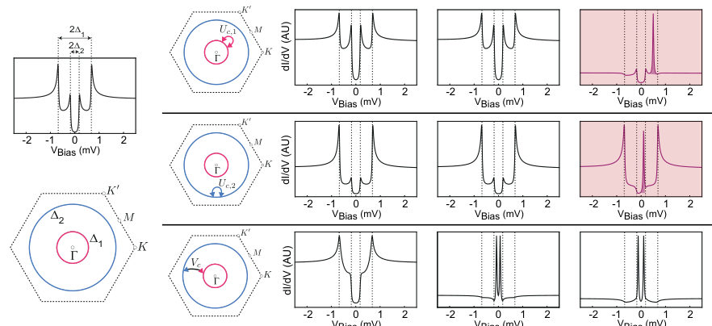 
Fig. 3 Theoretical response of candidate superconducting pairing symmetries to a nonmagnetic impurity. a Density of states obtained from the model calculations without impurity, together with the corresponding multiband Fermi surface. The larger superconducting gap, ∆1, is assigned to the Sb-derived Γ pocket, whereas the smaller gap, ∆2, resides on the V-derived Fermi-surface sheets, consistent with the experimental observations. b Calculated local density of states at the impurity center for the candidate pairing symmetries and nonmagnetic scattering channels indicated in the left column. The highlighted panels correspond to the only pairing states that reproduce the key experimental...

📷 Fig 4

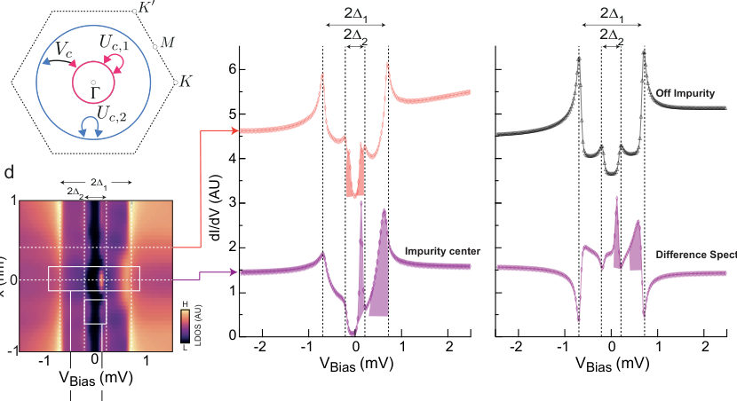 
Fig. 4 Microscopic calculation of the type-I impurity-induced state using a nonmagnetic scattering poten- tial. a Schematic of the impurity-scattering processes included in the calculation. Both intraband and interband charge scattering are incorporated. b Calculated local density of states at the impurity center (purple) and away from it (orange), corresponding to the horizontal dashed lines in panel d. The calculation reproduces the pronounced particle-hole asymmetry at the impurity center and the gradual recovery of particle-hole symmetry with increasing distance observed experimen- tally. Black dashed lines indicate the superconducting gap energies ∆1 and ∆2. c Pristine local density of...

📷 Fig 5

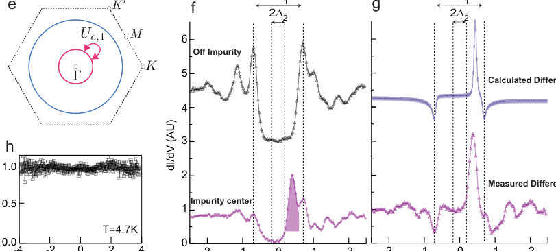 
Fig. 5 Spatial and spectroscopic characteristics of the type-II Imp-BS. a STM topography of the Sb honeycomb lattice in the vicinity of a type-II state. No structural defects are resolved at the impurity center (white dot), indicating that the defect resides beneath the terminating Sb layer (VS = −3 V, It = 5 nA). b-d Differential conductance maps acquired at ±420 µeV, corresponding to the Imp-BS, and at the Fermi level. The spatial scale bar is identical for panels b-d, which were acquired simultaneously. Unlike the type-I state, the type-II state exhibits no pronounced spatial oscillations, although the maximal particle-hole asymmetry remains localized at the impurity center. Furthermore,...

**Summary.** This work uses STM spectroscopy on doped kagome metal RbV3Sb5 to investigate its superconducting pairing symmetry. By analyzing impurity-induced bound states and observing a two-gap structure, the authors rule out simple s-wave pairing. They provide strong evidence that the material realizes a fully gapped chiral superconducting state.

**Why it may be interesting.** The use of impurity-bound state spectroscopy as a powerful, phase-sensitive probe for unconventional superconductivity provides a concrete experimental methodology applicable to strongly correlated materials.

Detailed structure

**Main problem.** Determining the superconducting pairing symmetry of kagome metals, which is a central unresolved question in the field.

**Main result.** The superconducting state in optimally doped RbV3Sb5 is strongly evidenced to be a fully gapped chiral superconducting state, inconsistent with conventional s-wave or s+- pairing.

**Method.** The study employs impurity-bound state spectroscopy using Scanning Tunneling Microscopy (STM) to probe the superconducting order parameter phase sensitivity.

**Model / system.** The system is the doped Kagome metal RbV3Sb5, analyzed using a two-gap model derived from a minimal two-band Hamiltonian describing Sb- and V-derived Fermi pockets.

**Key observables.** Pronounced particle-hole asymmetric bound states around nonmagnetic defects, two distinct superconducting energy gaps (680 $\mu$eV and 180 $\mu$eV), and vanishing QPI signal at the Fermi level.

**Important parameters / regimes.** Optimal doping level (suppressing CDW), low temperature (270 mK), and the two distinct energy scales ($\Delta_1, \Delta_2$).

**Assumptions / limitations.** The analysis assumes that the observed impurity-bound states are sensitive enough to distinguish between different pairing symmetries, and that the two-gap structure is robustly linked to the two electronic bands.

**Figures summary.** Figures show STM topography, superconducting spectroscopy ($	ext{d}I/	ext{d}V$ maps) revealing two gaps, and QPI analysis confirming the two-gap structure and the vanishing gap at zero energy.

**Paper structure.** The paper systematically uses STM spectroscopy to first establish the two-gap nature of the superconductor, then uses theoretical calculations to rule out conventional symmetries, culminating in the identification of a chiral order parameter.

Abstract

The superconducting pairing symmetry of kagome metals remains a central unresolved question largely because phase-sensitive experiments capable of distinguishing between different possible order parameters have been difficult to implement. The spatial and energetic characteristics of impurity bound states measured by spectroscopic-imaging scanning tunneling microscopy encode information on the superconducting order parameter. Here, we use impurity-bound state spectroscopy to investigate optimally doped RbV$_3$Sb$_{5}$ where the charge-density wave instability is fully suppressed. We find that the superconducting state is fully gapped and exhibits two distinct energy scales, consistent with a multiband order parameter. Atomic-scale spectroscopy around nonmagnetic defects reveals pronounced particle-hole asymmetric bound states. Comparison with theoretical calculations demonstrates that these bound states are incompatible with conventional $s$-wave and sign-changing $s^{\pm}$ pairing. Our calculations also show that the data are fully consistent with a chiral order parameter. Our results establish impurity-bound-state spectroscopy as a powerful phase-sensitive probe of superconductivity in kagome materials and provide strong evidence that optimally doped RbV$_3$Sb$_{5}$ realizes a fully gapped chiral superconducting state.

[↑ back to top](#top)

### ⭐ [Cycle-Structure Generating Functions for Special Breakpoint Graphs](http://arxiv.org/abs/2608.30764v1)

**Highlighted author(s):** Alexey V. Gorshkov  
**Authors:** Max A. Alekseyev, Joseph T. Iosue, Adam Ehrenberg, Alexey V. Gorshkov  
**Type:** theory · **Category:** other · **PDF:** <https://arxiv.org/pdf/2608.30764v1>  
**Analysis basis:** full PDF text, analyzed in chunks

📷 Fig 1

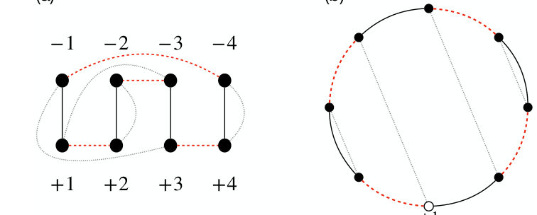 
Figure 1: An example of graph representations of a permutation τ = (3, 2, 1, 4) with n = 2. (a) The corresponding special breakpoint graph. (b) The same graph with the black-red cycle drawn as a circle and gray edges drawn as chords. The marked vertex +1 is the root and determines the remaining labels. This example is noncrossing.

📷 Fig 2

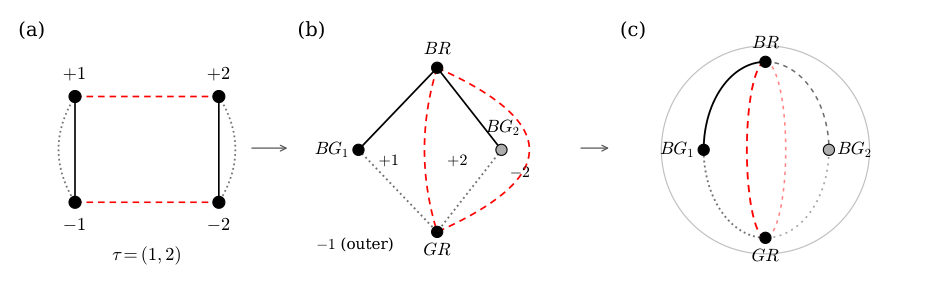 
Figure 2: The canonical-surface construction in the smallest spherical example. (a) The special breakpoint graph for n = 1 and τ = (1, 2). The gray matching coincides with the black matching and is drawn by offset dotted arcs so that both colors remain visible. (b) The 1-skeleton of the associated four-face triangulation, drawn as a planar map; the region marked −1 is the outer face. Its vertices BG1, BG2, BR, GR correspond to the bicolored cycles, while its four triangular faces +1, +2, −1, −2 correspond to the four vertices of the breakpoint graph. In particular, each red side joins BR to GR. (c) The same triangulation realized on S2. All colored arcs lie on the sphere; dark arcs lie on...

📷 Fig 3

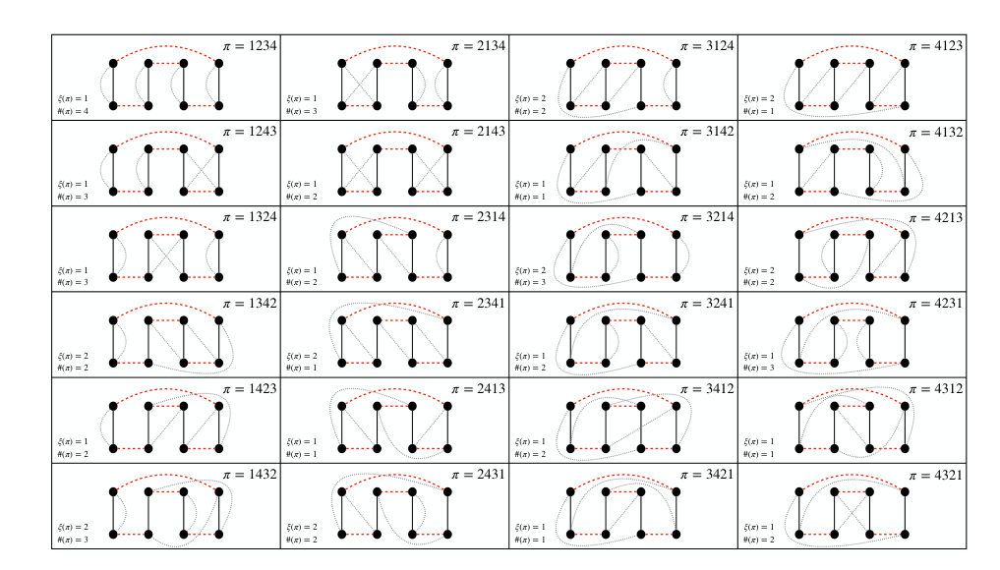 
Figure 3: Example for n = 2 (so 2n = 4). The 24 diagrams are the breakpoint graphs associated with the permutations π ∈S4 (here written in one-line notation). ξ(π) denotes the number of gray-red cycles. #(π), the number of cycles of the permutation, is the number of black-gray cycles.

📷 Fig 4

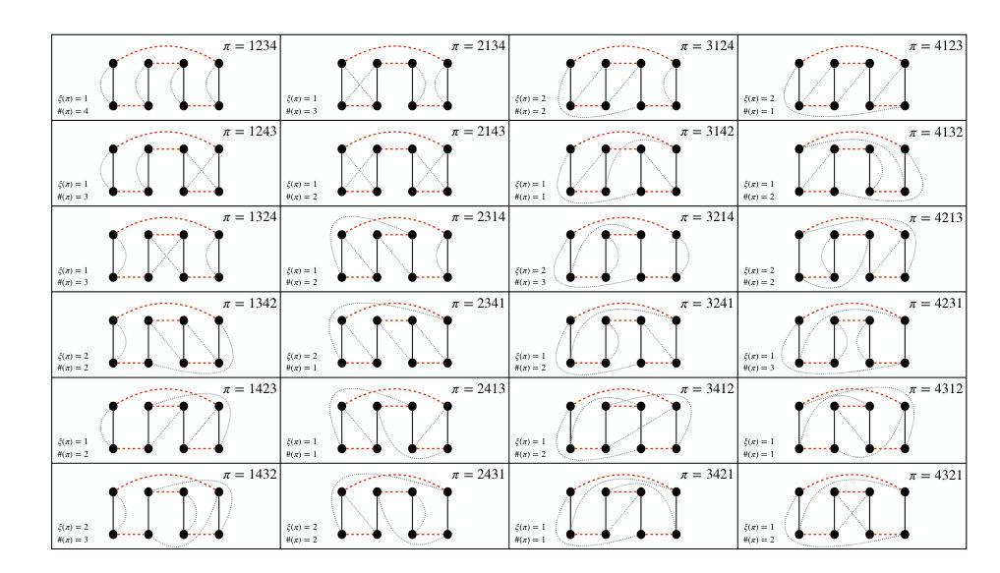 
Figure 3 illustrates this dictionary for all permutations in S4, displaying ξ(π) and #(π) alongside their breakpoint graphs. This permutation-theoretic form is particularly convenient for the fixed- support arguments later in Section 4, while Proposition 1 gives the same parameter its topological meaning.

📷 Fig 5

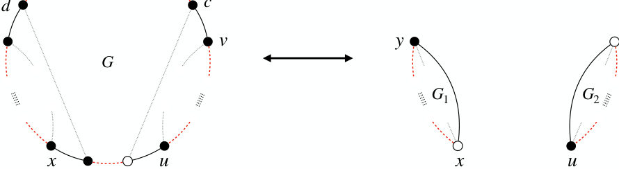 
Figure 4: A bijective transformation of (a) a noncrossing special breakpoint graph of order 4n rooted at vertex a into (b) three noncrossing special breakpoint graphs rooted at vertices x, v, w and the total order 4(n −1).

**Summary.** This paper develops advanced combinatorial methods using cycle-structure generating functions for special breakpoint graphs, linking them to topological surfaces like the sphere and projective plane. Crucially, it shows that the combinatorial results derived from these graphs provide the exact moment polynomials needed to calculate the Rényi entropy expansion for entanglement in random Gaussian quantum states.

**Why it may be interesting.** The connection between deep combinatorial structures (graph theory, permutation statistics) and fundamental quantities in quantum information theory (entanglement entropy) provides a powerful, non-obvious mathematical underpinning for physics results.

Detailed structure

**Main problem.** The paper develops intrinsic combinatorics and multivariate generating functions for a constrained class of graphs called 'special breakpoint graphs.' It connects these graph structures to topological invariants like the Euler characteristic.

**Main result.** The combinatorial results yield explicit Catalan-weighted evaluations and determine the leading and constant moment polynomials for the Rényi entropy expansion of random Gaussian states in linear optics.

**Method.** The authors use the construction of a canonical surface associated with the graph to classify strata ($\kappa=1$ for $S^2$, $\kappa=0$ for $\mathbb{RP}^2$) and derive recursive relations for the corresponding generating functions.

**Model / system.** The primary model is the 'special breakpoint graph,' which originates in comparative genomics and encodes relationships between genomes via alternating cycles formed by three perfect matchings. A secondary application involves the entanglement entropy of random Gaussian states in linear optics.

**Key observables.** The stratum parameter $\kappa$, the Euler characteristic $\chi(\Sigma_G)$, and the moment polynomials ($G_\ell(r)$ and $H_\ell(r)$) for the Rényi entropy expansion.

**Important parameters / regimes.** The graph size parameter $n$, and the topological invariants $\kappa$ (which determines the surface type, e.g., $S^2$ or $\mathbb{RP}^2$).

**Assumptions / limitations.** The analysis relies on the equivalence between polygon-gluing and colored-triangulation descriptions, and the focus is initially restricted to the two extremal strata ($\kappa=1$ and $\kappa=0$).

**Figures summary.** Figures illustrate the graph structure and the canonical surface construction for small examples, showing realizations on the sphere ($S^2$) for the spherical family.

**Paper structure.** The paper first establishes the combinatorial and topological framework for the graphs, deriving generating functions for the $\kappa=1$ (spherical) and $\kappa=0$ (projective plane) families. It then applies these combinatorial results to derive the leading and constant moment polynomials for the Rényi entropy expansion in quantum optics. Finally, it discusses extending the analysis to lower strata ($\kappa < 0$).

Abstract

Breakpoint graphs originate in comparative genomics, where their alternating cycles encode relationships between genomes. We study a constrained class of three-colored breakpoint graphs associated with permutations and develop cycle-refined generating functions for two extremal families. These families have a natural topological interpretation: their canonical surfaces are, respectively, the sphere and the projective plane. The spherical family is characterized by noncrossing configurations, while the projective-plane family admits a different decomposition involving a distinguished family of Möbius ladders.   The resulting generating-function equations retain the full cycle structure but nevertheless admit substantial reductions. This leads to explicit Catalan-weighted evaluations, polynomiality results for refined cycle statistics, and a connection between a natural diagonal specialization and noncrossing trees. The two topological families exhibit markedly different combinatorial mechanisms, providing complementary examples of how local transformations of breakpoint graphs can control refined permutation enumerations.   As a further application, the same Catalan-weighted sums arise in asymptotic unitary-Weingarten expansions for entanglement of random Gaussian states in linear optics. The combinatorial results determine the leading and constant-order moment polynomials entering the Rényi entropy expansion, with the projective-plane contribution giving the finite-size constant correction.

[↑ back to top](#top)

### [Dark state as a measurable state by a dispersive readout without a Purcell limit](http://arxiv.org/abs/2608.29811v1)

**Authors:** Wei-Chen Chien, Jyh-Yang Wang, Yen-Yu Chiang, Cheng-Chengh Huang, Lih-Chieh Hsaio, Yen-Chun Chen, Cen-Shawn Wu, Chiidong Chen, Watson Kuo  
**Type:** experiment · **Category:** other · **PDF:** <https://arxiv.org/pdf/2608.29811v1>  
**Analysis basis:** full PDF text, analyzed in chunks
**Topic relevance:** 🔥 `quantum measurements` **4/5** · `QC/QI experiment` **3/5** · `Tavis-Cummings & cavity-many-emitter` **3/5** · `correlated / nonlocal dissipation` **3/5** · `quantum optics experiment` **3/5** · `analog quantum simulation` **2/5** · `driven-dissipative phase transition` **2/5** · `methods for driven-dissipative` **2/5** · `Keldysh / 2PI / non-Gaussian methods` **1/5**

📷 Fig 1

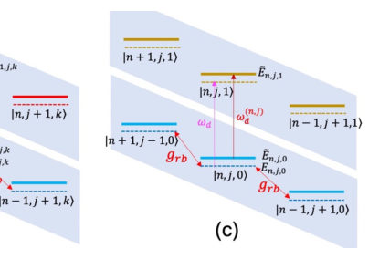 
Fig. 1. (a) The proposed 3-body model. (b) The light-blue shaded regions denote

📷 Fig 2

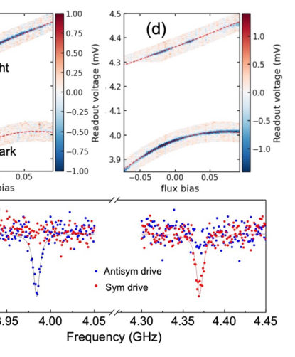 
Fig. 1 (a) A photograph of two capacitively coupled X-mon qubits symmetrically coupled to a readout resonator(R). (b) Enlarged picture of the X-mons. (c)(d) Coupled

📷 Fig 3

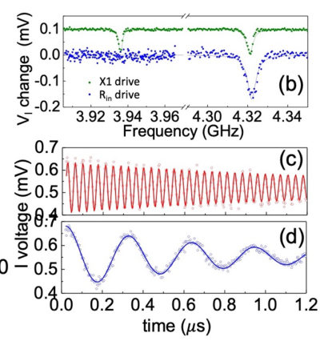 
Fig. 3 (a) Histograms of T1 for bright(red) and dark states(blue) (b) Spectrum of the bright and dark states with a long driving tone applied from X1 gate(green) and Rin line(blue). The green curve is shifted vertically for clarity. (c) The time Rabi oscillations of bright state driving from Rin line. (d) The time Rabi oscillations of dark

📷 Fig 4

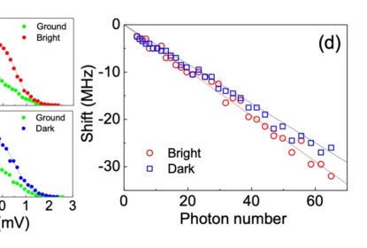 
Fig. 4 (a) The IQ plots for 100 × averaged readout for the states prepared at

**Summary.** This paper proposes and experimentally demonstrates a 'dark mode' in a coupled superconducting qubit system that circumvents the Purcell decay limit inherent in high-coupling regimes. By utilizing a specific ZZ-type interaction, the dark state achieves near-zero radiative loss while remaining distinctly measurable via dispersive readout techniques. This breakthrough paves the way for building more robust and scalable quantum hardware.

**Why it may be interesting.** This work provides a concrete, experimentally realized mechanism to engineer quantum states that are robust against environmental decoherence (Purcell loss) while remaining accessible for quantum measurement, which is a major goal in building scalable quantum processors.

Detailed structure

**Main problem.** The paper addresses the trade-off in circuit quantum electrodynamics (cQED) between achieving strong readout coupling and minimizing Purcell decay, which limits qubit lifetime.

**Main result.** The authors demonstrate a measurable 'dark mode' in a coupled quantum system that exhibits zero Purcell loss while maintaining a dispersive shift comparable to the bright state.

**Method.** The study combines theoretical analysis (perturbation theory) with experimental measurements, including two-tone spectroscopy, time-resolved Rabi oscillations, and single-shot readout.

**Model / system.** The system uses two capacitively coupled X-mon qubits coupled to a readout resonator, forming a minimal 3-body model. The physics is analyzed by identifying and characterizing the resulting bright and dark collective modes.

**Key observables.** Dark-state-dependent dispersive shift, suppressed resonator coupling, distinct long coherence times ($T_1$), and measurable AC-Stark shifts.

**Important parameters / regimes.** The experiment operates in the dispersive readout regime (1-2 GHz detuning) with specific coupling strengths ($g/\hbar \approx 53 	ext{ MHz}$; $g_{Q}/\hbar \approx 211 	ext{ MHz}$).

**Assumptions / limitations.** The analysis relies on the Rotating-Wave Approximation (RWA), and the Purcell limit study uses a phenomenological relaxation rate.

**Figures summary.** Figures illustrate the proposed 3-body model, energy repulsion in the RWA manifold, the photon-number-dependent AC Stark shift of the dark mode, and experimental readouts (IQ plots, Rabi oscillations) confirming state distinguishability.

**Paper structure.** The paper first introduces the theoretical model and the problem of Purcell loss. It then details the experimental setup using coupled transmons and proceeds through state characterization, loss measurement, and finally demonstrates the measurable nature of the dark state via dispersive readout.

Abstract

It is believed that the enhancement in qubit-resonator coupling allows a better dispersive readout but introduces greater Purcell loss. In this work, we propose that a dark mode in a coupled quantum system may violate this rule by introducing the ZZ interaction between the dark and a bright mode. The dark mode may exhibit an effective zero coupling strength, and zero Purcell loss with the resonator photons. Nevertheless, the dispersive shift is almost the same as the bright state, due to the higher order perturbation introduced by the higher excited states. Such a state demonstrates the measurability without a Purcell limit in circuit quantum electrodynamics.

[↑ back to top](#top)

### [Engineering multi-photon dissipation with a dc-voltage-biased Josephson junction](http://arxiv.org/abs/2608.31154v1)

**Authors:** Marco Paradina, Ambroise Peugeot, Roberto Negrin, Oscar Novat, Tristan Villain, Anil Murani, Jean-Loup Ville, Sébastien Jezouin, Raphaël Lescanne, Audrey Bienfait, Benjamin Huard  
**Type:** experiment · **Category:** quantum information and computing · **PDF:** <https://arxiv.org/pdf/2608.31154v1>  
**Analysis basis:** full PDF text, analyzed in chunks
**Topic relevance:** 🔥 `QC/QI experiment` **4/5** · `correlated / nonlocal dissipation` **3/5** · `driven-dissipative phase transition` **3/5** · `methods for driven-dissipative` **3/5** · `quantum optics experiment` **3/5** · `quantum measurements` **2/5** · `Keldysh / 2PI / non-Gaussian methods` **1/5** · `Tavis-Cummings & cavity-many-emitter` **1/5** · `analog quantum simulation` **1/5** · `non-equilibrium universality` **1/5**

📷 Fig 1

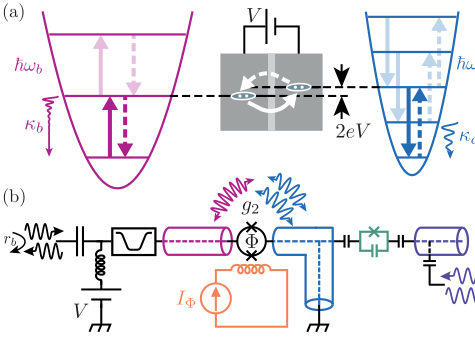 
FIG. 1. (a) Energy levels of memory mode a (blue) and buffer mode b (magenta) coupled to a Josephson junction biased with a voltage V . For 2eV = 2ℏωa −ℏωb, Cooper pair tunnel- ing enables transitions converting a pair of photons of mode a into a single photon of mode b (solid arrows) and back (dashed arrows). (b) Circuit schematic. Memory and buffer are λ/4 resonators coupled to a SQUID, acting as a single junction with a flux tunable Josephson energy EJ(Φ). A stepped impedance filter inhibits memory decay through the buffer line while ensuring a galvanic connection as well as a large coupling rate for the buffer mode. A bias tee allows us to dc- voltage-bias the SQUID and perform RF...

📷 Fig 2

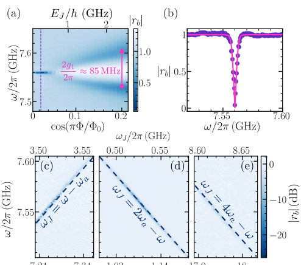 
FIG. 2. (a) Magnitude of the buffer reflection coeffi- cient |rb| versus probe frequency ω and cos(πΦ/Φ0) (equiv- alent EJ(Φ), top axis). The 1-to-1 photon swap is acti- vated by setting 2eV = ℏ(ωb −ωa) = h × 3.52 GHz. As the swap rate g1 ∝| cos(πΦ/Φ0)| increases, the single ab- sorption dip at ωb splits owing to the hybridization of buffer and memory modes. The separation 2g1 reaches 2g1/2π ≈ 85 MHz. (b) Dots: reflection coefficient at critical coupling (cos(πΦ/Φ0) = 0.024 as indicated in (a)). Solid line: fit us- ing an input–output model that includes the residual bias- voltage noise [55], giving g1/2π = 4.8 MHz and a Josephson- frequency linewidth σJ/2π = 1.5 MHz. (c,d,e) |rb| versus...

📷 Fig 3

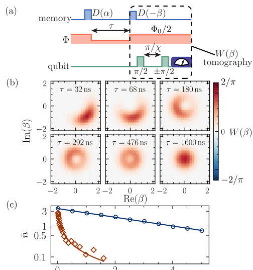 
FIG. 3. (a) Pulse sequence: after preparing the mem- ory in a coherent state |α⟩at flux Φ = Φ0/2 (where EJ is negligible), the flux is pulsed to establish a given EJ for a duration τ. Then a memory Wigner tomography is per- formed at Φ = Φ0/2 using the dispersively coupled trans- mon [62–64]. (b) Measured Wigner function W(β) at in- creasing τ for α = √

📷 Fig 4

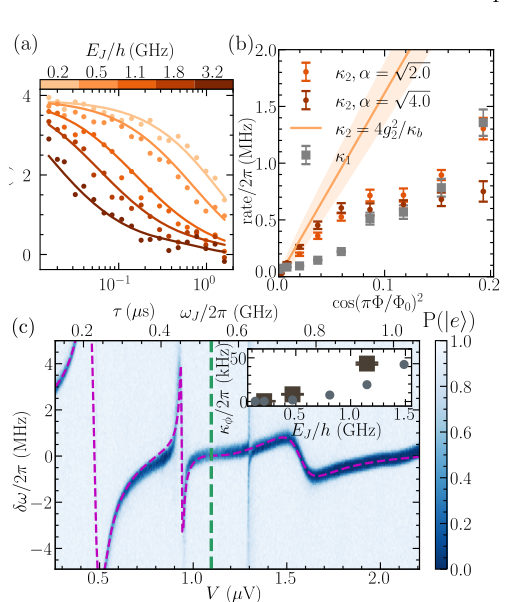 
FIG. 4. (a) Dots: extracted average photon number ¯n as a function of time τ under the same 2-photon dissipa- tion conditions as in Fig. 3b for various values of EJ (col- orbar). Lines: fit to a two-mode model [55] that extracts gmax 2 /2π = 18.5±0.5 MHz. (b) Dots with error bars: Effective two-photon dissipation rate κ2 as a function of EJ extracted from ¯n(τ) using the semiclassical model (Eq. 4) for initial coherent amplitudes α = √

**Summary.** The authors demonstrate a novel method to engineer multi-photon dissipation in superconducting circuits by biasing a SQUID junction with a DC voltage. This technique allows for precise control over photon loss rates, enabling the study of bosonic qubits and providing a robust pathway for stabilizing complex quantum states like cat qubits.

**Why it may be interesting.** This work provides a highly controllable, solid-state platform for implementing engineered dissipation, which is fundamental for building robust quantum memories and stabilizing high-dimensional quantum states like cat qubits.

Detailed structure

**Main problem.** The paper addresses the challenge of engineering multi-photon dissipation, a crucial resource for bosonic qubits, by developing a method that avoids spurious nonlinear terms present in standard parametric pumping techniques.

**Main result.** They successfully demonstrated that using a dc-voltage-biased SQUID can engineer controlled single- and two-photon loss, and activate up to 4-to-1 photon swaps, proving it is a viable route for reservoir engineering and cat-qubit stabilization.

**Method.** The research combines microwave reflectometry to characterize coupling strengths and voltage sweeping to activate specific photon conversion processes, complemented by Wigner tomography to measure the time evolution of the quantum state.

**Model / system.** The physical system is a superconducting circuit comprising a high-Q memory resonator coupled to a buffer resonator via a dc-voltage-biased SQUID. The dynamics are modeled using a Josephson Hamiltonian and analyzed via a master equation incorporating dissipation terms.

**Key observables.** Two-photon dissipation rate ($\kappa_2$), single-photon loss rate ($\kappa_a$), photon number decay $ar{n}(	au)$, and the Wigner function $W(eta)$.

**Important parameters / regimes.** The engineered dissipation rate $\kappa_2$ is proportional to the buffer loss rate $\kappa_b$; the coupling strength $g_{	ext{max}}^2/2\pi$ was measured to be $18.5 \pm 0.5$ MHz.

**Assumptions / limitations.** The analysis relies on adiabatically eliminating the buffer mode and assumes that parasitic nonlinear terms average out to zero at first order in the rotating wave approximation.

**Figures summary.** Figures illustrate energy level diagrams showing photon conversion, circuit schematics, and time-domain plots ($ar{n}(	au)$) comparing decay under different loss mechanisms (e.g., 1-photon vs. 2-photon loss).

**Paper structure.** The paper progresses from establishing the physical platform and the theoretical advantage of the dc-bias method, to characterizing various photon swap regimes (1-to-1, 2-to-1, 4-to-1) via reflectometry, and finally quantifying the dissipation dynamics using time-resolved Wigner tomography.

Abstract

Multi-photon dissipation -- a key resource for bosonic qubits -- is usually realized by parametrically pumping a Josephson coupler at the cost of spurious nonlinear terms. Here we instead engineer it using a dc-voltage-biased SQUID, such that these parasitic terms average out. We activate the conversion of one, two, or four photons of a high-Q mode into a single photon of a lossy mode. We characterize the two-photon dissipation by Wigner tomography, establishing dc-biased junctions as a resource for reservoir engineering and a viable route to cat-qubit stabilization.

[↑ back to top](#top)

### [Demonstration of traveling-wave interactions between spontaneous photon emissions and atoms in a chiral F-P cavity](http://arxiv.org/abs/2608.29515v1)

**Authors:** Jiajin Lu, Minjie Wang, Haole Jiao, Xiang Chen, Hongze Zhang, Shujing Li, Hai Wang  
**Type:** experiment · **Category:** other · **PDF:** <https://arxiv.org/pdf/2608.29515v1>  
**Analysis basis:** full PDF text, analyzed in chunks
**Topic relevance:** 🔥 `quantum optics experiment` **4/5** · `Tavis-Cummings & cavity-many-emitter` **3/5** · `analog quantum simulation` **3/5** · `correlated / nonlocal dissipation` **3/5** · `driven-dissipative phase transition` **2/5** · `interference shaping light` **2/5** · `QC/QI experiment` **1/5** · `methods for driven-dissipative` **1/5** · `non-equilibrium universality` **1/5** · `quantum measurements` **1/5**

📷 Fig 1

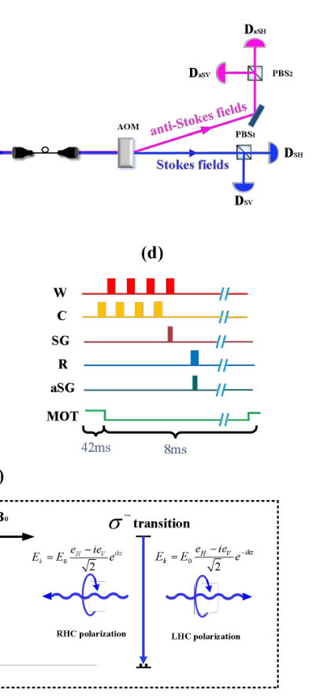 
Fig. 1. Overview of the experiment. (a) Setup for the experiment. W: write laser pulse;

📷 Fig 2

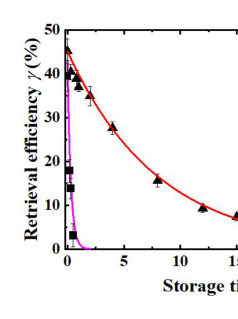 
Figure 2. Measured time-dependent retrieval efficiencies of spin waves correlated with LHCP

**Summary.** This paper experimentally demonstrates traveling-wave atom-light interactions in a chiral Fabry-Pérot cavity, overcoming the limitations of standard standing-wave setups. By breaking time-reversal symmetry and utilizing chirality, the system achieves nonreciprocal coupling, splitting the field into two distinct, long-lived traveling-wave modes. This paves the way for advanced quantum memory applications.

**Why it may be interesting.** This work is highly relevant as it pushes the boundaries of cavity QED by engineering nonreciprocal interactions, which is crucial for building robust quantum memories and quantum repeaters.

Detailed structure

**Main problem.** The study aims to demonstrate and utilize traveling-wave atom-light interactions in a Fabry-Pérot (F-P) cavity, overcoming the limitations imposed by standing-wave coupling.

**Main result.** The researchers successfully demonstrated nonreciprocal, traveling-wave atom-photon interactions by using a chiral F-P cavity, enabling long-lifetime quantum storage.

**Method.** The experiment involves applying a bias magnetic field to break time-reversal symmetry and using a chiral cavity setup to generate and measure correlations between forward and backward propagating Stokes fields.

**Model / system.** The physical system is a chiral F-P cavity coupled to cold $^{87}	ext{Rb}$ atoms. The interaction relies on spontaneous Raman scattering from a circularly polarized atomic transition, which is enhanced and controlled by the cavity geometry.

**Key observables.** Time-dependent retrieval efficiencies of spin waves correlated with forward and backward Stokes fields, and the ratio of V- to H-polarized Stokes fields.

**Important parameters / regimes.** Long-lived memory lifetime ($	ext{8 } \mu	ext{s}$), nonreciprocal coupling ratio ($	ext{S}_{L}/	ext{S}_{R} \approx 20:1$), and the bias magnetic field strength.

**Assumptions / limitations.** The primary assumption is that the chiral cavity structure successfully splits the intracavity field into two distinct, traveling-wave modes (LHCP and RHCP), thereby enforcing nonreciprocity.

**Figures summary.** Figures illustrate the experimental setup components, the relevant atomic transitions for light generation, the time sequence of experimental pulses, and the polarization dependence of the emitted fields along the $\pm z$-axis.

**Paper structure.** The paper progresses by first identifying the limitations of standing-wave cavities, then detailing the mechanism using chirality and magnetic fields to enforce nonreciprocity, and finally presenting measurements confirming the existence and long lifetime of the two distinct traveling-wave modes.

Abstract

The enhancement of atom-photon interactions with F-P cavities provides a suitable platform for studying quantum optics and atomic physics. However, the emission fields in linear F-P cavities are in the standing-wave mode, which leads to non-uniform atom-photon coupling and a short storage lifetime of cavity-enhanced spin-wave quantum storages. This study experimentally demonstrates traveling-wave atom-light interactions in an F-P cavity that can preserve light helicity. First, a bias magnetic field is applied along the z-axis to define the quantization axis, which lifts the Zeeman degeneracy and breaks the time reversal symmetry. Next, non-classically correlated pairs of Stokes photons and spin waves are produced based on the Duan-Lukin-Cirac-Zoller scheme. The Stokes photons initially emitted from a single circularly polarized atomic transition have left-and right-hand circular polarizations when propagating along the +z (forward) and -z (backward) directions, which are preserved in the chiral cavity within the atom-photon interaction region. Thus, when the forward and backward Stokes fields resonate with the cavity, they may interact with the atoms in a traveling-wave manner. This is confirmed by measuring the time-dependent retrieval efficiencies of spin waves correlated with the forward and backward Stokes fields. This work paves the way for demonstrating traveling-wave atom-photon interactions in F-P cavities.

[↑ back to top](#top)

### [Regularization of Vortex Core Size in Photon BECs due to Harmonic Trap: An Analytical Approach](http://arxiv.org/abs/2608.28862v1)

**Authors:** Joshua Krauß, Tabitha Bates, Francisco Ednilson Alves dos Santos, Axel Pelster  
**Type:** theory · **Category:** quantum gases · **PDF:** <https://arxiv.org/pdf/2608.28862v1>  
**Analysis basis:** full PDF text, analyzed in chunks
**Topic relevance:** 🔥 `methods for driven-dissipative` **4/5** · `Keldysh / 2PI / non-Gaussian methods` **3/5** · `analog quantum simulation` **3/5** · `driven-dissipative phase transition` **3/5** · `correlated / nonlocal dissipation` **2/5** · `non-equilibrium universality` **2/5** · `Tavis-Cummings & cavity-many-emitter` **1/5** · `quantum measurements` **1/5**

📷 Fig 1

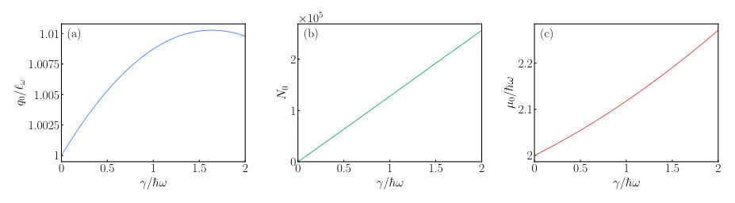 
Figure 1: Projection optimization parameters from Eqs. (14)–(16) for steady-state of vortex solution as function of pumping γ for Γ = 10−4 · ℏ2/m and g = 10−5 · ℏ2/m. Panel (a) shows length scale q0, panel (b) photon number N0, and panel (c) chemical potential µ0.

📷 Fig 2

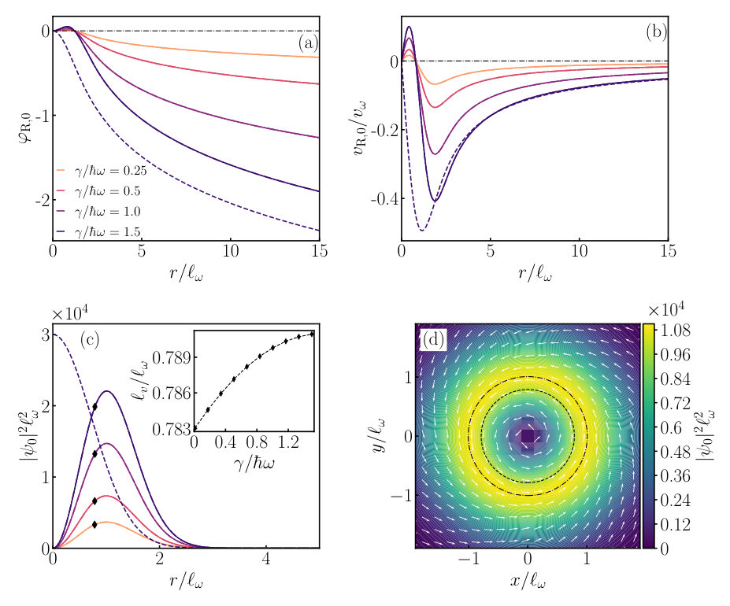 
Figure 2: Panel (a) and (b) show steady-state solution of radial phase and velocity profile according to Eqs. (19) and (20) for different pumping values as well as Γ = 10−4 · ℏ2/m and g = 10−5 · ℏ2/m. In Panel (b) radial velocity profile is given in units of oscillator velocity

📷 Fig 3

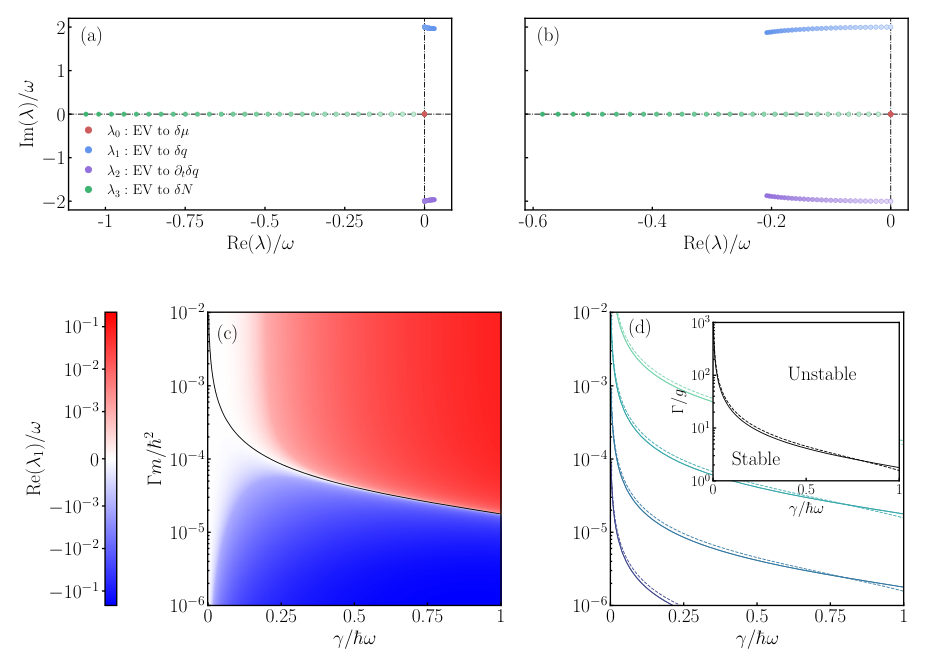 
Figure 3: Panel (a) and (b) show eigenvalues of matrix A as function of pumping strength. Bright colors denote small pumping with smallest value γ/ℏω = 0, whereas strong colors denote large pumping with maximum being γ/ℏω = 1. In both Panels we have g = 10−5·ℏ2/m, whereas in left (right) Panel Γ = 10−3 · ℏ2/m (Γ = 10−7 · ℏ2/m) is used. Panel (c) depicts real part of eigenvalue λ1 in semi-logarithmic scaling for g = 10−5 · ℏ2/m. Black solid line indicates points of vanishing real part. Panel (d) illustrates line of zero real part of eigenvalue λ1 for different interaction strengths; from top to bottom interaction strength values are g = 10−4 · ℏ2/m, 10−5 · ℏ2/m, 10−6 · ℏ2/m, 10−7 · ℏ2/m....

📷 Fig 4

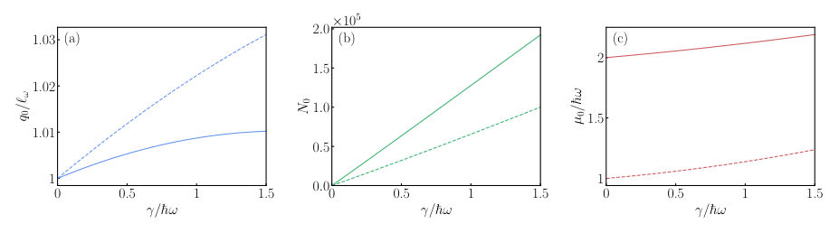 
Figure 4: Vortex-free projection optimization parameters (dashed lines) determined in Eqs. (A.6)–(A.8) and single-vortex optimization parameters following from Eqs. (14)–(16) (solid lines). Evaluated for fixed interaction g = 10−5 · ℏ2/m and losses Γ = 10−4 · ℏ2/m.

📷 Fig 5

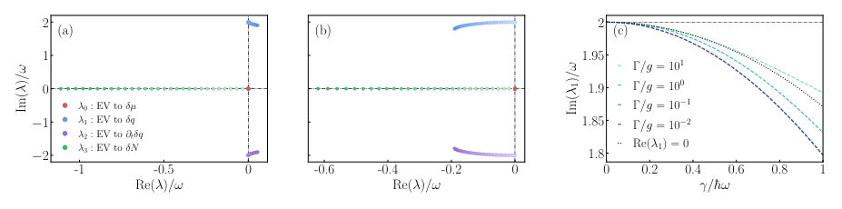 
Figure 5: Panel (a) and (b) show eigenvalues of matrix B as function of pumping strength. Bright colors denote small pumping with smallest value γ/ℏω = 0, whereas strong colors denote large pumping with maximum being γ/ℏω = 1. In both Panels we have g = 10−5 · ℏ2/m, whereas in the left (right) Panel Γ = 10−3 · ℏ2/m (Γ = 10−7 · ℏ2/m) is used. Panel (c) depicts imaginary part of eigenvalue λ1 for different loss-to-interaction rates. The dotted line shows Eq. (A.15) at vanishing Re(λ1).

**Summary.** This paper analytically investigates how harmonic trapping regularizes the unphysical vortex core size in photon BECs. Using the complex Gross-Pitaevskii equation and the projection optimization method, the authors derive physical conditions for vortex stability. The work provides a rigorous framework to distinguish between closed and open-dissipative quantum dynamics.

**Why it may be interesting.** This work is highly relevant as it applies advanced techniques (projection optimization) to model non-equilibrium, open quantum systems, providing physical insights into topological defects (vortices) in quantum optics platforms.

Detailed structure

**Main problem.** The paper addresses the issue of vortex core size regularization in Photon Bose-Einstein Condensates (BECs) where weak interactions cause the healing length to exceed the condensate size in homogeneous systems.

**Main result.** Harmonic confinement regularizes the vortex core size to experimentally achievable scales, and the analysis fundamentally distinguishes between closed and open-dissipative quantum systems.

**Method.** The authors employ the projection optimization method to solve the complex Gross-Pitaevskii equation (cGPE) for open-dissipative systems, followed by linear stability analysis.

**Model / system.** The system models a photon BEC in a dye-filled microcavity, governed by a complex Gross-Pitaevskii equation that includes terms for pumping ($\gamma$) and density-dependent losses ($\Gamma$).

**Key observables.** Vortex core size, radial velocity component ($v_R$), condensate width ($q$), and the breathing mode frequency ($\omega_{breath}$).

**Important parameters / regimes.** Pumping strength ($\gamma$), loss rate ($\Gamma$), interaction strength ($g$), and the harmonic trap frequency ($\omega$).

**Assumptions / limitations.** The analysis relies on the projection optimization method for open-dissipative systems and assumes radial symmetry for the hydrodynamic description.

**Figures summary.** Figures compare projection optimization parameters for vortex-free vs. vortex states, show the stability eigenvalues ($\lambda$) dependence on pumping/loss ratios, and illustrate the spatial separation of gain/loss regions and the sign change of the integrated particle flux.

**Paper structure.** The paper first introduces the cGPE and the projection optimization method to find approximate solutions. It then analyzes the steady-state vortex and vortex-free solutions, followed by a linear stability analysis to determine the system's dynamical regimes and distinguish between open and closed systems.

Abstract

Quantized vortices are a hallmark of superfluidity. However, in a photon Bose--Einstein condensate, the photon-photon interaction is so weak that in a homogeneous system the healing length exceeds the experimentally achievable size of the condensate itself. Here we show that a harmonic confinement regularizes the vortex size to experimentally achievable scales. Moreover, such an external confinement closely resembles the standard experimental setup of a pumped dye-filled microcavity. We model the condensate via a complex Gross--Pitaevskii equation and obtain an approximate dynamical single-vortex solution by applying the recently proposed projection optimization method. The latter generalizes the variational approach of closed systems to open-dissipative systems without assuming a specific form for the condensate phase. The radial photon flow, which is characteristic for driven-dissipative systems, yields a definition of the vortex core size based on the competition of gain and loss. However, this condition reproduces the heuristic closed system definition now based on physical grounds. A subsequent linear stability analysis shows that interaction, as well as pumping and loss can drive the system to an unstable regime. In this way one can fundamentally distinguish between closed and open-dissipative systems.

[↑ back to top](#top)

### [Decay versus dephasing in Rydberg analog optimization: exchange rate, mechanism, and schedule design](http://arxiv.org/abs/2608.29858v1)

**Authors:** Seunghyeon Kim, Junwoo Jung  
**Type:** theory · **Category:** other · **PDF:** <https://arxiv.org/pdf/2608.29858v1>  
**Analysis basis:** full PDF text, analyzed in chunks
**Topic relevance:** 🔥 `Rydberg arrays` **4/5** · `analog quantum simulation` **3/5** · `correlated / nonlocal dissipation` **3/5** · `methods for driven-dissipative` **3/5** · `driven-dissipative phase transition` **2/5** · `Keldysh / 2PI / non-Gaussian methods` **1/5** · `non-equilibrium universality` **1/5** · `quantum measurements` **1/5**

📷 Fig 1

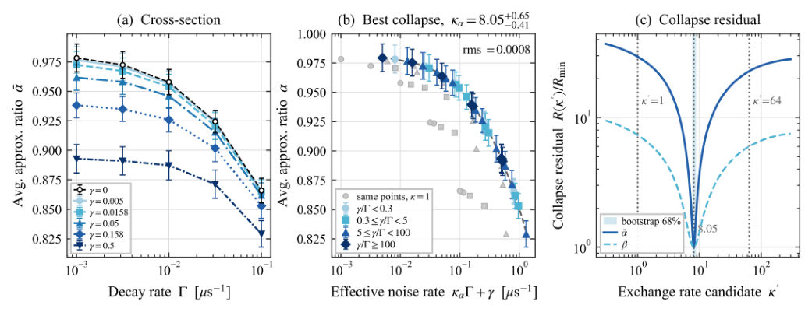 
FIG. 1. The noise map collapses onto u = κΓ + γ. (a) A cross-section of the sweep: ¯α at the per-point optimal annealing time versus the decay rate Γ, at each of the five main-grid dephasing values (light to dark blue) and on the γ = 0 axis (black, open). The curves are nearly parallel on the logarithmic axis, the signature of an additive one-scalar description; the transposed cut (¯α vs γ) is in Appendix C. (b) Data collapse of all 35 points (the 5 × 5 main grid and the two single-channel axes) against u = καΓ+γ at the best fit κα = 8.05+0.65 −0.41: one curve, rms residual 0.0008. Marker shape and shade encode the channel mixture γ/Γ; the gray points are the same data plotted against the...

📷 Fig 2

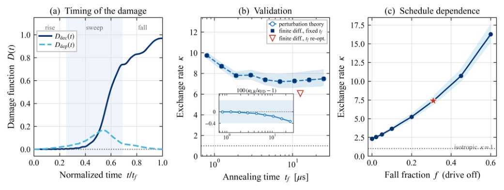 
FIG. 2. Mechanism: when the damage happens, that the calculation is right, and the schedule knob it predicts. (a) The damage functions Ddec(t) and Ddep(t) of Eq. (14), averaged over the 20 production instances at tf = 4.56 µs. Decay damages throughout, maximally at the end (Ddec(tf) = α0); Ddep vanishes to machine precision once the drive is off, identically in the state. The areas are the exposures A and B; κLR = A/B. (b) κ against annealing time: perturbation theory (open circles, bootstrap 68% band) against finite differences of the full solver at the same fixed tf (filled squares); inset, their relative difference, inside 0.4% everywhere. The triangle is the tf-re-optimized finite...

📷 Fig 3

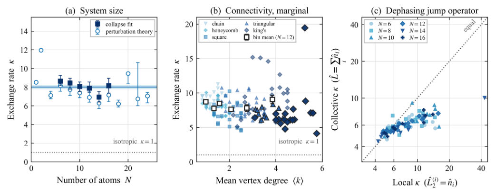 
FIG. 3. Robustness of the exchange rate. One panel per assumption. (a) System size: collapse fits (squares, N = 6–16) against perturbative κ (circles, N = 1–24; the leftmost two are a single atom and a blockaded pair; N = 20 uses the O(Nd) route, which agrees with the matrix route to 3% at N = 18). Band: weighted mean κ = 8.02 ± 0.23, χ2/dof = 1.12. (b) Connectivity, marginal: κ against realized mean degree: diluted lattices at N = 12 (light), dense N = 16–25 lattices (dark edges), bin means (open squares). Flat over the full lever; the conditional analysis behind this flatness is in Appendix D. (c) The dephasing model: local against collective κ per instance, rates matched to the same...

📷 Fig 4

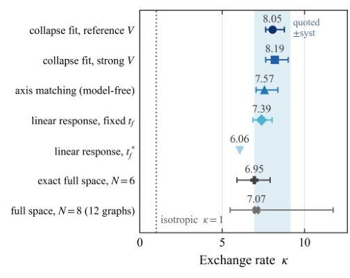 
FIG. 4. Estimator comparison. Independent determina- tions of κ on the production ensemble: collapse fits at two in- teraction strengths, model-free axis matching, linear response at fixed and at re-optimized tf, and the full-space references at N = 6 (exact) and N = 8 (12 graphs, Sec. III C). Error bars: bootstrap 68%; band, the quoted κ = 8.05 ± 1.1 sys- tematic envelope. The spread is the systematic uncertainty of Eq. (18); every estimate is far from κ = 1.

📷 Fig 5

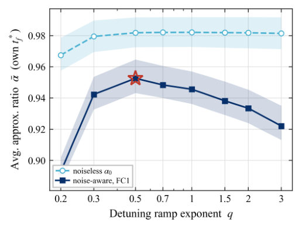 
FIG. 5. The detuning ramp: noise breaks a noise- less near-degeneracy. At the inherited fall, the noise- less α0 (open, dashed) and the FC1 noise-aware prediction α0−AΓ−Bγ (filled) against the sweep exponent q of Eq. (19), each schedule at its own re-optimized t∗ f; bands, bootstrap 68% over the 20 production instances. The noiseless crite- rion is flat to 3 × 10−4 across q = 0.5–1 and cannot choose a ramp; the noise-aware objective selects the interior optimum q = 0.5 (star) in all 400 bootstrap resamples, by a margin twenty times that spread.

**Summary.** This paper rigorously analyzes quantum optimization in Rydberg atom systems by separating spontaneous decay ($\Gamma$) from dephasing ($\gamma$) noise. It demonstrates that the performance degradation scales linearly with a weighted sum of these two rates, $\kappa\Gamma + \gamma$, rather than their simple sum. This finding is vital for developing noise-aware quantum control protocols for trapped-ion and Rydberg quantum processors.

**Why it may be interesting.** This work provides crucial, quantitative guidance for designing noise-resilient quantum algorithms on Rydberg platforms by providing a precise, non-trivial scaling law for decoherence damage.

Detailed structure

**Main problem.** The paper addresses the critical need to distinguish between the effects of spontaneous decay ($\Gamma$) and pure dephasing ($\gamma$) in quantum optimization protocols, rather than treating them as a single combined decoherence rate.

**Main result.** The performance metric collapses onto a linear combination of the two noise rates, $ar{\alpha} \propto \kappa\Gamma + \gamma$, where the coefficient $\kappa$ is protocol-dependent, showing that the simple assumption of $\Gamma + \gamma$ is inaccurate.

**Method.** The authors use numerical simulations across the $(\Gamma, \gamma)$ plane, employing first-order perturbation theory and analyzing the mean approximation ratio ($ar{\alpha}$) derived from the Lindblad master equation.

**Model / system.** The physical system is based on Rydberg atoms used to solve the unit-disk maximum independent set problem via quantum annealing heuristics. Decoherence is modeled using the Lindblad equation incorporating independent channels for decay ($\Gamma$) and dephasing ($\gamma$).

**Key observables.** Mean approximation ratio ($ar{\alpha}$), the exchange rate ($\kappa$), and the dependence of $ar{\alpha}$ on the combination $u = \kappa\Gamma + \gamma$.

**Important parameters / regimes.** Decay rate ($\Gamma$), dephasing rate ($\gamma$), annealing time, and the protocol-dependent exchange rate ($\kappa$).

**Assumptions / limitations.** The analysis relies on first-order perturbation theory and assumes that the performance metric can be accurately modeled by a linear combination of the noise parameters, $u = \kappa\Gamma + \gamma$.

**Figures summary.** The notes mention figures comparing dephasing exposure vs. coherence integral and shot cost analysis, suggesting quantitative comparisons of noise damage.

**Paper structure.** The paper progresses by first establishing the inadequacy of single-parameter noise models, then deriving the linear relationship $ar{\alpha} \propto \kappa\Gamma + \gamma$ using perturbation theory, and finally analyzing how the protocol schedule can be tuned to mitigate the damage from both channels independently.

Abstract

Numerical studies of noisy Rydberg-atom optimization almost universally compress decoherence into a single scalar, silently pricing spontaneous decay ($Γ$) and dephasing ($γ$) alike. We treat the two as independent axes, mapping a quantum-annealing heuristic for unit-disk maximum independent set on 20 random $N=10$ graphs across the $(Γ,γ)$ plane, with the annealing time re-optimized at every point. The mean approximation ratio does collapse onto one scalar, but onto $u=κΓ+γ$ with $κ=8.05\pm0.5$ (stat) $\pm1.1$ (syst); the isotropic $Γ+γ$ fails by a factor of 30 in residual. First-order perturbation theory reproduces $κ$ from noiseless propagation alone and gives the mechanism: the objective is diagonal in the basis of the dephasing operator, so dephasing cannot change the answer once the drive is off, and a single driven atom already has $κ\simeq8.5$. The exchange rate is thus a property of the protocol as much as of the platform: the ramp-down fraction moves it between 2.3 and 16.3. At a fixed schedule it is stable across system sizes, interaction strengths, and estimators. Because the whole cost model is noiseless, a schedule can be tuned to a device's channel mixture without any noisy simulation: jointly tuning the drive ramp-down and the sweep's detuning ramp recovers about a third of the Markovian damage at no hardware cost, and the ramp the noise-aware objective selects is not the one noiseless optimization would choose. Per unit rate decay is eightfold the dearer channel, but the measured $T_1$ enters weighted by its branching ratio to the ground state ($b\approx0.4$ for the calibrated device), which leaves the two Lindblad channels comparably costly at a present-day operating point. One-parameter noise models remain serviceable, provided the parameter is $u$.

[↑ back to top](#top)

### [Entanglement-enabled Criticality in One-dimensional Quantum Contact Process](http://arxiv.org/abs/2608.30681v1)

**Authors:** Ya-Xin Xiang, Tianyi Yan, Weibin Li, Yu-Qiang Ma  
**Type:** theory · **Category:** statistical mechanics · **PDF:** <https://arxiv.org/pdf/2608.30681v1>  
**Analysis basis:** full PDF text, analyzed in chunks
**Topic relevance:** 🔥 `driven-dissipative phase transition` **4/5** · 🔥 `non-equilibrium universality` **4/5** · `Keldysh / 2PI / non-Gaussian methods` **3/5** · `correlated / nonlocal dissipation` **3/5** · `methods for driven-dissipative` **3/5** · `quantum measurements` **1/5**

📷 Fig 1

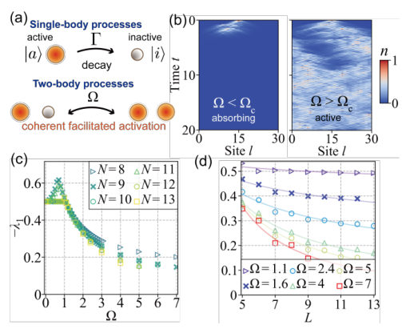 
FIG. 1. (a) Schematic of the quantum contact process. An inactive site (state |i⟩, gray sphere) can be activated via coher- ent facilitated activation by a neighboring active state |a⟩(red sphere) at rate Ω. Active sites spontaneously decay back to |i⟩at rate Γ. (b) Spatiotemporal profile of the active density n for different facilitation rates Ω. Starting at a fully active state, small Ω&lt; Ωc leads to a rapid decay into the absorbing state, while large Ω&gt; Ωc sustains a long-lived active state. The critical Ωc = 6.5 marks the boundary between the two dynamical regimes (see details in the main text). (c) Spectral gap versus Ωfor different system sizes N. The gap decreases with both increasing...

📷 Fig 2

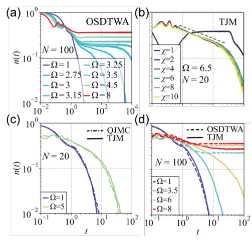 
FIG. 2. Decay dynamics of the active density n(t) obtained from different methods. (a) Semiclassical open-system dis- crete truncated Wigner approximation (OSDTWA) results for N = 100 at various facilitation rates Ω. For Ω≤3.15, n(t) decays to the absorbing state. For Ω≥3.15, a long-lived active plateau emerges. (b) Convergence of the tensor jump method (TJM) with various bond dimensions χ at Ω= 6.5 and N = 20. The black dashed line marks a power-law decay. (c) Benchmark of TJM (χ = 4) against exact quantum-jump Monte Carlo (QJMC) simulations for Ω= 1, 5 and N = 20. (d) Comparison of TJM (solid lines) and OSDTWA (dashed lines) for N = 100 at four representative values of Ω.

📷 Fig 3

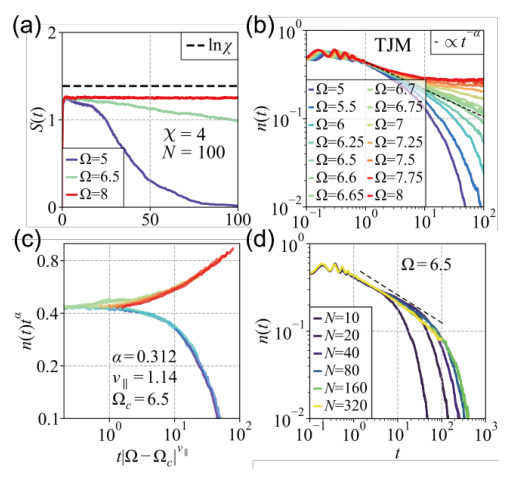 
FIG. 3. Decay dynamics starting with a fully active state obtained from TJM. (a) Entanglement entropy S(t) and (b) active density n(t) for N = 100 at various Ω. A power-law de- cay n(t) ∝t−α (black dashed line) emerges at Ω= 6.5, yield- ing the critical point Ωc = 6.5 and the exponent α = 0.312. (c) Determination of the exponent ν∥from data collapse of n(t)tα versus t|Ω−Ωc|ν∥. With ν∥= 1.14, all curves collapse onto two different branches depending on the sign of Ω−Ωc. (d) active density n(t) at Ω= 6.5 at various system size N. As N increases, the curves converge to the universal power law n(t) ∝t−α (black dashed line).

📷 Fig 4

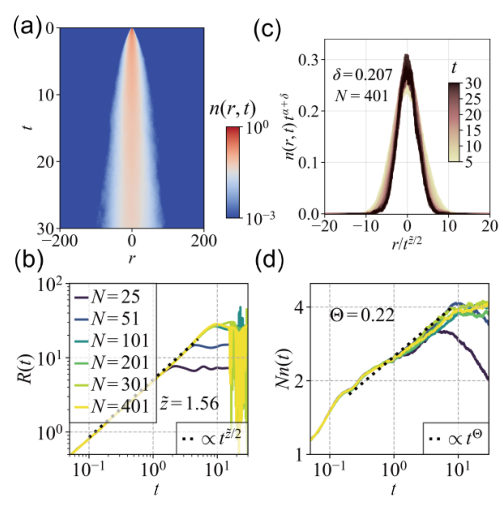 
FIG. 4. Spreading dynamics starting from a seed initial state at the center of the chain, obtained from TJM at the critical point Ω= 6.5. (a) Ensemble average of the active density n(r, t) for N = 401, where r ∈[−N/2, N/2] is the distance from the seed. (b) Mean-squared displacement R(t) of the active cluster for different system sizes N. All curves ex- hibit a universal power-law growth R(t) ∝t˜z/2 (black dashed line), yielding the exponent ˜z = 1.56. (c) Collapse of the spatial profiles n(r, t) at different times t (color-coded) for N = 401. The profiles collapse onto a single curve when plotted as n(r, t)tα+δ versus r/t˜z/2, yielding the exponent δ = 0.203. (d) Total active density Nn(t)...

**Summary.** This work analyzes the quantum phase transition in the 1D Quantum Contact Process, finding it to be a continuous transition. The authors prove that weak quantum entanglement is crucial for obtaining the correct critical exponents, showing that semiclassical methods fail by predicting an incorrect first-order transition. It underscores the fundamental role of entanglement in understanding quantum non-equilibrium dynamics.

**Why it may be interesting.** It provides a rigorous demonstration of how quantum coherence and entanglement are necessary ingredients to correctly describe non-equilibrium phase transitions in open quantum systems, distinguishing quantum criticality from classical or mean-field predictions.

Detailed structure

**Main problem.** The paper investigates the nature of the absorbing-state phase transition (APT) in the 1D Quantum Contact Process (QCP) and determines the essential role of quantum entanglement in this transition.

**Main result.** The 1D QCP undergoes a continuous APT with critical exponents distinct from the classical case, demonstrating that weak entanglement is indispensable for capturing the correct critical behavior.

**Method.** The study employs a combination of Liouvillian spectral analysis, Tensor Jump Method (TJM), and comparison with semiclassical approximations like the Truncated Wigner Approximation (OSDTWA).

**Model / system.** The system is the Quantum Contact Process (QCP) on a 1D lattice, whose dynamics are governed by a Lindblad master equation involving coherent activation and dissipative processes.

**Key observables.** Active density ($n$), Liouvillian spectral gap, and entanglement entropy ($S(t)$).

**Important parameters / regimes.** Facilitation rate ($\Omega$) and the bond dimension ($\chi$) used in the TJM.

**Assumptions / limitations.** The analysis compares results obtained using entanglement-preserving methods (TJM/QJMC) against those that neglect entanglement (OSDTWA).

**Figures summary.** Figures illustrate the transition boundary ($\Omega_c$), the spectral gap behavior, and compare the time decay of the active density $n(t)$ across different methods, highlighting the failure of semiclassical approaches.

**Paper structure.** The paper establishes the QCP model, analyzes the transition using multiple advanced techniques, contrasts the results with semiclassical limits, and concludes by quantifying the necessity of entanglement for correct critical exponents.

Abstract

The contact process is a paradigmatic example of nonequilibrium dynamics, with broad applications ranging from chemistry to sociology. Its quantum counterpart, the quantum contact process (QCP), extends the classical model to include coherent processes. Despite sustained interest, the nature of the transition in the one-dimensional (1D) QCP remains debatable. Here, combining Liouvillian spectral analysis, the tensor jump method, exact quantum jump Monte Carlo, and truncated Wigner simulations, we show that 1D QCP undergoes a continuous absorbing-state phase transition, with critical exponents distinct from the classical case. We further find Liouvillian gap closes well below the critical point, highlighting that spectral gap analysis alone cannot distinguish a phase transition from metastability in the QCP. Crucially, the 1D QCP is weakly entangled, yet even this weak entanglement is indispensable for capturing the correct critical behavior, whereas semiclassical methods artificially stabilize the active state and predict a spurious first-order transition. Our work establishes the quantum origin of the phase transition in the 1D QCP and underscores the essential role of entanglement in dissipative quantum many-body systems.

[↑ back to top](#top)

### [Analytical diagonalization of the open-boundary bosonic Kitaev chain: An asymmetric plane-wave ansatz approach](http://arxiv.org/abs/2608.29684v1)

**Authors:** Ning Wu, Wen-Long You  
**Type:** theory · **Category:** other · **PDF:** <https://arxiv.org/pdf/2608.29684v1>  
**Analysis basis:** full PDF text, analyzed in chunks
**Topic relevance:** 🔥 `methods for driven-dissipative` **4/5** · `Keldysh / 2PI / non-Gaussian methods` **3/5** · `driven-dissipative phase transition` **3/5** · `non-equilibrium universality` **2/5** · `analog quantum simulation` **1/5** · `correlated / nonlocal dissipation` **1/5** · `quantum measurements` **1/5**

📷 Fig 1

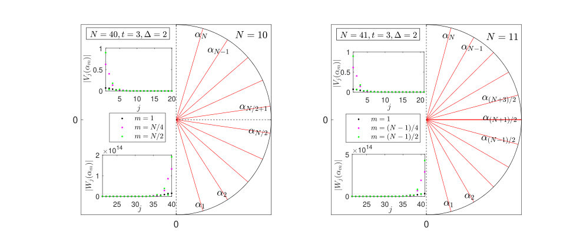 
FIG. 1: Allowed values of α in the plane-wave ansatz. (a) N = 10, (b) N = 11. For even N, all the αm’s are nonzero; while for odd N there exists a zero mode with α(N+1)/2 = 0. The insets show examples of the absolute values of Vj(αm) and Wj(αm), which are localized near the left and right ends of the chain, respectively.

**Summary.** This paper presents an alternative, purely algebraic method to diagonalize the open-boundary bosonic Kitaev chain by employing an asymmetric plane-wave ansatz. The technique solves the associated non-Hermitian eigenvalue problem and explicitly constructs the Bogoliubov quasiparticle operators. It demonstrates that this method is generalizable to other bosonic pairing systems with complex boundary conditions.

**Why it may be interesting.** The method provides a powerful, purely algebraic tool for exactly solving non-Hermitian Hamiltonians arising in open quantum systems, which is highly relevant for understanding boundary effects in condensed matter models.

Detailed structure

**Main problem.** The paper aims to analytically diagonalize the open-boundary bosonic Kitaev chain (OBKC) using a purely algebraic method that avoids the standard position-momentum representation.

**Main result.** The authors successfully derive the explicit diagonal form of the Hamiltonian and construct the physical Bogoliubov quasiparticle operators, confirming the equivalence of the new method to existing solutions.

**Method.** The core technique involves casting the Hamiltonian into a quadratic form, solving the associated non-Hermitian eigenvalue problem using an asymmetric plane-wave ansatz, and resolving the resulting degeneracies via bosonic commutation relations.

**Model / system.** The system is the bosonic Kitaev chain with open boundary conditions, treated as an effective Hamiltonian for a driven-dissipative open system. The analysis is generalized to other bosonic pairing models with inhomogeneous terms.

**Key observables.** Eigenvalues (single-particle energies, $\Lambda_k$), eigenvectors ($V_j(\alpha)$), and the diagonalized Hamiltonian ($H_D$).

**Important parameters / regimes.** Number of sites ($N$), hopping strength ($t$), pairing strength ($\Delta$), and the pseudo-momenta ($p, p'$).

**Assumptions / limitations.** The primary assumption is the validity of the asymmetric plane-wave ansatz for solving the left eigenvalue problem, and the method assumes $\Lambda 
eq 0$ for the main derivation.

**Figures summary.** Figure 1 illustrates the allowed values of the parameter $\alpha$ for finite $N$, showing the existence of a zero mode for odd $N$.

**Paper structure.** The paper progresses by first reviewing the problem, then developing the algebraic framework using the asymmetric plane-wave ansatz to solve the eigenvalue problem, deriving the quantization conditions, and finally constructing the diagonal Hamiltonian and generalizing the method to inhomogeneous pairing models.

Abstract

The bosonic Kitaev chain under open boundary conditions has attracted recent attention due to its realization in driven-dissipative systems and its intriguing non-Hermitian boundary physics. The model is known to be solvable via local squeezing transformations in the position-momentum representation. In this paper, we present an alternative, purely algebraic solution that relies entirely on the standard bosonic Bogoliubov transformation. For an $N$-site chain, we propose an asymmetric plane-wave ansatz with unequal left- and right-moving momenta to analytically solve the associated $2N\times 2N$ non-Hermitian ``associated matrix". The left eigenvalue problem yields $N$ distinct eigenvalues, each of which is twofold degenerate. By carefully resolving these degeneracies using the bosonic commutation relations, we construct the $N$ physical Bogoliubov quasiparticle operators. The construction reveals non-uniquenesses that in special cases exactly mirror the freedom in the local squeezing transformations of the original approach. The diagonal form of the Hamiltonian is obtained explicitly and is shown to be equivalent to the original Hamiltonian. The proposed asymmetric plane-wave ansatz and degeneracy-resolution technique are not limited to the present model and can be generalized to other bosonic pairing systems, including those with inhomogeneous pairing or hopping terms.

[↑ back to top](#top)

### [Light-induced nonconservative static forces in many-body systems](http://arxiv.org/abs/2608.29122v1)

**Authors:** Jinze Li, Xuemei Yang, Zhiyuan Sun  
**Type:** theory · **Category:** other · **PDF:** <https://arxiv.org/pdf/2608.29122v1>  
**Analysis basis:** full PDF text, analyzed in chunks
**Topic relevance:** 🔥 `Keldysh / 2PI / non-Gaussian methods` **4/5** · `driven-dissipative phase transition` **3/5** · `Frenkel-Kontorova` **2/5** · `methods for driven-dissipative` **2/5** · `non-equilibrium universality` **2/5** · `analog quantum simulation` **1/5** · `correlated / nonlocal dissipation` **1/5**

📷 Fig 1

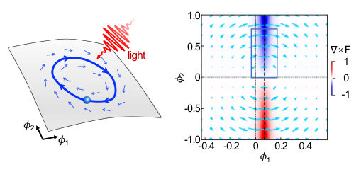 
FIG. 1. Left: Schematic of light-induced nonconservative force field (blue arrows) on the manifold of slow degrees of freedom. The blue trajectory denotes a limit cycle. Right: Light-induced effective static force field on the slow Raman modes 𝜙1 and 𝜙2 in a nonlinear phononic system. The arrows indicate the local direction and magnitude of the force while the color map shows its local curl. The bold dashed line indicates the resonance configuration 𝜔2 IR(1 −𝜙1) = 𝜔2.

📷 Fig 2

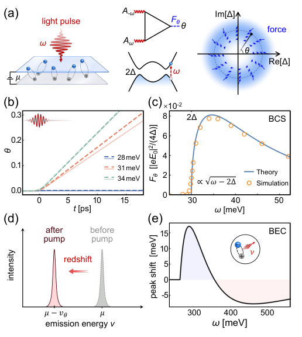 
FIG. 2. (a) Left: schematic of a light pulse driving an electron- hole bilayer realization of EI. Middle: the triangular diagram for the light-induced force 𝐹𝜃on the order parameter phase (top) and the resonant interband excitation (bottom) responsible for it. Right: light- induced force (arrows) on the order parameter shown in the complex order-parameter plane, where the color map shows the free-energy landscape without the drive. (b) Simulated evolution of the phase in a BCS-type EI after a light pulse (inset) centered at time zero for three different central frequencies, with the same pulse duration 𝜏= 1 ps and peak field 𝐸0 = 300 V/cm. The solid/dashed curves show the results with...

📷 Fig 3

 
Fig. 2(a)) and enhances the gap in the BEC regime (𝐸G &gt; 0). In the following, we take the ground state Δ to be a real positive number without loss of generality.

📷 Fig 4

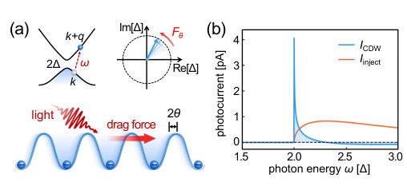 
FIG. 3. (a) Bottom panel illustrates the light-induced drag of a one-dimensional CDW with electrons (spheres) sitting in the periodic mean-field potential (cyan curve). The phase 𝜃of the CDW order parameter sets the spatial position of the condensate. The top left depicts the resonant interband excitations responsible for the drag force 𝐹𝜃. The top right shows this force on the complex plane of the order parameter. (b) The blue curve is the NCSF-induced photo- current from CDW sliding as a function of light frequency (in units of the CDW gap Δ) and the orange curve is the quasiparticle injection current. The obliquely incident p-polarized light has a fixed electric field 𝐸0 = 104 V/cm and...

**Summary.** This paper investigates how light can exert nonconservative static forces on collective order parameters in quantum materials like excitonic insulators and CDW systems. By linking these forces to optical absorption, the authors predict measurable effects, such as shifts in photon emission peaks or the generation of a DC current. The methodology relies on advanced many-body theoretical techniques applied to driven quantum systems.

**Why it may be interesting.** This work provides a concrete theoretical framework for understanding how light-matter interaction, specifically through dissipative processes, can induce directed, non-equilibrium motion in condensed matter order parameters, bridging quantum optics and solid-state physics.

Detailed structure

**Main problem.** The study focuses on light-induced nonconservative static forces (NCSFs) acting on slow collective degrees of freedom within quantum many-body systems.

**Main result.** The light field generates nonconservative forces rooted in dissipation (optical absorption), which drive measurable phenomena like phase acceleration in excitonic insulators or DC current generation in charge density waves.

**Method.** The analysis employs advanced diagrammatic techniques (e.g., triangular diagrams) within a Keldysh formalism to derive effective equations of motion and force terms for the order parameter phase.

**Model / system.** The work examines general quantum many-body systems, specifically modeling excitonic insulators (EI) and materials exhibiting incommensurate charge density waves (CDW) driven by periodic light fields.

**Key observables.** Phase winding velocity (measured via photon emission peak shift in EIs) and DC electric current ($I_{CDW}$) in CDW systems.

**Important parameters / regimes.** Optical gap ($	ilde{E}_G$), light frequency ($\omega$), and the coupling strength related to dissipation.

**Assumptions / limitations.** The NCSF is explicitly linked to dissipation (optical absorption), and the analysis often involves approximations in the slow-energy limit.

**Figures summary.** Figures illustrate the schematic of the NCSF field, the simulated phase evolution in EIs showing peak shifts, and the theoretical diagrams contributing to the force and current in CDW systems.

**Paper structure.** The paper progresses from general concepts of NCSFs to specific derivations for EIs (phase dynamics) and then details the rigorous calculation of the force and current in CDW systems using Keldysh formalism and diagrammatic expansion.

Abstract

In a quantum many-body system, a periodic drive can often generate effective static forces on the slow collective degrees of freedom. We study the static forces generated by light on electronic order parameters in solid-state systems. We show that the forces can have nonconservative components that originate from dissipation, i.e., optical absorption. This effect is demonstrated in two nontrivial examples. In excitonic insulators, via interband excitations, the light field generates a nonconservative force on the phase of the excitonic order parameter. This force leads to an acceleration of the phase, which manifests as a shift of the photon emission peak from an exciton condensate. In materials with an incommensurate charge density wave, a propagating light field generates a nonconservative force on the phase of its order parameter. It drives the charge density wave into sliding motion, leading to a DC electric current via topological Thouless pumping.

[↑ back to top](#top)

### [Parametric amplification in a Kerr Oscillator based on Ne FIB Nanobridges](http://arxiv.org/abs/2608.29435v1)

**Authors:** Parth Bhandari, Laith Meti, Gemma Chapman, Edward Romans, John Gallop, Ling Hao  
**Type:** both · **Category:** quantum information and computing · **PDF:** <https://arxiv.org/pdf/2608.29435v1>  
**Analysis basis:** full PDF text, analyzed in chunks
**Topic relevance:** 🔥 `driven-dissipative phase transition` **4/5** · `QC/QI experiment` **3/5** · `Keldysh / 2PI / non-Gaussian methods` **2/5** · `methods for driven-dissipative` **2/5** · `non-equilibrium universality` **1/5** · `quantum measurements` **1/5** · `quantum optics experiment` **1/5**

📷 Fig 1

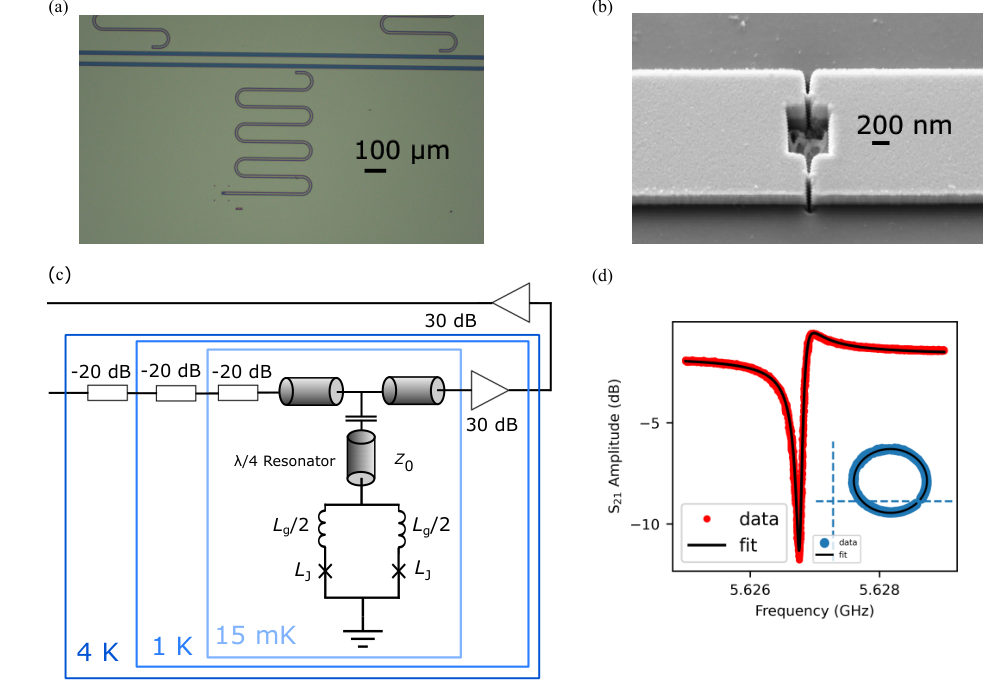 
Figure 1: (a) Optical image of a subsection of the chip showing three out of six resonators coupled to the central feedline. (b) SEM image of a Ne FIB DC SQUID embedded at the end of a resonator. (c) Schematic of the measurement setup showing attenuation and amplification at different stages. 𝐿g is the total geometric loop inductance of the SQUID and 𝐿J is the Josephson inductance of each nanobridge. (d) Plot showing the resonator transmission spectrum for 𝑃pr =-105 dBm with the data shown in red and the fit shown in black. The inset shows the circle fit in the complex plane, with the data shown in blue and the fit shown in black. The fit corresponds to a resonant frequency of 5.6268 GHz,...

📷 Fig 2

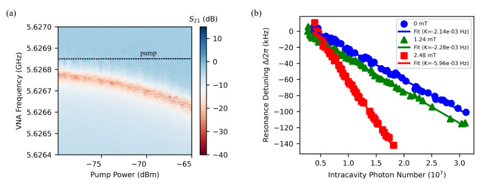 
Figure 2: (a) A colour plot showing the transmission spectrum (S21) obtained for resonator with increasing pump power. The pump is annotated with a dotted black line, and the dip represented in red shows the shift in the resonant frequency of the circuit. (b) Plot showing the detuning of the resonant frequency for resonator with an increase in intracavity photon numbers at different applied fields. Here Δ = 𝜔𝑠−𝜔0, where 𝜔s is the resonant frequency of the circuit with intracavity photon number 𝑛c. The experimental data are plotted with scatter points and fits are shown by solid lines. The obtained fits represent good agreement with the observed detuning of the resonant frequency.

📷 Fig 3

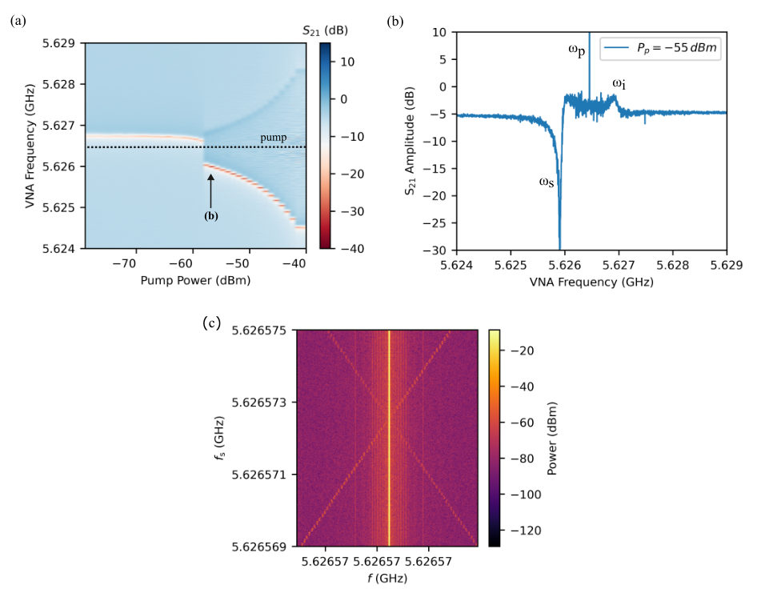 
Figure 3: (a) A colour plot showing the transmission spectrum of resonator with an increase in pump power for a red-detuned signal. The resonant frequency shows an initial slight shift as pump power increases and then a jump below the pump frequency and emergence of net idler gain. (b) A line plot showing the resonant dip and the idler gain for 𝑃p = −55 dBm. (c) A colour plot showing the compiled results from the spectrum analyser measurements, where the pump tone was fixed (vertical line), and the idler frequency (negative slope line) changes according to the degenerate four wave mixing process as the signal tone (positive slope line) is swept.

📷 Fig 4

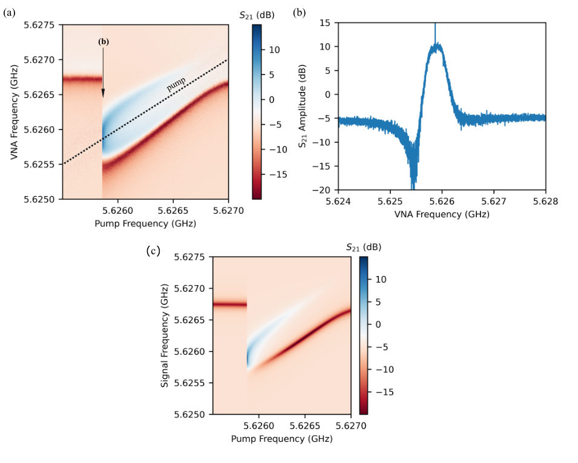 
Figure 4: (a) A colour plot showing the measured transmission spectrum for resonator as the pump frequency is decreased in steps of 6 kHz starting from the right-hand side of the plot. As the pump frequency is decreased the idler appears and its frequency (peak) tracks the signal frequency (dip) until a maximum gain is reached. Beyond that point the resonator snaps back to a single resonant dip. (b) A line plot showing the maximum gain of 15 dB (with respect to the baseline at -5 dB) with a bandwidth of 300 kHz. (c) The solution of the analytical model discussed in the main text for 𝜔0/2𝜋= 5.62675 GHz, 𝜅int = 38 kHz, 𝜅ext = 120 kHz, 𝑃p = −60 dBm, and 𝐾= −2.14 mHz/photon. The solution has...

**Summary.** This paper reports on the experimental demonstration of parametric amplification in a superconducting Kerr Oscillator built using Nb nanobridges. By employing two-tone spectroscopy, the authors characterized the non-linear response and achieved a maximum gain of 15 dB. This work validates the use of such superconducting circuits for advanced quantum sensing and readout applications.

**Why it may be interesting.** This work directly addresses the engineering of non-linear elements in superconducting circuits, which is fundamental for building quantum transducers, quantum memories, and high-sensitivity quantum sensors.

Detailed structure

**Main problem.** The paper investigates the feasibility and performance of parametric amplification within a Kerr Oscillator circuit, a key component for quantum sensing and readout.

**Main result.** The authors successfully demonstrated parametric gain up to 15 dB using a superconducting circuit containing Nb nanobridges, confirming the model's predictions.

**Method.** The study combines two-tone spectroscopy measurements with theoretical modeling based on the driven Kerr nonlinear oscillator equation of motion.

**Model / system.** The physical system is an Nb-based CPW resonator embedded with a DC SQUID containing Nb nanobridges. The dynamics are modeled by a Kerr oscillator Hamiltonian and its corresponding equation of motion.

**Key observables.** Maximum amplification (15 dB), Kerr factor (K), resonant frequency, and the appearance of an idler mode.

**Important parameters / regimes.** Operating temperature (15 mK), magnetic field tolerance (up to 2.48 mT), and the ratio of Kerr nonlinearity to linewidth (|K|/$\kappa$).

**Assumptions / limitations.** The analysis assumes the weakly nonlinear regime ($|K|/\kappa < 1$) and that the feedline supports bidirectional propagation for the EOM derivation.

**Figures summary.** Figures show the resonator transmission spectrum fitted to extract parameters, and spectral evolution plots demonstrating the gain profile as the pump frequency is swept.

**Paper structure.** The paper first establishes the theoretical framework using the Kerr oscillator model, then details the experimental measurement techniques (two-tone spectroscopy) to estimate the Kerr factor, and finally demonstrates parametric gain by sweeping the pump frequency.

Abstract

Superconducting circuits play a crucial role in the advancement of quantum computing and quantum sensing. Typically such circuits require the presence of a non-linear element, where the engineered anharmonicity (Kerr factor) and resonant linewidth determine the potential applications of the circuit. In this work we have fabricated Nb-based CPW resonators embedded with a DC SQUID incorporating Nb nanobridges as the weak links. We use two-tone spectroscopy to study the non-linear behaviour of the device at 15 mK up to a field of 2.48 mT. Under the application of a blue-detuned pump, the device shows a decrease in the resonant frequency which is used to estimate the Kerr factor. We further apply a red-detuned pump to go beyond the bifurcation threshold and observe the appearance of an additional idler mode with net gain. The gain of the device was maximized by further decreasing the pump frequency, showing a maximum amplification of 15 dB. Finally, we show agreement between the Kerr non-linear oscillator model and the measured transmission spectrum, and highlight further design modifications to improve the gain and bandwidth of such devices.

[↑ back to top](#top)

### [Efficient search for excitable zero-modes in constrained systems](http://arxiv.org/abs/2608.31165v1)

**Authors:** Jean-Yves Desaules  
**Type:** theory · **Category:** other · **PDF:** <https://arxiv.org/pdf/2608.31165v1>  
**Analysis basis:** full PDF text, analyzed in chunks
**Topic relevance:** 🔥 `Rydberg arrays` **4/5** · `analog quantum simulation` **3/5** · `scars & prethermalization` **3/5** · `methods for driven-dissipative` **2/5** · `Frenkel-Kontorova` **1/5**

📷 Fig 1

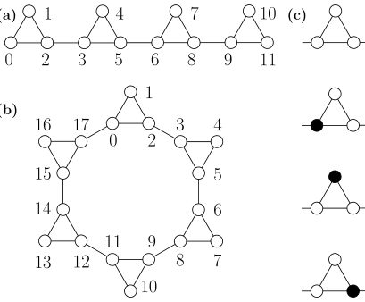 
FIG. 1. PXP model on a 1D star lattice. Down-spins and up-spins are denoted by ◦and • respectively. (a) Chain with OBC, (b) chain with PBC, (c) triangle basis.

📷 Fig 2

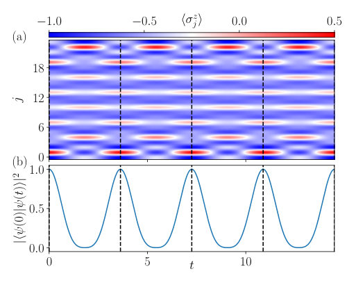 
FIG. 2. Dynamics in the 1D star lattice with 24 sites and OBC obtained through boundary excitations. The ini- tial state has m = 2 (bond dimension 4), both boundary vec-

📷 Fig 3

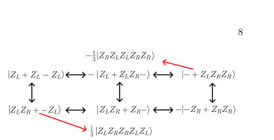 
FIG. 3. Structure of the zero-mode for the |ZL+ZL−ZL⟩ representative state. Black arrows denote domain-wall moves while red arrows denote contact moves. The 3 by 2 grid-like structure is due to the two bright sites being able to indepen- dently travel into the ZL domains (of size 2 and 1) to their left using domain-wall moves. Once a bright site has reached the other through this, contact moves occur.

**Summary.** This paper presents a novel, efficient protocol to analytically locate Excitable Zero-Modes (EZMs) in constrained quantum systems, using the local eigenbasis of the Hamiltonian. By applying this to Rydberg chain models, the authors demonstrate the existence of exponentially large zero-mode manifolds and derive explicit formulas for these states under both periodic and open boundary conditions.

**Why it may be interesting.** This work directly addresses the spectral properties of highly constrained quantum systems relevant to Rydberg arrays, providing powerful analytical tools to characterize exotic eigenstates like EZMs.

Detailed structure

**Main problem.** The paper aims to develop an efficient protocol for finding analytical expressions for Excitable Zero-Modes (EZMs) in quantum many-body systems subject to local constraints.

**Main result.** The proposed method successfully finds exponentially large families of EZMs in decorated Rydberg chains and demonstrates that the MPS formulation can capture the full eigenspace for non-zero energy states under OBC.

**Method.** The core method involves using the eigendecomposition of the local unconstrained Hamiltonian ($h$) to construct an auxiliary operator ($X$) that dictates the structure of the translation-invariant Matrix Product State (MPS) ansatz.

**Model / system.** The study focuses on kinetically constrained systems, specifically modeling Rydberg atom arrays in the blockade regime, analyzed using 1D PXP models and decorated star lattices.

**Key observables.** Zero-mode (ZM) and Excitable Zero-Mode (EZM) subspaces, the dimension of the zero-mode manifold span, and the energy eigenvalues at non-zero momenta ($E=\pm\sqrt{3}$).

**Important parameters / regimes.** System size ($L$), boundary conditions (Periodic vs. Open), and the blockade parameter regime.

**Assumptions / limitations.** The analysis often assumes the local Hamiltonian $h$ has eigenvalues of the form $\{-E, 0, +E\}$ and relies on solving scalar constraints derived from commutation relations.

**Figures summary.** The notes reference several tables detailing the dimension of the zero-mode manifold span for varying system sizes and boundary conditions, comparing theoretical lower bounds derived from symmetry against actual numerical counts.

**Paper structure.** The paper introduces the efficient search framework (Section II), applies it to the 1D PXP model (Section III), and then applies the methodology to a more complex decorated lattice structure (Section IV).

Abstract

Kinetically constrained systems, such as those representing Rydberg atom arrays in the blockade regime, have gathered considerable attention due to the presence of atypical eigenstates in their spectrum. The latter manifests itself through the presence of quantum many-body scars as well as unusually large zero-mode (ZM) subspaces which contain analytically tractable eigenstates with various entanglement scalings. In particular, some of the latter are excitable zero-modes (EZMs), meaning that they can be promoted to a non-zero energy for open boundary conditions. In this work, I present an efficient protocol for finding analytical expressions for translation-invariant EZMs in constrained systems, based on the eigendecomposition of the local unconstrained Hamiltonian. I demonstrate the power of this method on a decorated Rydberg chain. In that model, my protocol directly produces a continuous matrix-product-state manifold located entirely in the zero-energy eigenspace for periodic boundary conditions. The span of that manifold grows exponentially with the system, and for odd system sizes it covers the entire zero-momentum eigenspace with zero energy. I then show how the physical structure of the manifold, which is tied to the local eigenbasis, also allows one to derive analytical expressions for ZMs at non-zero momentum and for a polynomial number of exact scars at $E=\pm\sqrt{3}$.

[↑ back to top](#top)

### [Quantum-interference metrology of dissipative Kerr solitons](http://arxiv.org/abs/2608.30313v1)

**Authors:** Yun-Ru Fan, Yong Geng, Ji Liu, Yong-Jun Huang, Hai-Zhi Song, Hao Li, Li-Xing You, Heng Zhou, Kun Qiu, Kai Guo, Guang-Can Guo, Qiang Zhou  
**Type:** experiment · **Category:** other · **PDF:** <https://arxiv.org/pdf/2608.30313v1>  
**Analysis basis:** full PDF text, analyzed in chunks
**Topic relevance:** 🔥 `quantum optics experiment` **4/5** · `interference shaping light` **3/5** · `quantum measurements` **3/5** · `correlated / nonlocal dissipation` **1/5** · `driven-dissipative phase transition` **1/5**

📷 Fig 1

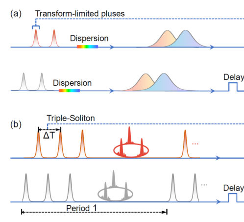 
Fig. 1. Conceptual illustration of quantum-interference metrology of dissipative Kerr

📷 Fig 2

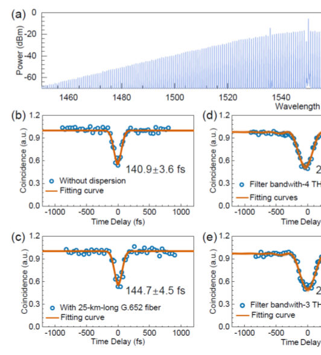 
Fig. 2. HOM-based temporal characterization of single-soliton microcombs. (a) Optical

📷 Fig 3

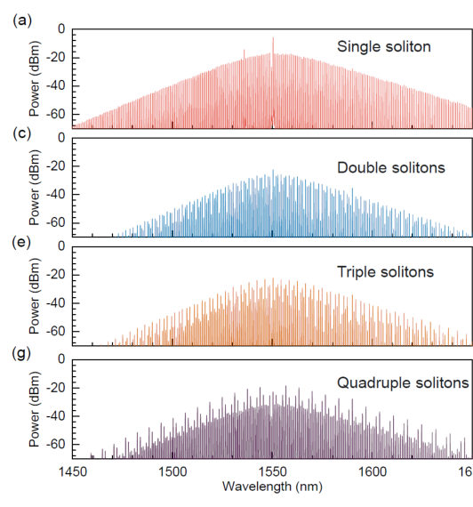 
Fig. 3. Temporal mapping of multi-soliton states via HOM interference. (a, c, e, g)

**Summary.** This paper introduces a quantum-interference metrology technique using Hong-Ou-Mandel (HOM) interference to characterize dissipative Kerr solitons in optical microresonators. By operating at the single-photon level, the method bypasses the distortions caused by optical amplification and dispersion. It successfully measures the intrinsic pulse width and maps the relative timing of multiple solitons with high precision.

**Why it may be interesting.** This work provides a fundamentally new, non-invasive, and quantum-enhanced diagnostic tool for characterizing complex nonlinear wave phenomena in optical systems, which is highly relevant to quantum optics and nonlinear photonics.

Detailed structure

**Main problem.** The primary challenge is accurately characterizing the intrinsic femtosecond temporal structure of dissipative Kerr solitons (DKSs) without distorting the waveform using conventional diagnostics.

**Main result.** The authors successfully demonstrated the use of quantum-interference metrology to retrieve the intrinsic soliton pulse width and map the temporal separation of multiple solitons, remaining immune to amplification and dispersion effects.

**Method.** The technique employs Hong-Ou-Mandel (HOM) interference by attenuating the soliton stream to the single-photon level and measuring fourth-order interference coincidences.

**Model / system.** The experiment uses dissipative Kerr solitons generated in optical microresonators ($	ext{Si}_3	ext{N}_4$ MRR) to create chip-scale frequency combs. The measurement setup is a sophisticated interferometer designed to probe photon indistinguishability.

**Key observables.** HOM interference dip width (proportional to inverse pulse width), visibility, and additional interference dips corresponding to inter-soliton temporal separations.

**Important parameters / regimes.** Intrinsic soliton pulse width ($\sim 80-83$ fs), propagation distance (25 km of standard fiber), and inter-soliton separations (e.g., $4.3 	ext{ ps}, 2.0 	ext{ ps}$).

**Assumptions / limitations.** The measurement relies on the HOM effect, which depends on wave-packet overlap and is robust against classical intensity distortions, and requires attenuating the signal to the single-photon level.

**Figures summary.** Figures illustrate the conceptual retrieval of pulse widths without distortion, the measurement of single-soliton width vs. fiber length, and the mapping of multi-soliton states by observing distinct interference dips at specific delays.

**Paper structure.** The paper first establishes the limitations of conventional diagnostics for DKSs, then details the quantum-interference metrology using HOM interference, presenting results for single-pulse characterization and subsequently extending the method to map the complex temporal structure of multi-soliton states.

Abstract

Dissipative Kerr solitons in optical microresonators underpin chip-scale frequency combs with applications ranging from coherent telecommunications to precision spectroscopy. Yet the characterization of their intrinsic femtosecond temporal structure remains challenging, as the low pulse energy and broad spectral bandwidth necessitate optical amplification and careful dispersion compensation in conventional ultrafast diagnostics, both of which can significantly distort the waveform. Here we demonstrate a quantum-interference metrology of microcomb solitons based on Hong-Ou-Mandel interference. By attenuating the soliton stream to the single-photon level and measuring fourth-order interference, we directly retrieve near transform-limited pulse durations without amplification or dispersion management, remaining accurate even after propagation through 25 km of standard fiber. The same interferogram also provides direct access to the temporal separations in multi-soliton states by converting inter-soliton separations into additional interference dips at corresponding delays, enabling sub-picosecond characterization of their intracavity temporal structure. This quantum-inspired paradigm introduces a fundamentally new metrological approach that is immune to amplification and dispersion distortions, offering a powerful tool for the characterization of complex soliton physics.

[↑ back to top](#top)

### [Neutral atom quantum computing](http://arxiv.org/abs/2608.30783v1)

**Authors:** M. Saffman  
**Type:** theory · **Category:** quantum information and computing · **PDF:** <https://arxiv.org/pdf/2608.30783v1>  
**Analysis basis:** full PDF text, analyzed in chunks
**Topic relevance:** 🔥 `QC/QI experiment` **4/5** · 🔥 `Rydberg arrays` **4/5** · `analog quantum simulation` **3/5**

📷 Fig 1

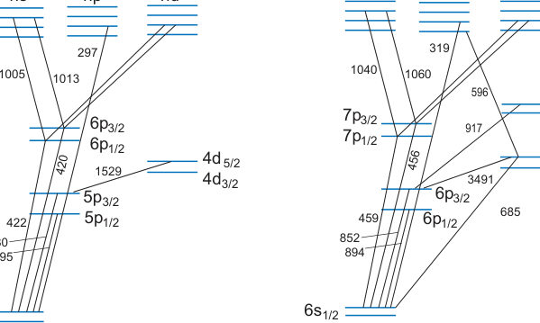 
Figure 1: Level structure and transitions that are of primary interest for quantum computing with Rb and Cs atoms. The Rydberg levels labeled ns, np, nd may have n ranging from about 40-100. Transition wavelengths are shown in nm. For Rb the wavelength dependent functions are: cooling (780), optical pumping (795), two-photon Rydberg excitation (422/1005 Evered et al. (2023)) or (420/1013 Viteau et al. (2011)), one-photon Rydberg (297 Thoumany et al. (2009)), excited state hiding (1529 Hu et al. (2025)). For Cs: cooling (852 or 685/3491 Scott et al. (2025)), optical pumping (894), two-photon Rydberg excitation (459/1040 Graham et al. (2019)) or (456/1060 Anand et al. (2024)) or (685/596...

📷 Fig 2

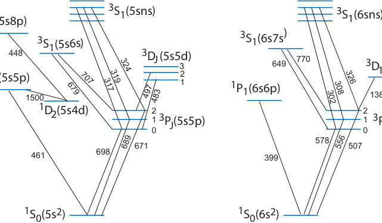 
Figure 2: Level diagrams and often used wavelengths in nm for Sr and Yb atoms. For Sr the wavelength dependent functions are: cooling (461, 689), clock transitions (671, 698), repumpers (448, 679, 707, 483, 497), Rydberg excitation (317, 319, 324). For Yb: cooling (399,556), clock transitions (507,578), repumpers (649,770), Raman transitions (649,770), Rydberg excitation (302, 308, 326). In addition a range of wavelengths are used for trapping and atom transport.

📷 Fig 3

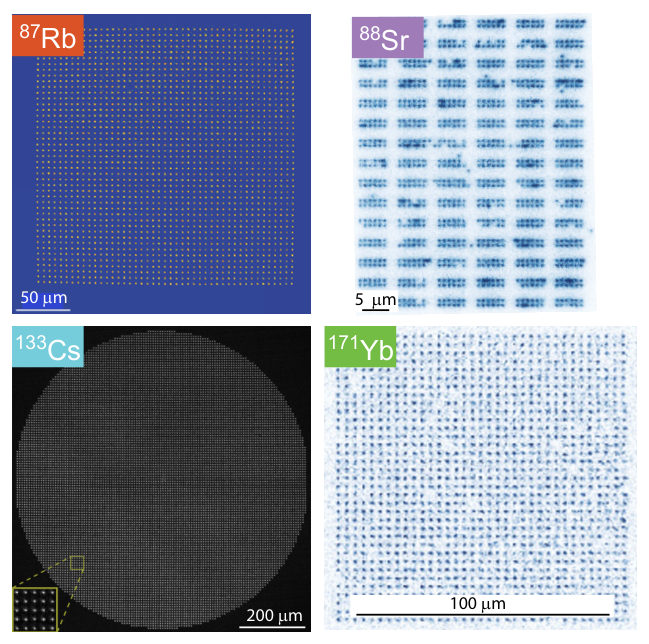 
Figure 3: Demonstrations of large qubit arrays. 87Rb: Nearly defect free square array with 2024 atoms in 2025 sites (Lin et al. (2025)); 133Cs: averaged image of atoms in a 12,001 site array (Manetsch et al. (2025)); 88Sr: more than 1000 atoms loaded into an optical lattice (Gyger et al. (2024)); 171Yb: 1225 site array with 99% filling fraction loaded from a reservoir (Norcia et al. (2024)).

📷 Fig 4

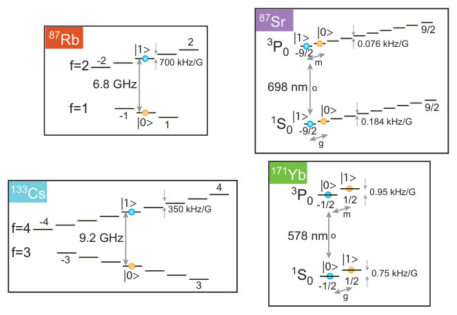 
Figure 4: Qubit encodings in alkali and AEL atoms. The qubit transitions are indicated with gray arrows with the omg choices labeled for Sr and Yb. Rb and Cs use mf = 0 clock states that have no linear sensitivity to magnetic fields and a weak quadratic sensitivity. In Sr and Yb there are several omg choices for encoding. We may use nuclear spin states in the electronic ground or metastable levels with MF a half integer, and which have small linear Zeeman shifts. Alternatively an optical transition between ground and metstable levels can be used.

📷 Fig 5

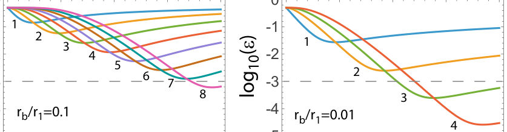 
Figure 5: Qubit state measurement error for a high background case rb/r1 = 0.1 (left) and a low background case rb/r1 = 0.01 (right). The plots are for |c0|2 = |c1|2 = 1/2 and the curves are labeled with nc. The mean number of detector counts for an atom in the bright state is r1t.

**Summary.** This review surveys the rapidly advancing field of neutral atom quantum computing, establishing it as a leading platform for scalable quantum computation. It details the underlying physics, including trapping methods and Rydberg-mediated entanglement, and reviews current achievements like quantum algorithm demonstrations and logical qubit implementation. The paper serves as a crucial guide for researchers entering or advancing in this complex area.

**Why it may be interesting.** It provides a comprehensive overview of the physical principles (Rydberg interactions, trapping potentials) and computational milestones (logical qubits, error correction) that bridge AMO physics into the domain of quantum computation.

Detailed structure

**Main problem.** The paper reviews the physics and current state-of-the-art for using neutral atoms as a leading platform for building large-scale, fault-tolerant quantum computers.

**Main result.** Neutral atom arrays have rapidly advanced, enabling demonstrations of quantum algorithms and the implementation of logical qubits for error correction.

**Method.** The review synthesizes theoretical models of light-atom interactions, trapping mechanisms, and quantum gate operations based on Rydberg physics.

**Model / system.** The system involves neutral atoms (like Rb, Cs, Sr, Yb) trapped using far-detuned optical tweezers or lattices. Quantum operations rely on superposition, entanglement, and controlled interactions mediated by Rydberg blockade.

**Key observables.** Qubit states, entanglement fidelity, coherence time, and the efficiency of quantum gates (e.g., CNOT).

**Important parameters / regimes.** Detuning ($\Delta$), Rabi frequency ($\Omega$), trap confinement strength, and temperature ($k_B T$).

**Assumptions / limitations.** The review synthesizes results from various models, including those assuming specific ground state energy shifts and the applicability of the Rotating Wave Approximation.

**Figures summary.** Figures illustrate the level structure and relevant transitions for different alkali and alkaline earth atoms, detailing wavelengths used for various processes like cooling and Rydberg excitation.

**Paper structure.** The paper follows a review structure, covering the fundamental physics, surveying current experimental capabilities, and providing an outlook on future progress in the field.

Abstract

Neutral atom qubits are one of the leading approaches for implementation of a large scale quantum computer. The original proposals for neutral atom qubits were formulated more than 25 years ago, with first demonstrations of a universal gate set following 10 years later. In the last few years the performance and scale of neutral atom qubit arrays has developed at a rapid pace leading to demonstrations of quantum algorithms, and logical qubits for fault tolerant error correction. This contribution reviews the physics of the neutral atom approach, surveys current capabilities, and provides an outlook for future progress.

[↑ back to top](#top)

### [Quantum optomechanics with arbitrary mirror displacement: nonlinear Langevin equation with non-Markovian back-action noises](http://arxiv.org/abs/2608.29429v1)

**Authors:** Adrian E. Rubio Lopez, Hing-Tong Cho, Bei-Lok Hu  
**Type:** theory · **Category:** other · **PDF:** <https://arxiv.org/pdf/2608.29429v1>  
**Analysis basis:** full PDF text, analyzed in chunks
**Topic relevance:** 🔥 `Keldysh / 2PI / non-Gaussian methods` **4/5** · `quantum measurements` **3/5** · `methods for driven-dissipative` **2/5** · `correlated / nonlocal dissipation` **1/5**

📷 Fig 1

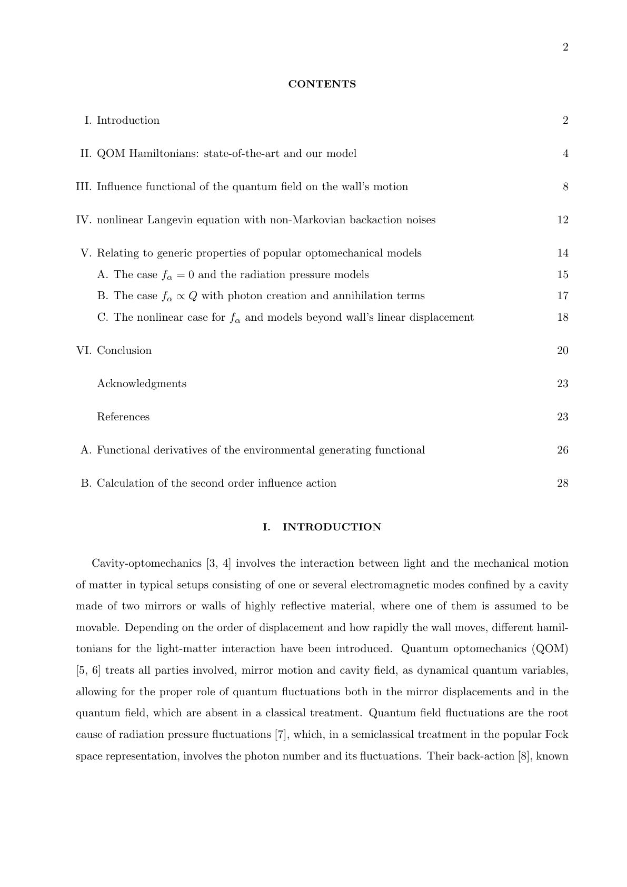 
Low-resolution page preview, page 2

📷 Fig 2

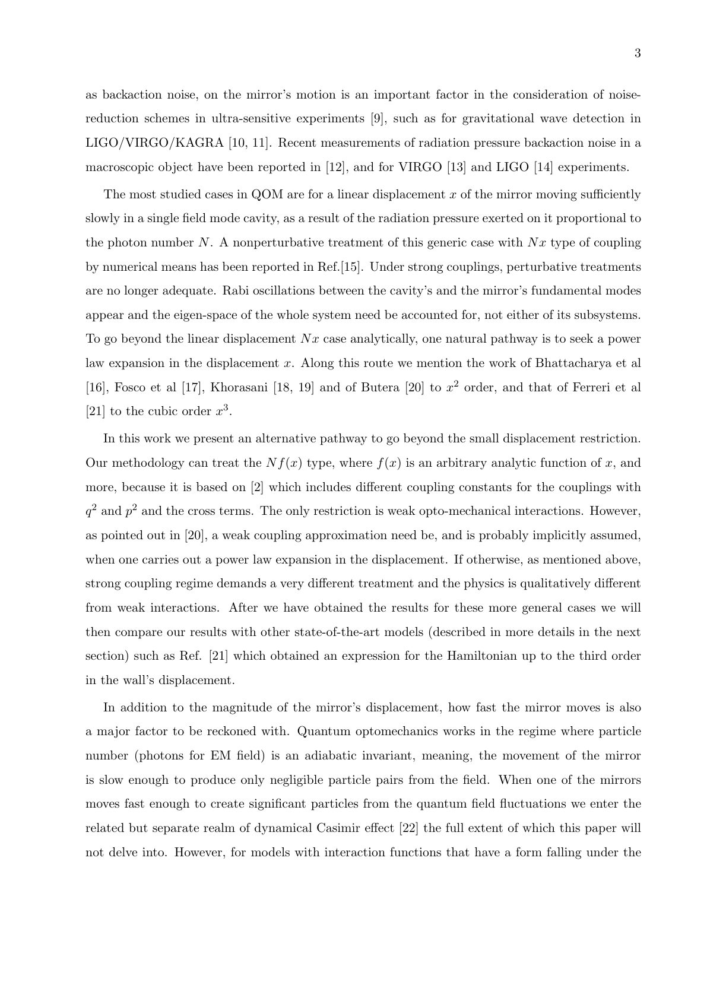 
Low-resolution page preview, page 3

📷 Fig 3

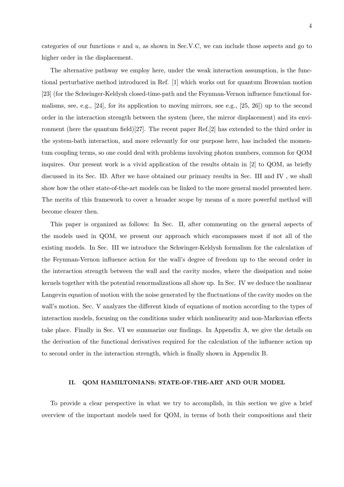 
Low-resolution page preview, page 4

📷 Fig 4

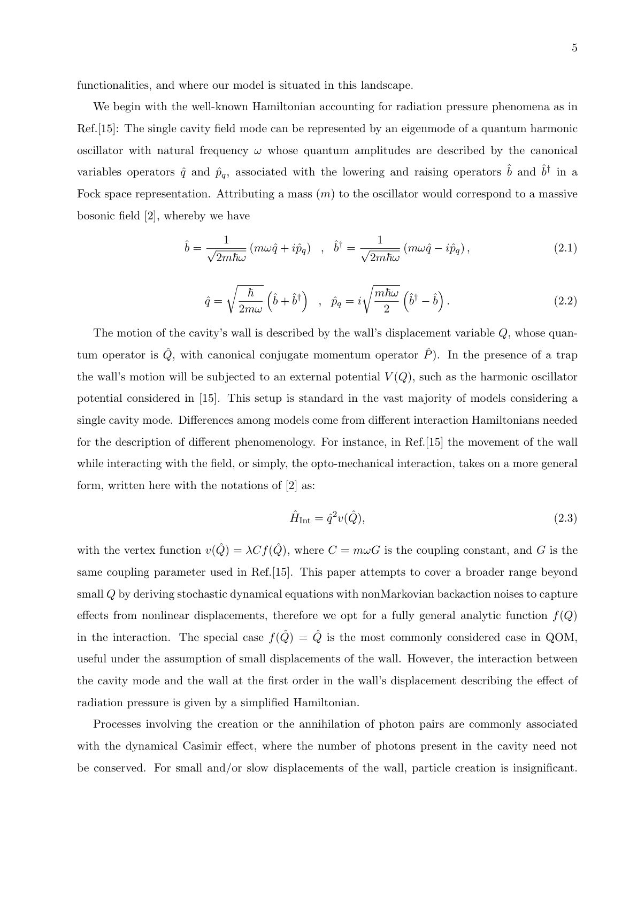 
Low-resolution page preview, page 5

📷 Fig 5

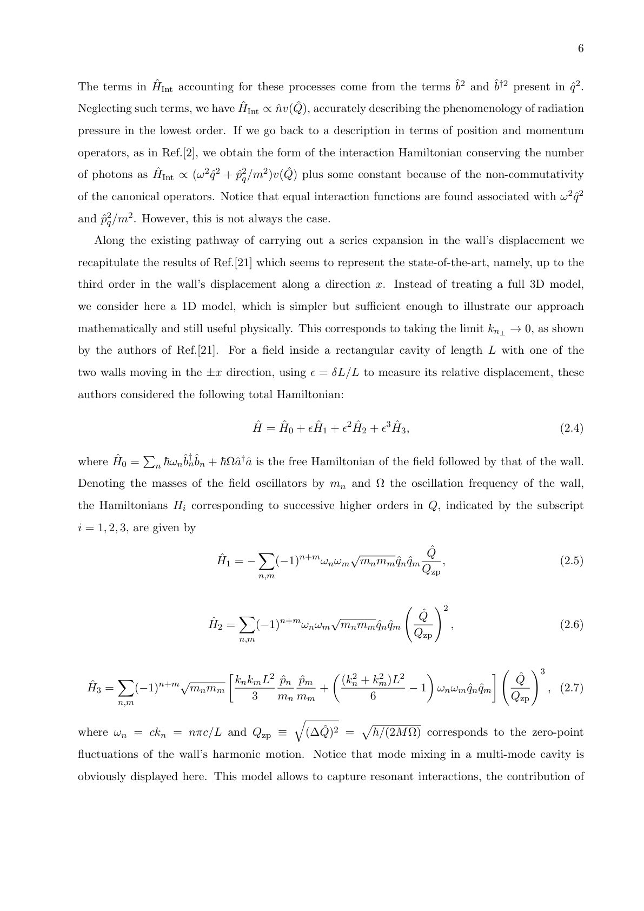 
Low-resolution page preview, page 6

**Summary.** This paper presents a generalized theoretical method for Quantum Optomechanics that overcomes the limitations of small-displacement approximations. By using a functional perturbative approach, the authors derive a nonlinear Langevin equation incorporating non-Markovian back-action noise for arbitrary mirror displacements. This advancement provides a more comprehensive theoretical tool for analyzing high-precision quantum optomechanical experiments.

**Why it may be interesting.** This work provides a powerful, generalized theoretical tool for analyzing QOM systems, which is crucial for designing and interpreting high-precision quantum sensing and gravitational wave detectors.

Detailed structure

**Main problem.** To develop a theoretical framework for Quantum Optomechanics (QOM) that can accurately model the system dynamics by treating arbitrary mirror displacements, moving beyond standard small-displacement approximations.

**Main result.** The authors derive a general nonlinear Langevin equation and influence action that successfully incorporates arbitrary nonlinear coupling functions, linking the general theory to established results for various coupling orders.

**Method.** The study employs the functional perturbative method within the Schwinger-Keldysh formalism to calculate the influence action and derive the resulting stochastic equation of motion.

**Model / system.** The system models the interaction between a quantum field confined in an optical cavity and the quantum motion of a movable mirror. The coupling is generally nonlinear, allowing for arbitrary functional dependence on the mirror displacement.

**Key observables.** The non-Markovian back-action noise acting on the mirror, and the resulting nonlinear Langevin equation of motion.

**Important parameters / regimes.** The coupling strength ($\lambda$) must be weak for the perturbative expansion to be valid; the treatment aims to generalize beyond small displacement approximations ($x$).

**Assumptions / limitations.** The primary assumption is that the opto-mechanical coupling is sufficiently weak to allow for a perturbative expansion in the coupling parameter $\lambda$.

**Figures summary.** Not specified.

**Paper structure.** The paper first introduces the general functional perturbative approach, derives the influence action and the nonlinear Langevin equation, and subsequently demonstrates how this general framework reproduces known results from the literature, such as the standard radiation pressure coupling and higher-order expansions.

Abstract

Quantum optomechanics (QOM) explores the interaction between a quantum field, often confined in a cavity, and the quantum motion of mirrors, membranes or material media, usually assumed slow enough with negligible particle production, which is the central concern of dynamical Casimir effects, and a drive laser field for effective control. This rapidly developing field has a wide range of applications, from quantum sensing to the detection of gravitational waves. Because the opto-mechanical coupling is nonlinear, most theoretical investigations assume that the amplitude of mirror motion $x$ remains small. Recent years saw several papers treating $x^2, x^3$ orders in the mirror displacement. In our work we take a different route, deploying the functional perturbative method presented in [1] and enriched in [2], applicable for sufficiently weak opto-mechanical couplings. With this we can treat arbitrary displacement of the mirror, not just at a higher order in a power series expansion in $x$. We first derive the influence action of the quantum field and its non-Markovian noises back-reacting on the moving mirror with self-consistency. From it we derive a nonlinear Langevin equation driven by these back-action noises from the quantum field. We then show how results from our general modeling and treatment can be linked with the models and the Langevin equations presented in the literature, starting with the popular radiation pressure $Nx$ coupling, with $N$ the photon number, up to the recent $x^3$ order results. We hope this new approach and the results presented here can provide useful theoretical support for high precision QOM experimentation in the future.

[↑ back to top](#top)

### [Deterministic Universal Logical Gates for Finite-Energy GKP Qubits in Trapped Neutral Atoms](http://arxiv.org/abs/2608.30631v1)

**Authors:** Alok Kumar, Aaron N. Raja, Diksha Thapliyal, Ishitwa Kumar Das, Ajay Wasan1  
**Type:** both · **Category:** quantum information and computing · **PDF:** <https://arxiv.org/pdf/2608.30631v1>  
**Analysis basis:** full PDF text, analyzed in chunks
**Topic relevance:** 🔥 `QC/QI experiment` **4/5** · `Rydberg arrays` **2/5** · `quantum measurements` **2/5** · `quantum optics experiment` **1/5**

📷 Fig 1

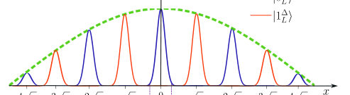 
FIG. 1. Illustration of the ideal and finite-energy logical GKP basis states in the position quadrature. Ideal codewords consist of infinitely sharp peaks, while finite-energy codewords exhibit Gaussian-broadened peaks modulated by an overall Gaussian envelope whose width is determined by the squeezing parameter ∆.

📷 Fig 2

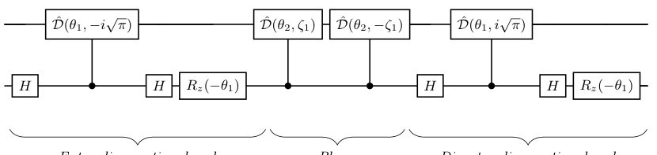 
FIG. 2. Gate architecture for logical phase gate. Composite displacement operation ˆD(θ, ζ) together with single- qubit rotations on the ancilla, realize a three-stage protocol consisting of ancilla–motional entanglement in leftmost panel, phase generation via a closed trajectory in phase space in central panel, and ancilla-motional disentanglement in rightmost panel. At the end of the sequence, the ancilla returns to its initial state while the motional GKP qubit acquires the target logical phase.

📷 Fig 3

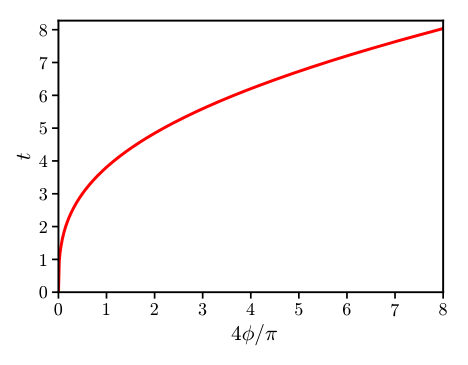 
FIG. 3. Application duration t (µs) of the operator ˆU(t) as a function of the target logical phase ϕ. The required pulse duration of the tuned-out laser increases with the magnitude of the target logical phase.

📷 Fig 4

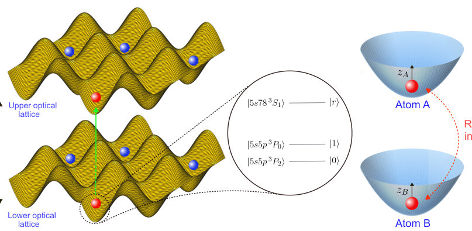 
FIG. 4. Schematic of the proposed neutral-atom architecture for implementing logical gates on motional GKP qubits. Two parallel optical lattice planes are separated by a distance R0, with each lattice site sparsely containing 88Sr atoms. The logical qubit is encoded in the axial motional mode of the atom, while the ancilla is encoded in the internal states |0⟩, |1⟩, and the Rydberg state |r⟩. For the controlled-Z gate, the two interacting atoms occupy the same (x, y) position in their respective lattice planes, so that their separation is along the z direction.

📷 Fig 5

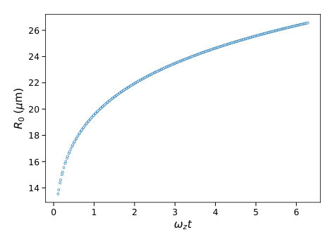 
FIG. 5. The discrete points show the atomic separa- tion R0 required for the CZ gate for Rydberg interac- tion duration t. The corresponding separations lie well outside the blockade regime, consistent with the weak- interaction regime employed in the protocol.

**Summary.** This paper presents a comprehensive protocol for implementing universal quantum gates on GKP qubits encoded in the motional states of trapped neutral atoms. By leveraging magic trapping and Rydberg interactions, the authors achieve high-fidelity, measurement-free logical control. This work provides a significant pathway toward scalable quantum computation using neutral-atom platforms.

**Why it may be interesting.** This work directly addresses the physical realization of fault-tolerant quantum computation using neutral atoms, providing concrete, high-fidelity protocols for logical operations on continuous variable qubits.

Detailed structure

**Main problem.** To develop and assess a universal, deterministic logical gate set for Gottesman-Kitaev-Preskill (GKP) qubits encoded in the motional states of trapped neutral atoms.

**Main result.** The authors propose a measurement-free scheme achieving high gate fidelities (e.g., >0.98) for single-qubit phase gates and controlled-Z gates, demonstrating viable logical control.

**Method.** The gates are implemented using a combination of free harmonic evolution, ancilla-mediated conditional displacements in phase space, and transient Rydberg-mediated dipole-dipole interactions.

**Model / system.** The system uses trapped neutral atoms (e.g., $^{88}	ext{Sr}$) where the motional states encode the GKP qubits. The protocol utilizes internal electronic states as ancillas and relies on magic trapping conditions to maintain the motional encoding throughout the gate sequence.

**Key observables.** Average gate fidelities ($ar{F}$ and $F_{cz}$), which are measured as a function of the finite squeezing parameter $\Delta$.

**Important parameters / regimes.** Squeezing parameter ($\Delta$), which controls the finite-energy approximation; the Rydberg interaction strength ($C_6$).

**Assumptions / limitations.** The protocol assumes continuous trapping (magic trapping) and relies on finite-energy approximations of the GKP code, with fidelity limited by residual quadratic interactions.

**Figures summary.** Figures illustrate the ideal versus finite-energy GKP states, the three-stage architecture for the phase gate, and plots showing gate fidelities improving as the squeezing parameter $\Delta$ decreases.

**Paper structure.** The paper progresses by defining the finite GKP code, detailing the implementation of single-qubit gates via free evolution and conditional displacements, and finally implementing the two-qubit CZ gate using Rydberg interactions.

Abstract

We present a universal logical gate set for finite-energy Gottesman-Kitaev-Preskill (GKP) qubits encoded in the harmonic motional states of trapped neutral atoms. Internal electronic states serve as ancilla for implementing state-dependent conditional displacements in phase space, enabling arbitrary single-qubit phase gates. A Transient Rydberg excitation-mediated atomic dipole-dipole interaction enables a controlled-Z gate without invoking the blockade mechanism. The gates operate under magic-trapping conditions, allowing continuous trapping throughout the gate sequence, thereby preserving the motional encoding without intermediate measurement or feedforward. We assess the experimental feasibility of the proposed protocols using neutral $^{88}\mathrm{Sr}$ atoms and obtain average gate fidelities of $0.986$ for single-qubit phase gates and $0.985$ for the controlled-Z gate at a finite squeezing parameter of $Δ=0.25$ (12 dB of squeezing), increasing to $0.997$ and $0.995$ respectively as $Δ$ reaches $0.1$. These results provide a route toward universal, measurement-free logical control of motional GKP qubits in neutral-atom architectures.

[↑ back to top](#top)

### [Effective Hardcore Exclusion Without Exclusion: Two-Species Pair Annihilation Revisited](http://arxiv.org/abs/2608.30630v1)

**Authors:** Su-Chan Park, Foster Thompson  
**Type:** theory · **Category:** statistical mechanics · **PDF:** <https://arxiv.org/pdf/2608.30630v1>  
**Analysis basis:** full PDF text, analyzed in chunks
**Topic relevance:** 🔥 `non-equilibrium universality` **4/5** · `Keldysh / 2PI / non-Gaussian methods` **2/5** · `methods for driven-dissipative` **2/5** · `driven-dissipative phase transition` **1/5**

📷 Fig 1

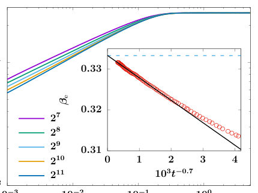 
FIG. 2. Scaling-collapse plots of wL−1/2 vs t/L3/2 on a double logarithmic scale for QA = 1 4, qA = 2, DA = 1 2 for L = 27

📷 Fig 2

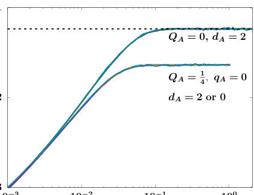 
FIG. 1. Scaling-collapse plots of wL−1/2 vs tL−2 on a semi- logarithmic scale for three sets of parameters (QA = 0, dA = 2) (top curves), (QA = 1 4, qA = 0, dA = 2), and (QA = 1 4, qA = 0, dA = 0). DA is fixed 1

📷 Fig 3

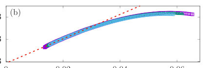 
FIG. 3. Plots of −δe against t−1/6(b1/6 −1)/ ln b with b = 8 (square), 16 (triangle), and 32 (circle) for DA = DB = 1 2, dA = dB = 0, QA = 1

📷 Fig 4

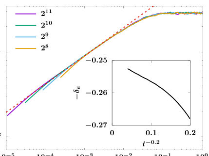 
FIG. 4. Scaling collapse of wL−1/2 vs t/L−3/2 for the single species model with hopping rate Eq. (39) for L = 28, 29, 210, and 211. The collapse looks perfect, which supports the KPZ scaling. For comparison, we also draw a straight line with slope 1

**Summary.** This paper theoretically analyzes the density decay in two-species pair annihilation systems, showing that the resulting anomalous power-law decay exponent is not solely dictated by the diffusion mechanism of the individual species. By constructing a bosonic model, the authors successfully reproduce the $t^{-1/3}$ scaling previously thought unique to hardcore exclusion models, demonstrating the profound influence of pair interactions on non-equilibrium dynamics.

**Why it may be interesting.** The work provides a deep theoretical understanding of how microscopic interaction rules (like pair vs. three-body hopping) dictate macroscopic universal scaling exponents in non-equilibrium statistical physics, which is crucial for understanding complex many-body dynamics.

Detailed structure

**Main problem.** The paper investigates the density decay exponent in reaction-diffusion systems with two mutually annihilating species ($A+B 	o \emptyset$), comparing results from hardcore exclusion models to bosonic models.

**Main result.** The pair annihilation density decay exponent ($\delta$) is not determined exclusively by the transport properties of the isolated species; the $t^{-1/3}$ scaling can be reproduced in a bosonic model, contrasting with $t^{-1/4}$ scaling from three-body hopping.

**Method.** The analysis uses the Doi-Peliti formalism to map the discrete master equation to a continuum field theory, analyzing scaling behavior using the Family-Vicsek relation and Renormalization Group techniques.

**Model / system.** The system is a 1D lattice model of two species undergoing pair annihilation ($A+B 	o \emptyset$). The dynamics are studied using a bosonic framework, allowing for nonlinear hopping rates dependent on local density.

**Key observables.** Total density decay exponent ($\delta$), dynamic exponent ($z$), and the width scaling function $w(L, t)$.

**Important parameters / regimes.** The type of hopping process (two-body vs. three-body) and the presence/absence of relative bias in diffusion rates.

**Assumptions / limitations.** The analysis relies on mapping the discrete dynamics to a continuum field theory and assuming the validity of scaling hypotheses (e.g., KPZ or EW universality classes).

**Figures summary.** Figures demonstrate scaling collapse for both EW ($\alpha=1/2, z=2$) and KPZ ($eta=1/3, z=3/2$) regimes, confirming the predicted exponents for different hopping mechanisms.

**Paper structure.** The paper progresses by establishing the general framework using the Doi-Peliti formalism, analyzing the single-species case (mapping to surface growth/Burgers' equation), and finally applying this to the two-species pair annihilation problem to compare different nonlinear hopping terms.

Abstract

Reaction-diffusion systems with two species that mutually annihilate through $A+B\to\emptyset$ reactions display a slow decay of the total density $ρ$ which follows an anomalous power law in low dimensions. For hardcore particles in one dimension, this decay follows $ρ\sim t^{-1/4}$ under symmetric diffusion and $ρ\sim t^{-1/3}$ under asymmetric diffusion without relative bias between the two species. The $t^{-1/3}$ behavior, in particular, has so far been observed exclusively in systems with hardcore exclusion. Here we construct a model of particles without hardcore exclusion that reproduces this same $t^{-1/3}$ scaling. In our model, both species undergo asymmetric diffusion with a rate that depends nonlinearly on the local density, a form of transport that, in the absence of the other species, is superdiffusive and falls into the Kardar-Parisi-Zhang universality class. The scaling behavior of $t^{-1/3}$ occurs when at least one of the two species undergoes asymmetric diffusion induced by microscopic processes involving pairs of particles, while asymmetric processes involving groups of three particles lead to $t^{-1/4}$ scaling associated with symmetric diffusion. This demonstrates that the pair annihilation density decay exponent is not determined exclusively by the transport properties of the isolated particle species.

[↑ back to top](#top)

### [Floquet engineering of competing antiferromagnetism and $d$-wave superconductivity on the square lattice](http://arxiv.org/abs/2608.28750v1)

**Authors:** Zhaoyu Han, Subir Sachdev  
**Type:** theory · **Category:** strongly correlated electrons · **PDF:** <https://arxiv.org/pdf/2608.28750v1>  
**Analysis basis:** full PDF text, analyzed in chunks
**Topic relevance:** 🔥 `analog quantum simulation` **4/5** · `methods for driven-dissipative` **2/5** · `Keldysh / 2PI / non-Gaussian methods` **1/5**

📷 Fig 1

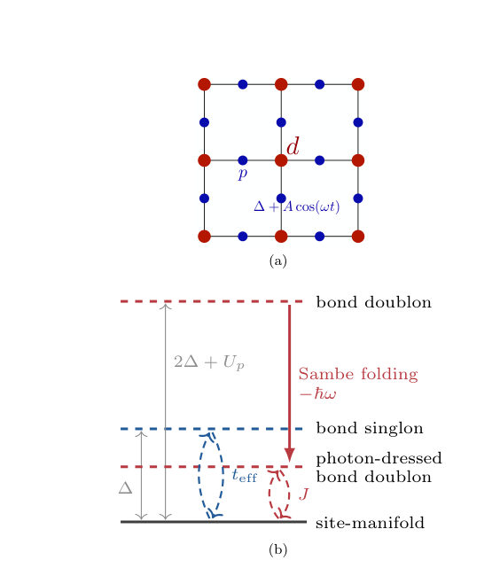 
FIG. 1. (a) Lieb lattice with d orbitals on the vertices of a square lattice and p orbitals at the bond centers. Without driving, singly and doubly occupied p configurations are both high in energy, and all microscopic interactions are repulsive. (b) Illustration of the mechanism. The site manifold consists of the square lattice of d orbitals. Modulation of the charge- transfer gap folds the one-photon p-doublon replica to a small positive energy δR above the d-bond pair, while single-p pro- cesses remain off resonance. Eliminating this Floquet-created closed channel yields a compact bond attraction whose op- erator content includes AF exchange and pair hopping. The negative-U-center...

📷 Fig 2

 
FIG. 2. Interference control of the effective couplings. The upper panel shows the signed effective hopping teff/t and mediated interaction J/t for 1.5 ≤κ ≤2. The lower panel shows the control ratios (t2/∆)/δR and δR/∆. The vertical dashed line in the upper panel marks the interference zero of teff at κ ≈1.8. All photon harmonics with |m| ≤60 are retained for t = 1, ∆= 4, Up = 4, and ℏω = 10.75. The displayed hierarchy ratios remain below 0.32 throughout the plotted window.

📷 Fig 3

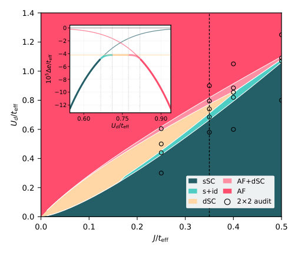 
FIG. 3. Zero-temperature mean-field phase diagram of (16). Lowest-energy variational state at half filling over the displayed coupling window. Distinct colors denote sSC, time-reversal-breaking s+id, dSC, AF+dSC, and AF. (Inset) Condensation energy relative to the symmetric normal saddle along the dashed J/teff = 0.35 cut. Thin curves are stationary solutions and thick segments are selected minima; vertical dotted lines mark refined phase boundaries.

📷 Fig 4

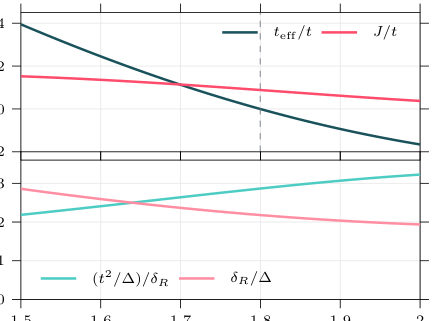 
Figure 2 illustrates this lever using the complete har- monic sums: the ratio J/|teff| can indeed be tuned by κ in a wide range while keeping the control parameters small. A caveat, though, is that this tuning also suppresses the overall energy scale of the effective model. An experi- ment must therefore choose a finite compromise between interaction-to-hopping ratio, absolute temperature scale, and lifetime. Mean-field calculation.— To test the tendencies to- ward dSC and AF in the square-lattice model, Eq. (16), we solve the saddle point equations for multiple orders at zero temperature, and audit the results with unbi- ased Gaussian states using a repeated 2 × 2 supercell. All...

**Summary.** This work proposes using a periodically driven Lieb-Hubbard quantum simulator to engineer an effective model on a square lattice. By tuning the drive parameters, the authors create a controllable bond attraction that allows for the independent tuning of superconducting and repulsive interactions. This setup enables the theoretical mapping of the competition between antiferromagnetism and d-wave superconductivity, mimicking key physics in cuprate superconductors.

**Why it may be interesting.** The use of Floquet engineering to engineer specific, tunable interactions (like negative-U centers) in a lattice system is highly relevant to AMO physics and open quantum systems, providing a clean platform to study strongly correlated phenomena.

Detailed structure

**Main problem.** The paper aims to engineer a controllable quantum simulator to study the competition between antiferromagnetism (AF) and d-wave superconductivity (dSC), a central puzzle in high-temperature superconductivity.

**Main result.** The derived effective model predicts a mean-field phase diagram showing adjacent regimes of sSC, dSC, and AF, suggesting a close competition between these orders.

**Method.** The authors use Floquet engineering on a Lieb-Hubbard model, followed by successive Schrieffer-Wolff transformations to derive an effective, tunable d-only model.

**Model / system.** The system is a driven Lieb-Hubbard quantum simulator realized in optical lattices. The effective model is a two-channel lattice Feshbach model describing fermions on a square lattice, with tunable bond attraction ($J$) and on-site repulsion ($U_d$).

**Key observables.** Phase diagram showing sSC, dSC, AF, and coexistence regions; the pairing kernel $V(k, k')$ separating into $A_{1g}$ and $B_{1g}$ channels.

**Important parameters / regimes.** Tunability of $J$ and $U_d$ independently; access to an intermediate-coupling regime where $J \sim U_d \sim t_{	ext{eff}}$; the ratio $J/t_{	ext{eff}}$ and $U_d/t_{	ext{eff}}$.

**Assumptions / limitations.** The derivation relies on second-order perturbation theory and specific energy hierarchies (e.g., $\Delta \gg \delta_R \gg t^2/\Delta$). The final phase diagram is based on mean-field calculations.

**Figures summary.** Figure 1 illustrates the mechanism of creating a bond attraction via modulating the charge-transfer gap. Figure 3 shows the mean-field phase diagram mapping out various superconducting and magnetic orders.

**Paper structure.** The paper first introduces the driven Lieb-Hubbard model and the mechanism for generating an effective bond attraction. It then uses perturbation theory to derive the effective d-only Hamiltonian. Finally, it analyzes the resulting model via mean-field theory to map out the competing ordered phases.

Abstract

We propose a driven Lieb--Hubbard quantum simulator whose prethermal dynamics realize a square-lattice spin-1/2 fermion model with independently tunable repulsive on-site and attractive bond interactions. Periodically modulating the charge-transfer offset between the site ($d$) and bond ($p$) orbitals of the Lieb lattice brings a $p$-orbital doublon energetically close to a pair in the $d$ manifold while keeping all $p$-orbital singlons off resonance, thereby creating a synthetic ``negative-$U$'' center on a Lieb-lattice bond site. Two controlled eliminations then generate a compact bond attraction in the reduced $d$-only model on the square lattice, despite the microscopic repulsion in the $p$ orbital. The resulting interaction $J$ is tunable independently of the Hubbard repulsion $U_d$ on the $d$ orbitals, while interference between photon-assisted paths provides access to an intermediate-coupling regime in which $J$ and $U_d$ are both comparable to the effective hopping. At half filling, a mean-field calculation in this regime finds adjacent antiferromagnetic and $d$-wave superconducting phases, as well as narrow coexistence regions, suggesting close competition between these orders. We discuss the branch-preparation, prethermal, and higher-band conditions required to translate the formal construction into an optical-lattice protocol. More broadly, our work identifies a structural similarity between Floquet systems and electron-phonon problems that may guide the design of novel quantum-simulation protocols.

[↑ back to top](#top)

### [BAHAMAS: A Control Plane for Optimization and Execution of Variational Quantum Circuits](http://arxiv.org/abs/2608.28811v1)

**Authors:** Amit Samanta, Mohammad Abrarul Hasanat, Jason Ludmir, Ryan Stutsman, Tirthak Patel, Rohan Basu Roy  
**Type:** both · **Category:** quantum information and computing · **PDF:** <https://arxiv.org/pdf/2608.28811v1>  
**Analysis basis:** full PDF text, analyzed in chunks
**Topic relevance:** 🔥 `QC/QI experiment` **4/5** · `quantum measurements` **2/5**

📷 Fig 1

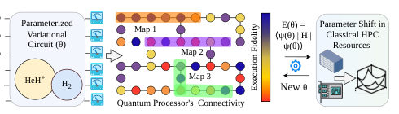 
Fig. 1: Hybrid classical-quantum optimization loop. The pa- rameterized circuit (ansatz) maps onto the processor via different physical mappings, each with a different fidelity. Cost and gradients are computed classically via parameter-shift, and the parameters are updated for the next iteration.

📷 Fig 2

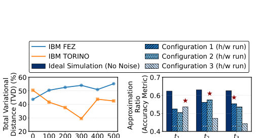 
Fig. 2: TVD (lower is better) fluctuates when the same circuit is initiated at different times on quantum hardware. Relative rankings of the performance metric for parameter configu- rations shift over time on real hardware. Stars mark the best configuration at each time instant on quantum hardware (h/w).

📷 Fig 3

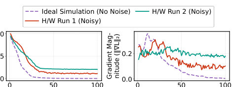 
Fig. 3: Ideal simulation loss converges to near zero and gradients decay. On noisy quantum hardware (h/w), loss plateaus and gradients remain elevated and erratic.

📷 Fig 4

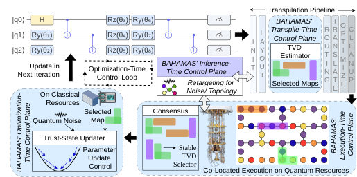 
Fig. 5: BAHAMAS’ control plane spans transpilation, execu- tion, and parameter update. The TVD estimator shortlists K low-TVD maps at transpile time. Co-located execution probes them under shared noise, and the stable TVD selector picks the best match to the target. The trust-state updater gates gradient updates on classical resources. In inference, map selection is retargeted for drifted noise or new topology.

📷 Fig 5

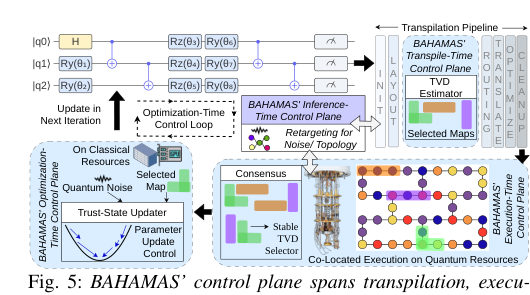 
Fig. 5 shows BAHAMAS’ architecture. The control plane spans three stages and operates in two modes: an optimization- time control loop and an inference-time retargeting mode.

**Summary.** This paper introduces BAHAMAS, an online control plane designed to stabilize Variational Quantum Algorithms (VQAs) running on noisy quantum hardware. It solves the problem of optimization instability caused by time-varying noise and fixed qubit mappings by adaptively selecting the best physical qubit mapping at every iteration. This results in more reliable and robust quantum computation performance on real devices.

**Why it may be interesting.** It provides a practical, hardware-aware control layer for VQAs, directly addressing the critical challenge of noise-induced instability in near-term quantum computation, which is highly relevant to experimental quantum information science.

Detailed structure

**Main problem.** Variational Quantum Algorithms (VQAs) suffer from unstable optimization because hardware noise and static qubit mappings distort gradient signals across optimization iterations.

**Main result.** The proposed framework, BAHAMAS, significantly improves VQA optimization reliability by adaptively controlling noise exposure and maintaining consistent performance across different hardware runs and drift conditions.

**Method.** BAHAMAS is an online control plane that stabilizes noise by adaptively selecting physical qubit mappings using consensus-based fidelity estimation, without needing simulators or offline training.

**Model / system.** The work operates on hybrid classical-quantum systems using VQAs on real quantum processors (e.g., IBM quantum processors) that exhibit time-varying noise and qubit drift.

**Key observables.** Total Variation Distance (TVD), normalized loss, and gradient magnitude are key diagnostics used to measure noise stability and optimization progress.

**Important parameters / regimes.** The optimization parameters ($	heta$) of the parameterized quantum circuit (ansatz) are the primary variables being optimized.

**Assumptions / limitations.** The core assumption addressed is that optimization quality depends on *consistent* noise exposure across iterations, not just low noise at any single point.

**Figures summary.** Figures illustrate the optimization loop, showing how TVD fluctuates due to drift, how the best circuit mapping changes over time, and comparing ideal simulation convergence versus noisy hardware plateaus.

**Paper structure.** The paper introduces the problem of VQA instability due to noise, details the BAHAMAS control plane components (stable TVD selector, trust-state updater), presents results showing performance gains, and concludes by discussing the framework's robustness.

Abstract

Variational quantum algorithms (VQAs) suffer from unstable optimization due to temporal noise drift and static qubit mappings that distort gradient signals across iterations. We present BAHAMAS, an online control framework that stabilizes noise exposure by adaptively selecting physical mappings via consensus-based fidelity estimation, without requiring simulators, offline training, or prior executions. Across real quantum devices, BAHAMAS improves optimization reliability and supports inference-time retargeting under drift through robust, per-iteration control.

[↑ back to top](#top)

### [FIREQ: FPGA Instrumentation for Readout and Qubit control](http://arxiv.org/abs/2608.29399v1)

**Authors:** Giuseppe La Capra, Fabio Calabrese, Giorgio D'Amico, Christian Conti, Andrea De Simone, Deborah Volpe, Roldolfo Carobene, Claudio Gatti, Andrea Giachero, Fabrizio Riente  
**Type:** both · **Category:** quantum information and computing · **PDF:** <https://arxiv.org/pdf/2608.29399v1>  
**Analysis basis:** full PDF text, analyzed in chunks
**Topic relevance:** 🔥 `QC/QI experiment` **4/5** · `quantum measurements` **2/5**

📷 Fig 1

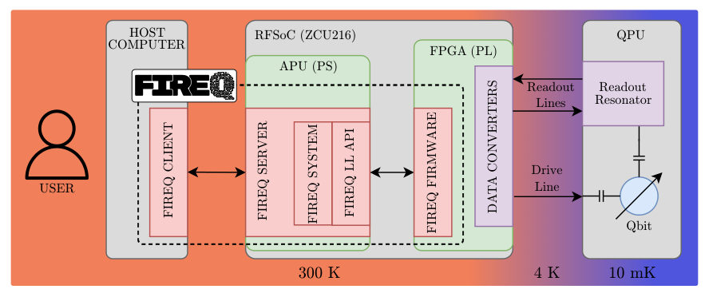 
FIG. 1. System overview: a room-temperature host drives an RFSoC board, composed of a Processing System (PS), Pro- grammable Logic (PL) and Data Converters that generates and acquires the qubit drive and readout signals across the 300 K- 10 mK stages. The FIREQ framework, whose components are colored in red, comprises the host and device software (client and server) and the device firmware.

📷 Fig 2

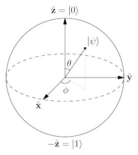 
FIG. 2. Bloch Sphere Representation. Image by Glosser.ca (Wikimedia Commons), used under CC BY-SA 3.0.

📷 Fig 3

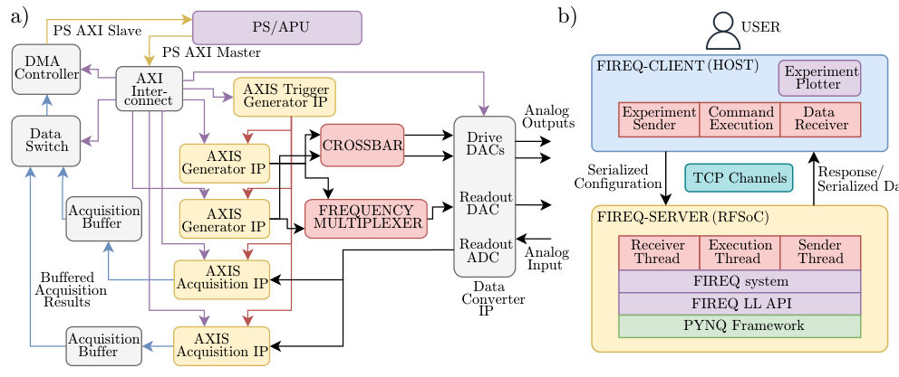 
FIG. 3. a) overview of the FIREQ Firmware, showing the custom peripherals in yellow that handle timing, signal generation and acquisition, and how they are connected to the RFSoC’s APU (PS) through AXI connections; b) the client-server software architecture, showing the inbound and outbound configuration and data channels and the PYNQ-based software abstraction stack.

📷 Fig 4

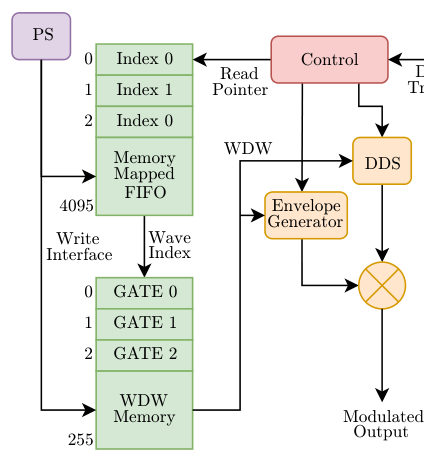 
FIG. 4. Simplified block diagram of the sequencing mecha- nism of drive pulses present in the FIREQ signal generator IP. The memory mapped FIFO indexes the WDW memory, which in turn stores control signals to generate a pulse. In this example, the drive wave order is: GATE 0, GATE 1, GATE 0.

📷 Fig 5

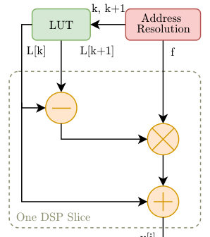 
FIG. 5. Block diagram of the envelope interpolator, showing the mathematical operations that are mapped to a single DSP Slice.

**Summary.** This paper presents FIREQ, an open-source, FPGA-based framework designed to overcome the scaling limitations of classical control electronics for superconducting qubits. By integrating all control and readout functions onto an RFSoC, it achieves high performance metrics, validating its use as a robust, modular platform for quantum experiments.

**Why it may be interesting.** This work provides a concrete, high-performance hardware platform for quantum control, which is crucial for experimentalists developing and testing new quantum algorithms or characterizing novel qubit modalities.

Detailed structure

**Main problem.** The classical infrastructure required to control and measure superconducting qubits becomes a significant bottleneck as qubit counts scale.

**Main result.** The FIREQ framework successfully demonstrated end-to-end operation on a superconducting qubit, achieving T1 = 6.94 us and T2* = 13.50 us while maintaining low timing skew.

**Method.** The authors developed an open-source, RFSoC-based hardware/software co-design framework that integrates RF synthesis, pulse generation, and readout directly onto an FPGA.

**Model / system.** The system targets superconducting qubits, whose quantum state is modeled on the Bloch sphere and controlled via microwave pulses inducing rotations. The platform uses an AMD Zynq UltraScale+ RFSoC for high-speed, deterministic control.

**Key observables.** Qubit coherence times ($T_1, T_2^*$), RF output phase noise, timing skew, and gate fidelity.

**Important parameters / regimes.** RF pulse generation up to 9.3 GHz with 107 ps resolution; $T_1 = 6.94 \mu	ext{s}$ and $T_2^* = 13.50 \mu	ext{s}$.

**Assumptions / limitations.** The core assumption is that integrating control/readout functions onto an RFSoC significantly reduces latency and overhead compared to conventional external instrumentation.

**Figures summary.** Figures illustrate the system overview across cryogenic stages, the Bloch sphere representation of the qubit state, and detailed results from qubit characterization experiments (e.g., Rabi oscillations, $T_1$ measurements).

**Paper structure.** The paper introduces the hardware challenge, details the FIREQ architecture (firmware/software stack), validates the system performance metrics (timing skew, RF characterization), and concludes with experimental results on qubit spectroscopy and coherence measurements.

Abstract

We present FIREQ (FPGA Instrumentation for Readout and Qubit control), an open-source RFSoC-based framework for the control and readout of superconducting qubits. FIREQ combines a modular AXI-compliant firmware architecture with a PYNQ-based software stack designed to support extensible hardware integration, deterministic experiment timing, and low-overhead execution of repeated calibration and characterization workflows. The firmware implements direct RF synthesis and acquisition, trigger-based sequencing, programmable pulse generation, frequency-multiplexed readout, and memory-efficient acquisition and waveform buffering. The software adopts a client-server architecture with streamed data transfer and dependency-aware configuration updates to reduce host-device and reconfiguration overhead during parameter sweeps. On an AMD Zynq UltraScale+ RFSoC ZCU216, FIREQ generates RF pulses up to 9.3 GHz with a pulse-duration resolution of 107 ps and an event-timing resolution of 1.7 ns. FPGA resource utilization is compared with representative open-source RFSoC control frameworks, showing a low BRAM footprint while retaining full-rate I/Q generation and acquisition. The RF output is characterized in terms of phase noise, noise spectral density, and inter-channel timing skew. End-to-end operation is validated on a superconducting qubit through resonator spectroscopy, Rabi, Ramsey, and relaxation measurements, yielding T1 = 6.94 us and T2* = 13.50 us. FIREQ can therefore be used both as a qubit-control platform and as an experimental environment for evaluating alternative control and readout IP architectures.

[↑ back to top](#top)

### [Well-conditioned iterative methods for large open quantum systems](http://arxiv.org/abs/2608.30860v1)

**Authors:** Gaspard Beugnot, Paul Gregory, Rémi Robin, Antoine Tilloy  
**Type:** theory · **Category:** numerical methods · **PDF:** <https://arxiv.org/pdf/2608.30860v1>  
**Analysis basis:** full PDF text, analyzed in chunks
**Topic relevance:** 🔥 `methods for driven-dissipative` **4/5** · `correlated / nonlocal dissipation` **1/5** · `driven-dissipative phase transition` **1/5**

📷 Fig 1

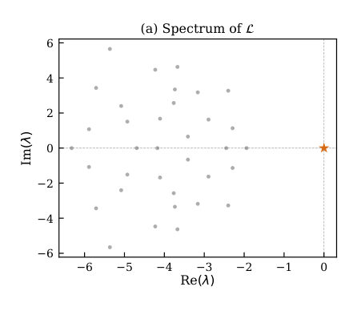 
Figure 1: Spectra of a random dense Lindbladian (see section 2.3.1) for a Hilbert space of dimension n = 6. (a) Spectrum of L; even for low-dimensional systems, the large spread of eigenvalues reflects the poor conditioning of L. (b) Spectrum of Φ = −KS−1; all eigenvalues lie within the unit circle (dashed). In both panels, the red star marks the eigenvalue corresponding to the steady state.

📷 Fig 2

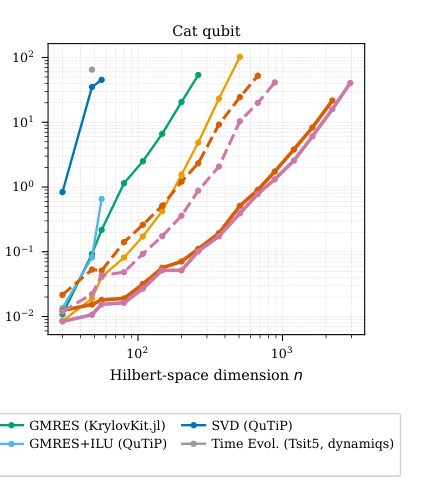 
Figure 2: Runtime of steady-state solvers versus Hilbert-space dimension n, for the dense random Lindbladian (left) and the memory–buffer cat qubit (right). Our two methods (Arnoldi on Φ and preconditioned GMRES) beat all competitors on CPU, and further gain a ×50 speedup on the H100 GPU; the competitors (QuTiP SVD and ILU-GMRES, MUMPS, Krylov.jl GMRES) run on the Xeon CPU, and the time-evolution baseline on GPU for the cat family. See section B in the Appendix for the exact configurations.

📷 Fig 3

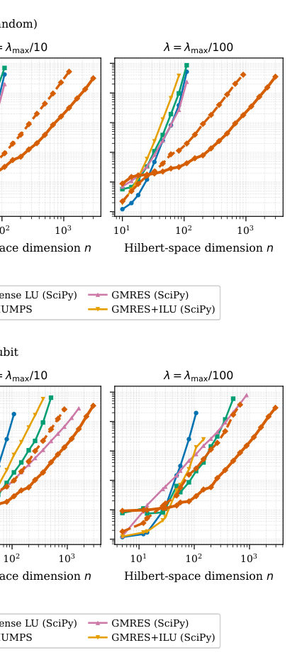 
Figure 3: Runtime of resolvent solvers for (λ −L)(ρ) = Id/n versus Hilbert-space dimension n, at the three shifts λ = λmax, λmax/10, λmax/100 (columns), for the dense random Lindbladian (top) and the memory–buffer cat qubit (bottom). Our preconditioned GMRES is shown on CPU (dashed) and on the H100 GPU (solid); the competitors (dense LU, MUMPS, GMRES, GMRES + ILU) run on the Xeon CPU. The gain over the competitors is small at λ = λmax and grows as λ →0, and is largest for the dense family and on GPU. See section B for the exact configurations.

📷 Fig 4

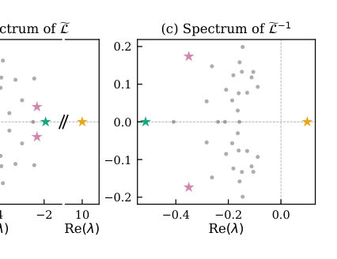 
Figure 4: Random dense Lindbladian (section B.1) spectra for a Hilbert space of size n = 6. (a) Full spectrum of L. (b) Spectrum of eLη = L + η Tr (·) Id with η = 10/n, which shifts the steady-state eigenvalue to ηn = 10 (orange star) while leaving all nonzero modes unchanged. (c) Spectrum of eL−1 η : the low-lying modes of eLη (small |λ|) become its dominant eigenvalues (large |1/λ|). The operator actually iterated in the text is (µ −eLη)−1, which at µ = 0 differs from eL−1 η by an overall sign. In all panels, the red star marks the steady state, the green star the slowest-decaying nonzero mode, and the purple stars the next conjugate pair. The orange star in the second and third panels...

📷 Fig 5

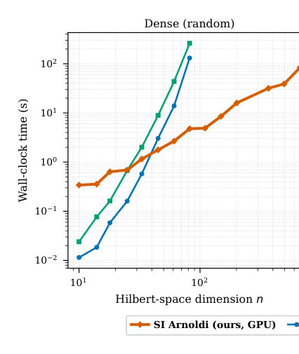 
Figure 5: Wall-clock time to compute the low-lying spectrum as a function of the Hilbert-space dimension n (log–log), for the dense random Lindbladian (left, section B.1) and the memory– buffer cat qubit (right, section B.1). Our shift-invert Arnoldi solver (SI Arnoldi, ours) is compared against the dense eigenvalues solver of NumPy and the ARPACK shift-invert solver of SciPy, both applied to the n2 × n2 Liouvillian. See section B for the exact configurations.

**Summary.** This paper tackles the computational challenge of simulating large open quantum systems governed by the Lindblad Master Equation. It introduces a novel numerical approach by decomposing the Liouvillian operator and constructing an auxiliary map $\Phi$ whose fixed point yields the steady state. By leveraging the efficient invertibility of the no-jump evolution part, the authors achieve state-of-the-art, scalable iterative solvers for finding steady states and low-lying spectra.

**Why it may be interesting.** This work provides state-of-the-art numerical techniques for simulating complex open quantum dynamics, moving beyond the prohibitive $O(n^6)$ scaling of direct methods to an efficient $O(n^3)$ scaling per iteration.

Detailed structure

**Main problem.** Developing efficient, well-conditioned iterative methods to solve for the steady state, low-lying spectrum, and time evolution of large open quantum systems.

**Main result.** The authors propose using an auxiliary CPTP map $\Phi$ derived from the no-jump evolution part of the Lindbladian, allowing the steady state to be found efficiently via Arnoldi iterations.

**Method.** The core method involves decomposing the Lindblad operator $\mathcal{L} = S + K$ and utilizing the efficient inversion of the no-jump part $S$ to construct a suitable iterative map $\Phi$. This map is then used with Krylov subspace methods (Arnoldi/GMRES) for convergence.

**Model / system.** The system is modeled by Markovian open quantum systems governed by the Lindblad Master Equation ($\dot{
ho}_t = \mathcal{L} 
ho_t$). The analysis focuses on the superoperator $\mathcal{L}$ acting on the density matrix $
ho_t$.

**Key observables.** Steady state $
ho_\infty$, low-lying excited states (eigenvectors/eigenvalues of $\mathcal{L}$), and time evolution $
ho(t)$.

**Important parameters / regimes.** System dimension $n$ (large, $n \ge 10^3$), time step $\Delta t$, and the spectral gap of $\mathcal{L}$.

**Assumptions / limitations.** The primary assumption is that the no-jump part $S$ is invertible, which allows the construction of the auxiliary map $\Phi$. The methods are benchmarked assuming a unique steady state exists.

**Figures summary.** Figures compare spectra of $\mathcal{L}$ and the auxiliary map $\Phi$, showing the latter has eigenvalues confined within the unit circle, which is ideal for iterative solvers.

**Paper structure.** The paper first establishes the computational bottleneck of the Lindblad equation ($\mathcal{L}$), then introduces the decomposition $\mathcal{L} = S + K$. It then details the use of the inverse map $S^{-1}$ to define $\Phi$, showing how $
ho_\infty$ relates to the fixed point of $\Phi$, and finally applies this framework to compute the spectrum and time evolution using specialized Krylov solvers.

Abstract

Markovian open quantum systems are well modeled by the Lindblad Master Equation (ME) $\frac{\mathrm{d}}{\mathrm{d} t} ρ_t = \mathcal{L} ρ_t$, where $\mathcal{L}$ is a linear (super-)operator and $ρ_t$ is the system state, a positive matrix. When designing or characterizing a quantum system, one is usually interested in the steady state $ρ_\infty$ (such that $\mathcal{L} ρ_\infty = 0$), the first few excited states, and trajectories $t\mapsto ρ_t$. In finite dimension, $ρ_t$ is an $n\times n$ matrix, $\mathcal{L}$ thus typically costs $n^4$ to store explicitly as a dense matrix, and $O(n^6)$ to diagonalize or invert exactly, making standard linear algebraic techniques expensive for large systems. However, $\mathcal{L}$ usually costs only $O(n^3)$ to apply. This makes iterative methods appealing, but they do not work without a good preconditioner. In this article, our main observation is that a part of the Lindblad equation, corresponding to the so-called no-jump evolution $\mathcal{S}$, can be inverted efficiently. Using this inverse map, we introduce an auxiliary completely positive trace-preserving (CPTP) map $Φ$ whose fixed point is directly related to $ρ_\infty$, all the other eigenvalues having smaller magnitude. The map $Φ$ is thus well suited to iterative methods, and $ρ_\infty$ can be found in a few Arnoldi iterations. Using the same inverse map $\mathcal{S}^{-1}$ as preconditioner, we compute the low-lying spectrum efficiently via shift-invert Arnoldi, and, as a proof of concept, build an implicit time integrator that is competitive on stiff systems in the low-precision regime. For the steady-state and low excited states problems, our methods scale like $O(n^3)$ per iteration and offer state-of-the-art performance on CPU and GPU.

[↑ back to top](#top)

### [Data and code for collision-model Dicke-state preparation: depth-fidelity frontiers, circuit costs, and superconducting-processor measurements](http://arxiv.org/abs/2608.30176v1)

**Authors:** Duc-Kha Vu, Minh Tam Nguyen, Şahin K. Özdemir, Özgür E. Müstecaplıoğlu, Fatih Ozaydin  
**Type:** both · **Category:** quantum information and computing · **PDF:** <https://arxiv.org/pdf/2608.30176v1>  
**Analysis basis:** full PDF text, analyzed in chunks
**Topic relevance:** 🔥 `QC/QI experiment` **4/5** · `quantum measurements` **1/5**

📷 Fig 1

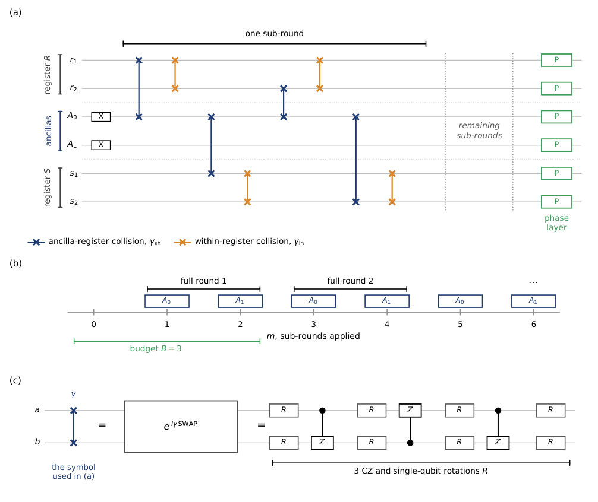 
Figure 1. The protocol and depth convention illustrated for D2 6. (a) One sub-round. For D2 6, K = 2 shuttle ancillas, A0 and A1, lie between two two-qubit registers, R and S; no interaction directly connects the two registers. Ancilla A0 sequentially interacts with each register site through ancilla–register collisions (blue), and each visited site then interacts with its neighbors within the same register through within-register collisions (orange). For a two-site register, the single internal edge is used twice per sub-round. A layer of single-qubit phase rotations P closes the circuit. (b) Depth m counts sub-rounds, with one full round every K sub-rounds. The 1-based budget index B used...

📷 Fig 2

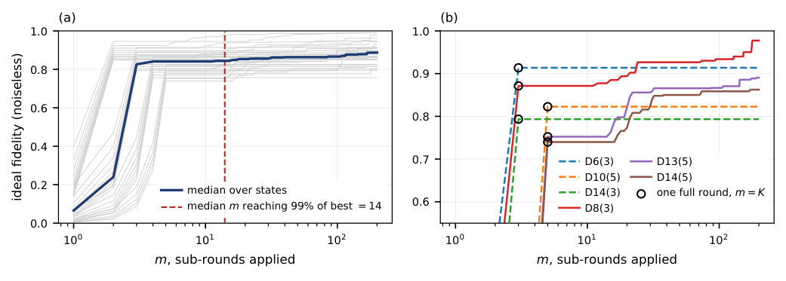 
Figure 2. The L1 fidelity frontier. (a) Best-found noiseless fidelity versus the maximum allowed depth m, measured in sub-rounds, for all 31 target states. Gray curves show the individual target states, and the solid curve shows the across-state median. The vertical dashed line marks the median depth, m = 14, required to reach 99% of each state’s best-found fidelity. (b) Six representative target states. Dashed curves indicate states for which the best-found fidelity is already attained after one full round, m = K; open circles mark the one-full-round points. Depth m = 0, corresponding to a circuit with no collisions, is omitted for clarity.

📷 Fig 3

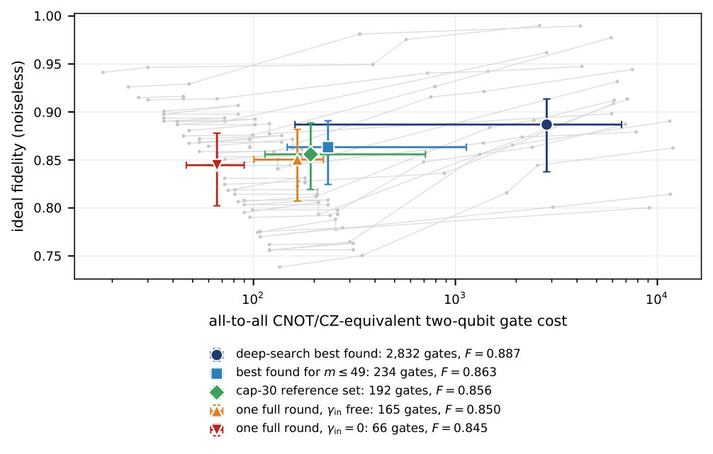 
Figure 3. Noiseless fidelity versus the all-to-all CNOT/CZ-equivalent two-qubit gate cost for the five operating regimes summarized in Table II. Each gray line connects the five operating regimes for one target state. Colored markers show the across-state medians, with horizontal and vertical bars spanning the corresponding interquartile ranges. Here pSWAP denotes the number of partial-swap interactions, and the two-qubit gate cost is 3 × pSWAP as defined in Sec. III B; routing overhead is not included.

📷 Fig 4

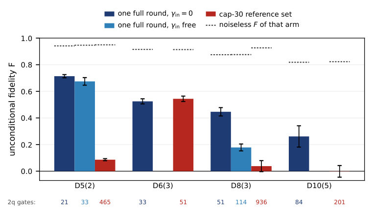 
Figure 4. Estimated unconditional fidelity F for each measured hardware arm. The horizontal dash above each bar indicates the noiseless fidelity Fideal of the corresponding circuit, and the native two-qubit gate count is shown beneath each bar. Error bars show the quoted uncertainty σF obtained from the error-bar analysis described in Sec. IV C.

📷 Fig 5

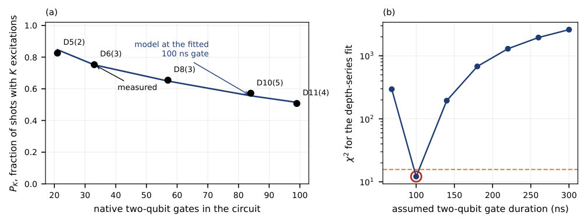 
Figure 5. Effective two-qubit gate-duration fit. (a) Measured excitation-sector population PK versus the native two-qubit gate count for the preliminary depth series. The solid curve shows the model evaluated at the fitted effective two-qubit gate duration of 100 ns. (b) Gate-duration scan obtained by evaluating χ2 for the same depth-series measurements as the assumed two-qubit gate duration is varied. The minimum occurs at 100 ns, with χ2 = 12.2. The dashed horizontal line shows the alternative fit obtained by fixing the duration at 68 ns and rescaling all calibrated two-qubit gate errors by a common factor. The best such fit requires a factor λ = 2.4 and gives χ2 = 15.7.

**Summary.** This work tackles the difficult problem of generating highly entangled Dicke states by presenting an open dataset and code for a collision-based quantum protocol. The resource includes noiseless theoretical frontiers, circuit cost estimates, and actual measurements on a superconducting processor. It is vital for benchmarking the trade-off between achievable state fidelity, required circuit depth, and hardware noise.

**Why it may be interesting.** It provides a crucial, reusable benchmark for quantifying the practical limitations of generating complex entangled states on near-term quantum hardware, directly addressing the fidelity-cost trade-off.

Detailed structure

**Main problem.** The primary challenge is preparing multipartite entangled Dicke states with high fidelity, especially as the system size and excitation number increase.

**Main result.** The authors release a comprehensive dataset and code detailing the trade-off between state-preparation fidelity, circuit cost, and hardware noise across a full depth axis.

**Method.** They analyze a collision-based quantum protocol, providing data layers that cover noiseless theoretical limits, circuit resource estimates, and actual measurements on a superconducting processor.

**Model / system.** The system involves preparing Dicke states ($	ext{D}_K^N$) using a collision-based protocol mediated by a mobile shuttle ancilla. The implementation is benchmarked on a 54-qubit superconducting processor.

**Key observables.** Fidelity (noiseless vs. measured), circuit depth (sub-rounds $m$), and circuit cost (gate count, interactions).

**Important parameters / regimes.** System size (5 to 14 qubits), excitation number ($K$), and circuit depth ($m=0$ to $m=200$).

**Assumptions / limitations.** The hardware measurements are subject to superconducting processor noise and decoherence, and the comparison highlights that optimizing only noiseless fidelity can lead to unnecessarily deep circuits.

**Figures summary.** Not specified, but the analysis focuses on visualizing the trade-off between fidelity, cost, and depth across multiple states.

**Paper structure.** The paper introduces the problem, details the collision-based protocol, presents the open dataset (L1: Noiseless Frontier, L2: Circuit Cost, L3: Hardware), and discusses the implications of the full depth-dependent analysis.

Abstract

Dicke states are multipartite entangled states in which a fixed number of quantum excitations is coherently shared among many qubits. Originally introduced in the context of cooperative emission and superradiance, they are now important resources for quantum sensing, networking, and collective quantum phenomena. Preparing prescribed Dicke states with high fidelity, however, remains challenging, particularly as the system size and excitation number increase. Here we present an open dataset and accompanying code for preparing Dicke states using a collision-based quantum protocol. The dataset covers systems from five to fourteen qubits over a broad range of excitation numbers and records how the best-found noiseless preparation fidelity changes with circuit depth. It also provides circuit-resource estimates and experimental measurements for selected states on the 54-qubit IQM Emerald superconducting processor. The accompanying code reproduces the processed data and validation checks, providing a reusable benchmark for studying the trade-off between state-preparation fidelity, circuit cost, and hardware noise.

[↑ back to top](#top)

### [Device characterization of Si$/$SiGe double quantum dots using exchange oscillations in Earth's magnetic field](http://arxiv.org/abs/2608.31093v1)

**Authors:** Holly G. Stemp, Harry Hanlim Kang, Chih Hwan Yang, Gabriel D. Cutter, Frederike Brockmeyer, Patrick J. Strohbeen, Max Hays, Jeffrey A. Grover, William D. Oliver  
**Type:** experiment · **Category:** quantum information and computing · **PDF:** <https://arxiv.org/pdf/2608.31093v1>  
**Analysis basis:** full PDF text, analyzed in chunks
**Topic relevance:** 🔥 `QC/QI experiment` **4/5** · `quantum measurements` **1/5**

📷 Fig 1

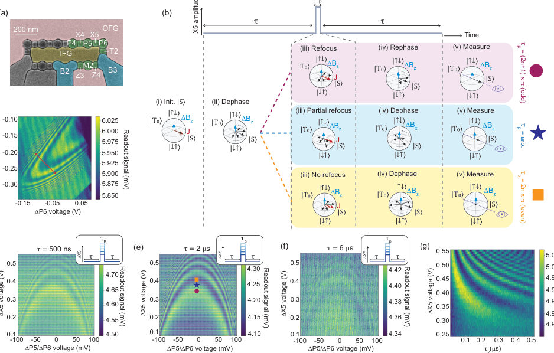 
FIG. 1. Exchange oscillations at zero magnetic field. (a) False colored SEM image of a 1 x 6 SLEDGE Si/SiGe quantum dot device nominally identical to the device used in this work. Only the P5 and P6 dots in the right-hand triple quantum dot were operated. Pink gates represent the outer field gate, OFG, which is DC biased in depletion mode for quantum dot confinement. The yellow gate is the inner field gate, IFG, also DC biased in depletion mode for lateral dot confinement. Blue gates represent bath gates, which are DC biased in accumulation mode, to provide a supply of electrons to the quantum dots from the ohmic reservoirs (not shown). Green gates represent gates that are connected to both...

📷 Fig 2

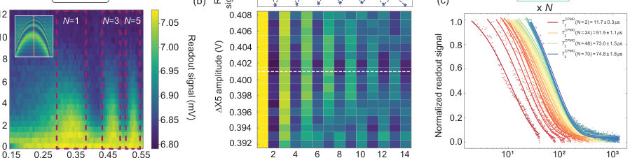 
FIG. 2. Characterization of the double quantum dot device. (a) 2D sweep of exchange pulse ∆X5 amplitude against wait time in the dephasing (1,1) region, with the ∆P6, ∆P5 values set to 0V. The ∆X5 sweep axis therefore represents a linecut through the exchange fingerprint shown in the inset. For amplitudes that correspond to an odd number of π-pulses, a refocusing effect occurs, which results in a Hahn echo-like sequence that extends the singlet coherence time. These refocusing amplitudes are highlighted in the red dashed boxes. For amplitudes that correspond to an even number of π-pulses, the exchange pulse has no refocusing effect, effectively turning the experiment into a Ramsey-style...

📷 Fig 3

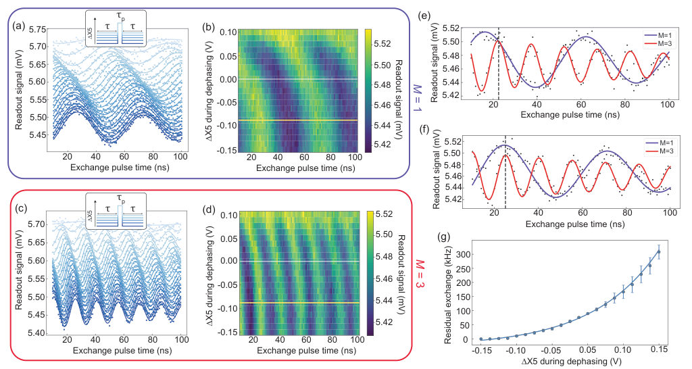 
FIG. 3. Probing low values of residual exchange. (a) A sequence consisting of waiting in the dephasing region in (1,1) for 2 µs, before applying a variable length pulse on the X5 exchange gate, followed by a further wait time in the (1,1) dephasing region for 2 µs. Each vertically offset curve in the waterfall plot represents a different ∆X5 amplitude applied during the two dephasing wait times. The ∆X5 amplitude during the exchange pulse was fixed. It should be noted that all ∆X5 amplitudes discussed are applied on top of a constant X5 DC offset that is applied throughout the experiment and was determined when tuning up the device for PSB readout. Dark blue curves represent low ∆X5...

📷 Fig 4

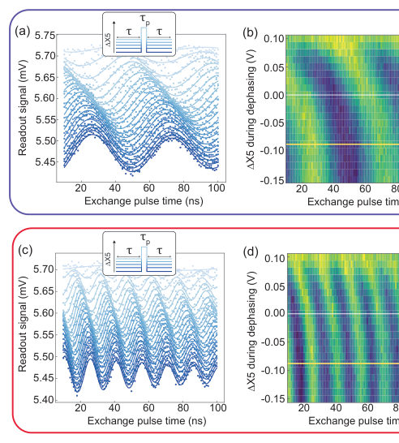 
Figure 2(c) shows the CPMG measurements for N =2- 70 refocusing pulses, using the calibrated π-pulse from Fig. 2(b). The singlet coherence time was extended up to T CPMG 2 = 74.8 ± 1.8 µs for N =70 refocusing pulses. Note that this CPMG sequence was carried out with the idle position at the circle point in the (1,1) cell, discussed

📷 Fig 5

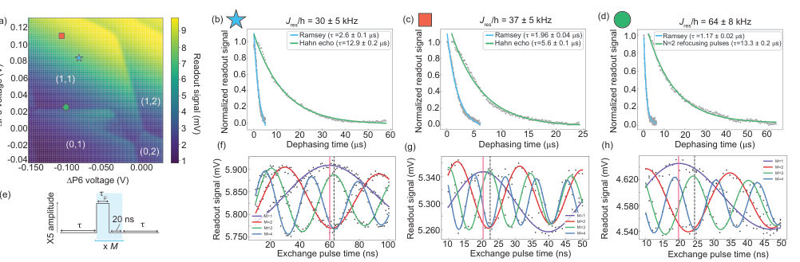 
FIG. 4. Characterizing the (1,1) charge cell. (a) Charge stability map around the (1,1)-(0,2) interdot transition. The red square, blue star and green circle represent points in the (1,1) charge cell used for the dephasing point in the exchange pulses sequences. (b) Ramsey (blue curve) and Hahn echo measurement (green curve) performed with the dephasing point at the blue star point shown in (a). (c) Ramsey (blue curve) and Hahn echo measurement (green curve) performed with the dephasing point at the red square point shown in (a). (d) Ramsey (blue curve) and CPMG measurement with two refocusing pulses (green curve) performed with the dephasing point at the green circle point shown in (a)....

**Summary.** This paper presents a novel, field-free method to characterize spin qubits in Si/SiGe double quantum dots by exploiting the intrinsic magnetic field gradient from nuclear spins. By implementing CPMG exchange sequences, the researchers significantly extend coherence times and accurately map the residual exchange coupling. This establishes a simple, highly relevant diagnostic technique for next-generation solid-state quantum computing devices.

**Why it may be interesting.** This work provides a robust, practical diagnostic tool for solid-state qubits, directly addressing the challenge of operating in environments (like superconducting circuits) where external magnetic fields are detrimental, which is highly relevant to quantum computing hardware development.

Detailed structure

**Main problem.** The primary goal was to develop a simple, zero-applied-field diagnostic method to characterize exchange-coupled spin pairs in semiconductor qubits, especially for hybrid systems sensitive to external magnetic fields.

**Main result.** The authors successfully demonstrated that intrinsic magnetic-field gradients from residual nuclear spins can be used to implement exchange oscillations, extending coherence times significantly and providing a simple, high-throughput characterization tool.

**Method.** The characterization relies on applying Carr-Purcell-Meiboom-Gill (CPMG) exchange sequences to measure the decay and oscillation phase of the singlet state coherence.

**Model / system.** The system is based on Si/SiGe double quantum dots (DQD) used as semiconductor qubits. The physics is modeled using an effective Hamiltonian restricted to the $\{|S
angle, |T_0
angle\}$ subspace, incorporating the intrinsic gradient ($\Delta B_z$) and exchange coupling ($J$).

**Key observables.** Singlet coherence time ($T_{CPMG}^2$), residual exchange coupling ($J_{res}$), and the frequency/Q-factor of exchange oscillations.

**Important parameters / regimes.** Coherence times up to $75 \mu$s; residual exchange coupling resolved in the tens-of-kilohertz regime; exchange tunability of $\sim 5.2 	ext{ dec/V}$.

**Assumptions / limitations.** The method assumes the intrinsic gradient from residual nuclear spins provides a sufficient, quasi-static quantization axis, allowing the use of CPMG sequences without external magnets.

**Figures summary.** Figures illustrate the experimental setup, the pulse sequence logic for generating exchange oscillations, and quantitative results showing the extension of coherence time via CPMG and the extraction of $J_{res}$ via joint fitting of multiple pulse sequences.

**Paper structure.** The paper progresses by first establishing the need for zero-field diagnostics, then detailing the use of CPMG sequences to measure coherence, followed by advanced fitting techniques to extract residual exchange coupling ($J_{res}$), and concluding with the characterization of exchange tunability.

Abstract

Exchange-based semiconductor qubits encompass a broad family of encodings constructed from singlet- and triplet-like spin states, several of which are compatible with operation at zero applied magnetic field. Their reliable operation requires characterization of environmental noise, residual idle interactions, and exchange-dependent decay, but this characterization often relies on multi-axis control calibration or deliberately engineered magnetic-field gradients. A simpler zero-applied-field diagnostic is particularly valuable for hybrid semiconductor-superconductor systems, in which magnetic fields can degrade superconducting components. Here, we use the intrinsic magnetic-field gradient produced by residual nuclear spins in isotopically enriched Si/SiGe to implement exchange oscillations between two quantum dots as a characterization tool without a micromagnet, dynamic nuclear polarization, or prior multi-axis calibration. Using Carr-Purcell-Meiboom-Gill exchange sequences, we extend the singlet coherence from $T_2^*=1.17\pm0.02~μ$s to $T_2^{\mathrm{CPMG}}=74.8\pm1.8~μ$s with $N=70$ refocusing pulses. The oscillation phase resolves residual exchange in the tens-of-kilohertz regime and enables it to be mapped across the $(1,1)$ charge cell. These results establish intrinsic-gradient exchange oscillations as a simple, more relevant zero-field diagnostic for exchange-only and related semiconductor qubit encodings that is amenable to rapid, high-throughput device characterization.

[↑ back to top](#top)

### [Quantum work extraction from partial information and with finite resources](http://arxiv.org/abs/2608.29394v1)

**Authors:** Giacomo Guarnieri, Diego Maragnano, Giulia Gamba, Lorenzo Zoppelletto, Marco Liscidini  
**Type:** theory · **Category:** statistical mechanics · **PDF:** <https://arxiv.org/pdf/2608.29394v1>  
**Analysis basis:** full PDF text, analyzed in chunks
**Topic relevance:** 🔥 `quantum measurements` **4/5** · `Keldysh / 2PI / non-Gaussian methods` **1/5**

📷 Fig 1

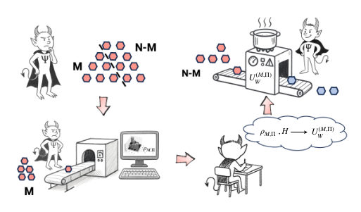 
FIG. 1. Schematic representation of a Maxwell’s demon that is con- strained to work with only a finite number N of copies of a quantum system. The demon will have to perform some measurements on M &lt; N in order to reconstruct an estimate of the state and then use this acquired partial information in order to unitarily extract the max- imum work possible (ergotropy) from the remaining N −M copies.

📷 Fig 2

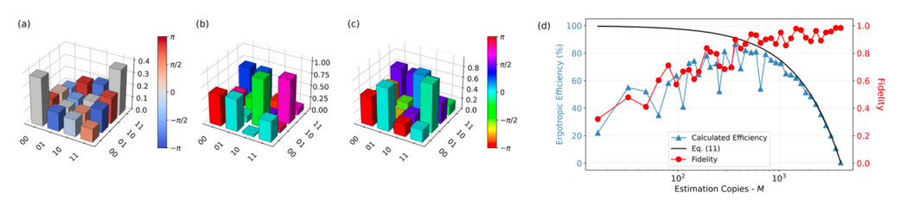 
FIG. 2. Steps of the PIFR protocol with QST for a single two-qubit density matrix. (a) Density matrix reconstructed with QST using 5 copies per projective measurement (i.e. M = 80). (b) Ideal ergotropic unitary matrix. (c) Ergotropic unitary matrix computed from the reconstructed state of panel (a). (d) Efficiency (left vertical axis) and fidelity between the reconstructed and the true state (right vertical axis) as a function of the number M of copies used to reconstruct the state, for N = 4096. The black solid line is the copy-counting bound 1 −M/N of Eq. (11).

📷 Fig 3

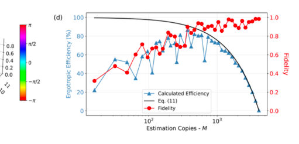 
Figure 2(a) shows the density matrix of a randomly selected state reconstructed using M = 80 copies, corresponding to five copies per projective measurement. The ergotropic uni- tary associated with the exact state is shown in panel (b), whereas the unitary inferred from the reconstructed state is shown in panel (c). In Fig. 2(d), we report the Uhlmann fi- delity between the true and reconstructed states, together with the corresponding ergotropic efficiency, as functions of M. As expected, the fidelity improves overall as more copies are used for the reconstruction. The point-to-point fluctuations observed in both quantities arise from the Poissonian noise affecting the simulated...

📷 Fig 4

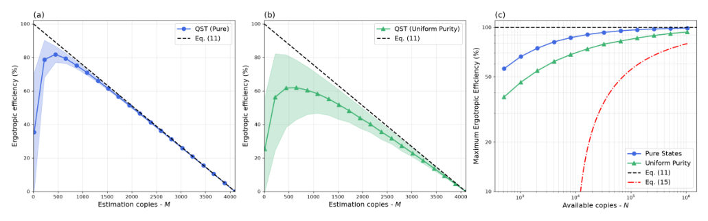 
FIG. 3. QST benchmarking of the PIFR demon against the theoretical bounds. (a) Average ergotropic efficiency for two-qubit pure states vs. the number M of copies used for the reconstruction, with N = 4096 available copies, averaged over 2,000 random pure states; the shaded band indicates one standard deviation. (b) Same as (a) for 2,000 two-qubit states drawn from a distribution uniform in purity. In both panels the dashed black line is the copy-counting bound 1 −M/N of Eq. (11). (c) Maximum ergotropic efficiency, optimized over M, as a function of the number N of available copies, up to N = 1,048,576, for the pure (blue) and uniform-purity (green) ensembles. The dashed black line is the...

**Summary.** This paper develops a theoretical framework for quantum work extraction when information is incomplete and resources are finite, modeling a 'quantum Maxwell's demon.' It derives a universal trade-off bound showing that the achievable work efficiency is limited by the resource allocation, scaling as $1 - O(N^{-1/3})$. This highlights that thermodynamic performance, not just state fidelity, dictates the ultimate limits of quantum information processing.

**Why it may be interesting.** This work provides a rigorous, resource-limited thermodynamic cost for quantum inference, which is crucial for understanding the practical limits of quantum measurement and information processing in non-equilibrium quantum systems.

Detailed structure

**Main problem.** The paper investigates the fundamental trade-off in quantum work extraction when the initial state information is only partially known and limited by a finite number of measurement copies.

**Main result.** A universal closed-form trade-off bound is derived, showing that the maximum achievable efficiency scales as $1 - O(N^{-1/3})$, which is slower than naive bounds and depends critically on the state's reconstruction precision.

**Method.** The analysis introduces the Partial-Information and Finite-Resources (PIFR) quantum Maxwell's demon protocol, deriving bounds by linking the work deficit to the trace distance between the true and reconstructed state.

**Model / system.** The system is a quantum state $
ho$ evolving under a known Hamiltonian $H$. The process involves using $M$ out of $N$ identical copies to estimate the state, which then dictates the unitary operation applied to the remaining $N-M$ copies.

**Key observables.** Work extraction efficiency ($\eta_{M,\Pi}$), ergotropic deficit ($\Delta W$), and reconstruction error (trace distance $D(
ho, 
ho_{M,\Pi})$).

**Important parameters / regimes.** The optimal resource allocation $M^* \propto N^{2/3}$, and the scaling of the efficiency approach to the limit, $N^{-1/3}$.

**Assumptions / limitations.** The measurement on one copy is destructive, and the analysis relies on bounding the work deficit using the trace distance.

**Figures summary.** Figures schematically illustrate the PIFR protocol, showing the relationship between fidelity and efficiency versus the number of measurements ($M$), and plotting the optimal efficiency scaling with the total resource ($N$).

**Paper structure.** The paper builds from defining the PIFR demon and the efficiency metric, deriving the key ergotropic-deficit bound (Lemma 1), establishing the quantitative trade-off bound (Theorem 1), and finally optimizing the resource allocation to find the scaling of the maximum efficiency.

Abstract

Information can be converted into work, but in quantum mechanics information about a state is not freely available: it must be inferred statistically from measurements on a finite number of copies. We study work extraction in this finite-resource setting by introducing a partial-information and finite-resources (PIFR) quantum Maxwell's demon. Given $N$ identical copies of a state with known Hamiltonian, the demon measures $M$ copies to estimate the state and the corresponding ergotropic unitary, which is then applied to the remaining $N-M$ copies. This protocol induces a trade-off between information acquisition, reconstruction accuracy, and thermodynamic yield, making the total extracted work normalized to the ideal ergotropic benchmark the relevant figure of merit. As our central result, we derive a universal closed-form trade-off bound that places this ergotropic efficiency between a Carnot-type ceiling $1-M/N$ and a floor controlled by a reconstruction precision rooted in finite-sample quantum estimation theory; optimizing the copy allocation yields $M^*\propto N^{2/3}$ and an $N^{-1/3}$ approach to the ideal limit, set by a conservative, worst-case reconstruction precision. By considering standard quantum state tomography, we numerically verify the presence of an optimal resource distribution, which also depends on the purity of the state under consideration. Our results identify finite-copy work extraction as a genuinely task-dependent inference problem, in which estimation strategies should be judged by thermodynamic performance rather than reconstruction fidelity alone.

[↑ back to top](#top)

### [Floquet Topological Spin-Valley-Layertronics on a Layered Dice Lattice](http://arxiv.org/abs/2608.29833v1)

**Authors:** Jianqi Zhong, Teng-Fei Ying, Jinyu Zou, Benjamin T. Zhou  
**Type:** theory · **Category:** strongly correlated electrons · **PDF:** <https://arxiv.org/pdf/2608.29833v1>  
**Analysis basis:** full PDF text, analyzed in chunks
**Topic relevance:** 🔥 `analog quantum simulation` **4/5**

📷 Fig 1

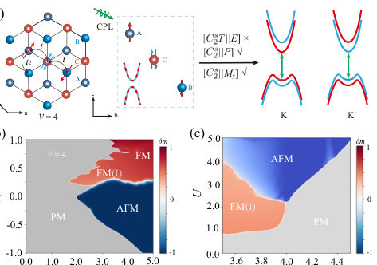 
FIG. 1. (a) Schematic dice-lattice geometry showing the an- tiferromagnetic (AFM) configuration at ν = 4 and the light- induced altermagnetic phase. Magnetic phase diagrams of the Hubbard model in Eq. (1) as functions of (b) t2 and U, and (c) U and ν. In (b), ϵC = −0.3 and ν = 4; in (c), t2 = −0.1 and ϵC = −0.3.

📷 Fig 2

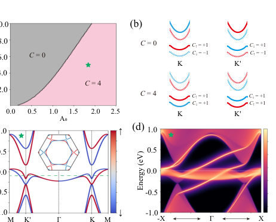 
FIG. 2. (a) The topological phase diagram as a function of light intensity and frequency. (b) The schematic of topological evolutions for the low and high CPL intensity at K/K′ valley. (c) The f-wave altermagnetic band structure for the green star labeled as (a). The inset shows the Fermi surface at EF = −0.12 eV. (d) The edge states calculated for the light amplitude of A0 = 1.8 ˚A−1 and ω = 5.0 eV. Parameters: t = −1 eV, t2 = −0.1 eV, ϵ = −0.3 eV, M = 0.2 eV.

📷 Fig 3

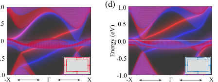 
FIG. 3. The Band structures under an out-of-plane electric field along the +z direction with δ &lt; 0 (a) and along the −z direction with δ &gt; 0 (b). Corresponding electrically driven SVLL-selective edge spectra for δ &lt; 0 (c) and δ &gt; 0 (d), where only the spin-up and spin-down sectors host two chiral edge states, respectively. Parameters: t = −1 eV, t2 = −0.1 eV, ϵ = −0.3 eV, M = 0.2 eV, A0 = 1.8 ˚A−1, |δ| = 0.2 and ω = 5.0 eV.

📷 Fig 4

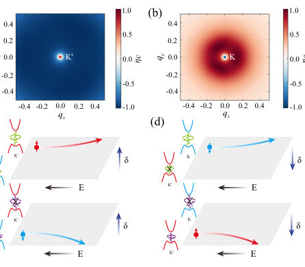 
FIG. 4. (a),(b) Calculated the SVLL-dependent degree of circular polarization ηC near the K′ and K valleys under a +z direction electric field with δ &lt; 0, respectively. (c),(d) Schematic of the gate-controlled SVLL optical selection and spin deflection. Under one gate polarity, the K′ and K valleys are selected by opposite helical CPL. The photoexcited elec- trons show the same longitudinal current but opposite trans- verse anomalous currents for the distinct CPL. Reversing the electric-field direction reverses the Berry-curvature sign of the gate-selected SVLL sector, switches the spin polarization, and interchanges the valley selected by a given light helicity. The parameters are...

📷 Fig 5

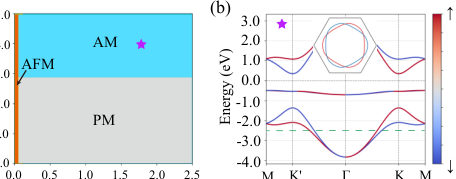 
FIG. 5. (a) The magnetic phase diagram as a function of the light intensities and Coulomb interactions. (b) The HF band structure for the purple star point. The inset shows the Fermi surface at EF = −0.25 eV labeled the green dash line.

**Summary.** This work explores topological physics in a layered dice lattice using the Hubbard model. By applying circularly polarized light and external electric fields, the authors demonstrate the ability to switch the system between different correlated topological states, including spin-valley Hall insulators and Chern insulators. This establishes the lattice as a versatile platform for integrated spin-valley-layertronics.

**Why it may be interesting.** The combination of Floquet engineering (light driving) and electric field gating to control multiple coupled topological orders (spin, valley, layer) in a lattice model is highly relevant for designing artificial quantum materials and quantum simulators.

Detailed structure

**Main problem.** The paper aims to reveal and control distinctive correlated topological phases within a layered dice lattice system under on-site Hubbard interactions.

**Main result.** The system exhibits an intrinsic spin-valley Hall insulator phase, which can be driven into a Floquet f-wave altermagnet and further controlled into a spin-valley-layer-polarized Chern insulator using external fields.

**Method.** The analysis involves using the Hubbard model, calculating low-energy effective Hamiltonians, and determining topological invariants like the Chern number using symmetry analysis.

**Model / system.** The physical platform is a layered dice lattice, modeled using the Hubbard Hamiltonian. The system's behavior is studied at a specific band filling ($
u=4$) and is manipulated by circularly polarized light (CPL) and vertical displacement fields.

**Key observables.** Spin-valley Chern number ($C_{s,\chi}$), spin-valley-layer locking (SVLL), and the topological phase transitions induced by external fields.

**Important parameters / regimes.** Band filling ($
u=4$), Hubbard interaction ($U$), light intensity ($	ext{|F}\eta|$), and the strength of the electric field ($\delta$).

**Assumptions / limitations.** The analysis relies on deriving low-energy effective Hamiltonians and assumes certain symmetry properties (e.g., PT symmetry in the initial state).

**Figures summary.** Figures illustrate the dice-lattice geometry, magnetic phase diagrams, the evolution of topological phases under light, and the resulting f-wave altermagnetic band structures with edge states.

**Paper structure.** The paper progresses from establishing the AFM ground state, to analyzing the topological changes induced by CPL (Floquet driving), and finally demonstrating electrical control via a vertical displacement field to achieve spin-valley-layer polarization.

Abstract

The recent discovery of long-sought dice flat band in layered YCl electride has opened up rich possibilities of correlation and topological physics in dice lattice systems [Nature Communications 17, 2213 (2026), arXiv:2509.05958]. Here, we reveal a plethora of distinctive correlated topological phases in a generic layered dice lattice system at band filling of $ν=4$ under on-site Hubbard interactions: (i) the system is an intrinsic sublattice anti-ferromagnetic (AFM) quantum spin-valley Hall insulator; (ii) a circularly polarized light (CPL) drives the AFM spin-valley insulator into a Floquet odd-parity $f$-wave altermagnet(AM) insulator; (iii) a vertical displacement field turns the Floquet $f$-wave AM insulator into a spin-valley-layer-polarized Chern insulator, with the sign of spin, valley and Chern number all controlled by the direction of the displacement field. Our results not only establish the layered dice lattice as a versatile platform for electrically switchable magnetic and topological phases, but also provide an all-electrical scheme for integrated spin-valley-layertronics for non-volatile information storage and processing.

[↑ back to top](#top)

### [Hardware-Efficient Exchange-Only QML: Singlet-Triplet Spin Chains via Inter-pair Coupling without Magnetic Gradients](http://arxiv.org/abs/2608.29017v1)

**Authors:** Yuichiro Minato  
**Type:** theory · **Category:** strongly correlated electrons · **PDF:** <https://arxiv.org/pdf/2608.29017v1>  
**Analysis basis:** full PDF text, analyzed in chunks
**Topic relevance:** 🔥 `analog quantum simulation` **4/5**

📷 Fig 1

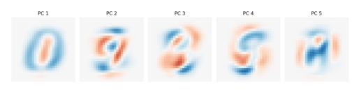 
FIG. 1. Top 5 PCA components (eigen-digits) extracted from the MNIST dataset. These components represent the pri- mary geometric structures—such as loops, strokes, and ori- entations—that are mapped onto the quantum exchange pa- rameters x.

📷 Fig 2

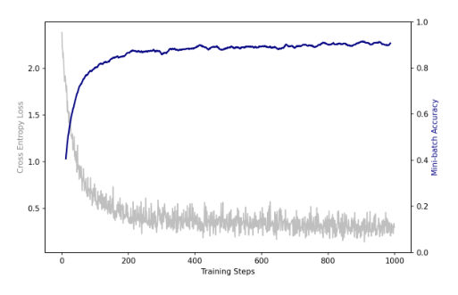 
FIG. 2. Training loss (grey) and smoothed mini-batch accu- racy (navy) over 1000 steps. The use of a large batch size (128) and Cosine Annealing scheduler ensures robust conver- gence; the final full-test-set accuracy is 90.89%.

📷 Fig 3

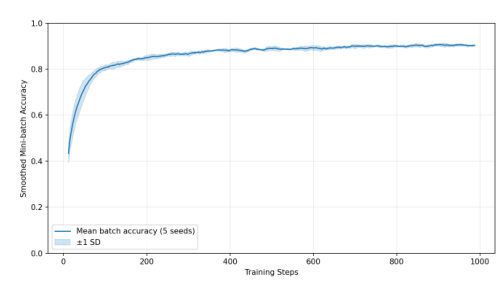 
FIG. 3. Training stability over five independent random seeds (paper configuration). Shown is the smoothed mini-batch ac- curacy (mean ± one standard deviation); the resulting full- test-set accuracy is 90.99% ± 0.24%.

📷 Fig 4

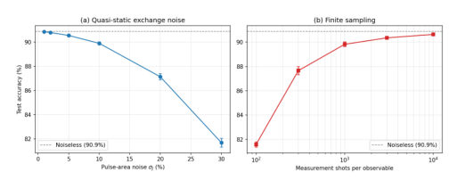 
FIG. 5. Robustness of the trained TE-EX model (full test set; mean ± one standard deviation over five noise realizations). (a) Test accuracy under quasi-static multiplicative pulse-area noise of relative strength σJ. (b) Test accuracy when every observable is estimated from a finite number of measurement shots. Dashed lines mark the noiseless accuracy (90.9%).

📷 Fig 5

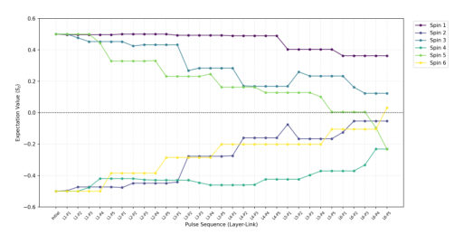 
FIG. 6. Evolution of the local magnetization ⟨Sz,i⟩of each spin during the 30-pulse TE-EX sequence for a representative test sample. Starting from the N´eel state |010101⟩, the inter- leaved non-commuting exchange pulses progressively mix the spin populations, driving the state through a data-dependent trajectory in the Mz = 0 subspace.

**Summary.** The authors propose a novel, hardware-efficient QML protocol for spin chains that uses only controllable exchange interactions, eliminating the need for complex magnetic field gradients. By exploiting the non-commutativity of sequential exchange pulses, they encode classical data into the time-domain dynamics of the spin system. This method achieves high classification accuracy on MNIST, proving that intrinsic spin-spin interactions can power complex quantum computation.

**Why it may be interesting.** This work directly addresses the hardware bottleneck in quantum computation by showing that complex quantum processing can be achieved using only the inherent, controllable exchange interactions present in solid-state spin systems, which is highly relevant to AMO physics and quantum simulation.

Detailed structure

**Main problem.** Developing a resource-efficient Quantum Machine Learning (QML) architecture for spin chains that achieves high expressibility without relying on local magnetic field gradients or complex hardware.

**Main result.** The model achieved a test-set accuracy of 90.9% on MNIST classification, demonstrating that intrinsic, time-domain dynamics can implement a genuinely non-linear and trainable feature map.

**Method.** The Time-Encoded Exchange (TE-EX) protocol utilizes the non-commutativity of overlapping inter-pair Heisenberg exchange pulses to induce complex state mixing, bypassing the need for external magnetic gradients.

**Model / system.** The system is a linear chain of six semiconductor spin qubits governed by an isotropic Heisenberg exchange interaction. The dynamics are controlled by time-dependent, non-commuting exchange pulses within the $M_z=0$ sector.

**Key observables.** Test-set accuracy (90.9%), quantum feature map performance (88.1% vs 83.2% classical baseline), local magnetizations ($\langle S_{z,i} 
angle$), and nearest-neighbor exchange correlations ($\langle h_{i,i+1} 
angle$).

**Important parameters / regimes.** The protocol relies on the non-commutativity of sequential pulses, and the training uses a variational mapping $	heta^{(l)}_i (\mathbf{x}) = \gamma \cdot 	anh(\dots)$ to modulate pulse areas.

**Assumptions / limitations.** The approach assumes the use of only the isotropic Heisenberg exchange interaction and relies on the ability to train data-dependent pulse areas.

**Figures summary.** Figures illustrate the test accuracy degradation under noise, the evolution of local magnetizations during the pulse sequence, and heatmaps showing how learned weights selectively couple PCA features to specific quantum links.

**Paper structure.** The paper introduces the hardware limitation (need for gradients), proposes the TE-EX protocol leveraging non-commuting dynamics, details the QML implementation using PCA input encoding and a variational pulse sequence, and validates the method via MNIST classification and noise robustness testing.

Abstract

Standard universal quantum computing using exchange-only qubits typically requires three physical spins per logical qubit, leading to significant hardware overhead. Conversely, two-spin units offer higher density but rely on local magnetic field gradients for control, increasing integration complexity. In this paper, we propose a resource-efficient quantum machine learning (QML) architecture that achieves high expressibility using minimal two-spin units and Heisenberg exchange interactions alone, without any magnetic gradients. We shift the paradigm from universal gate-based control to utilizing the intrinsic, time-domain dynamics of a spin chain as a learning resource. Numerical simulations on MNIST digit classification demonstrate that the symmetry-protected constraints of isolated spin pairs are bypassed by leveraging inter-pair exchange coupling. This interference-mediated state mixing significantly enhances the expressibility of the Hilbert space. The model reaches a test-set accuracy of 90.9% +/- 0.2% over five independent seeds on the full 10,000-image MNIST test set. Under an identical linear readout, the trained quantum feature map (88.1%) clearly outperforms a classical linear baseline on the same PCA inputs (83.2%) as well as an untrained (reservoir-style) version of the same dynamics (53.0%), demonstrating that the learned, input-dependent exchange pulses implement a genuinely non-linear and trainable feature map. The protocol is also robust to experimentally relevant imperfections: accuracy remains at 89.9% under 10% quasi-static pulse-area noise and at 89.8% when every observable is estimated from 10^3 measurement shots. These findings suggest that competitive QML can be executed on the simplest possible semiconductor spin-chain hardware, bypassing the need for leakage-prone encodings or complex micro-magnet integration.

[↑ back to top](#top)

### [Localization in microcavities revealed by phase-space non-Hermitian skin effect](http://arxiv.org/abs/2608.29795v1)

**Authors:** Jung-Wan Ryu, Yong-Hoon Lee, Muhan Choi, Chang-Hwan Yi, Martina Hentschel  
**Type:** theory · **Category:** disordered systems and neural networks · **PDF:** <https://arxiv.org/pdf/2608.29795v1>  
**Analysis basis:** full PDF text, analyzed in chunks
**Topic relevance:** `driven-dissipative phase transition` **3/5** · `methods for driven-dissipative` **3/5** · `non-equilibrium universality` **3/5** · `Keldysh / 2PI / non-Gaussian methods` **2/5** · `correlated / nonlocal dissipation` **2/5** · `interference shaping light` **2/5** · `Frenkel-Kontorova` **1/5** · `analog quantum simulation` **1/5** · `quantum measurements` **1/5** · `scars & prethermalization` **1/5**

📷 Fig 1

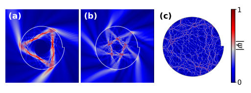 
FIG. 1. Representative localized resonances in spiral di- electric microcavities and the corresponding closed billiard. (a) A triangularly localized resonance for n = 2. (b) A star- shaped localized resonance for n = 3. (c) A representative weakly localized eigenstate in the corresponding closed bil- liard for n = 2. Strongly localized resonances constitute a significant fraction of the resonance spectrum in spiral dielec- tric microcavities, whereas comparable localization is rare in the corresponding closed billiard.

📷 Fig 2

 
Figure 1 compares representative states in the spiral

📷 Fig 3

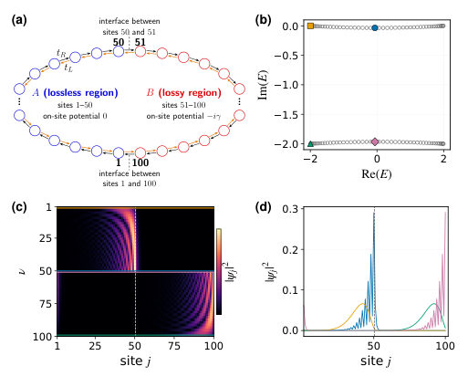 
FIG. 2. Hatano-Nelson model with spatially inhomogeneous loss. (a) Schematic illustration of a periodic ring consisting of a lossless region A and a lossy region B. (b) Complex- energy spectrum. (c) Spatial intensity distributions of all right eigenstates, indexed by ν in order of decreasing Im(E). (d) Representative right eigenstates selected from the weakly and strongly decaying branches. Despite the periodic bound- ary conditions, the right eigenstates exhibit pronounced inter- face localization near the two interfaces separating the lossless and lossy regions.

📷 Fig 4

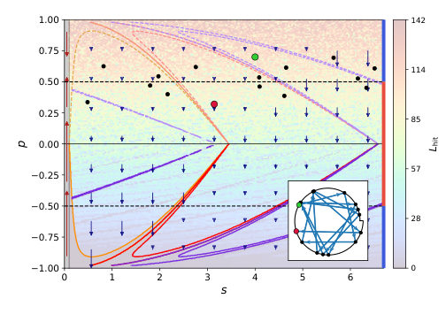 
FIG. 3. Poincar´e surface of section of the spiral billiard. The horizontal coordinate s is the arclength coordinate along the entire cavity boundary, starting from the notch and then following the spiral arc, and p = sin χ is the Birkhoff mo- mentum coordinate. The background color represents Lhit, length of trajectory started at the spiral arc to the first en- counter with the notch, and the gray-shaded region denotes the notch. Blue and red segments on the right boundary sep- arate the total-internal-reflection region, |p| &gt; pc, and the refractive escape region, |p| &lt; pc, respectively. Blue arrows indicate the momentum change, ∆p = pn+1 −pn, between successive reflections on the spiral...

📷 Fig 5

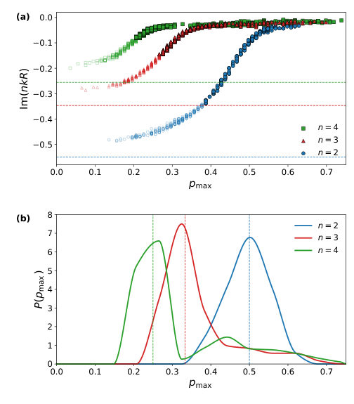 
FIG. 4. Statistics of the localization properties of 1000 reso- nances of the spiral dielectric microcavity for each refractive index n = 2, 3, and 4. (a) Imaginary part of the resonance wavenumber, Im(nkR), as a function of pmax, the momentum at which the boundary Husimi distribution reaches its maxi- mum. Dark symbols denote the long-lived resonances selected for the statistical analysis, whereas light symbols represent the remaining internal resonances above the lower bound on Im(nkR). Horizontal dashed lines indicate the corresponding lower bounds, Im(nkR) = ln |(n −1)/(n + 1)| /2. (b) Proba- bility density P(pmax) of pmax for the selected long-lived res- onances. Vertical dashed lines...

**Summary.** This paper reveals that the unexpected localization of resonances in open spiral microcavities is caused by a generalized non-Hermitian skin effect acting in the phase space momentum. The authors map the physical geometry to an inhomogeneous-loss Hatano-Nelson model, showing that the combination of geometric momentum drift and refractive escape drives this critical-line localization.

**Why it may be interesting.** This work provides a powerful, generalized framework for understanding localization in open, wave-guiding structures by connecting geometric optics (TIR) to the mathematical formalism of non-Hermitian physics (NHSE).

Detailed structure

**Main problem.** The paper addresses the physical mechanism responsible for the systematic accumulation of localized resonances near the critical line for total internal reflection in open, chaotic spiral microcavities.

**Main result.** The localization is attributed to a generalized non-Hermitian skin effect (NHSE) occurring in the phase space momentum, extending the concept beyond standard nonreciprocal lattices.

**Method.** The authors establish a physical correspondence between the microcavity's dielectric phase space and an inhomogeneous-loss Hatano-Nelson model, analyzing the resulting spectral and spatial properties.

**Model / system.** The system is an open, spiral-shaped dielectric microcavity. The dynamics are mapped onto an inhomogeneous-loss Hatano-Nelson model, incorporating geometry-induced momentum drift and refractive escape governed by a critical momentum $p_c$.

**Key observables.** Localized resonances, momentum distributions accumulating near $p_c$, complex-energy spectrum, and Boundary Husimi distribution $H(s, p)$.

**Important parameters / regimes.** Critical momentum $p_c = 1/n$, hopping asymmetry ratio $t_R / t_L$, and the degree of loss ($\gamma$).

**Assumptions / limitations.** The analysis assumes the existence of a physical correspondence between the dielectric dynamics and the Hatano-Nelson model, and that the dominant localization peak can be reliably identified via $p_{	ext{max}}$.

**Figures summary.** Figures illustrate localized resonances in the microcavity vs. closed billiard, the Hatano-Nelson model spectrum showing separation, and the Poincaré surface of section detailing momentum drift and the role of $p_c$.

**Paper structure.** The paper progresses by first identifying the localization anomaly, establishing the mapping to the Hatano-Nelson model, demonstrating the generalized NHSE mechanism via momentum drift and escape, and finally confirming this mechanism using detailed phase-space diagnostics.

Abstract

Contrary to the semiclassical expectation for fully chaotic systems, localization of resonances is found to be a common feature in open microcavities. In spiral-shaped dielectric microcavities, a substantial fraction of resonances localize on polygonal patterns in real space, are chiral, and their momentum distributions accumulate near the critical line for total internal reflection. Despite the extensive investigation, the physical mechanism responsible for their remarkable abundance has remained a long-standing question. Addressing this, we reveal a physical correspondence between an inhomogeneous-loss Hatano-Nelson model and the dielectric phase space of a spiral microcavity. We show that the combination of geometry-induced momentum drift and refractive escape yields a generalized non-Hermitian skin effect in the phase space momentum. We identify this mechanism as the origin of the critical-line localization of resonances in open chaotic spiral microcavities, extending the skin-effect concept beyond nonreciprocal lattices to phase space and to open chaotic wave systems.

[↑ back to top](#top)

### [Exact fluctuation relations in voltage- and temperature-biased Laughlin-edge constrictions](http://arxiv.org/abs/2608.30535v1)

**Authors:** Gu Zhang, Gabriele Campagnano, Domenico Giuliano, Igor Gornyi, In`es Safi  
**Type:** theory · **Category:** strongly correlated electrons · **PDF:** <https://arxiv.org/pdf/2608.30535v1>  
**Analysis basis:** full PDF text, analyzed in chunks
**Topic relevance:** `Full counting statistics` **3/5** · `Keldysh / 2PI / non-Gaussian methods` **3/5** · `correlated / nonlocal dissipation` **3/5** · `driven-dissipative phase transition` **2/5** · `methods for driven-dissipative` **2/5** · `non-equilibrium universality` **2/5** · `quantum measurements` **2/5** · `analog quantum simulation` **1/5**

📷 Fig 1

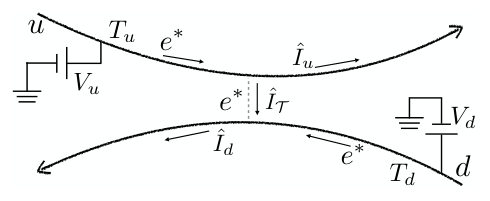 
Figure 1. The system we consider in this work. The bulk of the system has a Laughlin filling fraction ν. Two chiral Laughlin states, 1 and 2, each carrying quasiparticles with charge e∗, are thus hosted by the edge of the sample. At the upstream of the tunneling QPC, edges u and d are charac- terized by their own voltages (Vu and Vd) and temperatures (Tu and Td), respectively. Two edges communicate through a tunneling QPC (located at x = 0, with quasiparticle e∗), with ˆIT [cf. Eq. (13)] the corresponding tunneling-current opera- tor. For later convenience, here we choose the convention that spatial coordinates increase along the transport direction, for both channels u and d....

📷 Fig 2

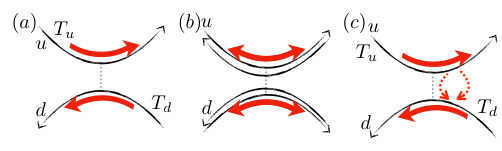 
Figure 2. Heat flow of different structures. Here the black ar- rows highlight the flow of quasiparticles in each channel. The red arrows, being thick and dashed, instead refer to the heat flow carried by electrons and phonons, respectively. (a) The currently considered setup, which consists of two chiral chan- nels. We assume a weak electron-phonon coupling, such that heat current flows along the same direction of the charge cur- rent. Of this case, the channel temperatures are well defined at the upstream of the QPC (indicated by the dashed line). (b) and (c) Setups containing non-chiral fermionic channels, or a strong phonon-induced heat diffusion, respectively. Of either case, edge...

📷 Fig 3

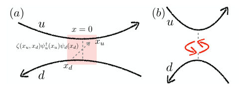 
Figure 3. Two potential setups where tunneling between two channels, 1 and 2, effectively depends on the momentum of tunneling quasiparticles. (a) The setup where the tunneling between two channels can occur between positions within a finite-size area (the red area), not only at the x = 0 point. (b) The setup involving a quantum dot (the red arrows) be- tween two chiral channels. Although initially tunneling occurs only at one point, x = 0, the tunneling amplitude becomes momentum-dependent, after integrating out the dot degree of freedom.

📷 Fig 4

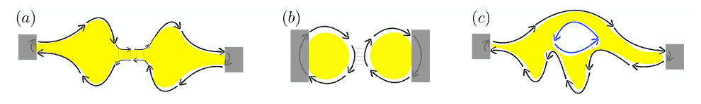 
Figure 4. Topologically distinct FQH bars, with the bulk of the Hall bar highlighted in yellow. Their edge states are injected and received via the source and drain, respectively, that are both represented by the gray boxes. (a) The setup under current consideration, where the finite-size tunneling area (indicated by the gray dashed lines) shares the filling fraction of the bulk, and thus allows quasiparticles to transport through. (b) The setup where the QPC is topologically trivial (in contrast to the Hall bar indicated by the yellow area), and thus allows only electrons to tunnel through. Despite of the difference of the involved tunneling particles, both (a) and (b) contain only edges...

**Summary.** This work provides a comprehensive theoretical analysis establishing exact fluctuation-dissipation relations for chiral edge states coupled through a QPC. It shows that local tunneling noise can be reliably reconstructed from measurable downstream current correlations, even under extreme non-equilibrium conditions like temperature gradients. This offers a robust, model-independent method for characterizing transport in topological quantum materials.

**Why it may be interesting.** The rigorous derivation of model-independent FDRs in non-equilibrium topological systems provides powerful diagnostic tools for characterizing exotic quantum states, which is highly relevant for understanding open quantum systems dynamics.

Detailed structure

**Main problem.** The paper aims to establish robust, model-independent fluctuation-dissipation relations (FDRs) connecting measurable current correlations to the local tunneling-current noise in chiral edge states.

**Main result.** An exact, non-perturbative zero-frequency fluctuation relation is derived, proving its validity for arbitrary tunneling strengths, voltage biases, and temperature differences between the two chiral edges.

**Method.** The analysis uses a non-perturbative theoretical framework based on general non-equilibrium response identities applied to bosonic descriptions of Laughlin edge states.

**Model / system.** The system models two chiral Laughlin edge states (e.g., in a Fractional Quantum Hall system) coupled via a Quantum Point Contact (QPC). The physics is described using bosonic operators derived from the edge excitations.

**Key observables.** Tunneling-current noise ($\hat{S}_T(0)$), auto-correlations ($\hat{S}_{\alpha\alpha}(0)$), and cross-correlations ($\hat{S}_{ud}(0)$) of the chiral currents.

**Important parameters / regimes.** Voltage bias ($V_u, V_d$), edge-state temperatures ($T_u, T_d$), and the tunneling strength/amplitude.

**Assumptions / limitations.** The generalization requires the QPC size to be much smaller than the charge and thermal equilibration length, but larger than the thermal diffusion length.

**Figures summary.** Figure 1 illustrates the setup for the zero-frequency fluctuation relation, while Figure 2 depicts the scenario involving a temperature difference between the two channels.

**Paper structure.** The paper develops the theoretical framework by defining the system Hamiltonian and current operators, derives the non-equilibrium fluctuation relation, and then generalizes this relation to include spatially extended QPCs, temperature gradients, and bias-dependent tunneling amplitudes.

Abstract

We present a comprehensive analysis of non-equilibrium fluctuation-dissipation relations connect- ing experimentally accessible chiral-current auto- and cross-correlations to the tunneling-current noise and conductance in Laughlin edge states coupled through a quantum point contact (QPC). We examine their validity for two chiral Laughlin edges held at different temperatures and voltages and show that the relations remain exact for arbitrary tunneling strength, voltage bias, and edge- state temperatures. We further generalize them to spatially extended QPCs and to tunneling am- plitudes with an explicit voltage dependence, and discuss the conditions and limitations associated with these generalizations. Our results establish that the local tunneling-current noise generated at the QPC can be reliably reconstructed from experimentally accessible auto- and cross-correlations measured downstream, providing a robust route to characterize non-equilibrium transport in chiral edge states.

[↑ back to top](#top)

### [Josephson-Phase Reversal of Non-Bloch Andreev Propagation](http://arxiv.org/abs/2608.29787v1)

**Authors:** X. Z. Zhang, Hechen Ren  
**Type:** theory · **Category:** other · **PDF:** <https://arxiv.org/pdf/2608.29787v1>  
**Analysis basis:** full PDF text, analyzed in chunks
**Topic relevance:** `Keldysh / 2PI / non-Gaussian methods` **3/5** · `correlated / nonlocal dissipation` **3/5** · `driven-dissipative phase transition` **3/5** · `interference shaping light` **3/5** · `methods for driven-dissipative` **3/5** · `non-equilibrium universality` **2/5** · `quantum measurements` **1/5**

📷 Fig 1

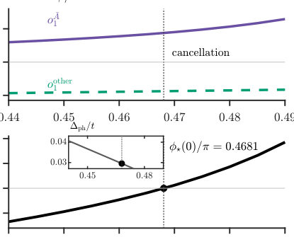 
FIG. 2. Multilevel interference reverses Andreev propagation. (a) The positive-band isolation ∆iso(0, ϕ) keeps the tracked Andreev band separated from the next positive-energy band at k = 0. (b) The motion vertex Vx creates virtual admixture with other BdG levels, while Oloss reads how this admixture couples to the fixed reservoir. (c) The electron–hole conjugate level | ¯A⟩and the coherent sum over all remaining BdG levels contribute with opposite signs. (d) Their cancellation drives o1 through zero at ϕ⋆(0); the inset shows that the electron–hole separation ∆ph/t remains finite at the reversal.

📷 Fig 2

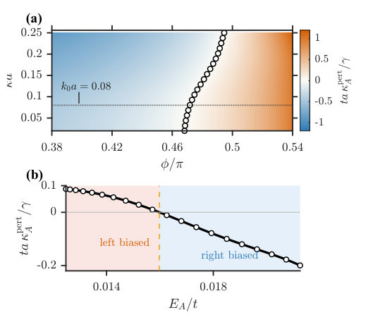 
FIG. 4. Momentum- and energy-selective reversal of Andreev propagation. (a) The weak-loss exponent versus phase and momentum. Black open circles give the zero-line extraction ϕ⋆(k), and the dotted line marks k0a = 0.08. (b) At ϕ/π = 0.48, the same Andreev band contains energy sectors with opposite signs of κpert A and hence opposite propagation bias. The full finite-momentum calculation and zero-line extraction are described in the Supplemental Material [47], Sec. S5.4.

📷 Fig 3

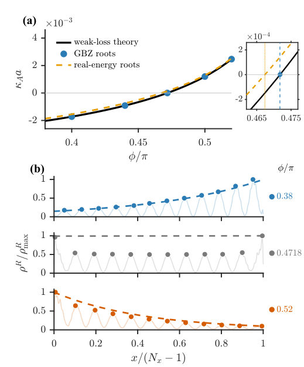 
FIG. 3. From directional decay to boundary accumulation. (a) At k0a = 0.08, the weak-loss exponent κpert A , the GBZ exponent κGBZ A , and the real-energy propagation exponent κprop A all change sign within the same narrow phase interval. Inset: magnified view of the three closely spaced reversal points. (b) Individually normalized open-boundary right-eigenstate densities ρR A(x) of the same Andreev band at ϕ/π = 0.38, 0.4718, and 0.52, with identical reservoir parameters. Symbols mark antinode maxima, and dashed curves show the fitted exponential envelopes. The corresponding half-chain ratios are WR/WL = 2.56, 1.00, and 0.30, identifying right accumulation, a nearly neutral profile, and...

**Summary.** This paper demonstrates that the Josephson phase in a superconducting junction can reversibly control the direction of non-Bloch quasiparticle propagation in the Andreev band. By tuning the phase, the system undergoes a transition driven by destructive interference among virtual electronic states, effectively switching the boundary accumulation from one edge to the other. This offers a novel, purely electrical method for reconfiguring non-Hermitian transport in superconducting platforms.

**Why it may be interesting.** This work provides a clean, tunable mechanism—using only the superconducting phase—to control non-Hermitian transport directionality in superconducting circuits, which is highly relevant for superconducting quantum devices and topological physics.

Detailed structure

**Main problem.** The research addresses how to reverse the non-Bloch spatial propagation (boundary accumulation) of low-energy Andreev bands in a superconducting junction without physically altering the fixed dissipative structure.

**Main result.** The Josephson phase ($\phi$) acts as a control knob, reversing the directional decay imbalance and transferring the boundary accumulation from one junction edge to the other via destructive interference among virtual Bogoliubov-de Gennes (BdG) level contributions.

**Method.** The analysis employs weak-loss theory and complex-momentum root decomposition of the retarded Green's function to calculate the spatial decay exponents ($\kappa$).

**Model / system.** The system is a spin-orbit-coupled planar Josephson junction featuring a fixed, spin-selective reservoir that introduces non-Hermitian dissipation into the effective Bogoliubov-de Gennes (BdG) Hamiltonian.

**Key observables.** Boundary accumulation (spatial exponent $\kappa_A$), directional ratio ($R_{	ext{all}}$), and the Josephson phase ($\phi$).

**Important parameters / regimes.** Josephson phase ($\phi$), decay parameters ($\Gamma_0, \gamma$), and the junction length ($L$).

**Assumptions / limitations.** The analysis relies on weak-loss theory approximations and the assumption that the reversal is driven by interference effects rather than a gap closing.

**Figures summary.** Figures illustrate the phase-controlled reversal of boundary accumulation, showing the sign change of various decay exponents ($\kappa_{	ext{pert}}^A$, $\kappa_{GBZ}^A$, $\kappa_{	ext{prop}}^A$) and the resulting opposite biases in finite-chain density profiles.

**Paper structure.** The paper builds the argument by first defining the non-Hermitian model, then deriving the spatial exponents using weak-loss theory, demonstrating the phase-induced sign change in these exponents, and finally confirming the directional reversal using finite-chain simulations and directional ratio measurements.

Abstract

Non-Hermitian control is difficult in solid-state systems due to fixed dissipation. Here, we show that in a spin-orbit-coupled planar Josephson junction, changing only the Josephson phase reverses the non-Bloch propagation of a low-energy Andreev band and switches its boundary accumulation between junction edges. The phase reshapes the band's spin and electron-hole composition, causing a fixed reservoir to unequally attenuate counterpropagating modes. Weak-loss theory links this phase-controlled loss imbalance to boundary-selected complex momenta, offering an in situ route to reconfigurable non-Hermitian transport in superconducting platforms.

[↑ back to top](#top)

### [Dissipation across the ultrastrong-coupling regime of nanomechanical quantum Rabi systems](http://arxiv.org/abs/2608.28812v1)

**Authors:** Janine C. Franz, Fabio Pistolesi  
**Type:** theory · **Category:** other · **PDF:** <https://arxiv.org/pdf/2608.28812v1>  
**Analysis basis:** full PDF text, analyzed in chunks
**Topic relevance:** `correlated / nonlocal dissipation` **3/5** · `driven-dissipative phase transition` **3/5** · `methods for driven-dissipative` **3/5** · `Keldysh / 2PI / non-Gaussian methods` **2/5** · `analog quantum simulation` **2/5** · `non-equilibrium universality` **2/5** · `Tavis-Cummings & cavity-many-emitter` **1/5** · `quantum measurements` **1/5**

📷 Fig 1

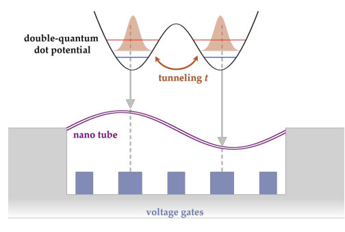 
FIG. 1. Scheme of the considered set-up. The second flexural mode of a suspended nanotube couples to the single-charge states of a double-quantum dot localized on the nanotube. For a symmetric quantum dot potential, due to the tunneling strength between left and right dot, the two eigenstates of the double dot are given by the anti-bonding and bonding state of a charge being localized in the left or right potential well. The energy splitting ωq of the dot states is then given by the tunneling strength ωq = 2t, here sketched as red and blue line inside the dot potential.

📷 Fig 2

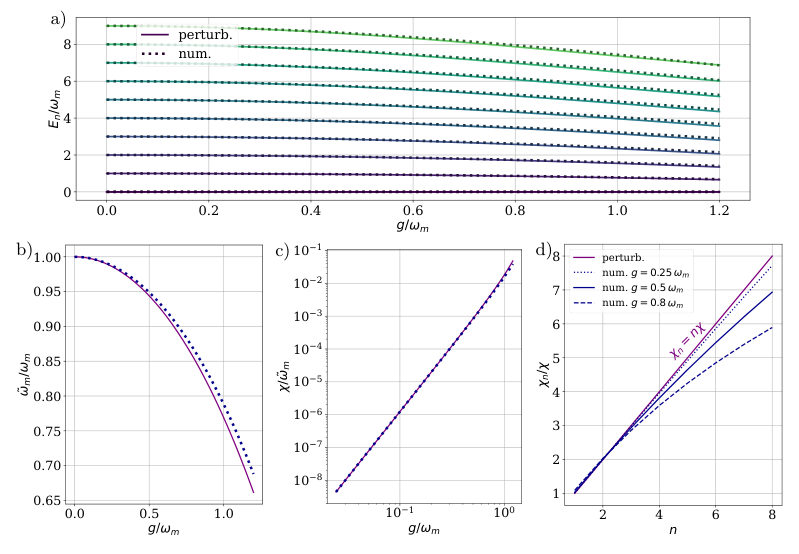 
FIG. 2. Comparison between perturbative diagonalization of the eigenvalue problem valid in the ultrastrong coupling regime and the numerical exact eigenenergies. a) The 10 lowest eigenenergies from the perturbative approximation which yields a Kerr oscillator, see Eq. (6) compared to the numerical ones as a function of g/ωm for ωq = 10ωm. b) The harmonic frequency ˜ωm of the Kerr oscillator compared to the analogue numerical quantity ˜ωnum m = E1 −E0, i.e. the lowest-lying transition frequency as a function of coupling strength g. c) The anharmonicity of the Kerr oscillator compared to the numerical analogue quantity χnum = ω21 −ω10, where ωnm = Em −En and En is the eigenenergy of the nth...

📷 Fig 3

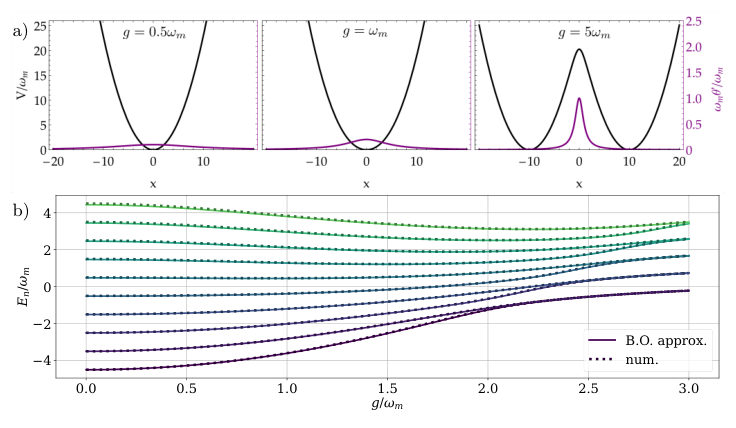 
FIG. 3. a) The potential V (x) (black) in comparison with the energy-term ωmθ′(x) (purple) for different values of g and ωq = 10ωm. Note, that the scale for ωmθ′(x) is magnified by 10 to enhance visibility. b) Eigenvalues of the Born-Oppenheimer Hamiltonian, Eq. (14) in comparison with the ones of the full Hamiltonian Eq. (1) as a function of g and for ωq = 10ωm.

📷 Fig 4

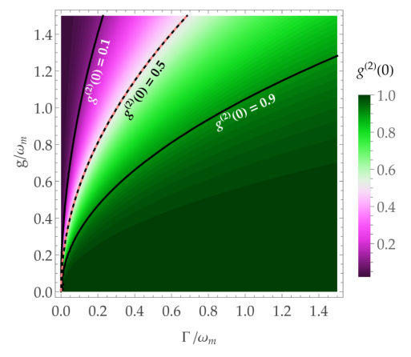 
FIG. 4. The two-phonon correlation function given by Eq. (65) for an infinitesimal drive on resonance with the low- est transition in the effective Kerr oscillator as a function of the oscillator-TLS coupling g and the TLS decay rate at zero- temperature Γ for ωq = 10ωm. The FSA limit is additionally plotted as a pink dashed line and coincides exactly with the value of g(2)(0) = 0.5.

📷 Fig 5

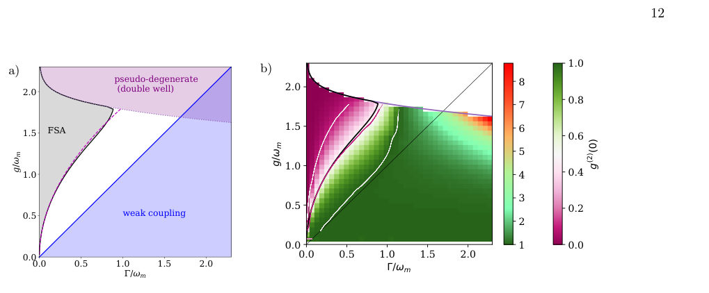 
FIG. 5. a) Phase diagram of the different regimes found in the quantum Rabi model for ωq = 10ωm as a function of the TLS decay rate Γ at zero-temperature and the coupling constant g. Deep inside the gray area, we find γeff ≪min{χ, 2ω10}, where χ = |ω21 −ω10| is the difference of the two lowest lying transition frequencies of the eigenstates and ω10 is the lowest transition frequency. For FSA to be valid the effective decay rate must be lower than each of them. The analytical FSA-limit approximated for g ≪ωm is plotted as a dashed pink line. The purple area marks the region of pseudo-degeneracy, where ω10 &lt; γeff where the interaction forms an effective double well, see Fig. 3. In this region...

**Summary.** This paper develops a generalized Born-Markov framework using the slowly varying bath spectrum approximation to model dissipation in nanomechanical quantum Rabi systems. It successfully describes the system's dynamics across the entire parameter space, from weakly to strongly anharmonic regimes. The results offer a unified, experimentally applicable description for optimizing mechanical qubits in ultrastrong-coupling regimes.

**Why it may be interesting.** This work is highly relevant for AMO physicists working on open quantum systems, as it provides a robust, unified master equation approach for strongly coupled electromechanical systems, extending beyond standard approximations.

Detailed structure

**Main problem.** The primary challenge is developing a consistent theoretical description of dissipation in the quantum Rabi model across the broad parameter space of the ultrastrong-coupling (USC) regime, where conventional treatments fail.

**Main result.** The authors establish a unified theoretical framework that accurately describes dissipation from weakly anharmonic to strongly anharmonic mechanical-qubit regimes, providing experimentally relevant predictions.

**Method.** They utilize a Born-Markov framework combined with the slowly varying bath spectrum (SVS) approximation to derive a generalized Lindblad master equation.

**Model / system.** The system models nanomechanical resonators (like suspended nanotubes) coupled to quantum two-level systems (TLS) via the quantum Rabi model. This forms a mechanical qubit platform.

**Key observables.** Two-phonon correlation function, finite-temperature correlation spectrum, and mean-square displacement under driving.

**Important parameters / regimes.** Ultrastrong-coupling (USC) regime, coupling strength ($g$), mechanical frequency ($\omega_m$), and temperature ($T$).

**Assumptions / limitations.** The core assumption is the validity of the SVS approximation, which allows the master equation to remain valid beyond the limitations of the standard secular approximation.

**Figures summary.** Figure 1 illustrates the physical setup: a suspended nanotube's flexural mode coupled to a double-quantum dot's charge states.

**Paper structure.** The paper progresses by first identifying the failure points of existing models (secular approximation breakdown), introducing the SVS Born-Markov framework, and then applying this framework to analyze key physical phenomena like phonon blockade crossover, temperature effects, and strong driving.

Abstract

Mechanical resonators ultrastrongly coupled to quantum two-level systems provide a promising route towards mechanical qubits by introducing significant anharmonicity to the mechanical modes, particularly in the slow-oscillator regime. Although the resulting hybrid system is well described by the quantum Rabi model, a consistent treatment of dissipation remains challenging across the broad parameter space routinely probed in current nanotube electromechanical devices. Here, we investigate dissipation in the open quantum Rabi model using a Born-Markov framework based on the slowly varying bath spectrum approximation, yielding a Lindblad master equation applicable far beyond conventional descriptions while recovering them in their respective limits. Using this framework, we analyze experimentally accessible observables across this parameter space. As the secular approximation breaks down, phonon blockade progressively washes out. Our approach remains valid in this regime, enabling a quantitative description of the continuous evolution of phonon blockade with coupling strength and dissipation. At finite temperature, we find a suppression of the temperature-induced increase of coherence decay rate for weak anharmonicity. Under driving, our approach remains applicable to substantially stronger perturbations than conventional dressed-state master equations and shows that an apparently classical observable can coexist with Wigner negativity. We further capture the weakly anharmonic regime arising from finite detuning in the double-quantum dot. These results establish a unified description of dissipation from weakly anharmonic operating regimes to the strongly anharmonic mechanical-qubit regime and provide experimentally relevant predictions for ultrastrong electromechanical systems.

[↑ back to top](#top)

### [Quantum synchronization of spin-1 system: Enhanced synchronization due to additive Lindblad operators](http://arxiv.org/abs/2608.28808v1)

**Authors:** Tran Duong Anh-Tai, S. Zhong, X. Molenda, A. M. Marino, D. Blume  
**Type:** both · **Category:** other · **PDF:** <https://arxiv.org/pdf/2608.28808v1>  
**Analysis basis:** full PDF text, analyzed in chunks
**Topic relevance:** `analog quantum simulation` **3/5** · `correlated / nonlocal dissipation` **3/5** · `driven-dissipative phase transition` **3/5** · `methods for driven-dissipative` **3/5** · `non-equilibrium universality` **2/5** · `QC/QI experiment` **1/5** · `quantum measurements` **1/5** · `quantum optics experiment` **1/5**

📷 Fig 1

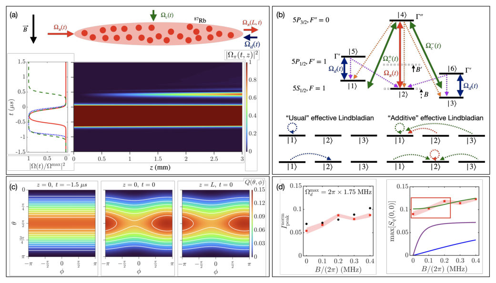 
FIG. 1. The upper part depicts the direction of the laser beams relative to the 87Rb atoms in a MOT. The control beam impinges on the MOT at a 90 ◦degree angle relative to the long MOT axis while the probe and decay beams impinge parallel to the long MOT axis (anti-parallel to each other). The normalized incoming beam temporal profiles are shown on the left. The probe beam (solid red line) and control beam (dashed green line) act, when on simultaneously, as the external drive as well as generators of effective dissipators. The decay beam profile (dotted blue line) closely resembles that of the control-synchronize beam. The synchronization stage ends when the probe, control-synchronize, and...

📷 Fig 2

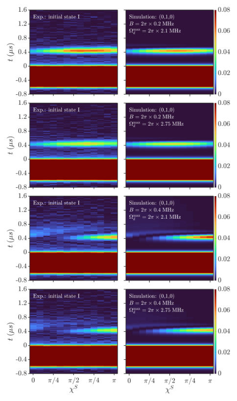 
FIG. 2. Normalized probe beam intensity Inorm π (t) at the end of the MOT (color coded) for the hold time τ = 0.4 µs as functions of the time t and the relative phase χS of the plus- and minus-components of the control-synchronize beam. The left column shows experimental data obtained using the initial state preparation I while the right column shows simulation results for the initial state |2⟩⟨2| [denoted by (0, 1, 0) in the figure labels]. Two magnetic field strengths are used, namely B = 2π × 0.2 MHz (top two rows) and B = 2π × 0.4 MHz (bottom two rows), and two different maximal magnitudes Ωmax d of the Rabi coupling strength of the decay beam. The labels in the figure report the values...

📷 Fig 3

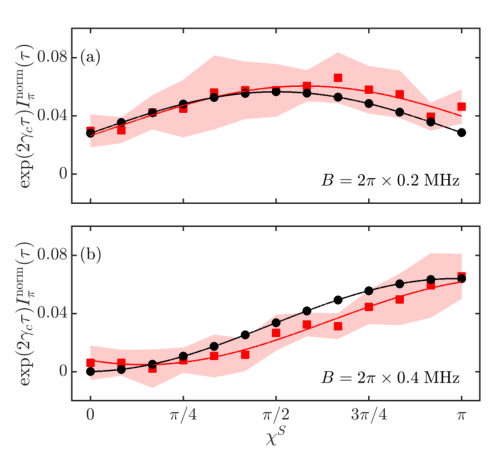 
FIG. 3. Red squares and black circles show the “undamped” normalized probe beam intensity exp(2γcτ)Inorm π (τ) as a func- tion of the relative phase χS of the control-synchronize beam extracted from the experimental and simulation data, respec- tively, for τ = 0.4 µs and Ωmax d = 2π × 2.75 MHz. Panels (a) and (b) are for different magnetic field strengths (see labels in the figure). The red shaded error bands depict the error of the experimental data, combining the statistical uncertainty from 10 independent measurements and the uncertainty of γc. The solid red and solid black lines show fits of the weighted experimental data and the simulation data, respectively, to Eq. (17).

📷 Fig 4

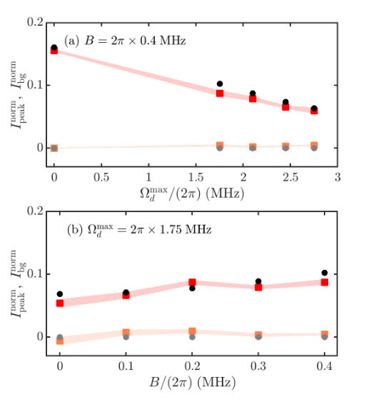 
FIG. 4. Fit parameters Inorm peak and Inorm bg as a function of (a) the maximum magnitude Ωmax d of the decay beam Rabi cou- pling strength (fixed B) and (b) the magnetic field strength B (fixed Ωmax d ). Squares with error bands show the results for the fits to the experimental data (red and orange squares are for Inorm peak and Inorm bg , respectively) while circles show the results for the fits to the simulation data (black and grey cir- cles are for Inorm peak and Inorm bg , respectively). In both panels, the upper and lower set of curves correspond to Inorm peak and Inorm bg , respectively; Inorm bg is, within error bars, consistent with zero. The results extracted from the...

📷 Fig 5

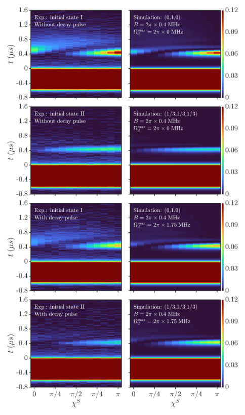 
FIG. 5. Dependence of the normalized probe beam intensity Ipeak π (t) on the initial state preparation approach; specifically, the initial state preparation I and initial state preparation II approaches are compared for τ = 0.4 µs. The layout of the figure is similar to Fig. 2, with the left column showing ex- perimental data and the right column simulation results. The magnetic field strength is fixed at B = 2π × 0.4 MHz and the maximum magnitude Ωmax d of the Rabi coupling strength of the decay pulse is indicated in the sub-figures that show sim- ulation results.

**Summary.** This research experimentally investigates quantum synchronization in a spin-1 system realized with cold $^{87}	ext{Rb}$ atoms. By engineering the dissipation using additive Lindblad operators, the authors demonstrate that these non-conventional decay pathways can significantly enhance the observed quantum synchronization. The work validates the theoretical model against precise measurements, suggesting a general technique for controlling quantum dynamics in higher-spin systems.

**Why it may be interesting.** This work provides a concrete experimental platform (cold atoms) to study non-trivial open quantum system dynamics, specifically demonstrating how controlling dissipation (dissipation engineering) can actively enhance quantum coherence measures like synchronization.

Detailed structure

**Main problem.** The paper investigates quantum synchronization in a spin-1 system, focusing on how engineered dissipative pathways can enhance this collective quantum behavior.

**Main result.** The implementation of additive Lindblad operators, achieved through dissipation engineering, was shown to enhance quantum synchronization in certain parameter regimes, with experimental results showing convincing agreement with simulations.

**Method.** The study uses a hybrid approach combining theoretical derivation (effective spin-1 master equation from a full 6-state Hamiltonian) with experimental realization using cold atoms.

**Model / system.** The system is an externally driven few-level system, effectively modeled as a spin-1 system, realized using cold $^{87}	ext{Rb}$ atoms in a Magneto-Optical Trap (MOT). The dynamics are governed by an effective Lindbladian incorporating non-conventional dissipative pathways.

**Key observables.** Quantum synchronization measure $S_q(t, z)$, normalized probe beam intensity $I_{	ext{norm}}^{\pi}(t)$, and the effective spin-1 master equation.

**Important parameters / regimes.** Rabi coupling strengths ($\Omega$), decay rates ($\Gamma$), magnetic field strength ($B$), and the relative phase ($\alpha$).

**Assumptions / limitations.** The derivation relies on second-order time-dependent perturbation theory, and the MOT is treated as a 1D medium with low atomic density.

**Figures summary.** Figures illustrate the laser beam geometry, energy level diagrams, Husimi-Q functions, and quantitative comparisons of the synchronization measure $S_q$ between the effective spin-1 model and the full 6-state model, alongside time evolution of probe intensity.

**Paper structure.** The paper progresses from establishing the physical setup and deriving the effective spin-1 model from the full 6-state Hamiltonian, demonstrating the enhancement of synchronization due to engineered dissipation, and finally validating these findings by comparing simulation results against experimental measurements of probe intensity.

Abstract

We experimentally investigate quantum synchronization for one of the simplest possible quantum systems, namely an externally driven few-level system with equally spaced energy levels effectively acting as a spin-1 system. Coupling to excited auxiliary states, we realize additive effective Lindblad operators that are associated with non-conventional dissipative pathways, which are shown to enhance, in certain parameter regimes, quantum synchronization. The experimental set-up, which utilizes cold $^{87}$Rb atoms in a MOT, and associated synchronization extraction protocol are benchmarked carefully through dedicated simulations. Convincing agreement is found between experiment and simulations. The dissipation engineering approach established in our work can be readily extended to systems with more energy levels, such as effective spin-$3/2$ or spin-$2$ systems, and has implications for quantum synchronization studies in higher-spin systems as well as for a wide range of quantum science studies and technology applications.

[↑ back to top](#top)

### [Scalar Spin Chirality from Dissipative Pumping and Lamb Shift Precession](http://arxiv.org/abs/2608.30324v1)

**Authors:** YuanDong Wang, JianHua Wei  
**Type:** theory · **Category:** other · **PDF:** <https://arxiv.org/pdf/2608.30324v1>  
**Analysis basis:** full PDF text, analyzed in chunks
**Topic relevance:** `Keldysh / 2PI / non-Gaussian methods` **3/5** · `driven-dissipative phase transition` **3/5** · `methods for driven-dissipative` **3/5** · `non-equilibrium universality` **3/5** · `correlated / nonlocal dissipation` **2/5** · `quantum measurements` **2/5** · `analog quantum simulation` **1/5**

📷 Fig 1

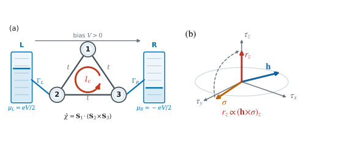 
FIG. 1. Device and physical mechanism. (a) Dots 2 and 3 are coupled to separate reservoirs, while dot 1 remains floating. The bias drives a circulating current Ic at zero magnetic flux. (b) Orbital-pseudospin geometry of the dissipative source σ, projected Lamb field h, and axial response rz. The stationary chiral response is controlled by (h × σ)z.

📷 Fig 2

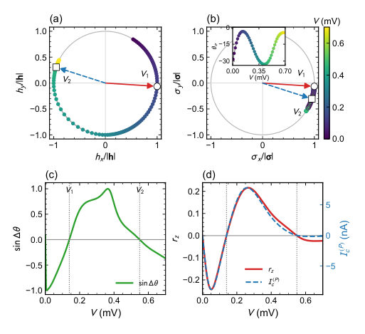 
FIG. 2. Geometric origin of the current reversals. (a) Bias evolution of the normalized Lamb field. (b) Bias evolution of the normalized stationary dissipative pump, with its angle shown in the inset. The marked points identify the two voltages V1 and V2 where the vectors become parallel or antiparallel. (c) Their angular factor sin(θσ −θh), where θσ and θh are their in-plane polar angles. (d) The axial conditional chirality component rz and its ground-multiplet projected current I(P ) c in the strong-coupling limit.

📷 Fig 3

 
FIG. 3. Weak-coupling benchmark against hierarchical equa- tions of motion. Open symbols show results for three values of Γ. Black dashed curves show the channel-restricted second- order GKSL result. (a) The HEOM transport curves collapse when divided by Γ. Their high-bias departure from the re- stricted result marks the onset of omitted sequential chan- nels. (b) The circulating current tends toward the coupling- independent restricted result in the ground-multiplet regime and retains the low-bias reversal. The parameters are t = 0.25, U = 1, ϵ0 = 0.5, and kBT = 0.05 in meV.

📷 Fig 4

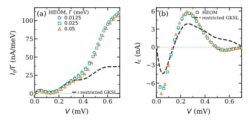 
Figure 3 compares the channel-restricted GKSL equa- tion against HEOM and delineates its weak-coupling, low-energy regime. A common rescaling of the linewidths multiplies h, σ, and γ together, leaving Eq. (10) un- changed while the relaxation time grows as Γ−1. In the low-bias ground-multiplet regime, the HEOM loop current approaches the coupling-independent channel-restricted result, whereas the transport current remains proportional to Γ. At higher bias, the disagreement signals the onset of additional sequential-tunneling channels omitted from the restricted generator. The complete-generator com- parison is given in the SM [43]. At the largest linewidth, higher-order reservoir processes...

📷 Fig 5

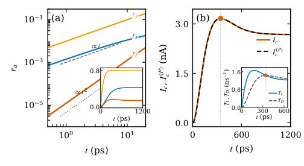 
FIG. 4. Dynamical test after a bias quench. (a) The directly pumped components rx and ry start linearly in time, whereas the torque-generated component rz starts quadratically. The inset shows the approach to stationarity. (b) Total circulating current Ic and its ground-multiplet contribution I(P ) c . The inset shows the Lamb torque and damping. Their first crossing marks the current maximum.

**Summary.** This theoretical study explains how electrical bias drives a reservoir-induced orbital Hanle effect in a quantum dot system, leading to the generation and reversal of scalar spin chirality. The mechanism involves the interplay between dissipative tunneling preparing an orbital pseudospin and virtual charge fluctuations generating a precessing Lamb field. This work highlights that time-reversal-odd responses can emerge purely from the non-commutative action of open system dynamics.

**Why it may be interesting.** The work provides a detailed theoretical framework for how non-equilibrium, dissipative processes can generate robust, measurable time-reversal-odd responses like spin chirality in mesoscopic conductors, which is highly relevant to spintronics and topological quantum materials.

Detailed structure

**Main problem.** The paper investigates the emergence and reversal of scalar spin chirality in open quantum systems driven by electrical bias, specifically addressing mechanisms that generate such chirality without explicit time-reversal symmetry breaking in the Hamiltonian.

**Main result.** The chirality arises from a reservoir-induced orbital Hanle effect, where the interplay between dissipative tunneling (preparing an orbital pseudospin) and virtual charge fluctuations (generating a Lamb field) causes the current to reverse when the relative orientation of these two fields changes.

**Method.** The analysis uses the channel-restricted second-order GKSL equation and employs symmetry-derived identities linking the circulating current to the chirality, supplemented by time-domain quench analysis.

**Model / system.** The model is a triangular triple quantum dot structure, analyzed in the three-electron Coulomb valley, coupled to external reservoirs via tunneling terms.

**Key observables.** Circulating Current (I_c), Scalar Spin Chirality ($\hat{\chi}$), Orbital Pseudospin ($\mathbf{r}$), and the Lamb Field ($\mathbf{h}$).

**Important parameters / regimes.** Bias voltage (DC bias), coupling strength ($\zeta$), and the relative orientation between the dissipative pump ($\sigma$) and the Lamb field ($\mathbf{h}$).

**Assumptions / limitations.** The analysis relies on a ground-multiplet identity relating chirality to the zero-flux current, and comparisons are made between full HEOM and restricted GKSL descriptions.

**Figures summary.** Figures illustrate the device setup and physical mechanism, show the bias evolution of $\mathbf{h}$, $\sigma$, and $r_z$, and demonstrate the time evolution of chirality ($r_z$) starting quadratically after a bias quench.

**Paper structure.** The paper establishes the physical mechanism, derives the governing equations for the pseudospin and Lamb field, analyzes the stationary state to find the current-chirality relation, and finally examines the time-domain dynamics via bias quenching.

Abstract

Circulating currents in triangular triple quantum dots reverse repeatedly with bias even at zero magnetic flux and for a real Hamiltonian, a phenomenon whose origin has remained unclear. We show that dissipative tunneling prepares an orbital pseudospin, while virtual charge fluctuations generate a noncollinear Lamb field that rotates it toward the chiral direction. Bias changes their relative orientation and thereby reverses the current. This reservoir-induced orbital Hanle effect converts a nonchiral orbital polarization into scalar spin chirality, which an exact ground-multiplet identity links to the circulating current. Hierarchical-equations-of-motion calculations show that the low-bias reversal survives beyond the second-order weak-coupling description, while the quadratic growth of chirality after a sudden voltage switch identifies precession. More broadly, time-reversal-odd responses can emerge in open quantum systems from the interplay between dissipative state preparation and coherent precession.

[↑ back to top](#top)

### [Quantum Simulation of Markovian and Non-Markovian Open Quantum Dynamics in Heavy-Ion Collisions](http://arxiv.org/abs/2608.31173v1)

**Authors:** Doojin Kim, Balbeer Singh  
**Type:** theory · **Category:** other · **PDF:** <https://arxiv.org/pdf/2608.31173v1>  
**Analysis basis:** full PDF text, analyzed in chunks
**Topic relevance:** `Keldysh / 2PI / non-Gaussian methods` **3/5** · `correlated / nonlocal dissipation` **3/5** · `driven-dissipative phase transition` **3/5** · `methods for driven-dissipative` **3/5** · `non-equilibrium universality` **2/5** · `quantum measurements` **1/5**

📷 Fig 1

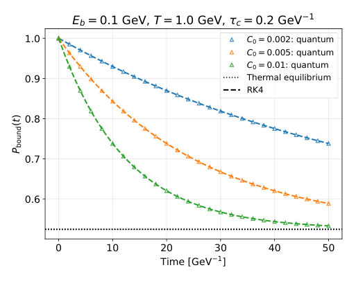 
FIG. 2. Survival probability Pbound(t) of the bound state in the Markovian approximation [i.e., Eq. (13)] for three values of the bath coupling C0 shown in the legend, at fixed ∆E ≡ Eb = 0.1 GeV, T = 1.0 GeV, and bath correlation time τc = 0.2 GeV−1. Dashed curves show the RK4 solution, while the representative triangular markers show the quantum-circuit result. The simulation parameters are ∆t = 0.05 GeV−1, Nstep = 1000, for a total simulated time of 50 GeV−1.

📷 Fig 2

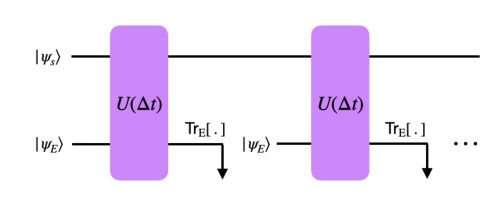 
FIG. 1. A circuit realization of two Markovian time steps. A single unitary U(∆t) acts jointly on the subsystem qubit state |ψS⟩and two ancilla qubit states represented by |ψE⟩≡|00⟩. The ancillas are traced out TrE[·] and re-prepared fresh before the next repetition. Iterating this single unitary Nstep times describes the evolution of Eq. (8) over total time t = Nstep∆t.

📷 Fig 3

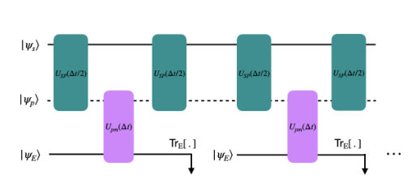 
FIG. 3. Circuit realization of two non-Markovian time steps. The subsystem qubit |ψS⟩and pseudomode qubit |ψP ⟩ (dashed line) both persist across repetitions and are never reset. Each step applies the symmetric splitting: a coher- ent half-step USP (∆t/2) acting on the subsystem and pseu- domode; the dissipative step Upm(∆t) acting on the pseudo- mode and a fresh environment ancilla |ψE⟩, which is traced out immediately afterward; and a second coherent half-step USP (∆t/2) on the subsystem and pseudomode. Repeating this three-unitary sequence Nstep times describes the evolu- tion over total time t = Nstep∆t.

📷 Fig 4

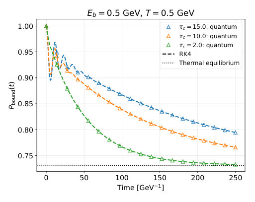 
FIG. 4. Survival probability Pbound(t) of the bound state in non-Markovian case [i.e., Eq. (46)] for three values of bath memory time τc, at fixed ∆E ≡Eb = 0.5 GeV, T = 0.5 GeV, and coupling C0 = 0.01 GeV. Dashed curves show the RK4 solution, while the triangular markers show the quantum- circuit result using pseudomode. The simulation parameters are ∆t = 0.05 GeV−1 and Nstep = 5000, resulting in a total simulated time of 250 GeV−1.

📷 Fig 5

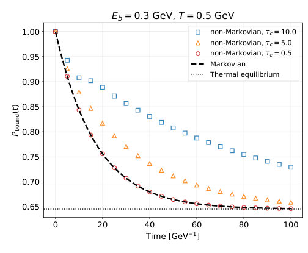 
FIG. 5. Survival probability Pbound(t) of the bound state as a function of time at ∆E ≡Eb = 0.3 GeV, T = 0.5 GeV, and λ2 pm = 0.5 GeV. The dashed curve shows the Marko- vian solution [i.e., Eq. (50)], while the square, triangle, and open-circle markers display the non-Markovian [i.e., Eq. (46)] quantum-circuit-based computations with τc = 10.0, 5.0, and 0.5 GeV−1, respectively. As τc decreases, the non- Markovian curves converge onto the Markovian reference cal- culated with τc = 0.1 GeV−1. The simulation parameters are ∆t = 0.01 GeV−1, Nstep = 10000, resulting in a total simu- lated time of 100 GeV−1.

**Summary.** This paper develops a quantum computing framework to simulate open quantum dynamics relevant to heavy-ion collisions, covering both Markovian and non-Markovian regimes. It achieves this by introducing an auxiliary pseudomode that explicitly carries the bath's memory, allowing for accurate simulation of complex time evolution. The framework validates the feasibility of using quantum circuits for studying hard probes in extreme physical environments.

**Why it may be interesting.** This work is highly relevant as it provides a concrete, implementable quantum simulation protocol for complex, memory-dependent open quantum dynamics, bridging theoretical physics with quantum computation.

Detailed structure

**Main problem.** The paper addresses the challenge of simulating open quantum system dynamics, specifically modeling the interaction of a subsystem with a thermal bath in the context of heavy-ion collisions.

**Main result.** A quantum computing framework is established that successfully simulates both Markovian and non-Markovian open quantum evolution by introducing an auxiliary pseudomode to capture memory effects.

**Method.** The simulation employs a quantum circuit approach, utilizing an auxiliary two-level pseudomode to model the bath memory kernel, which is then traced out to recover the full non-Markovian dynamics.

**Model / system.** The system models a subsystem (e.g., a bound state) interacting with a thermal bath, described by a general non-Markovian master equation. The dynamics are analyzed in the non-relativistic effective field theory framework.

**Key observables.** Survival probability of the bound state ($P_{bound}(t)$), and the reduced subsystem density matrix ($
ho_S$).

**Important parameters / regimes.** Bath correlation time ($	au_c$), which dictates the transition between the Markovian ($	au_c 	o 0$) and non-Markovian ($	au_c \sim 1/E_b$) regimes.

**Assumptions / limitations.** The bath is assumed stationary, and the analysis relies on introducing a pseudomode to explicitly handle the memory kernel, which is shown to converge to the Markovian limit when appropriate time scales are considered.

**Figures summary.** Figure 5 compares the bound state survival probability for different correlation times ($	au_c$), showing the non-Markovian results approaching the Markovian limit as $	au_c$ decreases.

**Paper structure.** The paper first establishes the general non-Markovian master equation, then introduces the pseudomode technique to model memory effects, derives the Markovian limit (Lindblad form), and finally demonstrates the feasibility of simulating both regimes using quantum circuits.

Abstract

We present a quantum computing framework for simulating open-quantum-system approaches based on Markovian and non-Markovian dynamics, which is relevant to heavy-ion collisions. To simulate the non-Markovian evolution on quantum computers, we introduce an auxiliary two-level pseudomode that carries the memory forward and couples to both the subsystem and the residual Markovian bath. We explicitly show that tracing out the pseudomode reproduces the non-Markovian evolution with the exact memory kernel. Moreover, in the relevant time scale hierarchy, the quantum circuit construction of the pseudomode smoothly converges to the Markovian limit. For a given bath memory kernel, our results demonstrate the feasibility of quantum simulations of both Markovian and non-Markovian dynamics, establishing a framework for future studies of hard probes such as jets, heavy quarks, and quarkonia in heavy-ion collisions.

[↑ back to top](#top)

### [Second harmonic phase locking and synchronization blockade in quadratically coupled driven quantum van der Pol oscillators](http://arxiv.org/abs/2608.29185v1)

**Authors:** Nissi Thomas, M. Senthilvelan  
**Type:** theory · **Category:** other · **PDF:** <https://arxiv.org/pdf/2608.29185v1>  
**Analysis basis:** full PDF text, analyzed in chunks
**Topic relevance:** `driven-dissipative phase transition` **3/5** · `methods for driven-dissipative` **3/5** · `Keldysh / 2PI / non-Gaussian methods` **2/5** · `analog quantum simulation` **2/5** · `correlated / nonlocal dissipation` **2/5** · `non-equilibrium universality` **2/5** · `quantum measurements` **1/5**

📷 Fig 1

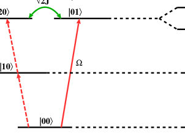 
FIG. 1. The Schematic energy level diagram of the quadratically coupled quantum van der Pol oscillator under the influence of drive.

📷 Fig 2

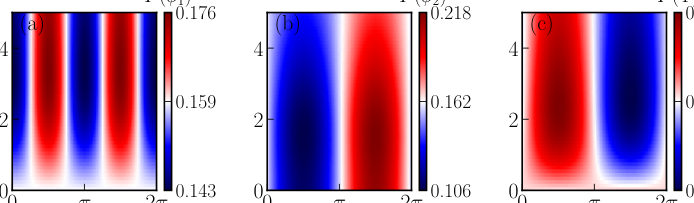 
FIG. 2. Phase distribution of the single oscillator modes (a) 푃(휙1), (b) 푃(휙2) and relative Phase distribution (c) 푃(Φ), defined in Eqs. (3) and (4) respectively, as a function of coupling strengh 퐽with Ω/훾1 = 0.5, Δ1/훾1 = Δ2/훾1 = 0 and 훾2/훾1 = 10.

📷 Fig 3

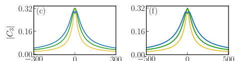 
FIG. 3. Absolute value of synchronization measures 퐶푖[see Eq.(10)] plotted as a function of Δ1 in panels (a)-(c) with Δ2 = 0 and as a function of Δ2 in panels (d)-(f) with Δ1 = 0 for different coupling strengths. In all these cases we have considered Ω/훾1 = 0.5 and 훾2/훾1 = 10.

📷 Fig 4

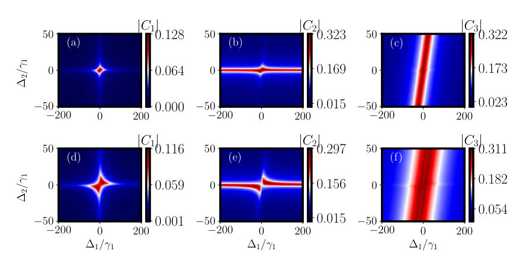 
FIG. 4. Phase locking measures |퐶푖| defined in Eq. (10) of system (1) plotted as a function of Δ1 and Δ2 for 퐽/훾1 = 3.0 in panels (a)-(c) and for 퐽/훾1 = 7.0 in panels (d)-(f) with Ω/훾1 = 0.5 and 훾2/훾1 = 10.

📷 Fig 5

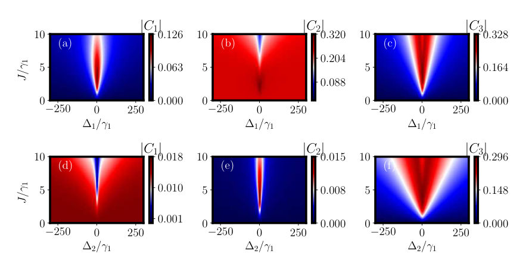 
FIG. 5. Regimes of synchronization of system (1). The absolute value of synchronization measures 퐶푖defined in Eq. (10) plotted as a function of coupling strength 퐽/훾1 and detuning Δ1/훾1 with Δ2 = 0 in panels (a)-(c) and detuning Δ2/훾1 with Δ1 = 0 in panels (d)-(f). We have considered the drive strength Ω/훾1 = 0.5 and damping rate 훾2/훾1 = 10.

**Summary.** This paper analyzes the synchronization dynamics in two quadratically coupled quantum oscillators driven by an external field. It finds that the quadratic coupling induces a unique 2:1 phase-locking pattern in one oscillator while simultaneously causing a 'synchronization blockade' for conventional 1:1 locking. The study rigorously separates the classical prediction from the quantum mechanism, highlighting the role of quantum selection rules in engineering nonclassical phase relationships.

**Why it may be interesting.** This work is highly relevant as it explores how non-linear, high-order coupling terms (quadratic coupling) impose quantum selection rules that fundamentally alter synchronization behavior, providing insights for quantum control.

Detailed structure

**Main problem.** The paper investigates the complex synchronization dynamics, specifically focusing on the emergence of second harmonic phase locking and the mechanism behind a synchronization blockade, in a system of quadratically coupled driven quantum van der Pol oscillators.

**Main result.** The quadratic coupling enforces a quantum selection rule that causes the first oscillator to exhibit a 2:1 phase-locking structure while blocking conventional 1:1 locking, a phenomenon distinguishable from the classical mean-field predictions.

**Method.** The study employs a combination of quantum master equation analysis (using perturbation theory in a low excitation subspace) and classical mean-field analysis to characterize the system's phase dynamics.

**Model / system.** The model consists of two quantum van der Pol oscillators coupled quadratically, with an external drive applied selectively to the second oscillator. The dynamics are governed by a master equation involving quadratic coupling terms.

**Key observables.** Phase-locking structure (2:1 vs 1:1), synchronization blockade, phonon statistics, and spectral responses.

**Important parameters / regimes.** The analysis is performed in the low excitation subspace ($\mathfrak{n} \le 2$) and considers regimes defined by coupling strengths ($
u$) and driving amplitudes ($\Omega$).

**Assumptions / limitations.** The analysis relies on the low excitation subspace approximation and distinguishes between the structure predicted by classical mean-field theory and the microscopic origin revealed by quantum analysis.

**Figures summary.** Figure 1 schematically illustrates the energy level diagram, showing bare states, eigenstates ($\Psi_\pm$), and energy splitting proportional to the coupling strength $
u$ within the $\mathfrak{n}=2$ manifold.

**Paper structure.** The paper first introduces the physical model and the master equation. It then analyzes the phase-locking geometry using classical mean-field theory, followed by a detailed quantum analysis using perturbation theory to pinpoint the microscopic origin of the synchronization blockade and mutual synchronization.

Abstract

We investigate the dynamics of a quadratically coupled system under the influence of an external drive applied to the second oscillator, where the coupling facilitates a high-order synchronization with phase-locking emerging in the form of 2:1 between the oscillators. Our analysis reveals a synchronization blockade in the first oscillator, characterized by the complete suppression of conventional 1:1 phase-locking with the drive. In contrast, we observe that the directly driven second oscillator synchronizes with the drive, showing 1:1 phase-locking but notably at second harmonic frequency. A classical mean-field analysis of the corresponding equations of motion reproduces this asymmetric phase-locking geometry which demonstrates that the phase-locking structure itself can be understood from the nonlinear classical dynamics. The quantum analysis, however, reveals the microscopic origin of the synchronization blockade. Furthermore, we show that the system exhibits mutual synchronization when both the oscillators satisfies the resonance condition, enabling coherent energy exchange facilitated by nonlinear quadratic coupling. The mutual synchronization shows synchronized regimes and also subtle suppression of synchronized regimes near resonance occurring due to spectral splitting of the energy states. Using perturbation analysis of the master equation within the low excitation subspace, we analyze steady-state phase distribution and synchronization measures, supported by population statistics and spectral responses. We also propose possible experimental realizations in trapped-ions and optomechanical setups. These findings highlight the crucial role of quadratic coupling in enabling nonclassical synchronization phenomena, offering deeper insights for quantum control strategies and the development of quantum information platforms.

[↑ back to top](#top)

### [The MS Unidirectional Current as a Generalization of the ABC Absorption Current](http://arxiv.org/abs/2608.29969v1)

**Authors:** Avi Marchewka  
**Type:** theory · **Category:** other · **PDF:** <https://arxiv.org/pdf/2608.29969v1>  
**Analysis basis:** full PDF text, analyzed in chunks
**Topic relevance:** `correlated / nonlocal dissipation` **3/5** · `driven-dissipative phase transition` **3/5** · `quantum measurements` **3/5** · `Keldysh / 2PI / non-Gaussian methods` **2/5** · `methods for driven-dissipative` **2/5** · `non-equilibrium universality` **2/5**

📷 Fig 1

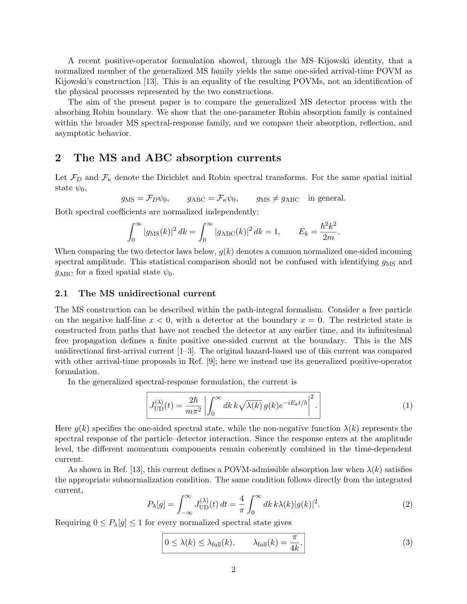 
Low-resolution page preview, page 2

📷 Fig 2

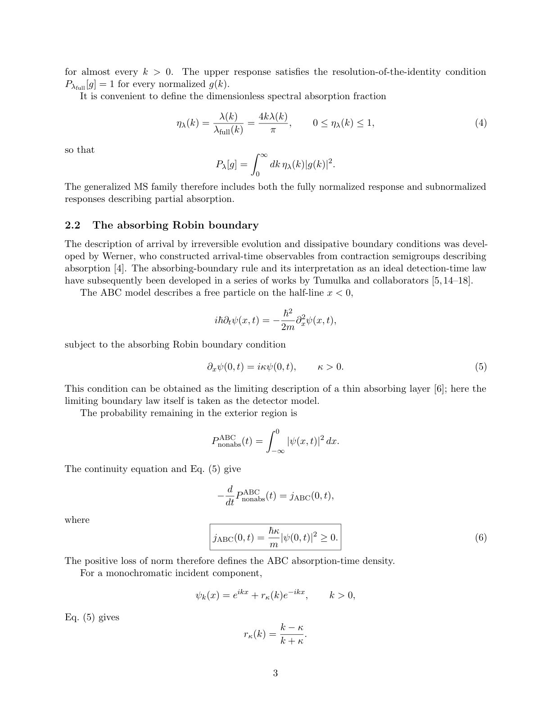 
Low-resolution page preview, page 3

📷 Fig 3

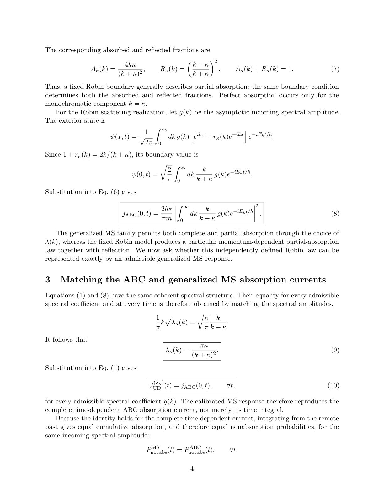 
Low-resolution page preview, page 4

📷 Fig 4

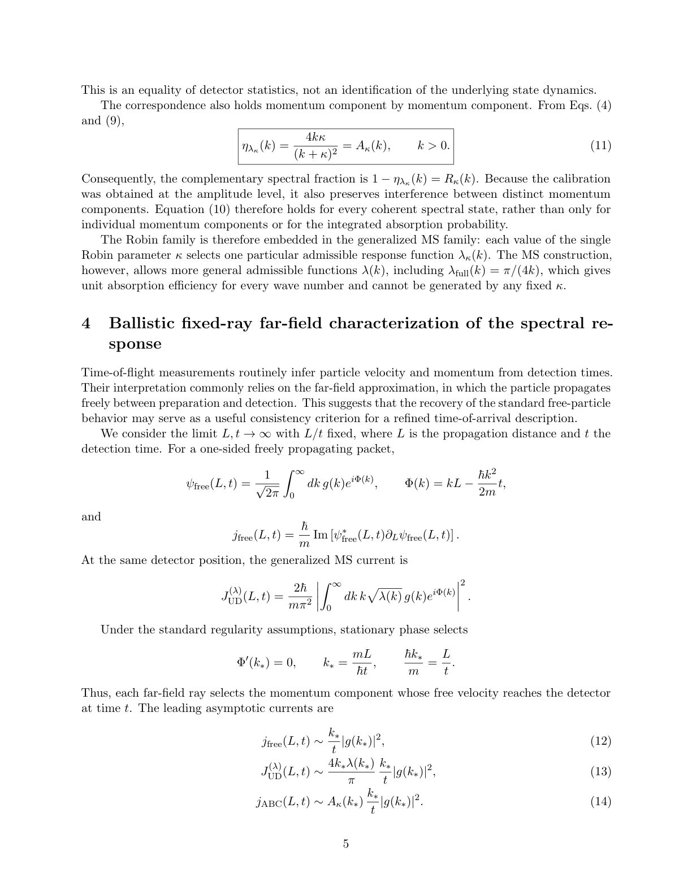 
Low-resolution page preview, page 5

📷 Fig 5

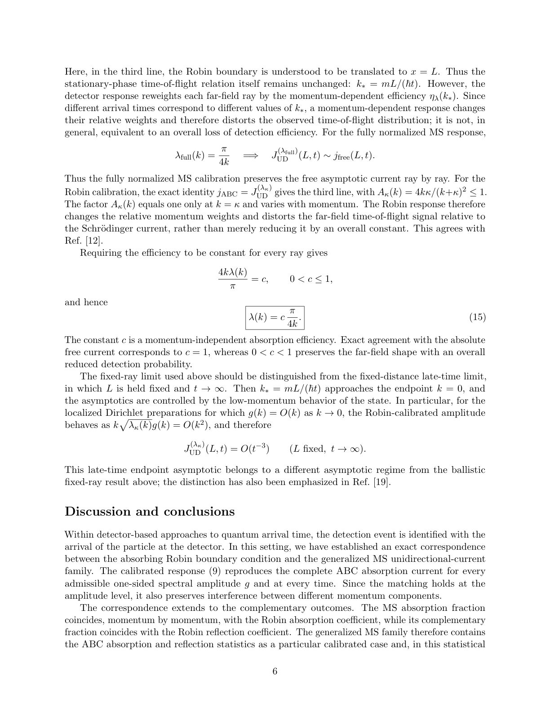 
Low-resolution page preview, page 6

**Summary.** This paper compares the standard Robin boundary condition model for particle absorption with the more general Marchewka–Schuss (MS) unidirectional current formalism. It proves that the Robin model is a special case of the MS construction, demonstrating that the MS framework is more general by allowing for unit absorption efficiency. This has implications for accurately modeling quantum detection processes in open quantum systems.

**Why it may be interesting.** This work provides a rigorous mathematical generalization of boundary absorption models, which is crucial for accurately modeling open quantum systems where particle loss or detection is involved.

Detailed structure

**Main problem.** The paper compares two theoretical frameworks—the generalized Marchewka–Schuss (MS) unidirectional current and the absorbing Robin boundary condition—used to model particle detection in quantum mechanics.

**Main result.** The entire one-parameter Robin absorption family is shown to be contained within the more general MS framework, which allows for unit absorption efficiency unattainable by fixed Robin parameters.

**Method.** The comparison involves matching the spectral amplitudes of the absorption currents derived from both the Robin boundary condition and the generalized MS spectral function.

**Model / system.** The model considers a free scalar particle propagating in one spatial dimension within a single-pass half-line geometry, analyzed using quantum wave mechanics.

**Key observables.** Absorption current ($j_{ABC}$ vs $J_{UD}$), absorption probability, and the spectral response function $\lambda(k)$.

**Important parameters / regimes.** The Robin parameter $\kappa > 0$, the spectral response function $\lambda(k)$, and asymptotic regimes (ballistic fixed-ray vs. fixed-distance late-time).

**Assumptions / limitations.** The analysis relies on matching detector statistics and utilizes the stationary phase approximation for asymptotic behavior.

**Paper structure.** The paper introduces the two models, derives the relationship between their respective spectral functions, proves the containment of the Robin family within the MS family, and compares their asymptotic behavior in different physical limits.

Abstract

For a free scalar particle in one spatial dimension, in a single-pass half-line geometry, we compare the absorbing Robin boundary condition with the generalized Marchewka--Schuss (MS) unidirectional-current family. Robin absorption is characterized by a single parameter $κ>0$: once $κ$ is specified, its momentum-dependent absorption profile is fixed. In the generalized MS construction, by contrast, the detector response is described by a spectral function $λ(k)$, subject to the positivity and subnormalization conditions of the detection law. We show that every Robin choice of $κ$ corresponds to the particular MS calibration $λ_κ(k)=πκ/(k+κ)^2$, which reproduces the complete Robin absorption current for every admissible one-sided spectral amplitude and at every time. Thus the entire one-parameter Robin absorption family is contained within the generalized MS family. The MS construction is more general: the choice $λ_{\rm full}(k)=π/(4k)$ gives unit absorption efficiency for every wave number, which cannot be achieved by any fixed Robin parameter. In this precise sense, the generalized MS detector process extends the Robin absorbing-boundary family. We also compare their asymptotic behavior in the ballistic fixed-ray regime and in the fixed-distance late-time limit.

[↑ back to top](#top)

### [Ornstein-Uhlenbeck Process Driven by Multiple Dichotomous Noises](http://arxiv.org/abs/2608.29226v1)

**Authors:** Silvio Kalaj, Dongho Lee, Enzo Marinari, Jae-Hyung Jeon, Pascal Viot, Gleb Oshanin  
**Type:** theory · **Category:** statistical mechanics · **PDF:** <https://arxiv.org/pdf/2608.29226v1>  
**Analysis basis:** full PDF text, analyzed in chunks
**Topic relevance:** `driven-dissipative phase transition` **3/5** · `methods for driven-dissipative` **3/5** · `non-equilibrium universality` **3/5** · `Keldysh / 2PI / non-Gaussian methods` **2/5** · `analog quantum simulation` **1/5** · `correlated / nonlocal dissipation` **1/5** · `scars & prethermalization` **1/5**

📷 Fig 1

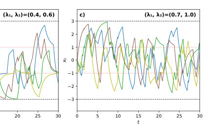 
Figure 1. Sample trajectories of the process x(t) defined in eq. (1) with K = 2, γ = 1, and velocities v1 = 1 and v2 = 2. From left to right, the switching rates are (λ1, λ2) = (0.1, 0.2), (0.4, 0.6), and (0.7, 1.0). The horizontal red dashed lines indicate the inner branch points x = Ω/γ = ±1, while the black dashed lines depict the boundaries of the support of the process, x = ±Ωmax/γ = ±3.

📷 Fig 2

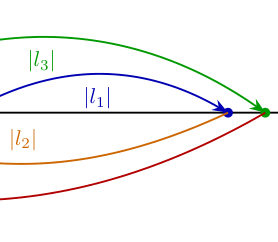 
Figure 2. An equivalent random-flight model. The displacements lk are independently sampled quenched random variables, each drawn from the distribution given in eq. (17); the realization chosen at a given step is independent of those selected at all previous and subsequent steps.

📷 Fig 3

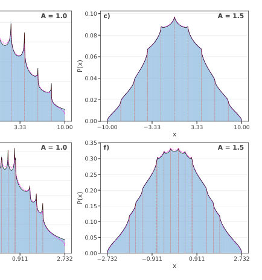 
Figure 3. Position probability density function P(x) of the process defined by eq. (1), driven by a superposition of four independent dichotomous noises. The first row corresponds to reduced velocities βk = k, k = 1, 2, 3, 4, while in the second row β1 = 1, β2 = 1/ √

📷 Fig 4

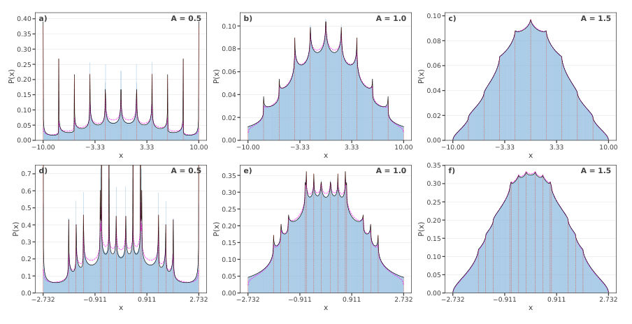 
Figure 3 presents the stationary position PDF P(x) of the process defined by eq. (1), driven by a superposition of four independent dichotomous noises. The figure compares results obtained from numerical simulations of the equivalent random-flight model (averaged over 107 realizations) with our analytical predictions. Specifically, the dashed magenta curves correspond to the Fourier integral representation in eq. (11) evaluated numerically using Python, while the solid black curves are obtained from the Fourier series representation in eqs. (18) and (21), truncated after 103 terms. While both analytical representations describe the same probability density function, their numerical...

📷 Fig 5

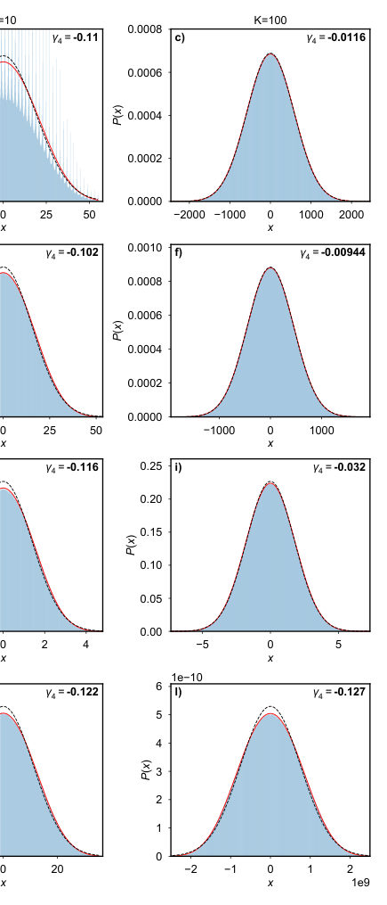 
Figure 4. A truncated Edgeworth series representation (see eq. (26)) of the PDF P(x) for K = 3, 10 and 100. The histograms show empirical distributions obtained from numerical simulations of 107 trajectories. The red solid curves show eq. (26) including the first correction, while the black dashed curves indicate the Gaussian approximation without correction. In the first two rows we take βk = k, while the values of αk are taken at random from the K-dependent interval (0.5/K, 1/K) (first row) or from the interval (0.2, 0.5) (second row). In the third and the fourth rows the values of αk are taken at random from the interval (0.2, 0.5), while βk = 1/ √

**Summary.** This paper provides an exact theoretical analysis of an Ornstein-Uhlenbeck process driven by multiple independent dichotomous noises, moving beyond the standard Gaussian white noise assumption. The authors derive the stationary probability distribution, revealing non-trivial features like compact support and branch-point singularities. Furthermore, they analyze the complex asymptotic behavior of the disorder-averaged distribution, offering deep insights into non-equilibrium statistical mechanics.

**Why it may be interesting.** The analysis of non-equilibrium steady states driven by bounded, colored noise sources provides a powerful, exactly solvable framework for understanding complex dynamics in systems far from thermal equilibrium, relevant to driven quantum systems or non-Markovian baths.

Detailed structure

**Main problem.** The study focuses on characterizing the stationary state of a generalized Ornstein-Uhlenbeck process driven by a superposition of multiple independent dichotomous noises.

**Main result.** The stationary distribution exhibits a rich structure, including compact support and algebraic branch-point singularities, fundamentally differing from the classical Gaussian case.

**Method.** The authors derive the stationary PDF using characteristic functions (involving Bessel functions) and establish an equivalent mapping to a heterogeneous random-flight process.

**Model / system.** The system is governed by the SDE $\dot{x}(t) = -\gamma x(t) + \sum_{k=1}^{K} \omega_k(t)$, where $\omega_k(t)$ are independent dichotomous noises switching between $\pm v_k$ with rates $\lambda_k$.

**Key observables.** Stationary position distribution $P(x)$, cumulants, and the disorder-averaged PDF $\Psi(x)$.

**Important parameters / regimes.** Relaxation rate ($\gamma$), amplitudes ($v_k$), switching rates ($\lambda_k$), and the number of noise sources ($K$).

**Assumptions / limitations.** The analysis involves complex asymptotic expansions of special functions (like the Gauss hypergeometric function) to determine the large-$|x|$ tails in the disorder-averaged case.

**Figures summary.** Figures illustrate sample trajectories for small $K$, and later figures compare simulated data against analytical predictions for the power-law corrections to the disorder-averaged PDF $\Psi(x)$ for various $K$.

**Paper structure.** The paper progresses from defining the model and deriving the exact stationary PDF for arbitrary $K$ (via random-flight mapping) to analyzing bulk properties, and finally tackling the highly technical problem of the large-$|x|$ asymptotics for the disorder-averaged PDF.

Abstract

We study a generalized Ornstein-Uhlenbeck process driven by a superposition of $K$ independent dichotomous noises with arbitrary fixed amplitudes and switching rates. Unlike the classical Ornstein-Uhlenbeck process driven by equilibrium Gaussian white noise, the present system is governed by bounded nonequilibrium fluctuations with finite correlation times. We obtain exact expressions for the stationary position distribution and all cumulants, and show that the stationary state possesses an unexpectedly rich structure, including compact support, algebraic branch-point singularities, edge divergences, and multiple extrema. We establish a mapping onto a heterogeneous random-flight process with bounded jumps, yielding a transparent probabilistic interpretation of the stationary measure. We further analyze several limiting regimes, including the crossover to Gaussian statistics for large numbers of noise sources. For ensembles with exponentially-distributed quenched amplitudes, we derive exact disorder-averaged stationary distributions and show that disorder fundamentally alters the stationary state, producing exponential tails decorated by algebraic prefactors with non-trivial exponents.

[↑ back to top](#top)

### [Asymptotic Entanglement across Dynamical Regimes of a Dissipative Bosonic Dimer](http://arxiv.org/abs/2608.29672v1)

**Authors:** Chenghe Yu, Mingsheng Tian, Feng-Xiao Sun, Qiongyi He  
**Type:** theory · **Category:** other · **PDF:** <https://arxiv.org/pdf/2608.29672v1>  
**Analysis basis:** full PDF text, analyzed in chunks
**Topic relevance:** `driven-dissipative phase transition` **3/5** · `methods for driven-dissipative` **3/5** · `Keldysh / 2PI / non-Gaussian methods` **2/5** · `non-equilibrium universality` **2/5** · `Tavis-Cummings & cavity-many-emitter` **1/5** · `analog quantum simulation` **1/5** · `correlated / nonlocal dissipation` **1/5**

📷 Fig 1

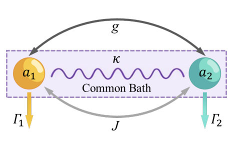 
FIG. 1. Schematic of the dissipative quadratic bosonic dimer. The two modes a1 and a2 are coupled via a beam-splitter in- teraction with strength g and a two-mode-squeezing interac- tion with strength J. Each mode is subject to local dissipation at rates Γ1,2, and both modes are additionally coupled to a common bath at rate κ.

📷 Fig 2

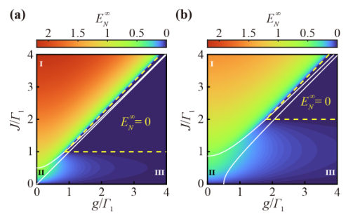 
FIG. 3. Asymptotic logarithmic negativity E∞ N in the ab- sence of a common bath (κ = 0), shown as a function of g/Γ1 and J/Γ1. (a) Symmetric local dissipation, Γ2 = Γ1. (b) Asymmetric local dissipation, Γ2 = 3Γ1. The color scale indicates E∞ N . The white solid lines delineate the dynami- cal regions I, II, and III, while the yellow dashed lines mark the boundary between vanishing (E∞ N = 0) and nonzero (E∞ N &gt; 0) asymptotic entanglement. Compared with the symmetric case, asymmetric local dissipation reduces the dy- namically unstable region and enlarges the parameter regime supporting nonzero asymptotic entanglement.

📷 Fig 3

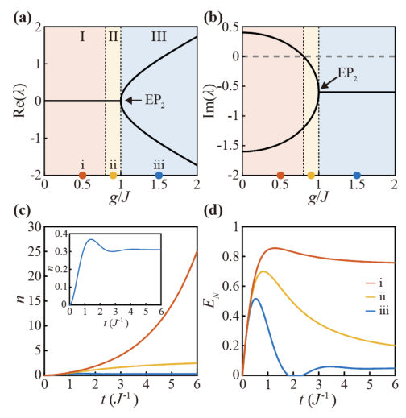 
FIG. 2. Dynamical spectrum and time evolution of mode populations and entanglement under local dissipation. (a),(b) Real (a) and imaginary (b) parts of the four eigenvalues of the dynamical matrix M1 as functions of g/J. The spectrum is divided into three regions. In Region I, at least one eigen- value has a positive imaginary part indicating dynamical in- stability, whereas in Regions II and III all eigenvalues have negative imaginary parts, which are separated by a twofold EP2. (c),(d) Time evolution of the equal mode population n(t) ≡n1(t) = n2(t) (c) and the logarithmic negativity EN(t) (d) for g/J = 0.5 (orange), 0.9 (yellow), and 1.5 (blue), corre- sponding to the colored markers...

📷 Fig 4

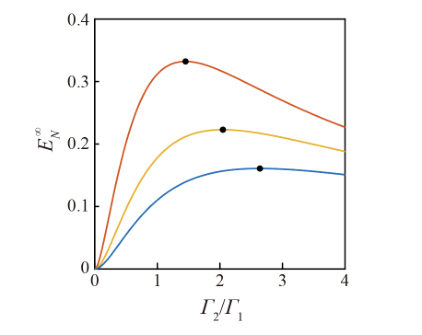 
FIG. 4. Asymptotic logarithmic negativity E∞ N as a function of the local-dissipation ratio Γ2/Γ1 for g/Γ1 = 0.5 (orange), 0.75 (yellow), and 1.0 (blue). Here, J/Γ1 = 0.5 and κ = 0, and the system remains dynamically stable along all three param- eter variations. The black dots indicate the maxima of E∞ N , located at Γ2/Γ1 ≃1.45, 2.05, and 2.64 for g/Γ1 = 0.5, 0.75, and 1.0, respectively. The asymptotic entanglement therefore depends nonmonotonically on the dissipation asymmetry and reaches a maximum at a finite value of Γ2/Γ1 for fixed g/Γ1 and J/Γ1.

📷 Fig 5

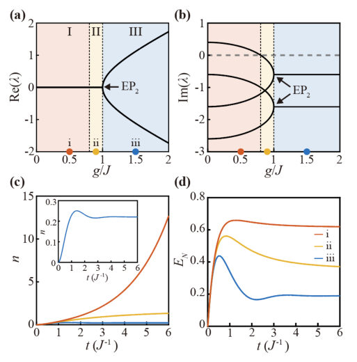 
FIG. 5. Dynamical spectrum and time evolution of popu- lation and entanglement in the presence of a common bath. (a),(b) Real and imaginary parts, respectively, of the four eigenvalues of the dynamical matrix M1 as functions of g/J. The vertical dotted lines mark the unchanged boundaries of the three dynamical regions I–III, while the common bath splits the twofold EP2 in Fig. 2 into two distinct EP2s. (c),(d) Time evolution of the equal mode population n(t) (c) and the logarithmic negativity EN(t) (d) for g/J = 0.5 (orange), 0.9 (yellow), and 1.5 (blue), corresponding to the colored markers i–iii in Regions I, II, and III, respectively. The in- set in (c) shows an enlarged view of the...

**Summary.** This work analyzes entanglement in a dissipative bosonic dimer, showing that even when the system undergoes dynamical instability (diverging particle numbers), the entanglement does not grow infinitely. By using the non-Hermitian dynamical spectrum, the authors establish a unified theory connecting stability boundaries, non-equilibrium dynamics, and the finite asymptotic entanglement achievable in such open quantum systems.

**Why it may be interesting.** It provides a powerful, unified theoretical framework (the non-Hermitian spectrum) to connect stability criteria, non-equilibrium dynamics, and entanglement measures in open quantum systems.

Detailed structure

**Main problem.** The paper investigates whether dynamical instability in parametrically driven bosonic systems necessarily leads to unbounded entanglement growth.

**Main result.** Dynamical instability (diverging population) does not imply unbounded entanglement growth; the logarithmic negativity remains bounded and approaches a finite asymptotic value.

**Method.** The analysis uses the non-Hermitian dynamical spectrum derived from the evolution of Gaussian moments to characterize population and entanglement dynamics.

**Model / system.** The system is a dissipative bosonic dimer modeled with beam-splitter and two-mode-squeezing interactions, subject to local loss and an optional common bath, governed by a master equation.

**Key observables.** Logarithmic negativity ($E_N(t)$), mode populations ($n_i(t)$), and the symplectic eigenvalues of the partially transposed Covariance Matrix.

**Important parameters / regimes.** Dissipation rates ($\Gamma_1, \Gamma_2$), coupling strengths ($g, J$), and the common bath coupling ($\kappa$).

**Assumptions / limitations.** The dynamics are treated within the framework of Gaussian moments, allowing for a description via the non-Hermitian dynamical spectrum.

**Figures summary.** Figures illustrate the schematic of the system and show the time evolution of population and entanglement across different dynamical regimes defined by the spectrum.

**Paper structure.** The paper establishes the non-Hermitian dynamical spectrum as the unifying framework, analyzing the system's behavior across stable and unstable regimes to characterize the asymptotic entanglement.

Abstract

Dynamical instability in parametrically driven bosonic systems is generally associated with diverging occupations and the absence of a stationary state, but its implications for long-time entanglement remain unclear. We investigate this question in a dissipative bosonic dimer with beam-splitter and two-mode-squeezing interactions, local loss, and a tunable common bath. The non-Hermitian dynamical spectrum governing the Gaussian moments partitions the parameter space into distinct regimes and provides a unified description of population and entanglement dynamics across both stable and unstable regions. We find that dynamical instability does not imply unbounded entanglement growth: although the bosonic population diverges, the logarithmic negativity remains bounded and approaches a finite asymptotic value. We further characterize the finite asymptotic entanglement and show that asymmetric local dissipation shifts both the stability boundary and the threshold for nonzero asymptotic entanglement. For identical local dissipation, the presence of a common bath leaves the dynamical-region boundaries unchanged while qualitatively reshaping the long-time entanglement landscape, producing broad enhancement regions within the stable regimes and a narrow enhancement region within the unstable regime. In the common-bath-only limit, this enhancement is attributed to an exact dark-mode (bound-state-in-the-continuum, BIC) protection mechanism, which reduces to a quasi-BIC remnant under independent dissipation. Our results establish the non-Hermitian dynamical spectrum as a framework for connecting stability, nonequilibrium dynamics, and asymptotic entanglement in open quadratic bosonic systems.

[↑ back to top](#top)

### [Inertia-Driven Information Flow and Symmetry Breaking in a Nonequilibrium Two-Bead System](http://arxiv.org/abs/2608.30849v1)

**Authors:** Jetin E. Thomas, Ramandeep S. Johal  
**Type:** theory · **Category:** statistical mechanics · **PDF:** <https://arxiv.org/pdf/2608.30849v1>  
**Analysis basis:** full PDF text, analyzed in chunks
**Topic relevance:** `driven-dissipative phase transition` **3/5** · `non-equilibrium universality` **3/5** · `Keldysh / 2PI / non-Gaussian methods` **2/5** · `methods for driven-dissipative` **2/5** · `quantum measurements` **2/5** · `correlated / nonlocal dissipation` **1/5**

📷 Fig 1

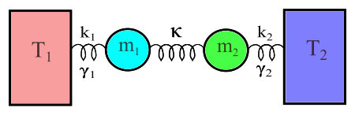 
FIG. 1. Schematic of the two-beads and springs system in contact with two heat reservoirs at different temperatures.

📷 Fig 2

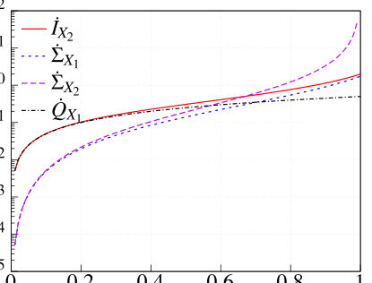 
FIG. 2. Steady-state information flow ˙IX2, subsystem en- tropy production rates ˙ΣX1 and ˙ΣX2, and heat current ˙QX1 as functions of the normalized temperature difference (ξ) for the symmetric system (all parameters set to unity) as infor- mational flow only depends on ξ and not on the mean of the temperatures of the two heat baths (T0).

📷 Fig 3

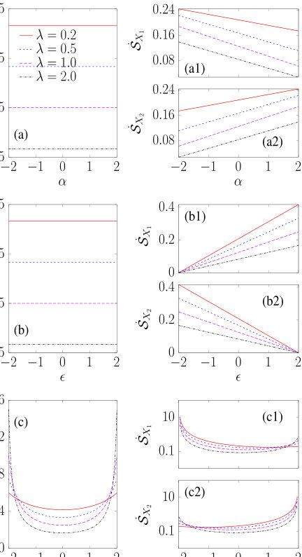 
FIG. 3. Perturbative response landscapes of information flow for the information flow ˙IX2 (left column) and subsystem en- tropy productions ˙SX1 and ˙SX2 (right column). Each row corresponds to perturbations along the spring asymmetry (α), friction asymmetry (ϵ), and temperature asymmetry (δ) direc- tions, respectively, while the remaining perturbation parame- ters are held fixed at zero. Curves are shown for λ = 0.2, 0.5, 1, and 2.

📷 Fig 4

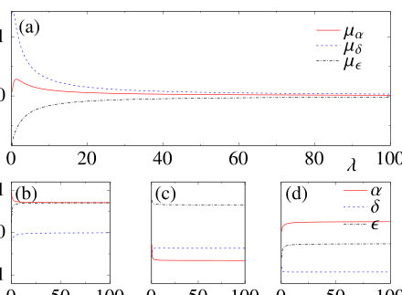 
FIG. 4. Principal curvature analysis of the overdamped re- sponse landscape as a function of the dimensionless coupling parameter λ. (a) Eigenvalues of the Hessian evaluated at the symmetric steady state (α, δ, ϵ) = (0, 0, 0). The coexistence of one negative and two positive eigenvalues demonstrates that the symmetric state is a saddle point of the three-dimensional perturbation landscape. (b–d) Components of the normal- ized eigenvectors corresponding to the weakly stable, unsta- ble, and strongly stable modes, respectively, as explained in Sec. V-D.

📷 Fig 5

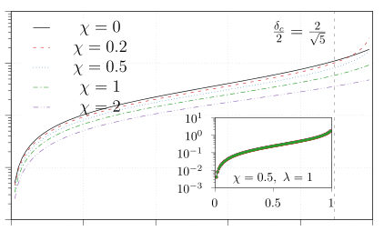 
FIG. 5. Universal scaling function F(δ, χ, λ) = γ ˙IX2/κ as a function of the nonequilibrium driving (δ) for λ = 1 and different values of the inertial parameter χ. The inset shows the dependence of the scaling function on the non-equilibrium drive δ for fixed χ = 0.5 and λ = 1.0. The vertical dashed line is to mark δc = 4/ √

**Summary.** This work analyzes information generation in a two-bead system driven out of equilibrium by two heat baths. It demonstrates that information flow is a key diagnostic, revealing structural details about the system's dynamics—especially when inertia is included—that are masked in simpler overdamped limits. The findings establish a minimal theoretical framework linking microscopic heterogeneity, inertia, and the generation of usable information in nanoscale machines.

**Why it may be interesting.** The connection between information flow, non-equilibrium thermodynamics, and geometric phase transitions (Ginzburg-Landau analogy) provides a powerful, general framework applicable to understanding energy/information conversion in complex physical systems.

Detailed structure

**Main problem.** The paper investigates how information flow is generated and how symmetry breaking occurs in a non-equilibrium system, suggesting a pathway toward information engines.

**Main result.** The system generates information flow in both overdamped and underdamped regimes, with inertia revealing divergences in the information landscape hidden in the overdamped limit.

**Method.** The analysis uses information thermodynamics, symmetry-perturbation theory (reminiscent of Ginzburg-Landau), and linear-response theory applied to Langevin dynamics.

**Model / system.** The model is a two-bead system coupled to two independent heat baths at potentially different temperatures, allowing for the study of non-equilibrium steady states.

**Key observables.** Information flow ($\dot{I}$), entropy production ($\dot{\Sigma}$), heat currents ($\dot{Q}$), and the information-flow landscape structure.

**Important parameters / regimes.** Thermal asymmetry ($\delta$), inertia (masses $m_1, m_2$), and the transition between overdamped and underdamped regimes.

**Assumptions / limitations.** The analysis often relies on the Gaussian nature of the steady-state distribution for deriving information flow formulas, and specific limits (e.g., $\delta 	o 0$) are used for perturbative analysis.

**Figures summary.** Figures illustrate the dependence of information flow and entropy production on the normalized temperature difference ($\xi$) and show perturbative response landscapes along various asymmetry directions.

**Paper structure.** The paper progresses from establishing the general framework using Langevin equations, analyzing the local entropy balance and the recovery of the second law, then performing perturbative analyses around equilibrium, and finally contrasting the results between the overdamped and underdamped regimes.

Abstract

We investigate information-flow generation in a nonequilibrium two-bead system coupled to two heat baths. We show that the system acts as an information-flow generator in both overdamped and underdamped regimes, with the underdamped dynamics revealing a divergence of the scaled information flow along specific paths in the thermal asymmetry--inertia parameter space that is hidden in the overdamped limit. This information generation suggests a possible route toward information engines and demon-like mechanisms in nanomachines. A symmetry-perturbation analysis of the response landscape of information flow reveals a geometric structure reminiscent of a Ginzburg--Landau framework: the symmetric reference state can correspond to a minimum or maximum depending on the perturbation direction, while the flat overdamped landscape develops a finite curvature under inertia. Mass asymmetry shifts the resulting maxima, and Hessian eigenvalue and eigenvector analysis reveals level touching of principal modes and bimodality along a constant-diffusion path. These results establish a minimal framework for understanding how inertia and microscopic heterogeneity shape information landscapes in nonequilibrium systems, with potential extensions to more complex heterogeneous networks.

[↑ back to top](#top)

### [Kinetic temperatures and inertial effects in a nonequilibrium bead-spring model](http://arxiv.org/abs/2608.30809v1)

**Authors:** Jetin E Thomas, Ramandeep S. Johal  
**Type:** theory · **Category:** statistical mechanics · **PDF:** <https://arxiv.org/pdf/2608.30809v1>  
**Analysis basis:** full PDF text, analyzed in chunks
**Topic relevance:** `methods for driven-dissipative` **3/5** · `non-equilibrium universality` **3/5** · `Keldysh / 2PI / non-Gaussian methods` **2/5** · `analog quantum simulation` **1/5** · `correlated / nonlocal dissipation` **1/5** · `driven-dissipative phase transition` **1/5** · `quantum measurements` **1/5** · `scars & prethermalization` **1/5**

📷 Fig 1

 
FIG. 1. Two beads, of mass m1 and m2, simultaneously cou- pled to each other with a spring having spring constant κ as well as with a bath at temperature T1 (T2) with spring con- stant k1 (k2). The frictional drag coefficient is γ1 (γ2) for the left (right) particle.

📷 Fig 2

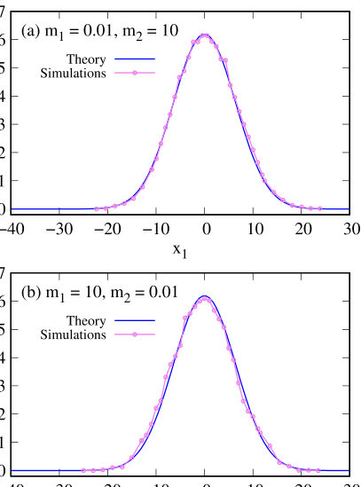 
FIG. 2. The numerically computed marginal probability dis- tribution (P(x1)) in comparison to the distribution obtained from theory (Eq. (5)). The distributions are very close to each other for the two cases. The simulations assume m1 = 0.01, m2 = 10 (a), and m1 = 10, m2 = 0.01 (b), T1 = 99, T2 = 1, γ1 = γ2 = 1, k1 = k2 = 1, and κ = 2.

📷 Fig 3

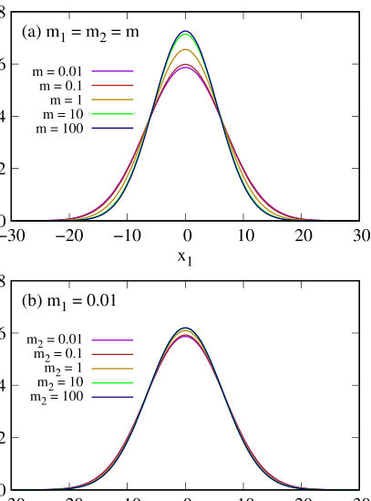 
FIG. 3. The analytical marginal probability distribution (P(x1)) for different values of the mass m of each bead. a) The distributions become narrower and higher with an increase in mass which is equal for each bead. b) The distributions also increases with increase in mass (m2) of the second bead keep- ing the first bead at fixed mass (m1 = 0.01). But the extent of increase is very small. Here, T1 = 99, T2 = 1, γ1 = γ2 = 1, k1 = k2 = 1, and κ = 2.

📷 Fig 4

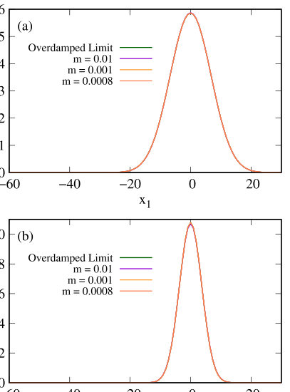 
FIG. 4. The marginal probability distribution for the position (x1) of the bead to the left (a) and position (x2) of the bead to the right (b). The marginal distributions for the overdamped limit are compared with the analytically obtained distribu- tions of different small masses. The distributions from the overdamped limit and the three small masses lie on top of each other. The curves were drawn at T1 = 99, T2 = 1, γ1 = γ2 = 1, k1 = k2 = 1, and κ = 2.

📷 Fig 5

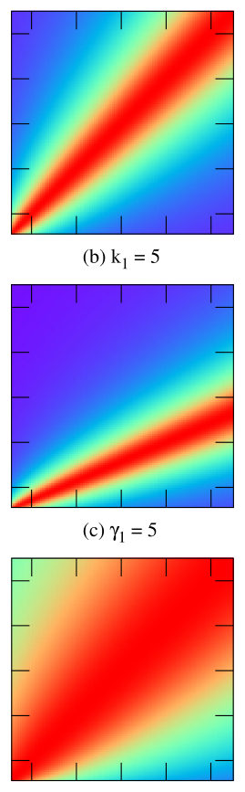 
FIG. 6. Thermal conductivity λ [Eq. (18)] in the (m1, m2) plane. (a) Symmetric setup: γ1 = γ2 = 1, k1 = k2 = 1, κ = 2. (b) k1 = 5, κ = 2, all other parameters equal to 1. (c) γ1 = 5, κ = 2, all other parameters equal to 1.

**Summary.** This work analyzes a two-bead model coupled to two baths at different temperatures to study nonequilibrium steady states. It establishes that kinetic temperatures are the fundamental variables governing the system's thermodynamics, unifying energy, heat transport, and entropy production. The findings highlight a crucial distinction between path-dependent energy observables and robust, temperature-governed transport measures.

**Why it may be interesting.** The rigorous mathematical framework connecting energy, transport, and entropy via kinetic temperatures provides a powerful, generalizable tool for analyzing non-equilibrium dynamics in complex physical systems, relevant to open quantum systems modeling.

Detailed structure

**Main problem.** The paper investigates the characterization of nonequilibrium steady states (NESS) in coupled systems subjected to thermal baths at different temperatures, focusing on the role of inertia.

**Main result.** Kinetic temperatures are shown to be the fundamental organizing variables that unify energy, heat transport, and entropy production in the system.

**Method.** The analysis employs a covariance-matrix approach combined with numerical simulations of underdamped Langevin dynamics to solve for steady-state properties.

**Model / system.** The model is a bead-spring system consisting of two beads with arbitrary masses, coupled by a spring, and interacting independently with two thermal baths at distinct temperatures ($T_1$ and $T_2$).

**Key observables.** Steady-state probability distributions, heat transport ($\dot{Q}$), entropy production ($\Delta S_{tot}/	au$), and kinetic temperatures ($T_{kin}$).

**Important parameters / regimes.** Bead masses ($m_1, m_2$), spring constant ($\kappa$), and bath temperatures ($T_1, T_2$).

**Assumptions / limitations.** The analysis is performed within a linear Langevin framework, and the results are shown to be robust for transport/irreversibility measures even when energy observables show path dependence in singular mass limits.

**Figures summary.** Figure 1 schematically shows the two beads coupled to two baths. Figure 2 compares the marginal position distribution derived theoretically versus numerically. Figure 3 shows the analytical marginal position distribution for varying bead masses.

**Paper structure.** The paper develops the dynamics using Langevin equations, analyzes the steady-state covariance matrix, derives key thermodynamic quantities like heat flux and entropy production, and culminates in establishing kinetic temperatures as the universal variables governing the system's thermodynamics.

Abstract

We investigate a nonequilibrium steady-state model consisting of two coupled beads with arbitrary masses in contact with two thermal baths at different temperatures. Using a covariance-matrix approach together with numerical simulations of the underdamped Langevin dynamics, we characterize steady-state probability distributions, heat transport, and entropy production. We show that irreversibility measures such as entropy production and heat current are invariant under an exchange of the bead masses, whereas energy-storage observables depend explicitly on the mass arrangement in a symmetrical set up. This reveals a fundamental distinction: energy observables exhibit path dependence in singular mass limits, while transport and irreversibility remain well defined. We show that kinetic temperatures provide the natural variables governing the thermodynamics of the system: their difference controls transport and entropy production, while their sum determines the mean energy via a model specific generalized equipartition relation. In the infinite-mass limit, only constitutive relations expressed in terms of kinetic temperatures remain meaningful. Thus, energy, transport, and irreversibility are unified through kinetic temperatures as the organizing variables. We also derive an effective temperature that defines an equilibrium-like canonical distribution. Finally, we analyze the notion of ergodicity and show that the time-averaged observables converge significantly faster than the ensemble averages.

[↑ back to top](#top)

### [Phase-noise induced many-body interference suppression in Gaussian Boson Sampling](http://arxiv.org/abs/2608.31089v1)

**Authors:** Dario Cilluffo, Matthias Kost, Martin B. Plenio  
**Type:** theory · **Category:** quantum information and computing · **PDF:** <https://arxiv.org/pdf/2608.31089v1>  
**Analysis basis:** full PDF text, analyzed in chunks
**Topic relevance:** `interference shaping light` **3/5** · `methods for driven-dissipative` **3/5** · `analog quantum simulation` **2/5** · `Full counting statistics` **1/5** · `Keldysh / 2PI / non-Gaussian methods` **1/5** · `correlated / nonlocal dissipation` **1/5** · `driven-dissipative phase transition` **1/5** · `quantum measurements` **1/5**

📷 Fig 1

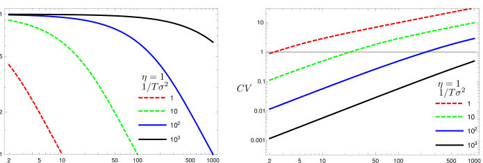 
FIG. 1. Weighting factor wk (left) for lossless setup and coefficient of variation (CV) as functions of the number k for different values of the ratio between the detector integration rate and the phase diffusion rate.

**Summary.** This work develops a theoretical framework to quantify how phase noise degrades the quantum interference signatures in Gaussian Boson Sampling. By modeling phase diffusion, the authors show that interference is suppressed, causing the output statistics to approach classical limits. This establishes a crucial diagnostic tool for assessing the impact of realistic noise sources on quantum photonic experiments.

**Why it may be interesting.** It provides a concrete, quantitative link between experimentally measurable phase fluctuations (dephasing) and the loss of quantum advantage in photonic quantum computation protocols like GBS.

Detailed structure

**Main problem.** The paper investigates how phase noise (phase diffusion) systematically suppresses the many-body quantum interference effects inherent in Gaussian Boson Sampling (GBS).

**Main result.** Phase noise selectively suppresses the interference contribution, driving the output statistics toward a classical dimer-model regime, while the incoherent (Hafnian) part remains relatively unaffected.

**Method.** The analysis uses a Heisenberg-picture tensor-network formulation to derive Fock-space expressions for output probabilities, followed by modeling the effect of phase fluctuations using an effective dephasing model based on Wiener processes.

**Model / system.** The system is Gaussian Boson Sampling (GBS), which uses squeezed-vacuum states. The analysis models the evolution and probability amplitude using tensor networks, focusing on the interference structure derived from perfect matchings.

**Key observables.** Output probability $|\langle n|U|G
angle|^2$, interference sectors $I_k(ar{i})$, and the coherence factor $w_k$.

**Important parameters / regimes.** Phase fluctuation timescale vs. detection window $T$, photon number $m$, and the mismatch index $k$.

**Assumptions / limitations.** The analysis focuses only on phase fluctuations, neglecting amplitude fluctuations, and employs an effective dephasing model based on jointly Gaussian Wiener processes.

**Figures summary.** Figure 1 illustrates the coherence factor $w_k$ and its Coefficient of Variation (CV) versus the mismatch index $k$, showing the crossover from coherent to fluctuation-dominated regimes.

**Paper structure.** The paper first establishes the Fock-space framework for GBS probabilities, then develops an effective dephasing model using Wiener processes to calculate the suppression factor $w_k$. Finally, it compares GBS to Shot-by-Shot Boson Sampling (SBS) and analyzes the effect of uniform losses.

Abstract

We develop a Heisenberg-picture tensor-network formulation of collision-free Gaussian Boson Sampling, providing a direct Fock-space expression for output probabilities in terms of experimentally accessible quantities. The resulting representation naturally recovers the Hafnian structure while revealing the decomposition of GBS probability into a phase-insensitive contribution and a hierarchy of interference sectors associated with pairs of perfect matchings. As an application, we investigate phase diffusion and show how it progressively suppresses many-body interference, driving the output statistics toward a classical dimer-model regime. Our results establish a transparent framework for connecting experimentally characterized phase fluctuations with the loss of quantum interference in photonic quantum sampling experiments.

[↑ back to top](#top)

### [Thresholdless dynamical instability in transverse $\mathcal{PT}$-symmetric scattering systems: The hidden role of bound states in the continuum](http://arxiv.org/abs/2608.29557v1)

**Authors:** Chao Zheng  
**Type:** theory · **Category:** other · **PDF:** <https://arxiv.org/pdf/2608.29557v1>  
**Analysis basis:** full PDF text, analyzed in chunks
**Topic relevance:** `driven-dissipative phase transition` **3/5** · `methods for driven-dissipative` **3/5** · `correlated / nonlocal dissipation` **2/5** · `non-equilibrium universality` **2/5** · `Keldysh / 2PI / non-Gaussian methods` **1/5** · `analog quantum simulation` **1/5** · `quantum measurements` **1/5**

📷 Fig 1

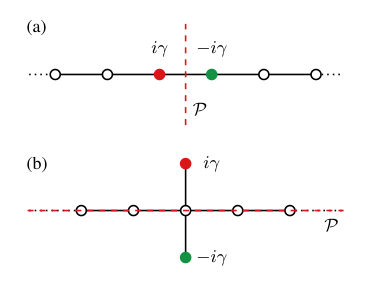 
FIG. 1. Schematic illustration of two classes of PT -symmetric scat- tering systems, distinguished by the orientation of the parity mirror axis P (red dashed line) relative to the transport direction. (a) Lon- gitudinal configuration, where the mirror axis is perpendicular to the transport direction, so that the balanced gain +iγ (red) and loss −iγ (green) are distributed along the propagation axis. (b) Transverse configuration, where the mirror axis coincides with the transport di- rection, so that the balanced gain and loss reside on opposite sides of the propagation channel.

📷 Fig 2

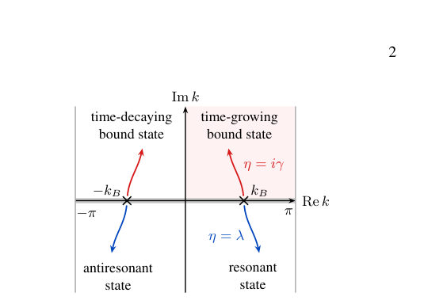 
FIG. 2. Trajectories of the S-matrix poles associated with a BIC in the complex-k plane under mirror-symmetry-breaking perturba- tions. Poles in each quadrant correspond to physically distinct states as labeled. The gray band marks the scattering continuum. The un- perturbed BIC appears as pole-zero coalescences on the real axis at k = ±kB (black crosses). A Hermitian perturbation (blue arrows) shifts the poles into the lower half-plane, producing a resonant and an antiresonant state. A PT -symmetric perturbation (red arrows) drives the poles into the upper half-plane, producing a time-growing and a time-decaying bound state. The time-growing bound state in the first quadrant (shaded)...

📷 Fig 3

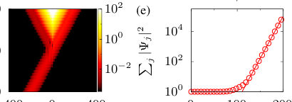 
FIG. 3. Thresholdless instability in the three-site side-coupled model. (a) Schematic of the model with gain +iγ on site a and loss −iγ on site b. (b) Trajectories of the S-matrix poles in the complex k plane as a function of γ, with the color bar showing γ in units of J. Black crosses mark the BIC at k = ±kB. The pole originating from +kB enters the first quadrant (shaded) for any nonzero γ, signaling the emergence of a TGBS. (c) Imaginary part of the TGBS energy as a function of γ on a double-logarithmic scale. Circles are exact pole solutions and the solid line is the perturbative prediction of Eq. (28). (d) Time evolution of the intensity |Ψj(t)|2 of the Gaussian wave packet with k0 =...

📷 Fig 4

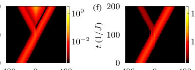 
FIG. 4. Placement-controlled stability in the four-site rhombic model. (a),(b) Schematics of the transverse (Vv) and longitudinal (Vh) placements, respectively. Gain and loss reside on the side sites a, b in (a) and on the chain sites 0, 1 in (b). (c),(d) Trajectories of the S-matrix poles in the complex k plane as a function of γ for the transverse and longitudinal placements, respectively; the color bar indicates γ in units of J. Black crosses mark the BIC at ±kB. In (c), the pole pair originating from the BIC moves into the up- per half-plane for arbitrarily small γ, signaling the emergence of a TGBS, whereas in (d) the BIC remains pinned on the real axis for all γ. (e),(f) Time...

**Summary.** This paper reveals a thresholdless dynamical instability in transverse PT-symmetric scattering systems, showing that the presence of a BIC coupled to the continuum leads to exponential energy growth under anti-Hermitian perturbations. The instability is governed by the spatial overlap between the gain/loss potential and the BIC state, providing a crucial design principle for stable non-Hermitian devices.

**Why it may be interesting.** This work is highly relevant to AMO physics and open quantum systems as it provides a rigorous stability criterion for engineered non-Hermitian systems, directly impacting the design of stable quantum optical devices.

Detailed structure

**Main problem.** The paper investigates the dynamical stability of transverse parity-time (PT)-symmetric scattering systems, addressing the gap in knowledge regarding their dynamic stability despite extensive study of their stationary properties.

**Main result.** The authors demonstrate that an anti-Hermitian PT-symmetric perturbation can drive the system into a time-growing bound state (TGBS) for arbitrarily small gain-loss strength, establishing a microscopic instability criterion.

**Method.** The analysis relies on tracking the poles of the S-matrix in the complex wave-number plane, using perturbation theory (Feshbach projection) to analyze the shift of Bound States in the Continuum (BICs).

**Model / system.** The study uses transverse PT-symmetric scattering systems, modeled via tight-binding approaches, specifically examining three-site side-coupled and four-site rhombic models with engineered gain/loss potentials.

**Key observables.** Pole trajectories in the complex k-plane, the imaginary part of the energy ($	ext{Im } E$), and the time evolution of a localized wave packet showing exponential growth.

**Important parameters / regimes.** Gain-loss strength ($\gamma$), the golden-rule coupling ($\Gamma_V$), and the nature of the perturbation (Hermitian vs. anti-Hermitian).

**Assumptions / limitations.** The analysis often assumes the existence of a single, non-degenerate BIC for simplicity, and the instability mechanism is linked to the spatial overlap between the gain-loss potential and the BIC wave function.

**Figures summary.** Figures illustrate the pole coalescence (BIC), the shift of poles under Hermitian perturbation (lower half-plane), and the upward shift into the first quadrant under PT-symmetric perturbation, accompanied by time evolution plots showing exponential growth.

**Paper structure.** The paper first establishes the theoretical framework by noting the gap in dynamical stability studies. It then analyzes the effect of perturbations on the BIC pole structure, contrasting Hermitian and anti-Hermitian cases. Finally, it confirms the instability mechanism using specific lattice models (three-site and four-site rhombic) and derives a design principle.

Abstract

The stationary scattering properties of transverse parity-time ($\mathcal{PT}$) symmetric systems have been extensively studied, yet their dynamical stability, a prerequisite for any stationary description, remains largely unexplored. Here we uncover a thresholdless dynamical instability in such systems, driven by symmetry-protected bound states in the continuum (BICs). Without gain and loss, the up-down mirror symmetry of the transverse geometry generically protects a BIC, which manifests as the coalescence of an $S$-matrix pole and zero on the real axis of the complex wave-number plane. A Hermitian symmetry-breaking perturbation shifts the poles into the lower half-plane, converting the BIC into a resonance with a Fermi-golden-rule decay width. An anti-Hermitian $\mathcal{PT}$-symmetric perturbation instead reverses the sign of the second-order energy shift, driving the poles into the upper half-plane and producing a time-growing bound state with $\operatorname{Im}E=γ^{2}Γ_{V}/2+O(γ^{3})$, where $γ$ is the gain-loss strength and $Γ_{V}$ is the golden-rule coupling of the BIC to the continuum. The instability therefore sets in at arbitrarily small $γ$ whenever $Γ_{V}>0$. We confirm this mechanism in a three-site side-coupled model that is unstable despite possessing a unitary scattering matrix, and in a four-site rhombic model where transverse and longitudinal gain-loss placements yield vanishing and finite thresholds, respectively. These results establish a microscopic stability criterion and a design principle for stable $\mathcal{PT}$-symmetric scattering devices.

[↑ back to top](#top)

### [Time-delayed feedback turns Arrhenius escape logarithmic](http://arxiv.org/abs/2608.30624v1)

**Authors:** Roy Podgaetsky, Vishwajeet Kumar Arnab Pal, Ohad Shpielberg  
**Type:** theory · **Category:** statistical mechanics · **PDF:** <https://arxiv.org/pdf/2608.30624v1>  
**Analysis basis:** full PDF text, analyzed in chunks
**Topic relevance:** `non-equilibrium universality` **3/5** · `Keldysh / 2PI / non-Gaussian methods` **2/5** · `methods for driven-dissipative` **2/5** · `quantum measurements` **2/5** · `Frenkel-Kontorova` **1/5** · `correlated / nonlocal dissipation` **1/5** · `driven-dissipative phase transition` **1/5** · `scars & prethermalization` **1/5**

📷 Fig 1

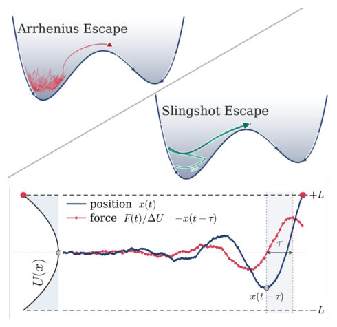 
FIG. 1. The slingshot mechanism. Top: Arrhenius es- cape. Escape via a rare fluctuation (red) over the barrier, giving exponentially long escape times set by ∆U/D. Mid- dle: Slingshot escape. Delayed feedback drives the parti- cle over the barrier deterministically in a few exponentially increasing oscillations (green). Bottom: Slingshot trajec- tory. A typical trajectory of x(t) (navy) with a feedback force F/∆U = −x(t −τ) (red). Dashed vertical lines mark t −τ and t. The delay τ induces a phase shift between x(t) and F(t), driving the particle to the boundary ±L.

📷 Fig 2

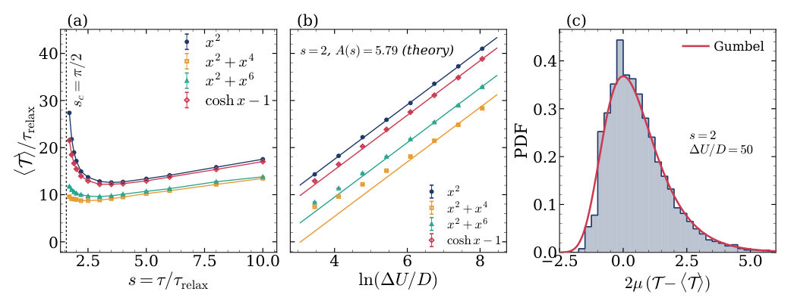 
FIG. 2. Left: Non-monotone speedup. Dimensionless mean escape time versus delay at ∆U/D = 50, for the four potentials. Each falls sharply past sc = π/2 to a minimum near s ≃3 — exponentially faster than Arrhenius, and below the free-diffusion time — then saturates to the diffusive limit in large s. The non-monotonic shape is a generic feature of slingshot escape. Middle: Universality of the logarithmic slope. Dimensionless mean escape time versus ln(∆U/D) at s = 2, for four hardening potentials (harmonic, x2 + x4, x2 + x6, cosh x −1). Lines share the single predicted slope A(s) with one fitted intercept each. Right: Escape-time distribution is Gumbel. Histogram of the rescaled, centered...

📷 Fig 3

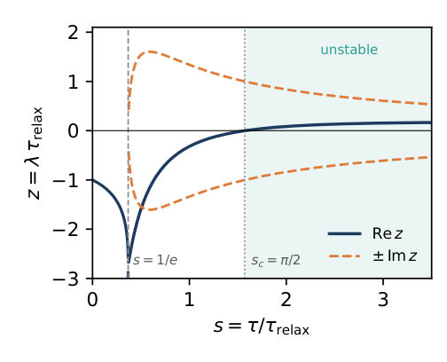 
FIG. 3. Structure of the leading root z = λτrelax of the characteristic equation (2). The root z is complex in nature. For s &lt; 1/e two real roots exist; they coalesce at z = −e and become a complex pair, whose real part (solid) crosses zero at sc = π/2. Beyond that (shaded) the minimum is an unstable focus with growth rate µ and frequency ω (dashed).

**Summary.** This theoretical work analyzes how time-delayed feedback fundamentally alters thermal escape dynamics, replacing the standard exponential Arrhenius law with a logarithmic dependence on the barrier height. By inducing a deterministic 'slingshot' instability, the delay acts as a tunable control parameter, enabling escape significantly faster than predicted by classical theories.

**Why it may be interesting.** The replacement of exponential scaling with a logarithmic dependence is a profound non-equilibrium effect, providing a new, controllable mechanism for accelerating processes relevant to quantum tunneling or barrier crossing in open quantum systems.

Detailed structure

**Main problem.** The paper investigates how time-delayed feedback modifies the standard Arrhenius exponential scaling governing thermally activated escape over an energy barrier.

**Main result.** The mean escape time transitions from exponential to a logarithmic dependence on the barrier height, $\langle T 
angle \propto \ln(\Delta U/D)$, due to a deterministic 'slingshot' escape mechanism.

**Method.** The analysis involves solving the non-Markovian Langevin equation, identifying a Hopf bifurcation point, and deriving the escape time by analyzing the two-stage process of noise-seeded diffusion followed by deterministic amplification.

**Model / system.** The system is an overdamped particle diffusing in a confining potential $U(x)$, subjected to a time-delayed conservative force: $\gamma \dot{x}(t) = -U'(x(t-	au)) + \sqrt{2D} \eta(t)$.

**Key observables.** Mean escape time $\langle T 
angle$, which exhibits a Gumbel distribution for its fluctuations.

**Important parameters / regimes.** Dimensionless delay $s = 	au/	au_{	ext{relax}}$, barrier-to-noise ratio $\Delta U/D$, and the critical delay $s_c = \pi/2$.

**Assumptions / limitations.** The analysis assumes the system is overdamped and the delay only affects the conservative force; the logarithmic law is derived for the weak-noise regime ($\Delta U/D \gg 1$).

**Figures summary.** Figures illustrate the contrast between Arrhenius and Slingshot escape trajectories, confirm the universal logarithmic slope $A(s)$ across different potentials, and show the Gumbel distribution of the escape-time histogram.

**Paper structure.** The paper establishes the non-Markovian dynamics, identifies the instability threshold ($s_c$), derives the logarithmic escape law $\langle T 
angle \propto \ln(\Delta U/D)$ by analyzing the envelope crossing, and discusses the implications for tunable control of activated processes.

Abstract

Thermal escape is governed by the Arrhenius law, where the mean escape time scales exponentially with the barrier height. We show that the non-Markovianity induced by time-delayed feedback in the confining force removes this exponential scaling. Beyond a threshold set by the curvature of the minimum, the delay destabilizes the well, and the thermal noise seeds an instability that is subsequently amplified deterministically to the boundary leading to \textit{slingshot} escape trajectories. The escape time becomes logarithmic in the barrier, its fluctuations follow a Gumbel law, and an optimal delay enables escape faster than free diffusion. Our results propose time delay as a tunable and experimentally feasible control parameter for accelerating activated processes.

[↑ back to top](#top)

### [Cross-Spectral Reservoir Correlations as a Resource for Finite-Time Quantum Otto Engines](http://arxiv.org/abs/2608.30496v1)

**Authors:** Siddhartha Dutta, Sujay Mondal, Ankush Das, Anumita Mukhopadhyay, Abhijit Bandyopadhyay  
**Type:** theory · **Category:** statistical mechanics · **PDF:** <https://arxiv.org/pdf/2608.30496v1>  
**Analysis basis:** full PDF text, analyzed in chunks
**Topic relevance:** `Keldysh / 2PI / non-Gaussian methods` **3/5** · `correlated / nonlocal dissipation` **3/5** · `driven-dissipative phase transition` **2/5** · `methods for driven-dissipative` **2/5** · `non-equilibrium universality` **1/5** · `quantum measurements` **1/5**

📷 Fig 1

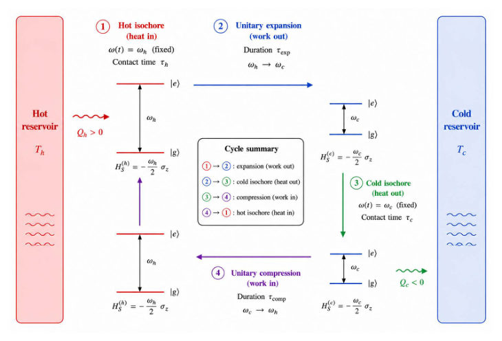 
Figure 1: Illustration of a finite-time quantum Otto cycle:The two-level working medium S exchanges heat with the hot and cold reservoirs during the isochoric strokes, while the energy-level spacing of its bare Hamiltonian HS is held fixed at ωh and ωc, respectively, with ωh &gt; ωc. Here, Qh denotes the heat absorbed from the hot reservoir, whereas Qc denotes the heat released to the cold reservoir. During each isochore, the system–reservoir coupling also induces a Lamb-shift correction H(α) LS (t) to the bare working-medium Hamiltonian. The isolated expansion and compression strokes vary the bare level spacing as ωh →ωc and ωc →ωh, respectively.

📷 Fig 2

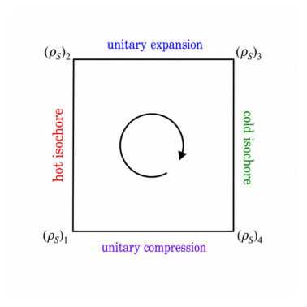 
Figure 2: Schematic representation of the finite-time quantum Otto cycle, with the working- medium states (ρS)1, (ρS)2, (ρS)3, and (ρS)4 defined at the boundaries between successive strokes.

📷 Fig 3

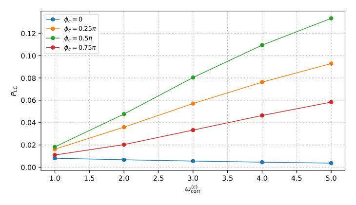 
Figure 3: Power generated in the last cycle as a function of the characteristic cross-correlation frequency ω(c) corr of the cold reservoir for different values of the cross-spectral phase ϕc = 0, π/4, π/2 and 3π/4 with fixed correlation strength rc = 1. Corresponding hot-reservoir parameters are fixed at rh = 1, ω(h) corr = 5, ϕh = π/2. The cycle duration is τcyc = 8 with τh = τc = τexp = τcomp = 2. All remaining are parameters fixed as specified in the text.

📷 Fig 4

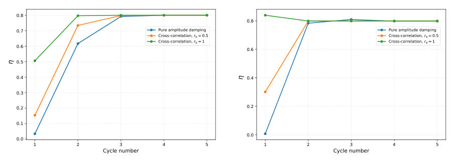 
Figure 4: Cycle-resolved work to heat ratio η for pure-dephasing and pure-amplitude-damping reservoirs, compared with reservoirs possessing longitudinal–transverse cross-spectral corre- lations of strengths rc = rh = 0.5 and 1. The reservoir parameters are βh = 1, βc = 40, ωcorr = 5, and ϕ = π/2, while the two panels correspond to different durations of the four Otto strokes: (a) τcyc = 8 with τh = τc = τexp = τcomp = 2 and (b) τcyc = 20 with τh = τc = τexp = τcomp = 5. All remaining parameters are fixed as specified in the text.

📷 Fig 5

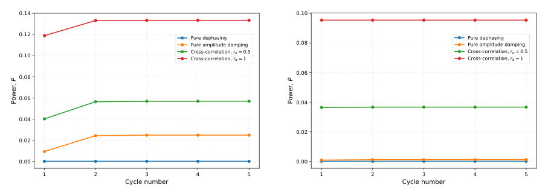 
Figure 5: Cycle-resolved power P for the pure-dephasing and pure-amplitude-damping limits and in the presence of longitudinal–transverse cross-spectral correlations with rα = 0.5 and 1. The reservoir cross-spectral parameters are ω(α) corr = 5, and ϕα = π/2. Panels (a) and (b) correspond, respectively, to cycle durations τcyc = 8 with τh = τc = τexp = τcomp = 2 and 20 with τh = τc = τexp = τcomp = 5. All remaining parameters are fixed as specified in the text.

**Summary.** This work explores how engineered cross-correlations in the environment reservoirs can enhance the power output of a quantum Otto engine operating in finite time. By using advanced non-Markovian quantum dynamics techniques, the authors demonstrate that these off-diagonal spectral correlations provide a novel control knob for quantum thermal machines. This establishes a new resource for controlling transient energy conversion processes.

**Why it may be interesting.** It provides a concrete, controllable mechanism (off-diagonal reservoir spectra) to engineer quantum thermal machines beyond simple temperature or coupling strength variations, which is highly relevant for open quantum systems theory.

Detailed structure

**Main problem.** The paper investigates how longitudinal-transverse cross-spectral reservoir correlations affect the thermodynamic performance of a quantum Otto engine operating in finite time.

**Main result.** Cross-spectral correlations act as an additional resource, capable of enhancing the output power of the engine, although they do not alter the limit-cycle efficiency.

**Method.** The dynamics are derived using the second-order time-convolutionless (TCL2) framework, which retains non-Markovian, finite-time reservoir memory effects.

**Model / system.** The system is a two-level working medium coupled to two bosonic reservoirs (hot and cold) forming a quantum Otto engine. The coupling channels are characterized by a spectral-density matrix including cross-correlation terms.

**Key observables.** Output power, cycle work, population imbalance ($\langle\sigma_z
angle$), and efficiency ($\eta$).

**Important parameters / regimes.** Cross-spectral correlation strength, cross-spectral phase, characteristic frequency scale, and cycle duration ($	au_{cyc}$).

**Assumptions / limitations.** The analysis avoids the Markov limit to capture finite reservoir memory effects, and the limit-cycle efficiency is fixed at the classical Otto value for the considered unitary strokes.

**Figures summary.** Figures illustrate the finite-time quantum Otto cycle sequence and show the time evolution of the population imbalance ($\langle\sigma_z
angle$) over successive cycles, demonstrating sensitivity to cross-correlation strength.

**Paper structure.** The paper establishes the theoretical framework by analyzing the reservoir coupling via spectral density matrices, derives the non-Markovian dynamics using TCL2, and then applies this to the Otto cycle to quantify the enhancement of power via cross-correlations.

Abstract

We investigate the thermodynamic consequences of longitudinal-transverse cross-spectral reservoir correlations in a finite-time quantum Otto engine with a two-level working medium. Each reservoir couples through excitation-relaxation and dephasing channels whose fluctuations are characterized by a Hermitian positive-semidefinite spectral-density matrix, with the off-diagonal elements encoding their cross correlations. The finite-time isochoric dynamics is derived within the second-order time-convolutionless framework, without imposing the Markov limit at the outset, so that finite reservoir-memory effects can enter through time-dependent dissipative and reservoir-induced coherent contributions. The resulting dynamics is then recast in Bloch-vector form to construct the stroke-resolved cycle dynamics. At fixed auto-spectral densities, cross-spectral correlations modify the populations and coherences of the working medium and thereby its thermodynamic performance. Increasing the correlation strength can enhance the output power, with the enhancement controlled by the cross-spectral phase and characteristic frequency scale. The correlations also reshape the transient cycle-to-cycle evolution and the approach to periodic operation, while the limit-cycle efficiency remains fixed at the Otto value for the population-preserving unitary strokes considered here. These results establish off-diagonal reservoir spectra as an additional resource for controlling finite-time quantum thermal machines.

[↑ back to top](#top)

### [Boundary Quantum Knizhnik-Zamolodchikov Equations and Integrability of Quantum Field Theories with Time-Dependent Bulk and Boundary Coupling Strengths](http://arxiv.org/abs/2608.31080v1)

**Authors:** Parameshwar R. Pasnoori  
**Type:** theory · **Category:** strongly correlated electrons · **PDF:** <https://arxiv.org/pdf/2608.31080v1>  
**Analysis basis:** full PDF text, analyzed in chunks
**Topic relevance:** `analog quantum simulation` **3/5** · `Keldysh / 2PI / non-Gaussian methods` **2/5** · `methods for driven-dissipative` **2/5** · `correlated / nonlocal dissipation` **1/5** · `driven-dissipative phase transition` **1/5** · `non-equilibrium universality` **1/5** · `quantum measurements` **1/5**

📷 Fig 1

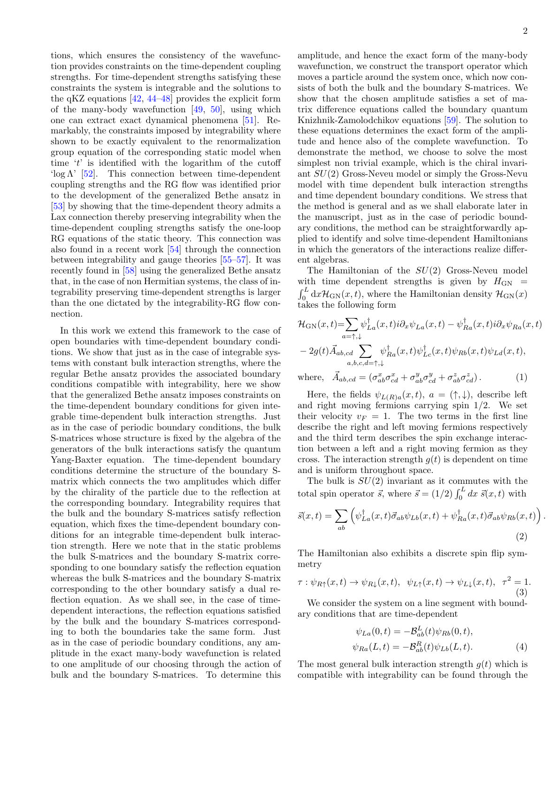 
Low-resolution page preview, page 2

📷 Fig 2

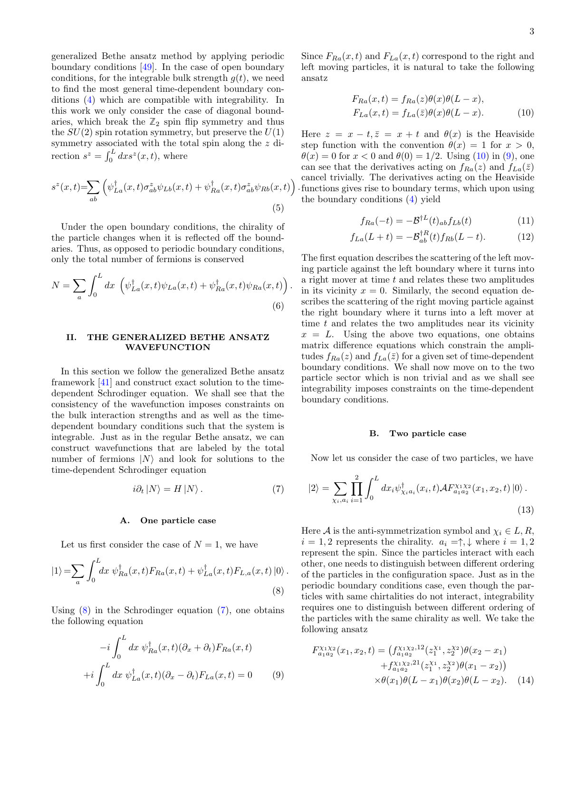 
Low-resolution page preview, page 3

📷 Fig 3

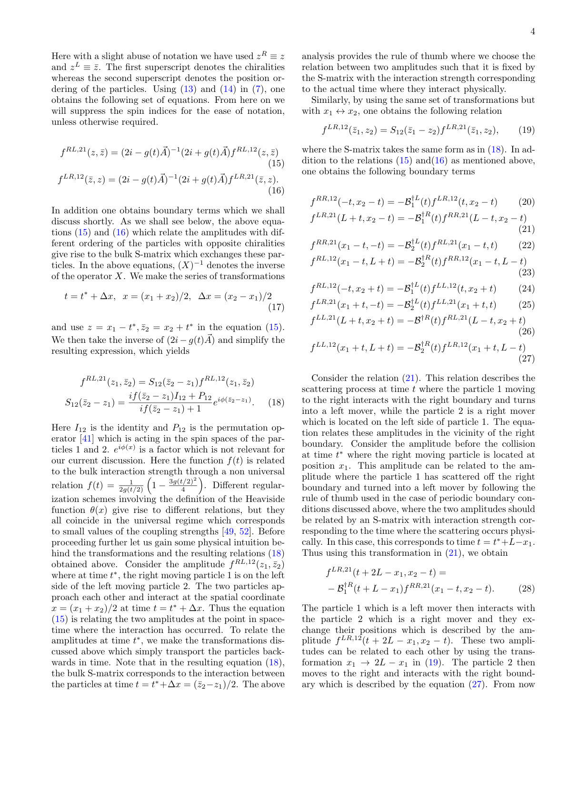 
Low-resolution page preview, page 4

📷 Fig 4

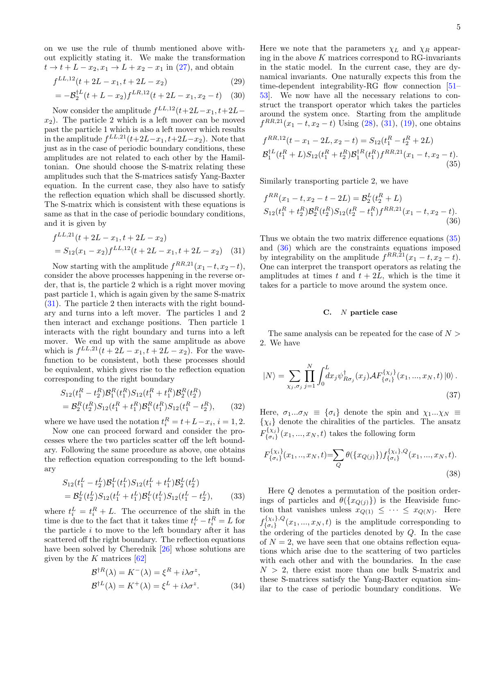 
Low-resolution page preview, page 5

📷 Fig 5

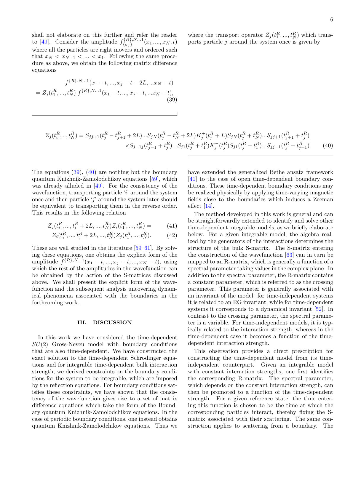 
Low-resolution page preview, page 6

**Summary.** This work develops an extension of the generalized Bethe ansatz to handle quantum field theories with time-dependent interactions at both the bulk and the boundaries. By enforcing integrability, the system's dynamics are constrained to satisfy boundary quantum Knizhnik-Zamolodchikov (BqKZ) equations. This provides an exact, powerful method for determining the time-dependent wavefunction in complex, open quantum systems.

**Why it may be interesting.** The connection between integrable quantum field theories, time-dependent boundary conditions, and the resulting matrix difference equations (BqKZ) provides powerful, exact tools for analyzing open quantum systems dynamics, which is highly relevant to modern AMO and open quantum system research.

Detailed structure

**Main problem.** The paper extends the generalized Bethe ansatz framework to find exact solutions for quantum field theories with both time-dependent bulk and explicitly time-dependent boundary coupling strengths while maintaining integrability.

**Main result.** The consistency of the wavefunction requires the system to satisfy boundary quantum Knizhnik-Zamolodchikov (BqKZ) equations, which govern the exact time-dependent wavefunction.

**Method.** The authors employ the generalized Bethe ansatz, requiring the bulk and boundary S-matrices to satisfy the reflection equation to ensure integrability.

**Model / system.** The analysis focuses on the SU(2) Gross-Neveu model, described by a time-dependent Schrödinger equation for fermions confined between boundaries (open boundary conditions).

**Key observables.** The exact many-body wavefunction, the conserved total number of fermions (N), and the dynamical invariants ($\chi_L, \chi_R$).

**Important parameters / regimes.** Time-dependent coupling strengths $g(t)$ and boundary coupling functions $B(t)$.

**Assumptions / limitations.** The analysis is restricted to the case of diagonal boundaries, which breaks $Z_2$ spin flip and $SU(2)$ spin rotation symmetry but preserves $U(1)$ symmetry.

**Paper structure.** The structure progresses from establishing the generalized Bethe ansatz for time-dependent bulk interactions to incorporating time-dependent boundary conditions. This leads to deriving the necessary reflection equations (for the boundaries) and subsequently constructing the matrix difference equations known as the BqKZ equations.

Abstract

The generalized Bethe ansatz framework formulated in [P. R. Pasnoori, Phys. Rev. B 112, L060409 (2025)] provides a unified framework to find exact solutions to quantum many-body systems with time-dependent coupling strengths with periodic boundary conditions. In this work we extend this framework to the case of open boundary conditions where in addition to the time-dependent interactions in the bulk, the boundary conditions are explicitly time-dependent. We show that for integrable time-dependent bulk coupling strengths, the generalized Bethe ansatz framework provides the time-dependent boundary conditions compatible with integrability and reduces the time-dependent Schrodinger equation to a set of matrix difference equations called the boundary quantum Knizhnik-Zamolodchikov (BqKZ) equations. The solution to the BqKZ equations provides the explicit form of the exact wavefunction. We further show that the RG invariants of the corresponding static model identify with the dynamical invariants in the time-dependent model.

[↑ back to top](#top)

### [Entanglement and magic transitions in an all-to-all non-Hermitian spin model](http://arxiv.org/abs/2608.31064v1)

**Authors:** Sasanka Dowarah, Michael Kolodrubetz  
**Type:** theory · **Category:** statistical mechanics · **PDF:** <https://arxiv.org/pdf/2608.31064v1>  
**Analysis basis:** full PDF text, analyzed in chunks
**Topic relevance:** `driven-dissipative phase transition` **3/5** · `non-equilibrium universality` **3/5** · `Keldysh / 2PI / non-Gaussian methods` **1/5** · `analog quantum simulation` **1/5** · `correlated / nonlocal dissipation` **1/5** · `methods for driven-dissipative` **1/5** · `quantum measurements` **1/5**

📷 Fig 1

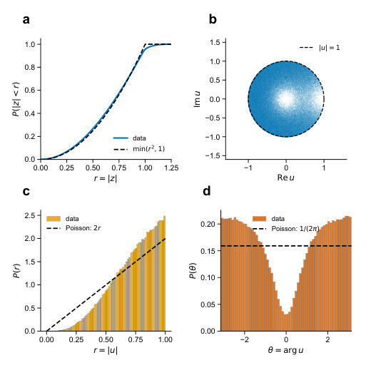 
FIG. 3. Numerical verification of Ginibre universality of the completely disordered part G(µR = µI = 0, σR = σI = 1) for L = 12, kR = kI = 3, averaged over 128 random disorder real- izations. (a) Cumulative radial distribution P(|z| &lt; r) of the eigenvalues, compared with the flat-disk prediction min(r2, 1) from Girko’s circular law. (b) Complex spacing ratios un [Eq. (48)] in the complex plane. (c) Radial density P(r), r = |u|, compared with the Poisson prediction PPoi(r) = 2r. (d) Angular distribution P(θ), θ = arg u, compared with the uniform Poisson value 1/(2π).

📷 Fig 2

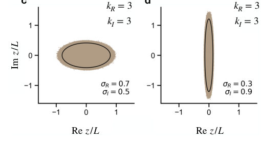 
FIG. 2. Validity of the elliptic-law description of the spec- tral bulk as a function of locality k for L = 12. (a),(b) kR = kI = 5, averaged over 64 disorder realizations; (c),(d) kR = kI = 3, averaged over 128 disorder realizations. The left column corresponds to σR = 0.7 and σI = 0.5 (τ ≃0.32), while the right column corresponds to σR = 0.3 and σI = 0.9 (τ = −0.8). The black solid curves denote the elliptic-law boundary predicted by Eq. (46), with the eigenvalues rescaled by L. For kR = kI = 5 [panels (a),(b)], the numerical spec- tral support is well described by the predicted ellipse, with only approximately 0.4% and 0.95% of the eigenvalues lying outside the predicted boundary,...

📷 Fig 3

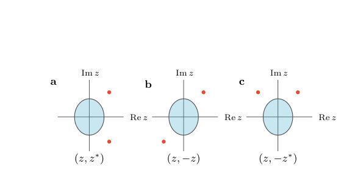 
FIG. 4. Schematic illustration of the three possible symmetry- related configurations of a pair of isolated outlier eigenvalues in the complex spectrum: (a) (z, z∗), (b) (z, −z), and (c) (z, −z∗). The shaded region denotes the bulk spectral sup- port, while the red points indicate the isolated outlier eigen- values.

📷 Fig 4

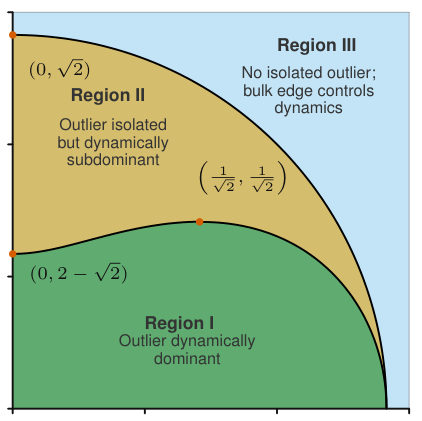 
FIG. 5. Phase diagram in the (σR, σI) plane showing the dis- tinction between outlier existence and dynamical dominance. The outer circular boundary, σ2 R + σ2 I = 2, marks the disap- pearance of the isolated outlier. The inner curve marks the dynamical-dominance transition, where the upper edge of the bulk overtakes the outlier in imaginary part. Region I has an isolated outlier that is also dynamically dominant. Region II has an isolated outlier that is dynamically subdominant. Re- gion III has no isolated outlier. The marked points indicate the pure anti-Hermitian dominance transition (0, 2− √

📷 Fig 5

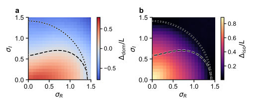 
FIG. 6. Numerical diagnostics of the outlier-to-bulk transi- tion for L = 10, kR = kI = 5, µR = µI = 1 and averaged over 30 disorder realizations per point. (a) Dominance gap ∆dom/L. (b) Isolation gap ∆iso/L. The dashed curve is the analytic dominance boundary and the dotted curve is the an- alytic existence boundary from Eq. (54).

**Summary.** This work analyzes a non-Hermitian spin model to understand how its long-time dynamics are dictated by the eigenvalue with the largest imaginary part. The authors find that disorder can induce a sharp transition where the system's state switches from a simple, low-entanglement outlier to a complex, high-entanglement bulk state. This connects spectral theory to quantum resource diagnostics.

**Why it may be interesting.** It provides a concrete, analytically solvable model to study non-Hermitian dynamics, linking spectral transitions (outlier vs. bulk) directly to changes in quantum information measures like entanglement and magic.

Detailed structure

**Main problem.** The paper investigates the long-time state selection in non-Hermitian many-body systems, which is governed by the eigenvalue with the largest imaginary part.

**Main result.** For certain types of disorder (anti-Hermitian and mixed), the dominant eigenstate undergoes a sharp transition from a low-entanglement outlier state to a high-entanglement bulk state when the bulk spectral edge overtakes the outlier.

**Method.** The authors construct an analytically tractable non-Hermitian spin ensemble and analyze the spectral properties by comparing the dominant eigenvalue to the spectral bulk edge.

**Model / system.** The system is an all-to-all non-Hermitian spin ensemble of L spins with k-local interactions, defined by a Hamiltonian decomposed into Hermitian and anti-Hermitian parts.

**Key observables.** Entanglement Entropy, Magic (Nonstabilizerness), and the imaginary part of the dominant eigenvalue.

**Important parameters / regimes.** Disorder strength ($\sigma_R, \sigma_I$), locality ($k$), and the ratio of $k$ to $\sqrt{L}$ (determining crossover vs. sharp transition).

**Assumptions / limitations.** The long-time state is determined solely by the eigenvalue possessing the largest imaginary part.

**Figures summary.** Figures illustrate the spectral landscape, distinguishing between spectral outliers and the spectral bulk, and showing the relative positions of the dominant eigenvalue in different disorder regimes.

**Paper structure.** The paper proceeds by defining the model and diagnostics, analyzing the deterministic limit, establishing the dominance criterion based on the largest imaginary part, analyzing the three disorder cases, and finally mapping the non-Hermitian evolution to measurement-induced quantum trajectories.

Abstract

The long-time state of a non-Hermitian system is determined by the eigenvalue with the largest imaginary part. In interacting many-body systems this eigenvalue usually cannot be tracked analytically, and the character of the state it selects is unknown. We construct a non-Hermitian spin ensemble of $L$ spins with exactly $k$-local all-to-all interactions, in which this dominant eigenvalue can be tracked analytically from the clean limit into the disordered regime. Disorder produces a competition between an isolated spectral outlier and the edge of a many-body spectral bulk. We study three cases: purely anti-Hermitian disorder, purely Hermitian disorder, and mixed disorder of equal strength. For purely anti-Hermitian and mixed disorder, we show that when the bulk overtakes the outlier in imaginary part, the dominant eigenstate switches from an outlier state with low entanglement and magic (nonstabilizerness) to a bulk state with substantially larger entanglement and magic, with both changing at the same threshold. For $k \gg \sqrt{L}$ the bulk has a sharp spectral edge and the transition thresholds follow in closed form, while for $k \ll \sqrt{L}$ spectral tails broaden the transition into a crossover. Purely Hermitian disorder provides a contrasting case with no outlier-to-bulk switching. Finally, we map the non-Hermitian evolution exactly onto postselected trajectories of a monitored quantum system, connecting this spectral mechanism to measurement-induced transitions.

[↑ back to top](#top)

### [Equilibrium fluctuations of the weakly asymmetric inclusion process](http://arxiv.org/abs/2608.29957v1)

**Authors:** Simon Gabriel  
**Type:** theory · **Category:** statistical mechanics · **PDF:** <https://arxiv.org/pdf/2608.29957v1>  
**Analysis basis:** full PDF text, analyzed in chunks
**Topic relevance:** `non-equilibrium universality` **3/5** · `Keldysh / 2PI / non-Gaussian methods` **2/5** · `methods for driven-dissipative` **2/5** · `Frenkel-Kontorova` **1/5** · `analog quantum simulation` **1/5** · `correlated / nonlocal dissipation` **1/5** · `driven-dissipative phase transition` **1/5**

📷 Fig 1

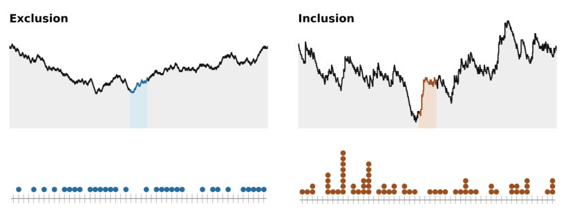 
Figure 1: Plot of stationary fluctuation profiles x 7→Px y=1(ηy −ρ) with x ⩽750 and density ρex = 1

**Summary.** This paper rigorously analyzes the large-scale fluctuations of a weakly asymmetric interacting particle system known as the inclusion process. It proves that the system's density fluctuations converge to the solution of the stochastic Burgers equation in a specific non-equilibrium limit. The work utilizes advanced stochastic methods, providing deep insights into the non-equilibrium statistical mechanics of interacting matter.

**Why it may be interesting.** While focused on classical statistical mechanics, the techniques used—analyzing non-equilibrium fluctuations and deriving limiting PDEs like the Burgers equation—are foundational to understanding dynamics in many-body quantum systems, especially those exhibiting dissipation or non-linear coupling.

Detailed structure

**Main problem.** The paper investigates the equilibrium fluctuations of the one-dimensional weakly asymmetric simple inclusion process, aiming to understand its large-scale limiting behavior.

**Main result.** The stationary density fluctuation field converges to the energy solution of the stochastic Burgers equation in the fixed-asymmetry regime, and Gaussian Ornstein-Uhlenbeck fluctuations are found for the symmetric case in a weakly condensing regime.

**Method.** The analysis employs advanced stochastic calculus techniques, including martingale formulations, quadratic variation calculations, and the application of a current-specific second-order Boltzmann-Gibbs principle.

**Model / system.** The system is the one-dimensional weakly asymmetric simple inclusion process, an interacting particle system on the lattice $\mathbb{Z}$ characterized by nearest-neighbor jump rates and an attractive interaction term.

**Key observables.** The stationary density fluctuation field, $\sqrt{L}(\eta_x(t) - 
ho)$, and the variance-normalized field $v_L(t, \varphi)$ are the primary observables.

**Important parameters / regimes.** Key regimes include the fixed-$\alpha$ weakly asymmetric regime and the weakly condensing regime ($\alpha_L 	o 0$ such that $\alpha_L L 	o \infty$).

**Assumptions / limitations.** The analysis relies on approximating the infinite-volume process with finite-dimensional periodic approximations and assumes the process falls outside standard exclusion process frameworks due to its bosonic stimulation mechanism.

**Figures summary.** Figure 1 illustrates stationary fluctuation profiles for both the exclusion process and the inclusion process.

**Paper structure.** The paper builds the analysis by first establishing martingale properties and bounds (using forward/backward processes), then deriving the limiting behavior of the density fluctuation field in the weakly asymmetric regime (Theorem 1.1), and finally analyzing the symmetric case in the weakly condensing regime (Theorem 1.2).

Abstract

We prove that the stationary density fluctuation field of the one-dimensional weakly asymmetric simple inclusion process converges to the energy solution of the stochastic Burgers equation. The key technical ingredient is a second-order Boltzmann-Gibbs principle tailored to the microscopic current. As a consequence, we also obtain Ornstein-Uhlenbeck fluctuations for the symmetric inclusion process in a weakly condensing regime, a result of independent interest.

[↑ back to top](#top)

### [Metrological quantum-to-classical crossover in the volume of a noisy quasiperiodic lattice](http://arxiv.org/abs/2608.30834v1)

**Authors:** Priya Ghosh, Debarupa Saha, Ujjwal Sen, Debraj Rakshit  
**Type:** theory · **Category:** disordered systems and neural networks · **PDF:** <https://arxiv.org/pdf/2608.30834v1>  
**Analysis basis:** full PDF text, analyzed in chunks
**Topic relevance:** `analog quantum simulation` **3/5** · `correlated / nonlocal dissipation` **2/5** · `driven-dissipative phase transition` **2/5** · `Keldysh / 2PI / non-Gaussian methods` **1/5** · `methods for driven-dissipative` **1/5** · `non-equilibrium universality` **1/5** · `quantum measurements` **1/5**

📷 Fig 1

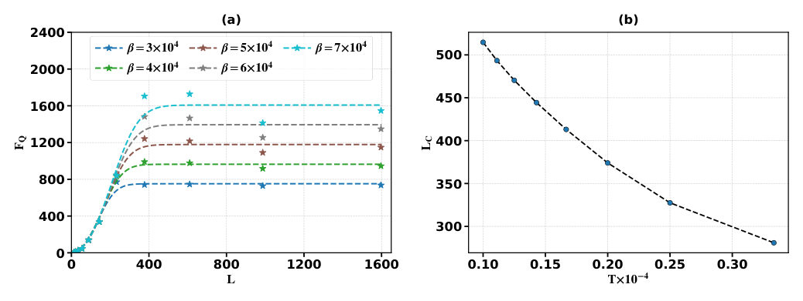 
FIG. 1. Thermal noise-induced MQCC. (a) shows QFI, FQ, for the the on-site potential strength, V , corresponding to the thermal state (vertical axis) as a function of the system size, L (horizontal axis). For every β, the plot depicts the existence of a characteristic length LC(β), below which the QFI scales as L2, and above which QFI nearly saturates, indicating the loss of quantum advantage. The plot thus establishes the system’s departure from an quantum enhanced regime to entrance into an operationally classical regime through the MQCC with increasing system size. All the axes are dimensionless. (b) depicts the variation of LC with the temperature, T. As the temperature decreases, LC(β)...

📷 Fig 2

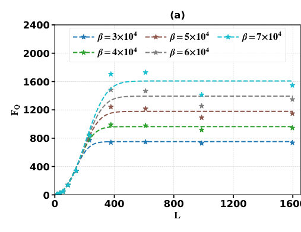 
Figure 1(b) shows the variation of LC(β) with temperature T. As β = 1/T increases, corresponding to a decrease in tem- perature, LC(β) shifts towards larger system sizes. Thus, the characteristic length scale increases with increasing β, indi- cating that the quantum-enhanced regime persists over a larger range of system sizes at lower temperatures. Note that this entire analysis was done at Vc = 2. To probe whether this behavior persists close to Vc, we extend our anal-

📷 Fig 3

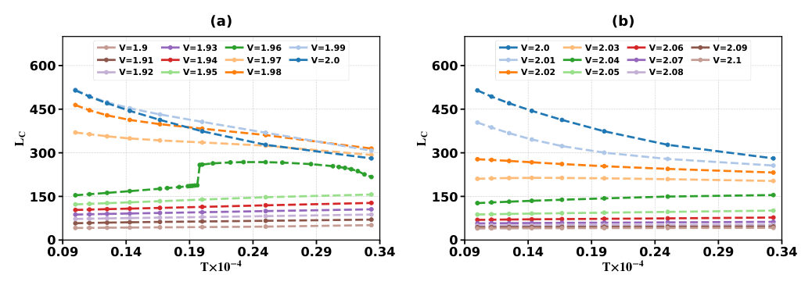 
FIG. 2. We plot LC as a function of temperature, T, for varied values of V when (a) δ &lt; 0 and when (b) when δ &gt; 0. Note that the trend of LC decreasing with increasing T, obtained at VC = 2, starts to fade away as δ increases. At sufficiently flat δ, the trend becomes nearly flat. The vertical axis is dimensionless, whereas the horizontal axis is in units of J/kB.

📷 Fig 4

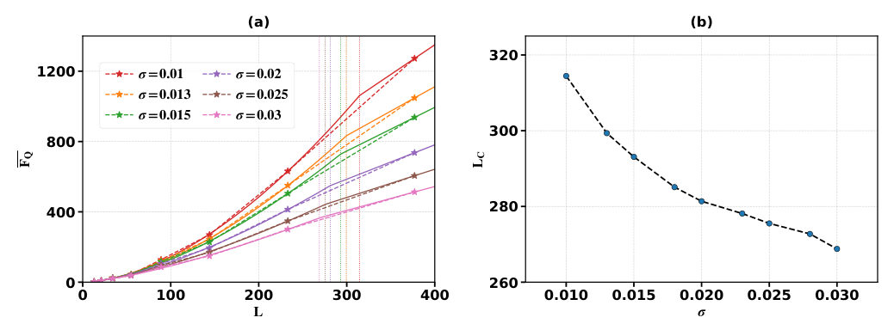 
FIG. 3. Lattice-defect-induced QMCC. (a) depicts quenched averaged ground-state QFI, FQ, corresponding to the ground state of the AAH model in the estimation of the on-site potential strength of the AAH model (vertical axis) with system size (horizontal axis) for different choices of σ. The plot demonstrates σ-induced MQCC in the volume of the system. All the axes are dimensionless. (b) illustrates the crossover point, (LC), with respect to the standard deviation of the Gaussian distribution, σ. As expected, the crossover point shifts towards high system size as the standard deviation of the Gaussian distribution decreases. All the axes are dimensionless.

📷 Fig 5

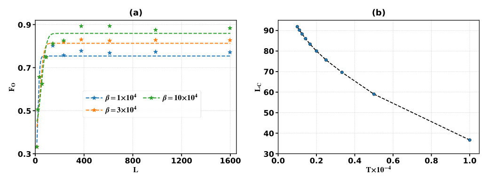 
FIG. 4. Thermal-noise-induced MQCC reflected by OFI. (a) We plot the OFI, for the thermal state of the AAH model in the estimation of the on-site potential strength V , as a function of the system size. Similar to the QFI, the OFI exhibits a thermal-noise-induced MQCC: the OFI initially displays quantum-enhanced scaling and subsequently saturates beyond a characteristic system size. All the axes are dimensionless. (b) The corresponding crossover system size (LC) is plotted as a function of temperature. Consistent with the QFI analysis, the crossover shifts towards larger system sizes as the temperature decreases. This behavior indicates that weaker thermal fluctuations allow the system to...

**Summary.** This theoretical work investigates how noise limits the achievable precision in quantum sensing using the AAH model. It identifies a 'metrological quantum-to-classical crossover' where quantum enhancement vanishes beyond a size determined by the noise strength. The findings show that increasing the probe size too much, regardless of the specific noise source, destroys the quantum advantage.

**Why it may be interesting.** This work provides a quantitative understanding of how environmental noise fundamentally limits the scalability of quantum sensing protocols in quasiperiodic systems, a crucial concept for designing practical quantum sensors.

Detailed structure

**Main problem.** The paper scrutinizes the metrological performance of quantum many-body critical sensors by investigating the 'metrological quantum-to-classical crossover' (MQCC) driven by noise and system size.

**Main result.** Distinct noise mechanisms (thermal noise or lattice defects) impose a common limitation: the quantum advantage in sensing is destroyed when the probe size exceeds a finite, noise-dependent characteristic length scale.

**Method.** The analysis involves calculating the Quantum Fisher Information (QFI) and comparing its scaling behavior ($L^2$ vs $L^0$) under different noise models.

**Model / system.** The study uses the Aubry-André-Harper (AAH) model, which supports a localization-delocalization transition at a finite on-site potential strength. The system is analyzed in the presence of thermal noise or disorder in hopping strengths.

**Key observables.** Quantum Fisher Information (QFI), Optimal Fisher Information (OFI), and average nearest-neighbor bipartite entanglement ($E$).

**Important parameters / regimes.** System size ($L$), temperature ($T$) or inverse temperature ($eta$), and the on-site potential strength ($V$) relative to the critical point ($V_c$).

**Assumptions / limitations.** The analysis assumes the system is governed by the AAH model and investigates the crossover behavior, noting that the observed QFI crossover is not solely explained by the loss of short-range entanglement.

**Figures summary.** Figures illustrate the QFI/OFI scaling changing from super-extensive ($L^2$) to extensive ($L^0$) scaling due to noise, and show that the characteristic crossover length $L_C$ decreases as noise increases.

**Paper structure.** The paper first introduces the AAH model and the concept of metrological sensing. It then analyzes the effect of thermal noise, demonstrating the MQCC. Subsequently, it examines lattice defect noise, confirming a similar crossover, and finally compares these findings to entanglement measures to pinpoint the source of the limitation.

Abstract

Localization-delocalization transitions have recently been proposed for building a class of efficient quantum many-body critical sensors. This work scrutinizes metrological performances of such devices by focusing on the Aubry-André-Harper model that supports a localization-delocalization transition at finite strength of the onsite potential. We identify a metrological quantum-to-classical crossover driven by the interplay between noise and system size, whereby quantum-enhanced scaling of the quantum Fisher information persists only up to a finite, noise-dependent characteristic system-size. We first consider thermal noise and show that, at and near the localization-delocalization transition, the quantum Fisher information exhibits quantum-enhanced scaling for small systems but the system is stripped of this advantage beyond the characteristic crossover length. The crossover length decreases with increasing temperature. We then consider imperfections in the lattice hopping strengths and find a qualitatively similar crossover. There, the quantum-enhanced regime, identified with super-extensive scaling, gives way to an extensive scaling-a classical-limited weaker form-at sufficiently large system sizes. Thus, distinct noise mechanisms lead to a common limitation on the scalability of quantum-enhanced sensing: increasing the probe size beyond a noise-dependent limit can destroy the metrological quantum advantage.

[↑ back to top](#top)

### [Tunable Exceptional Points for Quantum Sensing in a Spin--Orbit-Angular-Momentum Coupled BEC](http://arxiv.org/abs/2608.31095v1)

**Authors:** Zicheng Zhang, Xi-Wang Luo  
**Type:** theory · **Category:** quantum gases · **PDF:** <https://arxiv.org/pdf/2608.31095v1>  
**Analysis basis:** full PDF text, analyzed in chunks
**Topic relevance:** `analog quantum simulation` **3/5** · `Keldysh / 2PI / non-Gaussian methods` **2/5** · `driven-dissipative phase transition` **2/5** · `methods for driven-dissipative` **2/5** · `correlated / nonlocal dissipation` **1/5** · `quantum measurements` **1/5**

📷 Fig 1

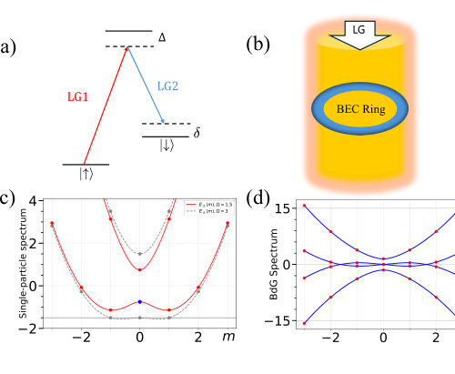 
FIG. 1. (a) Raman coupling between the two internal states of the BEC. (b) Schematic illustration of the ring geometry and Raman beams. (c) Single-particle energy spectrum for Ω= 1.5 (red) and Ω= 3 (gray dashed), with l = 1 and the relevant modes indicated by dots. (d) BdG spectrum of a BEC condensed in the mode marked by the blue point in (c); the spectrum is dynamically stable with all eigenvalues real.

📷 Fig 2

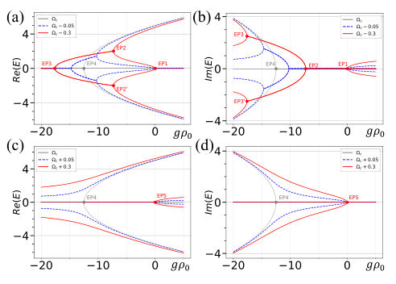 
FIG. 2. Evolution of the BdG spectrum across the critical Raman coupling for n = 1, l = 1, m0 = δ = 0, with Ωc = 3. (a) Real and (b) imaginary parts of the BdG eigenvalues for Ω= 2.95 (blue dashed), Ω= 2.7 (red solid), and Ω= 3 (gray). (c) Real and (d) imaginary parts of the BdG eigenvalues for Ω= 3.05 (blue dashed), Ω= 3.3 (red solid), and Ω= 3 (gray). The corresponding EPs are indicated by the labels.

📷 Fig 3

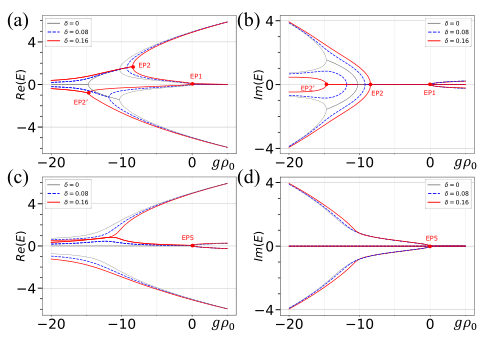 
FIG. 3. Effect of a finite two-photon detuning on the BdG spectrum for n = 1, l = 1, and m0 = 0. (a) Real and (b) imaginary parts of the BdG eigenvalues for Ω= 2.95 &lt; Ωc, with δ = 0 (gray), δ = 0.08 (blue dashed), and δ = 0.16 (red solid). (c) Real and (d) imaginary parts of the BdG eigenvalues for Ω= 3.05 &gt; Ωc with the same values of δ. For Ω&lt; Ωc, a finite detuning lifts the degeneracy between opposite angular-momentum sectors and splits the double-EP structure into two independent second-order EPs.

📷 Fig 4

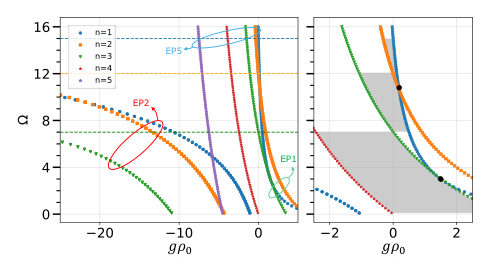 
FIG. 4. Exceptional-point landscape in the (g, Ω) parame- ter space for l = 2, m0 = 0, and δ = 0. The left panel shows the EP trajectories for the angular-momentum sectors n = 1, . . . , 5. The horizontal dashed lines indicate the cor- responding critical Raman couplings. The right panel en- larges the weak-interaction region relevant for quantum sens- ing. The gray shaded region denotes the globally stable pa- rameter regime in which no angular-momentum sector has en- tered the PT-broken phase. The black dots indicate intersec- tions between EP trajectories of different angular-momentum sectors and represent candidate operating points for multi- mode sensing.

📷 Fig 5

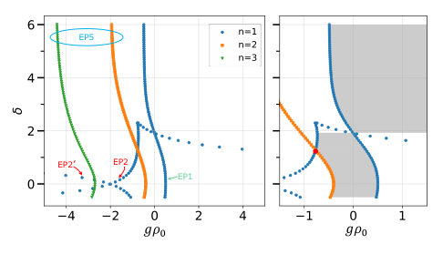 
FIG. 5. Exceptional-point landscape in the (g, δ) parameter space for l = 1, m0 = 0, and Ω= 1. The left panel shows the EP trajectories for the angular-momentum sectors n = 1, 2, 3. The right panel shows an enlarged view of the region containing globally stable parameters (gray shaded area) and the multimode EP intersection (red dot).

**Summary.** The authors propose using a spin-orbit-angular-momentum coupled Bose-Einstein condensate as a tunable platform for quantum sensing based on Exceptional Points (EPs). They show that by approaching EPs from the stable regime, the quantum sensing limit (QFI) can be strongly enhanced. Crucially, the system's multimode nature allows for the linear summation of these enhancements from multiple independent EP channels, all accessible via a measurable spin-density measurement.

**Why it may be interesting.** This work directly applies advanced concepts from non-Hermitian physics (EPs) to a highly controllable, experimentally relevant quantum system (BEC), providing a pathway to quantum metrology enhancement without engineered gain/loss.

Detailed structure

**Main problem.** To develop a tunable Exceptional Point (EP) sensing platform for quantum sensing that avoids the noise penalty associated with conventional gain/loss in non-Hermitian systems.

**Main result.** The system achieves strong quantum Fisher information enhancement by approaching EPs from the stable PT-symmetric regime, and this enhancement can be linearly summed by tuning multiple independent EP channels.

**Method.** The analysis involves deriving the Bogoliubov dynamical matrix from a microscopic Hamiltonian and mapping the EP trajectories and associated stability landscapes.

**Model / system.** The platform is a spin-orbit-angular-momentum (SOAM)-coupled Bose-Einstein condensate (BEC) trapped in a ring geometry. The dynamics are analyzed using the Bogoliubov approximation, leading to a PT-symmetric dynamical matrix.

**Key observables.** Quantum Fisher Information (QFI), gap-opening rate, and spin-density measurement protocols.

**Important parameters / regimes.** Raman coupling strength ($\Omega$), two-photon detuning ($\delta$), and interaction parameters ($g$).

**Assumptions / limitations.** The analysis assumes the condensate is initialized to the lower-energy steady state and relies on the Bogoliubov approximation (weak depletion regime).

**Figures summary.** Figures illustrate the Raman coupling setup, the single-particle energy spectrum, and the BdG spectrum showing dynamic stability across different coupling regimes.

**Paper structure.** The paper first sets up the SOAM-coupled BEC model and derives the PT-symmetric Bogoliubov dynamical matrix. It then maps the EP trajectories, demonstrating QFI enhancement near EPs. Finally, it shows how multiple independent EP channels can be tuned to overlap, leading to additive QFI enhancement via a measurable spin-density protocol.

Abstract

Exceptional points (EPs) can induce strongly amplified responses to weak perturbations, but enhanced spectral sensitivity in conventional non-Hermitian systems does not necessarily translate into improved quantum-limited sensing because of the associated gain and loss noise. Here, we investigate a tunable EP sensing platform based on the intrinsic non-Hermitian Bogoliubov dynamics of a spin-orbit-angular-momentum-coupled Bose-Einstein condensate. Starting from a fully Hermitian microscopic Hamiltonian, we derive a Bogoliubov dynamical matrix that exhibits parity-time (PT) symmetry, with EPs tunable through the Raman coupling and interaction parameters. We identify multiple EPs and map their trajectories and associated stability landscapes, revealing strong quantum Fisher information enhancement when the EPs are approached from the PT-symmetric stable regime. We further find that the gap-opening rate around a second-order EP provides a useful relative indicator for comparing the sensing performance of EPs, while higher-order EPs are not necessarily accessible from the stable regime. Moreover, two second-order EPs can be tuned to overlap, allowing their sensing contributions to add and yielding a linear enhancement of the total quantum Fisher information. Finally, we show that a spin-density measurement can approach the quantum Fisher information limit, providing an experimentally accessible route to tunable EP-enhanced quantum sensing in Bose-Einstein condensates.

[↑ back to top](#top)

### [A Truncated Majorana](http://arxiv.org/abs/2608.30723v1)

**Authors:** Ali Vahedi  
**Type:** theory · **Category:** other · **PDF:** <https://arxiv.org/pdf/2608.30723v1>  
**Analysis basis:** full PDF text, analyzed in chunks
**Topic relevance:** `Keldysh / 2PI / non-Gaussian methods` **3/5** · `methods for driven-dissipative` **2/5** · `analog quantum simulation` **1/5** · `correlated / nonlocal dissipation` **1/5** · `driven-dissipative phase transition` **1/5** · `non-equilibrium universality` **1/5** · `quantum measurements` **1/5**

📷 Fig 1

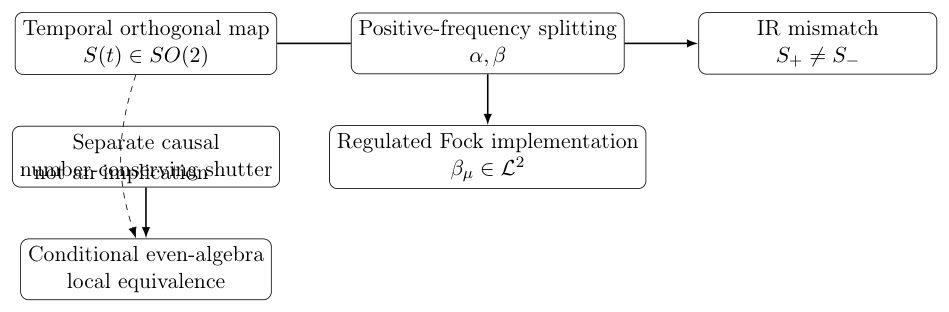 
Figure 1: Logical separation of the two benchmark layers. The infrared theorem belongs to the temporal orthogonal channel model. The local-equivalence result belongs to the separate causal, number-conserving shutter.

📷 Fig 2

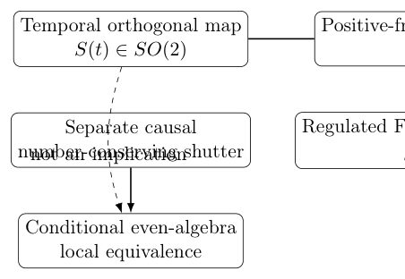 
Figure 1 summarizes the logical structure.

**Summary.** This paper analyzes the concept of 'truncating' a Majorana wave packet by modeling it as a time-dependent channel operation on a $1+1$D Majorana field. It establishes that the global failure of the operation leads to an infrared memory effect, while the local, number-conserving limit shows the process is equivalent to a simple causal filter. These two distinct mathematical descriptions are shown to be complementary diagnostics of the same underlying physical operation.

**Why it may be interesting.** The rigorous field-theoretic foundation provided for time-dependent control in topological platforms offers a powerful benchmark for understanding how boundary conditions or operational constraints affect quantum information storage.

Detailed structure

**Main problem.** The paper investigates the quantum field dynamics of 'truncating' a Majorana wave packet by modeling the process as a time-dependent modification of its chiral propagation, rather than a literal spatial cut.

**Main result.** It demonstrates that global channel mismatch induces an infrared soft-mode memory (logarithmic divergence), while the number-conserving local limit shows the process is equivalent to a pure causal filtering operation.

**Method.** The analysis uses Bogoliubov transformations and field-theoretic identities to compare the global asymptotic behavior (infrared limit) with the local, number-conserving regime.

**Model / system.** The system is a $1+1$D massless Majorana field ($\chi_R, \chi_L$) subjected to an idealized time-dependent orthogonal channel rotation $S(t)$.

**Key observables.** The anomalous Bogoliubov block $eta(\omega, 
u)$, the Hilbert-Schmidt norm divergence ($\propto \log(\omega^*/\mu)$), and the equivalence between the retained sector and a single-particle state.

**Important parameters / regimes.** The asymptotic channel identification difference ($\Delta S = S_+ - S_-$) and the number-conserving regime ($eta=0$).

**Assumptions / limitations.** The analysis relies on treating the channel map $S(t)$ as an idealized orthogonal rotation, and the results are separated into global (temporal) and local (number-conserving) limits.

**Figures summary.** Figure 1 summarizes the logical separation between the infrared theorem (temporal orthogonal channel model) and the local equivalence result (causal, number-conserving shutter).

**Paper structure.** The paper develops the problem by analyzing the failure of the transformation to preserve the positive-frequency subspace ($eta$), contrasting the global infrared obstruction arising from channel mismatch with the local equivalence established in the number-conserving limit.

Abstract

We investigate the quantum field dynamics of truncating a Majorana wave packet via a time-dependent channel shutter. Modeling truncation as a controlled modification of chiral propagation rather than a literal spatial cut, we analyze a $1+1$D massless Majorana field subjected to a time-dependent rotation between its chiral components. We demonstrate that this protocol manifests two complementary physical limits. Globally, a mismatch between early- and late-time channel identifications induces a fermionic Bogoliubov transformation. We prove this asymptotic change universally generates an infrared soft-mode memory, $β(ω, ν) \propto (ω+ν)^{-1}$, leading to a logarithmic divergence in the Hilbert--Schmidt norm. This orthogonality-catastrophe-like obstruction persists even under infinitely smooth switching in the massless limit. Conversely, in the number-conserving regime where pair production vanishes, the shutter acts as a purely causal filter. We establish exact local field identities showing that, restricted to the even local observable algebra, the retained sector is exactly equivalent to a single-particle state while the discarded sector reduces to the vacuum. Ultimately, we show that global infrared memory and local causal truncation are complementary diagnostics of the same dynamical operation. These results provide a rigorous field-theoretic foundation for time-dependent control in topological platforms, cleanly separating effective operational benchmarks from microscopic boundary dynamics.

[↑ back to top](#top)

### [Signatures of inter-sideband coherence in the resonance fluorescence spectrum of an acoustically-modulated quantum dot](http://arxiv.org/abs/2608.30886v1)

**Authors:** Rafał A. Bogaczewicz, Hubert J. Krenner, Paweł Machnikowski  
**Type:** theory · **Category:** other · **PDF:** <https://arxiv.org/pdf/2608.30886v1>  
**Analysis basis:** full PDF text, analyzed in chunks
**Topic relevance:** `interference shaping light` **3/5** · `Keldysh / 2PI / non-Gaussian methods` **1/5** · `Tavis-Cummings & cavity-many-emitter` **1/5** · `analog quantum simulation` **1/5** · `correlated / nonlocal dissipation` **1/5** · `driven-dissipative phase transition` **1/5** · `methods for driven-dissipative` **1/5** · `quantum measurements` **1/5**

📷 Fig 1

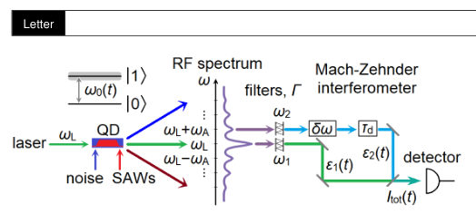 
Fig. 1. Schematic representation of the theoretical setup. Left: A QD with a time-modulated transition frequency (indicated by the shaded area). Center: Two Lorentzian filters with band- width Γ are tuned to selected sidebands in the output signal. Right: The selected beams enter a Mach-Zehnder interferome- ter. One arm incorporates an external frequency shift δω and a time delay τd.

📷 Fig 2

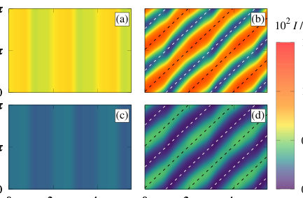 
Fig. 2. Incoherent (a, c) and coherent (b, d) superpositions of the light beams from the ZPL (k1 = 0) and the first PSB (k2 = 1). Panels (a, b) show the noise-free case (D = 0), while (c, d) incorporate white noise (D = 0.05ωA). Here ωL = ω0 and δω = 0. Black and white dashed lines in (b, d) represent the analytical trajectories for maximal and minimal intensities, respectively.

📷 Fig 3

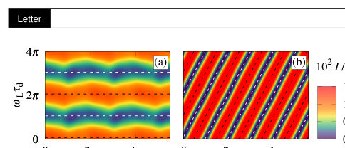 
Fig. 3. Coherent interference intensities without noise (D = 0) and under resonant (ωL = ω0) driving. (a) Superposition of the ZPL and the first right PSB, (k1, k2) = (0, 1), under the resonance shift condition δω = ωA. (b) Superposition of the left and right first-order PSBs, (k1, k2) = (−1, 1), without an external shift (δω = 0). Black and white dashed lines represent the analytical trajectories for maximal and minimal intensities, respectively.

📷 Fig 4

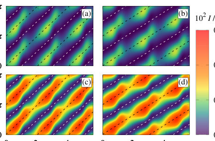 
Fig. 4. Coherent interference intensities for ωL = ω0 + ωA/3 under the (k1, k2) = (0, 1) configuration. Panels (a, c) show δω = 0, while (b, d) show δω = ωA/3. Results for the noise- free case (a, b) and D = 0.05ωA (c, d). Black and white dashed lines denote the analytical trajectories for maximal and mini- mal intensities, respectively.

**Summary.** The authors developed a theoretical framework to measure inter-sideband phase coherence in an acoustically-modulated quantum dot using resonance fluorescence. They show that the geometric slant of the resulting 2D interferogram is a robust diagnostic tool that remains visible even when subjected to environmental white noise. This technique offers a practical method to verify quantum coherence in solid-state quantum emitters.

**Why it may be interesting.** This work provides a concrete, measurable spectroscopic signature (the fringe slant) to diagnose fundamental quantum coherence in solid-state emitters, which is crucial for developing scalable quantum information platforms.

Detailed structure

**Main problem.** The paper theoretically investigates the inter-sideband phase coherence within the resonance fluorescence spectrum of an acoustically-modulated quantum dot.

**Main result.** The geometric slant of the two-dimensional interferogram serves as a robust, noise-resilient indicator of phase coherence between spectral sidebands, essential for quantum networking.

**Method.** The analysis employs a filtered-field formalism applied to a Mach-Zehnder interferometer setup, analyzing time-dependent correlation functions.

**Model / system.** The system is a quantum dot (modeled as a two-level system) coupled to an optical field and modulated by Surface Acoustic Waves (SAWs). The fluorescence spectrum contains a central line and sidebands.

**Key observables.** The geometric slant of the interferograms, total intensity $I_{	ext{tot}}(t)$, and the sideband separation relationship $\omega_L	au_d = N\pi - \left(rac{k_1 - k_2 + \delta\omega}{\omega_A}
ight)\omega_A t - 	heta_{k_1,k_2}$.

**Important parameters / regimes.** Acoustic modulation frequency ($\omega_A$), environmental white noise diffusion coefficient ($D$), and the detuning ($\delta\omega$).

**Assumptions / limitations.** The analysis assumes the system reaches a stationary state and that the acoustic modulation provides sufficient phase stability to protect the coherence signature.

**Figures summary.** Figures illustrate the comparison between coherent (slanted) and incoherent (vertical) interference patterns in the 2D interferograms, demonstrating the characteristic slant under different sideband selections and noise levels.

**Paper structure.** The paper builds from deriving the intensity components using autocorrelation functions, establishing the diagnostic tool (the fringe slant) via the phase-matching condition, and finally demonstrating its robustness against environmental noise.

Abstract

We theoretically investigate the inter-sideband phase coherence within the resonance fluorescence spectrum of an acoustically modulated quantum dot using a filtered-field formalism for a Mach-Zehnder configuration. We demonstrate that geometric slant of the interferograms provides an indicator of phase coherence that is resilient to environmental white noise. Specifically, noise-induced spectral diffusion reduces the global fringe intensity, while leaving the characteristic inclination strictly invariant. Our findings establish a framework for verifying single-photon coherence between spectral sidebands, essential for frequency-bin encoding and scalable quantum networking in realistic, noisy solid-state architectures.

[↑ back to top](#top)

### [Fully integrated continuous-variable quantum key distribution with composable security over 100 km](http://arxiv.org/abs/2608.29200v1)

**Authors:** Yankai Xu, Xinhang Li, Tao Wang, Jisheng Dai, Xueqin Jiang, Yuyao Guo, Peng Huang, Linjie Zhou, Guihua Zeng  
**Type:** experiment · **Category:** quantum information and computing · **PDF:** <https://arxiv.org/pdf/2608.29200v1>  
**Analysis basis:** full PDF text, analyzed in chunks
**Topic relevance:** `QC/QI experiment` **3/5** · `quantum optics experiment` **3/5** · `quantum measurements` **2/5** · `interference shaping light` **1/5**

📷 Fig 1

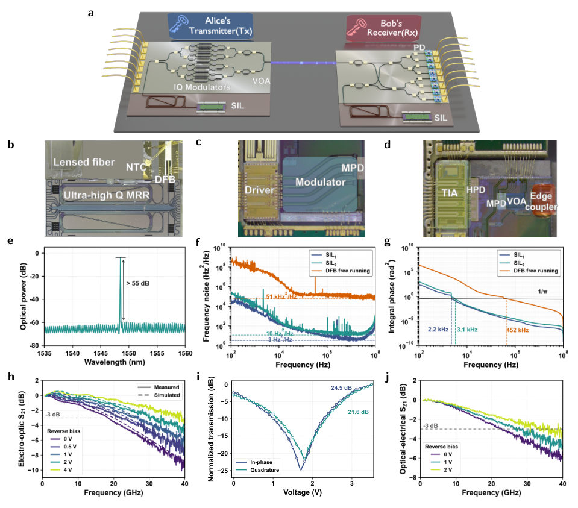 
Figure 1: Characteristics of integrated transceiver system. (a) System schematic of Alice’s transmitter and Bob’s receiver connected by the quantum link. (b) Hybrid SIL laser package, showing lensed-fibre coupling, the negative temperature coefficient (NTC) thermistor, the DFB gain chip, and the ultra-high-Q MRR feedback chip. (c) Transmitter package with the quad-channel driver, silicon modulator, and monitor photodiode. (d) Receiver package with the TIA, hybrid photodiode, monitor photodiode, and variable optical attenuator. (e) Optical spectrum of the SIL laser, showing an SMSR exceeding 55 dB. (f) Frequency-noise spectra of the two SIL lasers and the free-running DFB reference. (g)...

📷 Fig 2

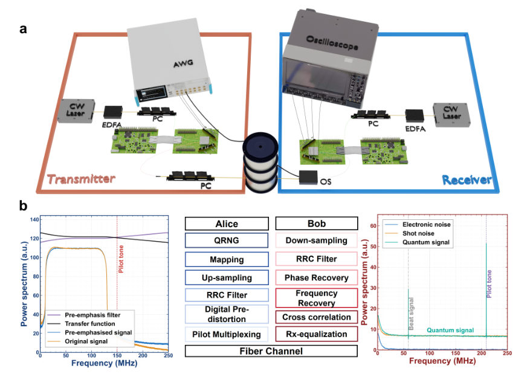 
Figure 2: Integrated LLO CV-QKD system and DSP chain. (a) Alice’s transmitter and Bob’s receiver, including the integrated laser modules, silicon transmitter, silicon receiver, erbium-doped fibre amplifier (EDFA), polarization controllers (PCs), optical switch (OS), and fibre spools. (b) Transmitter and receiver DSP chains.

📷 Fig 3

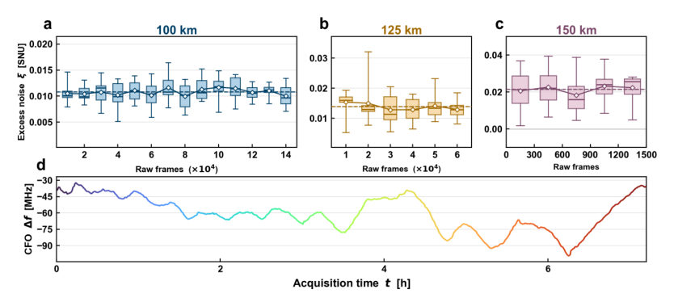 
Figure 3: Excess-noise measurements and carrier-frequency tracking. (a)–(c) Input-referred excess noise ξ over acquisition blocks at 100, 125, and 150 km. (d) Pilot-estimated CFO, defined as the frequency difference between Alice’s and Bob’s free-running local-oscillator laser during the 100 km acquisition.

📷 Fig 4

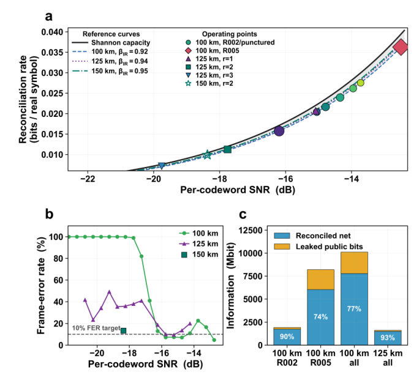 
Figure 4: SNR-adaptive reconciliation. (a) Reconciliation rate as a function of the publicly disclosed per- codeword SNR. (b) FER after public-coordinate disclosure at β = 0.92, 0.94 and 0.95. (c) Verified information bits and public disclosure used in the 100 and 125 km reconciliation analysis.

📷 Fig 5

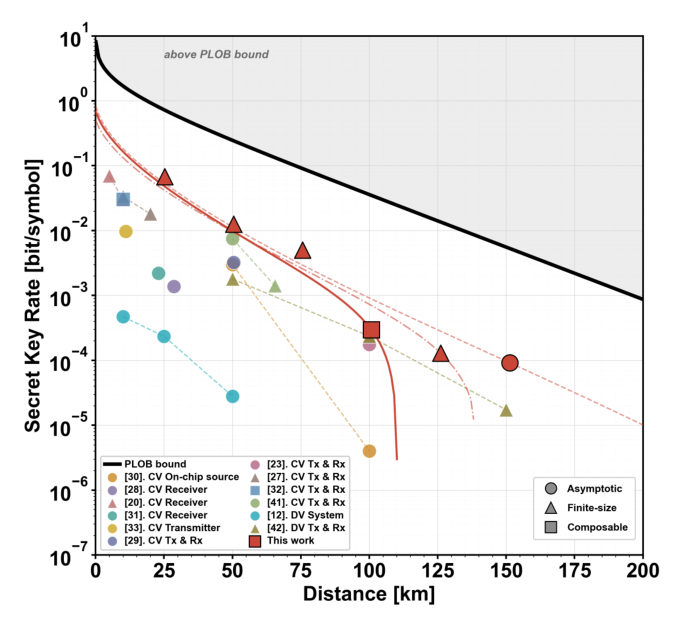 
Figure 5: Secret-key rates of integrated QKD systems. Secret-key rate per symbol for this work and previous chip-based QKD demonstrations [12,20,23,27–33,41,42].

**Summary.** This paper reports a fully integrated Continuous-Variable Quantum Key Distribution (CV-QKD) platform capable of operating over long distances (up to 150 km) using chip-scale photonics. By combining advanced components, a machine-learning phase-locking algorithm, and rate-matched reconciliation, the authors achieved high secret-key rates while maintaining composable security. This work significantly advances the feasibility of practical, chip-based quantum networks.

**Why it may be interesting.** This work directly addresses the engineering bottleneck of quantum networking by demonstrating a fully integrated, chip-scale solution for CV-QKD, which is crucial for realizing practical quantum internet infrastructure.

Detailed structure

**Main problem.** Scaling Quantum Key Distribution (QKD) to network levels requires compact, manufacturable photonic terminals while maintaining high security over long distances.

**Main result.** The authors demonstrated a fully integrated CV-QKD platform achieving a certified secret-key rate of 29.3 kbps at 100 km, establishing records for reach and rate in integrated chip-based QKD.

**Method.** The system uses a co-designed digital chain involving a Bayesian machine-learning algorithm for phase lock and rate-matched multidimensional reconciliation for key extraction.

**Model / system.** The platform integrates two hybrid III-V/Si3N4 lasers, a silicon transmitter, and a silicon coherent receiver, operating over fiber links up to 150 km using a Local Local Oscillator (LLO).

**Key observables.** Composable finite-size secret-key rate (e.g., 29.3 kbps at 100 km), excess noise ($\xi$), and intrinsic laser linewidths (10 and 30 Hz).

**Important parameters / regimes.** Long-distance transmission (100-150 km), finite-size security analysis ($\epsilon \leq 6 	imes 2^{-32}$), and the Shannon limit approach.

**Assumptions / limitations.** The security analysis relies on a composable finite-size framework, and the system performance is limited by residual phase noise ($\xi_{RPN}$).

**Figures summary.** Figures illustrate the integrated platform components, the end-to-end workflow from signal generation to key extraction, and the measured excess noise ($\xi$) across various distances.

**Paper structure.** The paper details the integrated hardware platform, analyzes noise sources (RIN, preparation, phase noise), presents the advanced phase-locking and reconciliation algorithms, and finally reports the key rate performance across increasing distances.

Abstract

Quantum key distribution (QKD) guarantees information-theoretic security by the laws of physics, but deployment at scale requires compact, manufacturable photonic terminals. Continuous-variable QKD (CV-QKD) is well suited for this transition through telecom-compatible, room-temperature coherent detection. However, unifying full on-chip core terminal integration, room-temperature operation, high loss tolerance, and composable end-to-end security in long-distance QKD remains a key bottleneck. Here we report a fully integrated CV-QKD platform in which two hybrid III--V/Si$_3$N$_4$ integrated lasers, a silicon transmitter, and a silicon coherent receiver implement the core terminal functions, operating with a local local oscillator (LLO) over fibre links of 25--150 km. A Bayesian machine-learning algorithm maintains robust phase lock throughout the long records required for composable security, consistently outperforming the conventional unscented Kalman filter, while rate-matched multidimensional reconciliation approaches the Shannon limit. The system certifies a composable finite-size secret-key rate of 29.3 kbps at 100 km from a 140-billion-symbol block, with 12.9 kbps at 125 km under finite-size analysis and 9.17 kbps at 150 km under asymptotic analysis. By establishing the longest finite-size and asymptotic reaches and the highest secret-key rate per symbol reported for integrated CV-QKD, this work advances the development of practical chip-based quantum networks.

[↑ back to top](#top)

### [Mass-gap functional determinant approach for mobile Fermi polarons](http://arxiv.org/abs/2608.30539v1)

**Authors:** Emilio Ramos Rodríguez, Eugen Dizer, Xin Chen, Richard Schmidt  
**Type:** theory · **Category:** quantum gases · **PDF:** <https://arxiv.org/pdf/2608.30539v1>  
**Analysis basis:** full PDF text, analyzed in chunks
**Topic relevance:** `Keldysh / 2PI / non-Gaussian methods` **3/5** · `analog quantum simulation` **3/5** · `methods for driven-dissipative` **2/5** · `correlated / nonlocal dissipation` **1/5**

📷 Fig 1

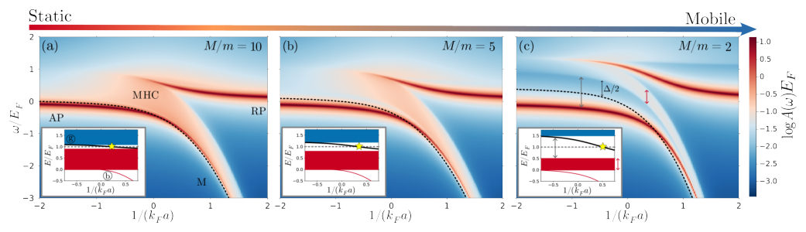 
FIG. 1. Single- and many-body spectrum of the mass-gap model. Many-body absorption spectrum A(ω) of the Fermi polaron at zero momentum obtained from the mass-gap FDA for different impurity-fermion mass ratios (a) M/m = 10, (b) M/m = 5, and (c) M/m = 2. The spectra show three distinct features: the attractive polaron (AP) and repulsive polaron (RP) branches, and the molecule-hole continuum (MHC). The dashed black line denotes the energy of the molecule (M) obtained from the mass-gap model [50]. Inset: Single-particle energy spectrum of the mass-gap Hamiltonian ˆ H obtained from exact diagonalization, as a function of interaction strength 1/(kF a). The discrete bound state b and in-gap state...

📷 Fig 2

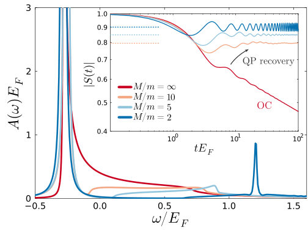 
FIG. 2. Transition from static to mobile impurity. Spectral function A(ω) of the Fermi polaron for different mass ratios at inverse scattering length 1/(kF a) = −0.5. Inset: Ramsey signals |S(t)| of each corresponding spectrum, where the dashed lines indicate the quasiparticle weight plateau, Z = |S(t →∞)|2.

📷 Fig 3

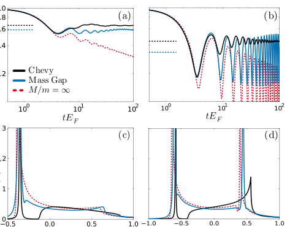 
FIG. 3. Comparison to the variational Chevy ansatz. Ramsey signal |S(t)| for a 133Cs impurity in a 6Li Fermi gas (M/m ≈22) at interaction strengths (a) 1/(kF a) = −0.2 and (b) 1/(kF a) = 0.2, computed from the mass-gap FDA (blue), the Chevy ansatz [27] (black), and the infinite-mass FDA (red). Panels (c) and (d) show the corresponding impu- rity absorption spectrum A(ω).

**Summary.** This paper develops and applies the mass-gap functional determinant approach to study Fermi polarons, which are impurities coupled to a Fermi gas. It successfully models the crossover between the static regime, characterized by the Fermi-edge singularity, and the mobile regime, where coherent quasiparticles form. The framework provides a quantitative description of how impurity motion regularizes the spectral features and dynamics.

**Why it may be interesting.** This work is highly relevant to AMO physics as it provides a rigorous theoretical tool to model impurity dynamics in ultracold atomic gases (Fermi polarons), which is a major platform for studying strongly correlated quantum many-body physics.

Detailed structure

**Main problem.** The paper extends the functional determinant approach (FDA) to describe the quantum dynamics of mobile impurities (Fermi polarons) coupled to a Fermi sea, bridging the gap between static and mobile impurity physics.

**Main result.** The mass-gap FDA provides a unified and computationally efficient framework that smoothly interpolates between the Fermi-edge singularity (static limit) and the formation of coherent quasiparticles (mobile limit).

**Method.** The authors employ the functional determinant approach (FDA) applied to the quadratic mass-gap Hamiltonian derived from the Lee-Low-Pines model, utilizing Wick's theorem and mean-field approximations.

**Model / system.** The system is a Fermi polaron, modeled by the Lee-Low-Pines Hamiltonian, where a mobile impurity interacts with a surrounding Fermi gas. The key theoretical tool is the mass-gap FDA, which exploits the quadratic structure of the effective Hamiltonian.

**Key observables.** Spectral function A(omega), Ramsey signal S(t), Quasiparticle weight Z, and the Mass Gap $\Delta(M)$.

**Important parameters / regimes.** Mass ratio ($M/m$), Fermi momentum ($k_F$), and the mass gap $\Delta(M) = k_F^2/M$.

**Assumptions / limitations.** The analysis relies on the mass-gap Hamiltonian being quadratic, and later sections employ mean-field approximations and perturbative expansions in the interaction strength.

**Figures summary.** Figures illustrate the single- and many-body spectra for varying mass ratios, showing Anti-Polaron (AP), Repulsive Polaron (RP), and Molecule-Hole Continuum (MHC). They also compare the time evolution of the Ramsey signal S(t) and the spectral function A(omega) across different theoretical methods.

**Paper structure.** The paper establishes the mass-gap FDA by analyzing the LLP Hamiltonian, derives key observables like S(t) and A(omega), and then systematically demonstrates the interpolation between the static Orthogonality Catastrophe limit and the finite-mass quasiparticle regime, comparing results against alternative methods like the Chevy ansatz.

Abstract

We extend the functional determinant approach (FDA), previously restricted to static impurities, to the case of finite-mass impurities by using the mass-gap description of Fermi polarons [Phys. Rev. Lett. 135, 193401 (2025)]. The quadratic structure of the mass-gap model enables the exact evaluation of many-body spectra and Ramsey dynamics for mobile impurities. We show that this mass-gap FDA smoothly interpolates between the Fermi-edge singularity for infinitely heavy impurities and the emergence of quasiparticle weight for finite impurity mass. Our results demonstrate that the mass-gap FDA provides a transparent and computationally efficient framework to describe the quantum dynamics of mobile impurities.

[↑ back to top](#top)

### [A Spectral Identifiability Threshold for Dissipative Rate Recovery from Truncated Liouvillian Spectra](http://arxiv.org/abs/2608.29302v1)

**Authors:** Yujun Ji, Somyajit Chakraborty  
**Type:** theory · **Category:** other · **PDF:** <https://arxiv.org/pdf/2608.29302v1>  
**Analysis basis:** full PDF text, analyzed in chunks
**Topic relevance:** `methods for driven-dissipative` **3/5** · `quantum measurements` **2/5** · `correlated / nonlocal dissipation` **1/5** · `driven-dissipative phase transition` **1/5** · `non-equilibrium universality` **1/5**

📷 Fig 1

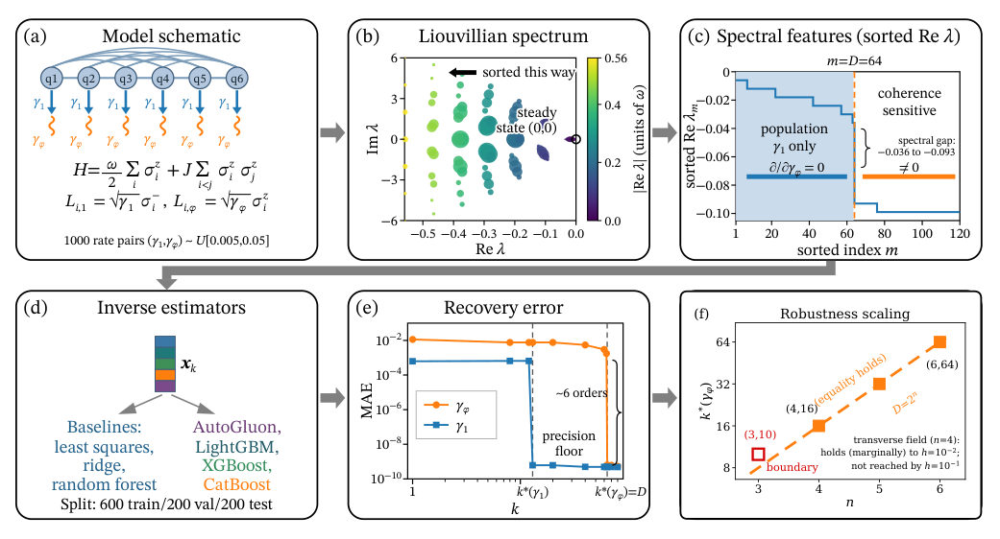 
FIG. 1. Workflow of the direct-spectrum identifiability benchmark. (a) Six-qubit Lindblad model with local amplitude damping γ1 and dephasing γϕ. (b) Non-steady Liouvillian eigenvalues after removal of the steady mode. (c) Eigenvalues are ordered by decreasing real part to form truncated spectral inputs. In the populations-first regime, the first D −1 non-steady population modes are independent of γϕ, and the first dephasing-sensitive coherence appears at m = D, yielding the identifiability requirement k ≥D. (d) Linear and tabular estimators map the retained spectral features to (γ1, γϕ). (e) The measured recovery thresholds occur at k⋆= 13 for γ1 and k⋆= 64 = D for γϕ at n = 6. (f) The...

📷 Fig 2

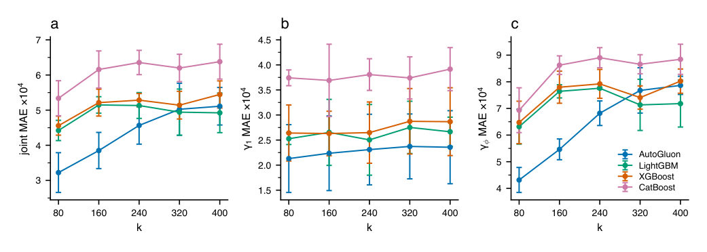 
FIG. 2. Matched comparison curves over k = 80, . . . , 400. (a) Joint MAE, (b) γ1 MAE, and (c) γϕ MAE. Markers show the mean over three trials and error bars one standard deviation across them. The three trials are overlapping partitions of the same 1000 rate pairs, not independent datasets, so the bars are descriptive spread rather than sampling error

📷 Fig 3

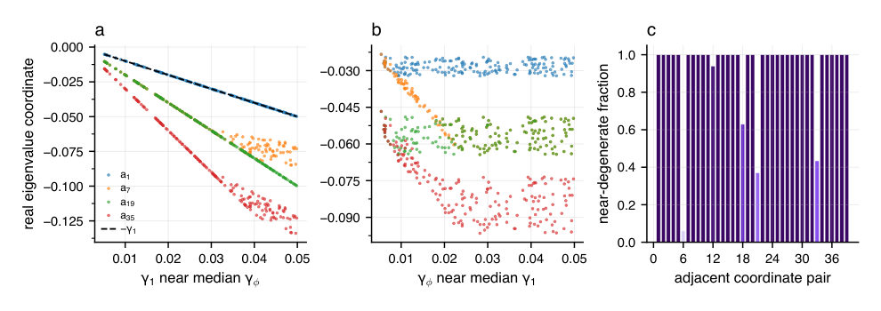 
FIG. 3. Low-lying Liouvillian coordinate diagnostics from the k = 80 dataset. (a,b) Selected sorted real coordinates along narrow rate slices; (c) the fraction of samples with nearly degenerate adjacent sorted real coordinates. The degeneracy pattern is a rank-stability warning: sorted coordinates are useful predictive features, but should not be interpreted as globally tracked physical eigenmode identities without additional eigenvector tracking

📷 Fig 4

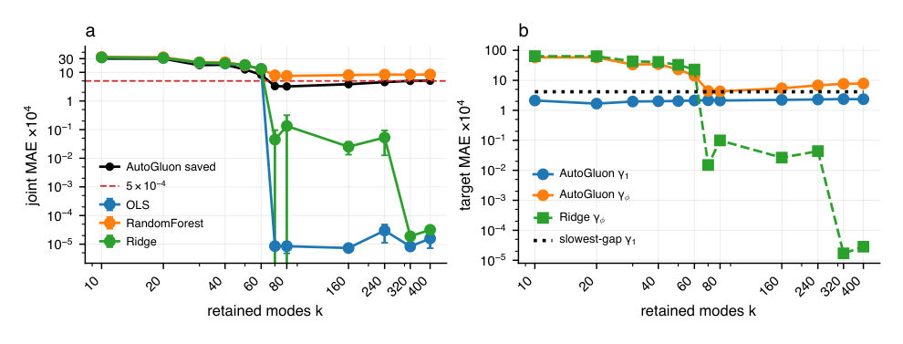 
FIG. 4. Analytical and simple-baseline diagnostics. (a) Joint MAE for ordinary least squares, ridge regression, and random forests fit on the same nested spectral CSVs used by the main benchmark, with the saved AutoGluon curve overlaid from the AutoGluon resolution summary. (b) Target-wise MAE for the saved AutoGluon runs, the ridge γϕ baseline, and the one- coordinate slowest-gap γ1 estimator −eig_real_000. The near-exact least-squares performance at larger k confirms the affine structure of equation (1) for this fixed, computational-basis-diagonal generator. Thus the AutoGluon point should be read as the lowest-error point within the saved four-family boosted-tree/AutoML benchmark, not as...

📷 Fig 5

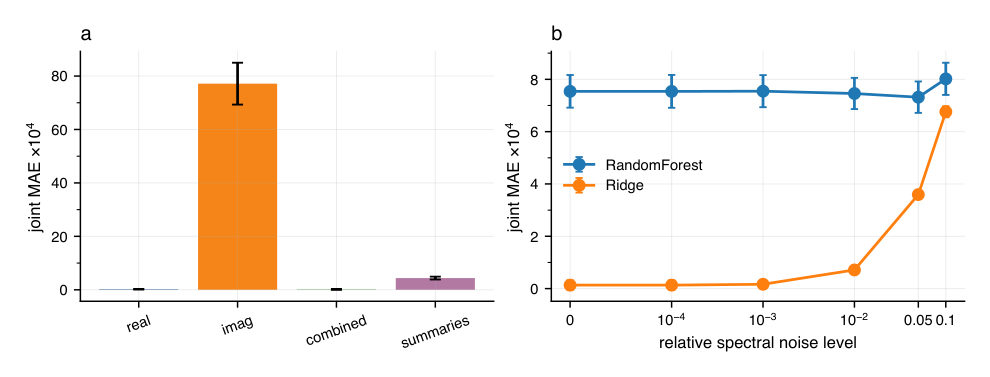 
FIG. 5. Real/imaginary feature ablation (a, ridge) and clean-train/noisy-test spectral robustness (b) for simple baselines at k = 80. Real parts carry nearly all of the target information for this fixed Hamiltonian family, while imaginary parts alone are weak — as expected, since Im λij = −(Ei −Ej) in equation (1) is independent of both rates. The noise panel (b) perturbs test spectral coordinates after fitting clean models; it is a diagnostic of feature sensitivity, not a retraining of the saved AutoGluon benchmark

**Summary.** This paper determines the minimum number of spectral modes needed from a truncated Liouvillian spectrum to accurately recover the underlying energy and dephasing rates of an open quantum system. By establishing a spectral identifiability threshold, it shows that the amount and structure of retained spectral information dictates parameter recoverability, independent of the estimator used.

**Why it may be interesting.** This work provides rigorous, quantitative bounds on the information content required to characterize open quantum dynamics, which is crucial for designing optimal quantum measurement protocols or tomography schemes.

Detailed structure

**Main problem.** The paper addresses the fundamental question of determining the minimum amount of spectral information (spectral depth) required to uniquely recover underlying dissipative rates from a truncated Liouvillian spectrum.

**Main result.** A quantifiable spectral identifiability threshold ($k^\star$) is established, showing that for a six-qubit system, the recovery of dephasing rates saturates a theoretical lower bound derived from the population sector.

**Method.** The study uses a supervised inverse benchmark, fitting the dissipative rates ($\gamma_1, \gamma_\phi$) by regressing against the sorted real parts of the slowest non-steady Liouvillian eigenvalues, comparing linear regression to various machine learning models.

**Model / system.** The model is a synthetic six-qubit open quantum system governed by a Lindblad master equation, analyzed in the Markovian regime. The Liouvillian spectrum eigenvalues are analytically related to the dissipative rates.

**Key observables.** Dissipative rates ($\gamma_1$ for amplitude damping and $\gamma_\phi$ for dephasing), and the Mean Absolute Error (MAE) of the recovered rates.

**Important parameters / regimes.** The spectral depth ($k$, number of retained slow modes) and the system size ($n$, number of qubits).

**Assumptions / limitations.** The conclusions are strictly limited to noise-free simulator spectra, not spectra derived from actual quantum measurements.

**Figures summary.** Figures schematically illustrate the model, the Liouvillian spectrum, the sorted spectral features, and the recovery error as a function of the retained spectral depth $k$.

**Paper structure.** The paper establishes the physical model, derives the analytical form of the eigenvalues, defines the inverse problem (rate recovery from truncated spectrum), performs quantitative benchmarking across various spectral depths, and compares the results against theoretical lower bounds.

Abstract

Open quantum systems lose energy and phase coherence through different dissipative processes, but these processes can produce overlapping dynamical signatures. The Liouvillian spectrum summarizes how such a system relaxes, yet it is not obvious how much of that spectrum is needed to distinguish the underlying dissipation rates. We study this question for amplitude damping and dephasing in a six-qubit Lindblad model whose spectrum can be derived analytically. We retain only the slowest non-steady spectral modes and ask how many are required before each dissipative rate becomes recoverable. We show that population modes contain no dephasing information, which creates a lower bound of D = 2^n retained modes for uniform dephasing identifiability in the relevant rate regime. The measured recovery threshold reaches this bound at n = 4,5,6, while n = 3 remains above it. At n = 6, least squares achieves a mean joint absolute error of order 10^-9, compared with 4.355 x 10^-4 for four tabular learning methods. Robustness tests show that this advantage weakens when the spectra are perturbed and when a transverse field breaks the commuting structure. These results show that the amount and structure of retained spectral information can determine whether dissipative parameters are recoverable, independently of the estimator used. The present conclusions apply to noise-free simulator spectra rather than measurement-derived spectra.

[↑ back to top](#top)

### [BMN Spread Complexity Across Phase Transitions](http://arxiv.org/abs/2608.29816v1)

**Authors:** Dibakar Roychowdhury  
**Type:** theory · **Category:** statistical mechanics · **PDF:** <https://arxiv.org/pdf/2608.29816v1>  
**Analysis basis:** full PDF text, analyzed in chunks
**Topic relevance:** `non-equilibrium universality` **3/5** · `scars & prethermalization` **3/5** · `Keldysh / 2PI / non-Gaussian methods` **2/5**

📷 Fig 1

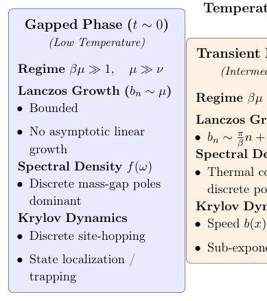 
Figure 1. Schematic diagram summarizing the key characteristics of the three phases in the matrix model across temperature regimes, detailing the behavior of Lanczos coefficients bn, spectral density f(ω), and Krylov dynamics.

**Summary.** This paper analyzes how the complexity of quantum states evolves in the BMN matrix model as it passes through different thermal phases. By modeling the system using a charged Thermofield Double state, the authors predict distinct dynamical signatures—from oscillatory behavior to maximal chaos—depending on the temperature and mass gap scales. This provides a detailed theoretical map of quantum thermalization in this specific strongly coupled gauge theory context.

**Why it may be interesting.** The study of complexity measures across phase transitions is highly relevant to understanding non-equilibrium dynamics in strongly coupled quantum systems, bridging concepts from quantum chaos and thermalization.

Detailed structure

**Main problem.** The paper investigates the dynamical behavior and spread complexity of quantum states across different thermodynamic regimes in the BMN matrix model.

**Main result.** The complexity exhibits distinct behaviors depending on the temperature regime: non-chaotic oscillation in the low-temperature gapped phase, maximal chaotic scrambling in the high-temperature continuum phase, and a sub-exponential crossover in the intermediate regime.

**Method.** The analysis employs the charged Thermofield Double (cTFD) state formalism and utilizes diagnostics like spread complexity, Krylov Lyapunov exponents, and the analysis of Lanczos coefficients.

**Model / system.** The system is the mass-deformed BMN matrix model equipped with an emergent U(1) global charge, studied at finite temperature (beta^-1) and chemical potential (nu).

**Key observables.** Spread complexity C(t), Krylov Lyapunov exponent (λ_K), and Lanczos coefficients (b_n).

**Important parameters / regimes.** Temperature (β^-1), chemical potential (ν), and the mass deformation parameter (μ), analyzed across regimes defined by their relative scales (e.g., βμ >> 1, βμ << 1).

**Assumptions / limitations.** The dynamics are modeled using the charged Thermofield Double (cTFD) state, and the analysis relies on detailed spectral moment calculations and boundary condition assumptions.

**Figures summary.** Figure 1 provides a schematic summary comparing the behavior of Lanczos coefficients, spectral density, and Krylov dynamics across the three distinct thermodynamic phases.

**Paper structure.** The paper systematically analyzes the dynamics by first establishing the framework in the strong-coupling limit, then detailing the distinct physical regimes (low-T gapped, high-T continuum, intermediate crossover) and the mathematical tools required for each.

Abstract

We investigate the dynamical behavior and spread complexity of quantum states within the mass-deformed BMN matrix model equipped with an emergent $U(1)$ global charge at finite temperature $β^{-1}$ and chemical potential $ν$. Focusing on the strong-coupling regime ($μ\gg 1$), we model the dynamics via a charged Thermofield Double (cTFD) state and trace the evolution of spread complexity across three distinct thermodynamic regimes. In the low-temperature gapped phase ($βμ\gg 1$), discrete mass-gap bound states dominate, trapping wavepacket dispersion and producing non-chaotic, oscillatory early-time growth. Conversely, in the high-temperature continuum phase ($βμ\ll 1$), thermal excitations overwhelm the mass gap, driving a transition to a continuous advection field that exhibits maximal chaotic scrambling with a Krylov Lyapunov exponent $λ_K = π/ β$ that saturates the universal bound. In the intermediate temperature regime ($βμ\sim 1, βν\sim 1$), the interplay between mass-gap bound states and the continuous thermal background induces a sub-leading correction to the Lanczos coefficients $b_n \sim \fracπβ n + γ\sqrt{n}$, governing a continuous sub-exponential crossover before full chaotic thermalization. Technical derivations regarding KMS boundary conditions, grand canonical spectral moments, residue analysis, and time-reversal symmetry breaking in Krylov space are detailed in four dedicated appendices.

[↑ back to top](#top)

### [Magnetic Field-Tunable Repulsive Exciton-Exciton Interaction in the van der Waals Antiferromagnet NiPS$_3$](http://arxiv.org/abs/2608.29701v1)

**Authors:** Kaiyang Huang, Jaena Park, Zhuo Yang, Je-Geun Park, Atsuhiko Miyata, Yoshimitsu Kohama, Yasuhiro H. Matsuda  
**Type:** experiment · **Category:** strongly correlated electrons · **PDF:** <https://arxiv.org/pdf/2608.29701v1>  
**Analysis basis:** full PDF text, analyzed in chunks
**Topic relevance:** `analog quantum simulation` **3/5** · `Tavis-Cummings & cavity-many-emitter` **2/5** · `quantum optics experiment` **2/5** · `quantum measurements` **1/5**

📷 Fig 1

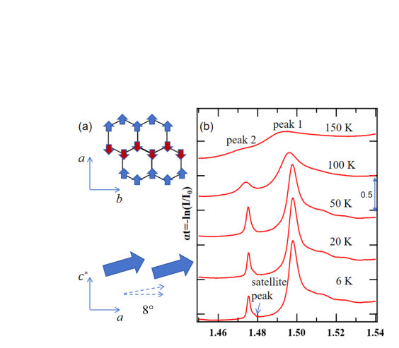 
FIG. 1(a) Magnetic structure of NiPS₃. In the ab plane the Ni²⁺ moments form a zigzag antiferromagnetic pattern with spins aligned along the parallel and anti-parallel directions of the crystallographic a axis. In the ac plane the spins of Ni are tilted by about 8° away from a toward c*. (b) Zero-field absorption spectra of NiPS₃ at selected temperatures. Spectra are vertically offset by 0.5 for clarity. Below 50 K the two sharp excitonic peaks (peak 1 and peak 2) show only minor changes, whereas on approaching the TN ≈ 155 K, they considerably weaken and their linewidths broaden, indicating a strong link between these excitons and the antiferromagnetic order. As for peak 2, a satellite...

📷 Fig 2

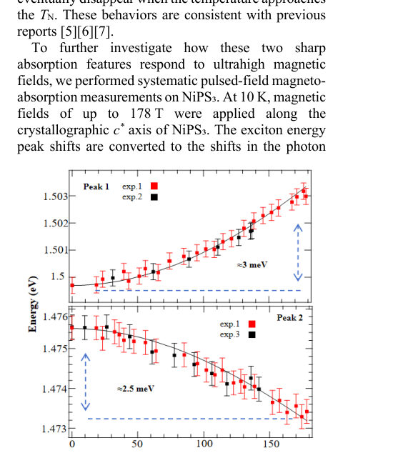 
FIG. 2 Field dependence of the exciton peak energies. Red symbols denote the data of the experiment up to 178 T(exp.1). The uncertainty in the peak position is ±0.3 meV for each point. Black symbols denote the data of another experiments (exp. 2 and exp.3) up to 140 T. The black curves are fits to the two-level interaction model. At 10 K and 178 T, the higher- energy exciton shifts upward by about 3 meV, while the lower-energy exciton shifts downward by about 2.5 meV.

📷 Fig 3

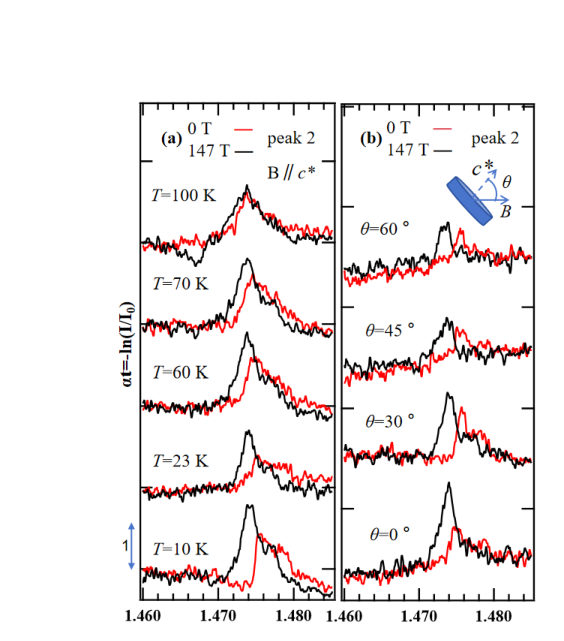 
FIG. 3(a) Temperature dependence of the spectra near peak 2 for zero magnetic fields (red curve), and magnetic fields of 147 T applied along the c* axis (black curve). Spectra are vertically offset by 2 for clarity. (b) The field orientation dependence of the spectra near peak 2 at 10 K are shown for the sample is tilted so that a magnetic field angle from the c* axis (θ) equal to 30°, 45°, and 60°, respectively. The slight change in the zero field spectra (red curves) for different θ is mainly due to the change in the optical path by tilting the sample. Spectra are vertically offset by 2 for clarity.

📷 Fig 4

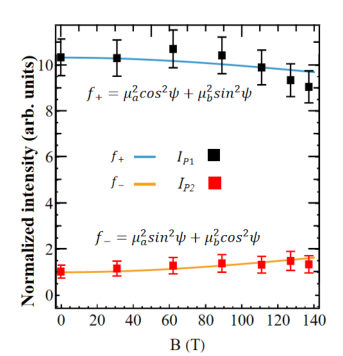 
FIG. 4 The magnetic field dependence of the normalized exciton absorption intensity of peak 1 (IP1) and peak 2 (IP2) are shown with closed squares. The exciton intensities are approximated by the peak area, and are normalized to the zero-field intensity of the low-energy peak 𝐼P2 (0 T), such that IP2 (0 T) = 1. The calculated oscillator-strength transfer between the two excitonic resonances within the framework of a two- level model, f+ (B) and f− (B), are shown by solid curves. Their initial values are set as f+(0)=Ip1(0), f- (0)=Ip2(0).

📷 Fig 5

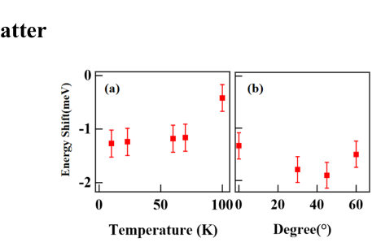 
FIG. 6 (a)A plot of the temperature dependence of the field-induced energy shift of peak 2 at 147 T. (b) The field angle dependence of the field-induced peak energy shift at 10 K and 147 T.

**Summary.** This work uses high-field magneto-optics to study the excitons in the antiferromagnet NiPS3. The researchers found that the two excitonic peaks repel each other in energy as the magnetic field increases, demonstrating a strong, tunable exciton-exciton coupling. This establishes NiPS3 as a novel material platform for exploring correlated exciton physics.

**Why it may be interesting.** The observation of tunable exciton interactions in a solid-state magnetic insulator provides a clean, controllable platform to study strongly correlated many-body physics, analogous to cavity QED systems but realized in condensed matter.

Detailed structure

**Main problem.** The study investigates how ultrahigh magnetic fields modify the interaction-driven hybridization between two sharp excitonic peaks in the van der Waals antiferromagnet NiPS3.

**Main result.** The research reveals a pronounced, magnetic-field-tunable exciton-exciton coupling as the dominant high-field response, confirmed by systematic magneto-optical measurements.

**Method.** Systematic magneto-optical measurements were performed using pulsed magnetic fields up to 178 T, complemented by fitting the data to a minimal two-level interaction model.

**Model / system.** The physical system is the van der Waals antiferromagnet NiPS3, which is modeled using a minimal two-level Hamiltonian describing coupled excitons whose interaction is tunable by the external magnetic field.

**Key observables.** Energy shifts of the two exciton peaks (opposite shifts observed), redistribution of oscillator strength, and the field dependence of these shifts.

**Important parameters / regimes.** Magnetic field strength (up to 178 T), temperature (down to 1.4 K), and the antiferromagnetic ordering temperature (Néel temperature).

**Assumptions / limitations.** The system can be accurately described by a minimal two-level interaction model, and the observed shifts are dominated by exciton-exciton coupling rather than simple diamagnetic effects.

**Figures summary.** Figures show the field dependence of exciton peak energies up to 178 T, illustrating the repulsion and energy splitting, alongside temperature and field angle dependence of these shifts.

**Paper structure.** The paper establishes the physical system and the initial problem, presents the high-field magneto-optical measurements, models the interaction using a two-level Hamiltonian, and concludes by quantifying the field-tunable exciton coupling.

Abstract

Two ultra-narrow absorption peaks around 1.5 eV, which are widely believed to originate from a transition from a spin-orbital entangled triplet to a singlet state, in the two-dimensional van der Waals crystal NiPS$_3$, have attracted considerable attention because of their pronounced spin-dependent character. An interesting question is whether ultrahigh magnetic fields modify an interaction-driven hybridization between those two peaks. In this work we perform systematic magneto-optical measurements of NiPS$_3$ in pulsed magnetic fields of up to 178 T and observe a pronounced mutual repulsion between the two sharp exciton peaks accompanied by a redistribution of oscillator strength, while the band edge shows no detectable field-induced shift within our experimental resolution. We construct a minimal two-level interaction model and compare it semi-quantitatively with the experimental data. Our results reveal a magnetic-field-tunable exciton-exciton coupling as the dominant high-field response of NiPS$_3$, and clarify this material as a new experimental platform for exploring strongly correlated exciton physics in magnetic van der Waals insulators.

[↑ back to top](#top)

### [On the relaxation problem in statistical mechanics](http://arxiv.org/abs/2608.30871v1)

**Authors:** Giuseppe Del Vecchio Del Vecchio  
**Type:** theory · **Category:** statistical mechanics · **PDF:** <https://arxiv.org/pdf/2608.30871v1>  
**Analysis basis:** full PDF text, analyzed in chunks
**Topic relevance:** `quantum measurements` **3/5** · `Full counting statistics` **1/5** · `Keldysh / 2PI / non-Gaussian methods` **1/5** · `driven-dissipative phase transition` **1/5** · `methods for driven-dissipative` **1/5** · `non-equilibrium universality` **1/5**

📷 Fig 1

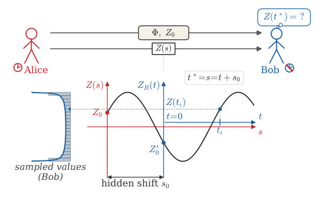 
FIG. 1. Alice prepares the bounded signal moving as Z(s) = Φs(Z0). Bob receives the signal after s0 &gt; 0. Bob is uncertain about the future because the signal has value Z′ 0 ̸= Z0 at Bob’s time t = 0 corresponding to s = s0. Bob is clockless, i.e., he is interested in the ordinates of the signal and his task is to guess a value Z(t∗) in the arbitrary future t∗&gt; 0 (see Eq. (3)). Using knowledge of Φ and Z0, Bob then builds the histogram on the left and computes probability law using the samples {Z(ti)}M i=1. This leads to the estimate Eq. (5).

📷 Fig 2

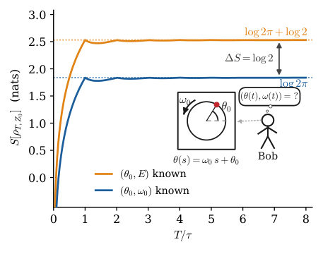 
FIG. 2. Optimal generalization error L∗ T = S[ρT,Z0] in Eq. (10) estimated by sampling, for the joint recorded state Z = (θ, ω) on the unit ring. Blue: known (θ0, ω0); orange: known (θ0, E). The ordinate is the regularized global en- tropy: angular bins add −log ∆θ, while a known conserved velocity occupies one bin and adds zero [47]. The relation between forward and backward sampling under time reversal is discussed in [47].

📷 Fig 3

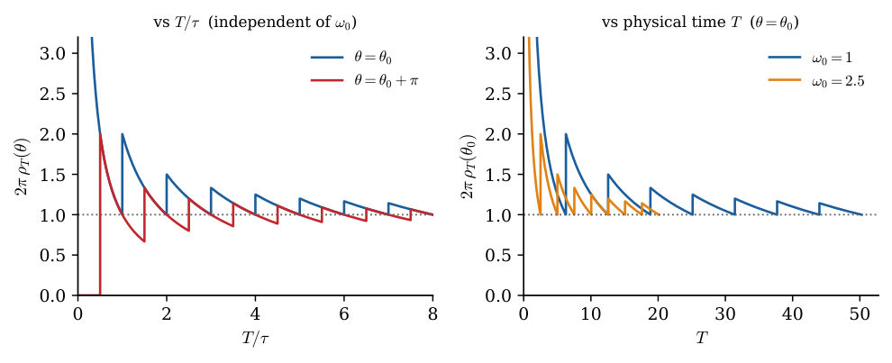 
FIG. 1. Finite-horizon angle density ρT (θ) in Eq. (7). We plot 2π ρT (θ) =  n + 1(θ ∈Ir(θ0))  /(n + r), which relaxes to the stationary value 1 in Eq. (8) (dotted line). Left: as a function of T/τ for two observation angles, θ = θ0 (always inside the freshly swept arc Ir(θ0), upper branch) and θ = θ0 + π; in these units the curve is independent of ω0, all the dependence entering through τ = 2π/ω0 defined in Eq. (4). Right: the same quantity at θ = θ0 versus the physical horizon T for two angular velocities ω0 = 1, 2.5; a larger ω0 (shorter period τ) relaxes faster in real time. The sawtooth reflects each lap momentarily over- or under-visiting a given angle, in agreement with the...

📷 Fig 4

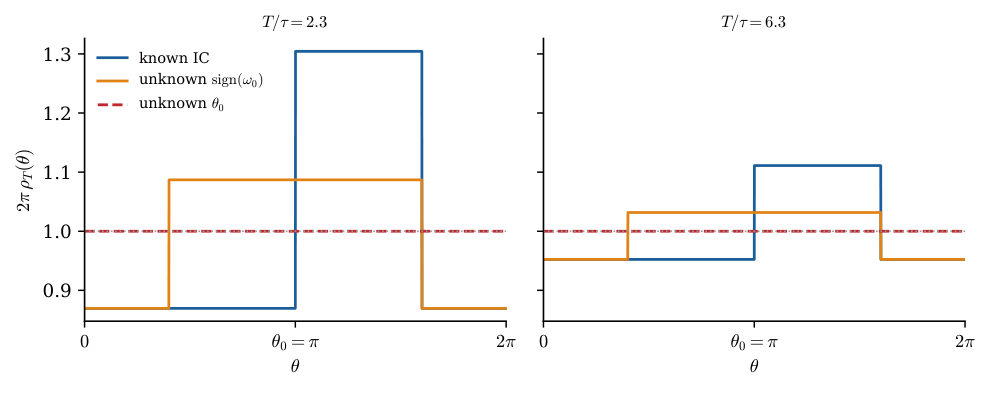 
FIG. 2. Angular density 2π ρT (θ) in Eq. (7) under three states of Bob’s knowledge, at two horizons T/τ = 2.3 (left) and T/τ = 6.3 (right), with θ0 = π. Blue: known IC. Orange: only sign(ω0) unknown, Eq. (13). Dashed red: θ0 unknown, Eq. (10). As T/τ grows, the first two densities approach the stationary density in Eq. (8).

📷 Fig 5

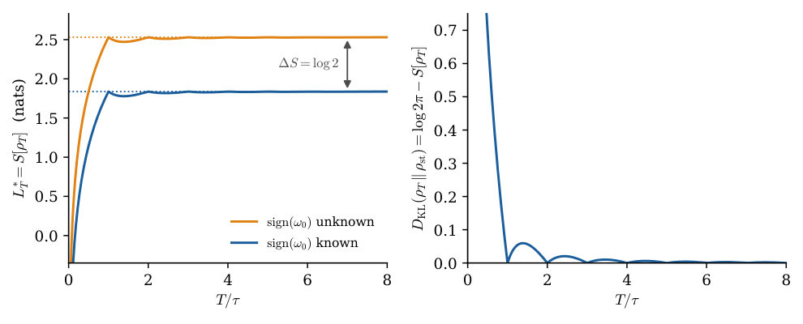 
FIG. 3. Log-loss generalization error for the ring. The left panel shows the finite part of the global entropy in Eq. (18); Eq. (17) gives the finite-resolution value. The orange curve assumes that ∆ω resolves the two velocity signs, giving Eq. (28). The right panel shows the global generalization gap in Eq. (23), whose decay is derived in Eq. (24).

**Summary.** This work reinterprets the relaxation problem in statistical mechanics by focusing on what an observer can actually measure: local time statistics. It shows that the best prediction of future states is determined by minimizing the generalization error, linking fundamental physics concepts like entropy to information theory. This offers a dynamical justification for inference in non-equilibrium systems.

**Why it may be interesting.** It provides a novel, information-theoretic lens to view irreversible processes, connecting concepts from statistical mechanics directly to modern machine learning inference principles.

Detailed structure

**Main problem.** The paper reformulates the relaxation problem in statistical mechanics by shifting focus from fundamental dynamics to the operational statistics derived from measurements.

**Main result.** The optimal prediction for future states, based on observed local time statistics, is governed by minimizing the generalization error, which is shown to be related to the system's entropy.

**Method.** The authors use an information-theoretic approach, interpreting entropy as mutual information and employing concepts from machine learning generalization error to derive dynamical predictions.

**Model / system.** The system consists of a bounded set of $N$ degrees of freedom evolving deterministically, $Z(t)$, which is observed by a 'clockless observer' collecting samples at random times.

**Key observables.** Local time statistics (estimated histograms), generalization error ($L^*_T$), and entropy (interpreted as mutual information).

**Important parameters / regimes.** The number of degrees of freedom ($N$), the time window ($T$), and the measurement resolution ($\Delta	heta, \Delta\omega$).

**Assumptions / limitations.** The analysis assumes the system follows deterministic dynamics and that the observer samples measurements uniformly at random times.

**Figures summary.** Figures illustrate the Alice/Bob setup for prediction uncertainty and show the decay of the generalization error and global entropy as a function of measurement time or resolution.

**Paper structure.** The paper progresses by first establishing the operational framework using local time statistics, then deriving the prediction rule via generalization error minimization, and finally analyzing the convergence of entropy and mutual information in the thermodynamic limit.

Abstract

We reformulate the relaxation problem in statistical mechanics by making explicit what are the \emph{operational} objects subject to relaxation: the local time statistics of the recorded signal $Z(t)$. These local time statistics are simply the estimated histograms of observations $\{Z(t_i)\}_{i=1}^M$ performed at uniformly random times $\{t_i\}_{i=1}^M$ by a clockless observer. The subject of prediction is a belief about a future fresh out-of-sample reading of a measurement outcome whose distribution is inferred from the mathematical model believed to be true. For finite bounded systems of $N\ge 1$ degrees of freedom global irreversible relaxation of predictions can occur but special initial conditions exist. The form of the predictions depends on certain loss functions whose choice is up to the particular observer. Finally, entropy is given a learning interpretation as mutual information between the observer and the unknown past of the system under consideration and, in complete generality, its stationary value depends on the information available.

[↑ back to top](#top)

### [Quantum Simulations of Two-Dimensional Non-Abelian Adjoint String Breaking](http://arxiv.org/abs/2608.28752v1)

**Authors:** Anthony N. Ciavarella, Roland de Putter, Ed Younis, Ermal Rrapaj  
**Type:** both · **Category:** quantum information and computing · **PDF:** <https://arxiv.org/pdf/2608.28752v1>  
**Analysis basis:** full PDF text, analyzed in chunks
**Topic relevance:** `analog quantum simulation` **3/5** · `methods for driven-dissipative` **3/5** · `QC/QI experiment` **2/5**

📷 Fig 1

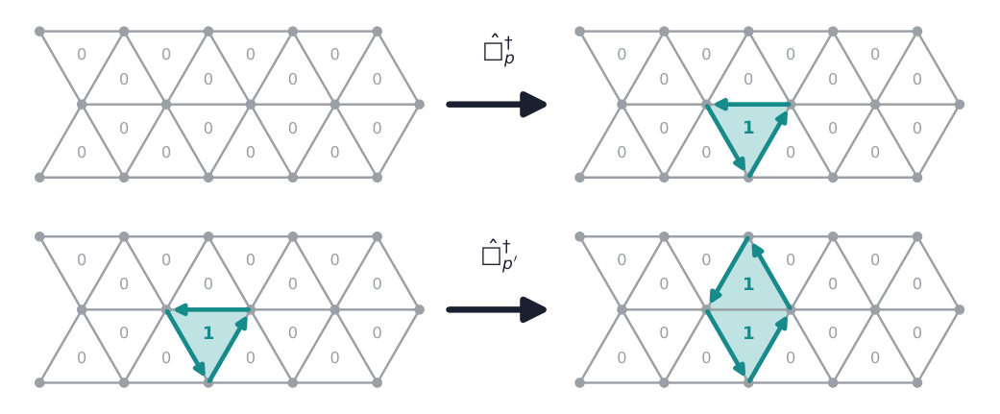 
FIG. 1. Mapping of the SU(2) link gauge fields onto qubits placed at the center of each plaquette. The application of a plaquette operator flips a qubit from the 0 to 1 state. When neighboring qubits are in the 1 state, their shared link is unexcited.

📷 Fig 2

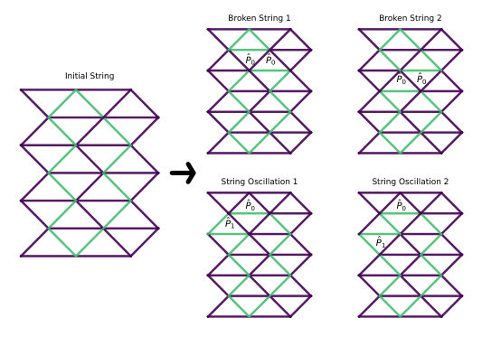 
FIG. 2. Different possible string configurations on the lattice. The left panel shows a single adjoint string. The top row on the right shows different ways this adjoint string can break on resonance, and the bottom row shows different ways that the string can oscillate. Note that there are other allowed final states given by rotations and reflections of these transitions. The probability for each configuration can be determined by measuring the pair of projectors shown on the lattice.

📷 Fig 3

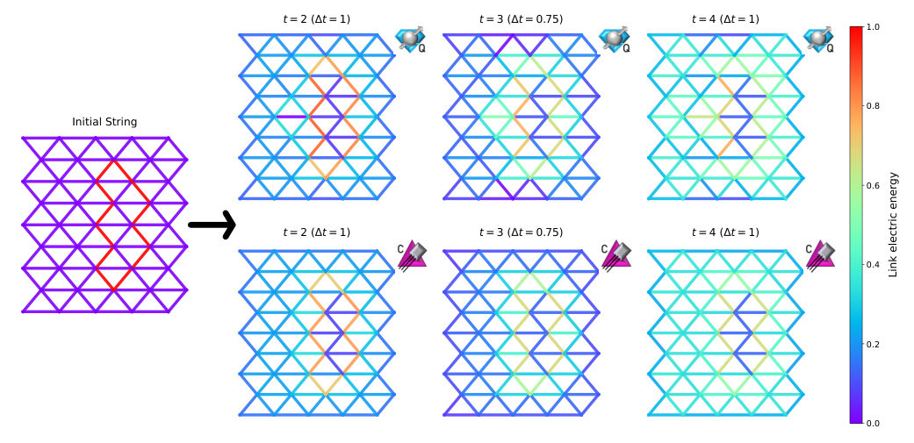 
FIG. 3. Evolution of an adjoint string on an 8 × 8 lattice with g = 1.4. The upper plots show the error-mitigated results obtained from ibm boston and the lower plots show the results of an MPS simulation with maximum bond dimension 100. This evolution shows the breaking of the string and energy beginning to flow away from the initial string configuration.

📷 Fig 4

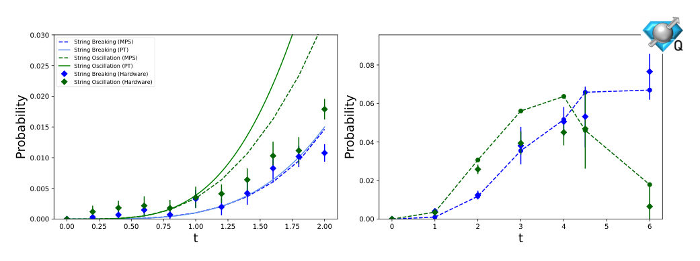 
FIG. 4. Probability of the adjoint string breaking and oscillating on an 8 × 8 lattice with g = 1.4. The dashed curves are MPS calculations with a max bond dimension of 100. The data points are the mitigated results from ibm boston. The solid lines are the time-dependent perturbation theory result computed in Appendix B. The left panel was computed using only two Trotter steps for each point and varying ∆t. The right panel was computed using Trotter step sizes of ∆t = 0.5, 0.75, 1. All simulations were performed using an even number of Trotter steps. For time slices sampled by multiple Trotter step sizes, only the results of the shallowest circuit are displayed.

📷 Fig 5

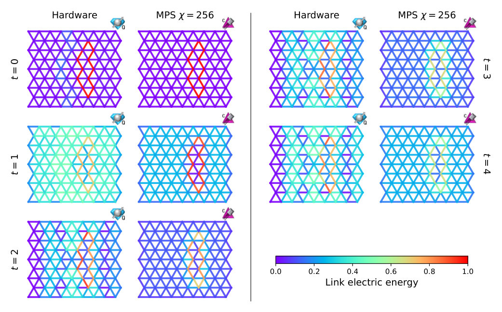 
FIG. 5. Evolution of the adjoint string on a 16×8 lattice. The Trotterized time evolution operator was synthesized on the dense encoding using BQSKit with g = 1.4 and ∆t = 0.5. The hardware results were computed on ibm boston without applying ODR.

**Summary.** This work uses quantum computation to simulate the process of adjoint string breaking in a 2D SU(2) lattice gauge theory. By tracking string dynamics and measuring excitation rates, the authors confirm the non-Abelian nature of the underlying physics. The success demonstrates the feasibility of using quantum hardware to probe strongly coupled quantum field theories.

**Why it may be interesting.** The direct application of quantum computation to simulate fundamental, strongly coupled quantum field theories like lattice gauge theories is a key area of quantum simulation, bridging condensed matter and high-energy physics.

Detailed structure

**Main problem.** The paper aims to simulate the complex dynamics of two-dimensional non-Abelian adjoint string breaking, moving beyond simpler quark-antiquark processes.

**Main result.** The quantum simulation achieved quantitative agreement with tensor network results, identifying a distinctly non-Abelian signature in the rates of string oscillations and glueball production.

**Method.** The simulation uses local Krylov-based truncations of an SU(2) lattice gauge theory Hamiltonian, implemented on a quantum computer using circuits requiring thousands of CZ gates.

**Model / system.** The system is an SU(2) lattice gauge theory on a triangular lattice in 2+1 dimensions. The Hamiltonian involves electric and magnetic energy terms, and the simulation focuses on creating and tracking adjoint strings using specific operators.

**Key observables.** String oscillation rates, glueball production rates, and the evolution of electric link energy.

**Important parameters / regimes.** The simulation was performed on an 8x8 and 16x8 lattice using 156 qubits, and the analysis focused on the large gauge coupling limit.

**Assumptions / limitations.** The primary approximation is the use of a local Krylov-based truncation of the infinite-dimensional gauge degrees of freedom.

**Figures summary.** Figures illustrate the mapping of gauge fields onto qubits, the different configurations of adjoint strings (initial, breaking, oscillating), and the time evolution of electric link energy compared to tensor network results.

**Paper structure.** The paper details the construction of the truncated Hamiltonian, the methodology for creating adjoint strings, the simulation setup on quantum hardware, and the analysis of time evolution dynamics to distinguish non-Abelian signatures.

Abstract

Quantum computers offer the potential to directly probe the dynamics of strongly coupled quantum field theories. As a step towards reaching this potential, local Krylov-based truncations of a pure SU(2) lattice gauge theory on a triangular lattice are constructed. Adjoint strings connected to dynamical gluons are constructed in this truncated theory, and the resonances dominating the long-term dynamics at a large value of the gauge coupling are determined. Local operators are constructed to identify string oscillations and breakings. This is used to perform a quantum simulation of adjoint string breaking on an $8\times8$ and $16\times8$-site lattice with ibm_boston using all 156 qubits. Quantitative agreement with tensor network simulations is obtained for circuits with 7,634 CZ gates with a two-qubit gate depth of 218. In this simulation, the rates of oscillations and glueball production are identified with a distinctly non-Abelian signature of the underlying gauge group.

[↑ back to top](#top)

### [Superfluid memory effect](http://arxiv.org/abs/2608.31172v1)

**Authors:** Kristan Jensen, Alfredo Pérez, Stefan Prohazka  
**Type:** theory · **Category:** quantum gases · **PDF:** <https://arxiv.org/pdf/2608.31172v1>  
**Analysis basis:** full PDF text, analyzed in chunks
**Topic relevance:** `Keldysh / 2PI / non-Gaussian methods` **3/5** · `analog quantum simulation` **1/5** · `correlated / nonlocal dissipation` **1/5** · `driven-dissipative phase transition` **1/5** · `methods for driven-dissipative` **1/5** · `non-equilibrium universality` **1/5**

📷 Fig 1

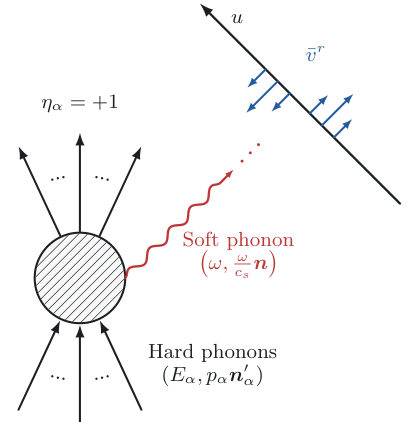 
FIG. 1. Summary of the central results (16) and (22). Hard phonon scattering produces a transient radial velocity pulse far from the scattering region. Because the velocity pulse averages to zero, (16), it may be written as ¯vr = ∂2M

📷 Fig 2

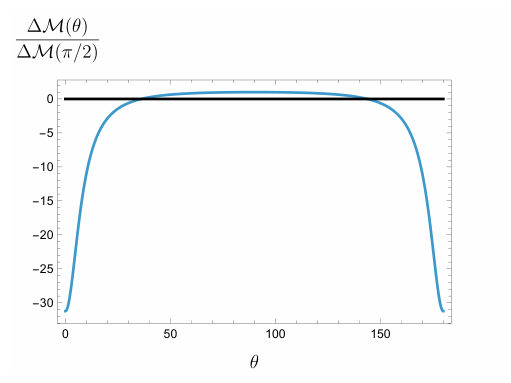 
FIG. 2. The predicted angular profile of the memory discussed in the main text as a function of angle θ away from the beam axis, relative to the memory at θ = π/2. The pressure memory follows the same curve.

**Summary.** This theoretical paper predicts a 'superfluid memory effect' arising from phonon scattering in superfluid Helium-4. Using an effective field theory approach, the authors calculate that a localized scattering event leaves a permanent, measurable shift in the system's velocity prepotential. This effect is predicted to manifest as a non-zero integral in the far-field pressure pulse, potentially observable in laboratory settings.

**Why it may be interesting.** This work connects fundamental symmetry breaking (Goldstone modes) in a quantum fluid to measurable, long-range memory effects, providing a theoretical framework for detecting subtle non-equilibrium dynamics in superfluids.

Detailed structure

**Main problem.** The paper identifies and quantifies a 'superfluid memory effect'—a permanent, non-vanishing imprint left on the far-field velocity prepotential following a localized phonon scattering event.

**Main result.** The effect predicts a non-zero integral for the far-field soft pressure pulse, $\int du u \delta ar{P} = -c_s m n \Delta M$, suggesting a permanent shift in the system's prepotential.

**Method.** The analysis uses an effective field theory (EFT) approach derived from the Goldstone effective field theory for superfluids, calculating the 'soft factor' associated with soft phonon emission.

**Model / system.** The system is superfluid Helium-4 (superfluid $^4	ext{He}$) at low temperatures, modeled using an EFT Lagrangian describing the dynamics governed by the spontaneous breaking of a U(1) symmetry.

**Key observables.** The memory effect ($\Delta M$) in the velocity prepotential and the corresponding non-zero integral of the far-field soft pressure pulse ($\delta ar{P}$).

**Important parameters / regimes.** The effect is controlled by the soft factor, which depends on low-energy couplings and nonlinear dispersion corrections, requiring regimes like $\gamma > 0$.

**Assumptions / limitations.** The analysis relies on the EFT description and treats the scattering process as involving soft phonon emission, while some calculations approximate the process as independent $2 	o 2$ events.

**Figures summary.** Figure 2 illustrates the predicted angular profile of the memory effect as a function of the scattering angle $	heta$ relative to the beam axis.

**Paper structure.** The paper establishes the EFT Lagrangian, derives the soft factor $S$ from phonon scattering calculations, and finally calculates the memory effect $\Delta M$ by relating $S$ to the far-field asymptotic behavior of the Goldstone field.

Abstract

We identify a memory effect produced by phonon scattering in a superfluid: a localized scattering event generates a far-field pressure pulse with vanishing time integral but a nonzero first temporal moment, corresponding to a permanent shift in a prepotential for the far-field velocity. The effect is controlled by the soft factor for phonon emission, including corrections from nonlinear dispersion. In superfluid $^4$He, scattering macroscopic phonon wave packets produces a signal whose estimated magnitude may lie within experimental reach, thereby providing a laboratory analogue of electromagnetic and gravitational memory.

[↑ back to top](#top)

### [Probabilistic generation of two-mode binomial cat states using cross-Kerr interactions](http://arxiv.org/abs/2608.29173v1)

**Authors:** S. Zhao, A. Metelmann, S. Qvarfort  
**Type:** theory · **Category:** quantum information and computing · **PDF:** <https://arxiv.org/pdf/2608.29173v1>  
**Analysis basis:** full PDF text, analyzed in chunks
**Topic relevance:** `quantum measurements` **3/5** · `methods for driven-dissipative` **2/5** · `QC/QI experiment` **1/5** · `quantum optics experiment` **1/5**

📷 Fig 1

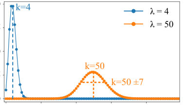 
FIG. 1. Success probability P(k) (from Eq. (5)) of the pro- tocol in the ideal case, for λ = 4 and λ = 50. The vertical dashed lines indicate the most probable value of k, while the horizontal dashed line marks the range of k considered as suc- cessful outcomes. Although other sufficiently large values of k outside this range also constitute successful outcomes in prin- ciple, their probabilities carry much smaller weights, which in turn results in a lower-fidelity on the heralded cat state.

📷 Fig 2

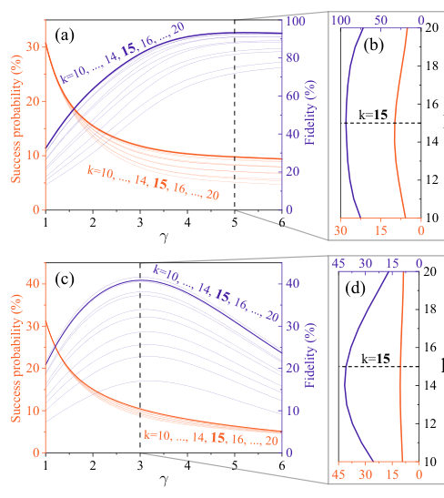 
FIG. 2. Fidelity and success probability of the protocol in the presence of single-photon loss, using gac = gbc = √

**Summary.** This paper details a protocol to generate valuable two-mode binomial cat states for quantum error correction using only Gaussian initial states and cross-Kerr interactions in superconducting circuits. By utilizing heralded heterodyne measurements, the authors overcome the major experimental hurdle of requiring non-Gaussian initial resources. The analysis rigorously examines the impact of dissipation and proposes strategies to maintain high state fidelity.

**Why it may be interesting.** This work directly addresses resource state generation for CV-QEC, providing a concrete, experimentally viable pathway using established superconducting circuit platforms.

Detailed structure

**Main problem.** The primary challenge is the probabilistic generation of two-mode binomial cat states, which are crucial resources for continuous-variable quantum error correction.

**Main result.** The authors propose a protocol that successfully generates these cat states using only Gaussian initial states and heralded heterodyne measurements, circumventing the need for difficult-to-realize non-Gaussian resources.

**Method.** The protocol involves evolving a three-mode bosonic system governed by cross-Kerr interactions, followed by a heralded measurement on an auxiliary mode.

**Model / system.** The system is modeled using a three-mode bosonic system implemented in superconducting circuit architectures, governed by a Hamiltonian including self-Kerr and cross-Kerr nonlinearities. Dissipation is included via a Lindblad master equation.

**Key observables.** Success probability density $Q_{
ho}(k)$ and the fidelity $F(k)$ of the generated state are key diagnostics.

**Important parameters / regimes.** The initial coherent amplitudes ($\alpha, eta, \gamma$), the interaction strengths ($g_{ac}, g_{bc}, g_c$), and the decay rates ($\kappa_\eta$) are critical parameters.

**Assumptions / limitations.** Approximations include treating the measurement as a projector and analyzing the state evolution under the assumption of specific functional forms for decoherence factors.

**Figures summary.** The notes mention Figure 1, which illustrates the protocol, but no detailed content is provided.

**Paper structure.** The paper progresses from establishing the need for the state, detailing the ideal protocol steps (Hamiltonian evolution and measurement), analyzing the effects of dissipation (Lindblad equation), and finally discussing strategies to improve fidelity by modifying measurement or initial amplitudes.

Abstract

Superpositions of macroscopically distinct coherent states, or cat states, are a key resource for quantum technologies. In particular, two-mode binomial cat states can give rise to exact quantum error correction in continuous-variable quantum computing. However, their preparation typically requires non-Gaussian initial states, such as Fock or NOON states, which are challenging to realize experimentally. Here, we propose a protocol to generate two-mode binomial cat states where the only requirements are Gaussian initial states in combination with heralded heterodyne measurements. Our approach utilizes cross-Kerr interactions between bosonic modes commonly realizable in superconducting circuit architectures. We show that by adjusting the input state parameters, our protocol remains robust to dissipation under realistic experimental conditions. Our work provides a practical route to realizing multinomial cat states in current experimental platforms without requiring non-Gaussian initial resources, overcoming a key limitation of existing preparation schemes.

[↑ back to top](#top)

### [Representation Transitions Reveal Predictive Structure in Complex Systems: A Trajectory-Level Reconstruction in a Critical System](http://arxiv.org/abs/2608.29777v1)

**Authors:** Jiaqi Pan  
**Type:** theory · **Category:** statistical mechanics · **PDF:** <https://arxiv.org/pdf/2608.29777v1>  
**Analysis basis:** full PDF text, analyzed in chunks
**Topic relevance:** `quantum measurements` **3/5** · `analog quantum simulation` **1/5** · `driven-dissipative phase transition` **1/5** · `methods for driven-dissipative` **1/5** · `non-equilibrium universality` **1/5**

📷 Fig 1

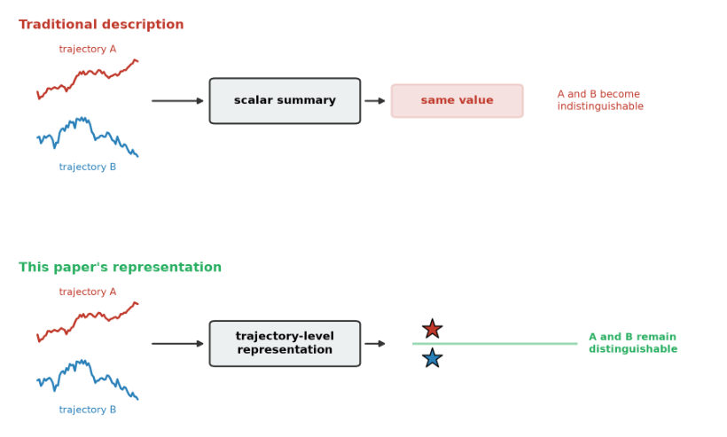 
Figure 1: Problem definition: same trajectory data, different representations, different predictive accessibility.

📷 Fig 2

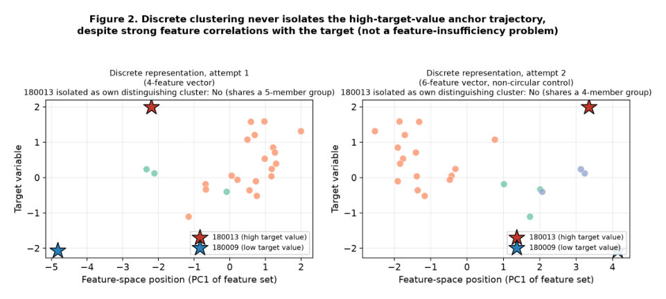 
Figure 2: Discrete clustering never isolates the high-target-value anchor trajectory, despite strong feature correlations with the target (not a feature-insufficiency problem).

📷 Fig 3

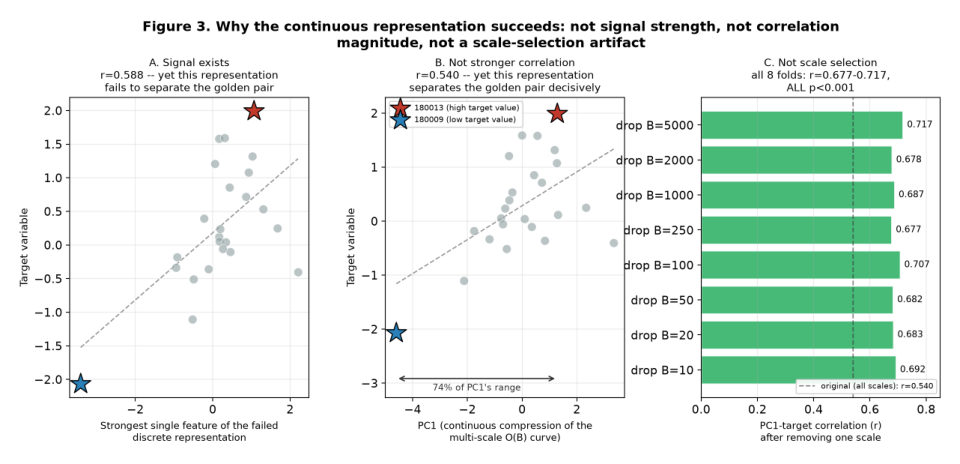 
Figure 3: Why the continuous representation succeeds: not signal strength, not correlation mag- nitude, not a scale-selection artifact. A: failed representation’s signal (r = 0.588 — signal exists). B: successful representation (r = 0.540, 74% separation — not stronger correlation). C: 8-fold leave-one-scale-out (r = 0.677–0.717, all p &lt; 0.001 — not a scale-selection artifact).

**Summary.** This paper investigates how the mathematical representation used to describe complex system trajectories dictates whether predictive structure can be found. By comparing scalar, discrete, and continuous representations, the authors find that continuous compression successfully reveals predictive patterns where simpler methods fail, suggesting representation choice is a critical scientific variable in complex systems analysis.

**Why it may be interesting.** While not directly about quantum dynamics, the core concept—that the choice of mathematical representation dictates what physical structure is observable or predictable—is highly relevant to interpreting complex quantum data, such as state vectors or time evolution paths.

Detailed structure

**Main problem.** The core problem is determining which mathematical representation of a system's trajectory preserves the structural information necessary to predict its future behavior, rather than simply maximizing correlation.

**Main result.** Continuous, low-dimensional compression of the trajectory successfully reveals predictive structure robustly, whereas discrete or simple scalar representations fail, even when strong individual correlations exist.

**Method.** The authors systematically compared multiple representations—including scalar statistics, discrete multi-feature vectors, and continuous compression (via PCA)—applied to the same trajectory ensemble in a critical system.

**Model / system.** The study analyzes trajectory ensembles generated from a critical complex system. The focus is on the mathematical structure of the trajectories rather than the specific Hamiltonian or physical details of the system itself.

**Key observables.** The primary observables are the correlation coefficient ($r$) between the representation's features and a target variable (downstream behavioral divergence), and the success of out-of-sample prediction tests across multiple scale-removal folds.

**Important parameters / regimes.** The analysis involves testing different representation types (scalar vs. discrete vs. continuous) and assessing robustness by removing individual 'manipulation scales' (leave-one-scale-out).

**Assumptions / limitations.** The study is explicitly epistemic, testing observability rather than claiming causality. It assumes that the failure of simpler representations is due to a 'representation-family mismatch.'

**Figures summary.** Figure 1 summarizes the comparison across different representations. Figure 2 shows that discrete clustering fails to isolate high-target-value trajectories despite strong feature correlations. Figure 3 demonstrates the success and robustness of the continuous representation across multiple scale-removal folds.

**Paper structure.** The paper progresses by first showing the inadequacy of single scalar statistics, then demonstrating the failure of increasing discrete complexity, and finally establishing the success and robustness of continuous low-dimensional compression as the determining factor for predictive accessibility.

Abstract

Trajectories in complex systems often contain structure that is not captured by the population-averaged, scalar statistics traditionally used to describe them. Here we reconstruct, through independent numerical re-simulation rather than literature review, a systematic search across representational forms - from single scalar statistics, through two independent discrete multi-feature classification attempts, to a trajectory-level structural representation and a diagnostic surrogate test, to a continuous low-dimensional compression - applied to the same underlying trajectory ensemble in a critical complex system. Predictive failure is not explained by insufficient correlation: one discrete representation's own strongest individual feature correlates with the target more strongly ($r=0.588$) than the eventual successful representation's own headline statistic ($r=0.540$), yet fails to separate the ensemble's two most consequential cases - while the continuous representation succeeds, robustly, across eight independent scale-removal folds ($r=0.677$-$0.717$, all $p<0.001$). The determining factor was not correlation strength but whether the representation preserved the structure relevant to prediction. These results indicate that the choice of representation determines whether predictive structure in complex systems becomes accessible - a scientific variable in its own right, not a downstream analysis choice.

[↑ back to top](#top)

### [Spinor Structure from Relativistic Mass-Shell Factorisation in Phase Space](http://arxiv.org/abs/2608.29353v1)

**Authors:** Mark Everitt  
**Type:** theory · **Category:** other · **PDF:** <https://arxiv.org/pdf/2608.29353v1>  
**Analysis basis:** full PDF text, analyzed in chunks
**Topic relevance:** `Keldysh / 2PI / non-Gaussian methods` **3/5** · `methods for driven-dissipative` **3/5** · `quantum measurements` **1/5**

📷 Fig 1

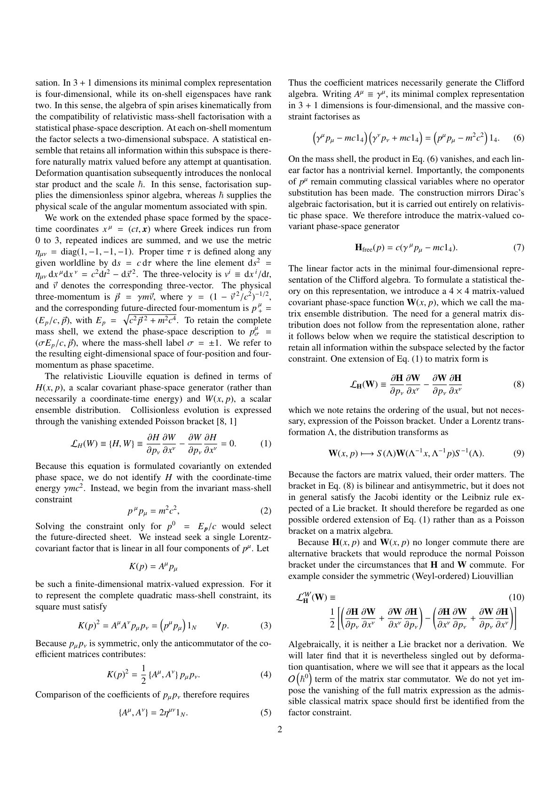 
Low-resolution page preview, page 2

📷 Fig 2

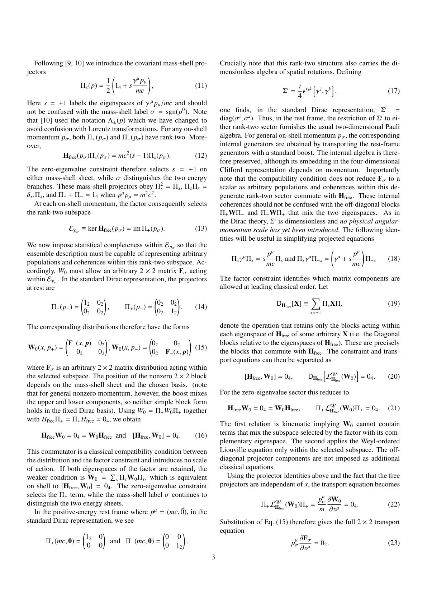 
Low-resolution page preview, page 3

📷 Fig 3

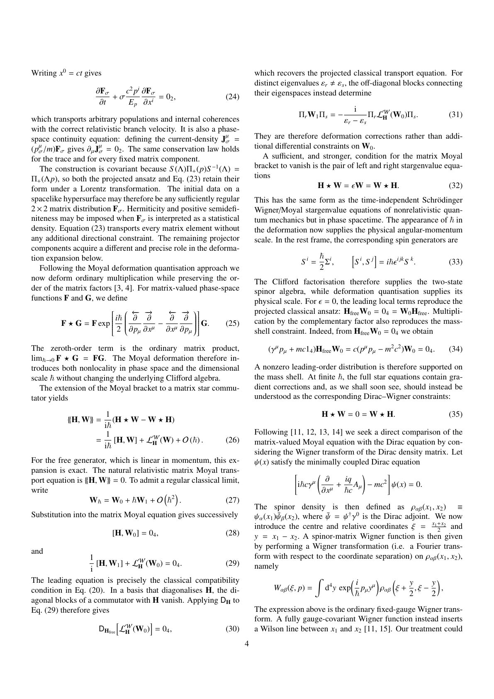 
Low-resolution page preview, page 4

📷 Fig 4

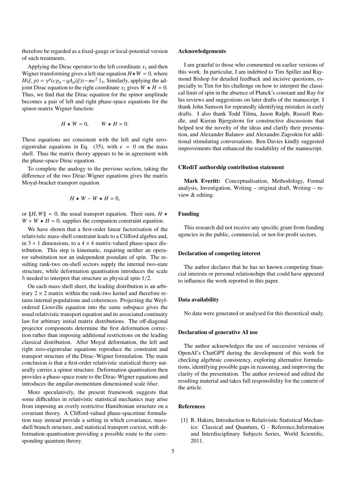 
Low-resolution page preview, page 5

📷 Fig 5

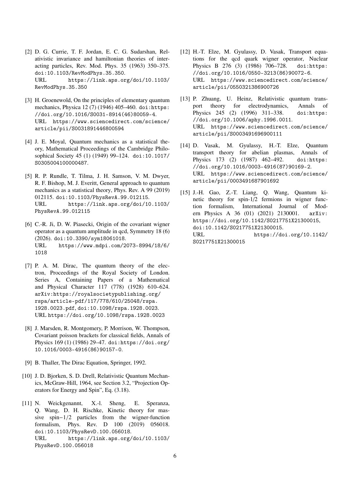 
Low-resolution page preview, page 6

**Summary.** This paper develops a covariant phase-space framework to investigate the origin of quantum spin in relativistic physics. By analyzing the constraints imposed by the relativistic mass-shell condition on the phase-space dynamics, the authors show that the underlying structure must obey a Clifford algebra. This formalism successfully derives the Dirac-Wigner equations, suggesting that spin structure can arise naturally from relativistic kinematics rather than being an imposed quantum postulate.

**Why it may be interesting.** This work provides a deep theoretical link between fundamental symmetries (Lorentz covariance, mass-shell constraints) and quantum properties (spin), offering a non-standard, phase-space approach to quantum foundations that is relevant to advanced quantum field theory.

Detailed structure

**Main problem.** The paper investigates whether the intrinsic spinor structure of spin-1/2 particles in relativistic quantum mechanics can emerge naturally from the compatibility between relativistic kinematics (mass-shell constraints) and covariant statistical phase-space dynamics.

**Main result.** The requirement of a linear, covariant mass-shell factor forces the underlying algebraic structure to be a Clifford algebra, suggesting a non-quantum origin for spinor structure and providing a phase-space route to the Dirac-Wigner equations.

**Method.** The authors employ covariant phase-space quantization techniques, projecting the Liouville equation onto the mass-shell subspace and utilizing the Moyal star product expansion to derive classical and quantum transport equations.

**Model / system.** The model is relativistic quantum mechanics for spin-1/2 particles, described using a covariant classical phase-space distribution function $W$ constrained by the mass-shell condition $p_\mu p^\mu = m^2c^2$. The dynamics are governed by the Liouville equation.

**Key observables.** The $2 	imes 2$ matrix-valued ensemble distribution $W(x, p)$, which retains internal populations and coherences, and the resulting transport equation $\partial_\mu J^\mu_\sigma = 0$.

**Important parameters / regimes.** The reduced Planck constant ($\hbar$) acts as the scale converting the dimensionless internal algebra into physical angular momentum, while the mass $m$ sets the scale for the mass-shell constraint.

**Assumptions / limitations.** The analysis assumes that the statistical description must be covariant and that the mass-shell constraint can be factorized linearly in momentum components.

**Paper structure.** The paper establishes the problem by noting the difficulty of deriving spin classically. It then imposes the mass-shell constraint, forcing the coefficient matrices into a Clifford algebra. The dynamics are analyzed by projecting the Liouville equation into the resulting $2 	imes 2$ subspace, leading to the symmetric Liouvillian and ultimately reproducing the Dirac-Wigner equations via the Moyal star commutator.

Abstract

Spin is usually regarded as one of the most intrinsically quantum phenomena, while its lack of a natural analogue in classical physics presents an obstacle to phase-space deformation-quantisation accounts of its origin. We show that this difficulty may arise from imposing an overly restrictive scalar Hamiltonian structure on relativistic phase space. Requiring the complete massive mass-shell constraint to be represented by a single finite-dimensional expression that is linear in all four components of momentum forces its coefficient matrices to satisfy a Clifford algebra. The minimal complex representation of this algebra is four-dimensional. Requiring statistical completeness within the rank-two subspace selected by the mass-shell factor then leads to a four-by-four matrix-valued ensemble distribution. At each on-shell momentum, the linear mass-shell operator selects a two-dimensional subspace, so a general classical ensemble is described by a $2 \times 2$ matrix before quantisation. Projecting the Weyl-ordered Liouville equation into this subspace gives relativistic transport while preserving arbitrary populations and coherences and the remaining projector components determine the first deformation correction. Expansion of the matrix Moyal star commutator yields the symmetrised classical matrix Liouvillian at leading order. If the stronger two-sided star constraints are imposed, they reproduce the left and right Dirac-Wigner equations and introduce $\hbar$ as the scale converting the dimensionless internal algebra into physical angular momentum. These results suggest a non-quantum origin for spinor structure and a route to reconciling relativistic covariance, classical phase-space transport, and quantum spin.

[↑ back to top](#top)

### [Imaging Stars at the Quantum Compatibility Limit](http://arxiv.org/abs/2608.29689v1)

**Authors:** Xinyao Guo, Haixing Miao, Zheng Cai, Huan Yang  
**Type:** theory · **Category:** other · **PDF:** <https://arxiv.org/pdf/2608.29689v1>  
**Analysis basis:** full PDF text, analyzed in chunks
**Topic relevance:** `interference shaping light` **3/5** · `quantum measurements` **3/5**

📷 Fig 1

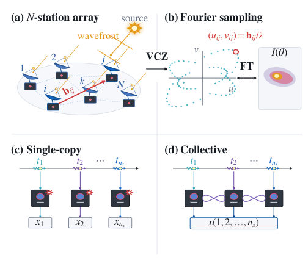 
FIG. 1. Schematic of a nonlocal interferometric array for high- resolution imaging. Top: Physical picture of interferometric imaging, in which multiple baselines sample spatial-frequency components that jointly reconstruct the source. Bottom: Comparison of single-copy and collective measurements: for the former, quantum-state collapse happens for each copy with its time label, whereas the latter coherently processes multiple copies before a joint, time-unresolved collapse.

📷 Fig 2

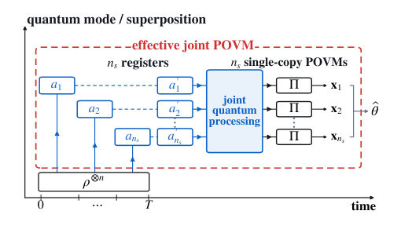 
FIG. 2. Schematic illustration of time-unresolved measure- ment. Here, all the quantum operations in the red block ef- fectively serve as a joint measurement acting on ns undistin- guished copies of the quantum state.

📷 Fig 3

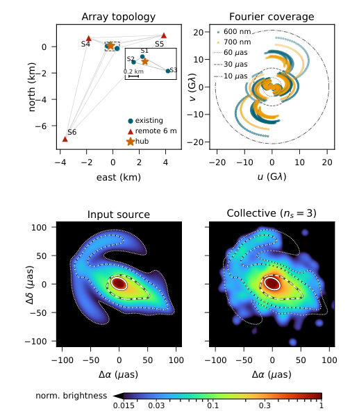 
FIG. 3. Closure-space imaging test in a six-station long- baseline array. Top: Array geometry and Fourier coverage of the 6-station array. Bottom: Benchmark targeting source and the RML-reconstructed source with 3-copy collective mea- surement. Dashed and dotted curves mark equal-brightness contours of the input source overlaid on both image panels. Detailed pipeline of the RML reconstruction is supplemented in Appendix D.

📷 Fig 4

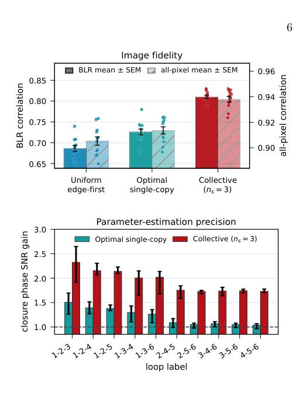 
FIG. 4. Statistical improvement of collective-measurement- based nonlocal imaging. Top: Comparison of the imaging quality under different measurement schemes. Points repre- sents the correlation of individual imaging tests, while bars and error bars give the mean and standard error. Bottom: SNR gains for closure phase measurement relative to the uniform edge-first measurement scheme; bars give geometric means and whiskers indicate the 5–95% sample quantiles.

📷 Fig 5

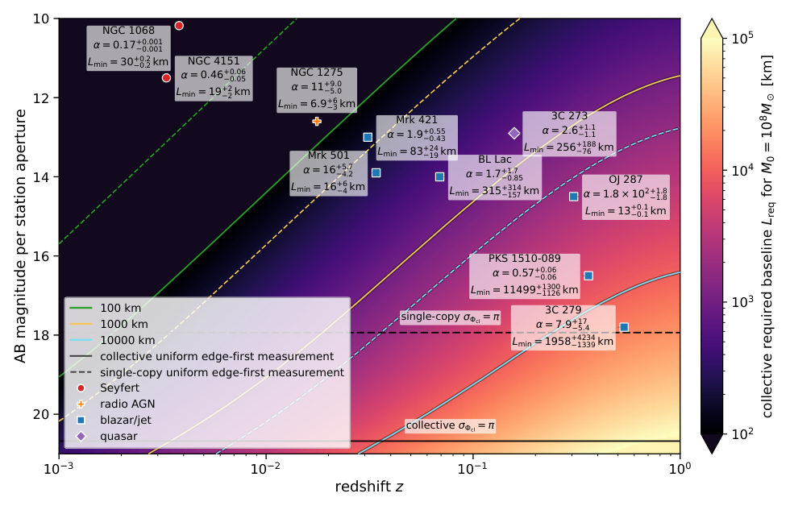 
FIG. 5. Minimum required baseline length for resolving sources at the Schwarzschild-radius scale. The central black-hole masses adopted for the representative source markers are taken from Refs. [48–56]. Solid and dashed black lines denote the unity closure-SNR thresholds for single-copy measurement and collective measurement, respectively. For each readout strategy, the region below the corresponding threshold is inaccessible because the closure phases cannot be estimated with sufficient precision.

**Summary.** This work tackles the quantum limits of imaging distant stars using large interferometers by analyzing the quantum estimation problem. It proves that single-copy measurements suffer from a fundamental array-size penalty, but collective measurements can coherently process data to achieve a significant O(sqrt(N)) improvement in signal-to-noise ratio. This suggests a path toward quantum-enhanced quantum-assisted interferometry for next-generation telescopes.

**Why it may be interesting.** It provides a rigorous quantum information-theoretic framework for improving measurements in complex physical systems like interferometers, directly relating quantum measurement strategies to achievable astrophysical resolution.

Detailed structure

**Main problem.** The paper addresses the fundamental quantum estimation limits for imaging astrophysical sources using multi-station interferometers, which is a multi-parameter quantum estimation problem.

**Main result.** Collective measurements, which coherently process starlight across multiple time bins, remove the array-size penalty inherent in single-copy measurements, yielding an asymptotic O(sqrt(N)) enhancement in the visibility SNR.

**Method.** The analysis uses Quantum and Classical Fisher Information Matrices to compare the performance bounds of single-copy versus collective quantum measurements.

**Model / system.** The system is an N-station interferometric array observing weak thermal light from a remote astrophysical source, modeled in the weak-light regime.

**Key observables.** Visibility estimators, directional-averaged SNR, Closure phase, and image reconstruction quality metrics (e.g., RMSE).

**Important parameters / regimes.** Array size (N), number of independent measurements (n_s), and the asymptotic limit (n_s -> infinity).

**Assumptions / limitations.** The analysis assumes the weak-light regime and the feasibility of implementing a memory-assisted architecture for joint quantum readout.

**Figures summary.** Figures schematically compare single-copy vs. collective measurements, and later show correlations and SNR gains for different receiver pipelines.

**Paper structure.** The paper progresses from defining the quantum estimation problem in interferometry, deriving the performance bounds showing the incompatibility of single-copy measurements, proposing collective readout, and finally simulating the improvement using realistic astrophysical targets.

Abstract

Imaging astrophysical sources with a multi-station interferometer is intrinsically a multiparameter quantum-estimation problem. {Using tools from multiparameter quantum metrology,} we show that time-resolved repetitive or adaptive measurements in an \(N\)-station array suffer a fundamental array-level incompatibility among visibility estimators. Collective measurements, {which coherently process the received starlight across multiple time bins in a single joint readout}, remove the array-size penalty up to an order-unity factor, yielding an asymptotic \(O(\sqrt{N})\) enhancement for the {directional-averaged} SNR of visibility measurement. We then propose a memory-assisted interferometric architecture designed to implement collective readout through coherent storage and joint quantum processing. Imaging simulations and Fisher-information analyses demonstrate that collective measurements improve image reconstruction in near-term arrays and enhance the resolving power of future long-baseline architectures, with pronounced benefits for representative AGN targets such as NGC~4151 and 3C~273. These results highlight collective measurement as a promising building block for future quantum-assisted interferometric arrays for stellar imaging.

[↑ back to top](#top)

### [Indirect stabilization of N -level quantum systems](http://arxiv.org/abs/2608.30308v1)

**Authors:** Francesca Carlotta Chittaro  
**Type:** theory · **Category:** quantum information and computing · **PDF:** <https://arxiv.org/pdf/2608.30308v1>  
**Analysis basis:** full PDF text, analyzed in chunks
**Topic relevance:** `methods for driven-dissipative` **3/5** · `correlated / nonlocal dissipation` **1/5** · `driven-dissipative phase transition` **1/5** · `quantum measurements` **1/5**

📷 Fig 1

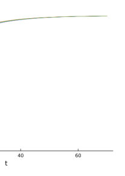 
Figure 1: Fidelity F(trAρ(t), |ψ∗⟩⟨ψ∗|).

**Summary.** This paper develops a theoretical framework to stabilize an N-level quantum system using an indirect control mechanism involving a noisy ancilla. By analyzing the dynamics in the coherence vector representation, the authors derive precise conditions for stability, particularly for the two-level case. The results are significant for quantum control, demonstrating how engineered dissipation can force a system into a specific, desired quantum state.

**Why it may be interesting.** This work provides rigorous mathematical tools to design open quantum systems, showing how engineered dissipation can deterministically steer a complex quantum state towards a desired entangled or pure state, which is fundamental for quantum computation and quantum control.

Detailed structure

**Main problem.** The paper theoretically characterizes the conditions required for achieving asymptotic stabilization of an N-level quantum system towards a desired pure state set using an indirect control architecture mediated by a noisy ancilla.

**Main result.** For the two-level case (N=2), the authors derive a complete set of necessary and sufficient conditions for asymptotic stabilization, demonstrating convergence to a Bell state in a numerical example.

**Method.** The analysis employs geometric methods on the space of density matrices, utilizing the coherence vector representation to transform the open quantum dynamics governed by the GKSL master equation into a linear system of differential equations.

**Model / system.** The system is a bipartite quantum system $\mathcal{H} = \mathcal{H}_A \otimes \mathcal{H}_S$, where $S$ is the N-level system and $A$ is a noisy ancilla qubit. The evolution is described by the GKSL master equation.

**Key observables.** The coherence vector $\mathbf{x}_
ho$, the fidelity $F(
ho, \sigma)$, and the existence of a unique, factorized equilibrium point are key diagnostics.

**Important parameters / regimes.** The dimension N of the system, the structure of the coupling Hamiltonian $H_I$, and the properties of the noise operators $\ell_k$ are crucial parameters.

**Assumptions / limitations.** The analysis assumes the dynamics are governed by the GKSL master equation and that the noise operators can be simultaneously triangularized for global stabilization.

**Figures summary.** A figure demonstrates the temporal evolution of the fidelity across multiple random initial trajectories, showing clear convergence towards the target Bell state.

**Paper structure.** The paper first outlines the general theoretical framework for arbitrary N, then focuses on the analytically tractable two-level case (N=2) to derive necessary and sufficient stability conditions, concluding with a numerical illustration.

Abstract

We study the stabilizability of a N -level quantum systems using an indirect control ar- chitecture mediated by a noisy ancilla. After outlining the general theoretical framework for arbitrary N , we focus on the two-level case (N = 2), for which we derive a complete set of necessary and sufficient conditions for asymptotic stability. Finally, we illustrate the analyti- cal results with a simple numerical example on a two-spin system, showing convergence to a Bell state for a set of random initial conditions.

[↑ back to top](#top)

### [Can a Spin Liquid State Persist as the Ground State in the Presence of Competing Interactions and Disorder?](http://arxiv.org/abs/2608.28998v1)

**Authors:** Sumanta Mukherjee  
**Type:** theory · **Category:** disordered systems and neural networks · **PDF:** <https://arxiv.org/pdf/2608.28998v1>  
**Analysis basis:** full PDF text, analyzed in chunks
**Topic relevance:** `analog quantum simulation` **3/5** · `Keldysh / 2PI / non-Gaussian methods` **2/5**

📷 Fig 1

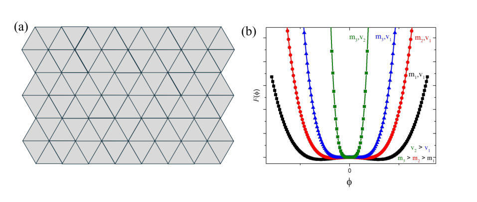 
FIG. 1. (a) Schematic representation of the triangular lattice. (b) Systematic shift of the free-

📷 Fig 2

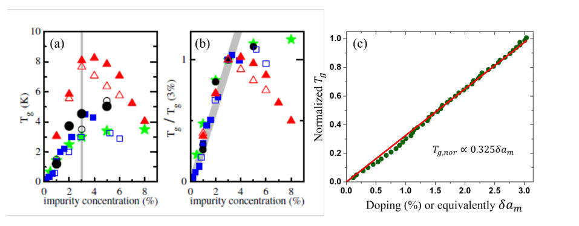 
FIG. 2. Linear increase of the freezing temperature with increasing doping concentration in a

**Summary.** This theoretical work examines the stability of spin liquid states in frustrated magnets under the influence of competing interactions and structural disorder. Using advanced field theory and the replica method, the authors show that disorder tends to suppress true long-range order, causing the system to enter a glassy state. This highlights the experimental difficulty in distinguishing genuine quantum spin liquids from disorder-induced glassy dynamics.

**Why it may be interesting.** The interplay between frustration, disorder, and quantum fluctuations is central to understanding many exotic quantum phases, making the theoretical framework relevant for modeling complex many-body dynamics.

Detailed structure

**Main problem.** The paper investigates whether a quantum spin liquid state can remain the ground state in a geometrically frustrated lattice when subjected to competing magnetic interactions and structural disorder.

**Main result.** While competing interactions can induce order-by-disorder mechanisms, the presence of structural disorder drives the system towards a glassy state, which can mimic spin-liquid behavior but obscures the identification of true quantum spin liquids.

**Method.** The analysis employs field-theoretical techniques, extending Ginzburg-Landau theory and utilizing the replica method to average over quenched structural disorder.

**Model / system.** The model considers magnetic systems on frustrated lattices (like the triangular lattice) described by coupled order parameters ($\phi, \psi$) whose free energy functional is modified by both competing interactions and spatially random structural disorder.

**Key observables.** The effective free energy functional ($F_{	ext{eff}}$), the glass transition temperature ($T_g$), and the stability of the ordered state ($\phi_0$).

**Important parameters / regimes.** Interaction strengths ($g_{ij}$), disorder variance ($\Delta$), and the ratio of interaction energy to disorder strength.

**Assumptions / limitations.** The analysis relies on the replica method and assumes the validity of a simplified phenomenological framework for the free energy functional.

**Figures summary.** Figure 1 schematically shows the lattice and the shift of the free-energy minimum due to fluctuations. Figure 2 illustrates the linear increase of the freezing temperature ($T_g$) with doping concentration.

**Paper structure.** The paper progresses from establishing the problem of competing interactions leading to fluctuation-driven order-by-disorder, to developing a field-theoretic approach incorporating disorder via the replica method, culminating in the prediction of a glassy ground state.

Abstract

In this report, we have shown that, in an otherwise geometrically frustrated lattice, the underlying interactions compete to stabilize different magnetic phases. In conjunction with fluctuations, these interactions may lead to the formation of unusual ordered phases, providing a pathway for understanding the fluctuation-driven order-by-disorder phenomenon. This competition is further modified by the presence of inherent structural disorder in a frustrated two-dimensional lattice. Furthermore, due to the local nature of the additional structural disorder, the majority of the samples evolve toward glassy dynamics, which can not only mimic spin-liquid-like behavior but also make it difficult to identify genuine spin-liquid candidates experimentally.

[↑ back to top](#top)

### [Experimental observation of decoupled spin subsystems in decorated square kagomé lattice magnets of the nabokoite family](http://arxiv.org/abs/2608.29323v1)

**Authors:** V. N. Glazkov, Ya V. Rebrov, M. A. Dubovitskii, M. M. Markina, A. F. Murtazoev, P. S. Berdonosov, A. N. Vasiliev  
**Type:** experiment · **Category:** strongly correlated electrons · **PDF:** <https://arxiv.org/pdf/2608.29323v1>  
**Analysis basis:** full PDF text, analyzed in chunks
**Topic relevance:** `analog quantum simulation` **3/5** · `quantum measurements` **2/5**

📷 Fig 1

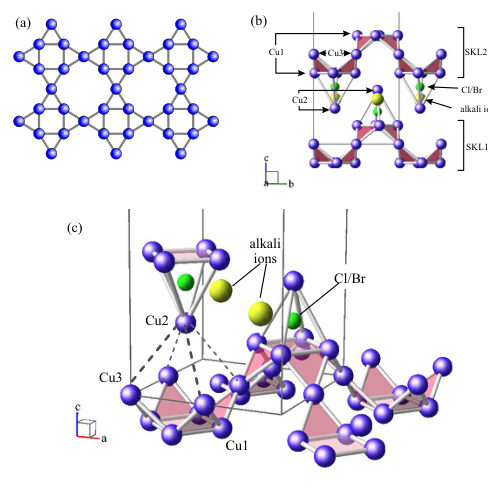 
FIG. 1. (color online) (a) Scheme of the ideal 2D kagom´e lattice. (b) and (c) Fragments of the crystal structure of nabokoite family compounds ACu7(TeO4)(SO4)5X with high- lighted SKL layers. Only positions of copper, alkali and halo- gen ions are shown.

📷 Fig 2

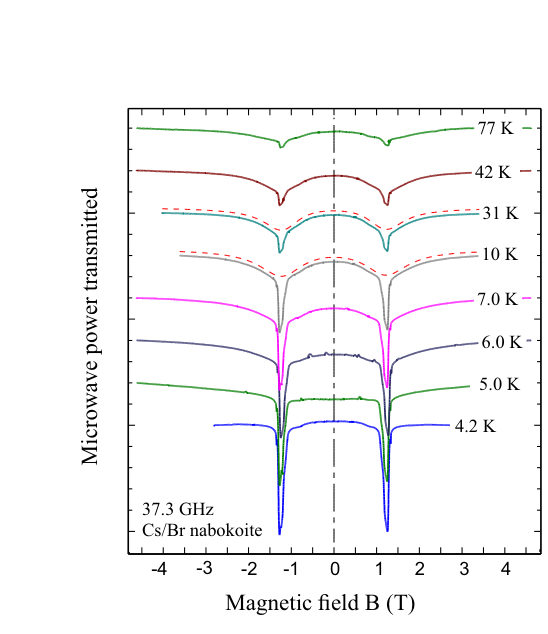 
FIG. 2. (color online) Paramagnetic resonance absorp- tion spectra (bi-polar field sweep) for powder sample of CsCu7(TeO4)(SO4)5Br at different temperatures. Dashed curves show Lorentzian fits of 10 and 31 K data using Eqn. (1) (fits are shifted upwards for clarity).

📷 Fig 3

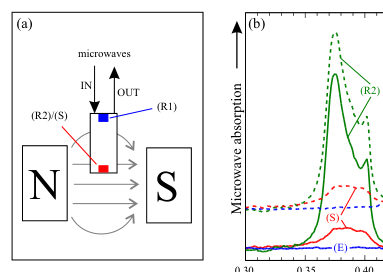 
FIG. 3. (color online) (a) Sketch of the cavity and sample po- sitions at the calibration of paramagnetic centers absorption: (S) — nabokoite sample placed on the lower cavity wall (uni- form field of the magnet), (R1) — reference single-crystalline sample of CuSO4 · 5H2O placed on the upper cavity wall (stray field of the magnet), (R2) — reference powdered sam- ple of CuSO4 · 5H2O replacing the sample. (b) Comparison of the scaled EPR absorption spectra in calibration exper- iments with Rb/Br nabokoite (f = 11.4 GHz, T = 77 K, mS = 81.2 mg, mR2 = 5.5 mg): sample (S)+reference sam- ple (R1); powdered reference sample (R2) + reference sample (R1); no sample on the lower wall (E)+reference...

📷 Fig 4

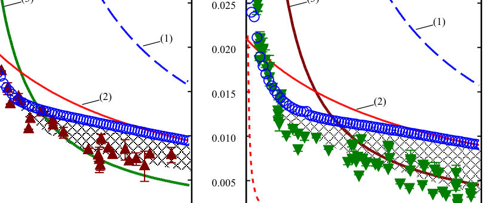 
FIG. 4. (color online) Comparison of the static susceptibility χstatic (open circles) and recovered contribution of the EPR-active spins to the total static susceptibility χEPR (filled triangles). Panel (a) — data for Cs/Br nabokoite, panel (b) — data for Rb/Br nabokoite. Curves at both panels: (1) — Curie law for 7 spins S = 1/2, g = 2.2 per nabokoite molecule; (2) — Curie-Weiss law for 7 spins S = 1/2, g = 2.2 per nabokoite molecule and Curie-Weiss temperatures Θ = 130 K for Cs/Br nabokoite and 150 K for Rb/Br nabokoite; (3) — Curie law for 2 spins S = 1/2, g = 2.2 per nabokoite molecule; (4) — contribution of free paramagnetic centers (see Table II). Hatched areas highlight deficient...

**Summary.** This work uses EPR spectroscopy on nabokoite magnets to probe the magnetic structure of the decorated square kagomé lattice. The key finding is the experimental evidence for two distinct, decoupled spin subsystems within the material. This challenges simple models of uniform exchange coupling in frustrated quantum magnets.

**Why it may be interesting.** The observation of distinct, coexisting magnetic order (EPR-active) and potentially gapped/liquid dynamics (EPR-silent) within a single material provides a concrete experimental realization for studying spin-lattice decoupling in frustrated quantum magnets.

Detailed structure

**Main problem.** The study investigates the complex magnetic exchange network and spin dynamics within the decorated square kagomé lattice (SKL) structure found in nabokoite-family magnets.

**Main result.** The research demonstrates a dramatic splitting of the complex spin network into two virtually decoupled subsystems: one EPR-active and one EPR-silent, challenging conventional unified exchange models.

**Method.** The primary method involves Electron Paramagnetic Resonance (EPR) spectroscopy, supplemented by static magnetic susceptibility measurements.

**Model / system.** The physical system is the nabokoite-family compound, $	ext{ACu}_7(	ext{TeO}_4)(	ext{SO}_4)_5	ext{X}$, which features 2D SKL layers decorated by interlayer spins, providing a platform for geometric frustration studies.

**Key observables.** EPR absorption intensity and linewidth ($\Delta$), static magnetic susceptibility ($\chi$), and the antiferromagnetic ordering temperature ($T_N$).

**Important parameters / regimes.** The fraction of EPR-active spins, the temperature dependence of the spin contributions, and the resonance field/linewidth values.

**Assumptions / limitations.** The analysis assumes the Lorentzian shape for the EPR absorption profile and that the EPR-silent subsystem's behavior can be inferred from its vanishing contribution to the total susceptibility upon cooling.

**Figures summary.** Figures illustrate the crystal structure of the SKL layers and show the temperature dependence of the EPR spectra, revealing distinct magnetic contributions.

**Paper structure.** The paper proceeds by establishing the structural model (SKL), applying advanced EPR techniques to separate signal contributions, and then analyzing the temperature dependence of the magnetic observables to argue for the existence of decoupled spin subsystems.

Abstract

The square kagomé lattice (SKL) offers a model platform for investigating geometric frustration in 2D systems. Nabokoite-family compounds \nabok{A}{X} (A=Na, K, Cs, Rb and X=Cl, Br) extend this physics to a 3D network, where 2D SKL layers are decorated by interlayer spins. Using electron paramagnetic resonance (EPR), we demonstrate a dramatic splitting of this complex exchange network into two virtually decoupled spin subsystems: absolute calibration of the electron paramagnetic resonance (EPR) absorption reveals that only a fraction of all copper spins in nabokoites is EPR-active and this fraction of the spins orders at the Néel point. Comparison of the EPR absorption and static susceptibility indicates that contribution of the EPR-silent spin subsystem to total magnetic susceptibility decreases on cooling. This direct observation of coexisting magnetic order and possible spin-liquid dynamics within a single compound challenges conventional models of unified exchange networks in decorated frustrated lattices.

[↑ back to top](#top)

### [Pathwise Random Hamiltonian Simulation](http://arxiv.org/abs/2608.29756v1)

**Authors:** Davide Cugini  
**Type:** theory · **Category:** quantum information and computing · **PDF:** <https://arxiv.org/pdf/2608.29756v1>  
**Analysis basis:** full PDF text, analyzed in chunks
**Topic relevance:** `analog quantum simulation` **3/5** · `methods for driven-dissipative` **2/5**

📷 Fig 1

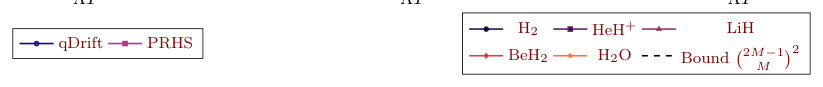 
FIG. 1: Comparison between qDrift and PRHS (N = 1) for the five molecular Hamiltonians introduced in the text. The first 5 panels show the trace-distance error achieved by qDrift (blue) and by PRHS (purple) as a function of ΛT, at matched query cost Crun; the black dashed horizontal line marks the target accuracy ϵ = 10−1 used to select, for each ΛT, the smallest M meeting this target. Shaded background regions, and the labels along the upper horizontal axis, indicate the resulting order M, which, following from the bias bound of Eq. (7) evaluated at N = 1, depends on ΛT alone and is therefore common to all five molecules. The last panel reports the corresponding sampling overhead ∥qM∥2 1,...

**Summary.** This paper introduces Pathwise Random Hamiltonian Simulation (PRHS), an advanced quantum algorithm designed to simulate time evolution $e^{-iHt}$ with higher accuracy than existing methods like qDrift. By structuring the time evolution into correlated slices, PRHS achieves an error scaling that is superior to polynomial bounds in the high-precision limit. This offers a significant algorithmic advantage for simulating complex quantum systems like molecules.

**Why it may be interesting.** This work provides a concrete, resource-aware quantum algorithm improvement for simulating quantum dynamics, directly impacting the feasibility of simulating complex molecular Hamiltonians on near-term quantum hardware.

Detailed structure

**Main problem.** The paper addresses the challenge of efficiently approximating the time-evolution operator $U(t) = e^{-iHt}$ for quantum systems.

**Main result.** The proposed Pathwise Random Hamiltonian Simulation (PRHS) protocol achieves arbitrary order of accuracy, outperforming the standard qDrift protocol in the high-precision regime by achieving a query cost that grows slower than any power of $1/\epsilon$.

**Method.** PRHS extends qDrift by subdividing each time step into $M$ correlated slices, utilizing a specially constructed quasi-probability distribution to achieve higher-order error control.

**Model / system.** The simulation targets quantum systems governed by a Hamiltonian $H = \sum_{\gamma=1}^{\Gamma} \lambda_\gamma H_\gamma$, whose evolution is analyzed using the Liouvillian formalism.

**Key observables.** Trace Distance Error ($\epsilon$), Query Cost ($C_{run} = NM$), and Total Cost ($C(N, M)$).

**Important parameters / regimes.** Target accuracy $\epsilon$, total evolution time $T$, and the coupling strength parameter $\Lambda$.

**Assumptions / limitations.** The analysis compares PRHS against Trotter–Suzuki decompositions and assumes the ability to optimize jointly over the number of slices $M$ and independent blocks $N$.

**Figures summary.** Figures compare the trace distance error between qDrift and PRHS for molecular Hamiltonians, showing PRHS achieving significantly lower error at matched query costs in the high-precision regime.

**Paper structure.** The paper introduces PRHS as an extension of qDrift, derives error bounds showing factorial decay in $M$, and then performs an optimization analysis to find the optimal $(N, M)$ pair that minimizes the total resource cost for fixed accuracy $\epsilon$.

Abstract

Randomized product formulas such as qDrift offer a resource-efficient alternative to deterministic Trotter--Suzuki decompositions for Hamiltonian simulation, removing their polynomial dependence on the number of Hamiltonian terms. qDrift, however, is intrinsically limited to first order in the evolution time, so its query complexity remains linear in the inverse of the target accuracy, $1/ε$. We introduce Pathwise Random Hamiltonian Simulation (PRHS), which extends qDrift to arbitrary order by subdividing each time step into $M$ correlated slices, each evolving under a term sampled from a quasi-probability distribution that we construct in closed form and prove unique, with a bias decaying factorially in $M$. Optimizing jointly over the number of slices $M$ and the number of independent blocks $N$ interpolates between the standard qDrift protocol at long times and a high-precision regime where the query cost grows slower than any power of $1/ε$, without requiring ancillary qubits. Numerical simulations of five molecular Hamiltonians confirm this advantage, with PRHS achieving accuracies two to four orders of magnitude beyond qDrift at equal query cost.

[↑ back to top](#top)

### [Strongly coupled quark matter in neutron stars and their mergers](http://arxiv.org/abs/2608.28879v1)

**Authors:** Konstantin Maslov, Ralf Rapp, Joaquin Grefa, Veronica Dexheimer, Claudia Ratti  
**Type:** theory · **Category:** statistical mechanics · **PDF:** <https://arxiv.org/pdf/2608.28879v1>  
**Analysis basis:** full PDF text, analyzed in chunks
**Topic relevance:** `Keldysh / 2PI / non-Gaussian methods` **3/5** · `analog quantum simulation` **1/5** · `methods for driven-dissipative` **1/5**

📷 Fig 1

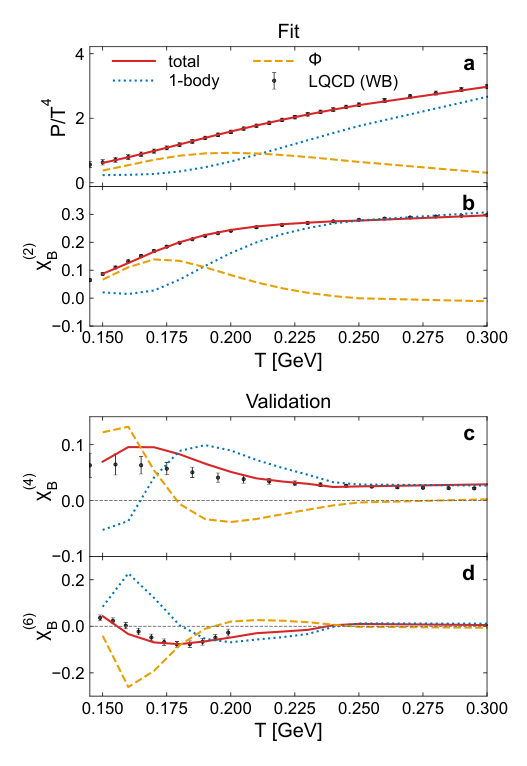 
Figure 1: Calibration against lQCD thermodynamics at µB = 0. a, Pressure P/T4. b–d, Baryon-charge suscepti-

📷 Fig 2

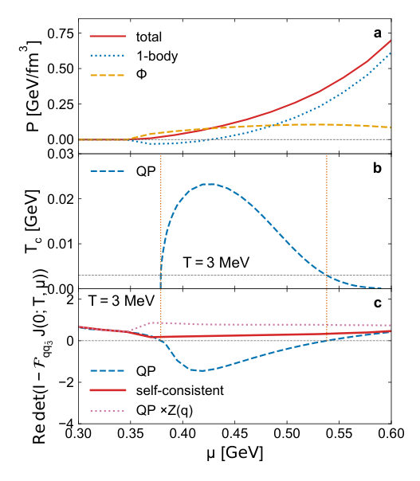 
Figure 2: Suppression of the pairing instability in the self-consistent calculation. a, Total pressure (solid) at T = 3 MeV and its decomposition into the 1-body (dotted) and correlation (dashed) contributions as functions of µ. b, Critical temperature for diquark condensation in the QP approximation as a function of µ. The horizontal dashed line marks T = 3 MeV, the temperature of the upper and lower panels. c, Thouless determinant as a function of chemical potential for the self-consistent calculation (thick solid line), the same QP approximation as in the middle panel (dashed line), and the QP approximation including the QP residue Z(q) (dotted line, see Methods).

📷 Fig 3

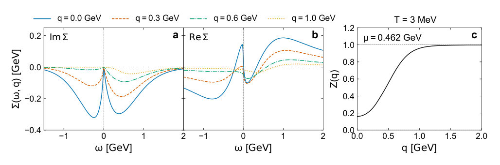 
Figure 3: Self-energies and the depletion of QP weight. a, Imaginary and b, Real parts of the retarded quark self-energy Σ(q, ω) at T = 3 MeV and µ = 0.462 GeV as functions of the frequency (relative to the Fermi level) for several momenta. The imaginary part exhibits the Fermi-liquid suppression Im Σ ∼ω2 at the Fermi level ω = 0, accompanied by broad structures on the particle and hole sides. These structures induce a steep negative slope of Re Σ at ω = 0, which determines the QP residue. c, QP residue Z(q) (Eq. (8)), showing the reduction to Z ≃0.15 at low momenta.

📷 Fig 4

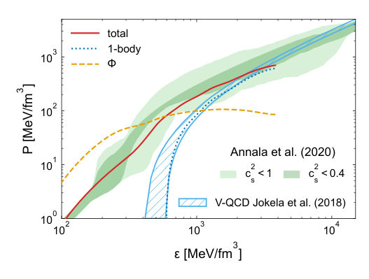 
Figure 4: EoS of cold quark matter against astrophys- ical constraints. Total pressure of charge-neutral beta- equilibrated matter at T = 3 MeV (solid line) and its decomposition into the 1-body (dotted line) and Luttinger– Ward Φ (dashed line) contributions. The 1-body contri- bution is negative below ε ≃0.6 GeV/ fm3 and is not displayed in the logarithmic scale. The green band shows the model-independent region consistent with causality (c2 s ≤1) and astrophysical constraints42, and the blue hatched band shows the V-QCD calculation43 with its un- certainty.

**Summary.** This paper applies advanced quantum many-body theory to model strongly coupled quark matter under the extreme conditions of neutron stars. By extending insights from heavy-ion collisions, the authors predict that the matter in these compact objects is best described as a strongly coupled diquark liquid. The results provide a theoretically consistent Equation of State that aligns with astrophysical observations.

**Why it may be interesting.** While focused on QCD, the use of advanced many-body techniques (T-matrix, self-energy calculations) to determine phase structure and thermodynamic stability in a strongly interacting system shares conceptual overlap with modeling correlated quantum fluids or strongly interacting fermionic systems.

Detailed structure

**Main problem.** The study investigates the properties of strongly coupled quark matter, originally observed in heavy-ion collisions, when subjected to the extreme conditions of high baryon density and low temperature found in neutron stars and their mergers.

**Main result.** The research predicts that under neutron star merger conditions, a strongly coupled diquark liquid prevails in the thermodynamics, and the resulting Equation of State is consistent with current observational constraints on neutron stars.

**Method.** The authors employ quantum many-body theory, specifically utilizing the self-consistent T-matrix approach derived from the Luttinger-Ward-Baym formalism to calculate thermodynamic potentials.

**Model / system.** The system modeled is Quantum Chromodynamics (QCD) matter, treating quark-gluon plasma at varying temperatures and baryon chemical potentials. The calculations incorporate interactions via a separable T-matrix approximation.

**Key observables.** Equation of State (EoS), baryon-number susceptibilities ($\chi_B^{(n)}$), quark pairing instabilities (diquark formation), and the quark self-energy $\Sigma(\omega, p)$.

**Important parameters / regimes.** High baryon density ($\mu_B$), low temperature ($T \approx 3$ MeV), and the comparison to lattice QCD results at $\mu_B=0$.

**Assumptions / limitations.** The calculations rely on the T-matrix resummation technique and the use of a separable interaction model, with the applicability in intermediate density regimes being a noted limitation.

**Figures summary.** Figures illustrate the calibration of susceptibilities against lattice QCD data, the decomposition of pressure into 1-body and correlation contributions, and the analysis of the Thouless determinant to assess diquark condensation.

**Paper structure.** The paper progresses by first establishing the theoretical framework using the T-matrix approach to calculate thermodynamic quantities. It then applies this framework to extrapolate known high-temperature sQGP physics to the high-density, low-temperature regime relevant for compact objects, culminating in EoS predictions.

Abstract

The discovery of the strongly-coupled quark-gluon plasma (sQGP) in high-energy heavy-ion collisions has revealed remarkable properties of matter at high temperature, with transport coefficients close to conjectured bounds from quantum field theory at strong coupling. The high sQGP collision rates imply very large energy uncertainties and the melting of quasiparticle structures. Deploying quantum many-body theory based on the self-consistent $T$-matrix approach for the sQGP at high temperature, we investigate its manifestation at high baryon density and low temperature, as present in neutron stars and their mergers. We constrain the chemical-potential dependence of the quark interaction kernel using first-principles information from Quantum Chromodynamics on baryon-number susceptibilities. Very large collisional widths persist at large density and are found to relegate superconducting phases to rather small temperatures. Instead, a strongly coupled diquark liquid prevails in the thermodynamics under the conditions relevant to neutron-star mergers. At lower densities, the diquarks take over from the single-quark contributions, suggesting a pathway toward hadronization. Our results are consistent with observational constraints on the equation of state of neutron stars, corroborating the presence of strongly coupled quark matter in the interior of these objects.

[↑ back to top](#top)

### [Collinear and noncollinear antiferromagnetic ordering in a highly frustrated decorated square kagomé lattice antiferromagnets of the nabokoite family](http://arxiv.org/abs/2608.29330v1)

**Authors:** V. N. Glazkov, Ya V. Rebrov, M. A. Dubovitskii, M. M. Markina, K. V. Zakharov, A. F. Murtazoev, P. S. Berdonosov, A. N. Vasiliev  
**Type:** both · **Category:** strongly correlated electrons · **PDF:** <https://arxiv.org/pdf/2608.29330v1>  
**Analysis basis:** full PDF text, analyzed in chunks
**Topic relevance:** `analog quantum simulation` **3/5** · `quantum measurements` **1/5**

📷 Fig 1

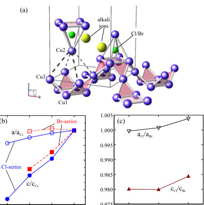 
FIG. 1. (color online) (a) Fragment of nabokoite crystal structure. Only copper, halogen and alkali ions positions are shown. (b) Nabokoites lattice constants normed to the cor- responding constants for Cs/Cl or Cs/Br-compounds. Open symbols — a/aCs, closed symbols — c/cCs. Circles (solid lines) — chlorine series of compounds, squares (dashed lines) — bromine series of compounds. (c) Ratios of the lattice con- stants for the chlorine and bromine nabokoite series. Open symbols — a, closed symbols c.

📷 Fig 2

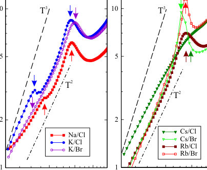 
FIG. 2. (color online) Low-temperature specific heat curves Cp(T) for nabokoite family compounds ACu7(TeO4)(SO4)5X (A=Na, K, Cs, Rb; X=Cl, Br). Left panel: light-alkali- ion nabokoites (A=Na, K). Right panel: heavy-alkali-ion nabokoites (A=Rb, Cs). Vertical arrows marks positions of specific heat peaks corresponding to the low-temperature phase transitions (see Table I). Dashed and dash-dotted lines correspond to T 3 and T 2 dependences expected for 3D and 2D Heisenberg antiferromagnets, correspondingly.

📷 Fig 3

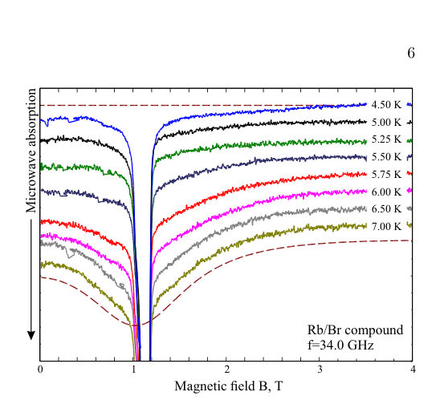 
FIG. 4. (color online) Temperature evolution of the elec- tron spin resonance absorption in the powder sample of RbCu7(TeO4)(SO4)5Br at f = 34.0 GHz. Dashed curve close to the 7.0 K absorption spectrum is a Lorentzian fit of the ESR absorption line above the N´eel point, curve is shifted for clar- ity. Horizontal dashed line over the 4.5 K absorption shows “no absorption” level to highlight broad absorption band at low fields appearing below the N´eel point. Narrow absorption signal at 1.0...1.2 T is a paramagnetic resonance response from a small amount (about 1% per copper ion of nabokoite) of free paramagnetic centers [24].

📷 Fig 4

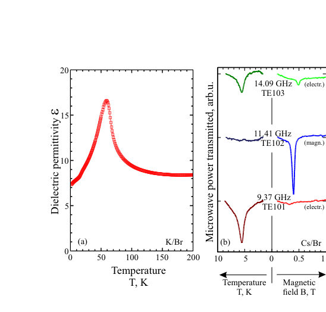 
FIG. 3. (color online) (a) Temperature dependence of the dielectric permittivity ε for KCu7(TeO4)(SO4)5Br. Exper- iment frequency f = 10 kHz. (b) Magnetic resonance at T = 1.7 K (right horizontal semi-axis) and “temperature resonance” at B = 0 (left horizontal semi-axis) demonstrat- ing low-temperature dielectric absorption at magnetic phase transition for CsCu7(TeO4)(SO4)5Br. Sample is placed in the geometrical center of the rectangular microwave cavity, “(electr.)” and “(magn.)” notes mark experiments with the sample positioned in the maximum of microwave electric and magnetic field correspondingly.

📷 Fig 5

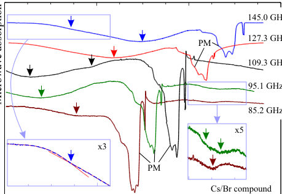 
FIG. 5. (color online) Examples of antiferromag- netic resonance absorption spectra in powder sample of CsCu7(TeO4)(SO4)5Br at high microwave frequencies f &gt; 80 GHz, T = 1.7 K. Vertical arrows marks positions of the observed absorption features: edges of absorption bands or absorption maxima. Irregularly shaped absorption labeled ’PM’ corresponds to the resonance of free paramagnetic cen- ters (about 1% per copper ion of nabokoite). Narrow absorp- tion to the right from ’PM’ absorption is a DPPH marker (g = 2.00). Insets show magnified fragments of absorption spectra to highlight weak features. Left inset highlights weak kink marking right edge of absorption, red curves are empir- ical...

**Summary.** This paper investigates the magnetic ordering in frustrated nabokoite compounds, finding a qualitative difference in the ground state based on the alkali metal ion used. By combining ESR, thermodynamics, and structural analysis, the authors distinguish between conventional collinear and complex noncollinear magnetic patterns. The work highlights how subtle changes in chemical composition can fundamentally alter the magnetic quantum ground state of these frustrated materials.

**Why it may be interesting.** The interplay between structural transitions (ferroelectric) and magnetic ordering in frustrated lattices provides a rich platform for studying quantum phase transitions and emergent magnetic ground states.

Detailed structure

**Main problem.** The study investigates the nature of magnetic ordering (collinear vs. noncollinear) in highly frustrated antiferromagnets.

**Main result.** The magnetic ordering pattern in nabokoite compounds is qualitatively different depending on whether light- or heavy-alkali-ions are present, suggesting the structural/electronic environment dictates the ground state.

**Method.** The research combines multi-frequency electron spin resonance spectroscopy, thermodynamic measurements (specific heat, magnetization), and finite-size cluster modeling.

**Model / system.** The system is the nabokoite family of compounds, $	ext{ACu}_7(	ext{TeO}_4)(	ext{SO}_4)_5	ext{X}$, which feature frustrated 2D square kagomé lattice layers.

**Key observables.** Antiferromagnetic resonance modes, specific heat anomalies, magnetization curves, and dielectric permittivity transitions.

**Important parameters / regimes.** The choice of alkali ion (light vs. heavy) and the critical closeness of exchange coupling parameters to quantum ground state boundaries.

**Assumptions / limitations.** The choice of ordering pattern is hypothesized to be pre-determined by high-temperature dielectric transitions, and modeling relies on averaging over random powder orientations.

**Figures summary.** Figures illustrate crystal structure, lattice constant ratios, and show characteristic AFMR patterns and specific heat/dielectric anomalies marking phase transitions.

**Paper structure.** The paper systematically compares magnetic behavior across different alkali-ion subfamilies, using multiple experimental techniques to characterize the transition from frustrated states to either collinear or noncollinear magnetic order.

Abstract

Nabokoite family compounds ACu$_7$(TeO$_4$)(SO4)$_5$X (A=Na, K, Rb, Cs; X=Cl, Br) host frustrated 2D square kagom'{e} lattice layers decorated by additional inter-layer magnetic ions. We study magnetic order in nabokoites with multi-frequency electron spin resonance spectroscopy and thermodynamic measurement (specific heat, magnetization and dielectric permittivity). Our study reveals that the choice of the low-temperature ground state is qualitatively different in light-alkali-ion (K, Na) and heavy-alkali-ion (Rb, Cs) compounds. Heavy-alkali-ion nabokoites order in conventional collinear antiferromagnetic pattern with easy-axis anisotropy. The parameters of the ordered antiferromagnetic state are very close for all heavy-alkali-ion subfamily. Light-alkali-ion members of nabokoite family demonstrate much more complicated route to the ordered state: firstly, a ferroelectric transition at 25-90K lifts the frustration and thus pre-cooks the low-temperature ordering; secondly, an unusual noncollinear magnetic order develops via two-step phase transition with first transition temperature $T_{c1}\simeq 5-6$K and the second transition at $T_{c2}\simeq 3-4$K. Noncollinear order is evidenced by observation of characteristic non-Larmor antiferromagnetic resonance mode. Spin dynamics of light-alkali-ion nabokoites is characterized by three zero-field magnon gaps and two spin-reorientation fields, the values of magnon gaps and critical fields are quite different for different compounds. The finite-size cluster modeling of pyramidal structural block of nabokoite structure combined suggests that the critical closeness of the nabokoite exchange coupling parameters to the border-line between the different quantum ground state of pyramidal building block of nabokoite structure could be the clue to the choice of qualitatively different ordered state in light- and heavy-alkali-ion nabokoites.

[↑ back to top](#top)

### [Evolving charge order in the CDW state of AV$_3$Sb$_5$ metals](http://arxiv.org/abs/2608.29142v1)

**Authors:** Anshu Kataria, Francis Pratt, Peter J. Baker, Stephen Cottrell, Miki Bonacci, Andrea Capa Salinas, Stephen D. Wilson, Zurab Guguchia, Samuele Sanna, Pietro Bonfà  
**Type:** experiment · **Category:** strongly correlated electrons · **PDF:** <https://arxiv.org/pdf/2608.29142v1>  
**Analysis basis:** full PDF text, analyzed in chunks
**Topic relevance:** `quantum measurements` **3/5** · `Frenkel-Kontorova` **1/5**

📷 Fig 1

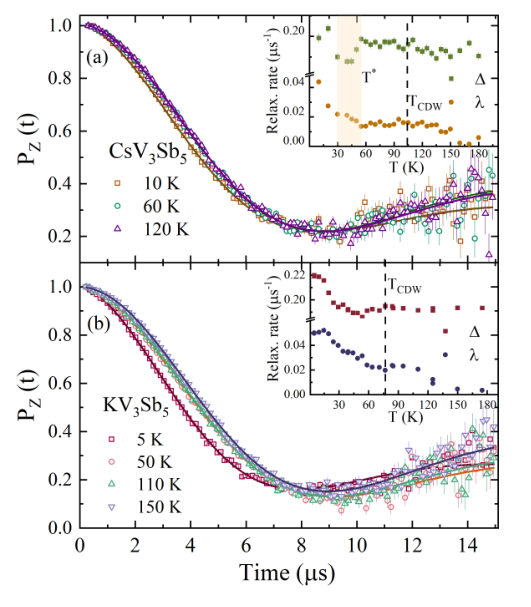 
FIG. 1. ZF muon asymmetry, normalized to one, for (a) CsV3Sb5 and (b) KV3Sb5 at different temperatures. Data in panel (a) are from [54]. The solid lines are best fit to the Eq. 1. The insets show the relaxation rates, ∆and λ, as a function of the temperature. The dashed vertical lines in the insets represent the CDW transitions and the shaded re- gion for CsV3Sb5 represents the temperature range over which the relaxation varies and anomalies are observed in ALC measurements.

📷 Fig 2

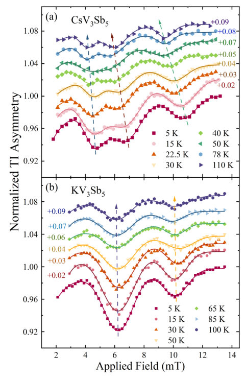 
FIG. 2. Normalized TI asymmetry variation with applied field at different temperatures up to above the TCDW for (a) CsV3Sb5 and (b) KV3Sb5. Temperature-dependent resonance spectra are vertically shifted by the amounts reported in the picture for clarity. The solid colored lines represent the best fit using Eq. 2. The dashed arrow lines are guides to the eye to showcase the variation of resonance fields with increasing temperature.

📷 Fig 3

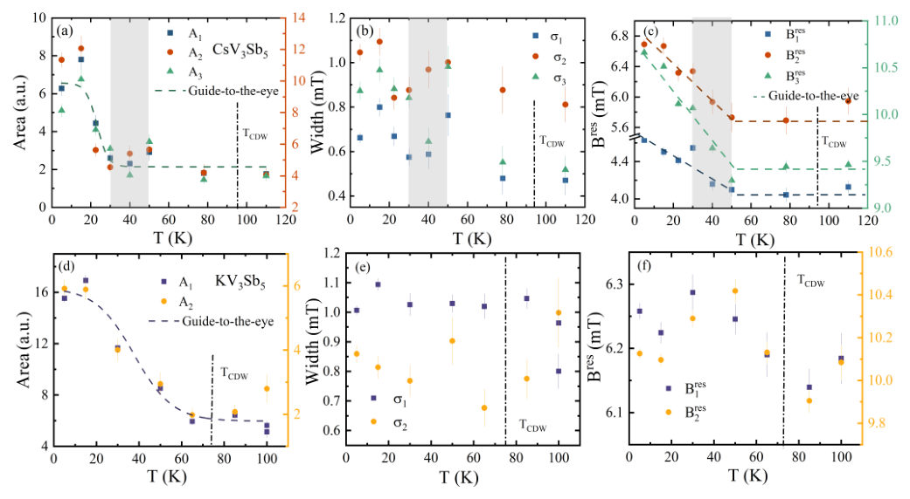 
FIG. 3. The top panel shows the temperature dependence of the fitting parameter for the CsV3Sb5 system, (a) area (b) width and (c) resonant field of three resonances. The bottom panel presents the same fitting parameters for KV3Sb5 system. The dashed lines, color coded according to the respective parameters, serve as guide-to-the-eye for visualizing their temperature-dependent evolution. The vertical black dot-dashed line indicates the CDW transition temperature, TCDW. Finally, the shaded region in panels (a-c) corresponds to the temperature range where anomalies are observed in both ZF and ALC µSR measurement.

📷 Fig 4

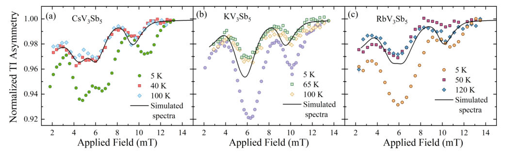 
FIG. 4. Experimental and simulated ALC-µSR spectra, considering the cluster of the nearest Sb atom and other six nearest V atoms (see SM) roughly forming a hexagon around the muon stopping site for (a) CsV3Sb5, (b) KV3Sb5 and (c) RbV3Sb5 (data from [53]). The y-axis represents the (normalized) time-integrated asymmetry.

📷 Fig 5

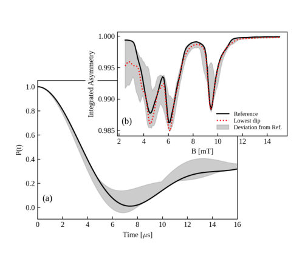 
FIG. 5. Perturbation induced by local fields at the muon and V sites on ZF and ALC measurements. The black line shows the results obtained with the minimal model described in the text. The shaded area highlight the changes induced by the presence of local (hyper- fine) fields of electronic origin at the muon and the V nuclei. The dotted red line in panel (b) shows the one simulation with the lowest dip resulting from the presence of local fields.

**Summary.** This work uses muon-spin spectroscopy ($\mu	ext{SR}$) on $	ext{AV}_3	ext{Sb}_5$ kagome metals to investigate the electronic state preceding superconductivity. The key finding is the evidence for an additional charge modulation within the $	ext{CDW}$ phase, detected via $	ext{ALC}$ muon-spin spectroscopy. This suggests that the electronic order is more complex than previously modeled by magnetic field effects alone.

**Why it may be interesting.** The use of highly sensitive local probes like $\mu	ext{SR}$ to detect subtle, temperature-dependent charge modulations within a complex correlated electronic state is relevant to understanding emergent quantum phases.

Detailed structure

**Main problem.** The study aims to elucidate the poorly understood electronic state in $	ext{AV}_3	ext{Sb}_5$ kagome metals that exists immediately preceding the superconducting phase.

**Main result.** The $	ext{ALC}$-$\mu	ext{SR}$ results point towards an additional charge modulation occurring within the Charge Density Wave ($	ext{CDW}$) phase at temperatures $T^* < T_{	ext{CDW}}$ for $	ext{A} = 	ext{Cs}$ and $	ext{Rb}$.

**Method.** The research employs Avoided Level Crossing ($	ext{ALC}$) muon-spin spectroscopy ($\mu	ext{SR}$) and Zero Field ($	ext{ZF}$)-$\mu	ext{SR}$ measurements to probe local electronic environments.

**Model / system.** The physical system is the $	ext{AV}_3	ext{Sb}_5$ family of kagome metals ($	ext{A} = 	ext{K}, 	ext{Rb}, 	ext{Cs}$), which exhibit intertwined electronic and structural orders, including a $	ext{CDW}$ state.

**Key observables.** Muon spin relaxation rate ($\lambda$ and $\Delta$), $	ext{ALC}$ resonance dips (time-integrated asymmetry), and the temperature dependence of these observables.

**Important parameters / regimes.** The transition temperatures $T^*$ and $T_{	ext{CDW}}$, and the applied low longitudinal magnetic field ($	ext{LF}$).

**Assumptions / limitations.** The interpretation requires considering an additional electronic mechanism beyond simple internal magnetic field contributions to explain the observed $	ext{ALC}$ transition.

**Figures summary.** Figures illustrate the temperature dependence of $	ext{ZF}$ muon asymmetry and $	ext{ALC}$-$\mu	ext{SR}$ resonance dips for $	ext{CsV}_3	ext{Sb}_5$ and $	ext{KV}_3	ext{Sb}_5$, showing field shifts and resonance area changes.

**Paper structure.** The paper analyzes $	ext{ALC}$-$\mu	ext{SR}$ and $	ext{ZF}$-$\mu	ext{SR}$ data across different alkali metals ($	ext{A}$), focusing on the temperature evolution of spectral features near the $	ext{CDW}$ transition to pinpoint the origin of an additional electronic modulation.

Abstract

AV$_3$Sb$_5$ kagome metals are characterized by intertwined electronic and structural orders, which motivated extensive studies in recent years. Yet the details of the electronic state preceding the superconducting phase remain poorly understood. Here we extend our previous investigation [Phys. Rev. Research 7, L032046 (2025)] of RbV$_3$Sb$_5$ using avoided level crossing (ALC) muon-spin spectroscopy to the $A$ = Cs and K systems. Consistent with our previous study, we identify a second transition whose origin cannot be attributed solely to an internal magnetic field, indicating the involvement of an additional electronic mechanism that subtly modifies the charge distribution within the V plane. In particular, the ALC results point towards an additional charge modulation taking place within the charge density wave (CDW) phase and occurring at $T^{*}<T_{CDW}$ for $A$ = Cs and Rb, or in the vicinity of $T_{CDW}$ for $A$ = K.

[↑ back to top](#top)

### [Exact Entanglement Swapping through Single-Occupancy Measurements in Gaussian Fermion States](http://arxiv.org/abs/2608.29933v1)

**Authors:** Jiyuan Fang  
**Type:** theory · **Category:** quantum information and computing · **PDF:** <https://arxiv.org/pdf/2608.29933v1>  
**Analysis basis:** full PDF text, analyzed in chunks
**Topic relevance:** `quantum measurements` **3/5** · `analog quantum simulation` **1/5**

📷 Fig 1

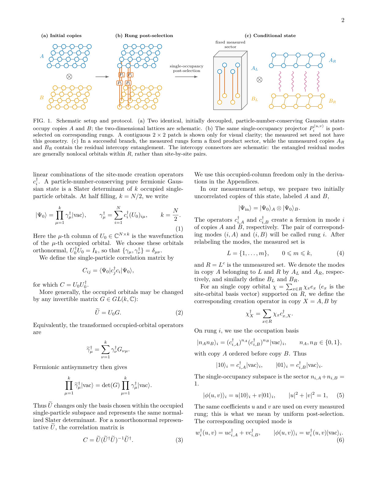 
Low-resolution page preview, page 2

📷 Fig 2

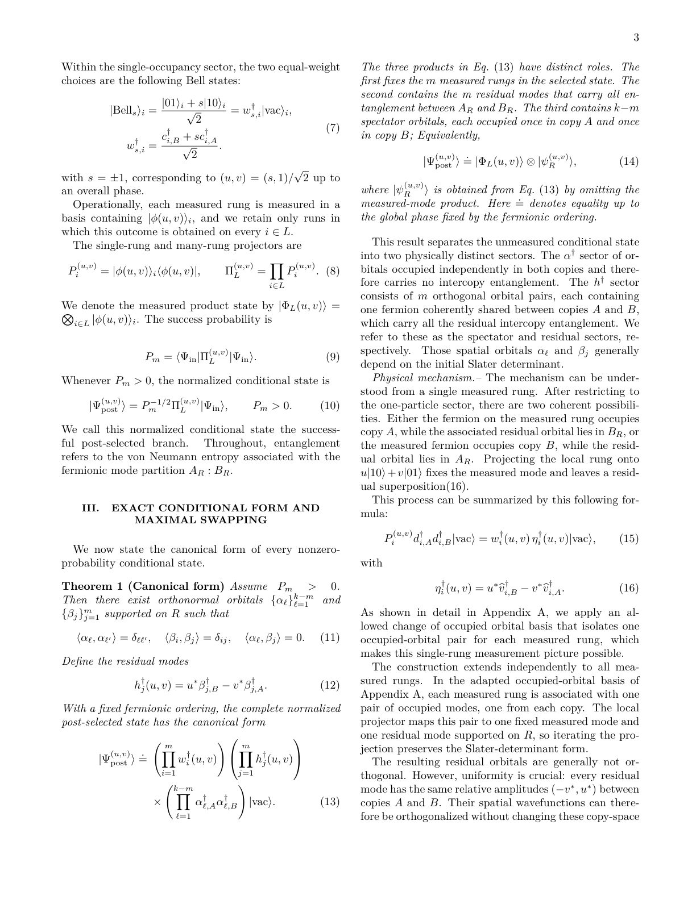 
Low-resolution page preview, page 3

📷 Fig 3

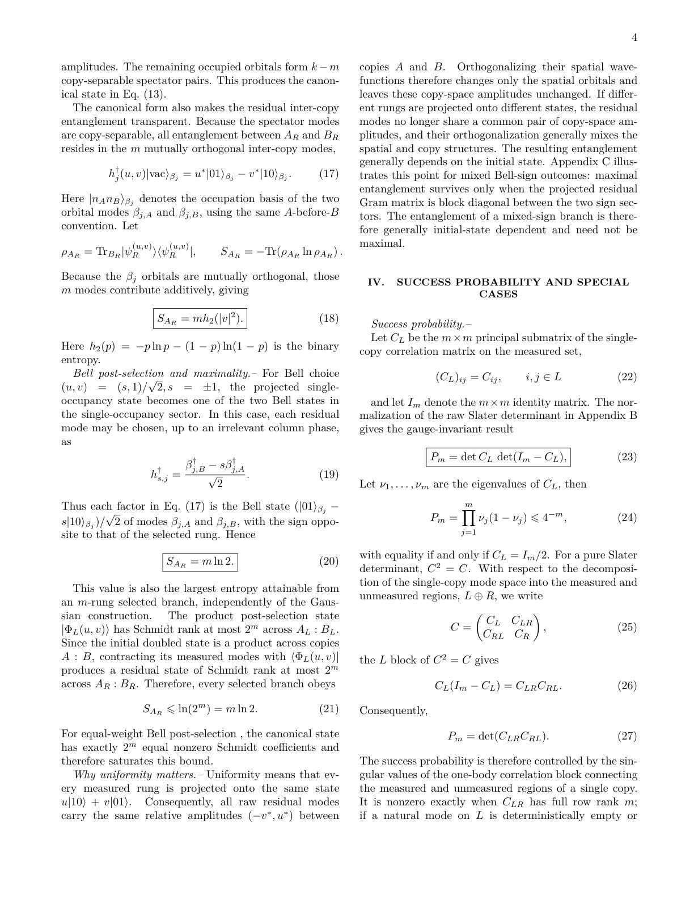 
Low-resolution page preview, page 4

📷 Fig 4

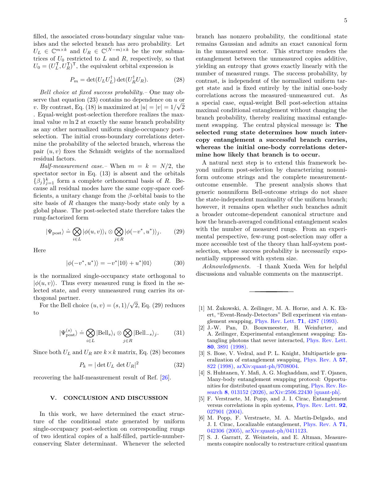 
Low-resolution page preview, page 5

📷 Fig 5

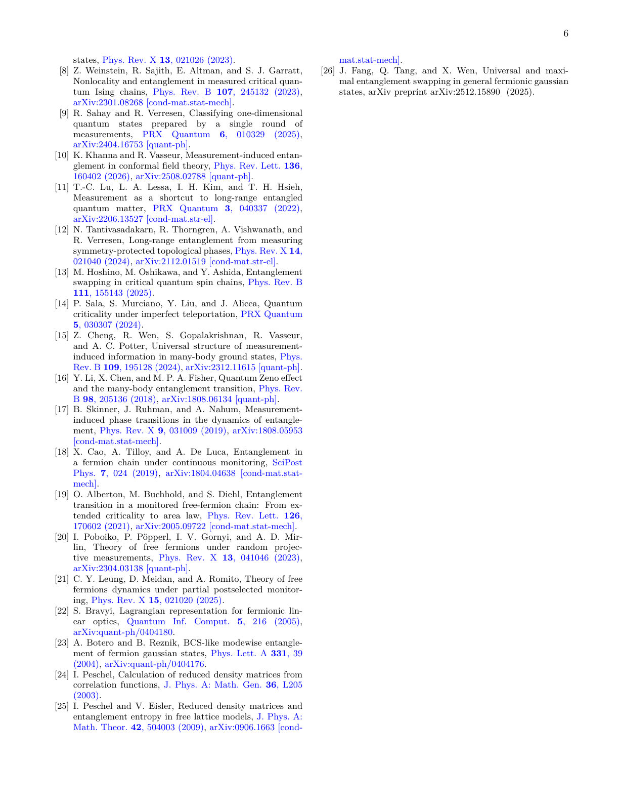 
Low-resolution page preview, page 6

**Summary.** This work analyzes entanglement swapping in two copies of a free fermion Gaussian state by performing single-occupancy measurements on multiple rungs. It proves that the resulting entanglement entropy in the unmeasured parts is universal, depending only on the measurement parameters. The methodology involves advanced fermionic field theory techniques to isolate the residual entangled modes.

**Why it may be interesting.** The result shows that entanglement swapping in this fermionic setting yields a universal entropy formula, providing a clean, analytically tractable model for entanglement manipulation beyond simple qubit systems.

Detailed structure

**Main problem.** The paper determines the exact entanglement structure of the conditional state resulting from measuring specific rungs in two identical copies of a free fermion Gaussian state.

**Main result.** The entanglement entropy between the unmeasured parts of the two copies is found to be $S = m h_2(|v|^2)$, which is universal and independent of the initial state.

**Method.** The analysis uses projection operators and canonical transformations on the fermionic state to separate the unmeasured system into residual and spectator modes.

**Model / system.** The system consists of two identical copies of a half-filled free fermion Gaussian state, analyzed by post-selecting a specific single-occupancy state on $m$ measured rungs.

**Key observables.** Entanglement entropy ($S$), Success Probability ($P_m$), and the conditional state $|\Psi(u,v)_{	ext{post}}
angle$.

**Important parameters / regimes.** Number of measured rungs ($m$), the single-occupancy state parameters ($u, v$), and the initial correlation structure.

**Assumptions / limitations.** The analysis assumes the success probability $P_m$ is non-zero, and relies on constructing an adapted occupied-orbital basis via Gram-Schmidt orthogonalization.

**Figures summary.** Figure 1 schematically illustrates the process: initial copies, single-occupancy post-selection on rungs, and the resulting conditional state structure.

**Paper structure.** The paper develops the mathematical framework by adapting the occupied-orbital basis (Appendix A), calculating the success probability using determinants (Appendix B), and analyzing the residual entanglement entropy (Appendix C).

Abstract

We determine the exact entanglement structure of the conditional state obtained by measuring $m$ corresponding rungs ($m\leq N/2$) in two identical copies of an arbitrary half-filled free fermion Gaussian state and post-selecting the same normalized single-fermion state ($|ψ\rangle = u|10\rangle+v|01\rangle$, where 0 and 1 denote the fermion occupancy on each sites) on each rung. For $m<N/2$, the conditional wavefunction generally depends on the initial state. Nevertheless, whenever the selected outcome has nonzero probability, the state on the unmeasured sites remains Gaussian and factorizes exactly into $N-m$ different orthogonal modes including $m$ inter-copy entangling modes and $N-2m$ spectator modes localized in one copy. Consequently, the entanglement entropy between the unmeasured parts of the two copies is $S=m h_2(|v|^2)$, independent of the initial state, where $h_2(x)=-x\ln x-(1-x)\ln(1-x)$. The success probability is given by $P_m=\det C_L\det(I_m-C_L)=\det(C_{LR}C_{RL})$, determined solely by the initial correlations and independent of ($u$,$v$). Equal-weight Bell post-selection serves as a special case that achieves the maximal entanglement swapping.

[↑ back to top](#top)

### [Homogeneous attractive Bose-Einstein condensates with repulsive three-body interactions: the two-dimensional case](http://arxiv.org/abs/2608.29875v1)

**Authors:** Dinh-Thi Nguyen  
**Type:** theory · **Category:** quantum gases · **PDF:** <https://arxiv.org/pdf/2608.29875v1>  
**Analysis basis:** full PDF text, analyzed in chunks
**Topic relevance:** `analog quantum simulation` **3/5** · `Keldysh / 2PI / non-Gaussian methods` **1/5**

📷 Fig 1

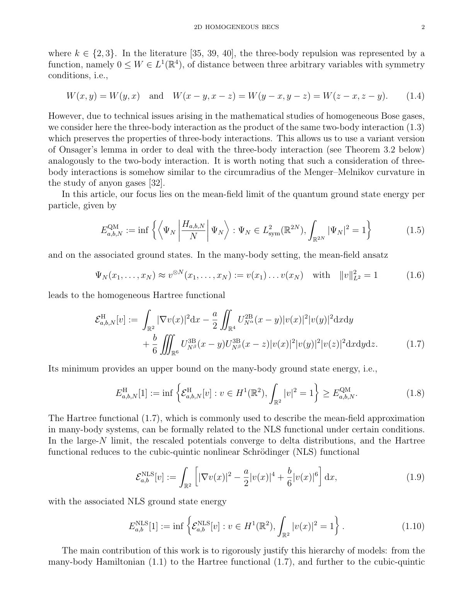 
Low-resolution page preview, page 2

📷 Fig 2

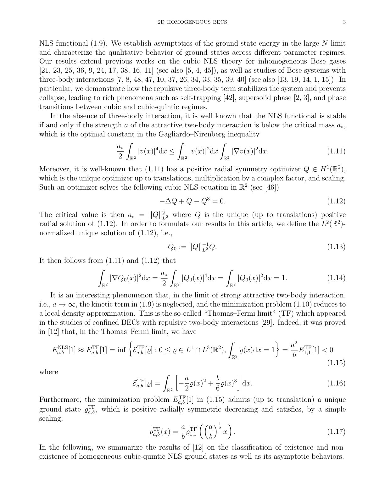 
Low-resolution page preview, page 3

📷 Fig 3

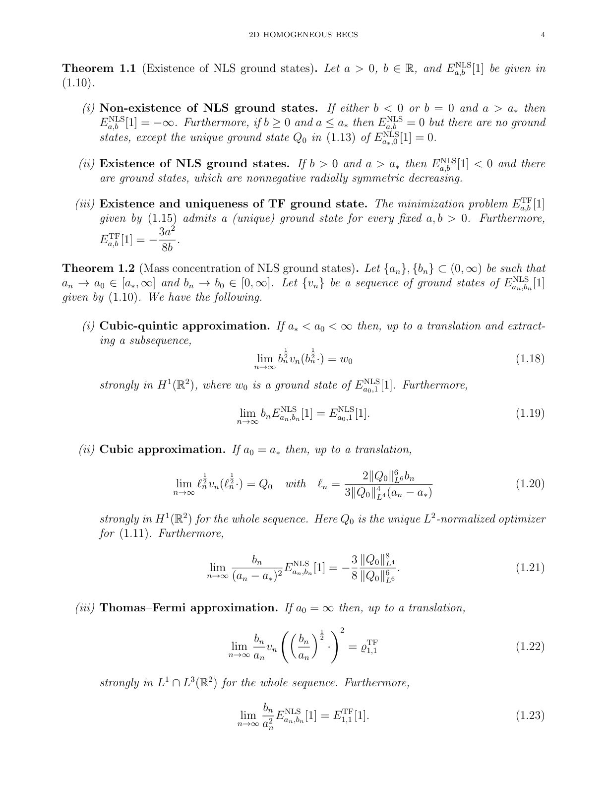 
Low-resolution page preview, page 4

📷 Fig 4

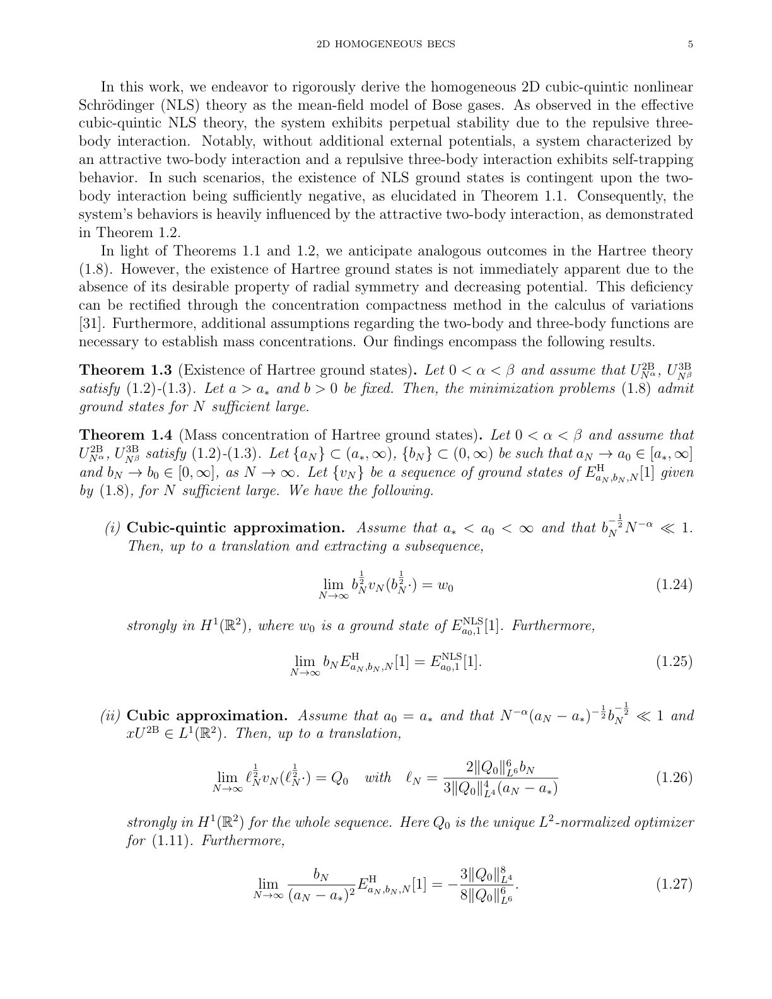 
Low-resolution page preview, page 5

📷 Fig 5

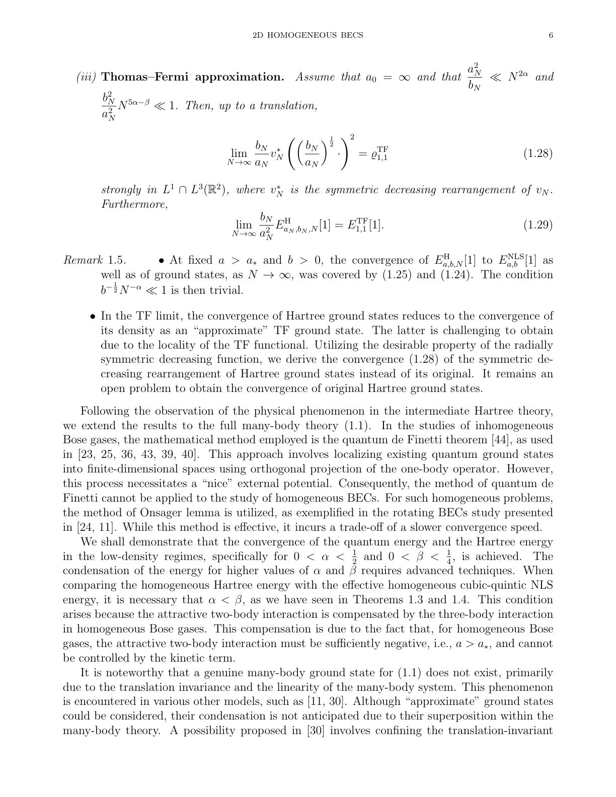 
Low-resolution page preview, page 6

**Summary.** This paper investigates a Bose gas in 2D with both attractive two-body and repulsive three-body interactions. It uses the Hartree theory to derive the effective cubic-quintic nonlinear Schrödinger equation governing the mean-field limit. The core contribution is establishing the mathematical conditions under which the quantum ground state energy converges to known limiting forms, such as the Thomas-Fermi or pure NLS solutions.

**Why it may be interesting.** This work provides a detailed mathematical framework for understanding the mean-field behavior of interacting quantum gases, particularly when multiple interaction terms (two-body and three-body) are present, which is crucial for modeling real-world ultracold atomic systems.

Detailed structure

**Main problem.** To rigorously derive the homogeneous cubic-quintic nonlinear Schrödinger (NLS) functional as the mean-field limit of a quantum many-body Hamiltonian describing a Bose gas.

**Main result.** The paper establishes conditions for the existence of NLS ground states and derives the asymptotic limits of the quantum ground state energy, showing convergence to cubic-quintic, cubic, or Thomas-Fermi approximations.

**Method.** The analysis employs the intermediate Hartree theory and rigorous asymptotic analysis by taking the large-$N$ limit under various scaling assumptions for the interaction parameters.

**Model / system.** The system is a homogeneous Bose gas of $N$ identical bosons in two dimensions ($\mathbb{R}^2$) characterized by both an attractive two-body interaction and a repulsive three-body interaction.

**Key observables.** Ground state energy per particle ($E_{QM}$), the NLS ground state energy ($E_{	ext{NLS}}$), and the Thomas-Fermi (TF) energy functional.

**Important parameters / regimes.** Interaction strengths ($a$ for two-body, $b$ for three-body), the number of particles ($N$), and critical interaction values ($a^*$).

**Assumptions / limitations.** The derivation of the NLS functional requires the large-$N$ limit, and the analysis relies on specific scaling regimes for the interaction parameters.

**Paper structure.** The paper proceeds by first deriving the mean-field NLS functional from the full Hamiltonian using the Hartree ansatz, followed by establishing theorems regarding the existence of ground states and analyzing the convergence of the quantum energy to various mean-field limits (Cubic-quintic, Cubic, TF).

Abstract

We consider a homogeneous Bose gas composed of $N$ identical bosons occupying an infinite two-dimensional space. This gas exhibits both an attractive two-body interaction and a repulsive three-body interaction. Via the intermediate Hartree theory, we rigorously derive the homogeneous cubic-quintic nonlinear Schroedinger functional as the mean-field limit of the model. Our investigation focuses on the system's behavior in relation to the two-body interaction.

[↑ back to top](#top)

### [Overcoming critical slowing down in frustrated spin systems by learned multiscale sampling](http://arxiv.org/abs/2608.31114v1)

**Authors:** Gabriele Bandini, Giulio Biroli, Patrick Charbonneau, Andrea Gambassi  
**Type:** theory · **Category:** statistical mechanics · **PDF:** <https://arxiv.org/pdf/2608.31114v1>  
**Analysis basis:** full PDF text, analyzed in chunks
**Topic relevance:** `analog quantum simulation` **3/5** · `methods for driven-dissipative` **1/5**

📷 Fig 1

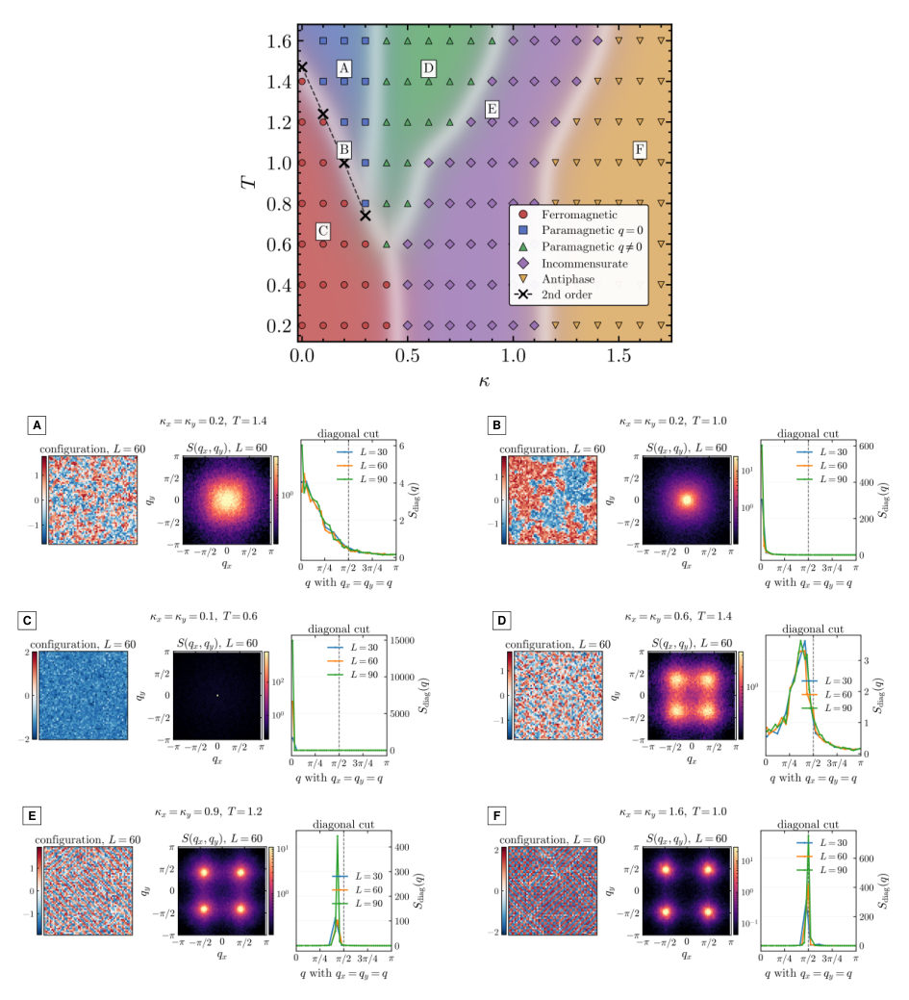 
FIG. 1. Phase diagram of the sBNNNI model with λ = 1 and representative behaviors in the various phases. Top: Phase diagram in the (κ, T) plane obtained from Monte Carlo simulations. The five phases (different colored zones) are identified from the behavior and finite-size scaling of the structure factor S(qx, qy) (see Sec. II), sampled at the points indicated by symbols in the phase diagram. While the faint boundaries between the various phases are approximate guides to the eyes, the Ising-like ferromagnetic-to-paramagnetic phase transition was quantitatively determined via finite-size scaling of the magnetic susceptibility using Ising critical exponents (black crosses, see App. B). Note...

📷 Fig 2

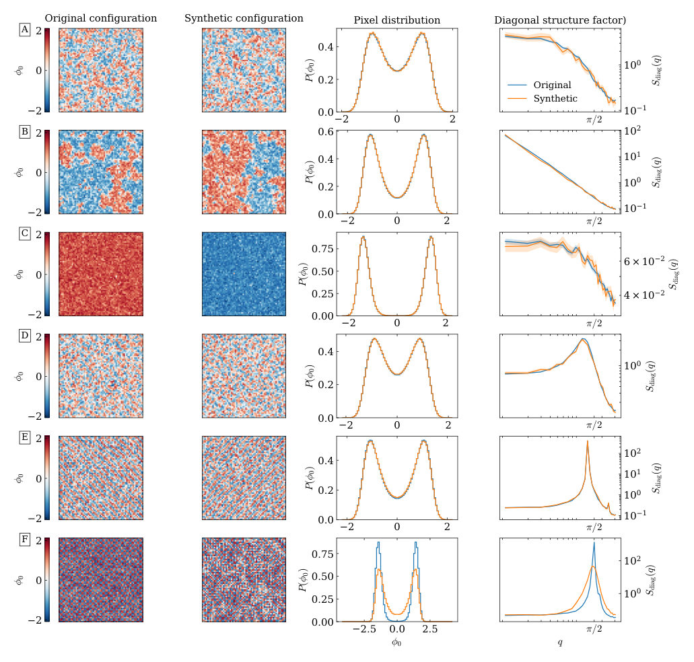 
FIG. 2. Comparison between Monte Carlo configurations and samples generated through WCRG for representative points of the sBNNNI phase diagram (A–F in Fig. 1). Subsequent rows correspond to a point—from top to bottom: (A) in the PM phase, (B) along the Ising critical line, (C) in the FM phase, (D) in the MPM phase, (E) in the IC phase, and (F) in the AF phase. For each point, the panels display: (1st column) an original Monte Carlo configuration, (2nd column) a synthetic configuration reconstructed through recursive conditional sampling, the comparison between the original (blue) and the reconstructed (yellow) distributions of (3rd column) P(ϕ0(i)) and (4th column) the diagonal structure...

📷 Fig 3

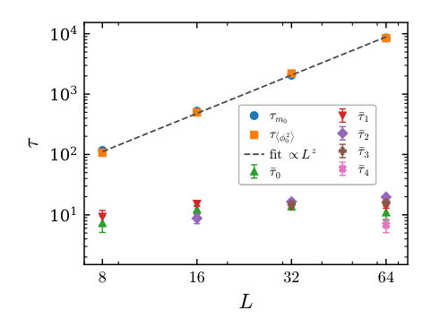 
FIG. 4. Autocorrelation times at the Ising-like critical point of the sBNNNI model with κ = 0.2 and T = Tpc(L). For local Monte Carlo dynamics, the autocorrelation times of the magnetization m0 and of the second moment ⟨ϕ2 0⟩grow al- gebraically with system size. The dashed line shows a power- law fit, yielding zloc = 2.11(4). By contrast, the conditional autocorrelation times ¯τj(L), measured for the second moment of the reconstructed field during conditional wavelet sampling at scale j, remain of order unity. No systematic growth is ob- served either with the final microscopic size L or with the scale-dependent size Lj = L/2j.

📷 Fig 4

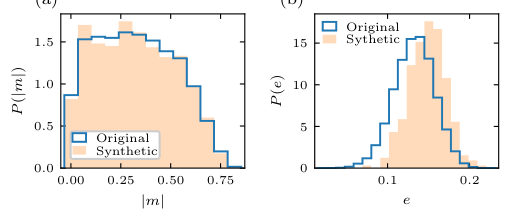 
FIG. 5. Comparison between the statistics of configuration-wide observables for original and synthetic con- figurations along the Ising-like critical point of the sBNNNI model, with κ = 0.2, T = 1.0, and L = 64. Distribution of (a) the absolute magnetization |m| and (b) the intensive micro- scopic energy e. While the former shows excellent agreement between original and synthetic samples the latter presents a visible mismatch. This discrepancy reflects the truncation of the exact multiscale effective energies entering the hierarchi- cal probability distribution of the WCRG.

📷 Fig 5

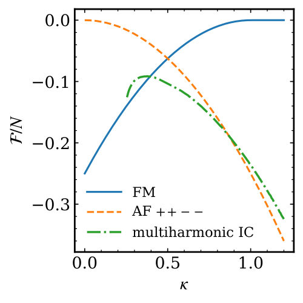 
FIG. 6. Reduced functional density F/N of the FM state (solid line), period-four antiphase (dashed line), and multihar- monic IC profile (dash-dotted line). The IC branch is shown for κ ≥1/4, where q⋆in Eq. (A10) is real. Within the vari- ational families considered, it has the lowest leading energy approximately for 0.393 ≲κ ≲0.869. Since F is indepen- dent of T and λ, the profiles and crossing points are universal within the leading low-temperature scaling problem.

**Summary.** This work introduces the Wavelet Conditional Renormalization Group (WCRG) method to simulate frustrated spin systems that are intractable for standard cluster algorithms. By learning the conditional probability distributions across multiple coarse-graining scales, WCRG achieves highly efficient sampling, bypassing critical slowing down. This demonstrates that learned multiscale sampling is a robust technique for complex statistical physics problems.

**Why it may be interesting.** The development of learned multiscale sampling techniques provides a powerful, generalizable tool for simulating complex, frustrated many-body systems where standard simulation methods break down due to critical slowing down.

Detailed structure

**Main problem.** The paper addresses the challenge of critical slowing down in simulating frustrated spin systems, a problem where conventional cluster Monte Carlo algorithms fail.

**Main result.** The proposed Wavelet Conditional Renormalization Group (WCRG) method successfully overcomes this limitation, achieving an overall sampling complexity of O(log^2 L) at an Ising-like critical point.

**Method.** WCRG samples the system distribution recursively by learning and sampling conditional probability distributions of wavelet coefficients across multiple coarse-graining scales.

**Model / system.** The study uses a frustrated two-dimensional soft-spin model, specifically the soft-spin BNNNI (sBNNNI) model, characterized by competing interactions.

**Key observables.** Local-field distribution, structure factor S(qx, qy), and the autocorrelation time ($	au$) of the dynamics.

**Important parameters / regimes.** The system is analyzed across a phase diagram defined by parameters like $\lambda$, $\kappa_x$, and $\kappa_y$.

**Assumptions / limitations.** The accuracy of the fast sampling scheme relies on the expressiveness of the energy-based model (finite ansatz) used to estimate the wavelet conditional distributions, leading to a potential mismatch with the true microscopic energy.

**Figures summary.** Figure 1 illustrates the phase diagram of the sBNNNI model and shows representative configurations, averaged structure factors, and diagonal cuts for various points in the phase diagram.

**Paper structure.** The paper first introduces the failure of conventional cluster algorithms in frustrated systems. It then details the WCRG method, which decomposes the distribution using wavelets and learns conditional distributions via score matching. Finally, it demonstrates the method's efficiency by comparing the scaling of decorrelation time against standard local MCMC methods.

Abstract

Cluster algorithms, such as the Swendsen--Wang and Wolff methods, are among the most successful MCMC methods for mitigating critical slowing down in statistical systems. These constructive cluster algorithms, however, fail in the presence of even extremely weak frustration. Here, we sidestep this fundamental limitation by learning rather than constructing the relevant clusters. Specifically, we use the wavelet conditional renormalization group (WCRG) sampling method to learn the probability distribution of collective fluctuations of a frustrated two-dimensional soft-spin model. Configurations are then generated recursively from coarse to fine scales by sampling conditional wavelet distributions. The WCRG method reproduces the main statistical properties of the system across different phases, including the local-field distribution and the structure factor. At an Ising-like critical point, the conditional dynamics remains decorrelated within $\mathcal{O}(1)$ sweeps at each scale, yielding an overall sampling complexity of $\mathcal{O}(\log_2 L)$, thus making WCRG much more efficient than standard local MCMC methods. These results show that learned multiscale sampling can overcome critical slowing down in frustrated systems for which conventional cluster algorithms fail. By assessing the sampling accuracy of different observables, we also clarify the main tradeoff of the WCRG method: the accuracy of the fast sampling scheme depends on the expressiveness of the energy-based model used to estimate the wavelet conditional distributions.

[↑ back to top](#top)

### [Static-Field Shielding of Bosonic Molecules: Evaporation to Degeneracy and Self-Bound Droplets](http://arxiv.org/abs/2608.31116v1)

**Authors:** Jongheum Jung, Laura Futamura, Matteo Ciardi, Jason Rosenberg, Youssef Aziz Alaoui, Yukai Lu, Thomas Pohl, Waseem S. Bakr  
**Type:** both · **Category:** quantum gases · **PDF:** <https://arxiv.org/pdf/2608.31116v1>  
**Analysis basis:** full PDF text, analyzed in chunks
**Topic relevance:** `analog quantum simulation` **3/5** · `correlated / nonlocal dissipation` **1/5**

📷 Fig 1

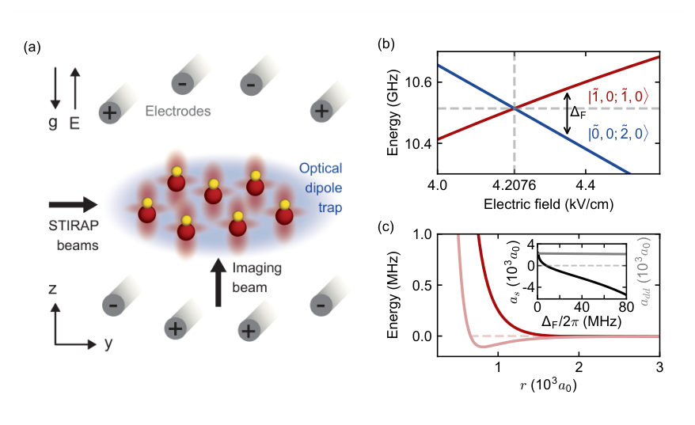 
FIG. 1. Static electric field shielding above a F¨orster resonance. (a) Experimental setup. An eight-rod electrode configuration in vacuum enables precise tuning of the electric field at the molecular gas while supporting a numerical aperture NA = 0.5 imaging system [12]. The red shaded regions represent the repulsive shielding barriers experienced by the molecules. (b) Energy levels of the |˜1, 0; ˜1, 0⟩(red) and |˜0, 0; ˜2, 0⟩(blue) pair states near the F¨orster resonance at 4.2076 kV/cm. The vertical dashed line indicates the field corresponding to the F¨orster resonance. (c) Adiabatic interaction potentials for the asymptotic incoming channel |˜1, 0; ˜1, 0⟩with partial wave L = 0....

📷 Fig 2

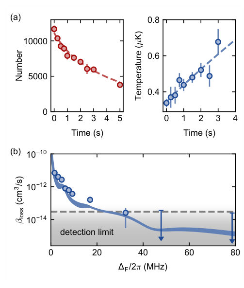 
FIG. 2. Two-body loss rate coefficients βloss. (a) Number (left) and temperature (right) of molecules as functions of holding time for ∆F = 2π × 17 MHz. Each point is obtained by averaging over 15 shots. Error bars of the number of molecules show 1σ standard error of the mean. Error bars of the temperature of molecules show the 1σ error from the fit of the time-of-flight expansion. (b) βloss at different F¨orster defects ∆F. The blue shaded region represents the range of theoretical two-body loss-rate coefficients obtained from coupled-channel calculations after thermal averaging at temperatures between 0.4 µK and 1 µK, corresponding to the temperature range sampled during our two-body-loss...

📷 Fig 3

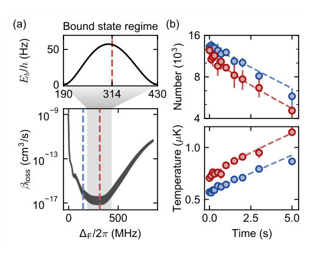 
FIG. 3. Three-body loss. (a) Two-body loss-rate coefficient βloss (lower) and bound-state energy Eb (upper) as functions of the F¨orster defect ∆F. In the lower plot, the dark gray shaded region shows the calculated βloss for collision energies ranging from 0.1 µK to 1 µK. The light gray shaded region indicates the range of ∆F over which a bound state exists, which is expanded in the upper plot. We choose two electric fields: one outside the bound-state regime, ∆F/2π = 146 MHz (blue), and one within the bound-state regime, ∆F/2π = 314 MHz (red), where the bound-state energy is Eb/h = 60 Hz. (b) Fits to the molecule number and temperature as functions of hold time in the ODT. At ∆F/2π = 146...

📷 Fig 4

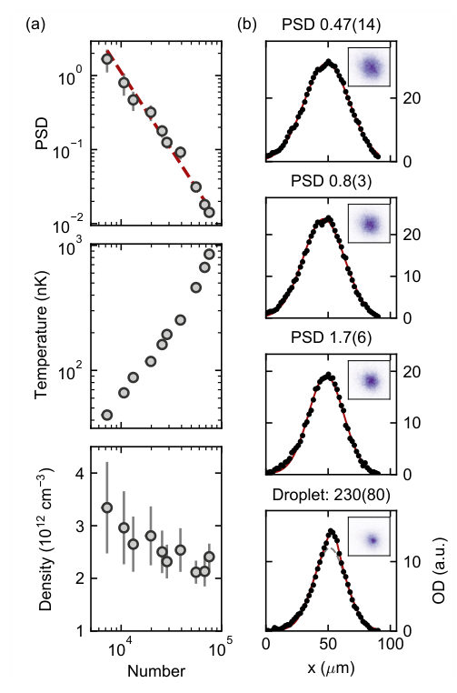 
FIG. 4. Evaporation curve of molecules at ∆F/2π = 17 MHz. (a) Phase-space density (PSD, upper), temperature (center), and peak density (lower) versus molecule number. The red dashed line is a linear fit on log–log scales used to extract the evaporation efficiency. Each data point is an average of three to five consecutive shots. Error bars are 1σ standard error of the mean. (b) One-dimensional optical- density (OD) profiles at different stages of evaporation, obtained by integrating the two-dimensional OD distributions along the y axis. Images are taken after 6 ms time of flight. The corresponding PSD is indicated above each profile, with averaged two-dimensional OD images shown in the...

📷 Fig 5

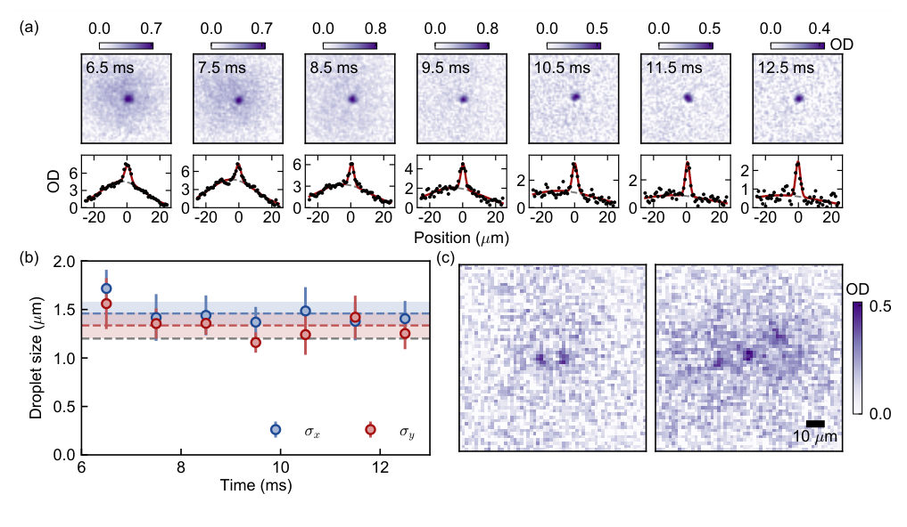 
FIG. 5. Cloud size of a self-bound droplet at different time-of-flight (ToF). (a) Each column shows an absorption image of the molecular cloud (top) and a 1D profile (integrated along the y axis) of absorption images (bottom) after different ToF. The ToF is shown in the upper-left corner of each image. Bimodal fits are shown as solid red lines, whereas Gaussian fits to the thermal cloud are shown as dashed gray lines. We fit each two-dimensional density distribution to a sum of two Gaussian functions. Each image is averaged over 10 shots. Each color bar is self-normalized. (b) Gaussian 1/e1/2 radii of the droplet, σx and σy, as functions of ToF. Red (σx) and blue (σy) dashed lines indicate...

**Summary.** This paper reports on using static electric fields to achieve Förster shielding in bosonic dipolar molecules, effectively suppressing molecular loss channels. By operating in a specific field window, the researchers enabled efficient evaporative cooling to quantum degeneracy and successfully observed the formation of self-bound quantum droplets. This establishes a robust, single-field technique for preparing and studying highly correlated quantum matter.

**Why it may be interesting.** This work provides a highly controllable, single-field mechanism (Förster shielding) to manage the complex loss channels (two-body and three-body) inherent in highly interacting dipolar quantum gases, which is a major frontier in AMO physics.

Detailed structure

**Main problem.** The primary challenge is achieving quantum degeneracy and observing self-bound droplets in bosonic molecules while suppressing inelastic collisions, particularly three-body loss.

**Main result.** The authors successfully demonstrated that static-field Förster shielding can suppress two-body loss by four orders of magnitude and, crucially, suppress three-body loss in a bound-state-free window, enabling efficient evaporative cooling to degeneracy.

**Method.** The study combines experimental measurements of loss rates (two-body and three-body) during evaporative cooling with theoretical modeling, including Path Integral Monte Carlo simulations.

**Model / system.** The system involves ultracold bosonic $^{23}	ext{Na}^{87}	ext{Rb}$ molecules with tunable dipolar interactions, trapped in an optical dipole trap and controlled by a static electric field to induce Förster shielding.

**Key observables.** Two-body and three-body loss rate coefficients ($eta_{	ext{loss}}$, $L_3$), phase-space density, molecule number, and observation of self-bound droplets.

**Important parameters / regimes.** The Föster defect ($\Delta F$) controls the shielding; the study focuses on the 'bound-state-free electric-field window' for optimal cooling.

**Assumptions / limitations.** The analysis assumes the applicability of kinetic models for loss rates and uses simplified Gaussian forms for droplet decay dynamics.

**Figures summary.** Figures illustrate the experimental setup and energy level diagrams near the Föster resonance; subsequent figures show the dependence of two-body loss rates on the field defect and the evolution of the gas during evaporation.

**Paper structure.** The paper progresses by first establishing the necessity of shielding to suppress two-body loss, then demonstrating that operating in a bound-state-free window also suppresses three-body loss, which allows for efficient evaporative cooling to degeneracy, culminating in the observation and characterization of self-bound droplets.

Abstract

The strong, tunable dipolar interactions of ultracold molecules make them a powerful platform for quantum many-body physics, but reaching degeneracy by evaporative cooling requires suppressing inelastic collisions. Microwave collisional shielding has enabled the preparation of degenerate Fermi gases and Bose-Einstein condensates of polar molecules, whereas static electric field shielding has been limited to fermionic species, which are less prone to inelastic loss. We demonstrate static-field Förster shielding of bosonic $^{23}$Na$^{87}$Rb molecules, suppressing two-body loss by up to four orders of magnitude. Within a bound-state-free electric-field window, three-body loss is also strongly suppressed, enabling efficient evaporation. Evaporating with an efficiency of 2.09(9), we increase the phase-space density of the gas by two orders of magnitude, reaching degeneracy with 7200(1000) molecules. We observe self-bound droplets at the end of evaporation over a wide range of field strengths, emerging from either degenerate or non-degenerate parent gases. We perform Path Integral Monte Carlo simulations, which suggest that the observed droplets are filamentary in nature, and find good agreement with the experimentally observed droplet formation temperatures. Our results establish Förster shielding as a single-field route to prepare degenerate gases and self-bound droplets of bosonic polar molecules.

[↑ back to top](#top)

### [Thermal Hall Signatures of Distinct Schwinger-Boson Flux Sectors on the Honeycomb Lattice](http://arxiv.org/abs/2608.29792v1)

**Authors:** Daiki Sasamoto  
**Type:** theory · **Category:** strongly correlated electrons · **PDF:** <https://arxiv.org/pdf/2608.29792v1>  
**Analysis basis:** full PDF text, analyzed in chunks
**Topic relevance:** `analog quantum simulation` **3/5** · `Keldysh / 2PI / non-Gaussian methods` **1/5**

📷 Fig 1

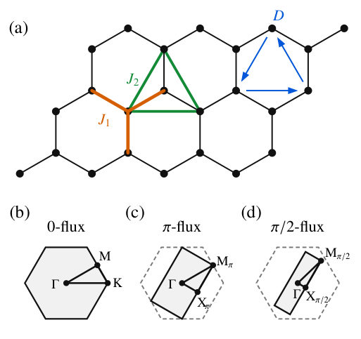 
FIG. 1. (a) Honeycomb lattice with three representative nearest- neighbor J1 bonds shown in orange. Green and blue mark the NNN J2 coupling and DM orientation, respectively. They are displayed on distinct representative triangles for clarity, although both act on every NNN bond. A blue arrow from i to j defines νij = +1. (b) Physical first Brillouin zone and the Γ-M-K-Γ path used for the 0-flux sector. (c),(d) Magnetic reciprocal primitive cells and the Γ-Xπ-Mπ-Γ and Γ-Xπ/2-Mπ/2-Γ paths, respectively. The subscripts distinguish high- symmetry points of the two magnetic zones, and the dashed hexagon marks the physical first Brillouin zone.

📷 Fig 2

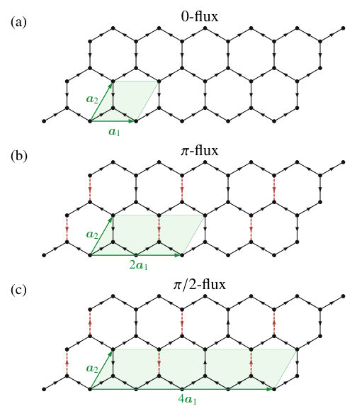 
FIG. 2. Mean-field Ansätze and gauge conventions on the honey- comb lattice. (a) 0-flux representative with phase 1 on every nearest- neighbor bond. (b) π-flux representative in a 2a1 × a2 magnetic cell. Red dashed nearest-neighbor bonds have an additional factor −1. (c) π/2-flux representative in the 4a1 × a2 magnetic cell. Relative to the displayed bond orientations, every red dashed bond carries the same additional factor i, whereas every black bond has unit phase. Re- versing an arrow uses Aji = −Aij. The resulting Wilson phase is ϕp = π/2 on every hexagon. Arrowheads at bond centers define the orientation of Aij and the other mean fields. Green arrows denote the magnetic translation...

📷 Fig 3

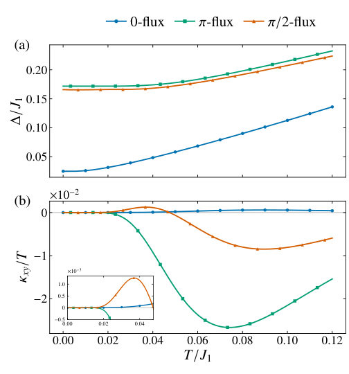 
FIG. 3. Direct comparison of the three flux sectors at the common parameters J2/J1 = 0.20, D/J1 = 0.10, and h/J1 = 0.05. (a) Self- consistent spinon gaps. (b) Intrinsic thermal Hall responses κxy/T. The inset enlarges the low-temperature response near zero for all three sectors.

📷 Fig 4

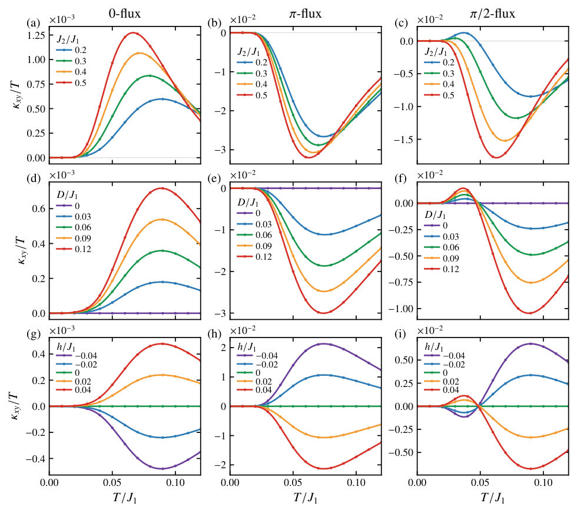 
FIG. 4. Parameter dependence of κxy/T. The columns show the 0-, π-, and π/2-flux branches, respectively. (a)–(c) J2/J1 = 0.20, 0.30, 0.40, and 0.50 at fixed D/J1 = 0.10 and h/J1 = 0.05. (d)–(f) D/J1 = 0, 0.03, 0.06, 0.09, and 0.12 at fixed J2/J1 = 0.20 and h/J1 = 0.05. (g)–(i) h/J1 = −0.04, −0.02, 0, 0.02, and 0.04 at fixed J2/J1 = 0.20 and D/J1 = 0.10.

📷 Fig 5

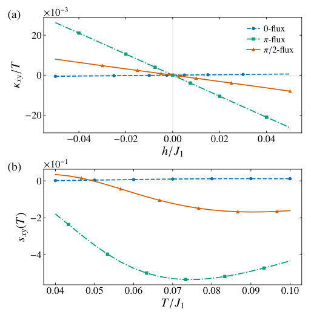 
FIG. 6. Small-field thermal Hall response at J2/J1 = 0.20 and D/J1 = 0.10. (a) Field dependence of κxy/T at T/J1 = 0.08. (b) Local slope sxy(T) = ∂(κxy/T)/∂(h/J1) h=0, obtained after antisym- metrizing the ±h data and fitting an odd cubic polynomial through the origin.

**Summary.** This theoretical work investigates how thermal transport can distinguish between different mean-field descriptions (flux sectors) of a frustrated Heisenberg magnet on the honeycomb lattice. By calculating the spinon thermal Hall conductivity using Schwinger-boson mean-field theory, the authors demonstrate that the sign and temperature dependence of this conductivity serve as a unique, flux-sensitive signature.

**Why it may be interesting.** The use of thermal transport as a diagnostic tool to probe subtle, non-local quantum order (flux sectors) in frustrated magnets is highly relevant to understanding exotic phases in strongly correlated materials.

Detailed structure

**Main problem.** The paper addresses the challenge of using thermal transport to distinguish between different mean-field structures (flux sectors) within a single frustrated quantum spin system.

**Main result.** The sign and temperature dependence of the intrinsic spinon thermal Hall conductivity ($\kappa_{xy}/T$) provide a flux-sensitive transport signature, with distinct behaviors observed for 0-flux, $\pi$-flux, and $\pi/2$-flux sectors.

**Method.** The analysis employs Schwinger-boson mean-field theory combined with the Kubo formula for bosonic Bogoliubov-de Gennes systems to calculate the thermal Hall conductivity.

**Model / system.** The system is a spin-1/2 Heisenberg model on the honeycomb lattice, extended with a next-nearest-neighbor Dzyaloshinskii-Moriya interaction and a perpendicular magnetic field.

**Key observables.** Intrinsic spinon thermal Hall conductivity ($\kappa_{xy}$), the energy-resolved thermal kernel $I_T(\epsilon)$, and the connected dynamical structure factor $S(\mathbf{q}, \omega)$.

**Important parameters / regimes.** The analysis compares three flux sectors: 0-flux, $\pi$-flux, and chiral $\pi/2$-flux, across varying magnetic field ($h$) and DM interaction ($D$) strengths.

**Assumptions / limitations.** The calculations rely on the Schwinger-boson mean-field approximation and specific decoupling approximations for the bond operators.

**Figures summary.** Figures illustrate the lattice structure and the three distinct mean-field Ansätze (0-, $\pi$-, $\pi/2$-flux). Supporting figures show the energy-resolved origin of the $\pi/2$-flux sign reversal and the connected dynamical structure factor $S(\mathbf{q}, \omega)$ for the different flux sectors.

**Paper structure.** The paper systematically develops the mean-field Hamiltonian for the three flux sectors, calculates the thermal Hall conductivity using the Kubo formula, and analyzes the resulting spectral features and temperature dependencies to establish the flux-sensitive diagnostic.

Abstract

Thermal transport offers a bulk probe of charge-neutral excitations in frustrated magnets. It remains challenging, however, to determine whether such transport can distinguish different parton mean-field structures of the same spin system. This question is particularly relevant on the honeycomb lattice, where distinct $0$-flux, $π$-flux, and chiral $π/2$-flux sectors have been proposed. In this paper, we compare self-consistent saddle-point solutions in these three sectors for a frustrated $J_1-J_2$ Heisenberg model with a next-nearest-neighbor Dzyaloshinskii-Moriya interaction and a perpendicular magnetic field. Using finite-temperature Schwinger-boson mean-field theory and the Kubo formula for bosonic Bogoliubov-de Gennes systems, we evaluate the intrinsic spinon thermal Hall conductivity. At a common parameter point where all three branches remain gapped, the $0$-flux response is positive and the $π$-flux response is negative for $D>0$ and $h>0$ under the sign conventions used in this paper, whereas the $π/2$-flux response changes sign with increasing temperature. We further show that a projective symmetry combining a sixfold rotation with time reversal forces the zero-field response of a fixed chiral $π/2$-flux domain to vanish. Within the mean-field regime examined in this paper, the sign and temperature dependence of $κ_{xy}/T$ therefore provide a flux-sensitive transport signature.

[↑ back to top](#top)

### [Chiral Color Ice: Exact Local Handedness Constraints and Möbius Zero Modes in Frustrated Magnets](http://arxiv.org/abs/2608.30802v1)

**Authors:** Péter Kránitz, Yasir Iqbal, Karlo Penc  
**Type:** theory · **Category:** strongly correlated electrons · **PDF:** <https://arxiv.org/pdf/2608.30802v1>  
**Analysis basis:** full PDF text, analyzed in chunks
**Topic relevance:** `analog quantum simulation` **3/5**

📷 Fig 1

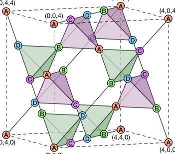 
FIG. 2. Chiral color-ice states compatible with the 16-site cu- bic unit cell of the pyrochlore lattice. (a) The uniform state with a 4-site unit cell, in which the color is constant on each fcc sublattice. (b) An analog of the R state of Ref. [44], gen- erated from (a) by combining the translation (2, 2, 0) with the color permutation (AD)(BC). Both states satisfy the same fixed-ordering CCI constraint on every tetrahedron and hence belong to the same chiral sector. In the geometric convention of Sec. II A, the tetrahedral chirality nevertheless has oppo- site signs on the two orientation classes of tetrahedra (green and purple), which are interchanged by spatial inversion.

📷 Fig 2

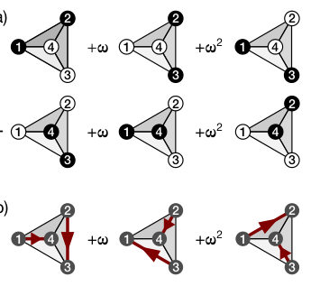 
FIG. 3. The chiral tetrahedral singlet |+⟩, Eq. (3.6a), shown on a tetrahedron projected as a triangle with one interior ver- tex. (a) Superposition of the six Sz-basis states with two up and two down spins, with relative phases 1, ω, and ω2. Filled and open circles denote the two spin states. (b) The same state represented as a superposition of the three ori- ented valence-bond coverings with relative phases 1, ω, and ω2 [Eq. (3.11a)], up to an overall phase. An arrow from i to j denotes the oriented singlet valence bond [ij].

📷 Fig 3

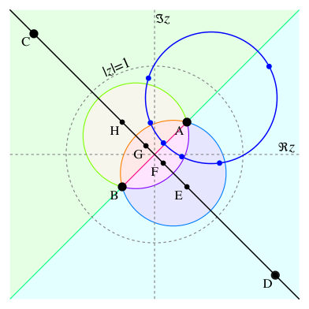 
FIG. 4. Local M¨obius propagation for the reference tetrahe- dral coordinates. The points A, B, C, D are the stereographic images of the four color directions given in Eq. (5.9). Keep- ing the pair (A, B) fixed, the completion map TzA,zB leaves A and B invariant and generates the six-cycle C →D →E → F →G →H →C, which passes through the two remain- ing color points and the four additional points E–H. Every consecutive pair X, TzA,zB(X) of the orbit—whether or not X is a color point—yields an exact coherent zero mode with the four spins at A, B, X, and TzA,zB(X). The blue points show a second six-cycle generated from a generic initial point. Its orbit lies on the corresponding Apollonius...

📷 Fig 4

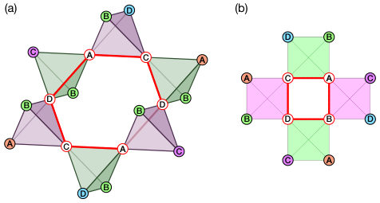 
FIG. 5. Embedded loops supporting local zero modes. (a) A hexagonal loop of the pyrochlore lattice (bold red), sharing one site with each of six surrounding tetrahedra. (b) The analogous square loop of the checkerboard lattice.

📷 Fig 5

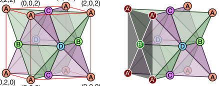 
FIG. 6. Tetrahedral order and a planar zero mode on the fcc lattice. (a) The elementary tetrahedra form two orientation classes exchanged by inversion (green and purple). Assigning opposite local chirality labels to the two classes is compatible with the four-sublattice tetrahedral coloring shown. In the co- ordinate convention of the figure, the cubic magnetic unit cell (red) is generated by (2, 0, 0), (0, 2, 0), and (0, 0, 2). For the alternating chirality assignment, inversion I and time reversal T separately exchange the two local chiral sectors, whereas their product IT is a symmetry. The four-sublattice tetrahe- dral ordered state shown preserves this combined symmetry. (b) A planar...

**Summary.** This work develops a theoretical framework to impose exact, local chirality constraints on frustrated magnetic systems, moving beyond achiral ice rules. By constructing specific Hamiltonians, the authors show that the resulting quantum ground-state degeneracy is highly sensitive to the underlying lattice connectivity. This provides a rigorous method to study chiral quantum magnetism in correlated materials.

**Why it may be interesting.** The explicit connection between local geometric constraints (chirality) and the resulting quantum degeneracy provides a powerful, tunable framework for modeling exotic quantum phases in strongly correlated materials.

Detailed structure

**Main problem.** To construct a local, positive-semidefinite, SU(2)-invariant quantum Hamiltonian that enforces an exact local constraint corresponding to a specific handedness (chirality) in frustrated magnets without selecting a specific spin-space axis.

**Main result.** The local constraint can be enforced exactly, leading to ground-state kernels whose degeneracy depends critically on the lattice connectivity (corner-sharing vs. triangular).

**Method.** The authors construct parent Hamiltonians using singlet-annihilation operators and analyze the resulting zero-energy subspace, particularly in the coherent state limit governed by Möbius transformations.

**Model / system.** The study focuses on Chiral Color Ice (CCI) constraints in frustrated magnets, generalizing standard ice rules to incorporate time-reversal symmetry breaking (chirality) on tetrahedral units.

**Key observables.** Quantum ground-state kernel size/degeneracy, the presence of subdimensional zero modes, and the specific chirality sign of the zero-energy space.

**Important parameters / regimes.** Spin quantum number (S), lattice geometry (corner-sharing, edge-sharing, triangular), and the degree of frustration.

**Assumptions / limitations.** The analysis relies on constructing parent Hamiltonians that project onto the chiral subspace, and in the coherent limit, the constraint is described by a Möbius transformation.

**Figures summary.** Figure 1 illustrates the elementary motif of chiral color ice on a tetrahedron, confirming the structure possesses a definite handedness via scalar chirality.

**Paper structure.** The paper progresses from defining the chiral local constraint on a tetrahedron to analyzing its realization via parent Hamiltonians for arbitrary spin. It then examines the resulting zero-energy physics on different lattice topologies (corner-sharing, edge-sharing, triangular) and concludes by analyzing the symmetry content using group theory.

Abstract

Local constraints govern the low-energy physics of frustrated matter, but familiar ice-type rules constrain flux-like quantities and are insensitive to handedness. Here we show that handedness itself can be imposed as an exact local quantum constraint without selecting an axis in spin space. We construct positive-semidefinite, SU(2)-invariant parent Hamiltonians whose complete zero-energy space on a tetrahedron has a prescribed chirality sign, rather than selecting a particular chiral wave function. For spin-1/2 the local term is a rank-one projector onto a chiral tetrahedral singlet, while for arbitrary spin it factorizes as $B^\dagger B$ through a singlet-annihilation operator, with a completely characterized kernel given by the span of the globally rotated chiral color-ice states. For coherent states, the same zero-energy condition becomes an $S$-independent nonlinear constraint in which three spin directions determine the fourth through a Möbius transformation; compositions of these maps define constraint holonomies on extended lattices. Connecting the same local constraint in different ways produces qualitatively different collective regimes: corner-sharing lattices retain exponentially large quantum ground-state kernels, with rigorous lower bounds exceeding conventional ice benchmarks; edge-sharing lattices support subdimensional plane or line zero modes; while triangular constructions suppress nonuniform coherent deformations and contain the complete Anderson tower of tetrahedral magnetic order at exactly zero energy. Two inequivalent triangular coverings further show that harmonic zero-mode counting does not determine the size of the quantum kernel. These results establish a tractable setting in which local handedness, nonlinear constraint geometry, and quantum degeneracy can be disentangled and related directly to the connectivity of the constraint network.

[↑ back to top](#top)

### [Crystal electric field excitations and an effective-spin-$1/2$ ground doublet in the hyperkagome magnet Yb$_3$Sc$_2$Ga$_3$O$_{12}$](http://arxiv.org/abs/2608.29276v1)

**Authors:** Tingjun Zhang, Zehao Wang, Douglas L. Abernathy, Rong-Zhu Lin, Steven J. Gomez Alvarado, Chien-Lung Huang, Pengcheng Dai  
**Type:** both · **Category:** strongly correlated electrons · **PDF:** <https://arxiv.org/pdf/2608.29276v1>  
**Analysis basis:** full PDF text, analyzed in chunks
**Topic relevance:** `analog quantum simulation` **3/5**

📷 Fig 1

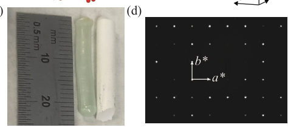 
FIG. 1. (a) The crystal structure of Yb3Sc2Ga3O12. (b) One of the Yb3+ hyperkagome networks. A ten-site closed loop is labeled. (c) A representative single crystal grown by the optical floating-zone method (left) and a polycrystalline feed rod used for crystal growth (right). (d) Single crystal X-ray diffraction pattern in the [H, K, 0] plane.

📷 Fig 2

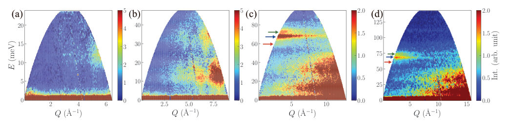 
FIG. 2. INS data at T = 10 K measured on powder sample. The incident energies Ei are (a) 25 meV, (b) 50 meV, (c) 100 meV and (d) 150 meV. Empty-can scattering measured at the same temperature has been subtracted. Arrows in (c) and (d) mark the three CEF excitations.

📷 Fig 3

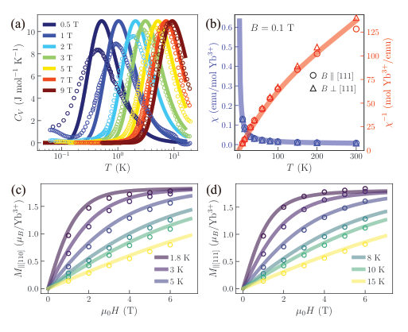 
FIG. 4. Comparison between single-ion properties calculated from the CEF model and experimentally determined values extracted from Ref. [43]. (a) Field-induced Schottky heat capacity calculated using grms = 3.68. The phonon contribu- tion to the experimental specific heat was subtracted using the Debye function and coefficients provided in Ref. [43]. (b) Susceptibility χ(T) at µ0H = 0.1 T (left axis) and inverse susceptibility (right axis). Because the results for the cubic high-symmetry directions are nearly indistinguishable in the low-field limit, the powder average is used in the calculation. (c),(d) Magnetization for fields along [110] and [111], respec- tively, at selected...

📷 Fig 4

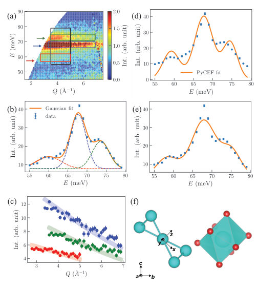 
FIG. 3. CEF spectrum and modeling. (a) Zoom-in view of the Ei = 100 meV data. The black rectangle indicates the integration range for the energy cuts in (b), (d), and (e); the colored rectangles indicate the energy windows used for the Q cuts in (c). (b) Energy cut fitted with three Gaussian peaks and a constant background. The weakest peak center was fixed at 59 meV, while the other centers fitted to 67.70(5) and 73.78(9) meV. (c) Integrated intensity of the three modes versus Q; translucent curves show scaled Yb3+ magnetic form factor square. (d) CEF fit constrained by both the energy levels and the spectrum. (e) CEF fit to the spectrum alone. (f) Local environment of a Yb3+ ion. The...

**Summary.** This work uses inelastic neutron scattering to map the crystal electric field excitations of Yb3+ in the hyperkagome magnet Yb3Sc2Ga3O12. By fitting the observed spectrum, the authors establish a microscopic single-ion model that successfully reproduces bulk magnetic properties. This model isolates an effective spin-1/2 ground state, providing the necessary foundation to study low-energy collective quantum magnetism.

**Why it may be interesting.** The rigorous determination of the single-ion basis (CEF parameters and effective g-tensor) is crucial for constructing an accurate effective exchange Hamiltonian, which is the starting point for understanding collective quantum magnetism in frustrated lattices.

Detailed structure

**Main problem.** To determine the crystal electric field (CEF) excitations and establish the effective low-energy magnetic description in the hyperkagome magnet Yb3Sc2Ga3O12.

**Main result.** INS measurements confirm three CEF excitations, and the analysis establishes the low-energy physics is governed by a well-isolated effective J_eff=1/2 Kramers doublet.

**Method.** The study combines inelastic neutron scattering (INS) experiments with detailed single-ion modeling using Stevens-operator analysis.

**Model / system.** The system is the rare-earth hyperkagome magnet Yb3Sc2Ga3O12, focusing on the J=7/2 multiplet of the Yb3+ ion. The CEF Hamiltonian is analyzed using local D2h symmetry constraints.

**Key observables.** Three nearly dispersionless magnetic excitations observed near 58, 68, and 74 meV; the effective g tensor components (e.g., g_z > g_x > g_y).

**Important parameters / regimes.** The low-energy physics is described by an effective J_eff=1/2 degree of freedom; the characteristic energy separation of the first excited doublet (~58 meV).

**Assumptions / limitations.** The analysis assumes the low-energy behavior is dominated by an effective spin-1/2 doublet, despite the non-uniqueness of individual CEF parameters.

**Figures summary.** Figures show the crystal structure, INS data mapping the three CEF excitations, and comparisons of calculated single-ion properties (specific heat, susceptibility, magnetization) against experimental data.

**Paper structure.** The paper proceeds by using INS to measure the full CEF spectrum, fitting this spectrum to determine CEF parameters, and finally using the resulting single-ion model to predict and reproduce bulk magnetic observables like specific heat and magnetization.

Abstract

We use inelastic neutron scattering (INS) to determine the crystal electric field (CEF) excitations of Yb$^{3+}$ in the rare-earth hyperkagome magnet Yb$_3$Sc$_2$Ga$_3$O$_{12}$. Three nearly dispersionless magnetic excitations are observed near 58, 68, and 74~meV, corresponding to transitions from the ground-state Kramers doublet to the three excited doublets of the $J=7/2$ multiplet. A Stevens-operator analysis constrained by the local $222$ ($D_2$) symmetry reproduces the excitation energies and spectral weights and yields an Ising-type ground-state $g$ tensor. The first excited doublet lies approximately 58~meV above the ground state, establishing a well-isolated effective $J_{\mathrm{eff}}=1/2$ degree of freedom over the low-temperature regime relevant to collective magnetism. Notably, the directly measured CEF spectrum substantially revises the level scheme previously inferred from bulk measurements, while preserving the essential low-energy pseudospin description. Two independent fitting protocols give consistent excitation energies, ground-doublet wave functions, and $g$ tensors, despite the nonuniqueness of the individual CEF parameters. The resulting single-ion model also reproduces the characteristic susceptibility, magnetization, and field evolution of the Schottky anomaly in specific heat. These results establish the microscopic single-ion basis needed to construct an effective exchange Hamiltonian and to interpret future measurements of low-energy collective excitations in Yb$_3$Sc$_2$Ga$_3$O$_{12}$.

[↑ back to top](#top)

### [Efficient measurement schemes for the Monte Carlo projective quantum eigensolver](http://arxiv.org/abs/2608.30612v1)

**Authors:** Divye Baid, Maria-Andreea Filip  
**Type:** theory · **Category:** quantum information and computing · **PDF:** <https://arxiv.org/pdf/2608.30612v1>  
**Analysis basis:** full PDF text, analyzed in chunks
**Topic relevance:** `quantum measurements` **3/5**

📷 Fig 1

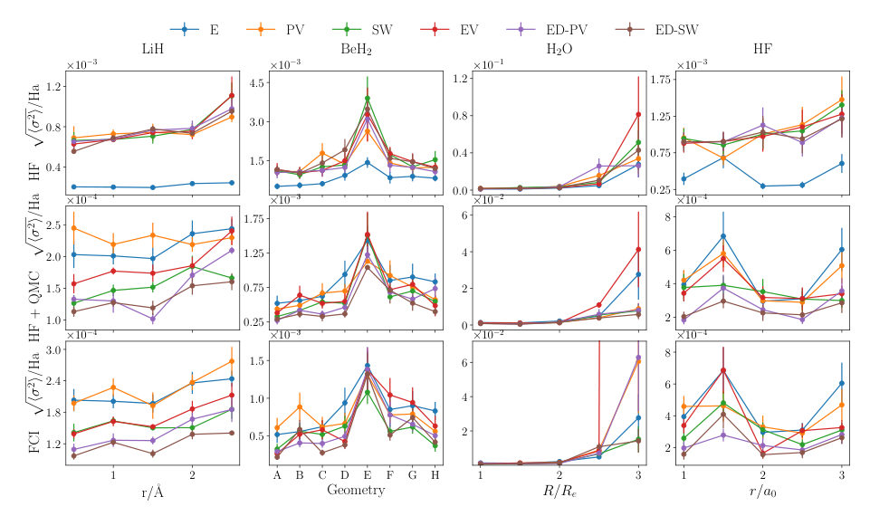 
Figure 1: Average standard error in the projected energy obtained by MC-PQE, using different measurement allocation techniques and estimated variance sources. The number of samples is Ns = 106 for LiH, BeH2 and H2O and Ns = 107 for HF. Error bars are obtained from 5 independent simulations. The even allocation (E) is independent of variance source.

📷 Fig 2

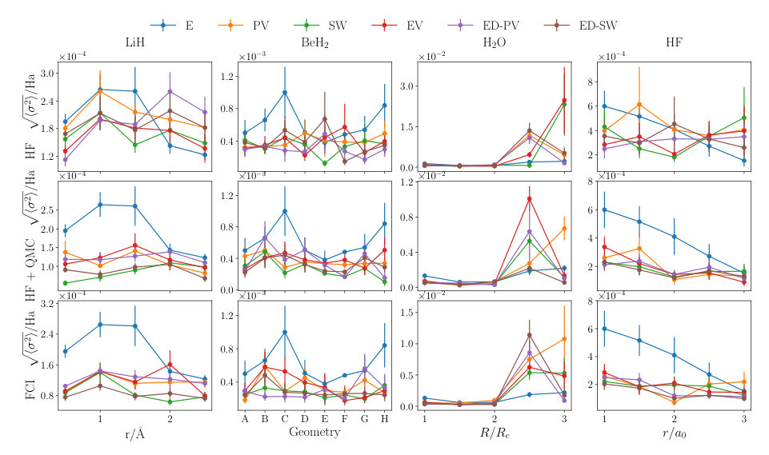 
Figure 2: Average standard error in the shift obtained by MC-PQE, using different mea- surement allocation techniques and estimated variance sources. The number of samples is Ns = 106 for LiH, BeH2 and H2O and Ns = 107 for HF. Error bars are obtained from 5 independent simulations. The even allocation (E) is independent of variance source.

📷 Fig 3

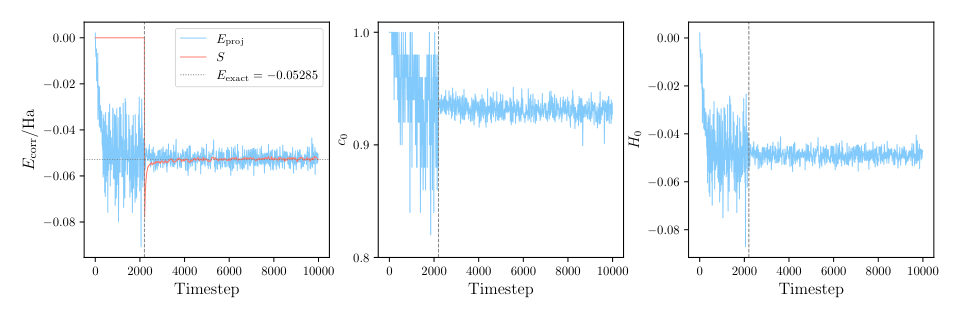 
Figure 3: Instantaneous observable values along an MC-PQE trajectory for LiH/STO-3G at rLiH = 2.5˚A, using the SW shot allocation with Ns = 106.

📷 Fig 4

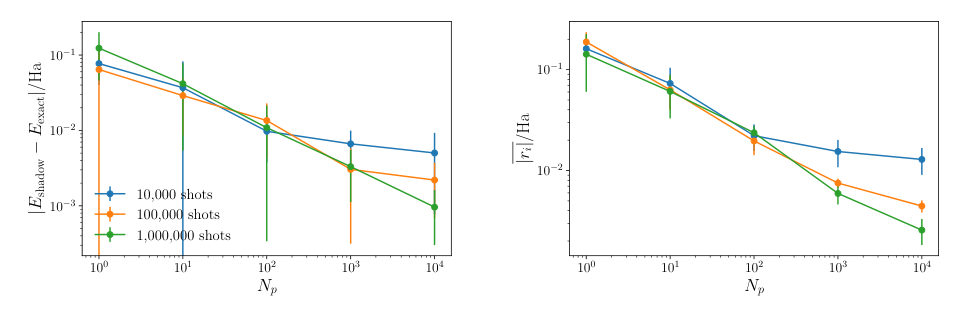 
Figure 4: Error in the energy and residuals estimated using shadow tomography for H4/STO- 3G at rHH = 1.5˚Afor the exact FCI ground state. All residuals should be zero. Error bars are obtained from five independent trials.

**Summary.** This paper tackles the measurement overhead problem in the Monte Carlo Projective Quantum Eigensolver (MC-PQE) for quantum chemistry. The authors extend Pauli grouping techniques to handle the asymmetric expectation values inherent to MC-PQE. They demonstrate that optimized grouping strategies can drastically reduce measurement error, making the simulation more feasible for larger molecular systems.

**Why it may be interesting.** This work directly addresses the resource scaling bottleneck in quantum chemistry simulations, providing concrete, measurable improvements in measurement efficiency for advanced quantum eigensolvers.

Detailed structure

**Main problem.** The primary challenge is developing measurement schemes for the Monte Carlo Projective Quantum Eigensolver (MC-PQE) that significantly reduce the measurement overhead compared to conventional quantum algorithms.

**Main result.** Full commuting Pauli term grouping combined with tailored measurement allocation techniques achieved a 5-10x reduction in standard error for the same number of measurements, outperforming classical shadow tomography for the studied systems.

**Method.** The authors adapt advanced measurement grouping techniques, such as sorted insertion for Pauli terms, to handle the asymmetric expectation values required by MC-PQE.

**Model / system.** The work analyzes quantum chemistry calculations on molecular systems up to 12 qubits, using the Unitary Coupled Cluster Singles and Doubles (UCCSD) ansatz to parameterize the wavefunction.

**Key observables.** Expectation values of Pauli strings ($\langle \hat{P}_k 
angle$), projected energy ($E_{	ext{proj}}$), and shift estimator ($S(eta)$).

**Important parameters / regimes.** System size (up to 12 qubits), bond lengths (e.g., 1.5 Å for $	ext{H}_4$), and the number of quantum measurements.

**Assumptions / limitations.** The analysis relies on approximating the variance of the shift estimator using an AR(1) model, and it assumes that the initial Hartree–Fock wavefunction is used for measurement allocation.

**Figures summary.** Tables compare the number of Pauli groups needed for different grouping strategies (QWC vs. SI) and show energy estimator values and variances for $	ext{H}_4$ and $	ext{LiH}$ under various sampling conditions.

**Paper structure.** The paper introduces MC-PQE as an alternative to VQE, reviews existing measurement overhead reduction techniques, details the application of Hamiltonian grouping and classical shadow tomography to MC-PQE's asymmetric expectation values, and presents performance comparisons across molecular systems.

Abstract

The Monte Carlo Projective Quantum Eigensolver (MC-PQE) was recently introduced as an alternative to hybrid algorithms like the variational quantum eigensolver (VQE). By using a quantum Monte Carlo-inspired scheme for energy estimation, MC-PQE was found to decrease the required measurement cost relative to comparable conventional approaches. However, in the context of VQE, numerous techniques have been developed to reduce the measurement overhead by joint measurement of multiple observable. In this work, we extend these approaches to the asymmetric expectation values required in MC-PQE and assess the performance of different techniques for various molecular systems of up to 12 qubits. We find full commuting Pauli term grouping combined with tailored measurement allocation techniques leads to a 5-10$\times$ reduction in standard error for the same total number of quantum measurements. Conventional Hamiltonian grouped measurement outperforms tractable classical shadows tomography based techniques for the considered systems.

[↑ back to top](#top)

### [Emergence of Strategic Equilibria from Transverse Field Ising Hamiltonian Dynamics](http://arxiv.org/abs/2608.29926v1)

**Authors:** Teena Thomas, S. Balakrishnan  
**Type:** theory · **Category:** statistical mechanics · **PDF:** <https://arxiv.org/pdf/2608.29926v1>  
**Analysis basis:** full PDF text, analyzed in chunks
**Topic relevance:** `analog quantum simulation` **3/5**

📷 Fig 1

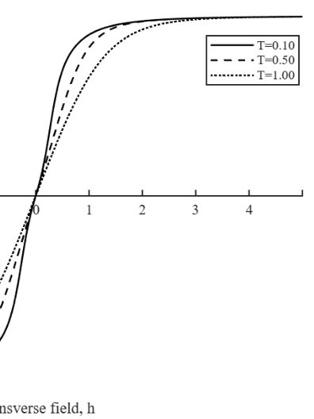 
Fig. 1: Magnetization versus transverse field at different temperatures.

📷 Fig 2

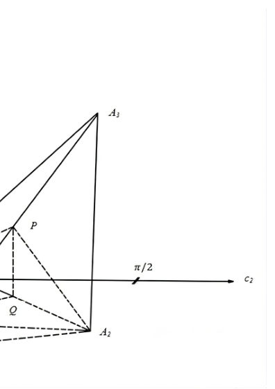 
Fig. 2: Weyl chamber: Geometrical representation of two-qubit operators.

📷 Fig 3

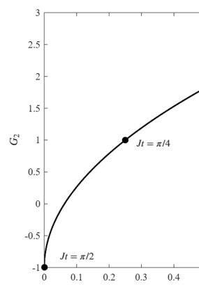 
Fig. 3: Parametric plot of invariants with angle labels.

📷 Fig 4

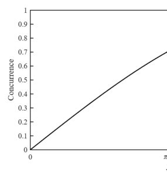 
Fig. 4: Variation of concurrence with Jt. For Jt = 0, π/4, π/2, concurrence = 0, 0.707, 1 respectively.

**Summary.** This work applies the dynamics of the Transverse Field Ising Model to quantum game theory, showing that the system's natural evolution generates controllable entanglement. This entanglement acts as a resource that fundamentally alters strategic decision-making, resolving classical dilemmas like the Prisoner's Dilemma by stabilizing cooperative outcomes.

**Why it may be interesting.** The direct link between physical Hamiltonian parameters (like $J$ and $h$) and the emergence of cooperative strategic outcomes provides a concrete, hardware-relevant mechanism for quantum control in complex systems.

Detailed structure

**Main problem.** The paper investigates how quantum entanglement, generated dynamically, influences the emergence and resolution of strategic equilibria in quantum games.

**Main result.** Increasing entanglement, controlled by the Hamiltonian dynamics, systematically shifts the Nash equilibrium of classical games (like the Prisoner's Dilemma) towards cooperative outcomes.

**Method.** The authors use an operator-based formulation derived from the time evolution of the Transverse Field Ising Model (TFIM) to modify and analyze classical game payoff matrices.

**Model / system.** The primary model is the Transverse Field Ising Model (TFIM) Hamiltonian, H = -J sum(sigma^z_i sigma^z_j) - h sum(sigma^x_i). This model is used to map quantum game dynamics onto physical spin interactions.

**Key observables.** Magnetization ($M_x$, $M_z$), Concurrence (measure of entanglement), and the resulting Nash equilibria for various games.

**Important parameters / regimes.** Coupling constant ($J$), transverse field strength ($h$), and the effective interaction-time product ($Jt$).

**Assumptions / limitations.** The analysis assumes that the quantum game dynamics can be effectively controlled by tuning the physical Hamiltonian parameters ($J$ or $h$) or the interaction time ($t$).

**Figures summary.** Figures illustrate magnetization vs. field, the Weyl chamber for two-qubit operators, local invariants vs. $Jt$, and Concurrence vs. $Jt$, demonstrating the progressive generation of entanglement.

**Paper structure.** The paper progresses from establishing the TFIM framework for quantum games, analyzing the entanglement generation via time evolution, and finally applying this entanglement parameter ($Jt$) to systematically resolve the Nash equilibria in canonical games like the Prisoner's Dilemma and Stag Hunt.

Abstract

Game theory studies strategic decision-making among rational agents, and many classical games can be mapped onto interaction models such as the Ising model. Quantum game theory extends this framework by allowing players to exploit quantum superposition and entanglement. In this work, we study quantum games using an operator-based formulation derived from the transverse-field quantum Ising model. We show that the Hamiltonian-driven dynamics naturally generate entangling operator which resolve the dilemma in the game settings. This leads to a clear quantum advantage over classical outcomes. Unlike standard quantization schemes based on fixed entangling gates, the present approach enables tunable entanglement, controlled directly by physical Hamiltonian parameters, providing a hardware-relevant perspective on quantum game design.

[↑ back to top](#top)

### [Emergent Pair Density Wave and Incoherent Metallic State in a Strongly Correlated Doped System](http://arxiv.org/abs/2608.29742v1)

**Authors:** Soham Maiti, Nandan Pakhira, A. Taraphder  
**Type:** theory · **Category:** strongly correlated electrons · **PDF:** <https://arxiv.org/pdf/2608.29742v1>  
**Analysis basis:** full PDF text, analyzed in chunks
**Topic relevance:** `Keldysh / 2PI / non-Gaussian methods` **3/5**

📷 Fig 1

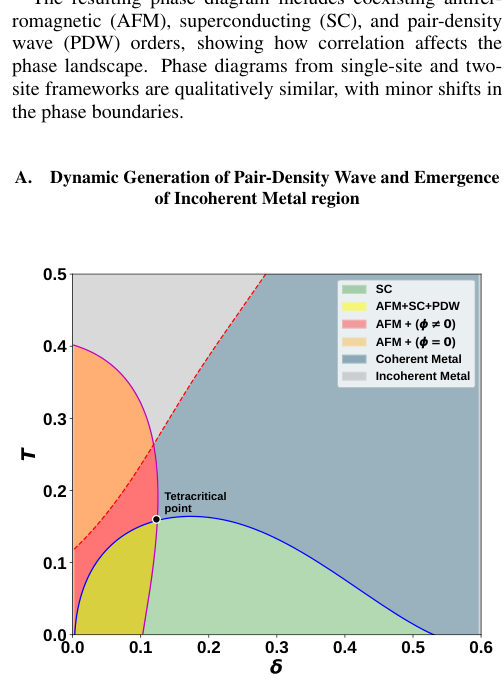 
FIG. 1: Temperature–doping (T −δ) phase diagram for the dynamical emergence of a d-wave triplet pair-density-wave (PDW) from the coexistence of antiferromagnetism (AFM) and d-wave singlet superconductivity (SC) and the emergence of an incoherent metal region.

📷 Fig 2

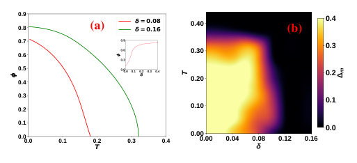 
FIG. 3: (a) Temperature dependence of ϕ for δ = 0.08 and δ = 0.16. Inset: Doping dependence of ϕ at fixed temperature T = 0.08. (b) Intensity plot of the ∆m, in the T −δ phase space. The color scale represents the magnitude of ∆m.

📷 Fig 3

 
Fig. 3(a) shows the temperature dependence of the rotor condensate ϕ for different values of the doping δ. The quantity serves as a measure of quantum phase coherence in the rotor sector. As the temperature increases, thermal fluctuations enhance the disorder of the rotor phase θ, thereby suppressing phase coherence. Consequently, ϕ decreases monotonically with increasing T and eventually vanishes. For a given temperature, ϕ is larger at higher doping, reflecting the enhanced rotor kinetic energy and the greater stability of charge coherence away from half-filling.

📷 Fig 4

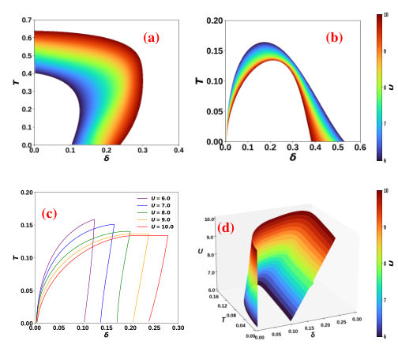 
FIG. 2: Interaction-driven evolution of the ordered phases in the temperature-doping plane. (a) AFM phase boundary, (b) SC phase boundary, and (c) PDW phase boundary for several values of U. (d) Three-dimensional visualization of the PDW coexistence region in δ, T, U space. The color coding in all panels corresponds to the value of U.

📷 Fig 5

 
Fig. 2(c) shows the evolution of the PDW phase boundary

**Summary.** This theoretical work explores the complex interplay between Antiferromagnetism, d-wave Superconductivity, and Pair Density Wave formation in strongly correlated electron systems. Using a slave-rotor mean-field approach, the authors demonstrate that PDW order emerges dynamically in the coexistence region of AFM and SC. The study provides detailed spectral analysis showing a crossover from coherent to incoherent metallic behavior as charge coherence is lost.

**Why it may be interesting.** The explicit treatment of charge-spin separation via the rotor degree of freedom provides a powerful, non-conventional tool to analyze the interplay between magnetism, superconductivity, and charge localization in correlated materials.

Detailed structure

**Main problem.** The study investigates the dynamical emergence of a Pair Density Wave (PDW) state driven by the interplay between Antiferromagnetism (AFM) and singlet d-wave Superconductivity (SC) in a strongly correlated doped system.

**Main result.** The authors find that PDW order emerges dynamically in the AFM-SC coexistence region, and the system undergoes a crossover from a coherent to an incoherent metallic state as charge coherence is suppressed.

**Method.** The analysis employs a slave-rotor mean-field framework, decomposing the electron into spinon and rotor degrees of freedom to capture strong correlation effects.

**Model / system.** The model is a strongly correlated electron system on a 2D square lattice, described by a Hamiltonian involving hopping, onsite repulsion (U), and terms coupling to SC and PDW order parameters.

**Key observables.** AFM, SC, and PDW order parameters; the rotor condensate amplitude (phi) characterizing charge coherence; and momentum-resolved spectral functions A(k, omega).

**Important parameters / regimes.** Doping ($\delta$), Temperature ($T$), and the onsite repulsion strength ($U$).

**Assumptions / limitations.** The formalism relies on slave-rotor mean-field theory, and improvements are made by using a two-site cluster formulation over a single-site approximation.

**Figures summary.** Figures illustrate the $T-\delta$ phase diagram showing PDW emergence, the evolution of phase boundaries with increasing U, and momentum-resolved spectral functions distinguishing coherent and incoherent excitations.

**Paper structure.** The paper systematically develops the slave-rotor mean-field theory, calculates the free energy by diagonalizing coupled spinon and rotor Hamiltonians, and analyzes the resulting spectral functions across different ordered phases (AFM, SC, Coexistence).

Abstract

We investigate the dynamical emergence of a state driven by the interplay between antiferromagnetism (AFM) and singlet $d$-wave superconductivity (SC) within a slave-rotor mean-field framework. By decomposing the electron into charge and spin degrees of freedom, the formalism captures strong-correlation effects beyond conventional mean-field approaches. A PDW order is found to emerge dynamically in the coexistence region of AFM and SC. The AFM-SC coexistence region is significantly modified with correlation, leading to a systematic shift of the tetra-critical point. The doping and temperature evolution of the AFM, SC, and PDW order parameters, together with the rotor condensate amplitude $φ$, which characterizes charge coherence, shows a crossover from a coherent to an incoherent metal with the suppression of coherent quasi-particle spectral weight. Moreover, in the AFM + $(φ\neq 0)$ region, coherent quasi-particle bands coexist with incoherent Hubbard-like excitations, whereas only incoherent spectral features survive in the AFM + $(φ= 0)$ regime. The SC phase exhibits nodal quasi-particles consistent with $d$-wave pairing.

[↑ back to top](#top)

### [Enhanced Diffusion from Twist-Angle Disorder](http://arxiv.org/abs/2608.29062v1)

**Authors:** Nicole S Ticea, Yi-Ming Wu  
**Type:** theory · **Category:** disordered systems and neural networks · **PDF:** <https://arxiv.org/pdf/2608.29062v1>  
**Analysis basis:** full PDF text, analyzed in chunks
**Topic relevance:** `Keldysh / 2PI / non-Gaussian methods` **3/5**

📷 Fig 1

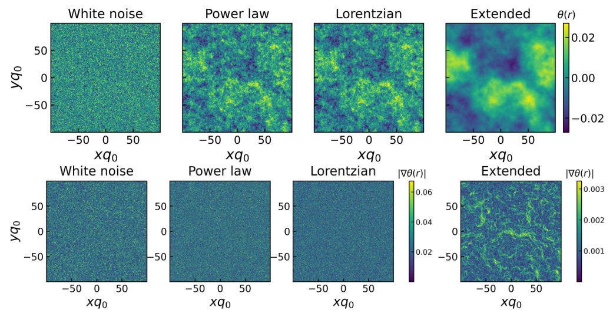 
FIG. 1. Top row: sampling θ(r) using four different covariance kernels: uncorrelated disorder, power-law-correlated disorder (α = 2), Lorentzian disorder (ξ = 20), and disorder generated by a kernel with quartic momentum contributions (α = 0, ξ = 20). Bottom row: |∇θ(r)| for the same covariance kernels.

📷 Fig 2

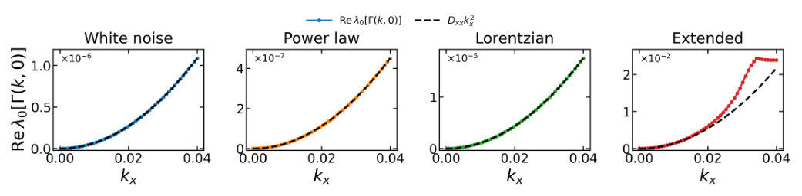 
FIG. 2. Lowest (density) mode for the four different covariance kernels described earlier, calculated by discretising the Fermi surface into 720 angular patches. The strength of the trigonal warping is set to η = 0.03. Data is connected by solid lines; quadratic fit is overlaid with dashes. Note the difference in scales across the models.

📷 Fig 3

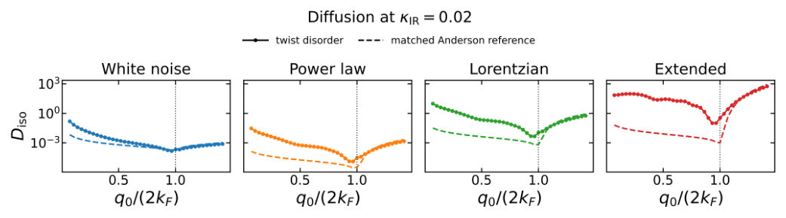 
FIG. 3. Isotropic diffusivity, Diso = (Dxx + Dyy)/2, for the four covariance kernels described earlier, calculated by discretising the Fermi surface into 720 angular patches. The strength of the trigonal warping is set to η = 0.03. The Anderson reference is a constant fermion scattering kernel matched to the mean rate of the twist-angle disorder scattering integrated across the Fermi surface.

**Summary.** This work theoretically analyzes the impact of spatially varying twist-angle disorder on electronic transport in moiré superlattices. By modeling the disorder using a geometric constraint analogous to electromagnetism, the authors show that this specific type of disorder suppresses momentum scattering. The problem is successfully formulated using a Non-linear Sigma Model, yielding quantitative predictions for enhanced electron diffusivity.

**Why it may be interesting.** The explicit mapping to an NLSM and the calculation of transport coefficients in the presence of geometric constraints provide a powerful, non-trivial extension to standard theories of disorder in condensed matter.

Detailed structure

**Main problem.** The study investigates how twist-angle disorder affects the single-particle properties and transport (diffusivity) of electrons in twisted bilayer systems.

**Main result.** The geometric scattering constraints imposed by the twist structure substantially suppress momentum relaxation compared to simple white noise disorder, leading to an enhanced diffusivity.

**Method.** The analysis employs advanced theoretical techniques, including the replica trick, mapping the problem onto a Non-linear Sigma Model (NLSM), and performing disorder averaging via Wigner transforms.

**Model / system.** The system is based on twisted bilayer materials (like TBLG) where the moiré potential is modulated by a spatially varying twist angle disorder. The disorder is modeled mathematically as the curl of the relative displacement field.

**Key observables.** Diffusivity ($D$), disorder-induced correlation function $ar{g}(r)$, and the effective action derived from the NLSM.

**Important parameters / regimes.** The disorder correlation length, the moiré lattice scale, and the strength of the disorder kernel (e.g., power-law vs. Lorentzian).

**Assumptions / limitations.** The disorder correlation length is assumed much larger than the moiré lattice scale, allowing for Wigner transform approximations and averaging over the moiré unit cell.

**Figures summary.** Figures illustrate the spatial sampling of the twist angle disorder using various covariance kernels and compare the calculated isotropic diffusivity against a standard Anderson reference disorder, showing enhancement.

**Paper structure.** The paper progresses from defining the disorder Hamiltonian and using the replica trick to derive the effective disorder-averaged coupling $ar{g}(R)$. It then maps the problem to an NLSM, calculates the effective action, and finally extracts the transport properties by analyzing the small-$k$ behavior of the Green's function correlator.

Abstract

We consider the effect of twist-angle disorder on the single-particle properties of twisted bilayer systems. These materials are a natural playground for studying how tiny, uncontrolled spatial variations may become unusually consequential; a local change in the twist geometry can give rise to spatially-correlated alterations of the parent Hamiltonian, which in turn affect the coarse-grained properties of the substrate such as transport and ordering tendencies. In analogy to electrodynamics, where the magnetic field is given by the curl of the vector potential, we model the twist angle as the curl of the relative displacement between the two bilayers. We find that geometric scattering constraints imposed here by the twist structure substantially suppress momentum relaxation relative to mean-rate-matched white noise. We quantify these effects and show that the problem can be mapped onto a non-linear sigma model (NLSM).

[↑ back to top](#top)

### [The resource cost of magic in a code block](http://arxiv.org/abs/2608.29438v1)

**Authors:** Jiachen Shen, Hui Zhong  
**Type:** theory · **Category:** quantum information and computing · **PDF:** <https://arxiv.org/pdf/2608.29438v1>  
**Analysis basis:** full PDF text, analyzed in chunks
**Topic relevance:** `quantum measurements` **3/5**

📷 Fig 1

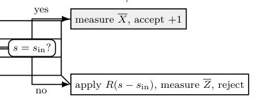 
Figure 1: One member of the split-readout family of definition 6, drawn as the operations a machine performs. Weak Z-rotations sit on some of the data qubits, one per qubit. A single exact round of stabilizer measurement follows and writes its outcomes to a classical record. Everything after the dashed cut reads that record and nothing else. If the record matches the syndrome the block came in with, the protocol measures the logical X and keeps the +1 outcome, and that branch is the accepted fibre whose effect this paper bounds. Otherwise it corrects, measures the logical Z and rejects. The rejected branch changes no accepted statistic, and proposition 3 needs it, since it is what absorbs...

**Summary.** This theoretical work derives a tight upper bound on the resource cost ('magic') associated with post-selected logical measurements in quantum error-correcting codes. By analyzing the accepted effect through an outcome-by-outcome resource theory lens, the authors prove the cost decays exponentially with the code distance, $\exp[-\Omega(d \log d)]$. This result is significant because it quantifies the fundamental resource limitations for implementing complex quantum operations.

**Why it may be interesting.** It provides a quantitative, resource-theoretic understanding of the fundamental limitations on measurement fidelity and resource consumption in fault-tolerant quantum computation, which is crucial for designing practical quantum hardware.

Detailed structure

**Main problem.** The paper aims to rigorously bound the resource cost, or 'magic,' associated with performing a post-selected logical measurement within a quantum code block.

**Main result.** The accepted magic, when multiplied by the acceptance probability, is bounded by $\exp[-\Omega(d \log d)]$, a bound that is shown to be attainable by a specific protocol.

**Method.** The analysis employs resource theory techniques, reading the accepted effect outcome-by-outcome against the free set of magic, and utilizes exact-component expansions over connected clusters of insertion histories.

**Model / system.** The system is a single code block encoding one logical qubit, analyzed using an adaptive protocol involving measurement, feed-forward, and acceptance, relevant to fault-tolerant quantum computation.

**Key observables.** Magic (resource cost), Acceptance Probability, Code Distance ($d$), and the resulting bound $\exp[-\Omega(d \log d)]$.

**Important parameters / regimes.** Code distance ($d$), the certified threshold ($D \propto d$), and the structure of the exact-recovery skeleton.

**Assumptions / limitations.** The resource cells must sit inside a bounded-spread exact-recovery skeleton, and the analysis relies on the structure of the accepted effect being read outcome-by-outcome.

**Figures summary.** Figure 1 illustrates the operations of a split-readout family, detailing syndrome measurement, classical recording, and the separation into accepted and rejected measurement fibres.

**Paper structure.** The paper develops bounds by first establishing an unconditional bound, then presenting the main result using an exact-component expansion. It certifies the threshold using a circuit model (stabilizer measurement followed by split readout) and concludes by showing a protocol that attains the derived exponential bound.

Abstract

We bound the magic of a post-selected logical measurement by the resource that produced it. The setting is one code block with one logical qubit and an adaptive protocol that measures, feeds forward and accepts. The witness reads the accepted effect against the free set of the resource theory of magic, outcome by outcome and not on the averaged channel, since a channel can be free while one of its outcomes measures the magic axis. Our first bound is unconditional. The accepted magic is at most a constant times the summed distance of the cells from the free set. The second is the main result. When the resource cells sit inside a bounded-spread exact-recovery skeleton, the recovery puts every insertion history below a threshold onto a single free branch, transcript by transcript, so only connected clusters reaching the threshold contribute and an exact-component expansion controls their weight. With a threshold linear in the code distance, polynomially many cells of bounded insertion degree and per-cell dilation amplitude $O(1/d)$, the accepted magic times the acceptance probability is at most $\exp[-Ω(d\log d)]$. Post-selection is disposed of before accepted transcripts are summed, so a branch of vanishing probability cannot be amplified into a magic effect. The threshold is certified from a circuit, and we run it on one exact round of stabilizer measurement followed by a split readout, which measures logical $X$ on the accepted fibre and logical $Z$ on the rejected ones. That certifies a threshold equal to the code distance for every single-layer pattern of weak $Z$-rotations, one per data qubit, so the hypotheses are met by a family and not one design. A member carries magic only if its support contains a logical $Z$ string. One member attains the exponent, again at the level of the accepted effect. Suppression is set by the threshold and not by the topology of the block.

[↑ back to top](#top)

### [Anomalous Frequency Shift in Low-Loss Superconducting Granular Aluminum Resonators](http://arxiv.org/abs/2608.29282v1)

**Authors:** Patrick Winkel, Daniil S. Antonenko, Vishakha Gupta, Neel Thakur, Pavel Kurilovich, Luigi Frunzio, Leonid I. Glazman, Robert J. Schoelkopf  
**Type:** experiment · **Category:** other · **PDF:** <https://arxiv.org/pdf/2608.29282v1>  
**Analysis basis:** full PDF text, analyzed in chunks
**Topic relevance:** `correlated / nonlocal dissipation` **2/5** · `driven-dissipative phase transition` **2/5** · `non-equilibrium universality` **2/5** · `Keldysh / 2PI / non-Gaussian methods` **1/5** · `QC/QI experiment` **1/5** · `analog quantum simulation` **1/5** · `methods for driven-dissipative` **1/5** · `quantum measurements` **1/5** · `quantum optics experiment` **1/5**

📷 Fig 1

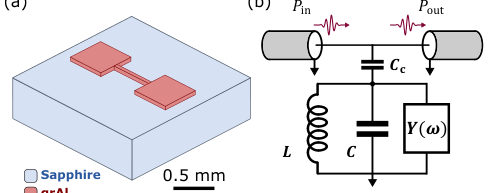 
FIG. 1. Lumped-element granular aluminum mi- crowave resonators. (a) The sample design consists of lumped-element microwave resonators with a planar, millime- ter scale two-pad capacitor geometry, connected via a central inductive strip 30 µm −500 µm in length [22]. The devices are fabricated on sapphire substrates with superconducting granular aluminum (grAl) thin films of varying normal-state resistivity ρn and constant thickness d = 91 ± 1 nm. For two devices, the capacitor electrodes are made from pure Al. (b) The measurement scheme of the superconducting resonator. The equivalent circuit of the resonator consists of three ele- ments: C and L represent the electromagnetic contributions...

📷 Fig 2

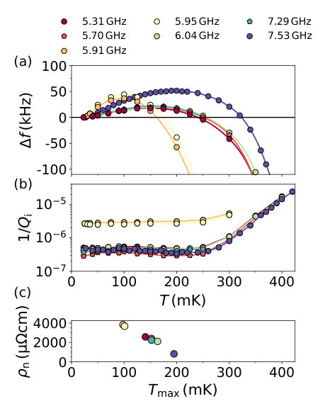 
FIG. 2. Low-power temperature dependence of re- sponse at microwave frequencies: (a) Shift in the res- onance frequency ∆f as a function of the fridge base tem- perature T measured in the single-photon regime (¯n ≈1) for seven devices. All curves are shifted to align them at the low- est temperature measured. In all devices, we observe the same systematic behavior: The frequency increases with increasing temperature until it reaches a maximum at Tmax, after which it monotonically decreases due to the thermal activation of quasiparticles (QPs). (b) Internal loss Qi for the same de- vices measured in the same temperature range. Despite the significant changes in the resonance frequency, the...

📷 Fig 3

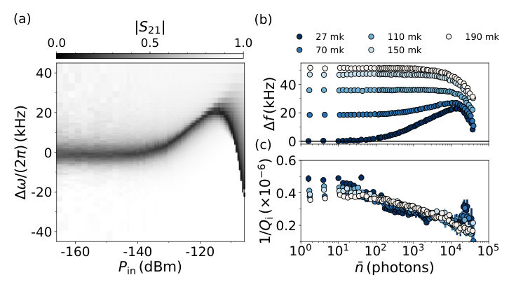 
FIG. 3. Power and temperature dependence of the microwave response: (a) Magnitude of the complex transmission coefficient |S21| at T = 27 mK in the f0 = 7.53 GHz device as a function of the detuning ∆ω/(2π) = f −f0 of the drive frequency f with respect to the low power resonance frequency f0 and the estimated on-chip input power Pin. With increasing power, the resonance first shifts towards higher frequencies before starting to decrease, as expected. (b,c) Shift in the extracted resonance frequency ∆f = f0(T, ¯n)−f0(T = 27 mK, ¯n ≈1) (top panel) and internal loss rate 1/Qi (bottom panel) as a function of the mean photon number ¯n, evaluated with Eq. (1). Different curves correspond to...

📷 Fig 4

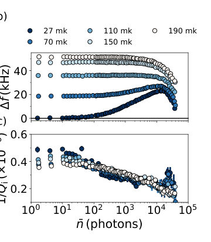 
Figure 3 (b) displays the frequency shift in the f0 = 7.53 GHz device compared to the low-power and low- temperature reference value ∆f(T, ¯n) = f0(T, ¯n) − f0(T = 27 mK, ¯n ≈1), together with the internal loss rate. For the lowest temperature T = 27 mK, the reso- nance frequency increases as we increase the intra-cavity photon number ¯n until it reaches a maximum after which it continues to monotonically decrease.

📷 Fig 5

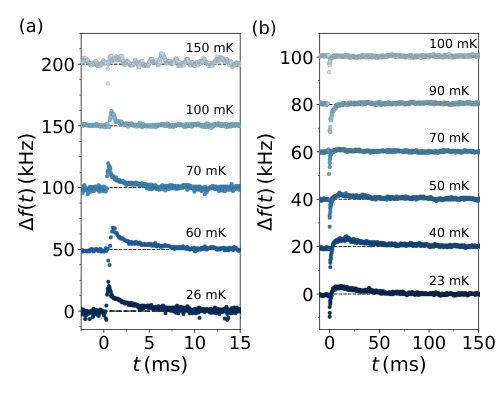 
FIG. 4. High energy events. Characteristic time and tem- perature dependence of high energy events detected in sam- ples 7.53 GHz and 5.31 GHz. For better visibility, the curves are offset with respect to each other. Interestingly, unlike in most other superconducting resonators, the initial frequency shift can be either positive (panel a) or negative (panel b), depending on the sample. For all measured resonators, this initial spike is followed by a period of positive frequency shift, which then relaxes to the steady state over a longer timescale. In both devices, the positive frequency shift disappears with elevated base temperature, as also observed in the tempera- ture and power...

**Summary.** This work investigates anomalous frequency shifts in superconducting granular aluminum resonators, finding that the frequency initially increases with temperature and power at low temperatures, contrary to standard TLS predictions. The authors propose a quasiparticle mechanism related to the granular structure to explain this anomaly. The findings are crucial for advancing superconducting circuits in quantum technology by pinpointing fundamental loss mechanisms.

**Why it may be interesting.** The anomalous electrodynamics observed in superconducting resonators, particularly the deviation from standard TLS predictions, touches upon non-equilibrium dynamics and quasiparticle physics relevant to open quantum systems.

Detailed structure

**Main problem.** The primary goal is to identify the dominant loss mechanisms and explain the anomalous frequency shifts observed in low-loss superconducting granular aluminum (grAl) resonators.

**Main result.** The resonance frequency exhibits an initial positive shift with increasing temperature and power at low T, contradicting standard Two-Level System (TLS) predictions, which can partially be explained by superconducting quasiparticle effects in a granular system.

**Method.** The study involves characterizing the complex admittance by measuring the resonance frequency and loss rate as functions of temperature and input power in the single-photon regime.

**Model / system.** The physical system is a superconducting resonator made from granular aluminum (grAl). Theoretical models considered include the TLS model and an alternative model treating grAl as an array of superconducting grains with spatially non-uniform superconducting gaps.

**Key observables.** Resonance frequency shift ($\Delta f$), internal loss rate ($1/Q_i$), and their dependence on temperature ($T$) and readout power ($P_{in}$).

**Important parameters / regimes.** Low temperatures (down to $\sim 100$ mK), single-photon regime ($ar{n} \approx 1$), and the superconducting gap structure.

**Assumptions / limitations.** The standard TLS model is assumed to be insufficient for describing the low-temperature frequency dependence, and the quasiparticle model is used to explain the initial anomalous behavior.

**Figures summary.** Figures show the temperature dependence of frequency and loss, the power dependence of frequency shift, and the time dynamics of frequency following high-energy events.

**Paper structure.** The paper systematically presents measurements showing deviations from standard models (TLS), proposes a quasiparticle mechanism to explain the low-T anomalies, and discusses limitations regarding the loss rate and high-energy response.

Abstract

Superconducting high-kinetic inductance materials like granular aluminum (grAl) are a versatile part of the circuit quantum electrodynamics (cQED) toolbox, provided their losses at microwave frequencies are low enough. To further advance the use of grAl in quantum devices, it is indispensable to identify the dominant loss mechanisms. The standard approach pairs electromagnetic simulations of resonator geometry with measured temperature and power dependence of resonance frequency and loss rate. Most materials follow the phenomenological theory of two-level systems (TLSs) at low temperatures, resulting in an initial decrease of the resonance frequency with increasing temperature. In our work, we observe an opposite behavior at the lowest temperatures: The resonance frequency initially increases with both temperature and readout power, contradicting the standard TLS model predictions. We are able to explain a part of the data by an alternative mechanism associated with the effect of superconducting quasiparticles in a granular system with spatially-nonuniform gap. Yet, the observed change in the resonance frequency with temperature is not matched by a proportional change in the loss rate. We also observe anomalous positive frequency responses following high-energy events, characterized by several time scales. While anomalous behavior has been reported previously in grAl, the disagreement with standard models is particularly visible in our devices thanks to their exceptionally low loss rates.

[↑ back to top](#top)

### [Trade-off between Cooling-Step Count and Geometric Implementation Cost in Non-Markovian Algorithmic Cooling](http://arxiv.org/abs/2608.30660v1)

**Authors:** Yohei Azumai, Yoshihiko Hasegawa  
**Type:** both · **Category:** quantum information and computing · **PDF:** <https://arxiv.org/pdf/2608.30660v1>  
**Analysis basis:** full PDF text, analyzed in chunks
**Topic relevance:** `correlated / nonlocal dissipation` **2/5** · `driven-dissipative phase transition` **2/5** · `methods for driven-dissipative` **2/5** · `Keldysh / 2PI / non-Gaussian methods` **1/5** · `non-equilibrium universality` **1/5** · `quantum measurements` **1/5**

📷 Fig 1

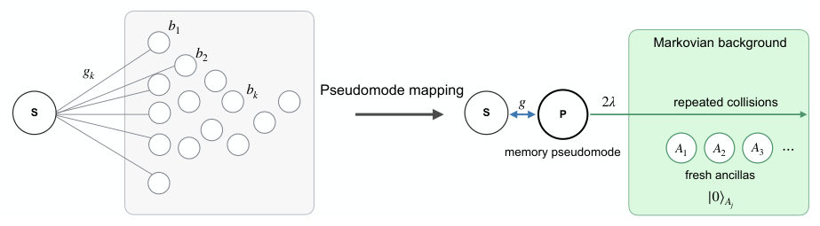 
FIG. 1. Pseudomode representation of the Lorentzian reservoir. (a) The target system S interacts with a structured bosonic reservoir composed of modes bk. (b) Under the pseudomode mapping, the reservoir memory is represented by a pseudomode P, which coherently exchanges excitations with S, while the residual Markovian background is implemented by repeated interactions with fresh ancillas Aj.

📷 Fig 2

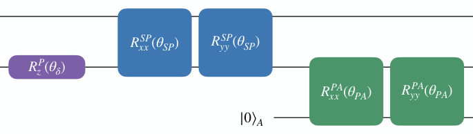 
FIG. 2. Gate decomposition of one pseudomode collision step. The detuning, system-pseudomode exchange, and pseudomode- ancilla collision operations are grouped as Uδ, USP , and UP A, respectively. The ancilla is initialized in |0⟩A, traced out after the collision, and replaced by a fresh ancilla at the next step. The explicit construction, continuous-time limit, and numerical validation are given in Appendix B.

📷 Fig 3

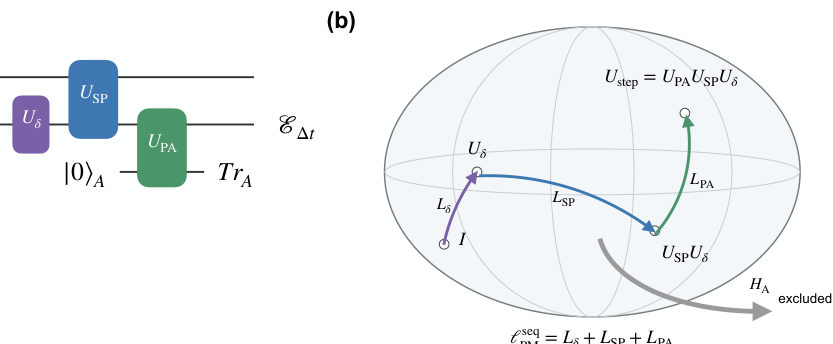 
FIG. 3. Geometric representation of one pseudomode collision step. (a) The sequential circuit implements Ustep = UP AUSP Uδ on the enlarged system eS = S + P and a fresh ancilla A, which is traced out after the collision. (b) The detuning, system- pseudomode exchange, and pseudomode-ancilla collision define consecutive segments of the specified unitary path, with lengths Lδ, LSP , and LP A, respectively. Their sum gives ℓseq PM = Lδ + LSP + LP A. The depicted path is not minimized over alternative circuit paths or unitary dilations. Details are given in Appendix C.

📷 Fig 4

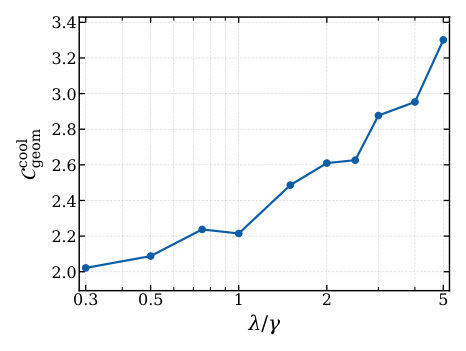 
FIG. 5. Accumulated geometric cooling cost Ccool geom(λ; ϵ) ob- tained from the matrix-based simulation. The cost is evalu- ated from Eq. (4) using Ncool(λ; ϵ) and the one-step geometric length ℓseq PM(λ). The parameters are the same as in Fig. 4. The line is a guide for the eye.

📷 Fig 5

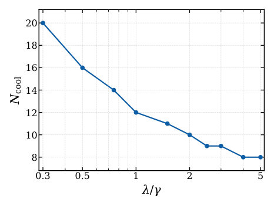 
FIG. 4. Cooling-step count Ncool(λ; ϵ) obtained from matrix- based density-matrix propagation as a function of the nor- malized spectral width λ/γ. The analysis is restricted to 0.3 ≤λ/γ ≤5, over which the collision circuit reliably ap- proximates the continuous pseudomode dynamics, as verified in Appendix B. The target is initialized with the Bloch vector (0.5, 0.5, 0.5). The parameters are γ∆t = 0.1, δ = 0, ϵ = 0.15, and Nmax = 20. The line is a guide for the eye.

**Summary.** This paper analyzes the resource trade-off in non-Markovian quantum cooling, balancing cooling efficiency (steps required) against the physical cost of implementation. By mapping the complex dynamics onto a collision circuit, the authors quantify the geometric cost associated with reservoir memory. They conclude that while memory can improve cooling steps, it often increases the overall resource cost, guiding better hardware-aware protocol design.

**Why it may be interesting.** This work provides a crucial resource-based perspective on open quantum systems, directly linking the physical mechanism of memory (non-Markovianity) to quantifiable hardware implementation costs, which is vital for designing practical quantum computation protocols.

Detailed structure

**Main problem.** The paper investigates the fundamental trade-off between achieving high quantum cooling performance and the associated resource cost when implementing non-Markovian quantum cooling protocols.

**Main result.** A clear trade-off is established: suppressing reservoir memory reduces the required cooling steps but generally increases the overall geometric implementation cost.

**Method.** The authors use a pseudomode mapping to represent non-Markovian dynamics as a Markovian process implemented via a repeated collision circuit, whose cost is quantified using a geometric path length formulation.

**Model / system.** The system is a single-qubit undergoing algorithmic cooling via interaction with a reservoir memory, modeled using a damped Jaynes-Cummings Hamiltonian and analyzed through its pseudomode representation.

**Key observables.** Cooling-step count ($N_{	ext{cool}}$) and geometric implementation cost ($C_{	ext{cool}}^{	ext{geom}}$).

**Important parameters / regimes.** Reservoir spectral width ($\lambda$), which controls the degree of non-Markovianity ($\lambda/\gamma$ regime).

**Assumptions / limitations.** The analysis focuses on the single-excitation sector, and the resource cost is based on the geometric path length in the collision circuit representation.

**Figures summary.** Figures illustrate the pseudomode mapping, the gate decomposition of a collision step, the geometric path defining the cost, and plots showing $N_{	ext{cool}}$ and minimum excited-state population versus the spectral width ratio $\lambda/\gamma$.

**Paper structure.** The paper first introduces the physical model and the pseudomode mapping. It then details the calculation of the geometric cost for the collision circuit. Finally, it analyzes the trade-off by comparing cooling performance metrics across different reservoir memory regimes.

Abstract

Quantum cooling is important for reliable quantum computation but involves a trade-off between cooling performance and implementation resources. Although reservoir memory can improve particular aspects of cooling performance, the associated resource cost, particularly for circuit implementation, remains insufficiently understood. Here, we investigate how reservoir memory affects the trade-off between cooling performance quantified by the cooling-step count and geometric implementation cost in single-qubit heat-bath algorithmic cooling. Using a pseudomode mapping, we represent the non-Markovian damped Jaynes--Cummings dynamics by a repeated collision circuit and evaluate its geometric implementation cost. Using matrix-based simulations and an implementation on the ibm_kawasaki Heron r2 processor, we identify a trade-off: suppressing reservoir memory reduces the cooling-step count but generally increases the geometric protocol cost. Our work provides a resource-based perspective on reservoir engineering for algorithmic cooling.

[↑ back to top](#top)

### [Duality Between Twist-Angle Disorder and Non-Hermitian Disorder](http://arxiv.org/abs/2608.29064v1)

**Authors:** Yi-Ming Wu, Nicole S. Ticea  
**Type:** theory · **Category:** disordered systems and neural networks · **PDF:** <https://arxiv.org/pdf/2608.29064v1>  
**Analysis basis:** full PDF text, analyzed in chunks
**Topic relevance:** `Keldysh / 2PI / non-Gaussian methods` **2/5** · `analog quantum simulation` **2/5** · `correlated / nonlocal dissipation` **1/5** · `driven-dissipative phase transition` **1/5** · `methods for driven-dissipative` **1/5** · `non-equilibrium universality` **1/5**

📷 Fig 1

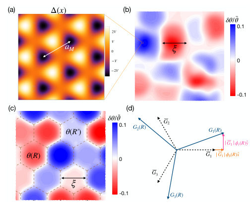 
FIG. 1. (a) Moir´e potential ∆(x) with constant twist angle, defined in Eq.(1), with the parameter φ ≈π/2. The peri- odicity is set by the moir´e unit cell length aM. (b) In the presence of twist-angle disorder, there are domains of uni- form twist angle whose length is set by ξ ≫aM. (c) Our model of twist-angle disorder. The system is divided into do- mains of the same size ξ, labeled by R. Within each supercell the twist angle is approximated as a constant, which permits a set of local lattice vectors aj(R), and hence Gj(R). (d) We parametrize the variations of Gj(R) by two scalar fields ϕr(R) and ϕb(R), see Eq.(3)

📷 Fig 2

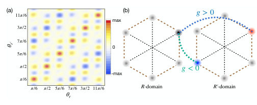 
FIG. 2. (a) Plot of g(r, r′; R−R′) as a function of θr and θr′ when |R −R′| is fixed and |r| = |r′| is set to be ∼ξ/2. (b) The peak (maximum and minimum) positions in (a) implies only six ‘hot spot’ at each domain boundary are effectively correlated , and correlations between different domains are such that when θr = θr′, g &gt; 0, and when θr = θr′ ±π, g &lt; 0, as implied from (a).

📷 Fig 3

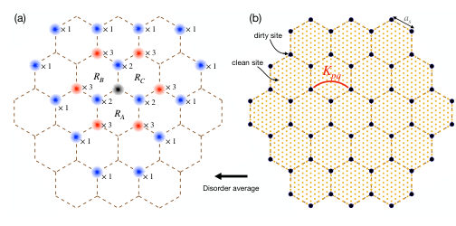 
FIG. 3. (a) Pattern of correlations with the central spot (black) induced by the twist-angle disorder when only the nearest neighbor domains are correlated (ℓν ∼ξ). Here the black spot correlates with the red ones positively, and with the blue ones negatively. The indicated integer multiples arise from the fact that we can view the black spot as the corners of RA, RB and RC domains. (b) In the tight-binding de- scription, the correlation in (a) can be equivalently induced by adding random onsite potentials to the corner sites (black dots), if the potential obey the same correlation v∗pvq = Kpq.

**Summary.** This work studies twist-angle disorder in moiré heterobilayers, showing that the disorder averaging process leads to a profound duality. This duality maps the geometric disorder onto a problem involving non-Hermitian Hamiltonians. This provides a powerful new theoretical tool to understand transport phenomena, particularly how the system can evade Anderson localization.

**Why it may be interesting.** The duality connects a geometrically induced disorder (twist angle) to a non-Hermitian framework, which is a key area of modern condensed matter theory relevant to open quantum systems and non-Hermitian physics.

Detailed structure

**Main problem.** The paper investigates the physical consequences of random variations in the twist angle within moiré heterobilayer systems.

**Main result.** It establishes a mathematical duality showing that twist-angle disorder is equivalent to coupling fermions to a non-Hermitian disorder, which can dynamically prevent Anderson localization.

**Method.** The analysis employs the replica trick and cumulant expansion to average over the disorder fields, leading to an effective action.

**Model / system.** The system is based on moiré heterobilayer systems (e.g., twisted bilayer WSe2/MoSe2), modeled by a continuum Hamiltonian subjected to random spatial variations in the twist angle.

**Key observables.** Correlation functions between replicas, localization behavior, and the effective action terms ($S^{(1)}_{	ext{dis}}, S^{(2)}_{	ext{dis}}$).

**Important parameters / regimes.** The analysis considers distinct length scales: Moiré lattice constant $\ll$ domain size $\ll$ system size, and the disorder correlation length $\ell_
u$.

**Assumptions / limitations.** The disorder is modeled by random scalar fields governed by a specific probability distribution, and the analysis relies on weak disorder approximations.

**Figures summary.** Figures illustrate the moiré potential under constant vs. disordered twist angles, the correlation pattern $g(r, r'; \delta R)$ showing positive and negative correlations, and the corresponding patterns in tight-binding descriptions.

**Paper structure.** The paper introduces the model Hamiltonian with twist-angle disorder, applies the replica trick and cumulant expansion to average the disorder, derives the effective action, and finally establishes the duality with non-Hermitian disorder.

Abstract

We propose and study a model of moire heterobilayer systems where the twist angle remains uniform and well defined only within a finite range, but deforms randomly at larger distances. The local twist angle is then subject to a certain probability distribution that penalizes large fluctuations around its mean value. Within the framework of the replica trick, we show that disorder averaging produces a nontrivial correlation with alternating sign between replicas, maximized only close the boundary of each local domain and along certain directions. We show that for the low-energy moire bands, exactly the same correlation can be generated in a dual model where fermions are coupled to non-Hermitian disorder, which can evade Anderson localization dynamically. This duality provides a new perspective to investigate twist-angle disorder in moire systems, and unveils some of the essential differences between twist-angle disorder and conventional disorder.

[↑ back to top](#top)

### [Evolution Generators for Complex Parameters](http://arxiv.org/abs/2608.29602v1)

**Authors:** Jen-Yin Yeh, Chia-Yi Ju  
**Type:** theory · **Category:** other · **PDF:** <https://arxiv.org/pdf/2608.29602v1>  
**Analysis basis:** full PDF text, analyzed in chunks
**Topic relevance:** `Keldysh / 2PI / non-Gaussian methods` **2/5** · `methods for driven-dissipative` **2/5** · `analog quantum simulation` **1/5** · `correlated / nonlocal dissipation` **1/5** · `driven-dissipative phase transition` **1/5** · `quantum measurements` **1/5**

📷 Fig 1

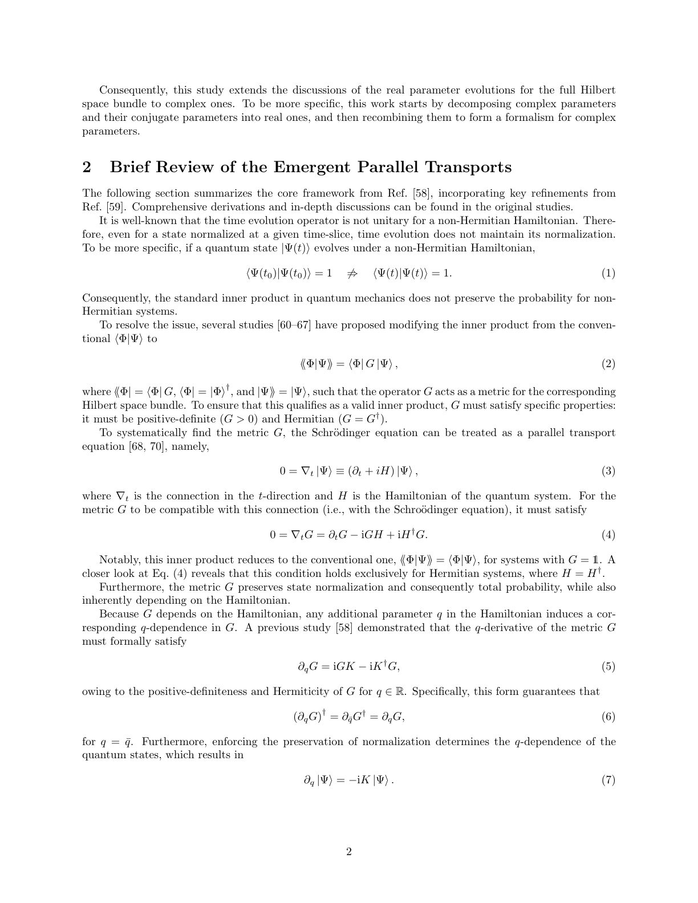 
Low-resolution page preview, page 2

📷 Fig 2

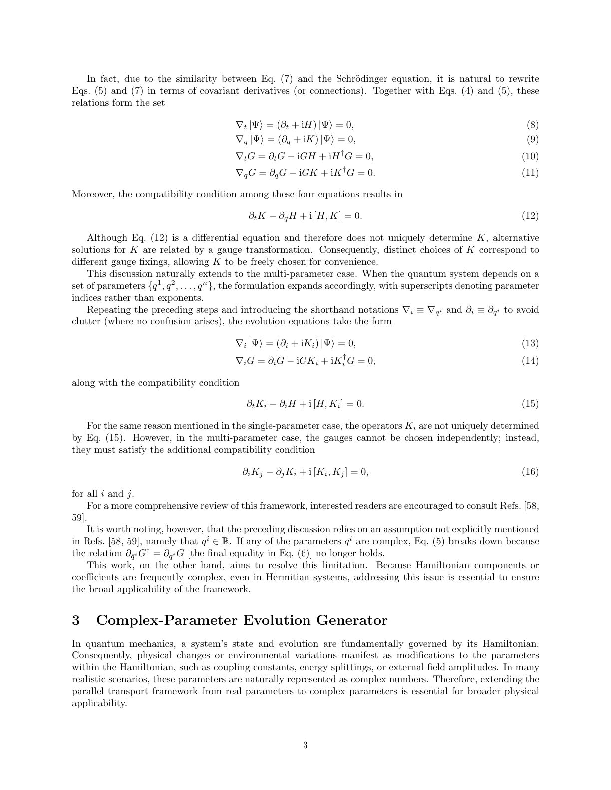 
Low-resolution page preview, page 3

📷 Fig 3

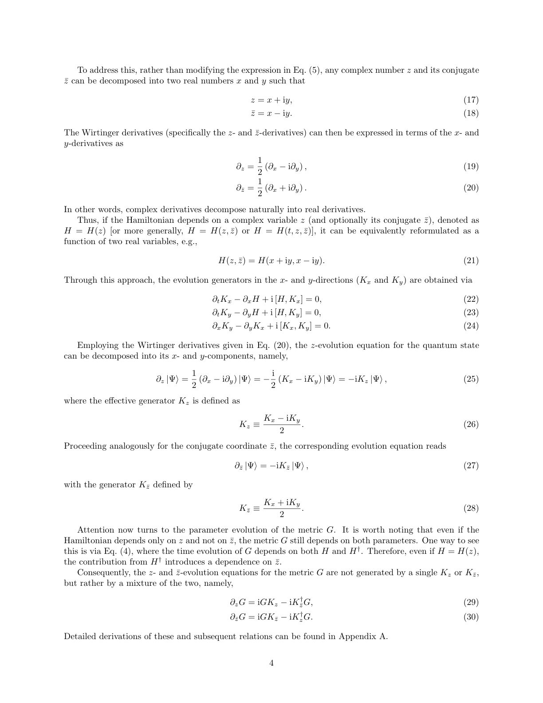 
Low-resolution page preview, page 4

📷 Fig 4

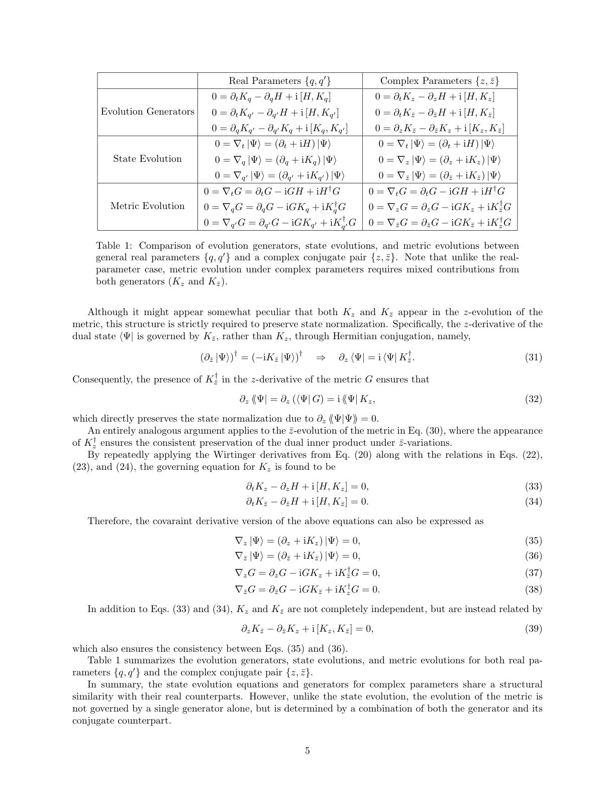 
Low-resolution page preview, page 5

📷 Fig 5

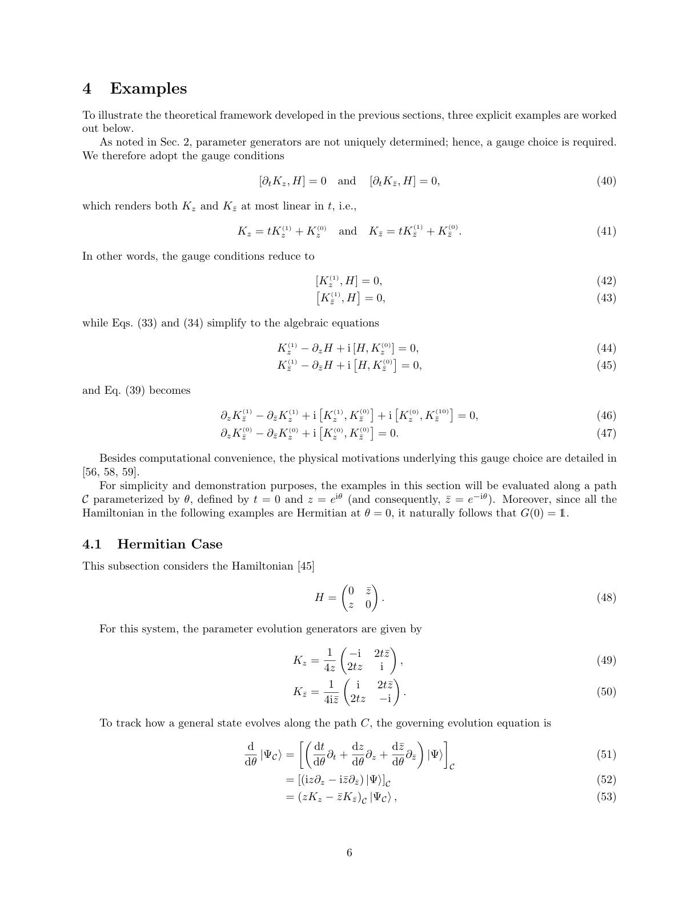 
Low-resolution page preview, page 6

**Summary.** This paper generalizes the theory of quantum evolution generators to handle complex external parameters using Wirtinger derivatives. It derives coupled evolution equations for both the quantum state and the metric of the Hilbert space bundle. The key finding is that maintaining state normalization under complex parameter changes requires a specific, coupled contribution from both the parameter's generator and its conjugate counterpart.

**Why it may be interesting.** This is highly relevant for theoretical physicists working on open quantum systems or quantum optics, as many physical controls (like detunings or coupling strengths) can be complex, and preserving physical quantities like normalization is crucial.

Detailed structure

**Main problem.** The study aims to extend the formalism for deriving quantum state evolution generators from real-valued to complex-valued external parameters.

**Main result.** The evolution of the metric of the Hilbert space bundle under complex parameters requires a coupled contribution from both the evolution generator and its conjugate counterpart to maintain state normalization.

**Method.** The authors employ Wirtinger derivatives to treat the complex parameter and its conjugate as independent variables, adapting established parameter-dependent quantum evolution formalisms.

**Model / system.** The work analyzes quantum systems whose Hamiltonian is dependent on complex parameters, $H(z, ar{z})$. The formalism tracks the evolution of the quantum state $|\Psi
angle$ and the metric $G$ of the Hilbert space bundle.

**Key observables.** Evolution generators ($K_z, K_{ar{z}}$), the metric $G$, and the state normalization $\langle \Psi | \Psi 
angle$.

**Important parameters / regimes.** Complex parameters $z$ and $ar{z}$, and the Hamiltonian $H(z, ar{z})$.

**Assumptions / limitations.** The primary assumption is the successful generalization of the formalism by treating $z$ and $ar{z}$ as independent variables using Wirtinger derivatives.

**Figures summary.** Not specified.

**Paper structure.** The paper first establishes the necessity of extending the formalism to complex parameters, deriving coupled evolution equations for the metric $G$ and the generators $K_z, K_{ar{z}}$. It then applies this framework to specific physical examples, including the Hermitian and PT-symmetric cases, to demonstrate physical consistency.

Abstract

Theoretical studies on how quantum systems are affected by external factors are often formulated through parameter changes in the system's Hamiltonian. Beyond Berry connections and phases, which focus on specific Hamiltonian eigenstates, recent studies inspired by non-Hermitian quantum formalisms provide a framework for obtaining general state evolution generators for real-valued parameters. This study extends the applicability of the evolution generator formalism to complex-valued parameters via Wirtinger derivatives. By treating a complex parameter and its conjugate as independent variables, the evolution equations are derived for both quantum states and the metric of the Hilbert space bundle. The analysis demonstrates that while state evolution with respect to a complex parameter is naturally governed by its corresponding evolution generator, metric evolution requires a coupled contribution from both the generator and its conjugate counterpart to preserve state normalization. Explicit examples are worked out to illustrate the implementation and physical consistency of the formalism.

[↑ back to top](#top)

### [Work Extraction Across a Thermodynamic Hierarchy in Quantum Many-Body Systems](http://arxiv.org/abs/2608.31001v1)

**Authors:** Akihiro Hokkyo, Masahito Ueda  
**Type:** theory · **Category:** statistical mechanics · **PDF:** <https://arxiv.org/pdf/2608.31001v1>  
**Analysis basis:** full PDF text, analyzed in chunks
**Topic relevance:** `analog quantum simulation` **2/5** · `Keldysh / 2PI / non-Gaussian methods` **1/5** · `correlated / nonlocal dissipation` **1/5** · `driven-dissipative phase transition` **1/5** · `methods for driven-dissipative` **1/5** · `non-equilibrium universality` **1/5** · `quantum measurements` **1/5**

📷 Fig 1

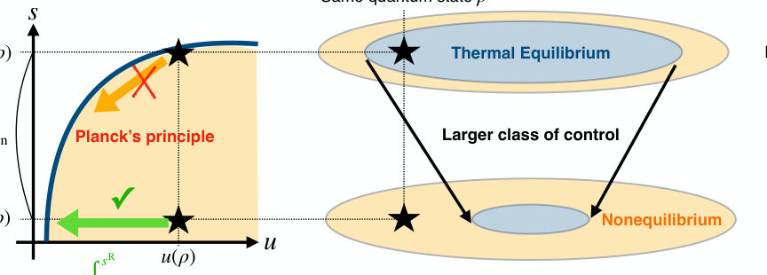 
FIG. 1. Schematic of extractable work across thermodynamic levels. Consider a quantum state ρ that is in thermal equilibrium at a specific thermodynamic level (the “restricted” level), i.e., with respect to a given observational resolution and a compatible class of operations. At this level, the entropy sR(ρ) equals the thermodynamic entropy, and Planck’s principle prohibits work extraction from this state via an adiabatic cycle. With a higher observational resolution and a broader class of operations (the “enlarged” level), the same state ρ may become out of equilibrium. Consequently, the expanded class of operations may allow work to be extracted from ρ. Any such additional work is...

📷 Fig 2

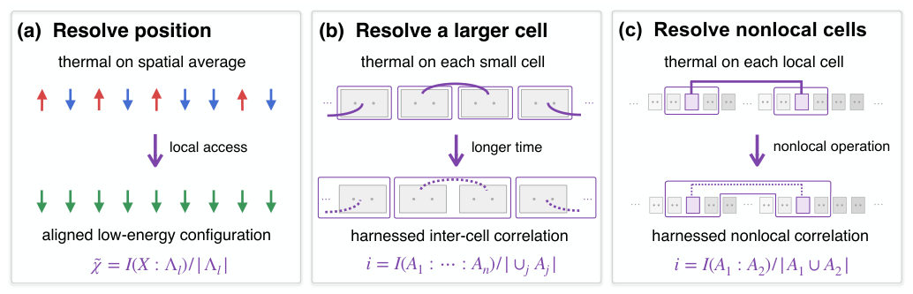 
FIG. 2. Three methods to extract work by enlarging the control class. (a) A spatially varying configuration can become thermal after positional averaging, yet local access to microscopic position enables one to utilize the position-state Holevo information to extract additional work. (b) Individual small cells appear thermal, although their union need not, owing to inter-cell correlations; a longer short-range operation can resolve the larger cell to extract additional work. (c) Spatially separated cells can each be locally thermal yet jointly correlated; nonlocal control can resolve their disconnected union as a single nonlocal cell and access its total correlation to extract additional...

📷 Fig 3

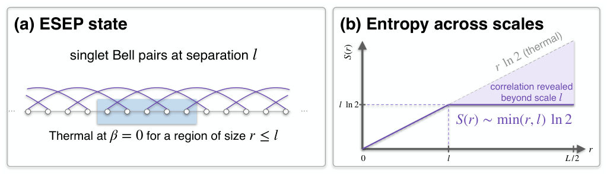 
FIG. 3. Equally-separated entangled-pair (ESEP) state and its entropy landscape across varying scales. (a) A segment of |ESEPl⟩: every site belongs to a singlet Bell pair whose endpoints are separated by l sites. Any contiguous interval of length r ≤l contains no complete pair and is therefore maximally mixed, appearing thermal at β = 0. (b) The entropy of a region of length r follows the thermal value r ln 2 up to the pairing scale l and equals (l + O(1)) ln 2 for l ≤r ≤L/2. The nonlocal pair correlations give rise to the entropy difference shown in the shaded region.

**Summary.** This paper develops a thermodynamic hierarchy for quantum many-body systems, showing that the amount of extractable work depends on the allowed set of operations. The key finding is that the excess work is bounded by the difference in entropy densities between the restricted and expanded operational levels. This provides a powerful, information-theoretic tool to quantify hidden work resources in quantum matter.

**Why it may be interesting.** This work provides a rigorous, information-theoretic framework for quantifying non-equilibrium work extraction in quantum systems, directly linking thermodynamic potential differences to quantum information measures.

Detailed structure

**Main problem.** The paper investigates the thermodynamic hierarchical structure of observables and allowed operations in isolated quantum many-body systems.

**Main result.** The extractable work when enlarging the set of allowed operations is bounded by the difference between the entropy densities of the restricted and enlarged operational levels.

**Method.** The authors establish quantitative bounds by relating work extraction to the difference in entropy functionals (e.g., mutual information density, Holevo information) across different operational regimes.

**Model / system.** The analysis focuses on isolated quantum many-body states ($
ho$) on a lattice, considering various operational constraints such as spatial resolution, control duration, and non-local connectivity.

**Key observables.** Extractable Work Density, Entropy Densities ($s_R, s_E$), Mutual-Information Density, Holevo Information, Total Correlation.

**Important parameters / regimes.** Inverse temperature ($eta$), system size ($L$), spatial resolution ($l$), and the difference between entropy levels.

**Assumptions / limitations.** The framework assumes cyclic operations with no heat exchange, and later sections rely on the existence of thermodynamic limits and decay properties of interaction profiles.

**Figures summary.** Figure 1 schematically illustrates work extraction across thermodynamic levels, bounded by the entropy difference. Figure 2 illustrates work gain across different spatial scales, relating it to entropy differences.

**Paper structure.** The paper develops the concept of a thermodynamic hierarchy, first establishing general bounds on work extraction based on entropy differences, and then applying this framework to specific physical extensions like increased spatial resolution or nonlocal connectivity.

Abstract

Thermodynamics is operational in the sense that the very concept of thermal equilibrium depends crucially on the choice of observables, while the amount of extractable work is defined relative to the allowed operations. Here we show that isolated quantum many-body states admit a thermodynamic hierarchical structure of observables and allowed operations, where the same state can be thermal at one level of the hierarchy and athermal at another. Enlarging the set of allowed operations therefore renders such hidden athermality a potential resource for work extraction; the resulting work gain is bounded in terms of the difference between the entropy densities of the two levels. This entropy difference takes the form of the mutual-information density. We establish the bounds for three extensions of operational access: increased spatial resolution, increased duration of control, and nonlocal connectivity, which provide access to position-state Holevo information, correlations between neighboring regions and spatially nonlocal correlations, respectively. Thus the difference between entropies at different levels of the thermodynamic hierarchy governs the bound on the work gain associated with moving to a less restricted level.

[↑ back to top](#top)

### [Quantum Imaginary Time Evolution on an Infinite 1D Chain](http://arxiv.org/abs/2608.30363v1)

**Authors:** Hao-Ti Hung, Tung Tsao, Ying-Jer Kao  
**Type:** both · **Category:** quantum information and computing · **PDF:** <https://arxiv.org/pdf/2608.30363v1>  
**Analysis basis:** full PDF text, analyzed in chunks
**Topic relevance:** `QC/QI experiment` **2/5** · `analog quantum simulation` **2/5** · `methods for driven-dissipative` **2/5** · `quantum measurements` **1/5**

📷 Fig 1

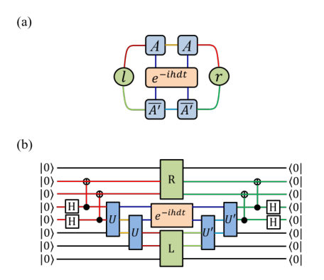 
FIG. 1. Transformation of the cost function in Eq. (3) from a TN diagram to a quantum-circuit representation. Because the bra state ⟨000 · · · | cannot be directly implemented on a quantum computer, the overlap is estimated by measuring the output state.

📷 Fig 2

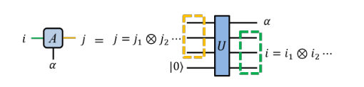 
FIG. 2. The mapping between a one-site unit cell of the uMPS and a unitary gate in the quantum circuit.

📷 Fig 3

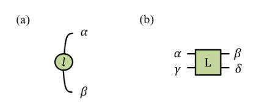 
FIG. 3. (a) The left environment of the uMPS. (b) The left environ- ment of the quantum circuit.

📷 Fig 4

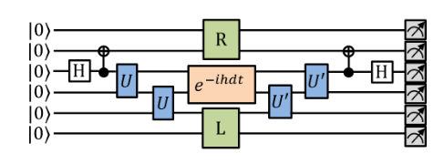 
FIG. 4. Quantum-circuit representation of the cost function in Eq. (3) for bond dimension D = 2.

📷 Fig 5

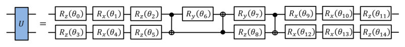 
FIG. 5. Example of a PQC with virtual bond dimension D = 2. We use the ansatz provided in the GitHub repository associated with Ref. [15]. Here, Ri denotes a rotation about the i axis.

**Summary.** This work introduces a quantum-circuit algorithm to simulate imaginary-time evolution on infinite 1D quantum chains, crucial for finding ground-state energies. It details using the Time-Dependent Variational Principle mapped onto quantum circuits and refines the results using the quantum Lanczos algorithm. Furthermore, the paper provides a deep statistical analysis of noise sources encountered when estimating energy via quantum measurements.

**Why it may be interesting.** It provides concrete, implementable quantum algorithms for simulating ground-state properties of 1D quantum systems, directly bridging advanced quantum simulation techniques (MPS, TDVP) with NISQ hardware constraints (noise analysis).

Detailed structure

**Main problem.** The paper addresses the challenge of performing imaginary-time evolution (ITE) on infinite 1D quantum lattice systems using quantum circuits.

**Main result.** The quantum Lanczos algorithm provides a robust method to estimate the ground-state energy, outperforming simple unitary approximations, while statistical analysis reveals complex noise sources in optimization landscapes.

**Method.** The core method adapts the Time-Dependent Variational Principle (TDVP) to map the non-unitary ITE operator onto parameterized quantum circuits (PQC) using techniques like ancilla-assisted embedding.

**Model / system.** The primary physical system is an infinite 1D quantum chain, benchmarked using the transverse-field Ising model. The quantum state is represented by uniform Matrix Product States (uMPSs).

**Key observables.** Ground-state energy estimate, cost function distribution, energy density distribution, and the ratio of parameter variance to shot noise variance.

**Important parameters / regimes.** Bond dimension (D=2), number of shots ($N_{	ext{shots}}$), and the time step ($	au$).

**Assumptions / limitations.** The method assumes translational invariance (uMPS ansatz) and relies on approximations for the non-unitary evolution operator (e.g., unitary embedding or unitary approximation).

**Figures summary.** Figures illustrate the mapping of cost functions to quantum circuits, compare energy estimates from different methods (QLanczos vs. QITE), and show the statistical comparison of energy fluctuations against theoretical distributions.

**Paper structure.** The paper first reviews TDVP for real-time evolution, then details the quantum-circuit TDVP framework for ITE on infinite systems, followed by detailed analyses of energy estimation refinement using QLanczos and statistical characterization of noise in optimization landscapes.

Abstract

We introduce a quantum-circuit algorithm for performing imaginary-time evolution on infinite one-dimensional lattice systems. The method uses a parameterized quantum circuit to represent a uniform matrix product state ansatz. We derive the ITE algorithm using the time-dependent variational principle and employ the quantum Lanczos algorithm to improve the ground-state energy estimate. As a benchmark, we simulate the transverse-field Ising model using both classical simulators and IBM Quantum devices. Our analysis includes a statistical study of the distributions of the cost function and energy density obtained from quantum measurements, illustrating the effects of finite-sampling noise on convergence.

[↑ back to top](#top)

### [Active Brownian Dynamics from a Hamiltonian Model: Transitioning from Equilibrium to Activity](http://arxiv.org/abs/2608.30670v1)

**Authors:** Antik Bhattacharya, Smarajit Karmakar, Jürgen Horbach  
**Type:** theory · **Category:** statistical mechanics · **PDF:** <https://arxiv.org/pdf/2608.30670v1>  
**Analysis basis:** full PDF text, analyzed in chunks
**Topic relevance:** `non-equilibrium universality` **2/5** · `Keldysh / 2PI / non-Gaussian methods` **1/5** · `correlated / nonlocal dissipation` **1/5** · `driven-dissipative phase transition` **1/5** · `methods for driven-dissipative` **1/5**

📷 Fig 1

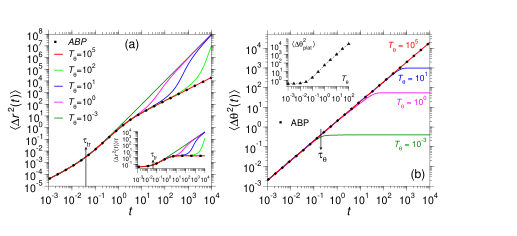 
FIG. 1. (a) Translational MSD, ⟨∆⃗r 2(t)⟩, for the HABP model for Dtr = 0.01 (with Ttr = 10−3 fixed) and Dθ = 1.0, varying Tθ from 10−3 to 105 (see text). The black dotted line is the corresponding ABP result for Dtr = 0.01, Dθ = 1.0, and v0 = 1.0. The inset shows the same data but now ⟨∆⃗r 2(t)⟩/t is plotted as function of time. (b) Same as a), but now for the ro- tational MSD, ⟨∆θ2(t)⟩. The inset shows the plateau height ⟨∆θ2 plat⟩as a function of Tθ.

📷 Fig 2

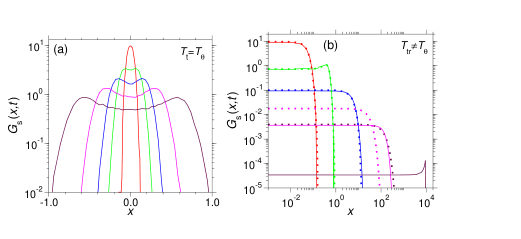 
FIG. 2. (a) Van Hove correlation, Gs(x, t), for Ttr = Tθ = 10−3 (equilibrium) and the times t = 0.036, 0.115, 0.205, 0.365, and 0.652 (using the color gradient from red to brown with increasing time). (b) Gs(x, t) for Ttr = 10−3 and Tθ = 102 at times t = 0.038, 0.483, 15.0, 483.33, and 10000.0 (keeping Dtr = 0.01 and Dθ = 1.0). The dotted lines are the corresponding ABP results, in quantitative agreement with HABP up to t = 15.0.

📷 Fig 3

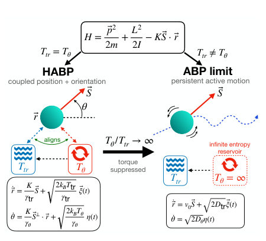 
FIG. 4. Schematic illustration of the transition from equilibrium to active dynamics in the HABP model.

📷 Fig 4

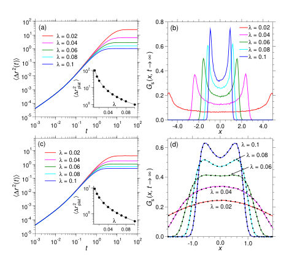 
FIG. 3. HABP/ABP in a harmonic potential. (a) MSD, ⟨∆⃗r 2(t)⟩, for the equilibrium HABP (Tθ = Ttr = 10−3) at various trap strengths 0.02 ≤λ ≤0.1. In- set: Plateau value ⟨∆r 2 plat⟩versus λ; the solid line shows the analytical prediction. (b) Stationary van Hove correlation function Gs(x, t →∞) for the states in (a). (c) MSD for the non-equilibrium case (Tθ = 105 &gt; Ttr = 10−3) across the same range of λ. In- set: ⟨∆r 2 plat⟩versus λ (filled circles) compared to the analytical prediction (solid line; see text). (d) Cor- responding stationary van Hove correlation function Gs(x, t →∞) for the states in (c). Dotted black lines indicate the ABP model.

**Summary.** This paper introduces the Hamiltonian Active Brownian Particle (HABP) model to provide a first-principles, equilibrium-inspired description of active matter. By coupling translational and rotational motion to separate heat baths, the model naturally transitions from equilibrium dynamics to non-equilibrium active states. The key achievement is quantifying activity through the entropy production rate and showing quantitative agreement with standard ABP models in the appropriate limits.

**Why it may be interesting.** This work provides a rigorous, Hamiltonian-based foundation for active matter, moving beyond purely phenomenological models by deriving activity from explicit thermodynamic asymmetries between coupled baths.

Detailed structure

**Main problem.** The paper aims to develop an equilibrium-inspired theoretical framework to describe the non-equilibrium dynamics of active matter, specifically bridging the gap between standard Active Brownian Particles (ABPs) and an underlying Hamiltonian description.

**Main result.** The Hamiltonian Active Brownian Particle (HABP) model successfully reproduces the non-equilibrium behavior of ABPs when the translational and rotational baths are coupled with different temperatures, quantifying activity via entropy production.

**Method.** The authors use overdamped Langevin equations derived from a Hamiltonian that couples translational and rotational degrees of freedom to separate heat baths, analyzing Mean Squared Displacements (MSDs) and entropy production rates.

**Model / system.** The system is modeled by the Hamiltonian Active Brownian Particle (HABP) model, which includes position ($\vec{r}$), momentum ($\vec{p}$), and spin orientation ($\vec{S}$). The dynamics are governed by coupling to two baths at potentially different temperatures ($T_{tr}$ and $T_{	heta}$).

**Key observables.** Mean Squared Displacements (MSDs) for both translational and rotational motion, and the steady-state entropy production rate ($\dot{\sigma}$).

**Important parameters / regimes.** The temperature ratio ($T_{	heta}/T_{tr}$), the coupling constant ($K$), the trap strength ($\lambda$), and the damping coefficients ($\gamma_{tr}, \gamma_{	heta}$).

**Assumptions / limitations.** The analysis relies on deriving Langevin equations from a Hamiltonian and making approximations in the non-equilibrium limit, such as assuming rotational dynamics are noise-dominated for calculating $\langle\vec{S} \cdot \vec{r}
angle$.

**Figures summary.** Figures illustrate the MSDs for HABP vs. ABP across varying rotational temperatures, showing crossovers from diffusive to ballistic regimes. Other figures plot Van Hove correlation functions and analyze MSDs in a harmonic potential.

**Paper structure.** The paper first establishes the HABP model and its equilibrium properties, showing agreement with fluctuation-dissipation theorems. It then analyzes the non-equilibrium limit by setting $T_{	heta} 
eq T_{tr}$, demonstrating the emergence of activity and calculating the resulting entropy production. Finally, it extends the framework to interacting particles in a harmonic trap to study collective effects.

Abstract

We introduce a Hamiltonian Active Brownian Particle (HABP) model that connects equilibrium dynamics with the non-equilibrium, two-dimensional overdamped behavior of standard Active Brownian Particles (ABPs). In equilibrium, the system follows overdamped Langevin equations that strictly satisfy the fluctuation-dissipation theorem. Coupling translational and rotational degrees of freedom to separate heat baths ($T_θ > T_{\textrm{tr}}$), drives the system out of equilibrium. In free space, matching the diffusion coefficients yields quantitative agreement with the ABP model in the limit $T_θ/T_{\textrm{tr}}\to \infty$, whereas in a harmonic potential, this matching is recovered even at finite temperature ratios. Entropy production analysis demonstrates that in the ABP limit, all energy injected by the swim force dissipates into the translational bath, leaving the rotational bath as a zero-cost entropy source. These insights provide the first steps toward equilibrium-inspired descriptions of active matter, facilitating the development of new theoretical frameworks to study activity-induced fluctuations, transport, and phase behavior in living and non-living soft matter systems far from equilibrium.

[↑ back to top](#top)

### [Rotating-wave approximation for spin-boson models with structured fields](http://arxiv.org/abs/2608.31090v1)

**Authors:** Aitor Balmaseda, Davide Lonigro, Juan Manuel Pérez-Pardo  
**Type:** theory · **Category:** other · **PDF:** <https://arxiv.org/pdf/2608.31090v1>  
**Analysis basis:** full PDF text, analyzed in chunks
**Topic relevance:** `Keldysh / 2PI / non-Gaussian methods` **2/5** · `methods for driven-dissipative` **2/5** · `Tavis-Cummings & cavity-many-emitter` **1/5** · `correlated / nonlocal dissipation` **1/5**

📷 Fig 1

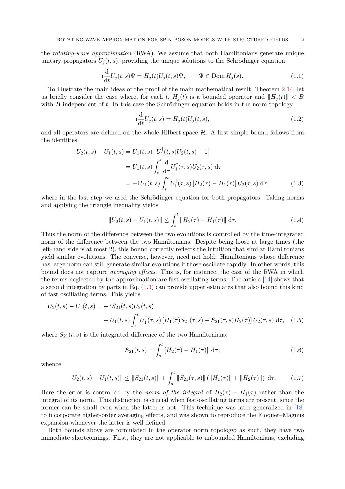 
Low-resolution page preview, page 2

📷 Fig 2

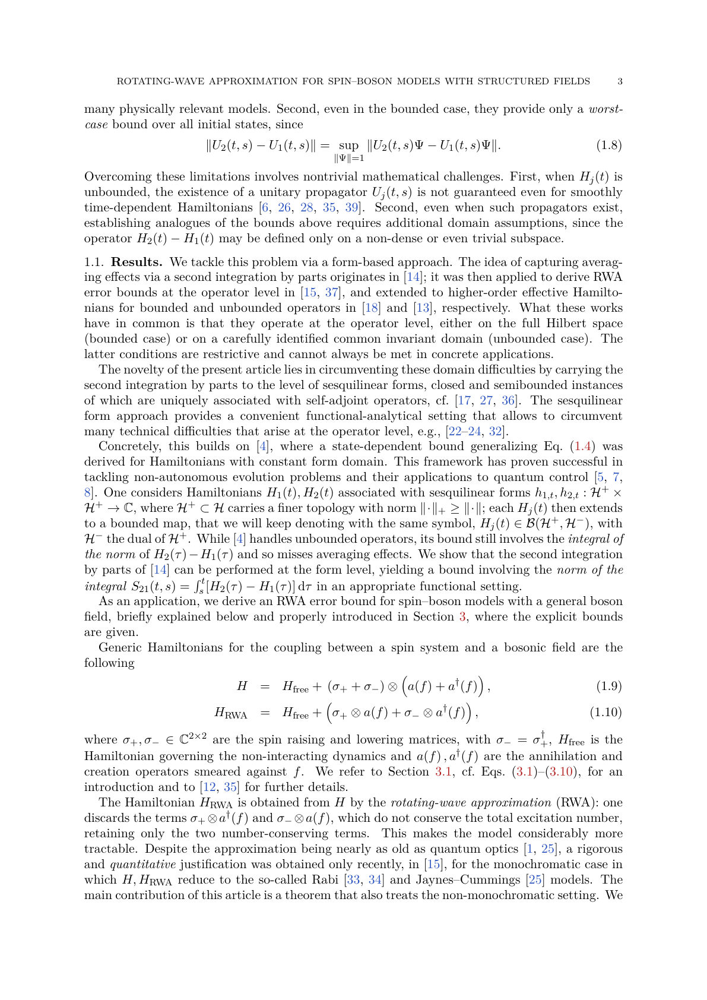 
Low-resolution page preview, page 3

📷 Fig 3

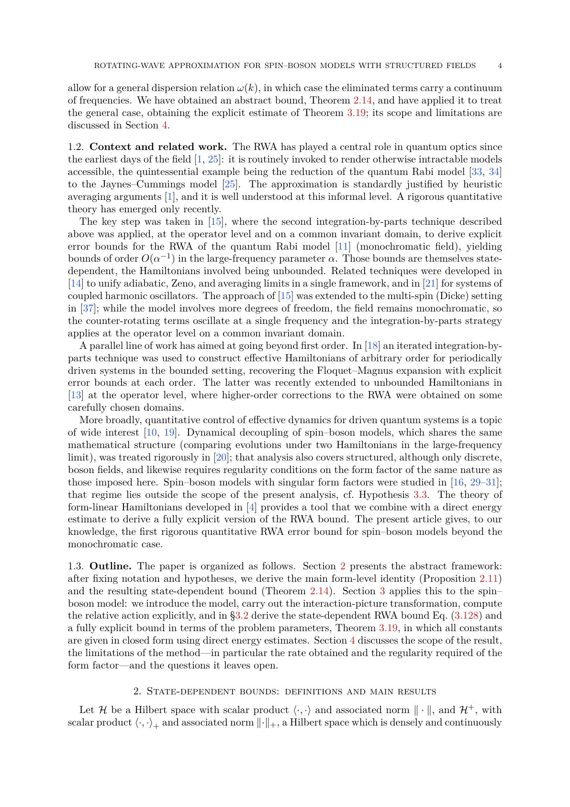 
Low-resolution page preview, page 4

📷 Fig 4

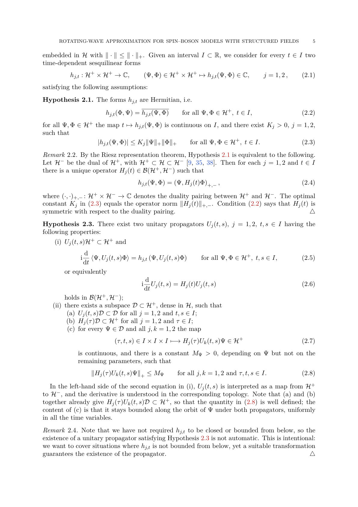 
Low-resolution page preview, page 5

📷 Fig 5

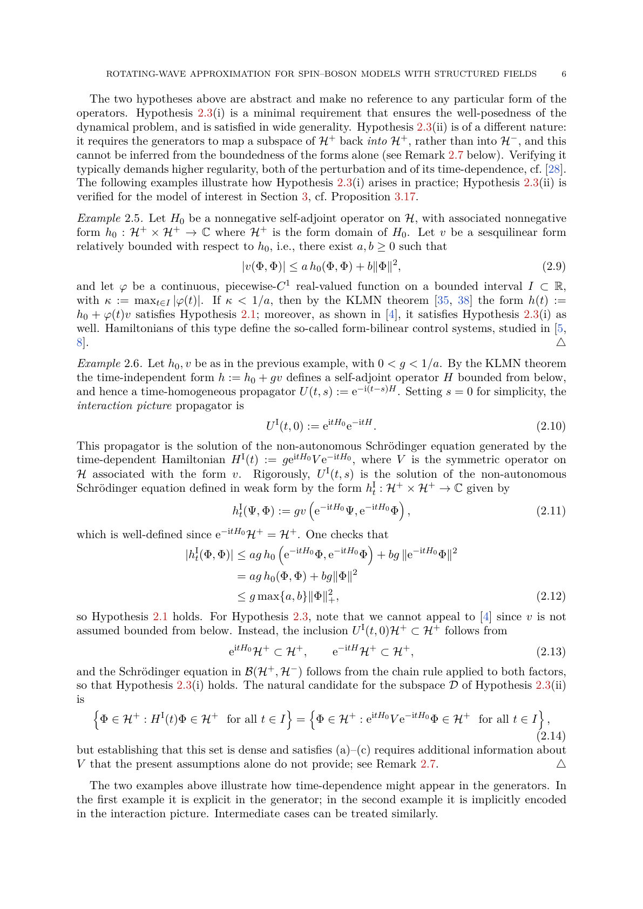 
Low-resolution page preview, page 6

**Summary.** This paper develops rigorous mathematical techniques to bound the error incurred when using the Rotating-Wave Approximation (RWA) in spin-boson models. By employing advanced analysis on sesquilinear forms, the authors derive an explicit error bound that confirms the RWA's accuracy in the high-frequency limit. This provides a powerful theoretical tool for analyzing quantum dynamics in structured environments.

**Why it may be interesting.** This work provides a rigorous, quantitative framework for analyzing approximations like the RWA, which is fundamental in quantum optics and open quantum systems, especially when dealing with complex, structured environments.

Detailed structure

**Main problem.** The paper rigorously derives quantitative, state-dependent error bounds for the Rotating-Wave Approximation (RWA) when applied to spin-boson models with structured boson fields.

**Main result.** It establishes an explicit error bound showing the RWA error vanishes as $O(\alpha^{-1})$ in the large-frequency limit, confirming the approximation's accuracy under specific mathematical conditions.

**Method.** The core method involves developing advanced mathematical tools, specifically using a second integration by parts at the level of sesquilinear forms, to control the difference between two quantum evolutions generated by different Hamiltonians.

**Model / system.** The system analyzed is the spin-boson model, which describes the interaction between a two-level quantum system (spin) and a bosonic field. The Hamiltonian comparison is between the full model and its RWA counterpart.

**Key observables.** The primary observable is the difference between the unitary propagators, $\lVert U_{	ext{RWA}}(t, s) - U(t, s) 
Vert$, quantified by explicit error bounds.

**Important parameters / regimes.** The analysis is sensitive to the large-frequency parameter ($\alpha$) and the structure of the boson field, characterized by its form factor and dispersion relation.

**Assumptions / limitations.** The derivation relies on advanced functional analysis, including the ability to perform integration by parts on sesquilinear forms and assuming the initial state lies in sufficiently high-regularity domains.

**Paper structure.** The paper progresses from establishing general mathematical tools for bounding differences between quantum evolutions (using sesquilinear forms) to applying these tools specifically to derive the quantitative RWA error bound for the spin-boson model.

Abstract

We derive state-dependent bounds on the difference between two quantum evolutions generated by unbounded Hamiltonians sharing a common form domain. The main technical tool is a second integration by parts, performed at the level of sesquilinear forms rather than at the operator level, which removes the need for a common invariant operator domain. The resulting estimate involves the norm of the time-integrated difference of the two generators, rather than the integral of its norm, and is therefore sensitive to the averaging effects produced by fast-oscillating terms. As an application we prove a quantitative bound on the rotating-wave approximation for spin-boson models with a structured boson field, described by an arbitrary massive dispersion relation on a general measure space and by a suitable class of form factors. The proof involves a careful analysis of the high-frequency scaling. The bound holds on a dense subspace of states, is fully explicit, and all the constants entering it depend only on the parameters of the model and not on the frequency scale, so that the approximation becomes exact in the limit of large frequency.

[↑ back to top](#top)

### [Fractal Confinement and Magnetic Self-sabotage of Current Flow: Electrons Near the Metal-insulator Crossover in a 2D $δ$-layer](http://arxiv.org/abs/2608.28739v1)

**Authors:** Xinghai Zhang, Matthew S. Foster, Markus Mueller  
**Type:** theory · **Category:** disordered systems and neural networks · **PDF:** <https://arxiv.org/pdf/2608.28739v1>  
**Analysis basis:** full PDF text, analyzed in chunks
**Topic relevance:** `Keldysh / 2PI / non-Gaussian methods` **2/5** · `analog quantum simulation` **2/5**

📷 Fig 1

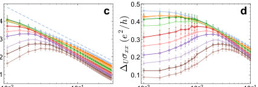 
FIG. 1. Longitudinal conductivity σxx in distorted triangular lattices with average lattice constant R. (a) T-dependence. (b) σxx scaled by its T = 0 limit. (c) The difference be- tween interacting and non-interacting systems, ∆Uσxx(T) ≡ σxx(U0, T) −σxx(U = 0, T), displays a predominant antilo- calizing spin-triplet Altshuler-Aronov correction [−log(T)] at high T. (d) At lower T, ∆Uσxx(T) adopts a localizing log(T) trend, most prominently for lower densities (larger R), imply- ing the dominance of the repulsive spin-singlet channel. The saturation for the lowest temperatures is a finite-size effect. At T = 0, the local magnetic moments break both spin SU(2) and time-reversal symmetries, so...

📷 Fig 2

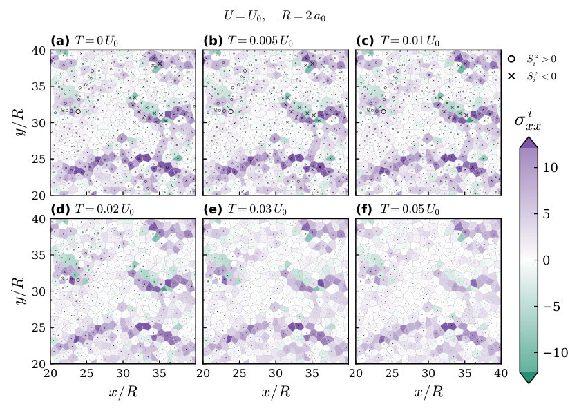 
FIG. 2. The local conductivity and local moments of a representative 20 × 20 sub-area of a critically dense (R = 2a0) sample of size 100×100, at different temperatures. The local longitudinal conductivity is represented by the filling color in the Wigner-Seitz cell surrounding a site, while the magnitude of the local moments is indicated by the size (area proportional to |Sz i |) of the circle (spin up) or cross (spin down). Note the strong correlation between strong current flow and large polarization at low T.

📷 Fig 3

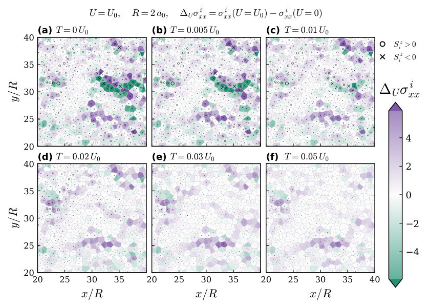 
FIG. 3. Local moments and the interaction-induced difference in local conductivity (as compared to a non-interacting system) in the same spatial region of the same sample as shown in Fig. 2.

📷 Fig 4

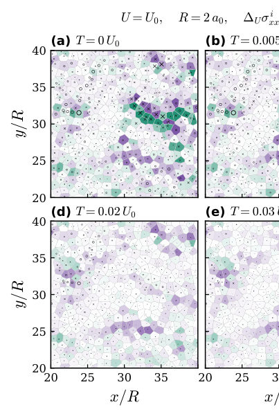 
Fig. 2 shows the formation of local magnetic moments alongside the evolution of σi αβ as the temperature is low- ered in systems with R = 2a0. At high T = 0.05U0 [Fig. 2(f)], there are no magnetic moments. The local conductivity is inhomogeneous because of the random dopant positions and concomitant modulated hopping. As T decreases [Figs. 2(c)–(e)], local moments form in regions where the current flow tends to be particularly strong. This is accompanied by a significant change of σi αβ in their vicinity. At very low T [Fig. 2(a) and (b)], the local moments form ferromagnetically correlated clusters, as expected from crossing a local Stoner instability. Not only is the magnitude of σi αβ...

📷 Fig 5

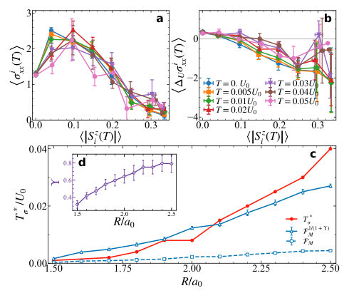 
FIG. 4. Correlation between local conductivity and local moments. σi xx and the interaction corrections to the local con- ductivity, ∆Uσi xx = σi xx(U = U0) −σi xx(U = 0), are averaged for sites with similar local moments. (a): Local conductivity [Eq. (4)] at T vs. local moment measured. (b): Interaction- induced corrections vs. magnetic moment. The curves in (a) and (b) display a nearly T-independent correlation. (c): The temperature T ∗ σ where the conductivity peaks, the fractal- enhanced spin-flip scattering rate [Eq. (6)], and the naive rate estimate 1/(τsU0) ∼FM vs. the average distance be- tween dopant atoms. The inset shows the Chalker exponent Υ = 1 −d2/2 with d2 the second...

**Summary.** This theoretical study models electron transport in 2D doped semiconductors near a metal-insulator transition. Using Hartree-Fock theory, the authors show that as temperature drops, the system initially conducts well but then enters an insulating state. This localization is driven by the spontaneous formation of local magnetic moments that scatter conduction electrons, effectively choking off the current flow.

**Why it may be interesting.** The mechanism of 'magnetic self-sabotage'—where electronic correlations drive localization—is a rich topic relevant to understanding disordered quantum materials and many-body localization phenomena.

Detailed structure

**Main problem.** The study investigates low-temperature transport and itinerant magnetism in 2D delta-doped semiconductors near the metal-insulator crossover.

**Main result.** The system exhibits a transition where initial conductivity enhancement is overcome by the formation of local magnetic moments, leading to an insulating downturn via spin-flip scattering.

**Method.** The analysis employs large-scale Hartree-Fock mean-field calculations combined with the Kubo-Greenwood formula to evaluate conductivity.

**Model / system.** The model is a 2D delta-doped semiconductor system described by a tight-binding Hamiltonian with onsite repulsion U0, simulating random dopant placement on a lattice.

**Key observables.** Longitudinal conductivity $\sigma(T)$, local magnetization $\langle|S_z^i|
angle$, and the interaction-induced correction to conductivity $\Delta U\sigma_{xx}(T)$.

**Important parameters / regimes.** The critical parameter is the dopant density (related to lattice constant R), and key energy scales are the onsite repulsion $U_0$ and hopping strength $t_{typ}$.

**Assumptions / limitations.** The primary approximations include the Hartree-Fock mean-field ansatz and the assumption that local moments align along a preferred axis (z-axis).

**Figures summary.** Figures illustrate the crossover of $\sigma_{xx}$ vs. $T$ showing the downturn correlated with moment formation, and local maps showing the spatial correlation between strong current flow and large local polarization.

**Paper structure.** The paper builds by first establishing the transport framework using HF calculations, then detailing the temperature dependence of conductivity, and finally linking the insulating downturn directly to the onset and dynamics of local magnetic moments.

Abstract

We study low-$T$ transport and itinerant magnetism in 2D $δ$-doped semiconductors. Large-scale Hartree-Fock calculations with random hoppings and repulsion $U_0$ reveal two transport regimes near a critical density. The conductivity $σ(T)$ initially increases as $T$ drops below $U_0 / 10$. However, at $T \sim U_0/100$, a tiny density of magnetic moments forms, driving an insulating downturn. Fractal wavefunctions locally amplify magnetic interactions, initially concentrating currents into branched filaments, but ultimately choking them off via dynamic SU(2) symmetry breaking.

[↑ back to top](#top)

### [Homogeneous attractive Bose-Einstein condensates with repulsive three-body interactions: the one-dimensional case](http://arxiv.org/abs/2608.29874v1)

**Authors:** Dinh-Thi Nguyen  
**Type:** theory · **Category:** quantum gases · **PDF:** <https://arxiv.org/pdf/2608.29874v1>  
**Analysis basis:** full PDF text, analyzed in chunks
**Topic relevance:** `Keldysh / 2PI / non-Gaussian methods` **2/5** · `analog quantum simulation` **2/5**

📷 Fig 1

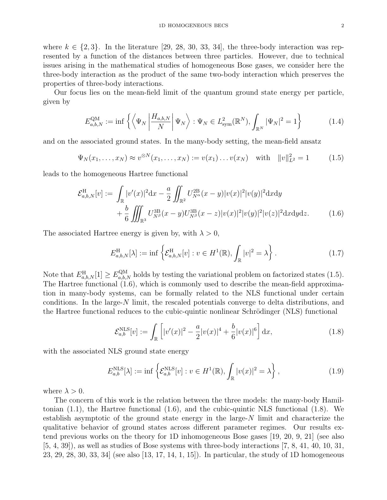 
Low-resolution page preview, page 2

📷 Fig 2

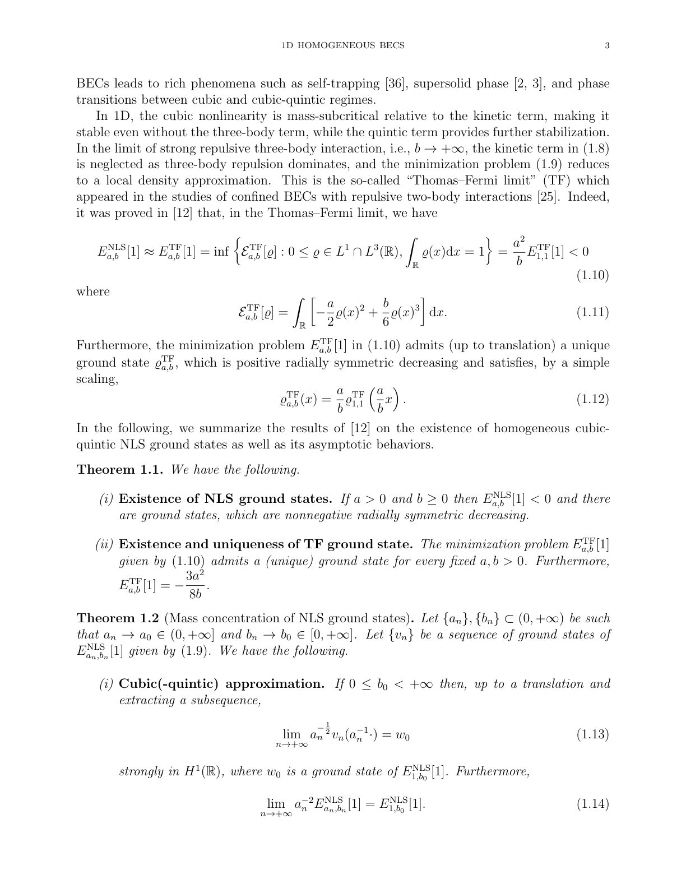 
Low-resolution page preview, page 3

📷 Fig 3

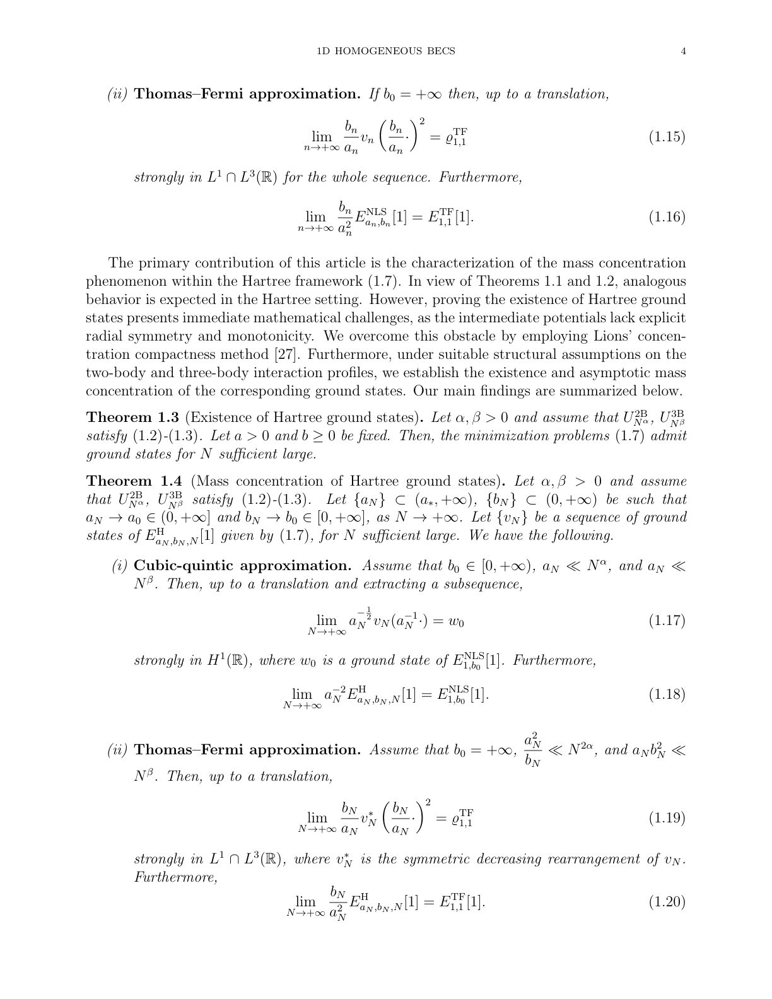 
Low-resolution page preview, page 4

📷 Fig 4

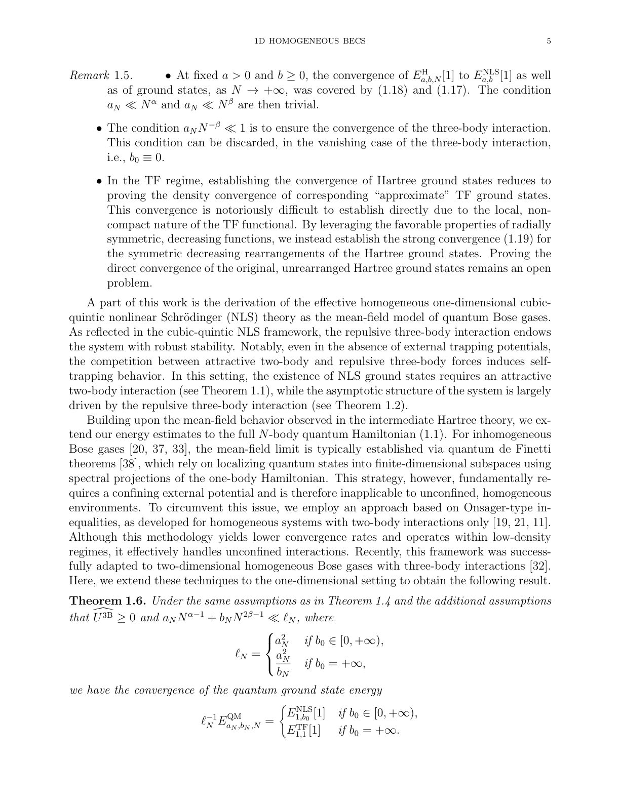 
Low-resolution page preview, page 5

📷 Fig 5

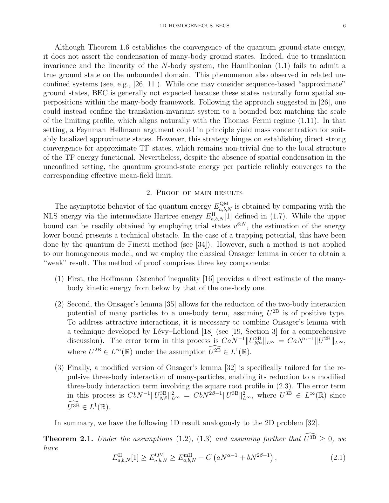 
Low-resolution page preview, page 6

**Summary.** This theoretical paper analyzes the ground state of a 1D Bose gas with competing attractive two-body and repulsive three-body interactions. By employing advanced techniques like intermediate Hartree theory and Onsager inequalities, the authors rigorously prove that the quantum energy converges to a mean-field limit described by a cubic-quintic nonlinear Schrödinger equation. This establishes a powerful mathematical framework for understanding complex many-body quantum systems.

**Why it may be interesting.** This work provides rigorous mathematical tools to analyze the stability and ground state structure of interacting quantum gases, particularly when higher-order (three-body) interactions are present, which is crucial for understanding real-world BEC experiments.

Detailed structure

**Main problem.** The paper investigates the ground-state properties of a one-dimensional homogeneous Bose gas subjected to competing attractive two-body and repulsive three-body interactions.

**Main result.** The quantum ground state energy per particle is shown to converge to the mean-field limit described by the cubic-quintic nonlinear Schrödinger functional in the large-N limit.

**Method.** The analysis employs intermediate Hartree theory and utilizes Onsager-type inequalities to bridge the gap between the full many-body Hamiltonian and the mean-field functional.

**Model / system.** The system is a homogeneous Bose gas of N identical bosons in 1D, governed by a Hamiltonian containing both two-body (attractive) and three-body (repulsive) interaction terms.

**Key observables.** Ground state energy per particle ($E_{QM}$), density profile ($
ho_N$), and the resulting mean-field energy functionals ($E_{NLS}$, $E_{TF}$).

**Important parameters / regimes.** Interaction strengths ($a$ for two-body, $b$ for three-body), particle number ($N$), and scaling parameters defining the limiting regimes (e.g., $b_N 	o b_0$ or $b_N 	o +\infty$).

**Assumptions / limitations.** The derivation relies on the intermediate Hartree approximation and the use of Onsager-type inequalities, which are necessary because the system is unconfined and translationally invariant.

**Paper structure.** The paper progresses by first deriving the mean-field limit (cubic-quintic NLS functional) from the many-body Hamiltonian using Hartree theory. It then rigorously proves the convergence of the quantum ground state energy to this mean-field limit, analyzing both the general cubic-quintic regime and the Thomas-Fermi limit separately.

Abstract

We investigate the behavior of a homogeneous one-dimensional Bose gas composed of $N$ identical bosons experiencing attractive two-body and repulsive three-body interactions. Utilizing intermediate Hartree theory, we rigorously derive the homogeneous cubic-quintic nonlinear Schrödinger functional as the mean-field limit of the many-body Hamiltonian. Particular attention is given to the impact of the repulsive three-body term on ground state energy estimates and mass concentration properties

[↑ back to top](#top)

### [Local connectivity balance shapes population dynamics in random recurrent networks](http://arxiv.org/abs/2608.30008v1)

**Authors:** Shotaro Takasu, Richard Gast, Ann Kennedy  
**Type:** theory · **Category:** disordered systems and neural networks · **PDF:** <https://arxiv.org/pdf/2608.30008v1>  
**Analysis basis:** full PDF text, analyzed in chunks
**Topic relevance:** `Keldysh / 2PI / non-Gaussian methods` **2/5** · `methods for driven-dissipative` **2/5**

📷 Fig 1

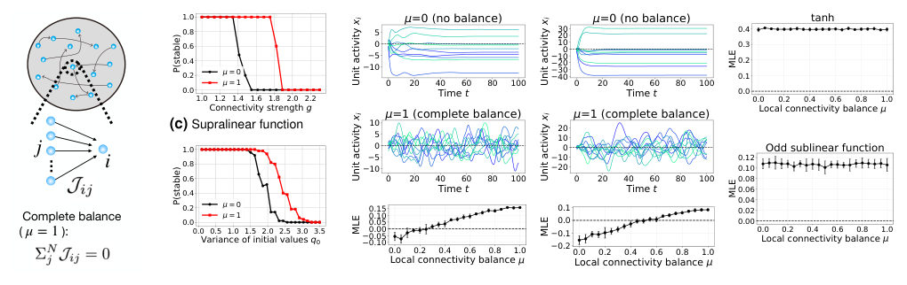 
FIG. 1. Numerical simulations illustrating how local connectivity balance affects network dynamics. (a) Schematic of the random recurrent network model with local connectivity balance. (b,c) Fraction of stable (non-divergent) dynamics, P(stable), for the ReLU function and the supra-linearly scaling function, respectively. For each parameter value, we simulate 50 networks with independent realizations of J and compute the fraction that converge to a fixed point. We use g = 1.0 in (c), and a simulation length of T = 1000. (d,e) Activities of 10 representative units for the sigmoid (d) and sub-linear (e) networks, at µ = 0 (top) and µ = 1 (middle). The bottom panels show the numerically...

📷 Fig 2

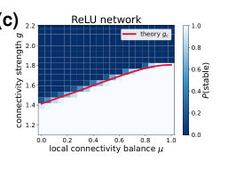 
FIG. 2. Phase diagrams with analytically derived transition boundaries. (a,b) Phase diagrams for the sigmoid and sub- linear networks. The color scale represents the maximum Lyapunov exponent (MLE), averaged over 10 network real- izations, and the red curves indicate the analytically derived critical connectivity strength gc. (c) Phase diagram for the ReLU network. The color scale represents the fraction of sta- ble realizations among 50 network realizations, and the red curve indicates gc. The network size is N = 3000 in all pan- els.

📷 Fig 3

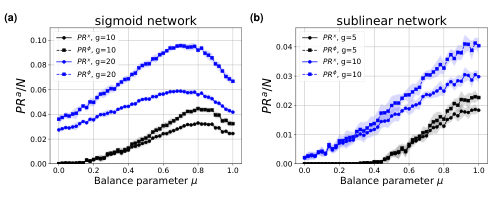 
FIG. 3. Participation ratio PRa (a ∈{x, ϕ}, for the pre- activation x and the activation ϕ) for (a) sigmoid and (b) sub-linear networks, shown for two values of g each. Lines and shading indicate the mean and std over 10 network re- alizations. Network size is N = 3000 and simulation time is T = 105.

**Summary.** This theoretical paper analyzes how local connectivity balance ($\mu$) controls the collective dynamics of random recurrent neural networks. It shows that $\mu$ acts as a switch: stabilizing dynamics for certain nonlinearities while inducing chaos for others. The work establishes $\mu$ as a crucial, previously overlooked control parameter for understanding complex disordered systems.

**Why it may be interesting.** The findings establish a deep connection between structural constraints (local balance) and dynamical stability, providing a general framework applicable to complex, non-equilibrium dynamics found in many-body physics.

Detailed structure

**Main problem.** The study investigates how the statistical structure of connectivity, specifically 'local connectivity balance,' shapes the collective dynamics of disordered recurrent networks.

**Main result.** Local connectivity balance acts as a critical control parameter: it stabilizes dynamics for linear/supra-linear nonlinearities but drives the network into chaos for sub-linear/saturating ones.

**Method.** The analysis employs analytical techniques, including the path-integral formalism, saddle-point approximation, and dynamical mean-field theory (DMFT) in the limit N -> infinity.

**Model / system.** The model is a randomly connected recurrent network governed by a differential equation involving a unit nonlinearity $\phi(x)$. The key structural element is the local connectivity balance parameter $\mu$.

**Key observables.** Network state divergence, stability (fixed point vs. chaos), Maximum Lyapunov Exponent (MLE), and the effective dimension (Participation Ratio).

**Important parameters / regimes.** Local connectivity balance parameter ($\mu$), the single-unit nonlinearity ($\phi(x)$), and the coupling strength ($g$).

**Assumptions / limitations.** The analysis relies on the saddle-point approximation in the limit N -> infinity, and previous work often incorrectly assumed the activation function must be odd.

**Figures summary.** Figures illustrate the effect of $\mu$ on stability (e.g., ReLU vs. Sigmoid), show MLE changes, and map out phase diagrams showing critical coupling strengths ($g_c$) dependent on $\mu$.

**Paper structure.** The paper builds from defining the system and the role of $\mu$, deriving the generating functional via path integrals, applying the saddle-point approximation to find order parameters, and finally analyzing the resulting mean-field equations to determine stability regimes based on the nonlinearity type.

Abstract

Disordered dynamical systems comprising many interacting units, from ecological communities to neural circuits, are ubiquitous, and understanding how connectivity shapes their collective behavior is a central theoretical challenge. One long-recognized feature of neural circuits is local connectivity balance, in which the excitatory and inhibitory weights converging onto each unit approximately cancel. Although local connectivity balance has been proposed to serve functions such as gating incoming signals, its effect on collective network dynamics remains unclear. Here we analytically study randomly connected recurrent networks with varying degrees of local connectivity balance. We show that this balance leaves the connectivity spectrum unchanged yet drastically reshapes the dynamics in a manner that depends critically on the single-unit nonlinearity. Local balance suppresses unbounded growth of the network state and stabilizes network dynamics when the activation function scales linearly or faster, whereas it drives the network into chaos when the activation function is sub-linear or saturating. Importantly, these effects vanish for odd activation functions, which are commonly assumed in previous work. We further find that, for saturating nonlinearities, the effective dimension of the dynamics varies nonmonotonically with the degree of balance. We show that all these phenomena arise from a unifying mechanism: the suppression of a self-generated feedback input by local connectivity balance. Our results identify local connectivity balance as a previously overlooked control parameter for collective dynamics in realistic disordered networks.

[↑ back to top](#top)

### [Symmetric Mass Generation for Domain-Wall Fermions](http://arxiv.org/abs/2608.29963v1)

**Authors:** Sho Araki, Hidenori Fukaya, Tetsuya Onogi, Satoshi Yamaguchi  
**Type:** theory · **Category:** strongly correlated electrons · **PDF:** <https://arxiv.org/pdf/2608.29963v1>  
**Analysis basis:** full PDF text, analyzed in chunks
**Topic relevance:** `analog quantum simulation` **2/5** · `Keldysh / 2PI / non-Gaussian methods` **1/5** · `methods for driven-dissipative` **1/5**

📷 Fig 1

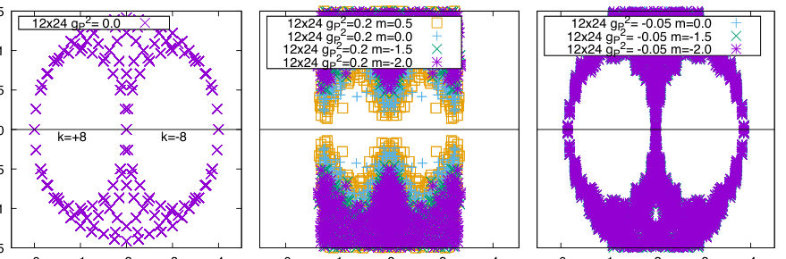 
FIG. 1. Eigenvalue spectrum of DY (m = 0) at g2 P = 0.0 (left panel), 0.2 (middle) and −0.05

📷 Fig 2

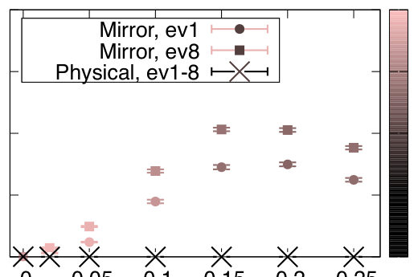 
FIG. 2. Top: The eighth eigenvector amplitude with ⟨γ1⟩&lt; 0 (dashed cross symbols) and that

📷 Fig 3

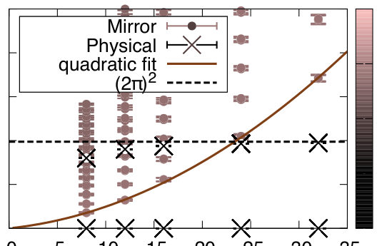 
FIG. 3. The eigenvalue spectrum of D† Y DY multiplied by (Lt/a)2 as a function of Lt/a at g2 P = 0.15.

**Summary.** This work numerically examines Symmetric Mass Generation (SMG) in domain-wall fermions, a model used in lattice gauge theory. By simulating the system with a four-Fermi interaction, the authors show that the interaction selectively gaps the 'mirror' fermion mode while preserving the physical mode. This provides a practical, nonperturbative method for decoupling unwanted mirror fermions.

**Why it may be interesting.** While focused on lattice gauge theory, the study of interaction-induced gap opening and spectral properties in fermionic systems is relevant to understanding emergent mass gaps in strongly correlated electron models.

Detailed structure

**Main problem.** The paper investigates Symmetric Mass Generation (SMG) for domain-wall fermions, specifically addressing the 'mirror-fermion problem' in lattice gauge theory.

**Main result.** The simulation demonstrates that the local four-Fermi interaction can selectively gap the edge fermions on the mirror wall while leaving the physical wall intact, confirming a nonperturbative framework for decoupling.

**Method.** The study employs numerical simulation using the Hybrid Monte Carlo (HMC) algorithm to analyze the eigenvalue spectrum of the lattice Dirac operator.

**Model / system.** The system models domain-wall fermions using the Euclidean path integral of the Fidkowski-Kitaev Majorana chain on a two-dimensional lattice, incorporating a four-Fermi interaction term.

**Key observables.** The gap opening in the Dirac operator eigenvalue spectrum, the location of the gap opening (imaginary axis vs. real mass shift), and the scaling of the generated gap with lattice size.

**Important parameters / regimes.** Coupling strength ($g_2^P$), bare mass ($m$), and lattice size ($L_t/a$).

**Assumptions / limitations.** The analysis assumes the reflection symmetry ($R_t$) is exact in the lattice formulation, and the HMC algorithm remains practical due to small Pfaffian phase fluctuations.

**Figures summary.** Figures illustrate the eigenvalue spectrum showing gap opening in the imaginary direction for $g_2^P > 0$ (Fig. 1), and plot the spectrum confirming the $(L_t/a)^2$ scaling of the gap on the mirror wall (Fig. 2).

**Paper structure.** The paper develops the formalism for the action, analyzes the eigenvalue spectrum for both chiral (no domain walls) and reflection (two domain walls) scenarios, and concludes by establishing the nonperturbative mechanism for mirror-fermion decoupling.

Abstract

We report the first numerical examination of symmetric mass generation (SMG) for domain-wall fermions. Our simulation on a two-dimensional Euclidean lattice computes the path-integral of the Fidkowski-Kitaev Majorana chain with two boundaries, corresponding to the two (physical and mirror) walls. We demonstrate by evaluating the lattice Dirac operator eigenvalue spectrum that the local four-Fermi interaction selectively gaps the edge fermions on the mirror wall while leaving the physical wall intact. We further identify a characteristic signature of SMG in the path-integral: the gap of the Dirac operator opens along the imaginary axis of the complex spectrum, in contrast to the standard mass shift in the real direction. The conventional hybrid Monte Carlo algorithm remains practical with reweighting the complex phase of the Pfaffian, which is found to be remarkably small throughout the simulation. These results provide a practical nonperturbative framework for interaction-induced mirror-fermion decoupling of lattice domain-wall fermions.

[↑ back to top](#top)

### [Colorful Exponential Random Graph Models](http://arxiv.org/abs/2608.31130v1)

**Authors:** Bhaswar B. Bhattacharya, Pierfrancesco Dionigi, Ankan Ganguly, Giulio Zucal  
**Type:** theory · **Category:** disordered systems and neural networks · **PDF:** <https://arxiv.org/pdf/2608.31130v1>  
**Analysis basis:** full PDF text, analyzed in chunks
**Topic relevance:** `Keldysh / 2PI / non-Gaussian methods` **2/5** · `analog quantum simulation` **1/5**

📷 Fig 1

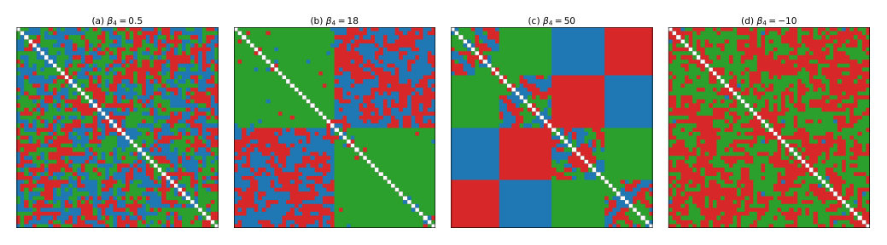 
Figure 2: Representative configurations from the rainbow triangle ERGM (1.2), with n “ 50, β1 “ β2 “ β3 “ 0, and (a) β4 “ 0.5, (b) β4 “ 18, (c) β4 “ 50, and (d) β4 “ ´10.

📷 Fig 2

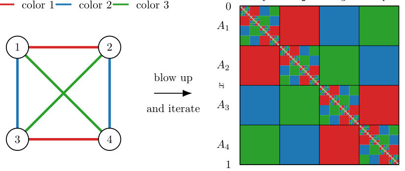 
Figure 3: (a) The properly 3-colored K4 template and (b) its iterated blowup 3-colored probability graphon. In panel (b), the off-diagonal blocks follow the K4 color template, while every diagonal block contains a scaled copy of the whole pattern.

📷 Fig 3

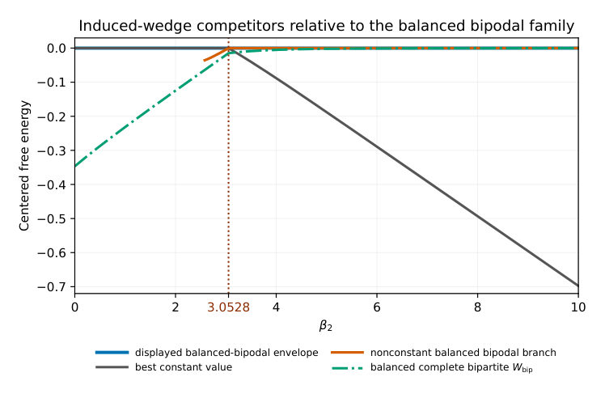 
Figure 4: Centered free energies for the induced-wedge ERGM on 0 ď β2 ď 10, relative to the displayed balanced-bipodal envelope ψ2´opt ^ pβ2q (the blue zero line). The black curve is ψconst ^ pβ2q ´ ψ2´opt ^ pβ2q, and the orange curve is ψ2´block ^ pβ2q ´ ψ2´opt ^ pβ2q; the latter is shown only when the numerical search finds a genuinely nonconstant balanced-bipodal local maximum. The dash-dotted green curve is the balanced complete bipartite value β2

📷 Fig 4

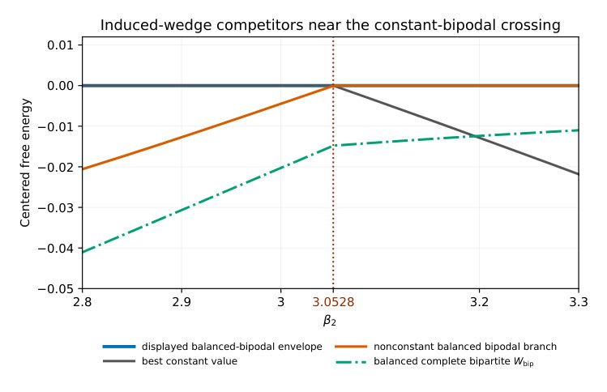 
Figure 5: A zoomed-in view of Figure 4 near the restricted constant–balanced-bipodal equal-value point β2´block « 3.0528. The curves and centering use the same conventions as in the full-range comparison.

📷 Fig 5

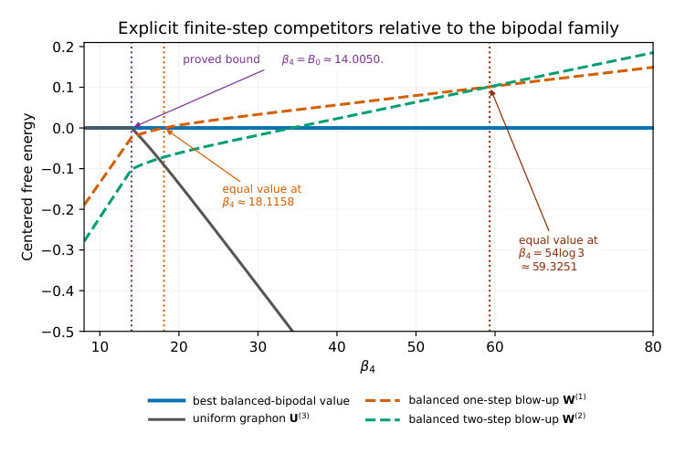 
Figure 6: Centered free energies for the rainbow-triangle ERGM relative to the best value in the balanced- bipodal family on β4 P r8, 80s. The blue zero line is ψrb△,bi β4 . The black curve is Frb△ β4 pU p3qq ´ ψrb△,bi β4 , the

**Summary.** This paper develops a comprehensive mathematical theory for colored Exponential Random Graph Models (ERGMs) using the language of probability graphons. It determines the typical structure of these multi-relational networks by analyzing the variational free energy in different temperature regimes. The work provides powerful tools for understanding how local interaction rules dictate the global organization of complex systems.

**Why it may be interesting.** The rigorous mathematical framework developed for analyzing the typical structure of complex, multi-type interactions (like those found in spin glasses or complex neural network connectivity) provides powerful tools applicable to understanding phase transitions in disordered quantum systems.

Detailed structure

**Main problem.** The paper initiates the study of colored exponential random graph models (ERGMs) to characterize the typical structure of complex, multi-relational networks.

**Main result.** It establishes a two-level selection principle for the zero-temperature regime, and derives general high-temperature uniqueness criteria for these colored models.

**Method.** The analysis uses the framework of probability graphons, variational representations of the limiting free energy, and large deviation principles.

**Model / system.** The model is the colored ERGM, defined on complete graphs with multiple types of edge relations (colors). The limiting object is the k-color probability graphon, which captures the asymptotic structure of the network.

**Key observables.** Limiting free energy, homomorphism density, and the structure of the probability graphon (e.g., balanced complete bipartite graphon).

**Important parameters / regimes.** The coupling parameters $eta = (eta_1, \dots, eta_r)$ and the temperature regime (high vs. zero).

**Assumptions / limitations.** The analysis relies on the applicability of large deviation principles for finitely decorated probability graphons.

**Figures summary.** Figure 2 illustrates how the rainbow triangle ERGM exhibits different structures (homogeneous, bipodal, 4-block) depending on the sign and magnitude of a specific parameter $eta_4$.

**Paper structure.** The paper progresses by first deriving the variational representation for the free energy, then analyzing the replica-symmetric regime, establishing general fixed-point equations, and finally detailing the two-level selection principle for the zero-temperature ground state.

Abstract

In this paper, we initiate the study of colored exponential random graph models (ERGMs), a class of exponential-family models for networks with multiple types of edge relations. Using the framework of probability graphons, we first derive a variational representation for the limiting free energy, whose maximizers determine the asymptotic structure of typical samples from the model. Then we identify several general families of colored ERGMs exhibiting replica symmetry, where the variational problem has constant maximizers and the model asymptotically concentrates on product colorings with independent edges. For general colored ERGMs, we derive Euler-Lagrange fixed-point equations for the variational maximizers, which in turn yield a general high-temperature uniqueness criterion. In the complementary zero-temperature regime, we establish a two-level selection principle: the leading energy term determines the ground states, while the lower-order energy terms, combined with entropy, act as a tie-breaker to determine the asymptotic zero-temperature structure of the model. We illustrate this principle through the induced wedge and rainbow triangle ERGMs. Both models have natural interpretations in multitype networks, and their zero-temperature limits exhibit interesting structures that connect to well-known results in extremal combinatorics. We further establish finite-temperature symmetry breaking for both these models and complement the rigorous results with numerical experiments.

[↑ back to top](#top)

### [Local Density Approximation and Other Limit Regimes for a Homogeneous Bose Gas with Repulsive Three-Body Interactions in Low-Dimensional Space](http://arxiv.org/abs/2608.29876v1)

**Authors:** Thi Anh Thu Doan, Dinh-Thi Nguyen  
**Type:** theory · **Category:** quantum gases · **PDF:** <https://arxiv.org/pdf/2608.29876v1>  
**Analysis basis:** full PDF text, analyzed in chunks
**Topic relevance:** `analog quantum simulation` **2/5** · `Keldysh / 2PI / non-Gaussian methods` **1/5**

📷 Fig 1

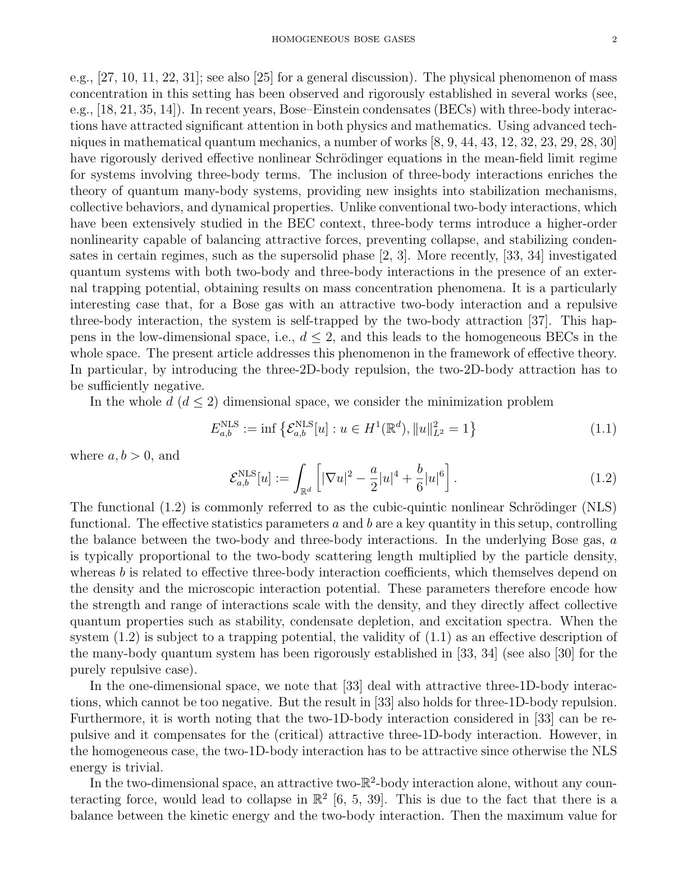 
Low-resolution page preview, page 2

📷 Fig 2

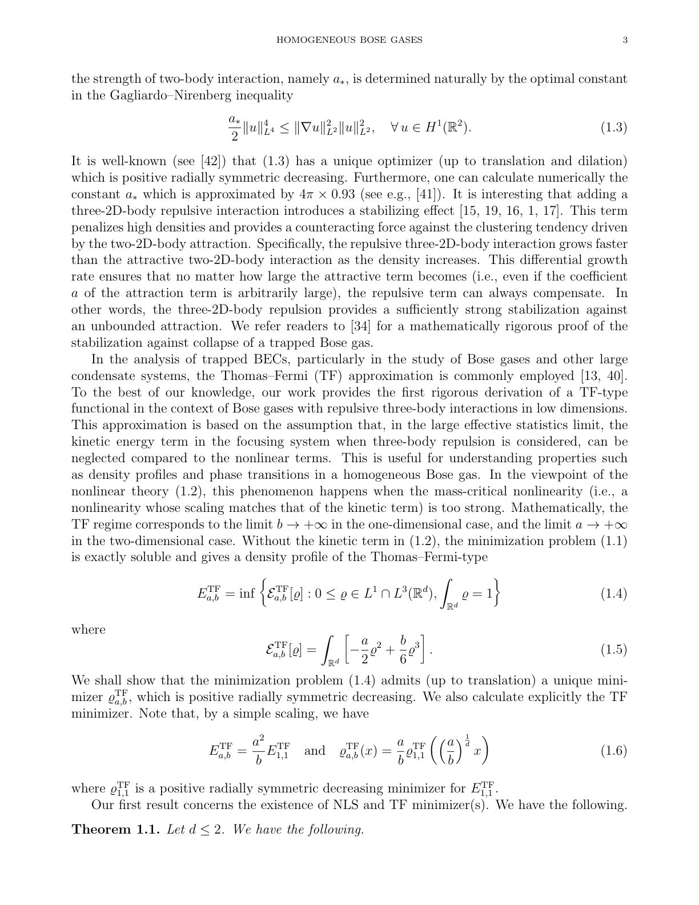 
Low-resolution page preview, page 3

📷 Fig 3

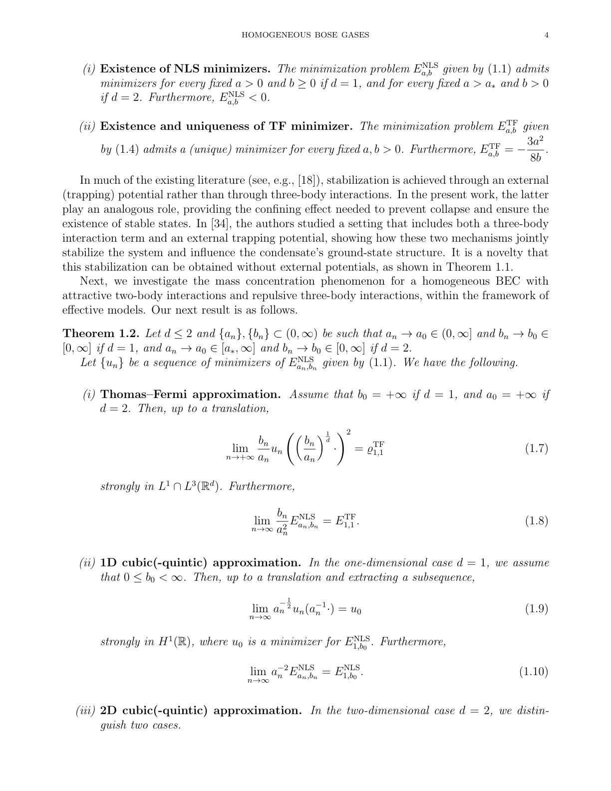 
Low-resolution page preview, page 4

📷 Fig 4

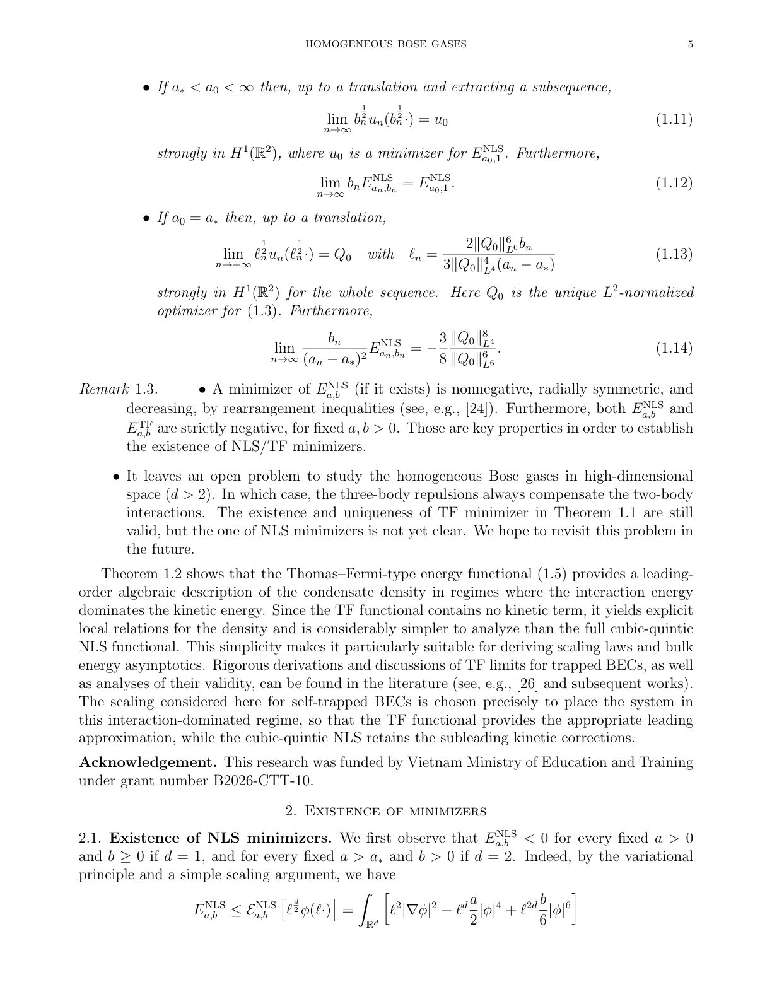 
Low-resolution page preview, page 5

📷 Fig 5

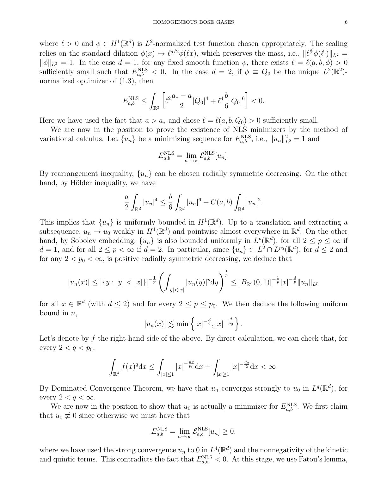 
Low-resolution page preview, page 6

**Summary.** This paper rigorously studies the ground state of a Bose gas with competing two-body attraction and three-body repulsion in low dimensions. By analyzing the energy functional in various limiting regimes, the authors derive an effective Thomas-Fermi-like model. This provides a powerful theoretical tool for understanding the physics of interacting quantum gases where higher-order interactions are crucial.

**Why it may be interesting.** This work provides a rigorous mathematical framework for understanding how higher-order interactions (three-body) stabilize quantum gases in low dimensions, leading to the derivation of simplified, yet physically accurate, effective models like the Thomas-Fermi approximation.

Detailed structure

**Main problem.** The paper analyzes the ground state properties of a homogeneous Bose gas characterized by competing attractive two-body and repulsive three-body interactions in low spatial dimensions ($d \le 2$).

**Main result.** The authors rigorously derive the existence of minimizers and establish the convergence of the system's energy functional to an effective Thomas-Fermi-like model in specific limiting regimes.

**Method.** The analysis employs variational principles, scaling arguments, and advanced convergence theorems (like Fatou's lemma) to rigorously derive effective nonlinear Schrödinger equations from the original many-body Hamiltonian.

**Model / system.** The system is a homogeneous Bose gas whose energy is modeled by a cubic-quintic nonlinear Schrödinger (NLS) functional, incorporating terms for two-body attraction and three-body repulsion.

**Key observables.** The primary observable is the ground state energy, and the derived density profiles ($
ho_{TF}$, $u_0$) are key diagnostics.

**Important parameters / regimes.** Dimensionality ($d \le 2$), the coefficients governing two-body attraction ($a$), and three-body repulsion ($b$), as well as various limiting parameters ($a_0, b_0$).

**Assumptions / limitations.** The analysis is restricted to homogeneous systems, and the Thomas-Fermi approximation relies on neglecting the kinetic energy term in the large effective statistics limit.

**Paper structure.** The paper first establishes the existence of minimizers for the NLS functional. It then systematically analyzes different limit regimes (Thomas-Fermi, 1D, 2D) by showing the strong convergence of the sequence of minimizers to the corresponding limiting profile, proving the effective model's validity.

Abstract

In the whole space of low spatial dimensions, namely $d \leq 2$, we study the minimizers of an energy functional with an attractive cubic nonlinearity and a repulsive quintic nonlinearity, which describes a quantum Bose gas with a two-body attraction and a three-body repulsion. We prove the existence of minimizers at fixed effective statistics parameter. In the limit of a large effective statistics parameter of the mass-critical nonlinearity (with respect to the kinetic energy), we derive an effective Thomas-Fermi-like model for the homogeneous Bose gas. We also consider other limit regimes depending on the mass-critical nonlinearity.

[↑ back to top](#top)

### [Localized orbitals and tunnel couplings from general confinement potentials in gate-defined quantum-dot arrays](http://arxiv.org/abs/2608.29766v1)

**Authors:** Bohdan Khromets, William Chow, Jonathan Baugh  
**Type:** theory · **Category:** other · **PDF:** <https://arxiv.org/pdf/2608.29766v1>  
**Analysis basis:** full PDF text, analyzed in chunks
**Topic relevance:** `analog quantum simulation` **2/5** · `methods for driven-dissipative` **1/5**

📷 Fig 1

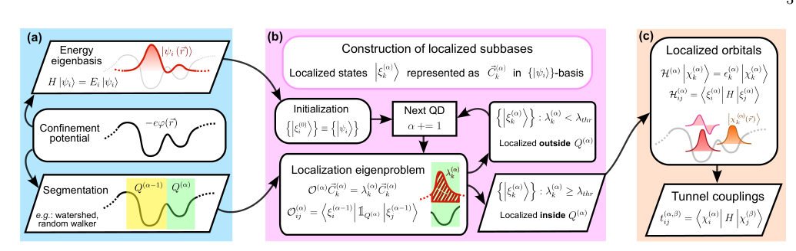 
Figure 1. Localization algorithm (see End Matter for derivation). (a) Input parameters, determined from the electrostatic confinement potential energy landscape −eφ(⃗r): Hamiltonian eigenbasis {|ψi⟩} (“ψ-basis”), and spatial regions Q(α) of distinct QDs obtained from a numerical segmentation algorithm. (b) Decomposition of the vector space spanned by {|ψi⟩} into

📷 Fig 2

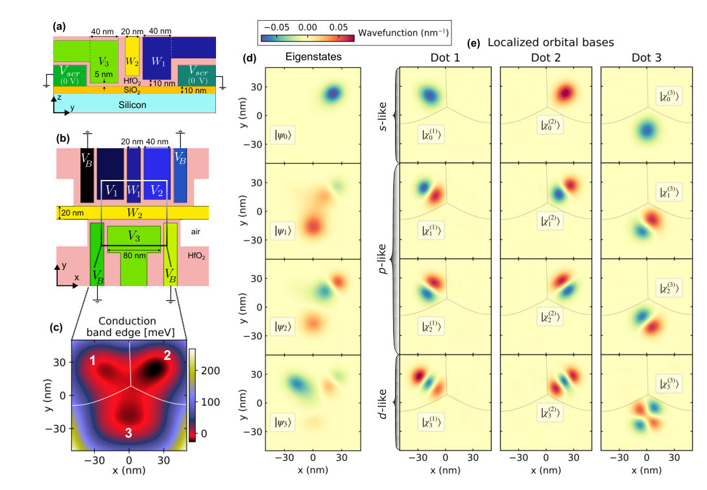 
Figure 2. (a), (b) Side and top views of the triple-QD device geometry, respectively. For the data presented in this figure, plunger gate voltages are set to V1 = 0.98 V, V2 = 1.02 V, V3 = 0.925 V, tunnel-gate voltages are set to W1 = W2 = 0.75 V, and the barrier and screening gates are grounded, VB = Vscr = 0 V. (c) Conduction-band-edge profile Ec(x, y), at the plane of electron accumulation. White lines and labels indicate the three Q(α) regions, obtained from the random walker segmentation of Ec(x, y). (d) Four lowest-energy eigenstates |ψi(x, y)⟩of the effective-mass Hamiltonian H in the conduction

📷 Fig 3

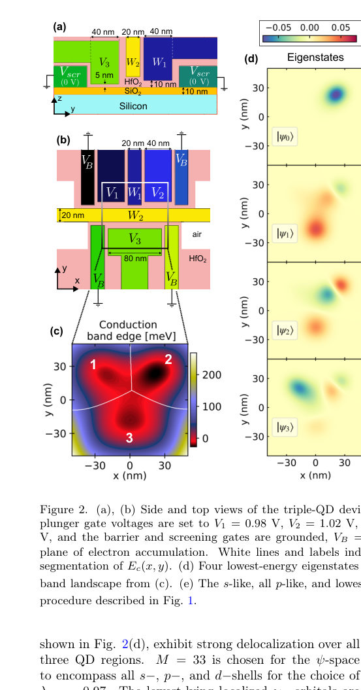 
Figure 3 shows the voltage dependences of tunnel cou- plings between the s−like and lowest-lying p−like orbitals of all pairs of QDs in the triangular array. A simultane- ous sweep of two tunneling gates W1 = W2 = W up to Wmax ≈0.8 V, when QDs merge, is performed for the cases of no bias between 1st and 2nd QDs (markers), and for the case of 40 mV bias between them (solid lines). The ψ-basis size for each data point is chosen to encom- pass all s−, p−, d−and f−shells in each QD, as per Eq. (1) with K = 4, with λthr = 0.9. Coupling values in- volving p−orbitals systematically exceed those between

📷 Fig 4

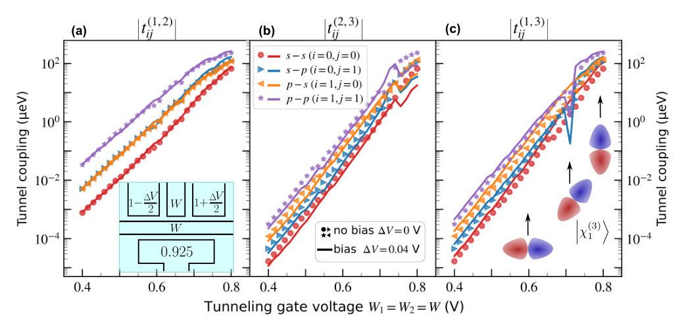 
Figure 3. (a)–(c) Tunnel-coupling parameters t(α,β) ij between the s-like and lowest-lying p-like orbitals (i, j ∈{0, 1}) for each pair of QDs in a triangular array as functions of the tunnel-gate voltage W1 = W2 = W. Markers indicate no bias between the first and second QDs, whereas the solid lines indicate a 40-mV bias between them. The inset in (a) displays the voltage values (in volts) at the plunger and tunnel gates during the sweeps; cf. Fig. 2(b). The inset in (c) depicts the orientation change of

📷 Fig 5

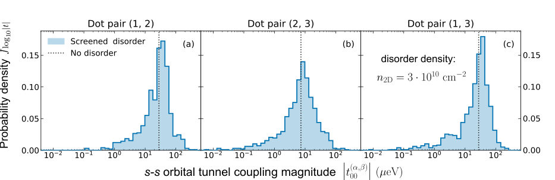 
Figure 4. Estimated probability density functions of pairwise tunnel couplings between s-orbitals, t(α,β) 00 , in the presence of disorder, at the voltage configuration from Fig. 2. Disorder is simulated as 1000 random configurations of n = 3 fixed negative point charges randomly placed in the oxide layers over 100 nm × 100 nm range in the x −y plane. The spatial distributions of random charges and the incorporation of screening with the method of image charges are detailed in the End Matter.

**Summary.** This paper introduces a novel numerical localization procedure to accurately model single-electron physics in complex, gate-defined quantum-dot arrays. By projecting the full Hamiltonian eigenbasis onto localized orbital subspaces, the authors derive a localized basis ($\chi$-basis) and calculate tunnel couplings that are robust against disorder and potential asymmetries. This method significantly aids subsequent many-body calculations by reducing the complexity of the required Hamiltonian integrals.

**Why it may be interesting.** This work provides a powerful, general theoretical framework for simplifying complex, strongly coupled many-body problems in solid-state quantum devices by constructing a physically motivated, localized basis set.

Detailed structure

**Main problem.** Developing accurate and scalable methods to model single-electron physics in dense, gate-defined quantum-dot arrays while accounting for realistic asymmetries and disorder.

**Main result.** The authors present a numerical localization procedure that successfully maps the full Hamiltonian eigenbasis onto a localized orbital basis ($\chi$-basis), allowing for the calculation of tunnel couplings across a wide dynamic range.

**Method.** The core method involves an iterative numerical localization procedure that decomposes the full eigenbasis into orthogonal subspaces localized within defined spatial regions (dots) by solving an eigenvalue problem derived from the overlap matrix.

**Model / system.** The system is a gate-defined multi-quantum-dot array, modeled using the effective-mass Hamiltonian in the conduction band landscape. The method is applied to simulate the physics of these arrays, including the effects of point defects and disorder.

**Key observables.** Tunnel coupling ($t$), localized orbital energies ($\epsilon(\alpha)$), and the probability distribution functions of these couplings under disorder.

**Important parameters / regimes.** Localization threshold ($\lambda_{thr}$), number of lowest-energy eigenstates ($M$), and the geometry/material parameters of the gate structure (e.g., $\epsilon_{	ext{SiO}_2}$, $h_{	ext{eff}}$).

**Assumptions / limitations.** The initial $\psi$-states are assumed to be sufficiently smooth even in disordered potentials, and the localization procedure relies on projecting the Hamiltonian onto localized subspaces.

**Figures summary.** Figures illustrate the localization algorithm steps, the resulting localized $\chi$-orbitals for a simulated triple-dot device, the voltage dependence of tunnel couplings, and the probability density functions of couplings in disorder.

**Paper structure.** The paper details the general mathematical procedure for localization, starting from the full Hamiltonian eigenbasis, defining the localized basis via an eigenvalue problem on the overlap matrix, calculating the resulting localized orbitals and tunnel couplings, and finally demonstrating the method's application to simulate disorder potentials.

Abstract

Efficient simulation of dense gate-defined multi-quantum-dot arrays requires accurate and scalable modeling methods, compatible with asymmetries and imperfections of realistic voltage-controlled confinement potentials. We present a numerical localization procedure that rotates the eigenbasis of a general one-particle effective orbital Hamiltonian into $s$-, $p$-, $d$-, $\ldots$-shells of localized orbital wavefunctions associated with individual quantum dots. The pairwise tunnel couplings between such states are computed directly as matrix elements of the Hamiltonian. We demonstrate this procedure on a 2D triangular Si-MOS triple-quantum-dot array by obtaining the voltage dependencies of the tunnel couplings and their distributions in the presence of disorder. We discuss the implications of this evaluation method on the many-body calculations, and relate it to the experimental tunnel coupling measurements.

[↑ back to top](#top)

### [Quantum Steering Geometry at High Energy Particle Colliders](http://arxiv.org/abs/2608.30037v1)

**Authors:** Juan J. Mejia Alvarez, Andrew J. Wildridge, Angelo Arisi, Juan M. Duarte-Quiros, Santosh Bhandari, Jingyan Li, Giulia Negro, Andreas W. Jung  
**Type:** theory · **Category:** quantum information and computing · **PDF:** <https://arxiv.org/pdf/2608.30037v1>  
**Analysis basis:** full PDF text, analyzed in chunks
**Topic relevance:** `quantum measurements` **2/5** · `analog quantum simulation` **1/5**

📷 Fig 1

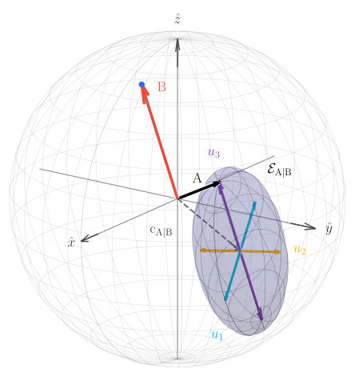 
FIG. 1. Example of a quantum steering ellipsoid EA|B embed- ded in the Bloch sphere. The center ⃗cA|B is shown, as well as the semi-axes u1, u2, and u3. A local positive operator- valued measurement outcome on subsystem B with a unit Bloch vector on the surface of the Bloch sphere yields a state on subsystem A that lies on the surface of the quantum steer- ing ellipsoid.

📷 Fig 2

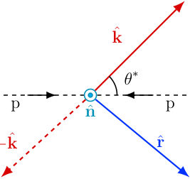 
FIG. 2. Helicity basis used for the tt spin system in pp col- lisions. The signs of ˆr and ˆn flip at θ∗= π/2, as shown in Eqs. (43) and (44).

📷 Fig 3

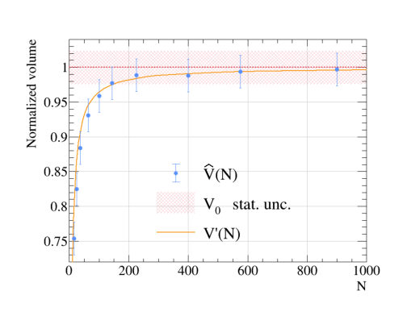 
FIG. 3. Normalized volume bV = Vfit/V0 (blue circles) re- constructed from binned conditional polarization vectors as a function of the total number of angular bins Nbin = NϑNφ, where Nφ = Nϑ = √

📷 Fig 4

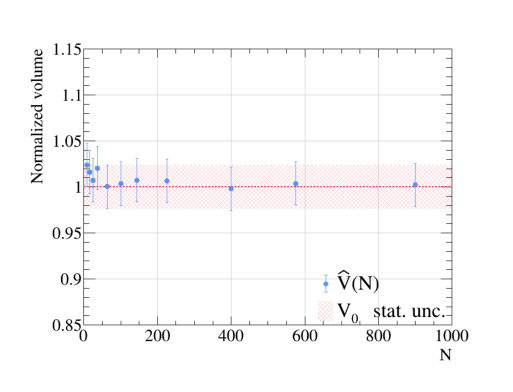 
FIG. 4. Normalized volume bV = Vfit/V0 (blue circles) re- constructed from binned conditional polarization vectors as a function of the total number of angular bins Nbin = NϑNφ, where Nφ = Nϑ = √

📷 Fig 5

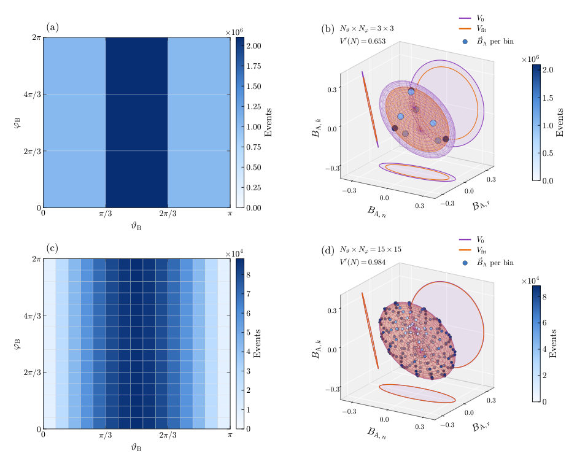 
FIG. 5. Event populations and reconstructed QSE points for two angular partitions. Panels (a) and (b) show the coarse Nϑ = 3, Nφ = 3 partition, while panels (c) and (d) show a more fine Nϑ = 15, Nφ = 15 partition. The yellow line shows the fitted ellipsoid which is significantly smaller than the predicted volume V 0 in the coarse partition while it almost coincide with the V 0 for the finer partition.

**Summary.** This work introduces Quantum Steering Ellipsoids (QSEs) as a novel, geometrically rich set of observables for analyzing quantum states in high-energy particle collisions. By mapping the conditional state space onto an ellipsoid, the authors provide a unified diagnostic tool to test fundamental quantum principles like entanglement and non-locality. This framework offers a powerful method for precision searches for physics beyond the Standard Model at colliders like the HL-LHC.

**Why it may be interesting.** The geometric interpretation of quantum information measures (like the QSE) provides a powerful, intuitive tool for analyzing complex quantum states, which is valuable for understanding the structure of quantum correlations in any physical system, including those modeled by Hamiltonians relevant to AMO physics.

Detailed structure

**Main problem.** The paper formulates and utilizes Quantum Steering Ellipsoids (QSEs) as a novel class of observables to probe the quantum properties of fundamental particle interactions at high-energy colliders.

**Main result.** QSEs provide a unified, geometrically interpretable framework for particle collider tomography, allowing for the direct probing of entanglement, steerability, and non-local correlations beyond the Standard Model.

**Method.** The QSE is derived by analyzing the geometric locus of conditional quantum states accessible through local measurements on a bipartite spin system, using the Fano representation for the density matrix.

**Model / system.** The system is based on reconstructed bipartite states of spin-1/2 particles (two-qubit states) arising from high-energy particle collisions, benchmarked using top-quark pair production ($tar{t}$).

**Key observables.** Quantum Steering Ellipsoids (QSEs), characterized by their center ($\vec{c}_{A|B}$) and shape matrix ($Q_{A|B}$); these probe polarization, spin correlation anisotropy, and accessible-state volume.

**Important parameters / regimes.** The analysis uses NLO QCD simulations and is sensitive to dimension-six operators, providing diagnostic power for physics beyond the Standard Model (BSM).

**Assumptions / limitations.** The QSE construction relies on the narrow-width approximation, and practical measurements involve coarse-graining over finite solid-angle bins.

**Figures summary.** Figure 1 illustrates an example of a QSE embedded in the Bloch sphere, showing its center and semi-axes.

**Paper structure.** The paper develops the mathematical formalism for QSEs from the spin density matrix, applies this framework to benchmark processes like $tar{t}$ production, and demonstrates how the resulting geometric observables can diagnose quantum properties and constrain BSM physics.

Abstract

We formulate collider observables based on quantum steering ellipsoids (QSEs) for reconstructed bipartite systems of spin-$1/2$ particles. A collider spin density matrix defines a two-qubit state, while its QSE gives the geometry of conditional states accessible through local measurements. This makes the ellipsoid a direct probe of the quantum properties of fundamental particles, encoding polarization, spin correlation anisotropy, accessible-state volume, and the orientation of the dominant correlation axes. Using top-quark pair production as a benchmark process, we show how QSE observables organize the Standard Model spin state, probe entanglement, steerability, and Bell-nonlocality criteria, and use an expected precision metric to assess sensitivity to non-local correlations in the boosted central region. We show that different dimension-six operators generate distinctive QSE deformations, and provide a geometric interpretation of quantum information observables in high-energy particle physics. Quantum steering geometry therefore provides a unified framework for particle collider tomography, quantum information diagnostics, and precision searches for physics beyond the Standard Model with applications spanning the HL--LHC and future lepton, muon, flavor, and electron-ion collider programs.

[↑ back to top](#top)

### [The Pego Theorem for the Hilbert--Schmidt Class](http://arxiv.org/abs/2608.29976v1)

**Authors:** Yaogan Mensah  
**Type:** theory · **Category:** quantum information and computing · **PDF:** <https://arxiv.org/pdf/2608.29976v1>  
**Analysis basis:** full PDF text, analyzed in chunks
**Topic relevance:** `quantum measurements` **2/5** · `analog quantum simulation` **1/5**

📷 Fig 1

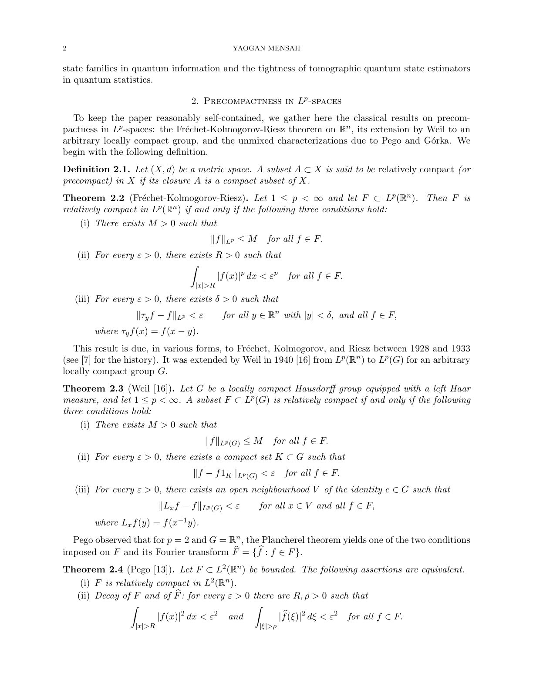 
Low-resolution page preview, page 2

📷 Fig 2

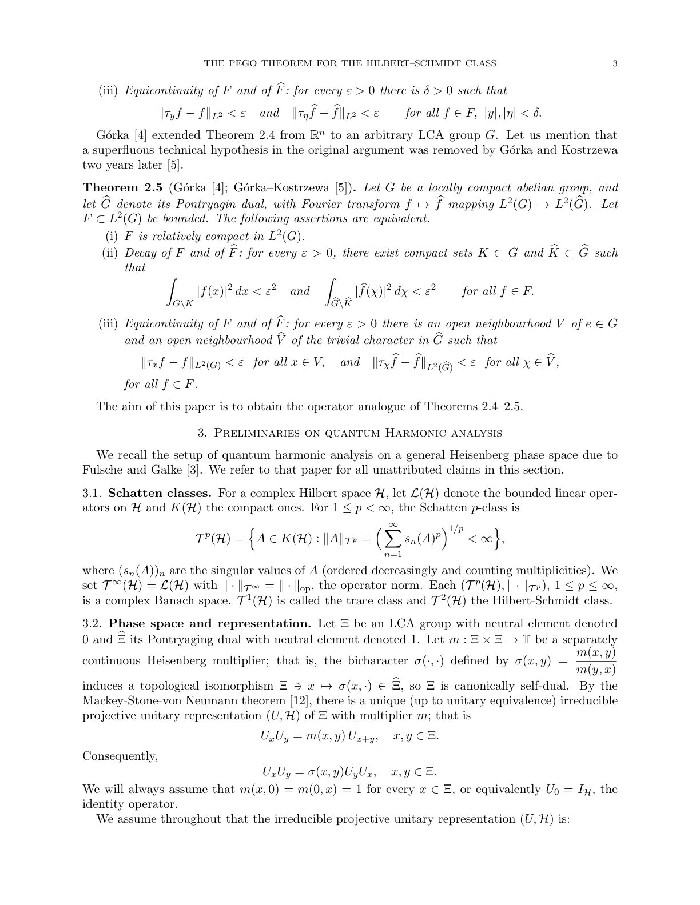 
Low-resolution page preview, page 3

📷 Fig 3

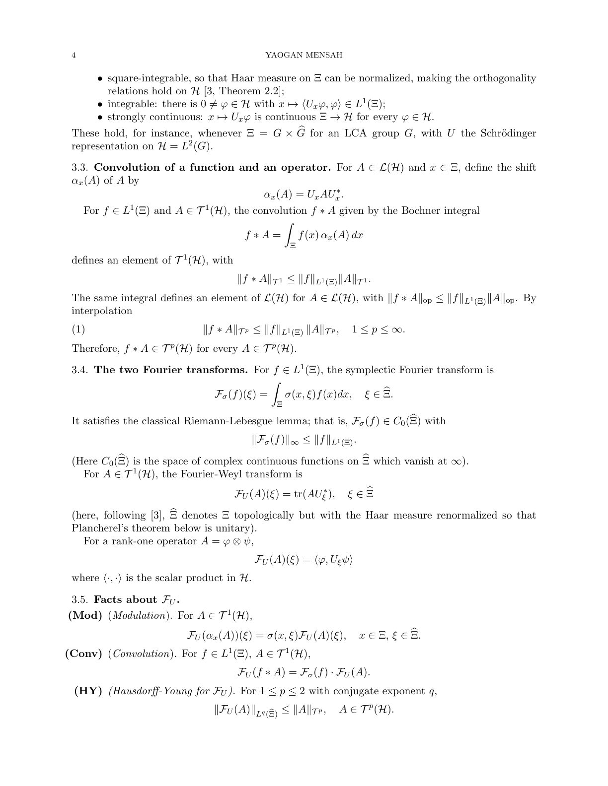 
Low-resolution page preview, page 4

📷 Fig 4

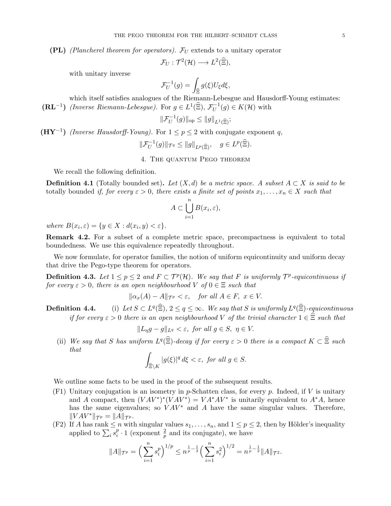 
Low-resolution page preview, page 5

📷 Fig 5

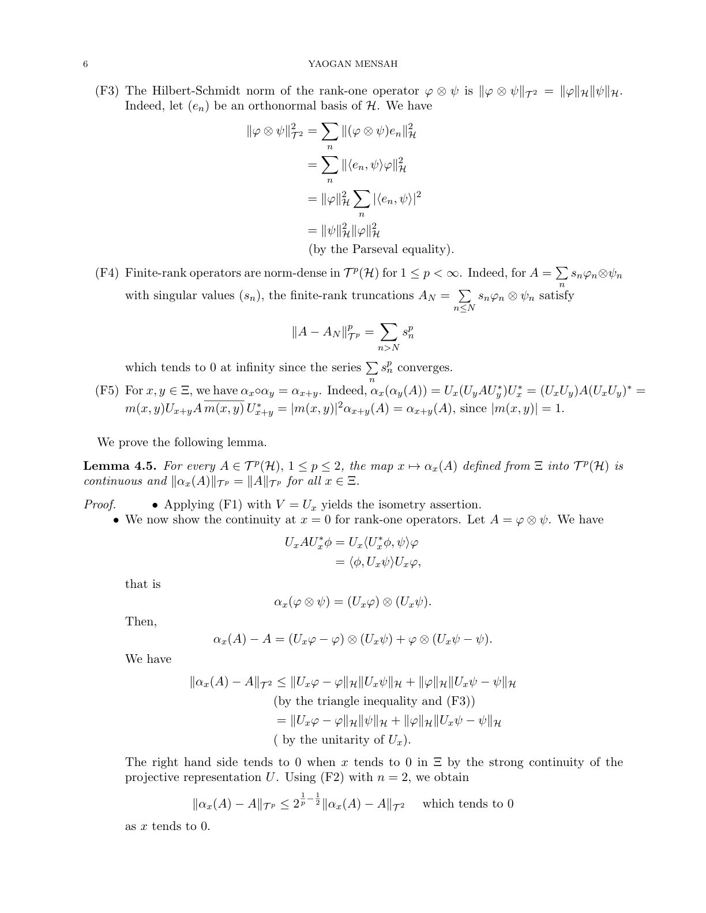 
Low-resolution page preview, page 6

**Summary.** This work generalizes Pego's compactness theorem to the operator setting using quantum harmonic analysis. It provides a necessary and sufficient condition for a set of quantum operators to be precompact: the set must exhibit uniform equicontinuity both in the operator domain and in its Fourier-Weyl transform domain. This has direct applications in proving the stability of quantum states in quantum information and quantum estimation theory.

**Why it may be interesting.** This provides a powerful, general mathematical tool (the Quantum Pego Theorem) to rigorously prove the stability and convergence (precompactness) of quantum state ensembles arising from physical measurements or thermalization processes.

Detailed structure

**Main problem.** The paper establishes an operator-theoretic version of Pego's compactness theorem within the framework of quantum harmonic analysis on general locally compact abelian phase spaces.

**Main result.** A bounded set of Hilbert-Schmidt operators is precompact if and only if it is uniformly equicontinuous under phase-space shifts and its Fourier-Weyl transform is uniformly equicontinuous on the dual phase space.

**Method.** The proof relies on characterizing precompactness via the equivalence between operator equicontinuity and the equicontinuity of the Fourier-Weyl transform, leveraging properties of unitary isomorphisms.

**Model / system.** The theory is applied to quantum information contexts, specifically analyzing families of thermal states and quantum state estimators in multi-mode systems.

**Key observables.** Quantum characteristic functions ($\chi_{
ho}$), the Hilbert-Schmidt norm ($\|\cdot\|_{\mathcal{T}^2}$), and the Fourier-Weyl transform ($FU$).

**Important parameters / regimes.** Finite physical energy constraints ($ar{n}_{\max} < \infty$) are used to ensure the precompactness of state families.

**Assumptions / limitations.** The analysis assumes the existence of an irreducible projective unitary representation $(U, H)$ that is square-integrable, integrable, and strongly continuous.

**Figures summary.** Not specified.

**Paper structure.** The paper reviews classical $L^p$ precompactness criteria, introduces Quantum Harmonic Analysis (QHA) tools, states the central Quantum Pego Theorem, and then applies it to quantum information problems like thermal states and quantum tomography.

Abstract

This paper establishes an operator-theoretic version of Pego's compactness theorem within the framework of quantum harmonic analysis on general locally compact abelian phase spaces. We show that a bounded set of Hilbert-Schmidt operators is precompact if and only if it is uniformly equicontinuous under phase-space shifts and its Fourier-Weyl transform is uniformly equicontinuous on the dual phase space. We provide applications to quantum physics.

[↑ back to top](#top)

### [Determinant Quantum-Quantum Monte Carlo: Coherent Auxiliary-Field Sampling](http://arxiv.org/abs/2608.28742v1)

**Authors:** Xuepeng Wang, Sagnik Banerjee, Debanjan Chowdhury  
**Type:** theory · **Category:** strongly correlated electrons · **PDF:** <https://arxiv.org/pdf/2608.28742v1>  
**Analysis basis:** full PDF text, analyzed in chunks
**Topic relevance:** `analog quantum simulation` **2/5**

📷 Fig 1

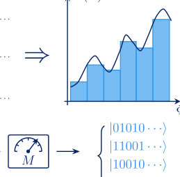 
FIG. 1. Schematic representation of the key ideas. (a) Classical DQMC generates a Markov chain of Hub- bard–Stratonovich configurations through local single-field updates (in red); after equilibration, the histogram of re- tained configurations approaches the target distribution. (b) DQ2MC prepares a coherent superposition of all configura- tions. Computational-basis measurements directly sample configurations from the superposition. (c) A Hadamard test coherently evaluates the ensemble-averaged observable. In (b) and (c), part of the auxiliary-field control qubits can be downgraded to classical control bits optionally; see the hybrid protocol of Sec. IV and its schematic representation in...

📷 Fig 2

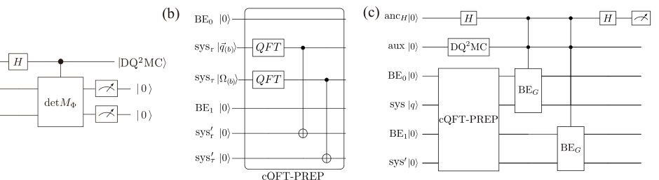 
FIG. 2. Overview of the full quantum protocol. (a) State-preparation circuit: the determinant oracle Odet (boxed gate det MΦ) is applied to the Hadamard-prepared auxiliary-field register aux; postselecting all work registers (drawn separately as sys and anc) on |0⟩leaves | DQ2MC ⟩of Eq. (12) on aux. (b) Gate realization of cQFT-PREP defined in Eq. (19), where QFT stands for quantum Fourier transform. The registers sysr and sysτ denote the qubits for spatial and temporal action-matrix entries, respectively. The register sys′ is a copy of sys. (c) Observable-measurement circuit: a Hadamard test on ancH controls two Green’s-function block encodings BEG acting on a system-copy pair sys, sys′....

📷 Fig 3

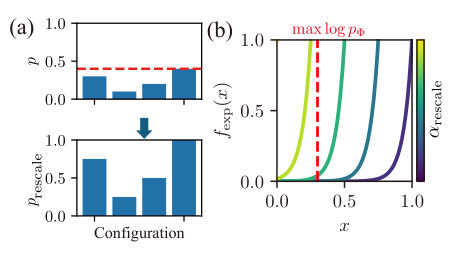 
FIG. 3. Schematic of Preconditioning (a) Schematic of the rescaling: the bare weight distribution pΦ (top) is rescaled by αrescale so that the largest weight saturates the block-encoding bound (bottom). (b) Schematics of clipped target function in Exp-QSVT, tuned by αrescale. Since the signal domain for QSVT is the unit interval, regions where the function value &gt; 1 are clipped to 1. To maintain intact probability weight, αrescale should be chosen such that the clipping is inactive for the max log pΦ, denoted by red dashed line.

📷 Fig 4

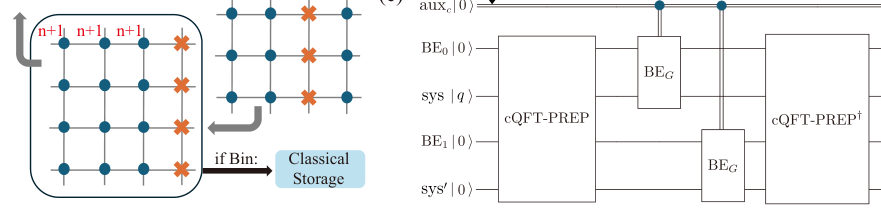 
FIG. 4. Hybrid quantum-classical protocol. (a) Block sweep on the space-time auxiliary field: at Monte-Carlo step n the active block (orange crosses) is kept quantum, while the remaining fields (blue dots) are fixed as classical controls on the action-matrix oracle UM; the active block is updated by measurement and the resulting bits replace the corresponding entries of the classical configuration. When the step is retained as a bin, the full classical configuration Φc is passed to the observable circuit. (b) Hybrid update circuit: Odet (boxed gate det MΦ) is applied to the Hadamard-prepared active register auxq while the complementary register auxc carries the classical Φc; measurement of...

📷 Fig 5

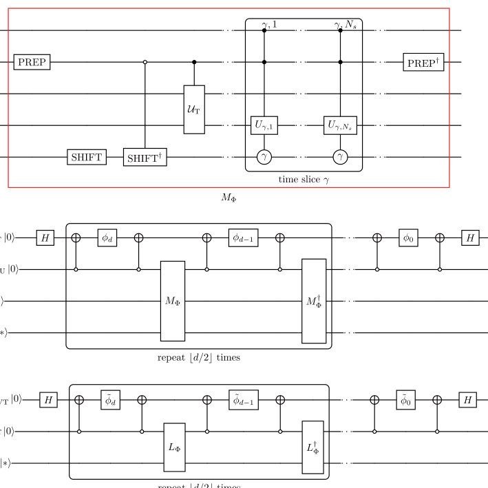 
FIG. 5. Gate-level construction of the determinant oracle. (a) Action-matrix oracle UM, block-encoding MΦ/αM: a single-qubit LCU (PREP, PREP†) selects between the cyclic shift U † shift on the time-slice register sysτ (where circle denotes select-gate) and the kinetic-propagator block encoding UT dressed by the HS-controlled one-body vertices Uγ,i on the spatial register sysr, with the aux register selecting the HS configuration. The red box encloses the preconditioned action matrix MΦ in Eq. (A4). (b) QSVT-log sequence Ulog: an even-parity QSVT polynomial approximating log |x| is realized by interleaving phases ϕ0, . . . , ϕd with ⌊d/2⌋alternating calls to MΦ and M † Φ (with ancBE,LCU...

**Summary.** This paper presents DQ2MC, a quantum algorithm designed to simulate strongly correlated electron systems by quantum mechanically implementing the sampling core of classical DQMC. It achieves this by synthesizing amplitudes directly from the action matrix, thus bypassing the exponential storage and sampling bottlenecks. The resulting hybrid protocol offers a path to quantum simulation that retains classical acceleration techniques while improving scaling over classical methods.

**Why it may be interesting.** The development of quantum algorithms for simulating interacting fermions directly impacts the field of quantum simulation, offering a potential quantum advantage over classical Monte Carlo methods for materials science.

Detailed structure

**Main problem.** The paper addresses the computational bottleneck in simulating strongly correlated lattice fermions, such as those found in the Hubbard model, where interactions are comparable to kinetic energy.

**Main result.** They introduce Determinant Quantum-Quantum Monte Carlo (DQ2MC), a quantum algorithm that lifts the auxiliary-field sampling onto a quantum computer, avoiding the enumeration of exponentially many weights.

**Method.** The approach involves adapting the classical Determinant Quantum-Monte Carlo (DQMC) method by implementing its core sampling and averaging steps using quantum circuits, leading to both fully-quantum and hybrid quantum-classical protocols.

**Model / system.** The focus is on strongly correlated lattice fermions, exemplified by the Hubbard model, relevant to high-temperature superconductivity and Mott insulators. The simulation relies on rewriting the partition function via the Hubbard-Stratonovich transformation.

**Key observables.** Thermal expectation values of operators, such as the imaginary-time susceptibility $\chi_O(q, i\Omega_n)$.

**Important parameters / regimes.** The scaling is analyzed concerning the spatial volume ($N_{st}$), the imaginary time ($eta$), and the overhead associated with the fermion sign problem.

**Assumptions / limitations.** The hybrid protocol assumes that only classical information passes between quantum updates, and the full-quantum protocol assumes the one-body vertices can be implemented as controlled unitaries.

**Figures summary.** Figure 1 schematically compares classical DQMC (Markov chain) with DQ2MC (coherent superposition) and illustrates the measurement process using a Hadamard test estimator.

**Paper structure.** The paper reviews classical DQMC, then details the fully-quantum protocol (III), develops the hybrid quantum-classical protocol (IV), and discusses extensions.

Abstract

We introduce determinant quantum-quantum Monte Carlo (DQ$^2$MC), a quantum algorithm that lifts the auxiliary-field sampling and averaging at the operational core of determinant quantum Monte Carlo onto a quantum computer. A determinant oracle synthesizes the DQMC amplitudes directly from a block encoding of the single-particle action matrix via quantum singular value transformations, so that the exponentially many Hubbard-Stratonovich weights are never enumerated, precomputed, or stored. Since the fermions are free for fixed auxiliary fields, the construction operates entirely at the single-particle level, requiring $O(\log N_{\mathrm{st}})$ system qubits and no Jordan-Wigner or Bravyi-Kitaev encoding, where $N_{\mathrm{st}}$ is the space-time volume. A full-quantum protocol makes observables interference amplitudes, eliminating the Markov chain and its autocorrelation time altogether; a hybrid quantum-classical protocol retains a constant-size active block of qubits and replaces the Metropolis-Hastings acceptance step with an exact heat-bath draw, so that cluster updates of any size are rejection-free, and passes only classical information between updates, admitting parallel tempering and distributed execution across quantum processors. The circuit-depth scales more favorably with spatial volume than classical DQMC, at the price of a post-selection overhead determined exactly by the largest target probability --- polynomial for smooth distributions, exponential for sharply peaked ones. Finally, the reweighting estimator underlying the fermion sign problem maps exactly onto a quantum weak value, placing the exponential cost of sign-problematic DQMC in precise correspondence with the post-selection overhead of weak-value extraction.

[↑ back to top](#top)

### [Quantum information in neutron-proton scattering from the $M$ matrix](http://arxiv.org/abs/2608.30356v1)

**Authors:** Linjun Xie, Jinniu Hu, Ying Zhang, Hong Shen  
**Type:** theory · **Category:** quantum information and computing · **PDF:** <https://arxiv.org/pdf/2608.30356v1>  
**Analysis basis:** full PDF text, analyzed in chunks
**Topic relevance:** `quantum measurements` **2/5**

📷 Fig 1

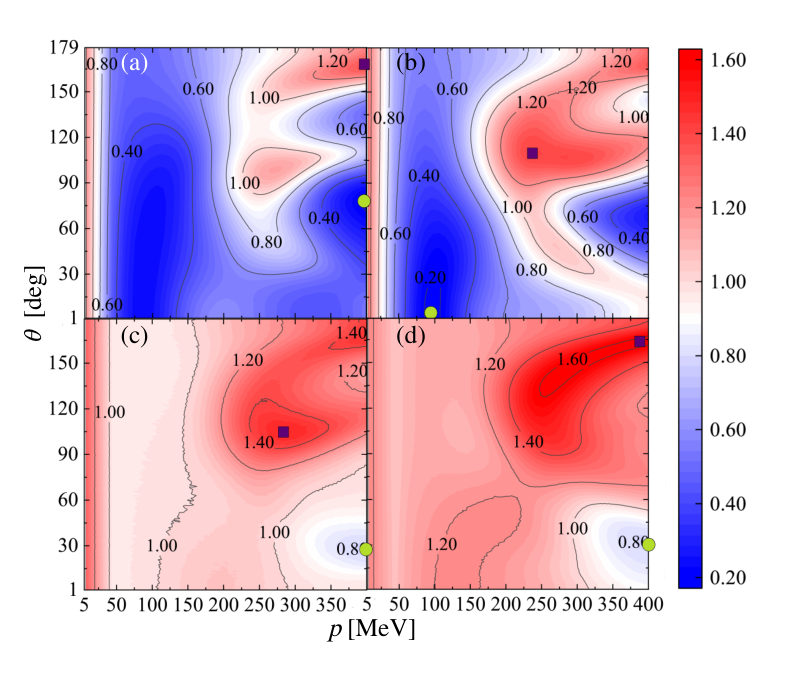 
FIG. 1. Momentum- and angle-dependent ensemble-averaged output mutual information I(p, θ).

📷 Fig 2

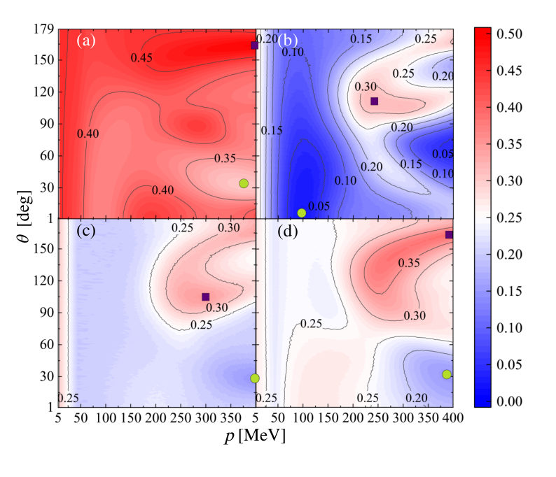 
FIG. 2. Momentum- and angle-dependent ensemble-averaged output linear entropy SL(p, θ). Pan-

📷 Fig 3

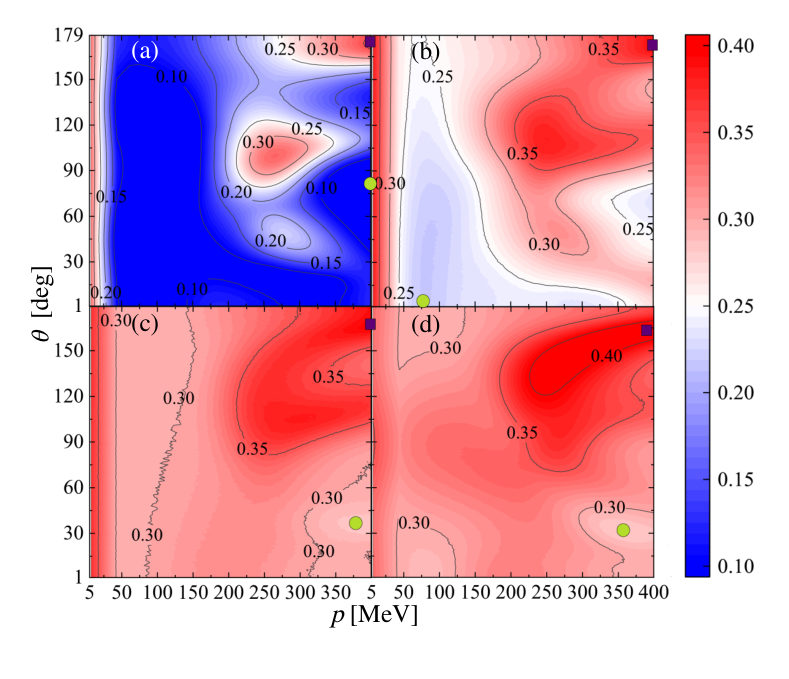 
FIG. 3. Momentum- and angle-dependent ensemble-averaged output negativity N(p, θ). The color

📷 Fig 4

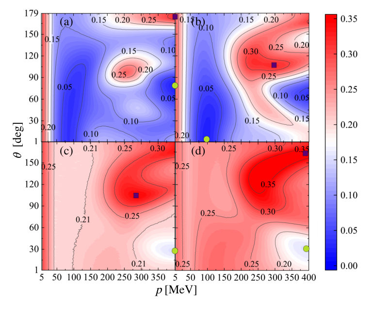 
FIG. 4. Momentum- and angle-dependent ensemble-averaged geometric quantum discord DG(p, θ).

**Summary.** This theoretical paper analyzes quantum information in neutron-proton scattering using the spin-space M-matrix. By comparing results from four different input state classes—ranging from classical mixtures to highly entangled states—the authors show that output spin correlations depend critically on the input state's coherence and entanglement. This provides a new, ensemble-based understanding of quantum correlations in nuclear reactions.

**Why it may be interesting.** This work provides a rigorous, ensemble-based description of how quantum correlations are generated in a fundamental scattering process, linking fundamental quantum information theory metrics to nuclear physics observables.

Detailed structure

**Main problem.** The study investigates the quantum-information aspects of neutron-proton scattering, specifically how input quantum state properties influence the output spin correlations.

**Main result.** Outgoing spin correlations are jointly governed by scattering kinematics and the structure of the incoming quantum ensemble; stronger input coherence/entanglement leads to larger quantum information measures.

**Method.** The authors calculate ensemble-averaged output quantum measures (Mutual Information, Negativity, Quantum Discord) using the spin-space M-matrix framework across four distinct classes of input states.

**Model / system.** The physical system is neutron-proton (np) scattering. The analysis uses the spin-space M-matrix framework to map input spin states ($
ho_{	ext{in}}$) to output states ($
ho_{	ext{out}}$). Input states range from classical mixed states to general entangled pure states.

**Key observables.** Ensemble-averaged Mutual Information, Reduced-state Linear Entropy, Negativity, and Geometric Quantum Discord.

**Important parameters / regimes.** Relative momentum and scattering angle ($	heta$), and the specific structure of the input quantum ensemble (e.g., diagonal vs. entangled).

**Assumptions / limitations.** The analysis uses a conditional M-matrix map, which is noted to not represent a global trace-preserving S-matrix evolution.

**Figures summary.** Figures (e.g., Fig. 4) show momentum- and angle-dependent ensemble-averaged geometric quantum discord for the four input-state classes, while Tables provide global quantitative comparisons of extrema.

**Paper structure.** The paper systematically analyzes four input state classes (diagonal mixed, separable pure, general pure, Schmidt-like entangled) by calculating and comparing output quantum information measures across the kinematic plane, contrasting the results with previous product-state entanglement power analyses.

Abstract

We study quantum-information aspects of neutron--proton scattering in the spin-space $M$-matrix framework. Four representative classes of input states are considered, namely diagonal mixed states, separable pure states, general two-qubit pure states, and a special Schmidt-like entangled subclass. For each class, ensemble-averaged output mutual information, reduced-state linear entropy, negativity, and geometric quantum discord are calculated in the relative momentum-- scattering angle plane. The results show that the outgoing spin correlations are governed jointly by scattering kinematics and by the structure of the incoming quantum ensemble. Input states with stronger intrinsic coherence or entanglement give larger maxima and higher minima in the mutual information, negativity, and geometric quantum discord. The enhanced regions of the mutual information and geometric discord depend on the input states, while the negativity maximum remains concentrated in the high-momentum backward-scattering region. These results extend earlier studies based on product-state entanglement power and provide an ensemble-based description of how spin correlations in neutron--proton scattering arise from the interplay between input-state structure and scattering dynamics.

[↑ back to top](#top)

### [Quantum non-local games: Quantum relations, projection lattices and rule operators](http://arxiv.org/abs/2608.30507v1)

**Authors:** Alexandros Chatzinikolaou  
**Type:** theory · **Category:** other · **PDF:** <https://arxiv.org/pdf/2608.30507v1>  
**Analysis basis:** full PDF text, analyzed in chunks
**Topic relevance:** `quantum measurements` **2/5**

📷 Fig 1

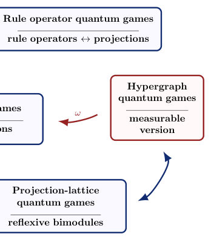 
Figure 1. The main quantum-game formalisms compared in this paper through associated operator spaces; ω-labelled arrows also preserve the value theory.

**Summary.** This paper unifies multiple mathematical descriptions of quantum non-local games—including those based on projection lattices, hypergraphs, and rule operators—into a single operator-algebraic framework. By identifying the 'winning transformation space' as the central object, the authors show that these disparate models describe the same underlying mathematical structure. This provides a powerful, consistent theoretical tool for analyzing quantum correlations and non-locality.

**Why it may be interesting.** While the topic is abstract quantum information theory, the rigorous mathematical framework connecting different physical models (like graph homomorphisms) to a single algebraic structure is highly relevant for developing general theoretical tools in quantum physics.

Detailed structure

**Main problem.** The paper aims to systematically compare various mathematical formalisms used to describe quantum non-local games and establish a unified operator-algebraic framework for them.

**Main result.** The winning strategies across diverse game models (projection-lattice, hypergraph, rule operators) are unified by the concept of an operator bimodule, with projection-lattice games capturing the reflexive part of this structure.

**Method.** The authors use operator algebra techniques, defining the 'winning transformation space' as the central object of comparison across different game definitions.

**Model / system.** The core model is the quantum non-local game, involving separated players and a referee, formalized using input/output von Neumann algebras and projection test structures.

**Key observables.** The winning transformation space (an operator bimodule), the game value (probability), and the property of 'perfectness' of a strategy.

**Important parameters / regimes.** The structure of the input/output von Neumann algebras ($X, Y, A, B$) and the referee algebra ($\mathcal{R}$).

**Assumptions / limitations.** The analysis extends to arbitrary, possibly infinite-dimensional, referee von Neumann algebras ($\mathcal{R}$), and relies on comparing the 'reflexive' parts of the various formalisms.

**Figures summary.** Figure 1 summarizes the main quantum-game formalisms compared, including Projection-lattice, Rule operator, and Hypergraph quantum games.

**Paper structure.** The paper proceeds by defining the prototypical projection-test game, then systematically comparing its winning space to those derived from projection-lattice games, hypergraph games, and rule operators, culminating in comparisons of concurrency conditions.

Abstract

Quantum non-local games with quantum inputs or outputs have been formulated in several different languages, including rank-one and quantum XOR games, support maps between projection lattices, probabilistic quantum hypergraphs, and Frobenius-algebraic rule operators on finite quantum sets. We give a unified operator-algebraic comparison of these models by assigning to each rule its winning transformation space: the operator space of transformations accepted with certainty. We introduce \(\mathcal R\)-projection-test quantum games with finite-dimensional input and output von Neumann algebras and an arbitrary, possibly infinite-dimensional, referee von Neumann algebra \(\mathcal R\). Their winning transformation spaces are precisely operator spaces with a natural bimodule structure, equivalently rectangular quantum relations. We compare this formalism with projection-lattice games, hypergraph quantum games, and the graphical rule-operator definition. Projection-lattice games capture exactly the reflexive winning bimodules. Hypergraph quantum games admit value-preserving projection-test realisations, and, after passing to perfect transformations, describe the same reflexive part as projection-lattice games. Using Daws' technique, we also translate rule operators to projections in tensor products of finite-dimensional von Neumann algebras. This identification places graphical rules in the same operator-bimodule framework and preserves both values and perfectness. Finally, we compare concurrency with the synchronicity conditions of Goldberg and of Bochniak--Kasprzak--Sołtan. The framework is illustrated by classical, rank-one, quantum XOR, colouring, and quantum graph homomorphism and isomorphism games.

[↑ back to top](#top)

### [Symmetry-Enforced Topological Structures in Quantum Phase Diagrams](http://arxiv.org/abs/2608.29915v1)

**Authors:** Linhao Li, Yuan Yao  
**Type:** theory · **Category:** other · **PDF:** <https://arxiv.org/pdf/2608.29915v1>  
**Analysis basis:** full PDF text, analyzed in chunks
**Topic relevance:** `analog quantum simulation` **2/5**

📷 Fig 1

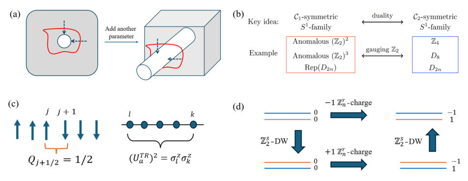 
FIG. 1: (a) Noncontractible loops are stable, e.g., adding another parameter to the phase diagram cannot trivialize the non-contractibility due to the inevitable gapless phase (white area) bounded by the loop. In the current case, we need to finetune only two parameters to reach the gapless phase numerically or experimentally. (b) The duality method to study S1-family with examples shown in the boxes. (c) For the Zx 2 × Za 2 symmetry, a domain wall of either Z2 symmetry carries a half charge of the other. Here, U TR a denotes the truncation of Ua to a finite interval l ≤j ≤k, which creates a Za 2 domain wall at each boundary. The second panel therefore means that two Za 2 domain walls carry...

📷 Fig 2

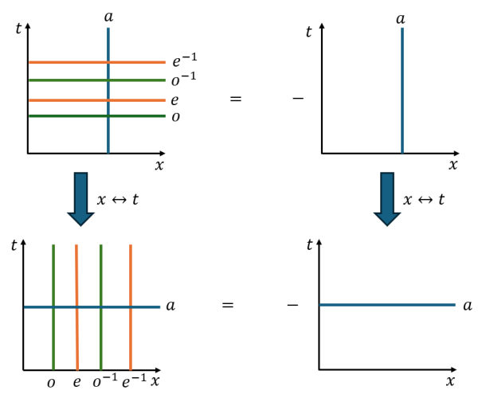 
FIG. 2: The symmetry defect configuration in the spacetime. Here the symmetry defect lines which are vertical to x or t direction correspond to inserting the domain walls or adding symmetry operators in the path integral.

**Summary.** This paper develops a generalized framework to classify the topological structure of quantum phase diagrams by analyzing non-contractible loops ($S^1$-families). It shows that exotic symmetry interplay, such as mixed anomalies, yields novel classifications that extend beyond previous methods. The work uses duality and pumping arguments to rigorously characterize these topological invariants for various symmetry-protected systems.

**Why it may be interesting.** The detailed analysis of symmetry-enforced topological invariants, especially those involving mixed anomalies and noninvertible operators, provides a powerful, generalized tool for classifying quantum phases beyond standard symmetry protection.

Detailed structure

**Main problem.** The study focuses on classifying the topological structure of the quantum phase diagram of gapped systems by identifying non-contractible loops, known as $S^1$-families.

**Main result.** The presence of exotic symmetry interplay, such as nontrivial mixed anomalies and semi-direct product relations, leads to novel $S^1$-family classifications inaccessible by earlier methods.

**Method.** The authors employ the Kramers-Wannier (KW) duality approach and analyze charge/domain-wall pumping associated with unitary evolution operators to characterize these topological invariants.

**Model / system.** The research analyzes gapped quantum systems described by many-body Hamiltonians, specifically examining symmetries like $Z_2$, $Z_4$, and $D_{2n}$ structures in 1D chains.

**Key observables.** The primary observables are the $S^1$-family classification (topological invariant), charge pumping (e.g., $Z_2$-charge pumping), and domain-wall pumping.

**Important parameters / regimes.** The classification depends critically on the symmetry structure, particularly whether the symmetry group exhibits mixed anomalies or semidirect product relations.

**Assumptions / limitations.** The analysis relies on the assumption that the topological structure can be captured by analyzing non-contractible loops in the parameter space of the Hamiltonian.

**Figures summary.** Figures illustrate non-contractible loops, the duality mapping between phase structures, and the relationships between different types of charge and domain-wall pumping.

**Paper structure.** The paper develops the framework by first introducing the concept of $S^1$-families via non-contractible loops, then applying KW duality to map between different symmetry-protected topological (SPT) phases, and finally detailing the classification for specific symmetry groups like $D_{2n}$ using anomaly arguments.

Abstract

We study the topological structure of the quantum phase diagram of gapped systems by identifying the noncontractibility of loops, so-called $S^1$-families, within the gapped phase diagram in which many-body Hamiltonians can have nontrivial ground-state degeneracy. We manifest the role of symmetries in such $S^1$-family classifications by the exotic symmetry interplay: (i) nontrivial mixed anomalies, (ii) semi-direct product relation between the spontaneously broken and the unbroken symmetries, and (iii) symmetry with noninvertible operators. We find that such structures lead to the novel $S^1$-family classifications inaccessible by earlier classifications based on ``independent'' symmetries. Furthermore, we construct lattice realizations of these $S^1$-families and explicitly demonstrate their novel algebraic structures.

[↑ back to top](#top)

### [The quantum supremum of the $I_{3322}$ Bell inequality is not attained in finite dimension](http://arxiv.org/abs/2608.29734v1)

**Authors:** Jef Pauwels  
**Type:** theory · **Category:** quantum information and computing · **PDF:** <https://arxiv.org/pdf/2608.29734v1>  
**Analysis basis:** full PDF text, analyzed in chunks
**Topic relevance:** `quantum measurements` **2/5**

📷 Fig 1

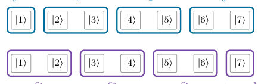 
FIG. 1. The Pál–Vértesi construction. Alice’s and Bob’s first two measurements use two-dimensional blocks offset by one Schmidt basis vector; the third measurements use the complementary pairings. A finite PV strategy is specified by its Schmidt coefficients λi and the spectral labels ci appearing in Eq. (5).

📷 Fig 2

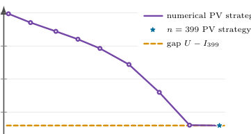 
FIG. 3. Numerical convergence of finite PV strategies. We plot U −In, where In is the value of a PV strategy with n Schmidt coefficients. All points are numerical optimizations, the star marks n = 399, and the dashed line marks U −I399. Here U = 0.25087540 is the ordinary level-four NPA value reported in Ref. [35].

**Summary.** This theoretical work proves that the quantum supremum of the $I_{3322}$ Bell inequality cannot be reached using any finite-dimensional quantum strategy. The authors show that while the supremum is approached by a specific sequence of strategies, achieving it requires an infinitely large local dimension. This highlights a non-closure property for quantum correlations in this specific scenario.

**Why it may be interesting.** It provides a rigorous mathematical boundary on the correlations achievable in quantum information protocols, demonstrating a fundamental gap between the supremum and any finite-dimensional realization.

Detailed structure

**Main problem.** The paper investigates whether the quantum supremum of the $I_{3322}$ Bell inequality can be attained using strategies restricted to finite local Hilbert space dimensions.

**Main result.** The authors prove that the quantum supremum is approached by a specific family of strategies (Pál–Vértesi) but is never actually attained in any finite dimension.

**Method.** The proof uses symmetry arguments on the Bell functional, mapping strategies to finite probability matrices, and employing contradiction to show that optimality requires an unnormalizable state.

**Model / system.** The system is defined by the $I_{3322}$ Bell inequality, which is a specific quantum correlation test involving four measurement settings (3, 3, 2, 2). The analysis focuses on the limitations imposed by finite local dimensions.

**Key observables.** The Bell value $I_{3322}$, the supremum $eta_{PV}$, and the upper-bound functional $\Phi(	heta)$ derived from spectral-weight matrices.

**Important parameters / regimes.** The local Hilbert-space dimension ($n$), which must be unbounded to approach the supremum.

**Assumptions / limitations.** The analysis relies on reducing the Bell value to an upper bound $\Phi(	heta)$ dependent on the spectral-weight matrix $	heta$, and formalizing the proof in Lean 4.

**Figures summary.** Figure 1 illustrates the Pál–Vértesi construction pattern for measurements, and Figure 2 shows how the spectral-weight matrix entries are reproduced by the PV chains.

**Paper structure.** The paper establishes the equality between the quantum supremum and the limit derived from the PV family, then uses contradiction based on optimality conditions to prove non-attainment in finite dimensions, concluding that the set of finite-dimensional correlations is not closed.

Abstract

In 2010, Pál and Vértesi found a family of finite-dimensional strategies for the $I_{3322}$ Bell inequality whose optimized values appeared to converge as the local Hilbert-space dimension grew. They conjectured that this limit is the supremum over all finite-dimensional quantum strategies, but that no finite-dimensional strategy attains it. We prove both claims. The proof uses the symmetry of the Bell functional to associate every strategy with a finite matrix of probabilities, one for each pair of spectral subspaces of Alice and Bob. This matrix gives an upper bound on the Bell value, and finite-dimensional strategies built from the repeating structure found by Pál and Vértesi approach it as the dimension grows. If the bound were attained exactly in finite dimension, the optimality conditions would then require a state that cannot be normalized. Consequently, the set of finite-dimensional quantum correlations is not closed in the $(3,3,2,2)$ scenario, the smallest Bell scenario where this can happen. Moreover, approaching the supremum requires unbounded local dimension. The core of the proof was formalized in Lean~4.

[↑ back to top](#top)

### [Self-Diffusion of Water through Thermally Activated Membranes](http://arxiv.org/abs/2608.30863v1)

**Authors:** Carlos Handrey A. Ferraz  
**Type:** theory · **Category:** statistical mechanics · **PDF:** <https://arxiv.org/pdf/2608.30863v1>  
**Analysis basis:** full PDF text, analyzed in chunks
**Topic relevance:** `Frenkel-Kontorova` **1/5** · `Keldysh / 2PI / non-Gaussian methods` **1/5** · `correlated / nonlocal dissipation` **1/5** · `driven-dissipative phase transition` **1/5** · `methods for driven-dissipative` **1/5** · `non-equilibrium universality` **1/5** · `quantum measurements` **1/5** · `scars & prethermalization` **1/5**

📷 Fig 1

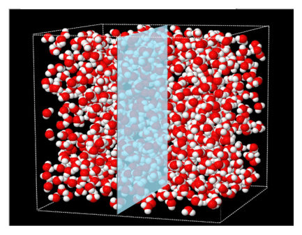 
Figure 1: The schematic depicts a three-dimensional simulation box with periodic boundary conditions containing N = 103 water molecules. A single thermoactivated membrane (rendered in trans- parent blue) is positioned at the center of the box.

📷 Fig 2

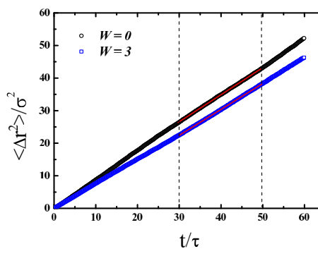 
Figure 2: Plot of the MSD as a function of time at temperature T = 387.3 K and density ρ = 1.0 g/cm3 for two different W-membrane configurations (see Sec. 3). The self-diffusion coefficient, D, is deter- mined from the slope of the MSD according to Eq. (18). The asymp- totic diffusion coefficient is obtained by performing a least-squares linear fit to the long-time regime (red solid lines), over the time inter- val from 30τ to 50τ (black dashed lines). Similar plots are obtained for the other temperatures and densities investigated. The scaling pa- rameters σ and τ are listed in Table 1.

📷 Fig 3

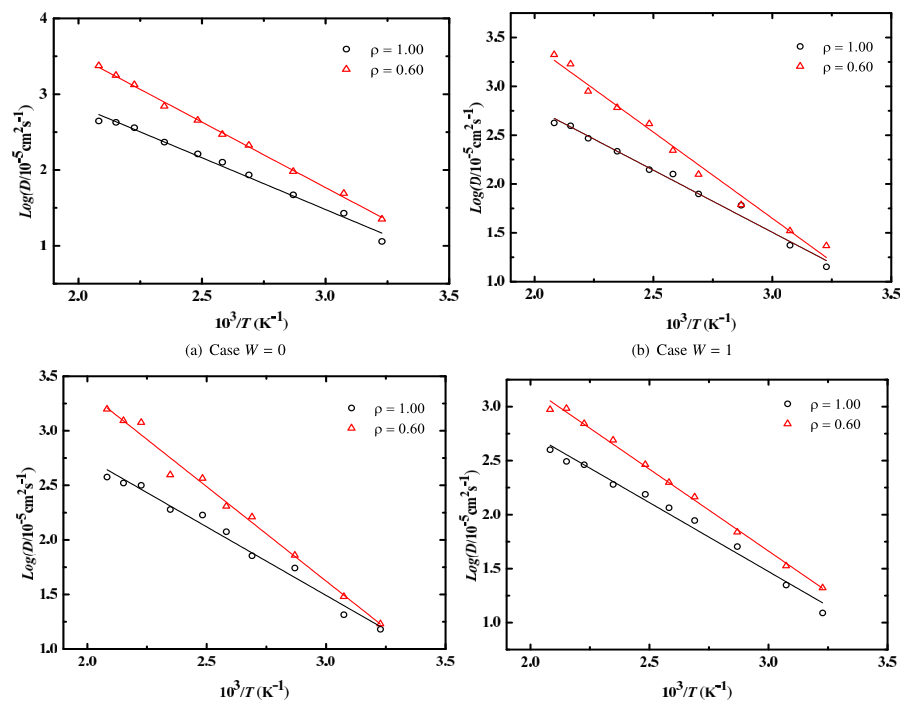 
Figure 3: Semi-log plot of the self-diffusion coefficients (in physical units) as a function of temperature for the different TAM configurations and the two water-density regimes. The Arrhenius curve fitted to data are also shown (solid lines) and the respective activation energies (Ea) and pre-exponential factor (D0) are reported in Table 2. Error bars are of the same size of plot symbols and are not showed. (a) Absence of TAMs (W = 0). (b) Presence of a single TAM (W = 1). (c) Presence of two TAMs (W = 2). (d) Presence of three TAMs (W = 3).

📷 Fig 4

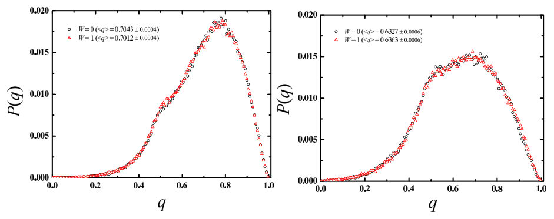 
Figure 4: Tetrahedrality distribution, P(q), and the mean tetrahedrality, ⟨q⟩(see the plot legends), at temperatures (a) T = 310, K and (b) T = 387, K for the two W cases considered, at a water density of 1.0 g/cm3. According to Eq. (13), at T = 310 K, the probability that a given water molecule undergoes elastic scattering at the membrane is p ≃0.52, whereas at T = 387 K, this probability increases to p ≃0.75.

📷 Fig 5

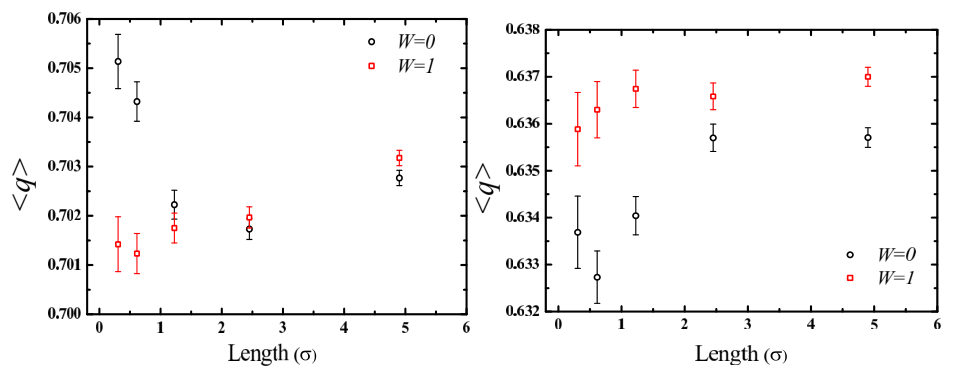 
Figure 5: Mean tetrahedrality, ⟨q⟩, calculated for water molecules within virtual boxes of different lengths centered at the membrane (x = 0), at (a) T = 310, K and (b) T = 387, K, for a water density of 1.0 g/cm3. Results are shown for two different W cases, with the virtual-box length ranging from L/32 to L/2 (L = 9.8 σ).

**Summary.** This work uses Molecular Dynamics simulations to study how water diffuses through membranes that introduce stochastic scattering events. The research finds that while the membranes significantly impede bulk diffusion, they have only a minor effect on the local structural order or the lifetime of hydrogen bonds. This highlights a decoupling between macroscopic transport and local molecular structure.

**Why it may be interesting.** The study models non-equilibrium transport phenomena in a complex fluid system, providing insights into how imposed boundaries or interfaces (like membranes) modify fundamental transport coefficients, which is relevant to open quantum systems and energy dissipation.

Detailed structure

**Main problem.** The study investigates how the self-diffusion of water is altered when passing through Thermally Activated Membranes (TAMs). It aims to understand the influence of these stochastic interfaces on particle dynamics and hydrogen-bond structure.

**Main result.** TAMs significantly decrease the self-diffusion coefficient as the number of membranes increases, but they only exert a weak influence on the local tetrahedral order parameter and hydrogen-bond lifetime.

**Method.** Molecular Dynamics (MD) simulations are employed to track particle trajectories and calculate various thermodynamic and structural properties over a range of temperatures.

**Model / system.** The system uses the SPC/E water model confined in a cubic domain containing planar TAMs. The membrane interaction is modeled stochastically, inducing elastic scattering events governed by a temperature-dependent sigmoidal probability.

**Key observables.** Self-diffusion coefficient (D), tetrahedral order parameter ($\langle q 
angle$), Hydrogen-bond (HB) lifetime ($	au_{HB}$), and effective activation energy ($E_a$).

**Important parameters / regimes.** Temperature (T), membrane configuration (number of TAMs, W), and reduced temperature ($	heta = T/T_0$).

**Assumptions / limitations.** The membrane interaction is modeled as a probabilistic, elastic scattering event; the system dynamics are analyzed using MD simulations.

**Figures summary.** Figures show MSD vs. time for diffusion coefficient calculation, $\langle q 
angle$ vs. T for structure, and $	au_{HB}$ vs. T for dynamics, comparing membrane presence (W=0 vs W=3).

**Paper structure.** The paper systematically calculates diffusion coefficients, structural parameters ($\langle q 
angle$), and HB lifetimes across different membrane configurations and temperatures, comparing results to established theoretical approximations like the Arrhenius law.

Abstract

Diffusion processes involving membranes are of fundamental importance in both science and technology, since membranes serve as selective interfaces that regulate the transport of mass, charge, and information across multiple length and time scales. In this study, we employ molecular dynamics (MD) simulations to calculate the self-diffusion coefficient, tetrahedral order parameter and hydrogen-bond (HB) lifetime of SPC/E water over a wide high-temperature range in the presence of thermally activated membranes (TAMs). These membranes exhibit thermally controlled stochastic behavior that locally influences particle dynamics by probabilistically inducing elastic scattering events as particles traverse the membrane. The stochastic behavior of the membranes is governed by a sigmoidal profile, which depend on the reduced temperature of the system. The effective activation energy for diffusion is estimated for several membrane configurations. It is found that the diffusion coefficients generally decrease with an increase in the number of membranes and are in reasonable agreement with the Arrhenius approximation at high temperatures. Additionally, both the tetrahedral order parameter and the HB lifetime are only locally sensitive to the action of the membranes.

[↑ back to top](#top)

### [Efficient biphoton generation by a waveguide-coupled single atom](http://arxiv.org/abs/2608.30276v1)

**Authors:** Mao-Hua Wang, Xiao-Jun Zhang, M. Artoni, G. C. La Rocca, Jin-Hui Wu  
**Type:** theory · **Category:** other · **PDF:** <https://arxiv.org/pdf/2608.30276v1>  
**Analysis basis:** full PDF text, analyzed in chunks
**Topic relevance:** `Keldysh / 2PI / non-Gaussian methods` **1/5** · `Tavis-Cummings & cavity-many-emitter` **1/5** · `analog quantum simulation` **1/5** · `correlated / nonlocal dissipation` **1/5** · `driven-dissipative phase transition` **1/5** · `interference shaping light` **1/5** · `methods for driven-dissipative` **1/5**

📷 Fig 1

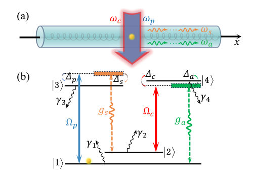 
FIG. 1. (a) Schematic illustration of the paired generation of a Stokes (ωs) and an anti-Stokes (ωa) photon from a single atom trapped close to a chiral helical waveguide when illuminated by a pump (ωp) and a coupling (ωc) field. (b) The double- Λ configuration of a four-level atom allowing for the closed- loop SFWM process |1⟩→|3⟩→|2⟩→|4⟩→|1⟩of ampli- tude decay rates γ1, γ2, γ3, and γ4 toward free space. The pump and coupling fields act upon transitions |1⟩↔|3⟩and |2⟩↔|4⟩with Rabi frequencies (detunings) Ωp = µ31Ep/2ℏ and Ωc = µ42Ec/2ℏ(∆p = ωp −ω31 and ∆c = ωc −ω42), re- spectively. Continuous chiral waveguide modes near resonant with transitions |2⟩↔|3⟩and |1⟩↔|4⟩facilitate the direc-...

📷 Fig 2

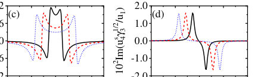 
FIG. 2. Real (a) and imaginary (b) parts of 102us 2/u1 in units of γ−1/2 3 against ∆sp/γ3 or real (c) and imaginary (d) parts of 102us 4/u1 in units of γ−1/2 3 against ∆sp/γ3. Black-solid, red-dashed, and blue-dotted lines refer to Ωc/γ3 = 2.0, 4.0, and 6.0, respectively. Other parameters are Ωp/γ3 = 1.0, ∆p/γ3 = 10, ∆c = 0, Γs/γ3 = Γa/γ3 = 0.1, and γ4 = γ3.

📷 Fig 3

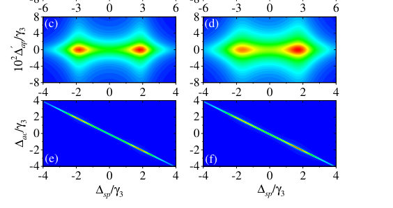 
FIG. 3. Modulus of 10usa 1 /u1 in units of γ−1 3 against ∆sp/γ3 and ∆′ ap/γ3 (a, b, c, d) or ∆sp/γ3 and ∆ac/γ3 (e, f) with ∆ac = ∆a −∆c. Parameters are the same as in Fig. 2 except Γs/γ3 = Γa/γ3 = 0.1 in (a, c, e) while 0.5 in (b, d, f) as well as Ωc/γ3 = 4.0 in (a, b) while Ωc/γ3 = 2.0 in (c, d, e, f).

📷 Fig 4

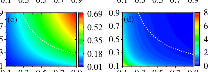 
FIG. 5. 102Ps (a), Psa (b), 102Rsa in units of γ3 (c), and 10−3g(2) sa (d) at τγ3 = 0.36 against Γs/γ3 and Γa/γ3. Other parameters are the same as in Fig. 2 except Ωc/γ3 = 4.0.

**Summary.** This paper theoretically models the efficient generation of entangled biphoton pairs using a single atom coupled to a chiral waveguide via spontaneous four-wave mixing. By developing a perturbative treatment, the authors show that this platform achieves high generation rates comparable to bulk media while offering superior on-chip integration advantages. The results confirm the potential of single-emitter quantum sources for next-generation quantum technologies.

**Why it may be interesting.** This work provides a detailed theoretical framework for realizing solid-state quantum light sources using atomic coherence effects, which is highly relevant to open quantum systems and quantum optics.

Detailed structure

**Main problem.** The paper addresses the need for high-performance, compact quantum light sources, specifically efficient biphoton generation, to overcome limitations in current free-space quantum optics methods.

**Main result.** The authors demonstrate that a single atom coupled to a chiral waveguide can achieve biphoton generation rates comparable to long cold atomic ensembles while maintaining low loss and scalability for on-chip integration.

**Method.** A perturbative treatment is developed based on the system's Hamiltonian, analyzing the steady-state solutions for probability amplitudes to derive the generation rates and spectral correlations.

**Model / system.** The physical system is a single atom undergoing spontaneous four-wave mixing (SFWM) near a chiral waveguide, modeled as a four-level atomic system with coupling to guided and unguided modes.

**Key observables.** Biphoton generation rate ($R_{sa}$), single-photon probability ($P_s$), two-photon correlation function ($g^{(2)}_{sa}$), and the spectral joint response $|\alpha_{s1}|$.

**Important parameters / regimes.** Atomic decay rates ($\gamma$), Rabi frequencies ($\Omega$), waveguide coupling strengths ($g$), and detunings ($\Delta$).

**Assumptions / limitations.** The analysis uses a perturbative treatment, assuming the nonlinear response remains weak enough to neglect higher-order photon generation, and the system is analyzed in the electric-dipole and rotating-wave approximations.

**Figures summary.** Figures illustrate the spectral structure of single-photon excitations related to EIT, the single-atom joint spectral response, and the dependence of generation rates and correlation functions on various decay and coupling parameters.

**Paper structure.** The paper introduces the physical setup and the SFWM process, develops the perturbative Hamiltonian and equations of motion, derives the analytical expressions for single-photon and biphoton densities, and finally analyzes the spectral correlations and generation rates under various parameter regimes.

Abstract

A single atom undergoing spontaneous four-wave mixing near a chiral waveguide can efficiently channel an emitted Stokes-anti-Stokes photon pair into two tightly confined waveguide modes, yielding thus enhanced biphoton generation without requiring loss suppression or stringent phase matching. We develop a perturbative treatment, valid for a four-level atomic system under experimentally realistic conditions, to explain physical origins and clarify relevant constraints of such an enhancement determined by the interplay of atomic decay rates toward guided and unguided modes. Besides achieving optimal generation rates equivalent to a cold atomic ensemble hundreds of micrometers long in free space, our biphoton source naturally fulfills key requirements for next-generation on-chip quantum light sources, namely low-loss operation, robustness, compactness, and scalability.

[↑ back to top](#top)

### [Pseudospin Dynamics of Charge Order](http://arxiv.org/abs/2608.30381v1)

**Authors:** Ping Tang  
**Type:** theory · **Category:** strongly correlated electrons · **PDF:** <https://arxiv.org/pdf/2608.30381v1>  
**Analysis basis:** full PDF text, analyzed in chunks
**Topic relevance:** `Keldysh / 2PI / non-Gaussian methods` **1/5** · `analog quantum simulation` **1/5** · `driven-dissipative phase transition` **1/5** · `methods for driven-dissipative` **1/5** · `non-equilibrium universality` **1/5** · `quantum measurements` **1/5**

📷 Fig 1

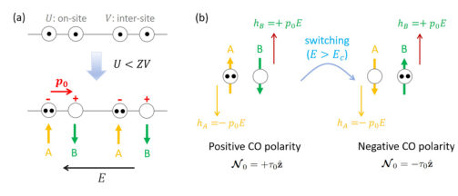 
FIG. 1. (a) Charge order (CO) with alternating doubly occu- pied and empty sites in a half-filled extended Hubbard model with U &lt; ZV , in which an intracell electric dipole p0 emerges due to the accompanying inversion-symmetry breaking. (b) Switching of the CO polarity by an external electric field that couples to the intracell dipoles and thereby acts as a staggered field on the two pseudospin sublattices. Here, doubly occu- pied (empty) sites are represented by orange (green) pseu- dospin arrows, and the CO state corresponds to staggered pseudospin order on the A and B sublattices.

📷 Fig 2

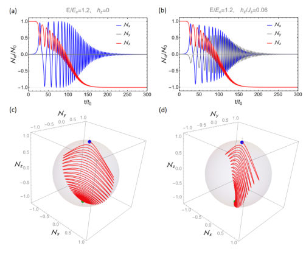 
FIG. 2. Time evolution and trajectories of the charge- order vector N during electric-field-driven switching of the charge-order polarity at E/Ec = 1.2: (a),(c) hz = 0 and (b),(d) hz/Jz = 0.06. Here, time is measured in units of t0 = ℏ/(ZJzτ0), with J⊥/Jz = 0.3 and αG = 0.02. The ini- tial state is N 0 = τ0ˆz, corresponding to the positive-polarity CO state shown in Fig. 1.

**Summary.** This work develops a pseudospin model for charge order, treating it as a dynamic variable rather than a static modulation. By deriving dynamics analogous to those in antiferromagnets, the authors show that an external electric field can coherently switch the charge-order polarity. This establishes a charge-sector analogue to spintronics, opening pathways for electrical control of charge states.

**Why it may be interesting.** The direct analogy drawn between charge-pseudospin dynamics and well-established spin-order dynamics (spintronics) provides a powerful, transferable theoretical framework for understanding electrical control in charge-ordered materials.

Detailed structure

**Main problem.** The paper addresses the lack of a microscopic framework describing the non-equilibrium dynamics and external control of charge order, contrasting with the view of charge order as static.

**Main result.** It establishes the charge pseudospin as a dynamical degree of freedom, showing that an external electric field can drive a coherent reversal of the charge-order polarity above a critical threshold.

**Method.** The authors derive an effective pseudospin model from the extended Hubbard model and analyze its dynamics using Landau-Lifshitz-Gilbert-like equations.

**Model / system.** The system is modeled using the extended Hubbard model, which is mapped onto an effective pseudospin Hamiltonian. The dynamics are governed by pseudospin operators ($	au_i$) analogous to those in bipartite antiferromagnets.

**Key observables.** Staggered pseudospin order (N), charge-order parameter ($N_z$), and the critical switching field ($E_c$).

**Important parameters / regimes.** External electric field ($E$), doping/chemical potential ($h_z$), and coupling constants ($J_z, J_\perp$).

**Assumptions / limitations.** The analysis relies on the strong charge-ordering regime and employs semiclassical mean-field dynamics approximations.

**Figures summary.** Figure 1 illustrates the charge order and the switching of its polarity by an external electric field. Figure 2 shows the time evolution of the charge-order vector during field-driven switching.

**Paper structure.** The paper progresses from deriving the effective pseudospin Hamiltonian from the extended Hubbard model, establishing the LLG-like dynamics, and finally analyzing how an external electric field drives coherent switching by destabilizing collective pseudospin excitations.

Abstract

Charge order is conventionally viewed as a static modulation of the electronic density, despite growing experimental capabilities to probe and manipulate its nonequilibrium evolution. In contrast to spin-ordered systems, a microscopic framework for charge-order dynamics and its control under external driving remains largely underdeveloped. Here, starting from an extended Hubbard model, we derive an effective pseudospin model in which the charge-ordered state maps onto staggered pseudospin order. The resulting charge-order dynamics is governed by Landau--Lifshitz--Gilbert-like equations for the pseudospins, closely analogous to those of a bipartite antiferromagnet. We show that an external electric field directly controls the staggered pseudospin order and, above a threshold field, drives coherent reversal of the charge-order polarity by destabilizing collective pseudospin excitations. Our results establish the charge pseudospin as a microscopic dynamical degree of freedom for coherent switching and control of charge order, providing a charge-sector analogue of the well-established framework for spin-order dynamics in spintronics.

[↑ back to top](#top)

### [Modular-Annihilator Parent Hamiltonians for Purified Gibbs States: Spectral Design and Controlled Approximation](http://arxiv.org/abs/2608.30272v1)

**Authors:** Changhao Yi, Jun Takahashi, Cunlu Zhou  
**Type:** theory · **Category:** statistical mechanics · **PDF:** <https://arxiv.org/pdf/2608.30272v1>  
**Analysis basis:** full PDF text, analyzed in chunks
**Topic relevance:** `Keldysh / 2PI / non-Gaussian methods` **1/5** · `analog quantum simulation` **1/5** · `correlated / nonlocal dissipation` **1/5** · `driven-dissipative phase transition` **1/5** · `methods for driven-dissipative` **1/5**

📷 Fig 1

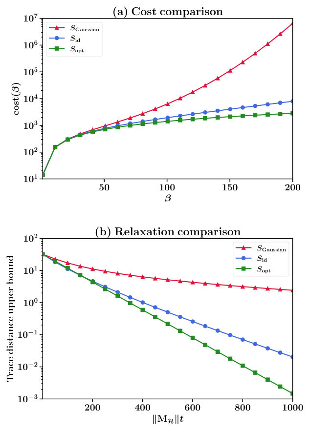 
FIG. 1. The comparison between the three coefficient matrices, where the free-fermion model is generated by random coefficients and renormalization ∥h∥1 = 1. There are N = 100 modes in the model. In plot (a), the horizontal axis is the inverse temperature β ∈[1, 200]. The vertical axis is cost(β) defined in Eq. (88), which reflects the reduced query-cost proxy using SoS spectral amplification. In plot (b), we compare the relaxation from the maximally mixed state of the corresponding Lindbladian, and fix the inverse temperature to be β = 100. The horizontal axis is the evolution time multiplied by ∥MH∥, the vertical axis is the analytical upper bound of the trace distance derived in Eq. (61).

📷 Fig 2

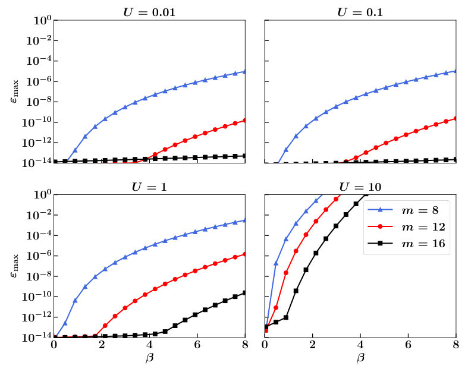 
FIG. 2. The accuracy of approximate modular transformation of interacting fermionic model in Eq. (89) with system size N = 4 and interaction strength U = 10−2, 10−1, 1, 10. The horizontal axis corresponds to the inverse temperature β. The vertical axis corresponds to ϵmax in Eq. (91) for m = 8, 16, 24 separately. The set of generators is 1-local Pauli operators {Xn, Zn}N n=1.

📷 Fig 3

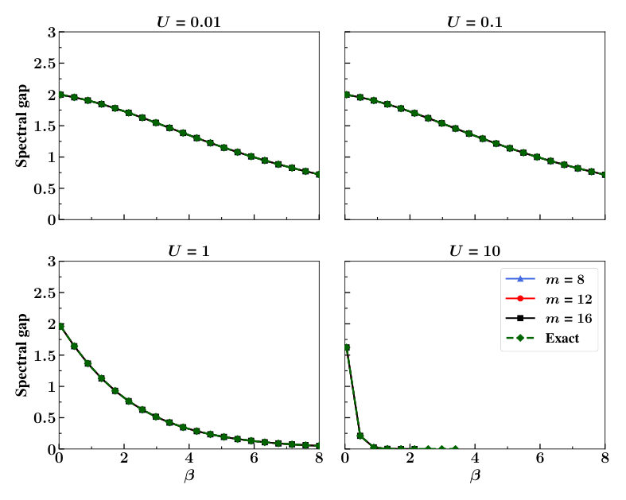 
FIG. 3. Spectral gap of the exact parent Hamiltonian and Krylov approximated parent Hamiltonian with system size N = 4 and interaction strength U = 10−2, 10−1, 1, 10. The horizontal axis corresponds to the inverse temperature β. The vertical axis corresponds to the spectral gap of MH and eMH for m = 8, 16, 24 separately. The set of generators is 1-local Pauli operators {Xn, Zn}N n=1. We cut off the computation when the spectral gap of the Krylov approximated parent Hamiltonian at m = 24 is less than or equal to 10−8, which is considered as having degenerate ground space in the numerical sense. Note that the exact curve is visually indistinguishable from m = 24 curve over the displayed range.

📷 Fig 4

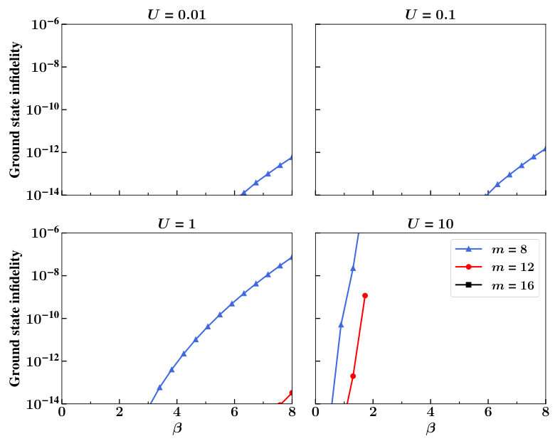 
FIG. 4. Ground state fidelity between the ground state of the exact parent Hamiltonian and Krylov approximated parent Hamiltonian with system size N = 4 and interaction strength U = 10−2, 10−1, 1, 10. The horizontal axis corresponds to the inverse temperature β. The vertical axis corresponds to the fidelity between |ρ1/2 β ⟩and the ground state of eMH for m = 8, 16, 24 separately. The set of generators is 1-local Pauli operators {Xn, Zn}N n=1. We cut off the computation when the spectral gap of the Krylov approximated parent Hamiltonian at m = 24 is less than or equal to 10−8, which is considered as having degenerate ground space in the numerical sense.

**Summary.** This paper introduces a novel, exact method using modular annihilators to construct parent Hamiltonians whose ground state corresponds to a purified Gibbs state. It achieves optimal spectral properties for free-fermion models and provides a systematic approximation scheme for complex interacting systems. This advances the theoretical understanding of how finite-temperature dynamics can be mapped onto ground-state problems.

**Why it may be interesting.** This work provides rigorous, non-perturbative methods to connect thermal equilibrium states (Gibbs states) to ground-state physics via parent Hamiltonians, which is crucial for understanding open quantum systems dynamics.

Detailed structure

**Main problem.** The paper develops an exact, finite Sum-of-Squares (SoS) construction for the parent Hamiltonians associated with purified Gibbs states, bypassing continuous time integrals.

**Main result.** The modular-annihilator construction achieves the optimal relative spectral gap of 1 for the parent Hamiltonian, and the optimal free-fermion choice yields rapid mixing independent of inverse temperature.

**Method.** The core method involves using modular annihilators derived from a finite set of Hermitian generators to construct the parent Hamiltonian $M_H$ such that the purified Gibbs state is its unique ground state.

**Model / system.** The study focuses on purified Gibbs states ($
ho_eta$), which bridge finite-temperature physics and ground-state methods. The analysis covers free-fermion models (using Majorana operators) and general interacting systems.

**Key observables.** Spectral gap of the parent Hamiltonian ($	ext{Gap}(M_H)$), mixing time, and the relative spectral gap $r(\{J_a\})$.

**Important parameters / regimes.** Inverse temperature ($eta$), interaction strength, and the dimension of the Krylov approximation.

**Assumptions / limitations.** The construction assumes the algebra generated by the initial operators is unital and irreducible for the ground state to be unique. Interacting systems require the Krylov-Lanczos approximation.

**Paper structure.** The paper builds from the general concept of purifying Gibbs states to the specific construction using modular annihilators, detailing the free-fermion case, and finally addressing the approximation techniques for general interacting systems.

Abstract

Purified Gibbs states provide a bridge between finite-temperature physics, dissipative dynamics, and ground-state methods. In this work, we study the exact finite sum-of-squares (SoS) construction of their parent Hamiltonians and the associated Lindbladian based on modular annihilators. Given a finite set of Hermitian generators, the corresponding modular annihilators yield a frustration-free SoS representation without continuous time integrals or an explicit decomposition into Bohr-frequency sectors. The purified Gibbs state remains a common zero mode while the freedom to choose and combine the generators can be used to optimize the spectral properties of the parent Hamiltonian. For free-fermion Hamiltonians, modular transformations act linearly on Majorana operators, leading to an analytically solvable family of parent Hamiltonians parameterized by a real symmetric coefficient matrix \(S\). For the scalar-functional subclass $S=f(h)$, we show that, at fixed operator norm, the choice $S_{\mathrm{opt}}\propto 1/\sqrt{\cosh(2βh)}$ has mixing time upper bound $2\log(2N/ε)$ for any $β$, which exhibits rapid mixing and is irrelevant to the inverse temperature $β$. For interacting systems, where the modularly dressed generators are not available in closed form, we introduce a Krylov--Lanczos approximation scheme and bound the resulting ground-state error in terms of the modular-approximation error and the parent-Hamiltonian gap. Numerical results illustrate the free-fermion spectral advantage and show how the accuracy of the interacting construction depends on temperature, interaction strength, and Krylov dimension.

[↑ back to top](#top)

### [Active embracement enables autonomous tweezing in active star polymers](http://arxiv.org/abs/2608.29728v1)

**Authors:** Marco Musacchio, Davide Breoni, Iman Abdoli, Luca Tubiana, Hartmut Löwen, Lorenzo Caprini  
**Type:** both · **Category:** statistical mechanics · **PDF:** <https://arxiv.org/pdf/2608.29728v1>  
**Analysis basis:** full PDF text, analyzed in chunks
**Topic relevance:** `Frenkel-Kontorova` **1/5** · `driven-dissipative phase transition` **1/5** · `methods for driven-dissipative` **1/5** · `non-equilibrium universality` **1/5**

📷 Fig 1

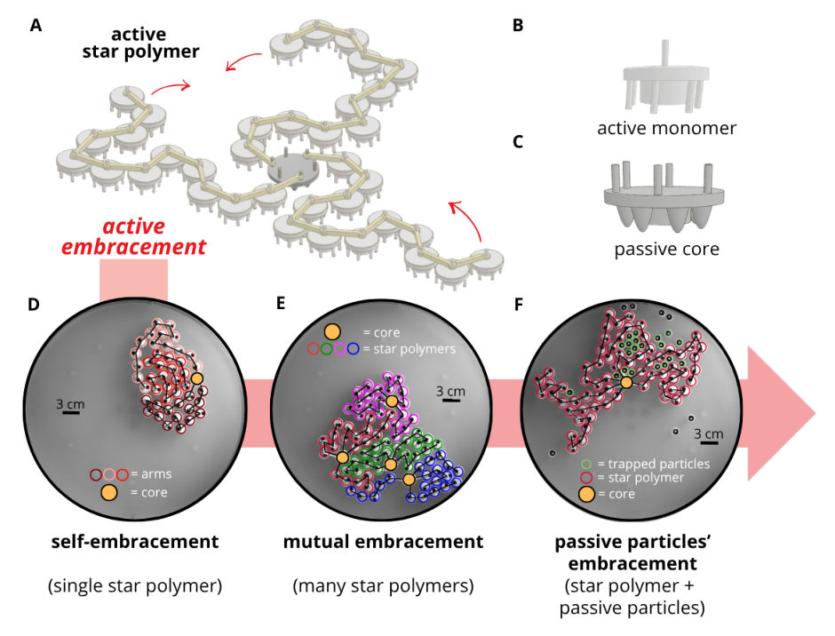 
FIG. 1. Active embracement. A Schematic illustration of an active star polymer composed of a passive core (large dark grey particle) and arms made of active monomers (small light grey particles). B,C Side views of the 3D-printed active monomer (B) and passive core (C). Red arrows indicate different manifestations of active embracement, namely the tendency of active star polymers to “embrace” surrounding objects, including themselves (self-embracement), other star polymers (mutual embrace- ment), and passive objects (embracement of passive particles). D–F Experimental snapshots showing: D self-embracement of a single active star polymer, with monomers belonging to different arms shown in...

📷 Fig 2

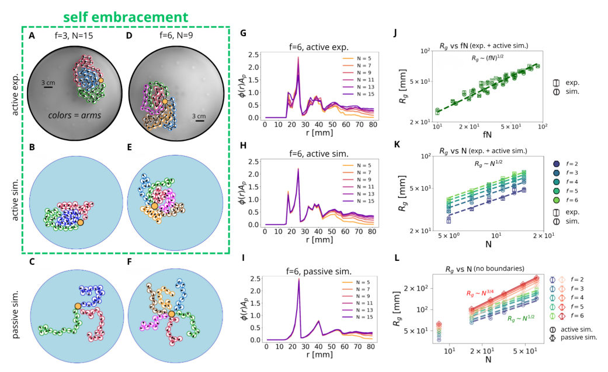 
FIG. 2. Self-embracement A,D Experimental snapshots of a single star-polymer with f = 3, N = 15 (A) and f = 6, N = 9 (D). b,e Simulation snapshots of active star-polymers for f = 3, N = 15 (B) and f = 6, N = 9 (E). C,F Simulations snapshots of passive star-polymers for f = 3, N = 15 (C) and f = 6, N = 9 (F). In all snapshots, the passive core is colored orange, while the other colors are used to distinguish monomers belonging to different arms, and the scale bar corresponds to 3 cm. Active star polymers spontaneously adopt self-embraced configurations, whereas passive star polymers remain in open configurations. G–I Radial distribution functions, ϕ(r), of the monomer positions with respect...

📷 Fig 3

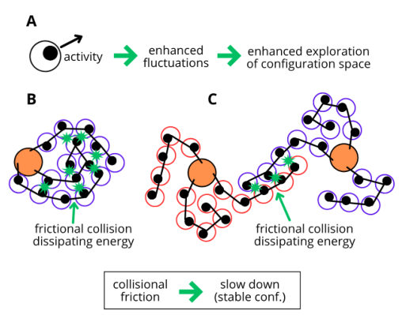 
FIG. 3. Active embracement mechanism. A Self- propulsion, whose direction is indicated by the black off- centered dot on each monomer, enhances fluctuations and promotes the exploration of the configuration space of the star polymer. B Illustration of a typical collapsed configura- tion for a single active star polymer whose active monomers are colored in blue, in which the arms are hugging each other around the passive core. C Illustration of a typical con- figuration involving two active star polymers, whose active monomers are colored blue and red, respectively. Configu- rations involving multiple monomer–monomer contacts are more stable because collisions between contacting monomers...

📷 Fig 4

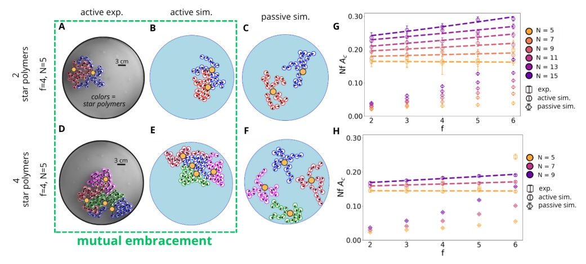 
FIG. 4. Mutual embracement. A,D Experimental snapshots of two (A) and four (D) star polymers with number of arms f = 4 and number of monomers per arm N = 5. B,C,E,F Simulation snapshots of two (B) and four (E) active star polymers and two (C) and four (F) passive star polymers, with f = 4 and N = 5 to match experiments. The passive core of each star polymer is colored orange, while all monomers belonging to the same polymer have the same color. In all snapshots, the scale bar corresponds to 3 cm. In the active case, different star polymers cluster and remain in contact through mutual embracement, whereas in the passive case they effectively repel each other. G,H Contact area, Ac, multiplied...

📷 Fig 5

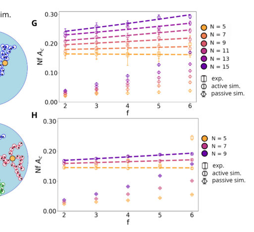 
Figure 4G,H reveals a clear quantitative distinction be- tween active and passive systems. The contact area mea- sured for active star polymers (squares for experiments and open circles for simulations) is consistently larger than that of passive star polymers (diamonds), both for systems comprising two and four interacting polymers. These higher values provide direct evidence of activity-

**Summary.** This paper investigates 'active embracement' in star polymers, demonstrating that internal self-propulsion drives the system into a collapsed, 'hugging' state unattainable by passive systems. By combining experiments with detailed simulations incorporating contact and rolling friction, the authors show this mechanism allows the polymers to function as autonomous tweezers for capturing external particles. This offers a versatile design principle for smart, self-assembling materials.

**Why it may be interesting.** The work provides a physical blueprint for designing active matter systems whose non-equilibrium dynamics can be harnessed for controlled, localized interactions, bridging concepts from active matter physics to potential applications in quantum sensing or manipulation.

Detailed structure

**Main problem.** The challenge is achieving autonomous structural reconfiguration in artificial active matter, moving beyond simple shape changes to localized, functional interactions like targeted cargo capture.

**Main result.** Active embracement, a non-equilibrium phenomenon, allows star polymers to self-collapse, mutually embrace, and autonomously capture passive particles, functioning as molecular tweezers.

**Method.** The study combines polymer experiments using 3D-printed vibrobots with detailed simulations using stochastic equations to model particle dynamics.

**Model / system.** The system consists of active star polymers, modeled as a core connected to self-propelled monomeric arms. Dynamics incorporate Brownian motion, inertial effects, and various friction forces (contact and rolling).

**Key observables.** Radius of Gyration (Rg), Radial Distribution Function (phi(r)), and the transition between open/dispersed and collapsed/embraced states.

**Important parameters / regimes.** Self-propulsion force (activity), friction coefficients (contact and rolling), and particle density/number of monomers (N).

**Assumptions / limitations.** The model relies on specific parameter choices calibrated to match experimental observations, particularly regarding the role of contact and rolling friction in stabilizing collapsed states.

**Figures summary.** Figures illustrate the transition from open to collapsed states (self-embracement) in active vs. passive polymers, showing Rg scaling differences and the mechanism involving friction.

**Paper structure.** The paper first introduces the concept of active embracement, then details the simulation methodology comparing active vs. passive systems, focusing on the role of friction, and finally demonstrates the functional capability of the resulting 'tweezers' through particle capture.

Abstract

The capacity for autonomous structural reconfiguration is a defining trait of living systems, yet it remains elusive in artificial active matter. Here, we report the discovery of active embracement, a non-equilibrium phenomenon where active star polymers, comprising a central core and self-propelled monomeric arms, transition from open configurations to tightly collapsed, ``hugging'' states. By combining polymer experiments using connected vibrobots with simulations, we demonstrate that internal self-propulsion fundamentally overrides the steric repulsion that keeps passive polymers dispersed. This active drive enables a suite of behaviors unattainable in equilibrium systems: individual star polymers undergo a globular-like self-collapse, multiple star polymers mutually intertwine and mutually embrace, and can spontaneously embrace and capture surrounding passive particles. Our findings reveal that active embracement is a distinct kinetic phase that allows star polymers to function as autonomous tweezers. By bridging the gap between macroscopic robotic collectives and microscopic polymer physics, this work provides a versatile blueprint for the design of smart materials capable of targeted cargo capture and self-directed assembly in complex environments.

[↑ back to top](#top)

### [Electronic phase separation and emergence of a nondimerized insulating phase in VO$_2$ $(110)_{\mathit{R}}$ ultrathin films](http://arxiv.org/abs/2608.29116v1)

**Authors:** S. Inoue, D. Shiga, R. Hayasaka, K. Ozawa, A. F. Santander-Syro, H. Kumigashira  
**Type:** experiment · **Category:** strongly correlated electrons · **PDF:** <https://arxiv.org/pdf/2608.29116v1>  
**Analysis basis:** full PDF text, analyzed in chunks
**Topic relevance:** `Frenkel-Kontorova` **1/5** · `analog quantum simulation` **1/5** · `driven-dissipative phase transition` **1/5**

📷 Fig 1

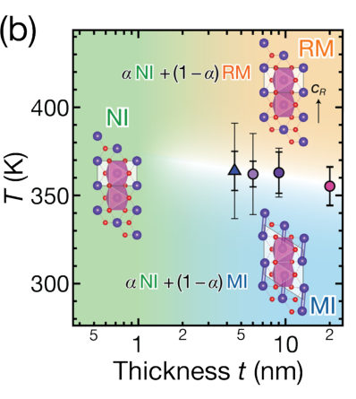 
FIG. 1. (a) Temperature dependence of r for VO2/TiO2 (110) films with t ranging from 1 to 20

📷 Fig 2

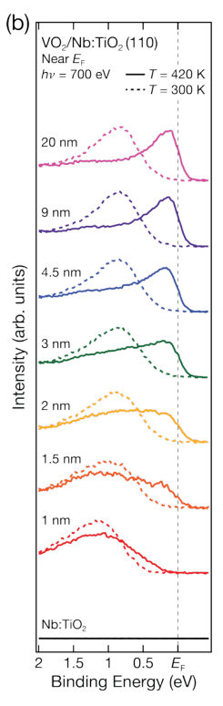 
FIG. 2. (a) Valence-band spectra of VO2/Nb:TiO2 (110) ultrathin films with different t, measured

📷 Fig 3

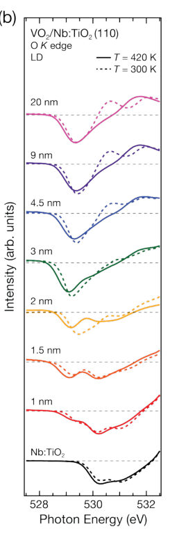 
FIG. 3. (a) Thickness dependence of O K-edge XAS spectra of VO2/Nb:TiO2 (110) ultrathin films

📷 Fig 4

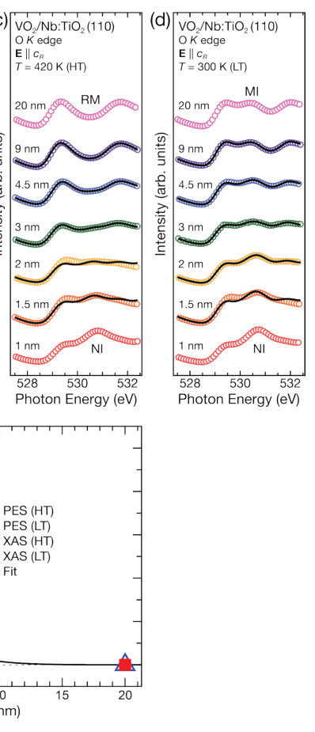 
FIG. 4. Thickness dependence of valence-band spectra [(a) HT; (b) LT] and O K-edge XAS

**Summary.** This experimental study investigates how reducing the thickness of $	ext{VO}_2$ films affects its electronic phase transition. Using advanced spectroscopy, the authors found that the system develops a nondimerized insulating phase driven by enhanced Mott instability, even when the crystal structure suggests otherwise. This work highlights that the geometric orientation of the crystal lattice dictates the spatial evolution of electronic phase separation in these strongly correlated materials.

**Why it may be interesting.** The work directly addresses how dimensionality and strain mediate phase transitions in correlated oxides, providing experimental evidence for Mott instability enhancement in confined geometries, which is relevant to designing novel correlated quantum materials.

Detailed structure

**Main problem.** The study investigates the thickness dependence of the electronic structure and V-V dimerization in $	ext{VO}_2 (110)_{	ext{R}}$ ultrathin films, particularly how reduced dimensionality affects the Mott-Peierls transition.

**Main result.** The emergence of a nondimerized insulating (NI) phase is driven by the enhancement of Mott instability due to reduced dimensionality, and this phase-separation behavior is dictated by the geometric orientation of the V-V chains.

**Method.** The research employed in situ photoemission spectroscopy (PES) and x-ray absorption spectroscopy (XAS) to probe electronic structure and V-V dimerization across varying film thicknesses.

**Model / system.** The physical system is $	ext{VO}_2$ (Vanadium dioxide) grown as epitaxial ultrathin films on $	ext{TiO}_2 (110)$ substrates. The material is a strongly correlated oxide known for its temperature-driven metal-insulator transition.

**Key observables.** Electronic structure (PES/XAS), V-V dimerization (O K-edge XAS), electrical resistivity ($
ho$) vs. Temperature ($T$), and the fraction of the nondimerized insulating (NI) phase.

**Important parameters / regimes.** Film thickness ($t$), temperature ($T$), and the critical thickness ($t_c = 2.2 	ext{ nm}$) marking the transition to the NI phase.

**Assumptions / limitations.** The study assumes that the $	ext{VO}_2 (110)_{	ext{R}}$ orientation minimizes direct geometric constraints on V-V dimerization, allowing the investigation of intrinsic Mott instability effects.

**Figures summary.** Figures show the temperature dependence of transport properties ($
ho(T)$) and spectroscopic data (PES/XAS) revealing the persistence of MIT spectral changes down to 1.5 nm, and the appearance of the NI phase at 1 nm.

**Paper structure.** The paper systematically measures the electronic structure and dimerization as a function of film thickness, comparing the results to known behavior in other orientations ($	ext{VO}_2 (001)_{	ext{R}}$) to deduce the underlying physical mechanism driving the phase transition.

Abstract

Using in situ photoemission spectroscopy and x-ray absorption spectroscopy, we investigated the thickness dependence of the electronic structure and V-V dimerization in VO$_2$/TiO$_2$ (110) ultrathin films, in which the one-dimensional V-V chains along the $c_{\mathit{R}}$ axis lie in the film plane. In VO$_2$ $(110)_{\mathit{R}}$ films, the reduction in dimensionality along the surface-normal direction is not expected to impose a geometric constraint on V-V dimerization, unlike in VO$_2$ $(001)_{\mathit{R}}$ films. Nevertheless, the characteristic spectral changes associated with the temperature-driven metal-insulator transition observed in thick films persist down to 1.5 nm, whereas at 1 nm an insulating electronic phase is observed without V-V dimerization. This behavior is highly similar to that reported for VO$_2$ $(001)_{\mathit{R}}$, suggesting that the enhancement of Mott instability resulting from reduced dimensionality is a common and essential driving force for the emergence of the nondimerized insulating phase in VO$_2$ ultrathin films. Meanwhile, unlike in VO$_2$ $(001)_{\mathit{R}}$, the nondimerized insulating phase in VO$_2$ $(110)_{\mathit{R}}$ coexists with the phase exhibiting the temperature-driven metal-insulator transition. Its fraction increases exponentially with decreasing thickness and becomes dominant at 1 nm. The corresponding effective critical thickness is estimated to be 2.2 nm. These results imply that the geometric orientation of the V-V chains dictates the spatial evolution of electronic phase separation via strain-mediated phase competition.

[↑ back to top](#top)

### [On the entropy of a pseudo-density matrix](http://arxiv.org/abs/2608.28946v1)

**Authors:** James Fullwood, Boyu Yang  
**Type:** theory · **Category:** quantum information and computing · **PDF:** <https://arxiv.org/pdf/2608.28946v1>  
**Analysis basis:** full PDF text, analyzed in chunks
**Topic relevance:** `correlated / nonlocal dissipation` **1/5** · `driven-dissipative phase transition` **1/5** · `quantum measurements` **1/5**

📷 Fig 1

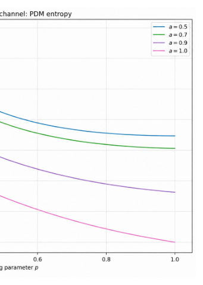 
Figure 1: The PDM entropy S(Dp ⋆ρa) for the qubit depolarizing channel, where ρa = a |0⟩⟨0| + (1 −a) |1⟩⟨1|, for a = 0.5, 0.7, 0.9, 1. The entropy is nonincreasing in p, in agreement with the proposition above. The marked points indicate the values of p at which Dp ⋆ρa acquires a zero eigenvalue.

📷 Fig 2

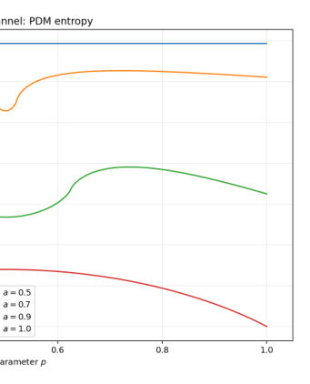 
Figure 2: The PDM entropy S(Bp ⋆ρa) for the qubit bit-flip channel, where ρa = a |0⟩⟨0| + (1 −a) |1⟩⟨1|, for a = 0.5, 0.7, 0.9, 1. The entropy is symmetric about p = 1/2 and remains between 0 and log 2.

📷 Fig 3

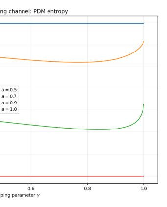 
Figure 3: The PDM entropy S(Aγ ⋆ρa) for the qubit amplitude-damping channel, where ρa = a |0⟩⟨0| + (1 −a) |1⟩⟨1|, for a = 0.5, 0.7, 0.9, 1. The endpoint values satisfy S(A0 ⋆ρa) = S(A1 ⋆ρa) = S(ρa), while S(Aγ ⋆12/2) = log 2 for every γ ∈[0, 1].

**Summary.** This paper develops a unique, mathematically rigorous extension of the von Neumann entropy functional to pseudo-density matrices (PDMs), which are necessary for describing quantum systems with temporal correlations. By using an axiomatic approach, the authors define this generalized entropy and demonstrate its physical consistency by analyzing its behavior for various quantum channels acting on qubits.

**Why it may be interesting.** This work provides a rigorous mathematical tool (the PDM entropy) to quantify information loss and correlations in open quantum systems evolving over time, which is crucial for understanding quantum dynamics beyond simple Markovian assumptions.

Detailed structure

**Main problem.** The core problem is extending the von Neumann entropy, which requires positive operators, to pseudo-density matrices (PDMs) that can possess negative eigenvalues due to encoding temporal correlations.

**Main result.** The authors prove the existence of a unique extension of the von Neumann entropy functional to PDMs satisfying key axioms (unitary invariance and strong additivity for affine combinations). This unique extension is shown to be subadditive for single qubit dynamics.

**Method.** The work employs an axiomatic approach, analogous to defining Shannon entropy, to derive the unique functional form for the entropy of PDMs.

**Model / system.** The system involves PDMs, which extend the density operator formalism to the spatiotemporal domain, particularly useful for describing quantum dynamics between sequential measurements on qubits.

**Key observables.** The primary observable is the generalized entropy functional $S(\cdot)$ defined for the PDM, and its behavior under various quantum channels (e.g., depolarizing, bit-flip).

**Important parameters / regimes.** The analysis involves parameters characterizing quantum channels, such as the depolarizing parameter $p$ or damping parameter $\gamma$, and the initial state preparation parameter $a$.

**Assumptions / limitations.** The derivation relies on assuming the functional must satisfy unitary invariance and strong additivity with respect to affine combinations within the eigenvalue range $[-1, 1]$.

**Figures summary.** The figures illustrate the entropy $S(D_p \star 
ho_a)$ for the qubit depolarizing channel, showing non-increasing behavior in $p$, and confirm symmetries and bounds for other channels like bit-flip and amplitude-damping.

**Paper structure.** The paper first establishes the mathematical necessity of extending entropy to PDMs, then uses an axiomatic framework to prove the uniqueness of the extension, and finally validates this extension by analyzing its behavior for specific physical models and quantum channels.

Abstract

The pseudo-density matrix (PDM) formalism naturally extends the notion of density operator to the spatiotemporal domain. While PDMs are Hermitian and of unit trace, they admit negative eigenvalues when encoding temporal correlations unattainable for spacelike separated systems. Consequently, there have been various approaches to extending the von~Neumann entropy---which is only defined for positive operators---to PDMs. Here, we prove that there exists a unique extension of the von~Neumann entropy functional to Hermitian matrices of unit trace satisfying two simple assumptions: unitary invariance and strong additivity with respect to affine combinations within the interval $[-1,1]$, which we prove contains the eigenvalues of a PDM. We also prove that this unique extension of von~Neumann entropy to PDMs is subadditive for single qubit dynamics, and we analyze its behavior in a number of examples.

[↑ back to top](#top)

### [Best Annealing Path of Quantum Annealing via Efficient Adiabatic Phase Transition](http://arxiv.org/abs/2608.30282v1)

**Authors:** Kiyotaka Murashima  
**Type:** theory · **Category:** numerical methods · **PDF:** <https://arxiv.org/pdf/2608.30282v1>  
**Analysis basis:** full PDF text, analyzed in chunks
**Topic relevance:** `analog quantum simulation` **1/5** · `methods for driven-dissipative` **1/5**

📷 Fig 1

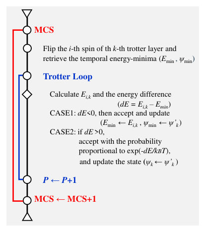 
Fig. 2. A flowchart of the trotter layer parallelization algorithm is shown. The conventional SQA has to sum up all energies over the trotter layer, so that it prevents quick convergence. The new algorithm skips it, and all trotter layers will mimic the spin configuration that has the temporal minimum energy. Sharing such information of the energy, each of the P trotter layers keeps searching for its global energy minimum state. The quantum effect like the tunneling are maintained and it causes quick convergence.

📷 Fig 2

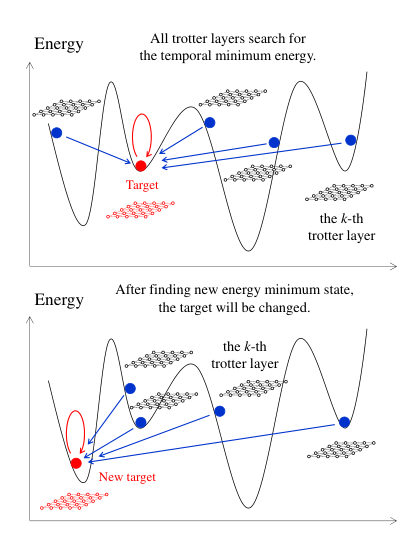 
Fig. 1. Schematic picture is shown how to search for minimum energy. All P trotter layers update their spin configuration independently, although the conventional SQA has to satisfy a periodic boundary condition. The transition probability is tuned by Metropolis rules, and the second term of the equation (6) works as a penalty term when the i-th spin is not in the same direction as the temporal energy minimum state. Once a new energy minimum state is found, the target state will be changed quickly.

📷 Fig 3

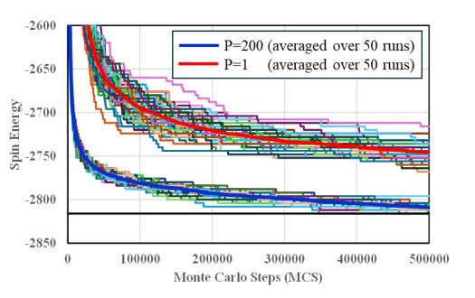 
Fig. 4. The graph proves that the trotter layer parallelization inspired by Quantum Monte Carlo (QMC) can work well. The trotter layer settles into the global-minima, while mimicking the temporal energy minimum state. The convergence curve is averaged over 50 times runs. Hereinafter, only the averaged results are shown.

📷 Fig 4

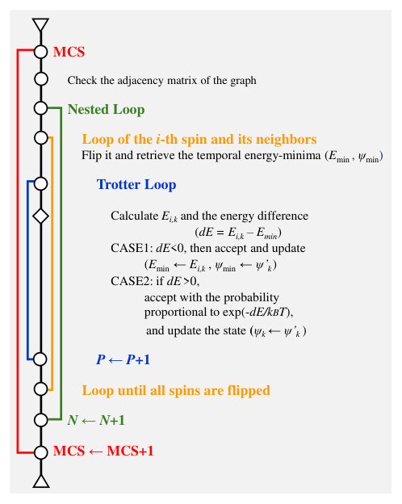 
Fig. 3. A flowchart of NSA is shown. Spins are selected among the group determined by the adjacency matrix of the system and the spin is flipped one by one on each trotter layer. Compared to the algorithm in Fig.2, the green and the yellow loops are added. By repeating such nested loops per MCS, the neighboring spin group reaches its local-minima.

📷 Fig 5

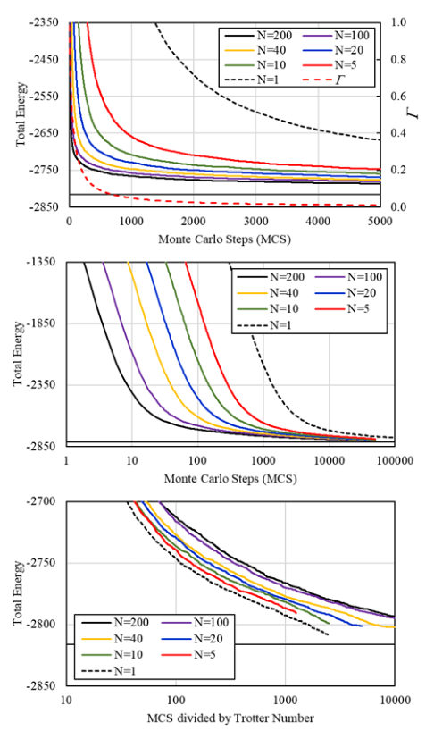 
Fig. 5. The graphs prove that the partial optimization inspired by causality can accelerate SQA without any additional hardware. As N×P was kept the same value, the smaller MCS was needed, the larger computational speedup was achieved. And because G34 is a sparse graph, the dependency on the trotter number N is monotonic.

**Summary.** This paper proposes Nested Simulated Annealing (NSA) as an efficient method to optimize the annealing path in Quantum Annealing simulations. By treating spins as continuous variables, the authors relate convergence speed directly to the minimization of local-maxima in the energy landscape. This allows for the selection of optimal parameters to achieve faster, resource-efficient adiabatic phase transitions on classical computers.

**Why it may be interesting.** The work provides a sophisticated classical simulation technique (NSA) to navigate complex quantum energy landscapes, which is highly relevant for understanding the dynamics of open quantum systems and optimizing quantum computation protocols.

Detailed structure

**Main problem.** The primary goal is to improve Quantum Annealing (QA) by finding the optimal annealing path to accelerate convergence and reduce computational resources.

**Main result.** The paper shows that selecting parameters appropriately in Nested Simulated Annealing (NSA) can induce an optimal adiabatic phase transition, leading to faster convergence by minimizing local-maxima in the energy landscape.

**Method.** The authors employ Nested Simulated Annealing (NSA), inspired by Quantum Monte Carlo (QMC), and treat spin variables as continuous to derive energy formulas for both the problem and perturbation Hamiltonians.

**Model / system.** The system is modeled using the Ising spin model Hamiltonian, $H = -(\sum_{i<j} J_{ij}\hat{\sigma}_i^z\hat{\sigma}_j^z - \sum_i \Gamma \hat{\sigma}_i^x)$, and the simulation involves calculating the partition function $Z$ via Trotter expansion.

**Key observables.** Convergence speed, total energy ($E_z + E_x$), and the location/magnitude of local-maxima in the energy landscape.

**Important parameters / regimes.** The number of nested loops ($N$) in the NSA process, which dictates the annealing path parameters.

**Assumptions / limitations.** The continuous variable derivation relies on approximations for the wavefunction evolution, and the binary spin algorithm skips steps from rigorous quantum mechanics.

**Figures summary.** Figures illustrate the NSA flowcharts, compare convergence curves of the new algorithm against standard SA, and show the dependency of the energy landscape on the nested loop parameter $N$.

**Paper structure.** The paper first establishes the QA problem and the limitations of current methods. It then develops the mathematical framework using continuous spin variables and Trotter layer parallelization. The core contribution is the proposal and analysis of NSA, demonstrating how parameter selection minimizes local-maxima to achieve optimal adiabatic transitions.

Abstract

Quantum Annealing (QA) has already put into practical use and considered useful for solving many social issues, such as reduction of traffic congestion and delivery optimization. But in QA, when the energy difference between the ground state and the first excited state is small, the transition probability between them increases. Therefore, in order to decrease the transition, QA has to be performed at extremely low temperatures. To simulate the situation, it has the problem in that it takes much time. Many studies are underway to accelerate QA theoretically, one of which is to incorporate non-stoquastic Hamiltonian. On the other hand, I proposed Nested Simulated Annealing (NSA) inspired by Quantum Monte Carlo (QMC). I showed the computational speedup could be achieved dramatically, by considering the idea that the effect of flipping a spin preferentially influenced the spins directly interacting with it. Although NSA was based on such classical concept of causality, the hybrid computation both quantum and classical approach worked well. In this paper, in order to discuss the relationship between NSA and non-stoquastic Hamiltonian like XX-interaction, the spins are treated as continuous variables. I derive the formula to calculate the total energy in both with a problem Hamiltonian and the perturbation Hamiltonian induced by a transverse electromagnetic field. And I will show a clear relationship between local-maxima and the convergence speed when calculating it with the binary spin. More precisely, the annealing path with the smallest local-maxima converges fast, even though it consumes fewer computational resources. Therefore, it is possible to induce an optimal adiabatic phase transition by selecting NSA parameters appropriately. This paper shows an effective method to choose the parameters when simulating QMC on a classical computer.

[↑ back to top](#top)

### [Hartree Fragmentation and Long-Range Pair Networks in Aperiodic Chains](http://arxiv.org/abs/2608.30746v1)

**Authors:** Yogeshwar Prasad  
**Type:** theory · **Category:** disordered systems and neural networks · **PDF:** <https://arxiv.org/pdf/2608.30746v1>  
**Analysis basis:** full PDF text, analyzed in chunks
**Topic relevance:** `Frenkel-Kontorova` **1/5** · `analog quantum simulation` **1/5**

📷 Fig 1

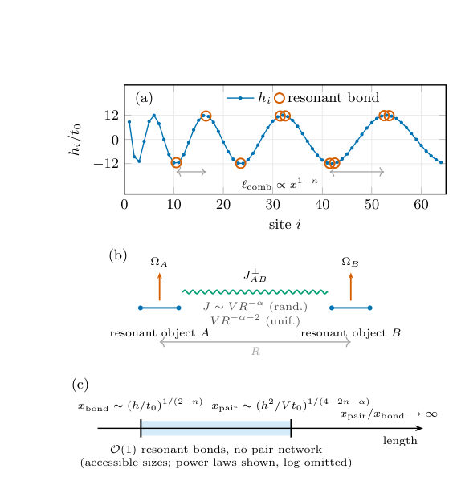 
FIG. 1. Mechanism and scales; panel (c) is schematic. (a) Resonant bonds — bonds with |hi+1 −hi| &lt; t0 — occur only at the turning points of the slowly varying potential; their spacing grows as ℓcomb(x) ∝x1−n. Shown: L = 64, h/t0 = 12, n = 1/2, with nine resonant bonds; the phase-averaged supply, Eq. (2), predicts 9.33 against a measured mean of 9.48 at this size. (b) Diagonalizing a local resonant object (bond or island) gives a pseudospin of splitting Ω; the density interaction couples two such objects a distance R apart through the mixed second difference, Eq. (8) — the bond realization of the general island form-factor coupling — surviving as V R−α for random couplings but cancelling to...

📷 Fig 2

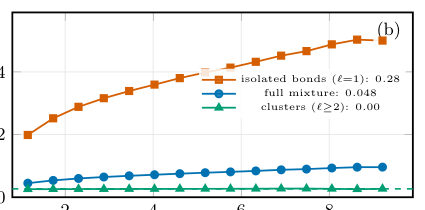 
FIG. 2. Hartree fragmentation changes the matching ensem- ble. (a) After recursive boundary healing, the single-bond fraction f1 of active objects shows no downward trend and the active-object density Aisl = ρact/p is w0-independent [Eq. (5)]. (b) Matching law by sector at α = 2, V = t0, from island diagonalization: ℓ≥2 clusters are flat, surviving ℓ= 1 objects retain a finite logarithmic slope, and the full ensemble slope is ball ≃f 2 1 b1 (0.412 × 0.28 = 0.047 versus the measured 0.048). Statistical errors: ±0.01 on f1 and Aisl (batch means over 48 chains); fitted slopes ±0.01. Protocols and the remaining (α, V ) sets in the Supplemental Material [26].

📷 Fig 3

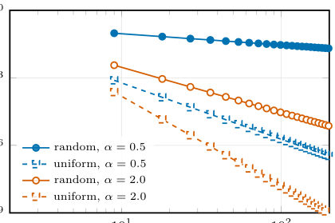 
FIG. 3. Independent coefficient fluctuations are essential. Effective two-bond coupling at identical bare strength V : ran- dom coefficients (circles) leave the mixed second difference of Eq. (8) uncancelled, shown as the rms V R−α/(2 √

📷 Fig 4

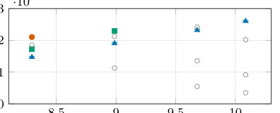 
FIG. 4. Direct fixed-shell test of the pair-count scaling, Eq. (9): Y ≡Λ h2x−(4−2n−α)/(V t0) on a shell at R = 0.45 x, with the algebraic exponent fixed by Eq. (9), not fitted. Colored symbols: points inside the resonance-starved window w0/ℓcomb ≤0.15; gray open symbols: outside it, where the object-density asymp- totics fail [26]. Within the window the h−2 rescaling collapses the series and the fragmented side shows no progressive failure relative to the bond-side control; the accessible range tests the predicted algebraic scaling and its persistence across the reconstruction, and does not independently resolve the loga- rithmic correction.

**Summary.** This theoretical work analyzes how fermionic chains with aperiodic potentials behave under long-range, power-law interactions. It identifies a critical transition point ($\alpha=2n$) where the system's resonant structure changes from simple bonds to complex, fragmented clusters. The key finding is that the overall scaling of pair correlations remains stable despite this structural reconstruction.

**Why it may be interesting.** The study of localization and spectral properties in quasiperiodic systems with long-range disorder is highly relevant to understanding transport and correlation in disordered quantum materials.

Detailed structure

**Main problem.** The paper investigates the survival of localization and the reconstruction of the resonant-object ensemble in aperiodic chains subjected to long-range power-law interactions.

**Main result.** The asymptotic scaling of the pair-resonance scale remains robust across the critical point $\alpha=2n$, and the ensemble logarithm is shown to be carried by the surviving single-bond subpopulation.

**Method.** The analysis uses resonance-counting arguments, pair-matching probability diagnostics, and fixed-shell tests to characterize the scaling of pair networks.

**Model / system.** The model is spinless fermions on an open chain governed by a Hamiltonian including aperiodic potentials and random, long-range interactions $V_{ij}/|i-j|^\alpha$.

**Key observables.** Resonance Supply ($N_0$), Pair Network Scale ($x_{	ext{pair}}$), Pair-density diagnostic $D(w)$, and the ensemble logarithm.

**Important parameters / regimes.** The critical exponent $\alpha=2n$, the interaction strength $V$, and the ratio of local to pair scales.

**Assumptions / limitations.** The analysis assumes the validity of shell coarse-graining and that the low-frequency matching density remains bounded during fragmentation.

**Figures summary.** Figures illustrate the separation of different characteristic scales ($x_{	ext{bond}}$ vs $x_{	ext{pair}}$) and show the collapse of the pair-count scaling law $\Lambda(x)$ when tested against the theoretical prediction.

**Paper structure.** The paper progresses by first establishing the resonance supply, then analyzing the transition at $\alpha=2n$ where Hartree fragmentation occurs, and finally confirming the robustness of the pair-resonance scaling law using detailed pair-counting diagnostics.

Abstract

For fermions in a slowly varying aperiodic potential with random interactions $V_{ij}/|i-j|^α$, the potential fixes the resonance supply $N_0 \propto L^{2-n}/h$. On crossing $α-2n$, wherever Hartree fragmentation is operative, the resonant-object ensemble reconstructs: turning-point runs fragment into clusters whose intrinsic matching law resolves no logarithmic singularity, while isolated wing bonds survive at finite density and restore a reduced logarithm. The scaling $x^{4-2n-α}_{pair} ln{x_{pair}} \propto h^2/(V t0)$ is unchanged. Random coefficient fluctuations sustain the $R^{-α}$ coupling; uniform ones cancel to $R^{-α-2}$.

[↑ back to top](#top)

### [Heavy-Hole--Light-Hole Mixing and Spin--Photon Coupling in Germanium Flopping-Mode Qubits](http://arxiv.org/abs/2608.29325v1)

**Authors:** Jose Reina-Gálvez, Guido Burkard  
**Type:** theory · **Category:** quantum information and computing · **PDF:** <https://arxiv.org/pdf/2608.29325v1>  
**Analysis basis:** full PDF text, analyzed in chunks
**Topic relevance:** `Tavis-Cummings & cavity-many-emitter` **1/5** · `analog quantum simulation` **1/5**

📷 Fig 1

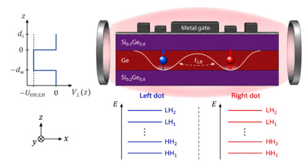 
Figure 1. Schematic of the Ge double quantum dot considered in this work. Vertical confinement along the growth direction z is described by the finite potential V⊥(z), with well depth UHH/LH and widths dw and di. The left and right local- ized hole states are indicated in blue and red, respectively, and are connected by the interdot tunneling processes collec- tively denoted by tLR, including HH–HH, LH–LH, LH–HH, and spin–orbit-assisted channels. The energy ordering of the states is schematic and can vary in the actual simulations de- pending on the model parameters.

📷 Fig 2

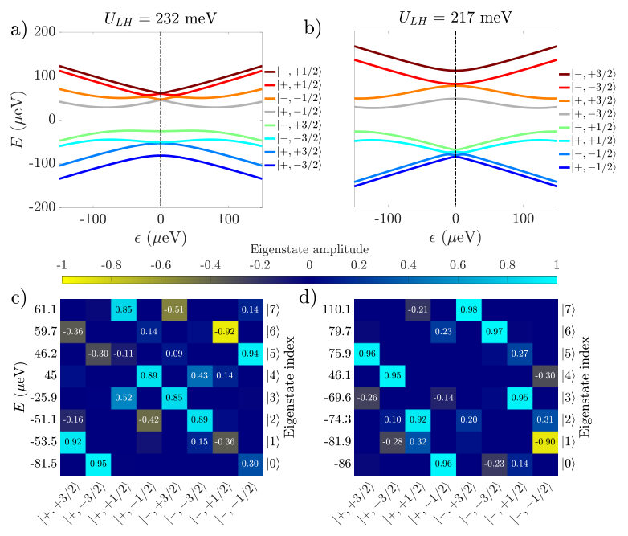 
Figure 2. (a,b) Energy spectrum as a function of detuning ϵ for two representative values of ULH, ULH = 232 meV and ULH = 217 meV, respectively. The corresponding eigenstate amplitudes at ϵ = 0, indicated by the vertical black dash-dotted lines in the top panels, are shown in panels (c,d) in the bonding–antibonding HH–LH basis for a low magnetic field B = 25 mT. At low magnetic field, panels (c,d) exhibit appreciable HH–LH mixing, and the states contain substantial admixtures of HH- and LH-like components. Increasing the magnetic field leads to nearly pure bonding and antibonding eigenstates, with the HH–LH admixture significantly reduced. The legends in the top panels correspond to the...

📷 Fig 3

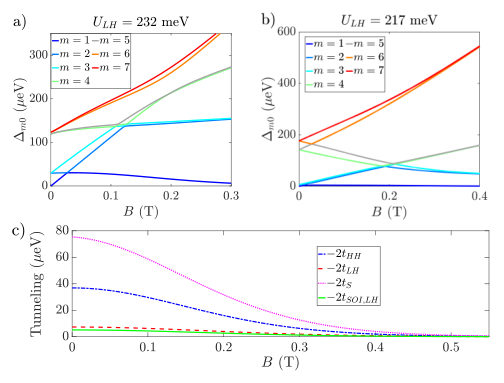 
Figure 3. (a,b) Excitation energies ∆m0 = Em −E0 at ϵ = 0 as a function of magnetic field for the eight-state truncated model, using ULH = 232 meV and ULH = 217 meV, respec- tively. (c) Relevant tunneling matrix elements as a function of magnetic field. Their decrease with increasing magnetic field reflects the reduction of the effective dot size.

📷 Fig 4

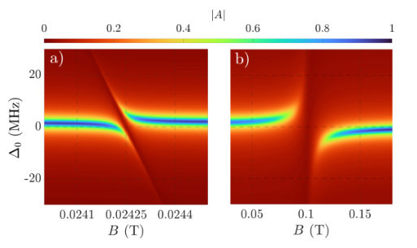 
Figure 5. Cavity response amplitude |A| as a function of probe–cavity detuning ∆0 = ωc−ωR and magnetic field B for the HH pseudospin-flip transition with ULH = 232 meV and ϵ = 0. The left panel shows a narrow magnetic-field window around the low-field resonance, where the cavity response ex- hibits an avoided crossing associated with the hybridization between the cavity mode and the spin-like transition. The right panel shows the response at the intermediate-field reso- nance, where the charge character dominates and the vacuum Rabi splitting is no longer visible because of strong charge de- coherence.

📷 Fig 5

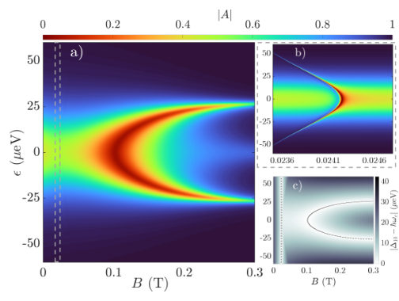 
Figure 4. (a) Cavity transmission amplitude |A| as a func- tion of magnetic field B and detuning ϵ for the HH–HH pseudospin-flip regime, ULH = 232 meV, for ∆0 = 0. (b) Zoom of the low-field resonance marked by the gray rectan- gle in panel (a). (c) Resonance condition for the relevant transition energies relative to the cavity frequency. The black dashed lines indicate the boundaries of a 1% tolerance window around the resonance condition. The C-shaped resonance has a predominantly charge-like character, and therefore no vac- uum Rabi splitting is observed. We chose ωc/2π = 6.54 GHz.

**Summary.** This theoretical study models hole-spin qubits in Germanium quantum dots, focusing on the role of Heavy-Hole/Light-Hole mixing. By incorporating this mixing, the authors show that new electric-dipole coupling channels become active, potentially leading to stronger coupling to microwave cavities than previously expected. This provides a key, tunable mechanism for advancing circuit-QED quantum computing platforms.

**Why it may be interesting.** This work directly addresses the engineering of quantum coupling mechanisms in solid-state qubits, which is central to scalable quantum computing architectures. The explicit inclusion of valence band mixing provides a tunable knob for enhancing qubit-photon interaction.

Detailed structure

**Main problem.** The study investigates how Heavy-Hole (HH)–Light-Hole (LH) mixing affects the spin–photon coupling mechanism in Germanium (Ge) flopping-mode qubits.

**Main result.** The HH–LH mixing activates additional electric-dipole spin-coupling channels (LH–LH and LH–HH) that can yield larger spin–photon figures of merit compared to the conventional HH–HH transition.

**Method.** The authors use a multiband Luttinger–Kohn framework within a Double Quantum Dot (DQD) model, analyzing the Hamiltonian structure and coupling to a cavity using input–output theory.

**Model / system.** The system is a DQD in a Ge/SiGe heterostructure, modeled using a Hamiltonian incorporating kinetic, confinement, and spin-orbit interaction terms. The analysis focuses on the $J=3/2$ valence band subspace, treating HH and LH states explicitly.

**Key observables.** Spin–photon coupling strength, spin–photon figure of merit, and linewidth for various spin-flip transitions (HH–HH, LH–LH, LH–HH).

**Important parameters / regimes.** Confinement depths ($U_{HH}, U_{LH}$), interdot tunneling amplitudes ($t$), and the strength of the spin-orbit coupling ($\alpha_R$).

**Assumptions / limitations.** The analysis assumes the applicability of the effective-mass approximation and simplifies the orbital sector by restricting the in-plane basis to the ground state ($j=l=0$).

**Figures summary.** Figure 1 schematically illustrates the Ge DQD structure, detailing the confinement potential and the various tunneling processes (HH–HH, LH–LH, LH–HH) involved in spin-photon coupling.

**Paper structure.** The paper builds the model by defining the full Hamiltonian using the Luttinger–Kohn framework, incorporating vertical confinement via a finite potential well. It then analyzes the resulting Hamiltonian in the DQD basis, demonstrating how HH–LH mixing introduces new, potentially superior, coupling channels for qubit-cavity interaction.

Abstract

Intrinsic spin--orbit interaction in germanium provides electrically active flopping-mode qubits without requiring magnetic-field gradients to generate spin--charge hybridization. We study double quantum dots (DQDs) with a multiband Luttinger--Kohn framework that retains heavy-hole (HH) and light-hole (LH) states on equal footing. Modeling vertical confinement with a finite confinement potential along the growth direction brings selected subbands into a regime of appreciable HH--LH mixing. This admixture activates electric-dipole spin-coupling through LH--LH and LH--HH transitions, complementing the conventional HH--HH pseudospin-flip resonance. For the parameter sets considered, these additional channels can produce larger spin--photon figures of merit than the HH--HH transition. HH--LH mixing thus supplies a tunable ingredient for qubit--cavity coupling in germanium hole-spin qubits and extends the operating regimes available to circuit-QED architectures.

[↑ back to top](#top)

### [Holographic Representations of Topological Quantum Criticality: Emergent Symmetry Approach around the Bott Clock](http://arxiv.org/abs/2608.30335v1)

**Authors:** Fan Yang, Fei Zhou  
**Type:** theory · **Category:** strongly correlated electrons · **PDF:** <https://arxiv.org/pdf/2608.30335v1>  
**Analysis basis:** full PDF text, analyzed in chunks
**Topic relevance:** `Keldysh / 2PI / non-Gaussian methods` **1/5** · `analog quantum simulation` **1/5**

📷 Fig 1

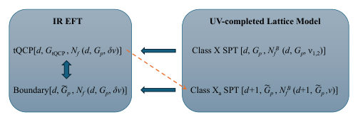 
Figure 1. Procedure of constructing the holographic theory of a tQCP. The left panel shows the IR EFTs and the right panel shows the UV-completed lattice models. We start with a d-dimensional lattice model of class-X with protecting sym- metry Gp and bulk lattice degrees of freedom N B f (d, Gp, ν1,2) (the superscript refers to the bulk) where ν1 and ν2 are the numbers of gapless boundary states of two gapped topological phases respectively. The IR EFT of the tQCP in the class X has an enlarged symmetry GtQCP = Gp × UEM, where UEM is an emergent symmetry, and gapless fermions Nf(d, Gp, δν). (Note the group structure may also be more complicated than a direct product depending on details of...

📷 Fig 2

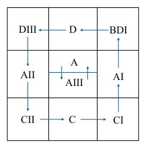 
Figure 3. Bott clock of topological insulators and supercon- ductors. +1 and −1 represents the square of TRS and PHS when they are present, and 0 means the absence of the sym- metry. Following the direction of the arrows, the topological classification remains the same when spatial dimension is in- creased by one.

**Summary.** This work develops a holographic framework to describe topological quantum critical points (tQCPs) using emergent symmetries. By relating the gapless physics at a tQCP in $d$ dimensions to the boundary states of a gapped topological superconductor in $d+1$ dimensions, the authors establish a systematic method for classifying and understanding these critical points across different symmetry classes.

**Why it may be interesting.** The holographic mapping between lower-dimensional critical points and higher-dimensional gapped phases provides a powerful theoretical tool for understanding quantum criticality in strongly correlated systems, linking symmetry protection across dimensions.

Detailed structure

**Main problem.** The paper aims to construct holographic representations for a broad class of topological quantum critical points (tQCPs) by employing the concept of emergent symmetries.

**Main result.** It demonstrates that the tQCPs can be mapped to the boundary states of higher-dimensional gapped topological superconductors, establishing a systematic holographic relationship around the Bott clock structure.

**Method.** The core method involves using an emergent symmetry ($U_{EM}$) at the $d$-dimensional tQCP to construct an enlarged symmetry ($	ilde{G}_p$) for a $(d+1)$-dimensional bulk model, whose boundary dynamics then match the tQCP's infrared physics.

**Model / system.** The study focuses on fermionic topological states, specifically within the framework of the Bott clock structure, involving Symmetry Protected Topological (SPT) phases in various dimensions ($d$ and $d+1$).

**Key observables.** Emergent symmetries ($U_{EM}$), protecting symmetries ($G_p$), and the infrared dynamics of the boundary states.

**Important parameters / regimes.** The spatial dimensions ($d$ and $d+1$) and the specific symmetry groups involved in the topological classification.

**Assumptions / limitations.** The approach assumes that the anomalous degrees of freedom at the tQCP can be matched to the gapless surface fermions of a higher-dimensional bulk theory.

**Figures summary.** Figure 1 illustrates the four-step holographic construction procedure, mapping IR EFTs to UV lattice models. Figure 2 compares the structure of $d$-dimensional SPTs to $(d+1)$-dimensional SPTs, showing the holographic link.

**Paper structure.** The paper systematically develops the holographic construction, starting from the identification of emergent symmetries at tQCPs, upgrading the symmetry to define a higher-dimensional bulk model, and finally proving the boundary correspondence.

Abstract

In this article, we apply the idea of emergent symmetries to construct holographic representations of a broad class of topological quantum critical points (tQCPs) that appear in fermionic classes in the Bott clock. We show explicitly that around the Bott clock, an emergent symmetry $U_{EM}$ exists at a tQCP between different symmetry protected gapped phases with protecting symmetry $G_p$ in $d$ spatial dimensions. This emergent symmetry can be used to construct a $(d+1)$ spatial dimensional lattice model with a properly upgraded symmetry such as $U_{EM}\times G_p$ or $U_{EM} \rtimes G_p$, etc. By doubling the degrees of freedom of the adjacent topological class in $d$-dimensions, we successfully show that the $(d+1)$-dimensional lattice models constructed in this way have the desired enlarged symmetry groups that precisely belong to the adjacent topological classes, counterclockwise around the Bott clock. Furthermore, $d$-dimensional boundaries of these $(d+1)$ dimensional lattice models of gapped topological classes are shown to exhibit identical infrared dynamics as the corresponding tQCPs in the $d$-dimensional adjacent topological phases in the Bott clock, with lower symmetries.

[↑ back to top](#top)

### [Newtonian Gravitational Curvature-Induced Entanglement Generation](http://arxiv.org/abs/2608.30075v1)

**Authors:** Mughees Ahmad Khan, Asad Ali, M. I Hussain, H. Kuniyil, Saif Al-Kuwari  
**Type:** theory · **Category:** quantum information and computing · **PDF:** <https://arxiv.org/pdf/2608.30075v1>  
**Analysis basis:** full PDF text, analyzed in chunks
**Topic relevance:** `analog quantum simulation` **1/5** · `quantum measurements` **1/5**

📷 Fig 1

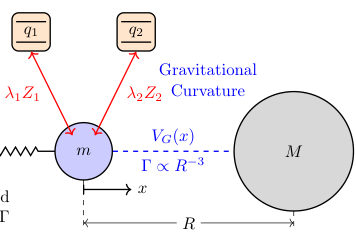 
FIG. 1. Schematic of the proposed setup. A mechanical os- cillator of mass m and bare frequency ω0 is placed at a dis- tance R from a source mass M. The Newtonian gravitational potential VG(x) induces a curvature Γ ∝R−3 which renor- malizes the mechanical frequency to Ω2 = ω2 0 −2Γ. Two qubits (q1, q2) are coupled longitudinally to the oscillator with strengths λ1, λ2. The gravitational curvature controls the ef- fective susceptibility of the oscillator, thereby modulating the mediated two-qubit entanglement rate. The displacement x is measured along the line joining the oscillator and the source.

📷 Fig 2

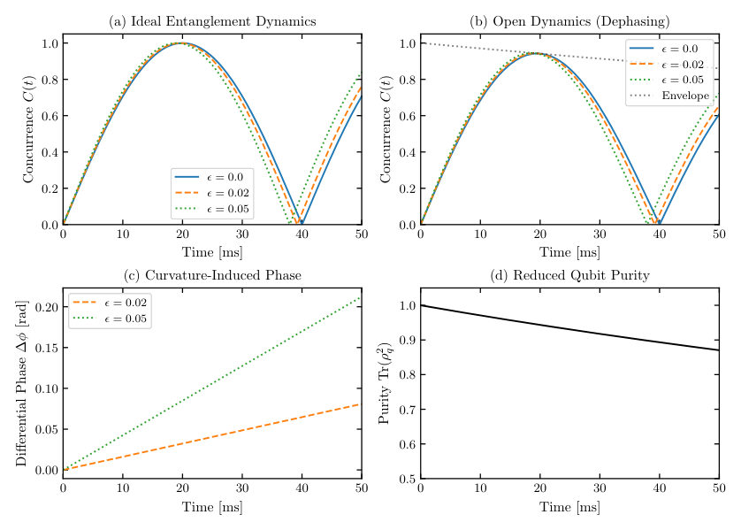 
FIG. 2. Effective-model entanglement dynamics as a function of gravitational curvature. (a) Two-qubit concurrence for ϵ = 0, 0.02, and 0.05 with no dephasing. Increasing ϵ shifts the oscillation via the enhanced susceptibility. (b) Same as (a) with independent qubit dephasing γϕ = 1.5 s−1; the envelope decays as e−2γϕt. (c) Differential entangling phase ∆ϕ = 2t[J(ϵ)−J(0)] versus time, showing linear accumulation of the curvature-induced phase difference. (d) Reduced two-qubit purity Tr(ρ2 q) under qubit dephasing only. Purity curves for the three ϵ values overlap in this panel because the dephasing channel is ϵ-independent in the effective model; the small spread becomes visible at late...

📷 Fig 3

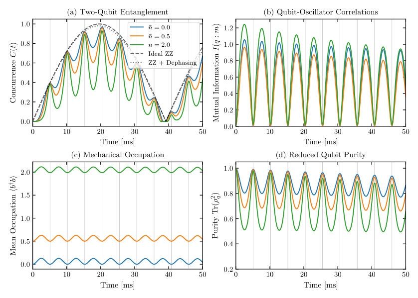 
FIG. 3. Open-system dynamics from the full master equation (11), retaining the mechanical mode explicitly. (a) Two-qubit concurrence: strong suppression between closure times due to the thermal factor (13), with revivals at tk = 2πk/Ωthat are exact in the unitary limit and reduced by e−Λ(tk) at finite κm and by the dephasing factor of Eq. (20). (b) Qubit–oscillator mutual information I(q:m), which vanishes at every closure for κm = 0. (c) Mean mechanical occupation ¯nm(t), oscillating about the thermal background under the spin-dependent force. (d) Reduced two-qubit purity Pq(t), showing partial revivals superposed on a secular envelope set by mechanical leakage and qubit dephasing....

**Summary.** This paper proposes a novel quantum sensing protocol where the tidal field of a massive object induces a measurable, nonlocal phase shift between two qubits mediated by a mechanical oscillator. By treating gravity as a classical control field, the authors demonstrate that the entanglement generation rate is analytically dependent on the gravitational curvature. This provides a route for high-precision quantum sensing of spacetime curvature using established quantum hardware platforms.

**Why it may be interesting.** This work directly bridges quantum sensing/metrology with fundamental physics (gravity), providing a concrete, measurable mechanism to detect spacetime curvature using quantum resources.

Detailed structure

**Main problem.** To demonstrate that gravitational curvature can be used to control and generate nonlocal quantum correlations (entanglement) in a hybrid quantum system.

**Main result.** The protocol successfully shows gravitational control over a quantum interaction, generating entanglement via a measurable, nonlocal two-qubit phase shift.

**Method.** The analysis uses exact treatments (polaron transformation) for the closed system dynamics and derives the quantum limit for curvature estimation using a parity-based measurement.

**Model / system.** The system is a hybrid architecture comprising two qubits coupled to a common mechanical resonator, where the coupling is modulated by the tidal field induced by a nearby source mass.

**Key observables.** Nonlocal two-qubit phase ($\phi_{12}$), Quantum Fisher Information (QFI), and entanglement visibility.

**Important parameters / regimes.** Gravitational curvature ($\Gamma$), mechanical frequency ($\omega_0$), and the coupling strength ($J$).

**Assumptions / limitations.** The analysis assumes the source mass is static and the coupling is mediated by the mechanical oscillator's longitudinal motion.

**Figures summary.** Figure 1 schematically illustrates the setup, showing the mechanical oscillator coupled to qubits, with the gravitational potential $V_G(x)$ inducing curvature $\Gamma$ that renormalizes the mechanical frequency $\Omega^2 = \omega_0^2 - 2\Gamma$.

**Paper structure.** The paper progresses from defining the Hamiltonian incorporating the Newtonian interaction, deriving the renormalized frequency due to curvature, analyzing the resulting stroboscopic geometric phase gate, and finally addressing open-system dynamics and quantum estimation bounds.

Abstract

We show that gravitational curvature can control the generation of nonlocal quantum correlations in a hybrid qubit-mechanical device. The tidal field of a nearby source mass modifies the susceptibility of a shared mechanical oscillator, thereby tuning an oscillator-mediated qubit-qubit interaction and the resulting entangling phase. An exact treatment of the dynamics reveals stroboscopic geometric gates whose accumulated phase is directly sensitive to gravitational curvature. Treating the curvature as an unknown parameter, we derive the ultimate quantum limit for its estimation and identify a parity-based measurement that saturates this bound. Solving the full master equation with the mechanical mode retained explicitly, we find that thermal occupation of the mediator suppresses entanglement between the closure times but is undone at each closure, exactly in the unitary limit for any initial mechanical temperature, so that ground-state cooling of the oscillator is not a prerequisite for the protocol. Mechanical damping and qubit dephasing behave differently: they leak branch information irreversibly to the environment, and it is the heating and dephasing rates, rather than the bath occupation alone, that limit the entanglement visibility and the number of usable interrogation loops. In contrast to gravity-mediated entanglement proposals, entanglement is generated by the mechanical oscillator while gravity acts solely as a classical control field. We quantify the achievable curvature parameters; all curvature dependencies are analytic, allowing for exact rescaling of the results. The scheme therefore demonstrates gravitational control of a quantum interaction and provides a route to curvature sensing based on a nonlocal two-qubit phase rather than on local phase measurements.

[↑ back to top](#top)

### [Phase Diagram and Critical Behaviour of the Two-Dimensional Potts Model with Long-Range Quenched Disorder](http://arxiv.org/abs/2608.29710v1)

**Authors:** Rodolfo Rocha, Leticia F. Cugliandolo, Marco Picco  
**Type:** theory · **Category:** statistical mechanics · **PDF:** <https://arxiv.org/pdf/2608.29710v1>  
**Analysis basis:** full PDF text, analyzed in chunks
**Topic relevance:** `analog quantum simulation` **1/5** · `non-equilibrium universality` **1/5**

📷 Fig 1

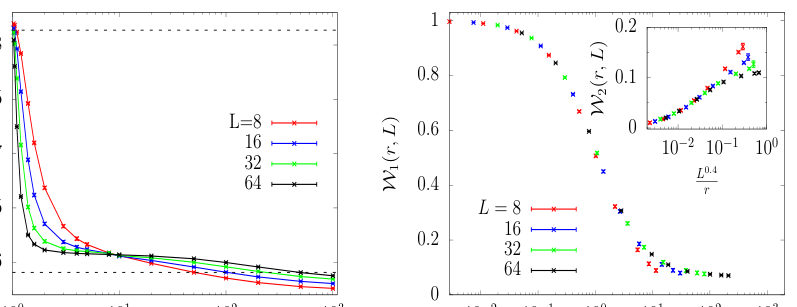 
Figure 1: q = 3 Potts model with a = 1. (a) Wrapping probability W(r, L) as a function of the parameter r = J2/J1. The horizontal dashed lines are at W3 = 0.8137 and W a=1 1 = 0.5915. (b) W1(r, L) defined in Eq. (3.4) vs. (J1−J2)2

📷 Fig 2

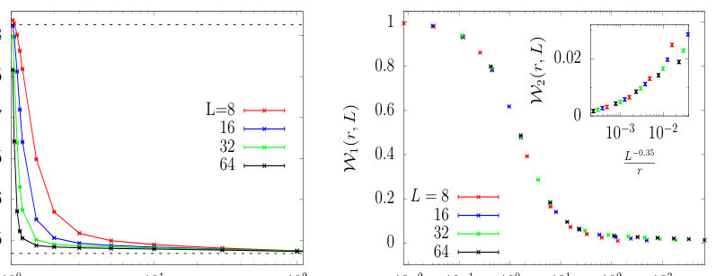 
Figure 2: q = 3 Potts model with a = 0.5. (a) Wrapping probability as a function of the disorder strength r. The horizontal dashed lines are at W3 = 0.8137 and W a=0.5 1 = 0.5340. (b) W1(r, L) vs. (J1−J2)2

📷 Fig 3

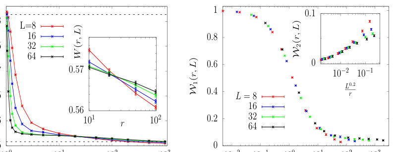 
Figure 3: q = 3 Potts model with a = 0.75 and different linear system sizes given in the keys. (a) Wrapping probability as a function of the disorder strength r. In the inset, a magnification around the crossing point. The horizontal dashed lines are at W3 = 0.8137 and W a=0.75 1 = 0.5580. (b) W1(r, L) vs. (J1−J2)2

📷 Fig 4

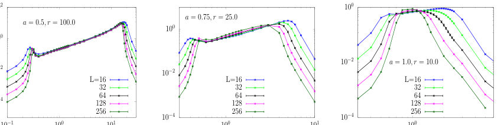 
Figure 4: q = 3 Potts model. Rescaled magnetic susceptibility, 0.33L/16χ(L, β), as a function of β for a = 0.5 (a), a = 0.75 (b), and a = 1.0 (c). The value of r is written as a label in the panels and the system sizes are given in the keys.

📷 Fig 5

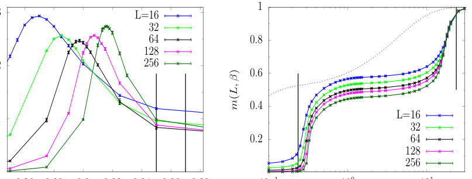 
Figure 5: q = 3 Potts model with a = 0.5. (a) Scaled linear magnetic susceptibility as a function of the inverse temperature β for different system sizes. The drift towards higher values of β of the position at βmax of the left peak is clear. The vertical segments are the limits of the interval βmax(∞) = 0.36 ± 0.01. (b) Magnetisation density as a function of β. The two scales β ∼0.23 and β ∼23, for the onset of strong bonds and activation of weak bonds, respectively, are shown with vertical black segments. See the text for a discussion of the dotted curve.

**Summary.** This paper rigorously maps the phase diagram of the 2D Potts model under long-range, correlated quenched disorder. By analyzing the wrapping probability and magnetic susceptibility, the authors distinguish between different critical regimes, confirming the validity of hyperscaling relations across various disorder strengths. It provides a detailed theoretical understanding of how disorder influences phase transitions in lattice models.

**Why it may be interesting.** While focused on classical statistical mechanics, the study of critical phenomena in disordered systems, especially the distinction between different types of fixed points (finite vs. infinite disorder), provides theoretical frameworks relevant to understanding glassy dynamics in quantum many-body systems.

Detailed structure

**Main problem.** The study investigates the phase diagram and critical properties of the two-dimensional Potts model when subjected to long-range quenched disorder.

**Main result.** The work refines the phase diagram by distinguishing between regimes flowing to finite-disorder and infinite-disorder fixed points, confirming hyperscaling relations across different disorder strengths.

**Method.** The analysis employs advanced techniques including computing the wrapping probability of Fortuin–Kasteleyn clusters and performing finite-size scaling analysis on magnetic observables.

**Model / system.** The system is the $q$-state Potts model ($q=3, 8$) defined on a 2D lattice, with quenched bond disorder whose correlations decay via a power law $\langle J_i J_j 
angle \propto |x_i - x_j|^{-a}$.

**Key observables.** Wrapping probability $W(r, L)$, magnetic susceptibility $\chi(L, eta)$, and magnetization density $\langle m 
angle(L, eta)$.

**Important parameters / regimes.** Potts state number ($q$), disorder correlation exponent ($a$), disorder strength ratio ($r$), and system size ($L$).

**Assumptions / limitations.** The analysis relies on the construction of correlated disorder via independent Ising model copies and assumes the critical point is analyzed at $eta=1$ for certain sections.

**Figures summary.** Figures illustrate the dependence of the wrapping probability $W(r, L)$ on disorder strength $r$ for various exponents $a$, and show effective exponents $(\gamma/
u)_{	ext{eff}}(L)$ vs. $L$ to confirm scaling relations.

**Paper structure.** The paper systematically analyzes the $q=3$ and $q=8$ cases, using the wrapping probability to map out the phase diagram, followed by a general confirmation of hyperscaling relations.

Abstract

We study the phase diagram and critical properties of the $q = 3$ and $q = 8$ Potts models with spatially correlated disorder governed by a power-law decay with exponent $a$. Building on the phase diagram proposed by Chippari et al. [3], where a transition from finite-disorder to infinite-disorder fixed points was identified as a function of a, we refine this picture by using wrapping probabilities of Fortuin-Kasteleyn clusters. Furthermore, using magnetic observables, we clarify the physical origin of the double-peak structure in the magnetic susceptibility and establish the validity of the hyper-scaling relation across all investigated regimes.

[↑ back to top](#top)

### [Quantum discord of Gaussian states in non-inertial frames](http://arxiv.org/abs/2608.29079v1)

**Authors:** Siwei Li, Xiaofen Huang  
**Type:** theory · **Category:** quantum information and computing · **PDF:** <https://arxiv.org/pdf/2608.29079v1>  
**Analysis basis:** full PDF text, analyzed in chunks
**Topic relevance:** `Keldysh / 2PI / non-Gaussian methods` **1/5** · `correlated / nonlocal dissipation` **1/5**

📷 Fig 1

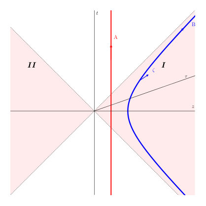 
FIG. 1: Schematic diagram of the worldlines for the inertial observer Alice and the uniformly accelerated observer Bob. The set (z, t) denotes the Minkowski coordinates, while the set (ζ, τ) denotes the Rindler coordinates. The causally disconnected Rindler regions I and II are indicated.

📷 Fig 2

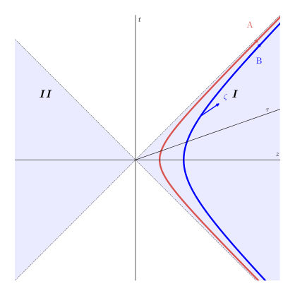 
FIG. 2: Schematic diagram of the worldlines for two uniformly accelerated observers, Alice and Bob. The set (z, t) denotes the Minkowski coordinates, while the set (ζ, τ) denotes the Rindler coordinates. The causally disconnected Rindler regions I and II are indicated.

📷 Fig 3

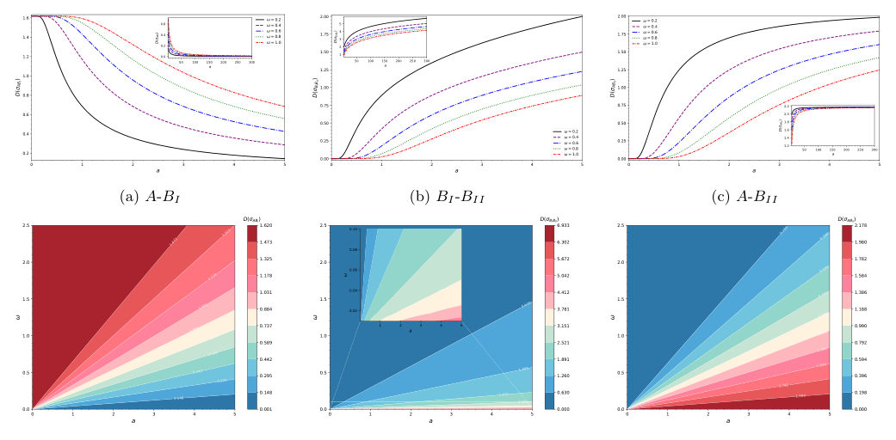 
FIG. 3: Gaussian quantum discord for different mode pairs as a function of the acceleration a and the field frequency ω, with the squeezing parameter fixed at s = 1.

📷 Fig 4

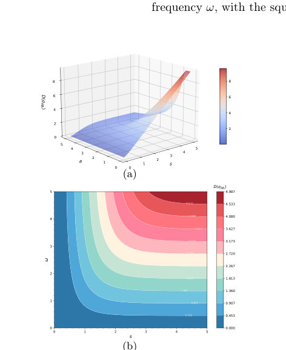 
FIG. 4: Gaussian quantum discord of the mode pair A-BI. (a) Discord as a function of the acceleration a and the squeezing parameter s for a fixed field frequency ω = 1. (b) Discord as a function of the field frequency ω and the squeezing parameter s for a fixed acceleration a = 2π.

📷 Fig 5

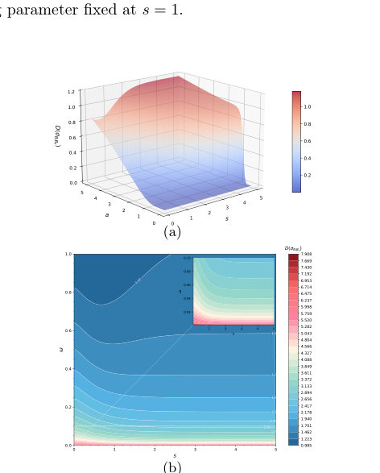 
FIG. 5: Gaussian quantum discord of the mode pair BI-BII. (a) Discord as a function of the acceleration a and the squeezing parameter s for a fixed field frequency ω = 1. (b) Discord as a function of the field frequency ω and the squeezing parameter s for a fixed acceleration a = 2π.

**Summary.** This paper analyzes the redistribution of Gaussian quantum discord when a quantum field undergoes the Unruh effect due to acceleration. By calculating discord for various mode pairs in Rindler coordinates, the authors show that initial correlations are redistributed rather than lost. The results provide detailed parameter dependencies, highlighting how squeezing and field frequency control the correlation in different spatial regions.

**Why it may be interesting.** This work provides a detailed, quantitative study of how fundamental physical effects (like acceleration) alter quantum correlations, which is crucial for understanding quantum information processing in curved or non-inertial spacetime backgrounds.

Detailed structure

**Main problem.** The paper investigates how the quantum discord, a measure of quantum correlation, is affected by the Unruh effect experienced by uniformly accelerated observers.

**Main result.** The initial quantum correlation is not destroyed but is instead redistributed across the causally disconnected Rindler mode pairs, with the specific dependence on parameters varying by the mode pair considered.

**Method.** The analysis uses the formalism of Gaussian states, characterized by their covariance matrix, to calculate the quantum discord for various mode pairs.

**Model / system.** The system is a free quantum scalar field analyzed in Minkowski and Rindler coordinates, modeling the interaction between inertial and uniformly accelerated observers.

**Key observables.** Gaussian quantum discord ($D$), measured for different mode-pair classes (e.g., inertial-accessible, accessible-accessible).

**Important parameters / regimes.** Acceleration ($a$), mode frequency ($\omega$), and squeezing parameter ($s$).

**Assumptions / limitations.** The analysis is restricted to Gaussian states, which are fully determined by their first and second moments.

**Figures summary.** Figures schematically illustrate the worldlines and coordinate systems for one and two accelerated observers in Minkowski vs. Rindler coordinates, and show the variation of discord as a function of $a$, $\omega$, and $s$ for various mode pairs.

**Paper structure.** The paper builds from the general formalism of Gaussian states and the Unruh effect to calculate discord for single-observer scenarios, then extends this analysis to the more complex two-observer case, detailing parameter dependencies for specific mode pairs.

Abstract

We investigate the redistribution of continuous-variable Gaussian quantum discord under the Unruh effect for both one and two uniformly accelerated observers. The discord shared between the inertial mode and the accessible accelerated mode, as well as that between the two accessible accelerated modes, decays monotonically with acceleration and vanishes in the limit $a\to\infty$, while the Unruh effect generates discord in all causally disconnected Rindler mode pairs. The initial quantum correlation is therefore redistributed across Rindler partitions rather than destroyed. We further characterize how the squeezing parameter $s$ and field frequency $ω$ control the discord in different mode-pair classes. For causally connected pairs, $s$ and $ω$ exert comparable, interchangeable effects; for cross-region pairs, the squeezing parameter dominates; and for intra-observer cross-region pairs, the field frequency is more influential. In the two-observer case, the $A_{II}$-$B_{II}$ pair exhibits non-monotonic behavior with a peak whose position shifts to larger $a$ as $ω$ increases, and both parameters contribute only weakly except near an optimal $\fracω{s}$ ratio.

[↑ back to top](#top)

### [Resonance statistics, Fock-space branching, and long-range pair networks in slowly varying interacting chains](http://arxiv.org/abs/2608.30761v1)

**Authors:** Yogeshwar Prasad  
**Type:** theory · **Category:** disordered systems and neural networks · **PDF:** <https://arxiv.org/pdf/2608.30761v1>  
**Analysis basis:** full PDF text, analyzed in chunks
**Topic relevance:** `Frenkel-Kontorova` **1/5** · `analog quantum simulation` **1/5**

📷 Fig 1

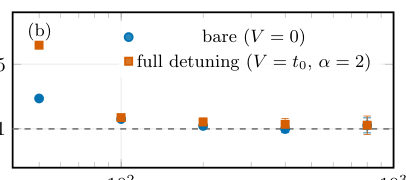 
FIG. 1. Exactness and robustness of the resonance supply. (a) Ratio of the exact phase-averaged resonant-bond count, the sum of Eq. (5), to the asymptotic law Eq. (6), at h/t0 = 200. For n = 1/2 the two agree to better than 0.6% over the entire range. For every fixed n &lt; 1 the ratio ultimately approaches unity, since ∆θi →0; the approach is however strongly nonuniform as n →1−— at n = 0.99 the ratio is still ≃1.8 at L = 8000 — and taking n →1−before the slowly varying limit gives the noncommuting value πβ/ sin(πβ) = 2.08 (dashed). (b) Measured phase-averaged resonant-bond count at n = 1/2, L = 2000 (400 realizations per point), divided by the asymptotic law: the bare count (circles) and the...

📷 Fig 2

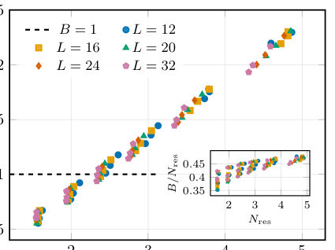 
FIG. 2. Forward branching of the resonant Fock graph against resonant-bond number. Each point is one (L, α, h) evaluation of Eq. (15), spanning 12 ≤L ≤32 and 0.5 ≤α ≤2. The dashed line marks the branching criterion B = 1; the scale Nc is read off by interpolating each (L, α) series through it, with no fit. Inset: the same data as B/Nres, which would be constant if B were proportional to Nres. It is not — it rises monotonically with Nres in every series — so no single constant of proportionality is used anywhere. The Monte Carlo error on each point is 0.12%–0.44%, well inside the markers, so the curvature is systematic. The finite-L independent-edge baseline is Bind/Nres = qL(L−2)/(L−1), Eq....

📷 Fig 3

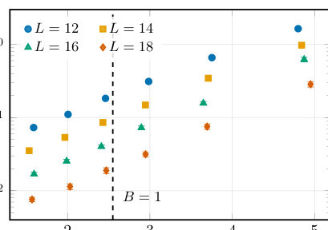 
FIG. 3. The exact resonant Fock graph carries no giant compo- nent at the forward-branching scale. Largest connected com- ponent of the exactly constructed graph, scaled by N 2/3 F (the mean-field/ random-graph critical reference scaling), against the measured resonance count, at α = 1, V = t0, for L = 12– 18 (200–50 realizations; batch-mean errors). At every fixed Nres the diagnostic falls with L: the graph moves away from percolation with increasing size at fixed resonance count. The dashed line marks the B = 1 crossing at this α (Nres ≃2.5– 2.55); the same behavior holds at α = 0.5 and 2 (Supplemental Material [52]).

📷 Fig 4

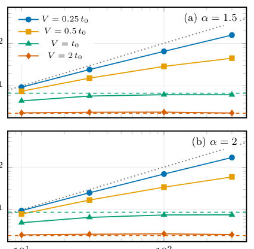 
FIG. 4. Hartree fragmentation of the turning-point runs over the tested fragmentation domain, for the snapshot (unhealed) partition: bond-weighted mean island size ⟨ℓ⟩B against the bare run width w0 at (a) α = 1.5 and (b) α = 2 (increasing w0 at fixed V is equivalent to moving outward along the pair- network trajectory). For V ≥t0 the island size saturates at a w0-independent value consistent with ξfrag = p−1 br (dashed lines at 6.8 and 2.3 for α = 1.5, and 8.8 and 2.5 for α = 2, for V/t0 = 1 and 2, respectively). After recursive boundary healing (Sec. V D, Table I) the bond-weighted mean at V = t0 instead drifts upward with w0 while the count-weighted mean and Aisl stay fixed; the...

📷 Fig 5

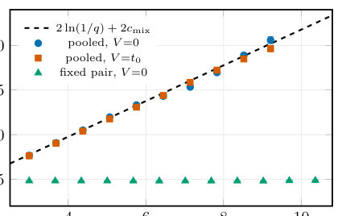 
FIG. 5. One pair is one-dimensional; the pair ensemble is not. For a fixed physical pair at V = 0 (triangles, four pairs pooled, 6 × 107 phases each) the conditional matching prob- ability divided by q is flat, fitting 4.795 + 0.0033 ln(1/q) — the coarea result Eq. (40). Averaging over the pair ensemble (circles and squares; L = 100, h/t0 = 25, α = 1, all separa- tions R ≥2) instead reproduces the independent-bond law Eq. (38), dashed, with no free parameter: the fitted slopes are 2.00(5) at V = 0 and 1.95(4) at V = t0 against the predicted 2. The bare and interacting ensembles have leading logarithmic slopes that agree within errors, so at these fixed-q parameters the logarithm is supplied...

**Summary.** This theoretical work develops a microscopic theory for resonance statistics in interacting quantum chains subjected to slowly varying, aperiodic potentials and long-range disorder. The authors prove that the fundamental supply of local resonances is robust against interaction changes, while also mapping out three distinct physical thresholds governing the system's behavior. This work advances understanding of localization and connectivity in complex, disordered many-body systems.

**Why it may be interesting.** The rigorous mathematical treatment of resonance statistics in the presence of disorder and long-range interactions provides deep insights into how local physics (resonances) interacts with global structure (long-range coupling) in disordered quantum systems.

Detailed structure

**Main problem.** The paper develops the microscopic resonance theory underlying the behavior of resonant-object ensembles in slowly varying, aperiodic potentials with long-range pair interactions.

**Main result.** The leading resonance supply law ($N_0$) remains unchanged by the interaction strength, and the analysis identifies three distinct long-range thresholds ($\alpha=1/2, \alpha=2n, \alpha=2$) that do not correspond to simple localization transitions.

**Method.** The authors derive exact phase-averaged resonance statistics, develop a correlated common-phase comb structure, and analyze the resonant Fock-space graph using graph theory and scaling arguments.

**Model / system.** The system is modeled as spinless fermions on an open chain governed by a Hamiltonian containing a slowly varying aperiodic potential ($h_{in}$) and random, long-range pair interactions ($V_{ij}/|i-j|^\alpha$).

**Key observables.** Resonance Supply ($N_0$), correlated common-phase comb, Hartree variance, forward-branching scale ($h_{FB}$), and the pair-resonance scaling exponent.

**Important parameters / regimes.** The interaction decay exponent $\alpha$, the potential modulation exponent $n$, and the ratio of interaction strength to potential energy ($V/h$).

**Assumptions / limitations.** The analysis relies on developing exact phase-averaged statistics and separating the fixed-pair matching law from the shell-averaged correlation factor.

**Figures summary.** Figures illustrate the collapse of measured resonant-bond counts onto the theoretical supply law, and plots track the forward-branching degree ($B$) relative to the independent-edge baseline, confirming the scaling criterion $B=1$.

**Paper structure.** The paper progresses by first establishing the general resonance statistics, then developing the microscopic theory to handle interactions, analyzing the structure of the resonant Fock-space graph, and finally identifying and characterizing the multiple long-range thresholds.

Abstract

In a slowly varying aperiodic potential $h_i=h\cos(2πβi^n+φ)$ with random power-law density interactions $V_{ij}/|i-j|^α$, the resonant-object ensemble changes across $α=2n$, wherever Hartree fragmentation is operative, from isolated two-level bonds to a mixture of fragmented multi-site clusters and isolated wing bonds that survive at finite density, while the pair-resonance scaling $x_{\rm pair}^{4-2n-α}\ln x_{\rm pair}\propto h^2/(Vt_0)$ is unchanged~\cite{letter}. Here we develop the microscopic resonance theory underlying these results, together with its domain of validity. We derive the exact phase-averaged resonance statistics --- the supply $N_0\propto L^{2-n}/h$, the correlated common-phase comb, and the closed-form Hartree variance --- proving that the interaction leaves the leading supply law unchanged. Exact construction of the resonant Fock-space graph at $L\le18$ shows that the order-one forward-branching scale $h_{\rm FB}\propto L^{2-n}$ carries no giant component: one-step branching and connectivity are inequivalent. We separate the fixed-pair matching law from the shell-averaged $q\ln(1/q)$ law of the bond ensemble and develop the comb into a mesoscopic shell theory; we map the fragmentation domain, with its support threshold $V_*(α)$ and the boundary-healing recursion; and we treat the marginal case $α=2$, where shell and matching marginalities compound into a double logarithm. Three long-range thresholds emerge with distinct meanings --- $α=1/2$ (the exact variance threshold of the random Fock-space energy and the square-summability boundary of the leading LIOM-dressing estimate), $α=2n$ (change of the local resonant objects), and $α=2$ (marginality of the long-range shell sum) --- none of which is, by itself, a localization transition.

[↑ back to top](#top)

### [Ancilla-mediated fixed-point quantum search using Grover iterations](http://arxiv.org/abs/2608.29839v1)

**Authors:** Yash Prabhat, Snigdha Thakur, Ankur Raina  
**Type:** theory · **Category:** quantum information and computing · **PDF:** <https://arxiv.org/pdf/2608.29839v1>  
**Analysis basis:** full PDF text, analyzed in chunks
**Topic relevance:** `quantum measurements` **1/5**

📷 Fig 1

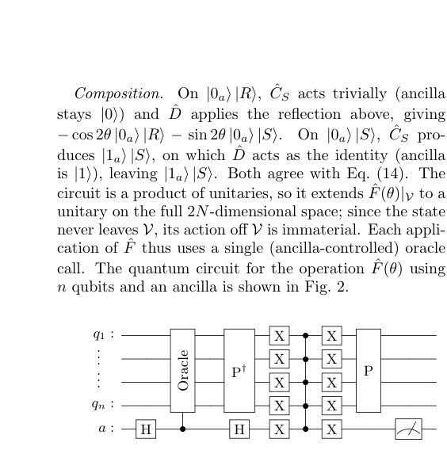 
FIG. 2. The fixed point operator for solution state |S⟩in n qubits with the measurement instruction on ancilla a. Here, Oracle and P represent the quantum circuits of the Oracle operator ˆO and the state preparation operator ˆP.

📷 Fig 2

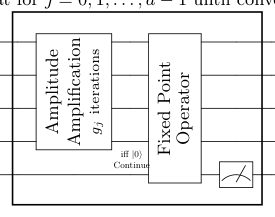 
FIG. 3. The circuit representing the fixed-point quantum search algorithm. At iteration j the state is amplified by gj Grover operations and then checked by the fixed-point op- erator; if the ancilla measurement is |1⟩we have converged to the solution state, otherwise (|0⟩) we continue to the next iteration. The convergence probability at the j-th measure- ment is sin2(2jθ), with j ∈{0, 1, . . . , a−1}. If, after iterating through the schedule, we still have not converged, the solu- tion state does not exist.

📷 Fig 3

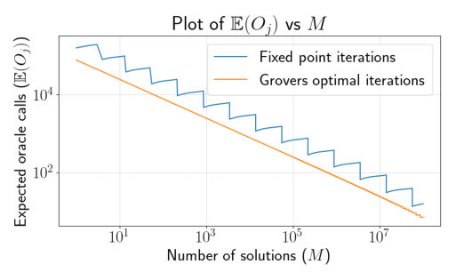 
FIG. 5. The number of oracle calls required vs M for N = 1010 by Grover search and the fixed-point algorithm. The mean of the ratio of Grover and FP algorithm iterations is approximately 1.33.

📷 Fig 4

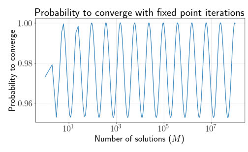 
FIG. 4. The figure represents the probability of converging to a solution state in O( p

**Summary.** This work presents an ancilla-mediated fixed-point quantum search algorithm designed to overcome the instability of standard Grover iterations when the number of solutions is unknown. By mapping the solution amplitude to an ancilla qubit using real-plane reflections, the method achieves high, guaranteed success probabilities and maintains a favorable query complexity of $O(\sqrt{N/M})$. This provides a robust alternative to standard amplitude amplification for quantum search tasks.

**Why it may be interesting.** The robust, deterministic nature of the fixed-point mechanism, which avoids phase gates and maintains a geometric structure, offers a powerful algorithmic tool for quantum computation that is less sensitive to parameter estimation errors.

Detailed structure

**Main problem.** The paper addresses the 'soufflé problem' in Grover's search algorithm, where success probability degrades due to the need for precise iteration counts, especially when the number of solutions ($M$) is unknown.

**Main result.** They introduce an ancilla-mediated fixed-point quantum search that achieves robust convergence with a guaranteed success probability of at least 92.6% and a query complexity of $O(\pi \sqrt{N/M})$.

**Method.** The method utilizes a dedicated ancilla qubit to map the solution amplitude, employing Grover's real-plane reflections to construct a fixed-point operator $\hat{F}(	heta)$ that deterministically guides the search.

**Model / system.** The model is the quantum search algorithm applied to unstructured datasets of size $N$ with $M$ solutions. The search operates within a four-dimensional invariant subspace $V$ spanned by states involving the ancilla qubit.

**Key observables.** Success Probability ($\ge 92.6\%$), Query Complexity ($O(\pi \sqrt{N/M})$ worst-case, $O(\sqrt{N/M})$ expected).

**Important parameters / regimes.** Dataset size $N$, number of solutions $M$, and the angle $	heta$ defining the initial state.

**Assumptions / limitations.** The analysis assumes the state remains confined to the four-dimensional invariant subspace $V$.

**Figures summary.** Figures compare the probability of convergence and the required number of oracle calls for the fixed-point algorithm versus standard Grover search as a function of $M$ for large $N$.

**Paper structure.** The paper develops the fixed-point operator $\hat{F}(	heta)$ using real-plane reflections, analyzes its action on the invariant subspace $V$, and derives the convergence probability and query complexity bounds by comparing it to standard amplitude amplification.

Abstract

Grover's quantum search algorithm provides a fundamental quadratic speedup for unstructured datasets, reducing query complexity from $\mathcal{O}(N)$ to $\mathcal{O}(\sqrt{N})$. However, the algorithm's reliance on precise iteration counts leads to the ``soufflé problem,'' where over-rotation results in a sharp decline in success probability. This limitation is particularly restrictive when the number of solution states, $M$, is unknown. In this work, we present an ancilla-mediated fixed-point quantum search algorithm that achieves robust convergence by mapping the solution amplitude to a dedicated ancilla qubit. Unlike existing phase-matching fixed-point methods, our approach utilizes Grover's real-plane reflections, thereby maintaining the intuitive geometric architecture of the original algorithm. We demonstrate that this method achieves a success probability of at least $92.6\%$ with a query complexity of approximately $\mathcal{O}(\sqrt{N/M})$, effectively bridging the gap between standard amplitude amplification and robust fixed-point convergence.

[↑ back to top](#top)

### [Branching stochastic mechanics. I. Clustering and connected correlations within a branching-process representation of the Schrödinger equation](http://arxiv.org/abs/2608.29807v1)

**Authors:** Eric Dumonteil, Benoît Bischoff, Alain Letourneau, Loïc Thulliez, Corentin Doutre  
**Type:** theory · **Category:** statistical mechanics · **PDF:** <https://arxiv.org/pdf/2608.29807v1>  
**Analysis basis:** full PDF text, analyzed in chunks
**Topic relevance:** `Keldysh / 2PI / non-Gaussian methods` **1/5**

📷 Fig 1

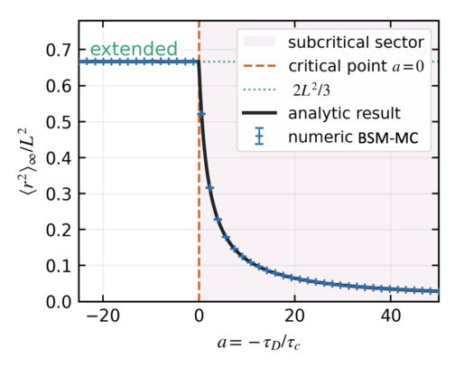 
FIG. 1. Benchmark of the frozen-rate hierarchy in the reflect- ing interval: long-time pair separation ⟨r2⟩∞/L2 as a function of the reduced control parameter a = −τD/τc. Solid line: an- alytic result, Eqs. (88)–(90); symbols: BSM-MC estimates (error bars: ensemble statistics). For a ≤0 (extended sec- tor) the separation saturates at the independent-configuration value 2L2/3 (dotted line); for a &gt; 0 the correlated pairs form clusters whose size decouples from the system size as a in- creases.

📷 Fig 2

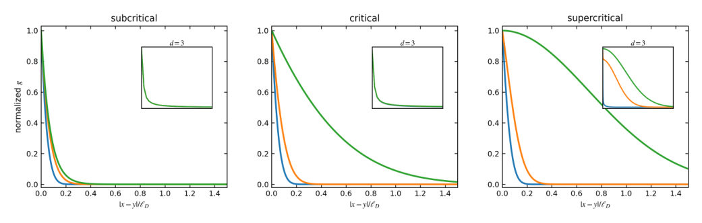 
FIG. 2. Normalized connected correlation profiles gbr(r, t)/gbr(0, t) in the three frozen-rate regimes, generated from Eq. (118); the relative distance is measured in units of the diffusive length ℓD = p

📷 Fig 3

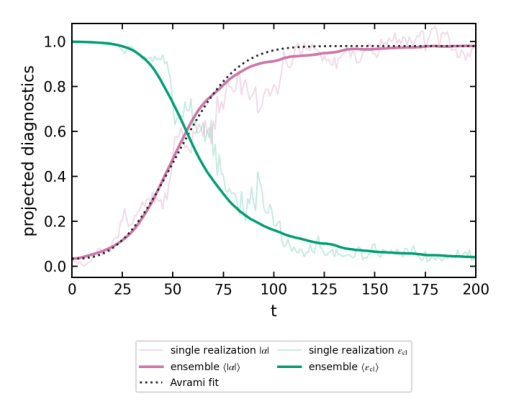 
FIG. 3. Formation of the projected forward-backward sec- tor in BSM-MC (Appendix H). The magnitude of the signed realization-wise projection diagnostic |αphys(t)| grows toward unity while the corresponding relative residual weight εcl,ω(t) decreases. These numerical quantities are the realization- wise counterparts of the reciprocal locking and residual de- pletion described by Eqs. (146)–(156). Transparent curves show one stochastic realization and solid curves show ensem- ble averages of the realization-wise diagnostics. The dotted line is a Johnson-Mehl-Avrami-Kolmogorov (JMAK) fit of the ensemble-averaged |αphys(t)|, used as a phenomenological de- scription of the observed...

📷 Fig 4

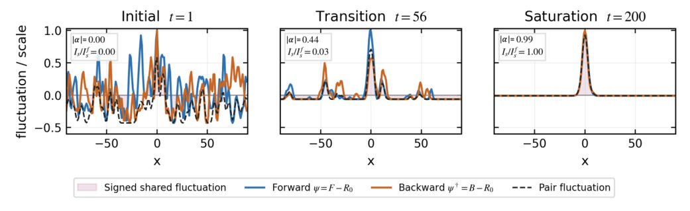 
FIG. 4. BSM-MC diagnostic of the progressive structuring of the reciprocal forward-backward overlap sector (Appendix H). Each panel shows, at increasing times (t = 1, 56, 200), the forward and backward numerical reduced fields ψF and ψB, measured with respect to the reference background as specified in Appendix H, their pair contribution (dashed), and the signed shared component (shaded). Insets: measured projection coefficient |αphys| and shared-field intensity Is, normalized by its saturation value If s (Appendix H). Initially the two sectors are weakly correlated (|αphys| ≃0); during reciprocal organization they develop an increasingly dominant shared spatial component, and at the late...

📷 Fig 5

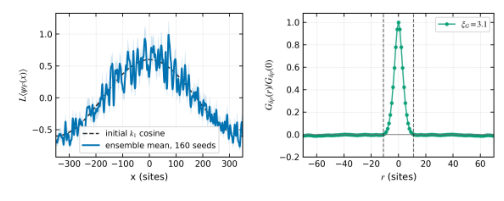 
FIG. 5. BSM-MC illustration of the separation between col- lective and relative observables in the organized reciprocal sector. Left: normalized pair-amplitude estimator averaged over the stochastic ensemble, compared with the prescribed Schr¨odinger-Nagasawa profile. The collective observable re- tains the extended spectral envelope. Right: normalized pair- density diagnostic as a function of relative separation, show- ing the finite-range structure generated by reciprocal lock- ing. The same stochastic dynamics therefore reproduces the Born envelope at the collective level while retaining a localized structure in the relative sector. This separation illustrates the effective loss of...

**Summary.** This paper develops Branching Stochastic Mechanics (BSM) to analyze the quantum state via a branching-process representation of the Schrödinger equation. It shows that by analyzing connected correlations beyond the mean density, one can mathematically demonstrate the coexistence of an extended background density and a finite correlation range. This suggests a mechanism for particle-like organization within quantum systems.

**Why it may be interesting.** This work provides a powerful statistical framework (BSM) to analyze quantum correlations beyond mean-field approximations, directly addressing how local structure (finite correlation range) can emerge from global, extended quantum states.

Detailed structure

**Main problem.** The paper investigates whether finite-range correlations can be hidden within the statistics of an extended quantum state whose low-order moments are fixed by the mean.

**Main result.** The analysis suggests that an extended Born density and a finite correlation range can coexist within a single stochastic kernel, implying particle-like organization.

**Method.** The Schrödinger equation is reformulated using the Schrödinger-Nagasawa transform and promoted to a Branching Stochastic Mechanics (BSM) framework, which retains higher statistical orders (genealogy) beyond mean dynamics.

**Model / system.** The model is quantum mechanics governed by the Schrödinger equation. The analysis uses the SN transform to define forward and backward diffusion fields, which are then treated as branching superprocesses.

**Key observables.** Born Density ($
ho$), Connected Kernel ($C_{FB}$), BSM Paired Density ($
ho_{BSM}$), and the correlation screening length ($\xi_{FB}$).

**Important parameters / regimes.** Critical dimension $d_c=2$ in free space; the effective relative diffusivity ($D_{eff}$) and relaxation rate ($\mu_{FB}$).

**Assumptions / limitations.** The analysis assumes that the stochastic lift (BSM) captures the necessary higher statistical structure, and that the connected moments accurately describe the inherited dependence.

**Figures summary.** Not specified (Notes describe mathematical structures and diagnostics rather than figure content).

**Paper structure.** The paper first establishes the equivalence between the SN transform and Schrödinger dynamics. It then develops the BSM framework, analyzing the connected sector's clustering properties. Finally, it derives the pair equation, showing how the diagonal matching condition and the finite screening length characterize the coexistence of extended density and finite correlations.

Abstract

Can finite-range correlations hide in the statistics of an extended quantum state? The Schrödinger-Nagasawa transform represents the wave function by positive forward and backward diffusion fields whose product is the Born density. We promote them to branching superprocesses, \(Φ_F\) and \(Φ_B\): diffusion samples stochastic paths, whereas Bohm/Fisher-controlled branching generates genealogies of alternative continuations. With rates evaluated on the prescribed Born density, their means reproduce Schrödinger dynamics exactly. The connected sector exhibits supercritical, critical, and subcritical clustering in confinement and has critical dimension \(d_c=2\) in free space. Stationary eigenmodes remain extended; subcritical clusters acquire the reduced de~Broglie scale. We then let the branching rate respond to the fluctuating product \(Φ_FΦ_B\). In the reciprocal basis, the fields equal a smooth reference \(R\) plus centered fluctuations \(ψ_F,ψ_B\), defining the signed kernel \(C_{\rm FB}(x,y)=\mathbb E_ω[ψ_F(x)ψ_B(y)]\). On the anticorrelated branch, \(ρ_{\rm BSM}(x)=-C_{\rm FB}(x,x)\) is the positive paired density. Stationary recovery requires its diagonal to match the Born profile, while off-diagonal decay defines the correlation range. The pair equation splits into collective and relative sectors: spectral cancellation selects the Born collective mode, while suppression of the leading density fluctuation selects the anticorrelated source channel. With relative diffusivity \(D_{\rm eff}\) and positive relaxation rate \(μ_{\rm FB}\), correlations have screening length \(ξ_{\rm FB}=\sqrt{D_{\rm eff}/μ_{\rm FB}}\). Thus an extended Born density and a finite correlation range can coexist in one stochastic kernel, suggesting particle-like organization.

[↑ back to top](#top)

### [Chemical potentials from structure factors: II. Charged multi-component mixtures](http://arxiv.org/abs/2608.30060v1)

**Authors:** Xiaoyu Wang, Roya Savoj, Musahid Ahmed, Bingqing Cheng  
**Type:** theory · **Category:** statistical mechanics · **PDF:** <https://arxiv.org/pdf/2608.30060v1>  
**Analysis basis:** full PDF text, analyzed in chunks
**Topic relevance:** `Keldysh / 2PI / non-Gaussian methods` **1/5**

📷 Fig 1

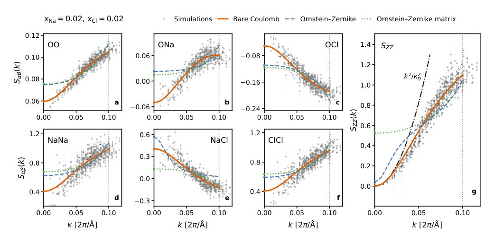 
FIG. 1: Fitting partial structure factors for aqueous NaCl at 𝑥Na = 𝑥Cl = 0.02. Panels (a–f) compare simulated partial structure factor components with the bare-Coulomb fit, the independent scalar Ornstein–Zernike fit, and the full Ornstein–Zernike matrix fit. Panel (g) shows the corresponding charge–charge structure factor 𝑆𝑍𝑍(𝑘), and the reference scaling curve 𝑘2/𝜅2 𝐷.

📷 Fig 2

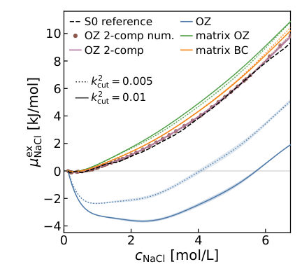 
FIG. 2: Excess chemical potential for NaCl salt in water, 𝜇ex NaCl(𝑥), obtained by integrating chemical-potential derivatives inferred from fitted S0

📷 Fig 3

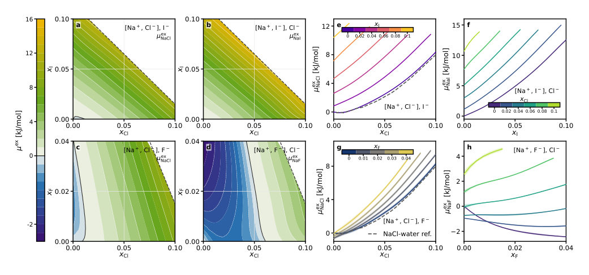 
FIG. 3: Excess chemical potentials for mixed aqueous salts, derived from the bare-Coulomb matrix fit. Panels (a–d) show Gaussian process-integrated surfaces of the neutral ion-pair excess chemical potentials: 𝜇ex NaCl and 𝜇ex NaI for NaCl/NaI in water, and 𝜇ex NaCl and 𝜇ex NaF for NaCl/NaF in water. Panels (e–h) show one-dimensional slices through the same surfaces; line colors indicate fixed 𝑥I (e), fixed 𝑥F (g), or fixed 𝑥Cl (f, h), as marked by the inset color bars. Shaded bands show standard error, and the dashed gray curve shows the reference values from NaCl-water simulations.

📷 Fig 4

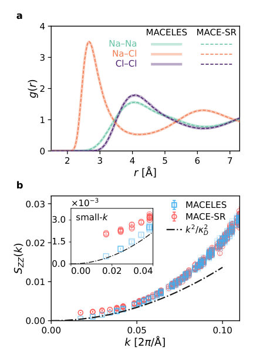 
FIG. 4: Local and long-range structure of molten NaCl at 1200 K and 1 bar. a Radial distribution functions, 𝑔(𝑟), for Na–Na, Na–Cl and Cl–Cl, computed using MACELES (solid lines) and MACE-SR (dotted lines) models. Error bars denote standard errors from a time-block analysis. b Corresponding charge–charge structure factors, 𝑆ZZ(𝑘), for MACELES (blue squares) and MACE-SR (red circles). The reference curve 𝑘2/𝜅2 D is drawn with the Debye wavevector 𝜅D = 5.37 ˚A −1.

📷 Fig 5

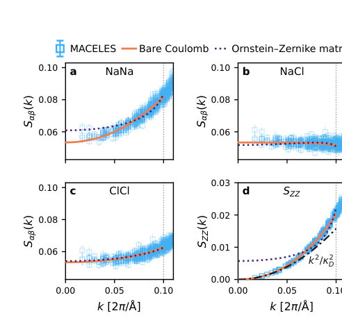 
FIG. 5: Partial structure factors for molten NaCl at 1200 K and 1 bar. a–c: MACELES MD results for the Na–Na, Na–Cl and Cl–Cl components, shown with the bare-Coulomb matrix fit (solid lines) and the full Ornstein–Zernike matrix fit (dotted lines). Fits were performed over 𝑘2 &lt; 𝑘2 cut = 0.01 × 4𝜋2/˚𝐴2, indicated by the vertical dotted lines. Error bars denote standard errors from a block analysis. d: Corresponding charge–charge structure factor 𝑆ZZ(𝑘). The dot-dashed line shows the Stillinger–Lovett limiting form 𝑘2/𝜅2 D, using the fitted inverse Debye screening length 𝜅D = 5.00 ˚A −1.

**Summary.** This paper develops an advanced theoretical method to compute chemical potentials in charged multi-component mixtures by modifying the standard structure factor analysis to correctly handle long-range Coulomb interactions. By separating charge fluctuations, the authors achieve consistent calculations for aqueous and molten salt systems, revealing ion-specific thermodynamic effects and structural reorganization mechanisms.

**Why it may be interesting.** While focused on classical statistical mechanics, the rigorous treatment of long-range Coulomb interactions and the development of a specialized structure factor matrix $	ext{SBC}(k)$ for charged systems represents a sophisticated theoretical extension of many-body correlation functions, which has parallels in quantum field theory approaches to interacting quantum systems.

Detailed structure

**Main problem.** The primary challenge addressed is the accurate computation of chemical potentials in complex, charged multi-component mixtures, which is crucial for understanding electrolyte thermodynamics but difficult using standard atomistic simulation techniques.

**Main result.** The authors successfully extend the S0 method by incorporating a Coulombic treatment into the structure factor analysis, leading to consistent calculations of excess chemical potentials for aqueous and molten salt systems.

**Method.** The method combines a composition-space framework with a specialized treatment of the small-wavenumber limit of the static structure factor matrix, $	ext{SBC}(k)$, to correctly account for long-range electrostatic correlations and charge neutrality.

**Model / system.** The work models charged multi-component systems, specifically focusing on aqueous salt solutions (e.g., $	ext{NaCl}/	ext{NaX}$) and molten salt mixtures (e.g., $	ext{MgCl}_2-	ext{NaCl}$). The theory is applied to calculate thermodynamic properties like chemical potentials and mixing free energies.

**Key observables.** Chemical potentials ($\mu_\alpha$), partial static structure factors ($S_{\alphaeta}(k)$), and the charge-density structure factor ($S_{ZZ}(k)$).

**Important parameters / regimes.** Small wavevector limit ($k 	o 0$), ionic strength, and the specific composition of the salt mixture.

**Assumptions / limitations.** The theory assumes that the thermodynamically relevant neutral composition fluctuations can be separated from the forbidden macroscopic charge fluctuations, and that the structure factor matrix has a finite limit at zero wavevector.

**Figures summary.** Figures compare simulated partial structure factors using different fitting methods (bare-Coulomb vs. OZ) and show the calculated excess chemical potentials ($\mu_{	ext{ex}}$) for various salt mixtures, demonstrating anion-specific effects.

**Paper structure.** The paper builds upon previous work (Part I) by extending the S0 method to charged systems. It details the theoretical framework involving the partial structure-factor matrix $	ext{SBC}(k)$, applies this to aqueous electrolytes to calculate $\mu_{	ext{ex}}$, and then extends the methodology to analyze structural reorganization and mixing thermodynamics in molten salts.

Abstract

The chemical potentials of charged multi-component mixtures are central to electrolyte thermo- dynamics, but remain difficult to compute from atomistic simulations. The S0 method enables computing chemical potentials of mixtures from equilibrium molecular dynamics simulations. Here we extend the S0 method to charged mixtures by combining the composition-space framework developed in Part I: Neutral Multi-component Mixtures with a Coulombic treatment of the small- wavenumber limits of static structure factors. This approach separates thermodynamically relevant neutral composition fluctuations from forbidden macroscopic charge fluctuations, and further ac- counts for charge-neutrality constraints. We use the method to compute the chemical potentials of multiple-halide aqueous salt solutions, elucidating the ion-specific thermodynamic effects. We also calculate the mixing free energies of molten salt mixtures, demonstrating the importance of correctly describing long-wavelength electrostatic correlations.

[↑ back to top](#top)

### [Convex conservation of von Neumann entropy implies unitarity or antiunitarity](http://arxiv.org/abs/2608.29373v1)

**Authors:** Nicolas G. Underwood, Jonte R. Hance  
**Type:** theory · **Category:** statistical mechanics · **PDF:** <https://arxiv.org/pdf/2608.29373v1>  
**Analysis basis:** full PDF text, analyzed in chunks
**Topic relevance:** `quantum measurements` **1/5**

📷 Fig 1

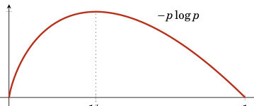 
FIG. 1. Function −plog p is strictly positive on the open unit interval, 0 &lt; p &lt; 1. It is zero for p = 1, and we follow the stan- dard convention that −0log0 = 0, justified through the limit limp→0+ plog p = 0. Our analysis is independent of logarithm base b, which in this context merely scales entropy (5) by an arbitrary factor. We leave b unspecified but assume b &gt; 1 for the purposes of discussion, to retain the conventional interpre- tations of high and low entropy.

📷 Fig 2

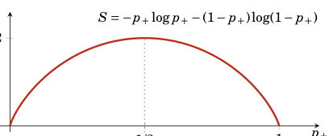 
FIG. 2. The proofs of Propositions 2b-4 consider density matrices for which all eigenvalues/probabilities pi vanish except for two that we refer to as p+ and p−= 1−p+. As we retain the standard 0log0 = 0 convention, the von Neumann entropy in this case is the single variable function S = −p+ log p+ −(1−p+)log(1−p+), which is symmetric about a maximum of log2 at p+ = p−= 1

**Summary.** This theoretical paper establishes that for finite quantum systems, any transformation that preserves the convex structure of density matrices and conserves von Neumann entropy must be either unitary or antiunitary. It proposes that entropy conservation can serve as a fundamental physical principle, potentially replacing the traditional requirement of reversibility (unitarity) in quantum mechanics.

**Why it may be interesting.** This work provides a fundamental information-theoretic constraint on quantum dynamics, suggesting that entropy conservation might be a more general physical principle than strict unitarity for describing time evolution.

Detailed structure

**Main problem.** The paper investigates whether the conservation of von Neumann entropy can replace the requirement of invertibility in establishing that quantum transformations must be unitary or antiunitary.

**Main result.** The authors prove that any convex transformation on the space of density matrices that conserves von Neumann entropy must be either unitary or antiunitary for finite Hilbert spaces.

**Method.** The proof involves analyzing the constraints imposed by entropy conservation on the transformation's action on pure and mixed states, using spectral properties and linear algebra.

**Model / system.** The system is described by quantum states represented by density matrices $\rho$ on a finite-dimensional Hilbert space $H$. The analysis concerns general transformations $A: D(H) \to D(H)$.

**Key observables.** Von Neumann Entropy $S[\rho] = -\text{tr}(\rho \log \rho)$, and the density matrix $\rho$ itself.

**Important parameters / regimes.** The dimension $N$ of the finite Hilbert space.

**Assumptions / limitations.** The transformation $A$ is assumed to be convex-structure preserving and conserve von Neumann entropy. The theorem is proven only for finite Hilbert spaces.

**Figures summary.** Figure 1 illustrates the function $-p \log p$ for entropy calculation, while Figure 2 shows the entropy function $S$ as a function of eigenvalues, highlighting its symmetry and extrema.

**Paper structure.** The paper builds from Kadison's theorem, proposing entropy conservation as a replacement for invertibility. It analyzes the transformation's action on basis elements (propositions 0-7), showing that entropy conservation forces the map to be unitary or antiunitary.

Abstract

On the space of density matrices $D(H)$, Kadison's theorem establishes that all invertible convex transformations $K:D(H)\to D(H)$ are unitarity or antiunitary. For a finite Hilbert space, we propose a similar theorem which replaces the invertibility requirement with that of entropy conservation. Thus, we argue, the supposition of reversibility in quantum mechanics may be replaced with a principle of entropy conservation.

[↑ back to top](#top)

### [Doping-driven evolution of pairing symmetry in pressurized La$_3$Ni$_2$O$_7$](http://arxiv.org/abs/2608.29091v1)

**Authors:** Hai-Yang Zhang, Yu-Jie Bai, Fan-Jie Kong  
**Type:** theory · **Category:** strongly correlated electrons · **PDF:** <https://arxiv.org/pdf/2608.29091v1>  
**Analysis basis:** full PDF text, analyzed in chunks
**Topic relevance:** `Keldysh / 2PI / non-Gaussian methods` **1/5**

📷 Fig 1

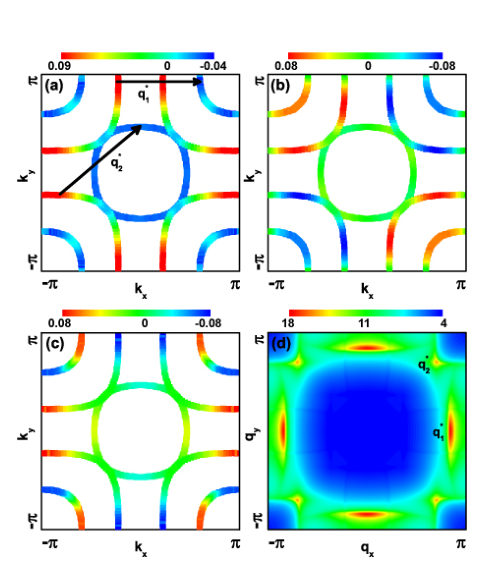 
FIG. 1. (Color online) (a), (b) and (c) are the first three leading pair- ing states of s±, dxy and dx2−y2 symmetries, respectively. (d) shows the momentum dependence of the static odd-channel spin suscepti- bility ˆ X R,S(q).

📷 Fig 2

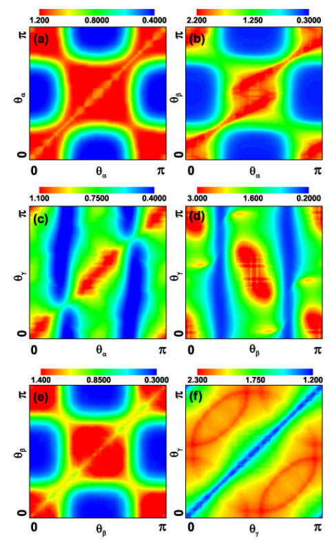 
FIG. 2. (Color online) Fermi-angle dependence of the pairing in- teractions for U = 1.2 and J = U/6 at a filling of n = 3.0. (a)-(f) θ-space distributions of Γαα, Γαβ , Γαγ, Γβγ, Γββ and Γγγ, respec- tively.

📷 Fig 3

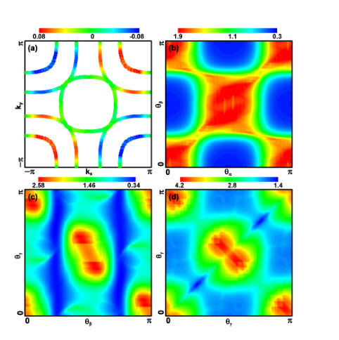 
FIG. 3. (Color online) Superconducting gap and pairing interaction distributions for U = 1.2 and J = U/6 at a filling of n = 2.7. (a) Superconducting gap on the Fermi surfaces. (b)-(d) θ-space distri- butions of Γαβ , Γβγ and Γγγ, respectively.

📷 Fig 4

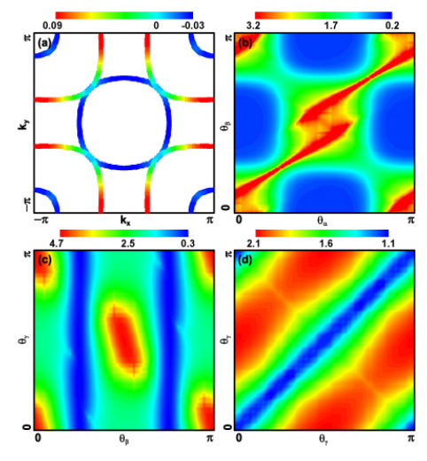 
FIG. 4. (Color online) Superconducting gap and pairing interaction distributions for U = 1.2 and J = U/6 at a filling of n = 3.3. (a) Superconducting gap on the Fermi surfaces. (b)-(d) θ-space distri- butions of Γαβ , Γβγ and Γγγ, respectively.

📷 Fig 5

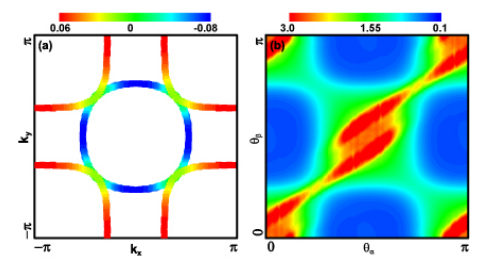 
FIG. 5. (Color online) Superconducting gap and pairing interaction distributions for U = 1.1 and J = U/6 at a filling of n = 3.5. (a) Superconducting gap on the Fermi surfaces. (b) θ-space distributions of Γαβ .

**Summary.** This theoretical study maps the doping-driven evolution of superconductivity in pressurized La3Ni2O7 using a bilayer two-orbital model. It finds that while hole doping induces a symmetry change to $d_{xy}$-wave, electron doping maintains $s_{\pm}$-wave pairing. Crucially, the research concludes that the $\gamma$ Fermi pocket is not essential for superconductivity, suggesting robust pairing driven by $\alpha-eta$ nesting.

**Why it may be interesting.** This work provides a detailed theoretical mechanism linking Fermi surface topology (pocket expansion/contraction) and magnetic fluctuations (odd/even modes) to the specific symmetry of the superconducting pairing, which is a core topic in strongly correlated electron physics.

Detailed structure

**Main problem.** The study investigates how the superconducting pairing symmetry evolves as a function of doping in the pressurized bilayer nickelate superconductor, La3Ni2O7.

**Main result.** Hole doping drives a transition from $s_{\pm}$-wave to $d_{xy}$-wave pairing, while electron doping maintains $s_{\pm}$-wave pairing, suggesting the $\gamma$ pocket is not essential for superconductivity.

**Method.** The pairing interaction is calculated using the Random-Phase Approximation (RPA) applied to a minimal bilayer-two-orbital Hamiltonian, utilizing spin and charge susceptibilities.

**Model / system.** The system is pressurized La3Ni2O7, modeled by a minimal bilayer-two-orbital Hamiltonian including hopping integrals and onsite interactions. The analysis tracks the superconducting pairing symmetry across different doping levels (hole vs. electron doping).

**Key observables.** Superconducting pairing symmetry ($s_{\pm}$-wave, $d_{xy}$-wave), gap function sign reversal, and the doping dependence of pairing interactions ($\Gamma_{\alphaeta}, \Gamma_{eta\gamma}, \Gamma_{\gamma\gamma}$).

**Important parameters / regimes.** Doping level (hole vs. electron), magnetic excitation modes (odd vs. even), and the presence/absence of the $\gamma$ Fermi pocket.

**Assumptions / limitations.** The analysis relies on the Random-Phase Approximation (RPA) applied to the minimal bilayer-two-orbital model.

**Figures summary.** Figures illustrate the leading pairing states at different doping levels, showing the $	heta$-dependence of pairing interactions and the resulting gap distributions for both hole- and electron-doped regimes.

**Paper structure.** The paper systematically analyzes the pairing interaction using RPA, first establishing the $s_{\pm}$-wave state in the undoped limit via magnetic odd modes. It then examines the doping dependence, showing the $s_{\pm} 	o d_{xy}$ transition upon hole doping, and the persistence of $s_{\pm}$ pairing in the electron-doped regime, arguing against the necessity of the $\gamma$ pocket.

Abstract

We investigate the superconducting pairing symmetry and its doping evolution in pressurized La$_3$Ni$_2$O$_7$. For the undoped compound, the most favorable pairing state is found to be $s_{\pm}$-wave, characterized by sign reversal of the gap functions between the Fermi pockets. A detailed analysis of the pairing interactions reveals that this unconventional state originates from repulsive interactions mediated by the magnetic odd modes of the bilayer nickelate. Upon hole doping, the $γ$ Fermi pocket expands, which amplifies the intrapocket repulsions on this pocket. These repulsions, driven by the magnetic even modes, gradually dominates the pairing interactions and ultimately drive a transition in pairing symmetry from $s_{\pm}$-wave to $d_{xy}$-wave in the heavily hole-doped regime. In stark contrast, the $s_{\pm}$-wave pairing persists under electron doping, even deep into the heavily electron-doped regime where a Lifshitz transition occurs. This finding suggests that the $γ$ Fermi pocket is not essential for the emergence of superconductivity in bilayer nickelates. In fact, the $s_{\pm}$-wave pairing becomes more robust in the absence of the $γ$ pocket, as spin fluctuations are strongly enhanced by the favorable nesting between the $α$ and $β$ pockets --- a condition guaranteed by Luttinger's theorem and the Fermi surface topology. We believe that exploring the doping evolution of superconducting pairing will open a new realm for testing the pairing mechanism in pressurized La$_3$Ni$_2$O$_7$.

[↑ back to top](#top)

### [Frame phase retrievability and state distinguishability of quantum channels](http://arxiv.org/abs/2608.30006v1)

**Authors:** Deguang Han, Kai Liu  
**Type:** theory · **Category:** quantum information and computing · **PDF:** <https://arxiv.org/pdf/2608.30006v1>  
**Analysis basis:** full PDF text, analyzed in chunks
**Topic relevance:** `quantum measurements` **1/5**

📷 Fig 1

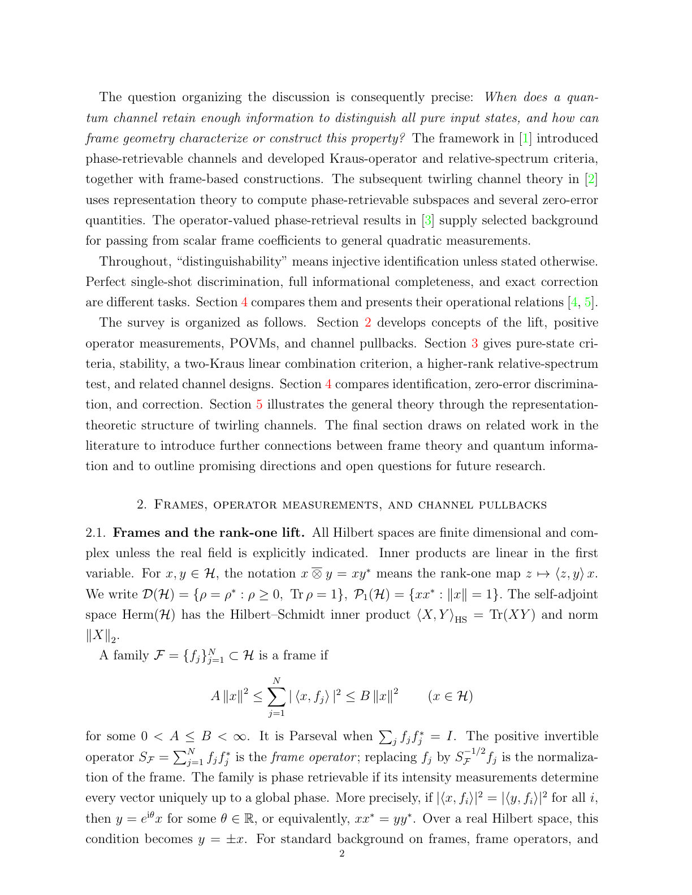 
Low-resolution page preview, page 2

📷 Fig 2

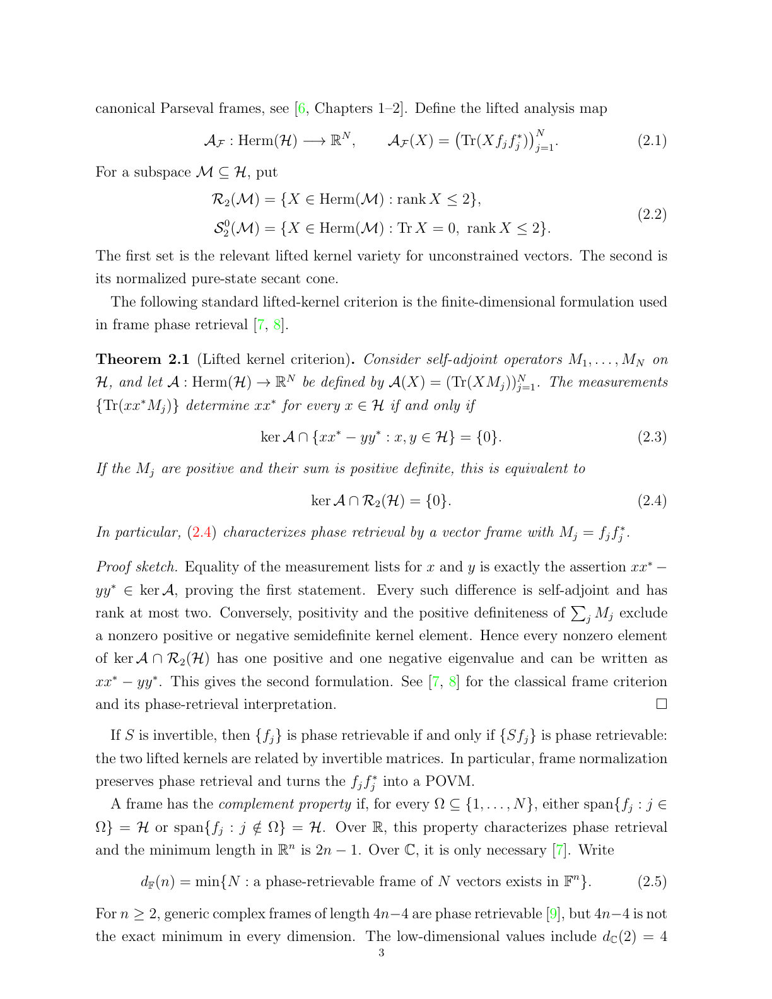 
Low-resolution page preview, page 3

📷 Fig 3

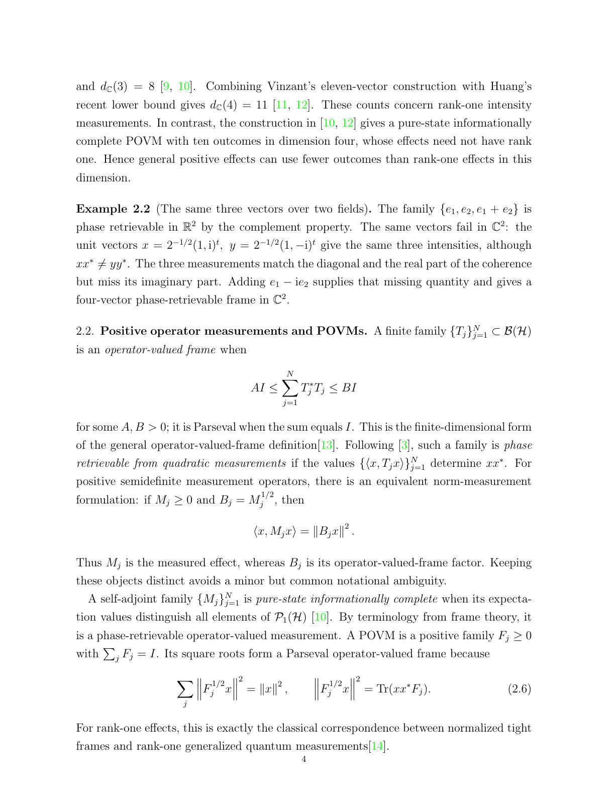 
Low-resolution page preview, page 4

📷 Fig 4

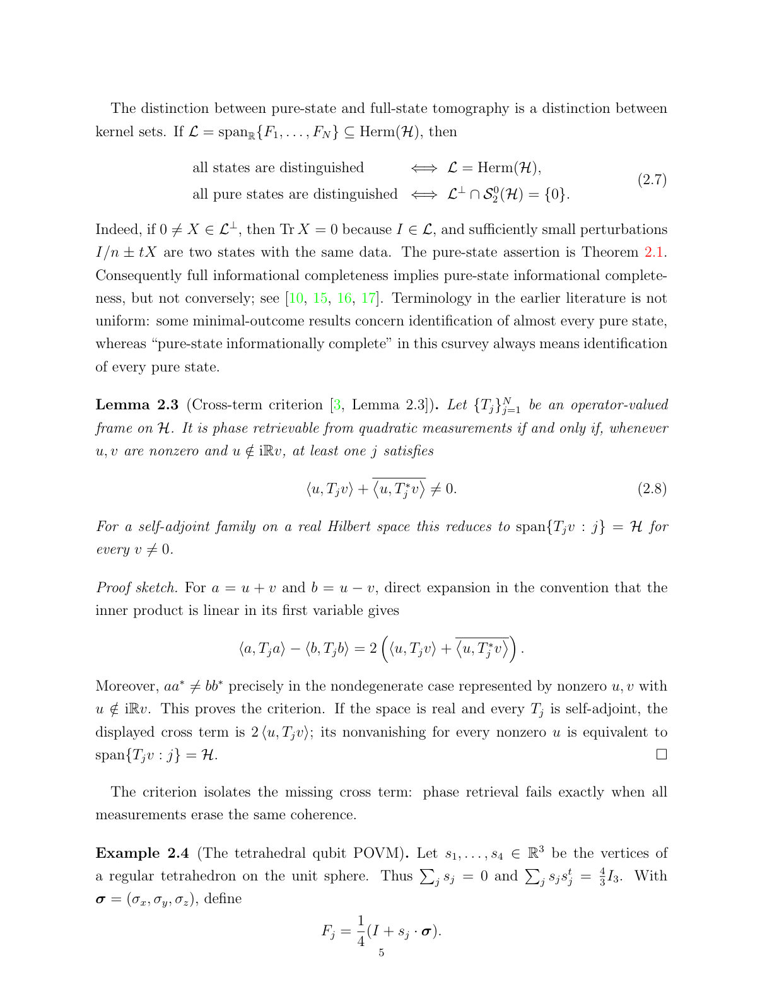 
Low-resolution page preview, page 5

📷 Fig 5

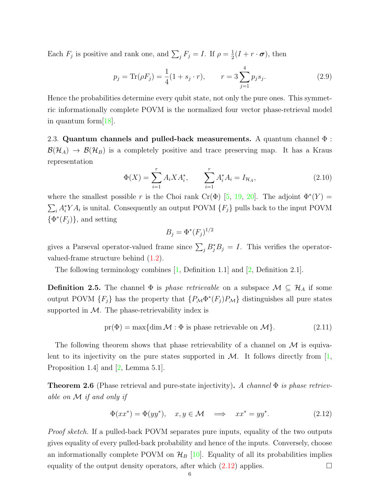 
Low-resolution page preview, page 6

**Summary.** This survey characterizes phase retrievability for quantum channels, determining when the output measurement can uniquely distinguish all pure input states. It establishes that this property is equivalent to the channel being injective on pure states, developing advanced mathematical criteria using frame theory and channel decomposition to quantify this information preservation.

**Why it may be interesting.** This work provides rigorous mathematical tools to quantify how much information a quantum process (channel) loses, which is fundamental for understanding quantum error correction, quantum communication capacity, and the limits of quantum state estimation.

Detailed structure

**Main problem.** The paper investigates the conditions under which a quantum channel can retain enough information to uniquely identify pure input quantum states, a concept termed 'phase retrievability'.

**Main result.** A quantum channel is phase retrievable if and only if it is injective when restricted to the set of pure states. The authors develop quantitative criteria, such as the index $\eta_2(\Phi; M)$, to characterize this property.

**Method.** The analysis combines concepts from frame theory (phase retrieval from intensities) with quantum information theory, utilizing the adjoint channel ($\Phi^*$) and structural criteria involving Choi ranks and relative spectra.

**Model / system.** The study focuses on general quantum channels $\Phi: B(HA) 	o B(HB)$ acting on systems described by density matrices or unit vectors in Hilbert spaces. Specific examples include depolarizing or amplitude damping channels.

**Key observables.** Phase retrievability index ($	ext{pr}(\Phi)$), the measure $\eta_2(\Phi; M)$, and the injectivity of the channel on pure states.

**Important parameters / regimes.** The dimension of the input/output spaces, the structure of the Kraus operators $\{A_i\}$, and the number of uses ($q$) for twirling channels.

**Assumptions / limitations.** The analysis often distinguishes between 'injective identification' (phase retrievability) and stronger concepts like full tomography or perfect one-shot discrimination.

**Figures summary.** Not specified in the notes, but the structure implies theorems and criteria are presented, likely involving diagrams or mathematical derivations related to channel decomposition and frame properties.

**Paper structure.** The paper progresses from general phase retrieval concepts for vectors to the application of these ideas to quantum channels. It develops necessary and sufficient conditions using various mathematical tools (Choi rank, spectra) and concludes by applying these findings to structured channels like twirling channels.

Abstract

This survey introduces the role of frame phase retrieval in pure-state identification and information preservation by quantum channels. For unit vectors, the lift $x\mapsto xx^*$ identifies vectors that differ only by a global phase with the same rank-one quantum state, converts frame intensities into linear functionals of the lifted state, and makes the adjoint pullback of output observables an operator-valued measurement on the input system. From this viewpoint, a channel is phase retrievable exactly when it is injective on pure states. We develop this correspondence through Choi-rank-two linear combinations of Kraus operators, higher-rank relative spectra, structural obstructions, and constructions with prescribed Choi rank. We distinguish injective identification from full tomography, perfect one-shot discrimination, zero-error classical communication, and exact quantum correction. Twirling channels then provide a structured setting in which commutants, irreducible dimensions, multiplicities, orbit-frame orthogonality, coding indices, and phase-retrievable subspaces can be read from group representations.

[↑ back to top](#top)

### [From Freezing to Terminal Packing: A Puzzle and a Paradox](http://arxiv.org/abs/2608.29676v1)

**Authors:** Biman Bagchi  
**Type:** theory · **Category:** statistical mechanics · **PDF:** <https://arxiv.org/pdf/2608.29676v1>  
**Analysis basis:** full PDF text, analyzed in chunks
**Topic relevance:** `Keldysh / 2PI / non-Gaussian methods` **1/5**

📷 Fig 1

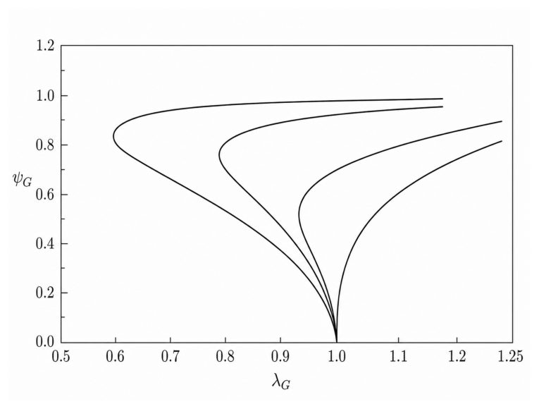 
Figure 1: Bifurcation curves obtained from the nonlinear density-functional equations for a three- dimensional fcc representation. The axes are the principal crystalline density-wave amplitude ψG and the structural coupling λG = ρsec(G). Reading the upper portions of the four curves from left to right, the secondary-mode parameter pairs are (0.25, 0.10), (0.15, 0.08), (0.05, 0.05), and (−2.0, −2.0), respectively. A returning branch approaches the uniform solution and ends at the marginal point λG = 1; stability must be determined from the thermodynamic functional rather than from the plotted slope alone. Redrawn from the bifurcation analysis of Bagchi, Cerjan, and Rice [13].

📷 Fig 2

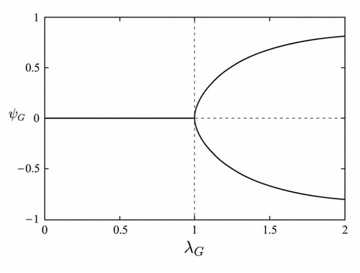 
Figure 2: Bifurcation structure for one-dimensional hard rods. The symmetry-related positive and negative density-wave branches emerge continuously from the uniform solution at λG = 1. With the exact one-dimensional correlation input, this marginal condition gives the exact terminal-packing density ρT ℓσ = ρT s σ = 1 [13].

📷 Fig 3

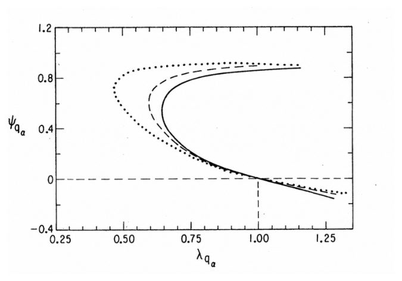 
Figure 3: Three-dimensional bcc solution curves in the two-order-parameter theory. The dotted, dashed, and solid curves correspond to λqβ = 0.20, 0.10, and 0.05, respectively. The common point (λqα, ψqα) = (1, 0) is marginal but is not an fcc-like returning bifurcation; only the lower- density freezing bifurcation is present. Adapted from Fig. 4 of Cerjan and Bagchi [14].

📷 Fig 4

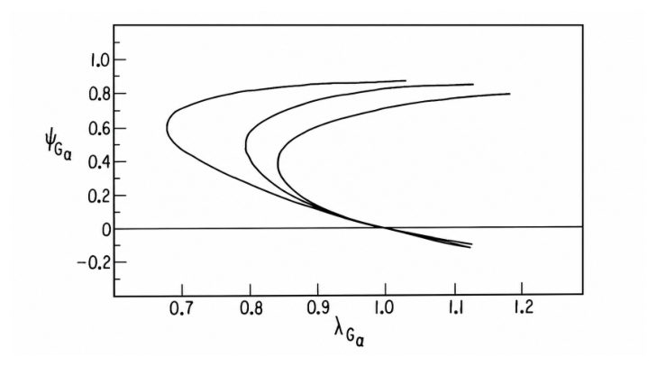 
Figure 4: Two-order-parameter solution curves for a two-dimensional hexagonal lattice at three values of the second-mode coupling. From the leftmost to the rightmost turning point, the curves correspond to λGβ = 0.4, 0.2, and 0.0, respectively. Their common solution (λGα, ψGα) = (1, 0) is marginal but is not the fcc-like returning bifurcation shown in Fig. 1. Adapted from Fig. 1 of Radloff et al. [22].

📷 Fig 5

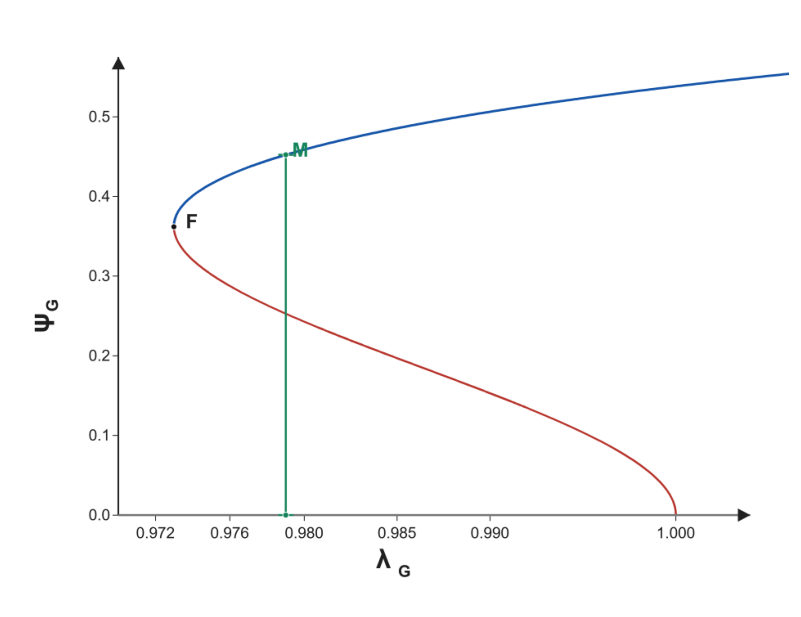 
Figure 5: Expanded one-mode fcc bifurcation diagram near the first bifurcation. The blue and red curves are, respectively, the upper crystalline minimum and the lower barrier branch; the gray horizontal line is the uniform liquid. The branches meet at the fold F, where (λG, ψG) = (0.972991, 0.361937) and the crystalline grand potential is still higher than the liquid value by 0.004328 NkBT. The green vertical segment is the projected Maxwell tie line at M, λG = 0.979014, joining the equal-grand-potential liquid and upper crystalline stationary states.

**Summary.** This theoretical work uses density-functional theory and bifurcation analysis to investigate the transition from liquid states to ordered or disordered packed states in hard-particle systems. It establishes that a specific condition—the vanishing of the grand-potential curvature at a finite wavevector—marks a thermodynamic marginality. This marginality successfully predicts known terminal packing limits across different dimensions, raising fundamental questions about the relationship between liquid correlations and jamming.

**Why it may be interesting.** The rigorous mathematical framework used to analyze the transition from liquid to solid/jammed states, particularly the identification of a 'thermodynamic marginality' distinct from simple phase boundaries, provides powerful tools applicable to understanding complex many-body systems far from equilibrium.

Detailed structure

**Main problem.** The paper seeks to reconcile the theoretical description of liquid freezing (crystallization) with the empirical observation of terminal disordered packing (like random close packing) in various dimensions.

**Main result.** The analysis shows that the vanishing of the grand-potential curvature at a finite wavevector marks a thermodynamic marginality, which yields exact terminal packing in 1D and values near RCP in 2D and 3D.

**Method.** The study employs density-functional theory (DFT) and analyzes the nonlinear Ramakrishnan--Yussouff bifurcation framework to distinguish between crystalline folding, thermodynamic coexistence, and terminal marginality.

**Model / system.** The system under study consists of hard spheres, hard rods, and hard disks in $d=1, 2, 3$ dimensions, analyzed using mean-field descriptions of liquid structure.

**Key observables.** Packing fractions ($\eta$), structure factor $S(k)$, grand-potential curvature ($K_{RY}(G)$), and the coupling constant $\lambda_G$.

**Important parameters / regimes.** Dimensionality ($d=1, 2, 3$), the terminal packing condition ($\lambda_T^G = 1$), and the crystalline close packing fraction.

**Assumptions / limitations.** The analysis relies on the DFT framework and the nonlinear diffusion theory of freezing, distinguishing its findings from mechanical jamming or simple phase transitions.

**Figures summary.** The notes do not provide a summary of figures, but the analysis compares results across different dimensions and structural inputs.

**Paper structure.** The paper progresses by first establishing the DFT framework for freezing, then applying bifurcation analysis to distinguish different transition types, and finally comparing the resulting marginality condition across 1D, 2D, and 3D systems to identify a universal feature.

Abstract

A density-functional theory developed for equilibrium freezing also produces a high-density endpoint close to terminal packing. We revisit the nonlinear Ramakrishnan--Yussouff bifurcation framework and distinguish the first crystalline fold, thermodynamic coexistence, and terminal marginality. At the terminal point, the grand-potential curvature vanishes along the principal finite-wavevector density mode, exactly when the nonlinear self-consistency equation loses stiffness. The construction gives exact close packing for one-dimensional hard rods, a terminal hard-disk packing fraction near 0.8407, and a hard-sphere value near 0.629, close to random close packing. These results identify a finite-wavevector thermodynamic marginality of a metastable liquid continuation, rather than equilibrium freezing or mechanical jamming, and expose a persistent puzzle: why should liquid-state correlations encode the approach to terminal disordered packing across different physical dimensions and systems?

[↑ back to top](#top)

### [Marginal spectral distributions on regular bipartite unitary orbits](http://arxiv.org/abs/2608.30370v1)

**Authors:** Lin Zhang  
**Type:** theory · **Category:** quantum information and computing · **PDF:** <https://arxiv.org/pdf/2608.30370v1>  
**Analysis basis:** full PDF text, analyzed in chunks
**Topic relevance:** `Keldysh / 2PI / non-Gaussian methods` **1/5**

📷 Fig 1

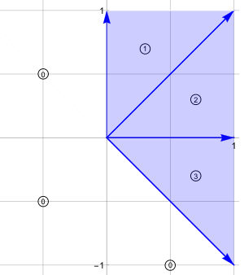 
Figure 1: The graph of G(x, y) and its support

📷 Fig 2

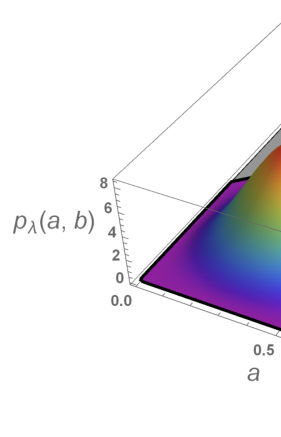 
Figure 2: Joint two-qubit Bloch-radius density pλ(a, b) for λ = ( 4

📷 Fig 3

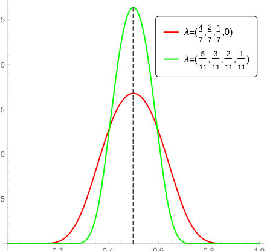 
Figure 3: The probability density curve of a generic eigenvalue of a marginal state of a two-qubit

📷 Fig 4

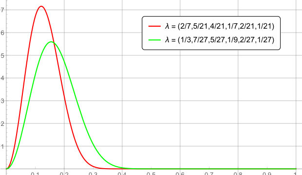 
Figure 4: The probability density curve of a Bloch radius of a marginal state of a qubit-qutrit

📷 Fig 5

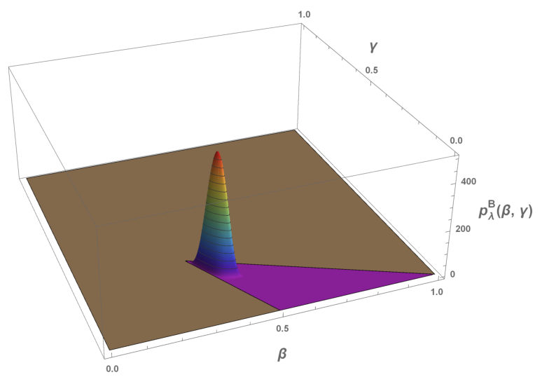 
Figure 5: The joint density of largest and smallest eigenvalues of a qutrit marginal state of a

**Summary.** This theoretical paper calculates the probability distribution of local marginal states ($
ho_A, 
ho_B$) given a fixed global spectrum $
ho_{AB}$ by averaging over random unitaries. It employs advanced mathematical machinery, notably the Harish-Chandra-Itzykson-Zuber integral, to derive explicit, piecewise polynomial formulas for these joint densities. The results provide deep insights into the geometric constraints (compatibility regions) governing local observables in quantum systems.

**Why it may be interesting.** This work provides rigorous mathematical tools (HCIZ integrals, Duistermaat-Heckman theory) to calculate entanglement-related quantities (marginal state distributions) for quantum systems, which is crucial for understanding quantum correlations.

Detailed structure

**Main problem.** The paper studies the probability distributions induced on the spectra of the two marginal states ($
ho_A, 
ho_B$) when the global bipartite density matrix ($
ho_{AB}$) has a fixed spectrum and its eigenbasis is randomized by the Haar measure.

**Main result.** Explicit formulas, including alternating-spline and truncated-power forms, are derived for the joint density of the marginal Bloch radii in the two-qubit case, whose support is constrained by the Bravyi-Klyachko compatibility region.

**Method.** The analysis relies on calculating the joint characteristic function using Harish-Chandra-Itzykson-Zuber (HCIZ) integrals, connecting the problem to Duistermaat-Heckman measures and piecewise polynomial structures.

**Model / system.** The system is a bipartite quantum state $
ho_{AB}$ with subsystems $A$ (dimension $m$) and $B$ (dimension $n$). The analysis is performed by fixing the global spectrum $\lambda$ and averaging over random unitaries.

**Key observables.** Joint density of the two marginal Bloch radii ($p_\lambda(a, b)$), and the joint density of the largest and smallest eigenvalues of one marginal (in the qubit-qutrit case).

**Important parameters / regimes.** The fixed global spectrum $\lambda = (\lambda_1, \dots, \lambda_N)$ and the subsystem dimensions $m$ and $n$.

**Assumptions / limitations.** The global spectrum is assumed to be regular (non-degenerate), with degenerate cases handled via confluent limits of the HCIZ integral.

**Figures summary.** Figure 1 illustrates the support of the joint density $G(x, y)$, and Figure 2 shows the explicit two-qubit Bloch-radius density $p_\lambda(a, b)$ for a specific spectrum $\lambda$.

**Paper structure.** The paper develops the general framework using HCIZ integrals, derives specific formulas for the two-qubit case (Bloch radii), and extends the methodology to higher dimensions (qubit-qutrit) using spline and power formulas.

Abstract

Fix the spectrum of a bipartite density matrix and randomize its eigenbasis according to Haar measure. We study the probability distributions induced on the spectra of the two marginal states. For arbitrary subsystem dimensions $m$ and $n$, the joint characteristic function of the reduced density matrices is expressed as a Harish-Chandra-Itzykson-Zuber integral whose external eigenvalues are the pairwise sums $x_i + y_j$. Repeated external eigenvalues are handled by confluent determinant limits. In the two-qubit case, we derive an explicit alternating-spline formula for the joint density of the two marginal Bloch radii. Its support is the Bravyi-Klyachko compatibility region. We also obtain a compact truncated-power formula for the Bloch-radius density of either individual qubit marginal. In the qubit-qutrit case, we derive a truncated-power formula for the qubit Bloch-radius density and a bivariate spline formula for the joint density of the largest and smallest eigenvalues of the qutrit marginal. The latter two variables determine the full qutrit spectrum because the trace is fixed. The derivations combine confluent HCIZ integrals, distributional Fourier inversion, orbital measures, and the SU(2) and SU(3) derivative principles. The resulting densities are piece-wise polynomial on chambers determined by subset sums of the fixed global eigenvalues, in agreement with the Duistermaat-Heckman description of projected coadjoint-orbit measures.

[↑ back to top](#top)

### [PauLie: Fast Classification of Pauli Dynamical Lie Algebras](http://arxiv.org/abs/2608.30771v1)

**Authors:** Oxana Shaya, Konstantin Golovkin, Mainak Roy, Vincent Russo  
**Type:** theory · **Category:** quantum information and computing · **PDF:** <https://arxiv.org/pdf/2608.30771v1>  
**Analysis basis:** full PDF text, analyzed in chunks
**Topic relevance:** `analog quantum simulation` **1/5**

📷 Fig 1

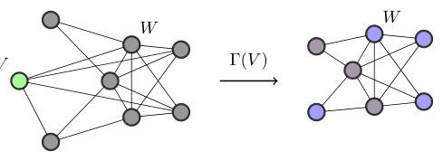 
Figure 1. The anticommutation graph of G = { Y XIZ, ZZII, XIII, ZIII, Y IIX, Y IIZ, Y Y IX, Y Y XX } is drawn in the upper left. Its lightning Γ(V ) is drawn in the upper right where the blue marks lit vertices. The result of contracting V = Y IIX by W = ZIII to XIIX is drawn in the lower left. The lightning after the contraction is shown in the lower right.

📷 Fig 2

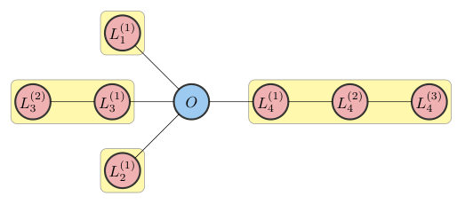 
Figure 2. An example of a canonical starlike graph of type B3. The central vertex is O and leg nodes are denoted by L(j) i where i counts the leg and j counts the node inside the leg. Here nc = 1, n2 = 1 and the associated dynamical Lie algebra is su(8) ⊕su(8).

📷 Fig 3

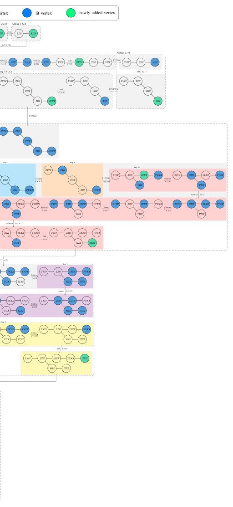 
Figure 3. A visual walkthrough of the example in Table II.

📷 Fig 4

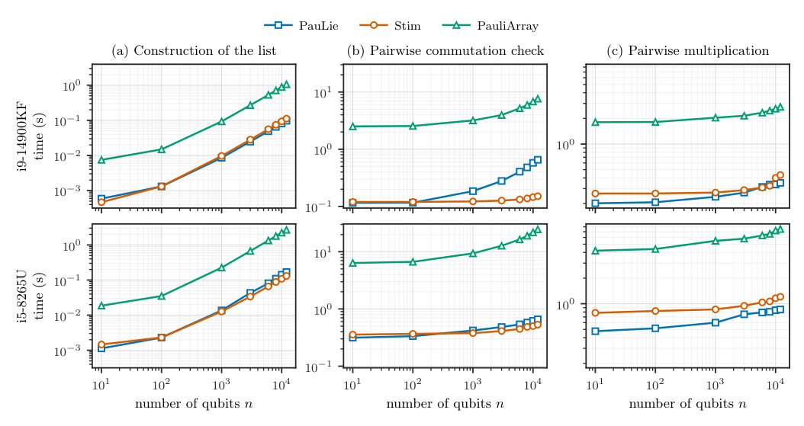 
Figure 4. Backend primitives as a function of the number of qubits, on two processors (rows), for a list of 1000 random Pauli strings: construction of the list (a), and all 1000 2  pairwise commutation checks (b) and pairwise multiplications (c). Each point is the minimum over 100 repetitions on the i9-14900KF and over 30 on the i5-8265U. Both axes are logarithmic and the two rows share a vertical scale within each column. PauLie leads on multiplication at all but two measured points and is level with Stim on construction, the small residual lead flipping between the two processors; on commutation it is overtaken by Stim for n ≳103, where Stim’s cost on the i9-14900KF is nearly flat in n.

📷 Fig 5

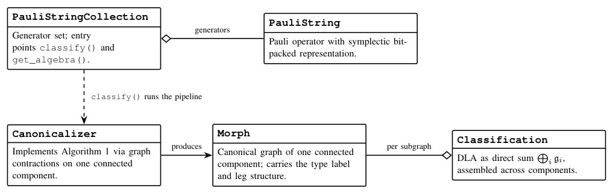 
Figure 5. Class diagram of the PauLie classification pipeline. A PauliStringCollection holds a generator set of PauliStrings. Calling classify() on the collection instantiates a Canonicalizer and a Classification; for each connected component of the anticommutation graph, the Canonicalizer (Algorithm 1) builds a Morph that is added to the Classification. The Classification is stored as an attribute of the PauliStringCollection and assembles the per-component Morphs, as the vertices of the canonical graph, into the direct-sum decomposition of the DLA. A diamond at one end of a connection marks the container side of a “contains-many” relationship (a PauliStringCollection contains many...

**Summary.** This paper presents PauLie, a novel, efficient framework for classifying the isomorphism type of Dynamical Lie Algebras generated by Pauli strings. By utilizing graph-theoretic reduction on the anticommutation graph, it bypasses the exponential complexity of traditional Lie closure methods. This tool is vital for analyzing quantum control, understanding system symmetries, and diagnosing issues like barren plateaus in quantum algorithms.

**Why it may be interesting.** It provides a powerful, polynomial-time tool to analyze the underlying algebraic structure of quantum dynamics generated by Pauli operators, which is critical for understanding the limitations and symmetries of variational quantum algorithms.

Detailed structure

**Main problem.** The primary challenge is efficiently determining the isomorphism type of the Dynamical Lie Algebra (DLA) generated by arbitrary Pauli strings, as explicit computation scales exponentially with the number of qubits.

**Main result.** The authors introduce PauLie, an open-source framework that classifies the DLA isomorphism type in polynomial time, $O(n|G| \max(n, |G|))$.

**Method.** The method uses a graph-theoretic reduction algorithm based on the anticommutation relations of the generators, systematically applying graph contractions to map the structure to a canonical graph (Type A or B).

**Model / system.** The system involves quantum evolution governed by Hamiltonians that are sums of Pauli strings. The DLA dictates the system's controllability and expressibility.

**Key observables.** The canonical graph structure (Type A, B1, B2, B3) serves as the classification invariant, which determines the DLA's algebraic isomorphism type.

**Important parameters / regimes.** The complexity scales polynomially with the number of qubits ($n$) and the number of generators ($|G|$).

**Assumptions / limitations.** The algorithm assumes the input is an arbitrary set of Pauli strings and relies on graph-theoretic properties derived from anticommutation relations.

**Figures summary.** Figures illustrate the contraction process on anticommutation graphs and show examples of canonical graph structures (e.g., Type B3) corresponding to specific DLA isomorphisms.

**Paper structure.** The paper introduces the problem, details the graph-theoretic canonicalization procedure (Algorithm 1), analyzes the computational complexity, and demonstrates the framework's utility as a structural oracle for quantum simulation and diagnosing barren plateaus.

Abstract

The dynamical Lie algebra (DLA) governs the controllability, expressibility, and simulation complexity of a quantum system. Explicitly computing it has been a major computational bottleneck: brute-force Lie closure scales exponentially in the number of qubits $n$. Many applications, however, consult only the isomorphism type of the DLA. We introduce PauLie, an open-source framework that decides this isomorphism type for DLAs generated by arbitrary Pauli strings, building on the anticommutation-graph reduction of Aguilar et al. PauLie runs in $O(n|\mathcal{G}|\max(n,|\mathcal{G}|))$ time, where $|\mathcal{G}|$ is the number of generators, turning DLA classification into a routine preprocessing step. We demonstrate its use as a structural oracle for routing Lie-algebraic simulation and Cartan decomposition, diagnosing barren plateaus in variational quantum algorithms, and engineering universal Pauli string generator sets with optimal generation rate.

[↑ back to top](#top)

### [Phase stability, charge ordering, and charge-liquid formation in the Falicov-Kimball model on triangular and kagome lattices](http://arxiv.org/abs/2608.28898v1)

**Authors:** Ammar Nejati, Marvin Lenk  
**Type:** theory · **Category:** strongly correlated electrons · **PDF:** <https://arxiv.org/pdf/2608.28898v1>  
**Analysis basis:** full PDF text, analyzed in chunks
**Topic relevance:** `analog quantum simulation` **1/5**

📷 Fig 1

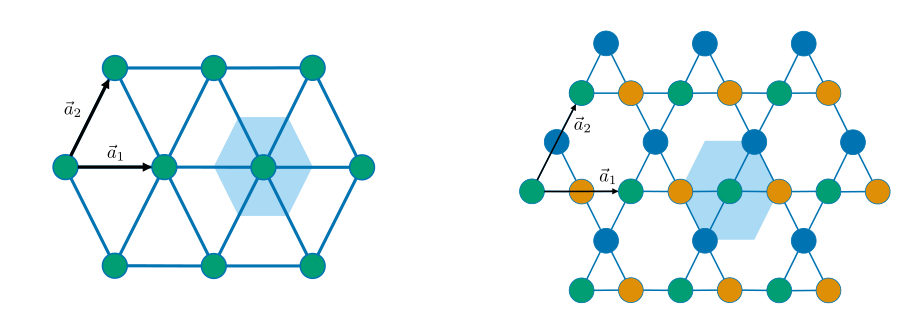 
Figure 1: Illustration of finite-sized triangular (left) and kagome (right) lattices. The light-blue hexagon indicates the conventional unit cell.

📷 Fig 2

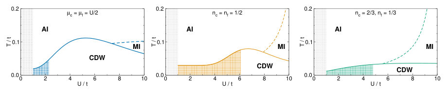 
Figure 2: Phase diagram of the triangular lattice for FCP, CHF, and GHF cases as mentioned in the text, at vanishing next-nearest-neighbor hopping, tNNN = 0. The region U/t &lt; 1 is grayed out due to restrictions of the applied methods. The colored shaded regions mark the charge-liquid sector, i.e. the non-universal regime that precedes the onset of long-range CDW order, where several ordering wavevectors compete with each other.

📷 Fig 3

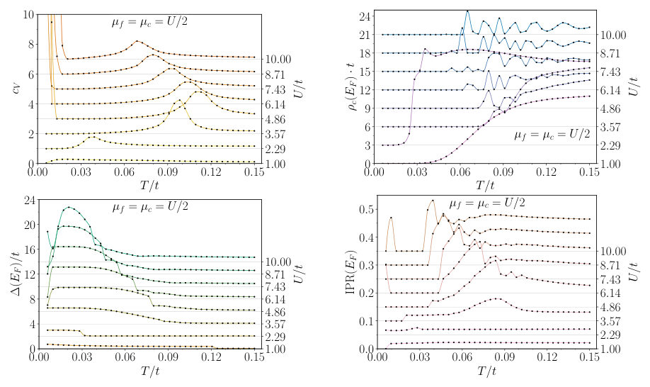 
Figure 3: Specific heat cv(T), c-DoS ρc(EF , T), c-electron gap ∆(EF , T), and IPR(EF , T) for the FCP case on the triangular lattice. For clarity, curves corresponding to larger U are vertically offset relative to the preceding one, where respective individual baselines are drawn for each curve.

📷 Fig 4

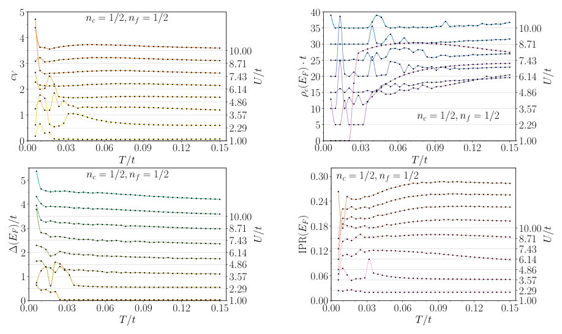 
Figure 4: Specific heat cv(T), c-DoS ρc(EF , T), c-electron gap ∆(EF , T), and IPR(EF , T) for the CHF case on the triangular lattice. For clarity, curves corresponding to larger U are vertically offset relative to the preceding one, where respective individual baselines are drawn for each curve.

📷 Fig 5

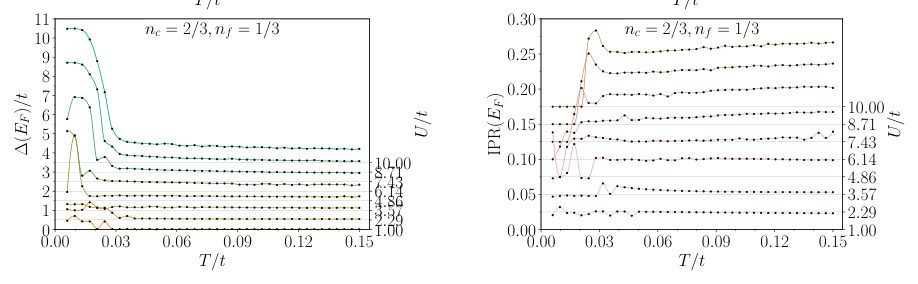 
Figure 5: Specific heat cv(T), c-DoS ρc(EF , T), c-electron gap ∆(EF , T), and IPR(EF , T) for the GHF case on the triangular lattice. For clarity, curves corresponding to larger U are vertically offset relative to the preceding one, where respective individual baselines are drawn for each curve.

**Summary.** This paper uses MCMC simulations to map the phase diagram of the Falicov-Kimball model on triangular and kagome lattices. It finds that lattice geometry is crucial, leading to distinct behaviors like CDW formation on the triangular lattice versus Mott-like insulation on the kagome lattice. The work highlights the complex interplay between correlation, geometry, and charge ordering in strongly correlated materials.

**Why it may be interesting.** The study provides detailed insights into how lattice topology (non-bipartite geometry) and particle-hole symmetry breaking fundamentally alter the ground state and phase transitions in correlated electron models.

Detailed structure

**Main problem.** The study systematically investigates the phase stability, charge ordering, and charge-liquid formation in the Falicov-Kimball model on two-dimensional non-bipartite lattices.

**Main result.** The lattice geometry critically dictates the phase diagram; the triangular lattice exhibits CDW phases, while the kagome lattice shows an insulating ground state without CDW ordering.

**Method.** The research employs Markov-chain Monte Carlo (MCMC) simulations to analyze the system's behavior under various filling conditions and hopping perturbations.

**Model / system.** The system is the spinless Falicov-Kimball model, describing itinerant ($c$) and localized ($f$) fermions interacting via a Coulomb repulsion ($U$) on triangular and kagome lattices.

**Key observables.** Specific heat capacity ($c_v(T)$), charge susceptibilities ($\chi(q, T)$), gap ($\Delta$), and Inverse Participation Ratio (IPR).

**Important parameters / regimes.** Coulomb interaction strength ($U$), lattice geometry (triangular vs. kagome), and filling conditions (fixed chemical potentials, generalized/conventional half-filling).

**Assumptions / limitations.** The analysis probes stability across different ensembles (grand-canonical vs. canonical) and assumes the effect of perturbatively small next-nearest-neighbor hopping ($t_{NNN}$).

**Figures summary.** Figure 1 illustrates the finite-sized triangular and kagome lattices used for the simulations.

**Paper structure.** The paper systematically examines the phase diagram by testing three different filling conditions on both the triangular and kagome lattices, analyzing the emergence of CDW, Mott, and charge-liquid regimes.

Abstract

We present a systematic investigation of the stability of the phase diagram of the spinless Falicov-Kimball model on two-dimensional non-bipartite lattices, the triangular and kagome lattices, using Markov-chain Monte Carlo simulations. Three filling or chemical potential conditions are examined: fixed chemical potentials ($μ_f = μ_c = U/2$), "generalized" half-filling ($\bar{n}_f = 1/3$, $\bar{n}_c = 2/3$), and conventional half-filling ($\bar{n}_f = \bar{n}_c = 1/2$). For each condition, the effects of a perturbatively small next-nearest-neighbor hopping are studied. On the triangular lattice, Anderson insulator, Mott insulator, and charge-density wave (CDW) phases are found in all cases, with the CDW driven by Coulomb-interaction-mediated nesting. Evidence for a charge-liquid regime is found in the region between the weakly correlated regime and the CDW, characterized by competing charge-ordering wavevectors and the absence of universal scaling behavior, whose extent shrinks progressively from the grand-canonical to the conventional half-filling condition. On the kagome lattice, the CDW phase is completely absent; instead, an insulating ground state, plausibly of the Mott type, is found, with signatures of a possible quantum phase transition at zero temperature. Our results establish the crucial role of lattice geometry and particle-hole symmetry breaking in shaping the phase diagram of correlated electron systems.

[↑ back to top](#top)

### [Pseudo Entropy in Quantum Spin Chains: from Integrability to Chaos](http://arxiv.org/abs/2608.29810v1)

**Authors:** Tara Bahadur Rana, Yadav Raj Dahal, Kiran Adhikari  
**Type:** theory · **Category:** disordered systems and neural networks · **PDF:** <https://arxiv.org/pdf/2608.29810v1>  
**Analysis basis:** full PDF text, analyzed in chunks
**Topic relevance:** `analog quantum simulation` **1/5**

📷 Fig 1

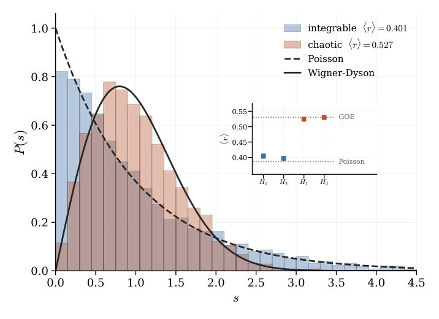 
Figure 1. Level spacing distribution P(s) for the Heisenberg XXZ spin chain at N = 15 in the magnetization sector N↑= 7, with both reflection-parity sectors H1 (even) and H2 (odd) resolved and combined. The integrable chain, Eq. (19) with J = 1.0, Jz = 0.5, α = 0. The NNN-deformed chain, Eq. (21) with J = J′ = 1.0, Jz = J′ z = 0.5, α = 1.

📷 Fig 2

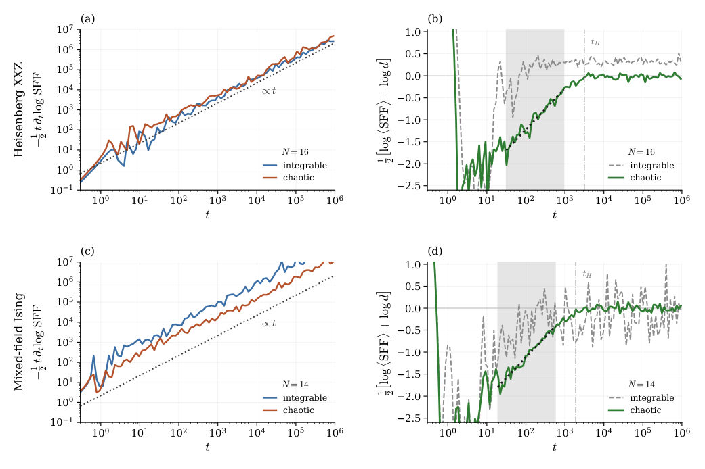 
Figure 2. Decomposition of the real pseudo entropy according to Eq. (17) at β = 0 (infinite temperature), for the Heisenberg XXZ chain with N = 16 (top row) and the mixed-field Ising chain with N = 14 (bottom row). Parameters: XXZ chain, J = 1.0, Jz = 0.5, with the chaotic case obtained by adding P

📷 Fig 3

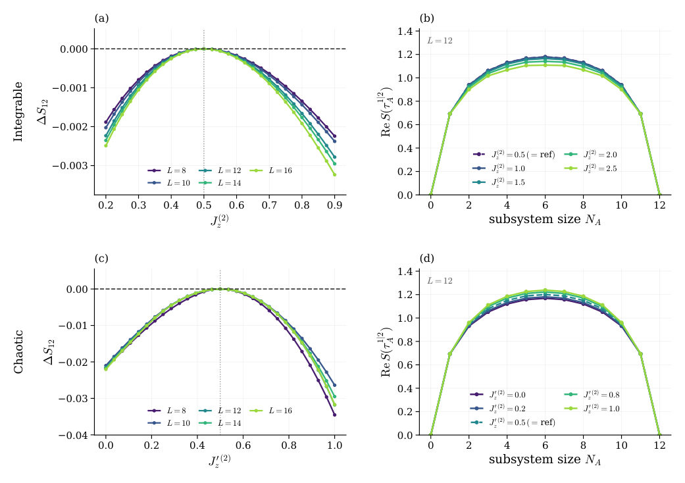 
Figure 3. Spatial pseudo entropy within the critical phase for L = 8–16. (a) ∆S12 versus J(2) z , integrable case, J(1) z = 0.5. (b) Pseudo entropy versus NA, integrable case, L = 12, for several J(2) z ; the dashed curve is the self-comparison state. (c),(d) As in (a),(b) for the chaotic case, swept in J(2) c at J(1) z = J(2) z = 0.5.

📷 Fig 4

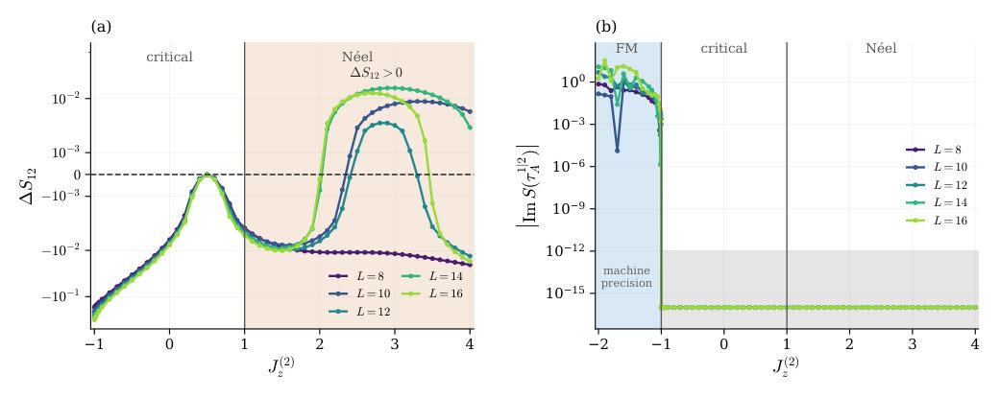 
Figure 4. Spatial pseudo entropy across the XXZ phase diagram, integrable case, L = 8–16, J(1) z = 0.5. (a) ∆S12 versus J(2) z across critical and Néel phases, on a symmetric-log scale (linear for |∆S12| &lt; 2×10−3). The bound ∆S12 ≤0 holds throughout −1 &lt; J(2) z ≤1 but is violated for L ≥10 at J(2) z ≳2.1, with peak magnitude ∼1.7 × 10−2. (b) |Im S(TA)| versus J(2) z , showing the onset at the SU(2)-symmetric point J(2) z = −1.

📷 Fig 5

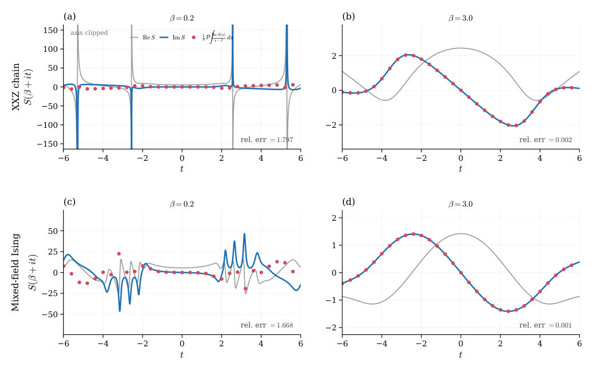 
Figure 5. The thermal pseudo entropy at N = 8, evaluated on the continuously continued branch of log Z. Red points: the Hilbert transform of Re S, computed over |s| ≤400. (a),(b) XXZ chain at Jz = 0.5; (c),(d) mixed-field Ising chain. At β = 0.2 Fisher zeros lie inside the dispersion contour, i.e. βk &gt; β and the reconstruction fails. At β = 3.0 the KK relation holds.

**Summary.** This work develops and applies the concept of pseudo entropy to study quantum chaos in spin chains. By analyzing how pseudo entropy evolves, the authors successfully distinguish between integrable and chaotic dynamics, showing that the real part exhibits a characteristic signature of chaos. This framework also connects to spectral complexity and suggests potential applications in quantum gravity and holography.

**Why it may be interesting.** The use of entanglement-like measures (pseudo entropy) to diagnose fundamental quantum dynamics (chaos vs. integrability) provides a powerful, quantifiable tool applicable to many-body systems beyond standard spectral analysis.

Detailed structure

**Main problem.** The paper investigates whether 'pseudo entropy' can serve as a diagnostic tool to distinguish between quantum chaotic and integrable regimes in quantum spin chains.

**Main result.** The real part of the pseudo entropy exhibits the characteristic dip, logarithmic ramp, and plateau structure associated with quantum chaos, while critical scaling persists across both integrable and chaotic regimes.

**Method.** The study employs the definition of pseudo entropy, derived from the von Neumann entropy of transition matrices, and relates its real part to the Spectral Form Factor (SFF).

**Model / system.** The analysis focuses on quantum spin chains, specifically the Heisenberg XXZ model and the mixed-field Ising model, which are deformed by adding next-to-nearest-neighbor interactions.

**Key observables.** Pseudo entropy (thermal and spatial), Spectral Form Factor (SFF), and spectral complexity.

**Important parameters / regimes.** The deformation strength $\alpha$ controlling the transition from integrable ($\alpha=0$) to chaotic ($\alpha=1$) behavior.

**Assumptions / limitations.** The analysis relies on deriving exact relations connecting pseudo entropy, relative pseudo entropy, and spectral complexity, and assumes the applicability of holographic concepts.

**Figures summary.** Figures illustrate level spacing distributions showing Poisson (integrable) vs. Wigner-Dyson (chaotic) statistics, and the time evolution of the pseudo entropy term exhibiting the characteristic dip-ramp-plateau structure in the chaotic case.

**Paper structure.** The paper progresses by first defining pseudo entropy and relating its real part to the SFF. It then applies this diagnostic tool to the XXZ chain, showing the transition from Poisson to GOE statistics. Finally, it establishes deeper connections between pseudo entropy, relative pseudo entropy, and spectral complexity, suggesting holographic implications.

Abstract

In this work, we study pseudo entropy and spectral dynamics in quantum spin chains (Heisenberg XXZ model and the mixed-field Ising model) to investigate whether they can serve as diagnostics of quantum chaos. First, we derive an exact relation between the real part of the thermal pseudo entropy and the spectral form factor. This provided evidence that pseudo entropy could exhibit the characteristic dip, logarithmic ramp, and plateau, implying the precise manner in which pseudo entropy probes chaos. We found that the imaginary part, while it does not diagnose chaos, can still provide crucial information about Fisher zeros that is not available in the real counterpart. For spatial pseudo entropy in the XXZ chain, we find that the logarithmic critical scaling persists in both integrable and chaotic regimes, and that the non-positivity conjecture holds. Finally, we derive an exact connection between pseudo entropy, relative pseudo entropy, and spectral complexity with a potential connection to holography.

[↑ back to top](#top)

### [Quantum Natural Gradient on Quotient Spaces](http://arxiv.org/abs/2608.29350v1)

**Authors:** Zeyu Chen  
**Type:** theory · **Category:** quantum information and computing · **PDF:** <https://arxiv.org/pdf/2608.29350v1>  
**Analysis basis:** full PDF text, analyzed in chunks
**Topic relevance:** `quantum measurements` **1/5**

📷 Fig 1

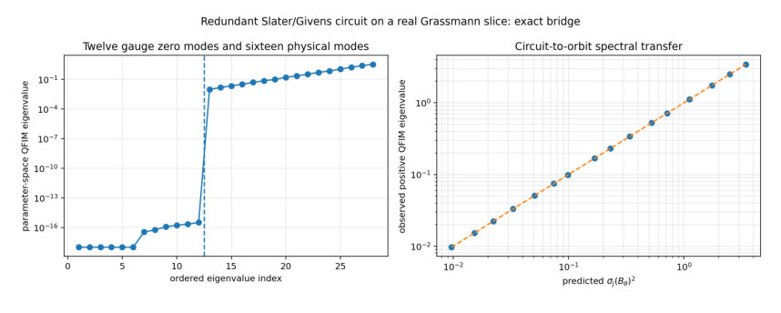 
FIG. 1. Circuit-to-orbit Fisher transfer in the redundant Slater/Givens circuit. The intrinsic real-Grassmann Fisher operator is isotropic, while the gate-coordinate QFIM has condition number 356.548. The factorization F = BTB has relative error 1.273 × 10−10, and the exact pseudoinverse update induces the intrinsic real-Grassmann gradient to angular error 1.207 × 10−6

📷 Fig 2

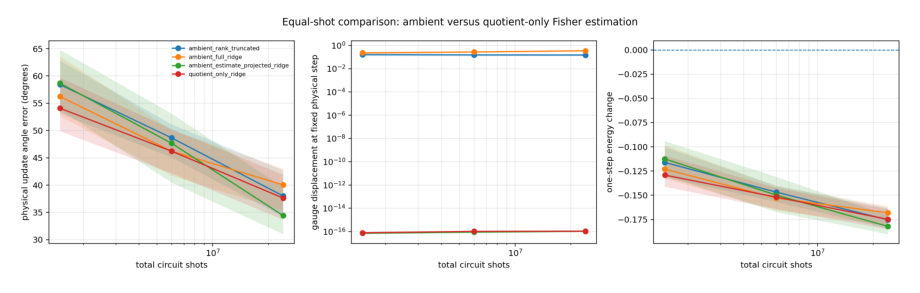 
FIG. 2. Equal-total-shot comparison for ambient and quotient estimators. Curves show medians and interquartile ranges over 64 replicates. Structural projection eliminates gauge displacement, while quotient-only estimation spends the fixed budget on the smaller physical block.

📷 Fig 3

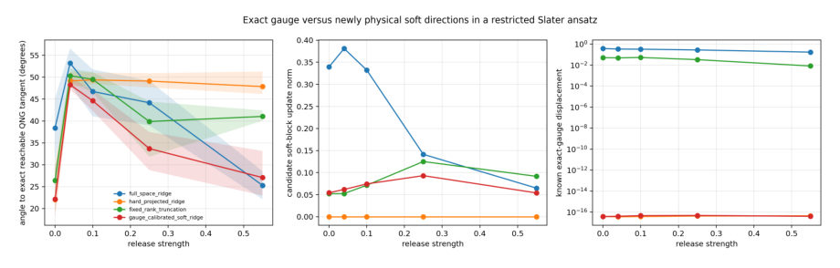 
FIG. 3. Exact-gauge and physical-soft-mode tradeoff under continuous release. Six candidate directions acquire physical Fisher weight while six known exact gauge directions remain redundant. Hard projection becomes biased after release, whereas the gauge-calibrated anisotropic rule retains candidate motion and eliminates displacement in the known gauge block. The plotted rule is the low-cost gauge-noise proxy motivated by theorem V.15; theorem V.16 supplies the corresponding independent-pilot, confidence-certified scalar alternative.

**Summary.** This theoretical paper develops the Quantum Natural Gradient (QNG) framework for quantum circuits suffering from parameter redundancies. It mathematically proves how to correctly compute the gradient on the resulting quotient space, providing a robust optimization tool. This is vital for designing stable and accurate variational quantum algorithms by separating true physical distinguishability from parametrization artifacts.

**Why it may be interesting.** This work provides a rigorous, coordinate-independent mathematical framework for optimizing quantum circuits, which is crucial for developing robust quantum machine learning algorithms that can handle physical symmetries and redundancies.

Detailed structure

**Main problem.** The paper addresses the mathematical challenge of defining and optimizing Quantum Natural Gradient (QNG) when the parameterization of a quantum state is redundant, leading to a singular Quantum Fisher Information Matrix (QFIM).

**Main result.** It proves that the Moore--Penrose update correctly implements the minimum-norm horizontal lift of the quotient Riemannian gradient under specific conditions of redundancy exhaustion.

**Method.** The methodology involves formulating the problem on the parameter quotient space, utilizing representation theory, and developing a 'circuit-to-orbit transfer principle' to separate intrinsic state distinguishability from circuit-coordinate distortion.

**Model / system.** The model involves parametrized quantum circuits, $
ho(	heta) = U(	heta)
ho_0U(	heta)^\dagger$, used in variational quantum algorithms to prepare quantum states.

**Key observables.** Quantum Fisher Information Matrix (QFIM), intrinsic orbit Fisher operator, principal-defect ratios, and finite-shot resource-accuracy tradeoffs.

**Important parameters / regimes.** Learning rate ($\eta$), noise scaling ($s$), and the structure of the redundancy group ($\Gamma$).

**Assumptions / limitations.** The analysis assumes the existence of a smooth state map into the orbit and relies on local differentiability and spectral gap conditions for convergence proofs.

**Paper structure.** The paper progresses from defining QNG on quotient spaces to establishing the mathematical equivalence between the pseudoinverse update and the true quotient gradient. It then applies this framework to specific physical scenarios (e.g., flag orbits) and concludes with rigorous analyses of finite-shot noise and gauge removal.

Abstract

Parametrized quantum circuits often contain state-preserving redundancies that make the quantum Fisher information matrix (QFIM) singular even when the physical state manifold is regular. We formulate quantum natural gradient (QNG) on the resulting parameter quotient and prove that, when the prescribed redundancy exhausts the Fisher kernel, the Moore--Penrose update is the minimum-norm horizontal lift of the quotient Riemannian gradient. A circuit-to-orbit transfer principle separates intrinsic state distinguishability from circuit-coordinate distortion and gives the exact condition under which a circuit realizes an intrinsic orbit-QNG direction. Representation theory then yields root-resolved Fisher scales on highest-weight flag orbits and isotropic intrinsic metrics for Slater and fermionic-Gaussian manifolds. On cominuscule embeddings, intrinsic fidelity QNG conserves principal-defect ratios and reduces to one scalar equation; Lie-retracted steps are locally cubic at $η=2$, with stability boundary $η=4$. For finite-shot implementations, we separate exact gauge removal from regularization of physical soft modes, obtain zero cumulative gauge drift under structural projection, and derive confidence-controlled soft-mode rules. Under depolarization, inverse-Fisher scaling restores deterministic scale only by amplifying fluctuations and therefore cannot recover a lost update signal-to-noise ratio. A redundant Slater/Givens circuit verifies the transfer law and the predicted finite-shot tradeoffs.

[↑ back to top](#top)

### [Size-Independent Robustness in Multipartite Bell Self-Testing](http://arxiv.org/abs/2608.30851v1)

**Authors:** Shen Cao, Xingjian Zhang, Fei Shi, Qi Zhao  
**Type:** theory · **Category:** quantum information and computing · **PDF:** <https://arxiv.org/pdf/2608.30851v1>  
**Analysis basis:** full PDF text, analyzed in chunks
**Topic relevance:** `quantum measurements` **1/5**

📷 Fig 1

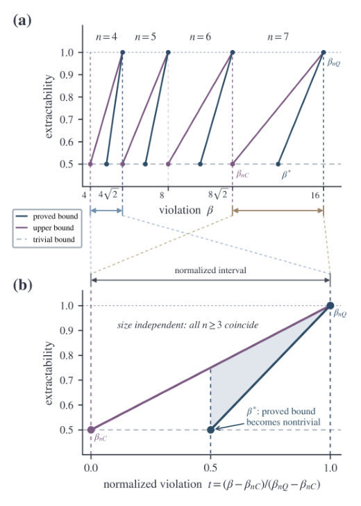 
FIG. 1. Size-independent robust self-testing. (a) The proved bound and the upper bound of Eq. (3) versus the raw violation β for the windows [2n/2, 2(n+1)/2], n = 4, . . . , 7: βnC and βnQ are the window boundaries, and β∗= (βnC + βnQ)/2 is the onset of nontriviality. (b) Under the normalization t = (β −βnC)/(βnQ −βnC), for each n the window collapses onto the two universal lines Ξ = t and Ξ = (1 + t)/2, i.e. the robustness is independent of the number of parties.

📷 Fig 2

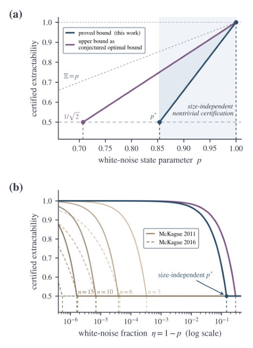 
FIG. 2. White-noise robustness. (a) Certified extractability for ρp = p |GHZn⟩⟨GHZn| + (1 −p)I/2n: the proved bound becomes nontrivial at p∗= (2+ √

📷 Fig 3

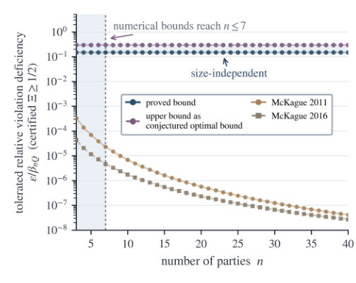 
FIG. 3. Tolerance versus number of parties: largest rela- tive violation deficiency η = ε/βnQ certifying Ξ ≥1/2. The proved bound and the upper bound of Eq. (3) are flat in n (a constant factor-of-two gap), whereas the previously known analytic tests for all n (McKague) decay with the number of parties; the shaded band at n ≤7 marks the reach of numer- ical operator-inequality bounds.

📷 Fig 4

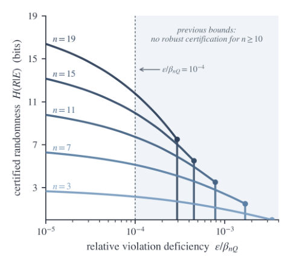 
FIG. 4. Certified randomness versus the relative violation deficiency ε/βnQ for n = 3, 7, 11, 15, 19 (all n ≡3 (mod 4), for which Hideal(n) = n on input 0): each curve approaches its asymptotic limit, the Hideal(n) = n ticks on the vertical axis, and terminates at its own nontriviality threshold, marked by the solid vertical segments. At the reference noise ε/βnQ = 10−4 (dashed line), the certified randomness ranges from ≈2 bits (n = 3) to ≈12 bits (n = 19).

📷 Fig 5

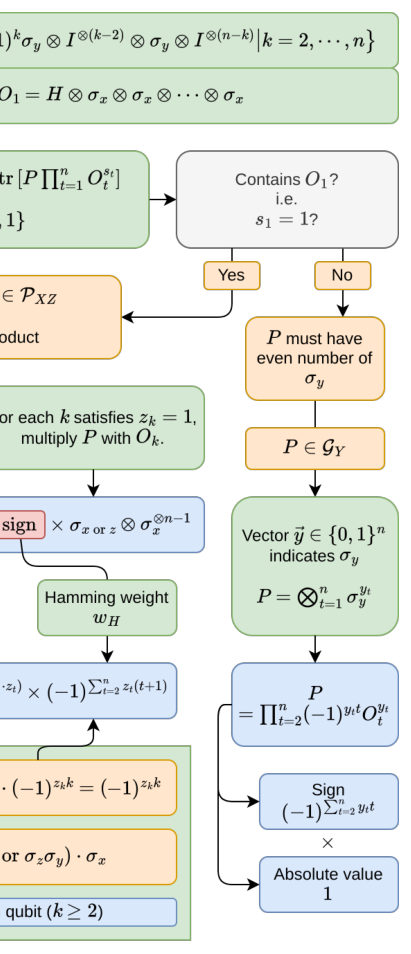 
FIG. 5. Sketch of proof of Observation 4.

**Summary.** This paper develops a novel, size-independent theoretical framework to robustly self-test multipartite entanglement in large $n$-qubit GHZ states. By deriving a linearly scaling bound, the authors overcome the major limitation of previous methods that failed for large systems. This breakthrough enables the device-independent certification of GHZ entanglement and provides a lower bound on extractable randomness for arbitrary network sizes.

**Why it may be interesting.** This work provides a powerful, scalable theoretical tool for certifying high-dimensional entanglement resources in quantum networks, which is crucial for realizing fault-tolerant quantum computation and communication.

Detailed structure

**Main problem.** The primary goal is to establish a robust, size-independent method for self-testing multipartite entanglement, specifically for $n$-qubit Greenberger-Horne-Zeilinger (GHZ) states.

**Main result.** The authors derive a self-testing bound for GHZ states that scales linearly with the observed error and remains robust even as the system size ($n$) increases arbitrarily, enabling scalable device-independent verification.

**Method.** The work utilizes the operator-inequality framework applied to the MABK inequality, reducing the verification of the optimal bound to an efficient numerical check.

**Model / system.** The analysis focuses on $n$-qubit GHZ states, which are fundamental resources for large-scale quantum networks. The context is device-independent self-testing, certifying entanglement based only on classical statistics.

**Key observables.** Self-testing bound ($\Xi$), observed violation error ($eta$), and the conditional entropy $H(R|E)$ certified from the state.

**Important parameters / regimes.** The bound's robustness is shown to be independent of $n$, contrasting with previous bounds that degrade with system size. The analysis tracks the relative violation deficiency ($\eta$).

**Assumptions / limitations.** The analysis assumes the use of the operator-inequality framework and relies on bounding the total trace distance by decomposing it into measurement, state, and translation residual errors.

**Figures summary.** Figures compare the derived size-independent robust bounds against older, decaying bounds, showing the stability of the new result. Another figure compares certified randomness rates against the relative violation deficiency.

**Paper structure.** The paper develops by first establishing the size-independent bound for self-testing, then extending the framework to derive a device-independent lower bound on conditional entropy for Randomness Generation, using sequential bounding techniques.

Abstract

Practical robust self-testing of multipartite entanglement has so far been restricted to small-scale systems due to error bounds that degrade severely with system size. In this work, we establish multipartite self-testing with robustness independent of the size of the quantum network. We derive a fully analytic, device-independent self-testing bound for $n$-qubit Greenberger-Horne-Zeilinger (GHZ) states. The bound scales linearly with the observed violation error and lies universally within a constant factor of two from a theoretical upper bound. Furthermore, the operator-inequality framework reduces the verification of the conjectured optimal bound to a highly efficient numerical check, which we perform up to $n=100$. Consequently, GHZ entanglement can be certified under a fixed noise level in arbitrarily large systems, enabling scalable device-independent verification.

[↑ back to top](#top)

### [SpiderLS: Leveraging Full ZX Reduction for Lattice Surgery Compilation](http://arxiv.org/abs/2608.30228v1)

**Authors:** Hyungseok Kim, Changheon Lee, Seungjik Kim, Enhyeok Jang, Youngmin Kim, Seungwoo Choi, Hanbit Lee, Sungho Pyun, Won Woo Ro  
**Type:** theory · **Category:** quantum information and computing · **PDF:** <https://arxiv.org/pdf/2608.30228v1>  
**Analysis basis:** full PDF text, analyzed in chunks
**Topic relevance:** `quantum measurements` **1/5**

📷 Fig 1

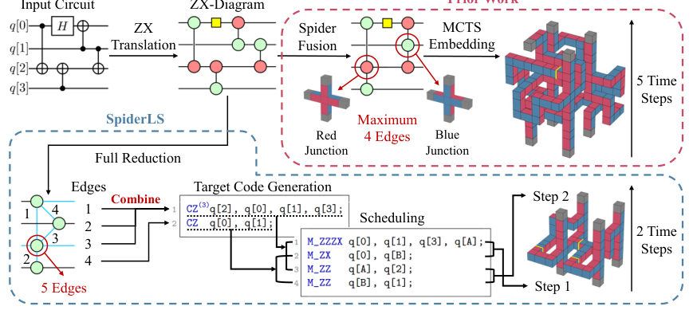 
Figure 1. Overview of SpiderLS in comparison with prior ZX-based lattice surgery compilation approach [39]. Prior work [39] reduces ZX-diagram using only spider fusion and performs layer-wise embedding via MCTS. In contrast, SpiderLS employs full ZX reduction, generates high-arity interactions, and performs layered spacetime routing.

📷 Fig 2

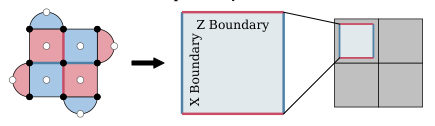 
Figure 2. Rotated surface code.

📷 Fig 3

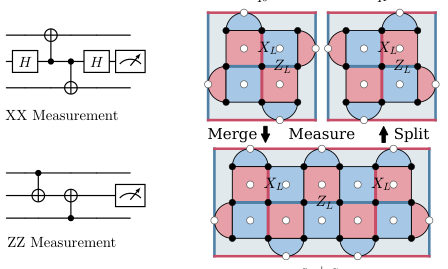 
Figure 3. Pauli product measurements in quantum circuits and surface codes.

📷 Fig 4

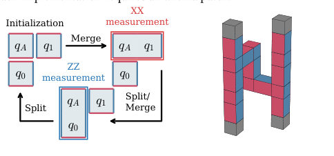 
Figure 4. Controlled gate implemented by lattice surgery.

📷 Fig 5

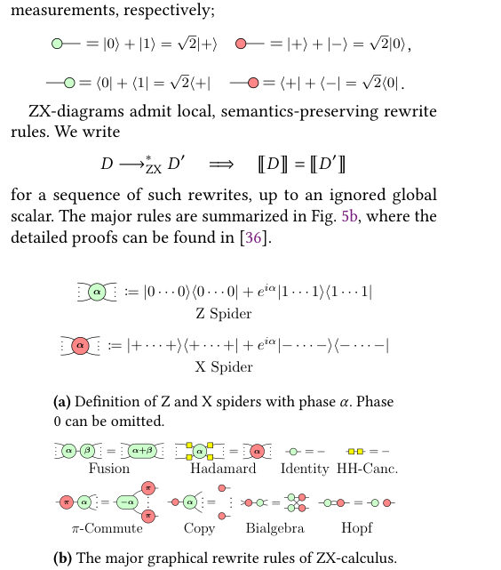 
Figure 5. Basic concepts of ZX-calculus.

**Summary.** This paper introduces SpiderLS, a novel compiler that enhances the translation of quantum circuits into lattice surgery operations for the surface code. By leveraging full ZX reduction, SpiderLS overcomes limitations in representing high-arity interactions, leading to substantial reductions in the required spacetime volume and compilation time compared to existing state-of-the-art methods.

**Why it may be interesting.** While focused on quantum computation, the rigorous resource estimation (spacetime volume) and the need for efficient compilation techniques are highly relevant to understanding the physical overheads associated with implementing complex quantum algorithms on near-term hardware.

Detailed structure

**Main problem.** The core problem is efficiently compiling fault-tolerant quantum circuits into physical lattice surgery operations for the surface code while minimizing the resulting spacetime resource cost.

**Main result.** SpiderLS achieves significant performance gains, showing average reductions of 49.2% in spacetime volume and 99.8% in compilation time compared to previous ZX-based compilers.

**Method.** The method extends prior work by utilizing full ZX reduction, allowing the representation of higher-arity interactions, which are then compiled into multi-target Pauli-product measurements.

**Model / system.** The work focuses on the surface code, where computation is realized via lattice surgery—the merging and splitting of encoded qubit patches using Pauli-product measurements (PPMs). ZX-calculus serves as the intermediate representation.

**Key observables.** Spacetime volume (primary cost metric), compilation time, and T-port density ($
ho_T$).

**Important parameters / regimes.** The degree of the ZX junction ($	ext{deg}(v)$), which is constrained in prior methods but overcome by multi-patch measurements.

**Assumptions / limitations.** The key assumption is that higher-arity interactions, previously limited by the single-junction degree bound ($\le 4$), can be accurately realized through multi-patch measurements in lattice surgery.

**Figures summary.** Figures compare the process flow between prior restricted compilation and SpiderLS's full reduction approach; they also illustrate surface code structures, PPMs, and the comparison of spacetime volume across various benchmarks.

**Paper structure.** The paper introduces the problem of lattice surgery compilation, contrasts the limitations of prior ZX-based methods (restricted reduction), proposes SpiderLS using full ZX reduction and multi-target operations, details the compiler passes (ordering, grouping, lowering), and validates the approach across multiple algorithmic and random workloads.

Abstract

Lattice surgery compilation plays a central role in translating fault-tolerant quantum programs into efficient surface code realizations, where both spatial and temporal resources directly determine the cost of execution. Recent work has demonstrated the benefits of using ZX-diagrams as an intermediate representation for lattice surgery compilation, enabling semantics-preserving transformations that reduce spacetime cost. However, existing compilation restricts ZX reduction to preserve diagram structures that can be directly embedded as lattice surgery junctions. We present SpiderLS, which extends prior approach by leveraging full ZX reduction. To translate the resulting diagram into executable lattice surgery operations, SpiderLS applies a sequence of compiler passes that derives an execution order, generates target code by grouping compatible interactions into multi-target operations, and lowers the target code to Pauli-product measurements. The resulting explicit patch and Pauli-boundary requirements guide logical scheduling and structure-aware spacetime routing. Across representative algorithmic and random workloads, SpiderLS achieves average reductions of 49.2% in spacetime volume and 99.8% in compilation time compared with the prior ZX-based compiler.

[↑ back to top](#top)

### [Spin-Graviton-Spin: a unique probe of quantum gravity](http://arxiv.org/abs/2608.28901v1)

**Authors:** Radmehr Fathi, Nima Khosravi  
**Type:** theory · **Category:** other · **PDF:** <https://arxiv.org/pdf/2608.28901v1>  
**Analysis basis:** full PDF text, analyzed in chunks
**Topic relevance:** `quantum measurements` **1/5**

📷 Fig 1

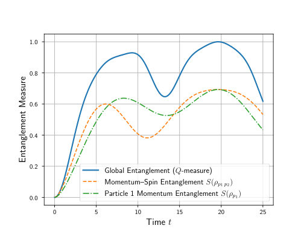 
FIG. 1: The Meyer-Wallach Q-measure for global entangle- ment and the von Neumann entropy of the momentum-spin entanglement and the first particle momenta. For drawing this graph we assumed that J = 1(eV) and p0

**Summary.** This theoretical paper investigates how to find a unique experimental signature for quantum gravity by analyzing the interaction between two spin-1/2 particles mediated by a spin-2 graviton. The authors derive a unique dipole-dipole coupling term, confirming its existence through multiple calculation methods, including the Foldy-Wouthuysen transformation. The work highlights the theoretical challenge of isolating gravitational effects from other potential sources.

**Why it may be interesting.** While focused on gravity, the systematic use of the Foldy-Wouthuysen transformation to derive effective Hamiltonians for spin-dependent interactions is a powerful technique applicable to any system where relativistic corrections must be systematically removed to find a non-relativistic limit.

Detailed structure

**Main problem.** The primary goal is to find a unique, observable signature of quantum gravity that can distinguish its effects from those of other fundamental forces.

**Main result.** The interaction mediated by the spin-2 graviton results in a unique dipole-dipole coupling between the spins and momenta of two particles, which is argued to be a signature exclusive to spin-2 theories.

**Method.** The authors employ multiple theoretical approaches, including calculating scattering amplitudes using the graviton propagator and applying the Foldy-Wouthuysen transformation to derive the non-relativistic effective Hamiltonian.

**Model / system.** The system involves two spin-1/2 particles interacting via the exchange of a spin-2 graviton in the linearized regime of the metric perturbation. A toy model Hamiltonian for entanglement is also introduced.

**Key observables.** The unique $1/r^3$ dipole-dipole interaction term, and measures of multi-partite entanglement (Meyer-Wallach Q-measure, von Neumann entropy).

**Important parameters / regimes.** The coupling constant $J$ (for the entanglement toy model), and the leading order interaction strength scaling as $1/r^3$.

**Assumptions / limitations.** The analysis assumes the observed signal is purely due to the graviton, and calculations are performed in the linearized regime of the metric perturbation.

**Figures summary.** Figure 1 shows the Meyer-Wallach Q-measure and von Neumann entropy for the toy model plotted against time $t$.

**Paper structure.** The paper develops the unique spin-2 Hamiltonian using both the scattering amplitude approach and the Foldy-Wouthuysen transformation, culminating in a consistent result for the spin-dependent interaction term.

Abstract

The existence of quantum gravity is the most important question in theoretical physics. Besides the theoretical development in this direction, looking for its low-energy consequences can provide clues. However, besides availability, it is crucial to ensure that what is observed uniquely comes from quantum gravity and not from other forces in the environment. What is the unique feature of gravity? The spin-$2$ nature of its propagator. In this Letter, we calculate what the unique feature of the spin-$2$ graviton is in the interaction of two spin-$\frac{1}{2}$ particles. This unique feature shows itself in intertwining the spin and momentum of two particles simultaneously as a dipole-dipole interaction. This cannot happen for any spin-$0$ or spin-$1$ propagator, at least at leading order, which scales as $\frac{1}{r^3}$ in real space. We re-calculate the results using an independent approach, i.e., the Foldy-Wouthuysen transformation, and reach the same results. Due to simultaneous coupling of both particles' spins and momenta, a four-partite entanglement framework is suggested to observe this effect.

[↑ back to top](#top)

### [Spin-spin effects from non-relativistic limit of Dirac-Pauli-Maxwell Lagrangian](http://arxiv.org/abs/2608.28904v1)

**Authors:** Radmehr Fathi, Nima Khosravi  
**Type:** theory · **Category:** strongly correlated electrons · **PDF:** <https://arxiv.org/pdf/2608.28904v1>  
**Analysis basis:** full PDF text, analyzed in chunks
**Topic relevance:** `Keldysh / 2PI / non-Gaussian methods` **1/5**

📷 Fig 1

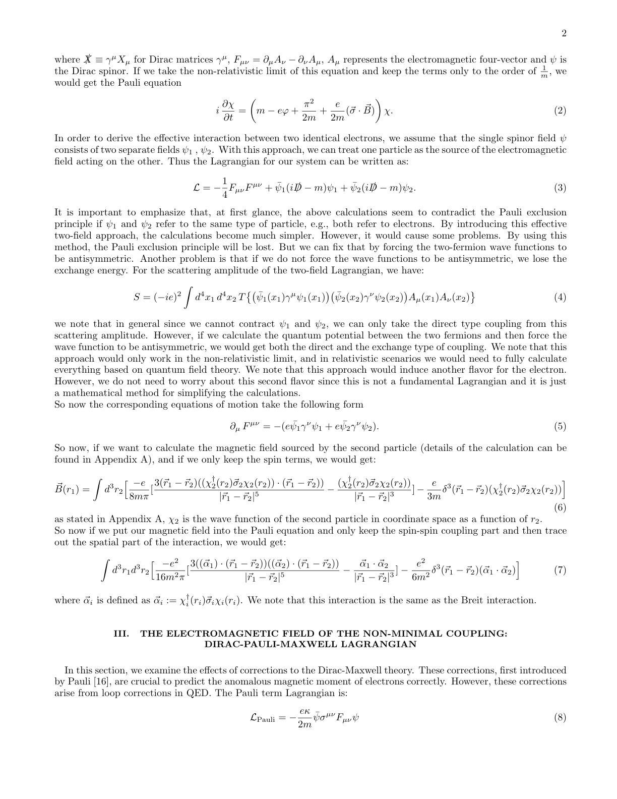 
Low-resolution page preview, page 2

📷 Fig 2

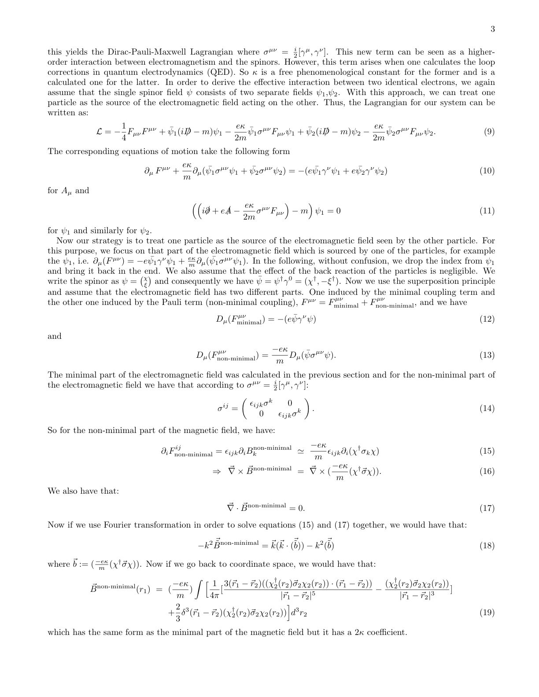 
Low-resolution page preview, page 3

📷 Fig 3

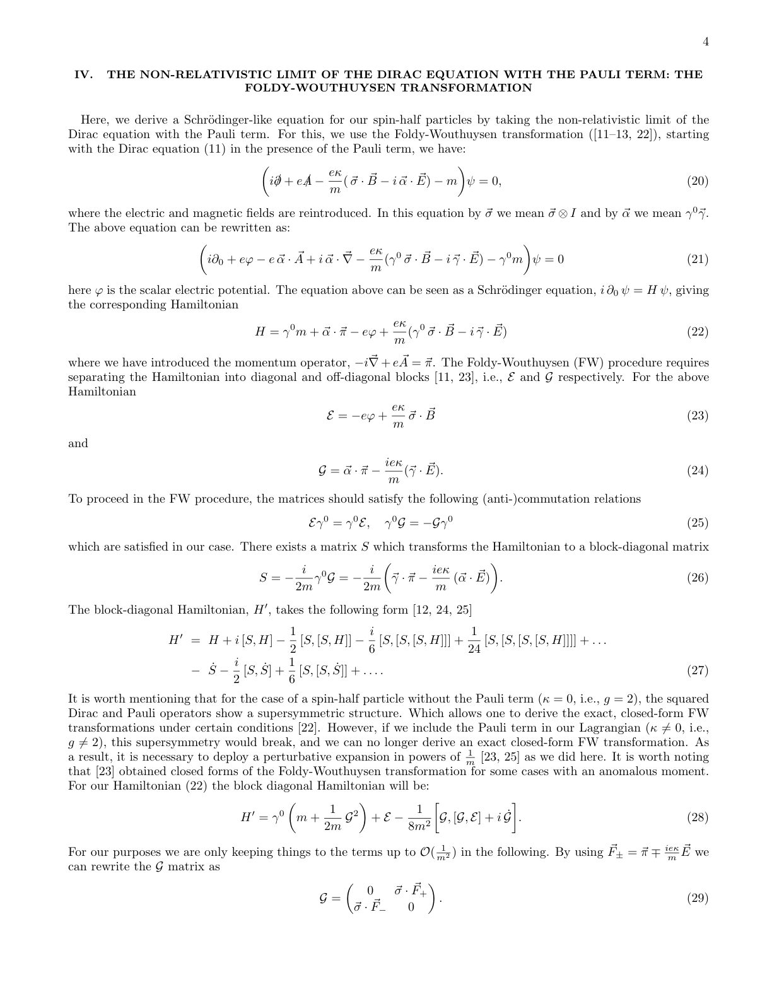 
Low-resolution page preview, page 4

📷 Fig 4

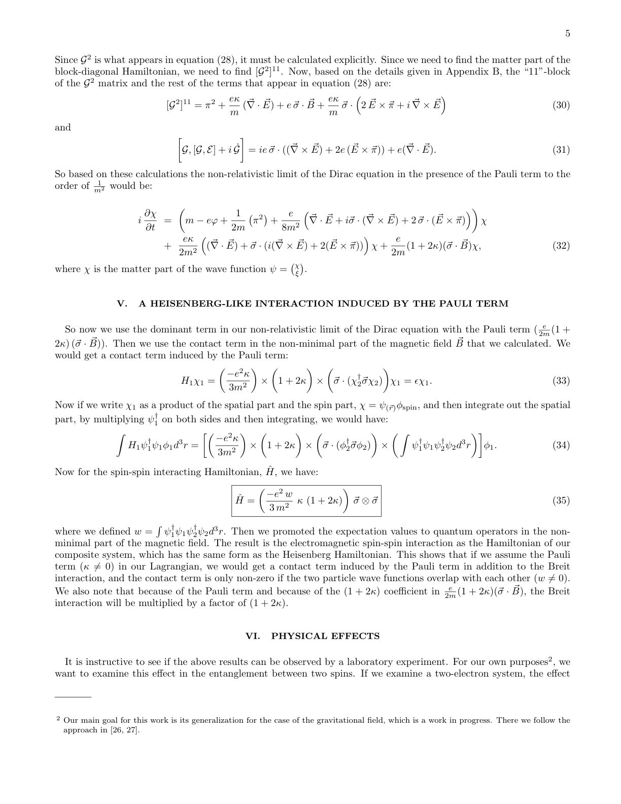 
Low-resolution page preview, page 5

📷 Fig 5

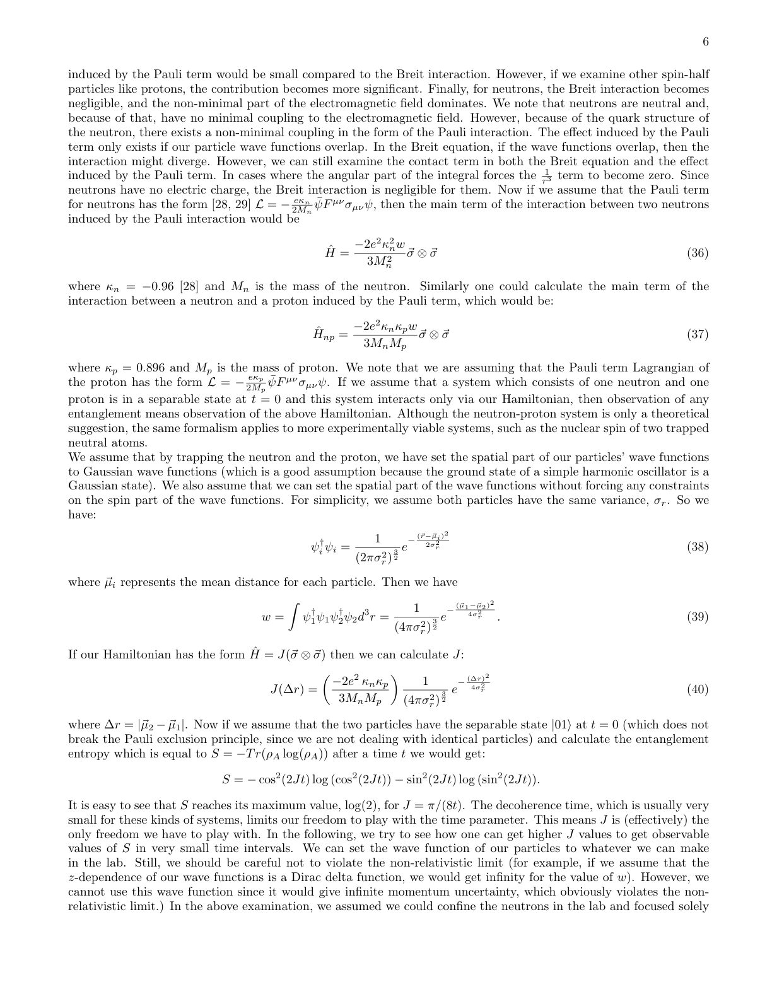 
Low-resolution page preview, page 6

**Summary.** This theoretical work derives the non-relativistic effective Hamiltonian for spin-1/2 particles by extending the standard Dirac-Maxwell theory to include a Pauli coupling term. Using the Foldy-Wouthuysen transformation, the authors calculate the resulting spin-spin interaction, showing that the Pauli term modifies the standard Breit interaction by a factor of $(1+2\kappa)^2$. This provides theoretical estimates for spin-spin coupling that can be tested against high-precision atomic physics experiments.

**Why it may be interesting.** The systematic derivation of higher-order spin interactions using the FW transformation is a rigorous theoretical tool applicable to understanding magnetic interactions in condensed matter systems where spin-orbit or spin-spin coupling is crucial.

Detailed structure

**Main problem.** The paper aims to derive and study spin-spin interactions arising from the non-relativistic limit of the Dirac-Pauli-Maxwell Lagrangian, extending beyond the standard minimal coupling.

**Main result.** The inclusion of the Pauli term modifies the standard Breit interaction, leading to an altered Breit interaction proportional to $(1+2\kappa)^2$ times the standard prediction.

**Method.** The primary method involves applying the Foldy-Wouthuysen transformation to the Dirac-Pauli-Maxwell Lagrangian to systematically derive the effective non-relativistic Hamiltonian up to $O(1/m^2)$.

**Model / system.** The system models spin-1/2 particles (like electrons) interacting electromagnetically, governed by a Lagrangian that includes a non-minimal Pauli coupling term ($ar{\psi}\sigma^{\mu
u}F_{\mu
u}$).

**Key observables.** Electromagnetic spin-spin interaction strength, spin-spin entanglements, and the altered Breit interaction.

**Important parameters / regimes.** The Pauli coupling constant $\kappa$, the particle mass $m$, and the energy scale of the interaction.

**Assumptions / limitations.** The analysis relies on the Foldy-Wouthuysen transformation, which requires a perturbative expansion because the Pauli term breaks supersymmetry. The calculation of entanglement assumes Gaussian wave functions for spatial parts.

**Figures summary.** Not specified.

**Paper structure.** The paper proceeds by first deriving the Breit interaction from the minimal coupling (Dirac-Maxwell) and then systematically incorporating the Pauli term via the FW transformation to derive the full non-relativistic Hamiltonian and the resulting spin-spin interaction terms.

Abstract

It is natural to expect that the electromagnetic spin-spin interaction has roots in a more fundamental theory: quantum electrodynamics in this case. To show this, we take the non-relativistic limit of the Dirac-Maxwell Lagrangian, using the Foldy-Wouthuysen transformation and derive the Breit interaction by an alternative approach. By adding the Pauli term (i.e., a higher-order interaction between spin and the electromagnetic field), we calculate the correction terms to electromagnetic spin-spin interactions in the non-relativistic limit. Finally, we study some of the physical effects of these terms regarding spin-spin interactions and spin-spin entanglements. Accordingly, we provide theoretical estimates that are not yet accessible with current experiments.

[↑ back to top](#top)

### [The $\mathbb{Z}_2$-Index of a Pair of Pure States and the Topology of Interacting 1D Superconductors](http://arxiv.org/abs/2608.28796v1)

**Authors:** Anna Mazhar, Jacob Shapiro  
**Type:** theory · **Category:** strongly correlated electrons · **PDF:** <https://arxiv.org/pdf/2608.28796v1>  
**Analysis basis:** full PDF text, analyzed in chunks
**Topic relevance:** `analog quantum simulation` **1/5**

📷 Fig 1

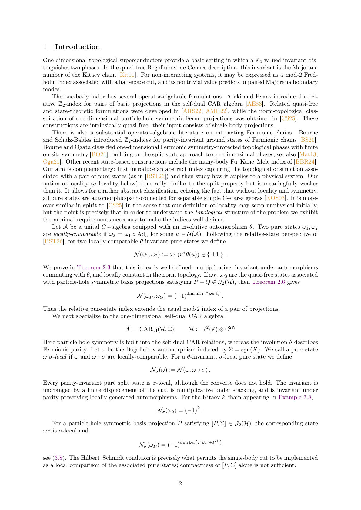 
Low-resolution page preview, page 2

📷 Fig 2

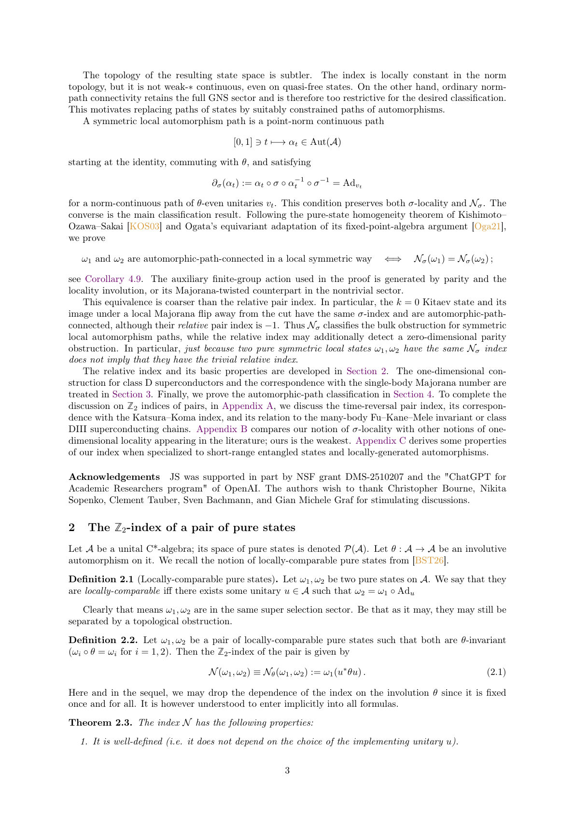 
Low-resolution page preview, page 3

📷 Fig 3

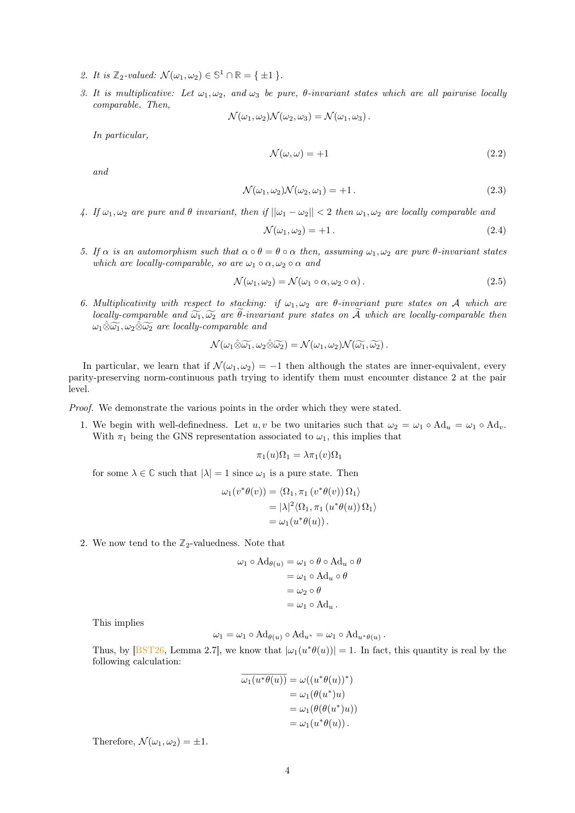 
Low-resolution page preview, page 4

📷 Fig 4

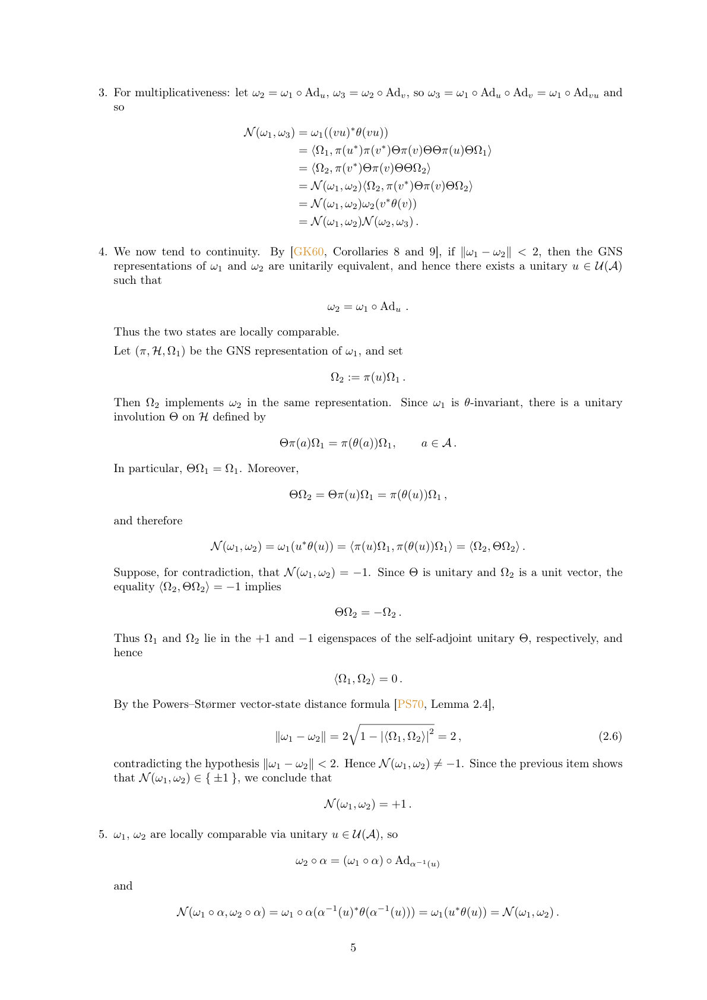 
Low-resolution page preview, page 5

📷 Fig 5

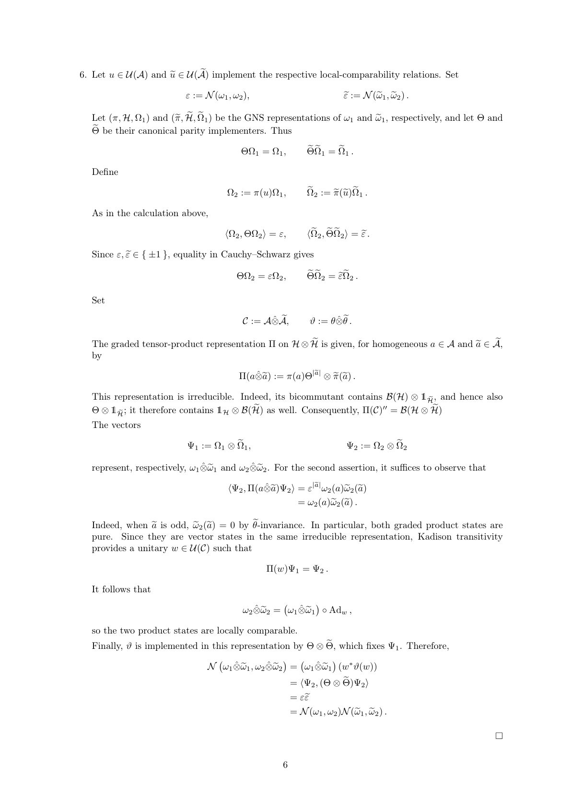 
Low-resolution page preview, page 6

**Summary.** This work introduces a relative $\mathbb{Z}_2$-index to characterize pairs of pure states on $C^*$-algebras relevant to 1D superconductors. By applying this index to the self-dual CAR algebra, the authors show that the resulting Majorana number completely classifies the topological components of the system's ground states. This provides a rigorous mathematical tool for understanding topological order in low-dimensional quantum materials.

**Why it may be interesting.** The index provides a powerful topological invariant that classifies the ground state structure of 1D superconductors, linking algebraic topology ($\mathbb{Z}_2$ invariants) directly to physical properties like Majorana zero modes.

Detailed structure

**Main problem.** The paper defines and studies a relative $\mathbb{Z}_2$-index, $\mathcal{N}(\omega_1, \omega_2)$, for pairs of pure states on a $C^*$-algebra, relating it to topological invariants in condensed matter systems.

**Main result.** The index $\mathcal{N}_\sigma(\omega)$ completely classifies the automorphic-path-components of states in the 1D self-dual CAR algebra, capturing the bulk Majorana number.

**Method.** The authors use algebraic methods involving $C^*$-algebras, GNS representations, and the construction of relative indices derived from parity-invariant pure states.

**Model / system.** The primary model is the one-dimensional self-dual CAR algebra, used to describe interacting 1D superconductors. The analysis focuses on pure states ($\omega$) defined on this algebra.

**Key observables.** The relative $\mathbb{Z}_2$-index $\mathcal{N}(\omega_1, \omega_2)$ and the many-body Majorana number $\mathcal{N}_\sigma(\omega)$.

**Important parameters / regimes.** The system is analyzed in the quasi-free Hilbert--Schmidt regime, and the index is sensitive to parity-preserving automorphisms.

**Assumptions / limitations.** The index is proven to be locally constant in the norm topology but not weak-$\ast$-continuous, and the classification by $\mathcal{N}_\sigma$ may forget a zero-dimensional parity obstruction.

**Paper structure.** The paper first defines the relative $\mathbb{Z}_2$-index and proves its fundamental properties (well-defined, multiplicative). It then applies this to the 1D self-dual CAR algebra to define the Majorana number, culminating in the classification theorem based on automorphic-path equivalence.

Abstract

We define a relative $\mathbb{Z}_2$-index $\mathcal{N}(ω_1,ω_2)$ for locally-comparable, parity-invariant pure states on a unital $C^*$-algebra. We prove that the index is well-defined, multiplicative, invariant under parity-preserving automorphisms, and locally constant in the norm topology. For the one-dimensional self-dual CAR algebra, we apply this construction to the half-chain automorphism $σ$ and define the many-body Majorana number $\mathcal{N}σ(ω):=\mathcal{N}(ω,ω\circσ)$ for parity-invariant $σ$-local pure states. In the quasi-free Hilbert--Schmidt regime, this index agrees with the usual single-body Majorana number. We then introduce symmetric local automorphism paths and prove that $\mathcal{N}_σ$ completely classifies the resulting automorphic-path-components. This automorphic-path equivalence retains the bulk Majorana number but may forget a relative zero-dimensional parity obstruction.

[↑ back to top](#top)

### [The large $N$ vector model with angular velocity](http://arxiv.org/abs/2608.31151v1)

**Authors:** Justin R. David, Srijan Kumar  
**Type:** theory · **Category:** statistical mechanics · **PDF:** <https://arxiv.org/pdf/2608.31151v1>  
**Analysis basis:** full PDF text, analyzed in chunks
**Topic relevance:** `Keldysh / 2PI / non-Gaussian methods` **1/5**

📷 Fig 1

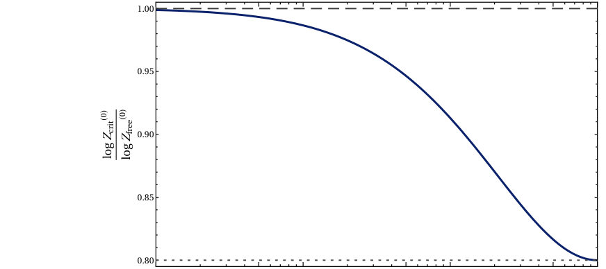 
Figure 1. Ratio of the leading high-temperature free energy (3.34) of the critical large-N theory evaluated at the value of the thermal mass satisfying (3.33), to that of the free-theory (2.14), shown with a logarithmic horizontal axis. The curve is evaluated numerically, with x2 = 1 −ˆµ2r2. It approaches unity as x →0 and equals 4/5 at x = 1; the dashed and dotted horizontal lines marks these two limiting values.

📷 Fig 2

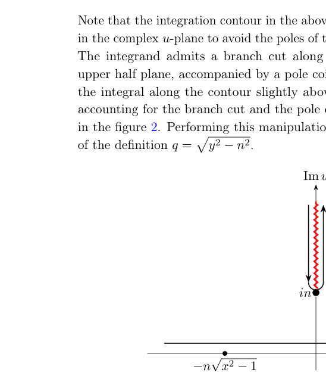 
Figure 2. The contribution of the original contour C is equal to that of the contour γ wrapping the branch cut, except the pole contribution at one end of the branch cut at u = in.

📷 Fig 3

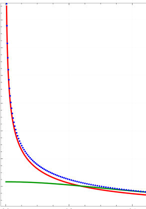 
Figure 3. Dimensionless thermal mass ˜mβ on 10−3 ≤x ≤1. The blue points are the numerical solutions of (3.33); the red curve is the leading small-x solution (3.55) given by the Productlog function, and the green curve is the expansion (3.38) about x = 1, continued through order (1−x2)12

📷 Fig 4

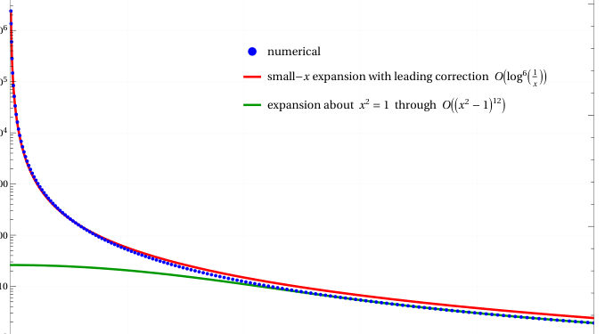 
Figure 4. The leading high-temperature partition function β2 log Z(0)/r2 on 10−3 ≤x ≤1, displayed on a logarithmic vertical scale. The blue points are obtained by numerically solving (3.33) and thereby evaluating (3.34); the red curve is the leading terms of the small-x expansion (3.63), 2ζ(3)/x2 −1

**Summary.** This paper calculates the free energy of the large-N O(N) vector model on $S^1 	imes S^2$ under an angular velocity. The authors use advanced analytical and numerical techniques to show that the leading high-temperature behavior exhibits a pole consistent with field theory expectations. The work provides detailed comparisons between the interacting critical point and the non-interacting free theory.

**Why it may be interesting.** The rigorous calculation of critical exponents and free energy corrections in a non-trivial background geometry ($S^1 	imes S^2$) using large-N techniques is highly relevant for understanding thermal field theories and critical phenomena in condensed matter systems.

Detailed structure

**Main problem.** The study focuses on determining the free energy of the critical O(N) vector model at large N on the geometry $S^1 	imes S^2$ when subjected to an angular velocity $\hat{\mu}$.

**Main result.** The leading high-temperature free energy contribution develops a pole at $\hat{\mu}^2r^2=1$, and sub-leading terms reveal non-analytic dependence on $\hat{\mu}$ that distinguishes the critical fixed point from the free theory.

**Method.** The authors employ analytical expansions around specific limits ($\hat{\mu}r 	o 0$ and $\hat{\mu}^2r^2 	o 1$), supplement these with numerical analysis, and compare results derived from the pp-wave geometry.

**Model / system.** The system is the critical O(N) vector model at large N, analyzed on the geometry $S^1 	imes S^2$. The calculation involves the thermal partition function $Z(eta, \hat{\mu}) = 	ext{Tr}_h e^{-eta(H-\hat{\mu}L_z)}$.

**Key observables.** Free energy ($\log Z$), thermal mass ($	ilde{m}$), and the residue of the free energy pole.

**Important parameters / regimes.** Angular velocity ($\hat{\mu}$), sphere radius ($r$), inverse temperature ($eta$), and the large $N$ limit.

**Assumptions / limitations.** The analysis relies on the large $N$ limit and involves systematic expansions in various parameters, such as $\hat{\mu}r$ and $\hat{\mu}^2r^2$.

**Figures summary.** Not specified in the notes, but the text discusses expansions and interpolations between different regimes.

**Paper structure.** The paper analyzes the free energy by first deriving the free model action, then calculating the free energy using mode expansion and Gaussian integration, and finally developing detailed asymptotic expansions for the interacting case, including derivations of gap equations and solving them via small parameter expansions.

Abstract

We study the free energy of the critical $O(N)$ vector model at large $N$ on $S^{1}\times S^{2}$ with an angular velocity $\hatμ$ without the singlet constraint. The leading high-temperature behaviour is determined analytically both as an expansion about $\hatμr=0$ and $\hatμ^{2}r^{2}=1$ where $r$ is the radius of the sphere. We supplement the analytic results with a numerical analysis that agrees with both the analytical expansions in their respective regimes and smoothly interpolates between them. The leading high-temperature contribution to the free energy develops a pole at $\hatμ^{2}r^{2}=1$, in agreement with expectations from the thermal effective field theory. Its residue coincides with that of the massless free theory. Sub-leading terms, however, exhibit non-analytic dependence on the angular velocity and distinguish the critical fixed-point result from the free theory answer. The residue at the pole can also be obtained by placing the $O(N)$ model on the pp-wave geometry. We show that the residue agrees with that obtained from the direct computation.

[↑ back to top](#top)

## Other papers (38)

*Papers from primary archives without highlighted authors or any topic match. Click to expand.*

Show other papers

### ["Train classical, deploy quantum" requires rethinking generalization](http://arxiv.org/abs/2608.31117v1)

**Authors:** Snehal Raj, Natansh Mathur, Alejandro Perdomo-Ortiz  
**Type:** theory · **Category:** quantum information and computing · **PDF:** <https://arxiv.org/pdf/2608.31117v1>  
**Analysis basis:** full PDF text, analyzed in chunks

📷 Fig 1

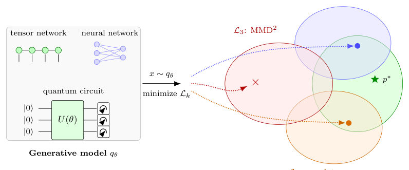 
FIG. 1. Training losses versus deployment generalization. An optimizer fits a generative model qθ (a tensor network, a neural network, or a quantum circuit) using quantities that can be evaluated without sampling the deployed model. The benchmark tests whether small empirical values of the negative log-likelihood (L1), the fixed-order correlator (L2), and the full-kernel MMD2 (L3) objectives correspond to better generalization (low forward KL; green).

📷 Fig 2

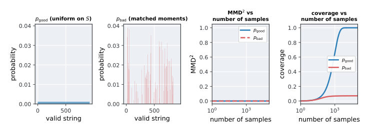 
FIG. 2. A truncated moment loss admits exact minimizers with different support coverage. The distributions pgood and pbad match every correlator through order L (Corollary 1), yet their support coverages are 1 and 0.07. Statements in Section IV, proofs in Appendix A.

📷 Fig 3

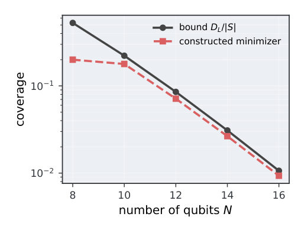 
FIG. 3. The low-coverage minimizer of Corollary 1 is explicit. For N = 8 to 16 at L = 2, a linear program con- structs a distribution matching every order-≤L correlator of the uniform target. Realized coverage of the constructed minimizer (red) and the bound DL/|S| of Corollary 1 (gray) versus N, on a logarithmic scale; the truncated loss is numer- ically zero at every point.

📷 Fig 4

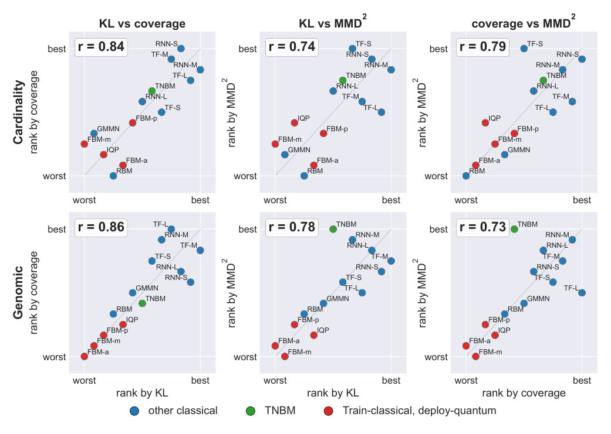 
FIG. 4. Rank correlations among MMD2, coverage, and forward KL. Each panel ranks the same thirteen models by two scores, best in the top-right corner, for the cardinality data (top) and the genomic data (bottom), both at N = 16; each score is a median over seeds, and r is Spearman’s rank correlation between the two scores. The left column pairs the two generalization measures (coverage and the forward KL); the middle and right columns pair each against the moment-matching loss MMD2. In the labels, TF is the transformer and S/M/L are the small, medium, and large variants.

📷 Fig 5

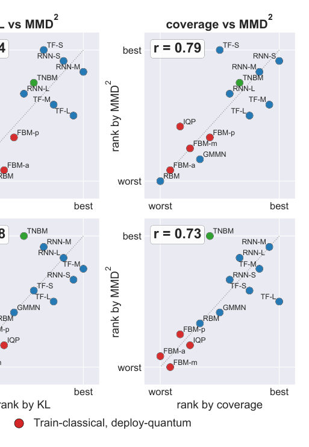 
Figure 5 shows the decoupling directly. During train- ing the IQP Born machine drives its MMD2 down by an order of magnitude while its coverage stays near Crand (a), whereas a likelihood-trained transformer lowers its loss and raises its coverage together, toward the ideal finite-sample ceiling C∗(b). Capacity does not close the gap: enlarging the IQP circuit 18× in gate count leaves its coverage flat, while the tensor-network and classical models improve with size (c; Table II). The gap widens with qubit count, out to N = 30 (d). The decoupling is not an artifact of the kernel bandwidth: sweeping σ from sharp to broad leaves IQP near Crand (Appendix E).

**Summary.** This work investigates the generalization gap in quantum generative models trained classically but deployed quantumly. The authors demonstrate that relying on moment-matching losses, while computationally convenient, fails to guarantee that the model will produce novel, valid samples. They argue that future TCDQ workflows must adopt objectives that target generalization directly, rather than just matching low-order training statistics.

**Why it may be interesting.** It directly addresses the practical limitations of using quantum machine learning models, providing crucial theoretical and empirical warnings about relying solely on classical loss minimization for quantum device performance.

Detailed structure

**Main problem.** The paper addresses the critical issue of generalization in 'train classical, deploy quantum' (TCDQ) workflows for quantum generative models.

**Main result.** Moment-matching losses, while classically tractable, are shown to be unreliable indicators of generalization, often yielding models with poor sample coverage compared to likelihood-trained counterparts.

**Method.** The authors benchmark various quantum and classical generative models using direct sampling and comparing different loss functions (moment-matching vs. likelihood-based).

**Model / system.** The focus is on Quantum Circuit Born Machines (QCBMs) used as quantum generative models, trained classically but deployed quantumly for sample generation.

**Key observables.** Forward Kullback-Leibler (KL) divergence, sample coverage, fidelity, and various correlators (e.g., Pauli-Z correlations).

**Important parameters / regimes.** Dataset size (up to 30 qubits), loss order (capacity $d$), and the separation between training loss metrics and deployment generalization metrics.

**Assumptions / limitations.** The core assumption tested is that minimizing a classically computable loss (like MMD2) is sufficient to guarantee good generalization in the quantum sampling regime.

**Figures summary.** Figures compare training losses (L1, L2, L3) against deployment generalization (low forward KL), showing moment-matching loss does not correlate well with generalization. Other figures show the decoupling between MMD2 convergence and coverage separation across different model types.

**Paper structure.** The paper establishes the TCDQ paradigm, contrasts moment-matching losses with likelihood losses, and then presents empirical benchmarks on complex datasets (cardinality-constrained and genomic) demonstrating the failure of moment matching to guarantee generalization.

Abstract

Generative models have become central across science and industry, from image and text synthesis to the design of molecules and materials. Quantum generative models are considered one of the most promising applications for quantum computers, since a quantum circuit naturally produces samples from the distribution it encodes, and for suitable circuits that distribution is believed to be hard for any classical computer to reproduce. A leading strategy trains these models on a classical computer and reserves the quantum device for generating samples at deployment. This is possible when the training loss can be evaluated on a classical computer. A prime example is the maximum mean discrepancy (MMD$^2$), a moment-matching loss that compares the model and the data through their Pauli-$Z$ correlations. Research so far has asked whether such models can be trained and whether their sampling is hard; whether minimizing such an objective yields a model that generalizes, rather than one that merely reproduces the training statistics, remains poorly understood. We benchmark a broad set of quantum and classical generative models by direct sampling and show that models trained with a moment-matching loss generally show worse generalization than the likelihood-trained models. We show this on two application-inspired datasets: first a cardinality-constrained dataset at up to $30$ qubits and second a dataset of genomic single-nucleotide variants, whose valid set is the observed data. These results indicate that a converged moment-matching loss is not a reliable measure of generalization, and that train-classical, deploy-quantum workflows will need approaches that target generalization directly, leaving open whether better training objectives suffice or whether the model architectures themselves must change.

[↑ back to top](#top)

### [A quantum let within the lambda calculus](http://arxiv.org/abs/2608.29380v1)

**Authors:** Alejandro Díaz-Caro, Tomás Miguez  
**Type:** theory · **Category:** quantum information and computing · **PDF:** <https://arxiv.org/pdf/2608.29380v1>  
**Analysis basis:** full PDF text, analyzed in chunks

📷 Fig 1

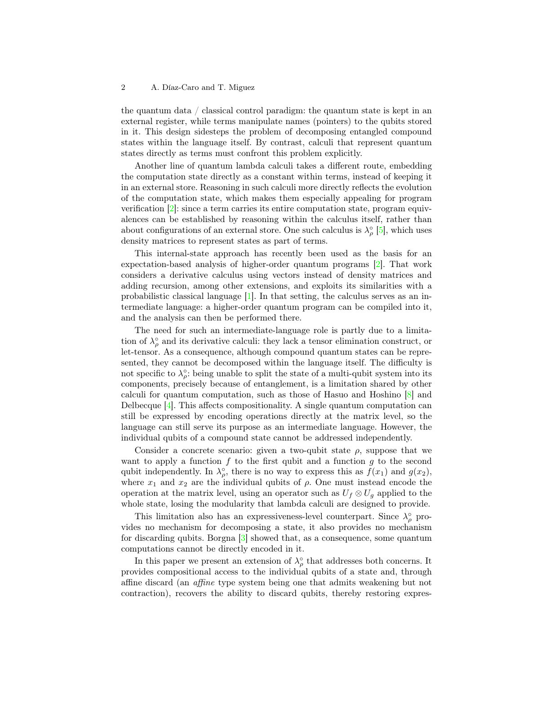 
Low-resolution page preview, page 2

📷 Fig 2

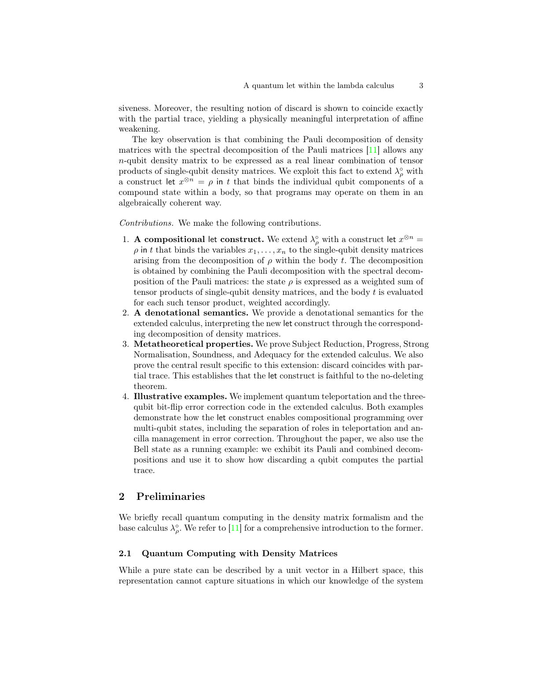 
Low-resolution page preview, page 3

📷 Fig 3

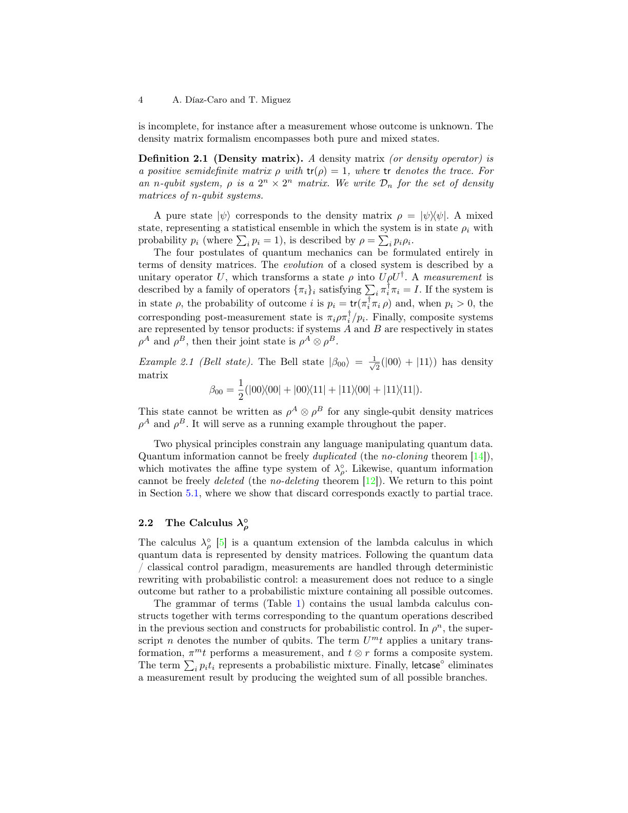 
Low-resolution page preview, page 4

📷 Fig 4

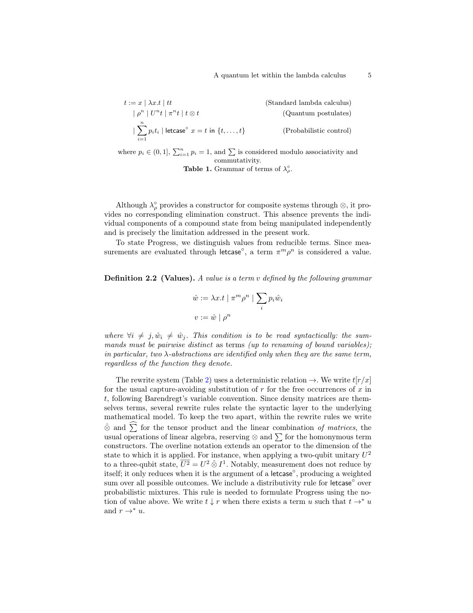 
Low-resolution page preview, page 5

📷 Fig 5

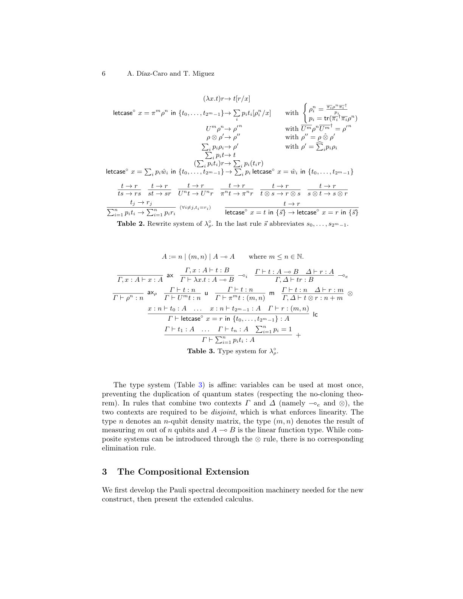 
Low-resolution page preview, page 6

**Summary.** This paper extends a quantum lambda calculus by incorporating a mechanism derived from the Pauli decomposition to allow for tensor elimination. This restores the crucial physical ability to independently access and discard individual qubits within a composite quantum state. The authors rigorously prove the soundness and completeness of this extended calculus, providing a powerful tool for quantum program verification.

**Why it may be interesting.** It provides a rigorous, foundational tool for quantum computation theory, allowing for the formal modeling of state decomposition and partial tracing—concepts crucial for understanding quantum error correction and quantum information processing.

Detailed structure

**Main problem.** The paper addresses the limitation of an internal-state quantum lambda calculus ($\lambda\circ
ho$) which lacks a construct for tensor elimination, preventing the independent access or discarding of individual qubits in compound quantum states.

**Main result.** By extending the calculus with a $	ext{let } x^{\otimes n} = 
ho 	ext{ in } t$ construct, the authors restore the ability to decompose and discard qubits, proving the resulting system is sound and strongly normalizable.

**Method.** The solution relies on the Pauli decomposition and spectral decomposition of density matrices to express multi-qubit states as linear combinations of single-qubit tensor products, which is then formalized in a new lambda calculus construct.

**Model / system.** The model is a quantum lambda calculus ($\lambda\circ
ho$) where quantum states are represented by density matrices ($
ho$). The calculus is designed for reasoning and verification of quantum programs.

**Key observables.** Density matrices ($
ho$), the ability to decompose compound states, and the final state after computation.

**Important parameters / regimes.** The number of qubits ($n$), and the real coefficients arising from the Pauli decomposition.

**Assumptions / limitations.** The calculus is assumed to be equipped with a rewrite system, type system, and denotational semantics, and the proof relies on establishing Subject Reduction, Progress, and Strong Normalisation.

**Figures summary.** The notes reference tables detailing the grammar, rewrite system, and type system for the extended calculus, and an example illustrating the decomposition of a Bell state.

**Paper structure.** The paper first identifies the expressiveness gap in the original calculus, then introduces the Pauli/spectral decomposition method, extends the calculus with the new let construct, and finally proves the necessary formal properties (semantics, type safety, and compositionality) for the extended system.

Abstract

Since the seminal work of Selinger and Valiron, the standard design for quantum lambda calculi has kept the quantum state outside the program: terms manipulate pointers to an external register. This is largely due to the difficulty of eliminating tensor products. For example, the calculus $λ_ρ^\circ$ embeds density matrices directly within terms, where terms carry the entire computation state, a feature particularly appealing for program verification. However, lacking a tensor elimination construct, it can neither access the individual qubits of a compound state nor discard them. Borgna showed that this inability to discard qubits makes the calculus strictly less expressive than the quantum lambda calculus of Selinger and Valiron.   In this paper we show that tensor elimination is possible in this setting. The key observation is that the Pauli decomposition, combined with the spectral decomposition of the Pauli matrices, allows any $n$-qubit density matrix to be expressed as a real linear combination of tensor products of single-qubit density matrices. Exploiting this fact, we extend $λ_ρ^\circ$ with a construct $\mathrm{let}\ x^{\otimes n} = ρ \mathrm{in}\ t$, which binds each $x_i$ to a single-qubit density matrix arising from the decomposition of $ρ$.   We equip the extended calculus with a rewrite system, a type system, and a denotational semantics, and prove Subject Reduction, Progress, Strong Normalisation, Soundness, and Adequacy. The new construct also recovers the missing ability to discard qubits, thereby restoring expressiveness. Moreover, we show that this is achieved in a physically principled way: a variable unused in $t$ is interpreted exactly as being partial-traced out, as dictated by the no-deleting theorem. We illustrate the resulting compositionality through quantum teleportation and the three-qubit bit-flip code.

[↑ back to top](#top)

### [A route to the thermodynamics of colloid-polymer mixtures from structural information](http://arxiv.org/abs/2608.29124v1)

**Authors:** Vikki Anand Varma, Andrew J. Archer, Alberto Scacchi  
**Type:** theory · **Category:** statistical mechanics · **PDF:** <https://arxiv.org/pdf/2608.29124v1>  
**Analysis basis:** full PDF text, analyzed in chunks

📷 Fig 1

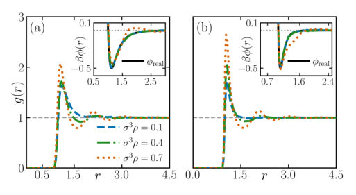 
FIG. 1. RDFs obtained from Langevin dynamics simulations for (a) 12–6 and (b) 24–12 Mie potential with βϵ = 0.5 at number densities σ3ρ = 0.1, 0.4, and 0.7, respectively. The insets show the pair potentials used in the simulations, ϕreal, together with the reconstructed potentials obtained with the IBI from the corresponding RDFs.

📷 Fig 2

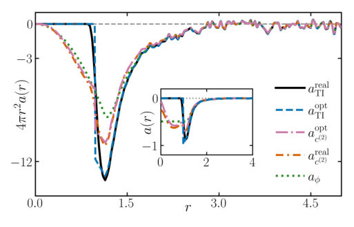 
FIG. 3. Kernel a(r), as defined in Eqs. (11) and (19), for a 12–6 LJ potential with βϵ = 0.5 at number density σ3ρ = 0.4, obtained using the different routes. The solid lines show the TI result using the WCA reference, while the long-dashed lines show the corresponding result using the optimized hard- sphere reference. The long dash-dotted lines show the ∆c(2)

📷 Fig 3

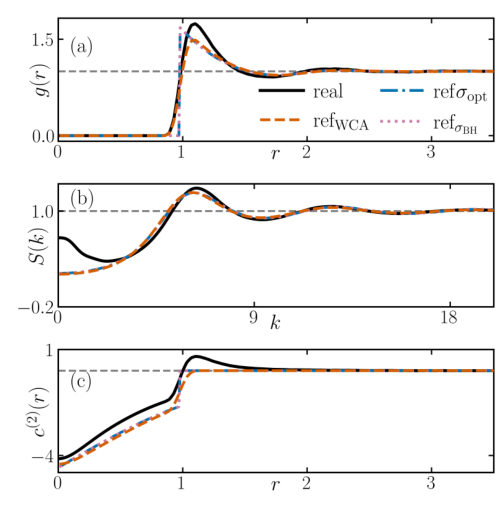 
FIG. 2. Structural correlation functions for a 12–6 LJ poten- tial with βϵ = 0.5 at number density σ3ρ = 0.4. The black solid curves correspond to the real system, with the input RDF obtained from Langevin dynamics simulations. Panel (a) shows the RDF, panel (b) the static structure factor, and panel (c) the DCF. The dashed curves correspond to the WCA reference system, obtained by retaining only the repul- sive contribution of the IBI-reconstructed interaction poten- tial. The dash-dotted curves show the effective hard-sphere reference system with diameter σopt [see Eq. (3)], while the short-dashed curves correspond to the hard-sphere reference system with the diameter determined from the...

📷 Fig 4

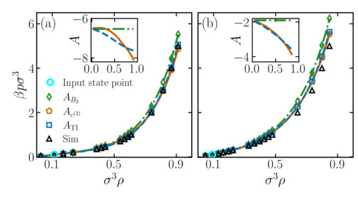 
FIG. 4. Equation of state for a one-component fluid inter- acting through (a) the Lennard–Jones 12–6 potential and (b) the generalized Mie 24–12 potential, both with βϵ = 0.5. Tri- angles denote simulation results, diamonds the virial route, squares the TI route, and circles the DCF route. The in- set shows the corresponding density dependent integrated strength.

📷 Fig 5

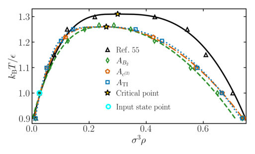 
FIG. 5. Binodal curves for the 12–6 system obtained using the different routes, compared with simulation data from Ref. 55. Stars denote the critical points. The open circle marks the single state point, (σ3ρ, kBTϵ−1) = (0.05, 1), used as struc- tural input.

**Summary.** This work presents a powerful theoretical framework to calculate the thermodynamics and phase behavior of complex fluids, such as colloid-polymer mixtures, using only structural data obtained at one state point. By decomposing the free energy into reference (excluded-volume) and tail components, the authors bypass the need to know the underlying interaction potentials. This establishes a crucial link between measurable structural properties and macroscopic phase transitions.

**Why it may be interesting.** While focused on classical fluids, the methodology of inferring macroscopic thermodynamic behavior (like phase boundaries) solely from single-point structural measurements is a powerful concept applicable to many-body quantum systems where direct potential knowledge is difficult.

Detailed structure

**Main problem.** The paper develops a framework to predict the thermodynamics and phase behavior of complex fluids, specifically colloid-polymer mixtures, directly from structural correlations.

**Main result.** It successfully demonstrates that structural information measured at a single state point is sufficient to construct the free energy functional and predict phase coexistence, bypassing the need for explicit interaction potentials.

**Method.** The approach constructs the excess free energy by decomposing interactions into a reference (excluded-volume) part and a tail part, using structural inputs like the radial distribution function or direct correlation function.

**Model / system.** The focus is on colloid-polymer mixtures and general fluid systems. The theory is built upon decomposing the total potential into a reference hard-sphere part and a remaining interaction tail, which is then analyzed using integral equation theory concepts.

**Key observables.** Radial distribution functions (g(r)), static structure factors (S(k)), and the pair direct correlation function (c(r)).

**Important parameters / regimes.** Effective hard-sphere diameter (sigma_opt), inverse temperature (beta), and the integrated attraction strength (A).

**Assumptions / limitations.** The method assumes radial symmetry for interactions and relies on approximations like Fundamental Measure Theory (FMT) for the reference free energy and the Ornstein-Zernike equation closures.

**Figures summary.** Figures illustrate the predicted binodal curve for a binary mixture and show the reconstruction of pair potentials from structural correlations.

**Paper structure.** The paper establishes the general theory by decomposing the free energy, details the calculation routes (Thermodynamic Integration, DCF route, Virial route), and applies the framework sequentially to one-component systems before extending it to binary colloid-polymer mixtures to predict phase coexistence.

Abstract

Liquid-state theory provides a fundamental connection between microscopic structure and macroscopic thermodynamic behaviour. Here, we develop a framework for predicting thermodynamics and phase behaviour directly from structural correlations, using either radial distribution functions or static structure factors as input. The approach constructs a free-energy functional from structural information obtained at a single thermodynamic state point, without requiring explicit knowledge of the underlying interaction potentials. This circumvents a central difficulty in modelling complex fluids, for which effective interactions are often unknown or rely on approximations. We demonstrate the framework for a range of model fluids, including colloidal and colloid--polymer systems, with predictions in good agreement with molecular simulation data. The results show that structural information at a single state point can provide sufficient information to predict the broader thermodynamic response of a system. This establishes a route toward inferring phase behaviour directly from experimentally measured structure, even when the microscopic interactions are not known a priori.

[↑ back to top](#top)

### [Algorithmic threshold for high-dimensional projection pursuit I: general theory](http://arxiv.org/abs/2608.29416v1)

**Authors:** Brice Huang, Mark Sellke, Nike Sun  
**Type:** theory · **Category:** disordered systems and neural networks · **PDF:** <https://arxiv.org/pdf/2608.29416v1>  
**Analysis basis:** full PDF text, analyzed in chunks

📷 Fig 1

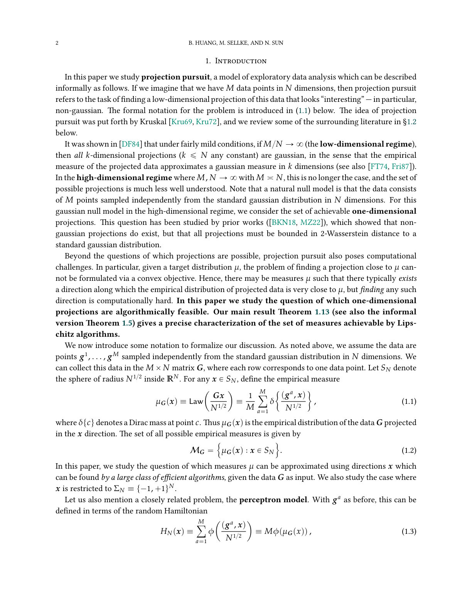 
Low-resolution page preview, page 2

📷 Fig 2

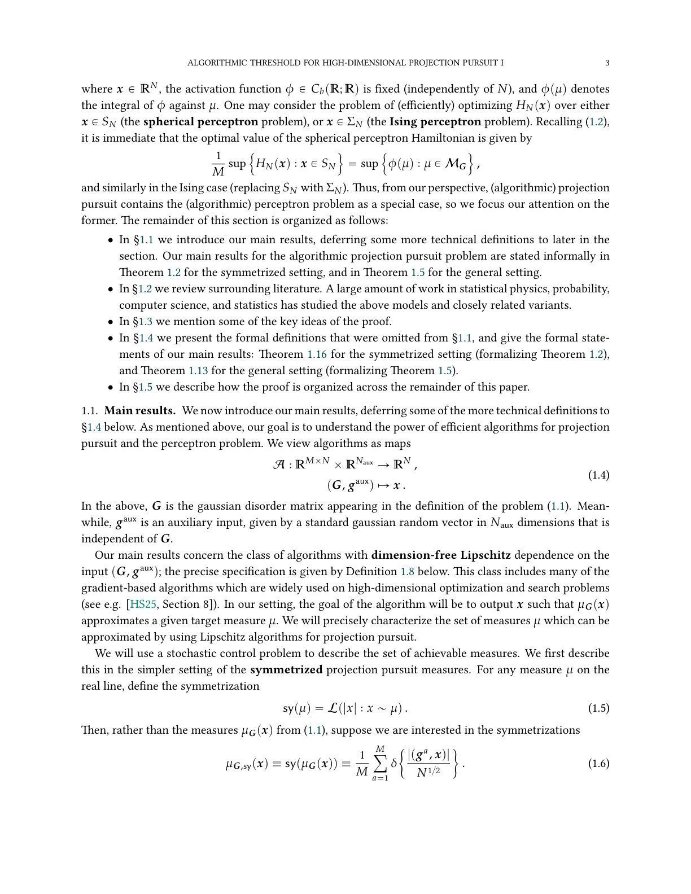 
Low-resolution page preview, page 3

📷 Fig 3

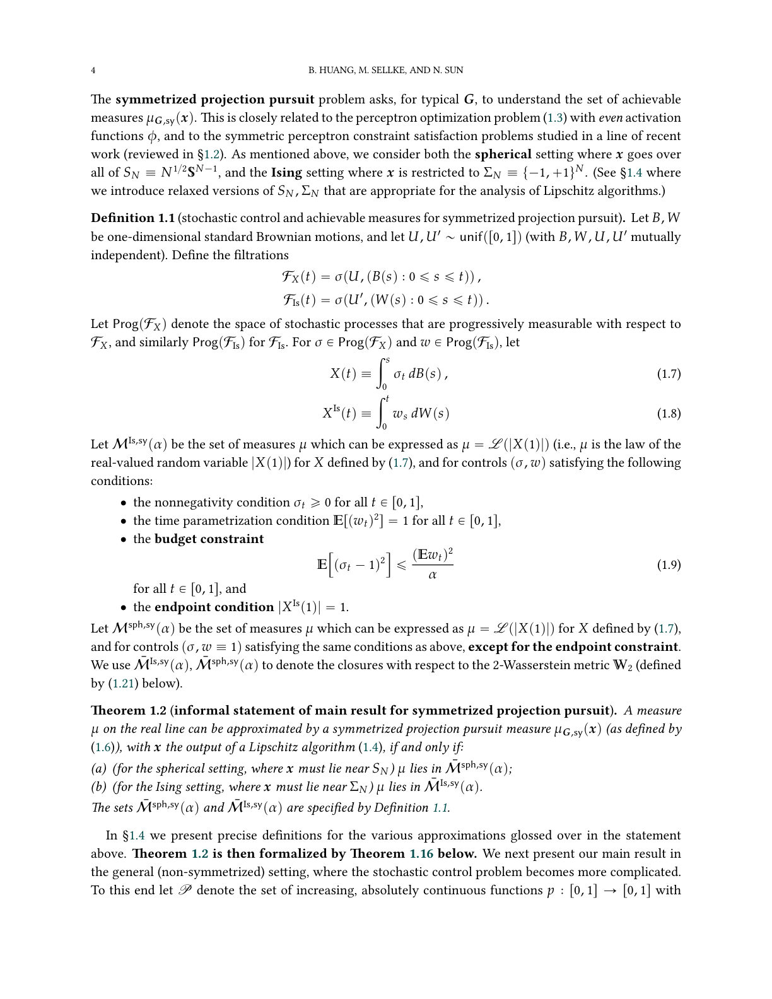 
Low-resolution page preview, page 4

📷 Fig 4

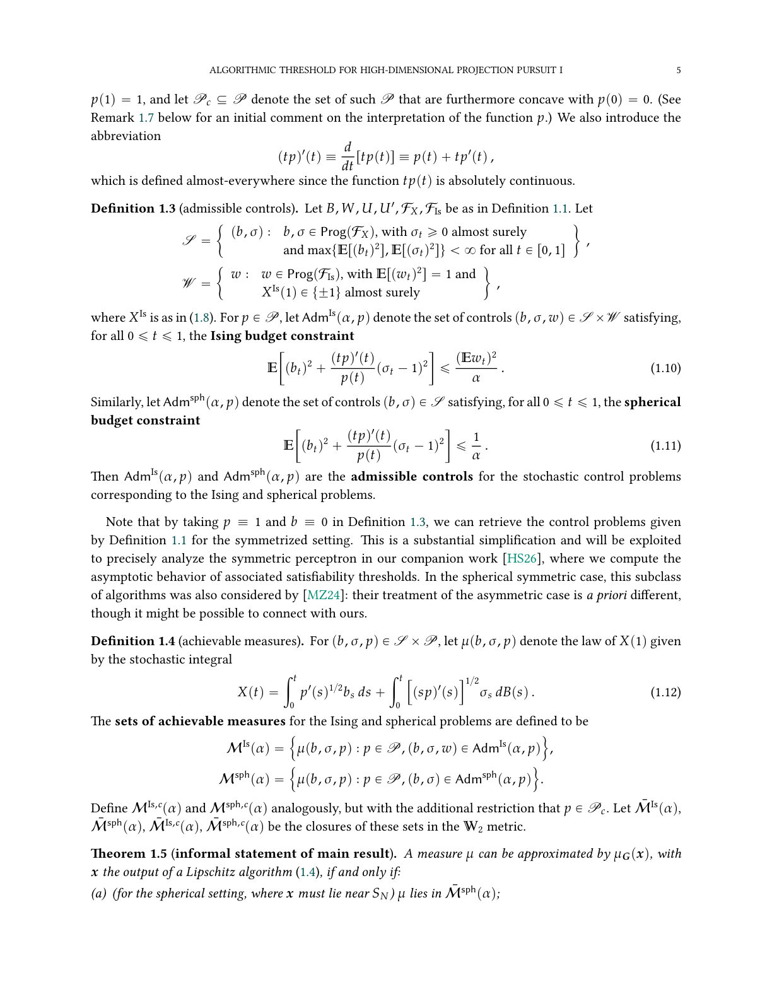 
Low-resolution page preview, page 5

📷 Fig 5

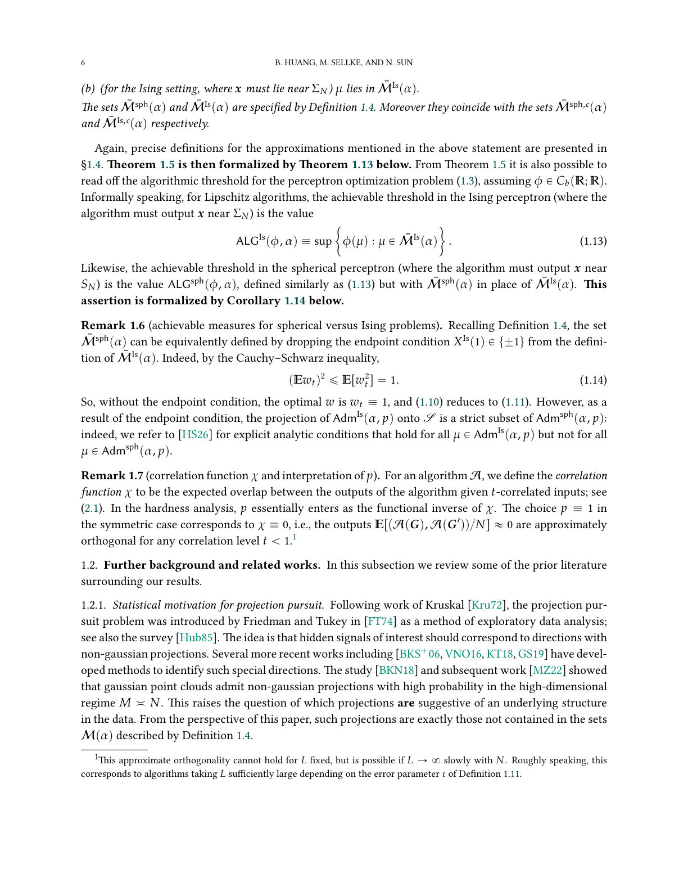 
Low-resolution page preview, page 6

**Summary.** This paper provides a rigorous characterization of the statistical distributions that can be extracted from high-dimensional Gaussian data using only algorithms with limited computational complexity. By framing the problem as a stochastic control problem, the authors derive exact algorithmic thresholds for optimizing models like the spherical and Ising perceptrons. This work significantly advances the understanding of algorithmic limitations in high-dimensional data analysis.

**Why it may be interesting.** The rigorous mathematical framework connecting algorithmic constraints (Lipschitz dependence) to the achievable statistical properties of high-dimensional data is highly relevant for understanding the limits of inference in complex physical systems.

Detailed structure

**Main problem.** The paper characterizes the set of one-dimensional empirical distributions achievable by projecting high-dimensional Gaussian data along a direction constrained by an algorithm.

**Main result.** The set of achievable measures is exactly characterized by a one-dimensional stochastic control problem, yielding exact algorithmic thresholds for optimizing perceptron models.

**Method.** The analysis employs stochastic control theory within the framework of projection pursuit, relating achievable measures to solutions of controlled Stochastic Differential Equations (SDEs).

**Model / system.** The study uses a null model of high-dimensional projection pursuit with data points sampled i.i.d. from a standard Gaussian in $N$ dimensions. Related physical models include spherical and Ising perceptrons.

**Key observables.** The achievable empirical distributions ($\mu$) of the projections, and the resulting algorithmic thresholds ($	ext{ALGIsp}, 	ext{ALGsphp}$).

**Important parameters / regimes.** The high-dimensional regime defined by $M, N 	o \infty$ with $M/N 	o \alpha \in (0, \infty)$.

**Assumptions / limitations.** The direction $\mathbf{x}$ must be the output of an algorithm with dimension-free Lipschitz dependence on the input data.

**Paper structure.** The paper develops the characterization of achievable measures using stochastic control theory, establishing necessary and sufficient conditions (Theorems 1.2 and 1.5) based on the closure of sets defined by admissible controls.

Abstract

We study a null model of high-dimensional projection pursuit: we are given $M$ points sampled i.i.d. from a standard gaussian in $N$ dimensions, where $M,N\to\infty$ with $M/N\toα\in(0,\infty)$. Our goal is to characterize the possible empirical distributions of these points' projections along a data-dependent direction $x$, which ranges over either the sphere $S_N=\sqrt{N}\mathbb{S}^{N-1}$ or cube $Σ_N=\{-1,+1\}^N$. We consider this problem in an algorithmic setting, where $x$ must be the output of an algorithm with dimension-free Lipschitz dependence on the input; this class of algorithms includes general gradient-based methods such as Langevin dynamics and approximate message passing (AMP). Our main result exactly characterizes the set of empirical distributions attainable by this class in terms of a one-dimensional stochastic control problem. As a consequence of our main result, we obtain exact algorithmic thresholds for optimizing the Hamiltonian of a spherical or Ising perceptron model with general bounded continuous activation. For the spherical problem, independent work of Montanari and Zhou (2024) characterized the empirical distributions attainable by a related two-stage AMP algorithm, also in terms of stochastic control.   Our proof of hardness builds on the branching overlap gap property introduced in earlier work by the first two authors. Our main innovation is to develop stochastic control theory within the branching OGP framework, significantly expanding the settings in which it locates an exact algorithmic threshold. Notably, our methods apply even though the non-algorithmic problem of characterizing all feasible projections remains a major outstanding challenge. For the matching algorithmic result, we construct a new incremental AMP algorithm that acts on a Brownian-bridge revelation of the gaussian disorder and simulates the same family of controlled SDEs.

[↑ back to top](#top)

### [Bosonic codes from compact phase spaces](http://arxiv.org/abs/2608.31156v1)

**Authors:** David Roberts, Aaron Slipper, Alireza Parhizkar, Victor V. Albert, Mohammad Hafezi  
**Type:** theory · **Category:** quantum information and computing · **PDF:** <https://arxiv.org/pdf/2608.31156v1>  
**Analysis basis:** full PDF text, analyzed in chunks

📷 Fig 1

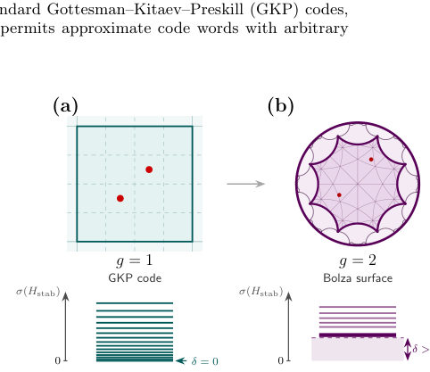 
FIG. 1. Bosonic codes from compact phase spaces. Top: torus (g = 1, GKP code) and hyperbolic octagon (g = 2, Bolza surface) with red dots marking stellar zeros of represen- tative code states. Bottom: spectrum of the stabilizer Hamil- tonian ˆHstab. For g = 1 the surface group Z2 is amenable and the spectrum touches zero (δ = 0), permitting approx- imate code words. For g = 2 the surface group π1(Σ2) is non-amenable, opening a spectral gap (δ &gt; 0) that obstructs construction of normalizable exact stabilizer eigenstates.

📷 Fig 2

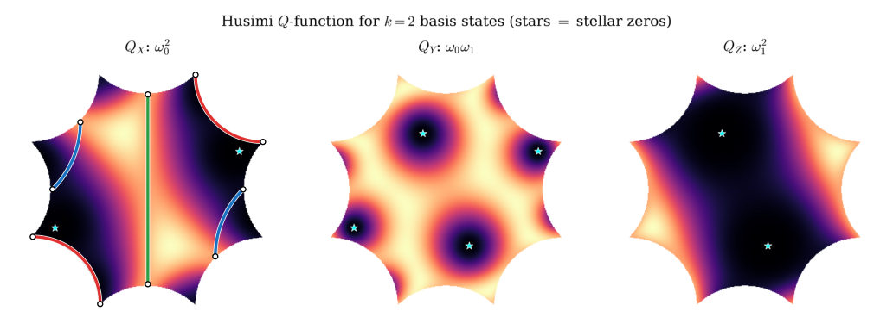 
FIG. 2. Husimi Q-function for the k = 2 code space basis on the Bolza octagon. Every basis state has stellar rank deg Ω⊗2 C = 4. Left: Qω2 0 (2 double zeros). Center: Qω0ω1 (4 simple zeros). Right: Qω2 1 (2 double zeros). Stars mark zero locations; the octagonal fundamental domain tiles the Poincar´e disk under Γ. The three pants geodesics γR, γG, γB (red, green, blue) are overlaid on the left panel; γR runs along two identified edges of the octagon.

📷 Fig 3

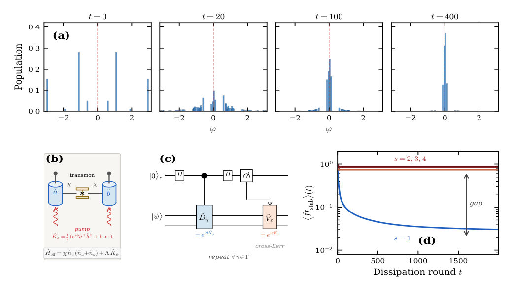 
FIG. 3. (a) Single-generator conditional-kick protocol (k = 2, Bolza surface, Ntrunc = 60, ε = 0.5): population in the ˆDγ- eigenbasis at rounds t = 0, 20, 100, 400. The dashed line marks φ = 0 (target stabilizer phase); population concentrates there over successive rounds. (b) Circuit-QED module: two microwave cavities (ˆa, ˆb) dispersively coupled (χ) to a transmon ancilla, with a single parametric pump (Λ) driving correlated photon-pair creation (two-mode squeezing). The effective Hamiltonian ˆHeff = χ ˆnc(ˆna + ˆnb)+Λ ˆKϕ provides the native gate set. (c) One round of the conditional-kick channel: controlled ˆDγ = eiθ ˆ Kϕ

**Summary.** This paper establishes a rigorous mathematical boundary for bosonic quantum error correction codes based on the geometry of their phase space. It proves that for surfaces of genus two or higher, the underlying group structure is non-amenable, which mathematically forces a spectral gap that prevents the existence of any stable, normalizable code state. This contrasts sharply with the well-understood case of the torus.

**Why it may be interesting.** This work provides a deep geometric constraint on quantum error correction, showing that the topology of the underlying physical space (the Riemann surface) dictates the fundamental feasibility of encoding quantum information.

Detailed structure

**Main problem.** The paper investigates the algebraic structure and existence of bosonic quantum error-correcting codes defined on compact Riemann surfaces of genus $g \geq 2$. The core problem is determining when such codes can support normalizable quantum states.

**Main result.** A fundamental no-go theorem is proven: for genus $g \geq 2$, the non-amenability of the surface group forces a strictly positive spectral gap in the stabilizer Hamiltonian, precluding the existence of any normalizable code state.

**Method.** The authors use tools from algebraic geometry (automorphic forms, Riemann-Roch theorem) combined with quantum information theory concepts like stabilizer codes and spectral gap analysis.

**Model / system.** The system models bosonic quantum error correction on a phase space defined by a compact Riemann surface $\Sigma_g$. The code space is defined by states fixed by the action of the surface's fundamental group $\Gamma$.

**Key observables.** Spectral Gap ($\delta$), Amenability of the stabilizer group ($\Gamma$), Dimension of the code space ($\dim H_\Gamma$).

**Important parameters / regimes.** Genus ($g$), Stellar Rank ($r$), The structure of the surface group $\pi_1(\Sigma_g)$.

**Assumptions / limitations.** The analysis relies on the uniformization theorem and the mathematical framework connecting quantum states to global sections of line bundles on the Riemann surface.

**Figures summary.** Figures compare the spectral gap ($\delta$) for $g=1$ (Torus/GKP, $\delta=0$) versus $g=2$ (Bolza surface, $\delta>0$), illustrating the physical consequence of group amenability.

**Paper structure.** The paper contrasts the known case of $g=1$ (amenable group, allowing approximate codes) with the general case $g \geq 2$. It develops the no-go theorem by linking the non-amenability of the surface group to a positive spectral gap, which mathematically forbids exact or approximate code states.

Abstract

We present the algebraic structure of bosonic quantum error-correcting codes on genus-two Riemann surfaces. We explicitly construct the code words as automorphic forms and analytically generate the full tower of code spaces at all weights. We prove a fundamental no-go theorem: for any genus greater than one, the stabilizer group is non-amenable, forcing a strictly positive spectral gap in the stabilizer Hamiltonian. Consequently, no normalizable quantum state can satisfy all stabilizer conditions. This sharply contrasts with standard Gottesman-Kitaev-Preskill (GKP) codes, where the amenability of the stabilizer group $\mathbb{Z}^2$ permits approximate code words with arbitrary precision.

[↑ back to top](#top)

### [Compensation in continuous symmetric trilayered planar ferrimagnet](http://arxiv.org/abs/2608.30941v1)

**Authors:** Olivia Mallick, Muktish Acharyya  
**Type:** theory · **Category:** statistical mechanics · **PDF:** <https://arxiv.org/pdf/2608.30941v1>  
**Analysis basis:** full PDF text, analyzed in chunks

📷 Fig 1

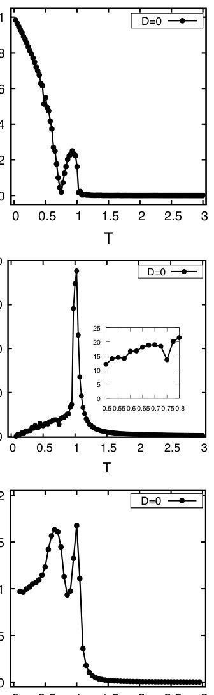 
FIG. 1. (a) The total magnetisation (M) is plotted against temperature (T) for isotropic (D = 0)

📷 Fig 2

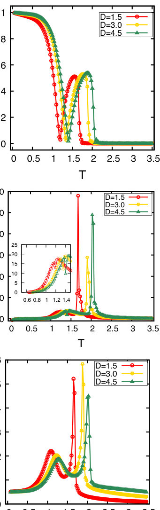 
FIG. 2. (a) The total magnetisation (M) is plotted against temperature (T) for different anistropy

📷 Fig 3

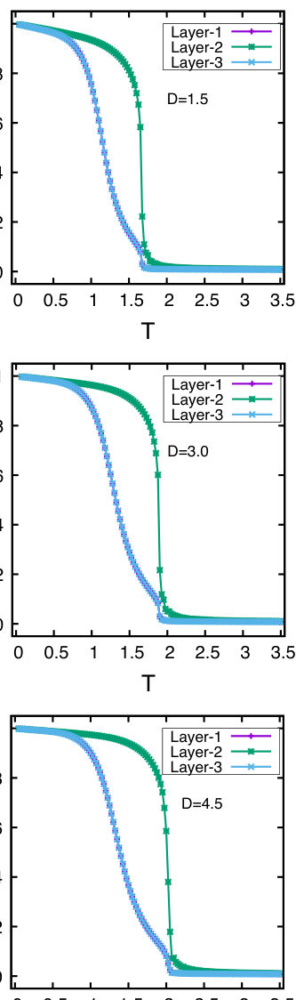 
FIG. 3. The sublattice (individual layer) magnetisation m is plotted against temperature (T) for

📷 Fig 4

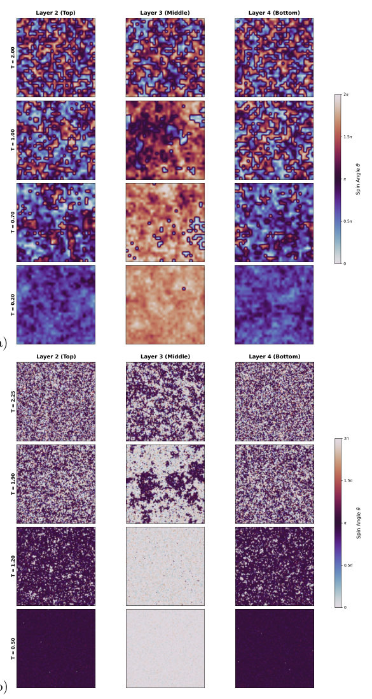 
FIG. 4. Spin morphology for system size L = 32 at (a)isotropic regime (D = 0) and (b) anisotropic

📷 Fig 5

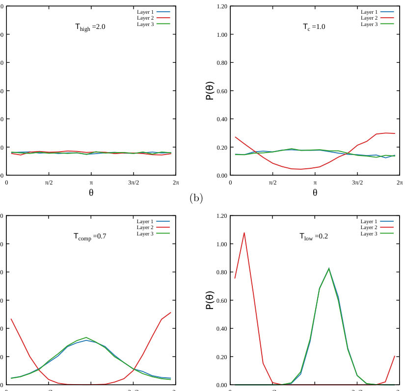 
FIG. 5. The spin-angle probability distribution of three sublattices for four characteristic temper-

**Summary.** This work uses Monte Carlo simulations to study a trilayered anisotropic XY ferrimagnet, focusing on two distinct temperature regimes: a critical transition ($T_c$) and a compensation point ($T_{comp}$). The research confirms that the system exhibits compensation—where net magnetization vanishes despite ordered sublattices—and demonstrates that increasing anisotropy stabilizes both transitions.

**Why it may be interesting.** The study provides detailed numerical evidence of compensation phenomena in a continuous spin model, offering insights into magnetic ordering mechanisms beyond simple mean-field treatments, which is relevant for understanding complex magnetic phase diagrams.

Detailed structure

**Main problem.** The study investigates the compensation behavior in a trilayered anisotropic XY magnetic system, where the total magnetization vanishes even if the individual magnetic sublattices remain ordered.

**Main result.** The system exhibits distinct high-temperature critical behavior ($T_c$) and low-temperature compensation behavior ($T_{comp}$), both of which increase with the single-site anisotropy parameter $D$.

**Method.** Monte Carlo simulations using the Metropolis algorithm with random single-spin updates were employed to calculate thermodynamic properties.

**Model / system.** The model is a trilayered (A-B-A type) anisotropic XY magnetic system featuring intra-plane ferromagnetic and inter-plane antiferromagnetic interactions, described by a Hamiltonian including a single-site anisotropy term $D$.

**Key observables.** Total magnetization ($M$), magnetic susceptibility ($\chi$), specific heat ($C$), and sublattice magnetizations ($m_k$).

**Important parameters / regimes.** Single-site anisotropy ($D$), temperature ($T$), and system size ($L$).

**Assumptions / limitations.** The analysis distinguishes between the thermodynamic phase transition at $T_c$ and the compensation point at $T_{comp}$, noting that the latter does not show conventional critical scaling with system size.

**Figures summary.** Figures illustrate $M(T)$, $\chi(T)$, and $C(T)$ for varying anisotropy $D$ and system sizes $L$, showing characteristic peaks/dips at both $T_c$ and $T_{comp}$.

**Paper structure.** The paper systematically analyzes the magnetic response by varying anisotropy ($D$) and system size ($L$), confirming the existence of two distinct temperature regimes: a critical transition and a compensation point, and comparing these findings across different simulation parameters.

Abstract

The trilayered (A-B-A type) anisotropic (single site) XY magnetic model is considered with the intra-plane ferromagnetic and   the inter-plane antiferromagnetic interactions. The equilibrium properties of such trilayered anisotropic XY system has been studied by   Monte Carlo simulation with Metropolis single spin (randomly chosen) update algorithm. In a given range of interaction parameters, the system has been found to exhibit the high temperature {\it critical} (vanishing sublattice magnetisations and total magnetisation) and low temperature {\it compensation} (vanishing total magnetisation even for non-vanishing sublattice magnetisations) behaviours. The compensation temperature and the critical temperature both are found to increase with the increase of single site anisotropy. The comprehensive phase diagram is drawn. The finite size study reveals the growth of correlations near the critical temperature.

[↑ back to top](#top)

### [Constrained minimax approximation for quantum signal processing](http://arxiv.org/abs/2608.30937v1)

**Authors:** Yulong Dong, James B. Larsen, Lin Lin, Rahul Sarkar  
**Type:** theory · **Category:** quantum information and computing · **PDF:** <https://arxiv.org/pdf/2608.30937v1>  
**Analysis basis:** full PDF text, analyzed in chunks

📷 Fig 1

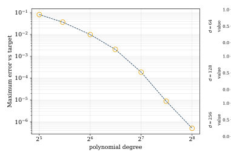 
Fig. 2: Performance of the Remez and active-set based method for gTP.

📷 Fig 2

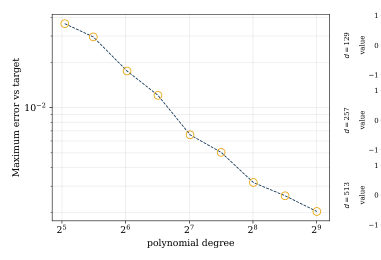 
Fig. 3: Performance of the Remez and active-set based method for gMI.

📷 Fig 3

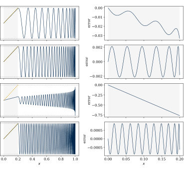 
Fig. 4: Performance of the Remez and active-set based method for gSV.

📷 Fig 4

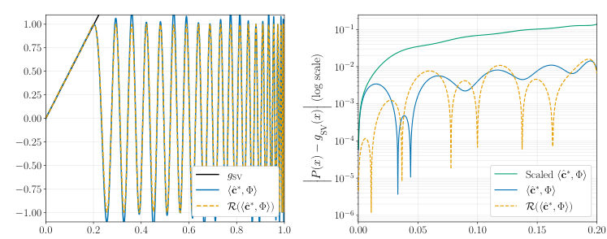 
Fig. 5: Illustration of nonlinear Fourier retraction for the uniform singular value amplification example (target function gSV). The polynomial ⟨ˆc∗, Φ⟩is the solution

📷 Fig 5

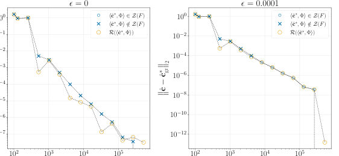 
Fig. 6: Convergence of the retraction method for the target function (1 −ϵ)gSV for

**Summary.** This paper tackles the mathematical challenge of constrained minimax approximation within Quantum Signal Processing (QSP). It develops and validates a nonlinear Fourier retraction technique to ensure that polynomial approximations, derived from solving large semi-infinite programs, remain physically feasible (i.e., bounded by one) while minimizing error. This provides a powerful, reliable workflow for designing practical quantum circuits.

**Why it may be interesting.** The work provides a robust mathematical tool for designing quantum circuits based on function approximation, which is crucial for implementing complex quantum gates or transformations in quantum computing architectures.

Detailed structure

**Main problem.** The paper addresses the constrained minimax approximation problem arising in Quantum Signal Processing (QSP), which requires finding a polynomial approximation that remains bounded by one on the domain while minimizing approximation error.

**Main result.** The authors introduce a nonlinear Fourier retraction method that successfully converts nearly feasible polynomial approximations into strictly feasible ones, maintaining high approximation accuracy even in challenging regimes.

**Method.** The approach combines solving a Linear Semi-Infinite Program (LSIP) via discretization (LP) with a novel nonlinear Fourier retraction technique to enforce boundary constraints.

**Model / system.** The context is Quantum Signal Processing (QSP), where polynomial transformations are implemented using quantum circuits. The approximation is formulated using Chebyshev polynomials ($\Phi(x)$) to construct an $	ext{SU}(2)$ valued QSP protocol.

**Key observables.** Approximation error ($\lVert P - g 
Vert_Y$), constraint violation ($\lVert \langle \hat{c}^*, \Phi 
angle 
Vert_X - 1$), and the convergence of the retraction method.

**Important parameters / regimes.** The degree of the polynomial ($d$), the size of the discretization sets ($|\hat{X}|, |\hat{Y}|$), and the regime of approximation (e.g., fully-coherent regime).

**Assumptions / limitations.** The primary difficulty addressed is that feasibility at finite sample points does not guarantee feasibility on the entire domain, especially when the optimal approximant hits the boundary.

**Figures summary.** Figures demonstrate the comparison between the optimal (but potentially infeasible) solution and the retracted solution, showing the retraction method maintains accuracy and enforces feasibility, particularly for the threshold projector ($g_{TP}$).

**Paper structure.** The paper first defines the constrained minimax problem in QSP, analyzes initial discretization methods (Remez exchange), and then introduces and rigorously tests the nonlinear Fourier retraction method, demonstrating its superior performance over standard techniques.

Abstract

Quantum signal processing (QSP) provides a simple and efficient framework for implementing polynomial transformations using quantum circuits. Its classical design stage leads to a constrained minimax approximation problem: find a polynomial of prescribed parity that approximates a target function uniformly on a fitting set while remaining bounded in magnitude by one on the domain $[0,1]$, which can be viewed as a semi-infinite constraint. Discretization converts the problem into a linear program, but feasibility at a set of finitely many sampled points does not ensure feasibility on the whole domain, especially when an optimal approximant reaches the boundary of the feasible set. We investigate two approaches to address this difficulty. A Remez exchange method combined with active-set constraint enforcement is efficient on many tested instances, but its stability depends on the target and problem geometry. We then introduce nonlinear Fourier retraction, which uses QSP completion and phase synthesis to turn a nearly feasible polynomial into phase factors for a feasible QSP polynomial without increasing the degree. Across representative problems, retraction largely preserves approximation accuracy and remains effective on instances where the Remez heuristic is unstable. The resulting workflow connects classical minimax approximation and semi-infinite optimization with nonlinear Fourier analysis, and is implemented in the qsppack software package.

[↑ back to top](#top)

### [Controlling Intertwined Electronic Orders in FeSe with Exfoliation](http://arxiv.org/abs/2608.29407v1)

**Authors:** Wenyao Liu, Gabriel Natale, Kyung-Mo Kim, Birender Singh, Piyush Sakrikar, Stephen D. Funni, Leo Kondo, Augustin Davignon, Antoine de Lagrave, Kota Ishihara, Michael Geiwitz, Maia G. Vergniory, Takasada Shibauchi, Jun Sung Kim, Michał Papaj, Judy J. Cha, Kenneth S. Burch†  
**Type:** both · **Category:** strongly correlated electrons · **PDF:** <https://arxiv.org/pdf/2608.29407v1>  
**Analysis basis:** full PDF text, analyzed in chunks

📷 Fig 1

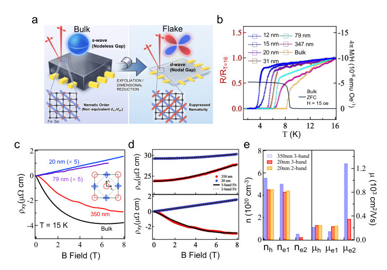 
Fig. 1. Exfoliated FeSe to thin flakes. a, Switching intertwined order in FeSe through exfo-

📷 Fig 2

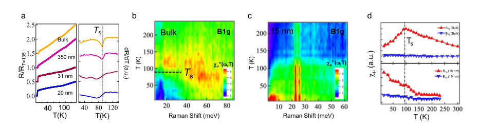 
Fig. 2. Nematicity in bulk and thin FeSe a, Temperature dependence of the normalized

📷 Fig 3

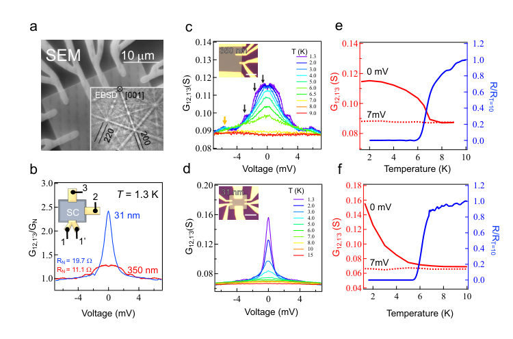 
Fig. 3. Superconducting spectra changing upon exfoliation a, SEM image of the FeSe de-

📷 Fig 4

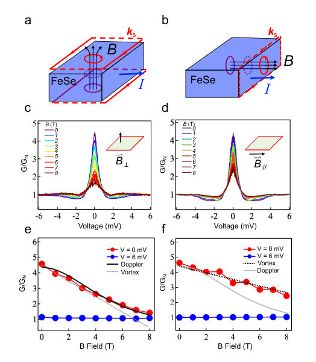 
Fig. 4. Response to an external magnetic field. Schematics of applying external magnetic

📷 Fig 5

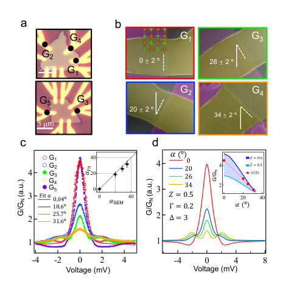 
Fig. 5. Symmetry of sOP in thin flake a, Optical image of two 20 nm-thickness FeSe de-

**Summary.** This work demonstrates that physically thinning the superconductor FeSe via exfoliation acts as a powerful tool to manipulate its electronic state. Experimentally, this process suppresses the bulk nematic order and spectroscopically confirms a symmetry switch in the superconducting pairing from s-wave to d-wave-dominant. This establishes FeSe thin flakes as a versatile platform for engineering quantum superconducting orders.

**Why it may be interesting.** The ability to tune superconducting pairing symmetry using purely structural/dimensional control (exfoliation) is highly relevant to understanding emergent quantum states in strongly correlated materials, providing a clean platform for studying pairing mechanisms.

Detailed structure

**Main problem.** The study investigates how controlling the electronic structure via exfoliation can tune the competing electronic orders (nematic and superconducting) in the unconventional superconductor FeSe.

**Main result.** Exfoliation suppresses the bulk electronic nematic response and fundamentally switches the superconducting symmetry from bulk s-wave to a d-wave-dominant pairing state.

**Method.** The research employs a combination of experimental techniques, including angle-dependent Andreev reflection spectroscopy, Raman scattering, and transport measurements, complemented by theoretical modeling using the 2D-BTK model.

**Model / system.** The physical system is Iron Selenide (FeSe), an unconventional superconductor. The theoretical framework involves modeling the superconducting order parameter (sOP) symmetry, often using extensions of the 2D-BTK model to account for $s+d$-wave pairing.

**Key observables.** Superconducting symmetry (s-wave vs. d-wave), nematic order strength (probed by Raman response), superconducting gap size ($\Delta$), and critical temperature ($T_c$).

**Important parameters / regimes.** Flake thickness (dimensional reduction), magnetic field ($B$), temperature ($T$), and the nematic interaction strength ($g_{nem}$).

**Assumptions / limitations.** The analysis assumes that exfoliation provides a clean tuning knob for electronic orders, and that Andreev reflection measurements can be accurately modeled using the 2D-BTK formalism.

**Figures summary.** Figures illustrate the suppression of nematic signatures in thin flakes via Raman maps, the transition from coherence peaks to Zero-Bias Conductance Peaks (ZBCP) in ARS spectra, and the thickness dependence of superconducting gap components.

**Paper structure.** The paper progresses by first establishing the problem of controlling intertwined orders, then presenting evidence from transport and Raman spectroscopy showing nematic suppression upon exfoliation, followed by definitive proof of symmetry switching using angle-dependent Andreev reflection spectroscopy, and concluding with theoretical modeling of the resulting pairing symmetry.

Abstract

Controlling intertwined electronic orders in two-dimensional superconductors offers an effective route to answering fundamental questions and engineering new quantum devices. However, tuning the balance between competing orders typically requires complex chemistry, strain, or interface engineering. Here, we show that a pristine alternative is the dimensional reduction of the unconventional superconductor FeSe. Exfoliation suppresses the bulk electronic nematic response and switches the superconducting symmetry from bulk s-wave to d-wave-dominant. Transport, electron microscopy, and Raman spectroscopy establish the substantial weakening of nematic order in thin flakes. To probe superconductivity, we perform angle-dependent Andreev reflection spectroscopy on pristine crystal edges. As the junction's orientation is rotated, the spectra evolve from zero-energy bound states to coherence peaks. The injection angle, field, and temperature dependence, along with theoretical modeling, confirm that exfoliation switches the superconducting symmetry. Our results suggest a versatile superconducting platform for engineering quantum orders and provide fresh insights into the underlying pairing mechanisms.

[↑ back to top](#top)

### [d'Q = TdS for Infinitesimal Irreversible Processes: On the Differential Form of the Clausius Inequality](http://arxiv.org/abs/2608.30421v1)

**Authors:** Hiroshi Shimahara  
**Type:** theory · **Category:** statistical mechanics · **PDF:** <https://arxiv.org/pdf/2608.30421v1>  
**Analysis basis:** full PDF text, analyzed in chunks

📷 Fig 1

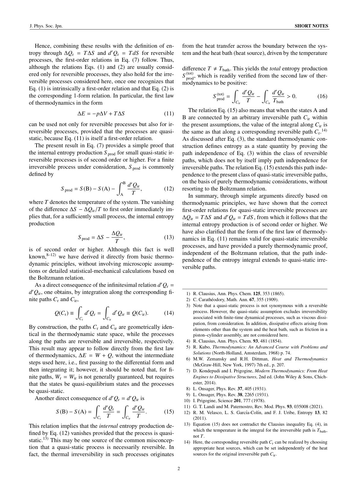 
Low-resolution page preview, page 2

**Summary.** This paper re-examines the Clausius inequality for infinitesimal irreversible processes, arguing that the correct first-order relationship is an equality, $d'Q = TdS$. This result demonstrates that entropy remains a well-defined state function even when considering quasi-static irreversible paths, providing a purely thermodynamic proof that internal entropy production is of a higher order than first order.

**Why it may be interesting.** While focused on classical thermodynamics, establishing the path independence of entropy for quasi-static irreversible paths using purely thermodynamic arguments provides a rigorous foundation relevant to defining entropy in non-equilibrium quantum systems.

Detailed structure

**Main problem.** The paper addresses the conventional understanding of the Clausius inequality for infinitesimal irreversible processes, specifically challenging the strict inequality $d'Q < TdS$.

**Main result.** The correct first-order differential form for quasi-static irreversible processes is shown to be the equality $d'Q = TdS$, which implies that internal entropy production is of second order or higher.

**Method.** The analysis uses purely thermodynamic arguments, starting from the First Law of Thermodynamics and applying first-order approximations to the inexact differential of heat ($d'Q$) and the exact differential of entropy ($dS$).

**Model / system.** The study considers general thermodynamic processes, differentiating between reversible and irreversible paths under the assumption of quasi-static conditions.

**Key observables.** Inexact differential of heat ($d'Q$), exact differential of entropy ($dS$), and internal entropy production ($S_{prod}$).

**Important parameters / regimes.** Temperature ($T$) and the assumption of quasi-static processes.

**Assumptions / limitations.** The analysis is strictly limited to quasi-static processes, and the derivation relies on first-order approximations for small temperature variations.

**Paper structure.** The paper builds the argument by comparing the heat exchange and entropy change for reversible and irreversible processes, deriving the equality $d'Q = TdS$ for quasi-static paths, and concluding that entropy remains a well-defined state function even for irreversible paths.

Abstract

Conventionally, the differential form of the Clausius inequality is adopted for infinitesimal irreversible processes. We show that the correct first-order form for infinitesimal quasi-static irreversible processes is the equality d'Q=TdS rather than d'Q < TdS. This provides a purely thermodynamic proof that internal entropy production is second-order or higher and confirms that entropy remains a well-defined state quantity even when quasi-static irreversible processes are included, without resorting to the Boltzmann relation.

[↑ back to top](#top)

### [Deterministic Minimum-Output-Entropy Nonadditivity via Haagerup's Inequality and Near-Free Permutation Representations](http://arxiv.org/abs/2608.31081v1)

**Authors:** Guocheng Zhen, Chengkai Zhu, Ranyiliu Chen, Xin Wang  
**Type:** theory · **Category:** quantum information and computing · **PDF:** <https://arxiv.org/pdf/2608.31081v1>  
**Analysis basis:** full PDF text, analyzed in chunks

📷 Fig 1

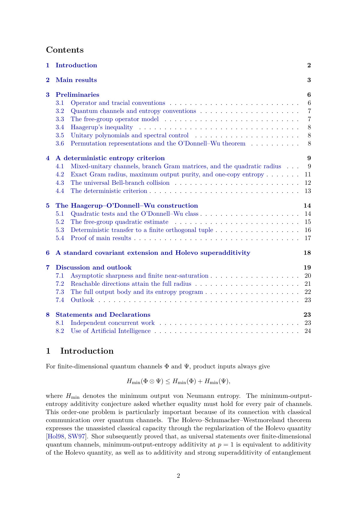 
Low-resolution page preview, page 2

📷 Fig 2

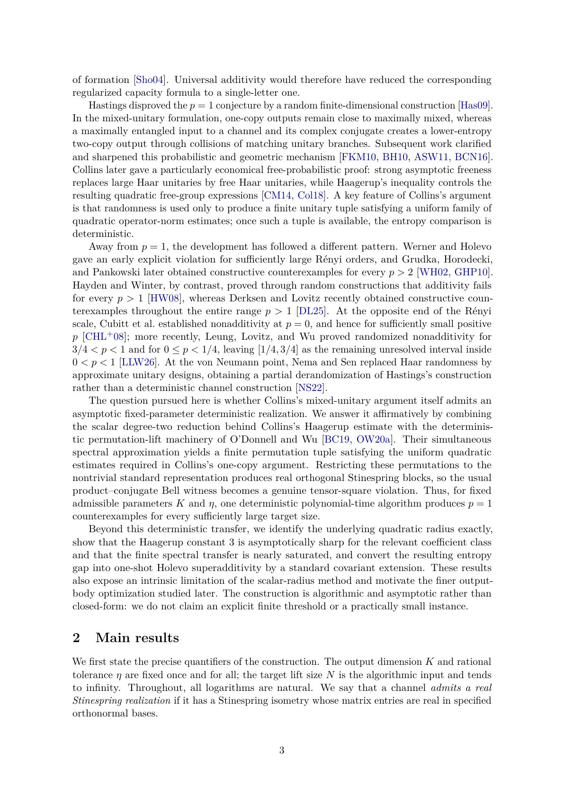 
Low-resolution page preview, page 3

📷 Fig 3

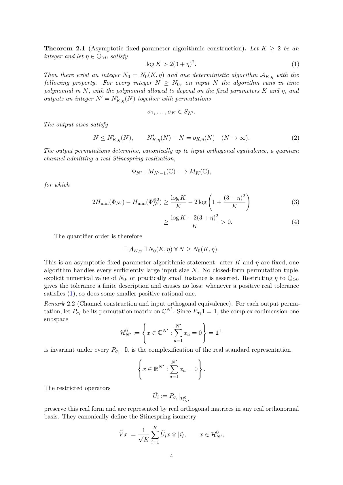 
Low-resolution page preview, page 4

📷 Fig 4

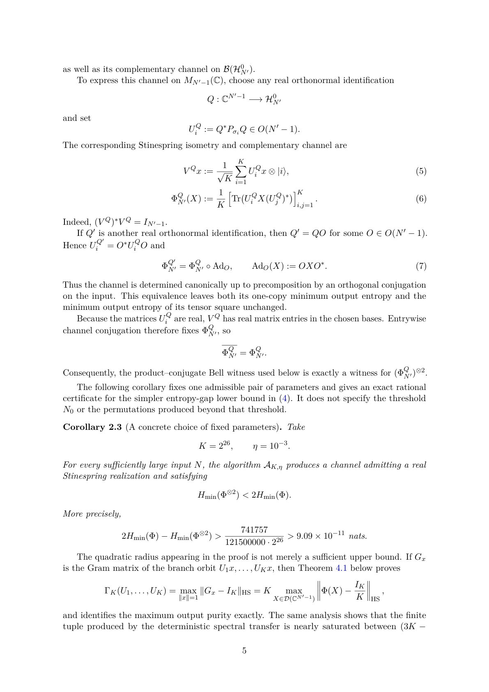 
Low-resolution page preview, page 5

📷 Fig 5

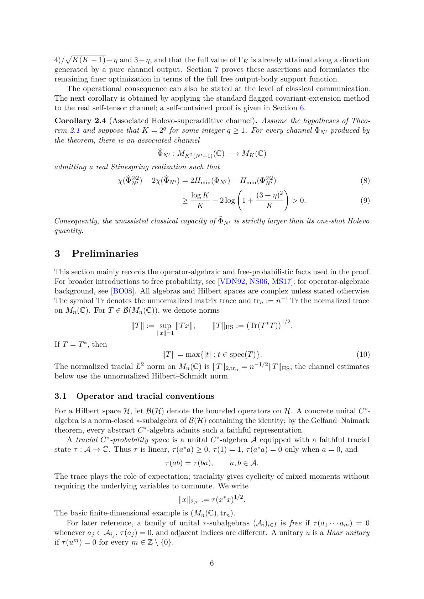 
Low-resolution page preview, page 6

**Summary.** This work provides a deterministic, polynomial-time construction demonstrating the nonadditivity of minimum-output-entropy for quantum channels. By combining advanced inequalities like Haagerup's with spectral approximation techniques, the authors establish a positive entropy gap. This result is significant because it provides a rigorous, constructive proof that translates directly into superadditivity for the one-shot Holevo quantity.

**Why it may be interesting.** It provides a concrete, deterministic, and algorithmic proof of a fundamental non-additivity property in quantum information theory, advancing the understanding of channel capacity beyond simple random constructions.

Detailed structure

**Main problem.** The paper addresses the deterministic realization of the quadratic certificate proving the nonadditivity of the minimum-output-entropy for quantum channels.

**Main result.** It constructs a deterministic, polynomial-time algorithm yielding a specific entropy gap for the channel, which is shown to translate exactly into superadditivity for the one-shot Holevo quantity.

**Method.** The construction combines Haagerup's length-two inequality with the deterministic spectral approximation of O'Donnell and Wu, applied to channels realized via real orthogonal Stinespring blocks.

**Model / system.** The system analyzed is a quantum channel $\Phi_{N'}:M_{N'-1}(\mathbb{C})	o M_K(\mathbb{C})$, whose properties are governed by its minimum-output-entropy ($H_{\min}$).

**Key observables.** Minimum output entropy ($H_{\min}$), the entropy gap $2H_{\min}(\Phi_{N'}) - H_{\min}(\Phi_{N'}^{\otimes 2})$, and the one-shot Holevo quantity ($\chi$).

**Important parameters / regimes.** Fixed integer $K \ge 2$, rational tolerance $\eta > 0$, and the asymptotic input size $N$.

**Assumptions / limitations.** The construction is algorithmic and asymptotic, relying on the existence of a real Stinespring realization for the channels.

**Paper structure.** The paper develops the deterministic construction, proves the entropy gap inequality using spectral approximation, and concludes by showing the equivalence of this gap to superadditivity for the Holevo quantity.

Abstract

We give a deterministic realization of the finite-dimensional quadratic certificate underlying Collins's mixed-unitary proof of minimum-output-entropy nonadditivity. For every fixed integer $K\ge 2$ and rational $η>0$ satisfying $\log K>2(3+η)^2$, a deterministic polynomial-time algorithm, for every sufficiently large target size $N$, outputs $K$ permutations on $N'=N+o_{K,η}(N)$ points. Restricting their permutation matrices to the nontrivial standard representation yields real orthogonal Stinespring blocks and a channel $Φ_{N'}:M_{N'-1}(\mathbb{C})\to M_K(\mathbb{C})$ such that \[ 2H_{\min}(Φ_{N'}) -H_{\min}(Φ_{N'}^{\otimes 2}) \ge \frac{\log K}{K} -2\log\left(1+\frac{(3+η)^2}{K}\right) >0. \] The construction combines Haagerup's length-two inequality with the simultaneous deterministic spectral approximation of O'Donnell and Wu. We further show that the constant $3$ is asymptotically sharp on the relevant Hermitian zero-diagonal coefficient class and that the finite spectral transfer is nearly saturated, thereby isolating the finer geometry of the full output body as the natural next level of refinement beyond the scalar-radius method. Finally, a standard covariant extension converts the same deterministic entropy gap exactly into self-tensor superadditivity of the one-shot Holevo quantity.

[↑ back to top](#top)

### [Eigenvalues of multipartite entanglement witnesses](http://arxiv.org/abs/2608.29049v1)

**Authors:** Nalan Wang, Lin Chen  
**Type:** theory · **Category:** quantum information and computing · **PDF:** <https://arxiv.org/pdf/2608.29049v1>  
**Analysis basis:** full PDF text, analyzed in chunks

📷 Fig 1

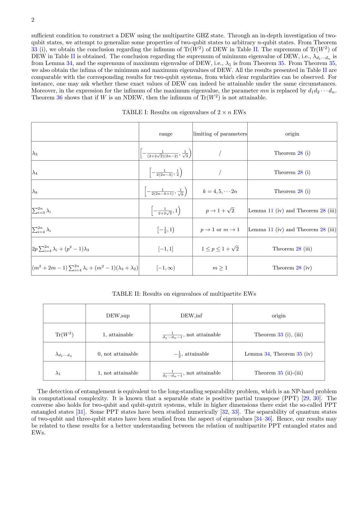 
Low-resolution page preview, page 2

📷 Fig 2

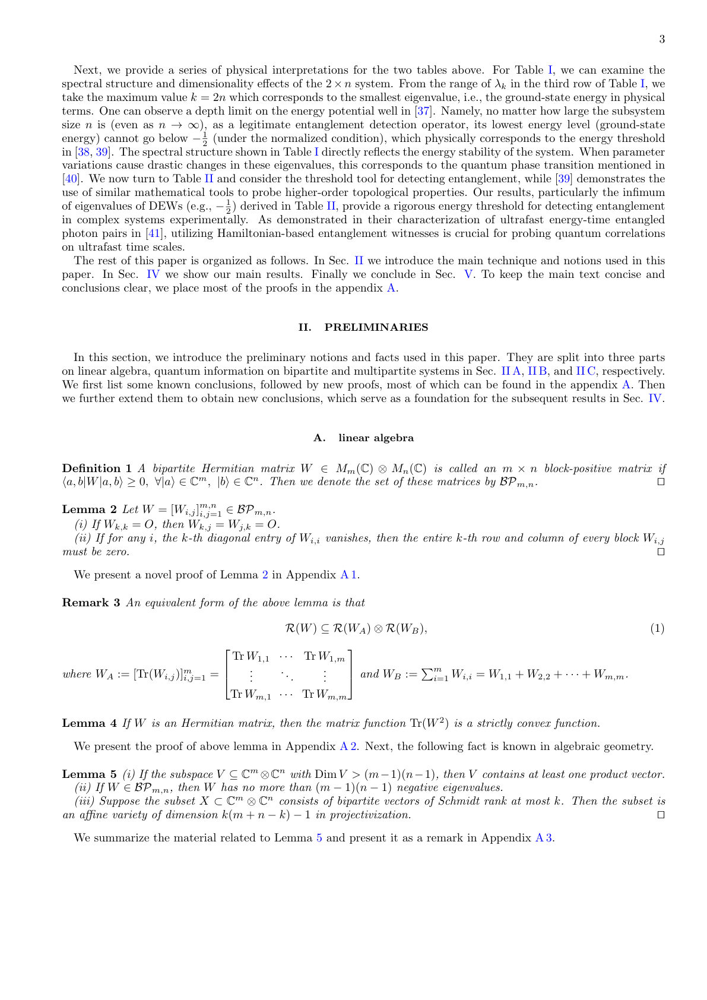 
Low-resolution page preview, page 3

📷 Fig 3

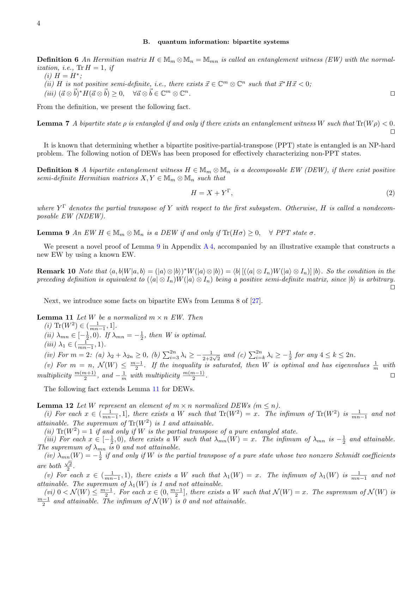 
Low-resolution page preview, page 4

📷 Fig 4

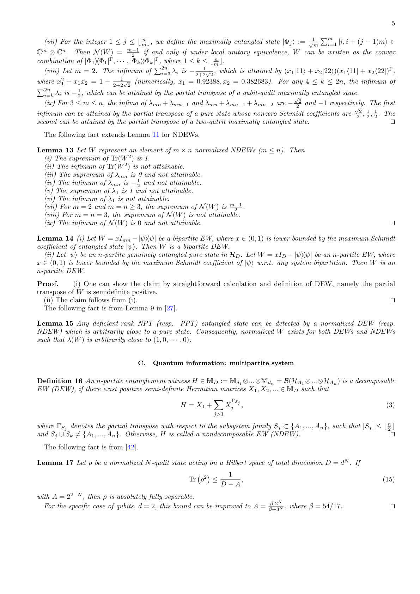 
Low-resolution page preview, page 5

📷 Fig 5

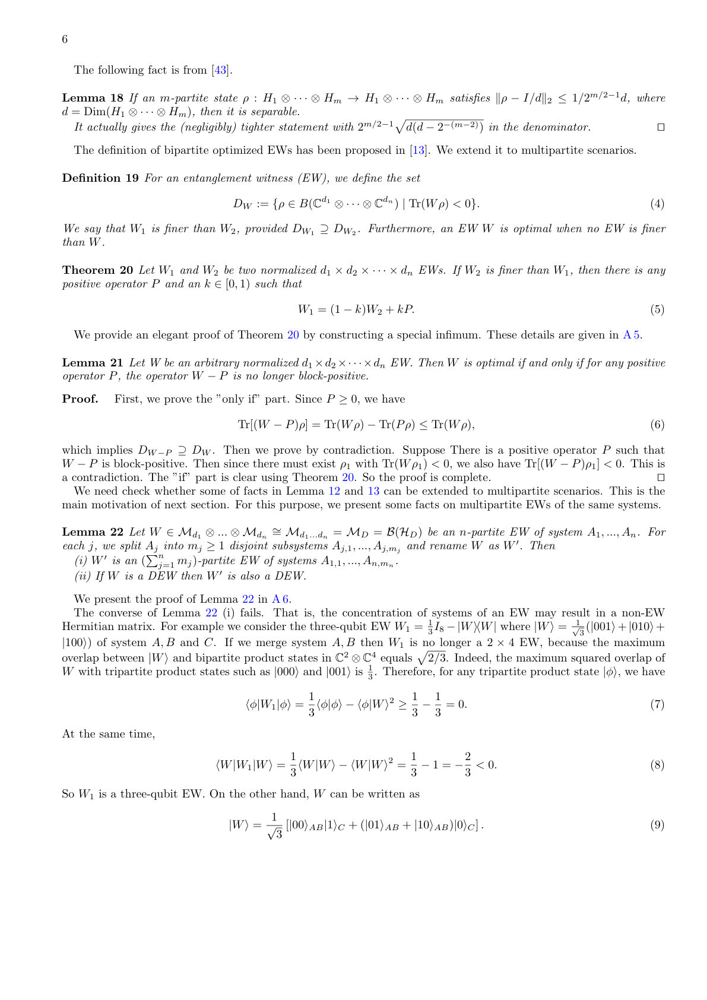 
Low-resolution page preview, page 6

**Summary.** This paper mathematically characterizes entanglement witnesses (EWs) in multipartite quantum systems, distinguishing between decomposable and non-decomposable types. It derives necessary and sufficient conditions and establishes precise bounds on the eigenvalues and spectral properties of these witnesses. This work provides rigorous tools for quantifying entanglement detection in complex quantum states.

**Why it may be interesting.** The rigorous mathematical characterization of entanglement witnesses provides concrete, quantifiable thresholds for detecting entanglement in complex, multi-partite quantum states, which is fundamental to quantum information theory.

Detailed structure

**Main problem.** The paper investigates the mathematical properties of entanglement witnesses (EWs) in multipartite quantum systems, specifically classifying them as decomposable (DEWs) or non-decomposable (NDEW).

**Main result.** The authors provide necessary and sufficient conditions for constructing special DEWs using the GHZ state and explicitly characterize the bounds (supremum/infimum) for key spectral properties like eigenvalues and the trace of the square of the witness.

**Method.** The analysis relies heavily on linear algebra, decomposing the EW operator into blocks based on subspace splittings, and deriving rigorous inequalities for the eigenvalues.

**Model / system.** The focus is on multipartite quantum systems (up to n-qubit systems) and the mathematical tools used to detect entanglement, represented by the entanglement witness operator W.

**Key observables.** Eigenvalues of the EW ($\lambda_k$), the trace of the square of the witness ($	ext{Tr}(W^2)$), and the expectation value $	ext{Tr}(W
ho)$ used for entanglement detection.

**Important parameters / regimes.** The dimensionality of the system ($n$-qubits) and the specific structure of the witness (e.g., $2 	imes n$ EWs).

**Assumptions / limitations.** The analysis builds upon the definitions of DEWs and NDEWs, and in some sections, assumes the existence of a genuine 2 $	imes$ n EW to constrain the operator structure.

**Figures summary.** Table I summarizes eigenvalue ranges for $2 	imes n$ EWs, while Table II summarizes bounds for DEWs and NDEWs regarding $	ext{Tr}(W^2)$ and specific eigenvalues.

**Paper structure.** The paper progresses from general properties of block-positive operators to specific characterizations of DEWs and NDEWs, culminating in detailed eigenvalue results for $2 	imes n$ systems and general multipartite systems.

Abstract

We investigate various properties of multipartite block-positive operators, decomposable EWs (DEWs), and non-decomposable EWs. We provide a necessary and sufficient condition to construct a special DEW using the multipartite GHZ state. For multipartite DEW, we explicitly characterize the supremum and infimum of maximum and minimum eigenvalues, as well as the trace of its square. We also derive other results concerning NDEW, eigenvalues of $2 \times n$ EWs and the corresponding physical implications. Furthermore, we investigate the tightness of inequalities of these eigenvalues with examples.

[↑ back to top](#top)

### [Emergence and suppression of phonon vortices in two-dimensional crystals: Interplay of lattice symmetry, heavy impurities, and shear](http://arxiv.org/abs/2608.30645v1)

**Authors:** Yu-Tian Zhang, Deng Pan, Yuliang Jin  
**Type:** theory · **Category:** disordered systems and neural networks · **PDF:** <https://arxiv.org/pdf/2608.30645v1>  
**Analysis basis:** full PDF text, analyzed in chunks

📷 Fig 1

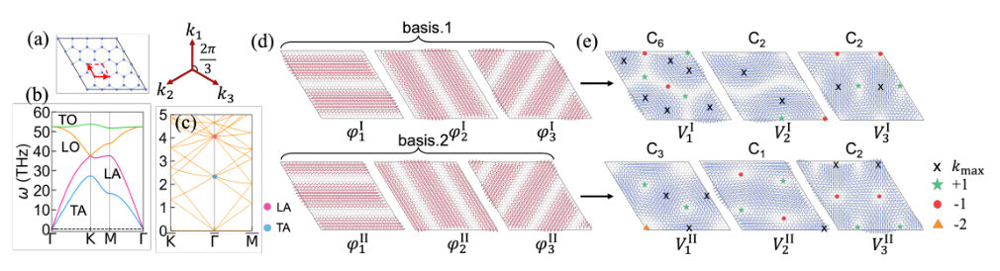 
FIG. 1. Formation of phonon vortex modes via symmetry-adapted linear combinations of degenerate planar modes. (a) Structure of a hexagonal lattice and the k directions of 3-fold plane waves in (d). Phonon bands of (b) a unitcell and (c) a 24 × 24 supercell. (d) Six degenerate TA plane waves at ω ≈2.34 THz. (e) Six degenerate TA vortex modes at the same frequency, with the winding number of each vortex and the Cn rotational symmetry of the mode indicated. The crosses indicate the sites of P max d (maximum amplitude).

📷 Fig 2

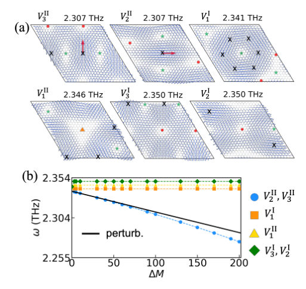 
FIG. 2. Phonon vortex modes with a single heavy mass defect. (a) Six lowest-frequency TA modes for ∆M = 108 (M ′ = 120 u) in a 24X supercell. The red arrows indicate resonance (see Fig. 1e legend for the meaning of other symbols). (b) The frequency ω as a function of ∆M. The solid line indicates the prediction from the perturbation theory, Eq. (1), with c ≈2.5 × 10−4.

📷 Fig 3

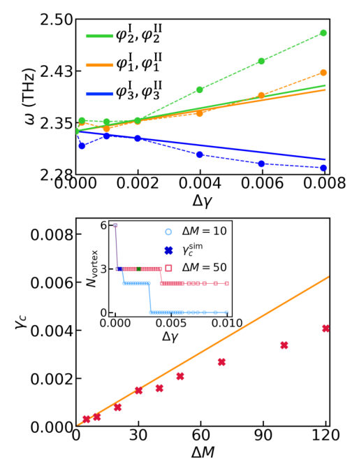 
FIG. 3. Shear-mass competition. (a) Numerical frequency ω (points) of the six lowest-frequency TA modes, which are all planar, as a function of ∆γ (with a fixed ∆M = 108), compared with the perturbation theory (lines). (b) Numerical strain threshold γc as a function of ∆M, compared to Eq. (5) (line). (inset) Nvortex vs. ∆γ for two given ∆M.

📷 Fig 4

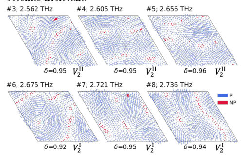 
FIG. 4. Six lowest-frequency modes for a MAC configuration. The vibrations of phononic (P) and non-phononic (NP) atoms are indicated by blue and red arrows (enlarged for better vi- sualization).

📷 Fig 5

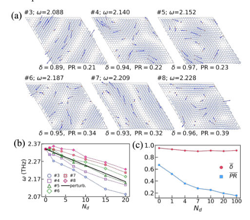 
FIG. 5. Phonon vortex modes with multiple heavy mass de- fects. (a) Six lowest-frequency TA modes for 20 heavy im- purities (∆M = 108) in a 24 × 24 supercell. The dark blue arrows indicate resonance. (b) The frequency ω as a func- tion of Nd for the six modes, averaged over multiple random realizations of the impurity positions. The black solid line in- dicates Eq. (15). (c) The mean participation ratio and spatial coherence as a function of Nd.

**Summary.** This work provides a first-principles understanding of phonon vortices in 2D crystals, demonstrating that these modes are symmetry-protected features. The authors model how these vortices are stabilized by heavy impurities but suppressed by shear strain, establishing a predictable crossover threshold. This framework offers a powerful tool for designing materials with tailored vibrational properties.

**Why it may be interesting.** The framework connecting vibrational topological defects (vortices) to fundamental symmetries and external perturbations (strain/defects) provides a generalizable model for understanding lattice dynamics in engineered materials, relevant to phononics and thermal transport.

Detailed structure

**Main problem.** The study investigates the fundamental origin, emergence, and suppression mechanisms of phonon vortices in two-dimensional crystals.

**Main result.** Phonon vortices are shown to arise intrinsically from lattice symmetry in perfect crystals, while their existence is governed by a competition between impurity-induced resonance and shear-induced symmetry breaking.

**Method.** The research employs phonon eigenvalue calculations, group theory (SALC), and perturbation theory to model the effects of mass defects and strain.

**Model / system.** The system under study is two-dimensional crystalline materials (e.g., graphene) modeled on hexagonal or square lattices, analyzed using the phonon eigenvalue equation.

**Key observables.** Phonon vortex modes, frequency shifts ($\omega$), spatial coherence ($\delta$), and the strain threshold ($\gamma_c$).

**Important parameters / regimes.** Heavy mass impurity concentration ($\Delta M$), shear strain ($\Delta \gamma$), and lattice symmetry point groups ($C_3$, $C_6$).

**Assumptions / limitations.** The analysis often assumes the single-site resonance dominates the full mode behavior, and the initial understanding is built upon symmetry-adapted linear combinations.

**Figures summary.** Figures illustrate the formation of vortex modes, the frequency dependence on impurity concentration, and the competition between impurity and shear effects determining a crossover strain threshold.

**Paper structure.** The paper develops from establishing the symmetry origin of vortices in perfect crystals, to analyzing the stabilizing effect of heavy impurities, and finally quantifying the suppression mechanism via shear deformation, culminating in a predictive strain threshold.

Abstract

Phonon vortices are vortex-like displacement fields that appear in the vibrational modes of two- dimensional materials. Here, we demonstrate that these vortices arise as symmetry-adapted linear combinations of degenerate planar phonon modes, with the superposition coefficients uniquely de- termined by the lattice point group. This symmetry principle establishes that vortices are intrinsic standing-wave solutions in perfect crystals, requiring neither impurities nor disorder. A heavy mass impurity favors vortex modes over planar modes through stronger resonance-induced frequency soft- ening, whereas shear deformation suppresses vortex modes by breaking rotational symmetry. The competition between these two effects gives rise to a precisely predictable strain threshold. The proposed framework, grounded in symmetry and energy-minimization, provides a useful basis for understanding vibrational topological defects induced by other types of impurities or defects. This study further suggests that defect and shear engineering constitutes an effective tuning strategy for controlling vibrational modes and the associated thermal and mechanical properties of crystals.

[↑ back to top](#top)

### [Exact Haar Statistics of Planar $k$-Purity in Multipartite Quantum Systems](http://arxiv.org/abs/2608.28914v1)

**Authors:** Kourosh Mirsohi  
**Type:** theory · **Category:** statistical mechanics · **PDF:** <https://arxiv.org/pdf/2608.28914v1>  
**Analysis basis:** full PDF text, analyzed in chunks

📷 Fig 1

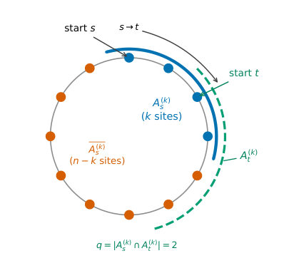 
FIG. 1. Subsystem geometry for planar k-purity. The blue sites form one k-site interval A(k) s ; the orange sites form its (n −k)-site complement. The arrow fixes the translation orientation, and the dashed green arc shows a translated interval A(k) t with overlap q = |A(k) s ∩A(k) t |. Translating through all starts in Zn produces the reductions averaged in Eq. (4).

📷 Fig 2

 
Figure 1 illustrates the associated bipartition. We define the planar k-purity by

📷 Fig 3

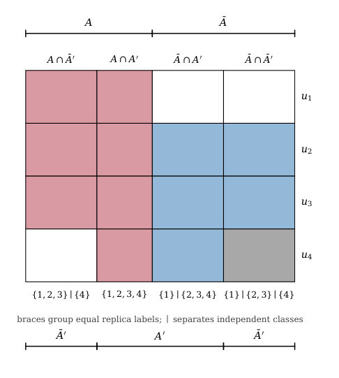 
FIG. 2. Representative Kronecker-delta contraction for σ = (23). The four columns represent A \ A′, A ∩A′, A′ \ A, and (A ∪A′)c, with dimensions y, x, y, w. Equal fills identify local replica labels; the braces give the same equality classes algebraically. The component counts (2, 1, 2, 3) produce xy4w3, with multiplicity four in Table I. Region widths are schematic.

📷 Fig 4

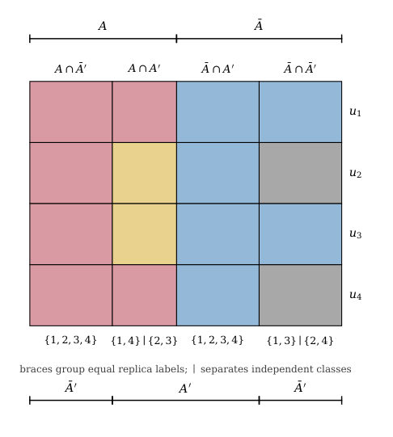 
FIG. 3. Crossed contraction for σ = (13)(24), the third row of Table I. The component counts (1, 2, 1, 2) across regions of di- mensions y, x, y, w give x2y2w2 with multiplicity two. Because all four region dimensions depend on the translated over- lap, this contraction displays the origin of the displacement- dependent covariance.

📷 Fig 5

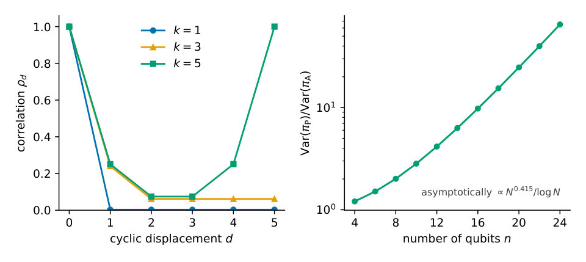 
FIG. 4. Geometry of planar-purity fluctuations. Left: exact correlation coefficient ρd = C(2) 10,k(d)/C(2) 10,k(0) for the nonbalanced choices k = 1, 3 and the balanced choice k = 5. The balanced endpoint d = 5 is the complementary interval and obeys πA = πAc exactly; changing k alters the complete displacement kernel. Right: exact variance ratio between balanced planar and absolute purity for even 4 ≤n ≤24. The annotation gives the asymptotic growth implied by Eqs. (33) and (34); no fitted values enter either panel.

**Summary.** This paper calculates the exact statistical moments, including the variance, for a measure called planar $k$-purity in multipartite quantum systems. By analyzing how purity depends on the overlap of geometrically related subsystems, it reveals that local correlations (subsystem incidence) control collective fluctuations even when single-cut marginals appear featureless. This offers a powerful, geometry-aware tool for characterizing multipartite entanglement.

**Why it may be interesting.** The work provides a rigorous, geometry-aware benchmark for entanglement beyond simple marginal constraints, which is crucial for understanding how local correlations dictate global quantum properties in many-body systems.

Detailed structure

**Main problem.** The paper aims to quantify multipartite entanglement in pure quantum states by analyzing the statistical properties of planar $k$-purity.

**Main result.** It derives exact closed-form expressions for the mean, covariance kernel, and variance of planar $k$-purity for Haar-random states, showing that planar fluctuations are distinct from those governed by single-cut marginals.

**Method.** The analysis uses advanced theoretical techniques involving replica calculations, site-factorized permutation representations, and the application of generalized trace formulas on replicated quantum states.

**Model / system.** The system is a multipartite quantum state of $n$ parties with local dimension $p$, specifically focusing on Haar-random pure states distributed on a ring geometry.

**Key observables.** Planar $k$-purity ($\pi^{(k)}_P$), joint purity of two intervals, and the variance of these purity measures.

**Important parameters / regimes.** The number of parties ($n$), the local dimension ($p$), and the interval size ($k$).

**Assumptions / limitations.** The calculations assume the state is Haar-random and focus on the planar constraint, which is a specific geometric restriction on entanglement.

**Figures summary.** Figure 1 illustrates the geometry for planar $k$-purity, showing an interval and its translation with a defined overlap.

**Paper structure.** The paper develops the theory by first defining planar $k$-purity as a cost function, then deriving the joint purity moments using replica methods, and finally presenting closed-form expressions and asymptotic limits for the variance.

Abstract

Planar $k$-uniform states have maximally mixed reductions on every $k$-site interval of a ring. We introduce planar $k$-purity---the mean purity of those intervals---as a faithful cost function for this simultaneous constraint. For a Haar-random pure state of $n$ parties with local dimension $p$, the joint purity of two intervals depends only on their overlap. An exhaustive four-replica calculation therefore yields the complete cyclic covariance kernel and a closed variance for every $1\le k\le\lfloor n/2\rfloor$. In the balanced qubit case, $k=\lfloor n/2\rfloor$ and $N=2^n$, the variance is asymptotic to $20/(3nN^2)$ for even $n$ and $6/(nN^2)$ for odd $n$. A site-factorized permutation representation gives all raw moments and permits exact finite-sum evaluation of the skewness. Fixed-seed simulations validate nonbalanced qubit and qutrit cases, while balanced-qubit simulations through $n=10$ validate the parity formulas and finite-size skewness. Balanced planar and absolute balanced purity have the same Haar mean but different fluctuations; the planar variance is approximately $2.83$ times larger at $n=10$. Thus subsystem incidence, although invisible to every one-cut marginal distribution, controls the collective fluctuations of geometrically related cuts. Together with universal attainability and a linear number of interval constraints at balance, this provides a geometry-aware benchmark for multipartite entanglement beyond AME existence regimes.

[↑ back to top](#top)

### [Exact quantum splitting and the structure of finite algebras](http://arxiv.org/abs/2608.30340v1)

**Authors:** Muhammad Imran  
**Type:** theory · **Category:** quantum information and computing · **PDF:** <https://arxiv.org/pdf/2608.30340v1>  
**Analysis basis:** full PDF text, analyzed in chunks

📷 Fig 1

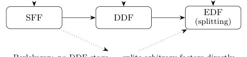 
Figure 1: Where each quantum contribution sits in the factorization pipeline. Doliskani [10] accelerates DDF and leaves EDF classical and randomized. The present work makes EDF exact and performs no DDF at all. The two therefore act on disjoint stages.

**Summary.** This paper develops an exact quantum algorithm to solve fundamental problems in computational algebra, such as polynomial factorization and determining the structure of finite-dimensional algebras. By using unconditional quantum amplitude amplification, it achieves a deterministic, exact quantum solution for these problems, bypassing reliance on unproven number-theoretic conjectures.

**Why it may be interesting.** While the subject is pure algebra, the focus on achieving *exact* quantum computation for deterministic algebraic structures is a significant theoretical result in quantum computation complexity, demonstrating quantum power beyond mere speedup.

Detailed structure

**Main problem.** The paper addresses the computational problem of factoring polynomials over finite fields and determining the algebraic structure (radical and Wedderburn decomposition) of finite-dimensional associative algebras over $\mathbb{F}_q$.

**Main result.** It presents an unconditional exact quantum algorithm that solves these algebraic structure problems with certainty, achieving a complexity of $O(n^4 \log q)$ quantum $\mathbb{F}_q$-operations.

**Method.** The core method involves adapting quantum amplitude amplification to the splitting step of Berlekamp's algorithm, thereby providing an exact quantum derandomization for algebraic decomposition.

**Model / system.** The mathematical system is a finite-dimensional associative $\mathbb{F}_q$-algebra $A$ of dimension $n$, defined by its structure constants. The computation is modeled within the quantum circuit model, specifically targeting the complexity class $\text{EQPuC}$.

**Key observables.** The primary observables are the radical $\text{Rad}(A)$ and the decomposition of the semisimple quotient $A/\text{Rad}(A)$ into minimal two-sided ideals.

**Important parameters / regimes.** Key parameters include the field size $q$, the algebra dimension $n$, and the number of irreducible factors $r$ of the polynomial being factored.

**Assumptions / limitations.** The algorithm relies on the exact knowledge of the success probability derived from unconditional counting arguments, allowing for perfect amplitude amplification.

**Figures summary.** No specific figures were summarized, but the notes indicate a comparison of various factorization approaches (Table 1) and the theoretical establishment of the complexity bounds.

**Paper structure.** The paper builds from the quantum splitting of polynomials (Berlekamp's algorithm) to the general structure theory of algebras. It first establishes the quantum splitting step, then extends this to commutative algebras, and finally uses classical structure theory (Rényi's work) to achieve the full Wedderburn decomposition for general associative algebras.

Abstract

Berlekamp's algorithm factors a squarefree polynomial $f\in\mathbb{F}_q[x]$ by deterministic linear algebra, reducing the problem to splitting an explicit commutative algebra $B\cong\mathbb{F}_q^r$ into its $r$ simple factors. For large odd $q$, the standard efficient splitting step is randomized, while known derandomizations are conditional on the Extended Riemann Hypothesis. We give an unconditional exact quantum implementation in a circuit model permitting single-qubit rotations through efficiently computable angles. The construction uses an unconditional counting argument. For a block containing $s\ge2$ irreducible factors, a quadratic-character test in odd characteristic and an absolute-trace test in characteristic $2$ yield a nonconstant test element with probability $p_{q,s}\ge\tfrac12$, known exactly in advance and depending only on $q$ and $s$, not on the unknown factorization. Exact amplitude amplification therefore converts each randomized test into a procedure succeeding with certainty after one amplification iteration. The resulting algorithm uses exactly $r-1$ quantum splitting rounds and $O(n^3\log q)$ quantum $\mathbb{F}_q$-operations and $O(n^3)$ classical operations, requiring no primitive root, quadratic non-residue, or distinct-degree preprocessing. The method also splits arbitrary finite-dimensional separable commutative $\\mathbb{F}_q$-algebras given by structure constants. Combined with R'onyai's classical structure theory, which computes the radical deterministically and reduces the remaining tasks deterministically to polynomial factorization, it yields the radical and the Wedderburn decomposition of $A/\mathrm{Rad}(A)$ into minimal two-sided ideals, with certainty, for any $n$-dimensional associative $\mathbb{F}_q$-algebra given by structure constants, using $O(n^4\log q)$ quantum $\mathbb{F}_q$-operations.

[↑ back to top](#top)

### [Exact Resource Laws for Passive Wavelength Routing in Entanglement Networks](http://arxiv.org/abs/2608.29911v1)

**Authors:** Ekta Panwar, Gilberto Borges, Saeid Salari, Kartik Kakade, Samgeeth Puliyil, Peter Rapčan, Mario Ziman, Djeylan Aktas  
**Type:** theory · **Category:** quantum information and computing · **PDF:** <https://arxiv.org/pdf/2608.29911v1>  
**Analysis basis:** full PDF text, analyzed in chunks

📷 Fig 1

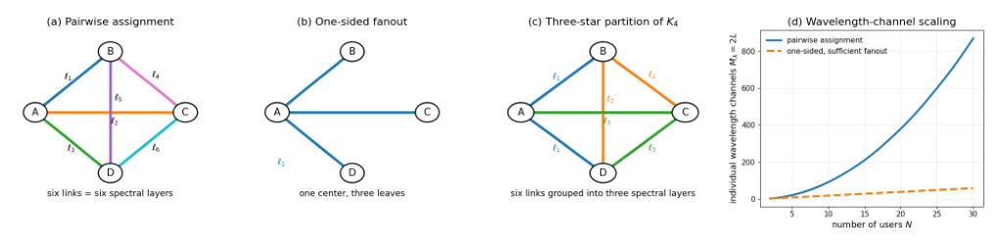 
FIG. 1. A passive wavelength assignment and its graph representation. In panel (a), the six links of K4 are labelled as six separate spectral layers. Panel (b) shows one star layer. In panel (c), equal colours and layer labels identify the two edges grouped into each of three star layers, making the layer partition distinct from the pairwise assignment. The final panel compares the individual wavelength-channel count Mλ = 2L for the pairwise assignment and the minimum one-sided assignment with sufficient fan-out; the two curves also use different line styles.

📷 Fig 2

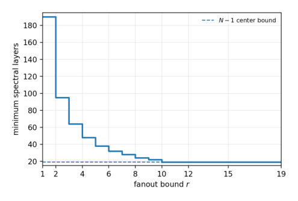 
FIG. 2. Exact one-sided layer count for K20 as a function of the fan-out bound. The edge-capacity term controls small fan-out, while the vertex-cover term N −1, which is linear in N, sets the plateau.

📷 Fig 3

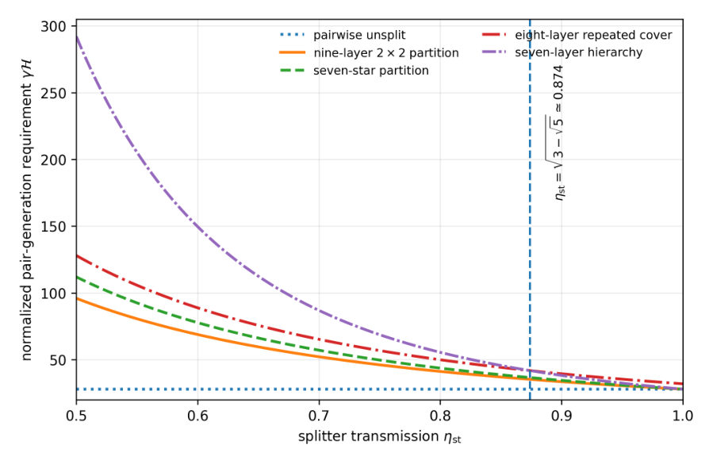 
FIG. 3. Pair-generation requirement for the K8 architectures under the independent-layer model with fixed balanced splitters. The vertical axis shows γH, the total input pair-generation requirement per unit common key rate normalized by the common edge gain. The curves are the closed-form requirements in Eqs. (108)–(111), together with the unsplit pairwise endpoint γH = 28. The vertical line marks ηst = p

**Summary.** This work develops a comprehensive theoretical framework to optimize resource allocation in passive entanglement networks. By mapping wavelength routing to graph optimization problems, the authors derive exact resource laws governing spectral use and receiver load. Ultimately, they connect these structural limits to the minimum required photon source rate needed to achieve a target quantum key distribution rate, providing a direct design tool for quantum hardware.

**Why it may be interesting.** The rigorous mathematical framework connecting abstract graph decomposition theorems (like minimum vertex cover or star decomposition) directly to quantifiable physical constraints (like achievable key rates and hardware losses) provides a powerful tool for designing next-generation quantum optical networks.

Detailed structure

**Main problem.** The paper addresses determining the exact resource laws governing passive wavelength routing in entanglement networks, specifically how spectral use, receiver load, and fan-out constrain each other.

**Main result.** It establishes that for both one-sided and full fan-out scenarios, specific graph structures (like balanced binary hierarchies) can achieve optimal resource utilization, and it derives the minimum required pair-generation rate to meet target key rates.

**Method.** The authors use a graph-theoretic approach, modeling wavelength assignment as a resource-optimization problem on the network's connectivity graph, and then extending this to a full quantum key distribution (QKD) rate analysis.

**Model / system.** The system is an entanglement-based quantum communication network using spectrally correlated photon pairs. The analysis is formalized using graph theory concepts, representing wavelength assignments as unions of bicliques (spectral layers).

**Key observables.** Spectral layer count ($L$), maximum receiver wavelength load ($\chi$), minimum total pair-generation rate, and the resulting BBM92 QKD secret-key-rate.

**Important parameters / regimes.** Fan-out limits, passive-splitter loss ($\eta_{st}$), and the source spectrum weights ($b_j$).

**Assumptions / limitations.** The analysis assumes the use of a continuous-wave-pumped broadband source for the final QKD rate calculation, and certain structural assumptions are made regarding layer decomposition.

**Figures summary.** Figure 1 illustrates pairwise assignment, one-sided fan-out, and wavelength-channel scaling, comparing different assignment methods.

**Paper structure.** The paper progresses from defining the resource-optimization problem on the connectivity graph (graph theory) to deriving exact layer count bounds (star decomposition, biclique covers), and finally culminates in applying these structural results to calculate the minimum required source rate for a specific QKD protocol.

Abstract

Entanglement-based networks provide a scalable framework for multiuser quantum communication by passively routing spectrally correlated photon pairs across interconnected nodes. Several wavelength-allocation schemes have been demonstrated experimentally, but these designs do not yet give a general way to determine how spectral use, receiver load, repeated connections, and fan-out constrain one another. We address this problem through the network's connectivity graph, where the wavelength assignment becomes a resource-optimization problem. For one-sided fan-out, assigning each link to a center and grouping links with the same center gives an exact optimization for arbitrary networks and fan-out limits. We solve this for complete networks and for complete networks in which every user has one excluded partner. Allowing both conjugate wavelengths to fan out changes the resource landscape: a balanced binary hierarchy attains the minimum spectral-layer count for a complete network while reducing the maximum receiver load to logarithmic in the number of users. An eight-user complete network then makes explicit the competing roles of spectral efficiency, receiver load, redundancy, and fan-out. We include the passive-splitter loss and the dependence of the key rate on the delivered pair flux to determine the minimum total pair-generation rate required to meet the prescribed targets. Finally, we formulate the corresponding BBM92 quantum key distribution (QKD) secret-key-rate analysis for a continuous-wave-pumped broadband source, with true and accidental coincidences evaluated between detector channels at the two endpoint users and relative layer pair-generation rates fixed by the source spectrum. This framework, therefore, provides a direct route from exact network resource laws to the design and comparison of passive entanglement architectures under experimentally specified hardware constraints.

[↑ back to top](#top)

### [Fast Fault-Tolerant Decoders for Hypergraph Product and Lifted-Product Codes](http://arxiv.org/abs/2608.31040v1)

**Authors:** Asit Kumar Pradhan, Nithin Raveendran, David Declercq, Bane Vasić  
**Type:** theory · **Category:** quantum information and computing · **PDF:** <https://arxiv.org/pdf/2608.31040v1>  
**Analysis basis:** full PDF text, analyzed in chunks

📷 Fig 1

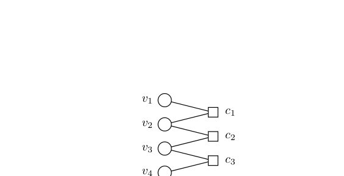 
Fig. 1: An example of a Tanner graph. Circular nodes represent variable nodes, and rectangular nodes represent check nodes. Each check node imposes a linear constraint on its neighboring variable nodes. For instance, check node c1 is connected to variable nodes v1 and v2, which implies that in any valid codeword v1 + v2 ≡0 (mod 2).

📷 Fig 2

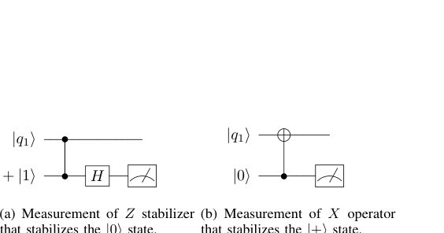 
Fig. 3: Measurement of stabilizers that acts on one qubit.

📷 Fig 3

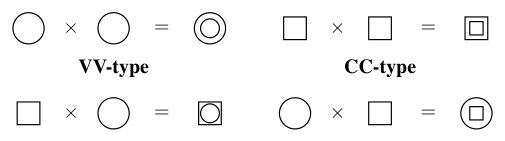 
Fig. 2: Node types in the Tanner graphs of HGP/LP codes. VV-type variable nodes are depicted with a circle inside another circle because they are obtained by multiplying two variable nodes, each represented by a single circle. Analogously, CC-type variable nodes, X-checks, and Z-checks are represented, respectively, by a square inside another square, a circle inside a square, and a square inside a circle.

📷 Fig 4

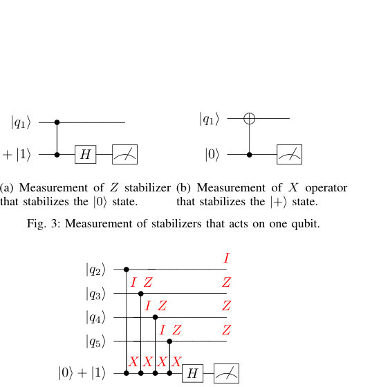 
Fig. 4: Measurement of the Z2Z3Z4Z5 operator.

📷 Fig 5

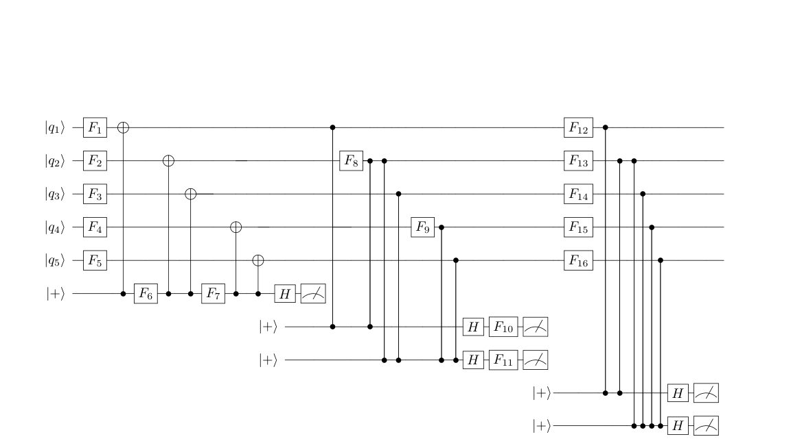 
Fig. 6: Syndrome measurement circuit for the CSS code in 1: The fault locations are shown as a set of random gates Fi, for i ∈[16], which are Pauli matrices with fixed probabilities. The X stabilizer is measured once, and the Z stabilizers are measured twice.

**Summary.** This paper tackles the challenge of developing fast, fault-tolerant decoders for QLDPC codes used in quantum computing. The authors overcome the complexity bottlenecks associated with modeling circuit faults by designing novel message-passing decoders. This results in a decoder that maintains high performance while drastically reducing computational overhead compared to current state-of-the-art methods.

**Why it may be interesting.** This work directly addresses the practical limitations of implementing quantum error correction codes by providing a computationally efficient decoding scheme that accounts for realistic circuit noise.

Detailed structure

**Main problem.** The primary goal is to design low-complexity, fault-tolerant decoders for Quantum Low-Density Parity-Check (QLDPC) codes to significantly reduce decoding latency.

**Main result.** The authors propose message-passing decoders that directly resolve stabilizer-induced Trapping Sets (TSs) arising from CNOT faults, achieving error rates comparable to existing methods but with substantially lower decoding complexity.

**Method.** The method involves deriving QLDPC decoders from parent classical LDPC decoders and reinterpreting CNOT faults as a combination of data errors and syndrome-bit measurement errors, thus avoiding explicit fault nodes.

**Model / system.** The work focuses on QLDPC codes, specifically those constructed using Hypergraph-Product (HGP) and Lifted-Product (LP) constructions, which are used for quantum error correction.

**Key observables.** Logical error rates, decoding complexity, and the ability to resolve stabilizer-induced Trapping Sets (TSs).

**Important parameters / regimes.** The structure of the HGP and LP codes, and the nature of the circuit-level noise model (CNOT faults).

**Assumptions / limitations.** The approach assumes that CNOT faults manifesting as syndrome errors are equivalent to a data error plus syndrome-bit measurement error, allowing for a simplified phenomenological Tanner graph.

**Figures summary.** Not specified, but the notes mention illustrating a Tanner graph showing variable and check nodes and constraints.

**Paper structure.** The paper identifies bottlenecks in existing QLDPC decoding (OSD post-processing and auxiliary nodes for CNOT faults), proposes the key insight regarding stabilizer-induced TSs, and then details the derivation of message-passing decoders to resolve these TSs directly.

Abstract

We design low-complexity, fault-tolerant decoders for quantum low-density parity-check (QLDPC) codes with the goal of reducing decoding latency. We target two major bottlenecks of decoding under the \emph{circuit-level} noise model: (i) post-processing via order-statistics decoding (OSD), and (ii) the large number of auxiliary variable nodes commonly introduced to represent CNOT-induced correlations during syndrome extraction. Our key observation is that propagating CNOT faults (\emph{hook errors}) create \emph{stabilizer-induced} trapping sets (TSs) that are intrinsic to hypergraph-product (HGP) and lifted-product (LP) constructions. Therefore, instead of modeling each such fault with an explicit correlation node and relying on OSD to clean up the resulting failures, we design message-passing decoders that resolve the corresponding \emph{stabilizer-induced} TSs directly. We obtain these decoders by deriving QLDPC decoders from decoders for the parent classical LDPC codes and using them collectively to correct broad families of \emph{stabilizer-induced} TSs. For CNOT faults that manifest primarily as syndrome errors, we show that their effect is equivalent to a data error together with syndrome-bit measurement errors. Consequently, given repeated measurements and a decoding graph that already includes nodes representing syndrome-bit errors, no distinct variable node is needed for each CNOT fault. Using a \emph{phenomenological} Tanner graph with nodes representing only data errors and syndrome-bit errors, simulations on the LP codes show a reduction in, or comparable, logical error rates relative to BP+OSD, at substantially lower decoding complexity.

[↑ back to top](#top)

### [First-principle predictions of fragmentation functions via quantum computing](http://arxiv.org/abs/2608.30375v1)

**Authors:** Juan J. Gálvez-Viruet, Felipe J. Llanes-Estrada, Nicolas M. Arenaza, María Gómez-Rocha, T. J. Hobbs  
**Type:** theory · **Category:** quantum information and computing · **PDF:** <https://arxiv.org/pdf/2608.30375v1>  
**Analysis basis:** full PDF text, analyzed in chunks

📷 Fig 1

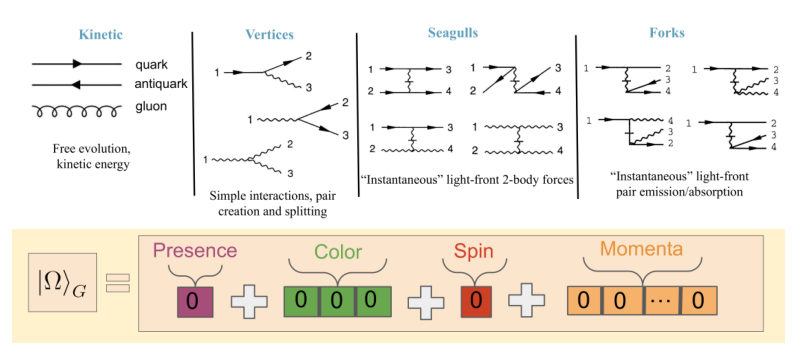 
Figure 2: Upper plot: typical terms of the Light-Front QCD Hamiltonian [4] (fully developed algebraic expressions in terms of particle creation/destruction operators are involved [5]). Lower plot: an empty gluon-register (setting the "presence" qubit to 1 fills it with one gluon of the quantum numbers specified by the following qubits). These registers are entangled by the (particle-number changing) Hamiltonian terms.

**Summary.** This paper proposes a quantum computing algorithm to calculate fundamental observables like fragmentation functions directly from the first-principles QCD Hamiltonian. By using a specialized particle-register encoding, the authors demonstrate a proof-of-concept simulation for heavy-quark fragmentation, opening a path for future quantum computers to tackle complex, non-perturbative QCD problems.

**Why it may be interesting.** While the physics is high-energy QCD, the core contribution is the development and analysis of a quantum algorithm and encoding scheme for simulating a complex, variable-particle-number quantum field theory, which is highly relevant to quantum simulation techniques.

Detailed structure

**Main problem.** The primary goal is to develop a first-principles method to compute fragmentation functions from Quantum Chromodynamics (QCD) using quantum computation.

**Main result.** The authors presented an algorithm and a small-scale simulation demonstrating the feasibility of using quantum computers to calculate these longitudinal jet-structure observables, showing qualitative agreement with existing NRQCD benchmarks.

**Method.** They developed a specialized 'particle-register encoding' for the second-quantized QCD Hamiltonian, which is applied via an algorithm implemented in Qiskit to simulate the process on classical hardware.

**Model / system.** The physical system is Quantum Chromodynamics (QCD) quantized in the Light-Front Gauge. The method treats the system as a second-quantized field theory, focusing on the fragmentation of a heavy quark into quarkonium ($	ext{J}/\psi$).

**Key observables.** Fragmentation functions ($D_h^j(z)$), reduced density matrix, quantum concurrence, and discord.

**Important parameters / regimes.** The simulation benchmarked against NRQCD at a scale $\mu = 3m_c$; the classical simulation was limited to 29 qubits.

**Assumptions / limitations.** The approach assumes the ability to scale to future quantum computers ($\sim 10^3$ qubits) and relies on approximations such as Fock space truncation and Trotter step discretization.

**Figures summary.** Figure 1 estimates the resource requirements (qubits, gates) for the calculation. Figure 2 illustrates the structure of the Light-Front QCD Hamiltonian and operator action. Figure 3 compares the calculated $c 	o 	ext{J}/\psi$ fragmentation function against NRQCD results.

**Paper structure.** The paper introduces the scientific problem, details the novel particle-register encoding methodology, presents the small-scale simulation results (benchmarked against NRQCD), and concludes by discussing the resource requirements and future potential for large-scale quantum computation.

Abstract

We report on an algorithm to compute fragmentation functions from the first principles Quantum Chromodynamics (QCD) Hamiltonian quantized in Light-Front Gauge, opening a path for digital quantum computers to calculate these longitudinal jet-structure observables. Simulating the behaviour of such computers on a classical cluster (which is memory-limited to about 30 qubits, given the expansive Hilbert spaces of actual quantum computers), we run a demonstration of a heavy-quark leading parton fragmenting into quarkonium, which we benchmark against NRQCD computations. Future quantum computers, perhaps concurrently running with HL-LHC, would have ample opportunity to extract arbitrary parton-hadron combinations.

[↑ back to top](#top)

### [Flatness-Preserving Operations](http://arxiv.org/abs/2608.30697v1)

**Authors:** Otto Veltheim, Esko Keski-Vakkuri  
**Type:** theory · **Category:** quantum information and computing · **PDF:** <https://arxiv.org/pdf/2608.30697v1>  
**Analysis basis:** full PDF text, analyzed in chunks

📷 Fig 1

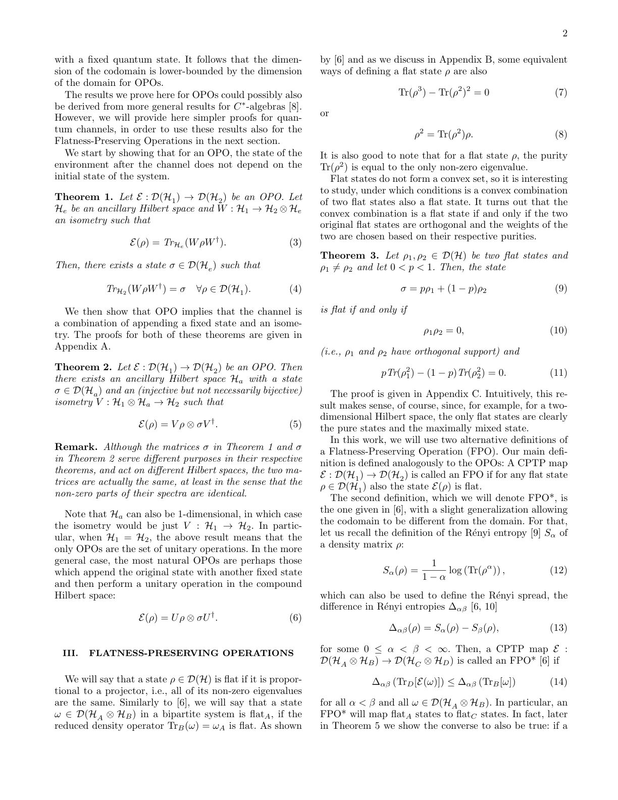 
Low-resolution page preview, page 2

📷 Fig 2

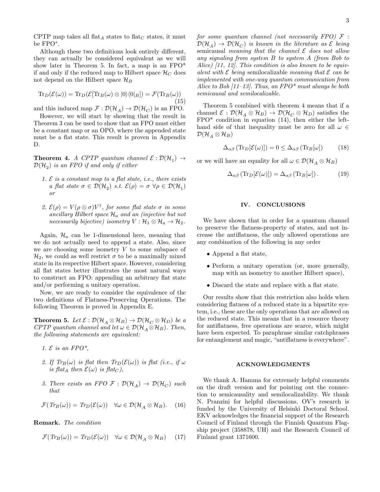 
Low-resolution page preview, page 3

📷 Fig 3

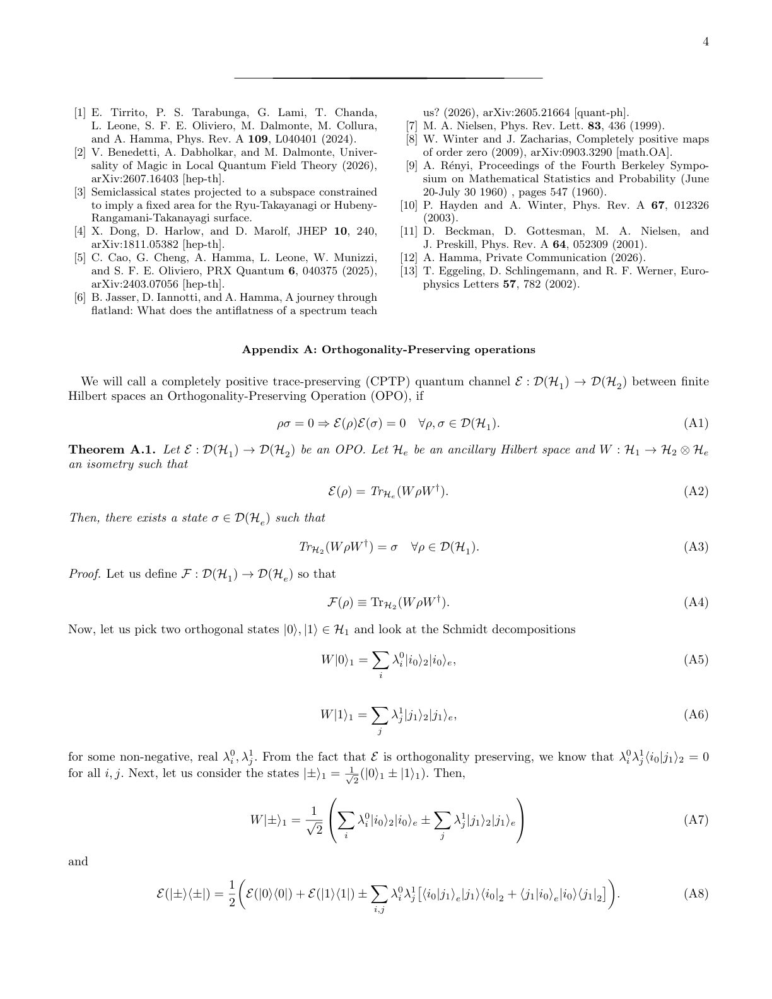 
Low-resolution page preview, page 4

📷 Fig 4

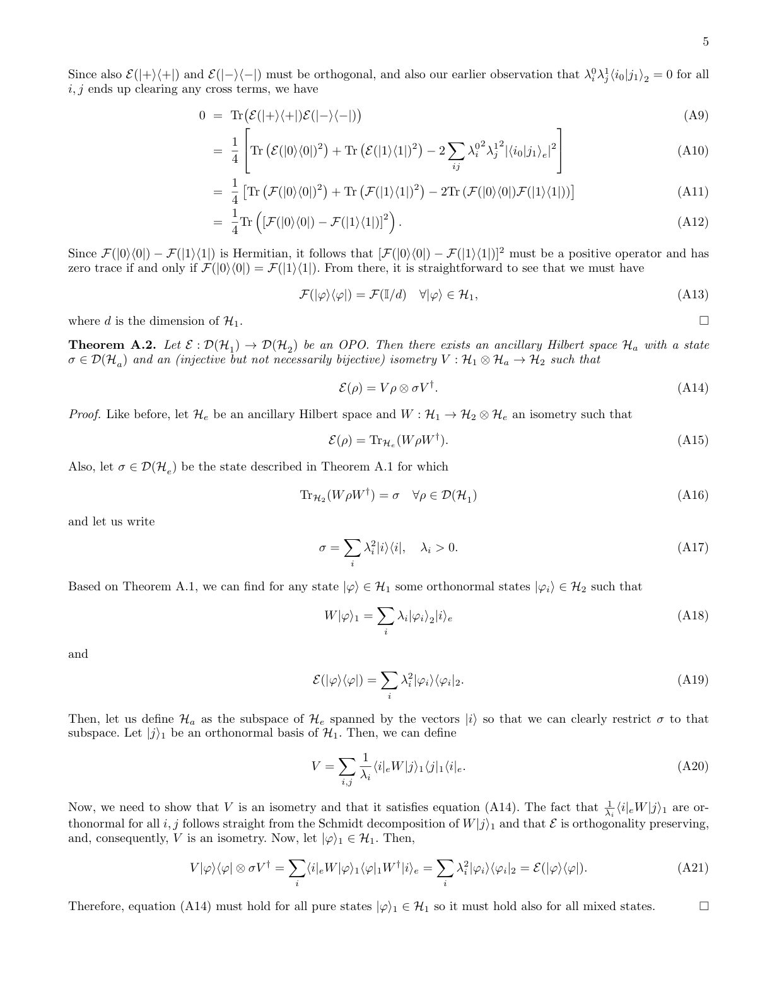 
Low-resolution page preview, page 5

📷 Fig 5

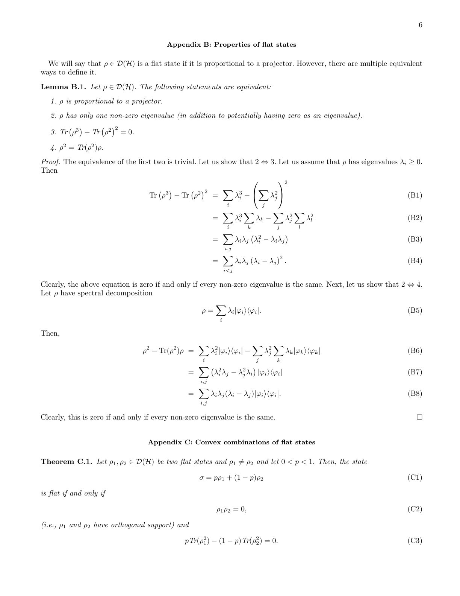 
Low-resolution page preview, page 6

**Summary.** This paper characterizes Flatness-Preserving Operations (FPOs) for quantum channels, which are operations that ensure the output state remains 'flat' (proportional to a projector). The authors prove that such operations are severely restricted, amounting either to constant maps or specific structured operations related to OPOs. This work advances the understanding of resource theories by defining the precise boundaries of state transformation allowed while preserving flatness.

**Why it may be interesting.** The characterization of operations that preserve specific structural properties (like flatness) is fundamental to understanding resource theories and the limitations of quantum information processing.

Detailed structure

**Main problem.** The paper aims to rigorously identify and classify Flatness-Preserving Operations (FPOs) for quantum channels acting on bipartite quantum systems.

**Main result.** FPOs are highly constrained, being either constant maps to a flat state or structured as Orthogonality-Preserving Operations (OPOs) of the form $E(
ho) = V (
ho \otimes \sigma)V^\dagger$.

**Method.** The analysis involves defining and comparing multiple mathematical conditions for flatness preservation, including structural analysis of OPOs and using Rényi entropy differences for an alternative definition (FPO*).

**Model / system.** The study is conducted on general finite-dimensional bipartite quantum systems, using CPTP quantum channels $E: D(H_A \otimes H_B) 	o D(H_C \otimes H_D)$ acting on density matrices.

**Key observables.** Flatness property (state proportional to a projector), Rényi entropy differences ($\Delta^{\alphaeta}(
ho)$), and the action of the channel on orthogonal flat states.

**Important parameters / regimes.** The structure of the quantum channel $E$, and the weights/proportions ($p, 1-p$) in convex combinations of flat states.

**Assumptions / limitations.** All quantum operations are assumed to be completely positive and trace-preserving (CPTP), and the analysis is restricted to finite-dimensional Hilbert spaces.

**Paper structure.** The paper first analyzes OPOs, establishing their characterization. It then defines FPOs and derives their structure. Finally, it introduces and proves the equivalence of FPO* (based on Rényi entropy) with the structural FPO definition.

Abstract

A quantum state is called flat if it is proportional to a projector. There has been recent interest in studying antiflatness, the property of diverging from flat states, and establishing a resource theory for it. Identifying the free operations (the Flatness-Preserving Operations (FPOs)) remained an open problem. For this purpose, we first discuss Orthogonality-Preserving Operations (OPOs), of which trivial examples are unitary operations in an isolated system. More generally, we give a simple proof that all OPOs are isometric embeddings consisting of combinations of unitaries/isometries and appending a fixed state. We then show that all FPOs are either constant maps to some fixed flat state or a special case of an OPO, where the appended fixed state must be a flat state. We also show that the only possible flat convex combinations of flat states are those of orthogonal flat states with weights given by their purities.

[↑ back to top](#top)

### [Gate-Efficient Implementation of the Query-Optimal Time-Dependent Hamiltonian Simulation](http://arxiv.org/abs/2608.30629v1)

**Authors:** Boyang Chen, Minbo Gao, Zhengfeng Ji, Tongyang Li, Xinzhao Wang, Shuo Zhou  
**Type:** theory · **Category:** quantum information and computing · **PDF:** <https://arxiv.org/pdf/2608.30629v1>  
**Analysis basis:** full PDF text, analyzed in chunks

📷 Fig 1

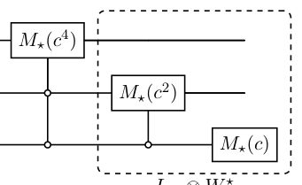 
Figure 1: The circuit for W ⋆ 8 . The dashed box applies W ⋆ 4 to T1T0 and leaves T2 unchanged.

**Summary.** This paper presents a method to implement the theoretically optimal quantum algorithm for simulating time-dependent Hamiltonian evolution. By employing an exact dyadic factorization technique, the authors significantly reduce the gate overhead compared to previous direct circuit implementations. This advancement is crucial for realizing complex quantum simulations on limited quantum hardware.

**Why it may be interesting.** This work directly impacts the feasibility of simulating complex quantum dynamics on near-term quantum hardware by providing a concrete, gate-efficient circuit blueprint for achieving state-of-the-art query complexity.

Detailed structure

**Main problem.** The paper addresses the challenge of implementing the theoretically query-optimal algorithm for time-dependent Hamiltonian simulation while minimizing the required quantum gate overhead.

**Main result.** The authors provide a gate-efficient implementation that maintains the optimal query complexity, achieving a gate count scaling of $O\left(q\left(a + \log\left(1 + T(\alpha + eta T)/\varepsilon
ight)
ight)
ight)$ one- and two-qubit gates.

**Method.** The core method involves utilizing an exact dyadic factorization of the ordered update product within a one-query transducer framework, applied to the Cayley product approximation of the time evolution operator.

**Model / system.** The system is governed by a time-dependent Hamiltonian $H(t)$, and the goal is to simulate the time evolution operator $U_H(T) = \exp\left(-i \int_0^T H(t) dt
ight)$. The simulation is analyzed using the Lipschitz continuity ($eta$) and the bound ($\alpha$) of $H(t)$.

**Key observables.** Query complexity ($q$), one- and two-qubit gate count, and auxiliary qubit count.

**Important parameters / regimes.** Time duration $T$, error tolerance $\varepsilon$, Hamiltonian bound $\alpha$, and Lipschitz constant $eta$.

**Assumptions / limitations.** The implementation relies on the existence of an exact dyadic factorization for the underlying ordered update product.

**Figures summary.** Figure 1 illustrates the circuit decomposition used in the induction proof for the factorization of the operator $W_{\star 8}$.

**Paper structure.** The paper builds upon the known query-optimal complexity, then details the circuit implementation by focusing on the one-query transducer, employing an exact dyadic factorization to achieve gate efficiency, and finally stating the resulting complexity bounds.

Abstract

The query-optimal algorithm of [CGWZ26] for general time-dependent Hamiltonian simulation uses $$   q = O\left( αT +   \frac{\log(1/\varepsilon)}{\log\left(e + \log(1/\varepsilon)/(αT) \right)}   \right) $$ queries to $\mathrm{HAM\mbox{-}T}$ within $\varepsilon$ error for a Lipschitz-continuous time-dependent Hamiltonian $H(t)$ on $[0,T]$ satisfying $\left\lVert H(t)\right\rVert\leqα$. However, its direct circuit implementation incurs a substantially larger gate overhead. In this note, we give an implementation of the same algorithm that retains its optimal query complexity and uses $$   O\left[ q \left( a + \log\left(1 + \frac{T(α+ βT)}{\varepsilon}   \right) \right) \right] $$ one- and two-qubit gates, where $a$ is the number of block-encoding ancilla qubits and $β$ is the Lipschitz constant of $H$. The main ingredient is an exact dyadic factorization of the ordered update product in the underlying one-query transducer.

[↑ back to top](#top)

### [High-Field Terahertz Spin Resonance in Cr$_2$O$_3$ above the Spin-Flop Transition](http://arxiv.org/abs/2608.29712v1)

**Authors:** Kaiyang Huang, Yuto Kinoshita, Natsuki Kanda, Takuya Matsuda, Masashi Tokunaga, Ryusuke Matsunaga, Yasuhiro H. Matsuda  
**Type:** experiment · **Category:** other · **PDF:** <https://arxiv.org/pdf/2608.29712v1>  
**Analysis basis:** full PDF text, analyzed in chunks

📷 Fig 1

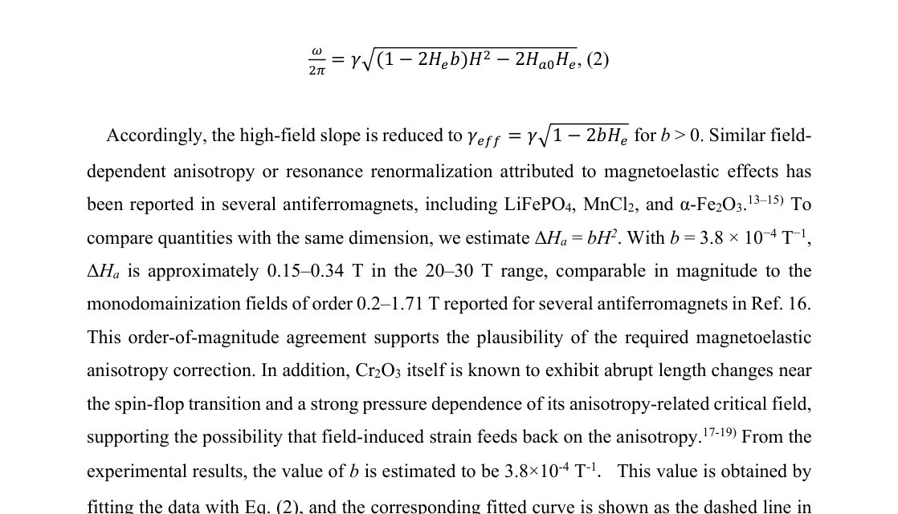 
Fig. 1(d). We note that this modified calculation is introduced as a phenomenological

📷 Fig 2

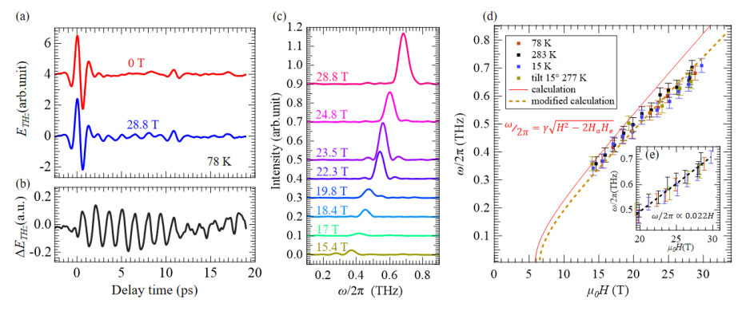 
Fig. 1(Color online) (a) Time-domain waveforms of the transmitted THz pulse at 28.8 T and 0

**Summary.** This work uses terahertz time-domain spectroscopy to measure spin resonance in $	ext{Cr}_2	ext{O}_3$ under very high magnetic fields. The key finding is that the resonance frequency's field dependence changes significantly above the spin-flop transition. This reduction in the slope is interpreted as evidence of magnetoelastic renormalization effects within the antiferromagnetic material.

**Why it may be interesting.** The observation of a field-dependent renormalization of the magnetic resonance frequency, quantified by the slope reduction, provides insight into the coupling between magnetic order and lattice strain in quantum magnets.

Detailed structure

**Main problem.** The study investigates the terahertz spin resonance behavior in the antiferromagnet $	ext{Cr}_2	ext{O}_3$ specifically in the high-field regime, well above the spin-flop transition.

**Main result.** The resonance frequency exhibits a nearly linear field dependence with a slope of $\sim 22 	ext{ GHz/T}$ in the $20-30 	ext{ T}$ range, which is significantly smaller than the slope measured at lower fields ($\sim 28 	ext{ GHz/T}$).

**Method.** Single-shot terahertz time-domain spectroscopy ($	ext{THz-TDS}$) was employed using pulsed magnetic fields up to $30 	ext{ T}$ to probe the magnetic excitations.

**Model / system.** The system is $	ext{Cr}_2	ext{O}_3$, an antiferromagnetic material. The analysis involves comparing the measured $\omega-H$ relation to theoretical models for quasi-ferromagnetic resonance ($	ext{QFMR}$) above the spin-flop transition.

**Key observables.** Resonance frequency ($\omega$) as a function of applied magnetic field ($H$) and temperature ($T$).

**Important parameters / regimes.** High magnetic field regime ($20-30 	ext{ T}$), spin-flop field ($\approx 6 	ext{ T}$), and the derived effective anisotropy parameter ($b$).

**Assumptions / limitations.** The reduction in the high-field slope is attributed to magnetoelastic renormalization of the anisotropy within the spin-flop phase.

**Figures summary.** Figure 1 presents $	ext{THz}$ time-domain waveforms, differential signals, resonance spectra, and the derived $\omega-H$ relationship, including a linear fit for the high-field regime.

**Paper structure.** The paper presents experimental measurements using $	ext{THz-TDS}$ on $	ext{Cr}_2	ext{O}_3$, analyzes the resonance frequency dependence on the magnetic field across different regimes (low-field vs. high-field), and compares the observed high-field slope to theoretical predictions incorporating magnetoelastic effects.

Abstract

We report single-shot terahertz time-domain spectroscopy of Cr$_2$O$_3$ in pulsed magnetic fields up to 30 T. Well above the spin-flop field, in the 20-30 T range, the resonance frequency exhibits a nearly linear field dependence with a slope of ~22 GHz/T, smaller than the 28 GHz/T reported from low-field measurements. This reduction is insensitive to temperature and to a 15° field tilt, suggesting an intrinsic high-field property.

[↑ back to top](#top)

### [Learning rules for complex-valued patterns in networks of oscillators](http://arxiv.org/abs/2608.30800v1)

**Authors:** Federico Sbravati, Aida Todri-Sanial  
**Type:** theory · **Category:** disordered systems and neural networks · **PDF:** <https://arxiv.org/pdf/2608.30800v1>  
**Analysis basis:** full PDF text, analyzed in chunks

📷 Fig 1

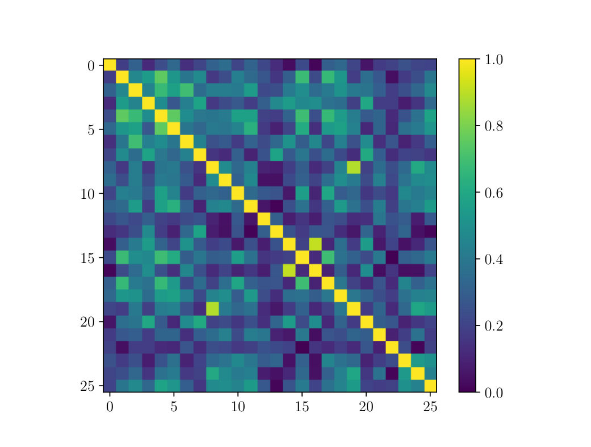 
Figure 3. The synchronization overlap ρµν for the 22 × 22 pixel binary alphabet dataset (composed by 26 patterns, one for each letter of the English alphabet) is represented as a heatmap which represents how similar patterns are to one another. The closer they are to one (e.g. the diagonal is the pattern with itself), the more similar, whereas the more dissimilar patterns are, the more the off-diagonal values of ρµν will be close to zero.

📷 Fig 2

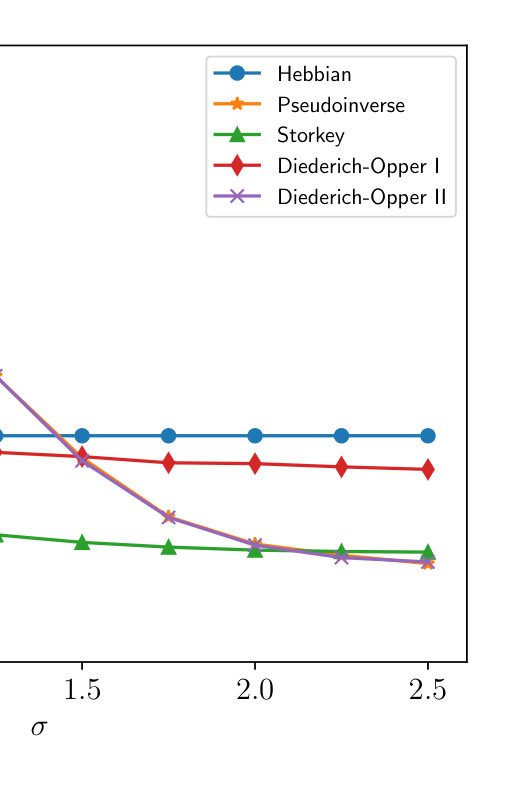 
Figure 4. The simulations of the 7 × 6 network, where the capacity is C ≃0.62.

📷 Fig 3

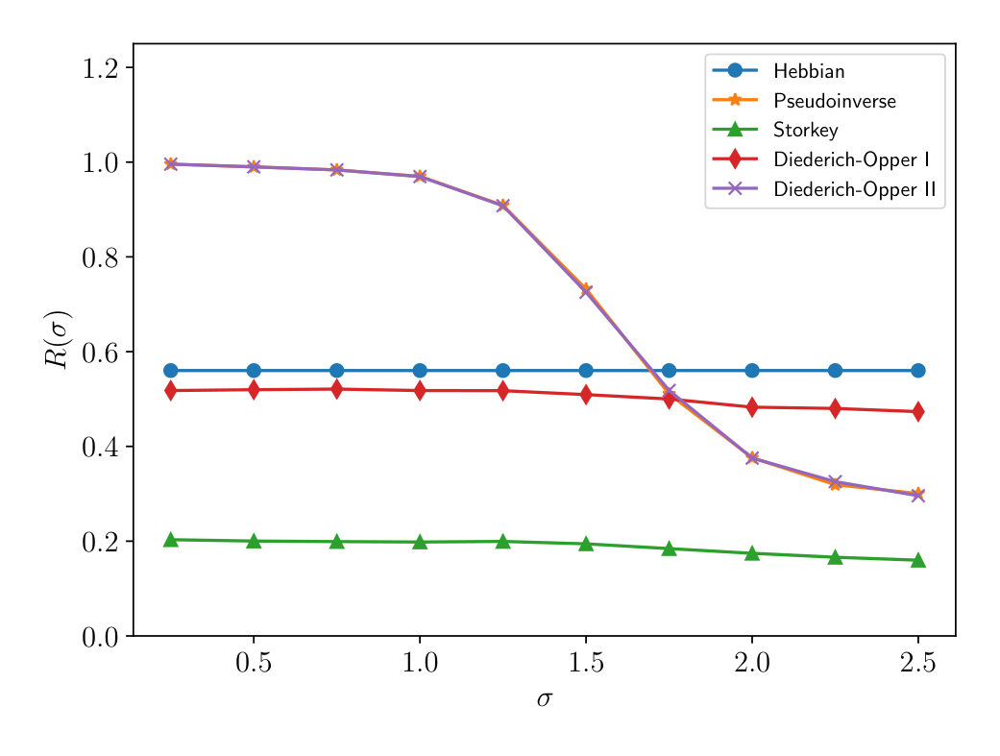 
Figure 5. The simulations of the (this is quarter capacity) 10 × 10 network, where essentially at fixed N, the capacity C ≃1

📷 Fig 4

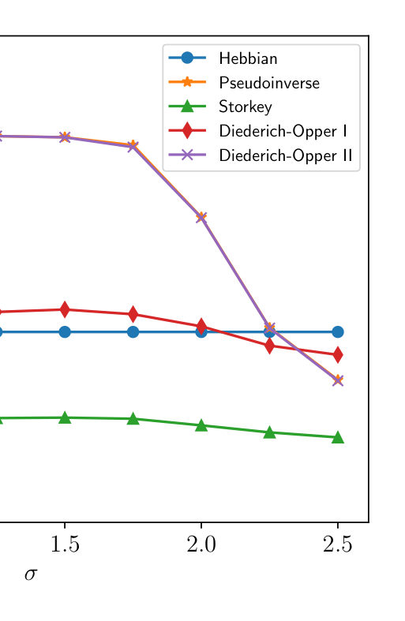 
Figure 6. The simulations of the 22 × 22 network, with a capacity of C ≃0.05.

📷 Fig 5

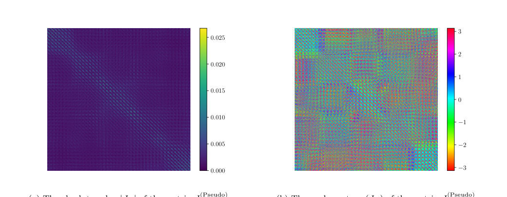 
Figure 7. This is the representation of the (a) absolute value |Jij| and (b) angle part arg(Jij) of the Pseudoinverse weight matrix for the 42×42 grayscale alphabet dataset. The values in (b) are represented using a circular color map due to periodicity of the phase values. In this example, the capacity of the weight matrix is in the low-storage regime, with C(N) ≃0.015 ≪1.

**Summary.** This work extends associative memory models to handle complex-valued patterns by adapting learning rules for networks of coupled oscillators. By utilizing the complex Pseudoinverse, the authors construct a robust, Hermitian coupling matrix that accurately encodes and retrieves grayscale information. This provides a powerful theoretical tool for modeling complex pattern storage in physical systems.

**Why it may be interesting.** The use of complex-valued dynamics and pattern storage mechanisms provides a richer mathematical framework for modeling complex physical phenomena, potentially linking concepts from quantum information (e.g., phase coherence) to classical neural network dynamics.

Detailed structure

**Main problem.** The paper addresses the extension of learning rules from real binary to complex-valued spins for encoding and retrieving complex-valued patterns in networks of oscillators.

**Main result.** The complex Pseudoinverse construction yields a robust, Hermitian coupling matrix that allows for efficient pattern retrieval in Kuramoto-like networks, improving upon standard methods.

**Method.** The authors adapt learning rules by mapping grayscale patterns to complex phases and employing the complex Pseudoinverse technique, extending results from Diederich and Opper.

**Model / system.** The system is modeled using networks of coupled oscillators governed by a Kuramoto-like equation, where the coupling weights are complex-valued. The patterns are represented by complex spins $\chi_i^{(\mu)}$ derived from grayscale inputs.

**Key observables.** Complex Overlap ($\Psi_{\mu
u}$), Synchronization Overlap ($
ho_{\mu
u}$), and the Normalized Trace of Synchronization Overlap ($R$), which quantifies pattern retrieval accuracy.

**Important parameters / regimes.** Network size ($N$), number of patterns ($P$), and the loading capacity $C(P) = P/N$.

**Assumptions / limitations.** All stored patterns are assumed to be stable fixed points of the learned weight matrix, and the complex patterns possess a global rotational symmetry.

**Figures summary.** Figures illustrate the mapping of grayscale levels to phases on the unit circle, show the retrieval dynamics $R(\sigma)$ for different network sizes, and plot the synchronization curves $R_C$ versus loading capacity $C(P)$.

**Paper structure.** The paper first introduces the complex formulation for pattern encoding in oscillator networks. It then develops and proves the complex Pseudoinverse learning rule, demonstrating its equivalence to other constructions. Finally, it analyzes the retrieval performance using the synchronization trace $R$ across various datasets and capacities.

Abstract

In this article, we extend learning rules from real binary to complex-valued spins. This formulation allows for a robust and natural representation of grayscale patterns, where spins behave as multi-state neurons and can be stored in a complex-valued weight matrix. We describe a rule that performs better than standard methods, such as Hebbian learning, to encode information in a suitable form for pattern retrieval with networks of oscillators. Since in neural networks it is of interest to have local and incremental learning rules, we prove the extension of a result by Diederich and Opper with our complex-valued spin formulation. We then test the behavior of the associative memory for the system of oscillators under different circumstances for both real-valued, as well as complex-valued correlated and random patterns.

[↑ back to top](#top)

### [Measure of set imaginarity](http://arxiv.org/abs/2608.28985v1)

**Authors:** Yu Guo, Jiabo Pan, Yuqin Wang, Shuanping Du  
**Type:** theory · **Category:** quantum information and computing · **PDF:** <https://arxiv.org/pdf/2608.28985v1>  
**Analysis basis:** full PDF text, analyzed in chunks

📷 Fig 1

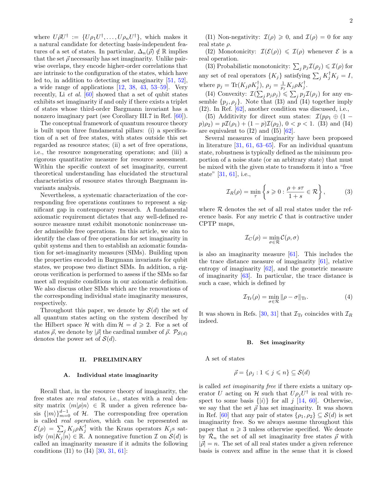 
Low-resolution page preview, page 2

📷 Fig 2

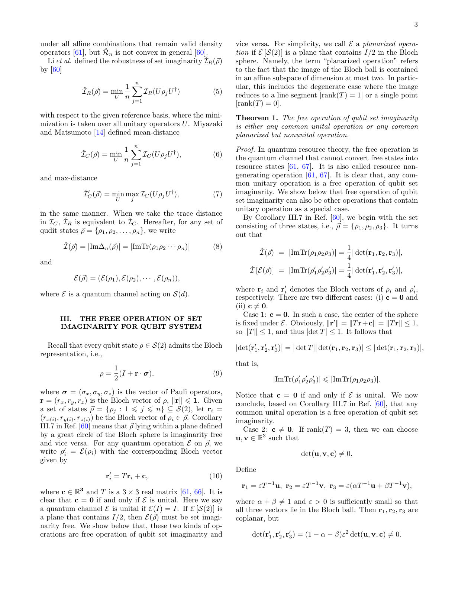 
Low-resolution page preview, page 3

📷 Fig 3

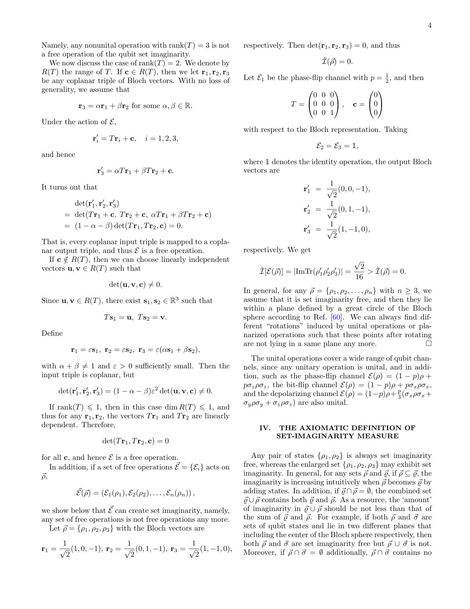 
Low-resolution page preview, page 4

📷 Fig 4

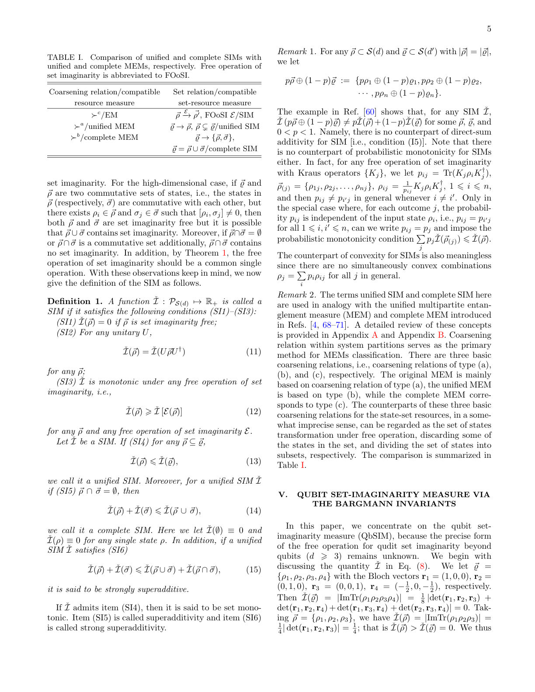 
Low-resolution page preview, page 5

📷 Fig 5

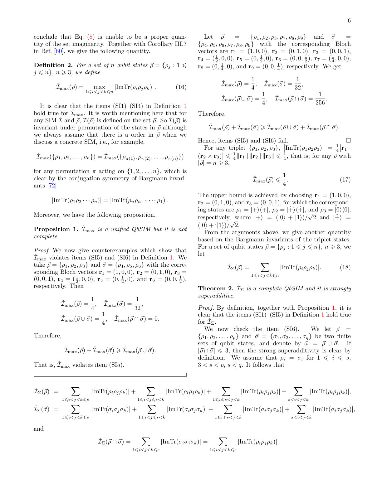 
Low-resolution page preview, page 6

**Summary.** This paper introduces the concept of 'set imaginarity' as a quantum resource and develops a formal axiomatic theory for quantifying it via Set Imaginarity Measures (SIMs). Using tools like Bargmann invariants, the authors characterize the free operations for qubit set imaginarity and propose refined, mathematically rigorous measures that improve upon existing definitions.

**Why it may be interesting.** This work provides a rigorous, axiomatic framework for quantifying a non-standard quantum resource (set imaginarity), which is crucial for understanding collective quantum properties beyond single-state measures.

Detailed structure

**Main problem.** The paper investigates 'set imaginarity' as a quantum resource in qubit systems and develops an axiomatic framework for quantifying this resource.

**Main result.** The free operations for qubit set imaginarity are characterized by common unital and planarized operations, leading to the proposal of unified and complete Set Imaginarity Measures (SIMs).

**Method.** The authors utilize Bargmann invariants and analyze the properties of quantum channels acting on sets of states to define and test candidate measures.

**Model / system.** The focus is on qubit systems ($d=2$) and generalizations to qudit systems ($S(d)$), analyzing sets of quantum states $\vec{
ho} = \{
ho_j\}$.

**Key observables.** Set imaginarity ($\check{I}(\vec{
ho})$), Bargmann invariants ($\Delta_n(\vec{
ho})$), and the Bloch vector representation of the states.

**Important parameters / regimes.** The dimensionality of the system ($d$), the number of states in the set ($n$), and the structure of the quantum channel $E$.

**Assumptions / limitations.** The resource theory framework is extended from single states to sets of states, acknowledging that the set of imaginarity-free states is generally non-convex.

**Paper structure.** The paper progresses by first establishing the physical significance of set imaginarity using Bargmann invariants, then defining the axiomatic requirements for a SIM (SI1-SI5), constructing specific SIMs for qubits, and finally proposing improved measures for higher dimensions.

Abstract

Recent studies have shown that Bargmann invariants provide effective detectors of set imaginarity. In this paper, we investigate set imaginarity as a quantum resource in qubit systems. By exploiting the structure of Bargmann invariants, we show that the free operations for qubit set imaginarity consist precisely of common unital operations and common planarized operations. Based on this characterization, we introduce an axiomatic framework for set-imaginarity measures (SIMs). In particular, we propose two refined notions, namely unified SIMs and complete SIMs, which allow a more fine-grained quantification of set imaginarity. To make these notions concrete, we construct two qubit SIMs from the Bargmann invariants of three-state subsets. We prove that one of them is a unified SIM, while the other satisfies the stronger requirements of a complete SIM. Furthermore, we revisit the robustness of set imaginarity previously introduced in the literature. We show that, although this robustness is a valid SIM for qubit systems, it is neither a unified SIM nor a complete SIM. To overcome this limitation, we propose an improved robustness-type measure and rigorously prove that it defines a complete qubit SIM.

[↑ back to top](#top)

### [Photon-efficient quantum repeater chains via hyperentanglement-assisted purification](http://arxiv.org/abs/2608.30786v1)

**Authors:** Vinay Kumar, Krishan Joshi, Claudio Cicconetti  
**Type:** theory · **Category:** quantum information and computing · **PDF:** <https://arxiv.org/pdf/2608.30786v1>  
**Analysis basis:** full PDF text, analyzed in chunks

📷 Fig 1

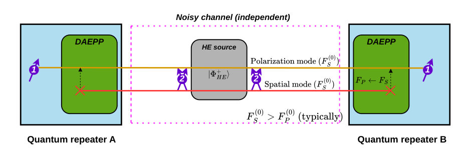 
FIG. 1. The DAHR per-segment workflow. Left to right follows: quantum repeater A, the noisy channel, and quantum repeater B. Hyperentangled pairs are generated by a source in the middle (MidPointSource scheme [3]). The spatial degree of freedom (in red) is consumed to upgrade the polarisation mode before chain-level entanglement swapping.

📷 Fig 2

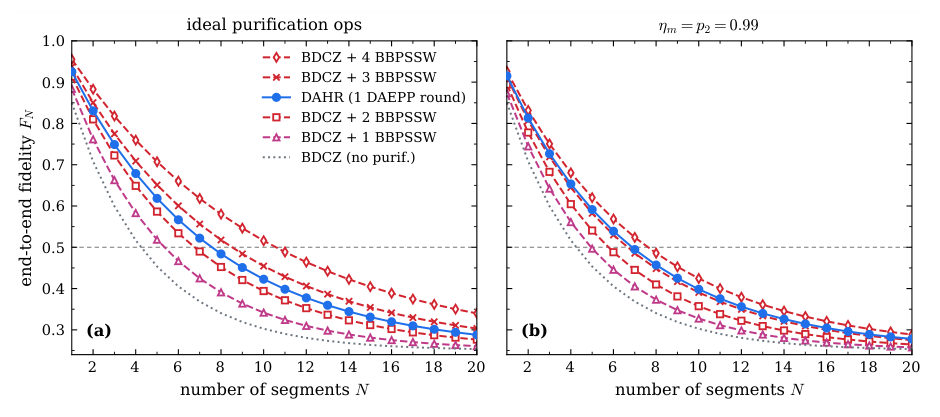 
FIG. 2. End-to-end fidelity FN vs chain length at the operating point (F (0) P , F (0) S ) = (0.85, 0.95), with BDCZ parameters as ηBSA = p1 = p2 = 0.99. (a) ideal purification operation reliability (ηm = pg = 1); (b) matched operation reliability (ηm = pg = 0.99). DAHR (one DAEPP round) stays above BDCZ-with-2-BBPSSW for the ideal purification operation reliability case and is even marginally better than BDCZ-with-3-BBPSSW for the matched operation reliability case across the number of segment N range.

📷 Fig 3

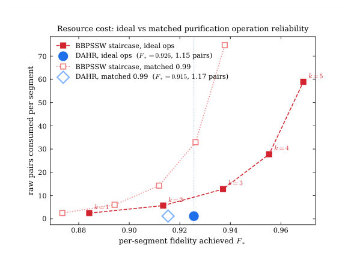 
FIG. 3. Raw pairs consumed per segment versus delivered per-segment fidelity for the ideal and matched purification-operation reliability regimes. In the ideal regime, DAHR (one DAEPP, blue, solid circle) achieves (0.926, 1.15), while the BBPSSW staircase (red, solid square, k = 1 . . . 5) requires k = 2–3 rounds to reach comparable performance, corresponding to 5.7–12.8 raw pairs. In the matched-operation reliability regime, DAHR (one DAEPP, blue, hollow diamond) attains (0.915, 1.17), whereas BBPSSW (red, hollow square) must exceed k = 3 rounds to approximately match this point, requiring about 15 raw pairs.

📷 Fig 4

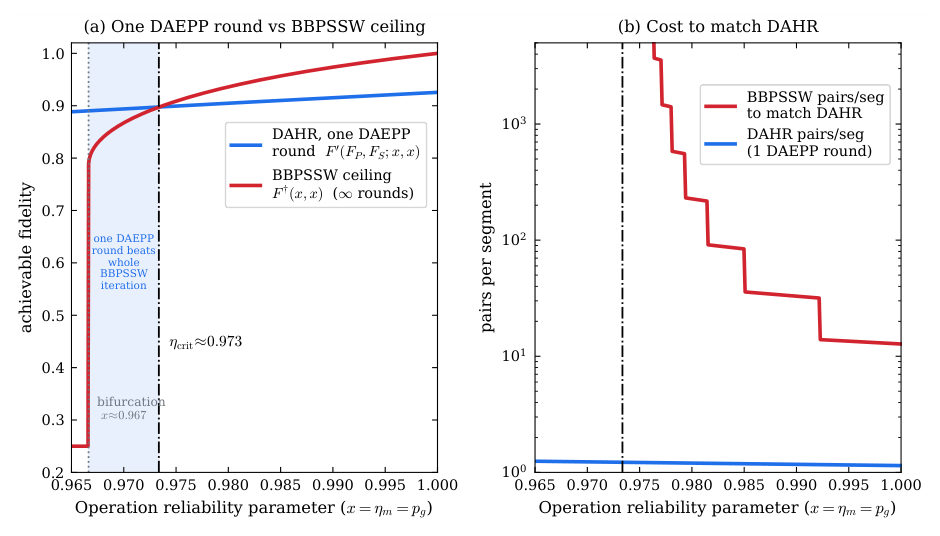 
FIG. 4. For Corollary 1 with DAHR and BBPSSW at the same operation reliability x = ηm = pg. (a) Fidelity head-to-head for DAHR’s one DAEPP round F ′(FP , FS; x, x) (blue) and BBPSSW’s ∞-round ceiling F †(x, x) (red). The two cross at ηcrit ≈0.973, and the shaded band 0.967 &lt; x &lt; ηcrit (above the bifurcation ≈0.967) is the window where one DAEPP round beats BBPSSW’s whole iteration. (b) Above ηcrit BBPSSW can match DAHR but at exploding photon cost. Pairs/segment to match diverges as x →η+ crit, against DAHR’s flat ∼1.15 pairs/segment.

📷 Fig 5

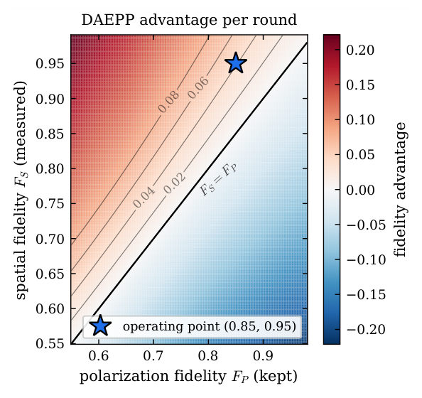 
FIG. 5. Single-round DAEPP advantage F ′(FP , FS) −F ′(FP , FP ) over the spatial-polarization fidelity plane (ideal operation reliability). The region is Positive (red) wherever FS &gt; FP . The star here marks the represented operating point in the work, that is, (0.85, 0.95). The diagonal FS = FP is the BBPSSW-equivalent line.

**Summary.** This paper introduces the DAHR protocol, a novel quantum repeater chain that enhances entanglement distribution by incorporating hyperentanglement-assisted purification (DAEPP) at every segment. By deriving a new fidelity recursion, the authors prove that DAHR is significantly more resource-efficient than established methods like BBPSSW purification, especially at low operating fidelities.

**Why it may be interesting.** This work provides a concrete, theoretically derived improvement to quantum network protocols, directly impacting the feasibility and scaling of quantum communication infrastructure.

Detailed structure

**Main problem.** The primary goal is to improve the efficiency of entanglement distribution over long distances in quantum networks by developing a superior quantum repeater chain protocol.

**Main result.** The proposed DAHR protocol, which integrates hyperentanglement-assisted purification (DAEPP) into the repeater chain, significantly outperforms existing methods, requiring fewer resource pairs to achieve the same fidelity.

**Method.** The authors derive a closed-form, end-to-end fidelity recursion by embedding the DAEPP step into the standard BDCZ entanglement swapping scheme.

**Model / system.** The system is modeled as a linear chain of N segments, utilizing hyperentangled photon pairs encoding independent states across multiple degrees of freedom (e.g., polarization and spatial modes).

**Key observables.** End-to-end fidelity ($F^N$), resource consumption (number of entangled pairs consumed per segment).

**Important parameters / regimes.** Operation reliability threshold, initial polar/spatial fidelities ($F_P, F_S$), and the number of purification rounds ($k$).

**Assumptions / limitations.** The analysis assumes the spatial DOF is the more robust mode ($F_S > F_P$) and uses the general Werner model for purification analysis.

**Figures summary.** Figure 2 compares the end-to-end fidelity ($F_N$) versus the number of segments ($N$) for raw BDCZ, BDCZ with $k$ BBPSSW rounds, and the proposed DAHR protocol, showing DAHR's superior performance.

**Paper structure.** The paper first reviews existing repeater limitations, then derives the DAEPP fidelity, and finally constructs the DAHR protocol by integrating DAEPP into the BDCZ recurrence relation, concluding with a strict resource lower bound comparison.

Abstract

Linear quantum repeater chains based on Werner-state purification (the BBPSSW protocol) and entanglement swapping (the BDCZ scheme) are fundamental to entanglement distribution in quantum networks. However, they operate under a stringent operation reliability threshold and rely on resource-intensive recurrence purification rounds, each consuming two entangled pairs to probabilistically produce one. In the literature, hyperentanglement has been proposed to exploit multiple degrees of freedom (DOF), such as polarisation and spatial modes, to encode independent entangled states within a single photon pair. This has led to the definition of DAEPP (DOF-Assisted Entanglement Purification Protocol), which we propose to integrate with the BDCZ scheme, resulting in a chain protocol that we call DAHR (DOF-Assisted Hyperentanglement Repeater). The DAEPP step distils the fidelity of a DOF by consuming other(s). In this work, we propose and analyse a DAHR variant which integrates DAEPP at every segment of an end-to-end path combined with BDCZ. We derive a closed-form end-to-end fidelity recursion that embeds single-segment DAEPP into the BDCZ scheme and give a strict resource lower bound for any BDCZ baseline utilising BBPSSW purification to match DAHR's per-segment effective fidelity. At a representative asymmetric operating point informed by prior experiment, we show numerically that matching DAHR's single-photon-pair performance requires two to three rounds of BBPSSW purification. Additionally, below a critical operation reliability, no amount of BBPSSW rounds matches DAHR's one DAEPP round performance.

[↑ back to top](#top)

### [Protected Logical Qudits in Kitaev Quantum Double Models via Stable Representations](http://arxiv.org/abs/2608.31011v1)

**Authors:** Naihong Hu, Futao Wang  
**Type:** theory · **Category:** quantum information and computing · **PDF:** <https://arxiv.org/pdf/2608.31011v1>  
**Analysis basis:** full PDF text, analyzed in chunks

📷 Fig 1

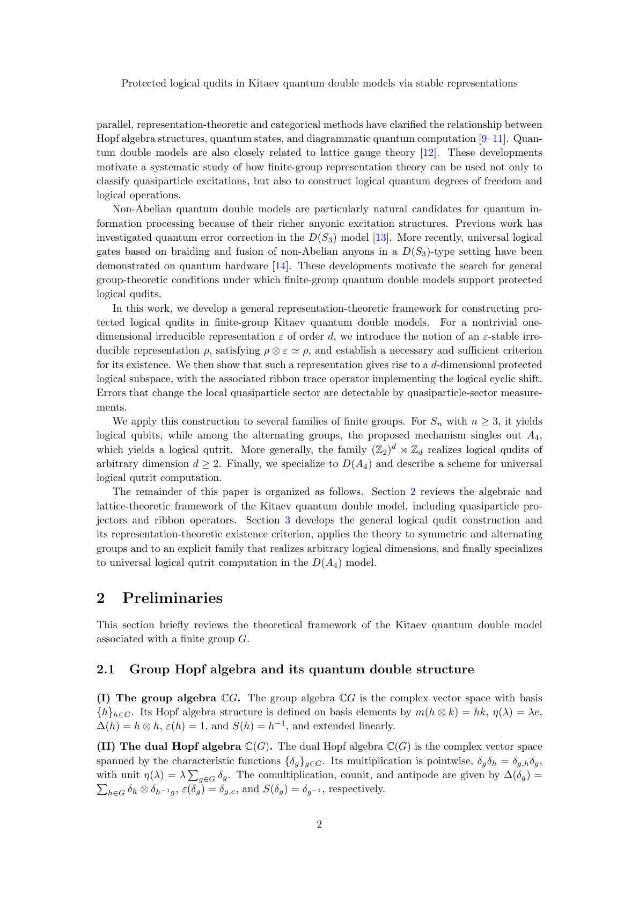 
Low-resolution page preview, page 2

📷 Fig 2

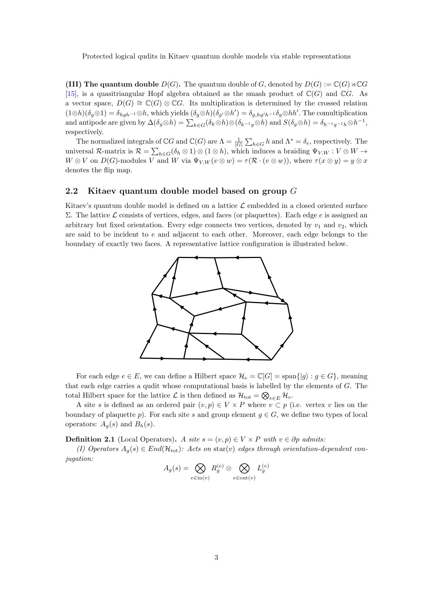 
Low-resolution page preview, page 3

📷 Fig 3

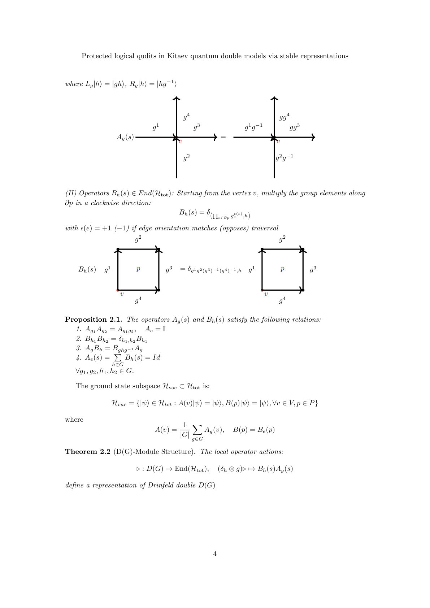 
Low-resolution page preview, page 4

📷 Fig 4

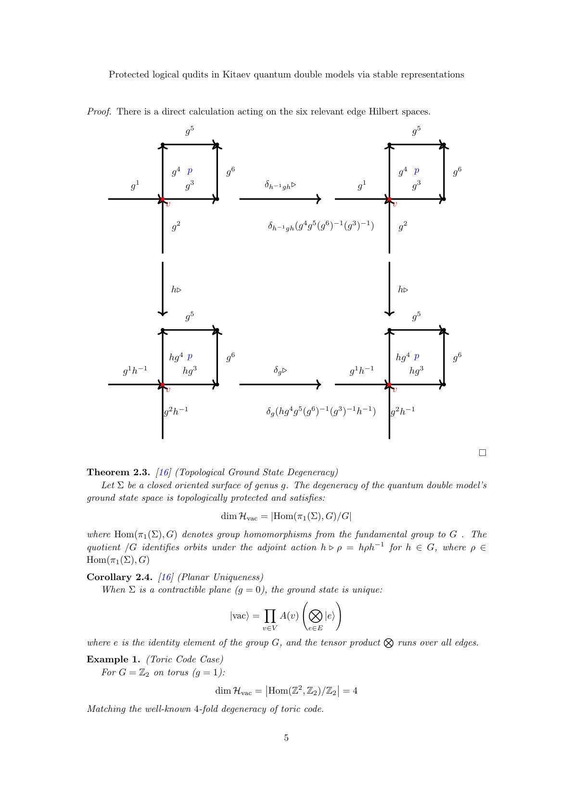 
Low-resolution page preview, page 5

📷 Fig 5

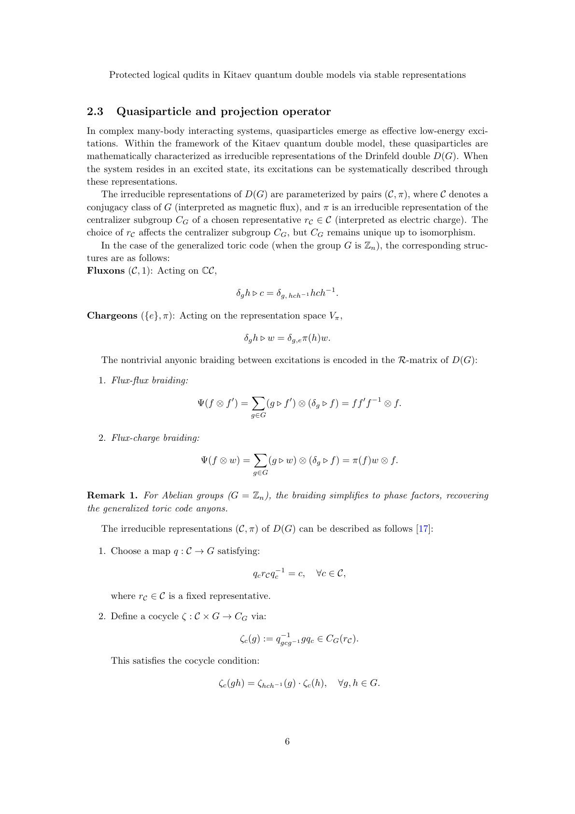 
Low-resolution page preview, page 6

**Summary.** This paper develops a powerful representation-theoretic method to construct fault-tolerant logical qudits within Kitaev quantum double models. By analyzing stable representations, the authors establish existence criteria and demonstrate the realization of qudits for groups like $S_n$ and $A_4$. Ultimately, they show how these structures support universal quantum computation, advancing the theory of topological quantum computation.

**Why it may be interesting.** This work provides a rigorous mathematical link between abstract group theory (representation theory) and the physical realization of robust quantum information storage and computation, which is fundamental to quantum computing theory.

Detailed structure

**Main problem.** The paper aims to develop a representation-theoretic framework to construct and characterize protected logical qudits for fault-tolerant quantum computation.

**Main result.** The construction successfully yields protected logical qudits for various groups, including logical qubits for $S_n$ and a logical qutrit for $A_4$, and demonstrates universal quantum computation for the $D(A_4)$ model.

**Method.** The methodology involves using the representation theory of Kitaev quantum double models, specifically identifying $\epsilon$-stable irreducible representations to define the protected logical subspace.

**Model / system.** The physical model is the Kitaev quantum double model, defined over a lattice embedded in a closed oriented surface $\Sigma$, based on a finite group $G$. The protection mechanism relies on the ground state subspace defined by local vertex and plaquette operators.

**Key observables.** Logical subspace dimension ($d$), logical operators ($X_L$, Hadamard), and the existence of stable representations.

**Important parameters / regimes.** The dimension $d$ of the logical qudit, which is determined by the structure of the stable representations.

**Assumptions / limitations.** The analysis assumes the validity of the Kitaev quantum double model structure and the existence of specific stable representations for the chosen groups.

**Figures summary.** The notes mention the structure of local operators ($A_g(s), B_h(s)$) and the character tables for $A_4$ and $D(A_4)$, which characterize the underlying group structure.

**Paper structure.** The paper progresses by first establishing the general representation-theoretic framework for protected qudits, then applying this to specific groups ($S_n, A_4$), and finally demonstrating universal quantum computation using the $D(A_4)$ structure.

Abstract

Fault-tolerant quantum computation requires robust protection of encoded quantum information. In this work, we develop a representation-theoretic framework for constructing protected logical qudits in finite-group Kitaev quantum double models. By introducing $\varepsilon$-stable irreducible representations, we establish a necessary and sufficient existence criterion and derive ribbon--projector commutation relations that yield a $d$-dimensional protected logical subspace. We apply this construction to symmetric and alternating groups, obtaining logical qubits for $S_n$ ($n\ge 3$) and a logical qutrit for $A_4$. Moreover, the family $(\mathbb Z_2)^d\rtimes\mathbb Z_d$ realizes protected logical qudits of arbitrary dimension $d\ge 2$. Finally, for $D(A_4)$, we describe a scheme for universal logical qutrit computation using ribbon-based logical operations.

[↑ back to top](#top)

### [Quantum Block Turbo Codes](http://arxiv.org/abs/2608.30775v1)

**Authors:** Khaled Jebari, Luiz Anet Neto, Ramesh Pyndiah, Jean-Louis de Bougrenet de la Tocnaye  
**Type:** theory · **Category:** quantum information and computing · **PDF:** <https://arxiv.org/pdf/2608.30775v1>  
**Analysis basis:** full PDF text, analyzed in chunks

📷 Fig 1

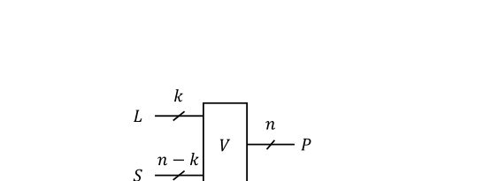 
Fig. 1: Encoding matrix (L : S)V = P, defined in [14].

📷 Fig 2

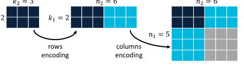 
Fig. 2: Classical product code encoding, (5, 2) × (6, 3) example.

📷 Fig 3

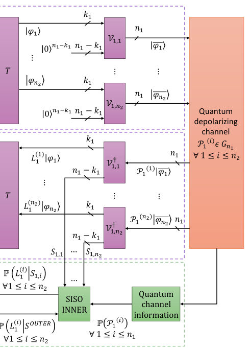 
Fig. 3: QBTC encoding and decoding: product code (n1, k1) × (n2, k2).

📷 Fig 4

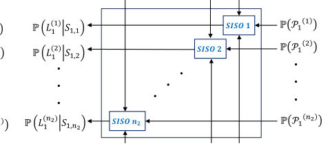 
Fig. 4: SISO OUTER (left) and SISO INNER (right) physical and logical probabilities.

📷 Fig 5

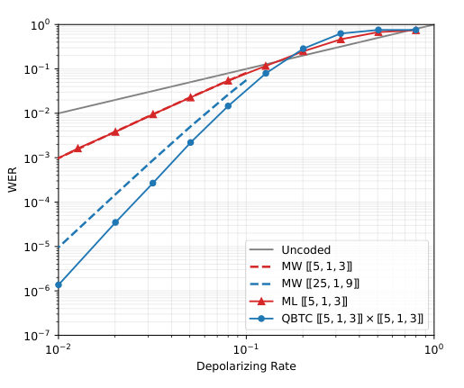 
Fig. 5: Comparison performances of [[5, 1, 3]] maximum likelihood (ML) decoding, [[25, 1, 9]] minimum weight (MW) decoding and QBTC [[5, 1, 3]] × [[5, 1, 3]].

**Summary.** This paper introduces Quantum Block Turbo Codes (QBTC) as a powerful framework for quantum error correction, extending classical turbo coding concepts to the quantum domain. It details an iterative decoding algorithm that exchanges soft information between constituent code decoders. The work demonstrates that QBTCs achieve superior error correction rates, exhibiting a measurable 'turbo decoding effect' for multiple logical qubits.

**Why it may be interesting.** It provides a structured, iterative decoding framework for quantum codes that mimics successful classical techniques, offering a pathway to better performance in fault-tolerant quantum computation.

Detailed structure

**Main problem.** The paper develops a theory and decoding algorithm for Quantum Block Turbo Codes (QBTC), aiming to improve quantum error correction performance by creating a quantum analog of classical product codes.

**Main result.** QBTCs allow for flexible encoding and decoding using iterative soft-information exchange between inner and outer decoders, demonstrating a clear 'turbo decoding effect' when using larger constituent codes.

**Method.** The core method involves an iterative maximum likelihood decoding technique that exchanges soft information between row and column decoding blocks, analogous to classical turbo decoding.

**Model / system.** The system uses Quantum Error Correction Codes (QECCs), specifically stabilizer codes, which are combined in a product structure using two constituent codes, $C_1$ and $C_2$. The encoding is implemented via a unitary transformation $V$ acting on physical qubits.

**Key observables.** Logical error rates, syndrome measurements ($S$), and the performance comparison against minimum weight (MW) decoders.

**Important parameters / regimes.** Code parameters $(n_1, k_1)$ and $(n_2, k_2)$, and the depolarizing channel noise rate.

**Assumptions / limitations.** The decoding process must operate at the level of logical operators due to inherent degeneracy in stabilizer codes, and the M & R procedure requires careful probabilistic handling.

**Figures summary.** Figures illustrate the encoding matrix structure, the global view of the 2D product code encoding/decoding, and detailed diagrams of the SISO inner and outer decoding blocks.

**Paper structure.** The paper progresses from establishing the quantum analogy to classical turbo codes, detailing the encoding/decoding using two constituent codes, formalizing the soft-information exchange via M & R procedures, and finally extending the theory to multi-layer product codes.

Abstract

In the early nineties, the introduction of turbo codes revolutionized classical error correction. The idea was mainly applied on two types of codes: convolutional turbo codes and turbo product codes. The first type of codes was adapted to quantum error correction which initiated the theory of quantum serial turbo codes. In this paper, we present a theory for quantum block turbo codes, the quantum analog of the second type of turbo codes. We describe their iterative decoding algorithm and simulate their performances on a depolarizing channel for different constituent codes.

[↑ back to top](#top)

### [Quantum Pessiland](http://arxiv.org/abs/2608.29493v1)

**Authors:** Boyang Chen, Tomoyuki Morimae, Takashi Yamakawa  
**Type:** theory · **Category:** quantum information and computing · **PDF:** <https://arxiv.org/pdf/2608.29493v1>  
**Analysis basis:** full PDF text, analyzed in chunks

📷 Fig 1

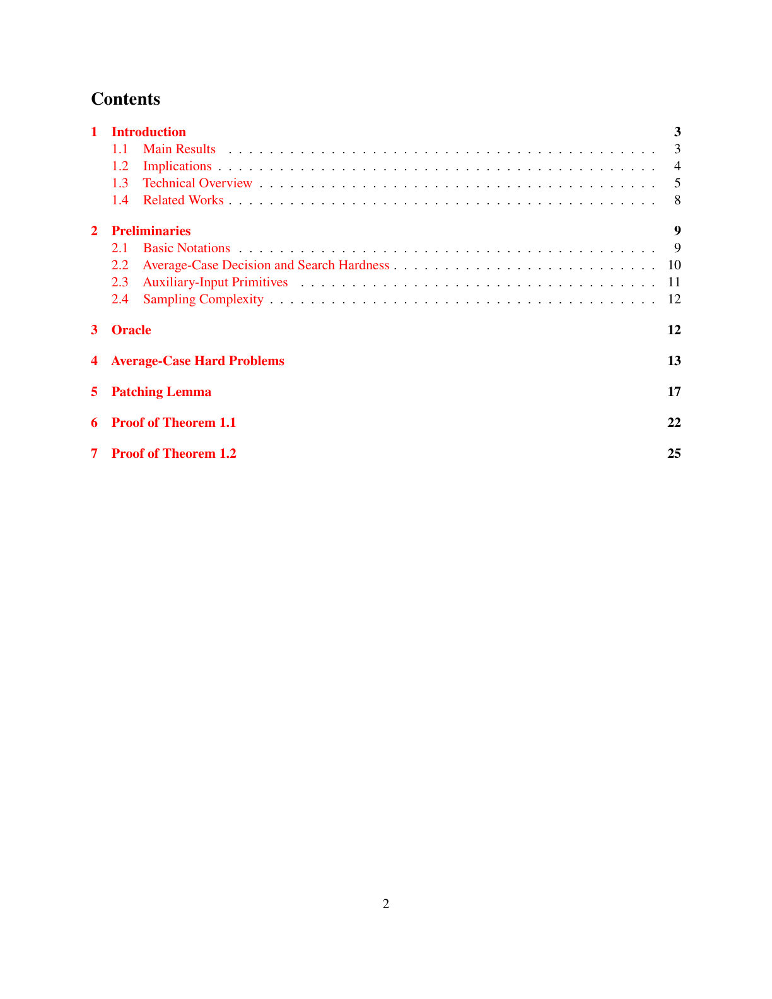 
Low-resolution page preview, page 2

📷 Fig 2

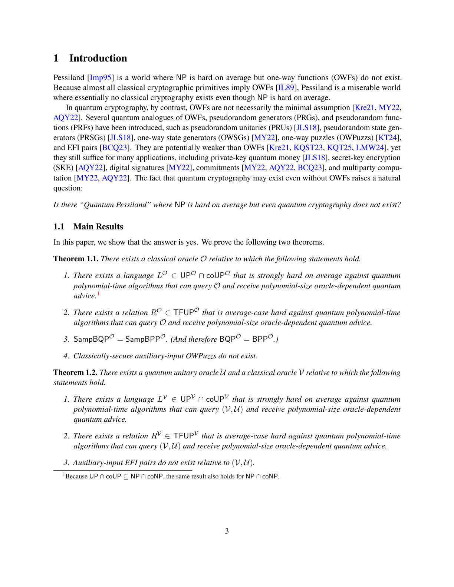 
Low-resolution page preview, page 3

📷 Fig 3

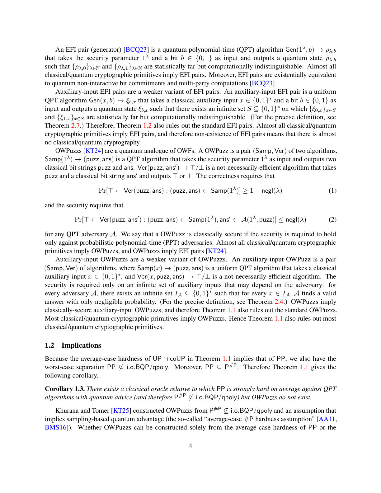 
Low-resolution page preview, page 4

📷 Fig 4

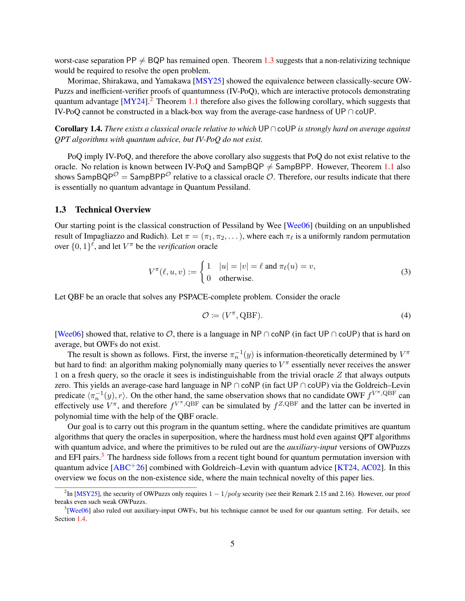 
Low-resolution page preview, page 5

📷 Fig 5

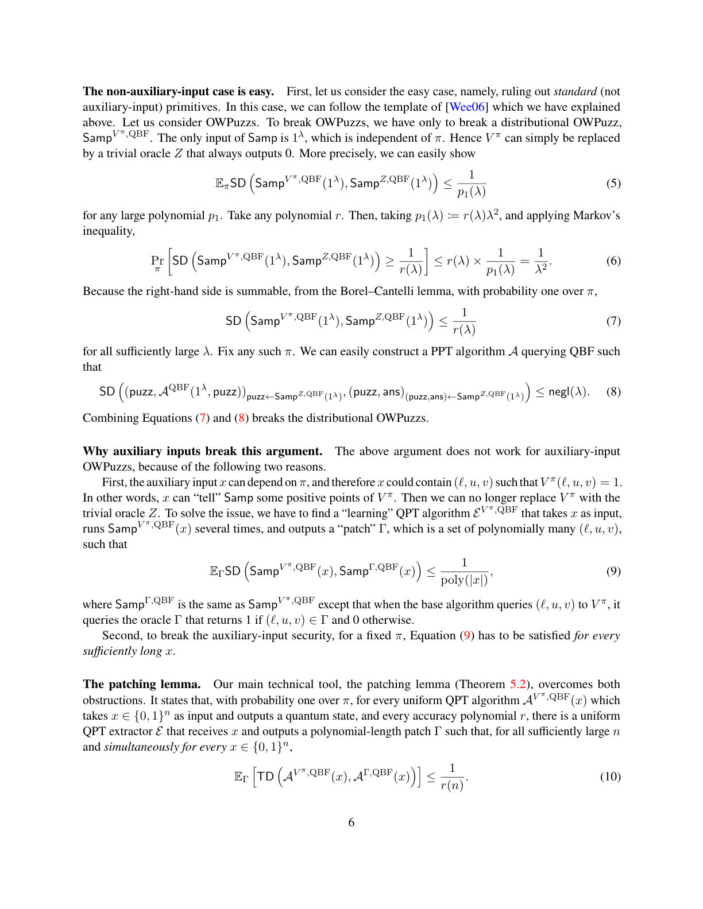 
Low-resolution page preview, page 6

**Summary.** This paper explores 'Quantum Pessiland,' a theoretical model where computational hardness exists, but quantum cryptography fails. By constructing specific oracles, the authors prove that the non-existence of quantum primitives like EFI pairs is implied by average-case hardness assumptions. This work provides deep insights into the necessary computational assumptions required for quantum cryptography to function.

**Why it may be interesting.** While highly abstract, the work pushes the boundaries of quantum complexity theory by establishing precise boundaries on what quantum computation can achieve cryptographically, which is fundamental to understanding quantum information limits.

Detailed structure

**Main problem.** The paper investigates the existence of 'Quantum Pessiland,' a theoretical setting where computational hardness (NP hard on average) holds, but no quantum cryptographic primitives (like OWFs or EFI pairs) can exist.

**Main result.** The authors prove the existence of such a world relative to specific oracles, demonstrating that almost no quantum cryptography exists under these conditions, and further showing no sampling-based quantum advantage.

**Method.** The proof relies on constructing specific quantum and classical oracles and using advanced techniques involving the Patching Lemma to show that the average-case hardness of $	ext{UP} \cap 	ext{coUP}$ implies the non-existence of necessary cryptographic primitives.

**Model / system.** The model is purely theoretical, based on quantum complexity theory, utilizing quantum oracles, quantum advice, and cryptographic primitives like auxiliary-input EFI pairs and OWPuzzs.

**Key observables.** Statistical distance (SD) between quantum distributions, average-case hardness of $	ext{UP} \cap 	ext{coUP}$, and the existence/non-existence of specific quantum primitives.

**Important parameters / regimes.** The analysis involves parameters related to the required accuracy of simulations, such as $r(n)$ and the number of repetitions $R$.

**Assumptions / limitations.** The results are conditional on the existence of specific oracles and rely on advanced techniques like the exponential moment to overcome the limitations of auxiliary inputs.

**Paper structure.** The paper builds upon classical Pessiland concepts, first establishing results relative to a classical oracle (Theorem 1.1), then extending to a quantum oracle (Theorem 1.2), and finally analyzing implications for sampling-based advantage and open problems in complexity theory.

Abstract

Pessiland is a world where NP is hard on average but one-way functions (OWFs) do not exist [Impagliazzo 1995]. Because almost all classical cryptographic primitives imply OWFs [Impagliazzo and Luby 1989], there is almost no classical cryptography in Pessiland. On the other hand, quantum cryptography can exist even when OWFs do not [Kretschmer 2021; Morimae and Yamakawa 2022; Ananth, Qian and Yuen 2022]. Is there a quantum analogue of Pessiland where NP is hard on average but even quantum cryptography does not exist? In this paper, we show that such a miserable world, Quantum Pessiland, exists: there is a quantum oracle relative to which $UP\cap coUP$ is hard on average against quantum polynomial-time algorithms with quantum advice, yet auxiliary-input EFI pairs do not exist. We also show that there is a classical oracle relative to which $UP\cap coUP$ is hard on average against quantum polynomial-time algorithms with quantum advice, yet classically-secure auxiliary-input one-way puzzles (OWPuzzs) do not exist. Almost all quantum cryptographic primitives imply EFI pairs or OWPuzzs, and therefore these results mean that there is almost no quantum cryptography relative to these oracles. We further show that relative to the classical oracle, SampBQP = SampBPP, and therefore there is no sampling-based quantum advantage in Quantum Pessiland. Finally, because our average-case hardness of $UP\cap coUP$ implies $P^{\#P}\not\subseteq i.o.BQP/qpoly$, our result also implies that a non-relativizing proof technique is necessary to construct OWPuzzs solely from $P^{\#P}\not\subseteq i.o.BQP/qpoly$, which gives a partial negative answer to the open problem of [Khurana and Tomer 2025].

[↑ back to top](#top)

### [Quantum Preconditioning For Constrained Optimization Problems](http://arxiv.org/abs/2608.28842v1)

**Authors:** Anurag Ramesh, Bhuvanesh Sundar, Maxime Dupont, David E. Bernal Neira  
**Type:** both · **Category:** quantum information and computing · **PDF:** <https://arxiv.org/pdf/2608.28842v1>  
**Analysis basis:** full PDF text, analyzed in chunks

📷 Fig 1

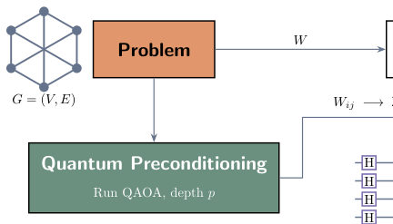 
Fig. 1: Overview of the quantum preconditioning workflow for constrained optimiza- tion problems using exact MIP solvers. A QAOA circuit of depth p is optimized on the original weighted graph G (with the balance constraint enforced as a soft penalty within the ansatz, Section 3.2) to produce a correlation matrix Z. This matrix replaces the original weight matrix W in the objective, and the resulting preconditioned prob- lem is solved by exact MIP solvers such as Gurobi with the hard balance constraint retained. Every incumbent solution is re-evaluated under the original objective (3.1).

📷 Fig 2

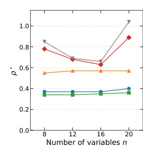 
Fig. 2: Empirical distribution of the per-instance critical penalty ρ⋆for complete graphs with i.i.d. U[0, 2] weights, as a function of n, over the 50 instances

📷 Fig 3

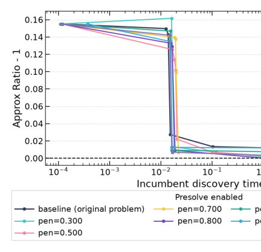 
Fig. 3: Incumbent solution trajectory for a single illustrative instance at n = 40 and QAOA depth p = 1 at select values of the penalty parameter ρ. Each callback solution found while solving the preconditioned problem is re-evaluated using the original objective (3.1).

📷 Fig 4

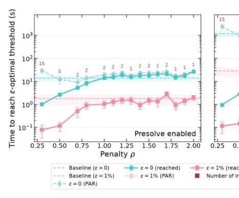 
Fig. 4: Time to the ϵ-optimal threshold for n = 40 and QAOA depth p = 1, as a function of penalty ρ ∈[0.3, 2.0], over 50 independent instances, with presolve enabled (left) and disabled (right). Solid markers show the mean time to the ϵ-optimal threshold over successful instances, at ϵ = 0 and ϵ = 0.01, and dashed horizontal bands show the corresponding classical baseline mean ± standard error. Dashed lines with lighter markers show the penalized average time (3.16), which, for instances that never reach the threshold, adds the baseline runtime to the instance’s own runtime. Annotations give the number of such instances at each ρ. All instances reach the ϵ = 0.01 threshold.

📷 Fig 5

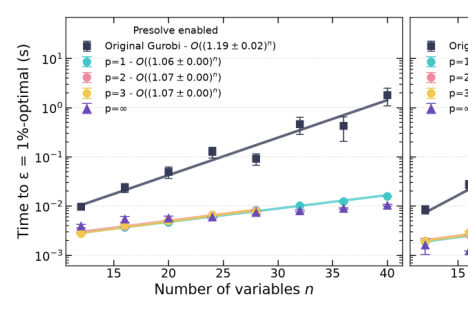 
Fig. 5: Scaling of the time to the ϵ-optimal threshold at ϵ = 0.01 as a function of n, with presolve enabled (left) and disabled (right). The original problem is compared with preconditioned problems at p = 1, 2, 3 and at the p →∞limit. Each finite- depth curve uses a per-instance oracle penalty, the value of ρ (among those tested) that minimizes the threshold time for that instance. Solid lines are exponential fits ¯t(n) = san. Error bars show the standard error of the mean over 50 instances.

**Summary.** This work proposes using quantum preconditioning, derived from the QAOA algorithm, to enhance classical solvers for hard constrained optimization problems like graph bi-partitioning. By injecting problem-specific correlation information into the objective function, the method significantly speeds up the search for near-optimal solutions. This validates a powerful hybrid framework where quantum algorithms guide classical exact solvers.

**Why it may be interesting.** It demonstrates a concrete, actionable hybrid quantum-classical workflow, showing how quantum information (correlations) can be used to enhance the performance of established classical solvers for hard optimization problems.

Detailed structure

**Main problem.** The paper addresses constrained combinatorial optimization problems, such as balanced graph bi-partitioning, which are NP-hard.

**Main result.** Quantum preconditioning, derived from QAOA correlations, significantly accelerates the discovery of high-quality incumbent solutions when guiding classical Mixed-Integer Programming (MIP) solvers.

**Method.** A hybrid approach is used where two-point correlations from the QAOA algorithm are used to construct a modified objective function that is passed to a classical MIP solver, while the original hard constraints are maintained.

**Model / system.** The problem is modeled on a weighted graph G=(V, E), aiming to partition vertices into two equal sets. The quantum component uses the QAOA ansatz to generate correlation information about the solution space.

**Key observables.** Speed and quality of finding near-optimal incumbent solutions; the correlation matrix Z; the time to reach an epsilon-optimal threshold.

**Important parameters / regimes.** QAOA depth (p), the penalty parameter (rho), and the graph size (n).

**Assumptions / limitations.** The core assumption is that the correlation matrix Z derived from QAOA encodes meaningful structural information that guides the classical solver effectively.

**Figures summary.** Figures illustrate the workflow showing QAOA generating Z to modify the MIP objective, and later figures compare the scaling of time to optimality using different rho selection strategies.

**Paper structure.** The paper first introduces the concept of quantum preconditioning for constrained optimization, then details its application to balanced graph bi-partitioning using QAOA, and finally analyzes the performance scaling and parameter selection strategies.

Abstract

We study the effect of quantum preconditioning on constrained combinatorial optimization problems, focusing on balanced graph bi-partitioning. The proposed approach uses two-point correlations between decision variables derived from the Quantum Approximate Optimization Algorithm (QAOA) to construct a modified objective function that is subsequently provided to mixed-integer programming (MIP) solvers. The preconditioned MIP formulation retains the original hard constraint, and all incumbent solutions are evaluated under the original objective. Computational experiments on dense, weighted complete-graph instances show that the preconditioned problem instances reach near-optimal solutions faster, with most of the benefit already realized at the shallowest QAOA depth tested. Solver callback trajectories show this arises from earlier discovery of high-quality incumbents during the solution search. These results support a hybrid optimization framework in which quantum algorithms provide problem-specific information to guide classical exact MIP solvers.

[↑ back to top](#top)

### [Real-space manifestation of ferroic multipoles in altermagnetic MnF$_2$](http://arxiv.org/abs/2608.29089v1)

**Authors:** Iurii Kibalin, Dalila Bounoua, José A. Rodriguez Velamazán, Oscar Fabelo, Navid Qureshi, Quentin Faure, Philippe Bourges, Victor Balédent, Jian-Rui Soh, Jeffrey Rau, Paul McClarty, Arsen Gukasov  
**Type:** experiment · **Category:** other · **PDF:** <https://arxiv.org/pdf/2608.29089v1>  
**Analysis basis:** full PDF text, analyzed in chunks

📷 Fig 1

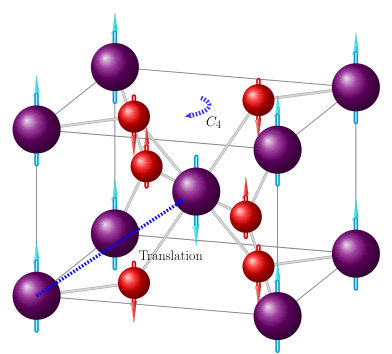 
FIG. 1. Magnetic structure of MnF2. Antiferromagnetic arrangement of Mn moments at 1 T,

📷 Fig 2

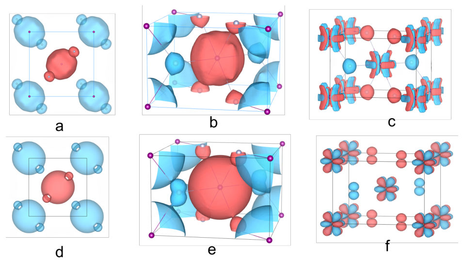 
FIG. 2. Spin density reconstructed by MEM projected on the basal plane (a) and in three dimen-

📷 Fig 3

 
Fig. 2c. The deformation map confirms the unbalanced, opposite spin polarization on the

📷 Fig 4

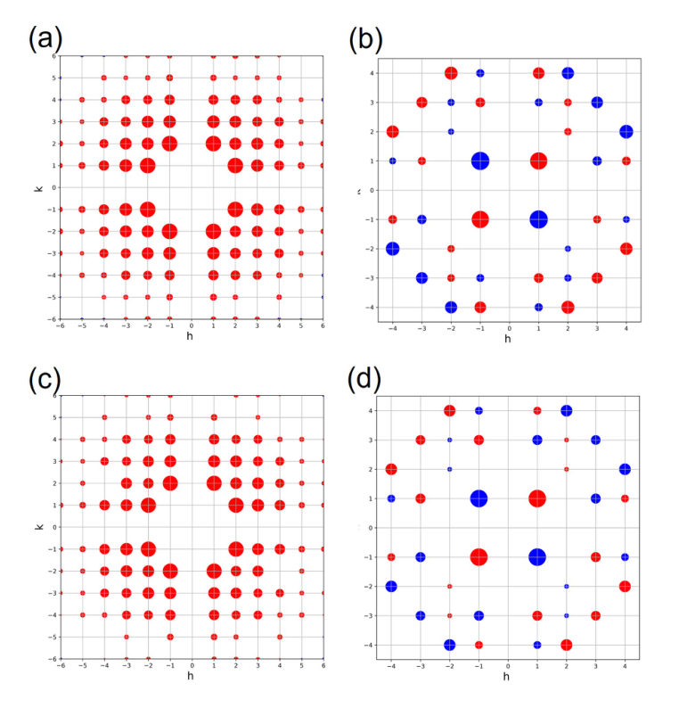 
FIG. 3. Fourier components of the magnetization density. (a,b) Experimental Fourier components

📷 Fig 5

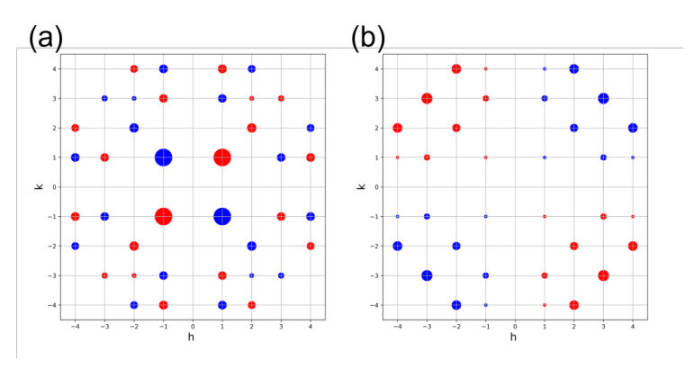 
FIG. 4. Fourier components of calculated magnetization density (Model 4) of the even hkl from 1 T

**Summary.** This work uses polarized-neutron diffraction on MnF2 to overcome the challenge of observing magnetic multipoles in altermagnets. By analyzing symmetry-dependent scattering intensities, the researchers successfully reconstructed the real-space spin density. The results confirm the existence of ferroic multipolar order, providing a powerful new experimental probe for hidden magnetic interactions in quantum materials.

**Why it may be interesting.** While focused on solid-state magnetism, the use of advanced diffraction techniques to probe higher-order, symmetry-protected magnetic moments (multipoles) is a powerful methodology applicable to understanding complex quantum ground states in correlated materials.

Detailed structure

**Main problem.** The primary challenge is the direct, real-space observation of magnetic multipolar order parameters in altermagnets, which are theoretically predicted but experimentally elusive.

**Main result.** The study provides direct real-space evidence of ferroic multipolar order in the altermagnet MnF2, revealing both a finite fluorine ion moment and an anisotropic Mn magnetization.

**Method.** Polarized-neutron diffraction (PND) was employed, utilizing symmetry-selective magnetic reflections to reconstruct the three-dimensional magnetization density.

**Model / system.** The system studied is the prototypical altermagnet MnF2, which is characterized by specific magnetic symmetries that mandate the existence of multipolar order parameters like the magnetic triacontadipole O52.

**Key observables.** Reconstructed spin density, finite fluorine ion moment, anisotropic Mn magnetization, and the multipolar coefficients (e.g., P4^-2).

**Important parameters / regimes.** The analysis is sensitive to the magnetic field (1 T vs 6 T) and the separation of contributions from even and odd reflections.

**Assumptions / limitations.** The analysis assumes the magnetic order does not break lattice translation symmetry, and certain chiral terms are omitted due to the crystal's symmetry.

**Figures summary.** Figures illustrate domain structures (Mn and F moments) under different fields, and spin density maps show the spatial distribution of magnetic moments, confirming multipolar character.

**Paper structure.** The paper progresses by establishing the theoretical requirement for multipolar order in altermagnets, detailing the PND methodology for separating magnetic contributions, and finally presenting the results showing the measured moments confirming the predicted multipolar order.

Abstract

Altermagnets are unconventional spin split magnets arising from the zero spin-orbit coupled limit. They host a magnetic multipolar order parameter yet direct real-space observation of these multipoles has remained elusive. Here we use polarized-neutron diffraction to reconstruct the three-dimensional magnetization density of the prototypical altermagnet MnF$_2$. By exploiting symmetry-selective magnetic reflections, we separate the dominant spherical Mn$^{2+}$ contribution from the much weaker anisotropic Mn magnetization and the covalent spin polarization of the fluorine ligands. The reconstructed spin density reveals a finite fluorine ion moment together with an anisotropic Mn magnetization consistent with the symmetry-allowed altermagnetic rank-5 magnetic multipole $O_{52}$(magnetic triacontadipole). These results provide direct real-space evidence of ferroic multipolar order in an altermagnet and establish polarized-neutron diffraction as a powerful probe of hidden magnetic multipoles in quantum materials.

[↑ back to top](#top)

### [Representation Learning with Quantum Signal Processing](http://arxiv.org/abs/2608.28828v1)

**Authors:** Junqi Wang, Junyu Liu  
**Type:** theory · **Category:** disordered systems and neural networks · **PDF:** <https://arxiv.org/pdf/2608.28828v1>  
**Analysis basis:** full PDF text, analyzed in chunks

📷 Fig 1

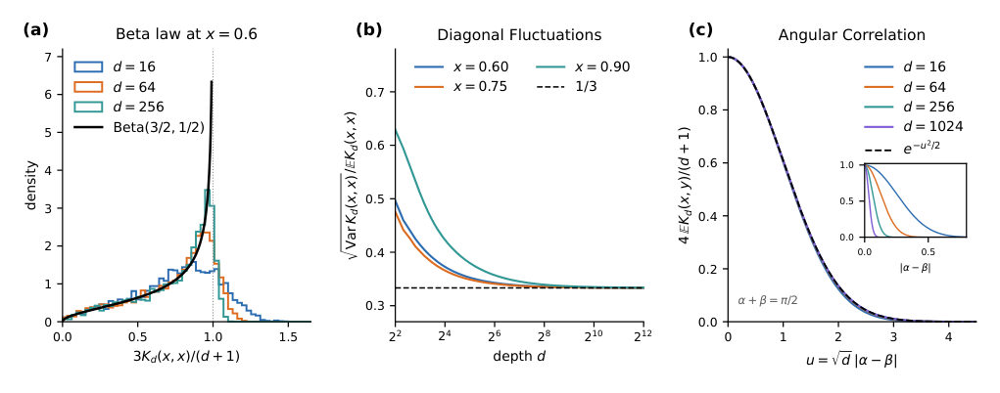 
FIG. 1. Non-self-averaging initialization and angular locality of the mean QNTK. (a) Distribution of the normalized diagonal QNTK z = 3Kd(x, x)/M at x = 0.6. The distributions approach the Beta(3/2, 1/2) law (black). The finite-depth weight above z = 1 reflects the residual anisotropy of the frame tensor. (b) Exact coefficient of variation p

📷 Fig 2

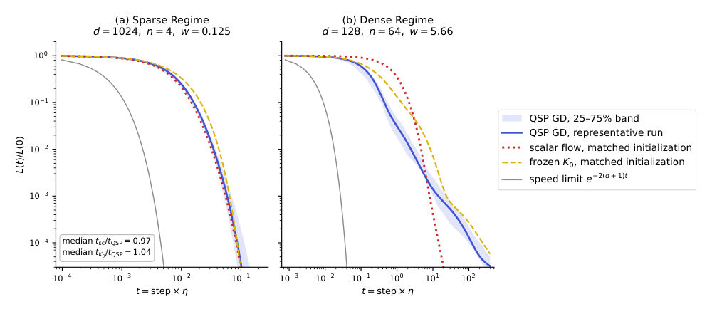 
FIG. 2. Learning with isolated and overlapping quantum data neighborhoods. QSP loss for a representative initialization (blue) and the interquartile band over 30 initializations, compared with the realization-matched scalar flow (red dotted), the realized kernel frozen at K(0) (yellow dashed), and the continuous-flow speed-limit envelope e−2Mt (gray). (a) For (d, n, w) = (1024, 4, 0.125), both reduced descriptions track the QSP descent, with median ratios tsc/tQSP = 0.97 and tK(0)/tQSP = 1.04. (b) For (d, n, w) = (128, 64, 5.66), overlapping tangent neighborhoods drive the QSP trajectory away from both predictions. The numerical protocol is given in the Supplemental Material.

**Summary.** This work develops a rigorous theory for representation learning using Quantum Signal Processing (QSP) as the model. It analyzes the evolution of the quantum data geometry, proving that the dynamics simplify to integrable scalar flows in sparse data regimes but become complex and coupled in dense regimes. This provides a controlled, first-principles understanding of quantum machine learning dynamics.

**Why it may be interesting.** The rigorous mathematical treatment of learning dynamics using quantum resources provides a powerful theoretical framework for understanding how quantum information processing can model complex, non-linear machine learning phenomena.

Detailed structure

**Main problem.** The paper aims to establish a controlled, first-principles theory for how quantum data geometry is learned during training, moving beyond the limitations of simple frozen-kernel models.

**Main result.** It proves that for sparse data, the full nonlinear QSP gradient flow converges to independent, integrable scalar equations, while in the dense regime, the dynamics become coupled and deviate from simpler predictions.

**Method.** The authors use rigorous mathematical analysis, including calculating exact means and variances of the Quantum Neural Tangent Kernel (QNTK) and deriving convergence bounds using techniques like Gronwall's inequality.

**Model / system.** The core model is Quantum Signal Processing (QSP), which is used as a solvable quantum model for representation learning. The dynamics are governed by the gradient flow of a loss function, leading to the evolution of the QNTK.

**Key observables.** The Quantum Neural Tangent Kernel (QNTK), the loss function $L(t)$, and the convergence error $\epsilon_T$ are key observables.

**Important parameters / regimes.** Depth ($d$), sample density ($n$), and the ratio $w = n/\sqrt{d}$ define the different learning regimes (sparse vs. dense).

**Assumptions / limitations.** The analysis assumes specific scaling conditions (e.g., $n^{3/2}[1 + \log n] / \sqrt{M} 	o 0$ for the sparse limit) and relies on the QSP model being an adequate representation of the learning process.

**Figures summary.** Figures illustrate the convergence of the normalized diagonal QNTK to a Beta distribution and show the QSP training trajectory deviating from scalar or frozen-kernel predictions in the dense data regime.

**Paper structure.** The paper progresses by first establishing the QSP model, calculating kernel statistics in the large-depth limit, then deriving convergence guarantees for the full nonlinear gradient flow, and finally comparing the full dynamics against simplified scalar and frozen-kernel approximations across sparse and dense regimes.

Abstract

Representation learning begins when training changes the features that define similarity between data. A frozen-kernel model only reweights a fixed geometry. We establish quantum signal processing (QSP) as a solvable quantum model of the representation-learning regime. At arbitrary depth, we compute the exact mean and variance of its quantum neural tangent kernel, revealing an input-dependent angular geometry whose diagonal remains non-self-averaging even when the underlying unitary approaches Haar randomness. We also prove a sparse-data guarantee for the full nonlinear gradient flow without freezing or ensemble-averaging the kernel: the realized dynamics converges to an integrable scalar flow with a time-dependent kernel closure and explicit convergence times. A finite-depth speed limit holds for every data set and trajectory. At higher data density, numerical results show coupled evolution beyond both the scalar and frozen-kernel descriptions. These results give a controlled theory of learned quantum data geometry with provable training dynamics beyond the frozen limit.

[↑ back to top](#top)

### [Rényi Entanglement of Purification Is Non-additive](http://arxiv.org/abs/2608.28897v1)

**Authors:** Amir-Reza Negari, Zahra Baghali Khanian  
**Type:** theory · **Category:** quantum information and computing · **PDF:** <https://arxiv.org/pdf/2608.28897v1>  
**Analysis basis:** full PDF text, analyzed in chunks

📷 Fig 1

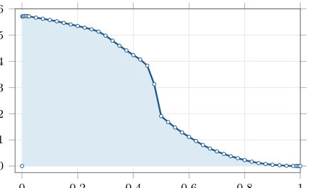 
FIG. 1. Fraction of 5 × 104 uniformly sampled classical two- qubit states for which our signed-canonical witness proves nonadditivity, obtained by exact enumeration of all 512 in- equivalent two-copy sign patterns.

**Summary.** This paper rigorously analyzes the additivity of the Rényi Entanglement of Purification for classical two-qubit states. It establishes that the measure is non-additive for Rényi orders between 0 and 1, but it becomes additive for orders greater than or equal to 2. The open interval $1 \le \alpha < 2$ remains a key open problem.

**Why it may be interesting.** The study provides precise mathematical boundaries ($\alpha=1$ and $\alpha=2$) for when fundamental entanglement measures exhibit simple scaling properties, which is crucial for understanding resource theories in quantum information.

Detailed structure

**Main problem.** The paper investigates the additivity property of the Rényi Entanglement of Purification ($	ext{EoP}$), a measure of total correlations, for classical states on two qubits.

**Main result.** The $	ext{EoP}$ is proven to be non-additive for Rényi orders $\alpha \in [0, 1)$ but is proven to be additive for $\alpha \ge 2$.

**Method.** The authors use analytical proofs involving comparing the two-copy case to the product of single-copy values, employing concavity arguments and norm inequalities.

**Model / system.** The study focuses on classical two-qubit states, $
ho_P = \sum p_{ij}|ij
angle\langle ij|$, and their tensor products, analyzing the entanglement measure $	ext{E}_\alpha^P(
ho_P)$.

**Key observables.** Rényi Entanglement of Purification ($	ext{E}_\alpha^P$), Rényi entropy ($	ext{S}_\alpha$), and the nonadditive fraction.

**Important parameters / regimes.** The Rényi order $\alpha$, specifically distinguishing regimes $0 \le \alpha < 1$, $1 \le \alpha < 2$, and $\alpha \ge 2$.

**Assumptions / limitations.** The analysis relies on the canonical purification being optimal for one copy, and the additivity for $\alpha \ge 2$ is derived from a norm inequality.

**Figures summary.** Figure 1 shows the nonadditive fraction of violating states for $0 < \alpha < 1$. Figure 2 summarizes the phase diagram, showing nonadditivity for $\alpha < 1$ and additivity for $\alpha \ge 2$.

**Paper structure.** The paper first solves the one-copy optimization exactly. It then proves nonadditivity for $\alpha < 1$ using specific state constructions. Subsequently, it proves additivity for $\alpha \ge 2$ using norm inequalities, leaving the interval $1 \le \alpha < 2$ open.

Abstract

Entanglement of purification is a fundamental measure of total correlations whose additivity remains unresolved. We study its additivity for classical states on two qubits at different Rényi orders. For every $α\in[0,1)$, we prove nonadditivity within this family, witnessed by two copies of a single state. We first solve the one-copy optimization exactly for the entire family at every Rényi order. We then restrict the two-copy optimization to a natural finite set of purifications and exhibit one whose entropy is strictly below the product value. In contrast, for $α\in[2,\infty]$ we prove additivity under tensor products within this family. The interval $α\in[1,2)$, including the von Neumann case $α=1$, remains open, and we conjecture additivity there throughout the same family.

[↑ back to top](#top)

### [Superconductivity of Tellurium Polyhydride with Tc above 90K](http://arxiv.org/abs/2608.30139v1)

**Authors:** Jinfu Zhu, Guiqi Liu, Yuanhao Su, Hongyu Liu, Sijia Zhang, Panpan Kong, Qingqing Liu, Jianfa Zhao, Shaomin Feng, Jun Zhang, Haoyu Zheng, Jing Song, Luhong Wang, Fuyang Liu, Haozhe Liu, M. Bykov, Xiancheng Wang, Changqing Jin  
**Type:** experiment · **Category:** other · **PDF:** <https://arxiv.org/pdf/2608.30139v1>  
**Analysis basis:** full PDF text, analyzed in chunks

📷 Fig 1

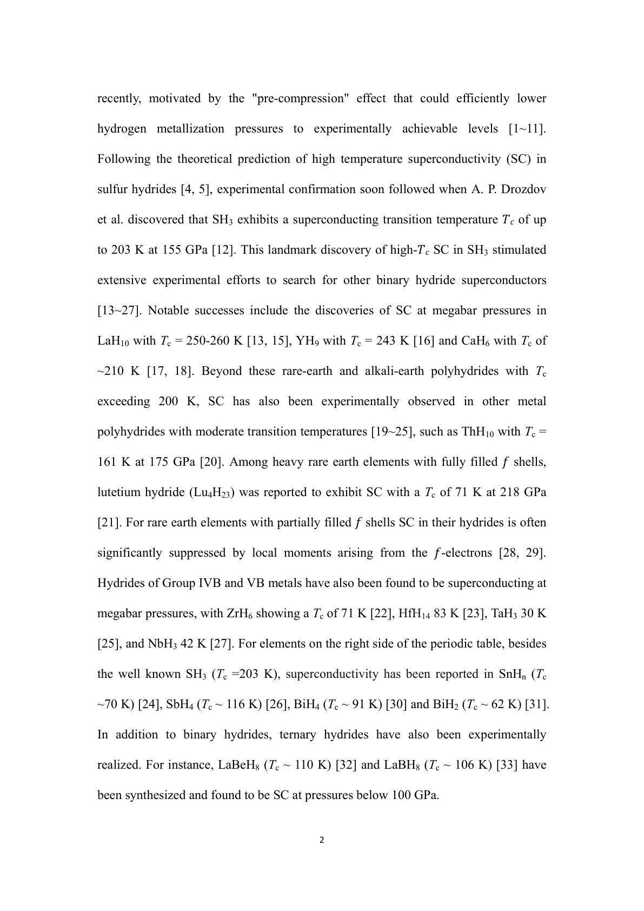 
Low-resolution page preview, page 2

📷 Fig 2

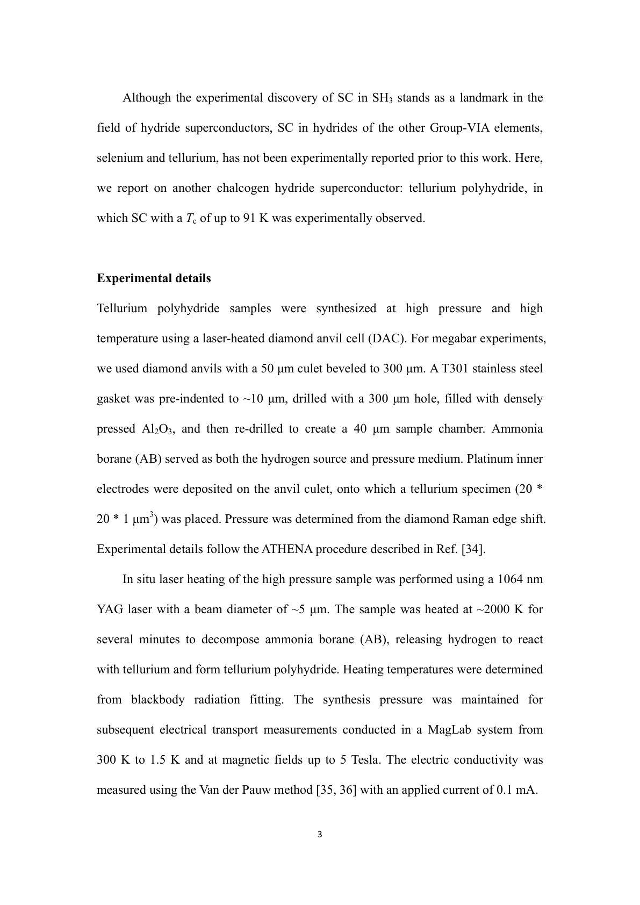 
Low-resolution page preview, page 3

📷 Fig 3

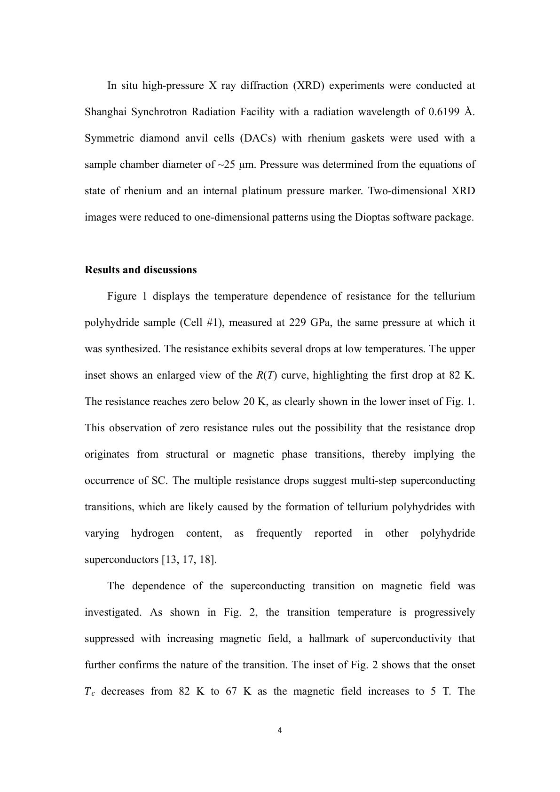 
Low-resolution page preview, page 4

📷 Fig 4

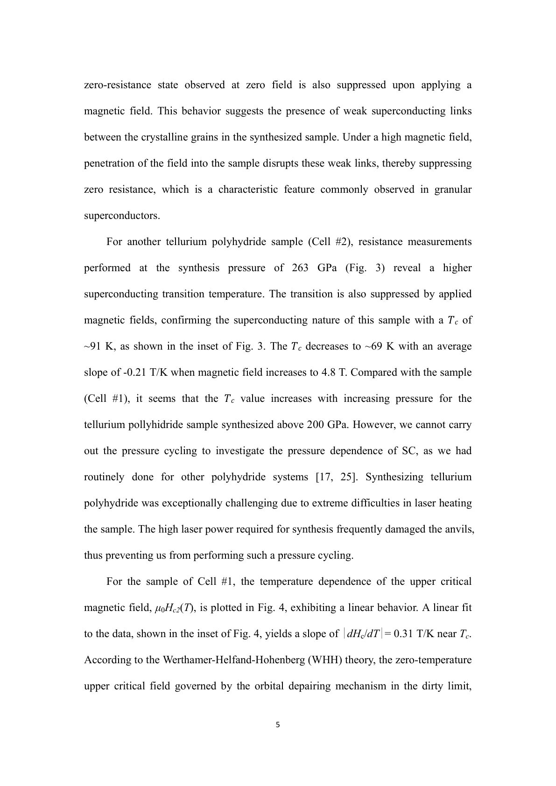 
Low-resolution page preview, page 5

📷 Fig 5

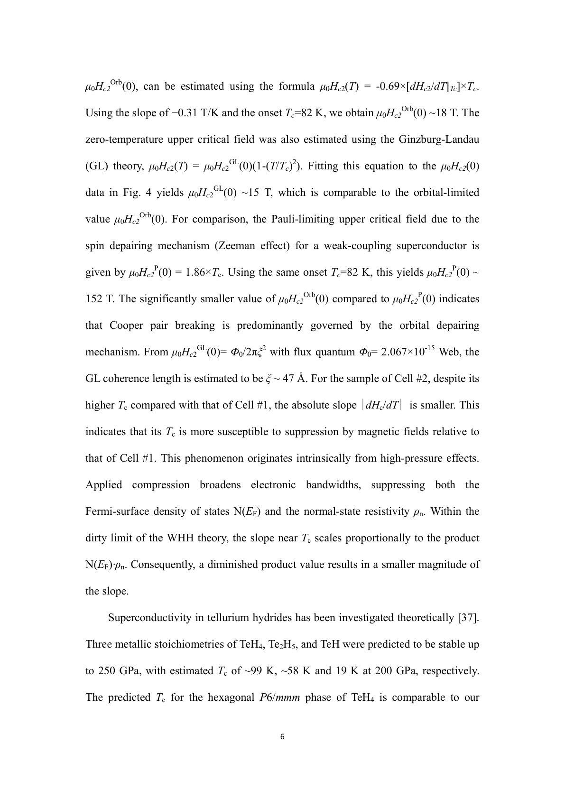 
Low-resolution page preview, page 6

**Summary.** This work reports the discovery of superconductivity in tellurium polyhydride ($	ext{TeH}_4$) at high pressures, achieving a critical temperature of about 91 K. Using *in situ* transport and XRD measurements, the authors characterized the superconducting phase and determined key parameters like the coherence length. This adds to the growing body of knowledge regarding high-temperature superconductivity in hydrides.

**Why it may be interesting.** While focused on high-pressure solid-state physics, the study's rigorous measurement of superconducting parameters ($T_c$, $\mu_0H_{c2}$) and structural confirmation under extreme conditions provides valuable data points for understanding unconventional pairing mechanisms in correlated materials.

Detailed structure

**Main problem.** The paper reports the experimental discovery of superconductivity in tellurium (Te) polyhydride under extreme high pressure.

**Main result.** Superconductivity was observed in the $	ext{TeH}_4$ phase with a critical temperature ($T_c$) of approximately 91 K at 263 GPa, establishing it as a new chalcogen polyhydride superconductor.

**Method.** The study employed *in situ* transport measurements (resistance vs. T and B) and high-pressure X-ray diffraction (XRD) within a diamond anvil cell.

**Model / system.** The physical system is tellurium polyhydride ($	ext{TeH}_x$), specifically identifying the superconducting phase as $	ext{TeH}_4$. The structure is characterized by face-sharing $	ext{TeH}_{12}$ cages forming quasi-molecular $	ext{H}_2$ units.

**Key observables.** Superconducting transition temperature ($T_c$), zero resistance state, upper critical magnetic field ($\mu_0H_{c2}(T)$), and Ginzburg-Landau coherence length ($\xi$).

**Important parameters / regimes.** High pressures (up to 263 GPa), high temperatures, and applied magnetic fields (up to 5 T).

**Assumptions / limitations.** The analysis relies on fitting $\mu_0H_{c2}(T)$ data to WHH and GL theories, and the superconducting phase is assigned to the hexagonal $	ext{TeH}_4$ structure.

**Figures summary.** Figures detail the temperature and magnetic field dependence of resistance ($R(T)$) showing the superconducting transition, and plots of $\mu_0H_{c2}(T)$ derived from these measurements.

**Paper structure.** The paper follows a structure of reporting the experimental setup (DAC, *in situ* measurements), presenting the structural characterization (XRD confirming $	ext{TeH}_4$), and then detailing the transport measurements to confirm the superconducting transition and analyze its parameters ($T_c$, $\mu_0H_{c2}$, $\xi$).

Abstract

We report experimental diacovery of superconductivity (SC) in tellurium (Te) polyhydride. The compound was synthesized at high pressure and high temperature conditions using a diamond anvil cell combined with a laser heating system. Subsequent in situ transport measurements at high pressures, performed as a function of temperature and applied magnetic field, revealed a superconducting transition with a critical temperature Tc about 91 K at 263 GPa. The superconducting phase is assigned to TeH4 with characterized face shared TeH12 cage forming quasi molecular H2 units based on synchrotron x-ray diffraction experiments. Analysis of the SC behavior at magnetic fields yielded a Ginzburg Landau (GL) coherence length of approximately 47 angstroms. Tellurium polyhydride thus becomes another chalcogen polyhydride superconductor in addition to the landmark discovery of the first polyhydride high Tc SC SH3.

[↑ back to top](#top)

### [The Inverse Eigenvalue Problem for Partial Transposes of Two-Qubit States](http://arxiv.org/abs/2608.29068v1)

**Authors:** Ruoting Dou, Shengjun Wu, Zeng-Bing Chen  
**Type:** theory · **Category:** quantum information and computing · **PDF:** <https://arxiv.org/pdf/2608.29068v1>  
**Analysis basis:** full PDF text, analyzed in chunks

📷 Fig 1

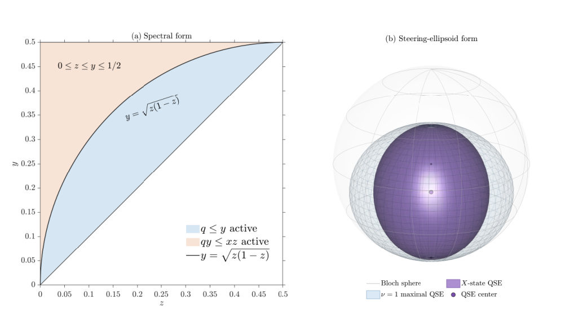 
FIG. 1. Spectral and geometric forms of the two-qubit inverse eigenvalue theorem. (a) For an ordered candidate eigenvalue list λ = (x, y, z, −q) with one negative entry, the projected domain 0 ≤z ≤y ≤1/2 is divided according to whether q ≤y or qy ≤xz sets the upper bound on q; the two bounds meet at y = p

📷 Fig 2

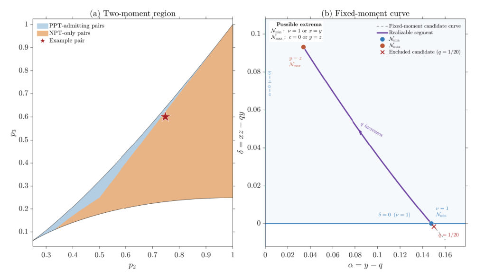 
FIG. 2. Exact negativity bounds from the two lowest nontrivial PT moments. (a) Allowed (p2, p3) region generated by two-qubit states. The blue region contains moment pairs consistent with at least one PPT state, whereas in the orange region every consistent two-qubit state is NPT and Nmin(p2, p3) &gt; 0. The star marks the moment pair associated with the candidate eigenvalue list λ∗= (21/25, 1/5, 1/100, −1/20). (b) Fixed-moment curve for the same example in α = y −q and δ = xz −qy. The first quadrant satisfies both inverse-eigenvalue inequalities; the dashed curve contains candidate eigenvalue lists with the same (p2, p3), and the thick purple segment is its realizable portion. The minimum...

**Summary.** This paper solves the inverse eigenvalue problem for the partial transpose of two-qubit states, determining the exact conditions under which a given spectrum is physically realizable. It establishes necessary and sufficient conditions using simple algebraic inequalities ($q \leq y$ and $qy \leq xz$) and provides methods to calculate exact bounds on entanglement measures like negativity using only low-order moments.

**Why it may be interesting.** This work provides fundamental, quantitative constraints on the structure of entanglement and non-separability (via the partial transpose) for small quantum systems, which is crucial for understanding quantum resource theories.

Detailed structure

**Main problem.** The paper solves the inverse eigenvalue problem for the partial transpose ($
ho^{\Gamma_B}$) of two-qubit quantum states, aiming to characterize all possible spectra that can arise from physical states.

**Main result.** For two qubits, the necessary and sufficient conditions for a spectrum $\lambda = (x, y, z, -q)$ to be realized by an NPT state are $q \leq y$ and $qy \leq xz$. Furthermore, exact bounds on negativity can be derived from the two lowest non-trivial partial-transpose moments ($p_2, p_3$).

**Method.** The analysis combines algebraic characterization (using moment constraints $p_k$) with geometric interpretations (relating constraints to allowed regions in parameter space, like the quantum steering ellipsoid).

**Model / system.** The system is a bipartite quantum state $
ho$ defined on two qubits ($2 \otimes 2$). The core diagnostic tool is the partial transpose $
ho^{\Gamma_B}$, and the analysis extends to higher-dimensional qubit-qudit systems.

**Key observables.** Partial transpose spectrum $	ext{spec}(
ho^{\Gamma_B})$, Negativity $N(
ho)$, and Partial-Transpose (PT) moments $p_k = 	ext{Tr}[(
ho^{\Gamma_B})^k]$.

**Important parameters / regimes.** The constraints $q \leq y$ and $qy \leq xz$ define the realizable spectral region; the moments $(p_2, p_3)$ define the boundary conditions for negativity extrema.

**Assumptions / limitations.** The analysis relies on extending results from the two-qubit case to general qubit-qudit systems and uses the two-copy Hilbert space structure to derive necessary conditions.

**Figures summary.** Figures illustrate the spectral and geometric forms, showing how the derived bounds ($q \leq y$ and $qy \leq xz$) define the projected domain for achievable spectra.

**Paper structure.** The paper develops a hierarchy of constraints: first, analyzing the spectrum via the two-copy space (Theorem 3); second, providing the complete characterization via eigenvalues (Theorem 4); and finally, establishing moment-based bounds on negativity (Theorem 6).

Abstract

For a bipartite state $ρ$, information about the spectrum of its partial transpose $ρ^{Γ_B}$ can be inferred from measurements on multiple copies of $ρ$, without full state tomography. This raises a natural question: which eigenvalue lists can arise as $\operatorname{spec}(ρ^{Γ_B})$ for a density operator $ρ$? We completely solve this inverse eigenvalue problem for two qubits. Every nonnegative trace-one spectrum is realized as $\operatorname{spec}(ρ^{Γ_B})$ by some PPT state $ρ$, whereas an ordered candidate eigenvalue list $(x,y,z,-q)$, with $x\ge y\ge z\ge0$, $q>0$, and $x+y+z-q=1$, is realized by an NPT state iff $q\le y$ and $qy\le xz$. Sufficiency in the latter case is established by an explicit $X$ state whose quantum steering ellipsoid has center $c=(y-q)/(1-z)$ and normalized volume $V/V_{\max}(c)=qy/(xz)$, providing a geometric interpretation of the inequalities $q\le y$ and $qy\le xz$ as the allowed ellipsoid-center region and the fixed-center volume bound. Beyond this geometric picture, the two-qubit inverse theorem also yields exact negativity bounds from the two lowest nontrivial PT moments. Given fixed values of $p_2=Tr[(ρ^{Γ_B})^2]$ and $p_3=Tr[(ρ^{Γ_B})^3]$, we determine the exact minimum and maximum negativity over all two-qubit states subject to these moment constraints. When no PPT state is consistent with the pair $(p_2,p_3)$, the minimum is attained either at $x=y$ or $qy=xz$, while the maximum is attained either at $y=z$ or $q=y$. Finally, we show how the two-qubit inequalities persist as necessary constraints for the inverse eigenvalue problem in qubit--qudit systems.

[↑ back to top](#top)

### [The ZZ feature map induces a signless Laplacian metric: a closed-form classical surrogate for quantum kernel regression](http://arxiv.org/abs/2608.29422v1)

**Authors:** Erkut Tekeli  
**Type:** theory · **Category:** quantum information and computing · **PDF:** <https://arxiv.org/pdf/2608.29422v1>  
**Analysis basis:** full PDF text, analyzed in chunks

📷 Fig 1

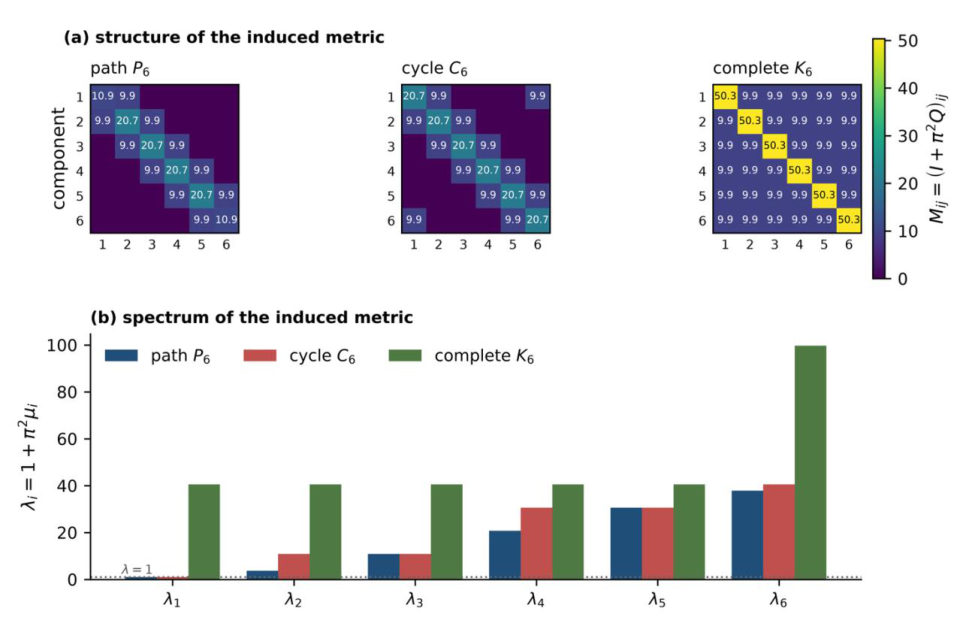 
Figure 1. The metric induced by the ZZ feature map, 𝑀= 𝐼+ 𝜋2𝑄, for three entanglement topologies at 𝑘= 6. (a) Matrix entries on a common colour scale: diagonal entries are 1 + 𝜋2deg(𝑖) , and off-diagonal entries are 𝜋2 on the edges of 𝐺 and zero otherwise. (b) Sorted eigenvalues 𝜆𝑖= 1 + 𝜋2𝜇𝑖, with 𝜇𝑖 the signless Laplacian spectrum of 𝐺. The figure presents the content of Proposition 1 rather than data, and two consequences are visible directly. The path and the cycle are bipartite, so 𝜇1 = 0 and each admits a direction along which the kernel reduces to the plain Euclidean metric (𝜆1 = 1, dotted line; Corollary 2). The complete graph has only two distinct eigenvalues, 1 + 𝜋2(𝑘−2) with...

📷 Fig 2

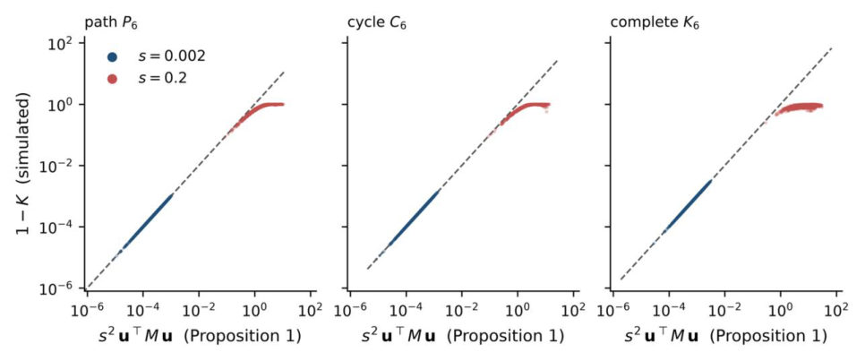 
Figure 2. Direct verification of Proposition 1. Each point is one training pair (𝐱, 𝐱′): the horizontal axis is the closed-form prediction 𝑠2𝐮⊤𝑀𝐮, with 𝑀 read off the entanglement graph and no quantity fitted to the simulation, and the vertical axis is 1 −𝐾 obtained from exact state-vector simulation. Both axes are logarithmic, and the dashed line is the identity. At 𝑠= 0.002, inside the classical regime, the points follow the identity over more than two decades for all three topologies. At 𝑠= 0.2, beyond the boundary located in Section 3.3, the simulated values saturate and depart from the prediction. Here 𝑘= 6 with 70 points, giving 2415 pairs per cloud.

📷 Fig 3

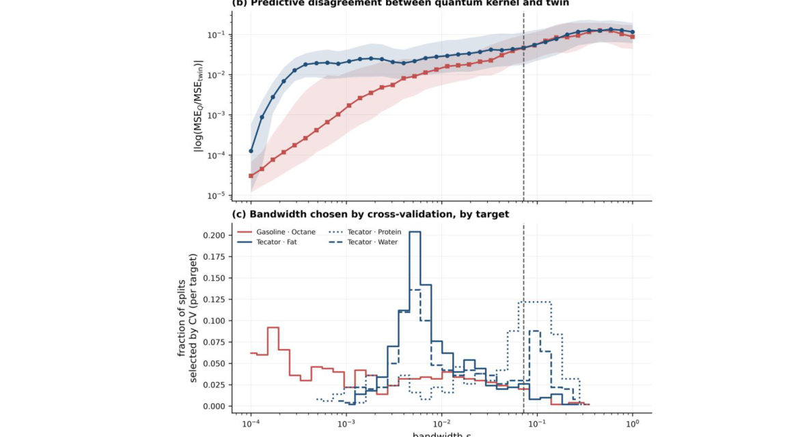 
Figure 3. Boundary of the classical regime and its consequences, as a function of the bandwidth 𝑠 (logarithmic axis; dashed vertical line at 𝑠∗= 0.072). (a) Median 𝑅2 of the full quadratic fit to 1 −𝐾; the dotted line marks 𝑅2 = 0.99. (b) Median |log(MSE𝑄/MSEtwin)| evaluated at the same bandwidths, with interquartile bands. (c) Distribution of the bandwidth selected by cross-validation, shown separately for each target. Panels (a) and (b) rise together: the twin and the quantum kernel begin to disagree exactly where the quadratic reduction ceases to be exact.

**Summary.** This paper derives a closed-form classical surrogate for the kernel induced by the ZZ feature map in quantum kernel regression. It proves that in the small-bandwidth limit, the quantum kernel behaves like an anisotropic Gaussian kernel whose metric depends on the graph's Laplacian. This finding allows the quantum circuit to be removed from the pipeline without losing predictive accuracy, offering significant computational simplification.

**Why it may be interesting.** It provides a concrete, analytically tractable classical approximation for a quantum feature map kernel, allowing researchers to bypass computationally expensive quantum simulations for kernel-based ML tasks.

Detailed structure

**Main problem.** The paper addresses the theoretical gap in understanding quantum kernel methods, specifically deriving a closed-form classical surrogate for the kernel induced by the ZZ feature map.

**Main result.** The induced kernel is shown to be, to leading order, an anisotropic Gaussian kernel whose metric is determined by the signless Laplacian of the entanglement graph ($M = I + \pi^2 Q$).

**Method.** The analysis uses small-bandwidth Taylor expansion of the kernel overlap function and relates the resulting quadratic form to the graph's Laplacian structure.

**Model / system.** The model is quantum kernel regression utilizing a data-encoding circuit, specifically focusing on the ZZ feature map applied to an entanglement graph $G$.

**Key observables.** The induced metric $M = I + \pi^2 Q$, the test error comparison against classical methods, and the persistence of the quadratic structure.

**Important parameters / regimes.** The bandwidth ($s$), the entanglement graph structure ($G$), and the phase convention used in the feature map.

**Assumptions / limitations.** The derivation relies on the small-bandwidth expansion, and the authors note that the resulting metric should be treated as a pseudometric for deeper circuits.

**Figures summary.** Figures illustrate the induced metric $M=I+\pi^2 Q$ and its spectrum for various entanglement graphs (Path, Cycle, Complete) confirming the derived mathematical structure.

**Paper structure.** The paper progresses by deriving the kernel overlap using Taylor expansion, establishing the quadratic form in the small-bandwidth limit, deriving the explicit classical surrogate metric based on the graph Laplacian, and finally validating this surrogate against empirical spectroscopic benchmarks.

Abstract

Quantum kernel methods lose their advantage over classical kernels once the encoding bandwidth is tuned, and bandwidth-tuned quantum kernels have been shown to resemble radial basis function kernels closely. The analytical support for that observation rests on separable encoding circuits and captures entangling circuits only qualitatively. We close this gap for the ZZ feature map. We prove that in the small-bandwidth regime the induced kernel is, to leading order, an anisotropic Gaussian kernel with metric M = I + pi^2 Q, where Q is the signless Laplacian of the entanglement graph, and that the quadratic structure persists at every circuit depth as a pullback of the Fubini-Study metric. The anisotropy depends entirely on a phase convention: under the unshifted convention the metric is the identity irrespective of entanglement, which explains the isotropic resemblance previously reported. The derivation is verified against direct simulation for path, cycle and complete entanglement graphs, with relative error below 10^-3. The corresponding classical kernel requires no fitted parameters and no quantum simulation. Compared with the quantum kernel across two near-infrared spectroscopic benchmarks, four targets, five preprocessing pipelines and 100 resampled splits per cell, the paired 95% bootstrap interval contains zero in 18 of 20 cells, the typical relative difference in test error is 2.7%, and the two families select the same preprocessing pipeline in 96% of splits. The regime in which the reduction fails begins at the same bandwidth on both datasets and adds no robust predictive value: restricting the grid to the classical regime improves mean test error by 3.8%, a gain that an equally large random restriction does not reproduce. The quantum circuit can thus be removed without detectable predictive loss, and we can state precisely which classical kernel it was computing.

[↑ back to top](#top)

### [Tight Global Bound on Pairwise Entanglement of Formation in Three-Qubit Systems](http://arxiv.org/abs/2608.29707v1)

**Authors:** Wei Song, Xiao-Lan Zong, Ming Yang  
**Type:** theory · **Category:** quantum information and computing · **PDF:** <https://arxiv.org/pdf/2608.29707v1>  
**Analysis basis:** full PDF text, analyzed in chunks

📷 Fig 1

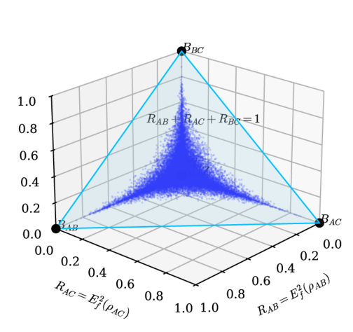 
FIG. 1. Geometric representation of the global pairwise EOF constraint. Blue points denote 105 Haar-random three-qubit pure states plotted in the coordinates (RAB, RAC, RBC) = (E2 f(ρAB), E2 f(ρAC), E2 f(ρBC)). The states remain below the saturation plane RAB + RAC + RBC = 1. The vertices cor- respond to Bell-pair configurations. The GHZ and W states indicate the opposite limits of absent and distributed pairwise entanglement.

📷 Fig 2

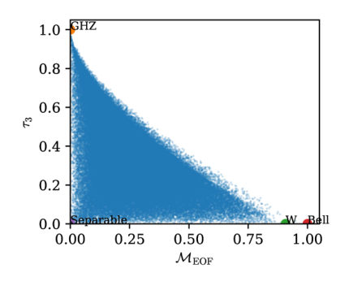 
FIG. 2. Haar-random sampling of three-qubit pure states in the (MEOF, τ3) plane. The quantity MEOF = E2 f(ρAB) + E2 f(ρAC) + E2 f(ρBC) is the total pairwise squared entangle- ment of formation, while τ3 is the three-tangle. The GHZ, W , and Bell-pair states identify three distinct correlation struc- tures: genuine tripartite entanglement, distributed pairwise entanglement, and concentrated pairwise entanglement.

📷 Fig 3

 
FIG. 3. Normalized pairwise squared-EOF survival function under global depolarizing noise. The W and D(2) 3 states show the same decay curve due to their local-unitary equivalence and the covariance of the depolarizing channel. In contrast, the Bell-pair state follows a different decay behavior, reflect- ing the fact that its pairwise EOF is localized in one two-qubit subsystem.

📷 Fig 4

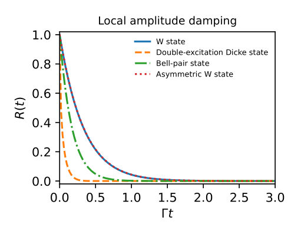 
FIG. 4. Normalized pairwise squared-EOF survival function under local amplitude damping. Although the W and D(2) 3 states have the same initial pairwise EOF, they exhibit dif- ferent decay behaviors due to their different excitation struc- tures.

📷 Fig 5

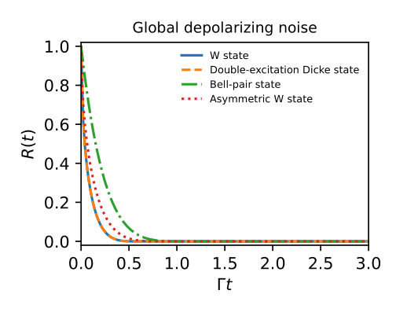 
Figure 3 presents the dynamical evolution under global depolarizing noise. Since the W and D(2) 3 state can be transformed into each other by local bit-flip opera- tions, and the depolarizing channel preserves local uni- tary equivalence, they have identical decay curves. In contrast, under the normalized representation, the Bell- pair state decays more slowly, which is consistent with its feature that the pairwise EOF is concentrated in a single two-qubit subsystem. In contrast to depolarizing noise, amplitude damping is sensitive to the number of excitations in the quantum state. Although the W and D(2) 3 states have the same initial MEOF, their subsequent dynamical behaviors are are...

**Summary.** This paper establishes a tight global upper bound on the sum of pairwise squared entanglement of formation for three-qubit systems. It provides a natural geometric picture by mapping the three bipartite entanglements to coordinates constrained by this inequality. Furthermore, it analyzes how this entanglement structure decays over time under various quantum noise models.

**Why it may be interesting.** The geometric mapping of entanglement into a constrained space provides a powerful, quantifiable tool for understanding multi-partite quantum correlations, which is fundamental to quantum information theory.

Detailed structure

**Main problem.** The paper aims to derive a global upper bound on the sum of pairwise squared entanglement of formation ($	ext{EOF}^2$) in three-qubit systems, extending beyond traditional monogamy relations.

**Main result.** A global inequality $	ext{EOF}^2(
ho_{AB}) + 	ext{EOF}^2(
ho_{AC}) + 	ext{EOF}^2(
ho_{BC}) \leq 1$ was derived for any three-qubit state, which is shown to be tight.

**Method.** The authors used mathematical techniques involving the binary entropy function and optimization over a polytope defined by entanglement measures to establish the global bound.

**Model / system.** The study focuses on three-qubit quantum systems ($
ho_{ABC}$), analyzing the entanglement structure using pairwise entanglement measures.

**Key observables.** Pairwise entanglement measures ($	ext{EOF}^2(
ho_{XY})$), the sum $M_{	ext{EOF}}$, and the three-tangle ($	au_3$).

**Important parameters / regimes.** The bound value of 1, and the comparison between different state structures (Bell-pair vs. W state) regarding entanglement distribution.

**Assumptions / limitations.** The analysis extends the bound from pure states to mixed states using convexity arguments, and later investigates dynamics under specific Markovian noise models.

**Figures summary.** Figure 1 illustrates the geometric constraint $R_{AB} + R_{AC} + R_{BC} \leq 1$ in 3D space, showing random states below the saturation plane. Other figures compare the decay of $MEOF$ under various noise channels for different initial states.

**Paper structure.** The paper first establishes the global static bound on $M_{	ext{EOF}}$ (Theorem 1), providing a geometric interpretation. It then analyzes the dynamics by studying how $M_{	ext{EOF}}$ decays under different Markovian noise models, comparing the robustness of different entangled states.

Abstract

We derive a global bound on the sum of pairwise squared entanglement of formation in three-qubit systems. The bound is tight and can be saturated by states containing a maximally entangled bipartite pair with an uncorrelated third qubit. Moreover, using this relation, we can map the three bipartite entanglements to three coordinates, such that any three-qubit state corresponds to a point in three-dimensional space, thereby endowing this global inequality with a very natural geometric picture. Accordingly, the dynamical evolution can be interpreted as trajectories in this geometric space; we select representative initial states and investigate the dynamical behavior of the three pairwise entanglements under various Markovian noise models.

[↑ back to top](#top)

### [Unconditional Certified Randomness without Structure](http://arxiv.org/abs/2608.31112v1)

**Authors:** Andrea Coladangelo, Dakshita Khurana, Saachi Mutreja, Bhaskar Roberts, Joseph Slote, Avishay Tal  
**Type:** theory · **Category:** quantum information and computing · **PDF:** <https://arxiv.org/pdf/2608.31112v1>  
**Analysis basis:** full PDF text, analyzed in chunks

📷 Fig 1

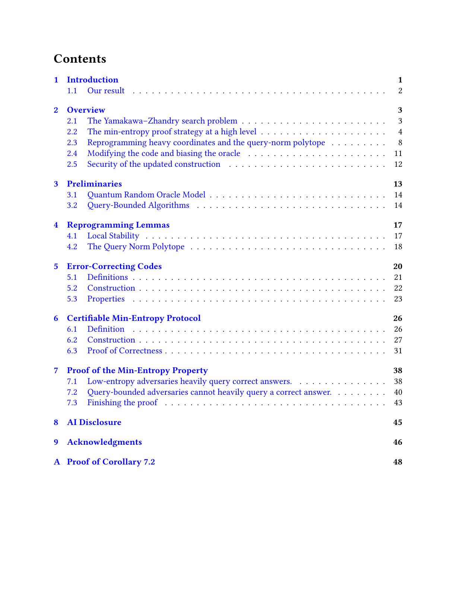 
Low-resolution page preview, page 2

📷 Fig 2

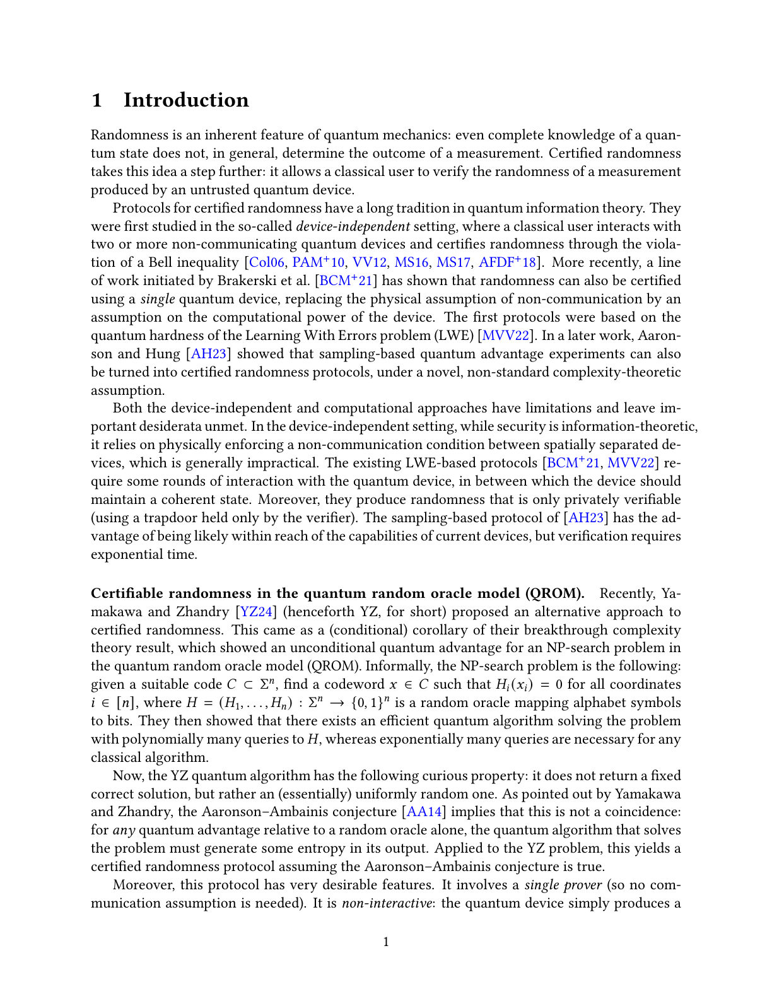 
Low-resolution page preview, page 3

📷 Fig 3

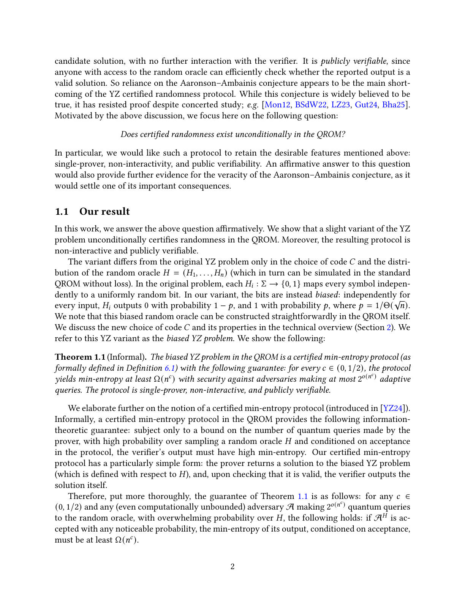 
Low-resolution page preview, page 4

📷 Fig 4

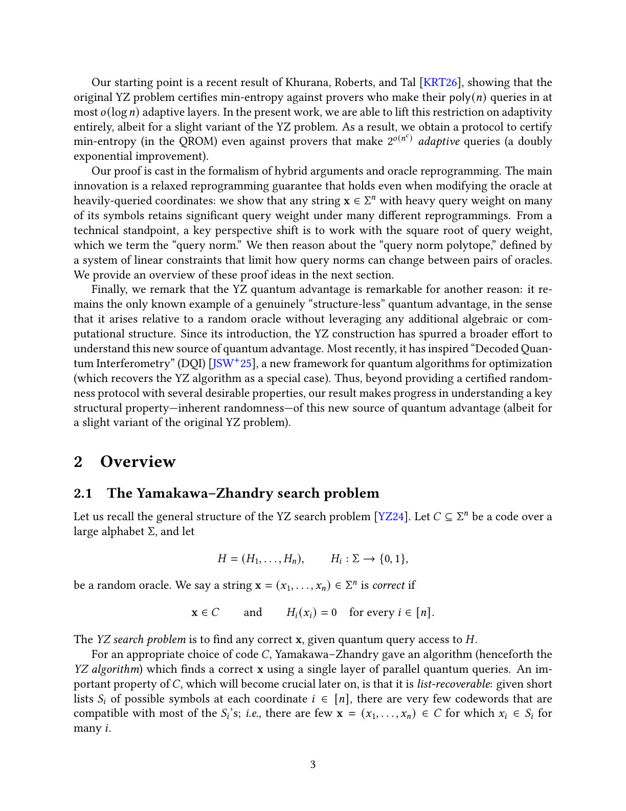 
Low-resolution page preview, page 5

📷 Fig 5

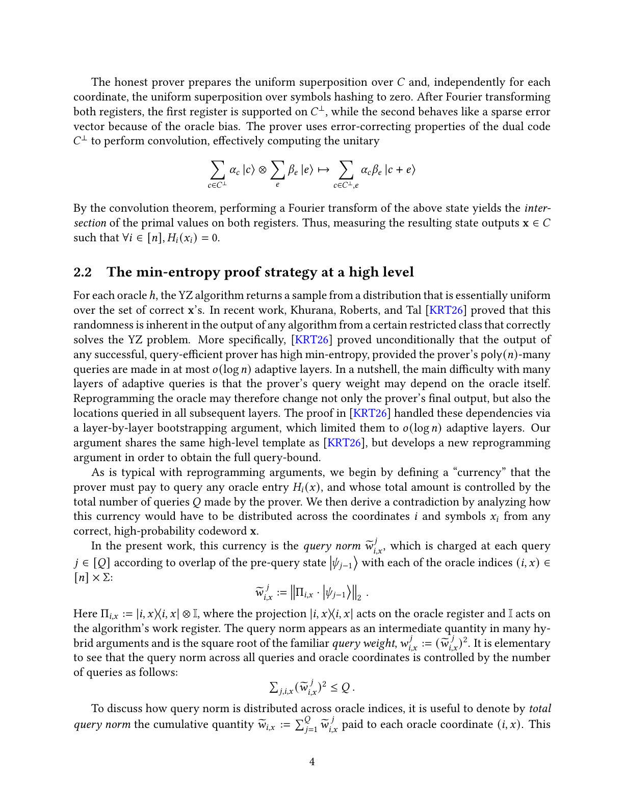 
Low-resolution page preview, page 6

**Summary.** This paper develops a robust, unconditional protocol for extracting certified randomness in the Quantum Random Oracle Model. By employing novel mathematical tools like 'query norms,' the authors overcome limitations of prior work that required unproven conjectures or restricted the adversary's query depth. This advances the understanding of device-independent quantum information security.

**Why it may be interesting.** While highly theoretical, the techniques developed for bounding query complexity and establishing information-theoretic security in complex quantum models are foundational to quantum computation theory.

Detailed structure

**Main problem.** The goal is to establish a protocol for obtaining unconditionally certified randomness in the Quantum Random Oracle Model (QROM) that is non-interactive and publicly verifiable.

**Main result.** The authors prove that the biased YZ problem in QROM yields a certified min-entropy protocol, achieving unconditional security without relying on unproven conjectures.

**Method.** The proof employs advanced techniques involving 'query norms' and 'query norm polytopes' to analyze the structure of the oracle queries, leading to contradiction arguments.

**Model / system.** The theoretical model is the Quantum Random Oracle Model (QROM), based on a variant of the Yamakawa-Zhandry search problem involving a random oracle $H$.

**Key observables.** Min-entropy guarantee ($\Omega(n^c)$), query norm, and the probability of violating certain oracle conditions ($\Pr[S]$).

**Important parameters / regimes.** The bias parameter $p$ of the random oracle, and the query depth/adaptivity bounds ($2^{o(n^c)}$).

**Assumptions / limitations.** The security proof is shown to hold against computationally unbounded adversaries, removing reliance on the Aaronson–Ambainis conjecture.

**Paper structure.** The paper builds from the general problem statement to defining the QROM setting, developing the technical machinery using query norms (Claim A and Claim B), and finally executing the contradiction proof using probability bounds (Lemma 7.3 and Lemma 7.7) to establish the main theorem.

Abstract

We obtain a certified randomness protocol in the quantum random oracle model. The protocol is non-interactive and publicly verifiable with a classical verifier, and is based on Yamakawa and Zhandry's proof of quantumness [JACM'24]. We prove unconditional security of this protocol against adversaries making subexponentially-many adaptive quantum queries to the random oracle.   Prior work on certified randomness relative to a random oracle additionally assumed the Aaronson--Ambainis conjecture or proved security only against low query-depth adversaries.

[↑ back to top](#top)

### [Universal recovery in approximate quantum error correction](http://arxiv.org/abs/2608.28962v1)

**Authors:** Dor Elimelech, Victor V. Albert, Alexander Barg  
**Type:** theory · **Category:** quantum information and computing · **PDF:** <https://arxiv.org/pdf/2608.28962v1>  
**Analysis basis:** full PDF text, analyzed in chunks

📷 Fig 1

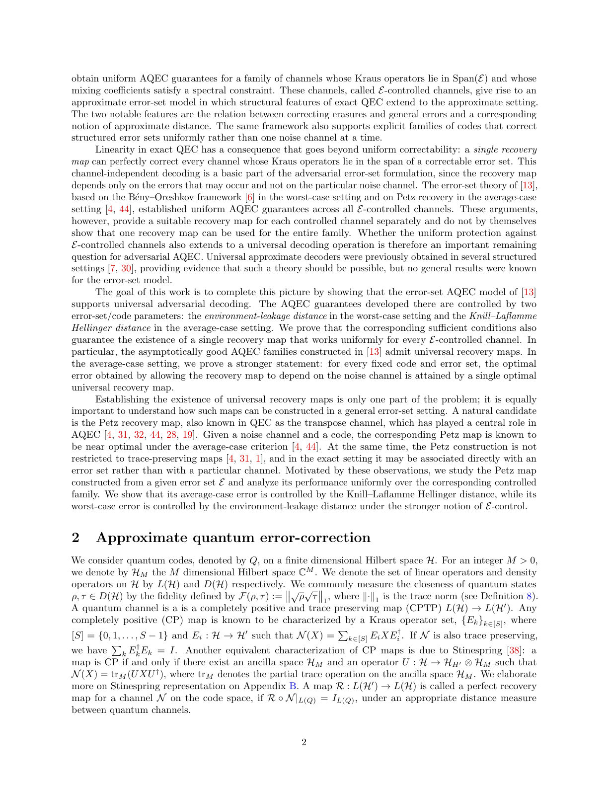 
Low-resolution page preview, page 2

📷 Fig 2

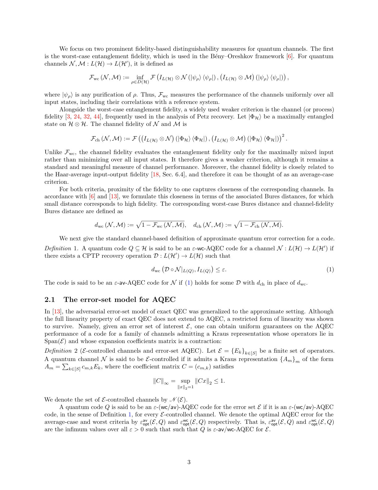 
Low-resolution page preview, page 3

📷 Fig 3

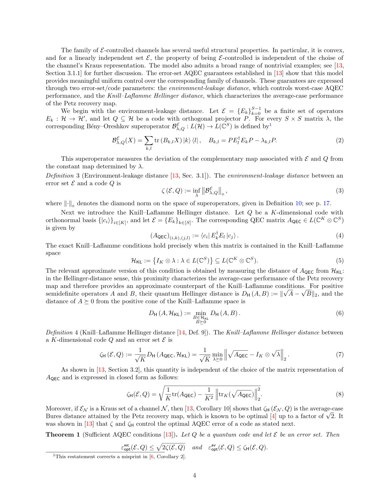 
Low-resolution page preview, page 4

📷 Fig 4

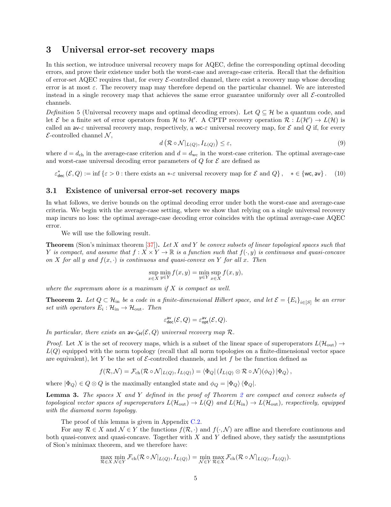 
Low-resolution page preview, page 5

📷 Fig 5

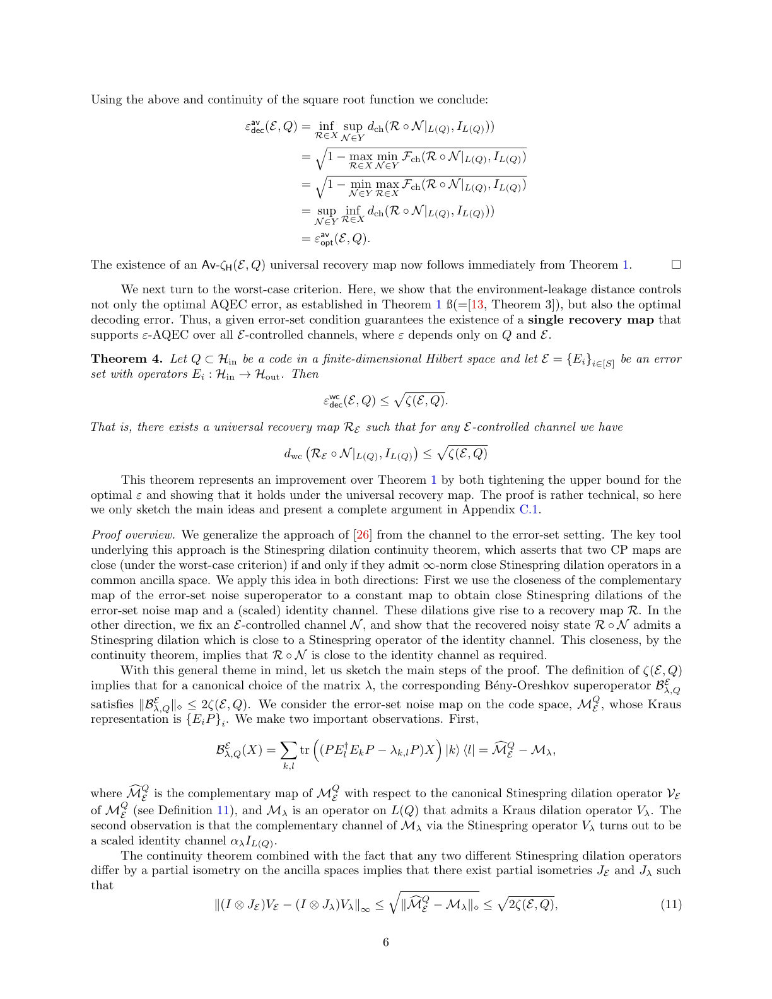 
Low-resolution page preview, page 6

**Summary.** This paper extends the theory of quantum error correction by proving the existence of a single universal recovery map for approximate noise channels. It introduces an error-set theory quantified by two distances—worst-case and average-case—to guarantee uniform protection. This completes the picture of universal recovery in the approximate setting, which is crucial for practical quantum computation.

**Why it may be interesting.** The rigorous mathematical framework connecting structural properties of error sets (like the environment-leakage distance) directly to universal decoding guarantees is highly relevant for designing robust quantum hardware.

Detailed structure

**Main problem.** The paper addresses extending the concept of 'universal recovery' from exact Quantum Error Correction (QEC) to the Approximate Quantum Error Correction (AQEC) setting.

**Main result.** They establish that a single recovery map can simultaneously correct every channel controlled by a given error set in the approximate setting, providing uniform average- and worst-case guarantees.

**Method.** The work develops an error-set theory for AQEC, utilizing two key distance metrics—the environment-leakage distance and the Knill–Laflamme Hellinger distance—to quantify approximate correctability.

**Model / system.** The model involves quantum information encoded in a code subspace $Q \subseteq \mathcal{H}$, subjected to noise modeled by quantum channels $\mathcal{N}$ controlled by an error set $\mathcal{E}$.

**Key observables.** Worst-case entanglement fidelity ($\mathcal{F}_{wc}$), Channel fidelity ($\mathcal{F}_{ch}$), Environment-leakage distance ($\zeta$), and Knill–Laflamme Hellinger distance ($\zeta_H$).

**Important parameters / regimes.** The approximation parameter $\epsilon$, and the two structural parameters $\zeta(\mathcal{E}, Q)$ and $\zeta_H(\mathcal{E}, Q)$.

**Assumptions / limitations.** The analysis relies on generalizing the adversarial error-set formulation of QEC to the approximate regime and employing techniques like Stinespring dilation for bounding errors.

**Paper structure.** The paper progresses by first defining the error-set AQEC model, then establishing bounds for optimal decoding errors using structural distances, and finally proving the existence of a single universal recovery map that achieves these bounds.

Abstract

Universal recovery -- the existence of a single recovery map that corrects an entire family of error channels -- is a central feature of quantum error correction (QEC). In exact QEC, linearity guarantees that a code correcting a given error set also corrects every channel whose Kraus operators lie in its linear span, and that a single recovery map suffices for all such channels. Approximate quantum error correction (AQEC), which relaxes perfect recovery to recovery with controlled error, has traditionally lacked this structure. In a recent paper (arXiv:2607.22995), we developed a theory of approximate quantum error correction showing that a restricted form of linearity persists in the approximate setting, yielding uniform AQEC guarantees for the family of channels controlled by a given error set.   In this work, we complete the picture by establishing the second half of universal recovery in the approximate setting: a single recovery map can simultaneously correct every channel controlled by a given error set. The error-set theory we proposed quantifies approximate correctability through two parameters: the environment-leakage distance, governing worst-case performance, and the Knill--Laflamme Hellinger distance, governing average-case performance. We show here that both quantities also control universal decoding. We further study the Petz map naturally associated with an error set as an explicit universal recovery, and obtain uniform average- and worst-case guarantees across the entire family of channels.

[↑ back to top](#top)

### [Valley-Enabled Intrinsic Dresselhaus Spin-Orbit Coupling in Silicon](http://arxiv.org/abs/2608.29785v1)

**Authors:** Johannes L. P. Steinschuld, Hendrik J. Bluhm, Lars R. Schreiber, Seyed Akbar Jafari  
**Type:** theory · **Category:** other · **PDF:** <https://arxiv.org/pdf/2608.29785v1>  
**Analysis basis:** full PDF text, analyzed in chunks

📷 Fig 1

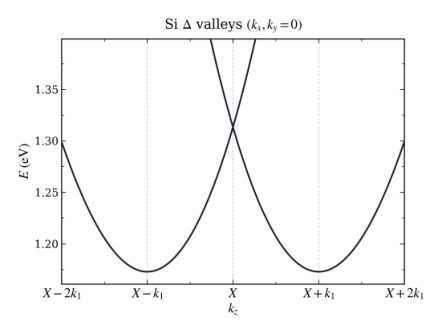 
FIG. 1. The two valleys in bulk Si along the kz direction. The X point is 140 meV above the degenerate conduction band minima.

📷 Fig 2

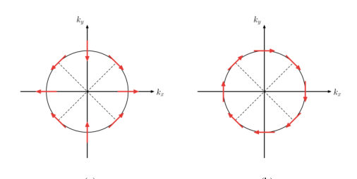 
FIG. 2. Spin textures on the Fermi surface near one of the valleys for (a) Dresselhaus and (b) Rashba spin-orbit coupling. For Dresselhaus coupling, the spin texture in the opposite valley has the reversed ori- entation, whereas the Rashba spin texture is identical in both valleys.

📷 Fig 3

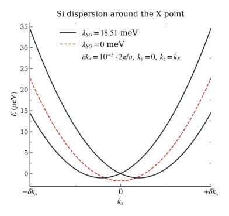 
FIG. 3. Tight-binding dispersion along the kx direction around the X point, shown for λSO = 18.51 meV (black) and λSO = 0 (red), using the parameters of [11]. The range of kx is ±δkx = ±10−3 · 2π/a. The energy axis is offset by 1.3133 eV for clarity. Note that, in the tight-binding calculation, the X point corresponds to kz = 2π/a, whereas in our matrix k.p theory, which is expanded around the X point itself, it is represented by kz = 0.

**Summary.** This paper establishes a symmetry-based theory for spin-orbit-valley coupling in silicon, revealing a strong, intrinsic Dresselhaus SOC that does not require interfaces or external fields. By treating the valley degree of freedom as a fundamental quantum variable, the authors predict measurable, robust signatures of valley-dependent spin splitting using techniques like magnetic field gradients.

**Why it may be interesting.** This work provides a fundamental theoretical framework linking crystal symmetry (valley degree of freedom) directly to spin-orbit coupling, offering new, intrinsic mechanisms for controlling spin and valley qubits in silicon quantum devices.

Detailed structure

**Main problem.** To develop a symmetry-based theory characterizing the intrinsic source of Dresselhaus spin-orbit coupling (SOC) in silicon, independent of interfaces or external electric fields.

**Main result.** The theory reveals a bulk, intrinsic Dresselhaus SOC that is necessarily valley off-diagonal and significantly larger than typical interface-induced couplings. It also predicts robust, disorder-resistant valley splitting mechanisms.

**Method.** The authors employed symmetry analysis using the double X group and tight-binding calculations to construct symmetry-allowed Hamiltonians incorporating spin and valley degrees of freedom.

**Model / system.** The system is bulk silicon, modeled by incorporating spin ($\sigma$) and valley ($	au$) degrees of freedom. The analysis treats the valley degree of freedom as a symmetry-carrying quantum degree of freedom.

**Key observables.** Valley-dependent Zeeman splitting ($\Delta	au E_Z$), spin-orbit-valley (SOV) coupling terms, and the $	au_3$ channel splitting.

**Important parameters / regimes.** The intrinsic bulk Dresselhaus coupling is predicted to be $>1$ order of magnitude larger than interface-induced SOC; the analysis involves magnetic field gradients and external fields ($B_z$).

**Assumptions / limitations.** The analysis relies on the structure of the double X group and the assumption that the SOC terms must be even under time-reversal (TR) symmetry.

**Figures summary.** Figures illustrate the two valleys in bulk Si and show spin textures for SOC effects; Tables list permissible spin-orbit terms and couplings.

**Paper structure.** The paper systematically builds the Hamiltonian using symmetry constraints, first identifying the intrinsic bulk Dresselhaus term, then analyzing how magnetic field gradients induce valley-dependent corrections to the Zeeman splitting, and finally predicting a robust $	au_3$ splitting mechanism.

Abstract

We develop a symmetry-based theory of spin-orbit-valley coupling in silicon that reveals an intrinsic source of Dresselhaus spin-orbit coupling independent of interfaces or external electric fields. Treating the valley degree of freedom as a symmetry-carrying quantum degree of freedom, we show that the Dresselhaus interaction is necessarily valley off-diagonal and that a bulk contribution proportional to the valley Pauli matrix $τ_1$ is symmetry allowed. Tight-binding calculations yield a bulk coupling more than an order of magnitude larger than typical interface-induced spin-orbit coupling; achieving the same energy scale through the interface-induced mechanism would require electric fields roughly 50 times larger than typical fields. We further derive the symmetry-allowed spin-valley couplings generated by magnetic-field gradients and show how they account for the valley-dependent Zeeman splitting observed in micromagnet experiments. A slight tilt of the background magnetic field out of the plane produces an additional isotropic contribution linear in $B_z$, providing an experimentally accessible signature of the corresponding coupling constant. Finally, we predict a spin-independent micromagnet-induced valley splitting in the $τ_3$ channel, which is distinct from the $τ_{1,2}$ channels generated by alloy disorder and therefore remains robust against disorder-induced cancellation. These results establish valley symmetry as a fundamental ingredient in the spin-orbit physics of silicon and provide new mechanisms for controlling and probing spin and valley degrees of freedom in silicon quantum devices.

[↑ back to top](#top)

### [Zero-Energy Problems for Supersymmetric Hamiltonians on a Chain Are $\mathrm{QMA}_1$-Complete](http://arxiv.org/abs/2608.29333v1)

**Authors:** Yibin Wang  
**Type:** theory · **Category:** quantum information and computing · **PDF:** <https://arxiv.org/pdf/2608.29333v1>  
**Analysis basis:** full PDF text, analyzed in chunks

📷 Fig 1

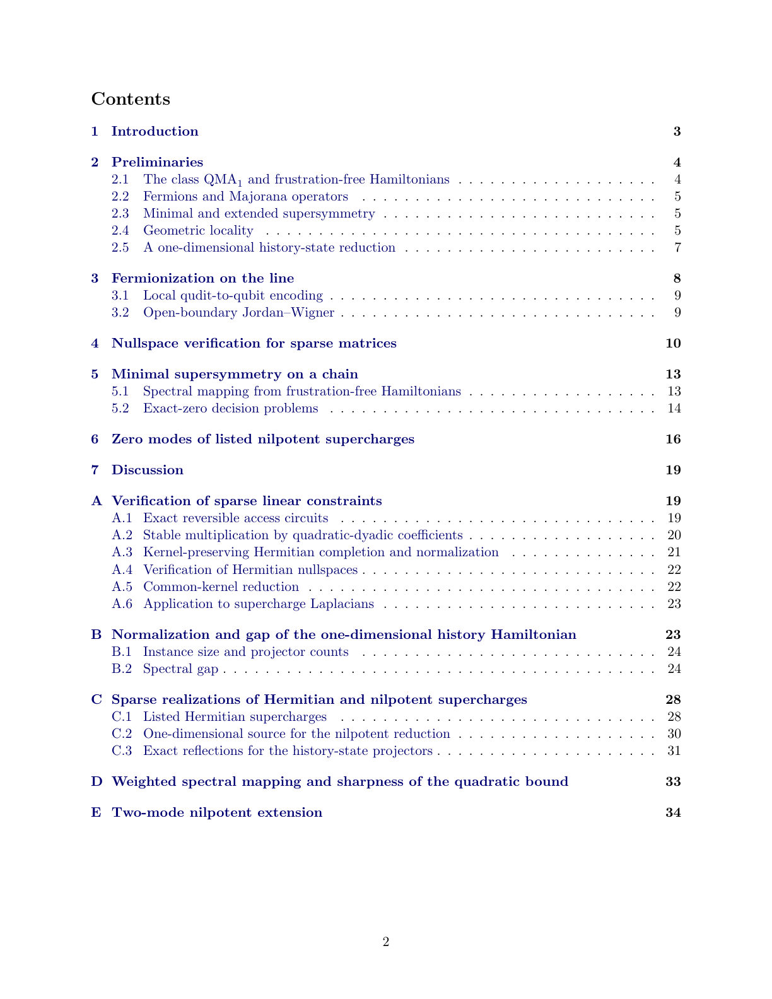 
Low-resolution page preview, page 2

📷 Fig 2

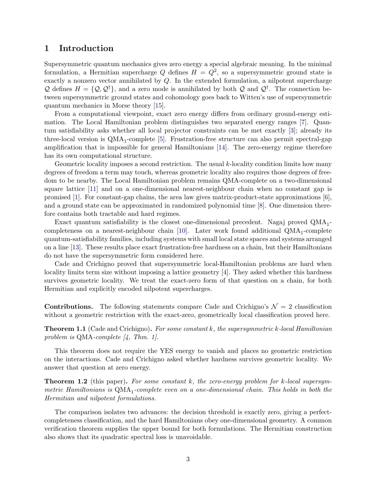 
Low-resolution page preview, page 3

📷 Fig 3

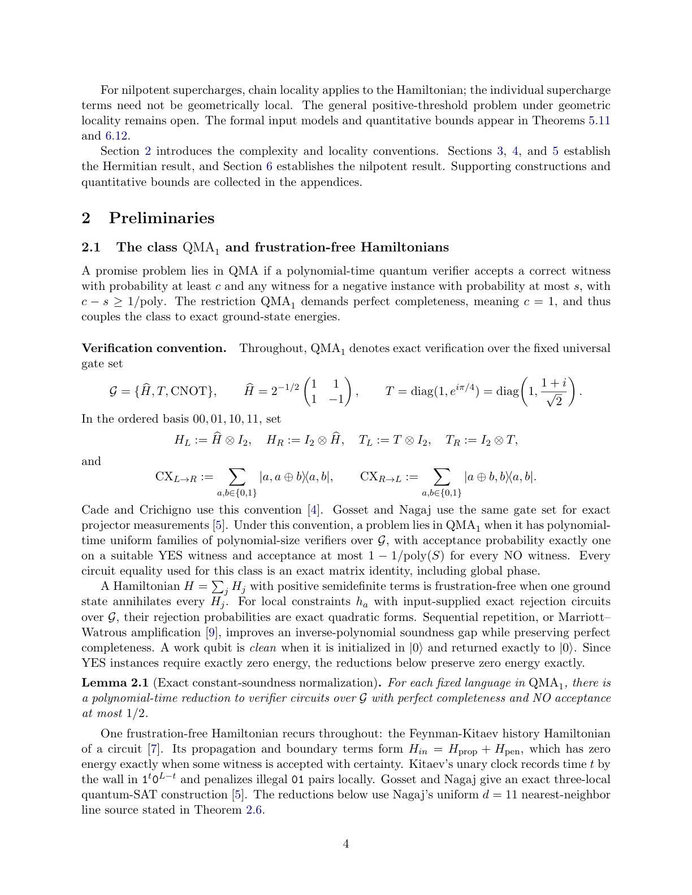 
Low-resolution page preview, page 4

📷 Fig 4

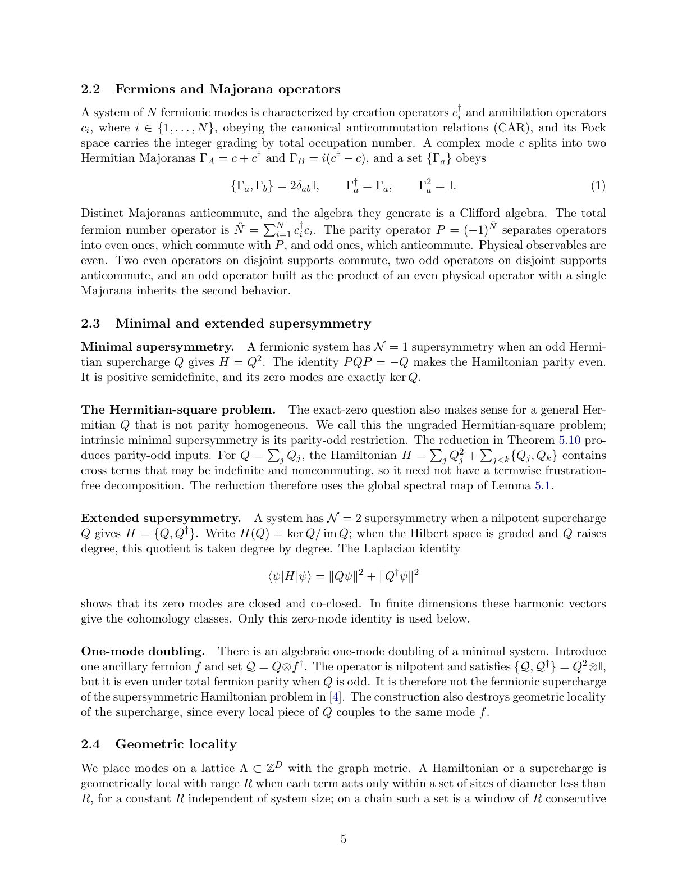 
Low-resolution page preview, page 5

📷 Fig 5

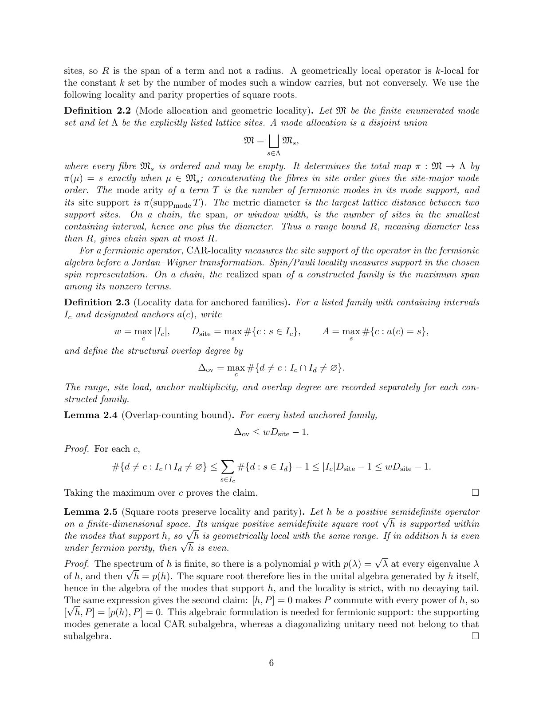 
Low-resolution page preview, page 6

**Summary.** This work establishes that determining if a supersymmetric quantum Hamiltonian on a 1D chain has a zero-energy ground state is QMA1-complete. The authors achieve this by constructing a rigorous reduction from the Quantum Satisfiability problem. This result places the problem of finding exact zero modes within the realm of computationally hard problems, linking condensed matter physics to quantum computation theory.

**Why it may be interesting.** It provides a deep connection between fundamental concepts in quantum many-body physics (supersymmetry, ground state properties) and the computational complexity class QMA1, suggesting that finding exact ground states in these systems is computationally hard.

Detailed structure

**Main problem.** The paper determines the computational complexity of deciding whether a supersymmetric quantum Hamiltonian on a chain possesses an exact zero-energy ground state.

**Main result.** The zero-energy problem for both Hermitian and nilpotent supersymmetric Hamiltonians on a chain is proven to be QMA1-complete.

**Method.** The proof involves a polynomial-time reduction from the Quantum Satisfiability problem (QSAT) on a line of sites, preserving the spectral gap structure.

**Model / system.** The study focuses on supersymmetric quantum systems whose interactions are restricted to a one-dimensional chain. The Hamiltonians are constructed using supercharges ($H=Q^2$ or $H=\{Q, Q^\dagger\}$) acting on fermionic modes.

**Key observables.** Zero energy (ground state energy), spectral gap, and the existence of zero modes.

**Important parameters / regimes.** Geometric locality, the size of the chain, and the polynomial bounds derived from the reduction.

**Assumptions / limitations.** The reduction relies on the existence of a polynomial-time, uniform reduction from QSAT and the ability to maintain gap structure across Hamiltonian constructions.

**Paper structure.** The paper establishes the complexity by first defining the physical models (supersymmetric Hamiltonians) and then constructing a rigorous, gap-preserving reduction from a known QMA1-complete problem (QSAT) to the zero-energy problem on the chain.

Abstract

We study exact zero modes of supersymmetric quantum systems whose interactions are arranged on a one-dimensional chain. For Hermitian supercharges, deciding whether a zero mode exists is $\mathrm{QMA}_1$-complete, and the hard instances are geometrically local on a chain. We also classify an explicitly encoded nilpotent $\mathcal{N}=2$ formulation: its exact-zero problem is $\mathrm{QMA}_1$-complete, including the restriction in which the associated Hamiltonian is local on a chain. Both classifications use a verification theorem for simultaneous sparse linear constraints and the same one-dimensional frustration-free Hamiltonian construction. The construction gives an explicit inverse-polynomial lower bound on the ground energy of every reduced NO instance, separating it from zero.

[↑ back to top](#top)

## Secondary cond-mat archives

*Papers from  mes-hall, other, soft, supr-con. These archives are de-prioritized — they appear at the end regardless of relevance score.*

### Relevant in secondary archives (35)

### [Universal tuning of Förster resonance energy transfer in gate-programmable conductor-dielectric-conductor heterostructures](http://arxiv.org/abs/2608.30150v1)

**Authors:** Alexis J. Agosto, Daniel Gunlycke, Michael N. Leuenberger  
**Type:** theory · **Category:** other · **PDF:** <https://arxiv.org/pdf/2608.30150v1>  
**Analysis basis:** full PDF text, analyzed in chunks
**Topic relevance:** 🔥 `correlated / nonlocal dissipation` **4/5** · `Keldysh / 2PI / non-Gaussian methods` **3/5** · `analog quantum simulation` **3/5** · `driven-dissipative phase transition` **3/5** · `methods for driven-dissipative` **3/5** · `Dicke superradiance` **2/5** · `Tavis-Cummings & cavity-many-emitter` **2/5** · `interference shaping light` **2/5** · `non-equilibrium universality` **2/5** · `quantum measurements` **1/5**

📷 Fig 1

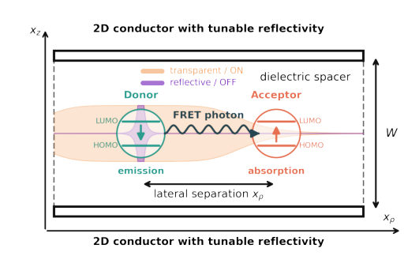 
FIG. 1. Schematic of tunable Förster resonance energy trans- fer (FRET) in a conductor-dielectric-conductor heterostruc- ture. A dielectric spacer of thickness W is bounded by two gate-tunable two-dimensional conductors, whose electro- magnetic response is encoded in the reflection amplitudes rTM/TE(qρ, ω). A donor and an acceptor are embedded in the spacer and separated laterally by xρ. The donor undergoes an emission transition from its LUMO to its HOMO, while the acceptor undergoes the corresponding absorption transi- tion from its HOMO to its LUMO. The wavy arrow denotes the retarded photon-mediated FRET channel, governed by the nonlocal Green tensor ←→ G R(xA, xD; ωD). The broad en-...

📷 Fig 2

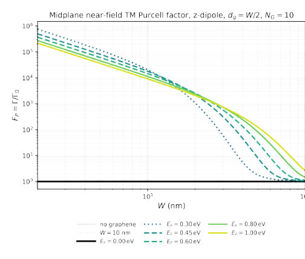 
FIG. 2. Gate-tunable spontaneous emission of a single Er emitter at the center of a double multilayer-graphene cavity. The normalized spontaneous-emission rate, or Purcell factor, FP = Γ/Γbulk, is plotted as a function of the dielectric spacer thickness W, which is also the graphene-graphene separation. The emitter is fixed at the midplane, so its distance to each graphene mirror is W/2. Each mirror is modeled as an effec- tive multilayer graphene sheet with NG = 10, corresponding to σeff = NGσg. At small W, the emitter near field overlaps strongly with evanescent TM channels of both graphene mir- rors, leading to a large, gate-tunable modification of the local density of optical states....

📷 Fig 3

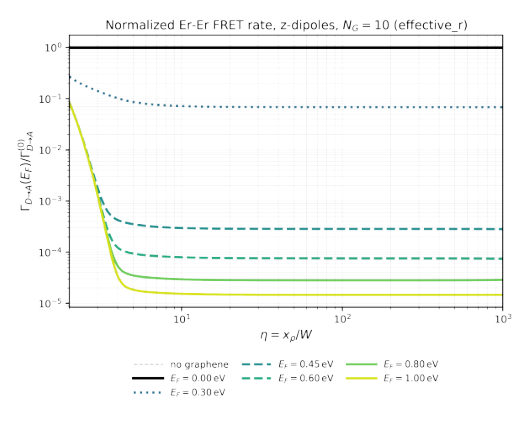 
FIG. 3. Gate-tunable Er-Er FRET in a double multilayer-graphene cavity. The normalized FRET rate ΓD→A(EF )/Γ(0) D→A is plotted as a function of the normal- ized lateral separation η = xρ/W for two Er emitters in the midplane. Each mirror is modeled as an effective multilayer graphene sheet with NG = 10, so that σeff = NGσg. In- creasing EF increases the reactive Drude weight, moves the graphene plasmon pole to smaller qρ, and drives the scalar TM reflection amplitude toward the Dirichlet-like limit rϕ →−1. In this reflective branch the midplane Green function acquires the screened Bessel-K envelope, leading to strong suppres- sion of FRET at η ≳2. The plotted range is restricted to 2 &lt; η &lt;...

📷 Fig 4

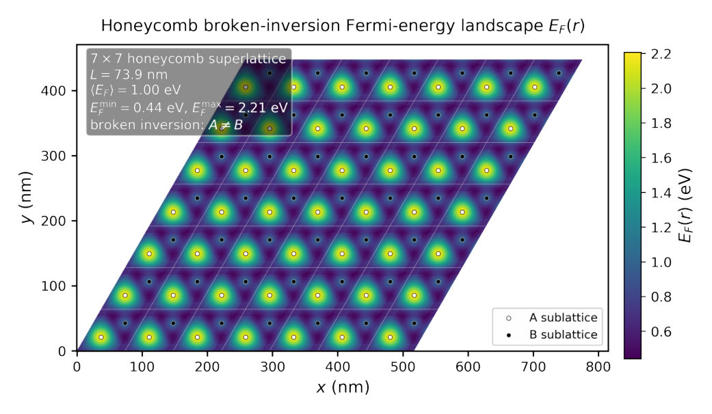 
FIG. 4. Honeycomb broken-inversion Fermi-energy landscape. Real-space 7 × 7 superlattice of the metagate-induced graphene Fermi energy EF (r) used for the plasmonic band-structure calculation in Fig. 5. The pattern is an hBN-like honeycomb lattice with two inequivalent sublattices, A and B, which break inversion symmetry and open a mass gap in the plasmonic Dirac spectrum at K and K′. The color scale shows the local Fermi energy, while the white and black markers indicate the two sublattice centers. The large average carrier density can be supplied by an ion-gel or electrolyte back gate, while the nearby patterned metagate creates the nanoscale honeycomb modulation. This architecture is...

📷 Fig 5

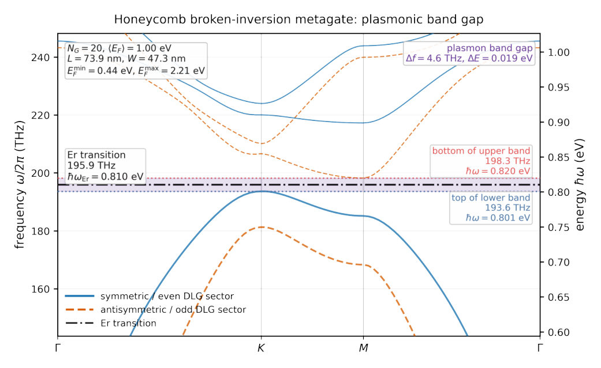 
FIG. 5. Metagate-induced plasmon band gap at the Er transition. Calculated plasmonic-crystal band structure of an effective double-layer multilayer-graphene mirror with a honeycomb broken-inversion metagate. The antisymmetric, odd layer sector and symmetric, even layer sector are shown along the Γ −K −M −Γ path of the triangular Brillouin zone. The metagate imposes an hBN-like honeycomb Fermi-energy landscape with inequivalent A and B sublattices, opening a plasmonic band gap at the valley points. The horizontal dash-dotted line marks the Er transition frequency ωEr/2π, corresponding to λEr = 1530 nm or ℏωEr ≃0.81 eV. The dotted horizontal lines mark the top of the lower plasmon band, or...

**Summary.** This paper presents a quantum electrodynamics theory for controlling energy transfer (FRET) and spontaneous emission in structures defined by two gate-tunable conductors separated by a dielectric spacer. By analyzing the system's response via reflection amplitudes, the authors show that the coupling can be tuned from bulk decay laws to exponentially screened or enhanced quasi-2D regimes. This offers a versatile platform for manipulating quantum light-matter interactions using electrical gating.

**Why it may be interesting.** This work provides a powerful, material-agnostic theoretical framework for controlling near-field quantum interactions (like FRET) using external electrical gates, which is highly relevant to cavity QED and open quantum systems.

Detailed structure

**Main problem.** The paper develops a quantum-electrodynamical theory to universally tune spontaneous emission and Förster Resonance Energy Transfer (FRET) in a specific heterostructure.

**Main result.** The theory predicts distinct coupling regimes based on gate-tunable reflection amplitudes, ranging from bulk decay laws to exponentially screened or enhanced quasi-2D couplings.

**Method.** The authors derive the necessary Green's functions (retarded, advanced, Feynman) starting from the QED photon propagator and analyze the system's response using reflection amplitudes.

**Model / system.** The physical platform is a conductor-dielectric-conductor heterostructure with a dielectric spacer of thickness W, bounded by two gate-tunable two-dimensional conductors (e.g., graphene).

**Key observables.** Spontaneous emission rate (via local vacuum spectral density) and FRET rate (via nonlocal retarded/advanced Green tensor product).

**Important parameters / regimes.** Dielectric spacer thickness (W), lateral separation ($x_
ho$), and the gate-tunable reflection amplitudes ($r_{TM/TE}$).

**Assumptions / limitations.** The theory relies on the input reflection amplitudes $r_{TM/TE}(q_
ho, \omega)$ from the surrounding materials, and the analysis is performed in the quasi-2D limit.

**Figures summary.** Figures illustrate how gate tuning modifies reflection amplitudes, thereby reprogramming the range and magnitude of the donor–acceptor electromagnetic coupling, and show the separation of dissipative vs. dispersive coupling components.

**Paper structure.** The paper builds the theory by deriving propagators from the QED photon propagator, analyzing the system response in different reflection regimes (transparent, PEC, PMC-like), and applying the formalism to specific material systems like graphene-Er.

Abstract

We develop a quantum-electrodynamical theory for universal tuning of spontaneous emission and Förster resonance energy transfer (FRET) in a material-agnostic conductor-dielectric-conductor heterostructure. The platform consists of a dielectric spacer of thickness $W$ bounded by two gate-tunable two-dimensional conductors. The only microscopic input from the surrounding materials is the transverse-magnetic and transverse-electric reflection amplitudes $r_{\TM/\TE}(q_ρ,ω)$ of the two sheets. Starting from the QED photon propagator, we derive the retarded Maxwell dyadic, the vacuum/Hadamard field propagator, and the time-ordered Feynman propagator in the same geometry. The spontaneous-emission rate is controlled by the local vacuum spectral density, while FRET is controlled by the nonlocal retarded/advanced product $\obG_{\text R}(\bx_D,\bx_A;ω_D)\Im\,\balpha_A(ω_D)\obG_{\text A}(\bx_A,\bx_D;ω_D)$. In the transparent limit $r_{\TM}\to 0$, the near-field FRET rate recovers the bulk $x_ρ^{-6}$ law. In the Dirichlet/PEC branch $r_{\TM}\to -1$, the gapless transverse mode is removed and the donor-acceptor coupling acquires a Bessel-$K$ envelope, giving an exponentially screened FRET rate $Γ_{D\to A}\propto\exp(-2πx_ρ/W)$ at large lateral separation. In the opposite Neumann/PMC-like branch $r_{\TM}\to 1^{-}$, a nearly gapless transverse mode survives and produces a wide quasi-two-dimensional logarithmic propagator, enhancing the nonlocal electromagnetic coupling over a gate-programmable range $x_{ρ,*}\sim W/(1-r_{\TM})$. For graphene-Er implementations, the same retarded Green tensor also separates dissipative on-shell Er-to-graphene decay, governed by its absorptive part, from dispersive virtual-plasmon-mediated Er-Er coupling, governed by its reactive part; a plasmonic band gap can suppress the former while retaining the latter.

[↑ back to top](#top)

### [Dynamical backaction in nanoscale superfluid electromechanics](http://arxiv.org/abs/2608.29405v1)

**Authors:** Marek Talíř, Filip Novotný, Balázs Szalai, Nasiruddin Mondal, Emil Varga  
**Type:** both · **Category:** other · **PDF:** <https://arxiv.org/pdf/2608.29405v1>  
**Analysis basis:** full PDF text, analyzed in chunks
**Topic relevance:** 🔥 `quantum measurements` **4/5** · `correlated / nonlocal dissipation` **3/5** · `driven-dissipative phase transition` **3/5** · `quantum optics experiment` **3/5** · `methods for driven-dissipative` **2/5** · `non-equilibrium universality` **2/5** · `Keldysh / 2PI / non-Gaussian methods` **1/5** · `Tavis-Cummings & cavity-many-emitter` **1/5** · `analog quantum simulation` **1/5** · `interference shaping light` **1/5**

📷 Fig 1

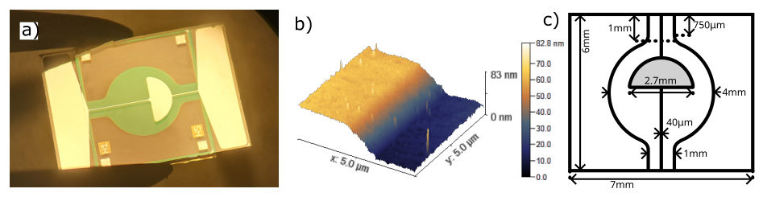 
Figure 1: The nanofluidic Helmholtz resonator. a) Photograph of the resonator. Green colour is due to thin- film optical interference and outlines the nanofluidic cavity. b) Atomic force micrograph of the electrode edge inside the basin. c) Schematic view of the resonator dimensions, electrodes in gray. Electrode thickness is approximately 60 nm, cavity height quartz-to-quartz 900 nm.

📷 Fig 2

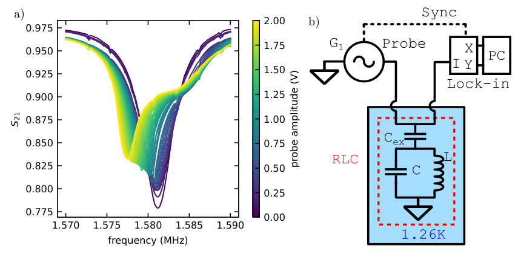 
Figure 2: Resonance of the LC tank circuit. a) Normalized transmission of LC resonance with increasing probe amplitude, showing nonlinearity and Q degradation above 0.5 V. b) The circuit diagram for measuring the LC resonance.

📷 Fig 3

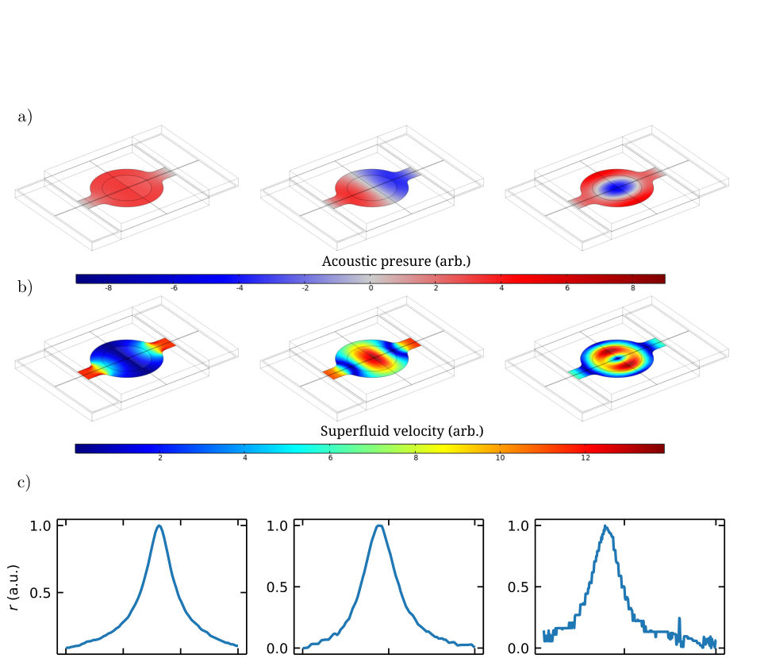 
Figure 3: Acoustic modes inside the Helmholtz resonator. a) Finite element simulation of acoustic pressure profile for the first three visible modes. The bending of SiO2 substrate is simulated alongside pressure acous- tics in a coupled 3D geometry (the COMSOL ”multiphysics” coupling). b) Superfluid velocity calculated from the same simulation. c) Experimentally observed resonances using EMIT, with detuning ∆= 0 in order to observe the intrinsic mechanical linewidth. The signal from lock-in amplifier is offset to zero and normalized to 1 on resonance. See Tab. 1 for calculated properties of the acoustic modes.

📷 Fig 4

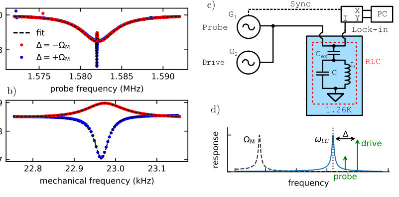 
Figure 4: Electromechanically induced transparency and absorption. a) EMIT (red) and EMIA (blue) measurement of the coupled system. b) Zoom to acoustic peak on LC resonance. The x-axis is |ωd −ωp|/2π. c) Circuit diagram for measuring EMIT/A, the strong drive signal from G2 is added to weaker probe signal from G1 (which is measured using a lock-in amplifier). d) Relation of drive and probe frequencies to ωLC and ΩM.

📷 Fig 5

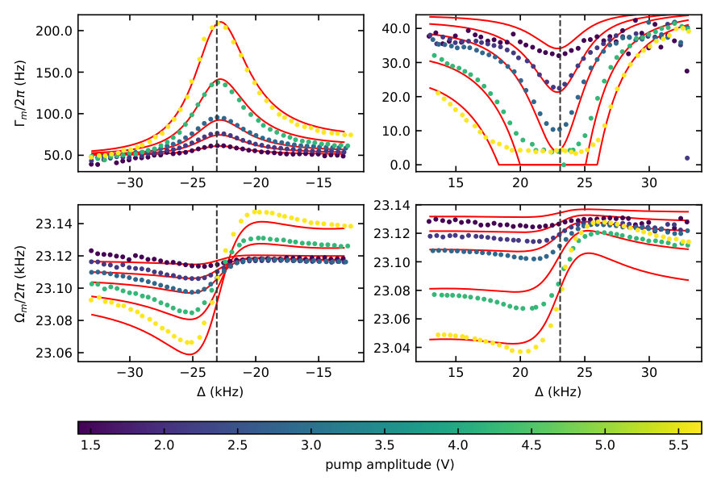 
Figure 5: Mechanical peak parameters as a a function of drive detuning. Red lines are fits to (13) (first row) and (14) (second row). Both electromechanical damping and amplification and the electromechanical spring effect are apparent. The dashed vertical lines show ±ΩM

**Summary.** This paper details the development of a highly sensitive electromechanical resonator coupled to superfluid helium to study quantized vortices. By utilizing techniques like Electromechanically Induced Transparency, the authors measure the damping induced by vortices ($\Gamma_L$), demonstrating that this dissipation is history-dependent and can be manipulated through controlled thermal or mechanical pulsing.

**Why it may be interesting.** This work is highly relevant as it merges quantum optics (EMIT/A, cavity coupling) with superfluid physics (quantized vortices), providing a sensitive, controllable quantum sensor platform for studying non-equilibrium many-body phenomena.

Detailed structure

**Main problem.** The study aims to improve the sensitivity of detecting quantized vortices in superfluid helium by coupling the acoustic resonance to an electromechanical readout system.

**Main result.** The system successfully demonstrates electromechanically induced transparency and measures vortex-induced damping ($\Gamma_L$), showing that this damping is history-dependent and can be controlled via annealing pulses.

**Method.** The research combines theoretical modeling (FEM, circuit analysis) with advanced experimental techniques like Electromechanically Induced Transparency/Absorption (EMIT/A) to probe dissipation.

**Model / system.** The platform is a nanofluidic acoustic resonator etched into $	ext{SiO}_2$, operating in superfluid Helium-4, whose acoustic mode is coupled to a superconducting LC tank circuit. The coupling allows for the study of superfluid dynamics, including vortex motion.

**Key observables.** Vortex-induced damping ($\Gamma_L$), linewidth ($\Gamma_M$), EMIT/A spectra, and the rate of change of dissipation with rotation history.

**Important parameters / regimes.** LC resonance frequency ($\omega_C$), acoustic mode frequencies ($\Omega_M$), zero-point fluctuation amplitude ($	ext{y}_{	ext{ZPF}}$), and the mutual friction constant ($\hat{\alpha}$).

**Assumptions / limitations.** The analysis relies on modeling the system in the sideband-resolved regime and assumes that measured damping can be separated into intrinsic, backaction, and vortex-related components.

**Figures summary.** Figures illustrate the physical setup, FEM simulations of acoustic modes, EMIT/A spectra demonstrating backaction, and time-series plots showing $\Gamma_L$ evolution during rotation ramps and annealing.

**Paper structure.** The work progresses from establishing the physical electromechanical coupling and demonstrating backaction effects (EMIT/A) to quantifying the vortex-induced damping ($\Gamma_L$) by measuring the deviation from the backaction-modified linewidth, culminating in studies of the history-dependent nature of vortex dissipation.

Abstract

Nanofluidic acoustic resonators employing superfluid $^4$He can be used to study quantized vortices from collective behavior in two-dimensional superfluid turbulence down to few individual vortices created by rotation. In order to improve sensitivity to the level needed for probing individual quantized vortices, readout mechanisms employing optomechanical or optomechanics-inspired approaches seem to be promising in this regard. In this work, we develop an electromechanical system, which couples a 4$^\mathrm{th}$ sound acoustic resonance to a superconducting LC tank circuit in a sideband-resolved regime. Using this system, we demonstrate electromechanically induced transparency (EMIT), optical spring effect and optomechanical sideband damping and amplification. Furthermore, by rotating the cryostat, we demonstrate sensitivity to quantized vortices, which can become trapped and released in avalanche-like process inside the nanofluidic volume.

[↑ back to top](#top)

### [Design and Modeling of the Charge Readout of a SiMOS Quantum Dot with a Single Electron Transistor and CryoCMOS](http://arxiv.org/abs/2608.28906v1)

**Authors:** Adam Quinn, Troy England, Andrew Li, Sharmila Mustari Nandita  
**Type:** both · **Category:** quantum information and computing · **PDF:** <https://arxiv.org/pdf/2608.28906v1>  
**Analysis basis:** full PDF text, analyzed in chunks
**Topic relevance:** 🔥 `QC/QI experiment` **4/5** · `quantum measurements` **3/5**

📷 Fig 1

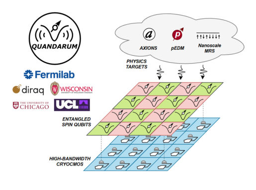 
Fig. 1. The objective of Quandarum is to advance the technology needed to deploy a large array of entangled silicon spin qubits with highly scaled cryogenic CMOS readout as a sensor to detect novel physics.

📷 Fig 2

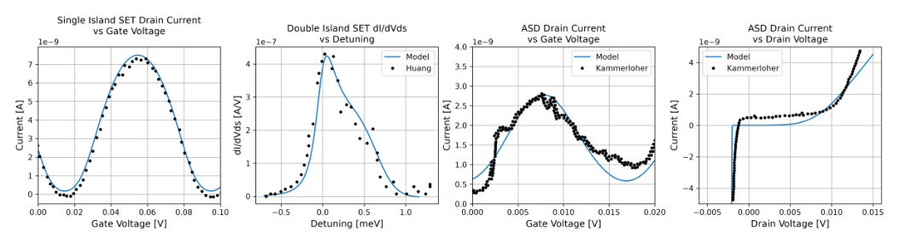 
Fig. 2. Plots illustrating the fitting of our Verilog-A models of the SISET, DISET, and ASD to data from the literature. In each plot, blue traces are simulated and black dots are data extracted from publications by Mahapatra [5], Huang [6], or Kammerloher [7].

📷 Fig 3

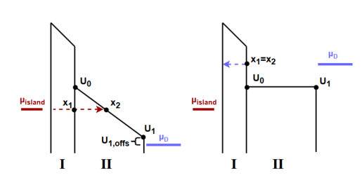 
Fig. 3. Potential diagram of the asymmetric drain barrier in our ASD model in two scenarios: (a) µD ≪µisland and (b) µD ≫µisland.

📷 Fig 4

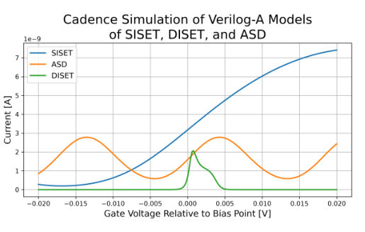 
Fig. 4. Coulomb peaks measured from simulating our Verilog-A models of the SISET, DISET, and ASD. VG = 0 represents the gate bias of the SET, which is selected to bias each SET flavor at maximum dI/dV .

📷 Fig 5

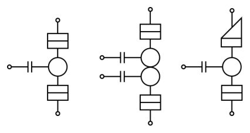 
Fig. 7. Proposed symbols for (a) a symmetric single-island SET (SISET), (b) a double-island SET (DISET), and (c) an Asymmetric Sensing Dot (ASD)

**Summary.** This paper presents the design and simulation of QNDR1, a novel cryogenic ASIC intended to read out single electron spin qubits in SiMOS quantum dots. The authors developed advanced models for various Single Electron Transistor (SET) geometries and co-simulated them with a full CMOS readout circuit. The result is a highly integrated, low-noise readout platform crucial for scaling up solid-state quantum processors.

**Why it may be interesting.** This work directly addresses the engineering bottleneck for solid-state quantum computing by providing a blueprint for integrating quantum devices with classical, low-noise cryogenic electronics.

Detailed structure

**Main problem.** The primary challenge is developing a highly scalable, low-noise, and integrated readout system for single electron spin qubits trapped in SiMOS quantum dots.

**Main result.** The authors designed and simulated the QNDR1 ASIC, demonstrating a functional, integrated cryogenic readout interface that achieves specified SNR and gain targets.

**Method.** The work combines detailed device modeling (SISET, DISET, ASD) using Verilog-A with co-simulation against a custom cryogenic CMOS readout circuit (QNDR1) implemented in SpectreRF.

**Model / system.** The physical system involves single electron spin qubits in SiMOS quantum dots, read out via a Single Electron Transistor (SET). The readout is integrated with a custom cryogenic CMOS amplifier and digitizer chain operating at cryogenic temperatures (3.8 K).

**Key observables.** Coulomb peaks, output signal voltage/current, Signal-to-Noise Ratio (SNR), and the Figure of Merit (FoM) for the readout circuit.

**Important parameters / regimes.** Operating temperature (down to 3.8 K), SET bias voltages, and the required gain (e.g., $22.5 	ext{ MV/A}$).

**Assumptions / limitations.** The ASD model relies on simplifying assumptions, such as approximating the barrier region as linear; noise modeling involves combining literature estimates with analytical methods.

**Figures summary.** Figures illustrate the objective of the Quandarum project, model fitting of SETs (SISET, DISET, ASD) to literature data, simulated Coulomb peaks for the three SET models, and the schematic/timing waveforms for the integrated SET-CMOS co-simulation setup.

**Paper structure.** The paper progresses from defining the need for a scalable readout (Fig. 1), detailing the advanced modeling of SET structures (SISET, DISET, ASD) via Verilog-A, performing co-simulations with the CMOS readout, and finally presenting the full QNDR1 ASIC design, including biasing procedures and performance metrics.

Abstract

Single electron spin qubits trapped in SiMOS quantum dots are a promising technology for scaling to thousand- or million-qubit systems due to their compatibility with mature CMOS manufacturing processes. A readout system that combines a single electron transistor with a custom cryogenic CMOS amplification and digitization chain offers key advantages by avoiding the use of bulky RF components or room-temperature interconnects. We present design techniques and simulation results for an optimized qubit-SET cryoCMOS interface, culminating in the design of the QNDR1 ASIC, the first cryogenic readout ASIC designed under the Quandarum project, which targets the development of a many-channel spin qubit based detector for use in high energy physics.

[↑ back to top](#top)

### [Predictive wavelength tailoring of uniform GaSb-based quantum dots for emission at 1.55 um](http://arxiv.org/abs/2608.30628v1)

**Authors:** Markus Peil, Maja Wasiluk, Ziemowit Olinkiewicz, Tymon Przychodni, Robert Matysiak, Teemu Taskinen, Joona Salonen, Abhiroop Chellu, Metin Patli, Joonas Hilska, Anna Musiał, Michał Gawełczyk, Mircea Guina, Teemu Hakkarainen  
**Type:** both · **Category:** quantum information and computing · **PDF:** <https://arxiv.org/pdf/2608.30628v1>  
**Analysis basis:** full PDF text, analyzed in chunks
**Topic relevance:** 🔥 `quantum optics experiment` **4/5** · `QC/QI experiment` **1/5** · `interference shaping light` **1/5**

📷 Fig 1

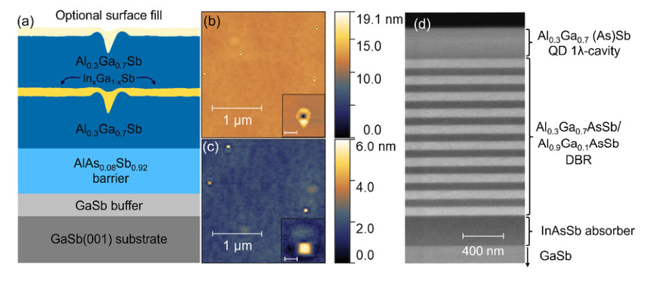 
Figure 1. (a) Schematic illustration of the sample structure. (b-c) AFM images of the etched

📷 Fig 2

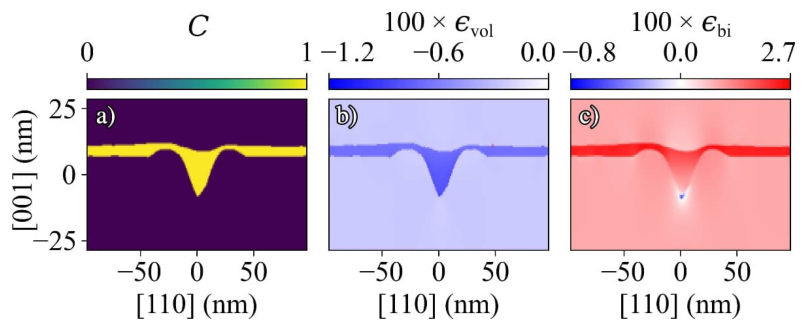 
Figure 2. Cross-sectional view of a QD with 10.8 ML filling thickness, no material intermixing

📷 Fig 3

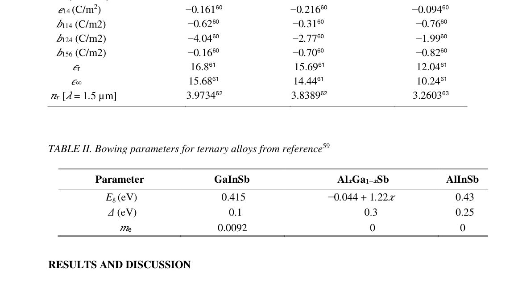 
Figure 3(a) shows the ground state (GS) PL spectra of the InxGa1-xSb QD ensemble for the sample

📷 Fig 4

 
Figure 3. a) Ensemble PL emission spectra from InxGa1-xSb QDs with varying In-content and

📷 Fig 5

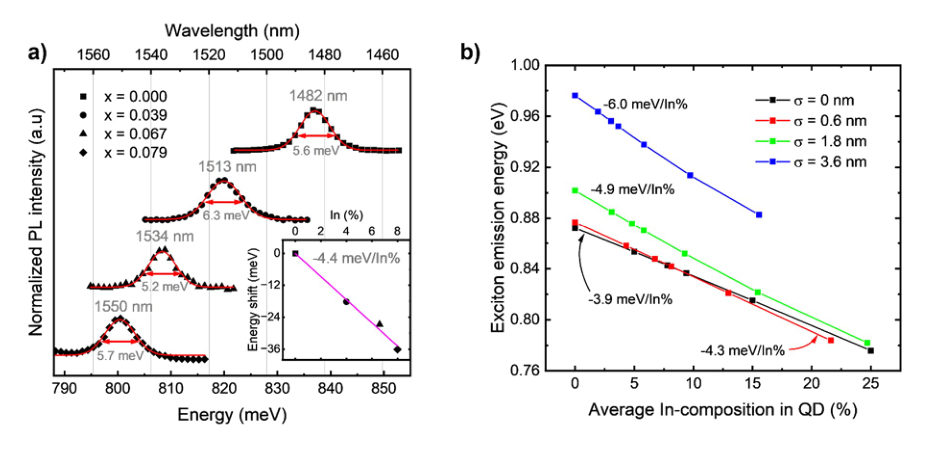 
Figure 4(a) shows the ensemble QD GS emission spectra for the second sample set, where the In-

**Summary.** This paper reports on the development of GaSb-based quantum dots as a highly promising platform for quantum photonics. By combining experimental measurements and advanced simulations, the authors demonstrate precise, predictable tuning of the emission wavelength across the entire telecom C-band. This work establishes a robust, scalable source for single photons essential for quantum communication technologies.

**Why it may be interesting.** This work directly addresses the hardware requirements for quantum networks by providing a solid-state, tunable, and high-quality single-photon source operating at the critical telecom wavelength.

Detailed structure

**Main problem.** The goal is to create a highly tunable, solid-state quantum light source capable of emitting single photons at the telecom C-band (1.55 $\mu$m) for long-haul quantum communication networks.

**Main result.** The study successfully demonstrated that the emission wavelength can be tuned from 1.48 $\mu$m to 1.55 $\mu$m by independently controlling the quantum dot composition (In-content) and size (monolayers).

**Method.** The research combines experimental photoluminescence measurements with detailed theoretical simulations using multiband k.p theory to predict and explain the optical transition energy shifts.

**Model / system.** The physical platform consists of GaSb-based quantum dots formed via InGaSb-filling of nanoholes etched into AlGaSb layers. The electronic structure is modeled using envelope function approximations incorporating strain and Coulomb interactions.

**Key observables.** Emission wavelength (tunable from 1.48 $\mu$m to 1.55 $\mu$m), inhomogeneous broadening (< 7 meV), narrow single-QD excitonic linewidth ($\sim 13.8 \mu	ext{eV}$), and the linear energy shift rates ($	ext{-4.4 meV}/	ext{In}\%$, $	ext{-2.0 meV}/	ext{ML}$).

**Important parameters / regimes.** In-content percentage ($x$), number of monolayers (ML), and the target telecom wavelength of 1.55 $\mu$m.

**Assumptions / limitations.** Simulations assume uniform In composition, low intermixing, and utilize microscopically measured QD geometries; the observed uniformity is assumed to be limited by the initial nanohole population.

**Figures summary.** The notes suggest figures illustrate the QD structure (AFM/SEM), cross-sections showing strain, and PL spectra showing the tunable redshift of the exciton energy versus In-content.

**Paper structure.** The paper follows a structure of presenting the physical system and fabrication process, detailing the experimental measurements (PL spectroscopy), presenting the theoretical framework (k.p modeling), and finally quantifying the tunability and uniformity of the resulting quantum emitters.

Abstract

A detailed study of emission wavelength tailoring of GaSb-based QDs formed by InGaSb-filling of droplet-etched nanoholes in AlGaSb is presented. The study shows that the emission wavelength can be modified from 1.48 um to the center of the telecom C-band at 1.55 mm by independently varying the QD composition and size. More specifically, the optical transition energy shifts linearly as a function of In-content of the QD material at a rate of -4.4 meV/In-percentage, and with the number of monolayers (ML) of material used for filling the nanoholes, at -2.0 meV/ML. These experimentally observed energy shifts are well predicted by simulations yielding rates of -4.3 meV/In-percentage and -2.1 meV/ML, respectively. For the simulation, a uniform In composition, low intermixing, and microscopically measured QD geometry is considered. Additionally, excellent ensemble QD uniformity, with unprecedented inhomogeneous broadening well-below 7 meV across all samples is demonstrated. Finally, photoluminescence of single-QDs reveals narrow excitonic emission lines of 13.8+/-6.7 ueV and low fine-structure splitting values reaching <10 ueV. These results identify GaSb-based LDE QDs as a tunable telecom platform for scaling quantum-photonic applications over long-haul optical fiber networks.

[↑ back to top](#top)

### [Coexistence of polariton bound states in the continuum and 2D radiative excitons](http://arxiv.org/abs/2608.30691v1)

**Authors:** Simone Zanotti, Marco Liscidini, Dario Gerace, Lucio C. Andreani  
**Type:** theory · **Category:** other · **PDF:** <https://arxiv.org/pdf/2608.30691v1>  
**Analysis basis:** full PDF text, analyzed in chunks
**Topic relevance:** `correlated / nonlocal dissipation` **3/5** · `driven-dissipative phase transition` **3/5** · `interference shaping light` **3/5** · `methods for driven-dissipative` **3/5** · `Keldysh / 2PI / non-Gaussian methods` **2/5** · `Tavis-Cummings & cavity-many-emitter` **2/5** · `analog quantum simulation` **2/5** · `non-equilibrium universality` **1/5** · `quantum measurements` **1/5**

📷 Fig 1

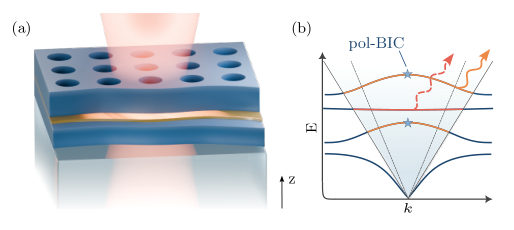 
FIG. 1. Schematic view of the system addressed in this work. (a) A 2D exciton is embedded in a patterned multilayer waveguide (golden layer between the blue ones). It is subject to radiative decay, and also to interaction with the waveguide modes, possibly forming PhC polaritons. (b) Schematic dis- persion of the generic system in (a): Radiative excitons are those that lie above the cladding(s) light line(s) in k-space; PhC polaritons arise from exciton-photon coupling with pho- tonic modes that lie below the light line in the extended-zone scheme, and they are folded above the cladding light line due to the periodic patterning.

📷 Fig 2

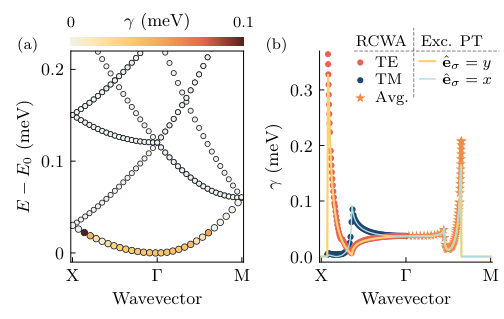 
FIG. 2. (a) Free exciton energy dispersion plotted in the first Brillouin zone of a fictitious periodic lattice. The color scale encodes the radiative losses (in meV) calculated using Eq. (1) for excitons polarized along ˆeσ = y. Energies are plotted relative to E0 = 1.584 eV. Multiple excitonic bands appear within the first Brillouin zone due to the fictitious band folding; only exciton eigenmodes lying within the light cone possess finite radiative losses (Γ = 2γ), while the folded replicas that are originally outside the light cone retain γ = 0. (b) Radiative losses of the lowest-energy band shown in panel (a), calculated using perturbation theory (PT) compared to the ones independently...

📷 Fig 3

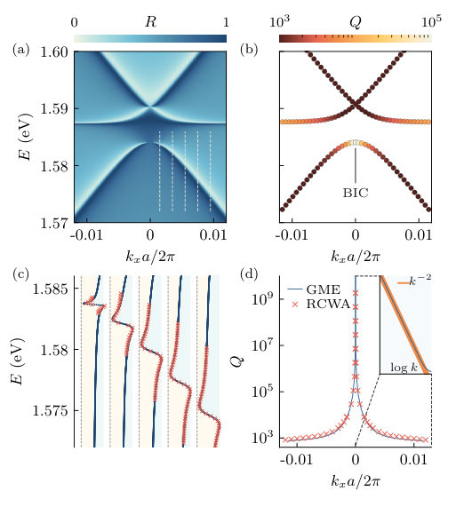 
FIG. 3. (a) Reflectivity spectrum calculated by RCWA for the passive photonic crystal slab i.e., with the oscillator strength of the active layer set to zero. The vertical dashed lines in- dicate the spectral cuts displayed in panel (c). (b) Eigen- mode dispersion calculated using GME, where the color scale encodes the k-dependent quality factor. (c) Spectral cut ex- tracted from panel (a), together with the corresponding Fano fit. (d) Quality factor of the lowest-energy band calculated with GME, and compared to the one extracted from fitted RCWA spectra for the lowest energy mode. The divergence at k = 0 is associated with the symmetry-protected BIC (the expected 1/k2 || scaling is shown...

📷 Fig 4

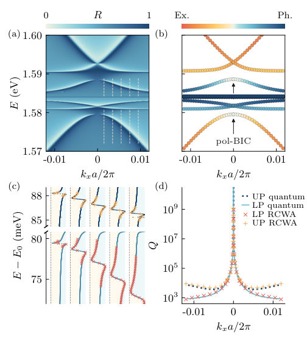 
FIG. 4. (a) Reflectivity spectrum calculated by RCWA for the same structure as in Fig. 3, now including the excitonic reso- nance with zero nonradiative broadening (γnonrad = 0). The vertical dashed lines indicate the spectral cuts displayed in panel (c). (b) Polariton dispersion calculated using the quan- tum theory (i.e., Hopfield matrix diagonalization), in which the color scale encodes the excitonic fraction. (c) Spectral cuts extracted from panel (a), together with the correspond- ing Fano fits. The lower and upper panels show the fitting re- gions around the lower- and upper-polariton branches, respec- tively. (d) Quality factors of the lower- and upper-polariton branches calculated...

📷 Fig 5

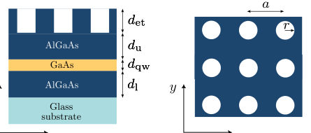 
FIG. 5. Schematic representation of the simulated structure: a single QW layer is embedded in a partially etched photonic crystal lattice, the whole effective planar waveguide being de- posited on a glass substrate. The vertical (i.e., along the z direction) heterostructure parameters are defined in the left panel, while the main photonic crystal lattice parameters in the (x, y) plane are given on the right panel.

**Summary.** This paper develops a generalized Hopfield formalism to model exciton-polaritons in patterned photonic crystals, specifically addressing the challenge of intrinsic excitonic radiative decay. The authors prove that the formalism correctly predicts the existence of polariton Bound States in the Continuum (BICs) by incorporating momentum-dependent losses. This establishes a unified theoretical tool for designing advanced photonic platforms coupled to 2D quantum materials.

**Why it may be interesting.** This work provides a powerful, unified, and microscopic theoretical framework for analyzing light-matter interactions in structured materials, which is highly relevant to quantum optics and open quantum systems.

Detailed structure

**Main problem.** The core problem is determining if the non-Hermitian Hopfield formalism can consistently describe polariton Bound States in the Continuum (BICs) when the constituent 2D excitons possess intrinsic, wavevector-dependent radiative decay.

**Main result.** The authors show that the generalized Hopfield formalism correctly captures the existence of genuine k=0 polariton BICs, even with intrinsic excitonic losses, by unifying the description of radiative excitons and polariton BICs.

**Method.** The study employs a quantum mechanical approach by diagonalizing a non-Hermitian Hopfield matrix, which is extended to incorporate the wavevector-dependent radiative decay rate of 2D excitons derived via time-dependent perturbation theory.

**Model / system.** The system models exciton-polaritons formed by strong light-matter coupling between photonic modes in patterned planar waveguides (Photonic Crystal slabs) and 2D optically active excitations (like those in quantum wells or TMDs).

**Key observables.** Polariton dispersion, BIC quality factor (Q), excitonic fraction, and the radiative linewidth ($\Gamma$) of the excitons.

**Important parameters / regimes.** Lattice period (a = 250 nm), resonance energy (E_exc = 1.584 eV), and the coupling strength derived from the Hopfield matrix elements.

**Assumptions / limitations.** The primary advancement is deriving the wavevector-dependent excitonic radiative decay rate from first principles, moving beyond purely phenomenological loss terms.

**Figures summary.** Figures illustrate the system geometry (QW in a patterned PC slab), the free exciton dispersion alongside calculated radiative losses, and the final polariton dispersion curves confirming the BIC existence.

**Paper structure.** The paper develops the generalized Hopfield formalism by incorporating intrinsic excitonic losses, benchmarks this theory against rigorous methods like RCWA, and finally demonstrates the existence and nature of the polariton BICs in the coupled system.

Abstract

Bound states in the continuum (BICs) enable optical modes with ideally infinite radiative lifetimes despite lying within the radiation continuum. Radiation-matter interaction in periodically patterned planar waveguides embedding two-dimensional (2D) optically active excitations can be described quantum mechanically by diagonalizing a non-Hermitian operator, known as the Hopfield matrix, which can be generalized to incorporate independent photonic and excitonic losses into the polaritonic states. However, since 2D excitons undergo intrinsic wavevector-dependent radiative decay within the light cone, whether the Hopfield formalism can consistently account for this process while preserving polariton BICs has remained an open question. Here we show that a non-Hermitian Hopfield formalism incorporating excitonic radiative losses correctly captures the existence of genuine $k=0$ polariton BICs with diverging radiative lifetimes. The theory provides a unified microscopic framework for radiative excitons and polariton BICs, and an efficient predictive tool for designing photonic-crystal platforms coupled to quantum wells, transition-metal dichalcogenides, and other 2D excitonic materials.

[↑ back to top](#top)

### [Coherent phononic frequency combs in ferroelectric CMOS oxides](http://arxiv.org/abs/2608.28956v1)

**Authors:** Jinghan Gao, Shruti Mishra, Yilin Kou, S M Enamul Hoque Yousuf, Hanna Cho, Roozbeh Tabrizian  
**Type:** both · **Category:** other · **PDF:** <https://arxiv.org/pdf/2608.28956v1>  
**Analysis basis:** full PDF text, analyzed in chunks
**Topic relevance:** `analog quantum simulation` **3/5** · `driven-dissipative phase transition` **3/5** · `interference shaping light` **2/5** · `methods for driven-dissipative` **2/5** · `non-equilibrium universality` **2/5** · `quantum optics experiment` **2/5** · `Frenkel-Kontorova` **1/5** · `Keldysh / 2PI / non-Gaussian methods` **1/5** · `correlated / nonlocal dissipation` **1/5** · `quantum measurements` **1/5**

📷 Fig 1

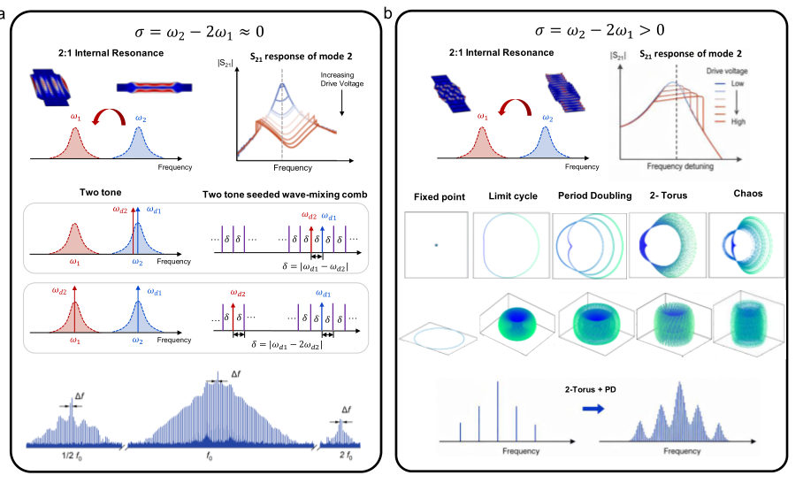 
Fig. 1 | Phononic frequency combs as a multi-clock resource, selected by internal-resonance detuning in HZO CMOS-oxide resonators. a, Nearly exact 2:1 ratio (𝜎𝑖= 𝜔2 −2𝜔1 ≈0 ). Internal resonance between the width-extensional mode 𝑓2 and a flexural subharmonic mode 𝑓1 produces the characteristic M-shaped resonance in the S21 response of 𝑓2. Two pump tones (𝑓𝑑1, 𝑓𝑑2 ) applied near 𝑓2 and 𝑓1 activate 2:1-assisted four-wave mixing, generating cascaded comb lines around 𝑓2 and its subharmonic 𝑓2/2 ≈𝑓1 , with spacing set by Δ𝑓= |𝑓𝑑1 −𝑓𝑑2| or |𝑓𝑑1 −2𝑓𝑑2| depending on tone placement. b, Detuned 2:1 ratio (𝜎𝑖&gt; 0 ). Internal resonance between two flexural modes, combined with the frequency mismatch,...

📷 Fig 2

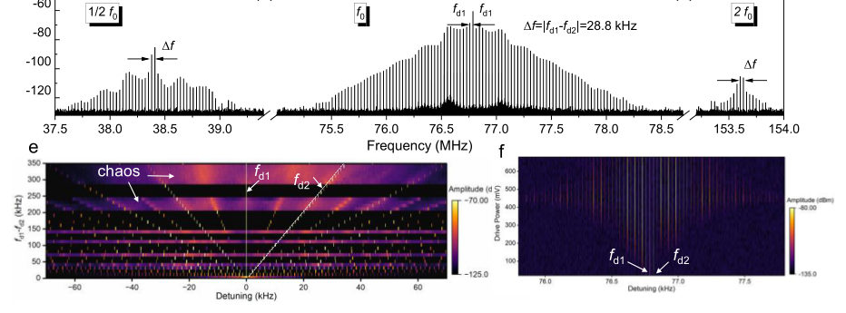 
Fig. 2 | Seeded four-wave-mixing comb generation via 2:1 internal resonance in a high- aspect-ratio HZO CMOS-oxide resonator. a, False-color SEM image of the doubly clamped beam (width 38 μm, length 200 μm); narrow tethers suppress anchor loss and sustain high-quality- factor modes. b, Drive-voltage-dependent amplitude response of the width-extensional mode near 𝑓2 = 76.8 MHz, showing the transition from a symmetric Lorentzian to an M-shaped response with amplitude saturation, characteristic of 2:1 InRes energy transfer. c, Electrically measured amplitude of the internally driven subharmonic as the pump is swept across the width-extensional resonance 𝑓2, forming an Arnold-tongue instability...

📷 Fig 3

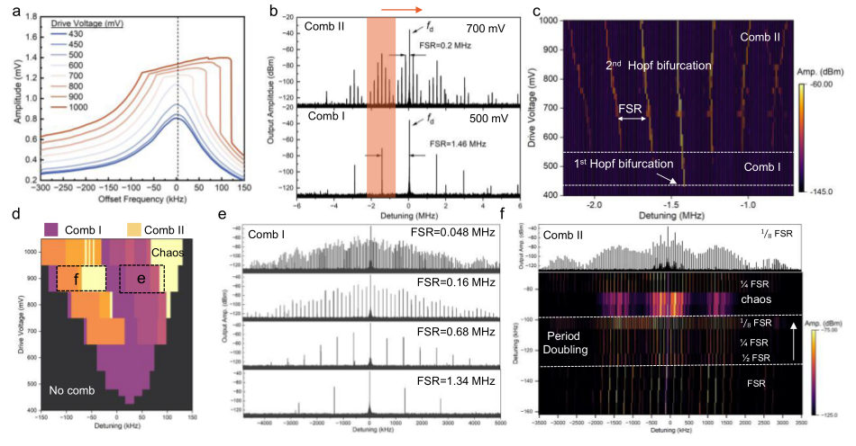 
Fig. 3 | Hierarchical comb generation via coexisting quadratic and cubic nonlinearities in a low-aspect-ratio HZO CMOS-oxide resonator. a, Drive-voltage-dependent amplitude response of the higher-frequency flexural mode of the detuned pair near 66.5 MHz, showing a non-classical, asymmetric M-shaped distortion with hardening branch only, resulting from the finite frequency mismatch between the interacting flexural modes. b, Emergence of the hierarchical comb (Comb II), with two distinct FSRs, from Comb I under single-tone excitation near 𝑓2 as the pump power increases from 500 to 700 mV. c, Detailed spectral evolution within the highlighted region of b: the FSR of Comb I grows with power,...

📷 Fig 4

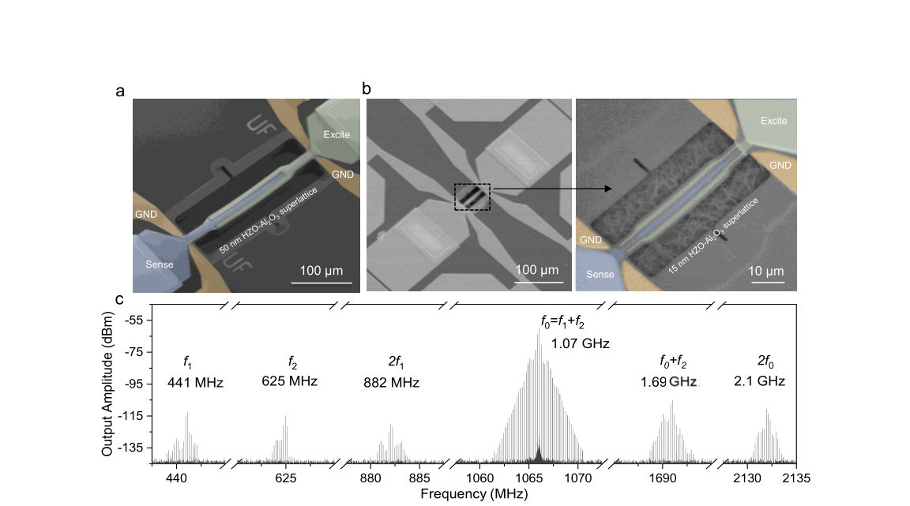 
Fig. 4 | Gigahertz-scaled comb generation enabled by the dimensional control of the HZO CMOS-oxide stack. a,b, False-color SEM images comparing the reference geometry a with the 0.2-scaled device and a magnified view of the scaled beam b. c, Measured comb spectrum under two-tone excitation near the third width-extensional mode at f₀ ≈ 1.07 GHz, with clusters at 𝑓1 = 44 MHz , 𝑓2 = 625 MHz , 2𝑓1 = 882 MHz , 𝑓0 = 𝑓1 + 𝑓2 , 𝑓0 + 𝑓2 = .69 GHz and 2𝑓0 = 2. GHz— comb clusters distributed from approximately 0.44 to 2.1 GHz with FSR set by the pump-tone separation ∆𝑓= |𝑓𝑑1 −𝑓𝑑2|.

📷 Fig 5

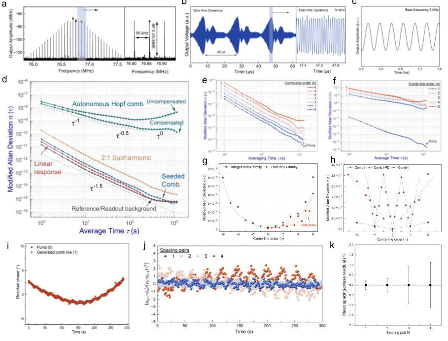 
Fig. 5 | Generation-mechanism dependence of comb-line frequency stability and direct mutual-coherence measurements. a, Measured spectrum of the two-tone-seeded wave-mixing comb, with the lines selected for stability and phase measurements indicated by arrows; the inset resolves a selected comb line with a signal-to-noise ratio of 57.5 dB. b, Time-domain output of the seeded comb showing the slow envelope modulation and, in the magnified interval, the fast carrier oscillation near 76 MHz. c, Heterodyne beat near 5 kHz used for timestamp-based frequency

**Summary.** This work reports the creation of broadband, coherent frequency combs using nanoelectromechanical resonators made from ferroelectric CMOS oxides. By controlling the internal resonance mismatch, the authors demonstrate two distinct generation pathways—seeded and autonomous—that allow for the creation of a highly stable, chip-scale frequency source for advanced electronics.

**Why it may be interesting.** While the focus is on classical RF electronics, the underlying physics—nonlinear coupled oscillators exhibiting bifurcations (Hopf) and energy transfer—is highly relevant to open quantum systems and cavity QED studies involving parametric interactions.

Detailed structure

**Main problem.** Modern electronics require multiple, mutually coherent clock and carrier frequencies from a single source, which is a major scaling challenge compared to current PLL-based architectures.

**Main result.** The authors demonstrated broadband, dense, and mutually phase-coherent phononic frequency combs in ferroelectric CMOS oxides, establishing a single resonator as a chip-scale frequency infrastructure.

**Method.** The study combines nonlinear dynamics modeling (slow-flow analysis, bifurcation theory) with electrical characterization (VNA, heterodyne measurements) to control comb generation.

**Model / system.** The physical platform is a nanoelectromechanical resonator built from ferroelectric hafnium-zirconium oxide (HZO) CMOS oxides. The system's nonlinearity is leveraged via lithographically defined detuning to select between seeded (two-tone-seeded) or autonomous (Hopf bifurcation) comb generation mechanisms.

**Key observables.** Number of comb lines (>170 to >200), mutual coherence, short-term stability (white-phase-noise scaling vs. phase diffusion), and temperature coefficient of frequency (TCF).

**Important parameters / regimes.** Internal resonance mismatch ($\sigma_i$), operating frequency range (0.44 GHz to 2.1 GHz), and the two-timescale law governing stability.

**Assumptions / limitations.** The analysis relies on reduced-order models (ROM) and slow-flow approximations, and stability measurements were performed in air without active thermal control.

**Figures summary.** Figures likely show the M-shaped saturation response for near-commensurate pairs and the hardening-like resonance curve for finite mismatches, illustrating the control over the generation mechanism.

**Paper structure.** The paper establishes the need for RF frequency combs, details the HZO CMOS platform's advantages, models two distinct generation pathways (seeded vs. autonomous) using nonlinear dynamics, and quantifies the resulting stability and programmability.

Abstract

Modern electronic systems require tens of clock and carrier frequencies, each synthesized by a dedicated phase-locked loop from a shared reference, imposing routing, power and synchronization burdens that grow with every domain. Optical frequency combs solved this problem in photonics, whereas electronics has lacked an equivalent source in its native radiofrequency domain. Here we report broadband phononic frequency combs in ferroelectric hafnia-zirconia nanoelectromechanical resonators built from complementary metal-oxide-semiconductor (CMOS) oxides. Lithographically defined detuning of a 2:1 internal resonance selects the generation mechanism: two-tone-seeded wave mixing yields more than 170 lines distributed over two octaves, with mutual coherence verified for representative pump and generated lines, whereas an autonomous Hopf route yields hierarchical combs of more than 200 lines through torus and period-doubling dynamics, in agreement with slow-flow bifurcation theory. Geometric scaling extends comb generation across 0.44 GHz to 2.1 GHz. Heterodyne measurements, analyzed using the modified Allan deviation (MDEV), establish a two-timescale law. The mechanism governs short-term stability: seeded combs inherit the white-phase-noise scaling of their pumps, whereas autonomous combs acquire the phase diffusion of a free-running oscillator, with the one-second MDEV increasing from 1e-11 to 1e-8. The material governs long-term stability: in air and without active thermal control, the temperature-compensated stack suppresses the random-walk drift that dominates uncompensated resonators. These results establish mechanism- and material-level design rules for operating a single resonator as chip-scale frequency infrastructure, from multi-clock generation to radiofrequency parallel processing.

[↑ back to top](#top)

### [Temperature Dependence of the Refractive Index for AlAsGaSb](http://arxiv.org/abs/2608.30547v1)

**Authors:** Helena Janowska, Wojciech Charaszkiewicz, Maja Wasiluk, Markus Peil, Teemu Taskinen, Joonas Hilska, Abhiroop Chellu, Teemu Hakkarainen, Anna Musiał  
**Type:** experiment · **Category:** other · **PDF:** <https://arxiv.org/pdf/2608.30547v1>  
**Analysis basis:** full PDF text, analyzed in chunks
**Topic relevance:** `interference shaping light` **3/5** · `quantum optics experiment` **2/5**

📷 Fig 1

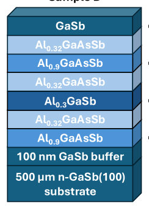 
Fig. 1. The scheme of (a) Sample A (DBR only), and (b) Sample B (optical cavity).

📷 Fig 2

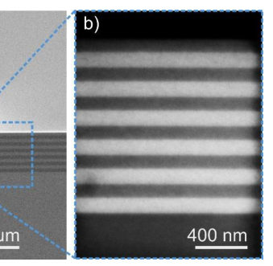 
Fig. 2. Cross-sectional SEM overview (a) and a high-magnification view (b) secondary electron images of sample A.

📷 Fig 3

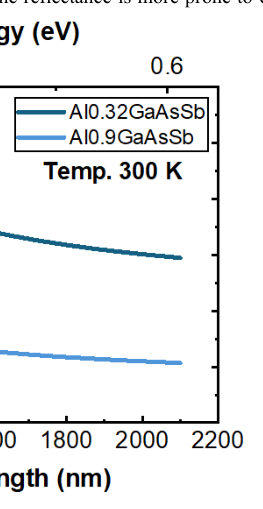 
Fig. 3. Calculated dispersion relations for AlAs-GaSb alloys in room temperature,

📷 Fig 4

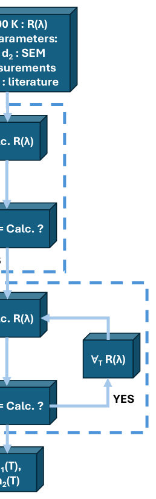 
Fig. 4. The scheme showing the algorithm to find refractive index change with

📷 Fig 5

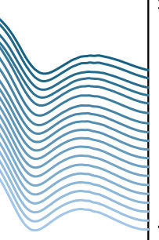 
Fig. 5. Normalized reflectivity spectra of Sample A measured in a range of temperatures 11.5-300 K (referred to in

**Summary.** This research determined the temperature dependence of the refractive index for AlAsGaSb alloys by measuring reflectivity spectra from 11.5 K to 300 K. Using the Transfer Matrix Method, the authors extracted these temperature-dependent optical constants. This data is crucial for accurately designing high-performance Distributed Bragg Reflectors for quantum photonics applications operating at cryogenic temperatures.

**Why it may be interesting.** This work is highly relevant to quantum optics and photonics, as precise knowledge of material dispersion and temperature effects is critical for designing stable photonic circuits and cavities used in quantum information processing.

Detailed structure

**Main problem.** The primary goal is to accurately determine the temperature dependence of the refractive index for AlAsGaSb alloys.

**Main result.** The study successfully extracted temperature-dependent refractive indices for two different AlGaAsSb alloys, providing essential data for reliable DBR design under cryogenic conditions.

**Method.** Reflectivity spectra were measured across a wide temperature range (11.5 K to 300 K) and fitted using the Transfer Matrix Method (TMM) combined with a recursive numerical fitting algorithm.

**Model / system.** The system involves photonic multilayer structures, specifically Distributed Bragg Reflectors (DBRs), composed of AlAsGaSb alloys lattice-matched to GaSb, designed for operation in the telecom C-band (around 1.5 $\mu$m).

**Key observables.** Temperature-dependent refractive indices ($n$), and normalized reflectivity spectra.

**Important parameters / regimes.** Temperature range: 11.5 K to 300 K; Wavelength: 1500 nm to 1550 nm; Alloys: $	ext{Al}_{0.9}	ext{Ga}_{0.1}	ext{As}_{0.06}	ext{Sb}_{0.94}$ and $	ext{Al}_{0.32}	ext{Ga}_{0.68}	ext{As}_{0.02}	ext{Sb}_{0.98}$.

**Assumptions / limitations.** The analysis assumes the reflectance of a gold mirror reference is constant, and the thermal expansion of the materials is negligible.

**Figures summary.** Figures show the DBR sample schemes, SEM cross-sections, and the measured/fitted normalized reflectivity spectra at various temperatures (e.g., 12 K and 295.3 K).

**Paper structure.** The paper describes the necessity of temperature-dependent optical constants for DBR design, details the measurement process across multiple temperature points, and presents the fitting methodology using TMM to extract the temperature dependence of the refractive index.

Abstract

Accurate design and optimization of photonic multilayer structures like distributed Bragg reflectors (DBRs) require precise knowledge of material optical constants, particularly the temperature dependence of the refractive index. While these parameters are well established for widely used semiconductors, for emerging materials such as antimonides they are often limited to room-temperature data, especially for new spectral ranges of interest. Antimonide compounds, in particular GaSb-based alloys, are promising for quantum photonics applications. In this work, we investigated DBRs lattice-matched to GaSb and designed for operation in the third telecommunication window. Reflectivity spectra were measured in the temperature range from 11.5 K to 300 K, and then fitted using the transfer matrix method (TMM), combined with a dedicated recursive numerical fitting algorithm. Initial parameters included layer thicknesses determined by scanning electron microscopy (SEM) and literature values of refractive indices at room temperature. This approach enabled extraction of the temperature-dependent refractive indices of two AlGaAsSb alloys suitable for forming DBR mirrors for 1.5 um wavelengths. The obtained results provide essential input for reliable DBR design, ensuring proper stopband positioning and high reflectivity under cryogenic operating conditions required for efficient quantum emitter performance.

[↑ back to top](#top)

### [Chiral-symmetry breaking and degeneracy in Koch fractal geometries](http://arxiv.org/abs/2608.30007v1)

**Authors:** L. L. Lage, A. Latgé  
**Type:** theory · **Category:** other · **PDF:** <https://arxiv.org/pdf/2608.30007v1>  
**Analysis basis:** full PDF text, analyzed in chunks
**Topic relevance:** `analog quantum simulation` **3/5** · `Frenkel-Kontorova` **1/5**

📷 Fig 1

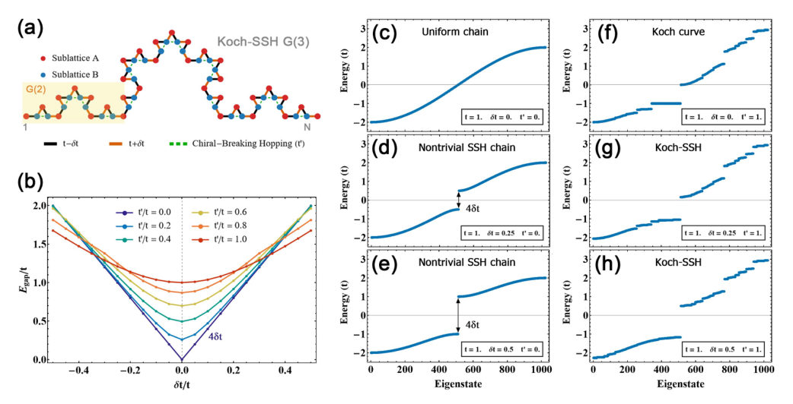 
FIG. 1. (a) Hopping scheme of the Koch–SSH model in a G(3) fractal curve. Alternating hoppings t −δt (black) and t + δt (orange) preserves the bipartite SSH structure, while t′ (green dashed lines) connects sites belonging to same sublattice within the Koch triangles bases. (b) Energy gap Egap as a function of the dimerization δt/t and the chiral-breaking hopping t′/t for a Koch–SSH G(5). Panels (c)–(h) show representative energy spectra of Koch–SSH G(5) for different combinations of energy hopping parameters.

📷 Fig 2

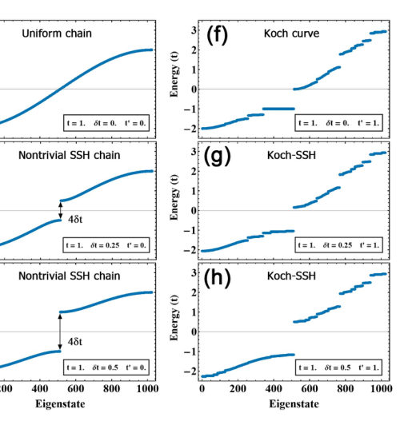 
Fig. 1(a) illustrates the self-similar construction of the Koch–SSH chain. The triangles generated at successive iterations bring nonconsecutive sites into close spatial proximity, allowing additional hopping terms across the bases of the triangles. To preserve the alternating hop- ping sequence and suppress end-induced finite-size ef- fects, we impose periodic boundary conditions by con- necting sites (N) and (1). Since site (N) belongs to sublattice (B), and site (1) belongs to sublattice (A), the closing bond has amplitude t + δt, thus preserving the dimerization pattern. This boundary condition re- moves physical end states and allows the local marker to probe the bulk-like behavior of...

📷 Fig 3

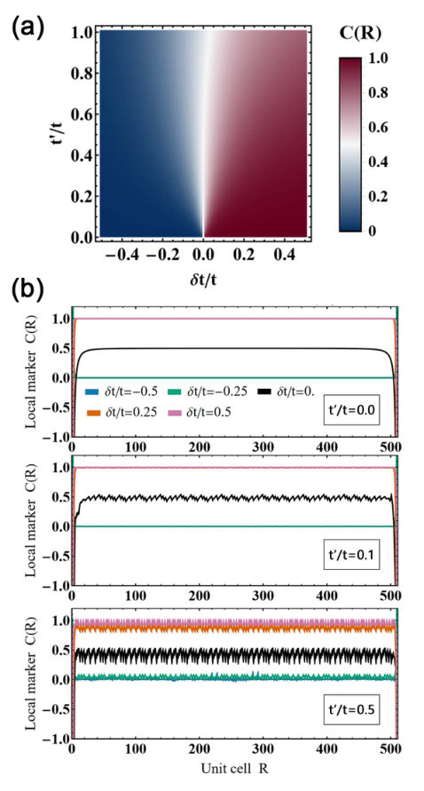 
FIG. 2. (a) Local marker parameter map for Koch–SSH G(5) with C(R) evaluated over different t′/t and δt/t pa- rameters for ν = 1/2. (b) Cross real-space resolution of the local marker for δt/t = (−0.5, −0, 25, 0, 0.25, 0.5) and t′/t = (0, 0.1, 0.5), marked with different colors.

📷 Fig 4

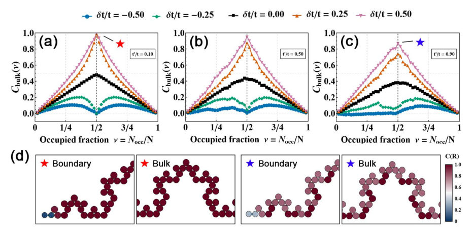 
FIG. 3. Local marker evaluated at the bulk region in function of the occupied fraction ν, considering (a) t′/t = 0.1 (b) t′/t = 0.5, (c) t′/t = 0.9 for different values of δt, given by distinct colors. (d) Site-resolved resolution of C(R) considering ν = 1/2 with δt/t = 0.0 , and δt = 0.5 (red and blue stars), with spatial zoom displacing boundary and bulk C(R) resolutions.

📷 Fig 5

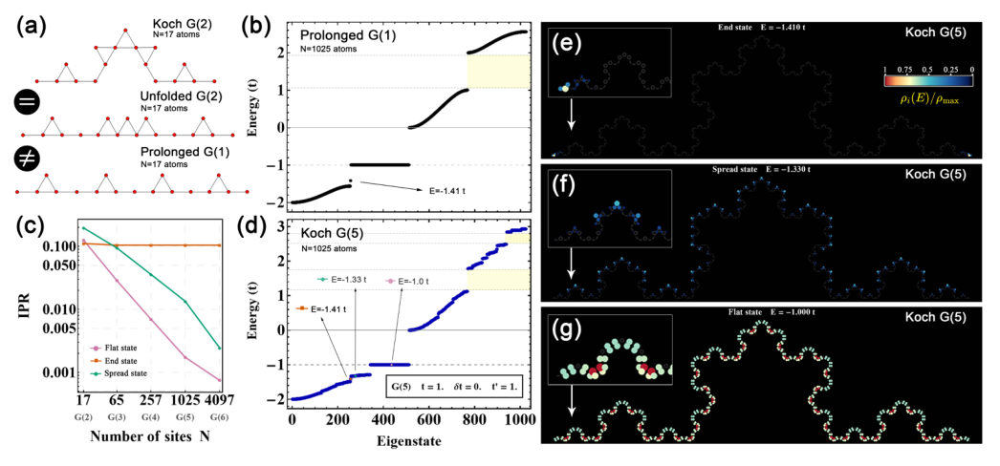 
FIG. 4. Electronic structure and localization in the isotropic (t′ = t, δt = 0) Koch chain. (a) Koch G(2), its unfolded representation, and a prolonged nonfractal chain of repeated G(1) units. (b) Spectrum of the prolonged finite chain with N = 1025, showing the flat state at E = −t and an end state near E = −1.41t. (c) IPR calculated at E = −t. End state, and spread state near E = −1.33t for different Koch generations. (d) Spectrum of the Koch G(5) chain; shaded regions highlight one example of the fractal-induced gaps within the hierarchical staircase structure. (e)–(g) Real-space LDOS of the end, spread, and flat state, respectively, for E = −1.41t, −1.33t, −t, normalized by a common...

**Summary.** This work examines the electronic structure of the SSH model placed on a Koch fractal lattice. By introducing local triangular hoppings, the model develops a degenerate flat band, while the global fractal connectivity of the Koch curve systematically reduces this degeneracy. The findings highlight a crucial interplay between local geometric features and global fractal structure in determining quantum electronic properties.

**Why it may be interesting.** The combination of fractal geometry, topological models (SSH), and symmetry breaking provides a rich platform for studying how geometric constraints dictate fundamental quantum properties like localization and spectral structure.

Detailed structure

**Main problem.** The paper investigates how coupling the Su-Schrieffer-Heeger (SSH) model to the geometry of the Koch fractal modifies its topological properties and electronic spectrum.

**Main result.** The local triangular geometry creates a highly degenerate flat band at E=-t, but the global fractal connectivity of the Koch curve reduces this degeneracy and alters the spectral weight compared to a simple extended chain.

**Method.** The study uses a real-space formulation of the Hamiltonian, analyzing spectral properties, topological markers, and localization via the Inverse Participation Ratio (IPR).

**Model / system.** The system is the SSH model constructed on the Koch curve, incorporating additional intra-sublattice hopping terms (t') that break chiral symmetry. The Hamiltonian is analyzed by comparing its behavior to the standard SSH chain.

**Key observables.** Spectral gaps (E_gap), degeneracy of the flat level at E=-t, local topological marker C(R), and the Inverse Participation Ratio (IPR).

**Important parameters / regimes.** Dimerization parameter (delta t/t) and the chiral-breaking hopping parameter (t'/t).

**Assumptions / limitations.** Periodic boundary conditions are imposed for bulk-like behavior, and the analysis separates local (triangular) and global (fractal) effects.

**Figures summary.** Figures illustrate the energy gap dependence on dimerization and chiral-breaking terms, and show the evolution of the degeneracy of the flat band at E=-t for prolonged versus Koch structures.

**Paper structure.** The paper systematically analyzes the Hamiltonian, first establishing the role of local triangular hoppings in creating flat bands, then analyzing how the global Koch hierarchy modifies the degeneracy of these states, and finally examining the impact of chiral symmetry breaking.

Abstract

Fractal geometries provide a distinctive platform for controlling quantum interference, topology, and localization. We investigate the Su--Schrieffer--Heeger (SSH) model constructed on the Koch curve, where a triangular geometry enables additional same-sublattice hoppings that break chiral symmetry and modify the conventional topological behavior captured by a real-space local marker. Destructive interference within the triangular units produces a highly degenerate flat level at $E=-t$. Although this level originates from the local geometry, its degeneracy and spectral weight are controlled by the self-similar connectivity of the Koch curve. The hierarchy reduces the number of independent flat states and reorganizes the spectrum into an intricate distribution of energy levels. Our results reveal complementary roles for local triangular interference and global fractal connectivity in shaping the electronic properties of geometrically modified SSH chains.

[↑ back to top](#top)

### [Directional commensurability stabilizes structural superlubricity in patterned mesoscale interfaces](http://arxiv.org/abs/2608.29141v1)

**Authors:** Viet Hung Ho, Ge Li, Melisa M. Gianetti, Bjørn Haugen, Graham L. W. Cross, Astrid S. de Wijn  
**Type:** theory · **Category:** other · **PDF:** <https://arxiv.org/pdf/2608.29141v1>  
**Analysis basis:** full PDF text, analyzed in chunks
**Topic relevance:** `Frenkel-Kontorova` **3/5** · `analog quantum simulation` **1/5**

📷 Fig 1

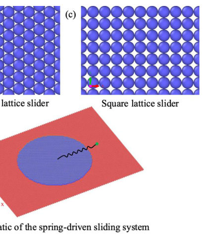 
Figure 1: Geometric configurations of the substrate, the two slider lattices, and the

📷 Fig 2

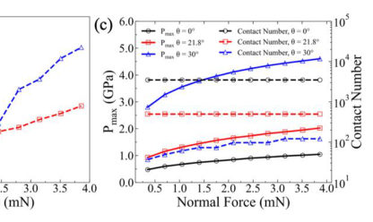 
Figure 2: Cartoon of the triangular-triangular (tri-tri) model, frictional response,

📷 Fig 3

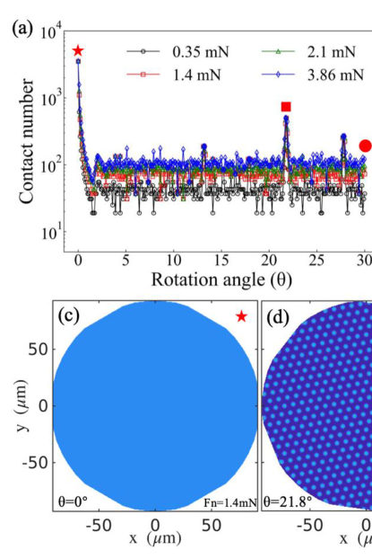 
Figure 3: Orientation-dependent contact states of the tri-tri model.

📷 Fig 4

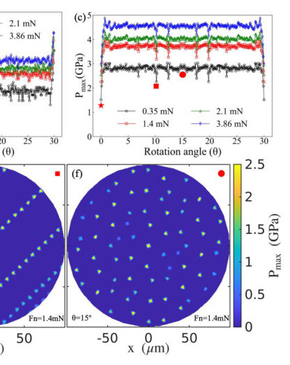 
Figure 4: Orientation-dependent contact states of the square-triangular (square-tri)

📷 Fig 5

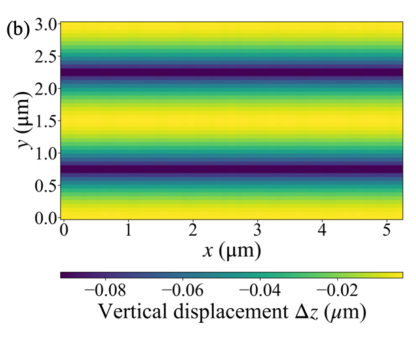 
Figure 5: Corrugation as a function of pulling angle α and slider vertical displacement

**Summary.** This work investigates how to maintain structural superlubricity—a state of near-zero friction—in patterned materials under high loads. The authors find that simple incommensurate patterns fail because they concentrate stress, causing coating failure. They propose and validate that a specific square-triangular pattern, which introduces directional commensurability, successfully stabilizes superlubricity by distributing the load effectively.

**Why it may be interesting.** While the physics is classical tribology, the concept of stabilizing a desired low-energy state (superlubricity) against external perturbations (high load, defects) through engineered periodicity echoes concepts of robustness in quantum systems.

Detailed structure

**Main problem.** The primary challenge is stabilizing structural superlubricity in patterned mesoscale interfaces under high mechanical loads, as simple incommensurate patterns fail due to localized coating pressure exceeding material strength.

**Main result.** The authors demonstrate that using a square-triangular patterned interface, which creates directional commensurability, stabilizes superlubricity at high loads by distributing contact loads and preventing coating failure.

**Method.** The study uses molecular dynamics simulations (LAMMPS) to model the interaction between patterned surfaces, employing Hertz-Mindlin contact mechanics.

**Model / system.** The system involves patterned mesoscale interfaces (e.g., triangular-triangular or square-triangular) coated with a superlubric layer, modeled as deformable elastic spheres interacting under normal loads.

**Key observables.** Friction force/coefficient, maximum interfacial pressure ($P_{	ext{max}}$), total number of load-bearing contacts, and structural stability.

**Important parameters / regimes.** Critical coating failure pressure ($P_{crit} = 4 	ext{ GPa}$), relative orientation angles ($	heta$), and sliding direction angles ($\alpha$).

**Assumptions / limitations.** The analysis assumes that superlubricity is lost when the local maximum contact pressure exceeds the critical coating failure threshold ($P_{crit}$).

**Figures summary.** Figures compare the frictional response and maximum pressure for tri-tri vs. square-tri models under varying loads and orientations, highlighting the superior performance of the square-tri model.

**Paper structure.** The paper progresses by first showing the failure of simple incommensurate patterns (tri-tri) at high loads, then proposing and simulating the square-tri pattern, demonstrating that directional commensurability stabilizes superlubricity, and finally testing the robustness against defects and material softness.

Abstract

Structural superlubricity, arising from lattice incommensurability, offers a promising route to eliminate friction and associated energy losses in mechanical systems. In real-world systems, roughness and wear currently pose severe limitations on its robustness and especially the contact size. Here, we consider patterned surfaces as a possible route to overcome some of these limitations. We show that the simplest choice of patterning, contacts made up of two incommensurate triangular-triangular patterns, fails at elevated loads because of the small number of load-bearing contacts, causing the maximum local contact pressure to exceed the strength of the superlubric coating. We introduce a square-triangular patterned interface that increases the number of load-bearing contacts and organizes them into continuous contact lines. When sliding along specific directions relative to these lines, superlubricity is maintained at significantly higher loads by reducing pressure-induced coating failure while also remaining somewhat tolerant to surface imperfections. These findings establish a mechanism for stabilizing structural superlubricity against coating failure and a design principle for engineering low-friction interfaces with enhanced load-bearing capacity and defect tolerance.

[↑ back to top](#top)

### [Spin-textured orbitals in altermagnetic artificial atoms](http://arxiv.org/abs/2608.29861v1)

**Authors:** Yue Mao, Yu-Chen Zhuang, Cheng-Ming Miao, Yu-Fei Sun, Qing-Feng Sun  
**Type:** theory · **Category:** other · **PDF:** <https://arxiv.org/pdf/2608.29861v1>  
**Analysis basis:** full PDF text, analyzed in chunks
**Topic relevance:** `analog quantum simulation` **3/5** · `Keldysh / 2PI / non-Gaussian methods` **1/5**

📷 Fig 1

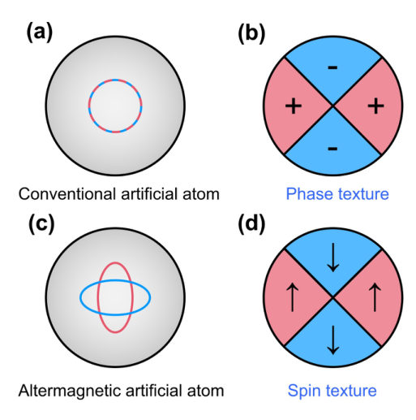 
FIG. 1. Concept of altermagnetic artificial atoms. (a) A conventional artificial atom formed by confining a spin- degenerate system. (b) Phase texture of a conventional d- orbital, represented by alternating wavefunction signs in a real orbital representation. (c) An altermagnetic artificial atom formed by confining a system with momentum-dependent spin splitting. The inner constant-energy contours are spin degen- erate in (a) and spin split in (c). (d) Spin texture of a d-wave altermagnetic artificial orbital pair, formed by spatially alter- nating opposite-spin components.

📷 Fig 2

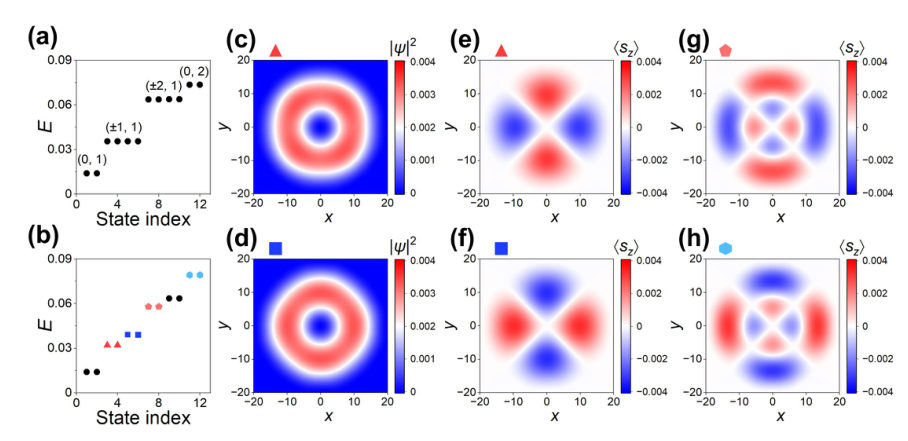 
FIG. 2. Formation of spin-textured orbitals in altermagnetic artificial atoms. (a) Energy spectrum of a conventional artificial atom with tJ = 0, where states are labeled by angular-momentum and principal quantum numbers (m, n). (b) Energy spectrum of the altermagnetic artificial atom with tJ = 0.2. Colored symbols mark representative degenerate pairs. (c),(d) Probability densities of the two degenerate pairs split from the (±1, 1) states, summed over each pair. (e),(f) Corresponding local spin densities. (g),(h) Local spin densities of confined states marked in (b) with additional radial structure.

📷 Fig 3

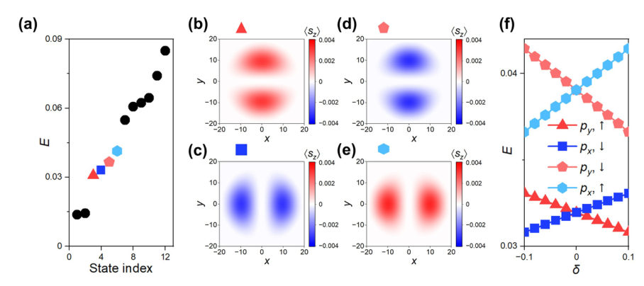 
FIG. 3. Strain control of orbital degeneracy in altermagnetic artificial atoms. (a) Energy spectrum of the altermagnetic artificial atom at δ = 0.1, with colored symbols indicating representative split states. (b)-(e) Local spin densities of the states marked by colored symbols in (a). (f) Strain dependence of the energies of the four p orbital states.

📷 Fig 4

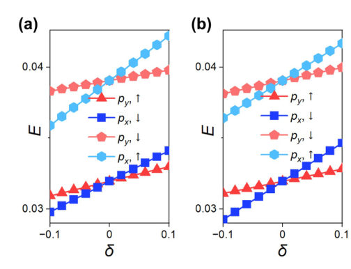 
FIG. 4. Strain dependence of the energies of the four p states. (a) Strain is applied only along the x direction, to both the kinetic and altermagnetic terms. (b) Strain is applied only along the x direction to the kinetic term, while the altermag- netic term remains unchanged.

**Summary.** This paper introduces altermagnetic artificial atoms, showing that the inherent spin-splitting mechanism reconstructs conventional orbitals into spin-textured states. These textures encode spin information spatially, and the authors demonstrate that applying external strain allows for the continuous, tunable control of the orbital energy degeneracy. This establishes a powerful route for engineering spin-dependent quantum properties in confined matter.

**Why it may be interesting.** This work directly addresses engineering spin-dependent orbital structures in quantum-confined systems, which is highly relevant for realizing novel quantum devices and understanding spin-orbit coupling effects in artificial lattices.

Detailed structure

**Main problem.** To determine if altermagnetism can encode spin into the orbital degrees of freedom of artificial atoms, moving beyond conventional systems where spin is passive.

**Main result.** Altermagnetism generates spin-textured orbitals with spatially distinct opposite spin components, and external strain can continuously tune the energy splitting of these degenerate orbital pairs.

**Method.** The study uses theoretical modeling, solving a continuum and discretized lattice Hamiltonian derived from the altermagnetic confinement potential.

**Model / system.** The system is altermagnetic artificial atoms, modeled by a Hamiltonian incorporating kinetic energy, a momentum-dependent spin splitting term ($t_J$), and a confining potential $V(r)$.

**Key observables.** Confined energy spectrum, local spin densities ($\langle s_z(\mathbf{r})
angle$), and the evolution of orbital degeneracy under strain.

**Important parameters / regimes.** Altermagnetic strength ($t_J$), confinement radius ($R$), and strain parameter ($\delta$).

**Assumptions / limitations.** The analysis relies on a representative low-energy Hamiltonian and assumes the hard-wall confinement potential is effectively realized.

**Figures summary.** Figures illustrate the transition from conventional spin-degenerate orbitals to spin-textured ones, showing the splitting of energy levels and the spatial distribution of spin polarization under strain.

**Paper structure.** The paper introduces the concept via a Hamiltonian, analyzes the resulting spin-textured orbitals, and then systematically investigates how external strain breaks the symmetry to tune the energy splitting of these states.

Abstract

Artificial atoms provide a versatile platform for engineering atomic-like orbitals, yet spin generally remains a passive degree of freedom in their orbital structure. Here, we introduce the concept of altermagnetic artificial atoms formed by confining electrons with momentum-dependent spin splitting. We show that altermagnetism reconstructs conventional confined orbitals into spin-textured orbitals, with spatially distinct distributions of opposite spin components. The resulting confined spectrum retains a twofold degeneracy protected by the combined $C_{4z}\mathcal{T}$ symmetry. These spin textures persist in higher-energy states, where additional radial structures combine with the characteristic angular spin pattern. Furthermore, strain resolves the degenerate orbital pairs into spin-polarized states, and continuously tunes their energy splitting. Our results establish altermagnetic artificial atoms as a route to engineering spin-dependent orbital structures in quantum-confined systems.

[↑ back to top](#top)

### [Robust bistable vortex light bullets in graded-index multimode fibers](http://arxiv.org/abs/2608.30732v1)

**Authors:** Ashis Paul, Anuj P. Lara, Govind P. Agrawal, Samudra Roy  
**Type:** theory · **Category:** other · **PDF:** <https://arxiv.org/pdf/2608.30732v1>  
**Analysis basis:** full PDF text, analyzed in chunks
**Topic relevance:** `interference shaping light` **3/5**

📷 Fig 1

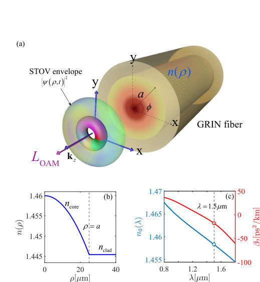 
FIG. 1. (a) Schematic illustration of a radially symmetric STOV bullet inside a GRIN fiber. (b) Refractive index pro- file for a GRIN fiber with a = 25 µm and ∆= 0.01. A dashed line shows the core-cladding boundary. (c) Material disper- sion n0(λ) (blue curve) and β2(λ) (red curve) for the GRIN fiber. The vertical dashed line at λ = 1.5 µm marks the input wavelength, where GVD is β2 = −17 ps2/km. The GVD is calculated for a GeO2 mole fraction of 0.0862 [97].

📷 Fig 2

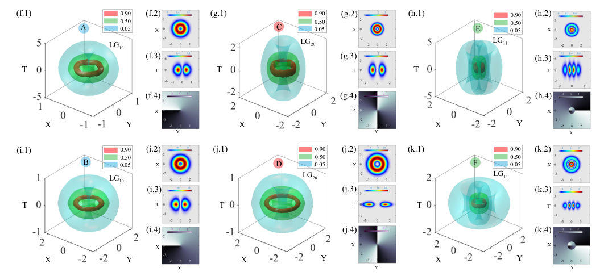 
FIG. 2. Bistable solutions, iso-intensity surfaces, and spatio-temporal intensity distributions for three STOV bullets correspond- ing to LG10 (blue), LG20 (red) and LG11 (green) modes of a GRIN fiber. (a) Amplitude ψ0 (solid lines) and its projection (dashed lines) in the w-η plane. Bistable solutions depicting (b) amplitude ψ0, (c) inverse temporal width η, (d) spatial width w, and (e) peak intensity Ip plotted as a function of bullet’s energy U. Markers A-F in each plot show the values for the six STOV bullets whose shapes and intensities are shown in parts (f-k). Parts (f) and (i) are for the LG10 bullets with markers A and B with U = 25, parts (g) and (j) are for LG20 bullets with...

📷 Fig 3

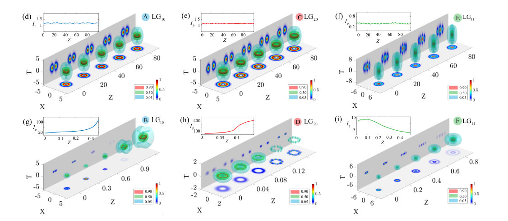 
FIG. 3. Results of VK stability analysis for (left) LG10, (center) LG20, and (right) LG11 bullets. (a-c) Total energy U plotted as a function of µ for three bullets. Dashed portions indicate instability in each case. Markers A-F indicate the six cases studied numerically, with results shown in parts (d-i). Parts (d-f) show propagation of the three stable bullets (markers A, C, E). Parts (d-f) show the propagation of three unstable bullets (markers B, D, F). In each case, bullet iso-intensity shapes are shown together with their spatial (T = 0 plane) and spatiotemporal (Y = 0 plane) cross-sections. The STOV bullets are launched at Z = 0 with 5% noise added to their amplitude. Evolution of...

📷 Fig 4

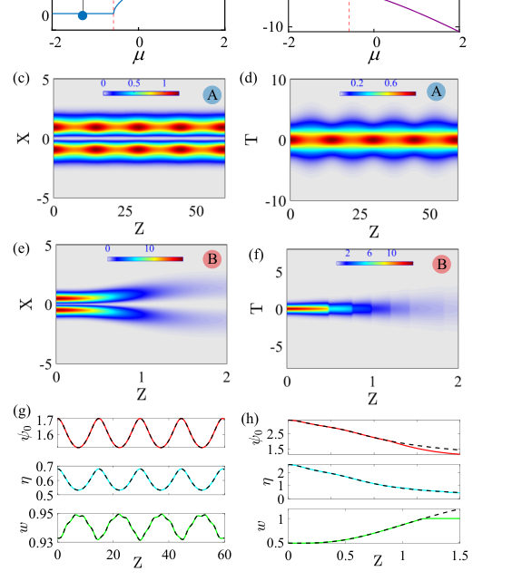 
FIG. 4. (a) Re[Λ]max and (b) imaginary parts Im[Λ] of all eigenvalues for the LG10 STOV bullets. The vertical dashed line marks the critical value µcr = −0.56 above which bullets become unstable. Markers A and B show the two cases stud- ied numerically in parts (b-h). At point A, stable oscillations both in (c) space and (d) time. At point B, the unstable bul- let starts spreading in both (e) space and (f) time. Parts (g) and (h) compare numerical results (solid line) with variational predictions (dashed lines) in the cases A and B, respectively, by plotting ψ0, η, and w as a function of z. Results are ob- tained using δ2 = 1 and γ = 1.

📷 Fig 5

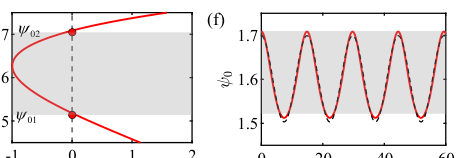 
FIG. 5. Potentials (left) and periodic evolution (right) of the three parameters of a stable LG10 STOV bullet, launched with an initial perturbation ∆η(0) = 0.05ηe (no perturbation for other parameters). Dashed lines in parts (b,d,f) show the analytical approximation for comparison. The shaded region in each plot marks the upper and lower bounds, as predicted by the turning points of the corresponding potential. Results are obtained for δ2 = 1 and γ = 1.

**Summary.** This paper theoretically analyzes the existence and stability of spatiotemporal vortex light bullets propagating in graded-index multimode fibers. By combining variational calculus with numerical methods, the authors prove the existence of a bistable family of these structured solitons. The findings suggest that these stable, high-order light structures have potential applications in classical and quantum information processing.

**Why it may be interesting.** This work is highly relevant to quantum optics and nonlinear wave physics, as it predicts stable, structured light states (vortex solitons) that could be utilized in advanced quantum information processing applications.

Detailed structure

**Main problem.** The paper investigates the theoretical formation and evolution of spatiotemporal vortex light bullets (STOV bullets) within a graded-index multimode fiber.

**Main result.** The authors establish the existence of a bistable vortex soliton family, demonstrating that GRIN fibers can stabilize these structured light wave packets.

**Method.** A two-fold approach combining variational analysis with full numerical simulations was used to solve the nonlinear Schrödinger equation.

**Model / system.** The system models light propagation in a $	ext{GeO}_2$-doped silica GRIN fiber, governed by the (3+1)D Nonlinear Schrödinger Equation (NLSE). The vortex structure is characterized by an orbital angular momentum quantum number ($l$).

**Key observables.** Bistability, stability (via Vakhitov–Kolokolov criterion), and the spatiotemporal intensity profiles of the vortex bullets.

**Important parameters / regimes.** Topological charge ($l$), dimensionless GVD ($\delta^2$), nonlinear parameter ($\gamma$), and the fiber's refractive index profile parameters.

**Assumptions / limitations.** The analysis assumes radial symmetry ($\Psi(
ho, T) = \psi(
ho, T) \exp(il\phi + i\mu Z)$) and utilizes the variational method as an approximation.

**Figures summary.** Figure 1 schematically shows the STOV bullet, the refractive index profile, and dispersion characteristics. Figure 2 illustrates the spatio-temporal distributions and the energy dependence demonstrating bistability for different vortex modes.

**Paper structure.** The paper first sets up the physical model using the NLSE, then employs variational analysis to derive a reduced Lagrangian. This leads to finding closed-form solutions for the soliton parameters, demonstrating bistability, and finally analyzing the stability using the Vakhitov-Kolokolov criterion.

Abstract

We explore theoretically the formation and evolution of spatiotemporal vortex bullets, pulses confined in both space and time while carrying orbital angular momentum, inside a graded-index multimode fiber. Through a two-fold approach, combining variational analysis with full numerical simulations, we establish the existence of a bistable vortex soliton family, characterized by distinct radial and azimuthal quantum numbers. These wave packets exhibit a Laguerre-Gaussian multi-ring topology in their spatiotemporal structure. We identify the experimental conditions necessary for the generation of such structured states of light. A stability analysis based on Vakhitov-Kolokolov criteria reveals an upper limit for the propagation constant, below which vortex bullets are found to be stable. Stationary and non-stationary dynamics of vortex bullets with different topological charges are analyzed fully, exploiting analytical techniques that are supported by full numerical simulations. These results enhance our understanding of self-trapped, spatiotemporal vortex solitons in a graded-index medium and may lead to potential applications in the area of classical and quantum information processing.

[↑ back to top](#top)

### [Twist-Tunable Paramagnetic Superconductivity in $d$-wave Altermagnet/Superconductor Heterostructures](http://arxiv.org/abs/2608.30010v1)

**Authors:** Narges Kia, Saeed H. Abedinpour, Zahra Faraei  
**Type:** theory · **Category:** strongly correlated electrons · **PDF:** <https://arxiv.org/pdf/2608.30010v1>  
**Analysis basis:** full PDF text, analyzed in chunks
**Topic relevance:** `Keldysh / 2PI / non-Gaussian methods` **3/5**

📷 Fig 1

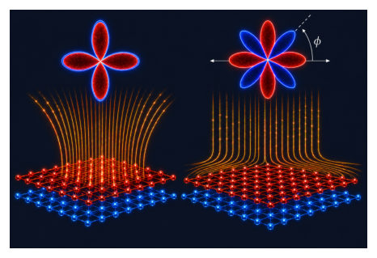 
FIG. 1. Twist-angle tuning of the electromagnetic response in a d-wave altermagnet/superconductor heterostructure. Per- fect alignment of the d-wave nodes (ϕ = 0, left) drives ro- bust odd-frequency triplet pairing, leading to a paramagnetic Meissner state (flux attraction). Conversely, an interfacial twist (ϕ ̸= 0, right) induces a nodal mismatch that suppresses the paramagnetic response and moves the system toward a conventional diamagnetic state (flux expulsion).

📷 Fig 2

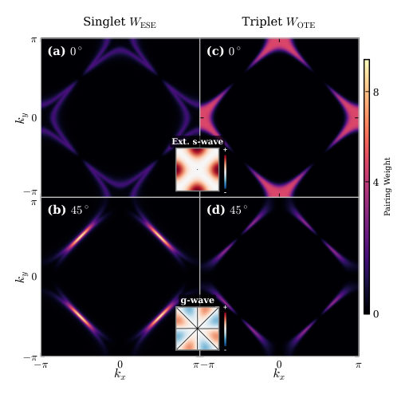 
FIG. 2. Numerical heatmaps of the pairing weights WESE [(a),(b)] and WOTE [(c),(d)] for the perfectly aligned (ϕ = 0◦) [(a),(c)] and maximally twisted (ϕ = 45◦) [(b),(d)] cases. The insets show the density plots of the geometrical overlap product hk∆ϕ(k) in the altermagnet’s Brillouin zone for ϕ = 0◦(top) and ϕ = 45◦(bottom), illustrating the extended-s- wave and g-wave symmetries, respectively. Model parameters are set to µ = 0, J = 0.05t, λs = 0.15t, ∆d = 0.03t, and kBT = 0.02t.

📷 Fig 3

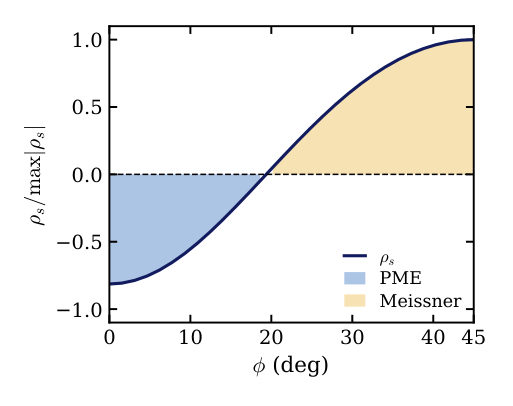 
FIG. 3. Normalized total superfluid density ρs versus the twist angle ϕ for a dx2−y2 altermagnet. The structural ro- tation drives the system from a paramagnetic Meissner state (ρs &lt; 0) into a conventional diamagnetic state (ρs &gt; 0) across a critical angle ϕc ≈20◦. Parameters chosen here: J = 0.1t, µ = 0, λs = 0.15t, ∆d = 0.3t, and kBT = 0.02t.

📷 Fig 4

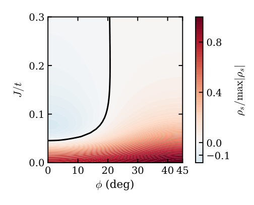 
FIG. 4. Magnetic phase diagram of the twisted dx2−y2-wave AM/d-wave SC heterostructure in the parameter space of exchange strength J and twist angle ϕ. The paramagnetic Meissner effect (blue region) forms a highly localized pocket, requiring both sufficiently strong exchange fields to gener- ate triplet pairs and small angular misalignments to preserve momentum-space overlap. The other model parameters are µ = 0, kBT = 0.02t, ∆d = 0.03t, and λs = 0.15t.

📷 Fig 5

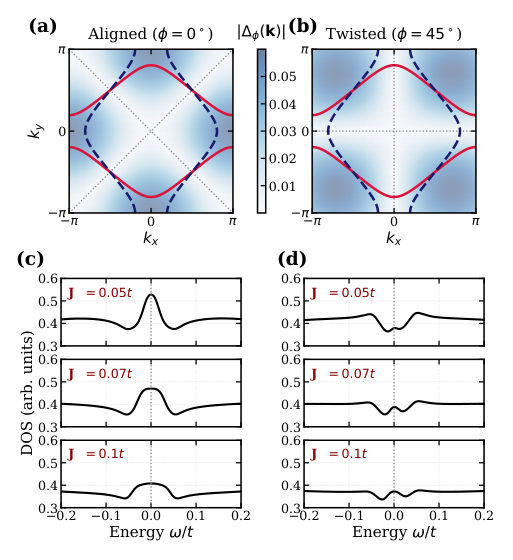 
FIG. 5. Direct correlation between momentum-space align- ment and the emergence of odd-frequency resonances at half- filling (µ = 0). (a),(b) Spin-split Fermi surfaces overlaid on the magnitude of the underlying superconducting gap |∆ϕ(k)| (blue shading) for J = 0.1t. (c),(d) Evolution of the corre- sponding total density of states (DOS) for varying exchange strengths J. The other model parameters are λs = 0.15t, ∆d = 0.03t, and Γ = 0.5∆d.

**Summary.** This theoretical work explores how twisting the interface between a $d$-wave superconductor and an altermagnet can control the superconducting state. By tuning the twist angle, the system can be switched between exhibiting a paramagnetic Meissner effect (PME) and a conventional diamagnetic response. This demonstrates a powerful, geometrically controlled platform for engineering odd-frequency pairing.

**Why it may be interesting.** The concept of using geometric/structural tuning (twist angle) to switch between fundamentally different macroscopic quantum states (paramagnetic vs. diamagnetic) is highly relevant for designing novel superconducting devices.

Detailed structure

**Main problem.** The study aims to control quantum phenomena, specifically achieving and tuning paramagnetic superconductivity, by engineering the interface between a superconductor and a magnetic material.

**Main result.** The interfacial twist angle acts as a tunable knob, allowing the system to switch between a paramagnetic Meissner effect (PME) at alignment ($\phi=0$) and a conventional diamagnetic state at maximal twist ($\phi=\pi/4$).

**Method.** The investigation uses theoretical Green's function proximity formalism and linear response theory to calculate the total superfluid density ($
ho_s$).

**Model / system.** The system is a heterostructure combining a $d$-wave superconductor (SC) and a two-dimensional $d$-wave altermagnet (AM), whose coupling is modulated by a relative twist angle $\phi$.

**Key observables.** Total normalized superfluid density ($
ho_s(\phi)$), which determines the magnetic state ($
ho_s < 0$ for PME, $
ho_s > 0$ for diamagnetism).

**Important parameters / regimes.** The interfacial twist angle ($\phi$), the superconducting gap ($\Delta_d$), and the altermagnetic exchange coupling ($J$).

**Assumptions / limitations.** The analysis relies on the Nambu-Gor'kov formalism and linear response theory for calculating the electromagnetic response.

**Figures summary.** Figures illustrate the dependence of $
ho_s$ on $\phi$, showing the transition from paramagnetic ($
ho_s < 0$) to diamagnetic ($
ho_s > 0$) states, and show subgap resonances in the DOS corresponding to the PME phase.

**Paper structure.** The paper develops the theoretical framework by defining the proximity effect, calculating the anomalous pairing components (odd-frequency triplet pairing), and finally determining the macroscopic response ($
ho_s$) via the total current-current correlation kernel.

Abstract

The interplay between twist-angle engineering and unconventional magnetism provides a powerful new route to control quantum phenomena. We theoretically investigate a heterostructure comprising a $d$-wave superconductor proximitized by a two-dimensional $d$-wave altermagnet. We reveal that the momentum-space mismatch between the superconducting gap nodes and the altermagnetic spin-splitting nodes generates a robust, twist-tunable odd-frequency spin-triplet pairing. Consequently, the macroscopic electromagnetic response of the system can be tuned from a conventional diamagnetic Meissner state to an anomalous paramagnetic Meissner effect driven entirely by the interfacial twist angle. For a $d_{x^2-y^2}$ altermagnet, the paramagnetic response is maximized at perfect alignment ($φ=0$) and completely suppressed at a maximal twist of $φ=π/4$, while a $d_{xy}$ altermagnet exhibits the exact complementary behavior. Our results establish twisted altermagnetic heterostructures as a versatile platform for engineering odd-frequency pairing and macroscopic superconducting phases.

[↑ back to top](#top)

### [Numerical simulation of a two-frequency-driven superlattice Faraday-wave pattern](http://arxiv.org/abs/2608.31141v1)

**Authors:** Debashis Panda, Nicolas Périnet, Abdullah M. Abdal, Lyes Kahouadji, Seungwon Shin, Jalel Chergui, Damir Juric, Omar K. Matar, Laurette S. Tuckerman  
**Type:** both · **Category:** other · **PDF:** <https://arxiv.org/pdf/2608.31141v1>  
**Analysis basis:** full PDF text, analyzed in chunks
**Topic relevance:** `analog quantum simulation` **2/5** · `driven-dissipative phase transition` **2/5** · `non-equilibrium universality` **2/5** · `Frenkel-Kontorova` **1/5** · `methods for driven-dissipative` **1/5**

📷 Fig 1

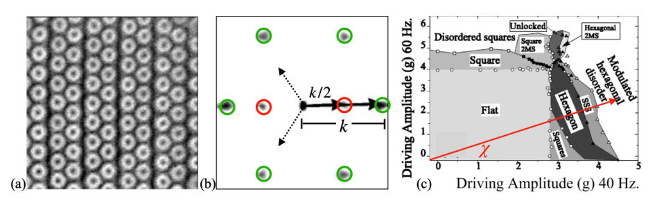 
FIG. 1. Experimental SSS-I superlattice pattern, reproduced and adapted with permission from Figures 4 and 5 of Arbell and Fineberg [1]. The density, dynamic viscosity, surface tension, and height of the fluid layer are 𝜌𝐿= 950 kg/m3, 𝜇𝐿= 0.0219 Pa.s, 𝜎= 21.5 × 10−3 N/m, ℎ= 0.155 cm, respectively, and the imposed vertical oscillation is 𝐹× [cos(𝜒) cos(2𝜔𝑡) + sin(𝜒) cos(3𝜔𝑡)] with fundamental frequency 𝜔= 2𝜋(20)rad s−1 and mixing angle 𝜒= 30◦. (a) Visualization of height via light intensity. (b) Spatial Fourier transform of (a), showing hexagonal modes (green circles, 𝑘) and spatially subharmonic modes (red circles, 𝑘/2). Sometimes patterns are also observed experimentally that contain one...

📷 Fig 2

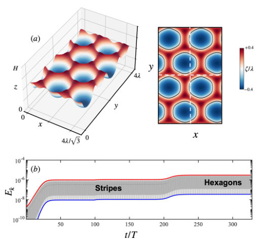 
FIG. 2. (a) Instantaneous realisation of a hexagonal pattern in Faraday waves in a cuboidal computational box of dimension 4𝜆𝑐/ √

📷 Fig 3

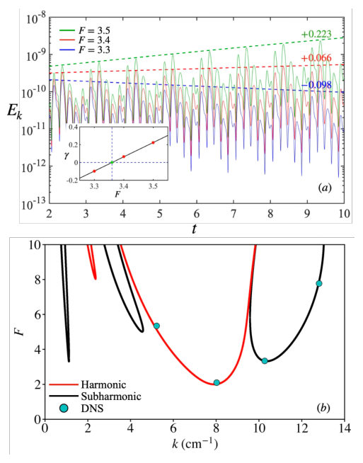 
FIG. 3. Validation by comparison with configuration in Besson et al. [18]. The physical parameters are 𝜌𝑙= 950 kg/m3, 𝜇𝑙= 0.02 Pa.s, and 𝜎= 20.6×10−3 N/m. Forcing parameters are 𝜔/2𝜋= 11Hz, (𝑘, 𝑙) = (4, 5), and 𝜒= 45◦. (a) Kinetic energy evolution for 𝐹= 3.3, 3.4, and 3.5, with the envelope shown as a dashed line. The growth rates for the three values of 𝐹are plotted in the inset and a linear interpolation is shown to describe the method of obtaining the threshold acceleration. (b) The DNS results for the thresholds (dots) are compared to the boundaries of the harmonic and subharmonic instability tongues obtained by the linear stability analysis of [18]. The thresholds for the two tongues...

📷 Fig 4

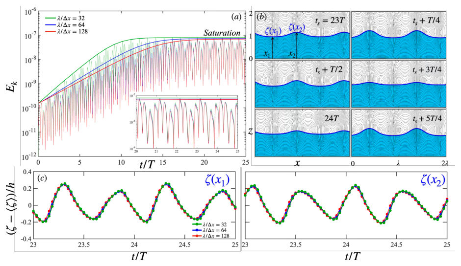 
FIG. 4. Grid independence test in the nonlinear regime: (a) Kinetic energy envelope for 𝐹= 2.32 for 32, 64, and 128 grid points per wavelength. The inset is shown to magnify the evelope and the kinetic energy profile for 𝑡∈[20, 25]. Temporal evolution of the interface is shown in (b) for 𝜆/Δ𝑥= 64, where the blue and white shades represent the liquid and gas phases and is separated by the interface, highlighted as thick deep blue line. The domain is overlaid with velocity streamlines. The temporal evolution of the interface position, 𝜁at position 𝑥1 and 𝑥2 are shown in (c) for 𝜆/Δ𝑥= 32, 64, and 128.

📷 Fig 5

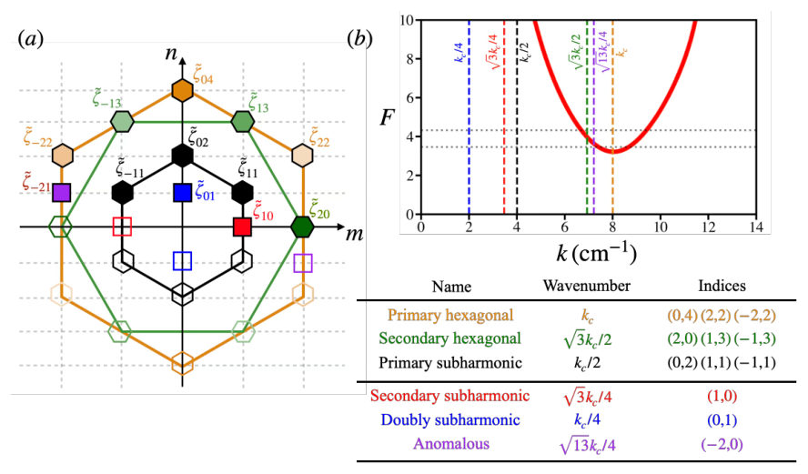 
FIG. 5. (a) The spatial Fourier space grid with relevant modes. The color coding of the markers will be used thoughout the manuscript. In addition to the primary hexagonal modes with critical wavenumber 𝑘𝑐shown in orange, two other hexagons with smaller wavenumbers (larger wavelengths) are present, the secondary hexagonal with 𝑘= √

**Summary.** This paper uses advanced numerical simulations to study the complex formation of a superlattice pattern (SSS-I) in Faraday waves driven by two frequencies. The authors demonstrate that this pattern is highly robust, converging reliably even from different starting conditions. The work highlights the necessity of solving the full Navier-Stokes equations because simpler theoretical approximations fail in this highly nonlinear regime.

**Why it may be interesting.** While focused on fluid dynamics, the study of pattern formation, stability transitions, and the role of multiple interacting modes (like the subharmonic mode) shares mathematical parallels with pattern formation in nonlinear wave systems relevant to AMO physics or open quantum systems.

Detailed structure

**Main problem.** The study investigates the formation and dynamics of a superlattice Faraday-wave pattern (SSS-I) driven by two distinct frequencies.

**Main result.** The SSS-I superlattice pattern is robustly formed, converging from different initial conditions, and can transition into a dynamic, drifting version while maintaining its basic structure.

**Method.** The research employs Direct Numerical Simulations (DNS) solving the full three-dimensional Navier-Stokes equations, supplemented by theoretical analysis of mode interactions and symmetry conditions.

**Model / system.** The physical system is a fluid layer subjected to two-frequency vertical oscillation (Faraday waves). The dynamics are modeled using the full 3D Navier-Stokes equations for a free surface interface.

**Key observables.** The superlattice pattern itself (patches connected by a 'backbone'), its spatial Fourier decomposition (hexagonal and subharmonic modes), and the temporal evolution of mode amplitudes.

**Important parameters / regimes.** Two-frequency forcing parameters ($\mathbf{F}$), forcing amplitude relative to onset ($25\%$ above), and simulation time (requiring $\sim 250$ forcing periods for convergence).

**Assumptions / limitations.** The simulations are performed in regimes where weak nonlinearity or viscosity approximations fail, necessitating the use of the full Navier-Stokes equations.

**Figures summary.** Figures illustrate the experimental SSS-I pattern, its spatial Fourier spectrum showing hexagonal and subharmonic modes, and diagrams detailing the computational domain setup and mode evolution.

**Paper structure.** The paper progresses from establishing the physical model and the necessity of full DNS, through demonstrating the convergence to the stable SSS-I state from multiple initial conditions, and concluding with analyses of pattern stability and symmetry breaking via mode analysis.

Abstract

The formation of a superlattice pattern in two-frequency-driven Faraday waves discovered and named SSS-I by Arbell & Fineberg (1998, 2002) is investigated by means of Direct Numerical Simulations (DNS) of the full three-dimensional Navier--Stokes equations with a free surface. Two simulations with distinct quasi-hexagonal initial conditions run at a forcing amplitude $25\%$ above the Faraday-wave onset followed quite different routes, but both led eventually to the same superlattice pattern after around 250 forcing periods. This regime is inaccessible to the approximations of weak nonlinearity or viscosity. The standing-wave pattern contain rows of patches, alternating in time between hills and lakes that are connected by a long skeleton resembing the backbone of DNA strands. The patches and skeleton of the pattern can be related to its spatial Fourier decomposition, which combines hexagonal modes with a spatially and temporally subharmonic mode. One of the transition routes passes through several fairly long-lived transients including different hexagonal patterns and another superlattice pattern; the other passes only through erratic and disordered states. After another 100 periods, the pattern became unstable and was succeeded by a dynamic version of SSS-I in which the superlattice is modulated and drifts in the direction of the backbone, while preserving its basic shape. Convergence to SSS-I states both experimentally in a large geometry and numerically from two different initial conditions and in a minimal geometry demonstrates the robustness of the SSS-I pattern.

[↑ back to top](#top)

### [Probing spin order via magnon transmission across quantum Hall ferromagnet heterojunctions](http://arxiv.org/abs/2608.29015v1)

**Authors:** Seung Hwan Lee, Shaowen Chen, Andrew T. Pierce, Patrick R. Forrester, Kenji Watanabe, Takashi Taniguchi, Amir Yacoby  
**Type:** experiment · **Category:** other · **PDF:** <https://arxiv.org/pdf/2608.29015v1>  
**Analysis basis:** full PDF text, analyzed in chunks
**Topic relevance:** `analog quantum simulation` **2/5** · `quantum measurements` **2/5** · `Keldysh / 2PI / non-Gaussian methods` **1/5**

📷 Fig 1

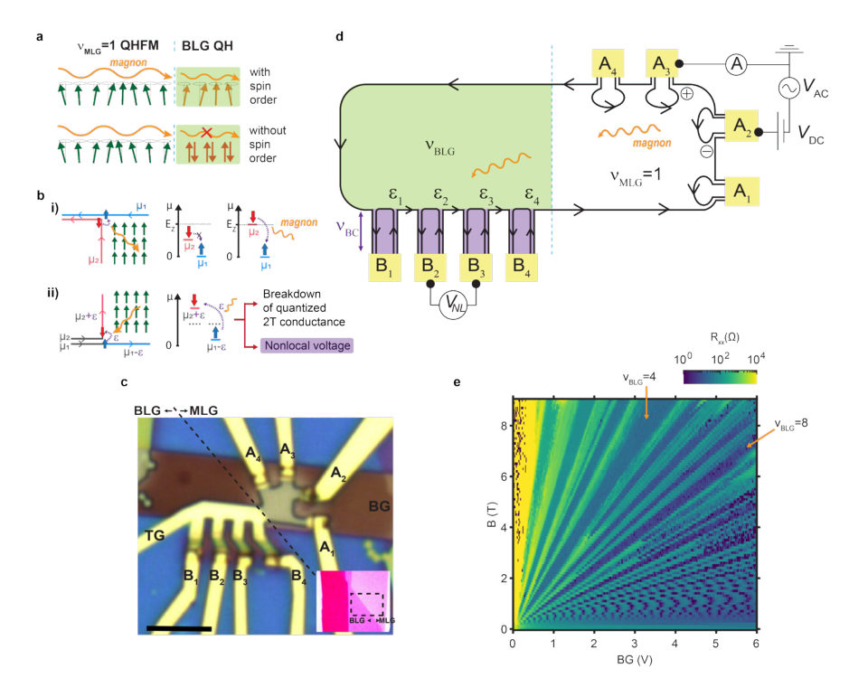 
Fig. 1 | Device schematics and characterization. a, Illustration of magnon transmission across

📷 Fig 2

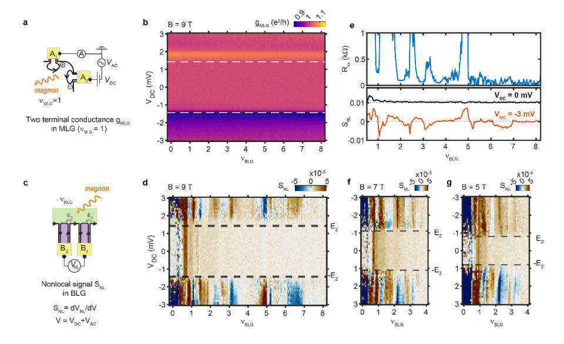 
Fig. 2 | Electrical detection of magnon transmission across MLG/BLG heterojunction. a,

📷 Fig 3

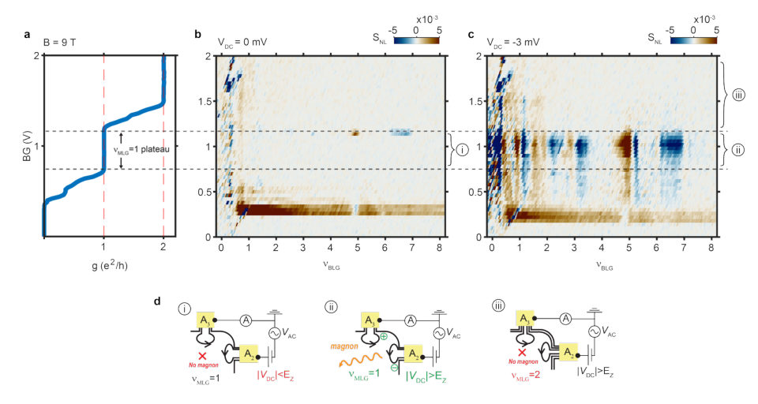 
Fig. 3 | Switching on/off magnon transmission signal with MLG density. a, gMLG (contacts

📷 Fig 4

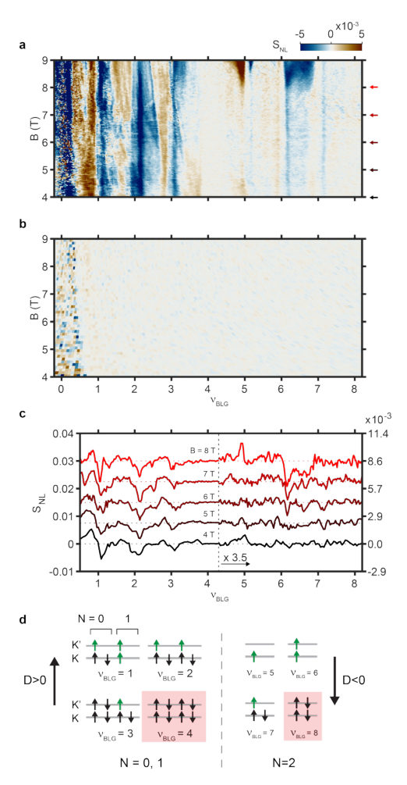 
Fig. 4 | Magnetic field dependence of magnon transmission in BLG quantum Hall states. a-

**Summary.** The authors report the first demonstration of magnon transmission across a quantum Hall ferromagnet heterojunction using MLG/BLG graphene. By generating magnons in the MLG source and detecting them nonlocally in the BLG target, they establish a powerful, all-electrical technique. This method successfully maps the magnetic order of the BLG quantum Hall states by observing characteristic signal features dependent on spin polarization.

**Why it may be interesting.** This work provides a novel, purely electrical spectroscopic tool to probe magnetic excitations (magnons) in correlated 2D electron systems, which is highly relevant for understanding emergent quantum phases in condensed matter.

Detailed structure

**Main problem.** The challenge is to probe magnetic order in two-dimensional materials with dilute spin densities, where conventional magnetic probes are ineffective.

**Main result.** The study successfully demonstrates that magnon transmission across a graphene heterojunction (MLG/BLG) serves as a powerful, all-electrical method to map out the magnetic phase diagram of the target material.

**Method.** Nonlocal voltage measurements ($	ext{SNL}$) are used to detect magnons generated in a source material (MLG) and transmitted into a target material (BLG) across a heterojunction.

**Model / system.** The experiment utilizes a heterojunction between monolayer graphene (MLG) and bilayer graphene (BLG) operating in the Quantum Hall Ferromagnet (QHFM) regime. The mechanism relies on generating magnons via bias voltage exceeding the Zeeman energy in the source material.

**Key observables.** Nonlocal voltage signal ($	ext{SNL}$), two-terminal conductance ($g_{MLG}$), and the sharp onset of $	ext{SNL}$ at the Zeeman energy ($E_Z$).

**Important parameters / regimes.** Landau level filling factors ($
u_{MLG}, 
u_{BLG}$), perpendicular magnetic field ($B$), and applied DC bias voltage ($V_{DC}$).

**Assumptions / limitations.** The nonlocal signal is assumed to originate purely from magnon transmission, as charge leakage contributions are ruled out by analysis.

**Figures summary.** Figures illustrate the sharp onset of $	ext{SNL}$ at $E_Z$, the dependence of $	ext{SNL}$ on the filling factor $
u_{BLG}$ (showing suppression at $
u=4, 8$), and the confirmation that the signal requires magnon generation in the source material.

**Paper structure.** The paper establishes the physical necessity of the technique, details the measurement setup using MLG/BLG heterojunctions, demonstrates the magnon generation threshold via conductance measurements, and finally maps the magnetic order of the BLG state by observing the characteristic $	ext{SNL}$ features as a function of $
u_{BLG}$.

Abstract

Two-dimensional material platforms now host a remarkable array of exotic correlated phases, from unconventional superconductivity to fractional Chern insulators. Probing magnetic order in these systems is essential for understanding their underlying physics, yet dilute spin densities render conventional magnetic probes ineffective. Spin waves, or magnons, in quantum Hall ferromagnets (QHFM) have proven effective for probing the magnetic order in various symmetry-broken quantum Hall (QH) phases in graphene systems, but previous works have been limited to homojunction configurations within a single material. Here, we demonstrate magnon transmission across a monolayer-bilayer graphene quantum Hall ferromagnet heterojunction - the first magnon transmission across quantum Hall ferromagnet heterojunctions, using one material as a magnon source to probe magnetic order in a distinct material. Generating magnons in monolayer graphene (MLG) at $ν$ = 1, we detect their transmission through bilayer graphene (BLG) via nonlocal voltage measurements, revealing spin order in BLG symmetry-broken quantum Hall states. The transmission exhibits hallmark magnon signatures: a sharp onset at the Zeeman energy and systematic variation with Landau level filling, including suppression at $ν$ = 4 and 8 where spin polarization vanishes. Our findings establish heterojunction magnon transmission as a powerful, modular probe of magnetic order, opening new avenues for investigating exotic quantum states across the rapidly expanding family of two-dimensional materials.

[↑ back to top](#top)

### [Singlet-doublet transitions and Josephson currents in a superconducting ring with a quantum dot](http://arxiv.org/abs/2608.30306v1)

**Authors:** Guo-Hui Ding, Fei Ye, Bing Dong  
**Type:** theory · **Category:** other · **PDF:** <https://arxiv.org/pdf/2608.30306v1>  
**Analysis basis:** full PDF text, analyzed in chunks
**Topic relevance:** `Keldysh / 2PI / non-Gaussian methods` **2/5** · `methods for driven-dissipative` **2/5** · `analog quantum simulation` **1/5**

📷 Fig 1

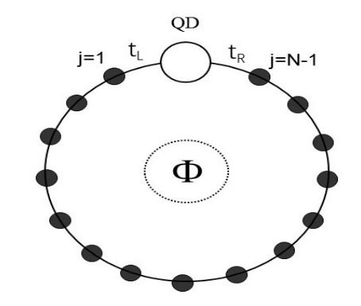 
FIG. 1. The schematic diagram of the superconducting ring- quantum dot system enclosing a magnetic flux Φ.

📷 Fig 2

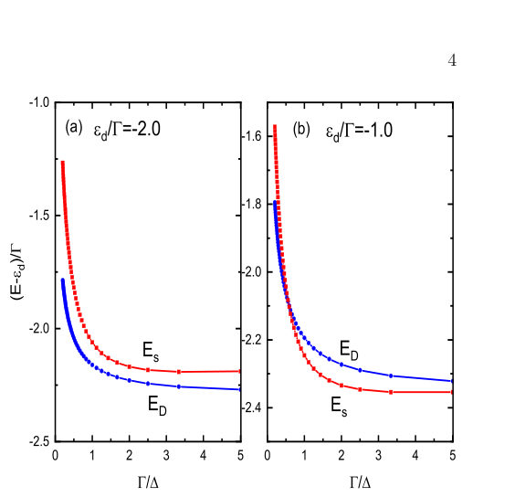 
FIG. 3. The energies ES and ED of the singlet and the dou- blet, respectively, vs. the superconducting gap ∆.

📷 Fig 3

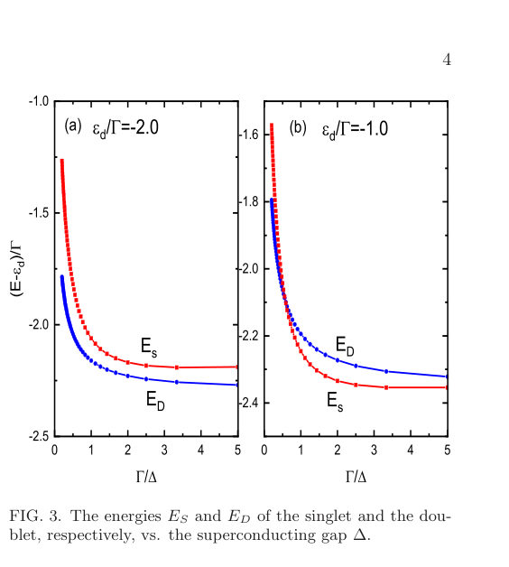 
Figure 4 at different values of the dot level ǫd. One can see that when ǫd/Γ = −1.0, the doublet is the ground state for all φext, while for ǫd/Γ = −0.4, the ground state is always the singlet state. The ground state en- ergy function E(φext) exhibits a periodic structure with the period being π instead of 2π, which can be attributed to the fact that the carriers in the superconducting ring are Cooper’s pairs with charge 2e. This π periodic struc- ture is different from that for the system of a normal metallic ring embedded with a QD, in which the ground state energy and the persistent current have a period 2π with respect to the phase φext.[28] , and is also dif- ferent from the ground state...

📷 Fig 4

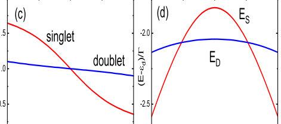 
FIG. 2. The characteristic properties of the singlet and the doublet vs. the energy level of the dot. (a) the probabilities of the dot level in the empty, single occupation, double oc- cupation states for the singlet state. (b) That of the doublet state. (c) The total occupation number of electrons on the dot level. (d) The lowest energy of the singlet and the dou- blet vs. the dot level. In our calculations (except in Figure 3), we always take the superconducting gap ∆= 2.0Γ and the order parameter phase factor φs = 0.

📷 Fig 5

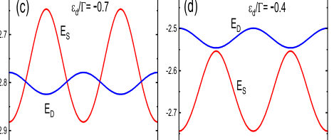 
FIG. 4. The energies ES and ED of the singlet and the dou- blet, respectively, vs. the enclosed magnetic flux Φ of the ring (with φext = 2πΦ/Φ0).

**Summary.** This theoretical work analyzes a superconducting ring coupled to a quantum dot, determining the system's ground state by comparing singlet and doublet energy configurations. The study reveals that the ground state undergoes a phase transition between singlet and doublet phases as the dot level is tuned. This transition is experimentally observable through abrupt jumps in the supercurrent as a function of magnetic flux.

**Why it may be interesting.** The interplay between superconducting proximity effects, localized impurity states (QD), and magnetic flux is central to mesoscopic physics, making this highly relevant for understanding superconducting quantum devices.

Detailed structure

**Main problem.** The study investigates the ground state properties and supercurrent behavior in a superconducting ring containing a quantum dot, focusing on the singlet-doublet transitions.

**Main result.** The ground state switches between singlet and doublet phases depending on the quantum dot level ($\epsilon_d$), and the supercurrent exhibits abrupt jumps at these phase transition points.

**Method.** A variational wave-function approach is employed to treat the finite-U Anderson impurity coupled to the superconducting ring, minimizing the energy functional.

**Model / system.** The system consists of a superconducting ring (modeled by $H_{BCS}$) coupled to a quantum dot (QD, modeled by $H_{DOT}$) via a tunneling Hamiltonian ($H_T$). The Hamiltonian is analyzed using Bogoliubov transformations.

**Key observables.** Ground state energies ($E_S, E_D$), Josephson current ($I_J$), and QD occupation probabilities ($p_0, p_1, p_2$).

**Important parameters / regimes.** QD energy level ($\epsilon_d$), superconducting gap ($\Delta$), and external magnetic flux ($\Phi$ or $\phi_{ext}$).

**Assumptions / limitations.** The analysis relies on a variational wave-function approach for the coupled system.

**Figures summary.** Figures illustrate the dependence of $E_S$ and $E_D$ on $\epsilon_d$ and $\Delta$, and show the characteristic $\pi$-periodic structure and kinks in the energy $E(\phi_{ext})$ as a function of magnetic flux.

**Paper structure.** The paper first formulates the Hamiltonian, then uses variational methods to find the ground state energies for singlet and doublet configurations. It analyzes the transitions by tuning $\epsilon_d$ and $\Delta$, and finally examines the resulting supercurrent's dependence on the external magnetic flux.

Abstract

We investigate the ground state properties of a superconducting ring embedded with a quantum dot (QD) by using a variational wave-function approach. A theoretical formulation for the treatment of the finite-U Anderson impurity coupled with a superconducting ring are presented. We demonstrate singlet-doublet transitions of the ground state for this system with the QD in the mixed valence regime. It is shown that the supercurrent in the superconductor ring shows oscillations with the external enclosed magnetic flux and exhibits abrupt jumps at the singlet-doublet phase transition points.

[↑ back to top](#top)

### [Quantitative Disentanglement of Terahertz Spin and Orbital Pumping in 3d Ferromagnetic Heterostructures](http://arxiv.org/abs/2608.29165v1)

**Authors:** Tongyang Guan, Jiahao Liu, Yuxiao Mo, Liangliang Zhu, Yizheng Wu, Zhensheng Tao  
**Type:** both · **Category:** other · **PDF:** <https://arxiv.org/pdf/2608.29165v1>  
**Analysis basis:** full PDF text, analyzed in chunks
**Topic relevance:** `Keldysh / 2PI / non-Gaussian methods` **2/5** · `methods for driven-dissipative` **1/5** · `quantum measurements` **1/5**

📷 Fig 1

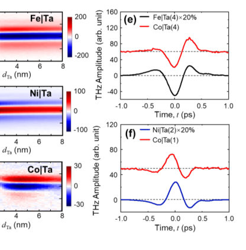 
Figure1. Experimental scheme and terahertz emission from the FM|Ta

📷 Fig 2

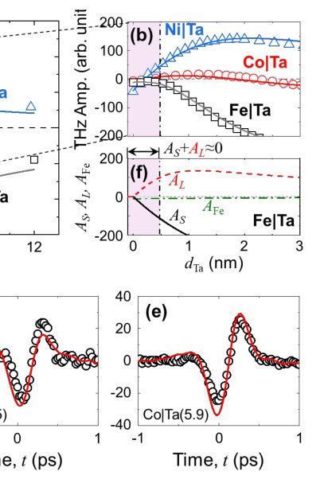 
Figure2. MC-TEM decomposition of terahertz signals from the FM|Ta

📷 Fig 3

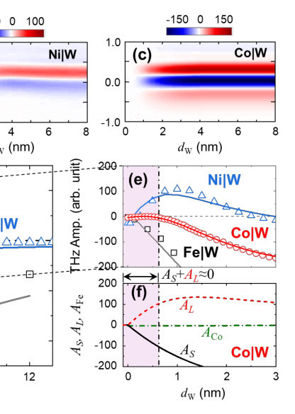 
Figure3. Terahertz emission from the FM|W heterostructures. a.-c. Two-

📷 Fig 4

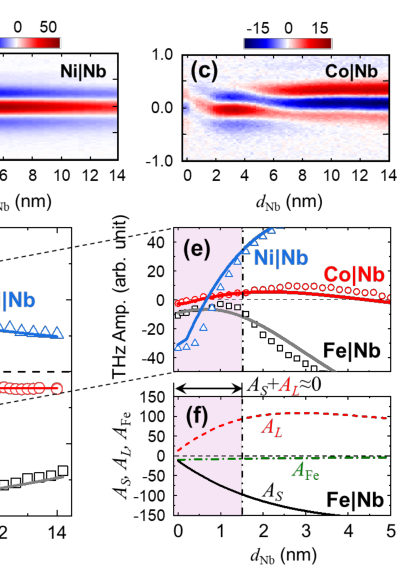 
Figure4. Terahertz emission from FM|Nb heterostructures. a.-c. Two-dimensional

**Summary.** This work quantitatively disentangles spin and orbital pumping contributions in magnetic heterostructures using ultrafast Terahertz Emission Spectroscopy (STES) combined with thickness control. By exploiting opposite THz polarities from spin and orbital currents, the authors demonstrate that orbital pumping is significantly enhanced, particularly towards Ni, exceeding current theoretical predictions. This establishes a robust, quantitative framework for studying coupled angular momentum transport in spintronic materials.

**Why it may be interesting.** While focused on condensed matter spintronics, the precise measurement and separation of coupled angular momentum channels (spin vs. orbital) using ultrafast spectroscopy techniques are highly relevant to understanding non-equilibrium quantum dynamics in solid-state systems.

Detailed structure

**Main problem.** The primary challenge is quantitatively separating the simultaneously generated and additively contributing spin and orbital angular momentum currents during ultrafast pumping in magnetic heterostructures.

**Main result.** The orbital pumping contribution increases significantly from Fe to Ni, reaching levels much higher than theoretical predictions, establishing a quantitative framework for ultrafast spin and orbital pumping.

**Method.** The authors combine Spintronic Terahertz Emission Spectroscopy (STES) with wedge-sample thickness control to exploit distinct emission polarities and thickness dependencies for quantitative decomposition.

**Model / system.** The study investigates FM/NM heterostructures (Fe, Co, Ni on Ta, W, Nb) using the Multi-component terahertz-emission model (MC-TEM) to analyze THz emission arising from spin-to-charge (ISHE) and orbital-to-charge (IOHE) conversions.

**Key observables.** THz emission polarity and amplitude as a function of nonmagnetic layer thickness ($d_{NM}$); extracted orbital ($\lambda_L$) vs. spin ($\lambda_S$) diffusion lengths; orbital-to-spin amplitude ratios ($	ilde{A}_L/	ilde{A}_S$).

**Important parameters / regimes.** The relative strength of orbital pumping compared to spin pumping, which increases systematically from Fe to Ni; the thickness dependence of the THz signal, revealing threshold-like behaviors.

**Assumptions / limitations.** The analysis assumes that the THz emission can be modeled as a coherent sum of bare-FM, ISHE-induced, and IOHE-induced contributions, and that the secondary orbital-to-spin conversion mechanism is not the dominant factor.

**Figures summary.** Figures illustrate the THz emission and its decomposition (AS, AL, AFe contributions) across different FM/NM interfaces (e.g., Fe|Ta, Co|Ta, Ni|Ta) as a function of NM thickness, showing polarity reversals and thickness thresholds.

**Paper structure.** The paper systematically presents the experimental setup and diagnostic strategy (using opposite-signed Hall angles and thickness control) to decompose the total THz signal into its spin and orbital components, followed by quantitative analysis of the resulting pumping efficiencies and diffusion lengths.

Abstract

Spin and orbital pumping - the injection of spin and orbital angular momentum from a driven ferromagnet into an adjacent nonmagnetic layer - are fundamental processes underlying angular-momentum generation and transport in magnetic heterostructures. Femtosecond optical excitation extends these phenomena into the ultrafast regime, where spintronic terahertz emission spectroscopy (STES) detects picosecond angular-momentum currents in a contact-free manner through spin-to-charge and orbital-to-charge conversion. Microscopic theory predicts that orbital-pumping efficiency increases from Fe to Ni across the 3d series, yet whether these predictions hold under ultrafast excitation remains unclear. A central challenge is that spin and orbital currents are generated simultaneously and contribute additively to the same terahertz emission, preventing their quantitative separation. Here, we overcome this limitation by combining STES with wedge-sample thickness control in heterostructures whose nonmagnetic layers (Ta, W, and Nb) have spin Hall and orbital Hall angles of opposite signs. The two angular-momentum channels therefore exhibit distinct emission polarities and thickness dependences, enabling their quantitative decomposition. Systematic measurements on Fe, Co, and Ni heterostructures reveal that the orbital-pumping contribution increases progressively toward Ni, reaching several tens of percent of the spin-current contribution - far exceeding theoretical predictions. Even Fe generates a non-negligible orbital current that becomes essential in the thin-nonmagnetic-layer regime. The extracted orbital diffusion lengths are consistently shorter than spin diffusion lengths and increase with decreasing spin-orbit coupling strength of the nonmagnetic layer. These results establish a quantitative framework for ultrafast spin and orbital pumping in magnetic heterostructures.

[↑ back to top](#top)

### [Domain walls with alternating magnetic order in a model with dipolar coupling](http://arxiv.org/abs/2608.28831v1)

**Authors:** G. M. Wysin  
**Type:** theory · **Category:** other · **PDF:** <https://arxiv.org/pdf/2608.28831v1>  
**Analysis basis:** full PDF text, analyzed in chunks
**Topic relevance:** `Frenkel-Kontorova` **2/5** · `analog quantum simulation` **1/5**

📷 Fig 1

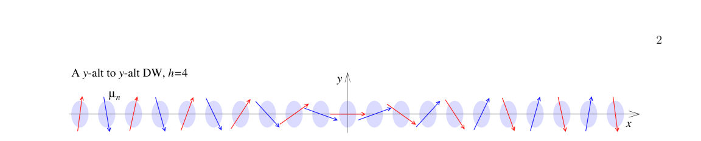 
FIG. 1: A static y-alt2 DW centered in a system of 21 islands, with a half-width h = 4 in lattice constants, embedded between the two possible y-alt states. The red/blue arrows represent the island dipoles on odd/even sublattices, respectively. The sublattices rotate through a 90◦angle in opposite senses, while remaining in the xy-plane, as one scans along the chain. At the center, the dipoles can point towards +x (as shown) or towards −x by reversing the rotation senses on both sublattices.

📷 Fig 2

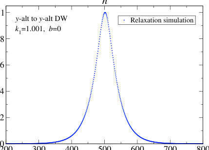 
FIG. 2: A y-alt to y-alt DW in the NN model from numerical relaxation simulations at k1 = 1.001, b = 0. (a) The in- plane angles, identified by odd/even sublattices. (b) The x- components of the macrospins. The view is zoomed in on the N = 1000 system. The half-width h = 37a was estimated from the tangent line in φn=odd at the DW center. For k1 farther above unity, the DW width is narrower.

📷 Fig 3

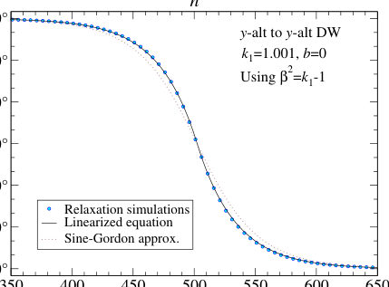 
FIG. 3: (a) For k1 = 1.001, N = 1000, alternating order pa- rameter φalt for a y-alt2 DW from the numerical simulations (blue circles) is used to estimate inverse half-width β from the negative slope of the log-linear plot, based on Eq. (42). Only every tenth site is plotted. The asymptotic function is the black straight line drawn only to the right side of the DW cen- ter. The slope came from the DW center point, φalt(502.4) = 0, and the far-field point, φalt(934)+90 = 9.0×10−5. Theory Eq. (37) gives β = √

📷 Fig 4

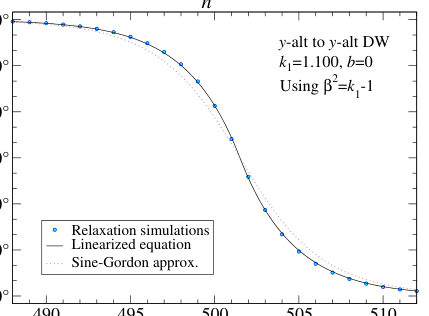 
FIG. 4: (a) For k1 = 1.100, b = 0, N = 1000, alternating order φalt(x) in a y-alt2 DW from the numerical simulations (blue circles) is used to estimate β from the negative slope of the log-linear plot, based on Eq. (42). The asymptotic function is the black straight line drawn only to the right side of the DW center. The slope came from the DW center point, φalt(501.5) = 0, and the far-field point, φalt(545.3) + 90 = 9.0 × 10−5. Theory Eq. (37) gives β = √

📷 Fig 5

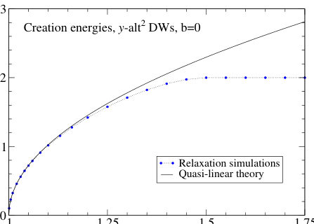 
FIG. 5: The y-alt2 DW creation energy vs. anisotropy k1 from simulations (circles) compared with the quasi-linear theory expression in Eq. (51) (solid black curve), at zero applied field. For k1 ≥1.5, the DW acquires a minimum width w = 3a and a fixed energy E∗= 2D, as well as a shape independent of k1. For k1 &lt; 1.25 the continuum theory works extremely well because the DW width w = 2/√k1 −1 contains many sites.

**Summary.** This theoretical work investigates domain walls in a 1D chain of magnetic islands governed by dipolar interactions and anisotropy. By developing continuum theories from discrete lattice models, the authors characterize the structure of these alternating domain walls. The findings detail the magnetic moment properties and provide the governing dynamic equations for the system's evolution.

**Why it may be interesting.** The detailed derivation of continuum equations from discrete lattice models, especially involving complex angular dynamics and topological considerations (like the dependence of the transverse moment on chain length parity), is highly relevant for understanding emergent collective excitations in magnetic materials.

Detailed structure

**Main problem.** The paper analyzes the properties of static domain walls (DWs) exhibiting site-by-site alternating magnetic order in a 1D chain of magnetic islands subjected to dipolar coupling.

**Main result.** The authors derived continuum equations describing the dynamics of these domain walls, showing that the structure leads to a large longitudinal magnetic moment and that the DW width grows indefinitely as the anisotropy constant approaches the dipolar coupling constant.

**Method.** The study combines numerical relaxation simulations to find static solutions with the development of continuum theories by applying Taylor expansions to the discrete equations of motion.

**Model / system.** The system is a 1D chain of elongated magnetic islands modeled by macrospins ($\mu_n$) with fixed length $\mu$. The Hamiltonian includes nearest-neighbor dipolar interactions, uniaxial anisotropy ($K_1$), easy-plane anisotropy ($K_3$), and an applied transverse magnetic field ($\mathbf{B}$).

**Key observables.** Domain wall width, longitudinal and transverse magnetic moments, and the time evolution of the magnetic angles ($\Phi, \Theta, \phi, \vartheta$).

**Important parameters / regimes.** The ratio of anisotropy to dipolar coupling ($k_1 = K_1/D$), the applied field strength ($b = \mu B/D$), and the lattice spacing ($a$).

**Assumptions / limitations.** The analysis heavily relies on the 'opposing rotations assumption' when mapping discrete lattice dynamics to the continuum limit, and approximations are made up to quadratic order in small angles.

**Figures summary.** Figure 2 illustrates a y-alt to y-alt domain wall in the NN model, showing the in-plane angles and x-components of the macrospins.

**Paper structure.** The paper progresses from defining the physical model and Hamiltonian, to using numerical simulations to identify the DW structure, and finally deriving the continuum equations of motion for the magnetic angles using Hamiltonian and expansion methods.

Abstract

A model for a one-dimensional chain of elongated nano-scale magnetic islands with dipole interactions is analyzed here for the properties of its static domain walls with site-by-site alternating order. The anisotropic magnetic islands on a nonmagnetic substrate have their longer axes oriented transverse ($y$-direction) to the chain direction ($x$-direction), in a transverse applied magnetic field. The islands' magnetic dipoles $\vecμ_n$ are represented as macrospins of fixed length $μ$. The nearest-neighbor (NN) dipole interactions drive transverse alternating order, allowing for doubly-degenerate, uniform, static, $y$-alternating states, where the dipoles alternately point transverse to the chain direction, as in $\vecμ_n = \pm(-1)^n μ\hat{y}$. Assuming only NN interactions, the domain walls connecting these two alternating states are found with numerical relaxation simulations and analyzed in a two-sublattice continuum theory. As the uniaxial anisotropy constant $K_1$ descends from larger values until it closely approaches the NN dipolar coupling constant $D$, the domain wall width grows indefinitely, and the large-$x$ continuum solutions closely approach the lattice numerical solutions. The applied field produces a very slight canting of the dipoles towards the field, maximum in the center of the domain wall. The dipoles on the two sublattices are found to rotate in {\em opposite senses} as one scans along the lattice, resulting in a large longitudinal magnetic moment of the domain wall. A much smaller transverse magnetic moment has a topological contribution that depends on whether the chain length is odd or even.

[↑ back to top](#top)

### [Interfacial Spin-to-Charge Conversion in Sputtered MoTe2 Heterostructures Probed by Spin Pumping and Spin-Torque Ferromagnetic Resonance](http://arxiv.org/abs/2608.30953v1)

**Authors:** J. L. Costa, E. Santos, E. L. T. França, J. B. S. Mendes, A. Azevedo  
**Type:** experiment · **Category:** other · **PDF:** <https://arxiv.org/pdf/2608.30953v1>  
**Analysis basis:** full PDF text, analyzed in chunks
**Topic relevance:** `quantum measurements` **2/5** · `Keldysh / 2PI / non-Gaussian methods` **1/5**

📷 Fig 1

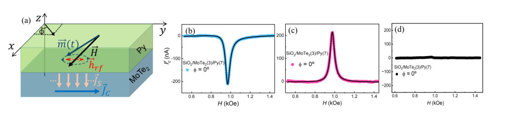 
Figure 1. (a) Schematic illustration of the SP-FMR experimental geometry, showing the heterostructure stack and the detected signal. (b - d) Measured SP-FMR signal as a function of the in-plane applied magnetic field for the azimuthal angles 𝜙= 0°, 𝜙= 180° and 𝜙= 90°, defined as the angle between the magnetic field and the current direction. The solid lines correspond to the best fits to the data using Eq. (2). The fits yield IS = -216.8 nA (𝜙= 0°), IS = 213.9 nA (𝜙= 180°), confirming the spin-pumping origin, while IA =- 46.1 nA and IA =10.7 nA, respectively. At 𝜙= 90° , the symmetric signal vanishes as expected. All measurements were performed at an applied RF power of 110 mW.

📷 Fig 2

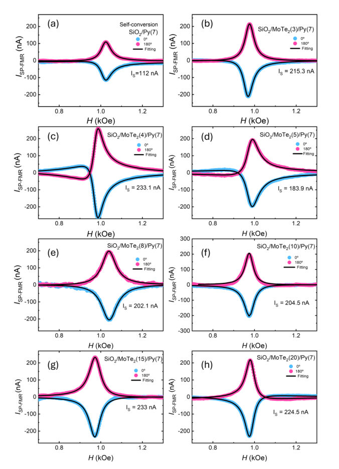 
Figure 2. SP-FMR spectra measured for the reference SiO2/Py(7) film (a) and SiO2/MoTe2(𝑡𝑀𝑜𝑇𝑒2)/Py(7) bilayers with 𝑡𝑀𝑜𝑇𝑒2= 3 (b), 3 (c), 5 (d), 8 (e), 10 (f), 15 (g) and 20 nm (h). The blue and pink symbols correspond to measurements with 𝜙= 0° and 𝜙= 180°, respectively. The solid black curves are fits to Eq. 2. The measurements were carried out at an rf frequency of 9.4 GHz and an rf power of 110 mW.

📷 Fig 3

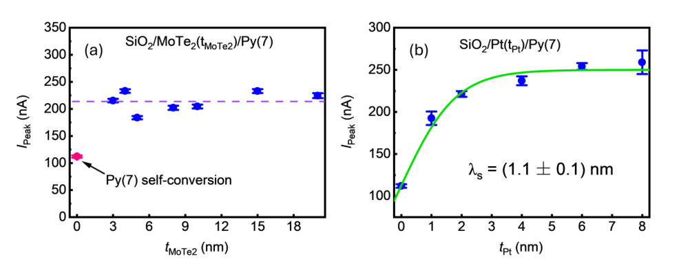 
Figure 3. Dependence of the SP-FMR peak current (𝐼𝑃𝑒𝑎𝑘) on the thickness of the spin-to-charge conversion layer. (a) SiO2/MoTe2(tMoTe2)/Py(7) heterostructures exhibit an approximately thickness-independent response, consistent with an interface- dominated spin-to-charge conversion process. The dashed horizontal line indicates the average 𝐼𝑃𝑒𝑎𝑘, and the red symbol at tMoTe2=0 represents the self-conversion signal Py(7) reference film. (b) SiO2/Pt (tPt)/Py(7) heterostructures display the characteristic thickness dependence expected for a bulk spin-diffusion process. The solid line is a fit to 𝐼𝑃𝑒𝑎𝑘∝𝑡𝑎𝑛ℎ(𝑡𝑃𝑡2𝜆𝑆 ⁄ ), yielding a spin diffusion length of 𝜆𝑆= (1.1 ± 0.1) nm.

📷 Fig 4

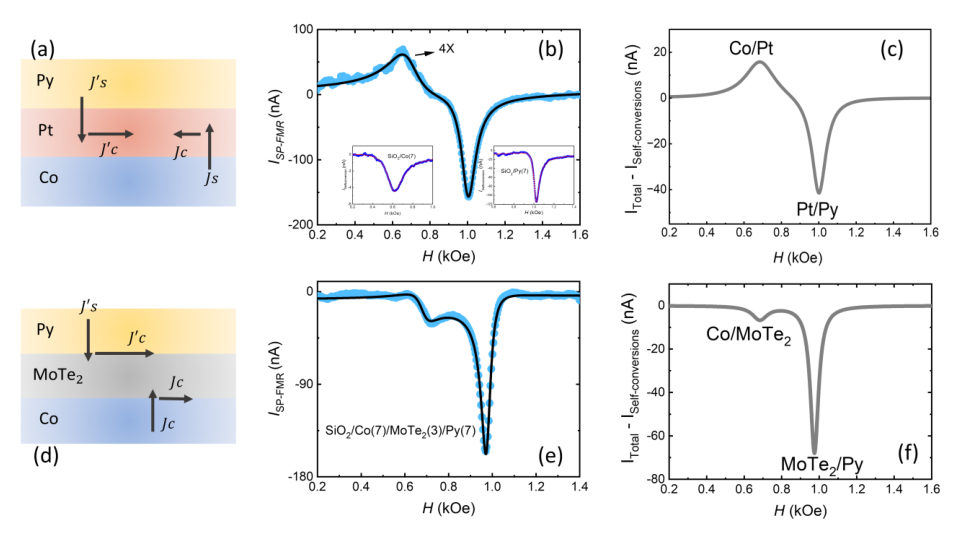 
Figure 4. (a, d) Schematic illustration of the SiO2/Co(7)/MoTe2(3)/Py(7) and SiO2/Co(7)/Pt(10)/Py(7) heterostructures, respectively, indicating the directions of charge current generated by the (a) ISHE and (d) ISREE. (b, e) SP-FMR spectra of the corresponding trilayers. The insets show the self-conversion signals measured independently in the Co(7) and Py(7) reference samples. (c, f) Spin-to- charge conversion signals obtained after subtracting the Co and Py self-conversion contributions from the total SP-FMR spectra in (b) and (e), respectively, thereby isolating the contributions from Pt and MoTe2. All measurements were performed with an rf power of 110 mW.

📷 Fig 5

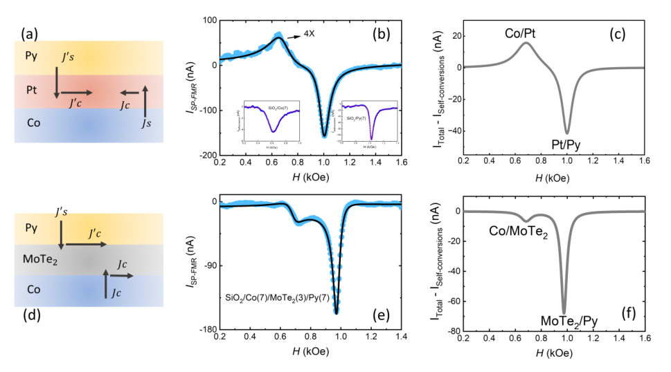 
Fig. 5 shows a schematic representation of the ST-FMR experimental setup and the measured signals. As

**Summary.** This work investigates spin-to-charge conversion in $	ext{MoTe}_2$ heterostructures using SP-FMR and ST-FMR. By analyzing the thickness dependence of the measured signals, the authors conclude that the conversion is dominated by the interfacial Rashba-Edelstein effect rather than bulk spin transport. This highlights the potential of these TMD/ferromagnet interfaces for next-generation low-power spintronic devices.

**Why it may be interesting.** While focused on condensed matter spintronics, the use of advanced resonance techniques (FMR) to probe interfacial electronic properties and spin-orbit coupling mechanisms is relevant to understanding boundary conditions in quantum transport models.

Detailed structure

**Main problem.** The study aims to determine whether the efficient spin-to-charge conversion observed in $	ext{MoTe}_2$ heterostructures originates predominantly from the bulk material or the interface.

**Main result.** The spin-to-charge conversion efficiency is found to be largely independent of the $	ext{MoTe}_2$ thickness, strongly indicating that the conversion mechanism is governed by the Rashba-Edelstein effect at the $	ext{Py}/	ext{MoTe}_2$ interface.

**Method.** The research employs advanced spintronic measurements, specifically Spin Pumping Ferromagnetic Resonance (SP-FMR) and Spin-Torque Ferromagnetic Resonance (ST-FMR).

**Model / system.** The physical system involves $	ext{MoTe}_2$ (a TMD) bilayers grown on a substrate and coupled with a Permalloy (Py) ferromagnet. The analysis utilizes theoretical models for spin-charge conversion, distinguishing between bulk (ISHE) and interface (ISREE) contributions.

**Key observables.** Spin-to-charge conversion efficiency ($I_C$), and the dependence of this efficiency on $	ext{MoTe}_2$ thickness ($t$) and applied magnetic field angle ($\phi$).

**Important parameters / regimes.** The thickness dependence of the conversion signal is a key diagnostic tool, contrasting the thickness-independent behavior in $	ext{MoTe}_2$ versus the thickness-dependent behavior in $	ext{Pt}$ reference samples.

**Assumptions / limitations.** The measured current is assumed to be dominated by the interfacial Rashba-Edelstein effect, and the analysis separates contributions from different physical mechanisms (e.g., bulk vs. interface).

**Figures summary.** Figures illustrate the SP-FMR signals measured as a function of the in-plane applied magnetic field for various $	ext{MoTe}_2$ thicknesses, showing Lorentzian fits and extracted amplitudes.

**Paper structure.** The paper systematically measures SP-FMR and ST-FMR signals across varying $	ext{MoTe}_2$ thicknesses, comparing the results against known bulk-dominated systems ($	ext{Pt}$) to isolate the interfacial contribution.

Abstract

Transition metal dichalcogenides (TMDs) and their Weyl semimetal phases, such as MoTe$_2$, have attracted significant attention for spin-orbit torque applications due to their efficient charge-to-spin conversion. However, whether this conversion originates predominantly from the bulk or the interface remains unclear. Here, we investigate spin-charge interconversion in MoTe$_2$ using spin-pumping and spin-torque ferromagnetic resonance (SP-FMR and ST-FMR). Thickness-dependent measurements reveal large spin-to-charge conversion and spin-torque efficiencies that are essentially independent of MoTe$_2$ thickness, indicating that the conversion is predominantly governed by the Rashba-Edelstein effect at the Py/MoTe$_2$ interface rather than by bulk spin transport. This behavior contrasts with the characteristic thickness dependence observed in Pt heterostructures and is further supported by bidirectional SP-FMR and interface-separation measurements. Our results highlight the dominant role of the Py/MoTe$_2$ interface in enabling efficient spin-charge conversion and spin-orbit torques in TMD-based spintronic devices. These findings highlight the potential of sputtered MoTe$_2$/Py heterostructures for low-power spintronic applications, including magnetic memory and logic devices.

[↑ back to top](#top)

### [Evanescent-mode Casimir-Josephson force and gate-controlled resonances in ballistic graphene Josephson junctions](http://arxiv.org/abs/2608.30438v1)

**Authors:** Shahrukh Salim  
**Type:** theory · **Category:** other · **PDF:** <https://arxiv.org/pdf/2608.30438v1>  
**Analysis basis:** full PDF text, analyzed in chunks
**Topic relevance:** `Keldysh / 2PI / non-Gaussian methods` **2/5**

📷 Fig 1

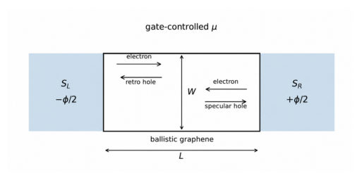 
FIG. 1. Geometry of the ballistic superconductor-graphene- superconductor (SGS) junction. A ballistic graphene strip of length L and width W is contacted by two heavily doped s-wave superconductors held at phases −ϕ/2 and +ϕ/2, and a gate tunes the graphene chemical potential µ. At each interface an incident electron is Andreev reflected as a hole: retro reflection (left) stays within the same Dirac band, whereas specular reflection (right) converts to the opposite band. The arrows indicate band character only; they are not semiclassical trajectories, which do not exist for the evanescent modes that dominate at charge neutrality.

📷 Fig 2

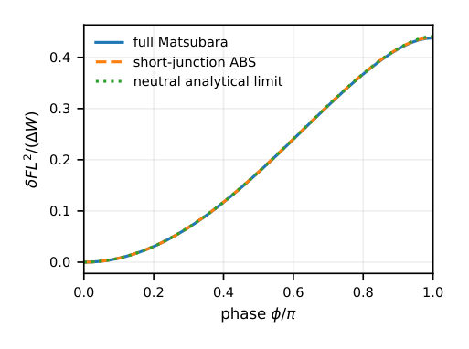 
FIG. 2. Validation at charge neutrality. Normalized force δF L2/(∆W) versus phase ϕ/π for L/ξ = 0.20, W/L = 20, and kBT/∆= 0.05. The full Matsubara determinant (solid), which includes both discrete Andreev bound states and contin- uum quasiparticles, agrees closely with the discrete-ABS sum (dashed) and with the zero-temperature analytical evanescent- mode law of Eq. (18) (dotted). The small residual difference between the full and frozen-scattering curves is the beyond- short-junction remainder. The agreement establishes that the leading neutral short-junction force is captured by the evanescent transmission spectrum, without requiring a sepa- rate bound/continuum force assignment.

📷 Fig 3

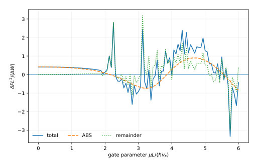 
FIG. 3. Gate dependence of the phase-dependent force correc- tion at L/ξ = 0.50, W/L = 20, ϕ = 0.9π, and kBT/∆= 0.05. Solid: full Matsubara force; dashed: frozen-scattering ABS benchmark; dotted: beyond-short-junction remainder. The remainder is not identified with a pure continuum force, and the sign shown is that of δF = F(ϕ) −F(0).

📷 Fig 4

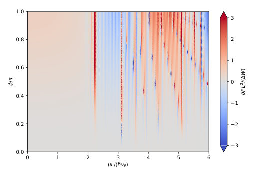 
FIG. 4. Phase-gate landscape of δFL2/(∆W) for L/ξ = 0.50 and W/L = 20. The uncluttered color map emphasizes the smooth neutral regime and the narrow gate-induced Fabry– Pérot structures at larger doping. Red and blue regions denote positive and negative values of the phase-dependent correction δF = F(ϕ) −F(0); the sign does not refer to the absolute force. The color scale is clipped at ±3 to retain contrast in the background while the sharpest resonances extend beyond this range.

📷 Fig 5

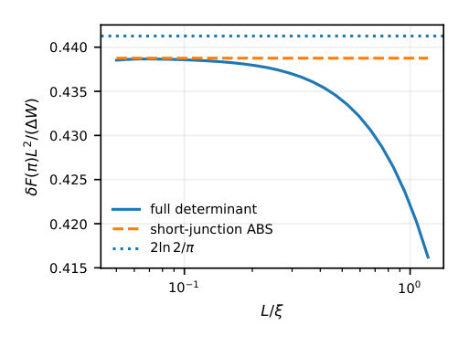 
FIG. 5. Neutral length scaling at ϕ = π, W/L = 20, and kBT/∆= 0.05. The full Matsubara result and frozen- scattering benchmark both approach 2 ln 2/π as L/ξ →0, establishing the leading ∆W/L2 evanescent-mode scale.

**Summary.** This work develops a detailed theoretical framework to calculate the mechanical force exerted on a graphene Josephson junction due to superconducting proximity effects. It reveals that the force is highly sensitive to both the superconducting phase and the gate-induced doping level. The results distinguish between the fundamental evanescent-mode force and complex, gate-controlled resonant structures arising from propagating electronic channels.

**Why it may be interesting.** The study of superconducting proximity effects in Dirac materials like graphene provides a clean platform to test fundamental concepts of Andreev bound states and superconducting coupling, which are relevant to superconducting quantum circuits and mesoscopic physics.

Detailed structure

**Main problem.** The paper develops a microscopic scattering theory to calculate the phase-dependent equilibrium mechanical force correction in ballistic superconductor-graphene-superconductor Josephson junctions.

**Main result.** The force exhibits distinct behaviors depending on the junction regime: an evanescent-mode law at charge neutrality, and large, oscillatory resonances when gate doping induces propagating channels.

**Method.** The calculation uses an energy-dependent Dirac scattering matrix embedded in a normalized Matsubara determinant to derive the free energy, from which the force is obtained via differentiation.

**Model / system.** The system is a ballistic graphene strip contacted by two s-wave superconductors, modeled using the Dirac-Bogoliubov-de Gennes equation. The force is derived from the phase-dependent grand potential.

**Key observables.** Phase-dependent force correction ($\delta F$), Josephson current ($I$), and the character of subgap poles (interband/specular vs. intraband/retro).

**Important parameters / regimes.** Phase difference ($\phi$), gate doping ($\mu$), junction length ($L$), and superconducting gap ($\Delta$). Key crossovers are controlled by $|\mu|/\Delta$ and $|\mu|L/(\hbar v_F)$.

**Assumptions / limitations.** The theory uses the full Matsubara determinant, which is superior to the frozen-scattering short-junction approximation, though the difference is analyzed as a remainder term.

**Figures summary.** Figures illustrate the agreement between the full, analytical, and short-junction limits at charge neutrality, and show the strong gate-dependent, sign-changing resonances in the force correction.

**Paper structure.** The paper builds the theory using the scattering matrix formalism, establishes the force calculation via the free energy, analyzes the limiting cases (short-junction, charge neutrality), and then explores the rich physics introduced by gate doping and energy-dependent scattering.

Abstract

We develop a microscopic scattering theory of the phase-dependent equilibrium mechanical response of a ballistic superconductor-graphene-superconductor Josephson junction. The calculation is based on an energy-dependent Dirac scattering matrix embedded in a normalized Matsubara determinant, so the reported force correction contains the complete Bogoliubov-de Gennes spectrum of the stated ideal model. At charge neutrality the full determinant approaches a closed-form evanescent-mode result proportional to $ΔW/L^2$, reaching $2\ln 2\,ΔW/(πL^2)$ at phase difference $π$ in the zero-temperature short-junction limit. Gate doping produces propagating channels and Fabry-Pérot structure, causing large oscillations and sign reversals of the phase-dependent force correction $δF=F(φ)-F(0)$. We distinguish the interband-to-intraband Andreev crossover, controlled by $|μ|/Δ$, from the evanescent-to-propagating crossover, controlled by $|μ|L/(\hbar v_F)$. Exact real-energy subgap poles obtained from the same energy-dependent scattering matrix are used to diagnose specular/interband and retro/intraband character; these labels are not treated as separately measurable thermodynamic forces in the mixed regime. We also quantify the difference between the complete determinant result and the frozen-scattering short-junction approximation without identifying that difference with a pure continuum force. The resulting gate- and phase-dependent mechanical signal provides a Dirac-material extension of earlier superconductivity-induced mechanical-force proposals.

[↑ back to top](#top)

### [Superheating Field of Extreme Type-II Superconductors Calculated from the Eliashberg Theory](http://arxiv.org/abs/2608.29842v1)

**Authors:** Ramesh Paudel, Alex Gurevich  
**Type:** theory · **Category:** other · **PDF:** <https://arxiv.org/pdf/2608.29842v1>  
**Analysis basis:** full PDF text, analyzed in chunks
**Topic relevance:** `Keldysh / 2PI / non-Gaussian methods` **2/5**

📷 Fig 1

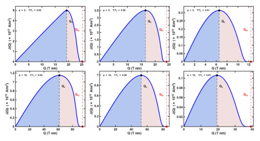 
FIG. 1. Supercurrent density J(Q) at different T/Tc calcu- lated for Nb3Sn in the clean (p = 0) and the dirty (p = 10) limits represented by the top and the bottom panels. The blue and pink regions define the stable (0 ≤Q ≤Qc) and unstable (Qc ≤Q ≤Qm) branches of J(Q). Dashed lines mark the critical momentum Qc and the terminal momentum Qm. Here B2 s and B2 c are determined by the area of the blue region and the total area under the J(Q) curve, respectively.

📷 Fig 2

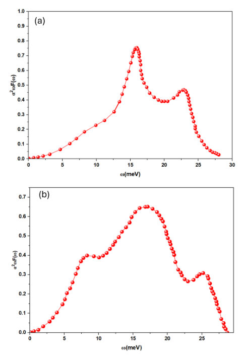 
FIG. 2. The electron-phonon spectral functions α2F(ω) for: (a) Nb [44] and (b) Nb3Sn [45] used for the calculations of Bs(T, p) and Bc(T).

📷 Fig 3

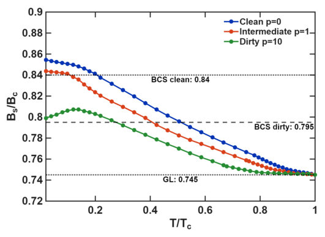 
FIG. 5. The ratio Bs/Bc for Nb at different impurity scat- tering parameters. Dashed lines show the BCS results for the clean [16] and the dirty [19] limits at T = 0 along with the GL result at T ≈Tc.

📷 Fig 4

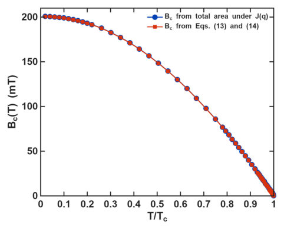 
FIG. 3. Thermodynamic critical field for Nb, where the solid line is calculated from Eqs. (13) and (14) and the dots are obtained by integrating J(Q), as described in the text.

📷 Fig 5

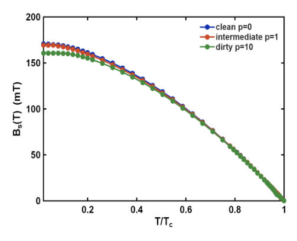 
FIG. 4. Superheating field for Nb for different scattering pa- rameters calculated by integrating J(Q) in Eq. (10).

**Summary.** This paper theoretically calculates the superheating field of extreme Type-II superconductors using the Eliashberg theory, which is necessary for strong coupling materials. It demonstrates that the ratio of the superheating field to the critical field exceeds BCS predictions, showing a distinct maximum enhancement when accounting for nonmagnetic impurities.

**Why it may be interesting.** While focused on superconductivity, the use of advanced many-body theory (Eliashberg) to calculate critical parameters under disorder effects provides a rich theoretical model for understanding phase boundaries and stability in strongly interacting quantum systems.

Detailed structure

**Main problem.** The paper calculates the superheating field ($H_s$) of Type-II superconductors, particularly those with large Ginzburg-Landau parameters, and compares this prediction to the weak-coupling BCS model.

**Main result.** The superheating field ratio $H_s/H_c$ calculated via the Eliashberg theory exceeds that of the BCS model, showing a non-monotonic dependence on impurity scattering parameters, with a maximum enhancement observed for $	ext{Nb}_3	ext{Sn}$ at $p \approx 0.2$.

**Method.** The calculation is based on solving the Eliashberg equations to determine the supercurrent density $J(Q)$ and subsequently integrating this density to find $H_s$ and $H_c$.

**Model / system.** The study focuses on Type-II superconductors, using the Eliashberg theory to account for strong electron-phonon coupling, and analyzing the effect of nonmagnetic impurities via a scattering parameter $p$.

**Key observables.** Superheating field ($H_s$), thermodynamic critical field ($H_c$), and the ratio $H_s/H_c$.

**Important parameters / regimes.** Impurity scattering parameter $p$, temperature $T$, and the large Ginzburg-Landau parameter $\kappa$.

**Assumptions / limitations.** The analysis assumes the large $\kappa$ limit and utilizes the Eliashberg theory framework, which is necessary due to strong electron-phonon coupling effects.

**Figures summary.** Figures illustrate the supercurrent density $J(Q)$ in clean and dirty limits, and plot the ratio $B_s/B_c$ versus the impurity scattering parameter $p$, showing the characteristic maximum enhancement.

**Paper structure.** The paper develops the theoretical framework by deriving $H_s$ from the free energy functional using the Eliashberg theory, then applies this framework to calculate and compare $H_s/H_c$ across various impurity scattering regimes for specific materials like Nb and $	ext{Nb}_3	ext{Sn}$.

Abstract

We calculate the superheating field $H_s$ of a type-II superconductor with a large Ginzburg-Landau parameter from the isotropic Eliashberg theory. It is shown that the temperature dependencies of $H_s(T)$ can be obtained from a thermodynamic approach for different scattering parameters $p=\hbar/2πτ_Nk_BT_c$ in a wide range of the nonmagnetic impurity scattering times $τ_N$ ranging from the clean $(p\ll 1)$ to the dirty $(p\gg 1)$ limits. Specific calculations were done for Nb and Nb$_3$Sn using their electron-phonon spectral functions extracted from tunneling measurements. We show that the ratio $H_s(T,p)/H_c(T)$ calculated from the Eliashberg theory exceeds that of the weak coupling BCS model, where $H_c$ is the thermodynamic magnetic field. We also show that, even though nonmagnetic impurities are pairbreakers in the current-carrying state, $H_s(0,p)$ for Nb$_3$Sn at $T=0$ has a maximum at $p\approx 0.2$ at which the ratio $H_s/H_c$ is about $6\%$ higher than that in the BCS clean limit.

[↑ back to top](#top)

### [Electrochemical impedance spectroscopy of graphene nanogaps](http://arxiv.org/abs/2608.28836v1)

**Authors:** Patrick A. McKee, Chris S. DeMellier, Robin N. Schipper, Henk W. Ch. Postma  
**Type:** experiment · **Category:** other · **PDF:** <https://arxiv.org/pdf/2608.28836v1>  
**Analysis basis:** full PDF text, analyzed in chunks
**Topic relevance:** `Keldysh / 2PI / non-Gaussian methods` **1/5** · `analog quantum simulation` **1/5** · `correlated / nonlocal dissipation` **1/5** · `driven-dissipative phase transition` **1/5** · `methods for driven-dissipative` **1/5** · `non-equilibrium universality` **1/5** · `quantum measurements` **1/5**

📷 Fig 1

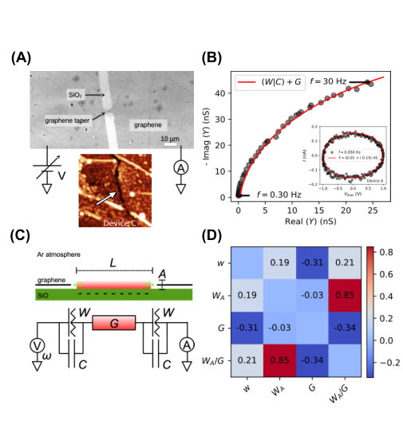 
Figure 1. Graphene nanogaps exhibit a frequency- dependent electrochemical response that is captured by an equivalent-circuit model associated with a sur- face contamination layer. (A, top) SEM image of a narrow patterned graphene constriction on a SiO2 surface with taper width w = 3 µm driven by current I sourced by a bias volt- age V . (A, bottom) AFM height image of Device C after the break, with the nanogap indicated by the white arrow (image size 0.6 × 0.6 µm2). (B) Nyquist plot of Y as a function of f (black circles) and fit to the admittance model (red line). (Inset) I vs. Vbias at f = 50 mHz (black points) and fit to Y (red line). (C) Electrochemical conduction through the sur- face...

📷 Fig 2

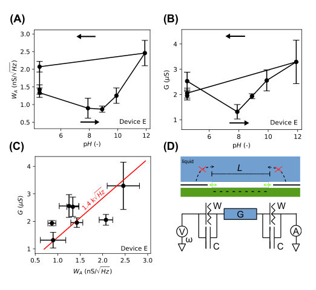 
Figure 2. Dependence of Y on pH for Device E. (A) Dependence of WA on pH. (B) Dependence of G on pH. (C) Linear correlation between WA and G (black crosses) and linear fit (red line); error bars are parameter uncertainties reported by Lmfit. (D) Circuit diagram and microscopic di- agram of the conduction process for a nanogap immersed in water solution (blue), with the conductance determined by the concentration close to the surface (red).

📷 Fig 3

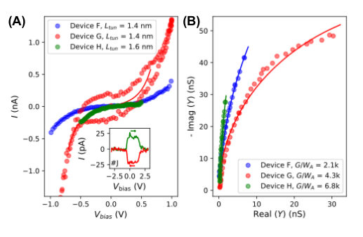 
Figure 3. Tunneling curve and electrochemical admit- tance for the 3 devices with the smallest nanogap. (A) High bias I(Vbias) curves for the three indicated devices and fits to the Simmons model. (Inset to A) Up and down peaks in the up (green) and down (red) sweeps of Device J, at a sweep rate of 0.5 V/s. (B) Low bias ω dependence of Y for the same three devices (circles) and fits to the impedance model (W|C) + G and values of G/WA as indicated.

**Summary.** This work uses electrochemical impedance spectroscopy (EIS) to study charge transport in graphene nanogaps immersed in aqueous solutions. By fitting the frequency-dependent impedance data to an equivalent circuit, the authors characterize diffusion processes occurring within a thin surface film. This technique provides a complementary method to measure the effective nanogap length scale and understand the role of the surrounding electrolyte environment.

**Why it may be interesting.** While focused on solid-state electrochemistry, the use of impedance spectroscopy to probe diffusion and interfacial kinetics in nanoscale confinement is relevant to understanding charge transport in quantum devices and open quantum systems where environment coupling is critical.

Detailed structure

**Main problem.** The paper aims to characterize the interfacial behavior and charge transport mechanisms within graphene nanogaps, particularly in aqueous environments, using electrochemical impedance spectroscopy (EIS).

**Main result.** EIS reveals a frequency-dependent response consistent with a Warburg element, allowing the extraction of an effective nanogap length scale that complements tunneling measurements. The results show that electrochemical processes are confined to an adsorbed surface contamination layer.

**Method.** The study employs EIS measurements, calculating complex admittance $Y(\omega) = G(\omega) + iB(\omega)$, and fitting the data to an equivalent-circuit model involving a Warburg element, capacitor, and conductor.

**Model / system.** The physical system is a graphene nanogap fabricated via controlled electrical breakdown. The electrochemical transport is modeled by an equivalent circuit $(	ext{W}|C) + G$, which is analyzed as a function of liquid pH.

**Key observables.** Frequency-dependent impedance response, Warburg element magnitude ($W$), conductance ($G$), and the ratio $G/W$ as a function of pH.

**Important parameters / regimes.** Liquid pH, effective nanogap length scale ($L$), and diffusion coefficient ($D$).

**Assumptions / limitations.** The electrochemical processes are assumed to be confined to the surface contamination layer between the graphene edges.

**Figures summary.** Figures show SEM/AFM images of the gap, Nyquist plots of admittance vs. frequency, and plots detailing the dependence of circuit elements ($G$ and $W$) on pH.

**Paper structure.** The paper progresses by introducing the problem of interfacial characterization, detailing the EIS methodology and equivalent circuit fitting, presenting the pH-dependent results showing systematic changes in circuit elements, and finally comparing the derived length scales to those from tunneling measurements.

Abstract

Graphene nanogaps represent an emerging platform for nanoscale electrochemical and sensing devices, with potential applications in next-generation biomolecular sequencing. However, their interfacial behavior in aqueous environments remains poorly characterized, particularly with respect to frequency-dependent impedance and charge transport mechanisms at the graphene edge. We fabricate graphene nanogaps by controlled electrical breakdown in an inert atmosphere and study their electrochemical response. Upon exposure to ambient conditions, a surface contamination layer supports electrochemical activity within an adsorbed ultrathin conductive film between the graphene edges. Electrochemical impedance spectroscopy reveals distinct frequency-dependent responses consistent with a Warburg element associated with diffusion in this confined interfacial film. The impedance evolves systematically with liquid $\mathrm{p}H$, reflecting changes in electrochemical reaction-diffusion processes at the graphene edges. A quantitative equivalent-circuit model captures these effects and enables extraction of an effective nanogap length scale from impedance spectra, providing information complementary to that obtained from tunneling measurements.

[↑ back to top](#top)

### [Harnessing the skyrmion Hall effect for low-power skyrmion transport in a tubular synthetic antiferromagnet](http://arxiv.org/abs/2608.29724v1)

**Authors:** Ivan P. Miranda, Grzegorz J. Kwiatkowski, Jacob J. Mankenberg, Cecilia M. Holmqvist, Igor S. Lobanov, Valery M. Uzdin, Pavel F. Bessarab  
**Type:** theory · **Category:** other · **PDF:** <https://arxiv.org/pdf/2608.29724v1>  
**Analysis basis:** full PDF text, analyzed in chunks
**Topic relevance:** `Keldysh / 2PI / non-Gaussian methods` **1/5** · `correlated / nonlocal dissipation` **1/5** · `driven-dissipative phase transition` **1/5** · `methods for driven-dissipative` **1/5** · `non-equilibrium universality` **1/5** · `quantum measurements` **1/5**

📷 Fig 1

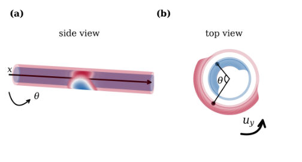 
FIG. 1. Sketch of the SAF-SP on a tube. (a) side view; (b) top/front view. The separation coordinate uy can be conveniently mapped onto the angular coordinate θ. The current is applied along the longitudi- nal direction, x: ⃗j = jx⃗ex.

📷 Fig 2

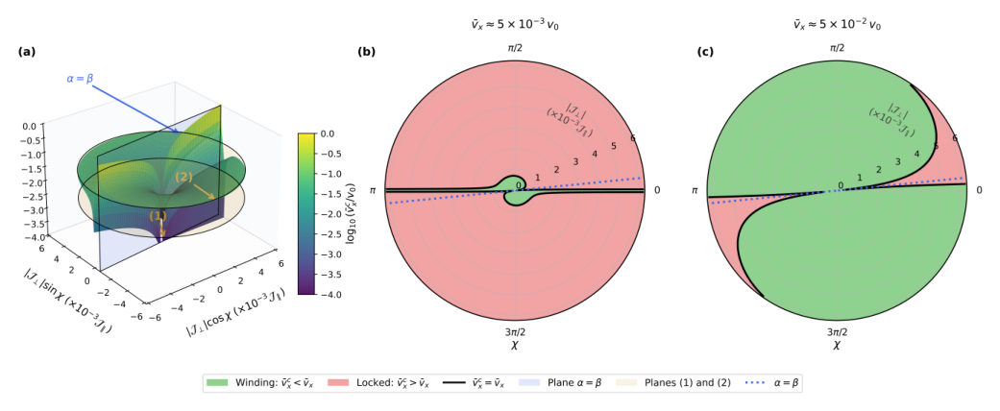 
FIG. 2. Locked-to-winding boundary ¯vc x as a function of the system/control parameters |J⊥|, χ, and the average pair velocity ¯vx. (a) 3D representation of ¯vc x, with cutting planes (1) and (2) corresponding to selected target velocities ¯vx, together with the plane α = β = 0.1, where the critical velocity diverges (¯vc x →∞) and the system remains in the locked regime irrespective of ¯vx; (b) 2D map of the locked (red) and winding (green) regions as a function of χ, the polar coordinate, and |J⊥|, the radial coordinate, for ¯vx ≈5 × 10−3v0, corresponding to plane (1) in panel (a); (c) same as in (b), but for ¯vx ≈5 × 10−2v0, corresponding to plane (2) in panel (a). The black lines in (b)...

📷 Fig 3

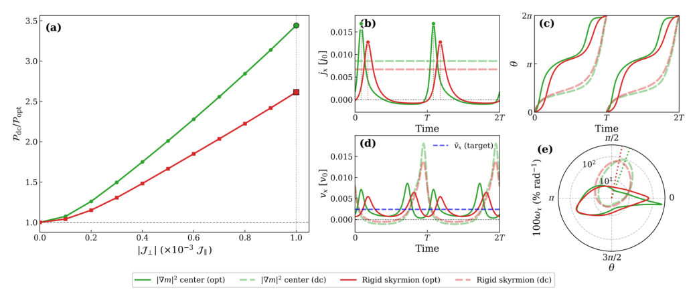 
FIG. 3. dc and optimal control protocols computed for an average drift velocity ¯vx ≈2.5 × 10−3v0, β ≈−0.022, and α = 0.1, within the rigid and adiabatic approximations. (a) ratio Pdc/Popt as a function of the interlayer exchange magnitude, with the rigid and adiabatic results shown in red and green, respectively. (b-d) comparison between the optimal control and dc protocols for the highlighted end points in (a), showing the instantaneous applied current, the separation coordinate θ, and the instantaneous drift velocity vx of the skyrmion pair over two full periods 2T. (e) temporal weight profile ωτ(θ) ≡dτ/dθ, which quantifies the fraction of the period allocated per unit angular separation...

📷 Fig 4

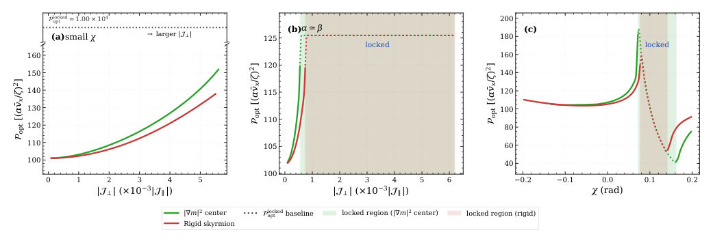 
FIG. 4. Optimal protocol power for an average drift velocity ¯vx ≈5 × 10−2v0 and α = 0.1, in the rigid and adiabatic approximations. (a) Popt as a function of |J⊥| in the small χ regime, with χ ≈0.01 rad. (b) Popt as a function of |J⊥| near α ≃β, here for β = 0.09. (c) Popt as a function of χ for |J⊥| = 2 × 10−3J∥. Dotted lines denote the Plocked opt baseline (see text), while shaded regions mark the corresponding locked regimes. In (a), Plocked opt lies about two orders of magnitude above the winding branch and is reached only at larger |J⊥| values outside the plotted range, as indicated by the broken vertical axis.

**Summary.** This work shows that in a tubular synthetic antiferromagnet, the skyrmion Hall effect can be harnessed using optimal control to minimize energy dissipation during transport. By treating the relative separation of the skyrmion pair as a controllable internal coordinate, the system can achieve lower power consumption than previously thought possible. This provides a mechanism to engineer energy-efficient spintronic devices.

**Why it may be interesting.** The use of optimal control theory to manipulate internal degrees of freedom (the separation mode) to suppress dissipation is a powerful concept applicable to open quantum systems where dissipation must be managed for coherent operation.

Detailed structure

**Main problem.** To demonstrate that the skyrmion Hall effect, usually a source of unwanted transverse motion, can be optimally controlled to reduce Ohmic losses during skyrmion transport.

**Main result.** By exploiting the internal separation mode created by the skyrmion Hall effect and interlayer coupling, the system can achieve low-power transport through either constant or time-dependent current protocols, outperforming the uncoupled limit.

**Method.** Optimal control theory is applied to minimize the Joule heating power required to maintain a prescribed average skyrmion pair drift velocity.

**Model / system.** The system models a pair of skyrmions confined to a tubular geometry within a synthetic antiferromagnet, governed by an atomistic spin Hamiltonian and dynamics derived from the Landau-Lifshitz equation.

**Key observables.** Average pair drift velocity (v_x), Ohmic power dissipation (P), and the power ratio P_dc/P_opt.

**Important parameters / regimes.** Interlayer coupling (J_perp), DMI magnitude (D_parallel), anisotropy (K_parallel), and STT parameters (zeta).

**Assumptions / limitations.** The analysis relies on the Adiabatic Approximation (AA), assuming dynamics follow slow, soft modes, and comparing results against the Rigid Approximation (RA).

**Figures summary.** Figures illustrate the locked-to-winding boundary in parameter space and compare the power ratio P_dc/P_opt between optimal control and DC driving protocols.

**Paper structure.** The paper first establishes the reduced two-coordinate model, then applies optimal control theory to minimize power for a target velocity, comparing the results across locked and winding dynamic regimes.

Abstract

We show that optimal control can turn the skyrmion Hall effect from a source of typically unwanted transverse motion into a mechanism for reducing Ohmic losses in skyrmion transport. We consider a pair of antiferromagnetically coupled skyrmions confined to a tubular geometry, where their relative transverse displacement becomes a periodic internal coordinate. The skyrmion Hall effect drives this coordinate, while finite interlayer coupling makes the resulting relation between applied current and longitudinal velocity nonlinear, allowing different current protocols to produce the same prescribed average velocity. We determine which of these protocols minimizes Joule heating. Depending on the interlayer coupling and spin-transfer-torque parameters, the optimal current is either constant, with the skyrmion pair maintaining a fixed relative position, or time dependent, with the pair undergoing periodic relative motion around the tube. In either case, the additional internal degree of freedom created by the skyrmion Hall effect and interlayer coupling enables skyrmion transport at a lower power than in the uncoupled limit.

[↑ back to top](#top)

### [Microwave-Induced Optomagnetism in High-Temperature Superconductors](http://arxiv.org/abs/2608.31127v1)

**Authors:** Anoop Dhillon, Amir Borji, Hamed Majedi  
**Type:** experiment · **Category:** other · **PDF:** <https://arxiv.org/pdf/2608.31127v1>  
**Analysis basis:** full PDF text, analyzed in chunks
**Topic relevance:** `correlated / nonlocal dissipation` **1/5** · `driven-dissipative phase transition` **1/5** · `non-equilibrium universality` **1/5** · `quantum measurements` **1/5** · `quantum optics experiment` **1/5**

📷 Fig 1

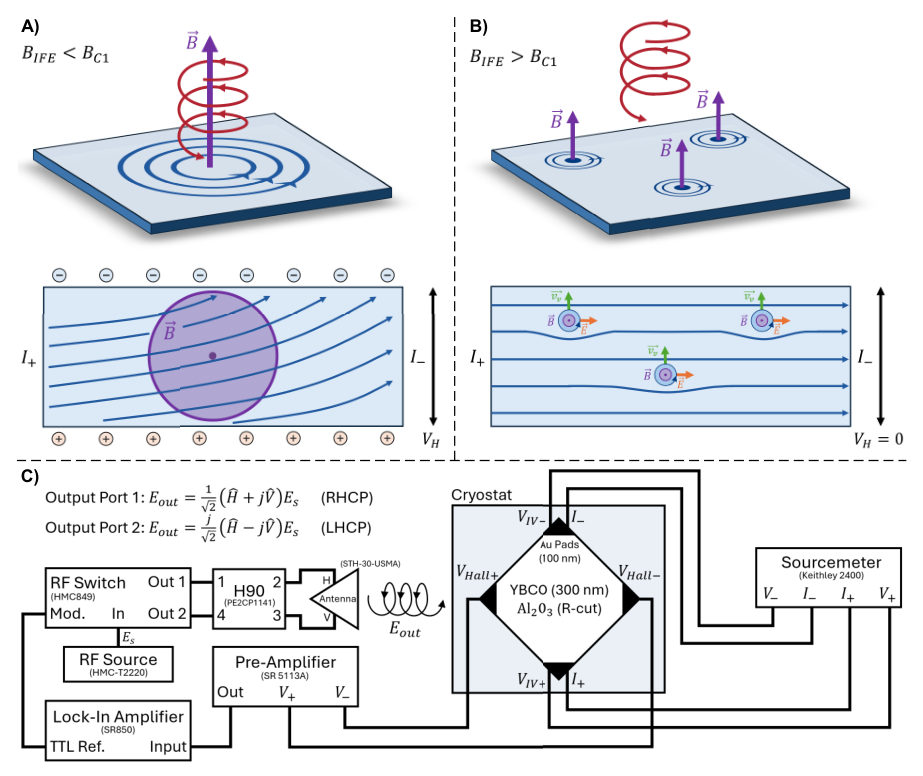 
Fig. 1 Schematics illustrating the optomagnetic response being measured, and the associated experimental apparatus. A) Optomagnetic response mechanism within the low-field state, showing a distributed global magnetization caused by the magnetic moment of induced circulating current densities, and the associated Hall voltage (VH) formed through the deflection of a bias current under it. B) Optomagnetic response mechanism above the vortex entry threshold field (Bc1), in which flux is now localized to individual vortices, suppressing the deflection of charge carriers and instead producing a longitudinal phase-slip voltage associated with the deflection of vortices by the induced quantum...

📷 Fig 2

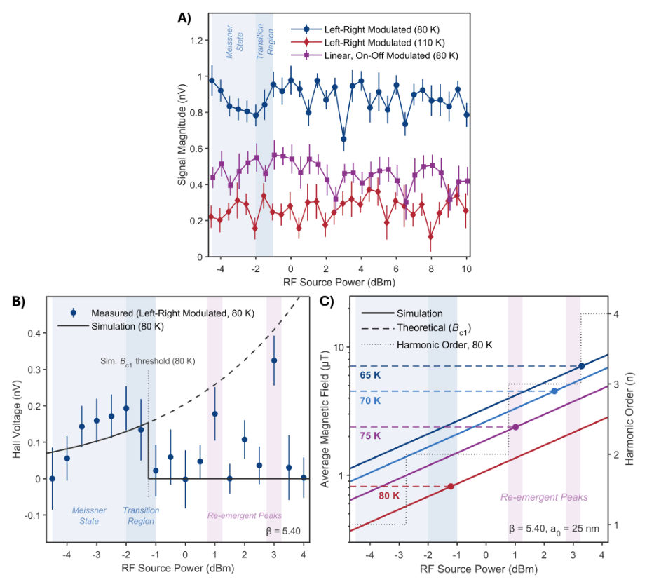 
Fig. 2 Experimental observation of the superconducting optomagnetic response and vortex crossover. Shaded vertical regions track the distinct physical regimes across power sweeps below Tc: the linear Meissner state (left blue band) and the vortex entry transition zone (right blue band). A) Measured lock-in signal magnitude capturing the helicity-dependent Hall voltage difference under left- versus right-handed circularly polarized microwave excitation (Left- Right Modulated) recorded below Tc at 80 K (blue circles) and above Tc at 110 K (red diamonds), alongside the linear polarization control at 80 K (Linear, On-Off Modulated, purple squares). B) Zoomed-in helicity-dependent experimental...

📷 Fig 3

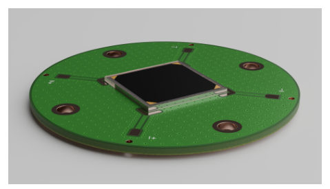 
Fig. 3 Three-dimensional rendering of the device and electrical transport layout. Perspective view of the epitaxial YBCO thin film on its sapphire substrate, wire-bonded to the host PCB for transverse Hall voltage measurements.

**Summary.** This work reports the first experimental detection of microwave-induced optomagnetism in YBCO superconductors. By measuring the helicity-dependent Hall voltage, the authors demonstrate that the response is governed by the superconducting state and undergoes dramatic changes as the applied field induces vortex motion. This establishes a novel, contactless method for studying vortex dynamics and magnetic control in superconducting quantum systems.

**Why it may be interesting.** The study provides a non-dissipative, microwave-driven method to probe non-equilibrium vortex dynamics and magnetic control in superconductors, which is highly relevant for understanding superconducting quantum devices.

Detailed structure

**Main problem.** The paper reports the first experimental observation of a steady-state, microwave-driven Inverse Faraday Effect (IFE) in a high-temperature superconductor.

**Main result.** The optomagnetic response is robustly observed below the critical temperature, showing a distinct collapse above the lower critical field ($B_{c1}$) and re-emerging at harmonics corresponding to mode-locked vortex motion.

**Method.** The experiment uses a low-noise homodyne transport apparatus to measure the helicity-dependent Hall voltage response to circularly polarized microwave radiation.

**Model / system.** The system is an epitaxial YBa2Cu3O7-delta film, a high-temperature superconductor. The analysis combines a two-fluid model for the superconducting condensate and normal electrons with mesoscopic vortex dynamics.

**Key observables.** Helicity-dependent Hall voltage ($	ilde{V}_H$), power-dependent signal magnitude, and the alignment of signal re-emergence with vortex washboard harmonics.

**Important parameters / regimes.** Temperature relative to $T_c$, microwave power, and the lower critical field ($B_{c1}$).

**Assumptions / limitations.** The measurement assumes the Hall voltage can isolate the intrinsic optomagnetic response from parasitic effects, and that the low-power signal is dominated by the intrinsic IFE.

**Figures summary.** Figures illustrate the power dependence of the signal, showing the Meissner state, the collapse above $B_{c1}$, and the subsequent re-emergence of peaks aligned with predicted vortex washboard harmonics.

**Paper structure.** The paper progresses from establishing the theoretical framework (IFE in HTS) to presenting the experimental setup and measurements, detailing the distinct regimes: low-field Meissner state, vortex entry/collapse, and finally, the coherent re-emergence of the signal at high powers.

Abstract

We report the first experimental observation of a steady-state, microwave-driven inverse Faraday effect in a high-temperature superconductor. Circularly polarized microwave radiation generates a helicity-dependent response in an epitaxial $\mathrm{YBa_2Cu_3O_{7-δ}}$ film, detected using homodyne Hall transport. The optomagnetic response emerges exclusively below $T_c$, vanishes in the normal state, and exhibits no power-dependent counterpart under linearly polarized excitation. The effective optomagnetic conversion reaches $1.75\,\mathrm{T}/(\mathrm{W\,cm^{-2}})$, surpassing optical benchmarks by several orders of magnitude. At higher microwave powers, the signal collapses when the self-generated field exceeds $B_{c1}$, marking the onset of a vortex phase-slip regime, and subsequently re-emerges at mode-locked vortex-washboard harmonics. These results establish steady-state microwave optomagnetism as a route to contactless, non-inductive magnetic control and nonequilibrium vortex spectroscopy in superconducting quantum systems.

[↑ back to top](#top)

### [Dynamics of a nanoscale ferromagnetic vortex](http://arxiv.org/abs/2608.30511v1)

**Authors:** Jun Seok Seo, Se Kwon Kim  
**Type:** theory · **Category:** other · **PDF:** <https://arxiv.org/pdf/2608.30511v1>  
**Analysis basis:** full PDF text, analyzed in chunks
**Topic relevance:** `Frenkel-Kontorova` **1/5** · `driven-dissipative phase transition` **1/5** · `non-equilibrium universality` **1/5** · `scars & prethermalization` **1/5**

📷 Fig 1

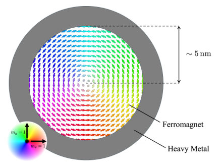 
FIG. 1. Schematic diagram of the stabilized ferromagnetic vortex of N = 1, p = 1, in a ferromagnetic disk surrounded by heavy metal. The brightness of the spin indicates the size of the mz component: white corresponds to mz = +1, and black corresponds to mz = −1.

📷 Fig 2

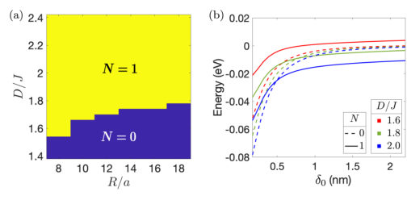 
FIG. 2. (a) R/a versus D/J phase diagram of the vortex number N, obtained by comparing the energy Eq. (3) of the relaxed state from N = 0 ∼3 with fixed J = 1 × 10−21 J. (b) Comparison between the energy Eq. (3) of the relaxed states with N = 0 and N = 1 for various iDMI strengths. Dotted lines and solid lines correspond to N = 0 and N = 1, respectively, while different colors denote different D/J ratios at a fixed J = 1 × 10−21 J.

📷 Fig 3

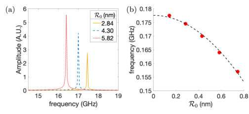 
FIG. 3. (a) Simulation results of the amplitude-frequency re- sponse for various R0 at α = 0. (b) Relation between R0 and the oscillation frequency at α = 0, obtained from simulations (red dots) and fitted to Eq. (14) divided by 2π (dashed line).

📷 Fig 4

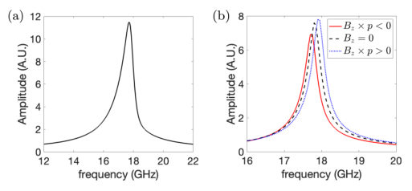 
FIG. 4. (a) Simulation result of the amplitude-frequency response of the vortex oscillation, for R0 = 0.37 nm and α = 5 × 10−3. (b) Shift of the oscillation frequency under B = Bzˆz, simulation at R0 = 0.12 nm and α = 5×10−3. Blue (red) curve shows that oscillation frequency at Bz = 120 mT (−120 mT), which increases (decreases) as Bz is in same (dif- ferent) direction with polarity of the vortex, from the oscilla- tion frequency with no external field (dotted line).

📷 Fig 5

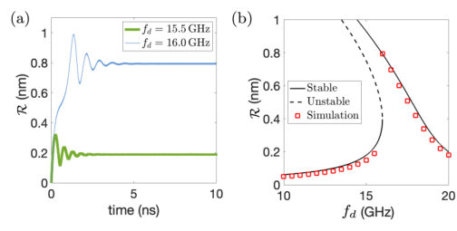 
FIG. 5. (a) Stabilization of radius of gyration at driving fre- quencies fd = 15.5 GHz (green, thick) and fd = 16.0 GHz (blue, thin). The gyration radius stabilizes over time. (b) Comparison between the numerically obtained frequency- amplitude curve (black line) and the simulation results for the time-averaged quasi-stationary radius of gyration (red squares). Solid (dashed) lines indicate dynamically stable (unstable) solutions.

**Summary.** This paper theoretically and computationally analyzes the dynamics of a ferromagnetic vortex stabilized by the interfacial Dzyaloshinskii–Moriya interaction in nanoscale disks. It demonstrates that iDMI allows for vortex stability at sizes much smaller than previously thought possible. The work characterizes the vortex's nonlinear dynamics, showing it behaves like a Duffing oscillator when driven by external fields.

**Why it may be interesting.** The study of collective excitations and nonlinear dynamics in confined magnetic systems, particularly the emergence of Duffing-like behavior, provides a rich platform for understanding non-linear wave phenomena relevant to quantum optics and open quantum systems.

Detailed structure

**Main problem.** The study investigates the stability and dynamic behavior of a ferromagnetic vortex stabilized by the interfacial Dzyaloshinskii–Moriya interaction (iDMI) in nanoscale ferromagnetic disks.

**Main result.** The vortex remains stable in disks smaller than 5 nm due to iDMI, exhibiting both conventional (gyrotropic oscillation) and unconventional (Duffing-oscillator-like) dynamic responses.

**Method.** The research combines theoretical analysis, deriving nonlinear equations of motion (Thiele's equation), and micromagnetic simulations to model the vortex dynamics.

**Model / system.** The system is a ferromagnetic disk where the vortex dynamics are governed by an energy functional including exchange, anisotropy, and the iDMI term. The dynamics are modeled using a complex equation of motion for the vortex position $\psi$.

**Key observables.** Vortex oscillation frequency, resonance frequency shift under out-of-plane fields, and the amplitude-frequency response curve exhibiting Duffing-oscillator characteristics.

**Important parameters / regimes.** Nanoscale radii (below 5 nm), iDMI strength (D), exchange stiffness (J), and anisotropy constant (K).

**Assumptions / limitations.** The analysis involves expanding the potential up to quartic order and using the method of harmonic balance for driven oscillations.

**Figures summary.** Figures illustrate the schematic of the stabilized vortex, phase diagrams showing stabilization regions, and plots detailing the amplitude-frequency response and frequency shift under external fields.

**Paper structure.** The paper progresses from defining the physical system and Hamiltonian (including iDMI) to deriving the equation of motion, analyzing the undriven anharmonic oscillation, and finally examining the driven response using harmonic balance and stability analysis.

Abstract

We propose a ferromagnetic vortex stabilized by the interfacial Dzyaloshinskii--Moriya interaction (iDMI) and investigate its properties through theoretical analysis and micromagnetic simulations. Our results demonstrate that this vortex can remain stable even in nanoscale ferromagnetic disks with radii below $5\,\text{nm}$---far smaller than those of conventional nanodot vortices having about $1\,μ\text{m}$ radius. We analytically solve the nonlinear equation of motion describing the anharmonic vortex oscillation, and identify the critical frequency that determines the stability of the driven oscillation of the vortex. This nanoscale vortex exhibits conventional properties of microscale vortices, including gyrotropic oscillation and resonance frequency shift under an out-of-plane magnetic field. It also exhibits unconventional behaviors, such as a strongly anharmonic potential, nonlinear oscillations, and a Duffing-oscillator-like response under the external AC bias.

[↑ back to top](#top)

### [Moiré-induced lattice reconstruction at buried atomic interfaces](http://arxiv.org/abs/2608.30531v1)

**Authors:** Nicholas Clark, Frederick Allars, Isaac Soltero, Wendong Wang, David Hopkinson, Hugo de Latour, James G. McHugh, William Talbott, Sam Sullivan-Allsop, Rongsheng Cai, Astrid Weston, Xiao Li, Gareth Tainton, Casey K. Cheung, Francisco Selles, Alex Summerfield, Andrey Kretinin, Christopher S. Allen, Vladimir Falko, Sarah J. Haigh, Roman Gorbachev  
**Type:** both · **Category:** other · **PDF:** <https://arxiv.org/pdf/2608.30531v1>  
**Analysis basis:** full PDF text, analyzed in chunks
**Topic relevance:** `Frenkel-Kontorova` **1/5** · `analog quantum simulation` **1/5** · `quantum measurements` **1/5**

📷 Fig 1

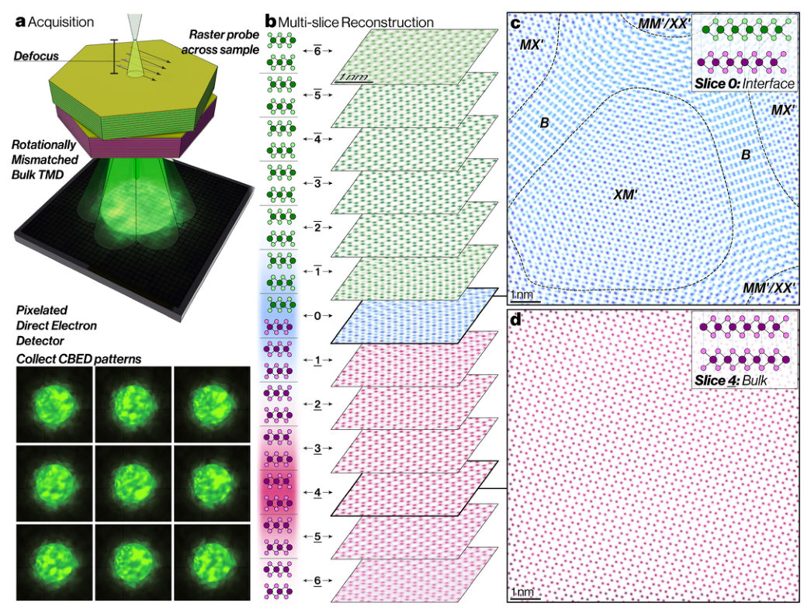 
Figure 1: Depth dependent atomic structure revealed through multislice ptychography (two MoS2 layers per slice). (a) Schematic showing 4D-STEM data collection for ptychographic reconstruction. The upper panel details the acquisition technique whereby a defocused converged probe is raster scanned over the sample surface with a real space pixel spacing smaller than the probe size at the sample. A convergent-beam electron diffraction (CBED) pattern is collected for each overlapping probe position; examples are shown in the lower panel. (b) Reconstructed phase slices extracted from the CBED map through multislice iterative ptychographic reconstruction, with each 1.22 nm thick slice...

📷 Fig 2

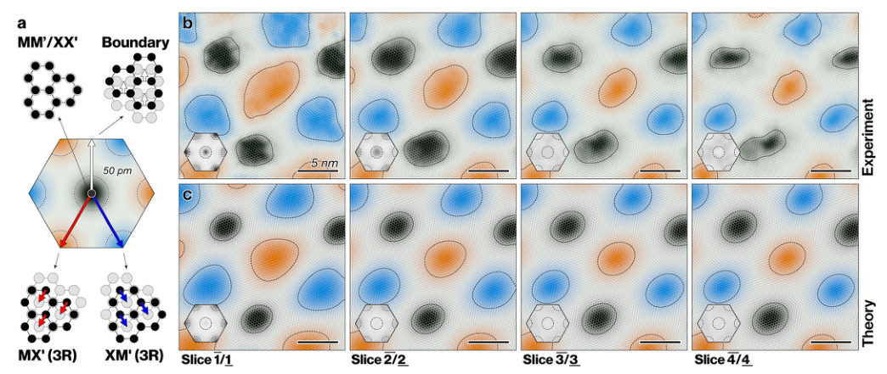 
Figure 2: Quantifying the relative displacement vector as a function of distance from the twisted interface (three MoS2 layers per slice, θtwist = 1.23°). (a) Schematic illustrating our colour map characterizing displacement vector between MoS2 layers. Zero displacement (or displacement of one unit cell) corresponds to cases where all the atomic columns and hexagonal centres are superimposed. Full displacement (solid red and blue colours) corresponds to displacement equal to the nearest neighbour distance in the high symmetry directions. (b) Local displacement vector extracted from pairs of reconstructed phase slices equidistant from the twisted interface, coloured according to the map in...

📷 Fig 3

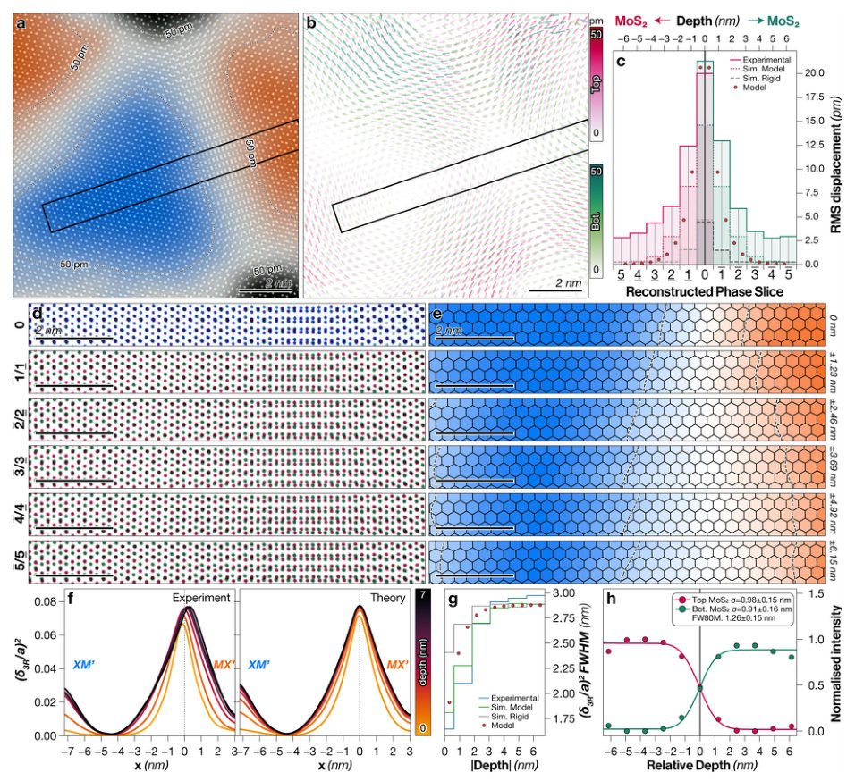 
Figure 3: Atomically resolved, reconstruction-induced displacement mapping at a MoS2 homo-interface (θtwist = 1.23°). (a) Interface phase slice coloured by local stacking according to the scheme in Fig. 2a. (b) Reconstruction induced displacement of atomic columns at the interface. (c) RMS of measured displacement field for each two-MoS2-layer slice over the field of view in (a), compared to that extracted from simulated atomic models with and without atomic reconstruction. Overlaid is the theoretically predicted RMS displacement. (d) Overlaid phase slices for: top row – the twisted interface, below: overlaid slices equidistant from the interface, plotted using separate colourmaps, with...

📷 Fig 4

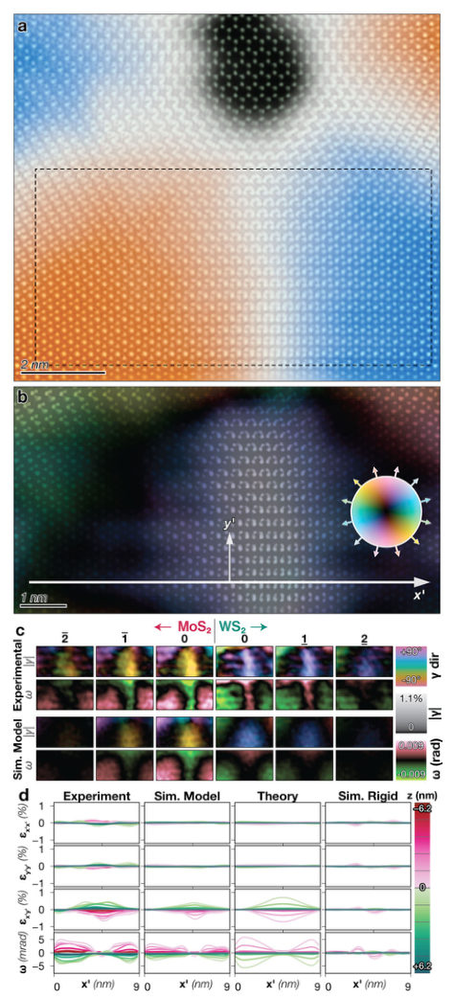 
Figure 4: Strain mapping across an MX’/XM’ boundary at a 1.14° rotated MoS2/WS2 heterointerface. (a) Interface phase slice coloured according to the scheme in Fig. 2a. (b) Interface slice shear field extracted from the atomic displacement maps (slice 0). The brightness encodes the maximum shear strain magnitude, and the hue encodes its principal direction. The area is shown by the dashed line in (a). (c) Maps of shear and rotation extracted from the per- crystal displacement fields from slices near the boundary compared to theoretically predicted fields. Volumetric strain was minimal as predicted theoretically. (d) Profiles of rotated strain tensor components averaged along a path...

**Summary.** This work pioneers the use of multi-slice electron ptychography to map the 3D atomic structure at buried, twisted van der Waals interfaces in TMD crystals. Researchers observed significant, twist-induced lattice reconstruction at these interfaces, which was stronger than predicted by theory. By combining these high-resolution measurements with continuum modeling, the study provides a structural foundation for understanding the emergent electronic properties of moiré systems.

**Why it may be interesting.** While focused on solid-state structure, the ability to map strain and structural phase transitions at interfaces using highly sensitive, non-invasive techniques is relevant to understanding emergent quantum properties in moiré heterostructures.

Detailed structure

**Main problem.** The study investigates the structural changes, specifically lattice reconstruction, that occur at buried van der Waals heterointerfaces between multilayer crystals.

**Main result.** Strong, twist-induced in-plane lattice reconstruction was observed at the buried interface, exceeding theoretical predictions, and the technique allowed mapping the decay of this reconstruction into the bulk material.

**Method.** The research combines advanced experimental techniques, namely multi-slice electron ptychography, with detailed theoretical modeling based on continuum mechanics and energy minimization.

**Model / system.** The physical system involves marginally twisted rhombohedral interfaces between thick transition-metal dichalcogenide (TMD) crystals like $	ext{MoS}_2$. The theoretical model incorporates adhesion, in-plane elastic, and bending energies to predict layer-resolved atomic relaxation.

**Key observables.** Three-dimensional atomic structure, twist-induced lattice reconstruction field, dislocation network, strain tensor evolution, and root-mean-squared (rms) displacement decay.

**Important parameters / regimes.** Position precision of $\sim 3 	ext{ pm}$, depth resolution of $\sim 1 	ext{ nm}$, and twist angles ($	heta$) ranging from $0.2^\circ$ to $4^\circ$.

**Assumptions / limitations.** The analysis assumes that the outer layers suppress out-of-plane bending, enhancing in-plane reconstruction, and that the reconstruction effect decays predictably away from the interface.

**Figures summary.** Figures illustrate depth-dependent atomic structures via ptychography, showing reconstructed domains ($	ext{MX}', 	ext{XM}'$) at the interface, and displacement maps showing the decay of reconstruction away from the buried junction.

**Paper structure.** The paper first establishes the experimental capability using ptychography to image buried interfaces. It then presents the structural findings, detailing the observed reconstruction patterns and the decay profile of these distortions as a function of depth and twist angle. Finally, it compares these findings against continuum mechanical models.

Abstract

Atomic reconstruction at twisted two-dimensional interfaces governs many of their emergent optical, electronic, and mechanical properties, including sliding ferroelectricity. Despite recent progress in understanding lattice reconstruction in suspended twisted bilayers, structural changes at van der Waals heterointerfaces between multilayer crystals remain largely unexplored. Here we use multi-slice electron ptychography to non-invasively recover the three-dimensional atomic structure at marginally twisted rhombohedral interfaces between thick transition-metal dichalcogenide crystals. With a position precision of ~3 pm and a depth resolution ~1 nm, we resolve the twist-induced lattice reconstruction field per layer, and the resulting dislocation network at the buried interface. Despite the bulk nature, we observe markedly strong in-plane interfacial reconstruction due to suppression of the out-of-plane bending by outer layers, exceeding predictions from our three-dimensional modelling. Furthermore, we extract the strain tensor evolution during the decay of the reconstruction into the bulk, providing a structural foundation for understanding multi-layer moiré systems.

[↑ back to top](#top)

### [Switchable Magnetoelectric Transport in Graphene via a Van der Waals Multiferroic](http://arxiv.org/abs/2608.30170v1)

**Authors:** Miuko Tanaka, Shunta Aoki, Ikoi Sato, Hao Ou, Itishree Pradhan, Ngoc Han Tu, Yangsong Chen, Tomohiro Ishii, Kenji Watanabe, Takashi Taniguchi, Michihisa Yamamoto, Masayuki Hashisaka, Jiang Pu, Naoki Ogawa, Toshiya Ideue  
**Type:** experiment · **Category:** other · **PDF:** <https://arxiv.org/pdf/2608.30170v1>  
**Analysis basis:** full PDF text, analyzed in chunks
**Topic relevance:** `analog quantum simulation` **1/5** · `driven-dissipative phase transition` **1/5** · `quantum measurements` **1/5**

📷 Fig 1

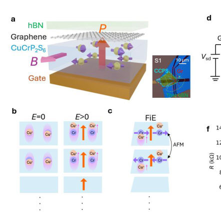 
Figure 1: Transport signatures of switchable polarization in graphene/CuCrP2S6 (CCPS) interfaces.

📷 Fig 2

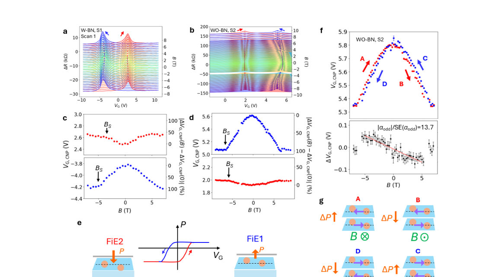 
Figure 2: Magnetoelectric transport in graphene/CCPS interfaces.

📷 Fig 3

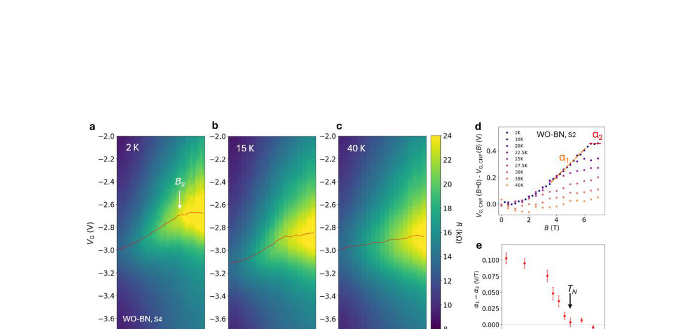 
Figure 3: Temperature dependence of magnetoelectric transport.

📷 Fig 4

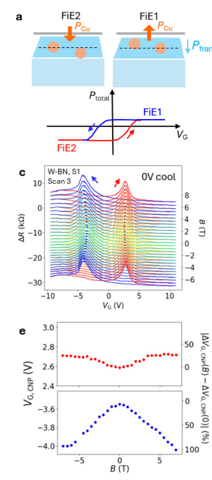 
Figure 4: Controlling multiferroic domains and switchable magnetoelectric transport.

**Summary.** This work reports on achieving gate-switchable magnetoelectric transport using a graphene/multiferroic heterostructure. By measuring the shift of the graphene's charge neutrality point under applied magnetic fields, the authors provide direct evidence of the magnetoelectric effect at the interface. This establishes a novel platform for engineering functional 2D van der Waals electronic devices.

**Why it may be interesting.** While primarily condensed matter/spintronics, the study of coupled order parameters (electric and magnetic) and their control via external fields (E and B) touches upon concepts relevant to open quantum systems and engineered quantum interfaces.

Detailed structure

**Main problem.** The central goal is to develop next-generation electronics and spintronics by achieving electric and magnetic control of transport properties at atomic interfaces.

**Main result.** The study demonstrates the first realization of gate-switchable magnetoelectric transport in a van der Waals heterostructure, showing that the magnetic field can modulate the transport peak in a polarization-dependent manner.

**Method.** Transport measurements (resistance/capacitance vs. gate voltage and magnetic field) were performed on graphene/multiferroic heterostructures.

**Model / system.** The system is a van der Waals heterostructure combining graphene with the multiferroic material $	ext{CuCrP}_2	ext{S}_6$ (CCPS). The physics relies on the coupling between the electric polarization (ferroelectric switching) and the magnetic state (magnetoelectric effect) at the interface.

**Key observables.** Hysteresis in the charge-neutrality resistance peak, shift of the charge neutrality point ($	ext{V}_{	ext{G,CNP}}$) under in-plane magnetic fields, and reversible switching of transport via electric field control.

**Important parameters / regimes.** Low temperatures ($T=2	ext{ K}$), in-plane magnetic fields ($B$), and gate voltages ($V_G$).

**Assumptions / limitations.** The analysis assumes that the graphene carrier density is modulated by both the electrostatic gate voltage and the surface polarization of the multiferroic layer.

**Figures summary.** Figures show $	ext{CNP}$ shifts vs. $V_G$ demonstrating polarization hysteresis, and $	ext{CNP}$ shifts vs. $B$ confirming the magnetoelectric effect. Time-dependent measurements confirm the nature of the switching mechanism.

**Paper structure.** The paper progresses by establishing the physical platform, demonstrating polarization switching via gate voltage sweeps, quantifying the magnetoelectric coupling using magnetic field sweeps, and finally confirming the nature of the switching mechanism through time-dependent measurements.

Abstract

Electric and magnetic control of transport properties at atomic interfaces is central to the development of next generation electronics and spintronics. Van der Waals multiferroics materials that simultaneously host dielectric and magnetic orders down to the monolayer limit offer a promising platform for such interfacial control, yet the realization of electronic functionalities that exploit the unique attributes of van der Waals multiferroics has largely remained elusive. Here, we realize a van der Waals heterostructure comprising graphene and the multiferroic CuCrP2S6, enabling gate-switchable magnetoelectric transport in graphene, mediated by the multiferroic layer. The charge-neutrality resistance peak of graphene exhibits pronounced hysteresis arising from polarization flip in the multiferroic state. Application of an in-plane magnetic field shifts this peak in a polarization-dependent manner, revealing magnetic-field-induced polarization modulation a direct signature of the magnetoelectric effect. Furthermore, cooling the device under an applied electric field enables domain control of the multiferroic order, allowing reversible switching of the interfacial magnetoelectric transport. These results provide the first demonstration of interfacial magnetoelectric transport in a vdW heterostructure, and establish a pathway for engineering two-dimensional van der Waals interfaces for functional device applications.

[↑ back to top](#top)

### [Breakdown of Charge-Conjugation Symmetry of Disclinations in 2D Crystals](http://arxiv.org/abs/2608.30921v1)

**Authors:** Ruslan Yamaletdinov, Mikhail I. Katsnelson, Oleg V. Yazyev  
**Type:** theory · **Category:** other · **PDF:** <https://arxiv.org/pdf/2608.30921v1>  
**Analysis basis:** full PDF text, analyzed in chunks
**Topic relevance:** `Frenkel-Kontorova` **1/5** · `analog quantum simulation` **1/5**

📷 Fig 1

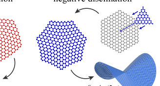 
FIG. 1. Construction of disclinations with topological charges s = ±π/3.

📷 Fig 2

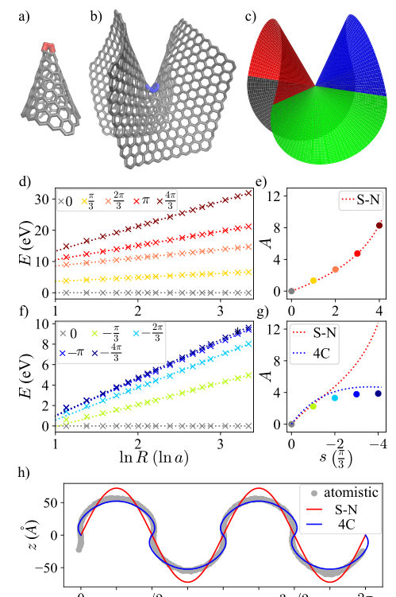 
FIG. 2. Optimized atomistic geometry containing (a) a pos- itive disclination and (b) a negative disclination with charge s = ±4π/3. Colors highlight the disclination cores. (c) Geo- metric approximation of a negative disclination (s = −4π/3) by four cones (4C). (d,f) Energies of circular membranes with disclinations charges (d) s ≥0 and (f) s ≤0 plotted as a function of ln R (a ≈2.46 Å), together with fits of the form E = κA(s) ln R + C(s). (e,g) Prefactor A(s) extracted from the fits for (e) s ≥0 and (f) s ≤0). Bending rigidity κ = 0.956 eV, obtained in line with approach described in Ref. [39]. Red dotted lines denote the predictions of Seung and Nelson (S-N) [31]. For negative...

📷 Fig 3

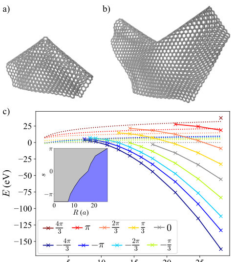 
FIG. 3. Folded structures containing disclinations with charge (a) s = +2π/3 and (b) s = −2π/3. (c) Energies of folded structures for different disclination charges s. Dotted lines denote the fits obtained for the corresponding unfolded structures, as in Fig. 2(e,g). Inset: ground-state structure as a function of system size and disclination charge; gray and blue regions denote unfolded and folded structures, respec- tively.

📷 Fig 4

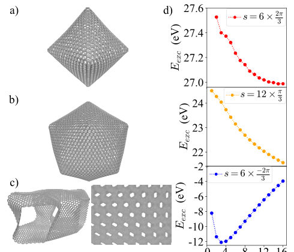 
FIG. 5. Polyhedral structures formed by (a) six s = +2π/3 disclinations (octahedron) and (b) twelve s = +π/3 discli- nations (icosahedron), respectively. (c) Primitive cell and the top view of a 2D periodic structure obtained for six s = −2π/3 disclinations, forming a pillared bilayer-graphene geometry with trigonal antiprismatic openings. (d) Interaction en- ergy Eexc for structures assembled from equilateral triangular patches of edge length ∆r, containing n identical disclinations of charge s = ±nπ/3 placed at equivalent positions.

📷 Fig 5

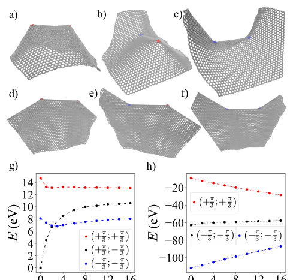 
FIG. 4. Unfolded and folded configurations containing two disclinations: (a,d) two positive disclinations (+π/3, +π/3), (b,e) one positive and one negative disclination (+π/3, −π/3), and (c,f) two negative disclinations (−π/3, −π/3). Total en- ergy as a function of separation ∆r (a ≈2.46Å) between two disclinations for (g) unfolded and (h) folded configurations. The initial graphene flake has an edge-to-edge diameter of 65a ≈16 nm).

**Summary.** This work explores the physics of topological defects (disclinations) in 2D crystals like graphene. Using simulations, the authors reveal that the elastic behavior of these defects is not symmetric with respect to the sign of their topological charge. Specifically, they find that negative defects interact attractively, contrasting sharply with the repulsive interactions observed for positive defects.

**Why it may be interesting.** While the topic is condensed matter physics, the study of topological defects and symmetry breaking in low-dimensional systems shares conceptual links with defect physics in quantum materials or engineered quantum structures.

Detailed structure

**Main problem.** The study investigates the elastic properties, energetics, and interactions of topological defects called disclinations in 2D crystalline membranes.

**Main result.** The paper finds a fundamental breakdown of charge-conjugation symmetry: positive disclinations repel, while negative disclinations exhibit a robust long-range attraction.

**Method.** The research combines atomistic simulations with continuum elasticity theory to calculate the energy and morphology of disclination configurations.

**Model / system.** The system is a free-standing 2D crystal, specifically graphene, containing topological defects (disclinations) characterized by a topological charge $s$. The analysis compares theoretical continuum predictions with atomistic simulation results.

**Key observables.** Interaction energy ($E_{exc}$), energy scaling with charge $|s|$, equilibrium shape, and adhesion energy in folded membranes.

**Important parameters / regimes.** Topological charge ($s$), bending rigidity ($\kappa$), and separation distance ($\Delta r$).

**Assumptions / limitations.** The analysis relies on continuum models, such as the saddle ansatz, and uses approximations like the four-cone configuration to model negative curvature defects.

**Figures summary.** Figures illustrate the construction of positive and negative disclinations, compare energy fits showing deviations from expected scaling for negative charges, and show how self-adhesion stabilizes negative curvature defects.

**Paper structure.** The paper first establishes the theoretical framework using continuum elasticity, then uses atomistic simulations to test the theory for positive and negative charges, culminating in a detailed comparison of interaction forces and the role of self-adhesion.

Abstract

Disclinations are elementary topological defects in two-dimensional (2D) crystalline membranes, yet their elastic properties remain largely unexplored. Using atomistic simulations, we address the energetics, morphology, and interactions of disclinations in free-standing graphene, a prototypical 2D crystal. We find that while disclinations with positive topological charges follow an expected behavior, negative disclinations exhibit sublinear energy scaling with charge as well as equilibrium shape that deviates sharply from the conventional saddle ansatz. This breakdown of charge-conjugation symmetry leads to qualitatively distinct interactions: positive disclinations repel, whereas negative disclinations display a robust long-range attraction. These trends are shown to be further amplified by self-adhesion in folded membranes. Our results uncover a fundamentally different energetic landscape for negative curvature defects and provide a basis for understanding the stability, self-folding behavior, and defect-driven morphology of graphene and other 2D membranes.

[↑ back to top](#top)

### [Controlling the Coupling Strengths in Nanophotonic Networks using Modified Yagi-Uda Nanoplasmonic Antennas](http://arxiv.org/abs/2608.29837v1)

**Authors:** Vidar Flodgren, Anders Mikkelsen  
**Type:** theory · **Category:** disordered systems and neural networks · **PDF:** <https://arxiv.org/pdf/2608.29837v1>  
**Analysis basis:** full PDF text, analyzed in chunks
**Topic relevance:** `interference shaping light` **1/5** · `methods for driven-dissipative` **1/5**

📷 Fig 1

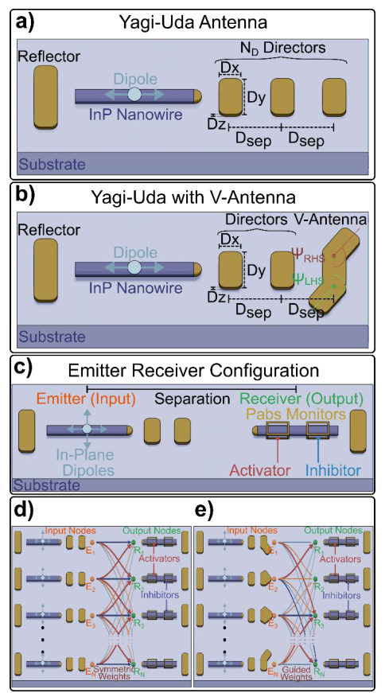 
Figure 1 - a) Antenna design, showing the metal reflector and director components and emitter nanowire of the Yagi-Uda. b) Modified Yagi-Uda design includes an end-component termed as a V-Antenna. c) System of an emitter and a receiver antenna. Dipole emitters simulate emission from the nanowire. The Power absorption monitors (Pabs) for the receiver used to estimate weights of the system. The Activator and Inhibitor regions of the nanowire indicate exciting and inhibiting regions of the nanowire receiver in an artificial neural node configuration that can be designed by doping the nanowire as described in ref. 31. d) Network with Yagi-Uda antenna that gives a symmetric emission between...

📷 Fig 2

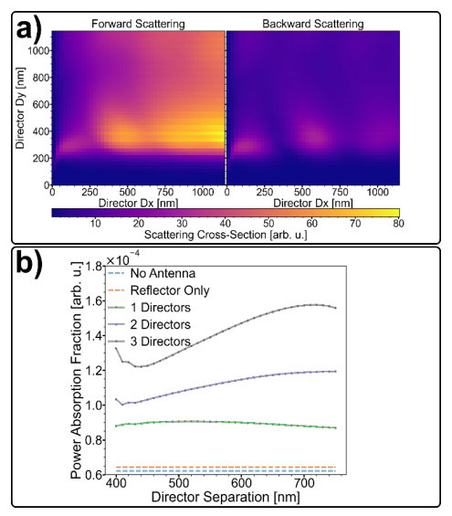 
Figure 2 - a) Forward and backward scattering from a symmetric director element as in Fig 1a when varying Dx and Dy as noted in Fig 1a. Color intensity of the plot shows the forward and backward power scattering cross-section from a source with wavelength from 750-1050nm (InP nanowire emission). b) Power Absorption fraction in the receiver nanowire shown in Fig 1b from the emitter in Fig 1b. The introduction of directors increases the Power absorption by a factor of 1.5, 1.9 and 2.6 respectively for 1,2 and 3 directors.

📷 Fig 3

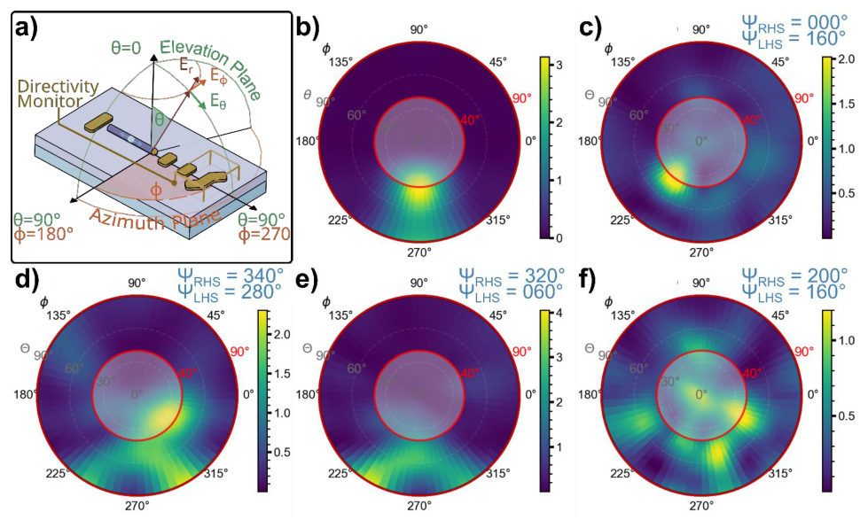 
Figure 3 –a) Model of modified Yagi-Uda antenna with asymmetric V-element in the end. Angles for the far- field angular emitter are given. b)-f) Angular plots of the total far-field radiated power density in each direction normalized by the total radiated power in all directions.  angle from 0-360 is around the circumference.  from 0-90 is given radially with 0 in the center and 90 at the edge. The emission in the angular range  from 40-90 is indicated by the two red lines will be realistically available to the receiver (when the system is covered in a planar 2D waveguiding material (e.g. Al2O3). b) Is from an antenna less system, while in c)-f) Angles RHS and LHS refers to the...

📷 Fig 4

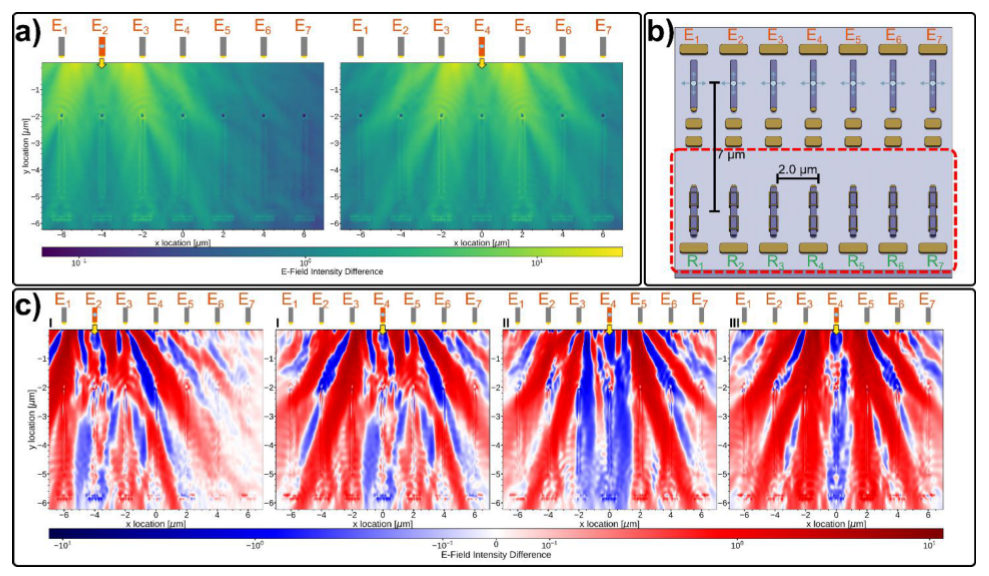 
Figure 4 - a) Intensity of the E-field in the receiver area of a system with 7 Yagi-Uda emitters and 7 receivers with examples of one emitter emitting light. The (red) emitting antenna is indicated by the yellow arrow (it is emitter #2 and #4). b) Sketch of the simulated emitter/receiver antenna system. The red box indicates the area of this system that is shown in Fig 4a. c) Intensity difference maps between symmetric Yagi-Uda and three modified Yagi-Uda systems with the middle emitter (#4) on. The design of I, II, III, referring to the wing angles of Fig 1b are shown in the SI and given by I:RHS=[0,0,0,0,80,80,80],...

📷 Fig 5

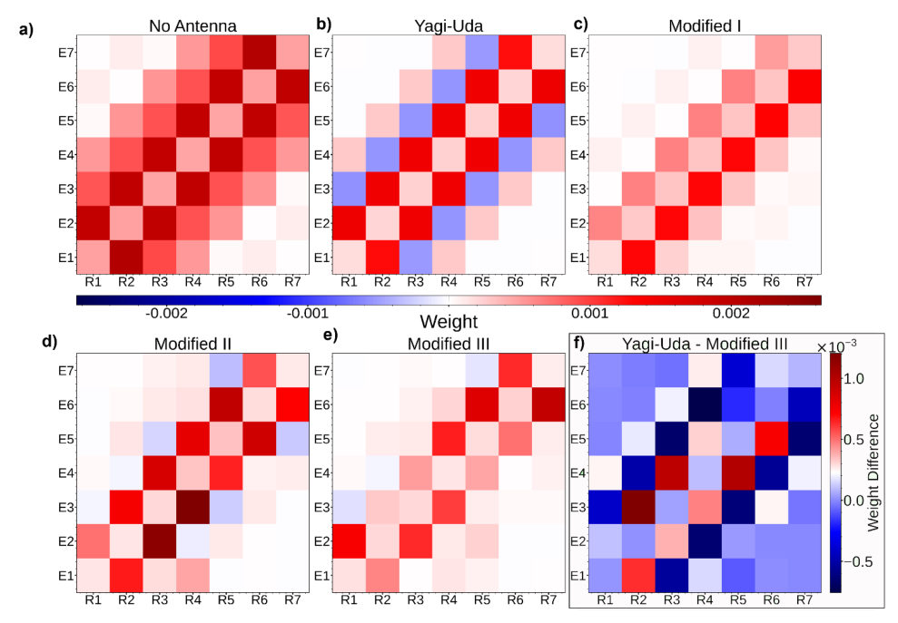 
Figure 5 - a) Weight connections of Emitters 1-7 on receivers 1-7 in networks as described by Fig 1d and e. The receiver nanowire is assumed to have both an inhibiting and exciting region as indicated in Fig 1d. The weights as defined by the summation of exciting and inhibiting signals are seen in a)-e). Schematics of the design of I, II, III, referring to Fig 1a are shown in the SI and given by I:RHS=[0,0,0,0,80,80,80],LHS=[80,80,80,220,0,0,0]; II:RHS=[0,0,0,0,80,80,80],LHS=[80,80,80,0,0,0,0]; III:RHS=[0,0,0,0,80,30,80],LHS=[30,70,80,320,60,30,0]. An angle 0 indicates that this wing is not present. f) Matrices showing the difference in weights between symmetric Yagi-Uda (Fig 5b) and...

**Summary.** This paper proposes using modified Yagi-Uda nanoplasmonic antennas integrated with III-V nanowires to create compact optical interconnects for neural networks. By precisely controlling the antenna geometry, the authors demonstrate the ability to engineer highly variable coupling strengths, enabling the realization of complex artificial synaptic weight matrices on a chip.

**Why it may be interesting.** While the core physics is classical electromagnetism, the application directly models artificial synapses and network connectivity, linking advanced photonics to computational models relevant to neuromorphic computing research.

Detailed structure

**Main problem.** The paper addresses the need for compact alternatives to traditional waveguides for implementing optical neural networks on a chip.

**Main result.** By using modified Yagi-Uda nanoplasmonic antennas, the authors demonstrated the ability to achieve highly variable and complex weight distributions between connected nodes in artificial neural network layers.

**Method.** The study relies on simulating the interaction of light with nanoplasmonic structures using Finite Difference Time Domain (FDTD) methods.

**Model / system.** The physical system combines III-V nanowire emitters/receivers with nanoplasmonic metal structures, specifically modified Yagi-Uda antennas. This setup is designed to mimic the connectivity and weight calculation of artificial neural network layers.

**Key observables.** Power absorption ($	ext{Pabs}$) on the receiver, forward/backward scattering cross-section, and the complex weight distribution between nodes.

**Important parameters / regimes.** Nanowire dimensions ($L=3 \mu	ext{m}, r=88 	ext{ nm}$), antenna director dimensions (e.g., $[D_x, D_y, D_z] = [485, 350, 60]$ nm), and director separation (750 nm).

**Assumptions / limitations.** The underlying substrate is $	ext{SiO}_2$ on $	ext{Si}$, and the nanowires are assumed to function as building blocks capable of non-linear evaluation.

**Figures summary.** Figures illustrate the basic concept, showing symmetric and modified Yagi-Uda designs, and detail the forward/backward scattering cross-section and power absorption fraction as a function of antenna director parameters.

**Paper structure.** The paper introduces the problem of compact on-chip optical communication, proposes the nanoplasmonic/Yagi-Uda antenna solution, details the simulation methodology (FDTD), presents results showing directional control and weight tunability, and concludes by discussing the potential for complex network realization.

Abstract

On-chip communication in optical neural networks is commonly done via waveguides which results in large system footprints. A compact alternative is to broadcast light signals between nano-optoelectronic components in free space and tailor the light field distribution using sub-wavelength nanophotonics. We propose and simulate nanoplasmonic metal structures in combination with III-V nanowire emitters and receivers to create an optical network in which the shape and position of these nanostructures create varying weights between the nano-optoelectronic nodes. Using Finite Difference Time Domain modelling, we investigate systems of experimentally verified nanowire optoelectronics combined with nanoplasmonic structures that can be made in the same fabrication step as electrical contacts powering the nanowires. We investigate both individual nanowire/antenna devices as well as networks corresponding to two layers in a neural network. We show that directed communication from a nanowire node can be significantly altered using Yagi-Uda antennas. Modifying the antenna with an asymmetric director component enables the directing of light several different angular directions simultaneously. We find that highly variable complex weight distribution between the connections in two seven node layers can be achieved depending on the combined geometry of the antenna components. The possible weight distributions in compact layers of nanowire nodes could be used for creating a variety of neural networks with complex connectivity. The concepts can be generalized to other types of nanoscale emitter/receiver systems.

[↑ back to top](#top)

### [Interplay of Excitonic Charge Density Wave and Superconductivity in Transition Metal Dichalcogenides](http://arxiv.org/abs/2608.29822v1)

**Authors:** Ayussh Anubhav Patel, Amit Ghosal  
**Type:** theory · **Category:** strongly correlated electrons · **PDF:** <https://arxiv.org/pdf/2608.29822v1>  
**Analysis basis:** full PDF text, analyzed in chunks
**Topic relevance:** `Frenkel-Kontorova` **1/5** · `Keldysh / 2PI / non-Gaussian methods` **1/5**

📷 Fig 1

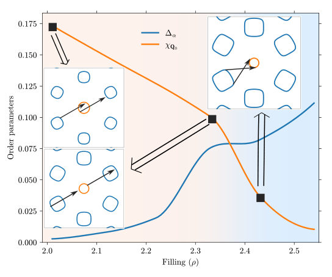 
FIG. 1. Energy-minimized phase diagram obtained by changing electronic density. The system undergoes a cross-over from C- CDW to NC-CDW order. Insets show the schematics of the relevant scattering in the system. Refer Fig 5 for details.

📷 Fig 2

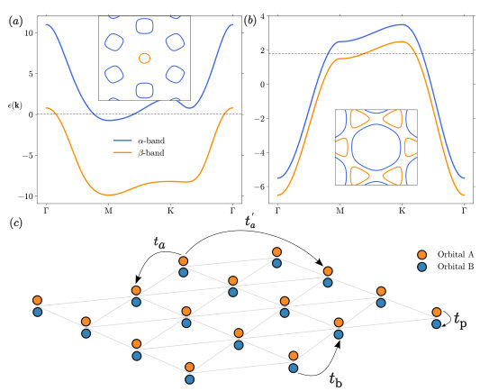 
FIG. 2. (a) Primary model: On-site energies ϵA = ϵB = −2.5, nearest neighbor hopping ta = tb = 1.0, Next nearest neighbor hopping only in A-orbital t ′ a = 0.8, on-site inter-orbital hopping is tp = 4.5 (b) and for Secondary model: ϵa 0 = 0.0, ta = tb = −1.0, t ′ a = 0.0, tp = 0.5 (inset of both figure show the geome- try of the fermi surface along the dashed black line). (c) The underlying microscopic tight-binding model which, upon diago- nalization, generates the bands in (a) and (b).

📷 Fig 3

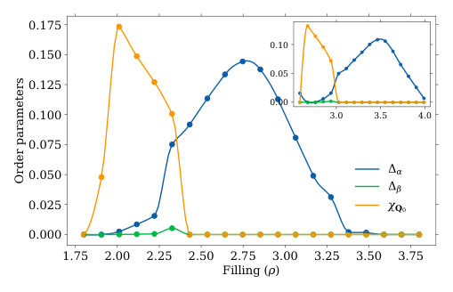 
FIG. 3. The phase diagram plotted for primary model with in- teraction strengths W = 8.0, Uα = −1.1, Uβ = 0.0 and for a fixed modulation vector of Q0 = (π, π/ √

📷 Fig 4

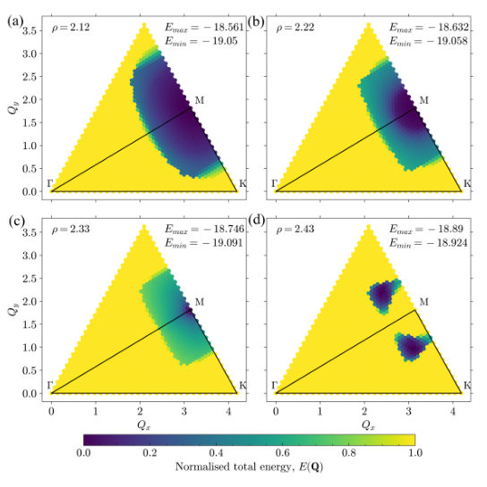 
FIG. 4. Normalized ground state energy E(Q) of the primary model with W = 8.0, U1 = −1.1 and U2 = 0.0 for all possi- ble unique modulation wave-vectors chosen from the irreducible Brillouin zone. (a),(b) and (c) The global minima fixed at Q0 show the commensurate order. The energy compared to the normal-state energy (Emax) is weakened as the density is tuned. (d) Non-commensurate order: further tuning does not support the energy gain at Q0 and the minima split.

📷 Fig 5

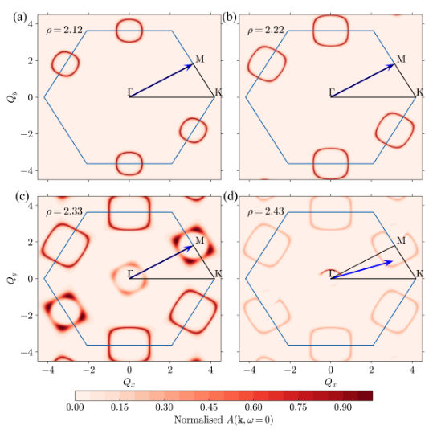 
FIG. 5. The spectral function corresponding to the FS A(k, ω = 0) for the ground state.(a)-(b) There is complete scattering be- tween the electron pockets (at the M-point) and the hole pocket (at the Γ-point) also, the outer pocket has a slight increase in size (as seen from the unscattered part of the FS). (c) Due to en- hanced filling, the FS at the M-point does not perfectly match the FS at the Γ-point, hence partial scattering. (d) Further tuning of density makes the scattering between the curvature of the outer FS and the inner circular points FS favorable.

**Summary.** This theoretical work models the competition between excitonic Charge Density Waves and Superconductivity in TMDs using a minimal mean-field Hamiltonian. By analyzing the phase diagram and spectral properties, the authors demonstrate that tuning parameters drive a transition from CDW dominance to SC emergence. The findings provide crucial insights into the intertwined nature of these two correlated electronic orders.

**Why it may be interesting.** The competition between CDW and SC is a canonical problem in strongly correlated electron systems, and the use of excitonic pairing mechanisms provides a rich theoretical framework relevant to understanding unconventional superconductivity.

Detailed structure

**Main problem.** The paper investigates the complex interplay and competition between excitonic Charge Density Wave (CDW) order and conventional Superconductivity (SC) in Transition Metal Dichalcogenides (TMDs).

**Main result.** The phase diagram shows a generic transition where CDW order wanes and SC emerges as tuning parameters change, with the CDW nature evolving from commensurate to incommensurate.

**Method.** The study employs a minimal mean-field model Hamiltonian incorporating both excitonic CDW pairing and intra-band SC attraction, analyzed via self-consistent calculations.

**Model / system.** The system is modeled on a two-dimensional triangular lattice using a two-band tight-binding Hamiltonian for the single-particle part. Interactions include excitonic CDW pairing (particle-hole) and conventional SC pairing (intra-band).

**Key observables.** CDW and SC order parameters ($\chi_q, \Delta$), spectral function $A(k, \omega)$, and the average Density of States (DOS) $N(\omega)$.

**Important parameters / regimes.** Tuning parameters include carrier density ($
ho$), and interaction strengths ($W$ for CDW, $U$ for SC).

**Assumptions / limitations.** The CDW is assumed to have an excitonic origin (inter-band pairing), and SC is assumed to be conventional (intra-band pairing). The model is a minimal toy model.

**Figures summary.** Figures illustrate the phase diagram showing C-CDW to NC-CDW crossover, band structures, and the evolution of the DOS revealing CDW gaps, SC kinks, and their coexistence.

**Paper structure.** The paper develops the mean-field Hamiltonian, analyzes the ground state energy minimization with respect to the modulation wave vector Q, and then calculates the resulting spectral properties (DOS, FS) across varying carrier densities to map the phase diagram.

Abstract

Motivated by the unique characteristics of the phase diagram of 1T-TiSe2, we investigated the complex interplay of excitonic charge density wave (CDW) and superconductivity (SC) on a two-dimensional triangular lattice, each site accommodating two orbitals. In response to various tuning parameters, such as intercalation, pressure, substitution, and gating, these materials exhibit a generic and gradual waning of CDW, followed by the emergence of SC. Intriguingly, the nature of CDW changes from commensurate to incommensurate with the appearance of SC. Setting up a minimal model based on observed excitonic CDW and electron and hole pockets in the Fermi surface, and analyzing it within a simple mean-field framework, we can comprehend some salient experimental features. We also found that the qualitative phase diagram remains insensitive to details of the band structure. These results offer crucial insights into the nature of the interplay between CDW and SC in transition-metal dichalcogenides.

[↑ back to top](#top)

### [Electronic state of vortices at twin boundaries in a nematic superconductor](http://arxiv.org/abs/2608.28994v1)

**Authors:** Keita Goto, Hiroto Adachi, Masanori Ichioka  
**Type:** theory · **Category:** strongly correlated electrons · **PDF:** <https://arxiv.org/pdf/2608.28994v1>  
**Analysis basis:** full PDF text, analyzed in chunks
**Topic relevance:** `Keldysh / 2PI / non-Gaussian methods` **1/5**

📷 Fig 1

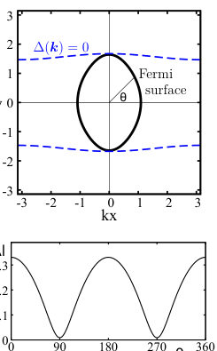 
FIG. 2. (a) Elliptic Fermi surface in our calculations is pre- sented by a bold line in momentum space (kx, ky). We also show dashed lines for the node positions of the superconduct- ing gap in the uniform state, given by ∆(k) = 0. (b) Super- conducting gap |∆(k)| on the Fermi surface as a function of angle θ given in (a).

📷 Fig 2

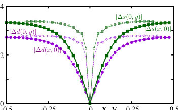 
FIG. 3. Spatial structure of the vortex state is presented in real space r/R = (x, y). Density plots for the amplitude of the pair potential for (a) the s wave component |∆s(r)| and (b) the d wave component |∆d(r)| within a unit cell. (c) Profiles of |∆s(r)| (solid lines) and |∆d(r)| (dashed lines) are plotted in the path r/R = (x, 0) along the x axis (bold lines) and r/R = (0, y) along the y axis (thin lines) from the vortex center.

📷 Fig 3

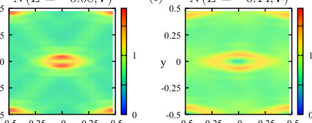 
FIG. 4. Density plots for the LDOS N(E, r) at (a) E = 0, (b) 0.04, (c) 0.08, (d) 0.14, (e) −0.08, and (f) −0.14 in real space r/R = (x, y) within a unit cell.

📷 Fig 4

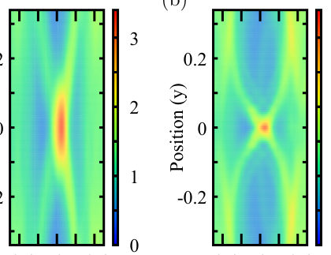 
FIG. 5. Density plots for spatial variations of the LDOS spec- tra N(E, r) as a function of E and the distance from the vor- tex center. Vertical axis of (a) and (b) is, respectively, along the path r/R = (x, 0) and (0, y). Vortex center is located at (x, y) = (0, 0).

📷 Fig 5

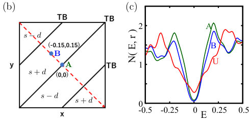 
FIG. 6. (a) Spatial variation of pair potentials at a zero field H = 0. We show Re∆s(r) and Re∆d(r) as a function of x/R along a dash-dot line y = −x in (b). Im∆s(r) ∼0 and Im∆d(r) ∼0. (b) The square region of a unit cell in our calculation is schematically presented. The twin boundaries (TB) are located at diagonal solid lines, separating s + d and s−d wave pairing domains. Periodic boundary conditions are applied. (c) Spectra of LDOS N(E, r) as a function of energy E. Line A is for just on the twin boundary r = (0, 0), and line B is for a middle point r/R = (−0.15, 0.15) between two neighboring twin boundaries. The positions of A and B are also presented in (b). Line U is for N(E) in the...

**Summary.** This theoretical work analyzes the electronic structure of vortices situated at twin boundaries in a nematic superconductor using the Bogoliubov-de Gennes theory. The research finds that the boundary induces fractional vortices and novel s +/- id wave components in the superconducting order parameter. This provides crucial insights into how structural defects interact with complex pairing symmetries in correlated superconducting materials.

**Why it may be interesting.** The study of exotic superconducting phases, such as those exhibiting nematicity and complex pairing symmetries (like s +/- id), is highly relevant to understanding unconventional superconductivity in materials like iron-based superconductors, which often involve strong electronic correlations.

Detailed structure

**Main problem.** The study investigates the local electronic states of vortices when they are trapped at twin boundaries within a nematic superconductor.

**Main result.** The trapping of a single vortex at a twin boundary results in a bound pair of fractional vortices accompanied by weakly-induced s +/- id wave components, even though these components are absent in zero magnetic field.

**Method.** The authors employed the Bogoliubov-de Gennes (BdG) theory using a tight-binding model to calculate the local density of states (LDOS) and pair potentials.

**Model / system.** The system is a nematic superconductor, modeled on a square lattice with nematicity introduced via anisotropy in transfer integrals and attractive interactions. The superconductivity is described by an s +/- d wave pairing potential.

**Key observables.** Local density of states (LDOS), pair potential components (s and d wave), and the vortex core structure.

**Important parameters / regimes.** Nematic anisotropy, twin boundary structure, and the superconducting gap parameters ($\Delta_s, \Delta_d$).

**Assumptions / limitations.** The model uses a simple tight-binding approximation and assumes spin-singlet pairing; it also notes that the model might fail to capture the full complexity of time-reversal symmetry breaking at the boundary.

**Figures summary.** Figures illustrate the spatial structure of the pair potential components and the LDOS spectra, comparing vortex states with and without twin boundaries.

**Paper structure.** The paper progresses by first establishing the theoretical framework (BdG theory, tight-binding model) and then analyzing the electronic states in different regimes: first, the vortex state without boundaries, followed by the analysis of the twin boundary state, culminating in the combined vortex-at-twin-boundary case.

Abstract

Local electronic states of vortices in an s $\pm$ d wave nematic superconductor are studied both in the absence and presence of twin boundaries. The Bogoliubov-de Gennes theory for a tight-binding model is used with its nematicity represented by the anisotropy in the transfer integrals and attractive interactions between the nearest-neighbor sites. We evaluate s and d wave components of the pair potentials and the local density of states, and analyze the effects of nematicity on the vortex core structures with/without twin boundaries. We find that a single vortex trapped at the twin boundary is composed of a bound pair of fractional vortices accompanied by weakly-induced s $\pm$ id wave components, despite that such s $\pm$ id wave components do not appear in a zero magnetic field. The calculated spatial structures of the local electronic states are compared with the vortex image measured by STM experiments in an iron-based superconductor FeSe.

[↑ back to top](#top)

### [Fractional Impurity Entropy from Potential Scattering in a Free Electron Gas](http://arxiv.org/abs/2608.29007v1)

**Authors:** Syeda Neha Zaidi, Jukka I. Väyrynen  
**Type:** theory · **Category:** statistical mechanics · **PDF:** <https://arxiv.org/pdf/2608.29007v1>  
**Analysis basis:** full PDF text, analyzed in chunks
**Topic relevance:** `analog quantum simulation` **1/5**

📷 Fig 1

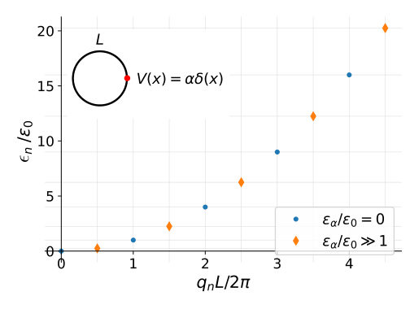 
FIG. 1. Single-particle spectrum of free electrons confined to a one-dimensional ring of circumference L and scattering off a localized, repulsive delta-function potential of strength α (inset). Here, εα = α/L characterizes the impurity strength, while ε0 = π2/2mL2 is the characteristic finite-size energy scale for the quadratic dispersion given in Eq. (6). As εα/ε0 increases, the allowed momenta evolve from qnL/2π = n (blue points) to qnL/2π = n + 1

📷 Fig 2

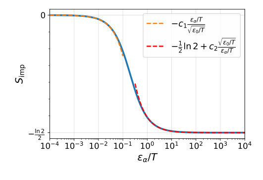 
FIG. 2. Numerically evaluated impurity entropy (blue curve) as a function of the scattering potential strength εα = α/L for fixed ε0/T = 4.93×10−2. As the potential strength increases, the system undergoes an entropy change of Simp = −1

📷 Fig 3

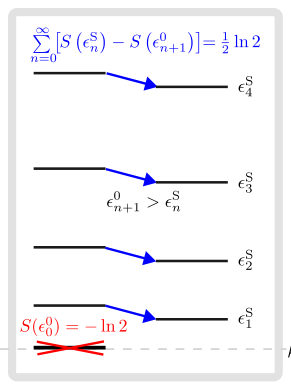 
FIG. 3. Schematic evolution of the energy levels and the associated change in entropy as the scattering potential is changed. Left: the energy spectrum with the scattering po- tential turned off, i.e., εα/T = 0, with entropy S(0) = ln 2 + P∞ n=1 S(ϵ0 n), the first term coming from ground state degener- acy due to a zero-energy level (note chemical potential µ = 0 here). Boxed: Turning on εα/T removes the zero-energy state and shifts each excited level downwards. The former effect lowers the entropy by ln 2 while Eq. (26) shows the latter ef- fect contributes P∞ n=0  S(ϵS n) −S(ϵ0 n+1)  = 1

📷 Fig 4

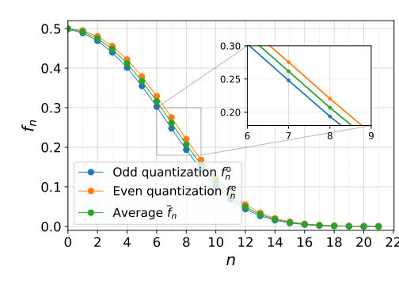 
FIG. 4. The Fermi distributions f o n and f e n of a quadratic spectrum corresponding odd and even momentum quanti- zation condition, respectively. The average of these distri- butions f n = (f o n + f e n)/2 is also shown. Here, we fixed ε0/T = 4.93 × 10−3.

📷 Fig 5

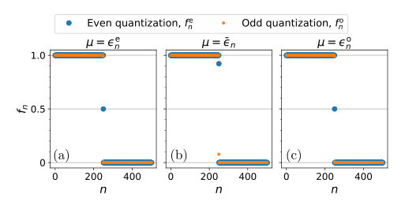 
FIG. 6. The Fermi distributions of a quadratic dispersion for three values of the chemical potential are plotted for ε0/T = 4.93 × 10−3. In panels (a), (b), and (c), the chemical potential is fine-tuned to intersect with the even, average, and odd energy level associated with n = 225. For this n, the level spacing is large enough for the system to be in the effective zero temperature limit, so the Fermi distribution behaves like a step-function.

**Summary.** This theoretical work shows that a simple system of free electrons scattering off an impurity can exhibit a universal fractional entropy change. This effect arises purely from the shift in allowed single-particle momenta from integer to half-integer quantization. The result suggests that such entropy signatures are not exclusively markers for strong correlations or topological order.

**Why it may be interesting.** The finding suggests that signatures previously thought to require exotic physics (like non-Abelian anyons) can arise from simple boundary conditions or level quantization shifts, broadening the scope of what constitutes an 'entropic signature'.

Detailed structure

**Main problem.** To demonstrate that fractional entropy changes can occur in simple, non-interacting systems (free electrons) without invoking strong electron correlations or topological order.

**Main result.** The system exhibits a universal entropy change of $-rac{1}{2}\ln 2$ when the impurity strength is varied, which is attributed to a shift in single-particle momentum quantization from integer to half-integer values.

**Method.** The entropy is calculated by analyzing the impurity partition function, $Z_{	ext{imp}}(\alpha) = Z(\alpha) / Z(0)$, and taking its derivative with respect to temperature.

**Model / system.** The model is a free electron gas confined to a one-dimensional ring of circumference L, scattering off a repulsive point-like impurity of strength $\alpha$. The analysis compares spectra quantized by odd versus even integers.

**Key observables.** Impurity entropy change ($S_{	ext{imp}}$) and the boundary entropy change ($\Delta S$).

**Important parameters / regimes.** Temperature ($T$), impurity strength ($\alpha$), and the ratio of energy scales ($\epsilon_\alpha/T$ and $\epsilon_0/T$).

**Assumptions / limitations.** The analysis relies on asymptotic limits (weak/strong scattering) and approximations like Taylor expansions and integral conversions.

**Figures summary.** Figures illustrate the shift of allowed momenta from integer to half-integer quantization, and numerically evaluate the entropy change as a function of the impurity strength ratio.

**Paper structure.** The paper first establishes the physical model and calculates the entropy change in the presence of an impurity. It then generalizes the analysis by comparing spectra quantized by odd versus even integers to derive a universal boundary entropy change, $\Delta S$.

Abstract

Fractional changes in entropy are often associated with strong electron correlations or non-Abelian anyons in topological systems. We show that neither condition is necessary -- a system of free electrons on a ring scattering off a repulsive point-like impurity undergoes a $k_B\ln\sqrt 2$ entropy change as the impurity strength is increased. This effect arises from a shift of allowed single-particle momenta from integer quantization to half-integer quantization, induced by the impurity. We show that this fractional entropy change is universal across a broad class of single-particle dispersions, demonstrating that such signatures can arise without strong correlations or topological order.

[↑ back to top](#top)

### [Layer Axial Phonons and Dipolar Thermal Response in Centrosymmetric Thin Films](http://arxiv.org/abs/2608.30600v1)

**Authors:** Madhubanti Mukherjee, Kapil Gope, Barun Ghosh  
**Type:** theory · **Category:** other · **PDF:** <https://arxiv.org/pdf/2608.30600v1>  
**Analysis basis:** full PDF text, analyzed in chunks
**Topic relevance:** `analog quantum simulation` **1/5**

📷 Fig 1

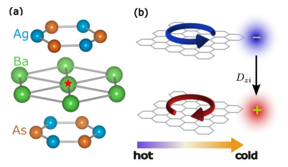 
FIG. 1. (a) Schematic crystal structure of BaAgAs, composed of al- ternating Ba and Ag–As layers. The star marks the inversion cen- ter relating the top and bottom Ag–As layers. (b) Hidden layer- resolved phonon AM, illustrated by oppositely circulating arrows on the inversion-partner layers. An in-plane temperature gradient in- duces equal-and-opposite layer phonon AM accumulations, produc- ing a finite real-space phonon AM dipole despite the vanishing total phonon AM.

📷 Fig 2

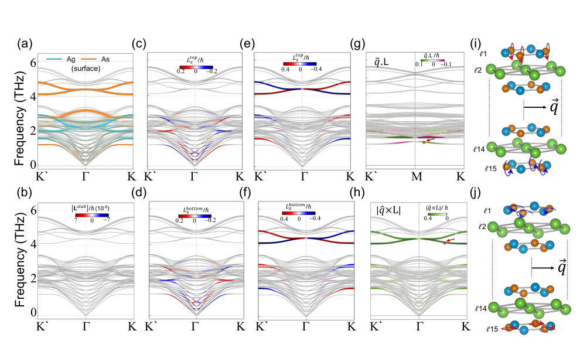 
FIG. 2. (a) Contributions of the top- and bottom-layer Ag–As atoms to the phonon modes. (b) The total Lslab projected onto the phonon dispersions. Clearly Lslab , and therefore each component of the phonon AM, vanishes for the whole slab. (c), (e) Lx and Lz components, respectively, of the phonon AM contributed by the top Ag–As layer. (d), (f) The corresponding phonon AM components for the bottom Ag–As layer. (g), (h) Helicity and cycloidicity of the top Ag–As surface, respectively. (i), (j) Representative chiral and cycloidal atomic motions, respectively, for the phonon mode (denoted by the red arrows) along K′ −M −K and K′ −Γ −K. Red and blue circular arrows indicate opposite handedness...

📷 Fig 3

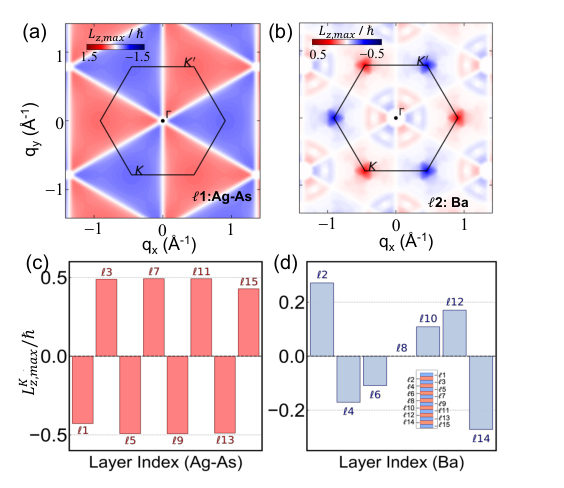 
FIG. 3. (a) Lℓ z texture of the top Ag–As layer, ℓ1, branch n = 54, ω = 4.10 THz (b) Lℓ z texture of the adjacent top Ba layer ℓ2, branch n = 28 , ω = 2.29 THz; (c), (d) maximum Lz at K versus layer index for Ag–As and Ba layers, respectively. The Ag–As layers ex- hibit large phonon AM throughout the slab, whereas the phonon AM in the Ba layers decays with increasing distance from the surface.

📷 Fig 4

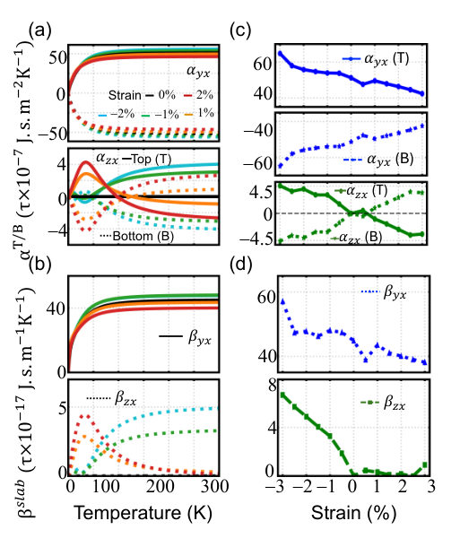 
FIG. 4. (a) Temperature dependence of the layer-resolved αℓ yx, αℓ zx for −2% to +2% strains. Solid and dotted curves denote the top and bottom layers, with αT ij = −αB ij. (b) Corresponding temperature dependence of slab dipole responses βslab yx , and βslab zx . (c, d) αℓ ij and βslab ij at T = 300 K versus strain, showing the activation of symmetry-forbidden components.

📷 Fig 5

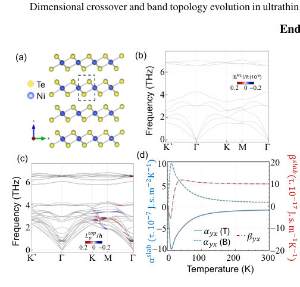 
FIG. 5. (a) Side view of a four-layer NiTe2 slab with P¯3m1 sym- metry; the dashed box marks one monolayer. (b) Total phonon AM magnitude projected onto the monolayer phonon dispersion, which vanishes within numerical precision. (c) The y component of the top-layer phonon AM, Ltop y , projected onto the phonon dispersion of the fourlayer slab, showing finite hidden layer phonon AM. (d) Tem- perature dependence of the layer-resolved responses αℓ yx for the top (T) and bottom (B) layers and the whole-slab dipole response βslab yx .

**Summary.** This work explores how centrosymmetric thin films can host measurable phonon angular momentum (AM) responses despite symmetry dictating zero total AM. By analyzing layer-resolved AM, the authors show that compensating local AMs create a finite, measurable dipole moment across the slab. This establishes these materials as promising platforms for studying hidden, multipolar phonon thermal responses.

**Why it may be interesting.** While focused on condensed matter physics, the concept of symmetry-protected, hidden, and tunable multipolar responses in lattice vibrations (phonons) shares conceptual parallels with engineered topological responses in quantum materials, making it relevant to understanding emergent collective excitations.

Detailed structure

**Main problem.** The study investigates the existence and physical consequences of 'hidden' layer-resolved phonon angular momentum (AM) in globally centrosymmetric thin films, despite the total phonon AM vanishing due to symmetry.

**Main result.** The compensation of local, opposite phonon AM contributions across inversion-partner layers results in a finite, measurable real-space phonon AM dipole moment and layer-resolved thermal responses, which can be tuned by strain or substrate interfaces.

**Method.** The research employs first-principles calculations to analyze phonon dispersions and calculate layer-resolved phonon AM textures and associated thermal response tensors.

**Model / system.** The primary systems are centrosymmetric thin films, including BaAgAs, SrAgAs, and van der Waals materials like hBN and WSe2. The analysis compares bulk/monolayer structures to finite multilayer slabs and heterostructures.

**Key observables.** Layer-resolved phonon AM ($\mathbf{L}_{\ell}$), total slab phonon AM ($\mathbf{L}_{	ext{slab}}$), layer-resolved thermal Edelstein-like response ($\alpha^{\ell}_{ij}$), and the real-space phonon AM dipole response ($eta^{	ext{slab}}_{ij}$).

**Important parameters / regimes.** Uniaxial strain, temperature gradient, and the structural termination/interface (e.g., hBN substrate).

**Assumptions / limitations.** The analysis relies on the constant phonon relaxation-time ($	au$) approximation.

**Figures summary.** Figures illustrate the vanishing total phonon AM in bulk/monolayer structures but show finite, opposite AM in individual layers (e.g., Fig. 2(c)–(f)). They also demonstrate finite layer-resolved responses ($\alpha^{\ell}_{ij}$) and non-zero slab dipole moments ($eta^{	ext{slab}}_{ij}$) in finite slabs or heterostructures (e.g., Fig. 5, Fig. 6).

**Paper structure.** The paper progresses by establishing the symmetry constraint ($\mathbf{L}_{	ext{slab}}=0$) in centrosymmetric bulk materials, then demonstrating how finite slab geometry or heterostructuring breaks this constraint locally, activating finite layer AM and measurable dipolar thermal responses.

Abstract

In nonmagnetic centrosymmetric materials, $\mathcal{PT}$ symmetry enforces vanishing total phonon angular momentum (phonon AM) at every wave vector, making them appear unsuitable as hosts of axial phonons. Here, using first-principles calculations for BaAgAs and representative van der Waal's layered materials, we show that centrosymmetric slabs can still host large hidden layer-resolved phonon AM with both chiral and cycloidal modes. This hidden phonon AM texture produces layer resolved phonon thermal Edelstein-like responses and a real-space phonon AM dipole response, both tunable by strain. Our results establish centrosymmetric layered materials as an exciting platform for hidden axial phonon and multipolar phonon thermal response.

[↑ back to top](#top)

### [Machine learning reveals common features of unconventional superconductors with high transition temperatures](http://arxiv.org/abs/2608.30588v1)

**Authors:** Haosheng Xu, Dongheng Qian, Yijun Yu, Jing Wang  
**Type:** theory · **Category:** strongly correlated electrons · **PDF:** <https://arxiv.org/pdf/2608.30588v1>  
**Analysis basis:** full PDF text, analyzed in chunks
**Topic relevance:** `analog quantum simulation` **1/5**

📷 Fig 1

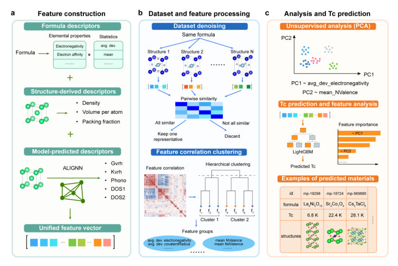 
Figure 1. Overview of the machine-learning workflow. a, Construction of a unified 147-dimensional feature vector from composition-derived descriptors, structure-derived descriptors, and latent representations extracted from pre-trained ALIGNN models. b, Dataset curation through structure-aware filtering, and organization of the descriptors into feature groups by hierarchical clustering. c, Unsupervised PCA analysis, supervised Tc prediction with feature importance analysis, and candidate screening.

📷 Fig 2

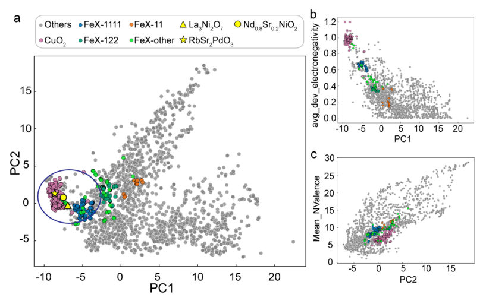 
Figure 2. Unsupervised analysis of the superconducting materials space. a, Projection of the curated superconducting dataset onto the PC1–PC2 plane. Cu-based and iron-based families concentrate in a common region (ellipse), into which La3Ni2O7 (triangle), Nd0.8Sr0.2NiO2 (circle) and RbSr2PdO3 (star), all of which are outside the training set, also fall. b,c, Relationships between PC1 and avg dev Electronegativity (b) and between PC2 and mean NValence (c), with colors as in a.

📷 Fig 3

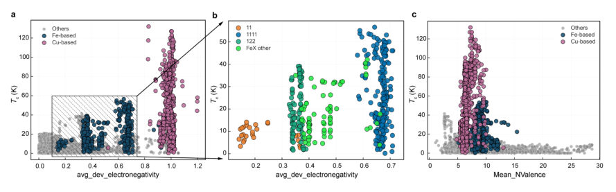 
Figure 3. Dependence of Tc on the two leading descriptors. a, Tc versus avg dev Electronegativity. The inset shows the iron-based subfamilies separately. b, Tc versus mean NValence.

📷 Fig 4

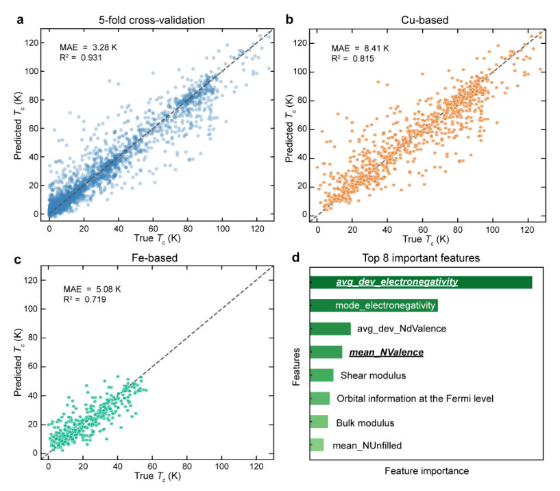 
Figure 4. Supervised prediction of Tc. a, Predicted versus experimental Tc under five-fold cross-validation (MAE = 3.28 K, R2 = 0.931); the dashed line marks perfect prediction. b,c, Experimental and out-of-fold predicted Tc values for (b) cuprate and (c) iron-based superconductors obtained from five-fold cross-validation. d, The eight most important feature groups for Tc prediction.

📷 Fig 5

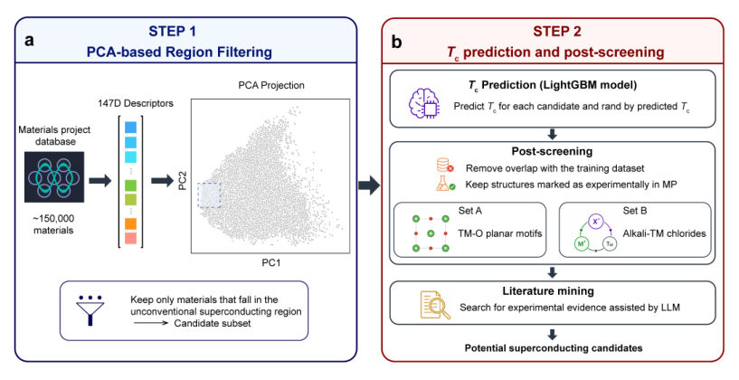 
Figure 5. Two-step screening of potential superconducting candidates. Materials from the Materials Project database are first filtered by their position in the PC1–PC2 plane, and the retained candidates are then ranked by predicted Tc, post- screened into two targeted subsets (sets A and B), and examined through literature mining assisted by large language models.

**Summary.** This work uses machine learning to bypass the need for a fundamental theory of high-Tc superconductivity. By analyzing structural and chemical features of known materials, the authors identified key empirical signatures—specifically large electronegativity deviation and intermediate valence electron counts—that characterize these complex superconductors. This data-driven prior allows for the prediction and prioritization of entirely new candidate materials.

**Why it may be interesting.** While focused on solid-state materials, the use of ML to extract robust, generalizable descriptors from complex electronic and structural data mirrors approaches used in modeling strongly correlated quantum systems where first-principles calculations are intractable.

Detailed structure

**Main problem.** To find a common, data-driven materials-space signature for high-Tc unconventional superconductors, as no broadly applicable predictive theory currently guides their discovery.

**Main result.** The analysis revealed that high-Tc unconventional superconductors cluster in a materials space characterized by large electronegativity deviation and intermediate mean valence-electron numbers.

**Method.** The study employed interpretable machine learning, integrating compositional, structural, and latent electronic representations to perform unsupervised clustering and supervised $T_c$ prediction.

**Model / system.** The focus is on unconventional superconductors, particularly cuprate and iron-based families, analyzed using a unified feature vector combining 120+ dimensions from elemental properties, crystal structure, and ALIGNN-derived embeddings.

**Key observables.** Critical temperature ($T_c$), average deviation of electronegativity, and mean number of valence electrons.

**Important parameters / regimes.** Intermediate mean valence-electron number ($\approx 7-8$); large electronegativity deviation.

**Assumptions / limitations.** The approach avoids assuming a particular microscopic pairing mechanism, relying instead on empirical correlations within the materials space.

**Figures summary.** Figures illustrate the ML workflow, the clustering of superconducting materials in the feature space (PC1-PC2 plane), and the correlation of $T_c$ with the key descriptors.

**Paper structure.** The paper follows a workflow: 1) Constructing a high-dimensional feature vector; 2) Curating the dataset; 3) Performing unsupervised analysis (PCA) to find common regions; and 4) Using supervised learning to confirm feature importance and prioritize new candidates.

Abstract

Superconductors with high critical temperatures that emerges beyond the phonon-mediated regime are usually considered unconventional in nature, yet unlike conventional superconductors, no broadly applicable predictive theory currently guides their discovery. Here, we use interpretable machine learning to uncover a common materials-space signature of high-$T_{\mathrm{c}}$ unconventional superconductors and develop a data-driven strategy for materials discovery. We construct a unified feature representation for each material by integrating compositional statistics, structural information, and latent representations from trained property-prediction models, followed by structure-aware filtering of an experimentally established superconducting dataset. Without using transition-temperature information, unsupervised analysis shows that cuprate and iron-based superconductors occupy a common region of materials space, characterized primarily by large electronegativity deviation and intermediate mean valence-electron number. A supervised $T_{\text{c}}$ model independently identifies the same descriptors as dominant features, providing complementary evidence for their relevance. Using this empirical materials-space prior together with the $T_{\text{c}}$ model, we prioritize candidate materials, recover recently discovered nickelate superconductors, and identify chemically distinct candidates for future investigation.

[↑ back to top](#top)

### [Magnetic contacts on freestanding superconducting LaAlO$_3$/SrTiO$_3$ micromembranes](http://arxiv.org/abs/2608.29771v1)

**Authors:** Thies Jansen, Pinelopi Konstantinopoulou, Niklas Martin, Fabio Miletto Granozio, Alessia Sambri, Rasmus Bjørk, Felix Trier, Thomas S. Jespersen  
**Type:** experiment · **Category:** strongly correlated electrons · **PDF:** <https://arxiv.org/pdf/2608.29771v1>  
**Analysis basis:** full PDF text, analyzed in chunks
**Topic relevance:** `quantum measurements` **1/5**

📷 Fig 1

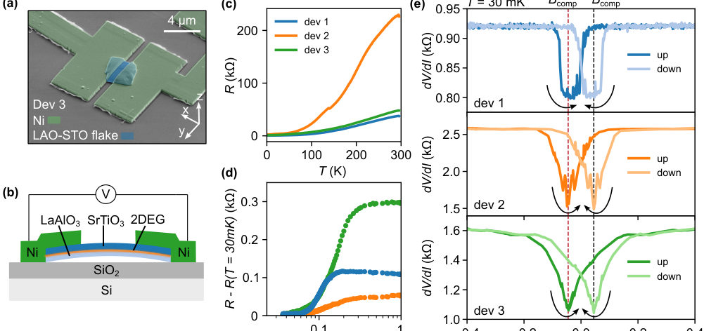 
FIG. 1. (a) A false-coloured scanning electron micrograph of a LAO-STO micromembrane contacted with nickel contacts. The curvature of the micromembrane reveals that the STO is on top. (b) schematic of the device. (c) The two point resistance as function of the temperature from 300 K to 1 K for three different devices. Here the residual resistance at 30 mK, including the contact and filter resistance is subtracted. (d) The two point resistance as function of temperature from 1 K down to 30 mK revealing the superconducting state in all three devices. (e) Differential resistance as function of the out-of-plane magnetic field for positive and negative field sweep directions, displaying...

📷 Fig 2

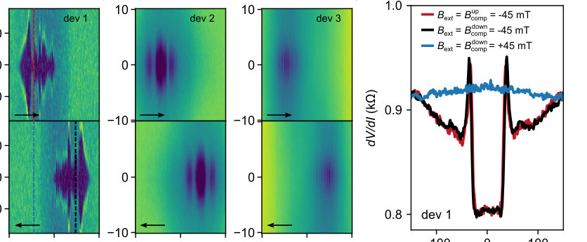 
FIG. 2. (a-c) Differential resistance as function of current bias and magnetic field for the positive and negative sweeping direction for three different devices. The differential resistance maps reflect the symmetry R(Ibias, Bz) = R(Ibias, −Bz) (d) Differential resistance of device 1 as function of current bias and external magnetic field for three magnetic field sweeping histories. The blue and black curve show that drastically different superconducting states can be achieved at the same field, but with different sweeping directions. The blue and orange curve show that the same switching current is observed at different magnetic fields.

📷 Fig 3

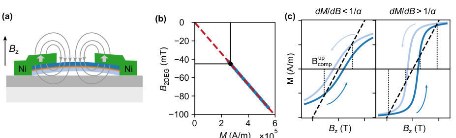 
FIG. 3. (a) Schematic displaying the field lines for magnetized contacts in the positive z-direction. (b) Results of the finite element simulations relating the the effective field in the 2DEG at Bz = 0 to the magnetization of the contacts. (c) The condition that B2DEG(Bz) = 0, is qualitatively obtained by the crossings of Mz with the dashed line Bz/α. Depending on the steepness and remanence of Mz(Bz), B2DEG(Bz) vanishes once or three times for a single sweep direction.

📷 Fig 4

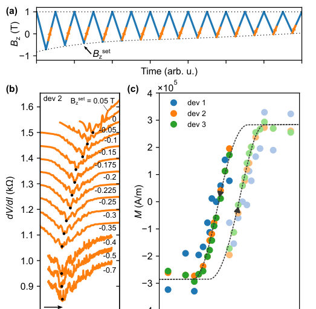 
FIG. 4. By avoiding complete magnetization reversal of the nickel contacts, the effective magnetic field experienced by the 2DEG can be continuously tuned. (a) shows schematically the applied magnetic field as function of time. The applied field is set at 1 T to initialize the magnetization and subsequently swept to a value Bset z &lt; 1 T to partially reverse the magneti- zation. On the back sweep, the traces in (b) are measured, as indicated by the orange marked lines. (c) Effective magneti- zation within our effective field model of the nickel contacts, Mz, as a function of Bset z .

📷 Fig 5

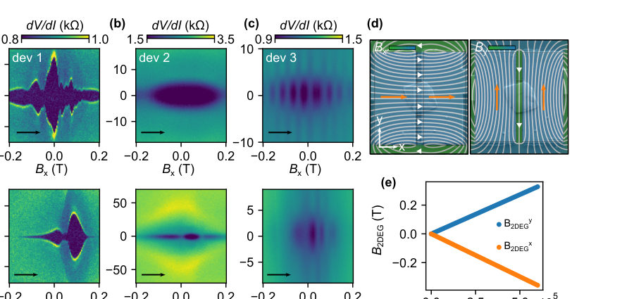 
FIG. 5. (a-c) Differential resistance as function of bias and magnetic field in the x and y direction for three devices. The qualitative difference between the symmetric Bx sweeps and asymmetric By sweeps can be explained by the difference in sign of the effective field experienced by the 2DEG with respect to the magnetization as illustrated in (d). (e) Finite element simulation of the effective field in the x and y direction with a different sign as function of the magnetization in the x and y direction respectively.

**Summary.** This work demonstrates the feasibility of using ferromagnetic contacts on superconducting LaAlO3/SrTiO3 membranes for superconducting spintronics. By measuring transport properties, the researchers showed that the superconducting state is highly sensitive to the magnetic history of the nickel contacts. This establishes a platform for studying spin injection and magnetic control in oxide superconductors.

**Why it may be interesting.** The study directly investigates the interplay between magnetism and superconductivity in complex oxide interfaces, which is a key area for understanding unconventional superconductivity and spin-charge coupling in condensed matter systems.

Detailed structure

**Main problem.** The primary challenge addressed is integrating ferromagnetic contacts with the superconducting two-dimensional electron gas (2DEG) at the LaAlO3/SrTiO3 interface for superconducting spintronics.

**Main result.** Superconductivity is preserved in the presence of ferromagnetic contacts, and the superconducting state is strongly controlled by the magnetic history of these contacts, allowing the 2DEG to act as a sensitive magnetometer.

**Method.** Low-temperature transport measurements, specifically measuring differential resistance (dV/dI) as a function of applied magnetic field and current bias, were used to probe the superconducting state.

**Model / system.** The physical system is a superconducting 2DEG formed at the LAO-STO interface, realized in freestanding micromembranes contacted by ferromagnetic nickel. The physics is modeled using an effective field approach that accounts for the stray magnetic field generated by the contacts.

**Key observables.** Superconducting transition temperature, hysteretic dependence of dV/dI on magnetic field, and the switching current (Ic).

**Important parameters / regimes.** Low temperatures (down to 30 mK), magnetic fields (up to 6 T), and the magnetic history/magnetization state of the Ni contacts.

**Assumptions / limitations.** The superconducting state is sensitive to the effective magnetic field generated by the combination of the external field and the contact magnetization.

**Figures summary.** Figures show SEM images of the device, resistance vs. temperature curves confirming superconductivity, and detailed dV/dI maps showing hysteretic dependence on applied magnetic fields and current bias.

**Paper structure.** The paper establishes the device platform, presents transport measurements demonstrating superconductivity coexistence with ferromagnetism, and then develops an effective field model to quantify how the contact magnetization dictates the superconducting response.

Abstract

The superconducting two-dimensional electron gas (2DEG) at the LaAlO$_3$/SrTiO$_3$ (LAO-STO) interface is a promising platform for superconducting spintronics, however, integrating ferromagnetic contacts with the superconducting 2DEG remains challenging. Here, we realize superconducting LAO-STO micromembrane devices contacted by ferromagnetic nickel contacts through a side-contact geometry. Low-temperature transport measurements demonstrate that superconductivity is preserved in the presence of the ferromagnetic contacts. We show that the superconducting state is strongly influenced by the magnetic history of the nickel contacts, which generates a tunable effective magnetic field in the 2DEG. Through an effective field model, the magnetization of the contacts can be inferred from the maximum superconducting response. Our results establish ferromagnetically contacted LAO-STO as a platform for future investigations of spin injection into oxide superconductors and provide a route towards superconducting spintronic devices based on complex oxide interfaces.

[↑ back to top](#top)

### [Surface-mediated frequency aging beyond quality-factor saturation in an AlScN-on-silicon resonator](http://arxiv.org/abs/2608.28959v1)

**Authors:** S M Enamul Hoque Yousuf, Mahmudul Hasan, Shruti Mishra, Sourav Mukherjee, Jinghan Gao, Roozbeh Tabrizian  
**Type:** experiment · **Category:** other · **PDF:** <https://arxiv.org/pdf/2608.28959v1>  
**Analysis basis:** full PDF text, analyzed in chunks
**Topic relevance:** `quantum measurements` **1/5**

📷 Fig 1

 
Figure 1. AlScN-on-Si Lamé-mode resonator and pressure-dependent response. (a) Optical micrograph of the resonator. The phosphorus-doped silicon body is suspended by phononic crystal tethers inside a 10 µm sidewall gap, and the top molybdenum (Mo) electrode is patterned on the AlScN film to provide all-electrical actuation and readout. Scale bar: 150 μm (b) Simulated mode shape of the third order out-of-plane cross-sectional Lamé mode at 64.21 MHz. (c) Schematic of the measurement system showing the device under test (DUT) inside an ExploraVac Max chamber with closed-loop pressure and temperature control and is driven and read out by a Zurich UHFLI lock-in amplifier. (d) Transmission...

📷 Fig 2

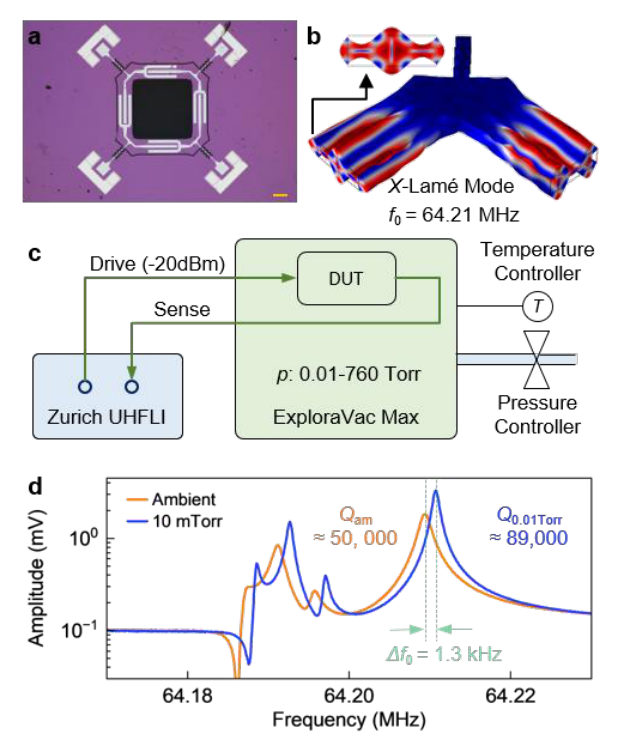 
Figure 1a shows an optical image of the degenerately phosphorus-doped single-crystal silicon

📷 Fig 3

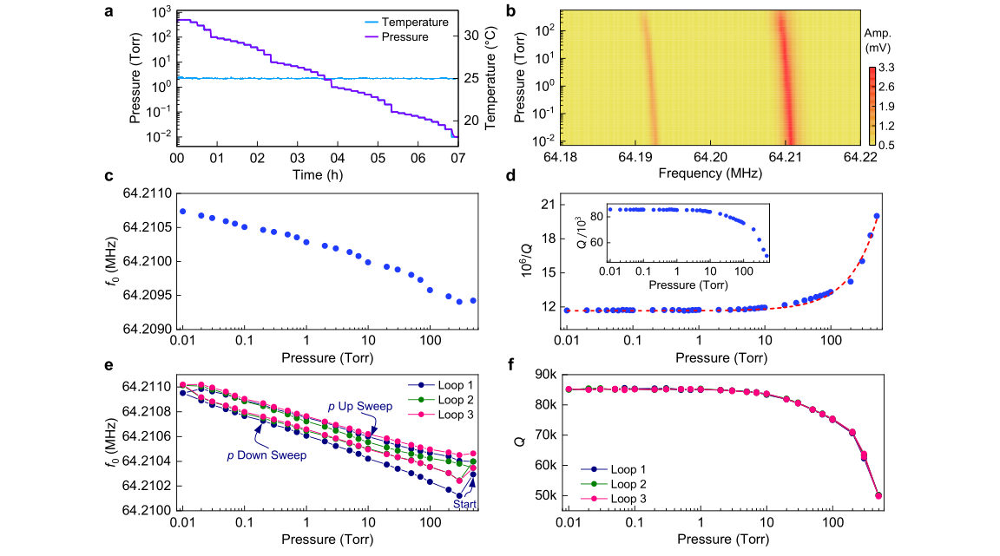 
Figure 2. Pressure-dependent f0 and Q at 25 °C. (a) Applied pressure is stepped from 500 Torr to 0.01 Torr over time. The right axis shows that the measured temperature remains at 25 °C throughout the experiment. (b) Resonance amplitude color map resolving two nearby modes from distinct arms of the resonator. (c) f0 rises monotonically as pressure falls, gaining approximately 1.3 kHz from 500 to 0.01 Torr. (d) Extracted Q versus p demonstrates that Q remains near its intrinsic ceiling (≈ 8.5 × 104) below ~1 Torr and decreases with increasing pressure, reaching approximately half this value near 500 Torr. (e) Three consecutive up-and-down pressure loops show that f0 traces a repeatable...

📷 Fig 4

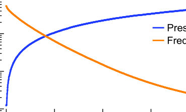 
Figure 3. High-vacuum frequency response measured at 25 °C. (a) Chamber pressure and PLL-tracked resonance frequency f0 during a pump-isolation transient. After 1 h of evacuation, the pump is isolated from the chamber, and the pressure rises from approximately 10-6 to 5×10-4 Torr over 900 s while f0 decreases monotonically. (b) Fractional frequency shift Δf0/f0 as a function of the simultaneously measured pressure. The fractional frequency shift remains nearly constant below approximately 10-5 Torr and reaches -800 ppb at 5×10-4 Torr.

📷 Fig 5

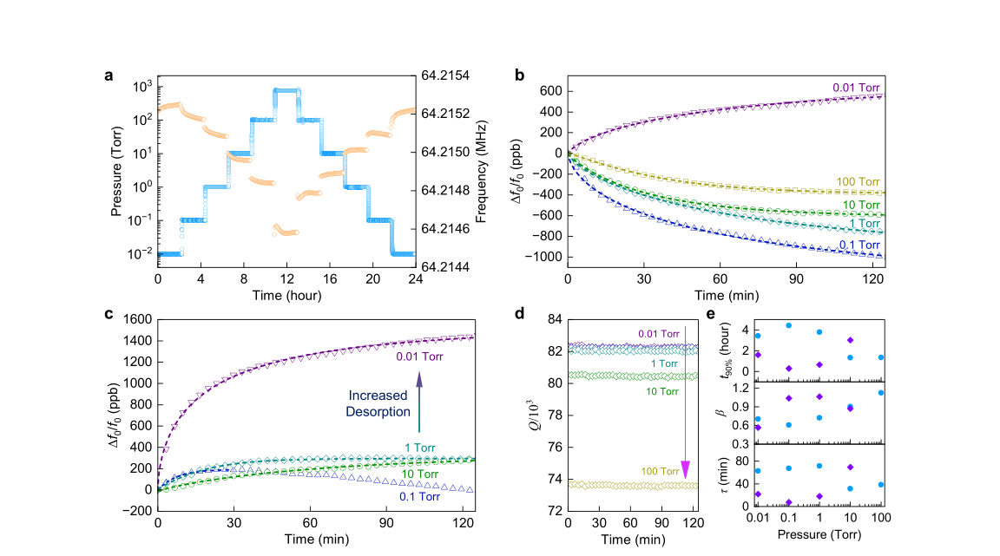 
Figure 4. Pressure-step relaxation kinetics at 68.8 C frequency turnover. (a) Full pressure cycle and the simultaneously recorded f0, with first-order temperature sensitivity suppressed. (b) On the pressure up-sweep, Δf0/f0 falls through adsorption-induced mass loading. Dashed curves show stretched-exponential fits, with larger relaxation amplitudes at lower pressures. The initial 0.01 Torr trace instead rises, reflecting desorption of adsorbates accumulated during the preceding atmospheric exposure. (c) On the pressure down-sweep, Δf0/f0 rises as adsorbate mass is released, with the relaxation amplitude increasing as pressure decreases and reaching approximately 1400 ppb at 0.01 Torr. (d)...

**Summary.** The study investigates the stability of a micro-resonator by measuring both its energy dissipation (Q) and its resonant frequency (f0) across varying vacuum pressures. The key finding is that while Q can reach a saturation limit, the frequency f0 continues to drift slowly over hours due to surface adsorption/desorption processes. Therefore, simply ensuring low damping is insufficient for high-precision vacuum applications; surface chemistry must also be controlled.

**Why it may be interesting.** This work provides a rigorous experimental framework for characterizing the stability of mechanical oscillators in vacuum, distinguishing between simple damping loss and complex, slow surface adsorption/desorption dynamics, which is crucial for high-precision sensing.

Detailed structure

**Main problem.** To determine if quality-factor (Q) saturation alone is sufficient to qualify vacuum packaging for precision mechanical frequency references, given that surface-mediated frequency aging can be a dominant factor.

**Main result.** Gas-damping equilibrium and frequency equilibrium are established as distinct states; package specifications must constrain surface-mediated frequency aging, not just Q saturation.

**Method.** The authors measured both the quality factor (Q) and the resonance frequency (f0) of a micro-resonator across wide pressure ranges, analyzing transient relaxation kinetics and long-term phase-locked loop tracking.

**Model / system.** The system is a 64.21 MHz AlScN-on-silicon cross-sectional Lamé-mode resonator, which is suspended and measured in a vacuum chamber allowing pressure control from 0.01 to 760 Torr.

**Key observables.** Quality factor (Q), resonance frequency (f0), fractional frequency shifts (up to 1.9 ppm), and time-deviation (TDEV) over hours.

**Important parameters / regimes.** Pressure range (0.01 to 760 Torr), temperature (25 °C and 68.8 °C), and relaxation kinetics (stretched-exponential).

**Assumptions / limitations.** The analysis assumes that the sidewall gap is not modulated by resonant motion, and that the temperature is controlled at a point suppressing first-order thermal sensitivity.

**Figures summary.** Figures show resonator micrographs, transmission spectra comparing ambient vs. vacuum conditions, and time-evolution plots tracking frequency relaxation and TDEV over extended periods.

**Paper structure.** The paper systematically compares the pressure dependence of Q (showing reversible gas damping) versus f0 (showing history-dependent relaxation), culminating in a long-term phase-locked loop analysis to distinguish the two equilibrium states.

Abstract

Vacuum package integrity in micro- and nanoelectromechanical resonators is commonly assessed through the quality factor Q, although Q probes residual-gas damping rather than the surface-state evolution that can govern frequency aging. Here, we disentangle the pressure responses of Q and the resonance frequency f0 in a 64.21 MHz Al0.7Sc0.3N-on-silicon cross-sectional Lamé-mode resonator between 0.01 to 760 Torr. Measurements at 25 °C and at the 68.8°C frequency turnover, where first-order thermal sensitivity is suppressed, reveal widely separated equilibration timescales. Following each pressure step, Q reaches a reversible, history-independent steady value on the pressure-control timescale and approaches a fitted pressure-independent ceiling of 8.5e4 below approximately 1 Torr. By contrast, f0 responds measurably down to 1e-5 Torr and remains history-dependent, relaxing for hours at fixed pressure. The transients follow stretched-exponential kinetics, consistent with a broad distribution of surface relaxation rates, and individual pressure steps produce fractional frequency shifts as large as 1.9 ppm. Ten-hour phase-locked measurements show a common short-term time-deviation floor near 1e-10 s from 0.01 to 100 Torr, whereas residual deterministic relaxation dominates at long averaging times; at 760 Torr, gas damping degrades short-term tracking through the reduced Q. These results establish gas-damping equilibrium and frequency equilibrium as distinct states. Quality-factor saturation alone is therefore insufficient to qualify vacuum packaging for precision mechanical frequency references; package specifications must also constrain surface-mediated frequency aging.

[↑ back to top](#top)

### Other secondary papers (10)

Show other secondary papers

### [Chemical Perspectives on Cuprate Superconductivity: Hole-Protected Spin Dimers as d Wave Cooper Pairs](http://arxiv.org/abs/2608.30001v1)

**Authors:** Myung-Hwan Whangbo, Reinhard K. Kremer  
**Type:** theory · **Category:** strongly correlated electrons · **PDF:** <https://arxiv.org/pdf/2608.30001v1>  
**Analysis basis:** full PDF text, analyzed in chunks

📷 Fig 1

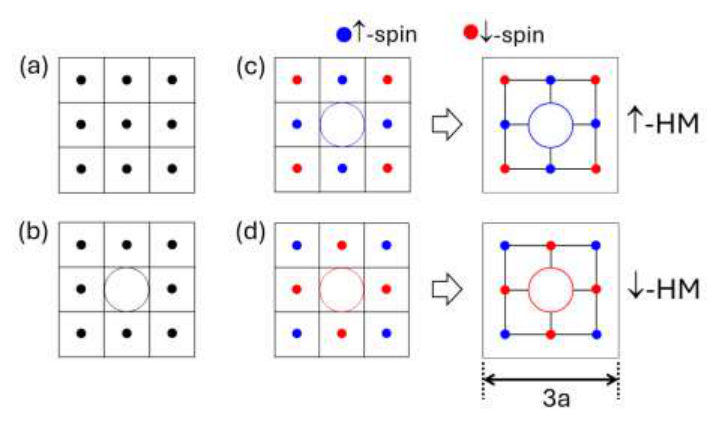 
Fig. 3. (a) 33 array of hole-free CuO4 units. (b) Hole-doped CuO4 unit surrounded by eight hole-

📷 Fig 2

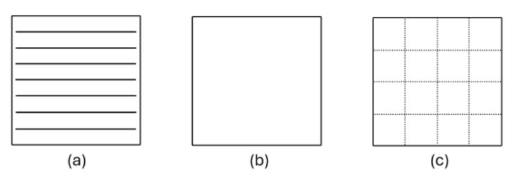 
Fig. 5. (a) Large square aggregate formed from a very wide k-stripe. (b) Large square aggregate

📷 Fig 3

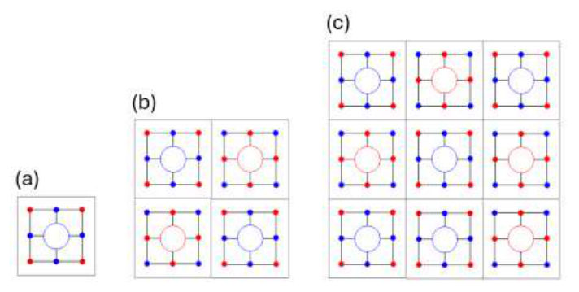 
Fig. 6. Square-growth of hole-aggregates: (a) HM unit. (b) 22 aggregate of four HM units. (c)

📷 Fig 4

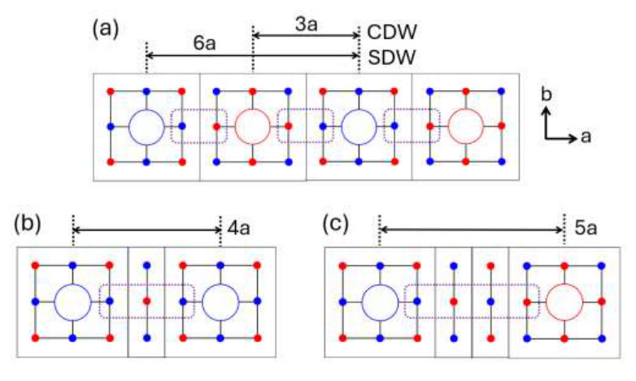 
Fig. 7. (a) CDW and SDW character of an AHD chain, where the protected spin dimers are

📷 Fig 5

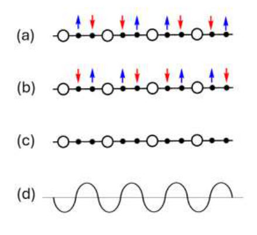 
Fig. 8. Simplified notations for describing the features of CDW and SDW that occur in the AHD

**Summary.** This theoretical work proposes that the d-wave Cooper pair in cuprate superconductors has a specific real-space structure: an antiferromagnetically coupled spin dimer protected by an AHD. By analyzing how holes aggregate in the material, the authors suggest this structure naturally explains the coexistence and interplay between superconductivity, charge density waves, and the pseudogap phase.

**Why it may be interesting.** The focus on real-space structural motifs (dimers, chains) to explain macroscopic quantum phenomena like superconductivity is highly relevant to understanding emergent order in strongly correlated quantum materials.

Detailed structure

**Main problem.** The paper aims to determine the real-space structure of the d-wave Cooper pair responsible for high-Tc superconductivity in cuprates.

**Main result.** The authors propose that the d-wave Cooper pair is an antiferromagnetically coupled spin dimer protected within an antiferromagnetic hole dimer (AHD).

**Method.** The analysis uses a 'chemical' perspective, examining the phase separation and aggregation of hole-doped CuO4 units to deduce the pair's structure.

**Model / system.** The system is hole-doped CuO2 layers in cuprate superconductors, modeled by analyzing the aggregation of hole-doped CuO4 units into structures like AHDs and AHD chains.

**Key observables.** Short coherence length ($\xi$), energy gaps ($\Delta_{	ext{pg}}, \Delta_{	ext{sc}}, \Delta_{	ext{nir}}$), and the segregation-pressure index ($	ext{I}_{sp}$).

**Important parameters / regimes.** Doping concentration ($p$), temperature ($T$), and the ratio of hole-doped to hole-free units.

**Assumptions / limitations.** The analysis assumes that the short coherence length allows for a real-space structural determination of the Cooper pair, analogous to chemical structure determination.

**Figures summary.** Figures illustrate the schematic views of hole-doped/hole-free units, the formation of protected holes, and the resulting aggregates (AHDs, chains, stripes).

**Paper structure.** The paper progresses by identifying the physical constraints (short $\xi$, phase separation) and proposing the AHD structure, which is then used to explain multiple puzzling experimental observations regarding CDW, SDW, and the superconducting gap.

Abstract

The observation that the coherence lengths in cuprate superconductors are extremely small motivated us to search for its real-space structure by examining the consequence of hole-doping in CuO4 units in cuprates. We analyzed aggregates of hole-doped CuO4 units that phase-separate from hole-doped CuO2 layers in terms of their segregation-pressure indices defined in this work. Our search suggests that each d-wave Cooper pair is an antiferromagnetically coupled spin dimer protected in an antiferromagnetic hole dimer (AHD), and that the antiferromagnetic chains of AHDs provide channels through which such spin dimers can move collectively without perturbation. Based on these suggestions and their implications, we examined the causes for several seemingly puzzling observations on cuprate superconductors to find that they are naturally explained by the suggestions.

[↑ back to top](#top)

### [Chiral superconductors and competing states across a Lifshitz transition in rhombohedral pentalayer graphene](http://arxiv.org/abs/2608.29873v1)

**Authors:** Chuanqi Zheng, Cheng Xu, Chushan Li, Chenyu Zhang, Zijing Zhang, Kenji Watanabe, Takashi Taniguchi, Hao Yang, Dandan Guan, Liang Liu, Shiyong Wang, Yaoyi Li, Hao Zheng, Canhua Liu, Jinfeng Jia, Shengwei Jiang, Zhiwen Shi, Guorui Chen, Fengcheng Wu, Yang Zhang, Tingxin Li, Xiaoxue Liu  
**Type:** both · **Category:** strongly correlated electrons · **PDF:** <https://arxiv.org/pdf/2608.29873v1>  
**Analysis basis:** full PDF text, analyzed in chunks

📷 Fig 1

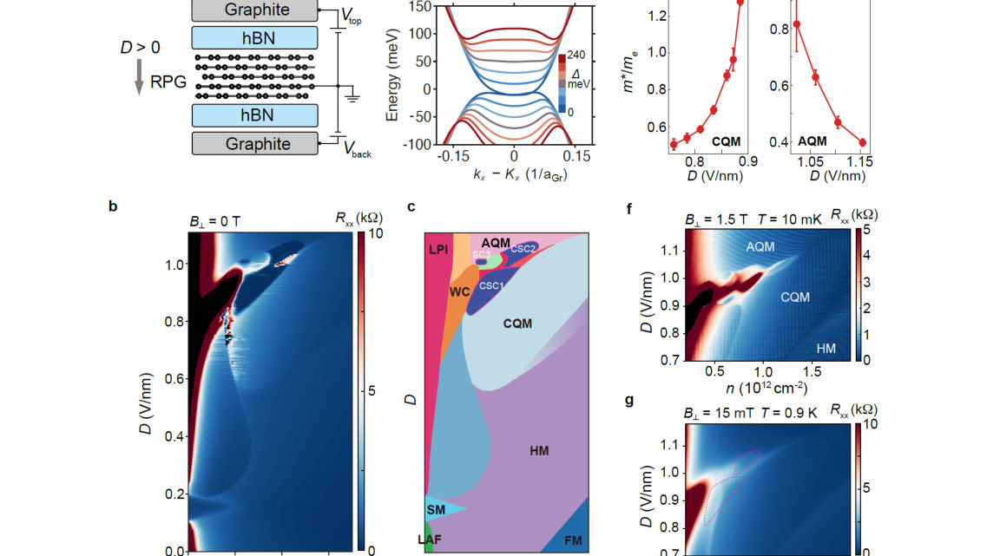 
Fig. 1 | Transport phase diagram of moiréless RPG. a, Schematic of the dual-graphite-gated RPG device. b, Longitudinal resistance Rxx as a function of carrier density n and displacement field D, measured at B⊥ = 0 T and T = 10 mK. c, Schematic phase diagram corresponding to b, showing different spontaneous isospin-symmetry-broken states. LAF, SM, LPI, WC, AQM, CQM, HM and FM denote the layer-antiferromagnetic state, semimetallic state, layer-polarized insulator, Wigner crystal, annular quarter metal, circular quarter metal, half metal and full metal, respectively. CSC1, CSC2 and SC3 denote three superconducting states. d, Calculated highest valence and lowest conduction bands of...

📷 Fig 2

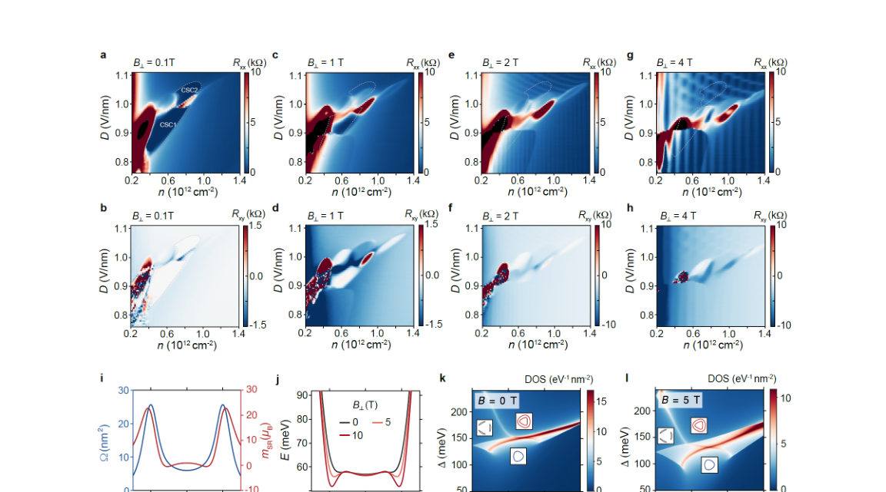 
Fig. 2 | Perpendicular magnetic-field evolution of the n-D phase diagram. a-h, Symmetrized longitudinal resistance Rxx (a,c,e,g) and anti-symmetrized Hall resistance Rxy (b,d,f,h) as functions of carrier density n and displacement field D, measured at T = 10 mK and different perpendicular magnetic fields B⊥, as indicated in each panel. The contours of CSC1 and CSC2, extracted from the B⊥ = 0.1 T map, are outlined by gray dashed lines and overlaid on the Rxx maps at B⊥ = 1 T (c), 2 T (e), and 4 T (g). i, Calculated Berry curvature Ω (blue) and self-rotation orbital magnetic moment 𝑚𝑚𝑆𝑆𝑆𝑆 (red) of the lowest conduction band in RPG at Δ = 135 meV, along a straight cut through K oriented 30°...

📷 Fig 3

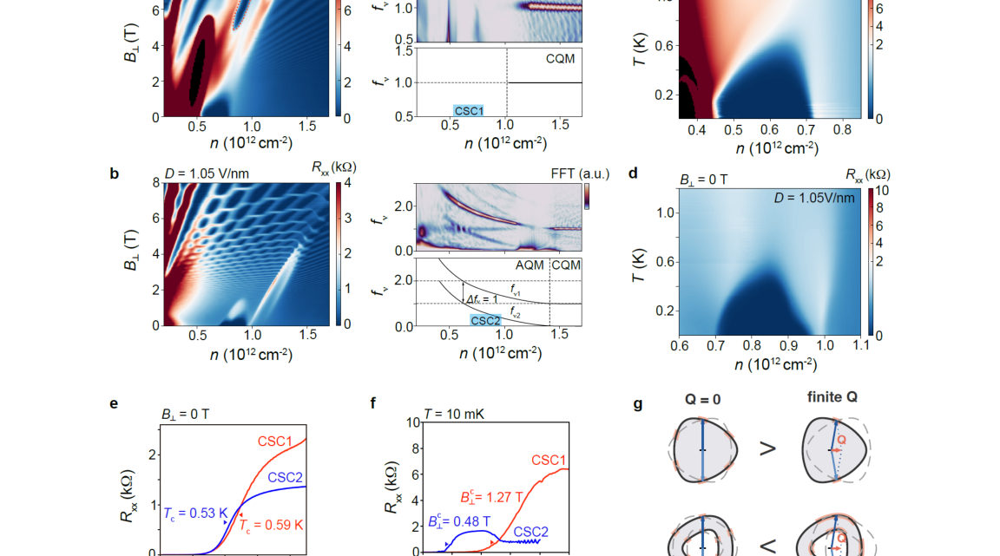 
Fig. 3 | Fermiology-dependent critical magnetic fields of CSC1 and CSC2. a,b, Rxx maps as functions of n and B⊥ measured at T = 10 mK, and fixed displacement fields D = 0.935 V/nm (a) and D = 1.05 V/nm (b). The corresponding normalized FFT spectra, calculated over B⊥ = 1.5 T - 8 T for a and 1.5 T - 6 T for b, are shown alongside each Rxx-n-B⊥ map. The red dashed lines in a denote the RQH states. c, d, Rxx maps as functions of n and T, measured at B⊥ = 0 T, and fixed displacement fields D = 0.935 V/nm (c) and D = 1.05 V/nm (d), respectively. e, Rxx as a function of T at B⊥ = 0 T for representative points in CSC1 (n = 0.65 × 1012 cm-2, D = 0.935 V/nm) and CSC2 (n = 0.87 × 1012 cm-2, D = 1.05...

📷 Fig 4

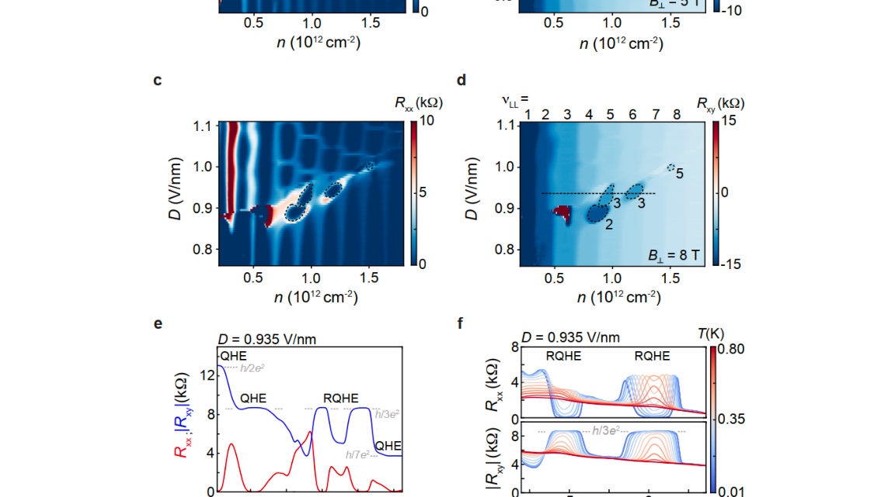 
Fig. 4 | Cascade of RQH states near the AQM-CQM Lifshitz boundary. a-d, Rxx (a,c) and Rxy (b,d) maps as functions of n and D, measured at B⊥ = 5 T (a,b) and 8 T (c,d). Dashed contours highlight the RQH states, with the corresponding Chern numbers indicated in the Rxy maps. Landau-level filling factors νLL are shown along the top axes of the Rxy maps in b and d. e, Rxx and |Rxy| as a function of νLL at D = 0.935 V/nm, corresponding to the dashed line in d. The QHE and RQH states are labeled. f, Temperature dependence of Rxx and |Rxy| near the C = 3 RQH states.

**Summary.** This work investigates chiral superconductivity in rhombohedral graphene, showing that the electronic structure undergoes a Lifshitz transition between circular and annular Fermi surfaces. This topological change is crucial, as it dictates the stability and nature of the competing superconducting and quantum Hall states. The findings establish Fermi-surface topology as the primary control knob for realizing and tuning these exotic correlated quantum phases.

**Why it may be interesting.** The strong coupling between electronic topology (Fermi surface geometry) and emergent superconductivity provides a concrete, tunable platform for studying correlated quantum phases, relevant to understanding unconventional superconductivity in 2D materials.

Detailed structure

**Main problem.** The study maps the normal-state electronic structure surrounding chiral superconductivity and determines how Fermi-surface topology controls this exotic superconducting state in rhombohedral graphene.

**Main result.** The Lifshitz transition between circular and annular Fermi surfaces is identified as the key control parameter, leading to two distinct superconducting phases with different magnetic field stabilities.

**Method.** The research combines quantum oscillation measurements (SdH) to map the Fermi surface, transport measurements ($R_{xx}, R_{xy}$) to trace phase boundaries, and theoretical calculations of pairing tendencies.

**Model / system.** The system is rhombohedral pentalayer graphene (RPG), an electrically tunable platform exhibiting strong Coulomb interactions and nontrivial quantum geometry.

**Key observables.** Quantum oscillation frequencies, effective mass ($m^*$), superconducting transition temperatures ($T_c$), and the location of the Lifshitz transition boundary in the $n-D$ phase diagram.

**Important parameters / regimes.** Carrier density ($n$), perpendicular electric field ($D$), and perpendicular magnetic field ($B_{\perp}$); the transition is governed by the Fermi surface topology (Circular vs. Annular).

**Assumptions / limitations.** The analysis assumes that the observed superconducting phases are dictated by the underlying Fermi-surface topology near the Lifshitz transition.

**Figures summary.** Figures map the complex phase diagram showing transitions between various correlated states (CQM, AQM, SC domes) and illustrate the systematic shift of the Lifshitz boundary with $B_{\perp}$.

**Paper structure.** The paper systematically maps the phase diagram by first identifying the Lifshitz transition, then analyzing the distinct superconducting domes (CSC1 and CSC2) on either side, and finally using calculations to confirm the role of Fermi-surface geometry in determining magnetic field robustness.

Abstract

Rhombohedral multilayer graphene hosts a distinctive low-energy electronic structure in which strong Coulomb interactions and nontrivial quantum geometry intertwine to generate exotic quantum states. Recent experiments reported signatures of chiral superconductivity in electron-doped rhombohedral multilayer graphene within the spin- and valley-polarized regime. Here we map the normal-state fermiology surrounding chiral superconductivity in rhombohedral pentalayer graphene. Quantum oscillation measurements reveal an electrically controlled Lifshitz transition between a simply-connected circular quarter-metal Fermi surface and an annular quarter-metal Fermi surface. The Lifshitz boundary itself shifts with perpendicular magnetic field, consistent with the strongly momentum-dependent orbital magnetic moment of the low-energy band. Approaching the transition from either side, the electron effective mass becomes strongly enhanced, implying the formation of a nearly dispersionless band bottom and a strongly reduced kinetic-energy scale. This singular electronic structure produces a regime of exceptionally strong instability in which chiral superconductivity competes with Wigner crystalline phases and reentrant quantum Hall states. In particular, two superconducting regions with signatures of orbital time-reversal-symmetry breaking lie on opposite sides of the Lifshitz boundary and have comparable transition temperatures, yet the annular-side state is suppressed by a substantially smaller perpendicular magnetic field. Our calculation finds comparable chiral pairing tendencies on the two parent Fermi surfaces while producing a much lower orbital-Zeeman pair-breaking scale and an additional finite-momentum pairing tendency for the annular state. These results identify Fermi-surface topology as a key control parameter for chiral superconductivity in rhombohedral graphene.

[↑ back to top](#top)

### [Chiral Tubular Magnonic Crystals with Periodic Dzyaloshinskii--Moriya Interaction](http://arxiv.org/abs/2608.28928v1)

**Authors:** P. Contreras-Gallardo, J. Flores-Farias, B. Mimica-Figari, V. Puliafito, P. Landeros, R. A. Gallardo  
**Type:** theory · **Category:** other · **PDF:** <https://arxiv.org/pdf/2608.28928v1>  
**Analysis basis:** full PDF text, analyzed in chunks

📷 Fig 1

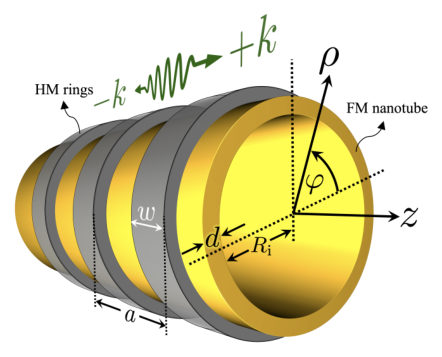 
FIG. 1. Schematic representation of a chiral tubular magnonic crystal. A ferromagnetic nanotube of inner radius Ri and thickness d is periodically covered by heavy-metal (HM) rings of width w, forming a one-dimensional axial lattice with pe- riod a. The HM rings induce an interfacial Dzyaloshinskii– Moriya interaction only in selected regions of the nanotube surface, giving rise to a periodic DMI profile D(z). Spin waves propagate along the tube axis with wave vector k = ±k ˆz. The cylindrical coordinate system (ρ, φ, z) is also indicated.

📷 Fig 2

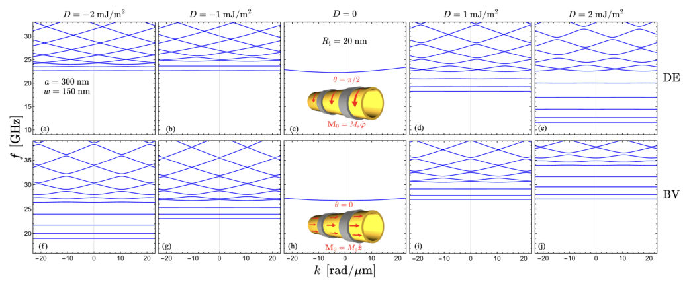 
FIG. 2. Spin-wave band structures of the chiral tubular magnonic crystal evaluated at µ0H0 = 500 mT and for different values of the interfacial Dzyaloshinskii–Moriya constant D. The bands are shown for D = −2, −1, 0, 1, and 2 mJ/m2. The upper and lower rows correspond to the Damon–Eshbach-like (a–e) and backward-volume-like (f–j) configurations, respectively. The calculations are performed for a periodic DMI modulation with lattice constant a = 300 nm and DMI-active ring width w = 150 nm. The nanotube has inner radius Ri = 20 nm and thickness d = 1 nm. The vertical dashed lines indicate the Brillouin edges associated with the axial modulation. For D = 0, the uncoupled folded replicas are...

📷 Fig 3

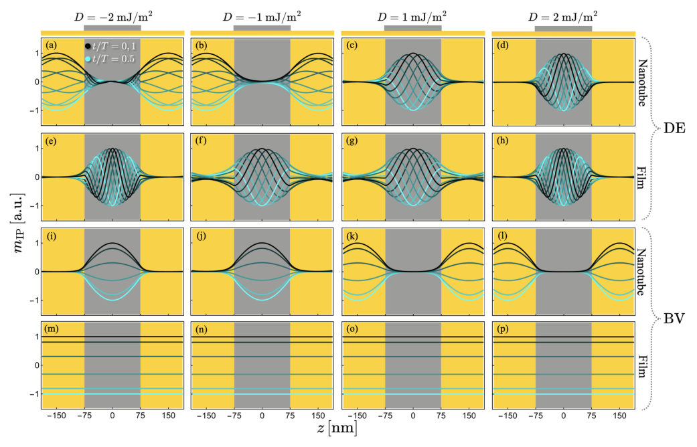 
FIG. 3. Spatial profiles of the lowest-frequency spin-wave eigenmodes in the chiral tubular magnonic crystal for different values of the interfacial Dzyaloshinskii–Moriya constant. The profiles are calculated using the in-plane dynamic magnetization component mIP = mχ evaluated at k = 0. The background colors indicate the DMI-active/HM-covered regions (gray) and the DMI-free regions (yellow). The columns correspond to D = −2, −1, 1, and 2 mJ/m2. The upper blocks show the Damon– Eshbach-like configuration, with the nanotube profiles in panels (a–d) and the corresponding planar-film profiles in panels (e–h). The lower blocks show the backward-volume-like configuration, with the nanotube...

📷 Fig 4

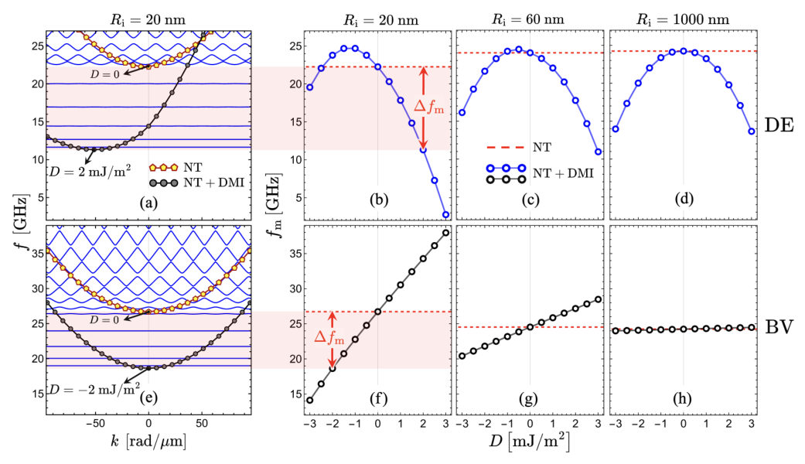 
FIG. 4. Connection between the band structure of the periodically modulated nanotube and the continuous-nanotube limit with and without uniform DMI. Panels (a) and (e) compare the bands of the periodic tubular magnonic crystal (blue curves) with the dispersions of a continuous nanotube without DMI (yellow diamonds) and with uniform DMI (gray circles), for Ri = 20 nm. Panel (a) corresponds to the DE configuration with D = 2 mJ/m2, whereas panel (e) corresponds to the BV configuration with D = −2 mJ/m2. Panels (b–d) and (f–h) show the minimum frequency fm of the continuous nanotube as a function of D for Ri = 20, 60, and 1000 nm, in the DE and BV configurations, respectively. The dashed...

**Summary.** This work theoretically analyzes spin waves in a chiral nanotube where the Dzyaloshinskii–Moriya interaction is periodically modulated. By adapting plane-wave methods to cylindrical geometry, the authors show that the tube curvature fundamentally changes how the DMI acts. This engineering capability allows for the creation of flat, non-dispersive magnon bands, offering a route to control spin wave behavior in curved magnetic architectures.

**Why it may be interesting.** The findings on flat bands and non-reciprocity in curved geometries provide novel platforms for controlling spin wave dynamics, which is relevant to understanding energy band engineering in magnetic systems.

Detailed structure

**Main problem.** The study investigates how a periodically modulated interfacial Dzyaloshinskii–Moriya interaction (DMI) alters the spin-wave band structure within a chiral tubular magnonic crystal.

**Main result.** The tubular geometry modifies the DMI's role by converting part of it into an effective anisotropy field, leading to flat, weakly dispersive bands in both Damon–Eshbach-like and backward-volume-like configurations.

**Method.** The analysis employs a plane-wave formalism adapted for cylindrical geometry to solve the spin-wave eigenvalue problem derived from the Landau–Lifshitz equation.

**Model / system.** The system is a ferromagnetic nanotube patterned with heavy-metal rings to induce a periodic DMI. The dynamics are governed by the LL equation, incorporating exchange, dipolar, and DMI couplings.

**Key observables.** Spin-wave band structure, nonreciprocal frequency shift, and the appearance of flat/weakly dispersive bands.

**Important parameters / regimes.** DMI constant (D), tube curvature, and the angle ($	heta$) defining the equilibrium magnetization state.

**Assumptions / limitations.** The analysis assumes small-amplitude spin-wave deviations and neglects concomitant modulations of other magnetic parameters.

**Figures summary.** Figure 1 schematically shows the setup: a nanotube with periodic DMI modulation. Figure 2 displays the spin-wave band structures for different DMI strengths in DE and BV configurations. Figure 3 compares spatial profiles of the lowest-frequency eigenmodes in nanotubes versus planar films.

**Paper structure.** The paper establishes the physical model (nanotube with periodic DMI), details the theoretical framework (plane-wave formalism on cylindrical geometry), presents the key findings regarding the modification of the band structure by curvature, and concludes by identifying this engineered DMI as a control mechanism for spin waves.

Abstract

We introduce a chiral tubular magnonic crystal formed by a ferromagnetic nanotube with a periodically modulated interfacial Dzyaloshinskii--Moriya interaction (DMI). Using a plane-wave formalism adapted to the cylindrical geometry, we calculate the spin-wave band structure including exchange, nonlocal dipolar coupling, and interfacial DMI. We show that the tubular geometry qualitatively modifies the role of periodic DMI compared with planar chiral magnonic crystals. Besides producing the usual nonreciprocal frequency shift, curvature converts part of the interfacial DMI into an effective anisotropy-like internal field. This creates a sign-dependent frequency landscape along the tube, so that DMI-covered regions can act either as potential wells or barriers for the lowest-frequency modes. As a result, flat and weakly dispersive bands appear in both Damon--Eshbach-like and backward-volume-like configurations, with the latter having no direct counterpart in planar systems. Our results identify periodically engineered DMI in nanotubes as a route for controlling nonreciprocal spin waves, localized modes, and flat magnonic bands in curved architectures.

[↑ back to top](#top)

### [Competition between on-site and off-site pairing phases and surface spectra in superconducting wallpaper fermion systems](http://arxiv.org/abs/2608.29691v1)

**Authors:** Kaito Yoda, Ai Yamakage  
**Type:** theory · **Category:** strongly correlated electrons · **PDF:** <https://arxiv.org/pdf/2608.29691v1>  
**Analysis basis:** full PDF text, analyzed in chunks

📷 Fig 1

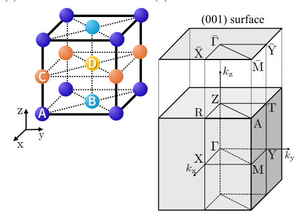 
FIG. 1. (Color online) (a) Tetragonal four-sublattice model for wallpaper fermions [32]. (b) Bulk Brillouin zone and the corresponding (001) surface Brillouin zones [40–43]. In the system with the wallpaper group p4g, fourfold rotation sym- metry makes the ¯X and ¯Y points symmetry-equivalent. When nematic superconductivity in the Eg or Eu representation is realized, this fourfold rotation symmetry can be sponta- neously broken, so that these two points become inequivalent. The same applies to the corresponding momentum regions in the bulk Brillouin zone.

📷 Fig 2

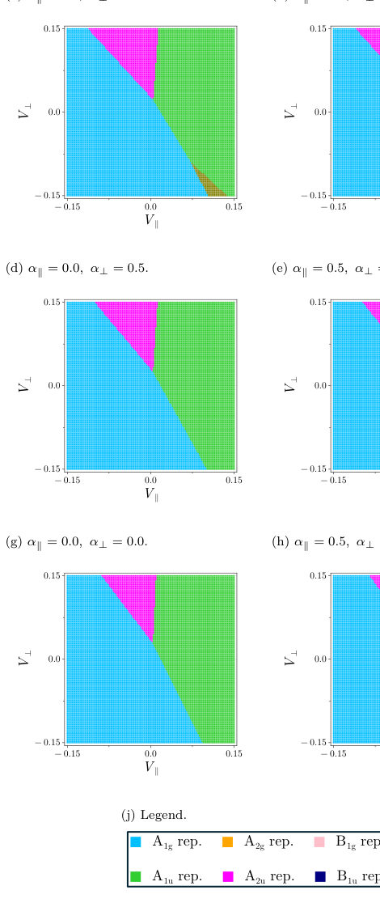 
FIG. 2. (Color online) Phase diagram for Von = −0.1.

📷 Fig 3

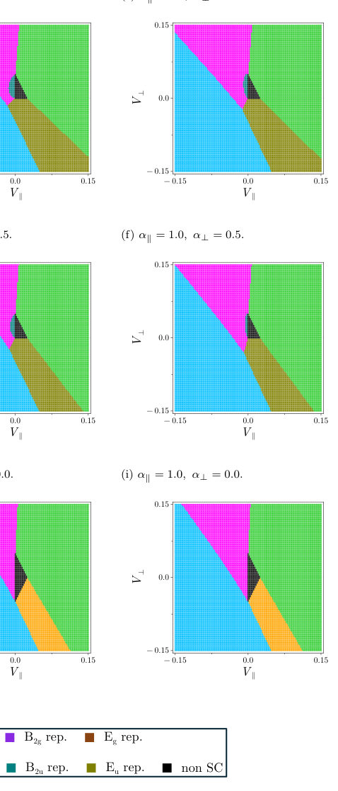 
FIG. 3. (Color online) Phase diagram for Von = 0.1.

📷 Fig 4

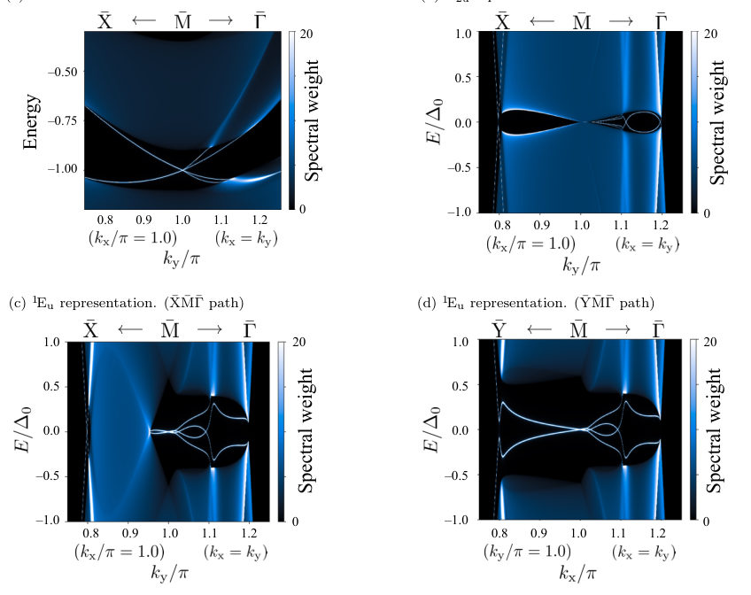 
FIG. 4. (Color online) Surface spectral function for a semi-infinite system with the (001) surface on the C–D layer. The chemical potential and pairing amplitude are set to µ = −0.75 and ∆0 = 0.02, respectively.

📷 Fig 5

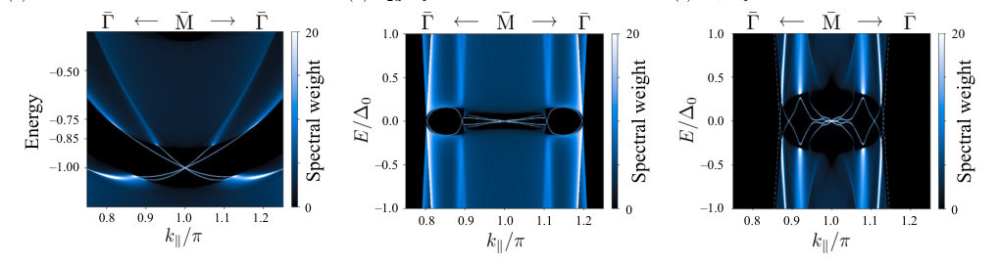 
FIG. 5. (Color online) Surface spectral functions for a semi-infinite system with the (001) surface on the C–D layer along the ¯Γ ¯M¯Γ line. The parameters of the tight-binding Hamiltonian and the pairing amplitude ∆0 are the same as those used in the main text. The chemical potential is set to (b) µ = −0.75 and (c) µ = −0.85.

**Summary.** This theoretical work explores how competing on-site and off-site superconducting pairing interactions affect the surface physics of wallpaper fermion systems. By solving the gap equation and analyzing topological invariants, the authors identify that off-site pairing stabilizes specific phases ($B_{2u}, E_u$) that manifest distinct, symmetry-protected 'twisted' surface energy spectra. This highlights the crucial role of pairing symmetry in determining observable surface electronic properties.

**Why it may be interesting.** The detailed symmetry analysis and the focus on hybridization between gapless surface states and superconducting pairing gaps provide a rich theoretical framework relevant to understanding exotic superconducting pairing mechanisms in topological materials.

Detailed structure

**Main problem.** The study investigates the competition between different superconducting pairing symmetries (on-site vs. off-site) and how this competition dictates the resulting surface electronic spectra in superconducting wallpaper fermion systems.

**Main result.** The incorporation of off-site pairing interactions stabilizes $B_{2u}$ and $E_u$ phases, which both support characteristic 'twisted surface dispersions' arising from hybridization with either the wallpaper fermions themselves or double Majorana Kramers pairs.

**Method.** The analysis employs a mean-field approach, solving the linearized gap equation derived from the Bogoliubov-de Gennes Hamiltonian, and calculating topological invariants using symmetry analysis along specific high-symmetry lines.

**Model / system.** The system is superconducting topological crystalline insulators hosting wallpaper fermions, modeled by a tight-binding Hamiltonian on a tetragonal four-sublattice structure. The superconductivity is introduced via pairing interactions ($H_{int}$) analyzed through its irreducible representations ($D_{4h}$).

**Key observables.** Superconducting pairing phases ($A_{1u}, B_{2u}, E_u$), surface energy spectra, and topological invariants ($
u_{\pm}^{DIII[U]}$).

**Important parameters / regimes.** Interaction parameters ($\alpha_{\parallel}, \alpha_{\perp}$), on-site interaction strength ($V_0$), and chemical potential ($\mu$).

**Assumptions / limitations.** The analysis relies on the mean-field approximation and the use of symmetry-protected topological invariants to classify the superconducting state.

**Figures summary.** Figures illustrate the tetragonal four-sublattice model and the bulk/surface Brillouin zones, while the appendix details the surface spectra along the $ar{\Gamma} ar{M} ar{\Gamma}$ line, showing gap opening and hybridization features.

**Paper structure.** The paper first defines the model Hamiltonian and the competition between pairing terms. It then uses the gap equation to map the superconducting phase diagram based on symmetry representations. Finally, it analyzes the resulting surface spectra and topological invariants for specific pairing channels.

Abstract

We theoretically investigate the competition between on-site and off-site pairings in superconducting topological crystalline insulators hosting wallpaper fermions, a class of surface states protected by nonsymmorphic symmetries. In-plane nearest-neighbor pair hopping stabilizes the $\mathrm{A_{1u}}$ phase, while off-site pairing channels yield additional dominant phases with $\mathrm{B_{2u}}$ and $\mathrm{E_u}$ representations. We further show that the $\mathrm{B_{2u}}$ pairing state supports the hybridization between wallpaper-fermion spectra themselves, whereas a representative time-reversal-invariant nematic $\mathrm{E_u}$ state exhibits spectral hybridization between wallpaper fermion and double Majorana Kramers pairs, yielding twisted surface energy spectra. These results demonstrate that the twisted dispersions arising from hybridization phenomena persist in the presence of off-site pairing interactions.

[↑ back to top](#top)

### [Extreme Polarization of the Optical Gap and High-Energy Exciton Landscape in CrSBr](http://arxiv.org/abs/2608.29566v1)

**Authors:** Sayantan Patra, Sourabh Jain, Bhumika Chauhan, Marie-Christin Heißenbüttel, Abhisek Saidarsan, Ranjuna M. K., Kseniia Mosina, Zdeněk Sofer, Michael Rohlfing, Thorsten Deilmann, Ashish Arora  
**Type:** both · **Category:** other · **PDF:** <https://arxiv.org/pdf/2608.29566v1>  
**Analysis basis:** full PDF text, analyzed in chunks

📷 Fig 1

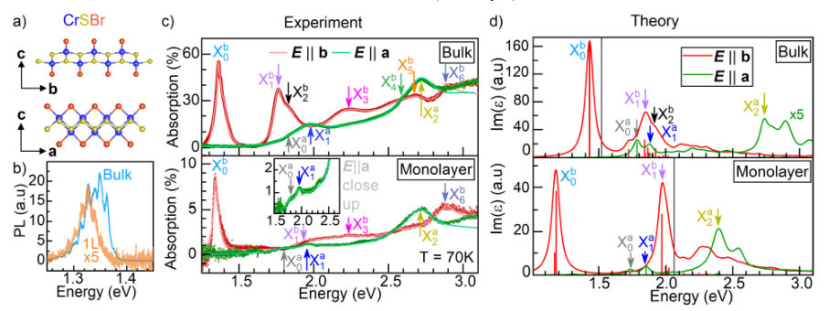 
Figure 1. (a) CrSBr crystal structure in the bc and ac planes. Coordination of Cr (blue), S (yellow), and Br (brown) atoms is displayed. (b) Unpolarized PL spectra of bulk-like and monolayer CrSBr for 532 nm excitation, 1 mW power focused to 1.2 m diameter spot. A red shift of the monolayer’s PL compared to bulk is evident as found in literature25,30. (c) Red and green circles represent measured absorption (1 −012 −3) spectra for detection polarization parallel to the b- and a-axes of bulk-like(top panel) and monolayer (bottom panel) CrSBr, while the corresponding red and green solid curves depict the modelled spectra. Inset in the monolayer case (bottom panel) is the zoomed- in view for...

📷 Fig 2

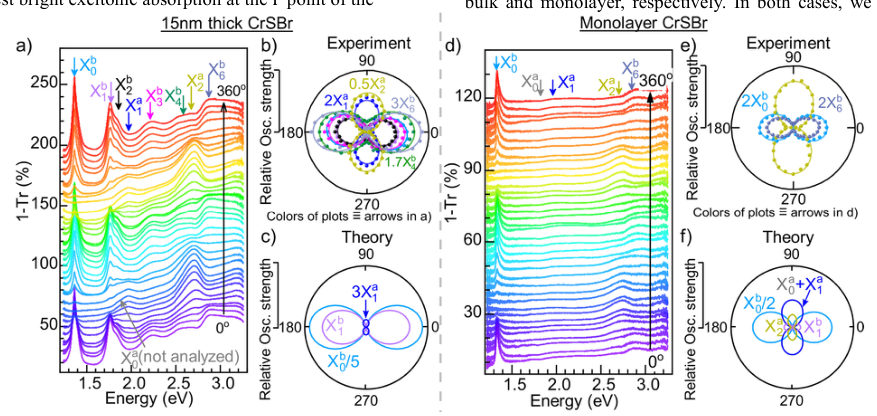 
Figure 2. (a) Experimentally measured polarization resolved 1 −3 spectra for bulk with 0∘≡ b-axis and 90∘≡ a-axis. The spectra are vertically shifted successively with respect to the 0∘ spectrum (≡b-axis) for clarity. (b) Experimentally determined relative spectral weights of excitonic resonances for bulk-like CrSBr. (c) Calculated excitonic oscillator strengths for a few excitonic transitions using GW-BSE based ab initio theory. (d) – (f) are similar to (a) – (c), respectively, but for monolayer CrSBr.

📷 Fig 3

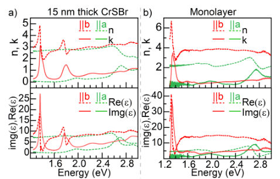 
Figure 3. Extracted polarized optical constants of CrSBr. (a) Complex refractive index (n, k) (upper panels) and complex dielectric function (Re(ε), Im(ε)) (lower panels) for the 15 nm thick bulk-like CrSBr extracted from the experimental data using the generalized transfer matrix method (GTMM). (b) Corresponding complex refractive index and dielectric function for monolayer CrSBr extracted using GTMM.

📷 Fig 4

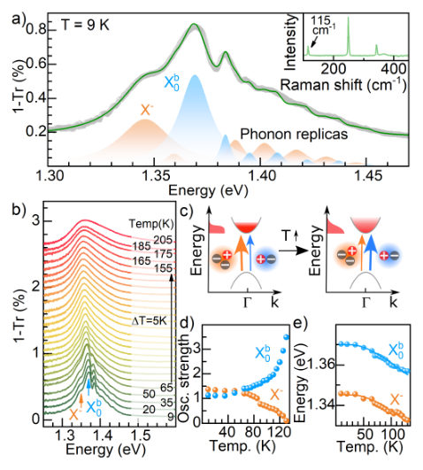 
Figure 4. (a) Experimentally measured 1 −3 spectrum showing equally spaced phonon replicas of  and  . The inset shows the r9 Raman peak (115 cm-1) responsible for phonon replicas62. (b) Temperature dependent 1 −3 spectra in the 9 K to 205 K temperature range. Spectra are vertically shifted for clarity. (c) Schematic drawing visualizing the transfer of optical weight between neutral excitons (blue vertical arrow) and trions (orange vertical arrow) with increasing temperature due to the thermal redistribution of carriers (red) in momentum space. (d) Extracted relative oscillator strength, and (e) transition energies of  and  

**Summary.** This work investigates the optical properties of CrSBr in both monolayer and bulk forms, revealing a large and highly anisotropic optical gap. By combining polarization-resolved spectroscopy with GW-BSE calculations, the authors confirm CrSBr's potential for polarization-selective optoelectronics due to its extreme excitonic anisotropy.

**Why it may be interesting.** The strong polarization dependence and large optical gap anisotropy make this material highly relevant for designing next-generation polarization-selective optoelectronic devices, connecting solid-state physics to applied quantum optics.

Detailed structure

**Main problem.** The study aims to characterize the highly anisotropic excitonic landscape and optical gap in CrSBr, investigating differences between monolayer and bulk-like forms.

**Main result.** The research establishes CrSBr as a strongly polarization-selective excitonic system, reporting an in-plane optical gap anisotropy of $470 \pm 15$ meV, which is a record value in this spectral region.

**Method.** The study combines polarization-resolved optical absorption/reflectance spectroscopy with advanced *ab initio* GW-Bethe-Salpeter equation (GW-BSE) calculations.

**Model / system.** The physical system is CrSBr, examined in both monolayer and bulk-like forms. The analysis focuses on excitonic transitions and the resulting optical anisotropy.

**Key observables.** Optical gap anisotropy ($\Delta E_{	ext{opt}}$), polarization-resolved exciton resonances, broadband dielectric functions, and optical constants ($	ilde{n}, \epsilon$).

**Important parameters / regimes.** The anisotropy value ($470 \pm 15$ meV), the energy range (1.25 eV to 3.1 eV), and the comparison between monolayer and bulk samples.

**Assumptions / limitations.** The analysis relies on the ability to accurately measure polarization-dependent optical constants and the validity of the GW-BSE framework for describing excitons.

**Figures summary.** Figures illustrate polarization-resolved absorption spectra for both axes, the extracted polarization-dependent optical constants, and comparisons between experimental and theoretical spectral fits.

**Paper structure.** The paper follows a structure of presenting experimental measurements (polarization-resolved spectroscopy) to determine key optical parameters, which are then corroborated and explained using advanced theoretical calculations (GW-BSE).

Abstract

We reveal a strongly anisotropic excitonic landscape in monolayer and bulk-like CrSBr using optical absorption spectroscopy and $GW$-Bethe-Salpeter equation $\textit{ab initio}$ calculations. The direct absorptive determination of the lowest bright optical onsets i.e. $X_0^a$ and $X_0^b$ excitons for the two in-plane polarization eigenaxes yield an in-plane optical gap anisotropy of $470 \pm 15$ meV. This is the highest observed value for any material in the near-infrared-to-visible spectral region to the best of our knowledge. Energetically above, we identify multiple strongly polarized excitons spanning $1.25$ eV to $3.1$ eV selectively aligned along the two orthogonal axes. A resonance $X^-$, located $24$ meV below the $X_0^b$ progressively transfers oscillator strength to $X_b^0$, a behavior consistent with a coupled trion (Fermi-polarion)/exciton pair. Our experiments also provide polarization-resolved broadband dielectric functions of CrSBr. These results establish CrSBr as a strongly polarization-selective excitonic system and highlight its potential for polarization-selective optoelectronics enabled with its large optical-gap anisotropy.

[↑ back to top](#top)

### [Local phase-space Berry curvature and Hall transport in textured twisted bilayer graphene](http://arxiv.org/abs/2608.30882v1)

**Authors:** Tohid Farajollahpour  
**Type:** theory · **Category:** other · **PDF:** <https://arxiv.org/pdf/2608.30882v1>  
**Analysis basis:** full PDF text, analyzed in chunks

📷 Fig 1

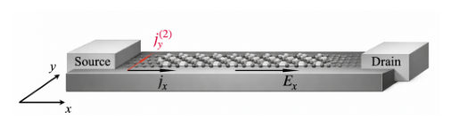 
FIG. 1. Schematic of the controlled local Hall-bar patch. The slow texture varies along y across the bar, while the drive Ex is applied along x. The linear response is longitudinal, j(1) x , and the nonlinear Hall signal is the second-order transverse current j(2) y . A drive Ey instead probes the textured longitu- dinal conductivity.

📷 Fig 2

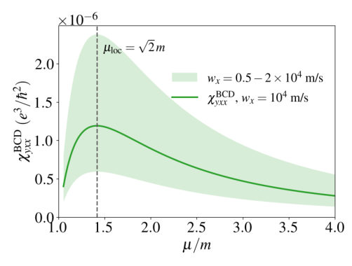 
FIG. 2. The dc nonlinear Hall coefficient χBCD yxx generated by the valley-odd tilt, for m = 10 meV, τ = 10 ps, and gs = gv = 2. The solid line uses wx = 104 m/s, which the Bistritzer- MacDonald extraction in the Supplemental Material [46] iden- tifies with a uniaxial heterostrain ε ≃0.06%−0.14%, depend- ing on the strain orientation. The shaded band covers the conservative range wx = 0.5 −2 × 104 m/s, corresponding to ε ≃0.03%−0.2%. At a representative ε = 0.3% the extracted tilt reaches 4 −7 × 104 m/s [Fig. S2(b) of the Supplemental Material], so the plotted response is a conservative lower end. The dashed line marks µloc = √

📷 Fig 3

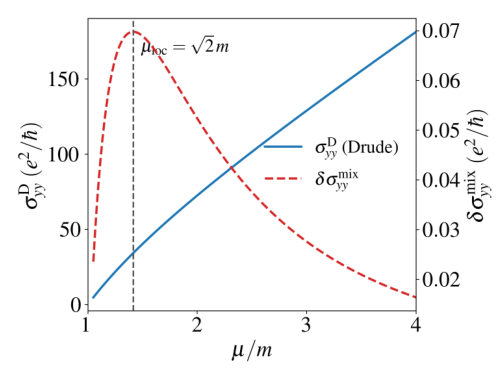 
FIG. 3. The linear longitudinal conductivity components along the textured direction, for the BM-extracted reference velocities vx = vy = 1.63 × 105 m/s (Supplemental Material [46]), m = 10 meV, τ = 10 ps, and Bs ≡∂yAx = 1014 m−2, with gs = gv = 2. By Table S2 of the Supplemental Mate- rial [46], this Bs corresponds, e.g., to a twist gradient |∂yθ| ≃ 0.7◦/µm or to a shear-strain gradient ∂yu1 ≃1.3 × 10−3/µm, both within imaged texture amplitudes [14, 24]. The dashed line marks µloc = √

**Summary.** This theoretical work investigates how local texture variations in twisted bilayer graphene generate measurable Berry curvature and Hall transport effects. It rigorously separates the contributions, showing that while geometry alone is insufficient, the coupling to physical strain and tilt generates distinct, measurable signatures in both linear and nonlinear transport coefficients.

**Why it may be interesting.** The clean separation of geometric vs. texture-induced Berry curvature effects provides a powerful, testable theoretical tool for understanding topological transport in moiré materials, which is relevant to engineered quantum states.

Detailed structure

**Main problem.** The paper analyzes the local phase-space Berry curvature and associated Hall transport phenomena in textured twisted bilayer graphene (TBG), aiming to separate geometric contributions from those induced by physical texture variations.

**Main result.** Genuine mixed phase-space curvature arises only from the projected texture dependence of the local mini-Dirac cone, and a nonlinear Hall response requires a valley-odd tilt generating a Berry-curvature dipole.

**Method.** The analysis employs a controlled local Hall-bar limit, decomposing the current density into Drude, mixed-curvature, and nonlinear Hall components, and utilizing a local analytic framework derived from the Bistritzer-MacDonald model.

**Model / system.** The system is textured twisted bilayer graphene (TBG), modeled using a covariant Dirac Hamiltonian near isolated mini-Dirac points. The local physics is described by a projected two-band Hamiltonian parameterized by local texture fields like twist angle and heterostrain.

**Key observables.** Mixed Berry Curvature ($\Omega_{r i p j}$), longitudinal conductivity ($\sigma_{xx}$), transverse conductivity ($\sigma_{yy}$), and the nonlinear Hall coefficient ($\chi_{yxx}$).

**Important parameters / regimes.** Local filling ($\mu_{	ext{loc}}$), texture fields ($\delta	heta$, heterostrain), and the local cone parameters ($\epsilon_0, \mathbf{w}, m$).

**Assumptions / limitations.** The analysis is restricted to a controlled local Hall-bar patch with mirror symmetry, and the theory provides a local analytic framework.

**Figures summary.** Figures schematically illustrate the controlled local Hall-bar patch setup and show the dependence of the nonlinear Hall signal ($\chi_{yxx}$) on the valley-odd tilt ($w_x$).

**Paper structure.** The paper first establishes the theoretical framework by separating geometric and projected texture contributions to the Berry curvature. It then analyzes the linear response ($\sigma_{yy}$ correction) and finally derives the nonlinear Hall response ($\chi_{yxx}$) by focusing on the Berry-curvature dipole term.

Abstract

Slow twist-angle and heterostrain textures in twisted bilayer graphene provide a natural route to phase-space Berry geometry. We show that a purely geometric tetrad/shift sector does not generate mixed Berry curvature once the spin connection is treated consistently. By contrast, a projected textured mini-Dirac cone in twisted bilayer graphene acquires genuine mixed phase-space curvature. We analyze a controlled local Hall-bar limit with a one-dimensional texture and mirror $M_x$. In that limit the pseudogauge gradient renormalizes only the longitudinal conductivity along the textured direction, while a dc nonlinear Hall response appears only when an additional valley-odd tilt generates a Berry-curvature dipole. Both geometric responses peak at the same local filling, $μ_{\rm loc}=\sqrt{2}\,m$, providing a gate-tunable fingerprint of their common origin. All local-cone parameters and their texture susceptibilities are extracted from a heterostrained Bistritzer-MacDonald model at $θ=1.3^\circ$. The tilt invoked in the transport estimates corresponds to heterostrain of only $0.03\%-0.2\%$, below values routinely imaged in devices. The resulting theory provides a local analytic framework for textured moiré Dirac materials and cleanly separates geometric, texture-induced, and transport-level ingredients relevant to realistic TBG.

[↑ back to top](#top)

### [Single-pulse strain-induced precessional dynamics of magnetization in Co-doped iron garnet](http://arxiv.org/abs/2608.29245v1)

**Authors:** Héloïse Damas, Carl S. Davies, Tomasz Zalewski, Petr M. Vetoshko, Vladimir I. Belotelov, Andrzej Stupakiewicz, Andrei Kirilyuk  
**Type:** both · **Category:** other · **PDF:** <https://arxiv.org/pdf/2608.29245v1>  
**Analysis basis:** full PDF text, analyzed in chunks

📷 Fig 1

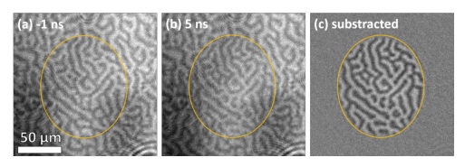 
FIG. 1. (a) Labyrinthine magnetic domain structure of Co:YIG before excitation. (b) Transient magnetic response visualized 5 ns after optical excitation by a single pulse (λ = 17.5 µm, E = 33.8 ± 3.5 µJ). (c) Difference image highlighting the region affected by the mid-infrared pulse.

📷 Fig 2

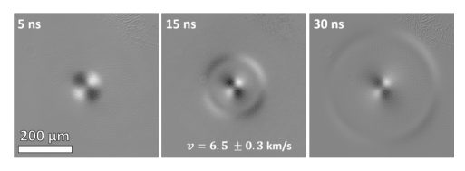 
FIG. 2. Time-resolved polarization microscopy images show- ing the localized strain response and outward-propagating elastic wave (λ = 11 µm, E = 13.7 ± 7.3 µJ).

📷 Fig 3

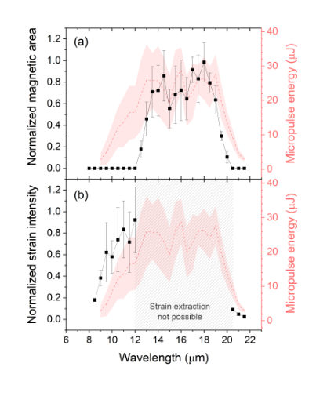 
FIG. 4. (a) Wavelength dependence of the magnetic area af- fected by the micropulse. (b) Wavelength dependence of the pixel intensity of the 4-lobe pattern associated to strain. In the shaded wavelength range 12-20 µm, magnetization switch- ing overlaps the strain pattern, preventing the proper extrac- tion of the strain intensity.

📷 Fig 4

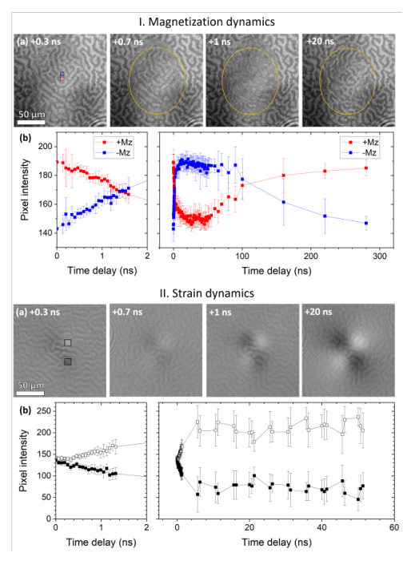 
FIG. 3. I. Magnetization dynamics. (a) Time-resolved images following excitation (λ = 17 µm, E = 32.5 ± 3.1 µJ). (b) Pixel intensity of domains with opposite magnetic con- trast. The contrast decreases within 1 ns, reverses after ∼1.5 ns, and recovers within 200-300 ns. II. Strain dynamics (a) Time-resolved strain images (λ = 11, µm, E = 13.7 ± 7.3 µJ). (b) Pixel intensity of lobes with opposite contrast. The strain signal increases immediately after excitation and re- mains nearly constant for ∼50 ns, consistent with a quasi- static component.

📷 Fig 5

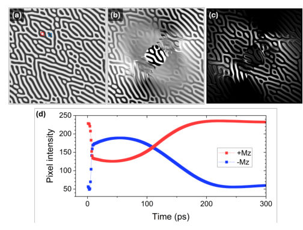 
FIG. 5. Simulated magnetic state (a) before, (b) 30 ps after the application of a 5-ps-long strain pulse and (c) the sub- tracted image.

**Summary.** This paper investigates how ultrafast mid-infrared pulses control magnetization in Co-doped yttrium iron garnet. By combining single-shot pump-probe microscopy with micromagnetic simulations, the authors demonstrate that the excitation generates a transient strain field. This lattice deformation is identified as the crucial link responsible for driving the reversible, precessional dynamics of the magnetization.

**Why it may be interesting.** This work provides a clear, experimentally verified mechanism (strain mediation) for controlling magnetic dynamics using optical excitation, which is highly relevant for developing ultrafast spintronic devices and understanding light-matter interactions in magnetic insulators.

Detailed structure

**Main problem.** The study aims to elucidate the precise role of transient lattice strain in driving and mediating the magnetization dynamics of magnetic garnets following ultrafast, single-pulse mid-infrared excitation.

**Main result.** The research establishes that transient lattice deformation acts as the direct physical link connecting the single-pulse excitation to the observed reversible precessional reorientation of magnetization in Co-doped yttrium iron garnet.

**Method.** The work combines single-shot pump-probe magneto-optical microscopy to measure time-resolved magnetic and structural responses with micromagnetic simulations incorporating transient strain effects.

**Model / system.** The physical system is Cobalt-doped yttrium iron garnet (Co:YIG). The dynamics are modeled using micromagnetic simulations (MuMax3) that incorporate the coupling between the magnetic order and the transient strain field generated by the excitation pulse.

**Key observables.** Time-resolved magnetic contrast (showing decrease, reversal at $\approx 1.5-2$ ns, and recovery), localized strain field (four-lobe symmetry), and the resulting precessional reorientation of magnetization.

**Important parameters / regimes.** Excitation pulse duration (5-ps), excitation wavelength ($\lambda$: 8 to 22 $\mu$m), and the timescale of magnetization reversal ($\approx 1.5-2$ ns).

**Assumptions / limitations.** The primary assumption is that the structural and magnetic responses are coupled via the transient strain field, and that the single-pulse excitation isolates this specific magnetoelastic pathway.

**Figures summary.** Figures illustrate the initial labyrinthine domain structure and the transient magnetic response; other figures show the localized strain response (four-lobe pattern) and compare the correlated time-evolution of magnetic contrast and strain signals.

**Paper structure.** The paper first introduces the problem of strain's role in ultrafast dynamics. It then presents experimental results using single-shot pump-probe techniques to measure correlated structural and magnetic changes. Finally, micromagnetic simulations are employed to reproduce the observed precessional dynamics, confirming the strain-mediated mechanism.

Abstract

Ultrafast control of magnetization through lattice excitation provides a route to manipulating magnetic order on short timescales, yet the role of transient strain in driving magnetization dynamics remains poorly understood. Here, single-shot pump-probe magneto-optical microscopy is used to resolve the structural and magnetic responses of cobalt-doped yttrium iron garnet to individual 5-ps mid-infrared pulses. The excitation generates a localized strain field together with an outward-propagating elastic wave. Concurrently, the magnetic contrast decreases following excitation and subsequently reverses on a timescale of approximately 1.5-2 ns before recovering to its initial state. The structural and magnetic responses exhibit closely correlated wavelength and pulse-energy dependences, indicating a common excitation pathway. Micromagnetic simulations incorporating transient strain reproduce the precessional reorientation of the magnetization within individual domains while largely preserving the labyrinthine domain morphology. These results identify transient lattice deformation as the link between single-pulse mid-infrared excitation and reversible precessional magnetization dynamics in Co-doped yttrium iron garnet.

[↑ back to top](#top)

### [Superconductivity and Magnetism in Bi-Ni System: From Bulk to Heterostructures](http://arxiv.org/abs/2608.28855v1)

**Authors:** Gabriel Sant'Ana, Yutao Xing, Milton A. Tumelero  
**Type:** both · **Category:** strongly correlated electrons · **PDF:** <https://arxiv.org/pdf/2608.28855v1>  
**Analysis basis:** full PDF text, analyzed in chunks

📷 Fig 1

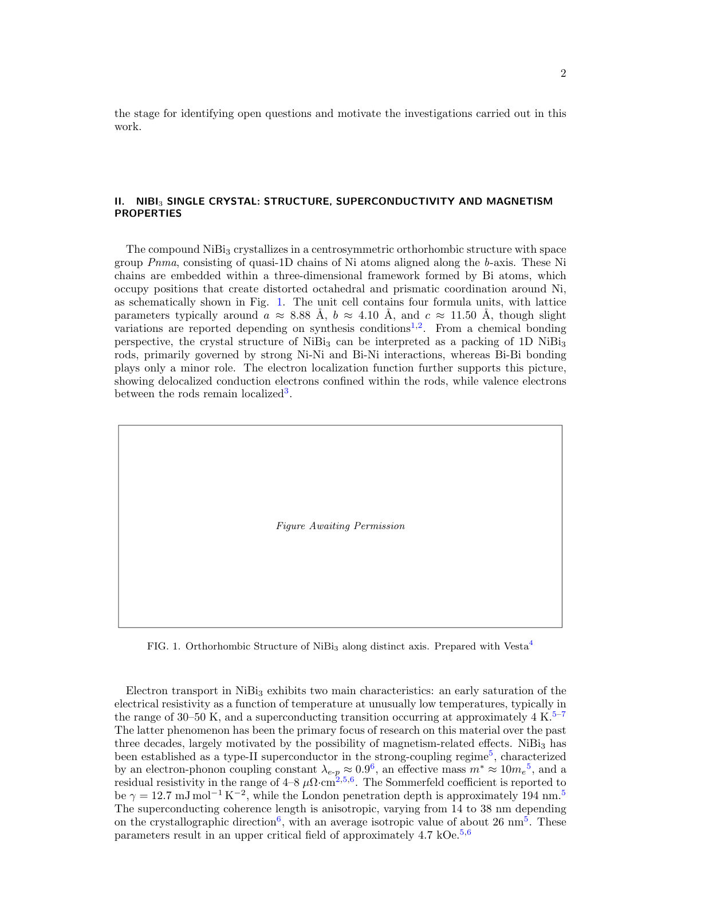 
Low-resolution page preview, page 2

📷 Fig 2

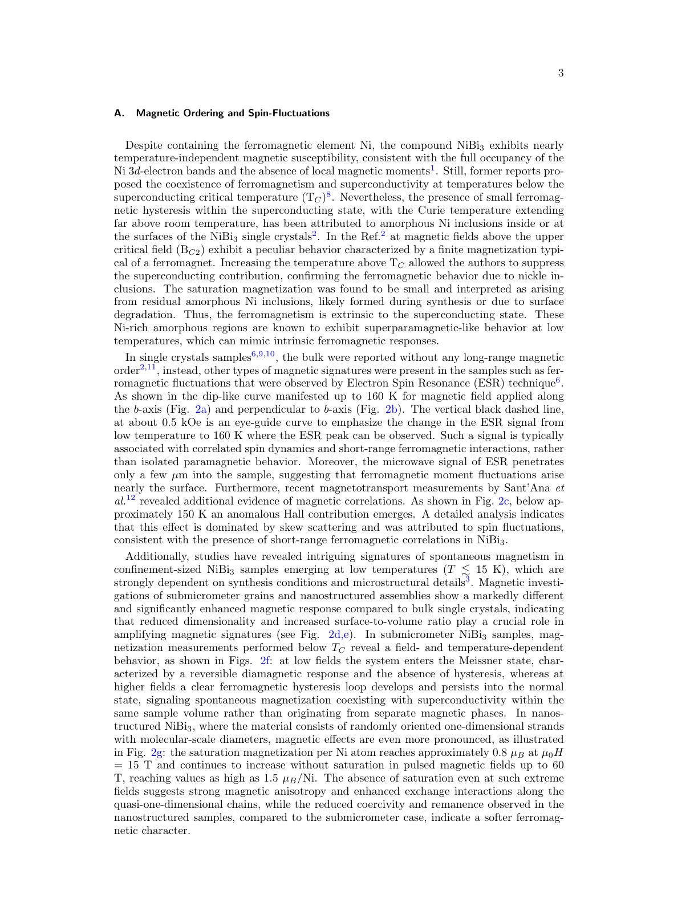 
Low-resolution page preview, page 3

📷 Fig 3

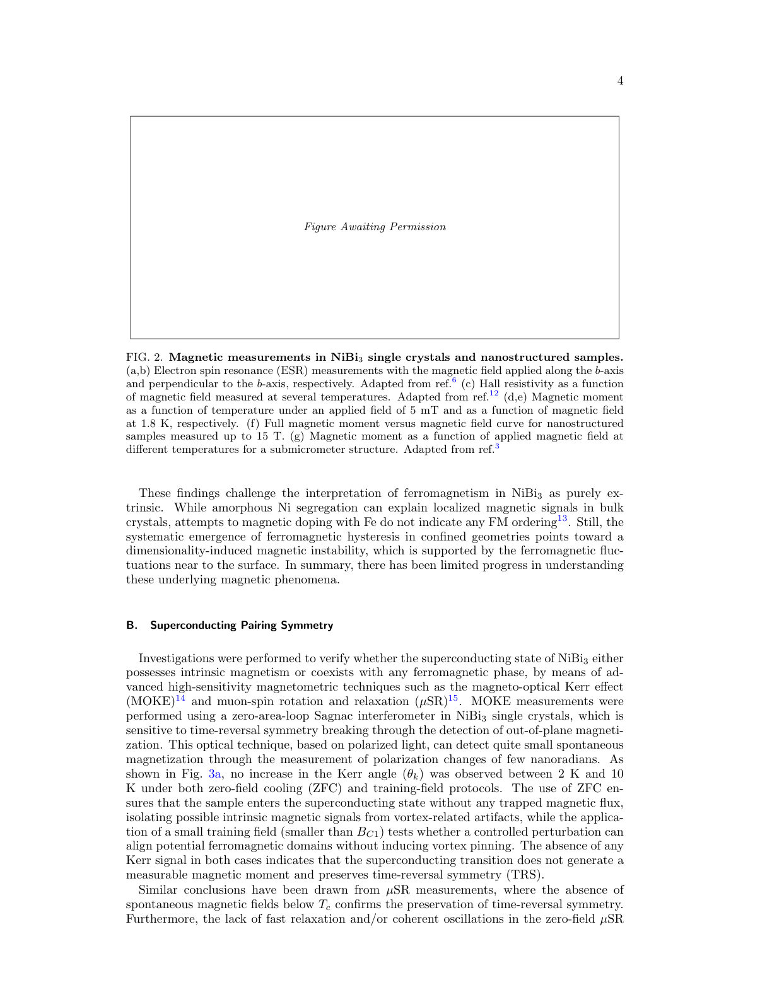 
Low-resolution page preview, page 4

📷 Fig 4

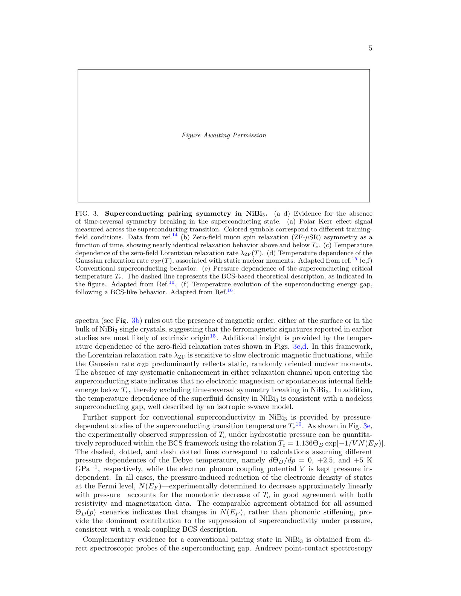 
Low-resolution page preview, page 5

📷 Fig 5

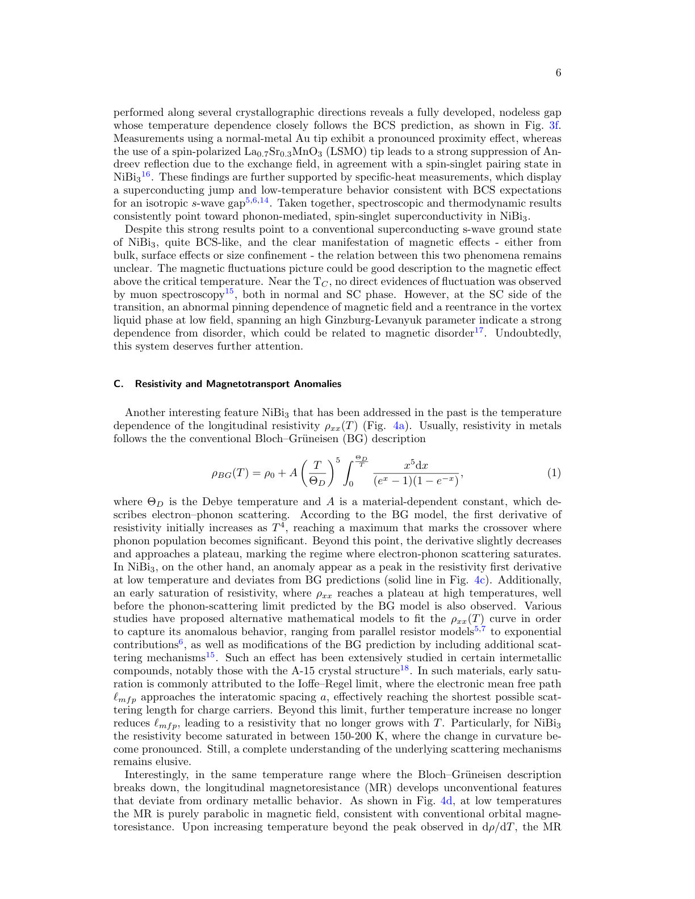 
Low-resolution page preview, page 6

**Summary.** This review synthesizes decades of research on superconductivity and magnetism in $	ext{Bi-Ni}$ compounds and bilayers. It contrasts findings suggesting conventional $s$-wave superconductivity with strong evidence for unconventional, time-reversal symmetry breaking states. The work highlights the critical role of dimensionality and interfacial effects in modifying these fundamental electronic properties.

**Why it may be interesting.** The interplay between superconductivity and magnetism, especially when mediated by strong spin-orbit coupling and dimensionality effects, is a core topic in strongly correlated electron physics, relevant to understanding exotic pairing symmetries.

Detailed structure

**Main problem.** The paper investigates the complex interplay between unconventional superconductivity and magnetism in the Bi-Ni system, specifically addressing the nature of magnetic anomalies in $	ext{NiBi}_3$ and the superconducting state in $	ext{Bi/Ni}$ bilayers.

**Main result.** The research presents conflicting evidence: some measurements suggest intrinsic time-reversal symmetry breaking and triplet pairing in the bilayer, while other studies point towards conventional $s$-wave superconductivity in the bulk $	ext{NiBi}_3$, highlighting a major unresolved conflict in the field.

**Method.** The study synthesizes results from multiple techniques, including magnetotransport measurements (MR, anomalous Hall effect), magnetometry ($	ext{MOKE}$, $\mu	ext{SR}$), and spectroscopic probes (Andreev spectroscopy).

**Model / system.** The focus is on two physical systems: the $	ext{NiBi}_3$ intermetallic compound (bulk and nanostructured) and the $	ext{Bi/Ni}$ heterostructure bilayer. The physics involves strong spin-orbit coupling ($	ext{SOC}$) and dimensionality effects.

**Key observables.** Superconducting critical temperature ($T_c$), magnetic hysteresis loops, nonreciprocal transport signals, and the deviation of the upper critical field ($	ext{H}_{c2}$) from the Pauli limit.

**Important parameters / regimes.** Low temperatures ($\sim 4 	ext{ K}$), high magnetic fields ($	ext{up to } 60 	ext{ T}$), and the ratio of in-plane vs. out-of-plane magnetic field responses.

**Assumptions / limitations.** The analysis often compares experimental results against theoretical models, such as BCS theory for superconductivity and various limits ($	ext{B}_{	ext{P}}$, $	ext{B}^*_{	ext{P}}$) for magnetic field effects.

**Figures summary.** Figures illustrate the orthorhombic structure of $	ext{NiBi}_3$, comparing magnetic measurements (ESR, moment vs. field) in bulk versus nanostructured samples, and showing the superconducting response to magnetic fields in both $	ext{NiBi}_3$ and $	ext{Bi/Ni}$ bilayers.

**Paper structure.** The review systematically examines the electronic properties of the two $	ext{Bi-Ni}$ systems, detailing experimental findings on magnetism (bulk vs. confined) and superconductivity (conventional vs. unconventional/topological), culminating in a discussion of open questions.

Abstract

Unconventional superconductivity with ingredients of magnetism such as time reversal breaking, triplet pairing and proximity effects has been a long time pursued topic in physics and material science as a new source of innovative phenomena and effects to drive further scientific advances and technologies. The Bi-Ni system has emerged as a convenient candidate for the investigation of such phenomenology. Strictly speaking, the term Bi-Ni system refers to two different schemes, first to the NiBi$_{3}$ intermetallic compound, a 4 K superconductor in which a complex magnetism seems to govern electrical properties in the normal phase, but without implication in the superconducting properties. The second Bi-Ni system is not quite a material but a heterostructure formed by a bilayer of Bi and Ni. Here the superconducting phase has to steal the spotlight by showing strong evidence of time-reversal breaking and triplet pairing featuring a complex unconventional state. The ease of preparing the samples, compared to other candidates for such unconventionality, usually Uranium-based compounds, has accelerated the research in this system. Here, we went through a detailed review of the main results about the electronic properties of these two systems as well as a discussion of the main open questions to be solved in order to reach the complete understanding in this topic.

[↑ back to top](#top)

### [Supermoiré Reconstruction and Topological Mosaics in Twisted Trilayer WSe$_2$ and MoTe$_2$](http://arxiv.org/abs/2608.30813v1)

**Authors:** Hai Meng, Yang Xu, Fengcheng Wu  
**Type:** theory · **Category:** strongly correlated electrons · **PDF:** <https://arxiv.org/pdf/2608.30813v1>  
**Analysis basis:** full PDF text, analyzed in chunks

📷 Fig 1

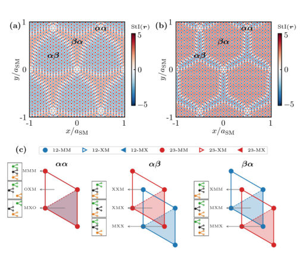 
FIG. 1. (a,b) Spatial pattern of relaxed htWSe2 and htMoTe2 with θ12 = θ23 = 3.89◦, respectively. aSM denotes the su- permoir´e period. (c) Schematic illustration of αα, αβ, and βα domains. Blue and red rhombi indicate the moir´e lattice of layers 1–2 and 2–3, respectively. Insets show local high- symmetry stackings, with orange, black, and green circles de- noting atoms in layers 1, 2, and 3, respectively. Solid and empty circles represent metal (M) and chalcogen (X) atoms.

📷 Fig 2

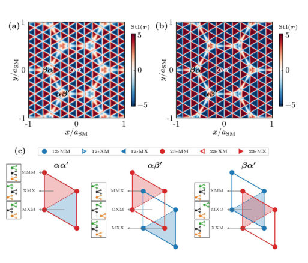 
FIG. 2. (a,b) Spatial pattern of relaxed atWSe2 and atMoTe2 with (θ12, θ23) = (2.20◦, −1.84◦), respectively. (c) Schematic illustration of αα′, αβ′, and βα′ domains.

📷 Fig 3

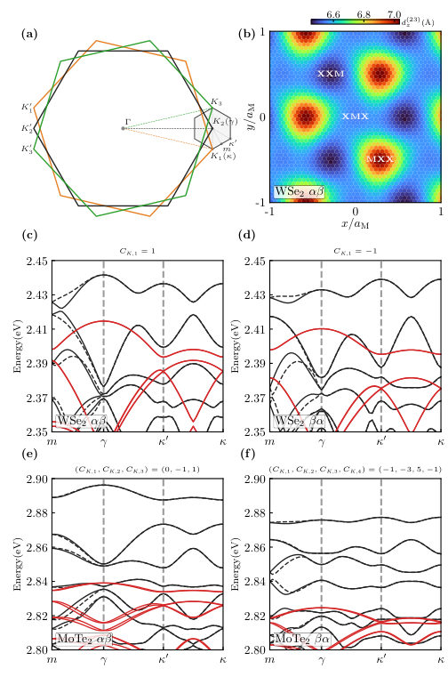 
FIG. 3. (a) Moir´e Brillouin zone (gray hexagon) of relaxed helical trilayer TMDs in commensurate domains. Orange, black, and green hexagons denote the Brillouin zones of layers 1, 2, and 3, respectively. (b) Interlayer distance d(23) z between layers 2 and 3 in the relaxed αβ domain of htWSe2. aM denotes the moir´e period. (c-f) Moir´e valence bands at the K (black solid), K′ (black dashed), and Γ (red) valleys of helical trilayer TMDs. CK,i denotes the Chern number of the i-th valence band at the K valley. Panels (c–f) correspond to htWSe2 in the αβ (c) and βα (d) domains, and htMoTe2 in the αβ (e) and βα (f) domains. In (b)-(f), the lattice constant of layer 2 is slightly expanded and...

📷 Fig 4

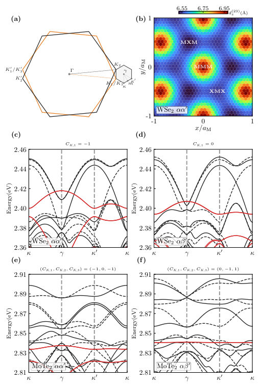 
FIG. 4. (a) Moir´e Brillouin zone (gray hexagon) of alter- nating trilayer TMDs with θ12 = −θ23. Orange and black hexagons denote the Brillouin zones of layer 1 (3) and layer 2, respectively. (b) Interlayer distance d(23) z between layers 2 and 3 in the relaxed αα′ domain of atWSe2. aM denotes the moir´e period. (c-f) Moir´e valence bands at the K (black solid), K′ (black dashed), and Γ (red) valleys of alternating trilayer TMDs. Panels (c–f) correspond to atWSe2 in the αα′

**Summary.** This work investigates twisted trilayer TMDs, revealing that the moiré superlattice reconstructs into domains with distinct topological properties due to broken symmetry. By calculating band structures and Chern numbers, the authors demonstrate that these systems form a 'topological mosaic,' offering a platform to study correlated and topological physics in engineered quantum materials.

**Why it may be interesting.** The concept of topological mosaics arising from structural reconstruction in moiré heterostructures is highly relevant to engineering topological electronic states, which is a key area in correlated electron physics.

Detailed structure

**Main problem.** The study investigates the lattice relaxation and electronic band structure of twisted trilayer Transition Metal Dichalcogenides (TMDs) to understand the formation and topological properties of supermoiré lattices.

**Main result.** The supermoiré structure forms a mosaic of topologically inequivalent domains, and the topmost valence bands exhibit domain-dependent valley Chern numbers, which is distinct from simpler bilayer systems.

**Method.** The research employs a combination of machine-learning force fields for structural relaxation and the Truncated Atomic Plane Wave (TAPW) method for calculating electronic band structures and topological invariants.

**Model / system.** The physical system is helical and alternating twisted trilayer WSe2 and MoTe2. The moiré superlattice is formed by the interference of two adjacent bilayer moiré lattices, leading to distinct domain types.

**Key observables.** Domain-dependent valley Chern numbers ($C_K, C_{K'}$), lattice relaxation patterns, and the energy difference ($\Delta E$) between different domain types.

**Important parameters / regimes.** Twist angles ($	heta_{12}, 	heta_{23}$), which define the helical or alternating configuration of the layers.

**Assumptions / limitations.** The analysis relies on MLFFs trained on a large dataset, and for the alternating case, small lattice constant adjustments were sometimes necessary to achieve a commensurate structure.

**Figures summary.** Figures illustrate the spatial patterns of relaxed TMDs for both helical and alternating twists, showing domain types. Band structure plots display the moiré Brillouin zone and the energy dispersion of the topmost valence bands, highlighting non-zero Chern numbers in specific domains.

**Paper structure.** The paper proceeds by first analyzing the structural relaxation of the supermoiré lattice, identifying domain types based on symmetry breaking. Subsequently, it calculates the electronic band structure and topological invariants (Chern numbers) for both helical and alternating configurations, comparing the results across different TMD materials.

Abstract

We investigate lattice relaxation and band structures of helical and alternating twisted trilayer WSe$_2$ and MoTe$_2$ using machine-learning force fields and large-scale ab initio calculations. Interference between the two bilayer moiré lattices generates a supermoiré lattice that, upon relaxation, reconstructs into a few dominant domain types with locally commensurate bilayer moiré lattices. Because the systems lack $C_{2z}$ symmetry, domains otherwise related by this symmetry become energetically and topologically distinct, unlike in twisted trilayer graphene. Band structure calculations show that the topmost valence bands originate from the $K$ ($K'$) valleys and carry domain-dependent valley Chern numbers. The resulting supermoiré lattice hosts a mosaic of topologically inequivalent domains, offering a platform for exploring correlated and topological physics.

[↑ back to top](#top)

### [Topological pair density waves in kagome superconductors](http://arxiv.org/abs/2608.29156v1)

**Authors:** Jia-Xin Yin, Xianxin Wu, Mark H. Fischer, Xiao-Yu Yan, Yigui Zhong, Kozo Okazaki  
**Type:** both · **Category:** strongly correlated electrons · **PDF:** <https://arxiv.org/pdf/2608.29156v1>  
**Analysis basis:** full PDF text, analyzed in chunks

📷 Fig 1

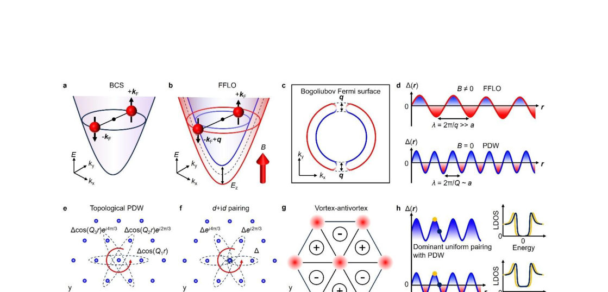 
Figure 1 Concept of finite momentum pairing: from FFLO to TPDW. a, Schematic illustration of Cooper pairing (+k↑, −k↓) in the BCS state. b, Finite momentum pairing with

📷 Fig 2

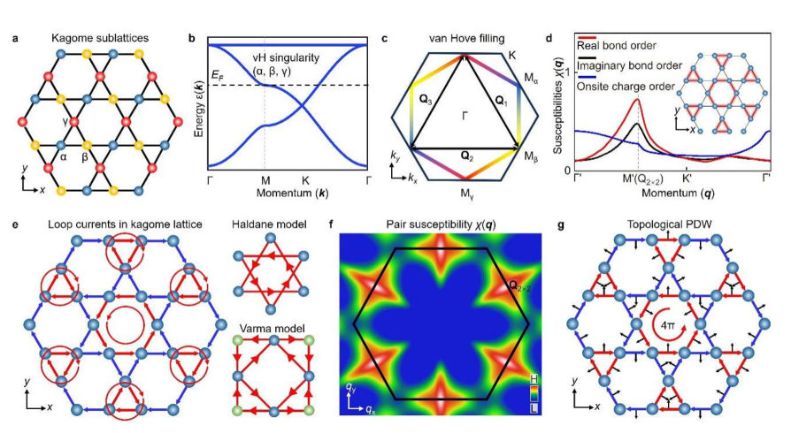 
Figure 2 TPDW intertwined with loop currents. a, Kagome lattice structure with three

📷 Fig 3

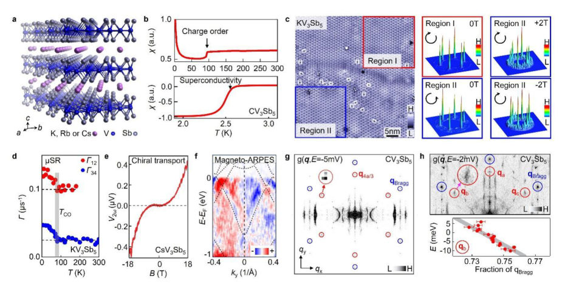 
Figure 3 Experimental background for TPDW. a, Crystal structure of AV3Sb5, where the V

📷 Fig 4

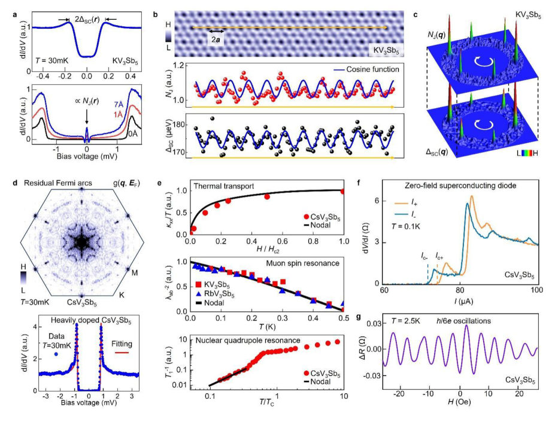 
Figure 4 Experimental signatures of TPDW. a, Tunnelling spectra of the kagome

📷 Fig 5

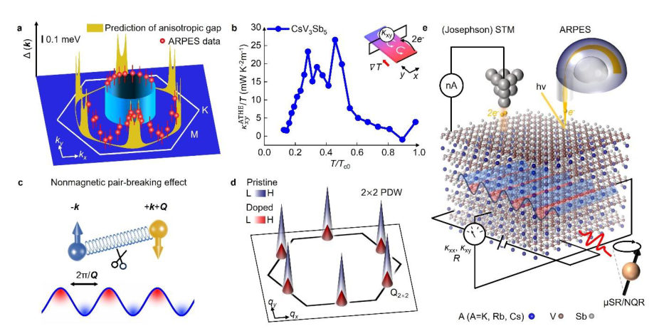 
Figure 5 Further predictions for TPDW and their examinations. a, Predicted momentum-

**Summary.** This paper reviews the theoretical framework and experimental evidence for Topological Pair Density Waves (TPDWs) in kagome superconductors. It explains that TPDWs emerge when multiple pairing components have a relative phase winding, leading to topological properties like broken time-reversal symmetry. The research highlights the profound implications of this interplay for understanding exotic superconducting states.

**Why it may be interesting.** The study of TPDWs connects superconducting pairing mechanisms to topological matter, which is a key area in modern condensed matter theory, bridging concepts from superconductivity and topological band theory.

Detailed structure

**Main problem.** The paper investigates Topological Pair Density Waves (TPDWs) in unconventional superconductors, specifically focusing on their potential realization in kagome superconductors.

**Main result.** TPDWs arise from the phase winding of multiple finite-momentum pairing components, leading to time-reversal symmetry breaking and a non-trivial topological electronic structure.

**Method.** The work combines theoretical reviews, starting from the FFLO state, with discussions of experimental signatures observed in materials like AV3Sb5.

**Model / system.** The focus is on kagome superconductors, where the interplay between PDW, charge order, and uniform pairing is analyzed. The theoretical framework involves extensions of the FFLO state to include topological aspects.

**Key observables.** Topological electronic structure (non-zero Chern number), superconducting loop currents, anomalous thermal Hall effect, and superconducting diode effect.

**Important parameters / regimes.** The wave vector Q (finite momentum pairing), the relative phase winding between Q components, and the material parameters of the kagome lattice.

**Assumptions / limitations.** The analysis often builds upon the analogy to the FFLO state and assumes the existence of complex interplay between different types of order (PDW, CDW, chiral).

**Figures summary.** Figures illustrate the transition from BCS pairing to FFLO states, the formation of PDWs with static Q, and the topological nature of TPDWs in hexagonal lattices.

**Paper structure.** The paper progresses by introducing the concept of PDW, extending it to TPDW via phase winding, discussing the specific realization in the kagome lattice, reviewing experimental evidence from AV3Sb5, and concluding with future research directions.

Abstract

The pair density wave (PDW) is an unconventional superconducting state exhibiting periodic pairing modulations due to pairing with finite momentum Q. In two dimensions, multiple Q components of the PDW can have a non-trivial relative phase, breaking time-reversal symmetry and resulting in a topological electronic structure. Here we review progress on exploring such topological PDWs (TPDWs) and discuss their potential realization in kagome superconductors. We first introduce the concept of a TPDW starting from the Fulde-Ferrell-Larkin-Ovchinnikov (FFLO) state and examine the challenges toward its realization. We then discuss the possibility of a TPDW in the kagome lattice, which intertwines with chiral superconductivity and loop currents, thus connecting to models describing the quantum anomalous Hall effect. Furthermore, we review the experimental signatures of a TPDW in AV3Sb5 (A = Cs, Rb, K) superconductors and highlight related quantum effects, including switchable chiral pairing modulations, Bogoliubov Fermi states, the superconducting diode effect, and the anomalous thermal Hall effect. Finally, we project the future research opportunities of this correlated topological quantum phase and discuss its broad implications for finite-momentum pairing, topological matter, and chiral superconductivity.

[↑ back to top](#top)

