
# arxiv digest (quant-ph + cond-mat) — 2026-09-03

*137 papers · 13 relevant · 1 highlighted*

## 🔥 Most relevant (13)

*Every paper with at least one nonzero topic score, sorted by best-matching score. 🔥 marks scores ≥4/5. Click the title to jump to the full entry below; click [arXiv] to open the paper page. `(secondary)` marks papers from de-prioritized cond-mat archives.*

Show 13 relevant papers

- [Observable- and state-selective prethermalization and bounds on prethermal lifetimes](#paper-2609.01606) [[arXiv]](http://arxiv.org/abs/2609.01606v1) — 🔥 `scars & prethermalization` **5/5** · `analog quantum simulation` **1/5** · `driven-dissipative phase transition` **1/5** · `non-equilibrium universality` **1/5**
- [Collective dressed states for inelastic light scattering by atomic ensembles](#paper-2609.00138) [[arXiv]](http://arxiv.org/abs/2609.00138v1) — 🔥 `free-space correlated emission` **4/5** · `Dicke superradiance` **3/5** · `Tavis-Cummings & cavity-many-emitter` **3/5** · `correlated / nonlocal dissipation` **3/5** · `methods for driven-dissipative` **3/5** · `Keldysh / 2PI / non-Gaussian methods` **2/5** · `driven-dissipative phase transition` **2/5** · `interference shaping light` **2/5** · `analog quantum simulation` **1/5** · `non-equilibrium universality` **1/5** · `quantum measurements` **1/5** · `superradiant laser` **1/5**
- [Topological charge switching in trapped polariton condensates](#paper-2609.00979) [[arXiv]](http://arxiv.org/abs/2609.00979v1) — 🔥 `analog quantum simulation` **4/5** · 🔥 `driven-dissipative phase transition` **4/5** · `quantum optics experiment` **3/5** · `Keldysh / 2PI / non-Gaussian methods` **2/5** · `methods for driven-dissipative` **2/5** · `non-equilibrium universality` **2/5** · `QC/QI experiment` **1/5** · `correlated / nonlocal dissipation` **1/5** · `interference shaping light` **1/5** · `quantum measurements` **1/5**
- [Dynamical phase transitions for single particles in the semiclassical and weak noise limits](#paper-2609.01197) [[arXiv]](http://arxiv.org/abs/2609.01197v1) — 🔥 `driven-dissipative phase transition` **4/5** · `Keldysh / 2PI / non-Gaussian methods` **3/5** · `methods for driven-dissipative` **3/5** · `non-equilibrium universality` **3/5** · `quantum measurements` **2/5** · `Frenkel-Kontorova` **1/5** · `analog quantum simulation` **1/5** · `correlated / nonlocal dissipation` **1/5** · `scars & prethermalization` **1/5**
- [Kibble--Zurek Mechanism and Defect Freezing in Imbalanced-Pairing Kitaev Models](#paper-2609.00971) [[arXiv]](http://arxiv.org/abs/2609.00971v1) — 🔥 `non-equilibrium universality` **4/5** · `analog quantum simulation` **3/5** · `driven-dissipative phase transition` **3/5** · `Keldysh / 2PI / non-Gaussian methods` **2/5** · `correlated / nonlocal dissipation` **2/5** · `methods for driven-dissipative` **2/5**
- [Feedback-Enhanced Quantum Metrology and Clock Precision under Thermodynamic Uncertainty](#paper-2609.00622) [[arXiv]](http://arxiv.org/abs/2609.00622v1) — 🔥 `quantum measurements` **4/5** · `Full counting statistics` **3/5** · `correlated / nonlocal dissipation` **2/5** · `driven-dissipative phase transition` **2/5** · `methods for driven-dissipative` **2/5** · `Keldysh / 2PI / non-Gaussian methods` **1/5** · `non-equilibrium universality` **1/5**
- [Nonlocal wavefront shaping through complex media](#paper-2609.01017) [[arXiv]](http://arxiv.org/abs/2609.01017v1) — 🔥 `quantum optics experiment` **4/5** · `correlated / nonlocal dissipation` **3/5** · `interference shaping light` **3/5** · `quantum measurements` **1/5**
- [Encoding Compact U(1) Gauge Fields in Bosonic Modes with GKP Stabilization](#paper-2609.00167) [[arXiv]](http://arxiv.org/abs/2609.00167v1) — 🔥 `analog quantum simulation` **4/5** · `QC/QI experiment` **2/5** · `quantum measurements` **2/5** · `Keldysh / 2PI / non-Gaussian methods` **1/5** · `methods for driven-dissipative` **1/5**
- [A Backend-Agnostic MWIS Kernel for Stochastic Unit Commitment with Neutral-Atom Hardware Validation](#paper-2609.01248) [[arXiv]](http://arxiv.org/abs/2609.01248v1) — 🔥 `QC/QI experiment` **4/5** · `Rydberg arrays` **3/5** · `analog quantum simulation` **2/5**
- [Exact learning of quantum noise with tensor networks](#paper-2609.00169) [[arXiv]](http://arxiv.org/abs/2609.00169v1) — 🔥 `QC/QI experiment` **4/5** · `methods for driven-dissipative` **3/5** · `quantum measurements` **2/5**
- [Fast Microwave-free State Preparation and Measurement of Superconducting Qubits](#paper-2609.01334) [[arXiv]](http://arxiv.org/abs/2609.01334v1) — 🔥 `QC/QI experiment` **4/5** · `quantum measurements` **3/5**
- [Generation of multicomponent Schrödinger cat states in schemes with measurement of Gaussian states](#paper-2609.00343) [[arXiv]](http://arxiv.org/abs/2609.00343v1) — 🔥 `quantum measurements` **4/5** · `Full counting statistics` **1/5** · `quantum optics experiment` **1/5**
- [Superconducting Flux Memory for Cryogenic Applications](#paper-2609.00772) [[arXiv]](http://arxiv.org/abs/2609.00772v1) — 🔥 `QC/QI experiment` **4/5** · `quantum measurements` **1/5**

## ⭐ Highlighted (1)

*Papers by authors on your watch list. Click the title to jump to the full entry below; click [arXiv] to open the paper page.*

Show 1 highlighted papers

- ⭐ [Nonlinear Fluctuating Hydrodynamics from Interacting Noisy Quantum Matter](#paper-2609.00159) [[arXiv]](http://arxiv.org/abs/2609.00159v1) — Zala Lenarčič

## All papers (83, sorted by relevance)

*Papers from quant-ph and your primary cond-mat archives (quant-gas, stat-mech, str-el, dis-nn). Highlighted papers (⭐) come first, then everything else sorted by topic-relevance score, highest first.*

### ⭐ [Nonlinear Fluctuating Hydrodynamics from Interacting Noisy Quantum Matter](http://arxiv.org/abs/2609.00159v1)

**Highlighted author(s):** Zala Lenarčič  
**Authors:** Alexios Christopoulos, João Costa, Stefano Scopa, Jacopo De Nardis, Zala Lenarčič, Denis Bernard, Tony Jin  
**Type:** theory · **Category:** statistical mechanics · **PDF:** <https://arxiv.org/pdf/2609.00159v1>  
**Analysis basis:** full PDF text, analyzed in chunks
**Topic relevance:** `methods for driven-dissipative` **3/5** · `non-equilibrium universality` **3/5** · `Keldysh / 2PI / non-Gaussian methods` **2/5** · `Frenkel-Kontorova` **1/5** · `Full counting statistics` **1/5** · `analog quantum simulation` **1/5** · `correlated / nonlocal dissipation` **1/5** · `driven-dissipative phase transition` **1/5** · `quantum measurements` **1/5**

📷 Fig 1

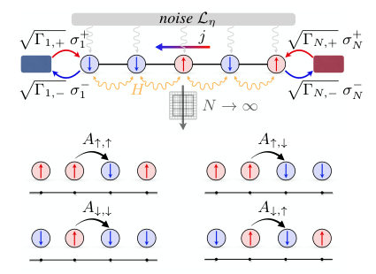 
Figure 1. Microscopic model and emergent stochastic dynamics. Top: XXZ spin chain with bulk dephasing and boundary reservoirs, driving the system to a NESS. Bottom: In the strong-coupling regime, the model reduces to the effective dynamics of the interacting sym- metric exclusion process (ISEP), which describes non-overlapping particles whose jump rates depend on the next-nearest neighbor occu- pation.

📷 Fig 2

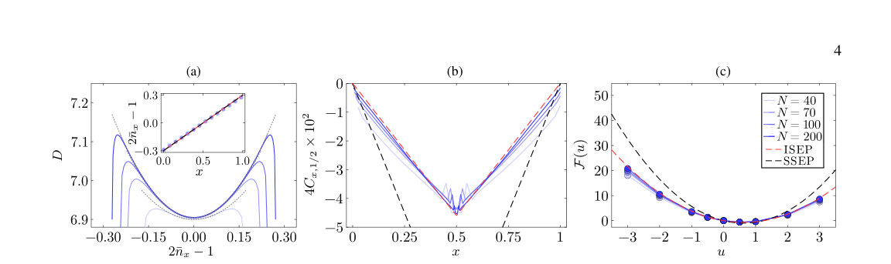 
Figure 2. Comparison of tensor-network results for the microscopic model (2) and the ISEP description. (a) Local diffusivity reconstructed from the NESS magnetization profile and current, D = −¯Jx/∇¯nx, plotted against the local magnetization ⟨ˆσz j=xN⟩= 2¯nx −1. The diffusivity in the bulk is well converged with system size at the maximum length N = 200 considered. Fitting (gray dotted) Eq. (15) to the bulk data fixes the two effective couplings (D0, λ). The inset plot demonstrates the comparison of the magnetization profile with its analytical prediction for ISEP (see SM). (b) Connected spin–spin correlation N⟨ˆσz i=xN ˆσz j=yN⟩c = 4Cx,y at fixed y = 1/2 (regular part Cneq x,y ; the...

📷 Fig 3

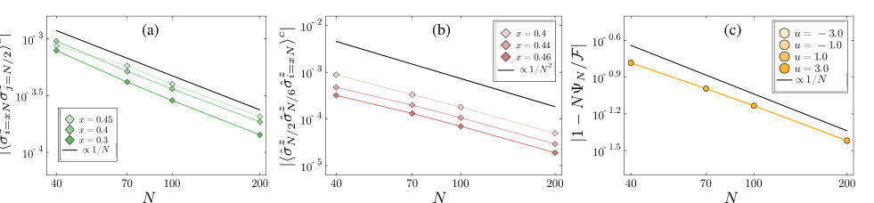 
Figure 3. Finite-size scaling tests of the MFT description. (a) Connected spin correlator of the magnetization, |⟨ˆσz i=xN ˆσz j=N/2⟩c|, for x = 0.3, 0.4, 0.45, which shows good agreement with the 1/N scaling predicted in Eq. (18). (b) Connected spin correlator |⟨ˆσz N/2ˆσz N/6ˆσz i=xN⟩c|, with two sites fixed and the third at x = 0.4, 0.44, 0.46. The correlator shows good agreement with the decay as 1/N 2 predicted i.e., the m = 3 case of Eq. (11). Panels (a) and (b) together validate the scaling used to extract our analytical results of ISEP-MFT. (c) Relative deviation of the finite-size cumulant generating function NΨN(u) from the MFT prediction F(u), for u = ±1, ±3. We see that the...

**Summary.** This work tackles the difficult problem of characterizing non-equilibrium steady states in quantum matter by deriving an emergent Macroscopic Fluctuation Theory (MFT). Using a boundary-driven XXZ spin chain model, the authors show that the system's large-scale dynamics are governed by nonlinear diffusion equations featuring density-dependent transport coefficients. This establishes MFT as a powerful, universal framework for interacting quantum diffusive systems.

**Why it may be interesting.** It provides a rigorous, microscopic derivation of nonlinear, interacting hydrodynamics, extending the applicability of MFT beyond simple constant-diffusivity models.

Detailed structure

**Main problem.** The central challenge is deriving a universal hydrodynamic description for non-equilibrium steady states (NESS) in interacting quantum many-body systems.

**Main result.** The authors derive an emergent classical Macroscopic Fluctuation Theory (MFT) for the system, showing that the hydrodynamics features density-dependent diffusivity and mobility.

**Method.** The derivation proceeds by taking a continuum limit of the microscopic Lindblad dynamics, leading to nonlinear diffusion equations for the density field.

**Model / system.** The system is a boundary-driven XXZ spin chain with bulk dephasing, whose dynamics are governed by a Lindblad master equation. The effective low-energy description resembles an Interacting Symmetric Simple Exclusion Process (ISEP).

**Key observables.** Stationary density profile, long-range correlations, and the full counting statistics of the current.

**Important parameters / regimes.** Density-dependent diffusivity $D(ar{n})$ and mobility $\sigma(ar{n})$, and the scaling limit $	au = s/N^2$.

**Assumptions / limitations.** The theory relies on a Renormalization Group (RG) argument suggesting a diffusive strong-coupling fixed point, and the slow-mode manifold approximation.

**Figures summary.** Figures compare tensor-network results for the microscopic model and the ISEP description, showing local diffusivity vs. magnetization and correlation functions.

**Paper structure.** The paper first establishes the microscopic dynamics via Lindblad equations, then uses RG arguments to derive the effective MFT equations, and finally applies this framework to compute observables like correlation functions and full counting statistics.

Abstract

A universal characterization of non-equilibrium steady states in interacting quantum many-body systems remains one of the central challenges of statistical physics. Here, we address this problem for a paradigmatic model of diffusive interacting quantum matter---the boundary-driven XXZ spin chain with bulk dephasing---and derive, directly from its microscopic Lindblad dynamics, an emergent classical Macroscopic Fluctuation Theory (MFT) governing its large-scale fluctuations. Crucially, the resulting hydrodynamics carries a density-dependent diffusivity and mobility as the fingerprint of interactions. This effective description enables the exact computation of the stationary density profile, long-range correlations, and the full counting statistics of the current, in excellent agreement with tensor-network simulations. Our work demonstrates that noisy quantum many-body systems can realize the universality class of genuinely interacting diffusive matter, beyond the constant-diffusivity class of the symmetric simple exclusion process, and establishes MFT as a powerful universal framework for interacting diffusive quantum systems.

[↑ back to top](#top)

### [Observable- and state-selective prethermalization and bounds on prethermal lifetimes](http://arxiv.org/abs/2609.01606v1)

**Authors:** C. L. Sriram, Soumya Kanti Pal, Lea F. Santos  
**Type:** theory · **Category:** statistical mechanics · **PDF:** <https://arxiv.org/pdf/2609.01606v1>  
**Analysis basis:** full PDF text, analyzed in chunks
**Topic relevance:** 🔥 `scars & prethermalization` **5/5** · `analog quantum simulation` **1/5** · `driven-dissipative phase transition` **1/5** · `non-equilibrium universality` **1/5**

📷 Fig 1

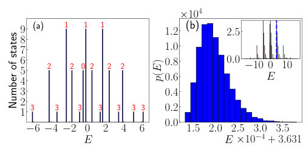 
FIG. 1. Density of states for (a) ˆH(0) with L = 6 and s for each band indicated in red, and (b) a single energy band of ˆH(α̸=0) with L = 16 and α = 10−4. The inset shows that the full spectrum of ˆH(α̸=0) retains the band structure.

📷 Fig 2

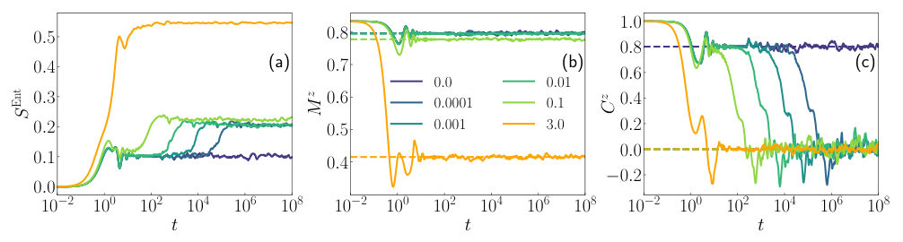 
FIG. 2. Evolution of the (a) entanglement entropy, (b) magnetization along the z-direction Mz and (c) first moment of the excitation density Cz for an initial product state and different interaction-range exponents α, as indicated in panel (b). The magnetization does not exhibit a prethermal plateau.

📷 Fig 3

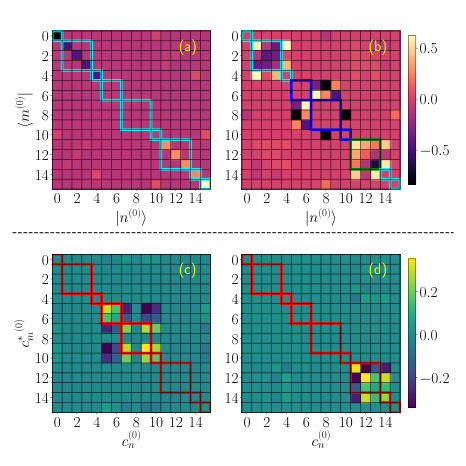 
FIG. 3. Matrix elements of (a) the permutation-invariant magnetization ˆ M z and (b) the first moment of the excitation density ˆCz in the energy eigenbasis of ˆH(0). Overlap matrices c∗ m (0)c(0) n for the initial state (c) | ↑↓↓↑⟩and (d) | ↓↓↑↓⟩. Cyan, blue, green, and red boxes delimit degenerate energy bands. The blue and green boxes in (b) identify the bands relevant to the initial states in (c) and (d), respectively.

📷 Fig 4

 
FIG. 4. Loschmidt echo L and the observable Cz for L = 12 and α = 10−4. Vertical dashed line marks the time at which the Loschmidt echo has departed from its prethermal regime by δL ≈0.2. At this time, Cz(t) remains at its prethermal plateau, illustrating the bound tL ≤tO.

📷 Fig 5

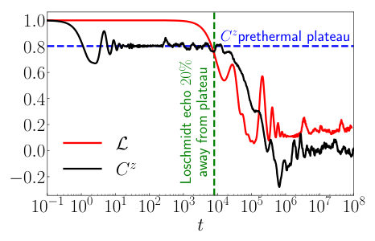 
Figure 4 illustrates this bound for Cz. At the time when the Loschmidt echo (red curves) reaches a pre- scribed deviation δL, Cz (black curve) remains at its prethermal plateau and is far from reaching the corre- sponding threshold δO in Eq. (13), consistent with the bound in Eq. (15). Conclusions.– We developed a theoretical framework for prethermalization in quantum many-body systems with approximate permutation symmetry. The separa- tion between fast interband and slow intraband dynamics creates a prethermal time window, but does not guaran- tee a prethermal plateau. The emergence of this plateau requires surviving intraband coherences, whose contri- bution is controlled by the...

**Summary.** This theoretical paper establishes that prethermalization is an observable- and state-selective phenomenon, meaning not all physical quantities will exhibit a long-lived plateau even if the Hamiltonian suggests it. Crucially, the authors derive a general lower bound on this prethermal lifetime using the Loschmidt echo, providing a powerful diagnostic tool for characterizing non-equilibrium dynamics in quantum many-body systems.

**Why it may be interesting.** This work provides rigorous, quantitative tools (like the Loschmidt echo bound) to predict the duration of non-equilibrium dynamics, which is crucial for designing experiments that probe intermediate quantum phases.

Detailed structure

**Main problem.** The paper investigates the conditions under which prethermalization occurs in quantum many-body systems, specifically addressing whether separated energy scales guarantee a prethermal plateau for all observables.

**Main result.** Prethermalization is highly selective; its existence depends on the specific observable and the initial state, not just the Hamiltonian structure. Furthermore, the Loschmidt echo provides a general lower bound on the prethermal lifetime for any bounded observable.

**Method.** The authors use theoretical analysis involving Hamiltonian perturbation theory, analyzing matrix elements in the energy eigenbasis, and deriving bounds using the trace-norm inequality applied to the Loschmidt echo and Uhlmann fidelity.

**Model / system.** The analysis is applied to long-range interacting spin models, exemplified by a 1D transverse field Ising model with power-law interactions ($\hat{H}(\alpha)$). The dynamics are studied in the presence of a small perturbation ($\hat{H} = \hat{H}_0 + \epsilon \hat{V}$).

**Key observables.** Prethermal plateau visibility, entanglement entropy ($S_{	ext{Ent}}$), total magnetization ($M_z$), first moment of excitation density ($C_z$), Loschmidt echo ($L(t)$), and Uhlmann fidelity ($F(t)$).

**Important parameters / regimes.** Interaction-range exponent ($\alpha$), perturbation strength ($\epsilon$), and time scales relative to $\epsilon^{-1}$.

**Assumptions / limitations.** The analysis relies on the perturbation strength $\epsilon$ being small and the time $t$ being short relative to the inverse perturbation strength ($t \ll \epsilon^{-1}$).

**Figures summary.** Figures illustrate the comparison of time evolution for different observables ($S_{	ext{Ent}}$ vs. $M_z$) showing selectivity, and demonstrate the mathematical bound relating the observable deviation to the Loschmidt echo departure.

**Paper structure.** The paper first establishes the general framework of prethermalization in weakly perturbed systems. It then analyzes the role of symmetry (permutation invariance) in suppressing plateaus for certain observables. Finally, it derives and applies the rigorous bound using the Loschmidt echo and fidelity to quantify the minimum prethermal lifetime.

Abstract

Prethermalization describes long-lived intermediate regimes that precede equilibrium and can dominate experimentally accessible dynamics. Here, we show that a separation of spectral energy scales, despite giving rise to a hierarchy of dynamical timescales, does not by itself guarantee the appearance of a prethermal plateau. Under the same Hamiltonian, some observables may exhibit prethermal behavior, while others relax directly toward equilibrium. We uncover the mechanism governing this selectivity, showing that the emergence of a prethermal plateau depends not only on the Hamiltonian, but also on the observable and the initial state. Our results apply broadly to systems close to a fully permutation-symmetric limit and are illustrated with a long-range interacting spin model. We further prove that the Loschmidt echo provides a lower bound on the prethermal lifetime of any bounded observable whenever the prethermal and exact dynamics are unitary.

[↑ back to top](#top)

### [Collective dressed states for inelastic light scattering by atomic ensembles](http://arxiv.org/abs/2609.00138v1)

**Authors:** Sébastien Lucas, David Wilkowski, Christian Miniatura, Sergey E. Skipetrov  
**Type:** theory · **Category:** other · **PDF:** <https://arxiv.org/pdf/2609.00138v1>  
**Analysis basis:** full PDF text, analyzed in chunks
**Topic relevance:** 🔥 `free-space correlated emission` **4/5** · `Dicke superradiance` **3/5** · `Tavis-Cummings & cavity-many-emitter` **3/5** · `correlated / nonlocal dissipation` **3/5** · `methods for driven-dissipative` **3/5** · `Keldysh / 2PI / non-Gaussian methods` **2/5** · `driven-dissipative phase transition` **2/5** · `interference shaping light` **2/5** · `analog quantum simulation` **1/5** · `non-equilibrium universality` **1/5** · `quantum measurements` **1/5** · `superradiant laser` **1/5**

📷 Fig 1

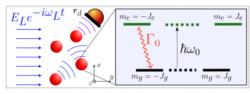 
FIG. 1. Sketch of the considered setup. Nat identical atoms in the free space driven by a coherent laser field EL(r, t). The light scattered by the system is measured by a detector located at rd.

📷 Fig 2

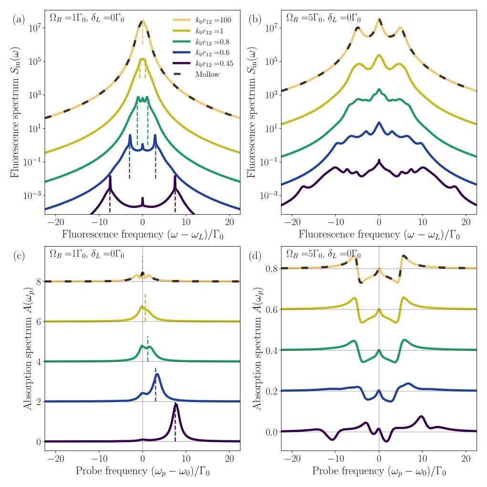 
FIG. 4. (a,b) Fluorescence spectra of a pair of atoms with a transition J = 0 →1 driven in phase by a π-polarized laser (linear polarization perpendicular to the atomic axis, see Fig. 2) at the bare atomic resonance (ωL = ω0) and in the forward direction, for decreasing interatomic distance r12, at moderate ΩR = Γ0 (a) and strong ΩR = 5Γ0 (b) pump. (c,d) Absorption spectra of a weak π-polarized laser beam probing both atoms in phase at frequency ωp at moderate ΩR = Γ0 (c) and strong ΩR = 5Γ0 (d) pump. Colored vertical dashed lines indicate in (c) the superradiant mode frequency ωp −ω0 = −Ω12, and in (a) the sub- and superradiant mode frequencies ω −ω0 = ±Ω12. Black dashed lines show twice...

📷 Fig 3

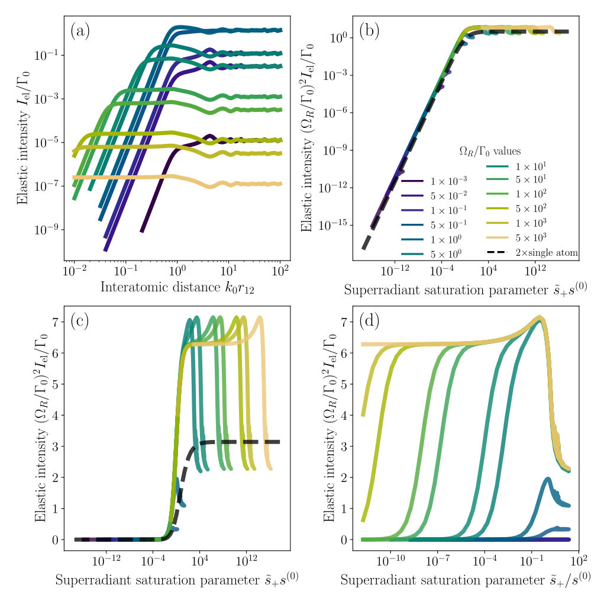 
FIG. 5. (a) Intensity of light elastically scattered by a pair of atoms driven by a linearly polarized laser. Results are averaged over the incident direction, polarization of incident light, and detection angle before being plotted for different Rabi frequencies ΩR as a function of the interatomic distance k0r12. (b,c) Intensity rescaled to make curves obtained for different ΩR coincide at small distances, as a function of the angle-averaged rescaled saturation parameter of the superradiant mode ˜s+s(0), defined in Eq. (51), displayed in log-log (b) and log-linear (c) scales. (d) A different rescaling of the horizontal axis, ˜s+/s(0), makes all curves coincide at large values of ˜s+/s(0).

📷 Fig 4

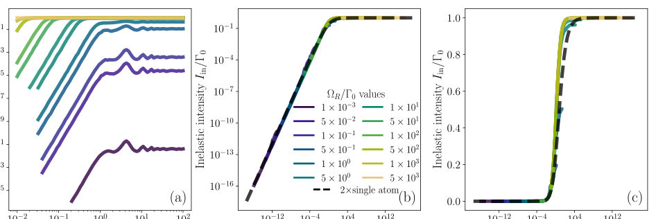 
FIG. 6. (a) Intensity of light scattered inelastically by a pair of atoms driven by a linearly polarized laser. Results are averaged over the incident direction, polarization of incident light, and detection angle before being plotted for different Rabi frequencies ΩR as a function of the interatomic distance k0r12. Same intensities as functions of the angle-averaged rescaled saturation parameter of the superradiant modes ˜s+s(0), defined in Eq. (51), displayed in log-log (b) and log-linear (c) scales.

📷 Fig 5

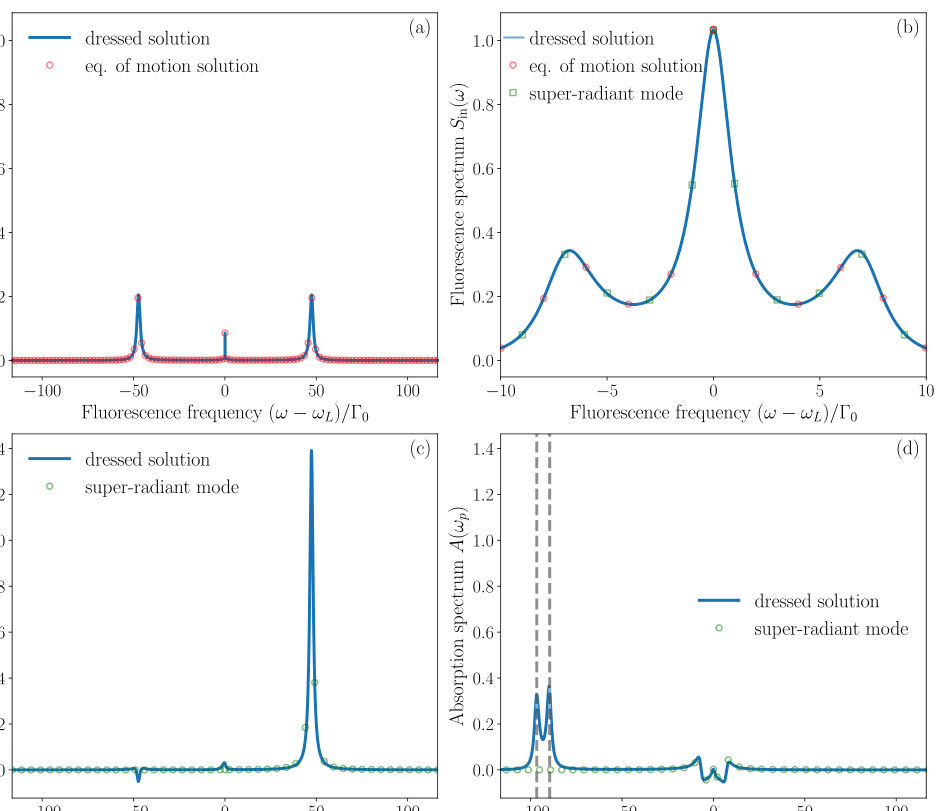 
FIG. 7. (a,b) Fluorescence spectra measured in the forward scattering direction of a pair of atoms separated by k0r12 = 0.35 driven in phase by a π-polarized laser of strength ΩR = 10Γ0, tuned to the atomic resonance frequency (ωL = ω0) (a) or the frequency of the superradiant mode (ωL = ω+) (b). The blue curve shows the computation in the dressed basis, the red curve with circles—the solution of the equations of motions in the natural basis, and the green curve with diamonds—the fluorescence spectra of a single atom with the properties of the superradiant mode (ω0 →ω+, Γ0 →Γ+, and ΩR →Ω+). (c,d) Absorption spectra of a weak π-polarized laser probing in phase (θ(p) in = π/2 in Fig. 2) the...

**Summary.** This paper introduces a comprehensive dressed-state framework to model light scattering from ensembles of atoms. It calculates fluorescence, absorption, and correlation functions by treating the full vectorial coupling to the electromagnetic field. The results highlight universal collective behaviors and predict novel quantum optical phenomena arising from atomic interactions.

**Why it may be interesting.** This work provides a powerful, general, and computationally implemented tool for analyzing collective quantum optical responses in structured arrays of atoms, bridging quantum electrodynamics with many-body physics.

Detailed structure

**Main problem.** To develop a general dressed-state framework for computing light scattering spectra and photon correlations from ensembles of two-level atoms driven by intense coherent fields.

**Main result.** The framework reveals universal master curves controlled by collective saturation parameters, and identifies new collective effects like incoherent Raman channels and slow decay timescales when ground-state degeneracy is present.

**Method.** The authors use a full vectorial, dressed-state approach solving the Lindbladian to obtain optical observables as explicit sums of Lorentzian lines.

**Model / system.** The system consists of an ensemble of N_at two-level atoms with arbitrary J_g -> J_e transitions, interacting with the quantized electromagnetic field in free space under intense coherent driving fields.

**Key observables.** Fluorescence spectra, probe absorption spectra, and photon-photon correlations (g^(2)(τ)).

**Important parameters / regimes.** Intense coherent drive strength, interatomic distance, and the collective saturation parameter.

**Assumptions / limitations.** The analysis relies on the full vectorial treatment, noting that the scalar approximation fails qualitatively in certain geometries.

**Figures summary.** Figure 1 sketches the setup showing N_at atoms in free space driven by a coherent laser field, with scattered light measured at a detector.

**Paper structure.** The paper develops the general dressed-state framework using a multilevel coupled-dipole master equation, applies it to calculate various spectra using the Quantum Regression Theorem, and extends the analysis to include ground-state degeneracy effects.

Abstract

We develop a general dressed-state framework for computing fluorescence spectra, probe absorption spectra, and photon-photon correlations of light scattered by ensembles of $N_\mathrm{at}$ two-level atoms with arbitrary $J_g \to J_e$ transitions driven by intense coherent fields. The approach employs a full vectorial treatment of the electromagnetic field, handles any atomic geometries, illumination directions, and polarizations, and yields optical observables as explicit sums of Lorentzian lines whose positions, widths, and weights are directly tied to the eigenvalues and eigenvectors of the Lindbladian. The framework is implemented in an open-source Python package and benchmarked against exact single- and two-atom calculations. We identify geometries in which the full vectorial description is essential, and the scalar approximation fails qualitatively. Applying the method to pairs of atoms with a $J_g=0\to J_e=1$ transition, we show that elastic and inelastic scattered intensities collapse onto universal master curves controlled by a single collective saturation parameter built from the dominant superradiant mode, across several orders of magnitude in drive strength and interatomic distance. We identify collective phenomena that require a description beyond this single-mode picture. Extending the analysis to atoms with ground-state degeneracy, we find that most collective features carry over, while two qualitatively new effects emerge: an incoherent spontaneous Raman channel that modifies the scaling of inelastic emission, and a slow timescale in the time-delayed correlations $g^{(2)}(τ)$ governed by the competition between Raman scattering and subradiant decay, controlled by a single dimensionless parameter. These results provide both physical insight and practical computational tools for engineering collective optical responses in few-atom systems such as optical tweezer arrays.

[↑ back to top](#top)

### [Topological charge switching in trapped polariton condensates](http://arxiv.org/abs/2609.00979v1)

**Authors:** Jaewon Kim, Hyun Gyu Song, Daegwang Choi, Yong-Hoon Cho  
**Type:** both · **Category:** quantum gases · **PDF:** <https://arxiv.org/pdf/2609.00979v1>  
**Analysis basis:** full PDF text, analyzed in chunks
**Topic relevance:** 🔥 `analog quantum simulation` **4/5** · 🔥 `driven-dissipative phase transition` **4/5** · `quantum optics experiment` **3/5** · `Keldysh / 2PI / non-Gaussian methods` **2/5** · `methods for driven-dissipative` **2/5** · `non-equilibrium universality` **2/5** · `QC/QI experiment` **1/5** · `correlated / nonlocal dissipation` **1/5** · `interference shaping light` **1/5** · `quantum measurements` **1/5**

📷 Fig 1

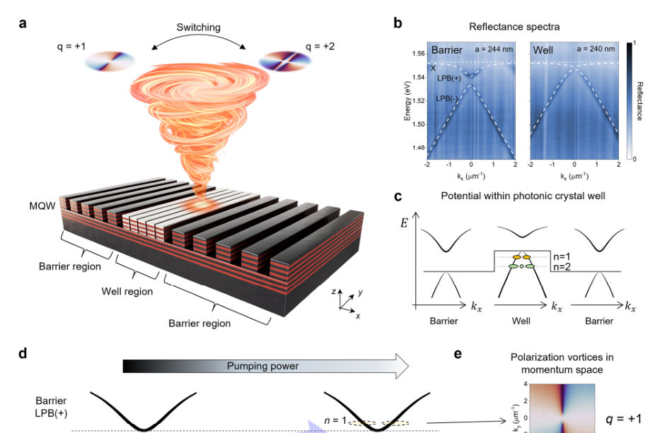 
Fig. 1. Exciton-polariton from photonic crystal well. a, Schematic illustration of an exciton–polariton confined in a photonic crystal well formed by locally modifying the lattice constant of a 1D photonic crystal. b, Polariton dispersion of barrier (a = 244 nm) and well lattice (a = 240 nm) measured by angle-resolved reflectance. LPB (+) and LPB (-) denote the symmetric and antisymmetric lower polariton branches, corresponding to the upper and lower Dirac bands, respectively. c, Confinement mechanism for polaritons with

📷 Fig 2

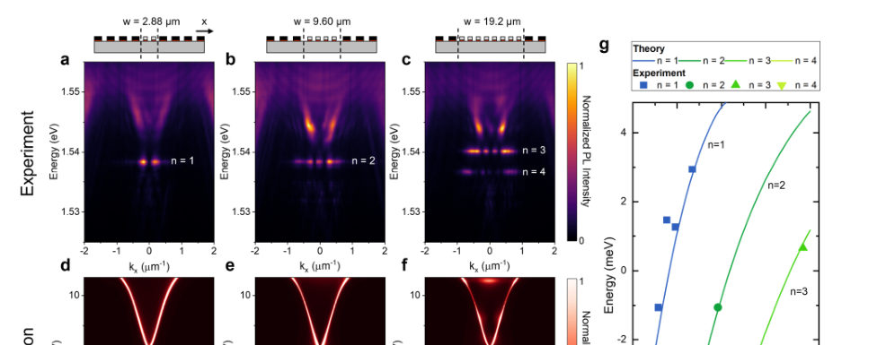 
Fig. 2. Discretized confined states of polaritons. a-c, Experimental dispersion of confined polaritons with a well width of w = 2.88, 9.60, and 19.2 μm under the excitation below the condensation threshold. Discretized confined polariton mode with quantum number of n = 1, n = 2, and n = 3, 4 appear, respectively, on the width. d-f, Simulated dispersion of confined polaritons with the same set of well widths as in a-c. g, Comparison between confined state energy obtained from theoretical calculation (solid line) and those extracted from experimental results (filled symbols).

📷 Fig 3

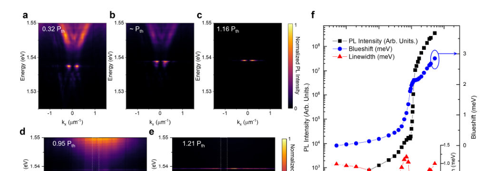 
Fig. 3. Polariton condensation into a confined mode. a-c, Angle-resolved PL spectrum with an excitation power of P = 0.32 Pth, P ~ Pth and P = 1.16 Pth for a well width of w = 1.92 μm. d, e, Spatial-resolved PL spectrum before and after the condensation threshold. Dashed white lines indicate the region of the well. f, Integrated PL intensity (Black), blueshift (Blue), and linewidth (Red) of the confined state by varying excitation power. Superlinear increase of the PL intensity and spectral narrowing indicate the polariton condensation. The blueshift of the polariton mode arises from interaction-induced energy renormalization, with the dominant interaction changing from polariton-exciton...

📷 Fig 4

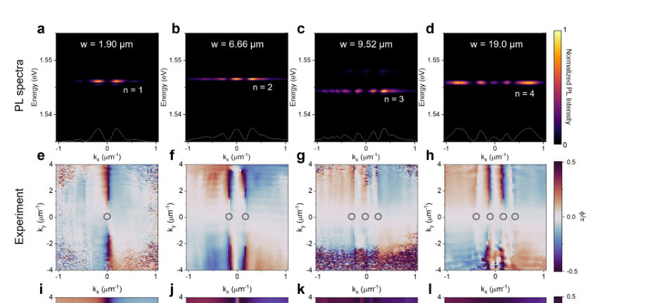 
Fig. 4. Polarization vortex from a single confined mode condensate. a-d, Polariton condensate dispersion for samples with various well widths w = 1.90, 6.66, 9.52, and 19.0 μm under the excitation above the condensation threshold. Each sample exhibits a single- mode condensation in a confined state with quantum numbers of n = 1, 2, 3, and 4, respectively. e-h, Experimental polarization vortices from polarization- and angle-resolved PL images. Open circles indicate the polarization singularities. i-l, Simulated polarization vortices reconstructed from the Dirac spinor components of the corresponding confined modes.

📷 Fig 5

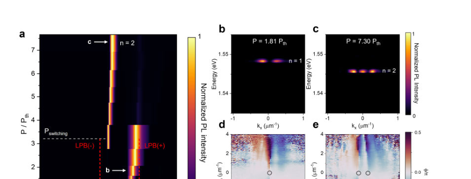 
Fig. 5. Topological switching between confined mode condensates. a, Excitation power-dependent PL spectrum of a confined polariton sample with well width of w = 2.86 μm. Red dashed lines indicate the barrier band edges, Red dashed lines indicate the barrier band edges, measured below the condensation threshold using a sample with only the barrier lattice. The low power region is magnified to highlight condensation to the n = 1 mode. With increasing excitation power, the condensate blueshifts due to the polariton-polariton interaction, and the n = 1 mode merges into the barrier continuum, inducing a transition from n = 1 to n = 2 condensate. b, c, Angle-resolved PL spectrum at P = 1.81 Pth...

**Summary.** This paper demonstrates the active, all-optical switching of topological charges in polariton condensates confined within a photonic crystal. By tuning the excitation power, the system forces the condensate to switch between discrete, quantized topological states. This work establishes a novel platform for controlling topological properties using nonlinear optical interactions.

**Why it may be interesting.** This work provides a concrete, controllable platform for manipulating topological invariants using nonlinear optical effects (polariton nonlinearity), which is highly relevant for quantum information processing and open quantum systems research.

Detailed structure

**Main problem.** The core challenge addressed is achieving active, all-optical reconfiguration (switching) of topological charges in photonic systems that are inherently topologically protected.

**Main result.** The authors successfully demonstrated topological charge switching in trapped polariton condensates by tuning the excitation power, causing the condensate to switch between distinct, quantized topological charge states.

**Method.** The work combines experimental characterization using angle-resolved PL and reflectance spectroscopy with theoretical modeling using a 1D non-Hermitian Dirac Hamiltonian.

**Model / system.** The system utilizes trapped exciton-polariton condensates within a photonic crystal well structure. The physics is modeled by a 1D non-Hermitian Dirac Hamiltonian, which describes the coupled dynamics of the polaritons.

**Key observables.** Topological charges ($q = +1$ to $+4$), quantized energy levels ($n=1, 2, 3, 4$), spectral blueshift, and single-mode occupancy.

**Important parameters / regimes.** Excitation power ($P$) relative to the condensation threshold ($P_{th}$), well lattice constant, and barrier bandgap energy.

**Assumptions / limitations.** The switching mechanism is attributed to the polariton blueshift exceeding the barrier bandgap energy, and the system is modeled by the non-Hermitian Hamiltonian.

**Figures summary.** Figures illustrate the schematic of the switching process, experimental confirmation of quantized states via PL spectra vs. well width, and the power-dependent transition showing the shift from one topological state to the next.

**Paper structure.** The paper establishes the physical platform (photonic crystal wells), confirms the existence of quantized trapped states, and then demonstrates the switching mechanism by showing how increasing excitation power drives the condensate into a higher-energy, different topological state.

Abstract

Topological charges in photonic systems provide a robust degree of freedom with direct applications in optical information processing. Bound states in the continuum (BICs) in photonic crystal slabs inherently carry such quantized topological charges, yet they are topologically protected, making active reconfiguration fundamentally challenging. Here, we demonstrate topological charge switching in trapped BIC polariton condensates in a photonic crystal, where spatial modulation of the photonic crystals supports multiple confined states, each carrying a distinct charge. Trapped condensates within the Dirac bandgap are expelled into the leaky band via polariton blueshift, enabling single-mode selection by solely tuning the excitation power. This work offers a platform for optically controlling topological charges by harnessing polariton nonlinearity.

[↑ back to top](#top)

### [Dynamical phase transitions for single particles in the semiclassical and weak noise limits](http://arxiv.org/abs/2609.01197v1)

**Authors:** Norayr Asriyan, Jan Meibohm, Vasco Cavina, Massimiliano Esposito  
**Type:** theory · **Category:** statistical mechanics · **PDF:** <https://arxiv.org/pdf/2609.01197v1>  
**Analysis basis:** full PDF text, analyzed in chunks
**Topic relevance:** 🔥 `driven-dissipative phase transition` **4/5** · `Keldysh / 2PI / non-Gaussian methods` **3/5** · `methods for driven-dissipative` **3/5** · `non-equilibrium universality` **3/5** · `quantum measurements` **2/5** · `Frenkel-Kontorova` **1/5** · `analog quantum simulation` **1/5** · `correlated / nonlocal dissipation` **1/5** · `scars & prethermalization` **1/5**

📷 Fig 1

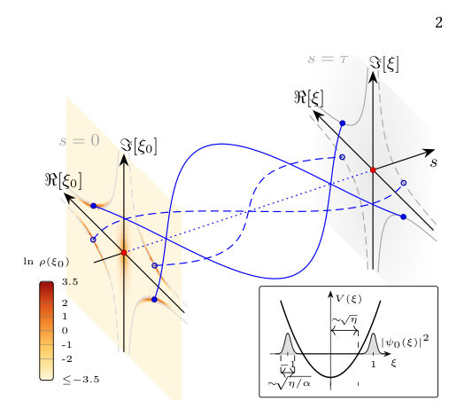 
FIG. 1. Trajectories corresponding to the saddles of 𝑆. Solid blue lines show a pair of ”direct” trajectories (𝜉= 𝜉0), dashed blue lines show the ”exchange” trajectories (𝜉= −𝜉0). The ”origin-returning” trajectory 0 →0 is the dotted blue line. The solid and dashed gray curves on the 𝑠= 0 and 𝑠= 𝜏planes are the projections of the steepest-descent surface onto the 𝜉= 𝜉0 and 𝜉= −𝜉0 subspaces respectively. The density plot on the 𝑠= 0 plane shows the numeri- cally sampled initial-endpoint density 𝜌(𝜉0). Here 𝜂= 0.3, 𝛼= 0.65 and 𝜏𝑥= 4.75 (for this particular time the direct saddle is dominant). The density plot is a result of numerical sampling of 𝑁= 106 trajec- tories (see details in Appendix...

📷 Fig 2

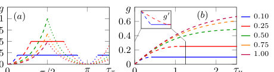 
FIG. 2. The SRF for the quantum (𝑎) and classical (𝑏) problems. Dashed, solid, and dotted lines indicate dominance of the direct, origin, and exchange saddles, respectively. Kinks occur in 𝑔for the quantum evolution and in 𝑔′ (inset) for the classical relaxation.

📷 Fig 3

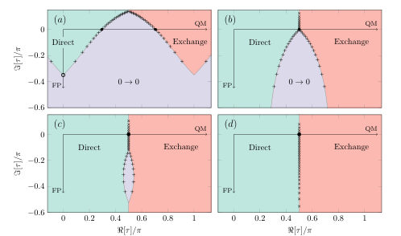 
FIG. 4. Dynamical phase diagram and zeros of 𝐺(𝜏) for 𝜂= 0.01: (a) 𝛼= 0.25; (b) 𝛼= 0.5; (c) 𝛼= 0.65; (d) 𝛼= 0.8. Zeros of 𝐺(𝜏) are shown as scatter points. Filled and hollow circles mark first- and second-order phase transition points, respectively.

📷 Fig 4

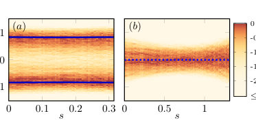 
FIG. 3. Trajectory density from 𝑁= 108 Brownian trajectories for 𝜂= 0.1, 𝛼= 0.25, and (a) 𝜏𝑦= 0.3; (b) 𝜏𝑦= 1.3, before and after the phase transition, respectively. As in Fig. 1, lines show the direct (solid blue) and origin (dotted black) saddles. The exchange saddle does not contribute at these times (see Fig. 7 (a) in Appendix C).

📷 Fig 5

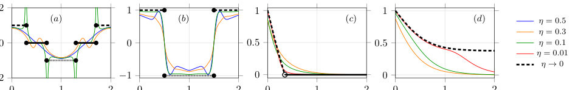 
FIG. 5. Order parameter time dependence for different values of 𝜂, in the quantum case for (a) 𝛼= 0.25 and (b) 𝛼= 0.8; and in the classical case for (c) 𝛼= 0.25 and (d) 𝛼= 0.8. Filled and hollow points mark phase transitions in accordance with panels (a) and (d) in Fig. 4. Thick black lines show the asymptotic behavior for 𝜂→0.

**Summary.** This paper presents a unified theory connecting dynamical phase transitions in quantum systems (unitary evolution) and classical systems (dissipative relaxation). By analyzing the complex-time behavior of a dynamical generating function, the authors show that the semiclassical limit bridges the gap, allowing single-particle quantum systems to exhibit transitions analogous to those found in classical statistical mechanics.

**Why it may be interesting.** This work is highly relevant as it provides a powerful, unified mathematical framework to study non-equilibrium dynamics and phase transitions in both quantum and classical regimes, extending concepts from many-body physics to single-particle systems.

Detailed structure

**Main problem.** The paper unifies the description of dynamical phase transitions (DPTs) occurring in both the unitary evolution of an isolated quantum particle and the dissipative relaxation of a classical Brownian particle.

**Main result.** It establishes a direct, unified connection between quantum and classical finite-time DPTs, showing that the semiclassical limit acts analogously to the thermodynamic limit.

**Method.** The analysis employs a dynamical generating function, utilizing saddle-point approximations of path integrals and analyzing the condensation of Fisher zeros in the complex-time plane.

**Model / system.** The models include a quantum particle undergoing quench dynamics and a classical Brownian particle relaxing in a potential, both analyzed via their respective propagators or Fokker-Planck equations.

**Key observables.** Survival Amplitude (SA)/Survival Rate Function (SRF), and a unifying, trajectory-based order parameter realized as a classical correlation function and a sequential quantum weak value.

**Important parameters / regimes.** Semiclassical limit ($\hbar 	o 0$) and weak-noise limit ($\eta 	o 0$); the competition between different saddle trajectories.

**Assumptions / limitations.** The analysis relies heavily on the saddle-point approximation for the path integral and the identification of Fisher zeros in the complex time plane.

**Figures summary.** Figures illustrate saddle trajectories determining the propagator, and show the SRF for both quantum and classical problems, revealing kinks at critical times.

**Paper structure.** The paper develops the unifying framework by first analyzing the quantum and classical dynamics separately using the generating function, then demonstrating the correspondence through the complex-time structure of the Fisher zeros, and finally defining the shared order parameter.

Abstract

We present a unifying description of dynamical phase transitions in the unitary evolution of an isolated quantum particle and the dissipative relaxation of a classical Brownian particle, based on a dynamical generat- ing function. In the semiclassical and weak-noise limits, Fisher zeros of this function condense in the complex- time plane and reach the corresponding physical axes, producing dynamical phase transitions through a competition between return trajectories. This establishes a direct connection between quantum and classical (finite-time) dynamical phase transitions, where the semiclassical limit plays the role of the thermodynamic limit. In particular, the established link naturally provides a classical version of the Loschmidt amplitude and shows how dynamical quantum phase transitions, typically associated with isolated many-body systems, can arise in a single-particle quantum system. The dynamical phases are distinguished by a unifying, trajectory- based order parameter, realized as a classical correlation function and a sequential quantum weak value.

[↑ back to top](#top)

### [Kibble--Zurek Mechanism and Defect Freezing in Imbalanced-Pairing Kitaev Models](http://arxiv.org/abs/2609.00971v1)

**Authors:** R. Jafari, Alireza Akbari, Shukhrat Mardonov, A. Langari  
**Type:** theory · **Category:** statistical mechanics · **PDF:** <https://arxiv.org/pdf/2609.00971v1>  
**Analysis basis:** full PDF text, analyzed in chunks
**Topic relevance:** 🔥 `non-equilibrium universality` **4/5** · `analog quantum simulation` **3/5** · `driven-dissipative phase transition` **3/5** · `Keldysh / 2PI / non-Gaussian methods` **2/5** · `correlated / nonlocal dissipation` **2/5** · `methods for driven-dissipative` **2/5**

📷 Fig 1

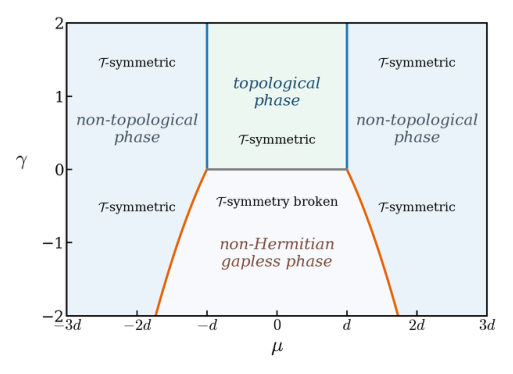 
FIG. 1. Phase diagram of d-dimensional imbalanced-pairing Kitaev models for w = ∆= 1. For γ &gt; 0, the ordinary critical points are located at µc = ±d, where d = 1, 2 denotes the spatial dimension. For γ &lt; 0, the EPs occur at µex = ±d√1 −γ.

📷 Fig 2

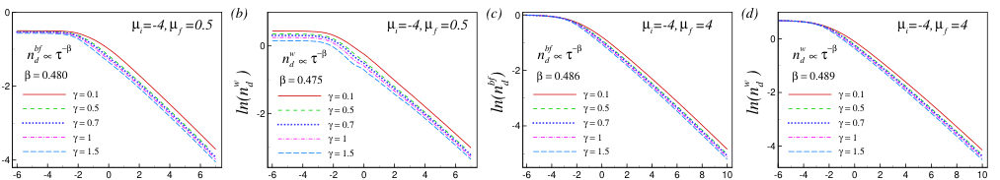 
FIG. 2. Scaling behavior of the excitation density as a function of the ramp time scale τ in the two-dimensional imbalanced-pairing Kitaev model for T -symmetric quenches with γ &gt; 0. Panels (a) and (b) correspond to a ramp across a single critical point from µi = −4 to µf = 0.5, evaluated within the biorthogonal framework and the wave-function normalization approach, respectively. Panels (c) and (d) show the corresponding results for a ramp crossing two critical points from µi = −4 to µf = 4, within the biorthogonal framework and the wave- function normalization approach, respectively. The system size is Nx = 400 and Ny = 440.

📷 Fig 3

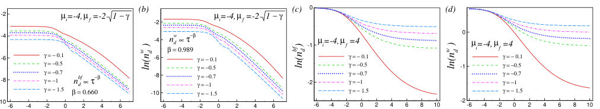 
FIG. 3. Scaling behavior of the excitation density as a function of the ramp time scale τ in the two-dimensional imbalanced-pairing Kitaev model for γ &lt; 0. Panels (a) and (b) correspond to a T -symmetric quench from µi = −4 to the exceptional point µex = −2√1 −γ, evaluated within the biorthogonal framework and the wave-function normalization approach, respectively. Panels (c) and (d) show the corresponding results for a quench through the PT -symmetry-broken region from µi = −4 to µf = 4, within the biorthogonal framework and the wave- function normalization approach, respectively. The system size is Nx = 400 and Ny = 440.

📷 Fig 4

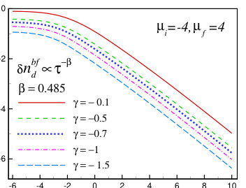 
FIG. 4. Scaling behavior of the excess excitation density nbf d (τ) − nbf d (∞) as a function of the ramp time scale τ for a quench through the T -symmetry-broken region from µi = −4 to µf = 4, with γ &lt; 0, in the biorthogonal framework for the two-dimensional imbalanced-pairing Kitaev model. The system size is Nx = 400 and Ny = 440.

📷 Fig 5

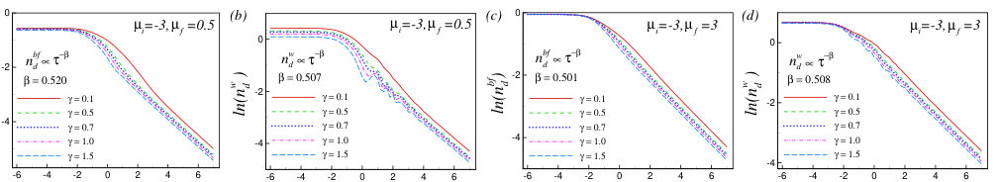 
FIG. 5. Scaling behavior of the excitation density as a function of the ramp time scale τ in the one-dimensional imbalanced-pairing Kitaev model for T -symmetric quenches with γ &gt; 0. Panels (a) and (b) correspond to a ramp across a single critical point from µi = −3 to µf = 0.5, evaluated within the biorthogonal framework and the wave-function normalization approach, respectively. Panels (c) and (d) show the corresponding results for a ramp crossing two critical points from µi = −3 to µf = 3, within the biorthogonal framework and the wave- function normalization approach, respectively. The system size is N = 1000.

**Summary.** This theoretical study analyzes defect production in imbalanced-pairing Kitaev models driven across quantum critical and exceptional points. By comparing two mathematical frameworks, the authors show how defect scaling laws are modified when time-reversal symmetry is broken, leading to phenomena like defect freezing. This provides critical insights into non-equilibrium physics in non-Hermitian quantum systems.

**Why it may be interesting.** This work extends critical dynamics concepts (KZM) into the non-Hermitian domain, which is crucial for understanding open quantum systems, driven dynamics, and topological phases relevant to AMO physics.

Detailed structure

**Main problem.** The paper investigates the non-equilibrium dynamics and defect production in imbalanced-pairing Kitaev models as the system is driven across critical and exceptional points.

**Main result.** The defect density exhibits conventional or extended Kibble-Zurek scaling in certain regimes, but traversing the time-reversal-symmetry-broken region leads to defect freezing, while excess defects still follow KZM scaling.

**Method.** The analysis employs two distinct theoretical frameworks—the wave-function normalization approach and the biorthogonal framework—to study the time evolution governed by a non-Hermitian Hamiltonian.

**Model / system.** The system is the one- and two-dimensional imbalanced-pairing Kitaev model, described by a time-dependent, non-Hermitian Hamiltonian $H(t)$ controlled by a parameter $h(t)$.

**Key observables.** Defect density ($n^d$), quasiparticle spectrum (real vs. complex eigenvalues), and the scaling exponents ($eta$) of the defect production.

**Important parameters / regimes.** The pairing imbalance parameter (positive vs. negative), the nature of the quench (ending at a critical point vs. an exceptional point), and dimensionality (1D vs. 2D).

**Assumptions / limitations.** The analysis assumes initial preparation in the instantaneous right ground state, and defect freezing itself indicates a breakdown of adiabaticity.

**Paper structure.** The paper is structured by analyzing the dynamics using two frameworks (wave-function normalization and biorthogonal), detailing the model and phase diagram, deriving the quench dynamics, and finally investigating the specific defect production mechanisms.

Abstract

We investigate driven dynamics across critical and exceptional points in the one- and two-dimensional imbalanced-pairing Kitaev models using both the wave-function normalization approach and the biorthogonal framework. For a positive pairing imbalance parameter, the quasiparticle spectrum remains real, and a pairing imbalance neither shifts the equilibrium phase boundaries nor generates imaginary eigenenergies. In this regime, the defect density follows the conventional Kibble--Zurek scaling in one dimension and the extended Kibble--Zurek scaling, arising from a gapless manifold, in two dimensions within both frameworks. The corresponding scaling exponents are therefore governed by those of the Hermitian transition. For a negative pairing imbalance parameter, time-reversal symmetry is broken, the quasiparticle spectrum develops complex eigenvalues, and the gap closes at exceptional points. For ramps ending at an exceptional point, the defect density follows the modified Kibble--Zurek scaling in the wave-function normalization approach, whereas it obeys the conventional Kibble--Zurek scaling in the biorthogonal framework. When the ramp traverses the time-reversal-symmetry-broken region, a finite density of defects remains even in the adiabatic limit, leading to defect freezing in both frameworks. Although this frozen background indicates a breakdown of adiabaticity, the excess defects generated on top of this background continue to obey the conventional Kibble--Zurek scaling in one dimension and the extended Kibble--Zurek scaling in two dimensions.

[↑ back to top](#top)

### [Feedback-Enhanced Quantum Metrology and Clock Precision under Thermodynamic Uncertainty](http://arxiv.org/abs/2609.00622v1)

**Authors:** Jincheng Lu, Chen Wang  
**Type:** theory · **Category:** statistical mechanics · **PDF:** <https://arxiv.org/pdf/2609.00622v1>  
**Analysis basis:** full PDF text, analyzed in chunks
**Topic relevance:** 🔥 `quantum measurements` **4/5** · `Full counting statistics` **3/5** · `correlated / nonlocal dissipation` **2/5** · `driven-dissipative phase transition` **2/5** · `methods for driven-dissipative` **2/5** · `Keldysh / 2PI / non-Gaussian methods` **1/5** · `non-equilibrium universality` **1/5**

📷 Fig 1

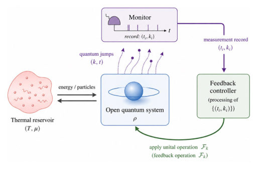 
FIG. 1. Schematic of the quantum-jump feedback control setup. An open quantum system (center) exchanges energy and/or particles with a thermal reservoir, generating stochas- tic quantum jumps. A monitor continuously detects each jump and records its type and occurrence time. Conditioned on the detected jump type, a feedback controller immediately applies a unital operation Fk to the system. The monitor and controller together form the feedback loop.

📷 Fig 2

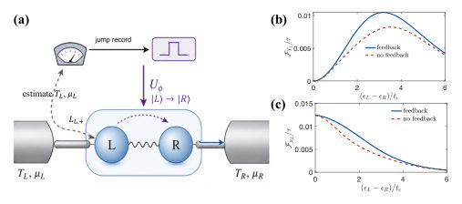 
FIG. 2. Feedback-enhanced thermometry with a charge- monitored DQD. (a) Schematic of the setup. The DQD is coupled to two electronic reservoirs at temperatures TL, TR and chemical potentials µL, µR. A left-injection jump LL,+ is continuously monitored. Conditioned on its detection, a fast unitary feedback pulse Uϕ rotates the post-jump state from the left dot toward the right dot, reshaping the subsequent waiting-time and jump statistics. The resulting feedback- controlled jump record is used to estimate TL. (b) Fisher in- formation rate FTL/τ for estimating the left-reservoir temper- ature TL versus the DQD detuning ϵL−ϵR, with µL = µR = 0 and the average dot energy fixed at (ϵL+ϵR)/2 = 0....

📷 Fig 3

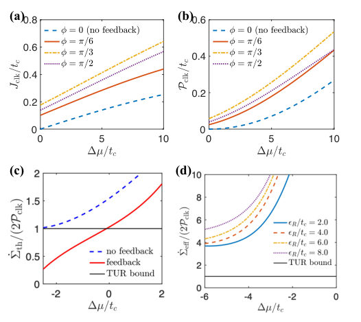 
FIG. 3. Feedback-stabilized DQD quantum clock and its thermodynamic cost. Right-reservoir output events are in- terpreted as clock ticks, with Jclk the net tick rate and Sclk the corresponding zero-frequency noise. (a) Tick rate Jclk/tc versus the chemical-potential bias ∆µ = µL −µR for sev- eral feedback angles ϕ. (b) Clock precision Pclk/tc for the same set of ϕ. (c) Reservoir-only TUR ratio ˙Σth/(2Pclk) versus ∆µ/tc. Values below the horizontal line indicate that the thermal entropy production alone is insufficient to bound the feedback-stabilized clock precision. (d) Effective TUR ratio ˙Σeff/(2Pclk). The feedback entropy production is ˙Σinfo fb = R(fb) L,+σfb, where R(fb) L,+ is the...

📷 Fig 4

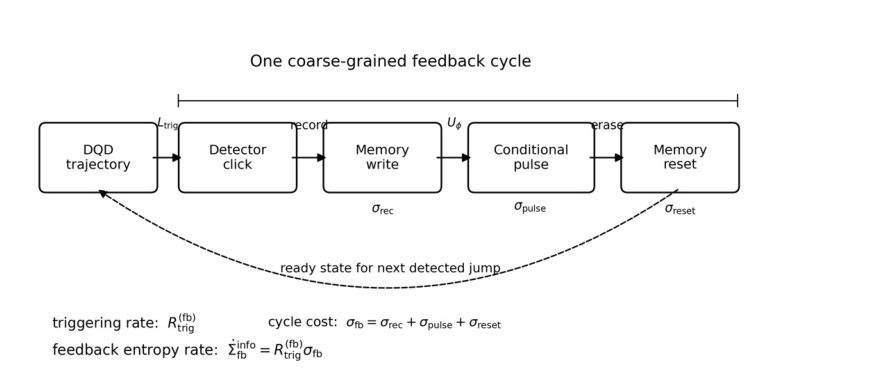 
FIG. 4. Coarse-grained feedback cycle used to assign the information entropy production of the feedback apparatus. A detected triggering jump Ltrig initiates a feedback cycle consisting of detection, record writing, conditional control, and memory reset. The entropy cost of one cycle is denoted by σfb = σrec + σpulse + σreset. Since triggering events occur with stationary rate R(fb) trig,

📷 Fig 5

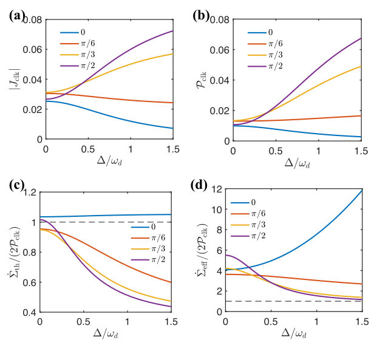 
FIG. 5. Additional validation of the feedback-modified thermodynamic uncertainty relation in a driven three-level system. The system consists of three states |0⟩, |1⟩, and |2⟩. The hot bath couples |0⟩↔|2⟩, the cold bath couples |1⟩↔|2⟩, and a classical drive couples |0⟩↔|1⟩. Feedback is triggered by the cold-emission jump Lc,−: |2⟩→|1⟩, after which the conditional unitary Uϕ = exp[−iϕ(|0⟩⟨1| + |1⟩⟨0|)] rotates the {|0⟩, |1⟩} subspace. Different curves correspond to ϕ = 0, π/6, π/3, π/2, with ϕ = 0 giving the no-feedback reference. The horizontal axis is the normalized drive detuning ∆/ωd, where ωd = ωh −ωc. (a) Net output tick current Jclk = ˙Nh,+ −˙Nh,−, defined from hot-bath absorption...

**Summary.** This work develops a theoretical framework showing that continuous quantum measurement and feedback can boost quantum sensing and clock accuracy in open systems. It derives a modified thermodynamic uncertainty relation proving that the achievable precision is limited not just by thermal dissipation, but also by the information cost associated with the feedback control itself.

**Why it may be interesting.** It provides a rigorous, quantitative link between measurement back-action, non-equilibrium thermodynamics, and fundamental limits on precision, extending the standard fluctuation theorems to include active control mechanisms.

Detailed structure

**Main problem.** The paper investigates how continuous quantum measurement and feedback control can enhance quantum metrology and clock precision in open quantum systems, particularly concerning the limits imposed by thermodynamics.

**Main result.** Feedback enhances parameter estimation and clock precision beyond bounds set by reservoir entropy production alone, necessitating the inclusion of an information entropy cost from the feedback apparatus in the modified thermodynamic uncertainty relation.

**Method.** The analysis employs full counting statistics derived from the tilted generator of the feedback-modified master equation, relating precision to the Fisher information and thermodynamic bounds to effective entropy production.

**Model / system.** The framework is applied to open quantum systems, exemplified by a charge-monitored double quantum dot (DQD) coupled to thermal reservoirs, and generalized to a driven three-level system.

**Key observables.** Fisher information ($F_{fb}$), clock precision ($P_{clk}$), reservoir entropy production ($\dot{\Sigma}_{th}$), and information entropy production ($\dot{\Sigma}_{info}^{fb}$).

**Important parameters / regimes.** Feedback unitary angle ($\phi$), temperature ($T$), chemical potential ($\mu$), and detuning ($\Delta$).

**Assumptions / limitations.** The analysis assumes unital jump feedback maps and relies on deriving the effective thermodynamic uncertainty relation by incorporating the information cost of the feedback process.

**Figures summary.** Figures illustrate the enhancement of Fisher information and clock precision using feedback compared to no-feedback cases, and critically show that the reservoir-only TUR ratio falls below unity while the feedback-modified ratio remains above unity.

**Paper structure.** The paper first establishes the theoretical framework using full counting statistics and the tilted generator for feedback-modified dynamics. It then applies this to parameter estimation (DQD) and clock stabilization, culminating in the derivation and validation of the feedback-modified Thermodynamic Uncertainty Relation using both electronic transport and general driven systems.

Abstract

Feedback can convert continuously monitored quantum jumps into a thermodynamic resource. We formulate full counting statistics for open quantum systems under unital jump feedback by incorporating the feedback maps into the tilted generator. The resulting trajectory ensemble determines both current fluctuations and the Fisher information of the measurement record. We show that feedback can enhance reservoir-parameter estimation and clock precision without necessarily changing average thermodynamic currents. This enhanced precision is not bounded by reservoir entropy production alone. By embedding the reduced dynamics in an enlarged measurement-feedback process, we derive a feedback-modified thermodynamic uncertainty relation in which the information entropy production of the feedback apparatus supplies the missing cost. A charge-monitored double quantum dot illustrates the framework: jump-conditioned feedback improves thermometry and chemical-potential sensing, and stabilizes a quantum clock defined by output-current ticks.

[↑ back to top](#top)

### [Nonlocal wavefront shaping through complex media](http://arxiv.org/abs/2609.01017v1)

**Authors:** Yanis Trouyet, Neelan Gounden, Pedro Ornelas, Patrick Cameron, Andrew Forbes, Hugo Defienne  
**Type:** experiment · **Category:** other · **PDF:** <https://arxiv.org/pdf/2609.01017v1>  
**Analysis basis:** full PDF text, analyzed in chunks
**Topic relevance:** 🔥 `quantum optics experiment` **4/5** · `correlated / nonlocal dissipation` **3/5** · `interference shaping light` **3/5** · `quantum measurements` **1/5**

📷 Fig 1

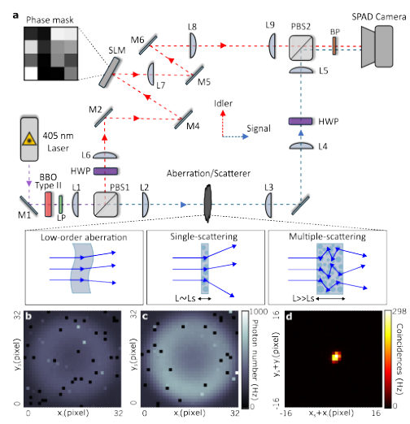 
Figure 1: Experimental setup. (a) Spatially entangled photon pairs (810 nm) are generated via type-II spontaneous parametric down-conversion (SPDC) using a collimated 405 nm continuous-wave laser and a 1-mm β-barium borate (BBO) crystal. A 650 nm long-pass (LP) filter rejects the pump, and a polarizing beam splitter (PBS1) separates signal and idler photons. In the idler arm, a 4f system (L1 = 40 mm, L2 = 200 mm) images the crystal onto a spatial light modulator (SLM), which is Fourier-imaged onto a SPAD camera via a 4f setup (L6 = 100 mm, L7 = 100 mm) combined with lens L8 = 100 mm. In the signal arm, L1 and L2 image the crystal onto an aberrating or scattering medium (PDMS or Parafilm)....

📷 Fig 2

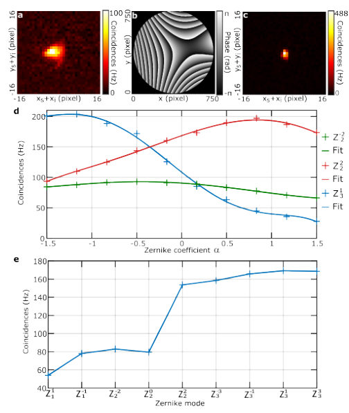 
Figure 2: Experimental results for low-order aberrations. (a) Sum-coordinate projection of G(2)

📷 Fig 3

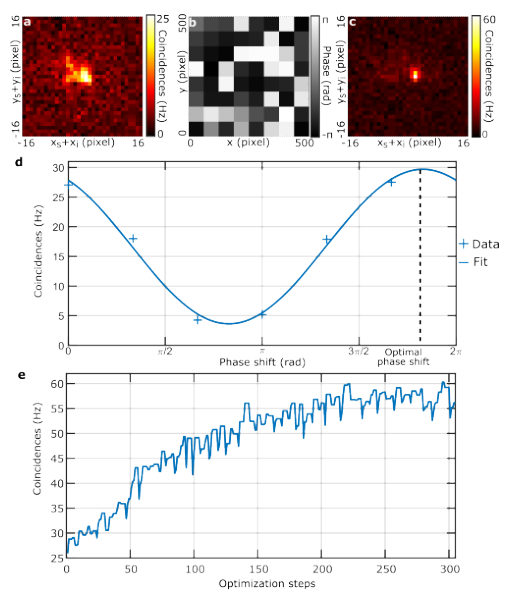 
Figure 3: Experimental results for the single-scattering regime. (a) Sum-coordinate projection of G(2) acquired in the presence of the Parafilm layer with a flat phase applied to the SLM. (b) Final optimized phase mask. (c) Sum-coordinate projection of G(2) acquired with the optimized phase mask displayed on the SLM, demonstrating a partial restoration of spatial correlations between the photon pairs. (d) Central correlation value C0 as a function of the phase shift ∆θ applied to a randomly selected subset of macropixels, along with the corresponding cosine fit. (e) Optimization curve showing the evolution of C0 as a function of the number of optimization steps. For optimization, each G(2)...

📷 Fig 4

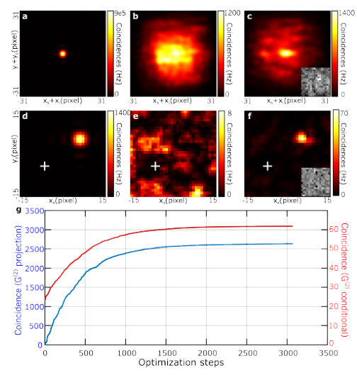 
Figure 4: Simulation results for the multiple-scattering regime. Sum-coordinate projection of G(2) simulated (a) without the scattering medium, (b) with the scattering medium prior to optimization, and (c) after optimization. The optimal phase mask is shown in inset. Conditional correlation images G(2)(rs, −r0) for r0 = (−5, −7), simulated (d) without the scattering medium, (e) with the scattering medium prior to optimization, and (f) after optimization. The position of r0 is marked with a white cross and the corresponding optimal phase mask is shown in inset. (g) Optimization curves for focusing on the sum-coordinate projection of G(2) (blue) and on the conditional projection (red). The...

**Summary.** This paper demonstrates nonlocal wavefront shaping by utilizing spatially entangled photon pairs to correct for scattering distortions in complex optical media. By applying phase corrections to one photon that avoids the scatterer, the system restores the spatial correlations of its entangled partner. This technique offers a pathway for compact imaging through otherwise inaccessible, highly scattering environments.

**Why it may be interesting.** This work is highly relevant to quantum optics and open quantum systems, as it uses quantum entanglement to engineer wave propagation through highly lossy and complex media, effectively bypassing the need for in-situ active elements.

Detailed structure

**Main problem.** The paper addresses the challenge of mitigating scattering in complex media for advanced imaging by overcoming the limitation of existing local wavefront correction techniques.

**Main result.** The authors successfully demonstrated nonlocal wavefront shaping using spatially entangled photon pairs, restoring spatial correlations in all tested scattering regimes.

**Method.** Nonlocal wavefront shaping is achieved by applying a phase correction to one photon (idler) that bypasses the scattering medium to compensate for distortions experienced by its entangled partner (signal) passing through the medium.

**Model / system.** The experiment uses spatially entangled photon pairs generated via SPDC and tests the technique across three regimes: low-order aberrations (PDMS), single-scattering (Parafilm), and multiple-scattering (simulations).

**Key observables.** Spatial Intensity Correlation Matrix G^(2)(r_i, r_s) and the central correlation value C_0, used to quantify the restoration of spatial correlations.

**Important parameters / regimes.** Scattering mean free path (l_s), number of active SLM macropixels (N), and the measured enhancement ratio (e.g., $\eta \approx 2.4$ or $\eta = 49.5$).

**Assumptions / limitations.** The analysis relies on the entanglement between photon pairs and the ability to physically decouple the wavefront correction from the scattering medium.

**Figures summary.** Figures illustrate the experimental setup, showing restored $G^{(2)}$ projections under optimized vs. unoptimized conditions for aberrations and scattering media.

**Paper structure.** The paper progresses by first establishing the problem of local correction, then detailing the nonlocal approach using entangled pairs, and finally presenting experimental results across low-order aberration, single-scattering, and multiple-scattering regimes.

Abstract

Wavefront shaping is a key technique for mitigating scattering in complex media, enabling advanced imaging and optical communication. Yet existing approaches are inherently local, requiring active correction elements - such as spatial light modulators or deformable mirrors - to lie directly in the optical path of the scattered light, which limits their integration into compact imaging systems. Here, we experimentally demonstrate nonlocal wavefront shaping using spatially entangled photon pairs. By applying a phase correction to a photon that never interacts with the scattering medium, we compensate for the distortions experienced by its entangled partner and restore their initial spatial correlations. Our approach physically decouples the wavefront correction from the scattering medium, paving the way for imaging through complex media in compact and otherwise inaccessible systems.

[↑ back to top](#top)

### [Encoding Compact U(1) Gauge Fields in Bosonic Modes with GKP Stabilization](http://arxiv.org/abs/2609.00167v1)

**Authors:** Victor Ale, Tommaso Rainaldi, Enrique Rico, Felix Ringer, George Siopsis  
**Type:** both · **Category:** quantum information and computing · **PDF:** <https://arxiv.org/pdf/2609.00167v1>  
**Analysis basis:** full PDF text, analyzed in chunks
**Topic relevance:** 🔥 `analog quantum simulation` **4/5** · `QC/QI experiment` **2/5** · `quantum measurements` **2/5** · `Keldysh / 2PI / non-Gaussian methods` **1/5** · `methods for driven-dissipative` **1/5**

📷 Fig 1

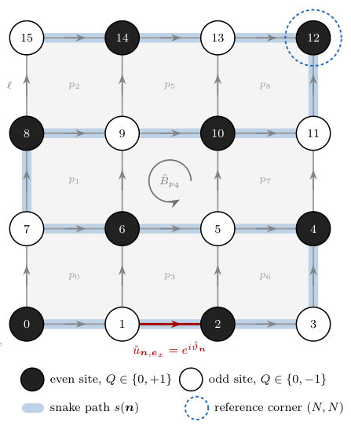 
Figure 1. The lattice used throughout, drawn for N = 3. Filled and hollow sites carry the staggered charges of Eq. (2.5), each labeled by its snake index s(n) of Eq. (2.1), with the shaded band tracing the path that fixes the Jordan–Wigner string. Arrows orient the links ℓ, and the highlighted link carries the link element ˆun,ex = ei ˆϑn of the hopping term. Plaquettes are indexed by π(p) = pxN + py, the circular arrow on p4 giving the orientation of ˆBp, and the dashed ring marks the reference corner (N, N) where Gauss’s law closes.

📷 Fig 2

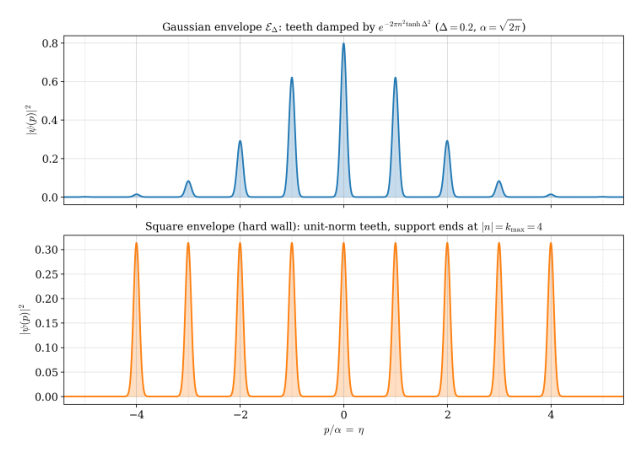 
Figure 3. Momentum-space probability density of the non-ideal GKP-like qunaught state |∅⟩, which encodes the zero-angle state |χ = 0⟩of the compact rotor, at α = √

📷 Fig 3

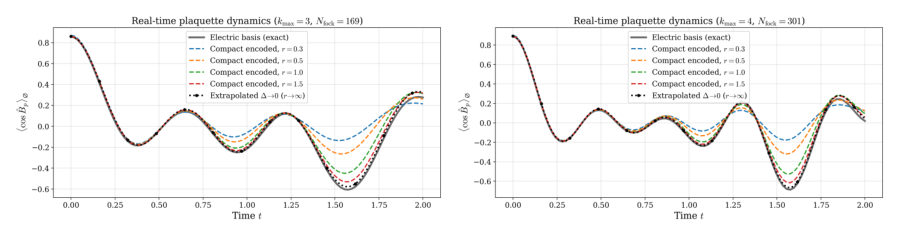 
Figure 4. Plaquette expectation value for a single plaquette with no charges, comparing the compact theory ⟨χ = 0| eitH ˆU+ ˆU †

📷 Fig 4

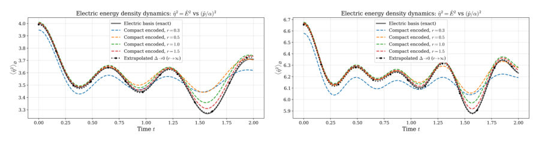 
Figure 5. As Fig. 4, for the electric energy ˆη2 7→(ˆp/α)2, at r = 0.3, 0.5, 1, 1.5 and extrapolated to r →∞(∆→0). Left: kmax = 3, Nfock = 169. Right: kmax = 4, Nfock = 301. Here g = 1 and α = √

📷 Fig 5

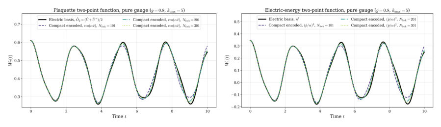 
Figure 6. Real part of the ground-state two-point functions W1,2(t) = ⟨GS| ˆO1,2(t) ˆO1,2(0) |GS⟩for one plaquette in the pure-gauge sector, with ˆO1 = ˆη2 7→(ˆp/α)2 and ˆO2 = ( ˆU + ˆU †)/2 7→cos(αˆx). Left: the magnetic correlator Re W2. Right: the electric correlator Re W1. Each panel overlays the electric- basis and compact-encoded results, which agree to within the truncation, and the two observables are related by Eq. (5.3). Here g = 0.8 and kmax = 5.

**Summary.** This paper details a method to simulate compact U(1) gauge theories on bosonic quantum hardware by employing a GKP stabilizer to enforce necessary compactness. The authors derive error-mitigation protocols and successfully apply the framework to calculate the energy splitting related to monopole physics in QED3. It represents a significant step in realizing lattice gauge theory simulations on continuous-variable quantum computers.

**Why it may be interesting.** This work directly tackles the hardware-software interface for simulating fundamental condensed matter models, providing concrete, error-mitigated protocols for mapping topological physics onto continuous-variable quantum hardware.

Detailed structure

**Main problem.** The paper addresses the fundamental challenge of encoding compact lattice gauge theories, which use angular variables, onto continuous, unbounded bosonic quantum hardware.

**Main result.** They successfully construct an encoding using GKP stabilizers that maps the compact theory to bosonic modes, and they demonstrate error mitigation techniques allowing recovery of key physical observables.

**Method.** The methodology involves developing a one-to-one encoding, applying GKP stabilizers to enforce compactness, and using quantum simulation techniques like Trotterization and spectral analysis to extract physical information.

**Model / system.** The system is compact U(1) gauge fields, specifically applied to compact QED3 on a lattice. The dynamics are governed by a Kogut–Susskind Hamiltonian, analyzed after solving Gauss's law.

**Key observables.** Twist Energy ($\Delta_{tw}$), energy splitting between charge sectors, and various correlators used for spectral function reconstruction.

**Important parameters / regimes.** Squeezing parameter (finite vs. infinite limit), lattice size ($N$), and the error parameter ($\Gamma$) used for extrapolation.

**Assumptions / limitations.** The analysis assumes that imperfections manifest as computable shifts rather than uncontrolled leakage, and that extrapolation techniques can reliably remove finite-squeezing biases.

**Figures summary.** Figures illustrate the lattice structure, the path for Gauss's law closure, and the general setup for the quantum simulation.

**Paper structure.** The paper progresses from establishing the encoding (mapping compact variables to bosonic modes via GKP stabilizers) to analyzing the resulting Hamiltonian dynamics in different computational frames (Loop vs. Link basis), and finally detailing advanced measurement protocols for error-corrected spectral measurements.

Abstract

Compact lattice gauge theories are formulated in terms of angular variables and integer electric fluxes, while bosonic quantum hardware provides oscillator modes with continuous, unbounded quadratures. We bridge this gap with a one-to-one encoding. After Gauss's law is solved, each remaining gauge degree of freedom is carried by a single oscillator mode, with its interactions built from trigonometric gates, and a Gottesman--Kitaev--Preskill (GKP)-type stabilizer provides the compactness that the hardware does not. The encoding becomes exact in the limit of infinite squeezing, and at finite squeezing, the leading imperfections act as small, computable shifts of physical observables rather than uncontrolled leakage. We apply the construction to compact QED$_3$ and derive the error budget at finite squeezing, characterizing the leading errors in closed form, and showing that they can be corrected, subtracted, or extrapolated away. We construct syndrome-extraction protocols that detect and remove the displacement component of photon loss, delimit the noise it does not reach, compare two choices of dynamical variables, and collect the scaling of mode count, gate count, and measurement cost. A one-plaquette example reproduces the exact compact-rotor dynamics, and real-time spectroscopy with controlled extrapolations recovers the exponentially small energy splitting between charge sectors, the seed of the monopole physics of the theory, at the percent level against its exact value.

[↑ back to top](#top)

### [A Backend-Agnostic MWIS Kernel for Stochastic Unit Commitment with Neutral-Atom Hardware Validation](http://arxiv.org/abs/2609.01248v1)

**Authors:** Jiying Chen, Min Lin, Jingwei Wen, Zhihong Zhang, Chuixiong Wu  
**Type:** both · **Category:** other · **PDF:** <https://arxiv.org/pdf/2609.01248v1>  
**Analysis basis:** full PDF text, analyzed in chunks
**Topic relevance:** 🔥 `QC/QI experiment` **4/5** · `Rydberg arrays` **3/5** · `analog quantum simulation` **2/5**

📷 Fig 1

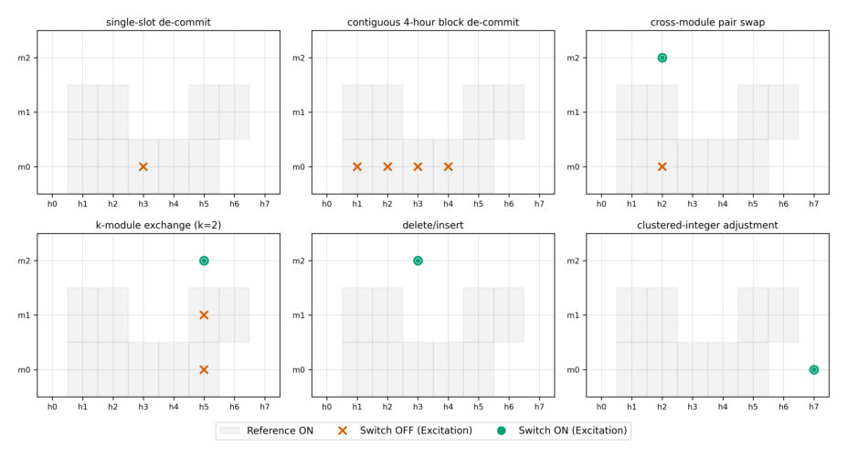 
Figure 1: Move vocabulary—six move types populating the excitation active space, covering single-slot, block, cross-module, exchange, delete/insert, and clustered-integer perturbations.

📷 Fig 2

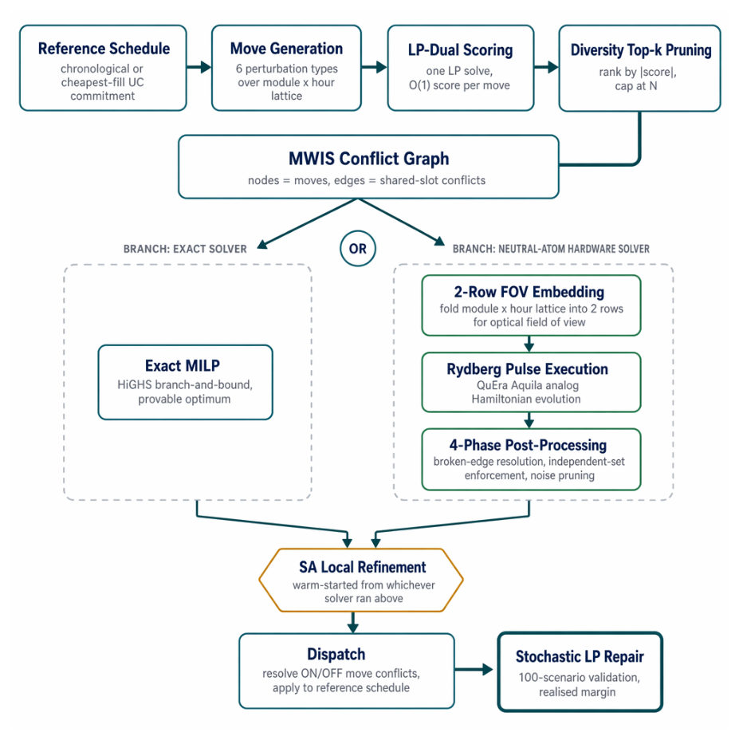 
Figure 2: Hybrid pipeline architecture—reference schedule, move generation, LP-dual scoring, diversity top-k pruning, an exact-solver/neutral-atom-hardware branch point (exact MILP via HiGHS, or AHS hardware with 2-row FOV embedding and 4-phase post-processing, Section 2.3), converging into a common SA local refinement stage, dispatch application, and 100-scenario stochastic LP repair validation.

📷 Fig 3

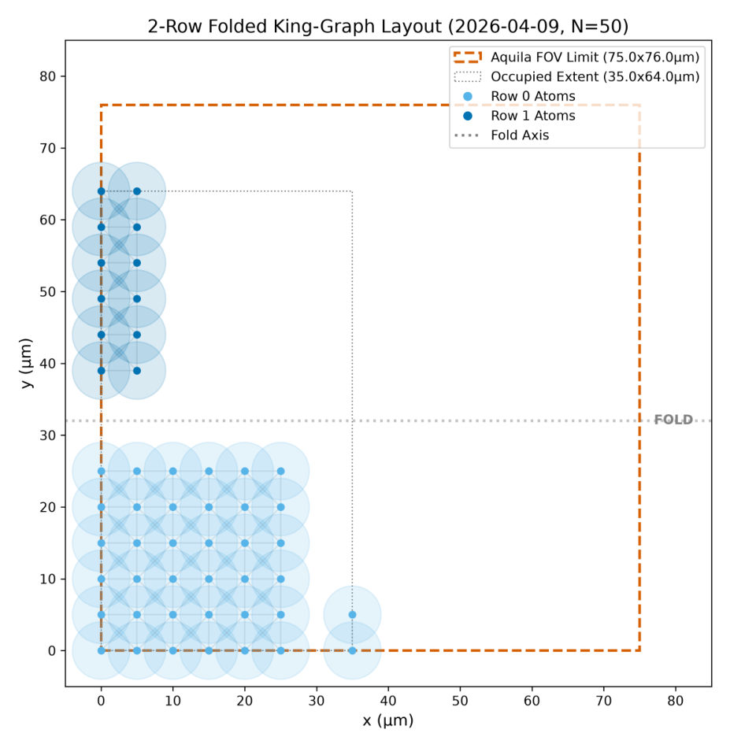 
Figure 3: 2-row folded King-graph layout for the N = 50 instance on Day 1. The temporal axis is compressed into two stacked rows. Atoms are coloured by row assignment (sky blue for Row 0, blue for Row 1). The orange dashed rectangle marks Aquila’s 75 × 76 µm hardware FOV limit; the grey dotted rectangle marks this instance’s occupied extent (35 × 64 µm)—the layout uses well under half of the available FOV. This day’s span-minimising split lands on a natural gap in the occupied-hour distribution, so no inter-row edges are broken. The two atoms isolated at x ≈35 µm (bottom right) are an artefact of top-k diversity pruning (Section 2.1): hour 11 survives pruning for two modules while hour 10...

📷 Fig 4

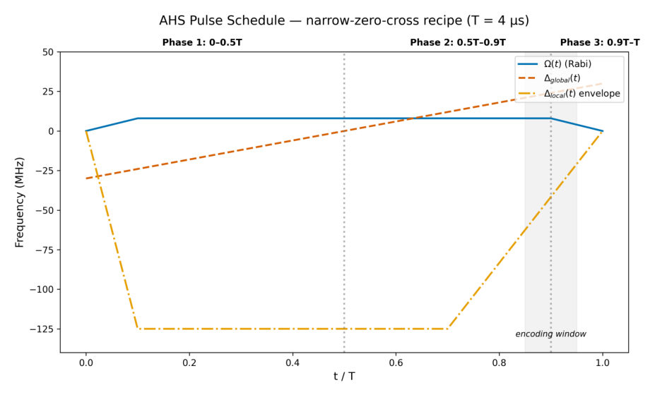 
Figure 4: AHS pulse schedule for the winning narrow-zero-cross recipe (T = 4 µs)—Rabi frequency Ω(t), global detuning ∆global(t), and local detuning envelope ∆local(t) over normalised time t/T, annotated with the three physical phases and the narrow encoding window.

📷 Fig 5

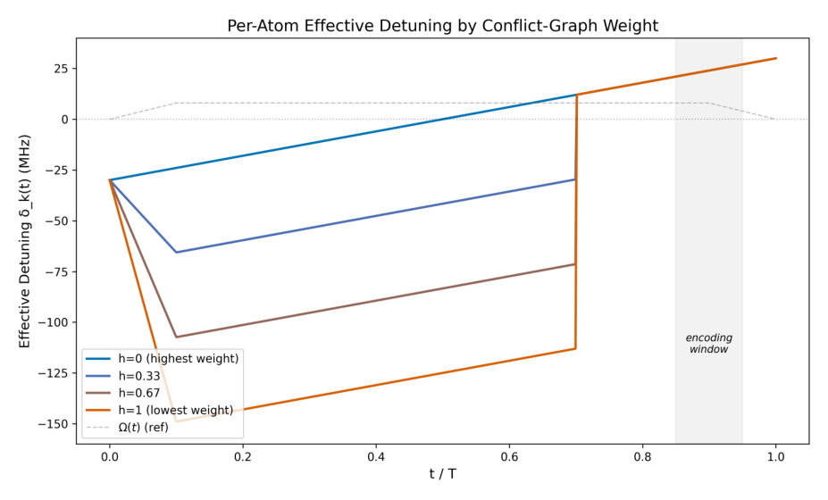 
Figure 5: Per-atom effective detuning δk(t) = ∆global(t) + hk ∆local(t) for four representative weight classes (hk = 0, 0.33, 0.67, 1—highest to lowest conflict-graph weight), illustrating the local-detuning bias mechanism of Eq. (7) under the narrow-zero-cross schedule. High-weight atoms (hk →0) track ∆global(t) alone and cross into positive (excitation-favouring) detuning early in Phase 2; low-weight atoms (hk →1) retain a strong negative offset that delays their crossing, creating the weight-dependent separation that the freeze at t/T = 0.9 reads out.

**Summary.** This paper presents a novel, hardware-agnostic framework to solve Stochastic Unit Commitment by translating it into a Maximum-Weight Independent Set (MWIS) problem. The authors validate this workflow end-to-end on a neutral-atom quantum processor, showing that the quantum-enhanced approach yields results matching or exceeding classical benchmarks. It highlights the current physical limitations of scaling on these quantum hardware platforms.

**Why it may be interesting.** This work provides a concrete, industrial-scale demonstration of mapping a complex, real-world optimization problem onto a specific quantum hardware modality (neutral atoms), directly addressing the gap between theoretical quantum algorithms and practical application.

Detailed structure

**Main problem.** The paper addresses the challenge of integrating structured combinatorial optimization problems, like Stochastic Unit Commitment (UC), onto near-term quantum hardware.

**Main result.** The proposed end-to-end workflow successfully demonstrates that hardware-generated solutions match or exceed exact classical solutions on a 15-day campaign, establishing a viable computational pathway.

**Method.** It compiles the discrete decision layer of UC into a move-based Maximum-Weight Independent Set (MWIS) problem, which is then mapped onto a neutral-atom quantum processor using the Rydberg blockade mechanism.

**Model / system.** The physical platform is the QuEra Aquila neutral-atom quantum processor. The problem is modeled as finding an independent set in a weighted conflict graph derived from scheduling moves in a green hydrogen electrolyser park.

**Key observables.** Hardware-generated dispatch margins, AHS-post ratio (quality of quantum result vs. exact MWIS), and the valid-shot rate for scaling analysis.

**Important parameters / regimes.** The primary bottleneck for scaling is identified as the probability that the full atom array survives, rather than the graph embedding itself.

**Assumptions / limitations.** The approach assumes that the MWIS representation is backend-agnostic, and that classical post-processing (LP repair, SA) can compensate for hardware imperfections.

**Figures summary.** Figures illustrate the six defined move types and summarize the trend showing the collapse of the valid-shot rate as the problem size increases, while other metrics remain stable.

**Paper structure.** The paper details a hybrid pipeline: classical move generation $\rightarrow$ graph encoding/folding $\rightarrow$ quantum solving (AHS) $\rightarrow$ classical post-processing (SA/LP repair) $\rightarrow$ final validation against the original stochastic LP.

Abstract

Quantum hardware is beginning to address structured combinatorial optimisation, but two steps still block practical use: mapping real operational models onto hardware-compatible instances, and converting noisy hardware output back into feasible decisions. Here we introduce a backend-agnostic computational interface that compiles the discrete decision layer of stochastic unit commitment into a move-based maximum-weight independent set (MWIS) problem, while retaining continuous dispatch and feasibility recovery in the classical computational layer. We validate the approach in a green hydrogen scheduling setting and deploy it on the QuEra Aquila neutral-atom quantum processor. This is the first end-to-end industrial scheduling workflow that connects real operational decisions to programmable neutral-atom hardware through a solver-agnostic MWIS representation. Across a 15-day hardware campaign on 50-node instances, hardware-generated solutions after classical refinement match or exceed the dispatch margins obtained from exact MWIS on every day. When scaling to 144 nodes, encoding quality remains stable, while the probability that the full atom array survives, rather than graph embedding, emerges as the dominant bottleneck to further scaling. Together, these results establish a hardware-compatible computational pathway toward larger problem scales, and lay the groundwork for exploring regimes in which exact classical optimisation may no longer scale efficiently.

[↑ back to top](#top)

### [Exact learning of quantum noise with tensor networks](http://arxiv.org/abs/2609.00169v1)

**Authors:** Nicola Pancotti, Vedika Saravanan, Krysta Svore  
**Type:** both · **Category:** quantum information and computing · **PDF:** <https://arxiv.org/pdf/2609.00169v1>  
**Analysis basis:** full PDF text, analyzed in chunks
**Topic relevance:** 🔥 `QC/QI experiment` **4/5** · `methods for driven-dissipative` **3/5** · `quantum measurements` **2/5**

📷 Fig 1

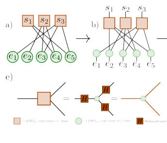 
Figure 1: Mapping from the Tanner graph to a tensor-network decoder. a) The Tanner graph with syndrome nodes s1, s2, s3 (orange squares) and error nodes e1, . . . , e5 (green circles). b) Each error node becomes a |GHZ0/1⟩copy tensor (green) and each syndrome node a |GHZ±⟩copy tensor (orange). c) Inserting Hadamard matrices H on the bonds between syndrome and error tensors con- verts all copy tensors to the same (|0/1⟩) basis, as explained in e). d) A noise model PN(e) is attached to the error legs, adding a new tensor that encodes the fault-event probabilities. e) Identity: a |GHZ±⟩copy tensor equals a |GHZ0/1⟩ copy tensor dressed with Hadamard matrices on each leg. f) Full decoder net-...

📷 Fig 2

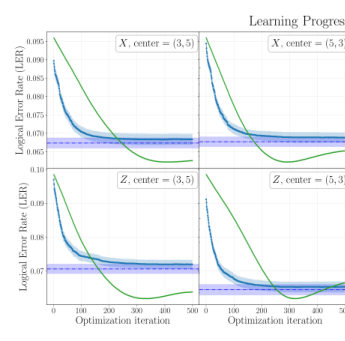 
Figure 3: Learning progress for a distance-3 surface code with 3 rounds of syndrome extraction. Top row: X logical observable. Bottom row: Z logical observable. Each panel corresponds to a different center qubit position on the device. The logical error rate (LER, left axis) decreases as a function of the optimization iteration, converging towards the baseline set by Google’s detector error model (DEM). The mean squared error (MSE, right axis, green) between the learned noise parameters θ and the DEM parameters is shown on a logarith- mic scale. The MSE follows a clear downward trend throughout the training, indicating that the optimization not only improves decoding performance but also...

📷 Fig 3

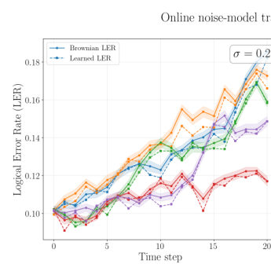 
Figure 4: Online noise-model tracking under synthetic device drift for a distance- 3 surface code with 3 rounds. The noise model evolves over 20 time steps along a Brownian motion in logit space (Eq. (25)) with drift amplitude σ = 0.2 (left) and σ = 0.3 (right). Five independent random seeds are shown, each as a different color. For each seed, solid lines with circles (“Brownian LER”) show the LER of a decoder with perfect knowledge of the true drifted noise model, while dashed lines with squares (“Learned LER”) show the LER of the online- learned model, which is warm-started from the previous time step. The learned model tracks the true baseline closely across all seeds, even under the...

**Summary.** This paper introduces a variational framework to learn quantum noise models directly from syndrome and logical observable data collected during quantum error correction experiments. By minimizing the binary cross-entropy loss, the method achieves an information-theoretically optimal noise estimate. This approach is highly valuable because it allows for continuous, real-time tracking of device noise drifts without requiring dedicated offline characterization.

**Why it may be interesting.** It provides a powerful, data-driven methodology to characterize complex noise processes in quantum hardware directly from operational measurements, bypassing the need for idealized, separate characterization protocols.

Detailed structure

**Main problem.** The core challenge is accurately characterizing quantum noise models for high-performance quantum error correction (QEC) without relying on dedicated, separate characterization experiments.

**Main result.** The proposed variational framework successfully recovers noise models whose logical error rates match independently characterized results, and it can track device drifts in real time.

**Method.** The noise model is learned by formulating the problem as a variational optimization, minimizing the binary cross-entropy between the decoder's predictions and measured logical outcomes.

**Model / system.** The work applies to quantum error-correcting codes, using circuit-level data from hardware like Google's Sycamore processor, and is mathematically formalized using tensor networks for decoding.

**Key observables.** Logical Error Rate (LER), syndrome data, and logical observable outcomes.

**Important parameters / regimes.** Variational noise parameters ($	heta$), device drift amplitude ($\sigma$), and the code distance.

**Assumptions / limitations.** The objective function is proven to be principled, minimizing the cross-entropy achieves the information-theoretic minimum LER, and the method is generally applicable to any stabilizer code.

**Figures summary.** Figure 3 shows the convergence of LER and MSE during training on a distance-3 surface code. Figure 4 demonstrates the online tracking of noise drift over time steps.

**Paper structure.** The paper introduces the variational framework, proves its information-theoretic optimality, instantiates it using tensor networks for exact gradient calculation, validates it on hardware data, and demonstrates real-time tracking of device drift.

Abstract

Accurate noise models are essential for high-performance quantum error correction, yet characterizing the noise of a quantum device typically requires dedicated experiments. We present a variational framework that learns the noise model directly from quantum-error-correction syndrome and logical-observable data collected during error-corrected memory experiments. The fault-event probabilities are treated as variational parameters and optimized via gradient descent to minimize the binary cross-entropy between the decoder's predictions and experimental logical-observable outcomes. We prove that this objective is principled rather than ad hoc: a sufficiently expressive noise ansatz attains the information-theoretic minimum logical error rate. We instantiate this framework using a tensor-network decoder, which provides exact maximum-likelihood decoding and analytically differentiable gradients with respect to all noise parameters. Using circuit-level data from Google's Sycamore processor, and starting from an uninformed prior, the optimization recovers noise models whose logical error rates agree to within $2\%$ with those of Google's independently characterized detector error model. The mean squared error between the learned and reference noise parameters shows a clear overall decrease throughout training, confirming that the method recovers physically meaningful noise structure, not merely parameters that happen to decode well. We further demonstrate that the optimization can track device drifts in real time via warm-started updates, maintaining near-optimal decoding performance under synthetically evolving noise without the need for re-characterization. The approach is decoder-agnostic in its formulation and naturally extends to correlated noise models.

[↑ back to top](#top)

### [Fast Microwave-free State Preparation and Measurement of Superconducting Qubits](http://arxiv.org/abs/2609.01334v1)

**Authors:** R. Abraham, F. Amet, P. Anderson, M. Arrigo, J. Arteaga, C. J. Ballard, C. Barker, T. Barnes, P. Bechman, R. Bhatt, K. Blaine, T. M. Borman, J. Botimer, G. R. Boyd, P. Bradley, A. D. Brandon, T. K. Bristol, A. Bulkos, R. M. Burnett, D. Burrowes, D. N. Cakan, N. Carniero, T. Chamberlin, D. Chen, M. Chilcote, B. G. Christensen, I. Christie, J. Clark, D. Clarke, J. M. Cochran, J. C. Collini, K. Connolly, G. Costa, D. Cowger, B. Dalfort, D. Davies, S. Deitemeyer, N. DeNigris, F. Densmore, S. J. Di Giacomo, S. G. Diamond, R. DiCiro, S. M. Disseler, K. Dixon, J. Donnelly, E. Donohue, M. Downing, B. Eastin, N. Edwards, M. Ehsani, S. Ellis, R. Epstein, D. Ferguson, P. Fischer, S. Friedensen, D. Gabriel, M. A. Gettelman, A. Gillam, G. Gilmore, J. Goode, E. Goodwin, M. Gottschalk, A. L. Graninger, T. Graves-Abe, J. Hackley, N. Hartman, B. Heacock, B. Heischmidt, P. Helms, R. Hinkey, B. Hong, S. T. Howard, D. Jensen, N. Johns, D. R. Johnson, J. Johnson, H. Kaplan, Z. Keane, S. Keebaugh, C. Kegerreis, K. Kelcourse-Oquendo, M. S. Khalil, D. Killeen, A. S. Knutson, T. Kohler, M. Kornecki, F. Koutsouli, A. Krick, K. L. Krycka, J. Kuan, D. Lad, J. R. Lane, N. J. Laurita, A. C. Lee, A. R. Lemmon, E. M. Leonard, L. M. D. Leonard, J. Leventis, M. P. Lilly, A. Lisewski, L. Llano, M. Longo, C. Lostoski, Z. Lou, M. G. Loving, D. al Ludwig, N. Luhrs, J. L. Lund, K. A. Maddock, R. J. Magyar, K. Mahmud, T. A. Manning, A. I. Marakov, A. D. McCreary, P. F. McLaughlin, J. R. Medford, E. Metz, A. L. Middleton, A. Miklich, R. Miller, J. Mlack, M. Mucci, N. Mungo, T. Murphy, R. E. Murray, O. Naaman, J. Nakamura, M. Noevere, S. Novikov, M. E. Nowakowski, C. Nunez, K. N. Ogg, B. Oshokoya, D. Paz, A. Pesetski, T. Pillsbury, C. Pinion, A. D. Pitcock, A. J. Przybysz, P. Quarterman, D. Queen, I. Ramos, S. L. Reed, D. Reitz, M. Rennie, S. Reza, B. Richman, K. H. Rigdon, C. Rotella, M. Rudolph, E. Sadler, T. Safford, D. Saha, A. E. Saia, D. I. Santiago, R. Schwartz, A. Schwarzkopf, M. Scott-Jones, S. L. Sendelbach, S. J. Shapiro, A. N. Sharma, M. E. Sherwin, A. Sierakowski, J. N. Sills, R. Simha, N. Siwak, J. Smith, C. Snyder, H. Solomon, N. S. Sperlein, L. St. Marie, K. Stalpes, S. F. Steers, Z. Stegen, R. M. Stein, T. I. Stephenson, M. Stoutimore, J. D. Strand, J. A. Strong, E. Swain, S. Swami, A. Tamang, I. Thompson, A. B. Tokarchik, N. Tralshawala, D. Tran, S. Tyler, L. Upton, G. Van Dyke, J. Vannucci, K. Vempati, J. S. Vogel, R. Vyas, M. Wagner, P. Warner, N. Washington, B. Way, M. A. Wayne, D. Wehella-Gamage, M. E. Weippert, T. Weitzel, J. Wenner, L. White, S. Whitsitt, A. Wilkinson, R. Willey, I. Yandow, J. Yang, L. Yu, F. Yumiceva, V. Zheng, R. Zimmerman, C. Zinn, J. Ziskind  
**Type:** experiment · **Category:** quantum information and computing · **PDF:** <https://arxiv.org/pdf/2609.01334v1>  
**Analysis basis:** full PDF text, analyzed in chunks
**Topic relevance:** 🔥 `QC/QI experiment` **4/5** · `quantum measurements` **3/5**

📷 Fig 1

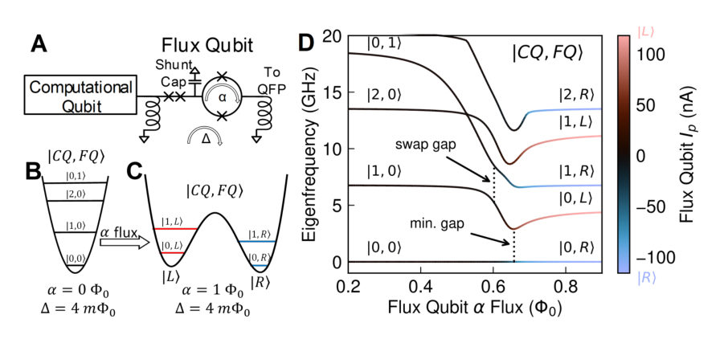 
FIG. 1. Converting a qubit state to a circulating current. (A) The flux qubit (FQ) used for readout with an inductive coupling to the computational qubit (CQ). (B) Illustration of the FQ potential with plasmon-like states at α = 0 (C) Double-well potential of the FQ at α = Φ0 and ∆= 4 mΦ0. The states in different wells have opposite circulating currents. The ∆flux breaks the degeneracy between the wells. (D) Model device eigenspectrum as a function of annealing flux, α, with ∆= 4 mΦ0. States are labeled in the |CQ, FQ⟩basis at the beginning and end of the readout process. The first excited state maintained a large energy separation from other levels the annealing process, which allowed the...

📷 Fig 2

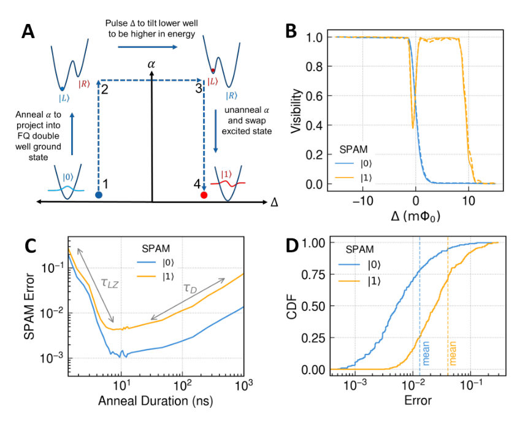 
FIG. 2. High-fidelity state preparation and measurement using a flux qubit. (A) Rapid adiabatic passage preparation (RAP prep) of an excited state in the computational qubit (CQ) using a flux qubit (FQ). Beginning in the ground state (1), the FQ was annealed to project the state into the |L⟩well (1→2). Then the double-well potential was tilted until the prepared well became the excited state (2→3). The FQ was then unannealed, transitioning back to a single-well potential and swapping the photon into the CQ (3→4). (B) FQ readout calibration plot showing high-fidelity state preparation and measurement (SPAM) across a robust calibration window. The dashed lines are time-dependent simulations...

📷 Fig 3

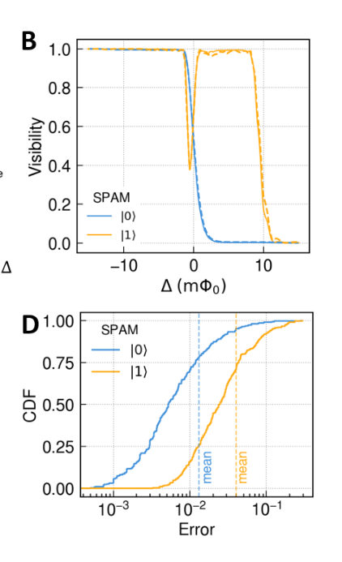 
Fig. 3B shows the results of a Ramsey experiment where we prepared the CQ along X, delayed for some time and then read out along X. We observed the expected Ramsey oscillation with a decay time, T ∗ 2 = 24.0(6) µs, and found that the frequency of the oscilla- tion matched the f01 of the CQ that we measured with microwave spectroscopy (see supplemental information Fig. S1B) when we accounted for the timing resolution of

📷 Fig 4

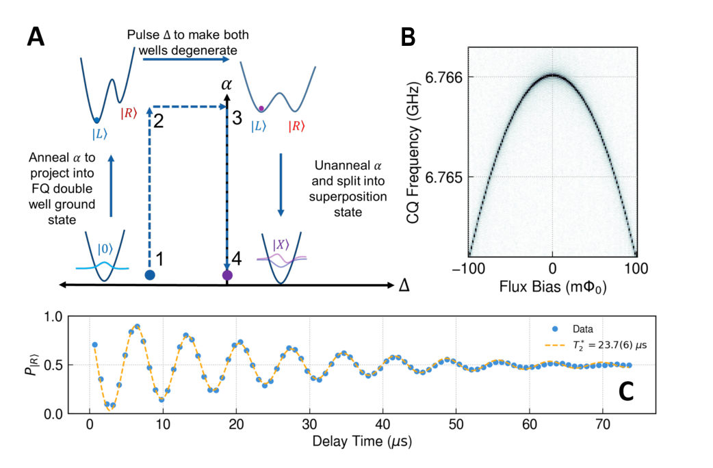 
FIG. 3. Superposition State Preparation. (A) RAP preparation of a computational qubit (CQ) in a quantum superposition state using a coupled flux qubit (FQ). First the FQ was annealed to project the ground state to the |L⟩well (1→2). Then the double-well potential was tilted until the two wells were degenerate (2→3). The FQ was then unannealed, transitioning back to a single-well potential and splitting the state into a superposition of |0⟩and |1⟩in the CQ (3→4). (B) Microwave-free spectroscopy of the CQ frequency as a function of a tunable flux bias. Shown here as the FFT of a Ramsey signal acquired using the protocol depicted in A. (C) Coherent Ramsey oscillation of a superposition state...

📷 Fig 5

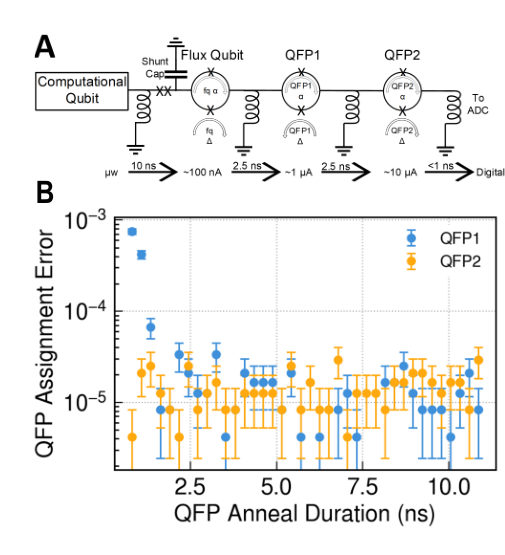 
FIG. 4. Signal Amplification for On-Chip Logic. (A) Transi- tioning the quantum state of the computational qubit (CQ) into a DC circulating current in the flux qubit (FQ) produced circulating currents of order 100 nA. In order to amplify this current until it was large enough to be converted to a digital signal, a series of QFPs were used, each with increasing crit- ical current. The QFPs could then be coupled to an Analog- to-Digital Converter (ADC) (in the fashion shown here), or to a flux tunable circuit element such as a tunable resonator. (B) State assignment error of the two QFP chain as a func- tion of the QFP anneal time. Both QFPs could be annealed in &lt;2.5 ns while maintaining low...

**Summary.** This paper presents a breakthrough in superconducting qubit control by demonstrating microwave-free state preparation and measurement. By coupling a computational qubit to a flux qubit, the authors achieve high-fidelity operations in timescales an order of magnitude faster than previous methods. This advancement significantly improves the scalability and performance metrics critical for building practical quantum computers.

**Why it may be interesting.** This work directly addresses the engineering bottlenecks in superconducting quantum computing by proposing a fundamentally faster, microwave-free readout mechanism, which is highly relevant to open quantum systems and quantum control theory.

Detailed structure

**Main problem.** The primary challenge is developing fast, high-fidelity, and scalable state preparation and measurement (SPAM) protocols for superconducting qubits, as current methods are limited by slow microwave signals and long measurement times.

**Main result.** The authors demonstrated microwave-free SPAM for superconducting qubits with fidelities exceeding 99% in extremely fast timescales (e.g., 10 ns for readout), an order of magnitude improvement over state-of-the-art techniques.

**Method.** The work employs adiabatic quantum evolution, utilizing a coupled Computational Qubit (CQ) and a Flux Qubit (FQ) to perform state transfer and readout without external microwave driving.

**Model / system.** The system involves superconducting qubits, specifically a CQ coupled to an FQ. The readout mechanism relies on an adiabatic swap of the quantum state into the FQ, followed by an anneal that converts the quantum state into a measurable classical circulating current.

**Key observables.** Fidelity (>99%), readout time ($\sim 10$ ns), quantum-to-digital conversion time (15 ns), and coherence time ($T_2^*$).

**Important parameters / regimes.** The process is governed by balancing competing timescales: the Landau-Zener transition rate ($	au_{LZ}$) versus the intrinsic decay rate ($	au_D$), with optimal operation occurring around 10 ns.

**Assumptions / limitations.** The method assumes compatibility with scalable superconducting digital control systems (SFQ electronics) and relies on the adiabatic nature of the state transfer process.

**Figures summary.** Figures illustrate the adiabatic process of state conversion from the CQ to the FQ, the implementation of Rapid Adiabatic Passage (RAP) for preparation, and the use of Quantum Flux Parametrons (QFPs) for signal amplification.

**Paper structure.** The paper progresses by first identifying the limitations of current SPAM techniques, then detailing the novel CQ/FQ coupled system and the RAP preparation protocol, followed by the readout mechanism involving adiabatic swapping and current projection, and finally discussing error sources like TLS loss.

Abstract

Fast, high-fidelity, scalable state preparation and measurement is critical to the realization of a quantum computing system. The state-of-the-art methods for preparation and readout of superconducting qubits require finely tuned microwave signals and ~100 ns of measurement time, which are major obstacles to the scalability and performance of superconducting quantum computers. Here, we have demonstrated novel, microwave-free methods for both preparation and readout of superconducting qubits with >99% fidelity in only 10 ns for either operation while maintaining qubit coherence. This technology is compatible with scalable superconducting digital control systems, and using quantum flux parametrons for amplification, we demonstrated full quantum-to-digital conversion in only 15 ns, which is an order of magnitude faster than state-of-the-art microwave-based techniques.

[↑ back to top](#top)

### [Generation of multicomponent Schrödinger cat states in schemes with measurement of Gaussian states](http://arxiv.org/abs/2609.00343v1)

**Authors:** E. A. Nesterova, S. B. Korolev  
**Type:** theory · **Category:** quantum information and computing · **PDF:** <https://arxiv.org/pdf/2609.00343v1>  
**Analysis basis:** full PDF text, analyzed in chunks
**Topic relevance:** 🔥 `quantum measurements` **4/5** · `Full counting statistics` **1/5** · `quantum optics experiment` **1/5**

📷 Fig 1

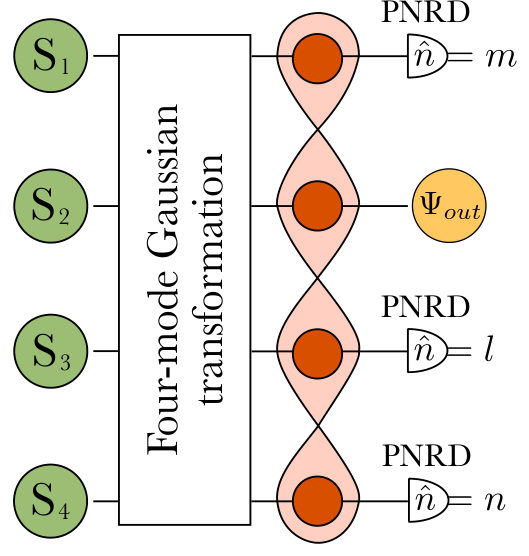 
Figure 1: Scheme for generating states based on the measurement of a four-mode Gaussian state. In the figure, S𝑖 denotes the 𝑖-th quantum oscillator prepared in a squeezed vacuum state, PNRD denotes a photon-number-resolving detector, and Ψ𝑜𝑢𝑡is the generated state.

📷 Fig 2

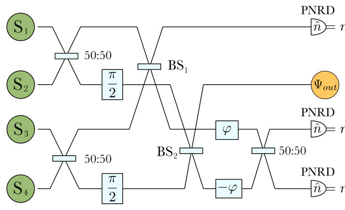 
Figure 2: Scheme for generating 4-states. In the figure, S1 and S2 are two orthogonally squeezed vacuum states with squeezing parameter 𝑟1 ∈R, 𝑆3 and 𝑆4 are two orthogonally squeezed vacuum states with squeezing parameter 𝑟2 ∈R, BS𝑖are beam splitters with transmittance 𝑡𝑖, the blue rectangles denote phase shifters, PNRD stands for a photon-number-resolving detector, and Ψ𝑜𝑢𝑡is the generated state.

📷 Fig 3

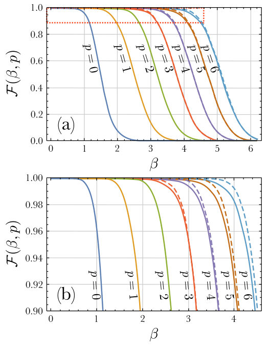 
Figure 3: (a) Fidelity ℱ(𝛽, 𝑝) (solid curves) and ℱ𝑚𝑎𝑥 4 (𝛽, 𝑝) (dashed curves) as a function of amplitude 𝛽for different numbers of superposition terms 𝑝. (b) Enlarged image of the region indicated by the red dashed rectangle.

📷 Fig 4

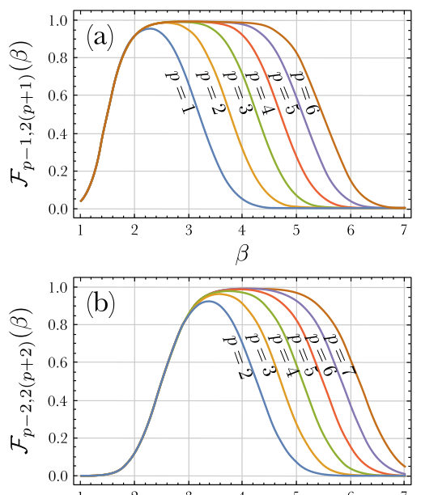 
Figure 4: (a) Fidelity between the compass state and the state starting from the fourth Fock state as a function of 𝛽 for different numbers of superposition terms. (b) Fidelity between the compass state and the state starting from the eighth Fock state as a function of 𝛽for different numbers of superposition terms.

📷 Fig 5

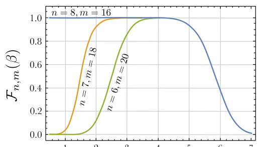 
Figure 5: Fidelity of the compass state as a function of amplitude for three cases: the superposition starts from the vacuum state (blue, 𝑛= 8, 𝑚= 16), from the fourth Fock state (orange, 𝑛= 7, 𝑚= 18), and from the eighth Fock state (green, 𝑛= 6, 𝑚= 20).

**Summary.** This paper details a quantum optical protocol for generating high-fidelity multicomponent Schrödinger cat states (e.g., 4-state, 8-state) by measuring photon numbers in multimode Gaussian states. The scheme uses squeezed vacuum states and beam splitters, demonstrating that fidelity can approach theoretical limits, although the probability of generating higher-order states decreases rapidly.

**Why it may be interesting.** This work provides a concrete, experimentally relevant protocol for creating complex quantum states (cat states) that are highly sought after for quantum computation and quantum metrology, directly linking measurement theory to state preparation.

Detailed structure

**Main problem.** The paper proposes a probabilistic scheme to generate high-fidelity multicomponent Schrödinger cat states, specifically focusing on 4-component and 8-component superpositions.

**Main result.** The scheme successfully generates states approximating the target cat states with fidelities approaching the theoretical maximum, although the generation probability decreases rapidly for higher components.

**Method.** The generation relies on performing photon-number-resolving measurements on multimode Gaussian states, which are prepared using squeezed vacuum states and beam splitters.

**Model / system.** The system involves multimode Gaussian states, which are manipulated using linear optical elements (beam splitters) and measured using Photon-Number-Resolving Detectors (PNRDs). The target states are superpositions of Fock states, known as Schrödinger cat states.

**Key observables.** Fidelity ($\mathcal{F}$), generation probability ($\mathcal{P}$), and the expansion coefficients of the generated state across Fock number basis states.

**Important parameters / regimes.** The state is characterized by parameters $A$ and $B$ for 4-states, and the process involves optimizing over several physical parameters $\{r_1, r_2, t_1, t_2, \phi\}$ and the coherent state amplitude $eta$.

**Assumptions / limitations.** The analysis assumes the ability to perform PNR measurements and relies on deriving the optimal parameter configurations to maximize fidelity.

**Figures summary.** Figures illustrate the generation schemes (e.g., using two pairs of squeezed states for 4-states) and compare the achieved fidelity ($\mathcal{F}$) against the theoretical maximum ($\mathcal{F}_{	ext{max}}$) as a function of the number of superposition terms ($p$).

**Paper structure.** The paper first introduces the general scheme for 4-states using PNR measurements on Gaussian states. It then details a specialized, optimized scheme for 4-states, followed by the extension to 8-states by mixing two 4-states. Finally, it discusses the recursive generalization to higher-order states and analyzes the trade-off between fidelity and generation probability.

Abstract

In this work, we propose a scheme for generating superpositions of Fock states whose numbers differ by four or eight. The proposed protocol is based on photon-number-resolving measurements on multimode Gaussian states. We compare of the generated states with multicomponent Schrödinger cat states. We evaluate the fidelity and determine how it scales with the number of detected particles. Furthermore, we derive the optimal configuration for the generation such states.

[↑ back to top](#top)

### [Superconducting Flux Memory for Cryogenic Applications](http://arxiv.org/abs/2609.00772v1)

**Authors:** Tony X. Zhou, John McFarland, Aruna N. Ramanayaka, Brian Sears, Colin Stack, Aref Fouladi, Robert Smith, Sambarta Rakshit, Zachary A. Stegen, Keith D. Hillaire, Moe Khalil, Robert M. Young, David G. Ferguson, Anthony J. Przybysz, John X. Pryzbysz, Mark Covington, Gregory R Boyd, Jeremy Clark, Aaron Pesetski  
**Type:** experiment · **Category:** quantum information and computing · **PDF:** <https://arxiv.org/pdf/2609.00772v1>  
**Analysis basis:** full PDF text, analyzed in chunks
**Topic relevance:** 🔥 `QC/QI experiment` **4/5** · `quantum measurements` **1/5**

📷 Fig 1

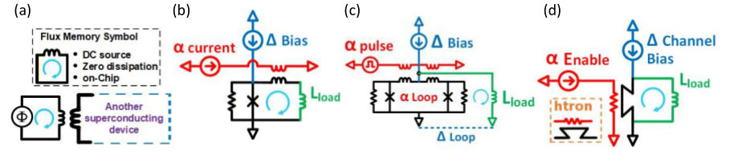 
Fig. 1. Flux memory technology and schematics of the three types of flux memory. (a) Flux memory cell stores flux as memory and can provide flux bias to another superconducting device. (b) The SJJ, also known as RF SQUID, (c) Flux Lock with 2 or more JJs (d) Cryotron activated flux memory. Inset: an orange dash-lined box indicates the symbol for an ‘htron’ consisting a nearby resistive heater and a constriction.

📷 Fig 2

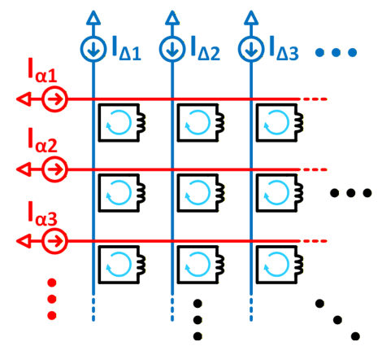 
Fig. 2. A schematic of the proposed 2D addressing scheme with horizontal and vertical control lines

📷 Fig 3

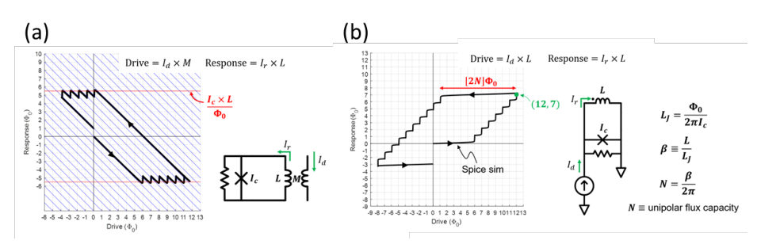 
Fig. 3. An SJJ flux memory SPICE simulation. The circuit schematic and key equations used in simulation are shown on the right of each panel for two SJJ circuit variants: (a) Flux drive with a mutual connection between the cell and control current. The rails indicating maximum memory value are drawn as horizontal lines and annotated in red. (b) Flux drive with a galvanic connection between the cell and control current. An allowed drive-response example contour is traced out as the black thickened line for a possible programmable memory operation. The maximum memory value annotated in red. Two allowed drive-response example contours for (a) and (b) are traced out as black thickened lines for...

📷 Fig 4

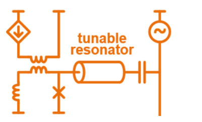 
Fig. 4. Schematic of the tunable resonator flux detector. There is an independent bias line to verify that the tunable resonator yielded and functions above the SQUID, otherwise the SQUID bias comes from the flux memory through a mutual inductor. The SQUID can be thought of as a tunable inductance, thus shifting the resonant frequency of the LC-circuit comprised of a SQUID and resonator when flux is applied to its loop.

📷 Fig 5

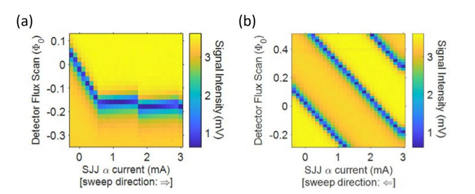 
Fig. 5. Experimental demonstration of a single SJJ flux memory cell operation. We use a flux detector to monitor the flux at the memory cell output. (a) Forward sweep of a current into the 𝛼 control line. The data indicates the initial flux state at the 0 mA 𝛼- urrent. “B kw r s” sweep long the x-axis from high 𝛼-current to low along the same parameter range and steps as in (a). The data indicates the final flux state of the cell at the 0 mA 𝛼 current after completing the hysteretic loop in parameter sweep. Repeated signals are an artifact periodicity of the flux detector.

**Summary.** This paper reports on the design and experimental validation of superconducting flux memory devices intended to provide persistent, on-chip flux biasing for superconducting qubits. By developing three distinct memory types, the authors demonstrate a scalable method to reduce external control wiring complexity. The successful demonstration of stable flux biasing for over 20 hours paves the way for larger, more integrated quantum processors.

**Why it may be interesting.** The development of robust, on-chip, and persistent control elements like flux memory is crucial for scaling up quantum processors, directly impacting the feasibility of large-scale quantum computation architectures.

Detailed structure

**Main problem.** The paper addresses the need for on-chip, persistent flux biasing sources for superconducting quantum circuits, such as qubits, to reduce the complexity of external control wiring.

**Main result.** The authors successfully developed and demonstrated three types of flux memory (SJJ, Flux Lock, Htron) that can store a stable DC flux bias for extended periods (over 20 hours), enabling scalable qubit control.

**Method.** The research involves developing superconducting circuits, simulating their behavior using SPICE, and experimentally characterizing the programmable flux storage and output using in-situ flux detectors.

**Model / system.** The core system is superconducting flux memory, implemented in three forms: Single Josephson Junction (SJJ), Flux Lock (requiring two JJs), and a Josephson Junction-free Cryotron (htron). These are designed to store persistent currents in superconducting loops.

**Key observables.** Stored flux (measured in units of flux quanta, $\Phi_0$), qubit state tunability frequency, and the achievable step size of the flux bias.

**Important parameters / regimes.** The ability to scale control lines from $N^2$ to $2N$ in a 2D array is a key parameter demonstrating scalability. The stability time of 20 hours is a critical performance metric.

**Assumptions / limitations.** The primary limitations noted are the potential energy barrier depth limiting storage, and that the current simulation does not include kinetic inductance effects.

**Figures summary.** Figures illustrate the schematics of the three memory types, the proposed 2D addressing scheme, and experimental results showing the flux biasing of a transmon qubit with stable frequency shifts over time.

**Paper structure.** The paper introduces the problem of control line scaling, details the three memory architectures (SJJ, Flux Lock, Htron), presents the methods for programming and characterizing each type, and culminates in experimental demonstrations of using the memory to bias and tune a transmon qubit.

Abstract

We report the development of flux memory for use with superconducting circuits. This technology stores persistent currents in superconducting loops on-chip to be used to provide flux biasing for superconducting circuits, like qubits. We developed three types of flux memory and draw comparisons among them for circuit design. We demonstrate the utility of flux memory by using an in-situ flux detector and characterize each approach and further demonstrate that once flux is set in a memory cell, benchtop DC control sources can be powered off, leaving the on-chip flux bias in place. We propose that flux memory can be arranged in a two-dimensional configuration to multiplex control signals and reduce how line counts scale (N^2 devices -> 2N control lines), and our experimental results pave the path to the proposed scalability. We demonstrate the use of flux memory to flux bias a transmon qubit and show the tunability of the qubit state to a target frequency which remained stable on-chip for 20 hours.

[↑ back to top](#top)

### [Temporal Signature of Bosonic Stimulation Induced by Dark Exciton in a Two-photon Pumped Polariton Condensate](http://arxiv.org/abs/2609.00125v1)

**Authors:** Nadav Landau, Dmitry Panna, Sarit Feldman, Sebastian Brodbeck, Christian Schneider, Sven Höfling, Alex Hayat  
**Type:** both · **Category:** quantum gases · **PDF:** <https://arxiv.org/pdf/2609.00125v1>  
**Analysis basis:** full PDF text, analyzed in chunks
**Topic relevance:** `Tavis-Cummings & cavity-many-emitter` **3/5** · `analog quantum simulation` **3/5** · `driven-dissipative phase transition` **3/5** · `methods for driven-dissipative` **3/5** · `quantum optics experiment` **3/5** · `Keldysh / 2PI / non-Gaussian methods` **2/5** · `correlated / nonlocal dissipation` **2/5** · `non-equilibrium universality` **2/5** · `Dicke superradiance` **1/5** · `quantum measurements` **1/5** · `superradiant laser` **1/5**

📷 Fig 1

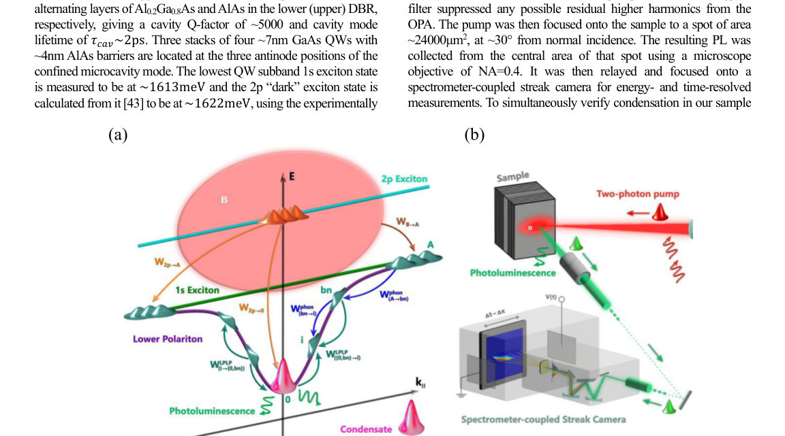 
FIG. 1. Illustration of the experiment and modelled dynamics. (a) In-plane dispersions of the 2p (teal) and 1s (dark green) exciton branches together with the LP branch (purple), showing the one- and two-photon pumped condensation dynamics studied in our work, including the rate equation state groups and terms used in our model (see Supplemental Material [38]). A background population of excitons (𝑛𝐵) is initially generated in the region of our one- (two-) photon pump spot (B, red), composed of one- (two-) photon allowed exciton states and excitons diffused from remote areas, and is schematically introduced in the band diagram. It then feeds a very high 𝑘∥ LP reservoir 𝐴 at a rate 𝑊𝐵→𝐴 via...

📷 Fig 2

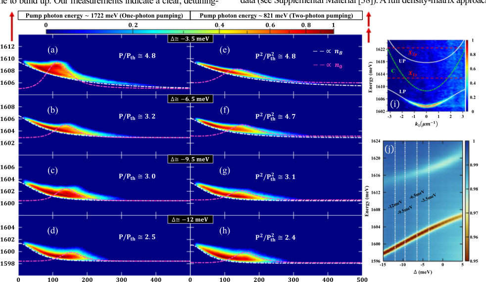 
FIG. 2. Time-resolved LP condensate PL for several 1s exciton-cavity detuning energies ∆ and at T ≅6K, for both one- (a)-(d) and two-photon (e)-(h) pumping. The PL (color) in each panel is normalized and log-scaled for better visibility, with the color code indicated on top. All cases were extracted for a similar integrated PL value above the condensation threshold, with the resulting one- and two-photon threshold-normalized excitation powers shown on each plot. In all cases, the emission is initially blueshifted by several meV, depending on the LP exciton fraction, and then reduces back down on a timescale of several hundred ps. This is associated with the background exciton population in...

📷 Fig 3

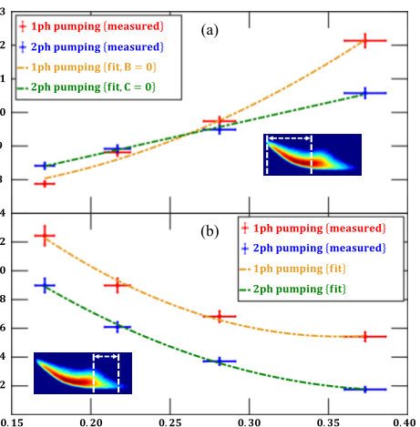 
FIG. 3. Condensate-induced blueshift buildup (a) and relaxation (b) rates (in ns−1) as a function of the LP ground state exciton fraction |𝑋0|2. Rates are extracted from the data for both one- (red) and two- photon (blue) pumping at all four detunings in the experiment, and fitted to 𝑦= 𝐴(1 −𝑥) + 𝐵𝑥+ 𝐶𝑥2 with 𝑥= |𝑋0|2 (dashed-gold and dashed-green lines, respectively). Fits constraining B and C to zero for the one- and two-photon pumped buildup rates, respectively, reflect the assumed dominant stimulation channel in each case and confirm the expected trend, which is clearly stronger for one-photon pumping. For the relaxation rates, the dynamics are less trivial, and all three fitting...

**Summary.** This paper uses time-resolved spectroscopy on polariton condensates to probe the mechanisms driving bosonic stimulation. By comparing one-photon and two-photon pumping, the authors find that the dynamics are governed by different scattering processes. This suggests a novel dark state-mediated stimulation channel that could be crucial for highly-efficient THz lasing.

**Why it may be interesting.** This work directly addresses non-equilibrium many-body dynamics in a controllable quantum optical system, providing quantitative evidence for multiple, distinct bosonic stimulation channels in a solid-state condensate.

Detailed structure

**Main problem.** The study investigates the temporal signature of bosonic stimulation induced by dark excitons within a polariton condensate, comparing the dynamics under one-photon versus two-photon pumping.

**Main result.** A distinct difference in the detuning dependence of the buildup and relaxation rates is observed between the two pumping schemes, suggesting a new dark state-originated stimulation channel in the two-photon case.

**Method.** The research combines time-resolved photoluminescence spectroscopy with fitting the measured buildup and relaxation rates to a quadratic function of the condensate exciton fraction.

**Model / system.** The physical system is a strongly-coupled light-matter exciton-polariton condensate in a semiconductor microcavity. The dynamics are modeled using a semi-classical Boltzmann rate equation approach.

**Key observables.** Buildup and relaxation rates of the condensate-induced blueshifts, measured as a function of the LP ground state exciton fraction (|X_0|^2).

**Important parameters / regimes.** Detuning ($\Delta$), temperature ($T \sim 6$ K), and the ratio of one-photon vs. two-photon pumping excitation energies.

**Assumptions / limitations.** The analysis assumes that the observed rate dependencies can be captured by fitting the rates to a quadratic function of the exciton fraction, and that the model captures the dominant scattering mechanisms.

**Figures summary.** Figures illustrate the experimental setup, angle-resolved PL measurements across the condensation threshold for both pumping types, and plots showing the extracted buildup and relaxation rates as a function of |X_0|^2 for comparison.

**Paper structure.** The paper establishes the physical platform and the goal of comparing one- and two-photon pumping. It presents time-resolved measurements of the blueshift dynamics, analyzes the detuning dependence of the rates, and concludes by interpreting the differences in rate dependence as evidence for distinct stimulation channels.

Abstract

Strongly-coupled light-matter exciton-polaritons constitute an on-chip solid-state platform where the macroscopic quantum phenomenon of condensation is not only achievable at elevated temperatures, but can also be optically controlled, including through their interaction with inaccessible "dark" states. A recent study has shown that polariton condensation can be established under nonlinear two-photon pumping, paving the way towards dark state-condensate coherent control and highly-efficient terahertz (THz) lasing. In this letter, we show for the first time a temporal signature of dark exciton induced bosonic stimulation by investigating one- and two-photon pumped condensation with time-resolved photoluminescence spectroscopy. Our results show a clear difference in the detuning dependence of the buildup and relaxation rates of the condensate-induced blueshifts under one- and two-photon pumping. This difference is associated with the stronger exciton-fraction dependence expected for one-photon pumped condensation, where polariton-polariton stimulation dominates, compared with two-photon pumped condensation, where a 2p-exciton-to-lower-polariton THz transition can provide another stimulation channel, together with various spin-flip, electron-hole exchange and phonon-based mechanisms. These observations indicate the presence of a new dark state originated stimulation channel that could facilitate highly-efficient THz lasing in semiconductor microcavities.

[↑ back to top](#top)

### [Chiral phonons driven by chiral cavities](http://arxiv.org/abs/2609.00368v1)

**Authors:** V. A. S. V. Bittencourt, N. Shabala, R. M. Geilhufe, A. Metelmann  
**Type:** theory · **Category:** other · **PDF:** <https://arxiv.org/pdf/2609.00368v1>  
**Analysis basis:** full PDF text, analyzed in chunks
**Topic relevance:** `analog quantum simulation` **3/5** · `correlated / nonlocal dissipation` **3/5** · `driven-dissipative phase transition` **3/5** · `methods for driven-dissipative` **3/5** · `Keldysh / 2PI / non-Gaussian methods` **2/5** · `Tavis-Cummings & cavity-many-emitter` **2/5** · `non-equilibrium universality` **2/5** · `quantum measurements` **1/5**

📷 Fig 1

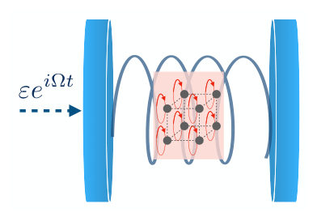 
FIG. 1: Chiral Phonons generated by a coherently driven chiral cavity (in blue). The material hosting chi- ral phonons, associated with the circular motion of the crystal’s ions (represented here illustratively), is loaded in a chiral cavity, and supports phonon modes with a definite handedness (in red). The cavity mode is coher- ently driven with a monochromatic tone of amplitude ε at frequency Ω.

📷 Fig 2

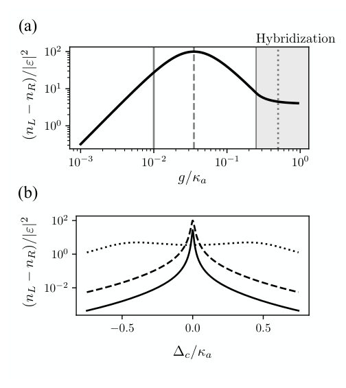 
FIG. 2: Imbalance between left and right-handed phonons generated by a coherently driven chiral cav- ity. (a) Maximum imbalance as a function of the cavity-phonon coupling. The gray area indicates g &gt; p

📷 Fig 3

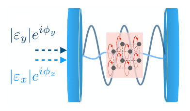 
FIG. 3: Chiral Phonons generated by a coherently driven linear cavity. In this case, the cavity has to sup- port two degenerate modes that are linearly polarized. Such modes have to be driven with independent drives that have a relative phase.

**Summary.** This paper proposes using a driven electromagnetic cavity as a novel platform to generate a steady-state population of chiral phonons. By modeling the cavity-phonon interaction, the authors demonstrate that this setup can induce a measurable, persistent effective magnetic field, offering a powerful tool to study phonon-mediated magnetism without relying on transient light pulses.

**Why it may be interesting.** This work is highly relevant to AMO physics and open quantum systems because it models the coherent, driven coupling between two distinct quantum subsystems (photons/cavity modes and phonons) to engineer a macroscopic quantum response (magnetization) in a steady state.

Detailed structure

**Main problem.** The primary goal is to generate a steady-state population of chiral phonons, which carry angular momentum, to study the phono-magnetic effect, bypassing the limitations of transient excitation methods.

**Main result.** The authors demonstrate that using a driven electromagnetic cavity can generate a steady-state, non-zero effective phonon-induced magnetic field ($	ext{B}_{	ext{eff}}$) with realistic drive power.

**Method.** The methodology involves deriving the general interaction Hamiltonian between the cavity electromagnetic field and the chiral phonon modes, followed by solving the driven-dissipative dynamics using the Heisenberg-Langevin equation.

**Model / system.** The system is a material hosting chiral phonons coupled to a driven electromagnetic cavity. The model utilizes the cavity-phonon interaction Hamiltonian, $\hat{H}_{ac}$, and considers both chiral and linear cavity configurations.

**Key observables.** Effective magnetic field ($	ext{B}_{	ext{eff}}$), steady-state phonon population imbalance ($n_L - n_R$), and the phonon-cavity coupling rate ($g_k$).

**Important parameters / regimes.** Optimal coupling strength ($g_{opt}$), cavity decay rates ($\kappa_a, \kappa_c$), and external drive power ($P$).

**Assumptions / limitations.** The analysis assumes the small sample-cavity volume ratio ($V_s \ll V_c$) and employs the Rotating Wave Approximation (RWA) for the dynamics.

**Figures summary.** Figures illustrate the interaction between chiral phonons and the cavity field, showing the dependence of phonon population imbalance on coupling strength and detuning, and visualizing the resulting polariton frequencies.

**Paper structure.** The paper progresses from establishing the need for steady-state generation to deriving the general interaction Hamiltonian, applying this to chiral and linear cavity setups, solving the resulting driven-dissipative dynamics, and finally calculating the resulting effective magnetic field.

Abstract

Lattice vibrations carrying angular momentum give rise to fundamental phenomena such as the phonon Hall effect and the Einstein-de Haas effect, offering new opportunities for manipulating angular momentum in condensed-matter systems. Generating such circularly polarized phonons requires either the use of an external magnetic field, or of polarized light pulses. The latter approach does not require the use of any magnetic response of the material, but it has limitations, in particular regarding the duration of the pulse. Consequently, any effect stemming from phonons generated by light pulses is transient. In this paper, we propose the use of a driven electromagnetic cavity as a route to generate a steady-state population of chiral phonons. We derive a general description of cavity-chiral phonon interaction, with a particular focus on modes of chiral cavities. We show that, under optimized conditions, a significant effective phonon-induced magnetic field can be generated by means of an external drive with realistic power. Our approach is specially tailored for Gamma point phonons with THz frequencies, and opens a new route for investigating chiral phonons with electromagnetic cavities.

[↑ back to top](#top)

### [Exceptional Points in Photonics: From Non-Hermitian Physics to Applications](http://arxiv.org/abs/2609.01239v1)

**Authors:** Fan Zhang, Nikolay Solodovchenko, Dmitrii N. Maksimov, Xuchen Wang, Mingzhao Song, Filippo Capolino, C. T. Chan, Andrey Bogdanov  
**Type:** theory · **Category:** other · **PDF:** <https://arxiv.org/pdf/2609.01239v1>  
**Analysis basis:** full PDF text, analyzed in chunks
**Topic relevance:** `analog quantum simulation` **3/5** · `correlated / nonlocal dissipation` **3/5** · `driven-dissipative phase transition` **3/5** · `methods for driven-dissipative` **3/5** · `Keldysh / 2PI / non-Gaussian methods` **2/5** · `interference shaping light` **2/5** · `non-equilibrium universality` **2/5** · `quantum measurements` **1/5**

📷 Fig 1

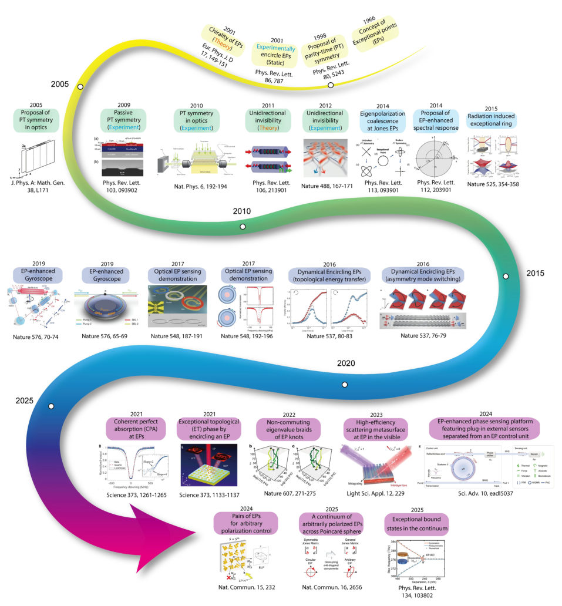 
Fig. 1. Historical development of EPs in optics and photonics. Selected milestones showing how EPs evolved from singular degeneracies in non-Hermitian operator theory to experimentally accessible photonic platforms and device concepts. The timeline starts with Kato’s perturbation-theory formulation of EPs [9], the proposal of PT-symmetric Hamiltonians [61], early work on EP chirality [74], and static encircling experiments in microwave cavities [32]. It then follows optical PT proposals and demonstrations [18, 19, 75], unidirectional invisibility [24, 51], polarization-space EPs [25], EP-enhanced spectral response [42], exceptional rings in photonic-crystal slabs [26], dynamical encircling...

📷 Fig 2

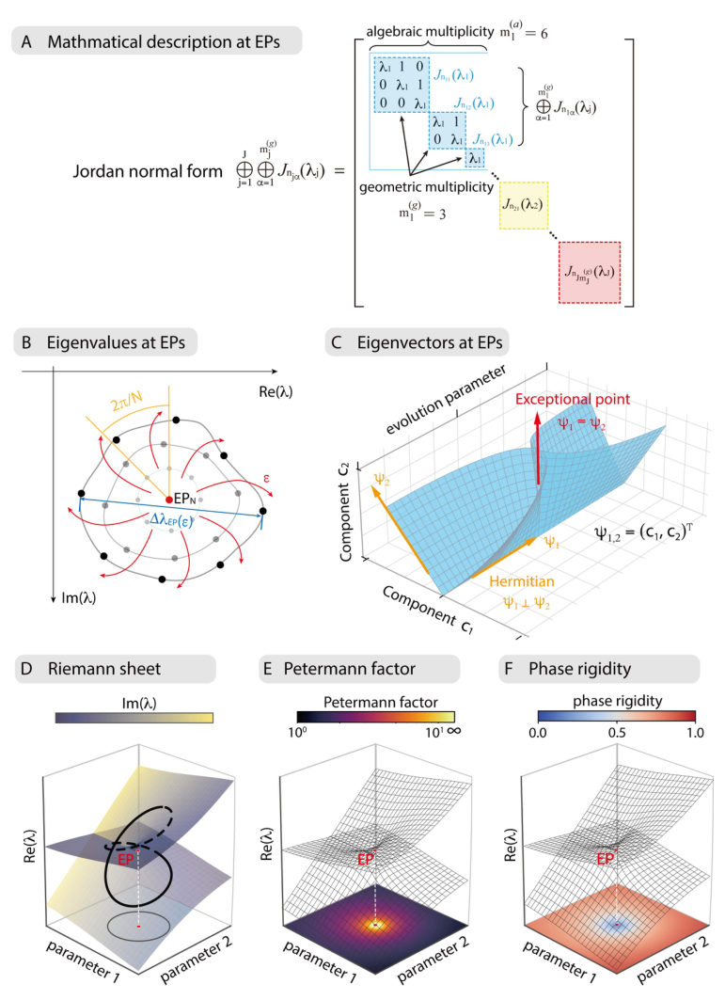 
Fig. 2. Mathematical and physical signatures of EPs in non-Hermitian systems (A) Illustration of Jordan normal form (Eq. 9). Blue blocks show a local Jordan normal form with eigenvalue λ1 where algebraic multiplicity (m(a) 1 = 6) exceeds the geometric multiplicity (m(g) 1 = 3). Adapted from [57]. (B) Puiseux expansion of eigenvalue at an EP (Eq. 12), where trajectories exhibit root-law complex eigenvalue splitting response. Adapted from [79]. (C) Evolution of the directions of two eigenvectors ψ1,2 = (c1, c2)T in two dimensions. In a Hermitian system, the two eigenvectors are orthogonal, and they coalesce at an EP. Adapted from [81]. (D) Riemann-sheet structure around an EP exhibits...

📷 Fig 3

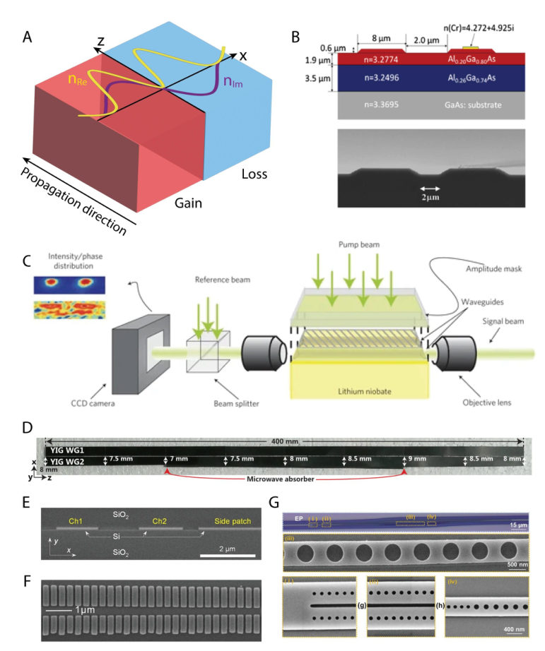 
Fig. 3. Concept and representative implementations of propagation-operator EPs in transversely structured optical media (A) Schematic of a transverse PT-symmetric refractive-index profile, with an even real part and an odd imaginary part, light propagates along z direction. (B) Passive multilayer AlxGa1−xAs waveguide coupler with a Cr stripe on the right waveguide, reproduced from Ref. [18]. (C) Actively controlled Fe-doped LiNbO3 waveguide array and interferometric readout, reproduced from Ref. [19]. (D) Yttrium-iron-garnet waveguide coupler with a localized microwave absorber, reproduced from Ref. [106]. (E) Silicon channel-waveguide coupler in which an auxiliary slab patch provides...

📷 Fig 4

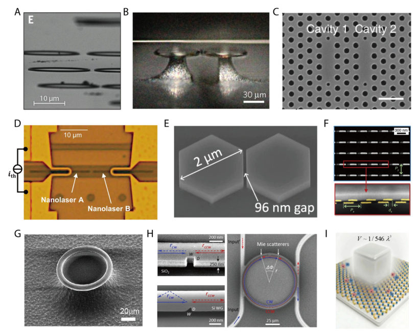 
Fig. 4. Representative platforms of resonant-Hamiltonian EPs (A-F) Coupled-resonator implementations: (A) Coupled InGaAsP microrings, reproduced from Ref. [122]. (B) Active-passive silica microtoroids, reproduced from Ref. [20]. (C) Graphene-loaded coupled photonic crystal cavities, reproduced from Ref. [123]. (D) Coupled nanolasers with integrated thermoresistive gold nanowires, reproduced from Ref. [124]. (E) Optically pumped InP microdisks, reproduced from Ref. [125]. (F) Bilayer plasmonic metallic bar metasurface, reproduced from Ref. [126]. (G,H) Single-resonator implementations based on controllable coupling between clockwise and counterclockwise modes: (G) A microtoroid with external...

📷 Fig 5

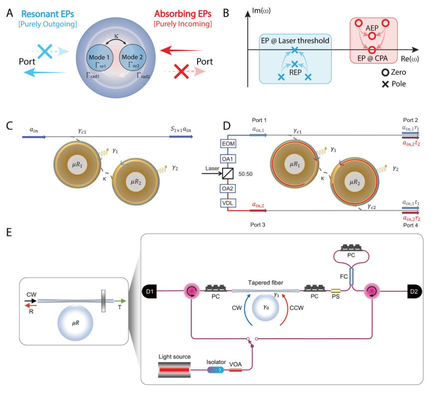 
Fig. 5. Concept and representative implementations of absorbing EPs (A) Comparison of a resonant EP defined by purely outgoing solutions and an absorbing EP defined by purely incoming solutions. (B) Schematic motion of scattering poles (crosses) and zeros (open circles) in the complex-frequency plane. REP and AEP denote resonant and absorbing EPs, respectively. (C) One-channel CPA-EP formed by two coupled microtoroids and one fiber taper, reproduced from Ref. [22]. (D) Two-channel CPA-EP setup with independent amplitude, phase, and delay control of the coherent inputs, reproduced from Ref. [22]. (E) Waveguide-coupled WGM resonator with a one-sided reflector, realizing directional feedback...

**Summary.** This review provides a comprehensive overview of Exceptional Points (EPs) in open photonic systems, establishing a unified theoretical framework for understanding these non-Hermitian degeneracies. It details various types of EPs and demonstrates their utility in controlling light properties for applications ranging from sensing to nonlinear optics. The work concludes by critically assessing the practical challenges for realizing EP-based photonic technologies.

**Why it may be interesting.** This is highly relevant for a theoretical physicist working on AMO or open quantum systems as it provides a rigorous mathematical framework (Jordan blocks, non-Hermiticity) to analyze phenomena in open quantum optics and photonics, extending concepts from quantum mechanics to classical wave systems.

Detailed structure

**Main problem.** The paper aims to provide a unified framework for understanding and utilizing Exceptional Points (EPs) in open photonic systems, which are governed by non-Hermitian physics.

**Main result.** EPs enable advanced light control, including enhanced sensing, directional scattering, and polarization manipulation, by exploiting the non-analytic spectral topology inherent to these degeneracies.

**Method.** The review systematically analyzes EPs by classifying them according to the underlying operator (e.g., scattering matrix, Liouvillian) and employing spectral theory, Jordan normal form analysis, and perturbation theory.

**Model / system.** The primary system is open photonic structures, modeled using non-Hermitian Hamiltonians or Liouvillian superoperators. The analysis covers various types of EPs, including Hamiltonian, absorbing, Bloch, and Floquet EPs.

**Key observables.** Eigenvalue coalescence, spectral topology (monodromy), eigenvalue splitting ($\propto \sqrt{\epsilon}$ at $EP_2$), and measurable photonic responses like directional scattering and polarization control.

**Important parameters / regimes.** The key parameters involve the degree of non-Hermiticity, the coupling strengths, and the system's response to external perturbations ($\epsilon$).

**Assumptions / limitations.** The review critically assesses limitations regarding robustness, noise, and scalability, acknowledging that enhanced responsivity does not guarantee superior measurement precision.

**Figures summary.** The notes mention a historical timeline of EP development (Figure 1) and the generalization of the Jordan form, illustrating the mathematical structure of the degeneracies.

**Paper structure.** The paper is structured as a comprehensive review, first defining EPs and their mathematical basis, then systematically categorizing different types of EPs in various physical contexts (Hamiltonian, scattering, Liouvillian), and finally reviewing their diverse applications and current technological limitations.

Abstract

Open photonic systems provide a versatile platform for non-Hermitian physics, enabling control over complex spectra, transport, and light-matter interactions. Exceptional points (EPs), at which eigenvalues and eigenvectors coalesce and the governing operator becomes defective, play a central role because they combine branch-point spectral topology, nonanalytic perturbative response, and controllable eigenstate conversion. This Review provides a unified framework for EP photonics by systematically distinguishing exceptional degeneracies according to the underlying operator, spectral variable, boundary conditions, and experimentally accessible observables. We discuss Hamiltonian EPs, absorbing EPs associated with scattering zeros, real-frequency scattering-matrix and Jones-matrix EPs, Bloch and Floquet EPs, and Liouvillian EPs in open quantum systems. We review their spectral topology, static and dynamical encircling, higher-order exceptional structures, and coexistence with bound states in the continuum, together with applications in sensing, lasing, coherent absorption, directional scattering, polarization and wavefront control, nonlinear optics, optical storage, nonreciprocal photonics, and quantum photonics. We also critically assess the current limitations, practical challenges, and future perspectives of EP-based photonic technologies, with particular attention to robustness, noise, scalability, and experimentally measurable performance.

[↑ back to top](#top)

### [Quantum phase transitions of the Cavity Heisenberg spin-chain](http://arxiv.org/abs/2609.01340v1)

**Authors:** Lv-Ting Gong, Shao-Fan He, Fu-Quan Dou  
**Type:** theory · **Category:** other · **PDF:** <https://arxiv.org/pdf/2609.01340v1>  
**Analysis basis:** full PDF text, analyzed in chunks
**Topic relevance:** `Dicke superradiance` **3/5** · `Tavis-Cummings & cavity-many-emitter` **3/5** · `analog quantum simulation` **3/5** · `Keldysh / 2PI / non-Gaussian methods` **2/5** · `driven-dissipative phase transition` **2/5** · `non-equilibrium universality` **2/5** · `superradiant laser` **2/5** · `methods for driven-dissipative` **1/5**

📷 Fig 1

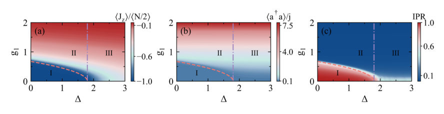 
FIG. 1. (a) The order parameter ⟨Jz⟩/(N/2) distinguishes the NP with |⟨Jz⟩/(N/2)| = 1 from the SP with 0 &lt; |⟨Jz⟩/(N/2)| &lt; 1. (b) The scaled mean photon number ⟨ˆa†ˆa⟩/j is nearly zero in the NP and becomes finite in the SP, showing a continuous change across the phase boundary. (c) The ground-state IPR approaches 1 in the NP (localized) and tends toward 0 in the SP (delocalized). The red and yellow dashed lines represent the critical boundaries obtained from the auxiliary function given in Eq.( 11), which distinguish the NP, SP, and the intermediate phase. Parameters: N = 20, g2 = 0.5, γ = −0.2, and nmax = 100.

📷 Fig 2

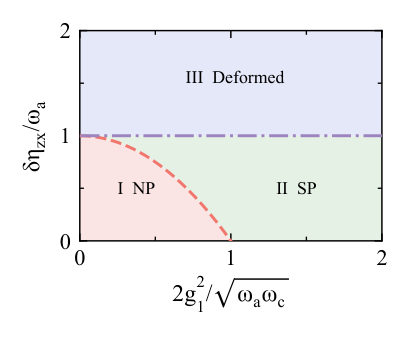 
FIG. 2. Fixed point phase diagram of the classical Hamil- tonian (4). The parameter space is divided into three regions according to the number and stability of the stationary points. Region I corresponds to the NP. Region II, defined by fzx ≥1 and δηzx &lt; ωa, corresponds to the SP. Region III, character- ized by δηzy ≥ωa, corresponds to the deformed phase, where the stationary point configuration is further rearranged.

📷 Fig 3

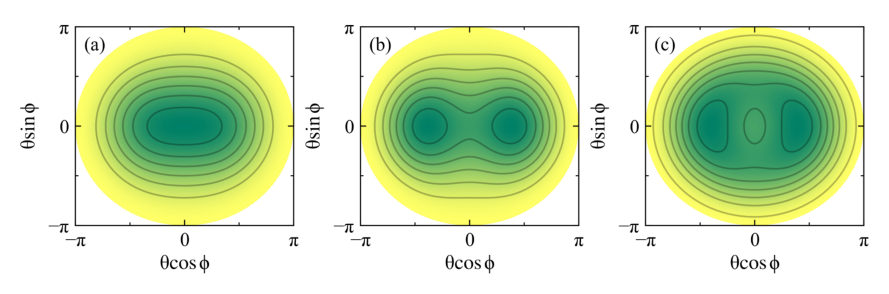 
FIG. 3. Contour plots of the classical energy surface under resonance conditions ωa = ωc = 1, represented in terms of the angular variables of the pseudospin j. The azimuthal angle is denoted by ϕ, and the polar angle θ is measured from the south pole, satisfying jz = −j cos θ. (a) region I: g1 = 0.1, g2 = 0.5, γ = −0.2, ∆= 1; (b) region II: fzx ≥1, δηzx &lt; ωa, with parameters g1 = 0.8, g2 = 0.5, γ = −0.2, ∆= 1; (c) region III: δηzy ≥ωa, with parameters g1 = 0.5, g2 = 0.5, γ = −0.2, ∆= 3.

📷 Fig 4

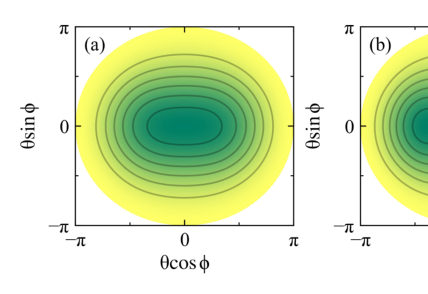 
Figure 3 presents contour plots of the classical energy surfaces within the three regions defined by the fixed- point analysis. In region I, the system exhibits a local maximum with energy

📷 Fig 5

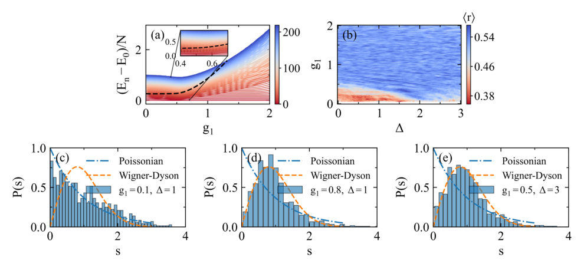 
FIG. 4. Energy spectra and spectral statistics of the system. (a) Excitation spectrum (En −E0)/N as a function of the spin–cavity coupling g1 for g2 = 0.5, γ = −0.2, and ∆= 1. The inset shows a magnified view of the critical energy region. (b) Average adjacent-level spacing ratio ⟨r⟩in the (g1, ∆) parameter plane, computed from the lowest 1000 energy levels for ωa = ωc = 1, γ = −0.2, and N = 20. The lower region is masked due to spurious large values induced by near-degenerate energy levels. (c)–(e) Level-spacing distributions in different parameter regimes: (c) Poisson statistics in region I; (d) Wigner–Dyson statistics in region II; and (e) Wigner–Dyson statistics in region III.

**Summary.** This paper theoretically investigates quantum phase transitions in the cavity Heisenberg spin-chain model, a system relevant to quantum optics. By combining quantum information measures with semiclassical analysis, the authors map out a phase diagram revealing a unique 'deformed phase.' They establish a deep connection between excited-state transitions and the system's ergodic properties using spectral analysis.

**Why it may be interesting.** This work provides a general theoretical framework for characterizing complex phase structures and spectral features in light-matter quantum many-body systems, which is highly relevant to cavity QED and quantum optics.

Detailed structure

**Main problem.** The paper investigates ground-state and excited-state quantum phase transitions (QPTs/ESQPTs) and the ergodic-nonergodic transition (ENET) in the cavity Heisenberg spin-chain model.

**Main result.** The authors identified a novel 'deformed phase' interpolating between normal and superradiant regimes, characterized by logarithmic nonanalyticity in the density of states. They also established a spectral-structure mechanism linking ESQPTs to the ENET.

**Method.** The study combines quantum information measures with semiclassical fixed-point analysis, analyzing the system in the semiclassical limit ($\hbar 	o 0$).

**Model / system.** The system is the cavity Heisenberg spin-chain (CHS) model, which couples a Heisenberg spin chain to a single-mode cavity radiation field, relating it to the Dicke model.

**Key observables.** Order parameter $\langle J_z 
angle$, Inverse Participation Ratio (IPR), Density of States (DoS), and multifractal dimensions.

**Important parameters / regimes.** The analysis depends on various coupling strengths ($\omega_c, g_1, \omega_a, g_2$) and the system size $N$.

**Assumptions / limitations.** The analysis relies on the semiclassical approximation ($\hbar 	o 0$) and fixed-point analysis of the classical Hamiltonian.

**Figures summary.** Figure 1 uses observables like $\langle J_z 
angle/(N/2)$ and IPR to distinguish between the Normal Phase (NP), Superradiant Phase (SP), and the intermediate Deformed Phase. Figure 2 maps the phase diagram across these three regions.

**Paper structure.** The paper first introduces the Hamiltonian and the physical problem (QPTs/ESQPTs). It then uses semiclassical analysis to map out the phase diagram (NP, SP, Deformed). Finally, it analyzes the spectral properties and diagnostics to confirm the existence and nature of the transitions.

Abstract

The interplay between quantum criticality and ergodicity breaking constitutes a central challenge in complex quantum many-body systems. Here, we investigate ground-state quantum phase transitions (QPTs) and excited-state quantum phase transitions (ESQPTs), as well as ergodic-nonergodic transition in the cavity Heisenberg spin-chain (CHS) model. By combining quantum information measures with semiclassical fixed-point analysis, we identify a deformed phase that interpolates between the normal and superradiant phases, featuring a logarithmic nonanalyticity in the density of states (DoS) and two additional jump discontinuities. We further elucidate the spectral-structure mechanism underlying the connection between ESQPTs and the ergodic--nonergodic transition (ENET) via level statistics, participation ratios, and multifractal analysis. Our results provide a general framework for characterizing phase structures and spectral features in light--matter quantum many-body systems.

[↑ back to top](#top)

### [Information geometry of non-equilibrium quantum states: Mixed metric structures on an extended information manifold](http://arxiv.org/abs/2609.00977v1)

**Authors:** Kouji Kashiwa, Hidefumi Matsuda  
**Type:** theory · **Category:** statistical mechanics · **PDF:** <https://arxiv.org/pdf/2609.00977v1>  
**Analysis basis:** full PDF text, analyzed in chunks
**Topic relevance:** `analog quantum simulation` **3/5** · `non-equilibrium universality` **3/5** · `Keldysh / 2PI / non-Gaussian methods` **2/5** · `driven-dissipative phase transition` **2/5** · `methods for driven-dissipative` **2/5** · `correlated / nonlocal dissipation` **1/5** · `quantum measurements` **1/5** · `scars & prethermalization` **1/5**

📷 Fig 1

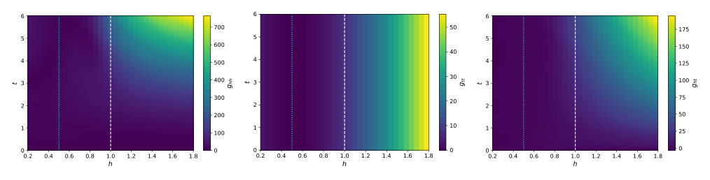 
FIG. 2. Heatmaps of the QFI metric components ghh, gtt, and ght on the information manifold (h, t). The vertical dashed line indicates the equilibrium critical point h = 1 in the thermodynamic limit, while the dotted line denotes the initial field h = hi = 0.5.

📷 Fig 2

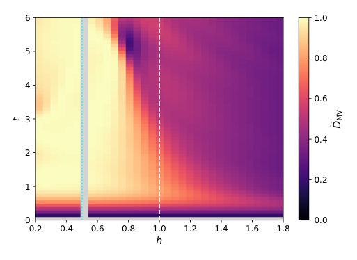 
FIG. 4. The normalized MVD on the information mani- fold (h, t). The gray region indicates masked areas where the normalization becomes ill-defined because of the no-quench condition. The dashed and dotted lines are the same as in Fig. 2.

📷 Fig 3

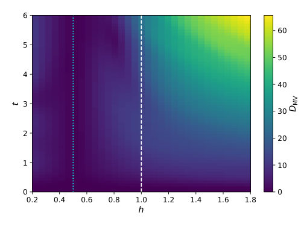 
FIG. 3. The MVD on the information manifold (h, t). The dashed and dotted lines are the same as in Fig. 2.

📷 Fig 4

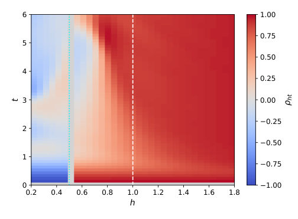 
FIG. 5. The normalized alignment coefficient ρht on the in- formation manifold (h, t). The gray region indicates masked areas where the normalization becomes ill-defined because of the no-quench condition. The dashed and dotted lines are the same as in Fig. 2.

📷 Fig 5

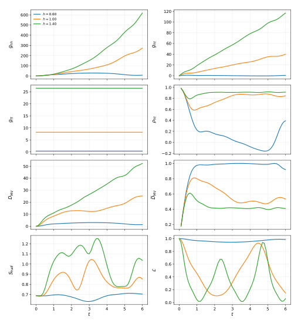 
FIG. 7. The real-time evolution of DMV, eDMV, ρht, ghh, Shalf, and L for h = 0.6, 1.0, and 1.4. These values correspond to quenches in the ferromagnetic phase, near the equilibrium critical point, and in the paramagnetic phase, respectively.

**Summary.** This work establishes an information-geometric framework to analyze non-equilibrium quantum dynamics by treating the state space as an extended manifold parameterized by time and a control parameter. It derives key geometric metrics, such as the mixed metric component $g_{ht}$, which quantify the coupling between parameter changes and time evolution. The results show that these geometric measures correlate with, but offer complementary information to, standard diagnostics like entanglement entropy and the Loschmidt echo.

**Why it may be interesting.** The explicit focus on the mixed metric component $g_{ht}$ and the resulting geometric coupling $
ho_{ht}$ offers a novel, coordinate-independent diagnostic tool for quantifying how parameter tuning influences time evolution in non-equilibrium quantum systems.

Detailed structure

**Main problem.** The paper develops an information-geometric framework to characterize the dynamics of quantum states evolving out of equilibrium.

**Main result.** The geometric structure, quantified by the mixed metric component $g_{ht}$ and the Metric-Volume Density (MVD), provides a systematic way to measure the interplay between parameter variation and real-time evolution.

**Method.** The analysis uses the Quantum Fisher Information (QFI) metric tensor defined on an extended information manifold parameterized by a control parameter $h$ and time $t$.

**Model / system.** The transverse-field Ising chain model is used as a primary laboratory system, but the framework is shown to be general and applicable to models like the $Z_3$ Potts chain and the lattice Schwinger model.

**Key observables.** Quantum Fisher Information metric components ($g_{hh}, g_{tt}, g_{ht}$), Metric-Volume Density (DMV), normalized alignment coefficient ($
ho_{ht}$), entanglement entropy ($S_A(t)$), and Loschmidt echo ($L(t)$).

**Important parameters / regimes.** The post-quench Hamiltonian parameter ($h$ or $\alpha$) and real time ($t$).

**Assumptions / limitations.** The analysis assumes the state can be mapped onto an extended information manifold, and correlations with conventional measures are analyzed but not assumed to be perfectly predictive.

**Figures summary.** Figures show heatmaps of the QFI metric components on the $(h, t)$ manifold, the evolution of DMV and $
ho_{ht}$ over time, and correlation matrices comparing geometric measures with entanglement entropy and the Loschmidt echo.

**Paper structure.** The paper introduces the geometric framework by defining the QFI metric on the $(h, t)$ manifold, derives key geometric observables like $g_{ht}$ and $
ho_{ht}$, and then applies this framework to various models (Ising, Potts, Schwinger) to correlate these geometric measures with established non-equilibrium diagnostics.

Abstract

We discuss an information-geometric framework for characterizing quantum states in non-equilibrium dynamics. Using the transverse-field Ising chain model as a laboratory, we investigate the quantum Fisher information metric with particular emphasis on the mixed metric component $g_{ht}$ and related geometric observables, where $h$ is a controllable post-quench Hamiltonian parameter and $t$ is real time. The framework treats $h$ and $t$ as coordinates of an extended information manifold $(h,t)$. The geometric observables characterize the speed of evolution on the manifold and the alignment between the temporal and parameter-deformation directions. Correlations between these geometric quantities and two widely used measures of non-equilibrium dynamics, the entanglement entropy and the Loschmidt echo, are analyzed.

[↑ back to top](#top)

### [Size-Dependent Growth Rates Amplify Infinitesimal Asymmetry in Nanocrystals](http://arxiv.org/abs/2609.00145v1)

**Authors:** Sam Oaks-Leaf, David T. Limmer  
**Type:** theory · **Category:** statistical mechanics · **PDF:** <https://arxiv.org/pdf/2609.00145v1>  
**Analysis basis:** full PDF text, analyzed in chunks
**Topic relevance:** `driven-dissipative phase transition` **3/5** · `non-equilibrium universality` **3/5** · `Keldysh / 2PI / non-Gaussian methods` **2/5** · `methods for driven-dissipative` **2/5** · `Frenkel-Kontorova` **1/5** · `analog quantum simulation` **1/5** · `correlated / nonlocal dissipation` **1/5** · `quantum measurements` **1/5** · `scars & prethermalization` **1/5**

📷 Fig 1

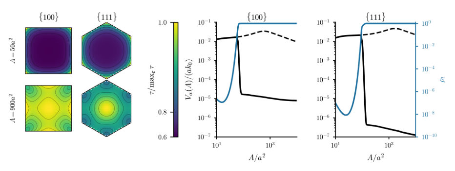 
FIG. 1. Microscopic origin of facet-area-dependent growth velocities. Left, normalized layer-completion times, τ/maxrτ, for finite square {100} and hexagonal {111} facets with A = 50a2 and 900a2 using corner, edge, and interior nucleation rates obtained from the ligand-renormalized microscopic attachment/removal rates. Right, dimensionless velocities Vα(A)/(ak0) for the same facet families. Solid black curves include ligand blocking, dashed black curves show the corresponding ligand-free velocities, and blue curves show the mean ligand density ρl. In all panels a = 1, k0 = 1, βϵn = 5, and βϵl = 4. For {100} facets, z100 = 2, β∆µn = 7, and β∆µl = 1. For {111} facets, z111 = 3, β∆µn = 12, and...

📷 Fig 2

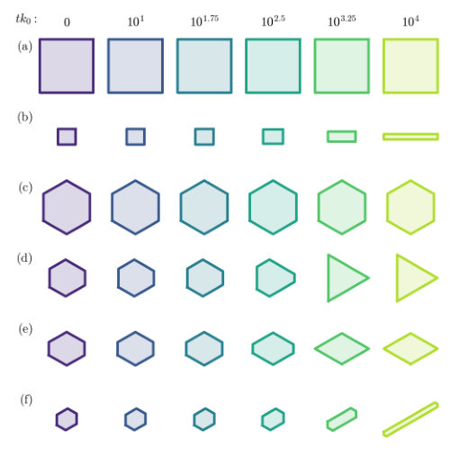 
FIG. 2. Area-normalized two-dimensional shape evolution un- der the size-dependent velocity law. Rows show (a) a square seed with Lx = Ly = 7a, (b) a rectangular square-lattice seed with Lx = 6a and Ly = 7a, (c) an ideal triangular-lattice hexagon, (d) a triangular seed with a single-facet perturba- tion, (e) a triangular seed with opposite-facet perturbations, and (f) a triangular seed with adjacent-facet perturbations. The time slices are logarithmically spaced after t = 0, and each polygon is centered and rescaled to its initial area.

📷 Fig 3

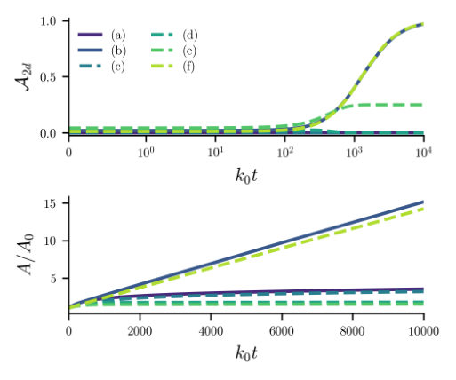 
FIG. 3. Shape and size trajectories for the six cases in Fig. 2. The upper panel shows the shape asymmetry, and the lower panel shows the crystal area relative to its initial area. Legend labels correspond to the snapshot rows.

📷 Fig 4

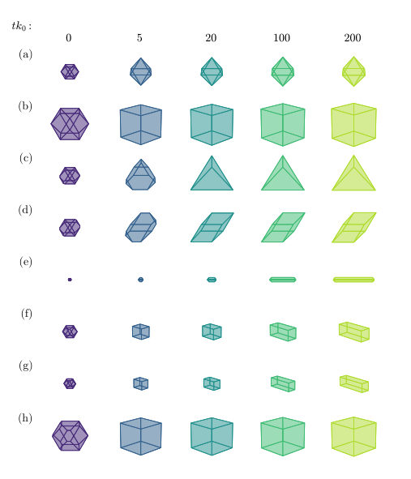 
FIG. 4. FCC shape evolution for the global rod comparison. Rows show (a) the unperturbed {111}-threshold regime, (b) the unperturbed {100}-threshold regime, (c) a single {111} perturbation, (d) opposing {111} perturbations, (e) adjacent {111} perturbations, (f) a single {100} perturbation, (g) op- posing {100} perturbations, and (h) adjacent {100} pertur- bations. Time increases from left to right. Each polyhedron is centered and rescaled independently for visualization.

📷 Fig 5

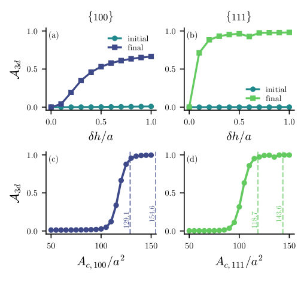 
FIG. 5. Sensitivity of FCC rod formation to seed perturbation and crossover area. The left column shows the {100}-faceted rod parameter set, and the right column shows the {111}- faceted rod parameter set. (a,b) Initial and final volume- weighted asymmetry as a function of perturbation height δh. (c,d) Final asymmetry as a function of the relevant crossover area at fixed δh = a. Dashed vertical lines mark the sur- viving facet areas at which the complementary facet family disappears during rod formation.

**Summary.** This paper introduces a size-dependent kinetic construction to model nanocrystal growth, moving beyond symmetry-preserving assumptions. By showing that facet growth rates depend on the facet's size, the authors demonstrate that even tiny initial asymmetries can be amplified into large, macroscopic shape anisotropies. This mechanism is crucial for understanding how crystal morphology is determined by local, size-sensitive kinetic processes.

**Why it may be interesting.** The concept of size-dependent, non-linear kinetics leading to symmetry breaking is highly relevant to non-equilibrium dynamics, pattern formation, and the study of open quantum systems where boundary effects or finite size corrections become crucial.

Detailed structure

**Main problem.** To develop a predictive theory explaining how infinitesimal initial asymmetries in nanocrystals can be amplified into strongly asymmetric morphologies, overcoming the symmetry constraints of traditional growth models.

**Main result.** Size-dependent kinetic growth rates, arising from finite facet effects, cause deterministic shape evolution to amplify small perturbations, leading to macroscopic shape symmetry breaking.

**Method.** The authors developed a size-dependent kinetic construction generalizing the Wulff construction, using probabilistic lattice gas models to derive facet growth velocities dependent on facet size.

**Model / system.** The study models the growth of nanocrystals (e.g., on square, triangular, or FCC lattices) where facet growth rates are governed by local nucleation barriers and ligand coverages that vary with the instantaneous facet size.

**Key observables.** Facet growth velocities ($V_\alpha(D)$), shape asymmetry measures ($A_{2d}, A_{3d}$), and the evolution of crystal morphology (e.g., cuboctahedra to rods).

**Important parameters / regimes.** Facet size ($D$), ligand coverage ($
ho_l$), and the crossover areas ($A_{c,\alpha}$) where growth kinetics change significantly.

**Assumptions / limitations.** The theory assumes ligands equilibrate quickly, allowing the facet state to switch between ligand-poor and ligand-rich regimes, and the growth is deterministic based on derived rate laws.

**Figures summary.** Figures illustrate the microscopic origin of size-dependent velocities, show the instability of symmetric growth on 2D lattices, and demonstrate the amplification of small seed perturbations into highly anisotropic 3D rod shapes.

**Paper structure.** The paper progresses from establishing the limitations of the standard kinetic Wulff construction to developing the size-dependent kinetic construction using a lattice gas model. It then applies this theory to 2D and 3D systems, showing how size-dependent rates lead to shape instability and macroscopic asymmetry amplification.

Abstract

The kinetic Wulff construction predicts symmetric nonequilibrium shapes when crystallographically equivalent facets share a fixed growth rate. However, nanocrystals grow through finite facets whose nucleation barriers and ligand coverages depend on facet size. Here we develop a size-dependent kinetic construction and show that as a consequence infinitesimal seed asymmetries can be amplified into strongly asymmetric nanocrystal morphologies even when all symmetry-related facets obey the same microscopic growth law. Spatially heterogeneous nucleation rates and boundary limited growth generate facet growth velocities that depend on size, and deterministic shape evolution translates these local rates into global shape symmetry breaking. We illustrate the mechanism of persistent anisotropic growth on square and triangular lattices in two dimensions and on FCC seeds in three dimensions, where cuboctahedra can evolve toward rods or tetrahedra depending on which facet-area perturbations are amplified.

[↑ back to top](#top)

### [Spatial correlations of photons interacting via transverse Rydberg blockade](http://arxiv.org/abs/2609.00348v1)

**Authors:** Bankim Chandra Das, Daniil Svirskiy, Matthias Metternich, Wolfgang Alt, Sebastian Hofferberth, Ofer Firstenberg  
**Type:** theory · **Category:** other · **PDF:** <https://arxiv.org/pdf/2609.00348v1>  
**Analysis basis:** full PDF text, analyzed in chunks
**Topic relevance:** `Rydberg arrays` **3/5** · `analog quantum simulation` **3/5** · `correlated / nonlocal dissipation` **2/5** · `interference shaping light` **2/5** · `Keldysh / 2PI / non-Gaussian methods` **1/5** · `Tavis-Cummings & cavity-many-emitter` **1/5** · `driven-dissipative phase transition` **1/5** · `methods for driven-dissipative` **1/5**

📷 Fig 1

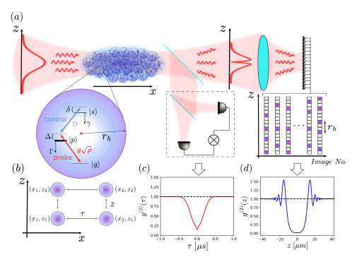 
FIG. 1. (a) An ultracold large atomic ensemble is excited via two-photon transition to a Rydberg state (the control beam is not shown). We consider a ladder scheme with ground state |g⟩, intermediate state |p⟩(decay rate Γ, one-photon detuning ∆), and Rydberg state |s⟩(decoherence rate γ, two- photon detuning δ); the probe couples |g⟩↔|p⟩with col- lective strength g√ρ, and the control field couples |p⟩↔|s⟩ with Rabi frequency Ω. The probing beam waist w0 is cho- sen such that the blockade radius rb is smaller than the beam waist w0/rb &gt; 1. This condition breaks a typical 1D approximation. We investigate both the temporal cor- relations (c), which can be measured by a HBT setup, as well as...

📷 Fig 2

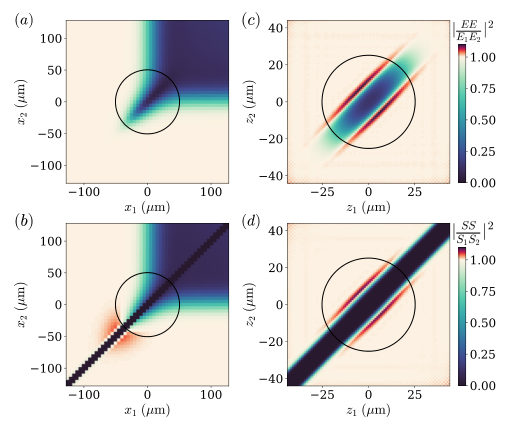 
FIG. 3. Numerically calculated normalized stationary two- photon wavefunction ψ(x1, z1, x2, z2) for a 2D Gaussian atomic cloud ρ(x, z), indicated by the black circle, showing the Rydberg blockade in both the longitudinal and transverse planes. Each panel shows the two-particle amplitude normal- ized to the product i1j2 of the corresponding single-photon amplitudes, defined in Sec. III. (a) Two-photon amplitude EE E1E2

📷 Fig 3

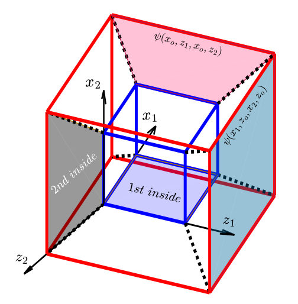 
FIG. 2. Schematic visualization of the four-dimensional configuration space of the two-photon wavefunction ψ(x1, z1, x2, z2), represented as a tesseract by two nested cubes (inner blue and outer red). The coordinate pairs (x1, z1) and (x2, z2) specify the positions of photons 1 and 2, respectively. The coordinates x1, x2, and z1 form the three orthogonal axes of each cube, while the fourth coordinate, z2, is represented by the connections between the cubes. The gray- and blue-shaded ‘input’ planes correspond to initially uncorrelated photons: on the blue (gray) plane, photon 1 (2) enters the medium while photon 2 (1) has not yet entered. Propagating through the atomic cloud generates...

📷 Fig 4

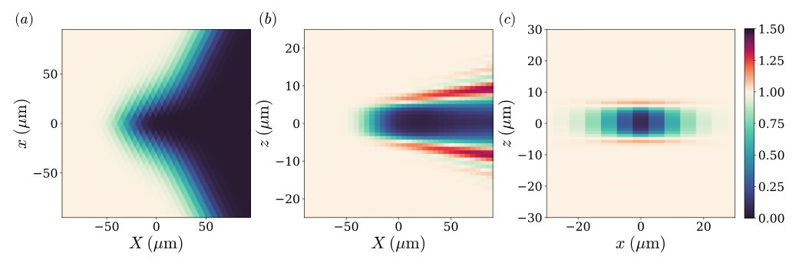 
FIG. 4. Normalized two-photon wavefunction amplitude |EE|2 plotted in center-of-mass (X) and relative coordinates (x, z).

📷 Fig 5

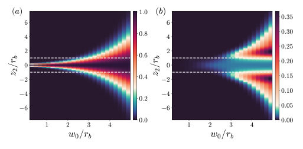 
FIG. 5. Numerically calculated transverse profile of the two- photon amplitude |EE(xo, 0, x2, z2)|2, with one photon de- tected at the exit of the medium (x1 = xo), as a function of normalized transverse position z2 and beam waist w0, at (a) the entrance (x2 = −xo) and (b) the exit (x2 = xo) of the atomic medium. Comparing the two reveals the effect of the Rydberg blockade on the transmitted beam. For w0 ≫rb, the blockade imprints a central depletion hole of width 2rb on the output profile, confirming that the suppression is blockade- induced. For w0 ≤rb, the blockade weakens and the output profile is instead broadened by paraxial diffraction, with no clear central hole. The crossover near...

**Summary.** This paper theoretically investigates how two photons interact via transverse Rydberg blockade in an EIT medium. It finds that the transverse correlation length is set by the blockade radius, while the longitudinal correlation is limited by bandwidth, demonstrating distinct physical mechanisms in each direction. The results provide a novel, measurable diagnostic tool for characterizing Rydberg interactions using spatial photon statistics.

**Why it may be interesting.** This work provides a detailed theoretical framework for using spatial photon correlations to probe fundamental atomic interactions (Rydberg blockade) in a highly controllable quantum optical setting, bridging quantum optics and atomic physics.

Detailed structure

**Main problem.** The paper develops a theory for the transverse spatial dynamics of two interacting photons propagating in a Rydberg nonlinear medium, extending beyond the standard one-dimensional analysis.

**Main result.** It establishes that transverse Rydberg blockade creates a distinct, measurable correlation mechanism whose length scale is determined by the blockade radius, independent of the EIT bandwidth.

**Method.** The authors derive an effective two-photon Schrödinger-like equation and analyze its transport equation by separating the interaction potential into dissipative and dispersive parts.

**Model / system.** The system involves two photons propagating through a medium containing atoms excited to Rydberg states under Electromagnetically Induced Transparency (EIT) conditions, modeled by a two-polariton Hamiltonian.

**Key observables.** Two-photon wavefunction, two-photon correlation functions, transverse and longitudinal correlation lengths, and the blockade width.

**Important parameters / regimes.** Blockade radius ($r_b$), EIT bandwidth, input beam waist ($w_0$), and optical depth (OD).

**Assumptions / limitations.** The analysis relies on approximations such as the undepleted tail ($I \simeq 1$) and the separation of the interaction potential into dissipative and dispersive components.

**Figures summary.** Figures illustrate the setup, the 4D configuration space, the stationary two-photon wavefunction showing blockade, and the final results comparing transverse (diffractive) and longitudinal (diffusive) correlation scaling.

**Paper structure.** The paper progresses from setting up the full two-polariton Hamiltonian to deriving an effective 2D Schrödinger equation. It then analyzes the anisotropy by treating the transverse and longitudinal kinetic terms separately, leading to distinct scaling laws for the correlation lengths.

Abstract

We develop a theory of the transverse spatial dynamics of two interacting photons in a Rydberg nonlinear medium. Extending the well-studied one-dimensional case, we explore both longitudinal and transverse correlations of photons propagating as Rydberg polaritons. We identify distinct behaviors and scaling laws for these correlations, arising from fundamentally different mechanisms in the two directions: diffraction for transverse correlations and diffusion for longitudinal correlations. We develop a model incorporating a Gaussian optical beam and an inhomogeneous atomic density distribution, from which we derive quantitative predictions for correlation functions in both directions. We further show that the propagation equations can be reduced to a single Schrödinger-like equation, allowing approximate solutions that are supported by full numerical results. Our findings indicate that the transverse correlation length is determined primarily by the blockade radius, whereas the longitudinal correlation length is limited by bandwidth. These results establish transverse Rydberg blockade as a distinct and measurable correlation mechanism and show that spatial photon correlations provide a direct means of measuring the blockade radius.

[↑ back to top](#top)

### [Thermal screening and critical scaling of quantum energy teleportation in a harmonic chain](http://arxiv.org/abs/2609.00928v1)

**Authors:** Taisanul Haque  
**Type:** theory · **Category:** statistical mechanics · **PDF:** <https://arxiv.org/pdf/2609.00928v1>  
**Analysis basis:** full PDF text, analyzed in chunks
**Topic relevance:** `non-equilibrium universality` **3/5** · `quantum measurements` **3/5** · `Keldysh / 2PI / non-Gaussian methods` **2/5** · `analog quantum simulation` **2/5** · `Frenkel-Kontorova` **1/5** · `driven-dissipative phase transition` **1/5** · `methods for driven-dissipative` **1/5**

📷 Fig 1

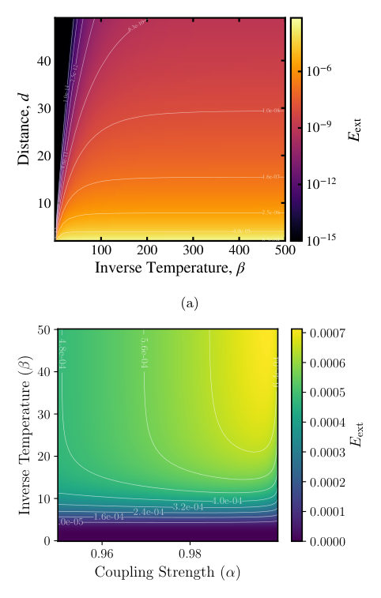 
FIG. 1: Density plots of the optimized extracted energy Eext in Eq. (21) as a function of the indicated control parameters. Panel (a): dependence on inverse temperature β and Alice–Bob separation d, evaluated at N = 300, α = 0.9999, and Ω= 1. Panel (b): dependence on coupling strength α and inverse temperature β at fixed separation d = 2, evaluated at N = 300 and Ω= 1.

📷 Fig 2

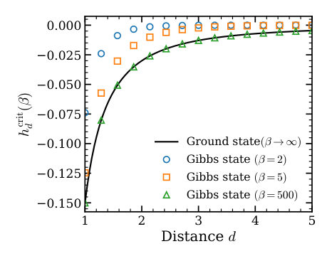 
FIG. 2: Critical thermal coupling hcrit d (β) in the thermodynamic limit. Symbols: finite-temperature results from Eq. (31) at selected values of β. Solid line: exact zero-temperature result from Eq. (36). At finite β, thermal screening suppresses the coupling at large distance; as β →∞the curves converge to the ground-state profile.

📷 Fig 3

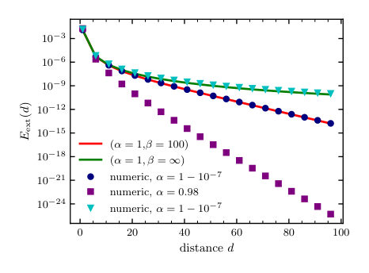 
FIG. 3: Extracted energy Eext(d) in the thermodynamic regime. Solid curves: analytical critical results (α = 1) for the Gibbs state at finite temperature and for the ground state. Symbols: numerical data for N = 215 in the near-critical regime (α = 1 −10−7, circles) and in the gapped phase (α = 0.98, squares). The near-critical data are nearly indistinguishable from the α = 1 curves at this scale, whereas the gapped data exhibit a substantially faster decay.

📷 Fig 4

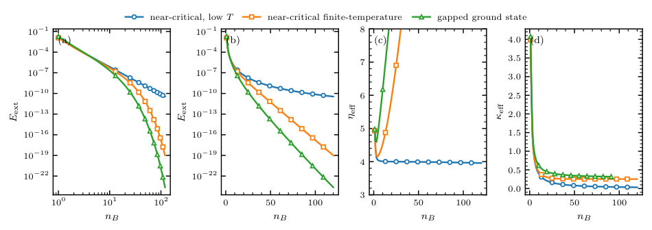 
FIG. 4: Distance-scaling diagnostics for the extracted energy Eext(nB). The three curves correspond to: near-critical low temperature (blue), (N, α, β, Ω) = (2000, 1 −10−9, 105, 1); near-critical finite temperature (orange), (N, α, β, Ω) = (2000, 1 −10−9, 70, 1); and the gapped ground-state regime (green), (N, α, β, Ω) = (2000, 0.99, 105, 1). Panel (a) shows the data on logarithmic axes, testing algebraic decay, while panel (b) shows the same data on semilogarithmic axes, testing exponential decay. Panel (c) shows the effective logarithmic exponent ηeff(nB) = −d log Eext/d log nB, and panel (d) shows the local attenuation rate κeff(nB) = −d log Eext/dnB.

📷 Fig 5

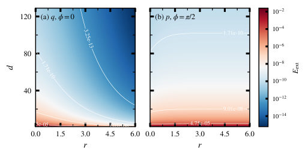 
FIG. 5: Density plots of the extracted energy Eext versus squeezing parameter r and separation d for Nsys = 500, β = 105, Ω= 1.0, and α = 1 −10−13. Panel (a) corre- sponds to the q-squeezed measurement, and panel (b) to the p-squeezed measurement. The white lines indicate contours of constant extracted energy.

**Summary.** This work analyzes quantum energy teleportation in a 1D harmonic chain, treating the system at finite temperatures. The authors derive that the extracted energy is exponentially screened at finite temperatures but reveals an exact $d^{-4}$ decay law in the zero-temperature critical limit. This connects quantum information protocols to fundamental concepts in critical statistical mechanics.

**Why it may be interesting.** It provides rigorous analytical results for energy transport in quantum many-body systems near criticality, connecting concepts from quantum information (teleportation) with critical phenomena and thermal correlation lengths.

Detailed structure

**Main problem.** The paper investigates the behavior of quantum energy teleportation (QET) in a harmonic chain at finite temperatures, focusing on how the extracted energy scales with distance and temperature.

**Main result.** The extracted energy exhibits exponential screening at finite temperatures but follows an exact asymptotic law of $E_{	ext{ext}} \sim d^{-4}$ in the zero-temperature critical limit.

**Method.** The analysis uses a Gaussian-state formulation for the Gibbs state and derives the extracted energy by optimizing a measurement-feedback protocol, reducing the problem to thermal two-point correlation functions.

**Model / system.** The system is a one-dimensional harmonic chain, modeled by a quadratic Hamiltonian $H = rac{1}{2} \sum_j (p_j^2 + q_j^2 - \alpha q_j q_{j-1})$. The initial state is a Gibbs state $
ho_eta = e^{-eta H} / 	ext{Tr}(e^{-eta H})$.

**Key observables.** Extracted Energy ($E_{	ext{ext}}$), which is the primary diagnostic observable.

**Important parameters / regimes.** Temperature ($eta$), separation distance ($d$), coupling strength ($\alpha$), and squeezing parameters ($p, q$).

**Assumptions / limitations.** The system is assumed to be in a Gibbs state, and the analysis often specializes to the single-site protocol.

**Figures summary.** Figures illustrate the dependence of $E_{	ext{ext}}$ on temperature/distance and coupling strength, comparing analytical results for critical ($\alpha=1$) and gapped regimes.

**Paper structure.** The paper develops the QET protocol for Gaussian states, derives the single-site protocol result, and then analyzes the asymptotic limits: finite temperature (exponential decay) and zero temperature critical limit ($d^{-4}$ decay).

Abstract

We develop a finite-temperature Gaussian-state formulation of quantum energy teleportation in the one-dimensional harmonic chain. For Gibbs states, the optimized measurement-feedback protocol reduces to thermal two-point functions. In the single-site protocol, the extracted energy is governed by a single correlator, which makes the thermodynamic and near-critical limits analytically tractable. At fixed finite temperature, the extracted energy is exponentially screened with distance and is controlled by a thermal correlation length for both critical and non-critical $α$. In the zero-temperature critical limit taken after the thermodynamic limit, we derive the exact asymptotic law $E_{\mathrm{ext}}\sim d^{-4}$. Numerical results confirm both regimes and resolve the crossover responsible for the apparent drift of the effective decay exponent at intermediate distances. We also analyze squeezed Gaussian measurements and show that they modify the extraction prefactor: $p-$squeezing enhances the extracted energy, whereas $q-$squeezing suppresses it, without changing the large-distance scaling.

[↑ back to top](#top)

### [Irreducibility and regularisation properties of Gaussian quantum Markov semigroups](http://arxiv.org/abs/2609.01547v1)

**Authors:** Franco Fagnola, Federico Girotti  
**Type:** theory · **Category:** other · **PDF:** <https://arxiv.org/pdf/2609.01547v1>  
**Analysis basis:** full PDF text, analyzed in chunks
**Topic relevance:** `correlated / nonlocal dissipation` **3/5** · `methods for driven-dissipative` **3/5** · `Keldysh / 2PI / non-Gaussian methods` **2/5** · `driven-dissipative phase transition` **2/5** · `non-equilibrium universality` **1/5** · `quantum measurements` **1/5**

📷 Fig 1

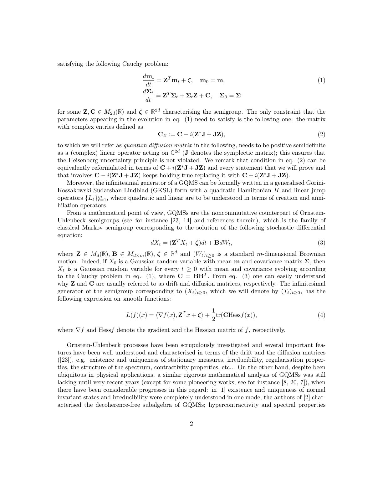 
Low-resolution page preview, page 2

📷 Fig 2

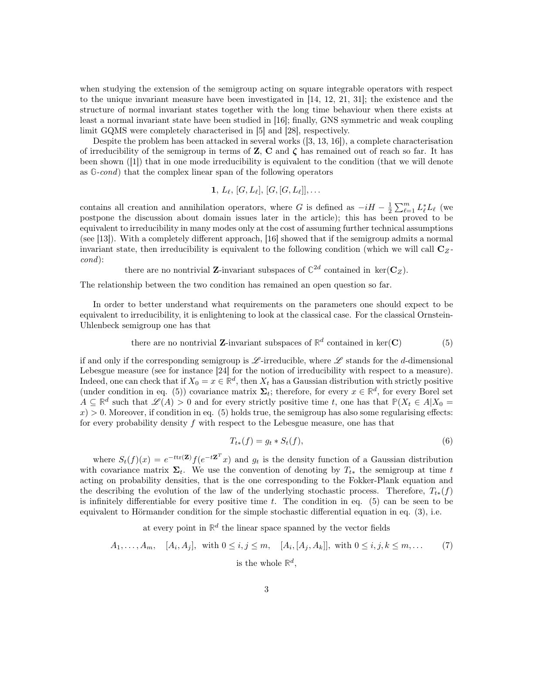 
Low-resolution page preview, page 3

📷 Fig 3

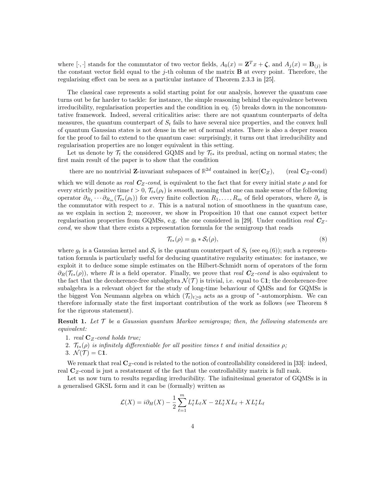 
Low-resolution page preview, page 4

📷 Fig 4

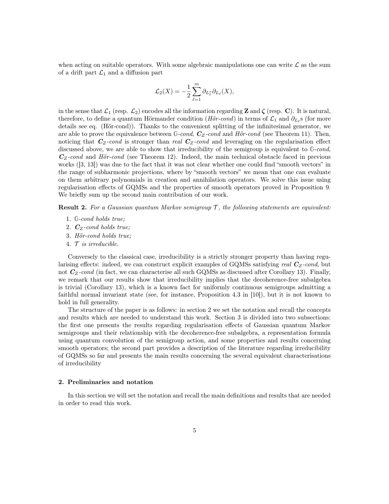 
Low-resolution page preview, page 5

📷 Fig 5

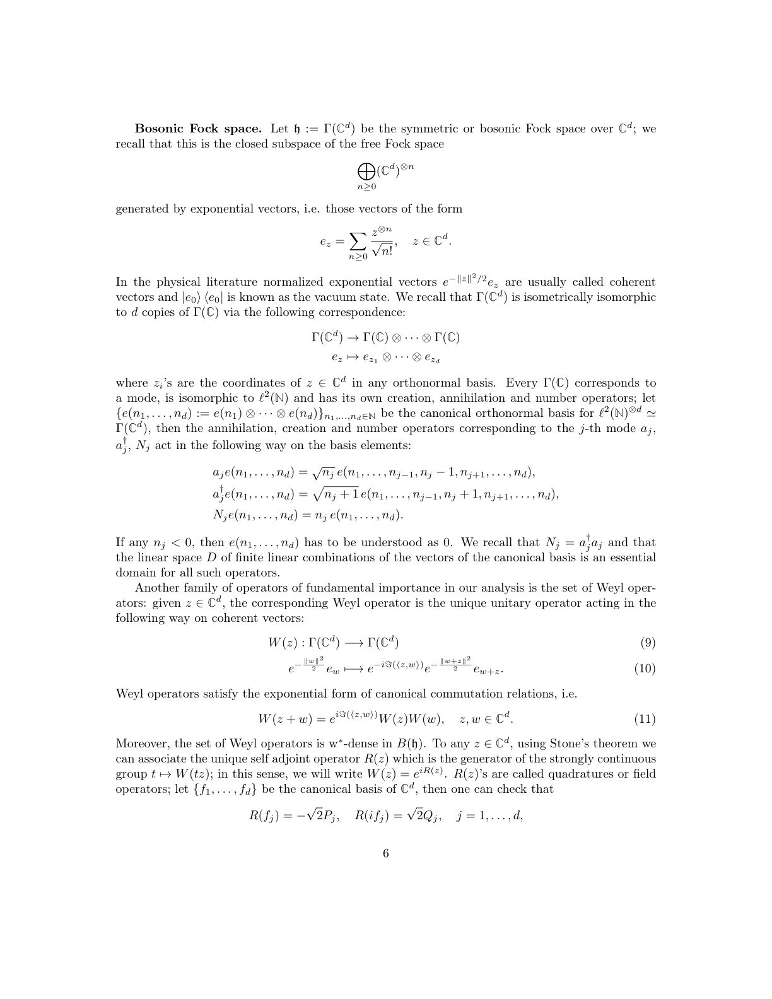 
Low-resolution page preview, page 6

**Summary.** This paper develops a deep mathematical theory characterizing the regularisation and irreducibility of Gaussian quantum Markov semigroups. It establishes that these two properties are distinct, providing several equivalent algebraic criteria for each. The results offer a powerful tool for analyzing open quantum systems in continuous variable settings, particularly relevant for quantum optics.

**Why it may be interesting.** This work provides a rigorous algebraic framework for analyzing open quantum dynamics in continuous variables, which is crucial for understanding decoherence and system controllability in quantum optics and quantum information processing.

Detailed structure

**Main problem.** The paper investigates the mathematical properties, specifically regularisation and irreducibility, of Gaussian quantum Markov semigroups (GQMSs). It aims to establish algebraic criteria that characterize these behaviors in continuous-variable quantum systems.

**Main result.** The authors establish that, for GQMSs, irreducibility is a strictly stronger condition than those ensuring regularisation, leading to equivalent algebraic criteria involving the drift and quantum diffusion matrices.

**Method.** The analysis employs advanced mathematical tools from functional analysis and quantum dynamics, comparing the quantum evolution to classical Ornstein-Uhlenbeck processes and utilizing superoperator formalism.

**Model / system.** The system is an open quantum system modeled by GQMSs acting on the bosonic Fock space, relevant for quantum optics and quantum memories. The dynamics are governed by equations for the mean and covariance matrices.

**Key observables.** Regularisation properties, irreducibility, the decoherence-free subalgebra N(T), and the associated algebraic conditions (real CZ-cond, G-cond, Hör-cond).

**Important parameters / regimes.** The drift matrix (Z) and the quantum diffusion matrix (C) are central parameters determining the semigroup's evolution.

**Assumptions / limitations.** The analysis relies on the structure of Gaussian states and the ability to translate complex quantum dynamics into equivalent linear algebraic conditions.

**Figures summary.** Not specified.

**Paper structure.** The paper develops the theory by first analyzing the classical analogy, then characterizing regularisation via the triviality of the decoherence-free subalgebra, and finally establishing the equivalence of multiple algebraic conditions (G-cond $\Leftrightarrow$ CZ-cond $\Leftrightarrow$ Hör-cond) to prove irreducibility.

Abstract

We study regularisation and irreducibility properties of Gaussian quantum Markov semigroups (GQMSs) acting on continuous-variable quantum systems. We first identify a natural notion of regularity for operators in this setting, which allows us to formulate and characterise the smoothing effects of GQMSs in terms of algebraic conditions involving the drift and quantum diffusion matrices. These conditions establish a connection with the controllability theory of quantum linear systems and with the structure of decoherence-free subsystems.   We then characterise irreducibility through several equivalent algebraic criteria: one formulated in terms of the drift and quantum diffusion matrices, one in terms of the operators appearing in the generalised GKLS representation of the generator, and a third given by a quantum analogue of Hörmander's condition. A central and somewhat surprising consequence is that, in contrast with the classical case, irreducibility is strictly stronger than conditions ensuring regularisation. Our results provide an algebraic framework for analysing these properties and lay the groundwork for a broader study of reducible Gaussian quantum Markov semigroups and, more generally, more general relevant quantum Markov semigroups on continuous-variable systems.

[↑ back to top](#top)

### [A continuous-mode quantum-optical representation of finite strong-field laser pulses in free space](http://arxiv.org/abs/2609.01157v1)

**Authors:** Szabolcs Hack, Attila Czirják, Péter Földi  
**Type:** theory · **Category:** other · **PDF:** <https://arxiv.org/pdf/2609.01157v1>  
**Analysis basis:** full PDF text, analyzed in chunks
**Topic relevance:** `Keldysh / 2PI / non-Gaussian methods` **3/5** · `methods for driven-dissipative` **3/5** · `quantum measurements` **3/5** · `interference shaping light` **2/5**

📷 Fig 1

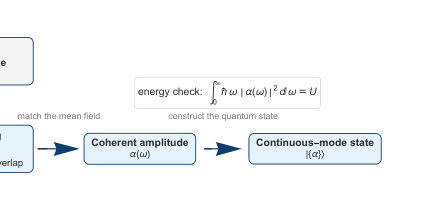 
Figure 1. Workflow for constructing a continuous-mode coherent state from laboratory pulse data. The measured pulse determines the analytic signal and its spectrum, while the chosen transverse mode family defines the spatial-polarization degree of freedom. Mode matching (or projection onto the selected mode family) yields the coherent amplitude α(ω), whose normalization is verified by reproducing the measured pulse energy before constructing the coherent state |{α}⟩.

📷 Fig 2

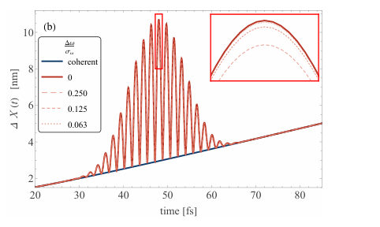 
Figure 2. (a) Mean electron position for the coherent Gaussian pulse specified in the text. The solid curve is the continuum result, while the dashed and dotted curves are obtained from normalized top-hat frequency-bin projections. (b) Position uncertainty for the coherent pulse (blue) and the equal-energy single-wave packet squeezed-vacuum pulse (red). The insets enlarge the marked regions.

**Summary.** This paper establishes a continuous-mode quantum-optical representation for analyzing strong-field laser pulses in free space. It details how measured pulse characteristics determine the quantum state, distinguishing between fully determined coherent states and more complex nonclassical states requiring higher-order correlation information. The framework offers a consistent bridge between experimental measurements and advanced quantum field theory calculations.

**Why it may be interesting.** This work provides a powerful, systematic tool for connecting time-domain measurements of intense laser fields to the underlying quantum state description, which is crucial for understanding non-linear quantum optics phenomena.

Detailed structure

**Main problem.** The paper develops an energy-consistent quantum-optical framework to describe finite strong-field laser pulses in free space, aiming to unify the treatment of both coherent and nonclassical driving fields.

**Main result.** The framework successfully maps measured free-space pulse characteristics onto a continuous-mode quantum state $|\{\alpha\}
angle$, providing a rigorous interface for quantum-optical calculations.

**Method.** It employs a continuous-mode description starting from plane-wave quantization, utilizing a transverse vector-mode reduction and spectral decomposition ($\alpha(\omega)$).

**Model / system.** The system is a free-electron model driven by intense, finite-duration laser pulses in vacuum. The quantum state is represented in the continuous-mode coherent state basis.

**Key observables.** Spectral amplitude $\alpha(\omega)$, total pulse energy ($U$), mean photon number ($ar{N}$), and field variances ($\Delta X^2$).

**Important parameters / regimes.** Pulse duration, spectral bandwidth ($\Delta\omega$), and the degree of nonclassicality (requiring covariance kernels).

**Assumptions / limitations.** The analysis relies on the paraxial approximation and, for numerical work, involves projecting the continuous spectrum onto discrete frequency bins.

**Figures summary.** The notes describe a workflow diagram illustrating the mapping from measured pulse $
ightarrow$ analytic signal $
ightarrow$ spectrum $
ightarrow$ coherent amplitude $\alpha(\omega) 
ightarrow$ quantum state.

**Paper structure.** The paper builds the framework by first defining the continuous-mode representation for coherent states, then extending it to nonclassical states using covariance kernels, and finally addressing the practical numerical challenges of spectral discretization and convergence.

Abstract

We formulate an energy-consistent quantum-optical representation of finite paraxial laser pulses in free space. The formulation is based on a continuous-mode description and provides a step toward a unified treatment of coherent and nonclassical strong-field drivers. Starting from plane-wave quantization, we construct a transverse vector-mode reduction in which the selected mode can reproduce an arbitrary normalized spatial--polarization profile. For a coherent pulse, the measured pulse energy and full laboratory analytic signal determine the frequency-dependent coherent-state displacement $(α(ω))$, without introducing a physical quantization volume. For nonclassical pulses, the same first-order field data and total energy do not uniquely specify the quantum state. Additional correlation information or model assumptions are required. We incorporate this information through normal and anomalous covariance kernels and discuss $g^{(2)}$-based diagnostics of squeezed pulses. We also derive a phase-sensitive convergence criterion for numerical frequency-bin discretizations. An exactly solvable continuum-mode free-electron application shows that the coherent displacement reproduces the semiclassical mean trajectory, whereas the field covariances determine the electron wave packet width. The framework offers a convenient, energy-consistent interface between measured free-space pulses and quantum-optical calculations.

[↑ back to top](#top)

### [Statistical Language Competition Model with Dynamic Edge Weighting on a Random Network](http://arxiv.org/abs/2609.01078v1)

**Authors:** Somyaranjan Chakra, Mohit Anand Madhesia, Shradha Mishra  
**Type:** theory · **Category:** statistical mechanics · **PDF:** <https://arxiv.org/pdf/2609.01078v1>  
**Analysis basis:** full PDF text, analyzed in chunks
**Topic relevance:** `driven-dissipative phase transition` **3/5** · `non-equilibrium universality` **3/5** · `analog quantum simulation` **2/5** · `methods for driven-dissipative` **2/5** · `Frenkel-Kontorova` **1/5**

📷 Fig 1

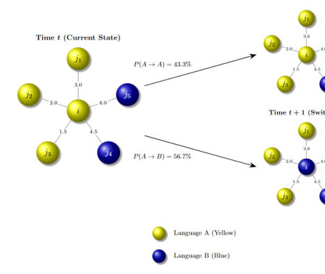 
FIG. 1. Probabilistic Model: Schematic illustration of the probabilistic agent-based language competition model with dynamic edge weighting. Yellow nodes represent agents speaking Language A, while blue nodes represent agents speaking Language B. The central node updates its language state according to the weighted influence of its neighbour- ing agents, where the edge weights wij denote the strength of social interactions. The language-switching probability is computed from the weighted local language densities using Eq. 4. During the evolution, edges connecting neighbour- ing minority-language speakers are reinforced according to Eq. 6, establishing a feedback between network topology and...

📷 Fig 2

 
Fig.1 provides a schematic illustration of the probabilis- tic agent-based framework employed in this study. The central node i interacts with its neighbouring agents through weighted edges, where each edge weight rep- resents the strength of social interaction between two connected individuals. The neighbouring nodes belong to either Language A or Language B, and the weighted contributions from each language are accumulated sepa- rately to determine the local linguistic influence on the central node [8].

📷 Fig 3

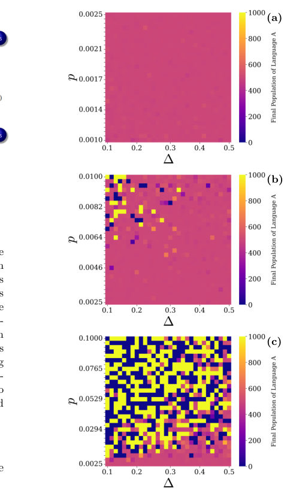 
FIG. 2. Comparative phase-space diagrams for three connec- tivity regimes. Colour encodes the A-language population at T = 250. (a) Sparse (p low); (b) Transition (percolation threshold); (c) Dense (p high).

📷 Fig 4

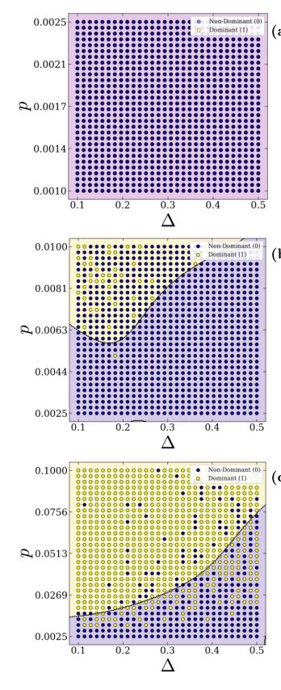 
FIG. 3. SVM decision boundaries (solid curves) separating dominance from coexistence regimes across three connectiv- ity ranges. (a) Regime 1: p ∈[0.001, 0.0025]; (b) Regime 2: p ∈[0.0025, 0.01]; (c) Regime 3: p ∈[0.0025, 0.1]. The upward shift of the boundary with increasing p shows that denser networks demand higher reinforcement ∆to maintain linguistic diversity.

📷 Fig 5

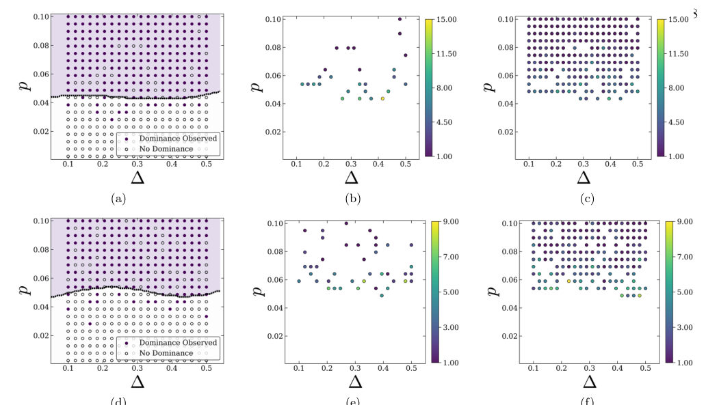 
FIG. 4. Phase boundary and anomalous cluster visualisation for a network of N = 50 at T = 250. The top row (a-c) corresponds to s = 1.0, while the bottom row (d-f) corresponds to s = 0.5. Panels (a,d) show the SVM phase boundary, where open white circles denote non-binary dominant (anomalous) points within the predicted dominance region. Panels (b,e) show the cluster formation in anomalous points, and panels (c,f) show the cluster formation in non-anomalous points. Colors show the size of the clusters.

**Summary.** This paper models language competition on random networks, extending classical models by incorporating dynamic social reinforcement between minority speakers. It maps out the parameter space where minority languages can persist against majority pressure, showing that network structure and local reinforcement are key competing factors. The work also extends the model to include bilingualism, demonstrating its role in stabilizing coexistence regimes.

**Why it may be interesting.** While focused on sociolinguistics, the underlying mathematical framework—modeling phase transitions, critical points, and non-equilibrium dynamics on complex networks—is directly analogous to many physical systems studied in statistical mechanics, such as pattern formation or phase transitions in interacting particle systems.

Detailed structure

**Main problem.** The paper investigates language competition dynamics, modeling how minority language speakers reinforce local social ties to resist assimilation pressure from a majority language.

**Main result.** The interplay between network connectivity ($p$) and adaptive edge reinforcement ($\Delta$) determines the phase boundary between language dominance and coexistence regimes. Furthermore, the inclusion of bilingual speakers enriches dynamics by promoting coexistence.

**Method.** The study uses agent-based simulations on Erdős–Rényi random networks, employing a weighted majority rule for language switching and Support Vector Machines (SVM) for formal phase boundary identification.

**Model / system.** The system is a set of agents on a random network where language switching is governed by weighted local influence. The model extends the Abrams–Strogatz framework with a dynamic edge-weighting mechanism that reinforces ties between co-minority speakers.

**Key observables.** Final majority-language density ($
ho$), average minority cluster size, phase boundary location in $(p, \Delta)$ space, and anomaly density.

**Important parameters / regimes.** Network connectivity probability ($p$), reinforcement strength ($\Delta$), language prestige ($s$), and network size ($N$).

**Assumptions / limitations.** The initial state assumes equal language densities ($
ho_A(0) = 
ho_B(0) = 0.5$), and the analysis notes limitations regarding fixed simulation time steps ($T$).

**Figures summary.** Figures illustrate phase boundaries and anomalous cluster formations across varying network sizes ($N$) and simulation times ($T$), showing how these boundaries shift and sharpen with increased time.

**Paper structure.** The paper builds from the foundational Abrams–Strogatz model by introducing dynamic edge weighting and a probabilistic agent-based framework. It analyzes phase boundaries in $(p, \Delta)$ space, characterizes anomalous persistence zones, and extends the model to include bilingual speakers in a tripartite state space.

Abstract

This paper presents a computational study of language competition dynamics on Erdős--Rényi random networks, extending the foundational Abrams--Strogatz model through two novel contributions: (i) a dynamic edge-weighting mechanism that reinforces social ties between co-minority speakers by an additive increment $Δ$, and (ii) a probabilistic agent-based framework governing language switching via a weighted majority rule. Phase boundaries separating the dominance and coexistence regimes are identified across a two-dimensional parameter space $(p, Δ)$, where $p$ denotes the network connectivity probability. We further characterise anomalous persistence zones within predicted dominance regions, attributing them to the formation of isolated minority speaker clusters. Scaling study across network sizes $N \in \{50, 100, 250, 500, 1000\}$ reveal that average cluster size decreases with $N$ and that phase boundaries diffuse with increasing stochastic noise. Finally, we discuss extensions to a tripartite bilingual model and heterogeneous prestige/volatility to more faithfully capture real sociolinguistic contact scenarios.

[↑ back to top](#top)

### [Strong suppression of the photonic density of states in three-dimensional disordered silicon networks](http://arxiv.org/abs/2609.00432v1)

**Authors:** Abraham Aguilar Uribe, Francisco Hernández Alejandre, Mattis Reisner, Geoffroy Aubry, Luis S. Froufe-Pérez, Marian Florescu, Frank Scheffold  
**Type:** both · **Category:** disordered systems and neural networks · **PDF:** <https://arxiv.org/pdf/2609.00432v1>  
**Analysis basis:** full PDF text, analyzed in chunks
**Topic relevance:** `interference shaping light` **3/5** · `analog quantum simulation` **2/5** · `driven-dissipative phase transition` **2/5** · `methods for driven-dissipative` **2/5** · `quantum optics experiment` **2/5**

📷 Fig 1

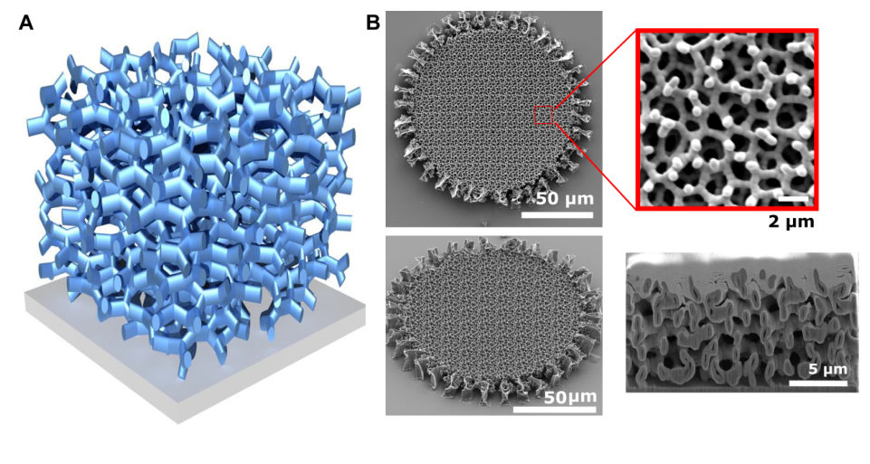 
Figure 1: Fabrication of silicon amorphous gyroid networks. (A) Digital rendering of an amorphous gyroid network designed following the approach described in [16]. The average length of the rods connecting the nodes is ¯d0 = 0.8 µm. The rods are elliptical with an aspect ratio of 2.5 between the long and short axes. (B) SEM images of a structure with thickness L = 11.6µm after silicon infiltration and calcination: top view and inclined view. Enlarged view (scale bar: 2 µm). A focused ion beam cut of the sample reveals the sample interior (side view). Contrast was enhanced using CLAHE (clip limit = 2.0, tile grid size = 8 × 8) [59].

📷 Fig 2

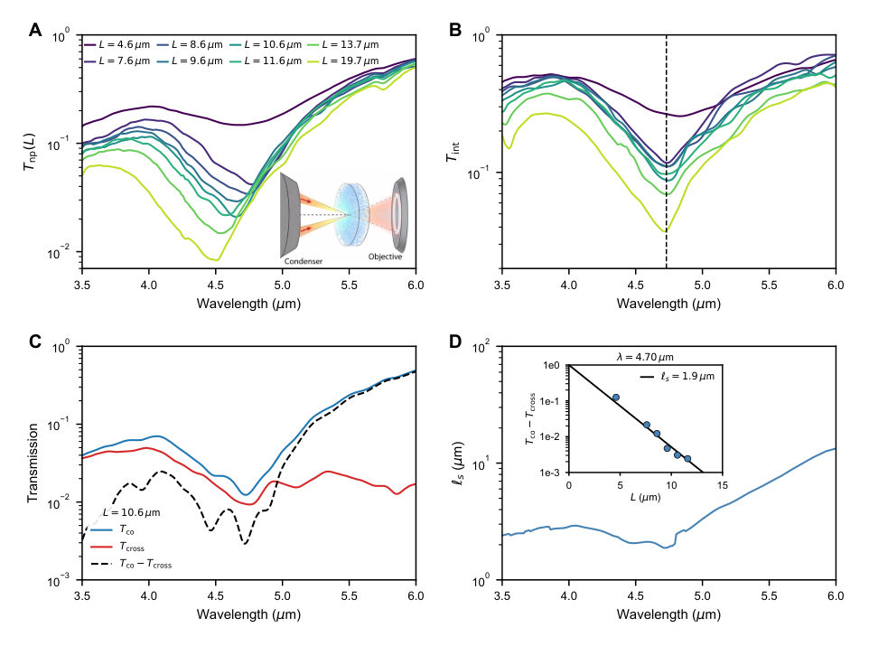 
Figure 2: Transmission properties of amorphous gyroid networks (AGNs). (A) Unpolarized transmission spectra T(λ) for different sample thicknesses L (µm). Inset: mea- surement geometry — a 36X Cassegrain condenser with a numerical aperture NA = 0.52 [25] and a matched objective collecting light transmitted through the sample [22]. (B) Total in- tegrated transmission Tint(λ), reconstructed from the measured polarization components to account for the diffuse flux outside the objective cone. (C) Co- and cross-polarized trans- mission and their difference (the ballistic component Tco −Tcross) for a representative sample (L = 10.6 µm). (D) Ballistic scattering mean free path ℓs(λ) extracted...

📷 Fig 3

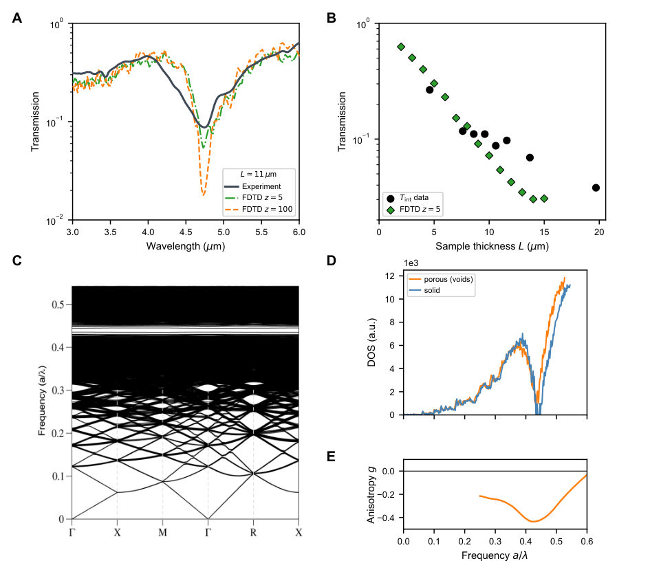 
Figure 3: Experiment, FDTD, and band structure of the AGN photonic gap. (A) Integrated transmission spectra Tint(λ) from the experiment (L = 10.6 µm) and from FDTD simulations with 20% porosity averaged over five realizations, for L = 11.0 µm. Orange dashed line shows the results for monodisperse voids (z = 100) and the green dash-dotted line the results for polydisperse voids (z = 5). (B) Integrated transmission at λgap for dif- ferent sample thicknesses L. Black full circles show Tint reconstructed from the polarization- resolved transmission spectra and compared with the FDTD polydisperse simulations (green diamonds). (C) Band diagram for an AGN composed of solid rods with refractive...

📷 Fig 4

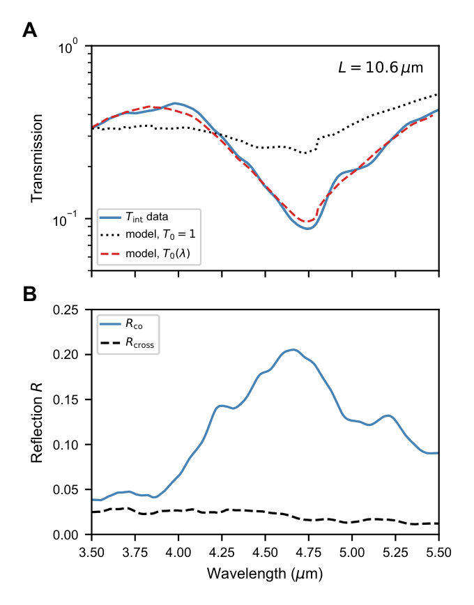 
Figure 4: Transmission and polarized reflection for the L = 10.6 µm sample. (A) Integrated transmission Tint(λ) (solid line), compared with the diffuse-transport model Tint(λ) = e−L/ℓs + T0 b(L) evaluated with a fixed source amplitude T0 = 1 (dotted) and with the fitted, wavelength-dependent amplitude T0(λ) (dashed). (B) Co- (Rco) and cross- polarized (Rcross) reflection of the same sample as measured.

📷 Fig 5

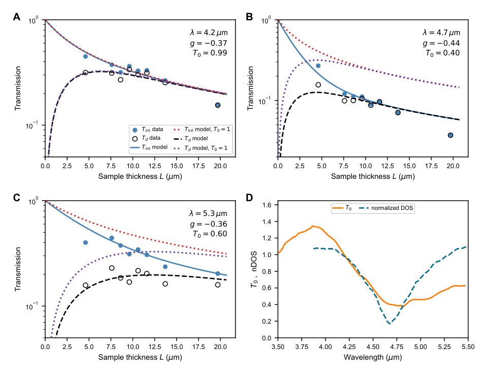 
Figure 5: Integrated and diffuse transmission across the gap. Total integrated trans- mission Tint(L) (filled symbols) and diffuse transmission Td(L) = 2 Tcross(L)/0.22 (open sym- bols) as a function of sample thickness L, at three wavelengths: (A) λ = 4.2 µm, (B) λ = 4.7 µm (band-gap centre), and (C) λ = 5.3 µm. Solid lines show the diffuse-transport model Tint(L) = e−L/ℓs + T0 b(L) and dashed lines the diffuse term alone Td(L) = T0 b(L), with the build-up factor b(L) =  (1 + z0)(1 −e−L/ℓs) −(1 −g) L

**Summary.** This paper reports the experimental observation of a deep photonic pseudogap in amorphous, disordered silicon networks using advanced lithography and polarization-resolved spectroscopy. By separating ballistic and diffuse light components, the authors provide direct evidence for the breakdown of classical diffuse transport, confirming the existence of disorder-induced light localization.

**Why it may be interesting.** The work provides a direct experimental realization and diagnostic method for observing light localization phenomena (analogous to Anderson localization) in disordered media, which is a key topic in condensed matter physics and quantum optics.

Detailed structure

**Main problem.** The study investigates the formation and characterization of photonic band gaps (or pseudogaps) in amorphous, disordered dielectric structures, moving beyond the traditional reliance on long-range periodicity.

**Main result.** The authors experimentally establish the presence of a deep photonic pseudogap in an amorphous 3D dielectric by observing a strong suppression of diffuse transmission, indicating a breakdown of conventional diffuse transport.

**Method.** The research combines advanced fabrication (DLW lithography) with polarization-resolved transmission spectroscopy to separate ballistic and multiply scattered light contributions for diagnosis.

**Model / system.** The physical system is a three-dimensional disordered silicon network, specifically amorphous gyroid networks, fabricated with a controlled volume filling fraction. The analysis compares experimental measurements with large-scale numerical simulations (FDTD) solving Maxwell's equations.

**Key observables.** Transmission spectra ($T_{int}(L)$), diffuse transmission ($T_d(L)$), ballistic transmission ($T_b(L)$), and the scattering mean free path ($\ell_s(\lambda)$).

**Important parameters / regimes.** Gap center wavelength ($\lambda_{	ext{gap}} \approx 4.7 \mu	ext{m}$), volume filling fraction ($\phi \approx 20-25\%$), and the Ioffe–Regel parameter.

**Assumptions / limitations.** The analysis relies on separating ballistic and diffuse light contributions using polarization-resolved spectroscopy, and the simulation/analysis assumes the cross-polarized signal is negligible for estimating $T_b(L)$.

**Figures summary.** Figures show the fabricated structure, optical characterization setups, and spectral plots demonstrating the transmission minimum (pseudogap) and the dependence of transmission components on sample thickness.

**Paper structure.** The paper progresses from establishing the feasibility of photonic bandgaps in amorphous materials to detailing the advanced spectroscopic techniques required to diagnose the gap by analyzing transport breakdown, culminating in quantitative agreement between experiment and simulation.

Abstract

Photonic bandgaps can open not only in crystalline dielectric materials but also in amorphous structures. Self-uniform amorphous gyroid networks have been proposed as promising disordered photonic architectures. Motivated by numerical studies, we combine direct laser-writing lithography with advanced materials processing to fabricate these structures from high-refractive-index silicon. Spectroscopic measurements at mid-infrared wavelengths reveal pronounced transmission minima. To investigate the formation of photonic band gaps in amorphous structures, we develop polarization-resolved transmission spectroscopy that separates ballistic and multiply scattered contributions, enabling direct identification of the underlying transport regimes. We observe a strong suppression of diffuse transmission, providing direct experimental evidence for a breakdown of conventional diffuse transport associated with a strongly reduced photonic density of states. Together with large-scale numerical simulations, our results establish the presence of a deep photonic pseudogap in an amorphous three-dimensional dielectric material and open new opportunities for observing disorder-induced localization phenomena, including Anderson localization of light.

[↑ back to top](#top)

### [Colored-Noise-Induced Horizon Fluctuations Near a Double Root in an Effective Black-Hole Geometry](http://arxiv.org/abs/2609.01063v1)

**Authors:** Kashif Ammar Yasir  
**Type:** theory · **Category:** other · **PDF:** <https://arxiv.org/pdf/2609.01063v1>  
**Analysis basis:** full PDF text, analyzed in chunks
**Topic relevance:** `Keldysh / 2PI / non-Gaussian methods` **3/5** · `methods for driven-dissipative` **3/5** · `correlated / nonlocal dissipation` **1/5** · `driven-dissipative phase transition` **1/5** · `non-equilibrium universality` **1/5** · `quantum measurements` **1/5**

📷 Fig 1

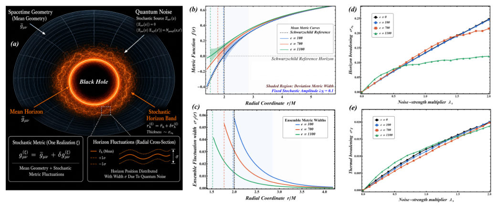 
FIG. 1. Effective open black-hole geometry and stochastic broadening. (a) The metric is the open-system variable and quantum-field fluctuations are represented by an effective colored reservoir. The horizon is reconstructed from every metric realization rather than displaced independently. (b) Mean lapses; shading is an auxiliary localization profile. (c) Independent covariance-propagation check of the radial metric width. (d) Horizon and (e) thermal broadening from the production ensemble. The different ordering reflects sensitivity to the value and slope of the same stochastic lapse.

📷 Fig 2

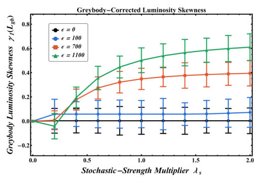 
FIG. 3. Radiative non-Gaussianity. Corrected sam- ple skewness of the greybody-filtered luminosity distribution. The weakly dressed branches remain nearly symmetric, while the near-critical branches develop a positive tail. Error bars are bootstrap uncertainties. At λs = 0 the variance vanishes and skewness is undefined; the plotted origin is a zero-noise convention.

📷 Fig 3

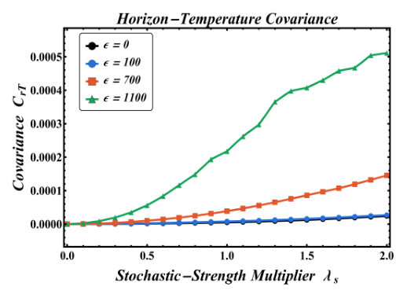 
FIG. 2. Horizon–temperature covariance. Covariance between the reconstructed outer trapping horizon and its adi- abatic temperature. The enhancement for ǫ = 1100 follows from the reduced lapse slope near the root-merger point. Joint probability densities and the normalized correlation are shown in Supplemental Figs. S1 and S2 [22]. At weak stochastic strength, Λ(λs) = λs + O(λ2 s), so the widths begin linearly and CrT begins quadratically. At larger λs, the plotted curvature combines the pre- scribed amplitude map with solving for a moving zero, evaluating a derivative at that zero, and conditioning on a regular future-outer horizon. The robust result is the branch-to-branch enhancement at...

📷 Fig 4

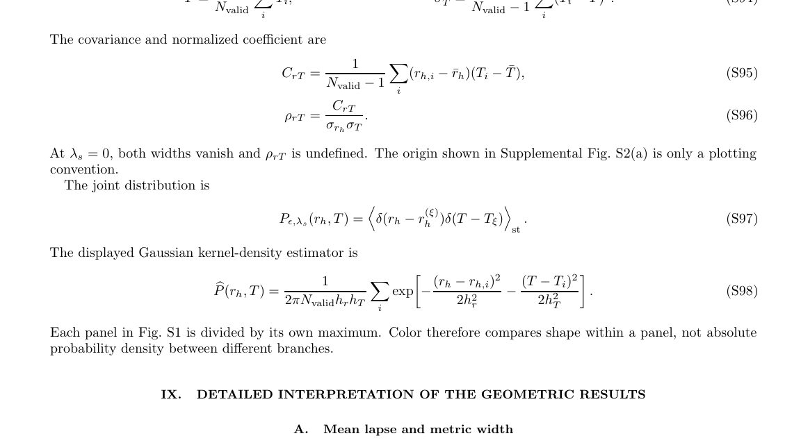 
Figure 1(b) of the Letter compares feff(r) for the four values of ǫ. Because the ADM mass is fixed, all curves approach 1 −2M/r at large radius. Their separation is confined to the region in which the power-law tail in Eq. (S59) is appreciable. Increasing ǫ raises the positive r−3 term in Eq. (S63); the outer root therefore moves inward from the Schwarzschild value rh = 2. On the ǫ = 1100 branch, the outer and inner roots are already close compared with the weakly dressed branches. The shading in Fig. 1(b) is the prescribed profile Eq. (S81); it is not used in subsequent ensemble statistics. Figure 1(c) shows the lapse standard deviation obtained in the separate squared-exponential-kernel check...

**Summary.** This work analyzes how colored noise induces measurable fluctuations in black hole observables near a critical point (double root) in an effective geometry. By tracking single realizations, the authors demonstrate that the geometric susceptibility strongly amplifies correlations between horizon position, temperature, and emitted radiation. This provides a powerful, semiclassical testbed for studying quantum gravity effects without requiring a full quantum treatment.

**Why it may be interesting.** The explicit separation of source covariance from geometric root susceptibility provides a powerful, non-perturbative diagnostic tool for probing quantum gravitational effects in semiclassical black hole evaporation.

Detailed structure

**Main problem.** To determine the joint statistics of observables (like horizon position, temperature, and luminosity) that probe different local features of a random, fluctuating black hole geometry, which cannot be captured by mean-field treatments.

**Main result.** Near a critical double root merger in the effective geometry, colored noise induces strong, measurable correlations between horizon fluctuations, temperature, and radiative output, with the susceptibility acting as the key amplifier.

**Method.** The analysis uses a stochastic-semiclassical model based on a quantum Langevin equation structure, mapping colored metric noise to correlated geometric, thermal, and radiative statistics via single-realization tracking.

**Model / system.** The system is an effective, quasistationary spherical model of an evaporating black hole geometry, analyzed through its lapse function which exhibits a near-double root singularity. The fluctuations are driven by colored noise sources.

**Key observables.** Outer trapping horizon location ($r_h$), adiabatic Hayward–Kodama temperature ($T$), greybody-filtered luminosity ($L_{	ext{gb}}$), and their joint covariance ($C_{rT}$).

**Important parameters / regimes.** The mean dressing parameter ($\epsilon$), the noise strength ($\lambda_s$), and the critical value ($\epsilon_c$) marking the double root merger.

**Assumptions / limitations.** The model is a stochastic-semiclassical testbed, not a microscopic evaluation of Unruh-state response; it uses an effective equal-time spherical projection.

**Figures summary.** Figures illustrate the enhancement of horizon–temperature covariance near the critical point ($\epsilon=1100$) and show that the luminosity distribution develops a positive skewness (positive tail) when noise is finite.

**Paper structure.** The paper develops the framework by formulating the stochastic geometry via a Langevin equation, then analyzes the joint statistics of horizon and temperature fluctuations near the double root, culminating in the calculation of non-Gaussianity in the radiated luminosity.

Abstract

Stress-tensor fluctuations carry information that is absent from the mean   semiclassical Einstein equation, but their observable effect depends as much   on the response of the geometry as on the noise itself. We formulate an   effective, quasistationary spherical model organized by the response--noise   structure of a quantum Langevin equation. A prescribed mean dressing and a   horizon-localized colored source are varied independently. For every source   realization we reconstruct the lapse, locate its outer trapping horizon, and   evaluate the adiabatic Hayward--Kodama temperature from the slope at that same   root. As the mean lapse approaches an inner--outer root merger, its inverse   slope acts as a geometric susceptibility: a fixed source covariance produces   enhanced horizon fluctuations, horizon--temperature covariance, and a   positively skewed, greybody-filtered luminosity. The specific advance is a   single-realization map from colored metric noise to correlated geometric,   thermal, and radiative statistics, together with an explicit separation of   reservoir strength from near-critical amplification. The model is a   stochastic-semiclassical testbed, not a microscopic evaluation of Unruh-state   response and noise kernels.

[↑ back to top](#top)

### [Entanglement from particle number fluctuations in a second-order topological insulator](http://arxiv.org/abs/2609.00239v1)

**Authors:** Mahla Moridi Farimani, Kim Pöyhönen  
**Type:** theory · **Category:** other · **PDF:** <https://arxiv.org/pdf/2609.00239v1>  
**Analysis basis:** full PDF text, analyzed in chunks
**Topic relevance:** `Full counting statistics` **3/5** · `analog quantum simulation` **3/5** · `quantum measurements` **2/5** · `Keldysh / 2PI / non-Gaussian methods` **1/5** · `methods for driven-dissipative` **1/5**

📷 Fig 1

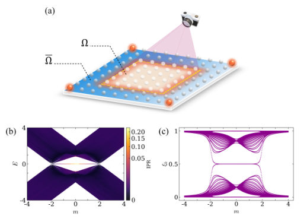 
FIG. 1. (a) Schematic figure; entanglement properties are ob- tained by choosing a subsystem away from the boundaries of the system and performing measurements on the subsystem. This corresponds to making use of the reduced density matrix. (b) Energy spectrum of the model used here as a function of the parameter m for a system size L = 30. At m = ±2 the gap closes signifying a transition to a second-order topological insulator when |m| &lt; 2. The eigenvalues have been colored by the inverse participation ratio IPR = P

📷 Fig 2

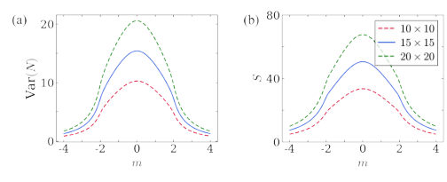 
FIG. 2. (a) Particle number fluctuation of system size L = 30 and three different subsystem sizes (LΩ= 10, 15, 20) as a function of m. (b) The von Neumann entanglement entropy for the same subsystems.

📷 Fig 3

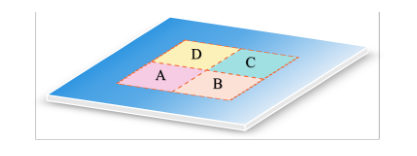 
FIG. 3. Schematic of the partition of the subsystem used for obtaining entanglement quantities with trivial boundary contributions removed. An initial bipartition into Ωand ¯Ωis defined, and Ωis then further split into a quadripartition as shown.

📷 Fig 4

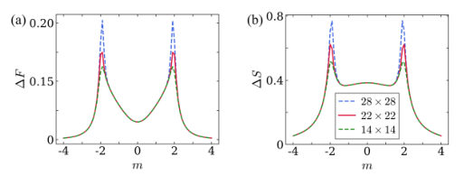 
FIG. 4. (a) Modified fluctuations ∆F = VarNAB +VarNAD − VarNAC + VarNC −VarNABD for the setup in Fig. 3 as a function of m, with system size L = 30 and three different subsystem sizes (LΩ= 14, 22, 28) shown. The fluctuations are generally subsystem size invariant, and clearly take a higher value in the topological phase; at the phase transition, where the gap closes, size dependent peaks can be observed. (b) Modified entanglement entropy ∆S = SAB + SAD −SAC + SC −SABD for the same setup. Quantitative differences can be observed, but the qualitative features are similar.

📷 Fig 5

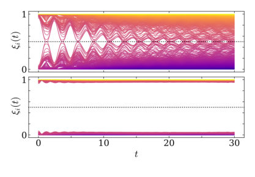 
FIG. 5. The time evolution of the spectrum of the correlation matrix for system size L = 30 and subsystem size L/2. Top: A quench of trivial to topological parameter regime: mi = 2.5 and mf = 0.5. Bottom: A quench of trivial to trivial parameter regime: mi = 2.5 and mf = 4.

**Summary.** This paper develops a novel theoretical method to detect topological phase transitions in higher-order topological insulators using particle number fluctuations. By employing a sophisticated quadripartite subtraction scheme, the authors successfully filter out trivial boundary noise that obscures the signal in standard entanglement measures. This establishes a scalable, experimentally relevant pathway for characterizing topological materials.

**Why it may be interesting.** This work provides a concrete, measurable diagnostic tool ($\Delta F$) for detecting topological order in condensed matter systems, which is highly relevant for experimental condensed matter theorists.

Detailed structure

**Main problem.** To find experimentally accessible quantities, like particle number fluctuations, that can reveal the topological phase transitions in higher-order topological insulators (HOTIs).

**Main result.** Standard entanglement entropy and particle number fluctuations fail to show sharp topological signals due to boundary contributions, but a quadripartite construction successfully isolates these signals, revealing clear transition peaks.

**Method.** The authors employ advanced subtraction schemes (quadripartite construction) applied to both entanglement entropy and particle number variance to filter out trivial boundary effects.

**Model / system.** The study focuses on a two-dimensional second-order topological insulator, modeled by a specific Hamiltonian involving hopping and mass terms in orbital and spin space.

**Key observables.** Bipartite entanglement entropy ($S_{vN}$), particle number fluctuation variance ($	ext{Var}N$), and their topologically corrected versions ($\Delta S, \Delta F$).

**Important parameters / regimes.** The mass parameter $m$ controls the topological phase transition, and the analysis considers both static and time-evolution (quench) regimes.

**Assumptions / limitations.** The primary assumption is that the topological contribution can be isolated by subtracting the contributions from smaller, non-topological subsystems (quadripartite construction).

**Figures summary.** Figures illustrate the failure of raw entanglement/fluctuation measures to show transitions, contrasted with figures showing sharp peaks in the corrected quantities ($\Delta S, \Delta F$) at the critical points.

**Paper structure.** The paper first establishes the physical system and the failure of standard measures. It then introduces the quadripartite subtraction scheme to derive corrected observables, demonstrating the clear topological signatures in both static and dynamic measurements.

Abstract

Higher-order topological insulators are materials with a bulk energy gap featuring gapless modes at $(d-n)$-dimensional edges, where $n > 1$. Despite this modified bulk-boundary correspondence, their nontrivial topology can nevertheless be observed through the bipartite entanglement spectrum. Inspired by works suggesting fluctuations in conserved quantities could be used to study topology in one-dimensional systems, which likewise feature zero-dimensional edge modes, we extend this treatment to a two-dimensional second-order topological insulator where corner states play an analogous role. We show that the standard bipartite entanglement entropy and particle number fluctuation lack striking signals of topological phase transitions, both in the static case and in the time evolution after a quench, obscured by an area-law term from the subsystem edges. By introducing a quadripartite construction of the subsystem, we show that it is possible to isolate the topological contributions, producing sharp transition peaks in both quantities, observable by studying subsystems much smaller than the full system. As particle number fluctuations are accessible in existing experiments, these results establish a concrete and scalable path to experimental detection of the entanglement in higher-order topological insulators.

[↑ back to top](#top)

### [Chemotaxis-induced linear instabilities and pattern formation in a reaction-diffusion model](http://arxiv.org/abs/2609.01159v1)

**Authors:** Mintu Karmakar, Abhik Basu  
**Type:** theory · **Category:** statistical mechanics · **PDF:** <https://arxiv.org/pdf/2609.01159v1>  
**Analysis basis:** full PDF text, analyzed in chunks
**Topic relevance:** `non-equilibrium universality` **3/5** · `driven-dissipative phase transition` **2/5** · `Frenkel-Kontorova` **1/5** · `Keldysh / 2PI / non-Gaussian methods` **1/5** · `analog quantum simulation` **1/5** · `methods for driven-dissipative` **1/5**

📷 Fig 1

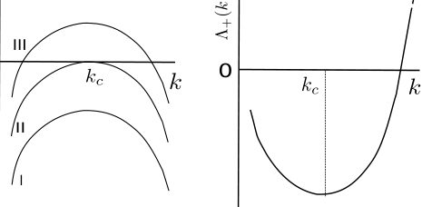 
FIG. 1. Variation of Λ+(𝑘) as a function of 𝑘. (i) Reciprocal chemo- taxis: −∞&lt; 𝜉1𝜉2 &lt; 𝐷1𝐷2(𝑎𝑐+ 𝑏2 𝑐)/𝑏2 𝑐for which a pattern with a preferred wavevector 𝑘𝑐is possible. Curves I, II &amp; III corre- spond to no linear instability (uniform phase), threshold of instability with 𝑘= 𝑘𝑐becoming marginal, and a band of unstable wavevec- tors with the mode having 𝑘= 𝑘𝑐having the highest growth rate (pattern) in the linear stability analysis. (ii) Reciprocal chemotaxis: 𝜉1𝜉2 &gt; 𝐷1𝐷2(𝑎𝑐+ 𝑏2 𝑐)/𝑏2 𝑐for which there is instability for suffi- ciently large 𝑘for any region of the parameter space and 𝑘→∞ having the highest growth rate, signaling a chemotaxis induced in- stability. For nonreciprocal chemotaxis,...

📷 Fig 2

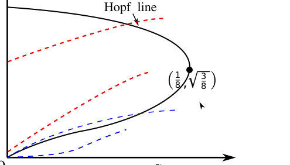 
FIG. 2. Schematic phase boundaries in the 𝑎−𝑏plane. The black continuous line is the Hopf boundary given by (13). The blue and red broken lines are the lower and upper branches of the pattern boundaries for various 𝐷, 𝜉1, 𝜉2. The blue broken lines can be above or below the Hopf boundary; the red broken lines can meet the 𝑏-axis close to or away from the origin (see text).

📷 Fig 3

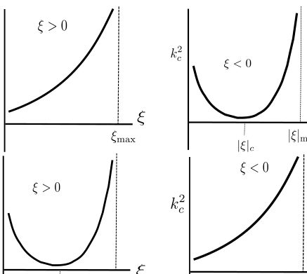 
FIG. 3. Schematic variation of 𝑘2 𝑐with 𝜉in the fully reciprocal chemotaxis case : (top, left) (assuming 𝑏2 &gt; 𝑎) 𝜉&gt; 0 with 𝑘2 𝑐 rising monotonically with 𝜉, diverging as 𝜉→𝜉max = 𝐷1𝐷2(𝑎+ 𝑏2)/𝑏2, (top, right) (assuming 𝑏2 &gt; 𝑎) 𝜉&lt; 0 with 𝑘2 𝑐depending nonmonotonically on 𝜉, having a minimum at 𝜉= 𝜉reci and eventually

📷 Fig 4

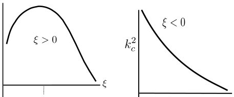 
FIG. 4. Schematic variation of 𝑘2 𝑐with 𝜉in the extreme nonreciprocal chemotaxis case: (i) 𝜉&gt; 0 with 𝑘2 𝑐depending nonmonotonically on 𝜉and having a maximum at 𝜉= 𝜉nonreci, eventually approaching zero for very large 𝜉, (ii) 𝜉&lt; 0 with 𝑘2 𝑐decreasing monotonically with 𝜉, eventually vanishing for large |𝜉|.

📷 Fig 5

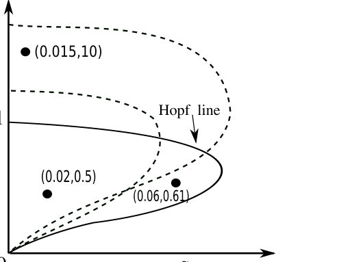 
FIG. 5. Phase diagram in the (𝑎, 𝑏) plane for various 𝐷1 and 𝐷. Different points at which the DNS studies were done are marked.

**Summary.** This paper analyzes pattern formation in a reaction-diffusion system modeling glycolysis that includes chemotaxis. Using linear stability analysis and DNS, the authors demonstrate that chemotaxis profoundly controls the resulting spatial patterns, leading to complex, nonmonotonic transitions between different stable states like spots and stripes. The work highlights chemotaxis as a powerful control parameter for pattern selection in non-equilibrium systems.

**Why it may be interesting.** While focused on chemical kinetics, the mathematical framework of pattern selection, instability analysis, and non-equilibrium dynamics (like those seen in active matter) shares deep theoretical parallels with phase transitions and pattern formation studied in AMO physics and non-equilibrium statistical mechanics.

Detailed structure

**Main problem.** The study investigates linear instabilities and pattern formation in a reaction-diffusion model that incorporates chemotactic interactions between two species.

**Main result.** The model exhibits complex pattern selection, showing that chemotaxis acts as a nonmonotonic control parameter capable of inducing re-entrant transitions between homogeneous and patterned states, and controlling the morphology between spots and stripes.

**Method.** The research employs linear stability analysis to determine bifurcation points and selected wavevectors, which are then complemented by extensive two-dimensional Direct Numerical Simulations (DNS) of the nonlinear partial differential equations.

**Model / system.** The system is a spatially extended Selkov model for glycolysis, modeled by two coupled reaction-diffusion PDEs describing the concentrations of two species ($\phi$ and $\psi$). These equations include standard diffusion terms and nonlinear chemotactic coupling terms.

**Key observables.** Bifurcation types (Hopf, Turing), selected wavevector ($k_c$), pattern morphologies (spots and stripes), and the dependence of these on chemotaxis strength.

**Important parameters / regimes.** Chemotaxis coefficients ($\xi_1, \xi_2$), diffusion coefficients ($D_1, D_2$), and the wavevector $k$.

**Assumptions / limitations.** The analysis assumes periodic boundary conditions and examines the infinite system size limit for linear stability analysis.

**Figures summary.** Figures demonstrate pattern formation (uniform to periodic to stripe-like) as a function of diffusion coefficients and show the variation of pattern amplitudes ($\Delta\phi, \Delta\psi$) across different chemotactic regimes.

**Paper structure.** The paper systematically moves from linear stability analysis to identify bifurcations, followed by DNS validation of the predicted instabilities and the investigation of nonlinear pattern transitions (spot-stripe) using amplitude equations.

Abstract

We study linear instabilities and pattern formation in a spatially extended Selkov model for glycolysis with diffusion and chemotactic interactions between two species. Linear stability analysis reveals two distinct bifurcations: a zero-wavevector, finite-frequency Hopf bifurcation leading to spatially homogeneous oscillations, and a finite-wavevector Turing instability with a saddle-node bifurcation leading to stationary inhomogeneous patterns. The selected wavevector, $k_c$, depends sensitively on the nature and strength of chemotaxis and varies nonmonotonically with the chemotaxis parameters, allowing re-entrant transitions between homogeneous and patterned states. For sufficiently strong chemotaxis, when the two species mutually attract or mutually repel each other, an unusual instability emerges in which the preferred wavevector diverges as a finite threshold in chemotactic strength is approached. We complement the linear analysis with extensive direct numerical simulations (DNS) of the nonlinear partial differential equations in two dimensions. The DNS confirm the predicted instabilities and their nonmonotonic and re-entrant character, and also reveal spatially uniform oscillatory states for suitable parameters. The stationary patterns include spots and, unexpectedly, stable stripes. We further uncover transitions between spot and stripe morphologies controlled by chemotactic strength and diffusivity ratios. The stability of the striped states is consistent with linear amplitude equations, whereas the spot-stripe transition is attributed to nonlinear effects beyond linear stability. Our results demonstrate that chemotaxis can act as a nonmonotonic control parameter for instability selection, wavelength selection, re-entrant pattern formation, and nonlinear pattern morphology in reaction-diffusion systems.

[↑ back to top](#top)

### [GW and Bethe-Salpeter Theory for Molecular Polaritons, Quasiparticles, and Excitons](http://arxiv.org/abs/2609.00594v1)

**Authors:** Soohaeng Yoo Willow, Gi Beom Sim, Tae Hyeon Park, Tae In Kim, D. ChangMo Yang, Mikuláš Matoušek, Jiří Brabec, Libor Veis, Chang Woo Myung  
**Type:** theory · **Category:** other · **PDF:** <https://arxiv.org/pdf/2609.00594v1>  
**Analysis basis:** full PDF text, analyzed in chunks
**Topic relevance:** `Tavis-Cummings & cavity-many-emitter` **3/5** · `Keldysh / 2PI / non-Gaussian methods` **2/5** · `methods for driven-dissipative` **2/5** · `analog quantum simulation` **1/5** · `interference shaping light` **1/5**

📷 Fig 1

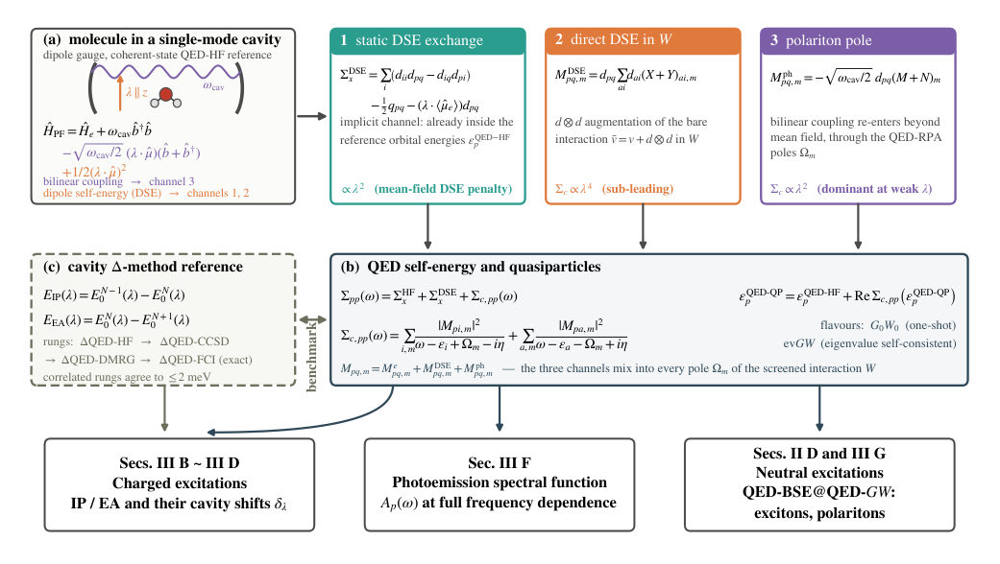 
FIG. 1. Organization of the QED contributions to the electron self-energy. (a) A molecule in a single-mode cavity [Eq. (1)] on a coherent-state QED-HF reference, with the coupling vector λ polarized along the molecular symmetry axis z. Its two light–matter terms reach the self-energy through three channels. Channel 1, the static dipole-self-energy (DSE) exchange, is implicit in the reference orbital energies εQED-HF p . Channels 2 and 3 are explicit in the transition densities [Eq.(17)]: the direct d ⊗d augmentation M DSE and the polariton pole M ph. (b) The channels mix into every QED-RPA pole Ωm and assemble the self-energy Σc, solved in one-shot (G0W0) and eigenvalue-self-consistent...

📷 Fig 2

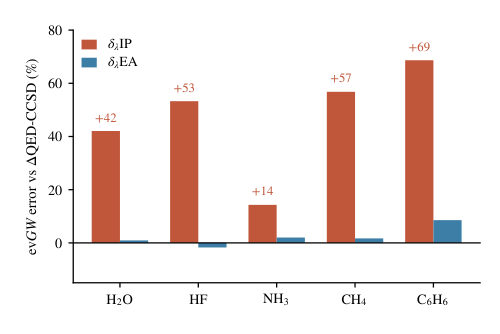 
FIG. 2. Relative error of the evGW cavity-induced shifts against ∆QED-CCSD, δλXevGW /δλX∆QED-CCSD −1, for the cc-pVDZ entries of Table III (λ = 0.05); positive means the cavity-induced shift is too large in magnitude. The two ob- servables behave oppositely. The ionization shift is overesti- mated for every system, by +14% (NH3) to +69% (benzene), whereas the attachment shift is reproduced to within 2% for the hydrides and 9% for benzene, and is the one channel where the error changes sign (HF). Taking ∆QED-DMRG as the ref- erence instead moves the hydride bars at most one percentage point.

📷 Fig 3

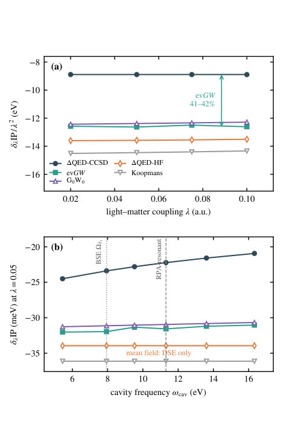 
FIG. 3. Coupling-strength and detuning dependence of the cavity-induced IP shift of H2O/cc-pVDZ. (a) δλIP/λ2 ver- sus λ at ωcav = 11.31 eV: a λ2 law appears as a horizon- tal line and a method’s fractional error as a constant offset, and the evGW overestimate stays at 41–42% over a factor of five in λ. (b) δλIP versus ωcav at λ = 0.05: the Koopmans and ∆QED-HF shifts are exactly ωcav-independent, and the correlated shift varies monotonically with no feature at the RPA-resonant tuning (dashed) or the BSE optical gap (dot- ted). The shift is DSE-driven, not resonance-driven.

📷 Fig 4

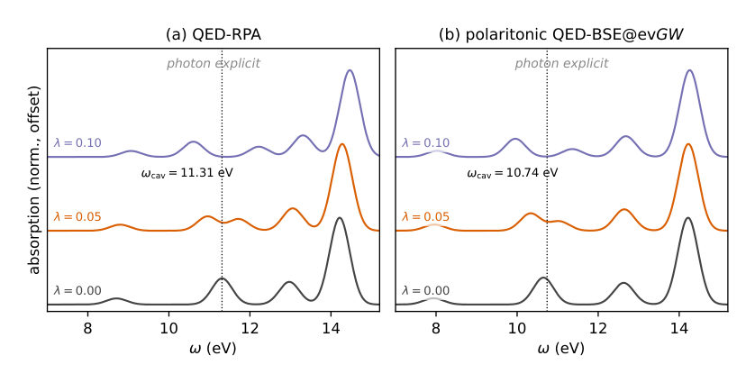 
FIG. 4. Cavity-modified absorption of H2O/cc-pVDZ at λ = 0, 0.05, and 0.10 (normalized to the tallest peak, offset vertically; Gaussian broadening 0.25 eV). (a) QED-RPA, tuned to the lowest dipole-allowed RPA root (ωcav = 11.31 eV). (b) polaritonic QED-BSE@evGW [Eq. (25)], tuned to the bright BSE singlet at ωcav = 10.74 eV (dotted lines). In both panels the photon is explicit, so the cavity-resonant band Rabi-splits, by 0.77 →1.62 eV in (a) and 0.71 →1.41 eV in (b). The QED-RPA poles Ωm of panel (a) are those entering W [Eq. (13)].

📷 Fig 5

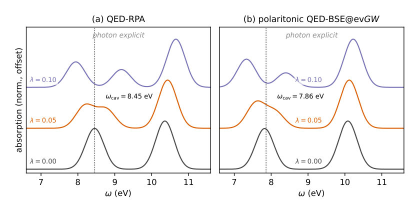 
FIG. 5. As Fig. 4, for NH3/cc-pVDZ and zoomed to the cavity-resonant band. In C3v the z-polarized cavity couples only to the z-polarized A1 transitions, so it is tuned to the lowest dipole-allowed A1 root (RPA ωcav = 8.45 eV; BSE analogue 7.86 eV, dotted lines). This A1 band Rabi-splits in both explicit-photon panels; the neighbouring ∼10 eV degenerate E (x, y) feature, dark to the z-cavity, is unshifted and serves as a reference.

**Summary.** This paper develops a theoretical framework to calculate quasiparticle and exciton properties of molecules coupled to an optical cavity using QED-GW and BSE methods. It rigorously analyzes how the cavity modifies electronic excitations by incorporating the cavity field into the self-energy calculation. The results provide quantitative benchmarks for cavity-induced energy shifts, advancing the understanding of molecular polaritons.

**Why it may be interesting.** This work is highly relevant as it directly tackles the theoretical description of light-matter interaction in molecular systems, which is a core topic in cavity QED and molecular physics.

Detailed structure

**Main problem.** The paper addresses how the inclusion of an optical cavity modifies the electron self-energy within quasiparticle theory for molecular systems.

**Main result.** The calculations show that cavity-induced shifts in electron affinities are reproduced nearly quantitatively, and the error in the GW approach is linked to missing correlated electron-photon contributions.

**Method.** The study employs advanced quantum electrodynamics (QED) techniques, specifically using the GW approximation and the Bethe-Salpeter Equation (BSE) within a coherent-state framework.

**Model / system.** The system modeled is a molecule placed inside a single-mode optical cavity, described using the dipole-gauge Pauli-Fierz Hamiltonian. Calculations are benchmarked against correlated wave-function methods.

**Key observables.** Ionization potentials (IPs), electron affinities (EAs), and the spectral function, which exhibits a polariton-replica photoemission sideband.

**Important parameters / regimes.** The cavity coupling strength ($\lambda$) and the detuning ($\Delta$) are key parameters, with errors found to be predominantly quadratic in $\lambda$.

**Assumptions / limitations.** The analysis assumes the use of the dipole gauge and the dipole approximation. Furthermore, exciton-binding energies involving unbound anions are noted to be basis-dependent diagnostics.

**Figures summary.** Not specified in the provided notes.

**Paper structure.** The paper systematically introduces the problem by detailing the three channels through which the cavity enters the self-energy, benchmarks the QED-GW results against a ladder of correlated wave-function methods, and analyzes the resulting spectral features and energy shifts.

Abstract

The electron self-energy is central to quasiparticle theory, yet how an optical cavity enters it remains unclear. We address this question for a molecule in a single-mode cavity using the dipole-gauge Pauli-Fierz Hamiltonian and a coherent-state QED Hartree-Fock reference. The cavity enters through three channels: the static dipole self-energy (DSE) shift of reference orbital energies, direct DSE augmentation of the screened interaction, and the polariton pole carrying the bilinear electron-photon coupling. We benchmark QED-$GW$ ionization potentials (IPs) and electron affinities (EAs) against a cavity $Δ$-method ladder from QED-HF to correlated wave-function methods, whose cavity-induced shifts agree within 1 meV where directly comparable. For closed-shell molecules with unbound anions, $GW$ systematically overestimates cavity-induced IP redshifts, whereas EA shifts are reproduced nearly quantitatively, although this does not imply comparable accuracy for absolute EAs. For ionic molecules with bound anions, this ordering reverses, consistent with published QED coupled-cluster results. Coupling and detuning scans show that the error is predominantly quadratic in $λ$ and DSE-driven rather than resonant. The spectral function develops a polariton-replica photoemission sideband with weight scaling as $λ^2$. In the static screened interaction used in the Bethe-Salpeter equation, bare-photon exchange cancels the matching DSE contribution to the direct interaction, while exchange and polariton-screening corrections remain. Their net effect on the lowest excitation is appreciable only for ammonia in the molecules studied. Exciton-binding energies involving unbound anions are strongly basis-dependent and should therefore be viewed as diagnostics of electron-hole interactions rather than basis-converged molecular quantities.

[↑ back to top](#top)

### [Synchronization Pathways and Resilience in Power Grids](http://arxiv.org/abs/2609.00910v1)

**Authors:** Cook Hyun Kim, Jihye Kim, Sangjoon Park, B. Kahng  
**Type:** theory · **Category:** statistical mechanics · **PDF:** <https://arxiv.org/pdf/2609.00910v1>  
**Analysis basis:** full PDF text, analyzed in chunks
**Topic relevance:** `non-equilibrium universality` **3/5** · `driven-dissipative phase transition` **2/5** · `Keldysh / 2PI / non-Gaussian methods` **1/5** · `analog quantum simulation` **1/5** · `correlated / nonlocal dissipation` **1/5** · `methods for driven-dissipative` **1/5**

📷 Fig 1

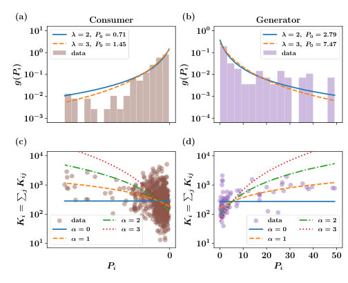 
FIG. 1. Power distribution and total coupling strength of the French transmission grid. Node data from the French subgraph of the PanTaGruEl model [22], with con- sumer buses (a,c) and generator buses (b,d) treated separately. (a,b) Power distribution g(P) (bars), with (|Pi| + P0)−λ for λ = 2 (solid) and λ = 3 (dashed); P0 is fitted for each curve and given in the legend. Each class spans more than a factor of 10 in |Pi|. (c,d) Total coupling strength Ki = P

📷 Fig 2

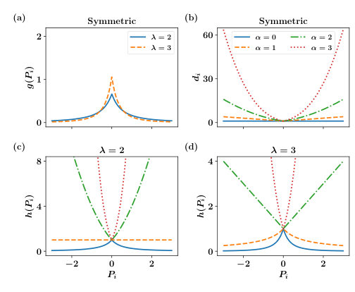 
FIG. 2. Rotor population, coupling-weight profile, and nucleation strength versus power P. (a) Power distribu- tion g(P) for λ = 2, 3, peaked at P = 0. For illustration, P0 = 0 is used. (b) Coupling-weight profile d(P) for α = 0, 1, 2, 3, in- creasing toward both tails. (c,d) Nucleation strength h(P) for λ = 2 (c) and λ = 3 (d). For α &lt; λ/2, h(P) peaks at P = 0 (population-driven); for α &gt; λ/2, h(P) increases toward the tails (coupling-driven). At αc = λ/2, the two contributions balance. For λ = 3, α = 1 and α = 2 lie at equal distance from αc = 1.5, on opposite sides.

📷 Fig 3

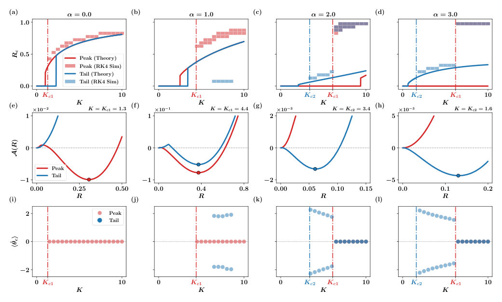 
FIG. 3. Population-driven and coupling-driven synchronization (symmetric distribution, m = 10). (a–d) Rc versus K. Solid curves: population-driven (red) and coupling-driven (blue) pathways predicted by the ad hoc potential A(Rc) accumulated along each propagation path. Squares: the most populated Rc bins over 64 realizations at each K for each propagation path. Dash-dotted vertical lines: predicted onsets Kc1 (red) and Kc2 (blue). (e–h) A(Rc) along the population-driven (red) and coupling-driven (blue) pathways at specific K (indicated above each panel). Circles mark the potential minima R∗ c. The potential gap in (g) reduces zero as α →1.5. (i–l) Modal positions of the mean cluster angular...

📷 Fig 4

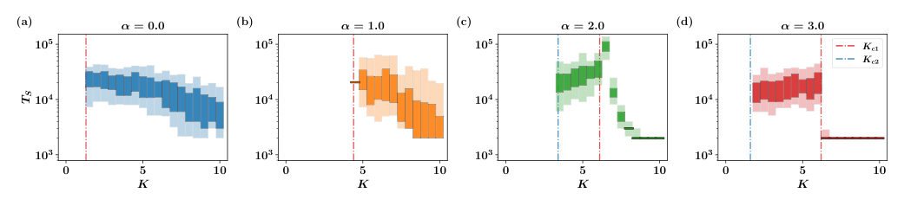 
FIG. 4. The distribution of the transient time distinguishes accretion from merger (symmetric distribution, m = 10). (a–d) TS over 64 realizations versus K, for α = 0, 1, 2, 3. At each K, the light box spans Q5–Q95 and the dark box spans Q25–Q75; where the two quartiles coincide, a horizontal bar marks the median (Sec. S1 of the Supplemental Material [23]). The vertical axis is logarithmic and identical in all panels, from the fine-window resolution 103 to 1.2 × 105 time units. A quantile below 103 is unresolved and is not drawn, and a box extending above 1.2 × 105 is clipped at the top. Panels (a–c) cover K ≤10 and panel (d) covers K ≤20. Dash-dotted verticals: measured onsets Kc1 (red)...

📷 Fig 5

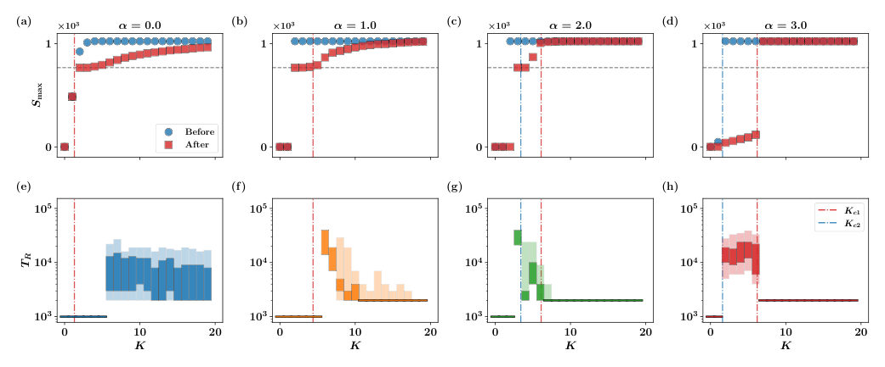 
FIG. 5. Robustness and resilience of the synchronized state (symmetric distribution, m = 10). (a–d) Largest cluster size Smax before (blue) and after (red) the perturbation, versus K; medians over 64 realizations, with the protocol given in Sec. S1 7 of the SM. Population-driven regime (α = 0, 1): a macroscopic cluster survives at every K above onset and recovers gradually by accretion. Coupling-driven regime (α = 2, 3): no macroscopic cluster survives at low K, whereas the unperturbed value is restored in full at high K by merger. (e–h) Recovery time TR over the same realizations, with the same box construction as in Fig. 4. The quantiles include all 64 realizations; a quantile beyond the...

**Summary.** This work analyzes power grid synchronization using a modified Kuramoto model, establishing that the synchronization pathway depends critically on the underlying power and coupling distribution statistics. By developing a pathway-based framework using an ad hoc potential, the authors distinguish between two regimes: population-driven growth from the center and coupling-driven growth from the periphery. This provides a general tool for understanding system resilience beyond simple static stability criteria.

**Why it may be interesting.** While applied to power grids, the mathematical framework—using effective potentials and analyzing phase transitions/cluster dynamics—is highly relevant to non-equilibrium statistical mechanics, particularly in systems exhibiting collective synchronization or pattern formation.

Detailed structure

**Main problem.** The paper investigates the microscopic mechanisms governing the nucleation and propagation of synchronized clusters in power grids, and how these mechanisms dictate grid stability and recovery after disturbances.

**Main result.** Two distinct synchronization pathways—population-driven (center to tails) and coupling-driven (tails to center)—are revealed, depending on the relative exponents of the power and coupling distributions. The framework emphasizes pathway dynamics over static criteria for understanding grid resilience.

**Method.** The analysis employs a minimal model based on the second-order Kuramoto model, utilizing the ad hoc potential method to map out the effective potential landscape governing cluster growth and selection.

**Model / system.** The system models power grids using the swing equation, formulated as a second-order Kuramoto model incorporating correlations between power output and coupling strength. The dynamics are analyzed using empirical data profiles for power distribution and coupling weights.

**Key observables.** Weighted cluster order parameter ($R_c$), transient time ($T_S$), robustness ($S_{max}$), and recovery time ($T_R$).

**Important parameters / regimes.** The exponents $\lambda$ and $\alpha$ determine the regime: population-driven if $\alpha < \lambda/2$, and coupling-driven if $\alpha > \lambda/2$. Inertia is a key parameter controlling cluster persistence.

**Assumptions / limitations.** The analysis relies on the ad hoc potential method, which is noted to neglect inter-cluster interactions, and the model assumes specific functional forms for power and coupling weights derived from empirical data.

**Figures summary.** Figures illustrate the dependence of the nucleation strength $h(P)$ on $\alpha$ (determining center vs. tail maxima), and compare predicted vs. simulated synchronization pathways ($R_c$ vs $K$) for different regimes, confirming the existence of distinct propagation mechanisms.

**Paper structure.** The paper progresses by defining the physical model and identifying the core problem, developing the ad hoc potential framework, deriving the two distinct pathway regimes based on parameter exponents ($\alpha$ vs $\lambda/2$), and finally validating these pathways by analyzing recovery dynamics and applying the framework to real-world power grid data.

Abstract

Ensuring a sustainable energy supply requires maintaining power-grid stability. Rotor dynamics are governed by the swing equation, which takes the form of a second-order Kuramoto model with a correlation between power and total coupling strength. Yet the microscopic mechanisms that nucleate and propagate synchronized clusters remain poorly understood. Using a minimal model motivated by empirical grid data and the \Adhoc potential method, we reveal two distinct seed cluster types and propagation pathways: a population-driven seed cluster at the center of the power distribution propagating to its tails by rotor accretion, and, for a symmetric distribution, coupling-driven seed clusters at its tails propagating inward to the center by cluster merger. These differences generate distinct order-parameter patterns, while inertia controls whether the seed clusters persist with distinct angular velocities. The same propagation pathways also govern recovery following external disturbances. We further confirm that the same selection--persistence rule holds in data-derived annealed representations of European power grids. Therefore, our results can inform strategies for sustaining stable power-grid operation. More generally, our pathway-based framework reframes synchronization by emphasizing the dynamics of cluster formation and recovery rather than relying solely on static criteria.

[↑ back to top](#top)

### [Efficiently classifying shocks in complex systems requires dormant reporters](http://arxiv.org/abs/2609.00725v1)

**Authors:** David A. Brewster, Philippe Cluzel  
**Type:** theory · **Category:** disordered systems and neural networks · **PDF:** <https://arxiv.org/pdf/2609.00725v1>  
**Analysis basis:** full PDF text, analyzed in chunks
**Topic relevance:** `quantum measurements` **3/5** · `methods for driven-dissipative` **2/5** · `analog quantum simulation` **1/5** · `driven-dissipative phase transition` **1/5** · `non-equilibrium universality` **1/5**

📷 Fig 1

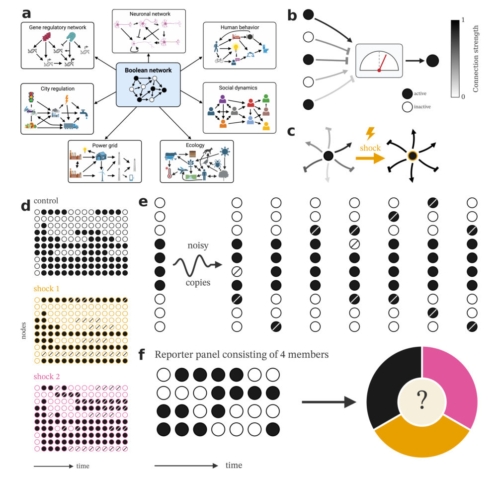 
Figure 1: Shock classification from partially observed dynamics in a Boolean threshold network. a, Several examples of domains where complex systems can be modeled as a Boolean network. Created in BioRender https://BioRender.com/46jpe5e. b, Our Boolean networks use threshold updating. Input nodes can either be active or inactive. Connections can be enabling (positive weight, pointed arrowhead) or repressing (negative weight, flat arrowhead), each with varying strengths. The active input nodes are weighed by their connections and summed. If the sum is positive (negative), the output of the threshold gate becomes active (inactive, respectively). At each time step, each node in the network...

📷 Fig 2

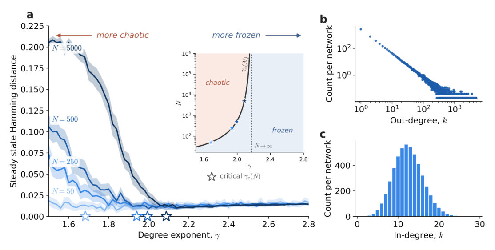 
Figure 2: Phase transitions between order and chaos. a, Steady state Hamming distance between trajectories started from imperfect copies of the same initial condition at noise ε = 0.02, as a function of the degree exponent γ for 4 different network sizes. Each network contributes every pair of its 10 replicates. Curves show the mean over 100 networks per point with 95% confidence bands. White stars on the horizontal axis mark the critical exponent γc(N) predicted by the annealed calculation in the SI, where criticality occurs when the mean connectivity crosses Kc ≈4π/3. In the inset panel, the phase diagram is in the (γ, N) plane. The boundary curve γc(N) separates the chaotic and frozen...

📷 Fig 3

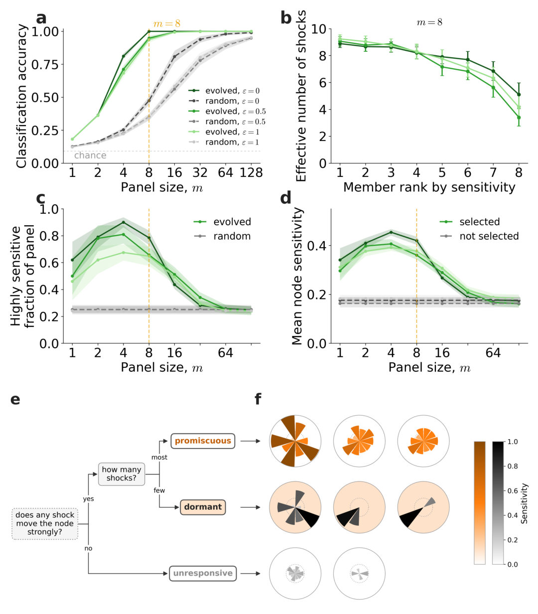 
Figure 3: The elbow of the accuracy curve sits at 8 reporters, and evolved panels mix 3 classes of them. a, Classification accuracy versus panel size m for panels selected by the genetic algorithm and for random panels, at noise ε = 0, 0.5, and 1. The elbow of the evolved curve sits at m = 8 at every noise level, and a random panel needs more than 10 times as many reporters to match an evolved panel of 8. b, The effective number of shocks each member responds to, by member rank, across all 50 networks. It falls from about 9 for the most sensitive member to between 3 and 5 for the least, with darker shades lower noise as in a. c, The highly sensitive fraction of the panel versus m, against...

📷 Fig 4

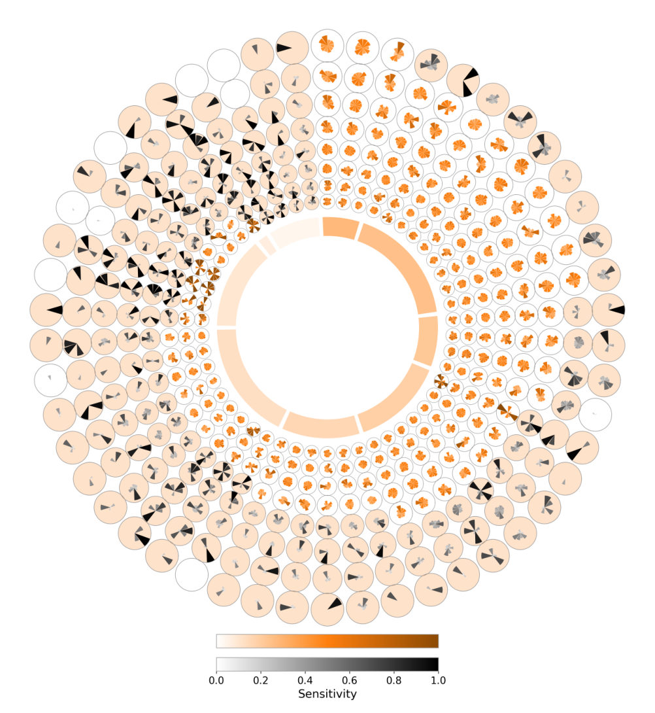 
Figure 4: Nearly every evolved panel mixes promiscuous reporters with dormant reporters. Each of the 50 rays is one network’s evolved panel of 8 reporters at high noise (ε = 1). Each small disk shows one member’s sensitivity to the 10 shocks, as in Figure 3f. Each wedge is one shock, and wedge length and color depth both give the sensitivity of that member to that shock, on the shared scale below. The classes are those defined in Figure 3e from a node’s response across shocks. Promiscuous members respond to nearly every shock and are drawn with orange wedges on white. Dormant members concentrate their response in only a few shocks and are drawn with black wedges on a translucent orange...

📷 Fig 5

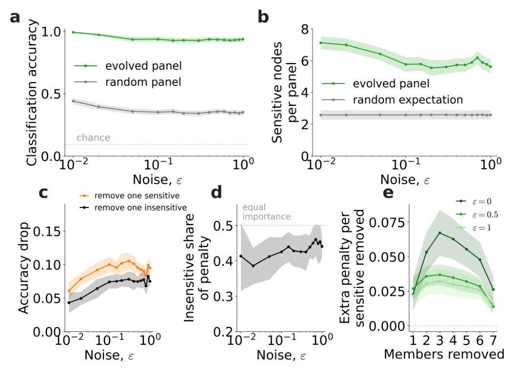 
Figure 5: Evolved panels nearly always mix sensitive and insensitive reporters, and the balance of their importance shifts with noise. a, Classification accuracy of evolved and random panels of 8 reporters as a function of the initial condition noise ε. b, Number of sensitive nodes per evolved panel against the random expectation. c, Accuracy drop after removing one sensitive or one insensitive member from an evolved panel. Both penalties climb as noise grows, and losing a sensitive member costs more at every level. d, The low sensitivity share of the total removal penalty slightly rises with noise, suggesting that the curves from c are getting slightly closer to each other. e, The extra...

**Summary.** This paper addresses the critical problem of efficiently monitoring complex dynamical systems to diagnose external perturbations ('shocks'). It finds that the best monitoring strategy requires combining two distinct types of sensors: those sensitive to many events and those stable across trials. This provides a low-cost, practical design principle for monitoring large, noisy systems.

**Why it may be interesting.** While not quantum, the study deals with complex, non-linear dynamics and information extraction from noisy, high-dimensional state spaces, which shares conceptual parallels with characterizing quantum states or diagnosing open quantum systems.

Detailed structure

**Main problem.** Determining the optimal, sparse set of components (reporters) to monitor in a large complex system to accurately classify the type of external perturbation ('shock') that occurred, especially when initial conditions are noisy.

**Main result.** The optimal monitoring panel must mix two types of reporters: promiscuous reporters (responsive to many shocks) and dormant reporters (responsive strongly to few shocks), achieving high accuracy with very few sensors.

**Method.** The authors developed an efficient algorithm to select the optimal panel composition by analyzing the information content and stability of reporter responses under noise.

**Model / system.** The system is modeled as a Boolean threshold network with heterogeneous connectivity, subjected to external 'shocks' (perturbations) and measurement noise ($\epsilon$).

**Key observables.** Classification accuracy of the shock type, reporter states $r(t)$, and the sensitivity of individual nodes to different shocks.

**Important parameters / regimes.** Noise parameter $\epsilon \in [0, 1]$, the number of reporters ($m$), and the connectivity structure (power law out-degree).

**Assumptions / limitations.** The system dynamics can be captured by a Boolean threshold network, and the optimal monitoring strategy involves a specific mixture of reporter types.

**Figures summary.** Figures illustrate the dynamics, the shock effect, the noise model, and the final inference task using reporter states, comparing performance of different panel selection strategies.

**Paper structure.** The paper establishes the problem of shock classification in complex systems, models the dynamics using Boolean networks, analyzes the failure of simple heuristics under noise, and finally proposes and validates the optimal mixed-reporter panel selection principle.

Abstract

Many natural and engineered systems are large complex networks of interacting components, and external perturbations drive them along different dynamical paths. Identifying which perturbation occurred matters for diagnosis, control, and prediction. Yet often times only a few components can be jointly monitored. Which components should be monitored? Experimental practice usually favors placing reporters at the most sensitive sites, where perturbations produce the largest effects. Using a simple dynamical model for complex systems with heterogeneous connectivity, we ask how sparse reporter panels should be chosen to classify shocks from partial trajectories when repeated trials only approximately reproduce an ideal initial condition. Once that reproduction is imperfect, sensitivity ranked panels fall far short of optimal, and the shortfall grows with the noise. We find that the best panels mix two kinds of reporters. A promiscuous reporter responds to most shocks, so it separates them mainly by degree, and degree fluctuates from trial to trial. A dormant reporter responds to only a few shocks but strongly, and its answers do not scatter as much between trials. As noise grows, the cost of losing a dormant reporter rises to meet the cost of losing a promiscuous one. Panels of either kind alone classify worse than the mixture, and no property of the members collected individually explains the ordering. Most of all, we find that only a minuscule number of reporters are needed on a panel to accurately identify which shock hit the system. We implement an efficient algorithm to assemble such a panel. Together these results provide a low cost practical design principle for monitoring large complex dynamical systems.

[↑ back to top](#top)

### [Robust CZ gate against flux line memory](http://arxiv.org/abs/2609.00939v1)

**Authors:** Yao Song, Xiu-Hao Deng  
**Type:** theory · **Category:** quantum information and computing · **PDF:** <https://arxiv.org/pdf/2609.00939v1>  
**Analysis basis:** full PDF text, analyzed in chunks
**Topic relevance:** `QC/QI experiment` **3/5** · `Keldysh / 2PI / non-Gaussian methods` **2/5** · `methods for driven-dissipative` **2/5** · `quantum measurements` **1/5**

📷 Fig 1

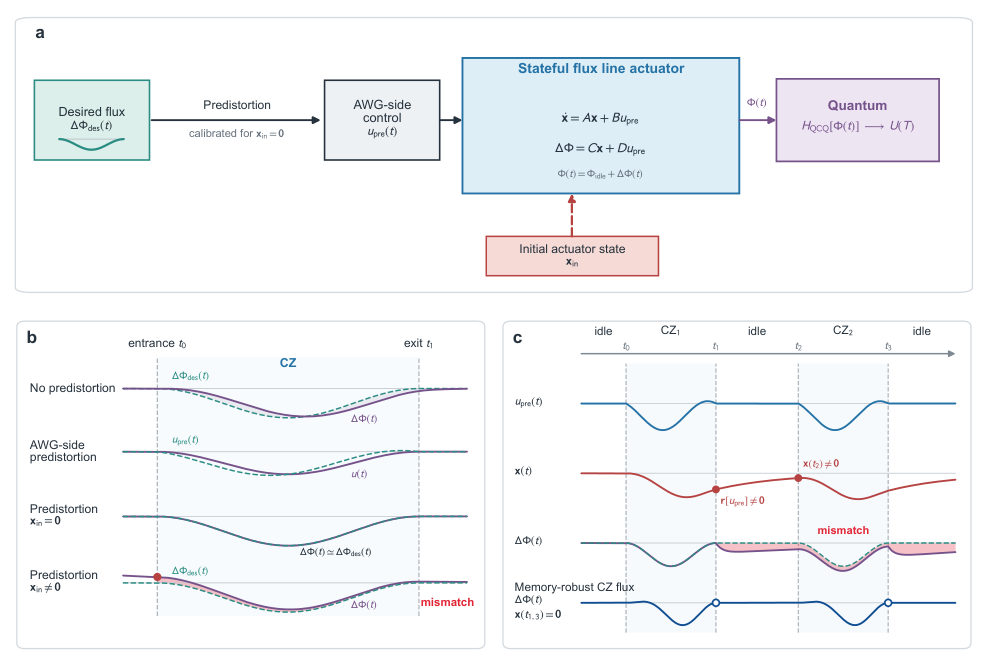 
Fig. 1. Stateful actuator–quantum dynamics of flux line distortion. (a) Predistortion calibrated at the zero initial state, xin = 0, maps the desired dynamic flux ∆Φdes(t) to the AWG-side input upre(t). The input and initial actuator state jointly determine the delivered dynamic flux ∆Φ(t) and hence the total flux Φ(t) that drives the quantum system. (b) Without predistortion, the flux line distorts the desired waveform. Gate-local predistortion reproduces the desired flux for xin = 0, but a nonzero initial state adds the free response of the flux line and produces a flux mismatch. (c) In a CZ sequence, the actuator residual left at one gate exit evolves through the idle interval and...

📷 Fig 2

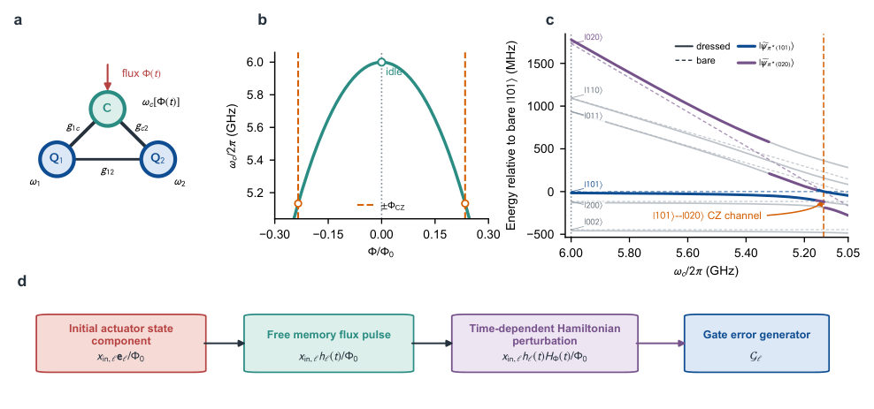 
Fig. 2. The flux dependence of the tunable coupler determines the CZ interaction and the first-order sensitivity of the gate to the initial actuator state. (a) Two fixed-frequency qubits coupled through a tunable coupler. The delivered flux Φ(t) tunes the coupler frequency ωc[Φ(t)]. (b) Flux dependence of ωc/2π for the asymmetric SQUID over the accessible interval |Φ| ≤0.30Φ0. The gray dotted line marks the idle point, and the orange dashed lines mark ±ΦCZ. (c) Spectrum in the two-excitation manifold as ωc/2π is tuned from its 6.0 GHz idle value toward the CZ interaction. Energies are referenced to the bare |101⟩level; solid and dashed curves denote dressed and bare energies, respectively....

📷 Fig 3

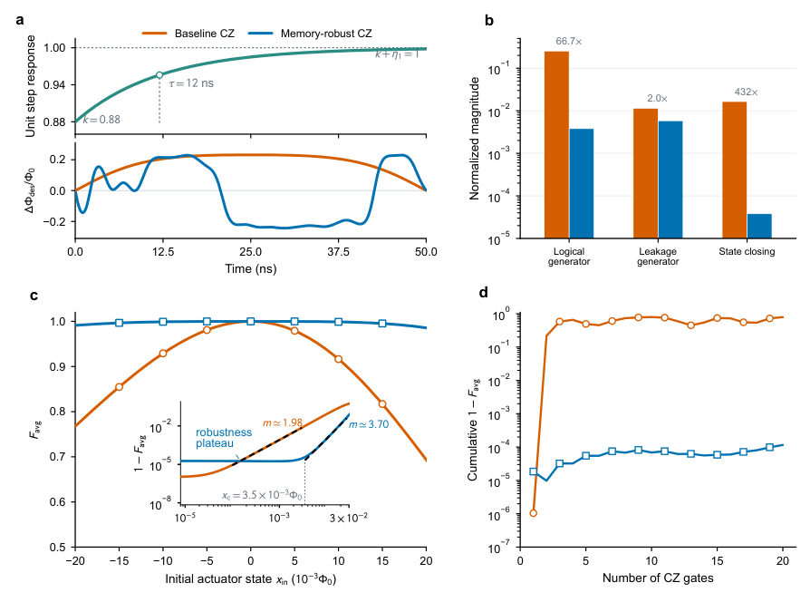 
Fig. 3. One-pole validation of memory robustness and state closing. (a) Unit step response of the one-pole flux line model (upper) and desired flux pulses optimized for the baseline and memory-robust CZ gates (lower). (b) Normalized magnitudes of the logical and leakage error generators and the state closing residual. Labels above the bars give the reduction factors relative to the baseline. (c) Average fidelity versus the initial actuator state. The inset shows 1 −Favg for xin &gt; 0 on logarithmic axes. xc marks the end of the first-order robustness plateau, and the dashed lines are power law fits to 1 −Favg ∝xm in. (d) Cumulative infidelity for 20 consecutive CZ gates with no waiting...

📷 Fig 4

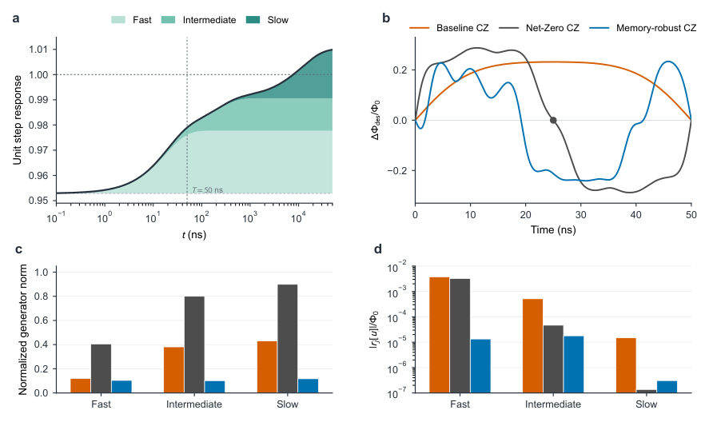 
Fig. 4. Memory-robust CZ pulse in a three-pole flux line model. (a) Unit step response of the fitted model (black) and the fast, intermediate, and slow modal contributions (shaded). The horizontal dashed lines mark the direct feedthrough k and unity; the vertical dashed line marks the gate duration T = 50 ns. (b) Desired flux pulses for the baseline, Net-Zero, and memory-robust CZ gates. The marker at t = T/2 identifies the zero crossing imposed by Net-Zero antisymmetry. (c) Combined logical and leakage generator norms for each actuator mode, evaluated for an initial actuator state displacement xin,ℓ= 10−3Φ0. (d) Magnitudes of the gate exit actuator state components for xin = 0, normalized...

📷 Fig 5

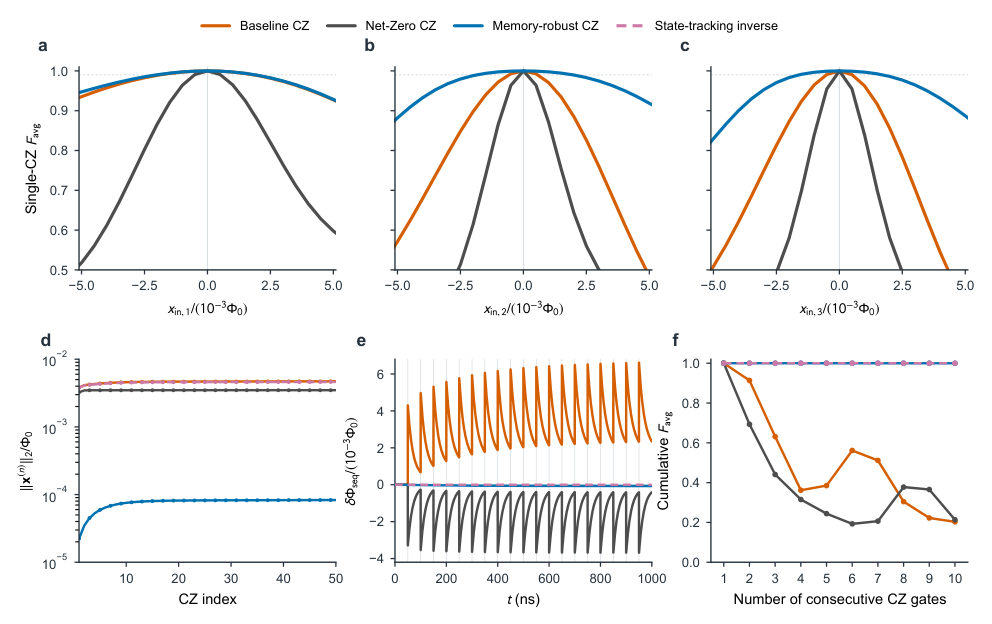 
Fig. 5. Validation under finite perturbations of the initial actuator state and repeated CZ gates. (a)–(c) Average gate fidelity of a single CZ gate when each component of xin is varied separately, with the other components set to zero. (d) Actuator state norm after each of 50 consecutive gates starting from xin = 0. (e) Sequence flux mismatch δΦseq(t) = ∆Φ(t) −∆Φdes,seq(t) over 20 gates; vertical lines mark the gate boundaries. The three fixed pulses reuse their respective predistorted inputs, whereas the state-tracking inverse reproduces the baseline target sequence using the exact evolving actuator state. (f) Cumulative average gate fidelity after each of the first ten gates.

**Summary.** This paper tackles the critical issue of flux line memory degrading gate fidelity in superconducting quantum computers. The authors develop a robust control scheme by modeling the flux line as a stateful actuator and optimizing the control pulse to suppress memory-induced errors. They demonstrate that combining memory robustness and state-closing conditions yields near-perfect fidelity over long gate sequences.

**Why it may be interesting.** This work provides a concrete, mathematically rigorous framework for mitigating systematic errors (memory effects) in superconducting quantum hardware, directly addressing a major bottleneck in scaling quantum processors.

Detailed structure

**Main problem.** The primary challenge is designing high-fidelity Controlled-Z (CZ) gates for superconducting quantum processors that remain robust against flux line memory effects accumulated from previous gate operations.

**Main result.** By explicitly optimizing the flux pulse to suppress first-order error generators and minimize residual flux, the authors achieved a sequence fidelity of 99.97% over ten gates, significantly outperforming baseline protocols.

**Method.** The authors used a first-order Dyson expansion to derive error generators based on the initial state of the flux line actuator. They then optimized the flux pulse to satisfy two conditions: memory robustness at the gate entrance and zero residual state at the gate exit.

**Model / system.** The system involves a superconducting quantum processor (QCQ) coupled to a flux line modeled as a classical, stateful dynamical actuator with memory. The Hamiltonian depends on the applied flux, which is determined by the actuator's state.

**Key observables.** Average fidelity ($F_{avg}$), first-order error generators ($G_\ell$), and the residual flux line state at the gate exit.

**Important parameters / regimes.** The number of poles in the flux line model (one-pole vs. three-pole), and the sequence length (ten gates).

**Assumptions / limitations.** The analysis assumes a one-way coupling (neglecting backaction) and relies on a finite-dimensional linear model for the actuator dynamics.

**Figures summary.** Figures illustrate the comparison of optimized pulses (memory-robust vs. state-closing vs. combined) showing superior fidelity retention over multiple gates, and diagrams detail the coupling between the quantum system and the stateful actuator.

**Paper structure.** The paper first establishes the physical model involving the QCQ and the stateful flux actuator. It then develops the error analysis using Dyson expansion to derive necessary conditions for robustness (memory robustness and state closing). Finally, it presents the optimization results using a three-pole model to demonstrate the superior performance of the combined robust pulse.

Abstract

High-fidelity CZ gates are central to superconducting quantum processors, but implementations based on flux tuning are still sensitive to pulse distortion. Conventional predistortion, typically used for an isolated gate, can recover the desired flux at the chip but it fails if the flux line memory exists, causing the fidelity of repeated CZ gates to drop rapidly. To address this issue, we model the flux line distortion as the dynamics of a stateful classical actuator coupled to a quantum system. Using a first-order Dyson expansion, we derive the error generators induced by variations in the initial flux-line state. We then design a robust CZ gate by optimizing the flux pulse to suppress these generators and minimize the residual flux line state at the gate exit. A one-pole flux line model shows the expected first-order robustness plateau. For a more practical three-pole model, the optimized CZ pulse achieves $F_{\mathrm{avg}}=99.998\%$, suppresses all first-order error generators, and brings the residual flux line state close to zero. With no additional waiting time between gates, our robust pulse achieves $F_{\mathrm{avg}}=99.97\%$ for the complete ten-gate sequence and reduces the sequence infidelity by a factor of about $2.3\times10^{3}$ relative to the baseline under the same predistortion protocol. These results show that explicitly accounting for flux line memory maintains high-fidelity CZ operation across repeated gate sequences and addresses a key limitation of conventional predistortion.

[↑ back to top](#top)

### [Bayesian Tracking of a Diffusing Target in Two and Three Dimensions](http://arxiv.org/abs/2609.00144v1)

**Authors:** Ewan McCulloch, Adam Nahum  
**Type:** theory · **Category:** disordered systems and neural networks · **PDF:** <https://arxiv.org/pdf/2609.00144v1>  
**Analysis basis:** full PDF text, analyzed in chunks
**Topic relevance:** `quantum measurements` **3/5** · `Frenkel-Kontorova` **1/5** · `Keldysh / 2PI / non-Gaussian methods` **1/5** · `driven-dissipative phase transition` **1/5** · `non-equilibrium universality` **1/5**

📷 Fig 1

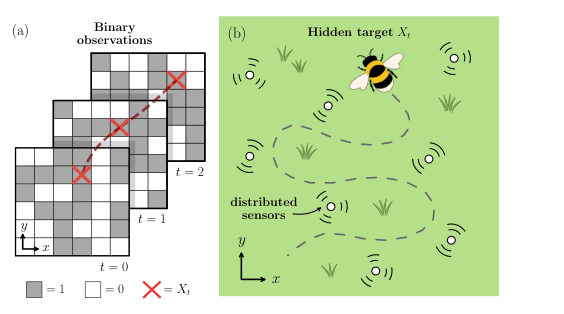 
FIG. 1. Tracking a hidden target. An extended sensor array monitors a diffusing target. At each time, monitoring returns a binary field, with different statistics at the target site than in the background. The observer does not see the trajectory directly, but updates a posterior distribution over candidate positions using Bayes’ rule and a dynamical model.

📷 Fig 2

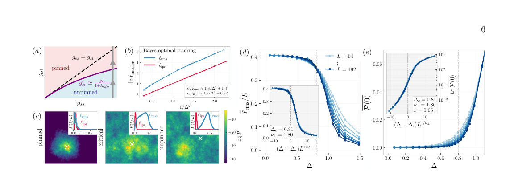 
FIG. 2. Tracking d = 2 dimensions. (a) Schematic phase diagram: the depinning boundary approaches the Bayes optimal line gst = gss tangentially at weak coupling. The gray line represents the scan used in panels (d,e). (b) The RMS length ℓrms and inverse-participation length ℓipr ≡(P

📷 Fig 3

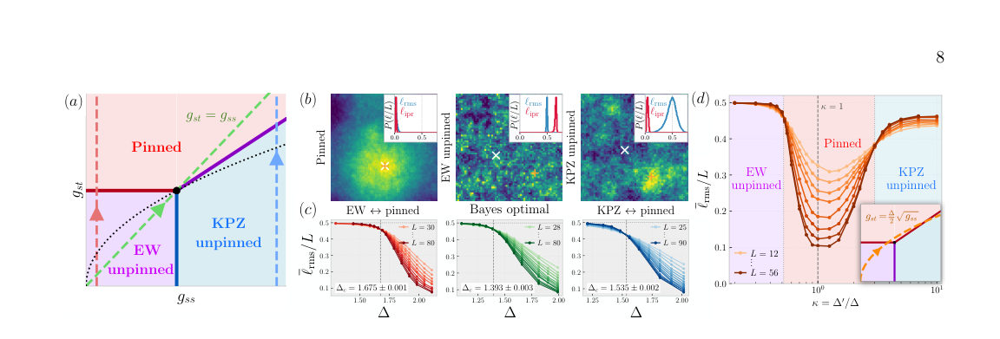 
FIG. 3. Tracking in d = 3 dimensions. (a) Schematic phase diagram in the (gss, gst) plane. The pinned phase meets two unpinned phases, EW-smooth and KPZ-rough, at the multicritical point (g∗, g∗) on the Bayes-optimal line gss = gst. The red, green, and blue dashed lines indicate the three diagnostic scans shown in panel (c), while the dotted black curve is the misspecifi- cation path through the multicritical point. (b) Representative posterior snapshots in the pinned (p0, p1, p′ 1 = 0.5, 0.9, 0.9), EW- unpinned (p0, p1, p′ 1 = 0.1, 0.289, 0.214), and KPZ-unpinned (p0, p1, p′ 1 = 0.5, 0.725, 0.95) phases. All snapshots use D = 0.033 and p′ 0 = p0. The white × marks the true target position...

📷 Fig 4

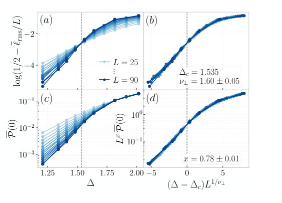 
FIG. 4. KPZ–pinned transition in d = 3. Finite- size scaling for the KPZ–pinned diagnostic scan of Fig. 3(c). (a) the quantity log(1/2 −ℓrms/L), whose curves exhibit a clear common crossing at ∆c ≃1.535. (b) collapse of the same observable as a function of (∆−∆c)L1/ν⊥, giv- ing ν⊥= 1.60(5). (c) the contact fraction P(0). (d) contact-fraction collapse using the same ∆c and ν⊥, with P(0) = L−xF[(∆−∆c)L1/ν⊥], giving x = 0.78(1). The scan varies the true measurement contrast ∆at fixed assumed model, with the same parameters and numerical protocol as the KPZ–pinned scan in Fig. 3(c); further details are given in Appendix C.

📷 Fig 5

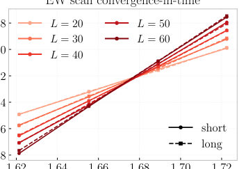 
FIG. 5. Convergence in simulation time for the EW–to–pinned scan. Solid lines show the data obtained with (short) initial equilibration time tburn ≈13γ−1 L , while dashed lines show data obtained with the (long) initial equilibration time tburn ≈40γ−1 L . Here γL ≃4π2D/L2 is the spectral gap for a free random walk in three dimensions for system width L.

**Summary.** This paper analyzes the phase transitions governing the successful tracking of a diffusing target using noisy sensor data. By mapping the problem to directed polymer models, the authors determine that tracking success depends critically on dimensionality and the accuracy of the underlying inference model. The work provides detailed phase diagrams and critical exponents for both optimal and suboptimal tracking regimes.

**Why it may be interesting.** The connection between Bayesian inference, phase transitions (depinning), and directed polymers provides a powerful, non-standard application of critical phenomena theory relevant to complex systems modeling.

Detailed structure

**Main problem.** The paper investigates the phase structure of Bayesian tracking of a diffusing target monitored by a noisy sensor array, determining when inference succeeds or fails.

**Main result.** The analysis reveals distinct phase transitions in $d=2$ and $d=3$, showing that failure can manifest as diffuse delocalization or sharp, incorrect localization depending on model misspecification.

**Method.** The study employs theoretical analysis, weak-coupling Renormalization Group (RG) arguments, and numerical simulations, mapping the problem to directed polymer pinning models.

**Model / system.** The system models a target diffusing on a $d$-dimensional lattice, with observations $\eta_t(\mathbf{x})$ from a noisy sensor array. The inference process is analyzed via the log-posterior, which is mapped to a KPZ-like equation.

**Key observables.** Contact fraction $P(\mathbf{X})$, Root-mean-square distance ($\ell_{	ext{rms}}$), and Inverse participation length ($\ell_{	ext{ipr}}$) are used to diagnose tracking success.

**Important parameters / regimes.** Dimensionality ($d=2, 3$), the degree of Bayes-optimality, and parameters controlling model misspecification (e.g., noise rates).

**Assumptions / limitations.** The analysis relies on mapping the problem to DPRE models and utilizes RG techniques, though some transitions exhibit critical behavior beyond conventional $\epsilon$ expansion.

**Figures summary.** Figures illustrate the phase diagram structure in $d=2$ and $d=3$, and show finite-size scaling collapses for $\ell_{	ext{rms}}/L$ and $P(0)$ across different diagnostic scans.

**Paper structure.** The paper develops the theoretical framework by mapping the problem to DPRE, analyzes the phase structure in $d=2$ and $d=3$ using RG, and validates results through numerical simulations and finite-size scaling analysis.

Abstract

We study Bayesian tracking of a diffusing target monitored by a noisy distributed sensor array. Building on an earlier mapping to KPZ growth with a moving defect (or an equivalent directed polymer pinning problem) we determine the phase structure, beyond the previously-studied one-dimensional case, for both Bayes-optimal and suboptimal inference. In $d=2$, theoretical analysis and numerical simulations both give a depinning transition between a successful tracking phase and a failure phase. Weak-coupling RG shows that Bayes-optimal tracking is always successful in $d=2$, but failure can arise from overconfident (suboptimal) inference. In $d=3$, tracking can succeed, or can fail in two distinct ways: the posterior probability distribution may delocalize (no detection), or may become sharply localized, but at the wrong position (a false detection). The two possibilities correspond to Edwards-Wilkinson or Kardar-Parisi-Zhang statistics for the log-posterior. The three phases meet at a Nishimori-like multicritical point on a Bayes-optimal line in a two-parameter phase diagram. (Model misspecification alone can drive depinning into either unpinned phase: underconfidence gives diffuse failure, while overconfidence gives localized-but-wrong failure.) We analyze the transitions between the various phases numerically and with renormalization group arguments. We show that some of these have unusual critical behavior, which the conventional $ε$ expansion fails to describe. Recent rigorous results for directed polymers indicate an alternative scenario. Many of our results, including a scaling relation for exponents at pinning transitions and results for RG flows, are relevant to other phase transitions that involve surface growth or directed polymers in 2+1D or 3+1D.

[↑ back to top](#top)

### [A nonabelian anyon violates Haag duality](http://arxiv.org/abs/2609.01267v1)

**Authors:** Daniel Wallick, Henrik Wilming  
**Type:** theory · **Category:** strongly correlated electrons · **PDF:** <https://arxiv.org/pdf/2609.01267v1>  
**Analysis basis:** full PDF text, analyzed in chunks
**Topic relevance:** `analog quantum simulation` **3/5** · `quantum measurements` **2/5** · `Keldysh / 2PI / non-Gaussian methods` **1/5**

📷 Fig 1

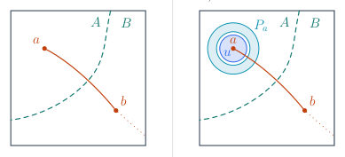 
Figure 1. a) The state vector |Φ⟩is prepared from the ground state |Ψ⟩in a nonabelian superselection sector by splitting the nonabelian anyon b into b and a and then transporting a into region A. The red dotted path indicates a path to infinity, where the ¯b partner of b is located. b) The resulting state cannot be transformed into |Ψ⟩by local unitaries in A: For every such unitary u there is a loop around its support on which the topological charge a can be detected. The projection Pa for this measurement outcome commutes with u, but annihilates |Ψ⟩.

📷 Fig 2

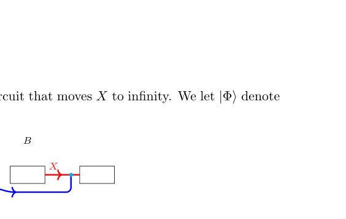 
Figure 2. An a anyon being locally split from an X −¯X anyon pair in the Levin–Wen model. Afterwards, the X anyon is moved to infinity, with an ¯X left behind in B.

**Summary.** This theoretical paper demonstrates that the presence of nonabelian anyons in gapped quantum systems violates fundamental principles like Haag duality and the uniqueness of purifications. By analyzing the Levin-Wen model, the authors disprove the conjecture that all gapped ground states must satisfy approximate Haag duality. This suggests that topological order can host phases where fundamental locality assumptions break down.

**Why it may be interesting.** This work connects abstract algebraic concepts (Haag duality) directly to the physical properties of topological phases realized in condensed matter systems, providing deep insights into the structure of ground states.

Detailed structure

**Main problem.** The paper investigates whether the presence of nonabelian anyons violates fundamental principles of quantum field theory, specifically Haag duality and the uniqueness of purifications.

**Main result.** The authors show that a nonabelian anyon violates Haag duality and also violates approximate Haag duality, disproving a conjecture about gapped ground states.

**Method.** The analysis uses operator algebraic techniques, constructing specific states involving nonabelian anyons and comparing their reduced density matrices across different partitions of the system.

**Model / system.** The results are instantiated in the Levin-Wen models, which are built from unitary fusion categories and describe gapped topological phases of matter.

**Key observables.** Reduced density matrices, topological charge measurement projectors, and the failure of quantum steering.

**Important parameters / regimes.** The system must host nonabelian anyons and be partitioned into regions containing infinitely many degrees of freedom.

**Assumptions / limitations.** The physical argument relies on the existence of a single nonabelian anyon; the rigorous proof assumes the vacuum satisfies Haag duality.

**Figures summary.** Figure 1 illustrates the process of constructing a state by splitting an anyon and moving a component into a separate region. Figure 2 illustrates the local splitting of an excitation in the Levin-Wen model.

**Paper structure.** The paper develops the argument by first presenting a physical argument showing the violation of uniqueness of purifications, followed by a rigorous proof using sector theory, and concluding with the demonstration of approximate Haag duality failure in the Levin-Wen model.

Abstract

We show that a superselction sector describing a single nonabelian anyon violates Haag duality, which is equivalent to the fundamental quantum-information theoretic principle of uniqueness of purifications. We provide a simple physics argument as well as a rigorous proof using sector theory, and instantiate our result concretely in Levin-Wen models. We also show that the associated ground state does not allow for quantum steering despite being a pure state. Finally, we show that this ground state violates approximate Haag duality, disproving the conjecture that all gapped ground states satisfy this condition. Our result implies that there are gapped phases of matter where Haag duality fails at every point in the phase.

[↑ back to top](#top)

### [Bound states, resonances, and their thermodynamic properties in pseudospin-1 systems with short-range impurities](http://arxiv.org/abs/2609.00433v1)

**Authors:** E. V. Gorbar, Pavlo Sukhachov  
**Type:** theory · **Category:** disordered systems and neural networks · **PDF:** <https://arxiv.org/pdf/2609.00433v1>  
**Analysis basis:** full PDF text, analyzed in chunks
**Topic relevance:** `analog quantum simulation` **3/5** · `Keldysh / 2PI / non-Gaussian methods` **2/5** · `methods for driven-dissipative` **1/5**

📷 Fig 1

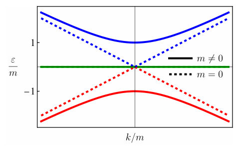 
FIG. 1. Energy bands defined by Hamiltonian (2) for m ̸= 0 (solid lines) and m = 0 (dashed lines).

📷 Fig 2

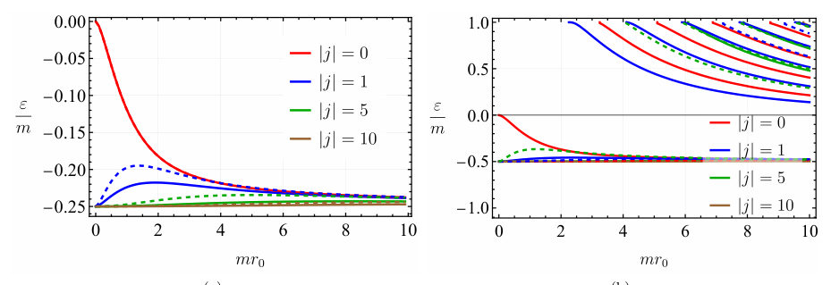 
FIG. 2. Energies of bound states that split off from the flat band at V0/m = 0.5 (panel (a)) and energies of all bound states at V0/m = 1 (panel (b)) as a function of mr0 for a few values of j. Solid and dashed lines correspond to j ≥0 and j &lt; 0, respectively.

📷 Fig 3

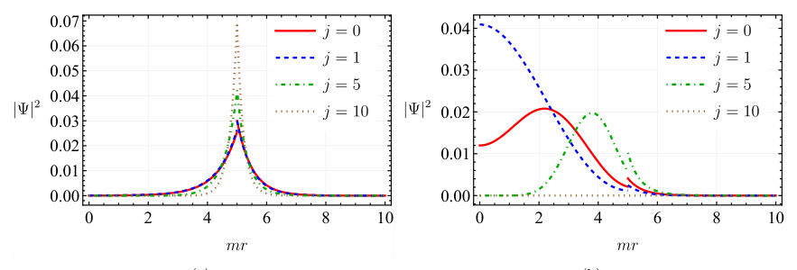 
FIG. 3. The probability density of a bound state wave function |Ψ|2 as a function of mr for fixed mr0 = 5, where |Ψ|2 is normalized to unity by integrating it over the whole space. Panels (a) and (b) correspond to the bound states that decouple from the flat band (panel (a)) and the lowest-energy bound states that decouple from the upper band (panel (b)).

📷 Fig 4

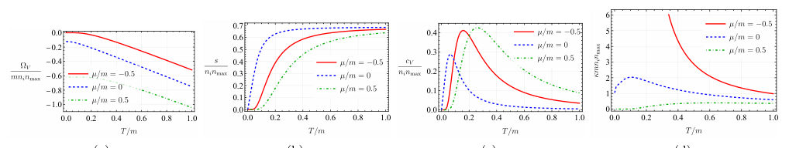 
FIG. 4. The thermodynamic potential (panel (a)), entropy density (panel (b)), heat capacity (panel (c)), and isothermal compressibility (panel (d)) as functions of T at a few values of µ. We fix mr0 = 1, W = 0.5 m, and jmax = 50, as well as use nmax = 2jmax + 1.

📷 Fig 5

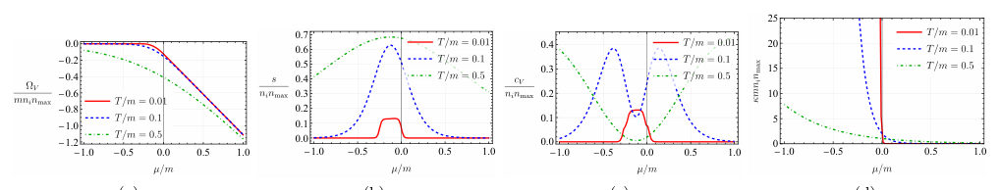 
FIG. 5. The thermodynamic potential (panel (a)), entropy density (panel (b)), heat capacity (panel (c)), and isothermal compressibility (panel (d)) as functions of µ at a few values of T. We fix mr0 = 1, W = 0.5 m, and jmax = 50, as well as use nmax = 2jmax + 1.

**Summary.** This work investigates how short-range impurities affect bound states and resonances in pseudospin-1 fermionic systems. Key findings include unusual energy level behavior for states derived from the flat band and detailed calculations of the system's thermodynamic response. The research provides a theoretical framework for understanding disorder effects in complex electronic band structures.

**Why it may be interesting.** The study of impurity effects and localization in structured fermionic systems, particularly those exhibiting flat bands, is highly relevant to understanding topological phases and disorder effects in condensed matter.

Detailed structure

**Main problem.** The paper analyzes the behavior of bound states and resonances induced by short-range impurities in pseudospin-1 fermionic systems.

**Main result.** Bound states derived from the flat band exhibit unique characteristics, such as occurring for any total angular momentum $j$, and the system's thermodynamic properties show specific temperature dependencies.

**Method.** The analysis involves solving characteristic equations derived from the Hamiltonian in the presence of a short-range impurity potential, supplemented by calculations using the Anderson model for disorder.

**Model / system.** The system consists of pseudospin-1 fermions whose energy spectrum includes a flat band. The impurity potential is modeled by a short-range circular potential well, and the analysis is extended to calculating thermodynamic potentials.

**Key observables.** Bound state energies ($\epsilon$), local density of states (LDOS), entropy density, and heat capacity.

**Important parameters / regimes.** Potential depth ($V_0$), potential radius ($r_0$), total angular momentum ($j$), and the gap parameter ($m$).

**Assumptions / limitations.** The analysis assumes the existence of bound states in the energy gap and utilizes the Anderson model for disorder; approximations are made for specific potential regimes (narrow/wide).

**Figures summary.** Figures illustrate energy bands, the temperature dependence of thermodynamic quantities (entropy, heat capacity), and the LDOS showing resonance-induced enhancement.

**Paper structure.** The paper proceeds by deriving the characteristic equation for bound states near the flat band, analyzing this equation in various limits (narrow/wide potential), and subsequently calculating the resulting thermodynamic properties using the Anderson model.

Abstract

Bound states and resonances induced by short-range impurities modeled by circular potential wells are analyzed in the vicinity of flat and dispersive bands in gapped and gapless pseudospin-1 systems. We find that the bound and resonant states derived from the flat band show unusual characteristics originating from the multicomponent structure of pseudospin-1 fermions, which are distinct from those for pseudospin-$\tfrac{1}{2}$ fermions. Contrary to gapped Dirac systems and unlike bound states in the vicinity of the upper dispersive band, the bound states derived from the flat band occur for any value of the total angular momentum. The energies of these bound states with higher angular momentum $j$ tend to decrease with $|j|$. In addition, it is found that their wave functions are localized at the potential well edge and the localization increases with $|j|$. The signatures of the impurity states in the local density of states are determined. Using the Anderson model for independent electrons in the disorder potential, the thermodynamic potential, entropy density, and heat capacity are obtained. In the regime dominated by bound states derived from the flat band, the entropy density monotonically increases with temperature and saturates, whereas the heat capacity exhibits a single maximum.

[↑ back to top](#top)

### [Engineering tunable $p$-wave magnetism in antiferromagnetic bilayers](http://arxiv.org/abs/2609.00277v1)

**Authors:** Yu-Han Lin, Jin-Wei Dong, Ziqiang Wang, Sen Zhou  
**Type:** theory · **Category:** strongly correlated electrons · **PDF:** <https://arxiv.org/pdf/2609.00277v1>  
**Analysis basis:** full PDF text, analyzed in chunks
**Topic relevance:** `analog quantum simulation` **3/5** · `Keldysh / 2PI / non-Gaussian methods` **2/5**

📷 Fig 1

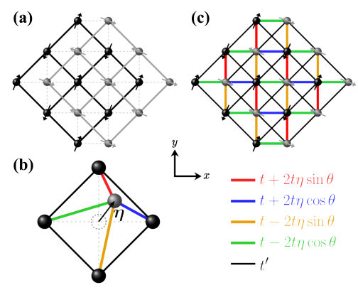 
FIG. 1. (a) Top-view of the two AB-stacked, AFM-ordered square lattices with mutually perpendicular collinear moments in the xy- plane. (b) In-plane relative shift η = η(cos θ, sin θ) and the induced anisotropic modulation in the inter-layer NN hoppings. (c) The bond- modulated square lattice with anisotropically modulated NN hop- pings and uniform NNN hoppings. Inset shows the xy-coordinate.

📷 Fig 2

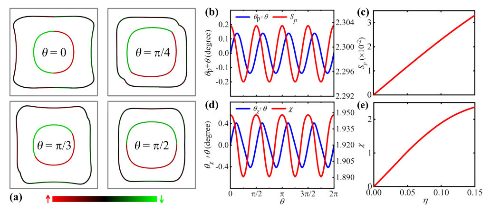 
FIG. 2. (a) The spin-resolved equal-energy contours at E = −t in the reduced BZ for representative shift angles, θ = 0, π/4, π/3, and π/2, with the shift amplitude η = 0.1. (b) The direction of the p-wave order θp and the strength of p-wave spin splitting as a function of shift angle θ at fixed shift amplitude η = 0.1. (c) The strength S p as a function of η at fixed θ = π/4. The system is half-filled in (a-c). (d) The direction θχ and the magnitude χ of the response vector χ as a function of shift angle θ at fixed shift amplitude η =0.1. (e) The magnitude χ as a function of η at fixed θ = π/4. In (d) and (e), the filling is 0.9 electron per site and the magnitude χ is measured in unit of...

📷 Fig 3

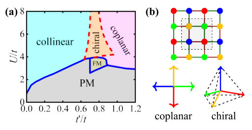 
FIG. 3. (a) The mean-field magnetic phase diagram of the half-filled Hubbard model on the bond-modulated square lattice associated with in-plane shift (θ, η) = (π/4, √

**Summary.** This work proposes a symmetry-controlled method to realize and manipulate p-wave magnetism in an antiferromagnetic bilayer system using only an in-plane relative shift between the layers. By analyzing the system via a Hubbard model, the authors demonstrate that this geometric displacement continuously tunes the p-wave spin splitting and associated spin responses, providing a clean, equilibrium platform for studying topological magnetic states.

**Why it may be interesting.** The concept of using geometric displacement ($\eta$) as a tunable knob to induce exotic magnetic order (p-wave magnetism) in an equilibrium state is highly relevant for designing novel quantum materials and spintronic devices.

Detailed structure

**Main problem.** The paper aims to engineer and control tunable p-wave magnetism in a two-dimensional antiferromagnetic bilayer system without relying on strong spin-orbit coupling or external driving.

**Main result.** The in-plane relative shift between the two magnetic layers acts as a symmetry-breaking knob, generating tunable p-wave spin splitting and associated spin responses in the ground state.

**Method.** The study uses a symmetry-guided approach, mapping the system onto an effective bond-modulated square lattice and analyzing the corresponding Hubbard model via mean-field theory.

**Model / system.** The physical system is an AB-stacked bilayer of antiferromagnetic square lattices. The theoretical framework involves a Hubbard model analyzed in a mean-field treatment, allowing for the study of various magnetic phases.

**Key observables.** p-wave spin-splitting strength ($S_p$), p-wave order direction ($	heta_p$), and the charge-to-spin conversion tensor ($\chi$) related to the Edelstein effect.

**Important parameters / regimes.** The in-plane relative displacement ($\eta$) between the two layers is the primary control parameter, alongside the magnetic ordering angle ($	heta$).

**Assumptions / limitations.** The analysis relies on mean-field theory for the Hubbard model and assumes the system remains fully compensated (zero net magnetization) due to preserved symmetries.

**Figures summary.** Figures illustrate the model setup using the in-plane shift ($\eta$), show spin-resolved electronic structure contours, and map out the continuous tunability of the p-wave order ($S_p$) and spin response ($\chi$) as functions of $\eta$ and $	heta$.

**Paper structure.** The paper first establishes the symmetry-protected mechanism for generating p-wave splitting via geometric displacement. It then develops the theoretical framework by mapping to an effective lattice and analyzing the Hubbard model in mean-field theory to predict phase diagrams and measurable spin responses.

Abstract

We propose a symmetry-guided route to engineer tunable $p$-wave magnetism in a bilayer system composed of two AB-stacked antiferromagnetic square lattices with their collinear moments nonparallel to each other. We show that an in-plane relative shift between the two layers selectively breaks the symmetries protecting spin degeneracy while preserving time-reversal-related constraints, thereby generating odd-parity spin splitting in a fully compensated magnetic state without spin-orbit coupling. The direction and the magnitude of the resulting $p$-wave spin-splitting, together with the associated spin responses, can be continuously tuned by the in-plane displacement, providing a potential knob for control. We further map the bilayer system onto an effective bond-modulated square lattice and investigate the corresponding Hubbard model within a mean-field framework. The calculated phase diagram reveals extended regions where $p$-wave magnetism with coplanar or chiral spin textures emerges spontaneously. Our results establish a minimal equilibrium platform for realizing and manipulating $p$-wave magnetism in two-dimensional systems.

[↑ back to top](#top)

### [Guiding center quantization of a quantum Hall analog of Hawking radiation](http://arxiv.org/abs/2609.00158v1)

**Authors:** Rodrigo Andrade e Silva, Ted Jacobson  
**Type:** theory · **Category:** other · **PDF:** <https://arxiv.org/pdf/2609.00158v1>  
**Analysis basis:** full PDF text, analyzed in chunks
**Topic relevance:** `analog quantum simulation` **3/5** · `Keldysh / 2PI / non-Gaussian methods` **2/5**

📷 Fig 1

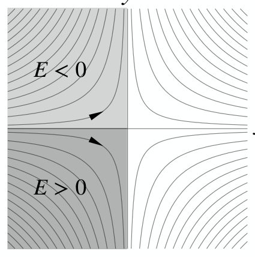 
Figure 1. Contours of the potential V = λxy in the plane of a 2d electron gas confined to the shaded regions in a uniform magnetic field B perpendicular to the plane. E = qV is the electric potential energy, and qλ &gt; 0 is assumed. The chiral edge modes localized at x = 0 propagate at speed λ

**Summary.** This work analyzes the quantum Hall effect in a setup designed to mimic Hawking radiation. By quantizing the guiding center motion, the authors demonstrate that the chiral edge modes emit thermal radiation corresponding to the Unruh effect. This confirms that condensed matter systems can serve as powerful, controllable analogs for fundamental quantum gravity phenomena.

**Why it may be interesting.** It provides a concrete, condensed matter realization (Quantum Hall effect) for fundamental concepts in quantum gravity (Hawking/Unruh radiation), linking solid-state physics to general relativity in a solvable theoretical framework.

Detailed structure

**Main problem.** The paper revisits the quantum Hall analog of Hawking radiation to show that the phenomenon can be accurately captured by quantizing the classical guiding center theory.

**Main result.** The quantization of the guiding center theory successfully reproduces the thermal spectrum characteristic of Hawking/Unruh radiation, confirming the analogy between chiral edge modes and curved spacetime horizons.

**Method.** The analysis employs canonical quantization on the effective guiding-center action, utilizing techniques from quantum field theory in curved spacetime, including the Bogoliubov transformation approach for vacuum definition.

**Model / system.** The system is a Fermi sea of electrons in a half-plane subjected to a quadrupolar electric potential and a uniform magnetic field, creating chiral edge modes analogous to those near a black hole horizon.

**Key observables.** The thermal spectrum of the emitted radiation, characterized by a temperature $T = \hbar\kappa / 2\pi$, and the non-zero, unequal probability current across the effective horizon.

**Important parameters / regimes.** The surface gravity $\kappa = \lambda/B$, the magnetic length $\ell = \sqrt{\hbar / qB}$, and the temperature $T$.

**Assumptions / limitations.** The guiding center approximation is used, neglecting perpendicular kinetic energy; the analysis relies on the correspondence between lab time and the boost angle in the analog spacetime.

**Figures summary.** Not specified by notes, but the analysis involves solving time-dependent Schrödinger equations in $x$ and $y$ bases and deriving probability current conservation equations.

**Paper structure.** The paper progresses from setting up the physical model and the guiding center theory, deriving the effective edge spacetime metric, calculating the thermal spectrum via current conservation, and finally confirming the result by relating the in-vacuum and out-vacuum states using Bogoliubov transformations.

Abstract

We revisit the quantum Hall analog of Hawking radiation in which a Fermi sea of electrons occupying half of a plane, subjected to a quadrupolar electric potential, gives rise to analog Hawking radiation of chiral edge modes. We show that the phenomenon is accurately captured by quantization of the classical guiding center theory, where the gyroscopic motion of the electrons is coarse grained and only the drift motion is resolved. The quantum dynamics takes place on a non-commutative plane, which requires an electron localized in the half-plane to be supported everywhere along the edge direction. This kinematical constraint on the quantum state leads directly to the radiation, which propagates in both directions away from the origin along the edge. The radiation is thermal with respect to laboratory time, which is equal (up to a constant factor) to the boost angle in the analog Minkowski spacetime in which the chiral edge modes propagate, so in fact it corresponds to analog Unruh radiation.

[↑ back to top](#top)

### [Higher-Winding Fractionalization](http://arxiv.org/abs/2609.00139v1)

**Authors:** Kishore Iyer, Christophe Mora, Daniele Guerci  
**Type:** theory · **Category:** strongly correlated electrons · **PDF:** <https://arxiv.org/pdf/2609.00139v1>  
**Analysis basis:** full PDF text, analyzed in chunks
**Topic relevance:** `analog quantum simulation` **3/5** · `Keldysh / 2PI / non-Gaussian methods` **2/5**

📷 Fig 1

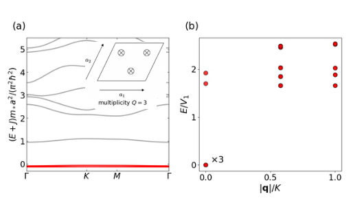 
FIG. 1. Higher-winding skyrmion model bands and fractionalization at filling ν = 1. The low-energy manifold for Jm∗a2/(π2ℏ2) = 100 consists of Q = 3 flat bands with total Chern number |Ctot| = 1, which become degenerate in the infinite-J limit. Many-body spectrum vs. center of mass momentum q, from ED on a 3×3 torus for electrons at filling ν = 1, using the three lowest energy bands with V1 interaction at K = 0.4. The ground state is threefold degenerate.

📷 Fig 2

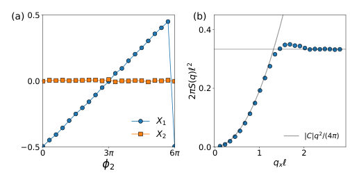 
FIG. 2. Topological response and perfect screening of the ideal FCI. (a) Many-body positions X1 (blue) and X2 (orange) under flux insertion ϕ2. (b) Connected static structure factor S(q) along qx in unit of ℓ2 = AUC/(2πQ), where the solid parabola shows the long-wavelength behavior. Plots are for N = 192 electrons at K = 0.4.

📷 Fig 3

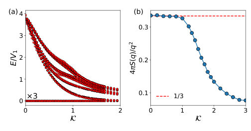 
FIG. 3. Evolution of the many-body spectrum and of the long wavelength behavior of S(q). (a) Spectrum versus magnetic-field modulation K for V1 interactions at ν = 1 and emergent flux 3h/e per unit cell. The calculation retains the three lowest bands on a 3 × 3 cluster. (b) 4πS(q)/q2 at q = ∆k, with ∆k momentum resolution, as a function of K for N = 243 electrons.

📷 Fig 4

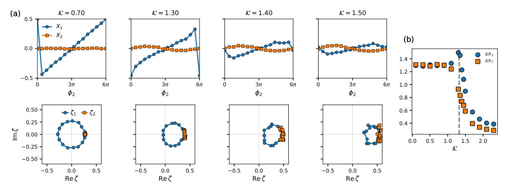 
FIG. 4. Many-body polarization and center of mass fluctuations. Panel (a): Top and bottom panels show the evolution of X1/2 and ζ1,2, respectively, as a function of ϕ2 ∈[0, 6π) upon increasing K. Panel (b): Evolution of the twist averaged center- of-mass fluctuations ∆R1,2. The vertical dashed line denotes the topological transition. Plots are for N = 243 electrons.

**Summary.** This work explores how higher-winding skyrmion textures induce fractionalization in electronic systems, leading to Fractional Chern Insulator (FCI) states. The key finding is that increasing spatial inhomogeneity in the emergent magnetic field drives a BKT transition from the highly correlated FCI liquid phase into a stable crystalline dielectric phase. The analysis uses advanced techniques like Coulomb gas mapping and RG theory to pinpoint this topological transition.

**Why it may be interesting.** The study provides a concrete, tunable platform (skyrmion texture) to realize and study fundamental many-body phenomena like fractionalization and topological phase transitions, which are key areas of interest in AMO physics and condensed matter theory.

Detailed structure

**Main problem.** The paper investigates fractionalization in topological phases using higher-winding skyrmion textures, allowing for fractionalized quantum anomalous Hall states even at integer filling.

**Main result.** Increasing the inhomogeneity of the emergent magnetic field drives a Berezinskii–Kosterlitz–Thouless (BKT) transition from a fractionalized liquid (FCI) to a crystalline dielectric state, characterized by the vanishing of a quantized winding number.

**Method.** The analysis involves mapping the many-body ground state to a 2D Coulomb gas model and employing Renormalization Group (RG) techniques to characterize the phase transition.

**Model / system.** The system models interacting electrons coupled to higher-winding skyrmion textures ($Q>1$), described by an effective Hamiltonian in the Aharonov–Casher limit. The study focuses on the competition between the FCI liquid and a crystalline dielectric state.

**Key observables.** Hall conductivity ($\sigma_{xy}$), dielectric constant ($\epsilon^{-1}$), connected static structure factor ($S(q)$), and the many-body polarization winding number.

**Important parameters / regimes.** Higher winding number ($Q$), lattice inhomogeneity parameter ($K$), and filling fraction ($
u$).

**Assumptions / limitations.** The analysis relies on the large-exchange limit ($Jm^*a^2/\hbar^2 \gg 1$) and mapping the system to a Coulomb gas model.

**Figures summary.** Figures illustrate the low-energy manifold for $Q=3$, the evolution of the structure factor $S(q)$ across the transition, and the pair correlation function $g(r)$ showing liquid-to-crystalline changes.

**Paper structure.** The paper progresses by establishing the model using skyrmion textures, deriving the effective Hamiltonian, analyzing the topological properties via the Coulomb gas mapping, and finally characterizing the BKT transition using RG flow and correlation functions.

Abstract

Higher-winding skyrmion textures can generate emergent magnetic fields with multiple flux quanta per unit cell. This opens an intriguing route toward fractionalization, allowing fractionalized quantum anomalous Hall states to arise even at integer filling of the microscopic unit cell. We show that, in this setting, increasing lattice-scale inhomogeneity of the emergent magnetic field drives a Berezinskii--Kosterlitz--Thouless (BKT) transition between a fractionalized liquid and a crystalline dielectric state. This transition carries a topological signature: under flux insertion, the many-body polarization defines a quantized winding number that is nonzero in the fractionalized phase and vanishes in the dielectric crystal.

[↑ back to top](#top)

### [Ontic and epistemic states in the theory of spacetime-local beables](http://arxiv.org/abs/2609.00848v1)

**Authors:** Nathan Argaman  
**Type:** theory · **Category:** other · **PDF:** <https://arxiv.org/pdf/2609.00848v1>  
**Analysis basis:** full PDF text, analyzed in chunks
**Topic relevance:** `quantum measurements` **3/5** · `Keldysh / 2PI / non-Gaussian methods` **2/5**

📷 Fig 1

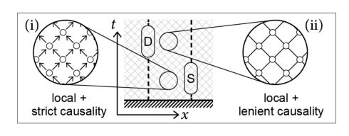 
Figure 1. A sketch of a spacetime region to be described by mathematical models (center panel), with marks for a source (S), a detector (D) and initial conditions (hatched). The blowups indicate two types of models, two possibilities for the relations between the internal variables: (i) a locally causal description, with arrows indicating probabilistic de- pendencies (Bayesian network); reproducing QM with such local beables is ruled out by Bell’s theorem. (ii) A time- reversal symmetric description in terms of spacetime-local beables, as per Equation (3) below (Gibbs field); the sym- metry is broken only by the initial conditions. This option is not ruled out, and is the focus of the...

📷 Fig 2

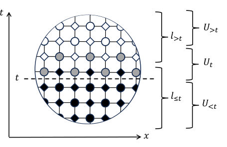 
Figure 2. A spacetime lattice of sites i, depicted by circles, with localities l depicted by diamonds. A time t is indicated by the dashed line. The localities are divided by the line into two groups, l≤t (black) and l&gt;t (white), while the sites are divided into three, U&lt;t (black), Ut (gray) and U&gt;t (white).

**Summary.** This work proposes a general theoretical framework for quantum mechanics based on 'spacetime-local beables' that resolves the conflict posed by Bell's theorem. It distinguishes between the underlying ontic state and the observer's epistemic state, providing a mechanism for wavefunction collapse. By using Gibbs field models, the theory reproduces quantum predictions in a specific limit while respecting a generalized notion of causality.

**Why it may be interesting.** It offers a foundational, non-standard approach to quantum foundations that attempts to derive quantum mechanics from principles of spacetime locality and causality, which is highly relevant to open quantum systems theory.

Detailed structure

**Main problem.** The paper addresses the conflict between Bell's theorem, which rules out locally causal theories for quantum entanglement, and the need to formulate a general theory of quantum mechanics.

**Main result.** It proposes a general framework using 'spacetime-local beables' governed by Gibbs fields, distinguishing between an ontic state (actual reality) and an epistemic state (knowledge), which naturally explains wavefunction collapse.

**Method.** The authors develop a mathematical framework based on Spacetime-Local Gibbs-Field (SLGF) models that generalize Bell's local causality to 'lenient causality.'

**Model / system.** The theory models physical setups involving sources, detectors, and internal variables, using a mathematical structure analogous to statistical physics (Gibbs random fields).

**Key observables.** The empirically verifiable predictions are expected to show parallels to the Born rule, and the epistemic state is analogous to the quantum state $\Psi$.

**Important parameters / regimes.** The limit $\gamma 	o 0$ is crucial for recovering standard Quantum Mechanics predictions in the toy models.

**Assumptions / limitations.** The framework assumes 'lenient causality' (allowing future inputs for internal variables) while maintaining signal causality for outcomes, and it treats the arrow of time as a separate assumption.

**Figures summary.** Figure 1 sketches the spacetime setup, contrasting ruled-out locally causal descriptions with the proposed time-reversal symmetric Gibbs field structure.

**Paper structure.** The paper introduces the SLGF framework, defines the ontic and epistemic states, develops the mathematical structure using local weights, and tests the framework by comparing predictions to the Born rule using a toy model (Schulman model).

Abstract

Bell's theorem rules out developing a locally causal theory to describe quantum phenomena. Many take this to imply that any model of quantum entanglement must employ variables (called beables by Bell) which follow nonlocal rules, even though signaling is local. The alternative is to adopt an all-at-once (block universe) approach, with beables which may depend on both past and future inputs, even though signaling is causal. Within this lenient-causality approach (a.k.a. retrocausal), simple cases of entanglement have been successfully described by locally mediated stochastic toy models, i.e.,~toy models which are local in a sense which generalizes Bell's local causality. Developing a widely applicable reformulation of quantum mechanics along these lines is a grand challenge. This work presents a general framework for such models and theories, and identifies the corresponding ontic and epistemic states. The epistemic state is closely analogous to the quantum state, yielding an explanation for the collapse of the wavefunction. In the case of the models of the framework, it is clear what the information is about. The expression for the empirically verifiable predictions of the models in terms of the ontic and epistemic states displays remarkable parallels to the Born rule. A toy-model example is discussed.

[↑ back to top](#top)

### [Completing or Refusing Low-Dimensional Records of Structured Quantum Circuits: Measurement Loss, Compression Loss, and Hardware Drift](http://arxiv.org/abs/2609.01303v1)

**Authors:** Gunhee Cho, Juhee Lee  
**Type:** both · **Category:** quantum information and computing · **PDF:** <https://arxiv.org/pdf/2609.01303v1>  
**Analysis basis:** full PDF text, analyzed in chunks
**Topic relevance:** `quantum measurements` **3/5** · `QC/QI experiment` **1/5**

📷 Fig 1

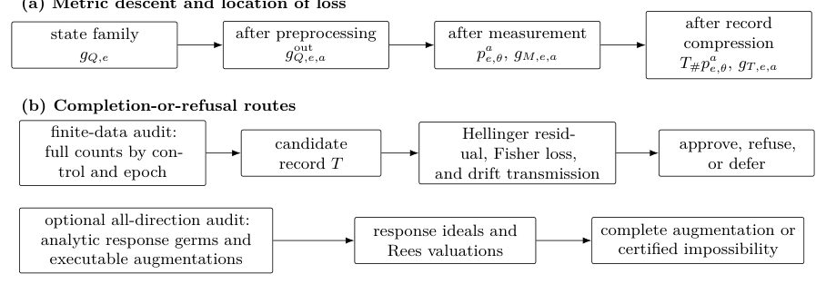 
Figure 1: Information descent and decision routes. Panel (a) locates loss introduced by preprocessing, measurement, and record compression. Panel (b) separates the default finite-data audit from the optional algebraic audit for claims over all analytic control curves. The latter requires analytic response germs and a declared library of physically executable augmentations; it is not inferred from finite counts alone.

📷 Fig 2

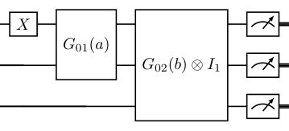 
Figure 2: The three-qubit running circuit. It prepares one excitation, redistributes it by G01(a) and G02(b), and records the computational bitstring. Its ideal law assigns zero probability outside S = {100, 010, 001}.

**Summary.** This work develops a comprehensive framework to audit low-dimensional records summarizing quantum circuits, quantifying information loss due to measurement or compression. It merges quantum information theory with algebraic geometry to create an executable 'approve/refuse/defer' decision protocol. This is vital for building reliable quantum hardware by certifying that simplified measurements retain sufficient fidelity to the true quantum process.

**Why it may be interesting.** It provides a mathematically rigorous, general framework for quantifying and certifying the information loss when abstracting complex quantum processes into simplified, hardware-friendly metrics, which is crucial for scaling quantum computation.

Detailed structure

**Main problem.** The paper addresses the fundamental challenge of determining if a low-dimensional statistical record of a structured quantum circuit accurately preserves the full quantum information, accounting for measurement loss, compression loss, and hardware drift.

**Main result.** The authors establish a rigorous, executable 'completion-or-refusal' procedure based on algebraic criteria, allowing for finite-sample decisions (Approve, Refuse, or Defer) regarding the fidelity of the low-dimensional record.

**Method.** The methodology combines advanced quantum information metrics (Quantum Fisher Information, Hellinger residual) with tools from algebraic geometry (integral closures, Rees valuations) to create a multi-stage audit framework.

**Model / system.** The system involves structured quantum circuits implemented on quantum hardware, whose outcomes are summarized by low-dimensional records. The analysis models the process through stages: initial state, circuit evolution, measurement, and final record compression.

**Key observables.** Hellinger residual, simultaneous confidence bounds, quantum Fisher information metrics ($g_{SLD}, g_{Q,e}, g_{T,e,a}$), and the decision outcomes: Approve, Refuse, Defer.

**Important parameters / regimes.** Circuit parameters ($	heta$), noise models (avoided assumption), finite-sample size, and the declared loss budget.

**Assumptions / limitations.** The method aims to avoid assuming a specific parametric hardware-noise model or a low-dimensional statistical family, though the final experimental validation is limited to specific backends and circuits.

**Figures summary.** Figure 1 summarizes two analysis routes: a default finite-data audit and an optional algebraic audit using response ideals, explicitly separating the two decision paths.

**Paper structure.** The paper develops a theoretical framework connecting all-arc criteria (algebraic/global) to executable, finite-sample decision procedures (local/experimental), culminating in hardware tests on specific circuit families.

Abstract

Structured quantum circuits are often summarized by low-dimensional records. Records lose control-dependent information when they merge outcomes whose probabilities respond differently to circuit parameters. We assess this loss without a parametric hardware-noise model or low-dimensional statistical family. Quantum Fisher information bounds premeasurement sensitivity; Fisher metrics of measurements and records describe device-attainable sensitivity. A Hellinger residual measures the response removed by a record, while its local quadratic term is the conditional covariance of the full-outcome score. Simultaneous confidence bounds support approval, refusal, or deferral.   We prove a finite-library completion theorem: executable augmentations terminate with either a record preserving every declared response or proof that no library augmentation removes the loss. For an analytic control germ, integral closures characterize preservation along every analytic control arc, and finitely many Rees valuations detect failure. This state--measurement--record chain connects an all-arc criterion to executable completion or refusal, an attainable-Fisher local kernel criterion, and finite-sample decisions.   A three-qubit calculation separates measurement loss from record loss. IBM experiments on Kingston and Marrakesh test decisions in fixed-particle-number and GHZ families, including negative controls. An end-to-end Kingston experiment reduces calibration shots by 33.3% while meeting prespecified noninferiority criteria on two held-out objectives. In two-epoch IQM Garnet data, median record-level drift is 0.0797 times full-distribution drift, but a significant residual remains in 35 of 36 settings. These experiments validate failure detection on the tested circuits; they do not establish universal compression performance or device quantum Fisher information.

[↑ back to top](#top)

### [Strengthened second law for periodic processes](http://arxiv.org/abs/2609.00639v1)

**Authors:** Jake Schaefer, Ben Ansbacher, Jan Korbel, David H. Wolpert  
**Type:** theory · **Category:** statistical mechanics · **PDF:** <https://arxiv.org/pdf/2609.00639v1>  
**Analysis basis:** full PDF text, analyzed in chunks
**Topic relevance:** `non-equilibrium universality` **3/5** · `driven-dissipative phase transition` **1/5**

📷 Fig 1

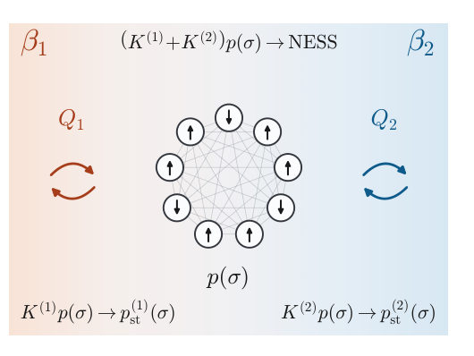 
FIG. 1. Visualization of spin system. Spins coupled to each bath at inverse temperatures β1, β2, and exchange heats Q1, Q2 over time. Each reservoir pushes probability distribu- tion over configurations p(σ) to its own Boltzmann distribu- tion. Thus, in the stationary state for the combined dynamics summed over the reservoirs, there will still be nonzero current, giving a nonequilibrium steady state.

📷 Fig 2

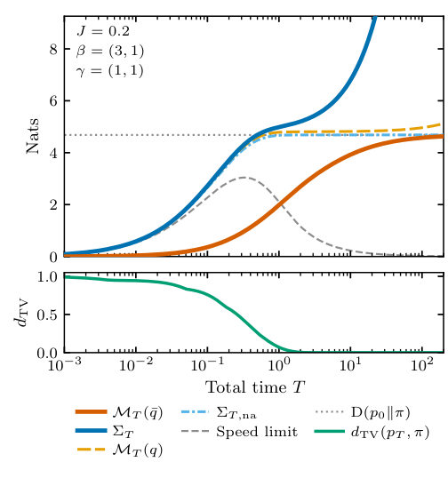 
FIG. 2. Minimal dissipation, MMC at the EP-optimal prior (4), total EP, and nonadiabatic EP as a function of time elapsed for the spin system starting at p0. The long-term minimal dissipation D(p0||π) is plotted as a horizontal dotted line. The total variation distance between the current distri- bution and the NESS dTV(pt, π) is plotted in a separate plot in solid cyan. We see the minimal dissipation is a significant portion of the total EP, whereupon after reaching the fixed point (NESS), the minimal dissipation saturates and residual cost dominates — growing the total EP without bound.

📷 Fig 3

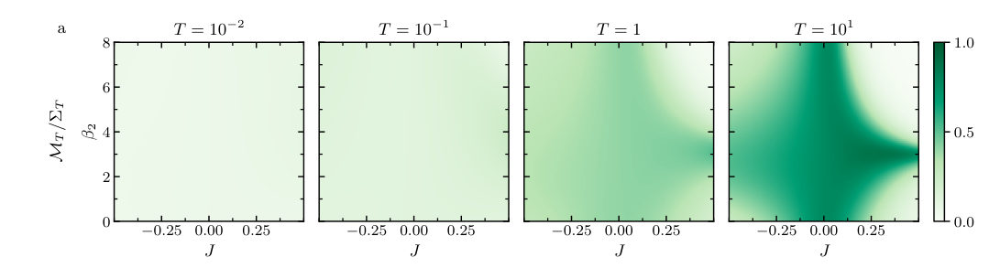 
FIG. 3. Heatmap displaying, for different times T, the ratio of minimal dissipation to total entropy production MT /ΣT as a function of the coupling strength J ∈[−0.5, 0.5] and inverse temperature of the second bath β2 ∈[0, 8.0], where the first bath is fixed at β1 = 3.0 as in the main text. For a large fraction of parameter space, and in particular the anti-ferromagnetic regime, the minimal dissipation is a significant fraction of the total EP.

📷 Fig 4

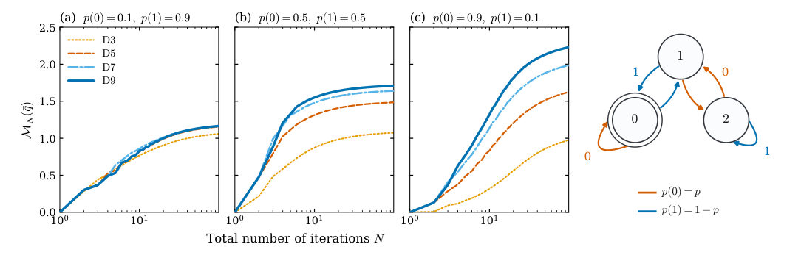 
FIG. 4. (Left) Minimal dissipation MN(¯q) for four different DFAs that all recognize the same language, at different input distributions (p, 1 −p). (Far right) Minimal DFA for recognizing binary representations of integers divisible by three. The initial state is 0 and the accept state is also 0. In the long time limit, the minimal dissipation scales monotonically with the number of redundant states, while in the short time limit there can be crossovers.

📷 Fig 5

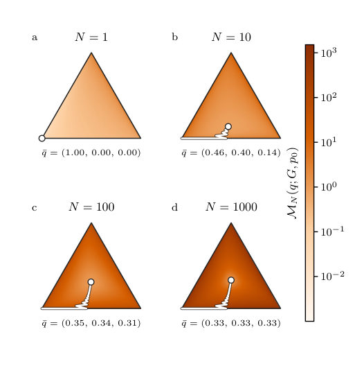 
FIG. 5. Heatmap of MN(q; p0) over the simplex for various values of N for the D3 DFA. Here, p = 0.1. The color coding shows the periodic MMC for choosing any other prior q ̸= ¯q. The white lines represent the trajectory of the POP up until the N-th iteration, indicated by the white dot. The color scale indicates the periodic MMC using any prior other than the POP. Note at N = 1, the POP is just p0.

**Summary.** This paper derives a strict, physics-independent lower bound on the entropy production for any system undergoing periodic driving. By analyzing the Mismatch Cost (MMC) over multiple cycles, the authors establish a generalized second law applicable to diverse systems like spin models and digital automata. This result significantly strengthens current understanding of non-equilibrium thermodynamics in time-periodic settings.

**Why it may be interesting.** The derivation of a universal, physics-independent bound on entropy production for periodic systems provides a powerful new tool for analyzing non-equilibrium dynamics in complex systems, extending beyond standard Markovian assumptions.

Detailed structure

**Main problem.** Deriving a physics-independent lower bound on the entropy production for any periodic process, strengthening the standard second law of thermodynamics.

**Main result.** A lower bound on entropy production is established using the Mismatch Cost (MMC) that depends only on the initial distribution and the driving map, regardless of the underlying physical details.

**Method.** The analysis uses the Mismatch Cost (MMC) decomposition of a general thermodynamic cost function, optimizing over all possible prior distributions to find a minimal dissipation bound.

**Model / system.** The framework applies to general stochastic processes evolving under periodic driving, modeled by repeatedly applying a stochastic map G. Specific applications include the Curie-Weiss model (Ising spins) and Deterministic Finite Automata (DFA).

**Key observables.** Entropy Production ($\Sigma_t$), Mismatch Cost (MMC), and the periodic-optimal prior ($ar{q}$).

**Important parameters / regimes.** The periodicity of the driving process, the initial distribution $p_0$, and the map $G$.

**Assumptions / limitations.** The process is modeled by the repeated application of a single map G, and the analysis relies on the general structure of the MMC decomposition.

**Paper structure.** The paper develops the theory by first establishing the general MMC decomposition, then specializing this to periodic processes, and finally applying the derived bounds to specific physical models like the Curie-Weiss model and DFAs.

Abstract

Many physical systems evolve under periodic driving: the same control protocol is applied again and again, even though the state of the system itself need not return to where it started after each cycle. We derive a physics-independent lower bound on the entropy production of \emph{any} periodic process modeled by the evolution of an initial distribution $p_0$ by a repeated application of the same map $G$. This is a strict strengthening of the second law of thermodynamics for periodic processes. It does not require that the single-period dynamics arise from a CTMC, satisfy (local) detailed balance, or be subject to other typical restrictions. We discuss its application to spins in the Curie-Weiss model and Deterministic Finite Automata, with possible extensions to other uniform computers.

[↑ back to top](#top)

### [A Dynamic Intermediate Representation for Hybrid Quantum-Classical Programs](http://arxiv.org/abs/2609.01037v1)

**Authors:** Alex Rice, Chris Heunen, Tobias Grosser  
**Type:** theory · **Category:** quantum information and computing · **PDF:** <https://arxiv.org/pdf/2609.01037v1>  
**Analysis basis:** full PDF text, analyzed in chunks
**Topic relevance:** `quantum measurements` **3/5**

📷 Fig 1

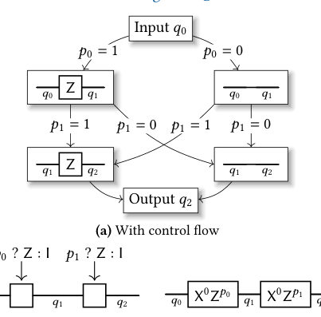 
Figure 1. Graphical representations of two sequential phase flip channels using control flow in (a), and dynamic gates in (b) and (c), with the gate value being generated by arith.select and our XZ gadget respectively. The dataflow is vastly simplified in (b) and (c), where the quantum com- ponent retains its circuit structure. The XZ gadgets in (c) remove the need for the selection operation, allowing the dynamic gates to be fused.

📷 Fig 2

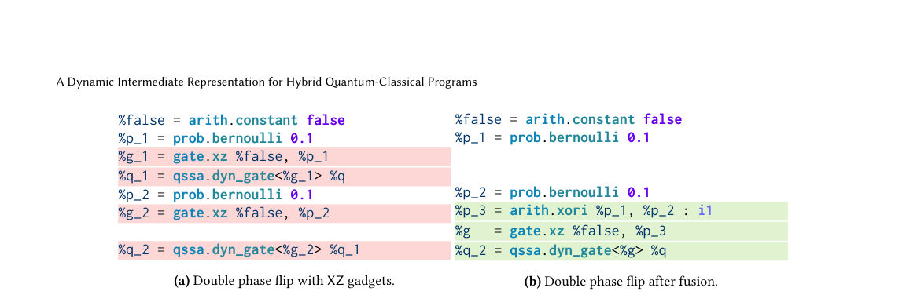 
Figure 2. The XZ gadget allows the phase flip channel to be represented without any selection operations (a). This allows the consecutive dynamic gates to be fused, reducing the program to a single phase flip channel (b).

📷 Fig 3

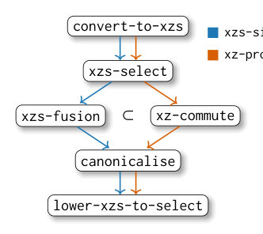 
Figure 3. Optimisation pipelines for XZS gadgets. The left path, xzs-simplify, fuses all adjacent conditional Pauli and Phase gates. The right path, xz-propagation, attempts to move Pauli gates towards the end of the program while performing fusion.

📷 Fig 4

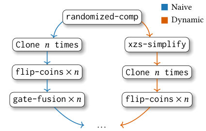 
Figure 4. Two compiler pipelines for generating 𝑛cir- cuits with the randomised compilation algorithm. The naive pipeline represents the state of the art, while the dynamic gate pipeline utilises dynamic gates to delay any cloning until after optimisation.

📷 Fig 5

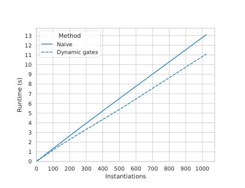 
Figure 5. Time taken to generate 𝑛randomised circuits from a circuit preparing the 10-qubit GHZ state, with the naive and dynamic gate pipelines outlined in Figure 4. With greater values of 𝑛, the dynamic gate pipeline is up to 20% faster.

**Summary.** This paper addresses the limitations of static quantum circuit models by proposing a Dynamic Intermediate Representation (IR). This new IR elevates quantum gates to first-class, runtime values, allowing classical computation to dynamically control quantum behavior. It enables the compact representation and optimization of complex hybrid quantum-classical algorithms.

**Why it may be interesting.** This work provides a crucial compilation framework for simulating and optimizing complex quantum algorithms that inherently mix classical decision-making with quantum evolution, which is vital for near-term quantum hardware.

Detailed structure

**Main problem.** The standard quantum circuit model is too static to effectively represent hybrid quantum-classical applications where gate choices depend on runtime data or measurement outcomes.

**Main result.** The authors introduce a new Intermediate Representation (IR) that treats quantum gates as first-class, dynamic values, enabling classical control flow to steer quantum computation.

**Method.** The core method is the design of a dynamic IR, realized using MLIR dialects, which incorporates dynamic gate operations (e.g., qssa.dyn_gate) alongside static quantum operations.

**Model / system.** The model concerns hybrid quantum-classical programs, where quantum operations are combined with classical data and control flow. The IR supports representing quantum states and operations using value semantics (SSA form).

**Key observables.** Gate values (e.g., I, X, Y, Z, S), phase flips, and the ability to model conditional quantum operations.

**Important parameters / regimes.** The structure of the quantum gates and the classical control flow determining gate execution.

**Assumptions / limitations.** The traditional circuit model is inherently static, and the XZ gadget is used to simplify the representation of conditional Pauli gates.

**Figures summary.** Figures illustrate the dynamic gate model's ability to represent complex sequences, such as two concatenated probabilistic phase-flip channels or double phase flips, using dynamic control flow compared to static methods.

**Paper structure.** The paper introduces the need for dynamic gates, details the XZ gadget for conditional Pauli gates, describes the IR structure using MLIR dialects (qssa.dyn_gate), and shows how this framework supports optimizations and analysis for hybrid programs.

Abstract

Quantum compilers typically follow the circuit model, representing programs as fixed sequences of gates. This static view breaks down in hybrid quantum-classical applications, where gate choices depend on runtime data or measurement results. We introduce a new Intermediate Representation (IR) that elevates gates to first-class values, enabling their dynamic creation, composition, and control. This unified representation allows classical computation to steer quantum behaviour, capturing phenomena including stochastic gate selection, adaptive error correction, and measurement-driven computation within a single framework. Case studies in noise modelling, randomised compilation, error correction, and measurement-based quantum computing show that our IR expresses these programs compactly and supports optimisations that were not possible in the circuit model. Evaluation on a benchmark suite of hybrid quantum-classical programs indicates that our IR represents programs compactly and facilitates compiler analysis and transformation.

[↑ back to top](#top)

### [Depth-1 expanders on the unitary group and applications](http://arxiv.org/abs/2609.01605v1)

**Authors:** Anurag Anshu, Shankar Balasubramanian, Jonas Haferkamp, Aram W. Harrow, Xinyu Tan  
**Type:** theory · **Category:** strongly correlated electrons · **PDF:** <https://arxiv.org/pdf/2609.01605v1>  
**Analysis basis:** full PDF text, analyzed in chunks
**Topic relevance:** `analog quantum simulation` **3/5**

📷 Fig 1

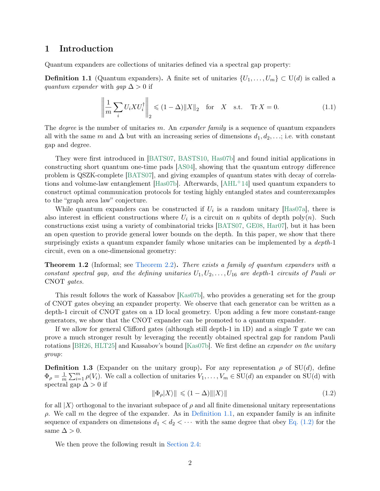 
Low-resolution page preview, page 2

📷 Fig 2

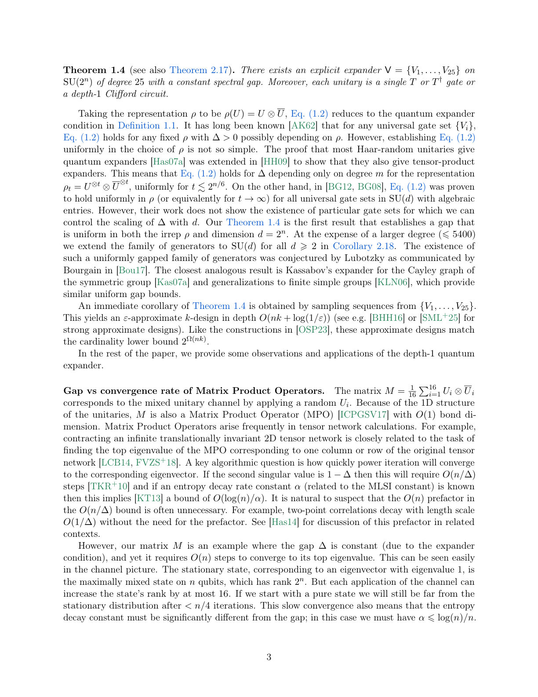 
Low-resolution page preview, page 3

📷 Fig 3

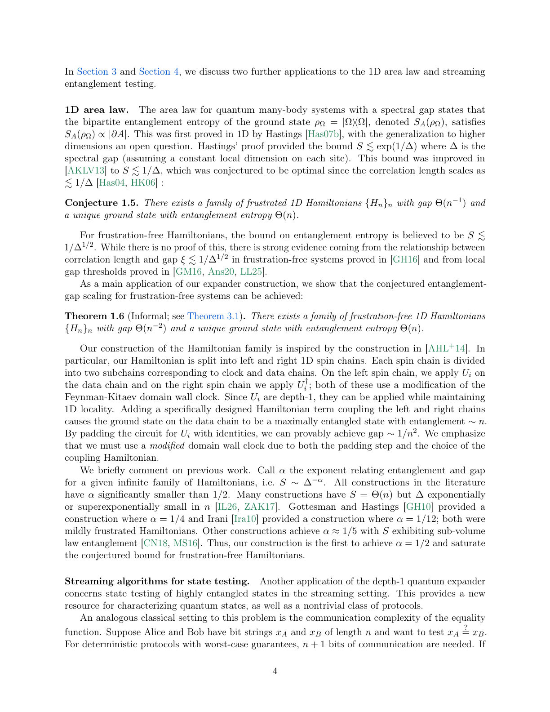 
Low-resolution page preview, page 4

📷 Fig 4

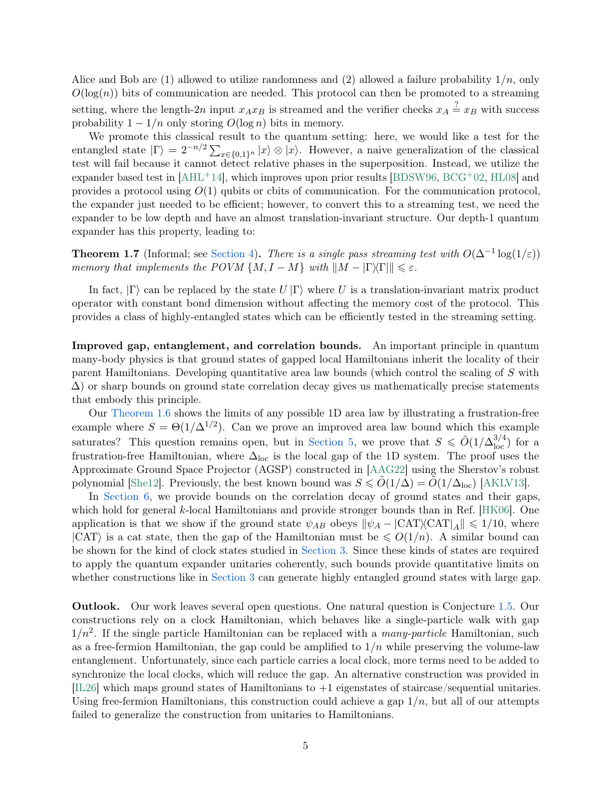 
Low-resolution page preview, page 5

📷 Fig 5

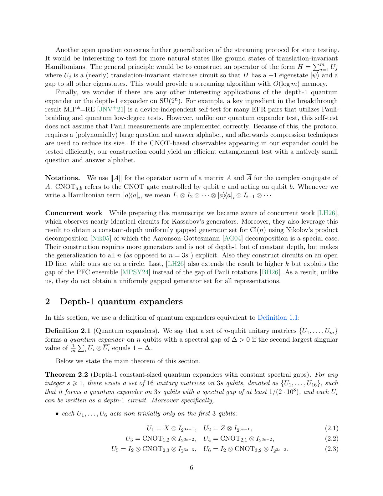 
Low-resolution page preview, page 6

**Summary.** This paper develops efficient quantum expanders implementable with shallow circuits and applies them to construct 1D quantum Hamiltonians. The key achievement is demonstrating a construction that realizes the conjectured optimal relationship between the ground state entanglement entropy and the spectral gap ($S \propto \Delta^{-1/2}$). This advances the understanding of entanglement scaling in gapped quantum systems.

**Why it may be interesting.** The explicit construction of Hamiltonians achieving the conjectured optimal entanglement-gap scaling ($\alpha=1/2$) is highly relevant for understanding the fundamental limits of entanglement in gapped quantum phases, which is central to AMO physics.

Detailed structure

**Main problem.** The paper addresses constructing quantum expanders with efficient circuit implementations and establishing optimal relationships between spectral gap and entanglement entropy in 1D quantum systems.

**Main result.** They constructed a family of frustration-free 1D Hamiltonians achieving the conjectured optimal entanglement-gap scaling $S = \Theta(\Delta^{-1/2})$, and developed depth-1 quantum expanders on the unitary group.

**Method.** The work combines the construction of quantum expanders (using Pauli/CNOT gates) with theoretical analysis of 1D Hamiltonians, relating spectral gaps to entanglement entropy via specific constructions.

**Model / system.** The models involve quantum expanders on the unitary group $U(d)$ and $SU(d)$, and 1D quantum many-body systems described by Hamiltonians $\{H_n\}$ that are engineered using these expanders.

**Key observables.** Spectral Gap ($\Delta$), Bipartite Entanglement Entropy ($S$), and the scaling exponent $\alpha$ relating $S$ and $\Delta$.

**Important parameters / regimes.** The dimension $n$ of the system, the constant gap $\Delta$, and the required circuit depth (achieved to be depth-1).

**Assumptions / limitations.** The primary assumption is the conjectured optimal scaling $S = \Theta(\Delta^{-1/2})$ for frustration-free 1D Hamiltonians, which the authors successfully achieve a construction for.

**Figures summary.** Not specified in the notes, but the context implies figures illustrating the expander construction, the Hamiltonian family, and the scaling relationship between $S$ and $\Delta$.

**Paper structure.** The paper proceeds by first defining and constructing depth-1 quantum expanders. It then applies these expanders to build a family of frustration-free 1D Hamiltonians, proving the optimal entanglement-gap scaling. Finally, it extends the expander concept to the unitary group for applications like state testing.

Abstract

We construct a constant-degree and constant-gap quantum expander on $n$ qubits where each unitary can be implemented by a depth-$1$ and 1D circuit of Pauli or CNOT gates. We provide two applications of this expander. First, we use it to construct a family of frustration-free 1D Hamiltonians whose ground states obey the entanglement-gap relation $S = Θ(Δ^{-1/2})$; this is believed to be optimal, but achieving it had been open. Second, we use it to provide a streaming protocol that tests for closeness to a class of 1D volume-law entangled states.   Moreover, we extend our quantum expander to a constant-degree and constant-gap expander on the unitary group where each unitary is a single $T$ gate, a single $T^{\dagger}$ gate, or a depth-$1$ Clifford circuit. This implies that a random sequence of unitaries from the expander yields a gapped walk on a dense subgroup of the unitary group. This improves upon previous work by Bourgain and Gamburd which did not control the dependence of the gap on the dimension.

[↑ back to top](#top)

### [Local Gaussian bounds on the non-destructive discrimination of two-mode squeezed states](http://arxiv.org/abs/2609.01373v1)

**Authors:** Mi-Jung So, James Moran, Youngrong Lim, Mahn-Soo Choi, Hyukjoon Kwon  
**Type:** theory · **Category:** quantum information and computing · **PDF:** <https://arxiv.org/pdf/2609.01373v1>  
**Analysis basis:** full PDF text, analyzed in chunks
**Topic relevance:** `quantum measurements` **3/5**

📷 Fig 1

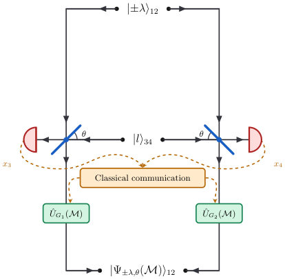 
FIG. 1. General local Gaussian circuit with one adap- tive stage for the non-destructive discrimination of two-mode squeezed vacua. Each party mixes the received signal mode (1 or 2) with an ancillary mode (3 or 4) on a local beamsplitter of angle θ, performs homodyne detection on the ancillary output to obtain M = {x3, x4}, and—conditioned on the classically communicated outcomes—applies a single-mode Gaussian op- eration ˆUGi(M) to the surviving signal mode.

📷 Fig 2

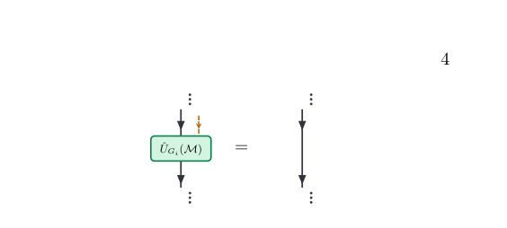 
FIG. 2. Simplest scheme with an initial TMSV state | ± λ⟩ prepared by Charlie and distributed to Alice (left) and Bob (right). Each party mixes the received mode with an auxiliary vacuum mode |0⟩using a local beamsplitter with parameter θ. Both parties then perform homodyne detection on one of the output modes, producing outcomes x3 and x4, while the remaining mode forms the post-measurement state used for the fidelity readout. We collect these outcomes into the classical set M = {x3, x4}. This corresponds to choosing l = 0 and ˆUGi(M) = I, the identity operator, in the general circuit.

📷 Fig 3

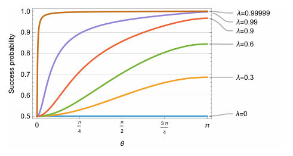 
FIG. 3. Success probabilities of the simplest scheme (Fig. 2) and the measurement-based displacement circuit (Fig. 4), as functions of θ for several values of λ, which coincide for the same setting with initial state (|λ⟩) and two vacuum nodes.

📷 Fig 4

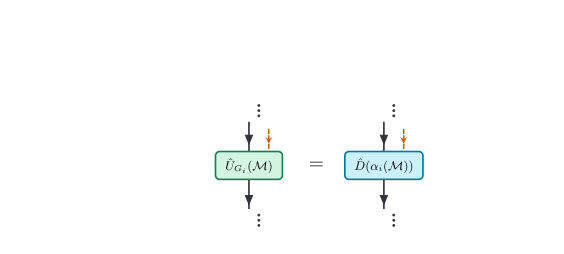 
FIG. 4. Measurement-based displacement scheme. Con- ditioned on the set of measurement outcomes M = {x3, x4} obtained on modes 3 and 4, the displacement gates ˆD (αi(M)) (i = 1, 2) shift the post-measurement state to the phase-space origin, rendering the output fidelity indepen- dent of M and optimal. This corresponds to choosing l = 0 and ˆUGi(M) = ˆD(αi(M)) in the general circuit.

📷 Fig 5

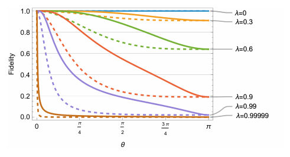 
FIG. 5. Fidelity as a function of θ for the simplest scheme (Fig. 2) and the measurement-based displacement circuit (Fig. 4), shown for several values of λ. Each value of λ is repre- sented by a distinct color, with the dashed and solid curves of the same color corresponding to the simplest scheme and the measurement-based displacement circuit, respectively. The latter consistently achieves higher fidelity, demonstrating the advantage of this approach.

**Summary.** This paper develops a theoretical framework to quantify the trade-off between successfully identifying a quantum state and disturbing it during the measurement process. It focuses on two-mode squeezed vacuum states using local Gaussian measurements. The key finding is that incorporating pre-shared entanglement can enhance discrimination beyond the standard theoretical limits.

**Why it may be interesting.** It provides a crucial infinite-dimensional generalization of the information-disturbance tradeoff, extending established concepts from finite-dimensional quantum systems to continuous-variable quantum optics.

Detailed structure

**Main problem.** The work analyzes the non-destructive discrimination of two-mode squeezed vacuum (TMSV) states using local Gaussian measurements.

**Main result.** The authors establish an explicit tradeoff relation between success probability and measurement-induced disturbance, and show that pre-shared entanglement allows exceeding the standard local Gaussian bound.

**Method.** The analysis involves deriving the success probability and fidelity using Gaussian state theory, optimizing a score function ($P \cdot F$), and comparing different measurement protocols.

**Model / system.** The system involves two-mode squeezed vacuum states, which are continuous-variable (CV) Gaussian states. The process is modeled using local Gaussian measurements and potentially pre-shared entanglement.

**Key observables.** Success Probability ($P$), Fidelity ($F$), and the combined score function ($P \cdot F$).

**Important parameters / regimes.** Squeezing Parameter ($\lambda$), beamsplitter angle ($	heta$), and the strength of pre-shared entanglement.

**Assumptions / limitations.** The analysis is restricted to the GLOCC1 class (at most one adaptive stage) for the primary bound derivation.

**Figures summary.** Figures illustrate the general local Gaussian circuit for discrimination, comparing performance across different measurement schemes (simplest vs. displacement vs. squeezing) as a function of the beam splitter angle $	heta$.

**Paper structure.** The paper progresses by first establishing the general framework for local Gaussian discrimination, then optimizing the score function $P \cdot F$ for various measurement strategies, and finally deriving the optimal trade-off relation.

Abstract

Typical measurement setups in quantum systems are destructive, meaning that states are irretrievably altered after measurement. In this work, we analyse non-destructive discrimination of two two-mode squeezed vacuum states using local Gaussian measurements. We investigate a tradeoff relation between the success probability of discrimination and the fidelity of the resulting state with the initial state, and construct a protocol given by local Gaussian measurements, which is optimal within our numerically explored class. We also extend to the case where we allow for additional pre-shared entanglement, and show that this regime allows us to exceed the standard local Gaussian bound for the fidelity-success probability tradeoff. Our work provides a natural extension of the tradeoff between information gain and disturbance in entangled-state discrimination, previously established for finite-dimensional quantum systems, to infinite-dimensional continuous-variable systems.

[↑ back to top](#top)

### [Optimization Landscape Geometry in VQE for Frustrated Quantum Spin Models](http://arxiv.org/abs/2609.00235v1)

**Authors:** Vojtěch Novák, Ivan Zelinka, Swagatam Das, Martin Beseda  
**Type:** theory · **Category:** disordered systems and neural networks · **PDF:** <https://arxiv.org/pdf/2609.00235v1>  
**Analysis basis:** full PDF text, analyzed in chunks
**Topic relevance:** `analog quantum simulation` **3/5**

📷 Fig 1

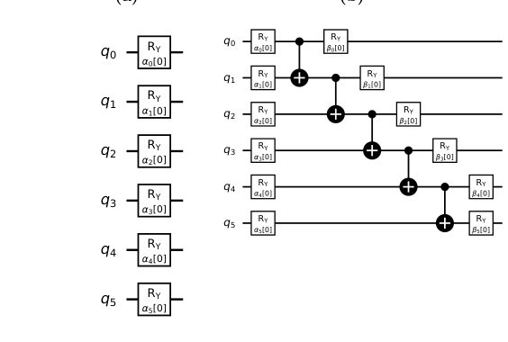 
FIG. 1. (a) Product-state ansatz with parameter dimension D = N. (b) Hardware-efficient Ry–CNOT–Ry ansatz with D = 2N. Schematics illustrate N = 6 qubits; the entangling layer in (b) follows Eq. (8).

📷 Fig 2

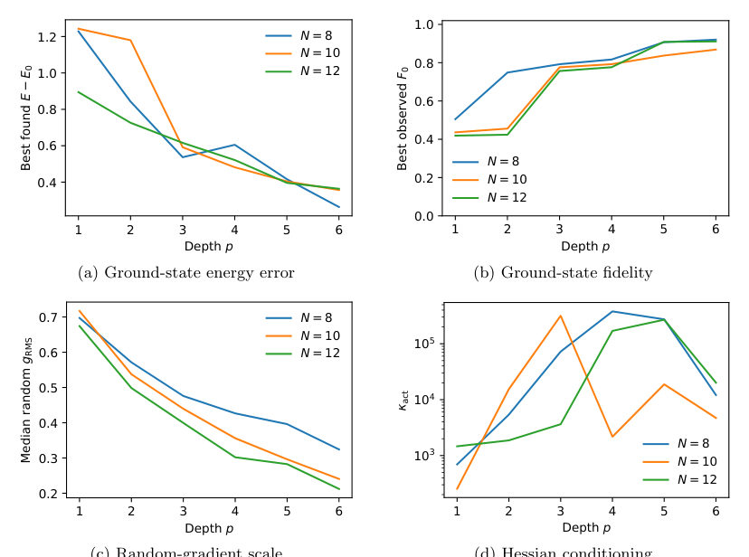 
FIG. 2. Effect of increasing the Q3 hardware-efficient ansatz depth. (a) Best-found ground-state energy error Ebest −E0. (b) Best observed exact ground-state fidelity. (c) Median RMS parameter-shift gradient over random parameter vectors. (d) Active Hessian condition number at the best-found energy point. Depth improves physical reachability, while the deeper landscapes remain strongly anisotropic. The random-gradient scale decreases with depth but remains finite over the studied range.

📷 Fig 3

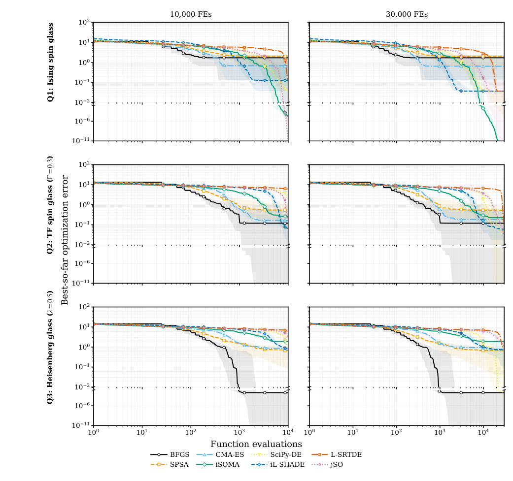 
FIG. 3. Median best-so-far optimization error with interquartile ranges for the three N = 12 benchmarks at 10 000 and 30 000 FEs. For Q1 the reference is E0, for Q2 the stored continuation reference, and for Q3 Eref. The broken logarithmic axis preserves resolution in both the main error band and the near-zero regime.

📷 Fig 4

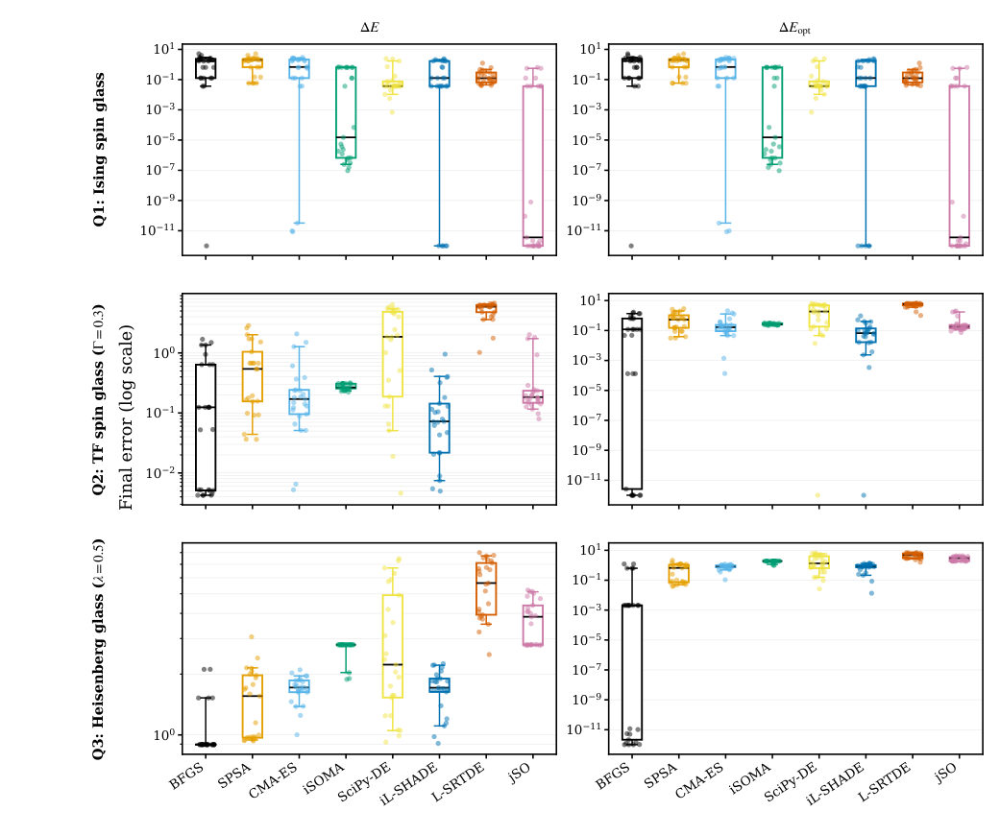 
FIG. 4. Final-error distributions for N = 12 at 10 000 FEs. Boxes show the median and interquartile range, whiskers span the 5th–95th percentiles, and points are individual runs. Numerical zeros are shown at the plotting floor 10−12.

📷 Fig 5

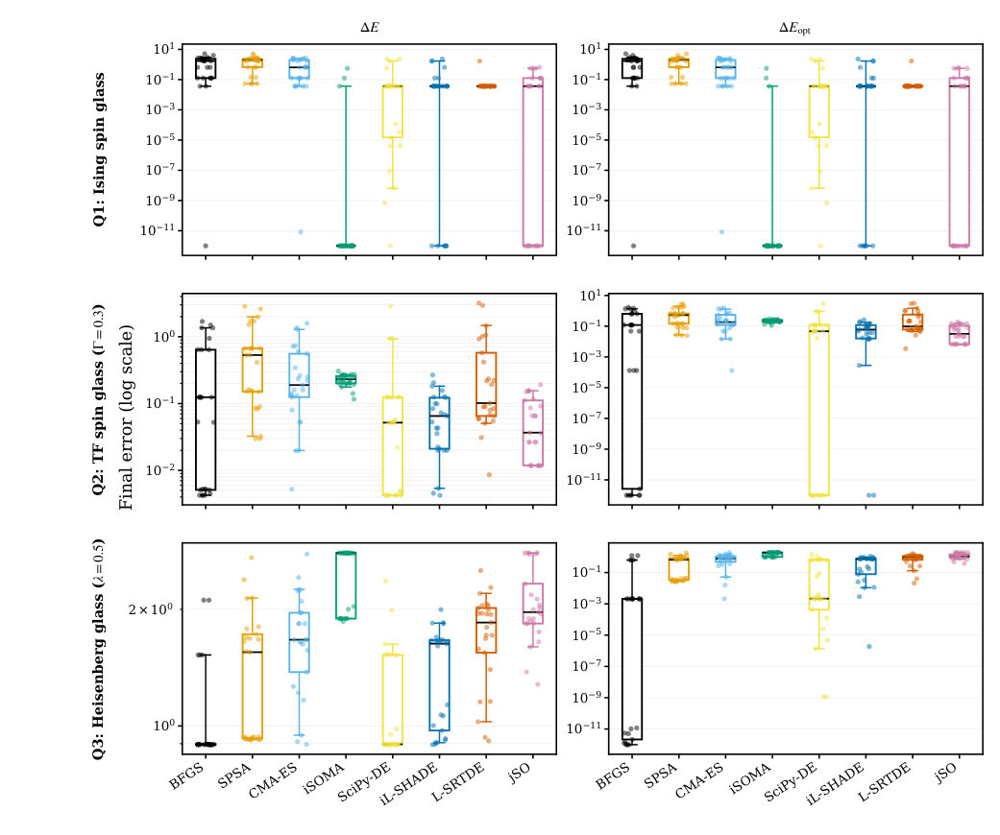 
FIG. 5. Final-error distributions for N = 12 at 30 000 FEs, using the same conventions as Fig. 4. The larger budget exposes which population-based methods continue to improve after the smaller-budget comparison has saturated.

**Summary.** This work rigorously benchmarks various classical optimization algorithms for VQE applied to frustrated quantum spin models. By characterizing the geometry of the energy landscape, the authors demonstrate that optimization performance is highly dependent on the model structure and that the total error budget must account separately for optimization failure and the inherent variational gap. This guides the development of more robust quantum simulation protocols.

**Why it may be interesting.** It provides a deep, quantitative analysis of the limitations of classical optimization techniques when applied to complex, frustrated quantum many-body systems, which is crucial for designing practical quantum algorithms.

Detailed structure

**Main problem.** The paper benchmarks classical optimization algorithms for Variational Quantum Eigensolver (VQE) calculations to understand how the underlying Hamiltonian-ansatz landscape geometry dictates performance.

**Main result.** Optimizer performance varies significantly across different frustrated spin model hierarchies, and the study successfully separates optimization error from the inherent variational gap error.

**Method.** The authors benchmark eight classical optimizers (local, stochastic, evolutionary, etc.) using exact statevector simulation on controlled spin models, characterizing the energy landscape geometry.

**Model / system.** The study uses frustrated quantum spin models, including diagonal Ising glasses, transverse-field Ising, and anisotropic Heisenberg models. The Hamiltonian is parameterized to cover these different physical regimes.

**Key observables.** Optimization error ($\Delta E_{	ext{opt}}$), ground-state energy error ($\Delta E$), and the variational gap ($E_{	ext{ref}} - E_0$). Fidelity is also used as a diagnostic.

**Important parameters / regimes.** The comparison involves varying circuit depth (from product-state to hardware-efficient ansatz) and the model parameters ($\Gamma, \lambda$) defining the Hamiltonian.

**Assumptions / limitations.** The analysis relies on exact statevector simulation to isolate the intrinsic landscape from finite-shot noise, and it distinguishes between optimization difficulty and variational expressivity limits.

**Figures summary.** Figure 1 illustrates the two ansatz architectures (product-state vs. hardware-efficient) used for the different models.

**Paper structure.** The paper systematically benchmarks optimizers across a hierarchy of frustrated spin models (Q1, Q2, Q3), characterizing the landscape geometry and quantifying the sources of error in VQE performance.

Abstract

We benchmark eight classical optimizers for exact-statevector VQE calculations on a controlled hierarchy of frustrated spin models, ranging from a diagonal Ising glass to transverse-field Ising and anisotropic Heisenberg models. The benchmark includes local, stochastic-gradient, evolutionary, covariance-adaptation, and swarm-based optimization methods under matched function-evaluation budgets. To understand their performance beyond final energies, we characterize the underlying Hamiltonian--ansatz landscapes in terms of local minima, gradients, curvature, and ground-state reachability. We use simple variational circuits, from an $R_y$ product-state ansatz for the diagonal model to shallow $R_y$--CNOT hardware-efficient circuits for the noncommuting models, and study how increasing circuit depth changes their expressivity, reachability, and optimization geometry. We find that optimizer performance changes substantially across the model hierarchy and is closely connected to landscape structure, while the variational gap represents a separate source of error. These results show how classical optimization, variational expressivity, and landscape geometry jointly determine VQE performance for frustrated spin models.

[↑ back to top](#top)

### [QILP-0: Constructing Observational Declarative Twins of Quantum Circuits](http://arxiv.org/abs/2609.01049v1)

**Authors:** Marina de la Cruz Echeandía, César Luis Alonso, Tony Ribeiro, Alfonso Ortega de la Puente  
**Type:** both · **Category:** quantum information and computing · **PDF:** <https://arxiv.org/pdf/2609.01049v1>  
**Analysis basis:** full PDF text, analyzed in chunks
**Topic relevance:** `quantum measurements` **3/5**

📷 Fig 1

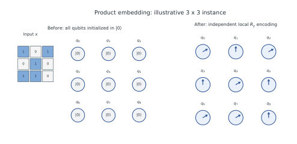 
Figure 1: Product embedding as a local state transformation. A 3×3 instance is shown for readability. Each binary pixel 𝑥𝑗is assigned to qubit 𝑞𝑗, initially prepared in |0⟩, and independently encoded by 𝑅𝑌(𝛼𝑥𝑗) with 𝛼= 𝜋∕3. No two-qubit interaction is present. The reported experiments use 𝐿= 4, … , 10, rather than the illustrative 𝐿= 3 instance.

📷 Fig 2

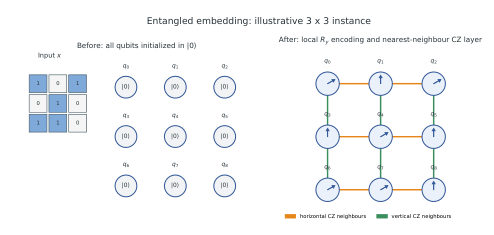 
Figure 2: Local encoding followed by grid-neighbour entangle- ment. The initial state and local 𝑅𝑌(𝛼𝑥𝑗) rotations are identical to those of the product embedding. The encoded qubits are then coupled through CZ gates on all horizontal and vertical nearest-neighbour edges. The 3 × 3 grid is illustrative; the reported experiments use the corresponding 𝐿×𝐿connectivity for 𝐿= 4, … , 10.

📷 Fig 3

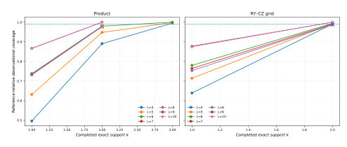 
Figure 3: Incremental reference-relative observational coverage for the product and grid-CZ embeddings. Curves include only completed exact-support layers within each run’s declared reference horizon. The dashed line marks the 0.99 criterion; crosses identify runs whose next candidate support was an- alyzed geometrically but rejected by the downstream post- selection feature budget.

📷 Fig 4

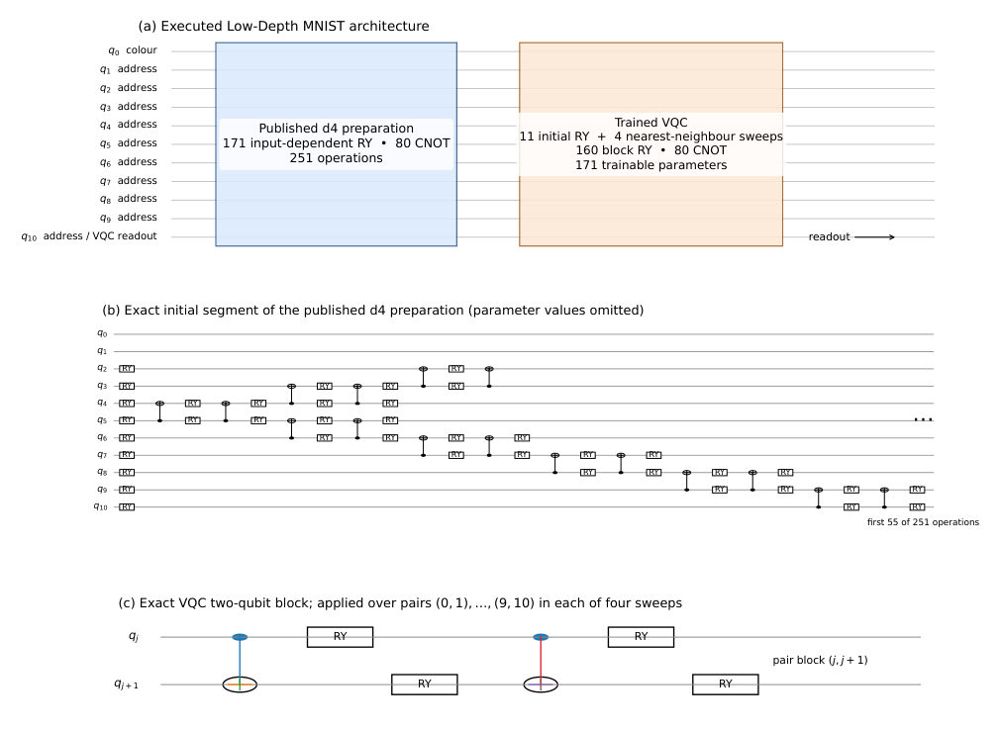 
Figure 4: Executed Low-Depth MNIST architecture used for the before/after comparison. Panel (a) summarizes the 11-qubit processing chain: the published depth-4 (d4) preparation is followed by the trained variational classifier. Qubit 𝑞0 is the FRQI colour qubit, 𝑞1, … , 𝑞10 form the address register, and 𝑞10 is also used as the VQC readout qubit. Panel (b) shows an exact initial segment of the executed d4 preparation; gate ordering is preserved while numerical rotation angles are omitted for readability. The complete d4 layout contains 171 input-dependent 𝑅𝑌rotations and 80 CNOT gates. Panel (c) shows the exact two-qubit VQC block CNOT–RY–RY–CNOT–RY–RY, which is applied over the ten...

📷 Fig 5

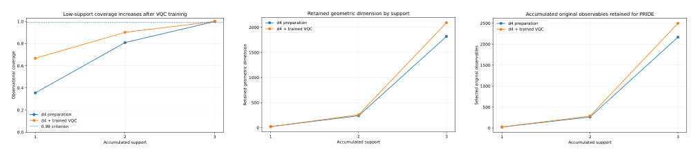 
Figure 5: Before/after observational geometry. Left: accumulated coverage over complete support blocks. Centre: accumulated retained geometric dimension. Right: accumulated number of original observables retained for the symbolic stage. The trained representation accumulates more coverage at supports 1 and 2 while exhibiting a larger retained geometric dimension and selected-observable vocabulary at support 3.

**Summary.** This paper presents QILP-0, a method to construct 'observational declarative twins' for quantum circuits, aiming to solve the interpretability problem in QML. It builds a formal, logical theory that reconstructs observed quantum behavior by tracking observables through a defined scope. Validation on large-scale qubit systems and image data confirms the theory's ability to achieve perfect, conflict-free reconstruction.

**Why it may be interesting.** It provides a novel, logically rigorous framework for quantum circuit interpretability that moves beyond simple learned representations by grounding the explanation in traceable, discrete logical statements derived directly from observable measurements.

Detailed structure

**Main problem.** The paper addresses the opacity in Quantum Machine Learning (QML) by developing a method to reconstruct an explicitly scoped, traceable declarative theory of a quantum circuit's observable behavior.

**Main result.** The proposed QILP-0 theory successfully achieved complete, conflict-free reconstruction of observed relations with strict accuracy of one in both native-discrete (Bars & Stripes) and continuous (Low-Depth MNIST) validation settings.

**Method.** It introduces QXymb, a framework culminating in QILP-0, which constructs a finite multi-valued propositional logic program by traversing observables incrementally and mapping latent structure deterministically back to original observable columns.

**Model / system.** The system involves general quantum circuits, specifically utilizing Pauli observables for the QILP-0 specialization. Validation tests include product and grid-CZ embeddings up to 100 qubits and low-depth MNIST digit-0/1 instances.

**Key observables.** Observable responses, reference-relative coverage, and the resulting finite multi-valued propositional logic program (the 'observational declarative twin').

**Important parameters / regimes.** Observational scope, structural grading, observational reference horizon, and the number of qubits (16 to 100).

**Assumptions / limitations.** The method explicitly separates logical exactness from numerical/backend uncertainty, retaining the latter as audit metadata. It does not claim to reconstruct the complete quantum behavior.

**Paper structure.** The paper introduces the QXymb framework, details the QILP-0 specialization for constructing declarative twins, outlines the incremental traversal and discretization process, and validates the method using two complementary settings: exhaustive Bars & Stripes experiments and Low-Depth MNIST analyses.

Abstract

This paper introduces QXymb, a general framework for constructing observational declarative twins of quantum circuits, and develops QILP-0, its first complete order-0 specialization. QILP-0 constructs a finite multi-valued propositional logic program from observed circuit behaviour within a declared observational scope.   The pipeline traverses a declared family of quantum observables incrementally according to a reproducible structural grading and a declared observational reference horizon. Progress is quantified through reference-relative coverage against a fixed target-independent reference. Observable responses are organized through target-independent geometry, while retained latent structure is mapped deterministically back to original observable columns before symbolic processing, preserving observational semantics and provenance.   Selected observable profiles are converted into a finite relation through admissible target-independent discretization. The target is used only afterwards to audit twin-admissibility and induce the declarative theory. A theory is certified as an exact observational declarative twin when it completely and correctly reconstructs the resulting finite task-conditioned discrete relation. Logical exactness is therefore separated from numerical, backend, provider, and discretization uncertainty, which is retained as audit metadata.   Validation uses two complementary QML settings. Exhaustive Bars & Stripes experiments compare product and grid-CZ embeddings from 16 to 100 qubits and exercise the native-discrete branch. Low-Depth MNIST analyses all 14,708 digit-0/1 instances before and after a trained variational quantum transformation and exercises continuous discretization. In every reported relation, the induced QILP-0 theory achieves complete, conflict-free reconstruction with strict accuracy equal to one.

[↑ back to top](#top)

### [Quantum antidipolar systems in two-dimensional geometries](http://arxiv.org/abs/2609.01137v1)

**Authors:** Juan Sánchez-Baena, Jordi Boronat  
**Type:** theory · **Category:** quantum gases · **PDF:** <https://arxiv.org/pdf/2609.01137v1>  
**Analysis basis:** full PDF text, analyzed in chunks
**Topic relevance:** `analog quantum simulation` **3/5**

📷 Fig 1

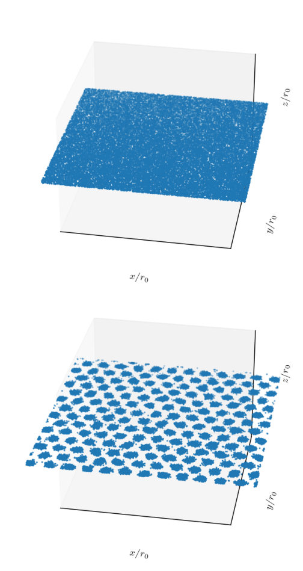 
FIG. 1. Simulation snapshots of the liquid (top) and solid (bottom) phases in the antidipolar system. The strength of the repulsive core is set to C12/(E0r12 0 ) = 0.02073 (see Eq. 2) while the density in each case is nr2 0 = 0.17 (top) and nr2 0 = 2.5 (bottom).

📷 Fig 2

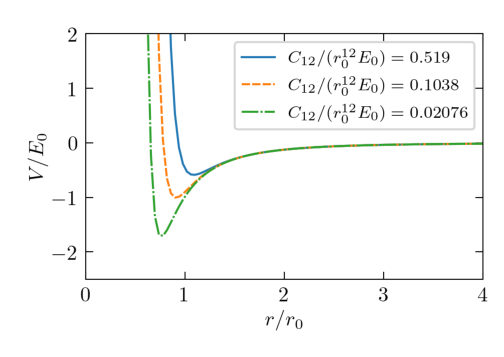 
FIG. 2. Antidipolar potential (see Eq. 2) for different values of C12.

📷 Fig 3

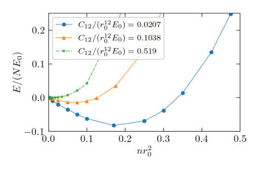 
FIG. 3. Energy per particle as a function of the 2D density for the single layer, 2D antidipolar liquid for different values of the interaction parameter C12 (see Eq. 2).

📷 Fig 4

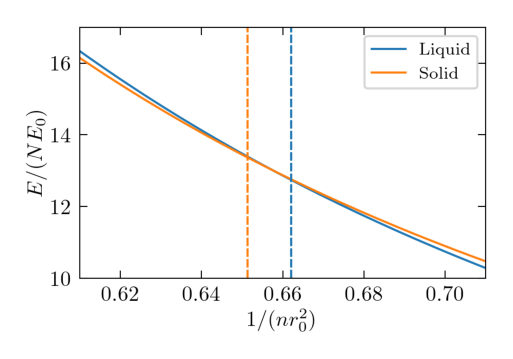 
FIG. 4. Fits of the energy per particle of the solid and crystal phases (see Eqs. 14 15) as a function of the inverse 2D density 1/n for different values of C12/(E0r12 0 ) = 0.02076.

📷 Fig 5

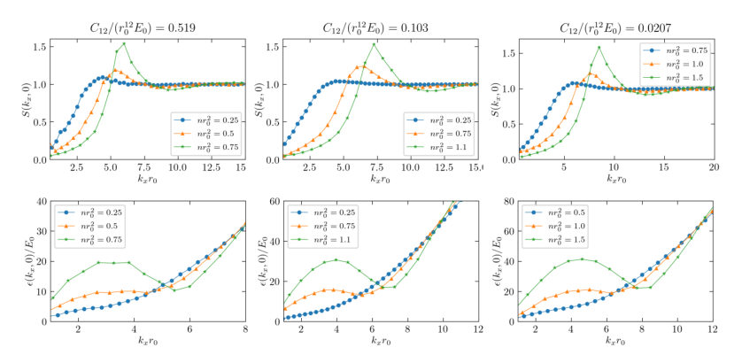 
FIG. 5. Static structure factor (top) and excitation spectrum ε(kx, 0) (bottom) of the liquid phase for different densities and C12/(E0r12 0 ) = 0.519 (left), 0.103 (center), 0.0207 (right).

**Summary.** This paper theoretically investigates quantum antidipolar systems in 2D, analyzing both single-layer and bilayer geometries. It calculates the equation of state and structural properties, finding that the system undergoes a first-order liquid-solid transition. Furthermore, it details how tuning the inter-layer separation allows one layer to significantly influence the superfluidity and energy of the other layer.

**Why it may be interesting.** This work directly addresses the complex physics of dipolar quantum gases in reduced dimensions, which is a major frontier in AMO physics, particularly concerning phase transitions and interlayer coupling.

Detailed structure

**Main problem.** The study investigates the properties of two-dimensional (2D) quantum systems interacting via antidipolar forces, examining single-layer and bilayer configurations.

**Main result.** The system exhibits liquid-solid phase transitions at lower densities than expected for standard dipolar systems, and the bilayer structure shows tunable inter-layer coupling effects on superfluidity and energy.

**Method.** The research employs advanced quantum many-body techniques, including Diffusion Monte Carlo (DMC) and the calculation of expectation values using Jastrow-Slater trial wave functions.

**Model / system.** The model consists of particles with tunable antidipolar interactions, confined to 2D planes, potentially forming a bilayer structure. The Hamiltonian includes terms for intra-layer and inter-layer dipole-dipole interactions.

**Key observables.** Equation of state (EOS), structural properties, liquid-solid transition points, superfluid fraction ($f_s$), and condensate fraction ($f_c$).

**Important parameters / regimes.** Inter-layer distance ($h$), interaction strength ratio ($C_{12}/(E_0r_{12}^0)$), and particle density ($n$).

**Assumptions / limitations.** The analysis relies on approximations like the Feynman approximation for excitation spectra and assumes the system can be described by specific Jastrow-type trial wave functions.

**Figures summary.** Figures illustrate simulation snapshots of liquid and solid phases, the inter-particle potential, the energy per particle vs. density for the bilayer, and the superfluid/condensate fractions vs. inter-layer distance.

**Paper structure.** The paper progresses by first establishing the single-layer liquid-solid transition, then extending the analysis to the bilayer geometry to study how tuning the inter-layer distance modifies the system's thermodynamic and superfluid properties.

Abstract

Particles with magnetic moment can be polarized, and rapidly rotated, employing a magnetic field such that the dipolar interaction among them changes sign, becoming antidipolar and thus isotropically attractive in a plane. Polar molecules can also be manipulated using microwave dressing fields to invert the sign of the dipole-dipole interaction. In this work, we study a two-dimensional system of antidipolar particles by calculating its equation of state and structural properties. The system behaves as a liquid even for scattering lengths significantly greater than the dipolar length. For large enough densities, the system transitions to a solid with one particle per lattice site via a first-order phase transition at a significantly smaller density than its dipolar counterpart. Moreover, motivated by the recent realization of a strongly axially trapped, bilayer geometry [Science 384, 546-551 (2024)], we study the properties of the bilayer liquid phase as the inter-layer distance is tuned, and provide the range of parameters where one layer can influence the properties of the other.

[↑ back to top](#top)

### [Quantum-Based Optimization of Gas Throughput in Natural Gas Transmission Networks Under Hydraulic Constraints Using QAOA](http://arxiv.org/abs/2609.00825v1)

**Authors:** Alex Ben Ishay, Yuval Eyal, Yuval Cohen, Nati Erez  
**Type:** both · **Category:** quantum information and computing · **PDF:** <https://arxiv.org/pdf/2609.00825v1>  
**Analysis basis:** full PDF text, analyzed in chunks
**Topic relevance:** `QC/QI experiment` **3/5**

📷 Fig 1

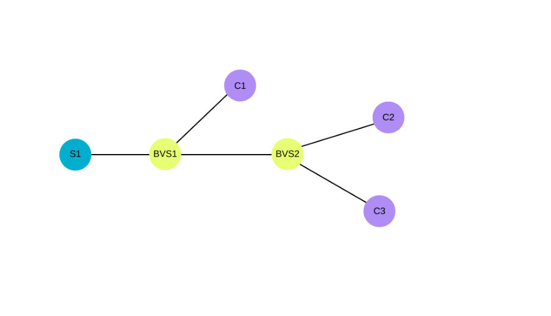 
Figure 1: INGL demonstration network topology. Blue: supplier node (S1). Yellow: junction nodes (BVS1, BVS2). Purple: customer delivery nodes (C1, C2, C3).

📷 Fig 2

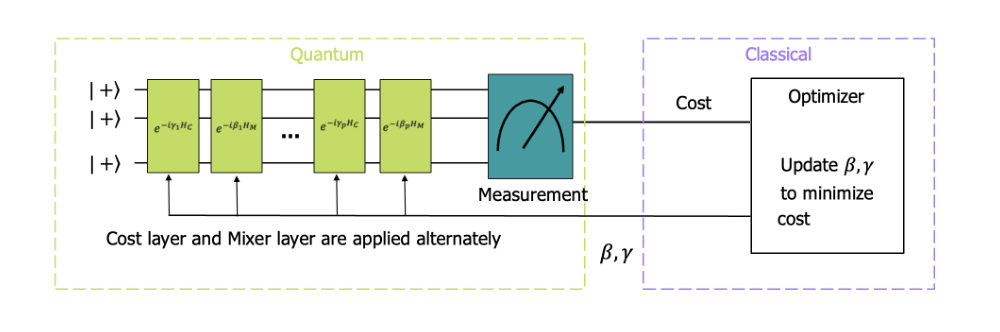 
Figure 2: QAOA circuit. All qubits are initialized in the |+⟩state to create an equal superposition, followed by alter- nating QAOA cost and mixer layers and final measurement. A classical optimizer updates the parameters γ and β to minimize the cost function, corresponding in this case to maximizing the total throughput delivered to the customers.

📷 Fig 3

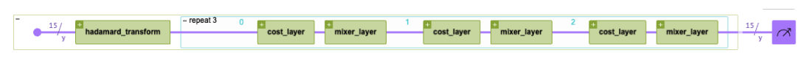 
Figure 3: Quantum circuit for 15 logical qubits synthesized by the Classiq engine and taken from the Classiq visualization platform, consisting of an initial Hadamard transform that creates a uniform superposition, followed by three alternating cost and mixer layers as prescribed by the QAOA algorithm.

**Summary.** This work applies the QAOA algorithm to optimize gas throughput in complex pipeline networks, transforming the continuous physical problem into a discrete QUBO format. The authors demonstrate the feasibility of this approach by running the circuit on a trapped-ion quantum processor, achieving near-optimal results with surprisingly shallow circuit depth. This establishes a tangible, end-to-end quantum-assisted optimization workflow for critical infrastructure.

**Why it may be interesting.** It provides a concrete, real-world engineering optimization problem (gas flow) that is successfully mapped onto a quantum algorithm (QAOA) and tested on current hardware, serving as a proof-of-concept for quantum computation in industrial physics.

Detailed structure

**Main problem.** The paper addresses the computationally hard problem of maximizing gas throughput in natural gas transmission networks subject to complex hydraulic and operational constraints.

**Main result.** The QAOA approach successfully recovered near-optimal solutions on a trapped-ion quantum processor using only $p=2$ layers, demonstrating feasibility with significantly shallower circuits than simulated.

**Method.** The problem is mapped to a QUBO formulation and solved using the Quantum Approximate Optimization Algorithm (QAOA), comparing simulator results ($p=30$) with direct hardware execution ($p=2$).

**Model / system.** The physical system is a natural gas pipeline network modeled as a graph, governed by the Panhandle-B hydraulic equation. The optimization is framed by a cost Hamiltonian combining delivery objectives and physical constraint penalties.

**Key observables.** Maximum gas throughput, physically valid nodal pressure assignments, and the probability distribution of candidate solutions.

**Important parameters / regimes.** The number of QAOA layers ($p$), the pressure discretization step ($\Delta\pi$), and the physical parameters of the gas network (e.g., $P_s=70$ barg).

**Assumptions / limitations.** The primary approximations involve discretizing continuous nodal pressures and approximating the non-linear Panhandle-B flow equation using a polynomial fit.

**Figures summary.** The figures illustrate the QAOA circuit diagram and show the comparison between simulated and hardware-derived candidate solutions relative to the continuous classical optimum.

**Paper structure.** The paper introduces the complex optimization problem, derives the QUBO/cost Hamiltonian, details the QAOA framework, presents simulator results, and concludes with an end-to-end demonstration on the IonQ Forte-1 quantum processor.

Abstract

Maximizing gas throughput in transmission networks under hydraulic and operational constraints is a combinatorial problem whose complexity grows exponentially with network size, making it computationally intensive to solve exactly. This paper addresses the graph-based optimization problem by optimizing nodal-pressure assignments under the Panhandle-B hydraulic equation. By framing the problem as a search over discretized nodal-pressure assignments coupled with a cost Hamiltonian that encodes both the delivery objective and physical-constraint penalties, we establish a unified formulation suitable for the Quantum Approximate Optimization Algorithm (QAOA). The mathematical model is adapted to a Quadratic Unconstrained Binary Optimization (QUBO) formulation and implemented using the Classiq quantum software platform. In simulator-based experiments, QAOA recovered the maximum-throughput valid operating point, consistent with classical exhaustive evaluation and classical hydraulic simulation reference solutions. A distinctive contribution of this work is the end-to-end execution of a reduced problem instance on the IonQ Forte-1 trapped-ion quantum processor. Remarkably, the hardware implementation used only $p=2$ QAOA layers, substantially fewer than the $p=30$ layers used in the simulator-based study. Despite this significant reduction in circuit depth, the QPU produced physically valid and interpretable candidate solutions that bracketed the continuous classical optimum, with each located within one pressure-discretization step of it. These results demonstrate that meaningful gas-network optimization behavior can be obtained using considerably shallower QAOA circuits than initially expected and provide an end-to-end proof of concept for near-term quantum-assisted gas-network optimization.

[↑ back to top](#top)

### [Direct laser-written optomechanical double membranes in an optical microcavity](http://arxiv.org/abs/2609.01145v1)

**Authors:** Lukas Tenbrake, Daniel Stachanow, Florian Giefer, Jana Blechmann, Wolfgang Alt, Sebastian Hofferberth, Hannes Pfeifer  
**Type:** both · **Category:** other · **PDF:** <https://arxiv.org/pdf/2609.01145v1>  
**Analysis basis:** full PDF text, analyzed in chunks
**Topic relevance:** `analog quantum simulation` **2/5** · `driven-dissipative phase transition` **2/5** · `methods for driven-dissipative` **2/5** · `quantum optics experiment` **2/5** · `Tavis-Cummings & cavity-many-emitter` **1/5** · `correlated / nonlocal dissipation` **1/5**

📷 Fig 1

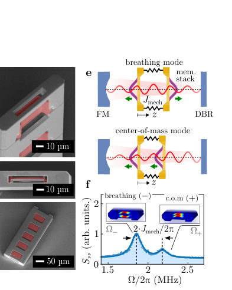 
Fig. 1. System overview of the double-membrane stacks. (a) shows a schematic of the experimental structure. A vertical scaffold (sca) hosting mechanically coupled double-membrane structures (highlighted in red) is directly printed on a distributed Bragg reflector (DBR) substrate. The double membranes are printed orthogonally to the substrate. The top shows a cross-section of a double-membrane within the scaffold, highlighted by the green plane. Relevant geometry parameters are indicated. The fabrication procedure is split up into three steps: I.: Double membrane scaffold after printing and development. II.: Post-print flip-over of the structure onto the DBR by using a micromanipulator....

📷 Fig 2

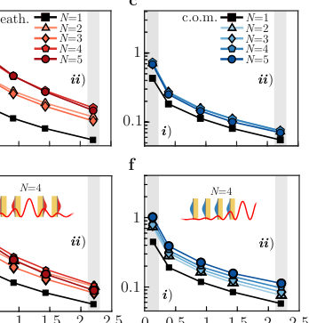 
Fig. 5. Simulated scaling of collective vacuum optomechanical coupling with membrane number and geometry. The collective coupling strength 𝑔col is calculated for increasing membrane number 𝑁at fixed input wavelength 𝜆0 = 780 nm. The top row shows results for small membrane separation 𝑠mem = 0.20 µm, while the bottom row shows results for 𝑠mem = 4.10 µm. (a,d) Scaling of 𝑔col with membrane number 𝑁for two fixed membrane thicknesses: (i) 𝑡mem = 0.13 µm and (ii) 𝑡mem = 2.21 µm. For each thickness, the breathing mode is shown in red and the c.o.m. mode in blue. (b,e) Breathing-mode coupling 𝑔(−) col as a function of membrane thickness 𝑡mem for 𝑁= 1–5, with the membrane number indicated by the...

📷 Fig 3

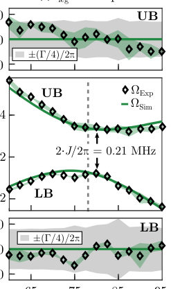 
Fig. 9. Experimental results for the mechanically coupled double membrane frequen- cies compared to FEM simulations. (a) and (b) (middle) show the corresponding experimental data overlapped with simulation results for the two geometry cases depicted as filled and outlined stars in Fig. 2 (filled: [𝑡leg = 2.1 µm, 𝑠mem = 4.8 µm], outlined: [𝑡leg = 1.6 µm, 𝑠mem = 4.8 µm]). The modal frequency splitting is plotted against the connection leg angle 𝜃leg, displaying an avoided crossing, demonstrating the hybridization of the two mechanical membrane modes. The plots in the top and bottom row display the difference between experiment and simulation data for the frequency splitting from (a) and (b)...

**Summary.** This paper reports on the creation of double-membrane resonators within an optical microcavity using 3D direct laser writing. By engineering mechanical mode hybridization, the researchers achieved enhanced collective optomechanical coupling, establishing a scalable platform for studying multimode cavity optomechanics. The combination of advanced nanofabrication and rigorous theoretical modeling makes this system highly relevant for quantum sensing and quantum light-matter interaction studies.

**Why it may be interesting.** This work provides a highly tunable, scalable platform for cavity optomechanics by engineering mechanical coupling, which is crucial for studying collective dynamics and realizing complex quantum light-matter interactions beyond simple two-mode systems.

Detailed structure

**Main problem.** The research aims to overcome the limitation of optomechanical systems being restricted to only two coupled membranes by establishing a scalable platform for multimode cavity optomechanics.

**Main result.** The authors successfully demonstrated double-membrane resonators in a fiber-based microcavity using 3D direct laser writing, achieving enhanced collective optomechanical coupling strengths up to $g_{col}/2\pi \approx 0.1$ MHz.

**Method.** The study combines experimental fabrication using 3D direct laser writing with theoretical modeling using finite-element methods (FEM) and transfer-matrix calculations to predict and analyze coupling strengths.

**Model / system.** The system is a fiber-based Fabry-Perot microcavity containing monolithically integrated double-membrane resonators. The physics involves mechanical mode hybridization induced by physical coupling legs, leading to distinct center-of-mass and breathing normal modes.

**Key observables.** Collective optomechanical coupling strengths ($g_{col}$), mechanical mode splitting ($J_{mech}$), and cavity finesse ($F$).

**Important parameters / regimes.** Membrane thickness ($t_{mem}$), membrane-to-membrane spacing ($s_{mem}$), and the angle of the connecting support legs ($	heta_{leg}$).

**Assumptions / limitations.** The analysis relies on the transfer-matrix formalism treating the system as a 1D multilayer cavity, and mechanical simulations required correcting the dynamic modulus by a scaling factor (0.88).

**Figures summary.** Figures illustrate the system schematic, SEM images of the fabricated structure, mode diagrams showing hybridized modes, and cross-sectional cuts mapping the wavelength dependence of collective coupling strengths and cavity finesse.

**Paper structure.** The paper progresses from demonstrating the fabrication of double-membrane resonators via DLW, to modeling the mechanical mode hybridization using FEM, and finally characterizing the enhanced collective optomechanical coupling and its wavelength dependence using transfer-matrix calculations.

Abstract

Optomechanical membrane-in-the-middle systems that comprise several coupled compliant membranes offer enhanced optomechanical coupling and collective dynamics. Recent realizations were fundamentally restricted to two membranes and to limited structural optimization of the involved membranes due to their intricate fabrication and experimental integration. Here, we present a fiber-based Fabry-Perot microcavity incorporating monolithically integrated double-membrane resonators fabricated by 3D direct laser writing. We realize controllable mechanical mode hybridization of membranes with coupling rates of up to $J_{\mathrm{mech}}/2π= 0.16$ MHz, exceeding the mechanical linewidths. We demonstrate enhanced collective optomechanical coupling of the membrane stack's breathing mode, reaching collective coupling strengths of up to $g_{\mathrm{col}}^{(-)}/2π\approx 0.1$ MHz. Our transfer-matrix calculations predict further substantial enhancements with realistic reductions of membrane thickness and spacing, and a larger number of membranes. Our results establish direct laser-written membrane arrays as a scalable platform for multimode cavity optomechanics, combining tunable mechanical interactions, enhanced collective optomechanical coupling, and scalability towards larger mechanically coupled resonator systems.

[↑ back to top](#top)

### [Accelerating dynamic simulations of photoexcited materials and their evolution by electron-informed machine learning](http://arxiv.org/abs/2609.01492v1)

**Authors:** Yunzhe Jia, Fankai Xie, Yunfei Bai, Miao Liu, Cui Zhang, Sheng Meng  
**Type:** theory · **Category:** disordered systems and neural networks · **PDF:** <https://arxiv.org/pdf/2609.01492v1>  
**Analysis basis:** full PDF text, analyzed in chunks
**Topic relevance:** `methods for driven-dissipative` **2/5** · `Keldysh / 2PI / non-Gaussian methods` **1/5** · `correlated / nonlocal dissipation` **1/5** · `driven-dissipative phase transition` **1/5** · `non-equilibrium universality` **1/5** · `quantum measurements` **1/5** · `scars & prethermalization` **1/5**

📷 Fig 1

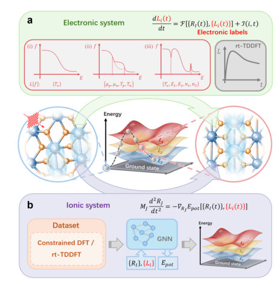 
Figure 1. Schematic diagram of the workflow of excited state machine learning molecular dynamics (EMLMD). Schematic diagram of an excited-state dynamic process. The illustration shows initial state and an instan- taneous state connected by evolution of both electronic and ionic system. a–b The evolution equations and the different scenarios that they might describe for the electronic (a) and ionic (b) subsystems, respectively. {RI} and {Li} represent atomic coordinates and labels of electronic structure respec- tively. DFT methods are used to generate training data, while rt-TDDFT trajectories provide the evolution of {Li}. Machine learning potential is trained based on self-developed graph...

📷 Fig 2

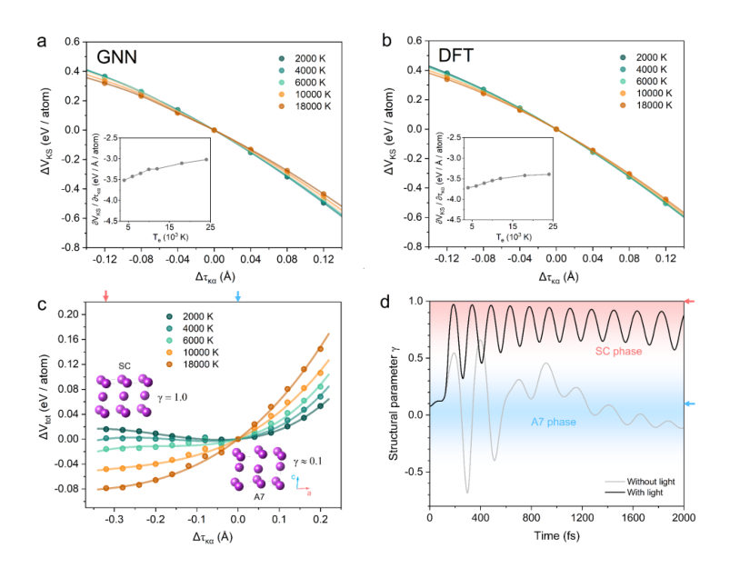 
Figure 2. Machine learning of electron-temperature-dependent excited-state potential energy surfaces. a–b KS orbital energy variations calculated by the graph neural network (GNN) and DFT, respectively, along the A1g phonon displacement coordinate. Insets show the zero-point (∆τκα = 0) derivative evolution as a function of Te. c GNN-predicted total energy profile along the A1g phonon displacement coordinate, with schematic illustrations of A7 and SC lattice structures. d Time evolution of structural order parameter γ under unexcited and laser-excited conditions. Black and gray lines represent dynamic trajectories with and without light irradiation, respectively. Red and blue backgrounds...

📷 Fig 3

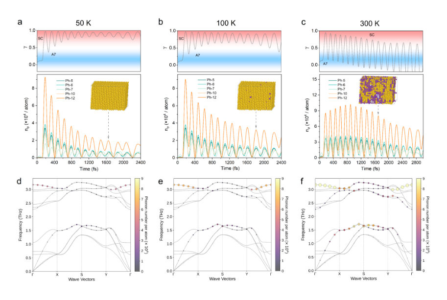 
Figure 3. Environment-temperature-dependent phonon dynamics of photoexcited bismuth. a–c Time evolution of structural order parameter γ (upper panel) and average number of phonons nσ for certain phonon branches (lower panel) at bath temperatures of 50 K, 100 K and 300 K under laser excitation. Red and blue backgrounds delineate SC and A7 phase domains. The A1g mode corresponds to Γ-point Ph-12. d–f q-resolved phonon occupation distributions per atom at representative time points (t ∼1700 fs) near peak phonon density for 50 K, 100 K and 300 K trajectories, with corresponding structural snapshots embedded as insets in (a–c). Circle size and colour encode phonon occupation magnitude.

📷 Fig 4

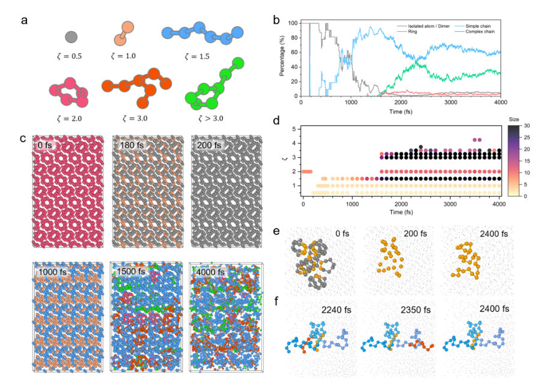 
Figure 4. Photo-induced amorphization dynamics of selenium. a Schematic illustration of typical clusters type, with cluster order parameter ζ values labeled for each structural motif. b Time evolution of population percentage of distinct cluster species. Grey, blue, red and green lines correspond to isolated atoms/dimers, simple unbranched chains, ring structures and complex branched chains, respectively. c Representative structural snapshots of system at 0 fs, 180 fs, 200 fs, 1000 fs, 2000 fs and 4000 fs, colored according to the cluster classification criteria in (a). d Time evolution of cluster types ζ and sizes throughout the photoinduced amorphization process. Color of each data point...

**Summary.** This paper introduces an Electron-informed Machine Learning Molecular Dynamics (EMLMD) framework to overcome the computational barriers in simulating light-induced dynamics. By training ML potentials on high-fidelity rt-TDDFT data, the method accurately captures excited-state electron-phonon coupling. This allows researchers to study complex phenomena like photoinduced phase transitions over extended timescales with first-principles accuracy.

**Why it may be interesting.** The integration of electronic structure information (like $T_e$) directly into the force field via ML is highly relevant for open quantum systems, as it allows the simulation of non-equilibrium energy flow and coupling mechanisms beyond simple thermal assumptions.

Detailed structure

**Main problem.** Direct first-principles simulation of nonadiabatic coupled electron-nuclear dynamics following electronic excitation is computationally prohibitive for studying photoinduced phenomena in materials.

**Main result.** The developed EMLMD framework successfully simulates large-scale, long-time dynamics, revealing that the photoinduced structural transition in bismuth is driven by electronic modulation rather than just lattice heating.

**Method.** The authors propose an Electron-informed Machine Learning Molecular Dynamics (EMLMD) framework, which trains a machine learning potential using high-precision rt-TDDFT data to accurately capture excited-state potential energy surfaces.

**Model / system.** The study focuses on photoexcited materials, demonstrated with Bismuth undergoing a structural phase transition and Selenium undergoing photoamorphization. The model involves coupling electronic structure information (like electron temperature) into the ML potential governing atomic motion.

**Key observables.** Structural order parameter ($\gamma$), electron temperature ($T_e$), lattice temperature ($T_{bath}$), time- and momentum-resolved phonon dynamics.

**Important parameters / regimes.** Excitation energy ($\hbar\omega = 1.55$ eV), environment temperatures (50 K, 100 K, 300 K), simulation timescales (picoseconds to nanoseconds).

**Assumptions / limitations.** The method relies on physically informed dimensionality reduction to approximate the full electron distribution and uses the frozen-phonon approximation for calculating potential derivatives.

**Figures summary.** Figures illustrate the EMLMD workflow using DFT/rt-TDDFT training data, show the time evolution of the structural order parameter ($\gamma$) under different excitation conditions, and map out environment-temperature-dependent phonon dynamics.

**Paper structure.** The paper first establishes the computational bottleneck of nonadiabatic dynamics. It then details the EMLMD framework, contrasting it with TTM and TDBE. The core of the work presents large-scale simulations on Bismuth and Selenium, demonstrating the method's capability to resolve complex, coupled dynamics.

Abstract

Nonadiabatic coupled electron-nuclear dynamics upon electronic excitation underpin the microscopic mechanism and rational modulation of diverse photoinduced functional phenomena in materials, yet their direct first-principles simulations remain computationally demanding. Here we develop a framework for nonadiabatic excited-state machine-learning molecular dynamics (EMLMD) simulations, where the nonequilibrium electronic information upon photoexcitation such as electron temperature is rigorously calibrated from high-precision real-time time-dependent density functional theory (rt-TDDFT) benchmark simulations, enabling accurate reconstruction of excited-state potential energy surfaces (PES). This framework natively incorporates the excited-state electron-phonon couplings and intrinsically captures photoinduced phonon anharmonicity, both of which are missing in standard machine learning molecular dynamics, thus delivering first-principles-level accuracy for excited-state atomic evolutions. Large-scale EMLMD simulations resolve time- and momentum-resolved phonon dynamics in photoexcited materials, directly uncovering the competition between photogenerated coherent phonons and thermal phonons during photoinduced phase transition of bismuth. It also simultaneously resolves elusive atomic-scale microscopic dynamics and global structural rearrangement for selenium photoamorphization. Balancing high accuracy and efficiency, EMLMD offers a versatile paradigm to tackle key challenges in the study of complex excited-state molecular dynamics.

[↑ back to top](#top)

### [Pole-Zero Geometry, Model Reduction, and Identifiability in Sensory Adaptation](http://arxiv.org/abs/2609.01329v1)

**Authors:** Gunn Kim  
**Type:** theory · **Category:** statistical mechanics · **PDF:** <https://arxiv.org/pdf/2609.01329v1>  
**Analysis basis:** full PDF text, analyzed in chunks
**Topic relevance:** `quantum measurements` **2/5** · `Keldysh / 2PI / non-Gaussian methods` **1/5** · `correlated / nonlocal dissipation` **1/5** · `driven-dissipative phase transition` **1/5** · `methods for driven-dissipative` **1/5** · `non-equilibrium universality` **1/5**

📷 Fig 1

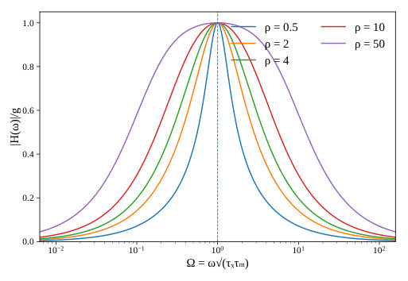 
FIG. 2. Frequency response on the exact-integrator slice. With Ω= ω√τxτm, all minimal-model curves peak at Ω= 1. Parallel subtraction suppresses the common dc component, while finite branch kinetics suppress sufficiently fast mod- ulation; the surviving intermediate band is therefore the frequency-domain counterpart of temporal comparison. The minimal two-state model has ωp = (τxτm)−1/2 and ∆ω = 1/τx. A common upstream stage, as in Eq. (17), adds a fur- ther high-frequency pole and breaks the exact log-frequency inversion symmetry.

📷 Fig 2

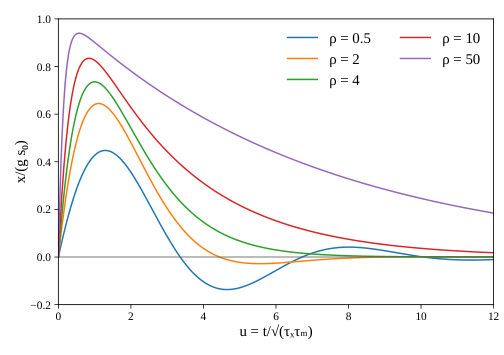 
FIG. 1. Normalized response to a persistent step on the exact- integrator slice κ = 0 for several values of ρ = τm/τx. Time is measured in units t0 = √τxτm and the output in units of gs0. In the parallel-subtraction interpretation, a persistent in- put excites two temporal branches whose transient mismatch produces the pulse while equal dc gains cancel at long times. The poles control the transient morphology: complex reduced modes occur for ρ &lt; 4, the poles coalesce at ρ = 4, and two real modes occur for ρ &gt; 4.

📷 Fig 3

 
Figure 2 is therefore also a subtraction diagram in fre- quency space: sufficiently slow components are rejected because the two branches agree, sufficiently rapid compo- nents are suppressed by finite kinetics, and intermediate frequencies are transmitted because the branches have different phase and amplitude.

📷 Fig 4

 
Figure 1 shows the normalized step response of the minimal exact-integrator slice. In the parallel picture, the pulse is the temporary mismatch between fast and slow branches after both receive the same persistent in- put. They are equal at long times, so the output returns to baseline. The pole locations determine whether that mismatch relaxes through an effective complex pair or through distinct real decays.

📷 Fig 5

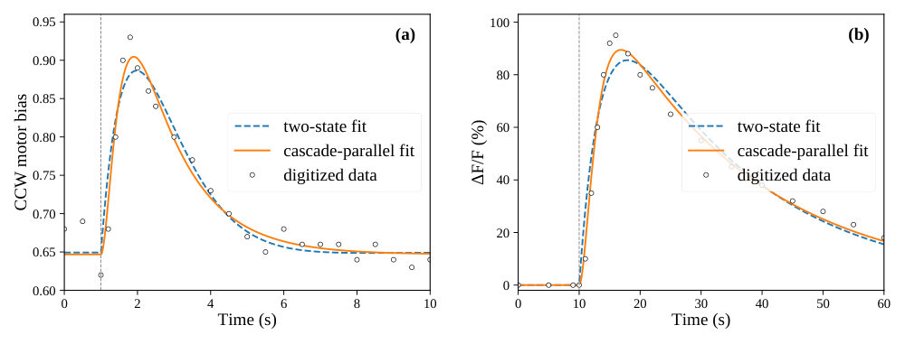 
FIG. 3. Graph-digitized biological responses compared with two coarse-grained realizations. (a) Wild-type E. coli tethered-cell CCW motor bias from Segall, Block, and Berg [4]. The dashed two-state fit has τx = 0.529 s, τm = 1.666 s, ρ = 3.148, and R2 = 0.928; the solid balanced cascade–parallel fit has T = 0.268 s, Ts = 1.364 s, and R2 = 0.958. (b) Corrected AWCON

**Summary.** This paper provides a rigorous framework for analyzing the limitations of low-dimensional models applied to adaptive biological dynamics. It demonstrates that model reduction techniques can lead to qualitatively different inferred system structures, and that certain thermodynamic quantities, like irreversibility, cannot be determined solely from the measured scalar response. The work establishes a clear boundary between model-dependent artifacts and fundamental physical invariants.

**Why it may be interesting.** The rigorous mathematical framework developed for distinguishing between true system invariants and artifacts of model reduction is highly relevant for any field using low-dimensional approximations (like effective Hamiltonians or coarse-grained descriptions) of complex, high-dimensional physical systems.

Detailed structure

**Main problem.** The paper addresses ambiguities in low-dimensional modeling of adaptive biological dynamics, specifically determining which inferred dynamics are truly determined by measurements versus those introduced by model reduction or partial observation.

**Main result.** The pole classification of a reduced model is not invariant under changes in the observation protocol (e.g., moment matching vs. window fitting). Furthermore, the scalar response spectrum cannot identify the path-space irreversibility rate in the exact-adaptation limit.

**Method.** The authors use pole-zero geometry analysis, stochastic Ornstein-Uhlenbeck theory, and systematic model reduction techniques to analyze the relationship between high-order systems and their low-dimensional approximations.

**Model / system.** The core system is sensory adaptation, modeled using a two-state system involving sensory output, a memory variable, and the stimulus, often analyzed via transfer functions derived from Ornstein-Uhlenbeck processes.

**Key observables.** Pole locations (real vs. complex), relative degree, cross-diffusion terms in the spectrum, and the path-space irreversibility rate.

**Important parameters / regimes.** The ratio of time constants, $
ho = 	au_m / 	au_x$, and the memory parameter $\kappa$.

**Assumptions / limitations.** The analysis relies on comparing results from different model reduction procedures (e.g., low-frequency moment matching vs. finite-window fitting) and assuming the applicability of specific reduced OU models for deriving bounds.

**Figures summary.** Figures illustrate the dependence of pole classification on the reduction method, the frequency response of the system, and the separation between the deterministic response and the hidden cross-diffusion channel.

**Paper structure.** The paper progresses by first demonstrating the non-invariance of pole classification under model reduction, then connecting stochastic identifiability to adaptation by analyzing how cross-diffusion terms drop out of the scalar spectrum under specific memory limits, and finally establishing bounds on irreversibility.

Abstract

Sensory adaptation provides a concrete setting in which low-order system identification can fail qualitatively. We show that one fixed higher-order adaptive system composed entirely of real first-order relaxation modes can be reduced to opposite sides of the second-order pole boundary: low-frequency moment matching gives $ρ_{\rm moment}=4.50$, whereas finite-window fitting gives $ρ_{\rm window}=3.31$, and the inferred pole class changes further with sampling protocol. Thus the real-versus-complex classification of a reduced model is not itself reduction invariant. We then use the general two-state spectrum to connect stochastic identifiability to adaptation: for nontrivial coupling and one-state observation, cross diffusion drops out of the scalar spectrum when the hidden state has no self-relaxation. In the adaptive model, this condition is precisely the integral-memory limit that produces exact adaptation, while leaky memory restores spectral sensitivity. For the exact-adaptation model, the Gaussian path-space irreversibility nevertheless depends on the hidden cross-diffusion channel. Hence $\{H,S_x\}$ does not determine the irreversibility rate. Independently, for a specified all-even reduced two-state drift with $ρ<4$, the drift-only lower bound is $σ\ge τ_x^{-1}(4/ρ-1)$. Published \textit{E.~coli} and \textit{C.~elegans} responses provide biological examples of these limits. The distinction established here between transfer-function invariants, reduction-dependent properties, and hidden-state quantities provides a concrete framework for evaluating the limitations of low-dimensional models of adaptive biological dynamics.

[↑ back to top](#top)

### [Nonmonotonic control of pattern formation by chemotaxis](http://arxiv.org/abs/2609.01127v1)

**Authors:** Mintu Karmakar, Abhik Basu  
**Type:** theory · **Category:** statistical mechanics · **PDF:** <https://arxiv.org/pdf/2609.01127v1>  
**Analysis basis:** full PDF text, analyzed in chunks
**Topic relevance:** `driven-dissipative phase transition` **2/5** · `Frenkel-Kontorova` **1/5** · `analog quantum simulation` **1/5** · `non-equilibrium universality` **1/5**

📷 Fig 1

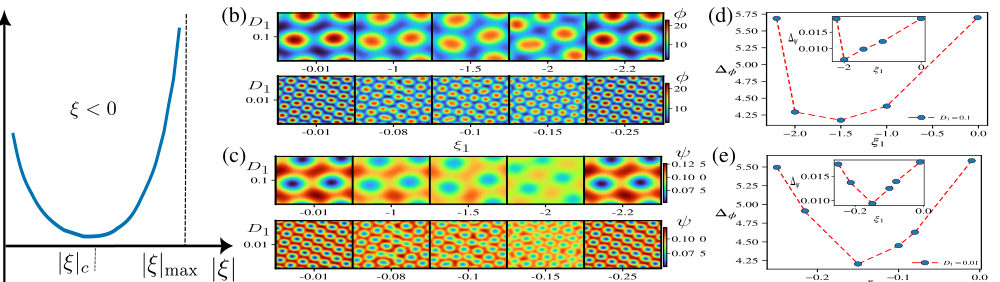 
FIG. 1. Instabilities and patterns for 𝜉1 = 𝜉= 𝜉2 &lt; 0. (a) 𝑘2 𝑐as a function of 𝜉&lt; 0, showing a nonmonotonic behavior. (b) and (c) Snapshots showing steady patterns for 𝐷= 1000 and 𝐷1 = 0.01(b), 0.1(c), showing nonmonotonic variation of the pattern intensities as 𝜉varies. (d) and (e) Plots of Σ𝜙and Σ𝜓versus 𝜉corresponding to the snapshots in (b) and (c) respectively. See text.

📷 Fig 2

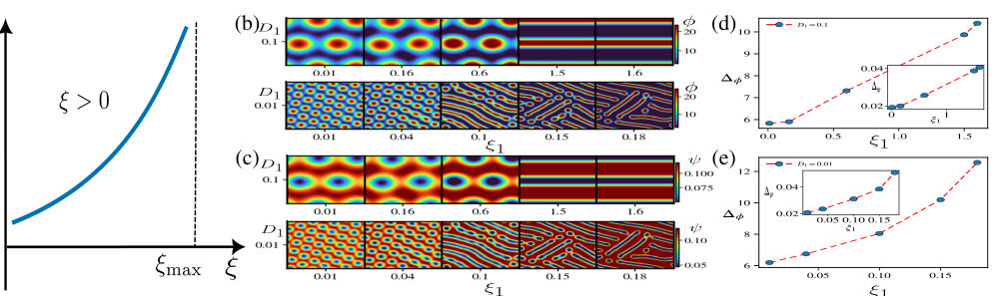 
FIG. 2. Instabilities and patterns for 𝜉1 = 𝜉= 𝜉2 &gt; 0. (a) 𝑘2 𝑐as a function of 𝜉&lt; 0, showing a monotonic behavior. (b) and (c) Snapshots showing steady patterns for 𝐷= 1000 and 𝐷1 = 0.01(b), 0.1(c), showing monotonic variation of the pattern intensities as 𝜉varies. (d) and (e) Plots of Σ𝜙and Σ𝜓versus 𝜉corresponding to the snapshots in (b) and (c) respectively. See text.

📷 Fig 3

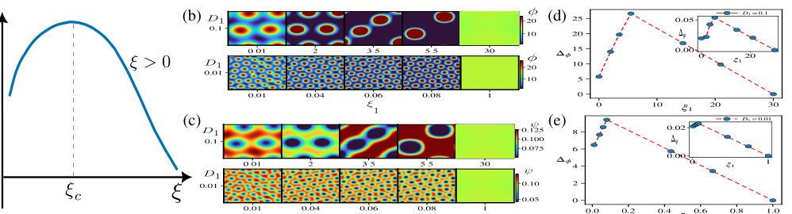 
FIG. 3. Instabilities and patterns for 𝜉1 = 𝜉= −𝜉2 &gt; 0.(a) 𝑘2 𝑐as a function of 𝜉&gt; 0, showing a nonmonotonic behavior. (b) and (c) Snapshots showing steady patterns for 𝐷= 1000 and 𝐷1 = 0.01(b), 0.1(c), showing nonmonotonic variation of the pattern intensities as 𝜉varies. (d) and (e) Plots of Σ𝜙and Σ𝜓versus 𝜉corresponding to the snapshots in (b) and (c) respectively. See text.

📷 Fig 4

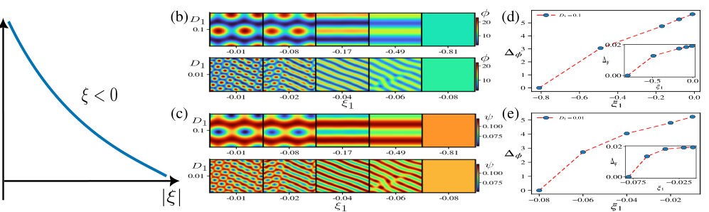 
FIG. 4. Instabilities and patterns for 𝜉1 = 𝜉= −𝜉2 &lt; 0.(a) 𝑘2 𝑐as a function of 𝜉&lt; 0, showing a monotonic behavior. (b) and (c) Snapshots showing steady patterns for 𝐷= 1000 and 𝐷1 = 0.01(b), 0.1(c), showing monotonic variation of the pattern intensities as 𝜉varies. (d) and (e) Plots of Σ𝜙and Σ𝜓versus 𝜉corresponding to the snapshots in (b) and (c) respectively. See text.

**Summary.** This paper analyzes pattern formation in reaction-diffusion systems coupled with chemotaxis. The authors demonstrate that the strength of chemotaxis can lead to nonmonotonic behavior, causing re-entrant transitions between patterned and uniform states. They use linear stability analysis and numerical simulations to map out these complex control regimes and morphological transitions.

**Why it may be interesting.** While focused on classical pattern formation, the concept of nonmonotonic control and re-entrant transitions driven by an external coupling (chemotaxis) is relevant to understanding phase transitions in complex quantum or open quantum systems.

Detailed structure

**Main problem.** The study investigates how pattern formation in two-species reaction-diffusion systems is controlled by the strength of chemotaxis, specifically looking for nonmonotonic dependencies.

**Main result.** Chemotaxis can induce a striking nonmonotonic and re-entrant dependence of pattern formation on its strength, and it can also drive morphological transitions between spot and stripe patterns.

**Method.** The analysis employs linear stability analysis (LSA) around uniform states to determine the selected wavevector ($k_c$), supplemented by direct numerical simulations (DNS) using pseudo-spectral methods.

**Model / system.** The model is a generic two-species reaction-diffusion system incorporating mutual chemotaxis, exemplified by the chemotactic extension of the Selkov model for glycolysis in two dimensions.

**Key observables.** Pattern selection wavevector ($k_c$), pattern amplitudes ($\Delta\phi, \Delta\psi$), and the dependence of these on chemotaxis couplings ($\xi_1, \xi_2$).

**Important parameters / regimes.** Chemotaxis couplings ($\xi_1, \xi_2$), the strength of chemotaxis ($\xi$), and the system size ($L$).

**Assumptions / limitations.** The analysis relies on linear stability theory and approximations for determining $k_c$; DNS studies are performed for specific parameter sets.

**Figures summary.** Figures illustrate the nonmonotonic dependence of $k_c$ on $\xi$ for different chemotaxis regimes (reciprocal vs. nonreciprocal), and show corresponding variations in pattern amplitudes ($\Sigma\phi, \Sigma\psi$) across various $\xi$ values.

**Paper structure.** The paper progresses by setting up the reaction-diffusion system, performing LSA to find $k_c$'s dependence on chemotaxis strength, and then confirming these theoretical predictions and observing pattern transitions (spot/stripe) via DNS.

Abstract

We investigate pattern formation in generic two-species reaction--diffusion systems with chemotaxis. We show that chemotaxis can give rise to a striking nonmonotonic dependence of pattern formation on its strength, opening the possibility of re-entrant transitions between patterned and homogeneous states controlled by chemotaxis. In certain regimes, chemotaxis also induces additional heretofore unexplored instabilities. Furthermore, varying the strength of chemotaxis can drive morphological transitions between spot and stripe patterns.

[↑ back to top](#top)

### [Photonic fusion operations transform partial distinguishability](http://arxiv.org/abs/2609.01019v1)

**Authors:** S. N. van den Hoven, G. B. Lamers, J. J. Renema  
**Type:** theory · **Category:** quantum information and computing · **PDF:** <https://arxiv.org/pdf/2609.01019v1>  
**Analysis basis:** full PDF text, analyzed in chunks
**Topic relevance:** `quantum measurements` **2/5** · `analog quantum simulation` **1/5**

📷 Fig 1

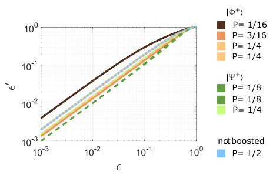 
Figure 1. Loglog plot of the infidelity of a Bell state after fus- ing two Bell states together with various fusion protocols. The output infidelity is plot as a function of the input infidelity of the Bell states. The intersections with the y-axis show the in- crease in infidelity in the low error regime for various families of heralding patterns. The families of the different heralding patterns for the fusion protocols without ancillary states, with a |Φ+⟩ancilla state and with a |Ψ+⟩ancilla state are shown as solid lines with an orange hue, dashed lines with a green hue and a blue dotted line respectively. The different shades of the different lines correspond to the probability of...

📷 Fig 2

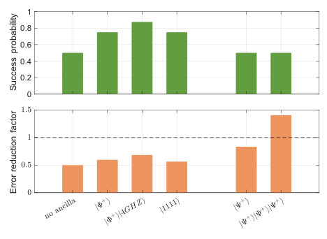 
Figure 2. Both the success probability (top) and the expectation value of the error reduction factor (bottom) are shown for var- ious fusion protocols. On the left of the bottom histogram we see that existing protocols for fusions (up to 6-photon ancillary states) all show error reduction factors below one and hence perform anti-distillation on average, while the altered Grice protocols on the right excel in terms of distillation properties. This comes at the expense of reducing the success probability.

📷 Fig 3

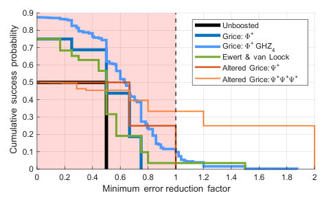 
Figure 3. For various fusion protocols, the cumulative success probability is shown as a function of a desired minimum error reduction factor. The curves therefore indicate the probability of obtaining a successful herald outcome conditioned on de- manding at least a specified degree of indistinguishability dis- tillation.

📷 Fig 4

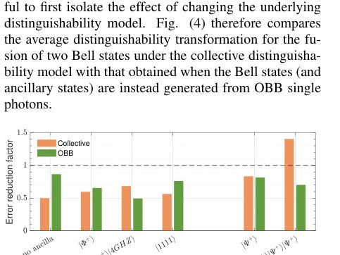 
Figure 4. Comparison of the average error reduction factor for the collective distinguishability model (orange) and Bell states generated from OBB single photons (green).

📷 Fig 5

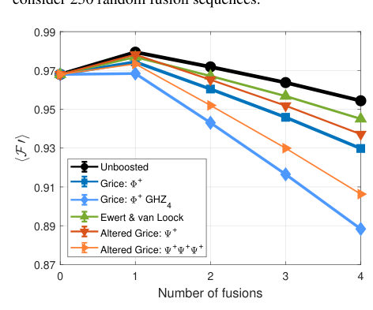 
Figure 5. Average fidelity of a 4-GHZ state as a function of the number of successful fusion operations for the various fusion protocols considered. All states (including ancilla states) are generated from OBB single photons. For most data points, the error bars are smaller than the markers. For this figure an input error of ϵOBB = 0.0025 is used, which follows the reported value of Ref. [3].

**Summary.** This work establishes that photonic fusion operations not only determine success rates but also dynamically shape the partial distinguishability of the resulting quantum state. By analyzing this transformation, the authors show that protocols optimized for fidelity or success might fail to account for detrimental changes in distinguishability. This mandates that distinguishability propagation be a core metric in designing robust photonic quantum circuits.

**Why it may be interesting.** It provides a rigorous, quantitative framework for assessing the quality of quantum operations in photonic systems by tracking the evolution of coherence/indistinguishability, which is crucial for scaling up quantum networks.

Detailed structure

**Main problem.** The paper investigates a novel characterization of photonic fusion operations: how they dynamically transform partial distinguishability, moving beyond simple metrics like success probability or resource cost.

**Main result.** Different fusion protocols induce markedly different transformations in partial distinguishability, meaning this property must be considered alongside success probability when evaluating quantum protocols.

**Method.** The authors analyze various fusion protocols using theoretical models (OBB/OBBell) to track the evolution of distinguishability in heralded entangled states.

**Model / system.** The system is photonic quantum information processing, focusing on photonic fusion operations (Bell measurements) applied to states suffering from partial distinguishability due to imperfect photon sources or channels.

**Key observables.** Partial distinguishability, fidelity of the remaining state, average error reduction factor, and success probability.

**Important parameters / regimes.** The distinguishability parameter ($\epsilon$), the fusion protocol used, and the heralding outcome.

**Assumptions / limitations.** The analysis utilizes the Orthogonal Bad Bit (OBB) and Orthogonal Bad Bell (OBBell) models, which simplify the continuous nature of realistic mode mismatch.

**Figures summary.** Figures compare Bell-state infidelity ($\epsilon'$) vs. distinguishability ($\epsilon$) for various protocols, and compare success probability with error reduction factors for modified protocols.

**Paper structure.** The paper introduces the problem of characterizing fusion operations beyond success probability, develops error models (OBB/OBBell), analyzes multiple protocols by tracking distinguishability transformation, and concludes that this dynamic property must be accounted for.

Abstract

Photonic fusion operations are a central primitive in photonic quantum information processing and are commonly characterized by their success probability and resource cost. Here, we identify an additional way in which different implementations of fusion operations differ, namely in how they transform partial distinguishability. We consider distinguishability originating both from imperfect entangled resource states and from imperfect single photons. We find that different successful fusion events can induce markedly different distinguishability transformations depending on the fusion protocol, heralding outcome, and error model. Under a collective resource-state error model, we identify a modification to an existing fusion protocol that improves the fidelity of the remaining state on average. Generally, however, these transformations adversely affect distinguishability, and many successful fusion outcomes are accompanied by distinguishability degradation. Our results show that partial distinguishability is dynamically shaped by interference and measurements and should be considered alongside overall fusion success probability when evaluating photonic fusion protocols.

[↑ back to top](#top)

### [Regulating Free-scalar and Yang--Lee 5d CFTs on the Fuzzy Four Sphere](http://arxiv.org/abs/2609.00148v1)

**Authors:** Jiangyuan Qian  
**Type:** theory · **Category:** statistical mechanics · **PDF:** <https://arxiv.org/pdf/2609.00148v1>  
**Analysis basis:** full PDF text, analyzed in chunks
**Topic relevance:** `methods for driven-dissipative` **2/5** · `analog quantum simulation` **1/5**

📷 Fig 1

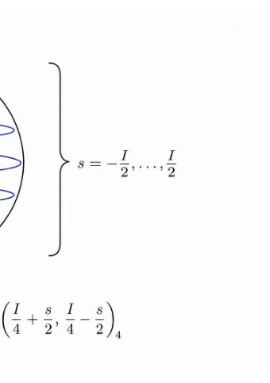 
Figure 1. The fuzzy S4 orbital decompose into S3 orbitals.

📷 Fig 2

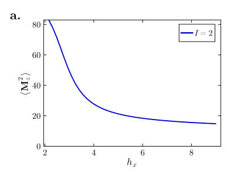 
Figure 2. (a) ⟨Mz 2⟩as a function of hx, for V1,0 = 1.600, V0,1 = 0.011. (b) Energy gaps in different (C2, R, +1) sectors as a function of hx, with same parameter choice.

📷 Fig 3

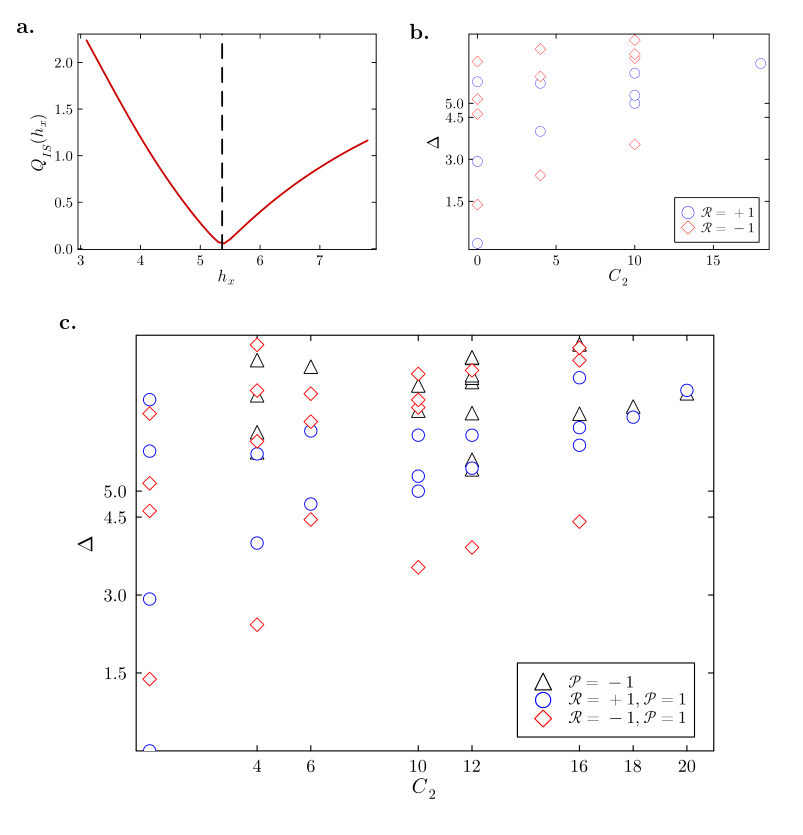 
Figure 3. (a) The Ising cost QIS as a function of hx, for V1,0 = 1.600, V0,1 = 0.011. (b) The spec- trum of P = +1 symmetric tensor representations of so(5), having removed the weight degeneracy in an irreducible representation. (c) The full spectrum. (b–c) are computed at I = 2, with the parameters in (3.5).

📷 Fig 4

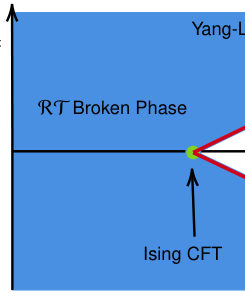 
Figure 4. Phase diagram of the Yang–Lee models, adapted from Cruz et al.

📷 Fig 5

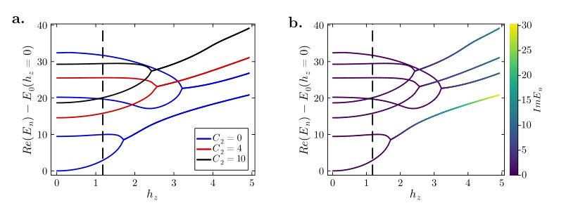 
Figure 5. (a) The energy levels ReEn(hz) of (4.2). (b) The color denotes the imaginary part of the energies as function of hz, the merging point is h(merg.) z ≃1.7, the vertical line denotes the critical point h∗ z &lt; h(merg.) z , which will be determined later. The parameters are V0,1 = 1.862, V1,0 = 0.061, hx = 8.913.

**Summary.** This work investigates 5D CFTs (Free-scalar and Yang-Lee) regularized on the Fuzzy Four Sphere. By employing advanced numerical techniques like DMRG, the authors demonstrate continuous phase transitions and calculate key conformal dimensions. This provides a theoretical framework for understanding critical behavior in complex quantum field theories.

**Why it may be interesting.** The rigorous application of numerical methods like DMRG to study critical phenomena and CFTs on non-trivial manifolds like the fuzzy sphere provides advanced techniques applicable to strongly correlated quantum systems.

Detailed structure

**Main problem.** The paper constructs and analyzes 5D Free-scalar and Yang-Lee Conformal Field Theories (CFTs) regularized on the Fuzzy Four Sphere.

**Main result.** The study confirms the existence of continuous phase transitions and conformal towers in these models, yielding scaling dimensions consistent with established CFT results.

**Method.** The analysis employs advanced numerical techniques like Exact Diagonalization (ED) and Density Matrix Renormalization Group (DMRG) to compute energy spectra and scaling dimensions.

**Model / system.** The models are defined on a fuzzy 4-sphere ($S^4$) and include a free-scalar CFT (Ising model) and a Yang-Lee CFT, both governed by specific Hamiltonians derived using $SO(5)$ invariance.

**Key observables.** Scaling dimensions ($\Delta_\phi, \Delta_{\phi^3}$), energy spectra ($E_n - E_0$), and the observation of continuous phase transitions.

**Important parameters / regimes.** The coupling constant $h_x$ (for phase transition tuning) and the fermion number $N_e$ (for DMRG calculations).

**Assumptions / limitations.** The analysis relies on the fuzzy sphere regularization method and assumes the applicability of CFT correspondence between the low-energy spectrum and the continuum theory.

**Figures summary.** Figures illustrate the phase diagrams for the Yang-Lee model, energy level splittings at critical points, and the cost functions used to match calculated spectra to CFT predictions.

**Paper structure.** The paper first introduces the construction of the 5D CFTs on the fuzzy $S^4$, details the Hamiltonians for the free-scalar and Yang-Lee models, and then applies ED and DMRG to calculate spectra, observe phase transitions, and extract scaling dimensions.

Abstract

Non-commutative sphere regularization of CFT has become a powerful tool for computing conformal data of 3d CFTs and was recently extended to 4d CFTs. In this work we further construct 5d free-scalar CFT and Yang-Lee CFT on a fuzzy 4-sphere. We observe a continuous phase transition and conformal towers in these examples. We obtain the first three scalar primaries of the 5d free-scalar CFT, furthermore, we compute the 5d Yang-Lee $Δ_φ,Δ_{φ^3}$ with $N_e=10$ fermions using exact diagonalization (ED) and $N_e=20$ fermions using density matrix renormalization group (DMRG), obtaining relatively good agreement with both $ε$-expansion and the Gliozzi truncated bootstrap result.

[↑ back to top](#top)

### [Bond-number-controlled durability of cohesive granular materials under repeated vibration](http://arxiv.org/abs/2609.00587v1)

**Authors:** Hikari Yokota, Rei Kurita  
**Type:** experiment · **Category:** statistical mechanics · **PDF:** <https://arxiv.org/pdf/2609.00587v1>  
**Analysis basis:** full PDF text, analyzed in chunks
**Topic relevance:** `non-equilibrium universality` **2/5**

📷 Fig 1

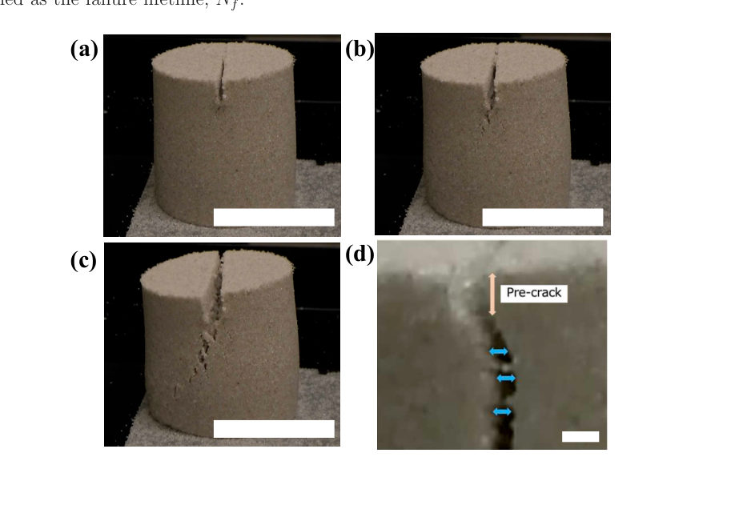 
FIG. 1. Time evolution of a granular block under repeated vibration at 40 Hz and α = 0.6. (a) At

📷 Fig 2

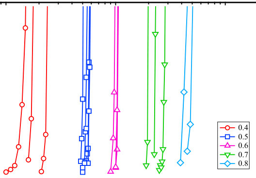 
FIG. 2. Time evolution of the crack width w for granular blocks with different kinetic-sand fractions

📷 Fig 3

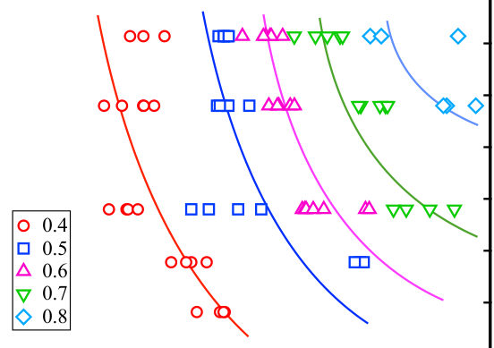 
FIG. 3. Relation between the dimensionless peak acceleration G and the failure lifetime Nf for

📷 Fig 4

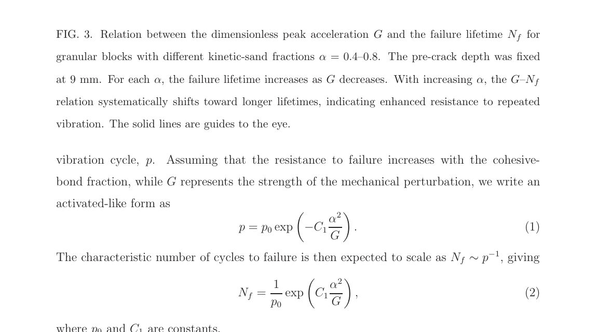 
Figure 4 shows Nf as a function of α2/G. The colors indicate α, while circles, squares, and

📷 Fig 5

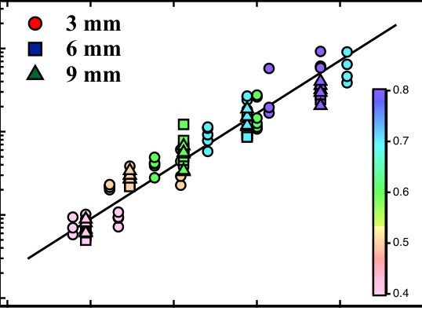 
FIG. 4. Scaling of the failure lifetime Nf with α2/G. The color indicates the kinetic-sand fraction α,

**Summary.** This work investigates how the mechanical durability of cohesive granular materials changes when subjected to repeated vibration. By using a mixed-grain system, the authors successfully decoupled the influence of individual bond strength from the load-bearing network structure. They found that the failure lifetime scales exponentially with the cohesive bond fraction, proving that the network connectivity, rather than just the material's stiffness, dictates its resistance to fatigue.

**Why it may be interesting.** While focused on granular mechanics, the concept of separating intrinsic material properties (bond strength) from emergent structural properties (network connectivity) under external driving (vibration) echoes concepts in non-equilibrium statistical mechanics and the study of failure in complex systems.

Detailed structure

**Main problem.** The study aims to experimentally separate the contributions of individual interparticle bond strength versus the load-bearing network structure (bond number) to the mechanical durability of cohesive granular materials under cyclic loading.

**Main result.** The failure lifetime ($N_f$) exhibits a strong, non-linear dependence on the cohesive bond fraction ($\alpha$), following an activated-like scaling law ($\ln N_f \propto \alpha^2/G$), demonstrating that durability is governed by the network structure even when macroscopic rigidity saturates.

**Method.** The researchers used a mixed granular system subjected to controlled pre-cracking and repeated sinusoidal vibration, measuring the number of cycles until failure ($N_f$).

**Model / system.** The system is a mixed granular material composed of cohesive and noncohesive grains, modeled using a mean-field approach where the cohesive bond fraction ($\alpha$) is the primary control parameter. Failure is analyzed using an activated-like scaling law.

**Key observables.** Failure lifetime ($N_f$), crack width ($w$), Young's modulus, and the scaling relationship $\ln N_f \propto \alpha^2/G$.

**Important parameters / regimes.** Mixing ratio ($\alpha$), peak acceleration normalized by gravity ($G$), and the pre-crack depth.

**Assumptions / limitations.** The analysis relies on a mean-field picture assuming random mixing of grains, and the scaling law itself is a phenomenological description.

**Figures summary.** Figures show the time evolution of crack development under vibration, confirming that crack growth onset shifts with $\alpha$. Crucially, Figure 4 demonstrates the collapse of $N_f$ data onto a single exponential relation when plotted against $\alpha^2/G$, validating the scaling law.

**Paper structure.** The paper establishes the problem by noting the difficulty in separating bond strength from network effects. It then details the experimental setup using mixed grains and vibration. The core of the work involves fitting the failure lifetime data to an activated-like scaling law, which successfully collapses the data, leading to the conclusion that bond number controls durability independently of stiffness.

Abstract

Cohesive granular materials derive their mechanical stability not only from the strength of individual interparticle bonds but also from the number of bonds forming the load-bearing network. However, these two effects are difficult to separate experimentally because conventional control parameters, such as liquid content, generally alter both simultaneously. Here, we use a mixed granular system composed of cohesive and noncohesive grains to control the cohesive bond number while keeping the bond strength approximately unchanged. We investigate the failure lifetime under repeated vibration and find that the number of cycles to failure, $N_f$, depends strongly on the mixing ratio $α$. The data are well collapsed by $\ln N_f \propto α^2/G$, where $α^2$ represents the fraction of cohesive contacts and $G$ is a peak acceleration normalized by gravitational acceleration. Remarkably, although the Young's modulus is nearly independent of $α$ above the rigidity threshold, the lifetime continues to increase strongly with $α$. This demonstrates that mechanical rigidity and durability against repeated perturbations exhibit distinct dependences on the cohesive network. These results identify bond number as a key control parameter for the durability of cohesive granular materials.

[↑ back to top](#top)

### [Correlation-Driven Nonlinear Magnetoelectric Response in an Altermagnet: A Dynamical Mean-Field Study](http://arxiv.org/abs/2609.00697v1)

**Authors:** Robert Peters, Jun Ōiké  
**Type:** theory · **Category:** strongly correlated electrons · **PDF:** <https://arxiv.org/pdf/2609.00697v1>  
**Analysis basis:** full PDF text, analyzed in chunks
**Topic relevance:** `Keldysh / 2PI / non-Gaussian methods` **2/5**

📷 Fig 1

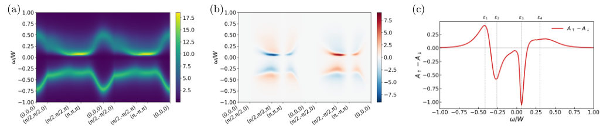 
FIG. 1. Spectral properties in the altermagnetic phase at U/W = 0.75 and T/W = 0.001. (a): Momentum-resolved spectral function A↑+ A↓. (b): Momentum-resolved spin difference A↑−A↓, revealing the characteristic momentum-dependent spin polarization. The sign change under a 90◦-rotation in the kx–ky plane reflects the d-wave-like altermagnetic pattern. (c) Sector-integrated spin difference obtained by integrating over kx, ky ∈[0, π] and kz ∈[−π, π]. This restricted momentum integration avoids the full Brillouin-zone cancellation associated with the d-wave-like spin texture and allows us to estimate a characteristic sector-averaged spin-splitting scale. The four dominant peak positions are...

📷 Fig 2

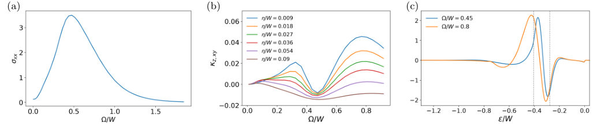 
FIG. 2. Linear and nonlinear optical responses for U/W = 0.75 in the altermagnetic phase. (a) Longitudinal optical conductivity σxx(Ω), shown as a baseline charge response. (b) Real part of the optical NMEE, Re κz,xy(Ω), for different Green-function broadenings η/W. (c) Energy-resolved integrand of Re κz,xy(Ω) as a function of the internal energy ε, evaluated at the two higher-frequency extrema, Ω/W = 0.45 and 0.8. The vertical dashed lines mark the occupied spin-polarized spectral features at ε1/W ≃−0.41 and ε2/W ≃−0.26. The full response is obtained by integrating the plotted quantity over ε.

📷 Fig 3

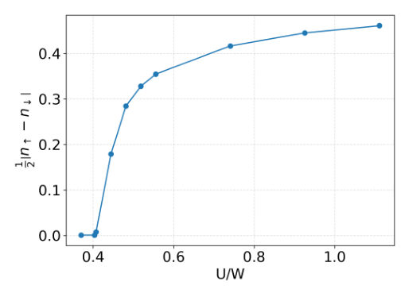 
FIG. 3. Local magnetization m = (nA↑−nA↓)/2 as a function of the interaction strength U at fixed tempera- ture T/W = 0.001. The magnetization decreases contin- uously with decreasing U and vanishes at a critical value Uc/W ≈0.4, indicating the transition out of the magneti- cally ordered phase.

📷 Fig 4

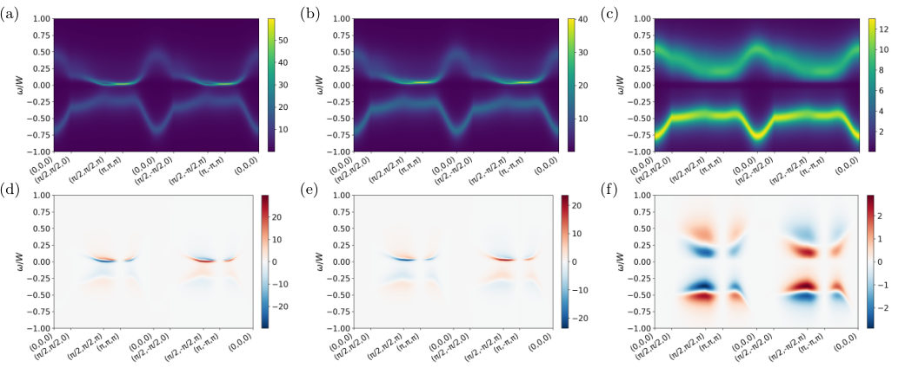 
FIG. 4. Spectral evolution with interaction strength U/W. (a)–(c): Total spectral function A↑+A↓for U/W = 0.55, 0.63, and 0.92, from left to right. (d)–(f): Spin-resolved spectral difference A↑−A↓for the same values of U/W. While the overall spectral structure remains similar, the gap at the Fermi energy increases with increasing U/W. The spin-resolved spectral difference exhibits the characteristic d-wave-like altermagnetic pattern for all interaction strengths shown. We note that the color scale is chosen separately for each panel; therefore, the apparent color intensity should not be compared directly between different values of U/W. In absolute magnitude, as indicated by the...

📷 Fig 5

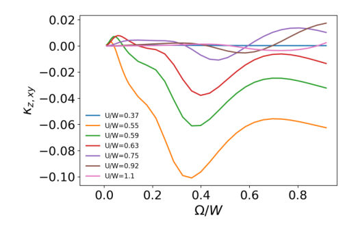 
FIG. 5. NMEE κz,xy(Ω) for different interaction strengths U/W, calculated at fixed broadening η/W = 0.036. For U/W &gt; Uc/W, the overall structure of κz,xy(Ω) remains qual- itatively similar, while the peak positions shift as the charac- teristic spectral energy scales evolve with interaction strength. In contrast, for U/W &lt; Uc/W the response vanishes in the paramagnetic phase. The magnitude of the response is en- hanced as U/W approaches the phase boundary from the or- dered side.

**Summary.** This theoretical study uses Dynamical Mean-Field Theory to examine the nonlinear magnetoelectric effect in correlated altermagnets. The authors demonstrate that the NMEE serves as a robust indicator of the altermagnetic order, vanishing when the system becomes paramagnetic. The results highlight that tuning parameters near the magnetic phase boundary can maximize this measurable response.

**Why it may be interesting.** The self-consistent calculation of a nonlinear response (NMEE) in a correlated magnetic state provides a rich example of how many-body physics dictates measurable optical properties, linking electronic structure to macroscopic response.

Detailed structure

**Main problem.** The study investigates the optical nonlinear magnetoelectric effect (NMEE) in a strongly correlated altermagnet.

**Main result.** The NMEE is found to be finite in the altermagnetic phase and vanishes in the paramagnetic phase, establishing it as a sensitive probe of correlated altermagnetic order.

**Method.** The research employs Dynamical Mean-Field Theory (DMFT) self-consistently to calculate the NMEE using interacting Green's functions.

**Model / system.** The system is a correlated altermagnet modeled by an interacting lattice Hamiltonian including an onsite Hubbard repulsion term (U). The structure is two-sublattice and spin-dependent.

**Key observables.** Optical Nonlinear Magnetoelectric Effect (NMEE), spin-resolved spectral structure, local magnetization, and the characteristic altermagnetic spin-splitting scale.

**Important parameters / regimes.** Interaction strength (U/W) and temperature (T/W), particularly near the interaction-driven magnetic phase boundary.

**Assumptions / limitations.** The approach self-consistently determines the magnetic order, electronic spectrum, and nonlinear response, avoiding limitations of effective band descriptions.

**Figures summary.** Figures illustrate the spectral evolution with interaction strength, the NMEE response across different parameter regimes, and the temperature dependence of magnetization and NMEE.

**Paper structure.** The paper follows a structure introducing the model, presenting main results concerning spectral properties, interaction strength dependence, and temperature dependence, concluding with the physical implications.

Abstract

We investigate the optical nonlinear magnetoelectric effect (NMEE) in a strongly correlated altermagnet using dynamical mean-field theory. Unlike effective band descriptions with an imposed spin splitting, our approach determines the altermagnetic order, electronic spectrum, and optical nonlinear response self-consistently. We find that the NMEE is finite in the altermagnetic phase and vanishes in the paramagnetic phase. Its frequency dependence reflects the spin-resolved spectral structure and provides an estimate of the characteristic altermagnetic spin-splitting scale. Interaction and temperature tuning produce qualitatively different behavior: at low temperature, reducing the interaction strength toward the interaction-driven magnetic phase boundary enhances the response, whereas increasing the temperature suppresses it and drives it to zero above the critical temperature. These results establish the optical NMEE as a probe of correlated altermagnetic order and suggest that tuning parameters such as pressure, strain, or chemical substitution toward an interaction-driven phase boundary may provide a promising route to maximizing the response.

[↑ back to top](#top)

### [Imaginarity witnessing enhancement via spectral norms of witnesses](http://arxiv.org/abs/2609.00534v1)

**Authors:** Yuhang Xie, Yanjun Chu, Yushan Ding, Shao-Ming Fei  
**Type:** theory · **Category:** quantum information and computing · **PDF:** <https://arxiv.org/pdf/2609.00534v1>  
**Analysis basis:** full PDF text, analyzed in chunks
**Topic relevance:** `quantum measurements` **2/5**

📷 Fig 1

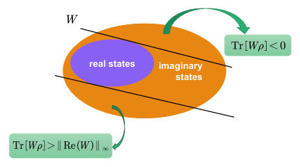 
FIG. 1: Classification of detectable imaginary quantum states via the imaginarity witness W: those satisfying Tr[Wρ] &lt; 0 and those satisfying Tr[Wρ] &gt; ∥Re(W)∥∞.

📷 Fig 2

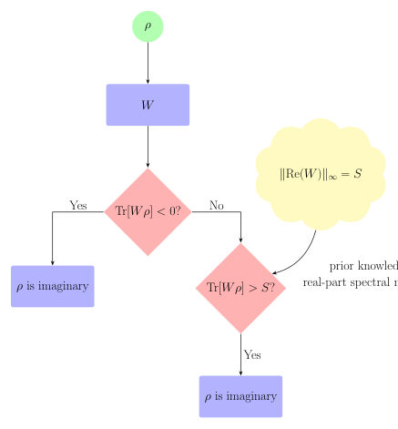 
FIG. 2: Witnessing imaginarity with prior knowledge of the real-part spectral norm of observable W.

📷 Fig 3

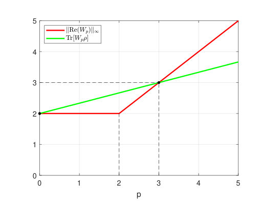 
FIG. 3: ∥Re(Wp)∥∞and Tr[Wpρ] versus p. Tr[Wpρ] &gt; ∥Re(Wp)∥∞for 0 &lt; p &lt; 3.

📷 Fig 4

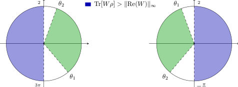 
FIG. 4: Imaginary states detected by W(α) for α &gt; 1 √

📷 Fig 5

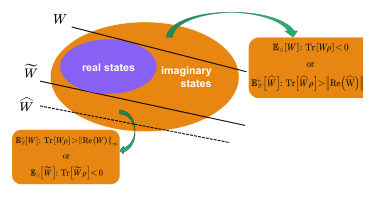 
FIG. 5: Relationship between the two criteria for detecting imaginary states: negative expectation values and expectation values exceeding the real-part spectral norm of the observable.

**Summary.** This paper advances the theory of quantum imaginarity detection by introducing a rigorous enhancement based on the spectral norm of the witness operator. It derives a new detection criterion, $	ext{Tr}[W
ho] > \| 	ext{Re}(W) \|_\infty$, which significantly improves the ability to identify imaginary quantum states. The authors classify all relevant witness operators based on this spectral norm bound.

**Why it may be interesting.** This work provides a fundamental theoretical tool for quantifying and detecting non-classical resources like imaginarity, which has direct implications for understanding the operational boundaries of quantum information processing beyond standard coherence measures.

Detailed structure

**Main problem.** The paper aims to improve the detection of quantum imaginarity—a resource quantified by the imaginary component of quantum states—using prior knowledge of spectral norms of witness operators.

**Main result.** The knowledge of the spectral norm, $\| 	ext{Re}(W) \|_\infty$, provides a rigorous and enhanced detection criterion for imaginary states, leading to a classification of all imaginarity-witness operators into four distinct families.

**Method.** The authors derive a new detection criterion by establishing an upper bound on the expectation value of an imaginarity witness over all real states, which is given by the spectral norm of the real part of the witness operator.

**Model / system.** The study concerns quantum states ($
ho$) in a $d$-dimensional Hilbert space, distinguishing between real states ($\mathcal{R}$) and imaginary states ($\mathcal{D} \setminus \mathcal{R}$). Detection relies on Hermitian 'imaginarity witnesses' ($W$).

**Key observables.** The expectation value $	ext{Tr}[W
ho]$, the spectral norm $\| 	ext{Re}(W) \|_\infty$, and the trace $	ext{Tr}[W]$ are key observables.

**Important parameters / regimes.** The spectral norm $S = \| 	ext{Re}(W) \|_\infty$ acts as a crucial parameter defining the enhanced detection regime.

**Assumptions / limitations.** The method assumes the existence of a suitable upper bound $S$ derived from the spectral norm of $	ext{Re}(W)$ to enhance the standard detection criterion $	ext{Tr}[W
ho] < 0$.

**Figures summary.** Figures illustrate the comparison between the traditional detection criterion ($	ext{Tr}[W
ho] < 0$) and the enhanced criterion ($	ext{Tr}[W
ho] > S$), and map out the relationship between various bounds ($\mu_{\max}$, $\| 	ext{Re}(W) \|_\infty$, $	ext{Tr}[W]$) for different state types.

**Paper structure.** The paper introduces the problem, derives the spectral norm bound, establishes the enhanced detection criterion, classifies the witnesses into four families, and proves theorems regarding the completeness and finite completeness of the resulting detection scheme.

Abstract

Quantum imaginarity is an essential physical resource that underpins key functionalities of modern quantum technologies. We improve imaginarity witnessing via the prior knowledge of imaginarity-witness operators. To this end, we derive a rigorous upper bound on the maximum expectation value of an imaginarity witness operator over the set of all free (real) quantum states, which is given by the spectral norm of the real component of the corresponding witness operator. We demonstrate via detailed examples that this bound substantially improves imaginarity detection. We further classify all imaginarity-witness operators into four distinct families based on this bound. For these four witness classes, we perform a comprehensive analysis of their completeness and finite completeness, the joint detection of shared imaginary quantum states by different witnesses, and the conditions for distinct witnesses to identify identical imaginary states. Our results advance the fundamental understanding of imaginarity detection and offer useful insights for both theoretical studies and experimental implementations of quantum imaginarity.

[↑ back to top](#top)

### [Parametric amplification of continuous-variable entangled state for loss-tolerant quantum distributed sensing](http://arxiv.org/abs/2609.00671v1)

**Authors:** Sijin Li, Wei Wang  
**Type:** theory · **Category:** quantum information and computing · **PDF:** <https://arxiv.org/pdf/2609.00671v1>  
**Analysis basis:** full PDF text, analyzed in chunks
**Topic relevance:** `quantum measurements` **2/5**

📷 Fig 1

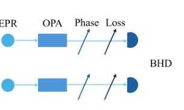 
Figure 1. Schematic of loss-tolerant phase sensing with two-mode entangled state via OPA. Sq: squeezed state; BS: beam splitter; EPR: Einstein–Podolsky–Rosen two-mode entangled state; BHD: balanced homodyne detection.

📷 Fig 2

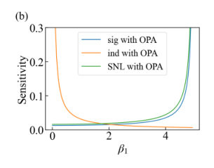 
Figure 2. Comparison of σavg with or without OPA, and comparison of EPR-based and single-mode squeezed-state schemes. Results as a function of (a) loss introduced in the two modes, and of (b) β1. Parameters for (a): η1 = η2 ≡η, β1 = 1, β2 = 5, θ1 = θ2 = 1.5◦, and r1 = 1 except for SNL with r1 = 0 and r3 = 5.7 except for “sig without OPA” with r3 = 0. Parameters for (b): η1 = η2 = 0.1, β2 = 5, θ1 = θ2 = 1.5◦, and r1 = 1 except for SNL with r1 = 0 and r3 = 5.7.

📷 Fig 3

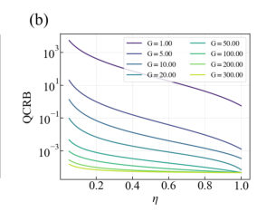 
Figure 3. QCRB of two phases θ1, θ2. (a) QCRB as a function of r1. (b) QCRB as a function of transmission, with different OPA gains. “Simultaneous” means measuring all phases with the entangled state at one time, while “individual” means measuring each phase independently with the entangled state. Parameters in (a): r3 = 5.7, corresponding to an OPA gain of 300; θ1 = θ2 = 1.5◦; α1 = β1 = 1; α2 = β2 = 5; η1 = η2 = 0.1. Parameters in (b): r1 = 1, corresponding to a squeezing level of 8 dB; θ1 = θ2 = 1.5◦; α1 = β1 = 1; α2 = β2 = 5.

📷 Fig 4

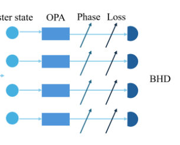 
Figure 4. Schematic of loss-tolerant phase estimation with four-mode entangled state via OPA. Sq: squeezed state; U: unitary matrix for construction of cluster state; BHD: balanced homo- dyne detection.

📷 Fig 5

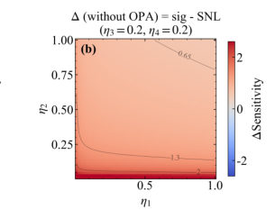 
Figure 5. Average phase estimation sensitivity ¯σ as a function of transmittance in modes 1 and 2, with η3 = η4 = 0.2. Subtraction of sensitivity ¯σ (a) with and (b) without OPA and SNL, respectively. Other parameters: r1 = 1, corresponding to an initial squeezing of about 8 dB. r′ 1 = 5.7, corresponding to an OPA gain of 300. β1 = β2 = β3 = β4 = 5, α2 = α3 = 5, θ1 = θ2 = θ3 = θ4 = 1.5◦.

**Summary.** This paper proposes a method to achieve highly sensitive, loss-tolerant quantum distributed sensing using continuous-variable entangled states. By incorporating large-gain Optical Parametric Amplification (OPA), the scheme maintains high quantum metrology sensitivity even when subjected to significant channel losses. The results provide quantitative benchmarks showing that this OPA-assisted approach outperforms traditional methods, offering a practical pathway for quantum sensing in noisy environments.

**Why it may be interesting.** This work is highly relevant to quantum optics and quantum information, providing concrete, quantitative guidelines for designing practical quantum sensors that can operate reliably in real-world, lossy fiber optic or integrated photonic environments.

Detailed structure

**Main problem.** The primary goal is to enhance the sensitivity of quantum distributed sensing in the continuous-variable (CV) regime, ensuring robustness against unavoidable transmission losses and detection inefficiencies.

**Main result.** Introducing large-gain Optical Parametric Amplification (OPA) significantly improves the quantum sensing sensitivity for both two-mode (EPR) and four-mode (cluster) entangled states compared to schemes without OPA.

**Method.** The authors calculate the quantum sensitivity using the error-propagation formula and establish the ultimate bound via the Quantum Cramér-Rao Bound (QCRB) for various entangled states.

**Model / system.** The study models quantum distributed sensing using CV states, specifically analyzing two-mode Einstein–Podolsky–Rosen (EPR) and four-mode cluster states. The physical process involves generating entanglement, transmitting it through a lossy channel, and enhancing the signal via OPA before measurement using balanced homodyne detection.

**Key observables.** Phase estimation sensitivity ($\sigma_{	heta_1}^2$), Quantum Fisher Information (QFI), and the Quantum Cramér-Rao Bound (QCRB).

**Important parameters / regimes.** Squeezing parameters ($r$), OPA gain ($e^{r_3}$), channel efficiencies ($\eta$), and the unknown phases ($	heta$).

**Assumptions / limitations.** The analysis relies on the small-phase limit ($	heta \ll 1$) and uses the beam-splitter model to incorporate loss and detection inefficiency.

**Figures summary.** Figures illustrate the schematic setup for loss-tolerant phase sensing using OPA and compare the average sensitivity ($\sigma_{avg}$) and QCRB for OPA-assisted vs. non-OPA schemes, and for different entangled state configurations.

**Paper structure.** The paper progresses by first establishing the problem of loss in CV sensing, then developing the theoretical framework using OPA-assisted entanglement (EPR and cluster states), deriving sensitivity formulas, and finally comparing the performance against single-mode states and calculating the ultimate QCRB bound.

Abstract

Quantum metrology exploits quantum states to achieve an estimation sensitivity beyond classical limits. In the continuous-variable (CV) regime, the squeezed state has been used to implement deterministic quantum sensing, but the quantum metrology sensitivity of this state is significantly affected by losses or detection inefficiencies, which restrict its applications. In this work, quantum distributed sensing is proposed using optical parametric amplified multimode entanglement generated from squeezed states. It is found that the sensitivity is robust to loss or detection inefficiency when large-gain optical parametric amplification (OPA) is introduced, where a two-mode Einstein--Podolsky--Rosen-entangled state and a four-mode cluster state are exploited for analysis. The quantum sensitivity is greatly improved compared to that without OPA in almost all loss scenarios. The quantum Fisher matrix is calculated for both states to obtain the optimal bound in comparison with our scheme, and it is found that even with a small or moderate OPA gain, quantum sensing can be improved compared with the traditional scheme. The states are also compared with corresponding single-mode squeezed states, finding the parameter ranges where entangled states perform better. This study provides a method for realizing large-scale quantum metrology in real-world applications despite losses or detection inefficiencies.

[↑ back to top](#top)

### [Quantum time-flip beats adaptive metrology: Asymptotic benefit, activation, and unsimulability](http://arxiv.org/abs/2609.01175v1)

**Authors:** Gaurang Agrawal, Pritam Halder, Aditi Sen De  
**Type:** theory · **Category:** quantum information and computing · **PDF:** <https://arxiv.org/pdf/2609.01175v1>  
**Analysis basis:** full PDF text, analyzed in chunks
**Topic relevance:** `quantum measurements` **2/5**

📷 Fig 1

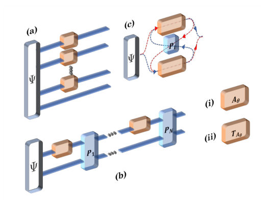 
FIG. 1. Schematic of various strategies. (a) A parallel strategy (PAR) is presented. N parametrized channels act on the input probe |Ψ⟩to create an encoded probe ρθ. (b) In an adaptive strategy (AD), a feedback or correction isometry Pi is applied after every round of the channel. (c) Orders of Pi are controlled by a quantum degree of freedom in the causal superposition strategy (CS). In all these sce- narios, either regular (i) A⊗N θ or TF-assisted (ii) T ⊗N Aθ metrology can be performed.

📷 Fig 2

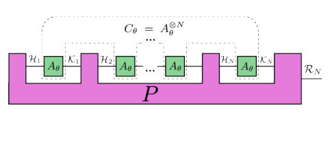 
FIG. 2. Circuit diagram for a general metrological protocol. N channels Aθ are composed with a strategy P to obtain a parameter- dependent state ρθ upon which measurement is to be performed.

📷 Fig 3

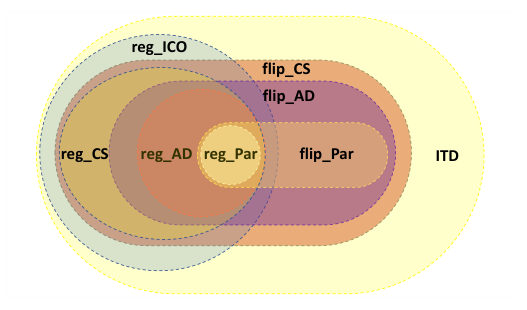 
FIG. 3. Schematic of strategies and their inclusions. All the sets are defined in the main text.

📷 Fig 4

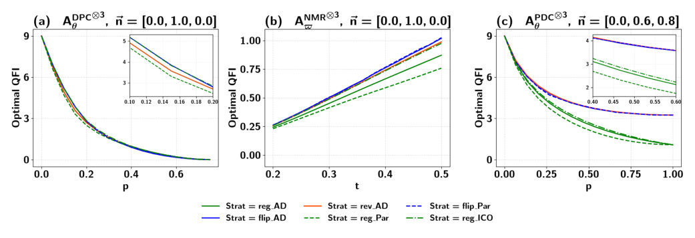 
FIG. 4. Optimal QFI (ordinate) vs noise parameters (p) (abscissa) for various strategies and channels with finite usage N = 3. (a) For a channel affected by depolarizing noise ADP C θ = Uθ ◦ADP C, (b) by the NMR noise ANMR ϖ = Uϖ ◦ANMR and (c) by the phase damping noise AP DC θ = Uθ ◦AP DC. Insets depict the variations of different strategies and channels for a particular range of p so that they can be clearly visible. All axes are dimensionless.

📷 Fig 5

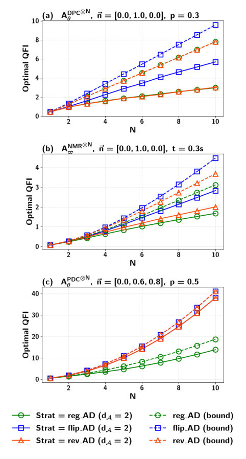 
FIG. 5. Optimal QFI with fixed ancillary dimensions and their upper bounds (ordinate) vs usage (abscissa) for various strategies and channels with fixed parameter values. For channel affected by (a) depolarizing noise ADP C θ = Uθ ◦ADP C (b) NMR noise ANMR ϖ = Uϖ ◦ANMR (c) phase damping noise AP DC θ = Uθ ◦ AP DC. All axes are dimensionless.

**Summary.** This paper introduces Indefinite Time-Directed Metrology (ITDM) using quantum time-flip operations to enhance quantum estimation precision. It rigorously proves that these time-flip assisted strategies overcome the asymptotic limitations found in standard adaptive or causal strategies. This work establishes time-reversal symmetry breaking as a genuine, quantifiable resource in quantum metrology.

**Why it may be interesting.** It establishes a new resource—indefinite time direction—for quantum metrology, showing how non-causal operations can break fundamental asymptotic limits in precision measurement.

Detailed structure

**Main problem.** To determine if quantum time-flip (TF)-assisted strategies can overcome the asymptotic equivalence limit in quantum metrology where advantages of adaptive and causal-superposition strategies disappear as the number of channel uses increases.

**Main result.** TF-assisted protocols achieve Quantum Fisher Information (QFI) strictly exceeding conventional strategies, demonstrating 'metrological activation' by achieving Heisenberg scaling where others are restricted to standard scaling.

**Method.** The authors use semidefinite programming (SDP) and the iterative See-saw (ISS) method to rigorously calculate the maximum achievable QFI for various causal strategies.

**Model / system.** The study analyzes quantum metrology involving estimating a parameter $\theta$ using $N$ uses of a parametrized quantum channel $A_\theta$, considering noise models like Depolarizing or Bit-flip noise.

**Key observables.** Quantum Fisher Information (QFI), scaling regimes (Standard vs. Heisenberg).

**Important parameters / regimes.** Number of channel uses ($N$), noise strength ($p$), and the time-flip assistance itself.

**Assumptions / limitations.** The analysis relies on formalisms like MOP and ISS, which have computational scaling limitations.

**Figures summary.** Figures illustrate the comparison of optimal QFI vs. noise parameters for different strategies, and plots confirm the transition from standard to Heisenberg scaling using the $\gamma_2$ coefficient.

**Paper structure.** The paper develops formalisms (MOP, ISS) to calculate QFI under various causal constraints (Parallel, Adaptive, Causal Superposition) and then introduces time-flip assistance to show a quantifiable, non-asymptotically vanishing advantage.

Abstract

In quantum metrology, adaptive and causal-superposition strategies are proven to be beneficial over parallel schemes for a finite number of channel uses, but their advantages disappear in the asymptotic limit. We show that quantum operations with indefinite time direction, specifically, time-flip (TF)-assisted strategies, referred to as indefinite time-directed metrology (ITDM), can overcome this asymptotic equivalence. Using semidefinite programming, we rigorously demonstrate that TF-assisted protocols can achieve quantum Fisher information (QFI) strictly exceeding the maximum value attainable by parallel, adaptive, and causal-superposition strategies, both for finite and asymptotically many channel uses. Moreover, we identify a class of Pauli noise channels for which ITDM achieves Heisenberg scaling, while all parallel, adaptive, and causal-superposition strategies remain restricted to standard scaling. We call this phenomenon as metrological activation. Interestingly, this activation can be used to exhibit that the quantum time-flip and transposition supermaps cannot be simulated by conventional quantum circuits or causal-superposition strategies using any finite number of channel queries, thereby establishing indefinite time direction as a genuine resource for quantum metrology.

[↑ back to top](#top)

### [Towards Natural Gas Contract Selection via Quantum-Guided Independent Set Reduction](http://arxiv.org/abs/2609.00881v1)

**Authors:** Vivek Dixit, Vaibhaw Kumar, Kentaro Ohno, Alberto Maldonado Romo, Larry Bowden  
**Type:** both · **Category:** quantum information and computing · **PDF:** <https://arxiv.org/pdf/2609.00881v1>  
**Analysis basis:** full PDF text, analyzed in chunks
**Topic relevance:** `QC/QI experiment` **2/5**

📷 Fig 1

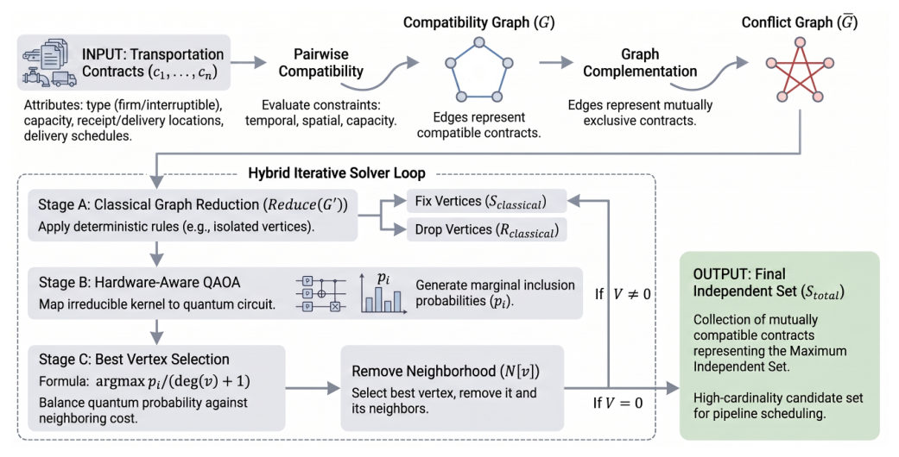 
FIG. 1. Overview of the proposed hybrid quantum–classical workflow. Transportation contracts form a compatibility graph G, whose complement ¯G is solved as a Maximum Independent Set (MIS) instance. The hybrid solver then alternates between deterministic classical reduction, which fixes provably-optimal vertices, and hardware-aware QAOA, whose measured marginal probabilities pi rank the remaining vertices; the highest-scoring vertex is added to the independent set and its closed neigh- borhood N[v] is removed. The reduced graph re-enters the loop until no vertices remain, at which point the accumulated set Stotal, i.e., the constructed set of mutually compatible contracts, is returned.

📷 Fig 2

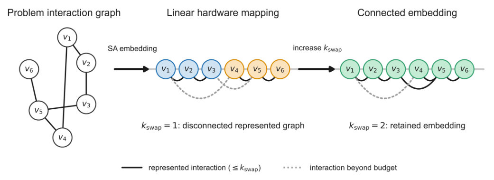 
FIG. 2. Hardware-aware embedding of the problem interaction graph onto a linear qubit topology. The problem interaction graph (left) is mapped by a simulated-annealing heuristic onto a linear hardware-compatibility graph, in which two qubits interact only if they lie within the SWAP budget kswap. At a small budget (center) some interactions exceed the budget and the represented graph is disconnected; increasing kswap (right) yields a single connected component, and the smallest such budget is retained. Solid arcs denote interactions realizable within the budget; dashed arcs denote interactions beyond it. Among the seeds that achieve connectivity, the embedding with the smallest two-qubit...

📷 Fig 3

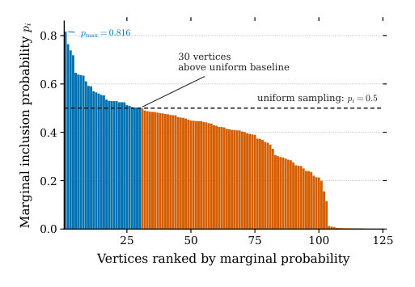 
FIG. 3. QAOA marginal inclusion probabilities pi for the first reduction round of es60fst02 (124-vertex kernel), sorted in decreasing order. The dashed horizontal line marks the value pi = 0.5 expected from uniform random sampling; the 30 ver- tices lying above this baseline (blue) carry the selection sig- nal, with the largest marginal reaching pmax = 0.816. The non-uniform distribution of marginals provides the vertex- selection information exploited by the proposed reduction strategy.

📷 Fig 4

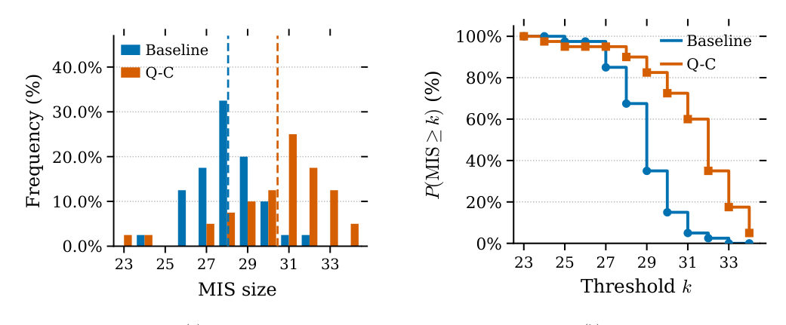 
FIG. 4. Comparison of the uniform-random baseline (Baseline) and the hybrid quantum–classical (Q–C) solver on the distri- bution of maximum independent set (MIS) sizes for C125-9. (a) Histograms of the MIS sizes returned by the two methods over repeated runs; dashed vertical lines mark the respective mean MIS sizes. (b) Tail probability P(MIS ≥k)—the fraction of runs attaining an MIS of size at least k—as a function of the threshold k.

📷 Fig 5

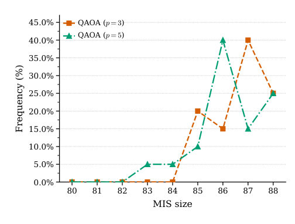 
FIG. 5. Distribution of independent set (MIS) sizes found on instance es60fst02 by the QAOA-based solver at circuit depths p = 3 and p = 5 (N = 20 runs each). Frequencies are normalized within each configuration. The p = 3 distribution peaks at 87 (40% of runs) and the p = 5 distribution at 86 (40%), and both reach the CPLEX optimum of 88 in 25% of runs; neither places any mass below 85 (p = 3) or 83 (p = 5). The uniform-random baseline over the same instance, which never exceeds size 87, is tabulated in Table II.

**Summary.** This work proposes a quantum-classical hybrid solver to tackle the computationally hard Maximum Independent Set (MIS) problem, using natural gas contract selection as an industrial motivation. The method iteratively simplifies the problem using classical graph theory before applying QAOA on the remaining kernel using current quantum hardware. It demonstrates that this hybrid approach effectively handles large, real-world graph structures.

**Why it may be interesting.** The methodology of combining deterministic classical graph reduction with quantum optimization (QAOA) to tackle large, structured optimization problems is highly relevant for developing scalable quantum algorithms for complex physical constraints.

Detailed structure

**Main problem.** The paper addresses the NP-complete problem of finding the Maximum Independent Set (MIS) on a graph, framed initially by selecting compatible natural gas transportation contracts.

**Main result.** The developed quantum-classical hybrid solver achieved strong performance on benchmark instances, reporting an average approximation ratio of 0.996 on QOBLIB and successfully reducing industrially motivated graphs.

**Method.** It employs a hybrid quantum-classical framework that combines iterative classical graph reduction techniques with quantum optimization using the Quantum Approximate Optimization Algorithm (QAOA).

**Model / system.** The problem is formulated as an MIS problem, which is mapped to a Quadratic Unconstrained Binary Optimization (QUBO) model and subsequently to an Ising Hamiltonian for execution on NISQ quantum hardware.

**Key observables.** Average approximation ratio (e.g., 0.996), ability to recover optimal solutions, and circuit metrics like two-qubit depth and CZ count.

**Important parameters / regimes.** NISQ hardware constraints, graph sizes up to 900 contracts, and QAOA parameters ($p$, $k_{swap}$).

**Assumptions / limitations.** The quantum workload is assumed to scale with qubit count rather than problem size, and the classical reduction process is guaranteed to preserve at least one maximum independent set.

**Figures summary.** Figure 1 illustrates the overall hybrid quantum-classical workflow, showing the alternation between classical reduction and hardware-aware QAOA execution.

**Paper structure.** The paper details the formulation of the MIS problem as a QUBO, describes the hybrid solver pipeline involving classical reduction rules and quantum optimization via QAOA, presents results on standard benchmarks (QOBLIB), and discusses hardware-aware circuit synthesis for superconducting processors.

Abstract

Selecting mutually compatible natural gas transportation contracts is a practically important optimization task in which operators must choose from many candidate agreements subject to temporal, infrastructural, and flow-related constraints. As the number of candidates grows, the resulting search space becomes difficult to explore exhaustively. We study a pairwise abstraction of this task, formulated as a Maximum Clique problem on a contract-compatibility graph, or equivalently as a Maximum Independent Set (MIS) problem on the complement graph.   Building on recent work, this paper studies a quantum-classical framework for solving large-scale MIS instances within the limitations of noisy quantum hardware. The approach combines iterative classical graph reduction with quantum-guided optimization to progressively simplify the search space while maintaining high solution quality. This enables large candidate spaces to be reduced to smaller subproblems that are more suitable for execution on current quantum computers.   We evaluate the approach on fifteen benchmark instances from the Quantum Optimization Benchmarking Library (QOBLIB), obtaining an average approximation ratio of 0.996 and recovering optimal solutions for fourteen instances, including graphs with up to 186 vertices. We further evaluate the algorithm on six synthetic pairwise contract-compatibility graphs containing up to 900 contracts, where the proposed method achieves an average approximation ratio of 0.989 and obtains optimal solutions in four cases. These experiments demonstrate the ability of the hybrid MIS solver to reduce industrially motivated graphs. The pairwise abstraction serves as the first step of a two-stage screening procedure that narrows the candidate contracts to a smaller set of mutually compatible ones, which can then be verified against pipeline-capacity constraints.

[↑ back to top](#top)

### [Towards unsupervised representation learning for quantum data: quantum models with inference and generation](http://arxiv.org/abs/2609.00372v1)

**Authors:** Robin Lorenz, Eric Brunner, Marcello Benedetti  
**Type:** theory · **Category:** quantum information and computing · **PDF:** <https://arxiv.org/pdf/2609.00372v1>  
**Analysis basis:** full PDF text, analyzed in chunks
**Topic relevance:** `quantum measurements` **2/5**

📷 Fig 1

 
Figure 4: Schematic Venn diagram of how the sets CX-PPT, PPT and DX-PPT sit within the set of all states S(X ⊗Y); the question marks indicate which intersections are not known to definitely be (non-)empty; ‘classical’ denotes the subset of separable states that can be written as a convex combination of pairwise orthogonal pure product states.

📷 Fig 2

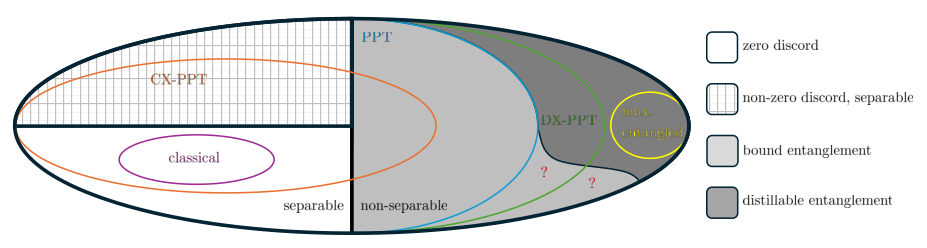 
Figure 4 visualises the hierarchy of classes of states described above, including the open ques- tions concerning which intersections are (non-)empty. It seems interesting that LS-ambiguous states lie—in terms of the cardinality of the sets and the degree of entanglement—in between those based on OP and JP, both of which do not yield non-trivial models. With a view to quantum representation learning, it is natural to see the size of sets of ambiguous states and the correlations between X and Y they can describe, in particular the degree of entanglement they cover, as kinds of inductive biases one may choose accordingly, given a problem that quantum representation learning is to be applied...

**Summary.** This paper establishes a rigorous mathematical framework for unsupervised representation learning when the data consists of quantum states rather than classical measurements. It addresses the fundamental challenge posed by the lack of a standard factorization rule for quantum states. The work characterizes the resulting 'ambiguous states' and shows that physically realizable quantum correlations are constrained by entanglement criteria like the PPT condition.

**Why it may be interesting.** It provides a rigorous mathematical structure for applying modern ML techniques (like variational inference) to quantum data, which is crucial for developing quantum machine learning algorithms.

Detailed structure

**Main problem.** The paper develops a mathematical framework to generalize unsupervised representation learning, concepts central to modern machine learning, to the quantum domain.

**Main result.** It characterizes the necessary structure of quantum models with inference and generation, showing that non-trivial models must involve non-linear maps, and links the existence of such models to the Positive Partial Transpose (PPT) criterion.

**Method.** The authors define quantum models using joint quantum states over visible and latent systems and employ State-over-Time (SOT) maps to generalize the factorization properties of classical probability distributions.

**Model / system.** The system involves quantum states (density operators) defined over visible and latent subsystems, which are assumed to be finite-dimensional. The core mathematical tools are SOT maps and the concept of 'ambiguous states' arising from factorization constraints.

**Key observables.** Ambiguous states, joint quantum states, and the positive-partial-transpose (PPT) criterion.

**Important parameters / regimes.** The structure of the SOT maps (e.g., Leifer-Spekkens construction) and the resulting correlation type (e.g., PPT states).

**Assumptions / limitations.** The framework assumes the existence of a suitable notion of factorisation (via SOT maps) to mimic the classical chain rule, and later proves that non-trivial models require non-linear maps.

**Figures summary.** Figure 1 illustrates the generic setup of classical representation learning, showing the relationship between inference, generation, and the latent/visible spaces.

**Paper structure.** The paper first contrasts the quantum challenge with classical ML, then develops the SOT map framework, analyzes specific SOT map types (Leifer-Spekkens, etc.), establishes a 'no-go' result requiring non-linearity, and finally characterizes ambiguous states in relation to PPT criteria.

Abstract

With quantum sensors, simulators and networks emerging, a future of quantum technology may produce quantum states as data---that is, coherently rather than as classical measurement records---thus motivating the study of suitable quantum generalisations of modern machine learning, including the automated, unsupervised extraction of useful representations. Two ingredients are central to the latter: inference, mapping observations to latent representations, and generation, mapping latent states back to synthetic data. Both are related to each other and to joint distributions for training models by the chain-rule of classical probability theory. The fact that quantum states however lack such universal, standard factorisation property thus poses a challenge. Here we develop a conceptual and mathematical framework for unsupervised representation learning from quantum data. Models are joint quantum states over visible and latent systems; state-over-time maps provide a notion of factorisation into a marginal state and inference (generation) channel; models with inference (generation) are ambiguous states---states for which such factorisation obtains---subject to a further consistency condition on extended inference maps as data extension. These stipulations are restrictive: we show that non-trivial models must feature non-linear such maps to the extended space. For three representative state-over-time maps, we completely characterise the ambiguous states, uncovering a hierarchy tied to the positive-partial-transpose (PPT) criterion from entanglement theory. Notably, the Leifer-Spekkens construction supports inference and generation exactly for model classes of PPT states, thus allowing genuinely quantum visible-latent correlations. We also formulate quantum counterparts of exact and approximate inference training, explore weaker notions of data extension and sketch a future research programme.

[↑ back to top](#top)

### [Optimizing diffusion-limited transport, with applications to electrochemical systems](http://arxiv.org/abs/2609.00849v1)

**Authors:** Manu Mannattil, L. Mahadevan  
**Type:** theory · **Category:** statistical mechanics · **PDF:** <https://arxiv.org/pdf/2609.00849v1>  
**Analysis basis:** full PDF text, analyzed in chunks
**Topic relevance:** `Keldysh / 2PI / non-Gaussian methods` **1/5** · `analog quantum simulation` **1/5** · `correlated / nonlocal dissipation` **1/5** · `driven-dissipative phase transition` **1/5** · `methods for driven-dissipative` **1/5** · `non-equilibrium universality` **1/5** · `quantum measurements` **1/5**

📷 Fig 1

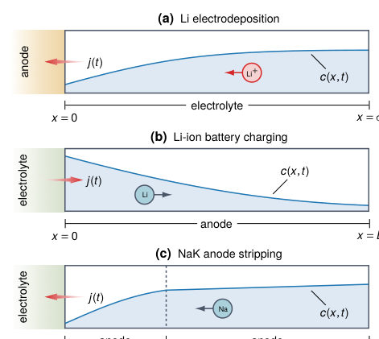 
FIG. 1. Schematics of the diffusion problems considered in this paper. Each panel shows the domain, the direction of material transfer due to the applied current density j(t), a typical concentration profile c(x, t), and the diffusing species. The three cases are (a) Li electrodeposition (Sec. II), (b) Li-ion battery charging (Sec. III), and (c) NaK anode stripping (Sec. IV).

📷 Fig 2

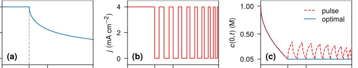 
FIG. 2. (a) The current density in Eq. (2.15), for optimal Li electrodeposition using parameters relevant to the experiments in Ref. [14]. The initial electrolyte concentration is c0 = 1 M, the total deposition time is T = 1 h, and the maximum current density is j0 = 4 mA cm−2. The current initially takes the maximum (bang) value j0 and switches to the riding current jr(t) at t⋆≈0.3 h. (b) Pulse-width-modulated approximation of the optimal current density in (a) using 10 pulses. (c) Boundary concentration c(0, t) for the optimal current (solid) and its pulsed approximation (dashed). In both cases, the concentration stays above a fraction χ = 0.05 of its initial value.

📷 Fig 3

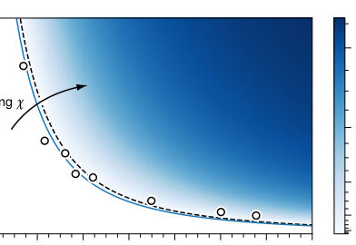 
FIG. 3. Phase diagram in the (j0, T) plane showing the conditions under which optimal currents increase the total areal capacity beyond constant currents for Li electrodeposition, using parameters relevant to the experiments in Ref. [14]. Here, j0 denotes the maximum (bang) current density and T the total electrodeposition time. No capacity increase occurs unless T exceeds the switching time t⋆given in Eq. (2.11). For large j0, the capacity gain approaches its maximum value of 27%, as indicated by the shaded region. Sand’s time TS, Eq. (2.7), computed using a constant current density equal to j0, is indicated by the dashed curves. Optimal currents ensure safe electrodeposition even even...

📷 Fig 4

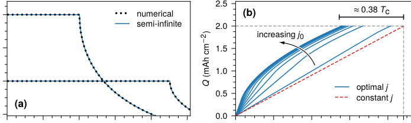 
FIG. 4. (a) Optimal bang–ride current-density profiles for charging an anode to an areal capacity of 2 mAh cm−2 using parameters representative of a commercial Sony US18650S Li-ion battery [17]. Results are shown for maximum allowable current densities j0 = 2 mA cm−2 and j0 = 3 mA cm−2, comparing the numerical solutions with the semi-infinite approximations. (b) Areal capacity Q as a function of time during charging under the optimal protocols (blue curves) and the best constant-current protocol satisfying the boundary-concentration constraint (dashed red curve). The constant-current protocol uses a current density of jc ≈1.8 mA cm−2 and takes Tc ≈1.1 h to charge the anode to its maximum...

📷 Fig 5

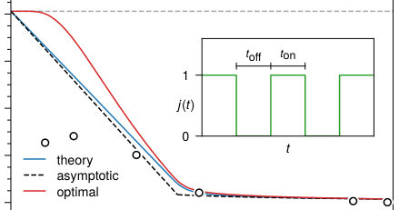 
FIG. 5. Areal capacity Q as a function of the duty cycle δ = ton/(ton + toff) during pulsed stripping. The current-on duration is fixed at ton = 1 s, while the current-off duration toff is varied, with a maximum current density of j0 = 1 mA cm−2. The inset shows the pulsed current density profile j(t). For these pulses, the numerical value of the duty cycle δ equals the average current density ¯j = j0δ. The theoretical capacities (solid blue curves) were obtained using a double-layer anode model, and the corresponding asymptotic results (dashed black curves) using Eq. (4.7). Both use parameters relevant to the experimental NaK anodes of Ref. [25], which have a maximum areal capacity of...

**Summary.** This work develops an optimal control strategy to maximize charge transfer in diffusion-limited electrochemical systems. By employing optimal control theory, the authors prove that the best strategy is a 'bang-ride' current profile, which significantly outperforms constant-current operation. This provides fundamental, geometry-independent upper bounds on achievable performance gains in energy storage devices.

**Why it may be interesting.** While focused on electrochemistry, the mathematical framework of optimal control theory applied to diffusion-limited processes shares conceptual links with open quantum systems where external driving fields or dissipation rates must be optimized to maximize coherence or transfer.

Detailed structure

**Main problem.** The paper aims to optimize material transport, specifically charge transfer in electrochemical systems, when the process is limited by the rate at which reactants can diffuse to the boundary.

**Main result.** The optimal control protocol follows a 'bang-ride' structure, achieving a system-independent upper bound capacity gain of approximately 27% over the best constant-current operation.

**Method.** Optimal control theory is applied to the diffusion equation, treating the current as the control variable to maximize transferred charge subject to a minimum boundary concentration constraint.

**Model / system.** The model is based on the diffusion equation governing concentration $c(x, t)$ in semi-infinite or finite domains, applied to electrochemical systems like Li-ion batteries or NaK anode stripping.

**Key observables.** Boundary concentration $c(0, t)$, Areal Capacity $Q$, and the optimal current profile $j(t)$.

**Important parameters / regimes.** The critical boundary concentration threshold ($\chi c_0$), diffusion coefficient $D$, and the total time $T$.

**Assumptions / limitations.** The analysis assumes the system is governed purely by diffusion limitation, neglecting kinetic, thermal, or degradation effects.

**Figures summary.** Figures illustrate the optimal 'bang-ride' current profile and the corresponding boundary concentration evolution for various electrochemical setups (e.g., Li electrodeposition).

**Paper structure.** The paper develops the mathematical framework using the diffusion equation, derives the optimal control problem, and solves it analytically for semi-infinite domains, extending the results to finite and multilayer systems.

Abstract

Transport in certain systems fails when diffusion cannot replenish or remove material from a boundary rapidly enough, causing the boundary concentration to reach a critical minimum or maximum. Motivated by experiments in electrochemical systems that demonstrate this diffusion-limited failure of charge transport, we determine dynamic current protocols that maximize charge transfer subject to a prescribed concentration constraint. The optimal protocol has a "bang-ride" structure: the maximum feasible current is used until the boundary concentration reaches its critical value, after which the current is progressively reduced to maintain that value. For semi-infinite domains, we derive the optimal currents analytically and obtain system-independent upper bounds on their improvement over constant-current operation. We also extend the framework to finite and multilayer domains and show that the same formulation applies to both charging and discharging.

[↑ back to top](#top)

### [Ghost-free higher-gradient Newtonian gravity from the Second Law of Thermodynamics](http://arxiv.org/abs/2609.00317v1)

**Authors:** M. Pszota, P. Ván  
**Type:** theory · **Category:** statistical mechanics · **PDF:** <https://arxiv.org/pdf/2609.00317v1>  
**Analysis basis:** full PDF text, analyzed in chunks
**Topic relevance:** `Keldysh / 2PI / non-Gaussian methods` **1/5** · `correlated / nonlocal dissipation` **1/5** · `driven-dissipative phase transition` **1/5** · `methods for driven-dissipative` **1/5** · `non-equilibrium universality` **1/5** · `quantum measurements` **1/5**

📷 Fig 1

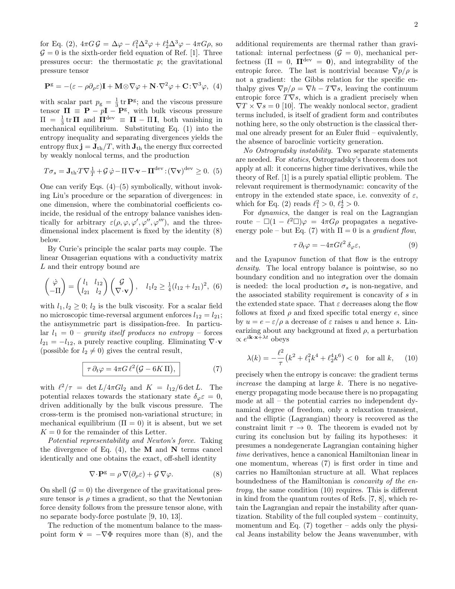 
Low-resolution page preview, page 2

📷 Fig 2

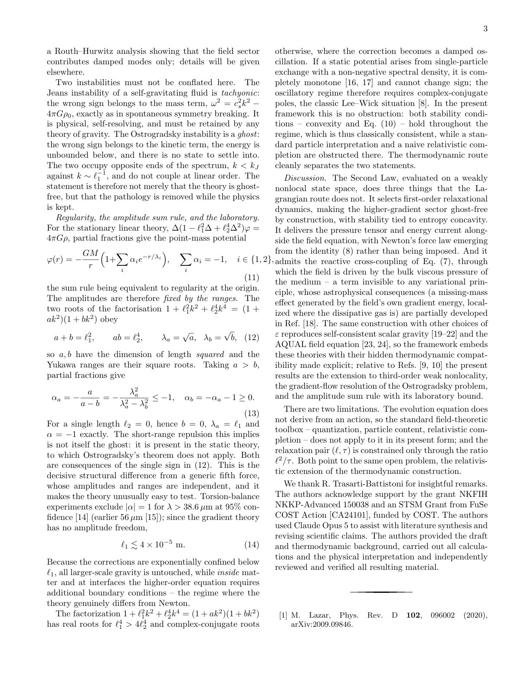 
Low-resolution page preview, page 3

📷 Fig 3

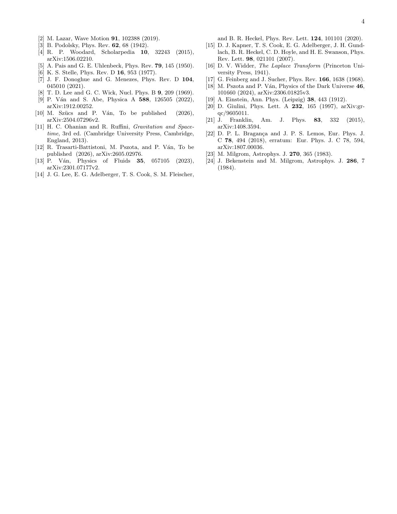 
Low-resolution page preview, page 4

**Summary.** This paper reformulates higher-gradient gravity by deriving its field equations from the Second Law of Thermodynamics applied to a self-gravitating fluid. This thermodynamic approach successfully bypasses the Ostrogradsky instability inherent in standard Lagrangian formulations. The resulting theory is ghost-free and provides novel physical identities, linking gravity to fundamental thermodynamic principles.

**Why it may be interesting.** The use of entropy principles and gradient flow dynamics to stabilize a classical field theory is a powerful analogy to non-equilibrium statistical mechanics, which is central to understanding open quantum systems and dissipation.

Detailed structure

**Main problem.** Higher-gradient modifications of Newtonian gravity, while removing point-mass singularities, suffer from the Ostrogradsky instability when treated via standard Lagrangian dynamics.

**Main result.** The field equations can be derived from the Second Law of Thermodynamics applied to a self-gravitating fluid, yielding a ghost-free, first-order relaxation equation that naturally incorporates Newton's law and dissipation-free couplings.

**Method.** The authors derive the field equations by treating the potential as a thermodynamic variable and enforcing the local entropy balance ($\sigma_s \ge 0$), leading to a gradient flow description.

**Model / system.** The model is a modification of Newtonian gravity involving higher-gradient terms, analyzed through the lens of non-equilibrium thermodynamics applied to a self-gravitating fluid.

**Key observables.** The energy current, pressure tensor, and the stability condition derived from the entropy density (concavity).

**Important parameters / regimes.** The amplitude sum rule $\sum \alpha_i = -1$ constrains the internal length scale below $4 	imes 10^{-5}$ m.

**Assumptions / limitations.** The derivation assumes the system is in mechanical equilibrium ($\Pi = 0$) for simplified results, and the dynamics are governed by a first-order relaxation equation rather than a standard action principle.

**Paper structure.** The paper first identifies the instability issue in higher-gradient gravity. It then reformulates the dynamics using the Second Law of Thermodynamics, showing the resulting equations are equivalent to the stationary limit of a first-order relaxation equation. Finally, it analyzes the constraints imposed by this thermodynamic structure on the theory's parameters.

Abstract

Higher-gradient modifications of Newtonian gravity remove the point-mass singularity, but their Lagrangian dynamics is haunted by the Ostrogradsky instability. We show that the same field equations follow from the Second Law of thermodynamics applied to a self-gravitating fluid with a weakly nonlocal state space, and that on this route the instability is absent by construction: the potential obeys a first-order relaxation equation that is a gradient flow, whose Lyapunov function is the entropy density, and whose relaxation spectrum is negative definite at every wavenumber precisely when the entropy is concave. The derivation also yields the pressure tensor and the energy current, an exact identity that reproduces Newton's force law without further input, and a dissipation-free cross-coupling to the bulk viscous pressure that no variational principle can produce. Regularity constrains the Yukawa-type corrections by an amplitude sum rule, $\sum_iα_i=-1$, so that laboratory tests of the inverse-square law bound the largest internal length below $4\times10^{-5}$~m, and identify the complex-root regime as a classically consistent Lee--Wick-like sector.

[↑ back to top](#top)

### [BKT-like Correlation Scaling and Twist Responses in a One-Dimensional Fractional $U(1)$ Ginzburg--Landau Model](http://arxiv.org/abs/2609.00721v1)

**Authors:** Hitomi Endo, Michikazu Kobayashi  
**Type:** theory · **Category:** statistical mechanics · **PDF:** <https://arxiv.org/pdf/2609.00721v1>  
**Analysis basis:** full PDF text, analyzed in chunks
**Topic relevance:** `Frenkel-Kontorova` **1/5** · `Keldysh / 2PI / non-Gaussian methods` **1/5** · `driven-dissipative phase transition` **1/5** · `methods for driven-dissipative` **1/5** · `non-equilibrium universality` **1/5**

📷 Fig 1

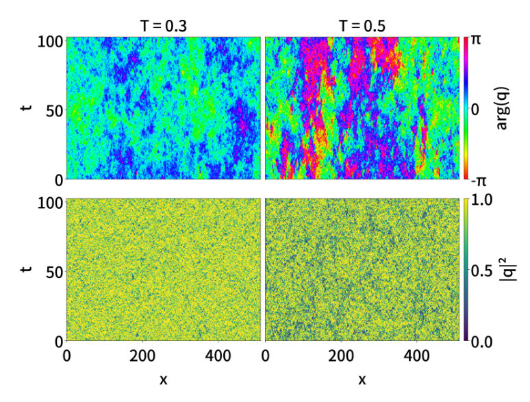 
Figure 1: Typical space-time plots of the phase and density obtained from the stochastic Gross– Pitaevskii dynamics. The upper panels show arg q(x, t) modulo 2π, and the lower panels show |q(x, t)|2. The left column corresponds to T = 0.3, and the right column corresponds to T = 0.5. The low-temperature trajectory shows slowly varying phase textures, whereas the high-temperature trajectory exhibits stronger phase fluctuations. This supports the interpretation that the dominant change across the transition is associated with phase fluctuations rather than large-scale amplitude ordering.

📷 Fig 2

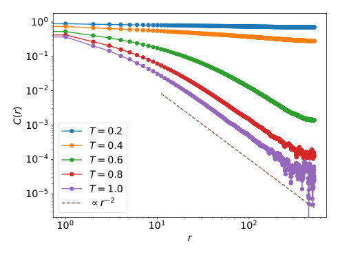 
Figure 2: Correlation function C(r) with L = 1024 for several temperatures. At low temperatures, C(r) decays slowly and is consistent with an algebraic form. At high temperatures, C(r) decays rapidly at intermediate distances and becomes compatible with the fractional-kernel-induced algebraic tail C(r) ∼r−2 at long distances.

📷 Fig 3

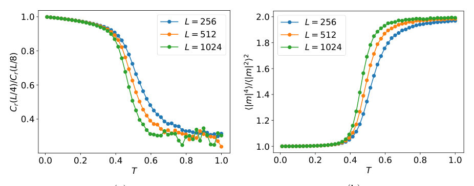 
Figure 3: Temperature dependence of (a) the correlation ratio RC(L, T) = C(L/4)/C(L/8) and (b) the Binder ratio UL(T) = ⟨|m|4⟩/⟨|m|2⟩2 for L = 256, 512, 1024. Both quantities show weak size dependence in the low-temperature algebraic regime. The size dependence becomes pronounced near the transition region.

📷 Fig 4

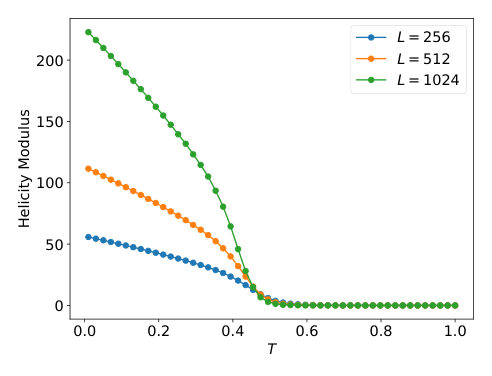 
Figure 4: Helicity-modulus-like quantity obtained from the ordinary linear-response formula in Eq. (91). This quantity is defined by applying a Peierls-type twist to the real-space nonlocal representation of the fractional quadratic energy, thereby assuming an analytic δ2 response. In the low-temperature regime, the response grows strongly with system size and does not approach a finite size-independent value. This shows that the ordinary helicity modulus is not an appropriate finite stiffness for the σ = 1 fractional model.

📷 Fig 5

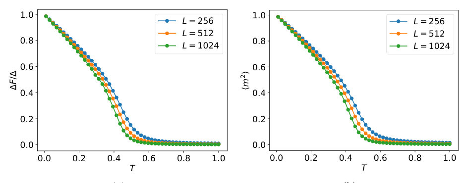 
Figure 5: (a) Cusp twist response Ycusp(L, T) = ∆FL/|∆| computed with ∆= π/4, and (b) the squared order parameter ⟨|m|2⟩. Although Ycusp remains finite at each finite system size, it decreases with increasing L in the low-temperature regime. Its temperature and size dependence closely resemble those of ⟨|m|2⟩. Therefore, Ycusp does not behave as an independent stiffness analogous to the helicity modulus of the two-dimensional XY model.

**Summary.** This paper analyzes a 1D fractional U(1) Ginzburg-Landau model to study its phase transition behavior. Using stochastic dynamics, the authors show that while the correlation scaling mimics the BKT transition, the system lacks the characteristic jump in the helicity modulus seen in 2D systems. This highlights how long-range interactions fundamentally alter the nature of phase transitions.

**Why it may be interesting.** It provides a theoretical framework for understanding how long-range interactions (fractional Laplacian) modify classic critical phenomena like the BKT transition, offering insights applicable to systems with non-local dynamics.

Detailed structure

**Main problem.** The study investigates the nature of phase transitions, specifically BKT-like correlation scaling, in a one-dimensional fractional U(1) Ginzburg-Landau model.

**Main result.** The transition exhibits BKT-like behavior in correlation scaling, evidenced by finite-size scaling collapse, but it notably lacks the universal jump in the helicity modulus characteristic of the 2D XY model.

**Method.** The authors employ stochastic Gross-Pitaevskii dynamics to sample the equilibrium Gibbs measure and analyze various correlation functions and twist responses.

**Model / system.** The system is a one-dimensional complex field model governed by a fractional U(1) Ginzburg-Landau Hamiltonian, featuring a nonlocal quadratic term with Fourier multiplier |k|^sigma, focusing on the marginal case sigma=1.

**Key observables.** Correlation function C(r), Binder ratios, effective exponents, and spectral twist responses.

**Important parameters / regimes.** The critical exponent sigma, the temperature T, and the system size L, with a focus on the marginal case sigma=1.

**Assumptions / limitations.** The analysis relies on defining a spectral twist response due to the nonlocal operator, and it contrasts its findings with the known universal jump of the 2D XY model.

**Figures summary.** Not specified, but the analysis involves showing size-independent ratios at low T and collapse using a BKT-type variable.

**Paper structure.** The paper defines the model and observables, describes the stochastic dynamics used for sampling, presents numerical results analyzing scaling, and concludes by interpreting the findings regarding the nature of the transition.

Abstract

We study a one-dimensional fractional $U(1)$ Ginzburg--Landau model whose quadratic part has Fourier multiplier $|k|^σ$, focusing on the marginal case $σ=1$. This dispersion yields logarithmic spin-wave fluctuations, suggesting BKT-like behavior despite the one-dimensional setting. We sample the equilibrium Gibbs measure using stochastic Gross--Pitaevskii dynamics and analyze correlation functions, dimensionless ratios, effective exponents, and twist responses. The correlation function shows a low-temperature algebraic branch with a temperature-dependent exponent, while the high-temperature regime exhibits a nonlocal-kernel-induced tail consistent with $C(r)\sim r^{-2}$. The correlation and Binder ratios are nearly size independent at low temperature and collapse with the BKT-type variable $(T-T_{\rm BKT})(\log L)^2$; finite-size effects set in around $T\simeq0.35\text{--}0.4$, consistent with $T_{\rm BKT}\simeq0.35$. Unlike the two-dimensional XY model, twist responses do not yield a finite helicity modulus: the ordinary linear-response quantity grows with system size, whereas the cusp twist response scales as $L^{-η(T)}$, like the squared zero-mode order parameter. Thus, the transition is BKT-like in correlation scaling, but lacks a universal helicity-modulus jump.

[↑ back to top](#top)

### [Entangling capability of coherently controlled quantum processes](http://arxiv.org/abs/2609.00168v1)

**Authors:** Beyza Aslanbaş, Bedirhan Alkan, Göktuğ Karpat  
**Type:** theory · **Category:** quantum information and computing · **PDF:** <https://arxiv.org/pdf/2609.00168v1>  
**Analysis basis:** full PDF text, analyzed in chunks
**Topic relevance:** `correlated / nonlocal dissipation` **1/5** · `driven-dissipative phase transition` **1/5** · `methods for driven-dissipative` **1/5**

📷 Fig 1

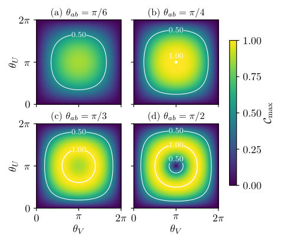 
Figure 1. Density plots of the maximal concurrence for switch of two unitary channels, Cmax(U, V ), as a function of the rota- tion angles θU and θV for four different relative angles between the rotation axes. Here, the white point and curves highlight the contours on which the concurrence has constant value.

📷 Fig 2

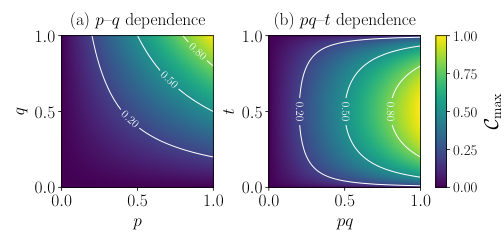 
Figure 2. Density plots of the maximal concurrence generated via quantum switch of two binary random unitary channels. (a) Dependence of concurrence on the noise parameters p and q for t = 1/2 and (b) on the parameter pq and the unitary parameter t. The white contours indicate the parameter val- ues corresponding to Cmax = 0.20, 0.50, and 0.80.

📷 Fig 3

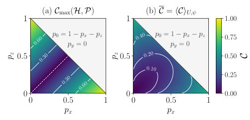 
Figure 3. Density plots of the concurrence generated by the switch for the two-parameter family of Pauli channels P and a unitary channel. The physically valid parameter region sat- isfies px +pz ≤1 and px, pz ≥0. (a) Maximal concurrence for the Hadamard-Pauli switch. The dashed white line px = pz marks the nonentangling condition. (b) Haar-averaged con- currence for the switch of unitary and Pauli channels, with U and |ψ⟩sampled independently according to the Haar mea- sure and the control fixed to the maximally coherent state.

📷 Fig 4

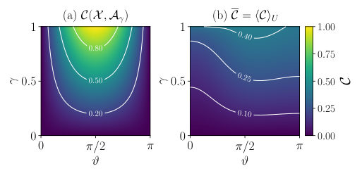 
Figure 4. Density plots of the concurrence generated by the switch of the amplitude damping Aγ and unitary channels, for the maximally coherent control state and the real target input |ψ(ϑ)⟩= cos(ϑ/2) |0⟩+ sin(ϑ/2) |1⟩. (a) Concurrence for the quantum switch of bit-flip and amplitude damping channels. (b) Haar-averaged concurrence for the switch of unitary and amplitude damping channels, obtained by averaging over U while keeping the control and target fixed.

📷 Fig 5

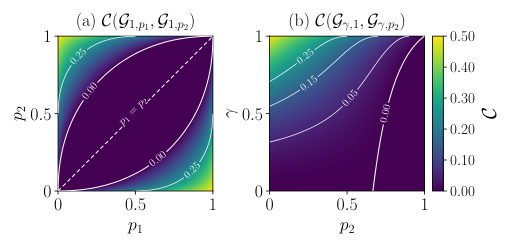 
Figure 5. Density plots of the concurrence generated by the switch of two generalized amplitude damping channels, Gγ1,p1 and Gγ2,p2, for the product input |+⟩C |+⟩T . (a) Both chan- nels are fully relaxing, i.e., γ1 = γ2 = 1. The dashed diagonal marks p1 = p2, for which the channels commute under com- position and the switched output is separable. (b) The first stationary population is fixed at p1 = 1, while the channels have a common damping strength, γ1 = γ2 = γ. The thicker solid white curves are the C = 0 boundaries.

**Summary.** This paper systematically analyzes the entanglement generated by coherently controlling quantum processes, specifically the quantum switch and the time-flip. By treating the control and target as a bipartite system, the authors derive conditions under which entanglement is generated, even when dissipation is present. The findings offer a deep, analytical understanding of how channel order and directionality can be harnessed to manipulate quantum correlations.

**Why it may be interesting.** This work provides a rigorous, analytical framework for quantifying how entanglement can be engineered by controlling the order or direction of quantum operations, which is fundamental to quantum information processing.

Detailed structure

**Main problem.** The paper aims to analytically characterize the entanglement generation capability of two key coherently controlled quantum processes: the quantum switch and the quantum time-flip.

**Main result.** The entanglement generated depends critically on the coherence of the control process and the distinguishability of the ordered evolutions; maximal entanglement can persist even in the presence of dissipation.

**Method.** The analysis involves treating the control and target as a bipartite system, deriving exact expressions for entanglement (concurrence) for unitary channels, and extending the analysis to various dissipative channels.

**Model / system.** The model uses a bipartite system consisting of a control qubit and a target system, where processes are modeled by quantum channels (supermaps). The processes analyzed are the quantum switch (combining two channels) and the quantum time-flip (reversing input-output direction).

**Key observables.** Entanglement (quantified by concurrence), coherence-entanglement conservation relation, and stationary states of damping channels.

**Important parameters / regimes.** The distinguishability overlap parameter $s$, and the parameters governing the specific damping channels ($\gamma_1, \gamma_2, p_1, p_2$).

**Assumptions / limitations.** The analysis assumes pure product inputs and crucially retains the control system rather than measuring or discarding it.

**Paper structure.** The paper systematically analyzes the quantum switch first, deriving general principles and specific results for unitaries and dissipative channels, followed by an analogous study for the quantum time-flip.

Abstract

We analytically characterize entanglement generation by two paradigmatic coherently controlled quantum processes, the quantum switch and time-flip. Retaining rather than measuring or discarding the control, we treat the control and target as the bipartite system and assume pure product inputs, so that any output entanglement reflects the entangling capability of the process. For the switch of qubit unitaries, we derive exact expressions for entanglement, together with a geometric characterization and a coherence-entanglement conservation relation. We then extend our analysis to binary random unitary, Pauli, amplitude damping, and generalized amplitude damping channels. We prove that switch of channels commuting under composition cannot entangle a separable input. Yet maximal entanglement is possible even with dissipation, e.g., an entanglement-breaking damping channel switched with a bit-flip can transform a product input into a maximally entangled state. For two generalized amplitude damping channels, a common stationary state prevents entanglement, while different stationary populations can enable it. We present an analogous study for the time-flip of unitary and binary random unitary channels. Our findings provide a systematic analysis of how much entanglement can be generated by coherent control of channel order or input-output direction.

[↑ back to top](#top)

### [Resolving unconventional gap structure in kagome superconductors with hybrid microwave circuits](http://arxiv.org/abs/2609.00964v1)

**Authors:** Yejin Lee, Haolin Jin, Sushmita Chandra, Berit H. Goodge, Edouard Lesne, Tommaso Confalone, Francesco Tafuri, Davide Massarotti, Golam Haider, Kornelius Nielsch, Bernd Büchner, Claudia Felser, Debanjan Chowdhury, Nicola Poccia, Uri Vool  
**Type:** experiment · **Category:** strongly correlated electrons · **PDF:** <https://arxiv.org/pdf/2609.00964v1>  
**Analysis basis:** full PDF text, analyzed in chunks
**Topic relevance:** `correlated / nonlocal dissipation` **1/5** · `methods for driven-dissipative` **1/5** · `quantum measurements` **1/5**

📷 Fig 1

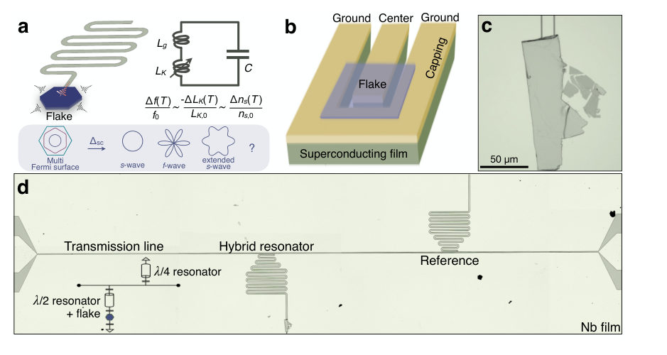 
FIG. 1. Hybrid microwave resonator device configuration. (a) Schematics for a hybrid microwave resonator coupled to a superconducting flake forming an effective LC oscillator. Kinetic inductance change manifests shifts in the resonance frequency, reflecting superfluid density response. Representative superconducting gap structures proposed for a kagome superconductor, including fully gapped, nodal and extended s-wave states, are illustrated. (b) Three-dimensional layout for the hybrid microwave device where a superconducting film is patterned into a coplanar design. A van der Waals (vdW) flake is placed between the center line and ground plane, on a surface capping layer grown on the...

📷 Fig 2

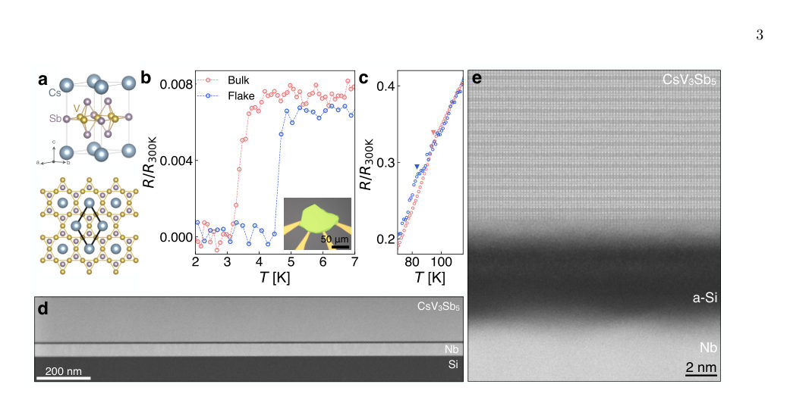 
FIG. 2. Superconductivity in CsV3Sb5 and device interface. (a) Crystal structure of CsV3Sb5 on the three dimensional plane and ab plane, respectively. (b) Resistance as a function of temperature of the CsV3Sb5 bulk crystal and the exfoliated 480 nm-thick flake, marked in red and blue, respectively. Inset: Optical micrograph of the flake transferred on the gold electrodes. (c) Resistance vs. temperature measurements for the same devices in (b) at higher temperatures, indicating a charge density wave anomaly around 90 K. (d) Scanning transmission electron microscopic (STEM) image for the cross section of a prepared flake on the niobium film. (e) Closeup of the interface between the film and...

📷 Fig 3

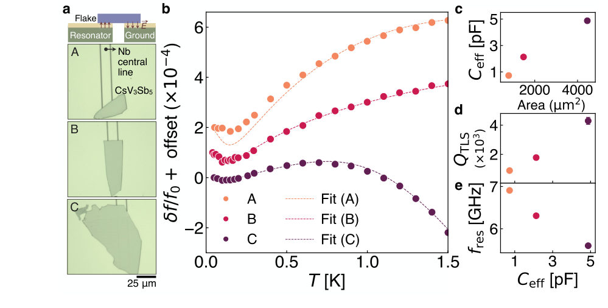 
FIG. 3. Resonance frequency shift for devices of varying flake geometry. (a) Optical micrograph of different hybrid devices (A-C) where a CsV3Sb5 flake is integrated into the niobium resonator film. The top schematic shows a cross-sectional view of the device, displaying the flake is in partial contact with the central line and the ground across the isolation gap with the displacement field. The contact area of the flake on the resonator is increased from device A to C. (b) Temperature dependent resonance frequency shift for all devices, with the offset for visualization. The dashed line shows a model with the contribution from both a standard quasiparticle and two-level system bath...

📷 Fig 4

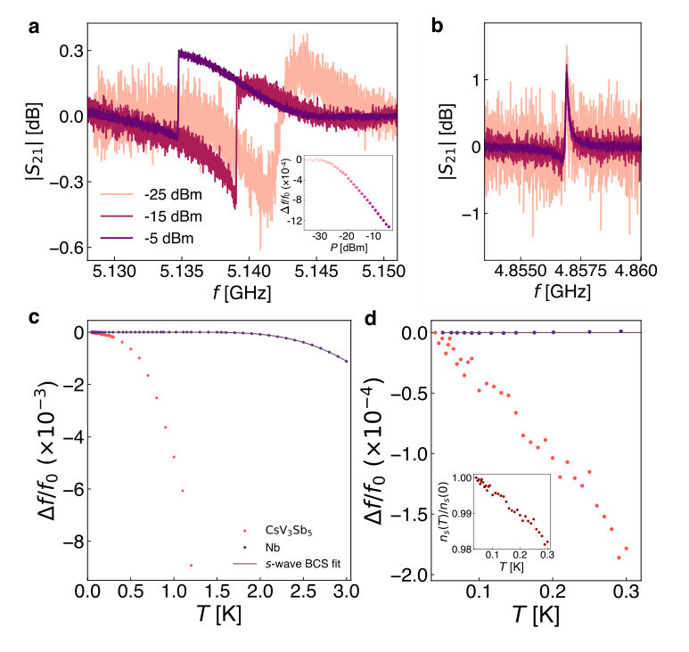 
FIG. 4. Temperature dependent resonance frequency in hybrid device. (a) Microwave transmission S21 for the hybrid device, shown in Fig. 1c,d, measured at 50 mK under three different applied input powers and (b) the reference niobium resonator with λ/4 termination. Inset of (a): the input power dependent frequency shift for the hybrid device. (c) The temperature dependence of the resonance frequency shift for the hybrid device and the niobium resonator with a model for a isotropic gap. (d) Zoom in for the temperature dependent resonance frequency shift at low temperatures. Inset of (d): Extracted relative superfluid density versus temperature of the corresponding hybrid device.

**Summary.** This work develops a novel, noninvasive technique using superconducting microwave resonators to measure the electrodynamic response of fragile kagome superconductors. By analyzing the temperature-dependent shift in the resonance frequency, the authors successfully extracted the superfluid density, finding linear low-temperature behavior indicative of a nodal superconducting gap.

**Why it may be interesting.** The use of microwave circuits to probe superconducting properties provides an excellent analogy for studying dissipation and gap structure in mesoscopic quantum systems, linking superconducting physics to circuit QED concepts.

Detailed structure

**Main problem.** The primary goal is to determine the superconducting pairing symmetry (gap structure) of unconventional superconductors, specifically in kagome superconductors, which is crucial for understanding their microscopic pairing mechanism.

**Main result.** The superfluid density exhibits linear temperature dependence at low temperatures, which is a strong indicator of a nodal gap structure in the superconductor.

**Method.** The study uses superconducting microwave resonators to noninvasively probe the electrodynamic response of fragile, thin superconducting flakes integrated into hybrid microwave circuits.

**Model / system.** The physical system is a layered van der Waals kagome superconductor ($	ext{CsV}_3	ext{Sb}_5$) flake coupled into a microwave resonator. The analysis models the resonance frequency shift based on the flake's kinetic inductance, which is proportional to the superfluid density ($n_s$).

**Key observables.** Temperature-dependent resonance frequency shifts ($\Delta f/f_0$), superfluid density ($n_s(T)$), and the quality factor ($Q$).

**Important parameters / regimes.** Low-temperature linear dependence of $n_s(T)$, and the ability to suppress parasitic losses from two-level systems (TLS).

**Assumptions / limitations.** The method assumes that the frequency shift is dominated by the intrinsic superfluid response, and that parasitic TLS losses can be modeled and subtracted.

**Figures summary.** Figures illustrate the hybrid microwave resonator device architecture, the crystal structure of $	ext{CsV}_3	ext{Sb}_5$, and the temperature dependence of resistance and frequency shifts.

**Paper structure.** The paper progresses from establishing the difficulty of probing gap structure in 2D materials to introducing the microwave resonator platform. It details the noninvasive coupling technique, analyzes the frequency shift by separating quasiparticle and TLS contributions, and concludes by extracting the low-temperature $n_s(T)$ to infer the nodal gap structure.

Abstract

Unconventional superconductivity is a hallmark of exotic quantum matter, where determining the pairing symmetry is essential for uncovering its microscopic origin. Kagome superconductors provide a fertile landscape for emergent phenomena arising from strong electronic correlations and nontrivial band topology, yet their superconducting pairing symmetry remains elusive. The superconducting gap structure is commonly probed via electrodynamic response, but such measurements are inapplicable to thin flakes due to their small volume and delicate nature. Superconducting microwave resonators offer a coherent and highly sensitive platform for probing electrodynamic responses, with versatile designs that enable incorporation of diverse materials and geometries. Here, we integrate flakes into microwave circuits, enabling noninvasive access to the superfluid response through contactless coupling that preserves structural integrity. By engineering the device geometry to suppress parasitic two-level-system losses that dominate dissipation in microwave circuits, we isolate the intrinsic material response. Remarkably, the temperature-dependent superfluid density exhibits linear behavior at low temperatures, consistent with a nodal gap structure. Our approach establishes a noninvasive platform for probing electrodynamic response of fragile superconducting flakes while advancing hybrid microwave architectures for quantum technologies.

[↑ back to top](#top)

### [Which Otto Engine Is the Fastest?](http://arxiv.org/abs/2609.00321v1)

**Authors:** Idriss Hank Nkouatchoua Ngueya, Marcin Łobejko  
**Type:** theory · **Category:** statistical mechanics · **PDF:** <https://arxiv.org/pdf/2609.00321v1>  
**Analysis basis:** full PDF text, analyzed in chunks
**Topic relevance:** `driven-dissipative phase transition` **1/5** · `methods for driven-dissipative` **1/5** · `non-equilibrium universality` **1/5**

📷 Fig 1

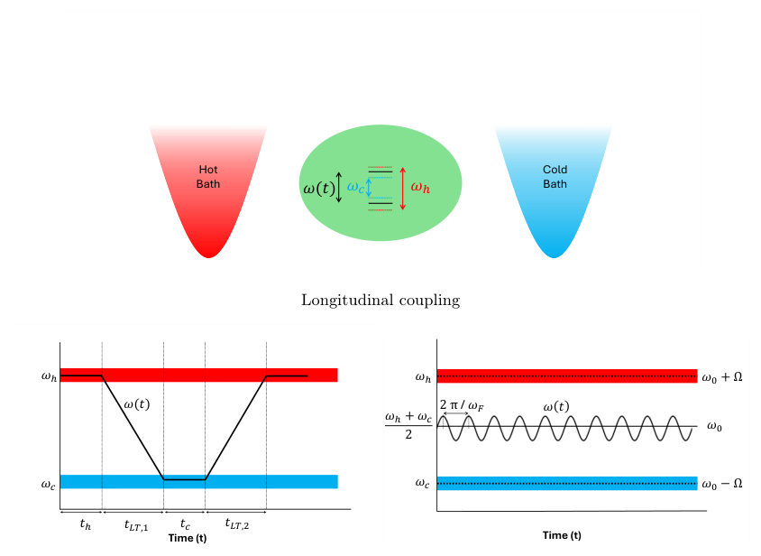 
Figure 1: The figures illustrate a quantum Otto engine based on a single qubit serving as the working medium and subject to an external time-dependent drive. Panel (a) depicts the conventional four-stroke realization, where the qubit frequency is modulated between two values through a sequence of expansion and compression strokes. In this case, the frequency varies linearly within each stroke. Panel (b) presents a Floquet-inspired realization in which the qubit frequency undergoes a continuous periodic modulation, with a driving period shorter than the characteristic relaxation timescale of the system.

📷 Fig 2

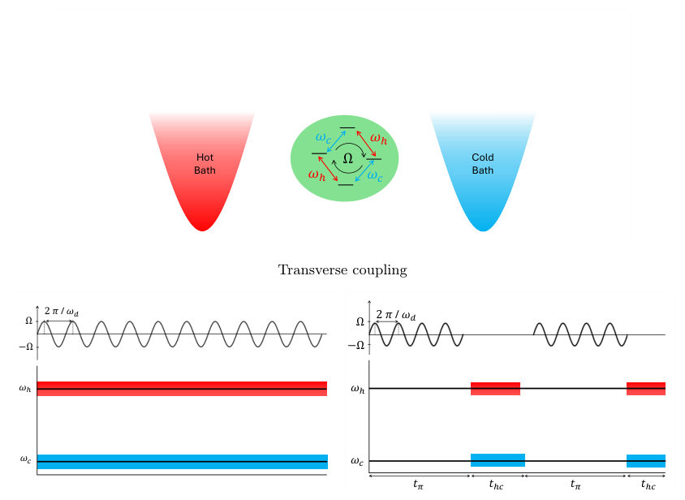 
Figure 2: The figures above illustrate a quantum Otto engine based on two interacting qubits serving as the working medium and coupled to independent hot and cold thermal reservoirs. The qubits interact through an externally controlled transverse coupling. Panel (a) depicts the always-on realization, where the coupling remains active throughout the operation and the qubit frequencies undergo continuous periodic modulation. Panel (b) presents the on-off realization, in which the interaction is periodically switched on and off, generating a sequence of discrete work strokes separated by thermalization stages.

📷 Fig 3

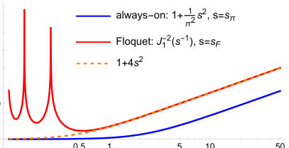 
Figure 3: Normalized characteristic operational times for the always-on and Floquet implementations as functions of their respective dimensionless control parameters. The blue curve shows the always-on result, S∗ always−on = 1 + s2 π/π2, while the red curve shows S∗ Floquet = J−2 1 (s−1 F ). The orange dashed line denotes the large-sF Floquet asymptote 1 + 4s2 F . The nonmonotonic behavior and divergences of the Floquet curve at small sF are discussed in the main text. Since sπ and sF have different physical definitions, the figure compares their scaling behavior rather than their performance at fixed experimental resources.

📷 Fig 4

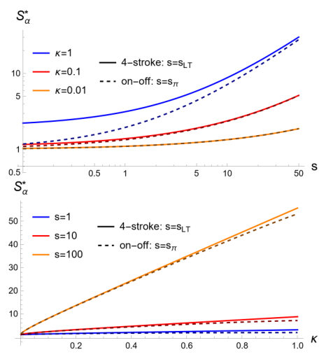 
Figure 4: Optimized normalized characteristic operational times of the four-stroke (solid curves) and on-off (dashed curves) implementations. The upper panel shows their dependence on the model-specific operation parameter for κ = 1, 0.1, and 0.01. The lower panel shows their dependence on the relaxation-time asymmetry κ for fixed operation parameters s = 1, 10, and 100. Here κ = 1 corresponds to equal relaxation times, whereas κ →0 denotes the strongly asymmetric limit. Both implementations exhibit asymptotically linear growth with leading slope κ/2.

📷 Fig 5

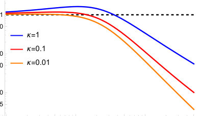 
Figure 5: Ratio R = S∗ on−off(sπ, κ)/S∗ always−on(sπ) as a function of the common operation parameter sπ for different values of the relaxation-time asymmetry κ. The line R = 1 (dashed) separates the regimes in which the always-on (R &gt; 1) and on-off (R &lt; 1) implementations have the shorter characteristic operational time.

**Summary.** This paper develops a general theory to compare the performance of various quantum Otto engines by factoring the power into a work term and an implementation-specific time scale. It demonstrates that the maximum operating speed is fundamentally limited by the thermalization times of the hot and cold baths, regardless of the specific cycle used.

**Why it may be interesting.** This work provides a powerful, general framework for comparing non-equilibrium quantum processes, showing how fundamental thermodynamic limits constrain the speed achievable by different physical implementations.

Detailed structure

**Main problem.** The paper aims to systematically compare the operational speed (power output) of different quantum realizations of the Otto engine, despite them achieving the same thermodynamic efficiency.

**Main result.** The power of any quantum Otto engine can be factorized into a characteristic work (dependent on internal frequencies) and an implementation-specific characteristic time. The maximum speed is universally limited by the sum of the hot and cold bath thermalization times.

**Method.** The analysis uses a factorization approach ($P = W/T^*$) to separate thermodynamic and dynamical aspects, comparing four distinct dynamical realizations (e.g., four-stroke, always-on, Floquet-modulated).

**Model / system.** The system is a quantum heat engine, modeled using qubits coupled to thermal baths, analyzed via master equations and Hamiltonian dynamics for various cycle implementations.

**Key observables.** Power output ($P$), characteristic work ($W$), characteristic time ($T^*$), and efficiency ($\eta$).

**Important parameters / regimes.** Coupling strengths ($	au, \Omega$), internal frequencies ($\omega$), and dimensionless ratios characterizing the cycle dynamics ($s_{LT}, s_F, s_\pi$).

**Assumptions / limitations.** The core assumption is the factorization $P = W/T^*$, allowing the comparison to focus solely on the characteristic time $T^*$. Various approximations are used depending on the cycle (e.g., slow modulation, fast oscillation limit).

**Figures summary.** Figures illustrate the four-stroke model and the Floquet-inspired model for a single qubit, and the two-qubit realization, comparing power scaling in different regimes.

**Paper structure.** The paper establishes the general framework by factorizing power, then analyzes specific dynamical realizations (four-stroke, Floquet, always-on, on-off) by deriving their respective characteristic times and asymptotic scaling laws.

Abstract

A general thermal machine is characterized by distinct time or energy scales: temperature, coupling to the heat baths, internal free dynamics and interactions, and external driving. We address the question: what parameters determine the speed of a given engine, and how can they be used to reliably compare different types of engine? Specifically, we consider four realizations of the Otto engine, each operating with the same Otto efficiency, and aim to characterize and compare their power outputs. The main insight of this paper is that, irrespective of their very different dynamical implementations, the power of each engine can be factorized into a common characteristic work and an implementation-specific characteristic time. The characteristic work depends only on the internal frequencies of the machine and the temperatures, whereas the characteristic time depends on the coupling strength to the baths and on the implementation-specific driving. This observation allows us to compare the power of different engines through their characteristic times and thereby reduce the relevant parameter space to parameters that capture the dynamical aspects of engine performance. Despite different dynamical implementations, this framework reveals simple common features. In all cases, the maximum operating speed is limited by a common timescale given by the sum of the characteristic thermalization times of the hot and cold baths. Moreover, the four engines fall into two distinct asymptotic classes: implementations in which driving and thermalization occur simultaneously exhibit quadratic scaling, whereas those in which work extraction and thermalization alternate exhibit linear scaling. These results expose general dynamical features that determine the operational speed of quantum Otto engines.

[↑ back to top](#top)

### [A Human-AI Theorem Connecting Spontaneous and Field-Induced Mechanisms of Collective Behavior in One Dimension](http://arxiv.org/abs/2609.00322v1)

**Authors:** Weiguo Yin  
**Type:** theory · **Category:** statistical mechanics · **PDF:** <https://arxiv.org/pdf/2609.00322v1>  
**Analysis basis:** full PDF text, analyzed in chunks
**Topic relevance:** `Frenkel-Kontorova` **1/5** · `analog quantum simulation` **1/5**

📷 Fig 1

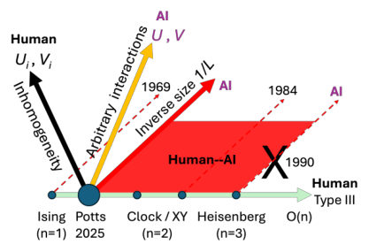 
FIG. 1. Illustration of a human–AI research developed from a single point (big blue dot [1]) to a four-axis AHS: The green axis stands for model choice, red for inverse system size 1/L, and orange for homogeneous arbitrary interactions U(x), V (x), and black for inhomogeneous Ui(x), Vi(x). The main driver of different subspaces is indicated as Human or AI. Human–AI means that they drove the n −L subspace together. The initial AHS is represented by the green arrow and marked as Type III. The 1969 and 1984 red dashed lines stand for the microscopic proofs for the Ising and XY models, respectively [26, 27]. X denotes the 1990 obstruction [28].

📷 Fig 2

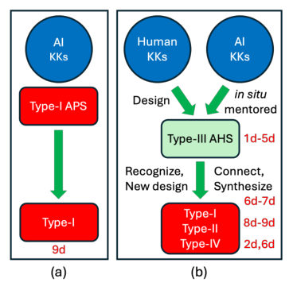 
FIG. 2. Schematics of (a) a 9d one-shot autonomous Type-I route vs (b) the human-AI co-development approach, where the research state, active context, and the agents’ roles are progressively updated as the research evolves from an initial Type-III AHS towards Type-I/II/IV breakthroughs. Both ap- proaches start with intelligence equipped with known knowns (KKs).

📷 Fig 3

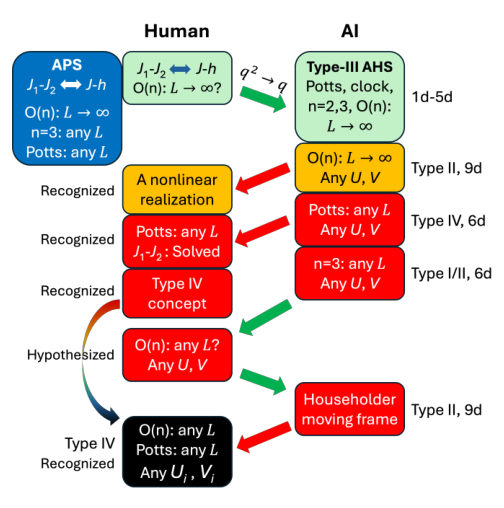 
FIG. 3. Schematics of human–AI co-development trajectory through four AHS stages represented by green, orange, red, and black rounded rectangles (RRs). The color scheme is the same as Fig. 1: Green stands for the human-designed ini- tial Type-III AHS with the starting point being the q2 →q transfer-matrix reduction for the Potts chain, orange/red the AI-driven discovery space beyond the initial AHS (in which the human updated the AHS following the AI results), and black the final AHS for inhomogeneity. Blue RR denotes the human’s initial APS, from which only one problem was ex- posed to the initial AHS, but the AI autonomously identified and solved two other problems (first two red RRs on...

**Summary.** This paper proves a general theorem connecting two distinct ways collective behavior can emerge in 1D spin chains: spontaneously via competing interactions, and externally via a field. It establishes an exact, Hamiltonian-level mapping between complex range-two interactions and simpler range-one interactions for both continuous and discrete spin systems. The work also frames this discovery within a novel model of human-AI scientific collaboration.

**Why it may be interesting.** The rigorous mathematical mapping provides a powerful tool for solving complex 1D lattice models, which is foundational knowledge for understanding quantum many-body systems and their classical limits.

Detailed structure

**Main problem.** The paper aims to connect two fundamental mechanisms of collective behavior in statistical physics: those arising spontaneously from competing interactions (zero field) and those controlled by an external field.

**Main result.** A theorem is proven establishing a microscopic, temperature-independent mapping between a range-two Hamiltonian (with nearest and next-nearest neighbor interactions) and a simpler range-one Hamiltonian (with nearest-neighbor and single-spin potential).

**Method.** The mapping is established using exact mathematical techniques, including a recursive Householder moving frame construction for continuous spins and kinematic identities for the Potts model.

**Model / system.** The models are one-dimensional open chains of classical spins, including $O(n)$-vector spins (Ising, XY, Heisenberg) and the $q$-state Potts model. The Hamiltonians involve arbitrary inhomogeneous nearest-neighbor and next-nearest-neighbor interactions.

**Key observables.** The partition function ($Z$) and the equivalence between the two Hamiltonian forms.

**Important parameters / regimes.** The dimensionality $n$ (for $O(n)$ spins), the number of states $q$ (for Potts spins), and the system size $L$.

**Assumptions / limitations.** The mapping is shown to hold for arbitrary inhomogeneous interactions and finite system sizes, overcoming previous limitations in the thermodynamic limit.

**Figures summary.** Figure 1 illustrates the research trajectory, showing the progression from an initial Active Hypothesis Space (AHS) to a broader space driven by Human-AI collaboration.

**Paper structure.** The paper develops the theoretical framework by first defining the two Hamiltonian forms, then proving the exact mapping for both continuous $O(n)$ spins and discrete $q$-state Potts spins, and finally framing the discovery process within a human-AI collaboration model.

Abstract

Can an artificial intelligence (AI) generate a scientific hypothesis outside a human collaborator's active hypothesis space (AHS), and can human-AI research be organized to make such breakthroughs more likely? We document such a case while proving a theorem that connects two basic organizing mechanisms of statistical physics: collective behavior arising in zero field from competing interactions and that induced or controlled by an external field. A zero-field $O(n)$-vector open chain with arbitrary inhomogeneous nearest- and next-nearest-neighbor interaction functions $U_i(S_i\cdot{S}_{i+1})$ and $V_i(S_i\cdot{S}_{i+2})$ is microscopically, via a temperature-independent mapping at the Hamiltonian level, equivalent to a simpler $O(n)$ open chain with nearest-neighbor interaction $V_i( σ_i\cdot σ_{i+1})$ and axial single-spin potential $U_i(σ_i^z)$ for every integer $n\ge1$ and every system size $L\ge1$. The homogeneous linear specialization maps the foundational frustrated $J_1$-$J_2$ model onto the canonical $J$-$h$ field model---with $n=1,2,3$ being the Ising, XY, and Heisenberg classical spin models, respectively. An analogous theorem holds when the continuous $O(n)$ spins are replaced by the $q$-state Potts spins with the standard Potts interaction, implying a closed-form exact solution of the $J_1$-$J_2$ Potts open chain for every $q\ge2$ and every $L\ge1$. The emergence of the theorems from sustained human-AI collaboration suggests that involving AI throughout a systematic research program may incubate autonomous scientific breakthroughs.

[↑ back to top](#top)

### [An exact and fast solution of the inverse Regularized Optimal Transport problem](http://arxiv.org/abs/2609.01278v1)

**Authors:** Dario Mazzilli, Riccardo Piombo, Lorenzo Buffa, Aurelio Patelli  
**Type:** theory · **Category:** statistical mechanics · **PDF:** <https://arxiv.org/pdf/2609.01278v1>  
**Analysis basis:** full PDF text, analyzed in chunks
**Topic relevance:** `analog quantum simulation` **1/5** · `quantum measurements` **1/5**

📷 Fig 1

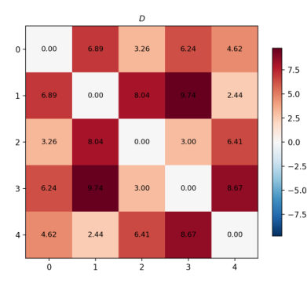 
Figure 1: Double-centering a metric cost An Euclidean distance matrix D and its double centered D′. While the symmetry of the metric matrix is preserved, the positivity and triangular inequality are lost.

📷 Fig 2

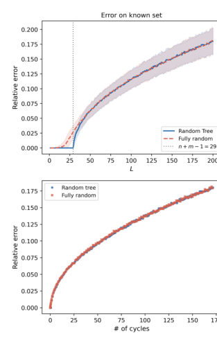 
Figure 2: Fitting prior knowledge of the cost function. Relative error for the reconstruction of the true cost matrix, as a function of the number of known values L (upper panels) and number of cycles formed by such values (lower panelz`us). Left panels show the error on the L known values, right panels show the error on the rest of the unkown values of C. Increasing L decrease the ability to perfectly fit the known values but increase the overall precision on the unknown costs. See Appendix D for details on the setup.

📷 Fig 3

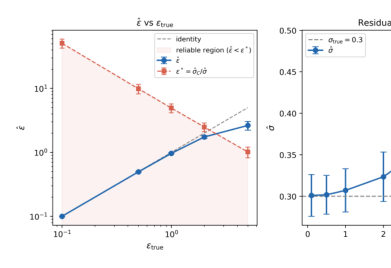 
Figure 3: Accuracy and feasibility of estimating ϵ. Left panel: esti- mated ˆϵ vs the true ϵ (blue line). The estimation remain accurate as long as ϵ remain in the reliable zone (shaded area) defined by ϵ∗(red line). Central panel: estimation of noise level ˆσ (blue line) in the transport plan W as a function of the true temperature ϵ, compared to the true value (dashed line). Right panel: relative error in the estimation of the temperature (blue line) compared to the signal to noise ratio SNR (red line).

📷 Fig 4

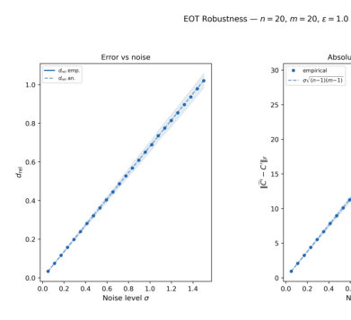 
Figure 4: Numerical validation of noise

📷 Fig 5

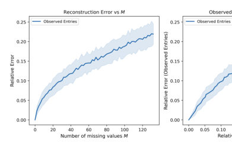 
Figure 5: Error due to missing values

**Summary.** This work solves the difficult inverse problem in Optimal Transport by proposing an exact, non-iterative method based on a double-centering operation. This technique uniquely reconstructs the true cost matrix from an observed transport plan, bypassing the need to solve the forward OT problem iteratively. It provides a powerful, general tool for inferring underlying physical costs from empirical transport data.

**Why it may be interesting.** While the topic is mathematical statistics/optimization, the underlying structure of OT is deeply connected to quantum information geometry and quantum state estimation, making the rigorous mathematical tools relevant to quantum physics.

Detailed structure

**Main problem.** The paper addresses the inverse problem of Optimal Transport (OT): recovering the underlying cost matrix given an observed optimal transport plan. This is challenging due to inherent gauge freedom in the cost structure.

**Main result.** The authors provide an exact, closed-form solution using a single double-centering operation to uniquely fix the gauge freedom and recover the cost matrix without iterative optimization. This method is general and extends beyond entropic regularization.

**Method.** The core method involves applying a double-centering operation to the observed plan (or its transform) to remove additive row and column gauge contributions, yielding a canonical cost matrix representation.

**Model / system.** The framework is based on Optimal Transport (OT) and its regularized version, Entropic Optimal Transport (EOT). The problem is framed as recovering the cost matrix $C$ from the transport plan $W$ that minimizes the regularized energy.

**Key observables.** The recovered cost matrix ($ar{C}'$), the temperature parameter ($\epsilon$), and diagnostics like the Signal-to-Noise Ratio (SNR) are key observables.

**Important parameters / regimes.** The regularization temperature $\epsilon$, the size of the marginals ($N, M$), and the noise level ($\sigma$) are important parameters.

**Assumptions / limitations.** The method assumes the existence of an invertible relation between the cost and the plan, and it is robust to multiplicative noise in the observed plan $W$.

**Figures summary.** Figures illustrate the double-centering operation on distance matrices and compare reconstruction errors based on the number of independent cycles in the observed data graph.

**Paper structure.** The paper first establishes the inverse OT problem and the gauge freedom. It then introduces the double-centering technique as the exact solution. Subsequent sections detail its application to estimate parameters like $\epsilon$ and analyze reconstruction accuracy under partial information and noise.

Abstract

Optimal transport describes the most efficient way to move mass between two distributions, given a cost matrix for moving mass between each pair of locations. Entropic optimal transport, solved via the Sinkhorn algorithm, is a widely used regularized version of this problem. Its inverse problem asks the opposite question: given an observed transport plan, what cost matrix produced it? This is difficult because the cost is identifiable only up to an additive gauge freedom. Here we show that this freedom can be fixed exactly by a single double-centering operation applied to the observed plan, yielding the true cost matrix in closed form, with no iterative optimization required. When a modest number of true cost entries are known, the same approach lets us jointly estimate the temperature parameter controlling the entropic regularization, together with a diagnostic for the reliability of this estimate. We further show that the method is not specific to the entropic optimal transport, but extends to a broader class of transport models defined by an invertible relation between cost and plan.

[↑ back to top](#top)

### [Green-function Zeros Encode Competing Mott and Charge-ordering Scales](http://arxiv.org/abs/2609.00124v1)

**Authors:** Peizhi Mai, Philip W. Phillips  
**Type:** theory · **Category:** strongly correlated electrons · **PDF:** <https://arxiv.org/pdf/2609.00124v1>  
**Analysis basis:** full PDF text, analyzed in chunks
**Topic relevance:** `Keldysh / 2PI / non-Gaussian methods` **1/5** · `analog quantum simulation` **1/5**

📷 Fig 1

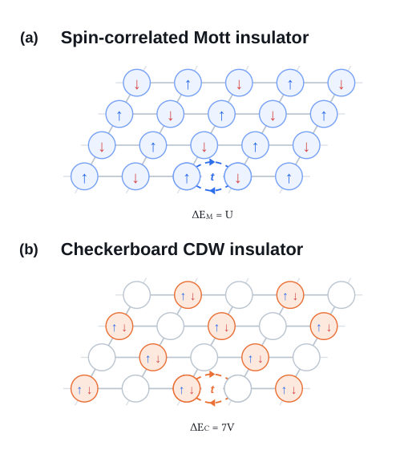 
FIG. 1. Distinct correlated insulators. (a) In the spin- correlated Mott insulator, sites are predominantly singly oc- cupied, and NN hopping t virtually accesses a doublon–holon configuration at energy cost ∆EM = U with V = 0. (b) In the checkerboard CDW insulator, doubly occupied and empty sites alternate, and the corresponding virtual hop accesses two singly occupied defects at cost ∆EC = 7V with U = 0. Dashed counterpropagating arrows identify the virtual pro- cess on a representative bond; the finite patches illustrate the local backgrounds.

📷 Fig 2

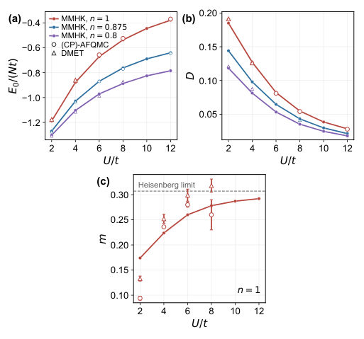 
FIG. 2. Benchmark validation of 16-MMHK. (a, b) Ground-state energy and double occupancy for n = 1, 0.875, and 0.8. Color identifies density; filled circles connected by lines are MMHK, open circles are AFQMC or constrained- path AFQMC, and open triangles are DMET. (c) Half- filled staggered magnetization; the Heisenberg limit is shown. Benchmark-source selection, pointwise values, deviations, and source identities are reported in the Supplemental Material, Sec. 2 and Table S1.

📷 Fig 3

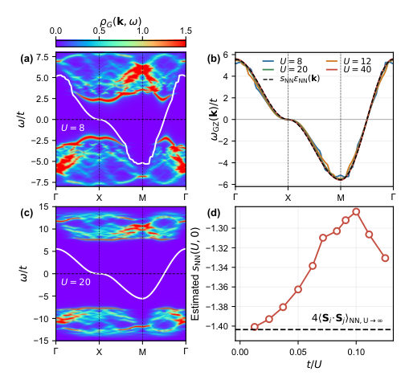 
FIG. 3. Mott-side GZ dispersion. (a,c) Representative spectral functions at V = 0 for U = 8 and 20; white curves mark the gap-interior GZ dispersion. The frequency range expands with the interaction while the spectral color scale is fixed. (b) Extracted GZ dispersions for U = 8, 20, and 40 and the zero-offset fit ωGZ(k) = sNNεNN(k) to the U = 40 curve. (d) Estimated sNN(U, 0) versus t/U for U = 8 ∼80. The dashed line is the independently determined prediction 4⟨Si·Sj⟩NN,U→∞= −1.4036 at the present 16-MMHK reso- lution. The complete spectral sequence is shown in Supple- mental Fig. S2.

📷 Fig 4

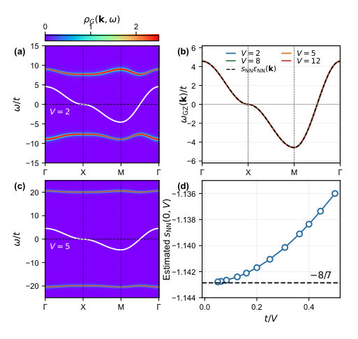 
FIG. 4. CDW-side GZ dispersion. (a,c) Representative spectral functions at U = 0 for V = 2 and 5; white curves mark the gap-interior GZ dispersion. The frequency range expands with the interaction while the spectral color scale is fixed. (b) Extracted GZ dispersions for V = 2, 5, and 8 and the zero-offset fit ωGZ(k) = sNNεNN(k) to the V = 8 curve. (d) Estimated sNN(0, V ) versus t/V for V = 2 ∼20. The dashed line is the parameter-free charge-defect prediction −8/7. The complete spectral sequence is shown in Supple- mental Fig. S3.

📷 Fig 5

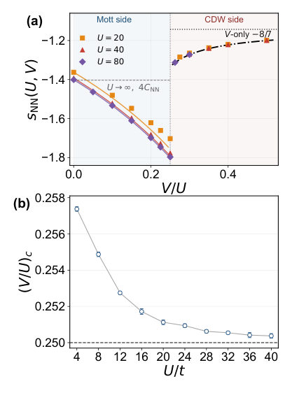 
FIG. 5. GZ coefficient sNN across the Mott–CDW boundary. (a) Signed coefficients for U/t = 20, 40, and 80. Symbols are the GZ data. On the Mott side, the col- ored curves use Eq. (8) with the independently calculated CNN(U, V ); the black dash–dotted curve on the CDW side uses the leading rational term of Eq. (9). Horizontal guides mark the interaction-axis limits and the vertical dotted line marks V/U = 1/4. (b) Independently bracketed first-order transition ratio. Bars show the sampled brackets, the gray line guides the eye, and the dashed line marks 1/4; Supple- mental Material gives the ground-state diagnostics.

**Summary.** This work establishes that the dispersion of zeros in the Green's function serves as a key diagnostic for understanding competing ordering tendencies in correlated insulators. By studying the extended Hubbard model, the authors show that the zero dispersion is governed by distinct mechanisms—spin correlations in the Mott phase and defect kinematics in the CDW phase—and that this change is discontinuous at the transition point.

**Why it may be interesting.** The concept of using spectral zeros, rather than quasiparticle poles, to characterize insulating states is a powerful diagnostic tool for strongly correlated systems, providing insight into competing orders.

Detailed structure

**Main problem.** The paper aims to elucidate the physical meaning of the zeros in the Green's function for correlated insulators, specifically how the dispersion of these zeros encodes the physics of competing ordering tendencies (Mott vs. CDW).

**Main result.** The dispersion of the Green's function zeros is determined by both microscopic spin-spin correlations and defect kinematics, exhibiting a discontinuous jump across the Mott–CDW transition, confirming the first-order nature of the transition.

**Method.** The study employs analytical and numerical techniques on the extended Hubbard model, focusing on solving for the continuous low-spectral-weight solution to $	ext{Re } G[k, \omega_{	ext{GZ}}(k)] = 0$.

**Model / system.** The system is modeled using the extended Hubbard model, incorporating nearest-neighbor repulsion ($V$) alongside standard Hubbard terms ($t, U$), and is analyzed in the context of competing Mott antiferromagnetism and checkerboard CDW ordering.

**Key observables.** Green's function zero dispersion ($\omega_{	ext{GZ}}(k)$), coefficients $s_{	ext{NN}}$, ground-state energy, and double occupancy.

**Important parameters / regimes.** Interaction strengths ($U, V$), hopping parameters ($t, t'$), and the ratio of these parameters (e.g., $U/t$, $V/t$).

**Assumptions / limitations.** The analysis relies on the $V$-extended Momentum-Mixing Hatsugai-Kohmoto (MMHK) framework and takes the zero-broadening limit for calculating the GZ dispersion.

**Figures summary.** Figures illustrate the distinct correlated insulators (Mott vs. CDW) and show the GZ dispersion relationship, confirming the discontinuous jump across the transition.

**Paper structure.** The paper develops the theory by analyzing the GZ dispersion in the limits of pure Mott ($V=0$) and pure CDW ($U=0$) phases, establishing distinct strong-coupling mechanisms, and then analyzing the crossover region to confirm the first-order nature of the transition.

Abstract

While correlated insulators are devoid of low-energy quasiparticle poles, their Green functions retain clean momentum structure through zeros. However, precisely what zeros imply is not clear. By studying the extended Hubbard model both analytically and numerically, we establish a new paradigm for strongly correlated matter: the dispersion of Green function zeros is determined by both microscopic spin-spin correlations and defect kinematics. In fact, we find that the dispersion changes discontinuously across the transition between the Mott and the checkerboard charge-density wave phases as is expected for a first-order transition. This physics is robust to the inclusion of further neighbor hopping which simply fine tunes the spin-correlation or charge-defect kinematics. We conclude that it is the {\it dispersion} of the Green-function zeros that encode the physics of ordering resultant from the strong correlations.

[↑ back to top](#top)

### [Quantum Complexity Dynamics for Disjoint Subsystems](http://arxiv.org/abs/2609.00126v1)

**Authors:** Yale Fan, Nicholas Hunter-Jones, Andreas Karch, Minju Kum, Shivan Mittal  
**Type:** theory · **Category:** statistical mechanics · **PDF:** <https://arxiv.org/pdf/2609.00126v1>  
**Analysis basis:** full PDF text, analyzed in chunks
**Topic relevance:** `Keldysh / 2PI / non-Gaussian methods` **1/5** · `non-equilibrium universality` **1/5**

📷 Fig 1

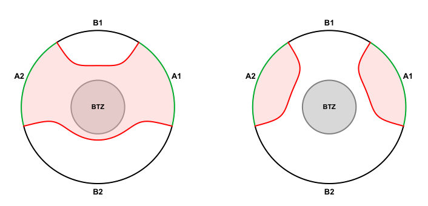 
Figure 1: Two candidate RT surface configurations. All intervals have size &lt; ℓ/2. Left: the “B caps” have smaller area, and the connected entanglement wedge of A (colored in red) contains the wormhole despite that ℓA &lt; ℓ/2. Right: the “A caps” have smaller area, and the entanglement wedge of A does not contain the wormhole.

📷 Fig 2

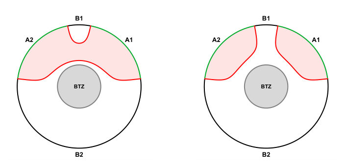 
Figure 2: The case where the complementary subsystem B contains an interval of size &gt; ℓ/2, namely B2. Left: the “B caps” have smaller area. Right: the “A caps” have smaller area. In either case, the entanglement wedge of A does not contain the wormhole.

📷 Fig 3

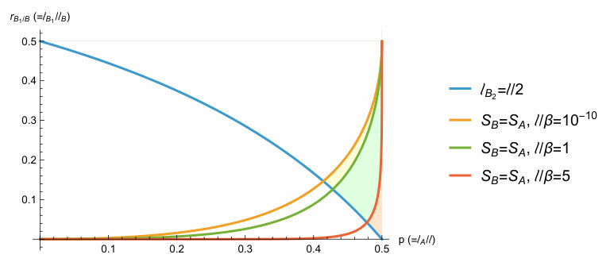 
Figure 3: Lower and upper bounds for rB1/B as functions of p, where rA1/A = 1/2. The blue line is the lower bound. The yellow, green, and orange lines are the upper bounds for ℓ/β = 10−10, ℓ/β = 1, and ℓ/β = 5, respectively. The allowed regions in the (p, rB1/B) parameter space are colored accordingly. For example, when ℓ/β = 1, the allowed region is the union of the green and orange regions. As the temperature increases, the allowed region shrinks.

📷 Fig 4

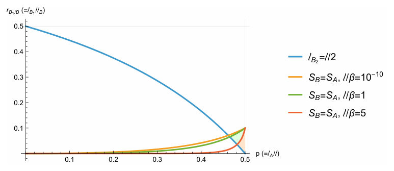 
Figure 4: Same as Figure 3, but with rA1/A = 1/10. As rA1/A decreases, the allowed region shrinks.

📷 Fig 5

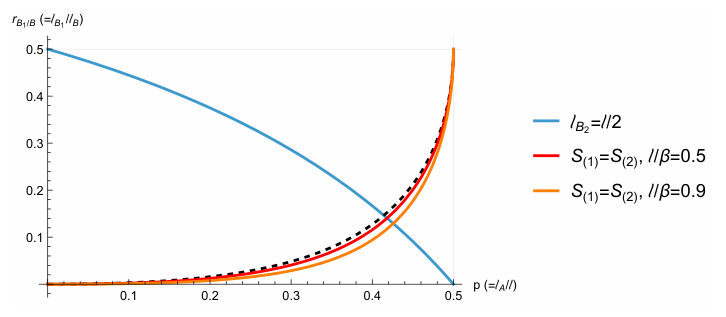 
Figure 5: The upper bound for rB1/B in the low-temperature limit (2.29) is marked as a black dashed curve. The upper bound approaches this curve as we lower the temperature.

**Summary.** This paper explores quantum complexity dynamics in systems where the subsystems are not connected. Using both holographic models and random quantum circuits, the authors demonstrate counterintuitive effects, such as a smaller, fragmented subsystem carrying high complexity while a larger one remains simple at finite temperatures. This work sharpens the link between geometric structure and computational complexity in quantum dynamics.

**Why it may be interesting.** The findings provide novel insights into how geometric properties (disjointness) can drastically alter the expected thermalization and complexity dynamics of quantum systems, which is relevant for understanding non-equilibrium dynamics in many-body systems.

Detailed structure

**Main problem.** The paper investigates quantum complexity dynamics, focusing specifically on how the complexity evolves in noncontiguous (disjoint) subsystems, which is expected to reveal physics beyond the standard connected region analysis.

**Main result.** The study shows that at finite temperature, a smaller, noncontiguous subsystem can exhibit exponentially large complexity while its larger complement remains simple, an effect that vanishes in the infinite-temperature limit.

**Method.** The authors employ complementary theoretical tools from holographic duality (AdS/CFT) and the analysis of random quantum circuits to calculate quantum complexity.

**Model / system.** The models include a CFT on a spatial circle in the thermofield double state (holography) and random quantum circuits on qudits. The analysis compares the complexity of disjoint subsystems A and B.

**Key observables.** Quantum Complexity, Entanglement Entropy, and the Ryu–Takayanagi (RT) surface area/volume.

**Important parameters / regimes.** Finite temperature ($eta$ finite) vs. infinite temperature ($eta 	o 0$); the number of disjoint components ($m$).

**Assumptions / limitations.** The holographic setup assumes identical subsystems on both sides to model the symmetry of the thermofield double state.

**Figures summary.** Figures 1 and 2 illustrate candidate RT surface configurations and the implications of the black hole location relative to the entanglement wedge.

**Paper structure.** The paper systematically analyzes the holographic complexity for $m=2$ and $m=3$ disjoint intervals, generalizes to arbitrary $m$ to derive the complexity collapse time, and then presents the analogous results using random quantum circuits.

Abstract

Quantum complexity has emerged as a natural probe of chaos, thermalization, and the black hole interior on timescales long after local observables have equilibrated. However, its time evolution has been studied almost exclusively in subsystems confined to a single connected region. We show, using complementary tools from holography and random quantum circuits, that noncontiguous subsystems composed of multiple disjoint regions give rise to qualitatively new physics compared to the contiguous case. First, at finite temperature, a subsystem occupying less than half of the total system can carry high complexity at late times, even as the complexity of its larger complement remains low. This inversion of the usual hierarchy is intrinsically thermal: it vanishes in the infinite-temperature limit, which is the regime modeled by random quantum circuits. Second, if a subsystem's complexity equilibrates at an early time, then fragmenting it into $m$ disjoint components can further reduce this timescale by a factor of $m$, a phenomenon we exhibit in both holography and random quantum circuits. These results not only sharpen the correspondence between geometric and computational notions of complexity, but also motivate the search for novel complexity phenomena in quantum dynamics.

[↑ back to top](#top)

### [Tangent fermions can restore vacuum stability of discrete-time Dirac models](http://arxiv.org/abs/2609.01029v1)

**Authors:** C. W. J. Beenakker  
**Type:** theory · **Category:** other · **PDF:** <https://arxiv.org/pdf/2609.01029v1>  
**Analysis basis:** full PDF text, analyzed in chunks
**Topic relevance:** `Keldysh / 2PI / non-Gaussian methods` **1/5** · `methods for driven-dissipative` **1/5**

📷 Fig 1

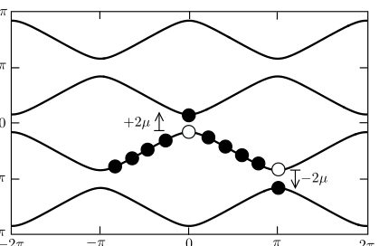 
FIG. 1. Quasi-energy–momentum dispersion relation (2.3) of the Dirac quantum walk (2.1), plotted for mass µ = 0.5/τ over several Brillouin zones. Black and white dots indicate filled and empty states, respectively. A particle-hole pair created at k = 0 consumes an energy 2µ, while at k = π/a it releases an energy 2µ. The energy balance can be understood as a temporal Umklapp process. While the periodic drive injects an energy 2π/τ in the system, the particle at k = π/a only gains 2π/τ −2µ.

📷 Fig 2

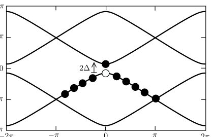 
FIG. 2. Dispersion relation (2.6) of the tangent fermion quan- tum map (2.4), plotted for mass µ = 0.5 and velocity v = 1. The mass does not open a gap at k = π, precluding the energy release process of Fig. 1.

📷 Fig 3

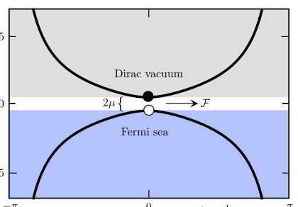 
FIG. 3. Dispersion relation (2.6) plotted for the Cayley energy E = 2 tan(ε/2), rather than for the quasi-energy ε (same parameters as in Fig. 2). The regions identified with the Fermi sea and the Dirac vacuum are indicated, as well as a particle- hole pair produced by interband tunneling (Klein tunneling) in the presence of an electric field F. The infinite band gap at k = π precludes the instability mechanism of Fig. 1 for the spatially-averaged coupling.

📷 Fig 4

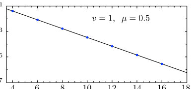 
FIG. 4. Pair production probability T for the tangent fermion quantum map in a uniform electric field F, included via the spatially-averaged coupling. The data points are computed numerically by integration of the Landau-Zener Hamiltonian (3.6), the solid line is the small-F result (3.10).

📷 Fig 5

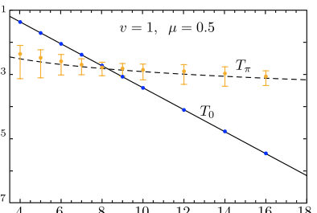 
FIG. 5. Pair production probability T0 at zone center and Tπ at zone corner, for the tangent fermion quantum map in a uniform electric field F, included via the split-operator cou- pling. The data points are computed numerically from the spectral flow equation (4.4), the solid and dashed lines are the small-F results (4.6) and (4.11), respectively. The error bars for Tπ give the standard deviation upon averaging over momentum sweeps in the interval π −δk &lt; k &lt; π + δk with δk ∈(0.8, 2.6). There is no significant sweep interval depen- dence for T0.

**Summary.** This paper resolves a known vacuum instability issue in discrete-time Dirac models by proposing a tangent fermion discretization. The authors demonstrate that this new scheme maintains a single Dirac cone while ensuring that pair creation at the zone corner does not lead to vacuum decay in the continuum limit. This offers a stable lattice approach for studying relativistic quantum dynamics.

**Why it may be interesting.** The work provides a rigorous theoretical framework for stabilizing lattice discretizations of continuum physics (like the Dirac equation), which is crucial for developing reliable numerical simulations in condensed matter theory.

Detailed structure

**Main problem.** The paper addresses the vacuum instability of the Dirac quantum walk in discrete time, which arises from particle-hole pair creation at the zone corner.

**Main result.** By employing a tangent fermion discretization scheme and using a symmetric split-operator coupling, the model restores vacuum stability by ensuring the zone corner remains gapless and decoupled from the energy release mechanism in the continuum limit.

**Method.** The analysis uses the Cayley transformation to map quasi-energies to real energies and calculates the Schwinger effect (pair-production rate) by comparing different lattice coupling schemes.

**Model / system.** The system is a Dirac quantum walk modeled by a discrete-time quantum map. The analysis compares the original Dirac quantum walk to a novel tangent fermion discretization, which is analyzed using Floquet operators and coupling potentials.

**Key observables.** Schwinger pair-production rate ($\kappa$), quasi-energy gap ($\Delta_\pi$), and the dispersion relation across the Brillouin zone corner.

**Important parameters / regimes.** Lattice constants ($	au, a$), mass gap ($\mu$), potential strength ($V_0$), and the smoothness parameter ($\lambda$).

**Assumptions / limitations.** The analysis distinguishes between spatially-averaged and exactly gauge-invariant split-operator couplings, and examines the continuum limit ($	au 	o 0$).

**Figures summary.** Figures illustrate the energy balance showing instability in the original model, the gapless crossing in the tangent fermion model, and the calculated pair production probability $T$ for different coupling schemes.

**Paper structure.** The paper progresses by first identifying the instability in the standard Dirac quantum walk, then introducing the tangent fermion scheme, and finally performing a detailed comparison of coupling methods (gauge invariant vs. averaged) to show how the instability is suppressed or vanishes in the continuum limit.

Abstract

The Dirac quantum walk (a 1+1 dimensional space-time discretization of the Dirac equation) has a $2μ$ mass gap both at the center and at the corner of the quasi-energy-momentum Brillouin zone. Gupta and Short recently noted [Quantum 9, 1845 (2025)] that the Dirac vacuum can create a particle-hole pair at the zone corner with the release of an energy $2μ$ to the environment. They removed this vacuum instability at the expense of fermion doubling, the appearance of a second low-energy Dirac cone. Here we show that an alternative discretization scheme, with a tangent rather than a sine dispersion relation, offers stability while retaining a single Dirac cone. The key step is the Cayley transformation from the unit circle of Floquet eigenvalues $e^{-i\varepsilon}$ to the real line of unbounded energies $E=2\tan(\varepsilon/2)$. We compute the Schwinger effect (particle-hole pair creation in a uniform electric field) for tangent fermions and show that the pair-production rate agrees with the continuum result for a single Dirac cone. The zone corner is exactly decoupled if the scalar potential is coupled through the Hermitian generator of the quantum map. If it is coupled as a split operator, in order to preserve exact gauge invariance on the lattice, the corner does contribute - with a weight that vanishes quadratically with the lattice constants, in contrast to the Dirac quantum walk where the zone-corner instability survives the continuum limit.

[↑ back to top](#top)

### [Unbiased sampling from Boltzmann distributions with noisy energies](http://arxiv.org/abs/2609.01204v1)

**Authors:** Iwo Sanderski, Gian Gentinetta, Giuseppe Carleo  
**Type:** theory · **Category:** numerical methods · **PDF:** <https://arxiv.org/pdf/2609.01204v1>  
**Analysis basis:** full PDF text, analyzed in chunks
**Topic relevance:** `methods for driven-dissipative` **1/5** · `quantum measurements` **1/5**

📷 Fig 1

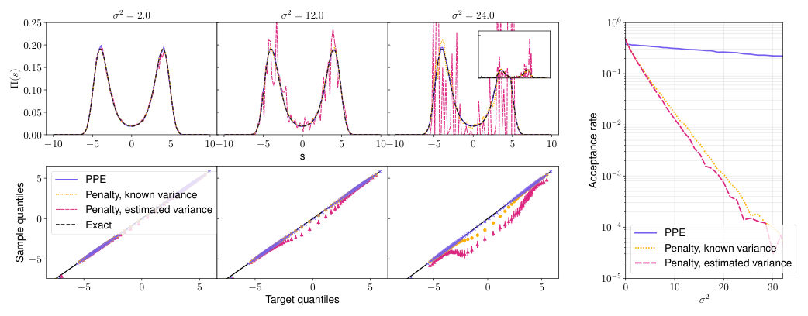 
FIG. 1: Sampling the Boltzmann distribution of the double-well potential with noisy energies. We compare the PPE (purple) with the penalty method using the exact noise variance (“Penalty, known variance”; yellow) and its variant that estimates the variance stochastically through the Bessel correction (“Penalty, estimated variance”; red). Top row: histograms of the sampled distributions overlaid on the exact Boltzmann density, for energy-estimate variances σ2 = 2.0, 12.0, 24.0 (left to right; inset zooms the σ2 = 24.0 peaks). Bottom row: the corresponding quantile-quantile plots against the exact distribution. While at σ2 = 2.0 all three estimators are accurate, the penalty methods deviate...

📷 Fig 2

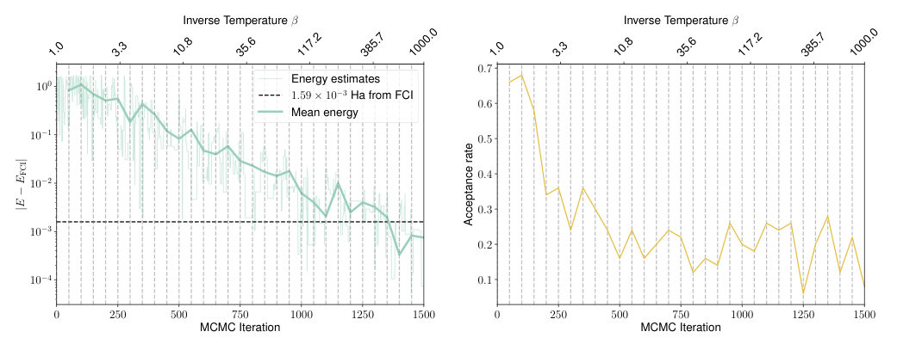 
FIG. 2: Optimization of a variational quantum circuit through simulated annealing with the PPE. We approach the ground state of the H+ 3 molecule in a minimal basis set by sampling variational parameters θ from the Boltzmann distribution e−βE(θ)

📷 Fig 3

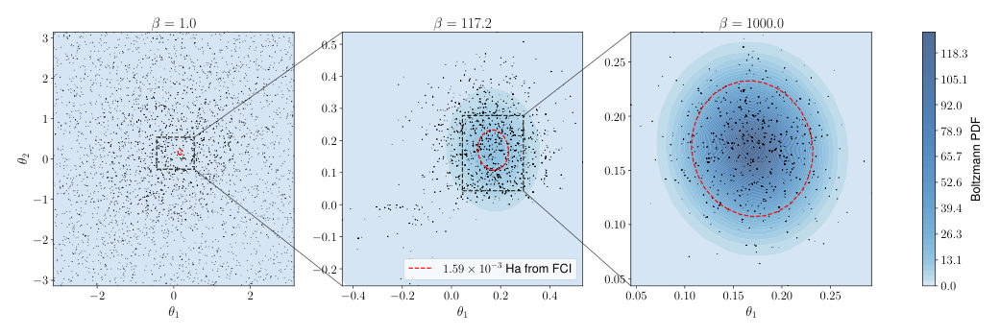 
FIG. 3: Parameter-space points sampled from the Boltzmann distribution with the PPE coupled to an annealing schedule, for three values of the inverse temperature β. The panels at β = 117.2 and β = 1000 are zoomed relative to the one at β = 1. The red circle marks the region in which the variational energy lies within 1.59×10−3 Ha of the FCI minimum. As the system cools, the Boltzmann distribution concentrates in the low-energy region, so that at β = 1000 the sampled parameters fall within this tolerance of the minimum with high probability.

📷 Fig 4

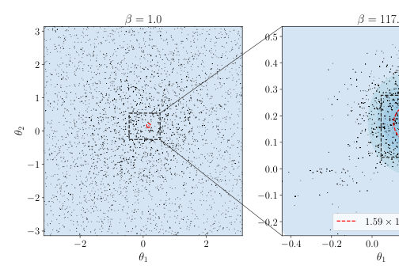 
Figure 1 compares the sampled distributions to the exact Boltzmann density at three noise levels, σ2 ∈ {2.0, 12.0, 24.0}. At low noise all three estimators are ac- curate, but as the variance grows both penalty variants develop a pronounced bias, evident as systematic devia- tions in the quantile-quantile plots, while the PPE stays faithful to the target throughout. The Bessel variant, which does not presume the variance to be known and is therefore the relevant comparison in practice, degrades the fastest. This contrast originates in the acceptance rate (right panel of Figure 1). The penalty enters the acceptance probability as e−β2σ2 [Equation (3)] and is thus expo- nentially suppressed...

**Summary.** This paper addresses the difficulty of sampling from Boltzmann distributions when energy measurements are noisy. The authors introduce the Poisson product estimator, an unbiased technique that outperforms existing methods under high noise. They demonstrate its utility by successfully finding the ground state energy of the H3+ ion using a gradient-free, simulated annealing approach.

**Why it may be interesting.** This work provides a crucial, general-purpose numerical tool for quantum simulation, allowing accurate thermal sampling and optimization in settings (like ML potentials or quantum hardware) where energy measurements are inherently noisy.

Detailed structure

**Main problem.** The core challenge is accurately sampling from the Boltzmann distribution when the energy expectation value is only available through a stochastic, noisy estimator.

**Main result.** The authors introduce the Poisson product estimator, an unbiased method that maintains accurate sampling even when noise levels are high, successfully recovering the ground-state energy of H3+.

**Method.** They propose the Poisson product estimator, which is used within a simulated annealing framework to progressively sample the system from high to low temperatures.

**Model / system.** The methods are tested on the double-well potential benchmark and applied to finding the ground state of the H3+ ion using a variational quantum circuit.

**Key observables.** Energy convergence to the FCI ground-state energy, and the shape of the sampled parameter distribution mapping the variational energy landscape.

**Important parameters / regimes.** Inverse temperature ($eta$), noise variance ($\sigma^2$), and the estimator's required upper bound ($E_{\max}$).

**Assumptions / limitations.** The estimator must be unbiased and non-negative; the method relies on the existence of an upper bound on the energy estimator.

**Figures summary.** Figure 1 compares sampling accuracy across different noise levels for the double-well potential, showing the PPE's robustness. Figure 2 tracks the energy convergence of the H3+ circuit during simulated annealing.

**Paper structure.** The paper first establishes the problem of noisy energy sampling, introduces the Poisson product estimator as a superior alternative to the penalty method, and then demonstrates its application via simulated annealing to solve the H3+ ground state problem.

Abstract

Sampling from the Boltzmann distribution is central to computational physics, yet hard when the energy is known only through a stochastic estimate, such as with machine-learned molecular potentials, in variational Monte Carlo, or on quantum computers, because a noisy energy biases the sampled distribution. The penalty method of Ceperley and Dewing corrects this but requires the noise variance and becomes intractable when it is large. We introduce the Poisson product estimator, an unbiased, non-negative estimator of the Boltzmann weight that only needs an upper bound on the energy estimator and remains efficient at high noise. Using it to optimize a variational quantum circuit gradient-free, we recover the $H_3^+$ ground-state energy in a minimal basis and, by sampling rather than following a single trajectory, also map the variational energy landscape.

[↑ back to top](#top)

### [A Scalable Multi-Protocol Platform for Quantum Key Distribution Simulation with Rigorous Statistical Evaluation](http://arxiv.org/abs/2609.01297v1)

**Authors:** Anuj Rathore, Kartick Sutradhar  
**Type:** theory · **Category:** quantum information and computing · **PDF:** <https://arxiv.org/pdf/2609.01297v1>  
**Analysis basis:** full PDF text, analyzed in chunks
**Topic relevance:** `quantum measurements` **1/5**

📷 Fig 1

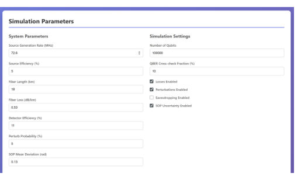 
Fig. 1. Desktop GUI: single-simulation parameter panel. Every field carries a physical unit label. The eavesdropping checkbox and impairment toggles appear below the channel parameters. Range validation prevents values outside physically meaningful bounds before the run is dispatched (https://qkd-simulator-voe2.onrender.com/).

📷 Fig 2

 
Fig. 2. Desktop GUI: per-protocol result cards from a single simulation pass. All four protocols execute in one call under identical parameters. The E91 card includes the CHSH S-statistic alongside the metrics shared by all protocols. The side-by-side layout makes sifting efficiency differences immediately visible (https://qkd-simulator-voe2.onrender.com/).

📷 Fig 3

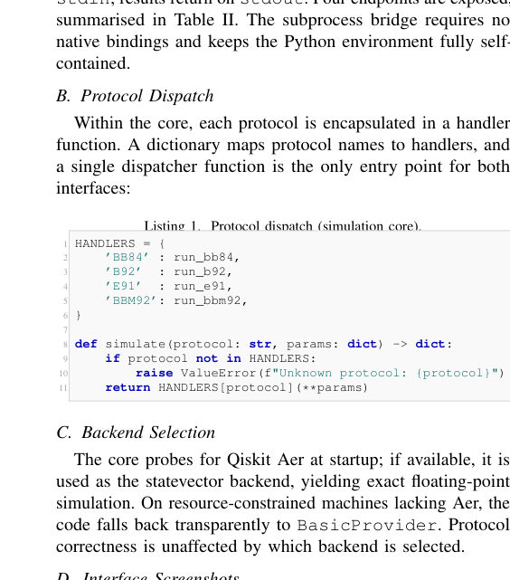 
Fig. 1 shows the desktop parameter entry panel and Fig. 2 shows the per-protocol result cards generated after a single run. Figs. 3 and 4 show the corresponding web interface panels.

📷 Fig 4

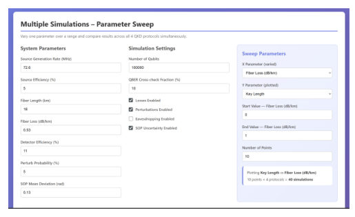 
Fig. 3. Web interface: parameter sweep configuration panel. The user selects the sweep axis (here, fiber loss in dB/km), the range, step size, and number of runs per point. The form posts to /simulate/sweep; the server aggregates results before responding.

📷 Fig 5

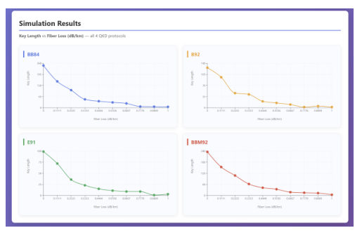 
Fig. 4. Web interface: sweep results for all four protocols. Confidence bands (shaded) widen at 40 km due to detection sparsity under high attenuation. The protocol ordering is stable across all sweep points and consistent with the sifting coefficients in Table III.

**Summary.** This paper introduces a scalable, unified simulation platform for comparing four major Quantum Key Distribution protocols (BB84, B92, E91, BBM92). By modeling realistic channel impairments and performing extensive statistical analysis, it allows for systematic comparison of key rates and security diagnostics like the CHSH S-statistic across varying fiber lengths.

**Why it may be interesting.** It provides a highly rigorous, statistically robust simulation environment for comparing fundamental quantum communication protocols, which is crucial for understanding practical quantum network feasibility.

Detailed structure

**Main problem.** Existing Quantum Key Distribution (QKD) simulation tools are limited to single protocols and lack rigorous statistical evaluation, hindering systematic comparison.

**Main result.** The platform demonstrates that BB84 achieves the highest mean key-rate (160,045 Hz) at 25 km, and the E91 protocol successfully detects eavesdropping by showing a drop in the CHSH S-statistic from 2.12 to 1.58.

**Method.** The authors developed a unified simulation platform using Python/Qiskit that models four foundational QKD protocols (BB84, B92, E91, BBM92) under a shared impairment model.

**Model / system.** The system simulates QKD over a fiber link, incorporating impairments like attenuation, source/detector losses, polarization drift, and configurable eavesdropping attacks. It supports both a local desktop GUI and a remote web client interface.

**Key observables.** Key-rate (Hz), Quantum Bit Error Rate (QBER), and the CHSH S-statistic.

**Important parameters / regimes.** Fiber length (10, 25, 40 km), number of independent runs (20), and qubits per run (10000).

**Assumptions / limitations.** The model primarily includes intercept-resend attacks; it does not account for dark counts, timing jitter, or multi-photon emission.

**Figures summary.** Figures illustrate the desktop GUI for parameter entry and results visualization, and the web interface for parameter sweeps, showing confidence bands widening at longer distances.

**Paper structure.** The paper introduces the problem, details the unified simulation platform architecture (Python/Qiskit core, dual interfaces), presents the shared impairment model, and concludes with comparative results across the four protocols and varying link lengths.

Abstract

Quantum Key Distribution (QKD) offers information- theoretically secure key establishment grounded in the laws of quantum physics, yet its practical reach is limited by the prohibitive cost of photonic hardware and the fragmented nature of existing simulation tools. Most simulators support only a single protocol and report results from individual stochastic runs, making systematic protocol comparison and reproducible statistical inference difficult. This paper presents a unified QKD simulation platform that implements four foundational protocols BB84, B92, E91, and BBM92 within a single Python/Qiskit engine. A shared impairment model covers fiber attenuation, source and detector losses, po- larization drift, and configurable intercept-resend eavesdropping. The platform is accessible through two independent interfaces that share the same backend: a desktop application (Tkinter, Matplotlib) for local experimentation and a browser-based web client (React, Node.js/Express) for zero-install remote access. All reported results are drawn from repeated-run studies (20 independent runs, 10000 qubits each), with mean, standard deviation, and 95% confidence intervals stated throughout. At a 25 km fiber link, BB84 achieves the highest mean key-rate of 160,045 Hz, followed by BBM92 (80023 Hz), E91 (52815 Hz), and B92 (40011 Hz) ordering that tracks simulation-derived sifting efficiencies precisely. Under the E91 protocol, the CHSH S-statistic averages 2.12 at baseline and falls to 1.58 when an eavesdropper is activated, demonstrating Bell-inequality-based intrusion detection independent of QBER

[↑ back to top](#top)

### [Exploring thermal order in conformal theories with multiple scalars coupled to an $O(N)$ vector field](http://arxiv.org/abs/2609.00160v1)

**Authors:** Soumyadeep Chaudhuri, Bilal Hawashin, Eliezer Rabinovici, Michael M. Scherer  
**Type:** theory · **Category:** statistical mechanics · **PDF:** <https://arxiv.org/pdf/2609.00160v1>  
**Analysis basis:** full PDF text, analyzed in chunks
**Topic relevance:** `Keldysh / 2PI / non-Gaussian methods` **1/5**

📷 Fig 1

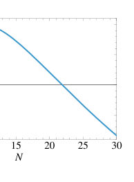 
Figure 1: Plot of D(+)(N).

📷 Fig 2

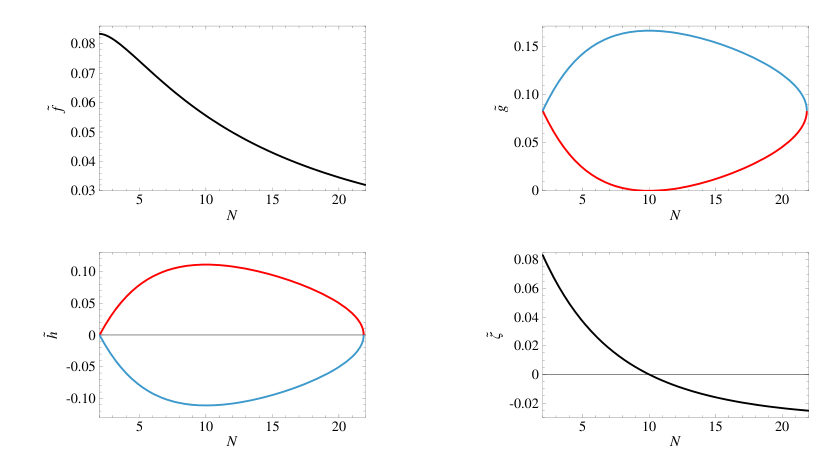 
Figure 2: Plots of the different couplings ( ef, eg, eh, eζ) at the two real fixed points for M = 2 and 2 &lt; N &lt; Nu ≈21.86: The two fixed points have the same values of ef and eζ, viz. ef(+) ∗ and eζ(+) ∗ . These are indicated by black curves. The values of eg and eh for the two fixed points are (eg(−,+) ∗ ,eh(−,+) ∗ ) and (eg(+,+) ∗ ,eh(+,+) ∗ ), indicated in red and blue, respectively.

📷 Fig 3

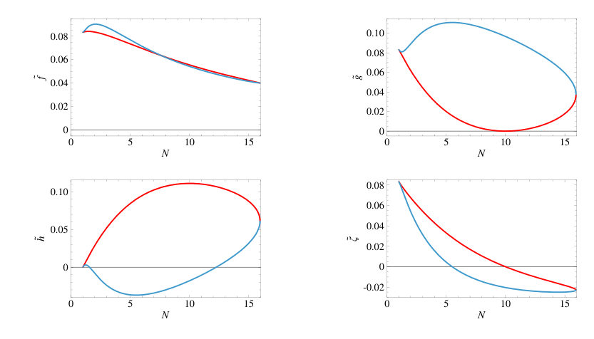 
Figure 3: The values of the different couplings at the two real fixed points for M = 3 and 1 &lt; N &lt; Nu ≈15.94 are plotted in red and blue.

📷 Fig 4

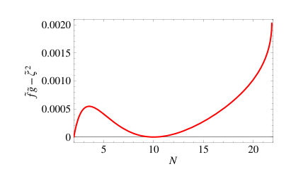 
Figure 4: Plot of ( efeg −eζ2) as a function of N for the fixed point in the M = 2 case with couplings ( ef(+) ∗ , eg(−,+) ∗ ,eh(−,+) ∗ , eζ(+) ∗ ).

📷 Fig 5

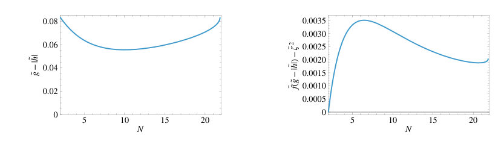 
Figure 5: Plots of (eg −|eh|) and ( ef(eg −|eh|) −eζ2) as functions of N for the fixed point in the M = 2 case with couplings ( ef(+) ∗ , eg(+,+) ∗ ,eh(+,+) ∗ , eζ(+) ∗ ).

**Summary.** This paper studies thermal order in CFTs involving multiple scalars coupled to an O(N) vector field. Using FRG and large N techniques, the authors demonstrate that in 3D, they can construct models where a discrete symmetry remains spontaneously broken at all non-zero temperatures. This provides a theoretical framework for persistent symmetry breaking beyond standard expectations.

**Why it may be interesting.** The concept of persistent symmetry breaking at finite temperature is a core topic in statistical mechanics and quantum field theory, directly challenging the Mermin-Wagner-Coleman-Hohenberg theorem's implications for discrete symmetries.

Detailed structure

**Main problem.** The paper investigates the phenomenon of 'thermal order,' specifically whether symmetries spontaneously broken at low temperatures can persist (remain broken) at all non-zero temperatures in quantum field theories.

**Main result.** The authors find a novel class of large N CFTs in three dimensions where a discrete symmetry is proven to be spontaneously broken at all non-zero temperatures, challenging standard intuition about thermal symmetry restoration.

**Method.** The study employs the Functional Renormalisation Group (FRG) technique and large N expansion methods, first analyzing the system in d=4-epsilon dimensions before focusing on the 3D limit.

**Model / system.** The system consists of Conformal Field Theories (CFTs) in d=4-epsilon and d=3 dimensions, involving multiple scalars coupled to an O(N) vector field, possessing symmetries like Z_2^M 
times S_M.

**Key observables.** Symmetry breaking patterns, thermal expectation values, and the existence/stability of fixed points in the RG flow.

**Important parameters / regimes.** The number of scalars (M), the dimension (d=3 or 4-epsilon), and the large N limit (M << N).

**Assumptions / limitations.** The analysis relies on the large N expansion and functional renormalization group techniques, with the continuation from (4-epsilon) dimensions to 3D being a key, though potentially problematic, step.

**Paper structure.** The paper first analyzes the system in (4-epsilon) dimensions using FRG to find fixed points. It then discusses the continuation of these fixed points to d=3, noting potential non-unitarity. Finally, it works directly in d=3 using large N techniques to prove persistent symmetry breaking in a specific subspace of the conformal manifold.

Abstract

We study thermal order in conformal field theories (CFTs) in $d=4-ε$ and $d=3$ dimensions where several scalars are coupled to an $O(N)$ vector field. In $(4-ε)$ dimensions, we consider models coupling a cubic model of $M$ scalars with $\mathbb{Z}_2^M\rtimes S_M$ symmetry (corresponding to sign flips and permutations of the scalars) to an $O(N)$ vector model. For any $M$, we find a window of $N$ in which two Wilson-Fisher-like fixed points exist. We show that the $\mathbb{Z}_2^M\rtimes S_M$ symmetry is spontaneously broken at arbitrary nonzero temperatures for $M=2$ and sufficiently large $N$ within this window, but it remains unbroken for $M>2$. Using the functional renormalisation group to continue these fixed points towards three dimensions, we find that they collide and move into the complex plane well before reaching $d=3$, suggesting that their continuation to $d=3$ does not yield unitary CFTs. We then work directly in three dimensions at large but finite $N$, with $M\ll N$, initially without assuming any permutation symmetry among the $M$ scalars. By studying the RG flow, we show that these models possess a conformal manifold up to the leading nontrivial order in the $1/N$ expansion of the beta functions (which is $\mathcal{O}(1/N)$). At each point on this manifold, the scalars split into two classes that are distinguished by how they couple to the $O(N)$ vector field. We then restrict to a subspace of the conformal manifold where there is an additional symmetry under permutations of the scalars within each class. We prove that in a domain of this subspace, all $M$ scalars acquire thermal expectation values such that the symmetry under sign flips of the scalars is spontaneously broken at all nonzero temperatures. This provides a novel class of large $N$ CFTs that exhibit a rich pattern of persistent symmetry breaking at nonzero temperatures.

[↑ back to top](#top)

### [Interfacial orbital torques excite nanoscale terahertz magnons](http://arxiv.org/abs/2609.01118v1)

**Authors:** Harshita Devda, Peter M. Oppeneer, Ulrich Nowak  
**Type:** theory · **Category:** statistical mechanics · **PDF:** <https://arxiv.org/pdf/2609.01118v1>  
**Analysis basis:** full PDF text, analyzed in chunks
**Topic relevance:** `Keldysh / 2PI / non-Gaussian methods` **1/5**

📷 Fig 1

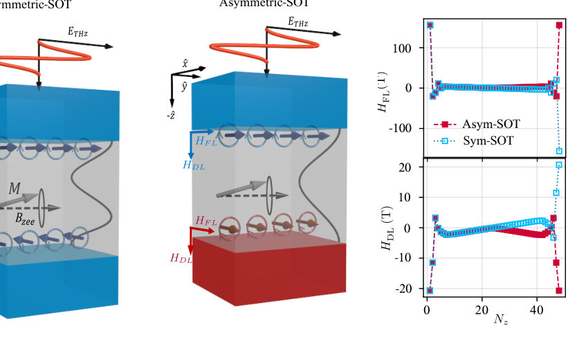 
Figure 1. (a) Schematic illustration of symmetric (left) and asymmetric (right) trilayers, to which single cycle THz laser pulses are applied, generating conventional SOTs at the two opposing interfaces. SOTs in symmetric/antisymmetric interfaces support odd/even PSSW modes. (b) Layer-resolved field-like and anti-damping-like SOT fields, HFL and HADL, respectively, taken from Ref. [27] and extrapolated for Nz = 48 Co atomic layers, for symmetric and asymmetric interface configurations.

📷 Fig 2

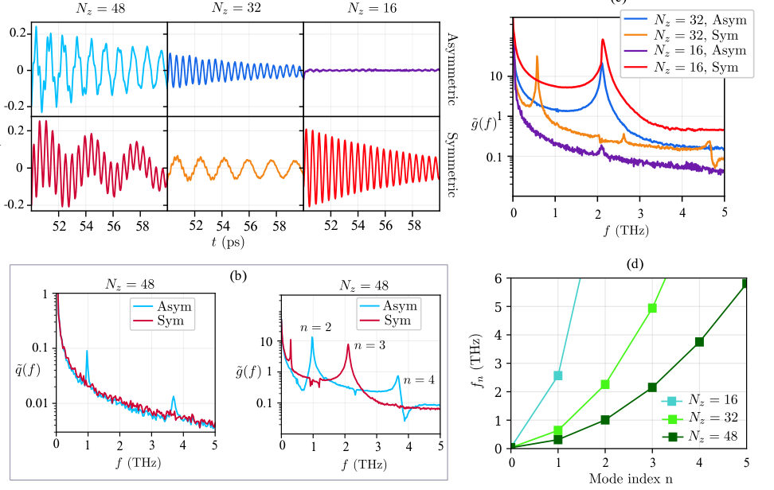 
Figure 2. (a) Simulated interface spin dynamics of the transverse spin component (Sz) after THz laser excitation, for different Co thicknesses Nz, and for both, the symmetric and asymmetric configurations. (b) Fourier transforms ˜q(f) and ˜g(f) of the transverse spin components for the symmetric and asymmetric SOT interfaces and Nz = 48. (c) ˜g(f) for thinner Co layers, Nz = 32 and Nz = 16. (d) Mode frequencies calculated analytically from the Kittel formula for three Co layer thicknesses. The Kittel formula includes all frequencies which can occur and does not distinguish the symmetric or asymmetric configurations.

📷 Fig 3

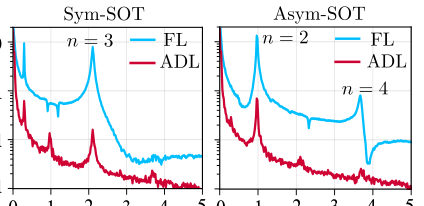 
Figure 3. Fourier transform of the time-dependent spin com- ponent, simulated independently in the presence of either M-even (field-like) or M-odd (antidamping-like) SOT for Nz = 48 at E = 3 × 108 V/m.

📷 Fig 4

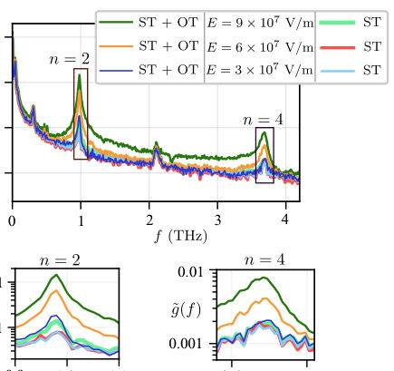 
Figure 4. Mode excitation in the asymmetric-SOT configura- tion computed in the presence or absence of the orbital torque (OT) in addition to the spin torque (ST) under laser pulse ex- citation with different electric field magnitudes. Insets show zooms into the peaks at n = 2 and n = 4.

**Summary.** This paper theoretically investigates the mechanism driving terahertz magnon excitation in thin magnetic multilayers. By developing an atomistic framework, the authors successfully decompose the complex interfacial spin-orbit torque into its constituent spin and orbital parts. They conclude that the orbital torque, specifically its field-like component, is the dominant microscopic mechanism enabling efficient, symmetry-controlled excitation of these confined THz spin waves.

**Why it may be interesting.** This work provides a detailed, atomistic, and symmetry-controlled understanding of how interfacial coupling mechanisms (orbital torques) can be engineered to control quantum dynamics (THz magnons) in condensed matter systems, which is highly relevant to open quantum systems and spintronics.

Detailed structure

**Main problem.** The study aims to resolve the microscopic origin of the interfacial driving torque responsible for exciting terahertz (THz) magnons in nanometer-thick ferromagnets, particularly due to the complexity of coexisting spin and orbital currents.

**Main result.** The research identifies the interfacial orbital torque as the primary channel for efficiently exciting exchange-dominated THz magnons, with the field-like component being the dominant torque contribution.

**Method.** The authors developed an atomistic framework, using first-principles calculations (Kubo formalism) and atomistic spin-dynamics simulations, to explicitly separate and analyze spin and orbital torque contributions.

**Model / system.** The system involves thin ferromagnets (e.g., Co) sandwiched between non-magnetic layers, forming trilayers (NM/FM/NM). The model utilizes an effective Heisenberg Hamiltonian augmented by a Spin-Orbit Torque (SOT) term.

**Key observables.** Excitation of perpendicular standing spin-wave (PSSW) modes in the THz regime, and the spectral power densities ($	ilde{q}(f), 	ilde{g}(f)$) derived from the magnetization dynamics.

**Important parameters / regimes.** THz pulse amplitude ($\sim 10^8$ V/m), film thickness ($N_z$ layers), and the separation of torque into field-like (M-even) and anti-damping-like (M-odd) components.

**Assumptions / limitations.** The SOT effective fields are assumed to remain close to their static values over the THz excitation timescale, and the orbital torque contribution is localized at the interfaces.

**Figures summary.** Figures illustrate the schematic of symmetric/asymmetric trilayers under THz pulses, showing how SOTs support different PSSW modes. Subsequent figures compare mode excitation using different torque components (M-even vs. M-odd) and highlight the role of the orbital torque.

**Paper structure.** The paper progresses by establishing the physical problem (unclear torque origin), detailing the theoretical framework (atomistic decomposition of SOT), presenting the simulation results (analyzing mode excitation based on torque components), and concluding with the identification of the orbital torque as the key driver.

Abstract

Exchange-dominated magnons in nanometer-thick ferromagnets extend to the terahertz regime through thickness quantization of perpendicular standing spin-wave (PSSW) modes. While interfacial spin-orbit torques (SOTs) have been shown to enable the excitation of such modes, the microscopic origin of the interfacial driving torque remains unclear. In particular, the coexistence of spin and orbital currents complicates the understanding. Here, we develop and use an atomistic framework that explicitly resolves interfacial symmetries and separates spin and orbital torque contributions. Exploiting a trilayer geometry for a thin ferromagnet sandwiched between non-magnetic layers, where the symmetry-controlled polarity of the interfacial torque produces mode-selective magnon excitation as observed in the recent experiment of Salikhov et al. Nature Phys. 19, 529 (2023), we disentangle the different interfacial torque contributions. By decomposing the torque into magnetization-even (field-like) and magnetization-odd components, we identify the field-like torque as the dominant contribution responsible for the excitation. Crucially, isolating orbital and spin contributions reveals that the interfacial orbital torque provides the primary channel for the efficient excitation of exchange-dominated THz magnons in thin ferromagnets. Our results establish a microscopic basis for symmetry-engineered control of confined terahertz spin dynamics in magnetic multilayers.

[↑ back to top](#top)

### [Magnetic quantum defects in a uniaxial antiferromagnetic insulator](http://arxiv.org/abs/2609.00801v1)

**Authors:** Shangfei Wu, Laur Peedu, Zhihao Wang, Xuecong Wang, Xianghan Xu, Kai Du, Sang-Wook Cheong, Aleksei Boldin, Joosep Link, Ivo Heinmaa, Raivo Stern, Sai Mu, Urmas Nagel, Toomas Rõõm, Girsh Blumberg  
**Type:** both · **Category:** strongly correlated electrons · **PDF:** <https://arxiv.org/pdf/2609.00801v1>  
**Analysis basis:** full PDF text, analyzed in chunks
**Topic relevance:** `analog quantum simulation` **1/5**

📷 Fig 1

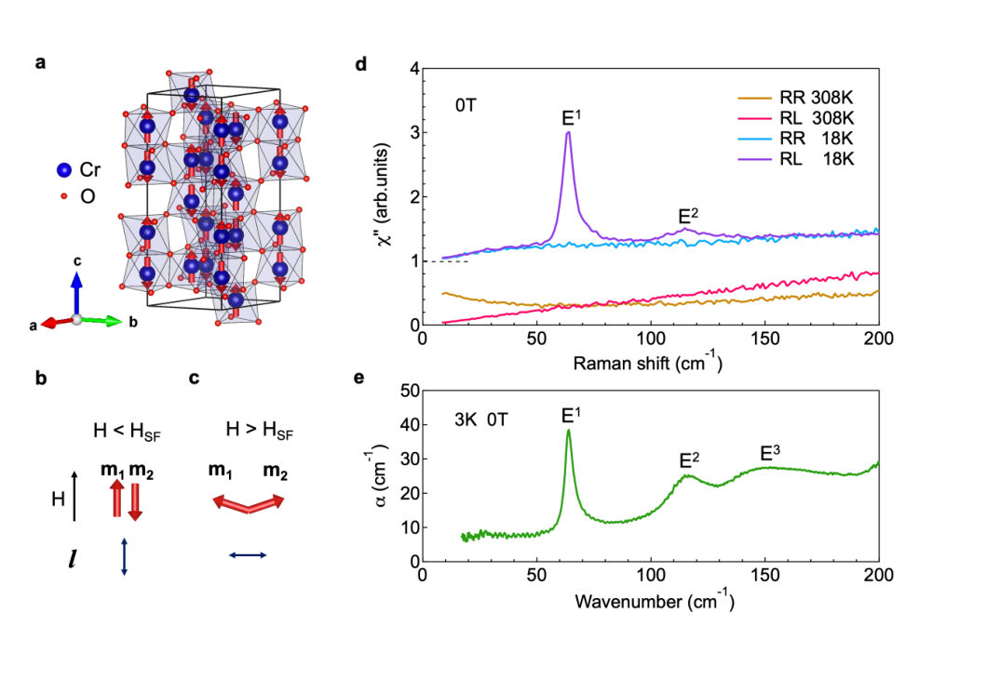 
FIG. 1. Low-energy Raman and absorption spectra for the “Rutgers”-Cr2O3 sample.

📷 Fig 2

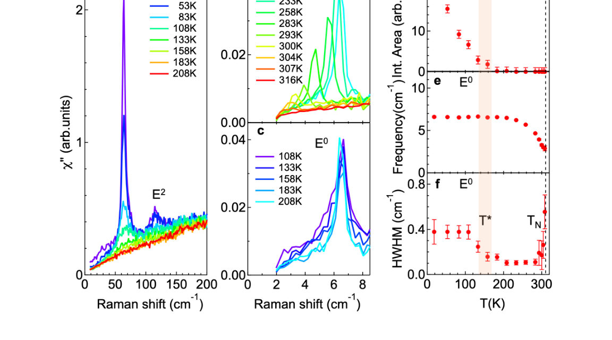 
FIG. 2. Temperature dependence of the Raman response for the “Rutgers”-Cr2O3

📷 Fig 3

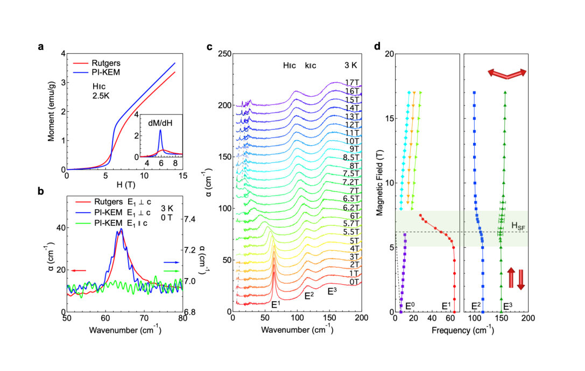 
FIG. 3. Magnetic field dependence. a Magnetic field dependence of the magnetization

📷 Fig 4

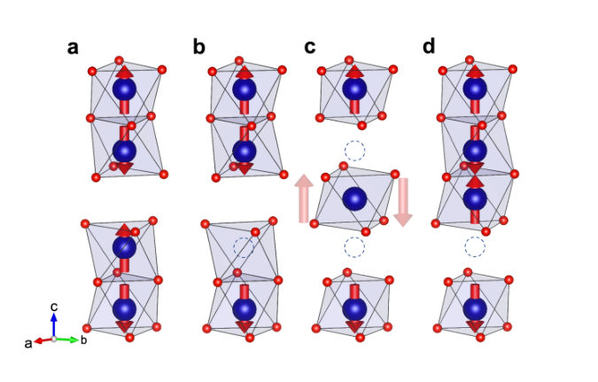 
FIG. 4. Illustrations of different types of Cr vacancies. a The Cr2O3 crystal structure

📷 Fig 5

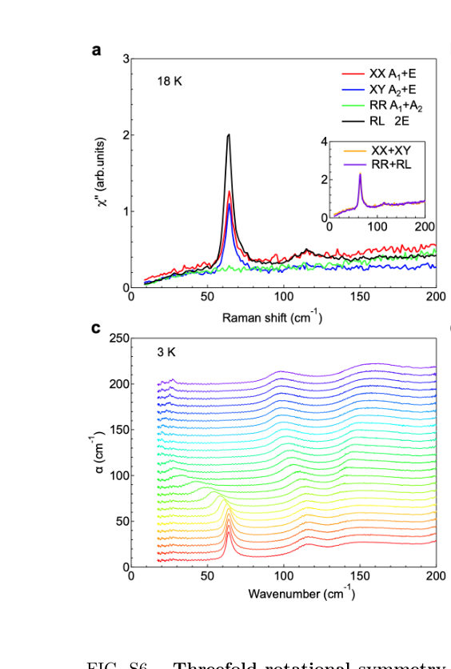 
Fig. 3c of the main text is reploted here in panel c.

**Summary.** This paper investigates magnetic quantum defects in the antiferromagnet Cr2O3 using combined spectroscopic and theoretical approaches. The researchers identified three vacancy-induced excitations, interpreting the most prominent one (E1) as a local magnetic excitation of the chromium vacancy moment. This work establishes the potential of these defect states for quantum applications by linking their energy and field dependence to fundamental magnetic interactions.

**Why it may be interesting.** The work provides a detailed spectroscopic fingerprint of localized magnetic moments associated with crystal defects, which is crucial for understanding how magnetic order and local spin dynamics can be engineered in solid-state quantum materials.

Detailed structure

**Main problem.** The primary goal is to identify and characterize magnetic quantum defects within the uniaxial antiferromagnetic insulator, Cr2O3, suitable for potential quantum applications.

**Main result.** The authors discovered three distinct, vacancy-induced excitations, with the lowest energy mode (E1) being interpreted as a local magnetic excitation of the chromium vacancy state, sensitive to external magnetic fields near the spin-flop regime.

**Method.** The study combines experimental techniques (polarization-resolved Raman and terahertz spectroscopy) with theoretical modeling, including defect supercell first-principles calculations and spin Hamiltonian analysis.

**Model / system.** The physical system is Cr2O3, an antiferromagnetic insulator. The theoretical model focuses on the magnetic excitations arising from chromium vacancies (V_Cr) within the crystal structure, modeled using spin Hamiltonians and DFT calculations.

**Key observables.** Three distinct excitations (E1, E2, E3); the E1 mode energy (64 cm-1); mode softening near the spin-flop field (6T); and the dependence of mode strength on vacancy concentration.

**Important parameters / regimes.** External magnetic field (H); spin-flop field (H_SF); temperature (T); and the local magnetic excitation energy scale (tens of meV).

**Assumptions / limitations.** The interpretation of the E1 mode as a local magnetic excitation is based on defect supercell calculations, and the analysis relies on specific selection rules derived from the tunneling Hamiltonian approach.

**Figures summary.** Figures illustrate spin structure, low-energy Raman/terahertz spectra showing field dependence, and comparisons of magnetic properties (magnetization vs. E1 mode strength) between different sample types.

**Paper structure.** The paper progresses from identifying the general problem of defect characterization, through experimental measurements linking excitations to vacancies, and finally to detailed theoretical modeling using spin Hamiltonians and selection rules to confirm the magnetic origin of the key low-energy mode.

Abstract

Point defects have been successfully utilized in various quantum technologies, serving as quantum qubits for quantum computation, single-photon emitters for quantum communication, and nanoscale sensors for quantum metrology. However, their further development faces key challenges, particularly in discovering and exploring suitable defect-host systems that meet the necessary criteria for quantum applications. Here, using polarization-resolved Raman spectroscopy and terahertz absorption spectroscopy, we discover three distinct chromium-vacancy-induced excitations in the uniaxial antiferromagnetic insulator, Cr$_2$O$_3$. These vacancy-induced excitations have an energy scale of a few tens of millielectronvolts and are twofold degenerate, and the lowest one at 64 $cm^{-1}$ is sharp and sensitive to the external magnetic field along the easy-axis direction, particularly close to the spin-flop regime around 6T, where the mode softens from 64 to 27$cm^{-1}$. Based on the defect supercell first-principles calculations, we interpret the mode at 64 $cm^{-1}$ as a local magnetic excitation of the local moment within the chromium vacancy state. Our results establish that the magnetic defect states in Cr$_2$O$_3$ have potential for quantum applications.

[↑ back to top](#top)

### [Parafermions in plain sight](http://arxiv.org/abs/2609.00545v1)

**Authors:** Siu A. Chin, A. Chaudhary  
**Type:** theory · **Category:** statistical mechanics · **PDF:** <https://arxiv.org/pdf/2609.00545v1>  
**Analysis basis:** full PDF text, analyzed in chunks
**Topic relevance:** `analog quantum simulation` **1/5**

📷 Fig 1

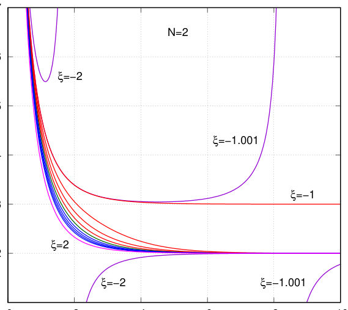 
FIG. 1: (color online) The energy of two non-interacting particles in a two dimensional harmonic

📷 Fig 2

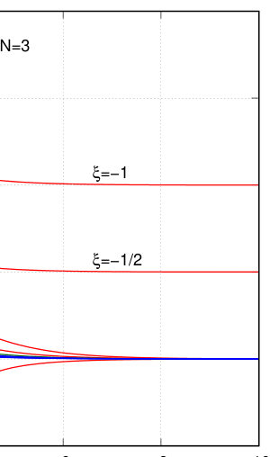 
FIG. 2: (color online) Similar to Fig.1 for N = 3 particles.

📷 Fig 3

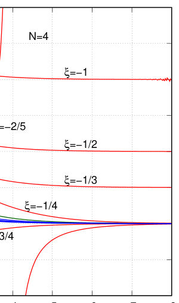 
FIG. 3: (color online) Similar to Fig.1 for N = 4 particles.

**Summary.** This theoretical paper explores generalized quantum statistics by interpolating between bosonic and fermionic partition functions using a parameter $\xi$. It demonstrates that at specific discrete values $\xi = -1/m$, the system exhibits parafermionic behavior, leading to characteristic ground state energies and a distinct grand canonical partition function. This work extends the understanding of quantum statistics beyond standard models.

**Why it may be interesting.** The explicit mathematical derivation of parastatistics via partition function interpolation provides a powerful theoretical tool for understanding generalized quantum statistics beyond simple bosons and fermions.

Detailed structure

**Main problem.** The paper investigates the interpolation between ideal boson and fermion partition functions at discrete values of the exchange weight factor $\xi = -1/m$. It aims to characterize the resulting zero-temperature ground state energies and the underlying statistics.

**Main result.** The interpolation yields non-trivial ground state energies corresponding to parafermions of order $m$ at specific discrete values of $\xi = -1/m$. The grand canonical partition function confirms the existence of genuine parastatistics for these cases.

**Method.** The analysis uses recursion relations for the partition function $Z_N$ and derives the grand canonical partition function $\Xi(t)$ using generating functions and algebraic combinatorics.

**Model / system.** The model considers non-interacting particles confined in any potential possessing a discrete energy spectrum. The statistics are governed by the parameter $\xi$, which interpolates between bosonic ($\xi=1$) and fermionic ($\xi=-1$) behavior.

**Key observables.** Zero-temperature ground state energy ($E_N$), Grand Canonical Partition Function ($\Xi(t)$), and the coefficient of the $t^N$ term in the generating function.

**Important parameters / regimes.** The exchange weight factor $\xi$, the number of particles $N$, and the inverse temperature $\beta$. The critical parameter regime is $\xi = -1/m$ for integer $m$.

**Assumptions / limitations.** The potential is assumed to have a discrete energy spectrum. The method treats $\xi$ as a mathematical parameter, potentially leading to unphysical results.

**Figures summary.** Figures illustrate the energy $E$ vs. $\beta$ for small $N$, showing deviations from the boson limit only at specific $\xi$. Table I summarizes these calculated energies for $N=2, 3, 4$.

**Paper structure.** The paper first establishes the general framework using recursion relations for $Z_N$ and calculates the energy $E$. It then derives the general form of the grand canonical partition function $\Xi(t)$ and applies it to the specific case $\xi = -1/m$, confirming the connection to parafermionic statistics.

Abstract

We show that for any potential with a discrete energy spectrum, the well-known interpolation between ideal boson and fermion partition functions at discrete values of $ξ=-1/m$ yielded zero temperature ground state energies corresponding to $m$ fermions occupying a single quantum state. The grand canonical partition function in this case can be a result from genuine parastatistics.

[↑ back to top](#top)

### [Quantum Secret Sharing with a Helper and Programmable Access Structures](http://arxiv.org/abs/2609.00220v1)

**Authors:** Eric Chitambar, Sarah Hagen, David W. Kribs, Mike I. Nelson, Andrew Nemec  
**Type:** theory · **Category:** quantum information and computing · **PDF:** <https://arxiv.org/pdf/2609.00220v1>  
**Analysis basis:** full PDF text, analyzed in chunks
**Topic relevance:** `quantum measurements` **1/5**

📷 Fig 1

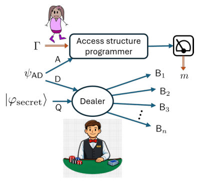 
FIG. 1: A programmable access structure (PAS) involves a dealer who distributes encrypted shares of a quantum secret. The access structure Γ for the Bi is decided remotely by a programmer at any time before or after the shares are delivered by steering the dealer’s quantum system D using pre-shared entanglement φAD.

📷 Fig 2

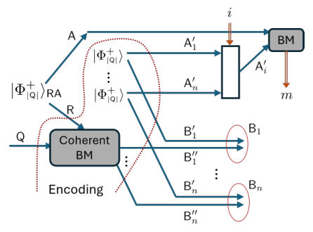 
FIG. 3: Teleportation codes. A blind QSS code can be constructed by combining a coherent Bell measurement (BM) with a teleportation from the helper to the desired party. The coherent Bell measurement can be reversed, which allows for the B to collectively recover the secret, while any individual Bi can recover the secret by effectively triggering a teleportation of the secret to the helper and then having it returned by another round of teleportation.

📷 Fig 3

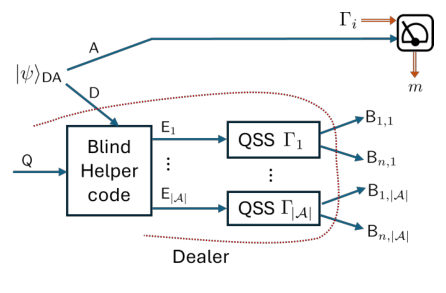 
FIG. 4: A method for building a programmable access structure using a blind helper code.

**Summary.** This paper advances the theory of Quantum Secret Sharing by introducing 'helper' codes and, most significantly, the Programmable Access Structure (PAS). It proves that implementing a PAS requires the non-local resource of quantum steering, providing a powerful tool for designing dynamically controlled quantum information protocols.

**Why it may be interesting.** The connection between QSS, quantum error correction, and the fundamental resource of quantum steering provides a deep theoretical framework for secure quantum communication protocols, which is highly relevant to quantum networking.

Detailed structure

**Main problem.** The paper investigates Quantum Secret Sharing (QSS), extending it to include a 'helper' shareholder and introducing the concept of a Programmable Access Structure (PAS).

**Main result.** It establishes that quantum steering is the necessary resource for implementing a PAS, and it derives bounds and constructions for helper codes based on quantum erasure channels.

**Method.** The work employs information-theoretic characterizations, relating QSS to quantum erasure channels, and utilizes quantum steering to model the dynamic, third-party control of the access structure.

**Model / system.** The model involves partitioning a quantum state $\mathcal{H}_Q$ across multiple shareholders $\{B_1, \dots, B_n\}$ and a helper $A$. The core mechanism is described by an encoding isometry $W$ and is analyzed using concepts from quantum error correction.

**Key observables.** Quantum mutual information $I(e_Q : S)$, the recoverability condition $	ext{RS} \circ 	ext{Tr}_S \circ \Pi_V = \Pi_V$, and the detectability of non-local correlations via quantum steering.

**Important parameters / regimes.** The number of parties $n$, the size of the secret space $|Q|$, and the structure of the access set $\Gamma$.

**Assumptions / limitations.** The analysis focuses primarily on pure QSS schemes, and the PAS model assumes security against an untrusted programmer due to the lack of signaling from the dealer to the programmer.

**Figures summary.** Figures illustrate the PAS setup involving the dealer and programmer using pre-shared entanglement, and show the general QSS setup relating recovery maps to entanglement restoration.

**Paper structure.** The paper progresses from defining QSS and introducing the helper variant, to characterizing these codes via quantum erasure channels, and finally extending the framework to implement Programmable Access Structures using quantum steering.

Abstract

Quantum secret sharing (QSS) is a process in which the state of a quantum system is partitioned into multiple shares, allowing only specific subsets of shareholders to reconstruct the state, while others gain no information about its identity. In this work, we propose a variant of QSS, called ``helper QSS,'' which designates a special shareholder whose participation with any other group of parties is sufficient for recovering the state. We present different families of helper codes that function for an arbitrary number of parties and system sizes. As an application, we introduce the idea of a programmable access structure in QSS, which allows for a third-party programmer to independently choose the access structure of the code even after the shares are delivered to all the shareholders. This choice is made blindly, meaning that the programmer has no information about the secret being encoded, and it is implemented using the nonlocal process of quantum steering.

[↑ back to top](#top)

### [Self-Healing Diffusion Monte Carlo applied to a simple fermionic model: A critical assessment of the method](http://arxiv.org/abs/2609.01301v1)

**Authors:** Michel Caffarel, Manon Pinar, Anthony Scemama  
**Type:** theory · **Category:** numerical methods · **PDF:** <https://arxiv.org/pdf/2609.01301v1>  
**Analysis basis:** full PDF text, analyzed in chunks
**Topic relevance:** `methods for driven-dissipative` **1/5**

📷 Fig 1

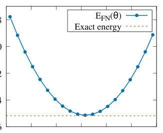 
Figure 1. Fixed-node energy as a function of the nodal angle θFN for the model. The minimum of the fixed-node energy is located at the exact angle, θex = 3.1058031.... The exact energy is Eex = −0.1441519132....

📷 Fig 2

 
Figure 1 displays the fixed-node energy as a function of the nodal position θFN; the exact energy is indicated by the horizontal line. As expected from the variational principle[12], the fixed-node energy is above the exact energy and reaches its minimum when the angle equals the exact value. This exact angle, denoted as θex, is in full agreement with the node obtained independently from the exact wave function computed in the ϕk Fourier basis set. We stress again that this node (and its image under inversion) cannot be inferred from symmetry alone: as in realistic fermionic systems, it depends on the specific form of the potential and requires solving the Schr¨odinger equation. A useful...

📷 Fig 3

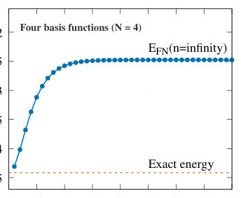 
Figure 3. E(n) FN as a function of the number n of SHDMC iterations using the standard algorithm. The number of basis functions is N = 4.

📷 Fig 4

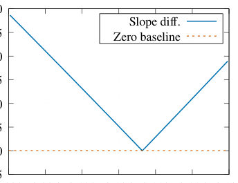 
Figure 2. Slope difference of the fixed-node wavefunction as a function of θFN. The difference vanishes at the exact node, θex.

📷 Fig 5

 
Figure 3 shows the evolution of the fixed-node energy as a function of the number n of SHDMC iterations when expanding the truncated fixed-node wavefunction, ψ(n) FN, over N = 4 functions, namely {ϕk}N=4 = {u1, v1, u3, v3}. Note that the coefficients associated with even-parity ba- sis functions vanish by symmetry. The fixed-node energy increases monotonically with the iteration number n and approaches for large n a plateau corresponding to a bi- ased energy. This behavior is observed for all values of

**Summary.** This work provides a critical assessment of the Self-Healing Diffusion Monte Carlo (SHDMC) method when applied to fermionic systems. The authors demonstrate that the standard implementation fails to converge to the correct fixed-node energy due to systematic node deterioration. They propose and validate modifications, such as emphasizing the nodal region or using localized basis sets, which are necessary for achieving accurate results.

**Why it may be interesting.** The rigorous analysis of convergence failure and the proposal of specific algorithmic fixes (like local basis sets) are highly relevant to developing robust numerical techniques for strongly correlated quantum systems.

Detailed structure

**Main problem.** The paper critically assesses the Self-Healing Diffusion Monte Carlo (SHDMC) method for improving the nodal surface of fermionic wavefunctions.

**Main result.** Standard SHDMC fails for the tested fermionic model, causing the fixed-node energy to increase monotonically; however, modifying the nodal update criterion or using localized basis sets can partially restore convergence.

**Method.** The authors employ an iterative fixed-node calculation within the SHDMC framework, comparing standard criteria against modified local criteria and localized basis sets.

**Model / system.** The study uses a one-dimensional model with periodic boundary conditions, incorporating an inversion symmetry to mimic the nodal structure of fermionic wavefunctions.

**Key observables.** Fixed-node energy ($E_{FN}$), nodal convergence (node position $	heta_N$), and the stability index ($\eta$).

**Important parameters / regimes.** The degree of nodal constraint ($\epsilon$) and the choice of basis set (Fourier vs. localized).

**Assumptions / limitations.** The primary assumption is that the nodal structure can be iteratively optimized using the SHDMC procedure, which is shown to be conditionally true.

**Figures summary.** Figures illustrate the monotonic increase of $E_{FN}$ under standard SHDMC, and show that modified criteria or localized bases allow the node position to converge toward the correct physical value.

**Paper structure.** The paper progresses by first establishing the failure of standard SHDMC, then proposing and testing a modification focusing on the nodal region, and finally demonstrating improved convergence using localized basis sets.

Abstract

We investigate the Self-Healing Diffusion Monte Carlo (SHDMC) method using a one-dimensional model with periodic boundary conditions. An inversion symmetry is introduced to mimic the antisymmetry property of fermionic wavefunctions, with the bosonic and fermionic sectors being modeled by the even and odd eigenstates, respectively. As in realistic fermionic systems, the nodal structure is only partially constrained by symmetry, making this model a non-trivial testbed for nodal optimization algorithms such as SHDMC. We show that the nodal evolution under SHDMC iterations can be cast into a dynamical system exhibiting both attractive and repulsive fixed points. In the standard formulation of SHDMC applied to this model, the fixed-node energy is found to increase upon iteration, and the node converges to a wrong value, indicating that SHDMC does not always converge to the correct solution. We further show that this problem is partially cured by modifying the nodal update criterion to give more importance to the nodal region. Achieving convergence in the general case very likely requires the use of a localized basis set, as is the case for this model.

[↑ back to top](#top)

### [Symmetry-Reduced Variational Quantum Simulation of the $U(5)\rightarrow SU(3)$ Quantum Phase Transition in the Interacting Boson Model](http://arxiv.org/abs/2609.00349v1)

**Authors:** Faisal Etminan  
**Type:** theory · **Category:** statistical mechanics · **PDF:** <https://arxiv.org/pdf/2609.00349v1>  
**Analysis basis:** full PDF text, analyzed in chunks
**Topic relevance:** `analog quantum simulation` **1/5**

📷 Fig 1

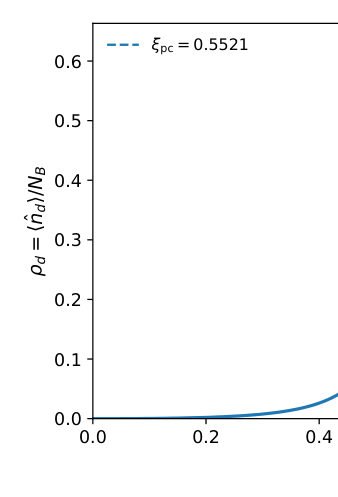 
FIG. 1: Normalized d-boson occupation ρd = ⟨ˆnd⟩/NB as a function of the control

📷 Fig 2

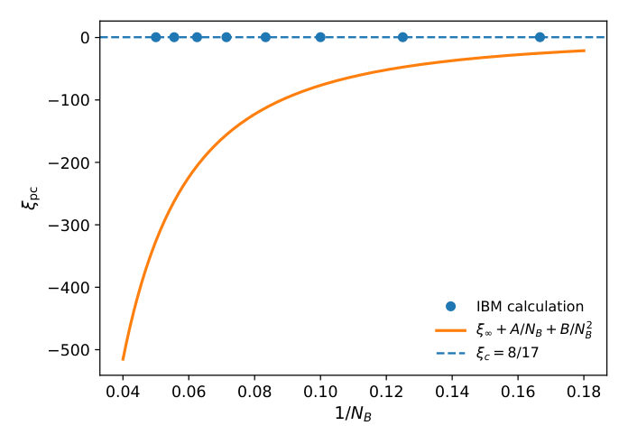 
FIG. 2: Finite-size evolution of the pseudocritical point ξpc as a function of inverse boson

📷 Fig 3

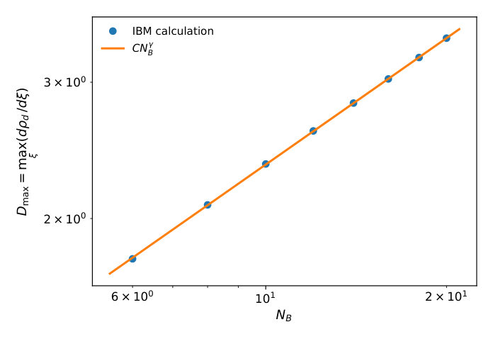 
FIG. 3: Maximum response of the order parameter, Dmax = maxξ[dρd/dξ], as a function of

📷 Fig 4

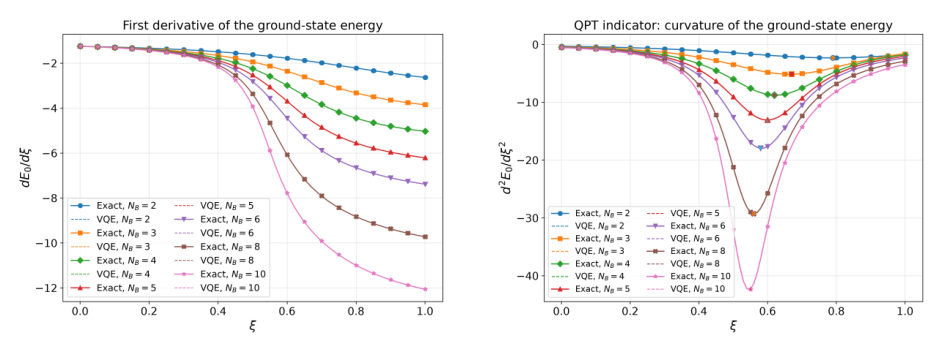 
FIG. 4: Finite-size evolution of the U(5) →SU(3) quantum phase transition in the IBM.

📷 Fig 5

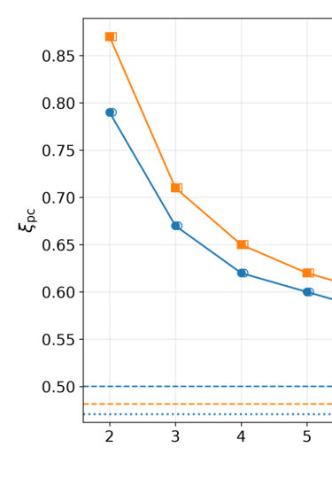 
FIG. 5: Finite-NB pseudocritical indicators ξE and ξρ obtained from the energy and

**Summary.** This work uses a symmetry-reduced Variational Quantum Eigensolver (VQE) to study the quantum phase transition in the Interacting Boson Model. By analyzing finite-size scaling of order parameters, the authors demonstrate that the VQE approach can efficiently and accurately simulate this transition, confirming theoretical predictions for the critical point.

**Why it may be interesting.** The application of quantum simulation techniques (VQE) to model a well-established nuclear structure model (IBM) provides a concrete testbed for quantum algorithms in condensed matter/nuclear physics, particularly for studying phase transitions.

Detailed structure

**Main problem.** The paper investigates the quantum phase transition from the spherical $U(5)$ limit to the deformed $SU(3)$ limit within the Interacting Boson Model (IBM).

**Main result.** The symmetry-reduced Variational Quantum Eigensolver (VQE) successfully simulates the QPT, reproducing structural observables and approaching the analytically predicted critical point $\xi_c = 8/17$.

**Method.** The study employs a symmetry-preserving, minimum-qubit VQE framework combined with finite-size scaling and thermodynamic-limit extrapolation techniques.

**Model / system.** The system is the Interacting Boson Model (IBM), which describes the low-lying collective states of even-even nuclei. The Hamiltonian is parameterized by control variables $\xi$ and $\chi$.

**Key observables.** Normalized d-boson occupation ($\rho_d$) used as the primary order parameter, ground-state energy ($E_0$), and quadrupole collectivity ($	ext{CQ}$).

**Important parameters / regimes.** Control parameters $\xi$ and $\chi$; the critical point $\xi_c = 8/17 \approx 0.470588$.

**Assumptions / limitations.** The primary assumption is that symmetry reduction based on rotational invariance is valid for minimizing qubits while preserving the finite-size physics of the QPT.

**Figures summary.** Figures compare VQE results against exact diagonalization benchmarks, showing convergence of finite-size indicators toward the analytic critical point $\xi_c$.

**Paper structure.** The paper establishes the IBM Hamiltonian, develops a symmetry-reduced VQE workflow, benchmarks this method against exact diagonalization results, and analyzes the finite-size scaling of order parameters to extrapolate the true thermodynamic critical point.

Abstract

The spherical-to-deformed quantum phase transition of the Interacting Boson Model (IBM) is investigated using the variational quantum eigensolver (VQE). The $U(5)$--$SU(3)$ transitional Hamiltonian is studied with $χ=-\sqrt{7}/2$. We develop a symmetry-preserving, minimum-qubit VQE framework for collective nuclear models, achieving a substantial reduction in qubit requirements without compromising the finite-size quantum-phase-transition physics. The transition is characterized through the normalized $d$-boson occupation and ground-state energy derivatives. Finite-size results are found to approach the analytic critical point $ξ_c=8/17\simeq0.470588$, with an independent order-parameter extrapolation yielding $ξ_\infty=0.46986(61)$. The VQE reproduces ground-state energies and structural observables to numerical precision. These results demonstrate the potential of symmetry-reduced VQE for efficient quantum simulations of collective nuclear dynamics and quantum phase transitions.

[↑ back to top](#top)

### [Verifiable quantum advantage in extremely low depth](http://arxiv.org/abs/2609.01448v1)

**Authors:** Alexandru Gheorghiu  
**Type:** theory · **Category:** quantum information and computing · **PDF:** <https://arxiv.org/pdf/2609.01448v1>  
**Analysis basis:** full PDF text, analyzed in chunks
**Topic relevance:** `quantum measurements` **1/5**

📷 Fig 1

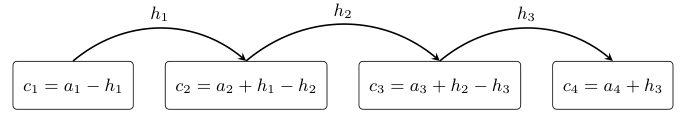 
Fig. 1. The path-mask encoding of the sum a1 + a2 + a3 + a4 modulo q, for t = 4. The symbols form a path, and the mask hj lives on the j-th edge: it moves a random amount from position j to position j + 1, subtracted from cj and added to cj+1. Summing along the path cancels every mask and returns the sum.

**Summary.** This paper constructs a sampling problem that proves quantum advantage using quantum circuits with remarkably low depth ($\log \log \lambda$ or constant). It achieves this by adapting existing lattice-based proofs of quantumness, requiring only shallow circuit execution and sampling, which is a significant step toward practical quantum cryptography demonstrations.

**Why it may be interesting.** This work pushes the boundary of quantum complexity theory by demonstrating that quantum advantage can be shown using extremely shallow circuits, which is highly relevant for near-term quantum hardware feasibility.

Detailed structure

**Main problem.** To construct a sampling problem that is solvable by extremely shallow quantum circuits, computationally hard for classical algorithms based on lattice assumptions, and efficiently verifiable.

**Main result.** The authors provide constructions showing that quantum advantage can be demonstrated using circuits of depth $O(\log \log \lambda)$ or even constant depth ($QAC^0$), without requiring mid-circuit measurements.

**Method.** The work compiles existing lattice-based proofs of quantumness (like those from Arabadjieva et al.) into low-depth quantum circuits, framing the problem as a challenge-response protocol.

**Model / system.** The model involves quantum circuits operating on qubits, specifically analyzing the capabilities of shallow circuits defined by $QNC^0[\log \log]$ or $QAC^0$ gate sets. The underlying hardness relies on the Learning with Errors (LWE) problem.

**Key observables.** Acceptance probability of the quantum sampler, the depth of the required quantum circuit, and the computational advantage over classical samplers.

**Important parameters / regimes.** Circuit depth ($\log \log \lambda$ or constant), security parameter ($\lambda$), and the lattice knowledge assumption strength ($	ext{LK-}1/4$).

**Assumptions / limitations.** The construction relies on non-standard assumptions, including a strengthened variant of the adaptive-hardcore-bit property of LWE and the $	ext{LK-}1/4$ assumption.

**Figures summary.** The notes refer to a table comparing various quantum advantage protocols based on depth, measurements, and fan-out/fan-in, indicating the current work improves these metrics.

**Paper structure.** The paper builds upon previous work (BCMVV, AGGM) by focusing on reducing the circuit depth. It establishes the necessary quantum sampling problem and proves the existence of polynomial-size quantum circuits achieving the desired low depth while maintaining classical hardness.

Abstract

We give a sampling problem that is solvable by shallow quantum circuits, hard for polynomial-time classical algorithms under lattice-based assumptions, and efficiently verifiable by a classical computer. The quantum sampler admits two implementations: one uses log-logarithmic-depth quantum circuits with one- and two-qubit gates, i.e., $\mathsf{QNC}^0[\log\log]$ circuits, while the other uses constant-depth quantum circuits with unbounded fan-in gates, i.e., $\mathsf{QAC}^0$ circuits. Our construction can be seen as compiling the Learning with Errors (LWE)-based single-round proof of quantumness of Arabadjieva et al. (2025) to very low depth. The price paid for this compilation is the reliance on less standard, though well-motivated, assumptions: in addition to the lattice knowledge assumption used by Arabadjieva et al. (2025), we require a strengthened variant of the adaptive-hardcore-bit property of LWE, for which we provide supporting evidence. Unlike previous low-depth proofs of quantumness, the quantum computation here requires no mid-circuit measurements or feed-forward: it consists only of running a shallow circuit and sampling from its output distribution. This shows that shallow quantum circuits have sufficient structure to solve certain classically hard tasks whose solutions can be verified efficiently.

[↑ back to top](#top)

## Other papers (21)

*Papers from primary archives without highlighted authors or any topic match. Click to expand.*

Show other papers

### [A hybrid quantum-classical neural network for learning to route](http://arxiv.org/abs/2609.00489v1)

**Authors:** Marcus Rolf Peter Ritt, Alexsandro Santos da Rosa Júnior, Marcos Vinicius Reballo, Cesar Augusto do Amaral, Fernando Augusto Caletti de Barros  
**Type:** both · **Category:** disordered systems and neural networks · **PDF:** <https://arxiv.org/pdf/2609.00489v1>  
**Analysis basis:** full PDF text, analyzed in chunks

📷 Fig 1

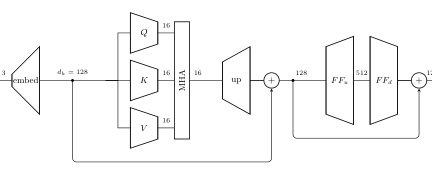 
Fig. 1. Encoder architecture of the classical attention model. The figure shows the node embedding and one layer of a total of L layers.

📷 Fig 2

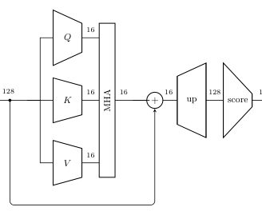 
Fig. 2. Decoder architecture of the classical attention model.

📷 Fig 3

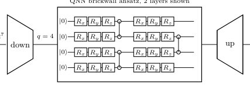 
Fig. 3. Hybrid replacement of the encoder feed-forward block.

**Summary.** This paper investigates using hybrid quantum-classical neural networks to solve the CVRP, aiming to replace large, parameter-heavy classical modules with compact Quantum Neural Networks (QNNs). The authors successfully show that this replacement significantly reduces model size while maintaining competitive solution quality compared to classical baselines, suggesting a viable compression strategy for neural combinatorial optimization.

**Why it may be interesting.** The work demonstrates a practical application of quantum circuits to compress and accelerate components within complex machine learning models used for combinatorial optimization, which is a key area of ML-physics intersection.

Detailed structure

**Main problem.** The paper addresses the challenge of learning to solve the strongly NP-hard Capacitated Vehicle Routing Problem (CVRP) using machine learning models.

**Main result.** Replacing a parameter-heavy feed-forward module in a classical attention-based routing network with a small Quantum Neural Network (QNN) successfully reduces model parameters by 56.6% while maintaining solution quality close to the classical baseline for small to medium instances.

**Method.** The authors employ a hybrid quantum-classical neural network trained via the REINFORCE algorithm to optimize routing heuristics for the CVRP.

**Model / system.** The problem is modeled using an arc-based integer programming formulation for CVRP. The proposed model is a hybrid network where the classical encoder's feed-forward block is replaced by a variational QNN circuit utilizing rotations and CNOT gates.

**Key observables.** Objective value (route length), average relative deviation ($r_m$), and total evaluation time ($t$) when solving CVRP instances of size $n \in \{10, 20, 50, 100\}$.

**Important parameters / regimes.** The QNN uses a small configuration ($q=4$ qubits, $L_q=2$ layers), and performance is tested across varying instance sizes ($n$).

**Assumptions / limitations.** The primary limitation noted is that the performance gap between the hybrid model and the classical baseline grows for larger instances, and the comparison does not prove quantum advantage over classical heuristics.

**Figures summary.** Figures illustrate the encoder and decoder architectures of the classical model, and Figure 3 details the integration of the QNN to replace the feed-forward block.

**Paper structure.** The paper introduces the CVRP as the optimization problem, details the classical attention model, proposes the hybrid QNN replacement strategy in the encoder, trains and tests the model on varying instance sizes, and concludes by comparing performance against classical solvers.

Abstract

This work studies hybrid quantum-classical neural networks for learning routing heuristics. Specifically, this paper asks whether small quantum neural networks can replace parameter-heavy modules inside a competitive attention-based routing model while maintaining solution quality. For the capacitated vehicle routing problem, encoder feed-forward replacement emerges as the most promising design: it reduces the number of model parameters by 56.6% while keeping the hybrid model close to the classical neural baseline at small and medium instance sizes, although the gap grows for larger instances. This work also compares to classical routing algorithms, which remain highly competitive and often superior on the fixed Euclidean test sets. Our results therefore do not indicate quantum advantage or solver dominance, but identify encoder feed-forward replacement as a viable hybrid-module compression strategy for neural combinatorial optimization.

[↑ back to top](#top)

### [Behavioral Memory under Symmetry in One-Way Quantum Automata](http://arxiv.org/abs/2609.01451v1)

**Authors:** Zeyu Chen  
**Type:** theory · **Category:** quantum information and computing · **PDF:** <https://arxiv.org/pdf/2609.01451v1>  
**Analysis basis:** full PDF text, analyzed in chunks

📷 Fig 1

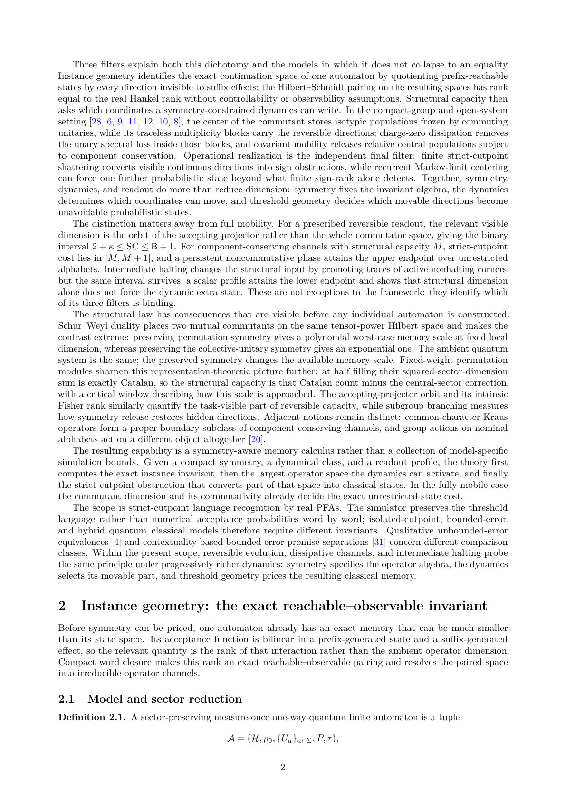 
Low-resolution page preview, page 2

📷 Fig 2

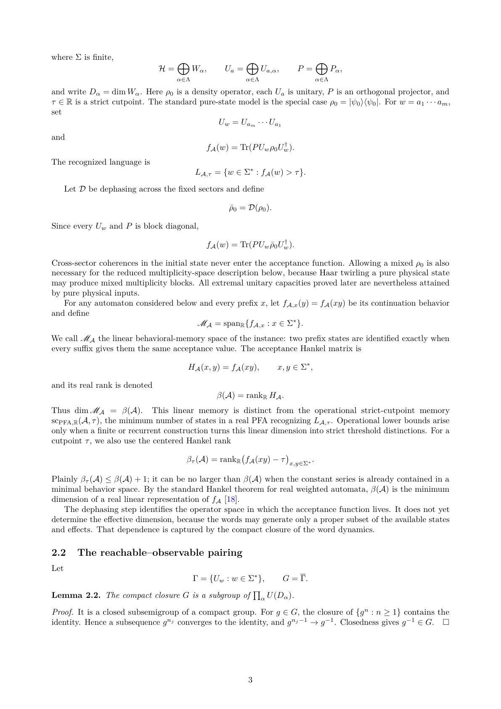 
Low-resolution page preview, page 3

📷 Fig 3

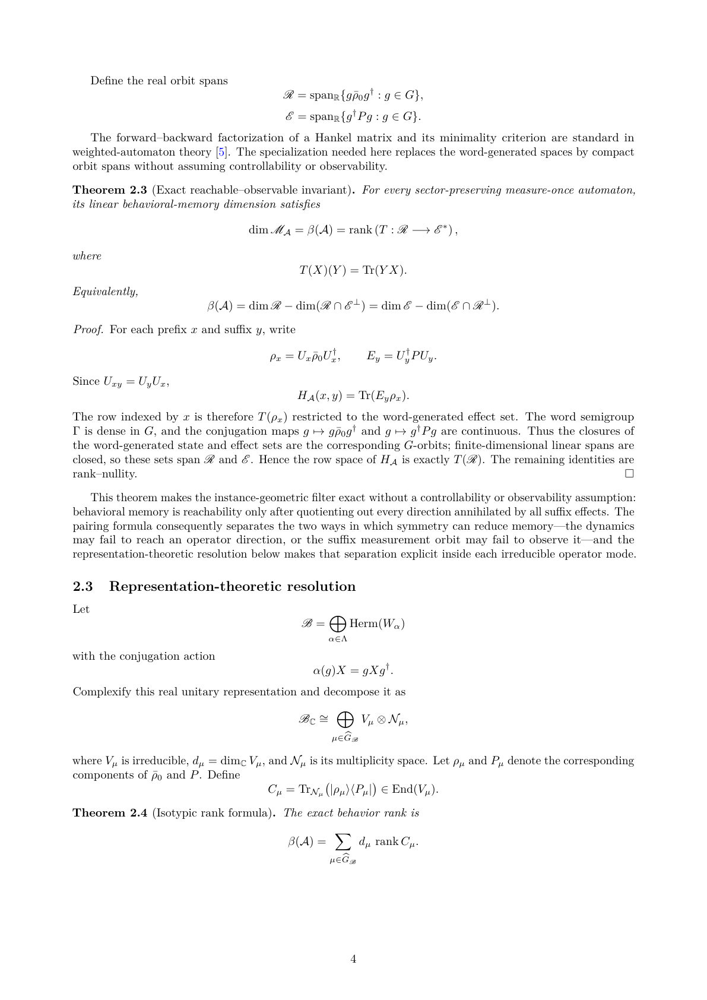 
Low-resolution page preview, page 4

📷 Fig 4

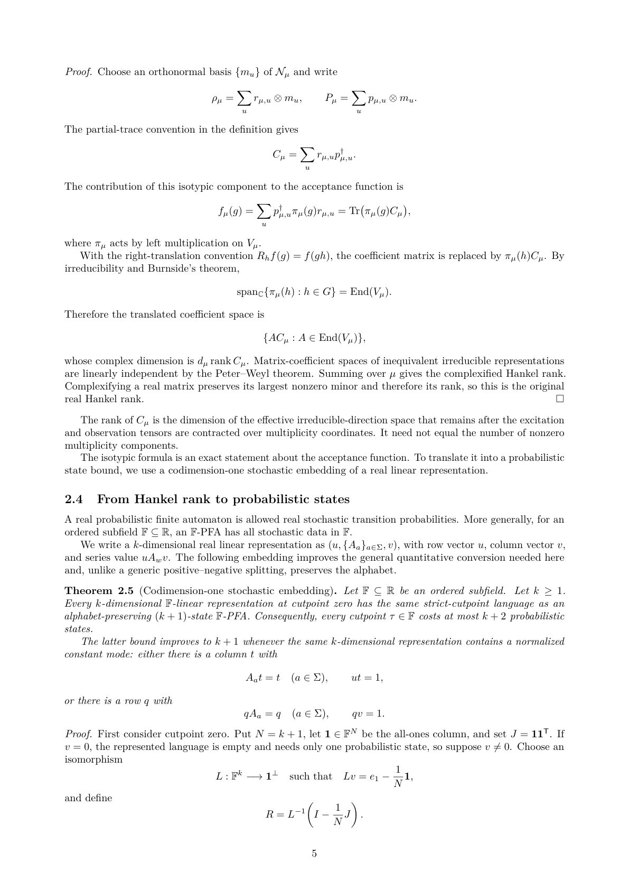 
Low-resolution page preview, page 5

📷 Fig 5

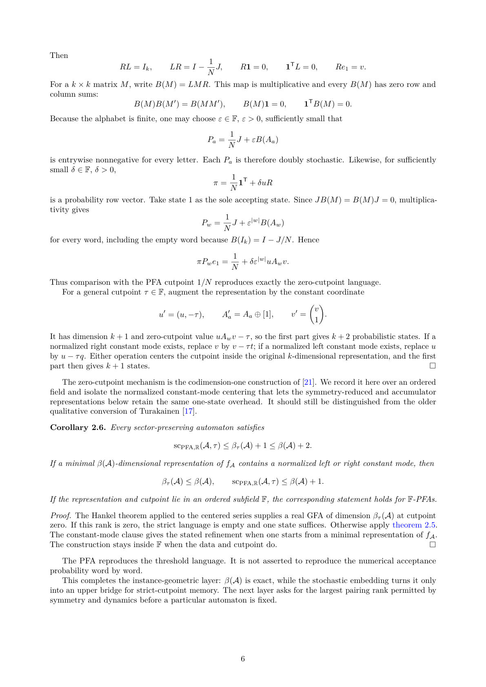 
Low-resolution page preview, page 6

**Summary.** This theoretical paper analyzes the memory capacity of one-way quantum automata under symmetry constraints using advanced operator algebra. It develops a framework that quantifies memory by analyzing the rank of associated Hankel matrices and decomposes the system's dynamics into components related to symmetry. The key finding is that noncommutativity imposes a quantifiable, one-state penalty on the worst-case computational cost.

**Why it may be interesting.** The rigorous connection drawn between algebraic structure (commutativity) and computational cost (state cost) provides a powerful, general framework for understanding resource limitations in quantum computation models.

Detailed structure

**Main problem.** The paper aims to develop an operator-algebraic theory to characterize the 'behavioral memory' of one-way quantum automata when subjected to compact symmetry constraints.

**Main result.** It establishes a sharp dichotomy where noncommutativity in the invariant algebra raises the worst-case classical cost by exactly one state, and it relates memory capacity to structural properties like the commutant's center and multiplicity blocks.

**Method.** The authors employ operator-algebraic techniques, defining behavior via the Hilbert-Schmidt pairing and analyzing the rank of the acceptance Hankel matrix, $eta(A)$.

**Model / system.** The model is the one-way quantum automaton, whose evolution and memory are captured by an acceptance function $f_A(w)$ and analyzed through its associated operator algebra.

**Key observables.** Behavioral Memory ($eta(A)$), Operational Strict-Cutpoint Memory ($	ext{scPFA},_R(A, 	au)$), and the rank of the acceptance Hankel matrix.

**Important parameters / regimes.** The structure of the symmetry commutant, the dimension of the invariant algebra, and the state cost associated with commutativity vs. noncommutativity.

**Assumptions / limitations.** The analysis focuses on the scope of strict-cutpoint language recognition by real PFAs, and the theory distinguishes between different comparison classes of quantum channels.

**Paper structure.** The paper progresses by defining the memory measure using Hankel matrices, deriving an exact formula for the linear memory dimension via isotypic decomposition, and then analyzing the structural cost implications based on the algebraic properties (commutativity vs. noncommutativity) of the symmetry-constrained invariant algebra.

Abstract

Under compact symmetry, observable behavior reduces to an invariant operator algebra, but its dimension is not yet classical memory: some coordinates are dynamically frozen, some invisible to threshold tests, and some already classical. We develop an operator-algebraic theory that separates these effects through three filters. For one automaton, behavior is the Hilbert--Schmidt pairing between prefix-reachable states and suffix-observable effects, whose rank equals the real Hankel rank without controllability or observability assumptions. Maximizing this invariant over a symmetry-constrained dynamical class gives a structural capacity controlled by the symmetry commutant: its center stores isotypic populations frozen by reversible dynamics, its traceless multiplicity blocks carry movable noncommutative coordinates, dissipation removes the unary spectral loss inside those blocks, and covariant mobility releases relative populations subject to component conservation. Operational realization then determines which surviving coordinates force probabilistic states. For a fixed nontrivial invariant readout, full mobility gives an exact dichotomy in worst-case state cost: a commutative invariant algebra costs exactly its dimension, whereas a noncommutative multiplicity block raises the unrestricted cost by exactly one state. Thus noncommutativity has a one-state worst-case classical price. The known four-letter quadratic-plus-one law at trivial symmetry is the fully mobile endpoint of this principle. Schur--Weyl duality further shows that different preserved symmetries on the same tensor-power Hilbert space can change the worst memory scale from polynomial to exponential, while fixed-weight modules give an exact Catalan law at half filling, with structural capacity equal to the Catalan count minus its central-sector correction.

[↑ back to top](#top)

### [Classification of Rational $c=1$ Vertex Operator Algebras and Vertex Operator Superalgebras](http://arxiv.org/abs/2609.00122v1)

**Authors:** Terry Gannon, Brandon C. Rayhaun  
**Type:** theory · **Category:** other · **PDF:** <https://arxiv.org/pdf/2609.00122v1>  
**Analysis basis:** full PDF text, analyzed in chunks

📷 Fig 1

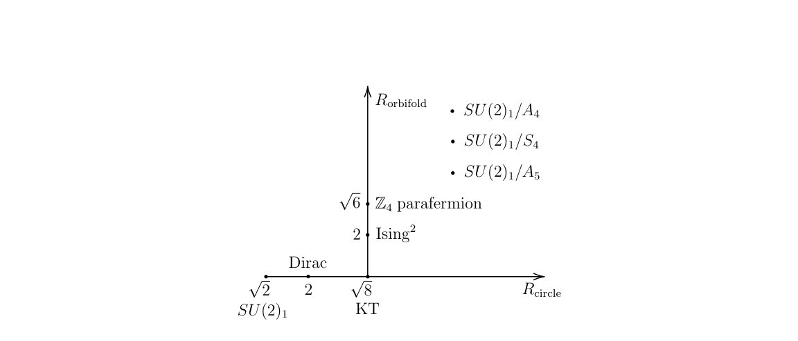 
Figure 1: The (conjecturally complete) conformal moduli space of unitary 2D CFTs with compact spectrum and central charge c = 1.

📷 Fig 2

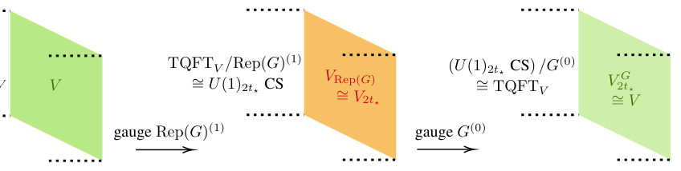 
Figure 2: A physical interpretation of our proof of the classification of nice c = 1 chiral algebras. We argue that any such chiral algebra V occurs on the boundary of a TQFT whose spinless anyons generate a Rep(G) one-form symmetry. When Rep(G) is gauged, the bulk goes over to U(1)2t⋆ Chern-Simons theory for some square-free t⋆, and the boundary goes over to the free chiral boson theory V2t⋆. This bulk/boundary theory inherits a dual/quantum G zero-form symmetry which, on the one hand, “undoes” the Rep(G) gauging and, on the other, has the effect of projecting the local operators on the boundary to the G-invariant subalgebra V G 2t⋆. Thus, every nice c = 1 chiral algebra V is of the form V...

📷 Fig 3

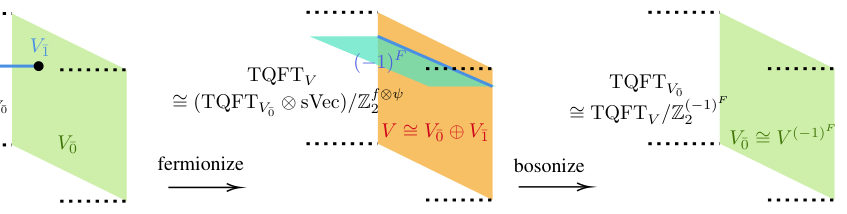 
Figure 3: The bulk TQFT supporting V¯0 on its boundary is assumed to have a fermionic anyon f. The boundary local operators on which it terminates belong to the Hilbert space V¯1. Fermionizing entails stacking with sVec, which has a transparent fermion ψ, and gauging the Z2 one-form symmetry generated by f ⊗ψ. The bulk after fermionizing is a spin TQFT, and the boundary is a fermionic chiral algebra V ∼= V¯0 ⊕V¯1. The fermionized theory has a fermion parity zero-form symmetry denoted (−1)F. Fermionization can be undone by bosonization, which entails gauging (−1)F. The effect on the boundary is to project out the operators which are odd under (−1)F.

**Summary.** This paper rigorously classifies all 'nice' Vertex Operator Algebras and Superalgebras with central charge $c=1$. It proves that these algebras must arise either from rank-1 integral lattices or as orbifolds of such lattices. This classification has deep implications for understanding the chiral algebras that form the holomorphic sector of rational $c=1$ Conformal Field Theories.

**Why it may be interesting.** While highly abstract, the rigorous classification of low-dimensional CFTs (like $c=1$) provides fundamental constraints on quantum field theories, which informs the understanding of boundary conditions and topological order relevant to quantum information.

Detailed structure

**Main problem.** The paper aims to provide a mathematically rigorous classification of 'nice' $c=1$ Vertex Operator Algebras (VOAs) and Vertex Operator Superalgebras (VOSAs). Physically, this translates to classifying the chiral algebras arising in the holomorphic sector of rational $c=1$ Conformal Field Theories (CFTs).

**Main result.** The classification states that any such VOA must be isomorphic to a lattice VOA ($	ext{V}_L$) or an orbifold thereof ($	ext{V}_L^G$). The list includes specific examples like $	ext{V}_{2m}$ and three exceptional algebras ($	ext{V}T, 	ext{V}O, 	ext{V}I$).

**Method.** The mathematical approach relies on showing that these VOAs are Tannakian, using criteria based on the vacuum character and the structure of simple modules. Physically, the classification is linked to viewing the VOA as the boundary theory of a 3D Topological Quantum Field Theory (TQFT).

**Model / system.** The primary mathematical objects are $c=1$ VOAs/VOSAs. Physically, the context is the study of rational bosonic or fermionic CFTs, particularly those whose non-identity primaries have positive conformal dimension.

**Key observables.** The vacuum character ($	ext{ch}_V(	au)$) and the function $P_V(	au)$ (related to modules with integer conformal dimension) are key diagnostic tools.

**Important parameters / regimes.** The central charge $c=1$ is the defining parameter. The classification depends on the structure of the associated finite symmetry group $G$ and the lattice rank.

**Assumptions / limitations.** The classification is restricted to 'nice' VOAs (strongly rational and pseudo-unitary). The full classification of CFTs is reserved for a companion paper.

**Figures summary.** Figure 1 shows the conformal moduli space of unitary 2D CFTs with $c=1$. Figure 2 illustrates the physical proof sequence: TQFT $	o$ Chern-Simons theory $	o$ VOA boundary.

**Paper structure.** The paper establishes the mathematical criterion for nice VOAs using the vacuum character, proving that they must be lattice VOAs or orbifolds. It then connects this structure to the physical realization as chiral algebras in $c=1$ CFTs, with the full classification of full CFTs deferred to a companion work.

Abstract

For mathematicians: In this first in a series of two papers, we give a mathematically rigorous classification of (sufficiently nice) $c=1$ vertex operator algebras (VOAs) and vertex operator superalgebras (VOSAs). We confirm the lore that any such VO(S)A is either a lattice VO(S)A $V_L$ associated to a rank-1 integral lattice $L$, or can be obtained as an orbifold thereof, i.e. a $G$-invariant subalgebra $V_L^G$ for some finite group $G$ of automorphisms. All such $G$ are known, allowing for an explicit enumeration of nice $c=1$ VO(S)As. A key ingredient in our approach is to establish a general criterion for nice VOAs, requiring knowledge only of the vacuum character, for testing when the simple modules with integer conformal dimension span a symmetric fusion subcategory which is braided tensor equivalent to $Rep(G)$. In our companion paper, we calculate the ribbon auto-equivalences of the representation categories of the nice $c=1$ VOAs, and leverage this to obtain the classification of nice bosonic and fermionic $c=1$ full conformal field theories.   For physicists: We rigorously classify the chiral algebras that can arise in the holomorphic sector of a bosonic or fermionic rational $c=1$ conformal field theory (CFT) whose non-identity primaries all have positive conformal dimension. Thinking of chiral algebras as gapless boundary conditions of 3D topological quantum field theories (TQFTs), our result says that any such chiral algebra is either a holomorphic boundary of $U(1)_k$ Chern-Simons theory, or can be obtained by passing to the $G$-invariant states thereof for some finite group $G$ of symmetries. We explicitly enumerate these chiral algebras and also discuss their non-invertible symmetries. In a companion paper, we build on these results using techniques from the study of 3D TQFTs to classify full bosonic and fermionic rational $c=1$ CFTs.

[↑ back to top](#top)

### [Codes for Quantum Secret Sharing with a Helper](http://arxiv.org/abs/2609.00234v1)

**Authors:** Eric Chitambar, Sarah Hagen, David W. Kribs, Zhao Ma, Mike I. Nelson, Andrew Nemec  
**Type:** theory · **Category:** quantum information and computing · **PDF:** <https://arxiv.org/pdf/2609.00234v1>  
**Analysis basis:** full PDF text, analyzed in chunks

📷 Fig 1

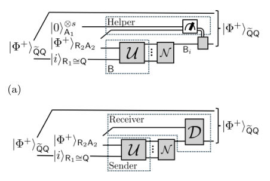 
FIG. 2: (a) Blind LOCC-adressable helper codes use classical information sent from the helper to Bi to recover quantum information. This is similar to how classical information can sometimes be used in the decoding D of EA-codes (b). However, the helper’s system more closely resembles that of the receiver in an entanglement-assisted code: both hold a correctable set of qubits.

**Summary.** This paper provides a deep structural analysis of Quantum Secret Sharing codes featuring a 'helper' party. It characterizes these codes, particularly the 'blind helper' type, by deriving necessary and sufficient conditions based on stabilizer theory. The work proves that for single-qubit secrets, recovery is always achievable using LOCC from the helper, advancing the theory of quantum information security.

**Why it may be interesting.** The rigorous mathematical characterization of information access structures (like helper codes) is fundamental to quantum cryptography and secure quantum computation protocols.

Detailed structure

**Main problem.** The paper analyzes the general structure of Quantum Secret Sharing (QSS) codes, specifically focusing on the unique constraints imposed by the 'helper' access structure.

**Main result.** It fully characterizes blind helper stabilizer codes for single qubits, showing that recovery is always possible via one-way LOCC from the helper to the target party.

**Method.** The analysis employs stabilizer formalism, deriving necessary and sufficient conditions for helper codes, and comparing structural constraints derived from information theory and quantum error correction principles.

**Model / system.** The model is pure QSS schemes where a secret is encoded into a subspace of a multipartite system. The focus is on stabilizer codes, which are defined by commuting Pauli operators on the shared qubits.

**Key observables.** The possibility of recovery via Local Operations and Classical Communication (LOCC), and the structure of the logical operators supporting the secret.

**Important parameters / regimes.** The number of parties ($n$), the size of the secret ($k=1$ qubit), and the structure of the access set $\Gamma$.

**Assumptions / limitations.** The analysis focuses on pure QSS schemes using isometric encoding, and initial results are derived for stabilizer codes.

**Figures summary.** Figure 1 illustrates the recovery of maximal entanglement using information from an authorized subset of parties.

**Paper structure.** The paper progresses by defining helper codes, reviewing error correction conditions, characterizing stabilizer codes using structural lemmas (e.g., Lemma 2 for blind helper codes), and finally deriving the general form of qubit helper codes.

Abstract

Helper quantum secret sharing is a form of secret sharing defined by its unique access structure. One special fixed party, called the helper, can work together with any other party to fully decode the secret. A blind helper is one who can provide this assistance while not holding any local information about the encoded secret. In this work, we analyze the general structure of QSS helper codes and present new code constructions. We fully characterize the structure of blind helper stabilizer codes and show that for the encoding of a single qubit, recovery is always possible using one-way local operations and classical communication (LOCC) from the helper to the targeted party. Furthermore, we demonstrate how such codes also allow for the helper to target larger subsets of parties by one-way LOCC, enabling them to be authorized to recover the secret. Finally, when each party only holds a qubit, we identify the general form of all helper codes (including non-stabilizer codes) and find that LOCC recovery is only possible in special cases.

[↑ back to top](#top)

### [Concentration of additive functionals of Stratonovich-type](http://arxiv.org/abs/2609.01581v1)

**Authors:** Rick Bebon, Aljaž Godec, Angelika Rohde  
**Type:** theory · **Category:** statistical mechanics · **PDF:** <https://arxiv.org/pdf/2609.01581v1>  
**Analysis basis:** full PDF text, analyzed in chunks

📷 Fig 1

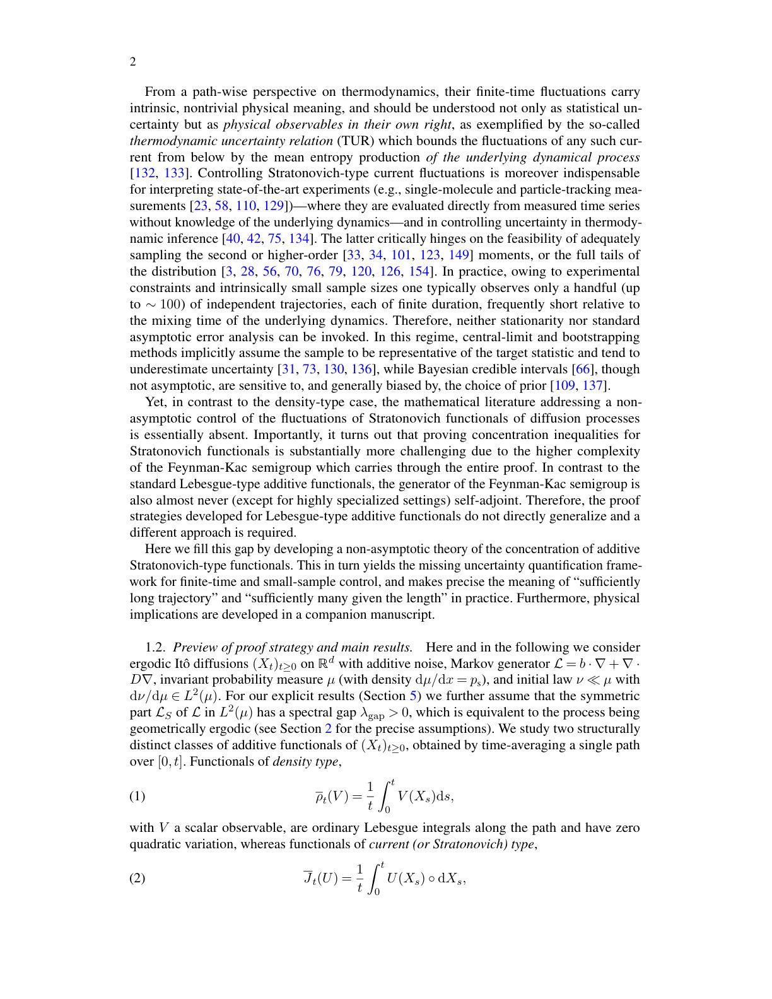 
Low-resolution page preview, page 2

📷 Fig 2

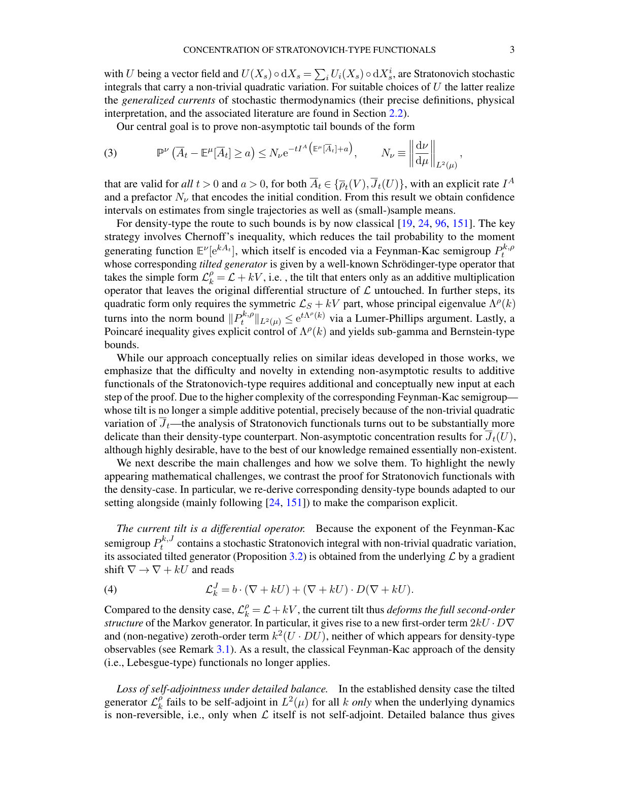 
Low-resolution page preview, page 3

📷 Fig 3

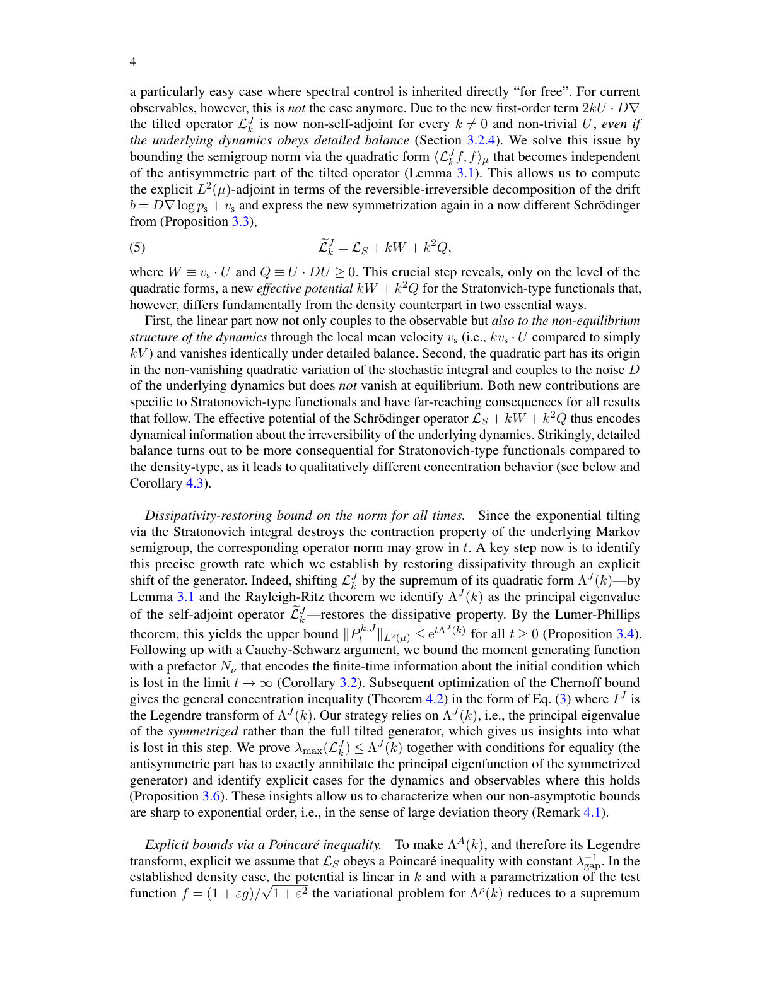 
Low-resolution page preview, page 4

📷 Fig 4

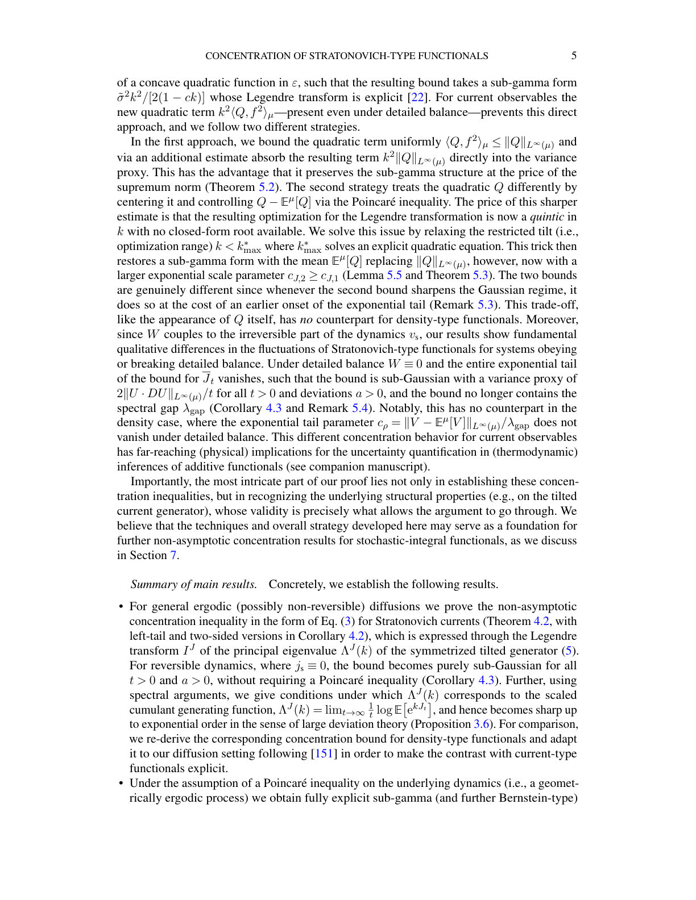 
Low-resolution page preview, page 5

📷 Fig 5

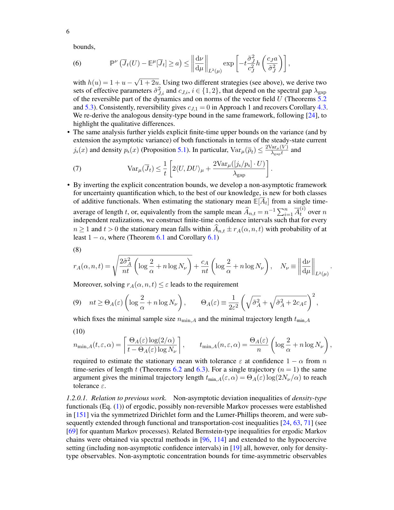 
Low-resolution page preview, page 6

**Summary.** This paper develops a rigorous, non-asymptotic theory for the concentration of additive functionals of Stratonovich-type, which are crucial for analyzing thermodynamic quantities along fluctuating paths. By employing a novel symmetrization technique, the authors overcome mathematical hurdles associated with non-self-adjoint generators. The results provide powerful, explicit concentration bounds, particularly highlighting a distinct sub-Gaussian behavior under detailed balance.

**Why it may be interesting.** The rigorous mathematical treatment of path functionals like work or entropy production is central to modern non-equilibrium statistical mechanics, providing tools for quantifying fluctuations beyond simple averages.

Detailed structure

**Main problem.** The paper tackles the challenging problem of proving non-asymptotic concentration inequalities for additive functionals of Stratonovich-type ($\mathcal{J}_t$) in the context of stochastic thermodynamics.

**Main result.** They successfully prove concentration inequalities for $\mathcal{J}_t$ for general geometrically ergodic diffusion processes, notably showing that under detailed balance, the concentration is sub-Gaussian with a variance independent of the spectral gap.

**Method.** The authors overcome the difficulty posed by the non-self-adjoint nature of the tilted generator by working with a symmetrized Dirichlet form and bounding the semigroup norm via the quadratic form.

**Model / system.** The analysis applies to general geometrically ergodic diffusion processes ($X_s$) describing fluctuating paths in non-equilibrium statistical mechanics. The comparison is drawn between Stratonovich-type functionals (currents) and classical Lebesgue-type functionals.

**Key observables.** Additive functionals $\mathcal{J}_t = rac{1}{t}\int_0^t U(X_s)\circ dX_s$, and their concentration bounds.

**Important parameters / regimes.** The time $t$, the function $U$, and the properties of the underlying diffusion process (e.g., geometric ergodicity, detailed balance).

**Assumptions / limitations.** The analysis requires working with a symmetrized Dirichlet form and assumes the underlying process is a geometrically ergodic diffusion process.

**Paper structure.** The paper contrasts the mathematical difficulty of Stratonovich functionals versus Lebesgue functionals, develops a novel symmetrization technique for the generator, proves the general concentration inequality, and finally establishes the distinct sub-Gaussian behavior under detailed balance.

Abstract

Additive functionals $\overline{J}_t=\frac{1}{t}\int_0^tU(X_s)\circ dX_s$ of Stratonovich-type recently attracted much attention in the context of inference of thermodynamic properties of complex systems from observations $U$ of individual fluctuating paths $(X_s)_{0\le s\le t}$, whereby $X_0$ is initiated from some general measure. Concentration results on $\overline{J}_t$, albeit desirable, are virtually nonexistent. They turn out to be significantly more challenging to prove than for classical Lebesgue-type functionals $\overlineρ_t=\frac{1}{t}\int_0^t V(X_s)ds$ because the tilt deforms the full second-order structure of the Feynman-Kac generator instead of contributing an additive potential. This renders the generator generally non-self-adjoint even under detailed balance. We overcome this by working with a symmetrized Dirichlet form with a new effective potential that now couples the observable to the non-equilibrium character of the dynamics. We prove concentration inequalities for $\overline{J}_t$ for any bounded, sufficiently smooth vector-valued function $U$ of a general geometrically ergodic diffusion process $X_s$, including explicit sub-gamma and Bernstein-type inequalities, and we obtain explicit upper bounds on ${\rm Var}(\overline{J}_t)$. Strikingly, under detailed balance the concentration of $\overline{J}_t$ is distinctively sub-Gaussian at all times and all deviations, with a variance proxy fixed by the noise alone and independent of the spectral gap, which has no analog for $\overlineρ_t$.

[↑ back to top](#top)

### [DF-SQD: Deterministic Fields for Sampling-Based Quantum Diagonalization](http://arxiv.org/abs/2609.01264v1)

**Authors:** Kushagra Agarwal, Anupama Ray  
**Type:** both · **Category:** strongly correlated electrons · **PDF:** <https://arxiv.org/pdf/2609.01264v1>  
**Analysis basis:** full PDF text, analyzed in chunks

📷 Fig 1

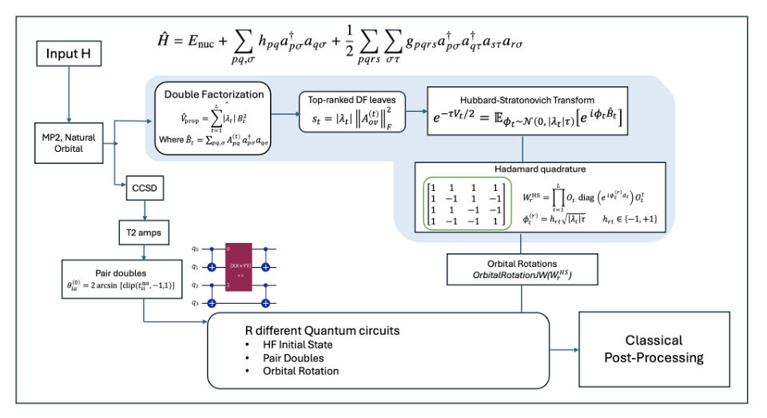 
Figure 1: Schematic overview of the DF-SQD algorithm. The quantum stage combines CCSD-

📷 Fig 2

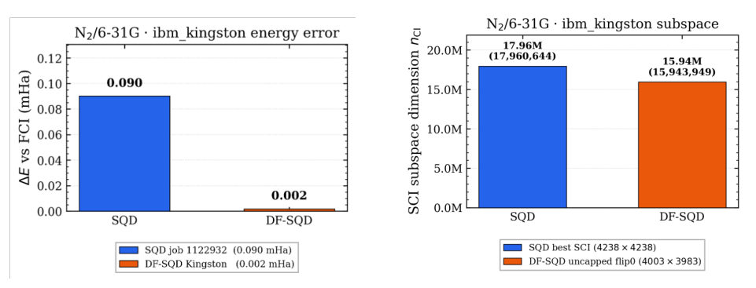 
Figure 2: N2 validates determinant support generated on IBM Quantum hardware. (a) Error

📷 Fig 3

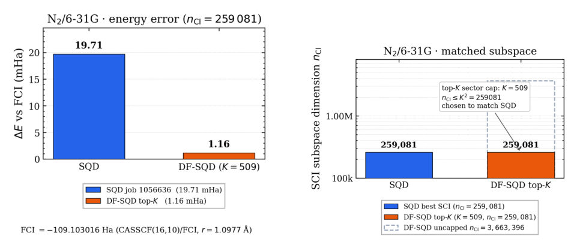 
Figure 3: N2 simulator and baseline controls. The panels report the corresponding energy error

📷 Fig 4

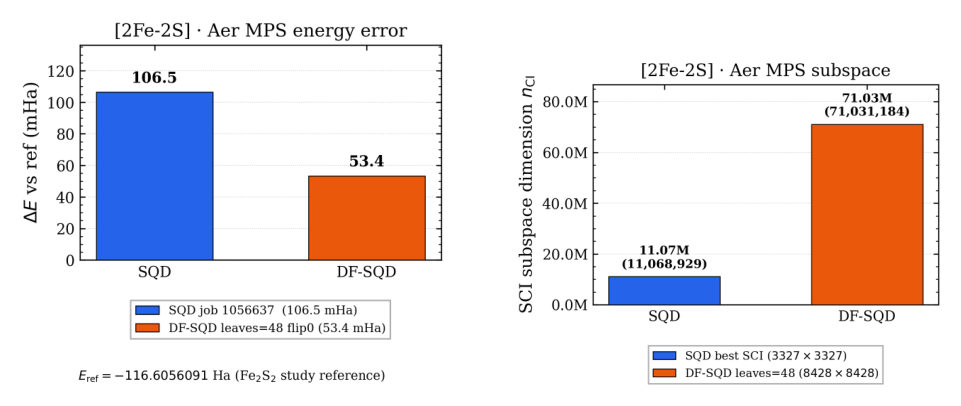 
Figure 4: DF-SQD constructs a richer Fe2S2 determinant space in simulation. The (30𝑒, 20𝑜)

📷 Fig 5

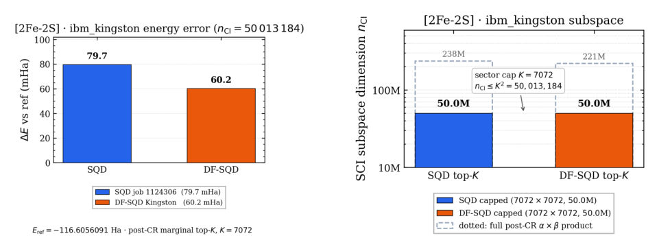 
Figure 5: DF-SQD improves the Fe2S2 variational energy at a matched 50-million-determinant

**Summary.** This paper introduces DF-SQD, a novel hybrid quantum-classical algorithm designed to improve the sampling-based diagonalization of molecular Hamiltonians. By deriving deterministic auxiliary-field circuits, DF-SQD efficiently proposes quantum states, leading to superior energy accuracy and reduced resource requirements compared to prior methods on benchmark molecules like $	ext{N}_2$ and $	ext{Fe}_2	ext{S}_2$.

**Why it may be interesting.** This work directly addresses the resource scaling challenge in quantum chemistry simulations, providing a concrete, hybrid algorithmic improvement for accessing high-accuracy electronic structure data on near-term quantum hardware.

Detailed structure

**Main problem.** The core problem is the quantum diagonalization of the Hamiltonian to accurately estimate ground-state eigenvalues and eigenvectors in quantum chemistry, which is computationally intractable for large systems.

**Main result.** The proposed DF-SQD method significantly improves energy accuracy and resource efficiency compared to existing sampling-based methods (SQD) on both small ($	ext{N}_2$) and larger ($	ext{Fe}_2	ext{S}_2$) molecular systems.

**Method.** DF-SQD is a hybrid algorithm that uses quantum circuits to deterministically propose occupation-number configurations, followed by classical configuration interaction to evaluate the Hamiltonian and guide subsequent proposals.

**Model / system.** The work applies to quantum chemistry calculations, specifically simulating the $	ext{N}_2$ molecule and the $	ext{Fe}_2	ext{S}_2$ cluster, utilizing active-space Hamiltonians and mapping them onto qubit systems.

**Key observables.** Energy error (relative to reference calculations), selected product-space dimension (number of determinants), sampling time, and QPU usage.

**Important parameters / regimes.** Active space size (e.g., 32 qubits for $	ext{N}_2$, 40 qubits for $	ext{Fe}_2	ext{S}_2$), number of shots, and error tolerances.

**Assumptions / limitations.** The method relies on the ability to derive deterministic auxiliary-field circuits and assumes that the energy estimate converges monotonically with increasing sampling resources.

**Figures summary.** Figures illustrate the workflow (DF-SQD schematic), and comparisons of energy error and product-space dimension between DF-SQD and SQD on $	ext{N}_2$ and $	ext{Fe}_2	ext{S}_2$ using both simulation and hardware results.

**Paper structure.** The paper introduces the DF-SQD hybrid algorithm, details its mechanism using auxiliary-field circuits, and validates its performance by comparing it against established sampling methods on two distinct molecular systems ($	ext{N}_2$ and $	ext{Fe}_2	ext{S}_2$) across simulation and hardware platforms.

Abstract

Sampling-based quantum diagonalization method exploits Quantum-centric supercomputing platforms to sample bitstrings for Hamiltonian projection on a quantum computer, and then classically diagonalize the Hamiltonian to estimate the eigenvalues and eigenvectors. In current quantum devices an algorithm is useful when shallow quantum circuits with error mitigation support can discover better results while having either a proof of convergence or some method to explain trust in experiment. In this paper, we introduce DF-SQD, a hybrid algorithm that derives deterministic auxiliary-field circuits from selected double-factorization leaves of the two-electron tensor. The circuits propose occupation-number configurations, while selected configuration interaction evaluates the original active-space Hamiltonian and can recentre subsequent proposal rounds. On N2 (32 qubits; 6-31G basis) and a 40-qubit [Fe2S2(SCH3)4]2- active-space Hamiltonian, we show that DF-SQD improves the energy obtained from sampled determinant spaces while using shallow number-preserving circuits in both simulator and hardware runs. For N2, DF-SQD is 45x more accurate with a 11.23\% smaller subspace, and due to its ability to sample better bitstrings at lesser shots it is 2.93x faster than SQD in quantum devices. For the iron-sulfur cluster, DF-SQD generated a subspace dimension of 221M with 400K shots, while SQD needed 1.5M shots to generate a 238M subspace, thus we have better subspace recovery evident from the hardware at 3.75x reduced shots. At a matched 50M subspace dimension, DF-SQD is 1.32x more accurate (achieves a 24.5\% relative error reduction over standard SQD). So overall, our method is able to discover better results with shallower circuits, is sample efficient, uses configuration recovery (so has targeted error mitigation) and we have empirical convergence observation.

[↑ back to top](#top)

### [Duality between the level statistics of Hermitian and non-Hermitian random matrices](http://arxiv.org/abs/2609.00162v1)

**Authors:** Ze Chen, Zhenyu Xiao, Yifei Liu, Shinsei Ryu  
**Type:** theory · **Category:** statistical mechanics · **PDF:** <https://arxiv.org/pdf/2609.00162v1>  
**Analysis basis:** full PDF text, analyzed in chunks

📷 Fig 1

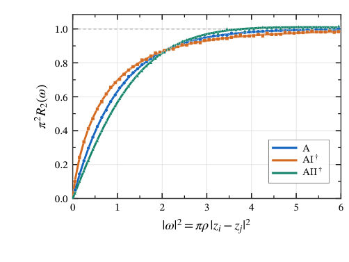 
FIG. 1. Eigenvalue pair-correlation functions π2R2 for classes A, AI†, and AII† as functions of |ω|2. Solid curves are the ex- act large-N results [Eqs. (12), (14), and (16)], with no fitting parameters. Markers are exact-diagonalization results from 10,000 matrices of size N = 512 for classes A and AI† and N = 1024 for class AII†.

📷 Fig 2

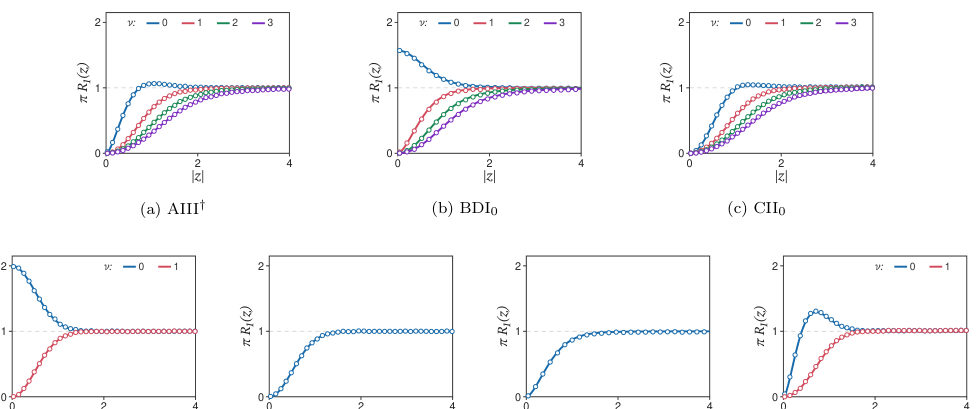 
FIG. 2. Spectral densities near the origin, πR1(|z|), in the seven non-Wigner–Dyson AZ0 classes. Open circles are exact- diagonalization results from 106 Gaussian random matrices for every displayed class and topological sector, with base size N = 128; solid curves are the exact analytical densities of Table I, with no fitting parameters. The random matrix ensembles are normalized so that πR1(z) = 1 away from the spectral edge. Protected exact zero modes are excluded, and each Kramers pair in classes CII0 and DIII0 is counted once.

📷 Fig 3

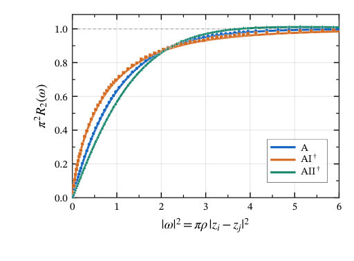 
FIG. 4. Eigenvalue pair-correlation functions of the q = 4 non-Hermitian SYK model in classes A (Nγ = 18), AI† (Nγ = 16), and AII† (Nγ = 20), in the unfolded variables of Eq. (75). Markers are exact-diagonalization results from 105 disorder realizations per class, using eigenvalue pairs with a reference level in the central 30% of the spectrum. The solid curves are the exact analytical results of Eqs. (12), (14), and (16), with no fitting parameters.

📷 Fig 4

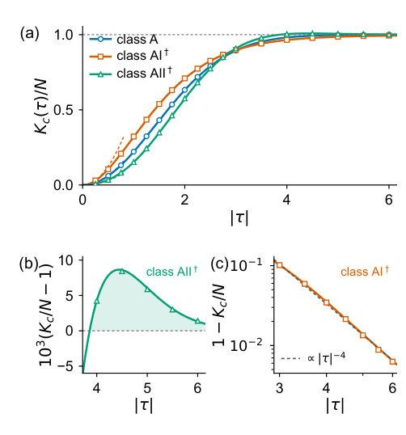 
FIG. 3. Connected dissipative spectral form factor Kc/N for classes A, AI†, and AII†. Markers are Fourier transforms of bulk eigenvalue pair-correlation functions obtained by exact diagonalization of 3 × 106 Gaussian matrices per class, with N = 128 distinct eigenvalues; solid curves are the exact large- N results in Eqs. (69), (70), and (71). (a) Full crossover to the plateau; short dashed segments show the quadratic ramps in Eq. (72). (b) Plateau deviation for class AII†; the shaded positive region displays the overshoot. (c) Algebraic tail of class AI† on logarithmic axes. Statistical errors are smaller than the markers.

📷 Fig 5

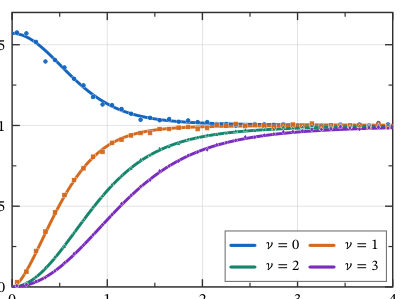 
FIG. 5. The BDI0 spectral density near the origin, πR1, as a function of |z| in the sectors ν = 0, 1, 2, 3 for the quadratic Lindbladian model [Eq. (77)]. Markers are exact- diagonalization results for L = 18 from 100,000 disorder re- alizations per sector. Solid curves are the exact analytical densities of class BDI0 in Table I; the only fitted parameter is a single overall rescaling of the eigenvalues in each sector. Protected exact zero modes are not included.

**Summary.** This work establishes a profound mathematical duality between the eigenvalue statistics of Hermitian and non-Hermitian random matrices. By relating replica partition functions via nonlinear sigma models, the authors derive universal, closed-form results for non-Hermitian spectral properties. This advances the understanding of complex quantum systems described by non-Hermitian Hamiltonians.

**Why it may be interesting.** The explicit connection between Hermitian and non-Hermitian spectral statistics is crucial for understanding open quantum systems, where non-Hermiticity arises naturally from coupling to an environment (dissipation).

Detailed structure

**Main problem.** The paper uncovers an exact duality connecting the level statistics of Hermitian and non-Hermitian random matrices.

**Main result.** This duality establishes a non-Hermitian counterpart to Dyson's threefold way, providing closed-form expressions for bulk pair-correlation functions and hard-edge spectral densities for previously intractable non-Hermitian classes.

**Method.** The duality is derived by relating two replica partition functions, which are formulated using fermionic nonlinear sigma models and evaluated in the large-N limit.

**Model / system.** The study uses random matrix theory, comparing Hermitian ensembles (governed by standard symmetries) with non-Hermitian ensembles (governed by symmetries like $	ext{TRS}^\dagger$, $	ext{PHS}$, and $	ext{Chiral Symmetry}$).

**Key observables.** Level statistics, including bulk eigenvalue pair-correlation functions and spectral densities near the origin (hard-edge statistics).

**Important parameters / regimes.** Large-$N$ limit, symmetry classes (e.g., A, $	ext{AI}^\dagger$, $	ext{AII}^\dagger$), and the replica number $n$.

**Assumptions / limitations.** The analysis relies on the large-$N$ limit and the mathematical framework of nonlinear sigma models derived from replica methods.

**Figures summary.** Figure 1 compares calculated pair-correlation functions ($\pi^2 R_2(\omega)$) for non-Hermitian classes A, $	ext{AI}^\dagger$, and $	ext{AII}^\dagger$ against exact diagonalization results.

**Paper structure.** The paper systematically establishes the duality using sigma models, applies it to the three Wigner-Dyson classes in the bulk, and then extends the mapping to the seven nonstandard Altland-Zirnbauer classes for the hard-edge statistics.

Abstract

Random matrix theory describes complex quantum systems statistically, with symmetry as its organizing principle. We uncover an exact duality between the level statistics of Hermitian and non-Hermitian random matrices in the large-$N$ (matrix size) limit. It acts class by class: the two replica partition functions, given by fermionic nonlinear $σ$ models, are related by analytic continuation. Applied to the three Wigner--Dyson classes, the duality yields the universal bulk eigenvalue pair-correlation functions of non-Hermitian random matrices. This establishes a non-Hermitian counterpart of Dyson's threefold way, organized by transposition symmetry: generic complex, complex symmetric, and complex self-dual matrices. The dissipative spectral form factors of these classes follow in closed form as well. Applied to the seven nonstandard Altland--Zirnbauer classes, the duality yields the exact spectral densities near the origin, the non-Hermitian hard-edge statistics. Most of these statistics were previously known only numerically. Exact diagonalization confirms the analytical predictions, and physical models demonstrate their universality. We expect these results to be the tip of a deeper correspondence between Hermitian and non-Hermitian random matrix theory.

[↑ back to top](#top)

### [Dynamical regimes of QAOA gradient response](http://arxiv.org/abs/2609.01280v1)

**Authors:** Zarin Shakibaei, Alexander Schnell  
**Type:** theory · **Category:** quantum information and computing · **PDF:** <https://arxiv.org/pdf/2609.01280v1>  
**Analysis basis:** full PDF text, analyzed in chunks

📷 Fig 1

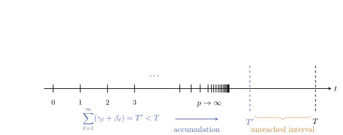 
FIG. 1: Temporal trapping: Infinitely many QAOA layers accumulate within a finite time T ′ &lt; T, limiting the reachable set to R(T ′) ⊆R(T).

📷 Fig 2

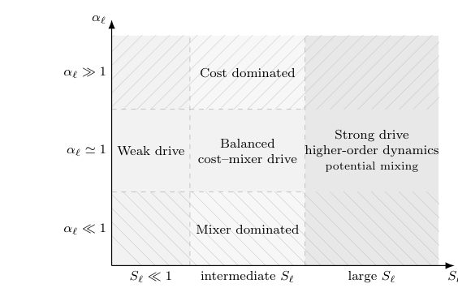 
FIG. 2: Schematic dynamical regimes in the (Sℓ, αℓ) plane. Weak drive corresponds to per- turbative evolution with limited state displacement. At intermediate strength, the cost–mixer ratio distin- guishes mixer-dominated, balanced cost–mixer, and cost- dominated dynamics. At strong drive, higher-order dynamical contributions become significant, with mix- ing potentially emerging depending on spectral struc- ture. Hatched regions denote strongly imbalanced, single-generator-dominated limits. Dashed lines mark schematic crossovers rather than sharp boundaries; their positions and the relative extents of the displayed regimes can depend on the problem and circuit details and are not...

📷 Fig 3

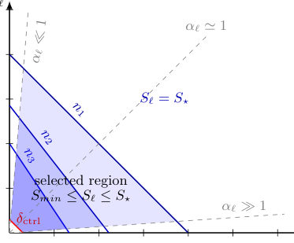 
FIG. 3: Native-coordinate geometry and contrac- tion with system size. A selected region of the strength–imbalance plane, represented schematically by a finite strength interval Smin ≤Sℓ≤S⋆and restricted away from strongly imbalanced limits, maps to a finite region of the native (γℓ, βℓ) plane. Constant strength defines straight boundaries, whereas constant imbalance defines rays from the origin. As the generator norms grow with system size (n1 &lt; n2 &lt; n3), the native preimage of the same dynamical region contracts with characteristic scales set by ∥HC∥−1 and ∥HM∥−1. The imbalance rays are schematic; their slopes depend on ∥HC∥/∥HM∥and therefore generally vary with system size. The red...

📷 Fig 4

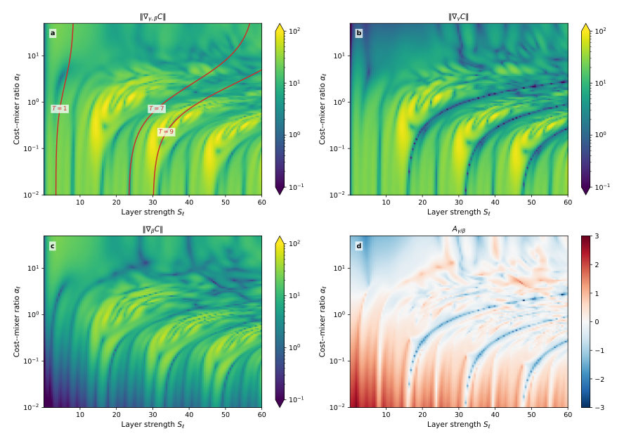 
FIG. 4: Dynamical organization of the native-gradient response. Heatmaps over the (Sℓ, αℓ) plane for a representative dense, unweighted MaxCut instance with n = 10, depth p = 3, and a uniform schedule. a, Full native parameter-gradient norm ∥∇γ,βC∥. b, Cost-parameter component ∥∇γC∥. c, Mixer-parameter component ∥∇βC∥. d, Gradient anisotropy Aγ/β; positive values indicate cost-parameter-dominated sensitivity and negative values indicate mixer-parameter-dominated sensitivity. Contours indicate constant total physical evolution time T = p(γ +β) for the uniform schedule. Panels a–c use logarithmic colour scales.

📷 Fig 5

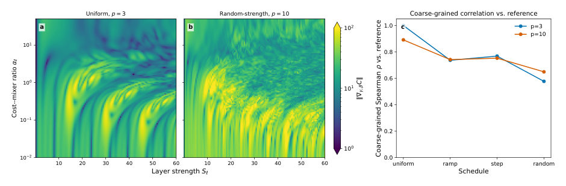 
FIG. 5: Robustness of the gradient landscape to depth and schedule structure. Results for a representative dense, unweighted MaxCut instance with n = 10. a, Uniform schedule at p = 3, used as the reference landscape. b, Representative random-strength schedule at p = 10, with layerwise strengths varied using a fixed seeded random profile with σ = 0.4 and normalized to preserve the mean layer strength ¯S, while keeping the layerwise imbalance fixed. c, Spearman rank correlation of the coarse-grained gradient landscape for each tested schedule family and depth with the p = 3 uniform reference. The full set of schedule-resolved landscapes is shown in Supplementary Fig. 1.

**Summary.** This work develops a dynamical framework for analyzing the Quantum Approximate Optimization Algorithm (QAOA) by reparameterizing the control space using a strength-imbalance measure. The authors show that the structure of useful quantum dynamics is robust across changes in circuit depth and scheduling, even when the corresponding native parameter region becomes highly compressed at large system sizes. This separates the inherent physical dynamics from the limitations of the standard parameterization.

**Why it may be interesting.** The development of a dynamical framework that separates the intrinsic dynamics of the quantum process from the specific parametrization (native angles) is highly relevant for understanding the scalability and robustness of quantum algorithms.

Detailed structure

**Main problem.** The paper aims to characterize the trainability of the QAOA gradient landscape by understanding how its gradient response changes across circuit parameters and problem size.

**Main result.** The gradient landscape exhibits a coarse organization in a dynamical representation (strength–imbalance) that persists across circuit changes, and near-optimal solutions occupy a distinct intermediate dynamical regime, separate from the largest local gradients.

**Method.** The authors introduce a dynamical representation of the QAOA parameter space using a norm-weighted layer strength and a cost–mixer imbalance, analyzing the gradient response using exact-state simulations and geometric bounds.

**Model / system.** The system is the Quantum Approximate Optimization Algorithm (QAOA) applied to MaxCut problems, evolving under a time-dependent Hamiltonian composed of cost ($H_c$) and mixer ($H_m$) Hamiltonians.

**Key observables.** Gradient landscape, near-optimal solution regions, layer strength ($S_\ell$), cost–mixer imbalance ($\alpha_\ell$), and solution quality ($P_{	ext{tail}}(0.9)$).

**Important parameters / regimes.** Circuit depth ($p$), system size ($n$), and the dynamical variables (strength and imbalance) which separate overall evolution scale from relative generator contributions.

**Assumptions / limitations.** The analysis assumes a piecewise constant control scheme, interpreting parameters as evolution times, and utilizes the Magnus expansion to describe effective dynamics.

**Figures summary.** Figures illustrate the gradient response measure (GRMS) under random schedules, the persistence of high-quality solution regions across varying schedules, and the contraction of the high-response region in the native parameter space as system size increases.

**Paper structure.** The paper first establishes the need for a dynamical representation by analyzing the QAOA gradient landscape. It then develops this framework using strength and imbalance, demonstrating that useful dynamics persist even if the native parameter region compresses with system size. Finally, it applies this to MaxCut to show the robustness of the optimal dynamical regime.

Abstract

Characterizing the trainability of the Quantum Approximate Optimization Algorithm (QAOA) requires understanding how its gradient landscape changes across circuit parameters and problem size. Yet these gradients are usually described in terms of the native QAOA angles, making it difficult to distinguish parameter specific features from broader changes in the underlying circuit dynamics. Here we introduce a dynamical representation of the QAOA parameter space based on a norm-weighted layer strength and a cost--mixer imbalance, separating the overall scale of the evolution from the relative contribution of the two generators.   Using exact-state simulations of MaxCut, we find that the gradient landscape exhibits a coarse organization in these dynamical variables that persists across changes in circuit depth and schedule structure, while the finer interference pattern remains schedule dependent. Near-optimal solutions do not simply coincide with the largest local gradients, but instead occupy a distinct intermediate dynamical regime. Uniform schedules recover the broad location of this regime, whereas nonuniform schedules mainly reorganize its fine structure. Across the system sizes studied, near-optimal solution regions remain extended in the dynamical representation while their preimages in the native QAOA angles become substantially compressed at larger sizes. These results separate the persistence of useful QAOA dynamics from their accessibility in the native parameterization, and provide a dynamical framework for interpreting QAOA trainability across circuit and problem scales.

[↑ back to top](#top)

### [Emerging Personas and Tools for Hybrid Quantum-HPC Systems](http://arxiv.org/abs/2609.01299v1)

**Authors:** Eun-Kyung Lee, Jessie Yu, Claudio Carvalho, Yoonho Park, Marcelo Amaral, Tim Osborne, Woong Shin  
**Type:** theory · **Category:** quantum information and computing · **PDF:** <https://arxiv.org/pdf/2609.01299v1>  
**Analysis basis:** full PDF text, analyzed in chunks

📷 Fig 1

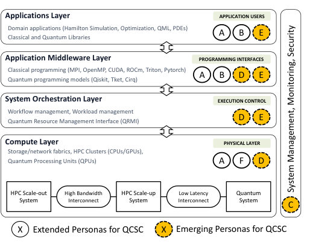 
Fig. 1: Overview of six quantum user personas: A. Quantum Kernel and Library Developers, B. Domain Scientists, C. QCSC Operators, D. QCSC System Engineers, E. QCSC HPC Software Developers, and F. Quantum Physicists. The three emerging QCSC roles are highlighted in yellow.

**Summary.** This paper addresses the operational challenges of integrating quantum processors with supercomputers, creating the concept of Quantum-Centric Supercomputing (QCSC). It achieves this by identifying and detailing six distinct user personas, each with unique tools and data requirements. The core contribution is establishing a framework based on these personas to guide the development of standardized data formats for the entire quantum-HPC ecosystem.

**Why it may be interesting.** It provides a high-level, systems-engineering perspective on the practical challenges of quantum hardware integration, which informs the necessary software and data infrastructure for future quantum simulation work.

Detailed structure

**Main problem.** The primary challenge is operationalizing Quantum-Classical Supercomputing (QCSC) by managing the complex integration of Quantum Processing Units (QPUs) with High-Performance Computing (HPC) systems.

**Main result.** The paper argues that defining distinct user personas and understanding their specific data needs is crucial for developing the necessary consistent data representations and analytics frameworks for the entire quantum-HPC ecosystem.

**Method.** The authors characterize six distinct user personas involved in QCSC environments, analyzing their responsibilities, required tools, and operational data needs.

**Model / system.** The focus is on the conceptual framework of Quantum-Centric Supercomputing (QCSC) systems, which integrate QPUs (tens to hundreds of qubits) with classical HPC infrastructure.

**Key observables.** Operational data, system health, resource utilization, circuit fidelity, and time-to-solution are key diagnostics.

**Important parameters / regimes.** The scale of integration (tens to hundreds of qubits) and the need for unified resource management are critical.

**Assumptions / limitations.** The paper assumes that a single term like 'quantum user' is insufficient, necessitating a persona-based approach to system design.

**Figures summary.** Figure 1 provides an overview of six quantum user personas and their relationship to the layered QCSC architecture, while Table I lists the tools associated with each persona.

**Paper structure.** The paper identifies the QCSC problem, characterizes the six user personas, analyzes their roles and tools, and concludes by stressing the need for standardized data representations to support the diverse user base.

Abstract

Quantum computing is entering an era where quantum processing units (QPUs) with tens to hundreds of qubits are increasingly integrated with high-performance computing (HPC) systems to support hybrid quantum-classical workloads. This paradigm, often referred to as Quantum-Centric SuperComputing (QCSC), introduces new operational, software, and infrastructure challenges. In this paper, we identify and characterize six distinct personas involved in QCSC environments. Particular attention is given to emerging roles that arise at the interface between quantum and HPC systems. We analyze the responsibilities and tools associated with each persona and examine their differing requirements for operational data. Consistent data representations and analytics frameworks will be required to support diverse users across the quantum-HPC ecosystem. By defining personas and their data needs, we provide a foundation for future discussions in this critical area.

[↑ back to top](#top)

### [Exact joint eigenvalue densities of non-Hermitian random matrices are Calogero scattering states](http://arxiv.org/abs/2609.00164v1)

**Authors:** Zhenyu Xiao, Ze Chen, Yifei Liu, Shinsei Ryu  
**Type:** theory · **Category:** statistical mechanics · **PDF:** <https://arxiv.org/pdf/2609.00164v1>  
**Analysis basis:** full PDF text, analyzed in chunks

📷 Fig 1

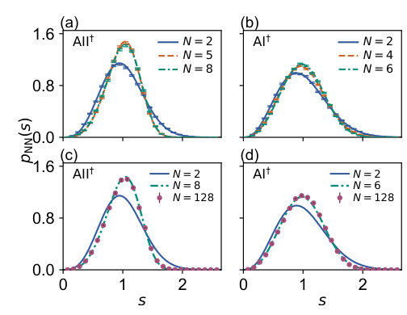 
FIG. 1. (a),(b) Spacing distributions pNN;(N)(s), conditioned on an eigenvalue at the origin. Lines: predictions from the exact densities. Error bars: direct diagonalization. (c),(d) Comparison with the bulk spacings of large random matrices; here the statistical errors are smaller than the markers.

📷 Fig 2

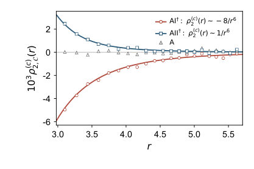 
FIG. 2. Bulk pair correlation ρ(c) 2,C(r) at separation r, after rescaling each class to ρ1 = 1/π, for N = 128, from 3 × 106

📷 Fig 3

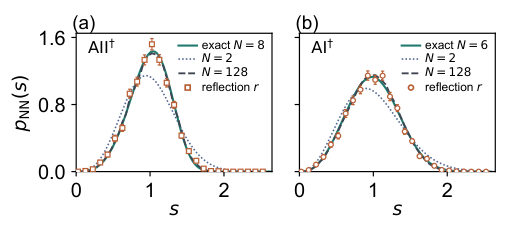 
FIG. 3. Spacing distribution of the complex eigenvalues of the reflection block r, locally unfolded to unit mean, for (a) class AII† and (b) class AI†. Error bars: standard errors over 400 disorder realizations.

**Summary.** This work solves the long-standing problem of finding exact joint eigenvalue densities for non-Hermitian random matrices with specific symmetries. The key finding is that these densities are mathematically equivalent to the scattering states of the Calogero model. This reveals that the spectral statistics are governed by integrable dynamics, leading to power-law tails in correlation functions absent in simpler models.

**Why it may be interesting.** The connection between random matrix theory, integrability (Calogero model), and spectral statistics provides deep insights into the underlying symmetries governing complex quantum systems, which is relevant to understanding spectral rigidity in quantum chaotic systems.

Detailed structure

**Main problem.** The paper determines the exact joint eigenvalue densities for non-Hermitian random matrices possessing transposition symmetry.

**Main result.** These joint densities are shown to be scattering-state wave functions of the Calogero model, revealing complex spectral statistics beyond simple Coulomb gas behavior.

**Method.** The analysis involves solving differential equations derived from Gaussian integration by parts and relating the resulting structure to known integrable systems like the Calogero model.

**Model / system.** The model consists of non-Hermitian random matrices belonging to three symmetry classes ($	ext{AI}^\dagger$, $	ext{A}$, $	ext{AII}^\dagger$). The underlying physics is governed by an eigenvalue problem whose structure is mapped onto the Calogero Hamiltonian.

**Key observables.** Joint eigenvalue density ($
ho_C(z)$), nearest-neighbor spacing distribution ($p_{	ext{NN}}(s)$), and two-point spectral correlation functions.

**Important parameters / regimes.** The symmetry class dictates the Calogero coupling strength ($k$), which is crucial for determining the spectral behavior.

**Assumptions / limitations.** The analysis relies on identifying an underlying integrable structure (Calogero model) and making approximations in the collision limit for density calculations.

**Figures summary.** Figures compare origin-conditioned nearest-neighbor spacing distributions across different symmetry classes and show the asymptotic behavior of the spacing density.

**Paper structure.** The paper establishes the problem by defining the symmetry classes, derives the governing differential equations for the density, connects the solution to the Calogero scattering states, and analyzes specific observables like correlation functions and spacing distributions for each class.

Abstract

Determining exact joint eigenvalue densities is central to random matrix theory. We solve this long-standing problem for non-Hermitian matrices with transposition symmetry (complex symmetric and complex self-dual) at arbitrary matrix size. Up to a Vandermonde factor, they are scattering-state wave functions of the Calogero model, a line of particles interacting through an inverse-square potential, with the coupling strength set by the symmetry. In contrast to many previously known joint densities, the densities cannot be written as a gas of eigenvalues with pairwise interactions. We further compute the complex level spacing distributions and two-point spectral correlation functions, which carry power-law tails, absent in a Coulomb gas. Our results shed light on the interplay among random matrices, integrability, and symmetry.

[↑ back to top](#top)

### [Exact Virtual Channel Programming with Vanishing Excess Overhead](http://arxiv.org/abs/2609.01419v1)

**Authors:** Mingrui Jing, Mengbo Guo, Hongshun Yao, Xin Wang  
**Type:** theory · **Category:** quantum information and computing · **PDF:** <https://arxiv.org/pdf/2609.01419v1>  
**Analysis basis:** full PDF text, analyzed in chunks

📷 Fig 1

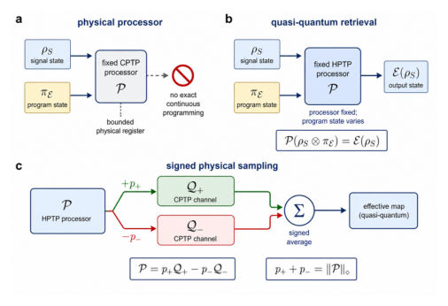 
FIG. 1. Exact virtual channel programming. (a) A fixed physical processor with a finite-dimensional program register cannot exactly realize a continuous family of distinct unitary channels. (b) A physical normalized Choi state πE selects the target channel for a fixed linear retrieval rule P. Its averaged action satisfies P(ρS ⊗πE) = E(ρS) at the level of recon- structed output observables. (c) Each trial samples one of the physical channels in a norm-optimal quasi-decomposition P = p+Q+ −p−Q−and classically reweights the measured outcome. The total weight p+ + p−= ∥P∥⋄quantifies the cost of P. Minimizing this total weight over exact retrievers defines the programming overhead.

**Summary.** This paper rigorously quantifies the resource cost associated with simulating an arbitrary quantum channel family using limited physical resources. It derives sharp scaling laws showing a trade-off between quantum memory and classical sampling overhead. The results recast a fundamental theoretical obstruction into a precise, measurable quantitative bound.

**Why it may be interesting.** This work provides fundamental quantitative bounds on the limits of quantum simulation and programming, which is crucial for understanding the resource overheads in quantum computation and quantum networking protocols.

Detailed structure

**Main problem.** The paper addresses the quantitative trade-off between the memory required to store a quantum program and the classical sampling overhead needed to exactly reconstruct the output statistics of an arbitrary quantum channel family.

**Main result.** It establishes sharp scaling laws for the required overhead, showing that the one-copy overhead $
u_1(	ext{CPTP}_d) = 2d^2 - 3 + 2/d^2$, and that for many copies, $
u_k(	ext{CPTP}_d)$ approaches a limit determined by the locally learnable unitary degrees of freedom.

**Method.** The analysis employs advanced techniques involving quasi-decomposition, semidefinite programming (SDP) formulations derived from mixed-tensor representations, and establishing lower bounds via covariant retrievers.

**Model / system.** The system models the process of 'virtual' programming of a fixed physical processor to emulate an arbitrary family of $d$-dimensional quantum channels ($	ext{CPTP}_d$). The reconstruction relies on randomized sampling and classical post-processing.

**Key observables.** The primary observables are the programming overheads, $
u_k(	ext{CPTP}_d)$, quantified by the diamond norm $\lVert P 
Vert_\diamond$, and the required number of samples $N$.

**Important parameters / regimes.** The key parameters are the system dimension $d$ and the number of copies $k$ used in the reconstruction protocol.

**Assumptions / limitations.** The analysis assumes the target channel family is $	ext{CPTP}_d$ and that the reconstruction protocol involves sampling physical channels followed by classical post-processing.

**Figures summary.** Figures contrast physical channel implementation versus exact reconstruction protocols, while tables present numerical results for finite-copy calculations comparing SDP bounds with PBT-achievable upper bounds.

**Paper structure.** The paper builds from defining the quantitative obstruction to exact programming, deriving the optimal one-copy overhead ($
u_1$), and then establishing the asymptotic scaling law for the many-copy regime ($
u_k$ as $k 	o \infty$) using advanced algebraic and SDP techniques.

Abstract

A finite-dimensional physical processor cannot exactly program a continuous family of distinct unitary channels. We show that this obstruction becomes quantitative when the target channel is stored in a normalized Choi state and its output observables are reconstructed by sampling physical channels and classically post-processing their measurement outcomes. For arbitrary $d$-dimensional channels, we construct a target-independent exact reconstruction protocol and prove the optimal one-copy sampling overhead, which grows quadratically with system dimension. We further prove the sharp fixed-$d$ law that the excess overhead vanishes inversely with the number of identical Choi programs. The upper bound combines deterministic port-based teleportation with a quasi-decomposition that corrects its depolarizing distortion. The converse maps any low-overhead reconstruction protocol to a physical learner of unknown unitaries and uses local quantum estimation to recover the same leading coefficient. These results recast the universal no-programming obstruction as a quantitative trade-off between quantum program memory and classical sampling, with a leading cost that reflects the locally learnable unitary degrees of freedom.

[↑ back to top](#top)

### [Fractal dimension predicts quantum kernel collapse in angle-encoded data](http://arxiv.org/abs/2609.00475v1)

**Authors:** Ana Paula Appel  
**Type:** both · **Category:** quantum information and computing · **PDF:** <https://arxiv.org/pdf/2609.00475v1>  
**Analysis basis:** full PDF text, analyzed in chunks

📷 Fig 1

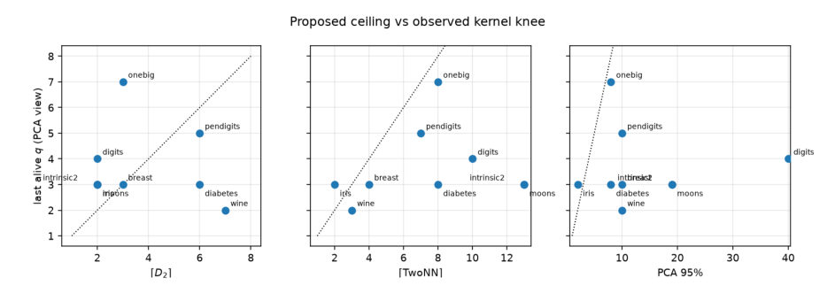 
Figure 1: A point on the dotted y = x line means the proposed ceiling equals the knee of the fidelity kernel (PCA view, one-layer ZZ, n = 32; knee = last alive q, Section 2.5). Left: ⌈D2⌉sits next to that knee (breast on the line at 3; pendigits 6 vs. 5). Centre: TwoNN [Facco et al., 2017] overshoots moons/intrinsic2 (≈13) because it treats embedding noise as extra dimension. Right: PCA-95% asks for 10–40 qubits while the kernel has already died at q ≤5—that panel has its own x-axis so the live knees (2–7) remain visible. Outliers we report as failures: onebig (kernel lives past the ceiling), wine/diabetes (high ID, n = 32 dies early), digits (unreliable box-count).

📷 Fig 2

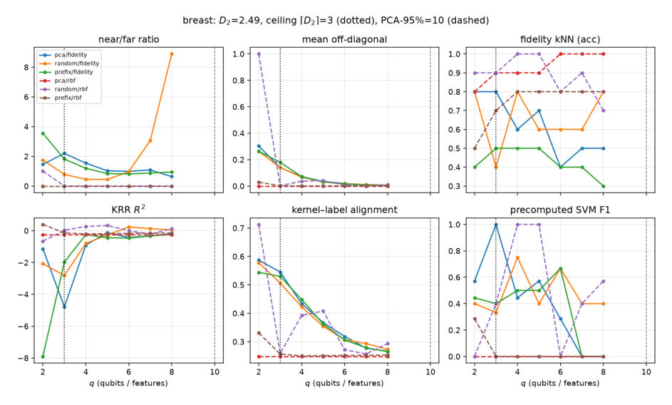 
Figure 2: Breast cancer (E = 30, D2 ≈2.49). Dotted vertical: fractal budget q = 3. Grey dashed: PCA-95% (q = 10). Solid lines: fidelity kernel (the QML object). Dashed lines: classical RBF on the same coordinates (control). Mean off-diagonal (top centre): every fidelity curve falls toward 0 as q grows—states become orthogonal; RBF does not, so this is the feature map, not classical high dimension. near/far, kNN, SVM F1: on the PCA view of the fidelity kernel the usable geometry and the QML scores peak at the knee q = 3 and degrade past it. Alignment falls with q. KRR is noisy at n = 32; we do not hang the claim on it. The practical reading: encoding 3 PCs (the fractal width) keeps a live...

📷 Fig 3

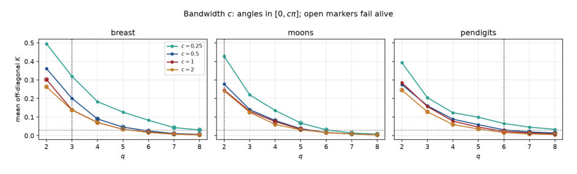 
Figure 3: Mean off-diagonal of K versus q at four bandwidths. Dotted vertical: ⌈D2⌉. Dashed horizontal: the 0.03 alive floor. Open markers fail the alive rule. Smaller c (angles in [0, cπ]) delays collapse; c = 1 is the default ZZ scale.

📷 Fig 4

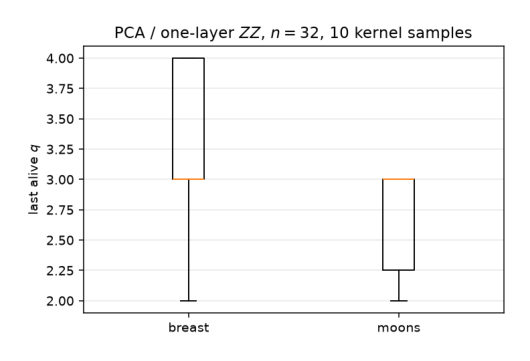 
Figure 4: Last alive q over ten kernel samples (n = 32, PCA, one-layer ZZ, c = 1). Median 3 on both breast and moons.

📷 Fig 5

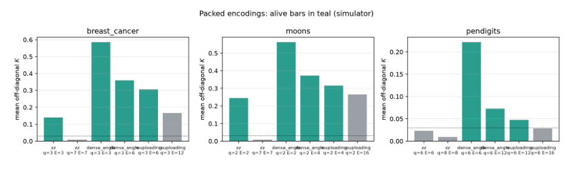 
Figure 5: Packed encodings, simulator, n = 32. Y : mean off-diagonal of the fidelity kernel (higher = less collapsed). Teal: alive. Grey: dead. Dotted: 0.03 threshold. Left to right in each panel: ZZ at ⌈D2⌉; ZZ beyond it; dense-angle / re-upload of a few extra PCs on the fractal q; re-upload of a PCA-95%-scale feature count on that q. The last of those is grey: stacking extra coordinates onto fewer qubits is not a workaround.

**Summary.** This paper addresses kernel collapse in quantum machine learning by proposing that the correlation fractal dimension ($D_2$) dictates the maximum usable number of qubits. The authors demonstrate that using $D_2$ as a budget keeps the quantum kernel functional on both simulators and hardware, whereas over-encoding using methods like PCA causes the kernel to collapse.

**Why it may be interesting.** The work provides a rigorous, information-theoretic measure ($D_2$) to guide the design of quantum circuits for data encoding, directly addressing the resource scaling problem in QML.

Detailed structure

**Main problem.** Quantum kernel methods applied to tabular data suffer from 'kernel collapse' when the feature map width exceeds the data's true intrinsic dimension.

**Main result.** The correlation fractal dimension ($D_2$) provides a superior, data-driven estimate for the optimal qubit budget, keeping the quantum kernel 'geometrically alive' where standard methods like PCA fail.

**Method.** The authors use the correlation fractal dimension ($D_2$) derived from the data to set an a priori qubit budget, comparing the resulting quantum kernel fidelity against those derived from PCA or all attributes.

**Model / system.** The model involves constructing quantum feature maps ($\vert\psi(x)
angle$) using rotations on qubits (e.g., ZZ map) to define a quantum kernel $K_{ij} = \langle\psi(x_i) | \psi(x_j)
angle$ for classification on tabular data.

**Key observables.** Kernel fidelity, the 'knee' width (last usable qubit count), and the ratio of nearest-neighbor to farthest-pair kernel similarities ($	ext{near}/	ext{far}$).

**Important parameters / regimes.** The correlation fractal dimension ($D_2$), the bandwidth ($c$), and the specific feature map used (e.g., ZZ layer depth).

**Assumptions / limitations.** The optimal qubit budget is determined by the fractal dimension, and the kernel's usability is defined by maintaining specific structural inequalities (the 'alive' criterion).

**Figures summary.** Figures compare the measured kernel fidelity (MAE) and the mean off-diagonal elements of the kernel matrix across various feature map widths, showing a clear collapse past the fractal dimension limit.

**Paper structure.** The paper establishes the problem of kernel collapse, proposes $D_2$ as the solution, validates this budget using multiple datasets and map types (ZZ, IQP), and confirms the findings using both quantum simulators and actual quantum hardware measurements.

Abstract

Angle-encoded quantum kernels on tabular data collapse when the feature map is wider than the intrinsic dimension of the data. We propose the correlation fractal dimension D2 as an a priori qubit budget: encode D2 coordinates chosen by FD-ASE instead of the PCA-95% width or all E attributes. On nine data sets and a statevector simulator (n= 32), a one-layer ZZ fidelity kernel at q=D2 stays geometrically alive while the same kernel at the PCA-95% width has already collapsed. The budget is map-dependent: product-state and IQP maps overshoot it; a second ZZ layer undershoots it. Packed dense-angle and re-uploading encodings still live at the fractal q, but not when PCA-95% features are stacked onto those qubits. Shrinking the angle bandwidth moves the ZZ knee later; stretching it kills the kernel earlier. On IBM Quantum (ibm_fez, 256 shots, n=8) the one-layer ZZ kernel at the fractal width matches the exact kernel (MAE 0.021); past that width both hardware and simulator have collapsed. The ceiling is a property of the map-data pair at a stated bandwidth, not of the classical table alone.

[↑ back to top](#top)

### [High-Rank Encoding Can Improve Approximate Quantum Error Correction](http://arxiv.org/abs/2609.00778v1)

**Authors:** Bikun Li, Liang Jiang  
**Type:** theory · **Category:** quantum information and computing · **PDF:** <https://arxiv.org/pdf/2609.00778v1>  
**Analysis basis:** full PDF text, analyzed in chunks

📷 Fig 1

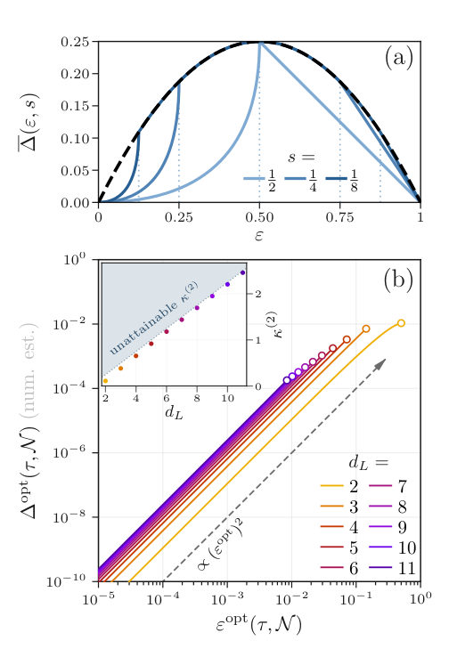 
FIG. 1. (a) The upper bound ∆(ε, s) given by Eq. (5) for different values of s. The black dashed curve is the earlier ε(1−ε) bound derived from Ref. [27]. (b) Numerical estimates of the optimized gap versus optimized infidelity for the noise maps constructed below and different values of dL, with dC = d2 L. The inset compares the finite-error ratios of the plotted gaps to (εopt)2 with the asymptotic ceiling (dL −1)/4. The exact limiting coefficient is given by Eq. (25).

**Summary.** This paper rigorously proves that for optimal approximate quantum error correction, restricting the encoder to rank-one mappings sacrifices performance compared to unrestricted encoding. The authors derive a precise, asymptotically quadratic lower bound for this performance gap, demonstrating that higher-rank encoders are necessary for achieving the true optimum.

**Why it may be interesting.** This work provides rigorous mathematical tools to quantify the performance limits of quantum error correction, which is fundamental to building fault-tolerant quantum computers. The explicit determination of the necessary encoder rank is a key theoretical result.

Detailed structure

**Main problem.** The paper investigates whether optimal approximate quantum error correction (AQEC) requires an encoder of rank higher than one, challenging the assumption that rank-one encoders suffice for optimal performance.

**Main result.** The authors prove that for entanglement fidelity, a higher-rank encoder is necessary to achieve the global optimum, establishing a strictly positive gap between the unrestricted and rank-one achievable fidelities.

**Method.** The analysis uses entanglement fidelity as the objective function, deriving refined upper bounds on the infidelity gap by employing techniques like polar decomposition and analyzing the geometry of the error correction manifold.

**Model / system.** The model is the general quantum error correction framework involving an encoder ($C$), a noise map ($N$), and a decoder ($D$). The analysis focuses on comparing the optimal fidelity achievable with unrestricted encoders versus those restricted to rank-one mappings.

**Key observables.** Entanglement fidelity ($F_e$), the optimized gap ($\Delta_{opt}$), and the asymptotic quadratic coefficient ($\kappa^{(2)}$) quantifying the difference between optimal and rank-one performance.

**Important parameters / regimes.** The small noise parameter ($\epsilon 	o 0+$) and the logical dimension ($d_L$) are crucial for determining the asymptotic behavior of the gap.

**Assumptions / limitations.** The analysis assumes the encoder $C$ is a Completely Positive Trace Non-Increasing (CPTNI) map, and later relies on the existence of a global minimizer for the fidelity difference.

**Figures summary.** Figure 1(a) compares the derived upper bound on the infidelity gap against prior work. Figure 1(b) shows numerical estimates of the optimized gap versus infidelity for varying logical dimensions, comparing them to the derived asymptotic ceiling.

**Paper structure.** The paper progresses from establishing general upper bounds on the gap using fidelity measures, to constructing specific noise families that demonstrate a positive gap, and finally employing advanced geometric analysis (tangent spaces, residual equivariance) to derive the exact asymptotic quadratic coefficient.

Abstract

Conventional quantum-code constructions encode pure logical states as pure code states, but this restriction can sacrifice performance. We show that intrinsic encoding randomness can improve optimal entanglement fidelity. We bound the loss from imposing a rank-one encoder and prove it is at most quadratic near perfect recovery after joint optimization. The optimized advantage survives small noise perturbations. An explicit noise family requires higher-rank encoders arbitrarily close to perfect recovery, with every optimal encoder mapping pure inputs to mixed code states.

[↑ back to top](#top)

### [Higher anomalies, compressing SPTs and cohomology operations](http://arxiv.org/abs/2609.00170v1)

**Authors:** Shani Nadir Meynet, Elias Riedel Gårding  
**Type:** theory · **Category:** strongly correlated electrons · **PDF:** <https://arxiv.org/pdf/2609.00170v1>  
**Analysis basis:** full PDF text, analyzed in chunks

📷 Fig 1

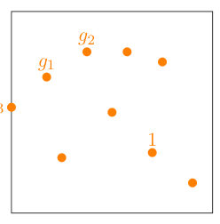 
Figure 1: The configuration space C(G, d) with d = 2.

📷 Fig 2

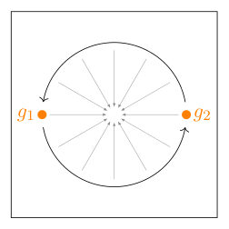 
Figure 2: Particle exchange is null-homotopic, so the particles are bosons.

📷 Fig 3

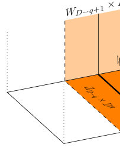 
Figure 3: A submanifold ZD−q ⊂XD and its tubular neighbourhood in the inflow picture (D = 2, q = 1 is shown).

📷 Fig 4

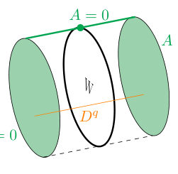 
Figure 4: Confining the gauge field to a tubular neighbourhood of W is equivalent to confining it to the q-fold suspension of W.

**Summary.** This theoretical paper uses advanced algebraic topology to study how symmetries and their associated anomalies change when a quantum system undergoes dimensional reduction. By calculating the cohomology suspension map, the authors provide a systematic method to determine the 'higher anomaly' that governs the stability and classification of topological phases in condensed matter systems.

**Why it may be interesting.** While highly abstract, the concept of symmetry protection and anomaly classification is fundamental to understanding topological phases, which underpin many modern condensed matter models, including those involving strong correlations.

Detailed structure

**Main problem.** The paper computes and tabulates the suspension map for cohomology operations, applying this to understand how anomalies and higher group structures behave under dimensional reduction in quantum field theories.

**Main result.** The analysis determines the 'higher anomaly' of a reduced symmetry and the reduced higher-group structure, both captured by the iterated cohomology suspension map $\Omega$.

**Method.** The authors use advanced algebraic topology, specifically studying the cohomology suspension $\Omega$ on Eilenberg-MacLane spaces, extending methods from Cartan and Moore, and automating calculations with a specialized software package.

**Model / system.** The focus is on quantum systems possessing discrete $p$-form symmetries. The physical process modeled is the dimensional reduction of the system by restricting symmetry defects to a codimension-$q$ subspace.

**Key observables.** The anomaly of the reduced symmetry (the higher anomaly) and the reduced higher-group structure, which are elements in various cohomology groups.

**Important parameters / regimes.** The codimension $q$ of the subspace, the form degree $p$, and the coefficient ring (e.g., $\mathbb{R}/\mathbb{Z}$ for anomalies).

**Assumptions / limitations.** The analysis relies on the mathematical framework of generalized cohomology theories and the properties of the cohomology suspension map $\Omega$.

**Figures summary.** The notes mention extensive tables (e.g., Table 1, Table 9 & 10) providing computed results for cohomology operations and their dependence on the coefficient group.

**Paper structure.** The paper proceeds by first defining the physical problem (dimensional reduction of symmetries), then introducing the mathematical tool ($\Omega$), detailing the computational extension (p-adic series, `emcm`), and finally applying it to compute and tabulate the resulting anomalies and structures.

Abstract

We explicitly compute and tabulate the suspension map for cohomology operations, applying it to the dimensional reduction of anomalies and higher group structures of generalised symmetries in quantum field theories and lattice systems.   In a quantum system with a discrete $p$-form symmetry, we can restrict the symmetry defects to a codimension-$q$ subspace of spacetime, or equivalently confine the gauge field to a slab whose thickness approaches zero. This results in a $(p-q)$-form symmetry on the subspace. We determine the fate of two important properties of symmetries under this process. First, we compute the anomaly of the reduced symmetry, or the higher anomaly of the original symmetry, which acts as an obstruction to higher gauging and onsiteability. Second, for two symmetries forming a higher-group structure, encoded as a Postnikov class, we compute the reduced higher-group structure, which may or may not be trivial. Both cases are captured by the $q$-fold iteration of the cohomology suspension $Ω$, also known as the loop functor or transgression, in the cohomology of Eilenberg--MacLane spaces. Classical results state that $Ω$ is an isomorphism in a stable range and annihilates mixed anomalies.   To calculate $Ω$ over a base ring which is not a field, we make use of small models for the chain DGAs of Eilenberg--MacLane spaces, pioneered by Cartan and Moore, whose results we review and extend. The critical added step is the improvement of a mod $p$ chain contraction to the $p$-local integers, obtained via a $p$-adic series. We automate the computations in a software package \texttt{emcm}, and provide extensive tables of the results. Finally, to make contact with explicit cochain formulations of cohomology operations, we demonstrate how to calculate cup products and certain cup-$i$ products in this framework.

[↑ back to top](#top)

### [Quantum Weighted Moving Average for Predicting Limit Order Book Trends](http://arxiv.org/abs/2609.01524v1)

**Authors:** Matthias Kamm, Dinh-Long Vu, Patrick Rebentrost  
**Type:** both · **Category:** other · **PDF:** <https://arxiv.org/pdf/2609.01524v1>  
**Analysis basis:** full PDF text, analyzed in chunks

📷 Fig 1

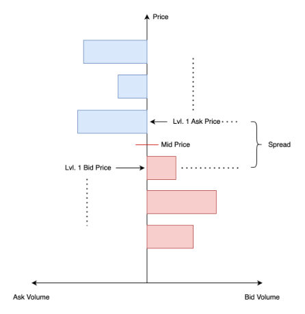 
Figure 1: An example of the limit order book (LOB) at a fixed time.

📷 Fig 2

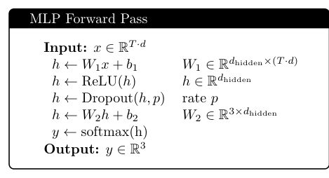 
Figure 2: MLP forward pass. The flattened input se- quence x ∈RT ·d is passed through a hidden layer of dimension dhidden, where ReLU activation and dropout are applied, before being mapped to the class probabilities y ∈R3.

📷 Fig 3

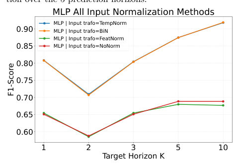 
Figure 3: F1-score plotted for different prediction horizons. In the respective plots the performance for the TABL and MLP-based models is compared for different input normalization techniques: Bilin- ear Normalization (BiN), Temporal Normalization (TempNorm), Feature Normalization (FeatNorm) and using no input normalization (NoNorm).

📷 Fig 4

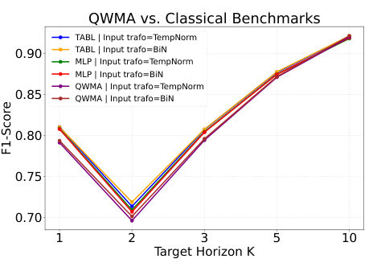 
Figure 5: Performance comparison of the QWMA model with the classical benchmark models. The models are compared for temporal and bilinear nor- malization.

📷 Fig 5

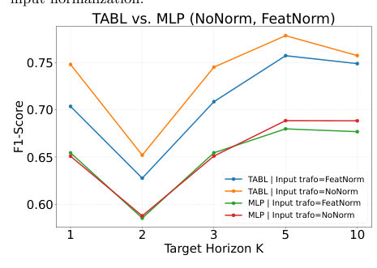 
Figure 4: F1-score of different normalization methods compared for the two classical models.

**Summary.** This work applies quantum machine learning techniques, specifically the Quantum Weighted Moving Average (QWMA), to predict financial trends from Limit Order Book data. The model combines classical data preprocessing with quantum unitaries to process time-series information. Although quantum advantage was not proven, the resulting hybrid model performs competitively with state-of-the-art classical methods.

**Why it may be interesting.** The use of quantum circuits to process time-series data, even in a financial context, provides an interesting, albeit tangential, application of quantum circuit design principles that could inform quantum algorithms for sequential data processing.

Detailed structure

**Main problem.** The paper investigates the feasibility of using quantum machine learning models to forecast price trends from complex, multivariate Limit Order Book (LOB) financial data.

**Main result.** While no definitive quantum advantage was shown, the combined classical-quantum model (QWMA) achieved performance comparable to the best classical benchmarks, suggesting the quantum component is highly expressive.

**Method.** The approach involves classically preprocessing LOB data (normalization) before encoding it into quantum states via a Unitary Embedding, which is then processed by a Quantum Weighted Moving Average (QWMA) operator.

**Model / system.** The core model is the QWMA, which is a quantum circuit structure based on a linear combination of unitaries (LCU). It is compared against simpler variants like QSMA and QEMA, using LOB data as the input time series.

**Key observables.** F1-score is the primary metric used to evaluate prediction performance across different datasets and model variants.

**Important parameters / regimes.** Key parameters include the number of qubits ($n_q$), the choice of unitary embedding circuit (e.g., Shallow, Circuit 1), and the weighting scheme (uniform vs. exponential).

**Assumptions / limitations.** The authors note that the model requires post-selection for hardware implementation and that the comparison is limited by the choice of fixed context windows and embedding circuits.

**Figures summary.** Figures compare the F1-score of QEMA vs. QSMA across varying qubit counts and embedding circuits on different datasets, and illustrate the structure of the parameterized quantum circuits used for embedding.

**Paper structure.** The paper introduces the QWMA model, details the classical preprocessing and quantum encoding steps, compares QWMA, QSMA, and QEMA performance on benchmark datasets (FI-2010, China A-shares), and analyzes the impact of normalization and weighting schemes.

Abstract

Can quantum computers be useful for forecasting multivariate financial time series? In this work, we consider the problem of predicting price trends from limit order book (LOB) data. After identifying key components of classical models, we introduce the quantum weighted moving average (QWMA) model. The two main building blocks are, first, classically preprocessing via normalization of both feature and temporal dimensions and, second, a linear combination of unitaries-based layer for unitarily-embedded classical data. The models are evaluated on the FI-2010 benchmark dataset and a second dataset of China A-share stocks. While we do not present evidence of quantum advantage, the combined classical-quantum model demonstrates performances close to the best classical models. The quantum part of the model is expressive enough to focus on the most predictive parts of the time series. Several specializations of the QWMA model are considered, in particular a variant related to the widely-used exponential moving average (EMA). We give consideration to the limitations of the methods and the datasets.

[↑ back to top](#top)

### [Scattering and Tunneling in Real Quantum Mechanics](http://arxiv.org/abs/2609.01066v1)

**Authors:** Firdevs Karakus, Daniil Stepanenko, Igor Volovich  
**Type:** theory · **Category:** other · **PDF:** <https://arxiv.org/pdf/2609.01066v1>  
**Analysis basis:** full PDF text, analyzed in chunks

📷 Fig 1

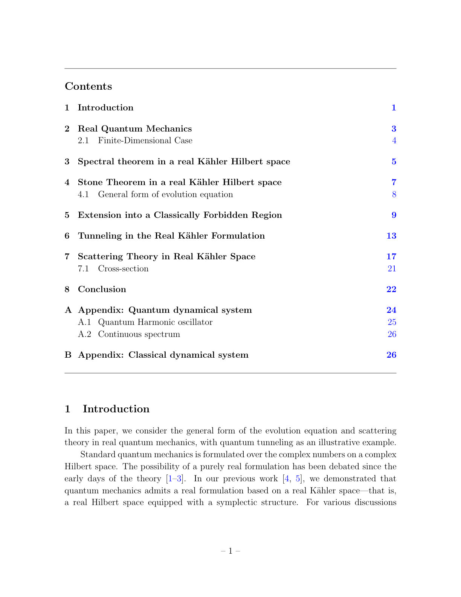 
Low-resolution page preview, page 2

📷 Fig 2

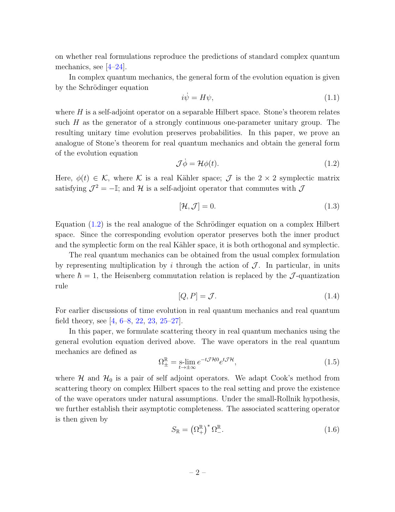 
Low-resolution page preview, page 3

📷 Fig 3

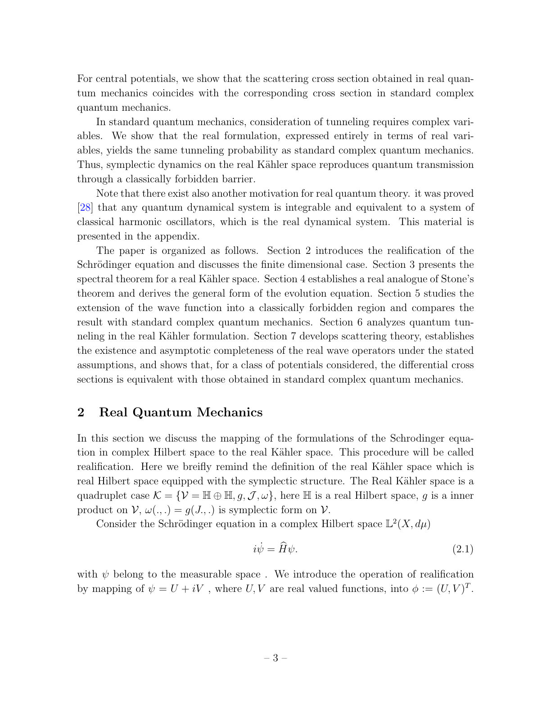 
Low-resolution page preview, page 4

📷 Fig 4

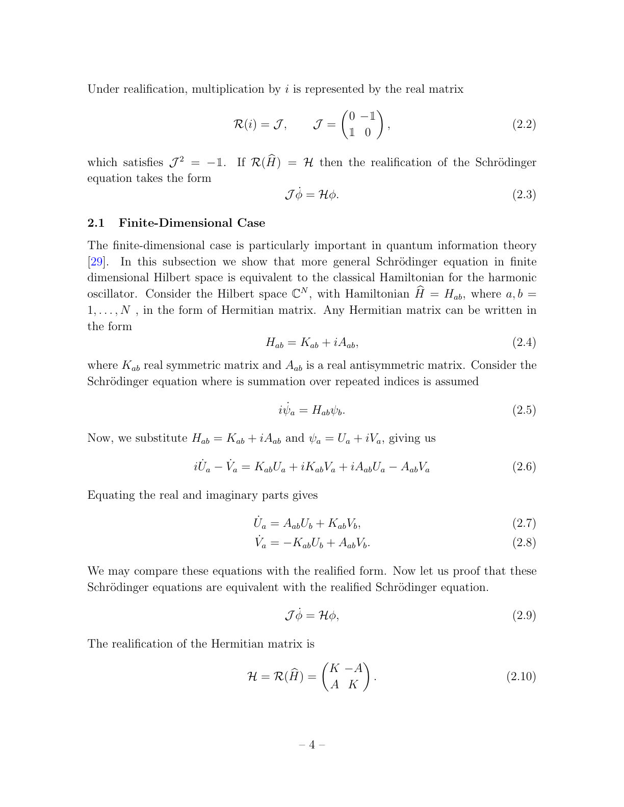 
Low-resolution page preview, page 5

📷 Fig 5

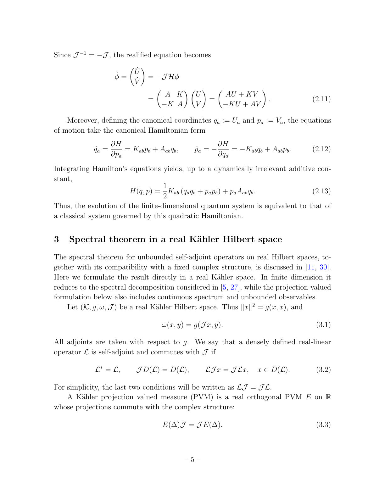 
Low-resolution page preview, page 6

**Summary.** This paper develops a framework for quantum mechanics on a real Kähler space, establishing a real analogue of the Schrödinger evolution equation. It proves that despite the mathematical shift from complex to real structures, fundamental physical observables like scattering cross sections and tunneling probabilities remain identical to their standard complex counterparts. This work is significant for understanding the mathematical robustness and geometric underpinnings of quantum theory.

**Why it may be interesting.** It provides a rigorous mathematical foundation for quantum mechanics using real structures, which is highly relevant for theoretical physicists exploring alternative mathematical formulations of quantum dynamics, especially those involving geometric structures like symplectic geometry.

Detailed structure

**Main problem.** The paper establishes the mathematical framework for quantum mechanics when formulated over a real Kähler space, specifically studying the behavior of scattering and tunneling processes.

**Main result.** The authors prove that the real formulation yields an evolution operator that is both orthogonal and symplectic, and crucially, the scattering cross sections and tunneling probabilities match those derived from standard complex quantum mechanics.

**Method.** The methodology involves adapting concepts like Stone's theorem and scattering theory from complex Hilbert spaces to the real setting using the structure of a real Kähler space.

**Model / system.** The system is a quantum particle governed by a Hamiltonian on a real Kähler space, which is mathematically realized by mapping the complex Schrödinger equation to a real evolution equation involving a symplectic matrix J.

**Key observables.** Differential scattering cross section, tunneling probability, probability current, and the evolution operator's orthogonality/symplectic nature.

**Important parameters / regimes.** The Hamiltonian H, the symplectic structure J, and the asymptotic limits for scattering theory.

**Assumptions / limitations.** The theory relies on the existence of a real Kähler structure (K, g, $\omega$, J) and assumes asymptotic completeness for wave operators.

**Figures summary.** Not specified, but the notes detail calculations involving probability currents, scattering amplitudes $f(	heta)$, and the relationship between real and complex formulations.

**Paper structure.** The paper progresses by first establishing the real analogue of the evolution equation and Stone's theorem. It then applies this framework to scattering theory, demonstrating the equivalence of cross-sections, and finally analyzes tunneling probability, confirming its identity with the complex case.

Abstract

We establish the general form of the evolution equation and study scattering and tunneling in real quantum mechanics. We prove an analogue of Stone's theorem for a real Kahler space and derive the corresponding general evolution equation, whose evolution operator is both orthogonal and symplectic. We formulate scattering theory in terms of real wave operators and the associated S-matrix. For the class of potentials considered, we show that the differential scattering cross section is equivalent to that obtained in standard complex quantum mechanics. We also show that the tunneling probability in real quantum mechanics is identical to that in complex quantum mechanics.

[↑ back to top](#top)

### [Separating perception from reasoning in vision-language models: a model-free render ceiling for crystal structures](http://arxiv.org/abs/2609.00663v1)

**Authors:** Can Polat, Mustafa Kurban, Erchin Serpedin, Hasan Kurban  
**Type:** theory · **Category:** other · **PDF:** <https://arxiv.org/pdf/2609.00663v1>  
**Analysis basis:** full PDF text, analyzed in chunks

📷 Fig 1

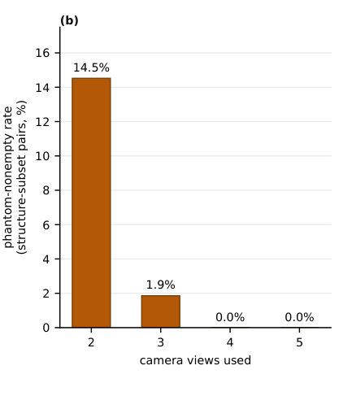 
Figure 2 The instrument returns a ceiling genuinely below 1 once cameras are withheld. (a), Mean render ceiling 𝑅1 under two-, three-, four- and five-camera subsets of the frozen protocol, at the certified tolerance 𝛿= 𝜏= 0.01 Å and at the released tolerance 𝛿= 15𝜏; error bars span the minimum and maximum over camera subsets of that size. Mean 𝑅1 at the certified tolerance is 0.9214 at two views and 0.9967 at three; at the released tolerance it is 0.7481 at two views and 0.9152 at three. (b), The phantom-nonempty rate (𝜏near zero) at each view count on the original sample: 14.5% at two views and 1.9% at three, falling to exactly 0.0% at four and five views.

📷 Fig 2

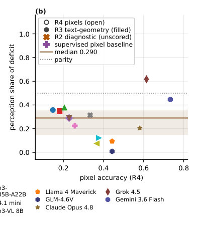 
Figure 3 The two model rungs and the decomposition they imply, across the whole roster. Marker shape and colour identify the model in both panels. (a), Per-model 𝑅4 (pixels, open marker) and 𝑅3 (exact geometry as text, filled marker), rungs as defined in Methods, with the 𝑅1 oracle at 1.0000 and seven-way chance drawn; 𝑅2 is omitted as unscored under its pre-registered gate, its diagnostic value being 0.0762 and 0.0857 on the two samples. One row per model, ordered upward by 𝑅4 and identified by marker; the two markers below the axis are the unscored 𝑅2 diagnostic and the supervised pixel baseline, neither of which is a row of the roster. (b), Perception share of the deficit against 𝑅4; the...

📷 Fig 3

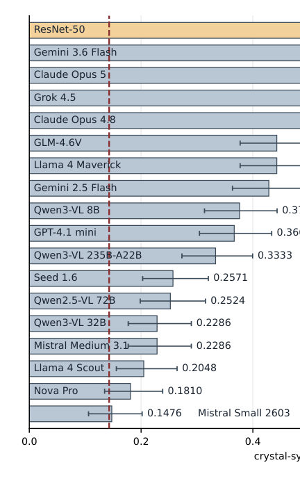 
Figure 4 No vision–language model reaches the certified ceiling, and the supervised pixel baseline outscores all of them. Zero-shot crystal-system accuracy: seventeen vision–language model arms across ten vendors, together with the supervised pixel baseline, which is not a vision–language model. Four arms clear the shape-free baseline (solid line, 0.5286) and the best reaches 0.7333 against the oracle ceiling of 1.0000; dashed line: seven-way chance, 0.1429. Error bars are 95% confidence intervals. Run-to-run spread of majority voting is a mean of 5.0 of 210 structures across two sweep runs.

📷 Fig 4

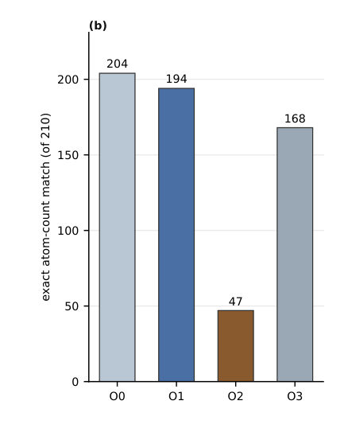 
Figure 5 Removing informative occlusion from the oracle’s input changes no classification. Expansion sample, four views. (a), Symmetry recovery under the four occlusion conditions: O0 unconditioned, O1 informative occluders removed, O2 all occluders removed, O3 the pre-registered random-removal control; the dashed line is O0. (b), Exact atom-count match under the same conditions, which does move across them.

📷 Fig 5

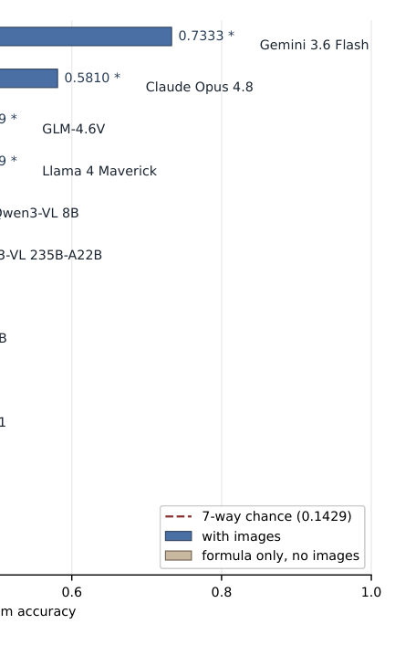 
Figure 6 Removing the image collapses every model toward chance. Each model answered the identical prompt with the five renders and with the chemical formula alone, paired per structure; model identifiers are drawn at the end of each bar pair. Stars mark models whose paired difference is significant; the dashed line is seven-way chance.

**Summary.** This paper introduces the 'render ceiling,' a novel, model-free benchmark designed to rigorously separate perception failures from reasoning failures in vision-language models. By using rendered crystal structures, the authors demonstrate that a purely vision-based model can outperform complex VLMs, exposing that much of the apparent reasoning ability in current models is merely sophisticated pattern matching based on image extraction.

**Why it may be interesting.** While the subject is AI/ML, the rigorous, model-free benchmarking methodology and the use of deterministic geometric reconstruction to test model boundaries are highly relevant to developing robust simulation tools in physics.

Detailed structure

**Main problem.** The core challenge is developing a model-free method to separate whether a vision-language model fails due to poor image perception or flawed reasoning about the image content.

**Main result.** The authors introduce the 'render ceiling,' a model-free benchmark that certifies model deficits, showing that a purely vision-based model outperforms most vision-language models on crystal structure tasks.

**Method.** They construct the render ceiling by inverting frozen camera views and re-solving cross-view geometric correspondences, bypassing the need for a secondary, potentially flawed, model.

**Model / system.** The study uses crystal structures as the physical system, testing vision-language models (VLMs) and supervised vision models on tasks like crystal system prediction from multiple rendered views.

**Key observables.** Accuracy scores against the model-free render ceiling ($R_1$), and the decomposition of error into 'perception share' and 'residual' components.

**Important parameters / regimes.** The analysis is performed on 2,160 rendered crystal structures, and the performance is compared across fourteen different VLMs.

**Assumptions / limitations.** The render ceiling is only guaranteed to fail through an enumerable set of projection coincidences, which was confirmed to be empty for the tested structures.

**Figures summary.** Figure 1 illustrates the model-free attribution instrument across different data 'rungs' (e.g., true positions vs. rendered geometry vs. text geometry); Figure 2 shows how the ceiling drops when camera views are withheld.

**Paper structure.** The paper establishes the problem of separating perception from reasoning, introduces the model-free render ceiling using crystal structures, presents quantitative comparisons across various models, and analyzes the resulting error decomposition.

Abstract

Multimodal evaluations cannot say whether a vision-language model misread an image or misreasoned about it, because every existing method for separating the two places a second model in the loop. We introduce the render ceiling, a model-free reference for benchmarks built by rendering known objects: inverting the frozen cameras and re-solving cross-view correspondence recovers exactly the answer the images support. We prove the ceiling fails only through an enumerable set of projection coincidences and certify that set empty on 2,160 rendered crystal structures, so every point of a model's deficit belongs to the model. Across fourteen vision-language models, supplying exact geometry as text lifts every model yet closes under half the gap for thirteen, while a supervised vision model with no language component reads the same images at 0.8952, above every vision-language model. The instrument exposes extraction-stage fabrication that downstream accuracy would misattribute to reasoning, yields camera-placement rules for benchmark builders, and transfers to any benchmark with an invertible forward rendering.

[↑ back to top](#top)

### [Structure-Aware Placement and Routing of Multi-Controlled Toffoli on Bivariate Bicycle Code Architectures](http://arxiv.org/abs/2609.00852v1)

**Authors:** Anik Basu Bhaumik, Suman Dutta, Siyi Wang, Anupam Chattopadhyay  
**Type:** theory · **Category:** quantum information and computing · **PDF:** <https://arxiv.org/pdf/2609.00852v1>  
**Analysis basis:** full PDF text, analyzed in chunks

📷 Fig 1

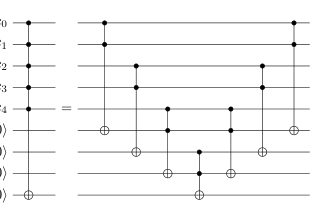 
Figure 1: Optimal Toffoli-depth 𝑛-MCT decompositions as- suming all-to-all qubit connectivity, for 𝑛= 5.

📷 Fig 2

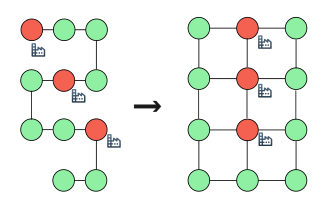 
Figure 2: Linear vs. grid factory placement, showing heuristic- selected factory modules in red and standard modules in green.

📷 Fig 3

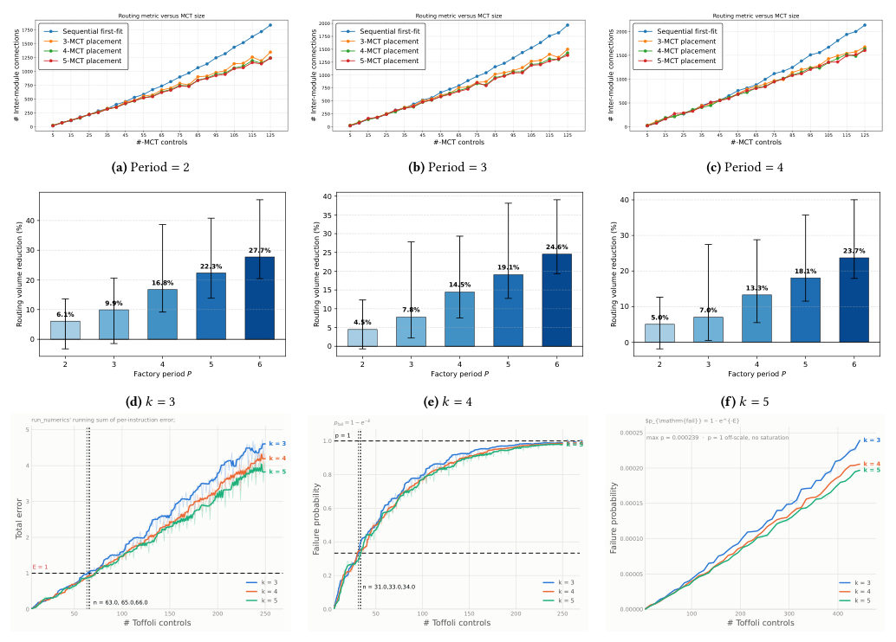 
Figure 3: Inter-module routing characteristics under different factory placements and grouping configurations. (a)–(c) show the linear BB-module architecture for factory periods 2, 3, and 4, respectively, while (d)–(f) show the improvement in grid architecture vs linear for grouping factors 𝑘= 3, 4, and 5. (g)–(h) shows the aggregate and circuit failure probabilities for hardware error rates of 𝑝= 10−3 and and 𝑝= 10−4

**Summary.** This work tackles the resource overhead of implementing complex MCT gates on BB-code quantum computers. The authors introduce a novel, structure-aware placement strategy that groups interacting circuit components to minimize inter-module communication. This approach significantly reduces routing overhead and provides quantitative estimates of circuit failure probabilities for fault-tolerant quantum computation.

**Why it may be interesting.** While focused on quantum computation, the optimization techniques—specifically the graph-based placement heuristics and resource estimation—are relevant to designing complex physical implementations of quantum circuits.

Detailed structure

**Main problem.** The paper addresses the major optimization challenge of efficiently mapping high-level Multi-Controlled Toffoli (MCT) gates onto fault-tolerant quantum architectures based on Bivariate Bicycle (BB) codes.

**Main result.** A targeted placement strategy exploiting the binary-tree structure of MCT decompositions reduces inter-module instruction counts by up to 16.02%, and grid-based layouts offer significant routing improvements over linear ones.

**Method.** The authors propose a structure-aware placement strategy combined with direct |CCZ> state injection to map optimal MCT decompositions onto the BB-code architecture, minimizing inter-module routing overhead.

**Model / system.** The system is a fault-tolerant quantum computer utilizing Bivariate Bicycle (BB) codes, which are a type of qLDPC code. The workload involves implementing MCT gates, requiring the management of magic-state factories for non-Clifford operations.

**Key observables.** Inter-module instruction count (routing overhead), aggregate execution errors (E), and circuit failure probabilities (P_fail).

**Important parameters / regimes.** The grouping factor (k), the physical error rate (p), and the topology (grid vs. linear).

**Assumptions / limitations.** The analysis assumes the availability of optimal-Toffoli-depth MCT decompositions and relies on the Qiskit community's bicycle_numerics error estimator.

**Figures summary.** Figures illustrate the comparison of routing performance between linear and grid factory placements, and show the calculated aggregate error and circuit failure probabilities as a function of circuit size (n) and physical error rate (p).

**Paper structure.** The paper first establishes the difficulty of mapping MCT gates onto BB-code architectures. It then introduces the targeted placement strategy, detailing how grouping subtrees reduces routing overhead. Finally, it validates the approach by analyzing aggregate error and failure probabilities under different topological constraints.

Abstract

The multi-controlled Toffoli (MCT) gate is a fundamental primitive in quantum circuit design, with applications in quantum arithmetic, cryptanalysis, and algorithmic implementations. Being a high-level logical operation, the efficient decomposition of MCT gates into lower-level netlists has remained a major optimization challenge for decades. While emerging quantum error-correcting codes such as bivariate bicycle (BB) codes drastically reduce fault-tolerance overhead, realizing non-Clifford circuits on modular BB-code architectures introduces complex compilation bottlenecks governed by inter-module routing, factory density, and layout. Consequently, the mapping of MCT gates onto BB-code architectures remains relatively unexplored.   In this paper, we overcome these challenges by mapping optimal-Toffoli-depth MCT decompositions (Dutta et al., PRA, 2025) onto BB-code-based fault-tolerant architectures via direct $\lvert \mathrm{CCZ} \rangle$ state injection from an external magic state factory. We introduce a targeted placement strategy that exploits the binary-tree structure of MCT decompositions to co-locate interacting subtrees. This approach reduces inter-module instruction counts by up to $\mathbf{16.02}\%$ compared to a naive sequential first-fit placement. We also evaluate the impact of factory placement across different topologies, demonstrating that grid-based layouts yield up to a $\mathbf{23.7}\%$ reduction in inter-module instructions relative to linear architectures (Yoder et al., arXiv, 2025). Finally, we validate the practical viability of our compiled circuits by analyzing aggregate execution errors and logical failure probabilities using the bicycle-ISA error estimator bicycle_numerics provided by the Qiskit community, https://github.com/qiskit-community/bicycle-architecture-compiler.

[↑ back to top](#top)

### [The Fermionic Cohomology Problem on the Full Fock Space Is $\mathrm{QMA}_1$-Complete](http://arxiv.org/abs/2609.00694v1)

**Authors:** Yibin Wang  
**Type:** theory · **Category:** quantum information and computing · **PDF:** <https://arxiv.org/pdf/2609.00694v1>  
**Analysis basis:** full PDF text, analyzed in chunks

📷 Fig 1

 
Low-resolution page preview, page 2

📷 Fig 2

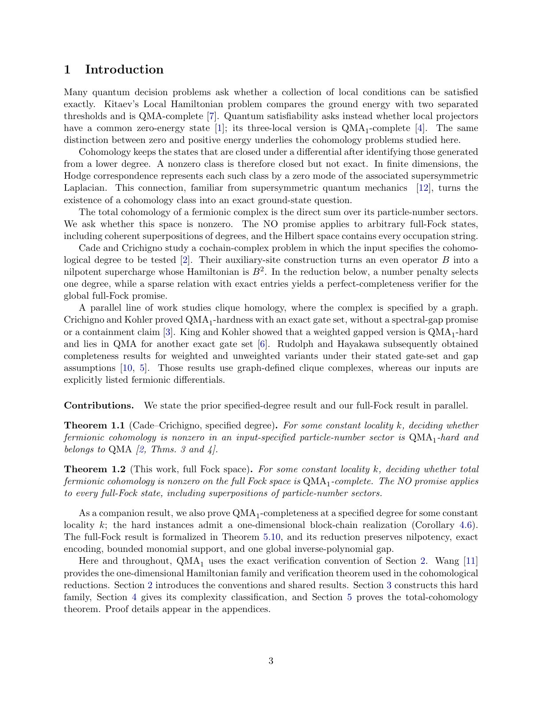 
Low-resolution page preview, page 3

📷 Fig 3

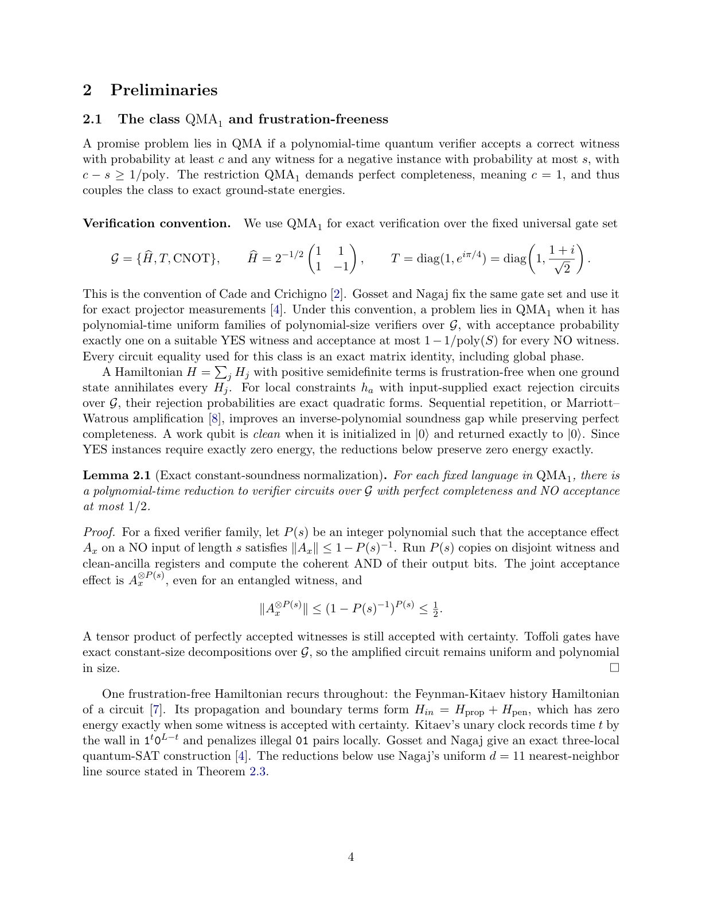 
Low-resolution page preview, page 4

📷 Fig 4

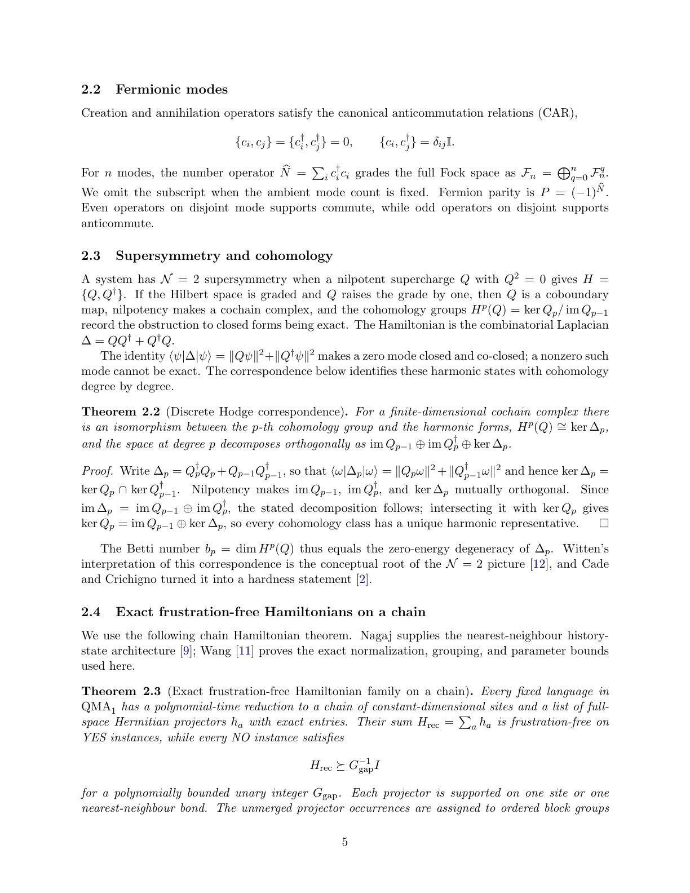 
Low-resolution page preview, page 5

📷 Fig 5

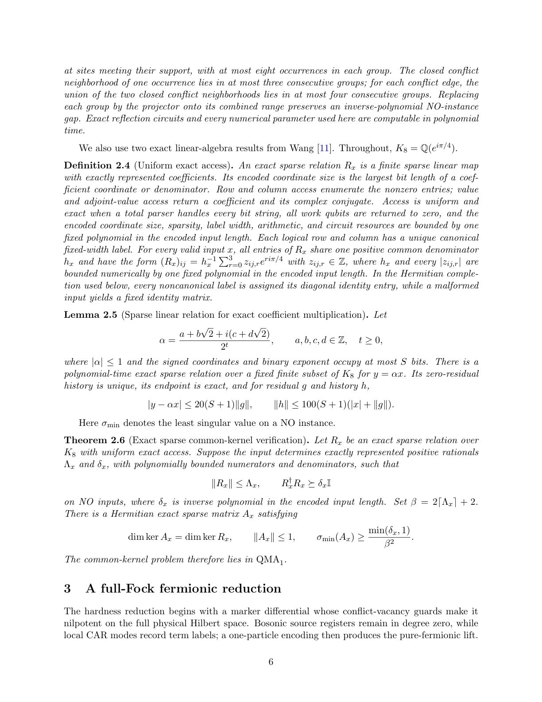 
Low-resolution page preview, page 6

**Summary.** This paper proves that determining the fermionic cohomology on the entire Fock space is $\mathrm{QMA}_1$-complete. It achieves this by mapping the physical problem onto a quantum computational hardness problem using advanced techniques involving differential operators and number-penalized lifts. This result establishes a fundamental computational barrier for solving zero-energy state problems in fermionic quantum systems.

**Why it may be interesting.** This work connects abstract algebraic topology (cohomology) in quantum many-body systems directly to the computational complexity class $\mathrm{QMA}_1$, providing a powerful tool for classifying the hardness of ground-state problems in quantum physics.

Detailed structure

**Main problem.** The paper addresses the computational complexity of determining if the fermionic cohomology is non-zero on the entire, full Fock space.

**Main result.** The global fermionic cohomology problem on the full Fock space is proven to be $\mathrm{QMA}_1$-complete.

**Method.** The proof involves constructing a reduction from known $\mathrm{QMA}_1$-hard problems by lifting the problem structure to the full Fock space using number-penalized techniques and analyzing the resulting Laplacian operator.

**Model / system.** The system involves fermionic differential operators ($D$) acting on the full Fock space ($\mathcal{F}n$), which are related to the zero-energy states of an associated supersymmetric Hamiltonian. The structure is built upon marker differentials and data block encoding.

**Key observables.** The Betti number ($b_p$), which equals the zero-energy degeneracy of the Laplacian ($\Delta_p$), and the existence of non-zero cohomology classes.

**Important parameters / regimes.** The complexity class $\mathrm{QMA}_1$, the maximum number of modes a monomial acts on (e.g., $\le 41$), and the gap ($\delta$) in the Hamiltonian spectrum.

**Assumptions / limitations.** The analysis relies on the exact verification convention of $\mathrm{QMA}_1$ and the ability to construct specific, sparse, and well-conditioned residual relations ($eR_ullet$).

**Figures summary.** The notes do not describe figures, but reference theorems and lemmas that establish the mathematical machinery for the complexity proof.

**Paper structure.** The paper progresses from defining the physical problem (cohomology) to establishing the complexity class (QMA1) by first analyzing the specified-degree case, and finally generalizing the result to the full-Fock space using number-penalized lifts and explicit encoding schemes.

Abstract

Fermionic cohomology characterizes the zero-energy states of the supersymmetric Hamiltonian associated with a fermionic differential. Previous work showed that the problem restricted to a particle-number sector specified with the input is $\mathrm{QMA}_1$-hard and belongs to $\mathrm{QMA}$. We study the global problem, in which no sector is specified and cohomology may occur anywhere in the full Fock space. This formulation directly matches the whole-space ground-state question: a specified-degree NO instance may still have zero-energy states in another sector, whereas the global NO promise excludes them across all sectors and their superpositions. We prove that this full-Fock problem is $\mathrm{QMA}_1$-complete for differentials given as exact lists of local monomials, even when each monomial acts on at most $41$ modes. As a companion result, we prove $\mathrm{QMA}_1$-completeness for the specified-degree problem with $30$-mode terms whose hard instances admit a one-dimensional block-chain realization.

[↑ back to top](#top)

### [Understanding IR singularities in the Loop-Tree Duality](http://arxiv.org/abs/2609.00869v1)

**Authors:** Germán Rodrigo, Leandro Cieri, Prasanna K. Dhani, Roger J. Hernández-Pinto, Jorge J. Martínez de Lejarza, Salvador A. Ochoa-Oregon, Konstantinos Pyretzidis, Selomit Ramírez-Uribe, David F. Rentería-Estrada, Andrés E. Rentería-Olivo, José Ríos-Sánchez, German F. R. Sborlini, Surabhi Tiwari, Juan P. Uribe-Ramírez  
**Type:** theory · **Category:** quantum information and computing · **PDF:** <https://arxiv.org/pdf/2609.00869v1>  
**Analysis basis:** full PDF text, analyzed in chunks

📷 Fig 1

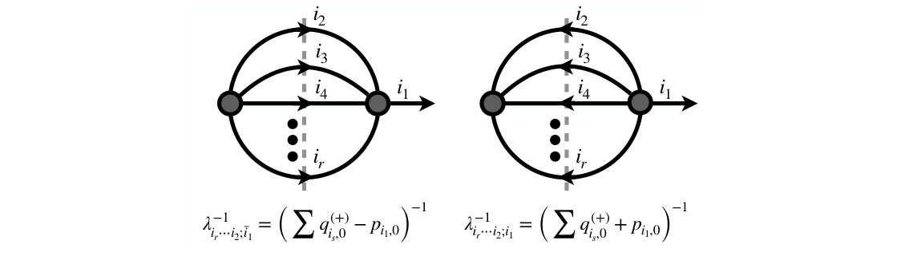 
Figure 1: Causal propagators representing configurations in which the momentum flows of the internal particles are aligned (left) or counter-aligned (right) with the external momentum. The line intersecting the internal particles divides the amplitude into two subamplitudes. The gray blobs represent any multiloop subgraphs. The right configuration is finite, assuming 𝑝𝑖1,0 &gt; 0.

📷 Fig 2

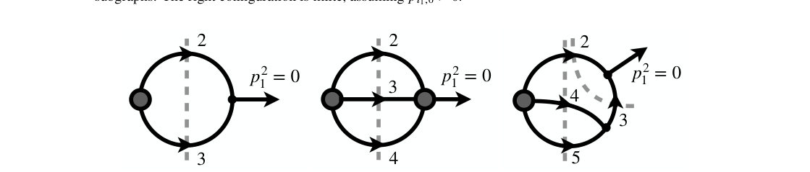 
Figure 2: Double collinear configuration 𝜆−1 32;¯1 = O(𝑘−2 ⊥), triple collinear configuration 𝜆−1 432;¯1 = O(𝑘−2 ⊥),

📷 Fig 3

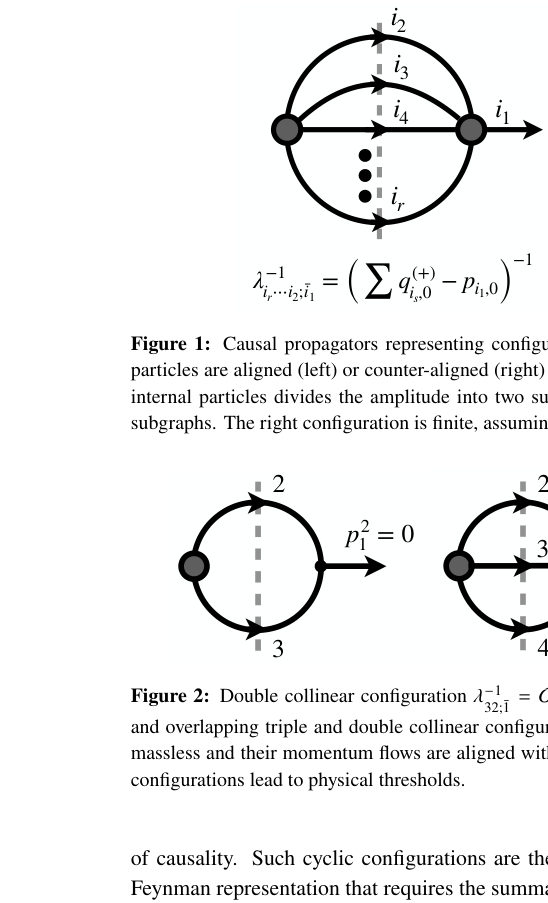 
Figure 1 provides a graphical interpretation of the causal propagator in Eq. (1). The momentum flows of the internal particles involved are always aligned or counter-aligned with the momentum of

📷 Fig 4

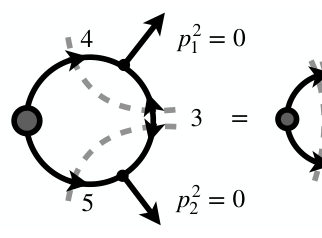 
Figure 3: Soft singularity:  𝜆45;12  𝜆43;1 + 𝜆53;2 −1 . The two collinear configurations on the left become compatible in the soft limit (𝜆3 →0).

📷 Fig 5

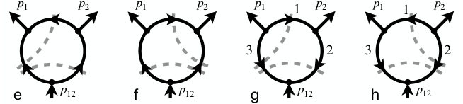 
Figure 4: The eight directed states of the one-loop three-point function: a) and b) are cyclic and therefore absent from the LTD representation; c) and d) are collinear; e) and f) are collinear, soft and threshold singular; g) and h) are finite.

**Summary.** This work details how Loop-Tree Duality simplifies the understanding of infrared and threshold singularities in complex quantum field theory calculations. It introduces a novel approach to construct finite scattering amplitudes by enforcing causal constraints. Furthermore, it provides a unique perspective by encoding this underlying causal structure using qubits and quantum circuits.

**Why it may be interesting.** While the core physics is QFT, the explicit mapping of the causal/singular structure onto qubits and quantum circuits provides a direct, novel application of quantum information concepts to high-energy theoretical physics calculations.

Detailed structure

**Main problem.** The paper addresses the complex theoretical challenge of understanding and constructing finite, infrared (IR) and threshold-free multiloop Feynman integrals in Quantum Field Theory.

**Main result.** The Loop-Tree Duality (LTD) provides a transparent framework for identifying these finite integrals, and the methodology can be mapped onto a quantum circuit structure using qubits.

**Method.** The authors review LTD, which reformulates loop integrations to explicitly handle singularities, and propose encoding the causal structure of the amplitudes using qubits and quantum circuits.

**Model / system.** The physical system is Quantum Field Theory (QFT) calculations involving multiloop scattering amplitudes. The mathematical framework utilizes Loop-Tree Duality (LTD) and is conceptually mapped onto quantum circuits.

**Key observables.** Infrared (IR) and threshold singularities, and the construction of finite, threshold-free scattering amplitudes.

**Important parameters / regimes.** Loop integration parameters, external and internal momenta, and the structure of causal propagators.

**Assumptions / limitations.** The LTD representation is assumed to inherently enforce causality by restricting configurations to acyclic paths, which is key to avoiding spurious singularities.

**Figures summary.** Figures illustrate causal propagators, examples of collinear configurations leading to physical thresholds, and the directed states of a one-loop three-point function distinguishing finite from singular configurations.

**Paper structure.** The paper reviews the LTD advantage in visualizing singularities, details novel strategies for constructing finite integrals (including pole vanishing conditions), and concludes by presenting a complementary perspective using qubits and quantum circuits to encode the causal structure.

Abstract

One of the main advantages of the Loop-Tree Duality representation of scattering amplitudes is that it makes the origin of infrared and threshold singularities particularly transparent. This talk reviews recent progress in describing how singularities emerge and cancel at the level of scattering and vacuum amplitudes, discusses a novel strategy to efficiently construct finite integrals, and presents a complementary perspective based on encoding the underlying causal and singular structure in terms of qubits and quantum circuits.

[↑ back to top](#top)

### [Uniform Hiding of Haar Block Transpose Gram Matrices](http://arxiv.org/abs/2609.01008v1)

**Authors:** Hongru Zhao  
**Type:** theory · **Category:** quantum information and computing · **PDF:** <https://arxiv.org/pdf/2609.01008v1>  
**Analysis basis:** full PDF text, analyzed in chunks

📷 Fig 1

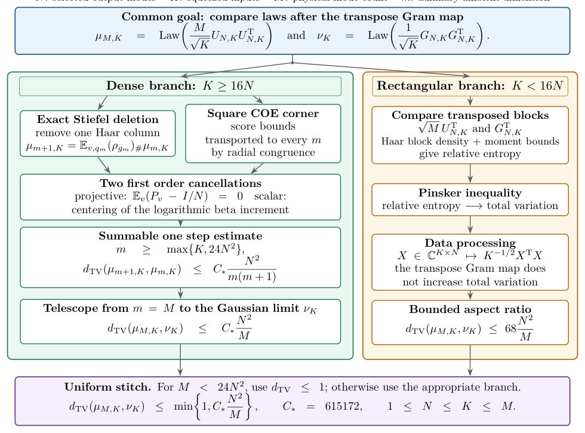 
FIG. 1. Proof architecture. The dense branch combines exact one column recursion, radial transport, centered COE scores, and telescoping. The rectangular branch uses a Haar block relative entropy bound and data processing. Their combination proves Theorem I.1.

📷 Fig 2

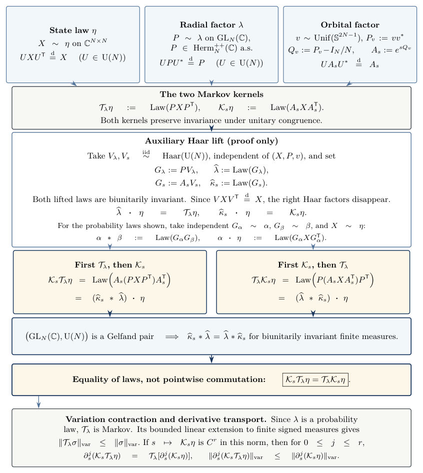 
FIG. 2. Random matrix realization of the Haar lift proof of Lemma III.2. Biunitary convolution and the Gelfand pair property give the probability law identity in Eq. (III.9). The bottom line records the separate Markov contraction and variation derivative transport in Eqs. (III.10) and (III.11).

📷 Fig 3

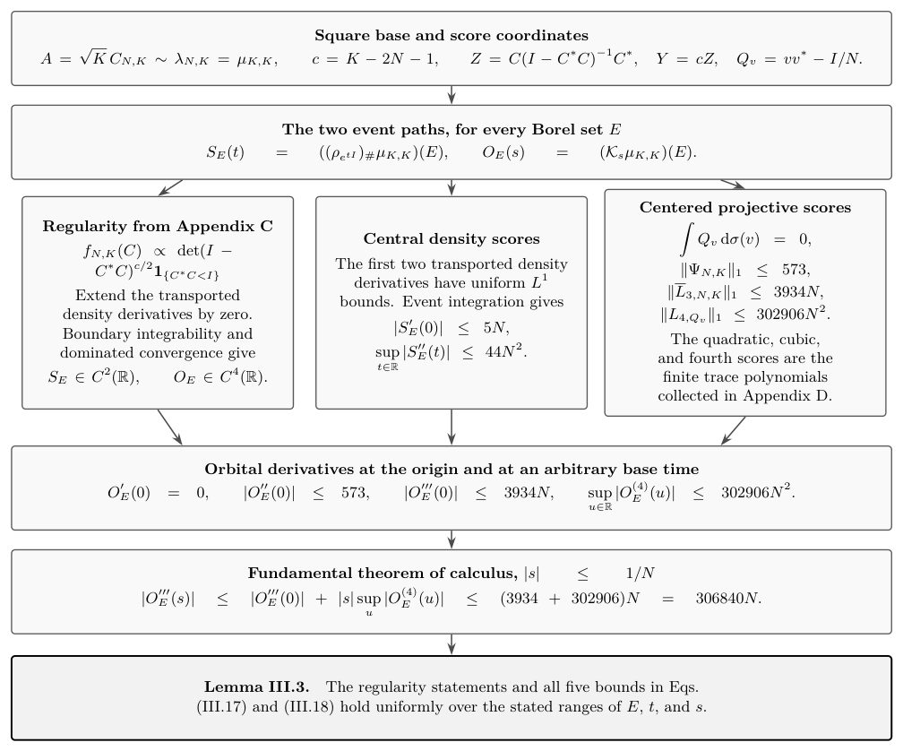 
FIG. 3. Proof flow for Lemma III.3. Appendix C supplies variation regularity for the scalar and orbital event paths. Appendix D evaluates their density scores by projective averaging and inverse Wishart moments. The final line propagates the third derivative bound from the origin to the full interval required in Eq. (III.18).

📷 Fig 4

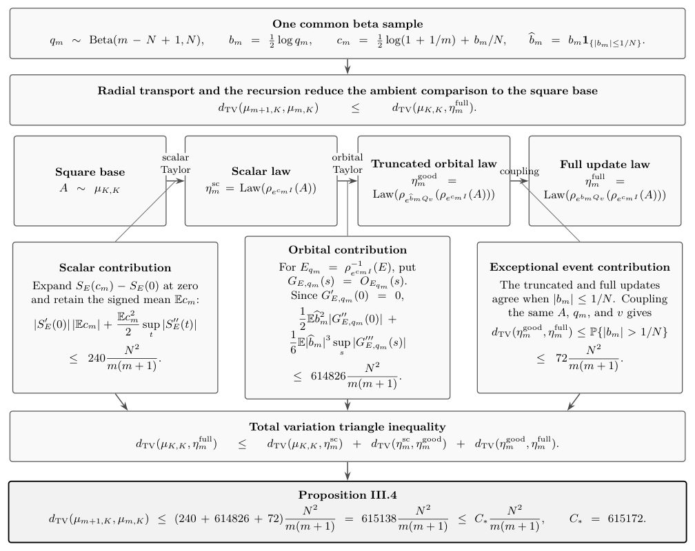 
FIG. 4. Eventwise Taylor decomposition used in Proposition III.4. The same beta sample defines the scalar shift, the centered orbital shift, and its truncation. Two intermediate laws expose the scalar Taylor contribution, the orbital Taylor contribution, and the exceptional event contribution before the total variation triangle inequality is applied.

**Summary.** This theoretical paper establishes a strong, quantifiable bound on the total variation distance between the probability distribution generated by a complex interferometer (Haar-derived) and a simple Gaussian reference distribution. By employing advanced random matrix theory and telescoping arguments, the authors show that this difference decays rapidly with the size of the system, providing a critical component for hardness arguments in quantum computation.

**Why it may be interesting.** This work provides a rigorous, quantifiable statement about the hardness of distinguishing the true quantum process (Haar-derived) from a classical Gaussian model, which is crucial for quantum security proofs.

Detailed structure

**Main problem.** The paper aims to prove a uniform total variation comparison (hiding) between the probability law of a complex symmetric transpose Gram matrix derived from a Haar interferometer and its corresponding complex Gaussian reference law.

**Main result.** The total variation distance between the two probability laws is bounded by an explicit error term, $\delta_{M,N}$, which is quadratic in the number of selected output modes ($N$) and inversely proportional to the interferometer size ($M$).

**Method.** The proof combines advanced random matrix theory techniques, including centered circular orthogonal ensemble (COE) score analysis, rectangular relative entropy bounds, and a telescoping argument across ambient dimensions.

**Model / system.** The model is Gaussian Boson Sampling (GBS) implemented with squeezed vacuum states entering a passive interferometer, where the probability is governed by the squared hafnian of a complex symmetric product.

**Key observables.** The probability distribution governed by the transpose Gram product ($	ext{Y Y}^T$), and the total variation distance ($	ext{dTV}$) between the Haar-derived law and the Gaussian law.

**Important parameters / regimes.** N (selected output modes), K (squeezed inputs), M (physical mode count). The result is uniform for $N \le K \le M$.

**Assumptions / limitations.** The analysis assumes the pure, zero-displacement setting and specifically compares the ordinary transpose ($	ext{Y Y}^T$) rather than the Hermitian product ($	ext{Y Y}^*$).

**Figures summary.** Figure 1 summarizes the proof architecture combining ambient recursion, COE scores, and rectangular comparison. Other figures illustrate the Haar lift, Markov contraction, and density score evaluation steps.

**Paper structure.** The paper builds the result by first establishing regularity and finite bounds for event paths (Lemma III.3), then deriving a one-step bound on the total variation distance ($	ext{dTV}(\mu_{m+1,K}, \mu_{m,K})$) via a Taylor decomposition (Proposition III.4), and finally telescoping this one-step bound to achieve the overall final bound.

Abstract

Gaussian boson sampling with equally squeezed active inputs assigns collision free probabilities through a complex symmetric transpose Gram matrix formed from a rectangular block of a Haar interferometer. We prove a finite total variation comparison with the corresponding complex Gaussian transpose Gram law. The error bound is explicit, quadratic in the number of selected output modes, inversely proportional to the interferometer size, and uniform in the number of squeezed active inputs. The proof combines a centered circular orthogonal ensemble score analysis in the dense regime with a rectangular relative entropy bound. This result supplies a random matrix replacement component of Gaussian boson sampling hardness arguments.

[↑ back to top](#top)

## Secondary cond-mat archives

*Papers from  mes-hall, other, soft, supr-con. These archives are de-prioritized — they appear at the end regardless of relevance score.*

### Relevant in secondary archives (28)

### [Spatio-temporal coherent molding and retrieval of pulsed signals in optical waveguides](http://arxiv.org/abs/2609.00856v1)

**Authors:** Nika Durishvili, Ramaz Khomeriki, Vakhtang Jandieri, Douglas H. Werner, Daniel Erni, Jamal Berakdar  
**Type:** theory · **Category:** other · **PDF:** <https://arxiv.org/pdf/2609.00856v1>  
**Analysis basis:** full PDF text, analyzed in chunks
**Topic relevance:** `analog quantum simulation` **3/5** · `interference shaping light` **3/5** · `correlated / nonlocal dissipation` **2/5** · `driven-dissipative phase transition` **2/5** · `methods for driven-dissipative` **2/5** · `Keldysh / 2PI / non-Gaussian methods` **1/5** · `non-equilibrium universality` **1/5** · `quantum measurements` **1/5**

📷 Fig 1

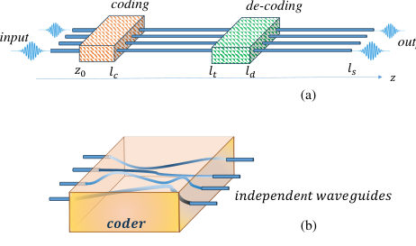 
Fig. 1. (a) Schematics for coding (from z = z0 to z = lc) and decoding (from z = lt to z = ld) device. (b) The coder and decoder are composed of the coupled waveguides. The pulses are injected in independent waveguides at z &lt; z0. Coupling causes the power to randomly distribute at z = lc, encrypting the input signal. The pulses are transferred to the decoder at z = lt via independent transmission lines. At z = lt the signal is decoded according to the scheme in the manuscript.

📷 Fig 2

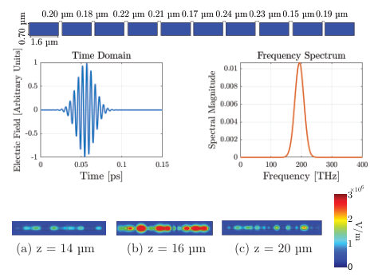 
Fig. 2. First row: schematic showing the cross section of a 3-D optical rectangular dielectric waveguide array. Geometrical parameters and separation distance of ten identical waveg- uides are indicated. The relative dielectric permittivities of the waveguides and the background medium are ε1r = 3.9050 and εsr = 2.0851, respectively. Second row: Gaussian pulse employed in the simulations with a wavelength 1.55 µm and its Fourier transform. Broadband pulses are injected into the 2nd, 5th, 7th and 8th waveguides, which are arbitrarily chosen. Third row: cross-sectional electric field distributions in the en- tire system for the propagation distances: z = 14µm, z = 16µm and z = 20µm at the...

📷 Fig 3

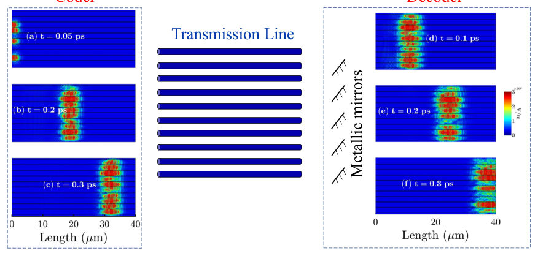 
Fig. 3. Electric field magnitude distribution of the signal propagation in the waveguide array for the coder and decoder. At t = 0 initial Gaussian pulses are injected into the 2nd, 5th, 7th and 8th ports (c.f. Fig. 1). The wavelength of the Gaussian pulse is λ = 1.55µm and the pulse duration is 18 fs. The graphs (a)-(c) show the evolution of the signal for different times from t = 0.05ps to t = 0.3ps in the coder. In practice, the encrypted signal is decoupled and transmitted to the decoder via independent transmission lines. Phase-modifying metamaterials or perfectly reflecting mirrors, such as protected metallic (silver) mirrors, may be used to achieve the required phase shifts. (d-f)...

📷 Fig 4

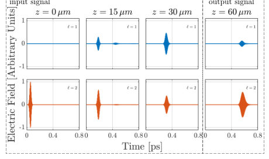 
Fig. 4. Time evolution of the pulsed input signal at different cross sections in the individual waveguides labelled by ℓ. Far right column shows the output signal from the decoder.

📷 Fig 5

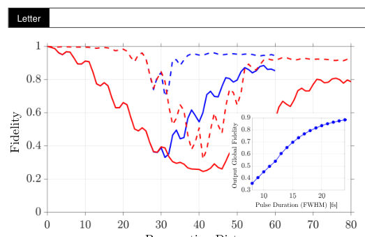 
Fig. 5. Global fidelity (solid lines) and phase fidelity (dashed lines) as a function of z for two different lengths of the coder/decoder: L = 30µm (blue) and L = 40µm (red). Pulse duration is 18 fs. An inset shows a dependence of the output global fidelity on the pulse duration at L = 40µm.

**Summary.** This paper presents a method to retrieve an input optical signal that has been encoded and propagated through a complex, coupled waveguide array. The retrieval mechanism relies on introducing a precise, engineered phase shift at the output section (decoder). Simulations confirm that this approach allows for high-fidelity signal reconstruction, suggesting applications in ultrafast coherent information processing.

**Why it may be interesting.** This work directly addresses coherent control and signal processing in structured photonic media, which has strong overlap with quantum optics and open quantum system dynamics, particularly regarding time-reversal concepts.

Detailed structure

**Main problem.** The core challenge is retrieving a phase-encrypted input optical signal with high fidelity after it has undergone complex, coherent propagation through an array of coupled waveguides.

**Main result.** The proposed scheme successfully demonstrates the retrieval of the input broadband signal using a localized phase-shifting mechanism in the decoder section of the waveguide array.

**Method.** The retrieval is achieved by applying a specific, engineered phase shift ($\pi$ shift in odd waveguides) at the decoder entrance, which theoretically causes a coherent inversion of the propagation evolution.

**Model / system.** The system utilizes an array of coupled dielectric waveguides, modeled by a discrete Schrödinger-type equation describing the evolution of the electric field components along the propagation direction (z).

**Key observables.** Global fidelity ($F_{gl}$) and phase fidelity ($F_{ph}$) are used to quantify the success of signal retrieval, alongside cross-sectional electric field distributions.

**Important parameters / regimes.** Key parameters include coupling strengths ($J_\ell$), dielectric permittivities ($\epsilon_{r1}, \epsilon_{sr}$), and the pulse characteristics ($\lambda = 1.55 \mu	ext{m}$, 18 fs duration).

**Assumptions / limitations.** The analysis relies on the ability to implement precise, engineered phase shifts at the decoder and assumes the weak-coupling regime for the waveguide array.

**Figures summary.** Figures illustrate the schematic setup of the coder and decoder, the evolution of the electric field magnitude through the system, and plots showing the fidelity versus propagation distance.

**Paper structure.** The paper first establishes the physical problem in coupled waveguides, develops the theoretical framework using coupled-mode equations, proposes the phase-shifting retrieval concept, and validates the scheme using full-wave electromagnetic simulations.

Abstract

Optical waveguides are key elements for high fidelity, long distance optical communications. Coupled waveguide arrays allow for higher information density, steerting the propagation direction, and for encoding information. However, due to the mixing of relative phases for short pulses containing multiple waveguide-mode frequencies, a process for retrieving an encoded input state once these signals undergo coherent propagation remains elusive. A concept is presented to extract with high fidelity the phase-encrypted input signal from spatio-temporal propagated states. As a realization, an array of coupled waveguides is suggested with the retrieval mechanism being realized by local phase shifts that comply with the identified retrieval concept. Three dimensional full-wave electromagnetic simulations for broadband optical signals in coupled dielectric waveguides confirm the validity of the scheme and the high fidelity of information retrieval pointing to potential applications, for instance in ultrafast coherent coding and decoding of information imprinted on pulse sequences.

[↑ back to top](#top)

### [Cavity-control of Majorana bound states in superconductor-semiconductor heterostructures](http://arxiv.org/abs/2609.00926v1)

**Authors:** Francesco Buonemani, Massimo Balmelli, Olesia Dmytruk  
**Type:** theory · **Category:** other · **PDF:** <https://arxiv.org/pdf/2609.00926v1>  
**Analysis basis:** full PDF text, analyzed in chunks
**Topic relevance:** `analog quantum simulation` **3/5** · `Tavis-Cummings & cavity-many-emitter` **2/5** · `Keldysh / 2PI / non-Gaussian methods` **1/5** · `driven-dissipative phase transition` **1/5** · `methods for driven-dissipative` **1/5**

📷 Fig 1

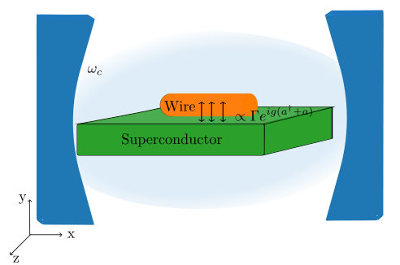 
FIG. 1. Scheme of a setup: Quantum wire (in orange) aligned along x tunnel coupled with amplitude Γ to a bulk su- perconductor (in green) embedded in a single mode photonic cavity (in blue) with frequency ωc. Tunneling amplitude Γ is dressed by a phase Γeig(a+a†) that arises from photonic vector potential aligned along y direction.

📷 Fig 2

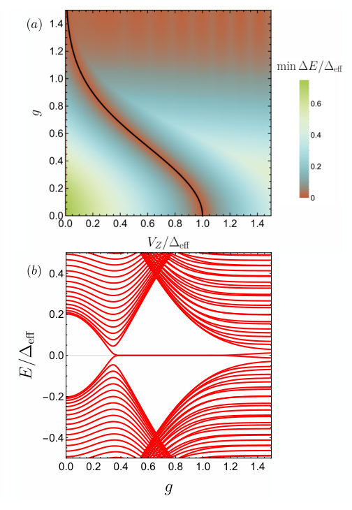 
FIG. 2. (a) Topological phase diagram and bulk gap of the proximitized wire embedded in a cavity as a function of Zee- man energy VZ/∆eff and light-matter coupling g. For g = 0, we recover the phase boundary of the isolated nanowire, with the topological phase transition occurring at VZ = ∆eff. For g smaller than the critical value gc the system is gapped ex- cept at the topological gap closing at k = 0 (black solid line) given by Eq. (9). The bulk gap increases when moving away from the phase boundaries. For g &gt; gc the superconducting pairing is suppressed and system becomes gapless. (b) Energy spectrum of a finite-length proximitized wire embedded in a cavity as a function of g for...

📷 Fig 3

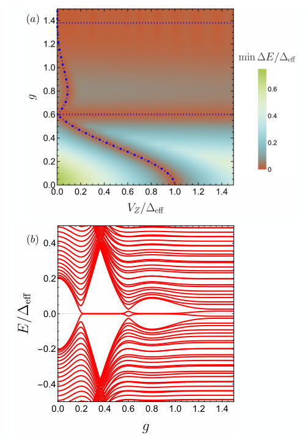 
FIG. 3. (a) Topological phase diagram and bulk gap of the proximitized wire coupled to photons as a function of VZ/∆eff and g. Gap closing at k = 0 is given by Eq. (11) and corre- sponds to the phase boundary between topological and trivial phases (blue dotdashed line). Blue dotted lines correspond to the gap closing when ∆effJ0(4g√n) = 0 corresponding to the suppression of the superconducting pairing that is indepen- dent of VZ. This gap closing at gb does not change the phase of the system, but reduces the bulk gap. For g &gt; gc the system becomes gapless. (b) Energy spectrum as a function of g for VZ/∆eff = 0.8. The spectrum is obtained via nu- merical diagonalization of the effective...

📷 Fig 4

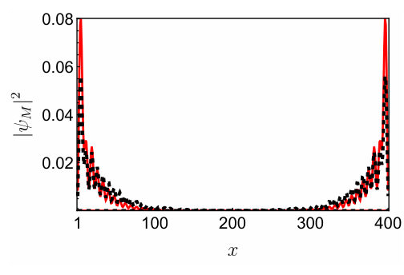 
FIG. 4. Probability density |ψM|2 of the MBSs on the site x for different values of the light-matter coupling strength g and fixed value of Zeeman energy VZ/∆eff = 0.8. For gt &lt; g = 0.5 &lt; gb (red solid line), the system is in the topological phase, and the MBSs are localized at opposite ends of the wire. For gb &lt; g = 0.8 &lt; gc (black dashed), the near zero-energy modes remain localized at the ends of the wire even after the bulk gap closes due to the suppression of the superconducting pairing when ∆effJ0(4g√n) = 0. The MBS amplitude is smaller for g = 0.8 than for g = 0.5 that reflects the suppression of the bulk gap with increasing light-matter coupling, as shown in Fig. 3. Other parameters...

📷 Fig 5

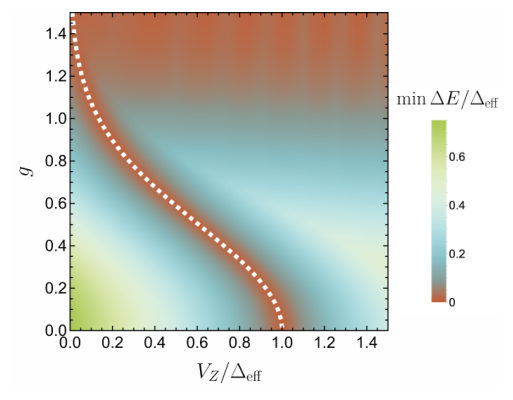 
FIG. 5. Topological phase diagram and bulk gap of the prox- imitized wire embedded in a cavity obtained from numerically solving Eq. (17) as a function of Zeeman energy VZ/∆and light-matter coupling g. The bulk gap closes for g &lt; gc at the topological phase boundary given by Eq. (18) (dashed white line). The size of the bulk gap increases away from the phase boundary, but for large values of g &gt; gc the gap vanishes for all values of VZ, signaling a transition to a gapless phase. The photonic cutoff is set to be lmax = 10 and other parameters are the same as in Fig. 2.

**Summary.** This theoretical study analyzes Majorana bound states in a superconductor-semiconductor nanowire coupled to an optical cavity. By solving the coupled electron-photon Hamiltonian, the authors show that the cavity interaction modifies the topological phase diagram, enabling the topological state to be accessed at lower external magnetic fields than previously thought possible.

**Why it may be interesting.** This work directly combines concepts from cavity QED (light-matter coupling) with topological superconductivity, which is a major area of research in AMO physics and quantum optics.

Detailed structure

**Main problem.** The paper theoretically investigates how coupling Majorana bound states (MBSs) in a superconductor-semiconductor heterostructure to a single-mode photonic cavity modifies the system's topological phase diagram.

**Main result.** Cavity coupling shifts the phase boundary to smaller Zeeman energies, and even weak coupling allows entering the topological phase at lower critical Zeeman energies than the uncoupled case.

**Method.** The authors derived an effective light-matter Hamiltonian and solved the coupled electron-photon system using exact diagonalization, high-frequency expansion, and mean-field decoupling.

**Model / system.** The model is a hybrid platform: a 1D quantum wire tunnel-coupled to an s-wave superconductor, all embedded within a single-mode photonic cavity. The coupling enters the effective superconducting pairing term.

**Key observables.** Topological phase boundary, gap closing, effective superconducting pairing strength.

**Important parameters / regimes.** Light-matter coupling strength (g), Zeeman energy ($V_Z$), number of photons (n).

**Assumptions / limitations.** The photonic vector potential is aligned along the tunneling direction, and the analysis uses approximations for the photon number (e.g., dark cavity limit or semiclassical limit).

**Figures summary.** Figure 1 illustrates the physical setup (wire-superconductor-cavity). Figure 2(a) shows the topological phase diagram dependence on $V_Z/\Delta_{eff}$ and $g$ for the dark cavity limit.

**Paper structure.** The paper establishes the coupled Hamiltonian, derives the effective wire-cavity Hamiltonian, and then applies various mathematical techniques (exact diagonalization, etc.) to calculate the phase diagram and analyze the impact of coupling strength.

Abstract

We theoretically study a hybrid superconductor-semiconductor platform hosting Majorana bound states coupled to a single mode photonic cavity. Starting with a one-dimensional wire coupled to a bulk $s$-wave superconductor embedded in a photonic cavity, we derive an effective light-matter Hamiltonian for such a platform. Assuming that the photonic vector potential is aligned along the tunneling between a wire and a superconductor, we find that the cavity coupling enters only in the effective superconducting pairing term. By solving the coupled electron-photon Hamiltonian using different approaches, such as exact diagonalization in case of zero or large number of photons, high-frequency expansion, and mean-field decoupling, we find that the phase boundary between the topological trivial phases is shifted to smaller values of the Zeeman energy compared to the uncoupled case. Cavity embedding has the strongest effect on the phase diagram in the semiclassical regime, corresponding to a large number of photons. In all cases, we find that at large values of the light-matter coupling strength the effective superconducting pairing is suppressed, driving the system into the gapless phase. We demonstrate that even small light-matter coupling strength allows for entering the topological phase at values of the Zeeman energy compared to the uncoupled platform.

[↑ back to top](#top)

### [Interferometry reveals spin-singlet fractional quantum Hall edges in graphene](http://arxiv.org/abs/2609.01233v1)

**Authors:** R. Ayache, K. Kim, M. Kuiri, Q. Benichou, H. Chakraborti, L. Pugliese, K. Watanabe, T. Taniguchi, H. -S. Sim, P. Roulleau  
**Type:** both · **Category:** strongly correlated electrons · **PDF:** <https://arxiv.org/pdf/2609.01233v1>  
**Analysis basis:** full PDF text, analyzed in chunks
**Topic relevance:** `interference shaping light` **3/5** · `quantum measurements` **3/5** · `analog quantum simulation` **2/5**

📷 Fig 1

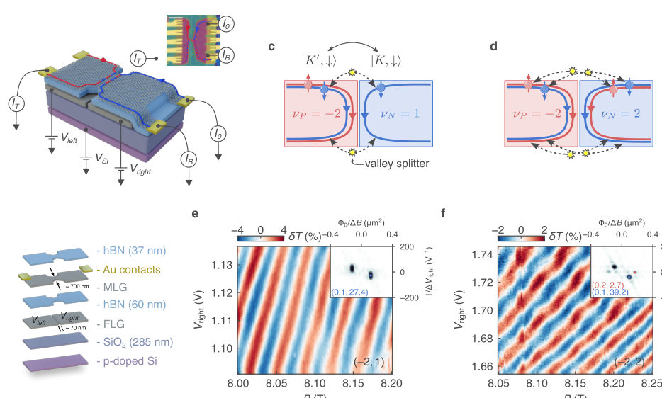 
FIG. 1. Interferometric spin access in the integer QH regime. a,b, Schematic of the device. Monolayer graphene is encapsulated in hBN and placed on a patterned graphite gate split into two electrically isolated halves. Gate voltages Vleft and Vright independently tune the filling factors νP and νN in the left and right graphene regions, respectively. The graphite gates are separated by a 70 nm slit, while the carrier density is further fine-tuned by the doped Si/SiO2 (285 nm) back gate. The graphene is additionally etched above the slit, forming a 700 nm-wide constriction. c,d, Edge-channel configurations for (νP, νN) = (−2, 1) in c and (−2, 2) in d. e,f, AB oscillations of the differential...

📷 Fig 2

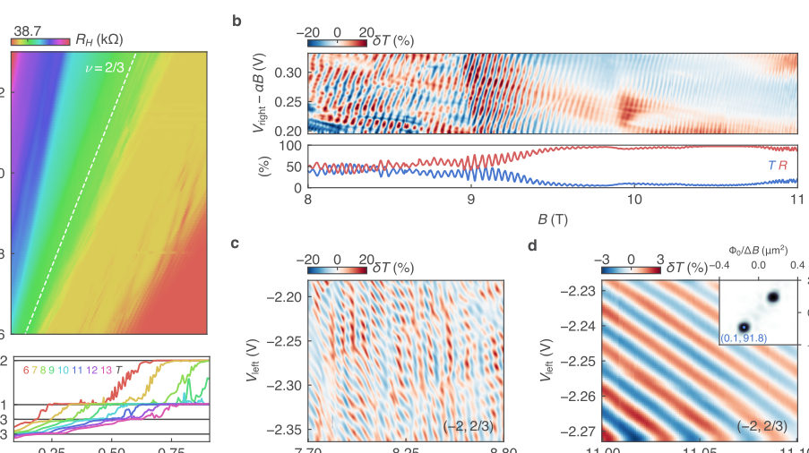 
FIG. 2. Spin transition of the 2/3 edge. a, Upper panel: Two-point Hall resistance RH measured on the right side of the graphene device as a function of B and Vright. The νN = 2/3 state becomes well developed for B &gt; 6 T and is visible as a green region. Lower panel: Corresponding Hall conductance σH measured at selected magnetic fields. b, Upper panel: Differential transmission δT through the p-n junction at (νP, νN) = (−2, 2/3) as a function of B and the compensated gate voltage Vright −αB, with α ≈0.124 V/T accounting for the magnetic-field-induced shift of the 2/3 plateau. A sharp change occurs near B ≈9.5 T: The interference visibility is reduced and the pattern evolves from multiple...

📷 Fig 3

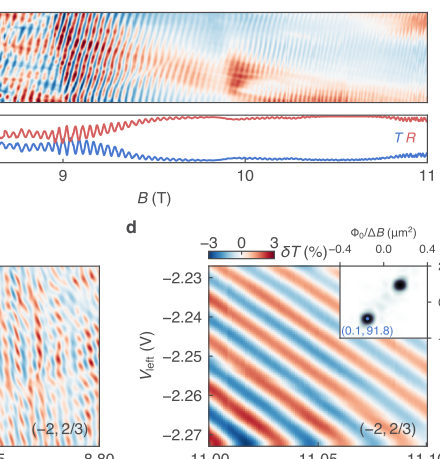 
Figure 4b shows the expected interface channels at (νP, νN) = (−2, 2/3) in the spin-unpolarized regime. In the n region, an interface channel forms between the νN = 2/3 and ν = 0 regions. This channel is pre- dicted [12–15] to host a downstream charge mode and an upstream charge-neutral spin mode, hallmarks of spin- charge separation, when SU(2) symmetry is preserved. The resulting interferometer is not a conventional single-

📷 Fig 4

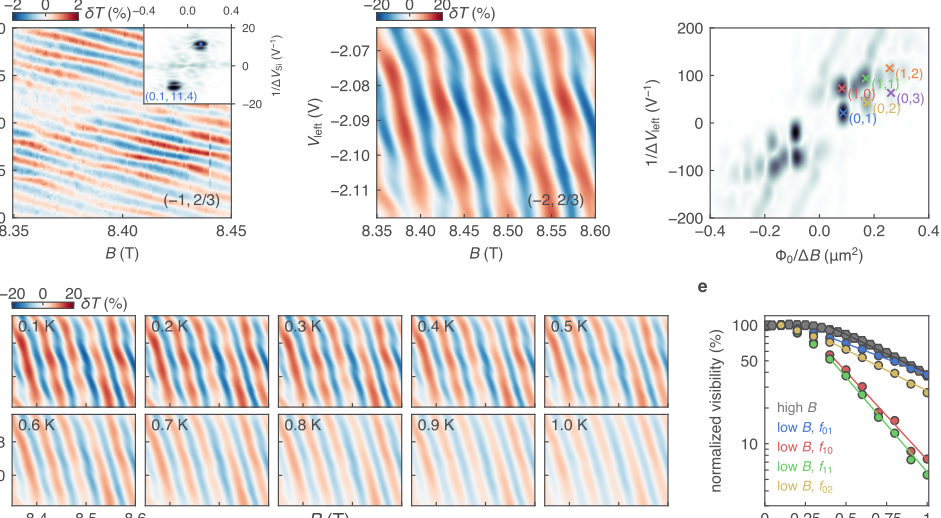 
FIG. 3. Interference signatures of the spin-unpolarized νN = 2/3 edge. a, AB oscillations in the (νP, νN) = (−1, 2/3) regime at low magnetic fields, as a function of B and silicon-gate voltage VSi. Inset: FFT of the oscillations showing a single frequency (Φ0/∆B, 1/∆VSi) = (0.121 µm2, 11.4 V−1). b, AB oscillations at (νP, νN) = (−2, 2/3). c, FFT of the oscillations in b, showing multiple frequencies that are linear combinations of two frequencies f10 = (0.082 µm2, 72.8 V−1) and f01 =  fB/Φ0, fVleft  = (0.087 µm2, 21.2 V−1), labelled (1, 0) and (0, 1), respectively. Higher-order frequencies, labelled (n, m), satisfy fnm = nf10 + mf01. d, Temperature dependence of the AB oscillations under...

📷 Fig 5

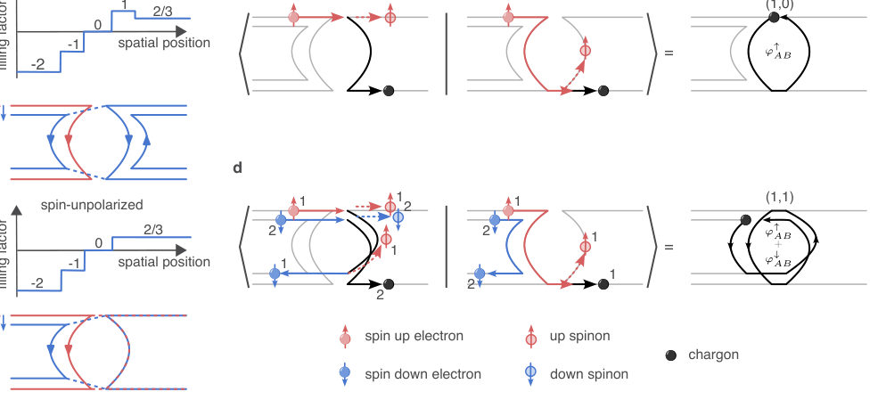 
FIG. 4. Theoretical model. a,b, Spatial variation of the filling factor across the p-n interface (upper) and corresponding interface channels (lower panels) in the spin-polarized and unpolarized regimes for (νP, νN) = (−2, 2/3). Spin-up and spin-down channels are shown in red and blue, respectively, while the spin-unpolarized fractional channel is shown as alternating red and blue dashed lines. Electron tunneling between channels is depicted by dotted lines. c, An interference process contributing to f10 in the spin-unpolarized regime. The first two panels depict the interfering subprocesses, while the third shows their interference with a single winding. In each subprocess, a spin-up...

**Summary.** This work reports on using Aharonov-Bohm interferometry in graphene to directly probe the spin structure of fractional quantum Hall edge states. By coupling the target FQH edge to a spin-polarized probe, the researchers distinguish between spin-unpolarized and spin-polarized regimes of the $\nu=2/3$ state. This establishes edge transport as a key diagnostic tool for understanding spin-singlet topological orders.

**Why it may be interesting.** The ability to probe spin degrees of freedom in topological edge states using interferometry provides a powerful experimental tool for studying exotic quantum phases, which is highly relevant to understanding strongly correlated electron systems.

Detailed structure

**Main problem.** The study aims to develop a spin-sensitive probe to characterize the spin-singlet topological order present in fractional quantum Hall (FQH) edge states, particularly the $\nu=2/3$ state.

**Main result.** The authors successfully identified the spin-unpolarized and spin-polarized regimes of the $\nu=2/3$ edge state using Aharonov-Bohm interferometry, confirming the existence of spin-charge separation effects.

**Method.** The primary method involves using a p-n junction to couple a target FQH edge state to a probe integer QH state, forming an Aharonov-Bohm interferometer whose interference pattern is spin-dependent.

**Model / system.** The system is graphene exhibiting FQH edge states. The theoretical analysis models the edge using boson fields and investigates the transition between $SU(2)$-symmetric (unpolarized) and broken symmetry (polarized) regimes.

**Key observables.** Aharonov-Bohm oscillation visibility, frequency components ($f_{nm}$), and the transition point in transmission ($\delta T$) between spin-unpolarized and spin-polarized states.

**Important parameters / regimes.** Filling factors ($\nu=2/3$), magnetic field ($B$), and the ratio of spin-up/spin-down coupling strengths.

**Assumptions / limitations.** The interference pattern is governed by spin matching between the probe and target channels; the theoretical analysis assumes specific velocity orderings and negligible intra-channel interactions.

**Figures summary.** Figures illustrate device schematics, AB oscillation measurements showing single/dual MZI frequencies, and theoretical models detailing the spin-charge separation and fractionalization into downstream/upstream components.

**Paper structure.** The paper moves from experimental demonstration of spin-sensitive probing via AB interferometry in graphene to theoretical analysis of the resulting interference patterns, confirming spin-charge separation and fractionalization across different symmetry regimes.

Abstract

The edge modes of spin-singlet fractional quantum Hall (FQH) phases are manifestations of multicomponent topological order and SU(2) spin symmetry. An archetype is the spin-unpolarized state at $ν$=2/3, whose edge is expected to host spatially coexisting yet counter-propagating charge and neutral spin modes. Despite efforts, its edge properties, including spin coherence and spin-charge separation, have remained elusive owing to the difficulty of resolving spins in FQH edge transport. Here, we develop a spin-sensitive probe of graphene FQH edges by using a p-n junction to interface a target FQH state with a probe integer quantum Hall (QH) state of opposite polarity. An Aharonov-Bohm (AB) interferometer forms along the interface, when the target and probe edge channels carry the same spin. We identify the spin-unpolarized and polarized edges of the $ν$=2/3 states at lower and higher magnetic fields, respectively, through spin-dependent interference. A novel multiparticle AB interference between two electrons of opposite spin emerges from spin-charge separation and recombination on the unpolarized edge, featuring a spin swap. Our results establish edge transport as a probe of spin-singlet topological orders, with implications for parafermion platforms in graphene-superconductor hybrids.

[↑ back to top](#top)

### [Antiresonances of Wannier-Stark ladders in Su-Schrieffer-Heeger lattices](http://arxiv.org/abs/2609.01363v1)

**Authors:** Yonatan Betancur-Ocampo, Guillermo Monsivais  
**Type:** theory · **Category:** other · **PDF:** <https://arxiv.org/pdf/2609.01363v1>  
**Analysis basis:** full PDF text, analyzed in chunks
**Topic relevance:** `Frenkel-Kontorova` **3/5** · `analog quantum simulation` **3/5** · `methods for driven-dissipative` **1/5**

📷 Fig 1

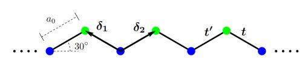 
Figure 1. Schematic diagram of the Su-Schrieffer-Heeger (SSH) lattice. Blue and green circles represent the two dis- tinct sublattices, with black lines indicating nearest-neighbor bonds of length a0. The vectors δ1 = a0  − √

📷 Fig 2

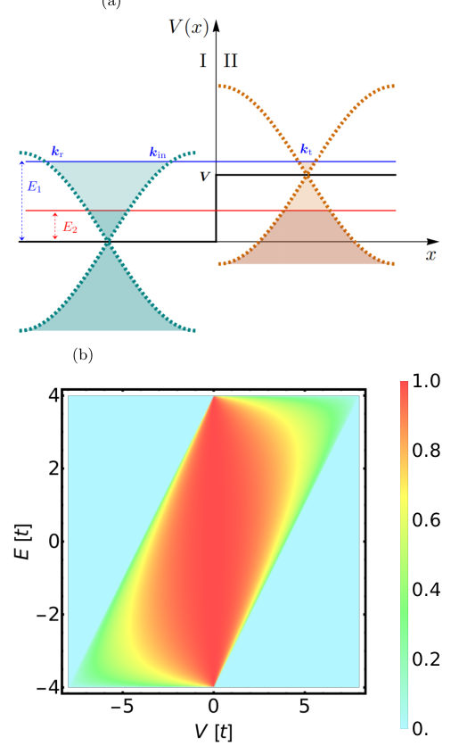 
Figure 2. (a) Electronic band structure of a pn junction (dashed green and orange curves) based on the SSH lattice. The potential step V (x) shifts the energy bands in region II (orange dotted curves) relative to region I (green dotted curves) by an energy V . The energy bands depend on the wave number and not the position. For illustrative purposes, we have drawn the shape of the dispersion relation in the po- tential V (x). The horizontal blue and red lines represent two different energy levels, E1 and E2, respectively. At E1, the blue line illustrates a transmission process within the conduc- tion bands, with the incident (kin), reflected (kr), and trans- mitted (kt) wave numbers...

📷 Fig 3

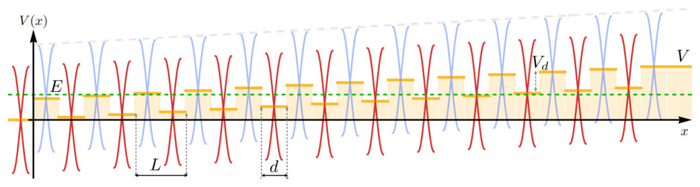 
Figure 3. Schematic diagram of the local electronic band structure in the SSH lattice under a stratified potential mimicking a Wannier-Stark profile. The potential step structure (orange blocks) features a spatial period L, well width d, and well depth Vd. Red and light-blue curves illustrate the local valence and conduction bands of the SSH lattice, which shift upward along the chain. The dashed green line indicates the Fermi level E, and V denotes the constant potential in the outgoing region. The set of parameters are d = 10 (in units of the lattice constant a = 1), L = 20, electron charge e = 1, the electric field F = 0.01, the Fermi level E = 1.9, and V0 = 1.4, and hopping parameters t...

📷 Fig 4

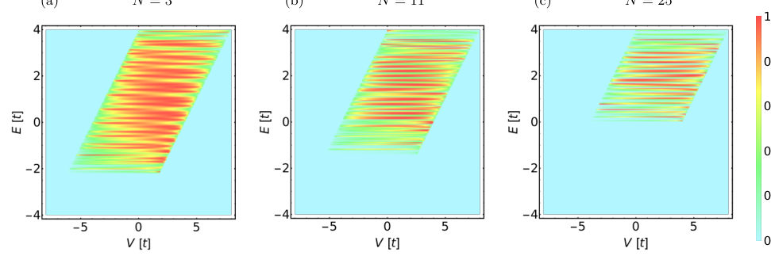 
Figure 4. Electron transmission through a Su-Schriefer-Heeger lattice in the presence of a stratified Wannier-like potential, shown as a function of the Fermi energy E and the potential in the last region V , for (a) N = 3, (b) N = 11, and (c) N = 25. The set of parameters values of the tight-binding and Wannier-like potential are the same than in Fig. 3.

📷 Fig 5

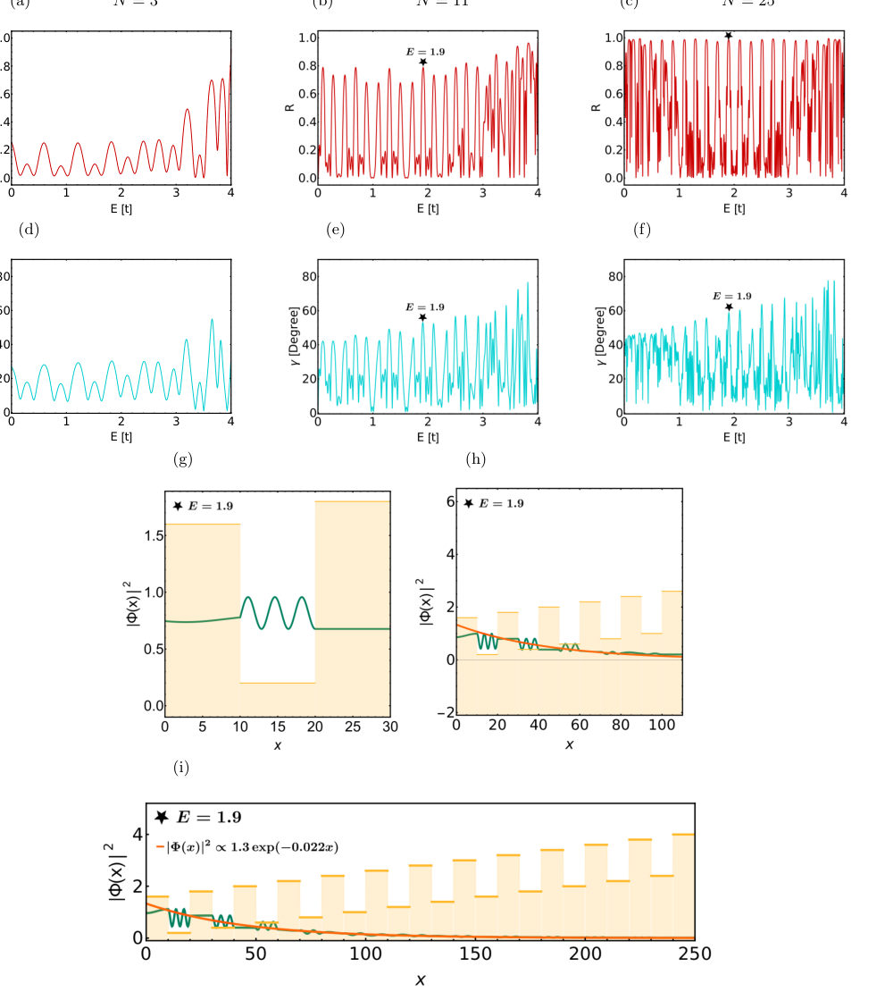 
Figure 5. (a)-(c) Reflection coefficient as a function of the energy E for N = 3, 11, and 25, the antiresonances are evidenced and their relative energy separation is FL = 0.2. (d)-(e) Relative pseudospin as a function of the energy E, obtained from Eq. (26), for the reflections presented in (a)-(c). (g)-(i) Squared wave function (Eq. (24)) calculated using the matching conditions across the Wannier-like potential for the structure depicted in (a)-(c). The set of parameters values of the tight-binding and Wannier-like potential are the same than in Fig. 3. The black star indicates one of the twenty antiresonances at energy E = 1.9.

**Summary.** This work analyzes quantum transport in SSH chains under an electric field, revealing that Wannier-Stark ladders appear as distinct antiresonance signatures in electron transmission. Using the Global Matrix Method, the authors show these antiresonances are linked to exponentially localized states. This provides a general tool for studying such phenomena across various condensed matter and wave physics systems.

**Why it may be interesting.** The connection between topological features (SSH model) and transport phenomena (antiresonances) under a bias field is highly relevant to open quantum systems and engineered quantum transport devices.

Detailed structure

**Main problem.** The paper demonstrates that Wannier-Stark ladders (WSLs) in Su-Schrieffer-Heeger (SSH) chains manifest as antiresonance signatures in electron transmission.

**Main result.** These WSL antiresonances are found to correspond to states that are exponentially localized at the potential's incident boundary, providing a unified framework for identifying such features.

**Method.** The Global Matrix Method (GMM) is employed to solve the Schrödinger equation for quantum transport across stratified electrostatic potentials.

**Model / system.** The system models quantum transport in a one-dimensional SSH chain subjected to a periodic potential profile combined with a uniform electric field.

**Key observables.** Electron transmission coefficient (T), reflection coefficient (R), and the relative pseudospin angle (gamma).

**Important parameters / regimes.** The electric field strength (F), hopping parameters (t, t'), and the energy (E) relative to the potential profile.

**Assumptions / limitations.** The analysis assumes wavefunctions are free of singularities when taking the limit epsilon -> 0.

**Figures summary.** Figures illustrate the SSH lattice structure, electronic band structure in junctions, and transmission spectra showing the characteristic antiresonances.

**Paper structure.** The paper introduces the SSH model and the problem setup, details the Global Matrix Method for calculating transmission, presents the main results showing the antiresonances, and concludes by generalizing the findings to other physical systems.

Abstract

We demonstrate that Wannier-Stark ladders (WSLs) in one-dimensional Su-Schrieffer-Heeger (SSH) chains manifest as antiresonance signatures in the electron transmission. We study the quantum transport in the SSH chain in the presence of a periodic potential profile plus a uniform electric field. By employing the global matrix method with non-trivial matching conditions, we find that these WSL antiresonances correspond to states that are exponentially localized at the potential's incident boundary. These findings provide a robust, unified framework for identifying WSLs across diverse scales, ranging from electronic transport in trans-polyacetylene to classical-wave analogs in phononic crystals and surface water waves.

[↑ back to top](#top)

### [Multiple chiral Majorana states in proximitized magnetic topological insulator heterostructures](http://arxiv.org/abs/2609.01243v1)

**Authors:** Alejandro S. Gómez, Rafael A. Molina, Pablo Burset, Yuriko Baba  
**Type:** theory · **Category:** other · **PDF:** <https://arxiv.org/pdf/2609.01243v1>  
**Analysis basis:** full PDF text, analyzed in chunks
**Topic relevance:** `analog quantum simulation` **3/5** · `Keldysh / 2PI / non-Gaussian methods` **2/5** · `methods for driven-dissipative` **2/5**

📷 Fig 1

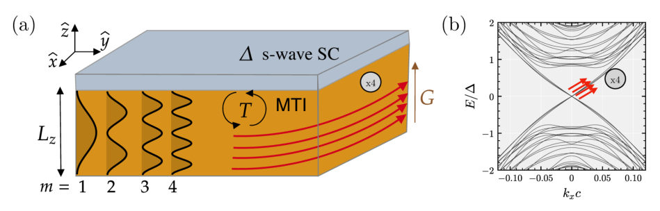 
Figure 1: Quantum-well origin of multiple chiral Majorana channels. (a) Schematic of a magnetically doped TI slab proximitized by an s-wave superconductor. Confinement along ˆz produces transverse modes m = 1, . . . , 4; the red arrows represent the resulting co-propagating chiral Majorana channels on a lateral boundary. (b) Low-energy BdG spectrum E/∆versus in-plane momentum kxc for a slab periodic along ˆx and finite along ˆy and ˆz, with Ly/c = 150 and Lz/c = 20. The red arrows highlight four co-propagating subgap branches on one boundary; the opposite boundary hosts the counter-propagating partners.

📷 Fig 2

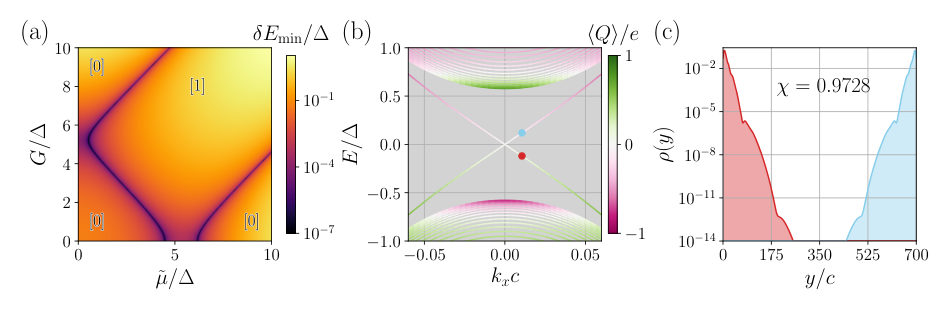 
Figure 2: Bulk phase diagram and chiral Majorana edge modes of the superconducting BHZ ribbon. (a) Bulk phase map in the dimensionless (˜µ/∆, G/∆) plane at fixed inversion- breaking term T/∆= 4.5. The colour scale shows the smallest absolute BdG eigenenergy δEmin/∆, obtained by numerical diagonalization, while the black contours are the analytical gap-closing boundaries of Eq. (3.2). The labels [|C|] indicate the absolute value of the region Chern number. (b) Spectrum of a ribbon periodic along ˆx and finite along ˆy, with width Ly/c = 700 for fixed (˜µ/∆, G/∆) = (1.0, 4.6). The bands are coloured by the normalized charge expectation ⟨Q⟩/e defined in Eq. (2.14). (c) Probability density ρ(y)...

📷 Fig 3

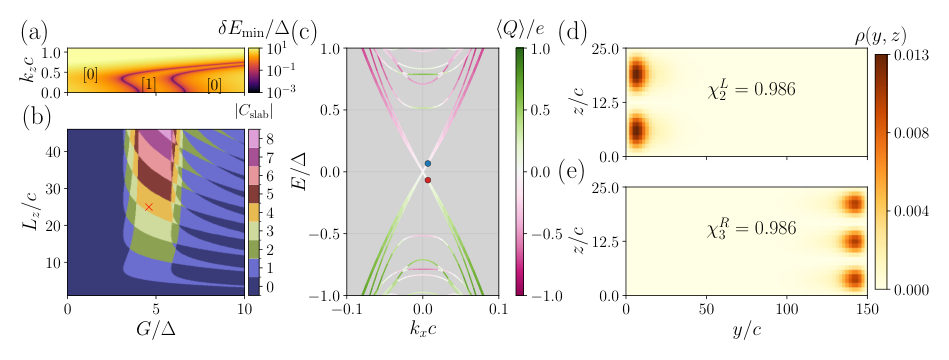 
Figure 3: High-Chern-number superconducting slab and representative Majorana modes. (a, b) Phase diagrams for the vertically stacked HBdG(k) with B = 0, Eq. (2.1), as a function of the dimensionless Zeeman field G/∆at fixed T/∆= 4.5. (a) Minimum bulk gap δEmin(kz, G)/∆as a function of the momentum kzc for a system periodic in all spatial directions, in a logarithmic color scale where dark contours indicate bulk gap closings. (b) Total Chern number |Cslab| for a slab with finite thickness Lz/c. The red cross marks the parameters G/∆= 4.6 and Lz/c = 25 used in panels (c-e). (c) Low-energy spectrum of the corresponding slab periodic along the ˆx direction and finite along ˆy and ˆz, with Ly/c...

📷 Fig 4

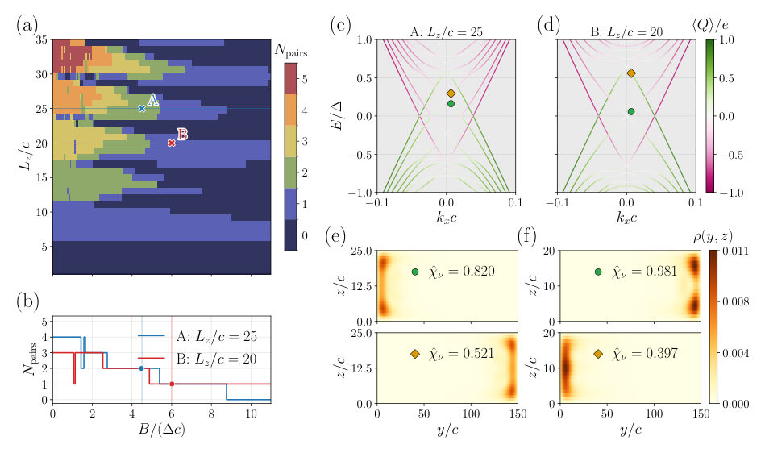 
Figure 4: Effect of the linear kz term on the multiplicity of Majorana pairs. (a) Numerical pair-count map as a function of slab thickness Lz/c and linear coefficient B/(∆c), for fixed Ly/c = 150, T/∆= 4.5 and |G|/∆= 4.6. The colour scale represents Npairs, obtained from the low-energy states at kxc ≃6.7 × 10−3. A state contributes to the count when its Majorana polarization satisfies ˆχν &gt; 0.5 and its charge expectation value obeys |⟨Q⟩| &lt; 0.1e. The blue and red crosses mark the representative points A and B. (b) Cuts of the map in panel (a) at the two selected slab thicknesses. Point A corresponds to B/(∆c) = 4.5, Lz/c = 25 and Npairs = 2, whereas point B corresponds to B/(∆c) = 6, Lz/c =...

📷 Fig 5

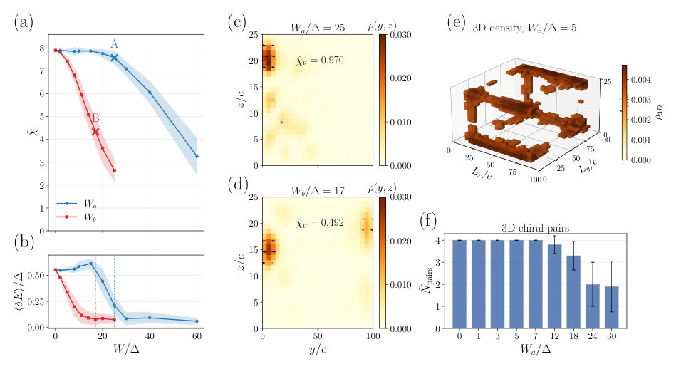 
Figure 5: Disorder response of chiral Majorana modes in a semi-infinite and fully finite slab. (a) Disorder evolution of the total edge Majorana polarization ˜χ, Eq. (6.2), for the two disorder channels δHa and δHb in Eq. (6.1). Solid lines show the mean value over 30 disorder realizations and shaded regions indicate the standard deviation. We highlight the points A with Wa/∆= 25 and B with Wb/∆= 17. (b) Evolution of the finite-size low-energy gap proxy ⟨δE⟩/∆(the fifth-smallest absolute energy near zero) as a function of disorder amplitude. (c, d) Probability density ρ(y, z) of the selected low-energy states for points A and B, respectively, in a slab periodic along ˆx and finite along ˆy...

**Summary.** This theoretical work investigates how to engineer multiple chiral Majorana modes in magnetic topological insulator heterostructures for topological quantum computing. By modeling the system using an extended 3D BHZ Hamiltonian, the authors show that magnetic effects and superconducting proximity can generate these robust channels. Furthermore, they establish that the superconducting phase difference acts as a key, tunable parameter controlling the number of accessible Majorana states.

**Why it may be interesting.** The explicit inclusion of 3D confinement and the use of a full BdG Hamiltonian to control multiple channels makes this highly relevant for understanding engineered superconducting topological materials, bridging condensed matter theory with quantum information hardware.

Detailed structure

**Main problem.** The central goal is to achieve robust topological superconductivity featuring multiple chiral Majorana channels, which is crucial for scalable topological quantum computing.

**Main result.** The authors demonstrate that magnetic 3D topological insulator heterostructures can host multiple chiral Majorana modes, and the superconducting phase difference in a vertical junction can tune their effective multiplicity.

**Method.** The study employs theoretical modeling using an extended 3D Bernevig-Hughes-Zhang (BHZ) Hamiltonian within the Bogoliubov-de Gennes framework.

**Model / system.** The system is a magnetically doped 3D topological insulator heterostructure proximitized by an s-wave superconductor. The model explicitly incorporates vertical confinement and uses a complex 3D Hamiltonian containing terms for proximity pairing, Zeeman splitting, and orbital mixing.

**Key observables.** Local Majorana polarization (MP), Majorana polarization indicator ($\chi_{
u}(\Omega)$), minimum excitation gap ($E_{min}$), and the effective multiplicity of low-energy Majorana channels.

**Important parameters / regimes.** Magnetic exchange coupling, orbital mixing strength, superconducting phase difference ($\phi$), and the degree of vertical confinement (3D vs 2D limits).

**Assumptions / limitations.** The analysis assumes the validity of the 3D BHZ model and notes that the pair counting rule is ill-defined at $k_x=0$, necessitating the use of gauge-invariant diagnostics.

**Figures summary.** Figure 1 schematically illustrates the quantum-well origin of multiple chiral Majorana channels in the TI slab setup. Figure 10 summarizes the dependence of the minimum excitation gap and the pair count on the Josephson phase ($\phi$) and system size.

**Paper structure.** The paper builds from establishing the full 3D Hamiltonian, analyzing the system in various limits (2D, quantum-well), deriving diagnostic tools like Majorana polarization, and finally demonstrating the tunability of the Majorana modes using a vertical Josephson junction.

Abstract

Achieving robust topological superconductivity with multiple Majorana channels is a key step for scalable topological quantum computing. To this end, we investigate magnetically doped three-dimensional topological insulator heterostructures proximitized by an s-wave superconductor within a fully three-dimensional extended Bernevig-Hughes-Zhang framework that explicitly accounts for vertical confinement. We show that magnetic exchange coupling, orbital mixing, and bulk band inversion cooperate to generate effective equal-spin p-wave pairing channels supporting multiple chiral Majorana modes. The number of Majorana channels is determined by the confined modes in the vertical direction and the high-Chern-number phases of the normal state, which allows us to derive an analytical criterion for the emergence of the multiple-Majorana topological superconducting phases. The chiral Majorana modes remain robust against strong disorder and moderate symmetry-breaking perturbations. We also demonstrate that a superconducting phase difference defining a vertical Josephson junction acts as a tunable parameter that controls the hybridization, minigap, and effective multiplicity of the low energy Majorana channels. Our results establish magnetic three-dimensional topological- insulator heterostructures as a promising platform for engineering multiple chiral Majorana modes.

[↑ back to top](#top)

### [Geometry-Controlled Magnetic and Electronic Landscapes in Anisotropic van der Waals Materials](http://arxiv.org/abs/2609.01223v1)

**Authors:** Maciej Śmiertka, Ewelina Cybula, Oliwia Janikowska, Bartosz Hołyński, Gayatri, Grzegorz Krasucki, Mariusz Hasiak, Kseniia Mosina, Zdenek Sofer, Adam Babiński, Maciej R Molas, Paulina Plochocka, Michał Baranowski  
**Type:** experiment · **Category:** other · **PDF:** <https://arxiv.org/pdf/2609.01223v1>  
**Analysis basis:** full PDF text, analyzed in chunks
**Topic relevance:** `analog quantum simulation` **3/5** · `driven-dissipative phase transition` **1/5** · `quantum measurements` **1/5**

📷 Fig 1

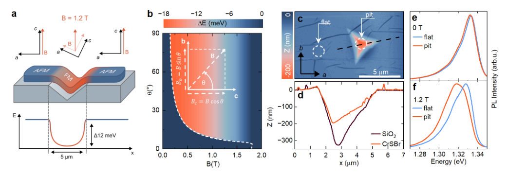 
FIG. 1. Concept of geometronics and sample topography with magneto-optical characterization of a CrSBr bilayer transferred onto a nanoindentation pit. a, Schematic illustration of a CrSBr bilayer conforming to the substrate topography under an external magnetic field applied along the crystallographic c-axis of the flat region, showing the emergence of a local ferromagnetic phase in the reoriented part of the flake together with the corresponding excitonic energy landscape. b, Calculated energy difference between the excitonic ground-state transition of the flat and reoriented regions of the CrSBr flake, ∆E = Eflat −Epit, as a function of the applied magnetic field for field rotations...

📷 Fig 2

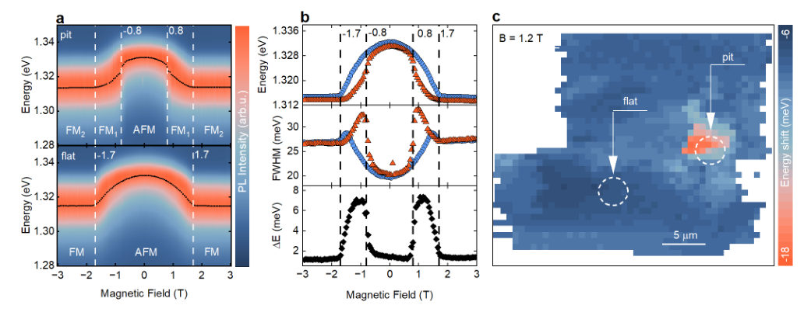 
FIG. 2. Magnetic-field control of the excitonic landscape. a, False-colour maps showing the evolution of the low- temperature (∼10 K) PL spectra with magnetic field for the flat and pit regions of the CrSBr bilayer. The magnetic field is applied along the crystallographic c-axis of the flat region. Black symbols mark the PL peak position. b, Magnetic-field dependence of the PL peak energy (top), PL linewidth (middle), and energy difference between the reoriented and flat regions, ∆E = Eflat −Epit (bottom). In the top and middle panels, blue circles and orange triangles correspond to the flat and pit regions, respectively. c Spatial map of the photoluminescence (PL) energy shift between 0...

📷 Fig 3

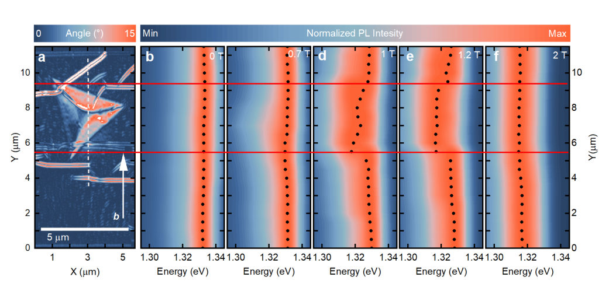 
FIG. 3. Spatially resolved excitonic landscape. a, False-colour map of the absolute local tilt angle of the CrSBr bilayer extracted from the atomic force microscopy topography, measured along the crystallographic b-axis with respect to its orientation in the flat region of the substrate. The vertical dashed line indicates the position of the photoluminescence (PL) line scan shown in b-f, while the horizontal solid red lines mark the lateral boundaries of the nanoindentation. b–f, False-colour maps of the low-temperature (∼10 K) PL spectra acquired along the crystallographic b-axis under magnetic fields of 0, 0.7, 1.0, 1.2 and 2.0 T applied along the crystallographic c-axis of the flat...

**Summary.** This work introduces 'geotronics,' a method that uses substrate topography to locally reorient anisotropic van der Waals materials like CrSBr. By conforming the material to patterned substrates, the authors demonstrate that a uniform external field can create spatially varying magnetic and electronic landscapes. This establishes substrate geometry as a powerful, non-invasive design principle for creating tunable quantum functionalities.

**Why it may be interesting.** The ability to program quantum properties (like excitonic potentials or magnetic order) using purely geometric control, rather than chemical doping or junction fabrication, offers a novel platform for realizing tunable quantum devices.

Detailed structure

**Main problem.** To achieve dynamic, on-demand, and position-dependent control over the electronic and magnetic structure of materials, moving beyond fixed properties set during fabrication.

**Main result.** The substrate topography can deterministically program local magnetic and electronic landscapes, creating switchable excitonic potential wells within a single, continuous crystal.

**Method.** The study uses the concept of 'geotronics,' where the mechanical conformability of anisotropic van der Waals materials is exploited by transferring them onto substrates with controlled topography (e.g., nanoindentation pits).

**Model / system.** The system studied is a bilayer of the antiferromagnetic semiconductor CrSBr. The key principle relies on the material's intrinsic anisotropy and mechanical compliance to the substrate geometry.

**Key observables.** Spatially resolved photoluminescence (PL) spectra, energy contrast ($\Delta E$) between flat and inclined regions, and local magnetic phase coexistence.

**Important parameters / regimes.** Local crystal tilt angle ($	heta \approx 10^\circ–20^\circ$), applied magnetic field ($B$), and the resulting excitonic energy contrast ($\sim 10–12 	ext{ meV}$).

**Assumptions / limitations.** The approach assumes the material is mechanically compliant enough to conform to the substrate topography and that the electronic/magnetic response is highly sensitive to local crystal orientation.

**Figures summary.** Figures illustrate the concept of geometronics using nanoindentation pits, showing PL spectra maps and line scans that demonstrate the field-dependent energy contrast and localized modulation of the excitonic potential.

**Paper structure.** The paper introduces the concept of geometronics, demonstrates its feasibility using CrSBr on nanoindented substrates via PL spectroscopy, and concludes by establishing substrate topography as a universal design principle for programming electronic and magnetic functionalities.

Abstract

Electronic structure in van der Waals materials is commonly engineered through composition, strain, electrostatic gating and heterostructure assembly. Here we introduce geometronics, a concept in which substrate geometry locally reorients an anisotropic crystal, transforming homogeneous external perturbation into programmable magnetic and electronic landscapes. We demonstrate this concept using a bilayer of the antiferromagnetic semiconductor CrSBr transferred onto an inverted pyramidal nanoindentation, where the local crystal orientation with respect to the external magnetic field drives the coexistence of antiferromagnetic and ferromagnetic phases within a single continuous crystal. The resulting magnetic landscape creates a switchable excitonic potential well of up to 10--12 meV, directly visualised by spatially resolved spectroscopy. More generally, geometronics provides a universal route for deterministically programmed electronic and magnetic landscapes without modifying the material itself. It therefore establishes substrate topography as a new design principle that exploits the intrinsic anisotropy of layered van der Waals materials.

[↑ back to top](#top)

### [How Landau caterpillars turn into Hofstadter butterflies by tuning the periodic potential strength](http://arxiv.org/abs/2609.00146v1)

**Authors:** Ivo A. Gabrovski, Louk Rademaker  
**Type:** theory · **Category:** other · **PDF:** <https://arxiv.org/pdf/2609.00146v1>  
**Analysis basis:** full PDF text, analyzed in chunks
**Topic relevance:** `analog quantum simulation` **3/5** · `Frenkel-Kontorova` **2/5**

📷 Fig 1

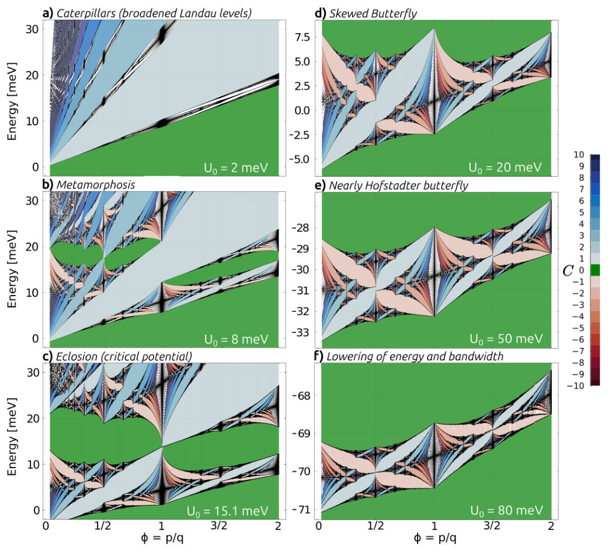 
FIG. 1. Low-energy spectra for increasing periodic-potential strengths U0 = 2, 8, 15.1, 20, 50, and 80 meV, in reading order. Black dots denote the physical states, and the color of each gap indicates the cumulative Chern number of the bands below it. Panels (a)–(c) show the gradual broadening and hybridization of the Landau levels into a lowest Hofstadter-like band separated from the rest of the spectrum. Panel (c) is at the critical potential strength, above which a topologically trivial gap remains open at all fluxes. Panels (d)–(f) focus on this isolated lowest band.

📷 Fig 2

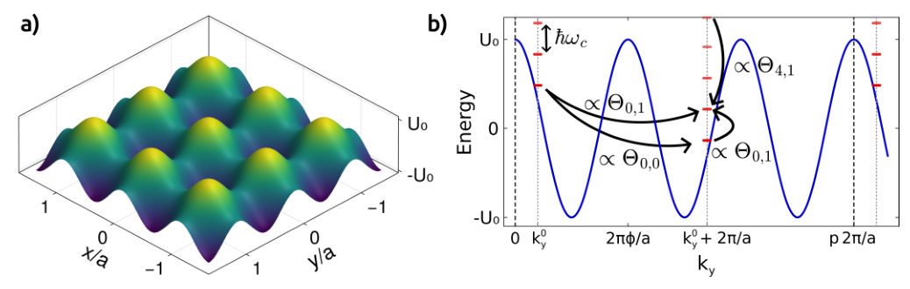 
FIG. 2. (a) Periodic potential U(x, y). (b) Effective one-dimensional hopping chain in momentum ky (or position x) for k0 y = 0, obtained from the Hamiltonian in Eq. (17). The blue curve is the on-site potential induced by U(x, y), and the red lines are the available energy states.

📷 Fig 3

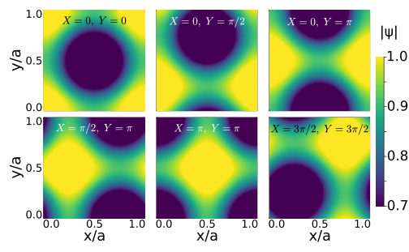 
FIG. 3. Density of an unmixed lowest-Landau-level exact an- alytical solution at ϕ = 1 for a few selected eigenstates with different momentum quantum numbers X and Y , demonstrat- ing that the these quantum numbers also relate to a real space guiding center.

📷 Fig 4

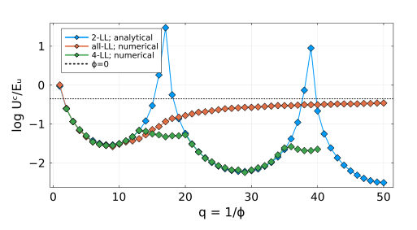 
FIG. 4. Critical potential strength U c 0 on a logarithmic scale for a range of fluxes ϕ = 1/q. Above U c 0, a topologically trivial gap separates the lowest Hofstadter-butterfly-like band from the rest of the spectrum.

📷 Fig 5

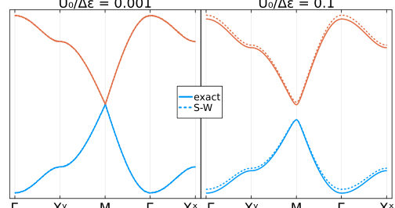 
FIG. 5. Energy dispersion of the lowest Landau level at ϕ = 2 along a selected high-symmetry path in the Brillouin zone. The solid line is the exact result obtained with ten Landau levels, and the dotted line is the two-Landau-level Schrieffer– Wolff approximation.

**Summary.** This work bridges the gap between the simple Landau level spectrum and the complex Hofstadter butterfly by tuning the strength of a periodic potential. The authors show that the butterfly emerges from broadened Landau 'caterpillars' through specific topological transitions. This has implications for understanding electronic properties in engineered systems like moiré materials under strong magnetic fields.

**Why it may be interesting.** The connection between magnetic quantization (Landau levels) and lattice periodicity (Hofstadter) is fundamental to understanding artificial quantum materials like moiré systems, making it highly relevant for condensed matter theorists.

Detailed structure

**Main problem.** The paper aims to connect the two distinct limits of electron spectra in 2D: the discrete Landau levels (in a strong magnetic field) and the fractal Hofstadter butterfly spectrum (in a periodic potential).

**Main result.** It demonstrates that the butterfly spectrum emerges from broadened Landau 'caterpillars' by continuously increasing the periodic potential strength, revealing topological transitions along the way.

**Method.** The study employs numerical exact diagonalization, Wannierization procedures, and analysis of topological invariants like Chern numbers to track the spectral evolution.

**Model / system.** The system is modeled by 2D electrons subjected to both a perpendicular magnetic field and a periodic potential, described by a Hamiltonian that transitions between the Landau gauge and a tight-binding form.

**Key observables.** Spectrum evolution (caterpillars to butterflies), Chern numbers, and the flux-dependent hopping parameters of the effective tight-binding model.

**Important parameters / regimes.** The magnetic flux $\phi = B a^2 / \Phi_0$, the periodic potential strength $U_0$, and the ratio of energy scales ($\hbar\omega_c$ vs. $E_U$).

**Assumptions / limitations.** The analysis often relies on the assumption of rational fluxes ($\phi = p/q$) to define a finite magnetic unit cell for diagonalization.

**Figures summary.** Figures illustrate the spectral evolution from Landau levels to butterflies (Fig. 1), the periodic potential structure (Fig. 2), and the resulting effective 1D hopping chains.

**Paper structure.** The paper progresses by first establishing the continuum Hamiltonian, then developing methods using magnetic translation operators for rational fluxes, and finally deriving an effective tight-binding model whose parameters depend critically on the magnetic flux.

Abstract

It is well-known that the spectrum of two-dimensional electrons in a perpendicular magnetic field is given by discrete flat Landau levels. By contrast, electrons in a two-dimensional tight-binding model give rise to a fractal Hofstadter butterfly spectrum. In this paper, we connect these two opposite limits by showing how a butterfly spectrum emerges from broadened Landau `caterpillars', by continuously increasing the periodic potential strength. We identify a series of topological transitions that isolate a lowest trivial band, a necessary condition for the butterfly to emerge. The resulting butterfly is topologically distinct from the Hofstadter butterfly at fluxes $φ>1$, due to anomalous behavior of diagonal hopping. Moreover, the hopping parameters of an effective tight-binding model, obtained by a Wannierization procedure at large magnetic field, are highly dependent on the flux, revealing that Wannier orbitals themselves change under the applied magnetic field. Our methods and results are relevant for artificial materials, such as moiré systems, where a full quantum of flux per lattice unit cell is experimentally accessible. On a theoretical level, having Wannierization methods for each specific flux allows more accurate many-body calculations in large magnetic fields.

[↑ back to top](#top)

### [Helical and Straight Solitons Induced by Vortex Beams with Off-Axis Pivots in Cubic-Quintic Nonlinear Media](http://arxiv.org/abs/2609.01155v1)

**Authors:** Jing Chen, Rongcao Yang, Boris A. Malomed  
**Type:** theory · **Category:** other · **PDF:** <https://arxiv.org/pdf/2609.01155v1>  
**Analysis basis:** full PDF text, analyzed in chunks
**Topic relevance:** `interference shaping light` **3/5**

📷 Fig 1

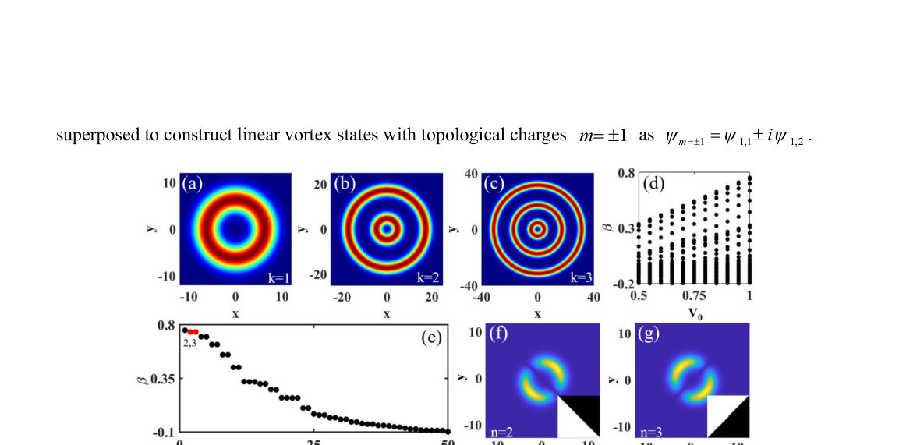 
Fig. 1. The concentric ring potential with V0=1 for (a) k =1, r1=2π, d1=2.5; (b) k=2, r1=1.5π, r2=5.5π, d1,2=2.5; (c) k=3, r1=1.5π,

📷 Fig 2

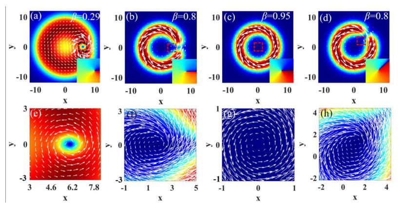 
Fig. 2. The field’s amplitude, Poynting vector, and phase structure of the single-ring vortex soliton with the topological charge

📷 Fig 3

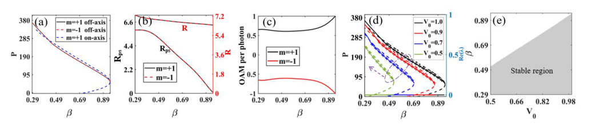 
Fig. 3. (a) The power for on-axis (blue) and off-axis (black and red) single-ring vortex solitons with V0 = 1.0. (b) The phase

📷 Fig 4

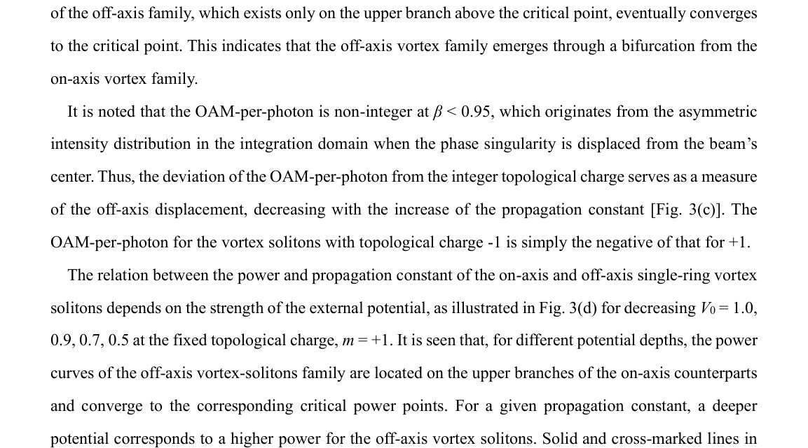 
Fig. 3(d) represent the closed- and split-ring structures of off-axis vortex solitons, respectively, and the

📷 Fig 5

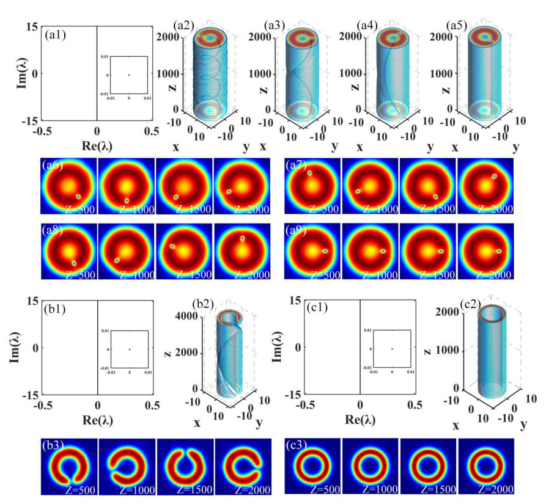 
Fig. 4. Linear stability spectra and dynamics of off-axis vortex solitons: (a) β = 0.29, (b) β = 0.8, and (c) β = 0.95. Panels (a1),

**Summary.** This paper theoretically examines complex soliton solutions—specifically helical and straight multi-core structures—formed by vortex beams propagating in a cubic-quintic nonlinear medium. By analyzing the impact of off-axis phase singularities and applying external torques, the authors demonstrate precise control over the soliton's structure and propagation characteristics. This is significant for understanding advanced light manipulation in nonlinear optical systems.

**Why it may be interesting.** This work bridges nonlinear optics and soliton physics, providing detailed theoretical predictions about complex, structured light beams (vortex solitons) whose dynamics are controlled by geometric parameters (off-axis pivots) and external forces (torque).

Detailed structure

**Main problem.** The study investigates the existence and dynamics of solitons propagating along helical and straight trajectories induced by vortex beams with off-axis pivots in cubic-quintic nonlinear media.

**Main result.** The research predicts stable multi-ring, multi-core, and/or multi-split soliton structures, demonstrating that the helicity and propagation channels can be precisely tuned by applying an external torque.

**Method.** The analysis involves solving the nonlinear Schrödinger equation numerically, utilizing linear stability analysis (eigenvalue problems) to confirm stability, and analyzing energy flow via the Poynting vector.

**Model / system.** The system models optical beams propagating in a cubic-quintic (CQ) nonlinear medium, characterized by a single- or multi-ring potential. The dynamics are governed by the Nonlinear Schrödinger Equation (NLSE) incorporating the effects of off-axis vortex beam pivots.

**Key observables.** Soliton structure (multi-ring, multi-core, split), helicity sign/period, linear eigenvalue spectra, and energy flow density.

**Important parameters / regimes.** Potential depth ($V_0$), propagation constant ($eta$), topological charge ($m$), and applied angular velocity ($\Omega$).

**Assumptions / limitations.** The analysis assumes the validity of the CQ nonlinearity model and relies on solving the linearized eigenvalue problem for stability assessment.

**Figures summary.** Figures illustrate the concentric ring potentials, the field amplitude and Poynting vector for off-axis solitons, comparisons of power and stability for on-axis vs. off-axis states, and the field patterns under applied rotation.

**Paper structure.** The paper progresses by establishing the governing NLSE, analyzing the effect of off-axis pivots on single-ring solitons, extending the analysis to multi-ring potentials, and finally demonstrating the co-existence and tunability of helical and straight propagation channels via external torque.

Abstract

We address the existence and dynamics of solitons propagating along helical (spiral-rotating) and straight trajectories in the bulk waveguide with the cubic-quintic nonlinearity and a single- or multi-ring potential. The input is taken as a vortex beam with a single or multiple phase singularities (pivots), displaced from the waveguide's axis. The single off-axis pivot creates a one-ring helical soliton, with a closed or open (split) ring structure. The vortex beams with multiple off-center pivots give rise to complex states with multi-ring, multi-core, and/or multi-split structures. The multi-core/split solitons propagate along helical channels, or straight ones, which are parallel to the propagation axis. The sign and period of the helicity can be precisely adjusted by applying a torque with an appropriate angular velocity.

[↑ back to top](#top)

### [Helium-Gas-Cooled Cryogenic Current Comparator Integrated with a Quantum Resistance Standard](http://arxiv.org/abs/2609.01124v1)

**Authors:** Yuma Okazaki, Takehiko Oe, Nobu-Hisa Kaneko  
**Type:** experiment · **Category:** other · **PDF:** <https://arxiv.org/pdf/2609.01124v1>  
**Analysis basis:** full PDF text, analyzed in chunks
**Topic relevance:** `quantum measurements` **3/5**

📷 Fig 1

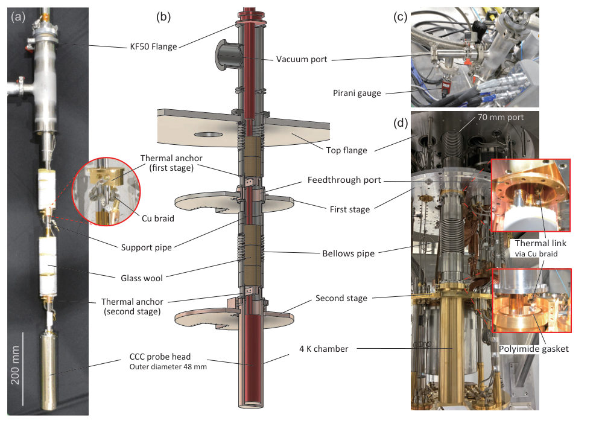 
Fig. 1. The developed helium-gas-cooled CCC. (a) Photograph of the CCC probe. The circled inset shows an enlarged view of the thermal anchor. (b) Cutaway schematic of the helium-gas chamber installed in a cryogen-free refrigerator. (c) Exterior view of the assembled gas chamber. (d) Interior view of the gas chamber installed inside the refrigerator. The upper and lower red-boxed insets show partially assembled views of the first-stage and second-stage thermal anchor structures, respectively.

📷 Fig 2

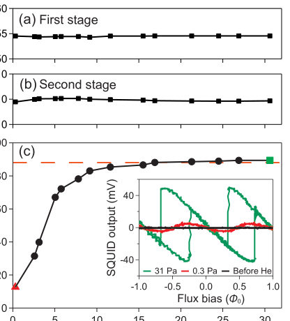 
Fig. 2. Helium gas pressure dependence of the system performance. (a, b) Temperatures of the first stage (a) and second stage (b) as a function of the helium gas pressure in the chamber. (c) Peak-to-peak amplitude of the SQUID ϕ-V curve as a function of helium gas pressure. The dashed line indicates the typical ϕ-V amplitude of 88 mV obtained for the same CCC under liquid-helium cooling. The red triangle and green square correspond to the measurements at 0.3 Pa and 31 Pa, respectively, whose ϕ-V curves are shown in the inset. Inset: amplified SQUID output voltage as a function of flux bias measured before helium-gas introduction (Before He), and after helium- gas introduction at chamber...

📷 Fig 3

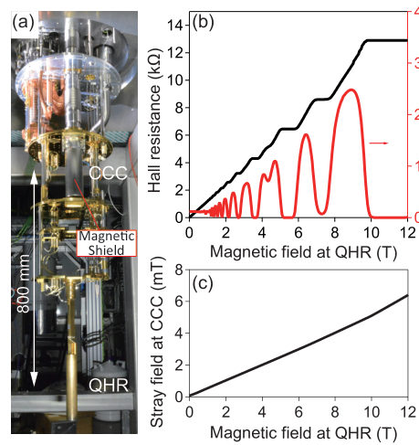 
Fig. 4. Integration of a CCC and a quantum Hall resistance (QHR) device within a single refrigerator. (a) Photograph of the refrigerator setup. The QHR device is mounted at the field center of a superconducting magnet, approximately 800 mm below the CCC probe. The gas chamber was covered with a magnetic shield. (b) Hall resistance and longitudinal resistance of the QHR device as a function of magnetic field, showing the development of the quantum Hall state. (c) Stray magnetic field measured near the position of the CCC probe head as a function of the magnetic field applied to the QHR device.

📷 Fig 4

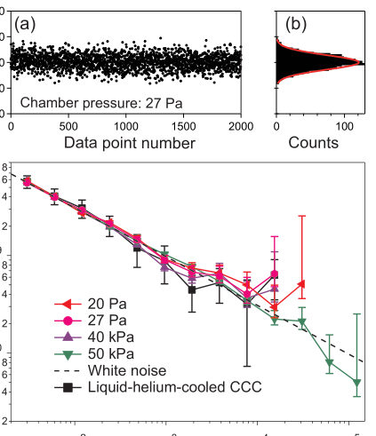 
Fig. 3. Measurements of 10 kΩ/100 Ωresistance ratio using the 4000:40 winding configuration. (a) Results of 2000 consecutive measurements of the bridge voltage difference plotted as a function of measurement index at a helium gas pressure of 27 Pa. (b) Histogram of the measurement results shown in (a) together with a Gaussian fit. (c) Allan deviation of the measured resistance ratio. The colored symbols represent measurements performed with the CCC operated in the helium-gas chamber at pressures of 20 Pa, 27 Pa, 40 kPa, and 50 kPa. The black squares represent reference data obtained using the same CCC cooled by liquid helium. Error bars indicate the 68.3 % confidence intervals obtained from...

📷 Fig 5

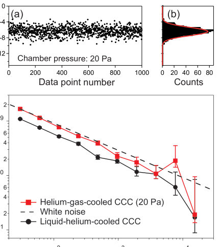 
Fig. 5. Measurements of QHR/100 Ωresistance ratio using the 4001:31 winding configuration. (a) Results of 1000 consecutive measurements of the bridge voltage difference plotted as a function of data point number at a helium gas pressure of 20 Pa. (b) Histogram of the measurement results shown in (a) together with a Gaussian fit. (c) Allan deviation of the measured QHR/100 Ω resistance ratio. The squares and circles represent data obtained with the CCC operated under helium-gas cooling and liquid-helium cooling, respectively. Error bars indicate the 68.3 % confidence intervals obtained from a chi-square analysis. The dashed line shows the white-noise dependence (∝τ −1/2).

**Summary.** This paper reports the successful development of a cryogenic current comparator (CCC) that operates using helium gas instead of liquid helium. The system maintains high measurement precision, comparable to liquid-helium standards, and is successfully integrated with a Quantum Hall Resistance standard. This advancement significantly improves the practicality and sustainability of high-precision resistance metrology.

**Why it may be interesting.** While the core physics is metrology, the engineering challenge of maintaining ultra-low noise, stable cryogenic environments using non-traditional cooling media (helium gas) is highly relevant to building complex quantum measurement apparatuses.

Detailed structure

**Main problem.** The primary goal was to develop and validate a high-precision cryogenic current comparator (CCC) system that operates without relying on liquid helium, thereby reducing operational costs and logistical constraints.

**Main result.** The helium-gas-cooled CCC achieved metrological performance comparable to liquid-helium cooling, successfully integrating with a Quantum Hall Resistance (QHR) standard with uncertainties reaching the nΩ/Ω level.

**Method.** The authors utilized a custom helium-gas chamber cooled by a cryogen-free dilution refrigerator to cool the CCC probe, allowing for precision resistance-ratio measurements.

**Model / system.** The system involves a CCC probe and a QHR standard integrated into a dilution refrigerator. Cooling is achieved via a helium gas medium in a custom chamber, which is thermally anchored to the 4 K stage.

**Key observables.** Type-A uncertainty ($1 	ext{ n}\Omega/\Omega$), SQUID $\phi-V$ characteristics, resistance-ratio measurements, and stage temperatures.

**Important parameters / regimes.** Operating temperature (4 K stage), helium gas pressure (low-pressure regime), and measurement time (e.g., 100 s averaging time).

**Assumptions / limitations.** The performance is assumed to be comparable to liquid-helium cooling, and thermal anchoring is crucial for minimizing heat load.

**Figures summary.** Figures detail the physical setup, including the gas chamber and thermal anchors. Other figures show the dependence of SQUID amplitude and stage temperatures on helium gas pressure, and plots of resistance ratios and Allan deviations over time.

**Paper structure.** The paper details the engineering challenges of cryogen-free operation, presents the methodology for cooling the CCC with helium gas, validates the performance against liquid helium standards, and finally demonstrates the integration with a QHR standard.

Abstract

We report a cryogen-free cryogenic current comparator (CCC) system for precision resistance measurements. A helium-gas chamber was developed and installed on the 4 K stage of a cryogen-free dilution refrigerator equipped with a pulse-tube cryocooler. The CCC probe was housed in this chamber and was cooled through helium gas serving as a heat exchange medium. The metrological performance of this helium-gas-cooled CCC was evaluated through precision resistance-ratio measurements and found to be comparable to that obtained under liquid-helium cooling. A quantum Hall resistance (QHR) device was also integrated into the same refrigerator, enabling QHR/100~$Ω$ resistance-ratio measurements. The type-A uncertainty reached the 1~n$Ω$/$Ω$ level within an averaging time of 100~s, and the resulting resistance-ratio measurements agreed well with conventional liquid-helium-based measurements at the level of a few n$Ω$/$Ω$. The system provides this level of measurement performance while consuming less than 1~L of helium gas per thermal cycle.

[↑ back to top](#top)

### [Tunneling characteristics of twisted double bilayer graphene heterostructures](http://arxiv.org/abs/2609.01258v1)

**Authors:** Alexey A. Sokolik, Azat F. Aminov, Evgenii E. Vdovin, Yurii N. Khanin, Mikhail A. Kashchenko, Denis A. Bandurin, Sergey V. Morozov, Kostya S. Novoselov  
**Type:** both · **Category:** other · **PDF:** <https://arxiv.org/pdf/2609.01258v1>  
**Analysis basis:** full PDF text, analyzed in chunks
**Topic relevance:** `Keldysh / 2PI / non-Gaussian methods` **2/5** · `analog quantum simulation` **2/5** · `quantum measurements` **2/5** · `driven-dissipative phase transition` **1/5** · `methods for driven-dissipative` **1/5**

📷 Fig 1

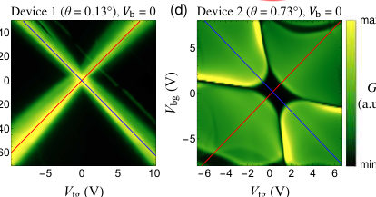 
Figure 1: Electron tunneling between mutually twisted BLGs in dual-gated system. (a) System schematic for Device 2; Device 1 has additional 290- nm thick SiO2 layer above the bottom gate. (b) Electron dispersions in top (red) and bottom (green) BLG, relatively shifted in momentum and energy, which exhibit like- (blue curves) and unlike-band (yel- low curve) intersections. The parts of electron disper- sions corresponding to unoccupied states are semi- transparent. (c,d) Zero-bias tunneling conductance as function of top (Vtg) and bottom (Vbg) gate volt- ages in Device 1 and Device 2, respectively. Red and blue lines show equal- and opposite-density diagonals, respectively. Black stripes in...

📷 Fig 2

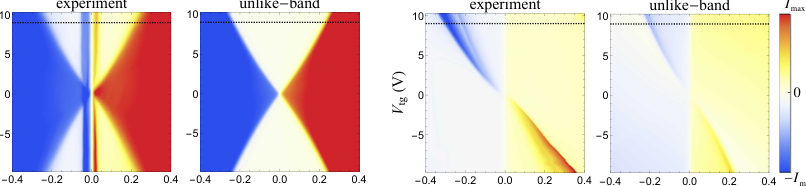 
Figure 2: Tunneling in Device 1. (a) I-V characteristic at Vtg = 9 V, Vbg = 55.2 V where carrier densities in both BLGs are equal at zero bias. (b) I-V characteristic at Vtg = 9 V, Vbg = −54.8 V where carrier densities are opposite. Insets in (a,b) shows calculated electron dispersions in top (green) and bottom (red) BLG at selected points. Dotted lines mark the Fermi level locations, and the parts of dispersions corresponding to unoccupied electron states are semitransparent. (c) Two-dimensional maps of measured and calculated tunneling current as functions of Vb and Vtg (left panels), and calculated current divided into like- and unlike-band components (right panels); Vbg changes with Vtg...

📷 Fig 3

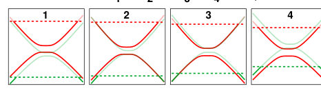 
Figure 3: Magnified part of I-V calculated character- istic of Device 1 at Vtg = 9 V, Vbg = −54.8 V where carrier densities in both BLGs are opposite at Vb = 0. The current is decomposed over initial and final elec- trons bands into the like-band Icc, Ivv and unlike- band Icv, Ivc components. The lower panel present calculations without taking into account the sublayer polarization of electron wave functions. The bottom insets 1-4 show alignment of electron dispersions at those bias voltages (dashed lines on the plot) where the like- or unlike-band overlaps of the van Hove sin- gularities occur. The schemes on the sides show wave function distributions over BLG sublattices in points 1 and 4.

📷 Fig 4

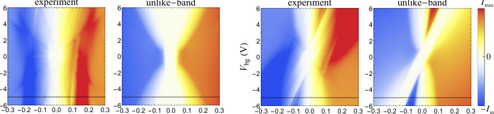 
Figure 4: Tunneling in Device 2. (a) I-V characteristic at Vtg = −3.83 V, Vbg = −5 V where carrier densities in both BLGs are equal at zero bias. (b) I-V characteristic at Vtg = 4.39 V, Vbg = −5 V where carrier densities are opposite. Insets in (a,b) shows calculated electron dispersions in top (green) and bottom (red) BLG at selected points. Dotted lines mark the Fermi level locations, and the parts of dispersions corresponding to unoccupied electron states are semitransparent. (c) Two-dimensional maps of the measured and calculated tunneling current as functions of Vb and Vbg (left panels), and calculated current divided into like- and unlike-band components (right panels); Vtg changes...

**Summary.** This work experimentally and theoretically characterizes electron tunneling in twisted double bilayer graphene. It reveals that the observed current features, such as resonant peaks and steps, are governed by the interplay between like-band and unlike-band tunneling pathways. The results highlight that the symmetry and magnitude of these features are highly sensitive to the twist angle and the relative doping of the graphene layers.

**Why it may be interesting.** The strong dependence of tunneling features on band structure intersections and polarization effects provides a rich platform for studying quantum transport in engineered 2D materials, relevant to open quantum systems.

Detailed structure

**Main problem.** The study investigates the electron tunneling characteristics in twisted double bilayer graphene (BLG) heterostructures.

**Main result.** The tunneling current exhibits distinct features—resonant peaks and steps—whose nature (symmetric vs. asymmetric) depends critically on the relative doping levels and the twist angle.

**Method.** The research combines experimental measurements of current-voltage (I-V) characteristics with detailed theoretical modeling based on electron dispersion intersections.

**Model / system.** The system is a twisted double bilayer graphene heterostructure studied in a dual-gate architecture. The theory models tunneling current by considering the competition between like-band (conductivity-conductivity) and unlike-band (conductivity-valence) electron tunneling contributions.

**Key observables.** Current-voltage (I-V) characteristics, zero-bias tunneling conductance maps, resonant peaks, steps, and regions of negative differential resistance (NDR).

**Important parameters / regimes.** Twist angle ($	heta$), bias voltage ($V_b$), and relative doping levels (equal vs. opposite density).

**Assumptions / limitations.** Tunneling transitions conserve lateral electron momentum and energy; the model incorporates the competition between different band types and the effect of sublayer polarization.

**Figures summary.** Figures illustrate I-V curves and 2D maps showing how tunneling features change with twist angle and doping asymmetry, distinguishing between symmetric and asymmetric regimes.

**Paper structure.** The paper systematically analyzes the tunneling current by decomposing it into like-band and unlike-band components, comparing theoretical predictions with experimental data across varying twist angles and doping conditions.

Abstract

Electron tunneling between sheets of bilayer Bernal graphene twisted at different small angles was studied experimentally and theoretically. The current-voltage characteristics exhibit resonant peaks, steps, and regions of negative differential resistance, the origin of which is explained by the intersections of energy- and momentum-shifted electron dispersions of adjacent layers. A theoretical analysis of tunneling transport demonstrated that the key to understanding this phenomenon lies in the competition between two contributions: between like (conductivity-conductivity or valence-valence) and unlike (conductivity-valence) bands of parallel bilayer graphene sheets. A systematic evolution of the tunneling current patterns with increase of the twist angle is investigated. Polarization of electron wave function across graphene sublayers caused by displacement field within bilayer graphene is shown to strongly affect the tunneling probability, thus enhancing negative differential resistance due to Van Hove singularities at the band edges.

[↑ back to top](#top)

### [Collision-based logic in Lenia and its composition boundary](http://arxiv.org/abs/2609.01348v1)

**Authors:** Chakshu Gupta  
**Type:** theory · **Category:** other · **PDF:** <https://arxiv.org/pdf/2609.01348v1>  
**Analysis basis:** full PDF text, analyzed in chunks
**Topic relevance:** `analog quantum simulation` **2/5** · `Frenkel-Kontorova` **1/5** · `driven-dissipative phase transition` **1/5** · `methods for driven-dissipative` **1/5** · `non-equilibrium universality` **1/5**

📷 Fig 1

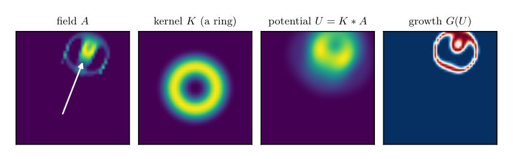 
Figure 1: One update step of the Lenia rule. The field A (here the Orbium glider; brightness is the cell value, dark 0 to bright 1; the arrow marks the travel direction) is convolved with the ring kernel K (zero at the centre, peaking at half the kernel radius) to give the potential U = K ∗A, a local ring-average. The growth G(U) (red = +1, grow; blue = −1, decay) is then scaled by the time step dt and added to the field. The sum is clipped to [0, 1]. The growth is positive at the leading edge and negative at the trailing edge, together advancing the glider.

📷 Fig 2

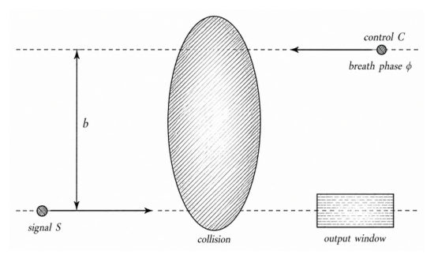 
Figure 2: The collision setup, here with a head-on control. The signal S and control C are gliders on straight tracks through the uniform field; the control is a D4 image of the signal, offset by the impact parameter b and carrying the relative breathing phase ϕ. The output bit is read at the window on the signal’s outgoing track.

📷 Fig 3

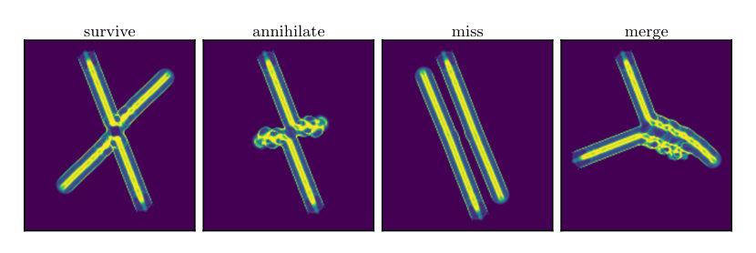 
Figure 3: The four collision outcomes as max-over-time projections of the field. Head-on Orbium collisions give survival at b = 0, annihilation at b = 7, and a miss at b = 22; the fourth outcome, a merger, appears at b = 0 in the perpendicular geometry used in the gate (Section 3.2), and also head-on (Figure 4). Each panel is one simulator run at ϕ = 0.

📷 Fig 4

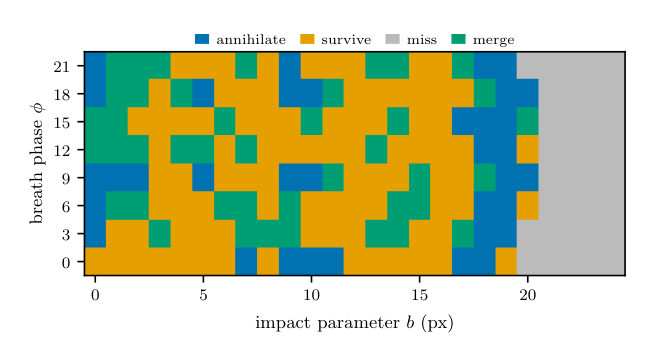 
Figure 4: Head-on Orbium collision outcome, plotted horizontally over the impact parameter b and vertically over eight relative breathing phases ϕ spanning the cycle. The miss region beyond b = 20 is uniform across phases, and survival is the most common outcome. Within b ≤20, only two of the twenty-one columns hold one outcome across all eight phases; in the rest, survival, annihilation and merger interleave. Here b alone therefore does not fix the head-on outcome.

📷 Fig 5

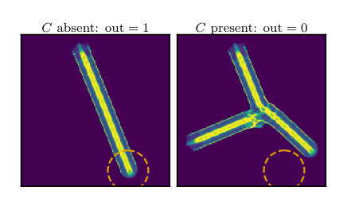 
Figure 5: The INHIBIT gate, shown as the max-over-time projection of the field so that each bright streak is a glider’s whole path. The signal enters from the top toward the dashed output window. With the control absent, the signal reaches the window, giving out = 1 (left); with the control present, the collision blocks the signal, giving out = 0 (right).

**Summary.** This work demonstrates the construction of basic logic gates, such as INHIBIT, within the continuous cellular automaton Lenia using pattern collisions. While simple chains of gates were successfully built, the authors identify that general computation is blocked by the inability to reliably route a signal after a turn or to absorb residual energy from collisions. This highlights the gap between local logic implementation and global circuit integration.

**Why it may be interesting.** It explores computation in a continuous, non-linear physical system, drawing parallels to quantum field theories or non-equilibrium dynamics where pattern formation and interaction govern information processing.

Detailed structure

**Main problem.** The paper investigates whether collision-based computation, established in discrete automata and physical media, can be realized in continuous cellular automata like Lenia.

**Main result.** An INHIBIT logic gate was successfully constructed and demonstrated in series, forming an AND-NOT chain; however, the ability to route a deflected signal or absorb surviving gliders for general circuit composition remains unproven.

**Method.** The authors constructed logic gates by simulating the collision dynamics of self-propelling patterns (gliders) within the continuous Lenia update rule.

**Model / system.** The system is Lenia, a continuous cellular automaton where cell values evolve smoothly via a growth rule involving convolution. Computation relies on the interaction and collision outcomes of localized, self-sustaining patterns called 'gliders' (e.g., the Orbium glider).

**Key observables.** Collision outcomes (annihilate, explode, merge, survive/miss), gate output states (e.g., INHIBIT function), and signal persistence/deflection.

**Important parameters / regimes.** Breathing phases ($\phi$), impact parameters ($b$), and the specific Lenia update rule parameters ($dt$, kernel $K$).

**Assumptions / limitations.** The primary limitation is the inability to demonstrate signal delivery to a downstream gate or find a reusable absorber for surviving gliders.

**Figures summary.** Figures illustrate the Lenia update rule, the collision setup involving signal and control gliders, and maps showing collision outcomes across varying impact parameters and breathing phases.

**Paper structure.** The paper progresses from establishing the feasibility of basic logic gates (INHIBIT) using single collisions, to demonstrating simple sequential composition (AND-NOT chain), and finally identifying the critical physical gaps (signal delivery and absorption) preventing universal computation.

Abstract

Continuous cellular automata such as Lenia spontaneously produce lifelike, self-propelling patterns, including the Orbium glider, which travels in a straight line while pulsing through a fixed breathing cycle. Collision-based logic, where moving patterns compute by colliding, is established in discrete cellular automata and continuous physical media. Within continuous cellular automata, computation has so far been trained into the rule rather than emerging from collisions, and whether a fixed-rule automaton like Lenia can support general collision-based computation remains open. This paper constructs an INHIBIT gate from collisions of the Orbium glider. Of the patterns searched across four continuous-CA rule types, the Orbium glider is the only one shown to survive a collision with both copies intact. A control glider deflects a signal glider off its output line, so the output carries a signal only when no control is present. The gate blocks across all twenty-four phases of the breathing cycle and nine integer offsets of the control. Two such gates in series, with one signal line and two controls, compose into an AND-NOT chain, correct on all eight input combinations. By contrast, routing a signal beyond that single chain is undemonstrated. A deflected signal is not restored to a fixed landing position, and no reusable absorber for the surviving gliders was found. The immediate open question for collision-based computation in Lenia therefore narrows from whether a gate exists to whether a deflected signal can be delivered to a downstream gate, the next requirement for composing the gate beyond a single straight chain.

[↑ back to top](#top)

### [Subgap Bound States from Dynamical Impurities](http://arxiv.org/abs/2609.00142v1)

**Authors:** Joshuah T. Heath  
**Type:** theory · **Category:** other · **PDF:** <https://arxiv.org/pdf/2609.00142v1>  
**Analysis basis:** full PDF text, analyzed in chunks
**Topic relevance:** `Keldysh / 2PI / non-Gaussian methods` **2/5** · `methods for driven-dissipative` **2/5** · `correlated / nonlocal dissipation` **1/5** · `driven-dissipative phase transition` **1/5**

📷 Fig 1

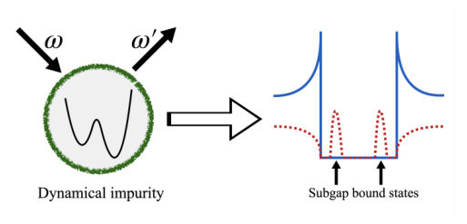 
Figure 1: (Left) An electron scattering off a low-frequency dynamical impurity, which in this context is represented by a two-level system (TLS) double-well potential. (Right) A schematic of the local superconducting density of states (LDOS) in the absence of a dynamical impurity (blue, solid) and in the presence of such an impurity (red, dotted). Subgap bound states emerge for |ω| &lt; ∆0, while the LDOS is suppressed for |ω| &gt; ∆0.

📷 Fig 2

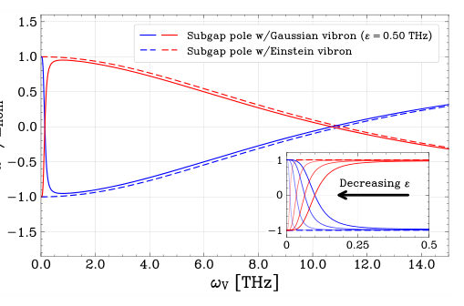 
Figure 2: Dependence of the subgap pole structure ω∗on the vibron frequency ωV . The bulk electron-phonon coupling strength is taken to be λ0 = 0.43 (i.e., for Al). If modelled as an Einstein boson (dashed red and black lines), the vibron frequency sits near the BCS gap ∆0 in the static limit before decreasing to zero frequency around ωV ∼11 THz and then slowly returning to ∆0. The Gaussian vibron (characterized by a spectral function α2F(ν) with a non-zero width ϵ) has very similar behavior, although experiences an additional low-frequency crossing in the GHz regime. (Inset) The GHz structure of the pole for decreasing ϵ. As ϵ →0, the first crossing of the poles approaches ωV = 0,...

📷 Fig 3

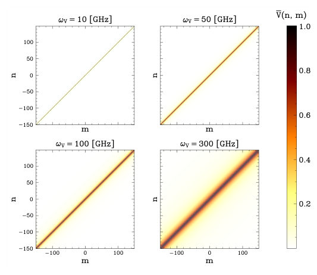 
Figure 3: The normalized scattering potential V (n, m) ≡V(iωn, iωm; ri) for the dynamical impurity normalized to one, plotted a function of the Matsubara indices n and m for several different values of the vibron frequency ωV . Perfect elastic scattering implies that all weight is on the n = m scattering, and thus the elastic scattering limit manifests as a diagonal on the above plots. Upon increasing the vibron frequency, more elements off the diagonal of the potential become non-zero, resulting in an increasing dominance of inelastic scattering events. The elastic approximation remains reasonable below ωV = 100 GHz.

📷 Fig 4

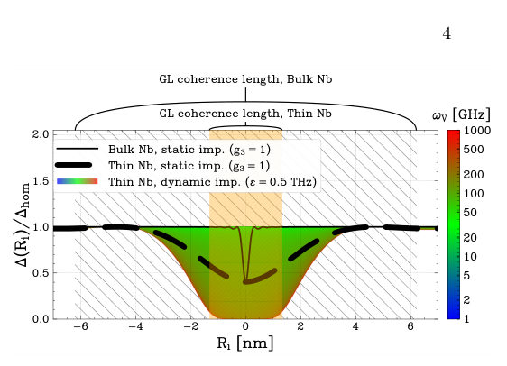 
Figure 5: The local BCS gap ∆(Ri) normalized by the homogeneous BCS gap ∆hom, with an impurity placed at Ri = 0 and the material taken to be Nb. For the case of a static impurity with strength g3 = πN(0)V3 (solid black line), the real space modulation of the gap is significantly smaller than the Ginzburg-Landau (GL) coherence length in bulk Nb (left-hashed background) [61, 62]. For thin-film Nb, the GL coherence length (orange shaded region) is expected to be reduced due to dimensional confinement [63–66], and likewise the local modulation of the BCS gap increases (black dashed) (the latter due to a reduction in kF ). For the dynamical impurity (multicolor), ωV ≈100 GHz results in severe...

📷 Fig 5

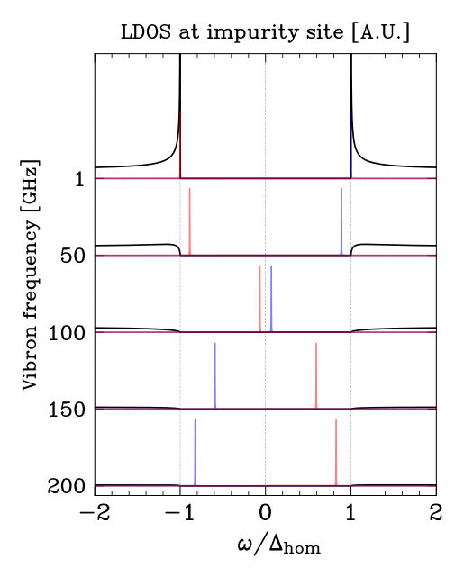 
Figure 4: The local density of states (LDOS) at the impurity site Ri = r −ri = 0 for several different vibron frequencies. The poles of the T-matrix are represented as blue and red delta functions centered at the bound state frequencies ω∗. For ωV below 10 GHz, the subgap poles sit close to the BCS gap ±∆0. As the vibron frequency is increased, the subgap poles move inward to |ω/∆hom| &lt; 1 and cross, while the LDOS for |ω/∆hom| &gt; 1 is depleted as spectral weight moves towards the poles.

**Summary.** This theoretical work analyzes the effect of dynamical impurities, such as localized vibrational modes, on s-wave superconductors. It derives a closed-form solution for the induced subgap bound state energy and predicts characteristic modulations in the local density of states. The findings show that these dynamic defects create distinct signatures that differ from those caused by static disorder.

**Why it may be interesting.** The study provides a concrete theoretical framework for understanding how coupling to low-energy bosonic modes (like phonons or TLSs) can create observable spectroscopic signatures in superconductors, which is relevant to understanding superconducting mechanisms.

Detailed structure

**Main problem.** The paper investigates how local, non-magnetic dynamical impurities (like vibron modes) induce subgap bound states and modify the local density of states (LDOS) in s-wave superconductors.

**Main result.** Dynamical impurities induce distinct subgap bound states whose energy depends on the impurity's frequency, and they cause a measurable suppression of the LDOS compared to static disorder.

**Method.** The analysis uses the Nambu-Gor’kov Green's function formalism and the T-matrix approximation to solve the self-consistent Lippmann–Schwinger equation for the impurity scattering potential.

**Model / system.** The system is an s-wave superconductor modeled with an impurity potential derived from a dynamical excitation (vibron/TLS). The analysis distinguishes between static ($	au_3$) and dynamical ($	au_0$) impurity coupling.

**Key observables.** Subgap bound state energy ($\omega^*$), Local Density of States (LDOS) modulation $N(\omega; R_i)$, and the superconducting gap $\Delta(R_i)$.

**Important parameters / regimes.** Vibron frequency ($\omega_V$), spectral width ($\epsilon$), superconducting gap ($\Delta$), and the electron-boson coupling constant ($\lambda$).

**Assumptions / limitations.** The analysis relies on the T-matrix approach, often using the elastic scattering limit approximation, and assumes the static contribution is negligible compared to the dynamical $	au_0$ potential.

**Figures summary.** Figures illustrate the induction of subgap states by dynamical impurities, show the dependence of $\omega^*$ on $\omega_V$, and map the LDOS modulation for both static and dynamic impurity types.

**Paper structure.** The paper develops the T-matrix solution for off-diagonal (inelastic) scattering, derives the LDOS modulation formulas for both $	au_3$ and $	au_0$ impurities, and compares the results across different scattering regimes (elastic vs. inelastic).

Abstract

We find that a single non-magnetic dynamical impurity (e.g., a low-frequency localized "vibron" mode) induces a subgap bound state in an s-wave superconductor. A closed-form solution for the bound state energy is found as a function of the vibron frequency in the elastic scattering limit, with the salient features of the bound state energies unaffected by inelastic scattering processes in the sub-THz regime. In addition to subgap features in the low-frequency local density of states, such impurities result in real space regions of reduced spectroscopic weight outside the gap peak.

[↑ back to top](#top)

### [Process-Technology Co-optimization for 2D-FETs](http://arxiv.org/abs/2609.00722v1)

**Authors:** Shao-Heng Yang, Jainil Dharmil Shah, Mayukh Das, Yuanqiu Tan, Hao-Yu Lan, Hsing-Chien Chien, Himani Jawa, Shalini Tripathi, Marco Antonio Villena, Xiangyu Wu, Daire Cott, Kaustav Banerjee, Pierre Morin, César Javier Lockhart de la Rosa, Gaurav Thareja, Dennis Lin, Joerg Appenzeller, Zhihong Chen  
**Type:** both · **Category:** disordered systems and neural networks · **PDF:** <https://arxiv.org/pdf/2609.00722v1>  
**Analysis basis:** full PDF text, analyzed in chunks
**Topic relevance:** `methods for driven-dissipative` **2/5** · `analog quantum simulation` **1/5** · `quantum measurements` **1/5**

📷 Fig 1

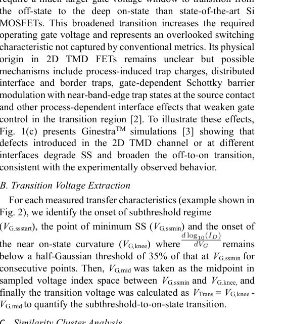 
Fig. 3 shows the extracted VTrans. versus SS for devices with the same test vehicle design but fabricated using different gate stack process recipes. Fig. 4 shows the corresponding transfer characteristics measured at VDS = 0.1V. Although devices with comparable SS generally exhibit comparable VTrans., distinct recipe-dependent clusters emerge, indicating that fabrication processes simultaneously influence off-state and the transition toward the on-state. This observation suggests that VTrans provides complementary information beyond conventional transistor metrics and serves as an additional optimization objective for process optimization. Furthermore, the statistical correlation between...

📷 Fig 2

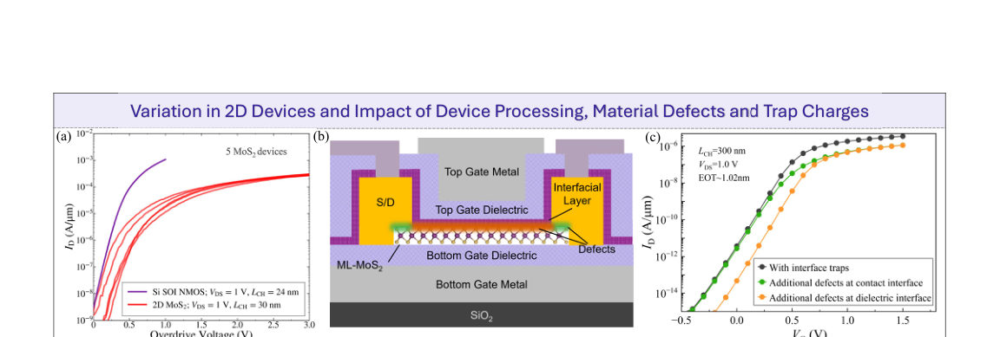 
Figure 1. (a) Comparison of 2D MoS2 devices with uncontrolled variability with a Si SOI NMOS [1] (b) Schematic of 2D MoS2 FET (c) GinestraTM simulations showing degraded SS, a broadened off-to-on transition and lower on-current resulting from various defects at various locations.

📷 Fig 3

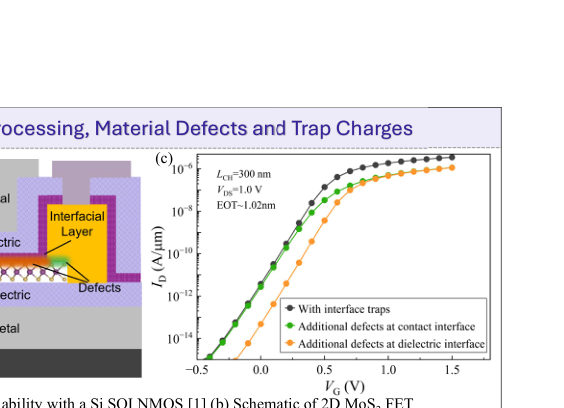 
Figure 4. I-V characteristics of the three recipes used in the VTrans -SS extraction. Figure 3. Comparison of extracted transition voltage and SS

📷 Fig 4

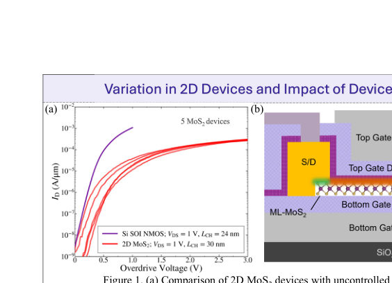 
Figure 2. Two representative I-V curves illustrating

📷 Fig 5

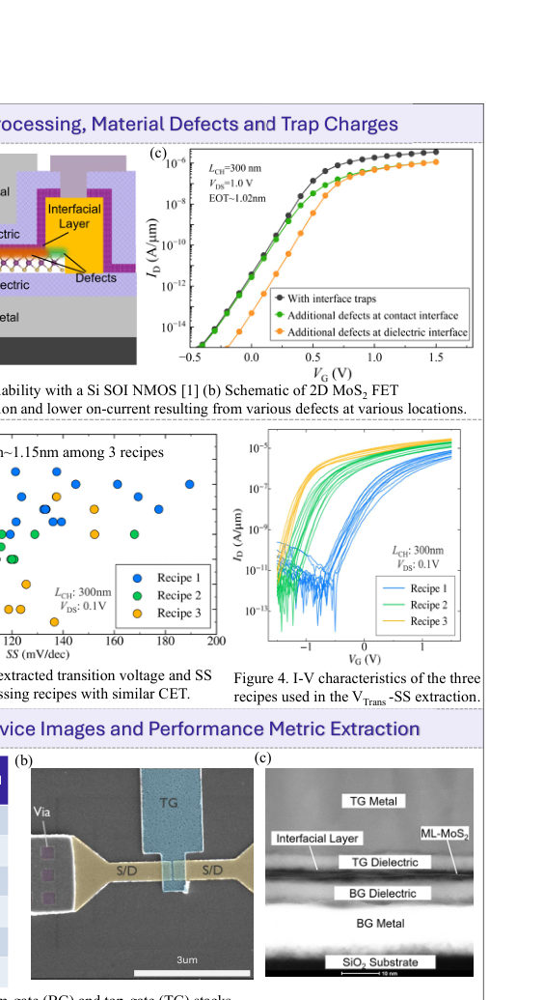 
Figure 5. (a) Device fabrication process flow (b) SEM image, and (c) Cross-sectional STEM image of a representative device.

**Summary.** This paper presents a novel, machine learning-enabled framework for Process-Technology Co-optimization (PTCO) applied to 2D TMD FETs. It introduces a new diagnostic metric, Transition Voltage ($	ext{V}_{	ext{Trans}}$), and uses GPR alongside multi-objective ranking to predict device performance from limited experimental data. The framework proves its utility by accurately guiding the optimization of gate stack recipes.

**Why it may be interesting.** While focused on semiconductor device physics, the core methodology—using ML to map complex, high-dimensional process parameter spaces to performance metrics—is highly relevant to modeling complex quantum or many-body systems where experimental characterization is difficult.

Detailed structure

**Main problem.** The paper addresses the challenge of optimizing the fabrication process and technology parameters (PTCO) for 2D TMD FETs, as performance is highly sensitive to process variations and existing ML methods often rely on incomplete simulation data.

**Main result.** The developed ML-enabled PTCO framework successfully guides gate-stack optimization by predicting performance for untested recipes, confirming that device performance is governed by complex interactions among process parameters.

**Method.** The authors developed an experimental data-driven framework combining automated metric extraction, a Fuzzy TOPSIS multi-objective ranking scheme, and Gaussian Process Regression (GPR) for predictive modeling.

**Model / system.** The physical system is 2D transition metal dichalcogenide (TMD) Field-Effect Transistors (FETs). The optimization targets the gate stack recipe, which is defined by 7 key fabrication parameters.

**Key observables.** Key observables include the on-current ($	ext{I}_{	ext{ON}}$), Subthreshold Swing (SS), and a novel Transition Voltage ($	ext{V}_{	ext{Trans}}$).

**Important parameters / regimes.** The optimization is governed by the interaction of 7 key fabrication parameters defining the gate stack recipes.

**Assumptions / limitations.** The framework assumes that performance can be accurately modeled and predicted from statistically meaningful experimental data, allowing for iterative refinement.

**Figures summary.** Figures illustrate the need for $	ext{V}_{	ext{Trans}}$ in 2D devices, the extraction process for $	ext{V}_{	ext{Trans}}$, and comparisons showing how the ML-predicted ranking aligns with experimental validation, emphasizing coupled parameter effects.

**Paper structure.** The paper introduces the PTCO framework, details the extraction of $	ext{V}_{	ext{Trans}}$ alongside SS and $	ext{I}_{	ext{ON}}$, utilizes Fuzzy TOPSIS for multi-objective ranking, and validates the predictive power of the ML model using experimental feedback.

Abstract

We present the first experimental machine learning (ML)-enabled Process-Technology Co-Optimization (PTCO) framework for optimizing 2D transition metal dichalcogenide (TMD) FET fabrication directly from statistically meaningful experimental data rather than pure simulation data. We first introduce a transition voltage metric, VTrans, to quantify the gate voltage required for off-to-on switching and reveal its direct correlation with subthreshold swing (SS), highlighting an overlooked switching characteristic that governs both off-state and on-state performance. By integrating automated metric extraction, multi-objective recipe ranking, and predictive modeling, our framework uncovers hidden process-performance correlations and predicts the performance of unexplored fabrication recipes from limited experimental data. Experimental validation shows close agreement with ML predictions, thus demonstrating the framework's ability to efficiently guide gate stack optimization through iterative experimental feedback.

[↑ back to top](#top)

### [Microscopic Origin of Pressure-Enhanced and Robust Superconductivity in Infinite-Layer La$_{0.8}$Sr$_{0.2}$NiO$_2$](http://arxiv.org/abs/2609.00586v1)

**Authors:** Jian-Feng Zhang, Zhong-Yi Lu, Tao Xiang  
**Type:** theory · **Category:** strongly correlated electrons · **PDF:** <https://arxiv.org/pdf/2609.00586v1>  
**Analysis basis:** full PDF text, analyzed in chunks
**Topic relevance:** `analog quantum simulation` **2/5** · `Keldysh / 2PI / non-Gaussian methods` **1/5**

📷 Fig 1

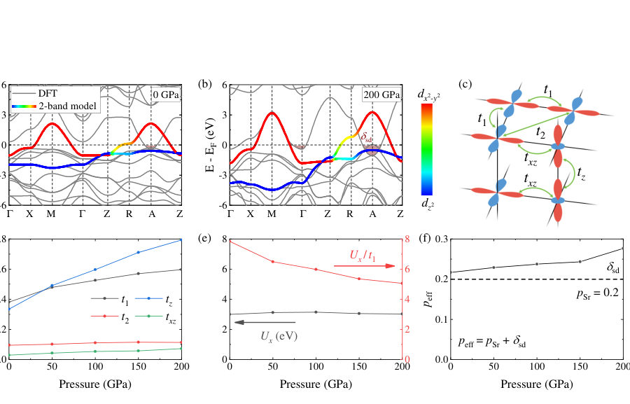 
FIG. 1. Electronic structure and pressure-dependent model parameters of La0.8Sr0.2NiO2. (a,b) DFT and two-band Wannier dispersions at (a) 0 and (b) 200 GPa, with the orbital weights indicated. (c) Leading hopping processes of the effective model. (d) Pressure dependence of the in-plane, interlayer, and interorbital hoppings. (e) Screened interaction Ux and the ratio of Ux/t1. (f) Self-doping δsd and effective hole concentration peff = pSr + δsd.

📷 Fig 2

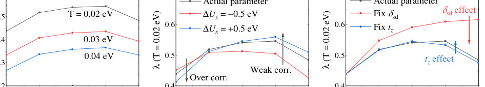 
FIG. 2. Pressure evolution of superconductivity. (a) Leading Eliashberg eigenvalue λ at different temperatures. (b) λ for the physical interaction Ux = 3.0 eV and for Ux shifted by ±0.5 eV. (c) Effects of self-doping and interlayer hopping, isolated by fixing δsd or the interlayer hopping parameters at their ambient-pressure values.

📷 Fig 3

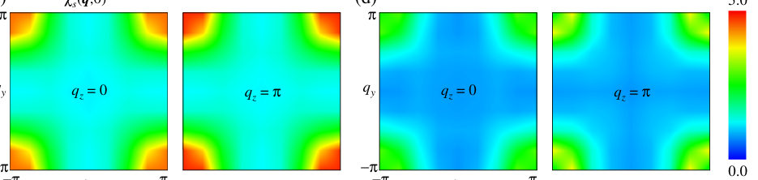 
FIG. 3. Ni-dx2−y2-resolved electronic and magnetic responses at ambient and optimal pressures. (a,b) Zero-energy spectral function Ax(k, 0) on the kz = 0 and π planes at (a) 0 and (b) 150 GPa. (c,d) Corresponding static intra-orbital spin susceptibility χx s(q, 0) on the qz = 0 and π planes. Pressure sharpens the Fermi-surface spectra and enhances their three-dimensionality, while the susceptibility remains peaked near (π, π) with weak qz dependence.

**Summary.** This theoretical study explains the superconducting dome in high-pressure nickelates by modeling the competition between kinetic energy increases and correlation effects. The pairing mechanism is found to be robustly $d$-wave, but the dome's shape is dictated by pressure-induced doping changes. It provides a unified microscopic picture for the material's unusual superconducting behavior under extreme compression.

**Why it may be interesting.** While focused on cuprate/nickelate physics, the methodology—using correlated electron models (Hubbard-like terms) and pairing theory (Eliashberg)—is highly relevant to understanding unconventional superconductivity in strongly correlated materials, which often shares theoretical parallels with AMO systems exhibiting strong interactions.

Detailed structure

**Main problem.** The paper aims to determine the microscopic origin of the broad, nonmonotonic, and robust superconducting dome observed in infinite-layer $	ext{La}_{0.8}	ext{Sr}_{0.2}	ext{NiO}_2$ under extreme high pressure.

**Main result.** The superconductivity is governed by a competition: initial enhancement from increasing kinetic energy and optimal coupling, followed by suppression due to pressure-induced self-doping into the overdoped regime.

**Method.** The study employs first-principles calculations combined with a two-orbital model and the FLEX approximation solved via the linearized Eliashberg equation to calculate the pairing tendency ($\lambda$).

**Model / system.** The system is the infinite-layer nickelate $	ext{La}_{0.8}	ext{Sr}_{0.2}	ext{NiO}_2$. The low-energy description focuses on the $	ext{Ni-}d_{x^2-y^2}$ orbital, treating the $d_{z^2}$ orbital's fluctuations as suppressed.

**Key observables.** The leading Eliashberg eigenvalue ($\lambda$), the spin susceptibility ($\chi_s^x(\mathbf{q}, 0)$), and the doping level ($\delta_{sd}$).

**Important parameters / regimes.** Pressure (up to 210 GPa), the ratio of correlation strength to hopping ($U_x/t_1$), and the kinetic energy scale ($t_1$).

**Assumptions / limitations.** The analysis relies on a low-energy effective two-band Hamiltonian, and the pairing mechanism is assumed to be dominated by the $d_{x^2-y^2}$ orbital.

**Figures summary.** Figures illustrate DFT/Wannier dispersions and hopping processes under pressure, showing how $U_x/t_1$ and self-doping change. A key figure shows the Eliashberg eigenvalue ($\lambda$) dependence on pressure, confirming the dome structure.

**Paper structure.** The paper first establishes the experimental observation (the superconducting dome). It then develops a theoretical framework using DFT/Wannier functions and calculates the pairing strength using FLEX/Eliashberg theory. The core argument links the pressure dependence of electronic parameters ($t_1, U_x/t_1, \delta_{sd}$) to the observed superconducting dome shape.

Abstract

Recent transport measurements on freestanding La$_{0.8}$Sr$_{0.2}$NiO$_2$ membranes revealed a broad superconducting dome extending from ambient pressure to 210 GPa, with an onset transition temperature reaching 74.5 K near 146 GPa. Using first-principles calculations, a pressure-dependent two-orbital model, and self-consistent FLEX calculations combined with the linearized Eliashberg equation, we determine how compression modifies the pairing tendency. Pressure increases the kinetic-energy scale, reduces $U_x/t_1$, strengthens interlayer hybridization, and transfers holes from the La/Sr-derived charge reservoir to the correlated Ni sector. Within the present low-energy description, the increasing kinetic scale and the approach to optimal intermediate coupling account for the initial enhancement of pairing, whereas pressure-induced self-doping into the overdoped regime is primarily responsible for its high-pressure suppression. Despite a pronounced three-dimensionalization of the Fermi surface, the pairing-relevant spin susceptibility remains weakly dependent on $q_z$ and peaked near $(π,π)$. Consequently, the Ni-$d_{x^2-y^2}$-dominated $d$-wave pairing state remains stable over the calculated pressure range. These results provide a unified microscopic interpretation of both the superconducting dome and its unusual robustness under megabar compression.

[↑ back to top](#top)

### [Polar nanoregions and reentrant-like ferroelectric behavior in SrTiO$_3$](http://arxiv.org/abs/2609.01446v1)

**Authors:** Yuan-Jie Sun, Fei Yang, Long-Qing Chen  
**Type:** theory · **Category:** statistical mechanics · **PDF:** <https://arxiv.org/pdf/2609.01446v1>  
**Analysis basis:** full PDF text, analyzed in chunks
**Topic relevance:** `Keldysh / 2PI / non-Gaussian methods` **2/5** · `Frenkel-Kontorova` **1/5**

📷 Fig 1

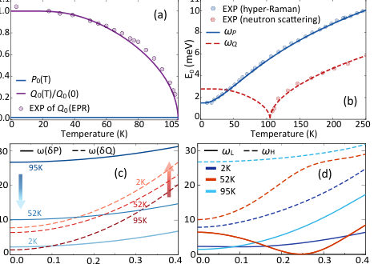 
FIG. 1. (a) Polar order parameter 𝑃0(𝑇) and normalized AFD order parameter 𝑄0(𝑇)/𝑄0(0), as well as experimental octahedral rotation angles measured by electron paramagnetic resonance (EPR) [43]. (b) Zone-center excitation energies of the polar (blue) and AFD (red) modes, compared with experimental data from hyper-Raman scatter- ing [39] and neutron scattering [34]. (c) and (d) Bare and hybridized collective-mode dispersions, respectively, at 2, 52, and 95 K.

📷 Fig 2

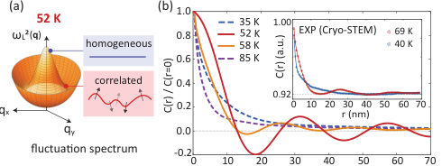 
FIG. 2. (a) Schematic 𝑞𝑧= 0 section of the lower hybridized-mode dispersion at 52 K, showing a nearly degenerate ring of low-energy modes at finite |q| = 𝑞∗. The finite-𝑞minimum favors spatially modulated polar correlations over a homogeneous configuration. (b) Calculated normalized real-space polar correlation function at 35, 52, 58, and 85 K. The oscillatory correlations are strongest near the mode resonance at 60 K and weaken away from the resonance temperature. Inset: experimentally measured polar correlations obtained by cryo- genic scanning transmission electron microscopy (Cryo-STEM) [8].

📷 Fig 3

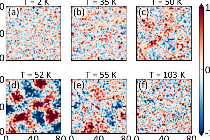 
FIG. 3. Real-space polarization textures 𝑃(r) at (a)-(f) 2, 35, 50, 52, 55, and 103 K. Spatially correlated polar regions become most pronounced near the mode resonance at 52 K.

📷 Fig 4

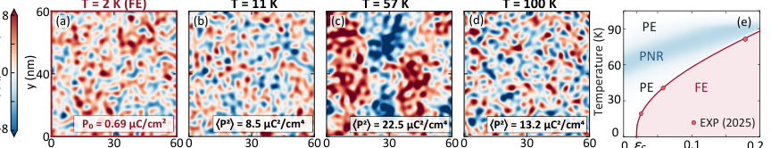 
FIG. 4. Real-space 𝑃(r) at (a)-(d) 2, 11, 57, and 100 K with external strain 0.02% showing the reentrant-like evolution of polar ordering. Panel (e) shows a temperature-strain phase diagram with ferroelectric phase transition. The experimental data of 𝑇𝑐comes from Ref. [50].

**Summary.** This theoretical work explains the unexpected, reentrant formation of polar nanoregions in SrTiO3 by modeling the coupling between polar and antiferrodistortive lattice fluctuations. The key mechanism involves the hybridization of these two modes, which drives a finite-momentum instability at intermediate temperatures. This provides a fluctuation-based explanation for the PNRs, avoiding the need for a conventional phase transition.

**Why it may be interesting.** The mechanism relies on coupling between different types of lattice fluctuations (polar and AFD), which is a concept relevant to understanding emergent order in complex quantum materials, bridging concepts from soft matter and condensed matter physics.

Detailed structure

**Main problem.** The paper addresses the anomalous, reentrant-like weakening of local polar textures (PNRs) in quantum paraelectric SrTiO3 upon cooling, which contradicts the expectation that ordering tendencies strengthen as thermal fluctuations are suppressed.

**Main result.** The reentrant PNR behavior is explained by the interplay between intrinsic polar and antiferrodistortive (AFD) fluctuations, where mode hybridization causes a finite-q instability at intermediate temperatures, leading to PNR formation.

**Method.** The authors employ a self-consistent phase-field theory incorporating coupled ferroelectric and AFD fluctuations to model the system's free energy and mode dynamics.

**Model / system.** The system is quantum paraelectric SrTiO3, modeled using an effective Hamiltonian that includes coupled polar (P) and AFD (Q) fluctuations. The theory analyzes the interplay between these two modes via an interaction term, $V_{	ext{int}}$.

**Key observables.** Polar order parameter ($P_0(T)$), AFD order parameter ($Q_0(T)$), hybridized collective-mode dispersions ($\omega_P, \omega_Q$), and real-space polar correlation functions $C(r,T)$.

**Important parameters / regimes.** The crossing temperature of the polar and AFD modes ($\approx 52 	ext{ K}$), which maximizes hybridization and triggers the instability; the strain level ($	ext{0.02\%}$).

**Assumptions / limitations.** The reentrant behavior is interpreted as a thermal crossover in fluctuation organization, not a thermodynamic phase transition, as the lower hybridized mode remains gapped.

**Figures summary.** Figures illustrate the temperature dependence of order parameters, mode dispersions, and real-space visualizations of PNRs, showing the nonmonotonic evolution of correlations.

**Paper structure.** The paper first establishes the anomalous PNR behavior observed experimentally. It then develops a phase-field theory coupling polar and AFD modes. The core argument shows that mode crossing leads to a finite-q instability (Brazovskii-type), causing PNRs, which subsequently weaken as the modes decouple at lower temperatures.

Abstract

Recent real-space imaging in quantum paraelectric SrTiO$_3$ [Nature 656, 54 (2026)] reveals that local polar textures do not continuously grow upon cooling, but reach a maximum intensity at intermediate temperatures around 60-65~K and weaken again toward the quantum paraelectric ground state. Such a reentrant-like weakening of local polar textures challenges the conventional paradigm in which ordering tendencies generally strengthen as thermal fluctuations are suppressed. Here we employ a self-consistent phase-field theory showing that this anomalous behavior naturally arises from the interplay between intrinsic polar and antiferrodistortiv (AFD) fluctuations. We demonstrate that flexoelectric-like coupling strongly hybridizes the polar and AFD modes. As the uncoupled polar and AFD modes cross near 52~K, their hybridization is maximized, driving the lower hybridized branch to develop a minimum on a finite-wave-vector shell. This finite-$q$ softening triggers a Brazovskii-type instability, strongly enhancing polarization correlations and producing nanoscale polar textures. Away from the crossing temperature, the two modes become increasingly detuned, weakening their hybridization and the associated finite-$q$ softening. These results reaveal the origin of the formation of polar nanoregions in SrTiO$_3$, naturally explaining the unexpected confinement to an intermediate-temperature window and providing a mechanism beyond the quantum-fluctuation-based interpretation suggested by experiment. Furthermore, we predict an unconventional reentrant-like sequence in weakly strained SrTiO$_3$, evolving from ferroelectric to paraelectric, polar-nanoregion, and eventually paraelectric regimes upon heating from zero temperature.

[↑ back to top](#top)

### [Understanding the superconducting proximity effect in semiconductors through quantum oscillations](http://arxiv.org/abs/2609.01593v1)

**Authors:** Milo Coombs, Teun A. J. van Schijndel, Yu Wu, Jason T. Dong, Yilmaz Gul, Julian Choi, Christopher J. Palmstrøm, Greg P. Mazur  
**Type:** experiment · **Category:** other · **PDF:** <https://arxiv.org/pdf/2609.01593v1>  
**Analysis basis:** full PDF text, analyzed in chunks
**Topic relevance:** `quantum measurements` **2/5** · `Keldysh / 2PI / non-Gaussian methods` **1/5**

📷 Fig 1

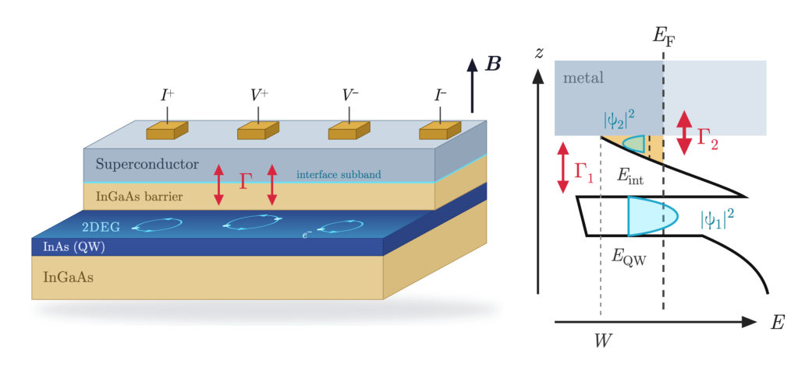 
FIG. 1. Quantum-oscillation spectroscopy of a buried quantum well beneath a superconducting film. Left, heterostructure and in-line four-probe geometry. A buried InAs quantum well lies below an InGaAs barrier and the metal film. SdH oscillations of the semiconductor subbands are measured on unpatterned material in a magnetic field B. Right, schematic conduction-band profile along the growth direction z, not to scale. The occupied states comprise a fundamental state localized in the buried InAs quantum well, |ψQW|2, and a metal-induced accumulation state localized near the metal/InGaAs interface, |ψint|2. Their band minima are EQW and Eint, and the Fermi energy is EF. The states couple to...

📷 Fig 2

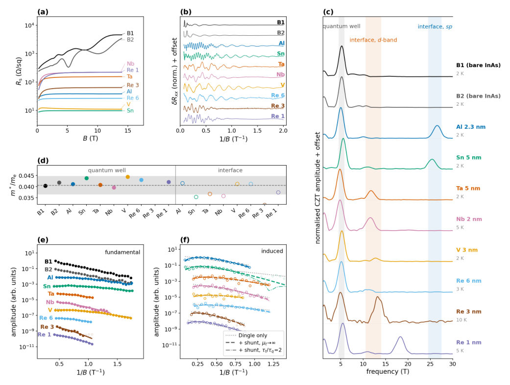 
FIG. 2. Quantum oscillations of the buried well beneath six superconducting films. Colours identify the sample in every panel. B1 and B2 are the two uncapped reference wells. a, Smooth sheet resistance of each stack. The uncapped wells are one to three decades more resistive than the metallized ones, and this ratio sets the size of the amplitude correction in e and f. b, Background-subtracted oscillations against inverse field at the lowest normal-state temperature, normalized and offset. c, Chirp-z spectra of the traces in b, with the analysis temperature beside each. The quantum-well frequency stays near 5 T in all ten samples, whereas metallization adds a second branch at 11–13.4 T...

📷 Fig 3

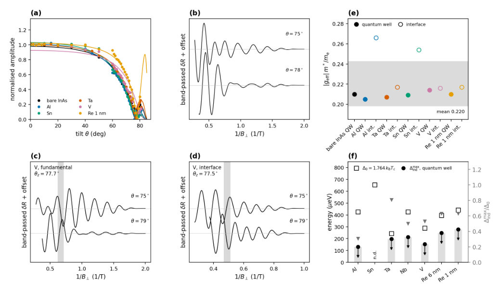 
FIG. 3. Spin-zero spectroscopy and the induced-gap ceiling of the buried well. a, Tilt dependence of the fundamental- branch amplitude for B2 and the Al-, Sn-, Ta-, V- and 1-nm-Re-capped samples, normalized to the low-angle value. Curves are damped coincidence fits. All six pass through their first spin zero near 78◦. b, Band-passed oscillations of B2 either side of θz, offset vertically. The inversion identifies a spin zero without a lineshape model. Shading marks half a period. c,d, The same for the V fundamental (c) and V interface (d) branches at 75◦and 79◦. e, Spin-zero products |geff|m∗/me = cos θz for all eleven branches, filled for quantum-well and open for interface states,...

**Summary.** This work investigates superconducting proximity effects in semiconductor/superconductor hybrids by measuring quantum oscillations in a buried InAs quantum well. By analyzing the SdH oscillations under various superconducting films, the authors determine the intrinsic normal-state parameters of the semiconductor. This technique overcomes the ambiguity caused by the superconducting metal shunt, providing crucial data for understanding interface physics.

**Why it may be interesting.** The methodology of using quantum oscillations to probe parameters inaccessible via standard tunneling spectroscopy in superconducting hybrids provides a powerful, complementary diagnostic tool for studying superconducting interfaces and proximity effects.

Detailed structure

**Main problem.** The primary challenge is accurately characterizing the electronic parameters of a semiconductor quantum well when it is buried beneath a superconducting metal film, as the metal shorts the electrical transport.

**Main result.** The study successfully determines the normal-state parameters (density, mass, g-factor) of the buried semiconductor using quantum oscillations, showing that the superconducting metal induces a distinct interface subband without altering the core parameters of the well.

**Method.** The analysis relies on measuring Shubnikov-de Haas (SdH) oscillations in the presence of superconducting films, complemented by a Dingle analysis that explicitly accounts for the shunt resistance.

**Model / system.** The system is a superconductor-semiconductor hybrid, specifically an InAs quantum well placed beneath various superconducting metals (Al, Sn, Nb, etc.). The physics involves analyzing the superconducting proximity effect and the resulting interface subband formation.

**Key observables.** Shubnikov-de Haas oscillation frequencies, oscillation amplitudes (analyzed via Dingle fitting), cyclotron masses, and g-factors.

**Important parameters / regimes.** Quantum lifetime ($	au_q$), superconducting gap ($\Delta_0$), quasiparticle weight ($Z$), and the coupling strength ($\Gamma$).

**Assumptions / limitations.** The analysis assumes that the SdH oscillations of the buried well remain measurable despite the shunt, and that the measured parameters can be separated from the superconducting renormalization effects.

**Figures summary.** Figures illustrate the schematic of the buried well and the metal-induced interface subband, and show the SdH oscillation envelopes for both the fundamental and interface branches fitted using Dingle analysis.

**Paper structure.** The paper establishes the problem of shunt-induced ambiguity, presents the measurement technique using multiple superconducting films, analyzes the resulting quantum oscillations to extract parameters, and concludes by comparing these findings to predictions from tunneling spectroscopy.

Abstract

Superconductor-semiconductor hybrids host emergent states of matter and offer a platform for new qubits, but the superconducting metal shunts electrical transport, which rules out conventional semiconductor characterization and leaves the hybrid parameters to speculation. Here we determine density, mass, $g$-factor, mobility and subband occupation beneath the superconductor, from Shubnikov-de Haas oscillations of a buried InAs quantum well under Al, Sn, V, Nb, Ta and Re films, with a Dingle analysis that accounts for the shunt. Every metal adds an interface subband whose occupation falls into one of two classes, whereas the mass and $g$-factor of the buried well are unchanged to within 10\%. Within the uncertainty set by the transport mobility, no film shortens the quantum lifetime of the buried well, and Al and Sn lengthen it. Quantum lifetimes bound the hybridization of the interface subband to 2-4~meV. These measurements supply the normal-state parameters that tunnelling spectroscopy renormalizes but cannot measure.

[↑ back to top](#top)

### [Anti-higher-order topological insulators](http://arxiv.org/abs/2609.00780v1)

**Authors:** Cheng-Ming Miao, Yu-Hao Wan, Ying-Tao Zhang, Qing-Feng Sun  
**Type:** theory · **Category:** other · **PDF:** <https://arxiv.org/pdf/2609.00780v1>  
**Analysis basis:** full PDF text, analyzed in chunks
**Topic relevance:** `analog quantum simulation` **2/5**

📷 Fig 1

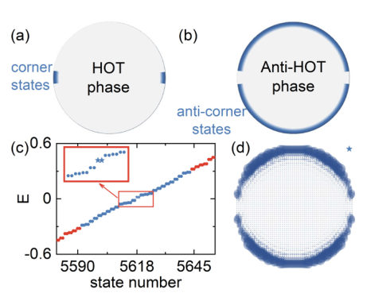 
FIG. 1. (a, b) Schematic of the HOT phase with localized corner states in a circular nanoflake (a), and the anti-HOT phase with anti-corner states extending along most bound- aries but vanishing at specific corners (b). (c) Numerical energy levels of a finite-sized circular bilayer Chern insula- tor system, where anti-corner states are highlighted in blue symbols. The red rectangle indicates the near zero energy region, which is enlarged in the upper left inset. (d) Spatial distributions of representative anti-corner states marked by the star symbols in (c). The gray dots represent discrete lat- tice sites and the areas of the blue circles are proportional to the local density of states....

📷 Fig 2

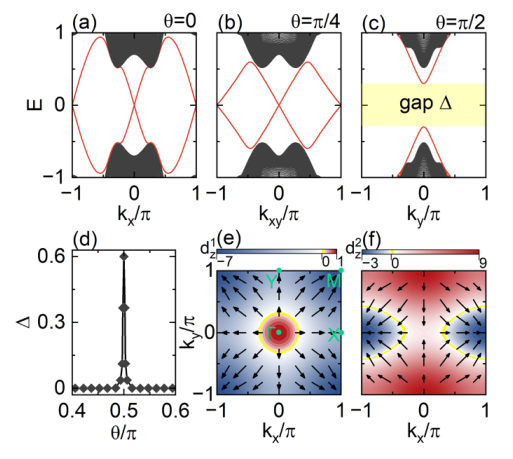 
FIG. 2. (a-c) Band structures of nanoribbons with periodic boundary conditions along different edge directions. The edge angles are θ = 0 in (a), θ = π/4 in (b), and θ = π/2 in (c). Red and black lines correspond to edge states and bulk states, respectively. (d) The energy gap ∆as a function of edge an- gles θ. (e, f) Spin-texture maps in the Brillouin zone for layer 1 and layer 2, respectively. The black arrows represent the components of (dα x, dα y ), while the color represents the dα z component (with the yellow contour marking dα z = 0). Four green dots in (e) correspond to four high-symmetry points. The nanoribbon width is set to L = 300, and all other pa- rameters are the same as...

📷 Fig 3

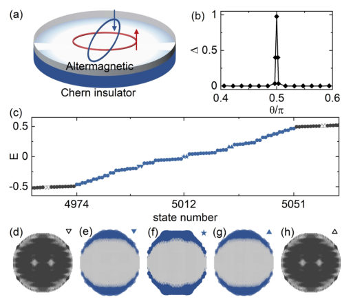 
FIG. 3. (a) Schematic illustration of a Chern insulator with d- wave altermagnetic coupling. (b) Energy gap ∆vs edge angle θ with width L = 300. (c) Spectrum of a circular nanoflake, highlighting anti-corner (blue) and bulk (black) states. (d-h) Spatial distributions of the representative states marked in (c). Parameters: R = 40, m = B = 1, J = 0.9.

📷 Fig 4

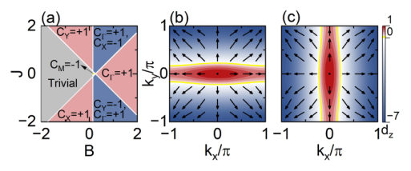 
FIG. 4. (a) Phase diagram in the (B, J) plane with m = 1. Gray, red (yellow), and blue regions denote trivial, first-order topological, and anti-HOT phases, where the BIS encloses 0, 1, and 2 high-symmetry points, respectively. (b, c) Spin textures for two anti-HOT phase. Arrows (colors) indicate in-plane (out-of-plane) components. Parameters: B = 1, J = 0.9 in (b) and B = 1, J = −0.9 in (c).

**Summary.** This paper introduces anti-higher-order topological insulators (anti-HOTIs) as the dual counterpart to conventional topological insulators. By analyzing a bilayer Chern insulator model, the authors demonstrate that anti-HOTIs exhibit a unique state distribution where edge states exist but corner states are suppressed. This work establishes anti-topology as a new theoretical framework for topological materials research.

**Why it may be interesting.** The concept of anti-topology provides a new framework for classifying topological phases, which is highly relevant to understanding boundary physics in condensed matter systems, potentially leading to novel material designs.

Detailed structure

**Main problem.** The paper addresses the need to explore the dual counterpart of topological states, introducing the concept of anti-topological states and anti-higher-order topological insulators (anti-HOTIs).

**Main result.** The authors establish anti-topology as a new paradigm, demonstrating that anti-HOTIs host states along most boundaries but are characteristically absent at the corners, unlike conventional HOTIs.

**Method.** The study uses theoretical modeling based on bilayer Chern insulator Hamiltonians and analyzes the topological invariant defined by the charges enclosed by the Band Inversion Surfaces (BIS).

**Model / system.** The system is modeled using a bilayer Hamiltonian applied to a Chern insulator, incorporating components derived from a modified Qi–Wu–Zhang (QWZ) model. The analysis is performed on nanoribbons and nanoflakes.

**Key observables.** The topological invariant is the set of topological charges enclosed by the BIS; key observables include the gap magnitude and the spatial distribution of edge/anti-corner states.

**Important parameters / regimes.** Key parameters include the Chern numbers enclosed by the BIS at high-symmetry points ($\Gamma, X, Y, M$), and the system parameters $B$ and $J$ in the phase diagram analysis.

**Assumptions / limitations.** The analysis assumes the system preserves inversion symmetry, which helps pin the topological charges at specific high-symmetry points in the Brillouin Zone.

**Figures summary.** Figures illustrate the schematic difference between HOT (corner states) and anti-HOT (anti-corner states), show band structures of nanoribbons at varying angles, and present phase diagrams mapping the anti-HOT phase based on enclosed topological charges.

**Paper structure.** The paper introduces the concept of anti-topology via duality, develops the model using a bilayer Hamiltonian, calculates the topological invariant using BIS analysis, and finally demonstrates the anti-HOT phase through numerical simulations and phase diagram construction.

Abstract

Duality is a fundamental concept in physics that connects complementary opposites like particles and holes. Similarly, while topological states in topological insulators localize at boundaries, the existence and nature of their dual counterparts remain unexplored. Here, we introduce anti-topological states as the dual of topological states, exemplified by anti-higher-order topological insulators. Unlike higher-order topological insulators, where states localize at corners, anti-higher-order topological insulators host states along edges but absent at corners, realizing an inverted distribution of states. We demonstrate this phenomenon in a bilayer Chern insulator with opposite Chern numbers, where the band inversion surfaces enclose distinct high-symmetry points. The topological invariant distinguishing these phases is given by the topological charges enclosed by band inversion surfaces. This work establishes anti-topology as a new paradigm, opening a chapter in topological research.

[↑ back to top](#top)

### [Large Exchange Magnetostriction in a Kagome Antiferromagnet at Room Temperature](http://arxiv.org/abs/2609.00887v1)

**Authors:** Jie Du, Liang Yao, Hang Li, Xiaodong Zhou, Yuan Yao, Xuekui Xi, Yong-Chang Lau, Wenhong Wang  
**Type:** both · **Category:** other · **PDF:** <https://arxiv.org/pdf/2609.00887v1>  
**Analysis basis:** full PDF text, analyzed in chunks
**Topic relevance:** `analog quantum simulation` **2/5**

📷 Fig 1

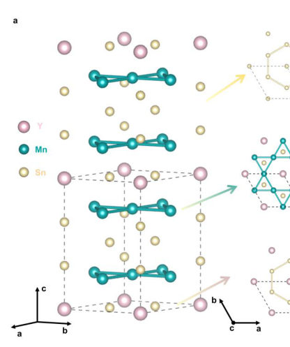 
Figure 1. Crystal Structure and crystalline quality characterization of YMn6Sn6. (a) Schematic

📷 Fig 2

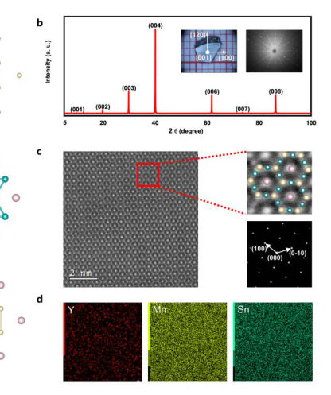 
Figure 1a presents the crystal structure of YMn6Sn6, with Y, Mn, and Sn atoms

📷 Fig 3

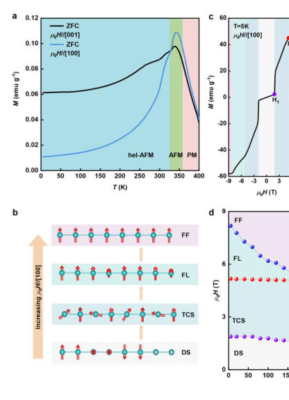 
Figure 2. Magnetic properties and phase diagrams of YMn6Sn6 under applied fields along

📷 Fig 4

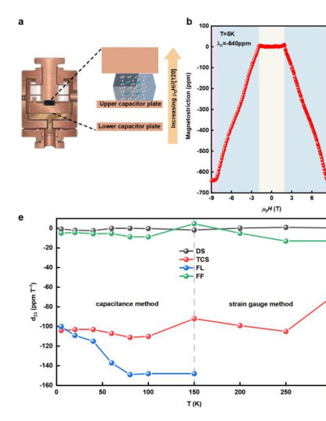 
Figure 4. Capacitance method magnetostriction measurements and temperature-dependent

📷 Fig 5

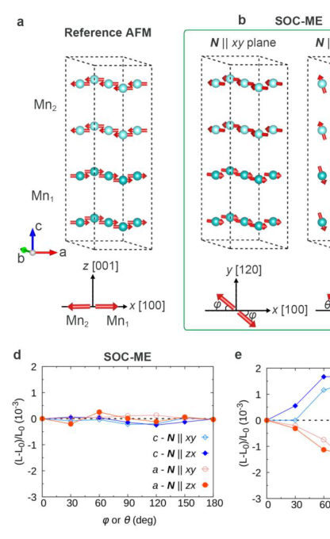 
Figure 5. First-principles calculations of exchange-driven spin-lattice coupling in YMn6Sn6.

**Summary.** This work reports the observation of large, highly reversible magnetostriction in the kagome antiferromagnet YMn6Sn6 at room temperature. The mechanism is determined to originate from the competition between different magnetic exchange interactions, which drive the system from a helical to a collinear magnetic state. This establishes kagome helimagnets as a promising, low-dissipation platform for magnetomechanical applications.

**Why it may be interesting.** While focused on condensed matter magnetism, the concept of field-induced, reversible lattice strain driven by competing quantum interactions (exchange coupling) provides a model for understanding controllable, low-dissipation coupling mechanisms relevant to quantum sensing or actuation.

Detailed structure

**Main problem.** The research addresses the need for high-performance magnetostrictive materials, specifically by systematically exploring large magnetostriction in antiferromagnets, which are often overlooked compared to ferromagnets.

**Main result.** The kagome antiferromagnet YMn6Sn6 exhibits large, nearly hysteresis-free magnetostriction (exceeding 400 ppm) at room temperature, which is attributed to the competition between intralayer and interlayer exchange interactions.

**Method.** The study combines extensive experimental measurements (magnetostriction, XRD, STEM) with first-principles theoretical calculations (DFT) to model the magnetoelastic coupling.

**Model / system.** The physical system is the kagome helimagnet YMn6Sn6, characterized by competing magnetic exchange interactions (intralayer FM vs. interlayer coupling) that stabilize a noncollinear helical magnetic ground state.

**Key observables.** Large anisotropic and volume magnetostriction ($\sim 300-400$ ppm), field-induced magnetic phase transitions (helical to collinear), and the degree of magnetostrictive reversibility.

**Important parameters / regimes.** Room temperature (300 K), applied magnetic field up to 9 T, and the ratio/competition strength between intralayer and interlayer exchange interactions.

**Assumptions / limitations.** The large magnetostriction is primarily driven by exchange-interaction-mediated spin structure reconstruction rather than conventional Spin-Orbit Coupling (SOC) effects.

**Figures summary.** Figures illustrate the crystal structure, XRD patterns, STEM images confirming homogeneity, and detailed plots showing anisotropic strain responses ($\lambda_{\parallel}$ vs. $\lambda_{\perp}$) correlated with magnetic field-induced phase transitions.

**Paper structure.** The paper establishes the technological need, presents structural characterization, details the magnetic phase transitions under field, quantifies the anisotropic magnetostriction, and finally uses DFT calculations to prove the exchange-driven nature of the magnetoelastic coupling.

Abstract

The pursuit of high-performance magnetostrictive materials is crucial for advancing technologies in sensing, actuation, and microelectromechanical systems. Although pronounced magnetostrictive effects have been observed in a few ferromagnets, a systematic exploration of magnetostriction across a broader range of antiferromagnets remains limited. Here, we report the observation of large magnetostriction in the kagome antiferromagnet YMn6Sn6. Under a magnetic field, the system undergoes a field-induced evolution from a helical magnetic ground state toward a collinear field-polarized state, accompanied by a large anisotropic lattice strain and a substantial volume magnetostriction exceeding 400 ppm at room temperature. Remarkably, the magnetostrictive response remains nearly fully reversible up to 9 T with nearly hysteresis-free behavior, effectively minimizing the energy dissipation commonly associated with domain-wall pinning. Combined experimental measurements and theoretical calculations reveal that the large, nearly hysteresis-free magnetostriction originates from the competition between intralayer ferromagnetic and interlayer exchange interactions. This exchange-driven magnetoelastic coupling further gives rise to a strongly direction-dependent lattice distortion pathway. This work establishes kagome helimagnets as a tunable platform for low-dissipation magnetoelastic functionalities and responsive magnetomechanical applications.

[↑ back to top](#top)

### [Superconducting diode effect from field-induced $s+if$ pairing in Ising superconductors](http://arxiv.org/abs/2609.01476v1)

**Authors:** Alex Levchenko, Maxim Khodas  
**Type:** theory · **Category:** other · **PDF:** <https://arxiv.org/pdf/2609.01476v1>  
**Analysis basis:** full PDF text, analyzed in chunks
**Topic relevance:** `Keldysh / 2PI / non-Gaussian methods` **2/5**

📷 Fig 1

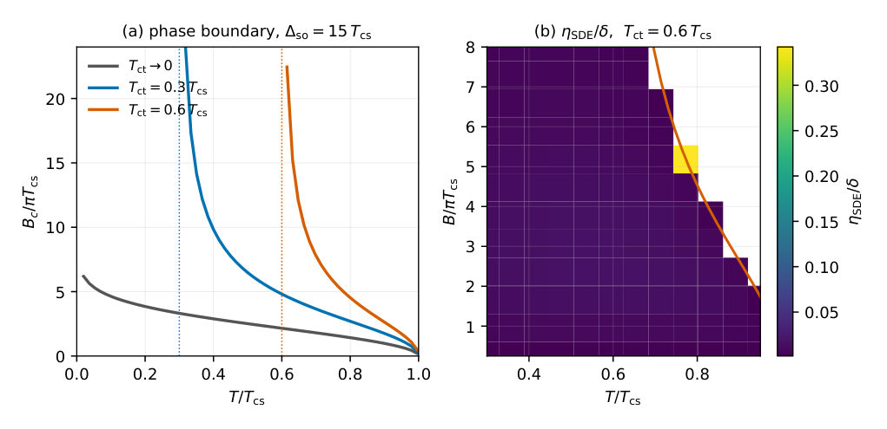 
FIG. 1. (a) Phase boundary Bc(T) of the coupled singlet-triplet system, obtained from the vanishing of the lowest eigenvalue of the quadratic form (35), for three strengths of the triplet channel. The attractive E′′ channel enhances Bc and drives its divergence as T →Tct (dotted verticals), consistent with Ref. [44]. (b) Diode efficiency ηSDE/δ across the (T, B) plane for Tct = 0.6 Tcs, with the phase boundary overlaid. The efficiency is maximal in a ridge adjacent to the triplet-enhanced critical field, reaching values an order of magnitude above the low-field ones. Parameters: ∆so = 15 Tcs, δ = 0.1.

📷 Fig 2

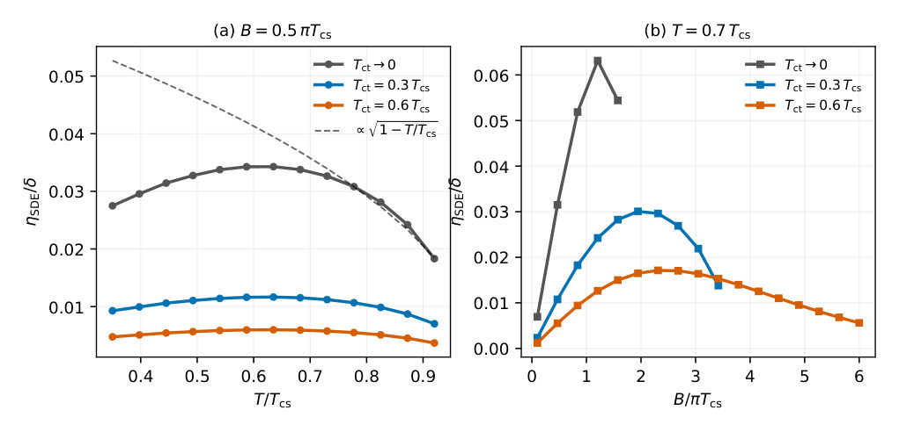 
FIG. 2. (a) Temperature dependence of the diode efficiency at fixed B = 0.5 πTcs for three strengths of the triplet channel. The dashed line is the p

📷 Fig 3

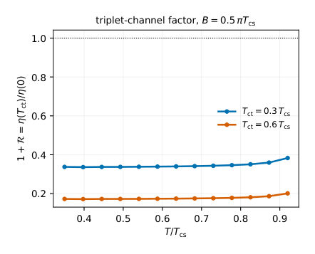 
FIG. 3. Triplet-channel factor 1+R(T) = ηSDE(Tct)/ηSDE(Tct → 0) at B = 0.5 πTcs. At weak fields the collective conversion path interferes destructively with the direct one and suppresses the effi- ciency by a nearly temperature-independent factor, in accord with the anatomy of Eqs. (45) and (46).

**Summary.** This theoretical work analyzes the superconducting diode effect in Ising superconductors due to field-induced s+if pairing. By developing a two-component Ginzburg-Landau theory, the authors demonstrate that the SDE is governed by the coupling between singlet and triplet channels. This effect provides a novel transport measurement to detect the presence of hidden triplet pairing states.

**Why it may be interesting.** The strong coupling between magnetic fields, spin-orbit coupling, and superconducting symmetry breaking provides a rich platform for studying emergent quantum phenomena in condensed matter systems, relevant to understanding topological superconductivity.

Detailed structure

**Main problem.** The paper investigates the superconducting diode effect (SDE) arising from field-induced s+if pairing in Ising superconductors.

**Main result.** The SDE is shown to be a transport probe for the hidden triplet pairing channel, with the diode response strength controlled by the ratio of Zeeman to spin-orbit energies ($\Delta Z/\Delta 	ext{so}$).

**Method.** The authors construct and analyze a symmetry-constrained two-component Ginzburg-Landau theory for coupled singlet and triplet order parameters, deriving coefficients from a microscopic model.

**Model / system.** The system is an Ising superconductor (e.g., monolayer TMDs) subjected to an in-plane magnetic field, which induces an s+if condensate character via triplet Cooper pairs.

**Key observables.** Superconducting Diode Effect ($\eta_{	ext{SDE}}$), Lifshitz invariants, and the superconducting order parameters ($\psi$ and $\mathbf{d}$).

**Important parameters / regimes.** Zeeman energy ($\Delta Z$), spin-orbit energy ($\Delta 	ext{so}$), and the ratio $\Delta Z/\Delta 	ext{so}$.

**Assumptions / limitations.** The analysis relies on the GL theory framework and the assumption that the triplet sector can be integrated out to yield an effective single-component theory.

**Figures summary.** Figure 3 illustrates the temperature and field dependence of the diode efficiency, showing the triplet channel extends the diode regime beyond the singlet-only critical field.

**Paper structure.** The paper progresses from establishing the physical mechanism (SOC leading to triplet pairing and Lifshitz invariants) to constructing the full GL theory, deriving effective coefficients, and finally analyzing the resulting SDE behavior under varying field strengths.

Abstract

The in-plane critical field of Ising superconductors exceeds the Pauli limit by an order of magnitude because the Ising spin-orbit coupling locks the electron spins out of the basal plane. The same locking converts an in-plane Zeeman field into a source of equal-spin triplet Cooper pairs, so that the field-driven condensate acquires an $s+if$ character. We show that this conversion channel also generates Lifshitz invariants, the odd-in-momentum terms of the Ginzburg-Landau expansion responsible for the superconducting diode effect. When the basal mirror symmetry of the monolayer is lifted by a substrate or a gate, the field-induced triplets couple linearly to the Cooper-pair momentum, and an intrinsic diode response develops whose strength is set by the ratio of the Zeeman and spin-orbit energies rather than by the small ratio of the spin-orbit and Fermi energies familiar from parity-mixing mechanisms. We construct the symmetry-constrained two-component Ginzburg-Landau theory of the coupled singlet and triplet order parameters and derive all of its coefficients from the microscopic model of an Ising superconductor; the complete functional, including all gradient and quartic terms, is generated by a single pair-breaking function of temperature, field, and Cooper-pair momentum. An attractive triplet channel reshapes the diode response: at weak fields it suppresses the efficiency through destructive interference between the direct and the collective-mode conversion paths, while at strong fields it extends the diode regime well beyond the singlet-only critical field, with the maximal efficiency reached along the triplet-enhanced phase boundary. The diode effect thereby serves as a transport probe of a hidden triplet pairing channel and of the field-induced $s+if$ state.

[↑ back to top](#top)

### [Floquet scattering and Fano resonances in nodal-ring and multi-Weyl semimetals: Role of propagating and evanescent modes](http://arxiv.org/abs/2609.00631v1)

**Authors:** Sandip Bera, Ipsita Mandal  
**Type:** theory · **Category:** other · **PDF:** <https://arxiv.org/pdf/2609.00631v1>  
**Analysis basis:** full PDF text, analyzed in chunks
**Topic relevance:** `Full counting statistics` **1/5** · `Keldysh / 2PI / non-Gaussian methods` **1/5** · `driven-dissipative phase transition` **1/5** · `methods for driven-dissipative` **1/5** · `non-equilibrium universality` **1/5**

📷 Fig 1

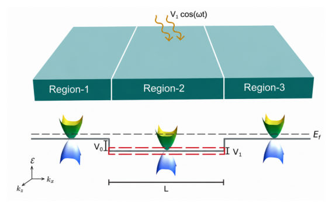 
FIG. 1. Schematic of the scattering geometry for a quasiparticle incident on a time-periodic potential well in a double-Weyl (J = 2) mWSM. The potential is oriented along the x-axis, dividing the propagation direction into three regions: region I (x &lt; −L/2) contains the incident and reflected waves, region II (−L/2 ≤x ≤L/2) contains the driven potential well of width L and depth V0, and region III (x &gt; L/2) contains the transmitted waves. A time-periodic modulation of amplitude V1 and frequency ω is applied to the well, indicated by the red dashed lines marking the oscillating potential boundaries. Outside the well, the multi-Weyl cone has a linear dispersion along kx and is filled up to...

📷 Fig 2

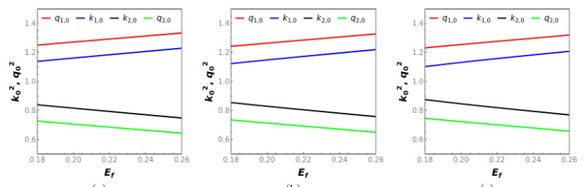 
FIG. 2. Variation of the squared longitudinal wavevectors as a function of Fermi energy for the undriven case (m = n = 0). Subfigures (a), (b), and (c) show the squares of the wavevectors against the Fermi energy (Ef) for kz = 0.1 M, 0.12 M, and 0.14 M, respectively, with ky fixed at 0.1 M. Within the displayed energy-window, the squared wavevectors remain positive, indicating that all four channels are propagating and contribute directly to transport. This is the regime of complete multi-channel propagation. The plot legends encode the magnitudes of the individual momentum-vectors. All wavevectors, energy scales, and inverse lengths are expressed in units of M. The remaining parameters are...

📷 Fig 3

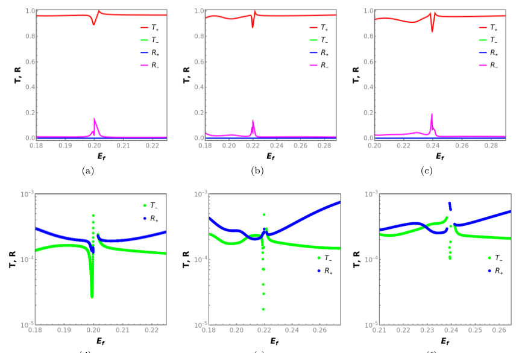 
FIG. 3. Reflection and transmission coefficients as functions of Fermi energy for different values of longitudinal momentum. Subfigures (a), (b), and (c) show the Fermi energy dependence of the reflection (R+, R−) and transmission (T+, T−) coefficients for three values of kz, 0.1 M, 0.12 M, and 0.14 M, with ky = 0.1M. The lower subfigures show the same data on a logarithmic scale, which highlights subtle features, such as sharp dips or small oscillations, that are obscured on a linear scale. All wavevectors, energy scales, and inverse lengths are expressed in units of M. The remaining parameters are fixed at B = 1 M−1, ω = 0.05 M, V0 = 0.1 M, V1 = 0.025 M, and L = 25 M−1.

📷 Fig 4

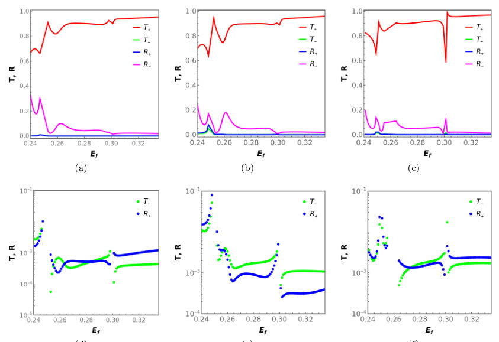 
FIG. 4. Reflection and transmission coefficients as functions of incident energy for different values of transverse momentum. Subfigures (a), (b), and (c) show the energy dependence of the reflection (R+, R−) and transmission (T+, T−) coefficients for three values of transverse momentum, ky = 0.1 M, 0.3 M, and 0.5 M. Unlike Fig. 3, where ky is fixed and kz varies, here kz is kept constant at 0.2 M to isolate the effect of ky on the scattering characteristics. Increasing ky raises the transverse kinetic energy and changes the coupling between Floquet sidebands, shifting the resonance patterns in both channels. The lower subfigures show the same data on a logarithmic scale, which resolves...

📷 Fig 5

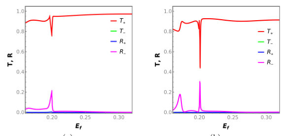 
FIG. 5. Reflection and transmission coefficients as functions of incident energy for different barrier widths. All wavevectors k, energy scales, and inverse lengths are expressed in units of M. Subfigures (a) and (b) show the reflection (R+, R−) and transmission (T+, T−) coefficients for barrier widths of L = 30 M−1 and L = 60 M−1, respectively. The remaining parameters are fixed at ky = 0.1M, kz = 0.1M, B = 1 M−1, ω = 0.05 M, V0 = 0.1 M, and V1 = 0.025 M.

**Summary.** This work extends Floquet scattering theory to analyze quantum transport in topological semimetals like nodal-ring and multi-Weyl systems under periodic driving. By solving the full boundary problem, the authors prove that while evanescent modes are required for mathematical consistency, only propagating modes dictate observable transport properties. This establishes a unified framework for understanding Floquet-induced phenomena like Fano resonances in these complex materials.

**Why it may be interesting.** The rigorous mathematical treatment of boundary conditions in the presence of time-periodic driving and complex band structures (Weyl/Nodal-Ring) provides a powerful, general framework for analyzing open quantum systems dynamics.

Detailed structure

**Main problem.** The paper develops a comprehensive Floquet scattering theory to analyze quantum transport in periodically driven nodal-ring and multi-Weyl semimetals.

**Main result.** It establishes that while evanescent modes are mathematically necessary for boundary matching, they do not contribute to measurable transport quantities like transmission or shot noise, which are determined entirely by propagating channels.

**Method.** The authors solve the full boundary-value problem using Floquet scattering theory, constructing the scattering matrix by matching wavefunctions and their derivatives at potential interfaces.

**Model / system.** The study focuses on Nodal-Ring Semimetals (NRSs) and multi-Weyl Semimetals (mWSMs) subjected to a time-periodic driving potential. The analysis involves solving the time-dependent Schrödinger equation in the Floquet basis.

**Key observables.** Transmission, reflection, pumped shot noise, and Floquet-induced Fano resonance features.

**Important parameters / regimes.** The driving frequency ($\omega$), the potential strength ($V_0, V_1$), and the topological nature of the semimetals (NRSs, mWSMs).

**Assumptions / limitations.** The analysis assumes the zero-temperature limit for shot noise calculations and relies on the mathematical necessity of including evanescent modes for consistency in nonlinear dispersion regimes.

**Figures summary.** Figure 1 schematically illustrates the scattering geometry for a quasiparticle incident on a time-periodic potential well in a double-Weyl mWSM, dividing the space into incident, well, and transmitted regions.

**Paper structure.** The paper builds from developing the full Floquet scattering formalism for anisotropic topological semimetals, deriving the scattering matrix by solving boundary conditions across interfaces, and finally analyzing the resulting transport coefficients and Fano resonance signatures.

Abstract

We develop a comprehensive Floquet scattering theory for quantum transport in periodically driven nodal-ring semimetals (NRSs) and multi-Weyl semimetals (mWSMs), extending our earlier study reported in Annalen der Physik 535, 2200460 (2023), in which evanescent modes were neglected, to a complete formalism that includes both propagating and evanescent channels. By solving the full boundary-value problem, we obtain the complete set of scattering states and show that, although evanescent modes are indispensable for satisfying the matching conditions at the potential interfaces, they carry zero net probability current and do not contribute to any observable transport quantity. We identify a previously unexplored transport regime in NRSs in which two propagating channels coexist and participate in coherent scattering, producing multi-channel quantum interference and Floquet-induced Fano resonances. The transmission, reflection, pumped shot noise, and the associated Fano resonance features are determined entirely by the propagating channels, and the resonance energies coincide with those of the corresponding quasi-bound states of the static potential well. Our results establish a unified framework for Floquet transport in anisotropic topological semimetals, and confirm that the approximation of neglecting evanescent modes in our earlier work is justified for all measurable transport properties.

[↑ back to top](#top)

### [Probing Nonlinear Interactions of Dipolar Interlayer Excitons in MoSe$_2$/WSe$_2$ Heterobilayers](http://arxiv.org/abs/2609.01149v1)

**Authors:** Sai Shradha, Luc F. Oswald, Md Tarik Hossain, Lukas Krelle, Nicole Engel, Axel Printschler, Julian Führer, Honey Jayeshkumar Shah, Daria I. Markina, Kenji Watanabe, Takashi Taniguchi, Andrey Turchanin, Bernhard Urbaszek  
**Type:** experiment · **Category:** other · **PDF:** <https://arxiv.org/pdf/2609.01149v1>  
**Analysis basis:** full PDF text, analyzed in chunks
**Topic relevance:** `analog quantum simulation` **1/5** · `driven-dissipative phase transition` **1/5** · `quantum measurements` **1/5** · `quantum optics experiment` **1/5**

📷 Fig 1

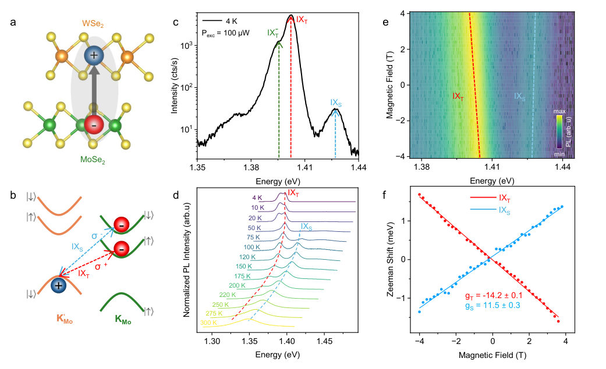 
FIG. 1. a Schematic of MoSe2/WSe2 heterobilayer. b Band alignment and spin configuration of the type-II MoSe2/WSe2 heterostructure, illustrating interlayer charge transfer and the formation of spin-singlet (IXS) and spin-triplet (IXT) IXs. c PL spectrum from the heterobilayer resolving multiple interlayer exciton resonances such as the spin-triplet trion IX− T, the spin-triplet IXT and the spin-singlet IXS states at T = 4 K. d Temperature-dependent PL spectra ranging from 4 to 300 K showing the energy shift of the PL peaks following a Varshni function depicted with dashed curves. e Magnetic field dependent shift in the emission energy of IXT and IXS. f Zeeman shifts and the corresponding...

📷 Fig 2

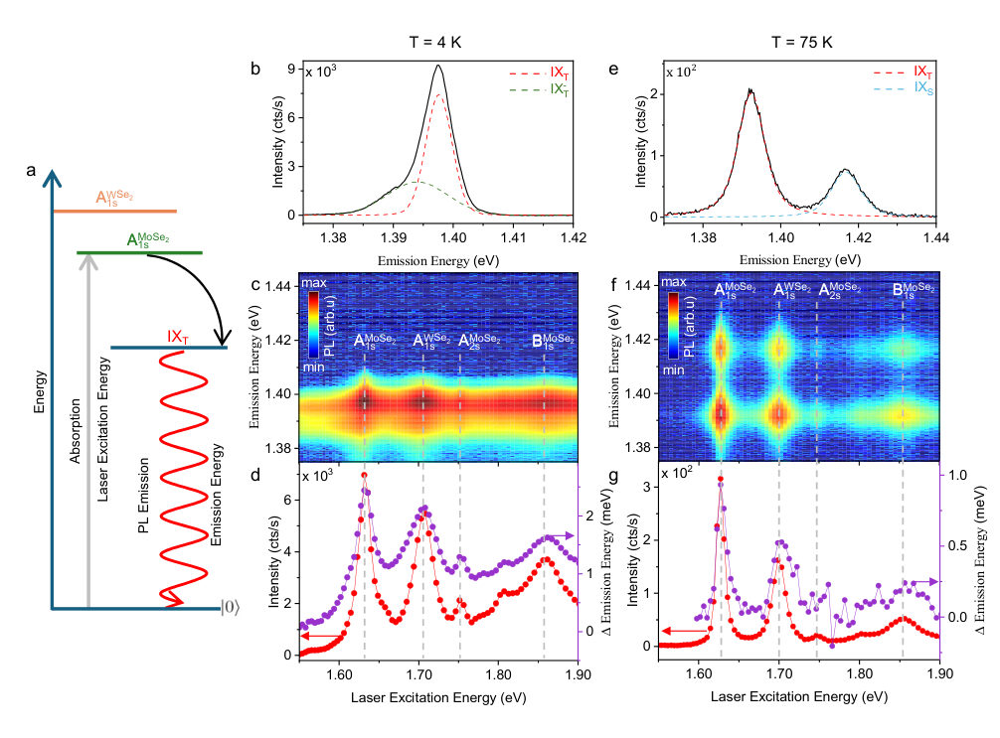 
FIG. 2. a Schematic of absorption, charge transfer and PL emission under excitation resonant with the intralayer excitonic states. b PL emission under an excitation of 1.63 eV. The green and red dashed curves show the fits corresponding to IX− T and IXT respectively. c Heatmap of PL intensity while tuning the excitation energy. d Peak intensity (in red, left y-axis) and shift (∆) of the emission energy (in purple, right y-axis) of IXT as a function of the excitation energy. The grey dashed lines indicate the position of the resonances which are assigned to various intralayer states. b-d are all measured at T = 4 K with a constant excitation power of 20 µW. e-g The same as b-d measured at T...

📷 Fig 3

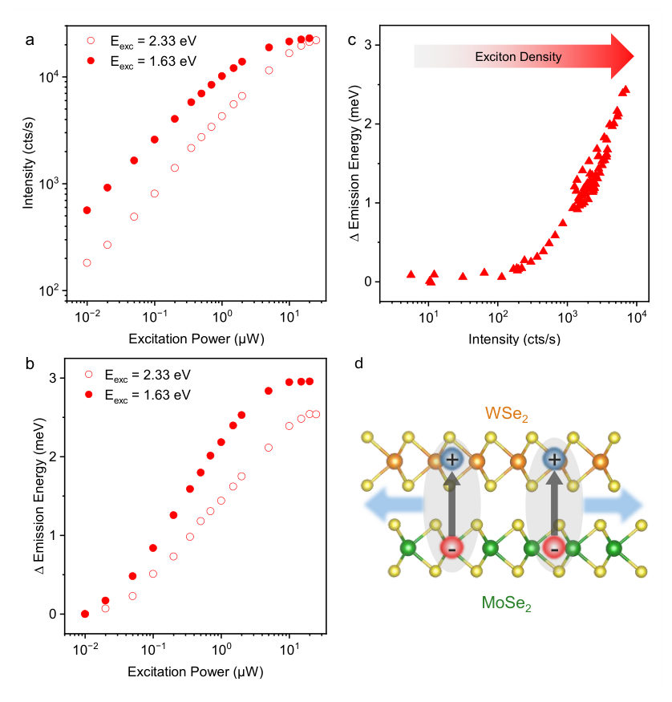 
FIG. 3. Power dependent a intensity and b emission energy shift, of IXT under resonant (1.63 eV, solid circles) and off-resonant (2.33 eV, circles) excitation. c The shift of the emission energy with corresponding change in the intensity of the of IXT emission obtained from PLE at T = 4 K with a power of 20 µW. d Schematic of dipolar repulsion that dominates the interaction between dipolar IXs at high exciton densities.

**Summary.** This work investigates the high-density behavior of interlayer excitons in MoSe2/WSe2 heterobilayers using PLE spectroscopy. By tuning the excitation energy, the researchers drive the system into a nonlinear regime, observing PL saturation and a systematic blueshift in the emission energy. This blueshift confirms the presence of a net repulsive exciton-exciton interaction, establishing PLE as a key diagnostic tool for these quantum materials.

**Why it may be interesting.** The use of PLE spectroscopy to map out the nonlinear response of excitons in a solid-state van der Waals heterostructure provides a powerful experimental tool for studying many-body physics in quantum materials.

Detailed structure

**Main problem.** The study aims to probe the nonlinear, high-density interactions of dipolar interlayer excitons (IXs) within MoSe2/WSe2 heterobilayers.

**Main result.** The IX emission exhibits a systematic blueshift proportional to the increasing IX population, confirming a net repulsive exciton-exciton interaction dominated by dipole-dipole repulsion.

**Method.** Excitation-energy-dependent photoluminescence excitation (PLE) spectroscopy and power-dependent PL measurements are used to selectively vary and probe the high-density regime of the excitons.

**Model / system.** The physical system is a van der Waals heterobilayer of MoSe2/WSe2, which forms interlayer excitons due to type-II band alignment, giving rise to an intrinsic out-of-plane dipole moment.

**Key observables.** Interlayer exciton photoluminescence (PL) energy shift (blueshift), saturation of PL response, and apparent broadening of intralayer resonances in PLE spectra.

**Important parameters / regimes.** Low temperatures (4 K vs 75 K), varying excitation power, and the density regime achieved through resonant excitation.

**Assumptions / limitations.** The observed blueshift is attributed to repulsive exciton-exciton interaction, and the PLE measurements are sensitive enough to probe nonlinear population dynamics.

**Figures summary.** Figures summarize the structure, band alignment, temperature dependence (Varshni fit), magnetic field effects (Zeeman shifts), and the dependence of IX emission energy on excitation energy and power.

**Paper structure.** The paper establishes the physical system and methods (PLE, power dependence) to access the nonlinear regime, presents evidence of nonlinear dynamics (saturation, broadening), and quantifies the interaction strength via the systematic blueshift of the IX emission.

Abstract

Interlayer excitons in transition-metal dichalcogenide heterobilayers possess intrinsic out-of-plane dipole moments, providing a platform for investigating exciton-exciton interactions at high densities. Here, we use excitation-energy-dependent photoluminescence excitation (PLE) spectroscopy to probe the nonlinear response of dipolar interlayer excitons in chemical vapor deposition-grown MoSe$_2$/WSe$_2$ heterobilayers. By tuning the excitation energy across intralayer exciton resonances at fixed excitation power, we selectively vary the population injected into the interlayer exciton states. Resonant excitation drives the system into a nonlinear regime, leading to saturation of the interlayer exciton photoluminescence and an apparent broadening of the intralayer $1s$ resonances in the PLE spectra. At the same time, the interlayer exciton emission exhibits a pronounced blueshift, reaching approximately 2.5 meV at 4 K and 1 meV at 75 K. The blueshift increases systematically with the interlayer exciton population and is consistent with a net repulsive exciton-exciton interaction, with contributions from dipole-dipole repulsion in the density regime investigated. Our results establish PLE as a sensitive approach for accessing the nonlinear, high-density regime of interlayer excitons and probing their interactions in van der Waals heterostructures.

[↑ back to top](#top)

### [Exchange striction determines how fast antiferromagnetic insulators demagnetize](http://arxiv.org/abs/2609.01069v1)

**Authors:** Aleksandr Buzdakov, Ravi Kaushik, Nikolai Khokhlov, Sergey Artyukhin, Alexey Kimel  
**Type:** both · **Category:** other · **PDF:** <https://arxiv.org/pdf/2609.01069v1>  
**Analysis basis:** full PDF text, analyzed in chunks
**Topic relevance:** `correlated / nonlocal dissipation` **1/5** · `driven-dissipative phase transition` **1/5** · `non-equilibrium universality` **1/5**

📷 Fig 1

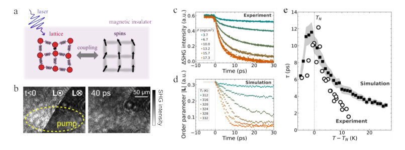 
Figure 1: Ultrafast demagnetization of Cr2O3 and atomistic spin-dynamics simulations. (a) Schematic of the experiment: the pump pulse heats the lattice subsystem, and the resulting hot phonons transfer energy to the spins, reducing the order parameter |L|. (b) Second-harmonic- generation snapshots of a two-domain region of Cr2O3 before and 40 ps after a pump pulse of fluence F = 17.3 mJ/cm2. The domain contrast reflects the magnitude of Néel vector L and drops sharply after the pump pulse. The dashed line marks the pumped area. (c) Time-dependent SHG contrast at pump fluences from 3.7 to 17.3 mJ/cm2, recorded at an initial temperature of 300 K. (d) Time evolution of the order parameter |L|...

📷 Fig 2

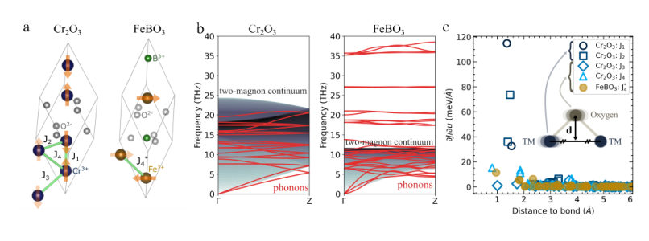 
Figure 2: Magnons, phonons and exchange striction in Cr2O3 and FeBO3. (a) Rhom- bohedral primitive cells of Cr2O3 (left) and FeBO3 (right). Arrows indicate the sublattice mag- netization, bold lines mark the symmetry-inequivalent exchange paths. (b) Phonon dispersions (red lines) and two-magnon continuum (grey shading) along the Γ-Z path. The continuum is obtained by sampling ωµ(k) + ων(Q −k) over the full Brillouin zone for each Q on the path. Phonon branches lying inside the continuum satisfy the resonance condition in Eq. (1) and can decay into a magnon pair. The Cr2O3 continuum extends up to ∼25 THz and overlaps almost the entire phonon spectrum, while the FeBO3 continuum is confined...

📷 Fig 3

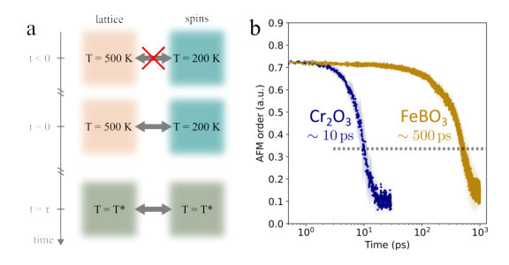 
Figure 3: Coupled spin-lattice dynamics simulations. (a) Simulation protocol. For t &lt; 0 the lattice is thermalized at 500 K and the spin subsystem at 200 K with the spin-lattice coupling switched off (red cross), so the two subsystems reach equilibrium independently. At t = 0 the coupling is turned on (grey arrow) and the damping is removed; the combined system evolves microcanonically while energy flows from the hot lattice into the spins until the two subsystems reach a common effective temperature T ∗at t = τ. (b) Time evolution of the order parameter |L| for Cr2O3 (blue) and FeBO3 (gold), shown on a logarithmic time axis. The starting value below unity reflects the finite spin...

**Summary.** This research establishes that the speed at which antiferromagnetic insulators demagnetize is controlled by the coupling between lattice vibrations (phonons) and spin excitations (magnons). By calculating the exchange striction tensor, the authors provide a predictive, computable parameter that successfully explains the vast difference in demagnetization rates observed between $	ext{Cr}_2	ext{O}_3$ and $	ext{FeBO}_3$.

**Why it may be interesting.** The work provides a concrete, computable material parameter ($\partial J / \partial u$) that links fundamental lattice physics (phonons/displacements) directly to ultrafast magnetic dynamics, which is highly relevant for understanding energy dissipation and non-equilibrium quantum dynamics in solids.

Detailed structure

**Main problem.** The paper aims to determine the fundamental physical mechanism that sets the speed limit for demagnetization in antiferromagnetic insulators.

**Main result.** The demagnetization rate is governed by energy flow from the lattice into the spins, quantified by the exchange striction tensor ($\partial J / \partial u$). This mechanism explains the large difference in demagnetization speeds between $	ext{Cr}_2	ext{O}_3$ and $	ext{FeBO}_3$.

**Method.** The study combines first-principles calculations (DFT+U) to compute exchange striction parameters with atomistic spin-lattice dynamics (SLD) simulations to model the time evolution of the magnetic order parameter.

**Model / system.** The system involves antiferromagnetic insulators ($	ext{Cr}_2	ext{O}_3$, $	ext{FeBO}_3$) modeled using spin operators and phonon operators. The Hamiltonian is expanded to include an interaction term driven by the dependence of the exchange coupling ($J$) on atomic displacements ($\mathbf{u}$), leading to a one-phonon-two-magnon process.

**Key observables.** Demagnetization time ($	au$) measured via time-resolved Second-Harmonic Generation (SHG) contrast; the exchange-striction tensor ($\partial J / \partial u$).

**Important parameters / regimes.** The ratio of decay rates ($	au_{	ext{DM},1p1m}^{-1} / 	au_{	ext{ex},1p2m}^{-1}$); the magnitude of the exchange coupling sensitivity to displacement.

**Assumptions / limitations.** The analysis relies on perturbative expansions in atomic displacements and assumes that the one-phonon-two-magnon (1p2m) channel dominates over the Dzyaloshinskii-Moriya (DM)-driven 1p1m channel.

**Figures summary.** Figures compare crystal structures and magnetic paths of $	ext{Cr}_2	ext{O}_3$ and $	ext{FeBO}_3$, showing the overlap between phonon dispersions and the two-magnon continuum, which dictates the coupling strength.

**Paper structure.** The paper progresses from identifying the experimental challenge (fast demagnetization) to proposing the mechanism (lattice coupling via exchange striction). It details the theoretical derivation of the coupling vertex (1p2m process) and concludes by applying this framework to compare two specific materials, quantifying the rate difference.

Abstract

Antiferromagnets combine terahertz spin dynamics with insensitivity to stray fields, and how quickly their order can be manipulated sets the speed limit on device operation. Femtosecond optical pulses demagnetize antiferromagnetic insulators on timescales that span picoseconds to nanoseconds across compounds, and no material parameter is known that accounts for the spread or predicts where a new compound will fall. In a compensated antiferromagnet, no angular momentum needs to leave the spin system, so the rate is set by energy flow from the lattice into the spins. Time-resolved second-harmonic generation experiments show that Cr2O3 demagnetizes within 2 ps once the lattice is driven above the Neel temperature, two orders of magnitude faster than the structurally similar FeBO3. First-principles calculations trace the disparity to exchange striction: short Cr-Cr contacts make the exchange coupling tenfold more sensitive to atomic displacements and widen the phase space for phonon decay into magnon pairs. Spin-lattice simulations with ab initio parameters reproduce the order of magnitude of the measured ratio. The derivative of the exchange coupling with respect to the ionic displacement thus emerges as a computable parameter that predicts how fast an insulating antiferromagnet can be demagnetized. The results advance our understanding of ultrafast control in insulating antiferromagnets, and suggest a practical pathway to screen candidate materials for thermally assisted antiferromagnetic memory before synthesis.

[↑ back to top](#top)

### [Singular Weak-Field Thermodynamics of 2D Superconductors](http://arxiv.org/abs/2609.01602v1)

**Authors:** Guopeng Xu, Chunli Huang  
**Type:** theory · **Category:** statistical mechanics · **PDF:** <https://arxiv.org/pdf/2609.01602v1>  
**Analysis basis:** full PDF text, analyzed in chunks
**Topic relevance:** `Keldysh / 2PI / non-Gaussian methods` **1/5** · `analog quantum simulation` **1/5** · `quantum measurements` **1/5**

📷 Fig 1

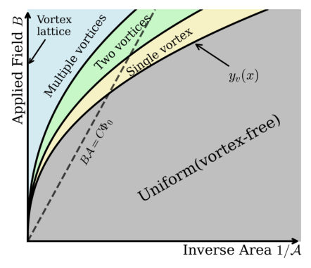 
Figure 1. Ground state of a 2D superconductor in the weak-field thermodynamic limit. The solid boundary separating the vortex-free and single-vortex states is described by Eq. (1), while the remain- ing boundaries are inferred schematically by continuity. The black dashed line represents a fixed-flux trajectory where Φ0 = ℎ/2𝑒.

📷 Fig 2

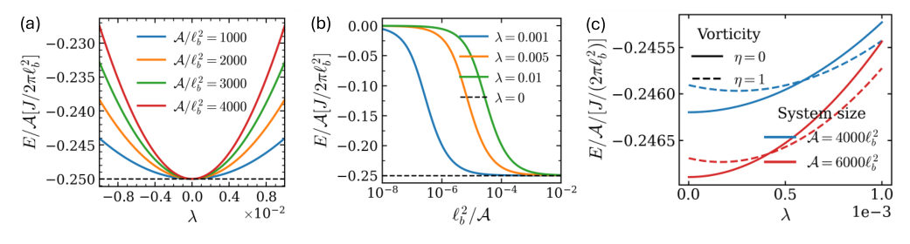 
Figure 2. (a) Energy density dependence on 𝜆for several system areas. The narrowing valley with increasing A signals the emergence of a nonanalyticity at 𝜆= 0 in the thermodynamic limit. (b) Energy density dependence on inverse area for several fixed values of 𝜆. For any finite 𝜆, the energy density vanishes as A →∞, reflecting saturation of the total energy, whereas for A ≪𝜋ℓ2 𝐶it approaches the uniform zero-field bulk value indicated by the dashed line. (c) Comparison of energy density between the uniform and single-vortex states as a function of 𝜆for several system sizes.

📷 Fig 3

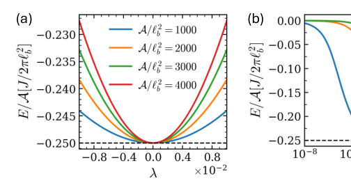 
Fig. 2(a) and (b) show complementary cuts of Eq. (16). At fixed area, the energy density as a function of 𝐵forms a val- ley centered at 𝐵= 0 [Fig. 2(a)]. As A increases, the depth of the valley remains fixed at −𝜖0, while its width shrinks as 𝐵∗∼A−1/2. Consequently, its curvature at 𝐵= 0, which determines the diamagnetic magnetic susceptibility, diverges in the thermodynamic limit. The complementary fixed-𝐵cuts in Fig. 2(b) show that, for any nonzero 𝐵, the zero-winding en- ergy density vanishes as A →∞, whereas at 𝐵= 0 it remains equal to the bulk condensation-energy density −𝜖0. Thus, the energy landscape develops a singular, infinitely narrow valley at the origin (diverging diamagnetic...

📷 Fig 4

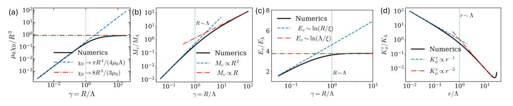 
Figure 3. Screening crossover. (a) Diamagnetic response as a function of 𝛾= 𝑅/Λ. The numerical result approaches the weak screening behavior 𝜒0 = 𝑅4/(4𝜇0Λ) for 𝑅≪Λ, while saturating to the strong-screening limit 𝜒0 = 8𝑅3/(3𝜇0) for 𝑅≫Λ. (b) Orbital magnetic moment of a centered vortex, showing the crossover from 𝑀𝑣∝𝑅2 in the weak-screening regime to 𝑀𝑣∝𝑅in the strong-screening regime. 𝑀Λ ≡Φ0Λ/𝜇0. (c) Vortex stiffness energy. For 𝑅≪Λ it grows as 𝐸𝑣∼𝐸Λ ln(𝑅/𝜉) where 𝐸Λ ≡Φ2 0/(2𝜋𝜇0Λ), whereas for 𝑅≫Λ Pearl screening cuts off the logarithmic growth at the scale Λ, giving 𝐸𝑣∼𝐸Λ ln(Λ/𝜉). (d) Vortex sheet-current profile for 𝑅≫Λ, exhibiting the crossover from 𝐾𝑣 𝜙∝𝑟−1 at 𝑟≪Λ to 𝐾𝑣 𝜙∝𝑟−2 at 𝑟≫Λ. 𝐾Λ...

📷 Fig 5

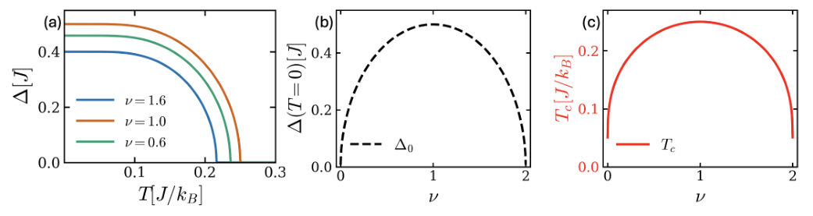 
Figure 1. (a) The self-consistent gap solution as function of temperature. (b) The zero T superconducting gap as a function of total filling fraction. (c) The critical temperature 𝑇𝑐as a function of total filling fraction.

**Summary.** This theoretical work analyzes the thermodynamics of 2D superconductors in a magnetic field, finding that the critical field for vortex formation depends on the sample size. By comparing weak and strong screening limits, the authors derive specific scaling laws for this critical field and establish a firm microscopic foundation for the weak-field ground state.

**Why it may be interesting.** The study of size-dependent critical fields and the non-commutativity of limits is highly relevant to understanding finite-size effects in quantum materials, which is a key area in modern condensed matter theory.

Detailed structure

**Main problem.** The paper investigates the weak-field thermodynamics of two-dimensional (2D) superconductors, specifically addressing the non-commutativity of the weak-field and thermodynamic limits.

**Main result.** The lower critical field required to nucleate the first vortex is size-dependent, scaling differently in weak ($\propto \mathcal{A}^{-1}\ln(\mathcal{A})$) and strong ($\propto \mathcal{A}^{-1/2}$) screening regimes.

**Method.** The analysis uses microscopic models, solving for the ground state energy of both vortex-free and single-vortex states by incorporating screening effects via coupling to 3D Maxwell equations.

**Model / system.** The system is a 2D superconductor (e.g., atomically thin TMDs) modeled using a Hamiltonian involving Landau levels and attractive contact interactions. The study compares the energy density in the presence of an external magnetic field ($B$) versus the thermodynamic limit ($A 	o \infty$).

**Key observables.** Lower critical field $B_v(\mathcal{A})$, energy density ($E/A$), and the vortex orbital moment ($m_v$).

**Important parameters / regimes.** System area ($\mathcal{A}$), external magnetic field ($B$), screening regimes (weak vs. strong), and the ratio of characteristic length scales ($\xi, \Lambda, R$).

**Assumptions / limitations.** The analysis relies on treating the problem non-perturbatively using Landau quantization and making approximations in momentum space for calculating vortex self-energies.

**Figures summary.** Figures illustrate the ground state energy dependence on field and area, showing non-analytic behavior at zero field and comparing energy densities for uniform vs. single-vortex states.

**Paper structure.** The paper progresses by establishing the physical difference between 2D and 3D superconductors, deriving the energy functional for vortex states, analyzing the scaling laws for the first-vortex field in different screening regimes, and concluding with the thermodynamic limit behavior.

Abstract

In a bulk 3D type-II superconductor, the lower critical field at which an isolated vortex becomes thermodynamically favorable is a size-independent material property. We show that the situation is different in 2D superconductors: the larger the superconductor, the weaker the field needed to create its first vortex. The lower critical field in 2D is always size-dependent. For a disk of area $\mathcal A$, the lower critical field $B_v(\mathcal A)$ scales as $\mathcal A^{-1}\ln(\mathcal A/\mathcal A_0)$ in the weak-screening regime and as $\mathcal A^{-1/2}$ in the strong-screening regime. We derive these results from an analytically tractable microscopic model that admits many-body wavefunctions for both the uniform and singly quantized vortex states in a magnetic field, and incorporate screening by coupling their long-distance 2D supercurrents to 3D Maxwell equations. These results motivate organizing the weak-field ground-state of a 2D superconductor in the $(1/\mathcal A,B)$ plane. The origin represents the zero-field thermodynamic limit and it is singular. Approaching the origin along the $B$ axis leads to an increasingly dilute vortex lattice, whereas approaching along the $1/\mathcal A$ axis yields the uniform vortex-free state. Our theory shows that every trajectory carrying fixed finite flux ultimately approaches the vortex-free state in the thermodynamic limit and provides a firm microscopic foundation for the weak-field thermodynamics of 2D superconductors.

[↑ back to top](#top)

### [Spatiotemporal Chaos with Extended Spatial Interactions](http://arxiv.org/abs/2609.01424v1)

**Authors:** A. Raj, M. R. Paul  
**Type:** theory · **Category:** statistical mechanics · **PDF:** <https://arxiv.org/pdf/2609.01424v1>  
**Analysis basis:** full PDF text, analyzed in chunks
**Topic relevance:** `Frenkel-Kontorova` **1/5** · `analog quantum simulation` **1/5** · `non-equilibrium universality` **1/5**

📷 Fig 1

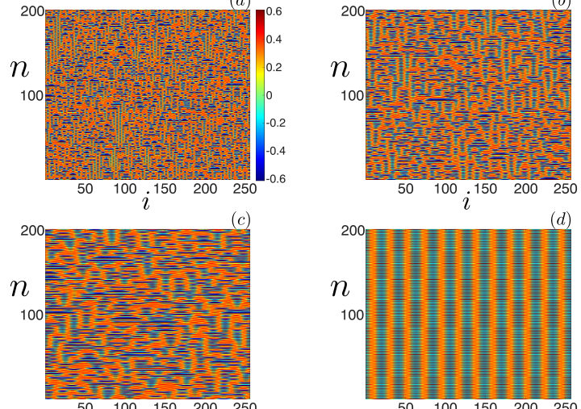 
Fig. 2. Spacetime plots of u(n) i : (a) ξd =1 (nearest-neighbor coupling), (b) ξd =3 (6-neighbor coupling), (c) ξd =6 (12-neighbor coupling), (d) ξd =10 (20-neighbor coupling). To quantify the length scale of the structures shown in Fig. 2, the two-point correlation length ξc has

📷 Fig 2

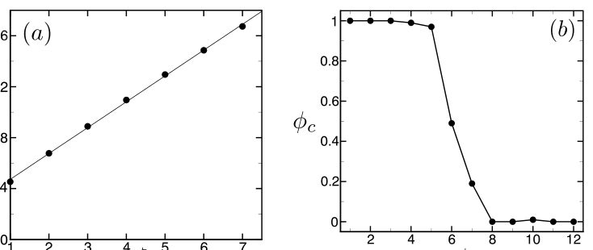 
Fig. 3. (a) The linear variation of the correlation length ξc with the length scale of the spatial coupling ξd. The solid line is the curve-fit ξc =2.70+2.03ξd. (b) The fraction φc of random initial conditions which lead to chaotic dynamics. Each simulation is iterated forward in time for 2 × 106 time steps and 100 simulations were conducted for each value of ξd using different random initial conditions. As ξd is increased, there is a transition from chaotic to periodic dynamics. In Fig. 3(b), we show the fraction of random initial conditions, φc, that yield a lattice with chaotic dynamics as indicated by a positive leading Lyapunov exponent λ1 &gt; 0. Each data symbol is the fraction that has...

📷 Fig 3

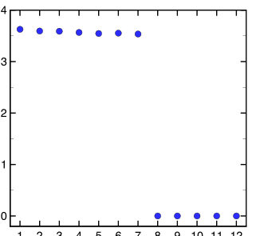 
Fig. 4. The variation of the leading Lyapunov exponent λ1 with the extent of the spatial coupling ξd. λ1 is not affected significantly as the coupling increases to include 14 neighbors (ξd =7). For larger values, ξd ≥8, the dynamics are periodic in time as indicated by the vanishing values of λ1.

📷 Fig 4

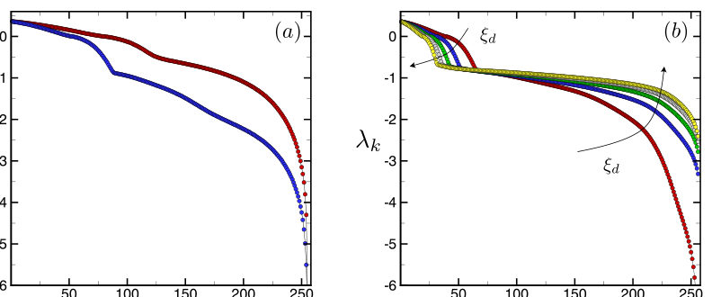 
Fig. 5. Variation of the spectrum of Lyapunov exponents, λk, with the length scale of spatial coupling, ξd, where k is the Lyapunov index. (a) ξd =1 (upper curve, red), ξd =2 (lower curve, blue). (b) Results for 3≤ξd ≤7. The direction of increasing ξd is indicated by the arrows to highlight to opposing trends found for small and large k. exponents increase with increasing values of ξd as indicated by the arrow on the right side of Fig. 5(b). The directions of these two opposing trends are indicated by the arrows which point in the direction of the spectra variation with increasing ξd. Figure 5(b) indicates that the values of the positive Lyapunov exponents (excluding λ1), and a portion of...

📷 Fig 5

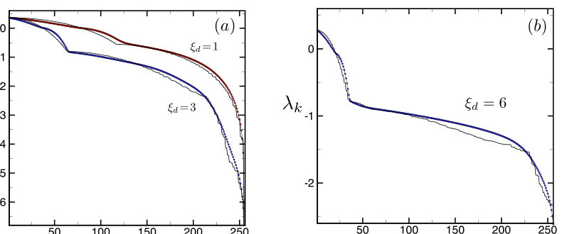 
Fig. 6. A comparison of the computed Lyapunov spectra (symbols) with the theoretical prediction using Eqs. (5)-(6) (solid black lines): (a) ξd =1, ξd =3; (b) ξd =6.

**Summary.** This theoretical work analyzes spatiotemporal chaos in coupled map lattices by extending the spatial coupling range. Using Covariant Lyapunov Vectors, the authors predict that the system's dynamics exhibit a distinct transition between two regimes, with the dividing point being directly related to the system's fractal dimension. This provides a powerful, general diagnostic tool for characterizing complex, extended nonlinear systems.

**Why it may be interesting.** While focused on classical chaos, the use of advanced spectral tools like CLVs to characterize the structure of chaotic attractors and their scaling properties is highly relevant to understanding non-equilibrium dynamics in quantum many-body systems.

Detailed structure

**Main problem.** The paper investigates the chaotic dynamics of large one-dimensional lattices of nonlinear maps as the extent of spatial coupling is increased.

**Main result.** The analysis reveals a clear decomposition of the dynamics into two regimes based on the spatial power spectrum of the CLVs, with the separating index corresponding to the system's fractal dimension.

**Method.** The study employs Covariant Lyapunov Vectors (CLVs) to theoretically predict the spectral variation of CLVs and the spectrum of Lyapunov exponents, independent of the specific nonlinear mapping function.

**Model / system.** The system is a Coupled Map Lattice (CML) defined by a 1D lattice of nonlinear maps, coupled via a spatially extended interaction term. The dynamics are governed by $\vec{u}(n+1) = A_c(\epsilon, \xi_d)\vec{f}(\vec{u}(n))$.

**Key observables.** Covariant Lyapunov Vectors (CLVs), Lyapunov exponent spectrum, spatial power spectrum of CLVs, and the fractal dimension of the dynamics.

**Important parameters / regimes.** The spatial coupling extent ($\xi_d$) is the primary varying parameter, alongside fixed values for the map parameter ($r=2.8$) and coupling strength ($\epsilon=0.7$).

**Assumptions / limitations.** The theoretical approach assumes the spatial coupling is symmetric and that the coupling matrix $A_c$ is sparse and banded.

**Figures summary.** Figures illustrate the 1D lattice setup, the evolution of the correlation length ($\xi_c$) and chaotic fraction ($\phi_c$) as $\xi_d$ increases, and the spatial power spectra of the CLVs.

**Paper structure.** The paper develops a theoretical framework using CLVs to analyze the spectral properties of the coupled system. It analyzes the spatial power spectrum, deducing a two-regime structure for the CLVs, and relates the transition index to the fractal dimension.

Abstract

The chaotic dynamics of a large one-dimensional lattice of nonlinear maps with a spatial coupling of increasing extent is explored using the covariant Lyapunov vectors (CLVs). A theoretical approach is developed that predicts the spectral variation of the CLVs and the spectrum of Lyapunov exponents. The theoretical approach is independent of the details of the mapping function and requires only a description of the lattice coupling. The general structure of the spatial power spectrum of the CLVs is determined using only the eigenvectors of the coupling matrix. This yields a decomposition of the CLVs into two regimes. The first regime, corresponding to the largest Lyapunov exponents, contains highly entangled CLVs with significant contributions from large scale spatial structures and aligns with the sorted eigenvectors, which occur in pairs with wavenumbers that increase linearly with their index. The second regime contains significant mixing of length scales with increasing index. The index separating these two regimes is approximately equal to the fractal dimension of the dynamics.

[↑ back to top](#top)

### [Classifying coherent peaks in nanoelectronic devices by the presence or absence of spin exchange](http://arxiv.org/abs/2609.00729v1)

**Authors:** Jongbae Hong  
**Type:** both · **Category:** strongly correlated electrons · **PDF:** <https://arxiv.org/pdf/2609.00729v1>  
**Analysis basis:** full PDF text, analyzed in chunks
**Topic relevance:** `Keldysh / 2PI / non-Gaussian methods` **1/5** · `methods for driven-dissipative` **1/5**

📷 Fig 1

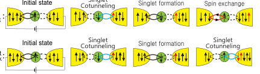 
FIG. 2: Spin dynamics of unidirectional entangled-state tun- neling in a QPC device [13]. Dynamics involving spin ex- change (top) generate the ZBP, whereas dynamics involv- ing only singlet cotunneling (bottom) generate coherent side peaks.

📷 Fig 2

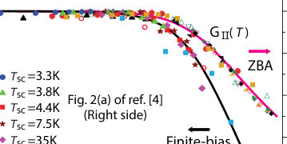 
Fig. 2(a) of ref. [15]

📷 Fig 3

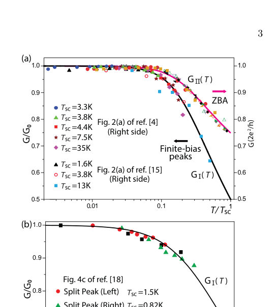 
Fig. 4a of ref. [18]

📷 Fig 4

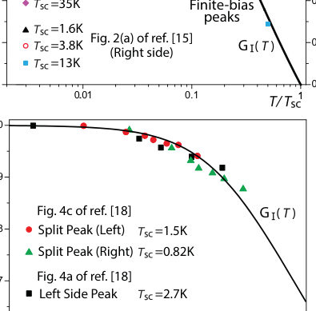 
FIG. 3: (a) Temperature-scaled finite-bias differential- conductance maxima taken from references [4, 18] for various gate voltages collapse onto the scaling function GI(T ). For comparison, the zero-bias anomaly data from the same ref- erences are shown scaled by GII(T ). (b) Temperature-scaled finite-bias peaks observed in the even-particle sector of QD- SETs collapse onto GI(T ). Red dots and green triangles corre- spond to a spin-singlet state in the QD, whereas black squares correspond to a spin-triplet state [23]. The corresponding val- ues of TSC and the data sources are indicated.

📷 Fig 5

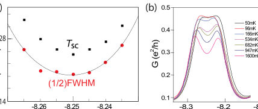 
FIG. 4: (a) Comparison between TSC and (1/2)FWHM for a CNT QDSET as a function of VG, expressed in the same energy units. The TSC data were obtained through scaling analysis, while the (1/2)FWHM data are taken from Fig. 2(d) of reference [27]. (b) Temperature-dependent linear conduc- tance used to determine the TSC values shown in (a).

**Summary.** This work classifies coherent conductance peaks in quantum dots and quantum point contacts by analyzing their temperature scaling behavior. The authors distinguish between peaks arising from spin exchange dynamics, characteristic of Kondo physics, and those arising solely from cotunneling. This classification is crucial for understanding the fundamental spin interactions governing transport in mesoscopic quantum devices.

**Why it may be interesting.** The clear distinction between spin-exchange (Kondo) and cotunneling mechanisms in transport measurements provides a powerful experimental diagnostic tool for understanding spin interactions in nanoscale quantum conductors.

Detailed structure

**Main problem.** The paper classifies coherent peaks in nanoelectronic devices based on whether their underlying spin dynamics are governed by spin exchange (Kondo physics) or purely by cotunneling of spin pairs.

**Main result.** Two distinct categories of coherent peaks are identified: one involving spin exchange (seen in QPC/even-particle QDSET ZBPs) and another involving only cotunneling (seen in odd-particle QDSET ZBPs).

**Method.** The classification relies on detailed scaling analysis of temperature-dependent differential conductance ($dI/dV$) measurements and theoretical reproduction using Green's function techniques.

**Model / system.** The study analyzes Quantum-dot single-electron transistors (QDSETs) and Quantum Point Contacts (QPCs), which model localized spins coupled to metallic leads.

**Key observables.** Differential conductance ($dI/dV$), zero-bias peaks (ZBPs), and the scaling temperature ($T_{SC}$) relative to the Kondo temperature ($T_K$).

**Important parameters / regimes.** Temperature ($T$), gate voltage ($V_G$), and the ratio of $T_{SC}$ to $rac{1}{2}	ext{FWHM}$.

**Assumptions / limitations.** The analysis assumes that the observed physics can be separated into distinct spin dynamics mechanisms (spin exchange vs. cotunneling) and utilizes scaling functions derived from theoretical models.

**Figures summary.** Figures illustrate schematic device setups (QDSET/QPC) and compare temperature-scaled conductance data, showing different scaling behaviors for different peak types.

**Paper structure.** The paper progresses by defining the physical systems, developing scaling functions for different peak types, and then using theoretical calculations (Green's functions, matrix reduction) to confirm the spin dynamics responsible for the observed conductance features.

Abstract

Coherent peaks appearing in the differential conductance of quantum-dot single-electron transistors (QDSETs) and quantum point contact (QPC) devices are classified into two categories according to the scaling function onto which the temperature-scaled differential-conductance maxima collapse and the underlying spin dynamics. The zero-bias peaks (ZBPs) observed in QPCs and in the triplet state of the even-particle sector of QDSETs belong to the same category, whereas the ZBP in the odd-particle sector of a QDSET belongs to a different category together with all finite-bias coherent peaks observed in QPCs and in the even-particle sector of QDSETs. The spin dynamics of the former category involve spin exchange, a hallmark of Kondo dynamics, whereas those of the latter category involve only cotunneling of an up--down spin pair. Furthermore, for the former type of ZBP, the scaling temperature coincides with one-half of the full width at half maximum (FWHM), which corresponds to the Kondo temperature. In contrast, for the latter type, the scaling temperature does not coincide with the (1/2)FWHM-derived energy scale. To support these findings, the gate-voltage-dependent differential-conductance line shapes measured in the odd-particle sector of a QDSET are theoretically reproduced. The results demonstrate that the observed ZBP is a merging of two coherent side peaks generated solely by the cotunneling of up--down spin pairs.

[↑ back to top](#top)

### [Inversion-symmetric topological insulators in cut-and-project binary chains](http://arxiv.org/abs/2609.01312v1)

**Authors:** Zhipeng Zeng, Yuge Chen, Jean-Noël Fuchs, Jianxin Zhong, Rémy Mosseri  
**Type:** theory · **Category:** other · **PDF:** <https://arxiv.org/pdf/2609.01312v1>  
**Analysis basis:** full PDF text, analyzed in chunks
**Topic relevance:** `Frenkel-Kontorova` **1/5** · `analog quantum simulation` **1/5**

📷 Fig 1

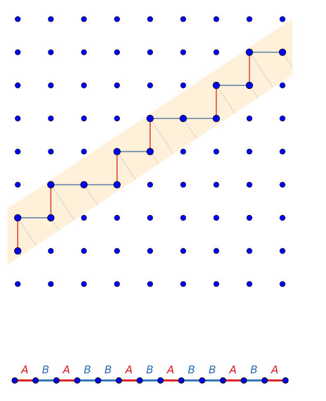 
FIG. 1. Schematic of the cut-and-projection construc- tion.Top: The yellow strip region (the "acceptance zone) with width W and slope α = 2/3 selects points in the Z2 lattice, and edges connecting these points (noted A for the vertical edges and B for horizontal edges). This set of selected points is usually projected onto the physical space E∥along the dot- ted lines, leading to projected edges of different length. Bot- tom: In the present work, the selected points in the strip are instead projected onto a line of slope unity, leading to A, B bonds of equal length.

📷 Fig 2

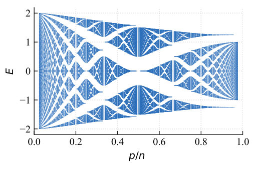 
FIG. 2. CP butterfly for the binary tight-binding chains. For each rational slope α = p/q, the unit cell contains n = p + q sites and the spectrum contains n bands. The spectrum support is plotted against the rescaled CP slope θ = p/n, for hopping amplitudes tB = 1 and tA = 0.5. This diagram displays a rich hierarchical structure.

📷 Fig 3

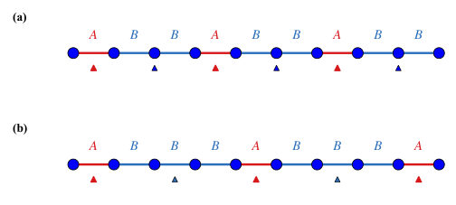 
FIG. 3. Wannier-center configurations for odd and even chains. (a) α = 1/2 ABB chain: Wanniers centers sit either at a site (shared by two B bonds) or at a bond center (here an A bond); (b) α = 1/3 ABBB chain: the Wannier centers remain bond-centered in both insulating regimes, but occupy different inversion-symmetric positions (here a A bond or a B bond centers).

📷 Fig 4

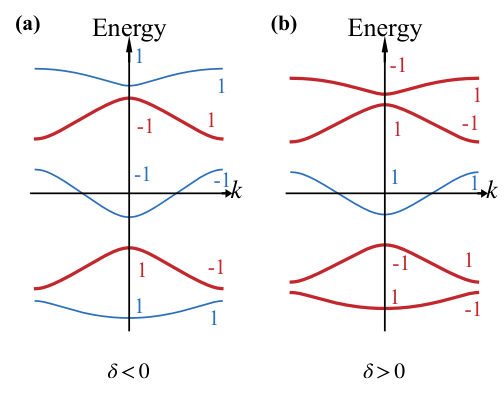 
FIG. 4. Band structures for the chain corresponding to p/q = 2/3. The hopping amplitudes are tA = 1+δ and tB = 1−δ (a) δ &lt; 0 and (b) δ &gt; 0. The numbers ±1 at the high-symmetry points k = 0 and k = π label the inversion eigenvalues of each band. For bands coloured red, the product of inversion eigenvalues is ξk=0ξk=π = −1, corresponding to a Zak phase of π; for bands coloured blue, the product is +1,corresponding to a Zak phase of 0. The gaps close at δ = 0.

📷 Fig 5

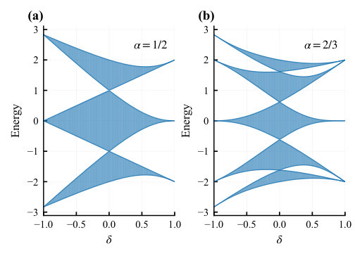 
FIG. 5. Band structure of two odd n cases : α = 1/2, ABB (a) and α = 2/3, ABABB (b), plotted as a function of δ, with tB = 1 −δ and tA = 1 + δ. At δ = 0 the gaps close.

**Summary.** This work analyzes topological insulators in 1D chains created via the cut-and-project method, which imposes inversion symmetry. The authors establish a precise mathematical criterion—related to the ratio $n/\gcd(M,n)$—that dictates whether a topological transition occurs between different insulating phases. This provides a deep theoretical understanding of how lattice geometry and band filling control topological behavior.

**Why it may be interesting.** The rigorous connection between the topological invariants (polarization jumps) and simple arithmetic properties ($n/\gcd(M,n)$ parity) provides a powerful, model-independent tool for classifying topological phases in engineered quantum materials.

Detailed structure

**Main problem.** The paper investigates the electronic properties and topological transitions in inversion-symmetric topological insulators constructed using the cut-and-project method for binary chains.

**Main result.** Topological transitions are strictly governed by an arithmetic criterion: they occur if and only if $n/\gcd(M,n)$ is odd, with specific exceptions noted for even values.

**Method.** The analysis employs tight-binding models derived from the cut-and-project method, utilizing symmetry constraints (inversion symmetry) and topological diagnostics like the Zak phase and polarization.

**Model / system.** The system is a one-dimensional periodic chain with a binary hopping structure ($t_A, t_B$), generated by projecting a 2D lattice structure ($\mathbb{Z}^2$) via the cut-and-project method for rational slopes $\alpha=p/q$.

**Key observables.** Electric polarization ($P$), topological transition points, and the energy spectrum visualized as a "Cut-and-Project butterfly".

**Important parameters / regimes.** The hopping ratio $t_A/t_B$, the number of sites $n=p+q$, and the number of filled bands $M$.

**Assumptions / limitations.** The analysis is restricted to rational slopes $\alpha = p/q$, and the model assumes spinless electrons with a single orbital per site.

**Figures summary.** Figures illustrate the schematic of the CP construction, the "CP butterfly" spectrum vs. rescaled slope, and plots showing polarization jumps confirming the arithmetic criterion.

**Paper structure.** The paper builds from defining the CP model and its inherent symmetry, establishing the Hamiltonian and spectral features, and then deriving the necessary and sufficient conditions for topological transitions based on the periodicity parameters $n$ and $M$.

Abstract

We investigate the electronic properties of binary tight-binding chains generated by the cut-and-project method for rational slopes $α=p/q$, leading to periodic and inversion symmetric chains with $n=p+q$ sites. The binary structure is encoded in two hopping amplitudes $t_a$ and $t_b$. For fixed $t_a \neq t_b$, the support of the energy spectrum as a function of $p/n$ gives rise to a "Cut-and-Project butterfly". We concentrate on insulators with $M$ filled bands among a total of $n$ bands and vary $t_a/t_b$. Inversion symmetry constrains the electric polarization $P$ to $0$ or $P_q/2$ modulo a polarization quantum $P_q = \gcd(M,n)/n$. A topological transition, between two insulators that differ by their quantized polarization, occurs if and only if $n/\gcd(M,n)$ is odd. When $n/\gcd(M,n)$ is even, the two insulating regimes have a vanishing polarization and no topological transition occurs, despite the gap closing at $t_a=t_b$. When $n$ is even and $M$ odd, we find an adiabatic path between $t_a>t_b$ and $t_a<t_b$ that maintains inversion symmetry and a gap.

[↑ back to top](#top)

### [Layer-selective and magnetic-field-enhanced transport of topological kink states in rhombohedral multilayer graphene](http://arxiv.org/abs/2609.01160v1)

**Authors:** Chengyu Shen, Zhe Hou  
**Type:** theory · **Category:** other · **PDF:** <https://arxiv.org/pdf/2609.01160v1>  
**Analysis basis:** full PDF text, analyzed in chunks
**Topic relevance:** `analog quantum simulation` **1/5**

📷 Fig 1

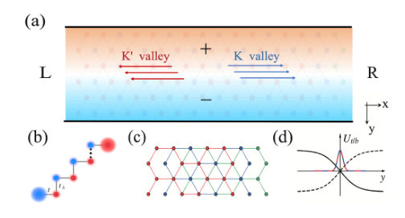 
FIG. 1. (a) Schematic of the rhombohedral multilayer graphene (RMG) transport device, with the inter-layer bias inversion (shown with the ± sign), electrodes (L/R), and valley-polarized VKSs labelled. (b) Side-view of the atomic structure of RMG, showing the layer-polarized distribution of wavefunctions of the VKSs, with red (blue) colors on sublat- tice A(B). The shadows denote the amplitude of wave func- tions of VKSs. (c) Schematic of an ABC-stacked trilayer graphene nanoribbon, where the three layers are distinguished by different colors. (d) Electrostatic potential Ut/b for the top(bottom)-most layer, as functions of the transverse coor- dinate y, showing in a solid (dashed) curve. The...

📷 Fig 2

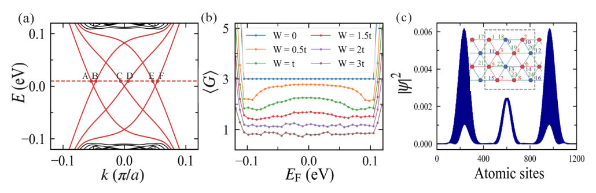 
FIG. 2. (a) Band structure of the trilayer graphene nanoribbon hosting the VKSs (shown in red curves). The nanoribbon width is N = 100. (b) Conductance ⟨G⟩as a function of the Fermi energy EF at different disorder strengths W. Here disorder exists in all-layers. (c) Wave function distributions of the VKSs, corresponding to point A in panel (a), where the Fermi energy EF = 0.01 eV. The inset shows the unit-cell of the nanoribbon of N = 2, with the number denoting the indices of the atomic sites.

📷 Fig 3

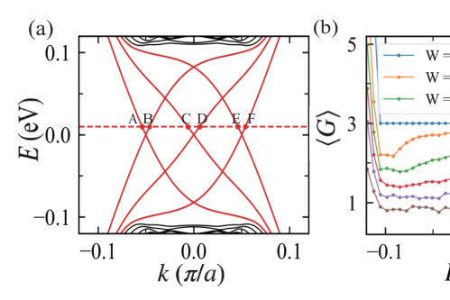 
Figure 2(a) shows the band structure of a clean rhom- bohedral trilayer graphene nanoribbon. Three pairs of counter-propagating VKSs are identified (see the red curves), in accordance with layer layer number [see Eq. (3)]. The K(K′) valley VKSs have positive (neg- ative) slopes in Fig. 2(a), propagating rightward (left- ward). Figure 2(b) shows the two-terminal conductance G of the system. In the absence of disorder (W = 0), the conductance exhibits integer values in units of G0 as a result of the ballistic transport in the central region. For energies within the bulk gap (|E| &lt; 0.1 eV), a quantized conductance plateau with value of 3G0 is observed, con- tributed from the three-pairs of...

📷 Fig 4

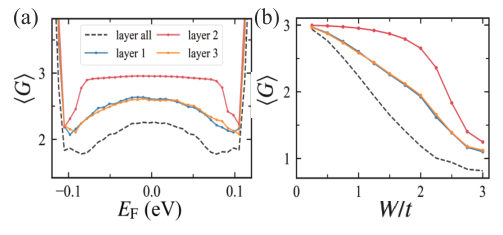 
FIG. 3. ⟨G⟩as a function of EF at a fixed disorder strength W = t in (a), and as a function of W at a fixed Fermi energy EF = 0.01 eV in (b). The four different curves correspond to disorder being introduced to all layers, or exclusively to layer 1, 2, and 3.

📷 Fig 5

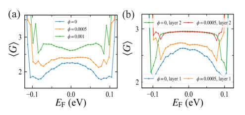 
FIG. 4. ⟨G⟩as a function of EF at a fixed disorder strength W = t in the absence (ϕ = 0) and presence of a magnetic field for trilayer graphene. For (a) the disorder is applied to all layers, and for (b) the disorder is applied exclusively to layer-1 (the top-most layer) or layer-2 (the middle layer).

**Summary.** This work theoretically examines how topological valley kink states behave in multilayer graphene under disorder and a magnetic field. The key finding is that applying a perpendicular magnetic field breaks symmetry, which effectively suppresses backscattering between opposite valleys. This demonstrates that magnetic fields and disorder engineering are powerful tools for controlling topological transport in graphene nanostructures.

**Why it may be interesting.** The control mechanisms identified—layer-selective disorder and magnetic fields—provide concrete, tunable knobs for manipulating topological edge state transport, which is relevant for designing robust quantum interconnects or novel electronic devices.

Detailed structure

**Main problem.** The study investigates the quantum transport of Topological Valley Kink States (VKSs) in rhombohedral multilayer graphene (RMG) when subjected to Anderson disorder and a perpendicular magnetic field.

**Main result.** The perpendicular magnetic field breaks layer symmetry, suppressing intervalley backscattering and significantly enhancing the transmission of VKSs through disordered regions. Furthermore, the transport is highly sensitive to the layer-selective distribution of disorder.

**Method.** The analysis employs numerical Landauer-Büttiker conductance calculations based on a tight-binding model Hamiltonian, supplemented by low-energy continuum descriptions for topological invariants.

**Model / system.** The system is ABC-stacked rhombohedral multilayer graphene (RMG) modeled by a tight-binding Hamiltonian incorporating nearest-neighbor hopping, layer-dependent electrostatic potentials, and disorder terms. The perpendicular magnetic field is included via the Peierls substitution.

**Key observables.** Conductance ($\langle G 
angle$), wave function localization, intervalley scattering suppression, and the valley Chern number ($C_{\xi}$).

**Important parameters / regimes.** Perpendicular magnetic field strength ($\mathbf{B}_{\perp}$), disorder strength/distribution, and the number of graphene layers ($N$).

**Assumptions / limitations.** The analysis assumes an armchair edge termination for the ribbon geometry and utilizes low-energy continuum descriptions near the Dirac points.

**Figures summary.** Figures illustrate the schematic transport device, layer-polarized wave function distributions, band structures showing VKSs, and conductance measurements comparing results with and without a magnetic field.

**Paper structure.** The paper first establishes the model for VKSs in RMG, then analyzes the transport behavior in the absence of a magnetic field (showing layer polarization), and finally details how the perpendicular magnetic field breaks symmetry to enhance transport by suppressing intervalley scattering.

Abstract

Topological valley kink states (VKSs), which are quantum valley Hall states emerging at the interfaces between adjacent domains with opposite valley Chern numbers, have attracted considerable interest in graphene-based systems. In this work, we investigate the quantum transport of VKSs in ABC-stacked rhombohedral multilayer graphene in the presence of Anderson disorder and a perpendicular magnetic field. Two prominent transport characteristics are revealed. First, in the absence of a magnetic field, the kink states exhibit strong layer polarization, with their wave functions predominantly localized and equally distributed on the outermost top and bottom layers. As a result, their transport properties are highly sensitive to the layer-selective disorder distribution. Second, under a perpendicular magnetic field, the layer-symmetric spatial distribution of VKSs is broken, leading to a significant reduction in the wave-function overlap between counter-propagating VKSs from opposite valleys. Consequently, intervalley scattering is suppressed, and the transmission of VKSs through disordered regions is substantially enhanced. Our results provide new insights into multichannel topological valley transport in rhombohedral multilayer graphene and demonstrates disorder-engineering and magnetic fields as effective approaches for manipulating the propagation of VKSs.

[↑ back to top](#top)

### [Narrow-Sense Type-III Dirac Cones and Additional Flat Lines on a Honeycomb Lattice with Anisotropic Next-Nearest-Neighbor Hoppings](http://arxiv.org/abs/2609.00695v1)

**Authors:** Keita Kishigi, Yasumasa Hasegawa  
**Type:** theory · **Category:** other · **PDF:** <https://arxiv.org/pdf/2609.00695v1>  
**Analysis basis:** full PDF text, analyzed in chunks
**Topic relevance:** `analog quantum simulation` **1/5**

📷 Fig 1

 
FIG. 2: (color online). Honeycomb lattice and transfer integrals. Filled circles (•) and open circles (◦) denote sites of the A and B sublattices, respectively. The nearest-neighbor and next-nearest- neighbor transfer integrals are denoted by ta, tb, and tc and t2a, t2b, and t2c, respectively. In this study, we consider ta = tb = tc = t and the anisotropic case t2a = 0 with t2b = t2c = t′.

📷 Fig 2

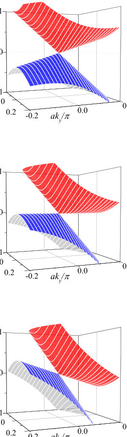 
FIG. 1: (Color online) The energy bands of 2D type-I (a), narrow- sense type-III (b), and type-II (c) Dirac, which are described by Eq. (1), where ˜ε = a(ε(±, kx, ky) −˜εF)/(ℏvF) and a represents the lattice constant. The tilting is classified as type-I for |α/(ℏvF)| &lt; 1, narrow- sense type-III for |α/(ℏvF)| = 1, and type-II for |α/(ℏvF)| &gt; 1. We take α/(ℏvF) = −0.5 for (a), α/(ℏvF) = −1 for (b), and α/(ℏvF) = −1.5 for (c).

📷 Fig 3

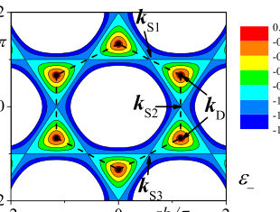 
FIG. 3: (Color online) The upper and lower energy bands (ε+ and ε−) for t′/t = 0 (a) and contour plots of an upper band (b) and a lower band (c), where the boundary of the first Brillouin zone are shown by dotted black lines.

📷 Fig 4

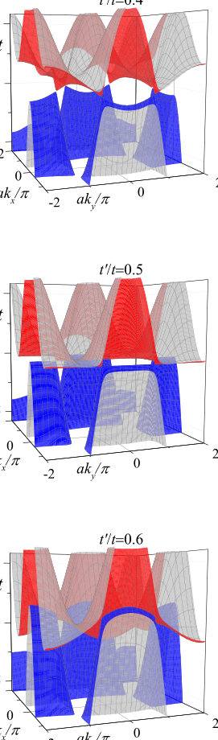 
FIG. 4: (Color online) The upper and lower energy bands (ε+ and ε−) for t′/t = 0.4 (type-I) (a), t′/t = 0.5 (narrow-sense type-III) (b), and t′/t = 0.6 (type-II) (c) when t2a = 0.

📷 Fig 5

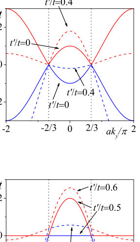 
FIG. 5: (Color online) At fixed kx = 2π/( √

**Summary.** This theoretical work analyzes a honeycomb lattice model to show how anisotropic hopping can generate narrow-sense Type-III Dirac cones. Crucially, the model also predicts additional flat energy lines at the critical point, which leads to a pronounced enhancement of the electronic density of states and specific heat compared to ideal Dirac cone predictions.

**Why it may be interesting.** The finding that geometric features (flat lines) can dramatically enhance thermodynamic responses (specific heat) near a critical point is a general concept relevant to understanding quantum criticality in various condensed matter systems.

Detailed structure

**Main problem.** The study investigates the realization of narrow-sense Type-III Dirac cones and the emergence of additional flat lines in the band structure of a honeycomb lattice.

**Main result.** The model demonstrates that anisotropic next-nearest-neighbor hoppings can induce narrow-sense Type-III Dirac cones, and the co-existence of these cones with additional flat lines significantly enhances the density of states and electronic specific heat.

**Method.** The analysis employs a tight-binding model approach, calculating the energy dispersion, density of states (DOS), and electronic specific heat ($C$) by tuning the hopping anisotropy ratio.

**Model / system.** The system is a single-orbital honeycomb lattice described by a tight-binding Hamiltonian incorporating nearest-neighbor and anisotropic next-nearest-neighbor hopping terms. The electronic properties are analyzed across Type-I, narrow-sense Type-III, and Type-II Dirac cone regimes.

**Key observables.** Dirac cone type (I, III, II), Density of States (DOS), Electronic Specific Heat ($C$), and the existence/energy of additional flat lines.

**Important parameters / regimes.** The ratio of anisotropic next-nearest-neighbor hopping to nearest-neighbor hopping ($t'/t$), particularly around the critical point $t'/t = 0.5$.

**Assumptions / limitations.** The analysis relies on a single-orbital tight-binding model approximation for the electronic structure.

**Figures summary.** Figures illustrate the energy bands for different cone types, the dependence of the DOS and specific heat on the anisotropy ratio, and the local character of energy extrema (saddle points) at high-symmetry points.

**Paper structure.** The paper systematically analyzes the Hamiltonian, first establishing the realization of Type-III cones, then detailing the appearance of additional flat lines at the critical point, and finally quantifying the resulting enhancement in thermodynamic properties like the specific heat.

Abstract

Critically tilted Dirac cones have attracted considerable attention because of their unconventional electronic properties in two-dimensional massless Dirac-fermion systems. Among them, the narrow-sense type-III Dirac cone is characterized by a flat dispersion along the direction connecting the two Dirac points.   Using a tight-binding model on a single-orbital honeycomb lattice, we demonstrate that narrow-sense type-III Dirac cones can be realized by tuning anisotropic next-nearest-neighbor hoppings. Type-I and type-II Dirac cones emerge on either side of the critical point, enabling a systematic investigation of the electronic properties across the type-I, narrow-sense type-III, and type-II regimes.   We further find that the present model exhibits additional flat lines in momentum space whose energy coincides with the Dirac-point energy at the narrow-sense type-III critical point. This band structure produces a pronounced enhancement of the density of states at the Fermi energy and, consequently, a substantial enhancement of the electronic specific heat compared with that expected for an ideal narrow-sense type-III Dirac cone. Our results show that the honeycomb lattice with anisotropic next-nearest-neighbor hoppings provides a simple platform for exploring unconventional thermodynamic properties arising from the energy coincidence of narrow-sense type-III Dirac cones and additional flat lines at the Fermi energy.

[↑ back to top](#top)

### Other secondary papers (5)

Show other secondary papers

### [Anti-higher-order Weyl semimetal](http://arxiv.org/abs/2609.00784v1)

**Authors:** Cheng-Ming Miao, Yu-Hao Wan, Qing-Feng Sun  
**Type:** theory · **Category:** other · **PDF:** <https://arxiv.org/pdf/2609.00784v1>  
**Analysis basis:** full PDF text, analyzed in chunks

📷 Fig 1

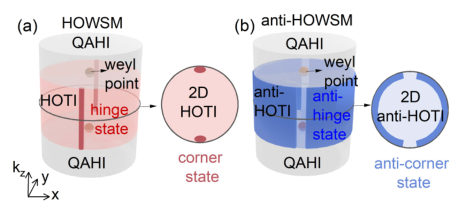 
FIG. 1. (a) Schematic of a 3D HOWSM (left) and its kz = 0 slice on the x −y plane, showing a 2D HOTI phase (right). Orange spheres denote Weyl points separating the Brillouin zone into QAHI and HOTI regions. Red lines and ellipses indicate hinge and corner states. (b) Schematic of an anti- HOWSM (left) and its kz = 0 slice on the x −y plane, show- ing a 2D anti-HOTI phase (right). Orange spheres denote Weyl points separating QAHI and anti-HOTI regions. Blue incomplete surfaces and broken circles indicate the absence of hinge/corner states, corresponding to anti-hinge and anti- corner states.

📷 Fig 2

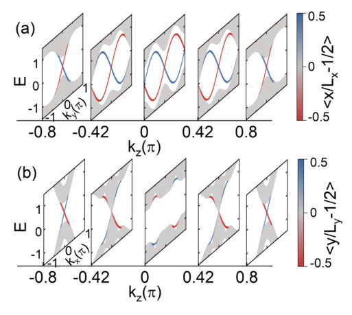 
FIG. 3. (a) Energy spectra of ribbons versus ky, with eigen- states color-coded by their position ⟨x/Lx −1/2⟩to distin- guish bulk states and surface (anti-hinge) states. (b) Energy spectra of ribbons versus kx, with eigenstates color-coded by ⟨y/Ly −1/2⟩to distinguish bulk states and surface (anti- hinge) states. The width of ribbon is chosen as L = 100. Other parameters are the same as those in Fig. 2.

📷 Fig 3

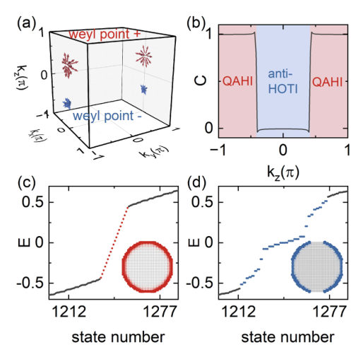 
FIG. 2. (a) The vector plot of the Berry curvature in momen- tum space, with only vectors of large magnitude shown. Red (blue) arrows indicate outward (inward) Berry-curvature flow, corresponding to Weyl points with positive (negative) chiral- ity. (b) The slice Chern number C versus kz. (c,d) Numerical energy levels of a finite-sized circular system with different wave vectors kz = 0.8π for (c) and kz = 0.2π for (d). Bulk, edge, and anti-corner states are shown in black, red, and blue, respectively. Insets display the cumulative density of states for all edge states in Panel (c) or anti-corner states in Panel (d), where the radius of each colored circle is proportional to the cumulative...

📷 Fig 4

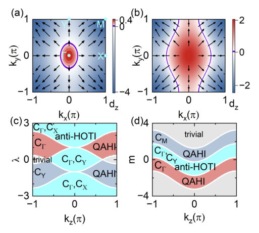 
FIG. 4. (a,b) Spin-texture maps for representative 2D slices in the QAHI phase at kz = 0.8π and the anti-HOTI phase at kz = 0.2π, respectively. The color scale represents the out-of-plane component dz, with the purple contour indicat- ing the BIS (dz = 0). Arrows denote the in-plane components (dx, dy). (c,d) Phase diagram as a function of the wave vector kz and the proportional parameter λ or mass parameter m. Gray regions correspond to topologically trivial phases. The red (blue) regions indicate QAHI phases, where the BIS en- closes a single high-symmetry point with positive (negative) chirality. Cyan regions mark the anti-HOTI phase, where the BIS simultaneously encloses two distinct...

**Summary.** This paper introduces the anti-higher-order Weyl semimetal (anti-HOWSM), a novel topological phase characterized by the systematic suppression of boundary states, leading to an 'anti-hinge' response. Using a minimal two-band model, the authors demonstrate that this phase is topologically distinct from conventional higher-order semimetals by analyzing boundary state localization via Berry curvature and the Band Inversion Surface.

**Why it may be interesting.** This work extends the understanding of topological boundary physics beyond standard surface or hinge states, proposing a mechanism for engineered directional transport blocking, which is relevant for designing novel quantum devices.

Detailed structure

**Main problem.** The paper introduces and characterizes the anti-higher-order Weyl semimetal (anti-HOWSM) phase, a topological state where the conventional boundary hierarchy is reversed compared to standard higher-order topological insulators.

**Main result.** The anti-HOWSM realizes an anti-hinge response, meaning the bulk topology forces boundary states to selectively vanish at specific crystalline orientations, establishing a dual counterpart to conventional higher-order topology.

**Method.** The authors use a minimal two-band model Hamiltonian and employ techniques like calculating Berry curvature, slice Chern numbers, and analyzing the Band Inversion Surface (BIS) winding charge to diagnose the topological phase.

**Model / system.** The system is modeled using a minimal two-band Hamiltonian $H(\mathbf{k}) = d(\mathbf{k}) \cdot \sigma$, which is analyzed in the context of 3D Weyl semimetals, often simulated on nanoribbons or nanoflakes.

**Key observables.** Anti-hinge states, anti-Fermi arcs, quantized jump of the slice Chern number, and the BIS enclosing multiple high-symmetry points with opposite topological charges.

**Important parameters / regimes.** The anisotropy parameter $\lambda$, the momentum coordinates ($\mathbf{k}$), and the topological charges associated with the BIS.

**Assumptions / limitations.** The analysis relies on the comparison between conventional HOWSM, the anti-HOWSM, and the use of BIS winding charge alongside slice Chern numbers for complete characterization.

**Figures summary.** Figures illustrate energy spectra for nanoribbons comparing QAHI (chiral states) to anti-HOTI (anti-corner states), and phase diagrams showing the transition between trivial, QAHI, and anti-HOTI regions based on system parameters.

**Paper structure.** The paper systematically compares the boundary physics of conventional higher-order Weyl semimetals (HOWSM) with the proposed anti-HOWSM, using Hamiltonian analysis, topological invariant calculations (Chern numbers, BIS), and numerical simulations on finite geometries to demonstrate the anti-hinge response.

Abstract

Higher-order topology extends the bulk-boundary correspondence by enabling corner or hinge localized states. Here we identify an anti-higher-order Weyl semimetal, a three dimensional topological phase in which the conventional boundary hierarchy is reversed. Unlike conventional higher-order Weyl semimetals where bulk topology enforces hinge Fermi arcs, this phase hosts anti-hinge states, meaning the bulk topology forces states to vanish at specific hinge orientations. Using a minimal two-band model, we show how Weyl points separate the Brillouin zone into quantum anomalous Hall and anti-higher-order topological insulating regions, with the latter characterized by a band-inversion surface enclosing two distinct high-symmetry points carrying opposite topological charges. Analytical solutions for Weyl points, Berry curvature monopoles, and slice Chern numbers are derived, with numerical simulations confirming the resulting anti-hinge behavior. Our work establishes anti-higher-order topology as a dual counterpart to conventional higher-order phenomena, further extending the exploration of topological phases.

[↑ back to top](#top)

### [Comment on "Distinct Behaviors of Inner and Outer CuO$_2$ Planes in Quadruple-Layer Cuprate (Cu,C)Ba$_2$Ca$_3$Cu$_4$O$_{11 + δ}$"](http://arxiv.org/abs/2609.00467v1)

**Authors:** Jeffery L. Tallon  
**Type:** both · **Category:** strongly correlated electrons · **PDF:** <https://arxiv.org/pdf/2609.00467v1>  
**Analysis basis:** full PDF text, analyzed in chunks

📷 Fig 1

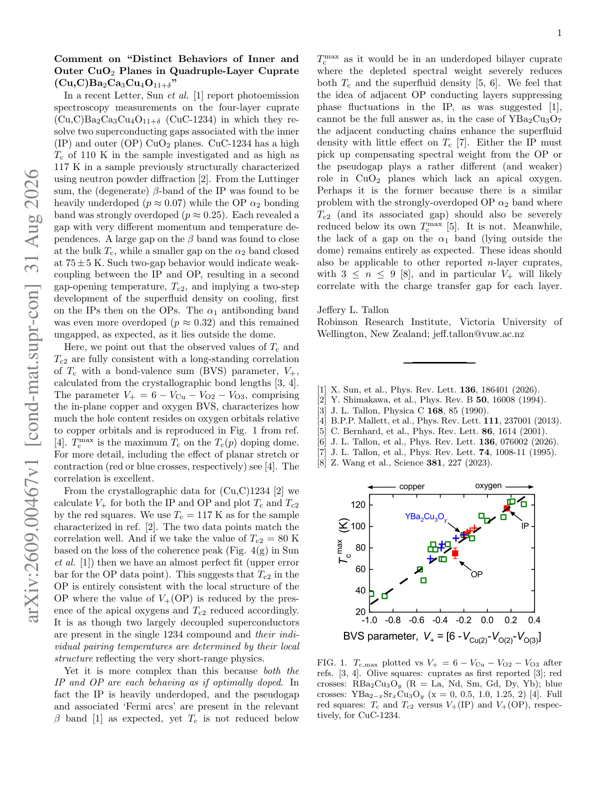 
Low-resolution page preview, page 1

**Summary.** This work analyzes the two-gap superconductivity in a quadruple-layer cuprate, suggesting that the inner and outer $	ext{CuO}_2$ planes act as largely decoupled superconductors. The key finding is that the critical temperatures for both gaps correlate strongly with the local structural parameter, the Bond-Valence Sum ($V^+$), implying that pairing is governed by short-range, local electronic structure rather than bulk properties.

**Why it may be interesting.** The concept of two distinct, locally governed superconducting gaps in a single material provides a concrete example of emergent, multi-component superconductivity, which has parallels in understanding complex, multi-band correlated superconductors.

Detailed structure

**Main problem.** The paper investigates the distinct superconducting pairing mechanisms and critical temperatures in the quadruple-layer cuprate $	ext{(Cu,C)}	ext{Ba}_2	ext{Ca}_3	ext{Cu}_4	ext{O}_{11+\delta}$ by analyzing the separate superconducting gaps in the inner and outer $	ext{CuO}_2$ planes.

**Main result.** The observed two-gap superconductivity suggests two largely decoupled superconducting planes, each governed by its local crystal structure, as evidenced by the consistency of $T_{c2}$ with the Bond-Valence Sum parameter ($V^+$) calculated locally.

**Method.** The analysis combines photoemission spectroscopy results (revealing two gaps) with structural calculations using the Bond-Valence Sum ($V^+$) parameter derived from crystallographic bond lengths.

**Model / system.** The physical system is the quadruple-layer cuprate $	ext{(Cu,C)}	ext{Ba}_2	ext{Ca}_3	ext{Cu}_4	ext{O}_{11+\delta}$, which exhibits superconductivity in two distinct $	ext{CuO}_2$ planes (Inner and Outer). The underlying physics is modeled by analyzing the superconducting gaps and their dependence on local structural parameters.

**Key observables.** Two superconducting gaps ($	ext{IP}$ and $	ext{OP}$), bulk critical temperature ($T_c$), second gap-opening temperature ($T_{c2}$), and the Bond-Valence Sum parameter ($V^+$).

**Important parameters / regimes.** Doping levels ($p$): $	ext{IP}$ ($eta$-band) is heavily underdoped ($p \approx 0.07$); $	ext{OP}$ ($\alpha_2$ band) is strongly overdoped ($p \approx 0.25$).

**Assumptions / limitations.** The primary assumption is that the superconducting pairing temperatures are determined by the local nearest-neighbor structure, quantified by the $V^+$ parameter, suggesting weak coupling between the planes.

**Figures summary.** Figure 1 plots the maximum critical temperature ($T_{c,	ext{max}}$) against the Bond-Valence Sum parameter ($V^+$) for various cuprates, including specific data points for $T_c$ and $T_{c2}$ versus $V^+(	ext{IP})$ and $V^+(	ext{OP})$ for $	ext{CuC-1234}$.

**Paper structure.** The paper first presents the observation of two distinct superconducting gaps in $	ext{CuC-1234}$. It then correlates the measured $T_c$ and $T_{c2}$ values with the structural Bond-Valence Sum parameter ($V^+$). Finally, it discusses the implications of this correlation, suggesting local structural control over pairing temperatures.

Abstract

In a recent Letter, Sun et al. report photoemission spectroscopy measurements on the four-layer cuprate (Cu,C)Ba2Ca3Cu4O11 (CuC-1234) in which they resolve two superconducting gaps associated with the inner (IP) and outer (OP) CuO2 planes. CuC-1234 has a Tc as 117 K in a sample previously structurally characterized using neutron powder diffraction. From the Luttinger sum, the beta-band of the IP was found to be heavily underdoped (p~0.07) while the OP alpha2 bonding band was strongly overdoped (p~0.25). Each revealed a gap with very different momentum and temperature dependences. A large gap on the beta band was found to close at the bulk Tc, while a smaller gap on the alpha2 band closed at 70 K. Such two-gap behavior would indicate weak-coupling between the IP and OP, resulting in a second gap-opening temperature, Tc2, and implying a two-step development of the superfluid density on cooling, first on the IPs then on the OPs. Here, we point out that the observed values of Tc and Tc2 are fully consistent with a long-standing correlation of Tc with a bond-valence sum parameter, V+, calculated from the crystallographic bond lengths. This suggests that Tc2 in the OP is entirely consistent with the local structure of the OP where the value of V+(OP) is reduced by the presence of the apical oxygens and Tc2 reduced accordingly. It is as though two largely decoupled superconductors are present in the single 1234 compound and their individual pairing temperatures are determined by their local nearest-neighbour structure, reflecting the very short-range physics.

[↑ back to top](#top)

### [Expanding the trilayer Ruddlesden-Popper nickelate family: Synthesis and characterization of Sm$_4$Ni$_3$O$_{10-δ}$ single crystals](http://arxiv.org/abs/2609.00574v1)

**Authors:** Yuhang Zhang, Tian-Yi Li, Xiyu Zhu, Ying-Jie Zhang, Shengtai Fan, Qing Li, Hai-Hu Wen  
**Type:** both · **Category:** strongly correlated electrons · **PDF:** <https://arxiv.org/pdf/2609.00574v1>  
**Analysis basis:** full PDF text, analyzed in chunks

📷 Fig 1

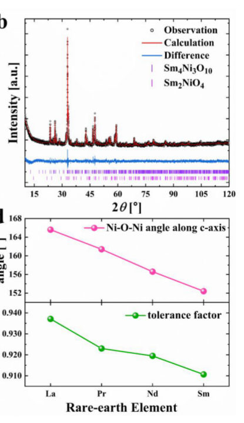 
Figure 1. Structural and compositional analysis of Sm4Ni3O10-δ single crystals. (a) Crystal structure of Sm4Ni3O10-δ at ambient pressure. The Ni−O−Ni bond angle along the c axis indicates the distortion of the NiO6 octahedra. (b) Rietveld refinements of PXRD pattern of Sm4Ni3O10-δ at room temperature. (c) Energy dispersive spectrum (EDS) for the Sm4Ni3O10-δ single crystal. The right inset illustrates the SEM image of the single crystal with a scale bar of 30 μm. (d) The Ni−O−Ni bond angle along the c axis and the tolerance factor t of Ln4Ni3O10-δ (Ln = La, Pr, Nd, Sm) as a variation of rare-earth elements. Note that the c-axis Ni−O−Ni bond angles of Ln4Ni3O10-δ (Ln = La, Pr, Nd) are...

📷 Fig 2

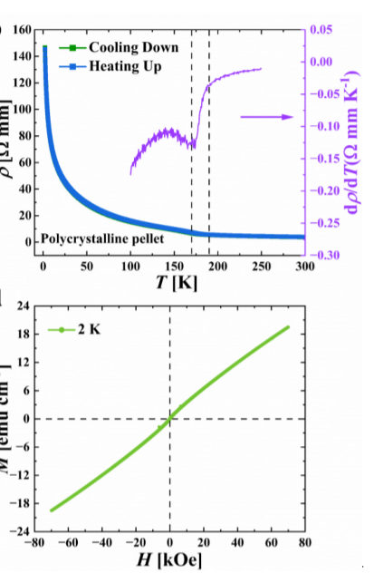 
Figure 2. Electrical transport and magnetization properties of Sm4Ni3O10-δ. (a) The temperature-dependent resistance curve of the Sm4Ni3O10-δ stacked single crystals. A sudden increase in resistance at approximately 180 K indicates the occurrence of a DW transition. (b) Temperature dependence of resistivity for the Sm4Ni3O10-δ polycrystalline pellet sample at zero magnetic field and ambient pressure. Note that the polycrystalline pellets were treated at 500 ℃ in 8MPa O2. (c)Temperature dependence of magnetic susceptibility measured at 20 kOe. The pink curve of 1/χ versus T shows an obvious transition consistent with transport measurements. (d) Magnetic hysteresis loop measured at 2 K,...

📷 Fig 3

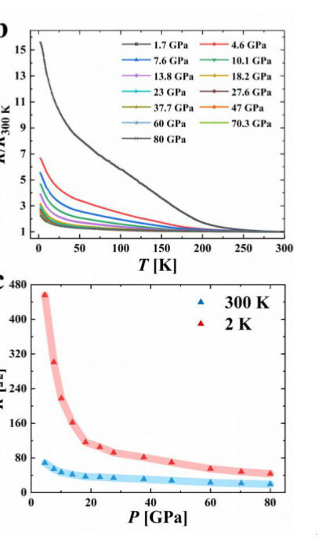 
Figure 3. High-pressure electrical resistance measurements on Sm4Ni3O10-δ single crystals in a diamond-anvil-cell (DAC) apparatus. (a) Temperature dependence of resistance of Sm4Ni3O10-δ under various pressures from 1.7 GPa to 80 GPa. (b) Normalized R/R300 K versus T curves from 2 to 300 K. (c) Pressure dependent resistance ranging from 4.6 GPa to 80 GPa at 2 K and 300 K.

📷 Fig 4

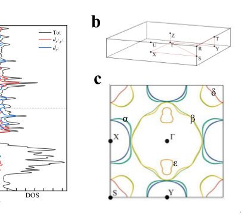 
Figure 4. DFT calculations for band structure and Fermi surface of Sm4Ni3O10-δ using the crystal structure determined at ambient pressure. (a) The band structure of Sm4Ni3O10-δ. The corresponding density of states (DOS) near the Fermi level are shown on the righthand side. The weight of 𝟑𝒅𝒛𝟐 and 𝟑𝒅𝒙𝟐−𝒚𝟐 orbitals of Ni is represented by blue and red dots, respectively. Note that the dot size is proportional to the contribution of each orbital. (b) Schematic of the three-dimensional orthorhombic Brillouin zone. The red lines correspond to the paths of the electronic bands in (a). (c) The fermi surface of Sm4Ni3O10-δ.

**Summary.** This paper reports the synthesis and characterization of the trilayer nickelate $	ext{Sm}_4	ext{Ni}_3	ext{O}_{10-\delta}$, expanding the study of this superconducting material class. While the material shows a density wave transition, superconductivity is not observed even under extreme pressure. The authors argue that significant structural distortions, particularly in the $	ext{Ni-O-Ni}$ bond angle, are the primary physical mechanism suppressing superconductivity in this system.

**Why it may be interesting.** This work directly addresses the physics of strongly correlated electron systems, particularly high-Tc superconductivity, by linking subtle structural changes (bond angles, distortions) to emergent electronic states (DW, superconductivity), which is a major theme in condensed matter theory.

Detailed structure

**Main problem.** The study aims to expand the understanding of high-temperature superconductivity in the trilayer Ruddlesden-Popper (RP) nickelate family, specifically by synthesizing and characterizing the Sm$_4$Ni$_3$O$_{10-\delta}$ compound.

**Main result.** The synthesized $	ext{Sm}_4	ext{Ni}_3	ext{O}_{10-\delta}$ exhibits a density wave (DW) transition at ambient pressure, but superconductivity was not observed even under high pressure (up to 80 GPa), suggesting structural distortions are key barriers.

**Method.** The research combines experimental techniques, including High-Pressure/High-Temperature (HPHT) synthesis, transport/magnetization measurements, and structural characterization (XRD), with theoretical calculations using Density Functional Theory (DFT).

**Model / system.** The physical system is the trilayer Ruddlesden-Popper nickelate $	ext{Sm}_4	ext{Ni}_3	ext{O}_{10-\delta}$. The electronic behavior is governed by the correlated Ni $3d$ orbitals, and the structural analysis focuses on the $	ext{Ni-O-Ni}$ bond angle and octahedral distortions.

**Key observables.** Superconducting critical temperature ($T_c$), Density Wave (DW) transition temperature ($\sim 180 	ext{ K}$), $	ext{Ni-O-Ni}$ bond angle, and electrical/magnetic transport anomalies under pressure.

**Important parameters / regimes.** High pressure (up to 80 GPa), rare-earth element size (Sm vs La/Pr), and the degree of octahedral distortion.

**Assumptions / limitations.** The primary assumption is that the deviation of the $	ext{Ni-O-Ni}$ bond angle from $180^\circ$ is the key structural factor inhibiting superconductivity in this series.

**Figures summary.** Figures illustrate structural analysis (crystal structure, bond angle variation), electrical transport (resistance anomalies at 180 K), and magnetization measurements showing magnetic transitions corresponding to the electronic changes.

**Paper structure.** The paper follows a structure of literature review (contextualizing RP nickelates), synthesis and structural characterization of $	ext{Sm}_4	ext{Ni}_3	ext{O}_{10-\delta}$, detailed measurements (transport, magnetism, high pressure), and theoretical interpretation linking structural distortions to electronic properties.

Abstract

The discovery of high-temperature superconductivity in Ruddlesden-Popper (RP) nickelates has attracted significant attention. Bulk superconductivity emerges under pressure in trilayer nickelates La$_4$Ni$_3$O$_{10-δ}$ (T$_c$ $\approx$ 30 K) and Pr$_4$Ni$_3$O$_{10-δ}$ (T$_c$ $\approx$ 40.5 K), where the reduced ionic radius of Pr$^{3+}$ may generate internal chemical pressure and enhance T$_c$. However, synthesizing trilayer RP phases with smaller rare-earth elements (Ln) is extremely challenging. So far, only the La, Pr, and Nd analogues have been synthesized with stable phases in the single rare-earth form. Here we report the first successful high-pressure and high-temperature (HPHT) synthesis of samarium-based compound Sm$_4$Ni$_3$O$_{10-δ}$. Magnetization and transport measurements consistently confirm a density wave (DW) transition at ~180 K at ambient pressure. Through a careful fitting to the structural data of Sm$_4$Ni$_3$O$_{10-δ}$, it is found that the bond angle of (Ni-O-Ni) associating with the interlayer apical oxygen is much smaller than 180$^{\circ}$, which was assumed to be the key factor for the occurrence of superconductivity. By applying pressures up to 80 GPa, despite partial suppression of insulating behavior and the DW order, but superconductivity is not observed in our present study. Density functional theory calculations suggest that the 3d$_{z^2}$ and 3d$_{x^2-y^2}$ are separated from other t$_{2g}$ orbitals and make a primary contribution to the Fermi surface. The newly synthesized trilayer nickelate Sm$_4$Ni$_3$O$_{10-δ}$ offers a unique platform for probing the fundamental physics of RP nickelates.

[↑ back to top](#top)

### [Heavily Sr-Doped La$_{2}$SrNi$_{2}$O$_{7-δ}$ as a Tetragonal Ruddlesden-Popper Phase at Ambient Pressure](http://arxiv.org/abs/2609.00542v1)

**Authors:** Yuhang Zhang, Xue Ming, Cui-Qun Chen, Wei Chen, Tian-Yi Li, Zhe-Ning Xiang, Qing Li, Bing-hui Ge, Dao-Xin Yao, Xiyu Zhu, Hai-Hu Wen  
**Type:** both · **Category:** strongly correlated electrons · **PDF:** <https://arxiv.org/pdf/2609.00542v1>  
**Analysis basis:** full PDF text, analyzed in chunks

📷 Fig 1

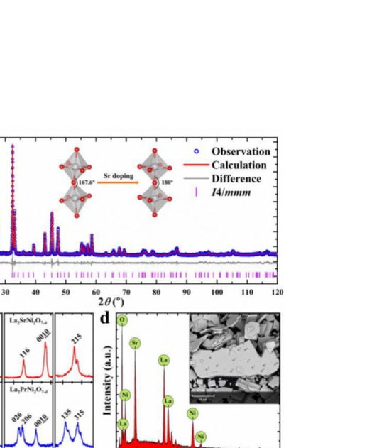 
Fig. 1| Characterizations of structure and composition of La2SrNi2O7-δ single crystals. (a) Crystal structure of La2SrNi2O7-δ refined from SXRD data. (b) Rietveld refinements of PXRD pattern collected from crushed La2SrNi2O7-δ single crystals. The inset illustrates the structural evolution of the NiO6 octahedra upon heavy Sr-doping. (c) Detailed analysis of the enlarged PXRD patterns of La2SrNi2O7-δ, compared with orthorhombic La2PrNi2O7-δ. The clear adjacent-peak merging and (00l) peak shifts indicate the structural transition and a compression of the c-axis lattice parameter induced by Sr substitution. (d) EDS for the La2SrNi2O7-δ single crystals. The right inset displays the SEM image of...

📷 Fig 2

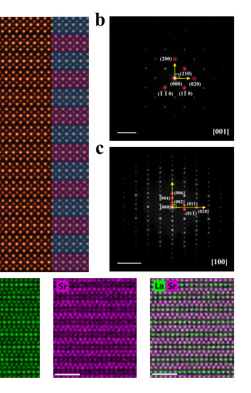 
Fig. 2| Atomic structure of the as-grown La2SrNi2O7-δ single crystals. (a) HAADF- STEM image of the La2SrNi2O7-δ single crystal viewed along the [100] projection. (b, c) SAED patterns of the La2SrNi2O7-δ single crystal along the (b): [001], (c): [100] axis. (d) HAADF image and corresponding atomic-resolution EDS elemental maps of La, Sr, and Ni acquired from the same region. Scale bars: 5 nm (a); 5 1/nm (b, c); 2 nm (d).

📷 Fig 3

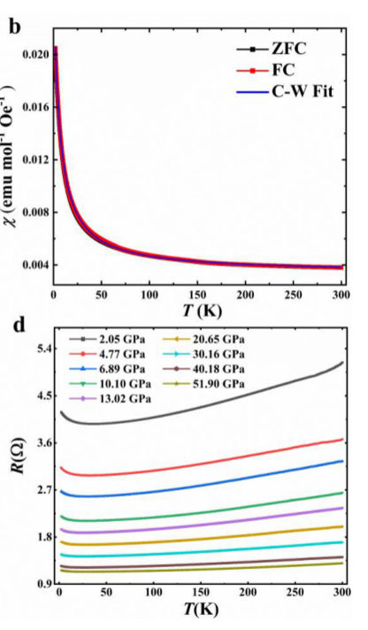 
Fig. 3| The electrical transport and magnetic properties of La2SrNi2O7-δ. (a) The normalized resistance of La2SrNi2O7-δ annealed at 500 °C in air (S1) and oxygen flow (S2). (b) Temperature dependence of magnetic susceptibility measured at 5 kOe. The orange curve of 1/χ-χ0 versus T exhibits a slightly nonlinearity transition consistent with transport measurements. (c) Transport results of La2SrNi2O7-δ under different oxygen modification conditions: S3 was treated with La metal in a sealed quartz tube in order to reduce oxygen; S4 and S5 were then obtained by ozone annealing of S3 at 325 °C for 1 h and 3 h, respectively. (d) High-pressure electrical resistance measurements on La2SrNi2O7-δ...

📷 Fig 4

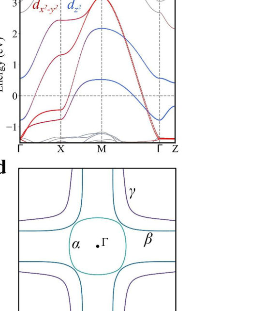 
Fig. 4| DFT calculations for La2SrNi2O7-δ at ambient pressure and 25 GPa. (a)-(b) Projected band structures of Ni-𝑒𝑔 orbitals in La2SrNi2O7 at ambient pressure (a) and 25 GPa (b). The red and blue colors represent the contributions from Ni-3𝑑𝑧2 and Ni-

**Summary.** This research successfully synthesizes a highly symmetric, tetragonal nickelate phase ($	ext{La}_2	ext{SrNi}_2	ext{O}_{7-\delta}$) at ambient pressure. While the material is metallic, the authors argue that the excess hole doping shifts the electronic structure away from the optimal half-filled state, thereby suppressing the interlayer magnetic coupling required for superconductivity.

**Why it may be interesting.** This work directly addresses the fundamental mechanism of high-Tc superconductivity in nickelates, which is a canonical problem in strongly correlated electron physics, providing crucial insights into orbital physics and doping effects.

Detailed structure

**Main problem.** The central question is determining the necessary conditions—structural, electronic, or chemical—to achieve high-temperature superconductivity in bulk Ruddlesden-Popper nickelates at ambient pressure.

**Main result.** The authors report synthesizing a tetragonal $	ext{La}_2	ext{SrNi}_2	ext{O}_{7-\delta}$ phase, but attribute the absence of superconductivity to a significant deviation from the half-filling state of the $	ext{Ni}-3d_{z^2}$ band, which weakens the necessary interlayer antiferromagnetic coupling.

**Method.** The study combines high-pressure/high-temperature synthesis, structural characterization (XRD, STEM), transport measurements, and theoretical calculations (DFT) to map the phase diagram and electronic structure.

**Model / system.** The physical system is the heavily Sr-doped $	ext{La}_2	ext{SrNi}_2	ext{O}_{7-\delta}$ Ruddlesden-Popper nickelate, which is studied across varying oxygen content, pressure, and doping levels.

**Key observables.** Tetragonal crystal structure ($	ext{I}4/	ext{mmm}$), metallic resistance behavior, large $\gamma$ pocket on the Fermi surface, and the suppression of density-wave features.

**Important parameters / regimes.** Ambient pressure vs. high pressure (up to 51.9 GPa); Sr doping level; $	ext{Ni}-	ext{O}-	ext{Ni}$ bond angle ($180^\circ$ ideal); filling of the $	ext{Ni}-3d_{z^2}$ orbital.

**Assumptions / limitations.** The superconducting pairing mechanism is critically dependent on maintaining the half-filling state of the $	ext{Ni}-3d_{z^2}$ orbital, which mediates interlayer antiferromagnetic interaction.

**Figures summary.** Figures detail the crystal structure and lattice parameters (XRD/STEM), show the temperature and pressure dependence of resistance and magnetization, and present DFT calculations illustrating the band structure and Fermi surface evolution under pressure.

**Paper structure.** The paper first establishes the structural synthesis of the tetragonal phase, then characterizes its electronic and transport properties, and finally uses DFT calculations to explain the failure to achieve superconductivity by analyzing the orbital filling relative to the half-filled state.

Abstract

High-temperature superconductivity has been found in bilayer Ruddlesden-Popper (RP) nickelates in bulk samples under high pressure, or in thin films via compressive strain. In the superconducting state, a tetragonal structure with a straight Ni-O-Ni bond along c-axis has been commonly observed, together with the suppression or diminishing of the density-wave orders. Therefore, it remains an open question whether these factors are sufficient for achieving superconductivity at ambient pressure. Here we report the first successful synthesis of heavily Sr-doped La$_{2}$SrNi$_{2}$O$_{7-δ}$ under high-pressure and high-temperature (HPHT) conditions with a flux method. X-ray diffraction and scanning transmission electron microscopy (STEM) confirm that the material adopts a tetragonal (I4/mmm) structure with an 180$^{\circ}$ Ni-O-Ni bond angle along c-axis. Resistance measurements reveal metallic behavior with a low-temperature upturn and no density-wave features are observed. However, neither pressure nor oxygen variation induces superconductivity. Density functional theory calculations indicate that the holes introduced by Sr doping are predominantly doped into the Ni-3d$_{z^2}$ orbital, leading to the appearance of a very large $γ$ pocket on the Fermi surface at ambient pressure and significantly reducing the occupation of the Ni-3d$_{z^2 }$ orbital. Combining the experimental observations with theoretical calculations, we attribute the absence of superconductivity to the serious deviation from the half-filling state of the Ni-3d$_{z^2 }$ band, which is crucial for the interlayer antiferromagnetic interaction and thus for pairing. Our work unravels important issues for achieving superconductivity in bilayer nickelate system.

[↑ back to top](#top)

### [Robust thermodynamics constrain disorder and pairing in far-overdoped Tl$_2$Ba$_2$CuO$_6$](http://arxiv.org/abs/2609.01213v1)

**Authors:** Ayanesh Maiti, David M. Broun, Seunghyun Khim, Michal Moravec, Antony Carrington, Carsten Putzke, Vivek Mishra, Peter Hirschfeld, Andrew P. Mackenzie, Andreas W. Rost  
**Type:** both · **Category:** strongly correlated electrons · **PDF:** <https://arxiv.org/pdf/2609.01213v1>  
**Analysis basis:** full PDF text, analyzed in chunks

📷 Fig 1

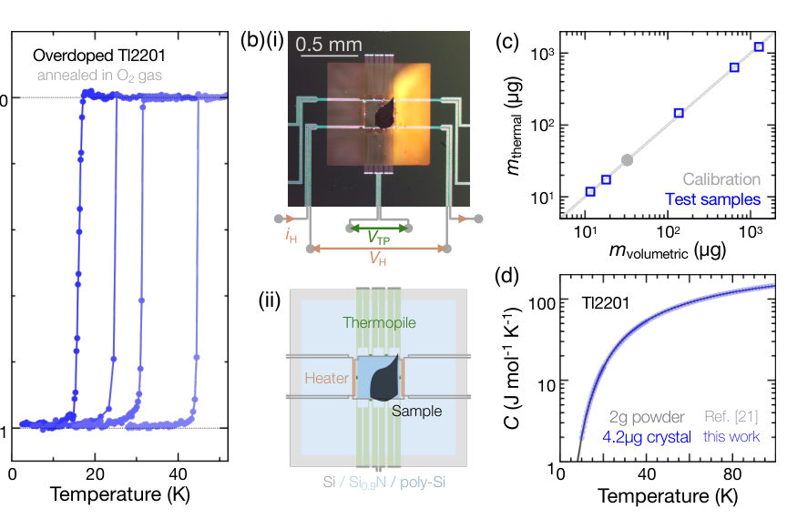 
FIG. 1. Specific heat measurements on microgram-scale single crystals of Tl2Ba2CuO6. (a) AC magnetic suscepti- bility of overdoped Tl2Ba2CuO6 single crystals with Tc = 14–45 K, used for the specific heat measurements. All samples exhibit a single, sharp superconducting transition with ∆Tc ∼1 K, indicative of homogeneous doping. (b) (i) Optical image of a 2 µg Tl2Ba2CuO6 single crystal mounted on a XEN-39398 nanocalorimeter chip. (ii) Schematic of the calorimeter, consisting of a Si0.9N membrane incorporating a resistive heater and a thermopile. The central region is coated with a poly-Si thermalization layer, on which the sample is mounted using Apiezon N grease. (c) Validation of the AC...

📷 Fig 2

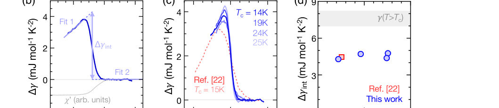 
FIG. 2. Robust superconducting transition in the electronic specific heat of far-overdoped Tl2Ba2CuO6. (a) Electronic specific heat of Tl2Ba2CuO6 single crystals measured in this work (blue shades) in the vicinity of the superconducting transition, compared with literature data on polycrystalline samples (gray). In the far-overdoped regime (Tc &lt; 30 K), the single crystals exhibit sharp, well-resolved superconducting anomalies, whereas the polycrystal data show substantially broader and smaller anomalies. (b) Electronic specific heat anomaly of the most overdoped sample. The broadened transition is consistent with the transition width measured by AC magnetic susceptibility (gray). The...

📷 Fig 3

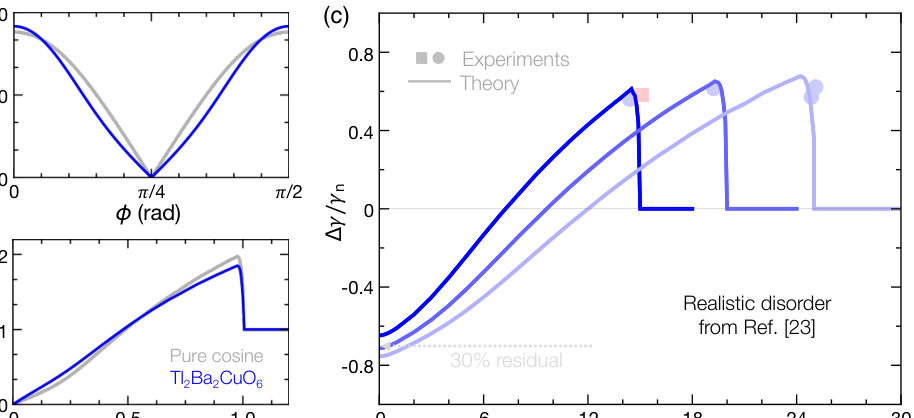 
FIG. 3. Realistic model of the electronic specific heat anomaly of far-overdoped Tl2Ba2CuO6. (a) d-wave supercon- ducting gap on the Fermi surface of Tl2Ba2CuO6, assuming a pure cosine form (gray) and a modulated form containing 12% of the second harmonic (blue). (b) Calculated specific heat anomalies in the clean limit corresponding to the gap functions shown in panel (a), assuming a mean-field BCS-like description of the superconductivity in far-overdoped Tl2Ba2CuO6. The jump at Tc is slightly suppressed by the higher harmonic content. (c) Calculated electronic specific heat anomalies at Tc = 15, 20, 25 K in the presence of realistic levels of disorder as described in the text. The...

**Summary.** This work investigates the superconducting state in overdoped cuprates by measuring the electronic specific heat. The authors find that the superconducting anomaly persists sharply deep into the overdoped regime. They conclude that the observed drop in $T_c$ is due to a gradual reduction in the intrinsic pairing strength, rather than being dominated by increasing structural disorder.

**Why it may be interesting.** While focused on cuprates, the quantitative analysis of pairing strength suppression and the interplay between intrinsic pairing and disorder effects in a strongly correlated superconductor provides valuable lessons for understanding pairing mechanisms in other correlated electron systems.

Detailed structure

**Main problem.** The physical origin of the suppression of superconductivity with hole doping in overdoped cuprates remains unclear.

**Main result.** The superconducting transition temperature ($T_c$) decrease is consistent with a smoothly decreasing pairing strength rather than being predominantly driven by increasing disorder.

**Method.** The study uses electronic specific heat measurements on single crystals and models the anomaly using a weak-coupling BCS-like framework incorporating disorder effects.

**Model / system.** The system is far-overdoped $	ext{Tl}_2	ext{Ba}_2	ext{CuO}_6$ single crystals. The analysis employs BCS theory adapted for d-wave pairing and incorporates known cation disorder to model the superconducting state.

**Key observables.** The superconducting specific heat jump ratio, $\Delta\gamma(T_c)/\gamma_n$, and the intrinsic pairing strength parameter, $\Delta\gamma_{int}/\gamma_n$.

**Important parameters / regimes.** The superconducting transition temperature ($T_c$) ranges from 14 to 25 K in the studied overdoped regime.

**Assumptions / limitations.** The analysis isolates the electronic specific heat contribution by fitting the normal-state background with a polynomial, and the modeling relies on a weak-coupling BCS framework.

**Figures summary.** Figures compare the electronic specific heat anomaly ($\Delta C/T$) from single crystals versus polycrystalline samples, showing the extracted intrinsic gap parameter ($\Delta\gamma_{int}$) is relatively independent of doping.

**Paper structure.** The paper establishes the mystery of doping-induced superconductivity suppression, presents single-crystal specific heat measurements showing sharp anomalies, models these anomalies using BCS theory incorporating disorder, and concludes that pairing strength variation is the dominant factor.

Abstract

The physical origin of the suppression of superconductivity with hole doping in overdoped cuprates remains unclear. We measure the electronic specific heat of microgram-scale Tl$_2$Ba$_2$CuO$_6$ crystals and find sharp superconducting anomalies persisting far into the overdoped regime, with $Δγ(T_{\rm c})/γ_n\approx0.6$ for $T_{\rm c}=14$-$25$K. A weak-coupling BCS-like framework incorporating the known Fermi surface and cation disorder quantitatively reproduces the observed anomaly and its weak doping dependence. We conclude that the observed $T_{\rm c}(p)$ cannot be driven predominantly by increasing disorder and is instead consistent with a smoothly decreasing pairing strength.

[↑ back to top](#top)

