
# arxiv digest (quant-ph + cond-mat) — 2026-09-04

*121 papers · 15 relevant · 1 highlighted*

## 🔥 Most relevant (15)

*Every paper with at least one nonzero topic score, sorted by best-matching score. 🔥 marks scores ≥4/5. Click the title to jump to the full entry below; click [arXiv] to open the paper page. `(secondary)` marks papers from de-prioritized cond-mat archives.*

Show 15 relevant papers

- ⭐ [Efficient Simulation of Nonreciprocal Many-body Physics via Quantum Feedback](#paper-2609.02518) [[arXiv]](http://arxiv.org/abs/2609.02518v1) — 🔥 `quantum measurements` **4/5** · 🔥 `quantum optics experiment` **4/5** · `analog quantum simulation` **3/5** · `correlated / nonlocal dissipation` **3/5** · `driven-dissipative phase transition` **3/5** · `methods for driven-dissipative` **3/5** · `non-equilibrium universality` **3/5** · `Tavis-Cummings & cavity-many-emitter` **2/5** · `Full counting statistics` **1/5** · `Keldysh / 2PI / non-Gaussian methods` **1/5**
- [Engineering of Non-Hermitian Trajectories and Phase Structure in an Open Bose-Hubbard Model via Rate Operator Transformations](#paper-2609.02490) [[arXiv]](http://arxiv.org/abs/2609.02490v1) — 🔥 `driven-dissipative phase transition` **4/5** · 🔥 `methods for driven-dissipative` **4/5** · 🔥 `quantum measurements` **4/5** · `analog quantum simulation` **3/5** · `correlated / nonlocal dissipation` **3/5** · `non-equilibrium universality` **3/5** · `Keldysh / 2PI / non-Gaussian methods` **1/5**
- [Piston-Like Information Engine II: Boundary-Controlled Optimum in Active Matter](#paper-2609.01760) [[arXiv]](http://arxiv.org/abs/2609.01760v1) — 🔥 `non-equilibrium universality` **4/5** · `driven-dissipative phase transition` **3/5** · `quantum measurements` **3/5** · `Full counting statistics` **2/5** · `Keldysh / 2PI / non-Gaussian methods` **2/5** · `methods for driven-dissipative` **2/5** · `analog quantum simulation` **1/5** · `correlated / nonlocal dissipation` **1/5** · `scars & prethermalization` **1/5**
- [Effective quasiparticle conserving Lindbladians in the thermodynamic limit](#paper-2609.02725) [[arXiv]](http://arxiv.org/abs/2609.02725v1) — 🔥 `methods for driven-dissipative` **4/5** · `correlated / nonlocal dissipation` **3/5** · `driven-dissipative phase transition` **3/5** · `non-equilibrium universality` **3/5** · `Keldysh / 2PI / non-Gaussian methods` **2/5** · `analog quantum simulation` **1/5** · `quantum measurements` **1/5** · `scars & prethermalization` **1/5**
- [QArray+: A physics-informed GPU-accelerated simulator for quantum dot arrays](#paper-2609.02736) [[arXiv]](http://arxiv.org/abs/2609.02736v1) — 🔥 `methods for driven-dissipative` **4/5** · `driven-dissipative phase transition` **3/5** · `non-equilibrium universality` **3/5** · `Keldysh / 2PI / non-Gaussian methods` **2/5** · `analog quantum simulation` **2/5** · `correlated / nonlocal dissipation` **1/5** · `quantum measurements` **1/5**
- [Memory-driven Topological Defects and Unconventional Long-Range Order](#paper-2609.02586) [[arXiv]](http://arxiv.org/abs/2609.02586v1) — 🔥 `non-equilibrium universality` **4/5** · `driven-dissipative phase transition` **3/5** · `Keldysh / 2PI / non-Gaussian methods` **2/5** · `methods for driven-dissipative` **2/5** · `Frenkel-Kontorova` **1/5** · `analog quantum simulation` **1/5** · `correlated / nonlocal dissipation` **1/5**
- [Interaction effects on Andreev states from an electromagnetic environment](#paper-2609.01935) [[arXiv]](http://arxiv.org/abs/2609.01935v1) `(secondary)` — 🔥 `Keldysh / 2PI / non-Gaussian methods` **4/5** · `correlated / nonlocal dissipation` **3/5** · `driven-dissipative phase transition` **2/5** · `methods for driven-dissipative` **2/5** · `non-equilibrium universality` **1/5** · `quantum measurements` **1/5**
- [Nonequilibrium corrections to conserved Ising criticality in scalar active matter: Ward identities, spectrum, and long crossovers](#paper-2609.02351) [[arXiv]](http://arxiv.org/abs/2609.02351v1) — 🔥 `non-equilibrium universality` **4/5** · `Keldysh / 2PI / non-Gaussian methods` **3/5** · `driven-dissipative phase transition` **3/5** · `methods for driven-dissipative` **2/5** · `correlated / nonlocal dissipation` **1/5**
- [Dynamical stabilisation of a quantum fluid using a single topological defect](#paper-2609.02643) [[arXiv]](http://arxiv.org/abs/2609.02643v1) — 🔥 `analog quantum simulation` **4/5** · `driven-dissipative phase transition` **2/5** · `methods for driven-dissipative` **2/5** · `non-equilibrium universality` **2/5** · `Keldysh / 2PI / non-Gaussian methods` **1/5** · `quantum optics experiment` **1/5**
- [Exponential speedup of polarization stabilization for long distance DWDM quantum networks](#paper-2609.02841) [[arXiv]](http://arxiv.org/abs/2609.02841v1) — 🔥 `quantum optics experiment` **4/5** · `QC/QI experiment` **3/5** · `quantum measurements` **3/5** · `interference shaping light` **1/5**
- [Microscopic dynamics of contagion using active Brownian particles: universal scaling and propagation controlled by protection](#paper-2609.01927) [[arXiv]](http://arxiv.org/abs/2609.01927v1) — 🔥 `non-equilibrium universality` **4/5** · `driven-dissipative phase transition` **3/5** · `Frenkel-Kontorova` **1/5** · `analog quantum simulation` **1/5** · `methods for driven-dissipative` **1/5**
- [Optimal-work feedback on particles with activity --- gliding on active fluctuations using positional information](#paper-2609.02720) [[arXiv]](http://arxiv.org/abs/2609.02720v1) — 🔥 `quantum measurements` **4/5** · `non-equilibrium universality` **2/5** · `Keldysh / 2PI / non-Gaussian methods` **1/5** · `correlated / nonlocal dissipation` **1/5** · `driven-dissipative phase transition` **1/5** · `methods for driven-dissipative` **1/5**
- [Branching stochastic mechanics. II. Relative localization and collective poles from Bohm/Fisher feedback](#paper-2609.02520) [[arXiv]](http://arxiv.org/abs/2609.02520v1) — 🔥 `Keldysh / 2PI / non-Gaussian methods` **4/5** · `correlated / nonlocal dissipation` **1/5** · `driven-dissipative phase transition` **1/5** · `methods for driven-dissipative` **1/5** · `non-equilibrium universality` **1/5** · `quantum measurements` **1/5**
- [Experimental Evaluation of Passive Polarization Compensation Techniques for Fiber-Distributed Polarization-Entangled Photons](#paper-2609.02554) [[arXiv]](http://arxiv.org/abs/2609.02554v1) — 🔥 `quantum optics experiment` **4/5** · `QC/QI experiment` **3/5** · `interference shaping light` **1/5**
- [Long-lived telecom-heralded single-photon storage in an absorptive spin-rephased quantum memory](#paper-2609.02579) [[arXiv]](http://arxiv.org/abs/2609.02579v1) — 🔥 `QC/QI experiment` **4/5** · `quantum optics experiment` **3/5** · `quantum measurements` **1/5**

## ⭐ Highlighted (1)

*Papers by authors on your watch list. Click the title to jump to the full entry below; click [arXiv] to open the paper page.*

Show 1 highlighted papers

- ⭐ [Efficient Simulation of Nonreciprocal Many-body Physics via Quantum Feedback](#paper-2609.02518) [[arXiv]](http://arxiv.org/abs/2609.02518v1) — Aashish A. Clerk, Hannes Pichler

## All papers (82, sorted by relevance)

*Papers from quant-ph and your primary cond-mat archives (quant-gas, stat-mech, str-el, dis-nn). Highlighted papers (⭐) come first, then everything else sorted by topic-relevance score, highest first.*

### ⭐ [Efficient Simulation of Nonreciprocal Many-body Physics via Quantum Feedback](http://arxiv.org/abs/2609.02518v1)

**Highlighted author(s):** Aashish A. Clerk, Hannes Pichler  
**Authors:** Kseniia Vodenkova, Andrew Pocklington, Fan Yang, Andrew Lingenfelter, Aashish A. Clerk, Hannes Pichler  
**Type:** both · **Category:** other · **PDF:** <https://arxiv.org/pdf/2609.02518v1>  
**Analysis basis:** full PDF text, analyzed in chunks
**Topic relevance:** 🔥 `quantum measurements` **4/5** · 🔥 `quantum optics experiment` **4/5** · `analog quantum simulation` **3/5** · `correlated / nonlocal dissipation` **3/5** · `driven-dissipative phase transition` **3/5** · `methods for driven-dissipative` **3/5** · `non-equilibrium universality` **3/5** · `Tavis-Cummings & cavity-many-emitter` **2/5** · `Full counting statistics` **1/5** · `Keldysh / 2PI / non-Gaussian methods` **1/5**

↔ Scroll figures horizontally

<figure class="paper-figure-card">
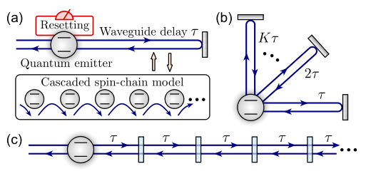
<figcaption class="paper-figure-caption"><b>Fig 1.</b> FIG. 1. Illustration of the scheme and its generalized ver- sions. (a) A single quantum emitter coupled to a 1D waveg- uide mode, subjected to coherent delayed feedback (blue lines) and incoherent measurement feedback (red lines). (b) A single quantum emitter coupled to multiple 1D waveguides, realizing up to K-local nonreciprocal couplings. (c) A single quantum emitter coupled to a 1D waveguide terminated by a Bragg mirror, mimicking a long-range interaction tail.</figcaption>
</figure>
<figure class="paper-figure-card">
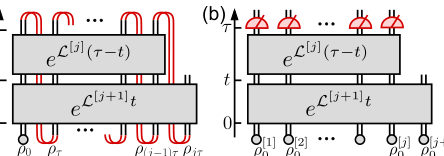
<figcaption class="paper-figure-caption"><b>Fig 2.</b> FIG. 2. Tensor network mapping the delayed feedback control to cascaded spin chains. (a) The full evolution corresponds to a shifted boundary condition in which the initial state of each cascaded lattice site at t = 0 is correlated with the final state at t = τ of the previous site (red tensor network connections). (b) Stroboscopic resetting can realize an arbitrary product initial many-body state.</figcaption>
</figure>
<figure class="paper-figure-card">
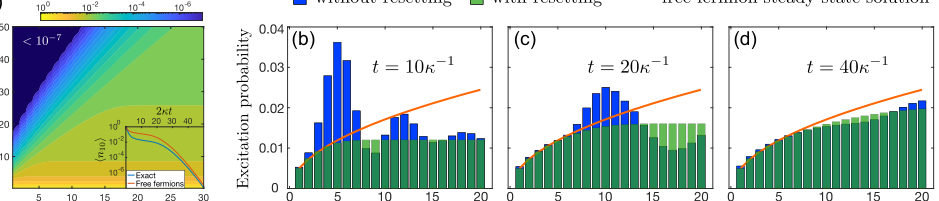
<figcaption class="paper-figure-caption"><b>Fig 3.</b> FIG. 3. Evolution of local observables of the cascaded spin chain. (a) Excitation probability dynamics for a chain with only loss, with each QE initialized in the excited state. The inset plot shows a comparison between the exact numerical calculation and free fermion approximation [40] for site j = 10. (b)-(d) Excitation probability of spin chain sites j under incoherent pumping at the indicated times t = τ for different delay times τ. The green and blue bars show results with and without resetting, respectively. The solid lines show the steady-state solutions under the free-fermion approximation. For all plots, the numerical simulation Trotter step is 2κdt = 0.001 and for (b)-(d) the...</figcaption>
</figure>
<figure class="paper-figure-card">
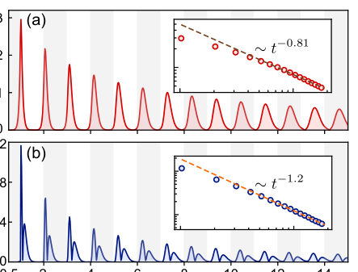
<figcaption class="paper-figure-caption"><b>Fig 4.</b> FIG. 4. Two-time correlation functions of the quantum emit- ter under the delayed feedback and a weak incoherent pump (without resetting). (a) Magnitude of atomic correlations Ga(τ +t, τ) = κ⟨σ+(τ +t)σ−(τ)⟩/Γ. (b) Magnitude of output field correlations Gout(τ + t, τ) = ⟨b† out(τ + t)bout(τ)⟩/Γ. The insets show the power-law fitting to peak values of the correla- tions. The parameters are the same as in Fig. 3(d). The shad- ing bars indicate lattice sites in the spin chain. E.g., for t/τ ∈ [4, 5] the many-body correlation is G6,2(t′, 0) = ⟨σ+ 6 (t′)σ− 2 (0)⟩ for t′ ∈[0, τ].</figcaption>
</figure>
<figure class="paper-figure-card">
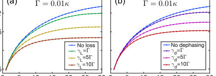
<figcaption class="paper-figure-caption"><b>Fig 5.</b> FIG. 5. Steady state properties of the 1D cascaded chain [Eq. (1)] with the effects of the excitation loss (a) or dephas- ing (b) with the incoherent pump strength Γ = 0.01κ. The simulation Trotter step is 2κdt = 0.001, and the delay time is τ = 50κ−1, which is sufficient to approximate steady state.</figcaption>
</figure>

**Summary.** The authors propose using a single quantum emitter coupled to a waveguide with coherent time-delayed feedback to simulate complex, nonreciprocal many-body spin models. This method effectively creates a scalable, cascaded spin chain whose dynamics can be read out by measuring the emitter and output field. The work successfully demonstrates access to exotic nonreciprocal phenomena, proving the concept's feasibility for experimental quantum simulation.

**Why it may be interesting.** This work provides a concrete, experimentally realizable quantum optics platform (single emitter + waveguide) to study fundamental many-body physics concepts like nonreciprocity and topological effects (LSE) that are usually studied in solid-state or cold atom arrays.

Detailed structure

**Main problem.** The paper addresses the challenge of efficiently simulating nonreciprocal many-body spin models, especially in regimes where excitations propagate unidirectionally.

**Main result.** They demonstrate a scalable scheme using coherent time-delayed feedback on a single quantum emitter to realize and probe nonreciprocal physics, exhibiting features like the Liouvillian skin effect.

**Method.** The simulation maps the physical system onto an effective cascaded spin chain, allowing access to steady-state and quench dynamics via measurement of the emitter and output field.

**Model / system.** The platform is a single quantum emitter coupled to a 1D waveguide mode. Nonreciprocity is engineered using coherent time-delayed feedback ($	au$), creating an effective interaction where the emitter affects itself at later times.

**Key observables.** Steady-state quantities, two-time correlation functions, local spin density profiles ($\langle \sigma^z_i 
angle_{ss}$), and output photon correlation functions.

**Important parameters / regimes.** The delay time $	au$, the coupling strength $\kappa$, and the loss/dissipation rates ($\gamma_L, \eta$). The maximum simulable length is limited by the ratio $\kappa/\gamma_L$.

**Assumptions / limitations.** The scheme assumes the feedback delay $	au$ is large enough for steady-state access, and the reset procedure must be much faster than the interaction time scale.

**Figures summary.** Figures illustrate the physical setup (QE with feedback), the mapping to cascaded spin chains, and the evolution of local observables showing signatures of nonreciprocity like the LSE.

**Paper structure.** The paper introduces the physical setup and the effective Hamiltonian, details the simulation methods for steady-state and quench dynamics, analyzes key nonreciprocal signatures (LSE, correlation decay), and concludes with experimental feasibility and limitations.

Abstract

We present a scheme to efficiently simulate nonreciprocal many-body spin models using a non-Markovian open system. Our scheme utilizes a single quantum emitter coupled to a waveguide mode that is fed back to the same emitter after a time delay. With this coherent delayed feedback, an effective nonreciprocal interaction can be engineered, wherein the emitter at earlier times affects itself at later times, creating a scalable spin chain. We show that all the steady-state quantities of such spin models can be accessed through measurement of the emitter and the output field. Furthermore, using classical feedback that resets the emitter, quench dynamics from arbitrary product states can be simulated. We demonstrate striking features of nonreciprocal models, such as the Liouvillian skin effect, anomalous relaxation dynamics, and quasi-long-range order of output photons. Finally, we show that the proposal is amenable to experimental realization and robust to imperfections. Our work establishes a feasible way to scale up a nonreciprocal many-body system, and provides a new route towards generation of exotic states of light.

[↑ back to top](#top)

### [Engineering of Non-Hermitian Trajectories and Phase Structure in an Open Bose-Hubbard Model via Rate Operator Transformations](http://arxiv.org/abs/2609.02490v1)

**Authors:** Jaakko Luomala, Kimmo Luoma, Iiro Vilja, Jyrki Piilo  
**Type:** theory · **Category:** other · **PDF:** <https://arxiv.org/pdf/2609.02490v1>  
**Analysis basis:** full PDF text, analyzed in chunks
**Topic relevance:** 🔥 `driven-dissipative phase transition` **4/5** · 🔥 `methods for driven-dissipative` **4/5** · 🔥 `quantum measurements` **4/5** · `analog quantum simulation` **3/5** · `correlated / nonlocal dissipation` **3/5** · `non-equilibrium universality` **3/5** · `Keldysh / 2PI / non-Gaussian methods` **1/5**

↔ Scroll figures horizontally

<figure class="paper-figure-card">
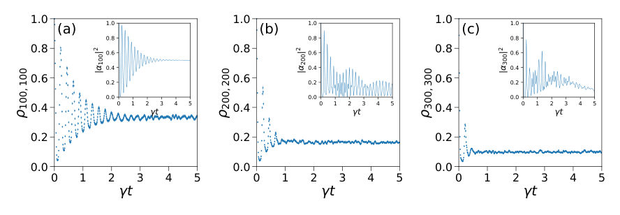
<figcaption class="paper-figure-caption"><b>Fig 1.</b> FIG. 1: Solutions to the non-local dephasing master equation (15) for populations ρN00,N00 solved using the rate-operator formalism with (a): N = 1, (b): N = 2 and (c): N = 3. Parameters are J/γ = 20, U/γ = 5. Insets have a corresponding deterministic evolutions controlled by effective Hamiltonian with rate operator transformations C = k n2, with k/γ values (a): 6.0, (b): 4.8 and (c): 4.0. The result was calculated using 1000 trajectories. The error bars represent the standard deviation of the populations divided by the square root of the number of trajectories.</figcaption>
</figure>
<figure class="paper-figure-card">
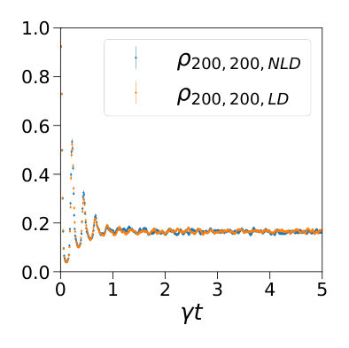
<figcaption class="paper-figure-caption"><b>Fig 2.</b> FIG. 2: Master equation solutions for population ρ200,200 solved using the rate-operator formalism for two different dephasing schemes for N = 2. Parameters are J/γ = 20, U/γ = 5. The result was calculated using 1000 trajectories. The error bars represent the standard deviation of the populations divided by the square root of the number of trajectories.</figcaption>
</figure>
<figure class="paper-figure-card">
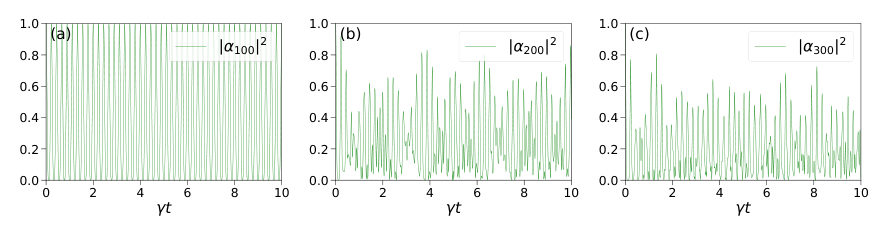
<figcaption class="paper-figure-caption"><b>Fig 3.</b> FIG. 3: Examples of unitary evolutions for the particle numbers N = 1, N = 2 and N = 3 with initial states |N, 0, 0⟩and parameters are J/γ = 20 and U/γ = 5. Fig. (a): Absolute square of the amplitude α100. Fig. (b): Absolute square of the amplitude α200. Fig. (c): Absolute square of the amplitude α300.</figcaption>
</figure>
<figure class="paper-figure-card">
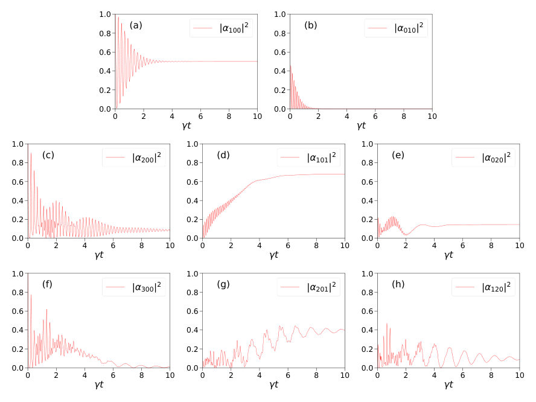
<figcaption class="paper-figure-caption"><b>Fig 4.</b> FIG. 4: Deterministic evolutions of the absolute squares of the amplitudes under non-local dephasing, generated by the non-Hermitian Hamiltonian (23) are shown for N = 1 (panels a–b), N = 2 (panels c–e), and N = 3N (panels f–h). In all cases, the initial state is |N, 0, 0⟩and the parameter values are J/γ = 20, U/γ = 5. The rate-operator transformation employed is C = k n2 with k/γ = 6.0, 4.8, and k/γ = 4.0 for particle numbers N = 1, N = 2, and N = 3, respectively. Components not shown either exhibit dynamics analogous to their symmetric counterparts or decay rapidly to zero.</figcaption>
</figure>
<figure class="paper-figure-card">

<figcaption class="paper-figure-caption"><b>Fig 5.</b> Figure 5 illustrates the influence of the parameter k in the rate-operator transformation C = k n2 under non- local dephasing. Varying k affects exclusively the characteristic timescale of the evolution: larger values of k lead to shorter evolution timescales. This behavior is advantageous for state-engineering applications based on non-Hermitian Hamiltonians. Analogous behavior is observed for N = 2 and N = 3. These observations motivate the use of the maximal admissible values of k. Figure 6 illustrates the influence of the initial state on the relaxation speed under non-local dephasing. The observed differences in relaxation rates between various initial states can be attributed to the...</figcaption>
</figure>

**Summary.** This paper applies the rate operator formalism to analyze the open Bose-Hubbard model, providing a systematic way to model non-Hermitian quantum evolution. By using the Rate Operator Quantum Jump method, the authors successfully engineer effective Hamiltonians that predict steady-state phases and transitions, even in regimes where traditional simulation techniques fail.

**Why it may be interesting.** This work provides a powerful, systematic tool (ROQJ) to analyze open quantum dynamics, which is crucial for understanding realistic physical systems where environmental coupling dictates the final state and dynamics.

Detailed structure

**Main problem.** The paper addresses the engineering of non-Hermitian dynamics and the characterization of phase structure in open quantum systems.

**Main result.** The rate operator formalism successfully constructs effective non-Hermitian Hamiltonians that reveal unique steady states, even when standard methods fail, and allows for the controlled transition between distinct steady-state phases.

**Method.** The core method is the Rate Operator Quantum Jump (ROQJ) formalism, which systematically unravels the master equation into stochastic pure-state trajectories.

**Model / system.** The system studied is the Bose-Hubbard model subjected to environmental dephasing, modeled via a master equation (GKSL equation). The analysis compares local and non-local dephasing schemes.

**Key observables.** Populations ($
ho_{N00, N00}$), absolute squares of amplitudes ($|\alpha|^2$), the imaginary part of the leading eigenvalue ($	ext{Im}(\lambda_1)$), and the expectation value of the energy ($\langle H/\gamma 
angle$).

**Important parameters / regimes.** Interaction strength ($U$), dephasing rate parameters ($k$ or $\gamma$), and the non-Hermiticity control parameter introduced via the rate operator.

**Assumptions / limitations.** The analysis assumes the rate operator $R_\psi$ is positive semi-definite for independent realizations, and it compares results derived from the ROQJ method against standard Monte Carlo wavefunction methods.

**Figures summary.** Figures map key steady-state diagnostics ($	ext{Im}(\lambda_1)$ and $\langle H/\gamma 
angle$) across parameter planes for both local and non-local dephasing schemes, demonstrating parameter-dependent phase boundaries.

**Paper structure.** The paper introduces the rate operator formalism, applies it to the Bose-Hubbard model, details the dynamical evolution using ROQJ, and finally characterizes the resulting steady-state structure and phase transitions.

Abstract

Non-Hermitian evolution can be realized through post-selection on stochastic pure-state trajectories arising in continuously monitored open quantum systems. The rate operator formalism provides a versatile and systematic framework for unraveling a master equation into stochastic pure-state evolutions, offering enhanced control over the resulting non-Hermitian dynamics. In the present work, we explore the applicability of the rate operator formalism as a tool for engineering non-Hermitian dynamics. Specifically, we apply this approach to the Bose-Hubbard model subject to environmental dephasing, examining its consequences for controlled state manipulation. Our analysis is framed within the broader contexts of quantum state engineering and measurement-induced phase transitions. We demonstrate that the rate operator formalism enables the construction of effective non-Hermitian Hamiltonians exhibiting a unique steady state-even in regimes where the standard Monte Carlo wavefunction method fails to produce one. Furthermore, we show that this framework facilitates transitions between distinct steady-state phases, governed by tunable parameters such as the interaction strength and a non-Hermiticity control parameter introduced via the rate operator formalism.

[↑ back to top](#top)

### [Piston-Like Information Engine II: Boundary-Controlled Optimum in Active Matter](http://arxiv.org/abs/2609.01760v1)

**Authors:** Laura Hoek, Neta Ben Ari, Rémi Goerlich, Saar Rahav, Yael Roichman  
**Type:** both · **Category:** statistical mechanics · **PDF:** <https://arxiv.org/pdf/2609.01760v1>  
**Analysis basis:** full PDF text, analyzed in chunks
**Topic relevance:** 🔥 `non-equilibrium universality` **4/5** · `driven-dissipative phase transition` **3/5** · `quantum measurements` **3/5** · `Full counting statistics` **2/5** · `Keldysh / 2PI / non-Gaussian methods` **2/5** · `methods for driven-dissipative` **2/5** · `analog quantum simulation` **1/5** · `correlated / nonlocal dissipation` **1/5** · `scars & prethermalization` **1/5**

↔ Scroll figures horizontally

<figure class="paper-figure-card">
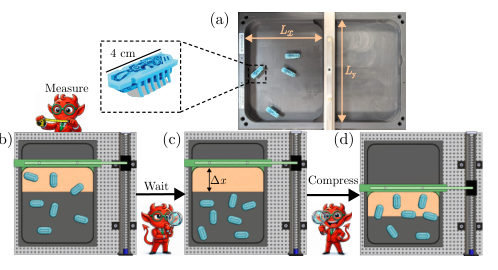
<figcaption class="paper-figure-caption"><b>Fig 1.</b> FIG. 1. Experimental setup and piston-like work- ing cycle. (a) Rectangular arena containing active parti- cles (bbots); inset: a single bbot. A linear actuator controls the movable boundary. Bottom: piston-like working cycle. (b) The number of bbots in the detection region, ∆xLy, is measured periodically (Ly = 29.2 cm). (c) If the region is oc- cupied, the boundary remains fixed. (d) If empty, the bound- ary moves inward, compressing the bbots. Measurements are spaced sufficiently far apart to be uncorrelated.</figcaption>
</figure>
<figure class="paper-figure-card">
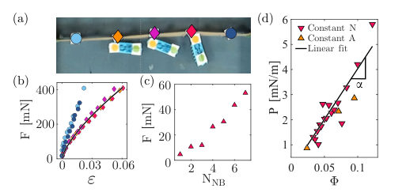
<figcaption class="paper-figure-caption"><b>Fig 2.</b> FIG. 2. Experimental pressure measurements. (a) Pho- tograph of the experimental setup with the flexible boundary; markers indicate the positions used for force calibration. (b) Force–strain calibration curves measured at the positions indi- cated in (a). (c) Force exerted by boundary-localized clusters of NNB bbots at fixed arena area, inferred from the measured boundary deflection. (d) Pressure P versus area fraction Φ. The black line is a linear fit with slope α. Red: fixed particle number with varying area; orange: fixed area with varying particle number.</figcaption>
</figure>
<figure class="paper-figure-card">
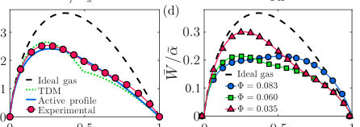
<figcaption class="paper-figure-caption"><b>Fig 3.</b> FIG. 3. Thermodynamic properties of the information engine. (a) One-dimensional projection of the bbots density, compared to the density of an ideal gas, and two simple mod- els of the boundary layer. (b) Inset: calculated probability p1 to find a detection region of width ∆x empty. Panel: the Shannon information per measurement. (c) The mean work per measurement, ¯ W/˜α, as a function of p1. Panels (a-c) cor- respond to experiments with area fraction Φ = 0.073. (d) Comparison of several ¯ W(p1) curves, obtained for different area fractions, to ¯ W/kBT = −p1 ln p1, expected for thermal particles.</figcaption>
</figure>
<figure class="paper-figure-card">
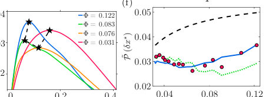
<figcaption class="paper-figure-caption"><b>Fig 4.</b> FIG. 4. Nonideal engine cycle with optimally chosen detection region. (a) Schematic depiction of free expansion experiments. (b) Position of piston as a function of time dur- ing free expansion. Bold line depicts the mean of 7 repetitions. (c) Schematic of time dependence of a cycle. The piston re- mains at L0 for several measurements; once the detection area is found to be empty, it is displaced to L1, after which the sys- tem takes a time of τexp to expand back to its initial volume. (d) p1(∆x⋆) as a function of area fraction Φ. Symbols are calculated using experimental data, while lines are based on simple models of bbot density: Uniform (black dashed line), TDM (green dotted line), and...</figcaption>
</figure>
<figure class="paper-figure-card">
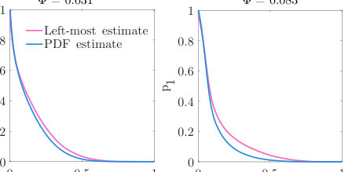
<figcaption class="paper-figure-caption"><b>Fig 5.</b> FIG. 5. Comparison of the empty-region probability p1(δx) obtained from the normalized single-bbot density profile (PDF estimate) and directly from the measured distribution of the leftmost bbot, for two representative area fractions, Φ = 0.031 and Φ = 0.083.</figcaption>
</figure>

**Summary.** This work develops and experimentally tests an information engine using active bristle bots to convert information into mechanical work. The study finds that the work output deviates significantly from predictions based on ideal thermal systems. Crucially, the optimal operating regime switches based on particle density, a feature confirmed even when considering realistic friction and finite-time cycle dynamics.

**Why it may be interesting.** The work done here on active matter thermodynamics and non-equilibrium work extraction provides a physical realization of non-equilibrium statistical mechanics far from equilibrium, which is highly relevant to open quantum systems and energy transduction.

Detailed structure

**Main problem.** The paper investigates information engines that extract work from active matter, comparing their performance to theoretical thermal systems.

**Main result.** The active engine exhibits a qualitatively modified work-information relationship compared to thermal systems, and the optimal operating regime switches depending on particle density.

**Method.** The work is calculated by analyzing the mean work extracted ($ar{W} = p_1 W_{st}$) based on the probability of finding an empty detection region ($p_1$) during a piston-like cycle.

**Model / system.** The system uses self-propelled bristle bots (active matter) confined in a box, where work is extracted by periodically measuring the occupancy of a movable detection region near a piston.

**Key observables.** Mean work per measurement ($ar{W}$), empty-region probability ($p_1$), and maximum power output ($	ilde{P}$).

**Important parameters / regimes.** Particle density ($\Phi$), detection region size ($\Delta x$), and the energy scale ($	ilde{\alpha}$ vs. $k_B T$).

**Assumptions / limitations.** The analysis assumes the active particle force scales linearly with density ($\alpha \Phi$), and later models incorporate dry friction and finite-time cycle constraints.

**Figures summary.** Figures illustrate the experimental setup, pressure scaling ($P \propto \Phi$), comparisons of $ar{W}$ vs $p_1$ showing regime switches, and simulations of stick-slip dynamics under friction.

**Paper structure.** The paper moves from defining the information engine concept and measuring work in active matter, to comparing results against ideal gas theory, analyzing the density-dependent switching of optimal operation, and finally modeling the cycle under realistic, non-ideal friction constraints.

Abstract

Information engines convert information into extractable work through measurements and feedback. We realize an engine that employs information to compress a gas of self-propelled bristle bots. Its work per measurement, $\bar{W}$, is controlled by the size of the detection region $Δx$ and the probability $p_1$ that this region is vacant. In thermal systems, $\bar{W}$ follows the universal form $-p_1 \ln p_1$, whereas the active engine shows a qualitatively modified relation. As particle density increases, the maximum of $\bar{W}(Δx)$ switches between two distinct operating regimes. Notably, this transition is also found in the solutions that maximize power output for finite-time cycles with dynamics affected by dry friction. We attribute this nonequilibrium feature to the accumulation of active particles near the boundaries.

[↑ back to top](#top)

### [Effective quasiparticle conserving Lindbladians in the thermodynamic limit](http://arxiv.org/abs/2609.02725v1)

**Authors:** Lea Lenke, Kai Phillip Schmidt  
**Type:** theory · **Category:** other · **PDF:** <https://arxiv.org/pdf/2609.02725v1>  
**Analysis basis:** full PDF text, analyzed in chunks
**Topic relevance:** 🔥 `methods for driven-dissipative` **4/5** · `correlated / nonlocal dissipation` **3/5** · `driven-dissipative phase transition` **3/5** · `non-equilibrium universality` **3/5** · `Keldysh / 2PI / non-Gaussian methods` **2/5** · `analog quantum simulation` **1/5** · `quantum measurements` **1/5** · `scars & prethermalization` **1/5**

↔ Scroll figures horizontally

<figure class="paper-figure-card">
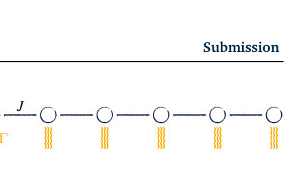
<figcaption class="paper-figure-caption"><b>Fig 1.</b> Figure 1: Illustration of the one-dimensional DTFIM. Neighboring spin-1/2 particles on a chain are coupled with an Ising interaction of strength J, subject to a magnetic field of strength h, and local dissipation with rate Γ.</figcaption>
</figure>
<figure class="paper-figure-card">
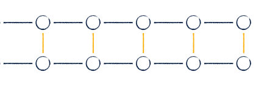
<figcaption class="paper-figure-caption"><b>Fig 2.</b> Figure 2: Illustration of the purified, one-dimensional DTFIM in Liouville space on an effective ladder geometry. Every spin-1/2 particle is represented by a rung dimer consisting of two sites, one for σj ⊗1 and one for 1 ⊗σj. It can also be seen as a representation of the Lindbladian in terms of qp, where the creation and annihilation operators b‡ j,+ and bj,+ act on one leg and b‡ j,−and bj,−on the other. Note that the two sites of a rung dimer j are not exactly identical in both representations, since the creation operators act on both sites of a rung dimer in the original spin representation (see Eqs. (7) and (8)).</figcaption>
</figure>
<figure class="paper-figure-card">
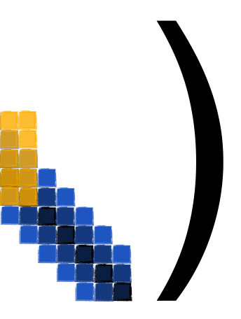
<figcaption class="paper-figure-caption"><b>Fig 3.</b> Figure 3: Pictorial representation of the matrix in the 2-qp sector after truncating the basis to (58) with D = 7 and n = 3. The blue diagonals contain the 1-qp operators and the yellow square contains the 2-qp operators.</figcaption>
</figure>
<figure class="paper-figure-card">
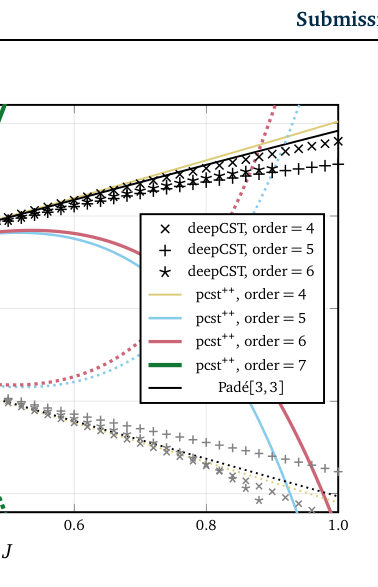
<figcaption class="paper-figure-caption"><b>Fig 4.</b> Figure 4: Real part of the eigenvalues ±ω±(k) in the 1-qp sector for the parameters h = Γ = 1 for k ∈{0,π} as a function of J. The lines represent the pcst++ expan- sion up to different orders. The colored solid lines represent k = 0 and the colored dotted lines k = π. The respective thin black lines represent the highest diagonal Padé approximants of the highest order pcst++ series. The scatter plots represent the deepCST expansion up to different orders. The bigger black markers represent k = 0 and the smaller gray markers k = π. Orders lower than 4 are not plotted.</figcaption>
</figure>
<figure class="paper-figure-card">
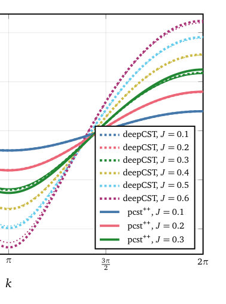
<figcaption class="paper-figure-caption"><b>Fig 5.</b> Figure 5: Real part of the eigenvalues ±ω±(k) in the 1-qp sector for the parameters h = Γ = 1 for different values of J as a function of k. The thick (thin) solid lines represent the pcst++ expansion up to 7th (6th) order. At J = 0.3 those two orders start to differ. The thick (thin) dotted lines represent the deepCST expansion up to 6th (5th) order. At J = 0.3 those two orders start to differ.</figcaption>
</figure>

**Summary.** This paper introduces advanced theoretical techniques, pcst++ and deepCST, to calculate effective quasiparticle-conserving Lindbladians for open quantum many-body systems in the thermodynamic limit. By applying these methods to the dissipative transverse-field Ising model, the authors demonstrate how to systematically handle dissipation while preserving the quasiparticle structure. This establishes a versatile tool for studying non-equilibrium steady states in complex quantum materials.

**Why it may be interesting.** This work provides powerful, generalizable theoretical tools (pcst++/deepCST) for analyzing non-equilibrium steady states in interacting quantum systems, which is crucial for understanding open quantum dynamics in condensed matter.

Detailed structure

**Main problem.** The primary challenge addressed is developing a systematic framework to construct effective quasiparticle-conserving Lindbladian operators directly in the thermodynamic limit for open quantum many-body systems.

**Main result.** The authors successfully developed and applied two complementary methods, pcst++ and deepCST, demonstrating they can derive effective Lindbladians that preserve quasiparticle number in the thermodynamic limit.

**Method.** The core methodology involves extending continuous similarity transformations (CSTs) from Hermitian Hamiltonians to non-Hermitian Lindbladians, enabling block diagonalization with respect to the quasiparticle number.

**Model / system.** The study uses the dissipative transverse-field Ising chain (DTFIM) with local dissipation as a paradigmatic model. The system is analyzed by purifying the Lindbladian and mapping it to a quasiparticle basis.

**Key observables.** The primary observables are the eigenvalues ($\lambda$) of the Lindbladian, from which the decay rates (inverse lifetimes) of elementary excitations are extracted. The Liouvillian gap is also a key diagnostic.

**Important parameters / regimes.** The analysis focuses on the thermodynamic limit and treats the Ising interaction ($J$) as a small perturbation in the low-Ising regime.

**Assumptions / limitations.** The methods assume that the continuous similarity transformations can be systematically applied to the non-Hermitian Lindbladian structure, and the analysis relies on perturbative expansions (linked-cluster/flow equations).

**Figures summary.** Figure 8 compares the calculated inverse lifetime of the longest-living state in the 2-qp sector as a function of the coupling $J$ using both pcst++ (solid lines) and deepCST (scatter plots) expansions, showing convergence up to $J \approx 0.4$.

**Paper structure.** The paper introduces the problem, details the two complementary theoretical frameworks (pcst++ and deepCST), applies these methods to the DTFIM, and analyzes the resulting effective Lindbladian structure and its spectral properties.

Abstract

Open quantum many-body systems are commonly described by Lindblad master equations, yet the treatment of Lindbladian operators in the thermodynamic limit remains a major challenge. We develop a framework for constructing effective quasiparticle-conserving Lindbladian operators directly in the thermodynamic limit. Our approach extends continuous similarity transformations to non-Hermitian open quantum systems and enables the systematic block diagonalization of Lindbladians with respect to the quasiparticle (qp) number. We formulate two complementary methods. The first, projective continuous similarity transformations (pcst++), generalizes perturbative continuous unitary transformations to Lindblad operators so that a linked-cluster expansion allows us to obtain high-order series expansions of the infinite system. The second, deepCST, extends directly evaluated enhanced perturbative continuous unitary transformations by combining the same qp-conserving generator with a perturbative truncation scheme that yields non-perturbative effective Lindbladian operators directly in thermodynamic limit. We apply pcst++ and deepCST to the dissipative transverse-field Ising chain with local dissipation. We focus on the low-Ising regime. We purify the Lindbladian by splitting each spin into two sites. A spin flip then corresponds to two qps. We derive and analyze the effective, qp-conserving Lindbladian in the sectors with zero to two qps. We show how the Ising interaction renormalizes the decay rates of elementary spin-flip excitations and provides the microscopic mechanism for a competition between coherent interactions and dissipation. Our work establishes perturbative and non-perturbative continuous similarity transformations as a versatile tool for deriving effective qp pictures of open quantum many-body systems in the thermodynamic limit.

[↑ back to top](#top)

### [QArray+: A physics-informed GPU-accelerated simulator for quantum dot arrays](http://arxiv.org/abs/2609.02736v1)

**Authors:** Pranav Vaidhyanathan, Barnaby van Straaten, Alice Petrillo, Rahul Marchand, Edwin De Nicolo, Menno Veldhorst, Brucek Khailany, Taylor L. Patti, Natalia Ares  
**Type:** theory · **Category:** other · **PDF:** <https://arxiv.org/pdf/2609.02736v1>  
**Analysis basis:** full PDF text, analyzed in chunks
**Topic relevance:** 🔥 `methods for driven-dissipative` **4/5** · `driven-dissipative phase transition` **3/5** · `non-equilibrium universality` **3/5** · `Keldysh / 2PI / non-Gaussian methods` **2/5** · `analog quantum simulation` **2/5** · `correlated / nonlocal dissipation` **1/5** · `quantum measurements` **1/5**

↔ Scroll figures horizontally

<figure class="paper-figure-card">
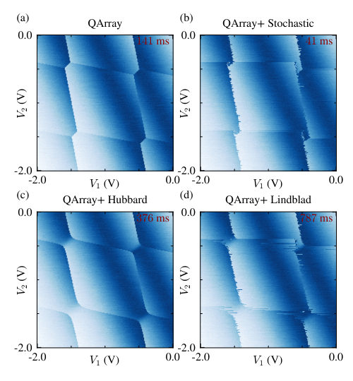
<figcaption class="paper-figure-caption"><b>Fig 1.</b> FIG. 1. Double dot charge stability diagram com- puted using four different models. a) The steady state charge stability diagram computed using QArray. b-d) The latched charge stability diagram computed using the QArray+ stochastic, spinless Hubbard and open quantum system mod- els, respectively. The stochastic CSD shows latching but not hybridization of charge states. The spinless Hubbard model shows just hybridization of charge states. The open quantum system model shows both effects. The CPU compute time for each 200 × 200 CSD is indicated in the top-right corner.</figcaption>
</figure>
<figure class="paper-figure-card">
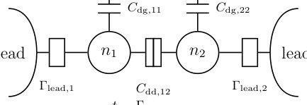
<figcaption class="paper-figure-caption"><b>Fig 2.</b> FIG. 2. Schematic of a quantum dot device with tun- nel and capacitive couplings. Each quantum dot carries charge ni and is tunnel-coupled to the source and drain leads with rates Γlead,i. The dots are mutually coupled through the inter-dot capacitance Cdd,12 = Cdd,21, the coherent inter-dot tunnel coupling t12, and the incoherent inter-dot transition rate Γinterdot,12. Gate electrodes at voltages Vgi are capaci- tively coupled to the dots; for clarity, any cross-capacitances are omitted. The legend indicates the symbols used to repre- sent tunnel, capacitive, and combined tunnel-capacitive cou- plings. Figure adapted from Fig. 1 of [26].</figcaption>
</figure>
<figure class="paper-figure-card">
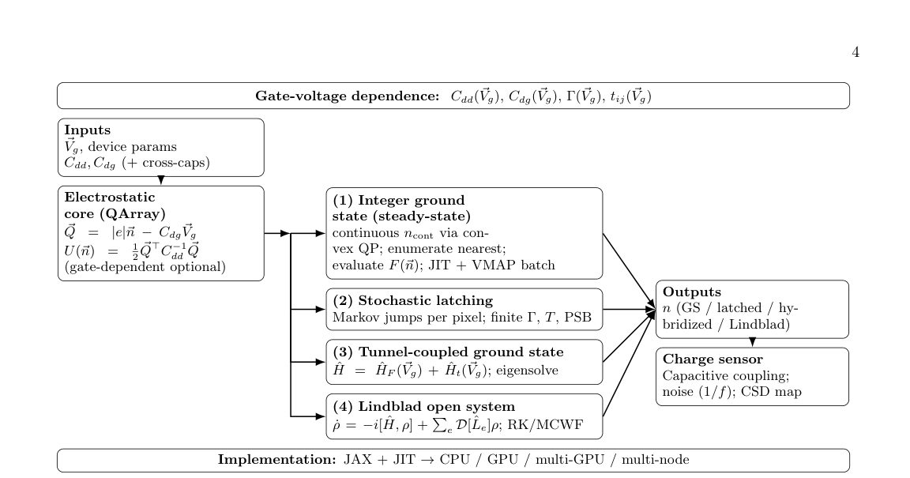
<figcaption class="paper-figure-caption"><b>Fig 3.</b> FIG. 3. Overview of QArray+ relative to QArray: shared electrostatic core with four interchangeable simulation heads (stochastic latching, tunnel-coupled ground state, Lindblad open-system evolution, and integer ground-state via continuous relaxation + candidate enumeration + energy selection), plus shared gate-voltage dependence, readout/noise, and JAX GPU acceleration.</figcaption>
</figure>
<figure class="paper-figure-card">
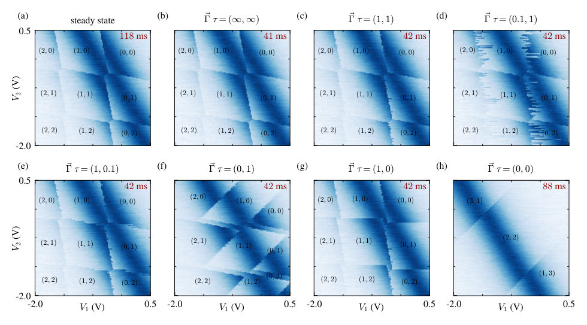
<figcaption class="paper-figure-caption"><b>Fig 4.</b> FIG. 4. Hole-based double-dot charge stability diagrams, each computed on a 200 × 200 gate-voltage grid, with the compute time indicated in the top-right corner and the charge state overlaid. (a) Steady-state solution obtained using the original QArray algorithm. (b) Charge stability diagram computed with the QArray+ stochastic solver in the limit of infinite tunnel rates and zero lead temperature, such that the system deterministically adopts the lowest-energy charge configuration. (c–g) Latched charge stability diagrams for finite tunnel rates. It is assumed that sufficient time elapses between the end of one row and the start of the next for the system to relax to the ground charge state...</figcaption>
</figure>
<figure class="paper-figure-card">
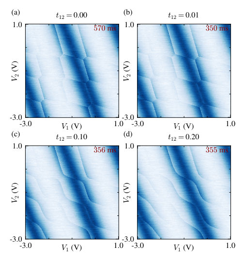
<figcaption class="paper-figure-caption"><b>Fig 5.</b> FIG. 6. Tunnel-coupled ground-state (spinless Hub- bard) charge stability diagrams for increasing inter- dot tunnel coupling t12. Coherent tunneling hybridizes near-degenerate interdot charge configurations, producing avoided crossings and fractional charge expectation values that broaden the interdot transition lines as t12 increases. Each panel shows a 200 × 200 gate-voltage scan; compute times on CPU are indicated in the top-right corners. The larger compute time for the t12 = 0 panel reflects one-time just-in-time compilation included in its timing; the remaining panels reuse the compiled kernel.</figcaption>
</figure>

**Summary.** This paper introduces QArray+, an advanced simulator for quantum dot arrays designed to overcome limitations in current models that assume steady-state physics. By incorporating gate-dependent tunnel coupling and a full quantum open-system description, it can accurately model non-equilibrium dynamics crucial for quantum device operation. The implementation leverages GPU acceleration to achieve high-throughput simulation of complex charge stability diagrams.

**Why it may be interesting.** This work is highly relevant as it provides a sophisticated, scalable tool for simulating open quantum systems in solid-state architectures, bridging the gap between idealized equilibrium models and realistic, time-dependent quantum dynamics.

Detailed structure

**Main problem.** Existing simulators for quantum dot arrays fail in non-equilibrium regimes because they rely on simplified models assuming instantaneous steady-state relaxation.

**Main result.** QArray+ successfully unifies the simulation of coherent interdot hybridization and non-equilibrium latching dynamics, achieving high computational efficiency on GPU hardware.

**Method.** The authors developed QArray+, which extends the QArray framework by incorporating gate-dependent tunnel coupling and a quantum open-system description using a Lindblad master equation.

**Model / system.** The system is semiconductor quantum-dot arrays, simulated using models ranging from stochastic Markov jump processes to the Lindblad master equation, allowing for the calculation of Charge Stability Diagrams (CSDs).

**Key observables.** Charge Stability Diagrams (CSDs), coherent interdot charge-state hybridization, and non-equilibrium latching dynamics.

**Important parameters / regimes.** Gate voltages ($\vec{V}_g$), tunnel coupling strengths ($t_{ij}$), and the ratio of measurement rates to tunneling dynamics.

**Assumptions / limitations.** The stochastic model assumes a single charge transition per time step, and the original models assume relaxation to a steady state much faster than the measurement timescale.

**Figures summary.** Figures show comparisons of CSDs computed using various models (QArray, Lindblad, Hubbard), demonstrating the different physical regimes captured, and Figure 9 shows the scaling of computation time with tunnel-coupling density.

**Paper structure.** The paper introduces QArray+ to address limitations in existing simulators, details the incorporation of open-system dynamics and gate-dependent coupling, presents the computational implementation in JAX/GPU, and validates the method by comparing results across different physical regimes.

Abstract

Semiconductor quantum-dot arrays are a compelling platform for scalable quantum technologies, yet their practical operation is hindered by the complexity of tuning large-scale devices. Existing automation tools rely on simplified physical models---such as constant-capacitance approximations and equilibrium Hubbard models---which assume instantaneous relaxation to a steady state. These frameworks fail in experimentally critical regimes where measurement rates exceed tunneling dynamics, necessitating more sophisticated non-equilibrium control strategies. To bridge this gap, we introduce QArray+, an extension of the QArray framework that incorporates gate-dependent tunnel coupling and a quantum open-system description of dissipative processes. This approach enables the unified simulation of coherent interdot charge-state hybridization and the non-equilibrium latching dynamics essential for training robust machine-learning models for automated device operation. Implemented in JAX with GPU acceleration, QArray+ scales across GPUs and multi-node systems. For example, a charge stability diagram for a 100X100 grid of gate voltages over 64 dots can be computed in $\sim0.17\,\mathrm{s}$ on multiple GPUs. Since interdot interactions are short-ranged and the corresponding tuning corrections are local, simulations at these scales capture the physics relevant to even larger devices. These capabilities support high-throughput dataset generation for automated device tuning.

[↑ back to top](#top)

### [Memory-driven Topological Defects and Unconventional Long-Range Order](http://arxiv.org/abs/2609.02586v1)

**Authors:** Ziyang Ding, Zi Cai  
**Type:** theory · **Category:** statistical mechanics · **PDF:** <https://arxiv.org/pdf/2609.02586v1>  
**Analysis basis:** full PDF text, analyzed in chunks
**Topic relevance:** 🔥 `non-equilibrium universality` **4/5** · `driven-dissipative phase transition` **3/5** · `Keldysh / 2PI / non-Gaussian methods` **2/5** · `methods for driven-dissipative` **2/5** · `Frenkel-Kontorova` **1/5** · `analog quantum simulation` **1/5** · `correlated / nonlocal dissipation` **1/5**

↔ Scroll figures horizontally

<figure class="paper-figure-card">
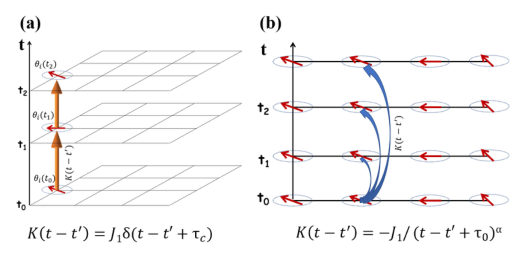
<figcaption class="paper-figure-caption"><b>Fig 1.</b> FIG. 1: Sketch of (a) 2D model with short-range antiferro- magnetic retarded interactions and (b) 1D model with long- range ferromagnetic retarded interactions</figcaption>
</figure>
<figure class="paper-figure-card">
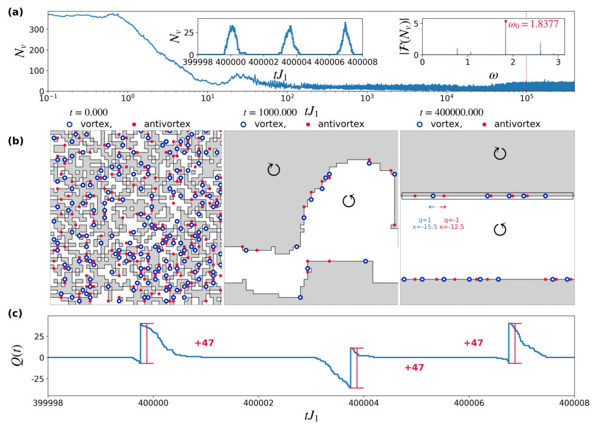
<figcaption class="paper-figure-caption"><b>Fig 2.</b> FIG. 2: (a) Dynamics of the total vortex number Nv following a quench from T = J to 0.05J. Left inset: late-time dynamics of Nv. Right inset: Fourier spectrum showing a peak at ω0 ≈2ωc. (b) Snapshots of DWs and vortices at initial, intermediate, and late times. Gray (white) regions indicate clockwise (counterclockwise) rotation; open (solid) circles denote vortices (an- tivortices). (c) The net dipole moment Q(t) along the upper DW in (b). Parameters: J1 = γ = I = J, τc = 2J−1.</figcaption>
</figure>
<figure class="paper-figure-card">
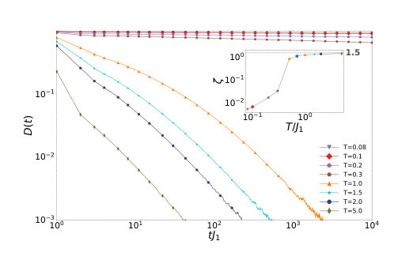
<figcaption class="paper-figure-caption"><b>Fig 3.</b> FIG. 3: D(t) for a single rotor with α = 3/2 across various temperatures T, which exhibit power-law decay D(t) ∼t−ζ</figcaption>
</figure>
<figure class="paper-figure-card">
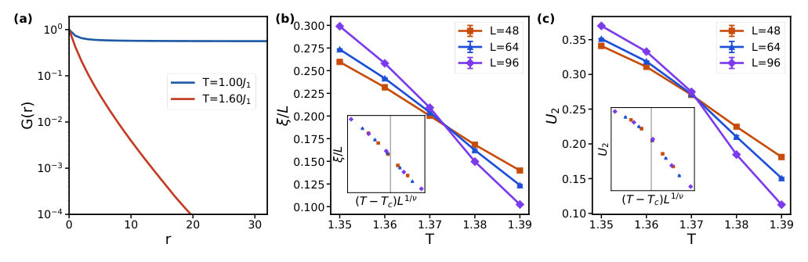
<figcaption class="paper-figure-caption"><b>Fig 4.</b> FIG. 4: (a)G(r) at low and high temperature; (b) Normalized correlation length ξ/L and (c) Binder cumulant as a function of temperature for various L. The insets are the data collapse with the optimal ν. Parameters: I = γ = J1 = J, τ0 = J−1.</figcaption>
</figure>
<figure class="paper-figure-card">
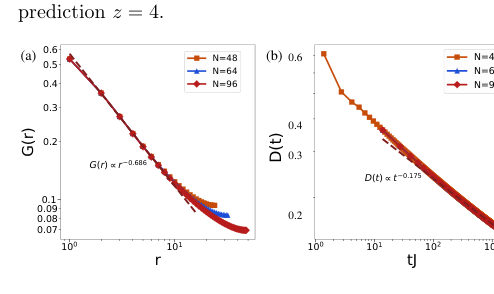
<figcaption class="paper-figure-caption"><b>Fig 5.</b> FIG. 5: (a) G(r) and (b) D(t) at critical point (Tc = 1.373J) with various L. Parameters: I = γ = J1 = J,τ0 = J−1.</figcaption>
</figure>

**Summary.** This work explores non-equilibrium physics in systems with memory-dependent interactions, showing how these temporal couplings can induce novel forms of order. Key findings include the stabilization of true long-range order in 1D and the emergence of helical dynamics involving topological defects in 2D. The research establishes engineered temporal interactions as a powerful paradigm for non-equilibrium many-body physics.

**Why it may be interesting.** The explicit derivation of unconventional critical exponents ($z=4$) and the demonstration of finite-temperature phase transitions in non-equilibrium settings provide new theoretical tools for understanding complex dynamics beyond equilibrium statistical mechanics.

Detailed structure

**Main problem.** The study investigates non-equilibrium ordering and topological defects in many-body systems driven by time-delayed self-interactions mediated by a memory-feedback mechanism.

**Main result.** The memory feedback mechanism can stabilize true long-range order at finite temperatures, circumventing theorems like Mermin-Wagner, and generating unique helical vortex dynamics in 2D systems.

**Method.** The analysis employs continuum field theory, spin-wave approximations, and detailed analysis of correlation functions (spatial, temporal, and velocity) across different temperature regimes.

**Model / system.** The core model is an interacting rotor system governed by an equation of motion incorporating short-range and long-range retarded memory forces, applicable in 1D and 2D geometries.

**Key observables.** Correlation functions G(r), D(t), and G_v(r); topological defects (vortices) and domain walls (DWs); dynamical critical exponent z.

**Important parameters / regimes.** The memory kernel decay exponent $\alpha$ (for 1D), the delay time $\tau_c$ (for 2D), and the temperature $T$ relative to interaction strengths $J_1$.

**Assumptions / limitations.** The analysis relies on linearizing the equations of motion for low-temperature regimes and utilizing approximations like the Spin-Wave Approximation (SWA).

**Figures summary.** Figures illustrate the decay of correlation functions (algebraic vs. exponential) at varying temperatures, demonstrating the persistence of quasi-long-range order and the helical motion of vortices.

**Paper structure.** The paper progresses by analyzing the 2D model (focusing on vortex dynamics and symmetry breaking) and then analyzing the 1D model (focusing on long-range order and the Mermin-Wagner circumvention), concluding with a comparison of results.

Abstract

We investigate many-body systems with time-delayed self-interactions mediated by a memory-feedback mechanism. We show that such temporal interactions generate non-equilibrium orders and unique topological defects absent in equilibrium-specifically, helical vortices wherein opposite vorticities propagate in reverse directions along domain walls. In one dimension, memory feedback stabilizes true long-range order against weak noise, thereby circumventing the Mermin-Wagner theorem and resulting in an unconventional finite-temperature phase transition with a dynamical exponent $z = 4$. Physical realizations of these memory-driven non-equilibrium systems using active mechatronic metamaterials has also been proposed. These results demonstrate engineered temporal interactions as a powerful paradigm for non-equilibrium many-body physics.

[↑ back to top](#top)

### [Nonequilibrium corrections to conserved Ising criticality in scalar active matter: Ward identities, spectrum, and long crossovers](http://arxiv.org/abs/2609.02351v1)

**Authors:** Piotr Zdybel  
**Type:** theory · **Category:** statistical mechanics · **PDF:** <https://arxiv.org/pdf/2609.02351v1>  
**Analysis basis:** full PDF text, analyzed in chunks
**Topic relevance:** 🔥 `non-equilibrium universality` **4/5** · `Keldysh / 2PI / non-Gaussian methods` **3/5** · `driven-dissipative phase transition` **3/5** · `methods for driven-dissipative` **2/5** · `correlated / nonlocal dissipation` **1/5**

↔ Scroll figures horizontally

<figure class="paper-figure-card">
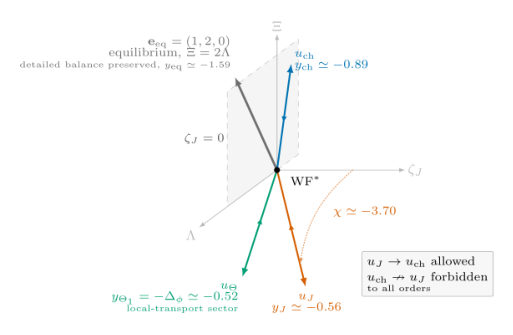
<figcaption class="paper-figure-caption"><b>Fig 1.</b> FIG. 1. Perturbation space around the passive conserved Wilson–Fisher fixed point (WF∗, filled circle) in d = 3. Thin gray axes are the gradient-active couplings (Λ, Ξ, ζJ); the shaded patch is the chemical plane ζJ = 0. The thick gray ray is the equilibrium tangent eeq = (1, 2, 0), along which Ξ = 2Λ and detailed balance is preserved. Colored rays are the three genuine nonequilibrium scaling fields, with the eigenvalues of Table II; inward arrowheads indicate that all three are ir- relevant. Quotienting by the equilibrium direction gives the (ac, aJ) plane of Eq. (2). The directions of uch and uJ follow from Eqs. (68) and (70); the dotted arc shows the chemical ad- mixture χ ≃−3.70 of a...</figcaption>
</figure>
<figure class="paper-figure-card">
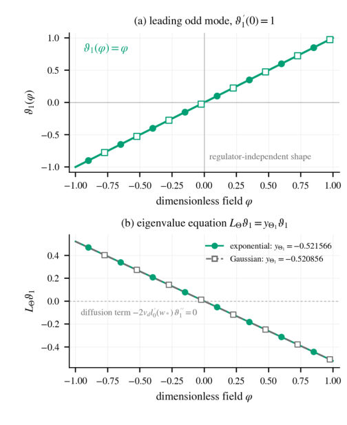
<figcaption class="paper-figure-caption"><b>Fig 2.</b> FIG. 2. Leading odd local-transport eigenfield at the passive fixed point. (a) With ϑ′ 1(0) = 1, the eigenfunction is ϑ1(φ) = φ and has the same shape for the exponential (filled circles) and Gaussian (open squares) regulators. (b) Since ϑ′′ 1 = 0, the field-dependent diffusion term in LΘ vanishes identically. The eigenvalue equation is saturated by the scaling drift and gives yΘ1 = −∆ϕ.</figcaption>
</figure>
<figure class="paper-figure-card">
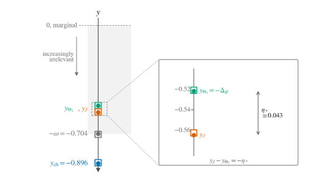
<figcaption class="paper-figure-caption"><b>Fig 3.</b> FIG. 4. Three-dimensional correction-to-scaling spectrum for the exponential (filled circles) and Gaussian (open squares) regulators. The shaded band |y| &lt; ω contains perturbations that decay more slowly than the leading equilibrium correc- tion to scaling. The inset resolves the near-degenerate pair yΘ1 and yJ, whose separation is yJ −yΘ1 = −η∗.</figcaption>
</figure>
<figure class="paper-figure-card">
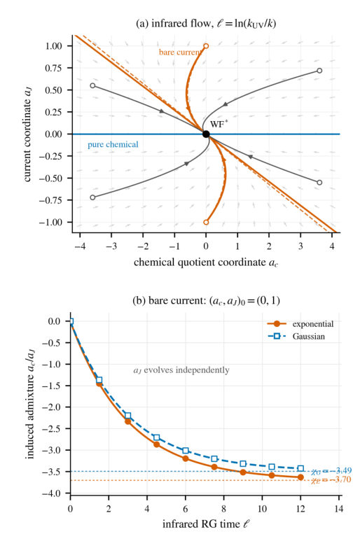
<figcaption class="paper-figure-caption"><b>Fig 4.</b> FIG. 3. Linearized infrared flow in the quotient plane. (a) The chemical axis aJ = 0 is invariant, whereas a current per- turbation induces a chemical component and approaches the slow current eigenline before reaching WF∗. Arrows point to- ward increasing infrared RG time ℓ. Solid trajectories use the exponential regulator; dashed curves show the Gaussian bare- current trajectory and eigenline. (b) Chemical admixture gen- erated from (ac, aJ)ℓ=0 = (0, 1), approaching χE = −3.70 and χG = −3.49. The one-way generation directly visualizes the triangular quotient flow.</figcaption>
</figure>
<figure class="paper-figure-card">
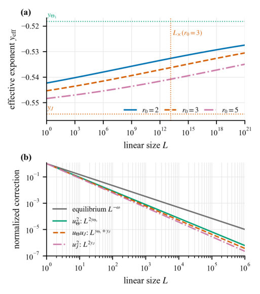
<figcaption class="paper-figure-caption"><b>Fig 5.</b> FIG. 5. Long crossover caused by the near-degenerate lo- cal and current-like odd scaling fields, using the reference- informed exponents of Eq. (64). (a) Effective expo- nent of Eq. (85) for three initial amplitude ratios A0 = AJuJ/(AΘuΘ). For A0 = 3 the two terms become equal only near L× ≃1.4 × 1013, so the measured slope is an amplitude- dependent interpolation between yJ and yΘ1 over the entire accessible range. Ratios |A0| ≤1 do not produce a macro- scopic crossover. (b) For an even observable the nonequilib- rium corrections enter quadratically, Eq. (78), and all three decay faster than the leading equilibrium correction L−ω. All amplitudes are set to unity; ω is the...</figcaption>
</figure>

**Summary.** This theoretical work investigates how non-equilibrium effects perturb the critical behavior of conserved Ising models in active matter. Using Functional Renormalization Group techniques, the authors calculate the scaling dimensions of these perturbations. They find that the two most relevant non-equilibrium modes are nearly degenerate in 3D, indicating extremely slow relaxation dynamics in the system.

**Why it may be interesting.** The study provides rigorous RG techniques to analyze non-equilibrium steady states, which is crucial for understanding driven systems far from thermal equilibrium, a key area of modern condensed matter theory.

Detailed structure

**Main problem.** The paper analyzes the nonequilibrium corrections to conserved Ising criticality in scalar active matter, aiming to determine the slowest decaying perturbations away from the passive Wilson-Fisher fixed point.

**Main result.** The two most slowly decaying nonequilibrium modes are found to be nearly degenerate in $d=3$, suggesting unusually large crossover scales, and the analysis confirms the absence of additional contact counterterms at two loops.

**Method.** The study employs Functional Renormalization Group (FRG) calculations, starting from the Martin-Siggia-Rose-Janssen-De Dominicis (MSRJD) action, and utilizes Ward identities to constrain the renormalization flow.

**Model / system.** The system is scalar active matter described by a field $\phi(x, t)$ whose dynamics are out of equilibrium due to field-dependent noise-to-mobility ratios ($\Theta(\phi)$) and gradient activity terms. The passive reference theory is related to conserved Cahn-Hilliard or Model-B dynamics.

**Key observables.** RG eigenvalues characterizing decay rates ($y_{\Theta 1}, y_J, y_{ch}$), and the anomalous dimension $\eta$.

**Important parameters / regimes.** Dimensionality $d=3$ (and $d=4-\epsilon$), and the ratio of the two slowest modes separated by the Ising anomalous dimension $\eta$.

**Assumptions / limitations.** The analysis relies on a specific functional truncation of the FRG and assumes no further contact anomaly for the relevant operators.

**Figures summary.** Figure 1 illustrates the perturbation space around the passive WF fixed point in $d=3$. Figure 7 shows numerical convergence checks for the FRG calculation across varying polynomial orders and momentum windows.

**Paper structure.** The paper proceeds by defining the active dynamics via the MSRJD action, applying FRG to find the stability matrix eigenvalues, using Ward identities to enforce conservation laws, and finally performing explicit two-loop calculations to confirm the degeneracy and scaling behavior of the slowest modes.

Abstract

Active scalar field theories break detailed balance in two physically distinct ways: through a field-dependent noise-to-mobility ratio $Θ(φ)=D(φ)/M(φ)$, and through the gradient activity of Active Model~B+. We classify the resulting perturbations of the conserved Wilson-Fisher fixed point in three dimensions. Working from the Martin-Siggia-Rose-Janssen-De~Dominicis (MSRJD) action, a functional renormalization-group (FRG) calculation shows that the transport sector has a block-triangular stability matrix whose leading odd mode has $y_{Θ_1}=-Δ_φ$, while quotienting the gradient sector by its detailed-balance-preserving tangent leaves a chemical and a current-like mode. Two smooth regulators give $y_{Θ_1}\simeq-0.52$, $y_J\simeq-0.56$ and $y_{\rm ch}\simeq-0.89$. The translation Ward identity represents the current operator by a stress-tensor divergence modulo chemical gradients; conservation and causality then make the active stability matrix triangular to all loop orders, and an explicit two-loop calculation in $d=4-ε$ finds no additional contact counterterm. The two slowest modes are separated only by the Ising anomalous dimension, $y_J-y_{Θ_1}=-η$. This relation is a dimension count that holds provided neither operator acquires a further contact anomaly, a condition we establish within the present truncation for $\mathcal O_Θ$ and verify through two loops for $\mathcal O_J$; under it the $d=3$ reference Ising value gives $y_{Θ_1}\simeq-0.5181$ and $y_J\simeq-0.5544$. We derive the parity-resolved finite-size scaling of this near degeneracy, identify block observables that separate the two modes, and show that when the current amplitude dominates the crossover scale lies far beyond any accessible system size.

[↑ back to top](#top)

### [Dynamical stabilisation of a quantum fluid using a single topological defect](http://arxiv.org/abs/2609.02643v1)

**Authors:** Deborah Capecchi, Paolo Comaron, Antonio Gianfrate, Milena De Giorgi, Dario Ballarini, Daniele Sanvitto, Franco Dalfovo, Dimitrios Trypogeorgos  
**Type:** both · **Category:** quantum gases · **PDF:** <https://arxiv.org/pdf/2609.02643v1>  
**Analysis basis:** full PDF text, analyzed in chunks
**Topic relevance:** 🔥 `analog quantum simulation` **4/5** · `driven-dissipative phase transition` **2/5** · `methods for driven-dissipative` **2/5** · `non-equilibrium universality` **2/5** · `Keldysh / 2PI / non-Gaussian methods` **1/5** · `quantum optics experiment` **1/5**

↔ Scroll figures horizontally

<figure class="paper-figure-card">
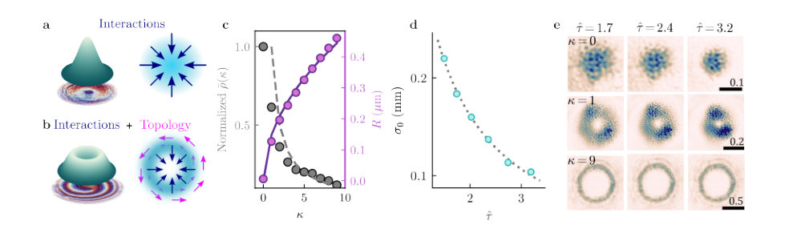
<figcaption class="paper-figure-caption"><b>Fig 1.</b> FIG. 1. Topological stabilization of the condensate. a For an initially gaussian-shaped condensate, attractive interactions cause a monotonic increase of the density and a corresponding decrease of the width. b In the presence of a vortex with topological charge κ, the phase singularity causes the density at the center to vanish, and induces an azimuthal velocity; the measured phase is shown below the density in both a and b. c With increasing vortex charge the measured ring radius R increases and the average ring density ¯ρ(κ) normalized to the density of the κ = 0 case decreases. Solid and dashed lines correspond to σ0 √κ and 1/κ, respectively. d The experimentally measured size σ0 of the...</figcaption>
</figure>
<figure class="paper-figure-card">
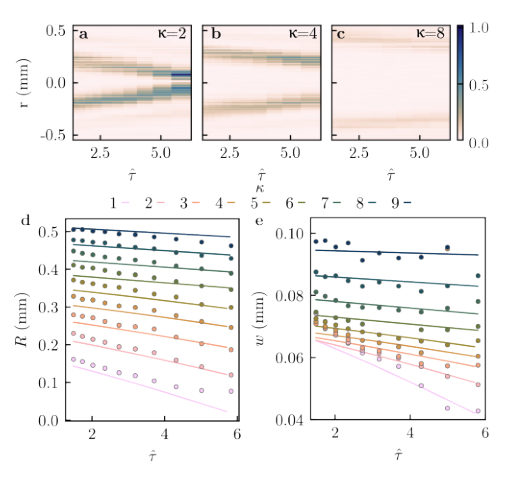
<figcaption class="paper-figure-caption"><b>Fig 2.</b> FIG. 2. Condensate geometry. a-c Experimental radial pro- files of the ring condensate density as a function of ˆτ for κ = 2, 4, 8. For large κ, the evolution for the ring becomes slower and slower, due to a balance between attractive inter- actions and topological constraints. d, e Radius R and width w of the ring as a function of the effective time ˆτ for different values of κ (legend on top); circles and lines represent the experimentally measured values and the results of GPE sim- ulations, respectively.</figcaption>
</figure>
<figure class="paper-figure-card">
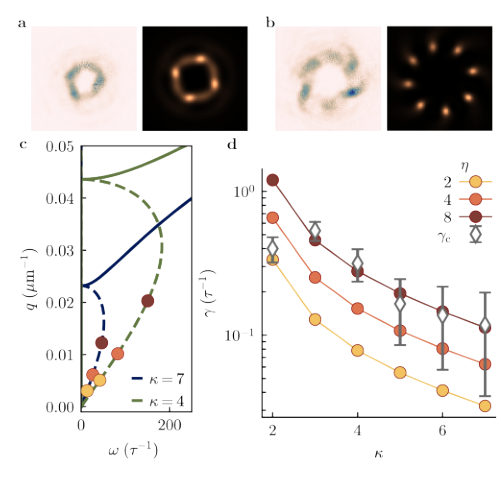
<figcaption class="paper-figure-caption"><b>Fig 3.</b> FIG. 3. Growth of Bogoliubov modes in the ring. a,b Density profiles from the experiment (left) and numerical simulations with the GPE (right) for κ = 4 at ˆτ = 8.3 (a), and κ = 7 at ˆτ = 13.1(b). c The frequency of the Bogoliubov modes is purely imaginary at small q and real for large q. The pre- dictions for the corresponding imaginary and real parts are shown as dashed and solid lines, respectively. The modes η permitted by the ring periodicity are indicated by colored circles. d Growth rates of the dominant modes (circles) ex- tracted from the Bogoliubov analysis at ˆτ = 6.8 are plotted as a function of κ. They agree well with the growth rate γc calculated from the GPE simulations...</figcaption>
</figure>
<figure class="paper-figure-card">
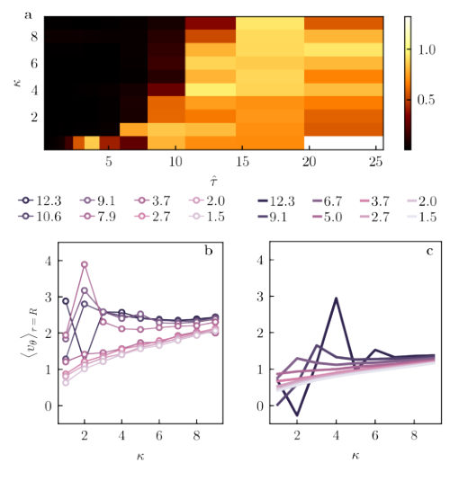
<figcaption class="paper-figure-caption"><b>Fig 4.</b> FIG. 4. a. The amplitude of the dominant Bogoliubov mode normalised to ¯ρ from GPE simulations. The time at which the ring collapses forming a solitonic pattern, can be roughly identified as the time when this quantity is 0.5. The col- lapse time is delayed by an order of magnitude as κ increases. The collapse dynamics affect the distribution of the azimuthal velocity shown in b (experiment) and c (GPE simulations). The different colours correspond to different times as in leg- end. For ˆτ &lt; 9 the azimuthal velocity scales linearly with κ, as expected for a quantized circulation; however, at higher values of ˆτ large variations appear when κ is small, due to the complex dynamics leading to...</figcaption>
</figure>

**Summary.** This research demonstrates that imposing a topological defect, such as a quantized vortex, can dramatically stabilize a quantum fluid suffering from attractive interactions, preventing rapid collapse. By modeling the system with the GPE and analyzing the Bogoliubov spectrum, the authors show that the vortex's circulation counteracts the collapse, delaying it significantly. The study bridges theoretical predictions of instability with direct experimental measurements in quantum optics.

**Why it may be interesting.** This work provides a concrete, experimentally verifiable platform (quantum fluid of light) to study fundamental many-body physics concepts like collapse dynamics and topological stabilization, which are central to understanding BEC behavior.

Detailed structure

**Main problem.** The study investigates how non-trivial topology, introduced via quantized vortices, dynamically stabilizes a quantum fluid that would otherwise undergo collapse due to attractive inter-particle interactions.

**Main result.** The presence of a vortex significantly delays the collapse time of the Bose-Einstein condensate (BEC) by an order of magnitude, stabilizing the fluid into a persistent ring structure.

**Method.** The dynamics are modeled using the Gross-Pitaevskii equation (GPE) and analyzed through Bogoliubov excitation spectrum calculations to predict instability growth rates.

**Model / system.** The system is an analogue of a two-dimensional BEC with large attractive interactions, realized experimentally using a quantum fluid of light propagating in geometry. The dynamics are governed by a GPE-like equation.

**Key observables.** Condensate size ($\sigma_0$), ring radius ($R$), ring width ($w$), collapse time delay ($\hat{	au}_c$), and the growth rate ($\gamma$) of Bogoliubov modes.

**Important parameters / regimes.** Vortex topological charge ($\kappa$), interaction strength ($g$), and the effective time/propagation distance ($\hat{	au}$).

**Assumptions / limitations.** Neglect of laser absorption (at large detuning) and the assumption that the Bogoliubov spectrum can be treated adiabatically for instability analysis.

**Figures summary.** Figures illustrate the geometric effects of vortices on the condensate ring, the dependence of $R$ and $w$ on $\kappa$, and the comparison between theoretically predicted and numerically extracted Bogoliubov instability growth rates.

**Paper structure.** The paper establishes the physical analogy and the collapse mechanism, then introduces the role of vortices to stabilize the system. It proceeds to analyze the ring dynamics, predict fragmentation via modulation instability using Bogoliubov theory, and finally compares these theoretical predictions with experimental measurements of density and velocity fields.

Abstract

The size and shape of a quantum fluid in equilibrium is strongly influenced by the inter-particle interactions. In the attractive interaction regime, atomic quantum fluids ultimately collapse in a violent process that expels most of the particles from the macroscopically occupied state. Here, we use a quantum fluid of light in propagating geometry as an analogue to a two-dimensional Bose-Einstein condensate (BEC) with large attractive interactions to show that non-trivial topology significantly alters the dynamical behaviour of the collapse, enhancing the BEC stability and delaying the collapse time by an order of magnitude. We measure direct experimental signatures of topology affecting quantum hydrodynamics, unveiling the inherent competition between attractive nonlinearities, that lead to the collapse, and the preservation of topological charge from a multi-charged vortex. We fully characterise the collapse process in coordinate space and the eventual `solitonification' of the system and connect it to the mode structure of the excitation spectrum.

[↑ back to top](#top)

### [Exponential speedup of polarization stabilization for long distance DWDM quantum networks](http://arxiv.org/abs/2609.02841v1)

**Authors:** Jinyi Du, En Teng Lim, Xingjian Zhang, Hongwei Gao, George F. R. Chen, Dawn T. H. Tan, Alexander Ling  
**Type:** experiment · **Category:** quantum information and computing · **PDF:** <https://arxiv.org/pdf/2609.02841v1>  
**Analysis basis:** full PDF text, analyzed in chunks
**Topic relevance:** 🔥 `quantum optics experiment` **4/5** · `QC/QI experiment` **3/5** · `quantum measurements` **3/5** · `interference shaping light` **1/5**

↔ Scroll figures horizontally

<figure class="paper-figure-card">
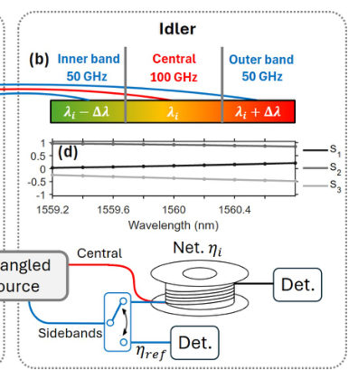
<figcaption class="paper-figure-caption"><b>Fig 1.</b> Fig. 1 Concept of wavelength-bracketed and switch-enabled polarization feedback. The gray dashed enclosures indicate the signal (left) and idler (right) arms. (a,b) Spectral allocation of the signal and idler channels. The inner 50 GHz signal and idler channels form one entangled sideband pair, while the outer 50 GHz signal and idler channels form the other. The two sideband pairs bracket the central 100 GHz signal-idler pair at wavelength offsets ±∆λ. (c,d) Smooth and continuous wavelength-dependent evolution of the Stokes vectors in the 87 km signal and 46 km idler network fibres. (e) Local-reference switching of the sidebands. The optical switches reconfigure only the paths of the...</figcaption>
</figure>
<figure class="paper-figure-card">
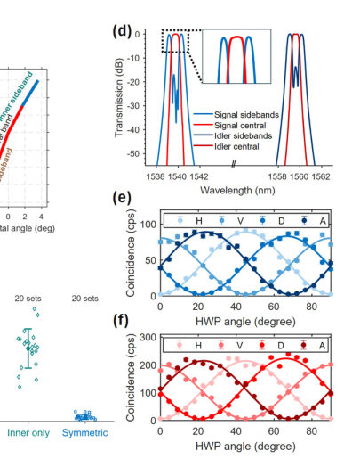
<figcaption class="paper-figure-caption"><b>Fig 2.</b> Fig. 2 Wavelength-bracketed estimation of the central-channel polarization response. (a) Wavelength-dependent output polarization of the 87 km fibre spools, measured by scanning a fixed polarization laser over a ±5 nm interval. The output states are represented on the Poincar´e sphere, with the enlarged region showing their locally smooth evolution around the central wavelength. (b) SO(3) angular error relative to the directly measured central channel rotation as a function of sideband offset. Symmetric bracketing produces a smaller error than either the inner or outer sideband alone. (c) SO(3) angular errors obtained using the outer sideband, inner sideband, and symmetric sidebands across...</figcaption>
</figure>
<figure class="paper-figure-card">
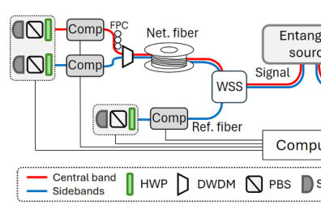
<figcaption class="paper-figure-caption"><b>Fig 3.</b> Fig. 3 Experimental setup for wavelength-bracketed and switch-enabled polarization stabilization. Wavelength-selective switches route the sidebands between the network (N) and local reference (R) fibres, while the central signal and idler channels remain in the network paths. The network fibre in the signal arm is 87 km and 46 km in the idler arm. Polarization compensation and projection modules perform feedback optimization and entanglement measurements. WSS: wave- length selective switch; Comp.: polarization compensation module; PBS: polarizing beam splitter; SPD: single photon detector; FPC: fibre polarization controller.</figcaption>
</figure>
<figure class="paper-figure-card">
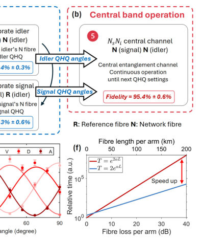
<figcaption class="paper-figure-caption"><b>Fig 4.</b> Fig. 4 Switch-enabled sideband calibration and transfer of QHQ settings to the cen- tral entanglement channel. (a) Sideband calibration sequence. In Step 1, the RsRi configuration establishes the local-reference baseline. In Step 2, RsNi calibrates the idler network arm while the signal arm remains in the reference configuration. In Step 3, NsRi calibrates the signal network arm while the idler arm remains in the reference configuration. For experimental verification, Step 4 applies the two independently determined QHQ settings simultaneously and evaluates them using an optional sideband NsNi measurement. (b) In Step 5, the QHQ angles obtained from the sideband RsNi and NsRi calibrations...</figcaption>
</figure>
<figure class="paper-figure-card">
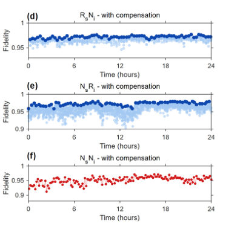
<figcaption class="paper-figure-caption"><b>Fig 5.</b> Fig. 5 Stable entanglement distribution over 24 hours. (a-c) Polarization-correlation fideli- ties measured without active compensation in the RsNi, NsRi, and NsNi configurations, respectively. The fidelity decreases as the polarization transformations of the network fibres drift with time. (d-f) Corresponding fidelity records with active compensation. The RsNi and NsRi measurements inde- pendently track the idler and signal network links, respectively, while the NsNi measurements record the stabilized central entanglement channel. In (d,e), the lighter points show intermediate measure- ments acquired during QHQ optimization, and the darker points show the accepted fidelities.</figcaption>
</figure>

**Summary.** This paper presents a novel technique to stabilize polarization entanglement in long-distance quantum fiber networks by combining wavelength-bracketed probing with optical switching. This approach overcomes the limitations of previous methods by eliminating downtime and changing the acquisition time scaling from the product to the sum of link losses. The method successfully demonstrates continuous, high-fidelity stabilization over extended periods.

**Why it may be interesting.** This work directly addresses the engineering challenges of scaling quantum communication networks by providing a robust, noise-free, and time-efficient method for polarization stabilization, which is a critical component of quantum networking.

Detailed structure

**Main problem.** Maintaining stable polarization basis is crucial for reliable, long-distance quantum networks distributing polarization entanglement.

**Main result.** The proposed method achieves continuous closed-loop stabilization for over 24 hours without classical reference light, demonstrating a scalable strategy for multi-link quantum feedback.

**Method.** The authors combine wavelength-bracketed probing with switch-enabled path decomposition to decouple the polarization stabilization measurement from the central quantum channel.

**Model / system.** The system is a fibre-based quantum network distributing polarization entanglement in a Dense Wavelength-Division Multiplexing (DWDM) configuration, utilizing entangled-photon sidebands and optical switches.

**Key observables.** Central channel entanglement fidelity (e.g., 95.1%), coincidence-to-accidental ratio (CAR), and the polarization transformation matrix (Stokes vector evolution).

**Important parameters / regimes.** Link lengths (e.g., 133 km), loss rates ($\eta_s, \eta_i$), and the scaling of acquisition time (from product-of-losses to sum-of-losses).

**Assumptions / limitations.** The local reference fibre loss is assumed negligible compared to the network fibre losses, and a first-order approximation is used for the wavelength-bracketing technique.

**Figures summary.** Figures illustrate the spectral allocation of sidebands bracketing the central channel, the switching mechanism using WSS, and the continuous, stable evolution of the Stokes vectors over time.

**Paper structure.** The paper first identifies the limitations of existing feedback methods (noise from classical light, slow acquisition time scaling). It then introduces the two-stage decoupling strategy: using sidebands for non-interruptive probing, and using switches to decompose the joint measurement into independent single-link measurements, culminating in experimental demonstration and fidelity measurements.

Abstract

Fibre-based quantum networks distributing polarization entanglement require a stable and uninterrupted transmission basis for reliable operation. Bright classical reference light enables rapid polarization feedback but can introduce noise into quantum channels. Entangled-photon-based feedback avoids this noise, but typically interrupts the target entanglement channel during calibration and becomes prohibitively slow over long distances due to the product loss of fibre links. Here, we overcome both limitations by combining wavelength-bracketed probing with switch-enabled path decomposition. Spectrally adjacent entangled-photon sidebands track the polarization response of the central distribution channel without interrupting its transmission, while optical switches and local reference fibres independently determine the signal and idler network transformations. Transferring the resulting compensation settings to the central channel eliminates calibration-induced downtime and changes the acquisition-time scaling from the product of the link losses to the sum of losses. We demonstrate the method on a 133 km fibre testbed and achieve continuous closed-loop stabilization for more than 24 hours without classical reference light. The decomposition of multi-link quantum feedback into single-link measurements provides a scalable stabilization strategy for wavelength-multiplexed quantum networks.

[↑ back to top](#top)

### [Microscopic dynamics of contagion using active Brownian particles: universal scaling and propagation controlled by protection](http://arxiv.org/abs/2609.01927v1)

**Authors:** Isela Sicarú Regalado-Alvarado, Francisco Alarcón  
**Type:** theory · **Category:** statistical mechanics · **PDF:** <https://arxiv.org/pdf/2609.01927v1>  
**Analysis basis:** full PDF text, analyzed in chunks
**Topic relevance:** 🔥 `non-equilibrium universality` **4/5** · `driven-dissipative phase transition` **3/5** · `Frenkel-Kontorova` **1/5** · `analog quantum simulation` **1/5** · `methods for driven-dissipative` **1/5**

↔ Scroll figures horizontally

<figure class="paper-figure-card">
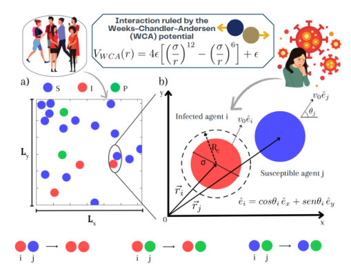
<figcaption class="paper-figure-caption"><b>Fig 1.</b> Figure 1: a) Sketch of the simulation box: N moving agents of diameter σ representing pedestrians. In a simulation box with periodic boundary conditions and the pair-interaction defined by the WCA potential. b) If an infected particle i is at a distance |ri −rj| ≤Rc of a susceptible agent j, it goes from susceptible to infected. The tree states: suscepti- ble S (blue), infected I (red) and protected P (green) such that S + I + P = N. Image inspired by [16].</figcaption>
</figure>
<figure class="paper-figure-card">
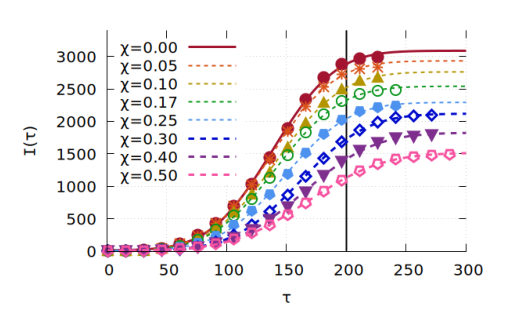
<figcaption class="paper-figure-caption"><b>Fig 2.</b> Figure 2: Plot of the contagion dynamics. The symbols rep- resent the agent-based simulations, with a mobility force FA = 50, ϕ = 0.056. On the x-axis the dimensionless time τ and the y-axis the number of infected agents I(τ). Each coloured curve represents a protected ratio χ. The continu- ous lines are the fitted erf functions. The Data availability section 5 leads to example clips from the results obtained of our simulations.</figcaption>
</figure>
<figure class="paper-figure-card">
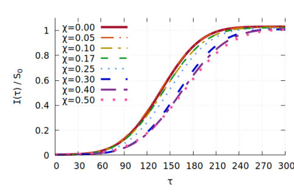
<figcaption class="paper-figure-caption"><b>Fig 3.</b> Figure 3: Normalised plot of the Contagion dynamics. The number of infected agents I(τ) divided by the initial num- ber of susceptible agents S0. On the x-axis the dimensionless time τ.</figcaption>
</figure>
<figure class="paper-figure-card">
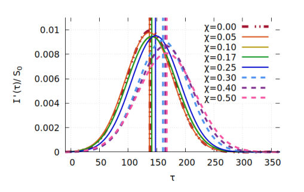
<figcaption class="paper-figure-caption"><b>Fig 4.</b> Figure 4: Normalised contagion rate as a function of time for different protected-agent fractions, χ. The corresponding values of τmax are indicated by the vertical lines and denote the time at which the contagion rate reaches its maximum value, νmax.</figcaption>
</figure>
<figure class="paper-figure-card">
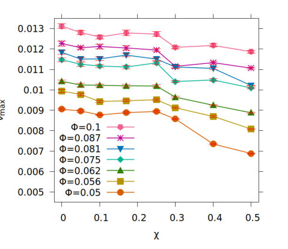
<figcaption class="paper-figure-caption"><b>Fig 5.</b> Figure 5: Maximum speed of contagion, νmax, as a func- tion of the protected-agent fraction, χ, for different packing fractions, ϕ. Different packing fractions are represented by coloured symbols connected by solid lines to guide the eye.</figcaption>
</figure>

**Summary.** This paper models disease spread using active matter particles to capture spatial effects missed by traditional epidemic models. It finds a critical protection threshold ($\approx 30\%$) that dictates whether contagion is governed by simple encounter frequency or by the protective mechanisms of the population. The work demonstrates the power of microscopic active-matter simulations for complex non-equilibrium dynamics.

**Why it may be interesting.** While focused on epidemiology, the use of active matter models (ABPs) to study non-equilibrium collective dynamics, phase transitions (the crossover), and universal scaling laws in a spatially structured system is highly relevant to non-equilibrium statistical mechanics.

Detailed structure

**Main problem.** The study investigates how individual protection levels and population density influence the dynamics of epidemic spreading, moving beyond the limitations of classical well-mixed models.

**Main result.** The contagion dynamics exhibit two distinct regimes separated by a crossover protection level ($\approx 30\%$): below this, scaling is universal ($
u_{max} \propto \phi^{1/2}$), while above it, protection becomes the dominant control mechanism.

**Method.** The research employs an agent-based simulation model using Active Brownian Particles (ABPs) to simulate the spatial spread of infection.

**Model / system.** The system models contagion using ABPs (S, I, P) interacting via a WCA potential in a 2D domain. The dynamics are governed by Langevin equations in the overdamped limit.

**Key observables.** Maximum contagion rate ($
u_{max}$), normalized contagion rate ($I'(	au)/S_0$), and the time to peak contagion ($	au_{max}$).

**Important parameters / regimes.** Protected-agent fraction ($\chi$), population density (packing fraction $\phi$), and the crossover threshold ($\approx 0.3$).

**Assumptions / limitations.** The analysis relies on the overdamped limit approximation and assumes interactions are governed by the WCA potential.

**Figures summary.** Figures illustrate the time evolution of infected agents ($I(	au)$) and the normalized maximum contagion rate ($
u_{max}\phi^{-1/2}$) as a function of the protected fraction ($\chi$) for various densities ($\phi$), clearly showing the crossover.

**Paper structure.** The paper progresses by first establishing the limitations of classical models, then detailing the ABP framework, and finally analyzing the scaling behavior of the contagion rate across different protection and density regimes.

Abstract

Understanding how individual protection and population density influence epidemic spreading remains a central challenge in epidemiology. While classical compartmental models successfully describe the temporal evolution of epidemics, they do not explicitly account for the microscopic motion and spatial organisation of individuals. Here, we investigate contagion dynamics using an agent-based model of Active Brownian Particles (ABPs), where self-propelled agents interact through local contact and a prescribed fraction of the population is protected. By systematically varying the protected-agent fraction and the population density, we identify two distinct contagion regimes separated by a crossover protection of approximately $30\%$. Below this threshold, the maximum contagion rate follows the universal scaling $ν_{\mathrm{max}}\proptoφ^{1/2}$, indicating that disease transmission is governed primarily by frequency of encounters. Above the threshold, universal scaling is lost and protection becomes the dominant mechanism controlling epidemic spreading, with the strongest suppression occurring in low-density populations. These results demonstrate that microscopic active-matter models provide a powerful framework for investigating epidemic dynamics beyond the assumptions of well-mixed population models and reveal how spatial organisation and individual protection jointly determine contagion dynamics.

[↑ back to top](#top)

### [Optimal-work feedback on particles with activity --- gliding on active fluctuations using positional information](http://arxiv.org/abs/2609.02720v1)

**Authors:** Lars Torbjørn Stutzer, Sarah A. M. Loos  
**Type:** theory · **Category:** statistical mechanics · **PDF:** <https://arxiv.org/pdf/2609.02720v1>  
**Analysis basis:** full PDF text, analyzed in chunks
**Topic relevance:** 🔥 `quantum measurements` **4/5** · `non-equilibrium universality` **2/5** · `Keldysh / 2PI / non-Gaussian methods` **1/5** · `correlated / nonlocal dissipation` **1/5** · `driven-dissipative phase transition` **1/5** · `methods for driven-dissipative` **1/5**

↔ Scroll figures horizontally

<figure class="paper-figure-card">
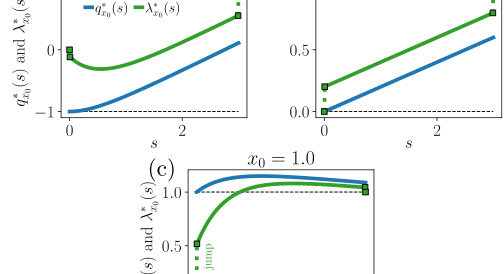
<figcaption class="paper-figure-caption"><b>Fig 1.</b> FIG. 1. Examples of optimal protocols (green) and particle trajectories (blue) [Eqs. (12)] for different initial values x0 (black dashed lines). The green dashed lines at the beginning and end of the protocol show the instantaneous jumps. Here, the parameters are set to λf = 1 (gray dashed lines), tf = 3, τ = 0.5, κ = 1, D = 1, and ω = 5.</figcaption>
</figure>
<figure class="paper-figure-card">
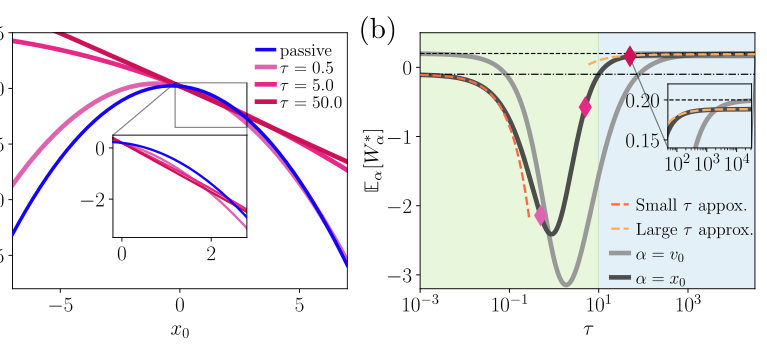
<figcaption class="paper-figure-caption"><b>Fig 2.</b> FIG. 2. Influence of τ on the optimal work. (a) Optimal work W ∗ x0 after positional measurement as a function of x0 for different values of τ. The inset shows a zoom-in on the region where an increase in τ lowers the required work needed to displace the trap. (b) Work after positional measurements (black) and after direct measurement of active fluctuations (gray) as functions of τ. Dashed plots show the asymptotic expansions for small τ [dashed orange, Eq. (22)] and large τ [dashed yellow, Eq. (25)]. The dash-dotted horizontal line shows the measurement-averaged work after positional measurements in the passive case, Epas x0 [W ∗ x0,pas], while the dashed horizontal line shows the...</figcaption>
</figure>

**Summary.** This paper analyzes the minimum work required to control particles immersed in active fluctuating environments. It demonstrates that positional information alone can be used to extract energy from the activity, a finding that surpasses previous requirements for direct measurement of the active noise. The results offer crucial design principles for controlling systems in non-equilibrium active matter.

**Why it may be interesting.** The work provides general design principles for information engines and optimal control strategies operating in non-equilibrium active environments, which is relevant to understanding energy transduction in complex biological or synthetic active matter systems.

Detailed structure

**Main problem.** The study focuses on determining the minimum work required for feedback control of particles subjected to active fluctuations, specifically investigating if work can be extracted using only positional measurements rather than direct measurements of the active degree of freedom.

**Main result.** Positional feedback alone is sufficient to efficiently harvest work from activity due to non-trivial correlations, and this positional feedback remains energetically advantageous even in the limit of infinitely persistent activity.

**Method.** The authors use optimal control theory to derive optimal protocols and calculate the average minimum work input required to move a harmonic trap minimum, comparing results from positional vs. active-fluctuation measurements.

**Model / system.** The model involves an active Ornstein-Uhlenbeck particle (AOUP) confined by a moving harmonic trap. The dynamics are governed by overdamped Langevin equations incorporating active fluctuations that break detailed balance.

**Key observables.** Average minimum work input ($\langle W_\alpha[\lambda] 
angle$), optimal feedback protocols ($\lambda^*(s)$), and the comparison of work extracted using positional vs. active-fluctuation information.

**Important parameters / regimes.** Persistence time ($	au$), trap strength ($\kappa$), thermal diffusion ($\sigma$), and active fluctuation strength ($\sigma'$). The analysis examines limits like $	au 	o 0$ and $	au 	o \infty$.

**Assumptions / limitations.** The analysis relies on the assumption that the joint stationary distribution is Gaussian. The comparison between different feedback schemes is central to the argument.

**Figures summary.** Figure 2 compares the average optimal work ($	ext{Ex}_0[\dots]$) for positional feedback versus active-fluctuation feedback as a function of persistence time ($	au$), showing how the benefit of activity changes with $	au$.

**Paper structure.** The paper establishes the physical model and control objective, derives the optimal protocols using variational methods, and then systematically compares the work extracted using positional information versus direct active fluctuation measurements, analyzing the asymptotic limits.

Abstract

We study the minimum-work feedback control of particles subject to active fluctuations. Considering an active Ornstein-Uhlenbeck particle confined by a moving harmonic trap, we derive exact optimal protocols following an initial position measurement. Our results show that nonequilibrium correlations between position and active fluctuations allow work extraction from the activity based on positional information only, i.e., without directly measuring the active degree of freedom, which was the focus of earlier literature. We find that depending on the persistence time, activity can either facilitate or impede transport relative to passive systems. Surprisingly, unlike feedback schemes based on direct measurements of the active fluctuations, positional feedback remains energetically advantageous even in the limit of infinitely persistent activity. Our results provide design principles for information engines and optimal control strategies operating in active environments.

[↑ back to top](#top)

### [Branching stochastic mechanics. II. Relative localization and collective poles from Bohm/Fisher feedback](http://arxiv.org/abs/2609.02520v1)

**Authors:** Benoit Bischoff, Eric Dumonteil  
**Type:** theory · **Category:** statistical mechanics · **PDF:** <https://arxiv.org/pdf/2609.02520v1>  
**Analysis basis:** full PDF text, analyzed in chunks
**Topic relevance:** 🔥 `Keldysh / 2PI / non-Gaussian methods` **4/5** · `correlated / nonlocal dissipation` **1/5** · `driven-dissipative phase transition` **1/5** · `methods for driven-dissipative` **1/5** · `non-equilibrium universality` **1/5** · `quantum measurements` **1/5**

↔ Scroll figures horizontally

<figure class="paper-figure-card">
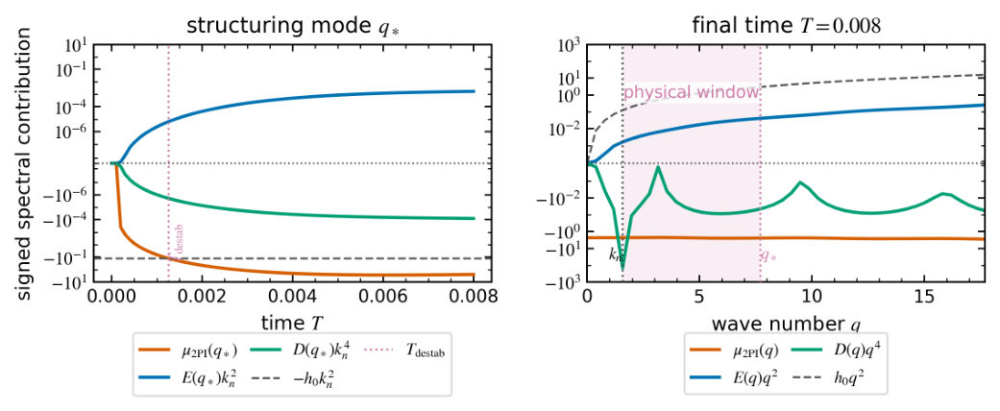
<figcaption class="paper-figure-caption"><b>Fig 1.</b> FIG. 2. Self-consistent 2PI corrections to the dressed relative kernel. On the left, the time-dependent local coefficients are sampled at the center of the localized relative spectrum, q = 0. The derivative coefficients are displayed through the finite- well spectral contributions E(0, T)k2 n and D(0, T)k4 n, while the crossed contribution is µ2P I(0, T). The Lorentzian width is retained separately as the characteristic spectral width ∆q ≡ξ−1. The crossed contribution develops with the sign selecting the localizing branch and dominates the infrared window. On the right, the full final-time momentum dependence displays the crossover from the non-derivative correction at low momentum to the...</figcaption>
</figure>
<figure class="paper-figure-card">
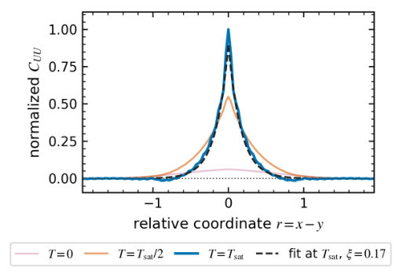
<figcaption class="paper-figure-caption"><b>Fig 2.</b> FIG. 3. Saturated non-contact cluster profile. The narrow contact contribution has been subtracted, leaving the resolved connected envelope Cnc UU(r, Rref); the dashed line shows an exponential fit ∝exp(−|r|/ξ).</figcaption>
</figure>
<figure class="paper-figure-card">
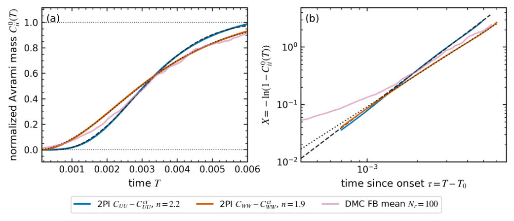
<figcaption class="paper-figure-caption"><b>Fig 3.</b> FIG. 4. Emergent Avrami kinetics from the reduced self-consistent 2PI evolution and comparison with the forward–backward BSM-MC reference. (a) Normalized local correlation masses extracted from the reduced self-consistent 2PI matrix evolution, shown for the contact-subtracted channels CUU −Cct UU and CW W −Cct W W . The pale curve is the forward–backward BSM-MC observable used in Paper I; its amplitude is normalized and its time axis is affinely aligned only for a qualitative comparison of kinetic shape. Black dashed curves are post-processing Avrami fits, C0 ii(T) = 1 −exp[−γi(T −Tsel,i)βi] . (b) Same data in the U-channel Avrami representation XU = −ln(1 −C0 UU) . The short-time mismatch...</figcaption>
</figure>
<figure class="paper-figure-card">
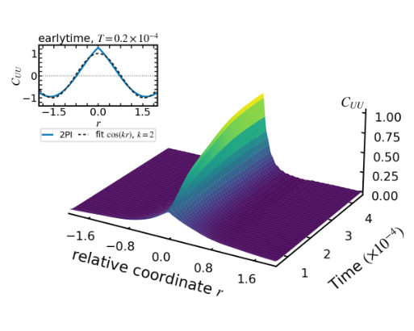
<figcaption class="paper-figure-caption"><b>Fig 4.</b> FIG. 5. Formation of the relative CUU(r, Rref, T) cluster. The surface shows the normalized connected contribution after re- moval of the initial/contact component. The inset displays the early extended mode and its fitted cosine profile before localization.</figcaption>
</figure>
<figure class="paper-figure-card">
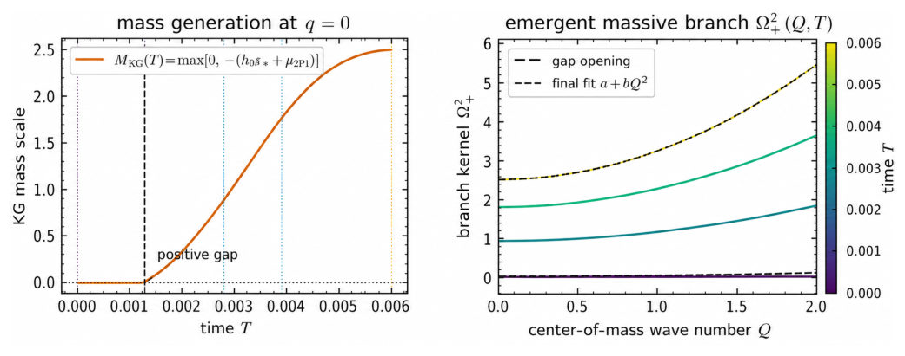
<figcaption class="paper-figure-caption"><b>Fig 5.</b> FIG. 6. Fixed-internal-scale reconstruction of the massive sum branch. The left panel shows the time-dependent massive cor- rection µ2P I(0, T) used in this diagnostic, and the right panel shows the corresponding reconstructed massive-branch diagnostic Ω2 +(Q, T). The dashed curve marks the final quadratic fit Ω2 + = MKG + c2 fitQ2, where MKG is the fitted intercept in the paper’s Ω-normalization and c2 fit is the fitted Q2 curvature. This reconstruction is a diagnostic of the fixed-q family; the collective Born–Oppenheimer gap used for the final matching is defined after projection over the localized internal mode in Sec. VIII.</figcaption>
</figure>

**Summary.** This work develops a stochastic field theory for Branching Stochastic Mechanics incorporating Bohm/Fisher feedback. Using advanced techniques like the MSRJD formalism and 2PI closure, the authors analyze the system's connected fluctuations. They successfully characterize the emergent dynamics by separating it into relative localization and collective propagation modes, defining key saturation velocities and pole structures.

**Why it may be interesting.** The use of advanced field-theoretic techniques (MSRJD, 2PI) to analyze non-equilibrium stochastic dynamics and emergent collective modes is highly relevant to understanding complex many-body systems.

Detailed structure

**Main problem.** The paper develops a stochastic field theory to analyze the Bohm/Fisher feedback acting on the connected reciprocal sector derived from Branching Stochastic Mechanics (BSM).

**Main result.** The theory successfully separates dynamics into relative localization and collective propagation, yielding two fixed-q pole families: a gapless difference branch and a gapped sum branch.

**Method.** It employs the Martin-Siggia-Rose-Janssen-de Dominicis (MSRJD) formalism and a causal two-loop two-particle-irreducible (2PI) closure to self-consistently determine correlation and response functions.

**Model / system.** The model is based on BSM, a stochastic extension of the Schrödinger–Nagasawa representation, focusing on the connected forward–backward kernel $C_{
m FB}$ and the associated BSM density $
ho_{
m BSM}$.

**Key observables.** The saturated information velocity $c_\star$, the connected correlator matrix $C_{ij}$, and the two fixed-q pole families (gapless difference and gapped sum branches).

**Important parameters / regimes.** The relative screening length, the saturation velocity $c_\star$, and the gap/pole structure in the frequency domain.

**Assumptions / limitations.** The analysis relies on the results of Paper I, uses the MSRJD formalism, and involves approximations like neglecting crossed physical correlators in the reduced 2PI system.

**Figures summary.** The notes mention comparisons between BSM-MC curves and $2	ext{PI}$ results, and diagnostic plots like the fixed-$q$ Klein–Gordon diagnostic ($M_{KG}$ vs $Q^2$).

**Paper structure.** The paper builds upon Paper I, first establishing the stochastic field theory via MSRJD and 2PI closure. It then analyzes the reduced channels (density/phase) and separates the dynamics into relative (fast) and collective (slow) components, culminating in fixed-point matching conditions for the collective theory.

Abstract

Paper I introduced branching stochastic mechanics (BSM) by lifting the Schrödinger-Nagasawa pair to reciprocal forward and backward branching fields. Their centered connected kernel $C_{\rm FB}=\mathbb E_ω[ψ_Fψ_B]$ carries the organized reciprocal sector, where $\mathbb E_ω$ denotes expectation over branching-noise realizations, with $ρ_{\rm BSM}=-C_{\rm FB}(x,x)$ on the anticorrelated branch. Here we develop the stochastic field theory of the Bohm/Fisher feedback that acts on this connected sector. Starting from the multiplicative branching covariance of BSM, a Martin-Siggia-Rose-Janssen-de~Dominicis (MSRJD) formulation and a causal two-loop two-particle-irreducible (2PI) closure are used to determine response and correlation functions self-consistently. The free connected theory exhibits secular growth and ultraviolet accumulation, whereas the dressed theory develops a finite relative screening length. A reduced numerical evolution shows bounded formation of this localized sector, and a self-similar Fisher construction defines the saturated information velocity $c_\star$. A Born-Oppenheimer separation then distinguishes internal relative organization from collective propagation. Restoring the complete frequency structure gives two fixed-$q$ pole families: a gapless difference branch and a gapped sum branch. The infrared velocity of the difference branch approaches $c_\star$ at saturation. The common cone and the projected sum-sector gap are then formulated as additional fixed-point matching conditions for the collective theory.

[↑ back to top](#top)

### [Experimental Evaluation of Passive Polarization Compensation Techniques for Fiber-Distributed Polarization-Entangled Photons](http://arxiv.org/abs/2609.02554v1)

**Authors:** Gayatri Thik, Amit Loyal, Srinivasan K, Raghavan G  
**Type:** experiment · **Category:** quantum information and computing · **PDF:** <https://arxiv.org/pdf/2609.02554v1>  
**Analysis basis:** full PDF text, analyzed in chunks
**Topic relevance:** 🔥 `quantum optics experiment` **4/5** · `QC/QI experiment` **3/5** · `interference shaping light` **1/5**

↔ Scroll figures horizontally

<figure class="paper-figure-card">
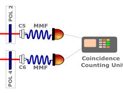
<figcaption class="paper-figure-caption"><b>Fig 1.</b> Fig. 1. Experimental configurations for the generation, fiber distribution, passive polarization compensation, and characterization of polarization-entangled photon pairs. (a) Polarization-entangled photon source (EPS) and polarization-analysis arrangement used for reference characterization before fiber distribution. (b) QHQ-based polarization- compensation configuration, in which a free-space QWP–HWP–QWP sequence is introduced after the fiber output in each photon path. (c) FPC-based polarization- compensation configuration, in which the signal and idler distribution fibers are independently controlled using three-paddle fiber polarization controllers. In (b) and (c), the common EPS and...</figcaption>
</figure>
<figure class="paper-figure-card">
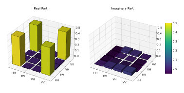
<figcaption class="paper-figure-caption"><b>Fig 2.</b> Fig. 2. Reference characterization of the polarization-entangled photon source before fiber distribution. (a) Measured polarization correlations of the generated |Φ+⟩state in the 𝐻/𝑉and 𝐷/𝐴measurement bases. (b) Reconstructed two-qubit density matrix obtained from quantum-state tomography.</figcaption>
</figure>
<figure class="paper-figure-card">
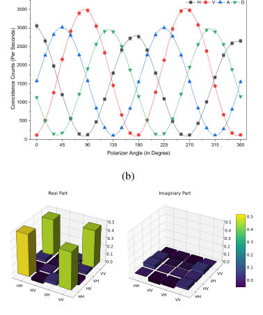
<figcaption class="paper-figure-caption"><b>Fig 3.</b> Fig. 3. Polarization-correlation and quantum-state-tomography results before and after QHQ-based polarization compensation. (a) Polarization correlations before compensation. (b) Polarization correlations after path-by-path QHQ optimization. (c) Reconstructed density matrix before compensation. (d) Reconstructed density matrix after compensation, showing recovery of a state close to |Φ+⟩.</figcaption>
</figure>
<figure class="paper-figure-card">
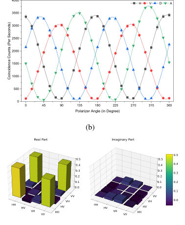
<figcaption class="paper-figure-caption"><b>Fig 4.</b> Fig. 4. Polarization-correlation and quantum-state-tomography results before and after FPC-based polarization compensation. (a) Polarization correlations before compensation. (b) Polarization correlations after path-by-path FPC optimization. (c) Reconstructed density matrix before compensation. (d) Reconstructed density matrix after compensation, showing recovery of a state close to |Φ+⟩.</figcaption>
</figure>

**Summary.** This paper experimentally evaluates two passive methods—free-space waveplates and fiber polarization controllers—to compensate for polarization degradation in entangled photons traveling through optical fibers. By optimizing each path independently, the authors successfully restored high-quality entanglement, demonstrating that both free-space and fiber-based control methods are equally effective for short-reach quantum links.

**Why it may be interesting.** This work provides a crucial experimental validation of systematic, passive compensation techniques necessary for building reliable quantum communication links over optical fibers, directly impacting photonic quantum information networks.

Detailed structure

**Main problem.** Fiber transmission degrades the polarization correlations of entangled photons, necessitating polarization compensation to restore the desired entangled state for quantum communication.

**Main result.** Both free-space (QHQ) and fiber-based (FPC) passive compensation techniques successfully restore high-quality polarization correlations and entanglement, achieving fidelities above 94.5%.

**Method.** The authors experimentally evaluated two passive compensation methods—QHQ waveplates and FPC—using an independent, path-by-path optimization procedure on the signal and idler paths.

**Model / system.** The system involves distributing polarization-entangled photons through single-mode optical fibers. The polarization transformation is modeled as a unitary operation, and compensation aims to apply the inverse unitary transformation.

**Key observables.** Polarization correlations, Bell–CHSH parameter, Visibility (exceeding 93%), and State Fidelity (above 94.5%).

**Important parameters / regimes.** The comparison is between QHQ (free-space) and FPC (fiber-based) compensation methods for short-reach links.

**Assumptions / limitations.** The compensation is implemented using passive elements, and the optimization procedure is performed path-by-path before final state characterization.

**Figures summary.** Figures illustrate the experimental setups for both QHQ and FPC compensation, and show the measured polarization correlations and reconstructed two-qubit density matrices before and after compensation.

**Paper structure.** The paper first establishes the problem of fiber-induced polarization degradation, then details the two compensation methods (QHQ and FPC), describes the systematic path-by-path optimization procedure, and finally presents quantitative comparisons of the recovered entanglement quality.

Abstract

Entanglement distribution through optical fibers is essential for quantum communication networks; however, fiber transmission can alter photon polarization and modify the observed correlations of polarization-entangled states, necessitating polarization compensation to recover the desired entangled state in the measurement basis. Here, we experimentally evaluate two passive polarization compensation techniques: a free-space Quarter-Half-Quarter (QHQ) waveplate configuration and an in-fiber three-paddle Fiber Polarization Controller (FPC). The polarization transformation along each downconverted-photon path is independently compensated through a systematic path-by-path optimization procedure. Using both techniques, we recover high-quality polarization correlations and entanglement, with visibilities exceeding $93\%$ in three mutually unbiased bases and fidelities above $94.5\%$. The results demonstrate comparable restoration using free-space waveplate-based and fiber-based control, establishing a systematic framework for laboratory and short-reach quantum communication links.

[↑ back to top](#top)

### [Long-lived telecom-heralded single-photon storage in an absorptive spin-rephased quantum memory](http://arxiv.org/abs/2609.02579v1)

**Authors:** Alberto E. Rodríguez-Moldes, Félicien Appas, Jonathan Hänni, Jelena V. Rakonjac, Samuele Grandi, Hugues de Riedmatten  
**Type:** experiment · **Category:** quantum information and computing · **PDF:** <https://arxiv.org/pdf/2609.02579v1>  
**Analysis basis:** full PDF text, analyzed in chunks
**Topic relevance:** 🔥 `QC/QI experiment` **4/5** · `quantum optics experiment` **3/5** · `quantum measurements` **1/5**

↔ Scroll figures horizontally

<figure class="paper-figure-card">
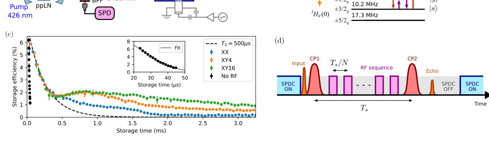
<figcaption class="paper-figure-caption"><b>Fig 1.</b> FIG. 1. (a) Experimental setup. In single photon storage experiments, a second Pr3+:Y2SiO5 crystal is used for spectral filtering before detection (not shown). ppLN, periodically poled lithium niobate; FC, filter cavity; BPF, bandpass filter; SPD, single photon detector; Et., etalon; Prep., preparation beam; CP, control pulses beam; Coax, coaxial cable. (b) Energy levels for the 3H4(0) ↔1 D2(0) transition of Pr3+:Y2SiO5 showing the optical and hyperfine transitions used in the spin-wave AFC storage protocol. (c) Storage efficiency for classical light as a function of total storage time. Black dots: without rf rephasing pulses. Color symbols: single XX, XY4 or XY16 pulse sequence. Black...</figcaption>
</figure>
<figure class="paper-figure-card">
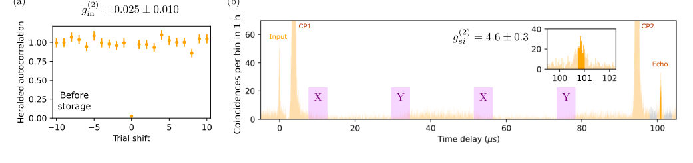
<figcaption class="paper-figure-caption"><b>Fig 2.</b> FIG. 2. (a) Heralded autocorrelation of signal photons without storage. The signal mode goes through a broad transparency window prepared in both the QM and the filter crystal. (b) Time-correlation histogram between the detection of idler and signal photons after storage in the QM with a single XY4 sequence for 100.9 µs. The temporal envelope of the rf pulses is depicted in light pink. The inset shows a zoom on the region of the photon echo. Bin size: 20 ns</figcaption>
</figure>
<figure class="paper-figure-card">
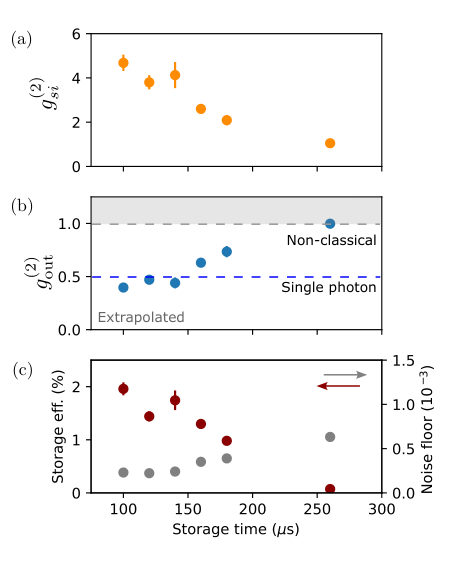
<figcaption class="paper-figure-caption"><b>Fig 3.</b> FIG. 3. Long-lived storage of heralded single photons with a XY4 sequence. (a) Signal-idler cross correlation g(2) si , (b) extrapolated output autocorrelation g(2) out (c) and storage ef- ficiency and noise floor as a function of total storage time. The noise floor here is defined as the probability per herald of detecting a noise photon backpropagated to after the QM.</figcaption>
</figure>

**Summary.** This paper reports the successful demonstration of storing single photons in a Pr3+:Y2SiO5 quantum memory using a sophisticated AFC spin-wave protocol combined with spin rephasing. By achieving non-classical correlations for storage times up to 180 us, the research provides a significant step toward realizing scalable quantum repeater links for long-distance quantum communication.

**Why it may be interesting.** This work directly addresses the hardware requirements for quantum networking by demonstrating robust, long-lived quantum memory storage using solid-state systems, a major focus area for quantum information scientists.

Detailed structure

**Main problem.** The central challenge is achieving long-lived storage of single photons in an absorptive quantum memory that incorporates spin rephasing mechanisms, which is crucial for building long-distance quantum networks.

**Main result.** The authors successfully demonstrated non-classical storage of telecom-heralded single photons in a Pr3+:Y2SiO5 quantum memory, achieving storage times up to 180 us with measurable quantum correlations.

**Method.** The experiment utilizes the Atomic Frequency Comb (AFC) spin-wave protocol combined with advanced spin rephasing sequences (like XY4) to mitigate decoherence in the rare-earth ion doped crystal.

**Model / system.** The physical platform is a Pr3+:Y2SiO5 rare-earth ion doped crystal quantum memory. The storage mechanism relies on coupling photonic information to the long-lived spin excitations of the Pr3+ ions, which are manipulated using microwave pulses.

**Key observables.** Non-classical correlations between heralding and stored signal photons (e.g., cross-correlation values up to 4.6(4)), and the decay of AFC photon echoes.

**Important parameters / regimes.** Storage times ranging from 3 ms (classical) to 180 us (heralded single photons); the use of telecom-band photons and the AFC spin-wave protocol.

**Assumptions / limitations.** The coherence time is limited by spin dephasing, which is mitigated by the applied spin rephasing pulses; the system's scalability is supported by the crystal's ability to support multiplexed storage.

**Figures summary.** Figures illustrate the experimental setup, energy level diagrams, and crucially, show the measured non-classical correlations (e.g., time-correlation histograms) confirming single-photon storage fidelity over time.

**Paper structure.** The paper progresses by first establishing classical echo measurements, then demonstrating the use of heralded single photons, and finally quantifying the non-classical nature of the stored quantum state using correlation measurements.

Abstract

Long-lived storage of single photons under the form of atomic excitations is at the foundation of long-distance entanglement distribution in quantum networks. To mitigate decoherence effects induced by the environment, rephasing of the hyperfine coherences using microwave pulses have been implemented in a variety of single-emitter and ensemble-based solid-state systems. However, the demonstration of storage of single photons in an absorptive quantum memory including such spin rephasing mechanism remains elusive. In this work, we show non-classical storage of telecom-heralded single photons in a Pr$^{3+}$:Y$_2$SiO$_5$ rare-earth ion doped crystal quantum memory using the atomic frequency comb (AFC) spin-wave protocol combined with a XY4 spin rephasing sequence. Long-lived AFC photon echoes are first observed in the classical regime for storage times of up to approximately 3 ms. We then demonstrate non-classical correlations between heralding photons and stored signal photons generated by a cavity-enhanced parametric photon-pair source for storage times of up to 180 $μ$s and with measured cross-correlation values as high as 4.6(4). Together with the capacity of Pr$^{3+}$:Y$_2$SiO$_5$ QMs to support highly efficient and multiplexed storage, this result represents a significant step towards scalable long-distance quantum repeater links.

[↑ back to top](#top)

### [Impedance in Periodically Driven Stochastic Systems](http://arxiv.org/abs/2609.02458v1)

**Authors:** Bart Wijns, Branko Meeus, Jef Hooyberghs, Bart Cleuren  
**Type:** theory · **Category:** statistical mechanics · **PDF:** <https://arxiv.org/pdf/2609.02458v1>  
**Analysis basis:** full PDF text, analyzed in chunks
**Topic relevance:** `Keldysh / 2PI / non-Gaussian methods` **3/5** · `driven-dissipative phase transition` **3/5** · `methods for driven-dissipative` **3/5** · `non-equilibrium universality` **3/5** · `analog quantum simulation` **2/5** · `correlated / nonlocal dissipation` **2/5** · `Frenkel-Kontorova` **1/5** · `quantum measurements` **1/5** · `scars & prethermalization` **1/5**

↔ Scroll figures horizontally

<figure class="paper-figure-card">
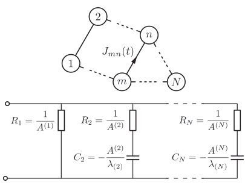
<figcaption class="paper-figure-caption"><b>Fig 1.</b> FIG. 1. (a) Diagram of the N states of the stochastic system. The solid lines represent transitions between states. (b) The equivalent electrical circuit whose impedance has the same form as (16). The indices mn on the coefficients A(k) mn have been dropped for notational simplicity. The dotted lines rep- resent multiple branches whose structure is identical to the drawn branches.</figcaption>
</figure>
<figure class="paper-figure-card">
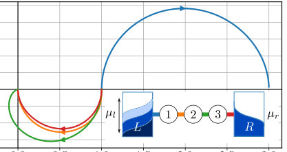
<figcaption class="paper-figure-caption"><b>Fig 2.</b> FIG. 2. The conductivities σmn for all the possible transitions in a linear chain of three sites as a function of the driving frequency ω, normalized by the adiabatic conductivity σ(0) (the subscripts have been dropped as σ(0) is the same for all transitions). The driving acts only on the transition to the left reservoir. The arrows on the curves indicate the direction of increasing frequency. The transitions shown in the inset are colored according to their conductivity curves. Note that the subscripts of σ(0) have been dropped as they are the same for all transitions.</figcaption>
</figure>
<figure class="paper-figure-card">
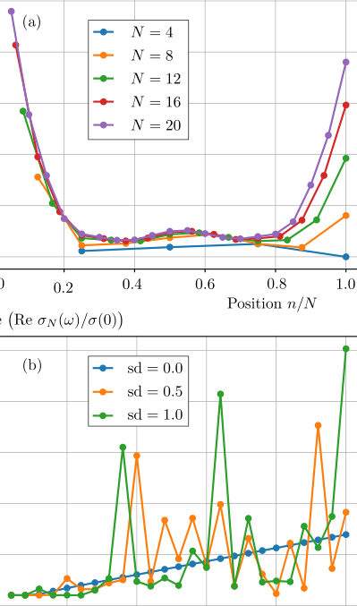
<figcaption class="paper-figure-caption"><b>Fig 3.</b> FIG. 3. (a) The size of the conductivity plot as a function of relative position n/N along the chain for different chain lengths N. The conductivity for the transition n →n + 1 (or N →R if n = N) is denoted by σn. The conductivity σ0 for the transition with the left reservoir isn’t shown because, being a driven transition, its size is more determined by its high-frequency limit than by its shape. (b) The size of the conductivity plot for the current between the system and the undriven reservoir, as a function of the chain length N, for an ideal system and two disordered sys- tems in which the energy was sampled from normal distribu- tions with standard deviations (sd) of 0.5 and 1.</figcaption>
</figure>
<figure class="paper-figure-card">
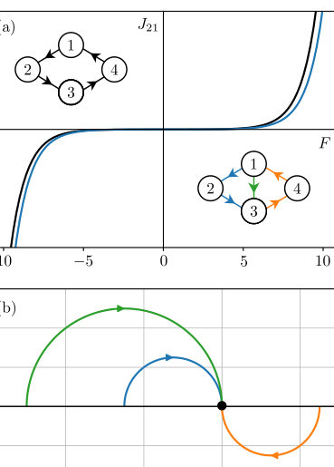
<figcaption class="paper-figure-caption"><b>Fig 4.</b> FIG. 4. (a) The stationary current J21 as a function of the ap- plied constant driving F outside the linear regime for both the system with and without a shortcut. (b) The conductivities for the periodic chain with a shortcut (indicated by the arrow between states 1 and 3 in the inset on (a)). Arrows in the inset indicate the direction of the driving at zero frequency, where the current is considered positive. The arrows on the curves indicate the direction of increasing frequency. Currents with the same color on the inset are identical by symmetry. The dot represents the system’s conductivity without a shortcut.</figcaption>
</figure>

**Summary.** This work develops a powerful diagnostic tool—the frequency-dependent impedance—to characterize periodically driven stochastic systems. By mapping the system dynamics onto an equivalent electrical circuit, the authors show that measuring this impedance can reveal subtle underlying structural details, such as broken symmetries or the presence of specific coupling mechanisms.

**Why it may be interesting.** The strong connection between non-equilibrium statistical mechanics (stochastic processes) and electrical circuit theory provides powerful, measurable diagnostics for understanding open quantum systems dynamics.

Detailed structure

**Main problem.** The paper studies the time-dependent currents and associated impedance in periodically driven stochastic systems.

**Main result.** It derives a closed-form expression for the impedance, showing it can be interpreted as the parallel combination of $N$ components, and demonstrates its use to detect broken symmetries in the system dynamics.

**Method.** The analysis employs linear response theory, utilizing the structure of the master equation and performing complex frequency-domain analysis (impedance/admittance).

**Model / system.** The model is a general stochastic system with $N$ discrete states governed by a time-dependent master equation. Specific applications include linear hopping chains with reservoirs.

**Key observables.** Conductivity $\sigma_{mn}(\omega)$ and impedance $Z_{mn}(\omega)$ as complex functions of frequency $\omega$.

**Important parameters / regimes.** Driving frequency $\omega$, system size $N$, and the structure of the transition rates $W(t)$.

**Assumptions / limitations.** The analysis is restricted to the linear response regime (small driving).

**Figures summary.** Figures illustrate the equivalent electrical circuit analogy, the frequency dependence of conductivity ($\sigma_{mn}$ vs. $\omega$), and how conductivity measurements can reveal structural differences, such as the presence of a shortcut.

**Paper structure.** The paper builds from deriving the general impedance formula in the linear regime, interpreting it via an electrical circuit analogy, analyzing low and high-frequency limits, and finally applying the diagnostic tool to distinguish between different microscopic system structures (e.g., with vs. without a shortcut).

Abstract

We study the time-dependent currents arising in periodically driven stochastic systems. In the linear regime of small driving, a closed expression is obtained for the impedance/admittance associated with these currents. This expression leads directly to an interpretation in terms of an equivalent electrical circuit. For a stochastic system with $N$ states, the electrical circuit consists of precisely $N$ parallel branches, with each branch comprising a resistor and a capacitor in series. The low- and high-frequency limits of these currents are calculated, and the results are generalized to more general current expressions. We demonstrate our findings across several archetypal settings, illustrating the potential to detect specific broken symmetries or the graph topology associated with the stochastic process.

[↑ back to top](#top)

### [Exceptional Topological Signatures of Non-Hermitian Photonic Hopf-Link Braids](http://arxiv.org/abs/2609.02589v1)

**Authors:** Samit Kumar Gupta  
**Type:** theory · **Category:** other · **PDF:** <https://arxiv.org/pdf/2609.02589v1>  
**Analysis basis:** full PDF text, analyzed in chunks
**Topic relevance:** `analog quantum simulation` **3/5** · `correlated / nonlocal dissipation` **3/5** · `driven-dissipative phase transition` **3/5** · `methods for driven-dissipative` **2/5** · `non-equilibrium universality` **2/5** · `Keldysh / 2PI / non-Gaussian methods` **1/5**

↔ Scroll figures horizontally

<figure class="paper-figure-card">
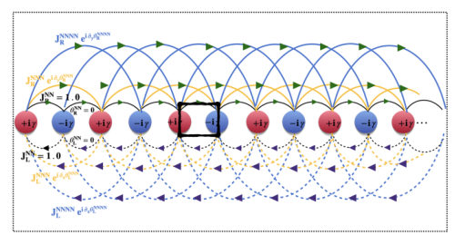
<figcaption class="paper-figure-caption"><b>Fig 1.</b> FIG. 1. Schematic diagram of the system based on the 1D Hatano-Nelson model. The solid black lines represent right- ward NN hoppings whereas dashed black lines represent left- ward NN hoppings. The solid yellow lines represent right- ward NNN hoppings whereas dashed yellow lines represent left-ward NNN hoppings. The solid blue lines represent right- ward NN hoppings whereas dashed blue lines represent left- ward NN hoppings. The red and blue disks represent gain and loss sites respectively with a unit cell represented by a rectangular box at the center.</figcaption>
</figure>
<figure class="paper-figure-card">
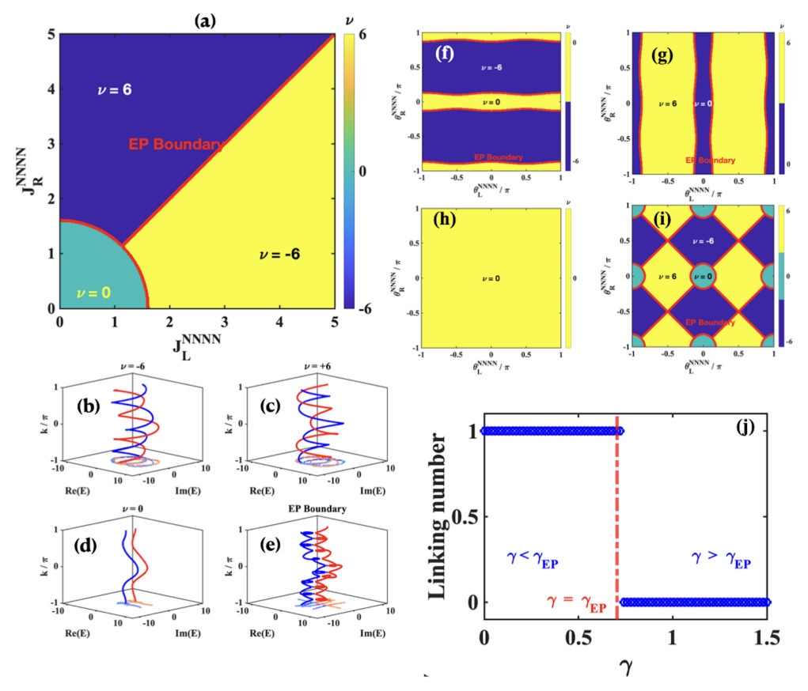
<figcaption class="paper-figure-caption"><b>Fig 2.</b> FIG. 2. Braiding index in the JNNNN L −JNNNN R plane (a) and the evolution trajectories of the particle in the complex plane Re(E)−Im(E) (b,c,d,e) where E = EP BC = E± ∈C as in Eq. 5 as the quasimomentum k is varied between −π and +π. Here, for (b) P1 = (JNNNN L , JNNNN R ) = (4.0, 1.0), (c)P2 = (JNNNN L , JNNNN R ) = (1.0, 4.0), (d) P3 = (JNNNN L , JNNNN R ) = (0.3, 0.3), (e) P4 = (JNNNN L , JNNNN R ) = (3.0, 3.0). The faded red and blue arrows in the k = −π plane denote the handedness of the spectral topology of the bands in (b-e). The braiding index in the θNNNN L −θNNNN R plane for the four points (Pj, j = 1, 2, 3, 4) as indicated in Fig. 2(b-e): (f) (JNNNN L , JNNNN R ) = (4.0, 1.0),...</figcaption>
</figure>
<figure class="paper-figure-card">
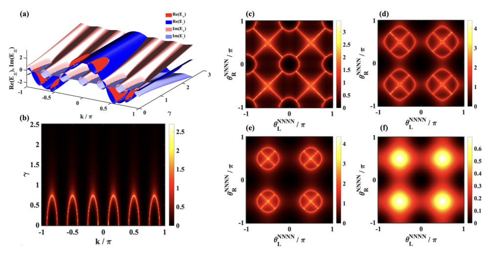
<figcaption class="paper-figure-caption"><b>Fig 3.</b> FIG. 3. Riemann sheet topology of the eigenvalues and exceptional phase boundaries: (a) Re(E±) and Im(E±) in the k/π −γ plane; (b) log10Kn plotted in the k−γ plane; (c-f) log10Kn in the (θNNNN L −θNNNN R ) plane by varying γ: (c) γ = 0.4, (d) γ = 0.6, (e) γ = γEP = 0.7325, (f) γ = 0.95. Other parameters: JNN L = JNN R = 1.0, JNNN L = JNNN R = 0.8, JNNNN L = JNNNN R = 0.6, θNN L = θNN R = θNNN L = θNNN R = 0.0. For (a) and (b) θNNNN L = JNNNN R = −2.1.</figcaption>
</figure>

**Summary.** This work explores the complex topological structure of non-Hermitian systems using a generalized Hatano-Nelson model. By introducing multiple competing non-Hermiticity sources, the authors demonstrate the existence of high-order Hopf-link braids and EP-mediated topological phase transitions. These findings suggest potential applications for building robust quantum communication channels and quantum computing platforms.

**Why it may be interesting.** The study connects non-Hermitian physics, topological invariants (Hopf-link braids), and engineered gain/loss mechanisms, providing a framework for designing robust quantum systems.

Detailed structure

**Main problem.** The paper investigates the exceptional topological signatures of Hopf-link braids in non-Hermitian systems, focusing on how competing sources of non-Hermiticity influence the topology.

**Main result.** The system exhibits higher-order Hopf-link braiding ($
u = \pm 6$) and undergoes EP-mediated topological phase transitions, which can be controlled by gain-loss non-Hermiticity.

**Method.** The analysis employs biorthogonal eigenvector tracking and uses the maximum Petermann factor divergence as a diagnostic tool to map the structural evolution of exceptional phase boundaries.

**Model / system.** The model is a generalized Hatano-Nelson type tight-binding lattice Hamiltonian incorporating higher-order nonreciprocal hoppings, non-Abelian gauge fields, and staggered gain-loss processes.

**Key observables.** Exceptional Points (EPs), topological winding/braiding degree ($
u$), and the Petermann factor ($K_n$).

**Important parameters / regimes.** Gain/loss parameter ($\gamma$), non-Abelian gauge phases ($	heta$), and hopping strengths ($J$).

**Assumptions / limitations.** The general case is analytically intractable, necessitating simplifications to access EPs; the analysis assumes periodic boundary conditions (PBC).

**Figures summary.** Figures illustrate the braiding indices ($
u$) for NNNN interactions, showing $
u=0, \pm 6$ regimes, and map the spectral evolution in the complex plane.

**Paper structure.** The paper develops the Hamiltonian, analyzes the topological invariants ($
u$), tracks the phase boundaries using the Petermann factor, and discusses the physical implications of the EP-mediated transitions.

Abstract

Non-Hermitian physics endows the non-Abelian systems with exceptional topology characterized by non-commutative braid patterns. Interplay of distinct competing sources of non-Hermiticity may induce novel topological effects. Here, we provide a generalized Hatano-Nelson model with higher-order nonreciprocal hoppings, non-Abelian gauge fields, and staggered gain-loss processes showing the exceptional topological structure of the Hopf-link braids that undergoes a EP-mediated topological phase transition. We demonstrate that mixing multiple nonreciprocal channels drives the system into highly intricate, nested complex energy Hopf-link braids and expands the topological landscape up to higher-order braiding sectors. Furthermore, utilizing biorthogonal eigenvector tracking, we map the structural evolution of the exceptional phase boundaries via the maximum Petermann factor in the phase angle parameter planes. We show that the gain-loss non-Hermiticity drives a topological crossover where the extended exceptional contours constrict into isolated regimes. The demonstration of EP-mediated topological phase transition of Hopf-link braids and the associated rich exceptional phase portraits may offer new physical insights with promising applications in robust, fault-tolerant communication channels and quantum computing platforms.

[↑ back to top](#top)

### [The advantages of extended nonreciprocal quantum batteries](http://arxiv.org/abs/2609.02593v1)

**Authors:** Meng-Long Song, Zan Cao, Hai-Tao Dong, Si-Yu Zhang, Xue-Ke Song, Liu Ye, Dong Wang  
**Type:** theory · **Category:** other · **PDF:** <https://arxiv.org/pdf/2609.02593v1>  
**Analysis basis:** full PDF text, analyzed in chunks
**Topic relevance:** `correlated / nonlocal dissipation` **3/5** · `driven-dissipative phase transition` **3/5** · `methods for driven-dissipative` **3/5** · `Keldysh / 2PI / non-Gaussian methods` **1/5** · `Tavis-Cummings & cavity-many-emitter` **1/5** · `analog quantum simulation` **1/5** · `non-equilibrium universality` **1/5** · `quantum measurements` **1/5**

↔ Scroll figures horizontally

<figure class="paper-figure-card">
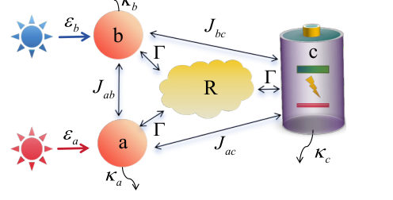
<figcaption class="paper-figure-caption"><b>Fig 1.</b> FIG. 1. Extended nonreciprocal QB: The subsystems are connected through coherent coupling Jij, ij = {ab, ac, bc} are connected to the shared reservoir (R) at a rate Γ, and dissipate independently at a rate κi, i = {a, b, c}; external pumps (ωL, εi) drive the charger. The single-threaded chain structure only drives the remote charger, and the battery connects to the terminal charger; the multi-threaded star structure simultaneously drives all chargers and provides inde- pendent power supply.</figcaption>
</figure>
<figure class="paper-figure-card">
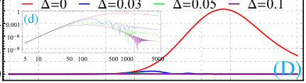
<figcaption class="paper-figure-caption"><b>Fig 2.</b> FIG. 2. For single-threaded scenario: The stored energy Es c (unit ωc) and charging power P s c = Es c/t are plotted as a function of time in (A-D, a-d). Here εa = 0.2, Jab = κ = 0.003, Γ = 0.04, pb = pc = 1 and Jbc = iΓp∗ bpc/2.</figcaption>
</figure>
<figure class="paper-figure-card">
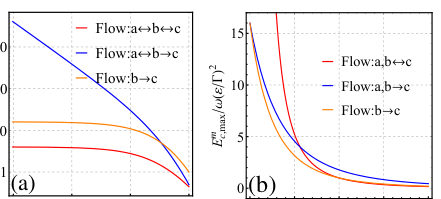
<figcaption class="paper-figure-caption"><b>Fig 3.</b> FIG. 4. The maximum steady-state stored energy (Es c,max and Em c,max) are plotted as a function of the dissipation ratio κ/Γ. (a) single-threaded charging, (b) multi-threaded charging. The orange line to original nonreciprocal charging [58].</figcaption>
</figure>
<figure class="paper-figure-card">
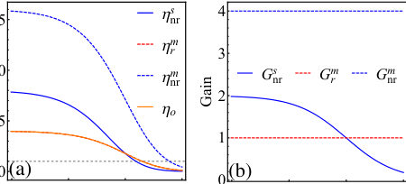
<figcaption class="paper-figure-caption"><b>Fig 4.</b> FIG. 5. The energy ratio η and gain as functions of the dissipation ratio κ/Γ are plotted . The black dashed line η = 1 in (a) represents the energy stored equals the charger’s average energy; a higher η above it suggest lower-cost charging.</figcaption>
</figure>
<figure class="paper-figure-card">

<figcaption class="paper-figure-caption"><b>Fig 5.</b> Fig. 4(a) shows a clear advantage of nonreciprocal charging energy storage: the single-thread charging can achieve infinite energy storage (Es,nr c,max →∞) in a weak local environment or under effective isolation (κ ≪Γ led to x →0); although the original scheme cannot achieve infinite energy storage, its induced capacity is still significantly superior to that of re- ciprocal charging Es,r c,max. Fig. 4(b) compares multi-thread charging with the original nonreciprocal charging: in a weak local environment (κ ≪Γ), reciprocal charging can achieve infinite energy storage (Em,r c,max →∞); when the coherent effect disappears (J = 0), multi-thread reciprocal charging is actually dissipative...</figcaption>
</figure>

**Summary.** This paper analyzes extended nonreciprocal quantum batteries to optimize energy storage and transfer. It demonstrates that nonreciprocal charging protocols significantly outperform reciprocal methods by achieving higher energy storage and transfer efficiency. The findings provide a theoretical framework for implementing superior, robust charging mechanisms in quantum energy systems.

**Why it may be interesting.** This work directly addresses open quantum systems dynamics, specifically focusing on engineered nonreciprocal couplings to enhance energy storage and transfer, which is highly relevant to quantum optics and quantum energy harvesting.

Detailed structure

**Main problem.** The study investigates the performance and inherent advantages of extended nonreciprocal quantum batteries (QBs) for energy storage and energy transfer compared to standard reciprocal and original nonreciprocal charging protocols.

**Main result.** Extended nonreciprocal charging protocols demonstrate superior energy transfer capabilities and achieve high steady-state energy storage, particularly in multi-threaded configurations, which are unmatched by reciprocal charging.

**Method.** The analysis uses the Lindblad quantum master equation to model system dynamics and derives maximum steady-state energy and energy transfer ratios by comparing different charging topologies.

**Model / system.** The model involves an extended nonreciprocal QB system comprising chargers and a battery, described by Hamiltonians for single-threaded and multi-threaded couplings. The dynamics are governed by the Lindblad master equation.

**Key observables.** Stored energy ($E_{s,c}, E_{m,c}$), charging power ($P_{s,c}, P_{m,c}$), energy ratio ($\eta$), and gain function ($G$).

**Important parameters / regimes.** Detuning ($\Delta_i$) between the charging system and the external pump, and the dissipation ratio ($\kappa/\Gamma$).

**Assumptions / limitations.** The analysis compares the extended nonreciprocal scheme against reciprocal and original nonreciprocal protocols, assuming the system can reach steady-state energy limits.

**Figures summary.** Figures illustrate the schematic structure of the QB, show time evolution of stored energy and power for different charging flows, and plot energy ratios and gains comparing various charging protocols.

**Paper structure.** The paper progresses by first establishing the physical model and dynamics, then analyzing the impact of detuning on single- and multi-threaded charging, and finally quantifying the energy transfer advantages using energy ratios and gain functions.

Abstract

This study investigates the performance of extended nonreciprocal quantum batteries (QBs), as well as its advantages in energy storage and energy transfer compared to reciprocal charging and the original nonreciprocal batteries. After analyzing the detuning between the charging system and the external pump, we discover that resonance is a key factor in maintaining high-energy batteries and high charging power; furthermore, the detuning of the charger or battery determines the stability of the charging process for different structures. Research on steady-state energy storage in batteries revealed that single-threaded or multi-threaded charging can achieve nearly infinite energy storage in weakly localized environments, thereby demonstrating the significant energy advantages of extended nonreciprocal quantum batteries. Finally, by considering the energy distribution within the charging system, we observe that nonreciprocal charging offers energy transfer advantages unmatched by reciprocal charging; the former achieves a comprehensive balance between charging cost and energy storage capacity that the latter cannot match. As a novel and superior charging protocol, our findings are expected to provide a potent reference for the promotion and practical implementation of nonreciprocal charging.

[↑ back to top](#top)

### [Bosonic quantum control with a weakly coupled fluxonium qubit](http://arxiv.org/abs/2609.01817v1)

**Authors:** Anaida Ali, Shantanu R. Jha, Shoumik D. Chowdhury, Lev-Arcady Sellem, Max Hays, William D. Oliver, Baptiste Royer  
**Type:** both · **Category:** quantum information and computing · **PDF:** <https://arxiv.org/pdf/2609.01817v1>  
**Analysis basis:** full PDF text, analyzed in chunks
**Topic relevance:** `methods for driven-dissipative` **3/5** · `QC/QI experiment` **2/5** · `quantum measurements` **2/5** · `quantum optics experiment` **2/5** · `Keldysh / 2PI / non-Gaussian methods` **1/5** · `Tavis-Cummings & cavity-many-emitter` **1/5** · `correlated / nonlocal dissipation` **1/5** · `driven-dissipative phase transition` **1/5**

↔ Scroll figures horizontally

<figure class="paper-figure-card">
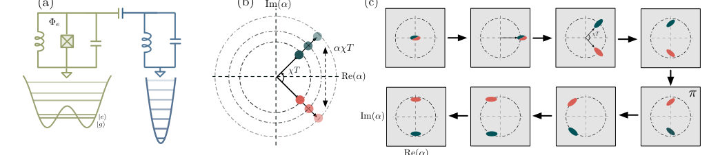
<figcaption class="paper-figure-caption"><b>Fig 1.</b> FIG. 1. (a) Circuit schematic of a lumped-element resonator (blue) coupled capacitively to a fluxonium (green). (b) Under a controlled-rotation interaction, angular velocity remains fixed at χ, while the separation αχT between the resonator states when the qubit is in |g⟩(blue) and |e⟩(red) increases with |α|. (c) Phase-space trajectory of an ECD gate with qubit in |+⟩= |g⟩+|e⟩ √</figcaption>
</figure>
<figure class="paper-figure-card">
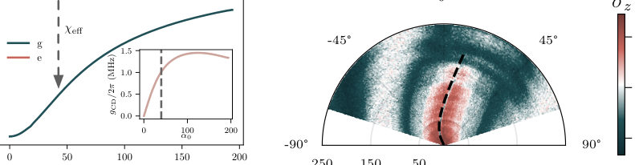
<figcaption class="paper-figure-caption"><b>Fig 2.</b> FIG. 2. (a) out-and-back sequence to measure the phase accumulated by the resonator with the qubit initialized in |g⟩or |e⟩. (b) Photon number-dependent resonator dispersion obtained from out-and-back where the net frequency pull on the resonator by the qubit χeff is given by the separation between the two curves. The average of the two curves is the effective detuning ∆eff felt by the resonator. The inset shows the ECD interaction rate gCD = χeff|α0| as a function of displacement. Dashed gray lines indicate the regime after which the system Hamiltonian is described better by the model in Eq. (7). (c, d) Numerically obtained dispersion (black dashed lines) from out-and-back performed on...</figcaption>
</figure>
<figure class="paper-figure-card">
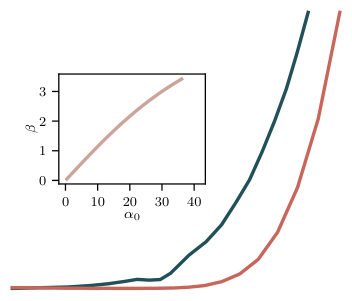
<figcaption class="paper-figure-caption"><b>Fig 3.</b> FIG. 3. (a) Vacuum subspace fidelity as a function of gate time evaluated for a target displacement of β = √</figcaption>
</figure>
<figure class="paper-figure-card">
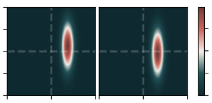
<figcaption class="paper-figure-caption"><b>Fig 4.</b> FIG. 4. Wigner functions of the states generated by the stan- dard ECD (left) and improved ECD (right) sequences. The improved ECD sequence cancels the unconditional displace- ment along the anti-squeezed quadrature. The simulated de- vice has parameters of Device 1 and a κ/2π = 160 kHz. The resonator starts with 11 dB of squeezing.</figcaption>
</figure>
<figure class="paper-figure-card">
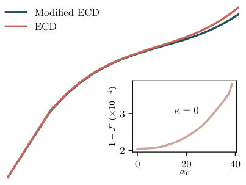
<figcaption class="paper-figure-caption"><b>Fig 5.</b> FIG. 5. GKP subspace logical fidelities computed for (a) β = √</figcaption>
</figure>

**Summary.** This paper presents a detailed numerical study on implementing high-fidelity quantum gates, specifically ECD gates, in a resonator coupled to a fluxonium qubit. By utilizing the fluxonium's inherent protection against bit-flips and developing advanced simulation techniques, the authors achieve fidelities over 99.9%. The work is significant for advancing practical quantum control in superconducting circuit platforms.

**Why it may be interesting.** This work is highly relevant as it tackles practical limitations (dissipation, nonlinearities) in implementing fundamental quantum gates for bosonic modes, which is a core area of quantum optics and quantum information.

Detailed structure

**Main problem.** The work addresses the challenge of achieving high-fidelity quantum control for bosonic modes, specifically by implementing Echoed Conditional Displacement (ECD) gates while mitigating dominant error sources like qubit bit-flips and resonator nonlinearities.

**Main result.** The authors demonstrate that fidelities exceeding 99.9% are achievable for ECD gates using a fluxonium qubit protected at the half-flux sweet spot, and they propose an improved sequence to counteract photon loss and nonlinearities.

**Method.** The study combines numerical case studies, semiclassical trajectory simulations, and master equation approaches to model the coupled resonator-fluxonium system dynamics.

**Model / system.** The system is a single-mode resonator coupled to a fluxonium qubit. The Hamiltonian is analyzed in various frames (dispersive, displaced) and includes terms up to sixth order, requiring advanced simulation techniques to handle strong driving and dissipation.

**Key observables.** Gate fidelities (exceeding 99.9%), resonator dynamics (dispersive shift saturation), and vacuum overlap for the ECD gate.

**Important parameters / regimes.** Operating the fluxonium at the half-flux sweet spot ($\Phi_e = \Phi_0/2$), and the strong driving regime ($\langle\hat{a}^\dagger\hat{a}
angle\gg 1$).

**Assumptions / limitations.** The standard ECD sequence is limited by qubit bit-flips, which is mitigated by using the fluxonium; the analysis relies on semiclassical approximations for strong driving.

**Figures summary.** Figures illustrate the out-and-back protocol for parameter extraction, the vacuum overlap of the ECD return state, and comparisons showing fidelity improvements using the modified ECD sequence and repumping protocols.

**Paper structure.** The paper progresses from establishing the need for high-fidelity bosonic control (ECD gates) to developing advanced simulation techniques for the strongly driven regime, deriving an improved gate sequence to handle losses, and finally demonstrating high-fidelity operation using repumping protocols.

Abstract

Echoed Conditional Displacement (ECD) gates constitute a fundamental building block for quantum control of harmonic oscillator modes. However, bit-flips of the auxiliary qubit remain a dominant error mechanism for this kind of bosonic control. In this work, we present a numerical case study of a bit-flip protected fluxonium operating as the control qubit and numerically implement ECD gates in a single-mode resonator-fluxonium device, demonstrating that fidelities exceeding 99.9% are possible. We systematically investigate the resonator dynamics using a combination of semiclassical trajectories and master equation simulations, numerically revealing asymptotic saturation of the dispersive shift in the strongly driven regime of the resonator. We develop an efficient technique to numerically simulate the strongly driven regime of the resonator using a semiclassical formulation that maps the full perturbation series in the dispersive expansion as order-by-order frequency shifts. This provides a compact polynomial description of the resonator which is intuitive and remains valid throughout the dispersive regime. Furthermore, we propose an improved ECD sequence that accounts for the effects of photon loss and spurious nonlinear terms on resonator trajectories.

[↑ back to top](#top)

### [Non-Markovian interactions with pulses of quantum radiation](http://arxiv.org/abs/2609.01726v1)

**Authors:** Julien Pinske, Stefan Scheel  
**Type:** theory · **Category:** other · **PDF:** <https://arxiv.org/pdf/2609.01726v1>  
**Analysis basis:** full PDF text, analyzed in chunks
**Topic relevance:** `correlated / nonlocal dissipation` **3/5** · `methods for driven-dissipative` **3/5** · `Keldysh / 2PI / non-Gaussian methods` **2/5** · `interference shaping light` **2/5** · `Tavis-Cummings & cavity-many-emitter` **1/5** · `driven-dissipative phase transition` **1/5** · `quantum measurements` **1/5**

↔ Scroll figures horizontally

<figure class="paper-figure-card">
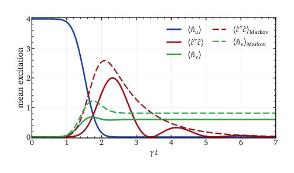
<figcaption class="paper-figure-caption"><b>Fig 1.</b> FIG. 3. Scattering a Gaussian pulse u(t) off an empty cavity. The pulse has width τ = 0.38/γ and carries a coherent state |αu = 2⟩. Shown are the mean excitations ⟨ˆnk⟩of the incoming and outgoing pulse (k = u,v), together with the intracavity photon number ⟨ˆc† ˆc⟩. Solid lines refer to the non-Markovian evolution, dashed lines to the Markovian evolution. The spectral density (21) is specified by Ω1 = Ω2 = γ, γp1 = γp2 = γ, and ωp1 = −ωp2 = γ, which corresponds to couplings gp1 ≈(1.023−0.632i)γ and gp2 ≈(0.391+0.632i)γ.</figcaption>
</figure>
<figure class="paper-figure-card">
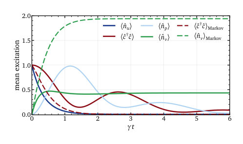
<figcaption class="paper-figure-caption"><b>Fig 2.</b> FIG. 2. Stimulated emission from a two-level atom by a single- photon pulse, |1u⟩. Shown are the mean photon numbers ⟨ˆnk⟩of the incoming pulse (k = u), the pseudomode (k = p), and the outgo- ing pulse (k = v), together with the atomic population ⟨ˆc† ˆc⟩. Solid lines refer to the non-Markovian dynamics (13), dashed lines to the Markovian dynamics (20), for which the population exhibits no re- vival. Parameters used in the simulation are Γ = γ/0.36, γ = γp, and ωp = ωs = 0.</figcaption>
</figure>

**Summary.** This paper develops a non-Markovian input-output theory by introducing a 'pseudomode' to model the interaction of quantum light pulses with structured environments. This method allows for the exact simulation of memory effects, demonstrating that such non-Markovian dynamics cause the output field to become multimode rather than remaining single-mode. It is a significant theoretical advance for quantum optics modeling.

**Why it may be interesting.** This work provides a powerful, solvable theoretical framework (pseudomode approach) to incorporate complex memory effects into quantum optics problems, moving beyond the limitations of the standard Markov approximation.

Detailed structure

**Main problem.** The paper addresses the challenge of accurately describing the interaction of a traveling quantum light pulse with a localized quantum system when the surrounding environment introduces non-Markovian memory effects.

**Main result.** The non-Markovian coherence revival in the scatterer distorts the incoming pulse's single-mode nature, leading to a measurable multimode output field.

**Method.** A novel non-Markovian input-output theory is devised by coherently coupling the scatterer to an auxiliary 'pseudomode,' which subsequently decays into a standard Markovian reservoir.

**Model / system.** The model involves a quantum light pulse scattering off a quantum system (e.g., a two-level atom or cavity) embedded in a structured, non-Markovian environment. The dynamics are governed by a master equation incorporating the pseudomode coupling.

**Key observables.** Mean photon numbers ($\langle\hat{n}_k
angle$) showing non-Markovian revival, and the resulting multimode nature of the output field.

**Important parameters / regimes.** The decay rate of the pseudomode ($\gamma_p$) and the comparison between non-Markovian and Markovian limits.

**Assumptions / limitations.** The theory assumes the ability to model the structured environment via a pseudomode, allowing the use of a Lindblad master equation structure while capturing memory effects.

**Figures summary.** Figures illustrate the physical setup (pulse scattering via a pseudomode) and compare mean photon numbers for stimulated emission and cavity transmission, contrasting non-Markovian (solid) versus Markovian (dashed) dynamics.

**Paper structure.** The paper introduces the non-Markovian input-output theory using a pseudomode coupling, applies it to specific physical examples (two-level atom, cavity), and establishes the mathematical equivalence between the resulting Lindblad master equation and the corresponding Heisenberg equations for the system operators.

Abstract

The interaction of a traveling pulse of quantum light with a localized quantum system shows non-Markovian features when scattering takes place in a structured environment. Here, we devise a non-Markovian input-output theory by coherently coupling the scatterer to a pseudomode, which decays into a Markovian reservoir. This incorporates memory effects of a structured environment without altering the cascaded nature of the Lindblad master equation, whose solution provides the quantum state of the output field of any desired mode. We apply our theory to the stimulated emission by a two-level atom, and to transmission of a Gaussian pulse through a cavity. We observe that the non-Markovian revival of coherence in the scatterer distorts the single-mode nature of the incoming pulse, thus resulting in a multimode output field.

[↑ back to top](#top)

### [Coherent microwave-to-optical transduction with Yb:YSO spins strongly coupled to a 3D resonator](http://arxiv.org/abs/2609.02226v1)

**Authors:** Ujjwal Gautam, Nasser Gohari Kamel, Sourabh Kumar, Daniel Oblak  
**Type:** experiment · **Category:** other · **PDF:** <https://arxiv.org/pdf/2609.02226v1>  
**Analysis basis:** full PDF text, analyzed in chunks
**Topic relevance:** `QC/QI experiment` **3/5** · `quantum optics experiment` **3/5** · `Tavis-Cummings & cavity-many-emitter` **2/5** · `analog quantum simulation` **2/5** · `quantum measurements` **1/5**

↔ Scroll figures horizontally

<figure class="paper-figure-card">
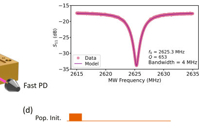
<figcaption class="paper-figure-caption"><b>Fig 1.</b> Figure 1. (a) Energy level structure of Yb:YSO crystal with the relevant optical and spin transitions used in the experiments. (b) Open view of a 3-loop-2-gap resonator (LGR) with the crystal placed at the center. The microwave is coupled through a single-port SMA antenna pin. The optical field is coupled via GRIN lens and capillary holding ferrules on each side. The output optical field is detected on a fast photodetector. Orientation of the crystal with respect to the external DC magnetic field. Overlap of the optical mode with the crystal showing the interaction region. (c) LGR reflection spectrum fitted to our model showing the relevant fitting parameters. (d) Pulse sequence consisting...</figcaption>
</figure>
<figure class="paper-figure-card">
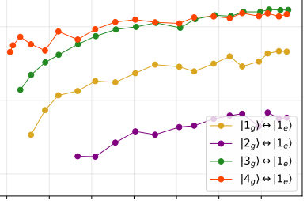
<figcaption class="paper-figure-caption"><b>Fig 2.</b> Figure 2. (a) Experimental transduction efficiency spectrum fitted to our model with microwave frequency near the spin transition and |4g⟩↔|1e⟩pump transition. The sharp peak corresponds to the spin transition, while the shoulder is due to the microwave cavity detuned by 1.94 MHz from the spin transition. (b) Peak experimental efficiencies at varying optical powers for all the ground states to |1e⟩pump transitions.</figcaption>
</figure>
<figure class="paper-figure-card">
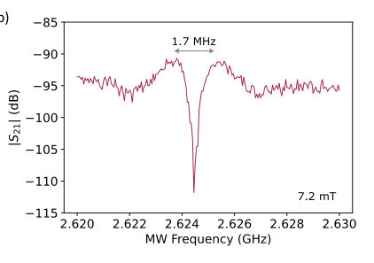
<figcaption class="paper-figure-caption"><b>Fig 3.</b> Figure 3. (a) Heat map of transduction efficiency (|S21|) with varying external magnetic field. Avoided crossing is clearly seen around 7.2 mT. (b) Slice of 3D-plot in (a) at 7.2 mT. After smoothening the curve, the peak separation is 1.7 MHz.</figcaption>
</figure>
<figure class="paper-figure-card">
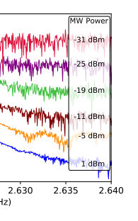
<figcaption class="paper-figure-caption"><b>Fig 4.</b> Figure 4. Transduction efficiency spectrum with varying microwave power. The spin transition peak evolves into a dip at higher microwave powers due to saturation.</figcaption>
</figure>

**Summary.** This paper demonstrates coherent microwave-to-optical quantum transduction using $	ext{Yb}:	ext{YSO}$ spins coupled to a 3D microwave resonator. By leveraging the zero-field properties of $	ext{Yb}^{3+}$, the authors achieve a measurable transduction efficiency, which they predict can be significantly enhanced by increasing the dopant concentration. This work advances the integration of quantum memory and quantum transduction in a single solid-state platform.

**Why it may be interesting.** This work is highly relevant as it combines cavity QED principles (strong coupling to a resonator) with solid-state quantum memory platforms ($	ext{Yb}:	ext{YSO}$) to solve a major engineering bottleneck in quantum networking.

Detailed structure

**Main problem.** The paper addresses the critical need for efficient microwave-to-optical (M2O) quantum transducers to enable entanglement between remote superconducting qubits.

**Main result.** The authors demonstrated M2O transduction in Yb:YSO with an initial internal efficiency of $2 	imes 10^{-8}$, while theoretically predicting an improvement up to $10^{-4}$ using higher doping concentrations.

**Method.** The experiment uses continuous-wave (CW) measurements involving a 3D loop-gap microwave resonator (LGR) and single-pass optical coupling to measure the transduction efficiency via the microwave $S_{21}$ parameter.

**Model / system.** The system utilizes $	ext{Yb}^{3+}$ ions doped into a $	ext{YSO}$ crystal. $	ext{Yb}^{3+}$ is advantageous because it exhibits zero-first-order Zeeman (ZEFOZ) transitions, allowing operation without external magnetic fields that cause decoherence in superconducting qubits.

**Key observables.** Internal transduction efficiency ($\eta_{M2O}$), spin-microwave coupling strength ($g_{m,ens}$), and the LGR reflection spectrum ($S_{21}$).

**Important parameters / regimes.** Doping concentration (5 ppm vs. predicted 50 ppm), bandwidth (200 kHz), and the strong cooperativity regime ($	ext{C}_{	ext{m}} > 1$).

**Assumptions / limitations.** The analysis assumes negligible residual environmental magnetic fields and relies on complex signal processing (noise de-embedding) to isolate the weak transduction signal.

**Figures summary.** Figures illustrate the energy level structure, the experimental setup using the LGR, the measured transduction efficiency spectrum, and the avoided crossing measurements showing spin-microwave coupling.

**Paper structure.** The paper progresses from establishing the physical necessity of M2O transducers to detailing the experimental setup, presenting initial measurements of efficiency and coupling strength, and concluding with theoretical scaling predictions for improved performance.

Abstract

Microwave-to-optical quantum transducers are essential for entangling remote superconducting qubits. Among the available transduction platforms, ensembles of Er$^{3+}$ and Yb$^{3+}$ ions doped into solids have emerged as leading candidates. While external magnetic fields are needed to split the Zeeman levels of erbium ions and enable a microwave--qubit interface, superconducting qubits suffer decoherence in such fields. In contrast, ytterbium ions exhibit zero-first-order Zeeman transitions and large hyperfine splittings at zero magnetic field (when doped into inorganic crystals). Owing to its long optical and spin coherence times, Yb:YSO has been widely used as a quantum memory, yet its potential for quantum transduction remains largely unexplored. Investigating this material could enable the integration of quantum memory and transduction in a single platform. Here, we demonstrate microwave-to-optical transduction in the continuous-wave regime using a 5\,ppm doped Yb:YSO crystal. The internal transduction efficiency is $2\times10^{-8}$ with a bandwidth of 200\,kHz, achieved using a 3D loop-gap microwave resonator (LGR) and a single-pass optical configuration. We explore all the ground states that form a V-type three-level system with the first and second optical excited states and assert the use of the ground state, which provides the highest efficiency and isolated optical transition. We further establish strong spin-microwave coupling from avoided crossing measurements. With a strong microwave drive to saturate the spin transition, we estimate the spin population pumped into the excited state, close to the simulated value. Finally, we calculate target parameter values for maximum efficiency with our system and suggest using 50\,ppm doped Yb:YSO crystal. With the calculated target parameters, the internal transduction efficiency is predicted to reach up to $10^{-4}$ in the current LGR.

[↑ back to top](#top)

### [Programming anharmonic potentials in a superconducting harmonic oscillator](http://arxiv.org/abs/2609.02405v1)

**Authors:** Clara Yun Fontaine, Mansi Somani, Kehui Yu, May Chee Loke, Jonathan Schwinger, Pak-Tik Fong, Ni-Ni Huang, Adrian Copetudo, Mustafa Bakr, Hoi-Kwan Lau, Tanjung Krisnanda, Yvonne Y. Gao  
**Type:** experiment · **Category:** other · **PDF:** <https://arxiv.org/pdf/2609.02405v1>  
**Analysis basis:** full PDF text, analyzed in chunks
**Topic relevance:** `QC/QI experiment` **3/5** · `analog quantum simulation` **3/5** · `quantum measurements` **2/5** · `Keldysh / 2PI / non-Gaussian methods` **1/5** · `methods for driven-dissipative` **1/5** · `quantum optics experiment` **1/5**

↔ Scroll figures horizontally

<figure class="paper-figure-card">
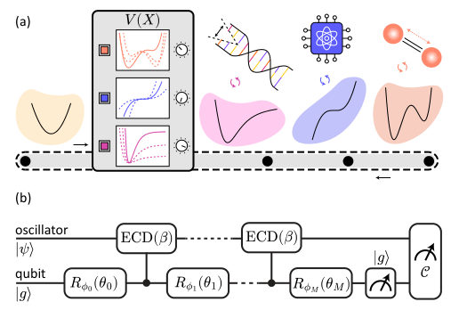
<figcaption class="paper-figure-caption"><b>Fig 1.</b> FIG. 1. Programmable non-Gaussian phase gates. (a) We engineer distinct non-Gaussian phase gates corre- sponding to different potentials V (X) on demand by changing the parameters of a single calibrated circuit template. Three examples implemented in this work are illustrated: a cubic phase gate (purple), the canonical non-Gaussian primitive for continuous-variable quantum information processing; an asymmetric double well (orange), relevant to proton-transfer dynamics in hydrogen-bonded systems such as DNA base pairs; and a Morse potential (pink), describing the vibrational modes of diatomic molecules. (b) Modular circuit diagram for engineering an order-M non-Gaussian phase gate in cQED: M...</figcaption>
</figure>
<figure class="paper-figure-card">
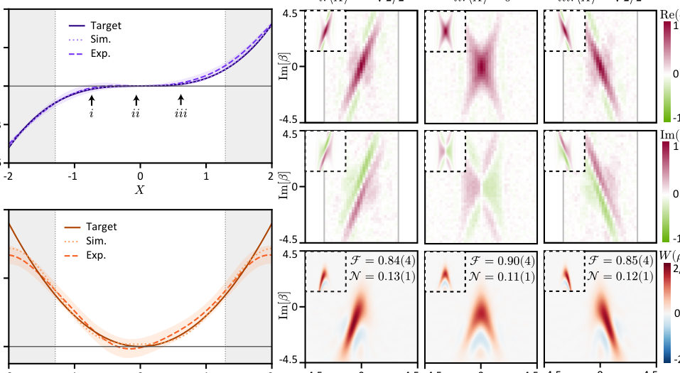
<figcaption class="paper-figure-caption"><b>Fig 2.</b> FIG. 2. Cubic phase gate and non-Gaussian states. (a) The potential and (b) the pointwise force. Target: the pro- grammed potential. Sim: the finite-order compiled circuit carried through coherent-probe sampling and the same deconvolution as the data. The simulated circuit is with unitary qubit-conditioned displacements and qubit rotations, with no decoherence or pulse simulation. Exp: the experimental reconstruction, with shading giving the 95% bootstrap confidence interval in both panels. (c) Output states for coherent inputs at ⟨ˆ X⟩0 ≈{− √</figcaption>
</figure>
<figure class="paper-figure-card">
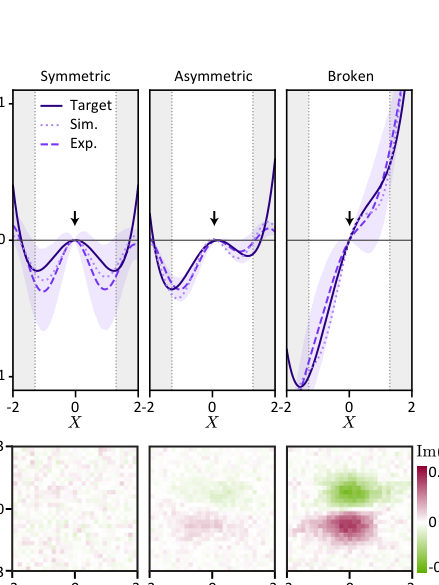
<figcaption class="paper-figure-caption"><b>Fig 3.</b> FIG. 3. Programmable double-well potentials. (a) The reconstructed potentials for the symmetric, asymmetric and broken targets. Target: the programmed potential. Sim: the finite-order compiled circuit carried through coherent-probe sampling and the same deconvolution as the data. Exp: the experimental reconstruction. (b) Imaginary part Im[C(β)] of the characteristic function for a vacuum input, for the sym- metric (left), asymmetric (middle) and broken (right) poten- tials.</figcaption>
</figure>
<figure class="paper-figure-card">
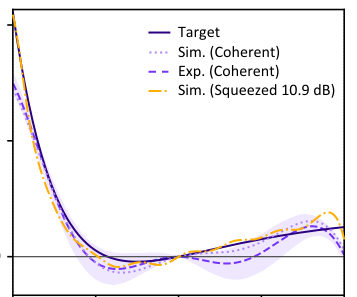
<figcaption class="paper-figure-caption"><b>Fig 4.</b> FIG. 4. Morse potential. Target: the programmed Morse. Sim. (Coherent): the compiled M = 13 circuit carried through coherent-probe sampling and the same deconvolution as the data, which retains harmonics |n| ≤2. Exp. (Coher- ent): the experimental reconstruction under those same con- ditions, with 95% bootstrap shading. Sim. (Squeezed 10.9 dB): the same compiled circuit sampled by squeezed probes and reconstructed retaining |n| ≤7, the bandwidth 10.9 dB of position squeezing admits at the noise amplification the co- herent probes already incur.</figcaption>
</figure>

**Summary.** This paper presents a systematic method to program anharmonic potentials in a superconducting harmonic oscillator using a transmon qubit. By employing bosonic quantum signal processing, the authors successfully implemented and characterized various potentials, including cubic, double-well, and Morse forms. This establishes a practical, reconfigurable route for advanced continuous-variable quantum simulation.

**Why it may be interesting.** This work provides a concrete, hardware-validated pathway to engineer complex, non-Gaussian potentials in a superconducting circuit, which is crucial for simulating molecular dynamics and other non-linear quantum processes.

Detailed structure

**Main problem.** The primary challenge is realizing programmable non-Gaussian phase gates, which correspond to implementing anharmonic potentials, for continuous-variable quantum simulation.

**Main result.** The authors successfully demonstrated a systematic framework to engineer and characterize anharmonic potentials, including cubic, double-well, and approximate Morse potentials, on a superconducting circuit.

**Method.** They use bosonic quantum signal processing (QSP) to compile the target phase gate into a circuit of qubit rotations and oscillator displacements, followed by pointwise force reconstruction from coherent-state probes.

**Model / system.** The platform is a superconducting harmonic oscillator coupled dispersively to a transmon qubit (bosonic cQED). The system is used to simulate potentials $V(\hat{X})$ via the gate $e^{-iV(\hat{X})}$.

**Key observables.** Gate fidelity, Wigner negativity, and the reconstructed force profile $V'(\hat{X})$ are key diagnostics used to validate the engineered potentials.

**Important parameters / regimes.** The fidelity is high ($\ge 0.84$), and the reconstruction is validated by comparing the measured force profile against the target potential, especially for the cubic and double-well cases.

**Assumptions / limitations.** The reconstruction fidelity is limited by the finite bandwidth of the Gaussian deconvolution process, and the process relies on the dispersive coupling interaction.

**Figures summary.** Figures illustrate the modular circuit diagram for implementing various non-Gaussian gates (cubic, double-well, Morse) and compare the reconstructed force profiles against the target potentials.

**Paper structure.** The paper systematically demonstrates the framework by first implementing a cubic phase gate, then engineering and validating double-well potentials relevant for tunneling, and finally achieving an approximate Morse gate, while also testing parity symmetry.

Abstract

Continuous-variable quantum systems offer a resource-efficient route to universal quantum information processing and analogue quantum simulation of real-world processes, such as molecular physics and chemical reactions. Realising these applications, however, requires non-Gaussian operations that implement anharmonic potentials, which are challenging to engineer on demand. Here, we demonstrate a systematic framework to implement programmable non-Gaussian phase gates $e^{-iV(\hat{X})}$, corresponding to the impulsive action of a potential $V(\hat{X})$, in a superconducting harmonic oscillator coupled to a transmon qubit. Using modular circuits derived from bosonic quantum signal processing, we realise a range of target anharmonic potentials on a single piece of hardware by varying a set of qubit rotations interleaved with a fixed calibrated control unitary. We first demonstrate a cubic phase gate, a key ingredient for universal quantum information processing. The resulting high-fidelity non-Gaussian states and the potential reconstructed using our pointwise force reconstruction method jointly confirm the cubic nature of the target gate. We then engineer a family of double-well potentials, relevant models of tunnelling and biased transfer processes, and experimentally validate the double-well topology and the tunable asymmetry. Finally, we engineer an approximate Morse gate, a step towards realistic potentials of molecular vibrational systems, and provide a concrete path towards high-quality engineering and reconstruction of the exponential form. Together, these results establish a practical and reconfigurable route towards continuous-variable quantum information processing and anharmonic quantum simulation.

[↑ back to top](#top)

### [Bell inequality violation with momentum-entangled massive particles](http://arxiv.org/abs/2609.02009v1)

**Authors:** Y. S. Athreya, S. Kannan, X. T. Yan, K. V. Kheruntsyan, A. G. Truscott, S. S. Hodgman  
**Type:** experiment · **Category:** other · **PDF:** <https://arxiv.org/pdf/2609.02009v1>  
**Analysis basis:** full PDF text, analyzed in chunks
**Topic relevance:** `analog quantum simulation` **3/5** · `QC/QI experiment` **2/5** · `interference shaping light` **2/5** · `quantum measurements` **2/5** · `quantum optics experiment` **1/5**

↔ Scroll figures horizontally

<figure class="paper-figure-card">
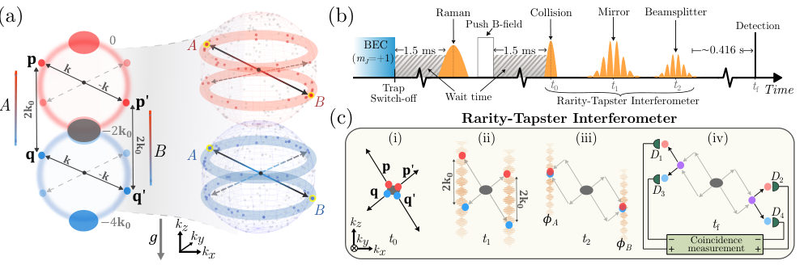
<figcaption class="paper-figure-caption"><b>Fig 1.</b> FIG. 1. Experimental schematic and Rarity-Tapster atom interferometer sequence. (a) A Bragg collision pulse at t0 coherently splits the 4He∗(mJ = 0) condensate into momentum orders 0, −2ℏk0, and −4ℏk0. The 0 and −2ℏk0 components (red), and the −2ℏk0 and −4ℏk0 components (blue), collide to produce two spherical s-wave scattering halos of entangled atom pairs. Within each halo, region A denotes the torus-shaped region above the halo equator and contains the modes {p} and {q}, while region B denotes the corresponding torus-shaped region below the halo equator and contains the modes {p′} and {q′}. The pairs (p, p′) and (q, q′) are entangled through momentum conservation of the underlying...</figcaption>
</figure>
<figure class="paper-figure-card">
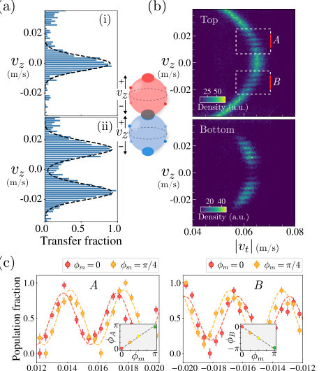
<figcaption class="paper-figure-caption"><b>Fig 2.</b> FIG. 2. Characterization of the dual-resonant Bragg pulse. (a) Transfer fraction as a function of vertical velocity vz. (i) For ωm = 0, the Bragg pulse is a standard single- frequency pulse with a single resonance at the halo equator (vz = 0). (ii) For ωm = 2π×21 kHz, the dual-resonant Bragg pulse exhibits two resonances at vz = ±0.016 m s−1, corre- sponding to the off-equatorial halo regions A and B. The peak transfer efficiency is 92(4)%. (b) Two-dimensional his- togram of the Ramsey-like interferometer [27] output, plot- ted as vertical velocity vz versus transverse velocity vt (inte- grated over the x-y plane) for the ‘Top’ and ‘Bottom’ halos. Interference fringes are observed in the...</figcaption>
</figure>
<figure class="paper-figure-card">
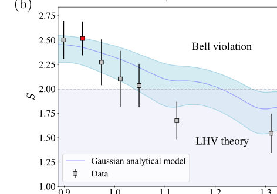
<figcaption class="paper-figure-caption"><b>Fig 3.</b> FIG. 3. Bell correlation measurements and CHSH- Bell parameter. (a) Measured Bell correlation function E(ϕA, ϕB) for three phase configurations. The red, blue, and green data sets correspond to (ϕA, ϕB) = (−1.44, ϕ), (−3.01, ϕ), and (ϕ, −4.58), respectively. The data are fit- ted with sinusoidal functions of the form given in Eq. (5), yielding an average visibility of V = 0.93(2). Error bars are estimated using a binomial proportion estimator [44]. The data are obtained from 38,300 experimental shots. (b) CHSH-Bell parameter S as a function of detector bin size, in units of the back-to-back momentum correlation length σBB. Grey points show the measured values, with the red point in-...</figcaption>
</figure>

**Summary.** This experiment reports the first violation of a Bell inequality using the momentum states of massive particles, specifically metastable helium atoms. By employing a dual-resonant Bragg interferometer, the researchers achieved independent control over local measurement bases for momentum-entangled pairs. The measured Bell parameter $S=2.52$ confirms quantum nonlocality in the external degrees of freedom of atoms.

**Why it may be interesting.** This work directly extends quantum nonlocality tests from internal quantum variables (like spin) to the external, motional degrees of freedom of massive particles, providing a crucial testbed for quantum mechanics in the context of matter waves and potentially gravity.

Detailed structure

**Main problem.** The primary goal was to demonstrate the violation of a Bell inequality using the motional (external) degrees of freedom of massive particles, an experimental frontier in quantum nonlocality testing.

**Main result.** The authors successfully measured a CHSH Bell parameter of $S = 2.52 \pm 0.17$, significantly violating the local realistic bound ($S \le 2$), confirming quantum nonlocality in atomic momentum states.

**Method.** The experiment utilized a matter-wave interferometer sequence (Rarity-Tapster type) applied to momentum-entangled pairs of metastable helium atoms.

**Model / system.** The platform involves ultracold metastable helium atoms ($	ext{He}^*$) prepared in a Bose-Einstein condensate. The key technical advance is the use of a dual-resonant Bragg lattice, which allows for the independent selection of local measurement bases for the two spatially separated momentum modes.

**Key observables.** The Clauser-Horne-Shimony-Holt (CHSH) Bell parameter ($S$), the Bell correlation function $E(\phi_A, \phi_B)$, and joint atom detection probabilities $P_{k,k'}$.

**Important parameters / regimes.** The measured value $S = 2.52 \pm 0.17$, the local realistic bound $S \le 2$, and the visibility $V = 0.93(2)$.

**Assumptions / limitations.** The analysis assumes the two visibility reduction effects (Higher-Order Fock states and finite detection window) are independent, and the scattering process is in the low-gain regime.

**Figures summary.** Figures illustrate the experimental schematic, the Rarity-Tapster atom interferometer sequence, and measurements of the Bell correlation function $E(\phi_A, \phi_B)$ showing clear phase dependence.

**Paper structure.** The paper details the experimental setup, focusing on the dual-resonant Bragg lattice to enable independent phase control. It then describes the measurement of joint detection probabilities, constructs the Bell correlation function, and finally calculates the CHSH parameter to demonstrate the violation.

Abstract

Bell's theorem revealed the fundamental incompatibility between the predictions of quantum mechanics and local realism. Bell inequality violations have since demonstrated quantum nonlocality using photons and internal states of massive particles, but never using their motional states. Here we report the first Bell inequality violation in the motional states of massive particles. Using momentum-entangled pairs of metastable helium atoms manipulated by matter-wave interferometry, we measure a Clauser-Horne-Shimony-Holt (CHSH) Bell parameter of $S = 2.52 \pm 0.17$, violating the CHSH-Bell inequality ($S \le 2$). Our work completes a long-standing objective in quantum atom optics by extending Bell tests from internal quantum variables to the external degrees of freedom of massive particles, opening a new regime for exploring quantum nonlocality in matter waves and for investigating the interplay between quantum mechanics and gravity.

[↑ back to top](#top)

### [Thermodynamic optimization of thermal landscapes and energy barriers in a Brownian heat engine](http://arxiv.org/abs/2609.02613v1)

**Authors:** Mesfin Taye  
**Type:** theory · **Category:** statistical mechanics · **PDF:** <https://arxiv.org/pdf/2609.02613v1>  
**Analysis basis:** full PDF text, analyzed in chunks
**Topic relevance:** `methods for driven-dissipative` **3/5** · `Frenkel-Kontorova` **1/5** · `Keldysh / 2PI / non-Gaussian methods` **1/5** · `correlated / nonlocal dissipation` **1/5** · `driven-dissipative phase transition` **1/5** · `non-equilibrium universality` **1/5** · `quantum measurements` **1/5**

↔ Scroll figures horizontally

<figure class="paper-figure-card">
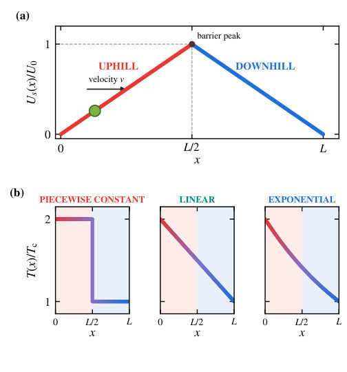
<figcaption class="paper-figure-caption"><b>Fig 1.</b> FIG. 1. (a) Symmetric triangular potential Us(x) of Eq. (10); the particle climbs the ascending (uphill) branch on 0 &lt; x &lt; L/2 and descends the downhill branch on L/2 &lt; x &lt; L, and a net forward velocity v = LJ arises when the thermal field breaks detailed balance. (b) The three canonical thermal landscapes obeying the box constraint of Eq. (13) for Th = 2Tc: the piecewise-constant profile is hot on the entire uphill branch and cold on the entire downhill branch, while the linear and exponential profiles decrease continuously from Th at x = 0 to Tc at x = L.</figcaption>
</figure>
<figure class="paper-figure-card">
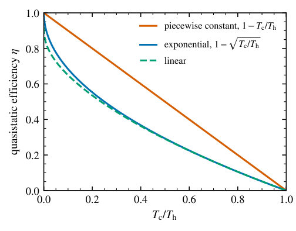
<figcaption class="paper-figure-caption"><b>Fig 2.</b> FIG. 2. Exact quasistatic efficiency, Eq. (45), versus Tc/Th for the piecewise-constant [Eq. (57)], exponential [Eq. (68)], and linear [Eq. (62)] profiles. The piecewise-constant profile attains the box-constrained maximum 1 −Tc/Th for every temperature ratio; the exponential profile gives the Curzon– Ahlborn form.</figcaption>
</figure>
<figure class="paper-figure-card">
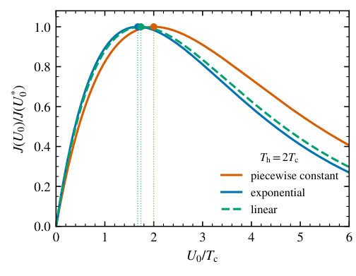
<figcaption class="paper-figure-caption"><b>Fig 3.</b> FIG. 3. Barrier-height dependence of the current in the acti- vation estimate, Eq. (97), for Th = 2Tc and zero load. Each curve is normalized by its own maximum, so the figure displays the shift of the optimal barrier with the temperature profile rather than an ordering of peak currents; markers and dotted verticals locate the optima U ∗ 0 = Tact of Eq. (100), which decrease from the piecewise-constant to the exponential to the linear profile [Eqs. (101)–(103)]. Exact optima follow from Eq. (89).</figcaption>
</figure>
<figure class="paper-figure-card">
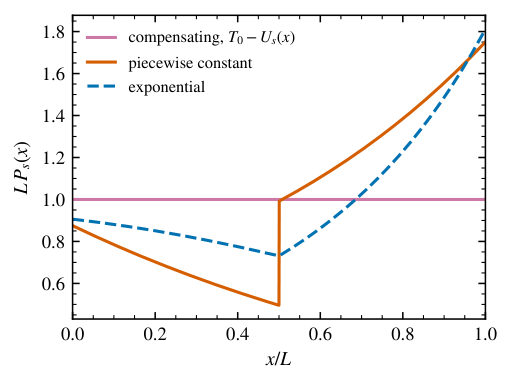
<figcaption class="paper-figure-caption"><b>Fig 4.</b> FIG. 4. Exact stationary densities Ps(x) from Eq. (31), eval- uated with the element-exact quadrature of Appendix E, for L = γ = Tc = 1, Th = 2, U0 = 0.8, and f = 0.25. The potential-compensating profile T0 −Us(x) with T0 = 1.9 yields the exactly uniform density that attains the Shannon-entropy bound (129); the piecewise-constant and exponential fields yield nonuniform densities and strictly smaller entropy. The piecewise-constant-profile density jumps at x = L/2 because the interface rule of Sec. II makes TP, not P, continuous across a temperature discontinuity.</figcaption>
</figure>
<figure class="paper-figure-card">
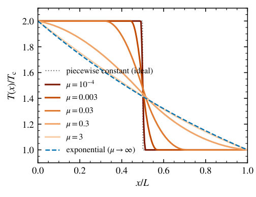
<figcaption class="paper-figure-caption"><b>Fig 5.</b> FIG. 5. Numerically optimized efficiency profiles from Eq. (152) with fixed endpoints T(0) = 2Tc, T(L) = Tc and box bounds Tc ≤T ≤Th, for logarithmic-gradient penalties µ = 10−4–3 (in units of Tc; darker to lighter with increasing µ), obtained by the gradient-based method of Appendix E. As µ →0 the optimum approaches the ideal hot/cold piecewise- constant profile (dotted); as µ grows it converges to the expo- nentially decreasing profile (dashed), the unique minimizer of the penalty functional at fixed endpoints.</figcaption>
</figure>

**Summary.** This paper revolutionizes the study of Brownian heat engines by formulating an inverse-design problem: instead of calculating performance for a given temperature profile, it determines the optimal profile. It rigorously shows that the optimal design differs significantly between the ideal quasistatic limit and the realistic finite-current regime. This provides powerful tools for engineering non-equilibrium energy conversion devices.

**Why it may be interesting.** The work provides a rigorous framework for optimizing non-equilibrium steady states by treating the thermal landscape itself as a control variable, which is a key concept in open quantum systems and energy harvesting.

Detailed structure

**Main problem.** The paper tackles the inverse-design problem in Brownian heat engines: determining the optimal temperature profile and energy barrier to maximize a chosen thermodynamic objective.

**Main result.** While the quasistatic limit yields an efficiency optimum using a hot-uphill/cold-downhill profile, finite current optimization requires a different profile, governed by a balance between thermal rectification gain and transport resistance.

**Method.** The authors derive exact functional gradients and box-constrained optimality conditions by analyzing the stationary current and probability density derived from the Smoluchowski equation.

**Model / system.** The system is an overdamped Brownian particle moving in a symmetric triangular periodic potential under a constant opposing load, subjected to a spatially varying temperature field T(x).

**Key observables.** Efficiency ($\eta$), stationary current ($J$), power, and configurational Shannon Entropy.

**Important parameters / regimes.** Temperature bounds ($T_c, T_h$), opposing load, and the ratio of cycle affinity to transport resistance.

**Assumptions / limitations.** The analysis assumes the system can be controlled by setting the temperature profile T(x) and the barrier height $U_0$ over the admissible class.

**Figures summary.** Figure 1 illustrates the symmetric triangular potential and compares three canonical thermal landscapes (piecewise constant, etc.).

**Paper structure.** The paper moves from deriving the exact stationary current and density for arbitrary T(x) to analyzing the quasistatic limit, and finally to deriving the functional gradient and optimality conditions for finite current optimization.

Abstract

Spatial temperature fields in Brownian heat engines are commonly prescribed \emph{a priori}, and the resulting transport and thermodynamic properties are then calculated. Here we formulate the complementary inverse-design problem: determining the temperature profile and barrier height that optimize a chosen thermodynamic objective. We consider an overdamped Brownian particle in a symmetric triangular periodic potential under a constant opposing load and derive the exact stationary current and probability density for an arbitrary bounded temperature field, $\Tc\le T(x)\le\Th$. In the quasistatic limit, the efficiency becomes an exact functional of two inverse-temperature integrals over the uphill and downhill branches. Its rigorous global maximum under the pointwise temperature bounds is $η_{\max}=1-\Tc/\Th$, attained uniquely, up to sets of measure zero, by the hot-uphill/cold-downhill piecewise-constant profile. At finite current, however, the optimization changes qualitatively because the current is determined jointly by the cycle affinity and a nonlocal transport resistance. We derive the exact functional gradient and the corresponding box-constrained optimality conditions, showing that the current- or power-maximizing profile generally differs from the quasistatic efficiency optimum. For any prescribed temperature field, the current-maximizing barrier satisfies an exact balance between the marginal gain in thermal rectification and the marginal increase in transport resistance, with the characteristic estimate $U_0^*\simeq T_{\rm act}$, where $T_{\rm act}^{-1}=(2/L)\int_0^{L/2}\dd x/T(x)$.

[↑ back to top](#top)

### [Generalised Random Parking for Trapeziums on a Strip](http://arxiv.org/abs/2609.02491v1)

**Authors:** David Kramer-Bang, Stjepan Šebek  
**Type:** theory · **Category:** statistical mechanics · **PDF:** <https://arxiv.org/pdf/2609.02491v1>  
**Analysis basis:** full PDF text, analyzed in chunks
**Topic relevance:** `non-equilibrium universality` **3/5** · `Keldysh / 2PI / non-Gaussian methods` **2/5** · `methods for driven-dissipative` **2/5** · `analog quantum simulation` **1/5**

↔ Scroll figures horizontally

<figure class="paper-figure-card">
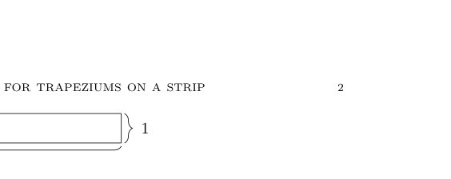
<figcaption class="paper-figure-caption"><b>Fig 1.</b> Figure 1. Strip of length x and height 1.</figcaption>
</figure>
<figure class="paper-figure-card">
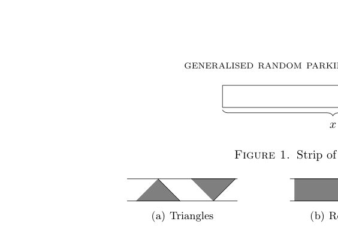
<figcaption class="paper-figure-caption"><b>Fig 2.</b> Figure 2. Different shapes of deposited objects.</figcaption>
</figure>
<figure class="paper-figure-card">
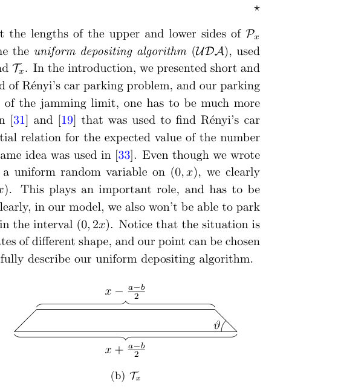
<figcaption class="paper-figure-caption"><b>Fig 3.</b> Figure 3. Illustrations of the parallelogram Px and trapezium Tx, which appear in the scheme of depositing trapeziums.</figcaption>
</figure>
<figure class="paper-figure-card">
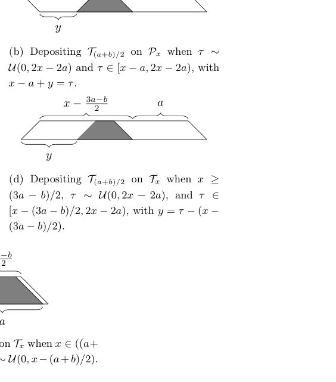
<figcaption class="paper-figure-caption"><b>Fig 4.</b> Figure 4. Illustration of all the possible scenarios of the trapezium T(a+b)/2 arriving on strips Px and Tx, defined by the scheme UDA in Definition 1.2.</figcaption>
</figure>
<figure class="paper-figure-card">
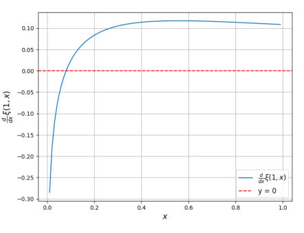
<figcaption class="paper-figure-caption"><b>Fig 5.</b> Figure 5. Finding the worst trapezium.</figcaption>
</figure>

**Summary.** This paper generalizes a classic random parking problem to model the random deposition of isosceles trapeziums on a strip. It derives an exact formula for the jamming limit and proves that the variance of the process converges to the same leading asymptotic density regardless of the specific geometry of the remaining substrate. This provides deep insights into the geometry-dependent nature of random packing processes.

**Why it may be interesting.** While the topic is classical statistical mechanics (packing/jamming), the rigorous mathematical techniques involving recursive relations, asymptotic analysis, and the study of limiting densities are highly relevant to understanding critical phenomena and non-equilibrium dynamics in quantum many-body systems.

Detailed structure

**Main problem.** The paper generalizes Rényi's car-parking problem to study the random sequential deposition of isosceles trapeziums on a strip.

**Main result.** An explicit formula for the jamming constant is derived, showing that the least efficient shape is a genuine trapezium, and the asymptotic variance for related processes is shown to be identical for two different substrate geometries.

**Method.** The analysis uses recursive constructions and moment calculations to derive finite-size asymptotics for the expected number and variance of deposited particles.

**Model / system.** The model involves depositing isosceles trapeziums randomly on a strip substrate, leading to a recursive process that generates two distinct, but asymptotically equivalent, substrate geometries: a parallelogram and a trapezium.

**Key observables.** Parking Constant ($	heta$), Expected Number ($\mu(x)$), and Variance ($\sigma^2(x)$) of deposited trapeziums.

**Important parameters / regimes.** The lengths of the two bases of the trapezium ($a$ and $b$), and the substrate size ($x$).

**Assumptions / limitations.** The analysis assumes the substrate is a strip and relies on the asymptotic equivalence of the two resulting substrate types ($P_x$ and $T_x$).

**Figures summary.** Figures illustrate the strip substrate, different deposited shapes (triangles, rectangles, trapeziums), and the two relevant recursive substrate geometries (parallelogram and trapezium).

**Paper structure.** The paper establishes the general problem, derives the explicit formula for the parking constant, calculates finite-size asymptotics for moments, and proves the asymptotic equality of the variance for the two underlying substrate types.

Abstract

In this article, we study a generalisation of Rényi's car-parking problem in which isosceles trapeziums are sequentially deposited on a strip. We derive an explicit formula for the parking constant in terms of the lengths of the two bases, recovering the classical rectangular and triangular models as special cases. We further obtain quantitative finite-size asymptotics for both the expected number and the variance of deposited trapeziums, with convergence rates that depend explicitly on the geometry of the deposited particle. In particular, although the recursive construction involves two different substrate geometries, their variances have the same leading asymptotic density. Finally, we show that the parking constant depends non-monotonically on the ratio of the two base lengths and possesses a unique minimiser, so that the least efficient shape is a genuine trapezium rather than a triangle.

[↑ back to top](#top)

### [Numerical simulation of D-Wave's quantum advantage experiment with time-dependent variational Monte Carlo](http://arxiv.org/abs/2609.01719v1)

**Authors:** Roeland Wiersema  
**Type:** theory · **Category:** disordered systems and neural networks · **PDF:** <https://arxiv.org/pdf/2609.01719v1>  
**Analysis basis:** full PDF text, analyzed in chunks
**Topic relevance:** `analog quantum simulation` **3/5** · `methods for driven-dissipative` **3/5** · `Keldysh / 2PI / non-Gaussian methods` **2/5**

↔ Scroll figures horizontally

<figure class="paper-figure-card">
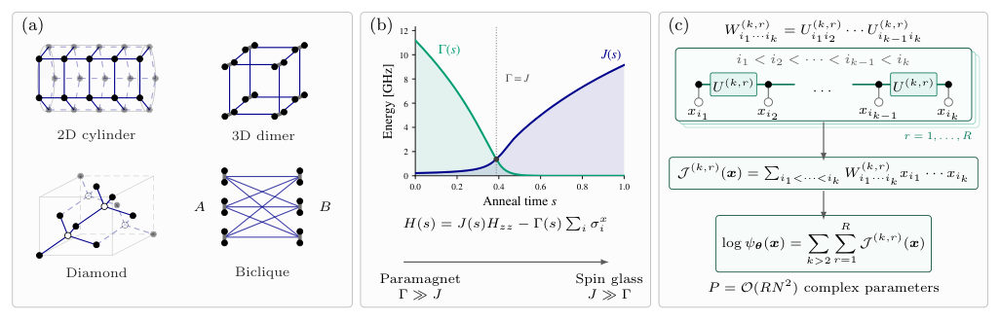
<figcaption class="paper-figure-caption"><b>Fig 1.</b> FIG. 1. Overview of the quantum-annealing simulation. (a) Representative 2D cylinder, 3D dimer, diamond, and biclique problem graphs. (b) Annealing schedule interpolating between the transverse-field paramagnet and the spin-glass Hamiltonian. (c) Path-factorized k-body correlator ansatz with channel rank R and O(RN 2) complex parameters. We omit the global phase and odd terms due to symmetry considerations.</figcaption>
</figure>
<figure class="paper-figure-card">
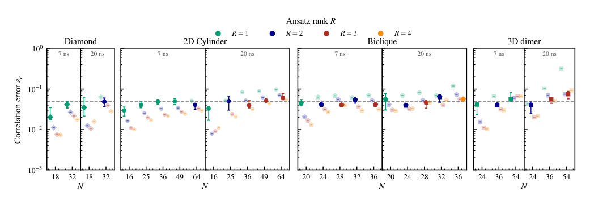
<figcaption class="paper-figure-caption"><b>Fig 2.</b> FIG. 2. Correlation error of the t-VMC ansatz at the end of the anneal. Final-time (s = 1) ZZ-correlation error ϵc relative to the MPS reference, for every simulated topology. Within each topology, we show the two anneal times ta = 7 ns and ta = 20 ns. The markers are colored by ansatz rank R ∈{1, 2, 3, 4} and horizontally offset by rank. The correlation error ϵc is estimated using 221 = 2097152 samples. To assess stability across disorder realizations, we repeat the optimization for five instances at selected ranks that reach approximately 5% error (dashed line); error bars indicate the minimum and maximum, and the marker indicates the median.</figcaption>
</figure>
<figure class="paper-figure-card">
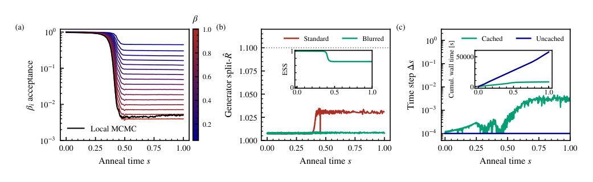
<figcaption class="paper-figure-caption"><b>Fig 3.</b> FIG. 3. Ablation study of methodological components of t-VMC simulation. (a) Local MCMC dynamics versus replica exchange Monte Carlo. At low temperatures, acceptance rates freeze within each chain, while at high temperatures, acceptance rates remain reasonable. The adjacent-replica exchange rate fluctuates between 0.239 and 0.288, enabling configurations to diffuse along the temperature ladder and reach the physical β0 replica. The dashed line shows the freezing of the local MCMC dynamics. The final error is ϵc = 0.4096 ± 0.0027 for local sampling, whereas for replica exchange we recover the &lt; 5% error ϵc = 0.0331 ± 0.0003. (b) Standard sampling versus blurred sampling. With the standard...</figcaption>
</figure>
<figure class="paper-figure-card">
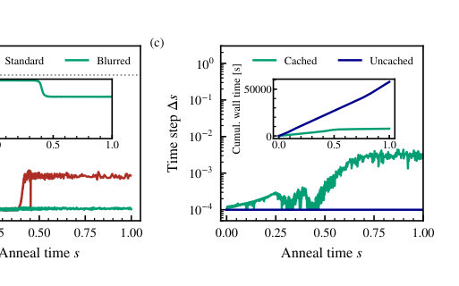
<figcaption class="paper-figure-caption"><b>Fig 4.</b> Fig. 2 were obtained with the same hyperparameters, so a more fine-tuned choice of the regularization and sam- pling settings could potentially drive down the errors. We conclude from these experiments that the diamond topol- ogy is the easiest for t-VMC simulate, and the observed difficulty increases in the order diamond, 2D cylinder, biclique, and 3D dimer. a. Sampler comparison. To assess the quality of the sampler, we can monitor three complementary diagnos- tics. First, we can track the acceptance rate within each replica. High-temperature replicas must maintain suffi- ciently high local acceptance rates throughout the an- neal to explore the state space effectively. Second, we can...</figcaption>
</figure>
<figure class="paper-figure-card">
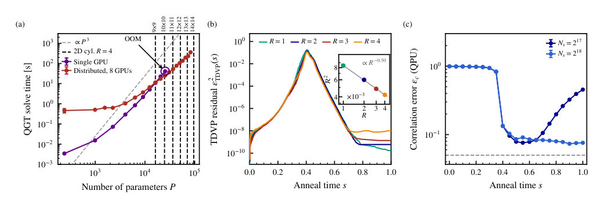
<figcaption class="paper-figure-caption"><b>Fig 5.</b> FIG. 4. Scaling analysis of the t-VMC simulation (a) Inverting the QGT of the correlator state with K = (2, 4) and R = 1 for system sizes N = {16, 32, . . . , 320}. Error bars show the standard deviation over 10 random initializations. The vertical dashed line indicates the number of parameters at which a single NVIDIA H200 would run out of memory. (b) Squared TDVP residual ε2 TDVP(s) along the anneal for the 8 × 8 2D cylinder. Curves are smoothed using a rolling window of 100 steps. The inset shows the integrated TDVP error R2 = R 1 0 ε2 TDVP(s)ds as a function of rank; the error decreases approximately as R−0.50. (c) Correlation error compared to the QPU as a function of anneal time for a...</figcaption>
</figure>

**Summary.** This paper presents a sophisticated numerical simulation of quantum annealing dynamics using time-dependent variational Monte Carlo (t-VMC). By employing advanced sampling techniques like Parallel Tempering and Blurred Sampling, the authors successfully simulate spin-glass models on complex graphs. The results establish a rigorous classical benchmark for assessing the computational feasibility and accuracy of simulating quantum hardware performance.

**Why it may be interesting.** The work provides a highly detailed, state-of-the-art classical benchmark for simulating quantum annealing dynamics, offering crucial insights into the numerical limitations and required resources for simulating quantum advantage experiments.

Detailed structure

**Main problem.** The paper addresses the computational challenge of accurately simulating the non-equilibrium dynamics of frustrated quantum spin systems, specifically those relevant to quantum annealing experiments.

**Main result.** The authors successfully simulate the D-Wave annealing protocol on complex topologies, achieving correlation errors comparable to the quantum annealer results, even for challenging instances where other methods fail.

**Method.** They employ Time-Dependent Variational Monte Carlo (t-VMC) using a structured correlator state ansatz, stabilized by advanced sampling techniques like Parallel Tempering and Blurred Sampling.

**Model / system.** The system is a transverse-field Ising model defined on various spin-glass topologies (e.g., 2D cylinder, biclique). The dynamics are simulated by evolving the variational state according to the time-dependent variational principle.

**Key observables.** Two-spin Ising correlations ($C_{ij}$), relative correlation error ($\epsilon_c$), and numerical diagnostics like MCMC acceptance rates and TDVP residuals ($R_2$).

**Important parameters / regimes.** Annealing times ($t_a = 7, 20$ ns), variational ansatz rank ($R$), and regularization parameters ($	ext{rcond}$).

**Assumptions / limitations.** The primary approximation is projecting the full quantum dynamics onto a variational manifold defined by the correlator product state ansatz. Numerical stability requires advanced sampling and ODE solvers.

**Figures summary.** Figures illustrate the simulation setup, the annealing schedule, the ansatz structure, and diagnostic plots comparing correlation errors ($\epsilon_c$) across different topologies and the impact of advanced sampling techniques.

**Paper structure.** The paper details the theoretical framework (t-VMC, ansatz construction), presents the numerical implementation challenges (sampling difficulties, stiffness), and validates the method by simulating dynamics on increasingly complex and challenging spin-glass graph structures.

Abstract

Programmable quantum annealers can realize real-time dynamics of frustrated transverse-field Ising models on large, nontrivial graphs. Recent work by King et al. argued that the classical simulation of such experiments would require exponential computational resources for classical methods such as tensor networks and neural quantum states. Here, we numerically simulate the D-Wave spin-glass annealing protocol with time-dependent variational Monte Carlo (t-VMC) using a correlator state tailored to spin-glass dynamics. For the two-dimensional cylinder, three-dimensional dimer, diamond, and biclique instances considered, at annealing times of 7 and 20 ns, we show that systematically increasing the variational ansatz size enables t-VMC to approximate the final two-spin correlation errors of the quantum processing unit (QPU). We also perform an accurate large-scale simulation of a challenging biclique instance for which no other variational method is known to work, and we find close agreement with the quantum annealer. Through ablation studies, we identify poor Markov-chain mixing, high-variance local-energy estimators, and stochastic Runge-Kutta error estimates as the principal numerical failure modes. We address these numerical issues by using parallel tempering, blurred sampling and an importance-weighted differential equation solver, thereby clarifying the numerical requirements for stable, large-scale t-VMC simulations. Our results extend the frontier of classical simulation while providing a realistic assessment of the computational costs of simulating quantum dynamics at this scale.

[↑ back to top](#top)

### [Effective Sub-Quantum Readout for Non-Monochromatic Axion Signals in High-$Q$ Haloscopes](http://arxiv.org/abs/2609.02828v1)

**Authors:** Junu Jeong, Max Silva-Feaver  
**Type:** theory · **Category:** other · **PDF:** <https://arxiv.org/pdf/2609.02828v1>  
**Analysis basis:** full PDF text, analyzed in chunks
**Topic relevance:** `quantum optics experiment` **3/5** · `interference shaping light` **2/5** · `quantum measurements` **2/5**

↔ Scroll figures horizontally

<figure class="paper-figure-card">
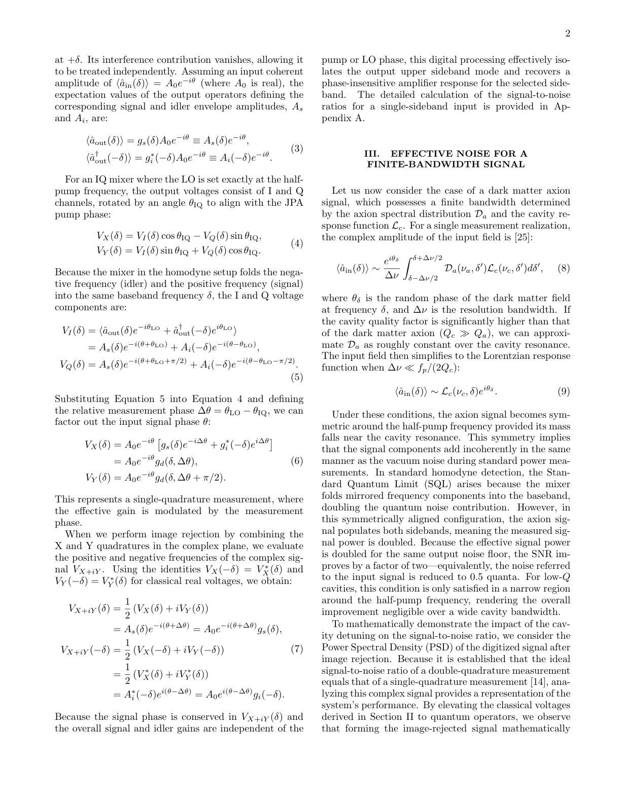
<figcaption class="paper-figure-caption"><b>Fig 1.</b> Low-resolution page preview, page 2</figcaption>
</figure>
<figure class="paper-figure-card">
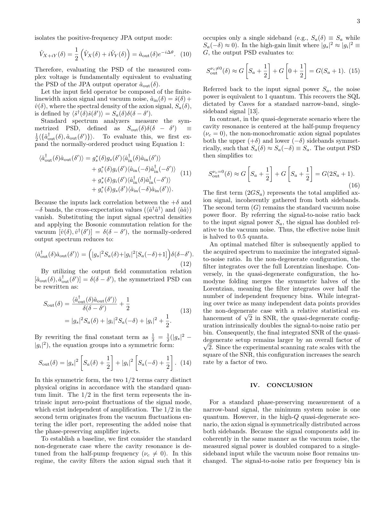
<figcaption class="paper-figure-caption"><b>Fig 2.</b> Low-resolution page preview, page 3</figcaption>
</figure>
<figure class="paper-figure-card">
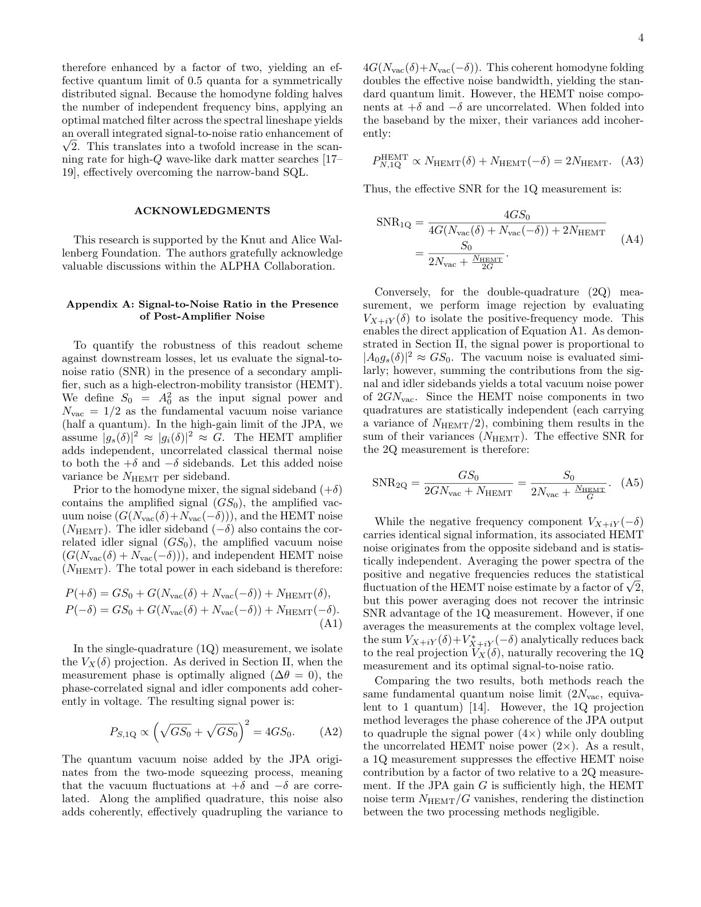
<figcaption class="paper-figure-caption"><b>Fig 3.</b> Low-resolution page preview, page 4</figcaption>
</figure>
<figure class="paper-figure-card">
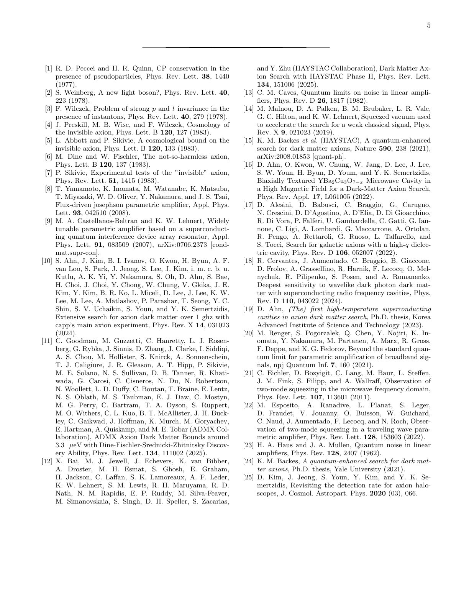
<figcaption class="paper-figure-caption"><b>Fig 4.</b> Low-resolution page preview, page 5</figcaption>
</figure>

**Summary.** This paper details a method to improve the sensitivity of axion dark matter searches in microwave cavities by exploiting the non-monochromatic nature of the axion signal. By carefully tuning the amplifier to operate symmetrically around the cavity resonance, the measured signal power is effectively doubled while the vacuum noise remains constant. This results in a significant reduction of the effective quantum noise limit, enhancing the search capability beyond the standard quantum limit.

**Why it may be interesting.** This work is highly relevant to quantum optics and open quantum systems, as it provides a concrete, quantum-limited technique to surpass standard noise constraints in a real-world detection scenario.

Detailed structure

**Main problem.** The primary goal is to enhance the sensitivity of axion dark matter searches conducted using microwave cavity haloscopes, which are currently limited by the Standard Quantum Limit (SQL).

**Main result.** By exploiting the non-monochromatic nature of the axion signal and operating the amplifier at the half-pump frequency, the effective noise limit can be reduced to $1/\sqrt{2}$ quanta after optimal matched filtering, improving the SNR by a factor of two.

**Method.** The authors use quadrature analysis (homodyne readout) on the output of a Josephson Parametric Amplifier (JPA) to combine signal and idler spectral components.

**Model / system.** The system involves axion-photon conversion measured in high-Q microwave cavities, amplified by a JPA. The analysis models the output Power Spectral Density (PSD) by considering the symmetric population of signal and idler bands.

**Key observables.** Output Power Spectral Density (PSD), Signal-to-Noise Ratio (SNR), and the effective quantum noise limit (quanta per frequency bin).

**Important parameters / regimes.** High cavity quality factor ($Q_c \gg Q_a$), operating at the half-pump frequency, and the resulting noise reduction factor of $1/\sqrt{2}$.

**Assumptions / limitations.** The analysis assumes the cavity quality factor is much larger than the axion's bandwidth ($Q_c \gg Q_a$) and relies on the signal symmetrically populating both signal and idler bands.

**Figures summary.** Not specified in the notes, but the analysis compares the PSD in non-degenerate ($
u_c 
eq 0$) versus quasi-degenerate ($
u_c = 0$) resonance regimes.

**Paper structure.** The paper establishes the SQL constraint, develops the theoretical framework using JPA output PSD calculations, compares the non-degenerate and quasi-degenerate regimes, and derives the improved noise limit for the latter.

Abstract

The search for wave-like dark matter using microwave cavity haloscopes is constrained by the Standard Quantum Limit, which dictates that phase-preserving linear amplification results in a minimum of one quantum of total system noise for a narrow-band signal. We demonstrate that this limit is effectively halved for a non-monochromatic axion signal coupled to a high-$Q$ cavity. By operating a Josephson Parametric Amplifier such that the cavity resonance is centered exactly at the half-pump frequency, the axion signal symmetrically populates both the signal and idler bands. Through quadrature analysis of the homodyne readout, we show that the incoherent sum of these mirrored spectral components doubles the measured signal power while the vacuum noise remains constant. This operation yields an effective noise limit of 0.5 quanta per frequency bin, translating to an overall effective limit of $1/\sqrt{2}$ quanta after optimal matched filtering.

[↑ back to top](#top)

### [Model-level synthetic-flux control of hyperchaos order and matched-resource sensing in dissipative optomechanics](http://arxiv.org/abs/2609.02827v1)

**Authors:** Stella Rolande Mbokop Tchounda, Carolle Tchodimou, Philippe Djorwe, Sifeu Takougang Kingni, Serge Guy Nana Engo  
**Type:** theory · **Category:** other · **PDF:** <https://arxiv.org/pdf/2609.02827v1>  
**Analysis basis:** full PDF text, analyzed in chunks
**Topic relevance:** `quantum measurements` **3/5** · `analog quantum simulation` **1/5** · `correlated / nonlocal dissipation` **1/5** · `driven-dissipative phase transition` **1/5** · `methods for driven-dissipative` **1/5**

↔ Scroll figures horizontally

<figure class="paper-figure-card">
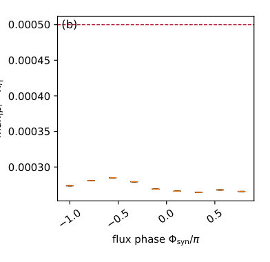
<figcaption class="paper-figure-caption"><b>Fig 1.</b> Figure 1: Long-window validation across nine synthetic-flux phases and three independent initial conditions per phase. (a) The largest QR exponents remain negative at every sampled phase. (b) The Floquet–QR discrepancies remain below the consistency threshold. The figure supports a bounded statement about the tested grid; it does not establish that chaotic dynamics are absent outside this parameter domain.</figcaption>
</figure>
<figure class="paper-figure-card">
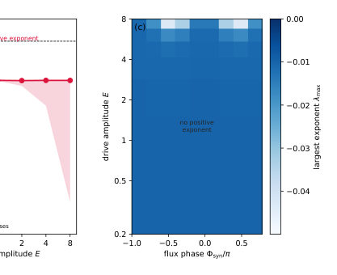
<figcaption class="paper-figure-caption"><b>Fig 2.</b> Figure 2: Full-spectrum transition map at weak coupling. (a) All six Lyapunov exponents versus the synthetic-flux phase at drive E = 0.2; the two cavity- dominated exponents (lower panel, near −κ/2 ≈−0.5) and the four mechani- cal exponents (upper panel, near −γ/2 ≈−0.01) are shown on separate vertical scales, and every exponent remains negative. (b) Largest (most marginal) ex- ponent versus drive amplitude, with the phase-to-phase spread shaded; it stays negative across E ∈[0.2, 8.0]. (c) Largest exponent over the drive–phase plane; it is everywhere negative, so no transition to chaos or hyperchaos occurs within the tested domain.</figcaption>
</figure>
<figure class="paper-figure-card">
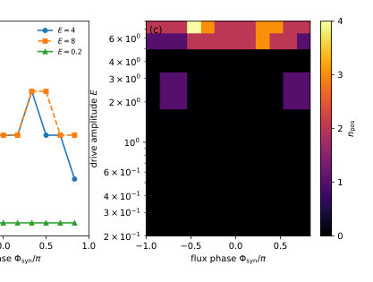
<figcaption class="paper-figure-caption"><b>Fig 3.</b> Figure 3: Full-spectrum hyperchaos transition map at strong optomechanical cou- pling (g1 = 0.3, g2 = 0.27, γ1,2 = 0.02, ∆= −ωm; model-level parameters lying ∼2500× beyond silicon anchors). (a) All six Lyapunov exponents versus the synthetic-flux phase at drive E = 4.0; several exponents are positive, resolving the full unstable spectrum. (b) Hyperchaos order (number of exponents above the fixed strong threshold 1 × 10−3) versus phase at E = 0.2, 4.0 and 8.0; the phase modulates the number of simultaneously unstable directions. (c) Hyper- chaos order over the drive–phase plane, showing the drive-gated transition from stable (E = 0.2) to hyperchaotic (E = 8.0, up to four positive exponents)....</figcaption>
</figure>
<figure class="paper-figure-card">
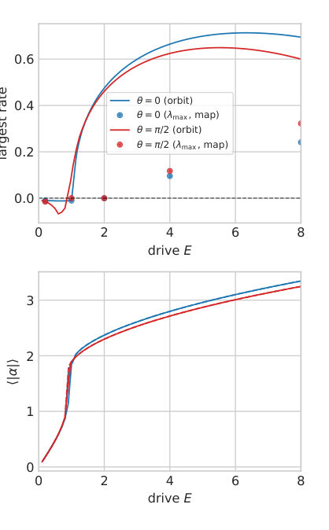
<figcaption class="paper-figure-caption"><b>Fig 4.</b> Figure 4: Drive-axis bifurcation continuation at strong optomechanical coupling. (a) Maximum Floquet multiplier magnitude of the drive-locked orbit versus drive amplitude E at θ = 0 and θ = π/2 (upward and downward continuation); the dashed line marks the unit circle and the vertical lines locate the refined first bifurcation points. (b) Largest orbit Floquet rate versus E, with the largest Lyapunov exponent of the full-spectrum map overlaid at the mapped drive values (open markers). (c) Number of unstable multipliers (|µ| &gt; 1). (d) Mean cavity amplitude over the orbit period. The first loss of linear stability is a Neimark– Sacker complex-pair crossing at E∗= 1.060 (θ = 0) and E∗= 0.975 (θ...</figcaption>
</figure>
<figure class="paper-figure-card">
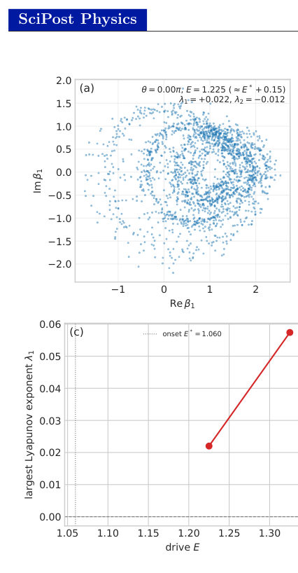
<figcaption class="paper-figure-caption"><b>Fig 5.</b> Figure 5: Observation of the Neimark–Sacker torus. (a),(b) Stroboscopic Poincaré sections (projected onto ℜβ1, ℑβ1) of the perturbed drive-locked orbit just above the onset at θ = 0 and θ = π/2, showing an invariant closed curve. (c),(d) Largest Lyapunov exponent versus drive, small positive just above the onset and growing with drive; the vertical line marks the onset E∗.</figcaption>
</figure>

**Summary.** This work models a complex dissipative optomechanical system to demonstrate that a synthetic-flux phase can precisely control the degree of hyperchaos. While the control of chaos is robustly shown, the study concludes that this flux control does not translate into a measurable enhancement for force sensing on the chaotic attractor, suggesting limitations in the sensing protocol.

**Why it may be interesting.** It combines advanced nonlinear dynamics (hyperchaos control) with quantum measurement theory (Fisher information) within the context of cavity optomechanics, providing a rigorous, albeit model-level, testbed for quantum control.

Detailed structure

**Main problem.** The study investigates the control of hyperchaos order and the performance of matched-resource sensing in a dissipative optomechanical system using a synthetic-flux phase.

**Main result.** The synthetic-flux phase successfully controls the hyperchaos order up to four unstable Lyapunov directions, but the matched-resource sensing protocol yields no flux-induced enhancement on the chaotic attractor.

**Method.** The analysis employs advanced dynamical systems diagnostics, including calculating the full Lyapunov spectrum, analyzing the Poincaré map via monodromy multipliers, and evaluating the matched Fisher information.

**Model / system.** The system is a dissipative optomechanical model comprising one cavity and two mechanical resonators, analyzed using semiclassical equations of motion derived from a Hamiltonian.

**Key observables.** Hyperchaos order (number of positive Lyapunov exponents), Matched Fisher gain, Neimark-Sacker bifurcation points, and Lyapunov exponents.

**Important parameters / regimes.** Synthetic-flux phase ($\Phi_{syn}$), Drive amplitude ($E$), Coupling strengths ($g_1, g_2$), and damping rates ($\kappa, \gamma$).

**Assumptions / limitations.** The strong-coupling regime explored is highly idealized and far beyond current experimental anchors; the analysis relies on consistency checks across multiple diagnostic tools.

**Figures summary.** Figures illustrate the validation of consistency metrics (QR exponents), the dependence of Lyapunov exponents on drive amplitude and flux phase, and the correlation dimension of the attractor.

**Paper structure.** The paper progresses by establishing the model, detailing the consistency checks (Lyapunov-Floquet), demonstrating flux control over hyperchaos order, and finally analyzing the sensing gain on the resulting chaotic attractor.

Abstract

Within a normalised six-dimensional model of dissipative optomechanics (one cavity + two mechanical resonators), a synthetic-flux phase $Φ_{\rm syn}$ selects the \emph{order} of a drive- and coupling-gated hyperchaos transition---up to four simultaneously unstable Lyapunov directions, beyond any reported single-mode benchmark---while the same matched-resource force-sensing protocol yields no flux-induced enhancement on the chaotic attractor. Building on the topology of Muthukumar \emph{et al.}~[PR Applied \textbf{24}, 014053 (2025)], a phase-consistent Floquet--Lyapunov protocol (cross-checked by monodromy multipliers, dissipative volume balance and a 180-run three-seed audit) localises a Neimark--Sacker bifurcation at $E^{*}=\num{1.060}$ ($θ=0$). At a weakly coupled reference the matched Fisher gain reaches at most $\num{1.32}\times$ (flux-off) and $\num{1.16}\times$ (single-mode), with Monte-Carlo median $\num{1.039}\times$ (90\,\% CI $[\num{1.025},\num{1.053}]$); on the chaotic attractor the identical protocol returns a null result ($\mathcal{G}_{A/B}=\num{1.039}\pm\num{0.014}$). Truncated-Fock and truncated-Wigner checks support the mean-field description at selected points. Both the hyperchaos classification and the sensing result remain strictly model-level: the strong-coupling sector explored here lies $\num{2542}\times$ beyond anchored silicon optomechanical couplings. Closing that gap requires a measured inter-resonator hopping $J_m$ and fixed bath temperatures.

[↑ back to top](#top)

### [Single-Shot Fidelity Reveals Hard and Soft Limits: A Universal Yardstick for Photon-Number-Resolving Detectors](http://arxiv.org/abs/2609.02503v1)

**Authors:** Tetsuya Tsuruta, Akio Yoshizawa, Daiji Fukuda  
**Type:** theory · **Category:** quantum information and computing · **PDF:** <https://arxiv.org/pdf/2609.02503v1>  
**Analysis basis:** full PDF text, analyzed in chunks
**Topic relevance:** `quantum measurements` **3/5** · `Full counting statistics` **1/5** · `QC/QI experiment` **1/5** · `analog quantum simulation` **1/5** · `quantum optics experiment` **1/5**

↔ Scroll figures horizontally

<figure class="paper-figure-card">
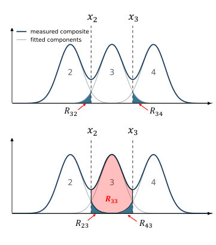
<figcaption class="paper-figure-caption"><b>Fig 1.</b> Figure 1: A concrete example of the resolution confusion matrix Rab, cen- tered on a = 3. The horizontal axis is the true photon number and the vertical axis is the reported photon number. The diagonal element R33 car- ries the dominant weight, with leakage into neighboring photon numbers, R32 and R34, appearing as off-diagonal elements. This matrix represents single-shot misidentification arising from finite energy resolution alone.</figcaption>
</figure>
<figure class="paper-figure-card">
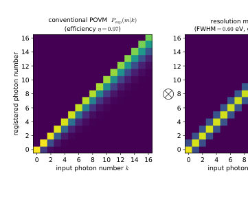
<figcaption class="paper-figure-caption"><b>Fig 2.</b> Figure 2: Construction of the single-shot POVM. Shown here for illustra- tion is a 1550 nm photon measurement with detection efficiency 97 % and resolution 0.6 eV. Composing the conventional POVM Pexp(m|k), which in- cludes only the detection efficiency (η) and small residual label errors (left), with the resolution confusion matrix Rmn defined in Fig. 1 (center), yields the single-shot POVM Pss(n|k) = P m Pexp(m|k)Rmn (right), which carries single-shot misidentification due to the overlap of neighboring peaks as off- diagonal elements.</figcaption>
</figure>
<figure class="paper-figure-card">
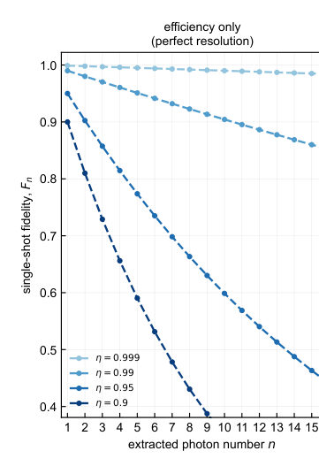
<figcaption class="paper-figure-caption"><b>Fig 3.</b> Figure 3: Dependence of single-shot fidelity Fk on the heralded photon number k, for a 1550 nm photon measurement. Horizontal axis: heralded photon number k; vertical axis: Fk (linear scale). (a) Energy resolution fixed, detection efficiency η varied (e.g., η = 1.0, 0.99, 0.95, 0.90). (b) De- tection efficiency fixed at η = 1, energy resolution FWHM varied over 0.20, 0.30, 0.40, 0.50, 0.60 eV. Overlaying the two series shows that detec- tion efficiency and resolution each independently degrade Fk.</figcaption>
</figure>
<figure class="paper-figure-card">
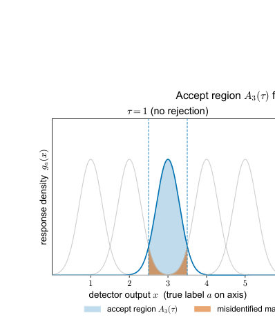
<figcaption class="paper-figure-caption"><b>Fig 4.</b> Figure 4: Schematic of the accept region. For the confusion matrix centered on a = 3, the accept regions for τ = 1 (no rejection, the ordinary equal- likelihood boundary) and for τ &gt; 1 are shown side by side. For τ &gt; 1, reject bands appear near the boundaries with neighboring peaks; the figure shows both the contraction of the accept region toward the center and the fraction of events falling into the reject bands.</figcaption>
</figure>
<figure class="paper-figure-card">
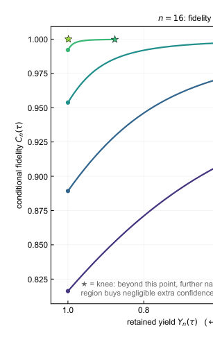
<figcaption class="paper-figure-caption"><b>Fig 5.</b> Figure 5: Trade-off between fidelity and generation rate via the accept re- gion. For a fixed target photon number n, sweeping the threshold τ from 1 to τ ∗traces out the yield Yn(τ) (horizontal axis, corresponding to the generation rate sacrificed) against the conditional fidelity Cn(τ) (vertical axis). Curves are shown for several values of energy resolution. Each curve terminates at the optimum point τ ∗beyond which raising τ no longer helps (star). Detectors with better resolution reach higher Cn, and sacrifice less generation rate to reach a given Cn.</figcaption>
</figure>

**Summary.** This paper introduces a novel single-shot fidelity metric to rigorously evaluate Photon-Number-Resolving (PNR) detectors. It overcomes the limitations of standard ensemble averaging by explicitly separating hardware efficiency loss from errors caused by finite energy resolution. The resulting metric allows for the first direct, quantitative comparison of diverse detector technologies for use in photonic quantum computing.

**Why it may be interesting.** This work provides a crucial, quantitative benchmark for quantum hardware, directly linking fundamental detector physics (resolution) to the operational requirements of quantum computation.

Detailed structure

**Main problem.** Conventional fidelity metrics for Photon-Number-Resolving (PNR) detectors are insufficient because they fail to quantify single-shot misidentification errors arising from finite energy resolution.

**Main result.** The authors introduce a single-shot fidelity metric that separates hardware efficiency loss from resolution-driven misidentification, allowing for a universal, direct comparison across different detector types.

**Method.** They combine an efficiency-based POVM with a resolution-driven confusion matrix to construct a single-shot measurement probability, $P_{ss}(n|k)$.

**Model / system.** The study focuses on PNR detectors essential for photonic quantum computing, comparing architectures like Transition-Edge Sensors (TES) and SNSPDs.

**Key observables.** Single-shot fidelity ($F_k$), detection efficiency ($\eta$), and the resolution confusion matrix ($\mathbf{R}_{ab}$).

**Important parameters / regimes.** Photon number ($k$), detection efficiency ($\eta$), and the acceptance region ($	au$) used to define measurement boundaries.

**Assumptions / limitations.** The framework assumes the detector output retains a gradient of confidence about the true photon number, and Gaussian approximations are used for modeling detector responses.

**Figures summary.** Figures illustrate the construction of the single-shot POVM, showing how the composition of efficiency and resolution matrices yields the final fidelity, and compare $F_k$ vs. $k$ for different detector types and operating regimes.

**Paper structure.** The paper first establishes the inadequacy of ensemble-averaged metrics, then develops the single-shot fidelity framework by composing the POVM and confusion matrix, and finally applies this framework to compare multiple real-world detector architectures.

Abstract

Photon-number-resolving (PNR) detectors are essential for photonic quantum computing, where a single measurement outcome must reliably herald a specific quantum state. However, detector fidelity is conventionally evaluated using ensemble-averaged statistics obtained from many measurements, which can remain high even when individual photon-number assignments are frequently misidentified. Here we introduce a universal single-shot fidelity that directly quantifies the probability of correctly identifying a photon number in a single measurement. The framework combines an efficiency-based POVM with a resolution-driven confusion matrix derived from the detector response, allowing photon loss and photon-number misidentification to be treated separately and then recombined into a single operational metric. This distinction reveals two fundamentally different limitations. Detection-efficiency loss represents an unrecoverable hardware constraint, whereas resolution-driven misidentification can be reduced by introducing a rejection region, trading generation rate for confidence. Because the metric is defined independently of detector architecture, it enables direct comparison between energy-resolving detectors such as transition-edge sensors and multiplexed click-based detectors on the same footing. Applying the framework to calibration data from three distinct detector architectures, we demonstrate quantitative comparison across photon-number regimes relevant to both discrete-variable and continuous-variable photonic quantum computing. The resulting benchmark provides a common operational metric for evaluating photon-number-resolving detectors and connecting detector performance to photonic quantum-computing requirements.

[↑ back to top](#top)

### [Thouless pumping and generation of squeezed Fock-state superpositions in a Fock-state lattice](http://arxiv.org/abs/2609.02569v1)

**Authors:** Ruo Kun Cai, Ling Lin, Chun Wang Wu, Zhi Jiao Deng, Ping Xing Chen  
**Type:** theory · **Category:** other · **PDF:** <https://arxiv.org/pdf/2609.02569v1>  
**Analysis basis:** full PDF text, analyzed in chunks
**Topic relevance:** `analog quantum simulation` **3/5** · `interference shaping light` **3/5** · `Tavis-Cummings & cavity-many-emitter` **1/5**

↔ Scroll figures horizontally

<figure class="paper-figure-card">
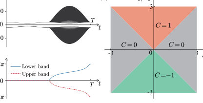
<figcaption class="paper-figure-caption"><b>Fig 1.</b> FIG. 2. Topological characterization of the Fock-state lattice pump. (a) Instantaneous energy spectrum (upper panel) and Berry phase (lower panel) over one pumping cycle. The nu- merical calculation is performed with a cutoffat n = 201 un- der periodic boundary conditions. Parameters: δ0 = 2, s = 0, v0 = 1. (b) Phase diagram of the lower-band Chern number in the (s/v0, δ0/v0) parameter space. The phase boundary |s| = |δ0| separates the topological regime with C = ±1 from the trivial regime with C = 0.</figcaption>
</figure>
<figure class="paper-figure-card">
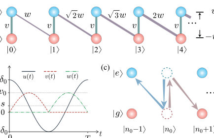
<figcaption class="paper-figure-caption"><b>Fig 2.</b> FIG. 1. Schematic of the Rice–Mele model realized on the Fock-state lattice. (a) In each unit cell labeled by n, the two sublattice sites are represented by |g, n⟩and |e, n⟩. The nearest-neighbor hoppings are v within each unit cell and √nw between adjacent cells, and the sublattice sites are de- tuned by the staggered potential ±u. (b) Periodic driving protocol of the three parameters u(t), v(t), and w(t) over one pump cycle. (c) Adiabatic transport in the dimer limit. Start- ing from either internal state, the particle is transported by one unit cell per cycle, with the direction determined by the initial internal state.</figcaption>
</figure>
<figure class="paper-figure-card">
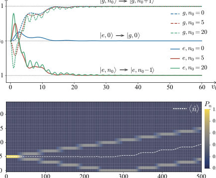
<figcaption class="paper-figure-caption"><b>Fig 3.</b> FIG. 3. Topological pumping dynamics in the Fock-state lat- tice. (a) Mean position ⟨ˆn⟩= ⟨ˆa†ˆa⟩as a function of the pump- ing period T after a single pumping cycle, for different initial states |g, n0⟩or |e, n0⟩with n0 = 0, 5, 20. (b) Probability dis- tribution Pn across each unit cell as a function of the evolution time, starting from the initial superposition 1 √</figcaption>
</figure>
<figure class="paper-figure-card">
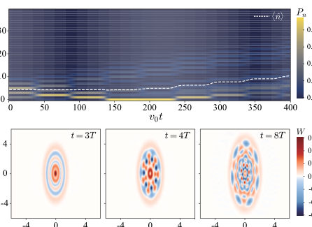
<figcaption class="paper-figure-caption"><b>Fig 4.</b> FIG. 5. Generation of squeezed Fock state superpositions via Thouless pumping in the squeezed Fock-state basis. (a) Probability distribution across each unit cell in the ˆa-basis over the evolution time, starting from the initial state 1 √</figcaption>
</figure>
<figure class="paper-figure-card">
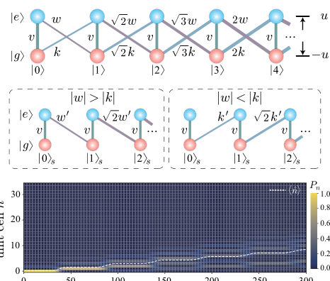
<figcaption class="paper-figure-caption"><b>Fig 5.</b> FIG. 4. Thouless pumping in the squeezed Fock-state basis. (a) Lattice structure in the original Fock-state basis, where both JC and anti-JC couplings coexist. (b) Lattice model in the squeezed Fock-state basis |n⟩s after the squeezing trans- formation, with opposite topological Chern numbers for the two parameter regimes |w| &gt; |k| and |w| &lt; |k|. (c) Proba- bility distribution Pn across each unit cell in the ˆa-basis over the evolution time, with the initial state |g⟩⊗|0⟩s, where the bosonic mode is prepared in a squeezed vacuum state; the white dashed line marks the trajectory of the mean position ⟨ˆa†ˆa⟩. Parameters: v0T = 50, k/w = 0.4, δ0 = 2, s = 0, v0 = 1.</figcaption>
</figure>

**Summary.** This paper applies the concept of Thouless pumping to a Fock-state lattice, a system characterized by bosonic excitations. By analyzing the system's topology, the authors demonstrate quantized transport and extend the method to generate superpositions of squeezed Fock states. This establishes the pumping mechanism as a powerful tool for non-classical quantum state preparation.

**Why it may be interesting.** This work directly addresses quantum state engineering using topological principles in a bosonic setting, providing a robust method for generating non-classical states like squeezed Fock state superpositions, which is highly relevant to quantum optics and AMO physics.

Detailed structure

**Main problem.** The paper investigates Thouless pumping in a one-dimensional semi-infinite Fock-state lattice and extends this framework to prepare superpositions of squeezed Fock states.

**Main result.** Topologically protected quantized transport is demonstrated, and the method successfully generates superpositions of squeezed Fock states, evidenced by interference fringes in the Wigner function.

**Method.** The analysis uses topological invariants (Chern number) derived from the overlap matrix in the real-space approach, extending the model via a squeezing transformation.

**Model / system.** The system is a Fock-state lattice (FSL) modeled by a Hamiltonian incorporating Jaynes-Cummings and anti-Jaynes-Cummings couplings. The bosonic nature introduces an intrinsic sqrt(n)-dependent coupling, leading to non-uniform hopping.

**Key observables.** Quantized directional transport (Chern number $C=\pm 1$), mean position $\langle \hat{n} 
angle$, and the presence of interference fringes in the Wigner function.

**Important parameters / regimes.** The analysis is initially restricted to the dimer limit, and the topological robustness depends on adiabatic parameter tuning.

**Assumptions / limitations.** The initial analysis relies on the dimer limit due to the complexity introduced by the sqrt(n) dependence under generic modulations.

**Figures summary.** Figures illustrate the schematic of the model, the topological phase boundary separating $C=\pm 1$ and $C=0$ regimes, and the pumping dynamics showing quantized plateaus in mean position and Wigner function interference.

**Paper structure.** The paper first analyzes Thouless pumping in the dimer limit of the FSL using topological invariants. It then extends the framework by introducing an inter-cell coupling and applying a squeezing transformation to the squeezed Fock-state basis.

Abstract

In this paper, Thouless pumping in a one-dimensional semi-infinite Fock-state lattice is investigated. A distinctive feature of such lattices is the intrinsic $\sqrt{n}$-dependent coupling arising from the bosonic mode, which leads to spatially nonuniform hopping amplitudes. In the dimer limit, the topological invariants and the quantized transport dynamics in the Fock-state basis are numerically evaluated and analyzed. By introducing an additional inter-cell coupling and applying a squeezing transformation, the framework is then extended to Thouless pumping in the squeezed Fock-state basis, where a topologically protected scheme for preparing superpositions of squeezed Fock states is proposed. This study establishes Thouless pumping in Fock-state lattices as a useful tool for quantum state engineering, shifting the focus from observing topological transport to harnessing it for the preparation of non-classical states of the bosonic mode.

[↑ back to top](#top)

### [The Universal Role of Fragility on the Yielding Transition of Active Glass under Oscillatory Shear](http://arxiv.org/abs/2609.02609v1)

**Authors:** Arnab Mandal, Roni Chatterjee, Smarajit Karmakar  
**Type:** theory · **Category:** disordered systems and neural networks · **PDF:** <https://arxiv.org/pdf/2609.02609v1>  
**Analysis basis:** full PDF text, analyzed in chunks
**Topic relevance:** `non-equilibrium universality` **3/5** · `Frenkel-Kontorova` **1/5** · `driven-dissipative phase transition` **1/5** · `scars & prethermalization` **1/5**

↔ Scroll figures horizontally

<figure class="paper-figure-card">
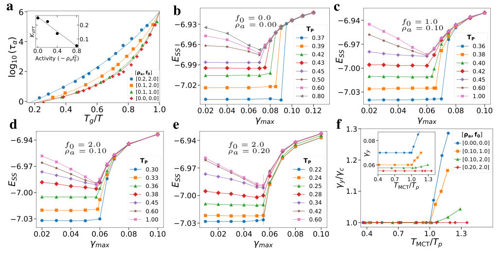
<figcaption class="paper-figure-caption"><b>Fig 1.</b> FIG. 1. Effect of activity on the yielding phase portrait of an active glass. (a) Angell plot of the structural relaxation time τα as a function of rescaled inverse temperature Tg/T, where Tg is the glass transition temperature defined by τα(Tg) = 106. Increasing the active fraction ρa or the self-propulsion force f0 systematically reduces the kinetic fragility KVFT (inset), driving a fragile-to-strong crossover in the glassy dynamics. (b)–(e) Steady-state energy ESS as a function of strain amplitude γmax for the passive case (b) and three activity sets: ρa = 0.10, f0 = 1.0 (c); ρa = 0.10, f0 = 2.0 (d); and ρa = 0.20, f0 = 2.0 (e). In all panels, different curves correspond to different...</figcaption>
</figure>
<figure class="paper-figure-card">
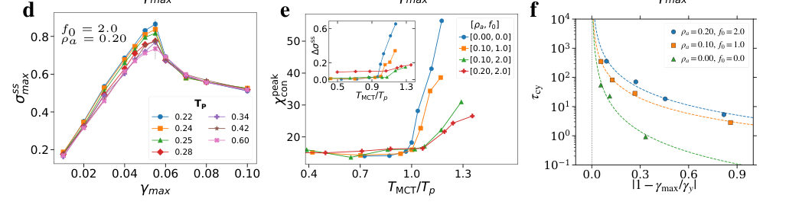
<figcaption class="paper-figure-caption"><b>Fig 2.</b> FIG. 2. Effect of activity on the brittle-to-ductile transition. (a)–(d) Maximum steady-state stress ⟨σ⟩ss max as a function of applied strain amplitude γmax for (a) the passive case, (b) ρa = 0.10, f0 = 1.0, (c) ρa = 0.10, f0 = 2.0, and (d) ρa = 0.20, f0 = 2.0. For the passive glass, the stress drop at yielding becomes increasingly abrupt as TP decreases, characteristic of a brittle-like response. With increasing activity, the sharpness of the stress drop is progressively reduced even for the most well-annealed samples, indicating a systematic activity-driven shift toward more ductile behaviour. (e) Stress susceptibility χpeak con ≡d⟨σ⟩/dγmax as a function of TMCT/TP for all activity sets....</figcaption>
</figure>
<figure class="paper-figure-card">
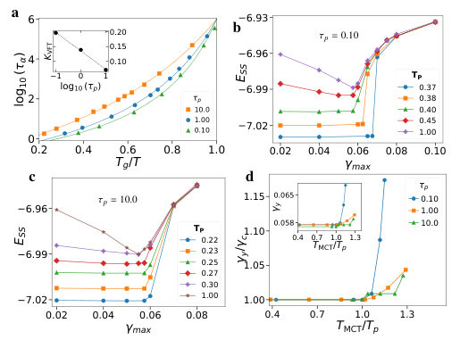
<figcaption class="paper-figure-caption"><b>Fig 3.</b> FIG. 3. Effect of persistent time τp on yielding (ρa = 0.10, f0 = 2.0). (a) Angell plot of τα vs Tg/T for τp ∈{0.10, 1.0, 10.0}. Increasing τp systematically reduces KVFT, driving a fragile-to-strong crossover. (b),(c) Steady- state energy ESS as a function of γmax for τp = 0.10 (b) and τp = 10.0 (c); the τp = 1.0 result was already shown in Fig. 1(d). The temperature dependence of yielding is pro- gressively suppressed with increasing τP , and the transition becomes increasingly ductile. (d) Relative yield point shift γy/γc as a function of TMCT/TP for all three values of τp. The suppression of the shift with increasing τp mirrors the reduction in KVFT, confirming that kinetic fragility...</figcaption>
</figure>
<figure class="paper-figure-card">
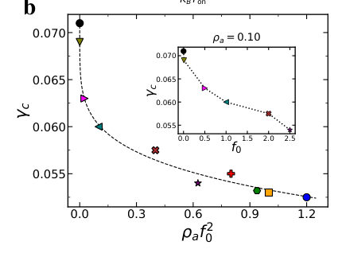
<figcaption class="paper-figure-caption"><b>Fig 4.</b> FIG. 4. Dependence of the critical yield point γc on activity. All poorly annealed samples share a common yield point γc, which is controlled solely by the high-temperature Arrhenius activation energy barrier ∆E. Increasing activity systematically reduces ∆E, and consequently γc. (a) γc com- puted for various combinations of ρa and f0, plotted against the dimensionless activation barrier ∆E/kBTon, where Ton is the onset temperature of Arrhenius behaviour. The data reveal a power-law dependence: even a modest level of activ- ity substantially reduces γc, while beyond a threshold activity level, γc saturates and becomes insensitive to further increases in activity. Black dashed curve is...</figcaption>
</figure>
<figure class="paper-figure-card">
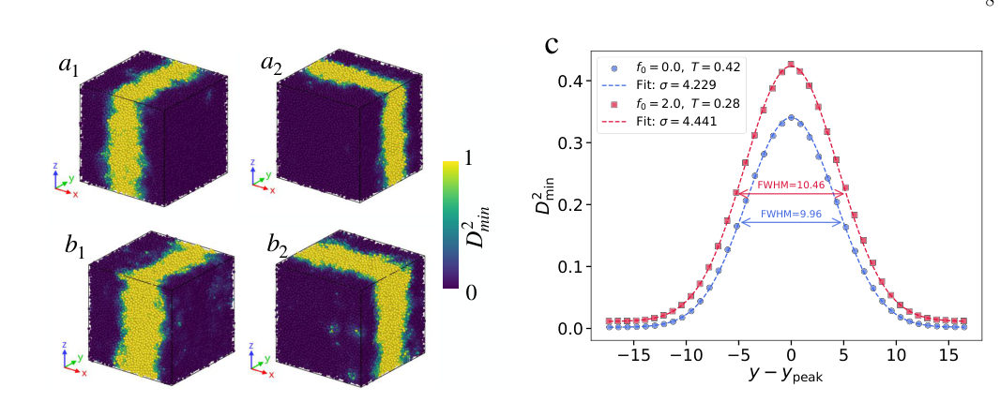
<figcaption class="paper-figure-caption"><b>Fig 5.</b> FIG. 5. Shear Band formation in active and passive glasses. Non-affine displacement D2 min, computed every 10 cycles to improve shear band resolution, sheared in the xy-plane just above the yield point. (a1, a2) Passive glass prepared at TP = 0.42, sheared at γmax = 0.075 (just above γy ∼0.072). Depending on the realisation, the shear band forms either along the shear direction (x) as in (a1), or perpendicular to it (y) as in (a2), illustrating the stochastic nature of shear band nucleation. (b1, b2) Active glass (ρa = 0.20, f0 = 2.0) prepared at TP = 0.28, sheared at γmax = 0.06 (just above γy ∼0.055), showing the same two orientations in different realisations. In both cases, the active...</figcaption>
</figure>

**Summary.** This work uses molecular dynamics simulations to study active glasses, showing that self-propulsion systematically reduces the material's kinetic fragility. This activity-induced change fundamentally alters the mechanical response, making the material more ductile and establishing fragility as a universal descriptor for yielding in both passive and active amorphous solids.

**Why it may be interesting.** While focused on classical soft matter, the concept of tuning material response (brittle to ductile) via an active driving force is relevant to non-equilibrium dynamics and energy dissipation in complex quantum or mesoscopic systems.

Detailed structure

**Main problem.** The study investigates how the introduction of activity (self-propulsion) modifies the fundamental physical parameter, kinetic fragility, that governs the yielding transition in amorphous solids.

**Main result.** Activity systematically reduces kinetic fragility, shifts the mechanical response from brittle to ductile, and establishes kinetic fragility as a unifying parameter for yielding in both passive and active glasses.

**Method.** Molecular Dynamics (MD) simulations are used to model the system's response to oscillatory shear, analyzing structural relaxation and mechanical failure.

**Model / system.** The model uses a Kob-Andersen glass former doped with Run-and-Tumble (RTP) active particles, simulating the system's dynamics under oscillatory shear stress.

**Key observables.** Kinetic fragility ($K_{	ext{VFT}}$), common yield point ($\gamma_c$), yield strain ($\gamma_y$), stress relaxation profiles, and shear band morphology.

**Important parameters / regimes.** Activity parameters ($
ho_a, f_0, 	au_p$), temperature ($T$), and shear strain amplitude ($\gamma_{max}$).

**Assumptions / limitations.** The analysis relies on extending the concept of kinetic fragility, previously established for passive glasses, to the active regime.

**Figures summary.** Figures illustrate the evolution of structural relaxation time ($	au_\alpha$) with activity, the shift from brittle to ductile yielding behavior, and the dependence of the yield point on thermal history.

**Paper structure.** The paper first establishes the role of fragility in passive glasses, then introduces active particles via MD simulations, and finally quantifies how activity systematically modifies the yield point, mechanical response, and underlying critical dynamics.

Abstract

The yielding transition marks the onset of irreversible plastic deformation in amorphous solids and plays a central role in determining the mechanical stability and failure of metallic glasses, colloidal suspensions, and biological assemblies. Despite extensive research, the microscopic factors governing the nature of yielding, particularly the transition between brittle and ductile mechanical responses, remain poorly understood. Recent studies have identified kinetic fragility as a key parameter governing yielding in passive glasses; whether this connection persists in active glasses remains open. Here, using molecular dynamics simulations of a Kob-Andersen glass former doped with Run-and-Tumble (RTP) active particles under oscillatory shear, we show that activity systematically reduces kinetic fragility and consequently alters the mechanical response. The common yield point $γ_c$ decreases monotonically with activity and exhibits a power-law dependence on the Arrhenius activation barrier. Increasing activity suppresses the dependence of the yield strain on thermal history and transforms the response from brittle-like to increasingly ductile, with smoother stress relaxation and reduced stress discontinuities. The timescale to reach steady state near yielding retains a critical power-law divergence, indicating that activity does not alter the underlying critical character of the transition. Active glasses also develop broader, more diffuse shear bands. Our results establish kinetic fragility as a unifying parameter governing yielding in both passive and active glasses and demonstrate that activity offers a powerful route to tune the mechanical response of amorphous materials.

[↑ back to top](#top)

### [Universal fingerprint of topological defect cores](http://arxiv.org/abs/2609.02521v1)

**Authors:** Zi-Qiang Zhao, Nayun Jia, Zhang-Yu Nie, Hua-Bi Zeng, Jing-Fei Zhang, Xin Zhang  
**Type:** theory · **Category:** statistical mechanics · **PDF:** <https://arxiv.org/pdf/2609.02521v1>  
**Analysis basis:** full PDF text, analyzed in chunks
**Topic relevance:** `non-equilibrium universality` **3/5** · `analog quantum simulation` **2/5** · `Keldysh / 2PI / non-Gaussian methods` **1/5**

↔ Scroll figures horizontally

<figure class="paper-figure-card">
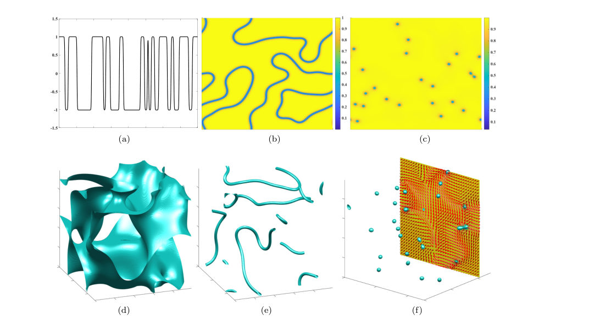
<figcaption class="paper-figure-caption"><b>Fig 1.</b> FIG. 1. Spatial configurations of topological defects of different types and dimensions. (a) Kink (Z2 symmetry). (b) Domain wall (Z2 symmetry). (c) Vortex (U(1) symmetry). (d) 3D domain wall (Z2 symmetry). (e) Vortex line (U(1) symmetry). (f) Monopole (O(3) symmetry)</figcaption>
</figure>
<figure class="paper-figure-card">
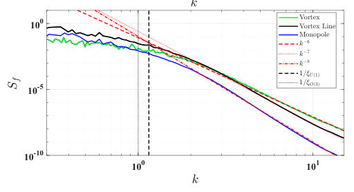
<figcaption class="paper-figure-caption"><b>Fig 2.</b> FIG. 2. Scaling behavior of topological defects for TDGL model of different types and dimensions. The upper panel corresponds to the system with Z2 symmetry, and the lower panel corresponds to the system with U(1) and O(3) symme- tries.</figcaption>
</figure>
<figure class="paper-figure-card">
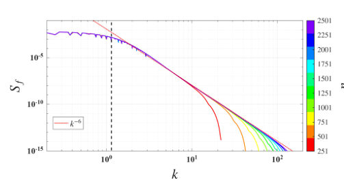
<figcaption class="paper-figure-caption"><b>Fig 3.</b> FIG. 3. Form factor of single-vortex configurations with dif- ferent grid numbers, constructed via Eq. (1).</figcaption>
</figure>
<figure class="paper-figure-card">
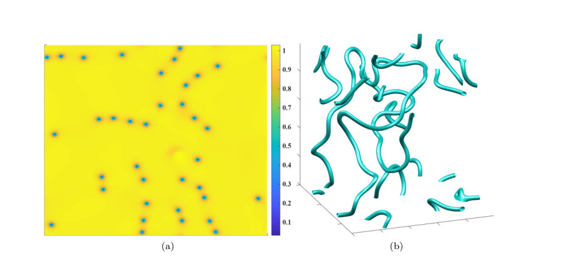
<figcaption class="paper-figure-caption"><b>Fig 4.</b> FIG. 1. Spatial configurations of topological defects of different types and dimensions for GP model. (a) Vortex (U(1) symmetry). (b) Vortex line (U(1) symmetry).</figcaption>
</figure>
<figure class="paper-figure-card">
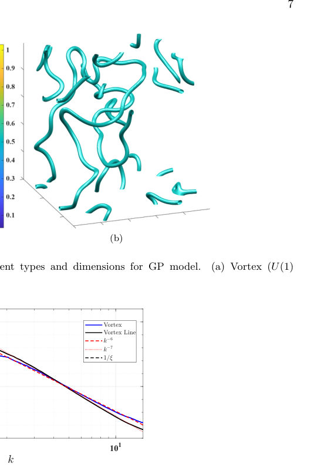
<figcaption class="paper-figure-caption"><b>Fig 5.</b> FIG. 2. Scaling behavior of topological defects for GP equation of different types and dimensions.</figcaption>
</figure>

**Summary.** This work establishes a universal scaling law, $S_f \propto k^{-(d+p+2)}$, that characterizes the spatial fingerprint of topological defect cores. By deriving this law analytically and verifying it numerically across diverse systems—from superconductors to cosmological backgrounds—the authors provide a powerful new diagnostic tool for studying defect physics.

**Why it may be interesting.** The universality of the scaling exponent, independent of the specific microscopic dynamics or underlying system, provides a powerful, model-agnostic diagnostic tool for characterizing topological structures in complex many-body systems.

Detailed structure

**Main problem.** The paper aims to discover and analytically prove a universal scaling law for the 'fingerprint' of topological defect cores, an aspect previously unexplored despite existing scaling laws for defect correlations.

**Main result.** A universal scaling law, $S_f \propto k^{-(d+p+2)}$, is discovered for the form factor in the region $k>1/\xi$, which is analytically proven to originate from a universal V-shaped cusp at the defect core.

**Method.** The authors used theoretical derivation involving the form factor decomposition and confirmed the scaling law through extensive numerical simulations across multiple physical models.

**Model / system.** The study examines topological defects (kinks, vortices, domain walls) arising from symmetry breaking in various contexts, including condensed matter (Ginzburg-Landau, Gross-Pitaevskii), cosmology (Klein-Gordon in FRW background), and holographic models (gauge/gravity duality).

**Key observables.** The primary observable is the form factor, $S_f(\mathbf{k})$, and the diagnostic is the scaling exponent $-(d+p+2)$.

**Important parameters / regimes.** Healing length ($\xi$), spatial dimension ($d$), and defect codimension ($p$).

**Assumptions / limitations.** The derivation relies on approximating the core shape using a $	anh$ function, and the numerical simulations test various regimes (weak vs. strong coupling).

**Figures summary.** Figures illustrate spatial configurations of various defects (Kink, Vortex) and show the scaling behavior of the form factor $S_f$ for different defect types using the TDGL model.

**Paper structure.** The paper progresses from identifying the gap in knowledge regarding defect core fingerprints, deriving the universal scaling law analytically, and then rigorously verifying this scaling law using numerical simulations across four distinct physical frameworks (TDGL, GP, Holographic, FRW).

Abstract

Topological defects are ubiquitous in physics, arising from condensed matter physics to the early universe. Although there exist many universal scaling laws for correlations between topological defects, such as Porod scaling, the fingerprint of topological defect cores has remained largely unexplored. Here, we discover a universal scaling law in the region $k>1/ξ$, where $ξ$ is the healing length of the topological defects, taking the scaling of the form factor $S_f \propto k^{-(d+p+2)}$, where $d$ is the spatial dimension and $p$ is the defect codimension. We analytically prove that this exponent originates from a universal V-shaped cusp at the defect core and is independent of the underlying system and dynamics. Numerical simulations verify this scaling law in four typical frameworks: the time-dependent Ginzburg-Landau and Gross-Pitaevskii equations in the weak-coupling regime, the gauge/gravity duality model in the strong-coupling regime, and the Klein-Gordon equation in the Friedmann-Robertson-Walker background in cosmology. Our work provides a new probe for studying topological defects in systems ranging from superconductors to cosmological phase transitions.

[↑ back to top](#top)

### [A Recursive Module-Coupling Algorithm for Computing Low-Energy Eigenstates](http://arxiv.org/abs/2609.02394v1)

**Authors:** Dihang Sun, Nannan Ma, Ching Hua Lee, Tianqi Chen, Jiangbin Gong  
**Type:** both · **Category:** numerical methods · **PDF:** <https://arxiv.org/pdf/2609.02394v1>  
**Analysis basis:** full PDF text, analyzed in chunks
**Topic relevance:** `analog quantum simulation` **3/5** · `methods for driven-dissipative` **2/5**

↔ Scroll figures horizontally

<figure class="paper-figure-card">
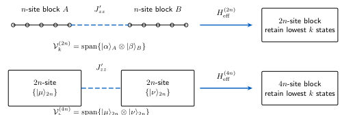
<figcaption class="paper-figure-caption"><b>Fig 1.</b> FIG. 1. Schematic representation of the recursive projec- tion. Two n-site blocks A and B are first coupled through the inter-block interaction J′ zz, giving the projected tensor- product subspace V(2n) k = span{|α⟩A⊗|β⟩B}. Diagonalization of the effective Hamiltonian H(2n) eff and retention of the low- est k states define the renormalized 2n-site block. The same merging rule is then applied recursively to construct the 4n- and 8n-site block bases from V(4n) k and V(8n) k , respectively.</figcaption>
</figure>
<figure class="paper-figure-card">
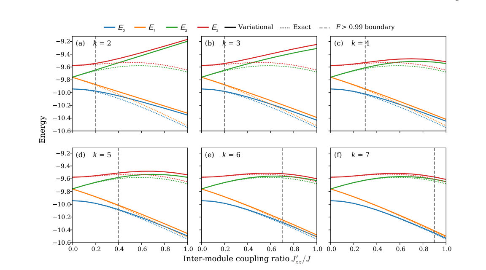
<figcaption class="paper-figure-caption"><b>Fig 2.</b> FIG. 2. Lowest four energy levels for different subspace dimensions k, obtained at J = 1.0 and h = 0.7. In each panel, the solid curves denote the variational energies obtained in the truncated subspace, while the dotted curves denote the exact energies of the full system. The vertical dashed line marks the boundary of the fidelity criterion F &gt; 0.99; namely, the region to the left of the dashed line corresponds to the parameter range in which the variational low-energy states have fidelity greater than 0.99. The variational energies form upper bounds to the exact levels and converge toward the exact spectrum as k increases.</figcaption>
</figure>
<figure class="paper-figure-card">
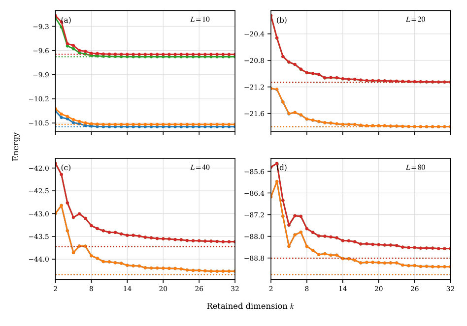
<figcaption class="paper-figure-caption"><b>Fig 3.</b> FIG. 3. Low-energy spectra for longer transverse-field Ising chains obtained at J = 1.0 and h = 0.7. The four panels correspond to L = 10, 20, 40, 80, respectively. Solid curves denote the low-energy levels obtained from the recursive truncated-subspace construction, while dotted horizontal lines denote the corresponding DMRG reference energies. The results show that increasing the subspace dimension k improves the low-energy spectrum, with the convergence being more rapid for shorter chains and gradually more demanding as the system size increases.</figcaption>
</figure>
<figure class="paper-figure-card">
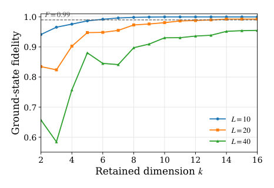
<figcaption class="paper-figure-caption"><b>Fig 4.</b> FIG. 4. Ground-state fidelity as a function of the subspace dimension k for longer transverse-field Ising chains, obtained at J = 1.0 and h = 0.7. The three curves correspond to system sizes L = 10, L = 20, and L = 40, respectively. The horizontal dashed line marks the reference value F = 0.99.</figcaption>
</figure>
<figure class="paper-figure-card">
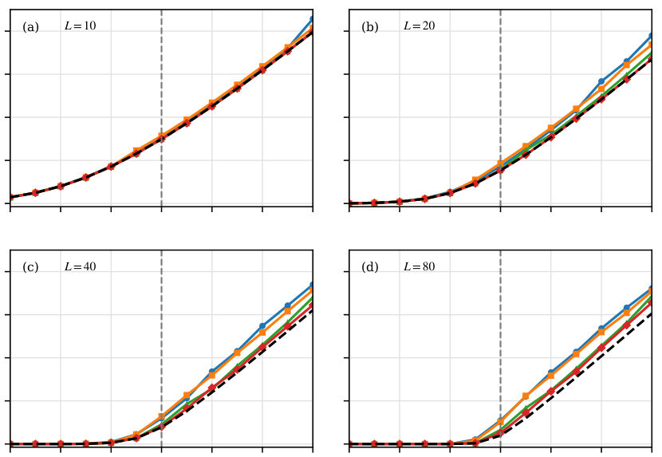
<figcaption class="paper-figure-caption"><b>Fig 5.</b> FIG. 5. Energy gap ∆= E1 −E0 as a function of the transverse-field ratio g, obtained at J = 1.0. The four panels correspond to L = 10, 20, 40, 80, respectively. For each system size, the solid curves show the results obtained from the recursive truncated- subspace construction with k = 4, 8, 16, 32, while the black dashed curve denotes the DMRG reference result. The vertical dashed line marks the critical point g = 1.</figcaption>
</figure>

**Summary.** This paper introduces a recursive module-coupling algorithm to tackle the exponential complexity of finding many-body eigenstates. It works by iteratively building the low-energy subspace from smaller, coupled modules, offering a speedup over standard methods like DMRG. The approach is validated both through classical error analysis and demonstrated feasibility on current quantum processors.

**Why it may be interesting.** It provides a systematic, hardware-compatible framework for approximating ground and low-lying excited states, which is crucial for simulating complex quantum materials or quantum dynamics on near-term quantum hardware.

Detailed structure

**Main problem.** The core challenge is efficiently finding the low-lying eigenstates of large, many-body Hamiltonians, which suffers from exponential computational scaling.

**Main result.** The proposed recursive module-coupling algorithm offers a computationally advantageous alternative to methods like DMRG, achieving state preparation in a modular, scalable manner.

**Method.** The method recursively decomposes the system into smaller, locally-coupled modules, constructing the low-energy variational basis from the module eigenstates at each merge step.

**Model / system.** The work applies to general many-body systems modeled by local lattice Hamiltonians, often analyzed using a Hamiltonian partitioned into coupled modules (H = H_A + H_B + V).

**Key observables.** Low-lying eigenstates, energy gap, and state preparation fidelity.

**Important parameters / regimes.** System size (L), truncation level (k), and the size of the elementary module (L_0).

**Assumptions / limitations.** The low-energy eigenstates are assumed to have dominant support within the product space formed by the low-energy subspaces of the subsystems.

**Figures summary.** Figures illustrate the schematic recursive projection process, the required minimum subspace dimension (k_min) for target fidelity, and the reduction of error density when increasing the initial block size (L_0).

**Paper structure.** The paper introduces the modular projected eigensolver and its recursive construction, followed by classical numerical demonstrations, and concludes with detailed error scaling analysis and hardware-compatible quantum circuit formulations.

Abstract

Finding the eigenstates of a many-body Hamiltonian is a fundamental challenge in physics and computational science. Since the search space grows exponentially with system size, numerous classical and quantum algorithms have been developed to address this problem. A practical strategy is to identify a physics-informed low-dimensional subspace that effectively accommodates the low-lying eigenstates, thereby reducing the computational complexity. In this paper, we propose a recursive module-coupling algorithm, which iteratively treats a system as a composition of locally-coupled smaller modules, with low-energy subspace estimated successively according to the same recursive structure. Unlike the density matrix renormalization group (DMRG) approach that optimizes a global matrix product state through repeated local sweeps and obtains excited states sequentially, our algorithm constructs a physically tailored variational basis from module eigenstates and obtains several low-energy states on an equal footing, leading to substantial speedups if targeting moderate accuracy. Our proposed method further leads naturally to a recursive quantum variational algorithm, providing a systematic and modular circuit-construction framework compatible with contemporary gate-based quantum architectures. At each recursive level, block encoders are trained to map logical basis states onto the retained physical subspace, within which a variational circuit is subsequently optimized.Such a quantum-circuit implementation provides not only a quantum multistate eigensolver, but also a systematic prescription for hierarchically constructing quantum state-preparation circuits. Classical simulations demonstrate the accuracy and efficiency of the proposed method, whereas experiments on IBM quantum processors show that eigenstate preparation with reasonable fidelities is achievable even in the current NISQ era.

[↑ back to top](#top)

### [Quantum Circuit and Tensor Network Implementation of the 2D Acoustic Wave Equation](http://arxiv.org/abs/2609.01904v1)

**Authors:** Tamas Nemeth, Gabor Vattay  
**Type:** theory · **Category:** numerical methods · **PDF:** <https://arxiv.org/pdf/2609.01904v1>  
**Analysis basis:** full PDF text, analyzed in chunks
**Topic relevance:** `methods for driven-dissipative` **3/5** · `analog quantum simulation` **2/5**

↔ Scroll figures horizontally

<figure class="paper-figure-card">
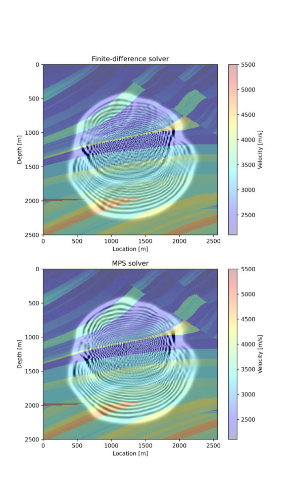
<figcaption class="paper-figure-caption"><b>Fig 1.</b> Figure 2: Wavefields originating from the center of the model at location of (1280 m, 1280 m). Upper wavefield is calculated by an FDTD solver and the lower wavefield is by an MPS solver.</figcaption>
</figure>

**Summary.** This work develops a framework to simulate seismic wave propagation by translating the acoustic wave equation into a quantum circuit model. Crucially, they show how this quantum evolution can be deterministically emulated on classical hardware using Matrix Product States (MPS) via Tensor Network techniques. This establishes MPS as a scalable and viable computational tool for large-scale wavefield dynamics.

**Why it may be interesting.** While the core physics is seismology, the methodology—translating a continuous PDE evolution into a structured tensor network update—is highly relevant for simulating complex dynamics in quantum many-body systems where exact diagonalization is impossible.

Detailed structure

**Main problem.** The paper addresses the challenge of simulating seismic wave propagation governed by the 2D acoustic wave equation in complex media.

**Main result.** The authors demonstrate that mapping the wavefield dynamics onto a Tensor Train/Matrix Product State (MPS) representation provides a viable, deterministic classical emulation bridge for simulating large-scale wavefield propagation.

**Method.** The simulation uses an explicit Finite-Difference Time-Domain (FDTD) formulation, which is then mapped onto a quantum circuit model and subsequently emulated classically using Matrix Product Operators (MPOs) within the Tensor Network framework.

**Model / system.** The physical system is the 2D acoustic wavefield u(x, z, t) governed by the wave equation, simulated using the Marmousi model as a test case.

**Key observables.** The resulting 2D seismic wavefields generated by the simulation.

**Important parameters / regimes.** The bond dimension $\chi$ in the MPS representation, the time step $\Delta t$, and the CFL stability criterion.

**Assumptions / limitations.** The primary assumption is that the MPS representation can accurately emulate the quantum evolution, requiring periodic truncation via SVD to maintain computational tractability.

**Figures summary.** Figure 2 compares the 2D seismic wavefields generated by both the standard FDTD solver and the MPS solver for the Marmousi model.

**Paper structure.** The paper details the quantum circuit formulation for the FDTD update, maps this to a Tensor Train/MPS representation using MPOs, and validates the MPS solver by comparing its results against the established FDTD solver.

Abstract

We present a cohesive framework for simulating seismic wave propagation utilizing quantum computing paradigms and their classical tensor network equivalents.   We detail a quantum circuit-based formulation for the explicit finite-difference time-domain (FDTD) solution of the two-dimensional acoustic wave equation and   map this quantum architecture onto a tensor train representation, namely for Matrix Product State (MPS).   The MPS solver enables deterministic simulation of large-scale wavefield dynamics on classical high-performance computing systems.   We demonstrate the MPS representation by computing 2D seismic wavefields on the Marmousi model.   Our results indicate that the MPS representation is a viable direction for computing and scaling wavefield propagation.

[↑ back to top](#top)

### [Magnetic-Field-Calibration-Free Determination of the Hyperfine Constant $A$ in Ultracold Fermi gases of $^{40}$K](http://arxiv.org/abs/2609.02572v1)

**Authors:** Yajing Yang, Biao Shan, Yuhang Zhao, Jiahui Shen, Zhuxiong Ye, Liangchao Chen, Zengming Meng, Pengjun Wang, Wei Han, Jing Zhang, Lianghui Huang  
**Type:** experiment · **Category:** quantum gases · **PDF:** <https://arxiv.org/pdf/2609.02572v1>  
**Analysis basis:** full PDF text, analyzed in chunks
**Topic relevance:** `quantum measurements` **3/5** · `interference shaping light` **1/5**

↔ Scroll figures horizontally

<figure class="paper-figure-card">
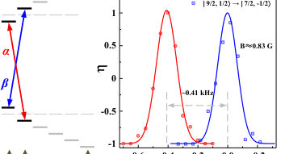
<figcaption class="paper-figure-caption"><b>Fig 1.</b> FIG. 1. (a) Energy-level diagram showing the single-photon microwave magnetically insensitive transitions α and β in 40K. (b) Microwave spectra of the two sets of magnetically insensi- tive transitions α and β. The measurements are performed us- ing a Gaussian-shaped π pulse with a duration of 10.5 ms and optimized amplitude under a bias magnetic field of 0.83 G. Here, ωβ0 denotes the resonance frequency for transition β.</figcaption>
</figure>
<figure class="paper-figure-card">
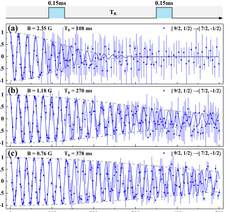
<figcaption class="paper-figure-caption"><b>Fig 2.</b> FIG. 2. Ramsey oscillations on the transition β as a function of the free-evolution time TR at different bias magnetic fields, measured using a square π/2 pulse with duration τp = 0.15 ms for state preparation and readout. The solid lines are fits us- ing a Gaussian phase-diffusion model, while the dashed lines indicate the corresponding Ramsey contrast decay envelopes. Throughout this Letter, each data point represents the aver- age of three independent measurements, and error bars denote one standard deviation.</figcaption>
</figure>
<figure class="paper-figure-card">
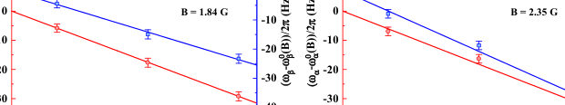
<figcaption class="paper-figure-caption"><b>Fig 3.</b> FIG. 3. Resonance frequencies of the α and β transitions versus ODT intensity at different bias magnetic fields. The α (β) data are plotted against the left (right) vertical axis. Here, ωα(β) denotes the resonance frequency at the given magnetic field and ODT intensity, and ω0 α(β) is the corresponding resonance frequency at I = 0 obtained by linear extrapolation. I0 denotes the reference intensity at the center of the ODT formed by two mutually incoherent linearly polarized 1064 nm laser beams propagating in orthogonal directions, with powers of 3.5 W and 2.5 W and waists of approximately 45 µm. Different trap intensities are obtained by proportional scaling of the laser powers at fixed...</figcaption>
</figure>

**Summary.** This paper reports a highly precise, magnetic-field-calibration-free determination of the hyperfine constant A for $^{40}	ext{K}$ using ultracold Fermi gases. By measuring the difference between two magnetically insensitive microwave transitions via Ramsey interferometry, the authors significantly reduce the uncertainty in this fundamental constant. This improved reference value is crucial for advancing high-precision spectroscopy and metrology using alkali atoms.

**Why it may be interesting.** This work provides a benchmark measurement for fundamental atomic constants in a highly controlled, quantum gas environment. The technique itself—achieving field independence—is a significant methodological advance for precision measurements in AMO physics.

Detailed structure

**Main problem.** The primary goal is to determine the ground-state hyperfine constant A for $^{40}	ext{K}$ with extremely high precision, overcoming the limitations imposed by magnetic field calibration in conventional methods.

**Main result.** The authors determined the hyperfine constant A = -h x 285.730536(2) MHz, achieving an absolute uncertainty of only about 2 Hz, which represents an improvement of nearly three orders of magnitude over previous measurements.

**Method.** They developed a magnetic-field-calibration-free method by measuring the frequency difference between two magnetically insensitive ('clock') transitions using Ramsey interferometry on an ultracold Fermi gas.

**Model / system.** The experiment uses an ultracold Fermi gas of $^{40}	ext{K}$ trapped in an Optical Dipole Trap (ODT). Measurements involve microwave spectroscopy between Zeeman sublevels within the ground-state hyperfine manifold.

**Key observables.** Transition frequencies ($\omega_\alpha, \omega_eta$), Ramsey oscillation visibility, and the hyperfine constant A.

**Important parameters / regimes.** The measurement is performed over a range of bias magnetic fields (B) and is designed to be insensitive to magnetic field calibration and atomic density variations.

**Assumptions / limitations.** The method assumes the AC Stark shift can be accurately removed by extrapolating measurements to zero optical intensity, and the uncertainty budget is calculated by combining contributions from magnetic field fluctuations and AC Stark shifts.

**Figures summary.** Figures illustrate energy level diagrams, Ramsey oscillation decay curves, and plots showing the measured hyperfine constant A versus magnetic field and ODT intensity, used for systematic correction.

**Paper structure.** The paper details the use of Ramsey spectroscopy on two insensitive transitions to derive a field-independent expression for A. It then rigorously calculates the total uncertainty budget by propagating errors from magnetic field noise and AC Stark shifts, culminating in the final highly precise value for A.

Abstract

Hyperfine constant $A$ is a key parameter of the hyperfine structure and underpins precision spectroscopy and metrology. In this Letter, we develop a magnetic-field-calibration-free method for determining the ground-state hyperfine constant $A$ in an ultracold $^{40}$K Fermi gas by utilizing a pair of magnetically insensitive ("clock") transitions. This overcomes the stringent magnetic-field calibration requirements of conventional methods. We measure the transition frequency between these two magnetically insensitive transitions with Hz-level resolution over a range of magnetic fields, and obtain the ground-state hyperfine constant $A = -h\times 285.730536(2)\,\mathrm{MHz}$, corresponding to an absolute uncertainty of about $2\,\mathrm{Hz}$. Our value reduces the uncertainty by nearly three orders of magnitude compared with previous determinations, providing a substantially improved reference for high-precision spectroscopy and metrology with $^{40}$K.

[↑ back to top](#top)

### [Quantum amplitude estimation beyond power-of-two schedules](http://arxiv.org/abs/2609.02715v1)

**Authors:** Farrokh Labib  
**Type:** theory · **Category:** quantum information and computing · **PDF:** <https://arxiv.org/pdf/2609.02715v1>  
**Analysis basis:** full PDF text, analyzed in chunks
**Topic relevance:** `quantum measurements` **3/5** · `analog quantum simulation` **1/5**

↔ Scroll figures horizontally

<figure class="paper-figure-card">
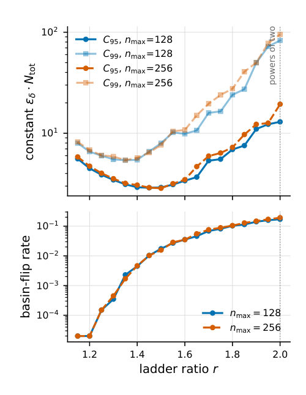
<figcaption class="paper-figure-caption"><b>Fig 1.</b> FIG. 1. Total-query constants (top) and basin-flip rate (bot- tom) versus the ladder ratio r, for geometric ladders nj = round(rj) capped at nmax ∈{128, 256} with the canonical shot profile (one shot at the deepest level, one more per shal- lower level), 2×104 trials per point. Both scales collapse onto the same curves. C95 is minimized at r ≈1.45–1.5 and C99 at r ≈1.35; at r = 2 (powers of two, dotted line) one trial in six lands in a wrong basin under this profile. Bootstrap 95% confidence intervals are smaller than the markers for C95 and up to ∼15% for C99 at large r; flip rates below 10−3 rest on single-digit event counts and indicate ≈0 rather than precise values.</figcaption>
</figure>
<figure class="paper-figure-card">
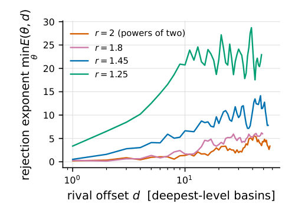
<figcaption class="paper-figure-caption"><b>Fig 2.</b> FIG. 2. Worst-case (over θ) rejection exponent E of Eq. (4) against rival offsets d, in units of deepest-level basins, for four ladders at nmax ≈128 with the canonical shot profile. Pow- ers of two (r = 2) and r = 1.8 leave near-zero exponents— unrejected rivals—out to tens of basins; r = 1.45 and 1.25 reject all far rivals strongly. These profiles reproduce the measured ordering of catastrophic-failure rates: for far rivals (&gt; 10 basins) at matched profiles, 2.7% (r=2), 0.7% (r=1.8), 0.005% (r=1.45), ∼0 (r=1.25); the last two rest on one and zero events in 2 × 104 trials.</figcaption>
</figure>
<figure class="paper-figure-card">
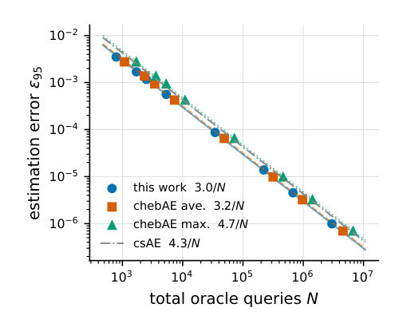
<figcaption class="paper-figure-caption"><b>Fig 3.</b> FIG. 3. Estimation error at 95% confidence versus total oracle queries, down to ε95 ≈10−6. Circles (blue): this work (r = 1.45 ladders, canonical shots, 104–5 × 104 trials per point). Squares/triangles: chebAE average and maximum-observed queries at matched achieved error (2000 trials per point, using the implementation of Ref. [11]). Gray line: the published csAE constant [14].</figcaption>
</figure>
<figure class="paper-figure-card">
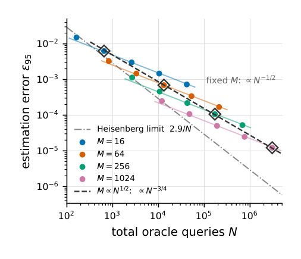
<figcaption class="paper-figure-caption"><b>Fig 4.</b> FIG. 4. The depth–query trade-off as a family of power laws. Each fixed depth cap M (uniform scaling, s = 1–256) follows</figcaption>
</figure>

**Summary.** This paper presents a significant algorithmic improvement for Quantum Amplitude Estimation (QAE) by optimizing both the measurement schedule and the data processing step. By replacing power-of-two ladders with a geometrically spaced ladder ($r \approx 1.45$) and using an exact maximum-likelihood estimator, the authors achieve state-of-the-art query complexity. This advancement makes quantum estimation more efficient and practically viable for quantum computing applications.

**Why it may be interesting.** The work provides concrete, improved algorithmic tools for quantum estimation, which is a fundamental building block for quantum simulation and sensing protocols relevant to AMO physics.

Detailed structure

**Main problem.** The paper aims to improve Quantum Amplitude Estimation (QAE) by overcoming limitations in conventional non-adaptive estimation schedules and post-processing techniques.

**Main result.** The authors propose a fully parallel, deterministic-schedule estimator using an exact maximum-likelihood estimate and a geometric ladder with ratio $r \approx 1.45$, achieving query complexities matching the best adaptive methods.

**Method.** The methodology involves replacing subspace-based post-processing with an exact maximum-likelihood estimate and optimizing the measurement schedule from power-of-two steps to a geometrically spaced ladder.

**Model / system.** The underlying model is quantum state estimation for the amplitude $a$ of a marked component, utilizing the Grover iterator $G$ applied $n$ times.

**Key observables.** Total query complexity ($C_\delta$), maximum sequential depth ($n_L$), and the achievable error percentile ($\epsilon_{95}$).

**Important parameters / regimes.** The optimal geometric ladder ratio $r \approx 1.45$, and the target error $\varepsilon$ (ranging from $3.5	imes 10^{-3}$ to $10^{-6}$).

**Assumptions / limitations.** The analysis assumes the standard shot-noise model, and the derived bounds are compared against the Cramér-Rao Lower Bound (CRLB).

**Figures summary.** Figures compare total-query constants and basin-flip rates against the ladder ratio $r$, showing the optimal balance near $r \approx 1.45$.

**Paper structure.** The paper first identifies the limitations of existing QAE methods, then introduces the improved ML estimator and geometric ladder, deriving the optimal ratio by balancing aliasing and redundancy costs, and finally confirming the performance against state-of-the-art benchmarks.

Abstract

Non-adaptive quantum amplitude estimation (QAE) fixes its Grover depths in advance, so every circuit can run in parallel, but it has so far needed more queries than the best adaptive methods. We show that most of this gap comes from two conventional choices: subspace-based post-processing and power-of-two depth ladders. We replace the first by the exact maximum-likelihood estimate, one matrix multiplication per batch of estimates, and the second by a geometric ladder with ratio $r \approx 1.45$. The result is a fully parallel, deterministic-schedule estimator with total query complexity $2.8$-$3.1/\varepsilon$ at 95% confidence for target errors from $3.5\times 10^{-3}$ to $10^{-6}$. This matches the average-case complexity of chebAE, the best benchmarked adaptive method, within statistical uncertainty (with the lower point estimate at every scale tested), beats its maximum-observed complexity by $1.6\times$, and needs a maximum sequential depth of only $0.21/\varepsilon$ against chebAE's $2.9/\varepsilon$. Relative to csAE, the best non-adaptive benchmark, the constants improve by 30-35% at 95% and $1.5$-$1.7\times$ at 99% confidence. The optimal ratio has a simple origin. Doubling is the fastest depth growth at which the data can still tell neighboring candidate values apart, so power-of-two ladders sit at the edge of confusion and must buy reliability with extra shots; a slightly denser ladder checks every scale redundantly. An error-probability analysis reproduces the measured failure rates and locates the optimum. The likelihood formulation extends directly to noise-aware estimation, and uniformly scaling the capped ladder covers the depth-limited regime, realizing the optimal trade-off $M N_{\mathrm{tot}} \approx (0.4$-$0.6)/\varepsilon^2$ within $\sim 1.1\times$ of the schedule's Cramér-Rao limit.

[↑ back to top](#top)

### [An Entanglement-Assisted Stabilizer Framework for Distributed Sensing of Local Phases](http://arxiv.org/abs/2609.02098v1)

**Authors:** Huidan Zheng, Ilkwon Sohn, Jun Heo  
**Type:** theory · **Category:** quantum information and computing · **PDF:** <https://arxiv.org/pdf/2609.02098v1>  
**Analysis basis:** full PDF text, analyzed in chunks
**Topic relevance:** `quantum measurements` **3/5**

↔ Scroll figures horizontally

<figure class="paper-figure-card">
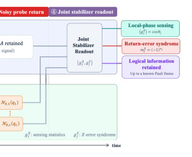
<figcaption class="paper-figure-caption"><b>Fig 1.</b> Fig. 2 Distributed sensing protocol based on the entanglement-assisted stabilizer structure. The remote halves of the pre-shared ebits acquire local phases and return through independent X-error channels. Joint stabilizer readout provides phase-dependent sensing statistics and return-error syn- dromes, while the encoded logical subsystem remains available as a conditional post-sensing output.</figcaption>
</figure>
<figure class="paper-figure-card">
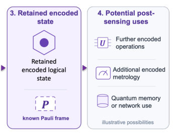
<figcaption class="paper-figure-caption"><b>Fig 2.</b> Fig. 3 Post-sensing reuse of the encoded state. After local phase acquisition, probe return, and joint stabilizer readout, the conditional encoded state differs from the initial state by a known Pauli transformation and remains available for subsequent encoded operations.</figcaption>
</figure>
<figure class="paper-figure-card">
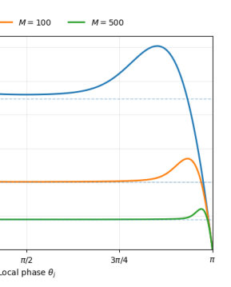
<figcaption class="paper-figure-caption"><b>Fig 3.</b> Fig. 4 Exact finite-shot RMSE of the estimator ˆθj for M = 20, 100, and 500, evaluated under the binomial measurement model. The horizontal dashed lines indicate the corresponding asymptotic levels 1/ √</figcaption>
</figure>

**Summary.** This paper introduces an entanglement-assisted stabilizer framework for sensing local quantum phases across spatially separated nodes. By leveraging the structure of EAQEC codes, it enables simultaneous phase estimation and error syndrome identification. Crucially, the method guarantees that the encoded logical information survives the sensing process, making it highly relevant for scalable quantum networking protocols.

**Why it may be interesting.** This work provides a concrete, structured method for performing distributed quantum measurements while maintaining coherence, which is crucial for scaling quantum networks and distributed quantum computation.

Detailed structure

**Main problem.** Developing a robust framework for performing distributed quantum sensing of local phases using entanglement assistance.

**Main result.** The framework successfully allows for local phase estimation while ensuring the logical quantum information remains available for subsequent operations, achieving the expected scaling of $1/\sqrt{M}$.

**Method.** The authors utilize an entanglement-assisted stabilizer framework built upon extended EAQEC codes, employing joint measurements on remote stabilizer pairs to extract phase information and error syndromes.

**Model / system.** The system models spatially separated quantum probes (remote ebit halves) interacting with local phases via Z-axis rotations, followed by an X-type noise channel. The structure is formalized using graph-code theory, exemplified by the [[5,1,3;2]] code.

**Key observables.** Phase-dependent measurement statistics from the $X_{B_j}$-containing stabilizer and the return-error syndrome from the $Z_{B_j}$-containing partner stabilizer.

**Important parameters / regimes.** The estimation error scales as $1/\sqrt{M}$ for large repetitions $M$, and the framework achieves the available quantum Fisher information.

**Assumptions / limitations.** The analysis assumes ideal pre-shared ebits, the remote probes are the active sensing elements, and the return noise is restricted to independent X errors.

**Figures summary.** Figures illustrate the graph-code realization (e.g., [[5, 1, 3; 2]]), the structure of the remote leaves, and the necessary adjacency blocks for defining the stabilizer generators.

**Paper structure.** The paper first establishes the physical model and the need for the framework. It then details the mathematical structure using graph-code theory to define the necessary stabilizer measurements. Finally, it analyzes the measurement outcomes, proves the state preservation property, and analyzes the metrological scaling.

Abstract

Distributed quantum sensing requires spatially separated probes to acquire local parameters while maintaining compatibility with network-level quantum information processing. We develop an entanglement-assisted stabilizer framework based on the extended structure of entanglement-assisted quantum error-correcting (EAQEC) codes, in which the remote halves of pre-shared ebits are used directly as local phase probes while the joint state simultaneously carries an encoded logical subsystem. Each remote probe acquires a local Z-axis phase and subsequently returns through an X-type noise channel. Within the extended EAQEC stabilizer structure, the stabilizer containing $X_{B_j}$ provides phase-dependent measurement statistics, whereas its partner containing $Z_{B_j}$ records the corresponding return-error syndrome. A graph-code formulation is introduced to make this structure explicit, together with an illustrative [[5,1,3;2]] construction. We further show that, conditioned on the joint sensing-and-syndrome measurement record, the post-sensing state differs from the original encoded state only by a known Pauli transformation, so that the logical information remains available for subsequent encoded operations. For the local-phase model considered here, the stabilizer readout attains the available quantum Fisher information, while the finite-shot estimator approaches the corresponding $1/\sqrt{M}$ scaling as the number of repetitions increases. The framework therefore provides a common entanglement-assisted stabilizer structure for distributed local-phase sensing, restricted return-error identification, and post-sensing logical-state retention, without relying on an intrinsic metrological enhancement from EAQEC itself.

[↑ back to top](#top)

### [Conditional validity of quantum event classifiers under collider systematics and quantum estimation uncertainty](http://arxiv.org/abs/2609.02781v1)

**Authors:** Roberto Fernández-Barrios, Iker Pastor-López, Asier González-Santocildes, Pablo García Bringas  
**Type:** theory · **Category:** other · **PDF:** <https://arxiv.org/pdf/2609.02781v1>  
**Analysis basis:** full PDF text, analyzed in chunks
**Topic relevance:** `quantum measurements` **3/5**

↔ Scroll figures horizontally

<figure class="paper-figure-card">
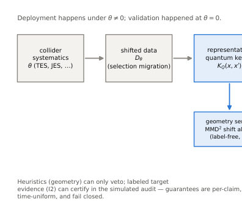
<figcaption class="paper-figure-caption"><b>Fig 1.</b> Fig. 1 Framework. The information-set hierarchy I0→I3 and the fail-closed decision rule. Claims about a frozen deployment are audited under declared information; heuristic sensors may veto certifi- cation but never grant it. At I2, fixed label-stream claims carry anytime-valid per-claim error control; I3 and empirical ledgers use separate coverage gates or calibrated tests. Unresolved claims remain UNRESOLVED.</figcaption>
</figure>
<figure class="paper-figure-card">
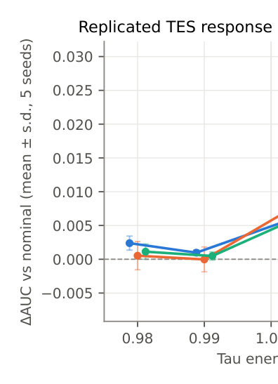
<figcaption class="paper-figure-caption"><b>Fig 2.</b> Fig. 2 TES response under the frozen environment grid (five training seeds, development world; ∆AUC = nominal minus shifted AUC, positive = degradation). The TES down-shift sign replicates within this world at the 10−3 scale; the cross-world evaluation later shows that its direction is draw- dependent (§2.4). Adverse combinations are discussed in the text but are not displayed in this panel.</figcaption>
</figure>
<figure class="paper-figure-card">
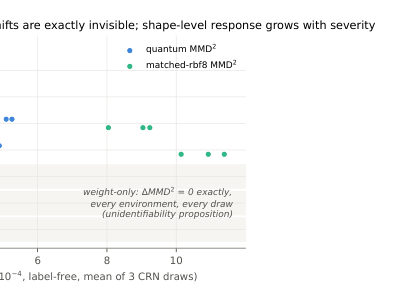
<figcaption class="paper-figure-caption"><b>Fig 3.</b> Fig. 3 Family response and exact blindness. Label-free sensor response by nuisance family: ∆MMD2</figcaption>
</figure>
<figure class="paper-figure-card">
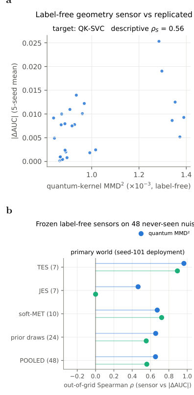
<figcaption class="paper-figure-caption"><b>Fig 4.</b> Fig. 4 Sensor generalization; (a) development grid, (b) out-of-grid. (a) MMD2 vs replicated |∆AUC| over 28 shift environments (leave-one-nuisance-out evaluation). (b) The frozen sensors on 48 never- seen environments per world (off-grid values and official-prior draws), sensor values archived before targets existed: pooled descriptive rank association is positive in both worlds and for both sensors; rank, not magnitude, is the claim. No IID environment-level p-value is assigned.</figcaption>
</figure>
<figure class="paper-figure-card">
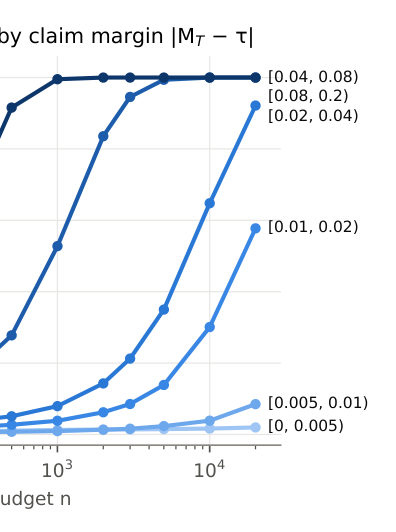
<figcaption class="paper-figure-caption"><b>Fig 5.</b> Fig. 5 Certification landscape. Fraction of claims resolved as a function of the audit-label draw budget n, by claim margin |MT −τ| (darker curves, larger margins). Sampling is with replacement, so n counts labeled observations, not unique experimentally labeled events.</figcaption>
</figure>

**Summary.** This work introduces a robust, information-conditional auditing framework to assess whether claims made by Quantum Machine-Learning classifiers remain valid when subjected to real-world systematic uncertainties and finite quantum measurement noise. Using a collider physics benchmark, the authors show that simple classifier performance metrics are insufficient for scientific inference, concluding that no demonstrable quantum advantage exists over classical methods under their rigorous testing protocol.

**Why it may be interesting.** While focused on HEP, the rigorous statistical framework for certifying claims under systematic uncertainty and finite sampling is highly relevant to any field using quantum measurements or complex ML models where systematic error control is paramount.

Detailed structure

**Main problem.** The paper addresses the conditional validity of Quantum Machine-Learning (QML) classifiers when deployed in real-world high-energy physics inference pipelines, considering both classical systematic shifts and quantum measurement uncertainties.

**Main result.** The authors demonstrate that classifier validity does not guarantee scientific inference validity, and that apparent quantum advantages can be reproduced by matched classical controls, leading them to claim no quantum advantage.

**Method.** They develop an information-conditional, fail-closed auditing framework that rigorously tests claims by propagating results through various information sets ($I_0$ to $I_3$) and accounting for finite-shot quantum estimation noise.

**Model / system.** The analysis is benchmarked on collider physics data (Higgs-to-$	au	au$ benchmark) using quantum-kernel classifiers (e.g., fidelity kernel $K_Q$) trained on high-dimensional kinematic variables.

**Key observables.** Classifier metrics (e.g., AUC), signal-strength coverage, and the status of claims (SUPPORTED, REFUTED, UNRESOLVED) under various systematic variations.

**Important parameters / regimes.** The analysis involves multiple nuisance parameters ($	heta$) for feature-level systematics (TES, JES, soft-MET) and varying levels of signal-strength degradation ($\delta$).

**Assumptions / limitations.** The framework assumes a 'frozen finite-population batch deployment' snapshot, and the validity guarantee is conditional on the declared sampling protocol and information sets.

**Figures summary.** Figure 1 illustrates the information-set hierarchy ($I_0 	o I_3$) and the fail-closed decision rule governing the auditing process.

**Paper structure.** The paper establishes the need for information-conditional certification, details the fail-closed auditing framework, applies it to collider data under systematic variations, and concludes by comparing QML results against classical controls to assess true advantage.

Abstract

Claims about a deployed quantum machine-learning classifier can fail when target data shift or when finite-shot quantum evaluation randomizes the model itself. We develop an information-conditional, fail-closed auditing framework that returns supported, refuted or unresolved verdicts with anytime-valid per-claim error control under a declared sampling protocol. On a Higgs-to-tau-tau collider benchmark, stable classifier metrics do not guarantee valid signal-strength inference: at the studied finite-template statistics, the fixed-template profile can lose coverage, even in shift-free controls, when its templates are estimated independently and template-statistical uncertainty is not modeled explicitly. Across 30 frozen finite-shot quantum-kernel deployments, every realized Gram matrix is propagated through refitting, calibration and threshold selection; in the primary raw pipeline these perturbations leave ranking nearly unchanged yet move thresholded target metrics by about 0.02, flipping ideal-anchored claims, and the diagonal-loading sensitivity decomposes differently. Matched classical controls remove apparent quantum-specific nominal-performance and sensing effects. We claim no quantum advantage.

[↑ back to top](#top)

### [Contrasting Effects of Control on Fidelity and Fidelity Deviation in Controlled Teleportation](http://arxiv.org/abs/2609.01988v1)

**Authors:** Jeonghyeon Shin, Minjin Choi  
**Type:** theory · **Category:** quantum information and computing · **PDF:** <https://arxiv.org/pdf/2609.01988v1>  
**Analysis basis:** full PDF text, analyzed in chunks
**Topic relevance:** `quantum measurements` **3/5**

↔ Scroll figures horizontally

<figure class="paper-figure-card">
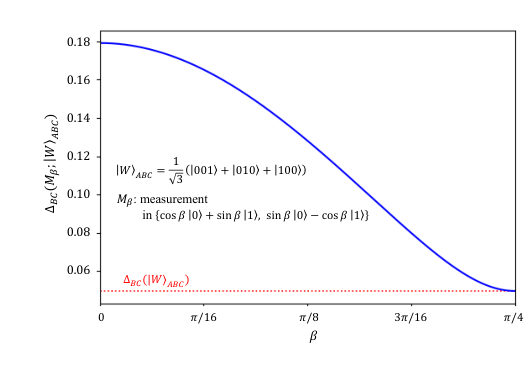
<figcaption class="paper-figure-caption"><b>Fig 1.</b> FIG. 1. Fidelity deviation for the standard W state as a function of the controller’s measurement parameter β. All measurements Mβ attain the same maximal average teleportation fidelity FBC(|W⟩ABC) = 8/9, whereas the fidelity deviation depends on β and reaches its minimum ∆BC(|W⟩ABC) at β = π/4.</figcaption>
</figure>
<figure class="paper-figure-card">
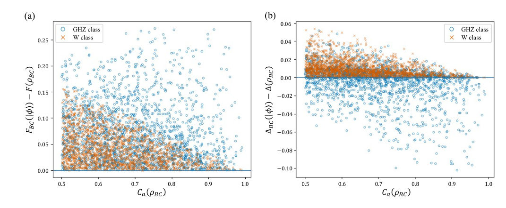
<figcaption class="paper-figure-caption"><b>Fig 2.</b> FIG. 2. Effect of controller assistance on the maximal average fidelity and fidelity deviation for randomly sampled three-qubit pure states, with A acting as the controller. For each of the W and GHZ classes, 2000 randomly generated states satisfying 0.5 ≤Ca(ρBC) ≤1 are shown. (a) Difference between the maximal average fidelity with controller assistance and that obtained directly from the reduced state ρBC. (b) Difference between the minimal fidelity deviation with controller assistance and the fidelity deviation obtained directly from the reduced state ρBC. The W-class samples satisfy ∆BC(|ϕ⟩ABC) −∆(ρBC) ≥0, in accordance with Theorem 2, whereas the GHZ-class samples exhibit both positive...</figcaption>
</figure>

**Summary.** This paper investigates controlled quantum teleportation, focusing on two metrics: average fidelity and fidelity deviation. It demonstrates that while control can optimize average fidelity, the fidelity deviation behaves differently, showing that the benefit of control is not uniform across all input states or state classes. These contrasting effects highlight the complexity of characterizing quantum channel performance.

**Why it may be interesting.** The investigation into fidelity deviation provides a more nuanced diagnostic tool than average fidelity alone, revealing state-dependent effects of quantum control mechanisms.

Detailed structure

**Main problem.** The paper contrasts how quantum control mechanisms affect both the average teleportation fidelity and the fidelity deviation in controlled quantum teleportation.

**Main result.** The fidelity deviation depends on the controller's measurement choice even when the average fidelity is maximized, and controller assistance does not universally reduce the fidelity deviation, especially for W-class states.

**Method.** The authors derive lower bounds for the fidelity deviation and compare controlled teleportation protocols with direct teleportation using reduced state analysis.

**Model / system.** The study analyzes controlled quantum teleportation involving three-qubit pure states ($
ho_{ABC}$), where a controller performs a measurement on one qubit.

**Key observables.** Average Teleportation Fidelity ($F$), Fidelity Deviation ($\Delta$), Concurrence of Assistance ($C_a$), and the reduced state $
ho_{BC}$.

**Important parameters / regimes.** Three-qubit pure states, W-class states, and GHZ-class states.

**Assumptions / limitations.** The analysis is performed specifically for three-qubit pure states.

**Figures summary.** Figure 1 shows that for the W state, the fidelity deviation ($\Delta_{BC}$) varies substantially with the controller measurement, even when the average fidelity ($F_{BC}$) is constant. Figure 2 compares the difference in fidelity deviation with and without control for W and GHZ classes.

**Paper structure.** The paper reviews standard teleportation fidelity, introduces and analyzes the fidelity deviation ($\Delta$) in controlled teleportation, and finally compares the effects of controller assistance on both $F$ and $\Delta$ for different state classes.

Abstract

Teleportation performance is commonly characterized by the average teleportation fidelity, while its variation over input states provides additional information captured by the fidelity deviation. In controlled teleportation, the controller's measurement introduces an additional source of fidelity variation through its measurement outcomes. We investigate the fidelity deviation in controlled teleportation with three-qubit pure states. We derive a lower bound on the fidelity deviation and show that it is attainable together with the maximal average teleportation fidelity. Among the measurements attaining the maximal average fidelity, however, the fidelity deviation can vary depending on the controller's measurement. We further examine the effect of controller assistance by comparing controlled teleportation with direct teleportation using the reduced state. Unlike the maximal average fidelity, which cannot decrease with controller assistance, the minimal fidelity deviation is not necessarily reduced by controller assistance. In particular, for any W-class pure state, controller assistance cannot reduce the fidelity deviation. These results reveal contrasting effects of control on teleportation fidelity and its deviation in controlled teleportation.

[↑ back to top](#top)

### [Disorder-driven competing magnetic interactions and glassy magnetic behavior in quaternary Heusler alloy FeRuMnGe](http://arxiv.org/abs/2609.02506v1)

**Authors:** Manikantha Panda, Prabuddha Kant Mishra, Sonali S. Pradhan, Aarti Gautam, Bhagyashree Pol, P D Babu, Ashok Kumar Ganguli, V. Kanchana, Tapas Paramanik  
**Type:** both · **Category:** disordered systems and neural networks · **PDF:** <https://arxiv.org/pdf/2609.02506v1>  
**Analysis basis:** full PDF text, analyzed in chunks
**Topic relevance:** `analog quantum simulation` **3/5**

↔ Scroll figures horizontally

<figure class="paper-figure-card">
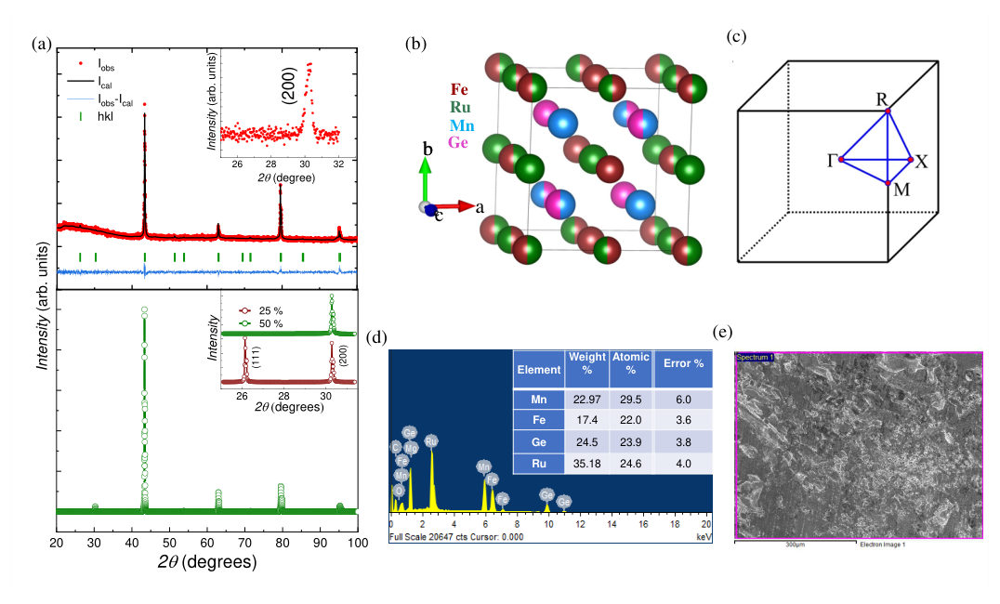
<figcaption class="paper-figure-caption"><b>Fig 1.</b> Figure 1. (Color online) (a) Upper panel: Rietveld refinement of the room-temperature powder X-ray diffraction pattern of polycrystalline FeRuMnGe. The vertical tick marks indicate the allowed Bragg reflections, while the blue line represents the difference between the observed and fitted profiles. The inset shows the enlarged view of the (200) reflection peak. Lower panel: Simulated X-ray diffraction patterns of FeRuMnGe generated using VESTA software for 25% and 50% B2 disorder. The inset shows the magnified view of the (111) and (200) superlattice reflections for 25% and 50% B2 disorder. (b) Disordered (50% B2) crystal structure of FeRuMnGe. (c) Corresponding Brillouin zone. (d)...</figcaption>
</figure>
<figure class="paper-figure-card">
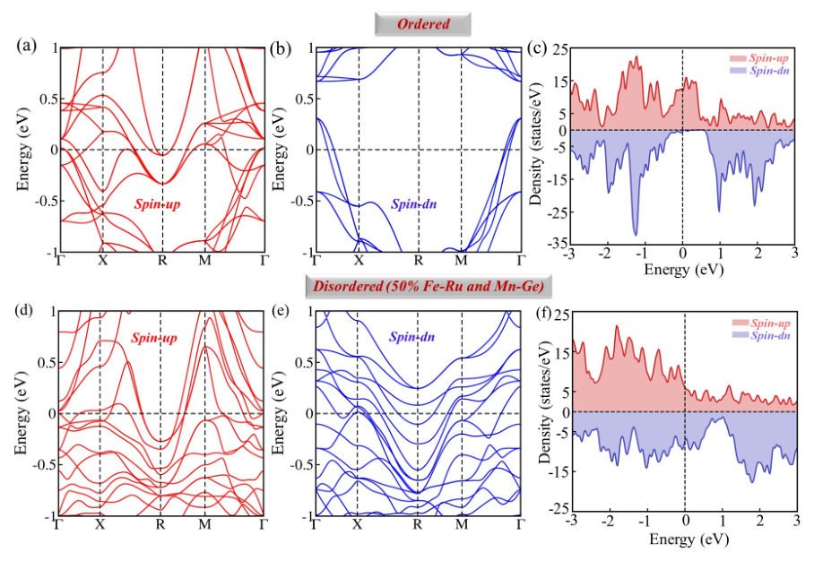
<figcaption class="paper-figure-caption"><b>Fig 2.</b> Figure 2. (a–c) Electronic band structure and density of states (DOS) of the ordered phase; (d–f) corresponding results for the Fe–Ru and Mn–Ge antisite-disordered phase. The spin-up and spin-down channels are represented by red and blue colors, respectively.</figcaption>
</figure>
<figure class="paper-figure-card">
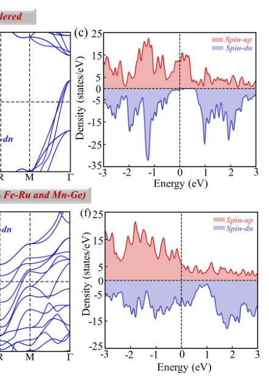
<figcaption class="paper-figure-caption"><b>Fig 3.</b> Fig. 1(a) shows the room-temperature PXRD pattern of the polycrystalline FeRuMnGe sample along with the Ri- etveld refinement profile, Bragg peak positions, and the corresponding difference curve. The excellent agreement between the observed and calculated patterns confirms the formation of a single-phase compound. The refinement re- veals that FeRuMnGe crystallizes in the LiMgPdSn-type structure with space group F43m (No. 216) and lattice parameter ∼5.898(5) ˚A. The atomic arrangement corre- sponds to Fe occupying the 4a (0, 0, 0) site, Ru 4b ( 1</figcaption>
</figure>
<figure class="paper-figure-card">
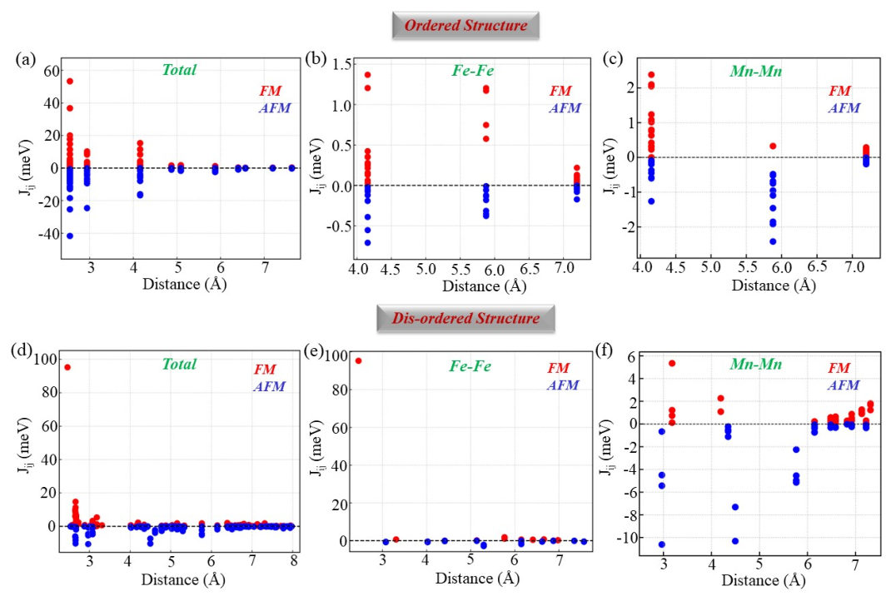
<figcaption class="paper-figure-caption"><b>Fig 4.</b> Figure 3. Heisenberg exchange interactions (Jij) as a function of interatomic distance. Panels (a–c) correspond to the ordered structure, showing (a) total exchange interactions, (b) Fe–Fe interactions, and (c) Mn–Mn interactions. Panels (d–f) represent the Fe–Ru and Mn–Ge antisite-disordered structures, displaying (d) total exchange interactions, (e) Fe–Fe interactions, and (f) Mn–Mn interactions. Positive (negative) values of Jij indicate ferromagnetic (antiferromagnetic) coupling.</figcaption>
</figure>
<figure class="paper-figure-card">
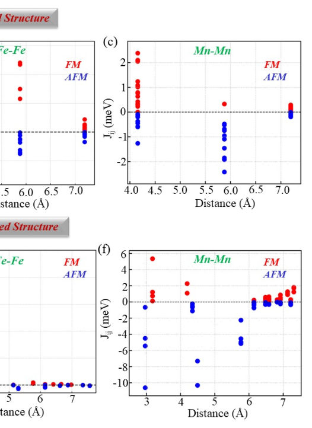
<figcaption class="paper-figure-caption"><b>Fig 5.</b> Fig. 4(a–c) presents the temperature-dependent dc- susceptibility χ(T) of FeRuMnGe. The χ(T) curves mea- sured under an applied field of 0.1 T, following zero-field- cooled (ZFC) and field-cooled (FC) protocols, are shown in Fig. 4(a). A clear separation between the ZFC and FC curves is observed below the temperature ≃75 K. Under ZFC conditions, upon cooling below the freezing temper- ature (Tf), the spins undergo collective freezing without any preferred orientation. When a magnetic field is subse- quently applied, the spins attempt to align along the field direction; however, due to intrinsic frustration and compet- ing interactions, the system becomes trapped in metastable states,...</figcaption>
</figure>

**Summary.** This paper explores how structural disorder in the Heusler alloy FeRuMnGe dictates its magnetic properties. By combining X-ray diffraction and DFT calculations, the authors show that antisite disorder introduces competing magnetic interactions. This competition ultimately drives the material into a characteristic cluster-glass magnetic state.

**Why it may be interesting.** The investigation of disorder-driven magnetic frustration and the resulting glassy state in a crystalline solid provides a model system for understanding complex many-body interactions in disordered quantum materials.

Detailed structure

**Main problem.** The study investigates how atomic disorder influences the magnetic ground state of the quaternary Heusler alloy FeRuMnGe, specifically focusing on the emergence of glassy magnetic behavior.

**Main result.** The research establishes a direct link where antisite disorder drives the system to exhibit competing magnetic interactions, resulting in a cluster-glass state coexisting with long-range magnetic order.

**Method.** The work combines experimental techniques like X-ray diffraction and magnetization measurements with theoretical calculations using DFT to model the effects of disorder.

**Model / system.** The system is the quaternary Heusler alloy FeRuMnGe, which adopts the LiMgPdSn-type structure. Disorder is modeled by considering B2-type antisite intermixing of Fe–Ru and Mn–Ge sites.

**Key observables.** B2-type antisite disorder, competing ferromagnetic and antiferromagnetic couplings, cluster-glass state signatures (ZFC/FC separation), and changes in electronic character (half-metallic to metallic).

**Important parameters / regimes.** Temperature (especially below 161 K), magnetic field (up to 5 T), and the degree of antisite disorder (e.g., 25% to 50%).

**Assumptions / limitations.** The analysis assumes that the observed magnetic behavior is directly governed by the structural disorder introduced via antisite mixing.

**Figures summary.** Figures illustrate PXRD patterns showing disorder, electronic band structures comparing ordered vs. disordered states, and magnetization curves showing ZFC/FC separation indicative of spin-glass behavior.

**Paper structure.** The paper follows a structure of presenting experimental evidence of disorder (XRD, magnetization), followed by theoretical modeling (DFT calculations of electronic structure and magnetic interactions) to explain the observed magnetic frustration and glassy state.

Abstract

In this combined experimental and theoretical study, we investigate the role of disorder in governing the magnetic ground state of the quaternary Heusler alloy FeRuMnGe. In the FeRuMnZ (Z = Ga, Si) series, chemical substitution modifies atomic ordering and electronic structure, resulting in distinct magnetic ground states. Motivated by this, we extend the series to FeRuMnGe. X-ray diffraction reveals B2-type antisite disorder, where Fe--Ru and Mn--Ge intermix. Theoretical calculations show that such disorder modifies exchange interactions, leading to competing ferromagnetic and antiferromagnetic couplings, and drives the system from half-metallic to metallic. Magnetic measurements reveal competing interactions, giving rise to a cluster-glass state coexisting with long-range magnetic order. The absence of a thermodynamic signature at $T_f$, together with ac susceptibility and relaxation measurements, supports the presence of short-range magnetic interactions and a glassy magnetic state. The compound exhibits an enhanced magnetic response below $\sim 161$ K and a maximum magnetization of $\sim 1.64~μ_B$/f.u. at 5 T. Overall, this work establishes a direct correlation between antisite disorder, competing exchange interactions, and glassy magnetism in quaternary Heusler alloys. Combined experimental results and theoretical calculations reveal that disorder drives the system from an AFM-dominated state in FeRuMnSi to an FM-dominated state in FeRuMnGe, providing deeper insight into the role of the extent of disorder in governing the magnetic properties of QHAs.

[↑ back to top](#top)

### [GadIR: A Spatial-Topology Preserving Compiler for Quantum Many-Body Systems Simulation](http://arxiv.org/abs/2609.01771v1)

**Authors:** Xiangyu Ren, Yuexun Huang, Zhaohui Yang, Yuchen Zhu, Tsung-Wei Huang, Tsung-Yi Ho, Zhiding Liang, Antonio Barbalace  
**Type:** theory · **Category:** quantum information and computing · **PDF:** <https://arxiv.org/pdf/2609.01771v1>  
**Analysis basis:** full PDF text, analyzed in chunks
**Topic relevance:** `analog quantum simulation` **3/5**

↔ Scroll figures horizontally

<figure class="paper-figure-card">
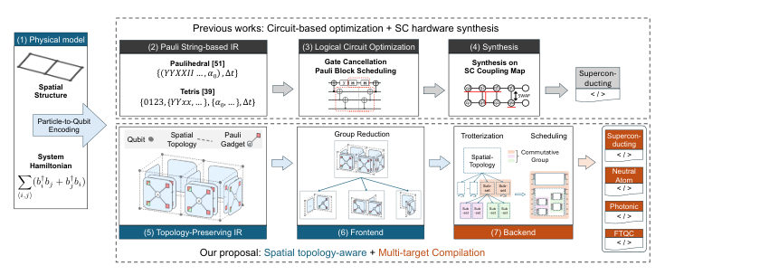
<figcaption class="paper-figure-caption"><b>Fig 1.</b> Figure 1: Comparison between our proposed framework and the frameworks in previous research [58, 68, 76, 81].</figcaption>
</figure>
<figure class="paper-figure-card">
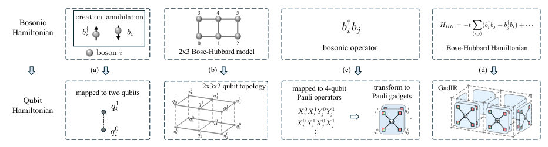
<figcaption class="paper-figure-caption"><b>Fig 2.</b> Figure 2: Mapping a 2 × 3 Bose-Hubbard model to qubit Hamiltonian, and construct the corresponding GadIR.</figcaption>
</figure>
<figure class="paper-figure-card">
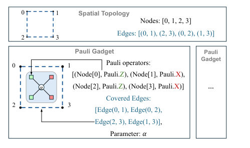
<figcaption class="paper-figure-caption"><b>Fig 3.</b> Figure 3: GadIR syntax. Up: the spatial topology graph for Hamiltonian of many-body system model. Down: the Pauli gadgets corresponding to Hamiltonian terms, including their operators and the edges they cover on topology graph.</figcaption>
</figure>
<figure class="paper-figure-card">
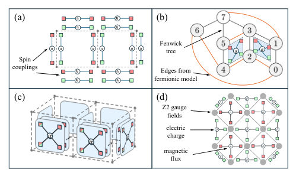
<figcaption class="paper-figure-caption"><b>Fig 4.</b> Figure 5: Examples of GadIR for (a) spin-qubit, (b) fermionic, (c) bosonic and (d) lattice gauge theory models.</figcaption>
</figure>
<figure class="paper-figure-card">
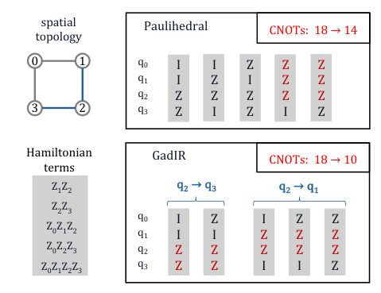
<figcaption class="paper-figure-caption"><b>Fig 5.</b> Figure 4: Comparison of Paulihedral and GadIR on the ability of capturing gate cancellation opportunities. On the left are the Hamiltonian and its spatial topology. On the right are the sequences of Pauli terms ordered by Paulihedral or GadIR approach, while the gate cancellations are highlighted in red. The results show that GadIR gains more CNOT reductions.</figcaption>
</figure>

**Summary.** This paper introduces GadIR, a novel intermediate representation designed to compile quantum many-body Hamiltonians while explicitly preserving the underlying spatial topology of the physical system. By using Pauli gadgets, the compiler frontend performs hardware-agnostic group reductions, leading to significant reductions in circuit overhead when synthesizing programs for various quantum hardware architectures.

**Why it may be interesting.** This work directly addresses the crucial bottleneck of mapping complex physical Hamiltonians onto abstract quantum hardware instructions, providing a structured, topology-aware compilation pipeline relevant to all quantum simulation efforts.

Detailed structure

**Main problem.** The core problem is efficiently compiling the Hamiltonians of quantum many-body systems into quantum circuits suitable for diverse quantum hardware architectures.

**Main result.** The proposed compiler, utilizing GadIR, achieves a significant reduction in compilation overhead across multiple quantum hardware platforms compared to previous state-of-the-art methods.

**Method.** The authors introduce GadIR, a Pauli gadget-based intermediate representation that explicitly preserves the spatial topology of the physical model. The compiler uses a hardware-independent group reduction frontend and a topology-guided backend for synthesis.

**Model / system.** The framework is tested on canonical quantum many-body systems, including the Bose-Hubbard model and Lattice Gauge Theories, which are mapped onto qubit Hamiltonians defined on specific spatial lattices.

**Key observables.** Compilation overhead reduction (e.g., CNOT/CZ count, depth, non-Clifford gate count) across superconducting, neutral-atom, FTQC, and MBQC backends.

**Important parameters / regimes.** The complexity and structure of the physical Hamiltonian, the specific quantum hardware architecture targeted, and the lattice size/dimensionality.

**Assumptions / limitations.** The primary assumption is that preserving the spatial topology via GadIR leads to a more optimized compilation path than standard Pauli string representations. The analysis relies on specific encoding techniques (e.g., Jordan-Wigner) and Trotterization approximations.

**Figures summary.** Figures illustrate the workflow from physical model to Hamiltonian to the GadIR representation, comparing the topological awareness of the proposed method against prior art. Other figures show quantitative comparisons of gate counts and circuit metrics across different hardware backends.

**Paper structure.** The paper introduces the limitations of existing Pauli string representations, proposes the GadIR IR to retain spatial topology, details the compiler frontend (group reduction) and backend (Trotterization/scheduling), and validates the approach across multiple physical models and quantum hardware backends.

Abstract

Simulating quantum many-body systems has been one of the most important applications of quantum computation. For simulation, the Hamiltonian of a physical system is compiled into quantum programs with native instructions for quantum hardware. In previous works, the Hamiltonian is represented as Pauli strings, then compiled and optimized based on the quantum circuit model. Such representation paradigm neglects the spatial topology of original physical models, which is vital information to reducing the overhead of compiling many-body systems Hamiltonians.   To address such neglect, we introduce a spatial-topology preserving compiler for quantum many-body simulation. Using Pauli gadgets as the representations of the Hamiltonian, we introduce our intermediate representation -- GadIR, to preserve the spatial-topology information of original physical models. Our compiler frontend performs the group reduction algorithm based on Pauli gadget model, which is a hardware-independent optimization. Our compiler backend performs trotterization and scheduling on Pauli gadgets, then synthesizes the Pauli gadgets into hardware-native quantum programs. We evaluate our compiler on all the canonical quantum many-body system models, while achieving a significant reduction on compilation overhead regarding four major quantum architectures. Overall, our spatial-topology preserving IR exploits the compilation optimization space for quantum many-body systems Hamiltonian.

[↑ back to top](#top)

### [Heuristically optimizing, synthesizing, and prioritizing measurement settings for quantum state tomography](http://arxiv.org/abs/2609.02633v1)

**Authors:** Sumukh S. Moudghalya, Anton Frisk Kockum, Akshay Gaikwad  
**Type:** theory · **Category:** quantum information and computing · **PDF:** <https://arxiv.org/pdf/2609.02633v1>  
**Analysis basis:** full PDF text, analyzed in chunks
**Topic relevance:** `quantum measurements` **3/5**

↔ Scroll figures horizontally

<figure class="paper-figure-card">
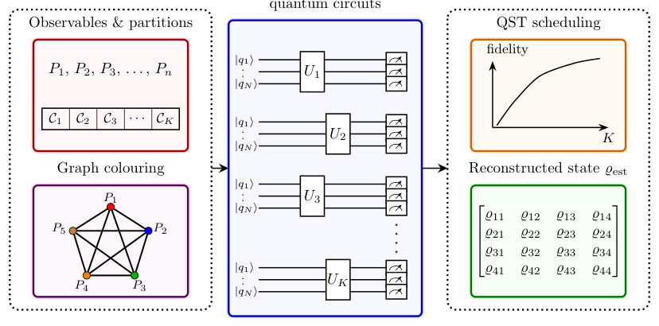
<figcaption class="paper-figure-caption"><b>Fig 1.</b> Figure 1. Schematic workflow of measurement scheduling for quantum state tomography using graph coloring. First, an informationally complete set of quantum observables {P1, P2, P3, . . . , Pn} is partitioned, using heuristic GC algorithms, into K commuting subsets C1, C2, . . . , CK, which correspond to measurement settings. For each such subset (color class), corresponding quantum circuits with unitaries {U1, U2, U3, . . . , UK} are compiled. The resulting measurement data are acquired and processed using a scheduling strategy, illustrated as the fidelity improving with the number of executed settings K, to reconstruct an estimate ϱest of the density matrix describing the system state.</figcaption>
</figure>
<figure class="paper-figure-card">
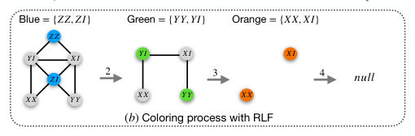
<figcaption class="paper-figure-caption"><b>Fig 2.</b> Figure 2. Pictorial representation of the graph coloring pro- cess using (a) DSATUR (upper panel) and (b) RLF (bot- tom panel) applied to the two-qubit Pauli-operator subset P = {XI, Y I, ZI, XX, Y Y, ZZ} as an example.</figcaption>
</figure>
<figure class="paper-figure-card">
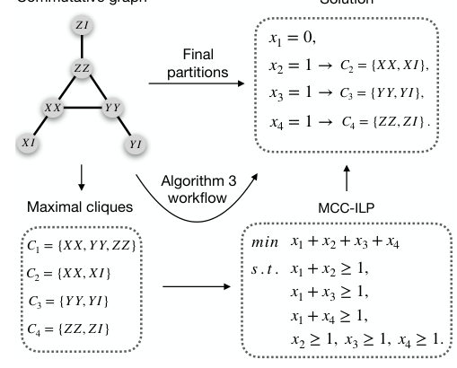
<figcaption class="paper-figure-caption"><b>Fig 3.</b> Figure 3. Illustration of the minimum-clique-cover (MCC) formulation of operator partitioning using an approach based on integer linear programming (ILP), demonstrated for the operator set P = {XI, Y I, ZI, XX, Y Y, ZZ} (the same as in Fig. 2). The procedure begins by constructing the cor- responding commutation graph, followed by identification of maximal cliques. The MCC is then formulated as an ILP optimization task using Algorithm 3 in Appendix A, and the final partitions are obtained by solving the resulting ILP.</figcaption>
</figure>
<figure class="paper-figure-card">
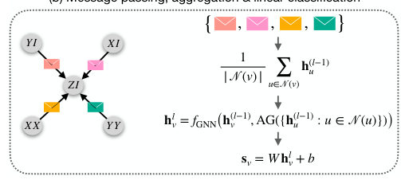
<figcaption class="paper-figure-caption"><b>Fig 4.</b> Figure 4. Graphical overview of the GNN-based GC frame- work. (a) Initial graph representation and node-feature em- bedding. (b) Internal GNN processing pipeline consisting of message passing, neighborhood aggregation, and linear clas- sification. (c) Final GC solution, where nodes are assigned to color classes corresponding to mutually commuting operator partitions.</figcaption>
</figure>
<figure class="paper-figure-card">
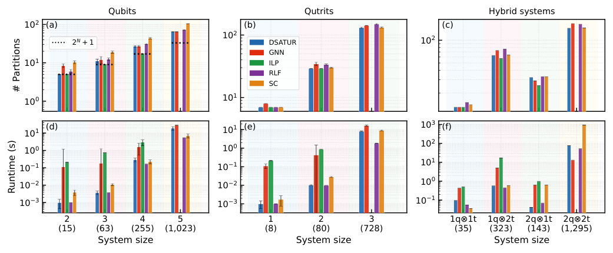
<figcaption class="paper-figure-caption"><b>Fig 5.</b> Figure 5. Benchmarking of graph-coloring (GC) algorithms for operator partitioning. (a)–(c) The number of partitions obtained and (d)–(f) the corresponding computational runtime for five different GC algorithms (shown in different colors) across multi- qubit systems [first column, i.e., (a) and (d)], multi-qutrit systems [second column, i.e., (b) and (e)], and hybrid systems with both qubits and qutrits [third column, i.e., (c) and (f)]. In all panels, the x axis shows the system size (number of qubits and qutrits), with the total number of operators indicated in parentheses below each case. In panel (a), the dotted black line indicates the optimal reference value, 2N + 1 partitions, for...</figcaption>
</figure>

**Summary.** This paper introduces a novel, efficient computational framework to optimize Quantum State Tomography (QST) by reformulating the measurement setting selection as a Graph Coloring problem. By applying heuristic graph coloring algorithms, the authors drastically reduce the number of required measurements compared to exhaustive methods. This enables practical, priority-based scheduling for characterizing complex quantum systems on NISQ devices.

**Why it may be interesting.** It provides a scalable, computational framework for optimizing the data acquisition stage of quantum characterization, which is crucial for experimental quantum computing platforms.

Detailed structure

**Main problem.** The core problem is efficiently determining the minimal and prioritized set of measurement settings required for Quantum State Tomography (QST) for an arbitrary set of operators.

**Main result.** The framework successfully uses Graph Coloring heuristics to substantially reduce the number of required measurement settings compared to brute-force methods, enabling priority-based scheduling that maximizes information gain.

**Method.** The problem is reformulated as a Graph Coloring (GC) problem, solved using efficient heuristic algorithms like DSATUR and RLF, followed by synthesizing Clifford circuits for joint measurements.

**Model / system.** The work is validated on multi-qubit (up to five qubits), multi-qutrit (up to three qutrits), and hybrid qubit-qutrit systems, focusing on reconstructing the density matrix $\rho$.

**Key observables.** The estimated density matrix ($\rho_{est}$), the number of required measurement settings (color classes), and the information gain per experiment.

**Important parameters / regimes.** The dimensionality of the Hilbert space (up to 5 qubits/3 qutrits) and the number of operators to be measured.

**Assumptions / limitations.** The primary assumption is that the problem can be effectively modeled and solved using graph coloring heuristics, bypassing the intractable nature of brute-force search.

**Figures summary.** Figure 1 illustrates the workflow: partitioning observables via GC, compiling quantum circuits, and using scheduling to reconstruct the density matrix, showing fidelity improvement with more settings.

**Paper structure.** The paper reviews standard QST, introduces the GC formulation for measurement setting optimization, and details the measurement-scheduling strategy for maximizing information gain.

Abstract

A key task in many quantum-computing applications, e.g., quantum simulation and quantum state tomography (QST), is to partition an arbitrary set of operators into mutually commuting subsets for efficient measurements. However, brute-force approaches to this task quickly become intractable as the number and dimensionality of operators grow. Here, we reformulate operator partitioning as a graph-coloring (GC) problem and develop an efficient computational framework to solve it, balancing accuracy and efficiency. Our framework enables leveraging a range of GC algorithms, which we benchmark for operator partitioning. Then, we demonstrate their utility in optimizing QST experiments, where determining non-overlapping data acquisition settings for QST is a major challenge, and prioritizing among these settings, i.e., selecting the experiments that provide the most information. We further show how to perform these experiments by synthesizing Clifford circuits for joint measurement of commuting Pauli operators in multi-qubit systems. We validate our framework across multi-qubit (up to five qubits), multi-qutrit (up to three qutrits), and hybrid qubit-qutrit systems. Our results show that heuristic GC methods substantially reduce the number of required measurement settings for QST and enable priority-based scheduling that maximizes the information gain per experiment. The optimization converges within minutes on a student-grade laptop, providing speedups of several orders of magnitude over brute-force methods already for these relatively small quantum systems. This demonstrates the potential of GC heuristics as a scalable and practical tool for characterization of noisy intermediate-scale quantum devices. We have made the Python implementation of our GC framework to optimize and schedule QST experiments publicly available at https://github.com/ssm8015/QST_GT.git.

[↑ back to top](#top)

### [Non-Additivity of Microwave-Shielded Interactions between Dipolar Molecules](http://arxiv.org/abs/2609.01940v1)

**Authors:** Fabian Prieschl, Andreas Schindewolf, Robert E. Zillich  
**Type:** theory · **Category:** quantum gases · **PDF:** <https://arxiv.org/pdf/2609.01940v1>  
**Analysis basis:** full PDF text, analyzed in chunks
**Topic relevance:** `analog quantum simulation` **3/5**

↔ Scroll figures horizontally

<figure class="paper-figure-card">
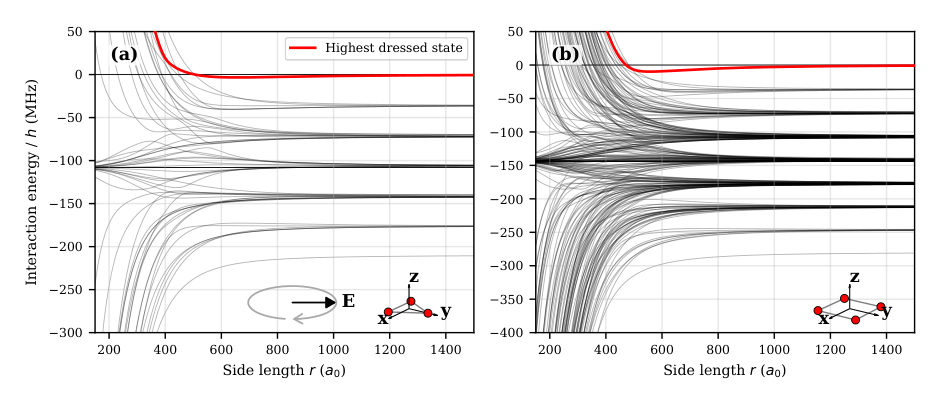
<figcaption class="paper-figure-caption"><b>Fig 1.</b> FIG. 1. Overview of all adiabatic PESs in the xy-plane for 3 dipoles forming an equilateral triangle of side length r (a) and of 4 dipoles forming a square of side length r (b). The highest-energy adiabatic surface is highlighted in red. The insets depict the respective molecular configurations in the coordinate frame. Panel (a) additionally illustrates the microwave electric field vector E rotating in the xy-plane.</figcaption>
</figure>
<figure class="paper-figure-card">
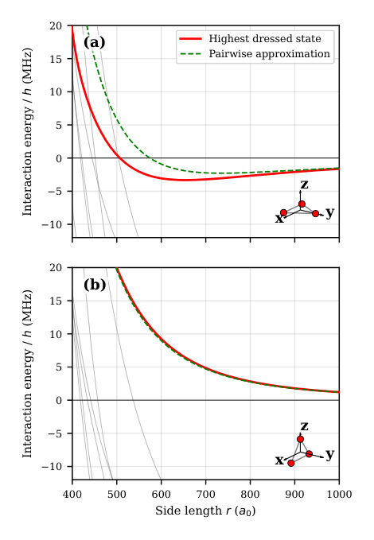
<figcaption class="paper-figure-caption"><b>Fig 2.</b> FIG. 2. Interaction energy of three dipoles arranged in an equilateral triangle in the xy-plane (a) and xz-plane (b). The solid red curve represents the exact highest-energy dressed state, while the dashed green curve shows the pairwise ap- proximation.</figcaption>
</figure>
<figure class="paper-figure-card">
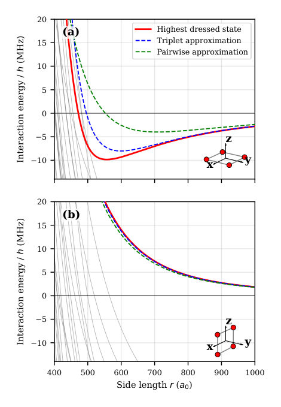
<figcaption class="paper-figure-caption"><b>Fig 3.</b> FIG. 3. Interaction energy of four dipoles arranged in a square in the xy-plane (a) and xz-plane (b). The solid red curve corresponds to the exact highest-energy dressed state. The dashed green and blue curves represent the pairwise and triplet approximations, respectively.</figcaption>
</figure>
<figure class="paper-figure-card">
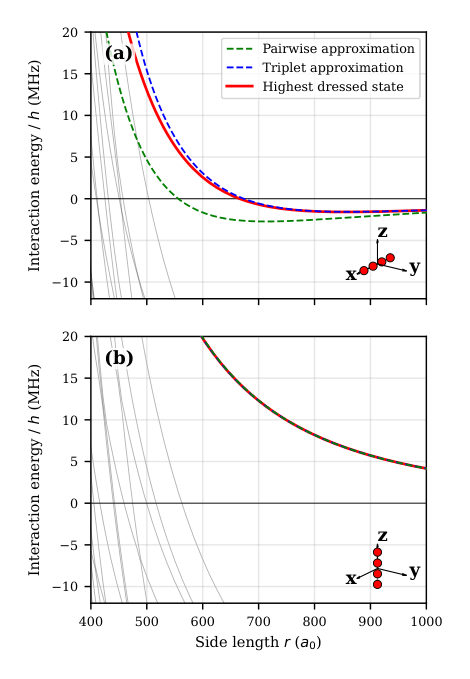
<figcaption class="paper-figure-caption"><b>Fig 4.</b> FIG. 4. Interaction energy of four dipoles arranged in a linear chain along the x-axis (a) and z-axis (b). The solid red curve represents the exact highest-energy dressed state, while the dashed green and blue curves show the pairwise and triplet approximations, respectively.</figcaption>
</figure>
<figure class="paper-figure-card">
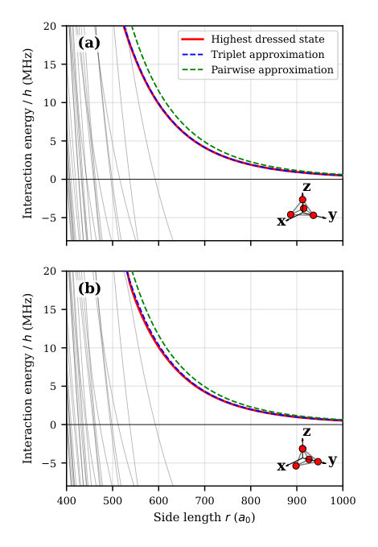
<figcaption class="paper-figure-caption"><b>Fig 5.</b> FIG. 5. Interaction energy of four dipoles arranged in a reg- ular tetrahedron with the base oriented in the xy-plane (a) and xz-plane (b). The solid red curve represents the exact highest-energy dressed state, while the dashed green and blue curves show the pairwise and triplet approximations, respec- tively.</figcaption>
</figure>

**Summary.** This theoretical work demonstrates that the effective interactions between microwave-shielded dipolar molecules are not simply the sum of pairwise interactions. By analyzing the many-body potential energy for small clusters, the authors show that non-additive, many-body effects dominate the attractive potential well, which is critical for forming self-bound quantum clusters.

**Why it may be interesting.** This work directly addresses the limitations of simple mean-field or pairwise interaction models in strongly correlated quantum systems, which is crucial for designing stable quantum matter like dipolar BECs.

Detailed structure

**Main problem.** The study investigates the validity of assuming pairwise additivity when calculating the effective interactions between multiple microwave-shielded dipolar molecules.

**Main result.** The pairwise approximation fails for planar configurations, as many-body effects significantly deepen the attractive potential well, necessitating the use of the full many-body potential energy.

**Method.** The authors calculated the many-body Potential Energy Surface (PES) for three and four molecules, comparing the full calculation against approximations based only on pair interactions.

**Model / system.** The system consists of dipolar molecules interacting via dipole-dipole forces, whose interactions are modified (shielded) by an external microwave field. The analysis uses the Born-Oppenheimer approximation and focuses on the resulting effective many-body Hamiltonian.

**Key observables.** The depth and position of the attractive potential well, and the repulsive barrier, as a function of molecular geometry (planar vs. out-of-plane).

**Important parameters / regimes.** The number of molecules (N=3, 4), the geometry (planar vs. out-of-plane), and the strength of the microwave field.

**Assumptions / limitations.** The analysis is restricted to single-MW shielding and assumes the validity of the Rotating Wave Approximation (RWA) for time-averaging.

**Figures summary.** Figures illustrate the PESs for 3 dipoles in an equilateral triangle and 4 dipoles in a square, showing the dependence on side length and highlighting the many-body nature of the attractive well.

**Paper structure.** The paper builds from the general Hamiltonian formulation to the effective time-independent Hamiltonian via RWA, then systematically compares the full many-body PES against lower-order approximations (pairwise, triplet) for small clusters.

Abstract

Theoretical models of the effective interactions between microwave-shielded polar molecules typically rely on the assumption of pairwise additivity. In this work, we test the validity of this pairwise approximation by evaluating the exact many-body potential energy for configurations of three and four molecules. We demonstrate that this approximation fails for molecule configurations in the plane of the circularly polarized microwave field. In these planar geometries, many-body effects significantly increase the depth of the attractive potential well and shift the position of the repulsive barrier. Although out-of-plane interactions in three-dimensional arrangements weaken this non-additivity, the effective interactions between microwave-shielded dipoles are not a simple sum of pair interactions. In particular, their attractive well, crucial for self-bound clusters, can only be described by the full many-body potential energy.

[↑ back to top](#top)

### [Precise spectral asymptotics, exponential localization, and spectral gap estimates for the three-boson lattice Schrödinger operator](http://arxiv.org/abs/2609.02488v1)

**Authors:** Abdikhurayra Toshturdiev, Abdumalik Eshniyozov, Janikul Abdullaev, Mikhail Dolgopolov  
**Type:** theory · **Category:** other · **PDF:** <https://arxiv.org/pdf/2609.02488v1>  
**Analysis basis:** full PDF text, analyzed in chunks
**Topic relevance:** `analog quantum simulation` **3/5**

↔ Scroll figures horizontally

<figure class="paper-figure-card">
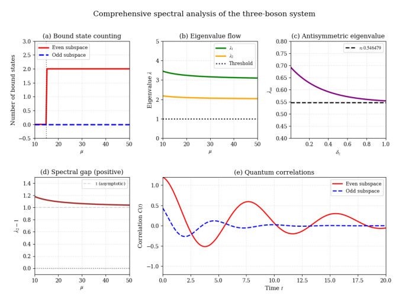
<figcaption class="paper-figure-caption"><b>Fig 1.</b> Figure 1. Comprehensive spectral analysis of the three-boson system. (a) Bound state counting: even subspace (solid red) supports exactly two bound states for 𝜇&gt; 15, odd subspace (dashed blue) has zero bound states. (b) Eigenvalue flow (schematic illustration, qualitatively consistent with Lemma 3.5; not numerically computed): 𝜆1 (green) and 𝜆2 (orange) above Birman–Schwinger threshold (black dotted line), with 𝜆2 →2 + 𝑂(1/𝜇) asymptotically. (c) Antisymmetric eigenvalue 𝜆𝑎𝑠(purple) converges to its theoretical limit ≈0.546479 (horizontal dashed line), given by the</figcaption>
</figure>
<figure class="paper-figure-card">
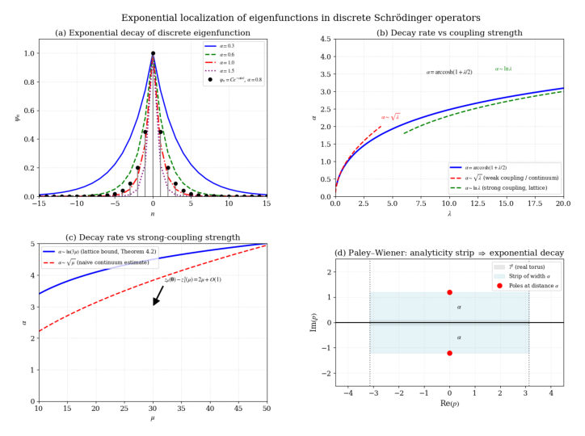
<figcaption class="paper-figure-caption"><b>Fig 2.</b> Figure 2. Mathematical foundations of exponential localization for discrete Schrödinger operators. (a) Exponential decay of the eigenfunction 𝜓𝑛= 𝐶𝑒−𝛼|𝑛| for the one-dimensional delta-potential 𝐻𝜆= −Δ −𝜆𝛿𝑛,0. Different curves correspond to different decay rates 𝛼, showing that the eigen- function decays exponentially on the discrete lattice Z. This provides an explicit counterexample to the claim that exponential localization is exclusively a continuous-space phenomenon. (b) Decay rate 𝛼as a function of the coupling strength 𝜆. The exact relation 𝜆= 2(cosh 𝛼−1) (solid blue) is shown together with its two asymptotic regimes: 𝛼∼ √</figcaption>
</figure>
<figure class="paper-figure-card">
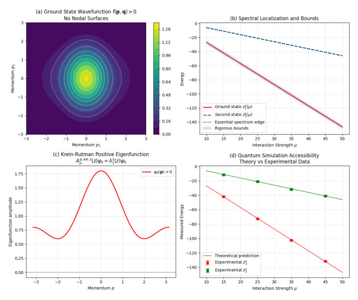
<figcaption class="paper-figure-caption"><b>Fig 3.</b> Figure 3. Fundamental positivity properties and spectral structure of the three-boson system. (a) Strict positivity of the ground state wavefunction. (b) Rigorous spectral bounds 𝑧𝑠 1(𝜇) ∈ (−3𝜇, −3𝜇+ 6). (c) Strictly positive eigenfunction 𝜓0 via Krein–Rutman. (d) Experimental accessibility.</figcaption>
</figure>
<figure class="paper-figure-card">
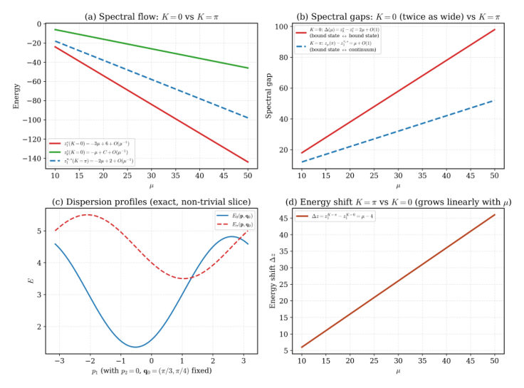
<figcaption class="paper-figure-caption"><b>Fig 4.</b> Figure 4. Comparison of spectral properties for total quasimomentum K = 0 and K = 𝝅. (a) Spectral flow: 𝑧𝑠 1(𝜇) = −3𝜇+ 6 + 𝑂(𝜇−1), 𝑧𝑠 2(𝜇) = −𝜇+ 𝐶+ 𝑂(𝜇−1) for K = 0 (solid); 𝑧𝜋,𝑠 1 (𝜇) = −2𝜇+ 6 + 𝑂(𝜇−1) for K = 𝝅(dashed). (b) Spectral gaps of a fundamentally differ- ent type: Δ(𝜇) = 𝑧𝑠 2 −𝑧𝑠 1 = 2𝜇+ 𝑂(1) at K = 0 is a bound-state-to-bound-state gap, whereas 𝑧𝜇(𝝅) −𝑧𝜋,𝑠 1 (𝜇) = 𝜇−2 + 𝑂(𝜇−1) at K = 𝝅is a bound-state-to-continuum gap — asymptot- ically half as wide. (c) Exact dispersion profiles 𝐸0(p, q0) and 𝐸𝝅(p, q0) along 𝑝1 at fixed non-trivial q0 = (𝜋/3, 𝜋/4) (the choice q0 = 0 is degenerate, since 𝐸𝝅(p, 0) ≡4 identically by 𝜀(p) + 𝜀(𝝅−p) = 4). (d) Energy shift Δ𝑧= 𝑧𝜋,𝑠 1 (𝜇) −𝑧𝑠 1(𝜇) =...</figcaption>
</figure>
<figure class="paper-figure-card">
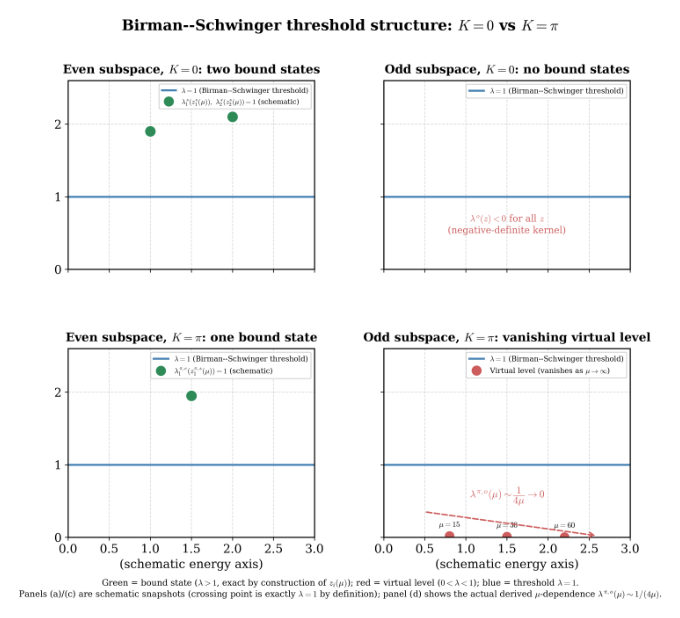
<figcaption class="paper-figure-caption"><b>Fig 5.</b> Figure 5. Schematic Birman–Schwinger threshold structure by symmetry sector. Panels (a)–(c) show, at a representative coupling, whether the leading eigenvalue of the corresponding sector’s principal-part kernel lies above the threshold 𝜆= 1 (green, bound state) or is negative/non-existent (odd sector at K = 0). Panel (d) shows the actual derived 𝜇-dependence of the K = 𝝅odd-sector eigenvalue, 𝜆𝜋,𝑜(𝜇) ∼1/(4𝜇) (Section 5.3.5), explicitly visualizing that this virtual level vanishes as 𝜇→∞rather than persisting at a fixed value.</figcaption>
</figure>

**Summary.** This theoretical work provides a detailed spectral analysis of three interacting bosons on a 2D lattice, determining the asymptotic behavior of bound states and the spectral gap in the strong-coupling limit. Using advanced spectral methods, the authors establish precise energy formulas and prove exponential localization of the ground state. These results are highly relevant for understanding quantum simulation experiments using optical lattices.

**Why it may be interesting.** The rigorous spectral analysis of few-body systems in optical lattices provides fundamental insights into quantum many-body physics, directly impacting the theoretical understanding of quantum simulation.

Detailed structure

**Main problem.** The paper investigates the spectral properties, including bound states and spectral gaps, of the three-boson Schrödinger operator on a two-dimensional lattice.

**Main result.** The study derives precise asymptotic formulas for the bound state energies at zero and pi quasimomenta, and establishes exponential localization of the ground-state wavefunction in the strong-coupling limit.

**Method.** The analysis employs advanced spectral theory tools such as the Birman-Schwinger principle, invariant subspace decomposition, the discrete Agmon comparison method, and the Krein-Rutman theorem.

**Model / system.** The model is a three-boson system interacting via pairwise contact interactions on the two-dimensional integer lattice ($\mathbb{Z}^2$). The Hamiltonian is analyzed in both real space and momentum space.

**Key observables.** Bound state energies ($z_s(\mu)$), spectral gap ($\Delta(\mu)$), and the decay rate ($\alpha(\mu)$) of the ground-state wavefunction.

**Important parameters / regimes.** Interaction strength ($\mu$) in the strong-coupling limit ($\mu 	o \infty$), and the total quasimomentum ($K=0$ and $K=\pi$).

**Assumptions / limitations.** The analysis relies on systematic invariant subspace decomposition and rigorous remainder estimates to control strong-coupling asymptotics; the sharp asymptotic rate for localization is conjectured.

**Figures summary.** Not specified, but the notes mention Table 1 comparing spectral properties across different few-body lattice systems, and Table 5 comparing Fredholm determinant asymptotics.

**Paper structure.** The paper systematically analyzes the Hamiltonian via direct integral decomposition over quasimomentum $K$, focusing on the extremal points $K=0$ and $K=\pi$ to derive asymptotic results for bound states and spectral gaps.

Abstract

We study the three-boson Schrodinger operator on the two-dimensional integer lattice with pairwise contact interactions. First, we obtain precise asymptotics of the two bound states below the essential spectrum at zero total quasimomentum in the strong-coupling limit mu to infinity: the ground state energy is -3 mu + 6 + O(1/mu), and the first excited state energy is - mu + C + O(1/mu), where C = 4 - delta approximately 3.96458, with delta determined by the transcendental equation b0(delta) = 1/(1+delta) involving the lattice Green's function. The associated spectral gap is 2 mu + O(1). Second, using the discrete Agmon comparison method and the Paley-Wiener theorem, we establish exponential localization of the ground-state wavefunction with a logarithmic upper bound on the decay rate alpha(mu) at most ln(3 mu) + O(1/mu), reflecting the bounded nature of the lattice dispersion; the sharp asymptotic rate is conjectured. Third, at quasimomentum pi, the parity symmetry is preserved, but the odd quadratic form becomes positive definite with a unique eigenvalue of order 1/mu that never reaches the Birman-Schwinger threshold, so the odd subspace yields only a virtual level. The even subspace supports exactly one bound state with energy -2 mu + 6 + 8/mu + O(1/mu^2), and the spectral gap to the essential spectrum is mu - 2 - 8/mu + O(1/mu^2). The reduction from two bound states at zero to one at pi preserves the total spectral flow and is a lattice-specific phenomenon. Our approach uses an invariant subspace decomposition of the Birman-Schwinger operator and the Krein-Rutman theorem to guarantee uniqueness and strict positivity of the ground state. These results have direct implications for quantum simulation of few-boson systems in optical lattices.

[↑ back to top](#top)

### [Quantum MeanFlow: single-shot generative sampling on NISQ hardware](http://arxiv.org/abs/2609.02186v1)

**Authors:** Ashish Joshi, Eshaan Mistry, Takahiko Koyama  
**Type:** both · **Category:** quantum information and computing · **PDF:** <https://arxiv.org/pdf/2609.02186v1>  
**Analysis basis:** full PDF text, analyzed in chunks
**Topic relevance:** `QC/QI experiment` **3/5**

↔ Scroll figures horizontally

<figure class="paper-figure-card">
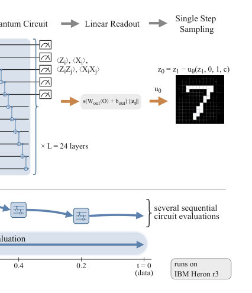
<figcaption class="paper-figure-caption"><b>Fig 1.</b> Figure 1: Overview of the quantum flow matching (QFM) and quantum MeanFlow (QMF) models. We train both models on the MNIST dataset. A classical autoen- coder provides the data latent vectors, which are the inputs for a parameterized quantum circuit. This circuit learns the velocity fields between the noise and data distribution. QFM requires many sequential evaluations of the trained circuit for sampling while QMF is designed to sample with a single circuit evaluation per mea- surement basis.</figcaption>
</figure>
<figure class="paper-figure-card">
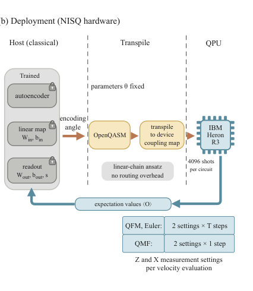
<figcaption class="paper-figure-caption"><b>Fig 2.</b> Figure 2: Training and sampling pipeline. (a) Training procedure for the QFM and QMF models. Both models share the same classical backbone, with an autoencoder providing the data latent vector. The quantum circuit in QFM learns the instan- taneous velocity while in QMF, it learns the average velocity. (b) Once the models are trained, sampling can be performed on QPU.</figcaption>
</figure>
<figure class="paper-figure-card">
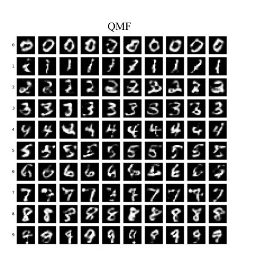
<figcaption class="paper-figure-caption"><b>Fig 3.</b> Figure 3: Samples generated by the QFM model (left) and the QMF model (right) with statevector simulation. For QFM sampling, we used 60 time steps and Heun integrator, while the QMF sampling is done with a single step.</figcaption>
</figure>
<figure class="paper-figure-card">
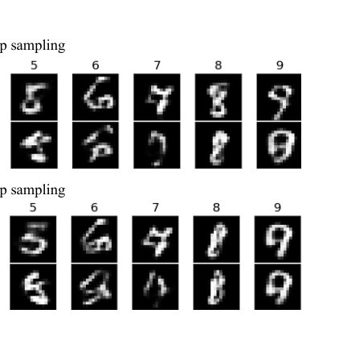
<figcaption class="paper-figure-caption"><b>Fig 4.</b> Figure 4: Samples generated on QPU compared with those obtained from the simu- lator. (a) QFM samples with 5 time steps and Euler integrator. (b) QMF single-step sampling. In both (a) and (b), top row shows samples generated on the simulator (sim) and the bottom row shows samples generated on the quantum hardware (hw).</figcaption>
</figure>
<figure class="paper-figure-card">
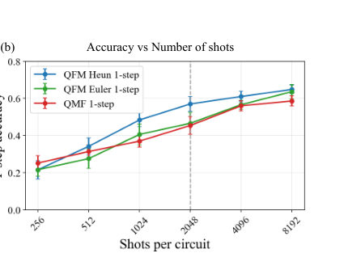
<figcaption class="paper-figure-caption"><b>Fig 5.</b> Figure 5: Single-step sampling performance as a function of the number of shots. (a) FID and (b) accuracy of both the QFM and QMF models. The dashed vertical line indicates the number of shots when single-step QFM using Heun’s method (two circuit evaluation per step per measurement basis) begins to generate higher quality images than single-step QMF sampling.</figcaption>
</figure>

**Summary.** This paper introduces Quantum MeanFlow (QMF), a novel quantum generative model designed to overcome the sequential circuit overhead of standard Quantum Flow Matching (QFM) on NISQ devices. By learning the average velocity over a time interval, QMF enables single-step sample generation, making quantum generative modeling significantly more viable in practice. The work demonstrates that this single-shot approach maintains competitive performance while drastically reducing quantum resource consumption.

**Why it may be interesting.** It directly addresses the practical implementation gap between theoretical quantum algorithms and current NISQ hardware constraints by proposing a fundamentally different, more efficient sampling mechanism.

Detailed structure

**Main problem.** The primary challenge is developing efficient generative sampling methods for quantum computation that overcome the high cost and sequential nature of multi-step sampling on Noisy Intermediate-Scale Quantum (NISQ) hardware.

**Main result.** The proposed Quantum MeanFlow (QMF) formulation allows for single-step sample generation, significantly reducing the required quantum circuit evaluations per generated sample compared to standard Quantum Flow Matching (QFM).

**Method.** QMF is introduced as the quantum analogue of MeanFlow, learning the average velocity over a time interval rather than the instantaneous velocity, enabling a single-shot sampling process.

**Model / system.** The models utilize Parameterized Quantum Circuits (PQCs) to learn velocity fields in a latent space derived from data like MNIST. The process is benchmarked on IBM quantum computers, operating within the framework of quantum generative models.

**Key observables.** Image quality (compared across single-step QMF, multi-step QFM, and single-step QFM), and the number of quantum circuit evaluations required per sample.

**Important parameters / regimes.** The latent space dimension (32-dimensional vector), the number of time steps (for comparison), and the quantum circuit depth/ansatz parameters.

**Assumptions / limitations.** The primary assumption is that reformulating the generative process to use average velocity (QMF) can circumvent the hardware limitations imposed by sequential circuit execution required by instantaneous velocity methods (QFM).

**Figures summary.** The figures compare the sampling quality and efficiency of QFM versus QMF, highlighting QMF's single-shot capability.

**Paper structure.** The paper introduces the limitations of sequential QFM sampling, proposes QMF based on MeanFlow theory, details the training using the MeanFlow identity loss, and benchmarks the method on MNIST, concluding with a comparison of computational cost.

Abstract

Quantum generative models offer a promising framework for exploring whether quantum computation can enhance generative machine learning. Flow matching is a generative method in which samples are generated by transporting a simple, known distribution to the target data distribution with a learned velocity field. Its quantum counterpart, known as quantum flow matching (QFM), was introduced recently, and, like its classical counterpart, requires integrating an ordinary differential equation over many time steps during inference. As each step requires the output from the previous step, the circuit submission is sequential and a drawback on quantum computers as they have high input/output costs. To alleviate this problem, we introduce Quantum MeanFlow (QMF), the quantum analogue of the MeanFlow formulation, which allows single-step sample generation. While the QFM learns an instantaneous velocity field at each time step, QMF learns the average velocity over a time interval. We use a parameterized quantum circuit to learn these velocity fields and benchmark the two methods on the MNIST dataset. We show that while single-step QMF has lower image quality compared to multi-step QFM, it performs better than the single-step QFM sampling at every shot count. Both of our models are executed on IBM quantum computers and best-of-N rejection sampling recovers most of the accuracy lost to device noise without modifying the circuit. This is especially advantageous for QMF which has only one circuit evaluation per image. Here, We establish QMF as a viable method for single-step quantum generative sampling, saving on quantum circuit evaluations per generated sample.

[↑ back to top](#top)

### [Reliable Sample-Level Quantum Error Mitigation via Dominance-Aware Clustering](http://arxiv.org/abs/2609.01744v1)

**Authors:** Mohsen Ghodrati, Kausthubh Chandramouli, Dror Baron  
**Type:** theory · **Category:** quantum information and computing · **PDF:** <https://arxiv.org/pdf/2609.01744v1>  
**Analysis basis:** full PDF text, analyzed in chunks
**Topic relevance:** `quantum measurements` **3/5**

↔ Scroll figures horizontally

<figure class="paper-figure-card">
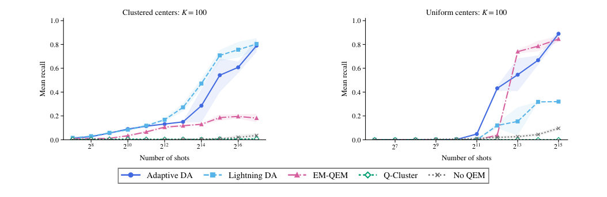
<figcaption class="paper-figure-caption"><b>Fig 1.</b> Fig. 1. Unknown-K center recovery for n = 100 and K = 100. Left: clustered centers. Right: uniformly drawn centers. Curves show mean recall and 95% confidence intervals over five independent streams. The clustered and uniform sweeps end at S = 131,072 and S = 32,768, respectively.</figcaption>
</figure>

**Summary.** This work proposes a novel, classical post-processing technique called dominance-aware (DA) refinement for Quantum Error Mitigation. It tackles the difficult problem of recovering specific quantum states (bitstrings) from noisy measurement distributions. By combining responsibility thresholding with a local dominance screen, the method significantly improves the accuracy of center recovery in simulated quantum optimization tasks.

**Why it may be interesting.** While focused on classical post-processing, the rigorous statistical framework for identifying underlying quantum states from noisy measurements is highly relevant to understanding the limitations and potential of quantum characterization techniques.

Detailed structure

**Main problem.** The paper addresses the challenge of performing reliable quantum error mitigation (QEM) when the goal is to recover specific bitstrings (samples) from noisy measurements, rather than just estimating expectation values.

**Main result.** The proposed dominance-aware (DA) refinement, combining responsibility thresholding and a local dominance screen, successfully recovers true centers in simulated MaxCut-QAOA experiments, significantly outperforming standard clustering methods.

**Method.** The core method involves formulating the problem as a mixture model and applying DA refinement, which uses source responsibilities and a dominance score to ensure that majority voting recovers the correct center with exponentially decreasing error probability.

**Model / system.** The model assumes the measured probability mass is a mixture of contributions from several latent, task-relevant bitstrings (centers), each associated with a source and characterized by specific bit-flip error rates.

**Key observables.** Dominance Score ($\Delta_A^k$), Precision ($	ext{P}_C$), Recall ($	ext{R}_C$), and the combined F1 score ($	ext{F}_C^1$).

**Important parameters / regimes.** The dimensionality of the bitstring ($n$), the number of centers ($K$), and the noise parameters (bit-flip rates $\epsilon_{k,i}$).

**Assumptions / limitations.** The dominance condition (source $k$ contributing $>50\%$ probability mass at every coordinate) is a sufficient, but not necessary, condition for successful center recovery.

**Figures summary.** The notes do not provide a summary of figures, but the evaluation benchmarks include synthetic $n=10$ streams, QAOA on $n=10$ MaxCut instances, and high-dimensional $n=100$ tests.

**Paper structure.** The paper develops the theoretical framework for sample-level QEM, introduces the DA refinement module (combining responsibility thresholding and local dominance screening), and validates this approach through extensive synthetic and simulated QAOA benchmarks.

Abstract

Many quantum algorithms for classically difficult optimization tasks must return high-quality bitstrings from finitely many circuit executions, whereas most quantum error-mitigation methods target expectation values. We study sample-level recovery when measured probability mass is distributed around multiple latent bitstrings, called centers. Each component of the measured probability mass is called a source and we assume that each center is associated with one source. We identify dominance-at every coordinate, more than half of a retained region's probability mass comes from one source and agrees with its center-as a sufficient condition under which majority voting recovers that center with exponentially decreasing error probability. We show that nearest-center assignment, as used in clustering algorithms such as the $k$-modes algorithm, can fail to produce dominated regions even when the true centers are known. This failure motivates responsibility thresholding and a local dominance screen, whose combination we call dominance-aware (DA) refinement. Synthetic and simulated MaxCut-QAOA experiments show that DA refinement favors precision, while $k$-modes with DA refinement improves overall center recovery. All procedures are classical post-processing and require no additional quantum-circuit executions.

[↑ back to top](#top)

### [Thermodynamic Electric Toroidal Dipole and Intrinsic Longitudinal Spin Transport](http://arxiv.org/abs/2609.02443v1)

**Authors:** Taisei Yamanaka, Takumi Sato, Satoru Hayami  
**Type:** theory · **Category:** strongly correlated electrons · **PDF:** <https://arxiv.org/pdf/2609.02443v1>  
**Analysis basis:** full PDF text, analyzed in chunks
**Topic relevance:** `Keldysh / 2PI / non-Gaussian methods` **3/5**

↔ Scroll figures horizontally

<figure class="paper-figure-card">
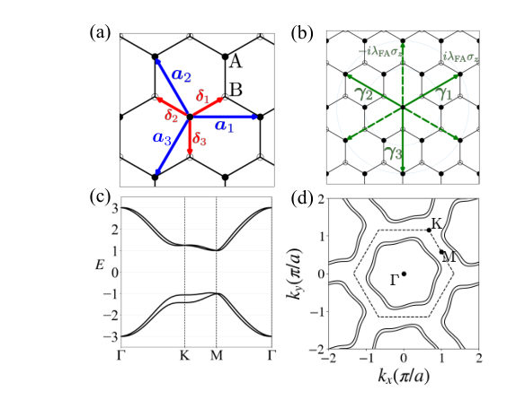
<figcaption class="paper-figure-caption"><b>Fig 1.</b> FIG. 1. (a) Honeycomb structure with the nearest-neighbor and next-nearest-neighbor vectors δi and ai. (b) Schematic representation of the ferroaxial hopping HFA. (c) Band structure for λFA = 0.1. The high-symmetry points are Γ = (0, 0), K = (0.5, 0), M = (0.5, 0.5) in units of the recipro- cal lattice vectors. (d) Constant-energy contour at E = 1.5 for λFA = 0.1. The hexagon represents the first Brillouin zone.</figcaption>
</figure>
<figure class="paper-figure-card">
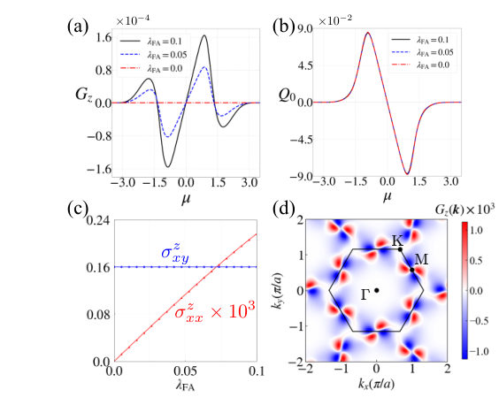
<figcaption class="paper-figure-caption"><b>Fig 2.</b> FIG. 2. Chemical potential dependence of thermodynamic ETD Gz and EM Q0 for λFA = 0.0, 0.05, 0.1 at T = 0.1. (c) λFA dependence of σz xy and σz xx in the insulating regime at T = 0.01. (d) Momentum-resolved contribution Gz(k) at T = 0.01 and µ = −0.5. The hexagon represents first Brillouin zone.</figcaption>
</figure>
<figure class="paper-figure-card">
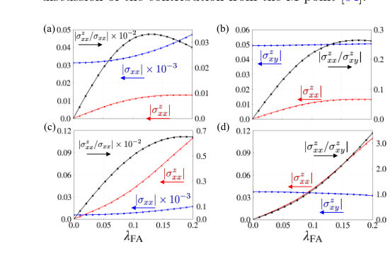
<figcaption class="paper-figure-caption"><b>Fig 3.</b> FIG. 3. Comparison of the longitudinal spin conductivity, spin Hall conductivity, and longitudinal electric conductivity in the metallic regime. (a),(b) Results for µ = 1.5. (c),(d) Results for µ = 1.05.</figcaption>
</figure>

**Summary.** This work develops a thermodynamic theory for the Electric Toroidal Dipole (ETD), a bulk order parameter characterizing ferroaxial electronic phases. By coupling the ETD to the spin-induced polarization, the authors establish a direct, quantitative relationship between the ETD and the intrinsic longitudinal spin conductivity. This provides a new theoretical tool to diagnose and quantify ferroaxial order in crystalline solids.

**Why it may be interesting.** While focused on topological/symmetry physics, the rigorous derivation of a bulk, gauge-invariant order parameter and its direct link to a measurable transport coefficient (spin conductivity) provides a powerful theoretical tool for characterizing novel electronic phases in condensed matter systems.

Detailed structure

**Main problem.** The paper addresses the challenge of defining a gauge-invariant, bulk thermodynamic order parameter for the Electric Toroidal Dipole (ETD) in periodic crystals, and linking it to intrinsic longitudinal spin transport.

**Main result.** The ETD is shown to be a finite order parameter exclusively in ferroaxial phases, and its chemical-potential derivative is directly proportional to the intrinsic longitudinal spin conductivity.

**Method.** The authors formulate the ETD thermodynamically by coupling a spatially varying electric field to the relativistic spin-induced electric polarization, utilizing Green's function and Kubo formalism techniques.

**Model / system.** The study uses a minimal ferroaxial extension of the Kane--Mele model, which incorporates symmetry-breaking hopping terms ($H_{FA}$) to realize ferroaxial order in a honeycomb lattice.

**Key observables.** Electric Toroidal Dipole (ETD, $G_k$), intrinsic longitudinal spin conductivity ($\sigma_{z}^{xx}$), and the longitudinal spin current.

**Important parameters / regimes.** The ferroaxial coupling strength ($\lambda_{FA}$), the chemical potential ($\mu$), and the band gap size (controlled by hopping parameters like $t'$).

**Assumptions / limitations.** The conventional definition of ETD fails in periodic crystals due to the ill-defined position operator, necessitating a thermodynamic formulation. The analysis also uses semiclassical Boltzmann theory in some contexts.

**Figures summary.** Figures illustrate the honeycomb structure and the effect of ferroaxial hopping on the band structure. Subsequent figures show the dependence of the ETD ($G_z$) and spin conductivity ($\sigma_{z}^{xx}$) on the chemical potential and the strength of the ferroaxial coupling.

**Paper structure.** The paper first establishes the thermodynamic definition of the ETD. It then applies this framework to the Kane-Mele model, demonstrating that the ETD is non-zero only when ferroaxial symmetry is broken. Finally, it derives a quantitative relationship linking the ETD's derivative to the longitudinal spin conductivity.

Abstract

Electric toroidal dipoles (ETDs) characterize ferroaxial order, yet their bulk definition in periodic crystals has remained elusive because conventional multipole operators involve the ill-defined position operator. Here we formulate a thermodynamic ETD by coupling a spatially varying electric field to the relativistic spin-induced electric polarization. The resulting expression is gauge invariant and provides a bulk order parameter for ferroaxial phases. We further establish a direct relation between the chemical-potential derivative of the ETD and the intrinsic longitudinal spin conductivity in insulating systems. To demonstrate the formulation, we construct a minimal ferroaxial extension of the Kane--Mele model. The ETD becomes finite exclusively in the ferroaxial phase and is strongly enhanced near a small band gap, accompanied by a sizable longitudinal spin current. Our results establish a thermodynamic theory of ETDs in crystalline solids and identify the longitudinal spin conductivity as a direct transport manifestation of ferroaxial order.

[↑ back to top](#top)

### [Universal scaling and protocol-dependent amplitude in hybrid quantum walks](http://arxiv.org/abs/2609.01951v1)

**Authors:** Cook Hyun Kim, Jaesub Park, Namshik Han  
**Type:** theory · **Category:** statistical mechanics · **PDF:** <https://arxiv.org/pdf/2609.01951v1>  
**Analysis basis:** full PDF text, analyzed in chunks
**Topic relevance:** `non-equilibrium universality` **3/5**

↔ Scroll figures horizontally

<figure class="paper-figure-card">
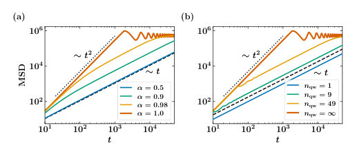
<figcaption class="paper-figure-caption"><b>Fig 1.</b> Figure 1. MSD on the ring of N = 2501 nodes over T = 5×104</figcaption>
</figure>
<figure class="paper-figure-card">
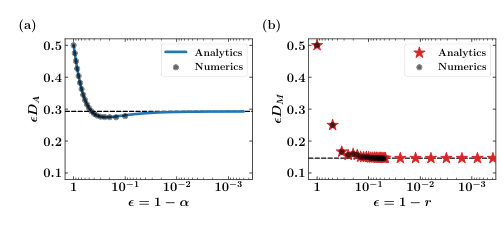
<figcaption class="paper-figure-caption"><b>Fig 2.</b> Figure 2. Rescaled diffusion coefficient εD on the ring (N = 2501) versus the classical admixture ε, logarithmic and decreas- ing toward the quantum limit: ε = 1−α in (a), ε = 1−r in (b). Circles are extracted from simulations (α ≤0.9; nqw ≤19); the solid line in (a) is D(L=2) A from Eq. (30), and the stars in (b) are the exact DM from Eqs. (S23) and (S31) at integer nqw ≤1280. The pole of Eq. (32) appears as a plateau, marked by dashed lines at (2 − √</figcaption>
</figure>

**Summary.** This theoretical work analyzes hybrid quantum walks, which combine quantum and classical random walk steps. By comparing two distinct operational protocols (additive vs. multiplicative), the authors show that while both lead to diffusion, the specific temporal organization dictates the amplitude of the diffusion coefficient in the quantum limit. This highlights that the structure of the quantum-classical coupling is crucial for determining transport dynamics.

**Why it may be interesting.** The comparison between the two protocols (QRW-A vs. QRW-M) provides deep insight into how the temporal ordering of quantum and classical operations dictates the macroscopic transport properties, a key concept in open quantum systems.

Detailed structure

**Main problem.** The paper compares the universal scaling and protocol-dependent amplitude of diffusion coefficients in hybrid quantum-classical random walks.

**Main result.** Both additive and multiplicative hybrid quantum walks exhibit diffusive spreading for any classical admixture, and their diffusion coefficients diverge with a first-order pole in the quantum limit, with the pole amplitudes differing by a factor of two.

**Method.** The analysis uses the transfer operator method in momentum space, determining long-time behavior from the leading eigenvalue of the evolution operator for both additive (QRW-A) and multiplicative (QRW-M) protocols.

**Model / system.** The system is a hybrid quantum walk on a 1D ring, combining unitary quantum steps (using Hadamard coin) with classical steps. Two protocols are compared: additive (QRW-A) and multiplicative (QRW-M).

**Key observables.** Mean Squared Displacement (MSD), transport exponent ($eta$), and the long-time diffusion coefficient ($D$).

**Important parameters / regimes.** Quantum admixture ($\alpha$ or $r$), coherence timescales ($t^*_A, t^*_M$), and the ratio of amplitudes.

**Assumptions / limitations.** QRW-A requires truncation of the transfer matrix at a finite size $L$, and QRW-M assumes the long-time density matrix approaches a specific form.

**Figures summary.** Figure 1 shows the MSD vs. time for both protocols, confirming the transition from ballistic to diffusive spreading.

**Paper structure.** The paper develops the theory by analyzing the evolution via a linear transfer operator in momentum space. It derives the leading eigenvalue expansion for both QRW-A and QRW-M, leading to explicit formulas for the diffusion coefficients in the large-time limit.

Abstract

Quantum walks spread ballistically but become diffusive with classical admixture. We compare two hybrid walks using identical quantum and classical steps at the same classical-step rate but ordered differently in time. Any nonzero admixture yields diffusion. Near the quantum limit, both diffusion coefficients have first-order poles, but their amplitudes differ by about a factor of two. The coherence timescale sets the pole order, while temporal organization sets the amplitude. We expect our analytical framework to apply broadly to quantum--classical hybrid systems.

[↑ back to top](#top)

### [Effect of reactive targets on diffusive transport with intermittent restarts](http://arxiv.org/abs/2609.02355v1)

**Authors:** Samali Ghosh, Suvam Pal, Dibakar Ghosh, P. S. Pal  
**Type:** theory · **Category:** statistical mechanics · **PDF:** <https://arxiv.org/pdf/2609.02355v1>  
**Analysis basis:** full PDF text, analyzed in chunks
**Topic relevance:** `Keldysh / 2PI / non-Gaussian methods` **2/5** · `correlated / nonlocal dissipation` **2/5** · `driven-dissipative phase transition` **2/5** · `methods for driven-dissipative` **2/5** · `non-equilibrium universality` **2/5** · `quantum measurements` **2/5** · `analog quantum simulation` **1/5**

↔ Scroll figures horizontally

<figure class="paper-figure-card">
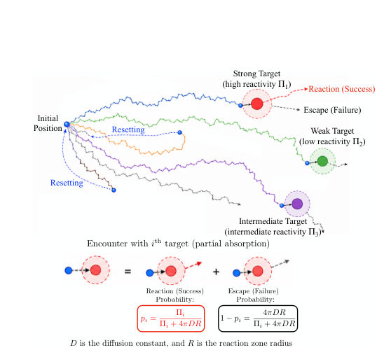
<figcaption class="paper-figure-caption"><b>Fig 1.</b> FIG. 1. Schematics of a resetting-induced first-passage pro- cess in the presence of multiple reactive targets. A substrate molecule searches for enzyme molecules acting as partially ab- sorbing targets with different reactivities Πi. Upon encounter with the target, the molecule can either react (absorption) or escape without absorption, reflecting the finite reactivity of the targets. Stochastic resetting randomly relocates the molecule, generating a competition between diffusion, reset- ting, and target reactivity that governs the search efficiency. The lower panel illustrates the reaction and escape probabil- ities associated with a partially absorbing target.</figcaption>
</figure>
<figure class="paper-figure-card">
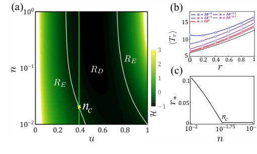
<figcaption class="paper-figure-caption"><b>Fig 2.</b> FIG. 2. (a) Heat map of Hpn, Π0, u, lq in pn ´ uq space. The white contours correspond to Hpn, Π0, u, lq “ 0, or equiv- alently CV0puq “ 1. These contours separate the param- eter space into the resetting-enhanced regime RE and the detrimental-resetting region RD. (b) Unconditional MFPT as a function of the resetting rate for different values of n, where the particle is initially at u “ 0.4 [also marked in (a)]. The black dashed line represents the unconditional MFPT in presence of the purely absorbing boundaries. (c) Optimal re- setting rate r˚ as a function of reactivity ratio n. The critical reactivity ratio nc as obtained from this plot is also marked in (a). Parameters: l “ 5, D “ 0.5...</figcaption>
</figure>
<figure class="paper-figure-card">
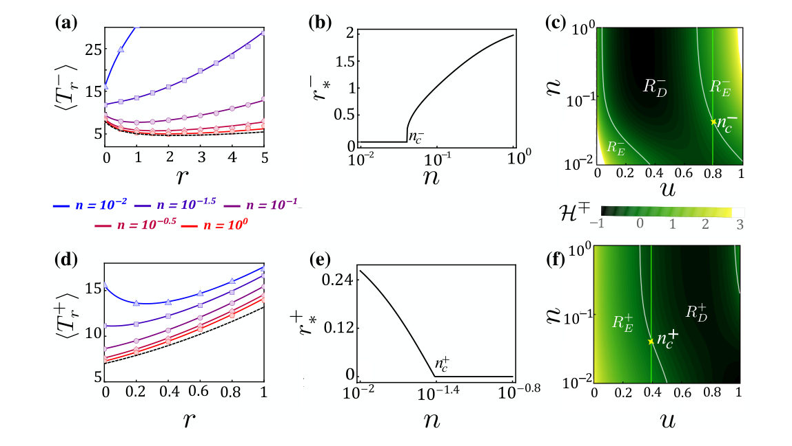
<figcaption class="paper-figure-caption"><b>Fig 3.</b> FIG. 3. Conditional first-passage processes for exit through boundaries at x “ 0 (upper panels) and x “ l (lower panels). (a, d) Conditional mean first passage times (MFPTs) as functions of the resetting rate for different values of reactivity ratio n “ Πl{Π0. (b, e) Optimal resetting rates as functions of the reactivity ratio. (c, f) Heat maps of H¯pn, Π0, u, lq. The white contours correspond to H¯pn, Π0, u, lq “ 0, or equivalently CV ¯ 0 puq “ Λ¯ 0 puq. These contours separate the parameter space into the resetting-enhanced regime R¯ E and the detrimental-resetting region R¯ D. In (c, f), the initial positions are chosen as u “ 0.8 and u “ 0.4, respectively. The corresponding conditional...</figcaption>
</figure>
<figure class="paper-figure-card">
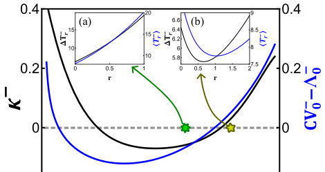
<figcaption class="paper-figure-caption"><b>Fig 4.</b> FIG. 5. Parameter regimes characterizing the effectiveness of stochastic resetting in optimizing the conditional MFPT and its fluctuations for exit through the left boundary. The solid black and blue curves show κ´ and CV ´ 0 ´Λ´ 0 , respectively, as functions of initial position u. We choose two representative initial position: u “ 0.6 (green marker), for which κ´ ă 0 and CV ´ 0 ă Λ´ 0 , and u “ 0.8 (yellow marker), for which κ´ ą 0 and CV ´ 0 ą Λ´ 0 .The conditional MFPTs and their associated fluctuations as functions of resetting rate are shown in panels (a) and (b) for u “ 0.6 and u “ 0.8, respectively.</figcaption>
</figure>
<figure class="paper-figure-card">
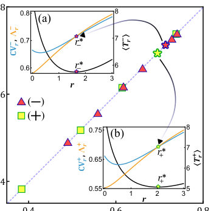
<figcaption class="paper-figure-caption"><b>Fig 5.</b> FIG. 4. Verification of the relation for the conditional FPTs at the optimal resetting rate. The main panel shows Λ¯ r˚ ¯puq</figcaption>
</figure>

**Summary.** This paper analyzes diffusive search processes in complex media by incorporating the realistic effect of finite target reactivity alongside stochastic resetting. It demonstrates that the optimal strategy for enhancing transport efficiency is not universal but depends critically on the specific kinetics of the reactive targets. The findings provide a crucial theoretical tool for understanding reaction-diffusion dynamics in systems where interactions are not instantaneous.

**Why it may be interesting.** While focused on classical diffusion, the mathematical framework involving non-equilibrium dynamics, boundary conditions, and optimization criteria for transport efficiency is highly relevant to open quantum systems where dissipation and boundary interactions are key.

Detailed structure

**Main problem.** The study investigates how stochastic resetting affects diffusive transport in complex environments containing targets with finite reactivity, moving beyond the idealization of perfectly absorbing boundaries.

**Main result.** The target reactivity significantly modifies the optimization landscape, leading to distinct regimes where the optimal resetting rate becomes intrinsically dependent on the target's chemical kinetics.

**Method.** The authors employ theoretical analysis using the Fokker-Planck equation and renewal equations to derive expressions for first-passage time properties under both diffusion and intermittent resetting.

**Model / system.** The model is a one-dimensional diffusion process (Brownian motion) confined between two reactive targets. The process incorporates stochastic resetting, which periodically reinitializes the particle's position.

**Key observables.** Mean First Passage Time (MFPT), conditional MFPT, survival probability, and the optimal resetting rate.

**Important parameters / regimes.** Target reactivity ($\Pi$), the ratio of reactivities ($\Pi_l / \Pi_0$), and the resetting rate ($\lambda$).

**Assumptions / limitations.** The primary assumption addressed is moving from perfectly absorbing targets (ideal) to partially absorbing targets (realistic, modeled via Robin boundary conditions).

**Figures summary.** Figures illustrate the competition between diffusion, resetting, and target reactivity, showing parameter regimes where resetting enhances efficiency or where the MFPT dependence on the resetting rate is monotonic.

**Paper structure.** The paper builds from the basic diffusion process with reactive boundaries (no resetting) to incorporating the renewal equation for the survival probability under resetting, culminating in the analysis of optimal control parameters.

Abstract

We study search processes in a complex environment using the strategy of stochastic resetting. A common occurrence in these environments is targets with finite reactivity. Stochastic resetting has emerged as a powerful mechanism for optimizing search processes by curtailing long, unproductive excursions inherent to diffusive dynamics. Most theoretical studies, however, assume perfectly absorbing targets -- an idealization that overlooks the finite reactivity commonly encountered in realistic chemical and biological systems. In this work, we investigate the interplay between stochastic resetting and finite-target reactivity in reaction - diffusion processes. Considering a one-dimensional system with multiple reactive targets, we demonstrated that the target reactivity modifies the optimization landscape. We uncover distinct regimes in which resetting enhances transport efficiency towards specific targets based on their chemical kinetics. As a consequence, the optimal resetting rate becomes intrinsically reactivity dependent. Our results identify target reactivity as a crucial control parameter governing stochastic transport and provide insights into reaction-diffusion processes in complex media.

[↑ back to top](#top)

### [Circuit-Level Loss Performance of FFCC and RHG Codes in a Compound Photon-Atom Quantum Architecture](http://arxiv.org/abs/2609.02428v1)

**Authors:** Dana Ben Porath, Juval Bechar, Daniel Azses, Yaron Jarach  
**Type:** theory · **Category:** quantum information and computing · **PDF:** <https://arxiv.org/pdf/2609.02428v1>  
**Analysis basis:** full PDF text, analyzed in chunks
**Topic relevance:** `correlated / nonlocal dissipation` **2/5** · `methods for driven-dissipative` **2/5** · `quantum measurements` **2/5** · `QC/QI experiment` **1/5** · `Tavis-Cummings & cavity-many-emitter` **1/5** · `analog quantum simulation` **1/5** · `driven-dissipative phase transition` **1/5** · `quantum optics experiment` **1/5**

↔ Scroll figures horizontally

<figure class="paper-figure-card">
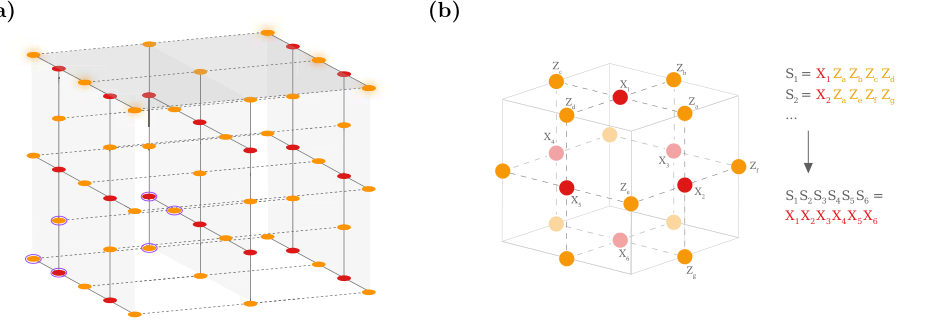
<figcaption class="paper-figure-caption"><b>Fig 1.</b> Figure 1: RHG code construction and check structure, adapted from Arwas et al. [15]. (a) An l = 3, t = 3 RHG cluster-state construction starting and ending with dual layers, corresponding to logical |0⟩L initialization and measurement. For clarity, the wraparound CZ links implementing periodic boundaries in the simulations are omitted. Orange and red circles denote data and syndrome-like (SL) qubits, respectively; dashed and solid gray lines denote time-like and space-like CZ gates. The shaded cap marks a logical correlation surface determined by the product of the highlighted X-basis measurement outcomes. The circled qubits indicate a possible six-ring unit cell, motivating the distinction...</figcaption>
</figure>
<figure class="paper-figure-card">
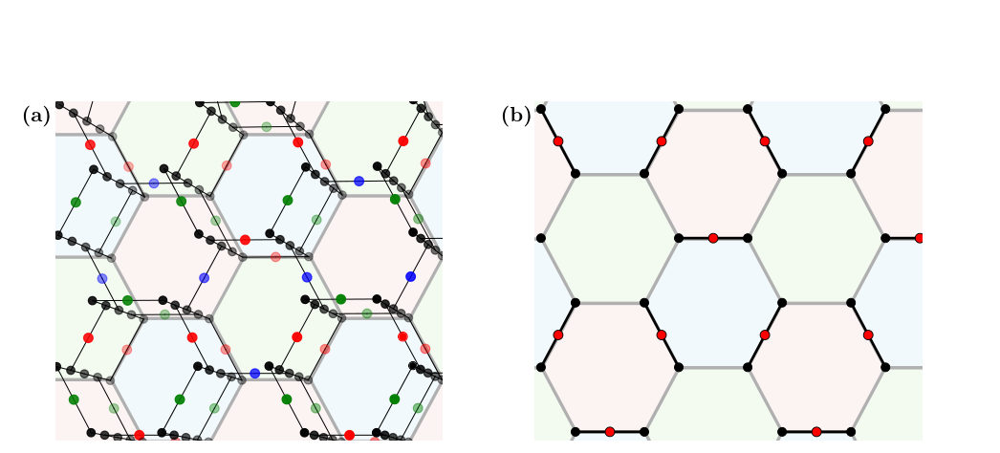
<figcaption class="paper-figure-caption"><b>Fig 2.</b> Figure 2: The FFCC code construction for l = 3 with periodic boundary conditions on a rectangular cut. Black circles denote data qubits, colored circles denote SL qubits, and edges denote CZ gates. Edges through the periodic boundaries are omitted for clarity. (a) Five layers ordered as red–green–blue–red–green. (b) A single red layer.</figcaption>
</figure>
<figure class="paper-figure-card">
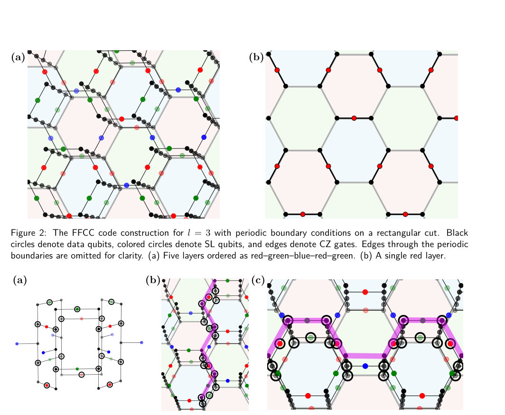
<figcaption class="paper-figure-caption"><b>Fig 3.</b> Figure 3: (a) An 18-qubit X-type check of the FFCC code. Its support spans five consecutive layers in the sequence SL–data–no support–data–SL, with the supported qubits circled. (b)–(c) Vertical and horizontal logical-X correlation surfaces, respectively. In each panel, the magenta line indicates the reference path used to construct the surface, and the circled qubits indicate its support. On odd-numbered layers (1, 3, . . .), the surface contains data qubits along the reference path that are connected to SL qubits on that path. On even-numbered layers (2, 4, . . .), it contains SL qubits along the reference path that are connected to two data qubits on that path. This construction requires...</figcaption>
</figure>
<figure class="paper-figure-card">
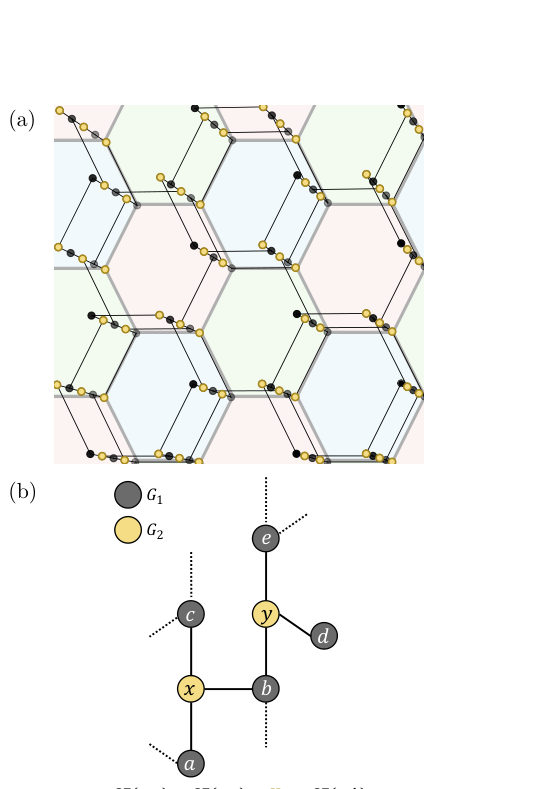
<figcaption class="paper-figure-caption"><b>Fig 4.</b> Figure 4: (a) Reduced FFCC code construction for l = 3 and t = 5, with periodic boundary conditions imposed on a rectangular cut. The graph is bipartitioned into the two sets G1 (gray) and G2 (yellow). There are no SL qubits. Edges denote CZ gates; periodic-boundary edges are omitted for clarity. (b) Local subgraph containing two G2 qubits, x and y, that are next-nearest neigh- bors, together with the adjacent G1 qubits a, b, c, d, and e. Each G2 qubit undergoes an H gate between its in- terlayer and intralayer CZ gates.</figcaption>
</figure>
<figure class="paper-figure-card">
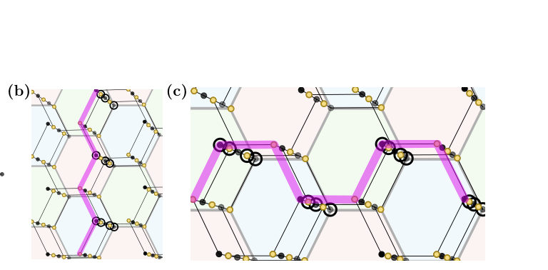
<figcaption class="paper-figure-caption"><b>Fig 5.</b> Figure 5: (a) A 12-qubit check of the reduced FFCC code. Its support spans five consecutive layers in the sequence G2–G1–no support–G1–G2, with the supported qubits circled. (b)–(c) Vertical and horizontal logical-X correlation surfaces, respectively. In each panel, the magenta line indicates the reference path used to construct the surface, and the circled qubits indicate its support. The surface contains qubits along paths parallel to the reference path: G1 qubits on odd-numbered layers (1, 3, . . .) and G2 qubits on even-numbered layers (2, 4, . . .). Only qubits connected to opposite-partition qubits along the same path are included. This construction requires an odd total number of...</figcaption>
</figure>

**Summary.** This work rigorously compares three quantum error-correcting codes (RHG, FFCC, rFFCC) for use in a photon-atom quantum computer designed for MBQC. By employing a circuit-level loss model that accounts for correlated photon loss, the authors determine that code performance is highly sensitive to the specific hardware connectivity and loss mechanism, rather than just the code's graph degree.

**Why it may be interesting.** It provides a highly detailed, hardware-aware analysis of QEC performance, moving beyond idealized IID loss models to incorporate realistic correlated error propagation from photonic loss in a photon-atom setting.

Detailed structure

**Main problem.** The paper compares the circuit-level loss performance of three quantum error-correcting codes (RHG, FFCC, and reduced FFCC) when implemented in a specific hardware architecture.

**Main result.** RHG achieves the highest circuit-level threshold under uniform loss, but the optimal code depends on the specific loss mechanism and connectivity, showing that lower graph degree is not universally superior.

**Method.** The authors use an architecture-aware circuit-level loss model to simulate error thresholds by analyzing how mid-circuit photon loss propagates correlated Pauli errors.

**Model / system.** The study is set in a compound photon-atom quantum architecture, utilizing reusable atom-cavity units to generate measurement-based quantum computation (MBQC) resources via near-deterministic photon-atom CZ gates.

**Key observables.** Circuit-level thresholds (e.g., 2.75% for RHG), Logical Error Rate (LER), and the comparison between bipartite and STAP generation schemes.

**Important parameters / regimes.** The effective loss probability ($p$) associated with photon loss during CZ gates, STAP, and measurement.

**Assumptions / limitations.** The model assumes photon loss is the dominant error mechanism, neglecting photonic Pauli errors, atomic loss, and intrinsic atomic errors.

**Figures summary.** Figures illustrate the construction of the codes (RHG, FFCC, rFFCC) and show logical correlation surfaces, while supplementary figures compare LER thresholds for different generation schemes.

**Paper structure.** The paper establishes the physical platform and loss model, compares the code structures (RHG vs. FFCC variants), and then evaluates performance by comparing circuit-level thresholds and LERs across different generation schemes (bipartite vs. STAP).

Abstract

We compare the Raussendorf-Harrington-Goyal (RHG) code, the Foliated Floquet Color Code (FFCC), and the reduced FFCC in a compound photon-atom architecture that directly generates measurement-based quantum computation (MBQC) resources with near-deterministic photon-atom CZ gates. RHG serves as a natural benchmark, while the FFCC variants allow us to study whether reduced graph degree improves performance under an architecture-aware circuit-level loss model with delayed heralding and correlated bond-loss propagation. We construct two generation schemes compatible with the compound hardware and evaluate circuit-level thresholds under periodic boundary conditions. RHG achieves the highest circuit-level threshold, 2.75%, and its threshold falls below that of reduced FFCC only for large excess loss on intermodule CZ connections. RHG also achieves the lowest logical error rate in most resource-matched comparisons, but some low-loss windows favor reduced FFCC. Overall, we show that when the hardware supports the native gates and connectivity required for MBQC, the benefits of lower graph degree must be weighed against each code's intrinsic IID loss tolerance, generation-scheme details, and hardware-aware resource overhead.

[↑ back to top](#top)

### [Kelvin-Helmholtz instability in annular superfluids across the UFG-BCS crossover](http://arxiv.org/abs/2609.01831v1)

**Authors:** Michał Śliwiński, Klejdja Xhani, Gabriel Wlazłowski  
**Type:** theory · **Category:** quantum gases · **PDF:** <https://arxiv.org/pdf/2609.01831v1>  
**Analysis basis:** full PDF text, analyzed in chunks
**Topic relevance:** `Keldysh / 2PI / non-Gaussian methods` **2/5** · `analog quantum simulation` **2/5** · `methods for driven-dissipative` **2/5** · `non-equilibrium universality` **1/5**

↔ Scroll figures horizontally

<figure class="paper-figure-card">
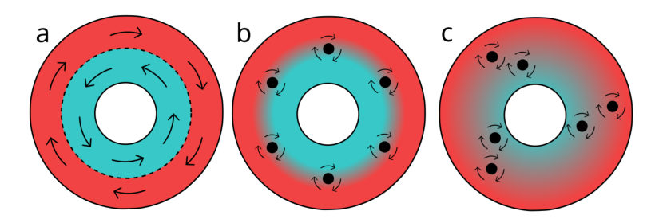
<figcaption class="paper-figure-caption"><b>Fig 1.</b> Figure 1: Sketch of distinct stages of superfluid Kelvin–Helmholtz instability in circular geometry. a) Two superfluids, separated by a barrier (dotted line), counter-rotate. b) Once the barrier is removed, a shear layer forms at the interface, giving rise to a necklace of same-sign quantized vortices (black dots). c) The vortex necklace loses its ordered structure, marking the onset of the instability.</figcaption>
</figure>
<figure class="paper-figure-card">
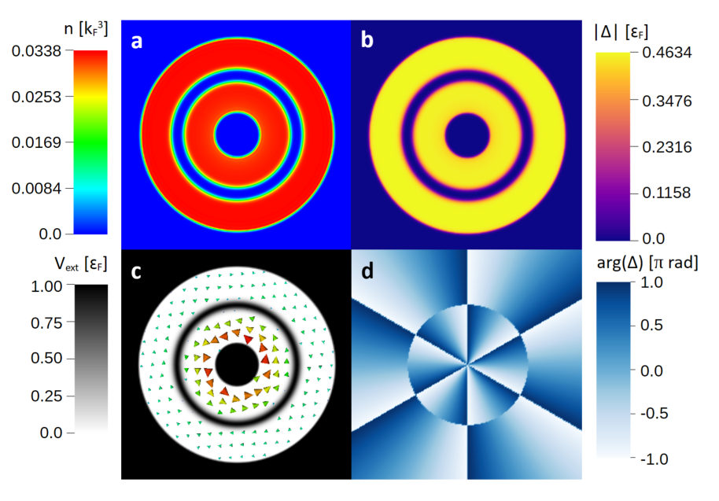
<figcaption class="paper-figure-caption"><b>Fig 2.</b> Figure 2: Initial state representing a unitary Fermi gas (T ≈0.3 Tc) confined in a ring geometry. The Gaussian barrier separating the two superfluids has a width skF = 2.36. The imprinted current in each superfluid corresponds to a winding number w = ±6, giving a relative winding number ∆w = 12. The panels show the total density n (a), the absolute value of the order parameter |∆| (b), the external repulsive potential Vext with the current density j displayed with arrows (c), and the phase of the order parameter arg[∆] (d). VisIt software was used to generate these plots [38].</figcaption>
</figure>
<figure class="paper-figure-card">
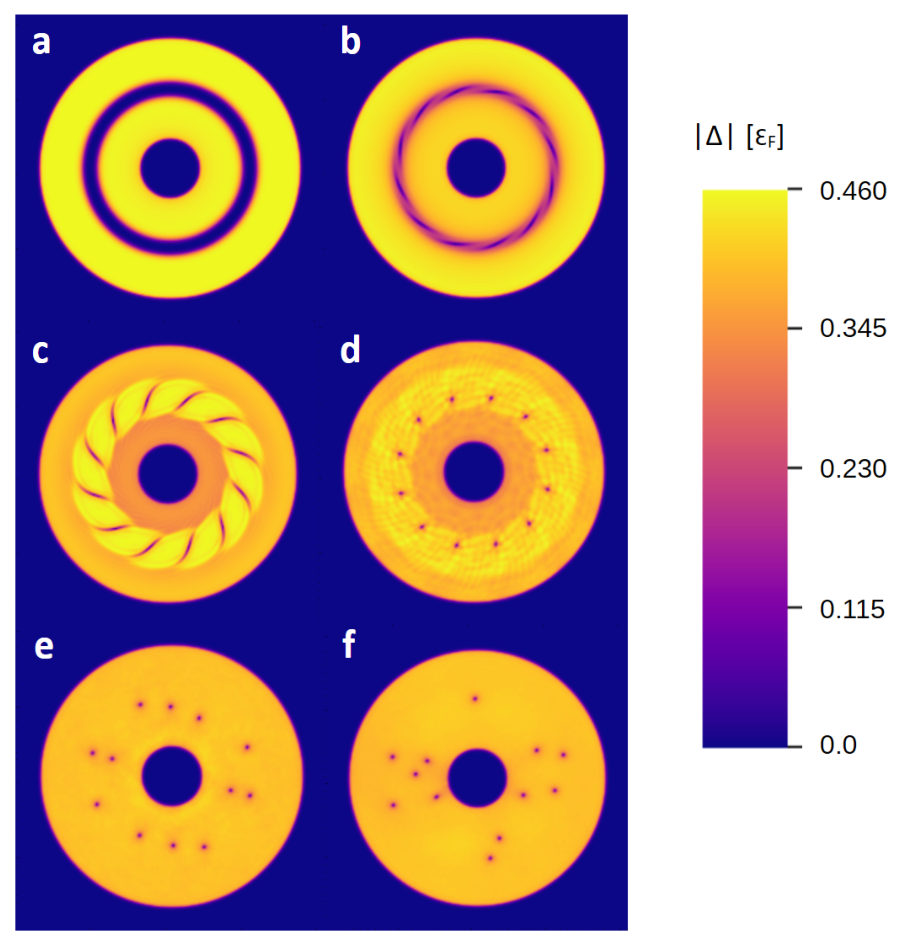
<figcaption class="paper-figure-caption"><b>Fig 3.</b> Figure 3: Formation of a vortex necklace in a unitary Fermi gas and the subsequent Kelvin-Helmholtz instability. The consecutive panels show snapshots of the system at increasing times, during and after the barrier removal, namely: a) tεF = 0, b) tεF = 56, c) tεF = 84, d) tεF = 189, e) tεF = 500, f) tεF = 1589. The color maps display the distribution of |∆(x, y)|/εF. The setup is the same as in Fig. 2. The barrier is removed in time interval ∆trεF = 60. In the pairing field profile, one can also observe a sound wave propagating towards the boundaries, visible well in panels c and d.</figcaption>
</figure>
<figure class="paper-figure-card">
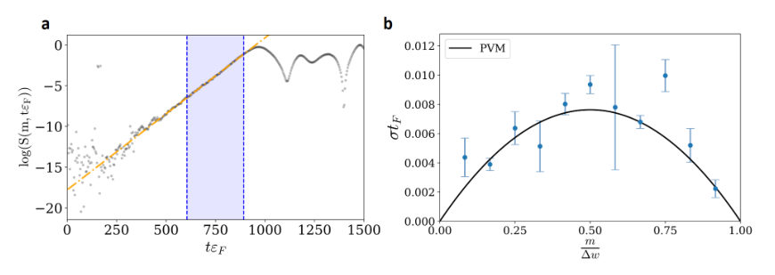
<figcaption class="paper-figure-caption"><b>Fig 4.</b> Figure 4: a) Temporal evolution of the structure factor for mode m=6, shown on a logarithmic scale. The shaded area indicates the time interval used to estimate the growth rate. The orange dashed line shows the fit to the signal. b) Extracted growth rates and the PVM prediction from Eq. (12) as a function of the mode number. All simulation parameters are the same as in Fig. 3 and for ∆w = 12.</figcaption>
</figure>
<figure class="paper-figure-card">
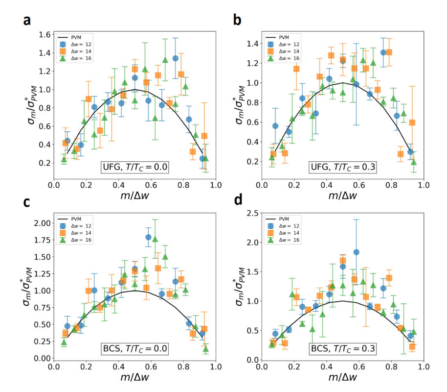
<figcaption class="paper-figure-caption"><b>Fig 5.</b> Figure 5: Growth rates of KHI modes, normalized to the maximal growth rate predicted by the point-vortex model (PVM), as a function of mode number m (scaled to ∆w), from the UFG regime (a–b) to the BCS regime (c–d), at T = 0 (a, c) and T = 0.3 Tc (b, d). Different colors indicate different values of ∆w = 12, 14, 16. Black lines show the PVM predictions, which are expected to peak at m = ∆w/2. Error bars represent the standard deviation of growth rates extracted from fits over randomly chosen time windows within the instability interval.</figcaption>
</figure>

**Summary.** The authors study the Kelvin-Helmholtz instability in annular Fermi superfluids across the UFG-BCS crossover using time-dependent superfluid density functional theory. They find that while the instability growth rates match predictions in the unitary regime, the dynamics fundamentally change in the BCS regime due to competing anti-vortex proliferation. This offers crucial insights into the non-ideal, fermionic nature of superfluid dynamics.

**Why it may be interesting.** This work provides a microscopic, fermionic benchmark for understanding hydrodynamic instabilities in quantum superfluids, directly addressing discrepancies between theory and experiment in a highly tunable quantum system.

Detailed structure

**Main problem.** Investigating the Kelvin-Helmholtz instability (KHI) in annular superfluids across the Unitary Fermi Gas (UFG) to Bardeen-Cooper-Schrieffer (BCS) crossover.

**Main result.** The KHI growth rates are qualitatively consistent with point-vortex models in UFG/moderate BCS regimes but systematically higher. In the deep BCS regime, the dynamics change due to faster proliferation of boundary-generated antivortices, which destroys the initial vortex necklace.

**Method.** Time-dependent superfluid density functional theory (TDSLDA) is used to simulate the real-time evolution of the superfluid system.

**Model / system.** The system consists of counter-rotating annular Fermi superfluids, modeled using a time-dependent extension of the Bogoliubov-de Gennes equations. The analysis spans the crossover from strongly interacting UFG to weakly attractive BCS regimes.

**Key observables.** KHI growth rate ($\sigma$), characteristic timescale ($	au_{KHI}$), structure factor $S(m, t)$, and the density/order parameter evolution.

**Important parameters / regimes.** Relative flow velocity ($\Delta v$), interaction strength (parametrized by $\xi_{aF}^{-1}$), and temperature (up to $0.3 T_c$).

**Assumptions / limitations.** The use of TDSLDA functional theory, which handles contact interactions via regularization; the initial state is assumed to be an idealized vortex necklace.

**Figures summary.** Figures illustrate the stages of KHI, show the exponential growth of the structure factor $S(m, t)$ over time, and depict the qualitative change in dynamics in the deep BCS regime due to anti-vortex proliferation.

**Paper structure.** The paper establishes the theoretical framework using TDSLDA, simulates the initial vortex necklace formation, analyzes the KHI growth rates across different interaction regimes (UFG $	o$ BCS), and finally details the qualitative change in dynamics observed in the deep BCS regime.

Abstract

We investigate the Kelvin-Helmholtz instability of counter-rotating annular Fermi superfluids using time-dependent superfluid density functional theory. When the two initially separated superflows merge, a necklace of quantized vortices forms at their interface and subsequently becomes unstable. We extract mode-resolved instability growth rates and study their dependence on relative flow velocity, interaction strength, and temperature across the strongly interacting unitary regime and the weakly attractive BCS regime. In the unitary gas and moderate BCS regimes, the growth rates remain qualitatively consistent with the point-vortex model, though systematically at or above its predictions, with no significant dependence on interaction strength or temperature up to approximately $0.3 T_c$. Deeper in the BCS regime, the dynamics change qualitatively: boundary-generated antivortices proliferate faster than the Kelvin-Helmholtz instability itself, destroying the initial vortex necklace before the instability can fully develop. These results provide a microscopic benchmark for Kelvin-Helmholtz dynamics in fermionic superfluids and help constrain possible explanations of the existing experiment-theory discrepancy.

[↑ back to top](#top)

### [Prominent Dimensional Effects on High-order Harmonic Generation in Strongly Correlated Electron Systems](http://arxiv.org/abs/2609.02466v1)

**Authors:** Kento Uchida, Shintaro Takayoshi, Yuta Murakami, Dongjoon Song, Alannah M. Hallas, Masayuki Watanabe, Takashi Konishi, Aiko Nakano, Koichiro Tanaka  
**Type:** both · **Category:** strongly correlated electrons · **PDF:** <https://arxiv.org/pdf/2609.02466v1>  
**Analysis basis:** full PDF text, analyzed in chunks
**Topic relevance:** `Keldysh / 2PI / non-Gaussian methods` **2/5** · `analog quantum simulation` **2/5** · `methods for driven-dissipative` **2/5** · `interference shaping light` **1/5**

↔ Scroll figures horizontally

<figure class="paper-figure-card">
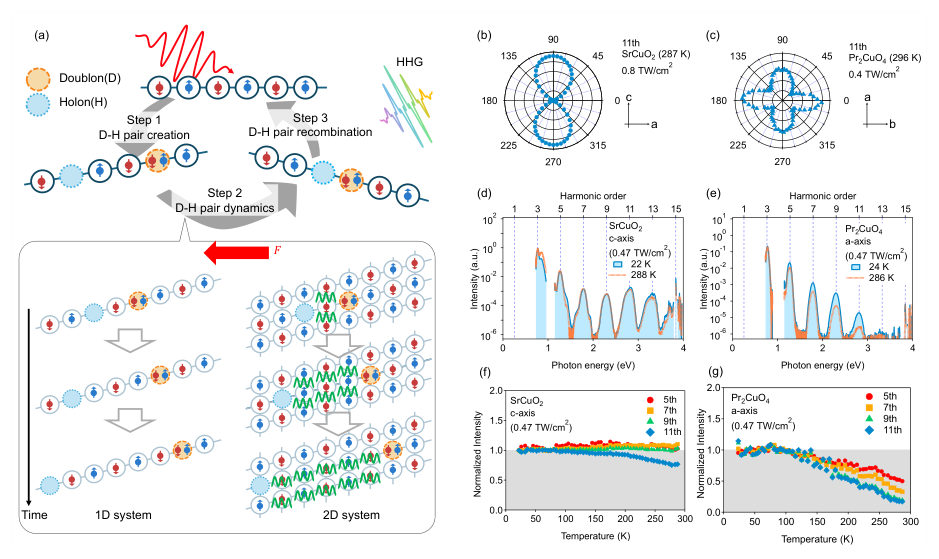
<figcaption class="paper-figure-caption"><b>Fig 1.</b> FIG. 1. Left: (a) Schematic illustration of strong-field charge dynamics in a single-band Mott insulator. The dynamics can be decomposed into three steps: creation, acceleration, and recombination of D-H pairs. The lower panels show the dynamics of D-H pairs driven by an electric field in 1D (left) and 2D (right) systems. In 2D and higher-dimensional systems, the motion of DH pairs can disturb the spin background and generate spin excitations, indicated by green wavy curves. This illustrates the strong influence of spin–charge coupling on the charge dynamics. Right: Experimental results of HHG in SrCuO2 and Pr2CuO4. Crystal orientation dependence of 11th harmonic generation in (b) SrCuO2...</figcaption>
</figure>
<figure class="paper-figure-card">
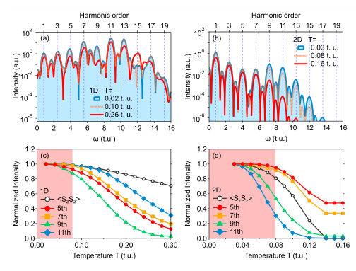
<figcaption class="paper-figure-caption"><b>Fig 2.</b> FIG. 2. Comparison of 1D and 2D simulations of HH spectra under CW excitation. (a), (b) HH spectra IHHG(ω) for (a) the 1D and (b) the 2D systems. (c), (d) Temperature depen- dence of the nth-harmonic peak intensity In and the nearest- neighbor spin–spin correlation ⟨SzSz⟩. The shaded region de- notes temperatures up to the room temperature. The HH spectra are evaluated with the box window described in the SM.</figcaption>
</figure>
<figure class="paper-figure-card">
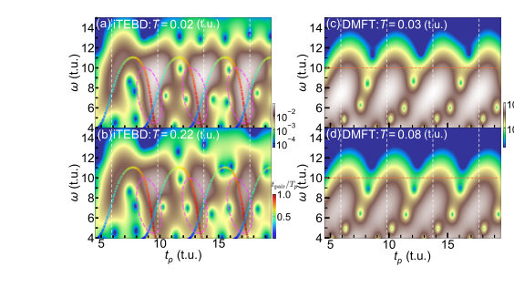
<figcaption class="paper-figure-caption"><b>Fig 3.</b> FIG. 3. Comparison between the subcycle spectra of the 1D and 2D simulations under CW excitation.The spectra are shown over two driving cycles, while the characteristic emis- sion pattern repeats every half cycle. (a,b) Results for the 1D system at (a) T = 0.02 and (b) T = 0.22. The colored dots indicate the emission energy at time tp predicted by the doublon–holon three-step model. (c,d) Results for the 2D sys- tem at (c) T = 0.03, (d) T = 0.08. For the subcycle analysis, we use a Gaussian window with width σp = 0.7. In panels (b) and (d), the temperatures are chosen to give compara- ble reductions in the spin–spin correlation ⟨SzSz⟩from the lowest-temperature values in the 1D and 2D...</figcaption>
</figure>
<figure class="paper-figure-card">
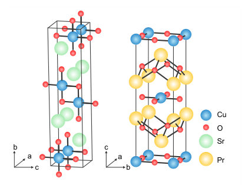
<figcaption class="paper-figure-caption"><b>Fig 4.</b> FIG. 4. Crystal structures of SrCuO2(left panel) and Pr2CuO4 (right panel).</figcaption>
</figure>
<figure class="paper-figure-card">
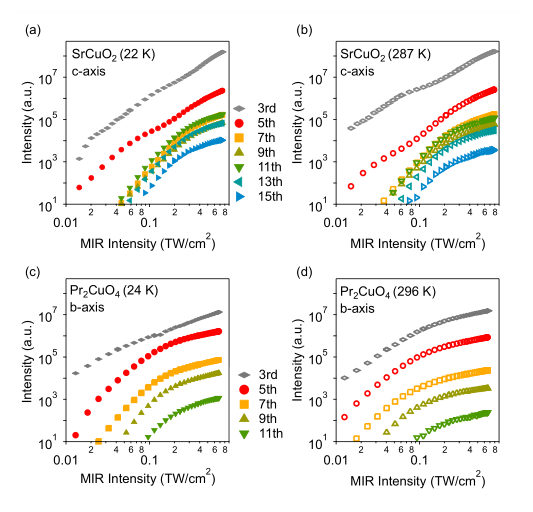
<figcaption class="paper-figure-caption"><b>Fig 5.</b> FIG. 5. Driving intensity dependence of high harmonic yields in (a) SrCuO2 at 22 K, (b) at 287 K, (c) Pr2CuO4 at 24 K, and (d) at 296 K.</figcaption>
</figure>

**Summary.** This paper explores how dimensionality controls the extreme nonlinear optical response, specifically High-Harmonic Generation, in strongly correlated cuprate insulators. By combining experiments on 1D and 2D materials with advanced Hubbard model simulations, the authors demonstrate that dimensionality dictates the coherence dynamics of charge carriers. The findings establish dimensionality and spin-charge coupling as critical control parameters for manipulating light-matter interactions in these complex quantum materials.

**Why it may be interesting.** The work provides a direct link between fundamental many-body physics (spin-charge coupling) and measurable, extreme nonlinear optical phenomena (HHG), which is highly relevant for understanding correlated quantum materials.

Detailed structure

**Main problem.** The study investigates how the dimensionality of a strongly correlated electron system affects its extreme nonlinear optical response, specifically High-Harmonic Generation (HHG).

**Main result.** A pronounced dimensional contrast was found: quasi-1D $	ext{SrCuO}_2$ exhibits a robust, plateau-like HH spectrum, while quasi-2D $	ext{Pr}_2	ext{CuO}_4$ shows strong thermal suppression, linking this to dimensionality-dependent doublon–holon dephasing.

**Method.** The research combines experimental HHG measurements on cuprates with theoretical nonequilibrium simulations using the Hubbard model (iTEBD and DMFT).

**Model / system.** The physical systems are quasi-1D ($	ext{SrCuO}_2$) and quasi-2D ($	ext{Pr}_2	ext{CuO}_4$) charge-transfer insulators, modeled by an effective single-band Hubbard Hamiltonian. The dynamics are simulated using advanced quantum many-body techniques.

**Key observables.** High-harmonic generation (HHG) spectrum, temperature dependence of harmonic yield, and subcycle spectra revealing doublon–holon coherence.

**Important parameters / regimes.** Dimensionality (1D vs 2D), temperature (thermal suppression), and spin-charge coupling strength.

**Assumptions / limitations.** The theoretical analysis relies on mapping the system to an effective single-band Hubbard model and using approximations like NCA in DMFT.

**Figures summary.** Figures compare HH spectra and temperature dependence for 1D vs 2D systems, showing the characteristic plateau vs. monotonic decay. Subcycle spectra illustrate the time evolution of coherence, which is suppressed in 2D.

**Paper structure.** The paper establishes the problem by contrasting 1D and 2D cuprates, presents experimental observations (HHG spectra and temperature dependence), and then uses nonequilibrium simulations (iTEBD/DMFT) to microscopically explain the observed dimensional contrast via spin-charge coupling effects.

Abstract

Dimensionality strongly affects elementary excitations in correlated quantum materials, yet its impact on extreme nonlinear optical responses remains largely unexplored. Here, we combine high-harmonic generation (HHG) experiments on quasi-one-dimensional SrCuO$_2$ and quasi-two-dimensional Pr$_2$CuO$_4$ with nonequilibrium simulations of Hubbard models. We find a pronounced dimensional contrast: SrCuO$_2$ exhibits a robust plateau-like high-harmonic spectrum with weak temperature dependence, whereas Pr$_2$CuO$_4$ shows a monotonic decrease in harmonic yield and strong thermal suppression, especially at higher harmonics. The simulations qualitatively reproduce these trends and identify dimensionality-dependent doublon--holon dephasing, governed by spin--charge coupling, as their microscopic origin. These results establish dimensionality and spin--charge coupling as key control parameters for extreme nonlinear optical responses in correlated insulators.

[↑ back to top](#top)

### [Charge-Transfer Electronic Structure of NiX$_2$ (X = S, Se)](http://arxiv.org/abs/2609.02148v1)

**Authors:** Atsushi Hariki, Takaki Okauchi, Daisuke Takegami, Naoki Ito, Mizuki Furo, Ayako Yamamoto, Tomoya Higo, Satoru Nakatsuji, Masato Yoshimura, Takashi Mizokawa, Jan Kunes  
**Type:** both · **Category:** strongly correlated electrons · **PDF:** <https://arxiv.org/pdf/2609.02148v1>  
**Analysis basis:** full PDF text, analyzed in chunks
**Topic relevance:** `Keldysh / 2PI / non-Gaussian methods` **2/5** · `analog quantum simulation` **2/5** · `methods for driven-dissipative` **1/5** · `quantum measurements` **1/5**

↔ Scroll figures horizontally

<figure class="paper-figure-card">
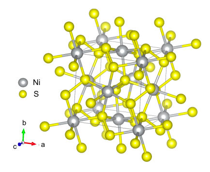
<figcaption class="paper-figure-caption"><b>Fig 1.</b> FIG. 1. Crystal structure of NiS2. The crystal structure is visualized using VESTA3 [13].</figcaption>
</figure>
<figure class="paper-figure-card">
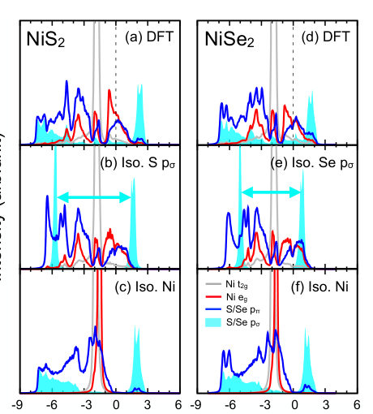
<figcaption class="paper-figure-caption"><b>Fig 2.</b> FIG. 2. The DFT spectral densities for NiS2 (left) and NiSe2 (right). The middle panels (b,e) show the results obtained after decoupling the S/Se pσ orbitals from the Ni 3d and S/Se pπ states. The bottom panels (c,f) show the results obtained after decoupling the Ni 3d orbitals from the S/Se p states (consistent with Ref. 4).</figcaption>
</figure>
<figure class="paper-figure-card">
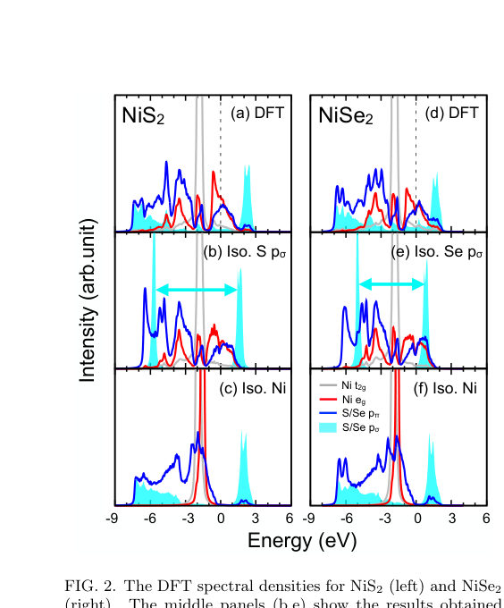
<figcaption class="paper-figure-caption"><b>Fig 3.</b> Figure 2(a) shows the DFT valence-band spectra of NiS2. The S 3p states are decomposed into pπ and pσ orbitals perpendicular and parallel to the dimer, respec- tively. Thanks to the nearly right angle (104◦) between the S–S dimer and the Ni–S bond, the Ni eg orbitals hy- bridize primarily with the S pπ orbitals (a σ-bond), while the Ni t2g orbitals hybridize more strongly with the S pσ orbitals (a π-bond). Figure 2(b) presents the spectra of the model with S pσ decoupled [40] from the rest of the system, exposing the bonding-antibonding splitting on the dimer. The splitting is sufficiently large to place the antibonding state above EF . In Fig. 2(c), where the Ni 3d orbitals are isolated,...</figcaption>
</figure>
<figure class="paper-figure-card">
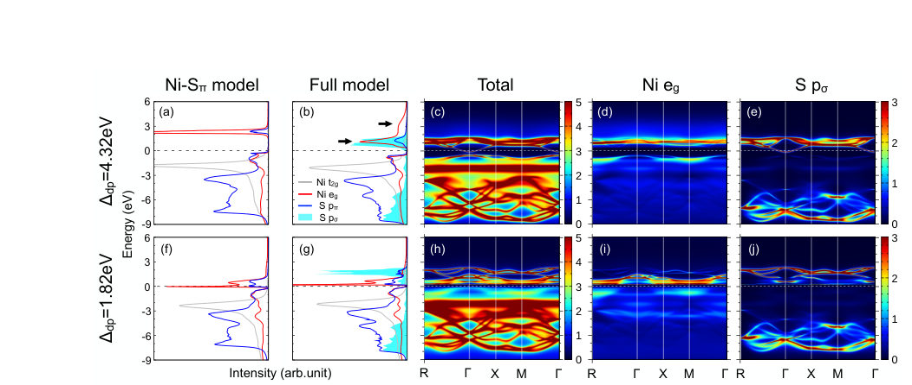
<figcaption class="paper-figure-caption"><b>Fig 4.</b> FIG. 3. DFT+DMFT results for NiS2 obtained with ∆dp = 4.32 eV and 1.82 eV, the latter is the optimal value. Shown are the spectral intensities for (a,f) Ni-S pπ model, (b,g) full model, and (c,h) corresponding momentum-resolved spectra. The orbital-projected spectral intensities of (d,i) Ni eg and (e,j) S pσ orbitals are also shown.</figcaption>
</figure>
<figure class="paper-figure-card">
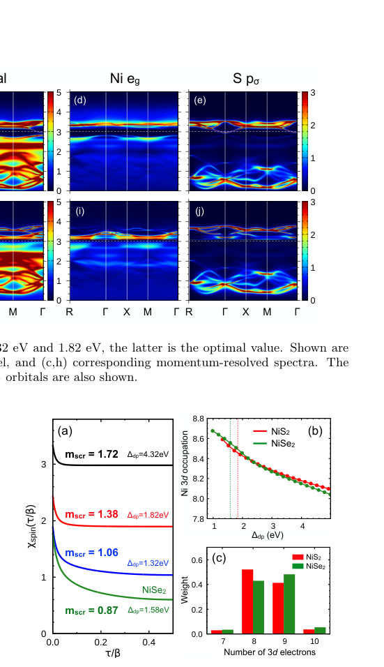
<figcaption class="paper-figure-caption"><b>Fig 5.</b> FIG. 5. (a) Ni local spin-correlation function χspin(τ/β) in NiS2, calculated using DFT+DMFT for selected values of ∆dp (1.32 eV: blue, 1.82 eV: red, and 4.32 eV: black). The corre- sponding screened moment mscr = p</figcaption>
</figure>

**Summary.** This paper uses advanced DFT+DMFT calculations to map the electronic structure of nickel dichalcogenides (NiX2). By fitting to experimental photoemission and XAS data, the authors revise the understanding of the charge-transfer energy, concluding that substantial charge transfer occurs from the chalcogen ligands to the Ni centers. This work provides a detailed picture of how orbital interactions govern the electronic properties across the NiS2-xSe_x solid solution.

**Why it may be interesting.** While focused on solid-state materials, the use of DMFT to model strong local correlations and the detailed analysis of orbital hybridization and charge transfer mechanisms are highly relevant to understanding open quantum systems and correlated dynamics.

Detailed structure

**Main problem.** The study investigates the electronic structure and charge-transfer mechanism in nickel dichalcogenides (NiX2) to understand their insulating behavior and Metal-Insulator Transitions.

**Main result.** The calculations reveal a smaller charge-transfer energy than previously thought, leading to significant ligand-to-Ni charge transfer and a reduction in the Ni local magnetic moment.

**Method.** The research employs Density Functional Theory combined with Dynamical Mean-Field Theory (DFT+DMFT) to model electron correlations.

**Model / system.** The physical system is NiS2 and NiSe2 in the pyrite structure, with the solid solution NiS2-xSe_x being analyzed. A tight-binding model spanning Ni 3d, S/Se p\pi, and p\sigma states is used within the DFT+DMFT framework.

**Key observables.** Valence-band photoemission spectra (PES), Ni 2p core-level PES, Ni L-edge XAS, and the Ni local magnetic moment.

**Important parameters / regimes.** The double-counting correction ($\mu_{dc}$) is a key parameter determined by fitting to experimental PES data; the charge-transfer energy ($\Delta_{dp}$) is also crucial.

**Assumptions / limitations.** The model relies on fitting the double-counting correction to reproduce experimental spectra, and simplified models are used to isolate orbital contributions.

**Figures summary.** Figures show DFT spectral densities for NiS2 and NiSe2, and simulated K-edge absorption spectra comparing results for different assumed charge-transfer energies.

**Paper structure.** The paper establishes the theoretical framework using DFT+DMFT, calibrates the model against multiple experimental spectra (PES/XAS), derives key electronic parameters (like the CT energy), and then analyzes the orbital hybridization and spectral evolution across the NiS2-xSe_x series.

Abstract

We investigate the electronic structures of NiS$_2$ and NiSe$_2$ using density functional theory combined with dynamical mean-field theory (DFT+DMFT). A realistic electronic structure within DFT+DMFT was determined by optimizing the double-counting correction to reproduce experimental valence-band photoemission spectra. The validity of the present model is further confirmed by its successful description of the Ni 2$p$ core-level photoemission and Ni $L$-edge x-ray absorption spectra of NiS$_2$. Our results reveal a smaller charge-transfer energy than previously assumed, resulting in substantial ligand-to-Ni charge transfer and a reduced Ni local moment. We clarify how the relative position and interaction between the Ni upper Hubbard band and the antibonding chalcogen-dimer states shape the evolution of the low-energy electronic structure across the NiS$_{2-x}$Se$_x$ series.

[↑ back to top](#top)

### [Phonon-limited detection thresholds for genetically encoded fluorescent-protein spin-qubit relaxometry of neural radicals](http://arxiv.org/abs/2609.02792v1)

**Authors:** Parul Raghuvanshi, Sagnik Ganguly, Sharika E, Mohana Priya T., Vishvendra S. Poonia  
**Type:** theory · **Category:** other · **PDF:** <https://arxiv.org/pdf/2609.02792v1>  
**Analysis basis:** full PDF text, analyzed in chunks
**Topic relevance:** `quantum measurements` **2/5** · `Keldysh / 2PI / non-Gaussian methods` **1/5** · `correlated / nonlocal dissipation` **1/5** · `driven-dissipative phase transition` **1/5** · `methods for driven-dissipative` **1/5**

↔ Scroll figures horizontally

<figure class="paper-figure-card">
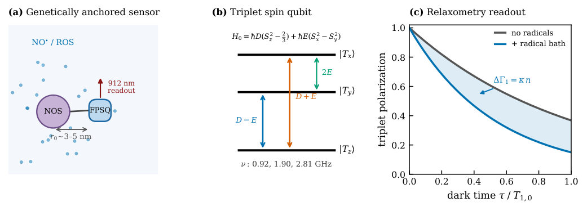
<figcaption class="paper-figure-caption"><b>Fig 1.</b> FIG. 1. Proposed FPSQ relaxometry concept. (a) A genetically anchored fluorescent protein spin qubit (FPSQ) is placed close to a radical-producing enzyme and read out optically at 912 nm. (b) The EYFP triplet acts as a spin-1 qubit with three zero-field ODMR transitions at 2E, D −E, and D + E. (c) A fluctuating radical bath adds a longitudinal relaxation channel, ∆Γ1 = κn, which shortens the triplet polarization decay measured after a dark time τ. This change is used to estimate the local radical density.</figcaption>
</figure>
<figure class="paper-figure-card">
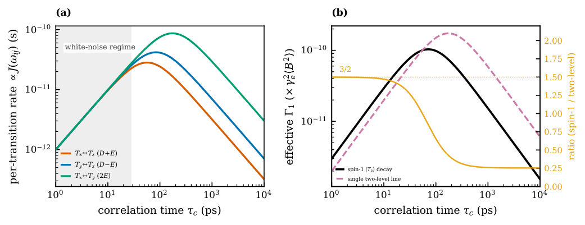
<figcaption class="paper-figure-caption"><b>Fig 2.</b> FIG. 2. Transition-resolved spin-1 relaxation. (a) Population transfer rates for the three zero-field transitions, each driven by an orthogonal component of the dipolar field noise sampled at its own frequency ωij. In the white-noise regime (shaded, τc ≲57 ps), the three rates are degenerate. Beyond this regime, they split, making the decay multi-exponential and the readout transition a design variable. (b) Effective |Tz⟩polarization decay rate versus correlation time τc compared with a single two-level approximation. In the white-noise regime, the spin-1 relaxation rate is 3/2 times the two-level estimate, relevant to NO• and superoxide, confirming the use of single-exponential...</figcaption>
</figure>
<figure class="paper-figure-card">
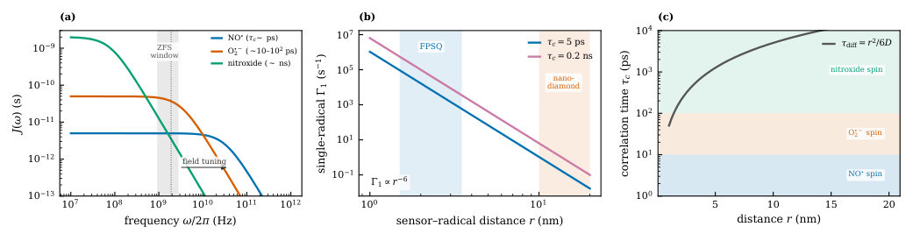
<figcaption class="paper-figure-caption"><b>Fig 3.</b> FIG. 3. Relaxometry physics. (a) Lorentzian noise spectral density J(ω) for different correlation times, representative of NO• (ps),superoxide (tens of ps), and nitroxide labels (ns). The zero-field ODMR window and the range accessible by field tuning are indicated. (b) Single-radical relaxation rate as a function of sensor-radical distance, scaling as r−6.The shaded regions indicate the distance ranges for the anchored FPSQ and nanodiamond. (c) Correlation time as a function of distance. The diffusion time τdiff = r2/6D increases with distance and competes with the intrinsic spin-relaxation time of each radical, shown as shaded bands, with the shorter timescale determining the effective...</figcaption>
</figure>
<figure class="paper-figure-card">
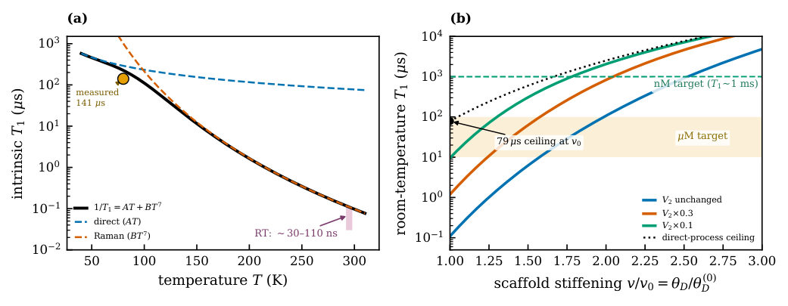
<figcaption class="paper-figure-caption"><b>Fig 4.</b> FIG. 4. Phonon-limited intrinsic T1 and the engineering target. (a) The temperature dependence of the intrinsic T1. The total relaxation rate has contributions from two processes: the direct process (blue line) and the Raman process (orange line), while the black line shows the total relaxation rate. The measured T1 at 80 K (141 µs) differs from the value obtained from the fitted coefficients (226 µs) by a factor of ≈1.6. Extrapolating to room temperature gives a T1 range of ≈30-110 ns (shaded). At 295 K, the Raman contribution is about 720 times larger than the direct contribution and thus dominates the relaxation. (b) Room-temperature T1 achievable by making the chromophore environment...</figcaption>
</figure>
<figure class="paper-figure-card">
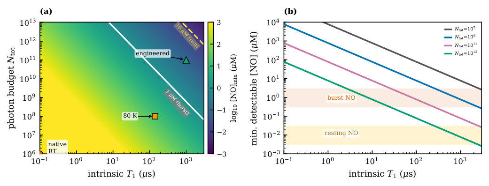
<figcaption class="paper-figure-caption"><b>Fig 5.</b> FIG. 5. Detection-limit map. (a) Minimum detectable NO• concentration (log color scale) versus intrinsic triplet T1 and detected-photon budget Ntot, for an anchored sensor (a = 2 nm, τc = 10 ps, C = 0.20, corresponding to the lowest ODMR transition).The white solid and yellow dashed lines indicate the micromolar (burst) and nanomolar (resting) sensitivity levels, respectively. The markers show the native room-temperature, 80 K, and engineered operating points. (b) Minimum detectable NO• concentration as a function of T1 for fixed photon budgets.The shaded regions indicate the physiologically relevant NO• concentration ranges. The limit is controlled primarily by the intrinsic T1, where...</figcaption>
</figure>

**Summary.** This paper develops a theoretical framework to determine the sensitivity limit of using a fluorescent protein as a spin-1 qubit to detect neural radicals. The analysis shows that the sensor's performance is fundamentally limited by its own intrinsic, phonon-mediated relaxation rate. By modeling the relaxation dynamics and proposing environmental stiffening, the authors provide concrete pathways to improve the qubit's coherence time for practical biological sensing.

**Why it may be interesting.** This work directly applies advanced open quantum system theory (Redfield/Lindblad) to a solid-state, bio-molecular quantum sensor, providing quantitative design rules for enhancing coherence times in a complex, noisy environment.

Detailed structure

**Main problem.** To develop a detection-limit theory for using a fluorescent-protein spin-qubit (FPSQ) to sense paramagnetic neural signaling radicals via spin relaxometry.

**Main result.** The native room-temperature sensor is limited by its intrinsic, phonon-limited T1, falling short of physiological sensitivity by 6 to 8 orders of magnitude. Improving the chromophore environment stiffness by 2x is predicted to recover T1 sufficient for micromolar sensing.

**Method.** The authors derived a transition-resolved Redfield relaxation matrix for the spin-1 qubit coupled to a diffusing radical bath, analyzing the resulting relaxation dynamics.

**Model / system.** The system is an enhanced yellow fluorescent protein (EYFP) acting as an optically addressable spin-1 qubit in its metastable triplet state. Sensing occurs via spin relaxometry, where the radical's fluctuating field shortens the qubit's longitudinal relaxation time (T1).

**Key observables.** Longitudinal relaxation time (T1), relaxivity ($\kappa$), and the effective relaxation rate ($\Gamma_{	ext{eff}}$).

**Important parameters / regimes.** Phonon-limited intrinsic T1, correlation time ($	au_c$), and the ratio of Raman to direct relaxation processes ($\sim 720:1$).

**Assumptions / limitations.** The analysis assumes the noise spectrum is Lorentzian and that the system can be treated in the single-exponential decay limit for fast radicals.

**Figures summary.** Not specified, but the notes mention comparisons to Lindblad simulations and Nitrogen-Vacancy (NV) benchmarks.

**Paper structure.** The paper establishes the physical platform (FPSQ), develops the theoretical framework (Redfield theory for spin relaxation), analyzes the limiting factors (phonon-limited T1), and proposes design rules for improvement.

Abstract

The demonstration that enhanced yellow fluorescent protein hosts an optically addressable spin-1 qubit in its metastable triplet state raises the prospect of genetically encoded quantum sensing at molecular length scales. We develop a detection-limit theory for using this fluorescent-protein spin qubit (FPSQ) to sense paramagnetic neural signaling radicals by spin relaxometry. We derive the transition-resolved Redfield relaxation matrix of the zero-field-split triplet coupled to a diffusing radical bath, establish the regime in which it collapses to a single exponential, and validate it against Lindblad simulations and nitrogen-vacancy benchmarks. Propagating the effects of photon shot noise, photobleaching-grounded photon budget, and finite measurement bandwidth, we find that the native room-temperature sensor falls short of physiological sensitivity by six to eight orders of magnitude with the bottleneck being the phonon-limited intrinsic $\Tone$. Analyzing the underlying direct and two-phonon Raman processes, we show that room-temperature relaxation is Raman-dominated by $\sim\!720\!:\!1$ and that, because the Raman coefficient scales as $v^{-10}$ with sound velocity, a $\sim\!2\times$ stiffening of the chromophore environment recovers $\Tone\sim\SI{100}{\micro\second}$, sufficient for micromolar sensing. Nanomolar sensing is obstructed by a direct-process ceiling of \SI{79}{\micro\second} that vibronic decoupling alone cannot breach. We obtain quantitative design rules, identify photon yield as a co-equal bottleneck, and propose a frequency-resolved protocol for chemical specificity.

[↑ back to top](#top)

### [Generalized Foldy-Wouthuysen approach for the derivation of non-relativistic effective field theories](http://arxiv.org/abs/2609.01980v1)

**Authors:** Tobias Asano, Fabio Di Pumpo, Enno Giese, Motoaki Bamba  
**Type:** theory · **Category:** other · **PDF:** <https://arxiv.org/pdf/2609.01980v1>  
**Analysis basis:** full PDF text, analyzed in chunks
**Topic relevance:** `Keldysh / 2PI / non-Gaussian methods` **2/5** · `methods for driven-dissipative` **2/5** · `analog quantum simulation` **1/5**

↔ Scroll figures horizontally

<figure class="paper-figure-card">
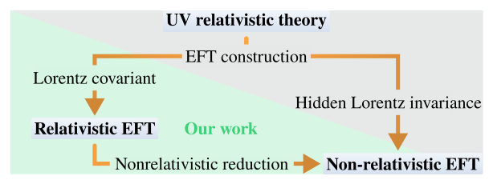
<figcaption class="paper-figure-caption"><b>Fig 1.</b> Figure 1. Schematic summary of the derivation of the NR limit of an EFT. As an alternative to constructing the theory directly at the NR level, where operators and fields are no longer man- ifestly Lorentz covariant (right-hand side), we first formulate an EFT at the relativistic, Lorentz- covariant level and relate it to the NR limit via an additional NR reduction based on an extended Foldy-Wouthuysen transformation. While a direct NR construction implies relations among Wil- son coefficients, also referred to as hidden Lorentz invariance, starting from the relativistic theory generally involves fewer independent matching coefficients, and the corresponding relations emerge automatically...</figcaption>
</figure>
<figure class="paper-figure-card">
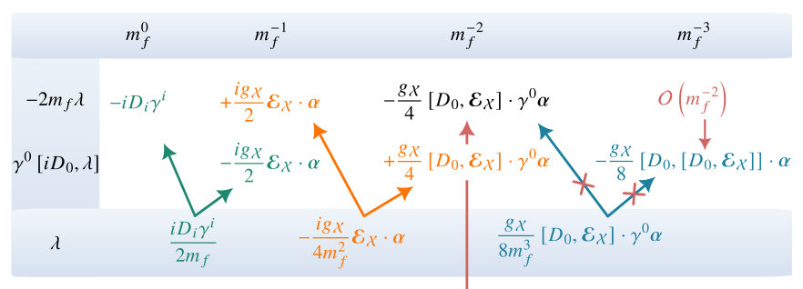
<figcaption class="paper-figure-caption"><b>Fig 2.</b> Figure 2. Traditional FW transformation of the term ¯fiDiγif. The first and second row show the change in the NRLO Lagrangian to lowest order, namely −2mfλ and γ0 [iD0, λ], due to the redefinition specified by λ (third row). These new contributions are categorized in orders of m−1 f (columns). Eliminating the initial iDiγi and subsequent terms (green and orange) eventually leads to [D0, EX ] appearing in m−2 f . If we continue with a standard FW redefinition (blue), then the new term in m−3 f is still m−2 f , so we would introduce an inconsistency in our NR counting. Therefore, we are forced to redefine the gauge field (red).</figcaption>
</figure>
<figure class="paper-figure-card">
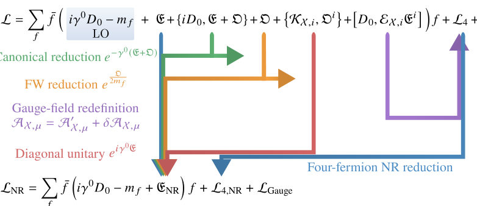
<figcaption class="paper-figure-caption"><b>Fig 3.</b> Figure 3. Generalized NR reduction scheme. Each fermion sector is diagonalized in increasing order, starting with the two-fermion sector. First, the canonical reduction (green) removes time derivatives acting on fermion fields. Standard FW field redefinitions (orange) then eliminate odd operators. Next, a gauge-field redefinition replaces odd EFT terms proportional to the pure gauge- field EOM, i. e., on-shell KX,i = ji, by fermionic currents ji. This way, EFT terms with second-order time derivatives on gauge fields [D0, EXi] are shifted into higher fermion sectors (purple). Finally, a diagonal fermion-field redefinition (red) removes diagonal terms of the form  D0, EXiEi . The same...</figcaption>
</figure>

**Summary.** This paper presents a generalized Foldy-Wouthuysen approach to systematically derive Non-Relativistic Effective Field Theories (EFTs). By first constructing a Lorentz-covariant relativistic EFT and then applying a generalized reduction, the authors ensure that hidden Lorentz invariance constraints are automatically incorporated. This method provides a robust tool for analyzing complex, low-energy physics in various quantum field theories.

**Why it may be interesting.** While the focus is on particle physics EFTs, the systematic handling of symmetry breaking and scale separation via generalized transformations is a powerful theoretical tool applicable to many-body systems where low-energy effective Hamiltonians are constructed.

Detailed structure

**Main problem.** The primary challenge is developing a systematic method to derive Non-Relativistic (NR) Effective Field Theories (EFTs) for complex physical systems, especially when the underlying symmetries are difficult to track, such as in non-inertial backgrounds.

**Main result.** The authors propose a generalized approach involving constructing a full relativistic EFT first, followed by a generalized NR reduction using an extended Foldy-Wouthuysen transformation.

**Method.** The method involves a two-step process: 1) Constructing a Lorentz-covariant relativistic EFT, and 2) Applying a generalized NR reduction scheme to systematically derive the low-energy, non-relativistic Lagrangian.

**Model / system.** The framework is illustrated using Quantum Chromo-Electrodynamics (QCED) for inertial flat spacetime, but is claimed to be generalizable to theories involving non-Standard Model physics, such as axion couplings or Dirac fields in curved spacetime.

**Key observables.** The resulting Lagrangian terms, organized by powers of momentum/energy, and the emergence of hidden Lorentz invariance constraints.

**Important parameters / regimes.** The non-relativistic limit ($|p| \ll m$), the characteristic scale $\Lambda$ associated with heavy degrees of freedom, and the coupling constants of the underlying gauge theories (QED, QCD).

**Assumptions / limitations.** The derivation assumes the existence of a well-defined NR limit and relies on the success of the generalized FW transformation to correctly map the relativistic structure to the non-relativistic one.

**Figures summary.** Figure 1 schematically contrasts the proposed derivation route (relativistic EFT $
ightarrow$ generalized NR reduction) against direct NR construction, showing the systematic nature of the new method.

**Paper structure.** The paper introduces the necessity of the generalized approach, details the two-step methodology (relativistic EFT construction followed by NR reduction), applies this method to QCED to reproduce known results, and concludes by discussing its general applicability to complex theories.

Abstract

Effective field theories (EFTs) are a powerful framework for performing high-precision calculations at reduced complexity compared to their fundamental counterparts. A particularly important class of EFTs arises in the non-relativistic (NR) regime. Their construction relies on a different realization of the underlying symmetries, since Lorentz invariance is no longer manifest in covariant form in the NR regime. This behavior imposes a link between certain matching coefficients, and therefore additional constraints, commonly referred to as hidden Lorentz invariance. These constraints are established in quantum field theories on inertial flat spacetime, such as NR quantum electrodynamics. However, deriving these constraints becomes considerably more involved for theories involving physics beyond the Standard Model or formulated in non-inertial spacetime backgrounds, where the hidden symmetry structure is less transparent. In this work, we present an approach to obtain the NR EFT by first constructing a relativistic EFT and then performing a generalized NR reduction based on an extended Foldy-Wouthuysen transformation. We illustrate this method by a quantum chromo-electrodynamics EFT for inertial flat spacetime, describing both electromagnetic and strong interactions, and show how it reduces to the established Lagrangian of NR quantum chromodynamics and electrodynamics. The hidden Lorentz invariance emerges as a direct consequence of the construction. This approach provides a route to obtain the NR limits of more complex theories, \eg Dirac fields in non-inertial spacetime or extensions involving physics beyond the Standard Model. As an example, we apply the method to add the coupling of a pseudoscalar axion field in a simplified model and derive its NR limit.

[↑ back to top](#top)

### [Quantum Representation Learning Beyond Pairwise Fidelity](http://arxiv.org/abs/2609.01797v1)

**Authors:** Junpeng Hou, Changbin Lu  
**Type:** theory · **Category:** quantum information and computing · **PDF:** <https://arxiv.org/pdf/2609.01797v1>  
**Analysis basis:** full PDF text, analyzed in chunks
**Topic relevance:** `quantum measurements` **2/5** · `analog quantum simulation` **1/5** · `interference shaping light` **1/5**

↔ Scroll figures horizontally

<figure class="paper-figure-card">
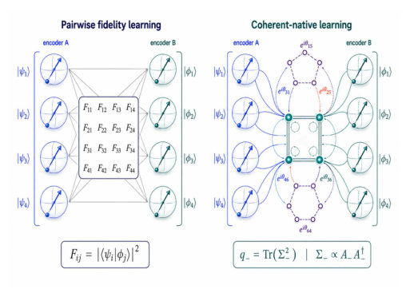
<figcaption class="paper-figure-caption"><b>Fig 1.</b> FIG. 1. From transition probabilities to multistate re- lational learning. Left: A common QRL interface reduces relations to two-state quantities such as fidelity Fij. Right: Coherent access to overlap amplitudes preserves multistate interference, with q−providing a nonlinear spectral observ- able of the masked relational structure.</figcaption>
</figure>
<figure class="paper-figure-card">
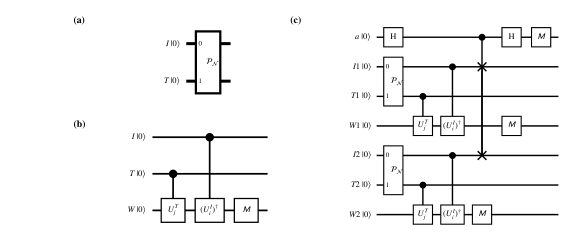
<figcaption class="paper-figure-caption"><b>Fig 2.</b> FIG. 2. Direct access to multistate relational ob- servables. (a) A coherent loader prepares the desired pair superposition. (b) The address-controlled overlap operation writes Aij into the |0n⟩W branch, whose probability gives p−. (c) For two copies, projection followed by a SWAP of one ad- dress subsystem yields q−= Tr Σ2 −.</figcaption>
</figure>
<figure class="paper-figure-card">
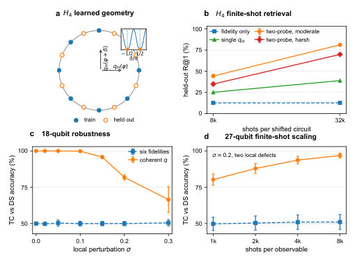
<figcaption class="paper-figure-caption"><b>Fig 3.</b> FIG. 3. Learning and physical content of multi- state relations. (a) Contrastive learning of the complex- Hadamard family. Inset shows the contrastive landscape. (b) Recall on held-out retrieval under finite-shot readout. (c) Mi- croscopic TC-DS identification for 18-qubit loop-gas states under independent local Rx perturbations. (d) Finite-shot topological identification for 27-qubit microscopic states with two local defects per prepared ray. Pairwise fidelities remain uninformative, while q−retains the topological distinction.</figcaption>
</figure>
<figure class="paper-figure-card">
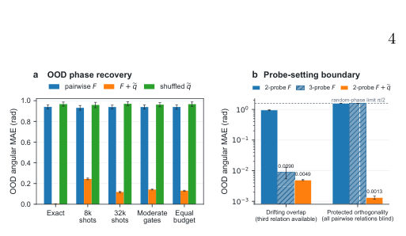
<figcaption class="paper-figure-caption"><b>Fig 4.</b> FIG. 4. Out-of-distribution learning and generaliza- tion. All error bars denote the standard deviation over ten random seeds. (a) OOD angular mean absolute error of tied CCA using the complete two-probe pairwise-fidelity represen- tation F, the representation regularized by normalized second moment F + eq−, and a control in which eq−is shuffled across examples. Results are shown for exact observables, finite- shot sampling, the moderate gate-error model, and an equal- total-shot comparison. (b) Exact-expectation probe-number boundary. For generic drifting overlap, a balanced third fi- delity probe restores identifiability. When the relevant tem- poral modes are exactly orthogonal, however,...</figcaption>
</figure>

**Summary.** This paper proposes moving beyond pairwise fidelity measurements in Quantum Representation Learning by introducing a higher-order observable, $q^-$. This observable captures multi-state interference effects that are invisible when only pairwise overlaps are considered. By demonstrating that $q^-$ can distinguish between physically distinct quantum states (like different topological orders) and significantly improve phase estimation accuracy, the authors establish a new, powerful signal for quantum machine learning.

**Why it may be interesting.** This work directly addresses the limitations of current quantum machine learning protocols by providing a concrete, measurable, and trainable observable that captures higher-order quantum correlations beyond simple pairwise overlaps.

Detailed structure

**Main problem.** Quantum Representation Learning (QRL) often loses crucial relational information by relying only on pairwise transition probabilities (fidelity). The goal is to identify and train on higher-order, phase-sensitive relational invariants.

**Main result.** A multi-state observable, $q^-$, built from coherent overlap amplitudes, successfully encodes inequivalent modular data even when all pairwise fidelities are identical. This observable significantly improves phase generalization in out-of-distribution settings.

**Method.** The authors introduce a 'batch operator' ($\Sigma^-$) to construct $q^-$, which is then shown to be measurable via two-copy interference and trainable using parameter-shift gradients within a variational learning framework.

**Model / system.** The work analyzes quantum states, specifically using relational quartets derived from topological codes (toric-code and double-semion states) and a four-photon benchmark, to test the limits of information extraction.

**Key observables.** Pairwise fidelities ($F_{ij}$), the normalized second moment ($q^-$), and the mean out-of-distribution phase error ($	ext{MAE}_{	ext{ang}}$).

**Important parameters / regimes.** The continuous variation of the phase angle ($\varphi$) in the complex-Hadamard family, and the total shot budget for measurements.

**Assumptions / limitations.** The primary assumption is that higher-order, multi-state observables ($q^-$) capture information lost when only pairwise fidelities are used as the learning interface.

**Figures summary.** Figures illustrate the transition from pairwise fidelity to multi-state interference via $q^-$, show circuit implementations for measuring $q^-$, and compare the performance of different representations (fidelity vs. coherent) in OOD phase estimation.

**Paper structure.** The paper progresses by first identifying the information bottleneck (pairwise fidelity), introducing the higher-order observable $q^-$, demonstrating its physical measurability and trainability, and finally validating its superiority over fidelity in distinguishing topological orders and improving generalization.

Abstract

Quantum contrastive, metric, and self-supervised learning often expose encoded quantum states to the learner through transition probabilities, especially fidelity. Quantum states are known to possess higher-order relational invariants, but their consequences for learned representations remain unclear. Here we show that a transition-probability-only learning interface can possess exact continuous blind directions in certain quantum-state families. We recover this missing information with a batch operator, built from coherent overlap amplitudes and negative masking, where its second moment $q_-$ retains four-state interference. Moreover, $q_-$ is directly measurable through two-copy interference and can enter variational learning via methods like parameter shift. In relational quartets derived from toric-code and double-semion states, this fidelity-blind signal encodes inequivalent modular data despite identical pairwise fidelities. Finally, in a four-photon benchmark with preparation drift, augmenting all six pairwise fidelities at two orthogonal probes with the corresponding normalized $q_-$ reduces the mean out-of-distribution phase error by $86\%$ at equal total shot budget. These results establish multistate relational observables as measurable, trainable, and physically consequential signals for quantum representation learning beyond pairwise fidelity.

[↑ back to top](#top)

### [DMRG using Belief Propagation](http://arxiv.org/abs/2609.02361v1)

**Authors:** Hendrik Kühne, Christian B. Mendl  
**Type:** theory · **Category:** numerical methods · **PDF:** <https://arxiv.org/pdf/2609.02361v1>  
**Analysis basis:** full PDF text, analyzed in chunks
**Topic relevance:** `analog quantum simulation` **2/5** · `methods for driven-dissipative` **1/5**

↔ Scroll figures horizontally

<figure class="paper-figure-card">
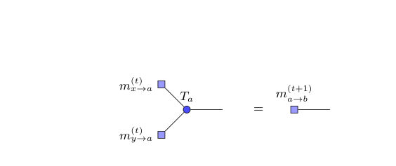
<figcaption class="paper-figure-caption"><b>Fig 1.</b> FIG. 1. The message update – Eq. (2) – contracts all but one incoming message into the respective tensor. Let ∂a = {x, y, b}. Then the message m(t+1) a→b is obtained by evaluating</figcaption>
</figure>
<figure class="paper-figure-card">
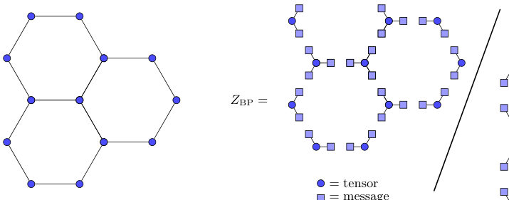
<figcaption class="paper-figure-caption"><b>Fig 2.</b> FIG. 2. The contraction value Z of a TN can be obtained using BP by absorbing the messages into the tensors, and dividing by the message normalizations. This example depicts ZBP (Eq. (4)) for a TN consisting of three hexagonal cells.</figcaption>
</figure>
<figure class="paper-figure-card">
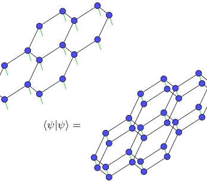
<figcaption class="paper-figure-caption"><b>Fig 3.</b> FIG. 3. The norm ⟨ψ|ψ⟩can be expressed as a tensor network, given a TNS representation of |ψ⟩. The conjugated state ⟨ψ|, in TNS format, is represented by complex conjugates T † of all TNS-tensors T of the state |ψ⟩. Mathematically, the inner product ⟨ψ|ψ⟩is a TN that is obtained by connecting the physical legs of Ta and T † a for all nodes a ∈V .</figcaption>
</figure>
<figure class="paper-figure-card">
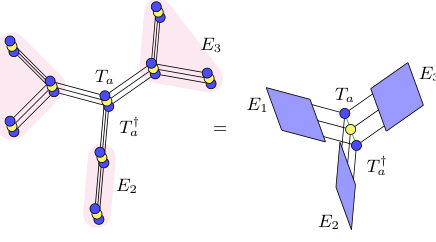
<figcaption class="paper-figure-caption"><b>Fig 4.</b> FIG. 4. A local Hamiltonian is the result of contracting all of ⟨ψ|H|ψ⟩except the respective site tensors, yielding ⟨Ta|Ha|Ta⟩at site a. This is the graphical depiction of Eq. (10), with TTNS tensors drawn in blue and TTNO ten- sors drawn in yellow.</figcaption>
</figure>
<figure class="paper-figure-card">
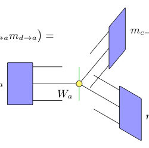
<figcaption class="paper-figure-caption"><b>Fig 5.</b> FIG. 8. Eq. (13) describes the calculation of local Hamilto- nians at sites with an arbitrary number of neighbors. This figure shows Ha, where |∂a| = 3. The expression is symboli- cally similar to C(E1E2E3Wa) from Fig. 4, hinting at the fact that Eq. (13) is equivalent to Eq. (10) on trees.</figcaption>
</figure>

**Summary.** This paper introduces BP-DMRG, a novel method that merges Belief Propagation with the DMRG algorithm to calculate ground states of quantum many-body systems. It overcomes the limitations of standard DMRG by allowing calculations on arbitrary lattices, demonstrated successfully on the TFI model. While highly accurate, the authors caution that the method's reliability degrades significantly when the underlying graph contains loops or when operators are non-definite.

**Why it may be interesting.** This work provides a powerful, scalable numerical technique (BP-DMRG) to tackle quantum many-body problems on complex geometries where traditional DMRG methods fail due to dimensionality or lattice structure.

Detailed structure

**Main problem.** The primary challenge is efficiently calculating the contraction of large Tensor Networks (TNs) for ground-state problems in quantum many-body systems, especially on higher-dimensional or arbitrary lattices.

**Main result.** The combination of Belief Propagation (BP) with DMRG (BP-DMRG) successfully extends DMRG to arbitrary lattices, achieving high fidelity (0.9-0.99) for the transverse-field Ising model on a $2	imes 2$ hexagonal lattice.

**Method.** The authors combine the DMRG optimization framework with the Belief Propagation algorithm to approximate the difficult TN contractions required for calculating state norms and energy expectation values.

**Model / system.** The work is benchmarked on the transverse-field Ising model (TFI) and is designed for general quantum many-body systems whose ground states are represented by Tensor Networks (TNS).

**Key observables.** Fidelity (to the true ground state) and the relative error of energy estimates.

**Important parameters / regimes.** The lattice structure (e.g., $2	imes 2$ hexagonal lattice) and the transverse field strength.

**Assumptions / limitations.** The accuracy of BP suffers significantly in the presence of loops in the TN graph, and convergence is not guaranteed for non-definite operators.

**Figures summary.** Figures illustrate the message update process for TN contraction, the calculation of the approximate contraction value $Z_{BP}$, and the construction of TNOs for the TFI model on hexagonal lattices.

**Paper structure.** The paper first introduces the challenge of TN contraction, then details the use of BP as an alternative to exact contraction. It formalizes the combination into BP-DMRG, demonstrates its application to the TFI model on specific lattices, and concludes by discussing the inherent limitations related to graph topology and operator definiteness.

Abstract

Tensor networks have attracted much attention as a powerful tool for modeling quantum many-body systems. Their contraction is a significant challenge, however, especially in highly connected networks, as memory requirements become prohibitive and the optimal contraction order is increasingly hard to find. The belief propagation (BP) algorithm has emerged as an alternative to exact contraction. Being formulated in a graph-agnostic way, it offers great flexibility, but its accuracy suffers in the presence of loops. In this work, we combine BP with the DMRG algorithm to solve ground-state problems, thereby extending DMRG to higher dimensions and arbitrary lattices. We demonstrate the viability of BP-DMRG on the transverse-field Ising model on a $2\times 2$ hexagonal lattice, finding that it produces states with a fidelity between $0.9$ and $0.99$ to the true ground state, and energy estimates with a relative error between $10^{-2}$ and $10^{-3}$. Additionally, BP-DMRG can find ground states on randomly generated lattices, with fidelity improving as the transverse field increases. We conclude with a discussion of the limitations we encounter when using belief propagation, highlighting that the TFI tensor network operators lead to larger errors during BP iterations in BP-DMRG.

[↑ back to top](#top)

### [Implementation of quantum gates by Floquet analysis of kicked quantum system](http://arxiv.org/abs/2609.02372v1)

**Authors:** Andrea De Luca, Carola Ciaramelletti, Simone Paganelli  
**Type:** theory · **Category:** quantum information and computing · **PDF:** <https://arxiv.org/pdf/2609.02372v1>  
**Analysis basis:** full PDF text, analyzed in chunks
**Topic relevance:** `QC/QI experiment` **2/5** · `methods for driven-dissipative` **1/5**

↔ Scroll figures horizontally

<figure class="paper-figure-card">
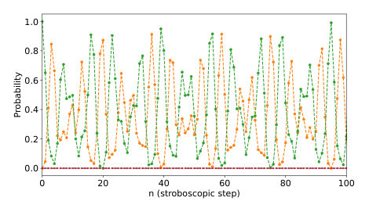
<figcaption class="paper-figure-caption"><b>Fig 1.</b> Figure 2: Unmodulated system dynamics. Strobo- scopic evolution of the state populations for λ = 0, where the y-axis denotes the probability of measuring the sys- tem in a given basis state at step n. The initial state |100⟩(green dashed line) and the target state |010⟩(or- ange dashed line) exhibit disordered oscillations, resulting in poor population transfer fidelity in the absence of Flo- quet resonance engineering.</figcaption>
</figure>
<figure class="paper-figure-card">
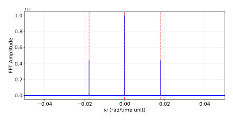
<figcaption class="paper-figure-caption"><b>Fig 2.</b> Figure 4: Spectral analysis of gate fidelity. Numer- ical FFT (Fast Fourier Transform) peaks align with ana- lytical quasi-energy transition frequencies under Gaussian- pulsed driving.</figcaption>
</figure>
<figure class="paper-figure-card">
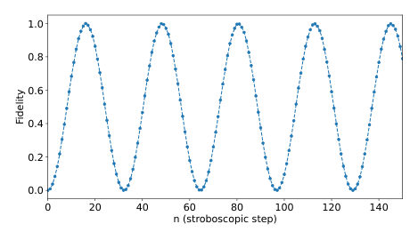
<figcaption class="paper-figure-caption"><b>Fig 3.</b> Figure 3: Optimized iSWAP evolution. Fidelity evo- lution [Eq.(10)] for the state transfer from the initial state |100⟩to the target state |010⟩under optimized Floquet driving with parameter λ = 4.62ℏand T = 10.95ns. The Fidelity reaches a maximum close to unity at the optimal kick number nbest = 16.</figcaption>
</figure>
<figure class="paper-figure-card">
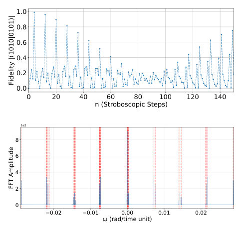
<figcaption class="paper-figure-caption"><b>Fig 4.</b> Figure 5: Optimized Floquet dynamics for the tran- sition |1010⟩→|0101⟩. (a) Stroboscopic fidelity evo- lution. (b) FFT spectrum of the fidelity time series; dashed lines indicate the analytically predicted quasi- energy transitions.</figcaption>
</figure>
<figure class="paper-figure-card">
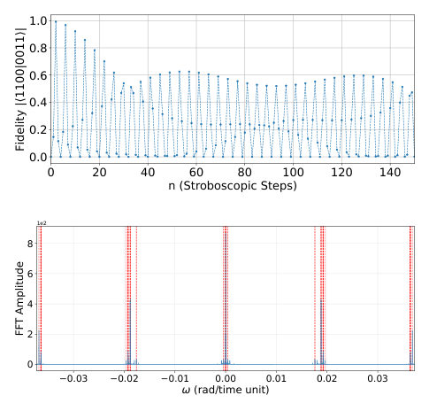
<figcaption class="paper-figure-caption"><b>Fig 5.</b> Figure 7: Optimized Floquet dynamics for the tran- sition |1100⟩→|0011⟩. (a) Stroboscopic fidelity evo- lution. (b) FFT spectrum of the fidelity time series; dashed lines indicate the analytically predicted quasi- energy transitions.</figcaption>
</figure>

**Summary.** This paper details a method to implement high-fidelity quantum gates in superconducting qubit arrays by utilizing Floquet engineering with periodic driving pulses. By mapping the problem to quasi-energy resonance conditions and optimizing parameters, the authors achieve robust gate operations that scale to larger systems. This framework provides a powerful theoretical tool for advancing practical quantum hardware control.

**Why it may be interesting.** This work directly bridges advanced time-periodic control theory (Floquet engineering) with the practical engineering challenges of superconducting quantum hardware, providing concrete, scalable protocols for quantum computation.

Detailed structure

**Main problem.** The core challenge is achieving high-fidelity quantum gate operations and state transfer protocols in superconducting multi-qubit processors.

**Main result.** The authors successfully demonstrated high-fidelity iSWAP gate synthesis in a three-qubit system and extended the protocol to a seven-site chain using periodic Gaussian driving pulses.

**Method.** The work employs Floquet theory to analyze the time-periodic Hamiltonian, mapping the control problem onto quasi-energy resonance conditions, which are then optimized using CMA-ES.

**Model / system.** The system is an extended superconducting linear chain of transmon qubits (scaling from three to seven sites), modeled by a time-dependent Hamiltonian driven by periodic pulses.

**Key observables.** Gate fidelity ($F_{i	o f}$), quasi-energy spectrum, and the ability to achieve clear scale separation from energy-relaxation times ($T_1$).

**Important parameters / regimes.** Kick strength ($\lambda$), driving period ($T$), static coupling strengths ($g_1, g_2$), and the disorder parameter ($\eta \sim 10^{-3}$).

**Assumptions / limitations.** The analysis initially uses the idealized delta-like pulse model, but extends to finite-width Gaussian pulses; stability is benchmarked against static parameter disorder.

**Figures summary.** Figures illustrate the circuit scheme, the poor performance of the undriven system, and the optimized, high-fidelity state transfer achieved via Floquet driving.

**Paper structure.** The paper progresses from defining the physical system and Hamiltonian, applying Floquet theory to derive the stroboscopic evolution operator, optimizing parameters via CMA-ES to achieve resonance, and finally benchmarking the resulting gate fidelity against realistic hardware imperfections.

Abstract

Precise control of multi-qubit architectures remains a critical bottleneck in superconducting quantum processors. In this work, we investigate the synthesis of high-fidelity quantum operations and state transfer protocols within an extended superconducting linear chain, scaling from three to seven sites. Using Floquet theory, we model the periodic drive as a train of delta-like pulses, mapping the quantum control problem onto quasi-energy resonance conditions. Combining the Baker-Campbell-Hausdorff expansion with Floquet spectral decomposition, we analytically identify optimal driving parameters, refined via the Covariance Matrix Adaptation Evolution Strategy (CMA-ES). In the three-qubit architecture, this enables high-fidelity synthesis of the iSWAP gate. Extending to a seven-site chain, we implement periodic trains of finite-width Gaussian pulses to activate distinct double-excitation transport channels with ultra-short gate durations t_gate (~170 ns). This achieves a clear scale separation from energy-relaxation times (T1) typical of fixed-frequency transmon devices with tunable couplers, such as IBM Quantum hardware. Finally, we benchmark stability under realistic imperfections, revealing a heightened sensitivity to static parameter disorder at the sub-percent level (eta ~ 10^-3) driven by spectral crowding, and discuss how closed-loop topologies could mitigate this constraint. This framework bridges time-periodic control theory and practical quantum gate engineering.

[↑ back to top](#top)

### [Transversal Gates and Magic State Distillation in an Optimally Synthesized Spin-Qubit Shuttling Bus](http://arxiv.org/abs/2609.02641v1)

**Authors:** Pau Escofet, Andrii Semenov, Niall Murphy, Elena Blokhina, Carmen G. Almudéver, Sergi Abadal, Eduard Alarcón  
**Type:** theory · **Category:** quantum information and computing · **PDF:** <https://arxiv.org/pdf/2609.02641v1>  
**Analysis basis:** full PDF text, analyzed in chunks
**Topic relevance:** `QC/QI experiment` **2/5** · `quantum measurements` **1/5**

↔ Scroll figures horizontally

<figure class="paper-figure-card">
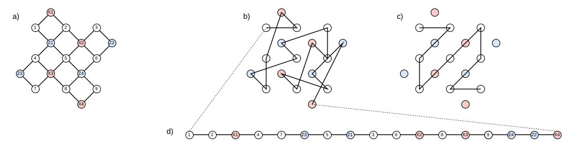
<figcaption class="paper-figure-caption"><b>Fig 1.</b> Fig. 1 Quantum Reverse Mapping summary. a) Distance-3 Surface Code. b) Optimal relative placement obtained from the MILP model, expanding such order in a 1D results in the relative placement of each qubit in a single bus, depicted in d). c) Depicts the same ordering as b) but omitting the ancilla qubits, giving name to the Zig-Zag placement heuristic.</figcaption>
</figure>
<figure class="paper-figure-card">
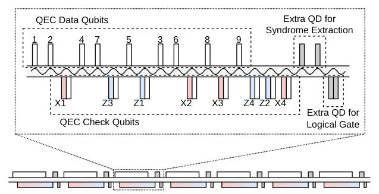
<figcaption class="paper-figure-caption"><b>Fig 2.</b> Fig. 2 (Top) A single logical element for a distance-d surface code: a 1D shuttling bus hosting d2 storage zones (individual sites, upper side) and d2 operation zones (paired sites, lower side). Two additional quantum dots are appended to the bus to ensure all spins can be reliably stored throughout a complete syndrome extraction cycle. (Bottom) A multi-qubit architecture formed by concatenating multiple logical elements along a single shuttling bus.</figcaption>
</figure>
<figure class="paper-figure-card">
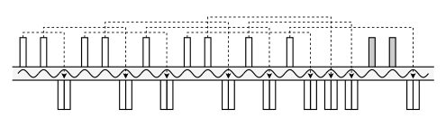
<figcaption class="paper-figure-caption"><b>Fig 3.</b> Fig. 3 Shuttling assignments for a transversal two-qubit gate between two logical elements. The i-th leftmost data qubit of each logical element is assigned to the i-th leftmost operation zone, minimizing the total shuttling distance from storage to operation zones for the local logical element. The second logical qubit involved (not depicted in the figure) follows the same pairing rule, though it will come from distant storage zones.</figcaption>
</figure>
<figure class="paper-figure-card">
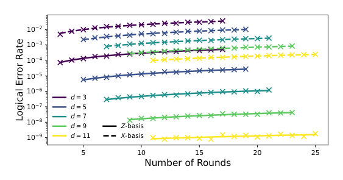
<figcaption class="paper-figure-caption"><b>Fig 4.</b> Fig. 4 LER for a logical qubit memory experiment, shown for code distances d = 3 to d = 11. Results are reported for both the Z basis and the X basis. The strongly biased nature of the spin-qubit noise model, where Pauli-Z errors dominate, leads to a substantially lower LER in the Z basis across all code distances. Noise parameters are fixed to T Store ϕ = T Bus ϕ = 100µs and</figcaption>
</figure>
<figure class="paper-figure-card">
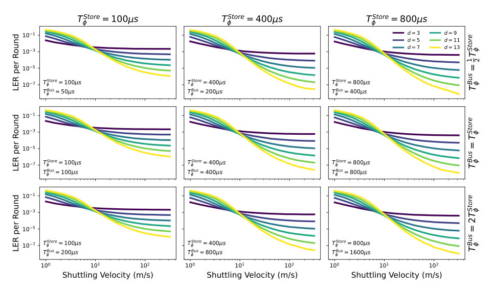
<figcaption class="paper-figure-caption"><b>Fig 5.</b> Fig. 5 LER per SE round, shown for code distances d = 3 to d = 13 as a function of shuttling velocity (1 to 320 m/s). Each panel corresponds to a distinct combination of storage-zone dephasing time T Store ϕ ∈{100, 400, 800}µs and shuttling-bus</figcaption>
</figure>

**Summary.** This work proposes a comprehensive co-design framework for fault-tolerant quantum computation using a spin-qubit shuttling bus. By optimizing the physical layout based on logical error correction needs, the authors demonstrate how to achieve all-to-all connectivity and efficiently execute complex logical gates. This establishes a viable path for scaling quantum processors in solid-state systems.

**Why it may be interesting.** It provides a concrete, hardware-aware framework for scaling fault-tolerant quantum computation, directly linking the abstract requirements of QEC codes to the physical constraints of solid-state qubit platforms.

Detailed structure

**Main problem.** The paper addresses the open challenge of co-designing physical quantum architectures that simultaneously support robust quantum error correction (QEC) and efficient, scalable logical quantum computation.

**Main result.** They establish a principled co-design framework using spin-qubit shuttling buses, demonstrating that the architecture can achieve all-to-all logical connectivity and optimize complex circuits like magic state distillation.

**Method.** The authors employ Quantum Reverse Mapping methodology at the logical level, optimizing the physical layout based on the requirements of the QEC code and logical gate operations.

**Model / system.** The physical platform is a multi-qubit spin-qubit shuttling bus architecture, which is extended from 1D to a 2D grid. This system uses distinct 'storage' and 'operation' zones for qubit management.

**Key observables.** Logical Error Rate (LER), inter-qubit distance, and the efficiency of logical gate operations (e.g., transversal CNOT).

**Important parameters / regimes.** Code distance ($d$), encoding ratio ($m$), and the physical dimensions (1D vs. 2D grid) of the shuttling tracks.

**Assumptions / limitations.** The core assumption is the feasibility of coherent spin shuttling to perform logical gates and the ability to optimize the physical layout based on logical requirements.

**Figures summary.** Figures illustrate the synthesis of the architecture using Quantum Reverse Mapping, showing the transition from single-element to multi-element structures, and detailing the shuttling paths for transversal gates.

**Paper structure.** The paper progresses by first defining the need for co-design, then detailing the physical implementation (shuttling bus, ancilla sharing), optimizing the structure using Quantum Reverse Mapping, and finally demonstrating its utility by applying the framework to optimize a complex circuit like magic state distillation.

Abstract

Fault-tolerant quantum computing requires not only reliable logical qubit storage, but also the ability to perform high-fidelity logical operations between error-corrected qubits at scale. While much of the existing literature focuses on optimizing syndrome extraction for a single logical qubit, the co-design of physical architectures that support both robust error correction and efficient logical computation remains an open challenge. In this work, we propose a multi-qubit spin-qubit shuttling bus architecture that addresses both requirements simultaneously. The architecture optimizes the physical qubit layout for syndrome extraction and supports transversal two-qubit logical gates between an arbitrary number of logical qubits, achieving all-to-all logical connectivity through coherent spin shuttling. We further propose an ancilla-sharing scheme that encodes multiple logical qubits within a single logical element, compressing the physical footprint of the processor and improving long-range gate fidelity. Extending the architecture from a one-dimensional bus to a two-dimensional grid of shuttling tracks reduces the inter-qubit distance, yielding consistent improvements in logical error. Finally, we apply the Quantum Reverse Mapping methodology at the logical level to optimize the layout of a \textit{15-to-1} magic state distillation circuit, demonstrating how the transversal capabilities of the proposed architecture can be leveraged for universal fault-tolerant computation. Taken together, these results establish a principled co-design framework that bridges the physical, error-correction, and logical computation layers of the quantum stack, and demonstrate that spin-qubit shuttling architectures are a viable and flexible substrate for scalable fault-tolerant quantum computation.

[↑ back to top](#top)

### [A Quantum Algorithm for the Radical of a Lie Algebra: Kernel Projection and Conditioning](http://arxiv.org/abs/2609.02084v1)

**Authors:** Yibin Wang  
**Type:** theory · **Category:** quantum information and computing · **PDF:** <https://arxiv.org/pdf/2609.02084v1>  
**Analysis basis:** full PDF text, analyzed in chunks
**Topic relevance:** `quantum measurements` **2/5**

↔ Scroll figures horizontally

<figure class="paper-figure-card">
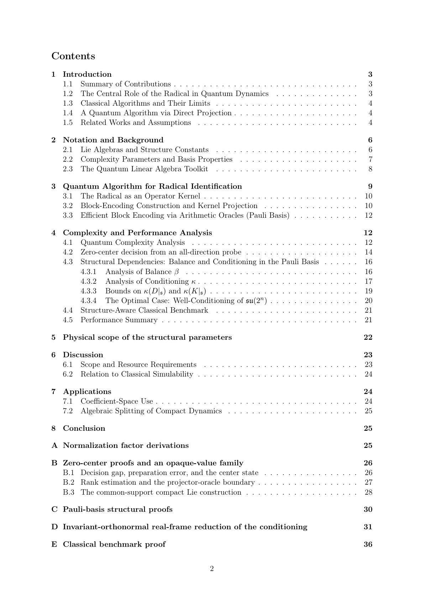
<figcaption class="paper-figure-caption"><b>Fig 1.</b> Low-resolution page preview, page 2</figcaption>
</figure>
<figure class="paper-figure-card">
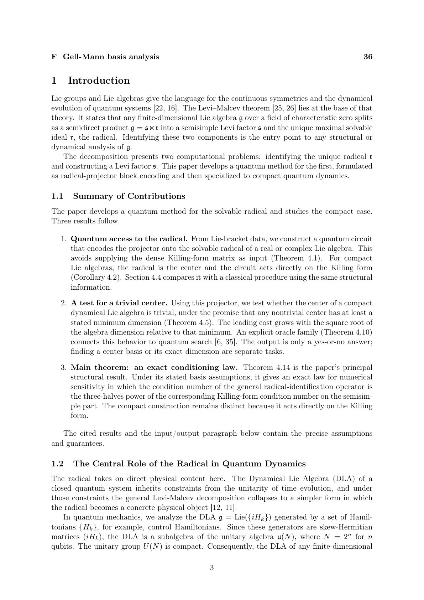
<figcaption class="paper-figure-caption"><b>Fig 2.</b> Low-resolution page preview, page 3</figcaption>
</figure>
<figure class="paper-figure-card">
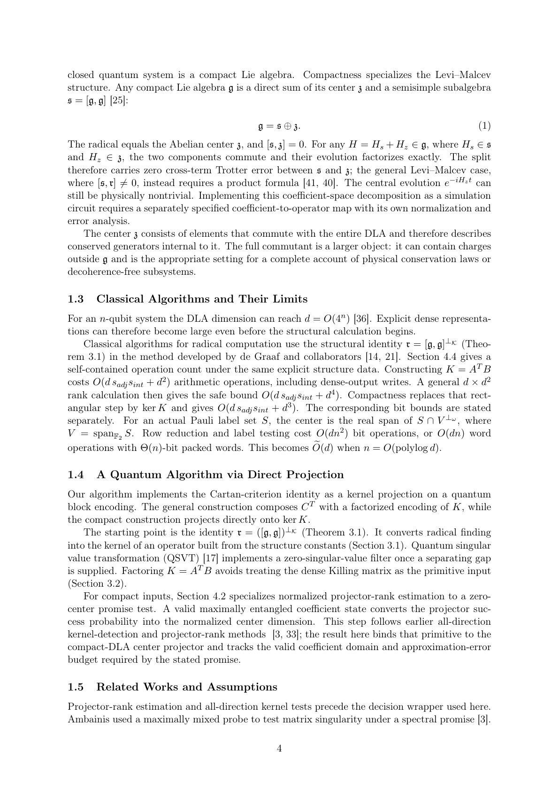
<figcaption class="paper-figure-caption"><b>Fig 3.</b> Low-resolution page preview, page 4</figcaption>
</figure>
<figure class="paper-figure-card">
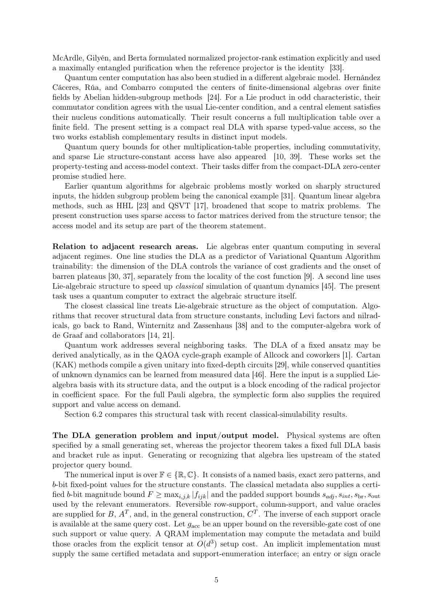
<figcaption class="paper-figure-caption"><b>Fig 4.</b> Low-resolution page preview, page 5</figcaption>
</figure>
<figure class="paper-figure-card">
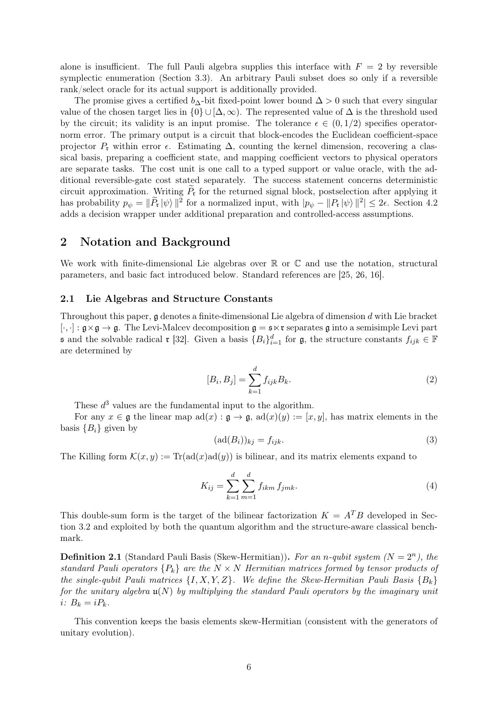
<figcaption class="paper-figure-caption"><b>Fig 5.</b> Low-resolution page preview, page 6</figcaption>
</figure>

**Summary.** This work presents a quantum algorithm to compute the radical of a Lie algebra, which corresponds to finding conserved directions in the dynamics of a closed quantum system. By encoding the necessary projector into a quantum circuit, it offers a resource-efficient method to test whether the system's center is trivial. This is significant for understanding the internal symmetries and conserved quantities governing quantum evolution.

**Why it may be interesting.** It directly addresses the mathematical structure of conserved quantities (the center/radical) in quantum dynamics, providing a quantum computational tool to diagnose internal symmetries in closed quantum systems.

Detailed structure

**Main problem.** The paper develops a quantum algorithm to find the radical (largest solvable ideal) of a Lie algebra, particularly focusing on the compact case where the radical is the center.

**Main result.** It constructs a quantum circuit that approximates the coefficient-space projector onto the radical, providing a controlled test for internal conserved directions in compact quantum dynamics.

**Method.** The approach uses quantum linear algebra techniques, specifically constructing a quantum circuit that implements a kernel projection, leveraging tools like QSVT to filter out zero-singular-value components.

**Model / system.** The system is the Dynamical Lie Algebra (DLA) of a closed quantum system, which is treated as a compact Lie algebra generated by skew-Hermitian matrices within the unitary algebra u(N).

**Key observables.** The radical (center) of the Lie algebra, the coefficient-space projector, and the condition number ($\kappa$) of the associated operators.

**Important parameters / regimes.** The input requires certified metadata bounds on structure constants ($F, 	ext{sad}_j, 	ext{sint}$) and an error tolerance ($\epsilon$).

**Assumptions / limitations.** The test for a trivial center requires the promise that any nontrivial center has at least a stated minimum dimension.

**Figures summary.** Not specified.

**Paper structure.** The paper moves from the general theory of radical finding via kernel projection to the specific implementation for compact algebras, deriving structural theorems regarding the condition number and culminating in a test for the triviality of the center.

Abstract

Every finite-dimensional real or complex Lie algebra has a largest solvable ideal, its radical. In the compact dynamical Lie algebra (DLA) of a closed quantum system, this radical is the center; projecting onto it isolates directions that commute with the supplied algebra. With sparse Lie-bracket data and a known spectral gap, we construct a quantum circuit that approximately encodes this coefficient-space projector. The general construction combines the derived-algebra map with the Killing form, whereas compactness makes the Killing form alone sufficient. This distinction matters for numerical sensitivity, and our main theorem gives its exact law under an invariant-orthonormal basis adapted to the center and semisimple part. In a compact real algebra with a nonzero semisimple part, the condition number of the general operator is the three-halves power of the Killing-form condition number on that part. The compact projector in turn yields a bounded-error test for whether the center is trivial, provided that any nonzero center has at least a stated minimum dimension. This gives a controlled test for internal conserved directions in compact quantum dynamics.

[↑ back to top](#top)

### [Analytic Maximal Violation of Extended MABK Inequalities for Generalized GHZ States](http://arxiv.org/abs/2609.02045v1)

**Authors:** Kun-Peng Wu, Hui-Xian Meng, Jie Zhou, Jing-Ling Chen  
**Type:** theory · **Category:** quantum information and computing · **PDF:** <https://arxiv.org/pdf/2609.02045v1>  
**Analysis basis:** full PDF text, analyzed in chunks
**Topic relevance:** `quantum measurements` **2/5**

↔ Scroll figures horizontally

<figure class="paper-figure-card">
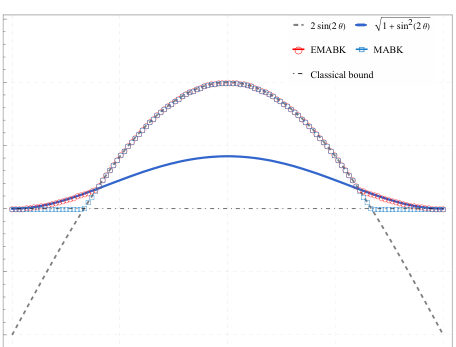
<figcaption class="paper-figure-caption"><b>Fig 1.</b> FIG. 1. Maximal quantum values of the EMABK and stan- dard MABK expressions for the three-qubit state cos θ|000⟩+ sin θ|111⟩, with θ ∈[0, π/2]. Red open circles and blue open squares show numerical optimization results for EMABK and MABK, respectively. The gray dashed and blue solid curves show the corresponding analytic results, and the black dash- dotted line marks the classical bound. The standard MABK expression has a nonviolation region in the weakly entangled regime (θ ≲0.26), whereas the EMABK expression violates the classical bound throughout the entangled parameter range by means of a hybrid measurement strategy.</figcaption>
</figure>
<figure class="paper-figure-card">
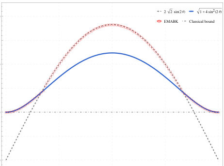
<figcaption class="paper-figure-caption"><b>Fig 2.</b> FIG. 2. Maximal quantum values of the EMABK inequality for the four-qubit generalized GHZ state cos θ|0000⟩+ sin θ|1111⟩ with θ ∈[0, π/2]. The gray dashed curve shows the first branch 2 √</figcaption>
</figure>
<figure class="paper-figure-card">
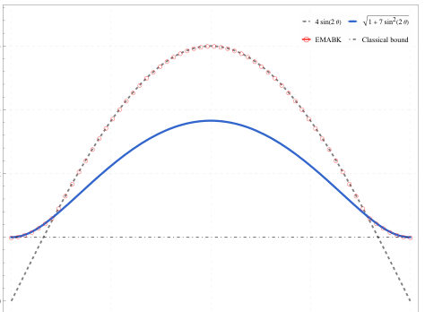
<figcaption class="paper-figure-caption"><b>Fig 3.</b> FIG. 3. Maximal quantum values of the EMABK inequality for the five-qubit generalized GHZ state cos θ|00000⟩+sin θ|11111⟩ with θ ∈[0, π/2]. The gray dashed curve shows the first branch 4 sin 2θ attained by Strategy I, and the blue solid curve shows the second branch p</figcaption>
</figure>

**Summary.** This paper provides a detailed analytical characterization of the maximum quantum violation achievable for generalized GHZ states using the extended MABK inequality. By developing a correlation-tensor approach and utilizing singular value analysis, the authors establish a tight, piecewise analytic upper bound. This work is significant because it demonstrates how the extended inequality resolves ambiguities in the standard MABK test, providing a clearer separation between quantum and classical correlations even in partially entangled regimes.

**Why it may be interesting.** The rigorous characterization of entanglement witnesses via generalized Bell inequalities is fundamental to quantum information theory, providing precise measures of non-locality beyond standard entanglement measures.

Detailed structure

**Main problem.** The paper analytically characterizes the maximal quantum violation of the extended Mermin-Ardehali-Belinskii-Klyshko (EMABK) family of inequalities for $n$-qubit generalized Greenberger-Horne-Zeilinger (GHZ) states.

**Main result.** They derive a piecewise analytic upper bound for the quantum violation, which is saturated by constructing two complementary measurement strategies. Crucially, this method eliminates the non-violation region of the standard MABK inequality for partially entangled GHZ states.

**Method.** The authors employ a correlation-tensor approach, expressing the Bell value as a Frobenius inner product, and deriving the bound using singular value decomposition and the von Neumann trace inequality.

**Model / system.** The study focuses on $n$-qubit generalized GHZ states, $|\Psi(n)	heta
angle = \cos 	heta |0
angle^{\otimes n} + \sin 	heta |1
angle^{\otimes n}$. The analysis involves constructing and analyzing high-order correlation tensors ($T$) and effective coefficient tensors ($C$).

**Key observables.** The Bell value ($B$), the correlation tensor ($T$), and the effective coefficient tensor ($C$). The bound is governed by the two largest singular values of the reshaped correlation tensor.

**Important parameters / regimes.** The entanglement parameter $	heta \in [0, \pi/2]$, and the number of qubits $n$.

**Assumptions / limitations.** The derivation relies on a rank constraint on the effective coefficient tensor, specifically assuming at least one party has only two measurement settings ($m_1=2$).

**Figures summary.** Not specified.

**Paper structure.** The paper develops the correlation-tensor formalism, derives the general upper bound using singular values, and then constructs two explicit measurement strategies (purely equatorial and hybrid) to demonstrate saturation of the bound across the entire parameter range.

Abstract

We analytically characterize the maximal quantum violation of the extended Mermin-Ardehali-Belinskii-Klyshko (EMABK) family of inequalities by $n$-qubit generalized Greenberger-Horne-Zeilinger (GHZ) states. We develop a correlation-tensor approach in which the Bell value is expressed as the Frobenius inner product of the quantum correlation tensor and an effective coefficient tensor. A rank constraint on the latter, together with the von Neumann trace inequality, yields an upper bound governed by the two largest singular values of the reshaped correlation-tensor. For generalized GHZ states, we determine the complete singular spectrum and obtain a piecewise analytic upper bound. We then construct two complementary measurement strategies that saturate the bound for EMABK throughout the entire parameter range. The first is a purely MABK strategy in which all measurement directions lie in the equatorial plane of the Bloch sphere. The second is a hybrid strategy that recursively combines lower-order MABK anti-diagonal operators with the fully-$σ_z$ tensor product. The resulting piecewise analytic expression recovers the standard MABK Tsirelson bound $2^{(n-1)/2}$ in the maximally entangled limit and approaches the classical local-hidden-variable bound in the product-state limits. It further shows that every entangled generalized GHZ state exhibits a strict quantum-classical separation under the EMABK inequality, thereby eliminating the nonviolation region of the standard MABK inequality in the partially entangled regime.

[↑ back to top](#top)

### [Bilinear correlations in Fluctuating Gaussian States with anti-unitary symmetries](http://arxiv.org/abs/2609.01724v1)

**Authors:** Xu Zhang  
**Type:** theory · **Category:** statistical mechanics · **PDF:** <https://arxiv.org/pdf/2609.01724v1>  
**Analysis basis:** full PDF text, analyzed in chunks
**Topic relevance:** `Keldysh / 2PI / non-Gaussian methods` **2/5**

↔ Scroll figures horizontally

<figure class="paper-figure-card">
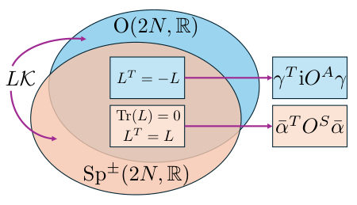
<figcaption class="paper-figure-caption"><b>Fig 1.</b> FIG. 1. The schematic relationship between anti-unitary sym- metry and order parameter set for Majorana fermion (up blue) and phase-space boson (down orange).</figcaption>
</figure>
<figure class="paper-figure-card">
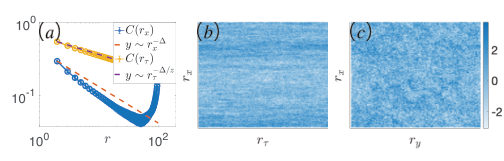
<figcaption class="paper-figure-caption"><b>Fig 2.</b> FIG. 3. An example of engineering scalar field ϕ for ∆= 0.5, z = 2. (a) Correlation decay along rx and rτ directions from 100 samples for size L = 100, Lτ = 200 with ∆τ = 0.05 are compared with the target power-law behaviors. (b,c) show a specific configuration cut with fixed ry and rτ respectively.</figcaption>
</figure>
<figure class="paper-figure-card">
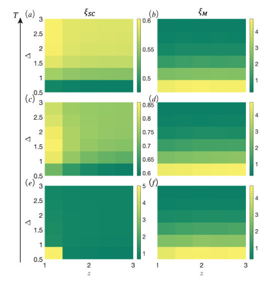
<figcaption class="paper-figure-caption"><b>Fig 3.</b> FIG. 4. Competition between superconducting and anti- ferromagnetic orders from correlation length ξSC in (a,c,e) and ξM in (b,d,f) as a function of critical exponents ∆, z. The imaginary-time length β is 0.1L, 0.2L, 0.3L for (a,b),(c,d),(e,f) where system size L = 12.</figcaption>
</figure>
<figure class="paper-figure-card">
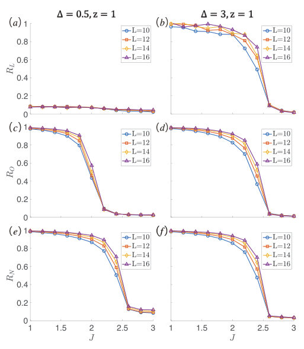
<figcaption class="paper-figure-caption"><b>Fig 4.</b> FIG. 5. Correlation ratio for different order parameters nT i lzσzni in (a,b), nT i l0σzni in (c,d) and nT i l0σxni in (e,f). (a,c,e) are results at critical exponents ∆= 0.5, z = 1 and (b,d,f) are results at ∆= 3, z = 1. The three dimensions are scaled together with system size L = 10, 12, 14, 16.</figcaption>
</figure>
<figure class="paper-figure-card">
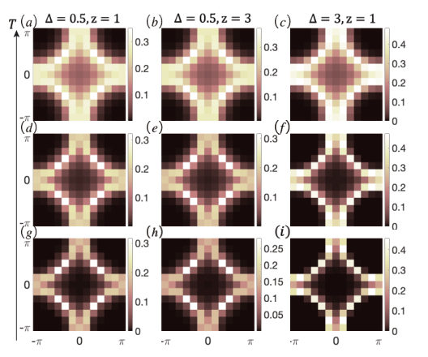
<figcaption class="paper-figure-caption"><b>Fig 5.</b> FIG. 6. Fermi surface indicated from G(β/2, k) at different temperature and critical exponents ∆, z. The imaginary-time length β is 0.1L, 0.2L, 0.3L for (a,b,c),(d,e,f),(g,h,i) where sys- tem size L = 12.</figcaption>
</figure>

**Summary.** This paper analyzes correlation functions in Fluctuating Gaussian States exhibiting anti-unitary symmetries, identifying two competing ordered phases: a saddle point phase and a non-local contraction phase. The authors use advanced correlation techniques and entanglement bounds to determine which phase dominates, showing that the non-local phase imposes severe constraints on the system's structure.

**Why it may be interesting.** The connection between anti-unitary symmetries, the emergence of different ordered phases (saddle point vs. non-local contraction), and the constraints imposed by entanglement structure (PEPS/bond dimension) provides deep insights into the nature of quantum ground states and steady states.

Detailed structure

**Main problem.** The study investigates bilinear order-parameter correlations in a specialized class of sign problem-free quantum systems known as Fluctuating Gaussian States (FGS). The core goal is to characterize the competition between different broken-symmetry phases.

**Main result.** The system generally exhibits two competing phases—a saddle point phase and a non-local contraction phase—whose dominance depends on the stability of the fluctuation saddle point. Furthermore, the non-local contraction phase imposes stringent constraints on the required entanglement structure.

**Method.** The analysis relies on calculating two-point correlation functions using Wick's theorem and decomposing observables into symmetry-related matrix bases. Theoretical bounds, such as those involving bond dimension, are also derived.

**Model / system.** The model is Fluctuating Gaussian States (FGS) possessing anti-unitary symmetries, applicable to both fermionic and bosonic systems. These states are defined via a path integral decomposition over imaginary time slices.

**Key observables.** Bilinear order-parameter correlations, two-point Green's functions, von Neumann entropy, and the average bond dimension ($\langle D_\phi 
angle$).

**Important parameters / regimes.** The competition is governed by parameters related to the stability of the fluctuation saddle point, and the analysis involves varying coupling strengths ($\Delta$) and correlation lengths ($z$).

**Assumptions / limitations.** The analysis assumes the existence of anti-unitary symmetries and utilizes approximations like the spectral function approximation for low-temperature properties.

**Figures summary.** Figures schematically illustrate the relationship between anti-unitary symmetry and the order parameter set for different particle types, and a phase diagram is used to show the transition between the saddle point and non-local contraction phases.

**Paper structure.** The paper progresses by defining the FGS framework and symmetries, calculating correlation functions for the two competing phases, deriving theoretical bounds relating entanglement to correlations, and finally discussing implications for non-equilibrium dynamics.

Abstract

We study bilinear order-parameter correlations in a general class of sign problem-free systems that are described by what we call Fluctuating Gaussian States (FGS) with anti-unitary symmetries, where the weight of each Gaussian measurement in the space-time path integral is positive-definite. Supported by Monte Carlo simulations on fluctuating Gaussian fermionic and bosonic examples, we argue that such systems generally exhibit two types of broken-symmetry phases: a \emph{saddle point phase} and a \emph{non-local contraction phase}, with the competition between the two determined by the stability of the fluctuation saddle point of FGS. Due to the Fermi liquid instability in fermionic FGS with anti-unitary symmetries, we also discuss the possibility of representing fermionic FGS with a particular Projected Entangled-Pair State (PEPS) ansatz, which we argue a certain construction provides an efficient description for the saddle point phase, but not for the non-local contraction phase. Finally, we discuss the potential implication of our result in non-equilibrium systems and stabilizing a target bilinear order.

[↑ back to top](#top)

### [A greedy nearest-neighbor approach to quantify site revisitation: comparing two sympatric raven species](http://arxiv.org/abs/2609.01858v1)

**Authors:** Bar Ashkenazi, Miguel de Guinea, Michael Assaf, Ran Nathan  
**Type:** experiment · **Category:** statistical mechanics · **PDF:** <https://arxiv.org/pdf/2609.01858v1>  
**Analysis basis:** full PDF text, analyzed in chunks
**Topic relevance:** `Keldysh / 2PI / non-Gaussian methods` **1/5** · `analog quantum simulation` **1/5** · `driven-dissipative phase transition` **1/5** · `methods for driven-dissipative` **1/5** · `non-equilibrium universality` **1/5** · `quantum measurements` **1/5** · `scars & prethermalization` **1/5**

↔ Scroll figures horizontally

<figure class="paper-figure-card">
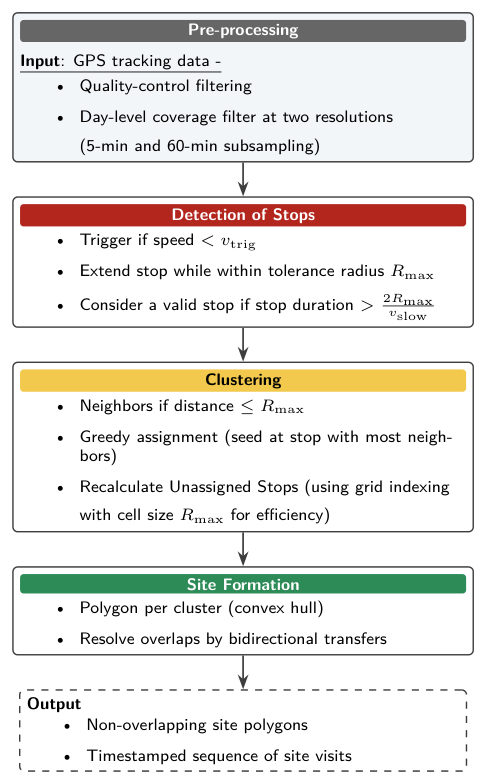
<figcaption class="paper-figure-caption"><b>Fig 1.</b> FIG. 1. Schematic overview of the site-detection method: pre- processing, detection of stops, clustering, and site formation.</figcaption>
</figure>
<figure class="paper-figure-card">
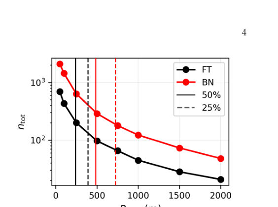
<figcaption class="paper-figure-caption"><b>Fig 2.</b> FIG. 2. Sensitivity of the mean total number of sites visited per individual (ntot), averaged across individuals within each species, to Rmax, for FT (black) and BN (red). Vertical lines mark the Rmax values at which the magnitude of the adjacent-point slope, |∆ntot/∆Rmax|, decreases to 50% (solid) and 25% (dashed) of its maximum observed value.</figcaption>
</figure>
<figure class="paper-figure-card">
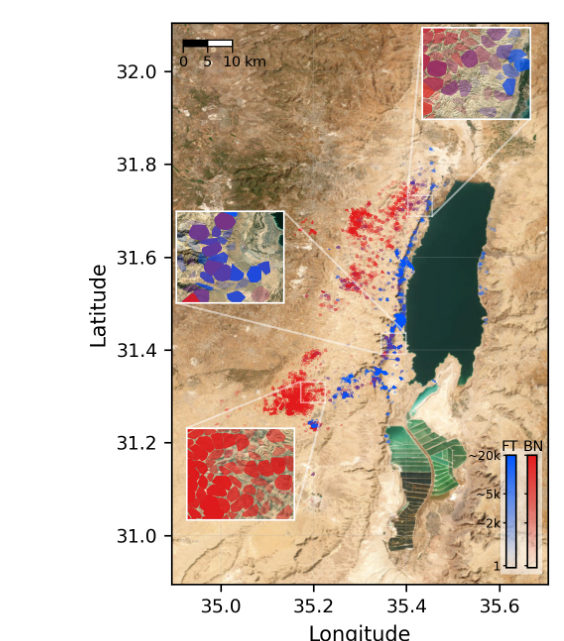
<figcaption class="paper-figure-caption"><b>Fig 3.</b> FIG. 3. All visited site polygons on a common basemap, colored by species (FT: blue; BN: red). Opacity is scaled by total site visit count: darker colors indicate more visits, see Appendix E. The insets show magnification (×4.4) windows of various site clusters.</figcaption>
</figure>
<figure class="paper-figure-card">
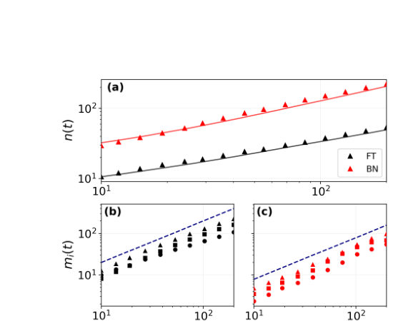
<figcaption class="paper-figure-caption"><b>Fig 4.</b> FIG. 4. Site discovery and revisitation dynamics. (a) Species- level mean n(t) versus days since first record (markers), with IMM simulations overlaid (lines) for FT (black) and BN (red). (b,c) Species-level mean cumulative visit counts mi(t) to the rank-i most visited sites (i = 1, 2, 3) versus days, shown separately for FT (b) and BN (c). Markers denote ranks: triangles i = 1, squares i = 2, and circles i = 3. The dashed lines are eye-guides indicating the IMM prediction for α = 1, mi(t) ∼t (vertically offset for clarity).</figcaption>
</figure>
<figure class="paper-figure-card">
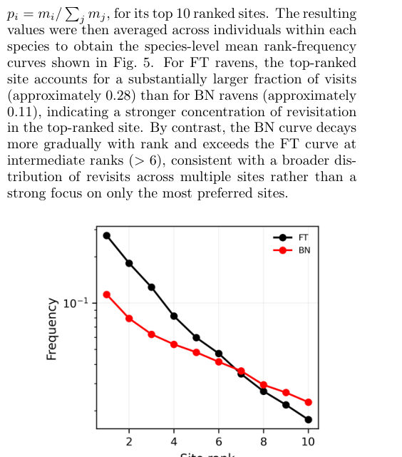
<figcaption class="paper-figure-caption"><b>Fig 5.</b> FIG. 5. Frequency over rank: species-level mean of pi = mi/ P j mj versus site rank i, for FT (black) and BN (red), com- puted over the first 200 days per individual; Rmax = 500 m.</figcaption>
</figure>

**Summary.** This study develops a robust computational framework to define ecological 'sites' from raw GPS tracking data for two raven species. By applying this framework and modeling movement using the Individual Mobility Model, the authors successfully quantify distinct space-use strategies, showing that the species differ in their rates of site discovery and spatial predictability.

**Why it may be interesting.** The rigorous statistical framework developed for quantifying memory and site fidelity in complex, non-equilibrium spatial processes (like animal movement) shares conceptual parallels with modeling memory effects or non-Markovian dynamics in open quantum systems.

Detailed structure

**Main problem.** The paper addresses the challenge of defining ecologically meaningful residence sites from raw GPS tracking data, which is complicated by heterogeneous sampling and uncertain boundaries.

**Main result.** The study reveals distinct space-use strategies between two raven species: Brown-necked ravens show higher site entropy and a higher rate of novel site discovery compared to Fan-tailed ravens.

**Method.** It employs a three-stage method involving greedy nearest-neighbor clustering on stop detections (derived from speed thresholds) to create non-overlapping, polygon-based site visit sequences.

**Model / system.** The system is the movement ecology of two sympatric raven species (Fan-tailed and Brown-necked) in the Dead Sea region, analyzed using the non-Markovian Individual Mobility Model (IMM).

**Key observables.** Site visit sequences, IMM parameters ($eta$ and $\alpha$), site entropy, and conditional entropy of site-to-site transitions.

**Important parameters / regimes.** Maximum site size ($	ext{Rmax}$), stop detection thresholds ($v_{	ext{trig}}$), and the parameters governing the IMM ($eta$ for novel discovery, $\alpha$ for preferential return).

**Assumptions / limitations.** The primary assumption is that sites are repeatedly and collectively used, and the method assumes that the non-Markovian IMM accurately captures the balance between novel site discovery and preferential return.

**Figures summary.** Figures illustrate the spatial distribution of inferred stops using three different detection methods (speed-threshold, residence-time, recurse) and compare cluster-diameter distributions across these methods.

**Paper structure.** The paper first details the site inference framework (greedy clustering on stop detections) and then applies this framework to model movement dynamics using IMM. It includes extensive validation by comparing the results against established, but computationally slower, site detection methods.

Abstract

A central challenge in movement ecology is to describe ecologically meaningful residence sites from raw tracking data due to heterogeneous sampling frequency and uncertain site boundaries. Here, we develop a greedy nearest-neighbor clustering approach with local reassignment and polygon-based site construction that generates timestamped sequences of site visits for each tracked individual, and apply it to nine years of GPS data from two sympatric raven species in the Dead Sea region---the Fan-tailed raven (\emph{Corvus rhipidurus}) and the Brown-necked raven (\emph{C. ruficollis}). Using the resulting visitation sequences, we quantify recursion patterns using the non-Markovian individual mobility model (IMM), which captures the balance between novel-site discovery $β$ and preferential return $α$. The inferred dynamics are consistent with IMM predictions and reveal clear interspecific differences: Brown-necked ravens continue to discover new sites at a higher rate (lower $β$), whereas Fan-tailed ravens show a steeper concentration of visits among top-ranked sites. Entropy analyses further separate the species, with Brown-necked ravens exhibiting higher site entropy and higher conditional entropy of site-to-site transitions. Together, these results provide a robust framework for describing interspecific differences in movement strategies that can be used to infer memory from GPS data and suggest distinct space-use strategies in two closely related sympatric species.

[↑ back to top](#top)

### [Survival in a partially reactive wedge](http://arxiv.org/abs/2609.02665v1)

**Authors:** Denis S. Grebenkov  
**Type:** theory · **Category:** statistical mechanics · **PDF:** <https://arxiv.org/pdf/2609.02665v1>  
**Analysis basis:** full PDF text, analyzed in chunks
**Topic relevance:** `Keldysh / 2PI / non-Gaussian methods` **1/5** · `analog quantum simulation` **1/5** · `correlated / nonlocal dissipation` **1/5** · `driven-dissipative phase transition` **1/5** · `methods for driven-dissipative` **1/5** · `non-equilibrium universality` **1/5**

↔ Scroll figures horizontally

<figure class="paper-figure-card">
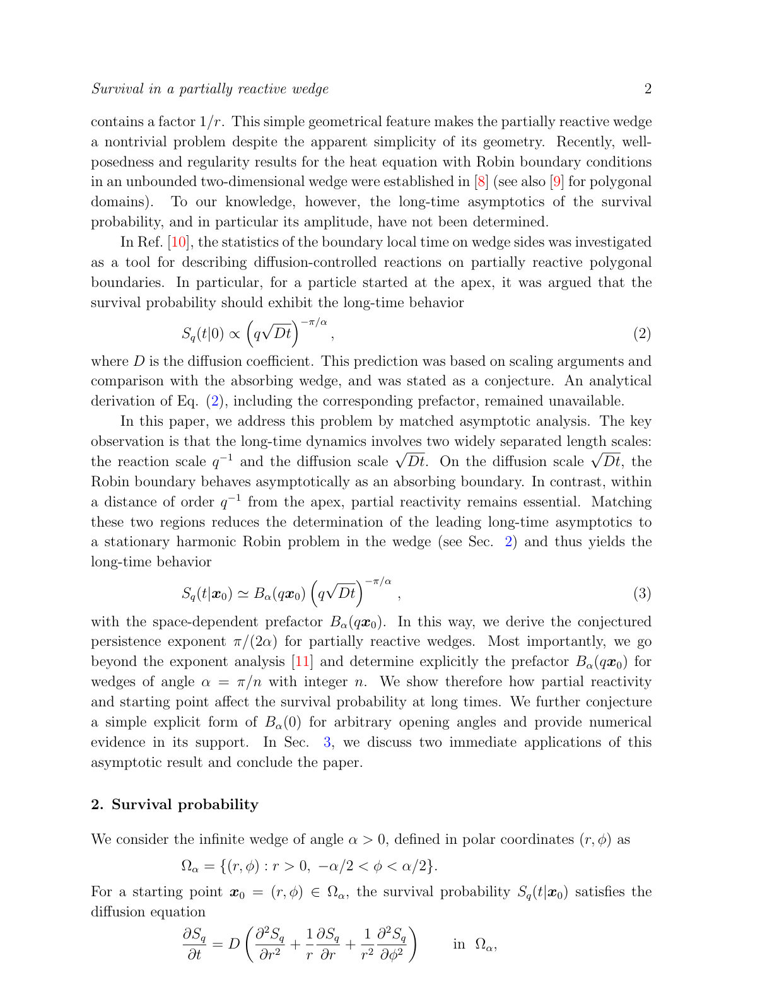
<figcaption class="paper-figure-caption"><b>Fig 1.</b> Low-resolution page preview, page 2</figcaption>
</figure>
<figure class="paper-figure-card">
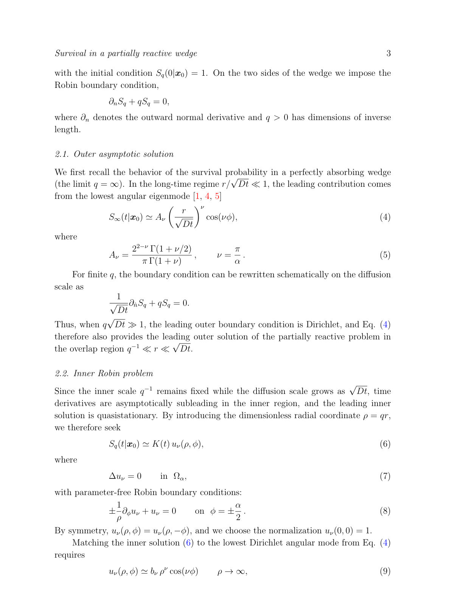
<figcaption class="paper-figure-caption"><b>Fig 2.</b> Low-resolution page preview, page 3</figcaption>
</figure>
<figure class="paper-figure-card">
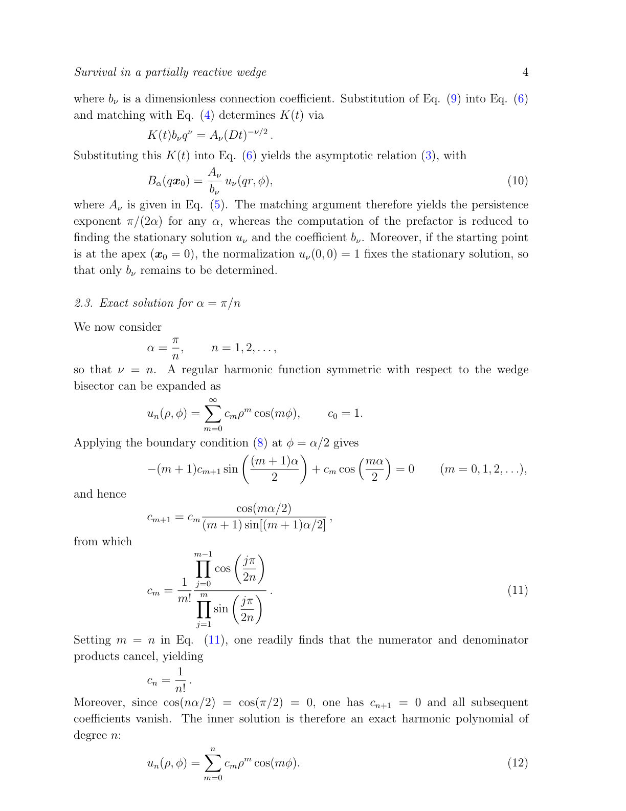
<figcaption class="paper-figure-caption"><b>Fig 3.</b> Low-resolution page preview, page 4</figcaption>
</figure>
<figure class="paper-figure-card">
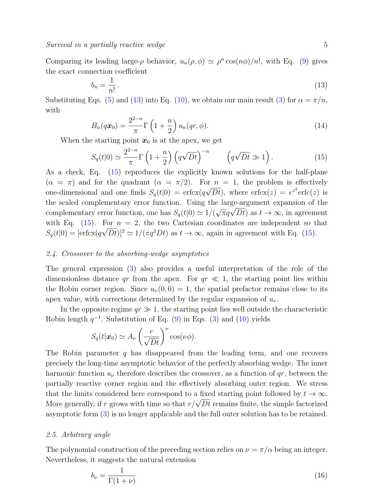
<figcaption class="paper-figure-caption"><b>Fig 4.</b> Low-resolution page preview, page 5</figcaption>
</figure>
<figure class="paper-figure-card">
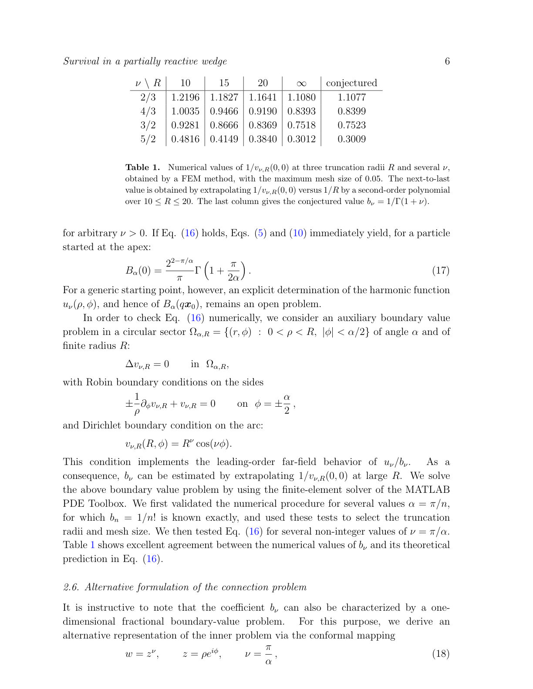
<figcaption class="paper-figure-caption"><b>Fig 5.</b> Low-resolution page preview, page 6</figcaption>
</figure>

**Summary.** This paper analyzes the long-time decay of survival probability for Brownian motion in a wedge with partially reactive boundaries. Using matched asymptotic analysis, the authors derive the power-law decay exponent and explicitly calculate the prefactor for specific wedge angles. The work provides deep insights into boundary-induced transport phenomena in confined geometries.

**Why it may be interesting.** The study of anomalous diffusion and boundary effects in confined geometries is crucial for understanding transport phenomena in mesoscopic systems, which has relevance to quantum transport and open quantum systems.

Detailed structure

**Main problem.** The paper investigates the long-time power-law decay of the survival probability of a Brownian particle diffusing in a planar wedge whose sides exhibit partial reactivity.

**Main result.** The long-time survival probability decays as $S_q(t|\mathbf{x}_0) \simeq B_\alpha(q\mathbf{x}_0) (q/\sqrt{Dt})^{-\pi/\alpha}$, and the prefactor $B_\alpha$ is explicitly determined for specific angles $\alpha = \pi/n$.

**Method.** The primary method is matched asymptotic analysis, relating the long-time behavior to a stationary harmonic Robin problem near the apex. Numerical methods (FEM) and conformal mapping are also used to verify conjectures.

**Model / system.** The system is a Brownian particle diffusing in an infinite planar wedge of angle $\alpha$. The boundaries are modeled by Robin boundary conditions, introducing a characteristic length scale $q^{-1}$ related to the partial reactivity.

**Key observables.** Survival probability $S_q(t|\mathbf{x}_0)$, persistence exponent ($\pi/\alpha$), and the prefactor $B_\alpha(q\mathbf{x}_0)$.

**Important parameters / regimes.** Wedge opening angle $\alpha$, Robin parameter $q$, and time $t$.

**Assumptions / limitations.** The analysis relies on matched asymptotic expansions, assuming separation between the reaction scale ($q^{-1}$) and the diffusion scale ($\sqrt{Dt}$).

**Figures summary.** Table 1 provides numerical values for connection coefficients $1/v_{
u,R}(0, 0)$ and compares them to the conjectured theoretical value $1/\Gamma(1 + 
u)$.

**Paper structure.** The paper develops the asymptotic formula for survival probability using matched asymptotics, derives explicit prefactors for specific angles, and then uses numerical/conformal mapping techniques to confirm conjectures regarding the connection coefficients and derive the PDFs for boundary local time and first-crossing time.

Abstract

We investigate the power-law decay of the survival probability of a Brownian particle diffusing in an infinite planar wedge whose two sides are partially reactive and described by Robin boundary conditions. We employ matched asymptotic analysis to relate the long-time asymptotics to a stationary harmonic Robin problem near the apex. This approach determines the persistence exponent for arbitrary opening angles and yields the prefactor explicitly for the family of wedges with $α=π/n$ ($n=1,2,\ldots$). A simple extension of the apex prefactor to arbitrary angles is conjectured and supported numerically. This asymptotic behavior describes the crossover to the well-known result for perfectly absorbing wedges. As immediate applications, we also deduce the long-time behavior of the probability density function of the boundary local time on wedge sides, as well as the probability density function of the associated first-crossing time.

[↑ back to top](#top)

### [Error accumulation in dissipative quantum circuits](http://arxiv.org/abs/2609.01848v1)

**Authors:** Nadir Samos-Sáenz de Buruaga, Rodrigo M. C. Pereira, Karol Życzkowski, Sergey Denisov, Pedro Ribeiro  
**Type:** theory · **Category:** quantum information and computing · **PDF:** <https://arxiv.org/pdf/2609.01848v1>  
**Analysis basis:** full PDF text, analyzed in chunks
**Topic relevance:** `correlated / nonlocal dissipation` **1/5** · `driven-dissipative phase transition` **1/5** · `methods for driven-dissipative` **1/5** · `non-equilibrium universality` **1/5**

↔ Scroll figures horizontally

<figure class="paper-figure-card">
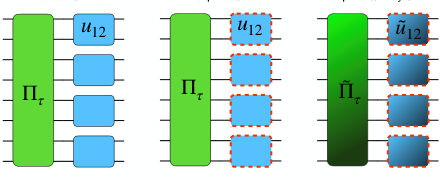
<figcaption class="paper-figure-caption"><b>Fig 1.</b> Figure 1: Circuit layer used throughout the paper. (a) The ideal layer is a random permutation Πτ followed by L/2 two-qubit gates u2m−1,2m sampled from CUE(4). (b) In the dissipative model each two-qubit unitary is replaced by a diluted unitary channel with strength κ. (c) In Sec. 4 we also include unitary two-qubit gate noise and faulty implementations of the permutation.</figcaption>
</figure>
<figure class="paper-figure-card">
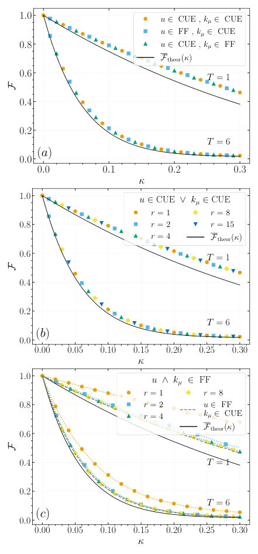
<figcaption class="paper-figure-caption"><b>Fig 2.</b> Figure 2: Mean fidelity decay for L = 6. (a) When either the two-qubit unitaries or the dissipative Kraus operators are sampled from a generic ensemble, the nu- merical data collapse onto Eq. (17). (b) In the same scenario than above, the mean fidelity is insensitive to the dissipative Kraus rank r. (c) When both the uni- taries and the dissipative component are restricted to free-fermion dynamics, a finite-depth rank dependence remains, but the data approach the generic behavior at larger depth given by the gray dashed line. Notice that the random permutations are implemented as fermionic- mode shuffles via fermionic SWAP decompositions.</figcaption>
</figure>
<figure class="paper-figure-card">
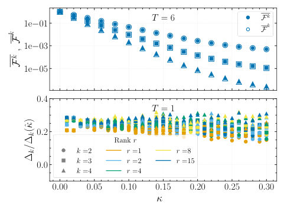
<figcaption class="paper-figure-caption"><b>Fig 3.</b> Figure 3: Concentration around the average fidelity. Top: comparison between Fk and F k as functions of κ for L = 6. Bottom: numerical test of the ansatz Eq. (24); for one layer, g(r, 1) = 1/r collapses the data for the ranks and moments shown. For generic depth, g(r, T) is unknown and captures the imperfections of the ansatz.</figcaption>
</figure>
<figure class="paper-figure-card">
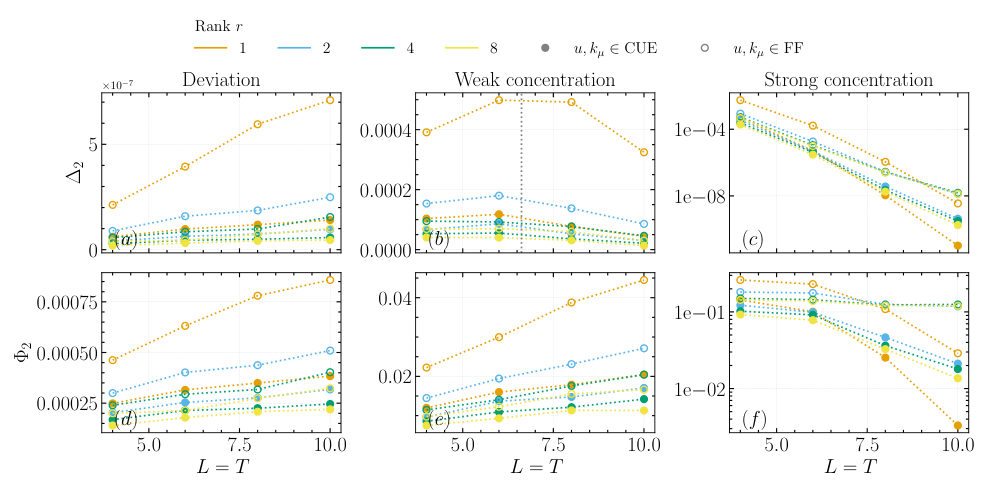
<figcaption class="paper-figure-caption"><b>Fig 4.</b> Figure 4: Scaling with system size of ∆2 and Φ2 for square circuits, T = L. The three columns show weak, intermediate, and strong dissipation (κ = 0.00005, 0.025, 0.3 respectively). In the weak case, ∆2 and Φ2 grow over the accessible sizes. In the intermediate case, ∆2 is already small while the relative fluctuation Φ2 still grows. In the strong case, both quantities decrease with system size. The dashed line in panel (b) marks the prediction for Lmax from Eq. (25).</figcaption>
</figure>
<figure class="paper-figure-card">
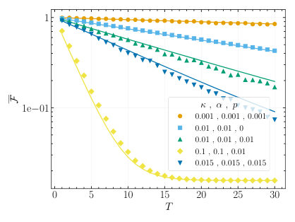
<figcaption class="paper-figure-caption"><b>Fig 5.</b> Figure 5: Average fidelity of circuit of L = 6 as a func- tion of depth T for models with rank r = 1 for several values of unitary noise α, faulty permutations p and dis- sipation strength κ. Solid lines are given by Eq. (38).</figcaption>
</figure>

**Summary.** This paper analyzes error accumulation in quantum processors by modeling them as dissipative random quantum circuits. Using fidelity as a diagnostic, the authors derive a universal scaling law for the average fidelity decay dependent only on dissipation strength and circuit depth. This provides essential theoretical insight into noise resilience for current quantum computing hardware.

**Why it may be interesting.** This work provides crucial theoretical tools for characterizing noise resilience in NISQ devices, showing how fundamental physical parameters govern decoherence regardless of specific gate implementations.

Detailed structure

**Main problem.** The paper investigates how information degrades in quantum processors due to dissipation and decoherence within random quantum circuits.

**Main result.** The average fidelity decay is found to be universal, depending only on the dissipation strength, system size, and circuit depth, and is independent of the microscopic details like the Kraus rank.

**Method.** The authors use random-matrix approximations and derive closed-form expressions for the ensemble-averaged fidelity, analyzing the decay across different noise regimes.

**Model / system.** The model is a dissipative random quantum circuit (RQC) where each two-qubit gate is treated as a 'diluted unitary' channel, interpolating between the ideal unitary and a random dissipative channel.

**Key observables.** State Fidelity ($F$), which quantifies the deviation between the ideal and noisy output states.

**Important parameters / regimes.** Dissipation strength ($\kappa$), coherent two-qubit gate-error strength ($\alpha$), and connectivity-error probability ($p$).

**Assumptions / limitations.** The analysis relies on approximating the random permutations with Haar-random global unitaries to derive an exact closed-form expression for the average fidelity.

**Figures summary.** Figure 1 illustrates the circuit layer comparing faultless, dissipative, and combined dissipative/noisy circuits. Figure 2 compares the theoretical mean fidelity decay against different ensemble assumptions.

**Paper structure.** The paper progresses by defining the noisy evolution via diluted unitaries, deriving the average fidelity using random matrix techniques, establishing the universal scaling laws, and finally deriving a closed-form expression incorporating multiple error parameters.

Abstract

Present-day quantum processors are open systems in which dissipation and decoherence degrade the information carried by a quantum state as it propagates through a circuit. We study this degradation in dissipative random quantum circuits, modeling each two-qubit gate as a diluted unitary that interpolates between the intended unitary operation and a random dissipative quantum channel. Using the fidelity between the ideal and noisy output states as a diagnostic, we show that sufficiently random unitary gates or dissipative Kraus operators lead to a universal decay of the average fidelity. This decay is determined only by the dissipation strength, system size, and circuit depth, while microscopic details of the gates and noise, including the Kraus rank, appear only in subleading corrections to higher moments. We derive a closed-form expression for the average fidelity in terms of three physically meaningful error parameters, dissipation strength, coherent two-qubit gate-error strength, and connectivity-error probability. Finally, we identify the cases when dissipative effects can be reproduced by an unitary-noise model and when dissipation-induced decoherence remains distinguishable from coherent noise at the level of the average fidelity.

[↑ back to top](#top)

### [Multivariate hyperdensity functional theory for inhomogeneous equilibrium fluids: From first principles to simulation-based machine learning](http://arxiv.org/abs/2609.02594v1)

**Authors:** Florian Sammüller, Matthias Schmidt  
**Type:** theory · **Category:** statistical mechanics · **PDF:** <https://arxiv.org/pdf/2609.02594v1>  
**Analysis basis:** full PDF text, analyzed in chunks
**Topic relevance:** `Keldysh / 2PI / non-Gaussian methods` **1/5** · `analog quantum simulation` **1/5** · `methods for driven-dissipative` **1/5** · `quantum measurements` **1/5**

↔ Scroll figures horizontally

<figure class="paper-figure-card">
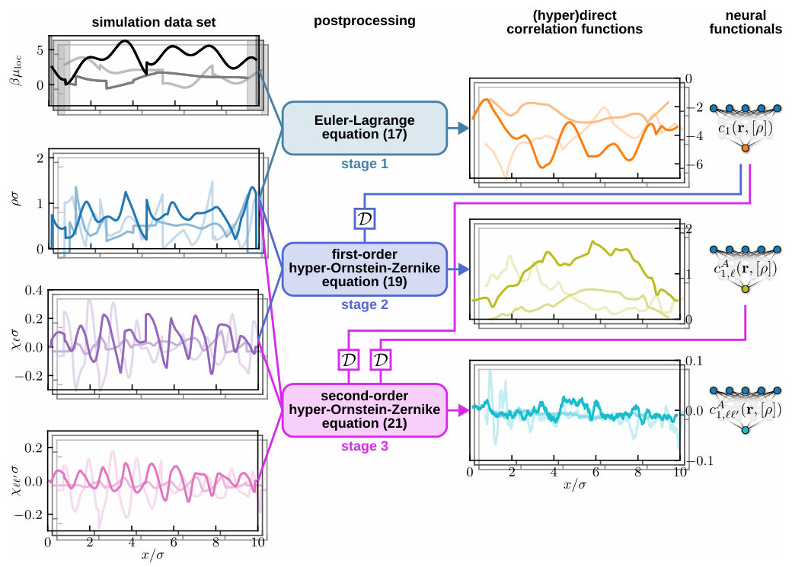
<figcaption class="paper-figure-caption"><b>Fig 1.</b> FIG. 1. Multistage workflow for machine learning multivariate hyperdensity functionals. A grand canonical Monte Carlo simulation data set (left column) of equilibria of a considered fluid type serves as ground truth. Inhomogeneity is induced in each simulation by a randomly chosen (scaled) local chemical potential βµloc(r) = βµ −βVext(r) and the resulting set of one-body profiles ρ(r), χℓ(r), and χℓℓ′(r) is sampled. We depict exemplary data for the one-dimensional hard rod fluid where r = x. As hyperobservables of choice, we select the total number of particles, ˆA1, and the number of particles in the largest cluster, ˆA2, see the text for a detailed specification. Postprocessing of the...</figcaption>
</figure>
<figure class="paper-figure-card">
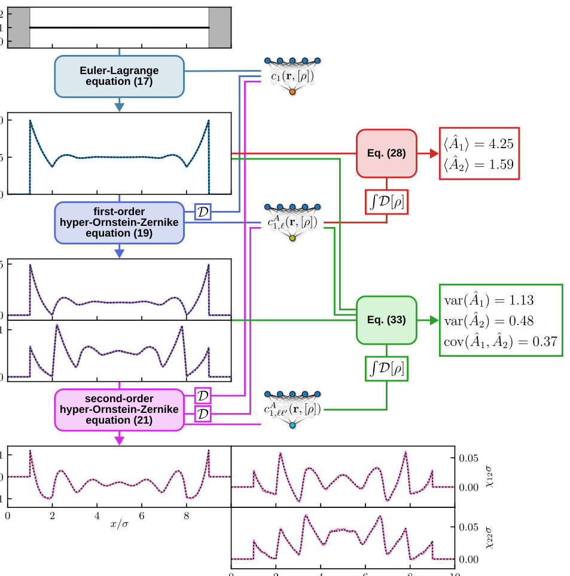
<figcaption class="paper-figure-caption"><b>Fig 2.</b> FIG. 2. Prediction workflow for evaluating averages and covariances of chosen hyperobservables using neural hyperdensity functionals. As a prototypical case, we depict the one-dimensional (r = x) hard rod fluid under hard-wall confinement with walls at positions x/σ = 1 and x/σ = 9. The chosen hyperobservables are the total number of particles, ˆA1, and the number of particles in the largest cluster, ˆA2, see text. Via standard solution of the Euler-Lagrange equation (17) with the neural functional c1(r, [ρ]), the density profile ρ(x) corresponding to the imposed (scaled) local chemical potential βµloc(x) is obtained. The associated first-order hyperfluctuation profiles χℓ(x), where ℓ= 1, 2...</figcaption>
</figure>
<figure class="paper-figure-card">
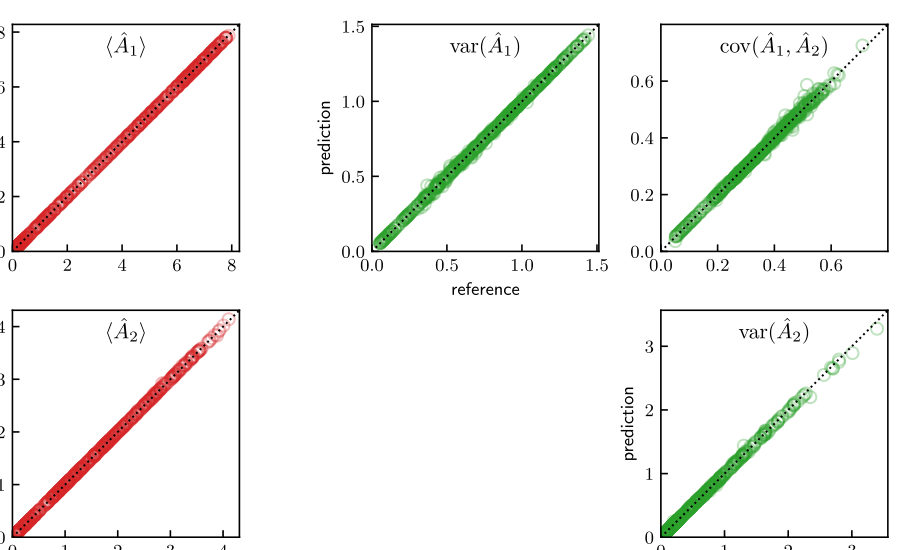
<figcaption class="paper-figure-caption"><b>Fig 3.</b> FIG. 3. Predictions for a test data set of 512 simulations that have not been included in the training; see Fig. 1 for an illustration of the underlying machine learning protocol and Fig. 2 for the prediction scheme. As before, the chosen hyperobservables are the total number of particles, ˆA1, and the number of particles in the largest cluster, ˆA2, see text. All relevant averages ⟨ˆA1⟩ and ⟨ˆA2⟩, variances var( ˆA1) and var( ˆA2), and the covariance cov( ˆA1, ˆA2) are recovered accurately across the entire test data set via the neural multivariate hyperdensity functional framework.</figcaption>
</figure>
<figure class="paper-figure-card">
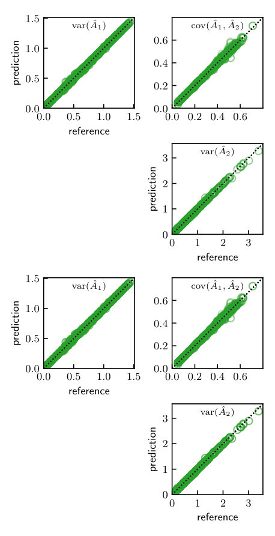
<figcaption class="paper-figure-caption"><b>Fig 4.</b> FIG. 4. Results for variances and covariances evaluated via Eq. (34), where ℓand ℓ′ in the second term on the right-hand side is exchanged (top), and via Eq. (35) (bottom). Both routes yield numerically equivalent results across the entire test data set, confirming the equivalence of both expressions and the exchange symmetry of the indices ℓand ℓ′.</figcaption>
</figure>

**Summary.** This work presents a multivariate extension of hyperdensity functional theory to analyze multiple correlated observables in inhomogeneous fluids. It derives exact theoretical relationships, such as hyper-Ornstein-Zernike equations, governing the statistical interrelations between these observables. By coupling this rigorous theory with machine learning, the authors provide a powerful, systematic tool for predicting complex many-body behavior from simulation data.

**Why it may be interesting.** While focused on classical fluids, the rigorous mathematical framework for calculating higher-order correlation functions and the explicit integration with machine learning for functional approximation are highly relevant methodologies for developing advanced theoretical tools in complex quantum many-body systems.

Detailed structure

**Main problem.** The paper develops a multivariate generalization of hyperdensity functional theory (HDFT) to systematically investigate the equilibrium properties and interrelations of multiple, arbitrary observables in inhomogeneous classical many-body systems.

**Main result.** The framework establishes universal density functionals for averages, variances, and covariances of these observables, and derives exact hyper-Ornstein-Zernike equations linking these correlation measures.

**Method.** The theory is built upon extending the Mermin-Evans classical density functional mapping to an extended multivariate ensemble, and its practical implementation is achieved by integrating the functional structure with supervised machine learning via neural networks.

**Model / system.** The theory is applied to classical many-body systems, illustrated specifically by studying the clustering behavior in confined hard rod fluids.

**Key observables.** Hyperobservables ($\{\hat{A}_\ell\}$), equilibrium averages, variances, covariances, and hyperfluctuation profiles ($\chi_{\hat{A}}(\mathbf{r})$).

**Important parameters / regimes.** Temperature (via $eta$), chemical potential ($\mu$), and the coupling constants ($\lambda_\ell$) associated with the hyperobservables.

**Assumptions / limitations.** The theory relies on the formal structure derived from the Mermin-Evans map, and practical calculation requires approximating the functionals using machine learning techniques.

**Figures summary.** Not specified by the notes.

**Paper structure.** The paper first introduces the multivariate HDFT framework via the extended ensemble, derives the universal density functionals and the hyper-Ornstein-Zernike equations, and then details the mathematical machinery using functional derivatives (Gateaux derivatives) to compute these higher-order correlation functions, concluding with an application to hard rod fluid clustering.

Abstract

Hyperdensity functional theory facilitates the investigation of the equilibrium behavior of a general order parameter or statistical mechanical observable in spatially inhomogeneous classical many-body systems. The approach is based on applying the exact Mermin-Evans classical density functional mapping to an extended ensemble. Here we present the multivariate generalization for investigating simultaneously the properties and interrelations of several different hyperobservables of choice. The resulting framework gives rise to a systematic characterization and prediction scheme for general many-body phenomena. All pertinent equilibrium averages, variances, and covariances constitute universal density functionals, as we demonstrate explicitly. Associated one-body hyperfluctuation profiles quantify the degree of correlation of the local density with first- and second-order combinations of hyperobservables. These multivariate hyperfluctuation profiles are accessible in many-body simulations and they satisfy exact hyper-Ornstein-Zernike equations, which we derive from the minimization principle in the extended multivariate ensemble. The formal structure of the theory integrates naturally with supervised machine learning, which renders all hyperdensity functionals accessible in practice via training of neural networks on simulation data. We demonstrate all salient techniques using the illustrative case of clustering in confined hard rod fluids, thereby choosing the total number of particles and the largest cluster size as the representative hyperobservables of interest. Our numerical methodology enables the efficient and successful prediction of all statistical quantities induced by the chosen hyperobservables, which we verify via comparison to test data and which we attribute to the tight interplay of first-principles and machine-learning concepts that our general approach combines.

[↑ back to top](#top)

### [Response of a Model Glass to Athermal Quasistatic Pinching](http://arxiv.org/abs/2609.02692v1)

**Authors:** Takumi Nagasawa, Kirsten Martens, Jean-Louis Barrat, Misaki Ozawa  
**Type:** theory · **Category:** disordered systems and neural networks · **PDF:** <https://arxiv.org/pdf/2609.02692v1>  
**Analysis basis:** full PDF text, analyzed in chunks
**Topic relevance:** `Frenkel-Kontorova` **1/5** · `analog quantum simulation` **1/5** · `non-equilibrium universality` **1/5** · `scars & prethermalization` **1/5**

↔ Scroll figures horizontally

<figure class="paper-figure-card">
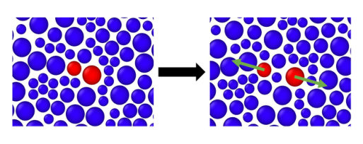
<figcaption class="paper-figure-caption"><b>Fig 1.</b> FIG. 1. Schematic illustration of the pinching simulation. A randomly selected pair of particles (shown in red) is subjected to a force dipole. The two particles, initially in contact and forming a local cage (left), are separated by pinching, leading to cage breaking in the form of a localized plastic event (right).</figcaption>
</figure>
<figure class="paper-figure-card">
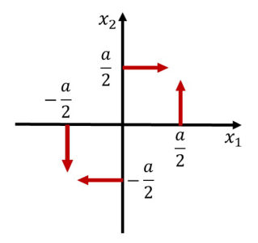
<figcaption class="paper-figure-caption"><b>Fig 2.</b> FIG. 3. Schematic representation of a shear transformation.</figcaption>
</figure>
<figure class="paper-figure-card">
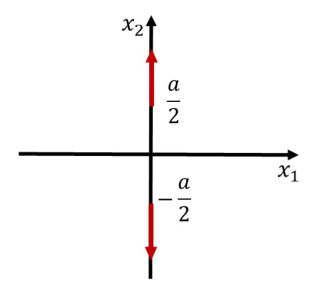
<figcaption class="paper-figure-caption"><b>Fig 3.</b> FIG. 2. Schematic representation of pinching. Two equal and opposite forces, shown by red arrows, are separated by a distance 𝑎.</figcaption>
</figure>
<figure class="paper-figure-card">
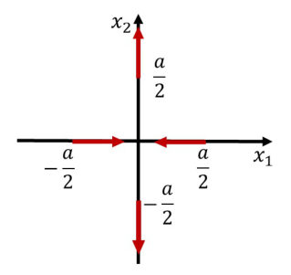
<figcaption class="paper-figure-caption"><b>Fig 4.</b> FIG. 4. Schematic representation of pinching-contraction</figcaption>
</figure>
<figure class="paper-figure-card">
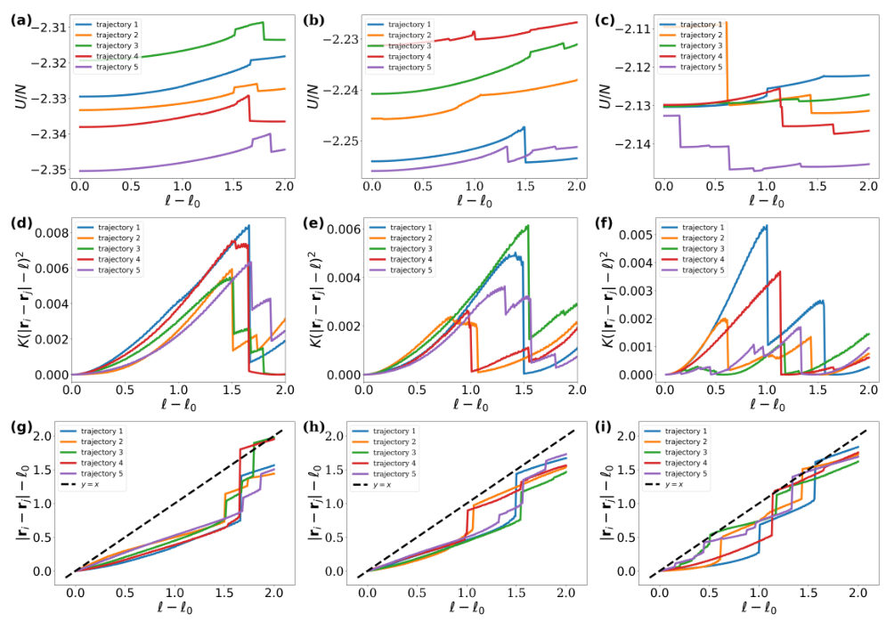
<figcaption class="paper-figure-caption"><b>Fig 5.</b> FIG. 5. (a–c): Potential energy 𝑈/𝑁as a function of the control parameter increment Δℓ= ℓ−ℓ0 for five pinching trajectories obtained with the length-controlled protocol at 𝑇ini = 0.25 (a), 0.35 (b), and 1.0 (c). (d-f): Spring energy 𝐾|r𝑖−r𝑗| −ℓ2 as a function of the control parameter increment Δℓfor five pinching trajectories obtained with the length-controlled protocol at 𝑇ini = 0.25 (d), 0.35 (e), and 1.0 (f). (g–i): The corresponding actual separation increment |r𝑖−r𝑗| −ℓ0 as a function of Δℓ= ℓ−ℓ0 for 𝑇ini = 0.25 (g), 0.35 (h), and 1.0 (i). The dashed straight lines correspond to 𝑦= 𝑥.</figcaption>
</figure>

**Summary.** This work numerically investigates how amorphous solids respond mechanically when subjected to localized force dipoles, or 'pinching.' The study reveals a clear transition from linear elastic behavior at small deformations to complex plastic rearrangements at larger extensions. The results show that the resulting plasticity depends critically on the initial stability of the glass, providing a minimal local probe into the material's collective mechanical response.

**Why it may be interesting.** While focused on classical mechanics, the study of amorphous solids, yielding, and the transition between elastic and plastic regimes shares conceptual links with understanding energy landscapes and structural relaxation in complex quantum many-body systems.

Detailed structure

**Main problem.** The paper investigates the mechanical response of amorphous solids to localized force dipoles (pinching) under athermal quasistatic conditions.

**Main result.** The response transitions from an elastic, long-range power-law decay regime to a plastic regime where rearrangements can be localized (stable glasses) or system-spanning (poorly annealed glasses).

**Method.** Numerical simulations using athermal quasistatic methods, complemented by theoretical analysis based on linear elasticity theory and multipolar expansions.

**Model / system.** The system modeled is an amorphous solid (model glass) composed of interacting particles, whose mechanical response is probed by applying a controlled force dipole (pinching).

**Key observables.** Displacement field u(x), plastic activity patterns (localized vs. delocalized), potential energy evolution, and the principal axis of plastic deformation.

**Important parameters / regimes.** Imposed extension (tuning from elastic to plastic), glass stability (well-annealed vs. poorly annealed), and the force dipole strength.

**Assumptions / limitations.** The analysis assumes the continuum description of linear elasticity remains valid down to particle-scale distances, and the protocol involves athermal quasistatic loading.

**Figures summary.** Figures schematically show the pinching process (initial contact to force dipole separation) and illustrate the evolution of potential energy and displacement fields under different loading protocols.

**Paper structure.** The paper progresses by first establishing the elastic response to pinching, then analyzing the transition to plasticity based on glass stability, and finally introducing advanced diagnostics like the principal axis of deformation to characterize the resulting rearrangements.

Abstract

We numerically investigate the mechanical response of amorphous solids to localized force dipoles, referred to as pinching, using athermal quasistatic simulations of model glasses with varying degrees of stability. We employ a control parameter, the imposed extension, corresponding to the increase in rest length between the two pinched particles relative to their initial separation. Increasing this extension allows us to continuously tune the system from the elastic to the plastic regime. For small extensions, the response remains elastic. In this regime, the displacement field induced by pinching is well described by linear elasticity and exhibits a long-range power-law decay consistent with dipolar forcing. Averaged responses display anisotropic, quadrupolar-like patterns, with quantitative agreement between simulations and analytical predictions. This continuum description remains valid down to particle-scale distances. As the imposed extension increases, the response becomes plastic. Pinching can then trigger either localized or system-spanning rearrangements, depending on glass stability. Well-annealed glasses exhibit localized plastic events, whereas poorly annealed systems display delocalized cascades. We introduce a method to extract the principal axis of plastic deformation and analyze the associated displacement fields and plastic activity. Overall, our results demonstrate that pinching provides a minimal local probe of amorphous solids. The resulting response, governed by both glass stability and imposed extension, offers insight into the interplay between elasticity, elementary rearrangements, and the emergence of collective plasticity.

[↑ back to top](#top)

### [Percolation Dynamics in Optimization : Variance Cascades and Discrete Scale Invariance](http://arxiv.org/abs/2609.02373v1)

**Authors:** Sai Niranjan Ramachandran, Suvrit Sra  
**Type:** both · **Category:** disordered systems and neural networks · **PDF:** <https://arxiv.org/pdf/2609.02373v1>  
**Analysis basis:** full PDF text, analyzed in chunks
**Topic relevance:** `analog quantum simulation` **1/5** · `driven-dissipative phase transition` **1/5** · `non-equilibrium universality` **1/5**

↔ Scroll figures horizontally

<figure class="paper-figure-card">
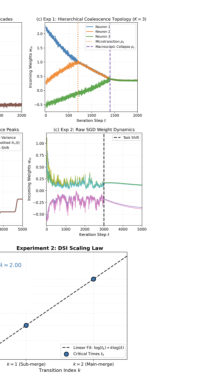
<figcaption class="paper-figure-caption"><b>Fig 1.</b> Figure 1: Topological Condensation and Fragmentation: (Top) Kinematic verification of the theoretical λ = 2 DSI baseline. (Middle &amp; Bottom) Empirical SGD dynamics. The condensation phase (t &lt; 3000) exhibits sequential DSI variance peaks (p1, p2) with a log-linear progression close to λ ≈2.00 (fit through two points; see main text). The task shift at t = 3000 reverses the stability inequality and is followed by a reactive fragmentation peak (p3). Zoom for clarity.</figcaption>
</figure>
<figure class="paper-figure-card">
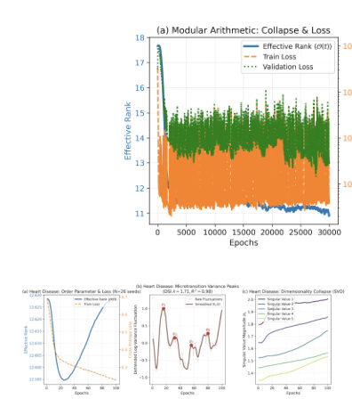
<figcaption class="paper-figure-caption"><b>Fig 2.</b> Figure 2: Universality and Empirical Generalization: (a) Transformer Grokking (Modular Arithmetic): Delayed generalization co-occurring with continuous dimensionality collapse and a log-linear DSI cascade. (b, c) UCI Heart Disease and FMNIST: DSI variance cascades in tabular regression (b) and image classification (c). Extended evaluations are in Appendix F.</figcaption>
</figure>
<figure class="paper-figure-card">
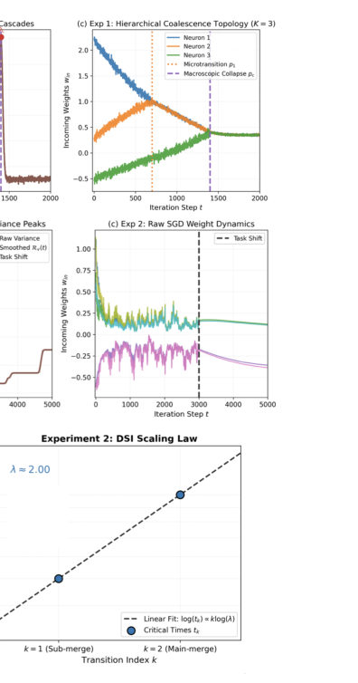
<figcaption class="paper-figure-caption"><b>Fig 3.</b> Figure 3: Experimental validation of symmetry-induced topological collapse and DSI scaling laws. Top Row (Experiment 1): Kinematic simulation of hierarchical coalescence (K = 3), displaying discrete jumps in the order parameter (a), divergence peaks in relative variance exactly at topological merge points (b), and forced continuous spline trajectories (c). Middle Row (Experiment 2): Empirical SGD dynamics (K = 6), showing macroscopic dimensionality collapse (a), distinct precursory variance peaks p1, p2 during the condensation phase, and a reactive fragmentation peak p3 following a task shift at t = 3000 (b), alongside the raw stochastic weight trajectories (c). Bottom Row: Log-linear...</figcaption>
</figure>
<figure class="paper-figure-card">
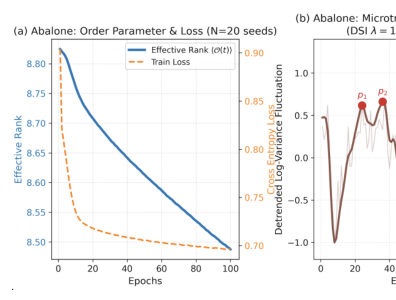
<figcaption class="paper-figure-caption"><b>Fig 4.</b> Figure 4: Abalone: The macroscopic continuous decay of effective rank (a) is underscored by a highly structured 6-peak DSI cascade yielding a strong log-linear fit of R2 = 0.97 with a fractional scaling factor λ = 1.28 (b). The collapse is driven by a dominant top singular value (c).</figcaption>
</figure>
<figure class="paper-figure-card">
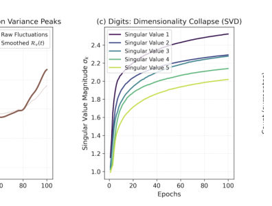
<figcaption class="paper-figure-caption"><b>Fig 5.</b> Figure 5: Digits: Variance fluctuations dynamically map the topological condensation of the network during early-stage SGD optimization.</figcaption>
</figure>

**Summary.** This work models the training dynamics of deep neural networks using the framework of stochastic gradient flow and percolation theory. It shows that structural symmetries force the network to undergo discrete, block-wise collapses, manifesting as variance spikes. These transitions exhibit Discrete Scale Invariance, providing a quantitative link between optimization dynamics and critical phenomena.

**Why it may be interesting.** The connection between optimization dynamics (SGD) and concepts from statistical physics, such as percolation and phase transitions, provides a powerful analogy for understanding complex system organization, which is relevant to understanding emergent structure in quantum many-body systems.

Detailed structure

**Main problem.** The paper investigates the dynamics of Stochastic Gradient Descent (SGD) in deep neural networks, aiming to understand how structural symmetries force the network to collapse toward simpler, invariant subnetworks.

**Main result.** The structural transitions are modeled as percolation processes leading to Discrete Scale Invariance (DSI), characterized by variance spikes and a geometrically scaling cascade.

**Method.** The authors model the optimization process using the Stochastic Gradient Flow (SGF) and analyze the structural evolution using percolation theory, supermartingale properties, and spectral entropy measures.

**Model / system.** The system is deep neural networks trained via SGD (and extended to Adam/AdamW). The dynamics are analyzed by mapping the optimization path onto a percolation process defined on the network's architectural symmetries.

**Key observables.** Variance spikes in a macroscopic order parameter, the structural order parameter $O(p)$, and the DSI scaling factor $\lambda$.

**Important parameters / regimes.** Noise level ($\eta$), the number of merging components ($n$), and the conserved fractional spectral variance mass ($m$).

**Assumptions / limitations.** The analysis assumes stochastic attractivity (drift dominance over diffusion) near invariant sets, and in later sections, it assumes mean-field percolation baselines or the conservation of spectral variance mass.

**Figures summary.** Figures show experimental validation of the DSI scaling factor $\lambda \approx 2.00$ across controlled kinematic simulations ($K=3$) and empirical SGD runs ($K=6$), demonstrating a consistent scaling law.

**Paper structure.** The argument progresses from defining invariant sets and establishing stochastic attractivity, to modeling the structural collapse via percolation theory, and finally generalizing the findings to derive and empirically test the continuous fractional scaling law $\lambda_{	ext{eff}} = nm\sigma$.

Abstract

We study the dynamics of Stochastic Gradient Descent (SGD), which is known to steer deep neural networks toward invariant sets that correspond to simpler subnetworks. How this steering unfolds over time remains poorly understood. We answer this by modeling the stochastic gradient flow (SGF) as a percolation process, in which architectural symmetries force subnetworks to merge in discrete simultaneous blocks rather than one at a time. These structural transitions register as variance spikes in a macroscopic order parameter, echoing physical phase transitions. We further show this trapping mechanism and its associated scaling cascade extend to Adam and AdamW under an explicit heavy-tailed noise model.

[↑ back to top](#top)

### [$\mathcal{N}$-bein formalism for degenerate states in the parameter space of quantum geometry](http://arxiv.org/abs/2609.01752v1)

**Authors:** Jorge Romero, Carlos A Velasquez, J David Vergara  
**Type:** theory · **Category:** other · **PDF:** <https://arxiv.org/pdf/2609.01752v1>  
**Analysis basis:** full PDF text, analyzed in chunks
**Topic relevance:** `analog quantum simulation` **1/5** · `quantum measurements` **1/5**

↔ Scroll figures horizontally

<figure class="paper-figure-card">
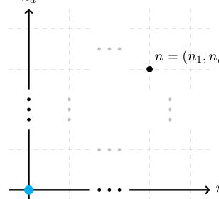
<figcaption class="paper-figure-caption"><b>Fig 1.</b> Figure 1: Diagram representing an arbitrary state n = (n1, nd) with energy En (black), and the ground state being at coordinate origin (blue).</figcaption>
</figure>
<figure class="paper-figure-card">
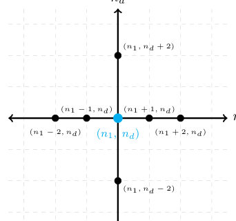
<figcaption class="paper-figure-caption"><b>Fig 2.</b> Figure 2: Diagram showing all the states (black dots) related through a parameter variation with the initial state n = (n1, nd) (blue dot). They represent all the non-zero N-beins.</figcaption>
</figure>
<figure class="paper-figure-card">
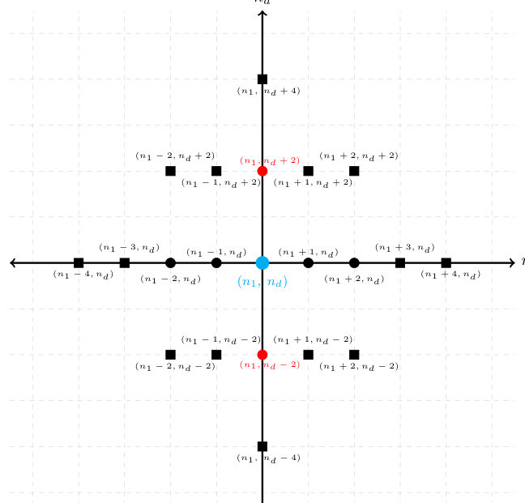
<figcaption class="paper-figure-caption"><b>Fig 3.</b> Figure 3: Starting at the blue circle in the state with n = (n1, nd), we represent all the energy levels related to it by two parameter variations (black squares and black circles). Additionally, the points with circles (either black or red) are also correlated through one parameter variation (N-beins). The red circles indicate states available through one parameter variation only.</figcaption>
</figure>
<figure class="paper-figure-card">
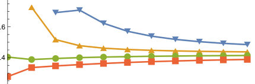
<figcaption class="paper-figure-caption"><b>Fig 4.</b> Figure 4: Plots of some non-zero invariants N (m,n) Ξ for M (m,n) ij MN, G(m,n) ij MN, and T (m,n) ij MN. (a) Graph of the invariants without degeneracy change, for nd = 0 and Ξ = M, G, T. (b) Graph of the invariants with degeneracy change, for nd = 0 and Ξ = M, G, T.</figcaption>
</figure>
<figure class="paper-figure-card">
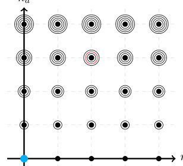
<figcaption class="paper-figure-caption"><b>Fig 5.</b> Figure 5: Diagram showing different states |nN⟩. Each dot represents an energy level, with the blue dot being the ground state. The rings surrounding each black dot account for a different value of N. As N increases, we move to the outer rings, with N = 1 being the black dot. The state |nN⟩with n = (2, 3) and N = 3 is highlighted in red.</figcaption>
</figure>

**Summary.** This paper develops an advanced geometric formalism using the N-bein to study the parameter space of quantum systems with degenerate spectra. It introduces a torsion tensor capturing non-commutativity and derives several gauge-invariant invariants. The framework is successfully applied to coupled harmonic oscillators, providing new tools to quantify correlations in degenerate quantum states.

**Why it may be interesting.** This work provides a powerful, general geometric machinery for analyzing the parameter dependence of quantum systems, especially those with degeneracies, which is crucial for understanding topological phases and quantum control.

Detailed structure

**Main problem.** The paper extends the N-bein formalism, originally for quantum parameter spaces, to analyze systems exhibiting degenerate spectra.

**Main result.** The formalism successfully defines new gauge-invariant tensors and invariants that quantify state transitions and correlations in degenerate quantum systems, even when the standard QGT breaks down.

**Method.** The authors employ concepts from Cartan geometry, introducing an N-bein as the 'square root' of the Quantum Geometric Tensor (QGT) and defining a torsion-like tensor via the covariant derivative.

**Model / system.** The theoretical framework is applied to a concrete model of coupled harmonic oscillators immersed in an electric field, which naturally leads to a degenerate energy spectrum.

**Key observables.** N-bein, Quantum Geometric Tensor (QGT), Torsion-like tensor, and several derived scalar invariants (e.g., $(N\Xi\Theta)$).

**Important parameters / regimes.** The number of parameters ($\mathcal{N}$), the quantum numbers defining the energy subspaces ($n_1, n_d$), and the coupling strengths in the oscillator model.

**Assumptions / limitations.** The analysis assumes the existence of a slowly varying parameter dependence and relies on extending the formalism from Abelian to non-Abelian matrix-valued descriptions.

**Figures summary.** Figures illustrate the degeneracy structure of the Hilbert space and show how state changes occur via parameter variation, particularly highlighting jumps in quantum numbers.

**Paper structure.** The paper builds from the initial N-bein definition to analyzing the two-state QGT for transitions, introduces the torsion tensor, develops a geometrical formulation using differential forms, and concludes with calculating and analyzing multiple gauge-invariant scalar observables for the coupled oscillator model.

Abstract

Recently, we introduced a geometric object analogous to an orthonormal frame in the Cartan formalism to study the parameter space of quantum systems; we called it $\mathcal{N}$-bein, with $\mathcal{N}$ being the number of parameters that characterize the quantum system. Acting as the ``square root'' of the quantum geometric tensor (QGT), the $\mathcal{N}$-bein allows us to define new tensors to improve our understanding of the structure beneath the parameter space of quantum mechanics. In this work, we extend this mathematical framework surrounding the $\mathcal{N}$-bein to analyze the parameter space of quantum systems with degenerate spectra. As in the non-degenerate case, we define a non-Abelian two-state QGT to identify possible transitions between degenerate states after two consecutive parameter variations. Additionally, using the Wilczek-Zee connection, we introduce a torsion-like tensor as the covariant derivative of the $\mathcal{N}$-bein. This torsion captures the noncommutativity of successive parameter variations and coincides with the antisymmetric part of the two-state QGT. We also present a geometrical formulation using differential forms and discuss the physical implications of the newly defined tensors. Furthermore, we construct several gauge-invariant observables from the $\mathcal{N}$-bein and its derivatives to highlight the utility of the new tensors. Finally, to illustrate the convenience and applications of this formalism, we apply the theoretical framework to a system of coupled harmonic oscillators immersed in an electric field. The coupling between the oscillators results in a degenerate system. Thus, using the new formalism, we found correlations among the quantum states quantified by the new invariants.

[↑ back to top](#top)

### [A generalized harmonic oscillator problem for a spin-1/2 fermion](http://arxiv.org/abs/2609.02043v1)

**Authors:** V. B. Mendrot, A. S. de Castro, P. Alberto  
**Type:** theory · **Category:** other · **PDF:** <https://arxiv.org/pdf/2609.02043v1>  
**Analysis basis:** full PDF text, analyzed in chunks
**Topic relevance:** `Keldysh / 2PI / non-Gaussian methods` **1/5** · `quantum measurements` **1/5**

↔ Scroll figures horizontally

<figure class="paper-figure-card">
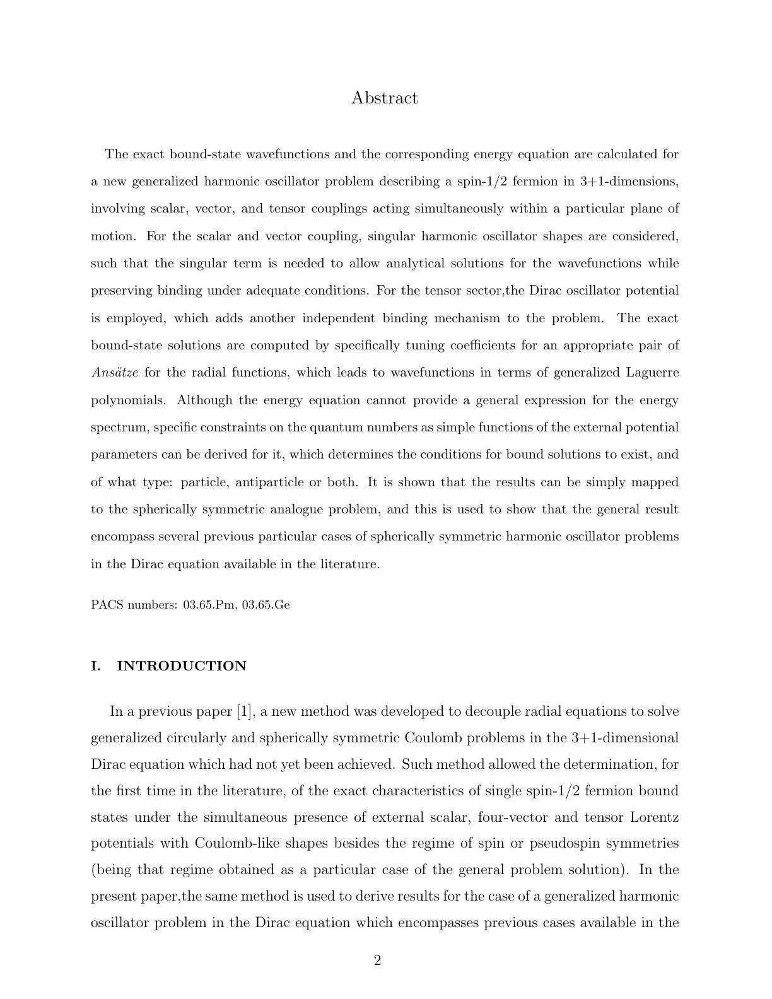
<figcaption class="paper-figure-caption"><b>Fig 1.</b> Low-resolution page preview, page 2</figcaption>
</figure>
<figure class="paper-figure-card">
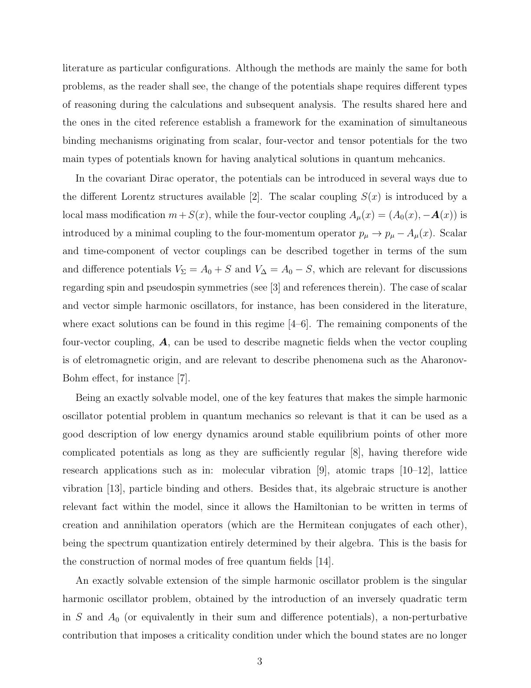
<figcaption class="paper-figure-caption"><b>Fig 2.</b> Low-resolution page preview, page 3</figcaption>
</figure>
<figure class="paper-figure-card">
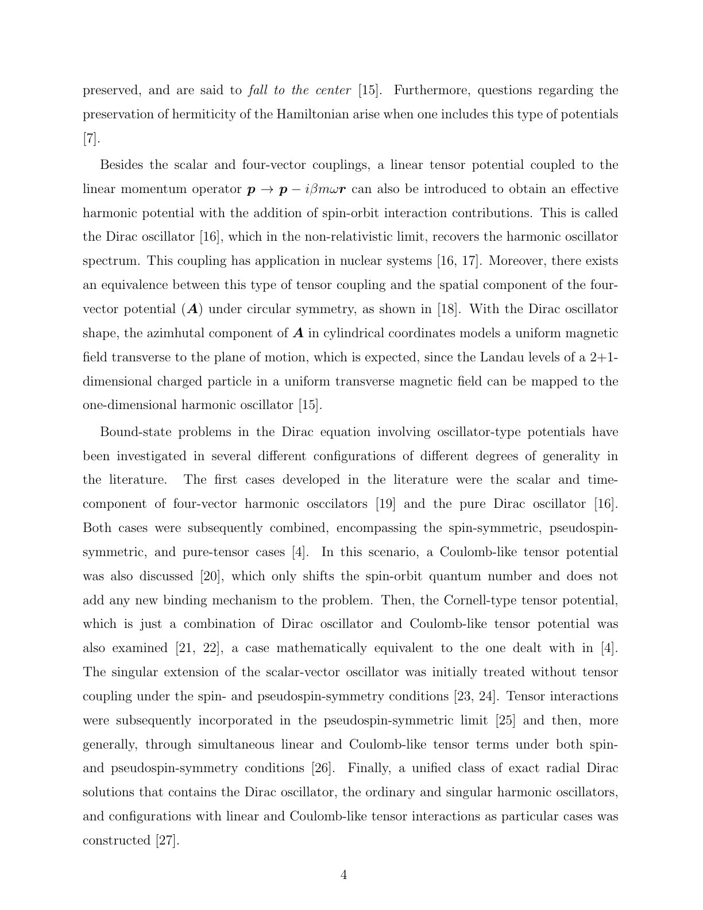
<figcaption class="paper-figure-caption"><b>Fig 3.</b> Low-resolution page preview, page 4</figcaption>
</figure>
<figure class="paper-figure-card">
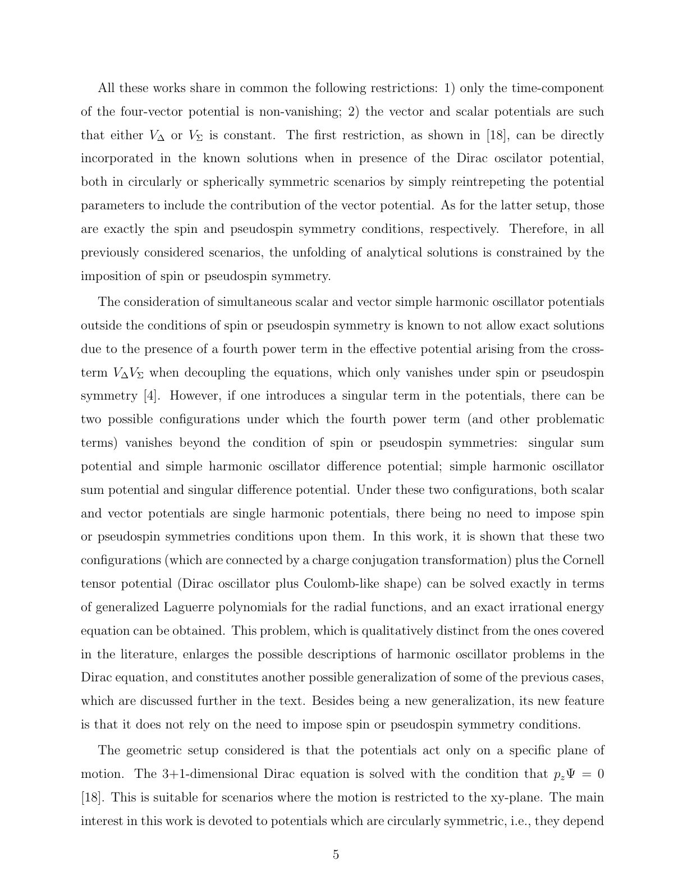
<figcaption class="paper-figure-caption"><b>Fig 4.</b> Low-resolution page preview, page 5</figcaption>
</figure>
<figure class="paper-figure-card">
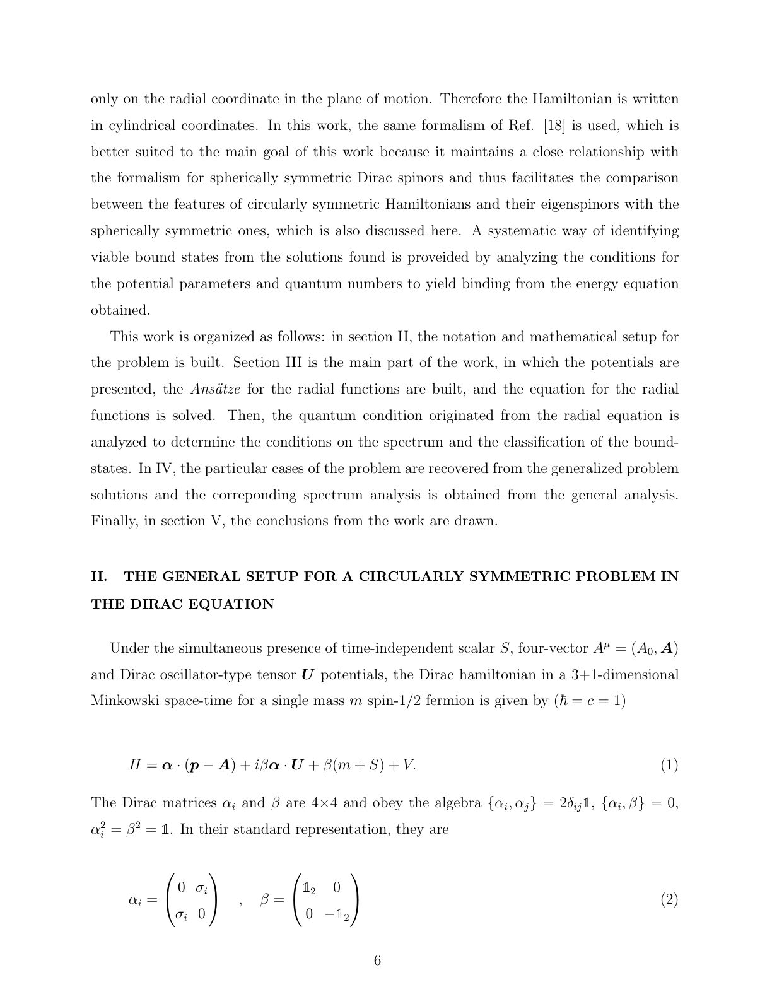
<figcaption class="paper-figure-caption"><b>Fig 5.</b> Low-resolution page preview, page 6</figcaption>
</figure>

**Summary.** This theoretical paper solves the bound-state problem for a spin-1/2 fermion in a generalized harmonic oscillator potential incorporating scalar, vector, and tensor couplings. The authors derive exact wavefunctions using specialized mathematical techniques and determine the conditions for bound energy levels by analyzing the roots of the resulting energy equation. This work provides a comprehensive framework that unifies several previously studied, but distinct, relativistic quantum oscillator problems.

**Why it may be interesting.** While the core physics is relativistic quantum mechanics, the mathematical techniques used—analyzing the roots of complex transcendental equations derived from physical constraints—are highly relevant to finding exact solutions in complex quantum models.

Detailed structure

**Main problem.** The paper calculates the exact bound-state wavefunctions and determines the conditions for the existence of bound solutions for a novel generalized harmonic oscillator problem involving a spin-1/2 fermion.

**Main result.** The general solution encompasses several known spherically symmetric cases, and the existence of bound states is determined by analyzing constraints on quantum numbers derived from the energy equation.

**Method.** The authors use advanced mathematical techniques, including solving coupled radial equations via specific Ansätze and employing real analysis on the resulting energy equation to determine the number of real roots corresponding to bound energies.

**Model / system.** The system is a spin-1/2 fermion governed by a Dirac-like equation in 3+1 dimensions, subjected to simultaneous scalar, vector, and tensor couplings (including harmonic oscillator and Dirac oscillator potentials) acting in a plane of motion.

**Key observables.** Bound-state energy eigenvalues ($\varepsilon$), and the classification of solutions as particle or antiparticle.

**Important parameters / regimes.** Potential coupling constants ($\mu, \omega, a, b$), quantum numbers ($n, 	ilde{k}$), and the dimensionality of the motion.

**Assumptions / limitations.** The potentials are assumed to be circularly symmetric, and the analysis relies on specific Ansätze for the radial functions and the mathematical rigor of analyzing the energy equation's roots.

**Figures summary.** The notes reference several tables (II through VII) detailing the conditions on quantum numbers required to determine the number of real roots (0, 1, or 2) for the energy equation under various potential parameter regimes.

**Paper structure.** The paper progresses from defining the generalized Hamiltonian and restricting motion to a plane, deriving coupled radial equations, solving specific solvable configurations (I and II) that violate symmetries, and finally using real analysis on the resulting energy equation to provide a complete classification of bound states.

Abstract

The exact bound-state wavefunctions and the corresponding energy equation are calculated for a new generalized harmonic oscillator problem describing a spin-1/2 fermion in 3+1-dimensions, involving scalar, vector, and tensor couplings acting simultaneously within a particular plane of motion. For the scalar and vector coupling, singular harmonic oscillator shapes are considered, such that the singular term is needed to allow analytical solutions for the wavefunctions while preserving binding under adequate conditions. For the tensor sector,the Dirac oscillator potential is employed, which adds another independent binding mechanism to the problem. The exact bound-state solutions are computed by specifically tuning coefficients for an appropriate pair of \textit{Ansätze} for the radial functions, which leads to wavefunctions in terms of generalized Laguerre polynomials. Although the energy equation cannot provide a general expression for the energy spectrum, specific constraints on the quantum numbers as simple functions of the external potential parameters can be derived for it, which determines the conditions for bound solutions to exist, and of what type: particle, antiparticle or both. It is shown that the results can be simply mapped to the spherically symmetric analogue problem, and this is used to show that the general result encompass several previous particular cases of spherically symmetric harmonic oscillator problems in the Dirac equation available in the literature.

[↑ back to top](#top)

### [A variational quantum eigensolver-based cutting plane framework for semidefinite programming problems](http://arxiv.org/abs/2609.02139v1)

**Authors:** Gizem Ozbaygin, Burak Kocuk, Diego A. Moran R  
**Type:** theory · **Category:** quantum information and computing · **PDF:** <https://arxiv.org/pdf/2609.02139v1>  
**Analysis basis:** full PDF text, analyzed in chunks
**Topic relevance:** `quantum measurements` **1/5**

↔ Scroll figures horizontally

<figure class="paper-figure-card">
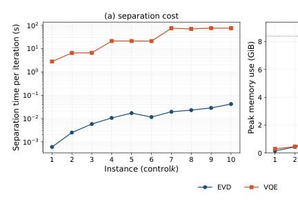
<figcaption class="paper-figure-caption"><b>Fig 1.</b> Fig. 1: Scaling of the two oracles across the instance family. (a) Separation time per cutting-plane iteration, on a logarithmic vertical axis; the plateaus correspond to the qubit count q = ⌈log2 n⌉of the larger block, which takes the values 4, 5, 6, 7 across the family. (b) Peak memory use, from the first repeat; the dotted line marks the effective limit at which runs were terminated. The vertical dashed line marks the change in iteration budget, 250 on control1–control5 and 100 thereafter; peak memory is driven by the accumulated cut pool and is therefore not comparable across it.</figcaption>
</figure>
<figure class="paper-figure-card">
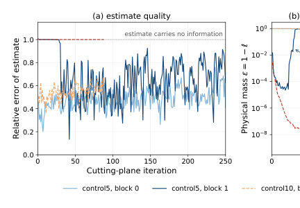
<figcaption class="paper-figure-caption"><b>Fig 2.</b> Fig. 2: Quality of the VQE eigenvalue estimates. (a) Relative error against cutting- plane iteration. (b) Physical mass ϵ = 1 −ℓ, on a logarithmic scale. On control10 the smaller block descends to a floor near 10−9 and does not recover; on control5 it floors four orders of magnitude higher and escapes at iteration 23. Curves are from the first repeat.</figcaption>
</figure>

**Summary.** This work proposes using a Variational Quantum Eigensolver (VQE) as a quantum oracle within a cutting-plane method to solve Semidefinite Programming (SDP) problems. While the quantum approach offers logarithmic qubit scaling, the study reveals that classical memory constraints and the need for full state tomography limit its practical advantage over classical solvers. It serves as a key case study for hybrid quantum-classical optimization algorithms.

**Why it may be interesting.** It provides a concrete, albeit limited, blueprint for integrating quantum computation (VQE) into a well-established classical optimization framework (cutting planes), which is highly relevant for near-term quantum algorithm development.

Detailed structure

**Main problem.** The paper addresses the computational bottleneck in solving Semidefinite Programming (SDP) problems, which are crucial in optimization theory.

**Main result.** The authors propose a VQE-based cutting-plane framework, showing that while the VQE oracle generates valid cuts, the overall advantage over classical methods is limited by classical memory bottlenecks and the need for state tomography.

**Method.** They integrate a Variational Quantum Eigensolver (VQE) into a polyhedral outer-approximation cutting-plane algorithm to replace the computationally expensive linear-algebraic step of checking positive semidefiniteness.

**Model / system.** The model is the abstract mathematical problem of solving an SDP, $	ext{SDP (1.1)}$, constrained by the positive semidefinite cone ($	ext{S}_n^+$). The quantum component uses VQE to estimate the minimum eigenvalue of the candidate matrix.

**Key observables.** The minimum eigenvalue ($\lambda_{\min}(X^*)$) of the candidate matrix $X^*$, and the resulting fraction of the initial optimality gap closed.

**Important parameters / regimes.** The qubit requirement scales logarithmically ($\lceil\log_2 N
ceil$) with the matrix dimension $N$, contrasting with the classical $O(N^2)$ storage.

**Assumptions / limitations.** The primary assumptions involve the feasibility of realizing the VQE oracle and the use of a polyhedral outer-approximation scheme, which does not guarantee finite convergence.

**Figures summary.** Not specified.

**Paper structure.** The paper details the construction of the end-to-end cutting-plane loop, where the separation oracle is realized by the VQE, followed by comparative analysis against exact methods and discussion of practical hardware limitations.

Abstract

Semidefinite programming plays a key role in optimization, with broad impact across control theory, machine learning, and combinatorial optimization. Although semidefinite programs are polynomially solvable, several commonly used algorithms rest on a linear-algebraic step whose running time grows cubically with the matrix dimension and which requires the matrix itself to be held in memory, at quadratic cost. In this study, we propose replacing it with a variational quantum eigensolver, whose qubit requirement is logarithmic in the matrix dimension, and present the first end-to-end implementation of such an approach within a cutting-plane framework, together with an operator-derived ansatz whose entanglement structure is read directly from the Pauli support of the candidate matrix. Evaluated on the control family of SDPLIB against an identical scheme driven by an exact eigendecomposition, the variational oracle produces valid cuts throughout, closing 32 to 82% of the initial optimality gap against a near-constant 75 to 82% for the exact oracle. Implementing and measuring the method end to end surfaces several effects not visible from theoretical analyses alone: where memory is actually consumed, how the padding required to fit a matrix onto a quantum register can mislead the variational optimizer, and why the candidate matrices prove dense in the Pauli basis, reducing the operator-derived ansatz to full entanglement. We report these findings and discuss their implications for near-term hybrid quantum-classical approaches.

[↑ back to top](#top)

### [Entanglement, anti-flatness, and nonlocal nonstabilizerness: a unified perspective from entanglement spectrum](http://arxiv.org/abs/2609.01993v1)

**Authors:** Lei-Yi-Nan Liu, Jian Cui  
**Type:** theory · **Category:** statistical mechanics · **PDF:** <https://arxiv.org/pdf/2609.01993v1>  
**Analysis basis:** full PDF text, analyzed in chunks
**Topic relevance:** `non-equilibrium universality` **1/5**

↔ Scroll figures horizontally

<figure class="paper-figure-card">
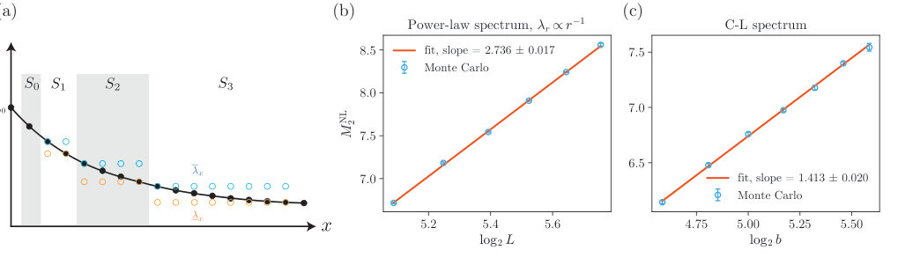
<figcaption class="paper-figure-caption"><b>Fig 1.</b> FIG. 1. (a) Schematic illustration of the shell-based sandwich construction. Within each dyadic shell Sj, the largest and smallest eigenvalues are used to construct upper and lower shell-flat spectra, respectively, which bound the original ordered ES from above and below. (b) Monte Carlo results for the algebraically decaying spectrum at p = 1, with L = log2 N. The fitted slope is 2.736 ± 0.017, approaching the asymptotic value 3. (c) Monte Carlo results for the C-L spectrum, with fitted slope 1.413 ± 0.020, approaching the predicted value 3/2.</figcaption>
</figure>

**Summary.** This theoretical paper unifies the study of entanglement and nonlocal nonstabilizerness by developing a spectral framework based on the entanglement spectrum. It derives universal bounds for the nonlocal stabilizer Rényi entropy using generalized anti-flatness. The framework successfully predicts distinct scaling laws for various spectral types, offering a general tool for analyzing quantum correlations in many-body systems.

**Why it may be interesting.** This work provides powerful, general spectral tools to characterize complex non-local correlations (nonstabilizerness) in critical quantum systems, linking it rigorously to measurable quantities like entanglement entropy.

Detailed structure

**Main problem.** The paper aims to develop a unified spectral framework to understand the relationship between entanglement, anti-flatness, and nonlocal nonstabilizerness in quantum many-body systems.

**Main result.** The nonlocal SRE is shown to be controlled by complementary spectral structures derived from the entanglement spectrum, yielding universal scaling laws, such as double-logarithmic growth at 1D conformal critical points.

**Method.** The authors derive universal upper and lower bounds on the nonlocal stabilizer Rényi entropy using generalized anti-flatness and introduce a 'dyadic-shell sandwich construction' to bound the ordered entanglement spectrum.

**Model / system.** The analysis focuses on bipartite pure states in quantum many-body systems, specifically examining spectra that decay exponentially or algebraically, including the Calabrese--Lefevre spectrum relevant to 1D critical points.

**Key observables.** Nonlocal $\alpha$-Rényi Entropy ($	ext{M}_{	ext{NL}}^{\alpha}$), $\alpha$-Rényi Entanglement Entropy ($	ext{S}_{\alpha}$), and Generalized Anti-flatness ($\mathcal{A}_{\alpha}$)

**Important parameters / regimes.** The decay exponent $p$ in algebraic spectra, the entanglement parameter $\alpha$, and the system size $N$ or length $L$.

**Assumptions / limitations.** The analysis relies on the properties of the entanglement spectrum and the applicability of spectral bounding techniques like the dyadic-shell sandwich construction.

**Figures summary.** The notes mention schematic illustrations of the sandwich construction and results comparing the asymptotic scaling of $S_2$, $A_2$, and $M_{NL}^2$ for different decay regimes ($p>1, p=1, p \in(0, 1)$).

**Paper structure.** The paper develops the spectral framework by introducing bounds relating $	ext{M}_{	ext{NL}}^{\alpha}$ to $	ext{S}_{\alpha}$ and $\mathcal{A}_{\alpha}$. It then applies this framework to specific spectral types (exponential, algebraic, C-L) to derive concrete scaling laws and demonstrate the general applicability of the spectral tools.

Abstract

Entanglement and nonstabilizerness capture distinct aspects of quantum complexity, yet their relation through the entanglement spectrum remains only partially understood. Here we develop a unified spectral framework for bipartite nonlocal nonstabilizerness. We introduce a generalized anti-flatness and derive universal upper and lower bounds on the nonlocal stabilizer Rényi entropy (SRE) in terms of Rényi entanglement entropy and spectral non-uniformity. We apply these bounds to exponentially and algebraically decaying spectra, revealing distinct relations between entanglement and nonlocal nonstabilizerness. For the marginal algebraic spectrum and the Calabrese--Lefevre spectrum, we further introduce a dyadic-shell sandwich construction that bounds the ordered entanglement spectrum by upper and lower shell-flat spectra and determines the asymptotic nonlocal SRE scaling. At one-dimensional conformal critical points, this yields a universal hierarchy of double-logarithmic scaling laws. Our spectral bounds and dyadic-shell sandwich construction provide general tools for analyzing nonlocal SRE, offering a flexible framework that can be applied to a wide range of entanglement spectra in quantum many-body systems.

[↑ back to top](#top)

### [EuIn2Sb2: epitaxially stabilized axion insulator candidate with strong spin-orbit coupling](http://arxiv.org/abs/2609.02114v1)

**Authors:** Hsiang Lee, Shinichi Nishihaya, Markus Kriener, Ayano Nakamura, Tadashi Yoneda, Yuki Deguchi, Makuro Goto, Masaki Uchida  
**Type:** experiment · **Category:** strongly correlated electrons · **PDF:** <https://arxiv.org/pdf/2609.02114v1>  
**Analysis basis:** full PDF text, analyzed in chunks
**Topic relevance:** `analog quantum simulation` **1/5**

↔ Scroll figures horizontally

<figure class="paper-figure-card">
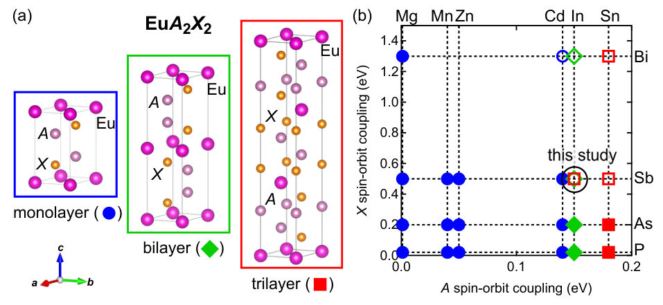
<figcaption class="paper-figure-caption"><b>Fig 1.</b> FIG. 1. EuA2X2 compounds with Eu triangular lattice. (a) Three different crystal structures of</figcaption>
</figure>
<figure class="paper-figure-card">
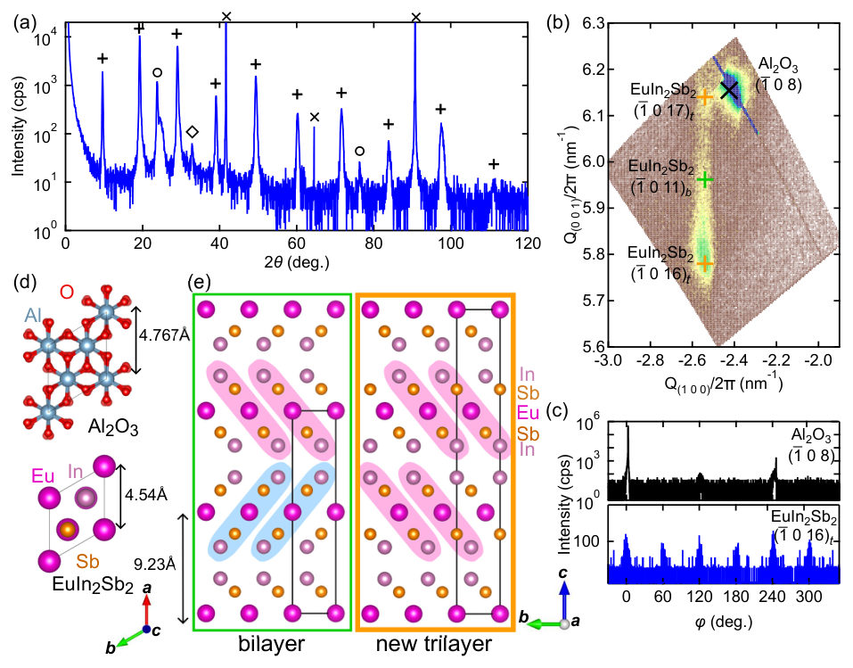
<figcaption class="paper-figure-caption"><b>Fig 2.</b> FIG. 2. XRD characterization of EuIn2Sb2 film. (a) XRD θ-2θ scan of a EuIn2Sb2 thin film grown</figcaption>
</figure>
<figure class="paper-figure-card">
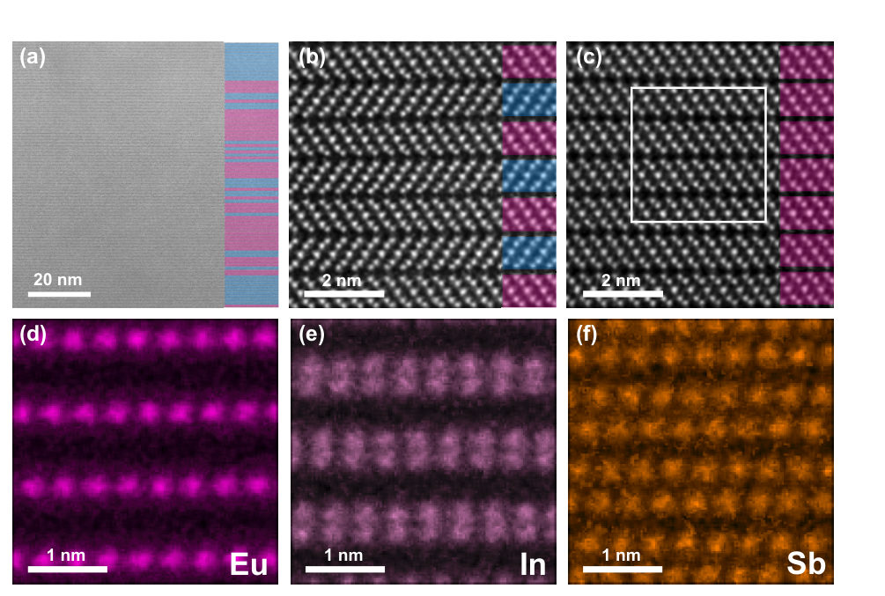
<figcaption class="paper-figure-caption"><b>Fig 3.</b> FIG. 3. Atomically resolved cross-sectional structure images. (a) Wide-area TEM image, and</figcaption>
</figure>

**Summary.** This work reports the successful epitaxial synthesis of EuIn2Sb2, a material predicted to be a magnetic topological insulator. By characterizing its novel trilayer crystal structure and measuring its magnetic and transport properties, the authors establish it as a promising new platform for investigating axion and higher-order topological insulating phases.

**Why it may be interesting.** The combination of magnetic ordering (antiferromagnetism) and strong spin-orbit coupling in a crystalline solid is central to realizing topological phases, which is a major focus in modern condensed matter theory.

Detailed structure

**Main problem.** To experimentally realize and characterize EuIn2Sb2, a predicted axion insulator and higher-order topological insulator candidate within the EuA2X2 family.

**Main result.** The authors successfully stabilized EuIn2Sb2 films via MBE, revealing a novel trilayer structure with an In-on-In stacking configuration, which makes it an ideal platform for studying magnetic topological phases.

**Method.** The study employed epitaxial growth using Molecular Beam Epitaxy (MBE), followed by structural characterization using XRD/TEM and magnetic/transport measurements using SQUID and four-probe methods.

**Model / system.** The physical system is the EuIn2Sb2 thin film, belonging to the EuA2X2 family of magnetic topological insulators. The investigation focuses on how strong spin-orbit coupling and the specific crystal structure stabilize exotic topological states.

**Key observables.** Longitudinal resistivity (rho_xx) showing a kink at TN=10.5K; magnetic susceptibility (chi); and structural confirmation of the trilayer phase via XRD RSM and TEM.

**Important parameters / regimes.** The magnetic ordering temperature (TN=10.5K) and the strong spin-orbit coupling regime are critical parameters defining the topological nature of the material.

**Assumptions / limitations.** The analysis assumes that the observed trilayer structure and the presence of in-plane antiferromagnetic ordering are sufficient to establish the material as a candidate for axion/HOTI phases.

**Figures summary.** Figures illustrate the crystal structures of EuA2X2 compounds, the successful growth and characterization of the trilayer EuIn2Sb2 film (using XRD/TEM), and the magnetic phase diagram showing temperature and field dependence of resistivity and magnetization.

**Paper structure.** The paper proceeds by establishing the theoretical context of EuA2X2 topological insulators, detailing the MBE growth process to stabilize the novel trilayer EuIn2Sb2 structure, and finally characterizing its magnetic and transport properties to confirm its suitability for topological phase exploration.

Abstract

Eu triangular lattice layer compounds described by the general formula EuA2X2 have attracted growing attention due to a wide range of layered crystal structures and corresponding magnetic topological phases, arising from the coexistence of large Eu magnetic moments and energetically inverted A and X bands. Among the EuA2X2 family, EuIn2Sb2 has been predicted to host robust axion insulator and higher-order topological insulator states by stronger spin-orbit coupling but has not been experimentally realized, including the structural identification. Here we report the epitaxial stabilization of EuIn2Sb2 by adopting the molecular beam epitaxy technique. Structural characterization reveals that EuIn2Sb2 films are based on a unique In-on-In stacking, forming a new trilayer structure distinct from previously predicted structures in the EuA2X2 family. In addition to the in-plane antiferromagnetic ordering at TN=10.5K, the stronger spin-orbit coupling and enhanced In-In hybridization in EuIn2Sb2 make it an ideal candidate of axion insulator and higher-order topological insulator phases. These results establish EuIn2Sb2 as a new member of the EuA2X2 family and offer an advanced platform for exploring these magnetic topological phases.

[↑ back to top](#top)

### [Laser-induced phase shift of swift electrons](http://arxiv.org/abs/2609.02099v1)

**Authors:** Christian Dwyer, David M. Paganin  
**Type:** theory · **Category:** other · **PDF:** <https://arxiv.org/pdf/2609.02099v1>  
**Analysis basis:** full PDF text, analyzed in chunks
**Topic relevance:** `Keldysh / 2PI / non-Gaussian methods` **1/5**

↔ Scroll figures horizontally

<figure class="paper-figure-card">
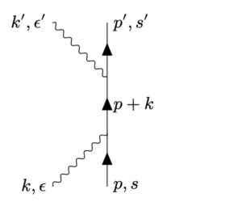
<figcaption class="paper-figure-caption"><b>Fig 1.</b> FIG. 1. Feynman diagrams for S(2) fi .</figcaption>
</figure>
<figure class="paper-figure-card">
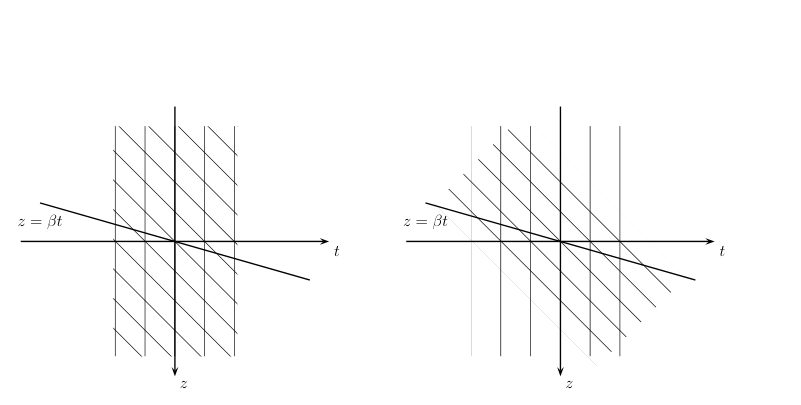
<figcaption class="paper-figure-caption"><b>Fig 2.</b> FIG. 2. Graphical explanation of different boundary conditions for the radiation field A. The vertical lines</figcaption>
</figure>

**Summary.** This theoretical work calculates the phase shift imparted to fast electrons by a laser field using three independent methods: Dirac theory, Volkov solutions, and the Hamilton-Jacobi equation. The key finding is the agreement across all formalisms, yielding a Lorentz-invariant result that is crucial for applications like laser phase plates in TEMs.

**Why it may be interesting.** The rigorous comparison between quantum field theory methods (Dirac/Klein-Gordon) and classical mechanics (Hamilton-Jacobi) to derive a single, Lorentz-invariant result for an electron-laser interaction is highly relevant for understanding strong-field quantum optics.

Detailed structure

**Main problem.** The paper revisits the calculation of the phase shift experienced by swift electrons as they pass through the electromagnetic field of a high-intensity laser.

**Main result.** The calculated phase shift is found to be independent of the relative orientation of the electron and laser beams, and the results from quantum (Dirac, Klein-Gordon) and classical (Hamilton-Jacobi) theories show agreement.

**Method.** The authors employ three distinct theoretical frameworks—perturbation theory on the Dirac equation, the Volkov solution to the Klein-Gordon equation, and the relativistic Hamilton-Jacobi equation—to calculate the phase shift.

**Model / system.** The system involves a relativistic electron interacting with a classical, time-varying electromagnetic field generated by a laser. The analysis is framed using the electron's 4-potential A and its resulting phase shift $\phi$.

**Key observables.** Laser-induced phase shift ($\phi$), which is the primary observable, and the electron's trajectory.

**Important parameters / regimes.** Electron energy ($E$), laser frequency ($\omega$), interaction time ($\Delta t$), and the degree of relativistic motion ($\gamma$).

**Assumptions / limitations.** The derivation often assumes that the scattering process leaves the electron and photon states unchanged, which is justified by considering the high photon density limit analogous to stimulated emission.

**Figures summary.** Figure 2 graphically illustrates the boundary conditions for the radiation field A, comparing confinement in time versus a $	au$-parameterization, and showing the required correction factor.

**Paper structure.** The paper systematically compares results derived from three methods: perturbation theory on the Dirac equation, using Volkov solutions to the Klein-Gordon equation, and finally, employing the relativistic Hamilton-Jacobi equation to establish consistency and analyze Lorentz invariance.

Abstract

We revisit the calculation of the phase shift experienced by swift electrons on passing through the electromagnetic field of a laser. Such phase shifts are now utilized in the form of `laser phase plates' in transmission electron microscopes (TEMs), for example. We calculate the phase shift using three different methods, namely, perturbation theory applied to the Dirac equation, the Volkov solution to the Klein-Gordon equation, and the relativistic Hamilton-Jacobi equation. We find that all three methods are in agreement, and that the calculated phase shift is independent of the relative orientation of the electron and laser beams. The agreement between the quantum and classical theories is explained. Our Lorentz invariant result for the phase shift differs from certain results published in the literature.

[↑ back to top](#top)

### [Localizing quantum information](http://arxiv.org/abs/2609.01966v1)

**Authors:** Fahimeh Bayeh, Andre Kornell  
**Type:** theory · **Category:** quantum information and computing · **PDF:** <https://arxiv.org/pdf/2609.01966v1>  
**Analysis basis:** full PDF text, analyzed in chunks
**Topic relevance:** `quantum measurements` **1/5**

↔ Scroll figures horizontally

<figure class="paper-figure-card">
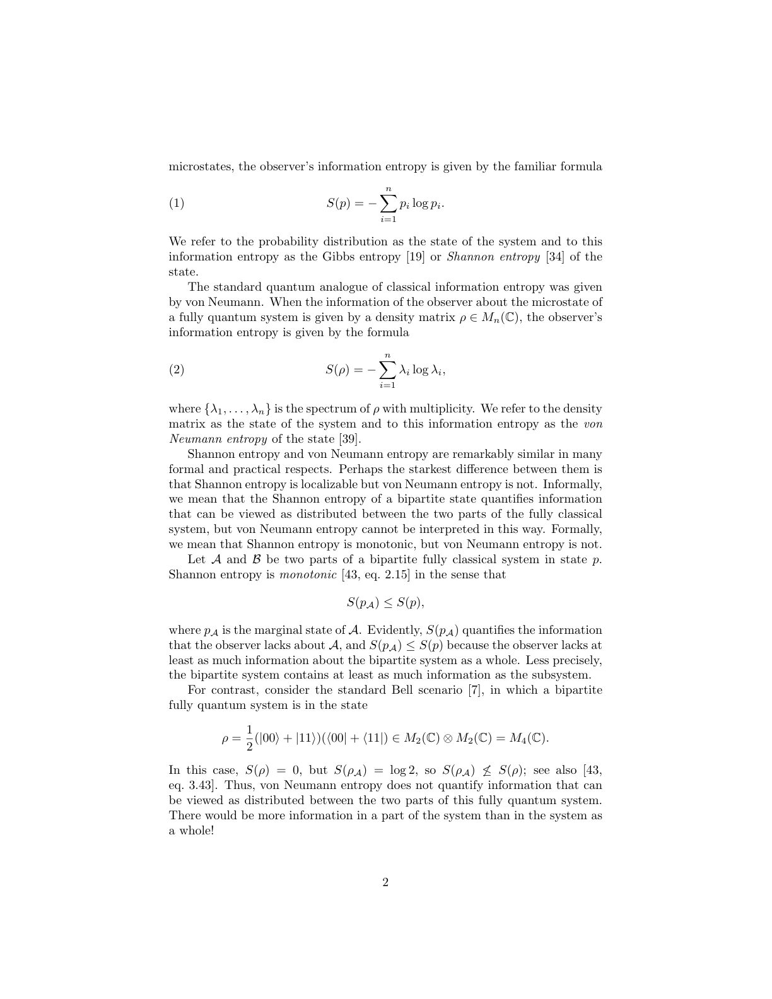
<figcaption class="paper-figure-caption"><b>Fig 1.</b> Low-resolution page preview, page 2</figcaption>
</figure>
<figure class="paper-figure-card">
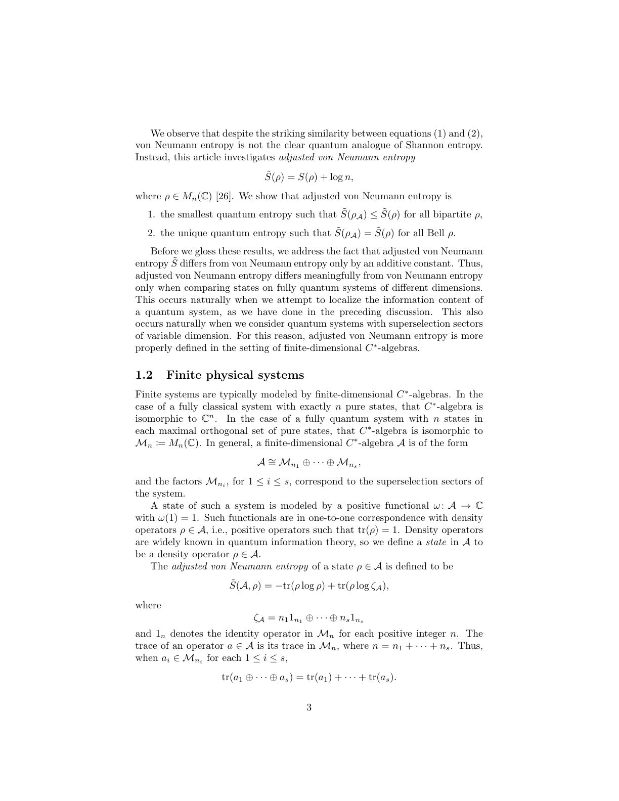
<figcaption class="paper-figure-caption"><b>Fig 2.</b> Low-resolution page preview, page 3</figcaption>
</figure>
<figure class="paper-figure-card">
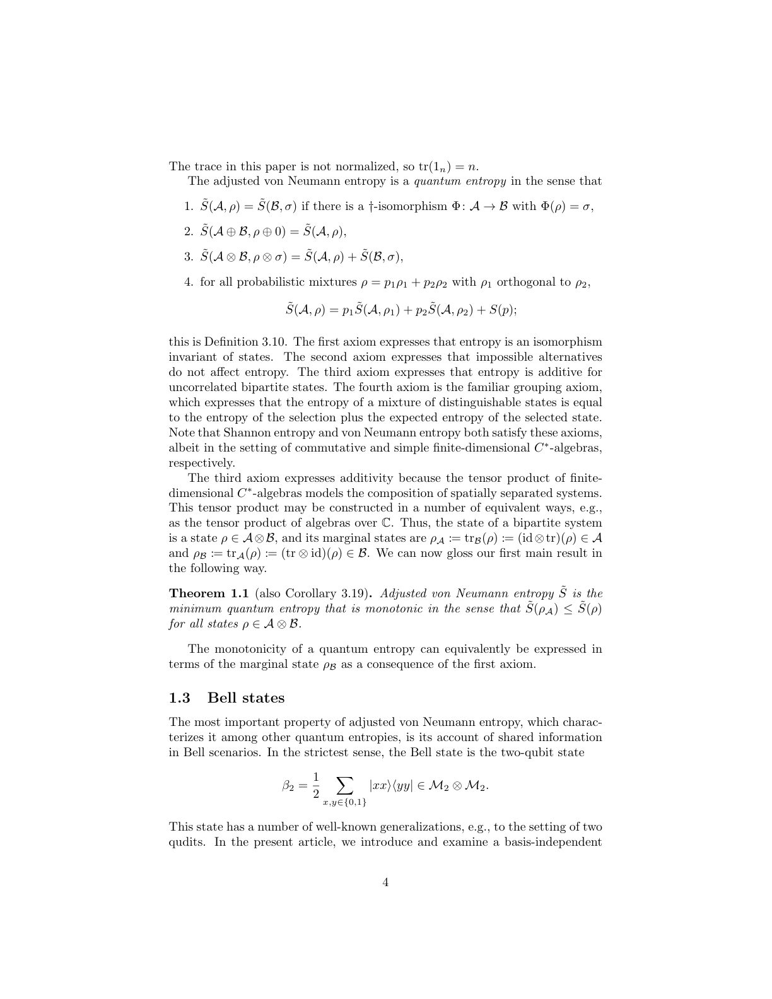
<figcaption class="paper-figure-caption"><b>Fig 3.</b> Low-resolution page preview, page 4</figcaption>
</figure>
<figure class="paper-figure-card">
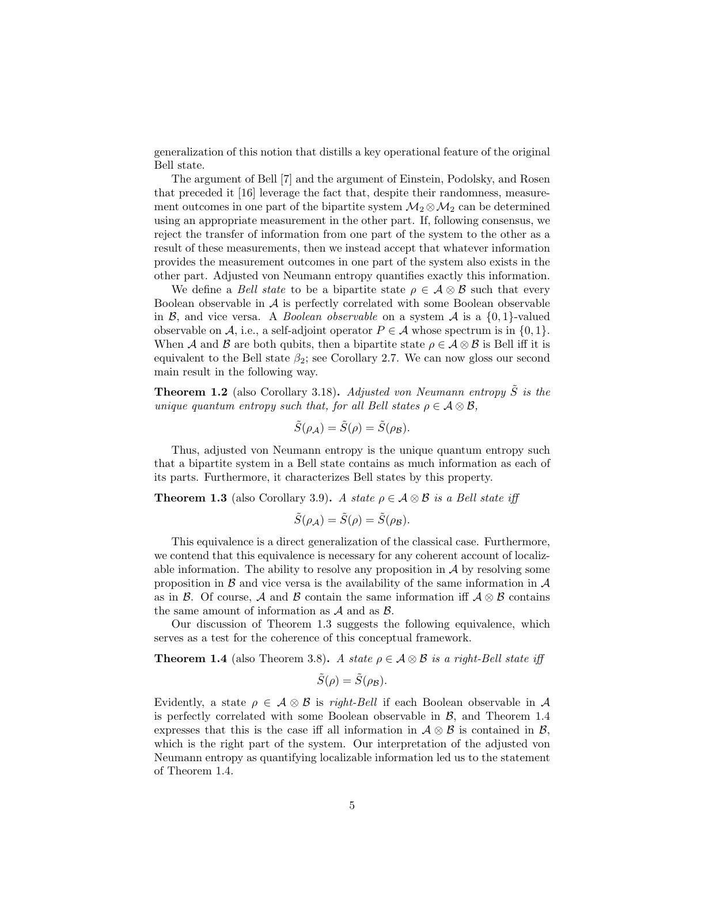
<figcaption class="paper-figure-caption"><b>Fig 4.</b> Low-resolution page preview, page 5</figcaption>
</figure>
<figure class="paper-figure-card">
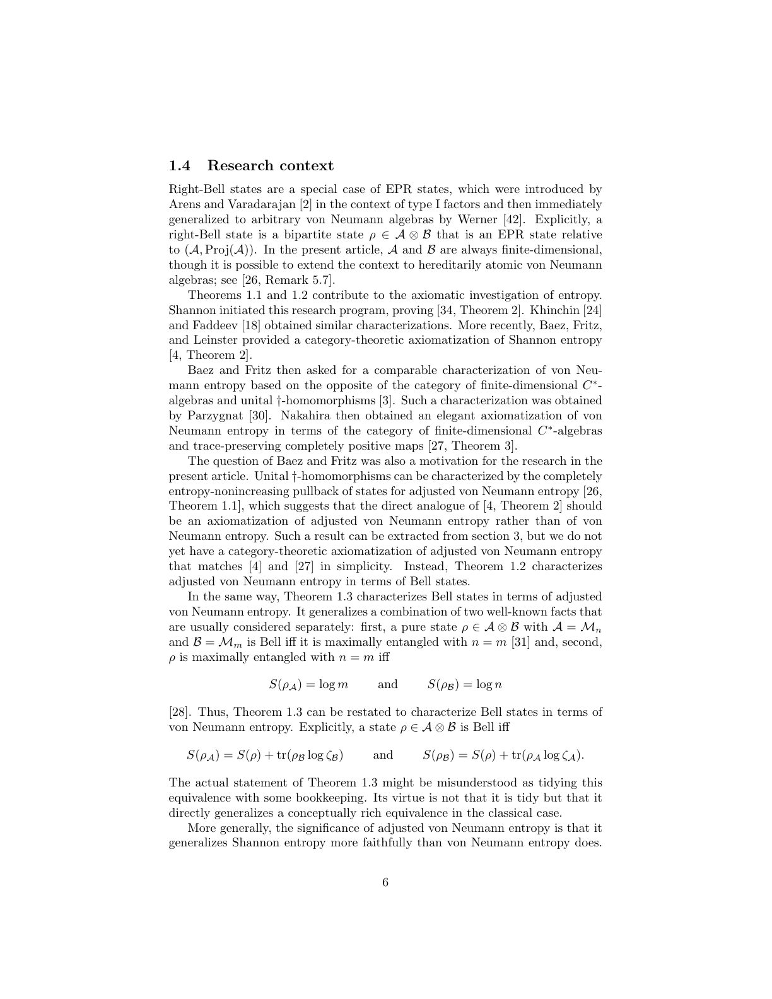
<figcaption class="paper-figure-caption"><b>Fig 5.</b> Low-resolution page preview, page 6</figcaption>
</figure>

**Summary.** This paper develops a novel quantum entropy, the adjusted von Neumann entropy ($	ilde{S}$), designed to correctly quantify 'localizable information' in quantum systems, unlike the standard von Neumann entropy. The authors prove that $	ilde{S}$ is the unique entropy satisfying key physical constraints, and they use it to provide a definitive characterization of entangled Bell states. This advances the foundational understanding of information measures in quantum theory.

**Why it may be interesting.** This work provides a rigorous, information-theoretic tool ($	ilde{S}$) to distinguish physically meaningful entropy measures from mathematically defined ones, which is crucial for understanding entanglement and information flow in quantum systems.

Detailed structure

**Main problem.** The paper seeks to define a quantum entropy measure that accurately quantifies 'localizable information' in quantum systems, a property that standard von Neumann entropy lacks.

**Main result.** The authors prove that an adjusted von Neumann entropy, $	ilde{S}$, is the minimum quantum entropy satisfying the localizability monotonicity condition and uniquely characterizes Bell states.

**Method.** The analysis involves comparing the axioms of classical Shannon entropy with quantum entropy measures using finite-dimensional $C^*$-algebras and establishing necessary and sufficient conditions via algebraic constraints.

**Model / system.** The study models finite quantum systems using finite-dimensional $C^*$-algebras, $A$, which can possess superselection sectors. The focus is on bipartite systems described by states $
ho \in A \otimes B$.

**Key observables.** Adjusted von Neumann entropy ($	ilde{S}$), Shannon entropy, and the characterization of Bell states.

**Important parameters / regimes.** The dimension of the system ($n$), which dictates the additive constant in the adjusted entropy ($\log n$).

**Assumptions / limitations.** The analysis is restricted to finite-dimensional $C^*$-algebras, and the definition of $	ilde{S}$ requires an additive correction to standard von Neumann entropy to achieve localizability.

**Paper structure.** The paper progresses by first establishing the failure of standard von Neumann entropy to quantify localizable information, then proposing and proving the properties of the adjusted entropy $	ilde{S}$ based on monotonicity, and finally using $	ilde{S}$ to provide a structural characterization of Bell states.

Abstract

The idea that information can be localized is pervasive in physics. In thermodynamics, entropy flows from one reservoir to another, and in quantum gravity, the entropy content of some spatial regions is bounded. In quantum information theory, information is transmitted from one place to another, and entanglement can provide an advantage when there are constraints on such transmission.   Shannon entropy quantifies localizable information in the sense that marginalization defines an outer measure on the set of parts of a classical multipartite system. In contrast, von Neumann entropy does not quantify localizable information in this sense. However, a variant of von Neumann entropy, which originates in noncommutative geometry, does.   We prove that this adjusted von Neumann entropy is the minimum quantum entropy that quantifies localizable information. We also prove that this is the unique quantum entropy that characterizes Bell states in terms of redundant information, directly generalizing the classical case. We work with finite-dimensional $C^*$-algebras throughout, modeling finite quantum systems that may have superselection sectors.

[↑ back to top](#top)

### [Low-Temperature Transport in Li-Ion Battery EC/EMC/FEC Electrolytes: Molecular Dynamics and Machine-Learning Modeling](http://arxiv.org/abs/2609.02824v1)

**Authors:** İpek Yenda Çınar, Oguzhan Orhan, M. Oluş Özbek, Şener Özönder  
**Type:** theory · **Category:** disordered systems and neural networks · **PDF:** <https://arxiv.org/pdf/2609.02824v1>  
**Analysis basis:** full PDF text, analyzed in chunks
**Topic relevance:** `methods for driven-dissipative` **1/5**

↔ Scroll figures horizontally

<figure class="paper-figure-card">
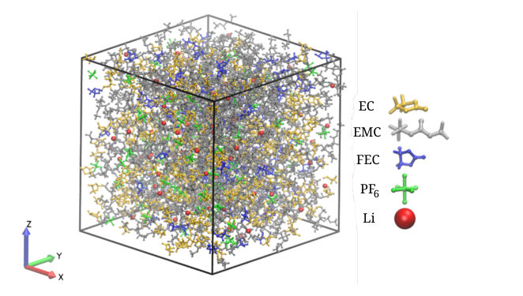
<figcaption class="paper-figure-caption"><b>Fig 1.</b> Figure 1: Representative initial simulation configuration generated with PACKMOL for a 1 M LiPF6 EC:EMC electrolyte containing 10 mol% FEC, visualized using VMD.</figcaption>
</figure>
<figure class="paper-figure-card">
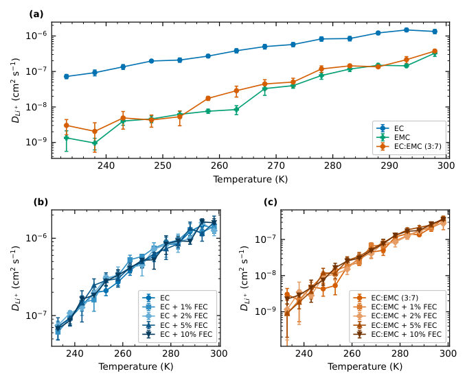
<figcaption class="paper-figure-caption"><b>Fig 2.</b> Figure 2: Temperature dependence of the Li+ diffusion coefficient in 1 M LiPF6 electrolytes: (a) the three base solvents EC, EMC and EC/EMC (3:7, w/w); (b) EC with 0, 1, 2, 5 and 10 mol% FEC; (c) EC/EMC (3:7, w/w) with 0, 1, 2, 5 and 10 mol% FEC. Error bars denote one standard deviation of the windowed Einstein fit.</figcaption>
</figure>
<figure class="paper-figure-card">
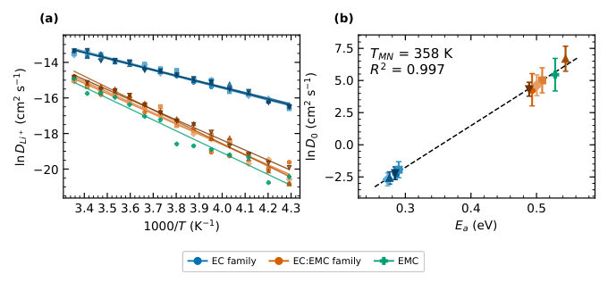
<figcaption class="paper-figure-caption"><b>Fig 3.</b> Figure 3: (a) Arrhenius plots of the Li+ diffusion coefficient for all eleven electrolytes with linear fits. (b) Meyer-Neldel compensation plot of the pre-exponential factor D0 versus activation energy Ea; the line is a linear fit to ln D0 versus Ea (R2 = 0.997), corresponding to a compensation temperature TMN ≈358 K.</figcaption>
</figure>
<figure class="paper-figure-card">
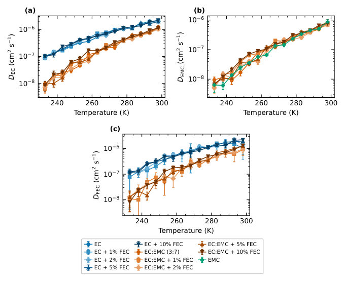
<figcaption class="paper-figure-caption"><b>Fig 4.</b> Figure 4: Temperature dependence of the solvent self-diffusion coefficients in the simulated 1 M LiPF6 electrolytes: (a) EC, (b) EMC and (c) FEC. Each species is shown for every composition in which it is present; colors follow the electrolyte color coding used throughout. Error bars denote one standard deviation of the windowed Einstein fit.</figcaption>
</figure>
<figure class="paper-figure-card">
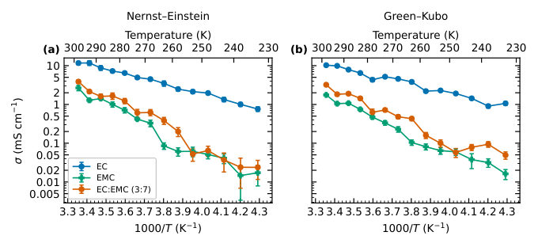
<figcaption class="paper-figure-caption"><b>Fig 5.</b> Figure 5: (a) NE and (b) GK ionic conductivities for 1 M LiPF6 in EC, EMC and EC/EMC (3:7, w/w), plotted against inverse temperature. Error bars denote one standard deviation; GK values and uncertainties are obtained with the STACIE spectral estimator.</figcaption>
</figure>

**Summary.** This work uses Molecular Dynamics simulations combined with Machine Learning to study how lithium-ion conductivity in battery electrolytes degrades at low temperatures. The researchers found that the transport penalty is highly dependent on the solvent blend and the concentration of FEC additives. By training ML models, they created a fast tool to predict these complex transport properties across different operating conditions.

**Why it may be interesting.** While focused on electrochemistry, the application of ML surrogates to model complex, multi-parameter physical phenomena (like conductivity vs. T and composition) falls under the umbrella of ML-physics, which shares methodological overlap with disordered systems analysis.

Detailed structure

**Main problem.** The paper investigates the limitations imposed by low-temperature operation on lithium-ion transport in battery electrolytes, focusing on the coupled effects of solvent composition and fluorinated additives.

**Main result.** Cooling causes a pronounced transport penalty, particularly in EMC-containing electrolytes, and the study quantifies the temperature and composition dependence using ML surrogates.

**Method.** The research combines classical Molecular Dynamics (MD) simulations with Machine Learning (ML) techniques, specifically Gaussian-process surrogates, to model transport properties.

**Model / system.** The system is a 1 M LiPF6 electrolyte containing mixtures of ethylene carbonate (EC), ethyl methyl carbonate (EMC), and fluoroethylene carbonate (FEC), simulated across temperatures from 298 K down to 233 K.

**Key observables.** Li+ self-diffusion coefficients, Nernst-Einstein (NE) and Green-Kubo (GK) conductivities, and local coordination analyzed via RDFs.

**Important parameters / regimes.** Temperature range (233 K to 298 K), FEC concentration (0-10 mol%), and solvent ratios (EC:EMC).

**Assumptions / limitations.** The study assumes that temperature and host-solvent composition are the dominant factors governing bulk transport response, and it notes that direct Li+-FEC coordination is not quantified.

**Figures summary.** Figure 1 shows a representative initial simulation configuration for a specific electrolyte mixture, and other figures/tables detail the temperature dependence of density and transport parameters.

**Paper structure.** The paper systematically simulates the electrolyte across varying compositions and temperatures using MD, calculates transport metrics (D, $\sigma_{NE}$, $\sigma_{GK}$), and then employs ML surrogates to build predictive models for these properties.

Abstract

Low-temperature operation imposes severe limitations on lithium-ion transport in battery electrolytes, yet the coupled effects of solvent composition and fluorinated additives in the cold-temperature regime remain insufficiently resolved. Here, we combine classical molecular dynamics (MD) and machine learning (ML) to investigate 1 M LiPF$_6$ electrolytes containing ethylene carbonate (EC), ethyl methyl carbonate (EMC), and EC/EMC (3:7), with 0-10 mol% fluoroethylene carbonate (FEC), from 298 to 233 K. MD simulations quantify Li$^+$ self-diffusion, Nernst-Einstein (NE) and Green-Kubo (GK) conductivities and local coordination, while Gaussian-process surrogates model conductivity across composition and temperature. Cooling produces a pronounced transport penalty, particularly in EMC-containing electrolytes, whose GK conductivity decreases by more than 98% at 233 K, compared with approximately 90% in EC-rich systems. Li$^+$ self-diffusion activation energies are 0.49-0.54 eV for EMC-containing systems and 0.27-0.29 eV for EC-based systems. Within the EC family, 0-2 mol% FEC gives comparable cold-temperature transport, whereas 5-10 mol% FEC shows lower conductivity retention at the coldest simulated temperature. The analyzed coordination channels remain solvent dominated, while direct Li$^+$-FEC coordination is not quantified in the present RDF set.The Gaussian-process surrogates achieve composition-disjoint cross-validated RMSE values of 0.56 and 0.57 mS cm$^{-1}$ for NE and GK conductivity. Within the simulated liquid-state trajectories, temperature and host-solvent composition dominate the bulk-transport response, with FEC acting as a secondary modifier.

[↑ back to top](#top)

### [Memory as an Energy Landscape---Hopfield](http://arxiv.org/abs/2609.02195v1)

**Authors:** Nima Dehghani  
**Type:** theory · **Category:** disordered systems and neural networks · **PDF:** <https://arxiv.org/pdf/2609.02195v1>  
**Analysis basis:** full PDF text, analyzed in chunks
**Topic relevance:** `analog quantum simulation` **1/5**

↔ Scroll figures horizontally

<figure class="paper-figure-card">
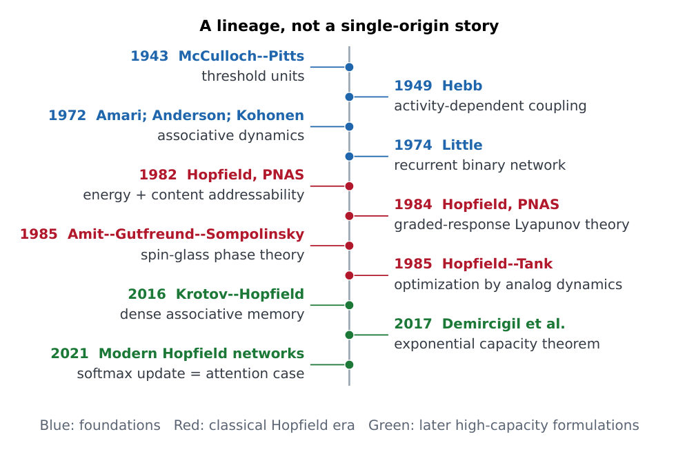
<figcaption class="paper-figure-caption"><b>Fig 1.</b> FIG. 1. A selective lineage of associative-memory theory. Hopfield did not invent threshold neurons, Hebbian association, correlation memories, or the first recurrent binary network. The 1982 synthesis made content-addressable recall the descent dynamics of a symmetric many-body system and presented its collective computational consequences in a form that physicists could generalize. The later high-capacity models change the interaction function and sometimes the state space, while retaining the idea that memories organize a dynamical landscape. This is an original schematic, not data reproduced from the cited literature.</figcaption>
</figure>
<figure class="paper-figure-card">
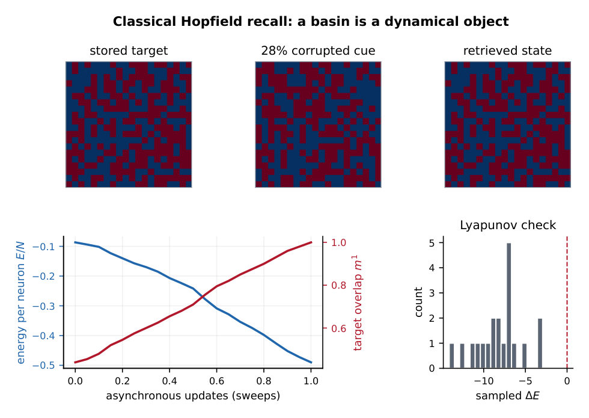
<figcaption class="paper-figure-caption"><b>Fig 2.</b> FIG. 2. Seeded replication of classical content-addressable recall. Eighteen random patterns are embedded in N = 400 spins. A cue obtained by flipping 28% of one memory begins with overlap m1 = 0.44 and converges to the stored target under random sequential updates. The energy decreases at every sampled interval while the overlap grows; in this run the final overlap is 1. A single successful cue demonstrates a basin, not a storage-capacity theorem. Source: code/hopfield replication.py.</figcaption>
</figure>
<figure class="paper-figure-card">
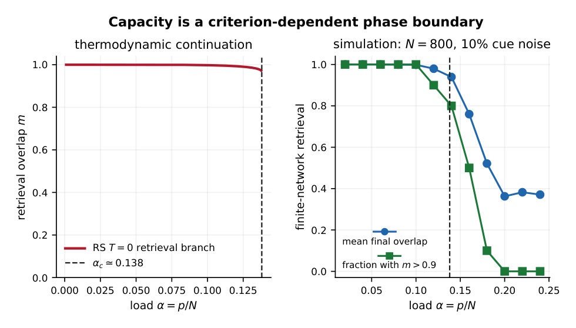
<figcaption class="paper-figure-caption"><b>Fig 3.</b> FIG. 3. Two complementary replications of capacity. Left: numerical continuation of Eqs. (30)–(32); the nonzero retrieval branch terminates at α ≈0.1376 at the plotted resolution. Right: finite-N synchronous simulations from cues with 10% flipped bits. The finite network rounds and shifts the transition, and the mean-overlap and m &gt; 0.9 criteria do not coincide. The dashed line is a thermodynamic reference, not a fit to finite-N points. Source: code/hopfield replication.py.</figcaption>
</figure>
<figure class="paper-figure-card">
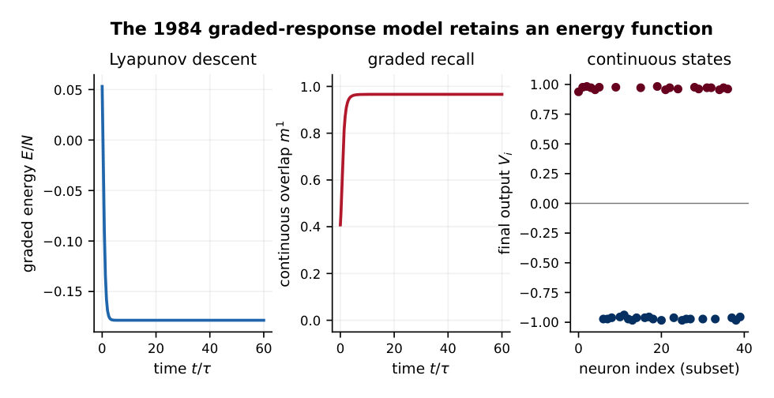
<figcaption class="paper-figure-caption"><b>Fig 4.</b> FIG. 4. Replication of the graded-response Lyapunov mechanism. Four random patterns are embedded in N = 120 units with g(u) = tanh(2.2u). From a corrupted continuous cue, the energy in Eq. (36) decreases to numerical precision and the target overlap approaches 0.966. The units remain continuous even though the attractor lies close to saturated values. This figure tests the 1984 structural claim, not a biological fit. Source: code/hopfield replication.py.</figcaption>
</figure>
<figure class="paper-figure-card">
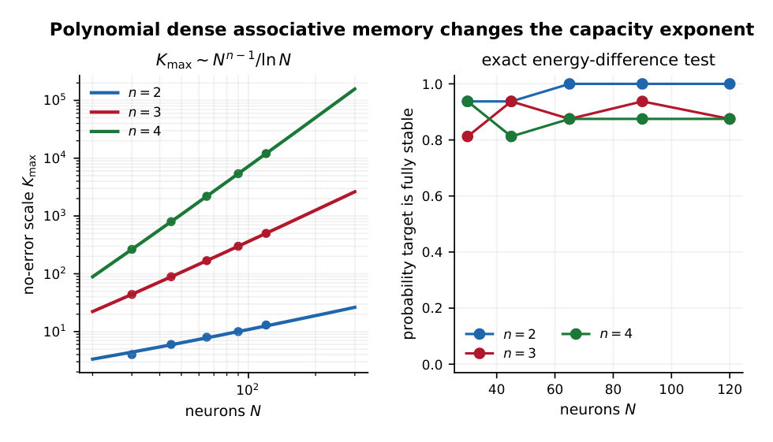
<figcaption class="paper-figure-caption"><b>Fig 5.</b> FIG. 5. Polynomial dense-memory capacity. Left: the no-error scale in Eq. (49) for interaction orders n = 2, 3, 4. Right: direct finite-N tests of whether every bit of a designated random target is stable under the exact energy-difference rule Eq. (43), with K set to the asymptotic no-error scale. The finite-size probabilities are noisy and the asymptotic coefficient is conservative at these sizes; the robust claim is the changed power of N. Source: code/hopfield replication.py.</figcaption>
</figure>

**Summary.** This chapter treats the Hopfield network as a rigorous physical theory of memory, deriving its energy function and proving that its dynamics converge to stable memory states. It meticulously analyzes the theoretical limits of this energy-based approach using mean-field theory, while critically assessing its assumptions regarding symmetry and locality compared to complex biological systems.

**Why it may be interesting.** The analysis of energy landscapes, stability, and phase transitions in the Hopfield model shares deep mathematical parallels with understanding ground states and collective behavior in quantum spin glasses or disordered quantum systems.

Detailed structure

**Main problem.** The paper reconstructs the Hopfield network as a physical theory of memory, aiming to understand how stable collective states emerge from recurrent dynamics.

**Main result.** It establishes that the energy function provides a global statement guaranteeing convergence to a fixed point, while also detailing the theoretical limits (e.g., $\alpha_c \simeq 0.138$) of this energy-based approach.

**Method.** The analysis uses statistical mechanics, deriving Lyapunov functions for energy decrease in the binary case, and employing mean-field theory (replica method) for analyzing retrieval at extensive load.

**Model / system.** The primary model is the Hopfield network, characterized by a symmetric coupling matrix $J_{ij}$ and an associated energy function $E(\mathbf{s})$. Dynamics are governed by asynchronous updates, which ensure energy non-increase.

**Key observables.** Memory (stable attractors), retrieval overlap ($m$), energy function $E(\mathbf{s})$, and the critical storage capacity ($\alpha_c$).

**Important parameters / regimes.** The load parameter $\alpha = p/N$, the temperature $eta$ (for stochastic updates), and the critical capacity $\alpha_c \simeq 0.138$.

**Assumptions / limitations.** Critical assumptions include the symmetry of couplings ($J_{ij} = J_{ji}$), the absence of self-coupling ($J_{ii} = 0$), and the point-neuron approximation, which limit its biological scope.

**Figures summary.** Figure 1 illustrates the selective lineage of associative-memory theory, showing Hopfield's synthesis of prior concepts.

**Paper structure.** The paper proceeds by first establishing the historical context and the energy-based framework for the binary Hopfield network, deriving the Lyapunov function. It then extends this analysis through mean-field theory to calculate capacity limits, concluding with a critical assessment of the model's assumptions and open problems.

Abstract

This chapter reconstructs the Hopfield network as a physical theory of memory rather than merely an early neural-network algorithm. It begins with the problem as it stood before 1982-threshold logic, Hebbian association, correlation memories, and recurrent binary networks-and isolates what Hopfield's synthesis added: a dynamical definition of content-addressable memory, a symmetric recurrent architecture with a Lyapunov function, a Hebbian embedding of patterns in its couplings, and a physical account of basins, robustness, and graceful degradation. The binary and graded-response energy functions are derived in full, together with the signal-crosstalk decomposition governing pattern stability, the mean-field theory of retrieval at extensive load, and the zero-temperature retrieval spinodal at (alpha 0.138) established by Amit, Gutfreund, and Sompolinsky. The energy-based program is then followed through analog optimization networks, polynomial dense associative memories, exponential interactions, and modern continuous Hopfield updates, including the precise conditions under which the update becomes scaled dot-product attention. Throughout, capacity claims are tied to their disorder ensemble, scaling limit, and success criterion, showing why numerically different storage limits need not conflict. A closing assessment distinguishes established results from surviving principles, assumption-bound limitations, and open problems, treating the Hopfield network as an effective theory whose symmetry, locality, and point-neuron assumptions delimit its biological reach. Fixed-seed numerical experiments expose the mechanisms discussed but do not substitute for analytical results.

[↑ back to top](#top)

### [Neural Logic, Invariance, and the Retina---McCulloch and Pitts](http://arxiv.org/abs/2609.02183v1)

**Authors:** Nima Dehghani  
**Type:** theory · **Category:** disordered systems and neural networks · **PDF:** <https://arxiv.org/pdf/2609.02183v1>  
**Analysis basis:** full PDF text, analyzed in chunks
**Topic relevance:** `quantum measurements` **1/5**

↔ Scroll figures horizontally

<figure class="paper-figure-card">
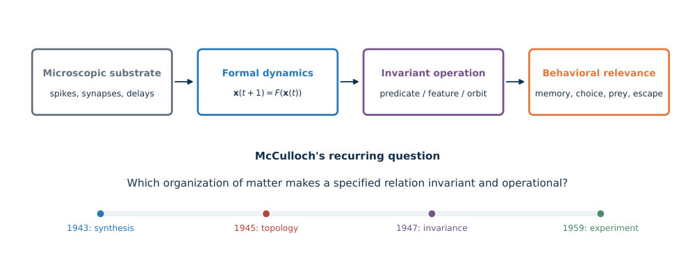
<figcaption class="paper-figure-caption"><b>Fig 1.</b> FIG. 1. The through-line of McCulloch’s research. The 1943 paper synthesized nets that realized specified propositions; the 1945 paper related circular preference to network topology; the 1947 paper sought invariant operations; and the 1959 frog study identified such operations experimentally. This is an original schematic, not a claim that every paper followed a single linear plan.</figcaption>
</figure>
<figure class="paper-figure-card">
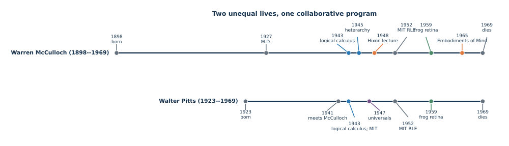
<figcaption class="paper-figure-caption"><b>Fig 2.</b> FIG. 2. Parallel selective timelines for Warren McCulloch and Walter Pitts. Shared works appear on both tracks, while the different spans make visible how much of Pitts’s contribution was compressed into a short life. The Hixon marker dates McCulloch’s 1948 lecture; the Jeffress proceedings appeared in 1951. Dates otherwise label births, deaths, publications, or institutional transitions, not exclusive moments of invention. Original schematic.</figcaption>
</figure>
<figure class="paper-figure-card">
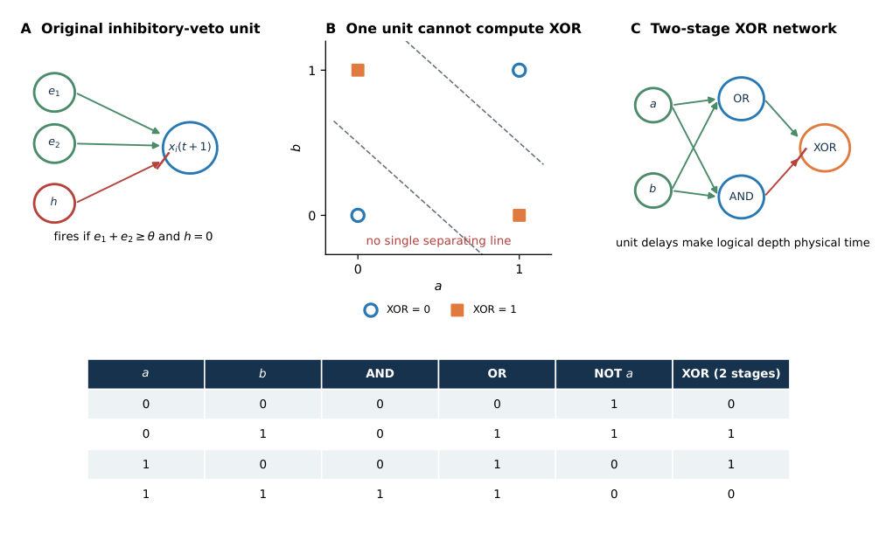
<figcaption class="paper-figure-caption"><b>Fig 3.</b> FIG. 3. Threshold logic. (a) In the original-style rule, excitation is summed to threshold and any active inhibitory input vetoes firing. (b) XOR is not linearly separable and cannot be computed by one weighted threshold unit. (c) A two-stage construction computes XOR exactly. Each edge crossing a logical stage also crosses a unit delay. Truth tables are generated by the supplied code.</figcaption>
</figure>
<figure class="paper-figure-card">
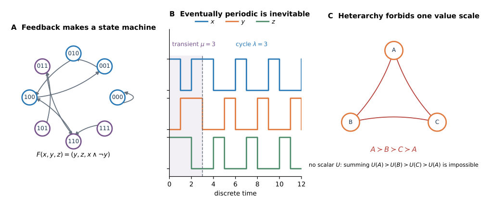
<figcaption class="paper-figure-caption"><b>Fig 4.</b> FIG. 4. Circularity and topology. (a) Exact state-transition graph for the three-bit map in Eq. (13); blue nodes lie on attractors and purple nodes are transient. (b) From 101, a length-three transient feeds a period-three orbit. Finite autonomous nets are eventually periodic, but need not be invertible or begin on an attractor. (c) Cyclic preference cannot be represented by one scalar value function. Original computational demonstrations.</figcaption>
</figure>
<figure class="paper-figure-card">
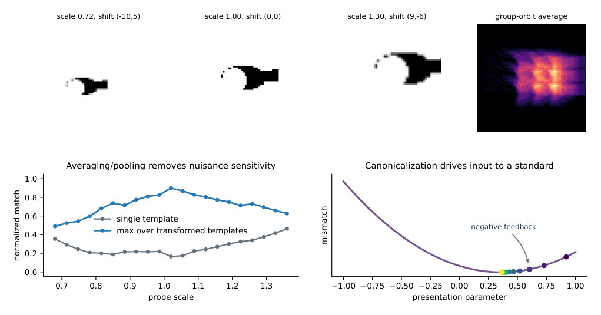
<figcaption class="paper-figure-caption"><b>Fig 5.</b> FIG. 5. Two routes to a universal. Top: translated and rescaled presentations belong to one transformation orbit; their average is invariant but blurred. Bottom left: max matching over an orbit reduces nuisance sensitivity relative to one template. Bottom right: negative feedback drives a presentation parameter toward a canonical value, reducing mismatch. These are modern computational realizations of the two mechanism classes in Pitts and McCulloch (1947), not reconstructions of their exact diagrams.</figcaption>
</figure>

**Summary.** This paper provides a deep theoretical reconstruction of neural computation, starting from the McCulloch-Pitts model. It rigorously analyzes the network's capabilities as a finite-state machine, distinguishing its limitations from universal computation. The work traces the field's evolution through concepts like invariance and biological observation, framing computation as a causal, discrete-time process.

**Why it may be interesting.** While focused on classical computation, the rigorous analysis of finite-state dynamics, periodicity, and the comparison between idealized mathematical models and physical constraints (like dendritic voltage) provides a framework for understanding the limitations of complex, constrained dynamical systems, which has parallels in analyzing quantum state evolution in finite-dimensional systems.

Detailed structure

**Main problem.** The paper reconstructs the theoretical foundation of neural computation, tracing the evolution from early logical models to modern understanding of dynamics, learning, and memory in biological and artificial systems.

**Main result.** It establishes that fixed, finite recurrent neural networks are deterministic finite automata, capable of realizing any finite Boolean function but fundamentally limited to finite state spaces, unlike unbounded Turing computation.

**Method.** The analysis uses formal calculus, treating the system as a deterministic switching machine, and comparing the original McCulloch-Pitts logic with later generalizations involving invariance and group theory.

**Model / system.** The core model is the McCulloch-Pitts network, initially defined by a thresholded excitatory summation combined with an absolute inhibitory veto. The system is analyzed as a discrete-time, synchronous, finite-state dynamical machine.

**Key observables.** State space periodicity, realizable Boolean functions, and transformation invariance (e.g., in the retina).

**Important parameters / regimes.** Thresholds ($	heta_i$), connection weights ($w_{ij}$), and the finite number of units ($N$).

**Assumptions / limitations.** The 1943 model's strict separation of excitatory summation and inhibitory veto is crucial; the analysis often treats the system as a qualitative model rather than a detailed biophysical reconstruction.

**Figures summary.** Figures illustrate the progression from material substrate to formal dynamics, showing the historical development of the research program across key milestones (1943, 1945, 1947, 1959).

**Paper structure.** The paper progresses logically from the initial 1943 logical calculus (causal system) to addressing limitations like the heterarchy (cyclic preference) and invariance (group theory), culminating in the analysis of biological vision (retina) and modern computational theory.

Abstract

This chapter reconstructs the McCulloch-Pitts program as a physics of neural computation rather than the familiar cartoon of a binary neuron. The 1943 logical calculus is developed in both directions: given a net, characterize the propositions realized by its activity; given an admissible logical expression, construct a net that realizes it. We recover the original distinction between thresholded excitatory summation and absolute inhibitory veto-one the weighted-threshold form cannot preserve for arbitrarily large excitatory inputs-and read unit-time delay as the physical realization of logical depth. Recurrence is treated exactly: an autonomous, deterministic network of finitely many binary units has a finite state space, so every trajectory eventually enters a periodic orbit-a fact about finite-state dynamics, not unbounded Turing computation. A single threshold element realizes only linearly separable Boolean functions, whereas finite feedforward networks of them synthesize any Boolean function on a finite domain. We then follows McCulloch and Pitts beyond threshold logic. The 1945 heterarchy paper turns cyclic preference into an obstruction to representation by a scalar utility. The 1947 work on universals asks how a physical network can identify inputs related by nuisance transformations, developed here via group averaging and feedback canonicalization. The 1959 frog-retina study makes the adequate-stimulus question experimental, revealing parallel invariant operations before the brain proper. Spike-triggered analysis shows how a nonlinearly driven neuron can have a vanishing first-order average while second-order statistics recover its hidden selectivity: methodological failure can masquerade as physiological absence. Modern mathematical tools are used without projecting their notation onto the historical papers, and limitations of the idealization are stated explicitly.

[↑ back to top](#top)

### [Purification of photonic graph states](http://arxiv.org/abs/2609.01710v1)

**Authors:** Matthias C. Löbl, Aliki A. Capatos, Ming Lai Chan, Peter Lodahl, Anders Søndberg Sørensen, Stefano Paesani  
**Type:** theory · **Category:** quantum information and computing · **PDF:** <https://arxiv.org/pdf/2609.01710v1>  
**Analysis basis:** full PDF text, analyzed in chunks
**Topic relevance:** `quantum measurements` **1/5**

↔ Scroll figures horizontally

<figure class="paper-figure-card">
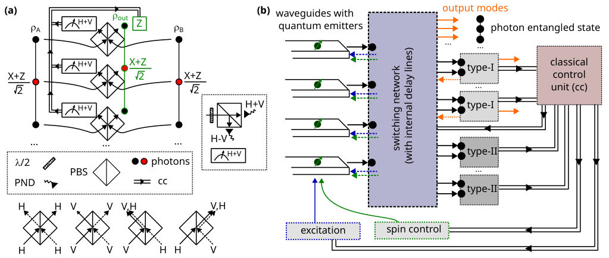
<figcaption class="paper-figure-caption"><b>Fig 1.</b> FIG. 1. Setups for the purification of GHZ or more general CSS states. (a) Purifying the polarization encoded 3-qubit state |Φ+ 0 ⟩, corresponding to a linear graph state with a Hadamard gate X+Z √</figcaption>
</figure>
<figure class="paper-figure-card">
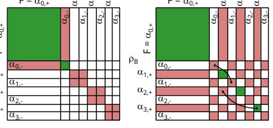
<figcaption class="paper-figure-caption"><b>Fig 2.</b> FIG. 2. (a) Illustration of what happens to the various cross- terms in one round of bit-flip purification of a 3-photon GHZ state. Terms highlighted in red lead to an undesired con- tribution in the final state, terms highlighted in green lead to the desired state, and all other terms are filtered out as the detection patterns do not meet the heralding criterion. (b) Same illustration for one round of phase-flip purification. Here, cross terms of the form |Φ+ i&gt;0⟩A |Φ+ i&gt;0⟩B also lead to the desired state |Φ+ 0 ⟩. More generally, cross terms of the form |Φ± i ⟩A |Φ± j ⟩B lead to the state |Φ± i⊕j⟩, as exemplary illustrated by the two arrows.</figcaption>
</figure>
<figure class="paper-figure-card">
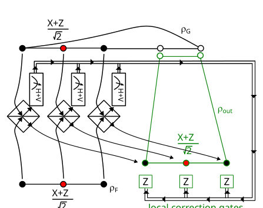
<figcaption class="paper-figure-caption"><b>Fig 3.</b> FIG. 3. Setup for the purification of a five-ring graph state (chromatic number 3) with density matrix ρG. For the first purification round, a three-qubit ancillary graph state with density matrix ρF is sent into a transversal type-I fusion setup together with the first three qubits of the five-ring graph state. On the second qubits, Hadamard gates ( X+Z √</figcaption>
</figure>
<figure class="paper-figure-card">
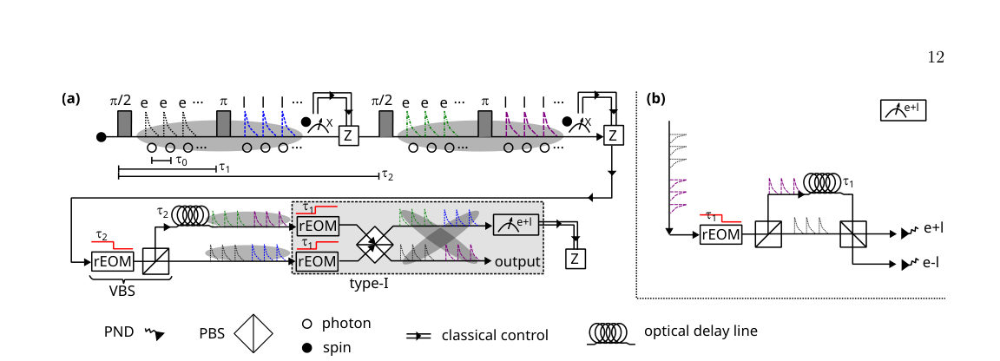
<figcaption class="paper-figure-caption"><b>Fig 4.</b> FIG. 4. (a) Setup for generation and bit-flip purification of time-bin-encoded GHZ states (e.g. |Φ+ 0 ⟩). The letters e, l represent the early and late time bins, which are the computational basis states. Compared to polarization or path encoding, the transversal type-I fusions can be implemented using fewer spatial or polarization modes by putting several qubits into the same mode. Moving to time-bin encoding, the polarizing beam splitters from Fig. 1(a) (polarization encoding) are replaced by variable beam splitters (VBS), implemented by a resonant electro-optic modulator (rEOM) and a polarizing beam splitter (PBS). The VBS transmits the early time bin and reflects the late one. (b) Setup...</figcaption>
</figure>
<figure class="paper-figure-card">
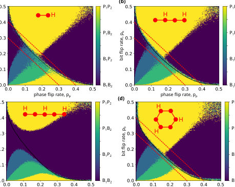
<figcaption class="paper-figure-caption"><b>Fig 5.</b> FIG. 7. Best CSS state purification protocols for phenomeno- logical bit- and phase-flip noise and two rounds of bit-flip (B) and phase-flip (P) purification. The simulated CSS states are locally equivalent by Hadamard (H) gates to the following graph states: (a) a length-two linear chain, (b) a length-four linear chain, (c) a length-five linear chain, and (d) a six-ring. In all plots, the faint black lines indicate a lower bound for the purification threshold. In (a,b,d), the dotted red lines are a guide to the eye to see the slight difference between the sim- ulations.</figcaption>
</figure>

**Summary.** This paper presents purification schemes designed to enhance the fidelity of photonic graph states, which are essential building blocks for photonic quantum computation. The methods utilize linear optics and photon detectors to correct for various noise sources, including Pauli errors and photon loss. By combining multiple purification rounds, the authors demonstrate a robust way to maintain high-quality entanglement in photonic quantum information processing.

**Why it may be interesting.** This work is highly relevant for theoretical physicists working on quantum optics and open quantum systems as it provides concrete, resource-efficient protocols to combat decoherence in photonic quantum computation architectures.

Detailed structure

**Main problem.** The paper addresses the challenge of noise in photonic graph states, which are crucial resources for quantum computation with photons.

**Main result.** The authors develop and analyze purification schemes that can boost the fidelity of arbitrary photonic graph states, requiring only linear optics and photon detectors.

**Method.** The techniques involve applying multi-round purification protocols, combining bit-flip and phase-flip error correction steps, and optimizing the sequence of these steps.

**Model / system.** The system involves photonic graph states, which are generated using quantum emitters with hosted spins. The purification process is modeled using density matrices diagonal in the generalized Bell-state basis.

**Key observables.** Fidelity (F), Success Probability, and the relative fraction of the desired state term in the resulting density matrix.

**Important parameters / regimes.** Noise sources include phenomenological Pauli errors (bit- and phase-flip) and physical noise from emitters; the analysis considers small loss parameters ($p_l$).

**Assumptions / limitations.** The schemes rely on post-selection based on measurement outcomes (heralding) and assume the initial state can be described by a density matrix diagonal in the generalized Bell-state basis.

**Figures summary.** Figure 1 illustrates the physical setups for purifying GHZ or general CSS states using type-I fusion; Figure 2 details the effect of cross-terms during bit-flip and phase-flip purification rounds.

**Paper structure.** The paper progresses by first introducing the need for purification, detailing the general purification protocols for GHZ/CSS states, then analyzing the combined bit-flip and phase-flip correction rounds, and finally examining the robustness of these protocols against photon loss.

Abstract

Graph states constitute the main building block for quantum computing with photons. Quantum emitters with a hosted spin can deterministically generate photonic graph states, strongly lowering the overhead of multiplexing highly probabilistic linear-optics graph state generation. However, they generally suffer from various noise sources, resulting in reduced fidelities of the produced states. To mitigate this issue, we develop purification schemes for entangled photonic states. We first develop purification schemes to purify arbitrary photonic GHZ and other CSS states, which we generalize to all photonic graph states and stabilizer states. The proposed purification schemes have a high success probability of up to $1/2$ and require only linear optics and photon detectors. We optimize cascaded purification schemes for various graph states, taking into account phenomenological Pauli errors or physical noise in time-bin-encoded graph state generation with quantum emitters.

[↑ back to top](#top)

### [Renormalization group and long-range conditional mutual information in hierarchical models](http://arxiv.org/abs/2609.02141v1)

**Authors:** Yu-Hsueh Chen  
**Type:** theory · **Category:** statistical mechanics · **PDF:** <https://arxiv.org/pdf/2609.02141v1>  
**Analysis basis:** full PDF text, analyzed in chunks
**Topic relevance:** `analog quantum simulation` **1/5**

↔ Scroll figures horizontally

<figure class="paper-figure-card">
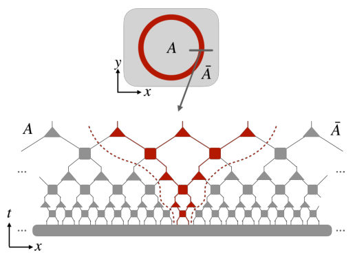
<figcaption class="paper-figure-caption"><b>Fig 1.</b> FIG. 1. Bounded causal tube in a real-space RG. The upper schematic shows a fixed-width collar (red) around the bound- ary of A in two dimensions. The lower schematic shows a one- dimensional cut through the A| ¯A interface in a binary (b = 2) MERA-like architecture. Since every horizontal cut intersects only O(1) red bonds, the tube has uniformly bounded trans- verse width.</figcaption>
</figure>
<figure class="paper-figure-card">
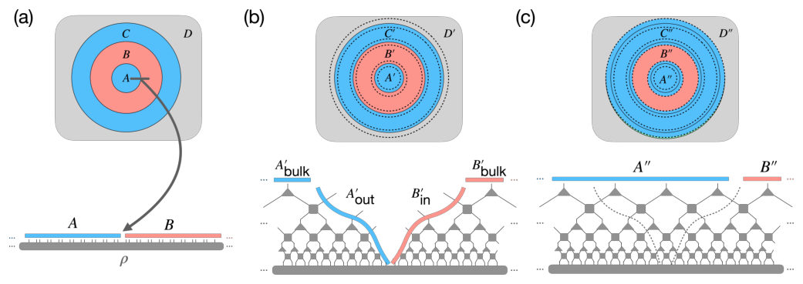
<figcaption class="paper-figure-caption"><b>Fig 2.</b> FIG. 2. The three steps of the proof of UV-finite CMI. (a) The annular tripartition A|B|C, with D the complement. The lower schematic shows a one-dimensional cut through the A|B interface. (b) Step 1: applying the RG gates outside the interface coarse-grains the bulk and leaves the interface degrees of freedom untouched, without changing the CMI. The dashed curves show the boundaries of the tubes. (c) Steps 2 and 3: once the two sides of each interface are grouped together, the remaining interface gates can be applied, and the relevant systems reduce to finite coarse regions A′′, B′′, C′′, with D′′ the remaining complement. The lower schematics in (b) and (c) show a representative A|B...</figcaption>
</figure>
<figure class="paper-figure-card">
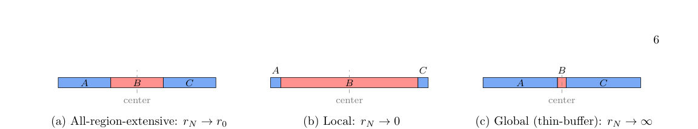
<figcaption class="paper-figure-caption"><b>Fig 3.</b> FIG. 3. Three tripartitions distinguished by the asymptotic ratio rN = NA/NB, with NA = NC. The microscopic regions in (b) and (c) are drawn wider than their asymptotic relative sizes for visibility.</figcaption>
</figure>
<figure class="paper-figure-card">
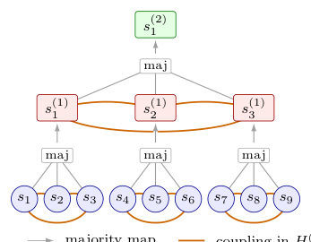
<figcaption class="paper-figure-caption"><b>Fig 4.</b> FIG. 4. First two steps of the majority hierarchy. Gray branches feed each three-spin block through a majority gate to its coarse(majority) spin. Orange arcs show the three pairwise couplings within every level-p block, with strength Jp = 3−p/ν.</figcaption>
</figure>
<figure class="paper-figure-card">
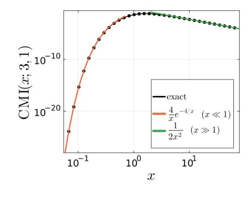
<figcaption class="paper-figure-caption"><b>Fig 5.</b> FIG. 5. The CMI of the majority-rule hierarchical model in the all-region-extensive geometry, i.e., CMI(T; N, N/3) = CMI(x; 3, 1), where x = TN 1/ν B .</figcaption>
</figure>

**Summary.** This paper rigorously connects the Renormalization Group framework to the Conditional Mutual Information (CMI) to diagnose the structure of mixed quantum states. It proves that CMI remains bounded (UV-finite) under specific conditions of local reversibility in the RG flow. By applying this to hierarchical models, the authors derive scaling laws for correlations, providing deep insights into how quantum correlations behave across different length scales.

**Why it may be interesting.** The connection between information geometry (CMI) and RG flow is crucial for understanding how correlations decay or persist across different length scales in complex quantum systems, which is relevant for understanding critical phenomena and entanglement structure in many-body physics.

Detailed structure

**Main problem.** The paper investigates the fundamental relationship between the Renormalization Group (RG) flow and the Conditional Mutual Information (CMI) in characterizing mixed quantum states.

**Main result.** It establishes that the CMI between nonadjacent regions is Ultraviolet (UV)-finite if the quantum state admits a locally reversible RG with a fixed, finite local Hilbert space dimension.

**Method.** The authors use theoretical techniques involving RG coarse-graining maps, Strong Subadditivity (SSA), and analyzing specific hierarchical lattice structures to derive bounds on information-theoretic quantities.

**Model / system.** The study applies to general mixed quantum states, analyzing specific hierarchical models such as variants of the Ising model on lattices and tree structures.

**Key observables.** Conditional Mutual Information (CMI), Mutual Information (MI), Relative Entropy, and correlation functions ($\langle ac 
angle_x$).

**Important parameters / regimes.** Temperature ($T$), noise strength ($p$), system size ($N$), and the RG scale parameter ($r$ or $k$).

**Assumptions / limitations.** The analysis relies on the existence of an 'ideal' RG scheme that is locally reversible and maintains a fixed local Hilbert space dimension.

**Figures summary.** Figures illustrate the steps of the proof for UV-finite CMI using annular tripartitions and show the flow diagrams for RG in various tree models (SSB, SWSSB).

**Paper structure.** The paper is structured around establishing the general RG/CMI relationship, followed by detailed applications to specific hierarchical models (e.g., Ising models and tree structures) to derive scaling laws.

Abstract

A departure of a mixed quantum state from a local Gibbs description is generally invisible to local observables but can be detected by the conditional mutual information (CMI). Here we study the relationship between the renormalization group (RG) and CMI, and in particular, how RG constrains CMI. We first show that the CMI between nonadjacent regions $A$ and $C$, conditioned on the buffer region $B$, is UV-finite whenever the state admits a locally reversible RG with a fixed on-site Hilbert space dimension. We then study two hierarchical models that have long-range CMI and yet admit a simple RG description. The first model has a divergent Markov length at every temperature $0<T<\infty$ but nevertheless flows to an infinite-temperature product state under RG. The second model satisfies the local Markov condition while violating the global one and is stable against weak noise. At the critical noise strength, the two-point CMI decays only polynomially as a function of the system size, while the two-point mutual information vanishes.

[↑ back to top](#top)

### [Tuning Boron-Vacancy Qubit Coherence through Layer Number in hBN](http://arxiv.org/abs/2609.01812v1)

**Authors:** Juan M. Florez, Eric Suárez Morell  
**Type:** theory · **Category:** quantum information and computing · **PDF:** <https://arxiv.org/pdf/2609.01812v1>  
**Analysis basis:** full PDF text, analyzed in chunks
**Topic relevance:** `methods for driven-dissipative` **1/5**

↔ Scroll figures horizontally

<figure class="paper-figure-card">
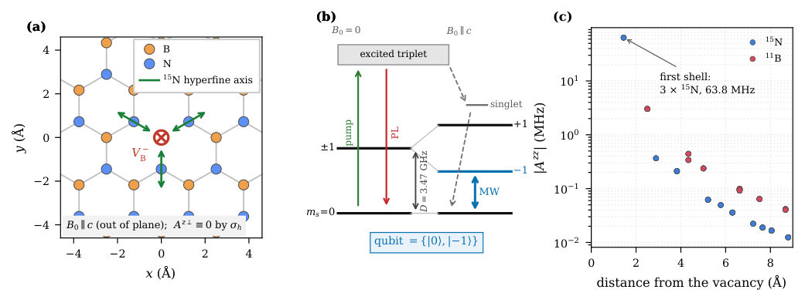
<figcaption class="paper-figure-caption"><b>Fig 1.</b> FIG. 1. The defect. (a) A boron vacancy in a hBN layer; every lattice site carries a nuclear spin, so the bath cannot be emptied by isotopic dilution. Green arrows mark the principal hyperfine axis of the three first-shell nitrogens, which lies in the plane along the dangling bond rather than along c [18], so that the component entering Azz is A⊥and not A∥(Sec. II D). (b) The qubit levels: the S = 1 ground state split by D at zero field and Zeeman-split by B0, the |0⟩↔|−1⟩pair being the qubit. Schematic, not to scale. (c) Secular hyperfine couplings by shell for the simulated bath, h11B15N. Azz, the shift in a nucleus’s precession frequency when the qubit changes state, is defined in Sec....</figcaption>
</figure>
<figure class="paper-figure-card">
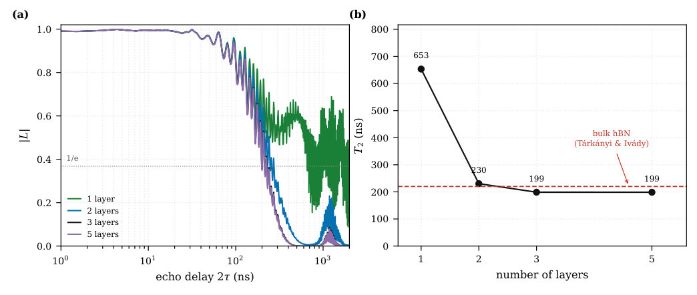
<figcaption class="paper-figure-caption"><b>Fig 2.</b> FIG. 2. Coherence versus layer number in h11B15N at B0 = 10 mT. (a) The Hahn echo. The modulation at the first-shell hyperfine frequency is visible throughout and is why T2 must be extracted on a resolved time grid (Sec. III D). (b) The resulting T2: the bulk limit is reached by three layers, and agrees with the published bulk value [11], computed independently.</figcaption>
</figure>
<figure class="paper-figure-card">
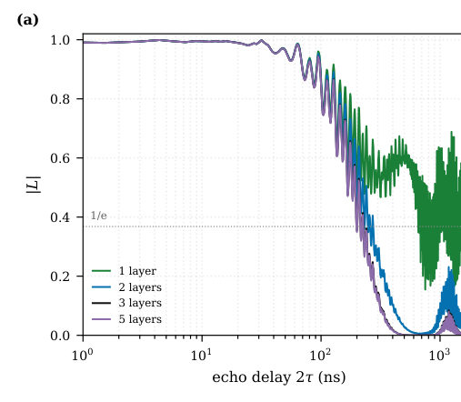
<figcaption class="paper-figure-caption"><b>Fig 3.</b> Figure 5 follows the three configurations from 1 to 1000 mT, all at second order. The factor of 3.3 holds from 2 to about 25 mT (3.37, 3.29, 3.29, 3.29 and 3.28 at 2, 5, 8, 10 and 25 mT, respectively), and then closes: by 85 mT the three give 162.6, 145.1 and 144.2 ns, a residual contrast of 1.13 against the 3.29 at the working point. At 124 mT the ground-state level anticrossing [25–27], where |0⟩and |−1⟩become degenerate, collapses all three identically to 3.4 ns, as it must, since that is</figcaption>
</figure>
<figure class="paper-figure-card">
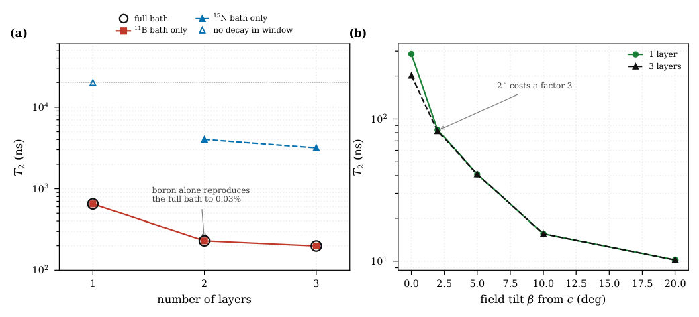
<figcaption class="paper-figure-caption"><b>Fig 4.</b> FIG. 3. (a) Which sublattice carries the noise, at B0 = 10 mT. Removing the nitrogen bath changes nothing; removing the boron bath changes everything. The layer-number effect is a boron effect. (b) Fragility against field misalignment, here at B0 = 50 mT. Tilting B0 by β from the c axis switches on the transverse hyperfine coupling of the three first-shell nitrogens, forbidden at β = 0; since those nitrogens are present in every configuration, the loss is independent of layer number. The tolerance is itself field dependent: comparison with Fig. 4, the same sweep at the 10 mT working point, gives the 1/B0 scaling of Sec. IV C.</figcaption>
</figure>
<figure class="paper-figure-card">
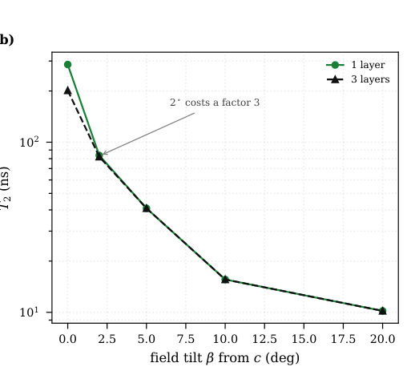
<figcaption class="paper-figure-caption"><b>Fig 5.</b> Figure 4 sweeps the tilt β at the working point, B0 = 10 mT, second order, R = 8 ˚A. Nothing happens up to 2◦: the monolayer goes from 653.3 to 652.4 ns, the trilayer from 198.8 to 198.0 ns, and the layer contrast holds at 3.29. Between 2 and 3◦it falls abruptly, to 263.4 against 197.2 ns, i.e., a contrast of 1.34, and by 7◦the two thicknesses are indistinguishable. The loss factors relative to β = 0 are 1.0 at 2◦, 2.5 at 3◦and 6.2 at 10◦. The reason the tolerance is this generous, and the rea- son a 50 mT sweep misleads, is that the nuclei follow the electron, not the applied field. With D ≫γeB0 the electron eigenaxis tilts by only θe ≈γeB0 sin β/D, so the transverse hyperfine switched on...</figcaption>
</figure>

**Summary.** This theoretical study models the coherence of a boron-vacancy spin qubit in hBN, showing that the coherence time is highly sensitive to the number of surrounding layers. By using advanced correlation expansion techniques, the authors demonstrate a significant enhancement in $T_2$ when moving from bulk to monolayer hBN, establishing layer number as a key design knob for quantum information devices.

**Why it may be interesting.** This work provides a quantitative, predictive method for engineering quantum coherence in solid-state defects by manipulating the host material's structure, which is highly relevant for building scalable quantum processors.

Detailed structure

**Main problem.** To determine how the coherence time ($T_2$) of the negatively charged boron vacancy ($	ext{V}^{-	ext{B}}$) spin qubit in hexagonal boron nitride ($	ext{hBN}$) can be tuned by controlling the number of surrounding layers.

**Main result.** The coherence time increases significantly from the bulk limit (199 ns) to a monolayer (653 ns), demonstrating that layer number is a crucial design parameter for enhancing qubit coherence.

**Method.** The study employs a generalized cluster-correlation expansion with an extended central-spin block to calculate the Hahn-echo coherence time ($T_2$).

**Model / system.** The system is the $	ext{V}^{-	ext{B}}$ spin qubit embedded in $	ext{hBN}$. The qubit is treated as a two-level system within an $S=1$ triplet ground state, and decoherence is modeled via the fluctuating magnetic field from the nuclear spin bath.

**Key observables.** Hahn-echo coherence time ($T_2$), layer contrast, and the coherence function $L(t)$.

**Important parameters / regimes.** Layer number (monolayer, bilayer, etc.), external magnetic field ($B_0$), and the degree of alignment (twist angle).

**Assumptions / limitations.** The calculation focuses solely on nuclear-spin-induced decoherence, neglecting other sources like spin-lattice relaxation or paramagnetic defects.

**Figures summary.** Figures illustrate the defect structure, the qubit energy levels, and the secular hyperfine couplings from the surrounding nuclear spins, which dominate the decoherence mechanism.

**Paper structure.** The paper develops the theoretical framework by defining the full spin Hamiltonian, applying the extended central-spin cluster-correlation expansion to calculate the coherence function $L(t)$, and then analyzing the resulting $T_2$ as a function of the surrounding layer thickness.

Abstract

The negatively charged boron vacancy ($\VB$) in hexagonal boron nitride (\hBN{}) was the first optically addressable spin qubit identified inside a van der Waals crystal, allowing atomically defined placement relative to a target. Its coherence in bulk \hBN{} is limited by the boron nuclei of the layers flanking the defect plane, which a thin flake removes. Here, we use a generalized cluster-correlation expansion with an extended central-spin block to calculate the Hahn-echo coherence time of $\VB$ in h$^{11}$B$^{15}$N as a function of layer number. Our results show that $T_2$ rises from $199\ns$ in the bulk limit to $653\ns$ in a monolayer, a factor of $3.3$ that is already saturated at three layers and that a sublattice decomposition attributes entirely to boron. The enhancement is confined to low field, is insensitive to stacking registry and twist angle, and requires alignment to within about two degrees, an onset we reproduce with no free parameters. Under dynamical decoupling, a $1/e$ threshold returns $206\ns$ for every thickness, but this is a zero of the first-shell modulation rather than a decay: measured without a threshold, the layer contrast survives and reaches a factor of $170$. Layer number thus emerges as a design parameter for $\VB$-based sensing.

[↑ back to top](#top)

### [Unfolded Krylov complexity: universal chaotic dynamics without false positives](http://arxiv.org/abs/2609.02228v1)

**Authors:** Johanna Erdmenger, Kyoung-Bum Huh, Hyun-Sik Jeong, Juan F. Pedraza  
**Type:** theory · **Category:** other · **PDF:** <https://arxiv.org/pdf/2609.02228v1>  
**Analysis basis:** full PDF text, analyzed in chunks
**Topic relevance:** `analog quantum simulation` **1/5**

↔ Scroll figures horizontally

<figure class="paper-figure-card">
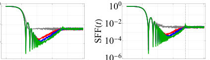
<figcaption class="paper-figure-caption"><b>Fig 1.</b> Figure 1. Spread complexity and SFF for RMT spectra. The top and bottom panels show the spread complexity and SFF, respectively, with the left and right columns corresponding to the raw and unfolded spectra. The curves represent the GOE (red), GUE (blue), GSE (green), and Poisson (gray) ensembles. The vertical dashed lines indicate the Heisenberg time tH = 2π. Unfolding preserves the Dyson-class hierarchy and the distinction between RMT and Poisson statistics while placing their late-time dynamics on a common scale.</figcaption>
</figure>
<figure class="paper-figure-card">
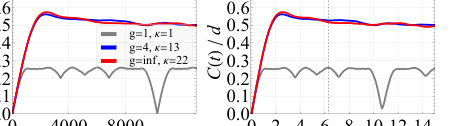
<figcaption class="paper-figure-caption"><b>Fig 2.</b> Figure 2. Spread complexity in representative quantum bil- liards. The left and right columns show the raw and unfolded dynamics, respectively, for the stadium and circular billiards (top) and triangular billiards (bottom). In each case, un- folding preserves the distinction between chaotic (or pseudo- integrable) and integrable behavior while placing the satura- tion timescale on a common spectral scale.</figcaption>
</figure>
<figure class="paper-figure-card">
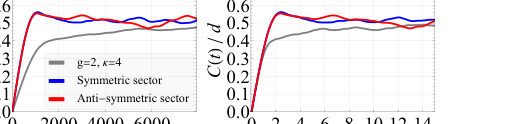
<figcaption class="paper-figure-caption"><b>Fig 3.</b> Figure 3. Level-spacing statistics and spread complexity for the κ = 4 isosceles triangular billiard in Table I. The left and right columns show the raw and unfolded data, respec- tively, for the unresolved level-spacing distribution (top), the symmetry-resolved level-spacing distributions (middle), and spread complexity (bottom). Blue and red curves represent the symmetric and antisymmetric sectors, respectively, while gray curves correspond to the unresolved spectrum. In the level-spacing panels, solid and dashed black curves denote the GOE and Poisson distributions, respectively.</figcaption>
</figure>
<figure class="paper-figure-card">
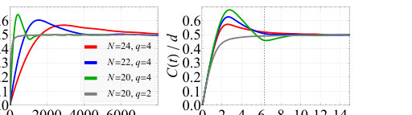
<figcaption class="paper-figure-caption"><b>Fig 4.</b> Figure 4. Spread complexity in other representative physical systems. The left and right columns show the raw and un- folded dynamics, respectively, for the XXZ spin chain (top), and the SYK model (bottom). In each case, unfolding pre- serves the distinction between chaotic and integrable behavior while normalizing the saturation timescale.</figcaption>
</figure>
<figure class="paper-figure-card">
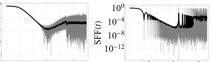
<figcaption class="paper-figure-caption"><b>Fig 5.</b> Figure 5. Spectral form factor for the logarithmic toy spec- trum. The left panel shows the raw spectrum, which exhibits a spurious ramp, while the right panel shows the unfolded re- sult, where this feature disappears. The black curve denotes a moving average used to reduce numerical fluctuations. This shows that the ramp originates from the non-uniform density of states rather than from RMT-type spectral correlations.</figcaption>
</figure>

**Summary.** This paper introduces 'unfolded Krylov complexity' as a superior diagnostic tool for quantum chaos. By mathematically unfolding the energy spectrum, the authors successfully remove non-universal, smooth spectral contributions that cause false positives in integrable systems. This allows researchers to reliably probe the genuine, universal signatures of many-body quantum scrambling.

**Why it may be interesting.** This work provides a mathematically rigorous tool to filter out model-dependent spectral artifacts, offering a cleaner diagnostic for identifying true quantum chaos in complex many-body systems, which is relevant for understanding thermalization and scrambling in quantum matter.

Detailed structure

**Main problem.** The central challenge is distinguishing genuine many-body quantum scrambling (chaos) from spurious signals arising from kinematic effects or integrable systems when using complexity diagnostics.

**Main result.** Unfolding the spectrum prior to calculating Krylov complexity successfully suppresses false-positive peaks in integrable systems while preserving the universal spectral signatures characteristic of genuinely chaotic quantum dynamics.

**Method.** The authors propose and implement 'spectral unfolding,' which separates the smooth, non-universal density of states from the microscopic spectral correlations, allowing for the construction of 'unfolded Krylov complexity.'

**Model / system.** The analysis is applied to various quantum systems, including Random Matrix Theory (RMT) ensembles (GOE, GUE, GSE), quantum billiards (stadium, circular), and the logarithmic model, using the Lanczos iteration framework.

**Key observables.** Krylov state complexity (spread complexity), Spectral Form Factor (SFF), and the unfolded spectrum $\xi_i$.

**Important parameters / regimes.** The analysis focuses on the infinite-temperature limit ($eta=0$) and the distinction between the smooth density $ar{
ho}(E)$ and the fluctuating part $\delta
ho(E)$.

**Assumptions / limitations.** The primary assumption is that the smooth component of the density of states can be accurately estimated and removed via unfolding.

**Figures summary.** Figures compare the raw vs. unfolded complexity/SFF for RMT spectra and quantum billiards, demonstrating the removal of spurious peaks in non-chaotic cases.

**Paper structure.** The paper systematically reviews the theory of unfolding and complexity, applies it to RMT and quantum billiards, develops the polynomial framework using the Lanczos iteration, and concludes with specific applications like the logarithmic model.

Abstract

A central challenge in diagnosing quantum chaos is to distinguish genuine many-body scrambling from kinematic effects of the spectrum. Krylov state complexity, or spread complexity, has emerged as a powerful diagnostic, with its characteristic growth, peak, and relaxation often taken as signatures of chaos. However, previous work has shown that this criterion can give false positives: saddle-dominated integrable systems may display prominent peaks even without random-matrix level correlations. We argue, based on complementary numerical and analytical evidence, that this ambiguity can be resolved by unfolding the spectrum prior to constructing the ensuing Krylov dynamics. By removing the non-universal smooth density of states while retaining microscopic spectral correlations, unfolding suppresses spurious peaks in integrable systems while preserving the universal spectral signatures of chaotic systems. Analytically, the formulation of the Lanczos iteration in terms of orthogonal polynomials yields an exact complexity kernel with a robust near-diagonal structure whose fine-grained features reflect the underlying spectral correlations. Moreover, for the logarithmic model, unfolding can be performed exactly, mapping the spectrum to a uniform lattice and yielding an analytic spread complexity that removes the false-positive peak. These findings establish unfolded Krylov complexity as a more reliable probe of genuine many-body scrambling.

[↑ back to top](#top)

### [Variational preparation of thermofield double states for SYK models via multi-angle QAOA: sequential angle pruning for circuit reduction](http://arxiv.org/abs/2609.02793v1)

**Authors:** Haji Muhammad Husnain Ashfaq, Moongul Byun, Keun-Young Kim  
**Type:** theory · **Category:** quantum information and computing · **PDF:** <https://arxiv.org/pdf/2609.02793v1>  
**Analysis basis:** full PDF text, analyzed in chunks
**Topic relevance:** `analog quantum simulation` **1/5**

↔ Scroll figures horizontally

<figure class="paper-figure-card">
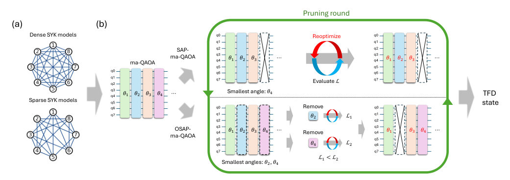
<figcaption class="paper-figure-caption"><b>Fig 1.</b> FIG. 1. Schematic overview of the SYK models and the circuit-pruning procedures in ma-QAOA. (a) Connectivity structures of the dense and sparse SYK models. (b) In SAP-ma-QAOA, the nonlocal Pauli-string evolution with the smallest angle magnitude (dashed) is removed and the remaining parameters are classically reoptimized. In OSAP-ma-QAOA, several evolutions with small angle magnitudes (dashed) are considered as removal candidates, and the candidate yielding the lowest post-reoptimization cost is selected; in the example shown, L1 &lt; L2. The colored gates represent different Pauli-string evolutions. The red and blue arrows indicate classical and quantum computations, respectively, and the...</figcaption>
</figure>
<figure class="paper-figure-card">
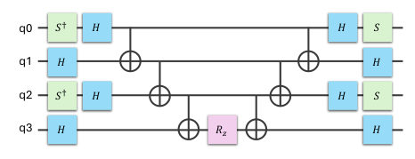
<figcaption class="paper-figure-caption"><b>Fig 2.</b> FIG. 2. Circuit realization of a single cost evolution for the cost term ψ1 Lψ2 Lψ3 Lψ4 L. The identity operators act on the other four qubits for N = 8 SYK models.</figcaption>
</figure>
<figure class="paper-figure-card">
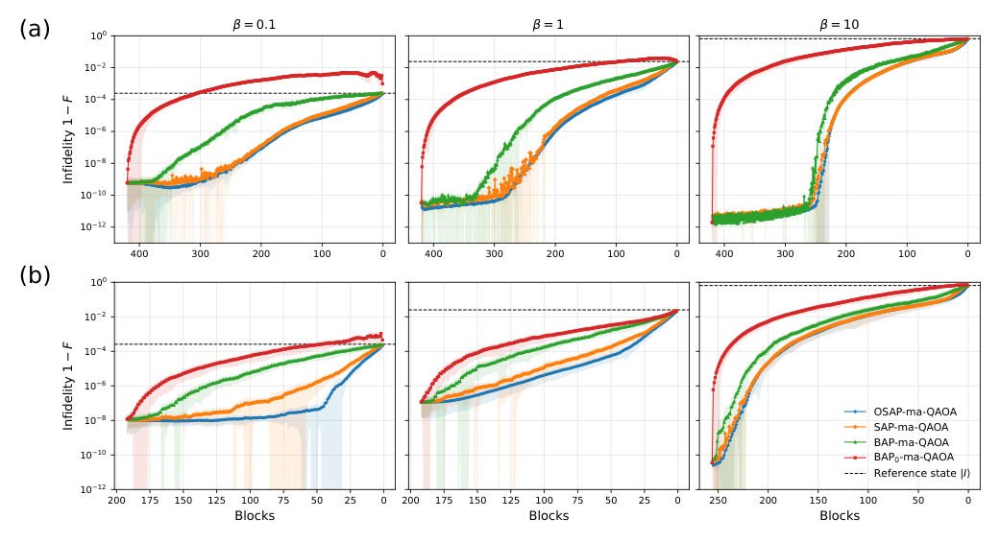
<figcaption class="paper-figure-caption"><b>Fig 3.</b> FIG. 3. Infidelity trajectories of the four pruning algorithms for the Gaussian N = 8 SYK models at β = 0.1, 1, and 10: (a) dense SYK and (b) sparse SYK with K = 32. The curves and shaded regions show EJ[1 −F] and σJ[1 −F], respectively, averaged over 20 disorder realizations. The black dashed lines indicate the disorder-averaged reference infidelity between the exact TFD state and the maximally entangled state |I⟩.</figcaption>
</figure>
<figure class="paper-figure-card">
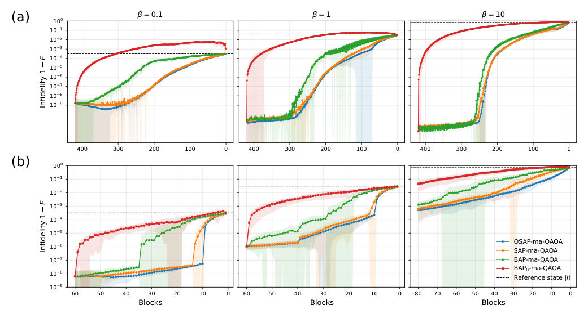
<figcaption class="paper-figure-caption"><b>Fig 4.</b> FIG. 4. Infidelity trajectories of the four pruning algorithms for the binary N = 8 SYK models at β = 0.1, 1, and 10: (a) dense SYK and (b) sparse SYK with K = 10. The curves and shaded regions show EJ[1 −F] and σJ[1 −F], respectively, averaged over 20 disorder realizations. The black dashed lines indicate the disorder-averaged reference infidelity between the exact TFD state and the maximally entangled state |I⟩.</figcaption>
</figure>
<figure class="paper-figure-card">
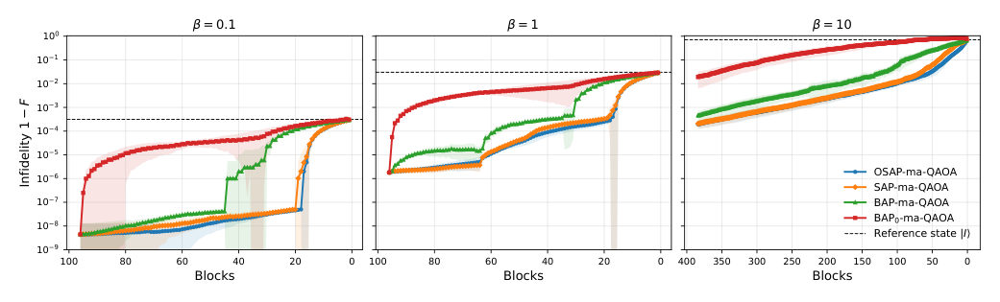
<figcaption class="paper-figure-caption"><b>Fig 5.</b> FIG. 5. Infidelity trajectories of the four pruning algorithms for the binary sparse N = 10 SYK model with K = 16 at β = 0.1, 1, and 10. The curves and shaded regions show EJ[1 −F] and σJ[1 −F], respectively, averaged over 20 disorder realizations. The black dashed lines indicate the disorder-averaged reference infidelity between the exact TFD state and the maximally entangled state |I⟩.</figcaption>
</figure>

**Summary.** This paper tackles the challenge of preparing complex Thermofield Double states for SYK models using deep quantum circuits. The authors introduce and test sequential angle-pruning algorithms applied to the multi-angle QAOA ansatz. These methods significantly reduce circuit depth while maintaining high fidelity, demonstrating a practical pathway toward implementing quantum simulations on near-term noisy quantum hardware.

**Why it may be interesting.** This work directly addresses the resource limitations of quantum computation by developing systematic, data-driven methods to compress variational quantum circuits used for simulating complex many-body physics models like SYK.

Detailed structure

**Main problem.** The primary challenge is preparing Thermofield Double (TFD) states using quantum circuits that are deep and resource-intensive, necessitating effective circuit reduction while maintaining high fidelity.

**Main result.** The proposed sequential angle-pruning algorithms (SAP/OSAP) successfully reduce the circuit depth by removing a large fraction of Pauli-string evolutions (up to 92.1%) while retaining an average fidelity near 95% for SYK models.

**Method.** The study employs the multi-angle QAOA (ma-QAOA) ansatz to approximate the TFD state, followed by two top-down sequential angle-pruning techniques that iteratively remove the least significant Pauli-string evolutions and reoptimize the remaining parameters.

**Model / system.** The work is applied to Sachdev-Ye-Kitaev (SYK) models, tested in both Gaussian and binary forms, across dense and sparse connectivity regimes. The TFD state is the target state, relevant for simulating quantum phenomena in holographic duality.

**Key observables.** Fidelity of the prepared TFD state, circuit depth (number of gates/blocks), and the percentage of removed nonlocal Pauli-string evolutions.

**Important parameters / regimes.** Inverse temperature ($eta$), number of qubits ($N$), and the pruning strength/candidate pool size ($S, N_C$).

**Assumptions / limitations.** The core assumption is that removing Pauli-string evolutions with small optimized angles does not significantly degrade the fidelity of the target TFD state, provided reoptimization is performed.

**Figures summary.** Figure 1 schematically illustrates the SYK models and the pruning procedures (SAP-ma-QAOA and OSAP-ma-QAOA). Other figures track infidelity trajectories as a function of pruning strength or candidate pool size.

**Paper structure.** The paper establishes the need for circuit reduction in TFD state preparation, introduces ma-QAOA, and then details the two sequential angle-pruning algorithms (SAP and OSAP). The methods are validated by applying them to various SYK models, comparing fidelity retention against circuit depth reduction.

Abstract

Variational preparation of thermofield double (TFD) states can require deep quantum circuits, particularly for interacting many-body systems. Reducing these circuits while retaining high fidelity is therefore crucial for TFD-state preparation on noisy quantum processors. We study this problem by applying the multi-angle quantum approximate optimization algorithm (ma-QAOA) to TFD-state preparation and introducing two top-down sequential angle-pruning algorithms. Starting from the optimized initial ma-QAOA circuit, both algorithms sequentially remove Pauli-string evolutions with small optimized angles and reoptimize the remaining parameters after each removal. We apply these algorithms to Gaussian and binary Sachdev--Ye--Kitaev (SYK) models in both dense and sparse cases. We find that ma-QAOA prepares the target TFD states with high fidelity and that sequential small-angle pruning retains high fidelity while reducing the circuit depth, particularly at low temperature. Moreover, using the post-reoptimization cost in sequential small-angle pruning further improves the fidelity. For the binary sparse $N=10$ SYK model at $β=10$, $88.8\%$--$92.1\%$ of the nonlocal Pauli-string evolutions are removed while retaining an average fidelity of approximately $95\%$. Finally, we propose extensions of the sequential pruning algorithms toward quantum--classical hybrid implementation.

[↑ back to top](#top)

## Other papers (13)

*Papers from primary archives without highlighted authors or any topic match. Click to expand.*

Show other papers

### [A proposal for a hybrid free-space optical quantum communication network with hexagonal boron nitride-based single photon sources](http://arxiv.org/abs/2609.02229v1)

**Authors:** Julien Chénedé, Mostafa Abasifard, Tjorben Matthes, Aslı Çakan, Tobias Vogl  
**Type:** theory · **Category:** quantum information and computing · **PDF:** <https://arxiv.org/pdf/2609.02229v1>  
**Analysis basis:** full PDF text, analyzed in chunks

↔ Scroll figures horizontally

<figure class="paper-figure-card">
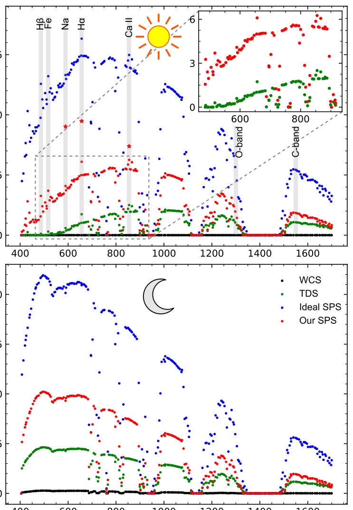
<figcaption class="paper-figure-caption"><b>Fig 1.</b> Fig. 1. The extractable secret bit per signal is shown for a single satellite (zenith) pass at an altitude of 500 km, evaluated for (a) daylight and (b) nighttime conditions. In daylight, several Fraunhofer lines, which are indicated by the labels of their corresponding elements, exhibit noticeably improved performance due to reduced background light. The ‘*’ symbols indicate the key rates achievable when using specialized Fraunhofer filters (commercially available for selected lines) that are commonly employed in solar astronomy. At night, where background noise is negligible, no particular wavelength offers a unique advantage; nonetheless, visible wavelengths generally outperform those in...</figcaption>
</figure>

**Summary.** This paper proposes a blueprint for a hybrid quantum internet by integrating satellite-based free-space quantum communication with terrestrial optical fiber networks. It leverages single-photon sources from hexagonal boron nitride (hBN) emitters operating at 854 nm, a wavelength chosen to maintain high performance during daylight hours while ensuring compatibility with existing fiber infrastructure.

**Why it may be interesting.** This work directly addresses the engineering challenges of scaling quantum networks by proposing a concrete, multi-link architecture and identifying a practical operating wavelength that maximizes compatibility between different physical media (vacuum, air, fiber).

Detailed structure

**Main problem.** Developing a practical, hybrid free-space optical (FSO) quantum communication network capable of connecting satellites to ground stations and bridging the 'last mile' to end-users.

**Main result.** The paper proposes using hexagonal boron nitride (hBN) emitters operating near the Ca-II Fraunhofer line (854 nm) to achieve a balance between daylight FSO performance and compatibility with existing optical fiber infrastructure.

**Method.** The authors developed a conceptual framework combining continuous network operation, hybrid links (space-to-ground-to-fiber), and performance modeling using realistic single-photon sources.

**Model / system.** The system involves a quantum network architecture utilizing hBN-based single-photon sources for quantum key distribution (QKD) over free-space links (satellite to ground) and terrestrial fiber links.

**Key observables.** Secret key rate (in units of secret bit per signal), and the comparison of key rates across different wavelengths (e.g., H$\alpha$ vs. Ca-II).

**Important parameters / regimes.** Wavelengths (854 nm, 656 nm), link types (FSO, Fiber), and source characteristics (realistic SPS from hBN).

**Assumptions / limitations.** The primary assumption is that operating near Fraunhofer lines allows single photons to be separated from strong solar background radiance, and that the 854 nm wavelength balances FSO and fiber compatibility.

**Figures summary.** Figure 1 compares the extractable secret bit per signal for a single satellite pass at 500 km altitude, showing performance differences between daylight and nighttime conditions across various wavelengths.

**Paper structure.** The paper introduces the challenge of hybrid quantum networking, analyzes the performance trade-offs between different wavelengths (H$\alpha$ vs. Ca-II) for daylight operation, and proposes the 854 nm wavelength as the optimal choice for bridging space-based and fiber-based quantum links.

Abstract

Hexagonal boron nitride (hBN) is known as a promising solid-state platform to host room temperature quantum emitters that produce high purity single photons. The bright and spectrally adaptable hBN emitters are space-compatible, making hBN well-suited for satellite-based free-space optical (FSO) quantum key distribution (QKD) at wavelengths where the atmospheric background is naturally suppressed. This paper presents a pathway to develop hBN emitters operating near the Ca-II Fraunhofer line (at 854 nm), enabling daylight FSO operation. Moreover, due to its compatibility with the first telecommunication window at 850 nm, it is possible to interface with optical fibers to bridge the `last mile' in a scenario where multiple end-users connect through a single optical ground station to a QKD satellite. We therefore introduce a concept that combines continuous operation of a quantum network, hybrid links to minimize deployment costs, and high data rates due to the use of realistic single photon sources. The realization would be an important milestone for the development of the quantum internet.

[↑ back to top](#top)

### [A quantum oracle separation between QMA(2) and QMA](http://arxiv.org/abs/2609.02865v1)

**Authors:** John Bostanci, Sabee Grewal, Jonas Haferkamp, Andrew Huang, Yeongwoo Hwang, Anand Natarajan, Chinmay Nirkhe  
**Type:** theory · **Category:** quantum information and computing · **PDF:** <https://arxiv.org/pdf/2609.02865v1>  
**Analysis basis:** full PDF text, analyzed in chunks

↔ Scroll figures horizontally

<figure class="paper-figure-card">
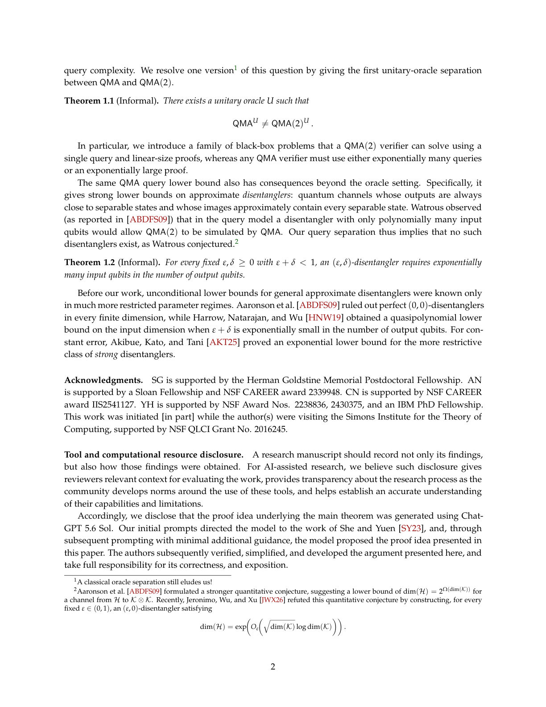
<figcaption class="paper-figure-caption"><b>Fig 1.</b> Low-resolution page preview, page 2</figcaption>
</figure>
<figure class="paper-figure-card">
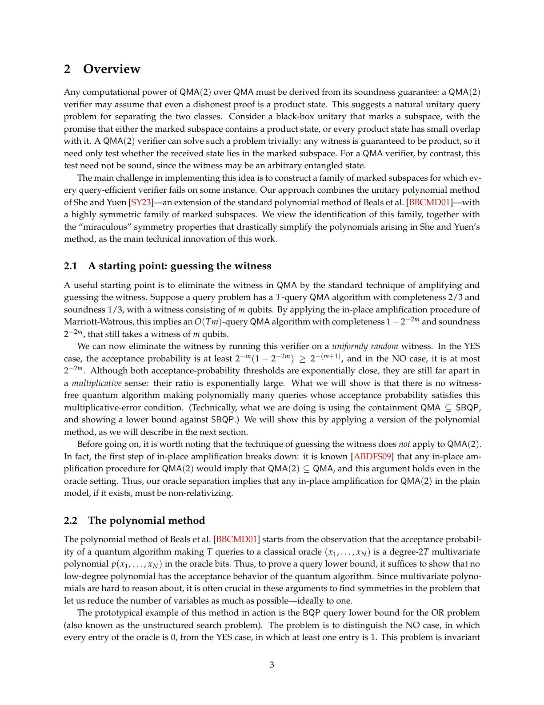
<figcaption class="paper-figure-caption"><b>Fig 2.</b> Low-resolution page preview, page 3</figcaption>
</figure>
<figure class="paper-figure-card">
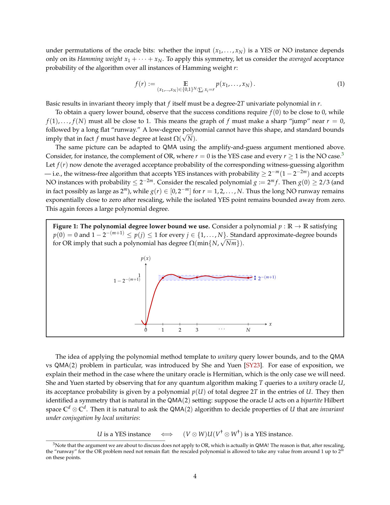
<figcaption class="paper-figure-caption"><b>Fig 3.</b> Low-resolution page preview, page 4</figcaption>
</figure>
<figure class="paper-figure-card">
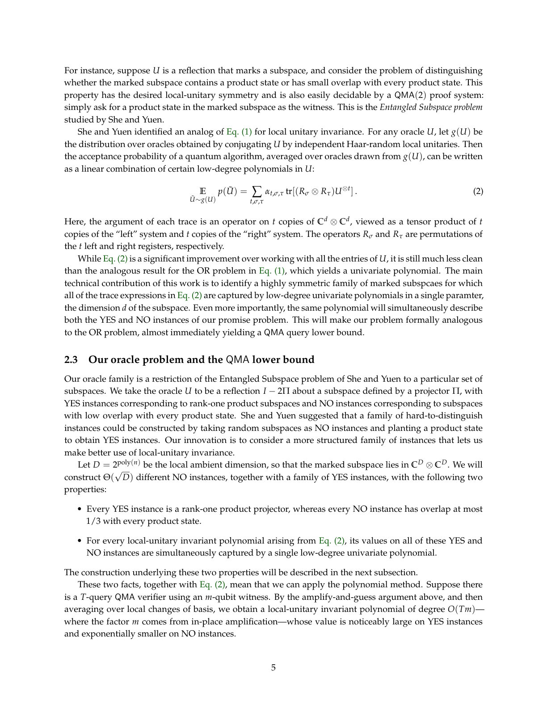
<figcaption class="paper-figure-caption"><b>Fig 4.</b> Low-resolution page preview, page 5</figcaption>
</figure>
<figure class="paper-figure-card">
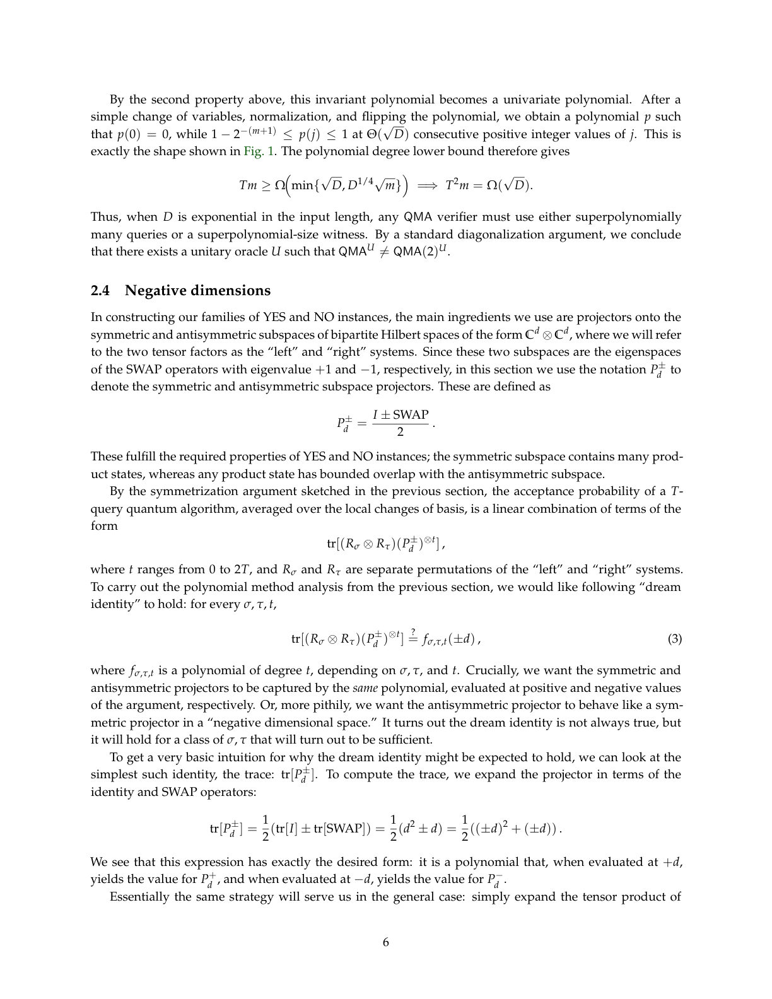
<figcaption class="paper-figure-caption"><b>Fig 5.</b> Low-resolution page preview, page 6</figcaption>
</figure>

**Summary.** This paper resolves a major open question in quantum complexity by proving a quantum oracle separation between QMA and QMA(2). By constructing a specific oracle, the authors demonstrate that the ability to use two unentangled proofs provides a computational advantage over standard QMA protocols. This separation also yields a strong, exponential lower bound on the resources required by quantum disentanglers.

**Why it may be interesting.** The techniques used—polynomial methods applied to quantum query complexity and the analysis of subspace projectors—are highly relevant to understanding the fundamental computational power of quantum protocols, which underpins quantum information theory.

Detailed structure

**Main problem.** The paper aims to determine if the quantum complexity class QMA(2) (verifiable with two unentangled quantum proofs) is strictly more powerful than QMA (standard quantum proofs).

**Main result.** They prove a quantum oracle separation, showing that there exists an oracle U such that QMA_U != QMA(2)_U, and consequently establish an exponential lower bound on the input size required by any disentangler for $\epsilon + \delta < 1$.

**Method.** The proof combines the unitarily invariant polynomial method (adapted from She and Yuen) with a novel construction utilizing symmetric and antisymmetric subspace projectors to derive the necessary lower bounds.

**Model / system.** The analysis is conducted within the framework of quantum query complexity, focusing on the separation between QMA and QMA(2) using a constructed unitary oracle U acting on bipartite Hilbert spaces.

**Key observables.** Acceptance probability, polynomial degree of the acceptance probability, and the required input size ($m$) for an $(\epsilon, \delta)$-disentangler.

**Important parameters / regimes.** The separation relies on the parameters $\epsilon$ and $\delta$ defining the disentangler approximation, and the ambient dimension $D$ related to the oracle structure.

**Assumptions / limitations.** The argument assumes the existence of polynomial bounds for running time, witness length, and oracle queries for the underlying QMA verifiers.

**Figures summary.** Figure 1 illustrates the polynomial degree lower bound shape, showing $p(0)=0$ and $p(j)$ bounded away from zero for consecutive $j$. Figure 2 is a tensor network diagram related to trace calculations.

**Paper structure.** The paper first establishes the separation QMA_U != QMA(2)_U using a constructed oracle U and the polynomial method. It then leverages this separation to derive the exponential lower bound for disentanglers, resolving the Watrous conjecture.

Abstract

We find a quantum oracle relative to which $\mathsf{QMA} \neq \mathsf{QMA}(2)$. As a consequence, we resolve the no-disentanglers conjecture of Watrous: for every $ε+δ<1$, any $(ε,δ)$-disentangler requires input size exponential in the number of output qubits. Our proof combines the unitarily invariant polynomial method of She and Yuen (ITCS '23) with a new construction based on the symmetric and antisymmetric subspace projectors, reducing the $\mathsf{QMA}$ lower bound to the approximate degree of $\mathrm{OR}$.

[↑ back to top](#top)

### [Combinatorial optimization of connected UAV communication bridges for emergency response](http://arxiv.org/abs/2609.02562v1)

**Authors:** Matteo Vandelli, Daniele Dragoni  
**Type:** theory · **Category:** quantum information and computing · **PDF:** <https://arxiv.org/pdf/2609.02562v1>  
**Analysis basis:** full PDF text, analyzed in chunks

↔ Scroll figures horizontally

<figure class="paper-figure-card">
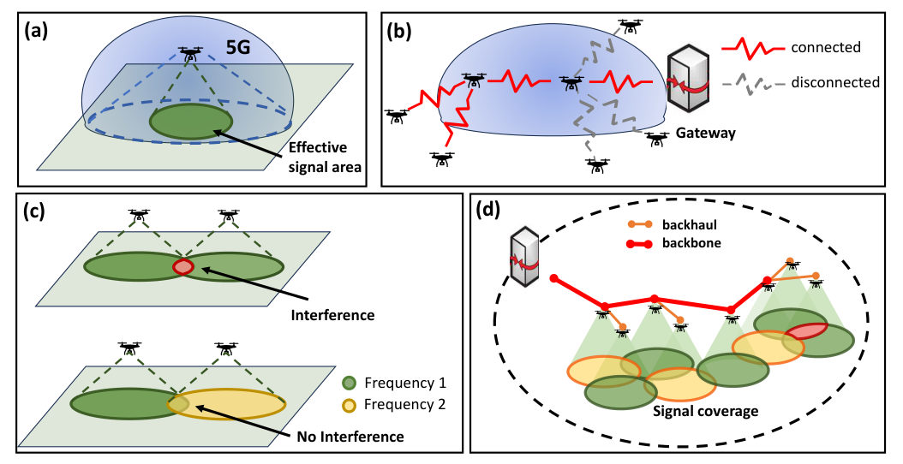
<figcaption class="paper-figure-caption"><b>Fig 1.</b> Fig. 1. Description of the connected ad-hoc network of UAVs modeled in this work. In panel (a), we show the basic building block of the network, a UAV equipped with a 5G antenna that provides coverage to the ground. The blue blob describes the full shape of the signal approximated as a sphere, while the green area shows the effective coverage provided by the UAV. Panel (b) shows the connectivity of the network. UAVs within the same blob can receive and transmit air-to-air signal to each other. Red wiggly pulses describe the backbone network, while orange ones indicate links that end there. Gray pulses indicate that it is not possible to establish a connection link between the two UAVs....</figcaption>
</figure>
<figure class="paper-figure-card">
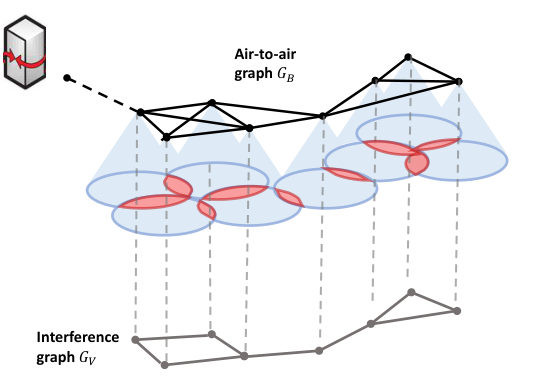
<figcaption class="paper-figure-caption"><b>Fig 2.</b> Fig. 2. Illustration of the two graphs involved in the c-BUP problem. The air-to-air graph GB is shown at the top, while the interference graph GV is shown at the bottom of the picture. A solution of this problem with V = N is shown as an example in Fig. 1 panel (d).</figcaption>
</figure>
<figure class="paper-figure-card">
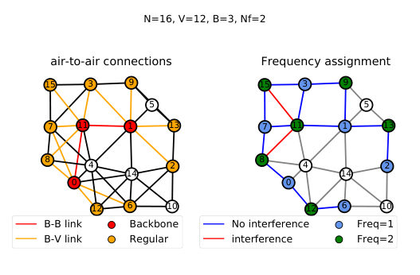
<figcaption class="paper-figure-caption"><b>Fig 3.</b> Fig. 5. Solution of the problem for the instance (16, 12, 3, 2). On the left, we represent the connectivity, while to the right we show the frequency assignment. In this case with F = 2, we notice two interference conflicts.</figcaption>
</figure>
<figure class="paper-figure-card">
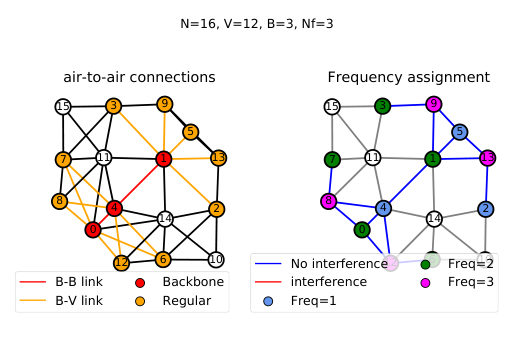
<figcaption class="paper-figure-caption"><b>Fig 4.</b> Fig. 6. Solution of the problem for the instance (16, 12, 3, 3). On the left, we represent the connectivity, while to the right we show the frequency assignment. In this case with F = 3, we notice that all the interference is avoided.</figcaption>
</figure>
<figure class="paper-figure-card">
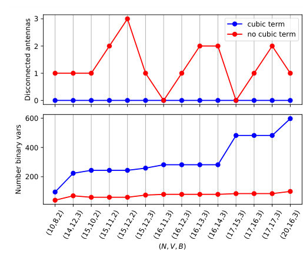
<figcaption class="paper-figure-caption"><b>Fig 5.</b> Fig. 4. Number of leaves disconnected from the backbone in the presence or absence of the cubic term for several configurations. This plot shows the importance of that term for the overall connectivity. All the configurations have been chosen in such a way that a fully connected solution is feasible, meaning that the number of connections is smaller than Cmax.</figcaption>
</figure>

**Summary.** This work tackles the critical optimization challenge of deploying UAVs for emergency communication networks by formulating it as a complex combinatorial problem. Due to the exponential scaling of classical solvers, the authors reformulate the problem into a QUBO suitable for quantum computation. The research demonstrates the potential of quantum algorithms to solve these time-sensitive, large-scale optimization problems in real-time disaster response scenarios.

**Why it may be interesting.** The direct mapping of a complex, real-world combinatorial optimization problem (UAV placement) onto a QUBO framework and testing it with quantum algorithms makes it highly relevant for quantum algorithm development in applied physics.

Detailed structure

**Main problem.** The paper addresses the combinatorial optimization problem of strategically deploying UAVs to establish connected communication bridges in disaster zones.

**Main result.** Classical solvers exhibit exponential time-to-solution scaling, necessitating the reformulation of the problem as a QUBO suitable for quantum algorithms like the Quantum Adiabatic Algorithm (QAA).

**Method.** The problem is formulated as an Integer Quadratic Program (IQP) and subsequently mapped to a QUBO, which is then analyzed using both classical solvers (CPLEX) and quantum emulation (QAA).

**Model / system.** The system involves UAVs in a flying ad-hoc network (FANET) needing to maximize signal coverage and maintain connectivity via a backbone structure while mitigating interference using multi-frequency assignments.

**Key observables.** Signal coverage, network connectivity (backbone/leaves), interference levels, and Time-to-Solution (TTS).

**Important parameters / regimes.** Number of candidate sites ($N$), number of available drones ($V$), number of backbone nodes ($B$), and number of frequencies ($F$).

**Assumptions / limitations.** The primary assumption is that quantum computing offers a scalable alternative to classical solvers for this time-critical optimization task; approximations are made regarding higher-order interference overlaps.

**Figures summary.** Figures illustrate the network components (coverage, connectivity, interference) and show performance metrics for QAA on small instances, demonstrating the feasibility of quantum approaches.

**Paper structure.** The paper introduces the c-BUP problem, formulates it as an IQP/QUBO, analyzes the classical computational bottlenecks (exponential TTS), and then proposes and tests the quantum adiabatic algorithm approach.

Abstract

We present a combinatorial optimization problem for the strategic deployment of UAVs equipped with 5G antennas to assist rescue operations in regions hit by natural disasters. Our goal is to optimize the placement of UAVs to provide coverage in flying ad-hoc networks among given candidate sites. Our formulation aims to maximize signal coverage and minimize interference while ensuring network connectivity. To mitigate interference effects, we incorporate the use of multiple frequencies. We formulate this problem as an integer quadratic program (IQP). We present numerical solutions obtained via the CPLEX solver and conduct a preliminary analysis of the problem's scalability in realistic network configurations. Our findings reveal a significant exponential increase in Time-to-Solution (TTS) as the number of sites grows, which poses a critical challenge in urgent, time-sensitive scenarios. To address this issue, approximate suboptimal solutions can be produced by enforcing a time limit on the solver. Although these solutions are not optimal, they preserve connectivity in most cases, providing a practical trade-off between solution quality and computational times that remain within feasible limits for real-time UAV redeployment. Recognizing the limitations of classical solvers in these contexts, we explore quantum computing as a promising alternative. Specifically, we reformulate the problem as a quadratic unconstrained binary optimization (QUBO) problem, suitable for most quantum algorithms. Through high-performance computing emulation, we show that the quantum adiabatic algorithm (QAA) can accurately solve small-scale instances, paving the way for future application of quantum computing to large-scale, time-critical optimization problems in disaster response.

[↑ back to top](#top)

### [Comments on the recent improvements of the MRRW bounds](http://arxiv.org/abs/2609.01860v1)

**Authors:** Alexander Barg  
**Type:** theory · **Category:** other · **PDF:** <https://arxiv.org/pdf/2609.01860v1>  
**Analysis basis:** full PDF text, analyzed in chunks

↔ Scroll figures horizontally

<figure class="paper-figure-card">
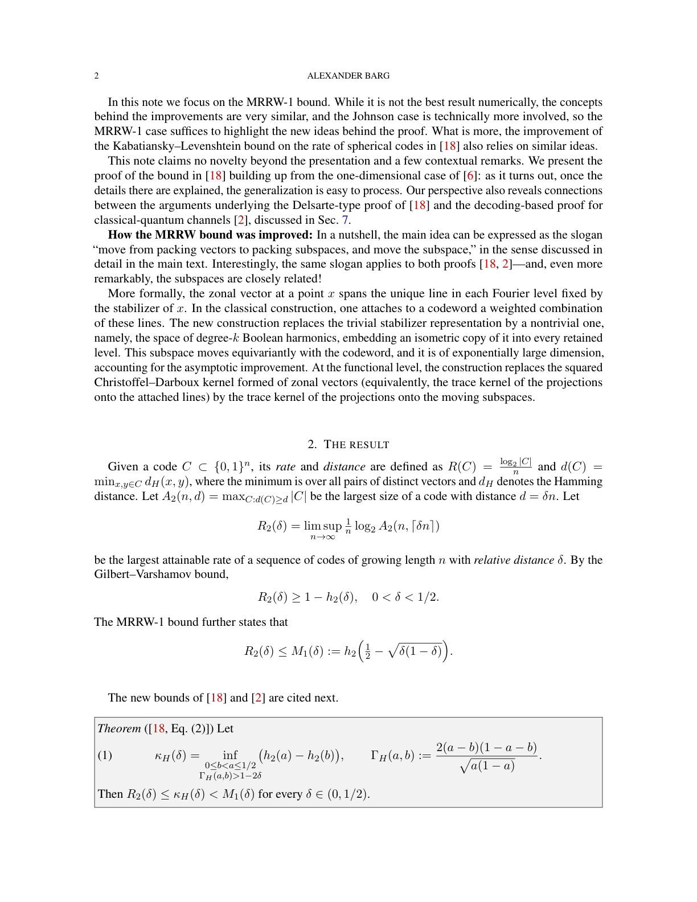
<figcaption class="paper-figure-caption"><b>Fig 1.</b> Low-resolution page preview, page 2</figcaption>
</figure>
<figure class="paper-figure-card">
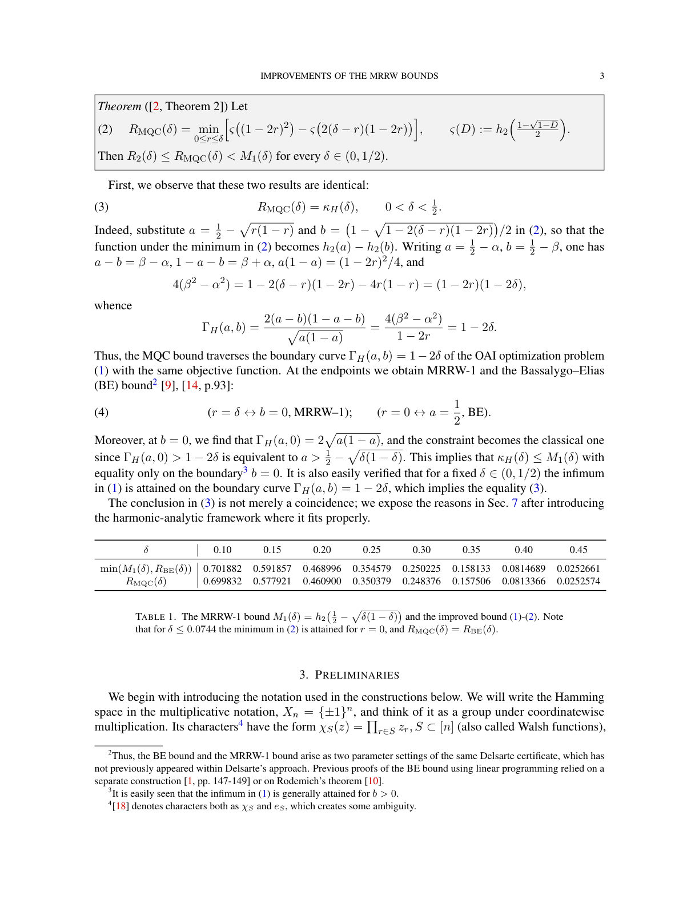
<figcaption class="paper-figure-caption"><b>Fig 2.</b> Low-resolution page preview, page 3</figcaption>
</figure>
<figure class="paper-figure-card">
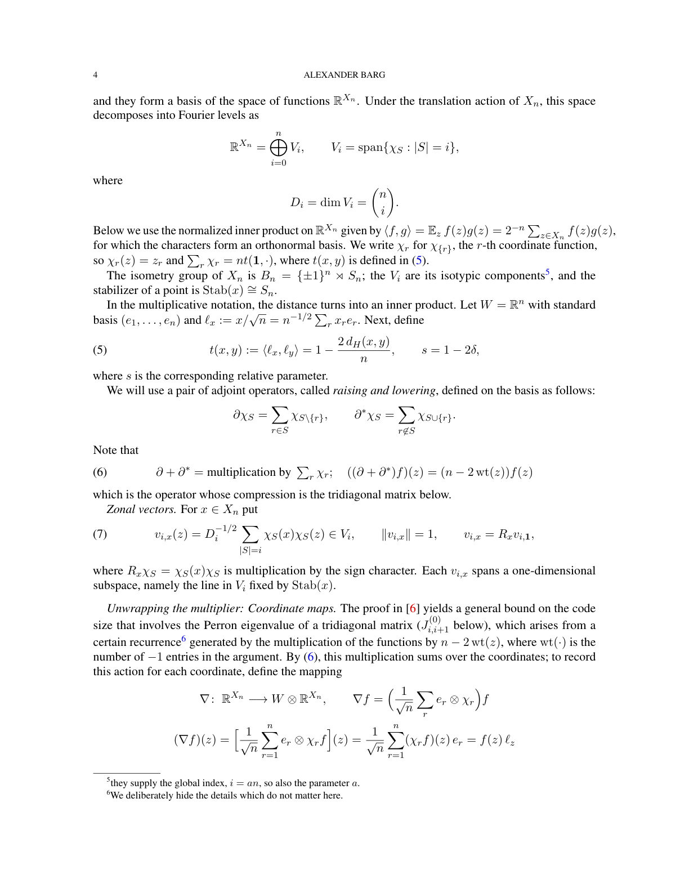
<figcaption class="paper-figure-caption"><b>Fig 3.</b> Low-resolution page preview, page 4</figcaption>
</figure>
<figure class="paper-figure-card">
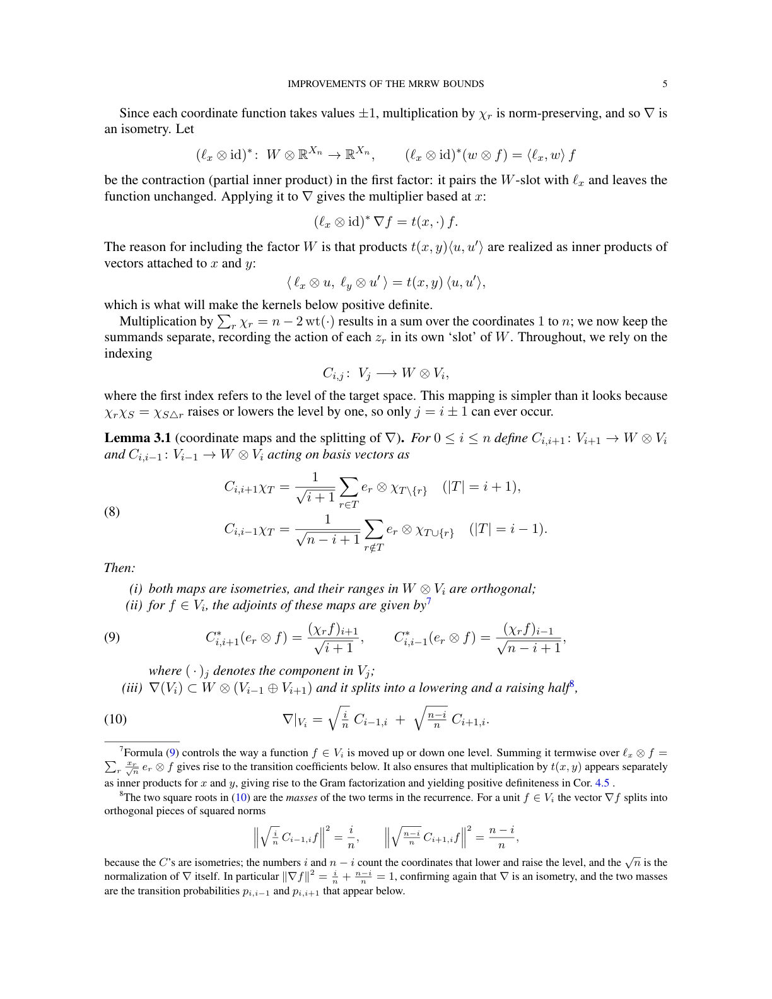
<figcaption class="paper-figure-caption"><b>Fig 4.</b> Low-resolution page preview, page 5</figcaption>
</figure>
<figure class="paper-figure-card">
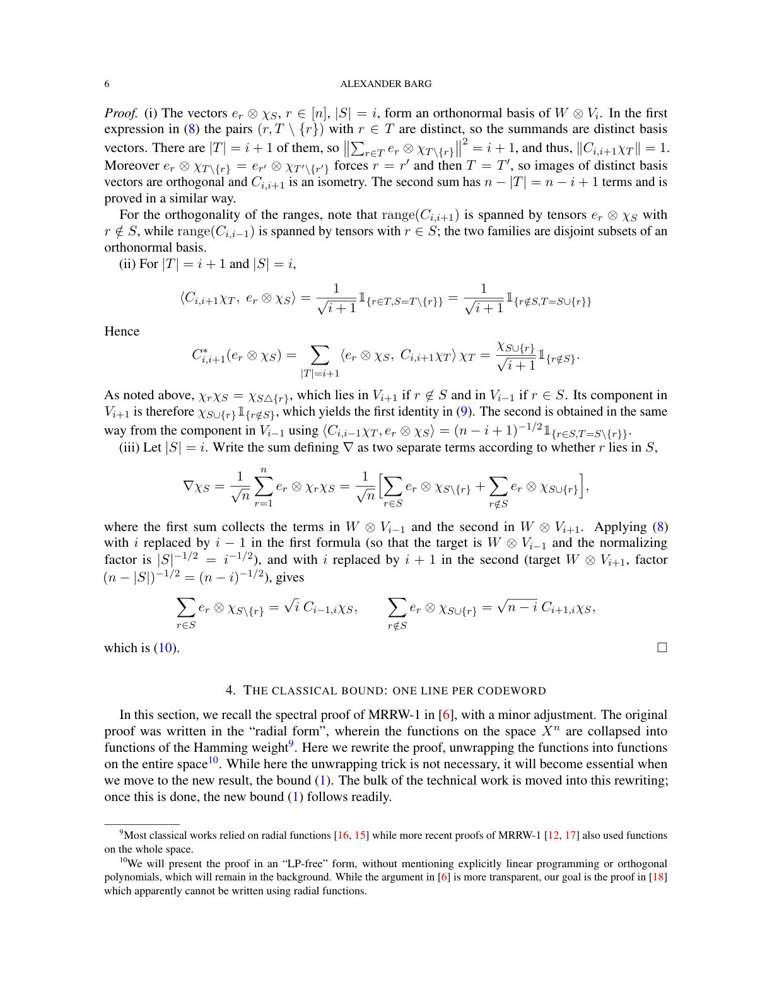
<figcaption class="paper-figure-caption"><b>Fig 5.</b> Low-resolution page preview, page 6</figcaption>
</figure>

**Summary.** This paper provides a deep mathematical analysis comparing two independent, recent improvements to the asymptotic upper bound on binary code rates (the MRRW bound). It unifies these results by showing that both proofs fundamentally rely on counting the number of associated subspaces within the ambient space. The work is significant for both coding theory and for establishing rigorous mathematical limits in related quantum information contexts.

**Why it may be interesting.** While the core topic is classical coding theory, the paper draws deep parallels between classical bounds and quantum information concepts (like Holevo information and typical subspaces), making it relevant for understanding the mathematical limits of quantum communication protocols.

Detailed structure

**Main problem.** The paper aims to improve the asymptotic upper bound on the rate of binary codes, known as the McEliece–Rodemich–Rumsey–Welch (MRRW) bound.

**Main result.** The authors establish that two recently derived bounds, $\kappa_H(\delta)$ and $RMQC(\delta)$, are strictly better than the original MRRW-1 bound for $0 < \delta < 1/2$, and prove their equality.

**Method.** The analysis involves advanced techniques from coding theory, including moving from packing vectors to packing subspaces, utilizing Delsarte certificates, and employing spectral methods on the Hamming space.

**Model / system.** The mathematical model is based on binary codes $C \subset \{0, 1\}^n$ and their achievable rate $R_2(\delta)$ as a function of relative distance $\delta$. The analysis is generalized to involve subspaces attached to each codeword.

**Key observables.** The primary observables are the achievable rate $R(C)$ and the relative distance $\delta$. The bounds themselves, $M_1(\delta)$, $\kappa_H(\delta)$, and $RMQC(\delta)$, are key quantities.

**Important parameters / regimes.** The relative distance $\delta$ is the main parameter governing the bound. The analysis also involves parameters $a$ and $b$ when considering quantum channel analogies.

**Assumptions / limitations.** The derivation relies on the multiplicative notation for the Hamming space and the use of adjoint operators to decompose function spaces. A key assumption in one part is $\Lambda > s$ for the main bound to hold.

**Figures summary.** Table 1 is used to numerically compare the values of the original MRRW bound $M_1(\delta)$ against the improved bound $	ext{RMQC}(\delta)$ across various values of $\delta$, demonstrating the improvement.

**Paper structure.** The paper first establishes the context of improving the MRRW bound. It then details the mathematical machinery, comparing the Delsarte certificate approach with the classical-quantum channel approach. The structure progresses from general coding theory bounds to specific spectral and harmonic-analytic derivations.

Abstract

The asymptotic McEliece--Rodemich--Rumsey--Welch bound (1977) limits the largest attainable rate of binary codes as a function of the relative distance. After a nearly half-century hiatus, this result was recently improved in two concurrent works, by OpenAI and by O. Alrabiah and V. Guruswami. The two arguments look entirely different, a Delsarte certificate on the one hand, a classical-quantum channel and the pretty good measurement on the other, and they yield the same bound. The purpose of this note is to explain why: in both proofs, a subspace is attached to every codeword and moved with it, and the bound counts how many such subspaces fit in the ambient space, exactly in the first case and in the probabilistic sense of typicality in the second. We also present the OpenAI proof in the language and context of coding theory, as an extension of the spectral method in which the single vector attached to a codeword is replaced by a subspace.

[↑ back to top](#top)

### [Computational methods for photoionization of H$_2$ molecules: a comparative study](http://arxiv.org/abs/2609.02461v1)

**Authors:** Hakon Volkmann, Jannis Schürmann, Alejandro Saenz  
**Type:** theory · **Category:** other · **PDF:** <https://arxiv.org/pdf/2609.02461v1>  
**Analysis basis:** full PDF text, analyzed in chunks

↔ Scroll figures horizontally

<figure class="paper-figure-card">
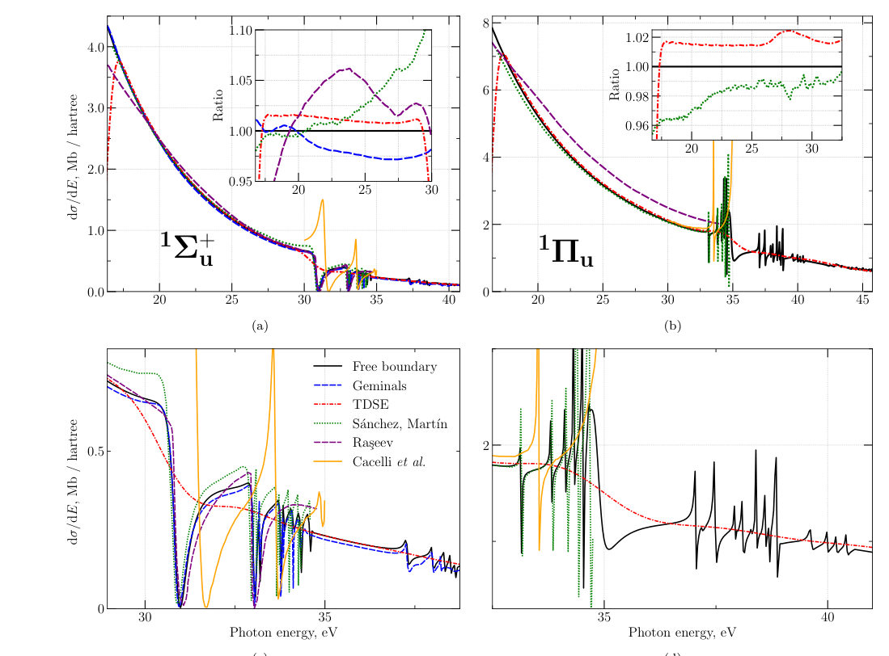
<figcaption class="paper-figure-caption"><b>Fig 1.</b> FIG. 1. Photoionization cross sections for parallel (left column, (a), (c)) and perpendicular (right column, (b), (d)) oriented H2 molecules, relative to the polarization direction. The lower figures in (c), (d) depict an enlarged plot in the resonance region, the insets show the respective ratios relative to the free-boundary result. Solid (black) lines: FB-CI; dashed (blue): CSG; dash-dotted (red): TDSE; dotted (green): reproduced from S´anchez and Mart´ın [27]; dashed (purple): reproduced from Ra¸seev [20]; solid (orange): reproduced from Cacelli et al. [26]. All curves shown are shifted in energy in order to match with the ionization potential of the FB result. Note that, due to the...</figcaption>
</figure>
<figure class="paper-figure-card">
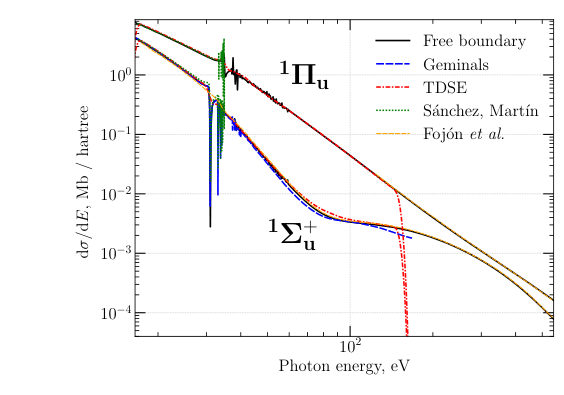
<figcaption class="paper-figure-caption"><b>Fig 2.</b> FIG. 2. As Fig. 1, but on an extended (logarithmic) energy scale. The lines are specified as in the caption of Fig. 1. The upper lines correspond to a perpendicular, the lower to the parallel-aligned molecular axis, as labelled in the figure. Ad- ditionally, the result of Foj´on et al. [30] is shown as dashed orange line.</figcaption>
</figure>
<figure class="paper-figure-card">
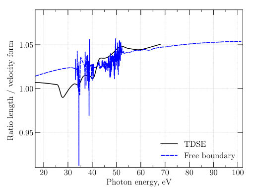
<figcaption class="paper-figure-caption"><b>Fig 3.</b> FIG. 3. Ratio of the photoionization cross sections for H2 molecules oriented perpendicular to the axis of polariza- tion, computed between length and velocity form (for the FB method) and length and velocity gauge (for the TDSE method). The solid (black) line shows the result for the TDSE computation. Dashed (blue) depicts the same for the FB ap- proach.</figcaption>
</figure>
<figure class="paper-figure-card">
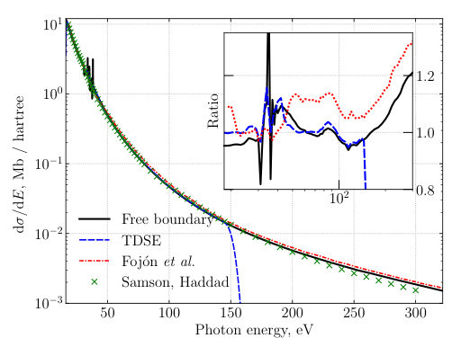
<figcaption class="paper-figure-caption"><b>Fig 4.</b> FIG. 4. Total photoionization cross sections for randomly- oriented H2 molecules. Solid (black) lines: FB-CI; dashed (blue): TDSE; dash-dotted (red): reproduced results from Foj´on et al. [30]; crosses (green): experimental results from Samson and Haddad [37]. The inset illustrates the ratio of all numerical results to the experimental reference on a logarith- mic energy scale.</figcaption>
</figure>

**Summary.** This paper presents a comprehensive comparative study of computational methods used to calculate the single-photon ionization cross sections of molecular hydrogen. By applying time-dependent, time-independent, and complex-scaling techniques, the authors demonstrate strong agreement between fundamentally different theoretical formulations. This work provides robust validation for advanced quantum methods applied to molecular photoionization.

**Why it may be interesting.** This work is highly relevant to AMO physics and quantum optics as it provides rigorous, comparative benchmarks for calculating fundamental molecular properties like photoionization cross sections using state-of-the-art quantum computational techniques.

Detailed structure

**Main problem.** The paper focuses on computing the single-photon ionization cross sections of molecular hydrogen ($	ext{H}_2$) in the electric dipole limit.

**Main result.** The computed results show convincing mutual agreement across multiple fundamentally different computational approaches (time-dependent vs. time-independent), validating the methods used.

**Method.** A comparative study employing three main computational techniques: time-dependent Schrödinger equation propagation, time-independent free-boundary methods (CI-based), and complex-scaling geminal methods.

**Model / system.** The physical system is the molecular hydrogen ($	ext{H}_2$) molecule, calculated at its equilibrium internuclear distance. The calculations utilize advanced electronic structure methods based on Configuration Interaction (CI) theory.

**Key observables.** Single-photon ionization cross sections ($\sigma$), ionization yield ($Y$), and optical oscillator strength (OOS) density.

**Important parameters / regimes.** Equilibrium internuclear distance ($R = 1.4 	ext{ a}_0$); the calculation is performed in the electric dipole limit.

**Assumptions / limitations.** The primary assumptions include the clamped-nuclei approximation and the use of various basis sets (e.g., B-splines) to discretize the continuum states.

**Figures summary.** Not specified in the notes, but the text references figures for high-energy computations and tables detailing CI configuration series.

**Paper structure.** The paper compares results from time-dependent, time-independent (Free-Boundary), and complex-scaling approaches to calculate the photoionization cross section, validating the consistency between these distinct theoretical formulations.

Abstract

Single-photon ionization cross sections of molecular hydrogen in the electric dipole limit have been computed. Both time-dependent and -independent approaches within the clamped-nuclei approximation at equilibrium internuclear distance are employed, featuring the explicit time-propagation of the time-dependent Schrödinger equation and newly implemented multi-channel configuration-interaction free-boundary as well as complex-scaling methods using an explicitly correlated geminal basis set. The found results are compared to both experimental and previously published theoretical results, showing convincing mutual agreement despite their entirely different fundamental formulations. The novel CI-based approach demonstrates fast and controllable convergence while being able to provide full channel-resolved information.

[↑ back to top](#top)

### [Electronic Structure and Superconductivity in La$_{1.55}$Sr$_{0.45}$CuO$_4$/La$_2$CuO$_4$ Artificial High-$T_c$ Superlattices Probed by Hard and Soft X-ray Spectroscopy](http://arxiv.org/abs/2609.02668v1)

**Authors:** U. M. Jayathilake, S. Sheikh, T. -L. Lee, C. Klewe, G. Logvenov, G. Campi, A. Bianconi, A. X. Gray  
**Type:** experiment · **Category:** strongly correlated electrons · **PDF:** <https://arxiv.org/pdf/2609.02668v1>  
**Analysis basis:** full PDF text, analyzed in chunks

↔ Scroll figures horizontally

<figure class="paper-figure-card">
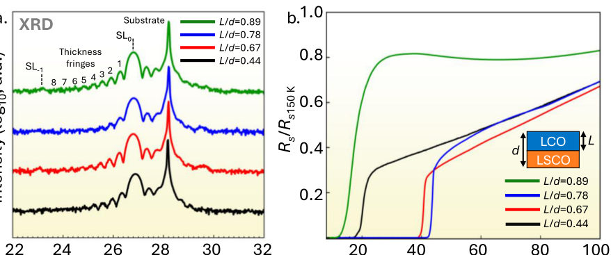
<figcaption class="paper-figure-caption"><b>Fig 1.</b> FIG. 1. (a) High-resolution θ-2θ XRD patterns of the LSCO/LCO superlattice series, showing the</figcaption>
</figure>
<figure class="paper-figure-card">
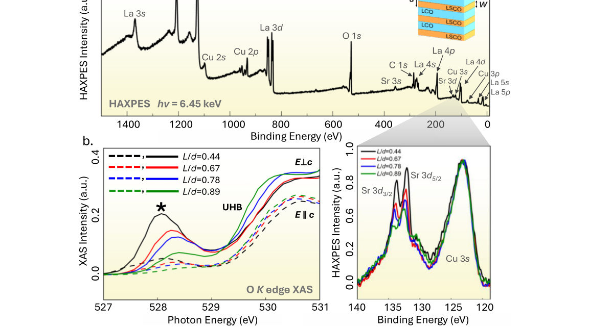
<figcaption class="paper-figure-caption"><b>Fig 2.</b> FIG. 2. (a) Wide-range HAXPES survey spectrum of the 𝐿𝑑 ⁄ = 0.44 sample, showing core-level</figcaption>
</figure>
<figure class="paper-figure-card">
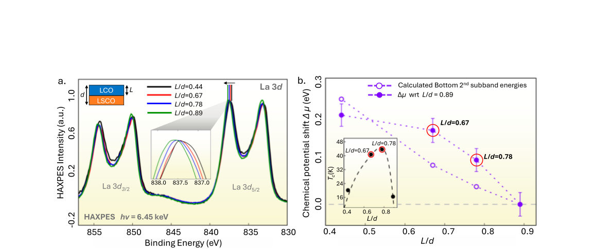
<figcaption class="paper-figure-caption"><b>Fig 3.</b> FIG. 3. (a) La 3d core-level HAXPES spectra of LSCO/LCO superlattices with different 𝐿/𝑑 ratios</figcaption>
</figure>
<figure class="paper-figure-card">
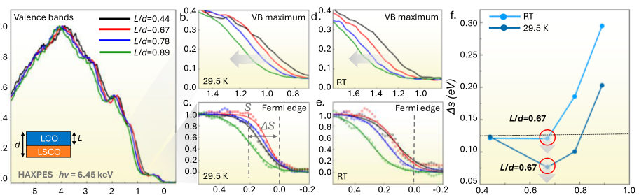
<figcaption class="paper-figure-caption"><b>Fig 4.</b> FIG. 4. (a) Valence-band HAXPES spectra of LSCO/LCO superlattices with different 𝐿𝑑 ⁄ ratios,</figcaption>
</figure>
<figure class="paper-figure-card">
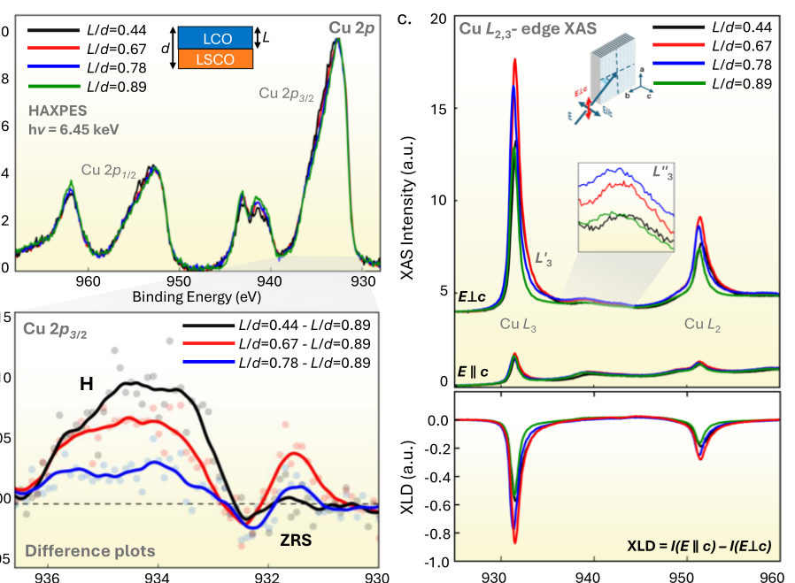
<figcaption class="paper-figure-caption"><b>Fig 5.</b> FIG. 5. (a) Cu 2p core-level HAXPES spectra of the AHTS series, showing the Cu 2p3/2 and Cu 2p1/2</figcaption>
</figure>

**Summary.** This work uses hard and soft X-ray spectroscopy to map the electronic structure of artificial high-Tc superlattices ($	ext{LSCO}/	ext{LCO}$) as the superconducting dome is tuned by changing the layer thickness ratio ($L/d$). The results demonstrate that the optimal superconducting state correlates with spectroscopic signatures indicating the system is tuned near a Van Hove Singularity, providing strong experimental evidence for the electronic mechanism driving high-Tc superconductivity in these engineered structures.

**Why it may be interesting.** The use of advanced X-ray spectroscopy to map out the electronic structure evolution across a quantum-engineered superconducting phase is highly relevant for understanding unconventional superconductivity mechanisms in correlated materials.

Detailed structure

**Main problem.** To determine how the electronic structure evolves across the superconducting dome in artificial high-Tc superlattices (AHTS) as a function of geometric tuning.

**Main result.** Spectroscopic signatures (DOS enhancement, screening, orbital polarization) are strongest near $L/d = 0.67$, supporting a model where superconductivity emerges from tuning the system toward a Van Hove Singularity (VHS) via an electronic topological transition.

**Method.** The study combines Hard X-ray Photoelectron Spectroscopy (HAXPES) and polarization-dependent Soft X-ray Absorption Spectroscopy (XAS) to probe both occupied and unoccupied electronic states.

**Model / system.** The system is the $	ext{La}_{1.55}	ext{Sr}_{0.45}	ext{CuO}_4/	ext{La}_2	ext{CuO}_4$ superlattice, whose superconducting dome is tuned by varying the geometric ratio $L/d$. The analysis is guided by the Bianconi-Perali-Valletta (BPV) framework, which predicts superconductivity enhancement near a Lifshitz electronic transition.

**Key observables.** Leading-edge spectral weight ($\Delta S$), chemical potential ($\mu$) shifts (from $	ext{La } 3d$), local/non-local screening signatures ($	ext{Cu } 2p$), and in-plane orbital polarization ($	ext{Cu } L_{2,3}	ext{-edge}$ XLD).

**Important parameters / regimes.** The geometric ratio $L/d$ (e.g., 0.44, 0.67, 0.78, 0.89) acts as the primary tuning parameter, controlling the effective hole doping and proximity to the predicted optimal doping regime.

**Assumptions / limitations.** The superconducting dome behavior is governed by the BPV framework, linking superconductivity to the proximity of the chemical potential to a Van Hove Singularity (VHS) induced by the superlattice periodicity.

**Figures summary.** The figures likely show systematic trends in core-level shifts, spectral weight enhancements near the Fermi level, and polarization-dependent spectral features that correlate with the measured $T_c$ dome.

**Paper structure.** The paper systematically presents evidence from multiple spectroscopic techniques (HAXPES, XAS) across the series of superlattices, correlating the observed electronic structure changes (e.g., $\mu$ evolution, DOS changes) with the known superconducting dome structure.

Abstract

In La$_{1.55}$Sr$_{0.45}$CuO$_4$/La$_2$CuO$_4$ (LSCO/LCO) artificial high-$T_c$ superlattices (AHTS), grown by quantum material design, the superconducting dome can be tuned by varying the geometric ratio $L/d$, where $L$ is the LCO layer thickness and $d$ is the superlattice nanoscale period. Here, we combine hard X-ray photoelectron spectroscopy (HAXPES) and polarization-dependent soft X-ray absorption spectroscopy (XAS) to probe how the electronic structure evolves across the $L/d$-tuned superconducting dome. We observe systematic chemical-potential evolution across the series, together with enhanced spectral weight near the Fermi level, enhanced local and non-local screening signatures, and increased in-plane orbital polarization near the top of the dome. Together, these spectroscopic signatures provide insight into the emergence of Fano-Feshbach resonant superconductivity in the LSCO/LCO AHTS series.

[↑ back to top](#top)

### [Evolution from Kitaev to XXZ spin chains via distortion: Application to BaCo$_2$V$_2$O$_8$](http://arxiv.org/abs/2609.01805v1)

**Authors:** Philip Richard, Mandev Bhullar, Hae-Young Kee  
**Type:** theory · **Category:** strongly correlated electrons · **PDF:** <https://arxiv.org/pdf/2609.01805v1>  
**Analysis basis:** full PDF text, analyzed in chunks

↔ Scroll figures horizontally

<figure class="paper-figure-card">
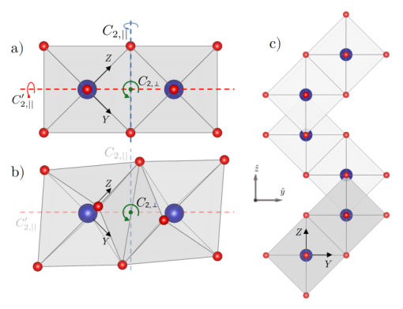
<figcaption class="paper-figure-caption"><b>Fig 1.</b> Fig. 1: Geometry of a nearest-neighbor (n.n.) X-bond in the (a) ideal and (b) distorted structures. Note that the bond center is intersected by three mutually orthogonal two-fold rotation axes. The rotation axis C2,⊥(green) enforces Γ′ = Γ′′ = 0. In the ideal structure, in addition to C2,⊥, the two additional two-fold rotation axes C2,∥and C′ 2,∥(blue and red) are present, which requires K′ = 0. In the distorted structure, the latter two symmetries are broken whereas C2,⊥is preserved, allowing only a finite K′. (c) Local XY Z coordinate system associated with an X-bond (highlighted in gray) relative to the global xyz axes. Successive bonds are related by a four-fold screw rotation about the...</figcaption>
</figure>
<figure class="paper-figure-card">
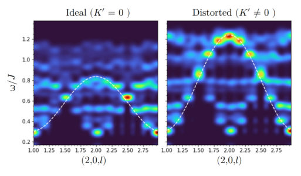
<figcaption class="paper-figure-caption"><b>Fig 2.</b> Fig. 2: Dynamical structure factor (DSF) obtained by 24-sites ED with (a) K′ = 0 and (b) K′ , 0 indicating the effects of distortion via finite K′ interaction. In both, we use J = 5.8meV, Γ = 0.6 meV, and fix ϵ = 0.56. As K′ −K becomes smaller, the domain-wall mode (white) becomes more dispersive while the gap remains nearly constant, consistent with the experimentally observed features[39] .</figcaption>
</figure>
<figure class="paper-figure-card">
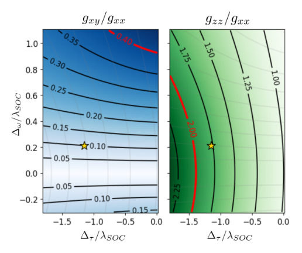
<figcaption class="paper-figure-caption"><b>Fig 3.</b> Fig. 3: In-plane (left) and out-of-plane (right) anisotropies of g-tensor components for different distortion parameters (∆µ/λSOC is fixed at -0.15). The red contour lines correspond to the value used in phenomenological descriptions (gxy/gxx ≈0.4 and gzz/gxx ≈2). We see that these cannot be obtained simultaneously for any given set of crystal field potentials (∆τ, ∆ω, ∆µ). The star indicates the set of ∆s obtained from our point charge calculation and the corresponding g-tensor components.</figcaption>
</figure>
<figure class="paper-figure-card">
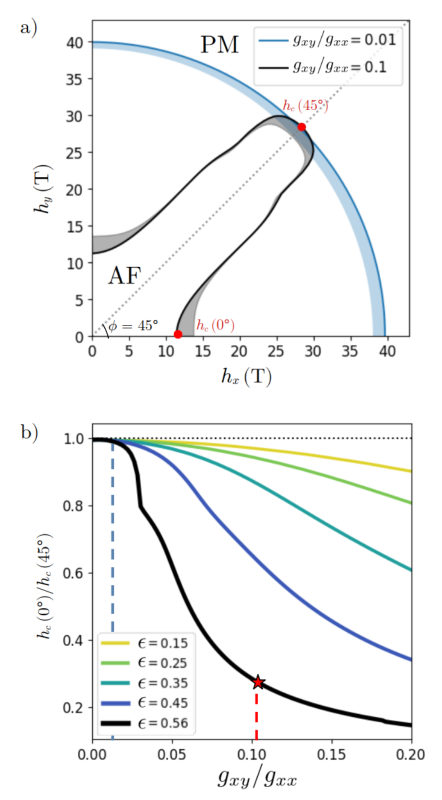
<figcaption class="paper-figure-caption"><b>Fig 4.</b> Fig. 4: (a) Phase boundary hc(ϕ) for applied transverse field [hx, hy, 0] with fixed ϵ = 0.56. Using the calculated g-tensor gxy/gxx (black), we see a large in-plane anisotropy with hc(0◦) ≈11T and hc(45◦) ≈38T indicated by the red dots. This anisotropy nearly vanishes when reducing gxy/gxx (blue). For fixed gxy/gxx, varying the site-dependent exchange (here |K −K′| ≤1meV and |Γ| ≤2meV) only slightly alters the respective phase boundary which remains roughly within the shaded region. (b) Anisotropy between ϕ = 0◦and ϕ = 45◦critical fields as a function of gxy/gxx for various values of ϵ. As ϵ gets smaller, their ratio rapidly approaches 1. The star indicates parameters calculated...</figcaption>
</figure>

**Summary.** This work develops a unified microscopic theory for understanding magnetic anisotropy in spin-orbit-coupled chains like BaCo2V2O8. By incorporating octahedral distortions, the authors show that the resulting anisotropic g-tensor, combined with renormalized exchange interactions, is necessary to explain the experimentally observed large anisotropy in the critical magnetic field. This bridges structural chemistry, electronic structure, and quantum magnetism.

**Why it may be interesting.** The work provides a detailed, unified microscopic framework linking structural distortions (crystal field effects) directly to macroscopic magnetic properties (anisotropy), which is highly relevant for understanding emergent quantum magnetism in correlated materials.

Detailed structure

**Main problem.** The paper aims to unify the understanding of magnetic anisotropy in spin-orbit-coupled Ising-chain antiferromagnets, resolving discrepancies between simple models and experimental observations in BaCo2V2O8.

**Main result.** The large in-plane critical-field anisotropy in BaCo2V2O8 arises from the cooperative interplay between the microscopic exchange interactions (governed by the distortion-modified Kitaev-Heisenberg-Gamma model) and the crystal-field-induced g-tensor anisotropy, particularly the off-diagonal component g_xy.

**Method.** The authors use a combination of microscopic theory extensions (incorporating octahedral distortions), exact diagonalization (ED) for spin dynamics, and classical analysis of effective magnetic fields derived from the g-tensor.

**Model / system.** The system is BaCo2V2O8, modeled as a spin-orbit-coupled Ising-chain antiferromagnet. The Hamiltonian is extended from the Kitaev-Heisenberg-Gamma (JKΓ) model to include distortions of the CoO6 octahedra, which modifies both the exchange interactions and generates an anisotropic g-tensor.

**Key observables.** Spin dynamical structure factor (DSF), critical field anisotropy h_c(phi), and the components of the g-tensor (e.g., g_xy/g_xx ratio).

**Important parameters / regimes.** The ratio of exchange interactions (K/J, $\epsilon$), the distortion-induced staggered term (K'), and the ratio of g-tensor components (g_xy/g_xx).

**Assumptions / limitations.** The analysis simplifies by neglecting g_xz and g_yz in the final classical picture, and the initial microscopic theory relies on point-charge calculations for the g-tensor.

**Figures summary.** Figures illustrate the geometry of the bonds in ideal vs. distorted structures, compare calculated DSF with INS data, and show the phase boundary h_c(phi) demonstrating that the anisotropy is strongly dependent on the g_xy/g_xx ratio.

**Paper structure.** The paper progresses by first establishing the limitations of the ideal JKΓ model (using ED/INS comparison), then introducing distortions to generate both modified exchange terms and an anisotropic g-tensor. Finally, it analyzes the interplay between these two effects to explain the critical field anisotropy.

Abstract

BaCo$_2$V$_2$O$_8$ is a prototypical spin-orbit-coupled Ising-chain antiferromagnet that provides a unique platform for studying field-induced quantum magnetism. Under a transverse magnetic field, it exhibits unusual magnetic properties, including an anomalous staggered magnetization and a pronounced anisotropy of the critical field with respect to the in-plane field direction. While these phenomena have been attributed phenomenologically to a site-dependent anisotropic $g$-tensor, a recent microscopic theory has shown that spin-orbit coupling naturally generates bond-dependent Heisenberg, Kitaev, and $Γ$ exchange interactions. Here, we unify these two pictures by extending the microscopic theory to incorporate distortions of the CoO$_6$ octahedra. We show that the distortions not only generate the site-dependent anisotropic $g$-tensor but also renormalize the staggered exchange interactions through a distortion-induced contribution that partially compensates the Kitaev-derived staggered term. Using point-charge calculations to estimate the $g$-tensor of BaCo$_2$V$_2$O$_8$, we demonstrate that the strong anisotropy of the critical field originates from the combined effects of the modified exchange interactions and the anisotropic $g$-tensor. Our work provides a unified microscopic framework for understanding the magnetic anisotropy of spin-orbit-coupled Ising-chain materials.

[↑ back to top](#top)

### [Logarithmic-scale variational quantum eigensolver for off-lattice protein structure prediction in continuous torsional angle space](http://arxiv.org/abs/2609.02113v1)

**Authors:** Fabio Cumbo, Bryan Raubenolt, Varun Puram, Natalie Katzenmeyer, Jayadev Joshi, Daniel Blankenberg  
**Type:** both · **Category:** quantum information and computing · **PDF:** <https://arxiv.org/pdf/2609.02113v1>  
**Analysis basis:** full PDF text, analyzed in chunks

↔ Scroll figures horizontally

<figure class="paper-figure-card">
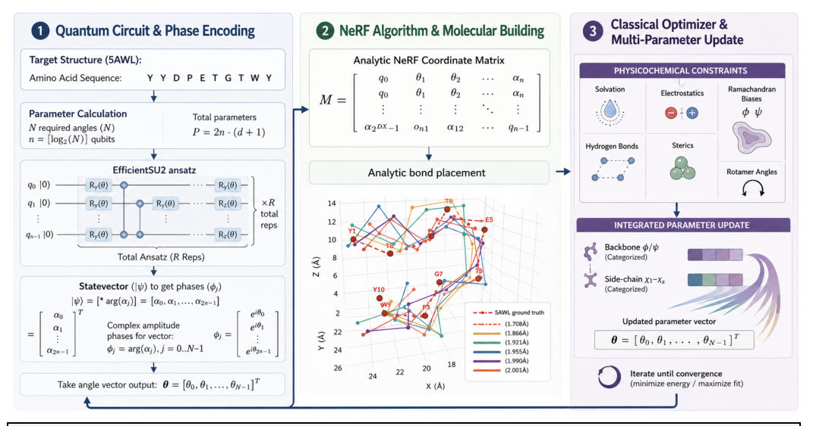
<figcaption class="paper-figure-caption"><b>Fig 1.</b> Figure 1: Schematic overview of the hybrid quantum-classical continuous-space protein structure prediction pipeline. The closed-loop VQE architecture consists of four interconnected phases. (I) Quantum State Generation: an n-qubit parameterized quantum circuit, scaled logarithmically relative to the torsional degrees of freedom, generates a complex statevector. The gauge-fixed relative phases of the resulting amplitudes are extracted to directly represent continuous molecular torsion angles in the</figcaption>
</figure>
<figure class="paper-figure-card">
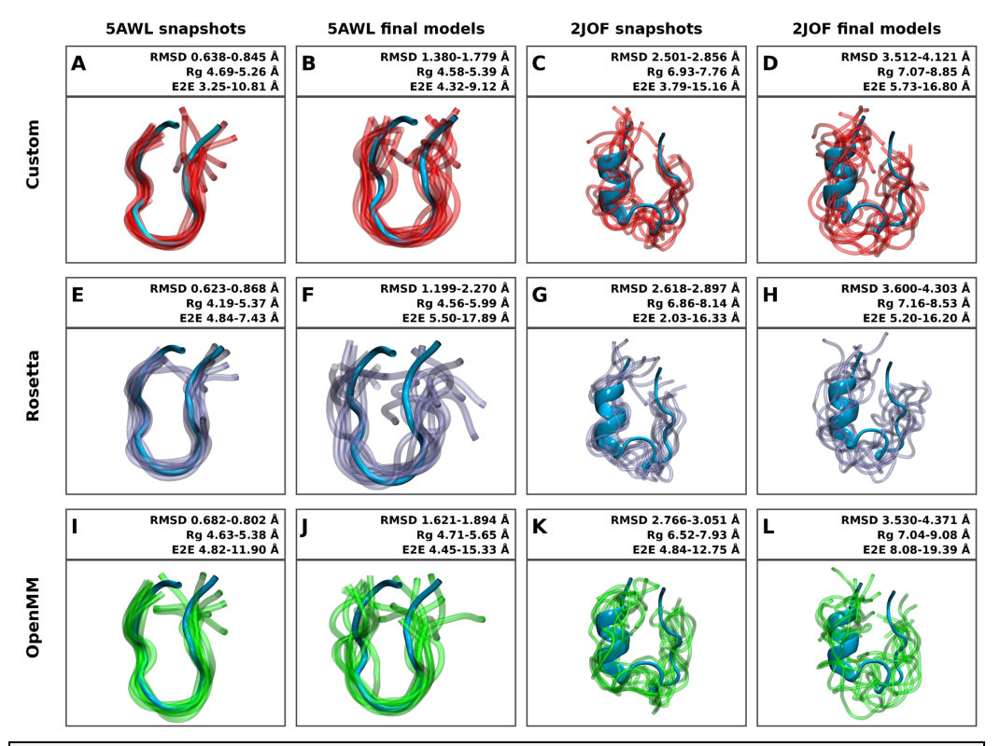
<figcaption class="paper-figure-caption"><b>Fig 2.</b> Figure 2: Structural overlays of the 10 lowest RMSD snapshots and 10 final models for each protein, model class, and energy function. Rows correspond to energy functions: custom (A-D), Rosetta (E-H), and OpenMM (I-L). Columns show 5AWL snapshots, 5AWL final models, 2JOF snapshots, and 2JOF final models, respectively. Each panel reports the RMSD range for the 10 displayed structures. Predicted structures are colored by energy function, with experimental reference structures shown in cyan.</figcaption>
</figure>
<figure class="paper-figure-card">
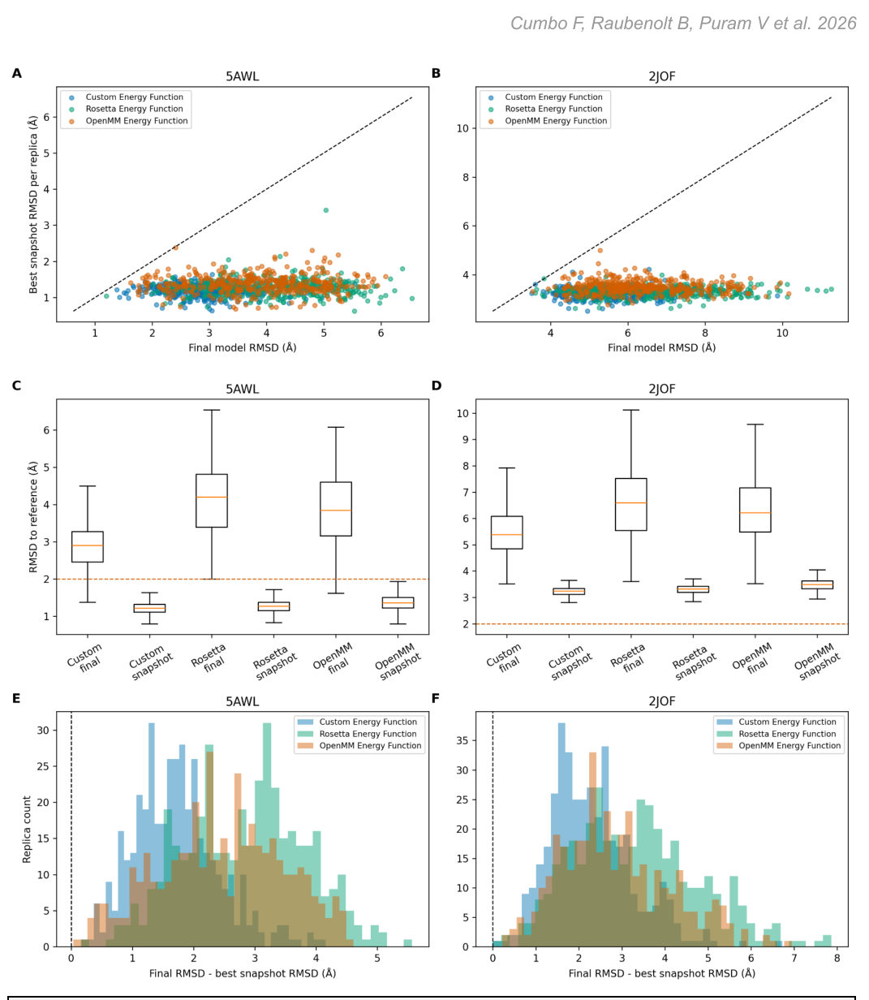
<figcaption class="paper-figure-caption"><b>Fig 3.</b> Figure 3: Comparison final replica models with the best retained snapshot from the same replica. Panels A and B plot final-model RMSD versus best-snapshot RMSD for 5AWL and 2JOF, respectively; points below the diagonal indicate replicas where snapshot mining recovered a lower-RMSD structure than the final selected model. Panels C and D summarize the corresponding RMSD distributions for final models and per-replica best snapshots across each energy function, with the 2.0 Å horizontal line marking the native-like threshold. Panels E and F show the per-replica RMSD improvement, defined as final-model RMSD minus best-snapshot RMSD, for 5AWL and 2JOF. In all snapshot panels, the snapshot value...</figcaption>
</figure>
<figure class="paper-figure-card">
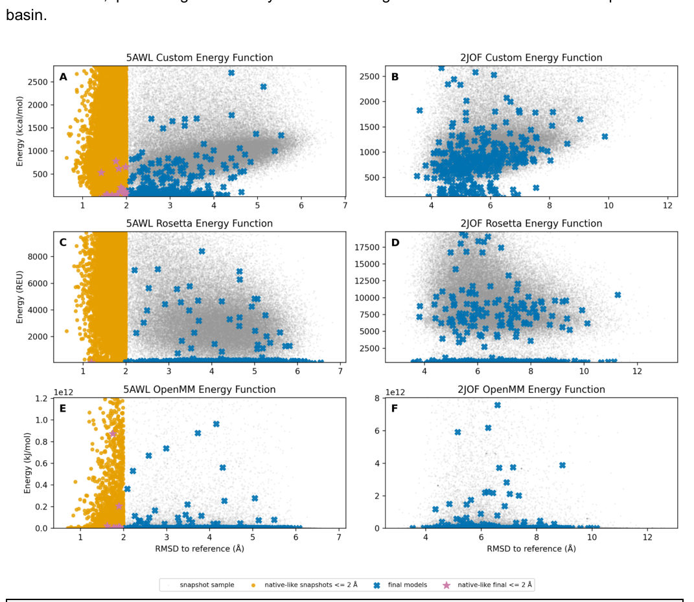
<figcaption class="paper-figure-caption"><b>Fig 4.</b> Figure 4: Raw-energy folding-funnel landscapes. The raw energy units are kcal/mol for the custom energy function, Rosetta energy units (REU) for Rosetta, and kJ/mol for OpenMM. These panels test whether each backend’s own scoring objective produces an internal funnel toward lower RMSD, but raw y-values should not be compared quantitatively across energy functions because the scales and definitions differ.</figcaption>
</figure>
<figure class="paper-figure-card">
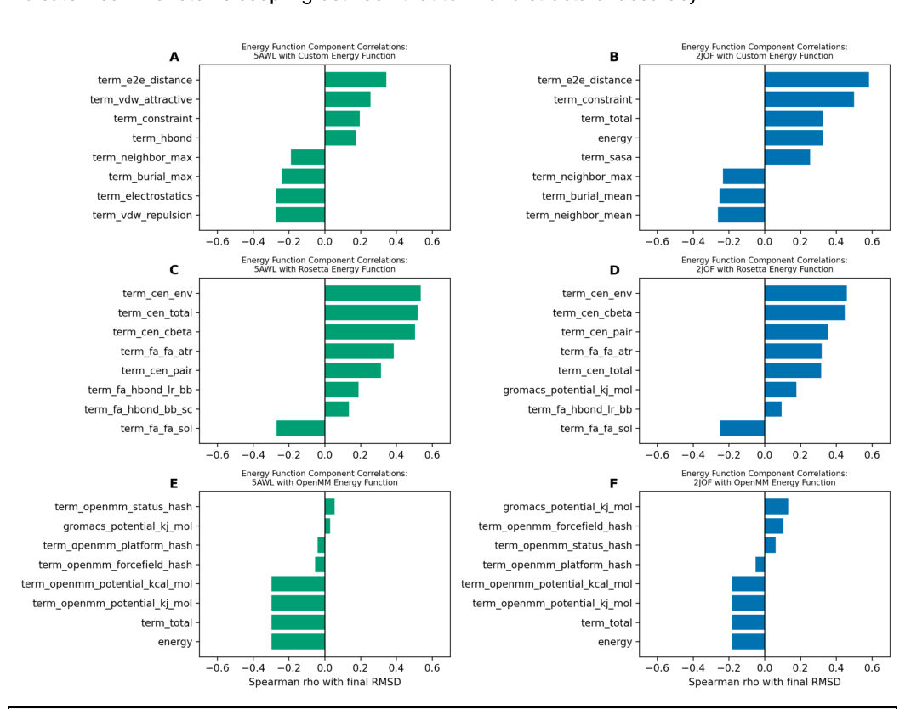
<figcaption class="paper-figure-caption"><b>Fig 5.</b> Figure 5: Final-mode energy-term correlations. The strongest final-model energy-term Spearman correlations with RMSD for each protein and energy function. Panels follow the same row-major layout as</figcaption>
</figure>

**Summary.** This paper introduces a groundbreaking quantum algorithm for protein structure prediction that moves beyond restrictive lattice models into continuous, all-atom space. It achieves this by encoding the exponentially large conformational space into a quantum statevector, requiring only logarithmic qubits relative to the number of torsional angles. The success on benchmark proteins proves the feasibility of this scalable, hybrid quantum-classical approach for biophysics.

**Why it may be interesting.** This work directly tackles the mapping of continuous physical degrees of freedom (torsions) onto discrete quantum computational resources (qubits/phases), which is a major theoretical challenge in quantum simulation for molecular physics.

Detailed structure

**Main problem.** Protein structure prediction (PSP) is computationally challenging due to the vast conformational space, and current quantum methods are limited to simplistic lattice models.

**Main result.** The authors demonstrated a novel, scalable quantum algorithm capable of performing all-atom, continuous-space PSP using only O(log N) qubits for N torsional degrees of freedom.

**Method.** They propose a logarithmic-scale Variational Quantum Eigensolver (VQE) where molecular torsions are encoded into the relative phases of a quantum statevector, which are then decoded to reconstruct 3D coordinates.

**Model / system.** The system is the protein structure, modeled by its backbone and sidechain torsional angles. The approach uses a hybrid quantum-classical pipeline, employing a custom Hamiltonian derived from molecular mechanics terms to evaluate the energy.

**Key observables.** RMSD (Root Mean Square Deviation) for structural comparison, and the total scalar energy calculated by the hybrid Hamiltonian.

**Important parameters / regimes.** The qubit scaling is $\mathcal{O}(\log_2 N)$ for $N$ torsional degrees of freedom. The method uses a multi-stage relaxation curriculum to mitigate barren plateaus.

**Assumptions / limitations.** The primary assumptions involve the feasibility of mapping continuous physical constraints into circuit depth constraints and the reliance on a probability-CDF decoder due to the non-observability of relative phases on NISQ hardware.

**Figures summary.** The figures schematically illustrate the four-stage hybrid quantum-classical pipeline: quantum state generation from parameters, differentiable coordinate reconstruction from phases, physical energy evaluation, and variational optimization.

**Paper structure.** The paper introduces the limitations of existing PSP methods, details the novel logarithmic-scale VQE architecture (QTF), outlines the hybrid quantum-classical pipeline, presents benchmarks on specific proteins (chignolin, Trp-cage), and discusses hardware implementation and future scalability.

Abstract

Classical and current quantum approaches to protein structure prediction (QPSP) face limitations, notably massive qubit requirements restricting near-term models to simplistic on-lattice simulations. We propose a logarithmic-scale variational quantum eigensolver (VQE) that reduces qubit requirements for N torsional degrees of freedom to O(log2N), enabling off-lattice, all-atom simulations. Our architecture extracts molecular torsions from relative phases in statevector simulations. On quantum hardware, a decoder maps the empirical cumulative distribution function (CDF) from basis-state probabilities to bounded torsional variables. These feed a classical algorithm to build heavy-atom coordinates. We use an EfficientSU2 ansatz and multi-stage relaxation to mitigate barren plateaus. Structures are evaluated via a custom hybrid quantum-classical Hamiltonian, alongside Rosetta and OpenMM benchmarks.   Evaluation on chignolin and Trp-cage yielded native-like conformations. Chignolin reached a 0.623 Å Cα RMSD in retained snapshots and 1.199 Å in final models; Trp-cage achieved a 2.501 Å RMSD among snapshots (3.512 Å in final models). Execution on IBM processors (ibm_cleveland, ibm_miami) successfully recovered native-like structures with a best RMSD of 1.758 Å. The custom energy function performed best overall, though energy-ranking imbalances persisted across sampled landscapes for all functions.   This introduces the first all-atom, continuous-space quantum algorithm for QPSP. By converting physical qubit constraints into circuit depth constraints, it proves high-resolution prediction is feasible with exponentially fewer qubits. Despite current limits like computational overhead and energy function sensitivity, it establishes a scalable foundation for hybrid quantum biophysics.

[↑ back to top](#top)

### [Maximal-velocity deficit under a finite-support constraint in hard-wall half-line continuous-time quantum walk](http://arxiv.org/abs/2609.01970v1)

**Authors:** Kangqiao Liu, Deyou Chen  
**Type:** theory · **Category:** statistical mechanics · **PDF:** <https://arxiv.org/pdf/2609.01970v1>  
**Analysis basis:** full PDF text, analyzed in chunks

↔ Scroll figures horizontally

<figure class="paper-figure-card">
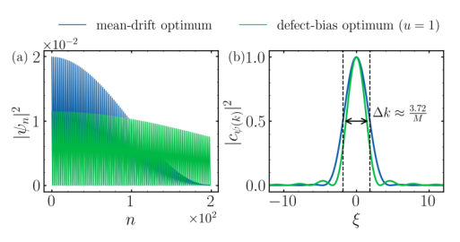
<figcaption class="paper-figure-caption"><b>Fig 1.</b> FIG. 1. Optimal finite-M states in (a) real space and (b) near the maximal-velocity peak. We set J = 1 and M = 200. The mean-drift optimum is the principal eigenvector of A(M) in Eq. (23). The defect-bias optimum is the principal eigenvector of A(M) u in Eq. (34) at u = 1. (a) shows the real-space proba- bility |ψn|2. (b) shows the near-peak spectral weight |cψ(k)|2</figcaption>
</figure>
<figure class="paper-figure-card">
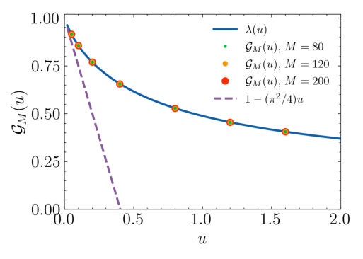
<figcaption class="paper-figure-caption"><b>Fig 2.</b> FIG. 2. Scaling function for the optimized near-peak statistics. The solid curve is the continuum principal eigenvalue λ(u) = λmax(Tu) computed from the Fourier-side kernel (46). Markers show finite-M values of GM(u) obtained by diagonalizing the discrete matrix A(M) u in (34). The dashed line is the small-u expansion 1 −(π2/4)u.</figcaption>
</figure>
<figure class="paper-figure-card">
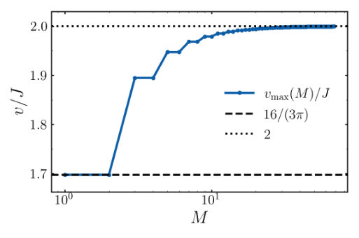
<figcaption class="paper-figure-caption"><b>Fig 3.</b> FIG. 3. Coherent optimum versus the site-diagonal incoherent reference for J = 1. The solid line is vmax(M)/J obtained by diagonalizing A(M). The dashed horizontal line is vmax inc /J = 16/(3π) from Eq. (29). The dotted horizontal line marks the ballistic front 2J/J = 2.</figcaption>
</figure>
<figure class="paper-figure-card">
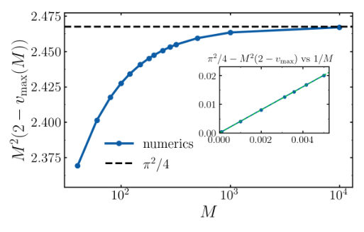
<figcaption class="paper-figure-caption"><b>Fig 4.</b> FIG. 4. Optimized mean drift for J = 1. The main panel shows the rescaled estimator M 2(2 −vmax(M)) versus M obtained from diagonalizing A(M). The dashed line is the constant limit π2/4. The inset shows the residual π2/4 −M 2(2 −vmax(M)) versus 1/M.</figcaption>
</figure>

**Summary.** This paper investigates the speed limit of a quantum walker confined to a half-line lattice by constraining its initial state to $M$ sites. It shows that the maximal achievable drift velocity approaches the theoretical maximum with a predictable, inverse-square deficit scaling with $M$. The methodology involves advanced spectral analysis, moving from finite matrices to a continuum operator limit.

**Why it may be interesting.** This work provides rigorous spectral methods to analyze transport phenomena in quantum systems constrained by boundaries, connecting discrete spectral problems to continuous field theory limits.

Detailed structure

**Main problem.** The paper determines how close the maximal mean drift velocity of a continuous-time quantum walk (CTQW) on a hard-wall half-line can approach the theoretical maximal front speed when the initial state is restricted to a finite number of sites ($M$).

**Main result.** The maximal mean drift velocity exhibits a deficit that decays with an inverse-square dependence on $M$, with the continuum limit yielding a constant prefactor of $\pi^2/4$.

**Method.** The analysis uses moment-generating functions and spectral theory, reducing the optimization problem to finding the largest eigenvalue of explicit, finite-dimensional Hermitian matrices, which is then analyzed in the continuum limit.

**Model / system.** The system is a continuous-time quantum walk (CTQW) evolving on the hard-wall half-line ($\mathbb{Z}_{\ge 0}$) governed by a nearest-neighbor Hamiltonian. The dynamics are analyzed using the sine transform and weak-limit theorems.

**Key observables.** Maximal mean drift velocity ($	ext{vmax}(M)$), asymptotic velocity random variable ($V$), and the moment-generating function ($G_\psi(s)$).

**Important parameters / regimes.** Finite support size $M$, the bulk dispersion velocity ($2J$), and the continuum scaling variable $u$.

**Assumptions / limitations.** The analysis relies on stationary-phase estimates and the validity of weak-limit theorems for CTQWs, particularly in the large-$M$ limit.

**Figures summary.** The notes do not provide a summary of figures, but mention numerical verification of both the finite-$M$ spectral formulation and the predicted scaling.

**Paper structure.** The paper progresses by first defining the system and establishing the bulk limit, then characterizing the finite-$M$ spectral problem via matrix diagonalization, followed by deriving the continuum scaling limit, and finally extracting the constant prefactor.

Abstract

Continuous-time quantum walks on a lattice spread ballistically and converge to a limiting distribution for the rescaled position. On the hard-wall half line the boundary reflects the walker but does not change the bulk dispersion, so the ballistic front remains set by the maximal group velocity. We ask how close one can get to this front when the initial state is constrained to occupy only the first $M$ sites. We show that optimizing the moment-generating function of the limiting-velocity distribution over this finite-support class reduces to the principal eigenvalue of an explicit $M\times M$ Hermitian matrix, which yields the optimal state by direct diagonalization. For large $M$, a near-front scaling limit produces a continuum description that controls the entire peak region. In particular, the maximal mean drift approaches the front with an inverse-square deficit in $M$ and a constant prefactor $π^2/4$. Numerical results verify both the finite-$M$ spectral formulation and the predicted scaling.

[↑ back to top](#top)

### [Need One Bell-pair Only (NOBOL) for Low-Overhead Fault-Tolerant Quantum Computing](http://arxiv.org/abs/2609.01901v1)

**Authors:** Sean Grzenda, Shahram Babaie, Chunming Qiao  
**Type:** theory · **Category:** quantum information and computing · **PDF:** <https://arxiv.org/pdf/2609.01901v1>  
**Analysis basis:** full PDF text, analyzed in chunks

↔ Scroll figures horizontally

<figure class="paper-figure-card">
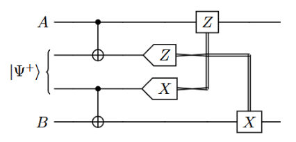
<figcaption class="paper-figure-caption"><b>Fig 1.</b> Fig. 1: Remote CNOT operation between A and B. A and B are physical qubits residing on two locations, e.g. QPUs. |Φ+⟩ is a Bell pair state distributed between the two locations.</figcaption>
</figure>
<figure class="paper-figure-card">
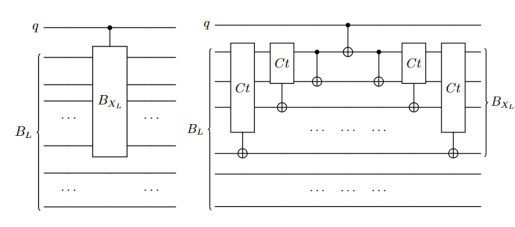
<figcaption class="paper-figure-caption"><b>Fig 2.</b> Fig. 2: CNOT circuit with single qubit as control. (a) The desired CNOT operation; q is the control and BL is the target. (b) The proposed method; only qubits within BXL need to be acted upon. The method is comprised entirely of CNOT gates. The target locations and a few controls are fixed, as shown in the figure, but most of the control qubits for each target have several possible locations. The Ct rectangle denotes all possible locations for the control qubit, with an implicit requirement for symmetry in their locations in the circuit.</figcaption>
</figure>
<figure class="paper-figure-card">
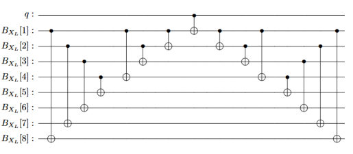
<figcaption class="paper-figure-caption"><b>Fig 3.</b> Fig. 3: Depth Optimal CNOT for |BXL| = 8</figcaption>
</figure>
<figure class="paper-figure-card">
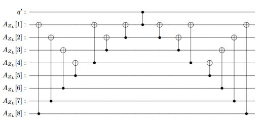
<figcaption class="paper-figure-caption"><b>Fig 4.</b> Fig. 6: Depth Optimal CZ for |AZL| = 8</figcaption>
</figure>
<figure class="paper-figure-card">
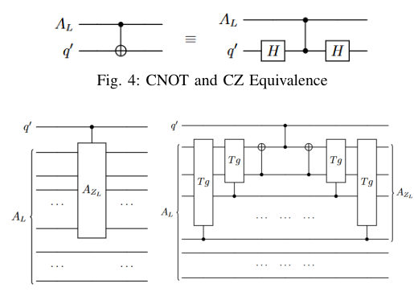
<figcaption class="paper-figure-caption"><b>Fig 5.</b> Fig. 5: CZ circuit with single qubit. (a) The desired CZ circuit between q′ and AL. (b) The proposed CZ method; it is comprised of CNOT gates and a single CZ gate. The control locations for each CNOT gate are given. However, for most of the CNOT gates, there are several possible target locations for each control. The Tg rectangles denote the possible qubit locations, with an implicit requirement for symmetry in their locations in the circuit.</figcaption>
</figure>

**Summary.** This paper introduces NOBOL, a protocol to perform logical CNOT gates between distant qubits using only one Bell pair, circumventing the high resource overhead associated with current fault-tolerant methods. By restricting operations to small logical operator subsets, NOBOL offers a scalable and code-agnostic solution for large-scale quantum computation architectures. This significantly advances the feasibility of distributed quantum networking.

**Why it may be interesting.** While focused on abstract quantum computation protocols, the resource management and error containment strategies discussed (e.g., stabilizing stabilizers) are highly relevant to designing physical quantum hardware architectures.

Detailed structure

**Main problem.** The primary challenge addressed is significantly reducing the overhead associated with performing logical CNOT operations between distant qubits in fault-tolerant quantum computation.

**Main result.** The authors propose NOBOL, a novel protocol that achieves the logical CNOT using only a single pre-shared Bell pair, drastically reducing the resource overhead compared to previous linear or quadratic scaling methods.

**Method.** The method leverages the fact that the operation can be restricted to acting only on the logical X or Z operator subsets of the qubits, which are assumed to be much smaller than the full code block size.

**Model / system.** The work is situated in the context of fault-tolerant quantum computation using arbitrary CSS codes, applicable to both monolithic and distributed quantum processing units (QPUs).

**Key observables.** Logical CNOT operation success, resource overhead (number of Bell pairs/SWAP gates), and circuit depth.

**Important parameters / regimes.** The size of the logical operator subsets ($	au$), the code distance ($d$), and the physical link fidelity ($p_{	ext{link}}$).

**Assumptions / limitations.** The method assumes that the logical CNOT can be realized by interacting only with the small subsets of physical qubits corresponding to the logical operators, and that error containment procedures can be effectively implemented.

**Figures summary.** Figures illustrate the remote CNOT operation using a distributed Bell pair and show the evolution of surface code stabilizers during the CNOT circuit, distinguishing between different stabilizer types.

**Paper structure.** The paper first establishes the high overhead of remote operations, introduces NOBOL as a solution requiring only one Bell pair, details the circuit realizations (including depth-optimal circuits), and concludes with effective methods for containing error propagation.

Abstract

Fault-tolerant quantum computation fundamentally relies on encoding a logical qubit into a structured block of physical qubits, typically in the tens to hundreds. As a trade-off for improved fault-tolerance, logical gate operations will incur a linear overhead in terms of both the amount of time and quantum resources than before. For example, in monolithic quantum computing, performing a gate operation on two distant logical qubits will first require using a linear number of SWAP operations in order to move the logical qubits next to each other; while in distributed quantum computing, doing so will first require a linear number of ancilla qubits in order to form entanglement connections (or a logical Bell pair).   In this paper, we focus on significantly reducing the overhead involved in logical CNOT operations, a fundamental primitive. We propose NOBOL, a novel approach that requires only one Bell pair to perform a logical CNOT operation on two distant qubits encoded in arbitrary CSS codes. More importantly, NOBOL only requires performing gate operations on the logical X or Z operator subsets of the logical qubits. For many CSS codes, such as the surface code, these subsets are significantly smaller than the size of the code itself. In this paper, we describe various circuit realizations of NOBOL, including a depth-optimal circuit with logarithmic depth in terms of the size of the logical operators. Finally, we propose effective methods to contain error propagation without incurring much additional overhead.   Since NOBOL can be effectively applied to a wide range of quantum error-correcting (QEC) codes and, in addition, is agnostic to qubit modalities and effective for various architectures, including those based on either a monolithic QPU or distributed QPUs.

[↑ back to top](#top)

### [Observation of g-wave altermagnetic multipole](http://arxiv.org/abs/2609.01969v1)

**Authors:** Ryo Misawa, Rikuto Oiwa, Shunsuke Kitou, Tatsuya Miki, Motohiko Ezawa, Weiyi Yun, Rinsuke Yamada, Chihaya Koyama, J. Alberto Rodríguez Velamazán, Kamil K. Kolincio, Navid Qureshi, Elina Zhakina, Yuiga Nakamura, Jan Masell, Ilya Belopolski, Taka-hisa Arima, Yusuke Nomura, Satoru Hayami, Max Hirschberger  
**Type:** both · **Category:** strongly correlated electrons · **PDF:** <https://arxiv.org/pdf/2609.01969v1>  
**Analysis basis:** full PDF text, analyzed in chunks

↔ Scroll figures horizontally

<figure class="paper-figure-card">
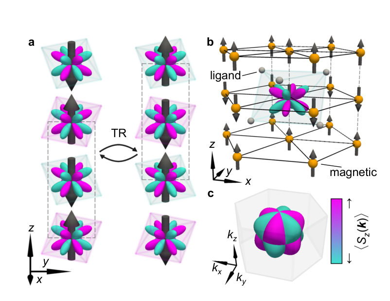
<figcaption class="paper-figure-caption"><b>Fig 1.</b> FIG. 1. Multipole description of g-wave altermagnetism. a, Concept of g-wave alter-</figcaption>
</figure>
<figure class="paper-figure-card">
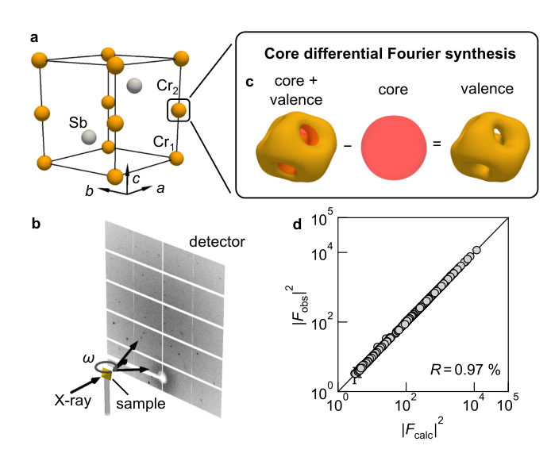
<figcaption class="paper-figure-caption"><b>Fig 2.</b> FIG. 2. Real-space visualization of valence electron density (VED) distribution by</figcaption>
</figure>
<figure class="paper-figure-card">
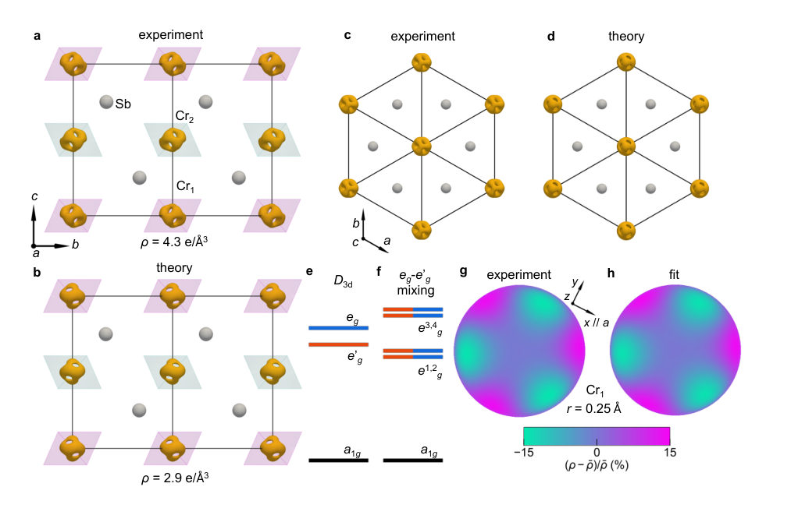
<figcaption class="paper-figure-caption"><b>Fig 3.</b> FIG. 3. Direct observation of anisotropic valence electron density (VED) in a g-wave</figcaption>
</figure>
<figure class="paper-figure-card">
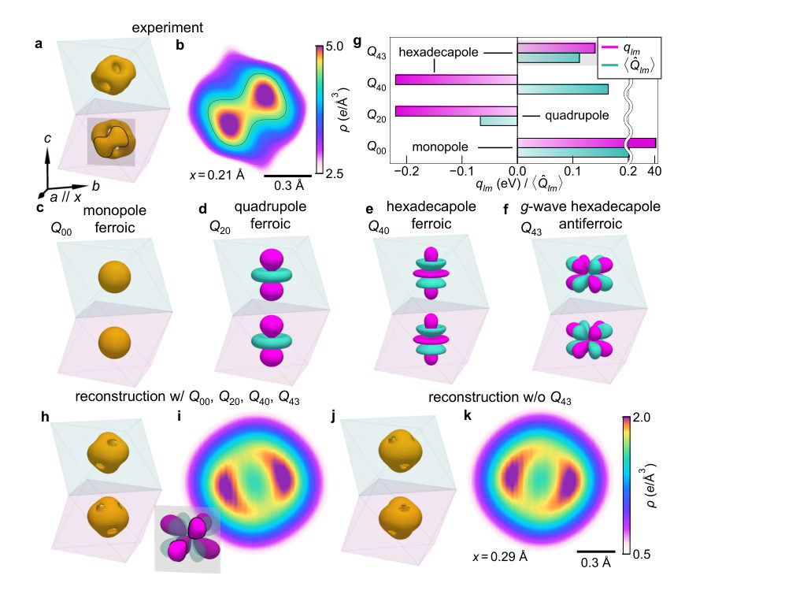
<figcaption class="paper-figure-caption"><b>Fig 4.</b> FIG. 4. Multipole decomposition of g-wave altermagnetic VED. a,b, Experimental VED</figcaption>
</figure>
<figure class="paper-figure-card">
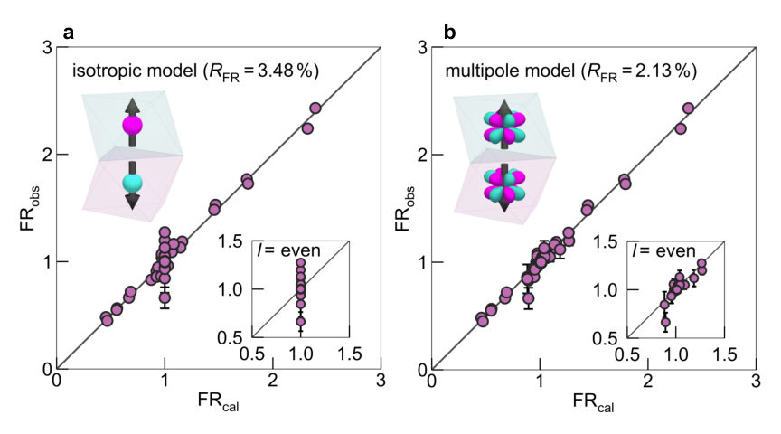
<figcaption class="paper-figure-caption"><b>Fig 5.</b> FIG. 5. Ferroic order of magnetic multipoles probed by polarized neutron diffraction.</figcaption>
</figure>

**Summary.** This paper reports the direct experimental observation of a $g$-wave electric multipole in the altermagnet CrSb using synchrotron X-ray diffraction. By analyzing the directional anisotropy of the Valence Electron Density, the authors confirm the existence of this higher-order multipole, establishing a real-space fingerprint of altermagnetism. This work connects subtle electric multipole order to measurable magnetic phenomena, advancing the field of quantum materials.

**Why it may be interesting.** The work provides a concrete, measurable link between higher-order electric multipole moments (like the $g$-wave hexadecapole) and observable electronic/magnetic properties, which is crucial for understanding exotic magnetic states beyond simple dipole moments.

Detailed structure

**Main problem.** To directly visualize and establish a real-space fingerprint of altermagnetism, specifically the hidden multipole order, in a material like CrSb.

**Main result.** The study successfully observed a pronounced, alternating directional anisotropy in the Valence Electron Density (VED) around Cr sites, confirming the presence of the predicted $g$-wave electric multipole order.

**Method.** The research combines high-energy synchrotron X-ray diffraction with Valence Electron Density (VED) analysis, complemented by theoretical modeling using symmetry-adapted Wannier functions and polarized neutron diffraction measurements.

**Model / system.** The physical system is the altermagnet CrSb. The theoretical framework models the electronic structure using a tight-binding Hamiltonian expanded in terms of electric multipoles ($\hat{Q}_{lm}$), relating the $g$-wave multipole to the spin splitting.

**Key observables.** Valence Electron Density (VED) anisotropy, the $g$-wave multipole term ($\alpha$), and the magnetic flipping ratio (FR) from polarized neutron diffraction.

**Important parameters / regimes.** The $g$-wave multipole amplitude ($	ext{Q}_{43}$), which was quantified to $0.21(6)$.

**Assumptions / limitations.** The VED is approximated as a linear combination of electric multipoles, and the spin splitting is modeled as being proportional to the $g$-wave multipole amplitude.

**Figures summary.** Figures illustrate the predicted antiferroic pattern of electric hexadecapoles, the crystal structure of CrSb, and the experimentally observed VED anisotropy around the Cr sublattices.

**Paper structure.** The paper progresses from establishing the theoretical necessity of higher-order multipoles in altermagnets, to presenting the experimental VED measurements confirming the $g$-wave multipole, and finally linking this electric order to measurable magnetic properties like spin splitting via polarized neutron diffraction.

Abstract

Over the past few years, altermagnets have emerged as a new class of collinear magnets with broken time-reversal symmetry, offering novel opportunities for spintronics beyond conventional magnets. Rather than from net magnetization, as in ferromagnets, the unconventional time-reversal symmetry breaking of altermagnets originates from antiferroic magnetic dipoles locked to higher-order multipoles. Here we report the direct visualization of a $g$-wave altermagnetic multipole in the canonical altermagnet CrSb. Combining high-energy synchrotron X-ray diffraction with valence electron density (VED) analysis, we uncover a pronounced directional anisotropy of the VED distribution alternating between Cr sublattices. This evidences the antiferroic order of electric hexadecapoles predicted in $g$-wave altermagnets. Its coexistence with antiferroic magnetic dipoles induces ferroic magnetic multipoles, as probed by polarized neutron diffraction. We further identify a microscopic model of altermagnetism that directly relates the $g$-wave multipole and the $g$-wave spin splitting. Through direct observation and quantification of multipoles, this study provides a real-space fingerprint of altermagnetism and establishes a general probe of hidden multipole order in quantum materials.

[↑ back to top](#top)

### [Optimal Fusion Strategies for Quantum Computation](http://arxiv.org/abs/2609.02559v1)

**Authors:** Kenneth Goodenough, Andrew Landahl, Joon Lee, Antonio Russo, Kevin Thompson  
**Type:** theory · **Category:** quantum information and computing · **PDF:** <https://arxiv.org/pdf/2609.02559v1>  
**Analysis basis:** full PDF text, analyzed in chunks

↔ Scroll figures horizontally

<figure class="paper-figure-card">
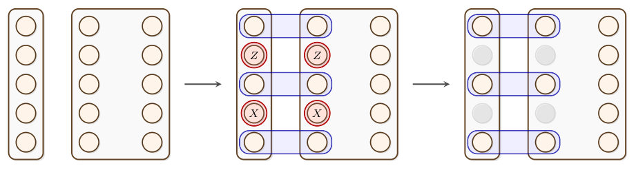
<figcaption class="paper-figure-caption"><b>Fig 1.</b> Figure 1: An encoded single qubit quantum state undergoes σ-fusions for each pair of qubits in (L, LA). The type of each fusion is labeled as a subscript of the blue edges on the leftmost figure. The successful fusions implement a Bell state measurement on the corresponding qubits while a failure implements single qubit measurements in a basis determined by the type of the fusion. If enough fusions succeed then the logical state on L is teleported to LB (depicted on the right side of the figure).</figcaption>
</figure>

**Summary.** This paper characterizes the optimal strategies for performing logical quantum fusions when physical measurements are probabilistic. It establishes necessary and sufficient conditions for 'perfect fusion' in stabilizer codes, solving an open problem for parity-check codes. The work also introduces a graph parameter derived from graph theory that quantifies the robustness of these quantum protocols.

**Why it may be interesting.** The connection between graph parameters (like the maximum LC degree) and the operational robustness of quantum computation (perfect fusion) provides a deep, structural insight into the limits of quantum networking protocols.

Detailed structure

**Main problem.** The paper aims to find optimal 'fusion strategies' to maximize the success probability of logical fusions in quantum computation, especially when physical fusions are inherently probabilistic.

**Main result.** It provides a complete characterization of perfect fusion strategies for single-qubit encoded stabilizer codes and shows that random graph codes admit such strategies with high probability.

**Method.** The analysis uses techniques from quantum error correction theory, relating logical failure to the presence of non-trivial logical operators in the failure measurement outcomes, and employs graph theory concepts like Local-Complementation equivalence.

**Model / system.** The model involves quantum information processing using Quantum Error Correcting Codes (QECCs) encoded into stabilizer codes, where logical operations are performed via probabilistic physical fusions between qubits.

**Key observables.** Fusion Strategy, Perfect Strategy, Fusion Distance, $\Delta_{	ext{LC}}(G')$ (maximum LC degree).

**Important parameters / regimes.** The code parameters $[[n, 1, d]]$, the failure basis choices (X, Y, Z), and the graph structure $G'$.

**Assumptions / limitations.** The analysis is restricted to non-adaptive fusion strategies, and the initial results for random graph codes are compared to the general case for random stabilizer codes.

**Figures summary.** Figure 1 illustrates encoded single qubit state fusion processes; Figure 2 shows various submatrices (Laplacian, Adjacency) used in the random graph analysis.

**Paper structure.** The paper progresses from characterizing perfect fusion strategies for stabilizer codes (relating it to logical operators) to analyzing the probability of successful outcomes in random graph settings using advanced random matrix theory techniques.

Abstract

Logical fusions are important for a number of tasks in quantum information, such as quantum error correction and quantum repeaters. In the photonic setting one must contend with the fact that physical fusions are probabilistic (i.e.~the associated qubits are measured in product bases), which---depending on the failures and the associated bases---can lead to a failure on the logical level. The choice of failure basis of each qubit is known as a fusion strategy, and finding good fusion strategies is important for optimizing performance of fusion-based quantum computation. Here we provide a complete characterization when $k=1$ qubits are encoded, and in particular characterize those codes and fusion strategies such that all but one physical fusion can fail, i.e.~\emph{perfect fusion strategies}. In doing so, we recover previously known perfect fusion strategies, and find perfect fusion strategies for quantum parity-check codes, answering an open question. We furthermore show that perfect fusion strategies are generic: random $[[n, 1, d]]$ graph codes admit a perfect fusion strategy with probability exponentially close to $1$. Additionally we motivate the study of a new graph parameter, namely the maximum degree of a graph at a given vertex taken over all LC-equivalent graphs, by giving a new operationally meaningful interpretation of it.

[↑ back to top](#top)

### [Quantum Meta-Complexity Is All You Need: Characterizing One-Way Puzzles via Time-Bounded Kolmogorov Complexity](http://arxiv.org/abs/2609.02687v1)

**Authors:** Morteza Saberikamarposhti  
**Type:** theory · **Category:** quantum information and computing · **PDF:** <https://arxiv.org/pdf/2609.02687v1>  
**Analysis basis:** full PDF text, analyzed in chunks

↔ Scroll figures horizontally

<figure class="paper-figure-card">
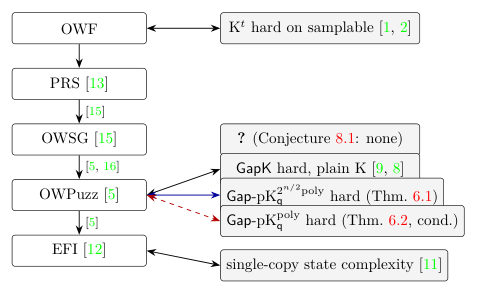
<figcaption class="paper-figure-caption"><b>Fig 1.</b> Figure 1: The meta-complexity map of Microcrypt. Left: primitives with known implications; oracle separations in the reverse directions are known or conjectured [17, 18, 19]. Right: characterizing problems. Black double arrows are prior equivalences; the blue double arrow is this paper’s unconditional Theorem 6.1; the dashed red double arrow is the conditional Theorem 6.2; the question mark is Conjecture 8.1.</figcaption>
</figure>
<figure class="paper-figure-card">
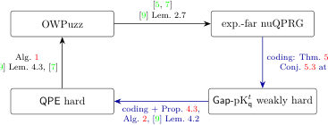
<figcaption class="paper-figure-caption"><b>Fig 2.</b> Figure 2: Architecture of the characterization. Black edges are unconditional prior work; blue edges con- sume a coding theorem, unconditionally supplied at t∗= 2n/2poly(n) by Theorem 5.1 and at polynomial time by Conjecture 5.3.</figcaption>
</figure>
<figure class="paper-figure-card">
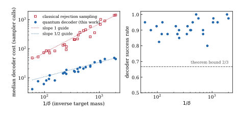
<figcaption class="paper-figure-caption"><b>Fig 3.</b> Figure 4: Numerical validation of Theorem 5.1 on ex- actly simulated 14-qubit samplers. Left: median decoder cost against 1/δ, quantum decoder versus the classical rejection-sampling baseline on the identical task, with slope 1/2 and slope 1 guides. Right: per-target success rate against the theorem’s 2/3 bound (dashed).</figcaption>
</figure>
<figure class="paper-figure-card">
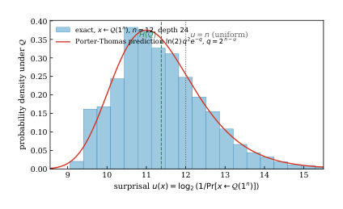
<figcaption class="paper-figure-caption"><b>Fig 4.</b> Figure 3: Exact surprisal distribution of a depth-24 brick- work random-circuit sampler on n = 12 qubits (mass- weighted histogram) against the Porter-Thomas predic- tion (curve). Dashed line: measured entropy H(Q); dotted line: the uniform value u = n.</figcaption>
</figure>
<figure class="paper-figure-card">
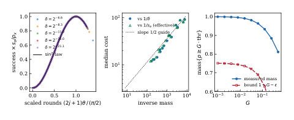
<figcaption class="paper-figure-caption"><b>Fig 5.</b> Figure 5: Mechanism-level validation. Left: exact success probability after j rounds for five targets spanning fifteen orders of magnitude in mass, collapsed onto the rotation law sin2((2j + 1)θ). Centre: median decoder cost at n = 16 against 1/δ and against the effective marked mass 1/sa, with a slope-1/2 guide; the 1/sa exponent is 0.556. Right: measured mass on high-probability strings against the partition bound 1 −G −ϵ of [9].</figcaption>
</figure>

**Summary.** This work develops a quantum meta-complexity framework to characterize one-way puzzles, proving that their existence is equivalent to a specific quantum average-case hardness problem. The authors establish a quantum coding theorem and highlight that string-based complexity is sufficient for puzzles but potentially insufficient for more complex quantum state generators.

**Why it may be interesting.** While highly abstract, the rigorous connection between information-theoretic complexity measures (like Kolmogorov complexity) and the existence of cryptographic primitives provides deep theoretical insights into the limits of quantum computation.

Detailed structure

**Main problem.** The paper aims to characterize the existence of one-way puzzles using time-bounded quantum meta-complexity, establishing a necessary and sufficient condition based on quantum average-case hardness.

**Main result.** It proves that one-way puzzles exist if and only if the gap problem for the quantum time-bounded complexity measure ($pKt_q$) is weakly quantum-average-hard at subexponential time bounds.

**Method.** The methodology involves defining the probabilistic time-bounded quantum program complexity ($pKt_q$) and utilizing quantum coding theorems derived via amplitude amplification to link information-theoretic bounds to computational hardness.

**Model / system.** The focus is on quantum computation models applied to classical strings, specifically analyzing one-way puzzles (minimal search primitives for quantum cryptography) and comparing them to one-way state generators.

**Key observables.** Probabilistic time-bounded quantum program complexity ($pKt_q$), sampling mass ($\delta$), and the hardness of the gap problem ($	ext{Gap-}pKt^*_q$).

**Important parameters / regimes.** Time bounds, particularly subexponential time $t^*(n) = 2n/2	ext{poly}(n)$, and the probability $\delta$ of the quantum sampler.

**Assumptions / limitations.** The core results rely on several conjectures, notably the polynomial-time coding theorem (Conjecture 5.3), which remains unproven.

**Figures summary.** Figure 1 maps cryptographic primitives to complexity measures; Figure 3 shows the surprisal distribution for a random circuit sampler; Figure 4 validates the quantum decoder's scaling against theoretical bounds.

**Paper structure.** The paper develops the meta-complexity program by defining $pKt_q$, proving the quantum coding theorem (Theorem 5.1), establishing the main equivalence (Theorem 6.1), and concluding with open conjectures regarding state generators and the barrier conjecture.

Abstract

We initiate the time-bounded meta-complexity program for quantum cryptography. Recent work characterizes one-way puzzles, the minimal search primitive of quantum cryptography without one-way functions, by the average-case hardness of approximating the plain, uncomputable Kolmogorov complexity over quantumly samplable distributions; the classical program of Liu and Pass, by contrast, lives at polynomial time bounds. We define a probabilistic time-bounded quantum program complexity pKq^t for classical strings and prove two unconditional theorems. First, a quantum coding theorem: any string output by a quantum polynomial-time sampler with probability delta admits a description of the information-theoretically optimal length log(1/delta) plus logarithmic terms, decodable by a quantum machine in time O(sqrt(1/delta)) times a polynomial, via amplitude amplification over the coherently executed sampler. Second, an exact characterization at subexponential time: one-way puzzles exist if and only if the gap problem for pKq at time bound 2^(n/2) poly(n) is weakly quantum-average-hard, refining the plain-complexity characterizations. We then isolate the polynomial-time coding theorem as the single load-bearing open conjecture of the program, prove that it implies the full polynomial-time characterization, analyze why the classical derandomization proof resists quantization, and formulate a relativized barrier conjecture delimiting string-valued meta-complexity at one-way puzzles. Conjectures are labeled as such throughout.

[↑ back to top](#top)

## Secondary cond-mat archives

*Papers from cond-mat.mtrl-sci, mes-hall, other, soft, supr-con. These archives are de-prioritized — they appear at the end regardless of relevance score.*

### Relevant in secondary archives (23)

### [Interaction effects on Andreev states from an electromagnetic environment](http://arxiv.org/abs/2609.01935v1)

**Authors:** Erik S. Samuelsen, Yuli V. Nazarov  
**Type:** theory · **Category:** other · **PDF:** <https://arxiv.org/pdf/2609.01935v1>  
**Analysis basis:** full PDF text, analyzed in chunks
**Topic relevance:** 🔥 `Keldysh / 2PI / non-Gaussian methods` **4/5** · `correlated / nonlocal dissipation` **3/5** · `driven-dissipative phase transition` **2/5** · `methods for driven-dissipative` **2/5** · `non-equilibrium universality` **1/5** · `quantum measurements` **1/5**

↔ Scroll figures horizontally

<figure class="paper-figure-card">
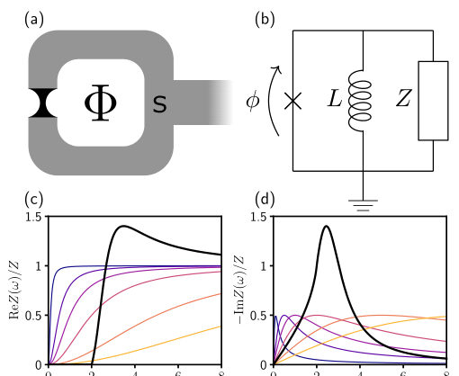
<figcaption class="paper-figure-caption"><b>Fig 1.</b> FIG. 1. The setup and impedance models. (a) The junction enclosed in a superconducting loop with flux Φ, which is cou- pled to a circuit. (b) Circuit theory representation of the ex- ternal impedance model. (c-d) Real and imaginary part of the frequency-dependent impedance. Colored lines: the external impedance model for ω0/∆= [0.1, 0.5, 1.0, 2.0, 5.0, 10](from dark blue to yellow). Black line: The Mattis-Bardeen (MB) model.</figcaption>
</figure>
<figure class="paper-figure-card">
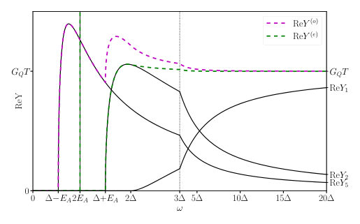
<figcaption class="paper-figure-caption"><b>Fig 2.</b> FIG. 2. The state resolved junction admittance vs frequency for T = 0.9 and ϕ = 3π/4 which gives EA ≈0.48∆. The pur- ple and green dashed lines give the real part of the admittance in the odd and even ground state respectively. The black lines show the decomposition of the admittance into different dis- sipation channels ReY1, ReY2, and ReY5 as indicated on the right vertical axis. The contributions from ReY3 ∝δ(ω−2EA) to ReY (e) is illustrated with the black and dashed green ver- tical lines at ω = 2EA. At ω = 3∆we change the horizontal scale as indicated by the dotted line.</figcaption>
</figure>
<figure class="paper-figure-card">
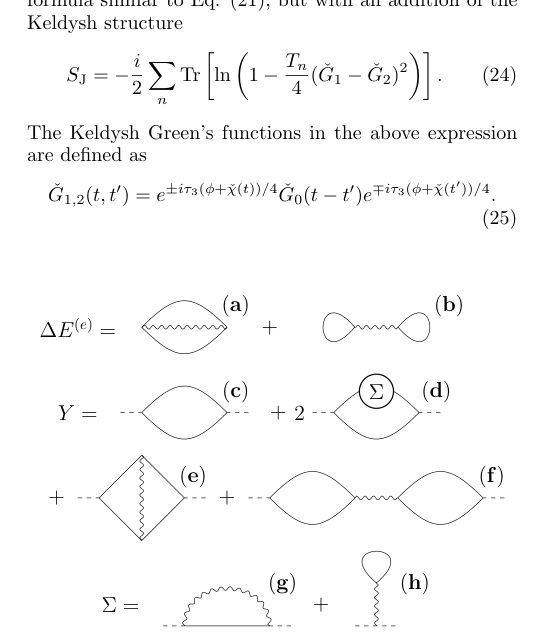
<figcaption class="paper-figure-caption"><b>Fig 3.</b> FIG. 3. Diagrams related to the interaction corrections. The solid lines represent fermionic Green’s functions originating from (20) and (25), while the wiggly lines represent the prop- agators of the external flux. (a-b) The corrections to the ground state energy, where (a) gives a convolution involving Z(ω), while (b) gives an inductive correction ∝L. (c) The bare junction admittance. The interaction correction to the admittance is given by the sum of (d −f). (d) The electron self-energy contribution, where ’Σ’ is the sum of the diagrams in (g) and (h). (e) A vertex correction. (f) A circuit-theory correction to the admittance. Comparing (a) and (c), we see the relation between the...</figcaption>
</figure>
<figure class="paper-figure-card">
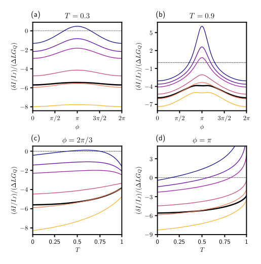
<figcaption class="paper-figure-caption"><b>Fig 4.</b> FIG. 5. Relative correction to the even ground state su- perconducting current. In all plots, colored lines give the results for the external impedance model with ω0/∆ = [0.1, 0.5, 1, 3, 5, 10] (from dark blue to yellow). The black line gives the results for the MB model. The parameters are: (a) T = 0.3 vs ϕ, (b) T = 0.9 vs ϕ, (c) ϕ = 2π/3 vs T, (d) ϕ = π vs T. In (d) the results for the external impedance model exhibit logarithmic divergence at T →1 (too weak to be visually resolved for large ω0), while the result for MB model approaches a finite limit ≈−2.86. The black dashed line marks zero for reference.</figcaption>
</figure>
<figure class="paper-figure-card">
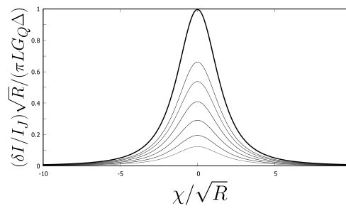
<figcaption class="paper-figure-caption"><b>Fig 5.</b> FIG. 4. Interaction correction to the even ground state su- perconducting current at small EA. The correction may be anomalously big (∝1/ √</figcaption>
</figure>

**Summary.** This theoretical study calculates the interaction corrections to the energy levels of a superconducting junction due to coupling with an electromagnetic environment. By employing advanced techniques like the Keldysh formalism and diagrammatic expansions, the authors derive formulas showing that these environmental effects can significantly alter superconducting properties, even when the coupling appears weak.

**Why it may be interesting.** This work is highly relevant to open quantum systems and quantum electrodynamics in condensed matter, as it provides quantitative predictions for how environmental dissipation and coupling modify fundamental superconducting quantum properties.

Detailed structure

**Main problem.** The paper theoretically investigates how coupling a short superconducting junction to an electromagnetic environment modifies the ground state energies and addition energies of its Andreev bound states.

**Main result.** The interaction corrections are derived, showing that the relative correction scale can be governed by $L G_Q \Delta$ rather than the naive $G_Q Z$, and these corrections can be significant even when the coupling strength $G_Q Z$ is small.

**Method.** The authors use a theoretical framework involving the calculation of junction admittance via the Keldysh technique and diagrammatic expansion (Feynman diagrams) to account for environmental coupling.

**Model / system.** The system is a short superconducting junction connecting two superconductors, whose energy levels (Andreev bound states) are perturbed by an external electromagnetic environment modeled either by an external impedance or the Mattis-Bardeen model.

**Key observables.** Interaction corrections to the even ground state energy ($\Delta E(e)$), the odd doublet addition energy ($\delta_{	ext{odd}}$), and the singlet addition energy ($\delta_{	ext{even}}$).

**Important parameters / regimes.** Superconducting energy gap ($\Delta$), conductance quantum ($G_Q$), environmental impedance ($Z$), external inductance ($L$), and various frequency scales ($\omega_H, \omega_L$).

**Assumptions / limitations.** The analysis assumes the junction is 'short' and employs approximations based on the relative strength of coupling ($G_Q Z \ll 1$), while also exploring non-perturbative regimes.

**Figures summary.** Figures illustrate the setup, the impedance models for the environment, and the decomposition of the state-resolved junction admittance as a function of frequency.

**Paper structure.** The paper builds from defining the physical system and environmental models, deriving general formulas for interaction corrections, calculating specific energy shifts ($\Delta E_e, \delta_{	ext{odd}}, \delta_{	ext{even}}$) using diagrammatic techniques, and analyzing the results in various physical regimes (small phases, near gap edges).

Abstract

Here we present a detailed theoretical investigation of the environment-induced interaction correction to the ground states and addition energies in a short superconducting junction. We derive general formulas for these corrections linking them to the frequency-dependent admittance of the junction and the environment impedance. We specify two environmental models: that of an external impedance and the Mattis-Bardeen model. In both cases we assume $G_Q Z \ll 1$, where $G_Q$ is the conductance quantum and $Z$ the typical environmental resistance.   While an expectation is that the typical scale of the relative correction is of the order $G_Q Z$, we have found that in many cases the dimensionless scale $L G_Q Δ$ provides a better estimation, where $Δ$ is the superconducting energy gap and $L$ an external inductance. We discuss the logarithmic renormalizations of the energies by low- and high-frequency phase fluctuations and single out a non-superconducting contribution related to the renormalization of transmission eigenvalues. We investigate in detail the peculiarities of the corrections at: i. small phases, where the interaction causes a current jump, ii. Andreev bound state energies close to the gap edge, iii. Andreev bound state energies close to Fermi level. In all these cases the correction may become comparable with the unperturbed energy, even for $G_Q Z \ll 1$, and we briefly sketch non-perturbative models relevant for the situations.

[↑ back to top](#top)

### [Magnetoelectric Phase Transition and Axion Dynamics](http://arxiv.org/abs/2609.02759v1)

**Authors:** Chen-Hui Xie, Runyu Lei, Jiayi Liu, Yihuai Chen, Jinxing Zhang, Yu Gao, Sichun Sun  
**Type:** theory · **Category:** statistical mechanics · **PDF:** <https://arxiv.org/pdf/2609.02759v1>  
**Analysis basis:** full PDF text, analyzed in chunks
**Topic relevance:** `driven-dissipative phase transition` **3/5** · `non-equilibrium universality` **3/5** · `Keldysh / 2PI / non-Gaussian methods` **2/5** · `methods for driven-dissipative` **2/5** · `analog quantum simulation` **1/5** · `correlated / nonlocal dissipation` **1/5**

↔ Scroll figures horizontally

<figure class="paper-figure-card">
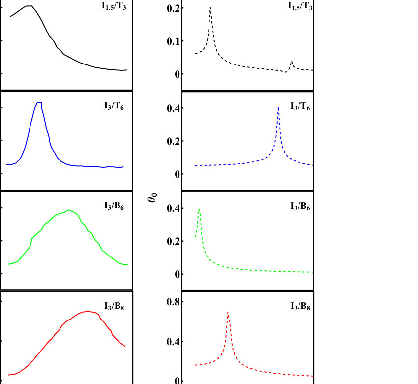
<figcaption class="paper-figure-caption"><b>Fig 1.</b> FIG. 1. Left: The relationship between the AQ angle θ and the temperature T. The black, blue, green, and red curves represent cases where the ME phase transition temperature Tc = 46 K, 77 K, 166 K, and 203 K, respectively. These curves are got by θ = 4π2</figcaption>
</figure>
<figure class="paper-figure-card">
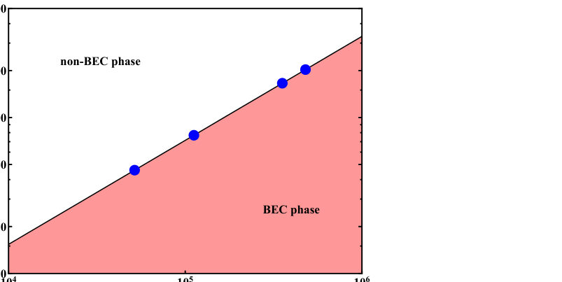
<figcaption class="paper-figure-caption"><b>Fig 2.</b> FIG. 2. The BEC phase diagram. The blue dots represent cases Tc=46, 77, 166, 203 K from the experimental measurement in Ref. [8].</figcaption>
</figure>
<figure class="paper-figure-card">
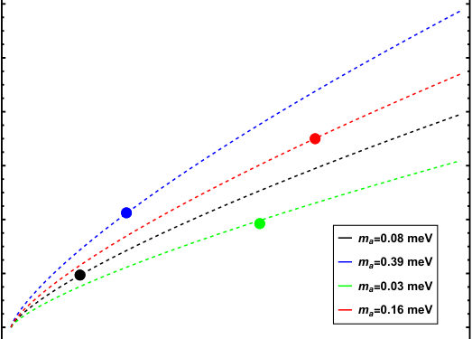
<figcaption class="paper-figure-caption"><b>Fig 3.</b> FIG. 3. The relationship between the ME coupling θ0 and Tc. The black, blue, green, and red curves represent cases ma = 0.08, 0.39, 0.03, 0.16 meV for different ME materials I1.5/T3, I3/T6, I3/B6 and I3/B8, respectively. The dots are obtained from the experimental measurement in Ref. [8].</figcaption>
</figure>
<figure class="paper-figure-card">
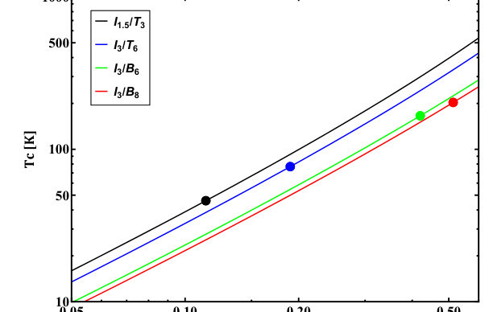
<figcaption class="paper-figure-caption"><b>Fig 4.</b> FIG. 4. The fitting curves for the phase transition temperature Tc and frequency shift ∆f. The black, blue, green, and red curves represent cases I1.5/T3, I3/T6, I3/B6, and I3/B8, respectively. The blue and green dots are experimental data, while the black and red dots are estimates.</figcaption>
</figure>
<figure class="paper-figure-card">
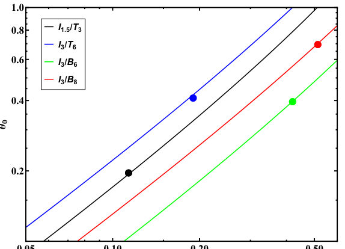
<figcaption class="paper-figure-caption"><b>Fig 5.</b> FIG. 5. The fitting curves for the static AQ angle θ0 and the frequency shift ∆f. The black, blue, green, and red curves represent cases I1.5/T3, I3/T6, I3/B6, and I3/B8, respectively. The blue and green dots come from experimental data, while the black and red dots come from estimation.</figcaption>
</figure>

**Summary.** This work proposes that magnetoelectric phase transitions are governed by the condensation-like dynamics of an axion quasiparticle. By applying an extended Ginzburg-Landau framework analogous to BEC theory, the authors derive quantitative relationships linking the static axion angle, the transition temperature, and the material's intrinsic coupling strengths. This provides a novel, unified theoretical description for understanding ME effects.

**Why it may be interesting.** The connection drawn between the critical dynamics of a condensed matter phase transition (ME transition) and the universal physics of BEC provides a powerful, unifying theoretical lens for understanding emergent quantum phenomena in solids.

Detailed structure

**Main problem.** To develop a macroscopic theory explaining the dynamical origin of magnetoelectric (ME) phase transitions, which are experimentally observed but lack a comprehensive theoretical framework.

**Main result.** The ME phase transition can be successfully modeled by treating the axion quasiparticle (AQ) field as undergoing a Bose-Einstein Condensation (BEC)-like process, yielding scaling laws between the static AQ angle and the transition temperature.

**Method.** The authors employ an extended Ginzburg-Landau (GL) theory, linearizing the equations of motion around the critical temperature and analyzing the resulting dynamics in the frequency domain.

**Model / system.** The system involves coupled dynamics of magnetization (M), polarization (P), and the axion angle ($	heta$) in ME materials, modeled using a free energy functional and incorporating concepts from Dzyaloshinskii-Moriya Interaction (DMI).

**Key observables.** Static AQ angle ($	heta_0$), AQ frequency ($\omega_a$), and the ME phase transition temperature ($T_c$).

**Important parameters / regimes.** Phenomenological coefficients ($\lambda_M, \lambda_	heta$), damping coefficients ($\eta_M, \eta_P$), and the DMI strength ($D$).

**Assumptions / limitations.** The analysis relies on phenomenological damping terms inserted by hand, the assumption of spatially homogeneous solutions, and treating the AQ dynamics as a weakly interacting Bose gas.

**Figures summary.** Figures illustrate the relationship between the AQ angle and temperature, showing power-law scaling ($	heta_0 \propto T_c^{3/4}$) that fits experimental data, and depict the BEC phase diagram.

**Paper structure.** The paper progresses by establishing the ME coupling, formulating the dynamics via GL theory, deriving the BEC analogy for the AQ field, and finally deriving quantitative relationships between $	heta_0$, $\omega_a$, and $T_c$ by solving the linearized equations of motion.

Abstract

Magnetoelectric phase transitions have been experimentally studied, but no macroscopic theory has been proposed to explain their dynamical origin. In this work, we assume that the axion quasiparticle with frequency undergoes a condensation like process. We show that these magnetoelectric phase transitions can be described within a Ginzbur Landau framework by introducing a coupled dynamic parameter, the axion angle, which is proportional to the magnetoelectric coeffcient. We derive relations between the static axion angle, the axion frequency, and the phase transition temperature for different magnetoelectric materials, respectively, and compare these calculations with existing experimental results. We also connect the artificially designed Dzyaloshinskii Moriya interaction with the axion condensate like process, so that the relation between the static axion angle and the experimentally measured frequency shift can be obtained.

[↑ back to top](#top)

### [Chemical pressure and vacancies in crystals under nonhydrostatic stress](http://arxiv.org/abs/2609.02435v1)

**Authors:** Michiel Sprik  
**Type:** theory · **Category:** statistical mechanics · **PDF:** <https://arxiv.org/pdf/2609.02435v1>  
**Analysis basis:** full PDF text, analyzed in chunks
**Topic relevance:** `Keldysh / 2PI / non-Gaussian methods` **3/5** · `analog quantum simulation` **2/5** · `methods for driven-dissipative` **2/5** · `non-equilibrium universality` **2/5** · `Frenkel-Kontorova` **1/5** · `quantum measurements` **1/5**

↔ Scroll figures horizontally

<figure class="paper-figure-card">
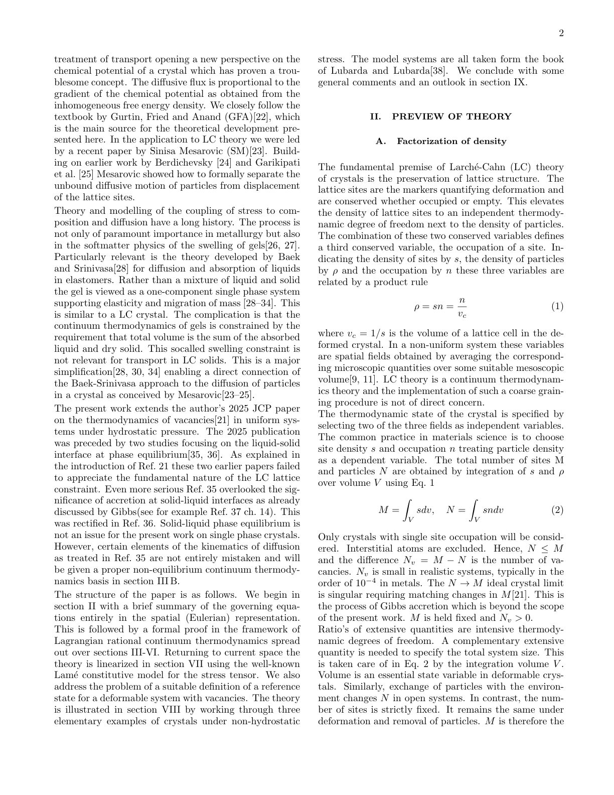
<figcaption class="paper-figure-caption"><b>Fig 1.</b> Low-resolution page preview, page 2</figcaption>
</figure>
<figure class="paper-figure-card">
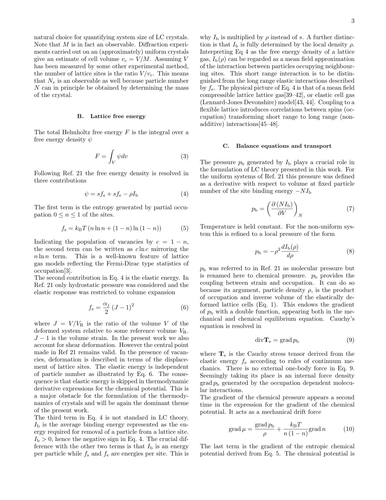
<figcaption class="paper-figure-caption"><b>Fig 2.</b> Low-resolution page preview, page 3</figcaption>
</figure>
<figure class="paper-figure-card">
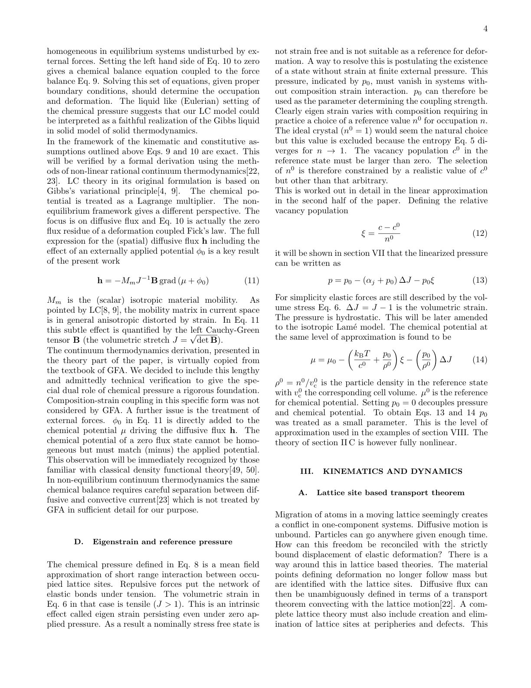
<figcaption class="paper-figure-caption"><b>Fig 3.</b> Low-resolution page preview, page 4</figcaption>
</figure>
<figure class="paper-figure-card">
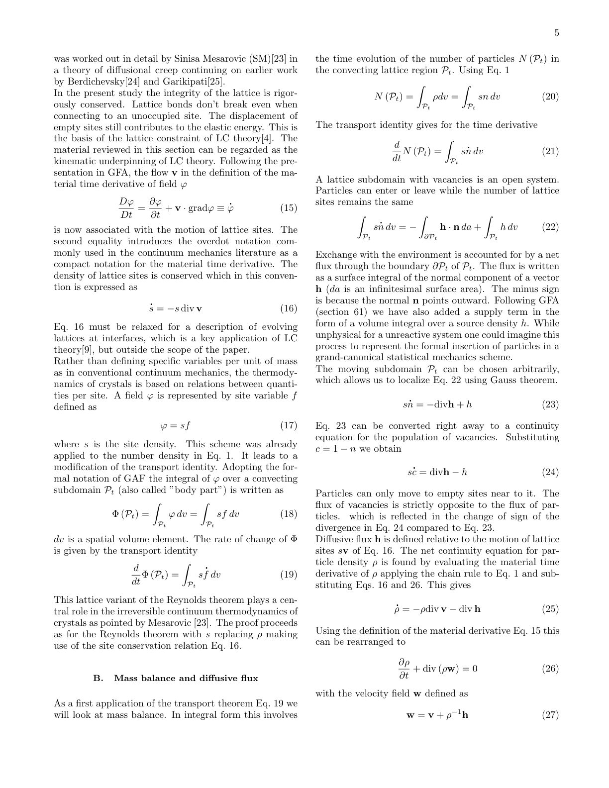
<figcaption class="paper-figure-caption"><b>Fig 4.</b> Low-resolution page preview, page 5</figcaption>
</figure>
<figure class="paper-figure-card">
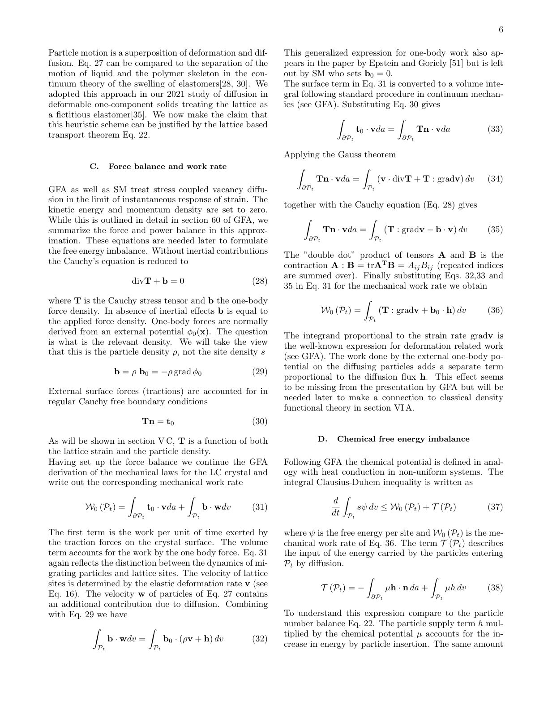
<figcaption class="paper-figure-caption"><b>Fig 5.</b> Low-resolution page preview, page 6</figcaption>
</figure>

**Summary.** This work develops a thermodynamic model for crystalline solids that accounts for the coupling between mechanical stress and the concentration of vacancies via a chemically induced pressure. By deriving governing equations from non-equilibrium thermodynamics, the authors propose an alternative to standard theories, showing how chemical potential gradients act as internal body forces under external stress.

**Why it may be interesting.** While focused on classical condensed matter, the rigorous application of non-equilibrium thermodynamics and the coupling of multiple degrees of freedom (mechanical strain and chemical composition) mirrors complex open quantum systems where energy and particle exchange are coupled.

Detailed structure

**Main problem.** The paper investigates the coupling between mechanical stress and chemical equilibrium (composition/vacancy concentration) in crystalline solids under nonhydrostatic stress.

**Main result.** The proposed chemical pressure model generates an internal density-dependent stress that modifies the standard Larché-Cahn (LC) thermomechanical response, showing qualitative agreement with LC theory for surface tractions.

**Method.** The theory is derived using non-equilibrium continuum thermodynamic methods, formulating governing equations based on free energy density and chemical potential gradients.

**Model / system.** The system is a one-component crystal with a fixed number of lattice sites, modeled as a compressible lattice gas. The coupling mechanism is based on letting the site binding energy vary with spatial density, generating a chemical pressure.

**Key observables.** Chemical pressure, vacancy number ($N_v$), stress tensor (Cauchy/Piola), and chemical potential ($\mu$).

**Important parameters / regimes.** Nonhydrostatic stress (surface tractions, gravitation), temperature ($T$), and lattice site density ($s$).

**Assumptions / limitations.** The analysis is restricted to equilibrium properties, and the model assumes a single-component crystal with no interstitial atoms.

**Paper structure.** The paper develops the theory by first defining the free energy density incorporating elastic and binding energy terms. It then derives coupled balance equations for force and chemical potential, showing how the chemical pressure gradient acts as both a drift force and an internal body force.

Abstract

Inhomogeneous stress is a driving force for diffusion of vacancies in crystals. The other way around a non-uniform distribution of vacancies induces stress. The accepted theory of composition-stress coupling in crystals is Larché-Cahn (LC) theory. Composition is defined in terms of the population of lattice sites with a limit of one-particle per site. Coupling is modelled by adding a compositional strain term to the elastic strain in the constitutive relation for stress. An alternative mechanism, proposed here, is letting the site binding energy vary with spatial (deformed) density. This generates a chemical pressure adding to the elastic stress. The governing equations for this model are derived using non-equilibrium continuum thermodynamic methods. The gradient of the chemical pressure has a dual function acting both as the drift force for migration and as an effective internal one body force in the Cauchy equation for the elastic stress. The practical evaluation presented in the paper is restricted to equilibrium properties. We examine the effect of externally applied non-hydrostatic stress, either in the form of surface tractions or a one-body force density (gravitation). The model system is a one component crystal with a fixed number of lattice sites. The number of particles can be variable but is always smaller than the number of lattice sites. The linear elastic response is modelled by the standard Lamé stress tensor. The results for systems deformed by surface tractions are in qualitative agreement with LC theory allowing for differences in the expression for the elastic moduli. Deviations are more serious for the crystal deformed by gravitation.

[↑ back to top](#top)

### [In silico design of magnonic lasing in constricted waveguides](http://arxiv.org/abs/2609.02338v1)

**Authors:** Jean F. Oliveira da Silva, Rai M. Menezes, Milorad V. Milosevic  
**Type:** theory · **Category:** other · **PDF:** <https://arxiv.org/pdf/2609.02338v1>  
**Analysis basis:** full PDF text, analyzed in chunks
**Topic relevance:** `driven-dissipative phase transition` **3/5** · `analog quantum simulation` **2/5** · `methods for driven-dissipative` **2/5** · `non-equilibrium universality` **2/5** · `Keldysh / 2PI / non-Gaussian methods` **1/5** · `superradiant laser` **1/5**

↔ Scroll figures horizontally

<figure class="paper-figure-card">
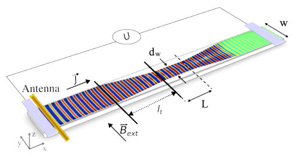
<figcaption class="paper-figure-caption"><b>Fig 1.</b> FIG. 1. Schematic illustration of the studied system. A metallic ferromagnetic waveguide of width W, with a bow-tie constriction at its center. SWs are generated by an antenna on the left-hand side and propagate along the +ˆx-direction. An external bias magnetic field, ⃗Bext, is applied in the +ˆy- direction. The constriction width, dw, length of the constric- tion, L, and taper length, lt, are varied to study the effects of spatial current gradients on SW propagation.</figcaption>
</figure>
<figure class="paper-figure-card">
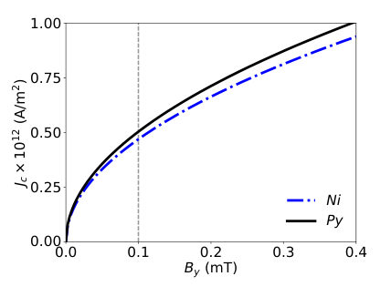
<figcaption class="paper-figure-caption"><b>Fig 2.</b> FIG. 2. Critical current as a function of the external field By for permalloy and nickel thin films (see parameters in Sec. II C). The gray dashed line corresponds to By = 0.1 mT, the bias field considered in Sec. III.</figcaption>
</figure>
<figure class="paper-figure-card">

<figcaption class="paper-figure-caption"><b>Fig 3.</b> FIG. 3. Dispersion relation for the unconstricted permal- loy strip of width w = 0.8 µm and applied current (a) J = 0, (b) J = Jc, (c) J = 4Jc, and (d) J = 6Jc, where Jc = 5.03 × 1011 A/m2 is the critical current. The red and blue dashed lines correspond to the +ω and −ω solutions of Eq. (4), respectively. The white dots in (a) and (d) indicate the possible propagating modes for a chosen frequency ω. The shaded region in (c) highlights the wave-vector range where only negative-energy modes are allowed.</figcaption>
</figure>
<figure class="paper-figure-card">
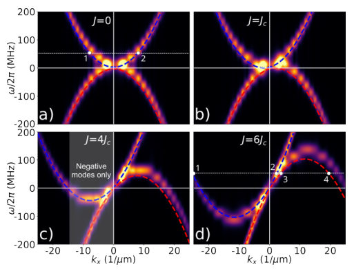
<figcaption class="paper-figure-caption"><b>Fig 4.</b> Figure 4(b) shows the transmitted SW amplitude as a function of the DHC length L for different values of the current density inside the DHC. The signal was cal- culated immediately after the cavity L in a region of 300 nm length and it was normalized by the transmis- sion amplitude in the absence of any current (J = 0) in the same region. Crucially, transmission peaks charac- teristic of resonant behavior [14, 17] emerge for the two highest values of J considered in Fig. 4(b), with minor oscillations also observed for the other current density values, except J = 0. Figures 4(c–e) show space–time diagrams of the SW</figcaption>
</figure>
<figure class="paper-figure-card">
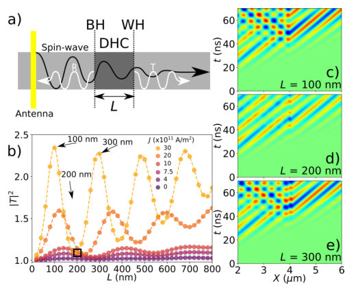
<figcaption class="paper-figure-caption"><b>Fig 5.</b> FIG. 4. (a) Setup for spin-wave propagation through a step- like current profile, with the damped wave and horizons indi- cated. Once the SW enters the DHC, it splits into reflected (R) and transmitted (T) waves. Inside the DHC, SWs can reflect back and forth and may satisfy a resonance condition. (b) SW transmission amplitude as a function of cavity length L for different values of current density inside the DHC. The arrows indicate the reference cavity lengths for J = 30 × 1011</figcaption>
</figure>

**Summary.** This paper presents an in silico study on achieving magnonic lasing in constricted magnetic waveguides by modeling analogue black-hole physics. Using advanced micromagnetic simulations, the authors show that incorporating interfacial Dzyaloshinskii–Moriya interaction significantly reduces the operational current density. The work successfully demonstrates the coherent emission of spin waves, establishing design principles for advanced spintronic devices.

**Why it may be interesting.** The concept of analogue black holes and wave lasing in magnetic systems provides a rich platform for studying non-linear wave dynamics and energy extraction, which has parallels in open quantum systems and cavity QED concepts.

Detailed structure

**Main problem.** The study aims to design and understand magnonic lasing phenomena by modeling analogue black-hole physics in constricted ferromagnetic waveguides.

**Main result.** The authors demonstrate that the incorporation of interfacial Dzyaloshinskii–Moriya interaction (iDMI) significantly lowers the critical current density required for operation, and they successfully model spin-wave lasing from thermally excited magnons.

**Method.** The research employs in silico micromagnetic simulations, utilizing a two-dimensional Poisson solver to obtain realistic current-density profiles for the Landau-Lifshitz-Gilbert equation.

**Model / system.** The physical system is a thin ferromagnetic waveguide with bow-tie constrictions, where magnetization dynamics are governed by the LLG equation modified to include Spin-Transfer-Torque (STT). The system exhibits magnonic black-hole analogues due to the Doppler shift induced by spin-polarized currents.

**Key observables.** Resonant spin-wave amplification, spin-wave lasing emission frequency, and the critical current density ($J_c$).

**Important parameters / regimes.** Interfacial Dzyaloshinskii–Moriya interaction (iDMI) strength, applied current density ($J$), and geometric parameters of the constriction.

**Assumptions / limitations.** The analysis moves beyond idealized step-like current distributions by using realistic current profiles from a Poisson solver, and it models lasing by including stochastic thermal fields.

**Figures summary.** Figures illustrate the schematic of the waveguide, the dependence of critical current on external fields, the spin-wave dispersion relations showing gap opening, and space-time diagrams confirming resonant amplification and lasing.

**Paper structure.** The paper progresses from establishing the theoretical framework (LLG equation, black-hole analogy) to simulating the basic resonance in constricted geometries, then refining the model by incorporating iDMI to reduce operating thresholds, and finally demonstrating coherent spin-wave lasing using thermal excitation.

Abstract

Analogue black-hole systems have been proposed in various physical platforms, including magnetic materials, offering rich physics and promising applications such as wave lasing. However, their practical realization and characterization remain largely unexplored. Here, we present an in silico study of magnonic black-hole phenomena in constricted ferromagnetic waveguides driven by spin-polarized currents. Using micromagnetic simulations with a two-dimensional Poisson solver to obtain realistic current-density profiles, we demonstrate the formation of a double-hole cavity bounded by analogue event horizons, enabling resonant spin-wave amplification. We characterize the resonances as a function of magnetic and geometric parameters and identify the corresponding spin-wave modes. We further show that gradual tapers enhance transmission by suppressing spin-wave reflections, while interfacial Dzyaloshinskii-Moriya interaction can mimic the current-induced Doppler shift, substantially reducing the critical current density required for applications and, consequently, Joule heating. Finally, we demonstrate a spin-wave laser in which thermally excited spin waves undergo selective amplification and coherent emission at well-defined resonance frequencies. These results provide design principles for magnonic analogues of gravitational systems and point toward their potential for advanced spintronic applications.

[↑ back to top](#top)

### [Phase synchronization of fish schools through spatial gaps](http://arxiv.org/abs/2609.01754v1)

**Authors:** Elena G. de Lamo, Óscar Sánchez, M. Carmen Miguel, Romualdo Pastor-Satorras  
**Type:** both · **Category:** statistical mechanics · **PDF:** <https://arxiv.org/pdf/2609.01754v1>  
**Analysis basis:** full PDF text, analyzed in chunks
**Topic relevance:** `non-equilibrium universality` **3/5** · `driven-dissipative phase transition` **2/5** · `methods for driven-dissipative` **2/5** · `Frenkel-Kontorova` **1/5** · `Keldysh / 2PI / non-Gaussian methods` **1/5** · `analog quantum simulation` **1/5** · `correlated / nonlocal dissipation` **1/5**

↔ Scroll figures horizontally

<figure class="paper-figure-card">
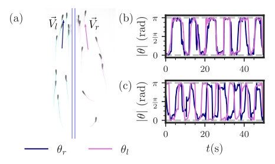
<figcaption class="paper-figure-caption"><b>Fig 1.</b> FIG. 1. (a) Representative frame of the experimental arena: a square tank partitioned by two transparent walls (blue dashed lines) separated by a water-filled gap of 𝑑= 4cm. Tracked individual trajectories for the left and right schools are over- laid; arrows indicate the center-of-mass velocity vectors, plot- ted at each group’s center of mass. (b, c) Time series of the center-of-mass orientation 𝜃for both schools at 𝑑= 4cm (b) and with an opaque wall (c), showing bistable dynamics with preferred directions at 𝜃= 0 and |𝜃| = 𝜋(grey dashed lines). At short separation the two traces are strongly synchronized, but synchronization is lost for the opaque wall.</figcaption>
</figure>
<figure class="paper-figure-card">
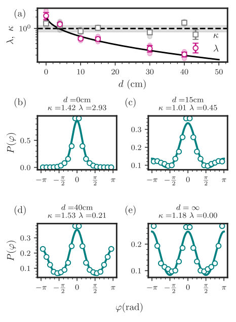
<figcaption class="paper-figure-caption"><b>Fig 2.</b> FIG. 2. (a) Effective coupling parameter 𝜆and bistabil- ity parameter 𝜅(log scale) inferred by fitting the empiri- cal phase-difference distributions as a function of gap dis- tance. Solid markers: mean 𝜆and 𝜅values across replicates; error bars: standard deviation. Semi-transparent markers: individual-replicate estimates. The black dashed line and shaded band denote the mean and standard deviation of 𝜅 at 𝑑= ∞. The black curve is a stretched-exponential fit to the mean values of 𝜆. (b - e) Empirical distributions of the phase difference 𝜑= 𝜃𝑟−𝜃𝑙for selected gap distances. The distributions evolve from a single peak at 𝜑= 0 at small 𝑑, indicating strong synchrony, to symmetric peaks at 𝜑=...</figcaption>
</figure>
<figure class="paper-figure-card">
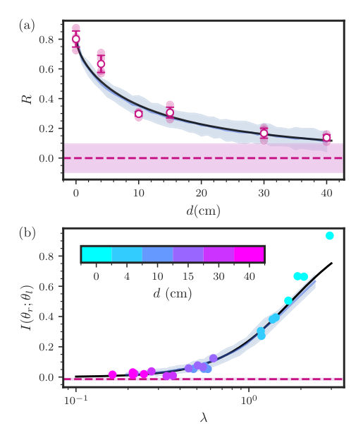
<figcaption class="paper-figure-caption"><b>Fig 3.</b> FIG. 3. (a) Phase-locking order parameter 𝑅= ⟨cos 𝜑⟩as a function of the gap distance. Solid markers denote the mean over experimental replicas, with error bars indicating the standard deviation across replicas; semi-transparent markers correspond to individual replicas. (b) Mutual information be- tween 𝜃𝑟and 𝜃𝑙as a function of the inferred coupling 𝜆, cor- rected using time-shift surrogates (see Appendix D); marker colors indicate the gap distance. In both panels, the black curve shows the exact theoretical prediction obtained by nu- merical integration of Eq (C1) and Eq. (D1) respectively, the blue curve the mean obtained from stochastic simulations of the Langevin model (shaded band:...</figcaption>
</figure>
<figure class="paper-figure-card">

<figcaption class="paper-figure-caption"><b>Fig 4.</b> FIG. 4. Phase-locking order parameter 𝑅as a function of the coupling parameter 𝜆. Solid points denote experimental data, the solid line the exact solution, the dotted line the weak-coupling approximation, and the dashed line the strong- coupling approximation.</figcaption>
</figure>
<figure class="paper-figure-card">
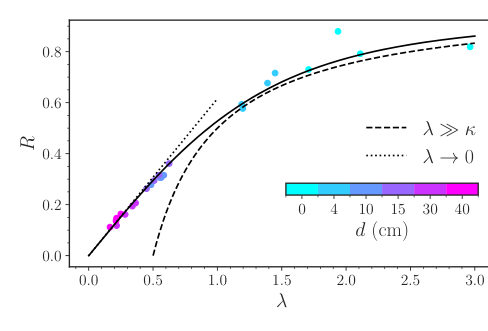
<figcaption class="paper-figure-caption"><b>Fig 5.</b> Fig. 4 summarizes these results.</figcaption>
</figure>

**Summary.** This work models the phase synchronization of fish schools separated by a gap, treating the interaction as mediated solely by vision. By coupling two stochastic bistable oscillators, the authors quantitatively reproduce how synchronization strength decays with the physical separation distance. This establishes a connection between collective biological behavior and the physics of coupled stochastic oscillators.

**Why it may be interesting.** The mathematical framework of coupled stochastic oscillators and the analysis of non-equilibrium steady states, particularly the decay laws derived for the coupling parameter $\lambda(d)$, provide a rich analogy for understanding information transfer in complex, non-equilibrium physical systems.

Detailed structure

**Main problem.** The study investigates how sensory coupling mediates phase coherence between two spatially separated, confined active systems, focusing on information transfer across a physical boundary.

**Main result.** The phase synchronization strength decays systematically with the gap distance, following a stretched exponential law, confirming that visual coupling is distance-dependent.

**Method.** The authors combine experimental measurements of fish school orientation with theoretical modeling using coupled stochastic bistable oscillators.

**Model / system.** The system consists of two fish schools separated by a gap, modeled by two coupled stochastic bistable oscillators. The dynamics are analyzed using coupled differential equations for the orientation angles.

**Key observables.** Phase difference distribution $P(\varphi)$, synchronization order parameter $R$, and Mutual Information $I(	heta_r; 	heta_l)$.

**Important parameters / regimes.** Coupling strength $J$ (quantifying visual information transfer), bistability strength $K$, and the gap distance $d$.

**Assumptions / limitations.** The analysis assumes that the solid partitions eliminate hydrodynamic coupling, isolating vision as the primary interaction channel, and that the dynamics can be reduced to coupled noisy bistable oscillators.

**Figures summary.** Figures show time series of orientations, phase-difference distributions $P(\varphi)$ varying with gap distance $d$, and plots demonstrating the distance dependence of synchronization measures ($R$ and $I$) and the coupling parameter $\lambda(d)$.

**Paper structure.** The paper establishes the physical setup and the coupled oscillator model, derives the stationary distribution for the phase difference, and then systematically analyzes how this distribution, and related measures like $R$ and $I$, change as a function of the separation distance $d$.

Abstract

We investigate how sensory coupling mediates phase coherence between spatially separated, confined active systems. Using two fish schools separated by a water-filled transparent gap, we isolate vision as the primary interaction channel. Under boundary confinement, each school's center-of-mass heading exhibits noisy bistable dynamics, spontaneously switching between two antiparallel directions along the partition wall. Turning events in one school bias the orientation of the other, driving distance-dependent phase synchronization. We model this behavior using two coupled stochastic bistable oscillators whose exact solution quantitatively reproduces the empirical results. Our work establishes a precise connection between nonequilibrium active systems and coupled stochastic oscillators, offering insight into boundary-spanning information transfer in living collectives.

[↑ back to top](#top)

### [Asymmetric optical transmission from broken interface-orientation symmetry in self-shadowed grating metallizations](http://arxiv.org/abs/2609.01755v1)

**Authors:** Can Yesilyurt  
**Type:** both · **Category:** other · **PDF:** <https://arxiv.org/pdf/2609.01755v1>  
**Analysis basis:** full PDF text, analyzed in chunks
**Topic relevance:** `interference shaping light` **3/5** · `analog quantum simulation` **1/5** · `quantum optics experiment` **1/5**

↔ Scroll figures horizontally

<figure class="paper-figure-card">
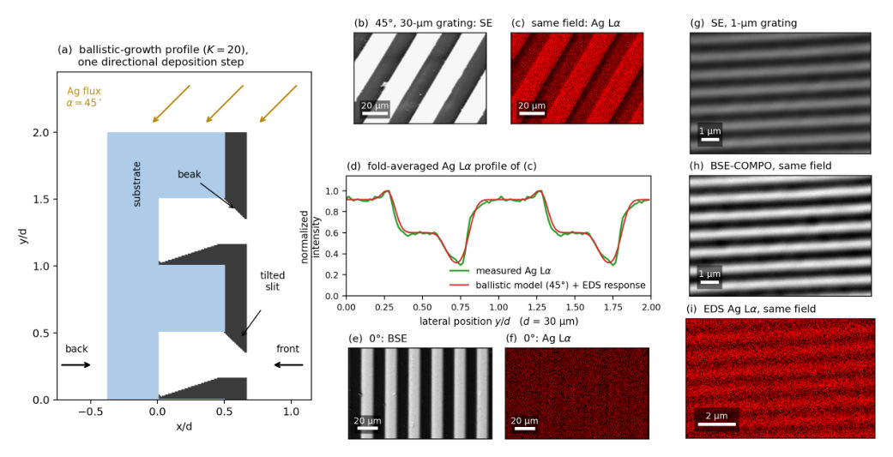
<figcaption class="paper-figure-caption"><b>Fig 1.</b> FIG. 1. Fabrication and as-grown structure. (a) Ballistic-growth profile (α = 45◦, K = 20 growth steps): a binary grating (blue) under collimated Ag flux (arrows) develops coated tops and flux-facing sidewalls, bare shadowed groove floors, and corner overhangs that close each groove into a tilted slit; front/back label the two illumination directions. (b) Secondary-electron (SE) image of the 45◦-coated 30-µm grating and (c) the energy-dispersive x-ray spectroscopy (EDS) Ag Lα map of the same field: periodic one-sided Ag lanes. (d) Fold-averaged Ag Lα lateral profile of (c) versus the ballistic-growth model passed through a minimal EDS emission response (generation depth 0.4 µm): the...</figcaption>
</figure>
<figure class="paper-figure-card">
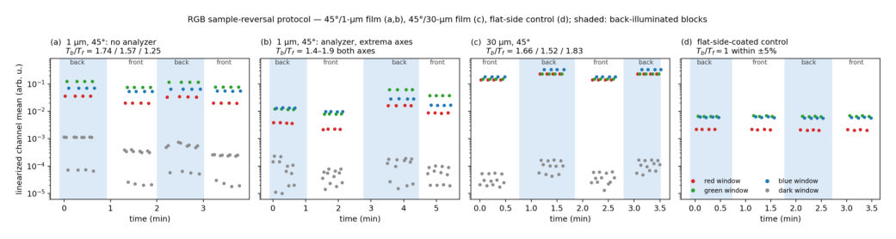
<figcaption class="paper-figure-caption"><b>Fig 2.</b> FIG. 2. Calibrated red/green/blue (RGB) sample-reversal measurements (Cr/Ag metallization). One acquisition session per panel: a photosensor with fixed gain and integration time records sRGB-linearized means over a centered region; the source is an R/G/B light-emitting-diode (LED) display, optically synchronized with the acquisition; every color window is bracketed by dark windows; four repeats per block, alternating front/back mounting (front = coated side toward the source). Points are individual measurement windows (color = channel, gray = dark); back-illuminated blocks shaded. (a) The 45◦, 1- µm film under extended-source, finite-aperture illumination without an analyzer: Tb/Tf =...</figcaption>
</figure>
<figure class="paper-figure-card">
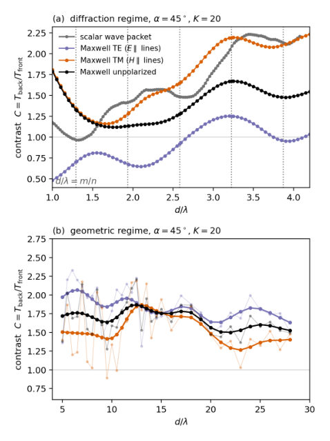
<figcaption class="paper-figure-caption"><b>Fig 3.</b> FIG. 3. Maxwell validation. Directional contrast from FDTD (TE: E ∥lines; TM: H ∥lines; unpolarized, from power-averaged transmittances), band-averaged with the wave-packet spectral width, versus the scalar wave-packet model, for the 45◦, K = 20 ballistic-growth profile (n = 1.55): (a) diffraction regime (dotted vertical lines: in-medium Rayleigh thresholds d/λ = m/n); (b) geometric regime on 3×/4× upsampled grids (bold curves: band-averaged; light curves: raw grid points). The scalar model tracks the TM channel; TE converges toward TM at large d/λ; the con- trast persists, approximately wavelength-independent, up to d/λ = 28. Circles mark the computed points; lines are guides to the eye.</figcaption>
</figure>
<figure class="paper-figure-card">
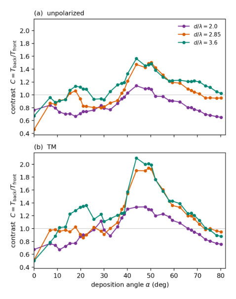
<figcaption class="paper-figure-caption"><b>Fig 4.</b> FIG. 4. Deposition-angle dependence (Maxwell, 35 an- gles). Band-averaged contrast versus deposition angle α for (a) unpolarized and (b) TM illumination at three d/λ (color), for ballistic-growth films at fixed source exposure (K = 20; grazing angles intercept reduced projected flux and receive less material). Circles mark the computed angles; lines are guides to the eye.</figcaption>
</figure>

**Summary.** This work investigates how breaking the interface-orientation symmetry in a grating structure, achieved by oblique metal deposition, causes asymmetric optical transmission. By combining advanced full-wave simulations with sample-reversal measurements, the authors quantify a substrate-favored transmission contrast. This demonstrates a robust method for engineering directional optical responses in metamaterials.

**Why it may be interesting.** The study provides a concrete, experimentally verifiable platform for observing symmetry breaking in optical response, which has analogues in engineered quantum systems or anisotropic media.

Detailed structure

**Main problem.** The paper demonstrates and quantifies asymmetric optical transmission arising from broken interface-orientation symmetry (IOS) in grating metallizations.

**Main result.** The oblique deposition of metal creates a one-sided, louver-like structure that leads to measurable, substrate-favored directional transmission ratios, which are successfully predicted by full-wave Maxwell calculations.

**Method.** The study combines experimental measurements using sample-reversal techniques with theoretical predictions derived from full-wave Maxwell simulations (FDTD).

**Model / system.** The physical system is a diffraction grating metallized with silver (Ag) via oblique-angle deposition, creating a self-shadowed, one-sided profile. The analysis uses principles of reciprocity and diffraction theory.

**Key observables.** Directional transmittance ratio ($T_{	ext{back}}/T_{	ext{front}}$), polarization-dependent contrast, and broadband substrate-favored transmission.

**Important parameters / regimes.** Deposition angle ($\alpha$), grating period ($d$), and wavelength ($\lambda$), with optimal asymmetry observed near $45^\circ$ deposition angle.

**Assumptions / limitations.** The model assumes ideal ballistic growth and that the observed asymmetry is entirely due to the broken IOS, while the zeroth-order specular reflection remains reciprocal.

**Figures summary.** Figures illustrate the one-sided Ag deposition profile, measured substrate-favored ratios for various periods, and comparisons between computed Maxwell results and scalar wave-packet models.

**Paper structure.** The paper establishes the theoretical basis using reciprocity, details the fabrication via oblique deposition, presents the full-wave simulation framework, and validates the predictions with quantitative sample-reversal measurements.

Abstract

Reciprocal optical structures can transmit finite-angle illumination asymmetrically when the two illumination directions couple differently to the available diffraction channels. We realize this in a single overlay-free step: oblique metallization of a conventional diffraction grating, where ballistic self-shadowing grows a one-sided, louver-like silver profile. Electron microscopy and Ag mapping show the one-sided silver redistribution on oblique-coated films and its absence on a normal-incidence control. Full-wave Maxwell calculations on the ballistic-growth geometry predict broadband substrate-favored transmission, carried by the transverse-magnetic (TM) polarization in the diffraction regime (contrast up to 2.1) and polarization-independent and spectrally flat (1.5-1.9) deep in the geometric regime; the rejected power is redirected predominantly into specular reflection, and the deposition angle selects the magnitude and sign of the effect (optimum near $45^\circ$). Calibrated three-color sample-reversal measurements yield dark-corrected substrate-favored ratios that persist in both output-analyzer projections on a $45^\circ$-coated 1-$μ$m-period film (up to 1.8) and lie within the computed geometric-regime band on a 30-$μ$m-period film (1.5-1.8, with reference-normalized absolute transmittances).

[↑ back to top](#top)

### [Topological Lithography via External Field: Creating Topological States Anywhere Beyond the Edge](http://arxiv.org/abs/2609.02670v1)

**Authors:** Haoran Nie, Chaoran Jiang, Xiangying Shen, Lei Xu  
**Type:** both · **Category:** other · **PDF:** <https://arxiv.org/pdf/2609.02670v1>  
**Analysis basis:** full PDF text, analyzed in chunks
**Topic relevance:** `analog quantum simulation` **3/5** · `driven-dissipative phase transition` **1/5** · `quantum measurements` **1/5**

↔ Scroll figures horizontally

<figure class="paper-figure-card">
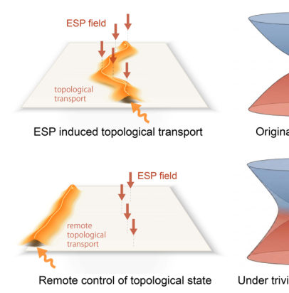
<figcaption class="paper-figure-caption"><b>Fig 1.</b> Fig. 1 Schematic diagram of ESP-manipulated topological transport and band structure schematics of differ- ent scenarios. Traditional topological edge states are induced by changing bulk symmetry across the boundary. Trivial potential field may close the gap but destroy topological structure. Our ESP field reshapes the effective mass and induces a topological state without reconfiguring the lattice geometry or fabricating distinct bulk domains.</figcaption>
</figure>
<figure class="paper-figure-card">
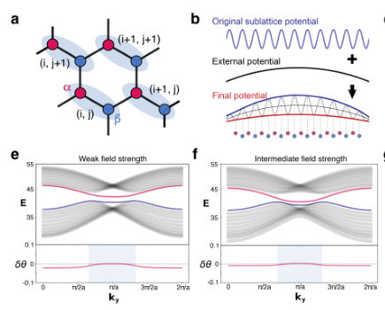
<figcaption class="paper-figure-caption"><b>Fig 2.</b> Fig. 2 (a) Schematics of basic hexagonal lattice. The index (i, j) indicates one unit cell, which contains two sub- lattices, α and β. (b) Schematics of original lattice potential without external field (top), ESP field (middle) and final potential (bottom). Note that two sublattices have two different couplings to the external field, resulting in two different final potentials indicated by blue and red envelope curves. (c) Band structure of the original hexagonal lattice. Two valleys exist in the 1st BZ, which form the basis of topological protection. (d) bands of a quasi-1D stripe with zigzag boundaries without the ESP (bottom panel) and the corresponding real-space structure (top panel)....</figcaption>
</figure>
<figure class="paper-figure-card">
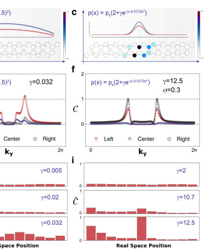
<figcaption class="paper-figure-caption"><b>Fig 3.</b> Fig. 3 (a)–(c) display 1D stripe structures with three different ESP fields (top panels) and their corresponding in-gap edge states (bottom panels). (a) shows a uniform ESP field, (b) a quadratic ESP field, and (c) a Gaussian ESP field. Note that the blue and red curves represent the potentials of two different sublattices, arising from their distinct coupling to the same external field. (d)–(f) present the real-space local topological marker (LTM) C with respect to ky at the critical ESP strengths of (a)–(c), respectively. The three curves correspond to three different locations: the left boundary, center, and right boundary. (g)–(i) illustrate the real-space variation of the...</figcaption>
</figure>
<figure class="paper-figure-card">
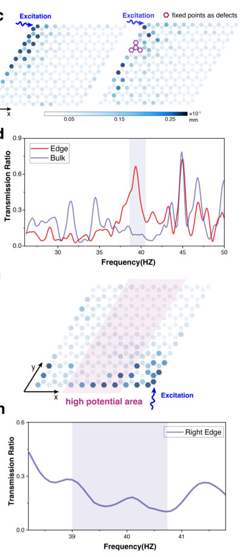
<figcaption class="paper-figure-caption"><b>Fig 4.</b> Fig. 4 Topological states on geometric boundaries induced by quadratic ESP. (a) The experimental setup, where the vertical vibrations are measured by laser sensors with the accuracy of 10µm. (b) The simulated (top) and measured (bottom) band spectrum, with topological edge states highlighted by light-red color. They agree very well. (c) Vibrational modes of the topological edge states without defects (left) and the edge state with defects introduced by fixed points (right). The topological protection is clearly evident. (d) The transmission ratio of edge and bulk modes measured from (c), using sensors placed at the left boundary and within the bulk. The band gap is indicated by the shaded...</figcaption>
</figure>
<figure class="paper-figure-card">
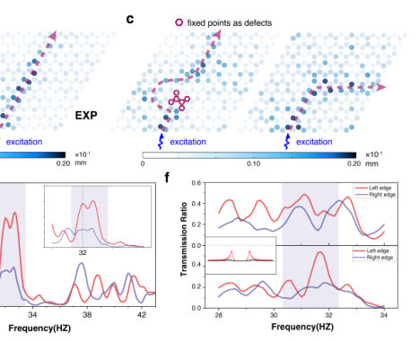
<figcaption class="paper-figure-caption"><b>Fig 5.</b> Fig. 5 Topological states inside the bulk induced by Gaussian ESP. (a) Band spectrum obtained from simu- lation (top) and experiment (bottom), with the topological states highlighted in light red. The simulation and experimental results show excellent agreement. (b) Vibrational modes of the topological states obtained from simulation (left) and experiment (right). The topologically protected pathway is indicated by the dashed arrow. (c) Experimentally measured modes of the topological states in the presence of defects (left) and designed as an L-shaped pattern (right). The propagation direction is again indicated by the dashed arrow, demonstrating topological protection clearly. (d, e)...</figcaption>
</figure>

**Summary.** This work introduces 'topological lithography,' a method to create robust topological states by applying controllable external scalar potentials to existing systems. By modifying the effective mass term, the approach bypasses the need for complex material fabrication, allowing for programmable and reconfigurable topological patterns. This universality is demonstrated across mechanical, electronic, and circuit platforms.

**Why it may be interesting.** The concept of using external fields to engineer topological properties in real space, rather than relying on material composition or symmetry breaking, offers a highly tunable paradigm for designing quantum materials.

Detailed structure

**Main problem.** Conventional topological insulators require distinct bulk symmetries, limiting flexibility; the goal is to induce tunable topological states anywhere (edge, bulk, remote) using only external fields.

**Main result.** An external scalar potential field can induce programmable topological states by modifying the Jackiw-Rebbi mechanism, enabling 'topological lithography' across mechanical, electronic, and acoustic platforms.

**Method.** The approach uses an External Scalar Potential (ESP) field to modify the effective mass term in the Hamiltonian, inducing a local topological marker (LTM) characterizing the transition.

**Model / system.** The system is modeled on a hexagonal lattice, analyzed via tight-binding Hamiltonians, and experimentally validated using mechanical vibrational systems and LC oscillatory circuits.

**Key observables.** Local Topological Marker (LTM), band structure evolution, and in-gap mode transmission ratios.

**Important parameters / regimes.** ESP strength ($\gamma$), potential shape (quadratic, Gaussian), and lattice geometry parameters.

**Assumptions / limitations.** The analysis assumes the ability to map the physics onto effective 1D chains or lattice models, and that the external field control is highly precise.

**Figures summary.** Figures illustrate the comparison between traditional and ESP-induced edge states, the evolution of band structures with ESP strength, and experimental setups showing LTM mapping and lithographic patterning.

**Paper structure.** The paper progresses from establishing the limitations of conventional TIs to introducing the ESP mechanism, detailing the theoretical framework (JR mechanism, LTM), validating it across multiple physical platforms (mechanical, electronic, LC circuits), and concluding with demonstrations of programmable topological lithography.

Abstract

Topological insulators (TIs), recognized for their robust boundary states and unconventional phase transitions, have emerged as one of the most impactful discoveries in recent decades, attracting considerable interest across diverse fields. However, conventional TIs require topological contrasts between adjacent bulk regions, typically achieved by distinct symmetries, which limits their flexibility and broader applicability. In this work, we introduce a "lithography" approach to inducing topological states by applying external fields in time-reversal-symmetric systems. These states transcend the conventional bulk topology design paradigm and offer exceptional tunability: they can exist at geometric edges, within the bulk, or even be induced remotely. Because the external field is highly controllable, the induced states are programmable, reconfigurable, and can be easily tailored into desirable patterns. Theoretically, we demonstrate that the external field modifies the Jackiw-Rebbi mechanism, inducing a real-space topological transition characterized by a local topological marker (LTM). We further establish an extended valley bulk-edge correspondence, which explains both the conventional scenario and our findings. Our results, validated across mechanical, electronic, and acoustic platforms, highlight the broad applicability of this approach to various systems. This work not only advances the theory of topology but also enhances the diversity, tunability, and practical implementation of topological states and materials.

[↑ back to top](#top)

### [Rank-Selective Optical Tomography of Higher-Wave Altermagnetism](http://arxiv.org/abs/2609.02429v1)

**Authors:** Meysam Bagheri Tagani, Carmine Autieri, Sahar Izadi Vishkayi  
**Type:** theory · **Category:** other · **PDF:** <https://arxiv.org/pdf/2609.02429v1>  
**Analysis basis:** full PDF text, analyzed in chunks
**Topic relevance:** `interference shaping light` **3/5** · `quantum measurements` **1/5**

↔ Scroll figures horizontally

<figure class="paper-figure-card">
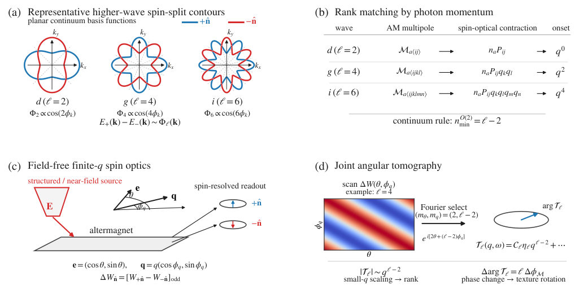
<figcaption class="paper-figure-caption"><b>Fig 1.</b> FIG. 1. Rank-selective optical tomography. Panel (a) shows representative two-dimensional continuum basis functions used to illustrate the rank-matching principle; material-specific three-dimensional g-wave harmonics may have a different in-plane winding. (b) Linear polarization supplies spatial rank two, while photon momentum supplies the remaining rank, giving d : q0, g : q2, and i : q4. (c) Field-free finite-q geometry. (d) A joint angular projection isolates Tℓ∝ηℓqℓ−2; the small-q scaling of its magnitude identifies the spatial-dispersion order, while phase changes track the relative orientation of the magnetic harmonic.</figcaption>
</figure>
<figure class="paper-figure-card">
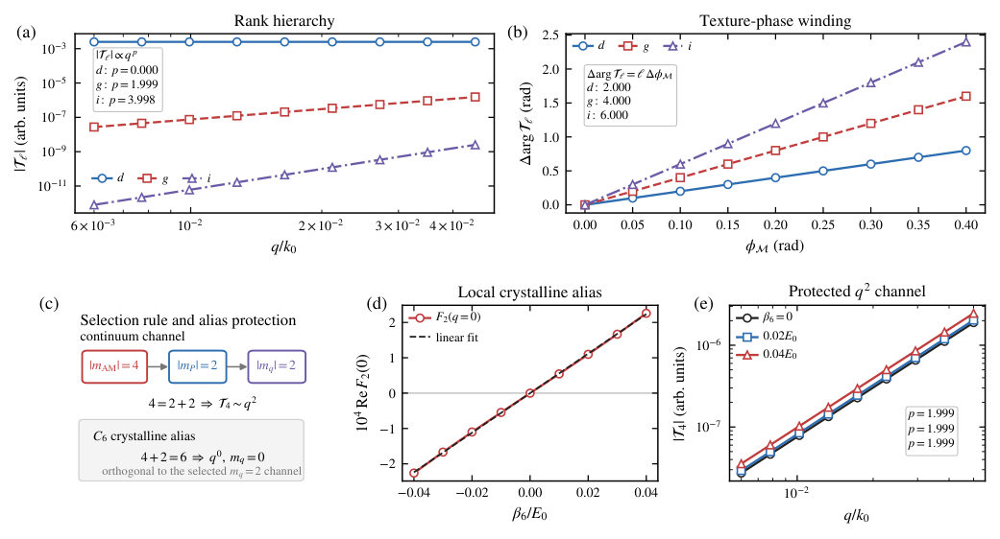
<figcaption class="paper-figure-caption"><b>Fig 2.</b> FIG. 2. Microscopic rank hierarchy and crystalline protection. (a) The projected response scales as q0, q2, and q4 for d-, g-, and i-wave order. (b) Rotating the texture produces phase windings 2, 4, and 6. (c) Rank bookkeeping for the g-wave channel and its C6 local alias. (d) The local mθ = 2 linear-polarization harmonic F2(q = 0) is linear in the hexagonal anisotropy β6. (e) Despite this alias, the projected T4 retains its q2 onset. Parameters and convergence tests are given in the SM.</figcaption>
</figure>
<figure class="paper-figure-card">
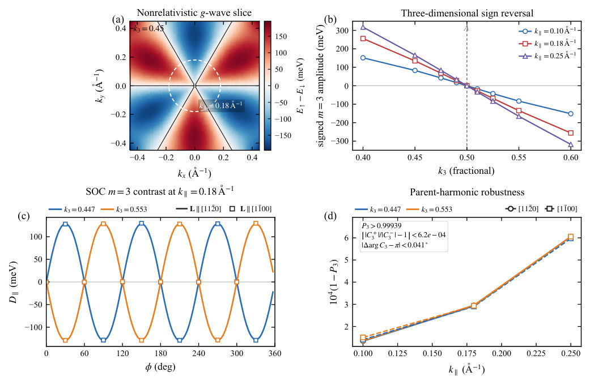
<figcaption class="paper-figure-caption"><b>Fig 3.</b> FIG. 3. First-principles higher-wave texture in MnTe. (a) Nonrelativistic spin splitting on the k3 = 0.45 plane. The white dashed circle marks the k∥= 0.18 ˚A −1 contour highlighted in panel (c). (b) Signed m = 3 Fourier amplitude across the A plane for three in-plane radii, showing its zero and sign reversal at A. (c) N´eel-projected spin-energy contrast D∥including SOC at k∥= 0.18 ˚A −1 for the two planes flanking A and two in-plane N´eel orientations. (d) Residual Fourier power 1 −P3 outside the parent m = 3 harmonic of D∥, demonstrating the robustness of the parent higher-wave component under SOC.</figcaption>
</figure>
<figure class="paper-figure-card">
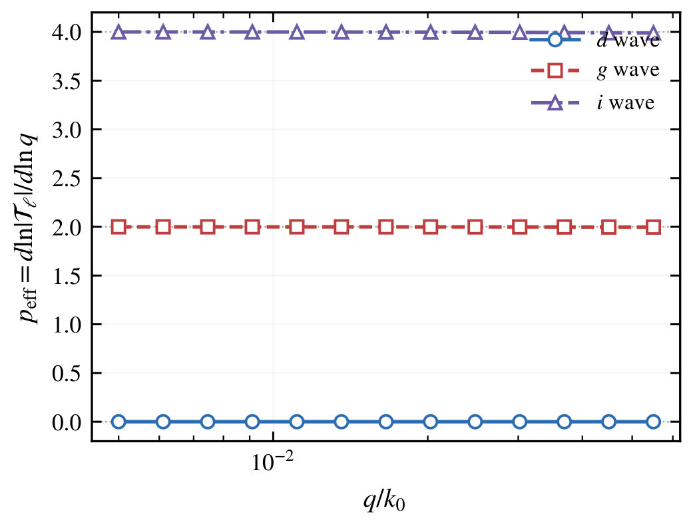
<figcaption class="paper-figure-caption"><b>Fig 4.</b> FIG. 1. Local effective power peff = d ln |Tℓ|/d ln q for the microscopic benchmark. As q →0, the three channels approach 0, 2, and 4. The weak departure of the i-wave curve at larger q is the expected higher-order correction to the gradient expansion, not a change of the asymptotic selection rule.</figcaption>
</figure>
<figure class="paper-figure-card">
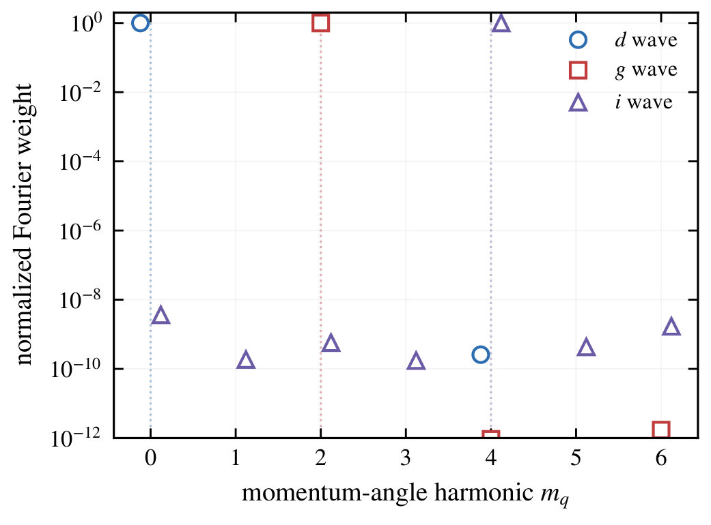
<figcaption class="paper-figure-caption"><b>Fig 5.</b> FIG. 2. Normalized momentum-angle Fourier spectrum of the linear-polarization component F2(ϕq) at q = 0.03k0. The d-, g-, and i-wave models select mq = 0, 2, and 4, respectively, directly realizing the rank-matching rule.</figcaption>
</figure>

**Summary.** This work presents a novel optical technique to determine the spatial rank of higher-wave magnetic order in altermagnets. By measuring the absorption spectrum using finite photon momentum, the authors show that a joint Fourier projection isolates the magnetic harmonic's rank via a characteristic power-law dependence on momentum. This method provides a robust diagnostic tool for characterizing complex magnetic textures in materials like MnTe.

**Why it may be interesting.** The technique of using momentum-resolved spectroscopy to extract higher-order spatial harmonics is a powerful, non-linear optical diagnostic tool applicable to complex magnetic order parameters, bridging condensed matter theory with advanced quantum optics.

Detailed structure

**Main problem.** The primary challenge is optically identifying the spatial rank of higher-wave altermagnetism because local electric-dipole response cannot uniquely resolve distinct continuum harmonics.

**Main result.** By utilizing finite photon momentum and a joint Fourier projection, the spatial rank ($\ell$) can be selectively isolated, yielding a power law scaling of $|T_\ell| \propto q^{\ell-2}$.

**Method.** The authors derive a rank-matching rule and employ a joint Fourier projection in polarization and momentum angle, which is verified by a Ward-consistent finite-q microscopic calculation.

**Model / system.** The study focuses on altermagnetic materials exhibiting higher-wave order (d-, g-, or i-wave), using MnTe as a testbed. The analysis involves calculating the joint Fourier projection of the spin-resolved absorption rate.

**Key observables.** The joint Fourier projection $T_\ell(q, \omega)$, which exhibits a power law scaling $|T_\ell| \propto q^{\ell-2}$ corresponding to the rank $\ell$.

**Important parameters / regimes.** The photon momentum $q$ is crucial for achieving rank selectivity; the scaling exponent is $\ell-2$.

**Assumptions / limitations.** The method assumes that the finite photon momentum supplies the necessary missing spatial rank information, and the joint projection successfully filters out lower-order crystalline aliases.

**Figures summary.** Figures illustrate the rank-matching principle via joint angular tomography ($d: q^0, g: q^2, i: q^4$) and show that the parent $g$-wave component remains strongly encoded in MnTe despite strong SOC effects.

**Paper structure.** The paper first establishes the theoretical necessity of finite photon momentum for rank-selective tomography, derives the projection formula, and then applies this method to first-principles calculations on MnTe to confirm the persistence of the higher-wave magnetic texture.

Abstract

Identifying the spatial rank of higher-wave altermagnetic order optically is challenging because local electric-dipole response does not uniquely resolve distinct continuum harmonics. We show that finite photon momentum turns one-photon spin-resolved absorption into a rank-selective tomography. For the planar $|m|=\ell$ sector of an even-parity $\ell$-wave component, a joint Fourier projection in polarization and momentum angle isolates $\mathcal T_\ell\proptoη_\ell q^{\ell-2}$, yielding the hierarchy $d:q^0$, $g:q^2$, and $i:q^4$; phase changes track rotations of the selected magnetic harmonic. A Ward-consistent finite-$q$ microscopic calculation reproduces these powers without imposing them. Although discrete crystal symmetry can generate lower-order local aliases, they are orthogonal to the selected momentum harmonic and cannot contaminate it below $q^{\ell-2}$. In MnTe, whose nonrelativistic parent order is three-dimensional $g$ wave while spin--orbit coupling lowers the exact relativistic spin-momentum-locking symmetry, first-principles calculations show that more than $99.9\%$ of the Fourier power of the Néel-projected $A$-region spin-energy contrast remains in the parent $g$-wave-derived $m=3$ harmonic. Structured near fields place the required momentum window within experimental reach.

[↑ back to top](#top)

### [Anomalous Superfluid Response in Altermagnetic Superconductors](http://arxiv.org/abs/2609.02263v1)

**Authors:** Christian Wiedemann, Danilo Nikolić, Matthias Eschrig, Wolfgang Belzig  
**Type:** theory · **Category:** other · **PDF:** <https://arxiv.org/pdf/2609.02263v1>  
**Analysis basis:** full PDF text, analyzed in chunks
**Topic relevance:** `Keldysh / 2PI / non-Gaussian methods` **3/5**

↔ Scroll figures horizontally

<figure class="paper-figure-card">
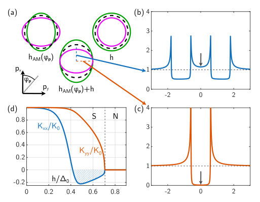
<figcaption class="paper-figure-caption"><b>Fig 1.</b> FIG. 1. (a) Spin-split Fermi surfaces in a superconduc- tor with altermagnetic exchange field hAM, out-of-plane Zee- man field h = hez, and a combination of both (shown for hAM = h). Momentum-resolved DOS, N/N0, along (b) px and (c) py, where the former exhibits gapless superconductiv- ity. (d) Meißner kernel as a function of h for hAM = 0.6∆and T = 0.1Tc. Blue and red lines correspond to Kxx and Kyy, respectively, whilst the off-diagonal components of the K ma- trix are zero. The blue-shaded area corresponds to the regime in which the system displays the paramagnetic Meißner effect.</figcaption>
</figure>
<figure class="paper-figure-card">
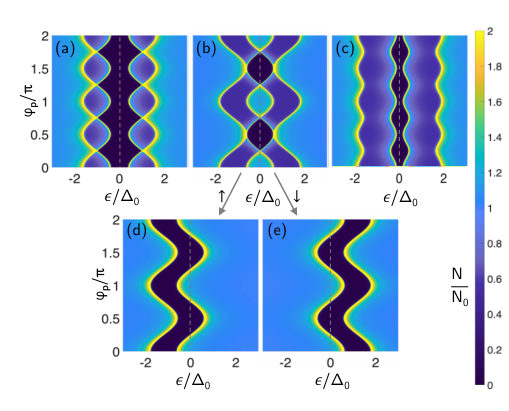
<figcaption class="paper-figure-caption"><b>Fig 2.</b> FIG. 2. Angle-resolved DOS function for (a) only an alter- magnetic exchange field (hAM = 0.6∆0, h = 0), (b) the combi- nation of an altermagnetic field and an out-of-plane Zeeman field, h = hez, (hAM = h = 0.6∆0), and (c) the combina- tion of an altermagnetic field and an in-plane Zeeman field, h = hex (hAM = h = 0.6∆0). (c,d) Spin-resolved DOS for the case presented in b). In all panels T = 0.1Tc.</figcaption>
</figure>
<figure class="paper-figure-card">
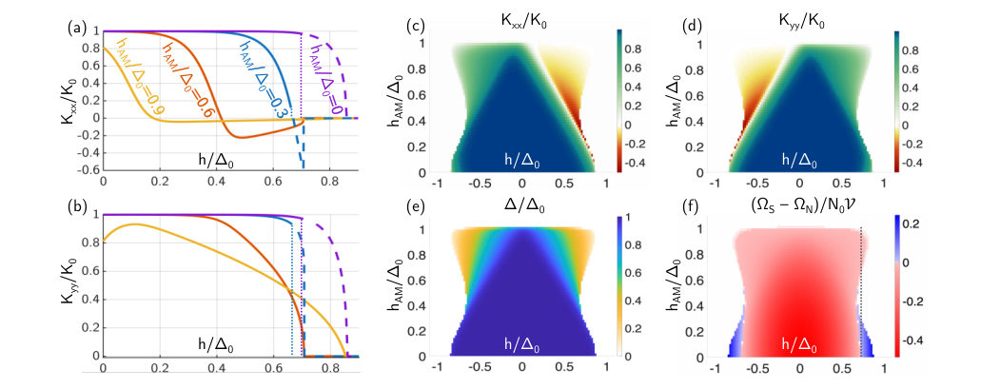
<figcaption class="paper-figure-caption"><b>Fig 3.</b> FIG. 3. (a) and (b): Meißner kernel’s components Kxx and Kyy as functions of out-of-plane Zeeman h field for various values of hAM. Dashed lines denote the unstable solution where ΩS &gt; ΩN, while dotted lines indicate the resulting drop to Kij = 0 for the stable solution ∆= 0. (c) and (d): Kxx and Kyy across the hAM −h space. (e) and (f): the corresponding order parameter ∆/∆0 and the free energy difference, (ΩS −ΩN)/N0V, where red indicates the region of stable superconductivity. The gray dotted line in (f) indicates where a finite altermagnetic exchange field enables superconductivity beyond the Pauli limit. In all panels, T = 0.1Tc.</figcaption>
</figure>
<figure class="paper-figure-card">
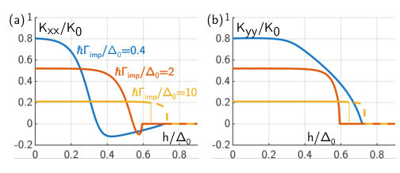
<figcaption class="paper-figure-caption"><b>Fig 4.</b> FIG. 4. Meißner Kernel components vs. out-of-plane Zeeman field for different impurity scattering rates, T/Tc = 0.1, and hAM/∆0 = 0.8. The unstable region, ∆Ω&gt; 0, is indicated by dashed lines. The paramagnetic Meißner effect persists at intermediate impurity concentrations, ℏΓimp ∼∆0, vanishing in the dirty limit, ℏΓimp ∼10∆0.</figcaption>
</figure>

**Summary.** This theoretical work analyzes the anomalous paramagnetic superfluid response in altermagnetic superconductors. Using quasiclassical Green's functions, the authors show that the inherent anisotropy of the altermagnetic state causes a measurable paramagnetic Meissner effect. This effect is highly sensitive to external fields and impurity levels, providing a new diagnostic tool for gapless superconductivity.

**Why it may be interesting.** The study of unconventional superconducting responses, particularly those involving magnetic order (altermagnetism), provides rich theoretical ground for understanding how broken symmetries influence macroscopic quantum phenomena like the Meissner effect, which is relevant to advanced quantum materials.

Detailed structure

**Main problem.** The paper investigates the emergence and characteristics of an anomalous (paramagnetic) superfluid response in superconducting materials that possess altermagnetic order.

**Main result.** The altermagnetic state leads to anisotropic gapless superconductivity, manifesting a paramagnetic Meissner effect strongest when the altermagnetic and Zeeman fields are parallel and in clean samples.

**Method.** The analysis employs quasiclassical theory using the Eilenberger equation framework to calculate the linear response current density via the Meißner kernel.

**Model / system.** The system is an altermagnetic superconductor subjected to an out-of-plane Zeeman field. The theoretical framework incorporates anisotropic exchange fields, Zeeman coupling, and impurity scattering into the Green's function formalism.

**Key observables.** Paramagnetic Meißner kernel components ($K_{ij}$), momentum-resolved Density of States (DOS), and the superconducting free energy ($\Delta\Omega$).

**Important parameters / regimes.** The relative strength of the altermagnetic field, the Zeeman field magnitude ($h$), and the impurity scattering rate ($\Gamma_{imp}$) relative to the superconducting gap ($\Delta_0$).

**Assumptions / limitations.** The analysis assumes weak altermagnetic exchange fields compared to the Fermi energy, allowing for a nearly spherical Fermi surface approximation.

**Figures summary.** Figures illustrate spin-split Fermi surfaces, momentum-resolved DOS showing gap closing, and the Meißner kernel components ($K_{xx}, K_{yy}$) as functions of applied fields and impurity concentrations.

**Paper structure.** The paper builds from establishing the theoretical framework (quasiclassical Green's functions) to calculating the superfluid response (Meißner kernel), deriving the key results regarding anisotropy and impurity effects, and concluding with the physical implications of the paramagnetic response.

Abstract

We report on the emergence of the anomalous (paramagnetic) superfluid response in altermagnetic superconductors at arbitrary impurity concentrations. Due to anisotropic gapless superconductivity, altermagnetic superconductors with an out-of-plane Zeeman field display an anisotropic paramagnetic Meissner effect. The effect is strongest for parallel altermagnetic and Zeeman exchange field vectors and in the clean sample. The presence of nonmagnetic impurities leads to isotropisation and, consequently, weakens the effect; however, the paramagnetic response sustains intermediate amounts of impurities in the system. As demonstrated in recent experiments, microwave superfluid stiffness measurements can serve as a sensitive probe of gapless superconductivity.

[↑ back to top](#top)

### [Direct observation of flat bands in near-magic-angle twisted bilayer CVD graphene](http://arxiv.org/abs/2609.02403v1)

**Authors:** Gianluigi Baiardi, Alex Boschi, Giulia Piccinini, Vaidotas Mišeikis, Lorenzo Cavicchi, Aaron Bostwick, Chris Jozwiak, Eli Rotenberg, Kenji Watanabe, Takashi Taniguchi, Marco Polini, Fabio Beltram, Antonio Rossi, Stiven Forti, Sergio Pezzini, Camilla Coletti  
**Type:** experiment · **Category:** strongly correlated electrons · **PDF:** <https://arxiv.org/pdf/2609.02403v1>  
**Analysis basis:** full PDF text, analyzed in chunks
**Topic relevance:** `analog quantum simulation` **3/5**

↔ Scroll figures horizontally

<figure class="paper-figure-card">
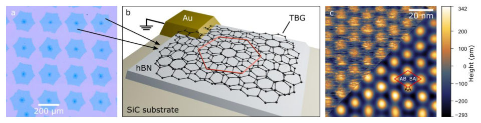
<figcaption class="paper-figure-caption"><b>Fig 1.</b> Figure 1. a Graphene crystals previously grown on the same Cu grain and transferred on a Si/SiO2</figcaption>
</figure>
<figure class="paper-figure-card">
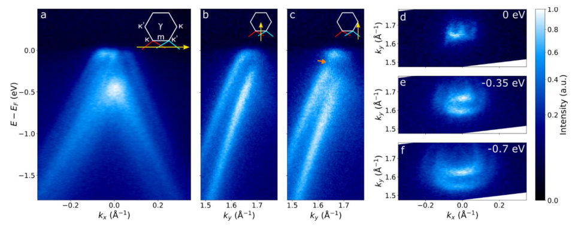
<figcaption class="paper-figure-caption"><b>Fig 2.</b> Figure 2. Cuts across the ARPES intensity recorded inside a near-MATBG domain with a photon</figcaption>
</figure>
<figure class="paper-figure-card">
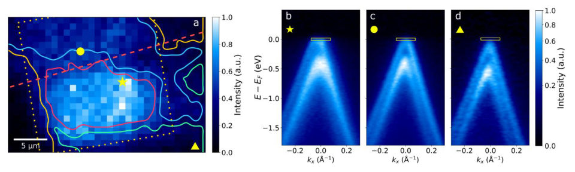
<figcaption class="paper-figure-caption"><b>Fig 3.</b> Figure 3. a Real-space imaging of the largest near-MA domain in the sample, highlighted by</figcaption>
</figure>
<figure class="paper-figure-card">
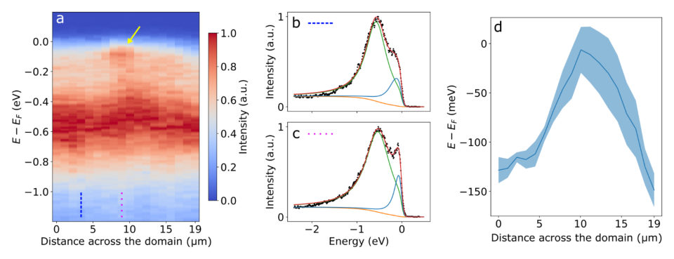
<figcaption class="paper-figure-caption"><b>Fig 4.</b> Figure 4. Estimation of the magic-angle configuration relaxation length. a kx-binned EDCs</figcaption>
</figure>

**Summary.** This work reports the direct experimental observation of flat electronic bands in twisted bilayer graphene grown via CVD, overcoming a major hurdle in scaling up MATBG research. By using nano-ARPES, the authors confirmed that CVD-grown samples exhibit electronic properties comparable to exfoliated samples. This validates CVD as a viable platform for studying strongly correlated physics in moiré materials.

**Why it may be interesting.** The realization of correlated electronic states in a scalable, solid-state platform like CVD graphene is crucial for studying strongly correlated electron physics outside of highly controlled, small-sample environments.

Detailed structure

**Main problem.** The primary goal was to determine if the fragile flat-band and correlated electronic states characteristic of magic-angle twisted bilayer graphene (MATBG) could be realized using scalable, large-area growth methods like Chemical Vapor Deposition (CVD).

**Main result.** The study successfully observed electronic bands in CVD-grown TBG that are comparable to those measured in exfoliated samples, confirming the potential for scalable moiré materials hosting flat bands.

**Method.** The research employed room-temperature nano-Angle-Resolved Photoemission Spectroscopy (nano-ARPES) on CVD-assembled TBG domains, supplemented by STM and advanced data fitting techniques.

**Model / system.** The physical system is Twisted Bilayer Graphene (TBG) formed by stacking CVD-grown graphene layers near the magic angle. The electronic structure is analyzed using models derived from the moiré superlattice potential.

**Key observables.** Flat-band dispersion, gap opening near the Fermi level, Moiré lattice parameter (12.9 nm), and the relaxation length of the near-MA configuration.

**Important parameters / regimes.** Twist angle ($\sim 1.11^\circ$), doping shift ($> 100$ meV), and the domain size compatible with transport experiments.

**Assumptions / limitations.** The observed p-doping shift is attributed to synchrotron-radiation-induced photodoping, and the analysis relies on fitting EDCs with Lorentzian/Voigt lineshapes.

**Figures summary.** Figures show STM imaging of the moiré superlattice, ARPES-revealed electronic dispersion with flat bands, and position-resolved EDC fitting used to map the electronic configuration across the domain.

**Paper structure.** The paper progresses from establishing the experimental feasibility of CVD-grown MATBG, through quantitative ARPES measurements confirming flat bands, to detailed analysis mapping domain homogeneity and electronic structure.

Abstract

Advances in chemical vapor deposition (CVD) growth have driven graphene crystal quality to unprecedented levels, yet it is still unknown whether this route can realize the fragile flat-band and correlated states of the magic-angle (MA) twisted bilayer graphene (TBG). Here, we report on the experimental observation by room-temperature nano-angle-resolved photoemission spectroscopy (nano-ARPES) of flat bands in a TBG sample close to the MA, assembled via a grow-and-stack protocol based on low-pressure CVD of graphene on copper. Our study indicates electronic bands fully comparable to those measured in exfoliation-based samples and determines the size of the largest near-MA domain to be compatible with electronic transport experiments, motivating further experiments on flat band physics in CVD-graphene.

[↑ back to top](#top)

### [Vortex-core Majorana coupling to a chiral edge in a $p_x+ip_y$ superconductor: Nonmonotonic spectral reorganization and coherent fermion-parity dynamics](http://arxiv.org/abs/2609.02260v1)

**Authors:** Peiyao Liu, Yi Zhou  
**Type:** theory · **Category:** other · **PDF:** <https://arxiv.org/pdf/2609.02260v1>  
**Analysis basis:** full PDF text, analyzed in chunks
**Topic relevance:** `analog quantum simulation` **3/5**

↔ Scroll figures horizontally

<figure class="paper-figure-card">
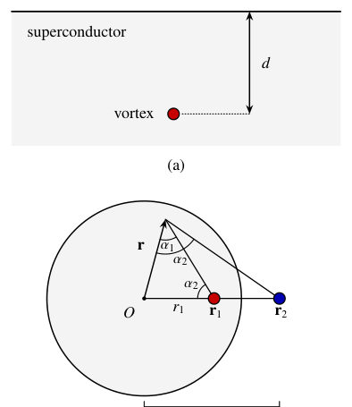
<figcaption class="paper-figure-caption"><b>Fig 1.</b> FIG. 1. Vortex geometry and image construction. (a) Local view of a vortex at separation d from the boundary between the two- dimensional px + ipy superconductor and vacuum. (b) Disk of radius R containing the physical vortex (red) at r1 = (r1, 0) and the image antivortex (blue) at r2 = (R2/r1, 0) outside the disk. The auxiliary an- gles α1 and α2 specify the geometry used to impose the phase bound- ary condition. The resulting image phase enforces ∂rϕ|r=R = 0 for the order-parameter phase ϕ, eliminating the normal phase-gradient con- tribution to the condensate current. The vortex–boundary separation is d = R −r1.</figcaption>
</figure>
<figure class="paper-figure-card">
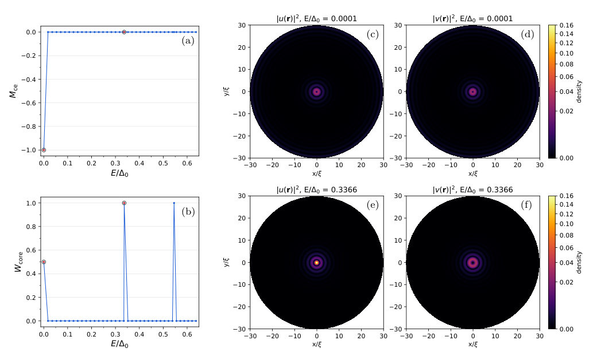
<figcaption class="paper-figure-caption"><b>Fig 2.</b> FIG. 2. Majorana-polarization and regional-weight diagnostics for a centered vortex at ∆0/EF = 0.36, R = 30ξ, and d = 30ξ. (a) Core–edge Majorana polarization Mce and (b) core weight Wcore of the low-lying positive-energy eigenstates. The circled red dots mark the two states whose densities are shown in panels (c)–(f). The lowest state has E0 = 1.44 × 10−4∆0, Mce = −0.9997, and Wcore = 0.5000, indicating oppositely polarized, equally weighted core and edge Majorana components. (c) Particle density |u|2 and (d) hole density |v|2 of this state. For comparison, (e) |u|2 and (f) |v|2 of the core-localized CdGM state at E = 0.3366∆0, which has Wcore = 0.9998 but |Mce| &lt; 10−9. Thus strong core...</figcaption>
</figure>
<figure class="paper-figure-card">
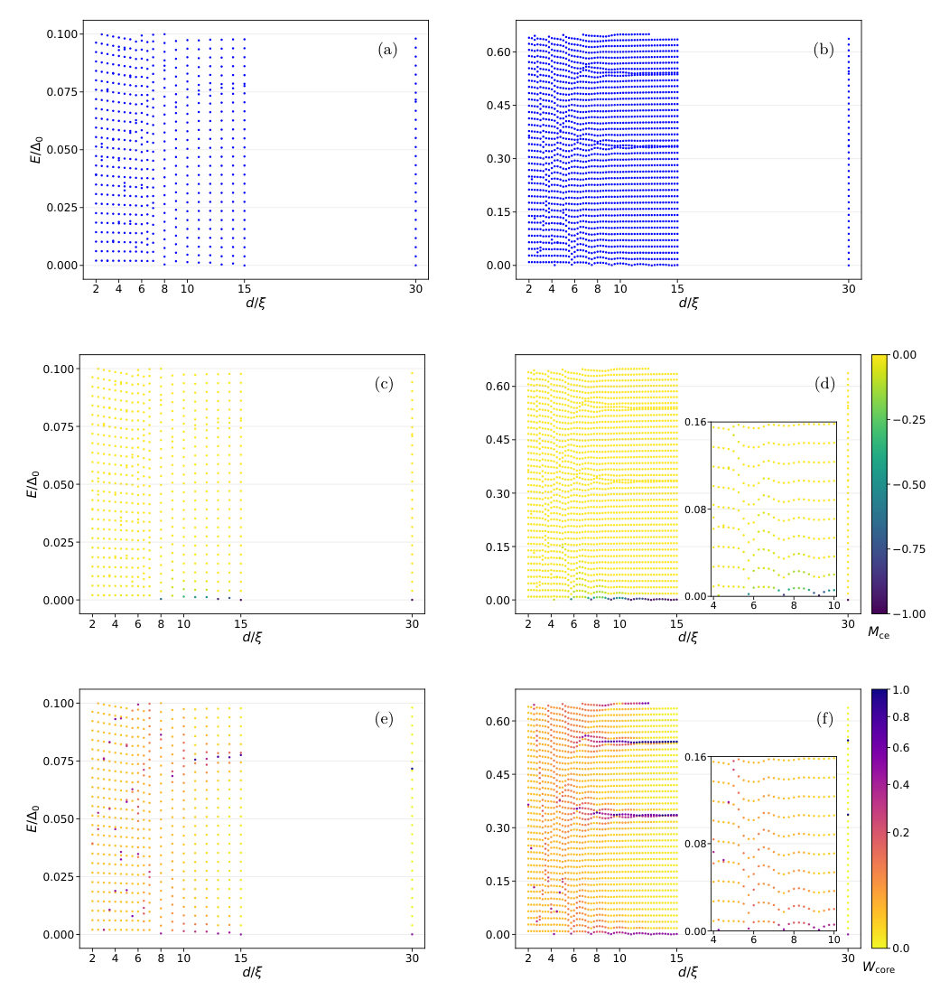
<figcaption class="paper-figure-caption"><b>Fig 3.</b> FIG. 3. Positive-energy spectrum and regional diagnostics versus vortex–boundary distance for L = R/ξ = 30. The columns correspond to ∆0/EF = 0.08 and 0.36. (a) and (b) Eigenenergies. (c) and (d) The same levels colored by the core–edge Majorana polarization Mce, with dark blue indicating Mce ≃−1. (e) and (f) Levels colored by the regional core weight Wcore, with dark blue indicating Wcore ≃1. The insets in panels (d) and (f) enlarge the low-energy region 0 ≤E/∆0 ≤0.16 for 4 ≤d/ξ ≤10. The diagnostics are evaluated for each unrecombined positive- energy eigenstate using the distance-dependent partition in Eq. (5); as Ωcore contracts with decreasing d, Wcore tracks regional probability...</figcaption>
</figure>
<figure class="paper-figure-card">
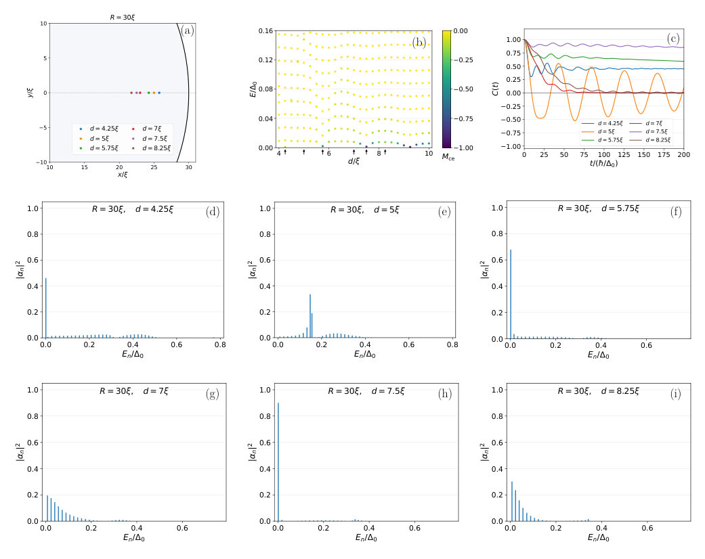
<figcaption class="paper-figure-caption"><b>Fig 4.</b> FIG. 4. Parity dynamics and spectral weights of the translated core-reference packet for L = 30, ∆0/EF = 0.36, and vortex–boundary separations d/ξ = 4.25, 5, 5.75, 7, 7.5, 8.25. (a) Sampled vortex positions (colored dots); the shading denotes the displayed portion of the superconducting disk. (b) Positive-energy spectra colored by the core–edge Majorana polarization Mce, with arrows marking the six sampled separations. (c) Parity correlator C(t) for each separation. (d)–(i) Normalized spectral weights |αn|2 over the retained N = 50 positive-energy eigenstates. At d/ξ = 5.75 and 7.5, a dominant near-zero component makes C(t) vary slowly. At d/ξ = 7 and 8.25, fragmentation among several...</figcaption>
</figure>
<figure class="paper-figure-card">
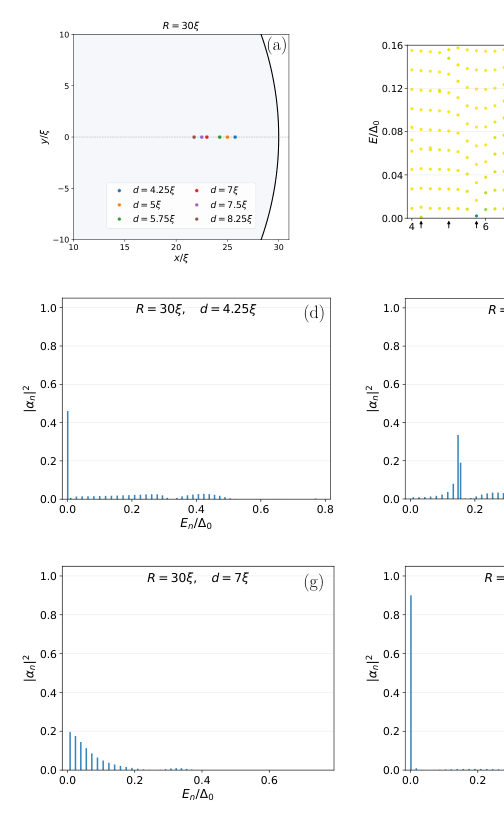
<figcaption class="paper-figure-caption"><b>Fig 5.</b> Figure 4 summarizes the finite-disk results for ∆0/EF = 0.36, R = 30ξ, and the six sampled vortex–boundary sep- arations. The spectral weights in panels (d)–(i) determine C(t) in panel (c) through Eq. (17), while panel (b) shows the corresponding eigenstate polarization. The discrete spectrum produces coherent dephasing and finite-size recurrences. For ∆0 = 1 meV, the time unit is ℏ/∆0 ≃0.66 ps. The spectral response is strongly nonmonotonic in d. At d = 5.75ξ and 7.5ξ, most of the packet weight lies in a near- zero state, and C(t) varies slowly. At d = 7ξ and 8.25ξ,</figcaption>
</figure>

**Summary.** This work analyzes the spectral reorganization in a superconducting disk containing a vortex by studying the coupling between the vortex core and the boundary. Using BdG calculations, the authors show that while the localized wave packet retains high norm, the resulting spectral properties and parity memory are highly sensitive to the vortex-boundary separation. This highlights that simple measures of wave function overlap are insufficient predictors of topological memory.

**Why it may be interesting.** The study of topological superconductivity, Majorana fermions, and spectral dynamics in confined geometries is highly relevant to understanding topological quantum computation and superconducting quantum circuits.

Detailed structure

**Main problem.** The study investigates how the coupling between a vortex core and the boundary reorganizes the low-energy electronic spectrum of a finite 2D p_x+ip_y superconductor, and what this implies for the coherence and memory of Majorana wave packets.

**Main result.** A large retained norm of the reference packet does not guarantee spectral concentration or persistent parity memory, as the spectral measure and parity dynamics vary significantly with the vortex-boundary separation.

**Method.** Bogoliubov-de Gennes (BdG) calculations are employed, supplemented by analyzing regional coherence measures and parity correlators.

**Model / system.** The system is a finite 2D p_x+ip_y superconducting disk containing a vortex, modeled using the grand-canonical mean-field Hamiltonian and solved via BdG equations.

**Key observables.** Nonmonotonic core-edge reorganization of eigenstates, retained norm of the reference packet, spectral measure (concentration/fragmentation), and signed parity correlator.

**Important parameters / regimes.** Vortex-boundary separation (d), superconducting gap ratio (Δ_0/E_F = 0.36), and disk radius (R=30ξ).

**Assumptions / limitations.** The analysis uses a finite-disk approximation and an idealized reference preparation method for the vortex core packet.

**Figures summary.** Figures illustrate vortex geometry and image construction; other figures show the spectral measure and parity correlator varying nonmonotonically with the vortex-boundary distance d.

**Paper structure.** The paper progresses from defining the physical system and Hamiltonian to calculating spectral reorganization via BdG, and finally analyzing the implications for parity memory using time-domain correlators.

Abstract

We study how vortex--edge coupling reorganizes the low-energy sector of a finite two-dimensional \(p_x+ip_y\) superconducting disk as a function of the vortex--boundary separation \(d\) and examine what this reorganization implies for the parity memory associated with a prescribed vortex-core Majorana wave packet, a resource relevant to Majorana-based quantum operations. Bogoliubov--de Gennes calculations reveal nonmonotonic core--edge reorganization of the lowest positive-energy finite-disk eigenstate, with particularly rapid variation near \(d\simeq7ξ\), where \(ξ\) is the coherence length. To separate this eigenstate reorganization from the spectral representation of a prescribed state, we rigidly translate a centered-vortex core-reference packet to each fixed vortex position, restrict it to the target disk, and project it, without intermediate normalization, onto the particle-hole-complete low-energy subspace. For \(Δ_0/E_F=0.36\) and disk radius \(R=30ξ\), the resulting retained norm exceeds \(0.98\) at all six sampled separations, \(4.25\leq d/ξ\leq8.25\), while, depending on \(d\), the spectral measure is concentrated near zero energy, fragmented over several low-energy levels, or dominated by finite-energy weight. Correspondingly, the signed parity correlator displays slow temporal variation, rapid coherent dephasing, or sign-changing oscillations, with possible finite-size recurrences at later times. Thus a large retained norm does not by itself imply spectral concentration or persistent parity memory.

[↑ back to top](#top)

### [Room-temperature local strain control of moiré excitons in MoS$_2$/WSe$_2$ heterobilayers](http://arxiv.org/abs/2609.02340v1)

**Authors:** T. O. Oskolkova, Y. Koo, A. A. Shubnic, I. Yu. Chestnov, I. Choi, C. Cheng, D. Huang, T. Jiang, K. -D. Park, I. V. Iorsh, V. Kravtsov  
**Type:** both · **Category:** other · **PDF:** <https://arxiv.org/pdf/2609.02340v1>  
**Analysis basis:** full PDF text, analyzed in chunks
**Topic relevance:** `analog quantum simulation` **2/5** · `driven-dissipative phase transition` **1/5** · `interference shaping light` **1/5** · `quantum measurements` **1/5** · `quantum optics experiment` **1/5**

↔ Scroll figures horizontally

<figure class="paper-figure-card">
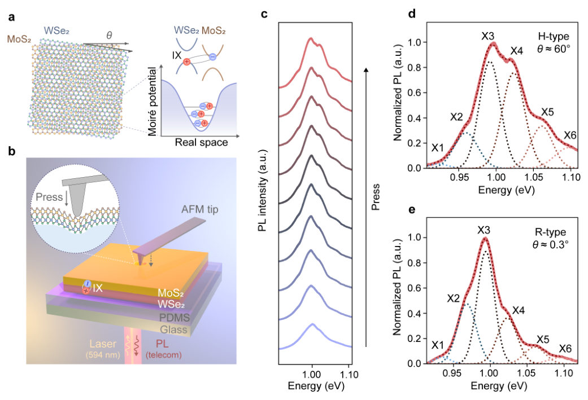
<figcaption class="paper-figure-caption"><b>Fig 1.</b> FIG. 1. Activation of moir´e IXs by applying tip-induced strain at room temperature. (a) Schematics of the moir´e superlattice formed by MoS2 and WSe2 monolayers with a twist angle θ (left), band alignment and IX formation (upper right), and confinement of IX states in the moir´e potential (bottom right). (b) Schematic of the experimental configuration, where a MoS2/WSe2 heterobilayer is locally deformed by an AFM tip. (c) Measured PL spectra for an H-type MoS2/WSe2 heterobilayer under varying induced strain increasing from bottom to top. (d–e) PL spectra under the maximum strain from (c) for an H-type (d) and an R-type (e) MoS2/WSe2 heterobilayer, together with fits by six Gaussian...</figcaption>
</figure>
<figure class="paper-figure-card">
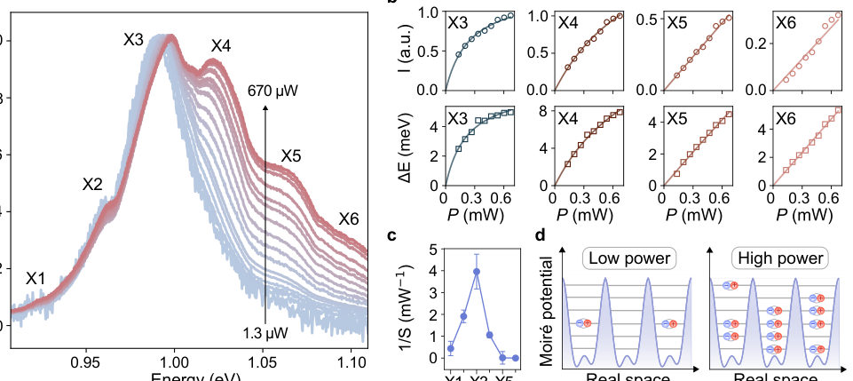
<figcaption class="paper-figure-caption"><b>Fig 2.</b> FIG. 2. Excitation power dependence of the moir´e IX PL spectra. (a) PL spectra at maximum strain for an H-type MoS2/WSe2 heterobilayer at different indicated excitation powers. (b) Amplitudes (top panels) and energy shifts (bottom panels) of selected moir´e peaks (X3-X6) as functions of excitation power obtained by fitting experimental spectra by six Gaussian functions (symbols) together with fits according to Eq. 1 (curves). (c) Inverse saturation power 1/Sn representing the relative saturation rate for each moir´e peak. The line is a guide to the eye. (d) Schematic diagrams of moir´e potential with different IX energy level filling at low (left) and high (right) excitation powers.</figcaption>
</figure>
<figure class="paper-figure-card">
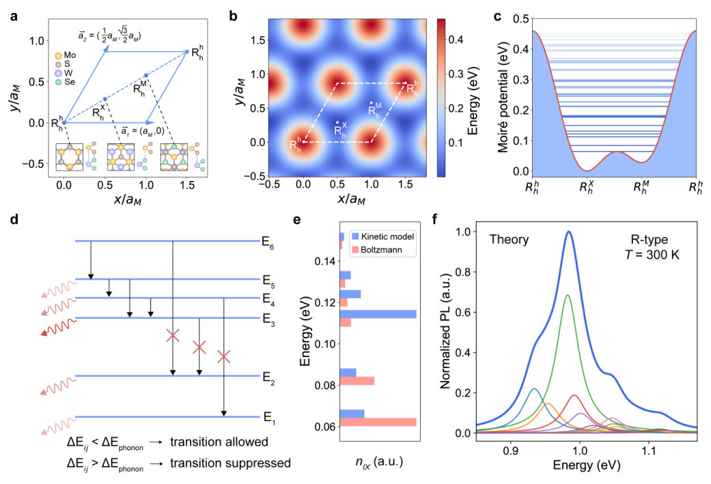
<figcaption class="paper-figure-caption"><b>Fig 3.</b> FIG. 3. Theoretical modeling of the moir´e potential and IX PL spectra for an R-type MoS2/WSe2 heterobilayer. (a) Schematic of the moir´e superlattice unit cell with 3 distinct stacking configurations, where aM stands for the moir´e unit-cell size. (b) Spatial distribution of the calculated moir´e potential with the unit cell indicated by white dashed lines. (c) Spatial profile of the moir´e potential along the main diagonal together with calculated energy levels. (d) Schematic illustrating the kinetic model of populating the lowest six quantized exciton levels, with allowed and suppressed phonon-mediated transitions (straight arrows) and radiative recombination (wavy arrows). ∆Ephonon is...</figcaption>
</figure>
<figure class="paper-figure-card">
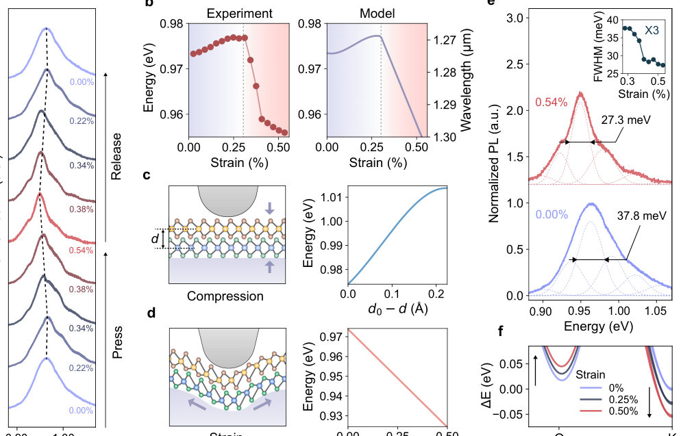
<figcaption class="paper-figure-caption"><b>Fig 4.</b> FIG. 4. Strain-tuning of the moir´e IX spectral response. (a) Reversible evolution of PL spectra for an R-type MoS2/WSe2 heterobilayer under increasing and decreasing tip-induced strain. (b) Experimental effective emission energy calculated via the first moment of the PL spectral distribution as a function of strain (left panel) together with corresponding modeling results accounting for compression-induced blueshift and strain-induced redshift (right panel). (c) Schematic illustration for out-of- plane compression due to tip pressing (left panel) and calculated effective emission energy as a function of interlayer distance change d0 −d under compression (right panel). (d) Schematic...</figcaption>
</figure>

**Summary.** This work demonstrates room-temperature control over moiré excitons in $	ext{MoS}_2/	ext{WSe}_2$ heterobilayers by applying local mechanical strain via an AFM tip. By coupling strain engineering with PL spectroscopy and advanced theoretical modeling, the authors show they can not only activate these excitons at ambient temperatures but also tune their emission wavelength into the crucial second telecom window. This establishes local strain as a powerful tool for realizing practical quantum excitonic devices.

**Why it may be interesting.** The ability to use mechanical strain as a non-electrical, on-demand knob to tune quantum optical properties (like emission wavelength) at ambient conditions is highly relevant for developing practical quantum light sources and excitonic devices.

Detailed structure

**Main problem.** The primary challenge addressed is overcoming the limitation of studying moiré excitons at cryogenic temperatures to enable practical, room-temperature quantum control.

**Main result.** The authors demonstrate that local strain engineering using an AFM tip can activate, control, and tune the emission wavelength of moiré excitons in $	ext{MoS}_2/	ext{WSe}_2$ heterobilayers to the second telecom window at room temperature.

**Method.** The study combines experimental measurements (PL spectroscopy under controlled local strain and power variation) with theoretical modeling (DFT and kinetic rate equations).

**Model / system.** The system is the moiré superlattice formed by stacking $	ext{MoS}_2/	ext{WSe}_2$ heterobilayers. The physics involves quantized moiré exciton states whose properties are tuned by external mechanical strain.

**Key observables.** Photoluminescence (PL) spectra, moiré exciton resonance energies ($	ext{X}1-	ext{X}6$), spectral linewidth, and the effective emission energy as a function of applied strain.

**Important parameters / regimes.** Room temperature (300 K), local strain magnitude (tensile/compressive), excitation power ($P$), and the resulting shift towards the telecom window ($\sim 1.3 \mu	ext{m}$).

**Assumptions / limitations.** The theoretical model assumes the blueshift is due to repulsive dipole–dipole interactions, and the kinetic model assumes excitation populates the highest energy level followed by non-radiative relaxation.

**Figures summary.** Figures show the PL spectrum evolving dramatically under increasing strain (multiple resonances emerging), the dependence of peak amplitudes on excitation power, and quantitative plots mapping the effective emission energy against applied strain (showing both initial blueshift and subsequent redshift).

**Paper structure.** The paper establishes the physical platform (moiré excitons), details the experimental control mechanism (local strain via AFM), analyzes the spectral signatures (power dependence and strain tuning), and supports these findings with a comprehensive theoretical model capturing the energy shifts and linewidth narrowing.

Abstract

Moiré superlattices in heterobilayers of atomically thin transition metal dichalcogenides provide a versatile platform for exploring quantum many-body physics as they can trap excitons, leading to the formation of quantized moiré exciton states. However, such moiré excitons have been predominantly studied at cryogenic temperatures, which severely limits their practical applications. Here, we demonstrate room-temperature activation and control of moiré excitons in MoS$_2$/WSe$_2$ heterobilayers using local strain engineering. Applying mechanical strain with a modified atomic force microscopy tip, we observe a series of resonances attributed to interlayer exciton states confined in the moiré potential. Power-dependent photoluminescence measurements elucidate the population dynamics of the moiré exciton states, while controlled local strain enables continuous tuning of their emission wavelength to the center of the second telecom window. We provide a theoretical model that captures all experimentally observed features, including the unconventional spectral shape of the moiré exciton emission. Our findings establish local tip-induced strain as a powerful tool for the on-demand manipulation of moiré excitons, paving the way for room-temperature quantum excitonic devices.

[↑ back to top](#top)

### [Twist as a Mechanical Switch for Reconfigurable Stacking in h-BN](http://arxiv.org/abs/2609.02723v1)

**Authors:** Gautham Vijayan, Zhaoheng Zhang, Kenji Watanabe, Takashi Taniguchi, Michael Urbakh, Oded Hod, Xiang Gao, Elad Koren  
**Type:** both · **Category:** other · **PDF:** <https://arxiv.org/pdf/2609.02723v1>  
**Analysis basis:** full PDF text, analyzed in chunks
**Topic relevance:** `analog quantum simulation` **2/5** · `Frenkel-Kontorova` **1/5** · `driven-dissipative phase transition` **1/5** · `non-equilibrium universality` **1/5** · `quantum measurements` **1/5**

↔ Scroll figures horizontally

<figure class="paper-figure-card">
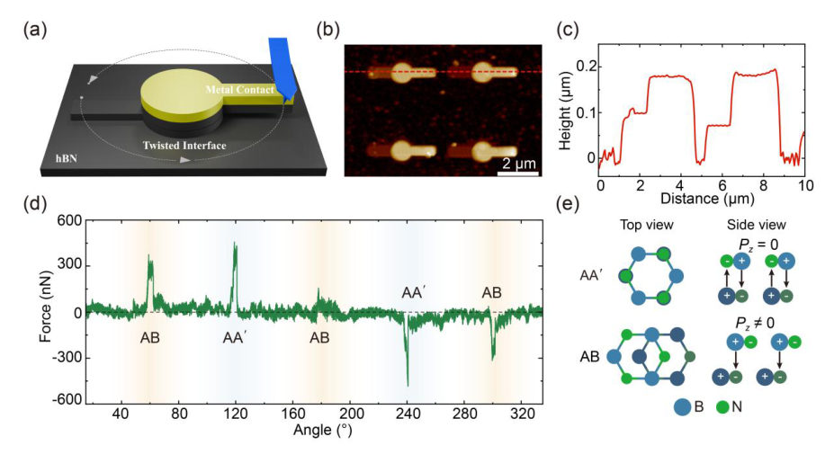
<figcaption class="paper-figure-caption"><b>Fig 1.</b> Figure 1. Mechanical actuation and force response of rotationally reconfigurable h-BN</figcaption>
</figure>
<figure class="paper-figure-card">
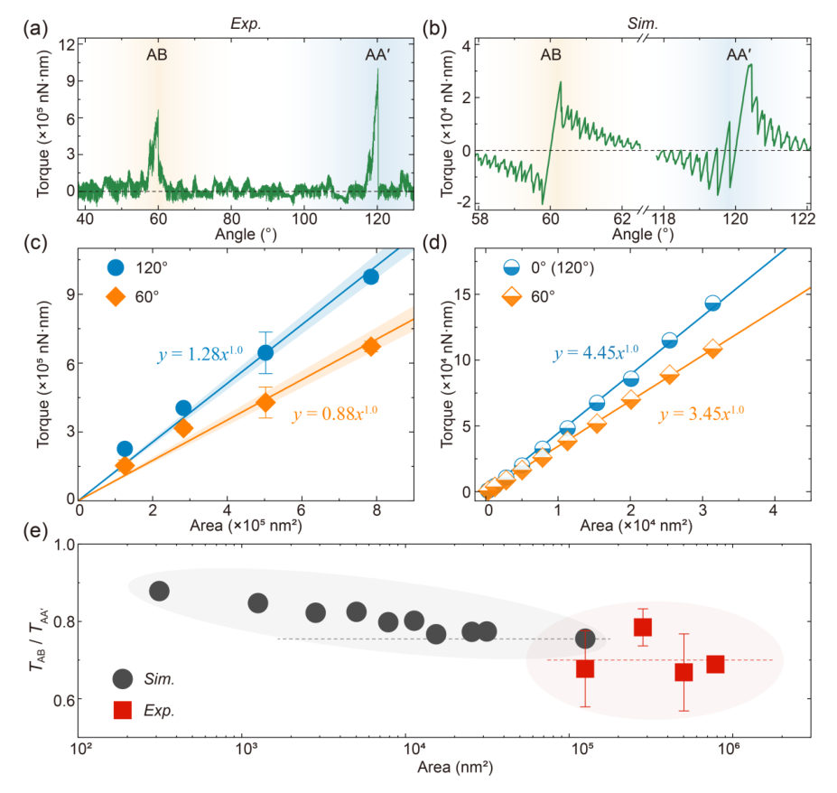
<figcaption class="paper-figure-caption"><b>Fig 2.</b> Figure 2. Experimental and MD simulation results for the torque-angle profiles and contact</figcaption>
</figure>
<figure class="paper-figure-card">
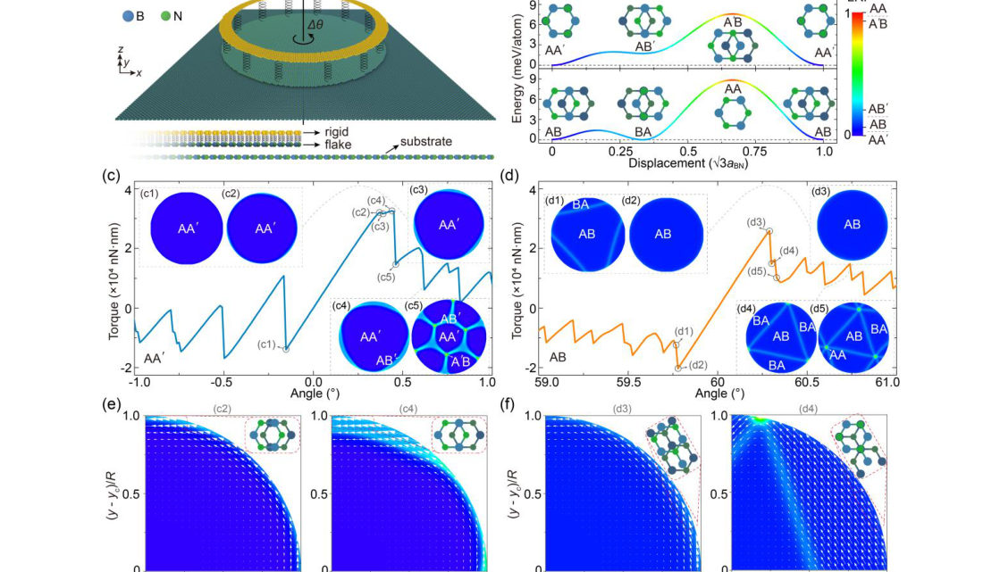
<figcaption class="paper-figure-caption"><b>Fig 3.</b> Figure 3. Atomistic origin of the asymmetric periodic torque behavior. (a) Schematic of the</figcaption>
</figure>
<figure class="paper-figure-card">
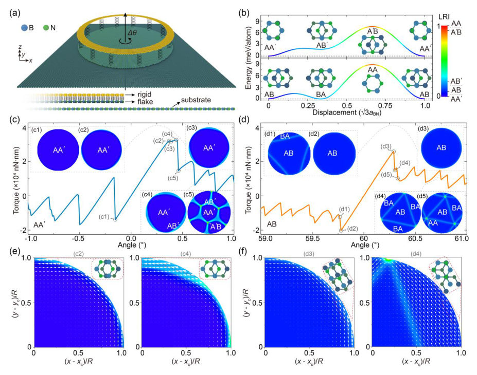
<figcaption class="paper-figure-caption"><b>Fig 4.</b> Fig. 2. The insets depict the marked instantaneous stacking configurations manifested by LRI.</figcaption>
</figure>
<figure class="paper-figure-card">
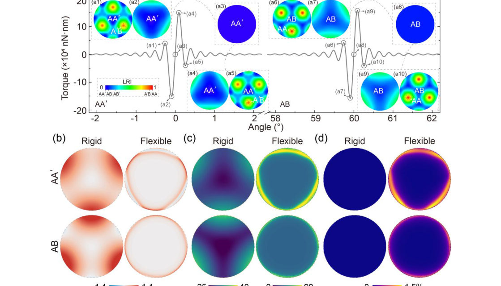
<figcaption class="paper-figure-caption"><b>Fig 5.</b> Figure 4. Comparison of rigid and flexible h-BN/h-BN contacts torsional responses along the</figcaption>
</figure>

**Summary.** This work demonstrates that the stacking order of h-BN layers can be reversibly switched by applying external torque, a process termed 'twistronics.' By combining AFM experiments and atomistic simulations, the authors quantify the mechanical asymmetry between the stable AA and AB stacking states. This finding paves a pathway for designing reconfigurable nano-electromechanical devices based on controlled interlayer coupling.

**Why it may be interesting.** While focused on mechanics, the study of phase transitions (stacking changes) driven by external fields (torque) and the resulting polarization states offers analogies to controlling quantum states in engineered quantum materials.

Detailed structure

**Main problem.** The paper addresses the challenge of controllably switching the interlayer stacking configuration in hexagonal boron nitride (h-BN) using external mechanical torque.

**Main result.** The stacking can be reproducibly switched between AA and AB modes, exhibiting a measurable asymmetry ratio (approx. 0.7) and showing that the peak torque scales linearly with contact area, indicating dominant edge elasticity.

**Method.** The study combines experimental measurements using an AFM setup to apply controlled torque with atomistic molecular dynamics (MD) simulations (LAMMPS) to model the atomic interactions.

**Model / system.** The physical system is the contact interface between h-BN layers. The modeling involves simulating the torsional loading on these homojunctions, comparing flexible atomic reconstructions against more rigid theoretical models.

**Key observables.** Rotational torque (T) vs. angle ($	heta$), peak torque values, asymmetry ratio ($	ext{T}_{	ext{AB}} / 	ext{T}_{	ext{AA}'}$), and the scaling of torque with contact area ($	ext{T} \propto 	ext{A}$).

**Important parameters / regimes.** The key parameters are the stacking configurations (AA, AB), the applied external torque, and the contact area (A).

**Assumptions / limitations.** The linear scaling of torque with area suggests that interfacial elasticity is the dominant mechanism governing the twisting process, overriding predictions from purely rigid models.

**Figures summary.** Figures illustrate the mechanical setup, force-angle profiles showing torque peaks at specific angles ($60^\circ, 120^\circ$), and comparisons between experimental torque-angle profiles and MD simulation results, particularly regarding area scaling and yielding mechanisms.

**Paper structure.** The paper progresses by first establishing the experimental measurement of torque switching in h-BN, then using atomistic simulations to reproduce and explain the observed asymmetry and the linear scaling of torque, contrasting ductile vs. brittle yielding mechanisms.

Abstract

Twistronics of layered materials has emerged as a highly active field due to its profound implications for quantum electronics and materials engineering. However, the controllable manipulation of interlayer stacking remains a significant experimental challenge. Here, the homogeneous contact between hexagonal boron nitride layers is shown to be reproducibly switched between two distinct stable stacking configurations via an externally applied torque. Combining experiments and computational modelling, we identify the stacking order of these stable states as the commensurate AA and AB modes. These two states are associated with different rotational torque maxima, exhibiting an asymmetry ratio of 0.7, and distinct dynamics as a function of the twist angle. Moreover, the peak torque values scale linearly with contact area, highlighting the dominant role of edge elasticity in the twisting process. Given that the AA and AB stacking modes correspond to different out-of-plane electric polarization states, our findings offer a pathway for reconfigurable nano- and micro-electromechanical devices.

[↑ back to top](#top)

### [Quantum Structural Renormalization and Anharmonic Stabilization of Superconductivity in P4/mmm YScH8](http://arxiv.org/abs/2609.02295v1)

**Authors:** Xiaorui Dong, Mi Pang, Wenjie Ma, Yao Ma, Pugeng Hou  
**Type:** theory · **Category:** other · **PDF:** <https://arxiv.org/pdf/2609.02295v1>  
**Analysis basis:** full PDF text, analyzed in chunks
**Topic relevance:** `Keldysh / 2PI / non-Gaussian methods` **2/5** · `methods for driven-dissipative` **2/5** · `analog quantum simulation` **1/5**

↔ Scroll figures horizontally

<figure class="paper-figure-card">
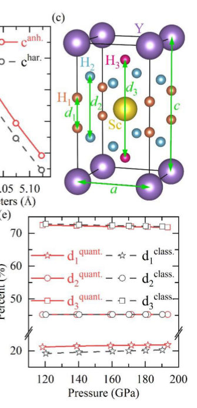
<figcaption class="paper-figure-caption"><b>Fig 1.</b> FIG. 1. (a) – (b) Comparison of harmonic and anharmonic pressures as functions of lattice parameters a and c, both</figcaption>
</figure>
<figure class="paper-figure-card">
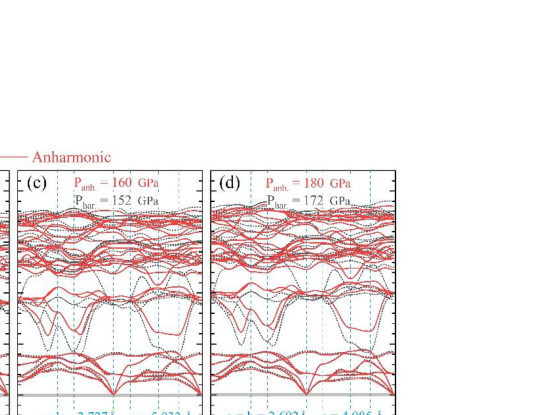
<figcaption class="paper-figure-caption"><b>Fig 2.</b> FIG. 2. Comparison between the harmonic (evaluated on the anharmonically optimized &quot;quantum structure&quot;, black</figcaption>
</figure>
<figure class="paper-figure-card">
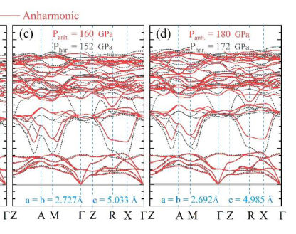
<figcaption class="paper-figure-caption"><b>Fig 3.</b> Figure 2 presents a comparison between the harmonic (method B, black dotted lines) and anharmonic (method C, red solid lines) phonon spectra of the P4/mmm phase of YScH₈ along the high-symmetry path Z–A–M–Γ–Z–R–X–Γ, calculated at four different sets of lattice parameters corresponding to panels (a)–(d). The anharmonic spectra are obtained from the free-energy Hessian</figcaption>
</figure>
<figure class="paper-figure-card">
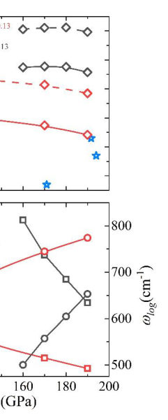
<figcaption class="paper-figure-caption"><b>Fig 4.</b> FIG. 3. Superconducting properties calculated on the anharmonically optimized &quot;quantum structure&quot; and on the</figcaption>
</figure>
<figure class="paper-figure-card">
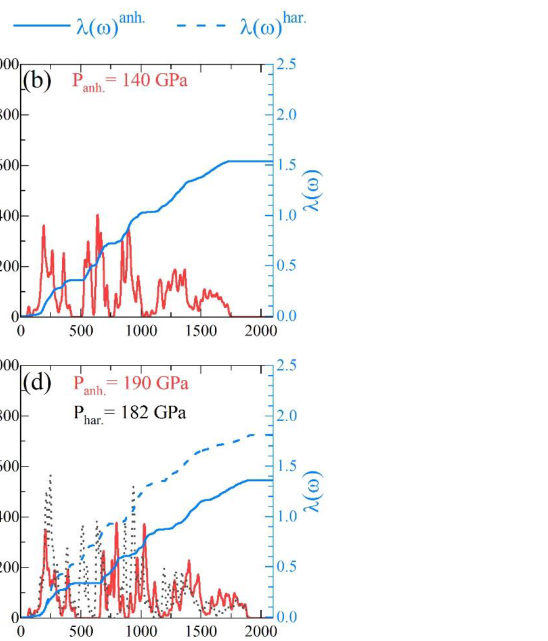
<figcaption class="paper-figure-caption"><b>Fig 5.</b> FIG. 4. Anharmonic spectral function α2F(ω) (red solid lines) and integrated electron-phonon coupling constant λ(ω)</figcaption>
</figure>

**Summary.** This theoretical study uses the Stochastic Self-Consistent Harmonic Approximation (SSCHA) to model the structural and electronic properties of the superhydride YScH8 under high pressure. The authors demonstrate that neglecting quantum and anharmonic lattice effects leads to significant overestimations of the superconducting critical temperature (Tc). A full treatment is necessary to accurately predict the material's behavior, matching theory to experiment.

**Why it may be interesting.** While focused on solid-state superconductivity, the rigorous application of free-energy minimization and quantum fluctuations (SSCHA) to determine equilibrium structure and vibrational properties shares methodological parallels with advanced quantum many-body treatments in AMO physics.

Detailed structure

**Main problem.** The paper aims to accurately predict the superconducting critical temperature (Tc) in high-pressure ternary superhydrides by accounting for the effects of quantum and anharmonic ionic motion.

**Main result.** Incorporating quantum and anharmonic effects significantly renormalizes the crystal structure and lowers the dynamical stability threshold pressure, leading to a predicted Tc of 113 K at 190 GPa, which matches experimental observations.

**Method.** The Stochastic Self-Consistent Harmonic Approximation (SSCHA) is employed to minimize the free energy, providing a quantum-mechanically consistent treatment of lattice vibrations and structural relaxation.

**Model / system.** The study focuses on the P4/mmm-YScH8 superhydride under extreme high pressures. The methodology involves calculating the free energy and deriving phonon frequencies from the free-energy Hessian, contrasting this with classical harmonic approximations.

**Key observables.** Superconducting critical temperature (Tc), dynamical stability threshold pressure, phonon density of states, and Eliashberg spectral function.

**Important parameters / regimes.** Pressure (up to 190 GPa), electron-phonon coupling constant (lambda), and Coulomb pseudopotential (mu*).

**Assumptions / limitations.** The SSCHA method is used in its static limit, which is assumed to provide accurate phonon frequencies and EPC parameters for the system.

**Figures summary.** Figures compare harmonic vs. anharmonic pressures and structural parameters, and show the decomposition of the Eliashberg spectral function into contributions from different atomic sites (H1, H2, H3, Y, Sc).

**Paper structure.** The paper systematically compares results from classical harmonic approximations against those derived from the SSCHA formalism. It first establishes the structural renormalization and pressure shift, then uses the resulting quantum structure to calculate superconducting parameters, concluding that anharmonicity is essential for quantitative agreement with experiment.

Abstract

The recent synthesis of P4/mmm-YScH$_{8}$ at 191.7 GPa with a superconducting critical temperature Tc of 113 K has attracted considerable interest in the study of ternary superhydrides. Here we systematically evaluate the effects of quantum and anharmonic motion of ions in P4/mmm-YScH$_{8}$ using the stochastic self-consistent harmonic approximation (SSCHA). We find that these effects renormalize the crystal structure and lower the dynamical stability threshold pressure from $\sim$140 GPa to $\sim$84 GPa, a reduction of about 40%. Furthermore, neglecting these effects causes a significant overestimation of the $T_{c}$, for instance by $\sim$20 K at 190 GPa. Our prediction of $T_{c}$ at 190 GPa is 113 K ($μ^{*}$= 0.13), close to the experimental observation. Analysis of the phonon density of states and Eliashberg spectral function further reveals site-dependent contributions to superconductivity. These results establish that a consistent treatment of nuclear quantum motion and anharmonicity is essential for accurately predicting superconductivity in compressed ternary hydrides.

[↑ back to top](#top)

### [Symmetry-enforced third-order nonlinear thermal Hall effects in altermagnets](http://arxiv.org/abs/2609.02008v1)

**Authors:** Yun-Mei Li, Jiacheng Yao, Hua Wang, Kai Chang  
**Type:** theory · **Category:** other · **PDF:** <https://arxiv.org/pdf/2609.02008v1>  
**Analysis basis:** full PDF text, analyzed in chunks
**Topic relevance:** `Keldysh / 2PI / non-Gaussian methods` **2/5** · `analog quantum simulation` **1/5**

↔ Scroll figures horizontally

<figure class="paper-figure-card">
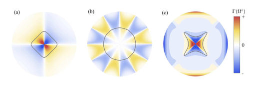
<figcaption class="paper-figure-caption"><b>Fig 1.</b> FIG. 1. The Berry curvature pattern in the kx −ky plane for the planar d-wave (a), i-wave (b) and bulk i-wave (c) al- termagnets with the effective Hamiltonian given by Eq. (5). tJ = 0.5 and λ = 0.1. Γ(Ωz) = sgn(Ωz) log10(1 + |Ωz|). The gray lines denote an constant energy surface. In (c), kz = 1.0.</figcaption>
</figure>
<figure class="paper-figure-card">
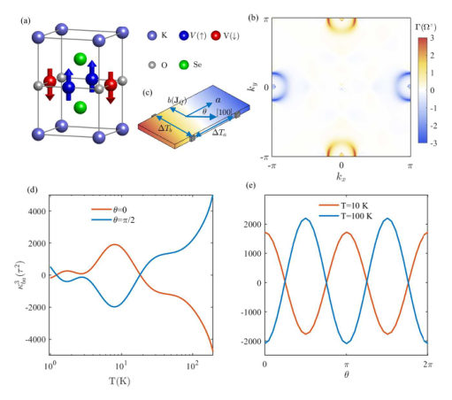
<figcaption class="paper-figure-caption"><b>Fig 2.</b> FIG. 2. The THE of electrons in altermagnetic metal KV2Se2O. (a) The crystal structure of KV2Se2O. (b) The distribution of z component electronic Berry curvature with log scale Γ(Ωz) = sgn(Ωz) log10(1 + |Ωz|) in the kz = 0 plane. The unit of Berry curvature is ˚A2. (c) Illustration of a thermal Hall detection setup with the temperature gradient in the xy plane. (d) κ3 ba with respect to the temperature at two angles. (e) κ3 ba with respect to the angle of temperature gradient at two different temperatures.</figcaption>
</figure>
<figure class="paper-figure-card">
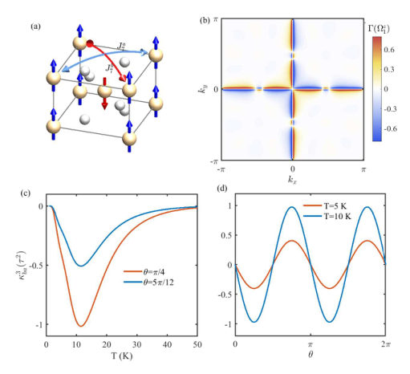
<figcaption class="paper-figure-caption"><b>Fig 3.</b> FIG. 3. The THE of magnons in altermagnetic insulator MnF2. (a) The crystal structure of MnF2. (b) The distribu- tion of z component magnon Berry curvature with log scale Γ(Ωz 1) = sgn(Ωz 1) log10(1 + |Ωz 1|) in the kz = 0 plane. The unit of Berry curvature is ˚A2. (c) κ3 ba with respect to the temperature at two angles. (d) κ3 ba with respect to the angle of temperature gradient at two different temperatures.</figcaption>
</figure>

**Summary.** This work develops a theory to predict the third-order nonlinear thermal Hall effect in altermagnets. By analyzing symmetry constraints, the authors show that this nonlinear response is a unique signature of altermagnetism, depending critically on the orientation of the material's Néel vector. This provides a powerful, measurable diagnostic tool for identifying and characterizing these novel magnetic materials.

**Why it may be interesting.** While focused on condensed matter magnetism, the use of Berry curvature and nonlinear transport coefficients connects to advanced topics in topological materials and non-equilibrium quantum dynamics, which are relevant to AMO physics.

Detailed structure

**Main problem.** The paper investigates the symmetry-enforced third-order nonlinear thermal Hall effect (THE) in altermagnets.

**Main result.** A dominant third-order nonlinear THE is predicted for altermagnets with out-of-plane Néel order, providing a unique diagnostic tool to confirm altermagnetism and determine the Néel vector orientation.

**Method.** The authors developed a theoretical framework using Boltzmann transport theory and semiclassical wavepacket theory to calculate the transverse energy current up to the third order in the temperature gradient.

**Model / system.** The study focuses on altermagnets, which are novel collinear antiferromagnets. Calculations are performed for both electronic contributions (using materials like KV2Se2O) and magnon contributions (using insulators like MnF2).

**Key observables.** The third-order nonlinear thermal Hall coefficient ($\kappa_{3ba}$), which exhibits a characteristic $\pi$-periodic dependence on the temperature gradient direction.

**Important parameters / regimes.** The Néel vector orientation (out-of-plane vs. in-plane) is critical, as it dictates whether the third-order or linear THE dominates.

**Assumptions / limitations.** The analysis relies on the Relaxation Time Approximation (RTA) for both electronic and magnon transport calculations.

**Figures summary.** Figures illustrate the Berry curvature patterns for different altermagnetic types and show the calculated dependence of the third-order thermal Hall conductivity on the temperature gradient angle $\theta$.

**Paper structure.** The paper first develops the general theoretical formalism for the nonlinear THE, then applies this theory to analyze specific symmetry conditions, and finally demonstrates the results using concrete examples from both metallic and insulating altermagnets.

Abstract

Thermal Hall effect (THE) is a powerful probe of material properties, even in insulators. Here we investigate the thermal response of altermagnets by developing a theory on Berry curvature driven nonlinear THE from both electrons and magnons. We identify symmetry conditions under which the third-order THE dominates while linear and second-order contributions vanish. Notably, d-wave and i-wave altermagnets with out-of-plane Neel order satisfy these conditions, whereas in-plane order yields a dominant linear THE. Using KV2Se2O (a d-wave altermagnetic metal) and MnF2 (an altermagnetic insulator) as concrete examples, we show nonzero third-order nonlinear THE from electrons and magnons, respectively, both exhibiting a pi-periodic dependence on the direction of temperature gradient. These symmetry-guaranteed Berry curvature phenomena provide a diagnostic for altermagnetism in candidate materials and enable determination of the Neel vector orientation.

[↑ back to top](#top)

### [Direct Observation of the Zigzag Edge States of a Supramolecular Diatomic Kagome Lattice](http://arxiv.org/abs/2609.02567v1)

**Authors:** Ryohei Nemoto, Xiangzhi Meng, Behzad Mortezapour, Alexander Weismann, Saya Nakano, Masahisa Tsuchiizu, Ryuichi Arafune, Noriaki Takagi, Sho Nakamura, Katsunori Wakabayashi, Rie Suizu, Richard Berndt, Takashi Uchihashi, Kunio Awaga  
**Type:** both · **Category:** other · **PDF:** <https://arxiv.org/pdf/2609.02567v1>  
**Analysis basis:** full PDF text, analyzed in chunks
**Topic relevance:** `analog quantum simulation` **2/5**

↔ Scroll figures horizontally

<figure class="paper-figure-card">
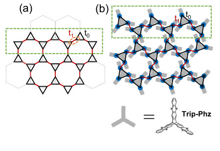
<figcaption class="paper-figure-caption"><b>Fig 1.</b> Figure 1: Diagram of the diatomic Kagome lattice. (a) Mathematical model with intra- corner coupling t0 and inter-corner coupling t1. The lattice can be regarded as an extension of the honeycomb and Kagome lattices. The dashed orange line indicates a diatomic pair coupled with t1.(b) Materialization of the diatomic Kagome lattice using Trip-Phz molecules, where t0 and t1 represent intra- and intermolecular couplings, respectively. The gray symbols represent the C3-symmetric frame of Trip-Phz molecules. Left-handed chirality is chosen for this display. The green rectangles indicate the zigzag-type edge corresponding to that of graphene.</figcaption>
</figure>
<figure class="paper-figure-card">
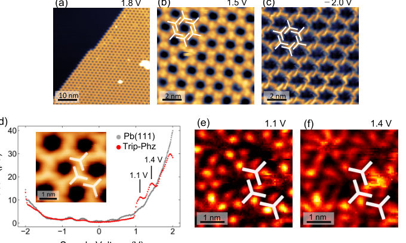
<figcaption class="paper-figure-caption"><b>Fig 2.</b> Figure 2: STM observations of the diatomic Kagome lattice of Trip-Phz on Pb(111). (a) Large-area STM topographs recorded using I = 10 pA and V = 1.8 V. (b, c) Detailed topographs acquired using (b) V = 1.5 V and (c) −2.0 V. (d) dI/dV spectrum averaged over the molecular network of Trip-Phz (red dots) and a reference spectrum on a bare Pb(111) (gray dots). Inset: STM topograph of the relevant area recorded using V = 2.0 V, I = 50 pA. (e, f) dI/dV images taken over the same area as in (d) using (e) V = 1.1 V and (f) 1.4 V. For the images in (b-f), the molecular adsorption geometries are denoted by white Y-shaped lines.</figcaption>
</figure>
<figure class="paper-figure-card">

<figcaption class="paper-figure-caption"><b>Fig 3.</b> Figure 3: Spectroscopic evidence of the zigzag edge states and the Dirac and flat bands of the diatomic Kagome lattice of Trip-Phz. (a) Topograph of the zigzag edge structure with left- handed chirality, recorded using V = 1.6 V, I = 50 pA. (b) dI/dV image taken at V = 1.42 V over the area shown in (a). (c) dI/dV image obtained under the same conditions from a Trip-Phz lattice with right-handed chirality. (d) Upper panel: dI/dV spectrum acquired within the green square in (a) (green dots). The positions of the peak and shoulders were determined from d3I/dV 3 (brown dots), which was obtained by taking the second derivative of dI/dV with respect to V. Lower panel: dI/dV spectra acquired near...</figcaption>
</figure>
<figure class="paper-figure-card">
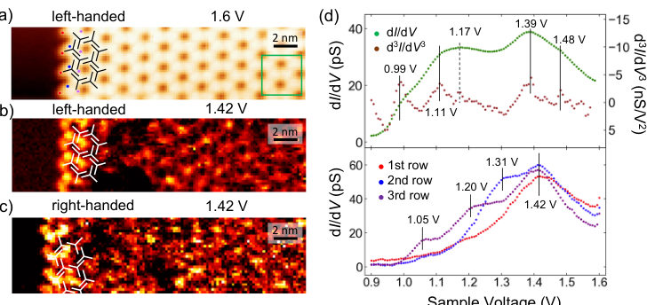
<figcaption class="paper-figure-caption"><b>Fig 4.</b> Fig. 3(a) reveals that this edge belongs to the zigzag edge defined above, as evident by the</figcaption>
</figure>
<figure class="paper-figure-card">
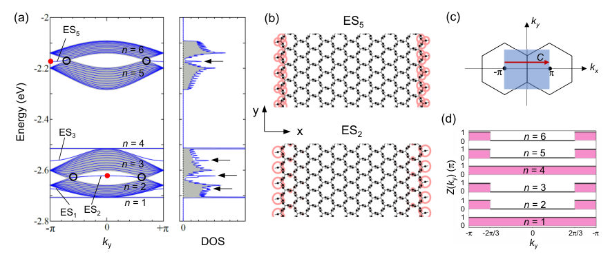
<figcaption class="paper-figure-caption"><b>Fig 5.</b> Figure 4: Results of tight-binding (TB) calculations for the diatomic Kagome lattice of Trip- Phz. (a) Band structure in the ky direction (left panel, blue lines) and the corresponding density of states (DOS) (right panel, blue lines). The edge states located between the bulk bands n and n + 1 are denoted as ESn. The projected band structure and the corresponding DOS of TB-calculated bulk states are shown by the gray regions. The arrows indicate peaks due to the edge states. (b) Spatial distributions of the edge states of ES5 at ky = −π (top panel) and ES2 at ky = 0 (bottom panel) indicated by red dots in (a). Red circles mark the locations of the edge states. The diameter of each circle is...</figcaption>
</figure>

**Summary.** This research reports the successful fabrication and characterization of a diatomic Kagome lattice using self-assembled organic molecules on a metal surface. By combining STM measurements with topological tight-binding calculations, the authors provided direct evidence for the existence of topologically protected zigzag edge states, establishing a novel supramolecular platform for quantum material research.

**Why it may be interesting.** The work demonstrates how complex, synthetic supramolecular chemistry can be used to engineer and observe fundamental topological electronic states, providing a platform for studying quantum materials beyond traditional crystal growth methods.

Detailed structure

**Main problem.** The primary goal was the direct observation and theoretical confirmation of zigzag edge states in a supramolecular diatomic Kagome lattice.

**Main result.** The authors provided direct evidence for these topological edge states using STM spectroscopy, confirming predictions from tight-binding calculations based on the lattice's topology.

**Method.** The study combines experimental characterization using Scanning Tunneling Microscopy (STM) with theoretical modeling via Tight-Binding (TB) calculations and topological analysis using the Zak phase.

**Model / system.** The system is a diatomic Kagome lattice formed by the self-assembly of a triptycene derivative with phenazine moieties (Trip-Phz) on a Pb(111) surface. This structure is an extension of the honeycomb and Kagome lattices.

**Key observables.** STM topography, dI/dV spectra (showing distinct peaks), and spatial mapping of electronic states localized at the zigzag edges.

**Important parameters / regimes.** Lattice parameter of $1.92 \pm 0.04$ nm; coupling constants $t_0 = -0.141$ eV and $t_1 = -0.096$ eV; topological invariant $	ext{Z}(k_y) = \pi \pmod{2\pi}$.

**Assumptions / limitations.** The edge state existence is confirmed by the bulk-edge correspondence linked to the quantization of the Zak phase, despite the lattice lacking chiral symmetry.

**Figures summary.** Figures show STM topographs of the lattice, dI/dV spectra confirming molecular bands and edge state signatures, and theoretical plots illustrating the Zak phase calculation confirming topological nontriviality.

**Paper structure.** The paper establishes the physical system (Trip-Phz on Pb(111)), presents STM observations confirming the lattice structure and edge termination, and then uses TB calculations and Zak phase analysis to provide the theoretical underpinning and direct evidence for the topological edge states.

Abstract

Lattice geometry plays a fundamental role in the behavior of Bloch electrons in a crystal. The diatomic Kagome lattice, an extension of the honeycomb and Kagome lattices, is predicted to give rise to emergent and topological phenomena, but its experimental investigation has been limited thus far. Here, we fabricate a diatomic Kagome lattice through self-assembly of a triptycene derivative with phenazine moieties (Trip-Phz)---a $\mathrm{C_3}$-symmetric, non-planar $π$-conjugated molecule. Our scanning tunneling microscopy (STM) observations show that Trip-Phz forms a highly ordered diatomic Kagome lattice terminated by zigzag-type edges on the Pb(111) surface. Combined STM measurements and tight-binding calculations provide direct evidence for the existence of the edge states that correspond to those of graphene. These states are topological edge states dictated by the quantization of the Zak phase and the bulk-edge correspondence.This work reveals an ideal platform for exploring quantum materials with unique lattice geometries using supramolecular technology.

[↑ back to top](#top)

### [Nonreciprocal Magnon Hanle Effect in Antiferromagnetic $α$-Fe$_2$O$_3$](http://arxiv.org/abs/2609.02631v1)

**Authors:** Janine Gückelhorn, Sebastián de-la-Peña, Monika Scheufele, Matthias Grammer, Matthias Opel, Stephan Geprägs, Juan Carlos Cuevas, Rudolf Gross, Hans Huebl, Akashdeep Kamra, Matthias Althammer  
**Type:** experiment · **Category:** other · **PDF:** <https://arxiv.org/pdf/2609.02631v1>  
**Analysis basis:** full PDF text, analyzed in chunks
**Topic relevance:** `quantum measurements` **2/5**

↔ Scroll figures horizontally

<figure class="paper-figure-card">
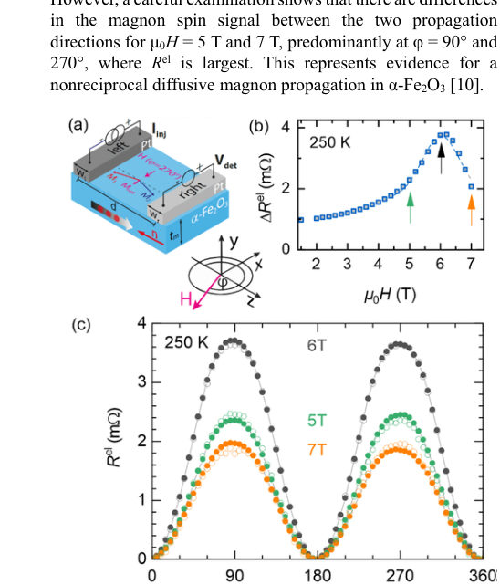
<figcaption class="paper-figure-caption"><b>Fig 1.</b> Fig. 1. (a) Sketch of the sample configuration for the forward magnon propagation direction, the electrical wiring scheme, and the in-plane rotation angle φ of the applied magnetic field μ0H. The corresponding net magnetization Mnet is aligned along the applied magnetic field μ0H (Mnet ∥ H), while the Néel vector n ⊥ H. The α-Fe2O3 film (blue) is t = 89 nm thin, the center-to-center distance of the Pt electrodes (grey) measures d = 1.2 µm. (b) Magnetic field dependence of the amplitude of the magnon spin signal Rel at the detector electrode, recorded at T = 250 K. (c) Angle dependence of the magnon spin signal Rel measured at different magnetic field magnitudes. The full and open circles...</figcaption>
</figure>

**Summary.** This experimental work investigates the magnon Hanle effect in antiferromagnetic alpha-Fe2O3 using electrical spin injection and detection. The key finding is the observation of a nonreciprocal magnon spin signal, which changes when the roles of the injector and detector are swapped. This demonstrates the potential of antiferromagnetic magnonics for advanced spintronic devices.

**Why it may be interesting.** The observation of nonreciprocity in magnonics, linked to an antisymmetric pseudofield, provides a platform for realizing electronics-inspired phenomena in magnetic materials, relevant for understanding spin-orbit coupling effects in quantum systems.

Detailed structure

**Main problem.** The study aims to observe and characterize the nonreciprocal magnon Hanle effect in an antiferromagnetic insulator.

**Main result.** The researchers successfully demonstrated a nonreciprocal magnon spin signal in alpha-Fe2O3, where reversing the roles of the spin injector and detector alters the measured signal.

**Method.** The experiment utilizes a non-local, two-terminal geometry to measure magnon spin currents via electrical injection and detection using Pt electrodes.

**Model / system.** The physical system is alpha-Fe2O3 thin films coupled with Pt electrodes. The phenomenon studied is the magnon Hanle effect, which involves the precession of the magnon pseudospin.

**Key observables.** The magnon spin signal ($R_{	ext{magn}} = V_{	ext{det}}/I_{	ext{inj}}$), its dependence on the external magnetic field, and the difference in signal when the injector/detector roles are interchanged.

**Important parameters / regimes.** The external magnetic field ($\mathbf{H}$), particularly the compensation field (6 T) and the in-plane rotation angle ($\phi$).

**Assumptions / limitations.** The nonreciprocity is attributed to the presence of an antisymmetric magnonic pseudofield, which is a key theoretical deduction.

**Figures summary.** Figure 1(a) sketches the sample setup and angle dependence. Figure 1(b) shows the field dependence confirming the compensation field. Figure 1(c) compares forward and backward propagation signals, highlighting the nonreciprocity.

**Paper structure.** The paper details the experimental setup, measurements of the Hanle effect, and then focuses on demonstrating and analyzing the nonreciprocal nature of the signal as a function of magnetic field and angle.

Abstract

The precession of the magnon pseudospin about the equilibrium pseudofield, the latter capturing the nature of magnonic eigenexcitations in an antiferromagnet, gives rise to the magnon Hanle effect. Its realization via electrically injected and detected spin transport in an antiferromagnetic insulator demonstrates its high potential for devices and as a convenient probe for magnon eigenmodes and the underlying spin interactions in the antiferromagnet. Here, we observe a non-reciprocity in the Hanle signal measured in alpha-Fe2O3 using two spatially separated Pt electrodes as spin injector and detector. Interchanging their roles alters the detected magnon spin signal. The recorded difference depends on the applied magnetic field and reverses sign when the signal passes its nominal maximum at the so-called compensation field. Our findings unlock the high potential of antiferromagnetic magnonics towards the realization of electronics-inspired phenomena.

[↑ back to top](#top)

### [A Wannier-first approach for extended chiral systems](http://arxiv.org/abs/2609.02524v1)

**Authors:** Yashpal Singh, Juan E. Peralta, Koblar A. Jackson, Mark R. Pederson  
**Type:** theory · **Category:** numerical methods · **PDF:** <https://arxiv.org/pdf/2609.02524v1>  
**Analysis basis:** full PDF text, analyzed in chunks
**Topic relevance:** `Frenkel-Kontorova` **1/5** · `analog quantum simulation` **1/5** · `methods for driven-dissipative` **1/5**

↔ Scroll figures horizontally

<figure class="paper-figure-card">
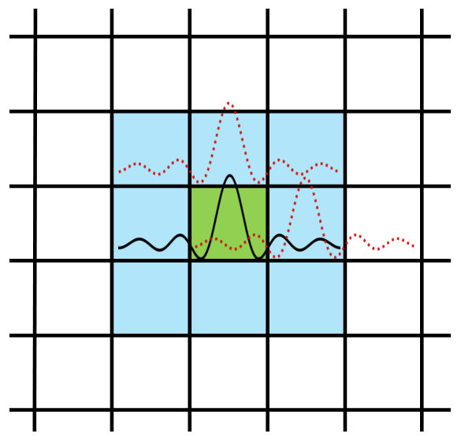
<figcaption class="paper-figure-caption"><b>Fig 1.</b> FIG. 1. Schematic representation of the Wannier domain (blue) surrounding the central site-zero cell</figcaption>
</figure>
<figure class="paper-figure-card">
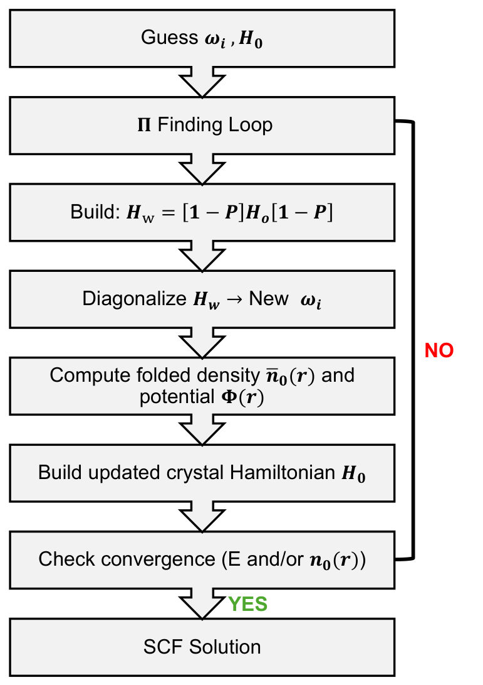
<figcaption class="paper-figure-caption"><b>Fig 2.</b> FIG. 2. Flowchart of the self-consistent field (SCF) procedure used to obtain converged total energies and</figcaption>
</figure>
<figure class="paper-figure-card">
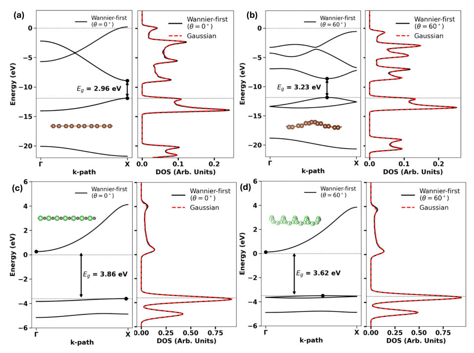
<figcaption class="paper-figure-caption"><b>Fig 3.</b> FIG. 3. Band structures and densities of states (DOS) obtained using the Wannier-first method and a periodic</figcaption>
</figure>
<figure class="paper-figure-card">
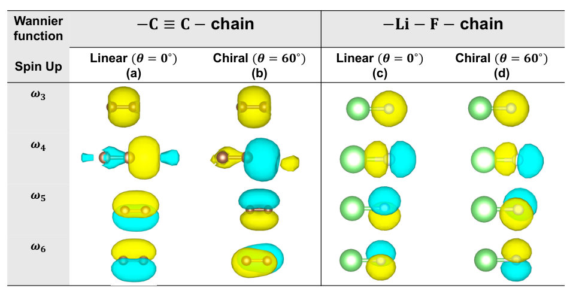
<figcaption class="paper-figure-caption"><b>Fig 4.</b> FIG. 4. Spin-up Wannier-like functions ω3–ω6 for (a) linear and (b) chiral (θ = 60◦) −C≡C−chains, and</figcaption>
</figure>
<figure class="paper-figure-card">
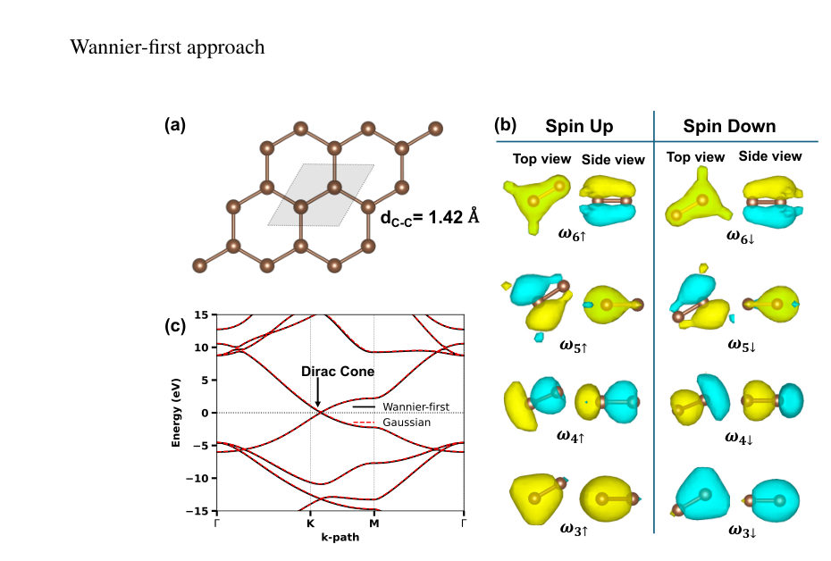
<figcaption class="paper-figure-caption"><b>Fig 5.</b> FIG. 5. (a) Central cell with two carbon atoms (C–C distance 1.42 Å). (b) Spin-resolved Wannier-like</figcaption>
</figure>

**Summary.** This paper introduces a 'Wannier-first' approach to DFT, enabling the simulation of extended chiral and helical materials by constructing localized Wannier-like functions directly in real space. This method efficiently handles complex symmetries, such as screw rotations, without the computational cost of large supercells. It provides a robust, practical framework for studying materials with nontrivial periodic symmetries.

**Why it may be interesting.** While focused on solid-state DFT, the core numerical technique—constructing localized basis sets and solving physics problems in a real-space, symmetry-adapted manner—is highly relevant for simulating open quantum systems or molecular dynamics where localized representations are preferred over Bloch wavefunctions.

Detailed structure

**Main problem.** Developing an efficient electronic structure method for extended chiral systems that can accurately incorporate complex symmetries like screw rotations without resorting to prohibitively large supercells.

**Main result.** The Wannier-first approach successfully calculates total energies and band structures for various chiral and layered materials, showing excellent agreement with reference periodic calculations.

**Method.** It uses a real-space, Wannier-like function construction within a finite Wannier domain, avoiding the explicit calculation of Bloch states during the self-consistent field (SCF) cycle.

**Model / system.** The method is applied to extended periodic systems, including chiral chains ($	ext{-C}\equiv	ext{C}	ext{-}$, $	ext{-Li-F-}$), graphene, and layered graphite structures, allowing for the natural inclusion of combined translation-rotation (screw) symmetries.

**Key observables.** Total energies, band structures, band gaps ($E_g$), and energy differences ($\delta E$).

**Important parameters / regimes.** The size of the Wannier Domain (WD) and the convergence threshold ($\epsilon = 10^{-5}$ Hartree).

**Assumptions / limitations.** The contribution of Wannier-like functions outside the finite Wannier Domain is negligible for charge density calculation.

**Figures summary.** Figure 1 schematically illustrates the Wannier domain and localized functions; Figure 2 shows the iterative flowchart for SCF convergence; Table I compares calculated band gaps and energy differences across various systems and twist angles.

**Paper structure.** The paper details the formalism, building upon previous work, by defining the Wannier-like function optimization ($\hat{\Pi}$ operator), outlining the SCF procedure using the localized basis, and finally applying the method to benchmark systems to validate its capability with complex symmetries.

Abstract

We present a real-space formulation of DFT for extended systems in which localized Wannier-like functions are constructed directly from localized Gaussian basis functions without explicitly computing canonical Bloch-like states during the self-consistent cycle. Building on the formalism of Pederson and Lin [Phys. Rev. B \textbf{35}, 2273 (1987)], a variational set of Wannier-like functions is generated self-consistently within a finite Wannier domain and used to construct the charge density, electrostatic potential, and per cell total energy of the extended system. The occupied space can be determined entirely from the Wannier-like functions. Electronic band structures can be recovered in a post-processing step by solving the full Hamiltonian in a Bloch-like basis constructed from Gaussian orbitals. A key feature of the method is that it can incorporate combined translation--rotation, or screw, symmetries, enabling efficient simulations of chiral and helical systems with finite twist angles at essentially the same computational cost as systems described by pure translational symmetry. The approach is validated through calculations on linear and twisted $\mathrm{{-}C{\equiv}C{-}}$ and $\mathrm{{-}Li{-}F{-}}$ chains, as well as graphene, where total energies and band structures show excellent agreement with reference periodic calculations. To illustrate the ability of the method to treat three-dimensional systems, it is further applied to AA graphite, in which carbon atoms in adjacent graphene layers are aligned directly above one another, as well as helically stacked AA graphite structures. The Wannier-first framework provides a practical route for treating extended systems with nontrivial translational, rotational, and screw symmetries, and provides a natural foundation for the implementation of orbital-dependent functionals such as the Perdew--Zunger self-interaction correction.

[↑ back to top](#top)

### [Persistence and emergence of quantum defects through pressure-induced phase changes](http://arxiv.org/abs/2609.02100v1)

**Authors:** Alexander J Healey, Alan Salek, Christopher T-K Lew, Zsolt Benedek, Brett C Johnson, Josiah E Hsi, Islay O Robertson, Kaijian Xing, Hiroshi Abe, Takeshi Ohshima, Kenji Watanabe, Takashi Taniguchi, Mehran Kianinina, Viktor Ivady, Igor Aharonovich, Dougal McCulloch, Jean-Philippe Tetienne, David A Broadway  
**Type:** experiment · **Category:** other · **PDF:** <https://arxiv.org/pdf/2609.02100v1>  
**Analysis basis:** full PDF text, analyzed in chunks
**Topic relevance:** `QC/QI experiment` **1/5** · `quantum measurements` **1/5** · `quantum optics experiment` **1/5**

↔ Scroll figures horizontally

<figure class="paper-figure-card">
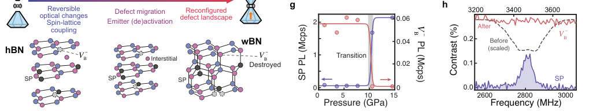
<figcaption class="paper-figure-caption"><b>Fig 1.</b> FIG. 1. Emergent optical behaviour following compression a Illustration of a quantum-sensing-enabled diamond anvil cell (DAC), with RF control through a Pt wire and optical control and readout performed through one of the anvils. Bottom panels are an optical image and PL image of the same hBN crystal loaded in the DAC. b PL spectrum for a typical hBN crystal containing ensembles of both optical-spin defect pairs (SP, broad emission centered at 620 nm) and V − B defects (emission centered around 800 nm). c Illustration of the deformation process of the hBN crystal with increasing pressure up to a threshold where a structural phase transition occurs to a 3D material. d Measurement scheme,...</figcaption>
</figure>
<figure class="paper-figure-card">
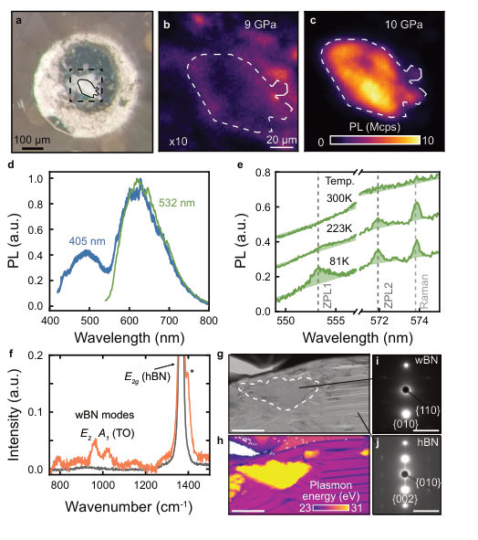
<figcaption class="paper-figure-caption"><b>Fig 2.</b> FIG. 2. Emitter creation at phase transition to wBN a Optical image of hBN crystal following compression. b, c Confocal PL images of hBN crystal at 9 GPa and 10 GPa respectively. d PL spectra obtained with 405 nm (blue) and 532 nm (green) excitation. e Low temperature PL measure- ments showing the appearance of zero phonon lines at 553 and 572 nm. The main hBN Raman line is indicated at 574 nm, while the wBN Raman signatures (1000 cm−1) are around 562 nm (not shown). f Raman spectra before (grey) and after (orange) compression showing wBN signatures around 1000 cm−1. g Bright field transmission electron microscope image of a cross section of a sample. h Electron energy loss spectroscopy...</figcaption>
</figure>
<figure class="paper-figure-card">
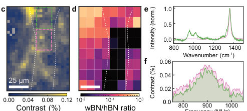
<figcaption class="paper-figure-caption"><b>Fig 3.</b> FIG. 3. Persistence of ODMR through structural phase transition. a Selected PL spectra obtained from a C- doped hBN crystal at different pressures (full series see SI). b SP ODMR spectra comparing transformed and untrans- formed hBN material. c SP ODMR contrast map of a C- doped hBN crystal recorded at a pressure of 14 GPa. Dotted white lines show location of Pt wire for MW driving. d Map of the ratio of wBN and hBN Raman peaks recorded across the region in (c) at ambient pressure upon crystal recovery. e,f Raman and ODMR spectra, respectively, averaged over the regions highlighted in (c).</figcaption>
</figure>
<figure class="paper-figure-card">
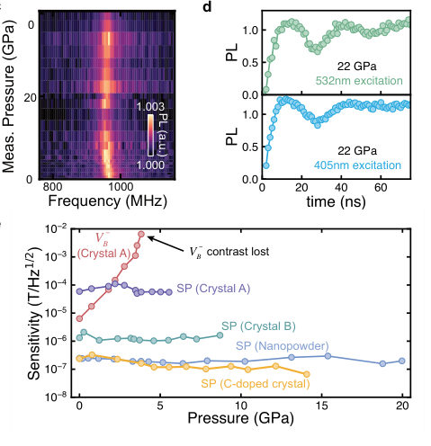
<figcaption class="paper-figure-caption"><b>Fig 4.</b> FIG. 4. Preservation of spin properties up to 20 GPa. a Illustration of the energy levels of the SP system and V − B (representative of a generic spin-1 system) in response to mag- netic field and pressure. b Spin resonance frequency shift ver- sus pressure at a constant magnetic field for SP and V − B . c ODMR spectra obtained for a hBN nanopowder sample com- pressed to 20 GPa and then decompressed back to ambient pressure. d Rabi oscillations recorded for a nanopowder sam- ple at a pressure of 22 GPa with 532 nm (top) and 405 nm (bottom) excitation, with the collection window of 550-650 nm and 450-550 nm respectively. d Magnetic sensitivity figure of merit vs pressure for different SP...</figcaption>
</figure>

**Summary.** This research demonstrates that spin-pair defects in hBN can function as highly robust quantum sensors, maintaining their spin resonance even when the host material undergoes a structural phase transition to wBN under extreme pressure. By combining optical and magnetic measurements in a DAC, the authors show that high pressure is a versatile tool for both sensing and engineering quantum emitters.

**Why it may be interesting.** This work provides a clear experimental demonstration of using extreme conditions (high pressure) not just as a challenge, but as a controllable knob to engineer and stabilize quantum emitters, which is highly relevant for solid-state quantum systems.

Detailed structure

**Main problem.** The study investigates how quantum defects embedded in hexagonal boron nitride (hBN) behave and evolve when the material undergoes structural phase transitions induced by extreme high pressure.

**Main result.** Spin-pair defects maintain robust, pressure-independent spin resonance and optical emission up to 20 GPa, while the host material undergoes an irreversible structural change from hBN to wBN, demonstrating high pressure as a tool for defect engineering.

**Method.** Experiments were conducted *in-situ* using a diamond anvil cell (DAC), employing optical photoluminescence (PL) and optically detected magnetic resonance (ODMR) spectroscopy across varying pressures.

**Model / system.** The platform is optically active spin-pair defects (SPs) within hBN. The system is subjected to compression up to 22 GPa, causing a structural phase transition from hexagonal to wurtzite boron nitride (wBN).

**Key observables.** PL intensity, ODMR contrast, spin resonance frequency, and structural phase identification (via Raman/TEM).

**Important parameters / regimes.** Pressure (up to 22 GPa), temperature (implied ambient/cryogenic), and defect type (SP vs. V-B).

**Assumptions / limitations.** The spin-pair defect mechanism is assumed to be generic and robust, allowing the magnetic sensing function to be decoupled from the lattice structure changes.

**Figures summary.** Figures illustrate the loss of V-B PL and the persistence/enhancement of SP PL across the hBN-to-wBN phase transition, alongside ODMR measurements confirming SP robustness.

**Paper structure.** The paper systematically compares the pressure response of different defects (SP vs. V-B), demonstrates the structural phase transition using multiple techniques, and quantifies the robustness of the SP sensing mechanism across the entire pressure range.

Abstract

Extreme pressures can transform materials and their properties, but probing these in-situ is made challenging by the small sample volumes and access requirements demanded by diamond anvil cells. Quantum defects offer a route to local measurements under such conditions, yet their sensing performance can be dictated by pressure-induced changes in their own host material. On the other hand, pressure may also be harnessed as a tool to engineer and stabilize new quantum defects with emergent functionalities. Here, we demonstrate both aspects within a unified platform based on optically active spin-pair defects in hexagonal boron nitride (hBN). As robust quantum sensors under pressure, these spin-1/2 systems retain pressure-independent spin resonances up to 20 GPa while maintaining or even enhancing their optical emission, in stark contrast to the spin-1 boron-vacancy centre in the same material. Simultaneously, we show that compression acts as a means of quantum defect engineering: the starting hBN undergoes an irreversible transformation into wurtzite boron nitride (wBN), during which the defect landscape is reconfigured. Spin-pair sensors are seen to persist across this structural transition, however, depending on the starting material we also observe new, highly fluorescent defects in the wBN phase. These results establish spin-pair defects in boron nitride as pressure-resilient quantum sensors while highlighting high pressure itself as a versatile pathway for creating and tuning quantum emitters.

[↑ back to top](#top)

### [Magnons in Metallic Altermagnetic $\text{KV}_2\text{Se}_2\text{O}$](http://arxiv.org/abs/2609.01853v1)

**Authors:** Daniel Lourenço R. Santos, António T. Costa  
**Type:** theory · **Category:** other · **PDF:** <https://arxiv.org/pdf/2609.01853v1>  
**Analysis basis:** full PDF text, analyzed in chunks
**Topic relevance:** `Keldysh / 2PI / non-Gaussian methods` **1/5** · `correlated / nonlocal dissipation` **1/5**

↔ Scroll figures horizontally

<figure class="paper-figure-card">
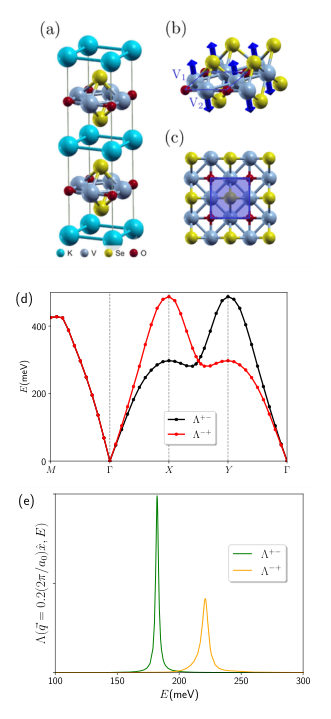
<figcaption class="paper-figure-caption"><b>Fig 1.</b> FIG. 1. (a) View of the bulk quasi-two-dimensional KV2Se2O struc- ture, highlighting the layered arrangement and the vanadium mag- netic sublattices. (b) Atomic structure of the monolayer V2Se2O obtained by exfoliating. The two atoms non-equivalents are labeled V1 and V2, which host antiparallel magnetic moments in the alter- magnetic state. (c) Top view, the square lattice symmetry is empha- sized. (d) Magnon dispersion of the metallic bulk KV2Se2O along the high-symmetry path M–Γ–X–Y –Γ. (e) Calculated spectral den- sities Λ+−and Λ−+, as a function of excitation energy E for fixed wave vector q = 0.2 (2π/a0)ˆx</figcaption>
</figure>
<figure class="paper-figure-card">
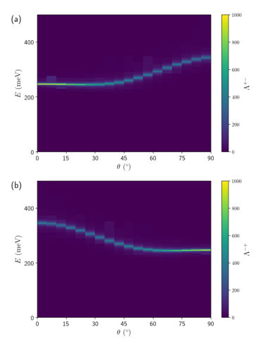
<figcaption class="paper-figure-caption"><b>Fig 2.</b> FIG. 3. Color maps of the magnon spectral density Λ⊥(q, ω), for the first (a) and second (b) magnon modes in the bulk compound, highlighting the finite linewidth and anisotropic damping induced by the coupling to particle–hole excitations.</figcaption>
</figure>
<figure class="paper-figure-card">
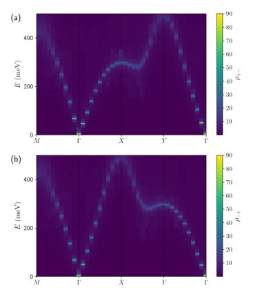
<figcaption class="paper-figure-caption"><b>Fig 3.</b> FIG. 2. Color maps of the magnon spectral density Λ⊥(q, ω), for the first (a) and second (b) magnon modes in the bulk compound, highlighting the finite linewidth and anisotropic damping induced by the coupling to particle–hole excitations.</figcaption>
</figure>
<figure class="paper-figure-card">
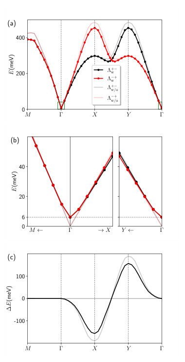
<figcaption class="paper-figure-caption"><b>Fig 4.</b> FIG. 4. (a) Transverse magnon dispersion relation. The two magnon branches with SOC are shown as solid lines (black for the first mode and red for the second mode), while the corresponding dispersions without SOC are represented as shaded curves. (b) A magnified view of the low-energy region in the vicinity of the Γ point [highlighted by green rectangles in (a)]. (c) The calculated magnon energy split- ting as a function of momentum. The grey curve represents the pure non-relativistic splitting, while the black curve displays the case with SOC.</figcaption>
</figure>
<figure class="paper-figure-card">
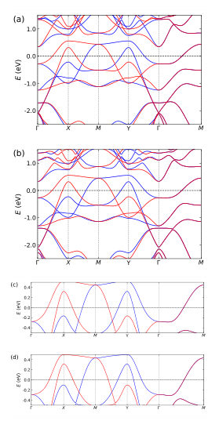
<figcaption class="paper-figure-caption"><b>Fig 5.</b> FIG. 5. Spin-resolved electronic bands of bulk KV2Se2O along the high-symmetry path Γ–X–M-Y –Γ-M, exhibiting a metallic char- acter. (a) for Nkz = 1; for Nkz = 6 calculated for plane with (b)kz = 0, zoom close to the Fermi energy for (c)kz = 0.25(2π/c) and (d) kz = 0.5(2π/c).</figcaption>
</figure>

**Summary.** This theoretical study investigates magnon excitations in the altermagnetic metal $	ext{KV}_2	ext{Se}_2	ext{O}$ using RPA calculations on a derived tight-binding Hamiltonian. The authors demonstrate that altermagnetism dictates both the magnon dispersion and its anisotropic decay, while SOC opens a significant gap, making the material promising for spintronic applications.

**Why it may be interesting.** The detailed study of magnon damping due to coupling to the particle-hole continuum, combined with the prediction of directionally selective transport, provides a rich platform for understanding spin dynamics in correlated magnetic materials.

Detailed structure

**Main problem.** The study investigates spin excitations (magnons) in the metallic altermagnetic compound $	ext{KV}_2	ext{Se}_2	ext{O}$, focusing on how altermagnetic symmetry and spin-orbit coupling control the magnon dispersion and decay.

**Main result.** The calculations reveal characteristic degeneracies and directional splittings in the magnon spectra, and the inclusion of SOC opens a sizable anisotropy gap ($\approx 6 	ext{ meV}$) at the $\Gamma$-point, suggesting potential room-temperature magnetic stability.

**Method.** The research employs a fermionic Hamiltonian derived from *ab initio* calculations, computing transverse spin susceptibilities within the Random Phase Approximation (RPA) to determine the magnon dispersion and linewidths.

**Model / system.** The system is the metallic, quasi-two-dimensional altermagnetic vanadium oxyselenide, $	ext{KV}_2	ext{Se}_2	ext{O}$. The model uses a multi-orbital tight-binding Hamiltonian incorporating both hopping terms and spin-orbit coupling ($H = H_0 + H_{	ext{SOC}}$).

**Key observables.** Magnon dispersion relation, magnon linewidths/lifetimes, angular dependence of magnon energies, and the $\Gamma$-point anisotropy gap ($\approx 6 	ext{ meV}$).

**Important parameters / regimes.** SOC parameters ($\lambda_V = 22 	ext{ meV}$, $\lambda_{	ext{Se}} = 206 	ext{ meV}$), and the characteristic energy scales in the GHz-to-THz range.

**Assumptions / limitations.** The analysis assumes the C-type magnetic configuration and that the low-energy electronic states are well-described by the tight-binding model derived from DFT.

**Figures summary.** Figures illustrate spin-resolved electronic bands showing altermagnetic splitting, magnon dispersion along high-symmetry paths (M–$\Gamma$-X–Y–$\Gamma$), and spectral density maps highlighting anisotropic damping.

**Paper structure.** The paper progresses from establishing the electronic structure via DFT/PAW to constructing an effective tight-binding Hamiltonian. It then applies RPA to calculate the magnon spectrum, analyzing the effects of altermagnetism, SOC, and finite lifetime broadening.

Abstract

We investigate the spin excitation in altermagnetic vanadium oxyselenides, focusing on the metallic quasi-two-dimensional compound $\text{KV}_2\text{Se}_2\text{O}$. Using a fermionic Hamiltonian derived from ab initio calculations, we compute the transverse spin susceptibilities within the random phase approximation and extract the magnon dispersion relation. We show that the altermagnetic symmetry leads to characteristic degeneracies and directional splittings in both the electronic bands and the magnon spectra along high-symmetry paths of the Brillouin zone. The metallic $\text{KV}_2\text{Se}_2\text{O}$ exhibits finite magnon linewidths arising from the coupling to the particle-hole continuum. Furthermore, by fixing the magnitude of the wave vector and varying its in-plane direction, we uncover a pronounced angular dependence of the magnon energies and lifetimes, with complementary damping behavior between the two magnon branches. Upon including spin-orbit coupling, the system exhibits an out-of-plane easy c-axis anisotropy, which opens a magnon gap of approximately 6 meV at the $Γ$-point, possibly rendering the magnetic order stable at room temperature. Our results demonstrate that altermagnetism controls not only the dispersion but also the anisotropic decay of spin excitations, highlighting altermagnetic metals as promising platforms for directionally selective magnon transport.

[↑ back to top](#top)

### [Spin Hall Magnetoresistance in Antiferromagnetic Insulators](http://arxiv.org/abs/2609.02632v1)

**Authors:** Stephan Geprägs, Matthias Opel, Johanna Fischer, Philipp Schwenke, Matthias Althammer, Hans Huebl, Rudolf Gross  
**Type:** experiment · **Category:** other · **PDF:** <https://arxiv.org/pdf/2609.02632v1>  
**Analysis basis:** full PDF text, analyzed in chunks
**Topic relevance:** `analog quantum simulation` **1/5** · `quantum measurements` **1/5**

↔ Scroll figures horizontally

<figure class="paper-figure-card">
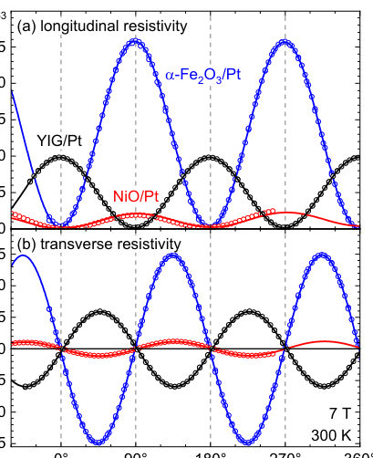
<figcaption class="paper-figure-caption"><b>Fig 1.</b> Fig. 1. In-plane ADMR at 300 K in a magnetic field of 7 T of antiferromagnetic (0001)-oriented α-Fe2O3/Pt (blue) and (111)-oriented NiO/Pt (red) bilayers as well as a ferrimagnetic (001)-oriented Y3Fe5O12 (YIG)/Pt bilayer (black). The symbols represent the normalized (a) longitudinal (ρlong) and (b) transverse (ρtrans) resistivities measured while rotating the magnetic field in the film plane. The data are plotted as a function of the magnetic field orientation α. The lines are fits to the data using cos 2α and sin 2α functions.</figcaption>
</figure>
<figure class="paper-figure-card">
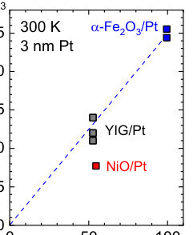
<figcaption class="paper-figure-caption"><b>Fig 2.</b> Fig. 2. Scaling behavior of the maximum SMR amplitude ρ1/ρ0 at 300 K from different FMI/Pt [2] or AFI/Pt [4,5] samples with a Pt thickness of 3 nm. The values are plotted versus the product of the spin S of the magnetic ions times their volume density n in the “bulk” of the FMI or AFI. The dashed blue line is a guide to the eye. While the phase of ρlong and ρtrans is well understood, the amplitudes ρ1/ρ0 and ρ3/ρ0 are a matter of debate. Our epitaxial, antiferromagnetic α-Fe2O3 thin films implemented in a heterostructure with a 3 nm thin Pt electrode show the highest SMR amplitudes reported in literature so far [4]. The exceptional value of ρ1/ρ0 = 2.5 x 10-3 even exceeds the established...</figcaption>
</figure>

**Summary.** This work demonstrates that the Spin Hall Magnetoresistance (SMR) effect is a powerful, non-invasive tool for characterizing the spin structure of antiferromagnetic insulators. By measuring resistivity changes under rotating magnetic fields, the authors show that the SMR amplitude scales predictably with the sublattice magnetization, allowing for the study of AF spintronics in materials like $\alpha$-Fe$_2$O$_3$. This provides a robust method for reading out magnetic order in systems previously difficult to probe.

**Why it may be interesting.** While focused on condensed matter magnetism, the use of electrical transport to map out complex, non-collinear magnetic order parameters is relevant to understanding quantum states in engineered materials, bridging classical magnetism with transport physics.

Detailed structure

**Main problem.** The primary goal is to develop a simple electrical transport method to probe the spin structure of antiferromagnetic (AF) materials, which lack a net macroscopic magnetization.

**Main result.** The Spin Hall Magnetoresistance (SMR) effect successfully reads out the spin configuration in AF insulators, showing that the SMR amplitude scales with the sum of absolute sublattice magnetizations.

**Method.** Angle-dependent magnetoresistance (ADMR) measurements are performed by measuring the longitudinal and transverse resistivities of a Pt top electrode as an external magnetic field is rotated in-plane.

**Model / system.** The study uses bilayer heterostructures combining easy-plane antiferromagnetic insulators (like $\alpha$-Fe$_2$O$_3$ and NiO) with a Pt heavy-metal electrode. The analysis is modeled using two magnetic sublattices ($M_A$ and $M_B$) and comparing results to known ferrimagnetic systems.

**Key observables.** Characteristic sinusoidal modulations in longitudinal and transverse resistivities ($\rho_{long}$ and $\rho_{trans}$), and the SMR amplitude.

**Important parameters / regimes.** The SMR amplitude scales with the product of the volume density ($n$) of magnetic ions and their spin state ($S$), i.e., $nS$.

**Assumptions / limitations.** The analysis assumes the SMR effect is sensitive to the spin configuration of *all* independent magnetic sublattices, not just the net magnetization.

**Figures summary.** Figure 1 shows in-plane ADMR for $\alpha$-Fe$_2$O$_3$/Pt, NiO/Pt, and Y$_3$Fe$_5$O$_{12}$/Pt bilayers. Figure 2 illustrates the scaling behavior of the maximum SMR.

**Paper structure.** The paper establishes the problem (probing AF spin structure) by introducing SMR as a tool. It details the measurements on various bilayers, develops a comprehensive model based on two sublattices, and presents results showing the universal scaling of the SMR amplitude with $nS$.

Abstract

Antiferromagnetic materials promise improved performance for spintronic applications, as they are robust against external magnetic field perturbations and allow for faster magnetization dynamics compared to ferromagnets. The direct observation of the antiferromagnetic state, however, is challenging due to the absence of a macroscopic magnetization. We show that the spin Hall magnetoresistance (SMR) is a versatile tool to probe the antiferromagnetic spin structure via simple electrical transport experiments by investigating the easy-plane antiferromagnetic insulators alpha-Fe2O3 (hematite) and NiO in bilayer heterostructures with a Pt heavy-metal top electrode. While rotating an external magnetic field in three orthogonal planes, we record the longitudinal and the transverse resistivities of Pt and observe characteristic resistivity modulations consistent with the SMR effect. We analyze both their amplitude and phase and compare the data to the results from a prototypical collinear ferrimagnetic Y3Fe5O12/Pt bilayer. The observed magnetic field dependence is explained in a comprehensive model, based on two magnetic sublattices and taking into account magnetic field-induced modifications of the domain structure. Our results show that the SMR effect allows to readout the spin configuration and to investigate magnetoelastic effects in antiferromagnetic multi-domain materials. We demonstrate that the SMR amplitude scales with the sum of the absolute sublattice magnetizations in ferrimagnetic and antiferromagnetic materials. In alpha-Fe2O3/Pt bilayers, we find an unexpectedly large SMR amplitude of 2.5E-3, twice as high as for prototype Y3Fe5O12/Pt bilayers, making the system particularly interesting for room-temperature antiferromagnetic spintronic applications.

[↑ back to top](#top)

### [Emergence of the magnetic octupole Rashba-Edelstein effect from spin-orbit entanglement](http://arxiv.org/abs/2609.02768v1)

**Authors:** Hojun Lee, Seungyun Han  
**Type:** theory · **Category:** other · **PDF:** <https://arxiv.org/pdf/2609.02768v1>  
**Analysis basis:** full PDF text, analyzed in chunks
**Topic relevance:** `Keldysh / 2PI / non-Gaussian methods` **1/5**

↔ Scroll figures horizontally

<figure class="paper-figure-card">
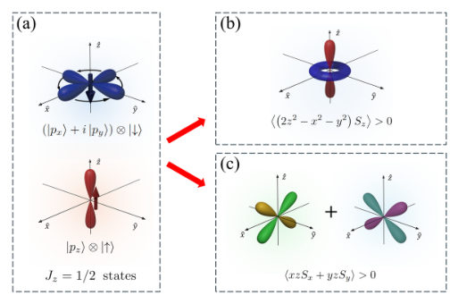
<figcaption class="paper-figure-caption"><b>Fig 1.</b> FIG. 1. Illustration of magnetic-octupole moments encoded in a spin- orbit-entangled state. (a) The 𝐽𝑧= 1/2 sector of a 𝑝-orbital manifold consists of the components (|𝑝𝑥⟩+𝑖|𝑝𝑦⟩) ⊗|↓⟩and |𝑝𝑧⟩⊗|↑⟩. Their orbital-spin correlations give rise to (b) the longitudinal magnetic- octupole moment ⟨(2𝑧2 −𝑥2 −𝑦2) ˆ𝑆𝑧⟩&gt; 0 and (c) the transverse magnetic-octupole moment ⟨𝑥𝑧ˆ𝑆𝑥+ 𝑦𝑧ˆ𝑆𝑦⟩&gt; 0. In (a) and (b), red and blue indicate opposite signs of the 𝑆𝑧density. In (c), the colors in the left and right plots indicate opposite signs of the 𝑆𝑥and 𝑆𝑦 densities, respectively.</figcaption>
</figure>
<figure class="paper-figure-card">
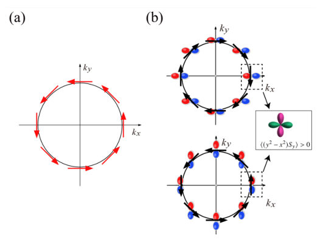
<figcaption class="paper-figure-caption"><b>Fig 2.</b> FIG. 2. Illustration of the emergence of a pure MO Rashba texture from a 𝐽-Rashba state. (a) A generic 𝐽-Rashba state. (b) In the pure- MO limit, the 𝐽texture is encoded in orbital-resolved spin textures with opposite spin polarizations. Their contributions cancel in the net spin channel but add in the MO channel, yielding a finite MO Rashba texture with vanishing spin texture. The dashed boxes illustrate that states with 𝑘𝑥&gt; 0 carry the same sign of ⟨(𝑦2 −𝑥2)𝑆𝑦⟩(𝑂𝑦), where the green and purple regions in the inset represent opposite signs of the 𝑆𝑦density.</figcaption>
</figure>
<figure class="paper-figure-card">
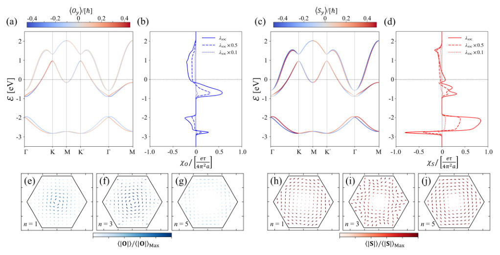
<figcaption class="paper-figure-caption"><b>Fig 3.</b> FIG. 3. Magnetic-octupole and spin Rashba textures and the corresponding Rashba-Edelstein responses in the 𝑝-orbital model. (a),(c) Band structures, colored by the expectation values ⟨𝑂𝑦⟩and ⟨𝑆𝑦⟩, respectively. (b),(d) MO and spin Rashba-Edelstein susceptibilities, 𝜒𝑂= 𝛿⟨𝑂𝑦⟩/𝐸𝑥and 𝜒𝑆= 𝛿⟨𝑆𝑦⟩/𝐸𝑥, as functions of the energy E. Solid, dashed, and dotted lines present the results for SOC strengths 𝜆soc, 0.5𝜆soc, and 0.1𝜆soc, respectively. Here, 𝜏is the relaxation time and 𝑎is the lattice constant. (e)-(g) and (h)-(j) present momentum-space textures of the in-plane MO and spin expectation values, respectively. 𝑛denotes the band index. Arrows denote the directions of ⟨O∥⟩and ⟨S∥⟩, while their...</figcaption>
</figure>
<figure class="paper-figure-card">
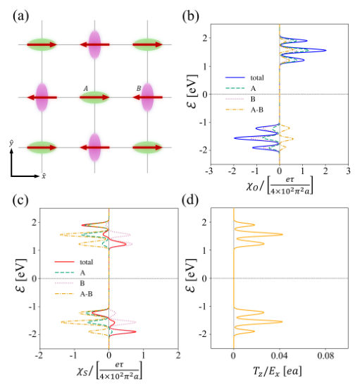
<figcaption class="paper-figure-caption"><b>Fig 4.</b> FIG. 4. Magnetic-octupole Rashba-Edelstein effect in a 𝑑-wave AM. (a) Schematic of the two-sublattice model with sublattice-dependent orbital character. (b),(c) Total and sublattice-resolved MO and spin Rashba-Edelstein susceptibilities, respectively. The 𝐴−𝐵component denotes the staggered response. (d) Current-induced torque response. 𝑇𝑧denotes the 𝑧component of the current-induced torque. For (d), we use Γ = ℏ/𝜏= 25 meV.</figcaption>
</figure>

**Summary.** This work demonstrates that magnetic octupole (MO) degrees of freedom can emerge robustly in spin-orbit-entangled multiorbital systems. It establishes the MO Rashba-Edelstein effect, showing that an applied electric field can generate a non-equilibrium MO polarization. This MO response can be dominant and provides a novel, electrically controllable mechanism for manipulating magnetic order in antiferromagnets.

**Why it may be interesting.** The focus on multipolar responses (octupoles) and their electrical generation via the Edelstein effect is highly relevant to understanding emergent magnetic order and spin-orbit torque mechanisms in modern spintronics and topological materials.

Detailed structure

**Main problem.** The paper investigates the emergence and electrical generation of magnetic octupole (MO) degrees of freedom in electronic systems, particularly in the context of Rashba-Edelstein effects.

**Main result.** Spin-orbit-entangled multiorbital states can host MO degrees of freedom, leading to an MO Rashba-Edelstein effect that can dominate over conventional spin responses, providing an interface-based route for generating non-equilibrium MO polarization.

**Method.** Theoretical analysis using minimal models for $p$-orbitals on a 2D lattice, calculating non-equilibrium polarization via linear response theory (e.g., $\delta\langle D_y 
angle = \chi_D E_x$).

**Model / system.** The study uses spin-orbit-entangled multiorbital states, modeled by $p_x, p_y, p_z$ orbitals on a 2D triangular or square lattice, incorporating SOC and interface-induced splitting.

**Key observables.** MO Rashba texture, MO Rashba-Edelstein polarization ($\delta\langle O_y 
angle$), Néel MO torque ($T_{MO}$), and sublattice-resolved susceptibilities ($\chi^D_{A,B}$).

**Important parameters / regimes.** Pure-MO limit, $d$-wave Antiferromagnet (AM) structure, and the relative strength of MO vs. spin responses.

**Assumptions / limitations.** The analysis often employs the constant-relaxation-time intraband approximation for non-equilibrium responses.

**Figures summary.** Figures illustrate the emergence of MO textures, the pure-MO limit, and the calculation of current-induced torques on the Néel vector, showing MO accumulation dominating spin accumulation in certain bands.

**Paper structure.** The paper develops from general concepts of magnetic multipoles in spin-orbit-entangled systems to specific models (triangular/square lattice) demonstrating the MO Rashba texture, and finally applying this to calculate a measurable torque in $d$-wave antiferromagnets.

Abstract

Magnetic multipoles have attracted growing interest as order parameters and dynamical degrees of freedom in unconventional magnets, yet it remains unclear how broadly they can emerge as active electronic degrees of freedom. Here, we show that spin-orbit-entangled multiorbital states can host magnetic octupole (MO) degrees of freedom. In Rashba systems, this gives rise to an MO Rashba texture accompanying the J-Rashba texture. Remarkably, spin-orbital entanglement can realize a pure-MO limit in which the spin and orbital-angular-momentum textures vanish while the MO texture remains finite. An applied electric field converts this texture into a nonequilibrium MO polarization through an MO Rashba-Edelstein effect. Around the pure-MO regime, the MO Edelstein response dominates over the conventional spin response, showing that multipolar responses need not be small corrections to dipolar spin physics. Our results establish an interface-based route for electrically generating nonequilibrium multipolar magnetic polarization in spin-orbit-coupled systems.

[↑ back to top](#top)

### [Heat transfer problem of a dense gas described by the Enskog equation with a modification of the Enskog factor](http://arxiv.org/abs/2609.02276v1)

**Authors:** Shigeru Takata, Soma Sakata, Masanari Hattori  
**Type:** theory · **Category:** statistical mechanics · **PDF:** <https://arxiv.org/pdf/2609.02276v1>  
**Analysis basis:** full PDF text, analyzed in chunks
**Topic relevance:** `Keldysh / 2PI / non-Gaussian methods` **1/5**

↔ Scroll figures horizontally

<figure class="paper-figure-card">
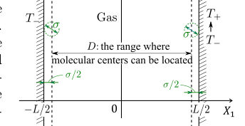
<figcaption class="paper-figure-caption"><b>Fig 1.</b> Fig. 1. Problem setting</figcaption>
</figure>
<figure class="paper-figure-card">
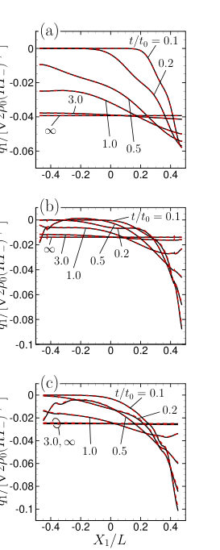
<figcaption class="paper-figure-caption"><b>Fig 2.</b> Fig. 2. Time evolution of the temperature 𝑇and the density 𝜌at the final steady state (left column) and of the heat flow 𝑞1 (right column) in the case of 𝑇+/𝑇−= 1.1. (a) 𝜎/𝐿= 0.05 and 𝜂0 = 0.01 (Kn = 0.5746). (b) 𝜎/𝐿= 0.05, 𝜂0 = 0.2 (Kn = 0.0168). (c) 𝜎/𝐿= 0.1, 𝜂0 = 0.2 (Kn = 0.0335). Solid lines: EESM. Dashed lines: OEE.</figcaption>
</figure>
<figure class="paper-figure-card">
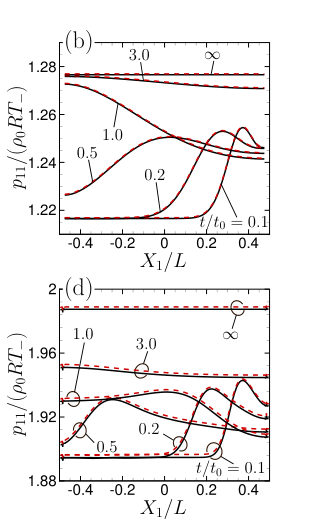
<figcaption class="paper-figure-caption"><b>Fig 3.</b> Fig. 3. Time evolution of the stress tensor 𝑝11 in the case of 𝑇+/𝑇−= 1.1. (a) 𝜎/𝐿= 0.05, 𝜂0 = 0.01 (Kn = 0.5746). (b) 𝜎/𝐿= 0.05, 𝜂0 = 0.05 (Kn = 0.1036). (c) 𝜎/𝐿= 0.05, 𝜂0 = 0.15 (Kn = 0.0261). (d) 𝜎/𝐿= 0.01, 𝜂0 = 0.15 (Kn = 0.0052). Solid lines: EESM. Dashed lines: OEE.</figcaption>
</figure>
<figure class="paper-figure-card">
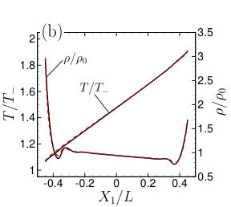
<figcaption class="paper-figure-caption"><b>Fig 4.</b> Fig. 5. Temperature and density profiles at the final steady state in the case of 𝑇+/𝑇−= 2 and 𝜂0 = 0.2. (a) 𝜎/𝐿= 0.05 (Kn = 0.0168). (b) 𝜎/𝐿= 0.1 (Kn = 0.0335). Solid lines: EESM. Dashed lines: OEE.</figcaption>
</figure>

**Summary.** This paper investigates heat transfer in a dense gas by comparing the standard Enskog equation with a modified version that includes a new factor. Numerical simulations show that while the modification has little effect on bulk properties like temperature, it causes a measurable difference in the stress tensor, especially under high confinement. This highlights the importance of subtle theoretical modifications in accurately modeling non-equilibrium transport phenomena.

**Why it may be interesting.** While focused on classical gas dynamics, the rigorous comparison of kinetic equations and the establishment of theorems (like H theorem) are fundamental techniques applicable to non-equilibrium statistical mechanics problems in quantum systems.

Detailed structure

**Main problem.** The study compares the heat transfer in a dense gas using two variants of the Enskog equation: the original and a modified version incorporating a new factor.

**Main result.** The modification has a limited influence on temperature, density, and heat flow, but a visible difference appears in the stress tensor, particularly in highly confined gas regimes.

**Method.** The authors performed a numerical study of the time-dependent heat transfer problem by solving the kinetic equation using finite-difference and spectral methods.

**Model / system.** The system is a dense gas confined between two parallel plates, modeled using the Enskog equation framework for hard spheres.

**Key observables.** Temperature (T), density (rho), heat flow vector (q_1), and the stress tensor (p_ij).

**Important parameters / regimes.** Confinement ratio (sigma/L), Knudsen number (Kn), and the ratio of boundary temperatures (T_+/T_-).

**Assumptions / limitations.** The analysis assumes hard spheres, uses the Carnahan–Starling EoS, and considers one-dimensional behavior in the transverse directions.

**Figures summary.** Figures show the time evolution of T and q_1 agreeing between models, while p_11 shows divergence, especially in confined cases. Other figures quantify this difference's dependence on Kn and confinement.

**Paper structure.** The paper sets up the heat transfer problem, compares the OEE and EESM formulations, numerically solves the resulting kinetic equations, and analyzes the resulting macroscopic quantities, focusing on the differences in the stress tensor.

Abstract

Heat transfer in a dense gas between two parallel plates is studied for assessing the quantitative difference of two variants of the Enskog equation, i.e., the original Enskog equation and the Enskog equation with a modified Enskog factor recently proposed in Phys. Rev. E \textbf{111}, 065108 (2025). The main advantage of the latter is that the H theorem, which is lacking in the former, has been established. The influence of the modification is assessed by comparing the macroscopic quantities in details. It is found that the influence of this modification is quite limited in the density, temperature, and heat flow vector. However, the influence on the stress tensor is visible in some severe setting of parameters.

[↑ back to top](#top)

### Other secondary papers (3)

Show other secondary papers

### ['pySNOW': a Python Suite for the NanO-World](http://arxiv.org/abs/2609.02492v1)

**Authors:** Sofia Zinzani, Gilberto Nardi, Giacomo Becatti, Davide Alimonti, Letícia F. Basso, Kevin Rossi, Francesca Baletto  
**Type:** theory · **Category:** numerical methods · **PDF:** <https://arxiv.org/pdf/2609.02492v1>  
**Analysis basis:** full PDF text, analyzed in chunks

↔ Scroll figures horizontally

<figure class="paper-figure-card">
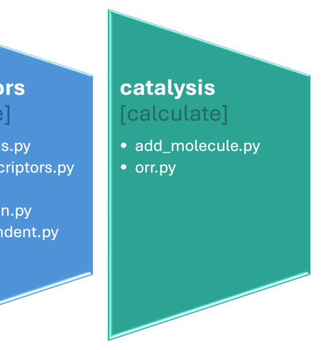
<figcaption class="paper-figure-caption"><b>Fig 1.</b> Figure 1: pySNOW workflow</figcaption>
</figure>

**Summary.** This paper introduces 'pySNOW', a comprehensive Python software suite for computational materials science, specifically targeting the analysis of nanoparticles and nanoalloys. It allows researchers to extract detailed structural, chemical, and catalytic information from atomistic simulation trajectories. This tool aims to streamline the process of understanding and rationally designing novel nanomaterials in silico.

**Why it may be interesting.** While focused on condensed matter structure, the development of a highly integrated, general-purpose simulation analysis toolkit like pySNOW is valuable for any field requiring complex data processing from atomistic simulations, including those in quantum many-body physics.

Detailed structure

**Main problem.** The core problem is developing robust computational tools to characterize the complex structure-property relationships in nanoworld materials like nanoparticles and nanoalloys.

**Main result.** The authors introduce 'pySNOW', a comprehensive, modular Python suite designed to perform detailed morphological, chemical, and catalytic analysis on atomistic simulation data.

**Method.** The suite processes standard XYZ format input files to calculate numerous structural descriptors, connect to various simulation engines (MD, MC), and model catalytic processes like the Oxygen Reduction Reaction (ORR).

**Model / system.** The focus is on metallic nanoparticles and nanoalloys, analyzed using atomistic simulations. The tool supports analyzing structures derived from classical or ab initio molecular dynamics simulations.

**Key observables.** Coordination numbers (CNs), CNA patterns, PDDF, RDF, layer-by-layer density, shape descriptors (inertia/gyration tensors), Steinhardt parameters, SAXS spectra, and electrochemical activities (current/mass).

**Important parameters / regimes.** The analysis is applicable across various conditions, including those relevant to nanoparticle coalescence and catalytic reactions.

**Assumptions / limitations.** The primary requirement is the availability of simple, human-readable XYZ coordinate or trajectory input files.

**Figures summary.** Figure 1 illustrates the complete pySNOW workflow, showing the pipeline from reading input data to performing various analyses and modifications.

**Paper structure.** The paper details the modular architecture of pySNOW, covering input/output handling, structural descriptor calculation, advanced analysis modules for catalysis, and utility functions, while comparing its scope against existing tools like MDTraj and pySCAL.

Abstract

In computational materials science, numerical simulations are indispensable tools for revealing atomic-scale processes. For building blocks of the nanoworld, such as nanoparticles and nanoalloys, atomistic simulations provide detailed insight into their behaviour under diverse conditions. These simulations enable the study of formation and growth mechanisms, transport phenomena, chemophysical stability, and chemical reactions, including catalytic processes. To unravel the complex structure--property relationships that characterise nanoobjects, it is crucial to develop robust and insightful representations of their atomistic structure at global and local scales. Such descriptions enhance our understanding of nanoparticle behaviour and play a key role in guiding their rational design in silico for targeted applications.

[↑ back to top](#top)

### [Complete Topological Classification with P and T Symmetries: Revealing a Topological Invariant Invisible to K-Theory](http://arxiv.org/abs/2609.02025v1)

**Authors:** Chen Zhang, Y. X. Zhao  
**Type:** theory · **Category:** other · **PDF:** <https://arxiv.org/pdf/2609.02025v1>  
**Analysis basis:** full PDF text, analyzed in chunks

↔ Scroll figures horizontally

<figure class="paper-figure-card">
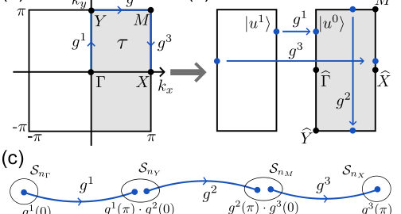
<figcaption class="paper-figure-caption"><b>Fig 1.</b> FIG. 1. P-symmetric transition functions. (a) The Bril- louin torus is divided into an inversion fundamental domain τ and its image Pτ. The three blue paths g1, g2, g3 represent the independent transition functions. (b) After the torus is cut open, the two bases |u0⟩on τ and |u1⟩on Pτ are glued along the boundaries by these transition functions. (c) The endpoints and junction products of the three successive paths are restricted to the subspace S of symmetric orthogonal ma- trices.</figcaption>
</figure>
<figure class="paper-figure-card">
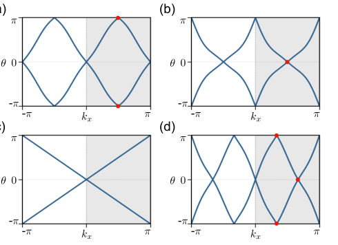
<figcaption class="paper-figure-caption"><b>Fig 2.</b> FIG. 2. Schematic Wilson-loop spectral flows for the η in- variant. The half Brillouin zone τ is shaded. (a) A single winding with both endpoints pinned at θ = 0. (b) A single winding with both endpoints pinned at θ = π. (c) The ref- erence spectral flow with the two endpoints pinned at θ = 0 and θ = π, respectively. (d) A single winding relative to the reference spectral flow in (c).</figcaption>
</figure>
<figure class="paper-figure-card">
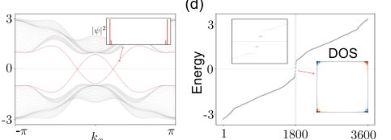
<figcaption class="paper-figure-caption"><b>Fig 3.</b> FIG. 3. The Dirac model. (a) The Wilson-loop spectral flow with t = 1. The spectral flow over the half-zone ex- hibits a single crossing at θ = π, yielding η = 1. (b) Bulk spectrum at the phase transition for t = 1.75 and (m1, m2, m3, m4) = (0.25, 0.25, 0.2, 0.2). (c) The spectrum at t = 1 on a slab geometry with open boundary condi- tions along the y direction. (d) Spectrum of a finite square at t = 1, with symmetry-preserving boundary perturbations (m1, m2, m3, m4) = (0.25, 0.25, 0.2, −0.2). The four in-gap states are localized at corners, as illustrated by the DOS in- set.</figcaption>
</figure>

**Summary.** This paper demonstrates that the K-theoretic classification of topological phases is insufficient for systems with P and T symmetries. The authors introduce a new topological invariant, $\eta$, derived from analyzing the symmetry-constrained path space. This invariant reveals distinct topological phases that are invisible to standard K-theory diagnostics.

**Why it may be interesting.** This work provides a rigorous mathematical extension to topological classification beyond standard K-theory, which is crucial for understanding novel topological phases in condensed matter systems.

Detailed structure

**Main problem.** The standard K-theoretic framework for classifying topological phases is shown to be incomplete, even for simple spinless systems possessing both P (inversion) and T (time-reversal) symmetries.

**Main result.** The authors identify a new topological invariant ($\eta$) that cannot be determined from the parity spectra at inversion-invariant momenta, revealing crystalline topological phases absent from K-theory.

**Method.** The classification is achieved via a first-principles analysis of the topological classes by analyzing the 'symmetric clutching data' and utilizing Wilson-loop spectral flow methods.

**Model / system.** The analysis focuses on spinless systems with P and T symmetries, using the Bloch Hamiltonian $H(\mathbf{k})$ and examining its behavior at inversion-invariant momenta ($\Lambda_i$).

**Key observables.** The new $\mathbb{Z}_2$ invariant ($\eta$), the Stiefel–Whitney classes, and the path-connected components $\pi_0(C_n)$ of the path space.

**Important parameters / regimes.** The parity spectrum of occupied states at inversion-invariant momenta, and the structure of the fundamental group $\pi_1(O(N))$.

**Assumptions / limitations.** The analysis assumes the existence of a continuous orthonormal basis of occupied states on the fundamental domain $	au$.

**Figures summary.** Figures illustrate the division of the Brillouin torus into an inversion fundamental domain ($	au$) and show schematic Wilson-loop spectral flows for the $\eta$ invariant.

**Paper structure.** The paper develops the mathematical framework by analyzing path spaces $C_{S_n\Gamma, F}$ to determine the fundamental group $\pi_0(C_n)$, and then applies this to physical systems to derive the new invariant $\eta$ that supplements the K-theoretic classification.

Abstract

The K-theoretic framework provides a complete topological classification of the tenfold symmetry classes and has been generalized to incorporate crystalline symmetries. Here, we show that this classification is incomplete even in the elementary case of spinless systems possessing both P and T symmetries. We obtain the complete classification through a first-principles analysis of the topological classes of P- and T-symmetric bands, namely, by classifying the corresponding symmetric clutching data. We identify a topological invariant that is invisible from the K-theoretic perspective when the occupied states at each inversion-invariant momentum have uniformly positive or uniformly negative parity. In special cases, such as when all inversion-invariant momenta have uniformly positive parity, this invariant can be interpreted as the second Stiefel--Whitney class or the Euler number defined over an inversion fundamental domain, namely, half of the Brillouin zone. Our work not only reveals a new topological invariant that cannot be determined from the parity spectra at inversion-invariant momenta under P and T symmetries, but also demonstrates the existence of crystalline topological phases that are absent from the K-theoretic classification.

[↑ back to top](#top)

### [From Goldene to Noblene: exhaustive enumeration of the ordered Au-Ag-Cu monolayer alloys](http://arxiv.org/abs/2609.02709v1)

**Authors:** Marcelo Lopes Pereira Junior  
**Type:** theory · **Category:** other · **PDF:** <https://arxiv.org/pdf/2609.02709v1>  
**Analysis basis:** full PDF text, analyzed in chunks

↔ Scroll figures horizontally

<figure class="paper-figure-card">
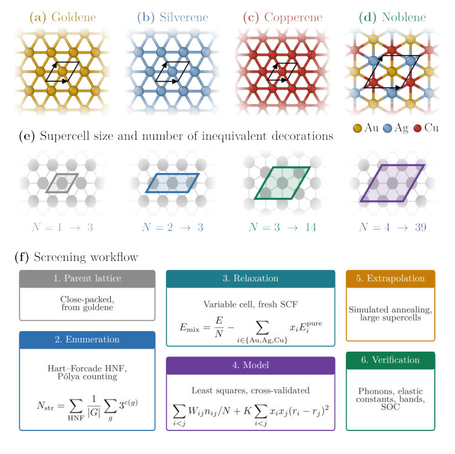
<figcaption class="paper-figure-caption"><b>Fig 1.</b> Fig. 1 The four reference monolayers on the close-packed lattice inherited from Goldene, Goldene (a), Silverene (b), Copperene (c), and Noblene (d). The same lattice with cells containing one through four atoms and the number of symmetry- inequivalent decorations of each (e), and the enumeration and screening workflow (f).</figcaption>
</figure>
<figure class="paper-figure-card">
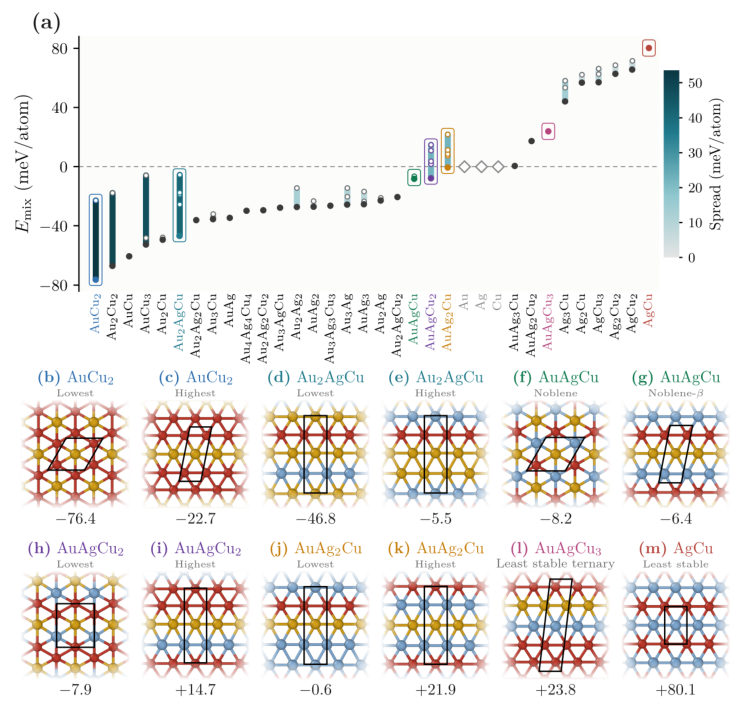
<figcaption class="paper-figure-caption"><b>Fig 2.</b> Fig. 2 Mixing energy of the 68 relaxed structures grouped by cell stoichiometry (a), with each capsule spanning the structures computed at one stoichiometry, colored by the width of that span, and with the three pure monolayers as open reference symbols. Lowest and highest orderings at AuCu2 (b, c) and at Au2AgCu (d, e), the two equimolar orderings Noblene and Noblene-β (f, g), the lowest and highest orderings of the two compositions whose sign is set by the arrangement, AuAgCu2 (h, i) and AuAg2Cu (j, k), the least stable ternary AuAgCu3 (l), and the least stable structure of the set AgCu (m). Values below each panel are in meV/atom.</figcaption>
</figure>
<figure class="paper-figure-card">
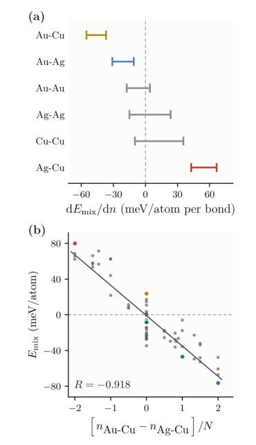
<figcaption class="paper-figure-caption"><b>Fig 3.</b> Fig. 3 Slope of the mixing energy with respect to the den- sity of each of the six bond types, with 95% confidence intervals, computed over the structures that contain the bond in question (a), and mixing energy against the bal- ance between the Au-Cu and Ag-Cu bond densities, with the linear fit and the corresponding correlation coefficient (b).</figcaption>
</figure>
<figure class="paper-figure-card">
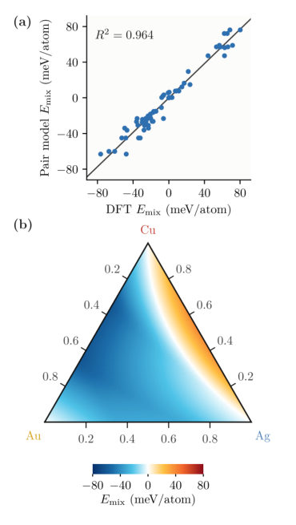
<figcaption class="paper-figure-caption"><b>Fig 4.</b> Fig. 4 Pair model with an elastic size-mismatch term against the computed mixing energies (a) and the modeled mixing energy over the Au-Ag-Cu composition triangle (b).</figcaption>
</figure>
<figure class="paper-figure-card">
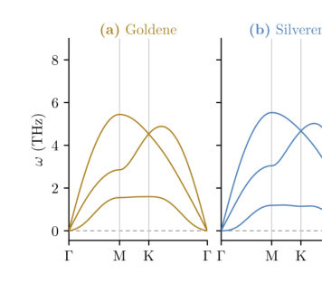
<figcaption class="paper-figure-caption"><b>Fig 5.</b> Fig. 5 Phonon dispersions along Γ-M-K-Γ for Goldene (a), Silverene (b), Copperene (c), and Noblene (d).</figcaption>
</figure>

**Summary.** This work exhaustively maps the ordered phase space of Au-Ag-Cu monolayers, demonstrating that local atomic arrangement, not just stoichiometry, controls the material's energy. They identify a unique, stable phase called Noblene, which is predicted to be synthesizable because it shares the lattice structure of known gold monolayers. The study provides a detailed methodology for predicting novel 2D quantum materials.

**Why it may be interesting.** While focused on condensed matter materials science, the rigorous application of DFT to map complex, highly ordered, low-dimensional phases provides a powerful template for studying emergent order in quantum materials.

Detailed structure

**Main problem.** To exhaustively map the ordered Au-Ag-Cu monolayer alloys and determine that atomic arrangement, rather than simple elemental proportion, dictates the mixing energy in these 2D systems.

**Main result.** The equimolar ordering, named Noblene, is identified as the only dynamically stable and metallic structure where every atom is surrounded exclusively by unlike species, suggesting a plausible synthesis route from Goldene.

**Method.** The study employs Density Functional Theory (DFT) combined with an exhaustive enumeration of derivative superstructures and a pair model fit to calculate mixing energies and elastic constants.

**Model / system.** The physical system is the Au-Ag-Cu ternary alloy realized as a two-dimensional monolayer on a close-packed hexagonal lattice. The analysis focuses on the interplay between local atomic ordering and overall chemical composition.

**Key observables.** Mixing energy (meV/atom), Poisson's ratio, elastic constants ($C_{11}, C_{22}, C_{12}, C_{66}$), and electronic structure (PDOS).

**Important parameters / regimes.** The competition between Au-Cu contacts (binding) and Ag-Cu contacts (non-binding) governs the energetics.

**Assumptions / limitations.** The analysis is restricted to two dimensions (in-plane) and uses DFT calculations based on the PBE functional.

**Figures summary.** Figures illustrate the four reference monolayers (Au, Ag, Cu, and Noblene) on the close-packed lattice, and show the mixing energy landscape for various supercell stoichiometries.

**Paper structure.** The paper systematically enumerates superstructures, calculates their energetics via DFT, establishes that local ordering dominates composition, and finally characterizes the unique, stable Noblene phase using electronic and elastic properties.

Abstract

Two-dimensional metals became a laboratory reality with the isolation of Goldene, a gold sheet one atom thick released by chemical exfoliation, which raises the question of what alloying can achieve on the same close-packed lattice. Here we combine an exhaustive enumeration of derivative superstructures with density functional theory to map the ordered Au-Ag-Cu monolayer alloys, relaxing every symmetry-inequivalent arrangement up to four atoms per cell and extending the set with larger cells selected by a fitted model. We find that the arrangement of the atoms, and not their proportion, controls the mixing energy, since the spread among the orderings of a single composition is several times the step between neighboring compositions, one composition spans more than 50~meV/atom between two arrangements of the same three atoms, and at two compositions the arrangement decides the sign. The energetics is carried by a competition between Au-Cu contacts, which bind, and Ag-Cu contacts, which do not, and bulk enthalpies computed under the same protocol show that this chemistry is not uniformly rescaled in two dimensions, since Au-Cu orders more strongly in the monolayer than in the crystal while the other two weaken. A pair model completed by an elastic size-mismatch term reproduces the computed energies to a few meV/atom and returns a composition landscape whose convex hull no balanced ternary composition reaches. One equimolar ordering, which we name Noblene, is the only structure in which every atom is surrounded exclusively by unlike species, and it is dynamically stable and metallic, and carries a Poisson's ratio above one half, higher than that of any of the three pure monolayers. Since Noblene sits on the lattice that Goldene already realizes, the route that produced Goldene is a plausible starting point for its synthesis.

[↑ back to top](#top)

