
# arxiv digest (quant-ph + cond-mat) — 2026-09-05

*140 papers · 28 relevant · 3 highlighted*

## 🔥 Most relevant (28)

*Every paper with at least one nonzero topic score, sorted by best-matching score. 🔥 marks scores ≥4/5. Click the title to jump to the full entry below; click [arXiv] to open the paper page. `(secondary)` marks papers from de-prioritized cond-mat archives.*

Show 28 relevant papers

- ⭐ [Stabilization of dark states in emitter arrays coupled to a half-waveguide](#paper-2609.03040) [[arXiv]](http://arxiv.org/abs/2609.03040v1) — 🔥 `correlated / nonlocal dissipation` **4/5** · `Tavis-Cummings & cavity-many-emitter` **3/5** · `analog quantum simulation` **3/5** · `driven-dissipative phase transition` **3/5** · `methods for driven-dissipative` **3/5** · `quantum measurements` **2/5** · `Dicke superradiance` **1/5** · `Keldysh / 2PI / non-Gaussian methods` **1/5** · `non-equilibrium universality` **1/5**
- [Weakly Driven and Finite Detuning Boundary Time Crystals Enabled by Low-Dissipation Dynamical Channels](#paper-2609.03491) [[arXiv]](http://arxiv.org/abs/2609.03491v1) — 🔥 `driven-dissipative phase transition` **4/5** · `analog quantum simulation` **3/5** · `correlated / nonlocal dissipation` **3/5** · `methods for driven-dissipative` **3/5** · `Keldysh / 2PI / non-Gaussian methods` **2/5** · `Tavis-Cummings & cavity-many-emitter` **2/5** · `non-equilibrium universality` **2/5**
- [Non-Abelian string melting and thermalization in an open lattice gauge theory](#paper-2609.04117) [[arXiv]](http://arxiv.org/abs/2609.04117v1) — 🔥 `methods for driven-dissipative` **4/5** · `driven-dissipative phase transition` **3/5** · `non-equilibrium universality` **3/5** · `Keldysh / 2PI / non-Gaussian methods` **2/5** · `quantum measurements` **2/5** · `scars & prethermalization` **2/5** · `analog quantum simulation` **1/5** · `correlated / nonlocal dissipation` **1/5**
- [Coherent interaction of WS$_2$ and quasi-2D perovskite excitons over micrometer distances via a cavity field](#paper-2609.03765) [[arXiv]](http://arxiv.org/abs/2609.03765v1) `(secondary)` — 🔥 `quantum optics experiment` **4/5** · `Tavis-Cummings & cavity-many-emitter` **3/5** · `analog quantum simulation` **3/5** · `driven-dissipative phase transition` **2/5** · `interference shaping light` **2/5** · `Keldysh / 2PI / non-Gaussian methods` **1/5** · `correlated / nonlocal dissipation` **1/5** · `methods for driven-dissipative` **1/5**
- [Discrete time crystals in disordered anisotropic Heisenberg chains](#paper-2609.04037) [[arXiv]](http://arxiv.org/abs/2609.04037v1) — 🔥 `driven-dissipative phase transition` **4/5** · 🔥 `methods for driven-dissipative` **4/5** · `analog quantum simulation` **3/5** · `non-equilibrium universality` **3/5** · `scars & prethermalization` **3/5**
- [Effective Hamiltonian description on monitored Majorana chains: correlated power-law hoppings and unconventional entanglement scaling](#paper-2609.04091) [[arXiv]](http://arxiv.org/abs/2609.04091v1) — 🔥 `quantum measurements` **4/5** · `correlated / nonlocal dissipation` **3/5** · `methods for driven-dissipative` **3/5** · `driven-dissipative phase transition` **2/5** · `non-equilibrium universality` **2/5** · `Keldysh / 2PI / non-Gaussian methods` **1/5** · `analog quantum simulation` **1/5**
- [Optimal Control of Periodic Nonequilibrium Mechanochemical Systems via Automatic Differentiation](#paper-2609.03217) [[arXiv]](http://arxiv.org/abs/2609.03217v1) — 🔥 `methods for driven-dissipative` **4/5** · `driven-dissipative phase transition` **3/5** · `non-equilibrium universality` **3/5** · `Keldysh / 2PI / non-Gaussian methods` **2/5** · `quantum measurements` **2/5** · `Frenkel-Kontorova` **1/5** · `correlated / nonlocal dissipation` **1/5**
- [Equivalence classes of finite-time transitions in optimal control and non-equilibrium relaxation](#paper-2609.03862) [[arXiv]](http://arxiv.org/abs/2609.03862v1) — 🔥 `non-equilibrium universality` **4/5** · `driven-dissipative phase transition` **3/5** · `quantum measurements` **2/5** · `Keldysh / 2PI / non-Gaussian methods` **1/5** · `analog quantum simulation` **1/5** · `correlated / nonlocal dissipation` **1/5** · `methods for driven-dissipative` **1/5**
- [Finite-temperature mass gap and quench dynamics of mobile impurities in a Fermi gas](#paper-2609.03656) [[arXiv]](http://arxiv.org/abs/2609.03656v1) — 🔥 `Keldysh / 2PI / non-Gaussian methods` **4/5** · `non-equilibrium universality` **3/5** · `analog quantum simulation` **2/5** · `methods for driven-dissipative` **2/5** · `quantum measurements` **1/5** · `scars & prethermalization` **1/5**
- [Spin-to-polarization mapping with a coherent quantum dot-cavity receiver](#paper-2609.03910) [[arXiv]](http://arxiv.org/abs/2609.03910v1) — 🔥 `QC/QI experiment` **4/5** · `quantum optics experiment` **3/5** · `Tavis-Cummings & cavity-many-emitter` **2/5** · `quantum measurements` **2/5** · `analog quantum simulation` **1/5** · `interference shaping light` **1/5**
- [Nonlinear Dissipation and Hopf Criticality in Driven Dissipative Collective Spins](#paper-2609.03360) [[arXiv]](http://arxiv.org/abs/2609.03360v1) — 🔥 `driven-dissipative phase transition` **4/5** · `methods for driven-dissipative` **3/5** · `non-equilibrium universality` **3/5** · `Keldysh / 2PI / non-Gaussian methods` **1/5** · `correlated / nonlocal dissipation` **1/5**
- [Twin-photon generation in a silicon nitride microresonator](#paper-2609.04171) [[arXiv]](http://arxiv.org/abs/2609.04171v1) — 🔥 `quantum optics experiment` **4/5** · `QC/QI experiment` **3/5** · `Full counting statistics` **2/5** · `analog quantum simulation` **1/5** · `interference shaping light` **1/5** · `quantum measurements` **1/5**
- [Heralded one-, two- and three-photon states from waveguided parametric down-conversion](#paper-2609.03542) [[arXiv]](http://arxiv.org/abs/2609.03542v1) — 🔥 `quantum optics experiment` **4/5** · `Full counting statistics` **3/5** · `quantum measurements` **2/5** · `interference shaping light` **1/5**
- [Optimal control theory for measured quantum Schrödinger bridges](#paper-2609.03097) [[arXiv]](http://arxiv.org/abs/2609.03097v1) — 🔥 `quantum measurements` **4/5** · `methods for driven-dissipative` **2/5** · `Keldysh / 2PI / non-Gaussian methods` **1/5** · `correlated / nonlocal dissipation` **1/5** · `driven-dissipative phase transition` **1/5** · `non-equilibrium universality` **1/5**
- [Robust Hamiltonian engineering with subensemble control](#paper-2609.03045) [[arXiv]](http://arxiv.org/abs/2609.03045v1) — 🔥 `analog quantum simulation` **4/5** · `Rydberg arrays` **3/5** · `Keldysh / 2PI / non-Gaussian methods` **1/5** · `methods for driven-dissipative` **1/5** · `quantum measurements` **1/5**
- [Universal Driven Critical Dynamics of Entanglement Entropy](#paper-2609.03854) [[arXiv]](http://arxiv.org/abs/2609.03854v1) — 🔥 `non-equilibrium universality` **4/5** · `analog quantum simulation` **3/5** · `methods for driven-dissipative` **2/5** · `driven-dissipative phase transition` **1/5**
- [Small-quench Loschmidt dynamics near quantum critical points](#paper-2609.04065) [[arXiv]](http://arxiv.org/abs/2609.04065v1) — 🔥 `non-equilibrium universality` **4/5** · `analog quantum simulation` **2/5** · `driven-dissipative phase transition` **2/5** · `Keldysh / 2PI / non-Gaussian methods` **1/5**
- [Efficient Conversion of Optical to Mechanical States Close to the Single-Quantum Level](#paper-2609.04150) [[arXiv]](http://arxiv.org/abs/2609.04150v1) — 🔥 `quantum optics experiment` **4/5** · `analog quantum simulation` **2/5** · `driven-dissipative phase transition` **1/5** · `quantum measurements` **1/5**
- [Universal scaling of fluctuations and correlations across the superfluid transition](#paper-2609.03433) [[arXiv]](http://arxiv.org/abs/2609.03433v1) — 🔥 `analog quantum simulation` **4/5** · `non-equilibrium universality` **3/5** · `Full counting statistics` **1/5**
- [Analog quantum simulation of bosonic and anyonic models with flux-driven transmons](#paper-2609.03737) [[arXiv]](http://arxiv.org/abs/2609.03737v1) — 🔥 `analog quantum simulation` **4/5** · `QC/QI experiment` **2/5** · `methods for driven-dissipative` **1/5**
- [Nodal obstruction to conditioned-diffusion representations of the weak momentum](#paper-2609.03242) [[arXiv]](http://arxiv.org/abs/2609.03242v1) — 🔥 `quantum measurements` **4/5** · `Keldysh / 2PI / non-Gaussian methods` **1/5** · `interference shaping light` **1/5** · `methods for driven-dissipative` **1/5**
- [Low-Frequency Charge Noise in Bilayer Graphene Quantum Dots](#paper-2609.03650) [[arXiv]](http://arxiv.org/abs/2609.03650v1) — 🔥 `QC/QI experiment` **4/5** · `quantum measurements` **2/5**
- [Characterizing Large Scale Quantum Systems with Error Per Circuit Layer](#paper-2609.04132) [[arXiv]](http://arxiv.org/abs/2609.04132v1) — 🔥 `QC/QI experiment` **4/5** · `quantum measurements` **1/5**
- [Experimental validation of a compact fault-tolerant architecture for trapped ions](#paper-2609.03194) [[arXiv]](http://arxiv.org/abs/2609.03194v1) — 🔥 `QC/QI experiment` **4/5** · `quantum measurements` **1/5**
- ⭐ [Unravelling the Li-Haldane Conjecture with the Projected Ensemble](#paper-2609.03833) [[arXiv]](http://arxiv.org/abs/2609.03833v1) `(secondary)` — 🔥 `quantum measurements` **4/5** · `Full counting statistics` **1/5**
- [An interpretation-independent formulation of the measurement problem](#paper-2609.03409) [[arXiv]](http://arxiv.org/abs/2609.03409v1) — 🔥 `quantum measurements` **4/5**
- [Measurements on the separated subsystems of an entangled state](#paper-2609.04178) [[arXiv]](http://arxiv.org/abs/2609.04178v1) — 🔥 `quantum measurements` **4/5**
- [Robust multi-hypothesis quantum-state discrimination under unknown common unitary perturbations via least favorable priors](#paper-2609.04020) [[arXiv]](http://arxiv.org/abs/2609.04020v1) — 🔥 `quantum measurements` **4/5**

## ⭐ Highlighted (3)

*Papers by authors on your watch list. Click the title to jump to the full entry below; click [arXiv] to open the paper page.*

Show 3 highlighted papers

- ⭐ [Unravelling the Li-Haldane Conjecture with the Projected Ensemble](#paper-2609.03833) [[arXiv]](http://arxiv.org/abs/2609.03833v1) `(secondary)` — Nigel R. Cooper
- ⭐ [Nanoscale magnetometry via collective many-body dynamics in diamond](#paper-2609.03039) [[arXiv]](http://arxiv.org/abs/2609.03039v1) — Mikhail D. Lukin
- ⭐ [Stabilization of dark states in emitter arrays coupled to a half-waveguide](#paper-2609.03040) [[arXiv]](http://arxiv.org/abs/2609.03040v1) — Susanne F. Yelin, Ana Asenjo-Garcia

## All papers (94, sorted by relevance)

*Papers from quant-ph and your primary cond-mat archives (quant-gas, stat-mech, str-el, dis-nn). Highlighted papers (⭐) come first, then everything else sorted by topic-relevance score, highest first.*

### ⭐ [Stabilization of dark states in emitter arrays coupled to a half-waveguide](http://arxiv.org/abs/2609.03040v1)

**Highlighted author(s):** Susanne F. Yelin, Ana Asenjo-Garcia  
**Authors:** Oriol Rubies-Bigorda, Susanne F. Yelin, Ana Asenjo-Garcia, Stuart J. Masson  
**Type:** theory · **Category:** other · **PDF:** <https://arxiv.org/pdf/2609.03040v1>  
**Analysis basis:** full PDF text, analyzed in chunks
**Topic relevance:** 🔥 `correlated / nonlocal dissipation` **4/5** · `Tavis-Cummings & cavity-many-emitter` **3/5** · `analog quantum simulation` **3/5** · `driven-dissipative phase transition` **3/5** · `methods for driven-dissipative` **3/5** · `quantum measurements` **2/5** · `Dicke superradiance` **1/5** · `Keldysh / 2PI / non-Gaussian methods` **1/5** · `non-equilibrium universality` **1/5**

📷 Fig 1

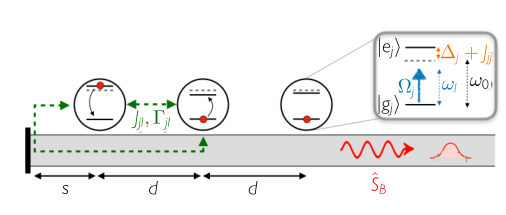 
Figure 1. Array of N two-level emitters coupled to a one- dimensional waveguide terminated by a mirror. The sepa- ration between the first emitter and the mirror is s, while the distance between emitters is d. The photonic modes of the waveguide induce a coherent Jjl and dissipative Γjl inter- action between emitters j and l, which can be described as the superposition of the two waves traveling from one emit- ter to the other (green dashed arrows). Photons are emitted by the array via action of the bright jump operator ˆSB with decay rate ΓB. Additionally, each individual emitter can be detuned from its bare transition frequency by an amount ∆j and driven at frequency ωl at a Rabi...

📷 Fig 2

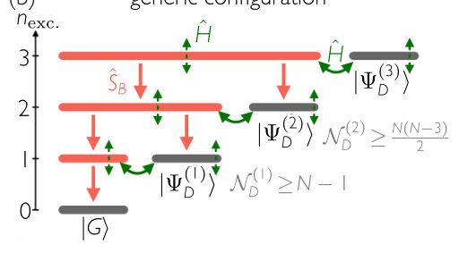 
Figure 2. Lindbladian spectrum or eigenstates of the dis- sipative Hamiltonian for (a) the permutationally symmetric configuration (d = mλ0/2 with m ∈N) and (b) any other general configuration, for the four lowest excitation numbers nexc. In (a), decay (red arrows) only occurs within each lad- der with well-defined total angular momentum L. The coher- ent Hamiltonian ˆH gives rise to energy shifts of each state (green dashed double arrows). The end of each ladder corre- sponds to a set of N (nexc) D Lindbladian dark states, |ψ(nexc) D ⟩, colored in grey. (b) For general configurations d ̸= mλ0/2, photon emission does not conserve the total angular momen- tum of the system. Additionally, the...

📷 Fig 3

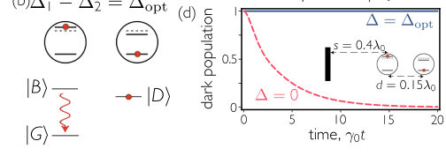 
Figure 3. (a) For two emitters at a distance d ̸= mλ0/2 and in the absence of a relative detuning (∆1 −∆2 = 0), the bright |B⟩and dark |D⟩Lindbladian eigenstates are coupled via the coherent interactions ˆH, providing a decay path for |D⟩. (b) Applying the optimal relative detuning ∆1 −∆2 = ∆opt, the coupling is canceled, and |D⟩becomes a total dark state of the full master equation. (c) Optimal detuning ∆opt as a function of the separation s of the first emitter from the mirror and the distance d between emitters. (d) Overlap of the density matrix ˆρ(t) with the dark state |D⟩over time for a two-emitter array with s = λ0/4 and d = 0.15λ0 initialized at |D⟩with (solid blue) optimized...

📷 Fig 4

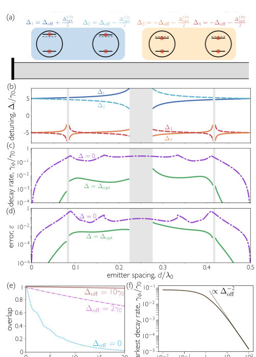 
Figure 4. (a) Separable two-excitation dark state |D12,34⟩= |D12⟩⊗|D34⟩, consisting of the product of two single- excitation dark states: |D12⟩corresponds to the subsystem formed by the first two emitters (shaded blue), and |D34⟩cor- responds to the subsystem comprised of the third and fourth emitters. A relative detuning ±∆off is applied to the subsys- tems on top of the stabilizing detuning ∆opt. (b) Optimal detuning ∆j of each emitter j as a function of d for s = λ0/4 with ∆off = 5γ0. (c) Decay rate γϕ of the darkest two- excitation eigenstate, |ϕD⟩, of ˆHnH for zero (dot-dashed pur- ple curve) and optimal (green curve) detuning. (d) One mi- nus overlap of the separable two-excitation...

📷 Fig 5

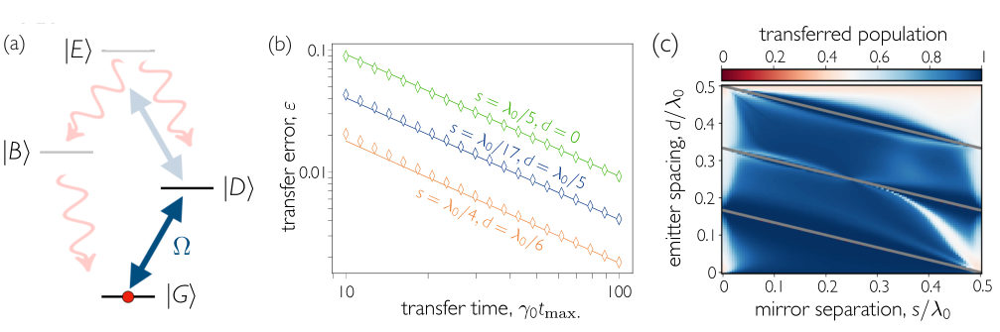 
Figure 5. (a) Collective states of a two-emitter system at the optimal detuning given in Eq. (15). For weak resonant drive on the |G⟩↔|D⟩transition, the bright states can be adiabatically eliminated due to the Zeno effect and the dipole-induced photon blockade, leading to high fidelity Rabi oscillations between |G⟩and |D⟩. (b) Error of the dark state preparation protocol, ϵ = 1 −p(max) D , as a function of the transfer time tmax for two emitters with various configurations s and d. The diamonds and solid lines respectively correspond to the solution of the full master equation and the adiabatic analytical result in Eq. (22). A scaling ϵ ∼t−1 max is observed. (c) Maximum transferred...

**Summary.** This paper details the theoretical control of collective quantum states in arrays of emitters coupled to a waveguide. By applying precise frequency shifts, the authors demonstrate how to engineer perfect single-excitation dark states that are immune to decay. This technique is crucial for building robust quantum information storage and networking devices.

**Why it may be interesting.** This work directly addresses controlling dissipation in open quantum systems, which is central to quantum memory and quantum networking using solid-state emitters.

Detailed structure

**Main problem.** The primary goal is stabilizing perfect single-excitation and near-perfect multi-excitation dark states in arrays of quantum emitters coupled to a waveguide.

**Main result.** Optimal frequency shifts allow for the deterministic preparation of single-excitation dark states, and near-perfect multi-excitation dark states can be achieved by treating the system as coupled subsystems.

**Method.** The analysis uses the master equation and Hamiltonian diagonalization to find states that decouple from the dissipative environment, requiring precise tuning of emitter detunings.

**Model / system.** The system consists of N two-level emitters (qubits) coupled to a one-dimensional photonic waveguide terminated by a mirror. Dynamics are governed by a Lindbladian evolution incorporating coherent and dissipative couplings.

**Key observables.** Dark state population ($p_D$), decay rate ($\gamma$), and the error ($\epsilon$) in state preparation.

**Important parameters / regimes.** Optimal relative detuning ($\Delta_{opt}$), number of emitters ($N$), and the strength of external driving fields ($\Omega$).

**Assumptions / limitations.** The Markov approximation is used, and for some analyses, adiabatic elimination is employed under the assumption that driving fields are weak compared to decay rates.

**Figures summary.** Figures illustrate the array setup, the decay paths in the Lindbladian spectrum, and the error ($\epsilon$) in photon emission for two-emitter systems under noise.

**Paper structure.** The paper progresses from establishing the general theory of dark states in coupled emitters, detailing the stabilization mechanism for single excitations via detuning, generalizing to multi-excitations, and finally analyzing the robustness of the preparation protocol against noise.

Abstract

The radiative properties of quantum emitters are profoundly influenced by their electromagnetic environment. When coupled to a waveguide terminated at one end by a mirror, distant emitters interact strongly via virtual photon exchange, leading to collective superradiant and subradiant states with enhanced or suppressed decay rates. We demonstrate that applying optimal frequency shifts to each emitter enables the formation of perfect single-excitation dark states (i.e. states with zero decay rate) and near-perfect multi-excitation dark states in small ensembles. These collective states can be deterministically prepared with high fidelity using classical driving fields or few-photon pulses propagating along the waveguide. These results, readily implementable in superconducting qubit platforms, open new avenues for quantum information storage, networking and control of light.

[↑ back to top](#top)

### ⭐ [Nanoscale magnetometry via collective many-body dynamics in diamond](http://arxiv.org/abs/2609.03039v1)

**Highlighted author(s):** Mikhail D. Lukin  
**Authors:** Haoyang Gao, Piotr Put, Nathaniel T. Leitao, Nazlı U. Köylüoğlu, Andrew Maccabe, Mathew Mammen, Siddharth Dandavate, Lillian B. Hughes Wyatt, Leigh S. Martin, Ania C. Bleszynski Jayich, Hongkun Park, Mikhail D. Lukin  
**Type:** both · **Category:** disordered systems and neural networks · **PDF:** <https://arxiv.org/pdf/2609.03039v1>  
**Analysis basis:** full PDF text, analyzed in chunks
**Topic relevance:** `QC/QI experiment` **3/5** · `analog quantum simulation` **3/5** · `quantum measurements` **2/5** · `correlated / nonlocal dissipation` **1/5** · `driven-dissipative phase transition` **1/5**

📷 Fig 1

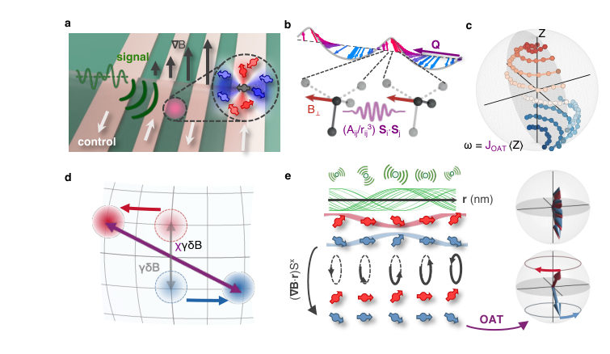 
FIG. 1. Interaction-enhanced quantum sensor based on dipolar interactions. a, Schematic of the experimental system. A diamond hosting a 3D ensemble of interacting NV centers serves as a sensor of external magnetic fields. The diamond is placed on a chip consisting of four par- allel microwires that delivers homogeneous MW control. The same wires are diplexed with pulsed electric currents (white arrows) to generate magnetic-field gradients for the preparation of nanoscale spin spirals. Inset: dipolar interactions among NV centers, with colors indicating the angular-dependent sign of coupling. b, Key ingredients enabling interaction-enhanced sensing. Collective OAT dynamics is engineered from...

📷 Fig 2

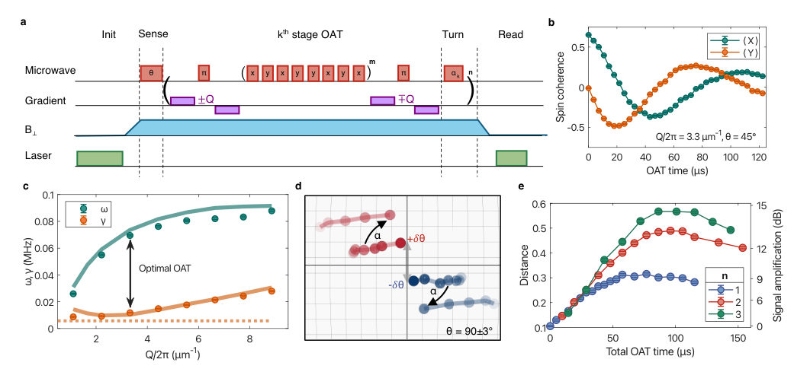 
FIG. 2. Signal amplification through collective many-body dynamics. a, Experimental sequence realizing signal amplification. The spin ensemble is optically polarized at zero magnetic field, after which the perpendicular field B⊥is ramped to 362.4 G to tune the dipolar interaction to the form of Eq. (1). A MW pulse of angle θ = π/2 ± δθ mimics the sensing signal, followed by an OAT stage that amplifies the encoded response. The OAT dynamics are implemented through pulsed control of magnetic-field gradients and MW drive [8]: a conical spin spiral is wound, evolved under a generalized (XY8)m sequence that decouples on-site disorder, and then unwound at the end of the quench. An optional MW...

📷 Fig 3

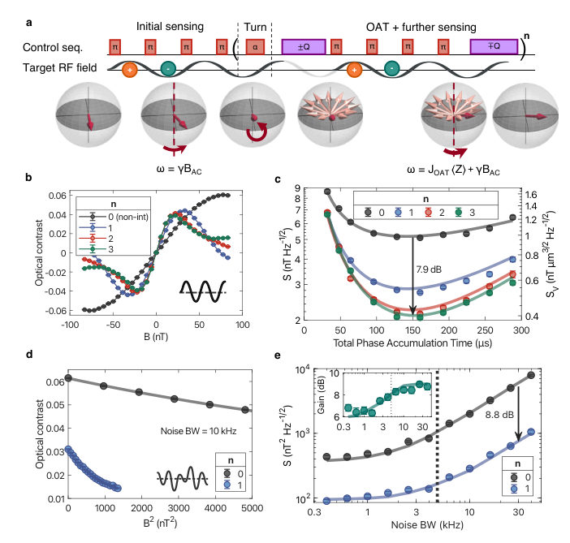 
FIG. 3. Interaction-enhanced sensing of global magnetic signal and noise. a, Experimental protocol for interaction-enhanced sensing of an AC magnetic field. An initial sensing stage consists of a train of π-pulses synchronized to the target radio frequency (RF) signal, acquiring a phase that is subsequently rotated toward the Z axis by a turn pulse α. The resulting Z polarization is then amplified by an OAT stage, during which the disorder-decoupling π-pulses are frequency-synchronized to the target signal and phase-locked to the initial sensing stage, enabling further sensing while amplifying previously accumulated signal. Analogous to Fig. 2a, this stage can be repeated multiple times for...

📷 Fig 4

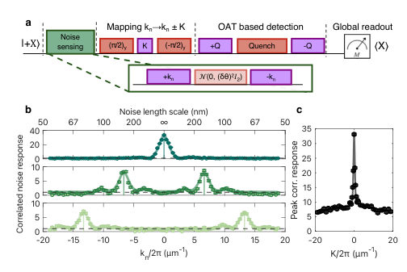 
FIG. 4. Interaction-enabled correlation sensing at nanometer length scales. a, Protocol for interaction-enabled correlation sens- ing, where purple (red) squares represent pulses of magnetic-field gradient (MW drive). The protocol starts with a noise sensing stage which encodes the spatially correlated magnetic-field noise into Sz

**Summary.** This work presents a novel approach to nanoscale magnetometry using strongly interacting electron spins in diamond NV centers. By coherently controlling collective many-body dynamics via Overhauser-Antiferromagnetic Tunneling (OAT), the authors achieve significant signal amplification and demonstrate the ability to map spatially correlated magnetic noise down to 50 nm. This opens pathways for advanced quantum sensing in biological and material characterization.

**Why it may be interesting.** The use of collective dynamics and engineered spin interactions in a solid-state platform like NV centers provides a concrete, experimentally realized example of how many-body physics can enhance quantum sensing beyond the standard quantum limit.

Detailed structure

**Main problem.** The paper addresses the challenge of achieving practical, high-gain nanoscale magnetic sensing by leveraging the collective many-body dynamics of interacting quantum spins.

**Main result.** They successfully demonstrate metrological gains up to 8.8 dB for noise sensing and achieve momentum-space-resolved detection of spatially correlated magnetic noise down to 50 nm.

**Method.** The core method involves engineering Overhauser-Antiferromagnetic Tunneling (OAT) dynamics using pulsed magnetic field gradients to coherently control and amplify the sensing signal.

**Model / system.** The system is a high-density ensemble of Nitrogen-Vacancy (NV) centers in diamond, whose dynamics are governed by magnetic dipole-dipole interactions, modeled via collective spin-wave dynamics.

**Key observables.** Metrological gain (dB), spatial resolution (nm), spin polarization dynamics, and the response function $F(\vec{k}_n, \vec{K})$.

**Important parameters / regimes.** The sensing gain (e.g., 7.9 dB for signal, 8.8 dB for noise), the minimum detectable length scale (50 nm), and the interaction strength parameter $J_0$.

**Assumptions / limitations.** The analysis accounts for experimental overheads, and theoretical derivations rely on mean-field approximations and specific symmetries in the spin-wave model.

**Figures summary.** Figures illustrate the experimental setup, the multi-stage signal amplification protocol (OAT), and the theoretical prediction of momentum-space response functions $F(\vec{k}_n, \vec{K})$ showing wavevector selectivity.

**Paper structure.** The paper progresses from demonstrating the physical system and the need for interaction enhancement, detailing the OAT protocol for signal amplification, and culminating in a theoretical analysis of the momentum-space response function to characterize spatially correlated noise.

Abstract

Many-body dynamics constitutes a promising approach for creating correlations between quantum particles which can be used for applications in sensing and metrology. However, utilizing this potential for substantial gains in practical settings is a challenging task with only a very few applications realized to date. Here, we demonstrate an approach to nanoscale magnetic sensing enabled by strongly interacting electronic spins in a room temperature solid. By coherently controlling collective many-body dynamics of a dipolar ensemble of $\sim 10^4$ nitrogen-vacancy (NV) centres in diamond with pulsed magnetic field gradients, we demonstrate practical metrological gain up to $7.9(2)\,\mathrm{dB}$ for magnetic signal detection and $8.8(3)\,\mathrm{dB}$ for magnetic noise sensing, fully accounting for experimental overheads. Finally, we combine these methods to demonstrate a momentum-space-resolved sensing modality that enables detection of spatially correlated magnetic noise at continuously tunable length scales down to 50 nanometers. These observations open the door toward practical applications of interaction-enhanced quantum sensors for nanoscale biological imaging and material characterization.

[↑ back to top](#top)

### [Weakly Driven and Finite Detuning Boundary Time Crystals Enabled by Low-Dissipation Dynamical Channels](http://arxiv.org/abs/2609.03491v1)

**Authors:** Xiang Guo, Xiaojun Zhang, Zhihai Wang  
**Type:** theory · **Category:** other · **PDF:** <https://arxiv.org/pdf/2609.03491v1>  
**Analysis basis:** full PDF text, analyzed in chunks
**Topic relevance:** 🔥 `driven-dissipative phase transition` **4/5** · `analog quantum simulation` **3/5** · `correlated / nonlocal dissipation` **3/5** · `methods for driven-dissipative` **3/5** · `Keldysh / 2PI / non-Gaussian methods` **2/5** · `Tavis-Cummings & cavity-many-emitter` **2/5** · `non-equilibrium universality` **2/5**

📷 Fig 1

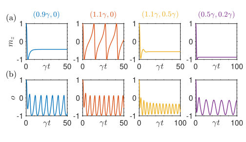 
Figure 1. (a) and (b) The mean-field evolution of the order parameter under different (η, ∆) for α = 0 and α = 1, respec- tively. The initial state is set as mx,y = 0, mz = 1 in panel (a) and m(1,2) x,y = 0, m(1,2) z = 1 in panel (b).

📷 Fig 2

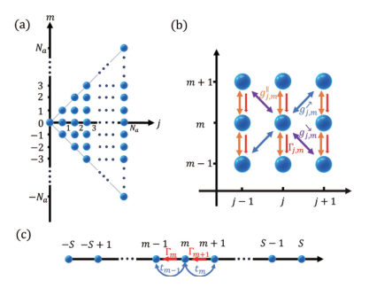 
Figure 2. Effective lattice picture of the system. (a) Tri- angular lattice for α = 1, where each lattice site represents a basis state |ϕj,m⟩. (b) Local interaction structure around an arbitrary bulk site |ϕj,m⟩of the triangular lattice. The double-headed arrows denote the three types of coherent in- tersite couplings, characterized by g∥ j,m, gր j,m, and gց j,m, while the red arrows indicate the dissipative transitions with rate Γj,m. (c) One-dimensional lattice picture for α = 0, with coherent nearest-neighbor couplings tm and cascaded dissipa- tive transitions at rates Γm.

📷 Fig 3

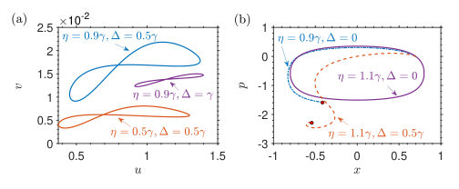 
Figure 3. (a) The semiclassical phase space limit cycles pro- jected onto the (a) u-v and (b) x-p plane for α = 1 and α = 0, respectively. The red circles in (b) mark the fixed points ap- proached after long-time evolution under parameters outside the BTC phase. All curves in panel (b) adopt the identical initial condition x(0) = 0.7, p(0) = 0.

📷 Fig 4

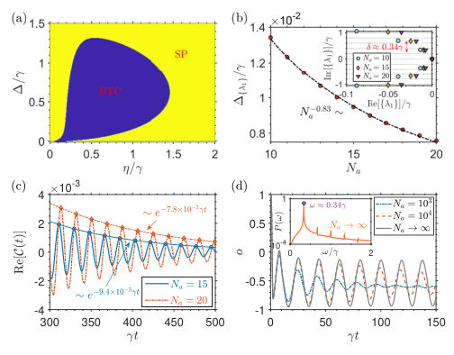 
Figure 4. (a) Mean-field phase diagram in the η−∆plane. (b) Energy gap of the first eigenvalue branch as a function of Na with power-law fitting. Inset of (b): First eigenvalue branches in the low-lying Liouvillian spectrum for Na = 10, 15, 20. (c) Long-time dynamics of real part of the two-time correlation function C(t) for Na = 15 and 20. (d) Dynamics of the or- der parameter o against system size. Inset of (d): Fourier spectrum of o in the thermodynamic limit. In (d), 5000 stochastic trajectories are adopted in the TWA simulation for Na = 103 and Na = 104 and the initial state is set as m(1,2) x,y = 0, m(1,2) z = 1. For panels (b), (c) and (d), we set ∆= 0.2γ and η = 0.5γ.

**Summary.** This paper shows that Boundary Time Crystals (BTCs) can be robustly realized in coupled atomic ensembles even when the driving is weak and the system is detuned from resonance. This is achieved by exploiting how shared dissipation organizes the system's dynamics into low-dissipation channels. The theoretical analysis uses semiclassical and spectral methods, demonstrating the feasibility of these exotic quantum states in physical platforms like waveguide-QED.

**Why it may be interesting.** This work provides a powerful theoretical framework for realizing non-equilibrium quantum phenomena like BTCs using realistic, weakly driven, and detuned systems, which is highly relevant for quantum optics and open quantum systems research.

Detailed structure

**Main problem.** The research aims to establish conditions for robust Boundary Time Crystals (BTCs) in driven-dissipative systems, overcoming the strict requirements of strong driving and exact resonance found in conventional models.

**Main result.** The authors demonstrate that coupling two atomic ensembles allows BTCs to persist under weak driving and finite detuning by organizing dissipation into dynamically accessible low-dissipation channels.

**Method.** The analysis employs mean-field approximations, semiclassical WKB methods, and the study of the Liouvillian spectrum to track the system's dynamics in the thermodynamic limit.

**Model / system.** The system consists of two atomic ensembles (spin-1/2 particles) coupled to a common Markovian reservoir, modeled by a master equation. The dynamics are analyzed on an effective lattice structure, which is later mapped to a waveguide-QED platform.

**Key observables.** Order parameters ($m_z$, $o$), the two-time correlation function $	ext{Re}[C(t)]$, and the low-lying Liouvillian spectrum.

**Important parameters / regimes.** Driving strength ($\eta$), detuning ($\Delta$), dissipation rate ($\gamma$), and the system size ($N_a$ or $S$).

**Assumptions / limitations.** The analysis relies on the Born–Markov approximation and the mean-field approximation, which are valid in the thermodynamic limit ($N_a 	o \infty$).

**Figures summary.** Figures illustrate mean-field evolution of order parameters under varying driving/detuning, semiclassical phase space limit cycles, and the low-lying Liouvillian spectrum showing spectral gaps.

**Paper structure.** The paper progresses from analyzing the single-ensemble case to the two-ensemble model, deriving semiclassical equations of motion, and finally confirming the results using the full Liouvillian spectrum analysis and mapping the model to a waveguide-QED setup.

Abstract

Spontaneous breaking of continuous time-translation symmetry in driven-dissipative systems gives rise to boundary time crystals (BTCs), characterized by persistent oscillations sustained by coherent driving and collective dissipation. Conventional BTCs, however, typically require strong driving and exact atom-drive resonance, imposing stringent constraints on their realization. Here we consider two atomic ensembles coupled to a common Markovian reservoir and show that shared dissipation organizes dissipation-free and low-dissipation modes into dynamically accessible low-dissipation channels, enabling BTCs under weak driving and finite detuning. Finite detuning further selects a unique stable limit cycle from an initial-state-dependent family of oscillatory trajectories. Our results establish low-dissipation dynamical channels as a route to robust BTCs under relaxed driving and resonance conditions.

[↑ back to top](#top)

### [Non-Abelian string melting and thermalization in an open lattice gauge theory](http://arxiv.org/abs/2609.04117v1)

**Authors:** Erick Parra Verde, Giovanni Cataldi, Stefan Kühn, Giuseppe Magnifico, Jad C. Halimeh  
**Type:** theory · **Category:** statistical mechanics · **PDF:** <https://arxiv.org/pdf/2609.04117v1>  
**Analysis basis:** full PDF text, analyzed in chunks
**Topic relevance:** 🔥 `methods for driven-dissipative` **4/5** · `driven-dissipative phase transition` **3/5** · `non-equilibrium universality` **3/5** · `Keldysh / 2PI / non-Gaussian methods` **2/5** · `quantum measurements` **2/5** · `scars & prethermalization` **2/5** · `analog quantum simulation` **1/5** · `correlated / nonlocal dissipation` **1/5**

📷 Fig 1

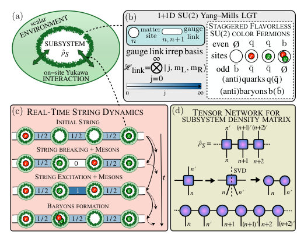 
FIG. 1. Open-system dynamics of SU(2) LGT. (a) A 1 + 1D SU(2) Yang–Mills LGT interacts as a subsystem (S) through an (on-site) Yukawa potential with an external (green) environment (E) at constant temperature T described by a scalar field theory; (b) The subsystem considers stag- gered flavorless fermionic matter on lattice sites coupled with SU(2) gauge link fields living in an infinite Hilbert space made out of the sum of SU(2) irreducible representations. (c) The real-time subsystem dynamics focuses on string dynamics, in- cluding string breaking, string excitation, matter (baryons and mesons) production, and other processes (continuous and dashed arrows). (d) Simulations are performed...

📷 Fig 2

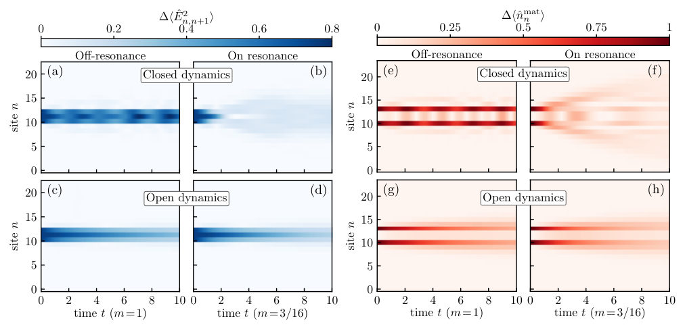 
FIG. 2. Chromoelectric string open and closed dynamics. (a-d) Link-resolved excess chromoelectric energy ∆⟨ˆE2 n,n+1(t)⟩ and (e-h) staggered matter density ∆⟨ˆnmat n (t)⟩in Eq. (12) during the real-time evolution of an initial quark–antiquark string placed at the center of the chain. The top row (a,b,e,f) shows closed-system unitary dynamics, while the bottom row (c,d,g,h) shows open-system Lindblad dynamics coupled to a thermal environment. (a,c,e,g) Off-resonant dynamics at m=1, where the isolated string does not coherently break. (b,d,f,h) Resonant dynamics, at m=3/16, where the isolated dynamics favors string breaking into two mesons. In the open case, the environment melts the string...

📷 Fig 3

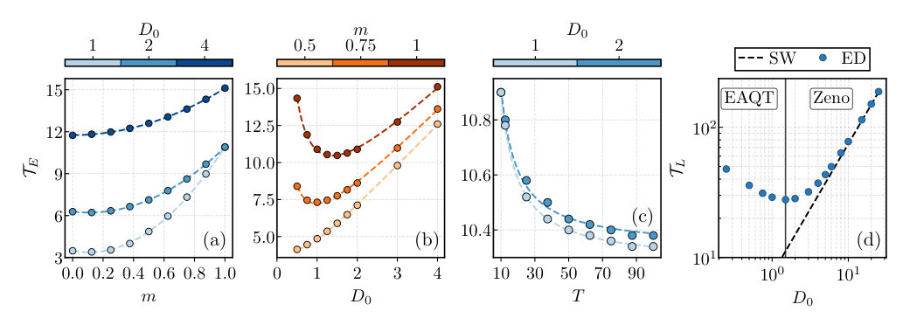 
FIG. 3. Thermalization times and Schrieffer–Wolff prediction. Empirical thermalization time TE extracted from TN simulations as a function of (a) the fermion mass m, (b) the environment self-correlation D0, and (c) the temperature T. Dashed lines fit the functional forms discussed in Sec. IV B. Color bars indicate the parameter varied across curves: D0 in panels (a,c) and m in panel (b). Panel (d) shows the Liouvillian thermalization time TL obtained by ED (i.e. by an Arnoldi iteration method) as a function of D0, compared with the Schrieffer–Wolff (SW) prediction of Eq. (26) appearing as a black dashed line. The solid vertical line marks the minimum of TL and the transition from an...

📷 Fig 4

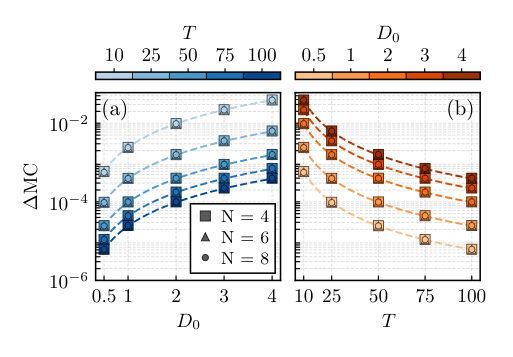 
FIG. 4. Environment imprint on matter composition. Matter-composition imbalance ∆MC, defined in Eq. (29), be- tween the Lindblad steady state and the subsystem Gibbs en- semble. (a) Scaling of ∆MC as a function of the environment self-correlation D0 for different bath temperatures T; (b) the same quantity as a function of T for different D0. Color bars encode the parameter varied across curves: T in panel (a) and D0 in panel (b). Marker shape and marker size distinguish ED calculations for system sizes N = 4, 6, 8, with smaller markers corresponding to larger N. Dashed curves correspond to the fitting function ∆MC=a(D0/T)2 with a≈0.243.

📷 Fig 5

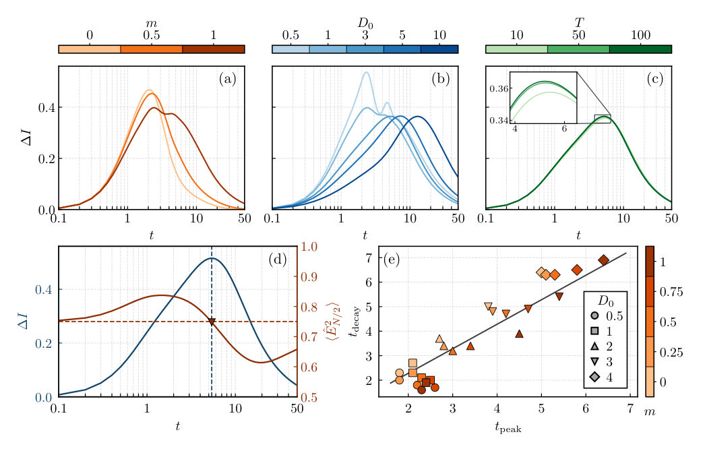 
FIG. 5. Mutual-information dynamics and correlation times. Subtracted mutual information ∆I(t), defined in Eq. (30), between the two halves of the string. Panels (a-c) show ∆I(t) for different values of (a) the mass coupling m, (b) the environment self-correlation D0, and (c) the temperature T, with the corresponding values encoded by the color bars. Panel (d) compares ∆I(t) with the quadratic Casimir of the central link, ⟨ˆE2 N/2−1,N/2⟩, for a representative simulation with (m, D0, T)=(1, 3, 10); the dashed vertical line marks the mutual-information peak time tpeak and the time tdecay at which the central-link Casimir falls below its initial string value, itself marked with a dashed...

**Summary.** This work develops a gauge-preserving framework to study thermalization and string dynamics in open non-Abelian lattice gauge theories. By coupling the SU(2) LGT to a thermal environment, the authors find that dissipation causes string melting and that the thermalization time depends non-monotonically on the coupling strength. These results establish a key theoretical understanding of non-Abelian plasma dynamics.

**Why it may be interesting.** It provides a concrete, non-Abelian example of open quantum system dynamics, bridging concepts from quantum information (open systems) with high-energy physics (QCD/LGTs).

Detailed structure

**Main problem.** The paper investigates how the non-Abelian gauge structure modifies dissipative, real-time dynamics in open lattice gauge theories.

**Main result.** The thermalization time exhibits non-monotonic behavior with environment coupling, and the non-Abelian structure yields a mesonic bias in the steady state, contrasting with Abelian models.

**Method.** The dynamics are solved using tensor networks applied to a Lindblad master equation derived in the Quantum Brownian Motion limit.

**Model / system.** The system is a 1+1D SU(2) Yang-Mills Lattice Gauge Theory coupled to dynamical matter and an external thermal scalar environment via a gauge-preserving Lindblad evolution.

**Key observables.** String melting, thermalization time, mesonic bias, and chromoelectric flux screening.

**Important parameters / regimes.** Environment coupling strength, temperature, and the specific non-Abelian gauge group SU(2).

**Assumptions / limitations.** The environment is treated via a Lindblad evolution, and the analysis assumes the QBM limit and a color-singlet coupling to maintain gauge invariance.

**Figures summary.** Figure 1 illustrates the open-system dynamics, showing the interaction between the SU(2) LGT subsystem and the thermal environment, and detailing the use of Tensor Network methods for simulation.

**Paper structure.** The paper introduces the model (subsystem, environment, interaction), derives the Lindblad master equation in the QBM limit, and then presents results concerning string melting, thermalization times, and matter composition.

Abstract

Open-system lattice gauge theory (LGT) has so far been developed predominantly in Abelian settings, leaving open how genuinely non-Abelian gauge structure reshapes dissipative real-time dynamics. Here, we study a $1+1$D SU(2) Yang--Mills LGT with dynamical matter coupled to a thermal scalar environment through a gauge-preserving Lindblad evolution, which we solve using tensor networks. Starting from a quark--antiquark pair connected by a chromoelectric flux string, we find that the thermal medium melts the string by delocalizing the color charges and screening the flux; on resonance, this dissipative melting competes with and delays coherent string breaking. The thermalization time is non-monotonic in the environment coupling, decreasing through environment-assisted transport at weak dissipation before increasing in a quantum-Zeno regime. In the strong-dephasing limit, a Schrieffer--Wolff expansion maps the dynamics to a classical exclusion process and yields the Liouvillian thermalization time analytically. Beyond these generic open-system effects, the non-Abelian matter structure produces a systematic mesonic bias in the steady state, while the thermalization time decreases with temperature, in contrast to the Abelian Schwinger model trend and in qualitative agreement with pNRQCD studies of the quark--gluon plasma. These results establish a gauge-preserving framework for thermalization and string dynamics in open non-Abelian lattice gauge theories.

[↑ back to top](#top)

### [Discrete time crystals in disordered anisotropic Heisenberg chains](http://arxiv.org/abs/2609.04037v1)

**Authors:** Francesco Formicola, Grazia Di Bello, Antonio De Candia, Giulio De Filippis, Carmine Antonio Perroni  
**Type:** theory · **Category:** disordered systems and neural networks · **PDF:** <https://arxiv.org/pdf/2609.04037v1>  
**Analysis basis:** full PDF text, analyzed in chunks
**Topic relevance:** 🔥 `driven-dissipative phase transition` **4/5** · 🔥 `methods for driven-dissipative` **4/5** · `analog quantum simulation` **3/5** · `non-equilibrium universality` **3/5** · `scars & prethermalization` **3/5**

📷 Fig 1

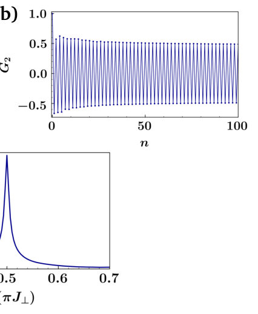 
Figure 1: Two-time imbalance correlation function G2(0, t) as a function of time (a), two-time imbalance correlation function G2(0, nT) as a function of the number n of Floquet cycles (b) and the spectral analysis of the continuous time signal G2(0, t) (c). Results are obtained by averaging over R = 5·103 independent disorder realizations, interaction strength Jz/J⊥= 1, disorder strength W/J⊥= 10, rotation-angle error ε = 0 with chain length N = 12 and period T = 2/J⊥.

📷 Fig 2

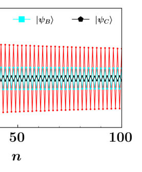 
Figure 2: Two-time imbalance correlation function G2(0, nT) as a function of the number n of Floquet cycles for three different initial states: the Néel state |ψ〉N (red circles), the entangled state |ψ〉B (cyan squares) defined in Eq. (9), and the product state |ψ〉C defined in Eq. (8) (black pentagons). Results are obtained by averaging over R = 5 · 103 independent disorder realizations, interaction strength Jz/J⊥= 1, disorder strength W/J⊥= 10, rotation-angle error ε = 0, with chain length N = 8 and period T = 2/J⊥.

📷 Fig 3

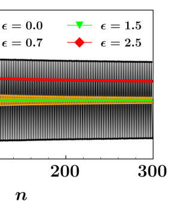 
Figure 3: Two-time imbalance correlation function G2(0, nT) as a function of the number n of Floquet cycles for different values of the rotation-angle error: ε = 0.0 (black circles), ε = 0.7 (orange upward triangles), ε = 1.5 (cyan downward trian- gles) and ε = 2.5 (lime diamonds). Results are obtained by averaging over R = 5·103

📷 Fig 4

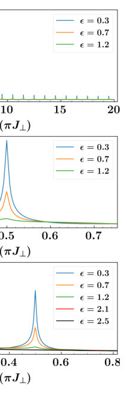 
Figure 4: (a) Frequency spectrum of the continuous signal G2(0, t) as a function of dimensionless frequencies for different values of the rotation-angle errors: ε = 0.3 (blue), ε = 0.7 (orange), ε = 1.2 (green). (b) Magnification of the spectrum around the fundamental subharmonic peak at ωDTC = π/T. (c) Magnification of the low- frequency region around ω = 0, presenting also the cases ε = {1.7, 2.1, 2.5}. Results are obtained by averaging over R = 5·103 independent disorder realizations, disorder strength W/J⊥= 10, with chain length N = 12 and period T = 2/J⊥.

📷 Fig 5

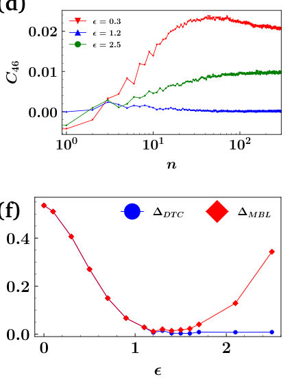 
Figure 5: (a) Entanglement entropy Sent(nT) as a function of time for rotation-angle errors ε ∈[0.0,2.5], for chain length N = 12. The dotted horizontal line is the maximum entropy value allowed by the chosen bipartition for the finite chain. (b) uniform-magnetization QFI per spin FQ(nT), (c) Connected nearest-neighbor correla- tion function C56(nT) and (d) connected next-nearest-neighbor correlation function C46(nT) for various rotation-angle errors ε in the three different regimes: ε = 0.3 (red downward triangles), ε = 1.2 (blue upward triangles), and ε = 2.5 (green circles), with chain length N = 11. (e) Operational lower bound Eex(nT) on the restricted-control ergotropy, obtained from...

**Summary.** This research explores discrete time-crystalline phases in disordered Heisenberg spin chains driven periodically. Using advanced MPS simulations, the authors confirm the DTC signature but show that increasing the driving error suppresses this phase. The study maps out an intermediate dynamical regime characterized by localization signatures, providing a detailed diagnostic toolkit for non-equilibrium quantum matter.

**Why it may be interesting.** This work directly addresses non-equilibrium quantum phases (time crystals) in the presence of disorder, bridging concepts from many-body localization, Floquet engineering, and quantum criticality, which are highly relevant to modern AMO and condensed matter research.

Detailed structure

**Main problem.** The paper investigates the existence and stability of discrete time-crystalline (DTC) behavior in strongly disordered anisotropic Heisenberg spin chains subjected to periodic driving.

**Main result.** DTC behavior is observed at zero driving error, characterized by period-doubled oscillations, but this response is suppressed by increasing the rotation error, leading to a regime reminiscent of Anderson localization.

**Method.** The study employs extensive numerical simulations using Matrix Product States (MPS) and Matrix Product Operators (MPO) to analyze time evolution.

**Model / system.** The system is a one-dimensional disordered spin-1/2 XXZ Heisenberg chain driven by global $\pi$-kicks. The Hamiltonian includes nearest-neighbor interactions and random on-site fields.

**Key observables.** Two-time imbalance correlation function ($G_2(0, t)$), Entanglement entropy, Quantum Fisher information, and Restricted-control ergotropy.

**Important parameters / regimes.** The rotation-angle error ($\epsilon$), disorder strength ($W$), and the ratio of interaction couplings ($J_z/J_{\perp}$).

**Assumptions / limitations.** The analysis assumes the system can be accurately described using MPS techniques and the two-site time-dependent variational principle (2TDVP).

**Figures summary.** Figures illustrate the time evolution of the imbalance correlation function $G_2(0, t)$ and its dependence on the driving cycle $n$, comparing DTC signatures against localization signatures across varying error parameters.

**Paper structure.** The paper builds from the theoretical framework of spontaneous symmetry breaking in Floquet systems to numerical simulations on the disordered spin chain, analyzing the robustness of the DTC phase against controlled errors and comparing diagnostics across different physical regimes.

Abstract

A discrete time crystal is an out-of-equilibrium phase of matter characterized by the spontaneous breaking of discrete time-translation symmetry. Using extensive numerical simulations based on matrix-product-state methods, we provide evidence for discrete time-crystalline behavior in strongly disordered spin chains with Heisenberg interactions, including the isotropic point, subject to periodic driving. Starting from a many-body localized regime, we observe that rotations induced by delta kicks produce a pronounced subharmonic response at half the drive frequency in spin observables. We investigate the stability of this response against rotation-angle errors through entanglement entropy, quantum Fisher information, short-range spin correlations, and restricted-control ergotropy. Increasing the rotation error reveals an intermediate dynamical regime separating the time-crystalline and Floquet-localized responses. In this regime, most observables exhibit signatures of weakly correlated dynamics reminiscent of Anderson localization.

[↑ back to top](#top)

### [Effective Hamiltonian description on monitored Majorana chains: correlated power-law hoppings and unconventional entanglement scaling](http://arxiv.org/abs/2609.04091v1)

**Authors:** Ken Mochizuki, Hisanori Oshima, Ryusuke Hamazaki, Yohei Fuji  
**Type:** theory · **Category:** disordered systems and neural networks · **PDF:** <https://arxiv.org/pdf/2609.04091v1>  
**Analysis basis:** full PDF text, analyzed in chunks
**Topic relevance:** 🔥 `quantum measurements` **4/5** · `correlated / nonlocal dissipation` **3/5** · `methods for driven-dissipative` **3/5** · `driven-dissipative phase transition` **2/5** · `non-equilibrium universality` **2/5** · `Keldysh / 2PI / non-Gaussian methods` **1/5** · `analog quantum simulation` **1/5**

📷 Fig 1

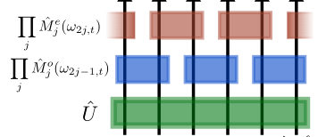 
FIG. 1. The schematic picture of the monitored Majorana circuit. The red and blue rectangles correspond to Majorana parity measurements on even and odd bonds, respectively. The green rectangle represents the unitary dynamics by ˆU.

📷 Fig 2

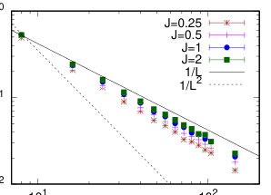 
FIG. 2. The spectral gaps of the effective Hamiltonians for the monitored Majorana circuits in various system sizes, with µo = µe = 0.5. Green squares, blue circles, purple crosses, and red asterisks correspond to J = 2, 1, 0.5, and 0.25, re- spectively. The black solid and dashed lines are proportional to 1/L and 1/L2, respectively.

📷 Fig 3

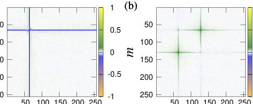 
FIG. 4. The Pearson correlation coefficients between the hop- ping magnitudes of effective Hamiltonians, CK kℓ,mn in Eq. (16), with L = 128. The bond specified by k and ℓis fixed as k = L/2, ℓ= L/2 + 1 in (a) and k = L/2, ℓ= L in (b).

📷 Fig 4

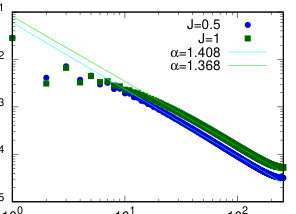 
FIG. 3. The average of the magnitudes of the effective Hamiltonians for various distances, Kmn in Eq. (14), with µe = µo = 0.5. Green rectangles and blue circles correspond to J = 1 and J = 0.5, respectively. Solid lines depict the algebraic decay eβ/dα mn. The parameters obtained from the least squares method are α = 1.368, β = 2.513 (green) and α = 1.408, β = 2.812 (blue). The system size is L = 256, and the fitting is carried out in the range 20 ≤dmn ≤190. The deviation from the algebraic decay for large dmn is attributed to finite-size effects.

📷 Fig 5

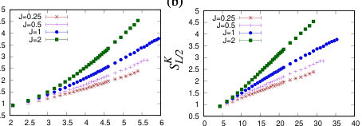 
FIG. 5. The half-chain entanglement entropy of ground states of ˆK(ωt) with µe = µo = 0.5 and b = 1. Green rectangles, blue circles, purple crosses, and red asterisks correspond to J = 2, 1, 0.5, and 0.25, respectively.

**Summary.** This work analyzes the effective Hamiltonian for a monitored Majorana chain, revealing that the dynamics lead to long-range hoppings with non-trivial correlations. The key finding is that these correlations are responsible for an enhanced, $[\ln(L)]^2$ scaling of the entanglement entropy, a signature rarely seen in conventional isolated quantum systems.

**Why it may be interesting.** It provides a concrete example of how non-trivial correlations in the effective Hamiltonian, arising from measurement processes, can fundamentally alter entanglement scaling beyond what is predicted by standard uncorrelated disorder models.

Detailed structure

**Main problem.** The paper investigates the effective Hamiltonians governing the monitored dynamics of a 1D Majorana chain, focusing on unconventional entanglement scaling in the gapless phase.

**Main result.** The entanglement entropy scales as $[\ln(L)]^2$ when non-trivial correlations are present in the long-range hopping hoppings, contrasting with the $\ln(L)$ scaling found when these correlations are absent.

**Method.** The analysis employs Lyapunov spectral analysis to derive the effective Hamiltonian from measurement-induced dynamics, followed by constructing correlated random power-law hopping models for comparison.

**Model / system.** The system is a one-dimensional Majorana chain undergoing alternating unitary evolution and parity measurements. The dynamics are captured by an effective Hamiltonian derived via Lyapunov spectral analysis.

**Key observables.** Spectral gap closing ($	ext{faster than } 1/L 	ext{ but slower than } 1/L^2$) and entanglement entropy scaling ($[\ln(L)]^2$ vs. $\ln(L)$).

**Important parameters / regimes.** System size $L$, measurement frequency $\omega_t$, and the strength of hopping correlations.

**Assumptions / limitations.** The analysis focuses on a gapless phase, and the effective Hamiltonian average is zero, preventing simple weak disorder treatment.

**Figures summary.** Figures illustrate the gap closing behavior, the algebraic decay of hopping magnitudes, and the Pearson correlation coefficients between different hopping terms.

**Paper structure.** The paper proceeds by deriving the effective Hamiltonian using Lyapunov analysis, characterizing its structure (random, long-range, correlated), and then comparing the entanglement scaling predicted by models with and without hopping correlations.

Abstract

We investigate the structures of effective Hamiltonians governing monitored dynamics of a one-dimensional Majorana chain through the Lyapunov spectral analysis. We focus on a gapless phase characterized by finite-size scalings different from those in conventional critical and/or frustration-free systems; the spectral gap closing faster than $1/L$ but slower than $1/L^2$ and the entanglement entropy growing as $[\ln(L)]^2$ with $L$ being the system size. We find that the corresponding effective Hamiltonians have random long-range power-law hoppings with nontrivial magnitude correlations, rather than being independently and identically distributed. To elucidate the role of these non-Gaussian correlations, we construct random power-law hopping models that capture the essential features of the effective Hamiltonians. The spectral gaps of the constructed models decay faster than $1/L$ but slower than $1/L^2$. We find that, in the absence of hopping correlations, the ground-state entanglement exhibits $\ln(L)$ scaling. In the presence of correlations, by contrast, the entanglement entropy is enhanced and its system-size dependence is consistent with $[\ln(L)]^2$ scaling over the system sizes studied. These results suggest that correlations among long-range hopping magnitudes are responsible for the entanglement scaling that seldom appears in ground states of conventional isolated quantum systems.

[↑ back to top](#top)

### [Optimal Control of Periodic Nonequilibrium Mechanochemical Systems via Automatic Differentiation](http://arxiv.org/abs/2609.03217v1)

**Authors:** W. Callum Wareham, David A. Sivak  
**Type:** theory · **Category:** statistical mechanics · **PDF:** <https://arxiv.org/pdf/2609.03217v1>  
**Analysis basis:** full PDF text, analyzed in chunks
**Topic relevance:** 🔥 `methods for driven-dissipative` **4/5** · `driven-dissipative phase transition` **3/5** · `non-equilibrium universality` **3/5** · `Keldysh / 2PI / non-Gaussian methods` **2/5** · `quantum measurements` **2/5** · `Frenkel-Kontorova` **1/5** · `correlated / nonlocal dissipation` **1/5**

📷 Fig 1

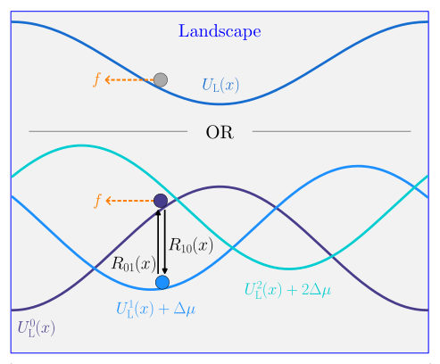 
FIG. 1. Schematic of the simple models for a molecular ma- chine considered in this paper. We model the mechanical state of the molecular machine as a Brownian particle with angle x, which experiences a landscape potential UL(x) (e.g., the blue curves) and a control potential UC[x, λ(t)] (red curve), the latter of which depends on time through the control pa- rameter λ(t) that evolves according to some control protocol Λ. The bead may experience a single constant landscape po- tential, or the potential may switch between a few landscapes according to chemical dynamics whose rates depend on the bead angle. Irrespective of the number of chemical states, we also allow for a constant...

📷 Fig 2

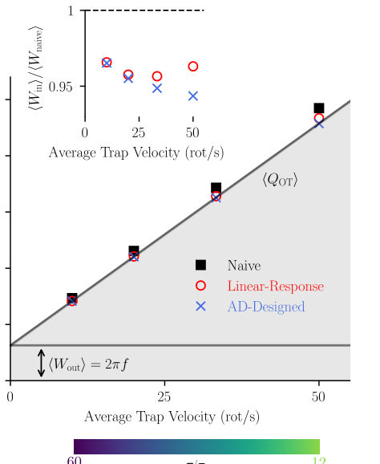 
FIG. 2. Average input work ⟨Win⟩required to drive one ro- tation for the single landscape [Sec. IV A] under the naive protocol (black squares), linear-response protocol (red cir- cles), and automatic-differentiation-designed protocols (blue crosses). The AD-designed protocols approach the optimal- transport limit ⟨Wout⟩+ ⟨QOT⟩(black diagonal line) for all driving speeds we consider here. Horizontal color bar below x-axis indicates corresponding protocol duration τ/τr. In- set: Linear-response and AD-designed protocol works, nor- malized at each driving speed to the naive work. At slow driving speeds, linear response is nearly as efficient as the AD- designed protocol. However, for faster...

📷 Fig 3

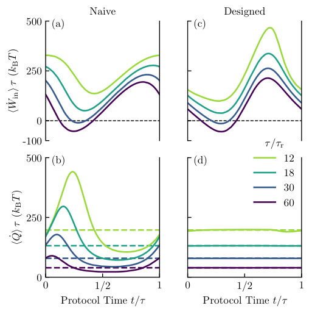 
FIG. 4. Thermodynamic flows for a single landscape as a function of protocol time. (a) Work and (b) total heat rates for the naive protocol. (c) Work and (d) total heat rates for the designed protocols. The designed protocols seek to set the total heat rate equal to the rate ⟨˙QOT⟩predicted under optimal transport [Eq. (40)], shown by the dashed lines in (d). All rates are multiplied by the protocol duration τ so that the integral of each curve (over the dimensionless protocol time on the x-axis) yields the cumulative work or heat over the protocol.

📷 Fig 4

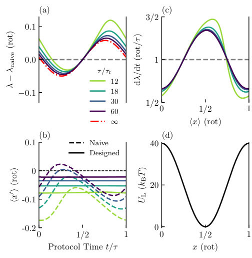 
FIG. 3. Designed protocols for the single landscape at vari- ous protocol durations τ, presented in units of the control- potential relaxation time τr. All protocols pass through λ = 1/2 rot at t/τ = 1/2. (a) Deviation of the designed protocols (solid curves) from the naive, constant-velocity pro- tocol Λnaive (horizontal dashed gray line). The slowest proto- cols approach the linear-response prediction (red dash-dotted curve), while faster protocols are increasingly skewed (time- reversal asymmetric). (b) Mean bead angle in the comoving reference frame ⟨x′⟩(i.e., with the naive trap angle defining x′ = 0), for naive (dashed curves) and designed (solid curves) protocols. The designed...

📷 Fig 5

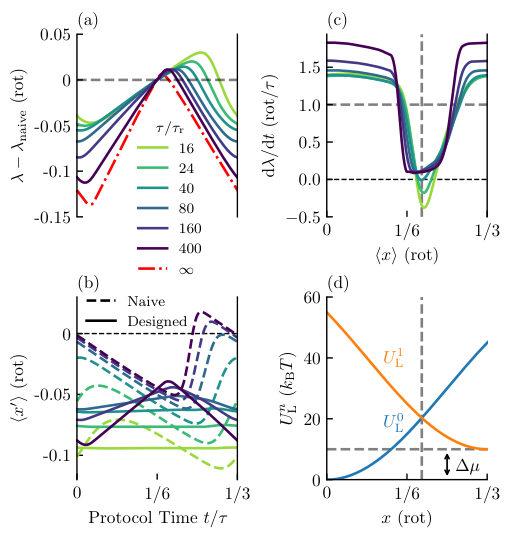 
FIG. 6. Designed protocols for switching landscapes [Sec. IV B] at various protocol durations τ, with time in units of the control-potential relaxation time τr. All protocols pass through λ = 1/6 rot at t/τ = 1/6. (a) Deviation of the designed protocol (solid curves) from the naive, constant- velocity protocol Λnaive (dashed gray line). (b) Mean bead an- gle ⟨x′⟩in the comoving frame of reference (i.e., with the naive trap angle defining x′ = 0), for naive (dashed curves) and de- signed (solid curves) protocols with different durations. The designed protocols rotate the bead mean at a near-constant rate, though there is more variation here than for the sin- gle landscape [Fig. 3(b)]. (c)...

**Summary.** This work extends optimal control theory to periodic, non-equilibrium mesoscopic systems, modeling molecular motors using Fokker-Planck dynamics. By employing automatic differentiation, the authors derive design principles showing that efficient operation requires minimizing mechanical heat by maintaining constant distribution rotation. This provides a quantitative tool for understanding energy efficiency in complex biological machines.

**Why it may be interesting.** The rigorous application of optimal control theory and automatic differentiation to periodically driven, non-equilibrium stochastic systems provides a powerful computational framework applicable to open quantum systems where dissipation and driving are key.

Detailed structure

**Main problem.** Designing efficient, periodic, nonequilibrium control strategies for mesoscopic molecular machines that operate under strong fluctuations.

**Main result.** Optimal protocols minimize mechanical waste heat by ensuring the probability distribution rotates at a constant speed without changing its shape, and can reduce chemical heat loss.

**Method.** The study employs automatic differentiation applied to Fokker-Planck simulations to calculate gradients for optimizing control potentials $\lambda(t)$ over periodic time cycles.

**Model / system.** The model is a rotary molecular motor treated as a Brownian particle diffusing on a periodic angular coordinate, governed by a Langevin equation and analyzed via the Fokker-Planck equation.

**Key observables.** Total heat ($\langle Q 
angle = \langle Q_{	ext{mech}} 
angle + \langle Q_{	ext{chem}} 
angle$), output work ($\langle W_{	ext{out}} 
angle$), and the probability distribution $p_t(x)$.

**Important parameters / regimes.** The control protocol $\lambda(t)$ is assumed to be time-periodic, and the analysis focuses on the Periodic Steady State (PSS) in the long-time limit.

**Assumptions / limitations.** The analysis assumes the control protocol is periodic and that the system can be effectively analyzed in the PSS regime.

**Figures summary.** Figure 1 schematically illustrates energy flows and potential structures; Figure 10 compares wasted energy across different control protocols (Fokker-Planck vs. Langevin); Figure 11 compares optimization strategies based on minimizing input work versus mechanical heat.

**Paper structure.** The paper establishes the model using Langevin/Fokker-Planck equations, develops the mathematical framework using coordinate transformations and the Floquet ansatz for periodic solutions, and then applies optimal control theory to derive and test design principles for minimizing heat dissipation.

Abstract

Biological molecular machines are mesoscopic systems that act repeatedly and periodically to perform important cellular tasks while contending with strong fluctuations and operating in an overdamped regime. Optimal control theory is a tool that can be used to understand the design principles behind efficient operation of these machines; however, most studies on optimal control of classical mesoscopic systems have focused on control problems that do not repeat periodically. Here, we automatically differentiate Fokker-Planck simulations to design efficient nonequilibrium control strategies for simple models of periodic molecular machines with and without explicit changes in the machine's chemical state. The designed protocols and theoretical analysis provide insight into the design principles governing efficient driving in these nonequilibrium systems. Designed control protocols should seek to reduce mechanical heat by rotating the entire angular probability distribution at a constant speed without changing its shape, and should reduce chemical heat by reducing the proportion of chemical transitions with large heat.

[↑ back to top](#top)

### [Equivalence classes of finite-time transitions in optimal control and non-equilibrium relaxation](http://arxiv.org/abs/2609.03862v1)

**Authors:** Jan Meibohm, Samuel Monter, Clemens Bechinger, Sarah A. M. Loos  
**Type:** both · **Category:** statistical mechanics · **PDF:** <https://arxiv.org/pdf/2609.03862v1>  
**Analysis basis:** full PDF text, analyzed in chunks
**Topic relevance:** 🔥 `non-equilibrium universality` **4/5** · `driven-dissipative phase transition` **3/5** · `quantum measurements` **2/5** · `Keldysh / 2PI / non-Gaussian methods` **1/5** · `analog quantum simulation` **1/5** · `correlated / nonlocal dissipation` **1/5** · `methods for driven-dissipative` **1/5**

📷 Fig 1

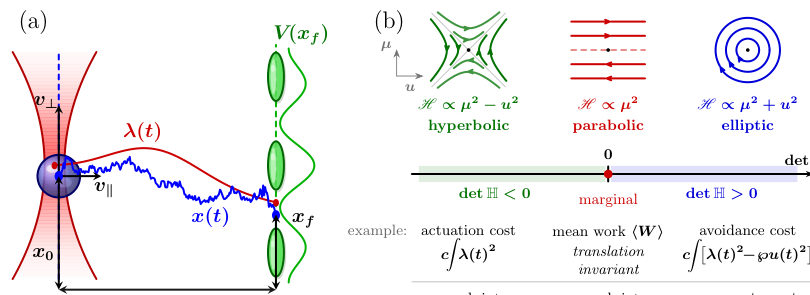 
FIG. 1. (a) Control of a Brownian particle (blue), initially at x0 and moving with constant mean velocity v∥towards an obstacle (green) at distance L = v∥t f . An optical trap (red) with center λ(t) guides the particle’s vertical position x(t) (blue) via v⊥over the duration t f . At the end, the particle must cross the obstacle described by the penalty V(xf ), at the final position xf = x(tf ). (b) The three equivalence classes, distinguished by the sign of detH, i.e., the determinant of the control Hamiltonian (28) [see Sec. III B]. Top: Hamiltonian flow in the (u,µ) plane, with the normal form (55) of the control Hamiltonian H . Bottom: Representative cost functionals for each class, and...

📷 Fig 2

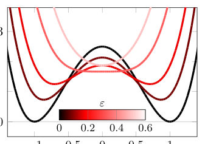 
FIG. 2. Effective obstacle in the presence of noise: Noise-averaged penalty ˜VDW(u) for increasing noise level ε [Eq. (16), color bar]. Thermal averaging progressively smears the double well [Eq. (14)] into a single well.

📷 Fig 3

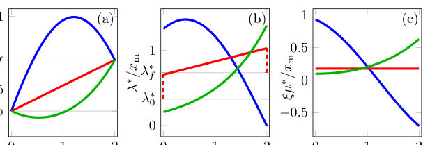 
FIG. 3. Examples of optimal trajectories (u∗,λ ∗,µ∗) for the different equivalence classes, η = sign(ζ) = −1 (hyperbolic class, green), η = 0 (parabolic, red), and η = 1 (elliptic, blue), for identical fixed endpoints u0 = 0.35xm and u f = 0.7xm, as a function of time t for tf = 2τc. (a) Optimal mean particle trajectories u∗(t). (b) Optimal protocols λ ∗(t). The parabolic, mean-work case has jumps at the start and endpoints (dashed lines) for ∆f,0 = 0 in Eq. (26), while the other cases were chosen continuous at the endpoints. (c) Optimal conjugate momenta µ∗(t).

📷 Fig 4

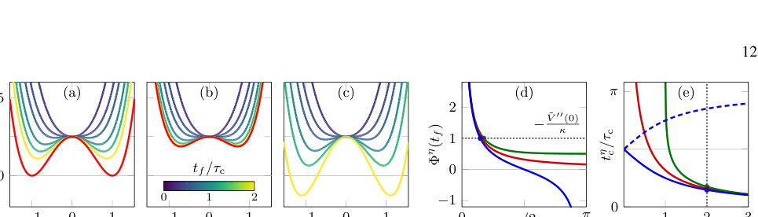 
FIG. 4. Finite-time control transition in the three equivalence classes for ˜V = VDW, ˜V ′′(0) = −κ, and τc = 2τ0. (a)–(c) Cost function at vanishing initial position for the parabolic (a), hyperbolic (b), and elliptic (c) class. The protocol duration tf increases from dark to light [color bar in (b)]. The red lines in (a) and (b) show the cost approached as t f →∞. The elliptic class in (c) possesses no such limit. (d) Cost curvature Φη(t f ) of Eqs. (81) for the hyperbolic (green), parabolic (red), and elliptic (blue) class. The transition occurs where Φη crosses −˜V ′′(0)/κ (dotted line), marked by dots. (e) Critical times (85) as a function of the obstacle strength −˜V ′′(0)τc/(κτ0)....

📷 Fig 5

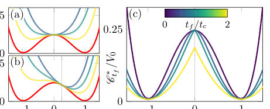 
FIG. 5. Cost landscape of the finite-time control transition in the parabolic class. (a) C 0t f (uf ,0) as function of uf for increasing proto- col duration t f [color bar in (c)] and the bare obstacle VDW (red). (b) Same as (a) but for a non-zero initial position u0 = 0.25xm, breaking the u f →−u f symmetry. (c) Minimized cost C 0,∗ tf (u0) as a function of u0, developing a kink at u0 = 0 for t f &gt; t0c .

**Summary.** This work provides a unified theoretical framework for analyzing optimal control of stochastic systems, classifying the resulting problems into three mathematical types. It establishes a deep connection between the minimum cost required for optimal control and the rate function governing non-equilibrium relaxation after a quench. The theory is validated through experiments on colloidal particles, demonstrating access to rare-event physics via controlled trajectories.

**Why it may be interesting.** The connection drawn between finite-time dynamical phase transitions (a non-equilibrium concept) and the cost of optimal control provides a powerful, measurable tool to probe rare-event physics in open quantum or mesoscopic systems.

Detailed structure

**Main problem.** The paper develops a theory for optimally controlling stochastic systems in structured environments, focusing on identifying and characterizing sharp finite-time transitions.

**Main result.** The control problems are classified into three canonical equivalence classes (parabolic, hyperbolic, elliptic), and the optimal control cost is shown to map to the large-deviation rate function governing non-equilibrium relaxation for two of these classes.

**Method.** The authors use optimal control theory (Pontryagin's principle) applied to an overdamped Langevin equation, linearizing the dynamics around a fixed point to classify the resulting mathematical structure.

**Model / system.** The system is modeled by an overdamped Langevin equation, analyzed in the context of optimal control cost minimization and non-equilibrium relaxation following a potential quench. Experiments are validated using optically trapped colloidal particles.

**Key observables.** Optimal protocols, cost functions, critical times ($t_c$), and the large-deviation rate function.

**Important parameters / regimes.** Friction coefficient ($\gamma$), trap stiffness ($\kappa$), and the dimensionless noise parameter ($\epsilon$).

**Assumptions / limitations.** The analysis relies on linearizing the dynamics around a zero-control fixed point, and the mapping between control cost and rate function fails for the elliptic class.

**Figures summary.** Figures illustrate the control transition for mean stochastic work (parabolic class) and the finite-time dynamical phase transitions in free diffusion and harmonic relaxation.

**Paper structure.** The paper first establishes the general theory by classifying control problems into three classes based on the control Hamiltonian determinant. It then derives explicit solutions for the optimal protocol and cost for each class, establishing the mapping to non-equilibrium relaxation theory, and finally validates these findings with three distinct experiments on colloidal particles.

Abstract

We present a theory for the optimal control of stochastic systems in structured environments, represented by penalty terms in the cost functional. We show that such control problems generically feature sharp finite-time transitions associated with a qualitative change in the control strategy at a critical time. Starting from an overdamped Langevin equation and a quadratic cost functional, we show that all resulting problems fall into three canonical equivalence classes (parabolic, hyperbolic, and elliptic), distinguished by the sign of the determinant of the control Hamiltonian. For each class, we obtain the optimal protocol, the cost function, and the critical time in closed form, and show that the transition exhibits features of a continuous phase transition at mean-field level. We then establish a mapping between the optimal control cost and the large-deviation rate function governing non-equilibrium relaxation after a potential quench. The mapping covers the parabolic and hyperbolic classes, while the elliptic class has no simple relaxation counterpart. This correspondence implies that recently discovered finite-time dynamical phase transitions, which are exponentially costly to sample directly, are accessible through ordinary averages over optimally controlled trajectories. To validate our theoretical findings, we report three experiments with optically trapped colloidal particles: a control transition for the mean stochastic work, and the finite-time dynamical phase transitions in free diffusion and in harmonic relaxation.

[↑ back to top](#top)

### [Finite-temperature mass gap and quench dynamics of mobile impurities in a Fermi gas](http://arxiv.org/abs/2609.03656v1)

**Authors:** Baihua Gong  
**Type:** theory · **Category:** quantum gases · **PDF:** <https://arxiv.org/pdf/2609.03656v1>  
**Analysis basis:** full PDF text, analyzed in chunks
**Topic relevance:** 🔥 `Keldysh / 2PI / non-Gaussian methods` **4/5** · `non-equilibrium universality` **3/5** · `analog quantum simulation` **2/5** · `methods for driven-dissipative` **2/5** · `quantum measurements` **1/5** · `scars & prethermalization` **1/5**

📷 Fig 1

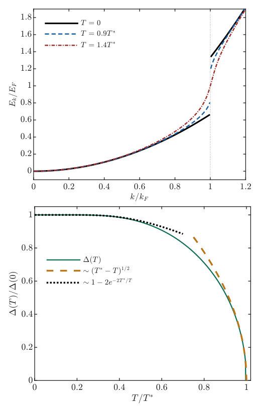 
FIG. 1. (a) Mass-gap dispersion relation Ek/EF as a func- tion of k/kF for M/m = 3. At T = 0 (solid) the disper- sion exhibits a hard gap ∆(0) = k2 F /M at the Fermi mo- mentum; as the temperature increases toward T ∗(dashed) the gap shrinks, and for T &gt; T ∗(dash-dotted) the disper- sion is smooth and the gap has closed. (b) Effective mass gap ∆(T)/∆(0) as a function of T/T ∗, obtained from Eq. (7). The gap equals ∆(0) = k2 F /M at T = 0 and closes at the charac- teristic temperature T ∗= UF /2; the dotted line indicates the low-temperature behavior ∆∼1 −2e−2T ∗/T of Eq. (9); the dashed line indicates the critical behavior ∆∼(T ∗−T)1/2 of Eq. (10).

📷 Fig 2

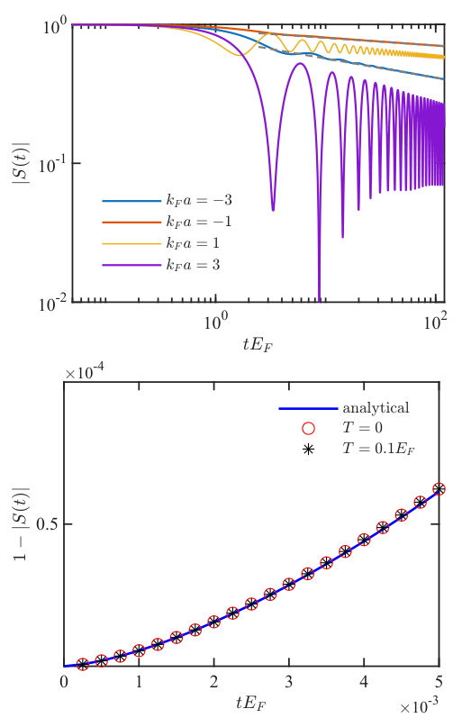 
FIG. 2. Method validation. (a) Infinite-mass benchmark: Ramsey response |S(t)| in the limit M →∞; the overlap de- cays as a power law |S(t)| ∼t−(δF /π)2 and exhibits no finite quasiparticle weight. (b) Short-time behavior of 1 −|S(t)| for kF a = 3 at T = 0 and T = 0.1EF , compared with the uni- versal analytic result 1 −|S(t)| of Ref. [16] (solid line); the collapse of the numerical curves onto the analytic result at both temperatures validates the functional-determinant im- plementation and confirms the temperature independence of the short-time behavior.

📷 Fig 3

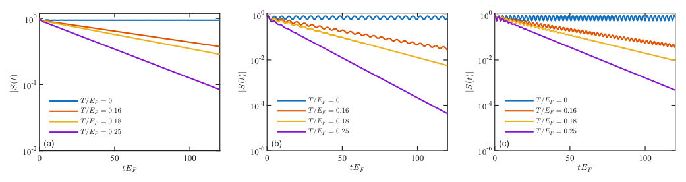 
FIG. 3. Ramsey response |S(t)| for finite mass (M/m = 3) at the three representative interaction strengths (a) kF a = −1 (no bound state),(b) kF a = 20 (polaron) and (c) kF a = 1 (molecule). In each panel the four curves correspond to T/EF = 0, 0.16, 0.18, and 0.25, straddling the characteristic temperature T ∗= EF /6. At T = 0 the overlap saturates at long times to the quasiparticle weight Z, monotonically for kF a = −1 and with oscillations for kF a = 1 and kF a = 20; at finite temperature |S(t)| decays to zero. The long-time oscillations persist for T &lt; T ∗(T/EF = 0.16) but disappear for T &gt; T ∗(T/EF = 0.18, 0.25), where |S(t)| decays monotonically; the disappearance of the oscillations...

**Summary.** This theoretical work extends the description of impurities in a Fermi gas to finite temperatures by deriving a self-consistent equation for the effective mass gap $\Delta(T)$. The key finding is that the gap closes at a characteristic temperature $T^*$, signaling the thermal melting of quasiparticles. This thermodynamic crossover is mirrored dynamically by the disappearance of long-time quantum oscillations in the system's Ramsey response above $T^*$.

**Why it may be interesting.** The work provides a unified, mean-field framework to connect the thermodynamic signature (gap closing) with the dynamic signature (loss of quantum beats) of quasiparticle thermal melting in a Fermi gas, which is highly relevant for understanding strongly interacting quantum gases.

Detailed structure

**Main problem.** The paper generalizes the mass-gap description of mobile impurities in a Fermi gas from zero temperature to finite temperature, and studies the resulting quench dynamics.

**Main result.** The effective mass gap closes at a characteristic temperature $T^*$, which is identified as the mean-field signature of the thermal melting of polaron and molecule quasiparticles. Furthermore, long-time quantum beats in the Ramsey response disappear precisely above $T^*$.

**Method.** The study combines the Lee–Low–Pines transformation with a self-consistent Hartree–Fock decoupling to derive the finite-temperature gap equation, and uses the functional-determinant approach to compute quench dynamics.

**Model / system.** The system consists of a single impurity of mass $M$ interacting via a contact interaction with a noninteracting Fermi sea of host fermions. The model is analyzed using a mean-field Hamiltonian derived from the full interaction.

**Key observables.** Effective mass gap $\Delta(T)$, Ramsey response $S(t)$, and the quasiparticle weight $Z$.

**Important parameters / regimes.** Characteristic temperature $T^* = U_F / (2k_B)$, Fermi momentum $k_F$, and the impurity mass $M$.

**Assumptions / limitations.** The analysis relies on the Hartree–Fock decoupling, which is treated as a Gaussian (quasifree) approximation for the interacting system.

**Figures summary.** Figures illustrate the mass-gap dispersion at different temperatures, showing the gap closing at $T^*$, and plot the Ramsey response $|S(t)|$ which exhibits oscillations for $T < T^*$ and decays monotonically for $T > T^*$.

**Paper structure.** The paper first establishes the finite-temperature self-consistency equation for the mass gap $\Delta(T)$ and its relation to $T^*$. It then applies the functional-determinant approach to calculate the time evolution of the system overlap, $S(t)$, demonstrating the temperature dependence of the quantum beats.

Abstract

Recently, a mass-gap description of mobile impurities in a Fermi gas was introduced, which connects Anderson's orthogonality catastrophe for static impurities to the quasiparticle picture of Fermi polarons through a recoil-induced energy gap in the fermionic dispersion. That description, however, was restricted to zero temperature and did not address dynamics. Here we generalize the mass-gap model to finite temperature by combining the Lee--Low--Pines transformation with a self-consistent Hartree--Fock decoupling of the recoil-induced interaction, and we study the quench dynamics within this framework using the functional-determinant approach. At finite temperature the effective mass gap obeys the self-consistency equation $Δ(T)=2U_F\tanh[Δ(T)/4k_B T]$, with $U_F=k_F^2/2M$ and $M$ the impurity mass. This equation admits a nonzero solution below the characteristic temperature $T^*=U_F/(2k_B)$ and closes as $(T^*-T)^{1/2}$. We identify this closing as the mean-field signature of the thermal melting of the polaron and molecule quasiparticles. Computing the Ramsey response $S(t)$ after a sudden quench of the impurity--fermion interaction, we find that its long-time oscillations---quantum beats between the bound and in-gap states---disappear precisely above $T^*$. Our work ties the thermodynamic and dynamical fingerprints of polaron formation to a single temperature-dependent mean-field parameter.

[↑ back to top](#top)

### [Spin-to-polarization mapping with a coherent quantum dot-cavity receiver](http://arxiv.org/abs/2609.03910v1)

**Authors:** Adrià Medeiros, Vincent Vinel, Eliott Rambeau, Petr Steindl, Elham Mehdi, Manuel Gundín, Clément Millet, Petr Stepanov, Niccolo Somaschi, Aristide Lemaître, Isabelle Sagnes, Olivier Krebs, Pascale Senellart, Dario A. Fioretto, Loïc Lanco  
**Type:** experiment · **Category:** quantum information and computing · **PDF:** <https://arxiv.org/pdf/2609.03910v1>  
**Analysis basis:** full PDF text, analyzed in chunks
**Topic relevance:** 🔥 `QC/QI experiment` **4/5** · `quantum optics experiment` **3/5** · `Tavis-Cummings & cavity-many-emitter` **2/5** · `quantum measurements` **2/5** · `analog quantum simulation` **1/5** · `interference shaping light` **1/5**

📷 Fig 1

 
FIG. 1. (a) Energy levels and optical selection rules of a neg- atively charged QD. The device is optically addressed with an input laser beam of frequency ω, detuned by ∆ω from the QD resonant frequency ωQD. (b) An H-polarized input state is sent to the device. Upon reflection, its polarization is ro- tated in a spin-dependent way, leading to pure spin-dependent polarization states |Ψ↑⟩or |Ψ↓⟩if decoherence is neglected. Inset: Spectral configuration of the QD-cavity system. (c) Theoretically predicted scalar product | ⟨Ψ↑|Ψ↓⟩|2 for the de- vice under study, in the absence of decoherence, as a function of ∆ω. The dashed purple line indicates an optimal detun- ing ∆ωopt where ⟨Ψ↑|Ψ↓⟩= 0....

📷 Fig 2

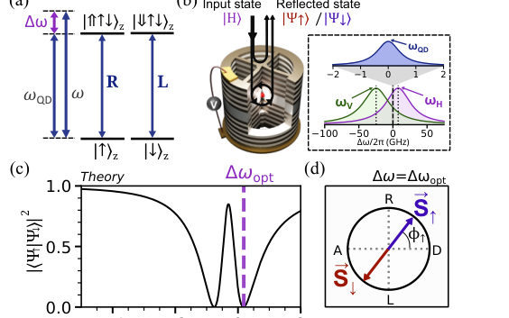 
Fig. 1c shows the analytically predicted scalar product |⟨Ψ↑|Ψ↓⟩|2 as a function of the detuning ∆ω for the pa- rameters characterizing this device (see Methods). For large detunings, the light is reflected in the H polariza- tion, since no light is scattered by the QD spin, hence |rH→H| ∼1 and |rH→V | ∼0, leading to | ⟨Ψ↑|Ψ↓⟩|2 ∼1. As the laser is tuned in resonance with the QD, the po- larization is rotated in a spin-dependent way, with V - polarized light now being scattered, leading to an increase of |rH→V |2. In particular, there are two detunings for which |rH→H| = |rH→V | (⟨Ψ↑|Ψ↓⟩= 0, i.e. sHV = 0). This is the condition for an optimal interface, with or- thogonal spin-dependent...

📷 Fig 3

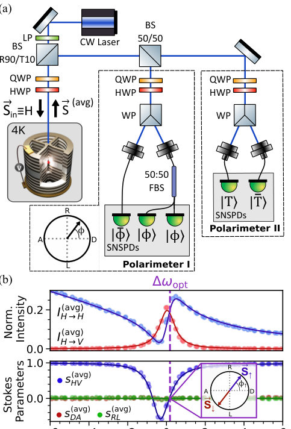 
FIG. 2. (a) Optical setup used to project the spin state. Two polarization analyzers measure the reflected light, in state ⃗S(avg). Polarimeter I measures light in polarization state |ϕ⟩or |¯ϕ⟩, with ⟨ϕ|¯ϕ⟩= 0, where ϕ = 0 corresponds to the D state. A fiber BS splits the light in order to mea- sure the same polarization state |ϕ⟩in two different detectors. Polarimeter II performs the polarization tomography of the reflected light, using three mutually-orthogonal polarization bases T ¯T = HV, DA, RL. BS: Beamsplitter, FBS: Fiber beamsplitter, QWP: Quarter Wave Plate, HWP: Half Wave Plate, LP: Linear Polarizer, WP: Wollaston Prism, SNSPD: Super-conducting Nanowire Single Photon Detectors....

📷 Fig 4

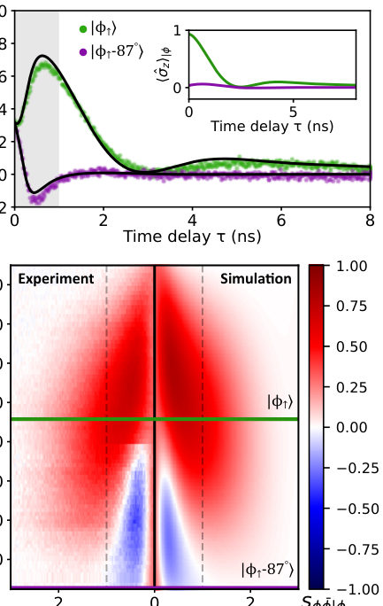 
FIG. 3. (a) Conditional Stokes parameter sϕ ¯ϕ|ϕ(τ) as a func- tion of the delay τ after a photon detection in the measure- ment bases |ϕ↑⟩(green) and |ϕ↑−87°⟩(purple). Experimen- tal data (scatter plot) are compared to numerical simulations of the QD-cavity system. The inset corresponds to the sim- ulated conditional spin component ⟨ˆσz⟩|ϕ (τ) as a function of the delay for each basis. (b) Time-dependent conditional Stokes parameter sϕ ¯ϕ|ϕ(τ) (colorbar) as a function of the mea- surement polarization angle ϕ (vertical axis) and the time de- lay (horizontal axis). Experimental data (Left) are compared with simulations (Right). The horizontal lines correspond to the |ϕ↑⟩(green) and...

📷 Fig 5

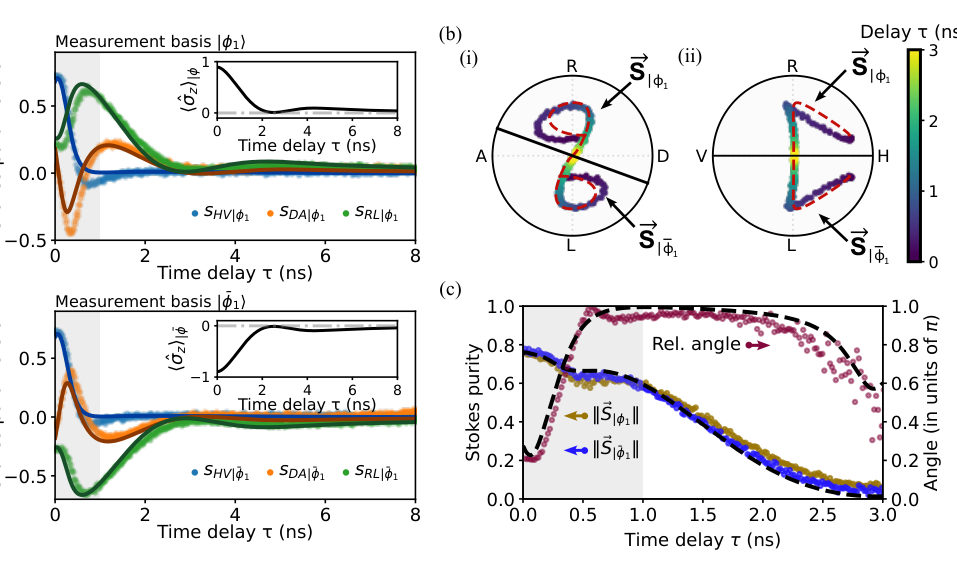 
FIG. 4. (a) Time-dependent conditional Stokes parameters sHV|ϕ1 (blue), sDA|ϕ1 (orange) and sRL|ϕ1 (green) measured after a first detected photon in the measurement bases |ϕ1⟩(Top) and | ¯ϕ1⟩(Bottom), with ϕ1 = ϕ↑−16°. The experimental data (scatter plot) are compared to numerical simulations (solid lines). The inset of each panel shows the predicted evolution of the conditional spin polarization ⟨ˆσz⟩|ϕ. (b) Poincar´e sphere representation of the conditional Stokes vectors ⃗S|ϕ1 and ⃗S| ¯ ϕ1 for the cross-sections (i) DARL and (ii) HVRL as a function of time. Experimental data (scatter plots) are compared to numerical simulations (dashed red lines). (c) Left axis: Polarization state...

**Summary.** This experimental work demonstrates a method to deterministically map the spin state of an electron in a quantum dot onto the polarization state of a reflected photon. By leveraging spin-induced Kerr rotation in a QD-cavity system, the authors achieve high-fidelity spin projection and show that the spin relaxation dynamics can be read out via subsequent photon polarization measurements. This paves the way for building quantum logic gates using solid-state emitters.

**Why it may be interesting.** This work directly addresses the realization of quantum logic gates by establishing a robust physical mechanism (spin-photon coupling) for deterministic quantum state transfer, which is central to quantum information processing.

Detailed structure

**Main problem.** The paper aims to experimentally demonstrate a deterministic, one-to-one mapping (bijection) between the spin state of an embedded electron and the polarization state of a scattered photon.

**Main result.** The authors successfully demonstrated this spin-to-polarization mapping using a charged quantum dot-cavity device, showing that two orthogonal polarization states can be generated, each corresponding to a specific spin eigenstate.

**Method.** Time-resolved polarization measurements are used to project the electron spin onto its eigenstates and subsequently track spin relaxation dynamics via the detection of a second reflected photon.

**Model / system.** The physical system is a negatively-charged InGaAs Quantum Dot embedded in an AlGaAs micropillar cavity. The mechanism relies on the spin-induced Kerr rotation within this QD-cavity structure.

**Key observables.** Spin projection fidelity ($95\pm2\%$), the relative angle ($\alpha$) between Stokes vectors ($\vec{S}|\phi_1 \approx -\vec{S}|ar{\phi}_1$), and the conditional Stokes parameter $s_{\phiar{\phi}}^{|\phi
angle}(	au)$.

**Important parameters / regimes.** The experiment is limited by the timescale competition between electron spin relaxation ($T_{	ext{spin}}^{-1} \approx 1.9$ ns) and the trion radiative lifetime ($T_{	ext{rad}}^{-1} \approx 200$ ps).

**Assumptions / limitations.** The initial model assumes the low-power limit and neglects decoherence for optical transitions or spin states, though the analysis tracks relaxation dynamics.

**Figures summary.** Figures illustrate the energy levels and the dependence of the polarization overlap on detuning ($\Delta\omega$), and show the evolution of the conditional Stokes parameter $s_{\phiar{\phi}}^{|\phi
angle}(	au)$ over time delay $	au$.

**Paper structure.** The paper develops the theoretical framework for the spin-photon mapping using Kerr rotation, details the measurement protocol involving conditional polarization tomography, presents the quantitative results showing spin projection fidelity, and discusses the limitations imposed by relaxation timescales.

Abstract

Coherent light-matter interfaces controllably modifying the state of a photon upon interaction with a stationary qubit are a key resource for implementing deterministic entangling gates for optical quantum technologies. This requires a one-to-one mapping between the state of the scattered photon and that of the embedded qubit. Here, we present an experimental signature of such a bijection by leveraging the spin-induced Kerr rotation present in a low-noise charged quantum dot-micropillar cavity device. Through time-resolved polarization measurements, we project the electron spin to one of its eigenstates with $95\pm2\%$ fidelity with a single reflected photon detection, and follow the subsequent spin relaxation through the detection of a second reflected photon. We demonstrate that, after a transient regime governed by the trion radiative lifetime, two orthogonal polarization states can be produced, each associated to a given spin eigenstate. While the current results are limited by a timescale competition between electron spin relaxation and trion radiative lifetime, they could be improved using hole spins displaying increased relaxation times. Our work paves the way towards deterministic logic gates exploiting this one-to-one mapping between a spin and the polarization of a scattered photon.

[↑ back to top](#top)

### [Nonlinear Dissipation and Hopf Criticality in Driven Dissipative Collective Spins](http://arxiv.org/abs/2609.03360v1)

**Authors:** Shu Yang, Jun Wang, Weidong Li, Cangtao Zhou, Jian-Song Pan, Jianwen Jie  
**Type:** theory · **Category:** other · **PDF:** <https://arxiv.org/pdf/2609.03360v1>  
**Analysis basis:** full PDF text, analyzed in chunks
**Topic relevance:** 🔥 `driven-dissipative phase transition` **4/5** · `methods for driven-dissipative` **3/5** · `non-equilibrium universality` **3/5** · `Keldysh / 2PI / non-Gaussian methods` **1/5** · `correlated / nonlocal dissipation` **1/5**

📷 Fig 1

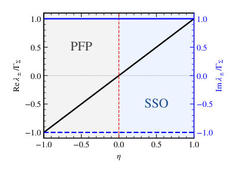 
Figure 1: Eigenvalues in Eq. (21) versus η, shown for ω0/ΓΣ = 1. The black curve and left axis give Re λ±/ΓΣ; the solid and dashed blue curves and right axis give the two signs of Im λ±/ΓΣ. The red dashed line at η = 0 marks the Hopf critical point, given by its intersection with the black curve.

📷 Fig 2

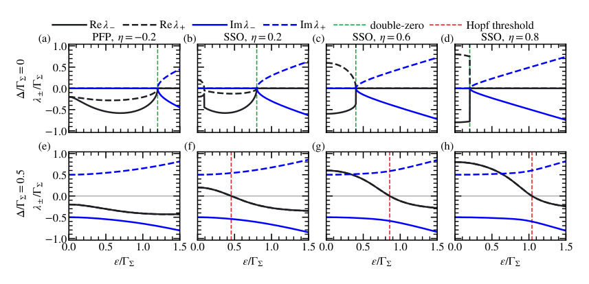 
Figure 2: Eigenvalues for ∆/ΓΣ = 0 and 0.5 (rows) and η = −0.2, 0.2, 0.6, and 0.8 (columns). Black curves show Re λ1,2/ΓΣ, blue curves show Im λ1,2/ΓΣ. The green dashed lines in the resonant row mark the double-zero threshold, while the red dashed lines in the detuned row mark the standard Hopf threshold for ∆, 0 from Eq. (41).

📷 Fig 3

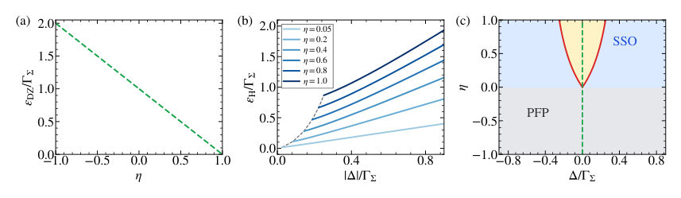 
Figure 3: Threshold structure of the coherent driven system at ΓΣ = 1. Panel (a) shows the resonant double-zero threshold ϵDZ/ΓΣ versus η. Panel (b) shows standard Hopf thresholds for η = 0.05, 0.2, 0.4, 0.6, 0.8, and 1.0. The colored branches in panel (b) are obtained from Eqs. (28), (37), and (38). The dashed guide traces the left endpoints of the corresponding SSO branches. Panel (c) shows the (∆/ΓΣ, η) plane; the green dashed line marks the resonant double-zero locus, while the red solid boundaries mark the finite-detuning Hopf critical lines.

📷 Fig 4

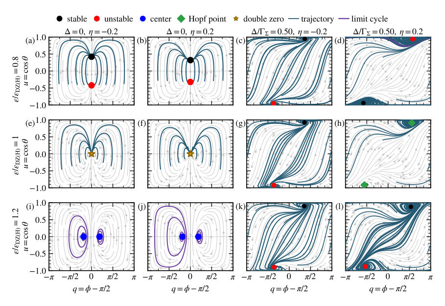 
Figure 4: Phase portraits in (q, u) = (ϕ −π/2, cos θ) for η = −0.2 and 0.2. The left and right two columns show ∆/ΓΣ = 0 and 0.5, respectively. From top to bottom, ϵ/ϵDZ = 0.8, 1.0, 1.2 in the resonant columns and ϵ/ϵ(∆) H = 0.8, 1.0, 1.2 in the finite-detuning columns. Gray streamlines show the global flow field, dark-teal curves highlight representative trajectories from selected initial conditions, and purple curves highlight representative closed periodic orbits: center orbits in the resonant panels and isolated limit cycles in the finite-detuning panels. Filled black, red, and blue circles denote stable fixed points, unstable fixed points, and reversible centers, respectively. Green...

📷 Fig 5

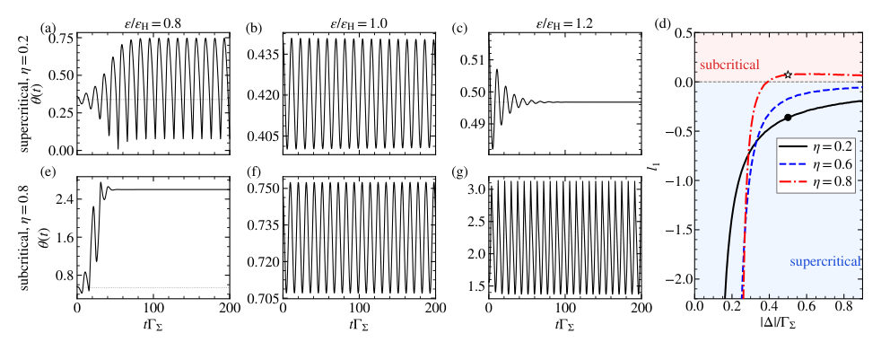 
Figure 5: Detuned SSO dynamics at ∆/ΓΣ = 0.5 and nonlinear classification along the finite-detuning Hopf branches for representative values of η. Panels (a)–(c) show representative time traces θ(t) for η = 0.2, while panels (e)–(g) show the corresponding η = 0.8 traces. In each set, ϵ/ϵH = 0.8, 1.0, and 1.2 from left to right, and the evolution extends to tΓΣ = 200. Panel (d) shows the first Lyapunov coefficient l1 along representative finite-detuning Hopf branches. The lower and upper shaded regions, l1 &lt; 0 and l1 &gt; 0, denote supercritical and subcritical bifurcations, respectively. The filled black circle and open star mark the η = 0.2 and 0.8 cases shown in the time traces. The η = 0.8...

**Summary.** This theoretical work establishes a general design principle for understanding self-sustained oscillations in open quantum spin systems. It shows that nonlinear dissipation is crucial for stabilizing the necessary oscillatory background, while the specific symmetry-breaking mechanism determines whether the transition to oscillation is a standard Hopf bifurcation or a different type of singularity.

**Why it may be interesting.** This work provides a general design principle for engineering non-equilibrium quantum dynamics, showing precisely how the interplay between background dissipation structure and symmetry-breaking terms dictates the type of emergent collective behavior (e.g., Hopf vs. non-Hopf).

Detailed structure

**Main problem.** The paper investigates the fundamental mechanisms governing the emergence of self-sustained oscillations (SSOs) in open, driven-dissipative many-body quantum systems.

**Main result.** Nonlinear, U(1)-covariant dissipation is required to stabilize the SSO background via a supercritical Hopf bifurcation, whereas linear dissipation or simple symmetry-breaking channels fail to produce a standard Hopf instability.

**Method.** The analysis employs a bifurcation-based picture, linear stability analysis, and local bifurcation theory applied to the mean-field dynamics derived from the Lindblad master equation.

**Model / system.** The system is modeled using driven-dissipative collective spins, analyzed in the thermodynamic limit using Bloch-sphere parametrization. The dynamics are governed by a Liouvillian superoperator incorporating both U(1)-covariant background evolution and explicit U(1)-breaking terms.

**Key observables.** Hopf frequency ($\omega_H$), Lyapunov coefficients ($l_1$), background attractor type (Polar Fixed Point vs. Self-Sustained Oscillator manifold), and the nature of the bifurcation (supercritical vs. subcritical).

**Important parameters / regimes.** Dissipation imbalance ($\eta$), detuning ($\Delta$), and the structure of the U(1)-breaking terms (linear vs. nonlinear).

**Assumptions / limitations.** The analysis assumes the existence of a U(1)-covariant background Liouvillian ($L_0$) and relies on mean-field approximations in the thermodynamic limit.

**Figures summary.** Figures illustrate the dependence of eigenvalues on dissipation imbalance and detuning, marking Hopf critical points. They also compare time traces and Lyapunov coefficient scans to distinguish between supercritical and subcritical Hopf transitions.

**Paper structure.** The paper develops a bifurcation picture by first analyzing the structural requirements for the SSO background using linear and nonlinear dissipation. It then examines the transition dynamics under coherent U(1) breaking, contrasting resonance ($\Delta=0$) with finite detuning ($\Delta 
eq 0$), and finally contrasts these findings with the limitations imposed by simple linear dissipative symmetry-breaking jumps.

Abstract

Self-sustained oscillations in open many-body systems can be organized by two distinct dynamical ingredients: the selection of a finite-amplitude background attractor and the subsequent control of its neutral phase. We develop this bifurcation-based picture for driven-dissipative collective spins and show how the microscopic dissipative structure determines the available background and its response to explicit U(1) breaking. In the thermodynamic-limit mean-field dynamics, a single linear U(1)-covariant jump produces only polar fixed-point backgrounds, whereas nonlinear covariant dissipation provides amplitude-dependent saturation and stabilizes a finite-latitude self-sustained-oscillator manifold through a supercritical Hopf bifurcation. Under coherent U(1) breaking, exact resonance leads to a reversible double-zero degeneracy with vanishing critical frequency rather than a standard Hopf onset. Finite detuning unfolds this singularity into a genuine finite-frequency Hopf boundary, which exists only on the self- sustained-oscillator side and can be either supercritical or subcritical. By contrast, a single linear dissipative U(1)-breaking jump cannot generate a standard Hopf instability: when its phase-pinning invariant vanishes the azimuthal direction remains neutral, whereas otherwise the phase-locked fixed points have a purely real Jacobian spectrum. These results establish a general design principle: nonlinear covariant dissipation selects the self-sustained background, while the structure of the symmetry-breaking channel determines whether the resulting local response is double-zero, genuinely Hopf, or non-Hopf.

[↑ back to top](#top)

### [Twin-photon generation in a silicon nitride microresonator](http://arxiv.org/abs/2609.04171v1)

**Authors:** Franz Pacher, Haochen Yan, Alekhya Ghosh, Arghadeep Pal, Toby Bi, Hao Zhang, Lixing You, Hao Li, Daniela Salvoni, Shuangyou Zhang, Pascal Del'Haye  
**Type:** experiment · **Category:** quantum information and computing · **PDF:** <https://arxiv.org/pdf/2609.04171v1>  
**Analysis basis:** full PDF text, analyzed in chunks
**Topic relevance:** 🔥 `quantum optics experiment` **4/5** · `QC/QI experiment` **3/5** · `Full counting statistics` **2/5** · `analog quantum simulation` **1/5** · `interference shaping light` **1/5** · `quantum measurements` **1/5**

📷 Fig 1

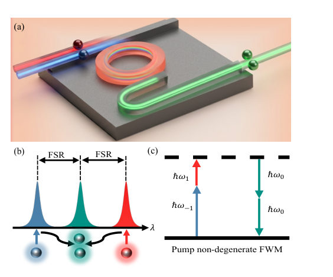 
FIG. 1. Twin-photon generation in a ring microresonator. (a) Schematic illustration of twin-photon generation through dual-pumped “inverse” four-wave mixing (FWM) in a ring mi- croresonator. (b) Cavity resonance spectrum showing the two pump modes (red and blue) positioned symmetrically about the central signal/idler mode (green), with a separation of one free spectral range (FSR) between each pump and the central mode. (c) Energy-level diagram: absorption of two photons with energies ℏω−1 and ℏω1 generates two degenerate photons with energies ℏω0, satisfying ω−1 + ω1 = 2ω0.

📷 Fig 2

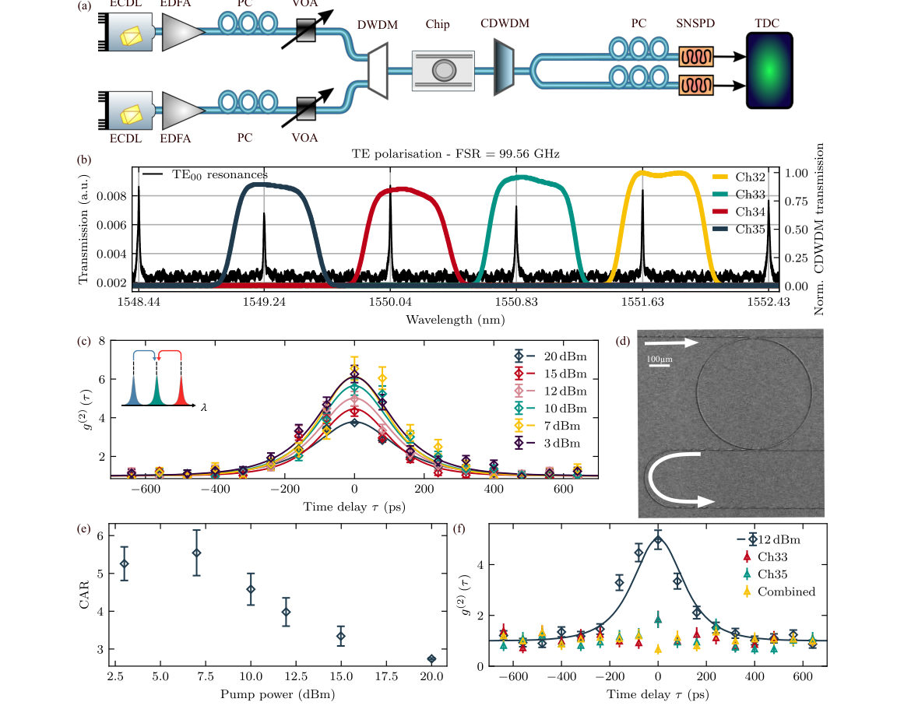 
FIG. 2. Pump non-degenerate SFWM in a ring microresonator. (a) Experimental setup for twin-photon generation using pump non-degenerate SFWM. ECDL: external cavity diode laser; EDFA: erbium-doped fibre amplifier; PC: polarisation controller; VOA: variable optical attenuator; DWDM: dense wavelength division multiplexer; CDWDM: cascaded dense wavelength division multiplexer; SNSPD: superconducting nanowire single-photon detector; TDC: time-to-digital converter. (b) Alignment of the ring microresonator spectrum with the ITU-T 100 GHz CDWDM channel grid. The measured cavity transmission in TE polarisation (dark trace) exhibits a resonance approximately every one FSR (99.56 GHz), each of which...

📷 Fig 3

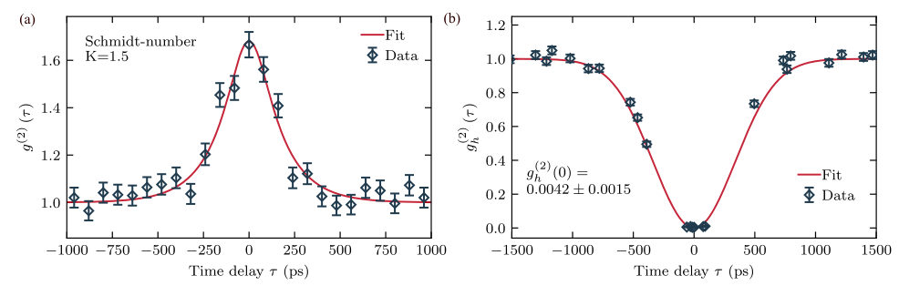 
FIG. 3. Characterisation of the pump-degenerate SFWM-based heralded single-photon source. (a) g(2)-self-correlation measure- ment of the signal mode (Ch 33), with a fit to the data. The self-correlation exhibits a bunching peak with g(2)(0) = 1.67±0.05, corresponding to a Schmidt number of K = 1.49 ± 0.12 (≈1.5 effective modes). (b) Heralded g(2) h (τ) autocorrelation mea- surement, with a fit to the data, showing a pronounced anti-bunching dip with g(2) h (0) = 0.0042 ± 0.0015, well below the single-photon threshold. Error bars are calculated assuming Poissonian statistics of the recorded coincidence counts.

📷 Fig 4

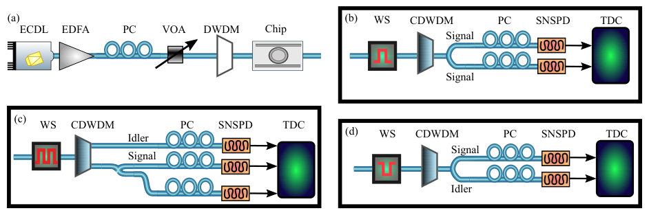 
FIG. 4. Experimental setups used for the pump-degenerate SFWM heralded photon-source measurements. (a) Setup for the generation of a biphoton state through SFWM in the ring microresonator. (b) Setup for measuring the self-correlation between the split signal mode. (c) Setup for measuring the heralded autocorrelation between a signal and idler pair. (d) Setup for measuring the cross-correlation between a signal and idler mode pair. ECDL: external cavity diode laser; EDFA: erbium-doped fibre amplifier; PC: polarisation controller; VOA: variable optical attenuator; DWDM: dense wavelength division multiplexer; WS: programmable waveshaper; CDWDM: cascaded dense wavelength division multiplexer;...

📷 Fig 5

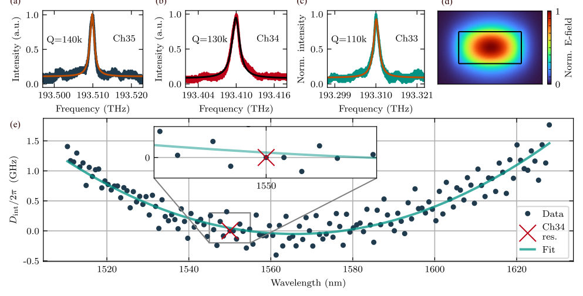 
FIG. 5. Characterisation of the ring microresonator device. Cavity resonances aligned with Ch 35 (a), Ch 34 (b), and Ch 33 (c) with loaded quality factors of Q = 140 k, Q = 130 k, and Q = 110 k, respectively. (d) Simulated normalised electric field distribution of the resonator TE00-mode at 1550 nm. (e) Integrated dispersion of the resonator TE00 around 1550 nm, with quadratic polynomial fit to the data. The dispersion is found to be anomalous, with D2/2π = 264 kHz. The location of the Ch 34 resonance, at 1550 nm, is indicated in the zoomed inset.

**Summary.** The authors report the first demonstration of frequency-degenerate twin-photon generation and heralded single-photon emission using a single integrated silicon nitride microresonator. By measuring correlation functions like the CAR and $g^{(2)}_h(0)$, they prove the platform's capability to generate tailored quantum light sources on a scalable chip.

**Why it may be interesting.** This work is highly relevant as it demonstrates scalable, integrated quantum light sources (twin-photons and single photons) using established silicon photonics platforms, which is a core technology for quantum networking and computation.

Detailed structure

**Main problem.** The paper aims to demonstrate frequency-degenerate twin-photon generation and characterize a heralded single-photon source using a single integrated silicon nitride platform.

**Main result.** They successfully demonstrated both twin-photon generation (CAR up to 5.4) and heralded single-photon emission ($g^{(2)}_h(0) = 0.0042$) on the same chip.

**Method.** The experiments utilized time-correlated single-photon counting with SNSPDs to measure second-order correlation functions ($g^{(2)}$) for both coincidence and heralded measurements.

**Model / system.** The physical system is a silicon nitride (Si3N4) microring resonator integrated on a photonic chip. Quantum light generation occurs via Four-Wave Mixing (FWM) processes (both non-degenerate for twins and degenerate for single photons).

**Key observables.** Coincidence-to-Accidental Ratio (CAR), heralded anti-bunching ($g^{(2)}_h(0)$), and spectral purity ($P$).

**Important parameters / regimes.** Telecom wavelengths, loaded quality factors ($Q \approx 10^5$), and pump powers up to $7 	ext{ dBm}$.

**Assumptions / limitations.** The single-photon purity calculation assumes residual deviation is due to incomplete spectral isolation, and quantitative results are derived independently from coincidence counts rather than fitting procedures.

**Figures summary.** Figures illustrate the schematic for inverse FWM (twin-photon source), the experimental setup using CDWDM, and plots showing $g^{(2)}$ cross-correlation vs. pump power, confirming the CAR dependence.

**Paper structure.** The paper details the realization of two distinct quantum light sources—twin-photon and single-photon—on one platform, characterized by measuring correlation functions ($g^{(2)}$) under different pumping conditions.

Abstract

Photonic chips with silicon nitride ($\mathrm{Si_3N_4}$) microring resonators are well established as heralded single-photon sources, but their operation as frequency-degenerate twin-photon sources has not previously been demonstrated. Here, we realise a twin-photon source at telecommunication wavelengths in a $\mathrm{Si_3N_4}$ ring microresonator via an inverse four-wave mixing (FWM) process, in which two photons from spectrally distinct pumps are converted into a pair of identical twin photons. The measurements show a maximum coincidence-to-accidental ratio (CAR) of $5.4\pm0.6$. In addition, the microresonator functions as a heralded single-photon source through pump-degenerate spontaneous four-wave mixing (SFWM), exhibiting a spectral purity of $P=0.67\pm0.05$ and a heralded anti-bunching of $g^{(2)}_h(0)=0.0042\pm0.0015$. Together, these results demonstrate both photon-generation schemes on a single integrated $\mathrm{Si_3N_4}$ platform, highlighting its potential for scalable, tailored quantum light generation.

[↑ back to top](#top)

### [Heralded one-, two- and three-photon states from waveguided parametric down-conversion](http://arxiv.org/abs/2609.03542v1)

**Authors:** Borrero Landazabal Daniel, Laiho Kaisa  
**Type:** experiment · **Category:** other · **PDF:** <https://arxiv.org/pdf/2609.03542v1>  
**Analysis basis:** full PDF text, analyzed in chunks
**Topic relevance:** 🔥 `quantum optics experiment` **4/5** · `Full counting statistics` **3/5** · `quantum measurements` **2/5** · `interference shaping light` **1/5**

📷 Fig 1

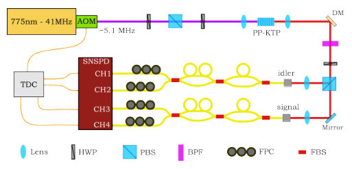 
FIG. 2. Experimental arrangement for the generation and characterization of heralded states. For Abbreviations see the main text.

📷 Fig 2

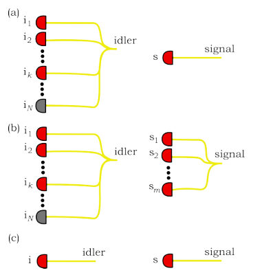 
FIG. 1. Sketches of the array-equivalent forms of the used detection with maximally iy (y = 1, . . . N) bins in idler and sx (x = 1, . . . m) bins in signal. The red detectors represent a detection event, while the gray ones are exposed by optical vacuum. For more details see the main text.

📷 Fig 3

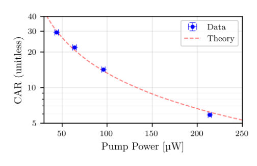 
FIG. 3. The measured CAR values in terms of the PDC pump power. The red dashed line presents a theoretical fit.

📷 Fig 4

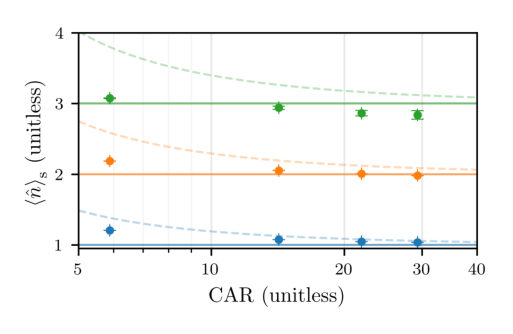 
FIG. 4. Measured mean photon numbers (symbols) of the heralded states in terms of the CAR. The dashed lines show the theoretical prediction, while the solid lines represent the values for an ideal photon-number states.

📷 Fig 5

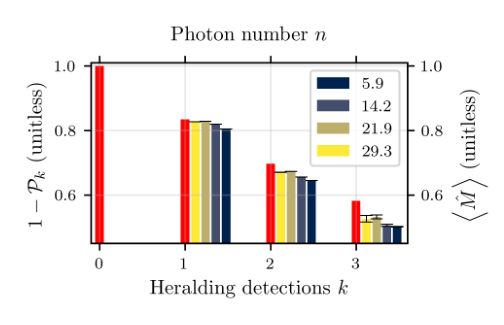 
FIG. 5. Theoretical (red bars) and experimental expectation values of the moment generating function. Experimental re- sults are evaluated at each measured CAR. The theoretical values for ˆ M(η) are calculated with η = ¯µsc = 0.165.

**Summary.** The authors report on the generation and characterization of heralded multi-photon states using parametric down-conversion in a waveguide. They introduce and validate a resource-saving analysis method based on single-click probabilities and normalized factorial moments. The key finding is the quantitative demonstration of higher-order non-classicality by violating established classical light criteria.

**Why it may be interesting.** This work is highly relevant to quantum optics and open quantum systems, providing robust experimental techniques to verify the non-classical nature of light sources, which is foundational for quantum communication and computation.

Detailed structure

**Main problem.** The paper aims to prepare and characterize heralded one-, two-, and three-photon number states using parametric down-conversion while demonstrating resource-saving quantum-optics analysis tools.

**Main result.** The measurements successfully characterized higher-order non-classicality by violating the classical condition $g^{(m+1)}_h \geq g^{(m)}_h \geq 1$, confirming the non-classical nature of the generated multi-photon states.

**Method.** The analysis utilizes manifold coincidences and singles counting, which is robust against experimental imperfections, to measure normalized factorial moments of photon number ($g^{(m)}_h$).

**Model / system.** The experiment uses cross-polarized twin beams generated via parametric down-conversion in a periodically-poled KTiOPO4 (PP-KTP) waveguide operating in the telecommunication wavelength range.

**Key observables.** Mean photon number $\langle\hat{n}
angle^{(k)}_s$, normalized factorial moments $g^{(m)}_h(|k
angle)$, Coincidences-to-Accidentals Ratio (CAR), and Klyshko's efficiencies.

**Important parameters / regimes.** Pumping powers ranged from $44 \mu	ext{W}$ to $214 \mu	ext{W}$; CAR values were measured between 5.9 and 29.3.

**Assumptions / limitations.** The calculation for $g^{(m)}_h$ assumes low detection efficiencies, and the theoretical treatment for $	ext{CAR} < 10$ is limited to single-mode PDC at low gains.

**Figures summary.** Figures illustrate the experimental setup, measured CAR vs. pump power, mean photon numbers vs. CAR, and the measured normalized factorial moments and the ratio $G = g^{(2)}_h / g^{(3)}_h$.

**Paper structure.** The paper first introduces the resource-saving analysis tools using single-click probability. It then details the measurement of normalized factorial moments up to $m=n+1$ to test the violation of classical light conditions, culminating in quantitative results for multi-photon state characterization.

Abstract

The manifold coincidences and singles counting provides a resource-saving quantum-optics analysis tool, since it is appropriate even in the presence of heavy experimental imperfections. Here, we prepare cross-polarized twin beams in the telecommunication wavelength range via parametric down-conversion in a periodically-poled KTiOPO$_4$ waveguide and herald photon-number states up to three photons. First, we show that the single-click probability is a versatile tool not only for extracting the state's mean photon number but also for sampling values of the moment generating function being the core behind any quantum optical state. Second, we measure values of the normalized factorial moments of photon number, $g^{(m)}_{\text{h}}$, up to the order $m = n+1$ for the heralded $n$-photon state. These normalized photon correlations provide an expedient method for examining the higher-order non-classicality of light by violating the condition $g^{(m+1)}_{\text{h}} \ge g^{(m)}_{\text{h}} \ge 1$.

[↑ back to top](#top)

### [Optimal control theory for measured quantum Schrödinger bridges](http://arxiv.org/abs/2609.03097v1)

**Authors:** Masayuki Ohzeki, Andrew N. Jordan  
**Type:** theory · **Category:** statistical mechanics · **PDF:** <https://arxiv.org/pdf/2609.03097v1>  
**Analysis basis:** full PDF text, analyzed in chunks
**Topic relevance:** 🔥 `quantum measurements` **4/5** · `methods for driven-dissipative` **2/5** · `Keldysh / 2PI / non-Gaussian methods` **1/5** · `correlated / nonlocal dissipation` **1/5** · `driven-dissipative phase transition` **1/5** · `non-equilibrium universality` **1/5**

📷 Fig 1

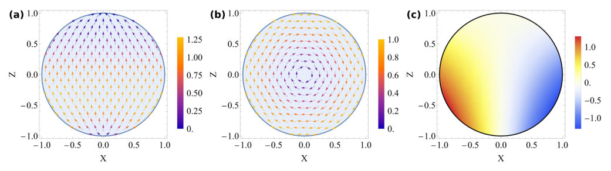 
FIG. 1. Illustration of the effect-conditioned Doob bridge on the XZ slice of the Bloch ball: Panel (a) The Doob corrected drift D∇log h is plotted as a vector field. The physical drift shows an intuitive mapping of the state space to the terminal collapse state |0⟩⟨0|. Panel (b) is the control vector field fy(q). Panel (c) is the diffusion compensated score for y-control, Cy = ⟨fy(q), D∇log h⟩M = x(z −1).

📷 Fig 2

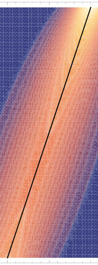 
FIG. 2. Illustration of the Gaussian bridge solution for the Sinkhorn bridge with a full terminal distribution. The proba- bility distribution is plotted as a density function of the coor- dinate q and the scaled time τ = t/T. The marginal param- eters are chosen as means of the initial and final marginals, m0 = −1, mT = 1, and covariance parameters s0 = 0.3, sT = 0.1, c ≈0.03, r = 1. The black line indicates the mean path mt.

📷 Fig 3

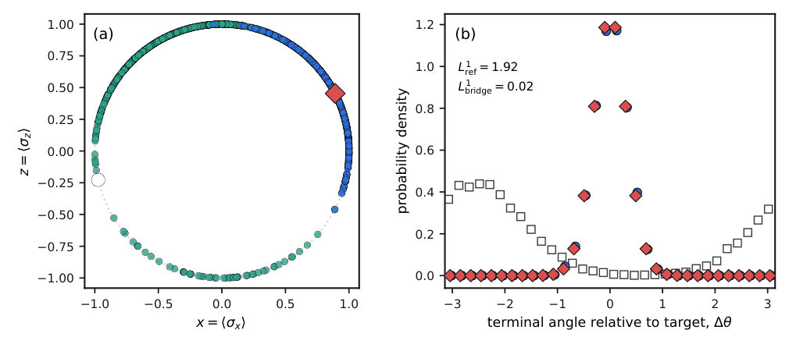 
FIG. 3. Numerical two-detector qubit bridge for equal measurement rates. Panel (a) shows sampled states on the x-z Bloch cir- cle: the white circle represents the initial state; green circles represent the controlled bridge at t/T = 1/2; blue circles represent the controlled bridge at t/T = 1; the red diamond represents the target mean. Points are samples and are not connected by trajectory lines. Panel (b) compares the terminal angle distributions relative to the target: gray squares represent the uncon- trolled reference process; blue circles represent the process controlled by the weak-value/Sinkhorn score; red diamonds represent the prescribed target distribution. The prescribed...

📷 Fig 4

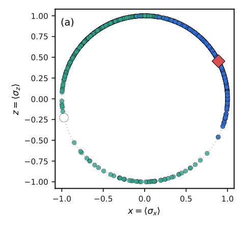 
Figure 3 demonstrates the corresponding bridge-control synthesis. We compute the terminal Sinkhorn scaling for a prescribed target distribution on the circle and simulate the controlled process with drift u+κSy(θ, t). The bridge ensemble is steered to the desired terminal distribution, while the uncontrolled reference ensemble is not. Thus the two-detector model gives a concrete noncommuting- measurement realization of the same statement: the Sinkhorn potential sets the Doob drift of the conditioned diffusion, and its Hamiltonian directional derivative is the imaginary weak value. The L1 distance from the target distribution is reduced from 1.92 for the uncontrolled ref- erence process to...

**Summary.** This paper unifies optimal control theory with quantum measurement by showing that the control signal required to steer a quantum state between two distributions is mathematically equivalent to the imaginary part of a generalized weak value. It establishes that weak measurements act as a natural entropic regularization mechanism for quantum state transport, providing a concrete method for quantum feedback control synthesis.

**Why it may be interesting.** This work provides a deep, quantitative link between fundamental concepts in quantum measurement theory (weak values) and advanced mathematical tools from optimal control (Schrödinger bridges), offering a powerful new diagnostic tool for open quantum systems.

Detailed structure

**Main problem.** To develop a mathematical framework connecting optimal control theory, quantum Schrödinger bridges, and continuous quantum measurement for open quantum systems.

**Main result.** The imaginary part of a generalized weak value is shown to be the local control signal, directly corresponding to the directional derivative of the Doob/Sinkhorn bridge potential.

**Method.** The authors utilize the mathematical structure of conditional quantum trajectory theory, which induces a Fokker-Planck equation on the quantum state space, and apply optimal transport techniques (Schrödinger bridges).

**Model / system.** The system involves continuously monitored quantum systems, modeled by stochastic differential equations (Itô form) on the quantum state manifold. The dynamics are governed by a controllable Hamiltonian $H(u)$.

**Key observables.** Weak value ($	ext{Im}\langle A 
angle_{E,
ho}^w$), Control Score ($S_A$), and the Schrödinger/Sinkhorn bridge potentials ($\hat{\varphi}, \varphi$).

**Important parameters / regimes.** The control Hamiltonian $H(u) = H_0 + \sum u_\mu A_\mu$, and the terminal measurement effect $E$.

**Assumptions / limitations.** The analysis distinguishes its approach from other formulations, such as the Dressel–Jordan formula or the CDJ-Pontryagin framework, focusing on the classical diffusion induced by continuous measurement.

**Figures summary.** Figures illustrate the Gaussian bridge solution for state transport and show numerical results for a two-detector qubit, comparing uncontrolled vs. weak-value/Sinkhorn-score-controlled processes.

**Paper structure.** The paper progresses by introducing the Hamiltonian flow and boundary conditions, generalizing the classical bridge problem to continuous quantum measurement, and concluding with explicit examples demonstrating the equivalence between weak values and the bridge potential's directional derivative.

Abstract

Schrödinger bridges and entropic optimal transport are usually formulated as stochastic interpolation problems between initial and final probability distributions. In their computational form, the bridge potentials are obtained by Sinkhorn or iterative proportional fitting, and are often regarded as auxiliary scaling functions. We show that for continuously monitored quantum systems, these potentials acquire a direct measurement-theoretic meaning. The mathematical structure of conditional quantum trajectory theory induces a Fokker--Planck equation on quantum state space. Conditioning this diffusion on a terminal distribution or a terminal measurement effect produces a Doob/Sinkhorn potential whose directional derivative along a unitary control vector field is the imaginary part of a generalized weak value. The same construction connects the Schrödinger-bridge viewpoint to the optimal-path framework for continuously monitored trajectories: the backward bridge potential plays the role of an effect-like costate, and its weak-value directional derivative gives the local control signal. By specifying the desired endpoint distribution, the induced drift produced by the Schrödinger bridge solution is the control solution that minimizes the quadratic cost feedback law, guiding the distribution to its desired endpoint. We quantify the control score of the available control Hamiltonian as a logarithmic directional derivative of the bridge potential, or an imaginary weak value. Three explicit examples identify weak measurement as a natural entropic regularization mechanism for quantum state transport and gives a route from Sinkhorn scaling to quantum feedback and Hamiltonian control synthesis for practical optimal control.

[↑ back to top](#top)

### [Robust Hamiltonian engineering with subensemble control](http://arxiv.org/abs/2609.03045v1)

**Authors:** Wenjie Gong, Matteo Votto, Soonwon Choi  
**Type:** theory · **Category:** other · **PDF:** <https://arxiv.org/pdf/2609.03045v1>  
**Analysis basis:** full PDF text, analyzed in chunks
**Topic relevance:** 🔥 `analog quantum simulation` **4/5** · `Rydberg arrays` **3/5** · `Keldysh / 2PI / non-Gaussian methods` **1/5** · `methods for driven-dissipative` **1/5** · `quantum measurements` **1/5**

📷 Fig 1

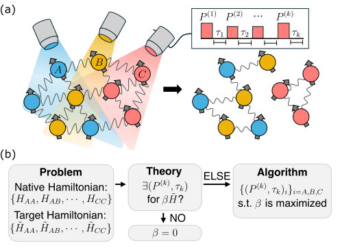 
FIG. 1. Hamiltonian engineering with subensemble control. (a) We consider interacting spin systems, where one can ap- ply global control pulses to each of n subensembles indepen- dent. As example, n = 3 shown : A (blue), B (yellow) and C (red). We study how to engineer interactions within and between them in this setup. (b) Given a set of native inter- actions, we can determine the feasibility of engineering a tar- get Hamiltonian. Moreover, we provide algorithms to design pulse sequences that optimize the strength of the resultant Hamiltonian.

📷 Fig 2

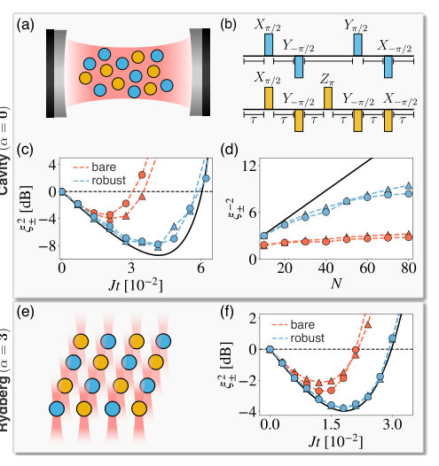 
FIG. 3. Two-mode spin squeezing via Hamiltonian engineer- ing. We consider two possible experimental settings: (a-d) an atomic ensemble in an optical cavity and (e,f) dipolar Ry- dberg atoms in optical tweezers. In both cases, the desired target dynamics cannot be generated without subensemble control. (b) Alternating one-axis twisting interactions with the pulse sequence considered results in 2A2S twisting dynam- ics. (c) We study numerically the dynamics of the squeezing parameters ξ±(t) for an ensemble of NA,B = 20 atoms. We assume pulses with A- and F-error strengths ϵ = δ = 0.03, comparing the bare pulse sequence (red lines, triangles for ξ+ and circles for ξ−) in (b) and its robust...

**Summary.** This paper develops a robust protocol for engineering desired interactions in multi-subensemble quantum systems, such as atomic arrays. It tackles the theoretical difficulty of Hamiltonian control by providing necessary and sufficient conditions and efficient numerical design strategies. The results demonstrate that these robust sequences can successfully generate quantum states, like spin-squeezed states, even when subjected to realistic experimental control errors.

**Why it may be interesting.** This work is highly relevant as it provides concrete, robust protocols for controlling complex many-body interactions in atomic systems, moving beyond idealized theoretical models to address real-world experimental limitations.

Detailed structure

**Main problem.** The paper addresses the challenge of robustly engineering target interactions (Hamiltonians) in multi-subensemble quantum systems using global control pulse sequences.

**Main result.** They provide a practical toolbox showing that target Hamiltonians can be engineered robustly against common control imperfections (Amplitude, Frequency, Pulse-Width errors) in systems like atomic ensembles.

**Method.** The methodology combines theoretical analysis of Hamiltonian engineering (using Floquet-Magnus expansion and completeness conditions) with numerical optimization techniques to design error-mitigating pulse sequences.

**Model / system.** The work applies to spin ensembles, modeled using generalized Gell-Mann operators, arising naturally in solid-state defects or multi-species atomic arrays. Specific applications include dual-species atomic ensembles and Rydberg atom arrays.

**Key observables.** Two-mode spin squeezing parameter ($\xi$), and the achievable effective Hamiltonian ($	ilde{H}$).

**Important parameters / regimes.** Error strengths ($\epsilon, \delta$), number of subensembles ($n$), and the length/design of the pulse sequence (e.g., unitary 4-design).

**Assumptions / limitations.** The analysis relies on the completeness of toggling-frame unitaries forming a unitary 4-design to ensure full control over the interaction space.

**Figures summary.** Figures illustrate the comparison of spin squeezing achieved using bare vs. robust pulse sequences for both optical cavity and Rydberg atom settings under varying error strengths.

**Paper structure.** The paper progresses from establishing the general theory of Hamiltonian engineering and its computational hardness, to deriving necessary and sufficient conditions, and finally demonstrating robust implementation and application in specific atomic platforms.

Abstract

We present a robust protocol to reshape interactions in a spin ensemble based on global control pulse sequences applied to multiple subensembles in parallel. This setting arises naturally from ensembles of solid-state defects or multi-species atomic arrays. We show that it is provably computationally hard to find pulse sequences that simultaneously engineer interactions both within and between subensembles. Despite its formal hardness, we identify a set of necessary or sufficient conditions under which one can synthesize a target Hamiltonian from the native one. Moreover, we introduce efficient numerical strategies for designing pulse sequences that engineer target Hamiltonians robust against common control imperfections. As a specific application, we discuss the robust generation of two-mode spin squeezing in dual-species atomic ensembles, which is a challenging task without subensemble control. Our results provide a practical toolbox to design novel quantum simulation and sensing experiments with minimal control overhead.

[↑ back to top](#top)

### [Universal Driven Critical Dynamics of Entanglement Entropy](http://arxiv.org/abs/2609.03854v1)

**Authors:** Chang-Yu Shen, Shuai Yin, Zi-Xiang Li  
**Type:** both · **Category:** statistical mechanics · **PDF:** <https://arxiv.org/pdf/2609.03854v1>  
**Analysis basis:** full PDF text, analyzed in chunks
**Topic relevance:** 🔥 `non-equilibrium universality` **4/5** · `analog quantum simulation` **3/5** · `methods for driven-dissipative` **2/5** · `driven-dissipative phase transition` **1/5**

📷 Fig 1

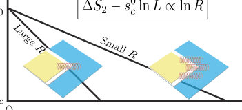 
FIG. 1. (a) Lattices and entanglement-entropy subsystem cuts consid- ered in this Letter. The full system has periodic boundary conditions. On the square lattice, blue Region 𝐴( 𝐿

📷 Fig 2

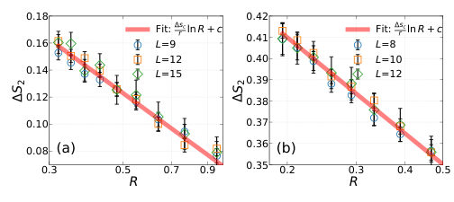 
FIG. 2. Driven dynamics of the corner entanglement entropy for the chiral Ising GNY universality class. (a) Corner entanglement entropy Δ𝑆2 as a function of the driving rate 𝑅for the 𝑡-𝑉model on the honeycomb lattice (𝑉𝑐≈1.35). Since 𝑠0 𝑐= 0 in the gapped CDW phase, Δ𝑆2 is independent of the system size 𝐿: the data points at each fixed 𝑅coincide for different 𝐿, without any subtraction, following Δ𝑆2 = −(𝑠QCP 𝑐 /𝑟) ln 𝑅+ const. A linear fit in ln 𝑅then yields 𝑠QCP 𝑐 = 0.168(9). (b) Same analysis as in (a) for the 𝑡-𝑉model on the 𝜋-flux square lattice (𝑉𝑐≈1.30), yielding 𝑠QCP 𝑐 = 0.140(7).

📷 Fig 3

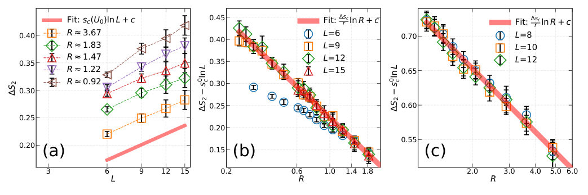 
FIG. 3. Driven dynamics of the corner entanglement entropy for the chiral Heisenberg GNY universality class. (a) System-size depen- dence of the corner entanglement entropy Δ𝑆2 at several fixed driving rates 𝑅for the Hubbard model on the honeycomb lattice. The data exhibit a logarithmic scaling behavior Δ𝑆2 ∼𝑠0 𝑐ln 𝐿, indicating that, at finite driving rates, the entanglement entropy remains dominated by the corner contribution inherited from the initial AFM ordered phase. Solid lines represent logarithmic fits. (b) Shifted corner entanglement entropy Δ𝑆2 −𝑠0 𝑐ln 𝐿as a function of the driving rate 𝑅for the Hubbard model on the honeycomb lattice, with the initial-state corner coefficient 𝑠0...

📷 Fig 4

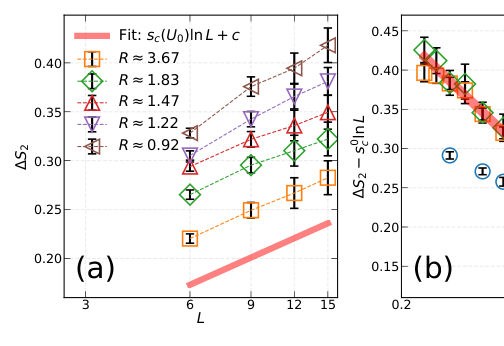 
Fig. 3(a) shows the system-size dependence of the sub- tracted corner entanglement entropy Δ𝑆2 on the honeycomb lattice at several fixed driving rates 𝑅. For 𝐿≥9, the data exhibit a clean logarithmic scaling Δ𝑆2 ∼𝑠0 𝑐ln 𝐿, confirming that at finite driving rates the entanglement entropy remains dominated by the corner contribution inherited from the ini- tial AFM phase. The 𝐿= 6 data deviate slightly from this logarithmic trend due to finite-size effects, as expected for the smallest system size. Fig. 3(b) and Fig. 3(c) present the cen- tral scaling analysis for the honeycomb and 𝜋-flux square lat- tices, respectively. By subtracting the initial-state Goldstone contribution—evaluating Δ𝑆2...

**Summary.** This research establishes a universal finite-time scaling theory for quantum entanglement entropy in driven quantum systems. By analyzing the corner entanglement entropy of Dirac fermions, the authors show that the scaling behavior robustly reveals the universal corner coefficient of the underlying critical theory. This extends critical dynamics concepts from local measurements to intrinsic, non-local quantum information measures.

**Why it may be interesting.** This work provides a powerful, non-local diagnostic tool—entanglement entropy—to characterize quantum criticality in driven systems, which is highly relevant for understanding non-equilibrium dynamics in quantum simulators.

Detailed structure

**Main problem.** The paper aims to extend the predictive power of Kibble-Zurek and finite-time scaling from local observables to non-local quantum information measures, specifically quantum entanglement entropy, in driven critical dynamics.

**Main result.** The corner entanglement entropy exhibits a universal finite-time scaling governed by the driving rate, allowing the robust extraction of the underlying conformal field theory's universal corner coefficient far from equilibrium.

**Method.** The authors use unbiased Quantum Monte Carlo simulations, employing an incremental algorithm to calculate the corner entanglement entropy ($\Delta S_2$) for various driving rates.

**Model / system.** The study investigates interacting Dirac-fermion models, including the Hubbard and spinless t-V models, on honeycomb and pi-flux square lattices, driven across quantum critical points (QCPs).

**Key observables.** Corner Entanglement Entropy ($\Delta S_2$), which is used to probe the universal scaling behavior.

**Important parameters / regimes.** The driving rate ($R$), system size ($L$), and the characteristic scaling variable ($RLr$).

**Assumptions / limitations.** The analysis assumes the system remains within the low-energy scaling window ($a \ll \xi_R \ll L$) for the asymptotic scaling function to hold.

**Figures summary.** Figures illustrate the calculation of $\Delta S_2$ via lattice cuts and show data collapse when plotting $\Delta S_2$ against $\ln R$ or $\ln(RLr)$ for different system sizes.

**Paper structure.** The paper establishes the theoretical framework connecting FTS to entanglement, applies it to specific fermionic models, details the numerical implementation using incremental algorithms, and finally extracts the universal QCP corner coefficient by analyzing the scaling function's asymptotic behavior.

Abstract

The Kibble-Zurek mechanism (KZM) and finite-time scaling (FTS) provide a foundational framework for driven critical dynamics, yet their predictive power has been largely confined to local observables. Here, we establish a universal finite-time scaling theory for the nonequilibrium dynamics of quantum entanglement. Using unbiased quantum Monte Carlo simulations, we investigate the corner entanglement entropy of (2+1)-dimensional interacting Dirac fermions driven from ordered phases toward a quantum critical point. We find that the corner entanglement accurately obeys a universal driven scaling governed by the driving rate and system size, persisting whether the initial ordered state is fully gapped or hosts gapless Goldstone modes. Crucially, this dynamical entanglement exhibits a logarithmic dependence on the driving rate, from which the universal corner coefficient of the underlying conformal field theory can be robustly extracted far from equilibrium. These results generalize the KZM from local observables to the intrinsic nonlocal quantum information measures, offering a practical blueprint for characterizing quantum criticality and entanglement on programmable quantum simulators.

[↑ back to top](#top)

### [Small-quench Loschmidt dynamics near quantum critical points](http://arxiv.org/abs/2609.04065v1)

**Authors:** Kohei Kobayashi  
**Type:** theory · **Category:** statistical mechanics · **PDF:** <https://arxiv.org/pdf/2609.04065v1>  
**Analysis basis:** full PDF text, analyzed in chunks
**Topic relevance:** 🔥 `non-equilibrium universality` **4/5** · `analog quantum simulation` **2/5** · `driven-dissipative phase transition` **2/5** · `Keldysh / 2PI / non-Gaussian methods` **1/5**

📷 Fig 1

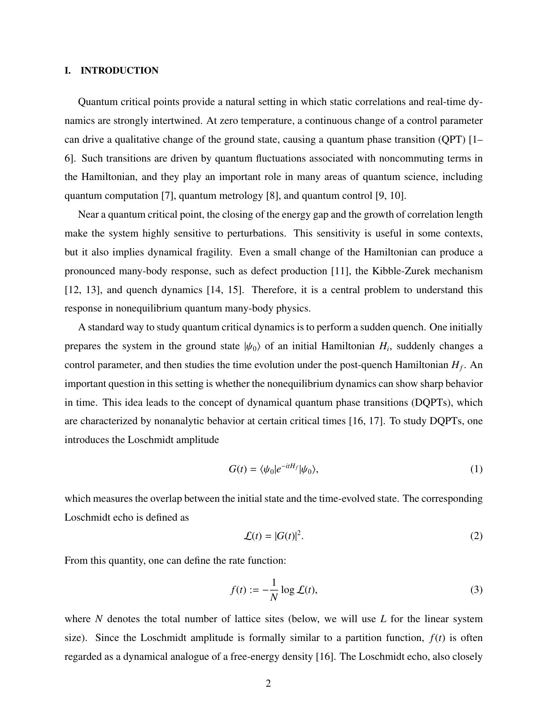 
Low-resolution page preview, page 2

📷 Fig 2

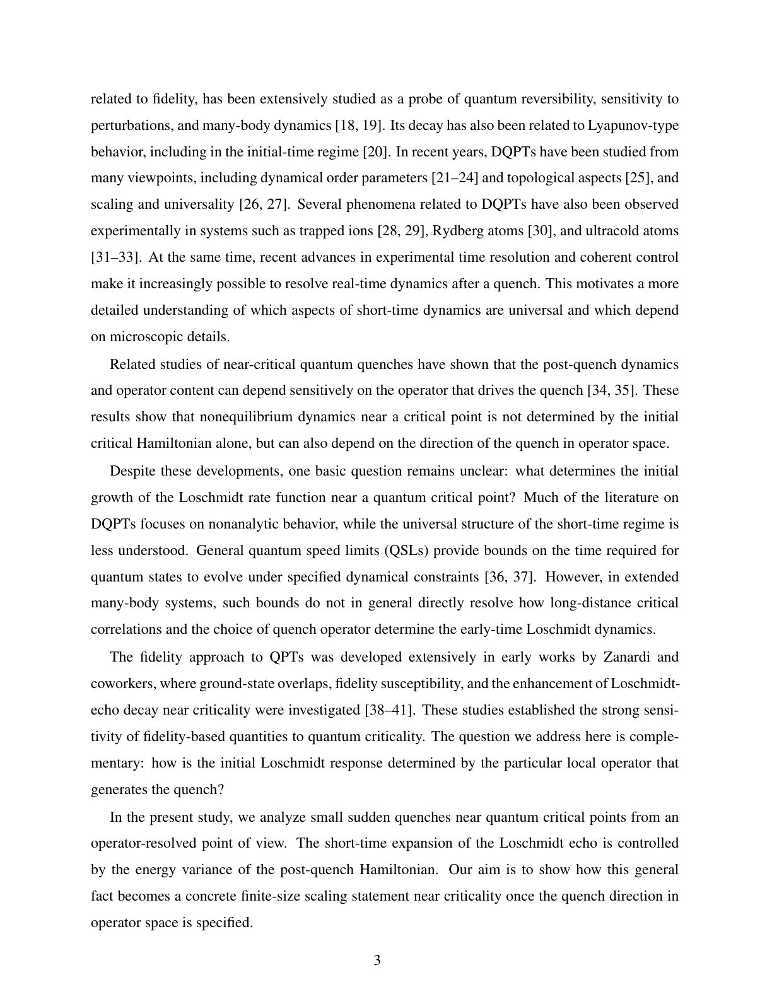 
Low-resolution page preview, page 3

📷 Fig 3

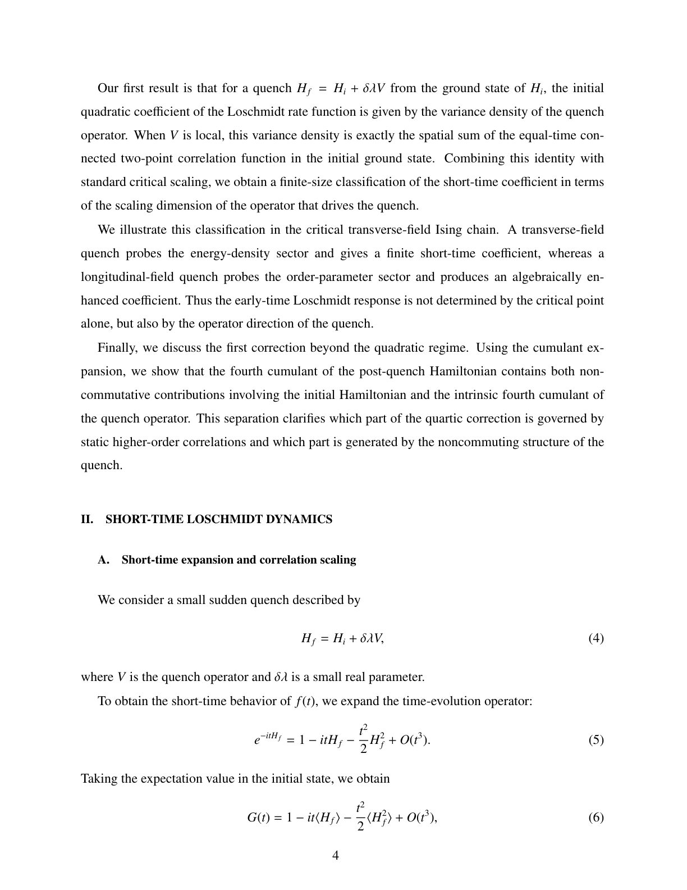 
Low-resolution page preview, page 4

📷 Fig 4

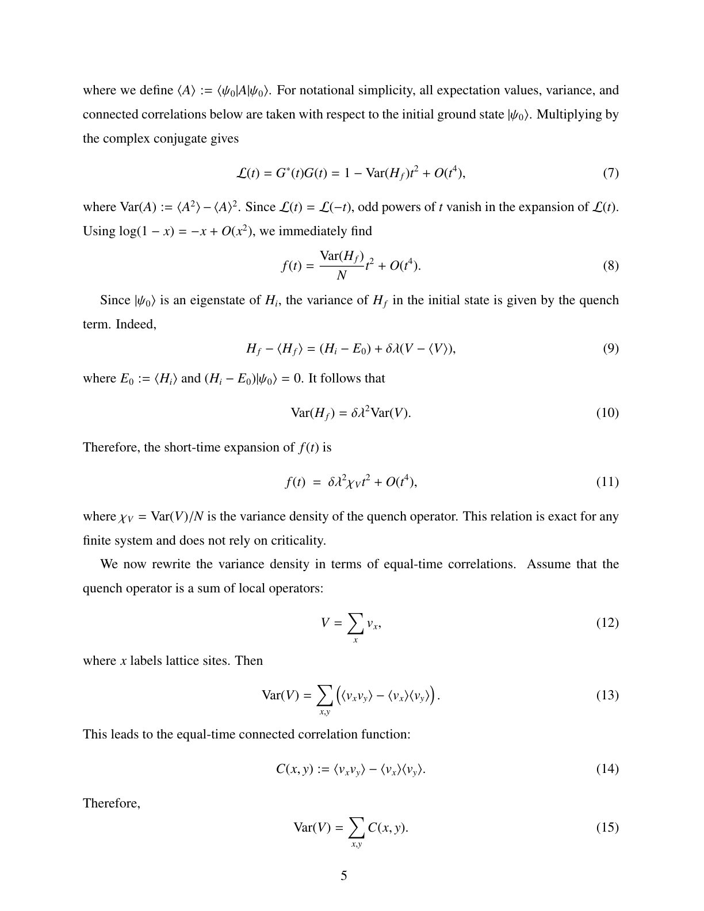 
Low-resolution page preview, page 5

📷 Fig 5

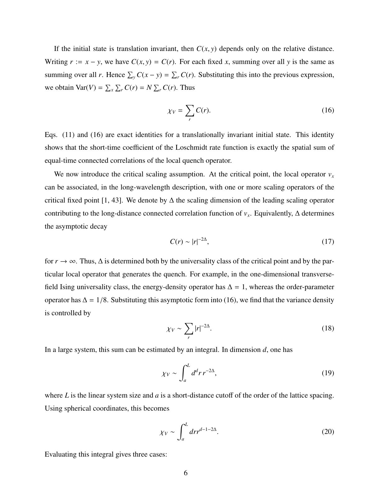 
Low-resolution page preview, page 6

**Summary.** This paper analyzes the initial decay of the Loschmidt echo after a small quench near a quantum critical point. It establishes that the initial decay rate is governed by the variance of the quench operator, which is directly related to static critical correlations. The work provides detailed scaling laws showing how this early-time response depends on the dimensionality and the scaling dimension of the quench operator.

**Why it may be interesting.** It provides a rigorous theoretical framework linking the non-equilibrium dynamics (Loschmidt echo) directly to the static properties (critical correlations) of the ground state, which is highly relevant for understanding quantum criticality in many-body systems.

Detailed structure

**Main problem.** The paper investigates the initial growth rate of the Loschmidt rate function following a small sudden quench near a quantum critical point (QCP). It aims to connect this early-time dynamic response to static critical correlations.

**Main result.** The initial quadratic coefficient of the Loschmidt decay is exactly determined by the spatial sum of the equal-time connected two-point correlation function of the quench operator. The finite-size scaling of this coefficient depends critically on the scaling dimension of the quench operator relative to the system dimension.

**Method.** The analysis uses the short-time cumulant expansion of the Loschmidt amplitude, relating the quadratic coefficient to the variance of the quench operator and analyzing the scaling of this variance using critical correlation functions.

**Model / system.** The study applies to quantum many-body systems, specifically illustrating results using the transverse-field Ising chain model subjected to small quenches (e.g., changing the transverse or longitudinal field).

**Key observables.** Loschmidt rate function $f(t)$, initial quadratic coefficient $\chi_V$, and higher-order cumulants ($\kappa_4$).

**Important parameters / regimes.** System size ($L$), quench operator scaling dimension ($\Delta$), and the small quench parameter ($\delta\lambda$ or $\delta h$).

**Assumptions / limitations.** The analysis relies on the small-quench approximation and assumes power-law decay for critical correlations, $C(r) \sim |r|^{-2\Delta}$.

**Figures summary.** Not specified.

**Paper structure.** The paper proceeds by establishing the connection between the short-time Loschmidt dynamics and the variance of the quench operator. It then derives the scaling laws for this variance based on critical exponents and analyzes the crossover behavior by including the fourth cumulant correction.

Abstract

We study the short-time Loschmidt dynamics after a small sudden quench near a quantum critical point. We show that the initial quadratic growth of the Loschmidt rate function is governed by the variance of the quench operator per system size. For a local quench operator, this variance density is exactly equal to the spatial sum of the equal-time connected two-point correlation function in the initial ground state. This relation connects the early-time Loschmidt response to static critical correlations. Assuming power-law correlations at criticality, we classify the finite-size scaling of the short-time coefficient by the scaling dimension of the quench operator. In one dimension, the coefficient is finite, logarithmically enhanced, or algebraically enhanced with system size. We illustrate this operator dependence in the transverse-field Ising chain, where transverse-field and longitudinal-field quenches couple to different critical operators. We also discuss the first correction beyond the quadratic regime using the fourth cumulant of the post-quench Hamiltonian.

[↑ back to top](#top)

### [Efficient Conversion of Optical to Mechanical States Close to the Single-Quantum Level](http://arxiv.org/abs/2609.04150v1)

**Authors:** Alexander Rolf Korsch, Liu Chen, Pedro V. Pinho, Boris Müllendorff, Jan N. Kirchhof, Yong Yu, Thiago P. Mayer Alegre, Simon Gröblacher  
**Type:** experiment · **Category:** other · **PDF:** <https://arxiv.org/pdf/2609.04150v1>  
**Analysis basis:** full PDF text, analyzed in chunks
**Topic relevance:** 🔥 `quantum optics experiment` **4/5** · `analog quantum simulation` **2/5** · `driven-dissipative phase transition` **1/5** · `quantum measurements` **1/5**

📷 Fig 1

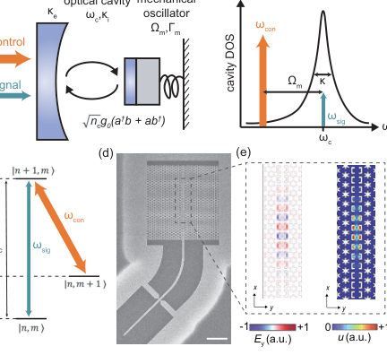 
FIG. 1. Photon–phonon conversion via OMIT in op- tomechanical crystals. (a) Schematic illustration of a cav- ity optomechanical system with optical (mechanical) reso- nance frequency ωc (Ωm) and loss rates κ (Γm). The optical loss rate κ is composed of intrinsic cavity losses κi and ex- trinsic cavity coupling κe to an input mode. A strong control beam detuned to the red-optomechanical sideband with laser detuning ∆= ωcon −ωc = −Ωm and laser frequency ωcon drives the optical mode ˆa with an intracavity photon number nc. This driving enables coherent photon–phonon conversion of an optical input signal field at frequency ωsig ≈ωc onto the mechanical oscillator mode ˆb through...

📷 Fig 2

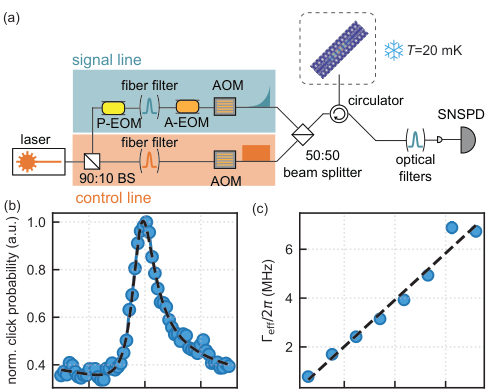 
FIG. 2. Experimental setup and OMIT window mea- surement. (a) Experimental setup for OMIT measurement. Laser light is split into two optical paths: the control line and the signal line. The signal line pulse is shaped by an amplitude-electro-optic modulator (A-EOM) into an expo- nentially rising pulse with bandwidth Γsig. BS, beam splitter; P-EOM, phase electro-optic modulator; AOM, acousto-optic modulator; SNSPD, superconducting nanowire single photon detector. (b) Measured OMIT window when sweeping the de- tuning between signal light ωsig and cavity resonance ωc. (c) Dependence of the OMIT linewidth Γeff on intracavity photon number nc. The linear fit gives a single photon optomechan-...

📷 Fig 3

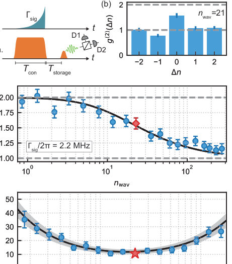 
FIG. 3. Hanbury Brown-Twiss measurement of the mechanical state generated via photon–phonon con- version. (a) Pulse sequence for OMIT conversion and read- out. A strong control pulse of length Tcon = 2.4 µs and in- tracavity photon number nc = 3, 200 (Γeff/2π = 1.9 MHz) enables coherent conversion of an exponentially rising weak coherent input signal with bandwidth Γsig and Tsig = 2.4 µs. After a delay Tstorage = 150 ns, a second short control pulse reconverts part of the mechanical excitation back into opti- cal photons (see Supplementary Information for experimental details). The retrieved optical signal is sent to a Hanbury Brown-Twiss (HBT) setup. (b) Second order autocorrelation...

📷 Fig 4

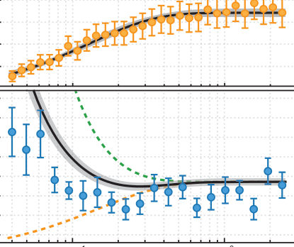 
FIG. 4. Calibration of added thermal phonons and their contribution to input-referred noise. (a) Thermal phonon occupancy nth of the mechanical mode as a function of control pulse duration. The black line shows an exponential saturation fit, yielding a turn-on time of 150 ns. Error bars re- flect a dominant 15% systematic uncertainty in the measured detection path efficiency. The gray shaded region indicates the uncertainty in the fitted model. (b) Added input-referred noise versus control pulse duration. The black line represents the total theoretically expected noise. The orange dashed line isolates the contribution from the pulse length dependence of the added thermal noise, while the...

📷 Fig 5

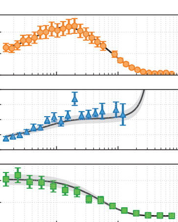 
FIG. 5. Temporal coherence of the converted me- chanical excitation. (a) Thermal phonon occupancy as a function of time delay between the 300 ns-long pump pulse and the 40 ns-long probe pulse, where the pump pulse is the same configuration as the control pulse used in OMIT photon-phonon conversion measurements. The solid line rep- resents the fit to a phenomenological model discussed in the text nth = noffset −a · e−Tstorage/Trise + b · e−Tstorage/T1 with Trise ≈570 ns and T1 ≈7.3 µs. The probed thermal phonon number contains the instantaneous heating from the weak probe pulse, which is negligible compared to the heating from the pump pulse. (b) Input-referred thermal noise of the OMIT...

**Summary.** This paper reports on the efficient, low-noise conversion of quantum optical photons into mechanical phonons using an optomechanical crystal operating at millikelvin temperatures. By utilizing the OMIT mechanism with few-photon inputs, the researchers achieved a high conversion efficiency ($\eta=0.76$) and confirmed the quantum nature of the stored mechanical state. This work advances the field by providing a robust pathway toward deterministic single-quantum mechanical state preparation.

**Why it may be interesting.** This work directly addresses the interface between quantum optics and mechanical oscillators, which is a cornerstone of modern AMO physics, particularly in quantum transducers and quantum memory.

Detailed structure

**Main problem.** The primary goal is to achieve efficient, low-noise conversion of quantum optical states (photons) into quantum mechanical states (phonons) near the single-quantum level.

**Main result.** The authors demonstrated a record-level photon-phonon conversion efficiency of $\eta=0.76$ while maintaining low added thermal noise ($n_{th}=9.0$), establishing the platform for deterministic single-quantum mechanical state preparation.

**Method.** The conversion is achieved using Optomechanically Induced Transparency (OMIT) in a cavity optomechanical crystal, probing the system with weak, few-photon coherent optical pulses.

**Model / system.** The system utilizes a quasi-two-dimensional optomechanical crystal (OMC) operating at millikelvin temperatures. The interaction is modeled via an effective beam-splitter Hamiltonian, enabling coherent mapping between optical fields and mechanical modes.

**Key observables.** Conversion efficiency ($\eta$), mechanical storage lifetime ($T_1$), added thermal noise ($n_{th}$), and the second-order autocorrelation function $g^{(2)}(\Delta n)$ of the retrieved phononic state.

**Important parameters / regimes.** Millikelvin temperatures, few-photon input pulses, mechanical frequency ($\Omega_m/2\pi = 10.314$ GHz), and the coupling strength ($g_0/2\pi = 1.0$ MHz).

**Assumptions / limitations.** The process relies on operating in the resolved-sideband regime and requires low temperatures to suppress thermal noise, which was a limitation in previous room-temperature efforts.

**Figures summary.** Figures illustrate the OMIT mechanism, the experimental setup involving two optical paths, and diagnostic measurements like the HBT autocorrelation function $g^{(2)}(\Delta n)$ to confirm the quantum nature of the converted state.

**Paper structure.** The paper details the theoretical framework using OMIT, presents the experimental setup and measurements of the OMIT window, and culminates in demonstrating the high-efficiency, low-noise quantum state transfer from photons to phonons.

Abstract

Coherent interfaces between optical photons and mechanical excitations provide a promising route towards phonon-state engineering and hybrid quantum information processing. Cavity optomechanical systems enable such interfaces via optomechanically induced transparency (OMIT), allowing coherent mapping between traveling optical fields and localized mechanical modes. However, previous implementations of OMIT conversion protocols were limited to classical input signals with large coherent state photon numbers due to room temperature operation and corresponding thermal mechanical noise. Here, we demonstrate efficient low-noise photon-phonon state transfer close to the single-quantum regime in an optomechanical crystal operated at Millikelvin temperatures. Using weak coherent optical input pulses at the few-photon level, we achieve a record-level photon-phonon conversion efficiency of $η=0.76$, a mechanical storage lifetime of $T_\mathrm{1}=7.3~μs$, and a tunable conversion bandwidth exceeding 4.5 MHz. Hanbury Brown-Twiss measurements of the retrieved signal demonstrate the coherent nature of the converted phononic state, evidencing low added thermal noise in the conversion process ($n_\mathrm{th}=9.0$). These results establish optomechanical crystals as efficient optical interfaces to GHz mechanical modes and provide a pathway toward deterministic single-quantum-level mechanical state preparation.

[↑ back to top](#top)

### [Universal scaling of fluctuations and correlations across the superfluid transition](http://arxiv.org/abs/2609.03433v1)

**Authors:** Paul Paquiez, Géraud Dupuy, Maxime Allemand, Henri Coquinot, Tommaso Roscilde, Nicolas Dupuis, Adam Rançon, Thomas Chalopin, David Clément  
**Type:** experiment · **Category:** statistical mechanics · **PDF:** <https://arxiv.org/pdf/2609.03433v1>  
**Analysis basis:** full PDF text, analyzed in chunks
**Topic relevance:** 🔥 `analog quantum simulation` **4/5** · `non-equilibrium universality` **3/5** · `Full counting statistics` **1/5**

📷 Fig 1

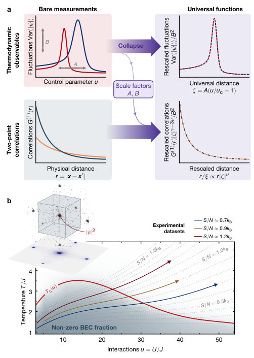 
FIG. 1. Experimental context. a. Fluctuations and two-point correlations are measured for several configurations (different colors in the left column). Only two scale factors, A and B, are needed to collapse all the measured quantities onto their universal scaling functions (right column). b. Phase diagram of ultracold lattice bosons with harmonic confine- ment. Experimentally, three datasets were acquired (colored arrows), probing the superfluid transition at various entropies. (Inset) Example of a single-shot experimental 3D momentum distribution. The order parameter |ψ| is encoded in the pop- ulation of the k = 0 mode, while two-point correlations are encoded in the spatial structure of...

📷 Fig 2

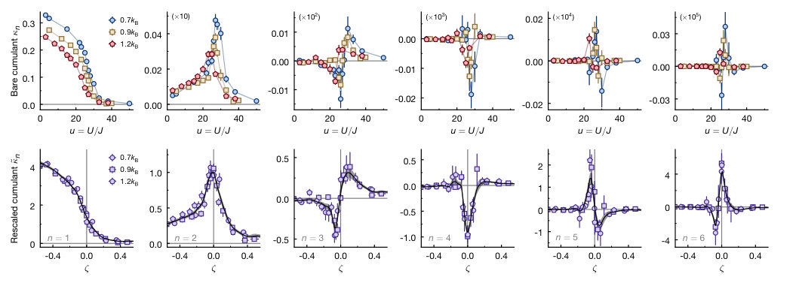 
FIG. 2. Universal scaling of the order parameter cumulants. a. The upper panels show the bare cumulants κn measured in the experiment as a function of the interaction strength u for the three different entropies per particle (S0/N ≈0.7kB, S1/N ≈0.9kB, S2/N ≈1.2kB). b. The lower panels show the rescaled cumulants ˜κn (circles: S0/N ≈0.7kB; squares: S1/N ≈0.9kB; pentagons: S2/N ≈1.2kB) as well as the corresponding universal scaling functions (black curves, guide to the eye). The non-universal parameters A, B and uc are determined by collapsing the first 6 cumulants κn of the order parameter distribution measured at different entropies. Errorbars indicate the 68% bootstrap confidence interval...

📷 Fig 3

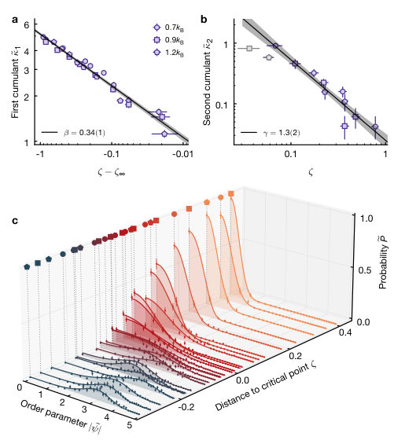 
FIG. 3. Universal statistics of the order parameter. a. Power-law scaling of the first cumulant ˜κ1 of the order parameter with the critical exponent β in the ordered phase. The solid black line is a power-law fit yielding β = 0.34(1). b. Power-law scaling of the second cumulant ˜κ2 with the critical exponent γ in the disordered phase. The solid black line is a power-law fit yielding γ = 1.3(2). The data point in light gray are excluded from the fitting range (see SI). c. Probability distribution eP(| ˜ψ|, ζ) of the order parameter in universal units across the critical point. The solid curves are guides to the eye. The markers (circles, squares and pentagons) refer to the entropy of each...

📷 Fig 4

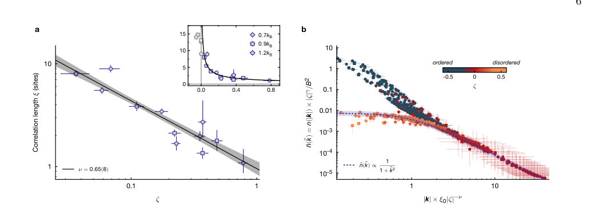 
FIG. 4. Universal scaling properties of two-point correlations. a. Correlation length ξ as a function of the rescaled distance to the critical point ζ. The observed divergence is compatible with the power-law scaling associated with the critical exponent ν. The fitted value of the latter is ν = 0.65(8), compatible with the 3DXY critical exponent ν3DXY = 0.6718(1) obtained from conformal bootstrap [36]. Inset: same as main panel plotted in linear scale. The markers in light gray correspond to datasets excluded from the power-law fit (see SI). b. Rescaled momentum density distribution ˜n(˜k) as a function of rescaled momentum ˜k. The rescaled quantities are computed from the bare quantities...

**Summary.** This work experimentally verifies the concept of two-scale-factor universality near a superfluid phase transition in ultracold lattice Bose gases. By collapsing measurements of order-parameter fluctuations and correlations using two scale factors, the authors confirm that multiple observables obey the same universal scaling laws. This provides strong evidence for the deep underlying principles governing critical behavior in quantum many-body systems.

**Why it may be interesting.** It provides a rigorous, quantitative experimental test of fundamental concepts in critical phenomena—specifically, the simultaneous universality of multiple observables—in a highly controllable quantum many-body platform.

Detailed structure

**Main problem.** To experimentally validate the prediction of 'two-scale-factor universality' for observables across a continuous phase transition, specifically the superfluid transition.

**Main result.** The study demonstrated that fluctuations (cumulants) and two-point correlations simultaneously collapse onto universal scaling functions using only two entropy-dependent scale factors.

**Method.** The authors measured order-parameter cumulants and two-point correlations in ultracold lattice Bose gases and collapsed the data using scaling theory concepts.

**Model / system.** The system is ultracold lattice Bose gases modeled by the Bose-Hubbard Hamiltonian, studied near the superfluid transition point.

**Key observables.** Order-parameter cumulants ($\kappa_n$), order-parameter probability distribution $P(|\psi|)$, and two-point correlation function $G^{(1)}(\mathbf{x}, \mathbf{x}', u)$.

**Important parameters / regimes.** The control parameter is $u = U/J$, and the analysis is performed along isentropic trajectories at varying entropies.

**Assumptions / limitations.** The results provide an experimental test of universality for a finite-size system, assuming corrections to classical scaling are negligible.

**Figures summary.** Figures illustrate the concept of two-scale-factor universality, showing the collapse of bare cumulants onto universal curves using scale factors A and B, and displaying the scaling of the order parameter PDF and correlation length.

**Paper structure.** The paper introduces the concept of universal scaling, presents experimental measurements of cumulants and correlations across the superfluid transition, demonstrates the collapse onto universal functions using two scale factors, and finally determines critical exponents ($eta, \gamma, 
u$).

Abstract

The critical behavior of a system near a continuous phase transition is commonly characterized by power laws and a set of universal critical exponents. Yet universality at phase transitions has even more fundamental manifestations. It dictates that all observables follow universal scaling functions, which may extend beyond simple power laws. Furthermore, microscopic details are captured entirely by only two system-specific scale factors, that rescale any measured quantity onto its universal form. In this work, we report the experimental validation of this prediction in ultracold lattice Bose gases undergoing the superfluid transition. We extract the scale factors by collapsing the order-parameter cumulants measured at varying entropies. We show that these factors specify scaling functions governing both the order-parameter distribution and two-point correlations. By measuring these scaling functions, we also determine three critical exponents $β$, $γ$ and $ν$. Our results provide an experimental demonstration that universal scaling is simultaneously obeyed by multiple observables in a quantum many-body system.

[↑ back to top](#top)

### [Analog quantum simulation of bosonic and anyonic models with flux-driven transmons](http://arxiv.org/abs/2609.03737v1)

**Authors:** Isak Lyngfelt, Jorge Fernández-Pendás, Göran Johansson, Laura Garciá-Álvarez  
**Type:** theory · **Category:** strongly correlated electrons · **PDF:** <https://arxiv.org/pdf/2609.03737v1>  
**Analysis basis:** full PDF text, analyzed in chunks
**Topic relevance:** 🔥 `analog quantum simulation` **4/5** · `QC/QI experiment` **2/5** · `methods for driven-dissipative` **1/5**

📷 Fig 1

 
FIG. 1. Lumped circuit representation of two capacitively coupled flux-tunable transmons. The frequency of the qubit ωi(Φ(t)) depends on the magnetic flux threading the loop of two Josephson junctions, represented by a crossed square.

📷 Fig 2

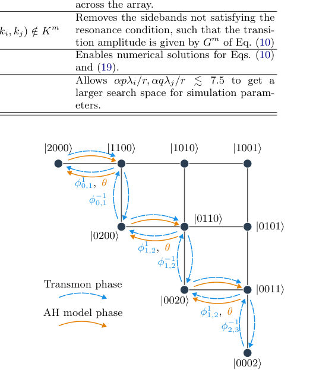 
FIG. 3. A Fock-state lattice representation of four sites with two particles. Each vertex is a many-body Fock state, and each edge represents two states being coupled by J(ˆa† i ˆaj + h.c.). The curved arrows indicate the phase of the hopping amplitude, where the blue dashed arrows are the hopping phases for the transmon system in Eq. (16) and the orange solid arrows are for the AH model in Eq. (17). The transmon phases ϕ0 ℓ,ℓ+1 = 0 are not included in the figure. The total phase around any closed loop is the same for both systems when ϕ±1 ℓ,ℓ+1 = ±ℓθ.

📷 Fig 3

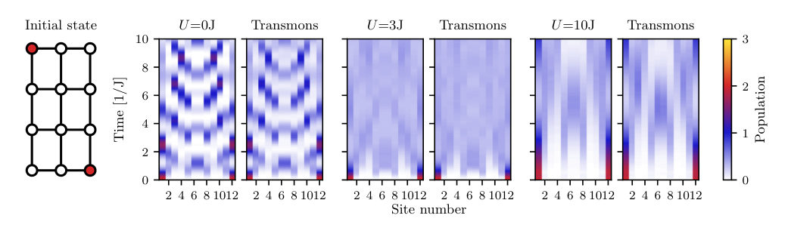 
FIG. 4. A quantum walk of two particles initialized in each of sites one and twelve in a 4 × 3 grid for U = {0, 3J, 10J}. For each interaction strength, the left plot shows the exact dynamics of the BH model, Eq. (2), and the right plot, the simulated transmon system. The system contains four particles, which exceeds the maximum occupation per site, Nmax = 3, so the truncation is not guaranteed by particle-number conservation.

📷 Fig 4

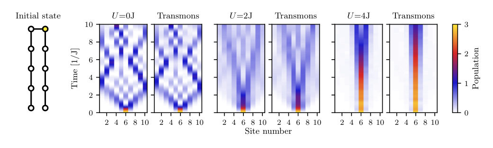 
FIG. 5. A quantum walk of a triplon initialized at site six in a ten site 1D chain for U = {0, 2J, 4J}. For each interaction strength, the left plot shows the exact dynamics of the BH model, Eq. (2), and the right plot, the simulated transmon system.

📷 Fig 5

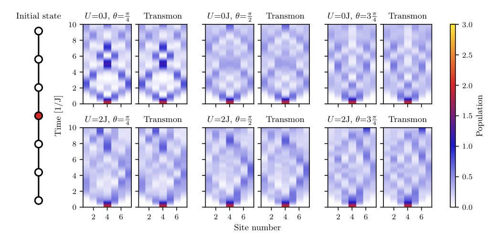 
FIG. 6. A quantum walk for two interacting anyons initialized on the same site for U = 0 and U = 2J in the top and bottom row respectively. For each interaction strength, the left plot shows the exact dynamics of the AH model, Eq. (3), the right plot is the simulated transmon system. We consider the statistical phases θ = π/4, π/2 and 3π/4 for both interaction strengths in the left, middle and right plots respectively. For the non-interacting system, the state delocalizes as the phase increases. For the interacting system, the quantum walk is asymmetric.

**Summary.** This paper details a general protocol to simulate interacting bosonic and anyonic lattice models using superconducting transmon arrays. By precisely modulating the transmon frequencies, the authors can engineer the necessary on-site interactions and hopping terms for both the Bose-Hubbard and Anyon-Hubbard models. This work is significant because it demonstrates a scalable, controllable platform for studying strongly correlated quantum matter beyond current simulation limits.

**Why it may be interesting.** This work provides a concrete, hardware-agnostic blueprint for simulating fundamental models of strongly correlated matter (like the Hubbard model) using superconducting circuits, bridging theoretical condensed matter physics with quantum hardware realization.

Detailed structure

**Main problem.** The paper addresses the challenge of simulating complex many-body phenomena, specifically bosonic and anyonic interactions, which are difficult to model using classical computational methods.

**Main result.** The authors propose a general, tunable protocol using superconducting transmon arrays to realize the dynamics of both the Bose-Hubbard and Anyon-Hubbard models.

**Method.** The simulation is achieved by resonantly driving the frequencies of capacitively coupled transmons in an alternating pattern, which effectively engineers the required interaction and hopping terms.

**Model / system.** The physical platform is a lattice of flux-tunable transmons. The target models are the Bose-Hubbard (BH) model and the Anyon-Hubbard (AH) model, which describe interacting bosons/anyons on a lattice.

**Key observables.** Interaction-dependent localization and the statistics-dependent asymmetry of the anyonic quantum walk.

**Important parameters / regimes.** On-site interaction strength (U), hopping amplitude (J), and the statistical phase ($	heta$) for anyons.

**Assumptions / limitations.** The protocol relies on resonant driving and uses approximations like the Rotating Wave Approximation (RWA) and a first-order Fourier expansion for the time-dependent frequency modulation.

**Figures summary.** Figures illustrate the quantum walk dynamics for the BH model across varying interaction strengths and show the total leakage probability in the AH model as a function of interaction strength.

**Paper structure.** The paper introduces the problem of simulating interacting quantum systems, details the general protocol using transmon arrays to map the BH and AH Hamiltonians, presents numerical results demonstrating the capability to tune parameters and observe characteristic dynamics, and discusses limitations like leakage.

Abstract

When quantum particles interact, many-body phenomena that are hard to simulate classically emerge. Quantum analog simulation offers an alternative in which the target system's dynamics is directly realized in controllable quantum hardware. Here, we give a general protocol for simulating the Bose-Hubbard and anyon-Hubbard models using lattices of capacitively coupled flux-tunable transmons. By modulating the transmon frequencies in an alternating pattern, we resonantly drive multiple many-body transitions and can tune the on-site interaction and density-dependent hopping amplitudes for up to three bosons per site, with no additional restriction on the total particle number. By adding phases to the modulation, which renders the transition amplitudes complex-valued, we propose the first simulation protocol for the anyon-Hubbard model with transmons. Numerical simulations of the driven transmon arrays with experimentally realistic parameters reproduce the characteristic dynamics of the target models across a range of interaction strengths and statistical phases, including the interaction-dependent localization and the statistics-dependent asymmetry of the anyonic quantum walk.

[↑ back to top](#top)

### [Nodal obstruction to conditioned-diffusion representations of the weak momentum](http://arxiv.org/abs/2609.03242v1)

**Authors:** Chon-Fai Kam, Kai-Wen Wong  
**Type:** theory · **Category:** other · **PDF:** <https://arxiv.org/pdf/2609.03242v1>  
**Analysis basis:** full PDF text, analyzed in chunks
**Topic relevance:** 🔥 `quantum measurements` **4/5** · `Keldysh / 2PI / non-Gaussian methods` **1/5** · `interference shaping light` **1/5** · `methods for driven-dissipative` **1/5**

📷 Fig 1

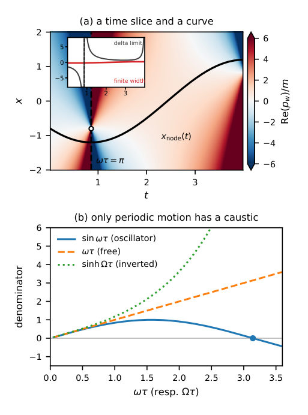 
FIG. 1. Caustic versus node. (a) The delta-limit field (28) diverges along an entire time-slice ωτ = π (dashed), the same t for every x (with the single exception of x = −xf, where numerator and denominator vanish together, Proposition 8), whereas the osmotic boundary ∂D = {x = xnode(t)} (solid) is a curve. The two are geometrically distinct objects in the same plane. Inset, at fixed x. The delta-limit field blows up at the caustic while the finite-width (coherent) Re(pw) of (C5) passes through it smoothly, the overlap staying nonzero. (b) The caustic exists only for periodic motion, the constrained- velocity denominator is sin ωτ for the oscillator (vanishing at τ = nπ/ω, circles), but ωτ...

📷 Fig 2

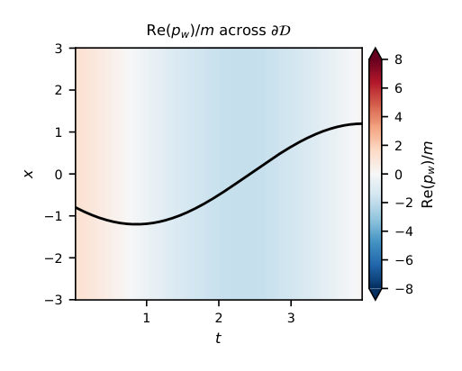 
FIG. 3. Control. The current velocity Re(pw)/m for the same nodal post-selection stays finite across ∂D (black). For this state class it is in fact exactly independent of x at each t [Eq. (29)], so the panel is a visualization of an exact identity. The divergence visible in Fig. 2(b) is absent here at any reso- lution, which is what entitles one to call it osmotic.

📷 Fig 3

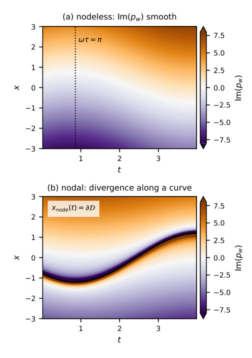 
FIG. 2. Osmotic momentum Im(pw) for the oscillator (pa- rameters in text). (a) Nodeless post-selection, smooth. The Mehler caustic ωτ = π (dotted) is regularized and is not ∂D. (b) Nodal post-selection, Im(pw) diverging as 1/(x −xnode), sign-changing, along the curve xnode(t) (black), the genuine ∂D.

📷 Fig 4

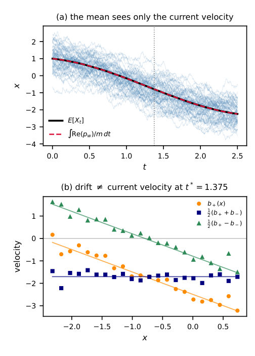 
FIG. 4. Proposition 1 on sampled trajectories. Coherent (nodeless) pre-/post-selection on D, oscillator with ωT &lt; π (no caustic). The sampled process is the demonstration diffu- sion of the text, with drift b = ¯v + ν ∂x ln ¯ρ, ¯v(t) = Re(pw)/m [Eq. (C5)], and ¯ρ a fixed-width Gaussian (coherent width σ2 = ℏ/2mω) whose center is transported at ¯v. By Propo- sition 1 its marginal is not the product density ρψρϕ(·, t). (a) The ensemble mean E[Xt] (black) tracks the indepen- dently computed field R ¯v dt (dashed) along an oscillatory, not a straight, curve. (b) From the same paths at fixed t, the local Itô drift b+(x) (sloped) differs from the Nelson current velocity 1 2(b+ + b−) (flat, equal...

📷 Fig 5

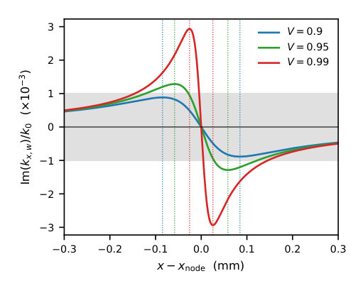 
FIG. 5. Predicted osmotic (imaginary) transverse-momentum weak value Im(kx,w)/k0 across a dark fringe, i.e. Eq. (31), which gives Im(kx,w), of dimension inverse length, divided by k0 = 2π/λ, for the Kocsis geometry [2] at z = 5.6 m (Λ ≃1.13 mm) and three visibilities V . Dotted lines mark the extrema at x −xnode = ±ϵ. The grey band is the ±10−3 scale of the current-velocity signal Re(kx,w)/k0 already measured. The imaginary signal is of the same order and sharpens toward a true 1/(x −xnode) pole as V →1.

**Summary.** This theoretical paper analyzes the weak momentum in quantum systems, showing that standard conditioned-diffusion models fail when the system's two-state amplitude develops nodes. The failure manifests as a divergence in the osmotic component of the weak momentum, which is a key diagnostic distinguishing the quantum reality from purely current-based classical descriptions.

**Why it may be interesting.** It provides a rigorous mathematical constraint on how quantum weak measurements can be modeled using classical diffusion processes, highlighting where the underlying stochastic assumptions break down.

Detailed structure

**Main problem.** The paper investigates the limitations of applying conditioned-diffusion representations, derived from quantum Schrödinger bridges, to the weak momentum, especially when the two-state amplitude exhibits nodes.

**Main result.** The positivity hypothesis required by these bridges fails on a definite locus (the nodal curve), causing the osmotic part of the weak momentum to diverge while the current part remains bounded.

**Method.** The analysis uses the Madelung decomposition of the weak momentum and compares its behavior to established quantum stochastic frameworks like Doob's $h$-transform.

**Model / system.** The system involves pre- and post-selected quantum states ($\psi$ and $\phi$) and analyzes the weak momentum in the context of a two-slit geometry with separable transverse fields.

**Key observables.** Weak momentum components (current and osmotic parts), nodal locus of $\phi^*\psi$, and fringe visibility/contrast.

**Important parameters / regimes.** The order of the zero ($k$) of the two-state amplitude, and the small parameter $	heta$ in related context analyses.

**Assumptions / limitations.** The results are derived for one-dimensional systems covering separable transverse fields, and the analysis distinguishes between the current velocity and the Itô drift.

**Figures summary.** Not specified (Notes focus on mathematical derivations and conceptual failures rather than figure descriptions).

**Paper structure.** The paper builds by first establishing the failure of the positivity hypothesis required by quantum Schrödinger bridges when dealing with the two-state amplitude. It then analyzes the divergence of the osmotic part at the node, contrasting this with the bounded current part, and finally relates these findings to experimental diagnostics like fringe visibility.

Abstract

Quantum Schrödinger bridge constructions establish the existence of a conditioned process under a positivity hypothesis on the endpoint data, and three independent ones adopt it. We show that hypothesis fails on a definite locus once the conditioned object is the two-state amplitude $φ^*ψ$ of a pre- and post-selected pair on configuration space, and that the failure is testable on recorded data. Whenever $φ^*ψ$ has a moving zero of order $k$ across which probability flows, no diffusion of constant diffusion coefficient can both carry the conditioned density and avoid the nodal curve: the current velocity it would need grows as the inverse $2k$-th power of the distance to that curve and points toward it on one side, placing the curve at finite scale distance, so it is reached and not merely approached. Identifying the weak momentum with a bridge drift fails independently: for a free particle post-selected in position the current velocity is exactly minus the drift of the bridge to the target. The positive Doob $h$-transform and the Bernstein conditioning built on it exist wherever $φ^*ψ$ is nodeless and fail on the nodal curve. There the osmotic part of the weak momentum diverges as the inverse distance to the zero and changes sign across it with a coefficient set by $k$, while the current part stays bounded; that boundedness rests on the signed factorization of the real-envelope class and hides the obstruction from any picture built on the current velocity alone. A measured fringe visibility fixes a single length, which puts a Lorentzian of order $10^{-3}$ into the current channel reconstructed in the two-slit trajectory experiment if the contrast is limited by an off-axis zero, and nothing there if by incoherence. The results are one-dimensional, covering the separable transverse field of a two-slit geometry, not general two-dimensional vortices.

[↑ back to top](#top)

### [Low-Frequency Charge Noise in Bilayer Graphene Quantum Dots](http://arxiv.org/abs/2609.03650v1)

**Authors:** Jessica Richter, Max J. Ruckriegel, Jonas D. Gerber, Tijl Degroote, Christoph Adam, Markus Niese, Lara Ostertag, Clara Galante, Kenji Watanabe, Takashi Taniguchi, Petar Tomic, Artem O. Denisov, Hadrien Duprez, Klaus Ensslin, Thomas Ihn  
**Type:** experiment · **Category:** quantum information and computing · **PDF:** <https://arxiv.org/pdf/2609.03650v1>  
**Analysis basis:** full PDF text, analyzed in chunks
**Topic relevance:** 🔥 `QC/QI experiment` **4/5** · `quantum measurements` **2/5**

📷 Fig 1

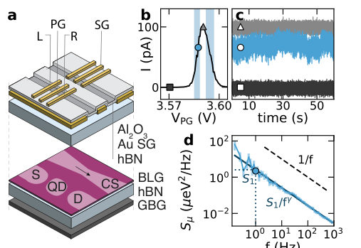 
FIG. 1. Low-frequency charge-noise measurement. (a) Heterostructure that consists of BLG encapsulated in hBN, a graphite back gate (GBG), and two gold top-gate layers. Split gates (SGs) define two parallel transport chan- nels; six finger gates are operated as a plunger gate (PG) and left and right barrier gate (L, R) to define a quantum dot (QD) and a charge sensor (CS), operated with the sen- sor gate (SG). (b) Example of a CB resonance with three operation points, steepest point on flank (blue circle), top of the resonance (gray triangle) and background (black square). Blue-shaded regions mark the flanks. (c) Current fluctuation as a function of time. (d) PSD of the energy fluctuations...

📷 Fig 2

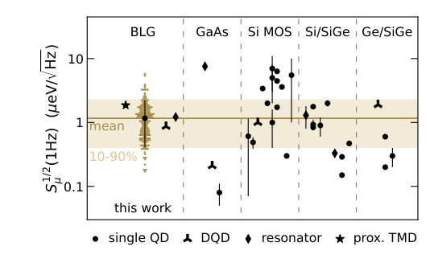 
FIG. 2. Charge-noise amplitude S1/2 µ at 1 Hz of BLG compared to other established QD platforms. Our results for BLG single QDs are summarized in the vertical histogram around the median value (solid yellow line), with the 10-90 percentile range of this distribution highlighted in beige. Additional BLG points reflect varying dot geometries (DQD), readout mechanism (resonator) and heterostructure designs (proximitized TMD). Literature values (representa- tive, non-exhaustive) are shown for GaAs [23–25], Si MOS [26–35], Si/SiGe [20, 27, 36–40] and Ge/SiGe [21, 41, 42]. A full table of the references is provided in the Supplementary Material S2.

📷 Fig 3

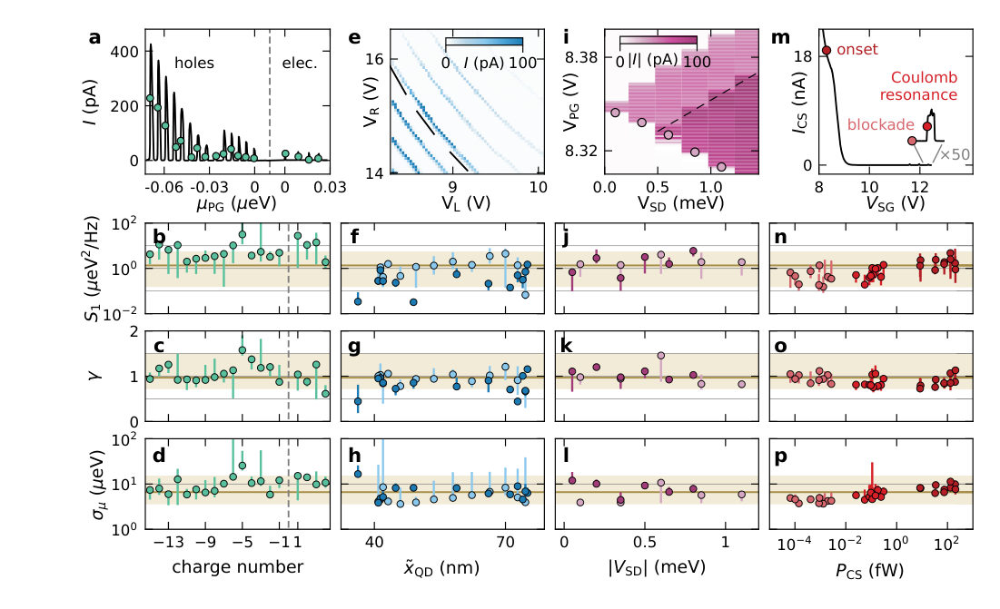 
FIG. 3. Influence of electrostatic tuning on charge noise. The charge-noise amplitude S1 (second row), frequency exponent γ (third row) and integrated charge noise σµ (fourth row) are shown with respect to four independent tuning parameters. We included the median value, as well as the 10-90 percentile spread of the full measurement ensemble (comp. Sec. S3). For each charge noise metric, the circle indicates the result of the operation point (at the steepest slope) whereas the vertical bar denotes the range of lowest to highest value measured on the entire flank of the Coulomb resonance (see Supplementary Material S1). (a–d) Charge occupation. In (a) the analyzed Coulomb resonances and...

📷 Fig 4

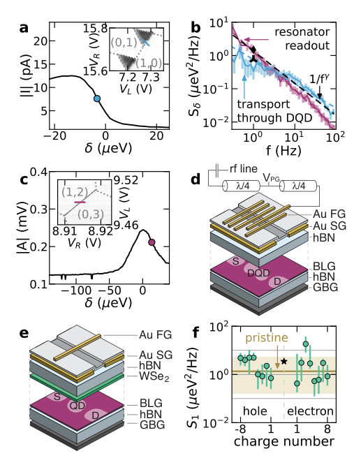 
FIG. 4. Charge noise with respect to quantum dot ge- ometry, readout technique and heterostructure engi- neering. (a) Transport signal along the DQD interdot tran- sition (black); operation point at steepest slope (light blue circle, cf. Fig. 1). Inset: charge stability diagram (CSD) with bias triangles and measurement line (light blue); DQD occupation (N, M), with N (M) the electron number in the left (right) dot. (b) Detuning noise spectrum Sδ from trans- port (light blue) and resonator readout (pink), both fitted to S1/f γ (dashed, blue/pink line). Corresponding 1 Hz values refer to Fig. 2 (DQD, resonator). Dashed black S1/f line with median single-dot S1 is shown for comparison. (c)...

📷 Fig 5

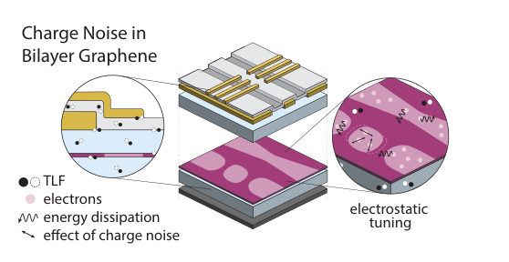 
FIG. 5. For Table of Contents Only

**Summary.** This experimental work characterizes the low-frequency charge noise in Bilayer Graphene Quantum Dots using noise spectroscopy. The measured noise levels are competitive with established semiconductor platforms, and the noise proves robust against systematic electrostatic tuning. These results strongly validate BLG as a promising material for developing coherent solid-state qubits.

**Why it may be interesting.** The work directly addresses the primary decoherence mechanism (charge noise) limiting qubit coherence, providing quantitative metrics essential for assessing any solid-state platform for quantum computation.

Detailed structure

**Main problem.** The study aimed to characterize and assess the low-frequency charge noise in Bilayer Graphene (BLG) Quantum Dots (QDs) to determine if the material is a viable platform for coherent quantum information processing.

**Main result.** The measured charge noise amplitude ($1.16 \mu	ext{eV}/\sqrt{	ext{Hz}}$) places BLG within the range of established semiconductor platforms, and the noise levels showed no systematic dependence on varying electrostatic tuning parameters.

**Method.** The noise was characterized using transport-based noise spectroscopy by observing current fluctuations at the flank of a Coulomb blockade resonance, with independent confirmation via superconducting resonator readout.

**Model / system.** The physical system is gate-defined BLG QDs, sometimes extended to incorporate Transition Metal Dichalcogenide (TMD) layers, fabricated in a van-der-Waals heterostructure.

**Key observables.** Median charge-noise amplitude ($S_{1/2\mu}(1 	ext{ Hz})$), Power Spectral Density (PSD) $S_\mu(f)$, and integrated charge noise ($\sigma_\mu$).

**Important parameters / regimes.** Cryogenic temperature (20 mK), charge occupation, confinement potential, source-drain bias ($|V_{SD}|$), and sensor operating power.

**Assumptions / limitations.** The noise is attributed to Two-Level Fluctuators (TLFs) in dielectrics or interfaces, and the lack of systematic dependence suggests the noise is intrinsic to the environment rather than the gate-tunable parameters.

**Figures summary.** Figure 1 illustrates the device heterostructure and measurement procedure. Figure 2 compares the extracted charge noise amplitudes of BLG to other QD platforms. Figure 3 demonstrates the lack of systematic evolution of noise parameters when varying electrostatic tuning parameters.

**Paper structure.** The paper systematically characterizes charge noise by varying multiple operational parameters (occupation, bias, confinement) using transport spectroscopy, confirms results with an independent readout method, and extends the study to hybrid TMD/BLG systems.

Abstract

Bilayer graphene (BLG) quantum dots (QDs) are a promising platform for semiconductor qubits. However, the low-frequency charge noise that may ultimately limit coherence has remained largely unexplored. Here, we systematically characterize charge noise in gate-defined BLG QDs using transport-based noise spectroscopy. We extract a median amplitude of $ S_μ^{1/2} (1~\text{Hz}) = 1.16~μ\text{eV}/\sqrt{\text{Hz}}$, placing BLG well within the range reported for established semiconductor quantum-dot platforms. Across variations in charge occupation, confinement, source-drain bias, and charge-sensor operating conditions, neither the noise amplitude nor the spectral dependence shows a reproducible trend in electrostatic tuning, indicating that we extracted the intrinsic semiconductor noise. Consistent noise levels are further observed in double QDs and confirmed using an independent superconducting resonator-based dispersive readout. Extending the study to BLG devices incorporating transition metal dichalcogenide layers reveals no measurable charge noise increase in weakly proximitized QDs. These results validate BLG as a viable platform for coherent quantum information processing.

[↑ back to top](#top)

### [Characterizing Large Scale Quantum Systems with Error Per Circuit Layer](http://arxiv.org/abs/2609.04132v1)

**Authors:** Travis Hurant, Arian Vezvaee, Swarnadeep Majumder, Aniket Dalvi, Jude Alnas, Kenneth R. Brown  
**Type:** both · **Category:** quantum information and computing · **PDF:** <https://arxiv.org/pdf/2609.04132v1>  
**Analysis basis:** full PDF text, analyzed in chunks
**Topic relevance:** 🔥 `QC/QI experiment` **4/5** · `quantum measurements` **1/5**

📷 Fig 1

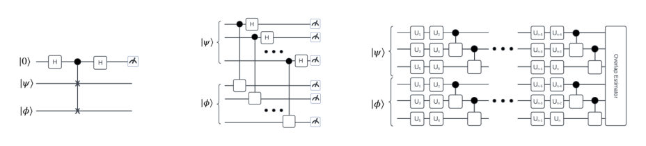 
Fig. 1: Overlap measurement and random circuit construction used in EPCL. (a) The swap test estimates the overlap Tr(ρAρB) using an ancilla and a controlled-SWAP operation between the two registers. (b) The pairwise Bell-basis measurement replaces the controlled-SWAP with local Bell-basis measurements between corresponding qubits; classical post-processing of the measurement outcomes recovers the state overlap. (c) EPCL applies the same random circuit instance to two disjoint n- qubit registers and estimates the overlap between their noisy output states. The illustrative circuit uses T = 2 for compactness; the numerical and experimental studies in this work use T = 4. Independently sampled...

📷 Fig 2

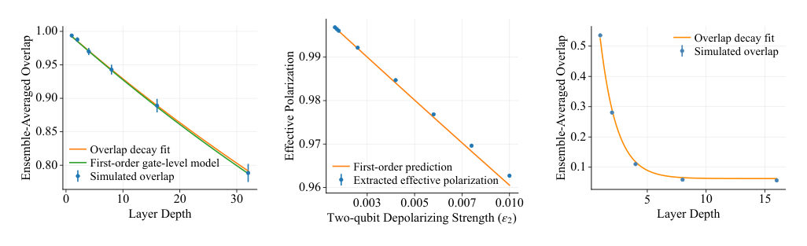 
Fig. 2: EPCL under local depolarizing noise, demonstrating agreement with the first-order baseline model in the weak-noise regime and stable decay behavior beyond the validity of that approximation. (a) For ε1 = 10−4 and ε2 = 10−3, the EPCL fit closely agrees with the simulated overlap decay and yields bpeff = 0.99601, compared with the first-order prediction pFO eff = 0.99599. (b) Sweeping the two-qubit depolarizing strength while maintaining ε1 = 0.1ε2 produces close agreement at low noise strengths, with systematic deviation emerging near ε2 ≈6 × 10−3 as higher-order Pauli fault contributions become significant and the first-order approximation breaks down. (c) At the intentionally large...

📷 Fig 3

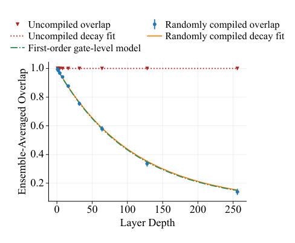 
Fig. 3: Effect of Pauli twirling on EPCL sensitivity to a fixed coherent error in the entangling layer. A coherent over-rotation of θ = π/40 is applied to the target qubit of each CX gate. Without Pauli twirling, the overlap exhibits essentially no depth-dependent decay, indicating that the unmodified EPCL protocol is insensitive to this coherent error structure. With Pauli twirling, the coherent error is randomized into an effective stochastic channel, restoring the exponential decay used by EPCL to estimate effective polarization. The extracted polarization, bpeff = 0.9955, closely agrees with the first-order prediction pFO eff = 0.9954.

📷 Fig 4

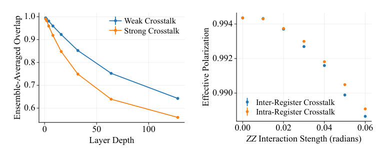 
Fig. 4: Effect of coherent ZZ crosstalk on EPCL. (a) Ensemble-averaged overlap as a function of circuit depth for inter-register crosstalk at representative weak (θ = 0.01) and strong (θ = 0.06) interaction strengths. In both cases, the overlap retains a clear exponential depth dependence, allowing an effective polarization to be extracted despite correlations between the two registers. (b) Extracted effective polarization as a function of ZZ interaction strength for intra- and inter-register crosstalk. Inter-register coupling produces a systematically lower effective polarization and stronger dependence on interaction strength than intra-register coupling, consistent with contributions...

📷 Fig 5

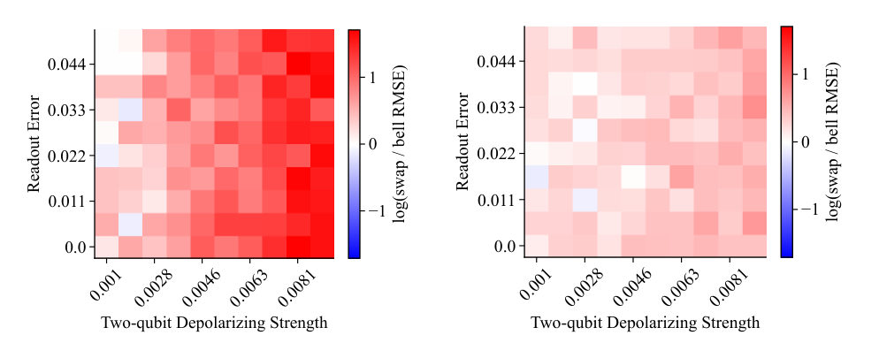 
Fig. 5: Comparison of the two overlap measurement implementations considered for EPCL under depolarizing gate noise and readout error. The simulations use physical systems of 5 and 11 qubits, corresponding to N = 4 and N = 10 benchmark qubits, respectively. The swap-test implementation uses the remaining qubit as an ancilla, while the Bell-basis implementation does not require the additional qubit. Each point shows log(RMSEswap/RMSEBell) for the extracted effective polarization relative to a high-shot ideal reference computed using an error-free measurement circuit; positive values indicate lower estimation error for the Bell-basis implementation. (a) For N = 4, the Bell-basis measurement...

**Summary.** This paper introduces Error Per Circuit Layer (EPCL), a novel overlap-based benchmark for characterizing noise in large quantum systems. EPCL measures the overlap between two independently evolved quantum registers, circumventing the need for computationally expensive classical simulations of ideal states. The method is validated on quantum hardware, providing a scalable metric for assessing aggregate register performance.

**Why it may be interesting.** This work provides a crucial, hardware-agnostic diagnostic tool for assessing noise in large quantum circuits, which is vital for developing fault-tolerant quantum computation protocols.

Detailed structure

**Main problem.** Developing a robust, scalable circuit-level benchmark to characterize noise accumulation in large quantum systems without relying on classical simulation of ideal outputs.

**Main result.** The proposed Error Per Circuit Layer (EPCL) benchmark successfully measures aggregate register performance via output state overlap, showing clear decay on IBM hardware and remaining compatible with arbitrary gate sets.

**Method.** EPCL estimates effective layer polarization by measuring the overlap between the output states of two disjoint quantum registers after applying identical random circuits.

**Model / system.** The study analyzes quantum processors, using two copies of an $n$-qubit register to measure the overlap $	ext{Tr}(
ho_A 
ho_B)$ as a function of circuit depth. The analysis is grounded in depolarizing channel models.

**Key observables.** Overlap between output states ($	ext{Tr}(
ho_A 
ho_B)$), effective layer polarization ($p_{	ext{eff}}$), and the decay rate of this overlap with circuit depth.

**Important parameters / regimes.** Circuit depth ($d$), number of qubits ($n$), and the effective layer polarization parameter ($p$).

**Assumptions / limitations.** The method assumes an ensemble-averaged depolarizing model for deriving the expected overlap decay, and it is designed to overcome the classical simulation bottleneck of prior methods.

**Figures summary.** Figures illustrate the overlap measurement using techniques like the Swap Test or Pairwise Bell Measurements, and show the resulting decay curve as a function of circuit depth.

**Paper structure.** The paper introduces EPCL as an overlap-based primitive, compares it to existing benchmarks (like XEB and EPLG), derives the expected decay under a depolarizing model, and validates the method through numerical simulations and experiments on quantum hardware.

Abstract

Quantum benchmarks provide compact measures of performance that are important for evaluating and comparing quantum systems. Circuit-level benchmarks are particularly valuable because they capture the accumulated effects of noise across interacting operations, but existing approaches may require structured gate sets and costly compilation, classical simulation of reference outputs, or subsystem decompositions that do not capture full-register behavior. We introduce Error Per Circuit Layer (EPCL), an overlap-based circuit-level benchmark that estimates an effective layer polarization by applying identical random circuits to two disjoint quantum registers and measuring the overlap between their output states as a function of circuit depth. EPCL avoids classical simulation of ideal output distributions and recovery to a known reference state, and is compatible with arbitrary gate sets, including non-Clifford gates.   We derive the expected overlap decay under an ensemble-averaged depolarizing model and identify the assumptions under which the fitted decay parameter represents an effective layer polarization. Numerical simulations show that EPCL recovers the predicted polarization under weak local stochastic noise and remains well described by a single-exponential decay at stronger stochastic noise levels. The simulations further show that coherent errors associated with fixed entangling layers may require Pauli twirling or randomized compiling to produce the expected decay, while inter-register correlations contribute an additional covariance term to the measured overlap. Finally, experiments on IBM quantum hardware demonstrate clear EPCL decay in 8- and 16-qubit implementations. These results support EPCL as a method for measuring aggregate register performance without requiring classical simulation of ideal circuit outputs or restriction to structured gate sets.

[↑ back to top](#top)

### [Experimental validation of a compact fault-tolerant architecture for trapped ions](http://arxiv.org/abs/2609.03194v1)

**Authors:** Noah Berthusen, Ali Lavasani, Asmae Benhemou, M. S. Allman, Joan Dreiling, Brian Estey, Cameron Foltz, Trent Jacobs, Michael Mills, Annie Jihyun Park, Adam P. Reed, David Hayes, Tzvetan S. Metodi, Andrew C. Potter  
**Type:** experiment · **Category:** quantum information and computing · **PDF:** <https://arxiv.org/pdf/2609.03194v1>  
**Analysis basis:** full PDF text, analyzed in chunks
**Topic relevance:** 🔥 `QC/QI experiment` **4/5** · `quantum measurements` **1/5**

📷 Fig 1

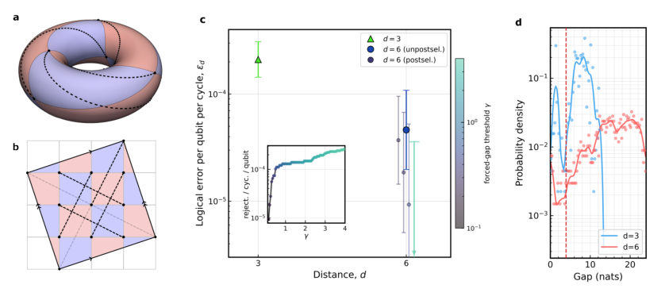 
FIG. 1. C4-Helix code memory and distance scaling. a. Schematic of the [[10, 2, 3]] and [[20, 2, 6]] C4-Helix codes having been mapped onto a torus. The underlying lattice corresponds to the plaquettes of the [[10, 2, 3]] twisted Toric code. Dashed lines represent the pairing taken when performing the C4 concatenation for the C4-Helix code. b. Same schematic of the Helix code sequence, but on a flattened torus. c. Logical error rate per LQ, per cycle εd as a function of the code distance. We report results for the [[10, 2, 3]], and [[20, 2, 6]] C4-Helixcode with/out forced-gap postselection. All uncertainties reported through this work denote 95% Wilson confidence intervals unless otherwise...

📷 Fig 2

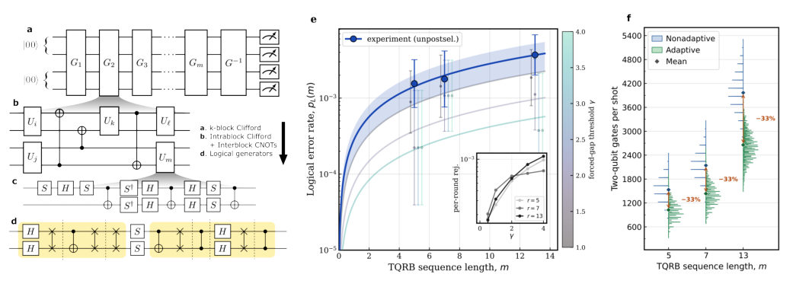 
FIG. 2. Logical randomized Clifford benchmarking. a. A RB experiment on four qubits, where Gi ∈C4 and G1G2...GmG−1 = I. b. Each four-qubit Clifford is broken up into two-qubit Cliffords, U ∈C2, on each C4-Helix codeblock and interblock CNOT gates. c. A two-qubit Clifford is decomposed into single-qubit and CNOT gates. d. The decomposed two-qubit Clifford is expressed in the logical gateset of the C4-Helix code: {H0H1SWAP 0,1, CNOT 0,1SWAP 0,1, SWAP 0,1, CZ0,1, S0S1}. e. Logical circuit error rate pL(m) as a function of TQRB sequence length. Logical error rates can again be reduced via forced-gap postselection for a fixed per-round rejection rate (see inset). f. Distribution of physical...

📷 Fig 3

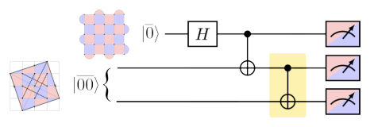 
FIG. 3. Inter-code GHZ experiment schematic and results. For each experiment we report ¯z = Tr  P − Z ρ  and ¯x = Tr  P − X ρ  , the fraction of shots violating the Z-basis agreement and X-basis parity conditions, respectively. The physical baseline comprises 32 three-qubit GHZ states pre- pared in parallel and sampled over N = 32,000 groups per basis; the logical experiment uses the three-qubit logical GHZ state sampled over N = 4,000 shots per basis. Uncertainties are 95% Clopper–Pearson intervals.

📷 Fig 4

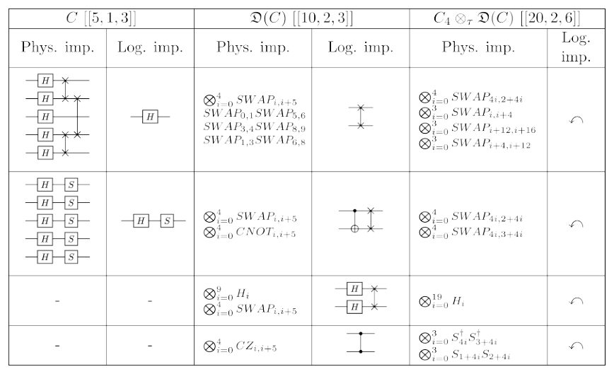 
FIG. 4. Logical gates for the C4-Helix code sequence. SWAP-transversal gates on the non-CSS [[5, 1, 3]] code lifting to SWAP- and fold-transversal logical gates on the [[10, 2, 3]] symplectic double code, lifting again to SWAP-transversal gates on the [[20, 2, 6]] CSD code.

📷 Fig 5

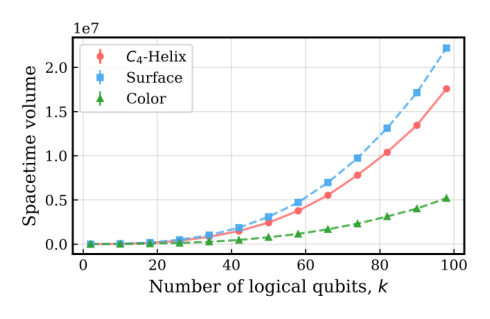 
FIG. 7. Spacetime volume versus problem size. Space- time volume (mean compiled logical depth times number of physical qubits required to encode k logical qubits) of uni- formly random k-qubit Clifford operators, comparing the C4- Helix gateset, the surface code, and the color code. Each op- erator is sampled uniformly at random and synthesized into a minimal physical-gate circuit, whose layers are then costed by the native operations of each architecture. Note that syn- drome extraction overhead is not considered in this analysis.

**Summary.** This paper experimentally validates a compact, fault-tolerant quantum computing architecture using the C4-Helix code on a trapped-ion quantum processor. The authors successfully demonstrated error suppression for memory, executed Clifford group operations with low logical error rates, and established a high-fidelity interface between two different quantum codes. These results confirm the architecture's viability for early-stage fault-tolerant quantum computation.

**Why it may be interesting.** For a theoretical physicist, this provides concrete, hardware-validated benchmarks for resource estimation in fault-tolerant quantum computation, particularly regarding the overhead associated with implementing logical gates and state preparation.

Detailed structure

**Main problem.** The challenge is to build a useful fault-tolerant quantum computation architecture that efficiently manages logical encoding, low-overhead logical operations, and access to non-Clifford resources.

**Main result.** The authors experimentally validated the C4-Helix code on a trapped-ion processor, demonstrating protected memory, low-overhead Clifford group operations, and a high-fidelity interface between two different quantum error-correcting codes.

**Method.** The work employs repeated Quantum Error Correction (QEC) cycles, randomized benchmarking (TQRB) for Clifford group testing, and benchmarking a heterogeneous interface to prepare entangled states between different codes.

**Model / system.** The physical platform is a trapped-ion quantum processor (Quantinuum Helios, 98-qubit). The primary theoretical tool is the C4-Helix code, which is tested for its ability to support fault-tolerant computation primitives.

**Key observables.** Logical error rates ($\epsilon_d$, $\epsilon_C$), GHZ state fidelity, and the efficiency of error suppression compared to physical measurements.

**Important parameters / regimes.** The target regime is the early fault-tolerant regime, aiming for logical error rates in the $10^{-6}$ to $10^{-8}$ range.

**Assumptions / limitations.** The analysis relies on the assumption that the architecture can be validated by demonstrating protected memory, low-overhead Clifford control, and the ability to interface with other codes.

**Figures summary.** Figures illustrate the logical error rate scaling with code distance, the comparison of logical vs. physical randomized Clifford benchmarking, and the fidelity measurement for the three-logical-qubit GHZ state.

**Paper structure.** The paper progresses by first establishing protected memory using the C4-Helix code, then benchmarking the full Clifford group operations within the codeblock, and finally demonstrating the capability to perform fault-tolerant entanglement generation between the C4-Helix code and a surface code.

Abstract

Quantum error correction (QEC) is beginning to enable logical operations that outperform their unencoded physical counterparts, but useful fault-tolerant computation will require more than low-error quantum memory. An effective architecture must orchestrate efficient logical encoding, low-overhead logical operations, and access to the non-Clifford resources required for universal computation. Here, we introduce and experimentally validate such an architecture based on the $[[20,2,6]]$ $C_4$-Helix code, designed for the early fault-tolerant regime. Using Quantinuum Helios, a 98-qubit trapped-ion quantum processor, we experimentally demonstrate the principal components of this architecture: we perform repeated quantum error correction with an error of $4.6^{+6.2}_{-2.6}\times10^{-5}$ per logical qubit per QEC cycle. We benchmark the complete Clifford group on the two logical qubits of a single codeblock under active error correction, obtaining an error of $2.8^{+1.0}_{-1.6}\times 10^{-4}$ per two-qubit logical Clifford. We further demonstrate a fault-tolerant chain-map interface between $C_4$-Helix and a distance-5 surface code, preparing a heterogeneous three-logical-qubit GHZ state with a fidelity lower bound of $99.925^{+0.068}_{-0.245}\%$. In each case, the encoded implementation outperforms its corresponding unencoded physical baseline without relying on postselection. Circuit-level simulations indicate that improvements in physical fidelity bring the same architecture into the $10^{-6}$-$10^{-8}$ logical-error regime targeted for early fault-tolerant computation. Together, these results establish $C_4$-Helix as a hardware-validated fault-tolerant architecture rather than a bare quantum memory.

[↑ back to top](#top)

### [An interpretation-independent formulation of the measurement problem](http://arxiv.org/abs/2609.03409v1)

**Authors:** Antoine Soulas  
**Type:** theory · **Category:** other · **PDF:** <https://arxiv.org/pdf/2609.03409v1>  
**Analysis basis:** full PDF text, analyzed in chunks
**Topic relevance:** 🔥 `quantum measurements` **4/5**

📷 Fig 1

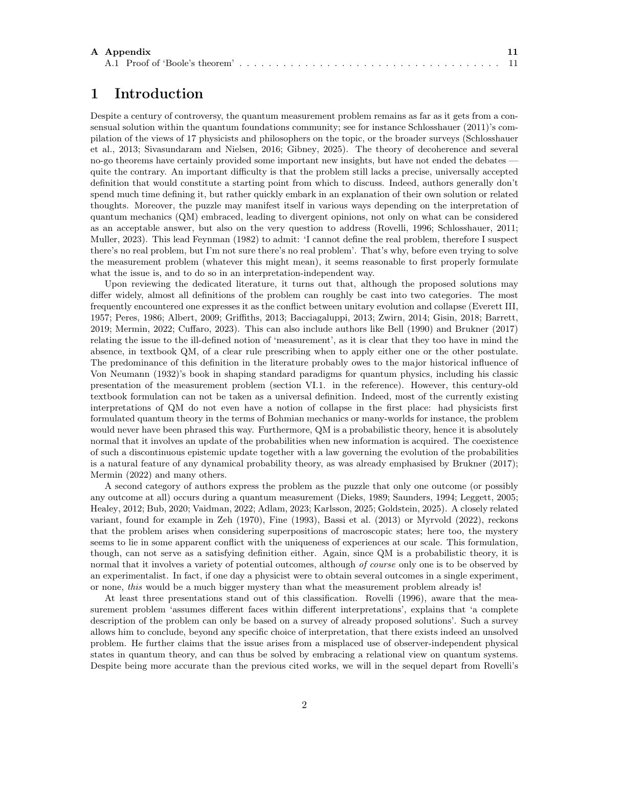 
Low-resolution page preview, page 2

📷 Fig 2

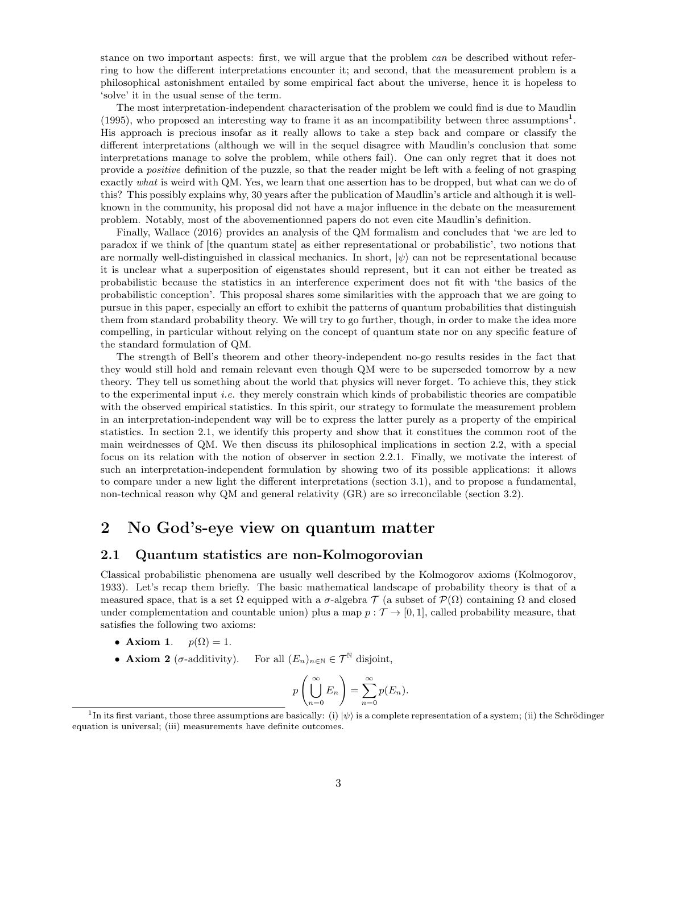 
Low-resolution page preview, page 3

📷 Fig 3

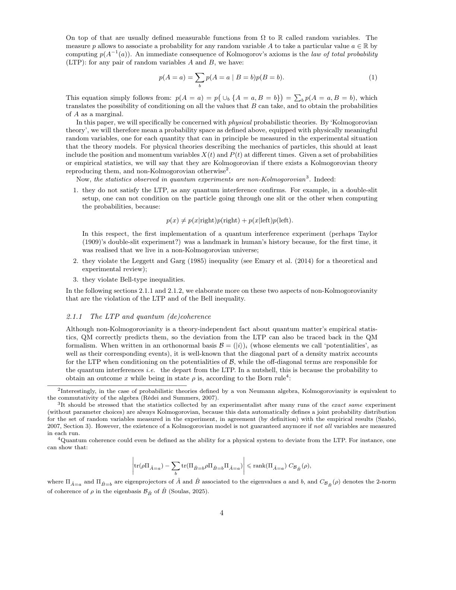 
Low-resolution page preview, page 4

📷 Fig 4

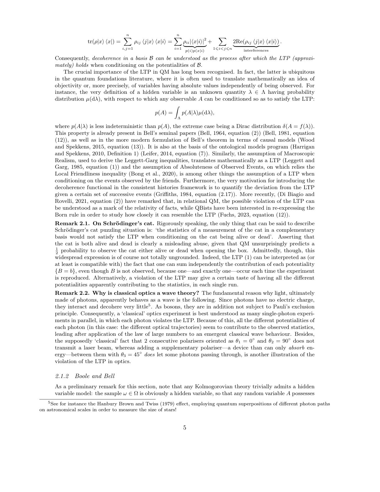 
Low-resolution page preview, page 5

📷 Fig 5

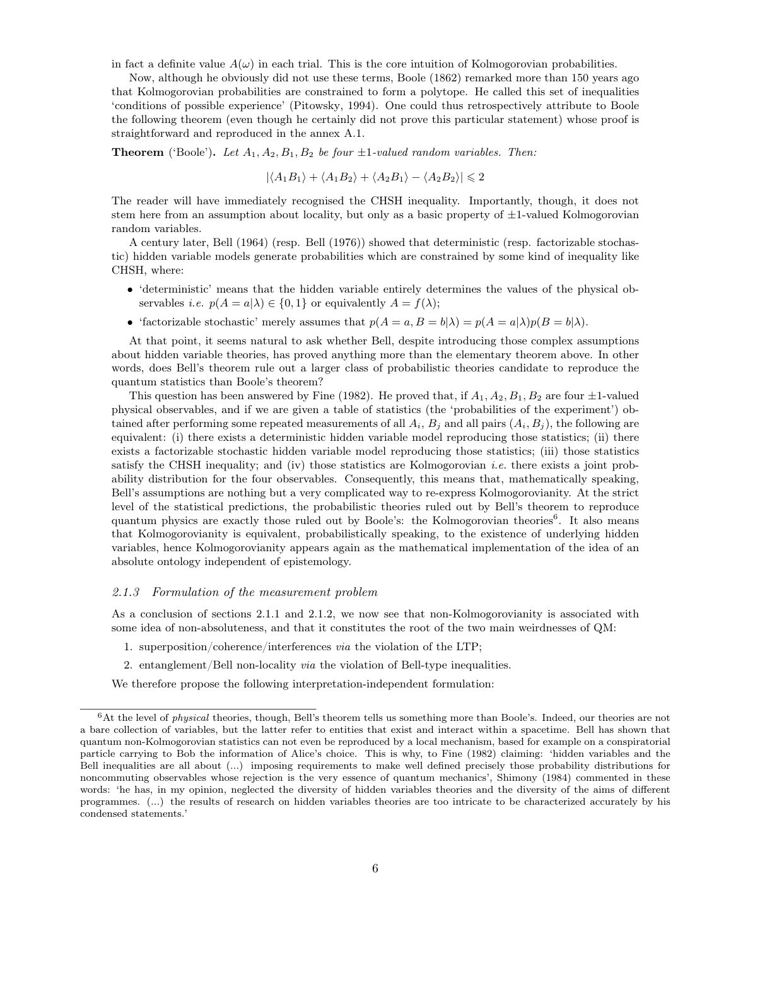 
Low-resolution page preview, page 6

**Summary.** This paper reframes the measurement problem not as a physical puzzle to be solved, but as a fundamental statistical inconsistency: quantum mechanics violates the axioms of classical probability theory. By establishing this non-Kolmogorovian nature of quantum statistics, the authors propose a framework that has profound implications for quantum gravity and the nature of objective reality.

**Why it may be interesting.** It provides a fundamental, statistical framework for understanding the measurement problem that transcends specific interpretations, which is crucial for developing a unified theory of quantum gravity.

Detailed structure

**Main problem.** The paper addresses the quantum measurement problem by seeking an interpretation-independent formulation, rather than attempting a direct solution.

**Main result.** The core finding is that quantum matter cannot be described by a Kolmogorovian probabilistic theory, suggesting the problem lies in the incompatibility between quantum statistics and classical probability axioms.

**Method.** The methodology involves analyzing the empirical statistics of quantum measurements, comparing them against the axioms of classical probability (Kolmogorov theory), and drawing parallels with theory-independent theorems like Bell's theorem.

**Model / system.** The focus is on the abstract mathematical properties of quantum mechanical predictions and their empirical statistics, rather than a specific physical Hamiltonian or system.

**Key observables.** Violation of the Law of Total Probability (LTP), violation of Bell-type inequalities, and the non-Kolmogorovian nature of quantum interference statistics.

**Important parameters / regimes.** None specified; the focus is on fundamental axioms and statistical properties.

**Assumptions / limitations.** The authors assume that the conflict arises because the standard axioms of probability (Kolmogorov) are insufficient to describe quantum reality, leading to the conclusion that no 'God's-eye view' exists.

**Paper structure.** The paper moves from reviewing the limitations of existing interpretations to establishing the non-Kolmogorovian nature of quantum statistics through statistical diagnostics, and finally discussing the philosophical implications for quantum gravity and the nature of reality.

Abstract

In this paper, we do not try to solve the measurement problem, but rather to properly formulate it. One of the reasons why it still lacks a precise, agreed definition is that the problem may take very different aspects depending on the interpretation of quantum mechanics embraced. Inspired by the methodology of theory-independent results like Bell's theorem, we propose to identify the common root of the puzzle in an interpretation-independent way i.e. as a property of the empirical statistics only, before deriving its philosophical consequences. The key observation is that quantum matter can not be described by a Kolmogorovian probabilistic theory. Arguing that the Kolmogorov axioms of probability theory are the postulates of epistemic uncertainty leads us to reformulate the measurement problem as the impossibility to build an ontology independent of epistemology for quantum matter. Said differently, there exists no God's-eye view on quantum systems. Although it is meaningless to solve the measurement problem as defined in this way, insofar as it is a feature of the universe's statistics, such a formulation may on the other hand bring side benefits. In particular, we argue that it allows to: (i) shed a new light on the variety of interpretations; (ii) propose a fundamental reason why quantum mechanics and general relativity are so incompatible, not relying on purely mathematical or technical arguments; (iii) guide the quest for quantum gravity.

[↑ back to top](#top)

### [Measurements on the separated subsystems of an entangled state](http://arxiv.org/abs/2609.04178v1)

**Authors:** Gregory D. Scholes  
**Type:** theory · **Category:** other · **PDF:** <https://arxiv.org/pdf/2609.04178v1>  
**Analysis basis:** full PDF text, analyzed in chunks
**Topic relevance:** 🔥 `quantum measurements` **4/5**

📷 Fig 1

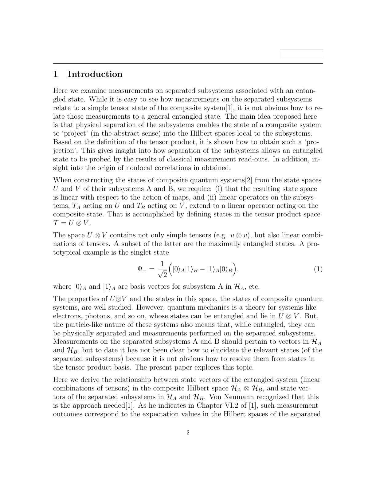 
Low-resolution page preview, page 2

📷 Fig 2

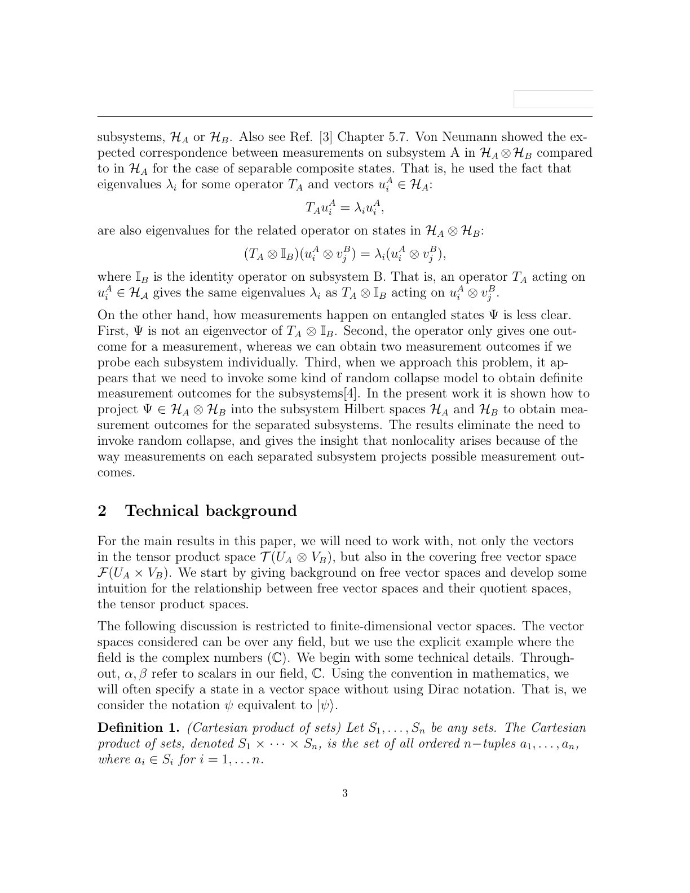 
Low-resolution page preview, page 3

📷 Fig 3

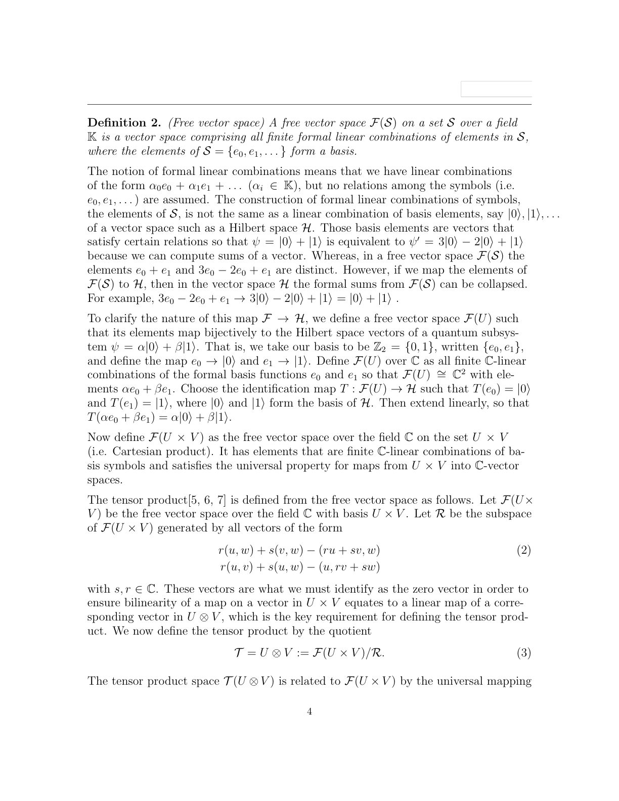 
Low-resolution page preview, page 4

📷 Fig 4

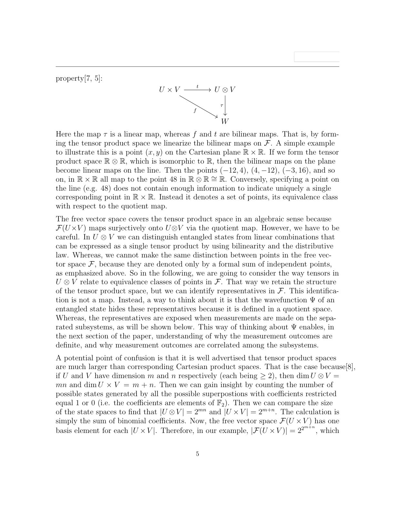 
Low-resolution page preview, page 5

📷 Fig 5

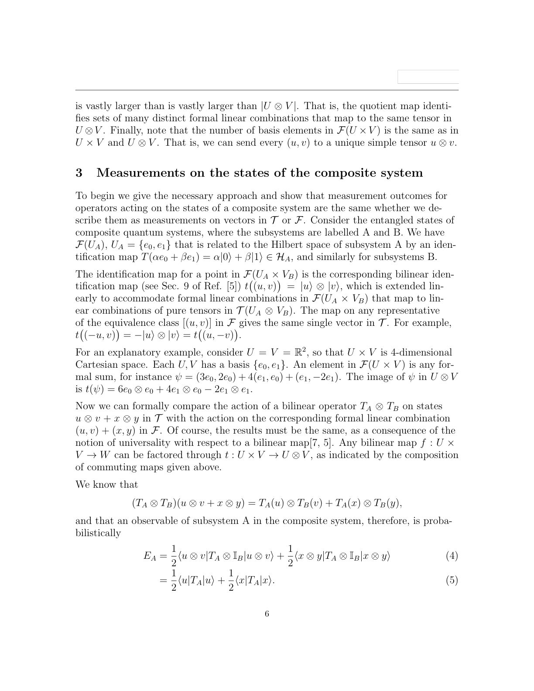 
Low-resolution page preview, page 6

**Summary.** This theoretical paper tackles the mathematical challenge of describing measurements on separated parts of an entangled quantum system. It introduces a novel framework using free vector spaces to calculate these local measurement projections, successfully bypassing the need to invoke a random collapse model. The key finding is that quantum nonlocality emerges naturally from the way local measurements project the state's possible outcomes.

**Why it may be interesting.** This work provides a deep mathematical underpinning for quantum nonlocality by reformulating measurement theory away from collapse postulates, which is fundamental to understanding open quantum systems dynamics.

Detailed structure

**Main problem.** The paper addresses the mathematical difficulty of describing measurement outcomes on physically separated subsystems of an entangled state when the state is represented in a tensor product Hilbert space.

**Main result.** It proposes a framework using the free vector space to calculate measurement projections, showing that nonlocality arises from the way these local measurements project the possible outcomes, eliminating the need for a random collapse postulate.

**Method.** The authors develop a mathematical formalism comparing the tensor product space to the free vector space, defining a canonical projection to relate global entangled states to local measurement outcomes.

**Model / system.** The system involves bipartite entangled quantum states ($\mathcal{H}_A \otimes \mathcal{H}_B$) that can be physically separated for measurement. The mathematical model contrasts the tensor product structure with the free vector space structure to handle measurement projections.

**Key observables.** Measurement outcomes on separated subsystems A and B, and the correlation between these paired outcomes.

**Important parameters / regimes.** The entanglement structure of the state, and the choice of measurement basis (contextual phase classes).

**Assumptions / limitations.** The core assumption is that measurement outcomes can be derived by projecting the state's equivalence class in the free vector space, rather than relying on a random collapse postulate.

**Figures summary.** Not specified (The notes detail mathematical derivations and comparisons between different classes of outcomes, rather than describing specific figures).

**Paper structure.** The paper builds from the initial problem of describing local measurements on entangled states, develops the mathematical machinery using free vector spaces, and concludes by demonstrating how the resulting correlated outcomes reveal the source of nonlocality.

Abstract

The entangled states of composite quantum systems are well studied. The particle-like nature of these systems also means that, while entangled, they can be physically separated and measurements performed on the separated subsystems. Measurements on the separated subsystems A and B should pertain to vectors in the local Hilbert space of each subsystem, but to date it has not been clear how to elucidate the relevant states of the separated subsystems because it is not obvious how to resolve them from states given in the tensor product basis, except for the separable states. Here it is shown that the projections of any general entangled state that are detected by measurements on the separated subsystems can be obtained considering the corresponding (cosets of) states in the free vector space from which the tensor product space is defined. The result eliminates the need to invoke random collapse, and from this perspective nonlocality arises because of the way measurements on each separated subsystem projects possible measurement outcomes.

[↑ back to top](#top)

### [Robust multi-hypothesis quantum-state discrimination under unknown common unitary perturbations via least favorable priors](http://arxiv.org/abs/2609.04020v1)

**Authors:** Daichi Fujiki, Fuyuhiko Tanaka  
**Type:** theory · **Category:** quantum information and computing · **PDF:** <https://arxiv.org/pdf/2609.04020v1>  
**Analysis basis:** full PDF text, analyzed in chunks
**Topic relevance:** 🔥 `quantum measurements` **4/5**

📷 Fig 1

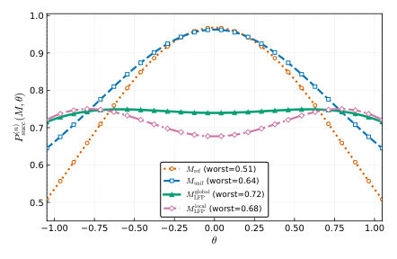 
FIG. 1: Success-probability profiles for the binary nonorthogonal qubit model.

📷 Fig 2

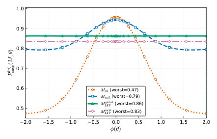 
FIG. 2: Success-probability profiles for the three-state qutrit model.

📷 Fig 3

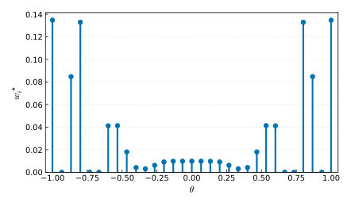 
FIG. 3: Least favorable prior w⋆on the nuisance-parameter grid for the three-state qutrit model.

**Summary.** This paper develops a robust framework for quantum-state discrimination under unknown unitary noise by solving a minimax decision problem. It introduces the Least Favorable Prior (LFP) and shows that the optimal measurement can be found by solving a dual SDP. The resulting LFP-based measurement significantly improves the worst-case success probability compared to standard methods.

**Why it may be interesting.** This work provides a rigorous, mathematically grounded method for designing quantum measurements that are robust against unknown environmental noise or systematic errors, which is crucial for practical quantum information processing.

Detailed structure

**Main problem.** The paper addresses robust quantum-state discrimination when the candidate states are corrupted by an unknown, common unitary perturbation (a nuisance factor). The goal is to find a measurement that minimizes the worst-case error probability over all possible perturbations.

**Main result.** The measurement derived using the Least Favorable Prior (LFP) achieves a substantially improved worst-case success probability and flattens the success-probability profile compared to standard optimal measurements.

**Method.** The problem is formulated as a minimax decision problem, which is solved by relating it to a Bayes measurement problem using the LFP. This optimization is implemented via Semidefinite Programming (SDP) techniques.

**Model / system.** The study considers discriminating between $K$ candidate quantum states $\{
ho_a\}_{a=1}^K$ in a finite-dimensional Hilbert space, where the actual states are perturbed by $
ho_a(	heta) = U(	heta)
ho_aU(	heta)^\dagger$. The perturbation $	heta$ acts as a nuisance parameter.

**Key observables.** Worst-case success probability ($V_{	ext{succ}}^{n,N}$), success-probability profiles $P_{	ext{succ}}(M, 	heta)$, and the weight distribution of the LFP ($\mathbf{w}^\star$).

**Important parameters / regimes.** The number of states $K$, the dimension of the Hilbert space, and the structure of the nuisance parameter space $\Theta$.

**Assumptions / limitations.** The theoretical framework handles continuous $\Theta$ but relies on discretizing it into a finite grid $\Theta_N$ for practical SDP computation.

**Figures summary.** Figures compare success-probability profiles for different measurements (LFP vs. Uniform-prior vs. Reference-point) in a qutrit model, showing the LFP measurement's superior worst-case performance. Table II summarizes these worst-case probabilities.

**Paper structure.** The paper first formulates the minimax risk and introduces the LFP concept. It then develops the mathematical machinery by showing the equivalence between the minimax problem and a Bayes problem over the LFP. Finally, it applies this framework to numerical examples (qubit and qutrit models) to demonstrate the performance gains.

Abstract

We study robust K-ary quantum-state discrimination when all candidate states are affected by the same unknown common unitary perturbation. The unknown perturbation does not represent the label to be identified, but acts as a nuisance factor that changes the performance of a fixed measurement. We formulate the problem as a minimax decision problem over the possible perturbations and propose using the Bayes-optimal collective measurement associated with a least favorable prior (LFP) on the nuisance-parameter space. For a finite discretization of this space, we show that the LFP can be computed by a semidefinite program and that the corresponding value coincides with the finite-grid minimax success probability. As numerical demonstrations, we consider a binary nonorthogonal qubit model and a nonorthogonal three-state qutrit model with an unknown common unitary perturbation. The LFP-based measurement substantially flattens the success-probability profile and improves the worst-case success probability compared with a reference-point optimal measurement and a uniform-prior Bayes measurement. The resulting LFP concentrates its weight on regions of the nuisance-parameter space that actively limit the robust discrimination performance, thereby providing both a constructive measurement design and a diagnostic description of the difficult nuisance-parameter regimes.

[↑ back to top](#top)

### [Three-observable measurement of the critical velocity in a paraxial superfluid of light flowing past a mobile impurity](http://arxiv.org/abs/2609.03948v1)

**Authors:** T. Aladjidi, M. Baker-Rasooli, T. D. Ferreira, A. Bramati, M. Albert, Q. Glorieux, P. -É. Larré  
**Type:** experiment · **Category:** quantum gases · **PDF:** <https://arxiv.org/pdf/2609.03948v1>  
**Analysis basis:** full PDF text, analyzed in chunks
**Topic relevance:** `analog quantum simulation` **3/5** · `driven-dissipative phase transition` **3/5** · `non-equilibrium universality` **3/5** · `quantum optics experiment` **3/5** · `quantum measurements` **2/5** · `Frenkel-Kontorova` **1/5** · `correlated / nonlocal dissipation` **1/5** · `interference shaping light` **1/5** · `methods for driven-dissipative` **1/5**

📷 Fig 1

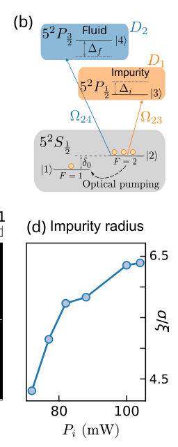 
Figure 1: (a) Schematic of the system. The 2D paraxial superfluid of light (transverse slices on the sketch) is generated using a wide Gaussian laser beam (red) propagating through a warm 87Rb vapor (blue). The optical impurity at the center of the planar superfluid is created by injecting a narrower Gaussian beam (gray). The relative angle between the red beam and the axis along the rubidium cell controls the incident velocity of the superfluid past the impurity, which is on-axis when the fluid is at rest. (b) The fluid beam operates near the D2 line (|2〉→|4〉) of 87Rb with a red detuning ∆f &lt; 0. The impurity beam operates near the D1 line (|2〉→|3〉) with a blue detuning ∆i &gt; 0. Optical...

📷 Fig 2

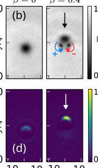 
Figure 2: The impurity radius in units of the healing length is σ/ξ ≃6.4. (a) Num- ber of quantized vortices nucleated—in the form of vortex-antivortex pairs—in the superfluid as a function of the Mach number β. The dashed line indicates the onset of the first pair at the critical Mach number βc ≃0.3. For larger β, additional pairs are produced [37]. The decrease observed for β &gt; 0.7 is an artifact of our tracking algorithm: the almost vanishing density at the impurity edge where the vortices are nucleated (see main text) can lead to an undercounting of the ±2π phase windings characterizing these excitations. (b) Field-amplitude distribution p

📷 Fig 3

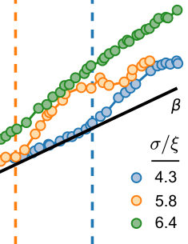 
Figure 3: Impurity velocity relative to the incident flow in units of the sound velocity, ∆vi/cs [see Eqs. (5)], as a function of the Mach number β, at the exit of the rubidium vapor. This quantity corresponds to the relative angle between the impurity and fluid beams in cs units. The solid line represents the superfluid baseline ∆vi/cs = β. The blue, orange, and green circles correspond to the normalized impurity radii σ/ξ ≃4.3, 5.8, and 6.4, respectively. The dashed line for each impurity radius marks the critical Mach number βc right after which ∆vi positively deviates by 10% from the baseline, signaling the onset of upstream motion toward +ˆy.

**Summary.** This research reports the measurement of the critical velocity in a superfluid of light flowing past an impurity using a sophisticated dual-wavelength optical setup. By independently measuring vortex nucleation, hydrodynamic force, and impurity displacement, the authors cross-validate the critical velocity threshold. This establishes the superfluid of light as a versatile and reliable platform for testing quantum hydrodynamic theories.

**Why it may be interesting.** This work provides a highly controlled, optical platform to study fundamental quantum hydrodynamic phenomena, such as superfluid critical velocities and vortex dynamics, which are central topics in both quantum gas and quantum optics research.

Detailed structure

**Main problem.** The paper measures the critical velocity at which a paraxial superfluid of light transitions to a dissipative state when flowing past a mobile impurity.

**Main result.** The critical velocity was measured using three independent diagnostics (vortex count, hydrodynamic force, and impurity velocity), yielding consistent results that systematically fall below the Landau criterion.

**Method.** The critical velocity is determined by monitoring the onset of energy dissipation, specifically through the nucleation of quantized vortices, while simultaneously measuring the force and displacement on the impurity.

**Model / system.** The system is a 2D paraxial superfluid of light, modeled by the nonlinear Schrödinger equation, flowing past a highly repulsive, finite-mass impurity created optically in a warm vapor of Rb-87.

**Key observables.** Number of nucleated vortices, hydrodynamic force on the impurity, and the impurity's displacement velocity relative to the flow.

**Important parameters / regimes.** Mach number (v0/cs), impurity radius ($\sigma$), and the ratio $\sigma/\xi$ (impurity size to healing length).

**Assumptions / limitations.** The analysis relies on the superfluid being governed by the NLS equation and assumes the three diagnostic methods provide a self-consistent benchmark for the critical transition.

**Figures summary.** Figures likely show the experimental setup and plots comparing the critical velocity ($eta_c$) extracted from the three different measurement techniques as a function of the impurity radius ($\sigma/\xi$).

**Paper structure.** The paper establishes the physical model (NLS equation for superfluid light), details the experimental setup using a dual-wavelength scheme, presents the three complementary measurement techniques, and concludes by cross-validating the results to establish a robust benchmark for the critical velocity.

Abstract

We report the measurement of the critical velocity of a paraxial superfluid of light flowing past a mobile impurity, realized using a dual-wavelength optical scheme in a warm vapor of $^{87}\text{Rb}$. The superflow is two-dimensional by nature, while the impurity features a highly repulsive potential, a large tunable radius, and a finite mass. The critical velocity is evaluated by simultaneously monitoring three complementary observables: the number of vortices nucleated in the wake of the impurity, the hydrodynamic force exerted on it, and its displacement velocity relative to the flow. These independent methods yield consistent values for the critical velocity, which remain systematically below the Landau criterion and decrease with the impurity radius, in qualitative agreement with theoretical expectations. Our results demonstrate the reliability of these combined diagnostics, establishing paraxial superfluids of light as a versatile platform for exploring the impurity problem in quantum hydrodynamics.

[↑ back to top](#top)

### [Boundary- and Screening-Induced Bubbly Phases in Autophoretic Active Matter](http://arxiv.org/abs/2609.03991v1)

**Authors:** Kingshuk Panja, Günther Turk, Rajesh Singh  
**Type:** theory · **Category:** statistical mechanics · **PDF:** <https://arxiv.org/pdf/2609.03991v1>  
**Analysis basis:** full PDF text, analyzed in chunks
**Topic relevance:** `driven-dissipative phase transition` **3/5** · `methods for driven-dissipative` **3/5** · `non-equilibrium universality` **3/5** · `analog quantum simulation` **2/5** · `Frenkel-Kontorova` **1/5** · `Keldysh / 2PI / non-Gaussian methods` **1/5** · `correlated / nonlocal dissipation` **1/5**

📷 Fig 1

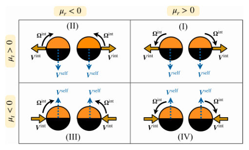 
FIG. 1. Schematics of Janus particles, half-covered by a cat- alytic cap (orange), interacting with both each other and a nearby boundary. Here, we provide a representation of the various types of phoretic interactions permitted by the model outlined in section II. In this paper, we specifically focus on region IV, where µt &lt; 0 and µr &gt; 0. In this region, particles are attracted to each other, but they also tend to turn away from each other (see Video - I). In this model, the direction of self-propulsion of a particle points away from the cap when µt &gt; 0 and towards the cap when µt &lt; 0. Furthermore, the velocity resulting from interaction with another particle is di- rected away from that...

📷 Fig 2

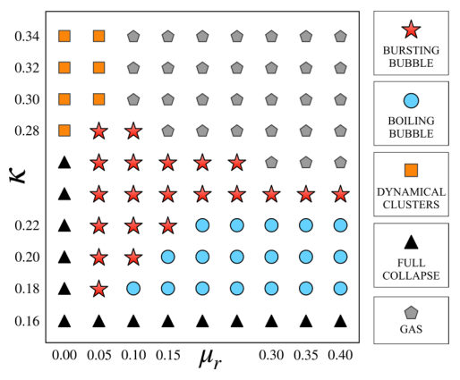 
FIG. 2. Phase diagram in the plane of screening length κ (see Eq. 4) and strength of chemo-repulsive torque µr for the case of Λc = 1. The five phases observed are: bursting bubbles, boiling bubbles, dynamical clusters, full collapse to a single cluster, and a gaseous phase. The bubbly phases are obtained as intermediate phases between well known phases of full collapse and dynamic clusters.

📷 Fig 3

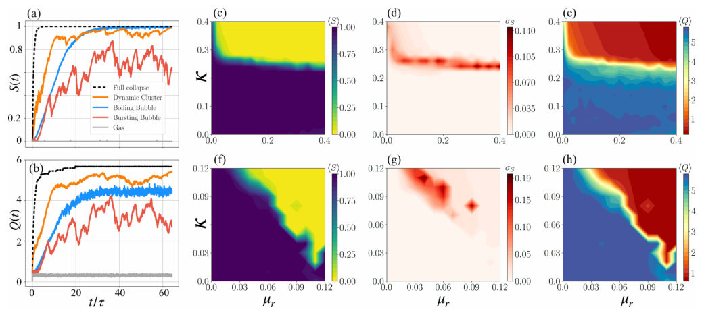 
FIG. 3. Structural metrics of the system. (a) Time evolution of the fraction of total cluster size, S(t). (b) Time evolution of the coordination number, Q(t). The distinct phases — full collapse, dynamical clusters, boiling bubble, bursting bubble and gas — are distinguished by their steady-state time averages (⟨S⟩, ⟨Q⟩) and temporal fluctuation magnitude (σS). Panels (c-h) are phase diagrams of the system in the (µr, κ) parameter space for Λc = 1 (top row) and Λc = 0 (bottom row). The left column (c, d) shows the time-averaged cluster size fraction ⟨S⟩, the middle column (d, g) shows the temporal fluctuation of S over time, σS, and the right column (e, h) shows the time-averaged...

📷 Fig 4

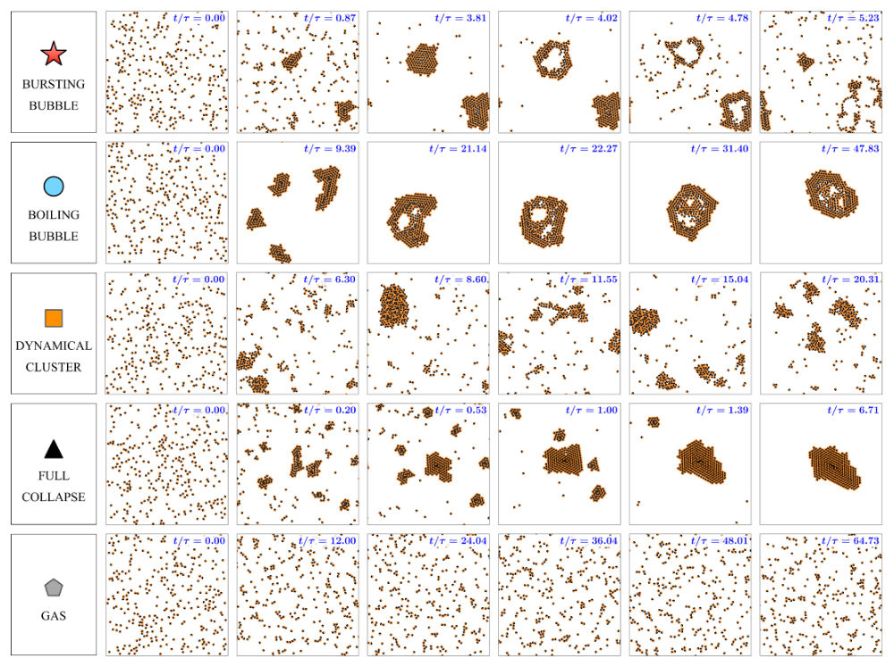 
FIG. 4. The snapshots of evolution and formation of each phase, as illustrated in Fig.-2, at different time steps. In every phase, we start with randomly distributed particle positions and orientations in the system. The first row depicts a bursting bubble, where particles form small clusters that burst before transitioning into a fully collapsed cluster phase. The second row illustrates the behavior of a boiling bubble, demonstrating a manifestly non-equilibrium steady state distinct from a bursting bubble. The third and fourth rows present the dynamical clusters phase and the full collapse phase, respectively. The last row shows the gas phase, which we have observed for a long duration to...

📷 Fig 5

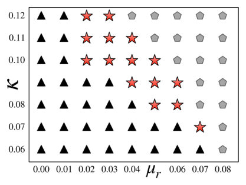 
FIG. 5. Phase diagram in the plane of screening length κ (see Eq. 4) and strength of chemo-repulsive torque µr for Λc = 0. Markers have same meaning as in Fig.2. This figures show that we get bursting bubbles at Λc = 0 in a very small parameter region. On the other hand, we have not seen any boiling bubble in the case of Λc = 0.

**Summary.** This paper systematically maps the complex, non-equilibrium phase behavior of active particles driven by chemical gradients. By varying chemical screening and boundary conditions, the authors predict the emergence of novel 'bubbly' phases, distinguishing them from simple collapse or gas states. These findings offer predictive rules for controlling active assembly in microfluidic settings.

**Why it may be interesting.** The study provides a detailed framework for understanding non-equilibrium phase transitions in active matter, which shares conceptual links with driven-dissipative quantum systems and pattern formation in open quantum systems.

Detailed structure

**Main problem.** The study investigates the non-equilibrium phase behavior of autophoretic active particles, focusing on the emergence of novel bubbly phases influenced by boundaries and chemical screening.

**Main result.** The research reports the existence of boundary- and screening-induced bubbly phases (boiling and bursting bubbles), showing that boundary conditions actively select the non-equilibrium steady states.

**Method.** The authors employed systematic particle-resolved simulations to map out phase diagrams by analyzing the collective dynamics across varying physical parameters.

**Model / system.** The system consists of autophoretic active particles (Janus particles) whose motion is governed by chemo-attractive translational forces and chemo-repulsive rotational torques. The dynamics are modeled using equations of motion incorporating phoretic interactions and excluded-volume forces.

**Key observables.** Steady-state cluster fraction ($\langle S 
angle$), temporal fluctuation magnitude ($\sigma_S$), and coordination number ($\langle Q 
angle$) form a diagnostic metric triad.

**Important parameters / regimes.** Screening parameter ($\kappa$), torque magnitude ($\mu_r$), and boundary condition coefficients ($\Lambda_c$) are key control parameters.

**Assumptions / limitations.** The analysis relies on particle-resolved simulations and uses the Weeks-Chandler-Andersen (WCA) potential for repulsive interactions.

**Figures summary.** Figures illustrate phase diagrams showing transitions between gas, bubbly, and collapsed states as a function of $\kappa$ and $\mu_r$, and demonstrate structural anisotropy based on $\kappa$.

**Paper structure.** The paper systematically analyzes the influence of chemical screening ($\kappa$) and boundary conditions ($\Lambda_c$) on the phase diagram, using the metric triad to distinguish between macro-phase separation, bubbly states, and gas phases.

Abstract

Spatial confinement and chemical screening fundamentally reshape the non-equilibrium phase behavior of autophoretic active particles. Here, we present a systematic study mapping the collective dynamics of self-propelled particles governed by chemo-attractive translational forces ($μ_t < 0$) and chemo-repulsive rotational torques ($μ_r > 0$) across varying screening parameters $κ$, torque magnitudes $μ_r$, and boundary condition coefficients $Λ^c$. Beyond standard chemotactic macro-phase separation and dynamic clustering, we report the emergence of novel boundary- and screening-induced bubbly phases, classified into boiling and bursting bubbles. Using a metric triad of steady-state cluster fraction $\langle S \rangle$, temporal fluctuation magnitude $σ_S$, and coordination number $\langle Q \rangle$, we draw phase diagrams to demarcate phases for no-flux boundaries ($Λ^c = 1$) and chemically permeable interfaces ($Λ^c = 0$) . Increasing chemical screening ($κ$) systematically suppresses long-range attraction, driving sequential phase transitions from macro-scale collapse toward bubbly states, dynamic micro-clusters, and homogeneous gas phases, while simultaneously inducing aggregate shape anisotropy. These findings provide predictive design rules for controlling active assembly and transport in microfluidic environments.

[↑ back to top](#top)

### [Deterministic nanofabrication for engineering nanowire quantum dot devices](http://arxiv.org/abs/2609.03076v1)

**Authors:** Tarun Patel, Matteo Pennacchietti, Greg Holloway, Stephen R. Harrigan, Sayan Gangopadhyay, Anthony Drouin, Megha Jain, Dan Dalacu, Philip J. Poole, Sasan Vosoogh-Grayli, Michael E. Reimer  
**Type:** both · **Category:** quantum information and computing · **PDF:** <https://arxiv.org/pdf/2609.03076v1>  
**Analysis basis:** full PDF text, analyzed in chunks
**Topic relevance:** `QC/QI experiment` **3/5** · `quantum optics experiment` **3/5** · `Tavis-Cummings & cavity-many-emitter` **2/5** · `analog quantum simulation` **2/5** · `driven-dissipative phase transition` **1/5** · `interference shaping light` **1/5** · `methods for driven-dissipative` **1/5** · `quantum measurements` **1/5**

📷 Fig 1

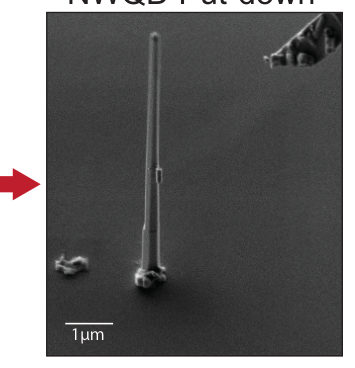 
Fig. 1: Visualizing deterministic pick-and-place transfer of a NWQD in a vertical- to-vertical geometry. (a) SEM images of the NWQD detachment from the growth substrate. From left to right, a tungsten tip (green) is slowly pushed against the InP nanowire (pink). The elimination of bending and the release of built-up elastic energy in the nanowire confirm its detachment from the growth substrate. (b) The detached nanowire is glued using focused electron beam induced deposition (EBID) of SiOx to the tungsten tip and picked-up (left panel). The nanowire is secured to the target substrate by additional SiOx deposition at the base and the tungsten tip is detached by pulling away from the...

📷 Fig 2

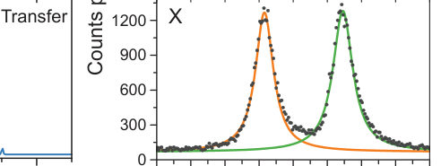 
Fig. 2: (a) Photoluminescence (PL) spectra of NWQD5 before and after transfer on a Au/SiO2 substrate under pulsed above-band excitation. The three prominent emission lines corresponding to the biexciton (XX), exciton (X) and negative trion (X−) decay are labeled. (b) High resolution PL spectrum of the XX (top) and X (bottom) emission lines of the transferred NWQD5 measured using a scanning Fabry-Perot etalon. Two polarized peaks are observed due to the fine structure splitting (FSS) of the QD. Individual peaks are fit to a Lorentzian linewidth of 0.71 ± 0.01 GHz (H) and 0.64 ± 0.01 GHz (V) for the X transition, and 0.89 ± 0.02 GHz (H) and 0.78 ± 0.02 GHz (V) for the XX transition with an...

📷 Fig 3

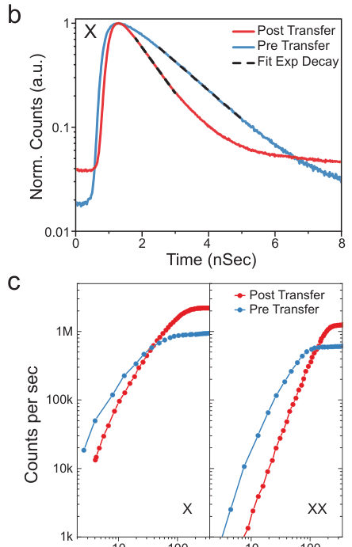 
Fig. 3: NWQD on a Au/SiO2 mirror. (a) 2D cross-section of the electric field intensity for a tapered nanowire on an Au/SiO2 substrate from a 3D FDTD simulation. A weak cavity is formed between the bottom mirror substrate and the dipole as is evident by the standing wave in the intensity profile. The upward emission from the QD couples to a guided waveguide mode, visible as a continuous dark red region above the dipole, confined within the nanowire. As the mode propagates along the adiabatic taper, it gradually expands beyond the nanowire confinement, transitioning into a free-space mode with minimal back-reflections at a height of approximately 4– 5 µm above the substrate.(b) Lifetime...

📷 Fig 4

 
Fig. 4: Two-photon excitation (TPE) of NWQD5 on a Au/SiO2 mirror. (a) Mea- sured photon count rates of the exciton versus excitation power showing clear Rabi oscillations. (b) Hanbury-Brown-Twiss (HBT) correlation histogram of the exciton at π-pulse (∼100 nW) with a g(2)(0) = 0.0212 ± 0.0001.

📷 Fig 5

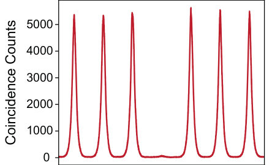 
Figure 4a presents the detected count rate of exciton emission as a function of the

**Summary.** The authors present a novel, deterministic pick-and-place technique to transfer nanowire quantum dots (NWQDs) while preserving their high optical quality. By combining this transfer method with bottom mirror structures and electrostatic gates, they demonstrate the creation of highly efficient, tunable single-photon sources crucial for quantum technologies.

**Why it may be interesting.** This work directly addresses the engineering challenge of integrating quantum emitters into complex photonic circuits, which is foundational for scalable quantum light sources and quantum networking components.

Detailed structure

**Main problem.** The primary challenge addressed is developing a scalable, deterministic method to engineer nanowire quantum dot (NWQD) devices by transferring them while maintaining their critical vertical growth geometry.

**Main result.** The developed pick-and-place transfer technique successfully preserves high optical quality, enabling the integration of bottom mirrors for 75% photon extraction efficiency and electrostatic gates for wavelength tuning.

**Method.** The work combines a deterministic, gas-assisted pick-and-place transfer technique with advanced optical characterization (PL, lifetime, HBT measurements) and theoretical modeling (FDTD simulations).

**Model / system.** The system involves semiconductor NWQDs (e.g., InAsP in InP) integrated into photonic nanowires. The process involves transferring these QDs from a growth substrate to arbitrary templates, such as those incorporating bottom gold mirrors or gate electrodes.

**Key observables.** Low-multiphoton probability ($g_2(0)=0.002$), high indistinguishability ($>80\%$), enhanced photon extraction efficiency (up to 75%), and measurable spectral tuning via gates.

**Important parameters / regimes.** The transfer process itself, the efficiency enhancement factor (e.g., 1.58 Purcell enhancement), and the achievable wavelength tunability ($\sim 3.6 	ext{ GHz}$).

**Assumptions / limitations.** The transfer process is assumed to preserve the quantum optical properties of the QD emission, and theoretical models rely on specific coupling strengths and modal reflectivities.

**Figures summary.** Figures illustrate the deterministic pick-and-place transfer steps (detachment, gluing, placement) and show PL spectra before and after transfer, confirming spectral and linewidth preservation.

**Paper structure.** The paper details the development of the deterministic transfer technique, followed by comprehensive optical characterization demonstrating enhanced light collection efficiency using bottom mirrors, and finally, tuning capabilities using electrostatic gates.

Abstract

Semiconductor quantum dots (QDs) are a leading platform for realising bright, wavelength-tunable sources of single and entangled photon pairs for photonic quantum technologies. Site-selected nanowire quantum dots (NWQDs) are a promising platform for fabricating such photonic devices in a scalable manner. However, implementing additional structures around the photonic nanowire while maintaining its vertical growth geometry has remained a challenge. In this work, we develop a deterministic pick-and-place technique to conduct a vertical-to-vertical transfer of NWQDs from the growth substrate to arbitrary templates. Using this transfer technique, we enhance the photon extraction efficiency to 75% by implementing a bottom gold mirror and tune the emission wavelength by 3.6 GHz via implementing electrostatic gates around the QD. Importantly, we measure low-multiphoton probability (g^(2)(0) = 0.002) and high indistinguishability (>80% for +/-100 ps) of the QD emission after the transfer process, yielding high-quality devices. These results demonstrate the repeatability and versatility of the developed transfer technique, which is an enabling step towards scalable single and entangled photon sources.

[↑ back to top](#top)

### [Accelerating stochastic processes through nonequilibrium driving: Thermodynamic constraints on the maximum speed-up](http://arxiv.org/abs/2609.03179v1)

**Authors:** Davide Santolin, Gianmaria Falasco  
**Type:** theory · **Category:** statistical mechanics · **PDF:** <https://arxiv.org/pdf/2609.03179v1>  
**Analysis basis:** full PDF text, analyzed in chunks
**Topic relevance:** `driven-dissipative phase transition` **3/5** · `non-equilibrium universality` **3/5** · `Keldysh / 2PI / non-Gaussian methods` **2/5** · `methods for driven-dissipative` **2/5** · `analog quantum simulation` **1/5** · `correlated / nonlocal dissipation` **1/5** · `quantum measurements` **1/5**

📷 Fig 1

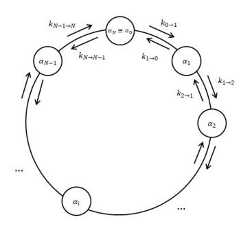 
FIG. 1. Linear chain of reactions with periodic boundary conditions, αN ≡α0. We assume microscopic rates fulfill local detailed balance for thermodynamic consistency.

📷 Fig 2

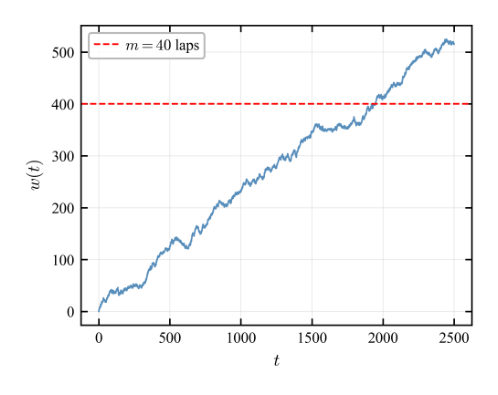 
FIG. 2. Typical evolution of the time-averaged current w(t) counting net forward transitions obtained by the Gillespie al- gorithm. The horizontal red dashed line marks the absorbing threshold w∗= 400 (m∗= 40 laps). When the observable reach it in the conditioned ensemble, the dynamics is halted.

📷 Fig 3

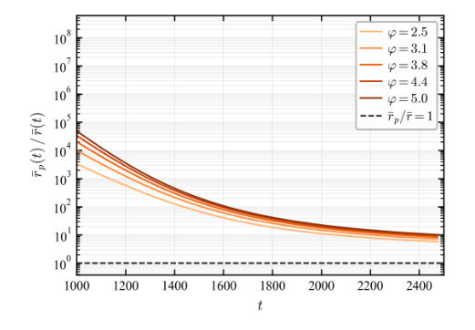 
FIG. 4. Ratio ¯rp(t)/¯r(t) between perturbed and controlled survival rates for different local perturbations. The condition ¯rp(t) ≫¯r(t) is well satisfied, corresponding to speed-up fac- tors of order at least 10, up to 104.

📷 Fig 4

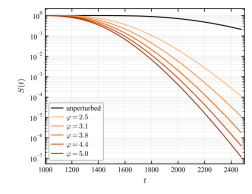 
FIG. 3. Survival probabilities S(t) (controlled) and Sp(t) (lo- cally perturbed) for several values of the rate enhancement φ. The local perturbation speeds up the completion of the process (reaching w∗) compared to the controlled dynamics.

📷 Fig 5

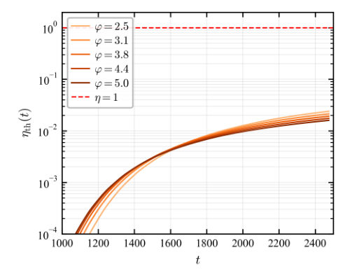 
FIG. 5. Tightness ratio ηth(t) for local perturbations. Time window is cut at t ∈[1000, 2500] for better visualization. Tightness ratio remains well below unity for all values of φ, confirming the validity of the bound (52) for local perturba- tions.

**Summary.** This work develops new, thermodynamically grounded bounds on how much faster a stochastic process can survive when driven away from equilibrium. By analyzing both general and rare-event dynamics, the authors provide distinct linear and exponential bounds related to entropy production and excess heat. This is a significant theoretical advancement for understanding non-equilibrium dynamics in mesoscopic systems.

**Why it may be interesting.** The rigorous connection of dynamical speed-up bounds to fundamental thermodynamic quantities like entropy production and heat generation provides powerful, non-equilibrium constraints applicable to open quantum systems and energy dissipation studies.

Detailed structure

**Main problem.** The paper derives new theoretical bounds controlling the maximum speed-up achievable in the survival rate of stochastic processes when subjected to non-equilibrium driving perturbations.

**Main result.** It establishes distinct bounds: a linear bound dependent on entropy production for general rates, and an exponential bound determined by excess heat for rare, constant-rate processes.

**Method.** The analysis employs nonlinear response theory, importance sampling, and techniques from large deviation theory applied to path probabilities in Markov jump processes and overdamped diffusions.

**Model / system.** The study applies to general mesoscopic systems modeled as continuous-time Markov jump processes and overdamped diffusions, exemplified by a unicyclic network and forced diffusion in a bistable potential.

**Key observables.** Survival probability $S(t)$, survival rate $r(t)$, and the difference in survival rates $ar{r}_p - ar{r}$.

**Important parameters / regimes.** Perturbation strength, entropy production rate, and the excess heat generated by the perturbation.

**Assumptions / limitations.** The derivation assumes that the path probability densities are absolutely continuous, excluding changes like varying the temperature in Langevin dynamics.

**Figures summary.** The notes mention comparing analytical predictions (e.g., for the Laplace transform of survival probability) against numerical integrations and simulations.

**Paper structure.** The paper follows a structure of introducing the framework, deriving the bounds using nonlinear response theory, presenting the bounds in different mathematical forms, connecting these bounds explicitly to thermodynamic quantities, and concluding with model examples.

Abstract

We derive a new set of bounds controlling the speed-up of the survival rate of trajectory-dependent observables induced by the application of a perturbation. Via the study of survival probabilities in two different contexts, continuous-time Markov jump processes and overdamped diffusions, we obtain different fashions of the bound on the achievable boost. These bounds, obtained by a nonlinear response theory of constrained path probabilities, are explicitly linked to thermodynamics. For arbitrary time-dependent survival rates, we find a linear bound that depends on both the perturbation strength and the entropy production rate prior to the perturbation. For rare processes characterized by a constant survival rate, the bound is exponential and is determined by the excess heat generated by the perturbation. We exemplify the inequalities on two prototypical model systems, namely, a unicyclic network and forced diffusion in a bistable potential.

[↑ back to top](#top)

### [Entanglement dynamics of accelerated atoms with environment-induced interactions](http://arxiv.org/abs/2609.03638v1)

**Authors:** Xuerui Zhou, Chenhao Ma, Zixu Zhao  
**Type:** theory · **Category:** other · **PDF:** <https://arxiv.org/pdf/2609.03638v1>  
**Analysis basis:** full PDF text, analyzed in chunks
**Topic relevance:** `correlated / nonlocal dissipation` **3/5** · `Keldysh / 2PI / non-Gaussian methods` **2/5** · `driven-dissipative phase transition` **2/5** · `methods for driven-dissipative` **2/5** · `non-equilibrium universality` **2/5** · `analog quantum simulation` **1/5** · `quantum measurements` **1/5**

📷 Fig 1

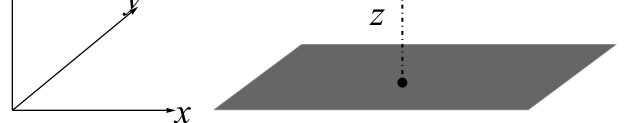 
FIG. 1: The two accelerated atoms are separated with a distance L and the reflecting boundary is located at z = 0.

📷 Fig 2

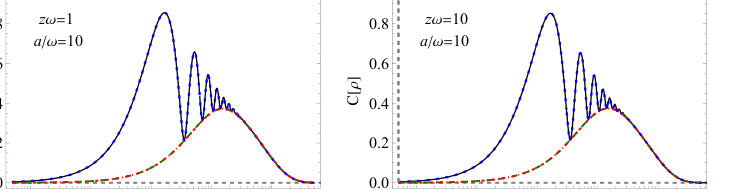 
FIG. 2: The time evolution of concurrence for Lω = 0.1 with zω = {1, 10} and a/ω = {0.1, 10} initially in the state |10⟩. The solid (black) and dot-dashed (red) lines represent uniformly accelerated atoms with and without environment-induced interactions, respectively. The dotted line (blue) represents only the environment-induced atom- atom interaction, and the dashed line (green) represents only the environment-induced atom-plate interaction.

📷 Fig 3

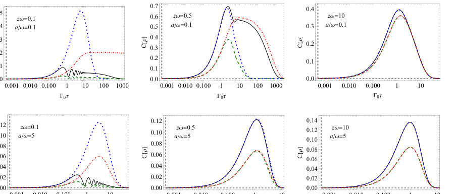 
FIG. 3: The time evolution of concurrence for Lω = 1 with zω = {0.1, 0.5, 10} and a/ω = {0.1, 5} initially in the state |10⟩. The solid (black) and dot-dashed (red) lines represent uniformly accelerated atoms with and without environment-induced interactions, respectively. The dotted line (blue) represents only the environment-induced atom- atom interaction, and the dashed line (green) represents only the environment-induced atom-plate interaction.

📷 Fig 4

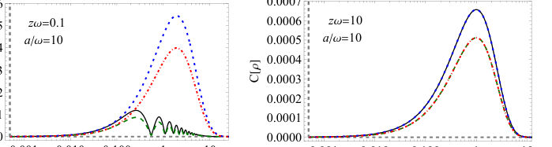 
FIG. 4: The time evolution of concurrence for Lω = 10 with zω = {0.1, 10} and a/ω = {0.5, 4.5, 10} initially in the state |10⟩. The solid (black) and dot-dashed (red) lines represent uniformly accelerated atoms with and without environment-induced interactions, respectively. The dotted line (blue) represents only the environment-induced atom- atom interaction, and the dashed line (green) represents only the environment-induced atom-plate interaction.

📷 Fig 5

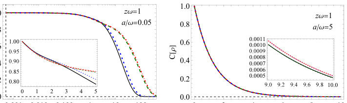 
FIG. 5: The time evolution of concurrence for Lω = 1 with zω = 1 and a/ω = {0.05, 5} initially in the state |A⟩. The solid (black) and dot-dashed (red) lines represent uniformly accelerated atoms with and without environment-induced interactions, respectively. The dotted line (blue) represents only the environment-induced atom-atom interaction, and the dashed line (green) represents only the environment-induced atom-plate interaction.

**Summary.** This theoretical study examines entanglement dynamics for two accelerated atoms interacting with a fluctuating environment near a boundary. By analyzing the master equation, the authors show that environment-induced interactions critically modulate entanglement, potentially leading to anti-Unruh effects. The results highlight the competition between different environmental coupling terms as the key determinant of quantum correlations.

**Why it may be interesting.** This work directly addresses open quantum systems dynamics in curved/accelerated spacetime, which is highly relevant to quantum optics and quantum information in non-trivial environments.

Detailed structure

**Main problem.** The paper investigates how environment-induced interactions affect the entanglement dynamics of two uniformly accelerated atoms.

**Main result.** The anti-Unruh phenomenon can occur under certain conditions, and the maximum entanglement achievable depends critically on the competition between environment-induced interatomic and atom-plate interactions.

**Method.** The dynamics are analyzed using the Gorini-Kossakowski-Lindblad-Sudarshan master equation in the weak-coupling limit.

**Model / system.** The system consists of two two-level atoms, uniformly accelerated and coupled to a fluctuating massless scalar field in a Minkowski vacuum with a perfectly reflecting boundary.

**Key observables.** Concurrence, $C[
ho(	au)]$, is used as the primary measure of entanglement for the X state.

**Important parameters / regimes.** Proper acceleration ($a$), coupling constant ($\mu$), interatomic separation ($L$), and distance to the boundary ($z$).

**Assumptions / limitations.** The analysis assumes the weak-coupling limit and simplifies the initial state to an X state.

**Figures summary.** Figures illustrate the time evolution of concurrence for different initial states and parameter regimes, showing how interactions suppress or promote entanglement decay.

**Paper structure.** The paper develops basic formulas first, followed by a detailed analysis of accelerated atoms coupled to the environment, deriving time evolution equations for density matrix elements.

Abstract

We investigate the influence of environment-induced interactions on the entanglement dynamics of two uniformly accelerated atoms coupled to a fluctuating massless scalar field with a reflecting boundary. The two atoms are aligned vertically to the boundary. The entanglement behaviors are influenced by the competition between the environment-induced interatomic and the environment-induced atom-plate interactions, which can be characterized by certain critical values. The maximum of concurrence generated during evolution decreases non-monotonically with the acceleration, which implies the anti-Unruh phenomenon can exist for some situations even when both environment-induced interatomic and the environment-induced atom-plate interactions are considered.

[↑ back to top](#top)

### [Real-Time String Dynamics in $3+1$D Lattice Quantum Electrodynamics](http://arxiv.org/abs/2609.04114v1)

**Authors:** Helen Zwölfer, Giovanni Cataldi, Umberto Borla, Jad C. Halimeh  
**Type:** theory · **Category:** numerical methods · **PDF:** <https://arxiv.org/pdf/2609.04114v1>  
**Analysis basis:** full PDF text, analyzed in chunks
**Topic relevance:** `Keldysh / 2PI / non-Gaussian methods` **3/5** · `methods for driven-dissipative` **3/5** · `analog quantum simulation` **2/5** · `non-equilibrium universality` **2/5** · `scars & prethermalization` **2/5** · `quantum measurements` **1/5**

📷 Fig 1

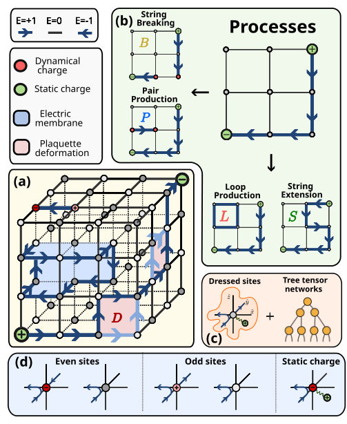 
FIG. 1. String dynamics in 3 + 1D lattice QED. (a): cubic lattice hosting staggered fermionic matter on sites (gray circles) and electric flux on links, with two static charges (green) at opposite corners connected by a minimal electric string (dark links) running along the lattice edges. Under real- time evolution, the magnetic term generates membrane-like deformations of the string (blue and red plaquettes), while the hopping term can create dynamical charges (red circles) that screen part of the flux. (b): sketch of the 1st-order channels coupled to the initial string by a single hopping or plaquette operation: string breaking (B), loop production (L), pair production (P), and string...

📷 Fig 2

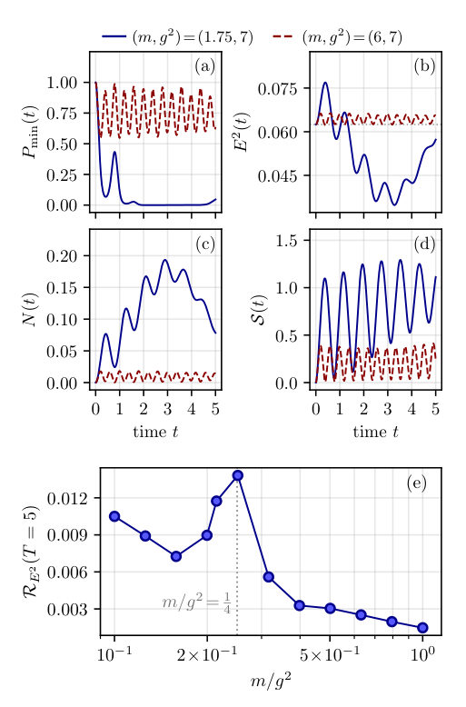 
FIG. 2. Resonant vs. off-resonant string dynamics. (a) Minimal-string probability Pmin(t), (b) electric Casimir E2(t), (c) matter density N(t), and (d) entanglement entropy S(t) at the first resonance (m, g2) = (1.75, 7) (continuous blue) and off resonance (m, g2) = (6, 7) (dashed red). At resonance, the collapse of Pmin is accompanied by a simultaneous drop in E2 and growth in N: the string breaks. Off resonance, E2

📷 Fig 3

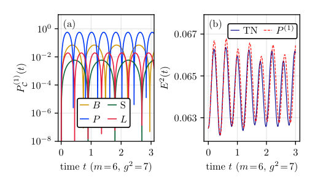 
FIG. 3. Perturbative channel probabilities. (a) Dynamics of P (1) C (t) defined in Eq. (4) for (m, g2) = (6, 7). Despite their larger detunings, the extensive pair-production (MP = 135) and loop (ML =184) channels dominate the leakage out of the minimal-string sector, while string breaking (MB =5) remains subleading: off resonance, the decay of Pmin is not due to string breaking. (b) TN evolution of E2(t) compared with the 1st-order perturbation theory (PT(1)) reconstruction in Eq. (5a), at (m, g2) = (6, 7).

📷 Fig 4

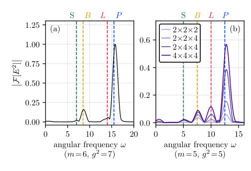 
FIG. 4. Channel spectroscopy of the electric energy. (a) Fourier spectrum of the TN signal E2(t) at (m, g2) = (6, 7); (b) Fourier transform of the total electric Casimir [E2(t) multiplied by Nlinks] at (m, g2) = (5, 5) for lattices from 2 × 2 × 2 to 4×4×4: peak positions are set by the channel detunings and do not move with the volume, while the peak weights grow with the channel multiplicities.

**Summary.** This paper simulates the real-time dynamics of electric flux strings in 3+1D Lattice QED using Tree Tensor Networks. It establishes that string breaking, where electric energy converts into matter pairs, only occurs when a specific resonance condition between coupling and mass is met. The work provides crucial diagnostics for future quantum simulators tackling higher-dimensional lattice gauge theories.

**Why it may be interesting.** The use of TTNs and advanced perturbation theory to model non-equilibrium dynamics in a gauge theory provides a sophisticated benchmark for simulating complex quantum field theories, relevant for understanding thermalization and real-time evolution in strongly interacting systems.

Detailed structure

**Main problem.** The study aims to understand real-time string dynamics, particularly string breaking, in three-dimensional lattice quantum electrodynamics (LGT) to bridge quantum simulations with physical QED/QCD.

**Main result.** String breaking is found to occur resonantly when the released electric energy balances the pair production mass cost, causing a measurable conversion of electric flux into matter-antimatter pairs.

**Method.** The research employs advanced numerical techniques, including Tree Tensor Networks (TTNs) with TDVP evolution, complemented by channel-resolved time-dependent perturbation theory.

**Model / system.** The system is a $3+1$D U(1) LGT with dynamical matter (staggered fermions), governed by a Hamiltonian involving electric and magnetic terms.

**Key observables.** Electric Casimir expectation value ($E^2(t)$), matter density ($N(t)$), minimal-string probability ($P_{\min}(t)$), and bipartite entanglement entropy ($S(t)$).

**Important parameters / regimes.** The resonance condition is $g_2(2j-1) = 4m$, where $g_2$ is the coupling and $m$ is the mass.

**Assumptions / limitations.** The analysis relies on the dressed-site formalism to maintain gauge invariance and uses perturbation theory whose validity is checked against state-fidelity criteria.

**Figures summary.** Figures illustrate the comparison of dynamics at resonance versus off-resonance, showing the collapse of $P_{\min}(t)$ and the correlated rise of $N(t)$ only at resonance. Resonance spectroscopy plots show the peak shifting toward the predicted strong-coupling value.

**Paper structure.** The paper progresses by establishing the physical problem, detailing the Hamiltonian and simulation methods (TTN/ED), analyzing the dynamics through channel classification (string breaking, pair production, etc.), and finally presenting quantitative results confirming the resonance mechanism via both simulation and perturbation theory.

Abstract

Understanding real-time string dynamics in three spatial dimensions is essential for connecting quantum simulations of lattice gauge theories (LGTs) to the physical dimensionality of QED and QCD, where transverse fluctuations and competing local processes proliferate. We present the first real-time simulations of string breaking in $3+1$D lattice quantum electrodynamics. Using tree tensor networks, we simulate the quench dynamics of electric flux strings in a $3\!+\!1$D U(1) LGT with dynamical matter. At strong coupling, the string breaks resonantly at a sharp resonance condition of mass and gauge couplings, converting electric energy into matter--antimatter pairs that screen the static charges. Off resonance, we classify all competing channels---pair production, string deformations and extensions, and flux loops---whose multiplicity, extensive for pair production and flux loops, depletes the string sector even far from resonance. A channel-resolved perturbation theory quantitatively reproduces these dynamics and their Fourier spectrum. Our results establish diagnostics and benchmarks for upcoming quantum simulators of higher-dimensional LGTs.

[↑ back to top](#top)

### [Approximate cubic phase states in a trapped ion](http://arxiv.org/abs/2609.03032v1)

**Authors:** C. Ventura-Velázquez, Juan Mauricio Torres  
**Type:** theory · **Category:** other · **PDF:** <https://arxiv.org/pdf/2609.03032v1>  
**Analysis basis:** full PDF text, analyzed in chunks
**Topic relevance:** `QC/QI experiment` **3/5** · `analog quantum simulation` **3/5** · `Keldysh / 2PI / non-Gaussian methods` **2/5** · `Tavis-Cummings & cavity-many-emitter` **1/5** · `methods for driven-dissipative` **1/5** · `quantum measurements` **1/5** · `quantum optics experiment` **1/5**

📷 Fig 1

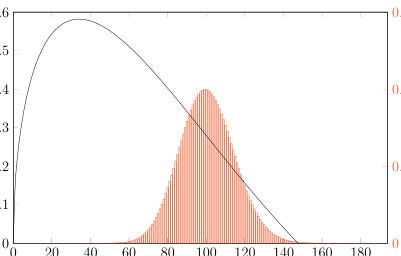 
FIG. 1. The black curve illustrates the Bessel function of the first kind, J1 as a function of n, and the red bars show the probability distribution of the initial coherent vibrational state, |α⟩, around the point N = |α|2 = 100, which cor- responds to an inflection point of the Bessel function. We used a value of η ≈0.15773082 such that the condition (2 η)2N = 9.95160559 is met.

📷 Fig 2

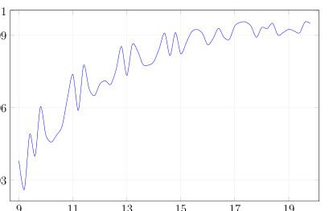 
FIG. 2. Fidelity between the exact numerical evolution and the approximate separable solution, in Eq. (9), for different values of the initial coherent amplitude α. We fixed the time at τ = π/|ω1|.

📷 Fig 3

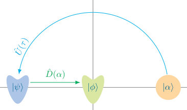 
FIG. 3. Sketch of the path followed by the initial coherent vibrational state |α⟩in the phase-space. According to the evolution operator ˆU, at time τ = π/|ω1|, the final state is located at the opposite side, and due to the nonlinearity of Ωˆn, it is deformed in such a way that its characteristics are similar to a CPS. The purpose of the displacement is to relocate it to the origin of the phase space and characterize it with the NLS.

📷 Fig 4

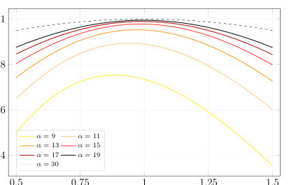 
FIG. 4. The fidelity between the vibrational state obtained with the separable state in the displaced frame, Eq. (15), and the ideal cubic phase state, Eq. (13). Each curve corre- sponds to a different value of the initial coherent amplitude, α. Additionally, we rescaled the cubicity parameter, γ, with the correspondent ˜γ, Eq. (17), for each α.

📷 Fig 5

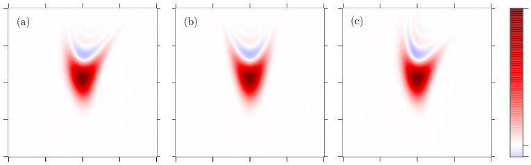 
FIG. 5. The Wigner function of the vibrational state for: (a) the exact time-evolution generated by the interaction potential in Eq. (1), (b) the cubic phase state with cubicity ˜γ = 0.2862 given by Eq. (17), and (c) the time-evolution given by the approximate separable state, Eq. (9). The initial state is Eq. (4a) with the plus sign, the coherent amplitude is α = 11 and the time τ = π/|ω1| for (a) and (c).

**Summary.** This paper details a method to generate an approximate Cubic Phase State (CPS) in the vibrational mode of a trapped ion using its native nonlinear interaction. By analyzing the state's Wigner function, Nonlinear Squeezing, and an analytical cubicity measure, the authors confirm that the resulting state possesses the necessary non-Gaussian properties required for advanced continuous variable quantum computation.

**Why it may be interesting.** This work is highly relevant as it connects fundamental concepts of quantum information (non-Gaussian resources) directly to a leading experimental platform (trapped ions), providing concrete, quantifiable metrics (like NLS and cubicity) for assessing quantum resource quality.

Detailed structure

**Main problem.** The paper addresses the need for non-Gaussian elements to achieve universal quantum computation using continuous variables, focusing on generating an approximate Cubic Phase State (CPS).

**Main result.** The authors demonstrate that the vibrational mode of a trapped ion, governed by a nonlinear Jaynes-Cummings interaction, can generate a state approximating the CPS with high fidelity.

**Method.** The generation and characterization rely on analyzing the time evolution of the vibrational state, using approximations based on large initial occupation numbers and quantifying non-Gaussianity via Nonlinear Squeezing (NLS) and an analytical cubicity measure.

**Model / system.** The physical system is a trapped ion, and the dynamics are modeled using the nonlinear Jaynes-Cummings interaction potential. The state evolution is analyzed in the vibrational mode, starting from a coherent state.

**Key observables.** Wigner function (showing oscillating patterns), Nonlinear Squeezing ($\sigma^{(3)}(\lambda)$), and the analytical cubicity parameter ($	ilde{\gamma}$).

**Important parameters / regimes.** Large initial occupation number ($N \gg 1$), the Lamb-Dicke parameter ($\eta$), and the initial coherent state amplitude ($\alpha$).

**Assumptions / limitations.** The analysis relies on assuming a large initial occupation number ($N \gg 1$) and using a Taylor expansion of the eigenfrequencies up to the third power of the quantum number $n$.

**Figures summary.** Figures illustrate the Bessel function dependence of eigenfrequencies, the fidelity between the generated state and the ideal CPS, the oscillating Wigner function characteristic of CPS, and the NLS value confirming non-Gaussianity.

**Paper structure.** The paper first establishes the theoretical requirement for non-Gaussian states. It then models the trapped ion dynamics using the nonlinear Jaynes-Cummings interaction, deriving approximations for the time evolution. Finally, it validates the resulting state by calculating its fidelity, visualizing its Wigner function, and quantifying its non-Gaussian nature using NLS.

Abstract

Universal quantum computation with continuous variables cannot be attained solely with a set of Gaussian operations, it requires the addition of a non-Gaussian element, at least of third order in the quadrature operators, such as the cubic phase state. In this work, we present a method to generate a quantum state in the vibrational mode of a trapped ion that exhibits characteristics compatible with the cubic phase state, such as the distinctive oscillating pattern in its Wigner function. This state emerges from the nonlinear Jaynes-Cummings interaction native to the trapped-ion model, and under the assumption of an initial coherent vibrational state with a large occupation number. Consequently, the evolved vibrational state approximates the cubic phase state with high fidelity, and we use the variance of a nonlinear combination of the quadratures to characterize it. Finally, we provide an analytical expression for its cubicity that shows the high performance of the approximate vibrational cubic phase state.

[↑ back to top](#top)

### [Death by mutants: unusual multicritical dynamics in a two-species model for absorbing state transitions](http://arxiv.org/abs/2609.03123v1)

**Authors:** Astik Haldar, Abhik Basu  
**Type:** theory · **Category:** statistical mechanics · **PDF:** <https://arxiv.org/pdf/2609.03123v1>  
**Analysis basis:** full PDF text, analyzed in chunks
**Topic relevance:** `driven-dissipative phase transition` **3/5** · `non-equilibrium universality` **3/5** · `Keldysh / 2PI / non-Gaussian methods` **2/5** · `correlated / nonlocal dissipation` **2/5** · `analog quantum simulation` **1/5** · `methods for driven-dissipative` **1/5**

📷 Fig 1

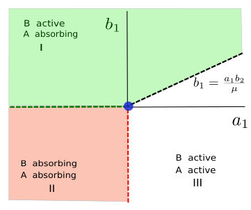 
FIG. 1: Mean-field phase diagram: consists three phases as I- A absorbing B active, II- A absorbing B absorbing, III- A active-B active. Three broken lines are the trnasition lines consisting DP universality.

📷 Fig 2

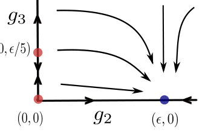 
FIG. 2: Schematic RG flow diagram in the g2 −g3 plane (d &lt; dA c = 6). Different fixed points are marked by filled circles. Arrows indicate the direction of the RG flow (see text).

📷 Fig 3

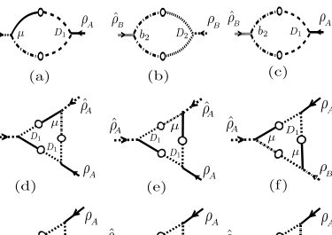 
FIG. 4: One-loop Feynman diagrams giving fluctuation cor- rections to the model parameters: (a) correction to the prop- agator of A (parameters: DA, τA, a1), (b) correction to the propagator of B (parametes: DB, τB, b1), (c) correction to λ, (d)-(e) corrections to D1, (f)-(i) corrections to µ, (j) correc- tion to D2, (k) correction to b2.

**Summary.** This paper analyzes the critical dynamics of a two-species model undergoing an Active-to-Absorbing State Phase Transition (AAPT) under asymmetric coupling. Using perturbative Renormalisation Group techniques, the authors find that the distinct coupling leads to unique critical behaviors for each species. This work provides detailed insights into how non-reciprocal interactions modify universal scaling laws near non-equilibrium critical points.

**Why it may be interesting.** The study of AAPTs and non-equilibrium critical dynamics is highly relevant to understanding pattern formation and phase transitions in complex systems, which shares conceptual links with open quantum systems dynamics.

Detailed structure

**Main problem.** The study investigates the phases and Active-to-Absorbing State Phase Transitions (AAPT) in a two-species model where the species A and its mutant B are coupled asymmetrically.

**Main result.** The asymmetric coupling leads to distinct upper critical dimensions for the two species, and the dynamics exhibit unusual breakdown of scale-invariance for species A below its critical dimension.

**Method.** The analysis employs perturbative Dynamical Renormalisation Group (DRG) techniques applied to the coupled Langevin equations describing the species densities.

**Model / system.** The system is a two-species model (A and B) governed by coupled noisy Langevin equations describing local population densities, $
ho_A$ and $
ho_B$.

**Key observables.** Upper critical dimensions ($d_c^A=6, d_c^B=4$), scaling exponents ($eta, \alpha, 
u_\perp, 
u_\parallel, z, \eta$), and the behavior of the order parameter.

**Important parameters / regimes.** Coupling constants ($\mu, \lambda$), diffusion coefficients ($D_A, D_B$), and the spatial dimension ($d$).

**Assumptions / limitations.** The analysis relies on the lowest order (one-loop) approximation of the DRG, and the noise terms are assumed to be spatio-temporally white.

**Figures summary.** Figure 1 illustrates the mean-field phase diagram showing three distinct regions and transition lines related to DP universality. Figure 4 shows one-loop Feynman diagrams contributing fluctuation corrections to model parameters.

**Paper structure.** The paper progresses from defining the coupled Langevin equations, analyzing the mean-field theory (MFT) to establish transition lines, and finally applying the perturbative DRG to calculate universal scaling exponents and identify deviations from simple scaling laws.

Abstract

We explore the phases and active-to-absorbing state phase transitions (AAPT) in a two-species model, where the species A and its mutant B are {\em asymmetrically} or {\em nonreciprocally} coupled. We identify a multicritical point that connects the global absorbing state of both the species and its mutant, with a uniform active state. The critical dynamics at this multicritical point is studied within the lowest order perturbation theory. This asymmetric coupling between species A and mutant B leads to unequal and distinct upper critical dimensions $d_c^A$ and $d_c^B$ respectively for A and B dynamics. We show that the multicritical point in this model is characterised by an unusual breakdown of scale-invariance by fluctuation-induced logarithmic modulations with power law behaviour of the order parameter and correlation lengths of the species A at all dimensions $d<d_c^A$. Above $d_c^A$, conventional scale-invariance is restored. The dynamics of the mutant species B belongs to the DP universality class with an upper critical dimension of $d_c^B=4$

[↑ back to top](#top)

### [Convolution absorbing boundaries for explicit-circuit quantum simulation of the wave equation](http://arxiv.org/abs/2609.03440v1)

**Authors:** Hoang Anh Nguyen, Ali Tura  
**Type:** theory · **Category:** other · **PDF:** <https://arxiv.org/pdf/2609.03440v1>  
**Analysis basis:** full PDF text, analyzed in chunks
**Topic relevance:** `methods for driven-dissipative` **3/5** · `Keldysh / 2PI / non-Gaussian methods` **2/5** · `analog quantum simulation` **2/5** · `driven-dissipative phase transition` **2/5** · `correlated / nonlocal dissipation` **1/5** · `quantum measurements` **1/5**

📷 Fig 1

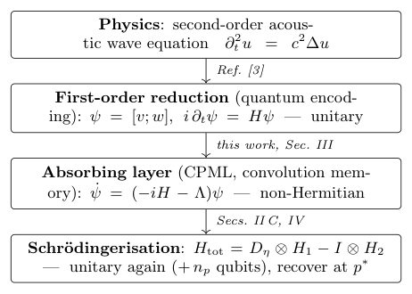 
FIG. 1. The four-step structure: second-order acoustic physics, first-order quantum encoding, convolution absorbing layer applied in that first-order form, and Schr¨odingerisation restoring unitarity. The cost of step three—the indefiniteness quantified by Lemma 1—and its remedy (the Lyapunov sym- metrizer) are the subject of Sec. III D.

📷 Fig 2

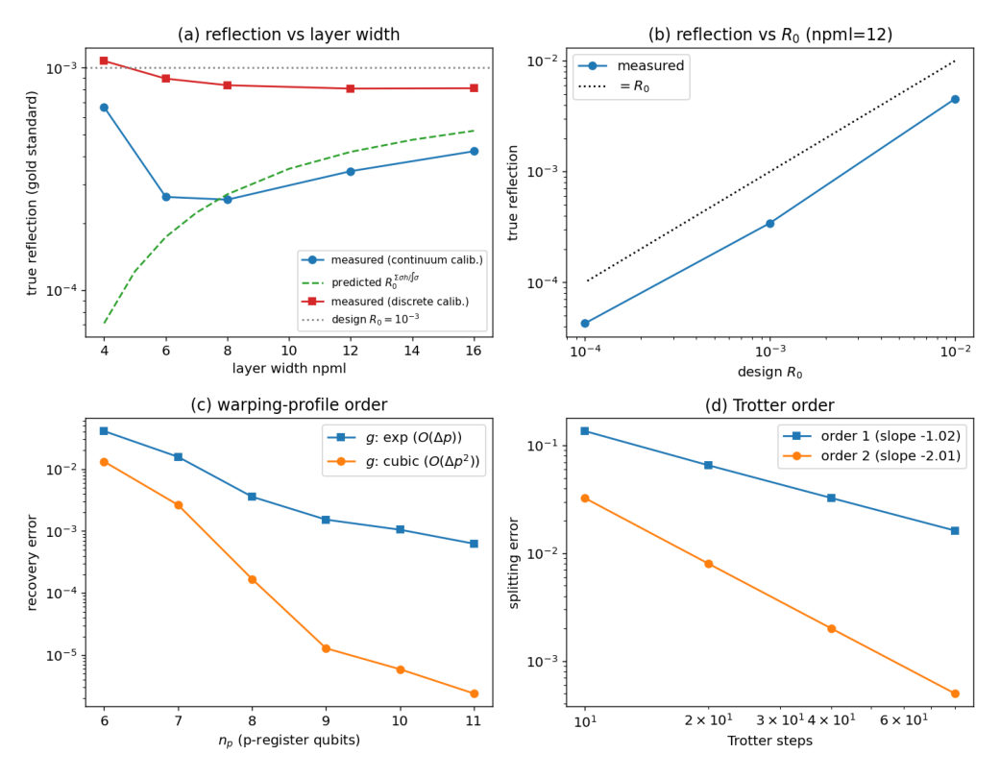 
FIG. 2. Classical and Schr¨odingerisation convergence. (a) Gold-standard reflection (truncated domain versus 4× reference) versus layer width npml at design reflection R0 = 10−3. The curve is non-monotonic: the transition error falls with layer width while the wall return rises toward the design R0 from below, because node sampling of the polynomial profile over-damps thin layers (dashed curve: the predicted discrete wall-return Reff = R Σσh/ R σ 0 , which the measurement tracks within 5–20% for npml ≥8). Red squares: the discretely calibrated profile pair (Appendix D), for which the realised reflection is flat at the design value. (b) Reflection versus R0 at npml = 12: the measured...

📷 Fig 3

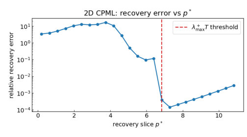 
FIG. 3. The recovery threshold in action (2D CPML, 8 × 8 grid, σmax = 0.5, T = 10). Relative recovery error versus the slice position p∗: below the threshold p∗= λ+T (dashed line, λ+ = 0.683) the recovered state is O(1) wrong; just above it the error drops by four orders of magnitude, then grows slowly as ep∗amplifies the p-grid discretisation floor.

📷 Fig 4

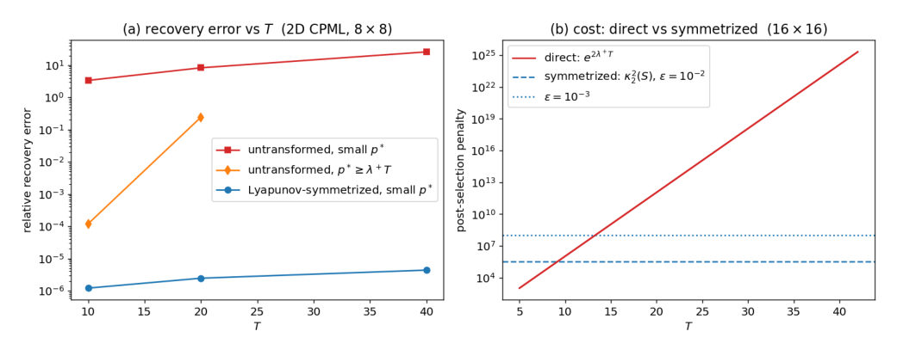 
FIG. 4. The Lyapunov symmetrizer. (a) Relative recovery error versus evolution time T for the 2D CPML system (8 × 8 grid, σmax = 0.5): untransformed recovery at the default small p∗(squares) is O(1) garbage; untransformed recovery above the threshold p∗≥λ+T (diamonds) degrades with T as ep∗amplifies the p-grid floor and leaves the admissible p-domain entirely by T = 40; the Lyapunov-symmetrized recovery at the same small p∗(circles, ϵ = 10−3, shifted transform) stays at the 10−6 level, essentially flat in T. (b) Post-selection cost on the 16 × 16 grid: the direct e2λ+T penalty (solid) against the T-independent symmetrizer penalty κ2 2(S) at ϵ = 10−2 (dashed) and 10−3 (dotted); the...

📷 Fig 5

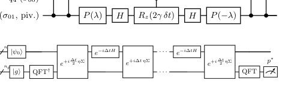 
FIG. 5. Explicit circuits. (a) Bell-basis evolution e−i δt (cP +h.c.) of the projector-containing term P = σ01 ⊗ σ00 ⊗I ⊗I ⊗σ01 ⊗σ10 of the separated 2D wave Hamilto- nian (string mzIImp, qubit qk carrying string character 5 −k; λ = arg c, γ = |c|; λ = 0 for the real wave-equation coef- ficients): cnots rotate the ladder qubits to the Bell basis, and the single multi-controlled Rz carries the block projector σ00 (q4) as an open-circle 0-control—the entire compilation rule of Sec. IV A. The gate sequence is unitarily identical to the library-compiled circuit (verified to machine precision). (b) The Schr¨odingerised pipeline (Sec. IV B) on bundled reg- isters: product-state preparation...

**Summary.** This paper presents a quantum simulation technique for the wave equation on open domains by implementing Convolution Absorbing Boundaries (CPML). It overcomes the inherent exponential cost barrier associated with simulating non-unitary dynamics by introducing a classically precomputed Lyapunov symmetrizer. This remedy stabilizes the quantum circuit evolution, making long-time, high-fidelity simulations feasible.

**Why it may be interesting.** This work directly tackles the practical limitations of simulating open quantum systems on quantum hardware by providing a robust, scalable method to manage boundary reflections and computational cost.

Detailed structure

**Main problem.** The primary challenge addressed is simulating the wave equation on open domains using quantum circuits, which typically suffer from wave reflection at boundaries.

**Main result.** The authors successfully developed a remedy using a Lyapunov symmetrizer that transforms the simulation into a stable, time-independent conditioning factor, vastly improving the feasibility over standard methods.

**Method.** The approach combines Convolution Absorbing Boundaries (CPML) to handle open domains, Schrödingerisation to make the non-unitary dynamics quantum-implementable, and a Lyapunov symmetrizer to stabilize the resulting quantum circuit evolution.

**Model / system.** The system is the wave equation ($\partial^2_t u = c^2 \Delta u$), which is reduced to a non-Hermitian evolution $\dot{\psi} = (-iH - \Lambda)\psi$. This is then mapped to a unitary evolution on an extended quantum register.

**Key observables.** Reflection coefficients, post-selection cost (exponentially growing penalty), and the conditioning factor $\kappa_2(S)$ derived from the symmetrizer.

**Important parameters / regimes.** Absorption strength, grid spacing ($\Delta x$), simulated time ($T$), and the shift parameter ($\epsilon$).

**Assumptions / limitations.** The initial approach faces an exponential cost barrier due to the indefinite Hermitian part of the absorbing generator, necessitating the use of the Lyapunov symmetrizer for practical simulation times.

**Figures summary.** Figures illustrate the four-step quantum process (acoustic physics $	o$ quantum encoding $	o$ absorbing layer $	o$ Schrödingerisation) and compare the performance of different absorbing boundary techniques.

**Paper structure.** The paper first establishes the need for absorbing boundaries, details the CPML implementation, identifies the structural obstruction leading to exponential cost, and finally presents the Lyapunov symmetrizer as a remedy, followed by detailed analysis of its performance and limitations.

Abstract

Explicit quantum circuits for the wave equation, built by Hamiltonian simulation, are restricted to closed domains, in which outgoing waves reflect off the edge of the computational region and return. We lift that restriction with absorbing boundaries of the convolution type - a complex-frequency-shifted perfectly matched layer realised through exponential-kernel memory variables - and make the resulting non-unitary dynamics quantum-implementable by Schrodingerisation. We obtain three results. First, explicit gate-level circuits for the absorbing evolution, obtained by extending a Bell- basis term-evolution circuit to projector-valued operator strings and Trotterising to second order; these run end to end on seventeen to twenty-one qubits and agree with exact references to within a tenth of a percent to a percent. Second, a structural obstruction: the memory form of the absorbing generator carries an irreducibly indefinite Hermitian part, whose largest eigenvalue grows as the square root of the absorption strength divided by the grid spacing and survives any diagonal rescaling of the memory fields. The known recovery threshold for Schrodingerisation then makes the post-selection cost grow exponentially in the simulated time. Third, a remedy: a Lyapunov symmetrizer, precomputed classically, renders the transformed generator dissipative and replaces that time-dependent penalty with a time-independent conditioning factor of several hundred, measured on grids of up to four thousand unknowns and saturating under mesh refinement. The crossover is early: past it the symmetrized recovery is cheaper by four to twenty-six orders of magnitude in post-selection cost, and at the longest horizons tested it is the only recovery that works.

[↑ back to top](#top)

### [Sample-specific rectification-like response in a boundary-driven exclusion process](http://arxiv.org/abs/2609.03560v1)

**Authors:** Issei Sakai, Takuma Akimoto  
**Type:** theory · **Category:** statistical mechanics · **PDF:** <https://arxiv.org/pdf/2609.03560v1>  
**Analysis basis:** full PDF text, analyzed in chunks
**Topic relevance:** `non-equilibrium universality` **3/5** · `Keldysh / 2PI / non-Gaussian methods` **2/5** · `methods for driven-dissipative` **2/5** · `Frenkel-Kontorova` **1/5** · `analog quantum simulation` **1/5** · `driven-dissipative phase transition` **1/5**

📷 Fig 1

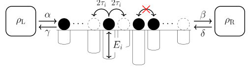 
FIG. 1. Schematic of the boundary-driven SEP on a quenched random energy landscape. Filled and open circles denote oc- cupied and empty sites, respectively.

📷 Fig 2

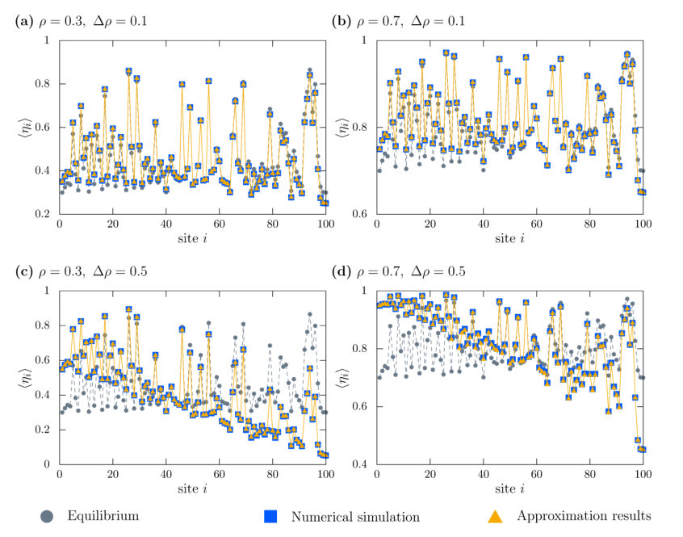 
FIG. 2. Steady-state density profiles for L = 100, ν = 1.5, and τr = τs = τc = 1. Squares denote the numerical simulation results for the SEP on a quenched random energy landscape, triangles denote the approximation in Eq. (42) truncated at nmax = 10, and circles denote the equilibrium density profile in Eq. (11). The same disorder realization is used in all four panels.

📷 Fig 3

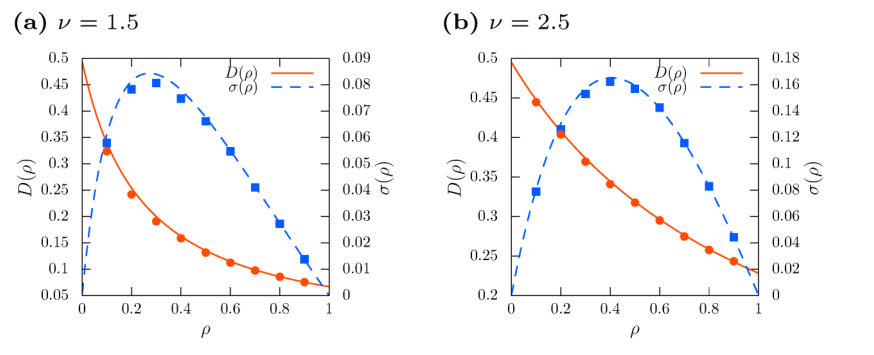 
FIG. 3. Dependence of the linear current-response coefficient D(ρ) and the equilibrium current-fluctuation coefficient σ(ρ) on the mean reservoir density ρ, for L = 100 and τr = τs = τc = 1. Panels (a) and (b) show the results for ν = 1.5 and ν = 2.5, respectively. Circles denote the numerical estimates Dnum(ρ) = L[J(ρ, 0.1) −J(ρ, −0.1)]/0.2, and the solid lines show the approximation in Eq. (50). Squares denote the numerical results for σ(ρ), and the dashed lines show Eq. (51). The left and right vertical axes correspond to D(ρ) and σ(ρ), respectively. Within each panel, the same disorder realization is used for all values of ρ; different realizations are used in panels (a) and (b).

📷 Fig 4

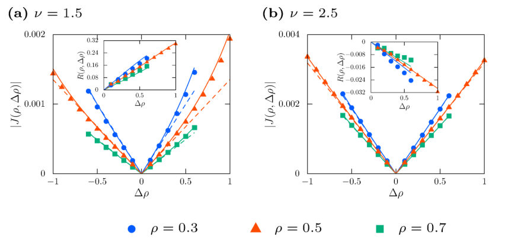 
FIG. 4. Magnitude of the steady-state current as a function of the density difference ∆ρ, for L = 100 and τr = τs = τc = 1. Panels (a) and (b) show the results for ν = 1.5 and ν = 2.5, respectively. Symbols denote the numerical simulation results. The solid lines show |J(ρ, ∆ρ)| obtained from Eq. (52), with the nonlinear series truncated at nmax = 10, and the dashed lines show its linear contribution. The insets show the logarithmic current ratio R(ρ, ∆ρ) defined in Eq. (54). Within each panel, the same disorder realization is used for all values of ρ; different realizations are used in panels (a) and (b).

📷 Fig 5

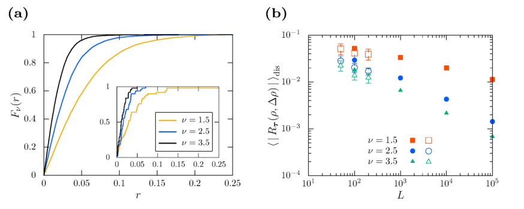 
FIG. 5. Cumulative distribution and disorder-averaged magnitude of the logarithmic current ratio for ρ = 0.5, ∆ρ = 0.5, and τr = τs = τc = 1. The approximation in Eq. (52), truncated at nmax = 10, is compared with numerical simulations. (a) Cumulative distribution function Fν(r) = Pr(|Rτ(ρ, ∆ρ)| ≤r) for L = 100. The main panel shows the approximation obtained from Ndis = 104 independent disorder realizations for each ν. The inset shows empirical cumulative distribution functions obtained from numerical simulations using Ndis = 50 independent disorder realizations for each ν. (b) Disorder- averaged magnitude ⟨|Rτ(ρ, ∆ρ)|⟩dis as a function of the system size L for ν = 1.5, 2.5, and 3.5....

**Summary.** This work analyzes how particle transport in a disordered 1D lattice exhibits rectification-like behavior when driven by density differences. The key finding is that this non-linear asymmetry is a sample-specific effect arising from broken spatial symmetry in the disorder realization. This mechanism suggests that sample heterogeneity, rather than an imposed directional bias, can cause non-linear transport responses.

**Why it may be interesting.** The mechanism of rectification arising purely from quenched disorder heterogeneity, rather than explicit external bias, provides a novel theoretical framework for understanding non-equilibrium transport in disordered quantum/many-body systems.

Detailed structure

**Main problem.** The paper investigates the current response of a boundary-driven symmetric exclusion process (SEP) subjected to quenched site disorder.

**Main result.** Rectification-like transport can emerge from sample-specific spatial heterogeneity in the disorder, even if the disorder-averaged current remains antisymmetric.

**Method.** The analysis uses approximations like Galerkin projection and mean-field closure to solve the steady-state density profile and current response.

**Model / system.** The model is a hard-core particle exclusion process on a 1D lattice, driven by reservoirs of different densities ($
ho_L, 
ho_R$) and featuring quenched site disorder via site-dependent hopping rates.

**Key observables.** Steady-state current ($J$), current-response coefficient, and the degree of current asymmetry under reversal of the reservoir density difference ($\Delta
ho$).

**Important parameters / regimes.** Mean reservoir density ($
ho$), reservoir density difference ($\Delta
ho$), and the nature/distribution of the site disorder $\{E_i\}$.

**Assumptions / limitations.** The analysis relies on approximations such as Galerkin projection at linear order and a mean-field closure at higher orders.

**Figures summary.** Figure 1 schematically shows the SEP on a random energy landscape. Figure 6 shows the dependence of the disorder-averaged current magnitude on reservoir parameters.

**Paper structure.** The paper progresses from analyzing the linear response to the current-response coefficient, then extends to nonlinear terms to find rectification-like behavior, culminating in a symmetry analysis that distinguishes sample-specific effects from ensemble averages.

Abstract

We investigate the current response of a boundary-driven symmetric exclusion process with quenched site disorder. Hard-core particles hop symmetrically on a one-dimensional lattice with site-dependent rates and are injected and removed at the boundaries by two reservoirs of different densities. We approximate the steady-state density profile using a Galerkin projection at linear order and a mean-field closure at higher orders, and thereby obtain the current as a nonlinear function of the reservoir density difference. At linear order in the reservoir density difference, the current-response coefficient depends on the mean reservoir density $ρ$, in contrast to the homogeneous case. Through the linear-response relation, this dependence leads to an equilibrium current-fluctuation coefficient that is asymmetric under $ρ\rightarrow 1-ρ$. Beyond linear response, nonzero even-order current contributions break the antisymmetry of the current under reversal of the reservoir density difference, producing rectification-like behavior in individual disorder realizations. We further show that spatial-reflection symmetry of the equilibrium density profile rules out such behavior, so broken spatial-reflection symmetry of the profile is a necessary condition for rectification-like behavior. Within the present approximation, we further find that, for continuously distributed site disorder, rectification-like behavior occurs arbitrarily close to equilibrium for almost every disorder realization. At the ensemble level, however, the disorder-averaged current remains antisymmetric because the disorder ensemble is invariant under spatial reflection. These results provide a mechanism for rectification-like transport arising from sample-specific spatial heterogeneity rather than from an explicitly imposed directional asymmetry.

[↑ back to top](#top)

### [Fractalizing spacetime: Floquet codes with fractonic excitations that are immobile in space and time](http://arxiv.org/abs/2609.03703v1)

**Authors:** Juliette Soule, Dominic J. Williamson  
**Type:** theory · **Category:** quantum information and computing · **PDF:** <https://arxiv.org/pdf/2609.03703v1>  
**Analysis basis:** full PDF text, analyzed in chunks
**Topic relevance:** `driven-dissipative phase transition` **3/5** · `methods for driven-dissipative` **2/5** · `non-equilibrium universality` **2/5** · `quantum measurements` **2/5**

📷 Fig 1

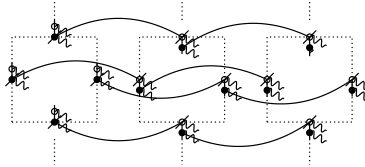 
FIG. 8. Slices of a unit cell of the lattice at t = 1.5 for w = 0 (left) w = 1 (center) and w = 2 (right).

📷 Fig 2

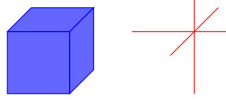 
FIG. 11. Z type local symmetry (left) and X type local sym- metry (right).

📷 Fig 3

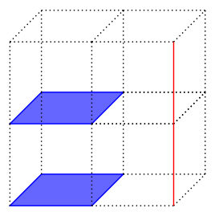 
FIG. 12. Z excitation (left) propagating from ¯z⃗e6 to ⃗e6. X excitation (right) propagating from ⃗e3 to z⃗e3.

📷 Fig 4

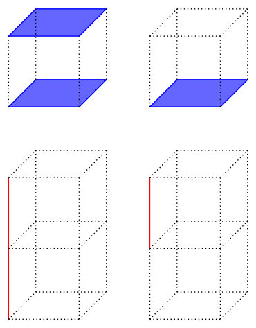 
FIG. 13. Z excitation (top) propagating from ¯z⃗e6, ¯z¯h(w)⃗e6 to ⃗e6. X excitation (bottom) propagating from ⃗e3 to z⃗e3, zh(w)⃗e3.

📷 Fig 5

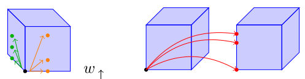 
FIG. 14. Hopping dynamics of a single excitation in space (left) in the ˆx −ˆw, ˆy −ˆw directions and in time (right) in the ˆz−ˆw direction under the application of algebraically indepen- dent polynomials f(w), g(w), h(w). Due to the independence of f(w), g(w), h(w), the evolved fracton can never be brought back to a single excitation by the application of any local op- erator.

**Summary.** This paper introduces spacetime fractalization to build advanced quantum error-correcting codes known as fracton Floquet codes. By embedding fractal symmetries in both space and time, the resulting codes host excitations immobile in both dimensions. This leads to highly robust quantum memories with potentially lower time overhead for fault tolerance.

**Why it may be interesting.** This work directly addresses fault-tolerance in quantum computation by proposing novel topological phases whose inherent symmetries (fracton order) lead to enhanced error correction capabilities in the time domain.

Detailed structure

**Main problem.** The paper generalizes the concept of 'fractalization' from spatial dimensions to spacetime to construct novel, fault-tolerant quantum memories.

**Main result.** They construct an intrinsically spacetime type-II fracton Floquet code exhibiting extreme discrete time crystal order and superlinear fault-distance scaling with time.

**Method.** The methodology involves applying fractalization techniques, originally used for constructing fracton models, to the time dimension of quantum error-correcting codes using concepts from Measurement Based Quantum Computing.

**Model / system.** The focus is on constructing fracton Floquet codes based on fractal symmetries in both space and time, extending Type-II fracton order to dynamical quantum phases. The models are related to fractalized cluster states (e.g., 3D Raussendorf cluster state).

**Key observables.** Immobility of syndrome excitations in space and time; superlinear scaling of the Floquet code fault-distance with time; response periods scaling exponentially with system size.

**Important parameters / regimes.** The fractalization procedure uses linear cellular automaton (LCA) rules, such as the Sierpinski rule, applied across stacked code blocks.

**Assumptions / limitations.** The analysis relies on generalizing LCA dynamics to the quantum domain and assumes the applicability of the no-strings rule in the time-fractalized setting.

**Figures summary.** Figures illustrate the discrete fractal patterns generated by the Sierpinski LCA rule and show the evolution of excitations in both time-fractalized and full spacetime type-II Floquet codes over several time steps.

**Paper structure.** The paper progresses by first defining the spatial fractalization, then extending this concept to the time dimension using LCA rules and adaptive quantum circuits, culminating in the construction and analysis of the full spacetime type-II fracton Floquet code.

Abstract

We generalize fractalization, a procedure for the construction of fracton models, from space to spacetime. We apply spacetime fractalization to construct fracton floquet codes with syndrome excitations that have limited mobility in space and time. This extends the notion of fracton order to intrinsically dynamical quantum phases of matter that are inequivalent to static fracton phases. We find spacetime type-II fracton floquet codes which have no topological excitations that are mobile in space or time. These codes exhibit an extreme form of quantum discrete time crystal order with response periods that scale exponentially in their linear system sizes. In this context, the no-strings rule that characterizes type-II fractons leads to a superlinear scaling of the floquet code fault-distance with time, potentially lowering the time overhead required for quantum error correction.

[↑ back to top](#top)

### [Microscopically exact transport equation for the quantum Calogero model](http://arxiv.org/abs/2609.03018v1)

**Authors:** Vir B. Bulchandani, Fabian H. L. Essler  
**Type:** theory · **Category:** statistical mechanics · **PDF:** <https://arxiv.org/pdf/2609.03018v1>  
**Analysis basis:** full PDF text, analyzed in chunks
**Topic relevance:** `Keldysh / 2PI / non-Gaussian methods` **3/5** · `methods for driven-dissipative` **3/5** · `analog quantum simulation` **2/5** · `quantum measurements` **1/5**

📷 Fig 1

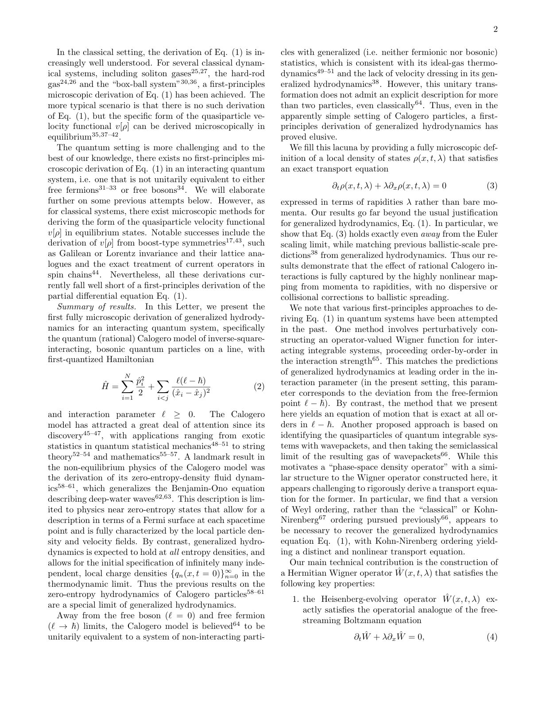 
Low-resolution page preview, page 2

📷 Fig 2

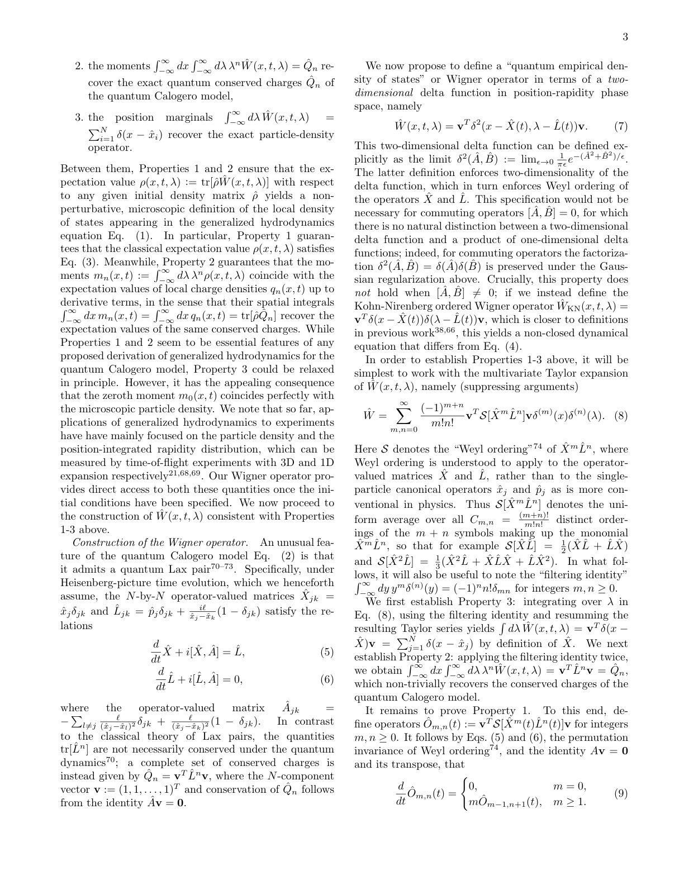 
Low-resolution page preview, page 3

📷 Fig 3

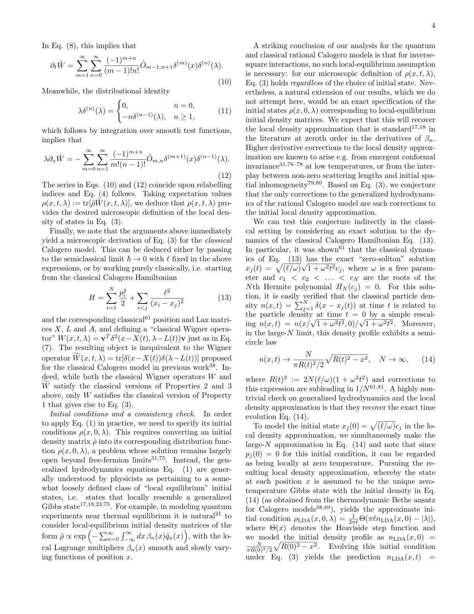 
Low-resolution page preview, page 4

📷 Fig 4

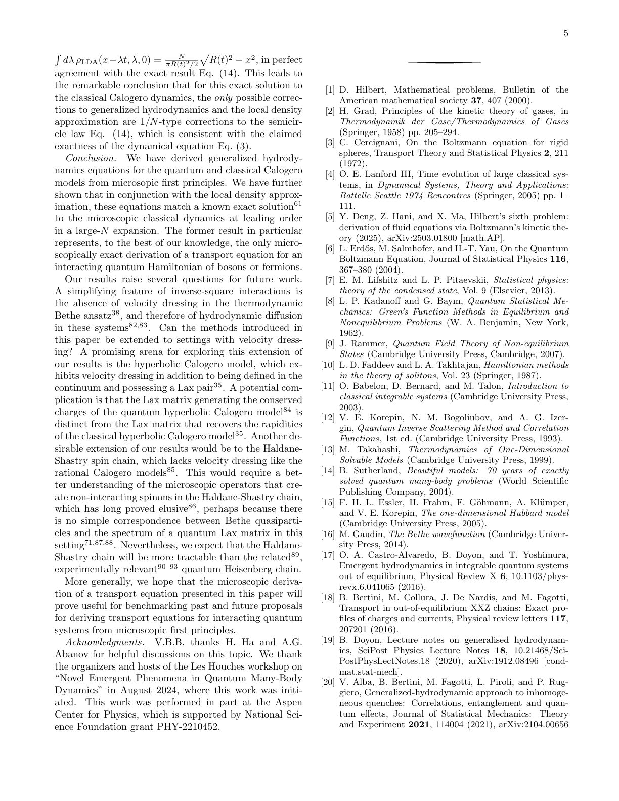 
Low-resolution page preview, page 5

📷 Fig 5

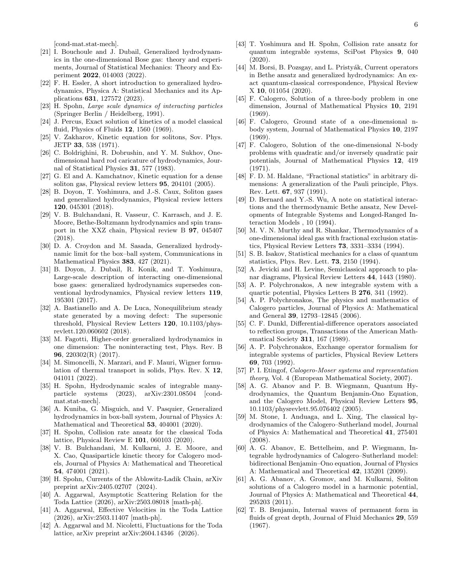 
Low-resolution page preview, page 6

**Summary.** This work provides the first fully microscopic derivation of generalized hydrodynamics for the quantum Calogero model. By constructing a specific Wigner operator, the authors derive an exact transport equation for the local density of states. This result is significant because it establishes a rigorous, non-perturbative framework for quantum transport in integrable systems.

**Why it may be interesting.** The derivation provides a first-principles, non-perturbative benchmark for quantum transport in integrable many-body systems, which is highly relevant for understanding dynamics in quantum gases and strongly correlated models.

Detailed structure

**Main problem.** The paper aims to derive an exact, microscopic transport equation for the quantum Calogero model, overcoming limitations of previous approximations like the quantum Boltzmann equation.

**Main result.** The authors derive an exact transport equation for the local density of states, showing that the dynamics are governed by a simple free-streaming equation without dispersive or collisional corrections.

**Method.** The core method involves constructing a Hermitian Wigner operator in position-rapidity phase space whose expectation value defines the local density of states.

**Model / system.** The system is the quantum Calogero model, which describes inverse-square interacting bosons on a line, governed by a specific Hamiltonian. The analysis extends to both quantum and classical limits.

**Key observables.** Local density of states $\rho(x, t, \lambda)$, particle density $n(x, t)$, and quantum conserved charges $\hat{Q}_n$.

**Important parameters / regimes.** The interaction strength parameter $\ell(\ell-\hbar)$ and the large-N limit are crucial parameters.

**Assumptions / limitations.** The derivation relies on the existence of a quantum Lax pair and utilizes the local density approximation (LDA) for comparison with known solutions.

**Figures summary.** Not specified in the notes, but the structure implies showing the evolution of the local density of states $\rho(x, t, \lambda)$ over time.

**Paper structure.** The paper progresses from defining the physical problem and the Hamiltonian to constructing the Wigner operator, deriving its evolution equation, and finally showing that the moments of this operator recover the exact quantum conserved charges and the generalized hydrodynamics equation.

Abstract

We derive an exact transport equation for the quantum Calogero model, i.e. inverse-square interacting bosons on a line, from microscopic first principles.

[↑ back to top](#top)

### [Non-Resonant Impulsively Stimulated Raman Scattering by a Terahertz Field: a Case Study of 1T-TaS2](http://arxiv.org/abs/2609.03519v1)

**Authors:** Haotian Zhang, Yuheng Guo, Zidu Yu, Yongbo Lv, Yiting Wang, Liwen Feng, Jiaying Xu, Tianlong Xia, Xinbo Wang, Hao Chu  
**Type:** experiment · **Category:** strongly correlated electrons · **PDF:** <https://arxiv.org/pdf/2609.03519v1>  
**Analysis basis:** full PDF text, analyzed in chunks
**Topic relevance:** `Frenkel-Kontorova` **3/5** · `Keldysh / 2PI / non-Gaussian methods` **1/5** · `driven-dissipative phase transition` **1/5** · `interference shaping light` **1/5** · `methods for driven-dissipative` **1/5** · `non-equilibrium universality` **1/5** · `quantum measurements` **1/5**

📷 Fig 1

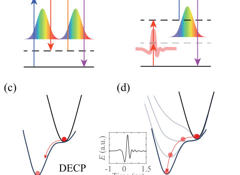 
Figure 1 Mechanisms for generating coherent Raman- active modes in solids (a) In Impulsively Stimulated Raman Scattering (ISRS), two photons from the excitation pulse creates a stimulated Raman excitation via their energy difference. A time-delayed probe pulse undergoes inelastic scattering with the Raman excitation, resulting in an anti-Stokes shifted Raman photon that interferes with the elastically scattered photons, which manifests as a beating, or intensity oscillations of the reflected probe beam. (b) The proposed non-resonant ISRS mechanism for generating coherent Raman-active modes using low-frequency terahertz excitation. Here, two terahertz photons coherently add to create the...

📷 Fig 2

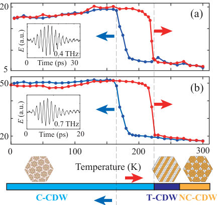 
Figure 2 Terahertz linear transmission through 1T-TaS2 (a) 0.42 THz and (b) 0.7 THz linear transmission through 1T-TaS2 as a function of temperature. The cooling and heating cycle shows a hysteresis between 160 K and 220 K, due to the hysteretic charge-density-wave (CDW) transitions in this material as illustrated below. Insets show the multicycle 0.42 THz and 0.7 THz waveforms used for these measurements. on DC conductivity. In our measurement, terahertz linear transmission shows no discontinuity between these two states either. Having established the expected c-CDW transition in our sample, next we perform monocycle terahertz pump − 800 nm reflectivity probe measurement on the sample on...

📷 Fig 3

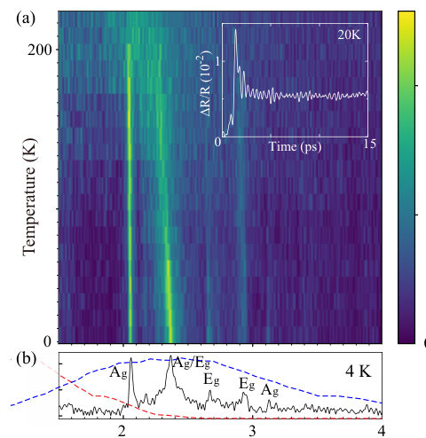 
Figure 3 Coherent Raman-active phonons launched by a broadband terahertz excitation (a) The broadband monocycle terahertz pulse launches a series of Raman-active phonons in 1T- TaS2 in the c-CDW state, with frequencies as high as 3.1 THz (also see Supplementary Information for a different sample with a 3.4 THz mode). (b) The phonon spectrum at 4 K with each mode’s symmetry labeled according to polarization-resolved equilibrium Raman scattering measurement. Also shown is the power spectrum of the broadband terahertz pulse used for this measurement (red dashed line), and the same spectrum scaled by a factor of ×2 in frequency (blue dashed line). The observed Raman-active modes all fall within...

📷 Fig 4

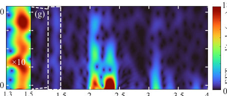 
Figure 4 Terahertz third harmonic generation in 1T-TaS2 (a) Temperature dependence of THG amplitude under 0.42 THz drive and (b) representative Fourier amplitude spectrum at 5 K. (c) Extracted-THG waveforms at representative temperatures across the c-CDW transition. (d)-(f) Corresponding results obtained with 0.7 THz drive. A notable side peak develops next to the main THG peak in the Fourier spectrum. The existence of the side peak is corroborated by the beating-like pattern in the THG waveforms. (g) Coherent phonon spectrum obtained with 15 ps moving-time window FFT analysis on optical pump − optical reflectivity transients measured at 80 K. A periodic modulation of the coherent phonon...

**Summary.** This work investigates the light-matter interaction in the CDW material 1T-TaS2 using ultrafast THz spectroscopy. The authors propose that the coherent excitation of lattice vibrations is governed by a non-resonant Impulsively Stimulated Raman Scattering mechanism involving two-photon absorption. This technique offers a powerful tool for studying collective modes in correlated solids using low-energy THz fields.

**Why it may be interesting.** The work provides a detailed experimental framework for probing low-energy collective excitations (like CDW or superconducting modes) using THz fields, which is highly relevant for understanding non-equilibrium dynamics and coherent control in correlated materials.

Detailed structure

**Main problem.** The primary goal is to elucidate the mechanism by which Raman-active collective excitations in centrosymmetric materials couple to terahertz (THz) electric fields, as direct linear coupling is forbidden.

**Main result.** The coherent excitation of lattice modes is attributed to a modified impulsively stimulated Raman scattering (ISRS) mechanism involving two-photon absorption, termed non-resonant ISRS.

**Method.** The study employs ultrafast terahertz pump – optical probe (TPOP) and terahertz third harmonic generation (THG) spectroscopy on single crystals.

**Model / system.** The physical system is 1T-TaS2, a material known for its rich charge-density-wave (CDW) phase diagram, which exhibits distinct commensurate, nearly-commensurate, and incommensurate CDW phases.

**Key observables.** Coherent phonon frequencies (e.g., 2.05, 2.37, 2.65, 2.95, 3.12 THz), THz linear transmission changes across CDW transitions, and THG spectra.

**Important parameters / regimes.** Temperature (especially near CDW transition $T_{CDW} \sim 220$ K), THz field strength (up to 500 kV/cm), and pulse characteristics (broadband monocycle vs. narrowband multicycle).

**Assumptions / limitations.** The THz-matter interaction mechanism is non-resonant and involves two-photon absorption, distinguishing it from standard ISRS or DECP mechanisms.

**Figures summary.** Figures illustrate the proposed mechanisms (ISRS vs. non-resonant ISRS), temperature dependence of THz transmission across CDW transitions, and ultrafast reflectivity transients revealing coherent phonon oscillations.

**Paper structure.** The paper systematically investigates the coupling mechanism by performing multiple THz spectroscopy measurements (TPOP, THG) across different temperature regimes and THz field bandwidths, culminating in the proposal of the non-resonant ISRS mechanism.

Abstract

Time-domain ultrafast and nonlinear terahertz spectroscopy techniques are recently applied to many condensed matter systems for investigating their collective excitations. In centrosymmetric systems, these collective modes are typically Raman-active and therefore do not couple directly to the terahertz electric field. The mechanism by which light-matter interaction realizes in these studies has not been explicitly discussed in detail. In this work, we perform terahertz pump - optical probe and terahertz third harmonic generation investigations on 1T-TaS2, a material exhibiting a rich charge-density-wave (CDW) phase diagram including the commensurate, nearly-commensurate and incommensurate CDW phases. The transition between these distinct states leaves a clear signature on the dynamical Raman response. We investigate how the Raman-active phonons couple to a broadband monocycle terahertz field as well as a narrowband multicycle terahertz field. Our results indicate that a modified impulsively stimulated Raman scattering mechanism involving two-photon absorption, also known as non-resonant Raman scattering, underlies the coherent excitation and observation of the lattice modes. These results are relevant for future spectroscopy investigation and coherent control of collective modes using low-energy terahertz field as well as cavity electrodynamical dressing of solids.

[↑ back to top](#top)

### [Thermodynamic Concentration Inequalities: Controlling Uncertainty in Finite-Time and Small-Sample Thermodynamic Inference](http://arxiv.org/abs/2609.04162v1)

**Authors:** Rick Bebon, Aljaž Godec  
**Type:** theory · **Category:** statistical mechanics · **PDF:** <https://arxiv.org/pdf/2609.04162v1>  
**Analysis basis:** full PDF text, analyzed in chunks
**Topic relevance:** `non-equilibrium universality` **3/5** · `quantum measurements` **2/5** · `Keldysh / 2PI / non-Gaussian methods` **1/5** · `driven-dissipative phase transition` **1/5** · `methods for driven-dissipative` **1/5**

📷 Fig 1

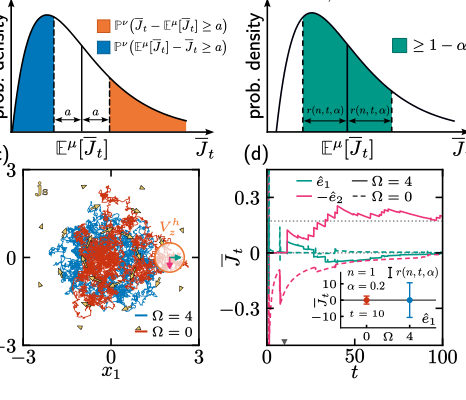 
FIG. 1. (a) Schematic probability density of Jt for a single trajectory of finite length t ≥0. Fluctuations around the mean Eµ[Jt] are quantified by right (orange) and left (blue) tail probabilities. (b) Uncertainty quantification. The sample mean b Jn,t over n trajectories of length t deviates from Eµ[Jt] by less than the confidence radius r(n, t, α) with probability at least 1−α (green). (c) Trajectories of length t = 7.5 for a driven (Ω= 4, blue) and equilibrium (Ω= 0, red) Ornstein-Uhlenbeck process with identical ps and λgap. Yellow arrows depict js, and V h z (orange) probes coarse-grained currents along ˆe1 (green) and −ˆe2 (magenta). (d) Corresponding currents Jt approach their...

📷 Fig 2

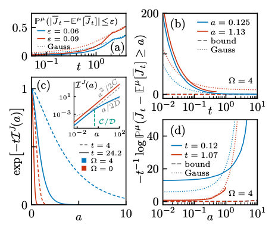 
FIG. 2. (a) Probability that |Jt −Eµ[Jt]| is less than ε = 0.06 (20%, blue) or ε = 0.09 (30%, red) of the stationary mean remains small beyond the relaxation time λ−1 gap = 1, and is overestimated by the Gaussian approximation. (b,d) Empirical rate −t−1 log Pµ(Jt −Eµ[Jt] ≥a) compared with IJ(a) of the bound and a Gaussian approximation, as a function of (b) t at fixed a and (d) a at fixed t. (c) Concentration bound as a function of a at different times for the driven (blue) and equilibrium (red) dynamics. Inset: Interpolation between the Gaussian regime a2/2C at small and the exponential regime a/2D at large deviations, crossing over at a∗= C/D (green); at equilibrium (red) it remains...

📷 Fig 3

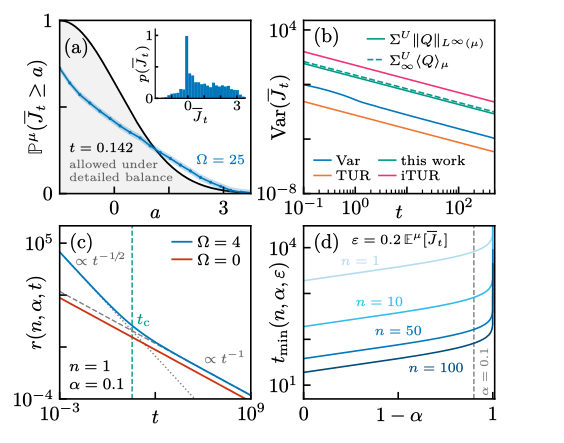 
FIG. 3. (a) Violation of the equilibrium bound (grey) by the empirical deviation probability (blue) for driven dynamics (Ω= 25) detects irreversibility even at short t. Inset: His- togram of Jt. (b) Steady-state variance Varµ(Jt) as a function of t, bounded from below by the TUR (orange) and from above by the existing iTUR (magenta) and our refined result (green). (c) Confidence radius r(n, t, α) for n = 1 and α = 0.1 as function of t. Out of equilibrium (blue), the tail contribution ∝t−1 dominates the error bars up to the crossover time tc (green), beyond which Gaussian scaling ∝t−1/2 takes over. At equilibrium (red), error bars are Gaussian at all times. (d) Minimal observation time...

**Summary.** This paper develops advanced concentration inequalities to provide rigorous, nonasymptotic bounds on the uncertainty when estimating thermodynamic quantities from limited experimental data. By analyzing generalized currents, the authors quantify the required observation time and sample size needed to distinguish between equilibrium and non-equilibrium states. This offers a powerful theoretical framework for modern stochastic thermodynamics and data-driven physics.

**Why it may be interesting.** This work provides rigorous, quantitative tools for analyzing non-equilibrium steady states, which is crucial for understanding energy dissipation and fluctuation theorems in complex physical systems, bridging statistical mechanics with data science.

Detailed structure

**Main problem.** The paper derives nonasymptotic concentration inequalities to rigorously control the uncertainty associated with estimating thermodynamic quantities from finite-time or small-sample stochastic trajectories.

**Main result.** It establishes refined inverse thermodynamic uncertainty relations (iTUR) and provides explicit confidence intervals, quantifying how observation time and sample size must scale to achieve a desired accuracy, especially highlighting differences between equilibrium and non-equilibrium dynamics.

**Method.** The methodology relies on deriving concentration bounds (e.g., Cramér-Chernoff approach) for generalized currents and their sample means, extending techniques from stochastic processes theory to finite-data inference.

**Model / system.** The analysis is performed on geometrically ergodic, time-homogeneous stochastic processes governed by overdamped Langevin equations on a continuous state space. The focus is on the dynamics' ability to relax to a stationary measure.

**Key observables.** Generalized current ($	ext{J}_t$), sample mean ($ar{	ext{J}}_{n,t}$), local steady-state entropy production rate ($\Sigma_{loc}$), and the overall entropy production rate ($\Sigma_U$).

**Important parameters / regimes.** Relaxation time, spectral gap ($\lambda_{	ext{gap}}$), dissipation rate, and the ratio $\Sigma_U/\lambda_{	ext{gap}}$ which quantifies the deviation from equilibrium.

**Assumptions / limitations.** The dynamics are assumed to be geometrically ergodic, and the derivations rely on bounding moment-generating functions and utilizing properties of the underlying Markovian process.

**Figures summary.** The notes do not provide a summary of figures, but they detail the mathematical forms of the concentration inequalities and the dependence of the required observation time/sample size on the dissipation factor.

**Paper structure.** The paper builds from deriving concentration inequalities for the generalized current in finite time, extends these bounds to the sample mean over multiple independent paths, and culminates in deriving refined uncertainty relations and practical bounds for minimal observation time and sample size.

Abstract

We derive nonasymptotic upper bounds on the probability that a generalized current of a geometrically ergodic diffusion observed for any amount of time, or its sample mean over any arbitrary sample size, deviates from the stationary mean by more than any given amount. The concentration-of-measure behavior of generalized currents is universally governed by the relaxation time of the underlying dynamics, the locally observed dissipation rate, and the intrinsic local fluctuations of the observable. We uncover stark qualitative and quantitative differences in fluctuations in and out of thermodynamic equilibrium. We further obtain refined inverse thermodynamic uncertainty relations, bounding the variance of generalized currents from above. We construct nonasymptotic confidence intervals for controlling uncertainty in thermodynamic inference from small data, i.e., from short trajectories and small samples, and provide the first quantitative answer to when a trajectory is sufficiently long and a sample is sufficiently large. As an illustration, we apply our results to currents observed on a two-dimensional Ornstein-Uhlenbeck process in and out of equilibrium and show how they can be used to rigorously detect broken detailed balance.

[↑ back to top](#top)

### [Optimizing Atom Transport, Gate-Count and Depth with Parity Twine](http://arxiv.org/abs/2609.03583v1)

**Authors:** Javad Kazemi, Michael Fellner, Riccardo J. Valencia-Tortora, Michael Schuler, Wolfgang Lechner  
**Type:** theory · **Category:** quantum information and computing · **PDF:** <https://arxiv.org/pdf/2609.03583v1>  
**Analysis basis:** full PDF text, analyzed in chunks
**Topic relevance:** `Rydberg arrays` **3/5** · `QC/QI experiment` **2/5** · `analog quantum simulation` **1/5**

📷 Fig 1

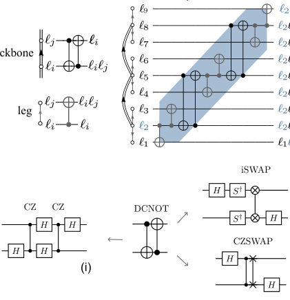 
FIG. 1: (a) Information flow in a Parity Twine chain (highlighted in blue) with a backbone (black double lines) and two legs (grey lines) per backbone node. DC- NOT gates are applied along the backbone, while CNOT gates connect the backbone to the legs, systematically distributing the logical parity information, labeled by ℓi, throughout the system. (b) Equivalent decomposi- tions of the DCNOT gate using neutral-atoms-native CZ, CZSWAP, or iSWAP gates.

📷 Fig 2

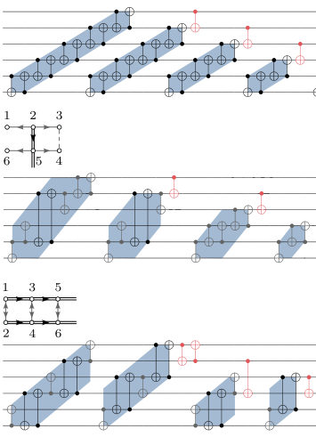 
FIG. 2: Construction of Parity Twine networks as a cas- cade of Parity Twine chains (highlighted in blue) for (a) linear, (b) square, and (c) ladder layouts from a given Twine path (shown above each circuit). Black DCNOT gates implement the backbones, gray CNOT gates the legs, and red CNOT gates the decoding sequence that recovers the individual qubit labels at the end. Note that the circuits are stretched horizontally for visualiza- tion purposes to better highlight the structure of the Par- ity Twine networks and can be parallelized in practice. Therefore, they do not indicate their relative execution times.

📷 Fig 3

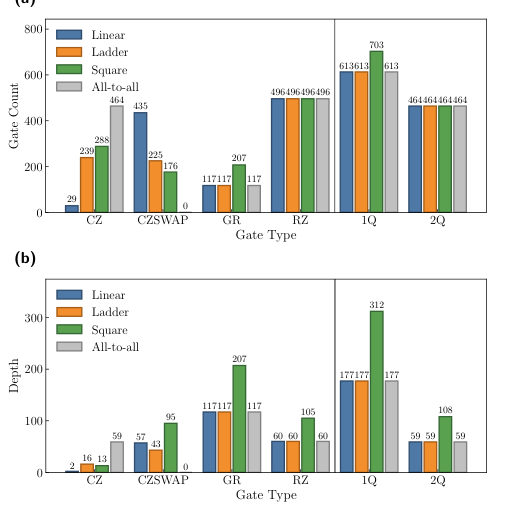 
FIG. 4: Per-gate-type and total single- and two-qubit (a) gate counts and (b) gate depths for the QFT30 im- plemented using a CZSWAP-based Parity Twine network across different hardware layouts. Here, the 1Q category includes global rotations (GR) and local RZ rotations, while the 2Q category includes CZ and CZSWAP gates.

📷 Fig 4

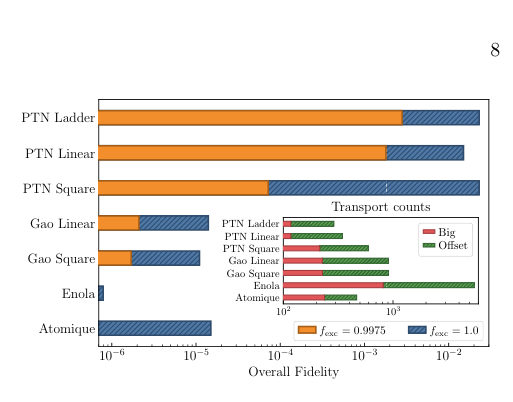 
FIG. 5: Estimated fidelity of the QFT30 circuit for dif- ferent compilation methods. Blue bars show results for vanishing Rydberg crosstalk (fexc = 1), while orange bars consider a 0.25% crosstalk error (fexc = 99.75%). The in- set shows the numbers of big moves (red bars) and offset moves (green bars) required for both CZ and CZSWAP gate implementations. Data for all non-PTN methods are taken from Ref. [37].

📷 Fig 5

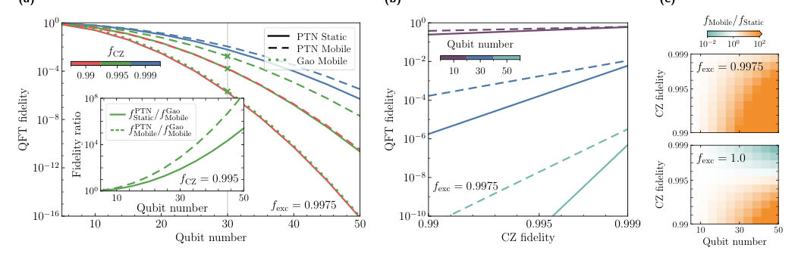 
FIG. 6: Estimated QFT fidelity on a linear neutral-atom array using static (solid lines) and mobile (dashed lines) architectures as a function of (a) the number of qubits and (b) the CZ-gate fidelity. The dotted lines in panel (a) show the best previously reported QFT fidelities at fCZ = 0.995 obtained using Gao’s linear compilation [37]. Crosses mark the corresponding QFT fidelities at 30 qubits for the three compilation approaches for a CZ gate fidelity of fCZ = 99.5%. The inset shows the fidelity improvements of PTN-based implementations relative to Gao’s approach. (c) Ratio of the mobile to static PTN-based QFT fidelity in the presence (upper panel) and absence (lower panel) of Rydberg...

**Summary.** This paper introduces Parity Twine Networks (PTNs) as a general, hardware-aware framework for compiling quantum circuits on neutral-atom processors. By optimizing for gate count, depth, and atom movement, the authors demonstrate significant resource savings for algorithms like the QFT. This work is crucial for realizing fault-tolerant quantum computation on scalable physical platforms.

**Why it may be interesting.** It provides a concrete, resource-aware compilation strategy directly tailored to the physical constraints (connectivity, mobility) of state-of-the-art neutral-atom quantum hardware.

Detailed structure

**Main problem.** The core problem is optimizing quantum circuit resources (gate count, depth, and atom transport) for quantum algorithms running on physical hardware.

**Main result.** The proposed Parity Twine Network (PTN) framework achieves substantial resource savings for algorithms like the QFT, leading to estimated circuit fidelities three orders of magnitude higher than competing methods.

**Method.** The authors develop a hardware-aware co-design framework by adapting PTNs to specific neutral-atom architectures, comparing different native entangling gates (CZ, CZSWAP, iSWAP).

**Model / system.** The work focuses on neutral-atom quantum processors utilizing Rydberg-mediated gates and atom shuttling capabilities. The model uses Parity Twine Networks (PTNs) to encode arbitrary interaction graphs.

**Key observables.** Two-qubit gate count, circuit depth, atom transport distance, and estimated circuit fidelity.

**Important parameters / regimes.** The fidelity ratio comparison between mobile and static implementations, and the gate fidelity ($f_{CZ}$) threshold for performance crossover.

**Assumptions / limitations.** The analysis assumes that atom shuttling can be utilized to realize composite gates like CZSWAP, and that the framework can be extended to approximate arithmetic circuits using Optimistic QFTs.

**Figures summary.** Figures illustrate the information flow in Parity Twine chains and the physical construction of PTNs for various layouts (linear, square, ladder). Table III summarizes the scaling of gate counts and depths for QFT across these layouts.

**Paper structure.** The paper introduces the PTN framework, demonstrates its application to the QFT on different layouts, compares the resource costs of CZ vs. CZSWAP implementations, and extends the concept to approximate quantum arithmetic circuits.

Abstract

We present an efficient implementation of the Parity Architecture for neutral-atom quantum processors. We adapt Parity Twine Networks (PTNs) to different atom layouts, native entangling gates, and atom-shuttling capabilities. This provides a general framework for hardware-aware optimization of gate count, circuit depth, and atom transport for quantum circuits encoding arbitrary interaction graphs in a common basis. Specifically, we develop PTN constructions based on different native entangling-gate realizations, namely CZ, CZSWAP, and iSWAP, providing flexibility to accommodate different hardware capabilities on both static and mobile neutral-atom platforms. Using the quantum Fourier transform (QFT) as a representative example, we demonstrate substantial reductions in two-qubit gate count, atom transport, and circuit depth. These resource savings translate into an estimated circuit fidelity three orders of magnitude higher than competing compilation strategies for a 30-qubit QFT. We further extend the construction to the recently introduced optimistic QFT and discuss the broader applicability of PTNs to other quantum algorithms on neutral-atom platforms.

[↑ back to top](#top)

### [Quantum-Enhanced Phase Estimation with Photon-Added Even and Odd Coherent States in an SU(1,1) Interferometer](http://arxiv.org/abs/2609.04064v1)

**Authors:** Abdelmajid El Maaroufi, Mouad Ait Maskour, Bouchra Maroufi, Mohammed Daoud, Saeed Haddadi  
**Type:** theory · **Category:** other · **PDF:** <https://arxiv.org/pdf/2609.04064v1>  
**Analysis basis:** full PDF text, analyzed in chunks
**Topic relevance:** `interference shaping light` **3/5** · `quantum measurements` **2/5** · `analog quantum simulation` **1/5**

📷 Fig 1

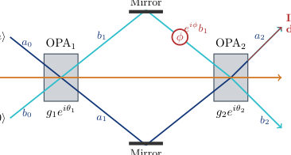 
FIG. 1. . The schematic diagram of the SU(1,1) interferometer. PAECS and PAOCS |α±, m⟩are injected into input port a0 (mode a), while a squeezed vacuum state |r, 0⟩is injected into the other input port b0 (mode b). The first and second optical parametric am- plifiers, OPA1 and OPA2, are characterized by the gain factors g1 and g2 and the phase shifts θ1 and θ2, respectively. After OPA1, the two input ports a0 and b0 evolve into the intermediate fields a1 and b1, respectively, with a phase shift ϕ applied to field b1 by the phase shifter. The two fields are subsequently recombined in OPA2, producing the output ports a2 and b2. The pump fields drive the para- metric amplification processes in...

📷 Fig 2

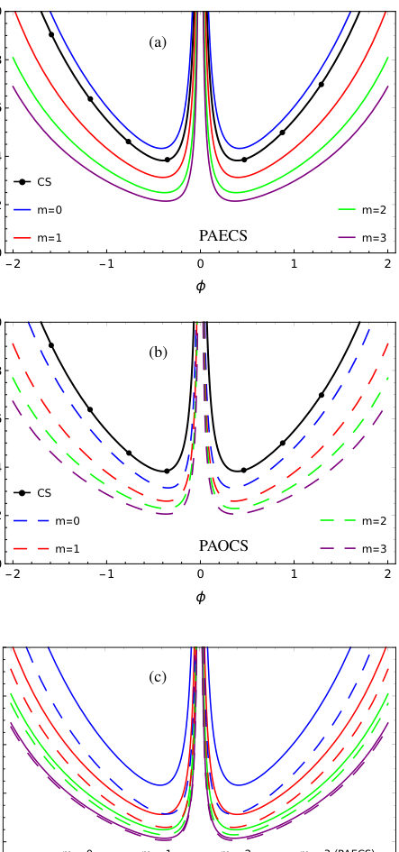 
FIG. 2. The phase sensitivity based on intensity detection as a func- tion of ϕ. (a) PAECS and (b) PAOCS compared with conventional coherent state (CS: black curve). (c) Direct comparison between the PAECS and PAOCS inputs for different photon-addition numbers. The solid and dashed curves correspond to PAECS and PAOCS, re- spectively. Other parameters: α = 1, g = 1, and r = 0.5.

📷 Fig 3

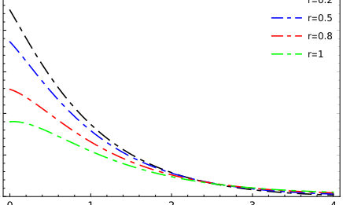 
FIG. 4. Difference in phase-estimation performance δ between PAECS and PAOCS as a function of the photon-addition number m for different squeezing parameters r. Other parameters are α = 1, ϕ = 0.2, and g = 1.

📷 Fig 4

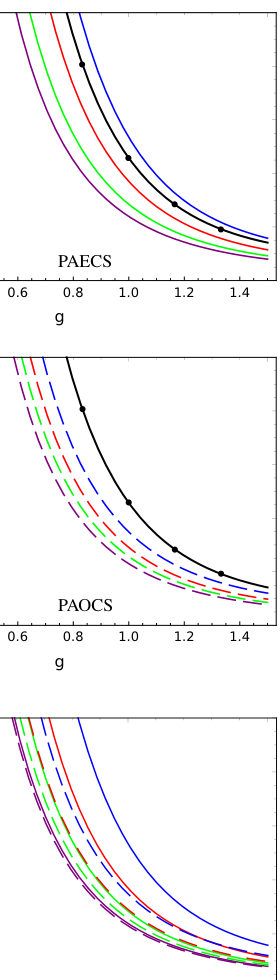 
FIG. 3. The phase sensitivity based on intensity detection as a func- tion of g. (a) PAECS and (b) PAOCS compared with conventional coherent state (CS: black curve). (c) PAECS vs PAOCS for different photon-addition numbers. The solid and dashed curves correspond to PAECS and PAOCS, respectively. Other parameters: α = 1, ϕ = 0.2, and r = 0.5.

📷 Fig 5

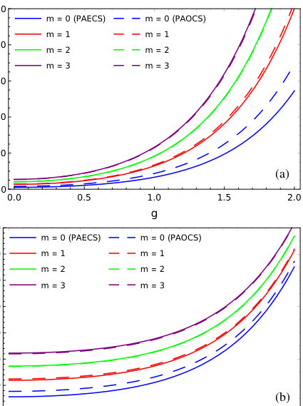 
FIG. 5. (a) The total mean photon number NT inside the SU(1,1) interferometer as a function of g with α = 1 and r = 0.5. (b) NT versus r with α = 1 and g = 1. Solid and dashed curves correspond to PAECS and PAOCS inputs, respectively.

**Summary.** This paper theoretically analyzes quantum-enhanced phase estimation in an SU(1,1) interferometer using photon-added even and odd coherent states. The authors demonstrate that adding photons significantly boosts phase sensitivity, pushing performance beyond the Standard Quantum Limit. Crucially, they show that this photon addition mitigates the initial dependence of the measurement on whether the state was initially even or odd.

**Why it may be interesting.** This work is highly relevant to quantum optics and open quantum systems, as it explores using structured, nonclassical light states (photon-added states) to surpass fundamental measurement limits in an established quantum optical setup (SU(1,1) interferometer).

Detailed structure

**Main problem.** The paper investigates how using photon-added even and odd coherent states enhances phase estimation precision in an SU(1,1) interferometer compared to standard coherent states.

**Main result.** Photon addition significantly enhances phase sensitivity, pushing the achievable precision beyond the Standard Quantum Limit towards the Heisenberg Limit, while also diminishing the initial dependence on the state's even or odd parity.

**Method.** Phase sensitivity is analyzed using intensity detection and the quantum Cramér-Rao bound, quantifying performance via the quantum Fisher information.

**Model / system.** The physical model is an SU(1,1) interferometer, which is realized using two Optical Parametric Amplifiers (OPAs) acting on input states, specifically photon-added even/odd coherent states and a squeezed vacuum state.

**Key observables.** Phase sensitivity ($\Delta\phi$), Quantum Fisher Information (QFI), and the Quantum Cramér-Rao Bound ($\Delta\phi_{QCRB}$).

**Important parameters / regimes.** Photon-addition number ($m$), OPA gain ($g$), and squeezing parameter ($r$).

**Assumptions / limitations.** The analysis assumes the use of specific nonclassical input states (PAECS/PAOCS) and models the interferometer using the SU(1,1) transformation.

**Figures summary.** Figures illustrate the phase sensitivity ($\Delta\phi$) vs. OPA gain ($g$) for varying $m$, comparing results to the QCRB, SQL, and HL. Other figures show the convergence of the performance difference ($\delta$) and total photon number ($N_T$) as $m$ increases.

**Paper structure.** The paper systematically analyzes the metrological enhancement by comparing the performance of PAECS and PAOCS against standard coherent states, first using intensity detection, and then determining the ultimate limit via QFI and QCRB, concluding with the convergence analysis.

Abstract

We investigate phase estimation in an SU(1,1) interferometer employing $m$-photon-added even and odd coherent states as nonclassical input resources. The phase sensitivity is evaluated through intensity detection and the error propagation method, while the ultimate precision limit is determined from the quantum Cramér-Rao bound with the quantum Fisher information serving as the relevant metrological quantity. Our results demonstrate that photon addition significantly enhances the phase sensitivity, increases the quantum Fisher information, and reduces the quantum Cramér-Rao bound, leading to a clear improvement over the corresponding even and odd coherent states. Furthermore, the achievable sensitivity exceeds the standard quantum limit and gradually approaches the Heisenberg scaling with increasing photon-addition number. We also find that the $m$-photon-added even coherent states exhibit a modest advantage over their odd counterparts. As $m$ increases, however, this distinction becomes progressively weaker, suggesting that photon addition diminishes the role of the initial parity of the coherent state in determining the interferometric performance.

[↑ back to top](#top)

### [Pulse-Controlled Topologically Protected Quantum Batteries](http://arxiv.org/abs/2609.03543v1)

**Authors:** Jin Yang, Biao Xiong, Jibing Liu, Houguo Yu, Dehua Liu, Feng Mei, Chuanjia Shan  
**Type:** theory · **Category:** quantum information and computing · **PDF:** <https://arxiv.org/pdf/2609.03543v1>  
**Analysis basis:** full PDF text, analyzed in chunks
**Topic relevance:** `analog quantum simulation` **3/5** · `methods for driven-dissipative` **1/5** · `quantum measurements` **1/5**

📷 Fig 1

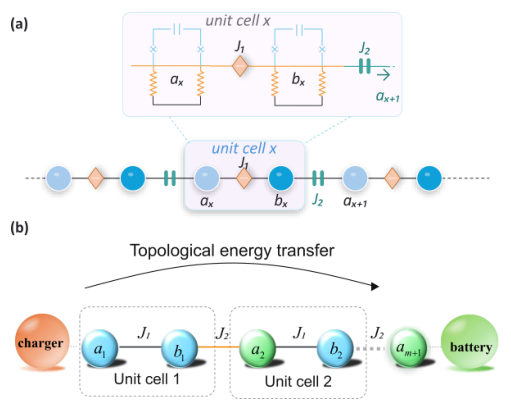 
FIG. 1. (a) Schematic of the SSH-type qubit chain. Each unit cell contains two qubits ax and bx, with intra-cell cou- pling J1(t) and inter-cell coupling J2(t). (b) Schematic of the topological quantum battery. The leftmost qubit a1 serves as the charger, the rightmost qubit am+1 as the battery, and the intermediate qubits form a topologically protected channel for energy transfer.

📷 Fig 2

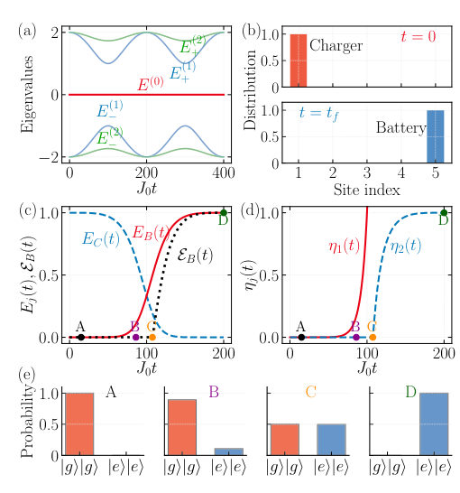 
FIG. 2. (a) Energy spectrum versus t. (b) Zero-energy eigen- state at t = 0 (upper) and t = tf (lower). (c) Time evolution of normalized charger energy EC(t) (blue dashed), battery en- ergy EB(t) (red solid) and ergotropy EB(t) (black dotted). (d) Time evolution of η1(t) (red solid) and η2(t) (blue dashed). (e) Population distributions of ρB in |e⟩and |g⟩at the four selected time instants A, B, C, and D marked in (c) and (d). We set tf = 200/J0 and N = 5.

📷 Fig 3

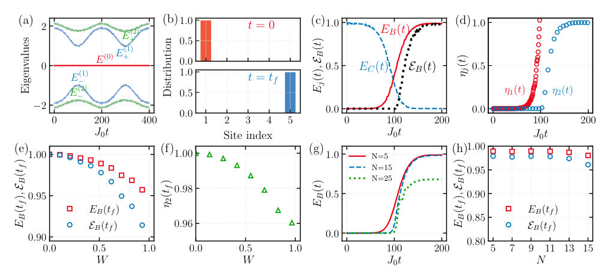 
FIG. 3. (a) Energy spectrum with disorder. (b) Zero-energy eigenstate distributions at t = 0 (upper) and t = tf (lower). (c) Evolution of the normalized EC(t) (blue dashed), EB(t) (red solid), and EB(t) (black dotted) with disorder. (d) Evolution of efficiency η1(t) (red circles) and extraction efficiency η2(t) (blue circles). (e) Normalized EB(tf) (red squares) and EB(tf) (blue circles) versus W . (f) Extraction efficiency η2(tf) versus W . (g) Evolution of normalized EB(t) for N = 5, 15, 25. (h) Normalized EB(tf) (red squares) and EB(tf) (blue circles) versus N. All results are averaged over 20 disorder realizations, except for the data in (e) and (h), where we use 100 realizations to ensure...

📷 Fig 4

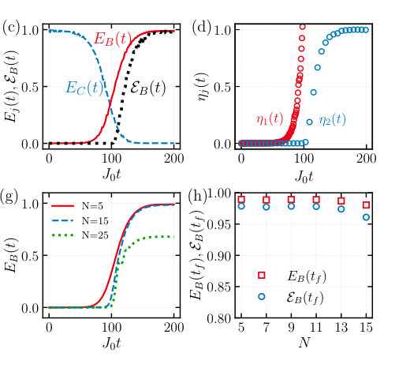 
Fig. 3(e), we simulate the normalized stored energy EB(tf) and the ergotropy EB(tf) as a function of W. It is observed that, within a certain range of W, the presence of disorder has little effect on either quantity. However, when W becomes too large, both EB(tf) and EB(tf) decrease with increasing W, with the extractable work being more severely affected. This indicates that disorder does alter the quantum state ρB of the battery. Nevertheless, even for W = 1, we have EB(tf)/ωb larger than 0.95 and EB(tf)/ωb larger than 0.9, corresponding to reductions of only 5% and 10% relative to the ideal case, respectively. This demonstrates that even strong disorder does not significantly degrade the...

📷 Fig 5

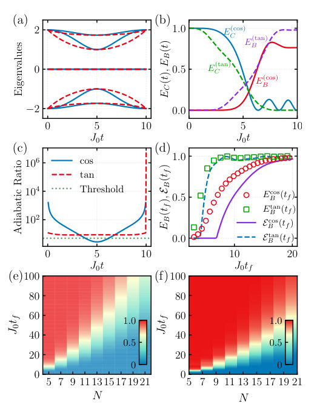 
FIG. 4. (a) Energy spectra for cosine (blue solid) and tangent (red dashed) controls. (b) Normalized EC(t) and EB(t) under cosine (solid) and tangent (dashed) controls. (c) Adiabatic ratio C(t) for cosine (blue solid) and tangent (red dashed) controls; the green dotted line marks the threshold. (d) Nor- malized EB(tf) and EB(tf) versus tf for both controls. (e) Density plot of normalized EB(tf) versus N and tf for co- sine control. (f) Density plot of normalized EB(tf) versus N and tf for tangent control. We set tf = 10/J0 in (a)-(c) and µ = 0.8 throughout.

**Summary.** This paper proposes a novel, topologically protected method for charging quantum batteries over long distances using a superconducting qubit chain modeled by the SSH Hamiltonian. By dynamically controlling the couplings with optimized pulses, the authors ensure efficient, directional energy transfer that is robust against noise and imperfections. This establishes a theoretical framework for enhancing quantum energy storage devices.

**Why it may be interesting.** This work directly addresses quantum energy storage and transfer, which is highly relevant to quantum computing hardware development, particularly in superconducting qubit architectures.

Detailed structure

**Main problem.** The paper addresses the challenge of developing a robust, long-distance, and topologically protected charging protocol for quantum batteries.

**Main result.** They demonstrate that pulse-controlled topological charging can achieve complete energy transfer free of backflow, and this protocol remains robust against system imperfections and noise.

**Method.** The study uses theoretical modeling based on the SSH model and analyzes the time evolution of the system's zero-energy eigenstate using time-dependent Hamiltonian techniques.

**Model / system.** The system is modeled as a one-dimensional SSH-type qubit chain where the ends act as the charger and battery. The dynamics are controlled by time-dependent pulse-mediated couplings, allowing the system to adiabatically switch between edge states.

**Key observables.** Charger energy ($E_C(t)$), battery energy ($E_B(t)$), extractable work (Ergotropy), and the adiabatic ratio ($C$).

**Important parameters / regimes.** The control pulse shape (cosine vs. tangent) and the disorder strength ($W$) are key parameters used to test robustness and acceleration.

**Assumptions / limitations.** The analysis relies on the adiabatic approximation, which requires the rate of change of couplings to be slow compared to the energy gap between eigenstates.

**Figures summary.** Figures illustrate the SSH chain setup, the energy spectrum evolution, the time dependence of energy transfer, and the robustness of the zero-energy state against disorder.

**Paper structure.** The paper progresses from establishing the topological framework using the SSH model to implementing the charging protocol via pulse control, and finally analyzing the performance and robustness against noise using optimized pulse shapes.

Abstract

Quantum batteries have emerged as a promising new generation of energy-storage devices for powering quantum technologies. Long-distance charging is particularly attractive because it minimizes interference between the charger and the battery, thereby attracting considerable interest. Here, we propose a topologically protected long-distance charging protocol for quantum batteries based on a pulse-controlled superconducting qubit chain. By dynamically modulating the pulse-mediated couplings, we realize topologically protected energy transfer from the charger to the battery. We show that the charging process is free of energy backflow and remains robust against imperfections in pulse control. Moreover, the energy stored in the battery at the target time is fully extractable, and the protocol remains effective for relatively large system sizes. To further accelerate charging, we optimize the pulse shape and elucidate the underlying physical mechanism. Our pulse-controlled topological quantum battery protocol provides a versatile framework for implementing long-distance topological charging and establishes a theoretical foundation for designing optimal-control strategies to enhance quantum battery performance.

[↑ back to top](#top)

### [Quantum Hamiltonian Evolution for Coherent Quantum Learning](http://arxiv.org/abs/2609.03640v1)

**Authors:** Ignacio B. Acedo, Javier Gonzalez-Conde, Pablo Rodriguez-Grasa, Barry C. Sanders, Lirandë Pira  
**Type:** theory · **Category:** quantum information and computing · **PDF:** <https://arxiv.org/pdf/2609.03640v1>  
**Analysis basis:** full PDF text, analyzed in chunks
**Topic relevance:** `analog quantum simulation` **3/5** · `interference shaping light` **1/5** · `quantum measurements` **1/5**

📷 Fig 1

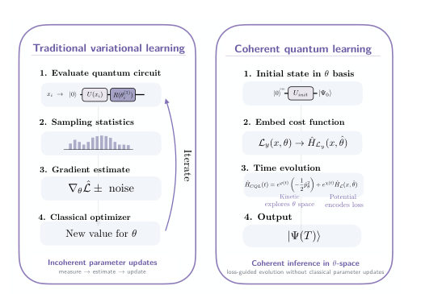 
FIG. 1. Conceptual comparison between hybrid training and Coherent Quantum Learning (CQL). In the traditional approach (left), a parameterized quantum model is evaluated at individual parameter settings, and measurement outcomes are used by a classical optimizer to iteratively update the pa- rameters. In CQL (right), the model parameters are promoted to quantum degrees of freedom, the objective function is en- coded as a loss Hamiltonian, and training is realized through coherent Hamiltonian evolution.

📷 Fig 2

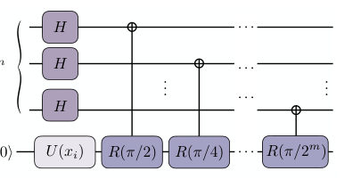 
FIG. 2. Circuit for one coherent training step. An ancilla register controls discretized parameter shifts and encodes the loss as phase.

📷 Fig 3

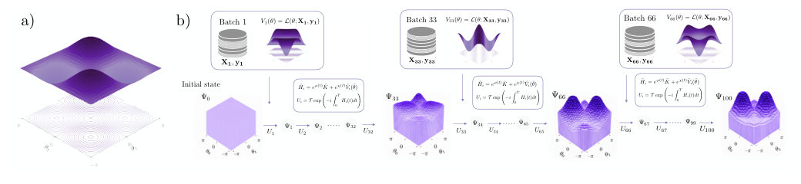 
FIG. 3. Numerical illustration of batch-based Coherent Quantum Learning (CQL). (a) Loss landscape L(θ; X, y) evaluated over the full training dataset as a function of the two variational parameters θ0, θ1, with contours indicating the structure of the global objective. (b) Evolution of the probability distribution of the parameter state ˆθ across sequential batched coherent training. Starting from a uniform superposition Ψ0 over parameter space, the state is evolved under the CQL Hamiltonian, where the loss potential is constructed from individual training samples (batch size 1). The loss landscape associated with select batches is shown alongside the corresponding parameter distributions,...

📷 Fig 4

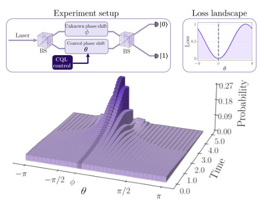 
FIG. 4. Upper left: Schematic of the interferometric phase- estimation setup. A single photon propagates through a bal- anced Mach–Zehnder interferometer containing an unknown phase shift ϕ and a controllable phase shift θ, which is con- trolled by the CQL protocol. Upper right: Corresponding loss landscape, L(θ, ϕ) = sin2[(θ −ϕ)/2], whose global minimum identifies the unknown phase. Main: Time evolution of the probability distribution over the discretized parameter register, |Ψ(θ, t)|2. Starting from a uniform superposition, the coher- ent dynamics progressively localize the probability amplitude around the global minimum of the loss landscape, yielding an accurate estimate of the unknown...

📷 Fig 5

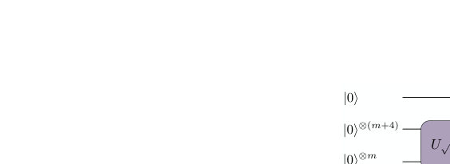 
FIG. 5. Circuit that implements the block encoding of H from the block encodings of √

**Summary.** This paper proposes Coherent Quantum Learning (CQL), a novel quantum training framework where the optimization process is replaced by coherent Hamiltonian evolution. By encoding the loss function into the system's Hamiltonian, the system naturally evolves toward parameters that minimize the loss through quantum interference. This offers a purely quantum alternative to classical gradient-based optimization in quantum machine learning.

**Why it may be interesting.** The core idea of encoding optimization into Hamiltonian dynamics is highly relevant to AMO physics, suggesting that physical evolution itself can perform complex computational tasks like optimization, potentially linking quantum simulation to machine learning.

Detailed structure

**Main problem.** The paper addresses the need for a quantum mechanical training framework for quantum machine learning, moving beyond classical optimization loops.

**Main result.** It introduces Coherent Quantum Learning (CQL), a framework where parameter evolution is governed by a Hamiltonian encoding the loss function, achieving optimal parameter estimation via quantum interference.

**Method.** The training is realized by evolving the system unitarily under a time-dependent Hamiltonian that combines kinetic terms and a loss-encoding Hamiltonian. This process replaces classical gradient estimation with coherent interference.

**Model / system.** The model uses a parameterized quantum circuit whose parameters are treated as quantum degrees of freedom. The loss function $L(x, 	heta)$ is encoded into a diagonal Hamiltonian $\hat{H}_L$ acting on the parameter register.

**Key observables.** The probability amplitude concentrating near low-loss configurations, and the final state distribution peaking at optimal parameters.

**Important parameters / regimes.** The evolution time $	au$, the structure of the loss Hamiltonian $\hat{H}_L$, and the batch size for sequential updates.

**Assumptions / limitations.** The framework assumes the ability to construct block encodings for the loss Hamiltonian and relies on sequential evolution for batched training.

**Figures summary.** Figure 1 conceptually contrasts traditional hybrid training with CQL's loss-guided evolution. Figure 6 numerically compares the loss evolution of CQL against traditional gradient descent for a 1D binary classification task.

**Paper structure.** The paper first introduces the CQL concept, detailing the Hamiltonian construction using block encodings for various loss types (polynomial, smooth). It then details the sequential, batched training algorithm and validates the approach with numerical simulations on classification and phase estimation tasks.

Abstract

We introduce Coherent Quantum Learning (CQL), a training framework for quantum learning models in which the model parameters are quantum degrees of freedom evolved under a Hamiltonian that encodes the loss function. Current quantum machine learning retains classical optimization: parameters are updated by a classical outer loop using gradient estimates from measurements, and quantum coherence has no role in the training dynamics, just as in any classical treatment of the same problem. In the quantum case, a parameter register initialized in superposition evolves unitarily, and probability amplitude concentrates near low-loss configurations through interference, without gradient computation or classical feedback. We give an explicit construction using block encodings and Hamiltonian simulation, applicable to arbitrary parameterized circuits. Numerical experiments on binary classification and interferometric phase estimation confirm that the evolved distribution peaks at the optimal parameters, matching gradient-based performance. The construction is compatible in principle with fault-tolerant implementations and extends to batched training via sequential Hamiltonian evolution.

[↑ back to top](#top)

### [Quantum Vacuum Nonlinearities in Laser Interferometers](http://arxiv.org/abs/2609.03314v1)

**Authors:** Zain Mehdi, Joseph J. Hope, Simon A. Haine  
**Type:** theory · **Category:** other · **PDF:** <https://arxiv.org/pdf/2609.03314v1>  
**Analysis basis:** full PDF text, analyzed in chunks
**Topic relevance:** `interference shaping light` **3/5** · `quantum measurements` **2/5**

📷 Fig 1

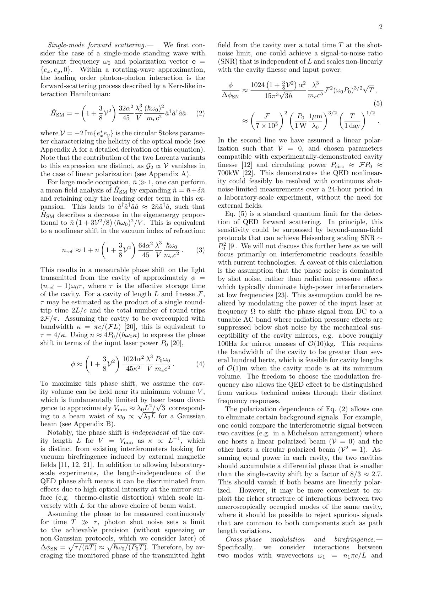 
Low-resolution page preview, page 2

📷 Fig 2

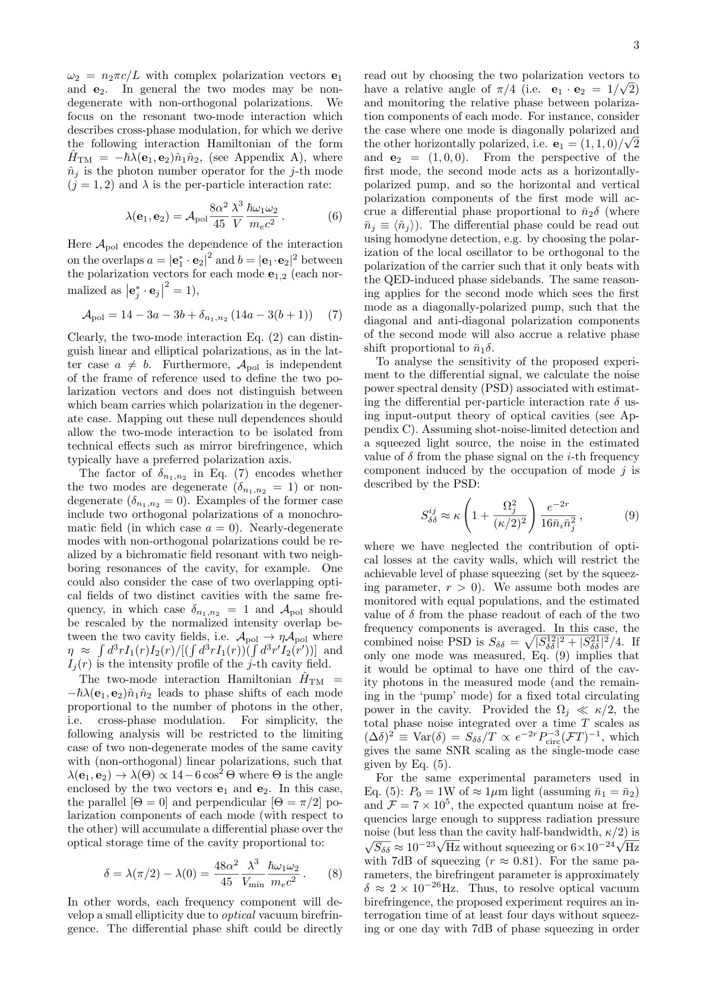 
Low-resolution page preview, page 3

📷 Fig 3

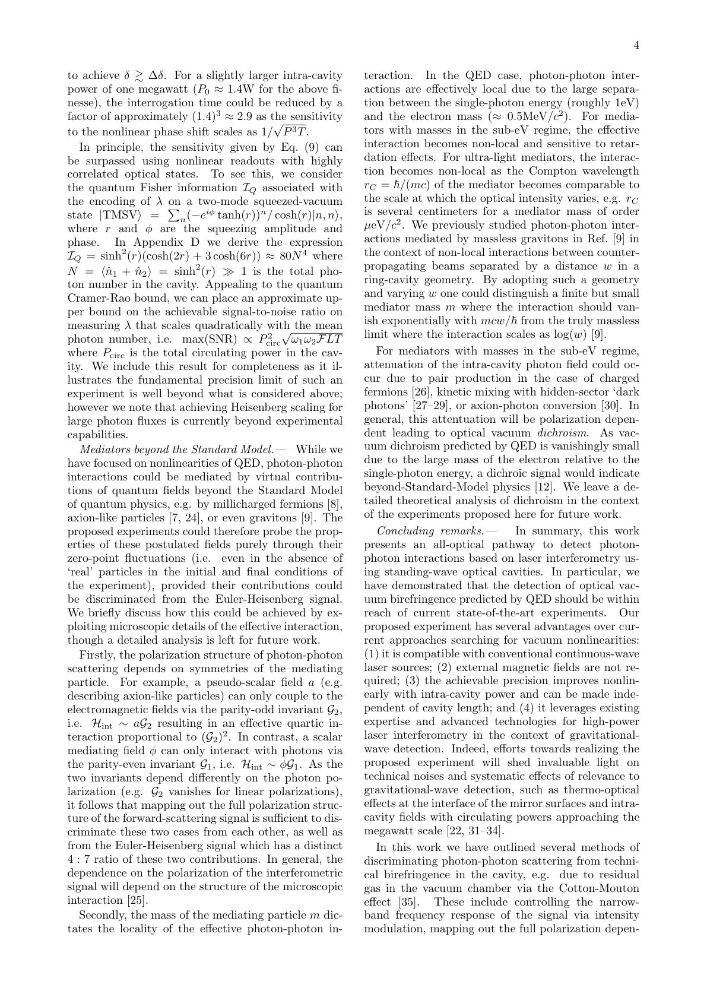 
Low-resolution page preview, page 4

📷 Fig 4

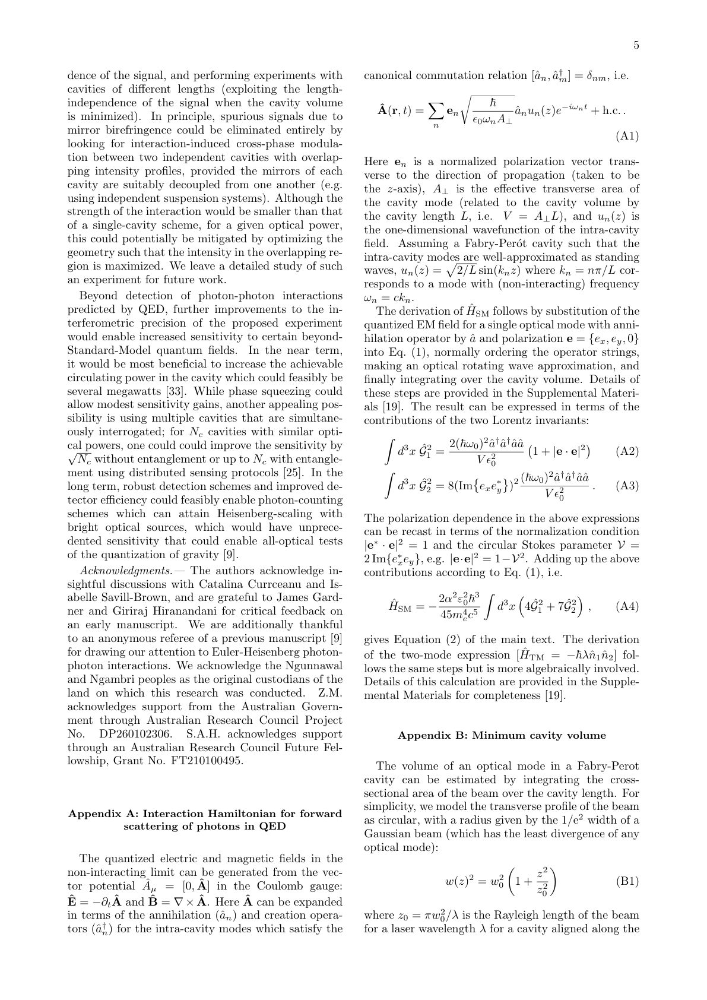 
Low-resolution page preview, page 5

📷 Fig 5

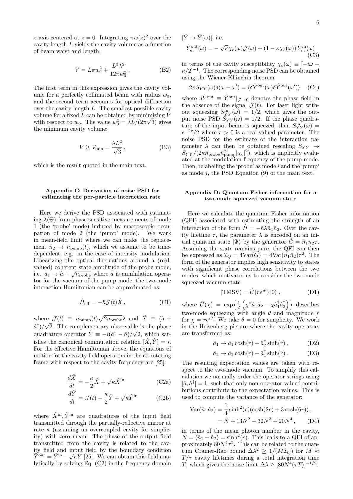 
Low-resolution page preview, page 6

**Summary.** This paper outlines a method to experimentally test the nonlinear interaction between photons in the vacuum using high-finesse laser interferometers. By analyzing the effective Hamiltonian derived from QED, the authors predict a measurable phase shift proportional to the optical power. The work details the necessary quantum estimation techniques to determine the sensitivity and feasibility of such a measurement.

**Why it may be interesting.** This work directly bridges high-energy physics predictions (QED vacuum effects) with cutting-edge experimental quantum optics techniques (interferometry and quantum metrology), making it highly relevant for AMO physicists working on quantum field measurements.

Detailed structure

**Main problem.** The paper proposes all-optical methods to test photon-photon interactions in the vacuum, which are predicted by Quantum Electrodynamics (QED). It aims to do this without requiring external magnetic fields.

**Main result.** The measurable signal is a phase shift ($\phi$) or a differential phase shift ($\delta$) in a standing-wave laser interferometer, which scales nonlinearly with the circulating optical power.

**Method.** The analysis involves deriving effective interaction Hamiltonians ($\hat{H}_{	ext{SM}}$ and $\hat{H}_{	ext{TM}}$) from the Euler-Heisenberg effective action and calculating the resulting phase shifts and achievable Signal-to-Noise Ratios (SNR) using quantum estimation theory.

**Model / system.** The system is a standing-wave laser interferometer utilizing a Fabry-Perot cavity. The underlying physics is the nonlinear interaction between photons mediated by vacuum zero-point fluctuations, described by QED effective Lagrangians.

**Key observables.** Phase shift ($\phi$), differential phase shift ($\delta$), and the Signal-to-Noise Ratio (SNR).

**Important parameters / regimes.** Optical power ($P_0$), cavity volume ($V$), vacuum susceptibility parameters ($\alpha^2$), and the cavity finesse ($F$).

**Assumptions / limitations.** The analysis uses the rotating-wave approximation (RWA) and assumes the detection is shot-noise limited, with some advanced sections considering squeezed light states.

**Paper structure.** The paper progresses from deriving the general QED interaction Hamiltonian ($\hat{H}_{	ext{int}}$) to specific single-mode ($\hat{H}_{	ext{SM}}$) and two-mode ($\hat{H}_{	ext{TM}}$) interactions. It then calculates the resulting phase shifts and finally analyzes the achievable precision limits using quantum estimation theory (QFI).

Abstract

We propose all-optical tests of photon-photon interactions in the matter vacuum using standing-wave laser interferometers, which do not require external magnetic fields and use conventional laser sources. We show that the interferometric detection of photon-photon scattering predicted by quantum electrodynamics is within reach of laboratory-scale experiments with a sensitivity that improves nonlinearly with the circulating power within the cavity. We outline how such an experiment could be adapted to probe properties of quantum fields beyond the Standard Model of particle physics.

[↑ back to top](#top)

### [Revealing Many-Body Phases at finite temperatures through Quantum Coherence Distribution](http://arxiv.org/abs/2609.03226v1)

**Authors:** Antonio Palamara, Nicola Lo Gullo, Antonello Sindona, Francesco Plastina  
**Type:** theory · **Category:** statistical mechanics · **PDF:** <https://arxiv.org/pdf/2609.03226v1>  
**Analysis basis:** full PDF text, analyzed in chunks
**Topic relevance:** `analog quantum simulation` **3/5** · `quantum measurements` **2/5**

📷 Fig 1

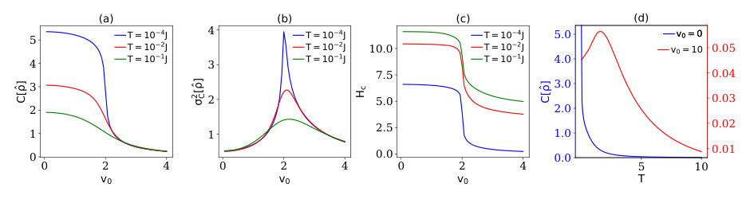 
Figure 1. Finite-temperature behavior of the coherence probability distribution in the non-interacting Aubry-Andr´e model. (a) Coherence C[ ˆρβ ] and (b) variance of the coherence probability distribution, σ2 C[ ˆρβ ], as functions of the quasiperiodic potential strength, for three different temperatures. (c) Entropy of the coherence probability distribution, Hc, as a function of V0. (d) Temperature dependence of the coherence C[ ˆρβ ] deep in the delocalized and localized phases. All results are obtained for a lattice of N = 103 sites.

📷 Fig 2

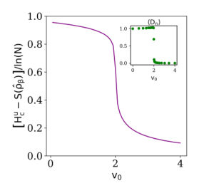 
Figure 2. Contribution of the individual eigenstate coherences to the uncollected entropy Huc in the high-temperature limit, as a function of the quasiperiodic potential strength V0, for a lattice of N = 103

📷 Fig 3

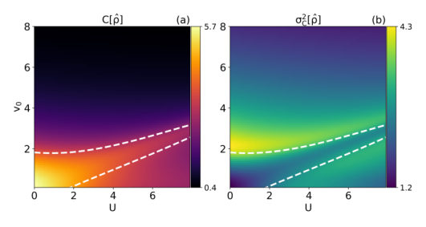 
Figure 3. Ground-state coherence probability distribution in the in- teracting Aubry-Andr´e model. (a) Coherence C[ ˆρ] and (b) variance σ2c [ ˆρ], as functions of the interaction strength U and quasiperiodic potential strength V0. The dashed white lines indicate the phase boundaries obtained from the maxima of ∂C[ ˆρ]

📷 Fig 4

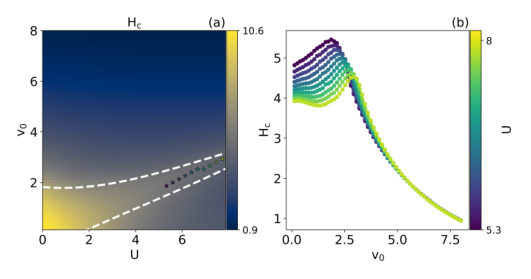 
Figure 5. Entropy of the coherence probability distribution in the in- teracting Aubry-Andr´e model at finite temperature. (a) Entropy Hc as a function of the quasiperiodic potential strength V0 and interac- tion strength U for a thermal state with β = 1J. The dashed white lines indicate the phase boundaries shown in Fig. 3 and are included as guides to the eye. Panel (b): Entropy as a function of V0 for dif- ferent interaction strengths U.

📷 Fig 5

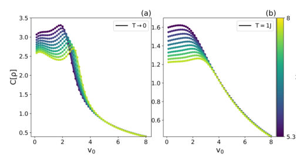 
Figure 4. Effect of finite temperature on the coherence in the inter- acting Aubry-Andr´e model. (a) Ground-state coherence as a func- tion of the quasiperiodic potential strength V0 for different interac- tion strenght U. (b) Thermal-state coherence at temperature T = 1J as a function of V0 for the same values of U.

**Summary.** This work introduces a novel diagnostic tool based on the entropy of the quantum coherence distribution to characterize quantum phases. By applying it to the interacting Aubry-André model, the authors demonstrate that this entropy remains robustly sensitive to quantum phase transitions, even when significant thermal fluctuations are present, outperforming simpler moment-based diagnostics.

**Why it may be interesting.** The focus on using coherence entropy to distinguish quantum phases from thermal noise is highly relevant for AMO physics, as many experimental platforms (like cold atoms) are inherently studied at finite, non-zero temperatures.

Detailed structure

**Main problem.** The paper aims to develop a diagnostic framework to probe both single-particle and many-body quantum phases at finite temperatures, where thermal fluctuations typically obscure quantum critical signatures.

**Main result.** The entropy of the quantum coherence distribution ($H_c$) proves to be a significantly more robust indicator than individual moments, retaining clear signatures of underlying quantum phases across increasing thermal fluctuations.

**Method.** The authors construct a diagnostic based on the full probability distribution of quantum coherence, derived via a Two-Point Measurement protocol, and analyze its statistical moments, particularly its entropy.

**Model / system.** The analysis is first applied to the non-interacting Aubry-André (AA) model to study localization transitions, and then extended to the interacting AA model containing spinless fermions with nearest-neighbor interactions.

**Key observables.** Entropy of the coherence distribution ($H_c$), first and higher-order moments of the coherence distribution, and the relative entropy of coherence ($C[\hat{
ho}]$).

**Important parameters / regimes.** Finite temperature ($eta$), potential strength ($V_0$), and interaction strength ($U$). The localization transition is marked by $V_0=2$ in the non-interacting case.

**Assumptions / limitations.** The analysis of the interacting model is computationally limited to small system sizes ($N=12$) due to the exponential growth of the Hilbert space.

**Figures summary.** Figures illustrate the finite-temperature behavior of coherence moments and entropy for the non-interacting model, and compare ground-state versus thermal-state coherence and entropy across the phase diagram of the interacting model.

**Paper structure.** The paper progresses by first establishing the diagnostic framework using the non-interacting AA model to show $H_c$'s robustness against temperature. It then extends this analysis to the interacting AA model to characterize three distinct many-body phases (Metallic, ABI, CDW) using $H_c$ as the primary tool.

Abstract

We introduce a diagnostic framework based on the full probability distribution of quantum coherence to probe single-particle and many-body phases at finite temperature. We first apply this approach to the localization transition in the non-interacting Aubry-André model and then extend the analysis to its interacting counterpart, whose phase diagram is substantially richer. We show that the moments of the coherence distribution provide clear signatures of quantum phase transitions and capture the emergence of many-body phases. More importantly, we find that the entropy of the coherence distribution emerges as an even more powerful indicator, retaining clear signatures of the underlying quantum phases while remaining remarkably robust against increasing thermal fluctuations.

[↑ back to top](#top)

### [Tunable topological enhancement of covariant quantum Fisher information via non-Bloch skin effect in non-Hermitian SSH lattices](http://arxiv.org/abs/2609.03421v1)

**Authors:** Qi-Cheng Wu, Yan-Hui Zhou, Tong Liu, Dong-Xu Chen, Chui-Ping Yang  
**Type:** theory · **Category:** quantum information and computing · **PDF:** <https://arxiv.org/pdf/2609.03421v1>  
**Analysis basis:** full PDF text, analyzed in chunks
**Topic relevance:** `analog quantum simulation` **3/5** · `driven-dissipative phase transition` **2/5**

📷 Fig 1

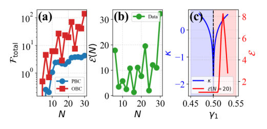 
FIG. 1: (Color online) (a) Total CQFI versus N for PBC (blue circles) and OBC (red squares). (b) Enhancement factor E(N) (green circles). (c) E(N = 20) versus γ1 across Bloch and non-Bloch phases. The vertical dashed line marks γ1 = t1. Shaded regions indicate the Bloch (blue) and non-Bloch (red) phases.

📷 Fig 2

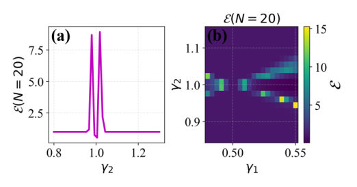 
FIG. 2: (Color online) (a) E(N = 20) versus γ2 for fixed γ1 = 0.52, showing a peak at γ2 ≈1.018. (b) Two-dimensional colormap of E(N = 20) in the (γ1, γ2) plane, revealing a ridge of high enhancement.

📷 Fig 3

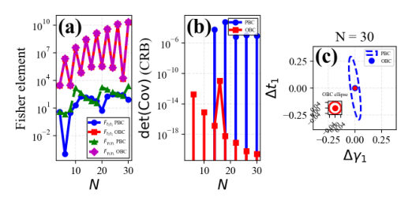 
FIG. 3: (Color online) (a) Diagonal elements of the Fisher information matrix for (t1, γ1) versus N. (b) Determinant of the covariance matrix (Cramér-Rao bound) versus N. (c) 2- σ covariance ellipses for PBC (blue dashed) and OBC (red solid) at N = 30. The OBC ellipse is shown in the magnified inset (scaled by 107). The area ratio is 3.78 × 1015.

📷 Fig 4

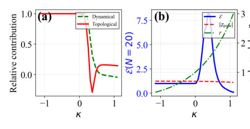 
FIG. 4: (Color online) Mechanism analysis for N = 20. (a) Relative contributions of dynamical (green dashed) and topo- logical (red solid) parts versus κ. (b) Enhancement factor E (blue solid), pole modulus |zpole| (red dashed), and GBZ ra- dius r (green dash-dotted) versus κ. The vertical line marks the peak position.

**Summary.** This paper investigates how the non-Hermitian skin effect in SSH lattices can topologically enhance the quantum precision limit, quantified by the CQFI. By comparing open boundary conditions (OBC) to periodic boundary conditions (PBC), the authors show a large, tunable enhancement factor $E(N)$. This establishes a novel, experimentally accessible spatial-domain strategy for quantum metrology.

**Why it may be interesting.** This work provides a concrete, physically realizable mechanism—the NHSE—to boost quantum sensing precision beyond standard bounds, linking topological properties directly to metrological enhancement in open quantum systems.

Detailed structure

**Main problem.** To extend the covariant quantum Fisher information (CQFI) formalism to multi-mode non-Hermitian systems to find a tunable topological enhancement mechanism for quantum metrology.

**Main result.** The CQFI exhibits a tunable topological enhancement factor $E(N)$ due to the non-Hermitian skin effect (NHSE), which can surpass 30 for modest system sizes and significantly reduce estimation uncertainty.

**Method.** The authors calculate the total CQFI by summing contributions over the Generalized Brillouin Zone (GBZ) manifold, utilizing partial-fraction decomposition to find the asymptotic scaling behavior.

**Model / system.** The study uses non-Hermitian Su-Schrieffer-Heeger (SSH) lattices, which are analyzed using a Hamiltonian framework that incorporates non-Hermitian parameters ($\gamma_1, \gamma_2$) leading to the NHSE.

**Key observables.** Covariant Quantum Fisher Information (CQFI), Enhancement Factor $E(N) = F_{	ext{OBC}}^{	ext{total}} / F_{	ext{PBC}}^{	ext{total}}$, and the joint Cramér-Rao bound.

**Important parameters / regimes.** Non-Bloch decay rate ($\kappa$), system size ($N$), and non-Hermitian asymmetry parameters ($\gamma_1, \gamma_2$).

**Assumptions / limitations.** The analysis relies on extending CQFI from single-mode to multi-mode systems and assumes the applicability of non-Bloch band theory for open boundary conditions.

**Figures summary.** Figures illustrate the total CQFI scaling (OBC vs. PBC), the enhancement factor $E(N)$ vs. $N$ (showing large enhancement), and the non-monotonic dependence of $E$ on the non-Hermitian parameters $\gamma_1$.

**Paper structure.** The paper first establishes the CQFI formalism for non-Hermitian systems, then derives the OBC total CQFI by summing over the GBZ, contrasting this with the PBC sum. The core development involves analyzing the resulting enhancement factor $E(N)$ and demonstrating its tunability and topological origin.

Abstract

The covariant quantum Fisher information (CQFI) has recently been established as the ultimate precision benchmark for pseudo-Hermitian sensors [Phys. Rev. Lett. 136, 080802 (2026)], yet existing analyses are limited to single-mode systems. Here we extend the CQFI formalism to multi-mode non-Hermitian Su-Schrieffer-Heeger lattices and reveal tunable topological enhancement enabled by the non-Hermitian skin effect (NHSE). Under open boundary conditions, the NHSE deforms the conventional Brillouin zone into a generalized Brillouin zone of radius r = exp(\k{appa}), where \k{appa} denotes the non-Bloch decay rate. While the total CQFI scales linearly with system size N, its prefactor depends critically on \k{appa}, yielding an enhancement factor E(N) = F_OBC / F_PBC that exceeds 30 for N ~ 30, substantially outperforming periodic-boundary sensors. The enhancement is robust against moderate local disorder and supports multi-parameter estimation, with the joint Cramér-Rao bound reduced by up to 15 orders of magnitude. These findings establish a spatial-domain mechanism for quantum metrology that complements time-domain strategies and is experimentally accessible using topoelectrical circuits, photonic lattices, and superconducting circuits with current technology.

[↑ back to top](#top)

### [Moiré-induced altermagnetism from nonmagnetic constituents](http://arxiv.org/abs/2609.03271v1)

**Authors:** Jingtian Shi, Maxim Khodas, Ivar Martin  
**Type:** theory · **Category:** strongly correlated electrons · **PDF:** <https://arxiv.org/pdf/2609.03271v1>  
**Analysis basis:** full PDF text, analyzed in chunks
**Topic relevance:** `analog quantum simulation` **3/5** · `Keldysh / 2PI / non-Gaussian methods` **1/5**

📷 Fig 1

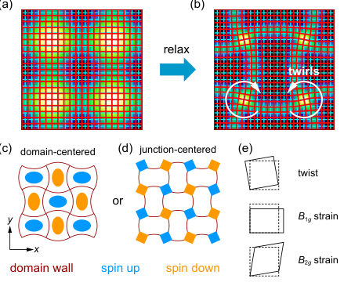 
FIG. 1. (a), (b) Schematic of lattice relaxation of lattice- mismatched moir´e square lattice from (a) the rigid configura- tion to (b) the stable configuration. The red and cyan grids respectively represent an elastic material layer and a rigid sub- strate, the former having a smaller natural lattice constant than the latter. In the background, darker (brighter) color represents regions with lower (higher) local interlayer cou- pling energy, or the moir´e domain (domain wall) regions. The curved arrows mark the twirl chiralities. (c), (d) Schematics of Wannier orbitals of electron moir´e bands in the two scenarios described on the top of each panel. The coordinate frame is marked at the...

📷 Fig 2

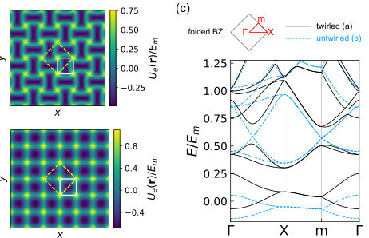 
FIG. 2. (a), (b) The electron potential Ue(r) = D∇· u(r) obtained under ϵ = 0.05, θ = B1g = B2g = 0, V1/µ = 0.004 and D = 10Em via lattice relaxation performed with (a) √

📷 Fig 3

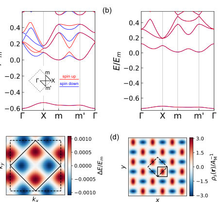 
FIG. 3. (a) The spin-resolved mean-field moir´e band struc- ture under ϵ = 0.05, θ = B1g = B2g = 0, V1/µ = 0.004, D = 10Em, interaction strength Cm = 0.2Em and filling fac- tor corresponding to one electron per √

📷 Fig 4

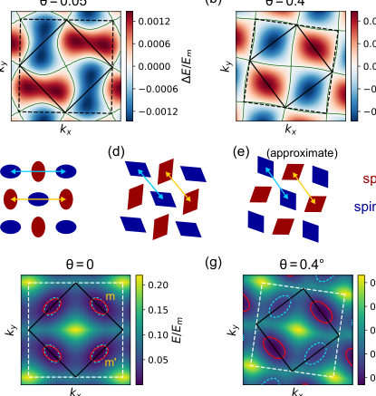 
FIG. 4. (a), (b) The spin splitting of the lowest mean-field band of a system with the same parameters as the one shown in Fig. 3(c), except for a finite twist angle between the elas- tic material and the substrate illustrated at the top of each panel. Here the curved lines outline the band touching. (c)- (e) Schematics of effective lattice models that describe the lowest bands under (c) θ = 0, (d) relatively small finite θ, and (e) relatively large θ, where the arrows illustrate the nearest spin-inequivalent hopping in the three cases. The shapes are only schematic and reflect the symmetries of the system. The mirror symmetries of (e) are approximate in the physical sys- tems it points to....

📷 Fig 5

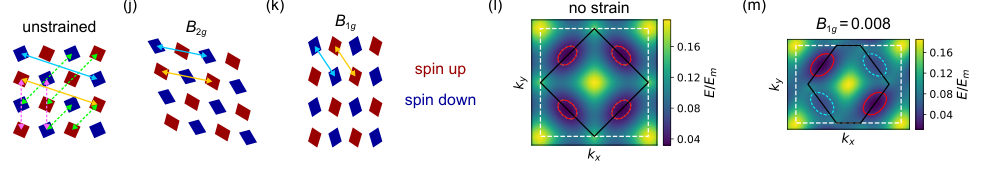 
FIG. 5. (a) The spin-resolved mean-field moir´e band structure of the system with the same parameters as in Fig. 3(a) except that here D = −10Em instead of 10Em. (b) The spin splitting of the lowest band in (a). The solid (dashed) black square is the first BZ of the √

**Summary.** This work details how structural distortions in moiré superlattices of nonmagnetic materials can induce altermagnetism. By combining continuum elasticity theory with Hartree-Fock calculations, the authors show that electron interactions, mediated by moiré potential variations, open correlated gaps and generate symmetry-protected spin splittings. This magnetic order is highly tunable by external strains and twist angles.

**Why it may be interesting.** The focus on emergent magnetism (altermagnetism) in nonmagnetic, structurally tunable systems is highly relevant to understanding correlated phases in novel quantum materials, which often bridge concepts from condensed matter theory and quantum simulation.

Detailed structure

**Main problem.** The paper proposes a mechanism for nonmagnetic materials to develop altermagnetic order through moiré interference, driven by structural relaxation and spontaneous twirls in moiré domain walls.

**Main result.** The moiré potential, coupled with electron interactions, opens a correlated insulating gap and induces spin-splitting that can manifest as $d$-wave or $g$-wave altermagnetism, which is tunable by twist angle and strain.

**Method.** The study uses theoretical modeling involving continuum elasticity for lattice relaxation and self-consistent Hartree-Fock theory to solve for spin-resolved mean-field band structures.

**Model / system.** The system is a moiré lattice formed by lattice-mismatched nonmagnetic layers. The physics is modeled using an effective continuum Hamiltonian incorporating kinetic energy, deformation potential, and electron-electron interactions (Hubbard physics).

**Key observables.** Altermagnetic spin splitting ($\Delta E_k$), spin density map ($
ho_s(\mathbf{r})$), and anisotropic transport properties.

**Important parameters / regimes.** Twist angle ($	heta$), strain components ($	ext{B1g}, 	ext{B2g}$), and electron interaction strength (Hubbard coupling).

**Assumptions / limitations.** Assumes collinear spins and initially neglects SOC for some analyses; the model relies on continuum elasticity approximations.

**Figures summary.** Figures illustrate lattice relaxation, Wannier orbitals for different domain types, non-interacting band structures, and spin-resolved mean-field band structures showing the evolution of spin splitting with twist angle and strain.

**Paper structure.** The paper progresses from establishing the structural mechanism (lattice relaxation/domain walls) to developing the electronic model (Hamiltonian/HF theory), and finally analyzing the resulting magnetic order (altermagnetism) and its tunability via external parameters like strain and twist.

Abstract

We propose a mechanism for nonmagnetic materials to develop altermagnetic order by moiré interference with nonmagnetic substrate, which is driven by structural relaxation and spontaneous twirls in moiré domain walls of lattice-mismatched moiré square lattices. When doped with one electron per moiré domain, a correlated insulating gap is opened by electron interaction. Depending on the location of the moiré potential minima, the moiré bands can show d-wave or g-wave altermagnetic splitting. The former can be enhanced by a finite twist angle; the latter is sensitive to strains that drive a transition to d-wave.

[↑ back to top](#top)

### [Resolving the Magnetic Ground-State Controversy in RuO2 through A Flat Magnetic Energy Landscape](http://arxiv.org/abs/2609.03274v1)

**Authors:** Tianxiao Liang, Fanhan Kong, Jijun Zhao, Xue Jiang  
**Type:** theory · **Category:** strongly correlated electrons · **PDF:** <https://arxiv.org/pdf/2609.03274v1>  
**Analysis basis:** full PDF text, analyzed in chunks
**Topic relevance:** `analog quantum simulation` **3/5** · `methods for driven-dissipative` **1/5**

📷 Fig 1

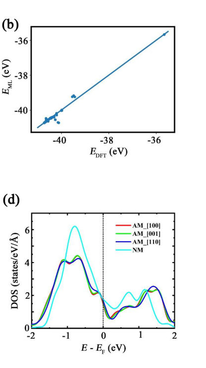 
FIG. 1. Flat magnetic energy landscape and competing magnetic states in rutile RuO2. (a) Crystal

📷 Fig 2

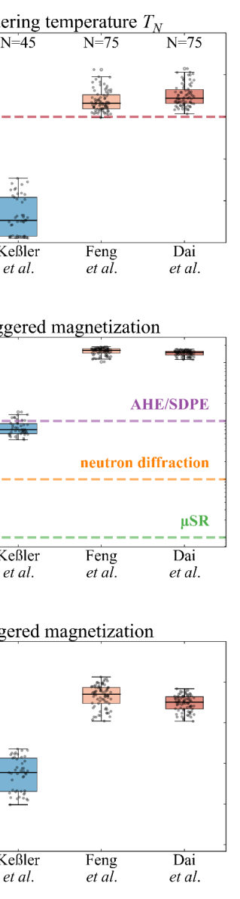 
FIG. 2. Sample-dependent magnetic order and experimental detectability in RuO2. (a) Effective

📷 Fig 3

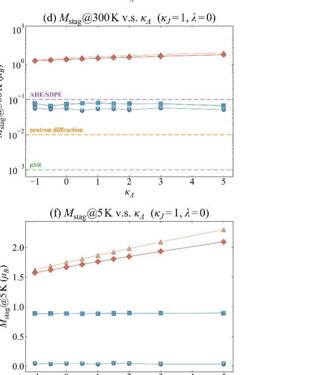 
FIG. 3. Independent modulation of the Heisenberg exchange and Landau channels in RuO2 ( =0).

📷 Fig 4

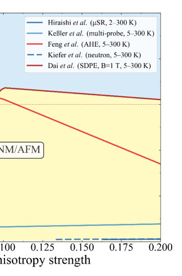 
FIG. 4. Temperature-SOC (T-λ) magnetic phase diagram. Phase boundaries are determined by the

**Summary.** This work develops a unified theoretical framework to explain the conflicting experimental reports on the magnetic ground state of RuO2. By modeling the competition between Heisenberg and Stoner magnetism within a flat energy landscape, the authors show that intrinsic material defects select the final magnetic state by tuning the localized exchange coupling. This provides a general mechanism for understanding magnetic phase selection in correlated oxides.

**Why it may be interesting.** The concept of a nearly flat energy landscape where subtle perturbations dictate macroscopic quantum phases is highly relevant to understanding frustrated quantum magnets and emergent quantum phenomena.

Detailed structure

**Main problem.** The paper resolves the long-standing controversy regarding the magnetic ground state of Rutile RuO2, which is experimentally reported as either nonmagnetic or altermagnetic.

**Main result.** The magnetic state selection is governed by an exceptionally flat energy landscape, where material perturbations primarily modify the localized Heisenberg exchange interaction, leading to sample-dependent magnetic order.

**Method.** The authors developed a generalized environment-dependent spin-lattice Hamiltonian, parameterized using high-throughput DFT data and solved via large-scale Monte Carlo simulations.

**Model / system.** The system is Rutile RuO2, modeled by a Hamiltonian unifying localized Heisenberg exchange, itinerant Stoner magnetism, and SOC-mediated spin-lattice interactions. The framework is designed to capture the competition between these magnetic terms.

**Key observables.** Magnetic energy landscape, Néel temperature (T_N), staggered magnetization (M_stag), and the magnetic ground state selection mechanism.

**Important parameters / regimes.** Localized Heisenberg exchange coupling, itinerant Stoner polarization contribution, and the strength of spin-orbit coupling (SOC) anisotropy ($\lambda$).

**Assumptions / limitations.** The magnetic state selection is primarily controlled by the competition between Heisenberg and Landau terms, and the framework is generalizable to other perturbations like strain or doping.

**Figures summary.** Figures illustrate the nearly degenerate energy minima (NM vs AM states) on the flat energy landscape, and show how varying exchange coupling ($\kappa_J$) or Landau coupling ($\kappa_A$) independently modulates the calculated magnetic order parameters.

**Paper structure.** The paper first introduces the unified Hamiltonian and parameterization from DFT data. It then uses MC simulations to map the energy landscape, demonstrating the near-degeneracy. Finally, it analyzes how external perturbations (defects) select specific magnetic states by modifying the exchange terms, while SOC only controls orientation.

Abstract

Rutile RuO2 is a prominent candidate for altermagnetism, yet its magnetic ground state remains highly controversial, with experiments reporting either a nonmagnetic state or altermagnetic order. Here, we develop a generalized environment-dependent spin-lattice framework that unifies localized Heisenberg exchange, itinerant Stoner magnetism via Landau spin fluctuations, and spin-orbit-coupling-mediated spin-lattice interactions. Parameterized from a high-throughput first-principles database using machine-learning and solved by large-scale Monte Carlo simulations, the framework reveals an exceptionally flat magnetic energy landscape in RuO2, where the nonmagnetic state lies nearly degenerate with multiple altermagnetic configurations. We find that material perturbations, exemplified by intrinsic defects, select distinct magnetic ground states primarily by modifying the localized Heisenberg exchange, with perturbation-induced itinerant Stoner polarization provides an essential secondary contribution. Spin-orbit coupling controls the orientation and stability of the Néel vector, but does not determine the emergence of long-range magnetic order. These results provide a unified explanation for the conflicting experimental observations and establish a general microscopic framework for understanding how material perturbations select competing magnetic ground states in systems with nearly flat magnetic energy landscapes.

[↑ back to top](#top)

### [Shuttling-aware dynamical decoupling for quantum charge-coupled devices](http://arxiv.org/abs/2609.03014v1)

**Authors:** Linus Schulte, Aaron Sander, Robert Wille  
**Type:** theory · **Category:** other · **PDF:** <https://arxiv.org/pdf/2609.03014v1>  
**Analysis basis:** full PDF text, analyzed in chunks
**Topic relevance:** `QC/QI experiment` **3/5** · `quantum measurements` **1/5**

📷 Fig 1

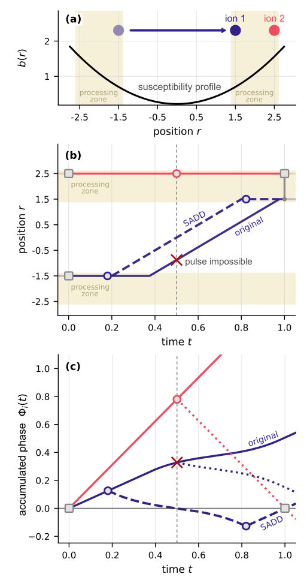 
FIG. 1. Ion trajectories determine decoupling pulse availability and noise exposure. (a) Ion transport subject to a quadratic susceptibility profile b(r), facilitating shared lo- calized control access between the ions. (b) Ion trajectories with rectangular markers indicating logical gates. A decou- pling pulse (round marker) at the window midpoint is optimal for the stationary ion 2 but suboptimal and infeasible for the moving ion 1 due to processing zone access. Rerouting it along the dashed SADD trajectory symmetrizes the susceptibility it samples and admits the two shown pulses. (c) Accumu- lated quasistatic phase Φi(t) for δω(r) = δω0b(r) without DD (solid), under a midpoint pulse...

📷 Fig 2

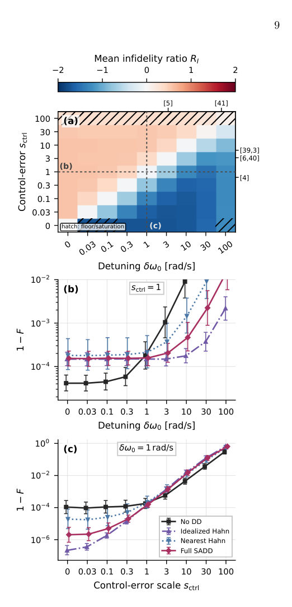 
FIG. 2. SADD improves fidelity in the dephasing- dominated regime and outperforms Nearest Hahn. (a) Mean Full-SADD/no-DD infidelity log ratio RI over the detuning scale δω0 and the pulse-error scale sctrl, with blue favoring SADD. The two domains meet along the diagonal. Bracketed ticks locate published device measurements on each axis [3–6, 39–41], and hatched settings contain circuits at the resolvable infidelity floor or at saturation and should not be read quantitatively. The dashed lines mark the two cross- sections below. (b) Geometric-mean absolute infidelity along the sctrl = 1 row, placing Full SADD between the realizable and the idealized Hahn baseline. (c) The same quantity along...

📷 Fig 3

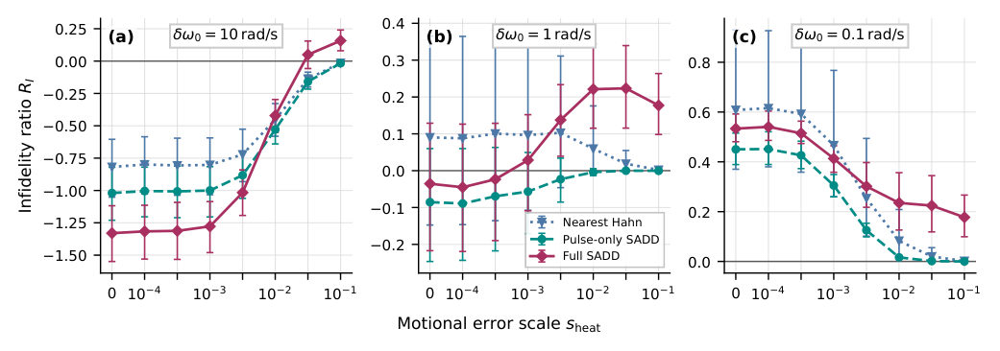 
FIG. 3. Ion rerouting is beneficial while transport is cheap. State-infidelity log ratios RI against a common no-DD reference over the motional-error scale sheat of Eq. (25), under a uniform susceptibility profile at sctrl = 1 and three detunings: (a) δω0 = 10, (b) 1, and (c) 0.1 rad s−1. Negative values improve on No DD. Each panel is scaled to its own data, since the benefit spans decades across the three settings.

📷 Fig 4

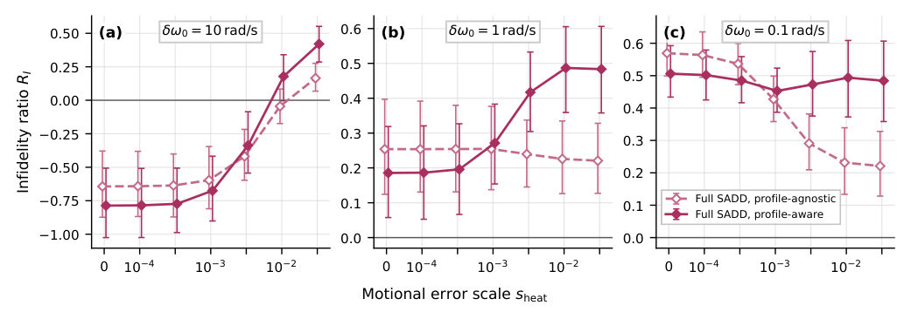 
FIG. 4. Profile-aware compilation is beneficial while transport is cheap. Profile-aware against profile-agnostic Full SADD under the heterogeneous susceptibility profile of Eq. (27), otherwise as in Fig. 3: (a) δω0 = 10, (b) 1, and (c) 0.1 rad s−1. All three detunings share one compiled schedule set.

📷 Fig 5

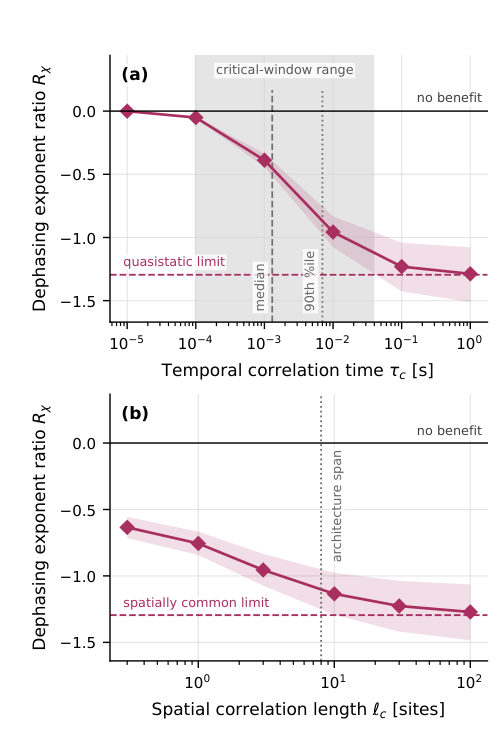 
FIG. 5. The phase objective requires slow noise rela- tive to critical-window length but is robust to short- ranged spatial variation. Mean dephasing-exponent log ratio Rχ of Full SADD relative to No DD, shown against (a) the temporal correlation time τc and (b) the spatial cor- relation length ℓc. Negative values indicate better protec- tion against dephasing. The objective’s predictiveness breaks down for correlation times τc that are of the same order as or smaller than the critical-window durations, while it remains robust to correlation lengths even below the site spacing.

**Summary.** This paper introduces Shuttling-aware Dynamical Decoupling (SADD), a novel compiler technique for trapped-ion quantum processors. SADD overcomes the limitation of standard decoupling methods by jointly optimizing refocusing pulses and ion movement paths. By integrating transport constraints into the error mitigation objective, the authors demonstrate a significant boost in quantum gate fidelity for QCCD architectures.

**Why it may be interesting.** This work directly addresses the practical limitations of applying quantum error correction techniques (like DD) to solid-state or ion-trap quantum hardware that requires physical movement of qubits, providing a crucial compiler-level optimization strategy.

Detailed structure

**Main problem.** Conventional dynamical decoupling methods fail in Quantum Charge-Coupled Device (QCCD) architectures because they ignore the constraints imposed by ion shuttling during quantum operations.

**Main result.** The proposed Shuttling-aware Dynamical Decoupling (SADD) compiler pass significantly improves final-state fidelity by jointly optimizing pulse placement and ion rerouting.

**Method.** SADD is an offline compiler pass that minimizes a derived phase objective function by jointly selecting refocusing pulses and local ion rerouting paths.

**Model / system.** The system involves trapped ions in a QCCD architecture, where noise is modeled by a position-dependent detuning Hamiltonian, and the process is constrained by physical ion transport trajectories.

**Key observables.** Average final-state fidelity, the dephasing exponent ($\chi(T)$), and the derived phase objective function ($J_\Phi$).

**Important parameters / regimes.** The degree of dephasing noise relative to control/transport errors, and the total schedule length.

**Assumptions / limitations.** The methods assume a rank-one model for detuning fluctuations and that the optimization can be performed by minimizing a compile-time phase proxy objective function.

**Figures summary.** Figures illustrate the coupled effects of ion transport on pulse availability and noise sampling, showing how rerouting can cancel phase accumulation.

**Paper structure.** The paper first establishes the failure of conventional DD in shuttling environments, derives a joint objective function ($J_\Phi$) that incorporates trajectory-aware phase accumulation, and then details the greedy, local optimization process using a CP-SAT solver to minimize this objective.

Abstract

Dynamical decoupling (DD) helps maintain high-fidelity quantum computations by suppressing dephasing noise through carefully timed refocusing pulses. In quantum charge-coupled device (QCCD) architectures, however, where ions are shuttled throughout the device, transport constrains when pulses can be applied and affects the phase accumulated by an ion. Conventional DD methods do not account for shuttling and may therefore schedule pulses that must be omitted or shifted after transport scheduling, weakening the protection from dephasing. We therefore introduce shuttling-aware dynamical decoupling (SADD), an offline compiler pass that jointly selects refocusing pulses and local ion rerouting while preserving logical-gate timings and the total schedule length. In benchmark simulations, SADD improves average final-state fidelity over both the original schedules and a simple nearest-feasible Hahn-echo baseline when dephasing dominates control and transport errors and varies slowly enough for DD. Rerouting enables otherwise infeasible pulse timings, while spatial information about the noise can provide further gains. These benefits disappear, however, when the added transport introduces too much error. Overall, our results show that coordinating DD with ion transport is an effective compiler strategy for reducing dephasing in QCCD processors.

[↑ back to top](#top)

### [Energetic Costs of Subspace Quantum Error Correction](http://arxiv.org/abs/2609.03825v1)

**Authors:** Jakub Czartowski, Felix C. Binder  
**Type:** theory · **Category:** quantum information and computing · **PDF:** <https://arxiv.org/pdf/2609.03825v1>  
**Analysis basis:** full PDF text, analyzed in chunks
**Topic relevance:** `quantum measurements` **3/5**

📷 Fig 1

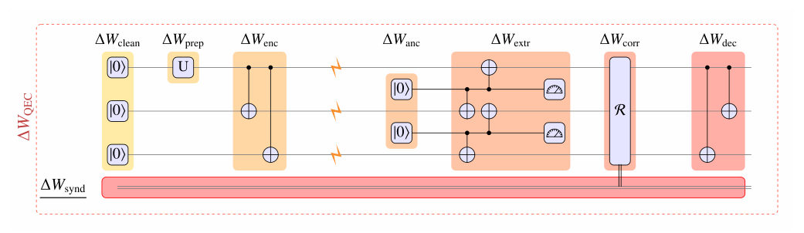 
Figure 1. Different costs of QEC: A single round of repetition code without computation, illustrating different potential sources of energetic costs in quantum error correction, with single wires representing quantum systems and double wires classical data. In this work we focus on the energetic cost ∆Wsynd of syndrome data measurement and erasure, which can be seen as demonstrably irreversible.

📷 Fig 2

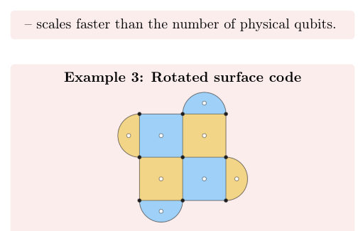 
Figure 2. 3 × 3 patch of the rotated surface code [[9, 1, 3]]. Black (white) circles denote data (syndrome) qubits. Orange and blue plaquettes indicate the sup- ports of the X- and Z-type stabilisers, respectively. Each stabiliser acts on the data qubits at the corners of its plaquette and is measured via the syndrome qubit at its centre.

📷 Fig 3

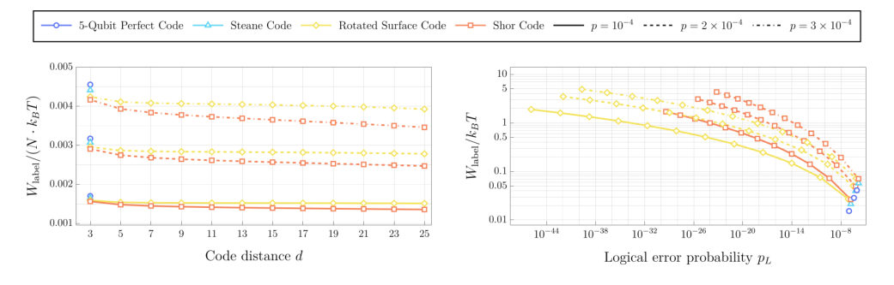 
Figure 3. Erasure work associated with processed syndrome labels for selected stabiliser-code families under independent symmetric local Pauli noise with per-Pauli error probability p. Left: Label-erasure work per physical qubit, Wlabel/(NkBT), versus code distance d. Degeneracy reduces this quantity by merging physically distinct errors into common recovery labels. Among the families considered, this reduction is most pronounced for the Shor codes, which consequently exhibit the lowest label-erasure work per physical qubit. Right: Total label-erasure work, Wlabel/(kBT), versus the leading-order logical-failure proxy pL defined in Appendix D, for the same code families and distance range....

📷 Fig 4

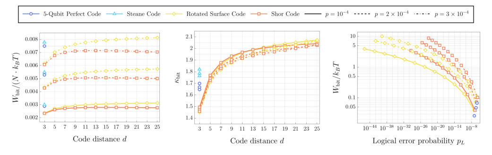 
Figure 4. Erasure work associated with separately stored parity outcomes for the code families of Fig. 3 under independent symmetric local Pauli noise with per-Pauli error probability p. Left: Bit-level erasure work per physical qubit, Wbit/(NkBT), versus code distance d. The surface-code value approaches its bulk-check limit, whereas the Shor-family curve reflects compe- tition between its many weight-two checks and its n −1 checks of weight 2n, producing a finite-size maximum over the plotted range. Centre: Bit-level inefficiency κbit, defined in Eq. (29), versus code distance d for the indicated per-Pauli error proba- bilities. The inefficiency generally increases with distance for both...

**Summary.** This paper develops a detailed thermodynamic analysis of quantum error correction, treating the syndrome memory reset as an entropy-driven energy cost. By analyzing different levels of syndrome information (from abstract labels to raw bits), it quantifies the minimum work required to maintain a reusable syndrome register. The findings establish a clear hierarchy of energetic overheads that dictate the feasibility and efficiency of fault-tolerant quantum computation.

**Why it may be interesting.** It provides a rigorous thermodynamic quantification of overheads in quantum computation, directly linking fundamental physical principles (Landauer's principle) to the practical engineering constraints of fault-tolerant quantum hardware.

Detailed structure

**Main problem.** The paper characterizes the unavoidable energetic cost associated with clearing the syndrome memory in quantum error correction (QEC).

**Main result.** It establishes a hierarchy of syndrome-memory energetic costs, showing that the cost depends critically on the joint structure of the code, the noise model, and the specific measurement/syndrome representation used.

**Method.** The analysis uses theoretical bounds derived from the Knill-Laflamme conditions and quantifies entropy production, comparing the ideal von Neumann entropy bound against the entropy generated by physical measurement processes.

**Model / system.** The focus is on subspace quantum error-correcting codes, specifically analyzing stabiliser codes under independent local Pauli noise. The system involves an auxiliary syndrome memory register that must be reset after each error correction cycle.

**Key observables.** Energetic cost ($\Delta W_{synd}$), Von Neumann entropy ($S_{vN}(\sigma)$), Shannon entropy of the syndrome distribution ($H[D_V(\sigma)]$), and various entropy measures related to syndrome representation (e.g., abstract label entropy, parity-check entropy).

**Important parameters / regimes.** Code distance ($d$), noise type (independent local Pauli noise), and the level of syndrome representation (abstract labels vs. parity-check bits).

**Assumptions / limitations.** The analysis assumes that the energetic cost of retaining and separately erasing syndrome outcomes must be accounted for, contrasting the ideal reversible erasure with physical measurement inefficiencies.

**Figures summary.** Figure 1 illustrates different potential sources of energetic costs in a single round of repetition code, highlighting the syndrome-related cost ($\Delta W_{synd}$) as the primary focus.

**Paper structure.** The paper develops the analysis in layers: starting from abstract KL conditions, specializing to stabiliser codes under Pauli noise, and finally analyzing the cost at the physical bit-level of syndrome recording and erasure.

Abstract

Quantum error correction acts as an entropy pump, transferring noise-induced uncertainty from a protected quantum system into syndrome information stored in an auxiliary memory. Repeated operation requires this memory to be cleared which unavoidably contributes to the energetic cost of error correction. Here, we characterise this contribution for subspace quantum error-correcting codes and identify how it depends on the joint structure of the code, the noise, and the representation of the retained syndrome information. Starting from the Knill-Laflamme conditions, we construct an effective syndrome state whose von Neumann entropy sets a lower bound on the ideal work required to maintain a reusable syndrome register. Projective syndrome readout generally generates additional entropy, and we quantify the resulting gap through measurement inefficiency. We then specialise to stabiliser codes under independent local Pauli noise and analyse two classical levels of syndrome representation. At the level of abstract error labels, degeneracies among single-qubit errors reduce the leading-order entropy of processed recovery labels. At the parity-check level, lower-weight checks reduce the marginal entropy generated by individual measurement outcomes in the low-noise regime. We identify the additional burden associated with retaining and separately erasing these outcomes as a bit-level inefficiency, and illustrate both costs for the five-qubit, Steane, generalised Shor, and rotated surface codes. Our results establish a hierarchy of syndrome-memory energetic costs and identify the code, noise, and measurement structures that control the ideal thermodynamic burden of subspace quantum error correction.

[↑ back to top](#top)

### [Frequency-Multiplexed Parallel Gates for Quantum LDPC Codes in a Two-Dimensional Ion Crystal](http://arxiv.org/abs/2609.04081v1)

**Authors:** G. -X. Tang, L. -M. Duan, Y. -K. Wu  
**Type:** theory · **Category:** quantum information and computing · **PDF:** <https://arxiv.org/pdf/2609.04081v1>  
**Analysis basis:** full PDF text, analyzed in chunks
**Topic relevance:** `QC/QI experiment` **3/5**

📷 Fig 1

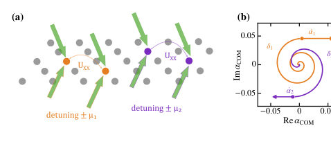 
FIG. 1. Illustration of the frequency-multiplexed parallel entangling gate. (a) Target ions are coupled by individual Raman laser beams to the drumhead phonon modes of a 2D ion crystal. All the parallel entangling gates share the same amplitude ramping waveform, and occupy different frequency bands as their laser detuning. The waveform and the fre- quency bands are designed to satisfy the adiabatic conditions for high gate fidelity and low crosstalk. (b) Ions involved in different entangling gates have distinct rotation speeds in the phase space. For large frequency separation and long ramp- ing time, the crosstalk error between the two gates vanishes, which is proportional to the mixed...

📷 Fig 2

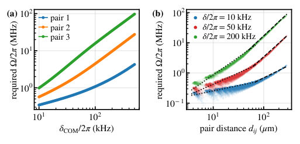 
FIG. 3. Scaling of required laser intensity on a 2D crys- tal of N = 512 ions with a gate duration T = 1 ms. (a) Required Raman Rabi rate Ωvs. detuning δCOM for three representative ion pairs at the distance of d = 19.3, 68.9, 157.6 µm. (The average distance between nearest- neighbor ions is 4.3 µm.) (b) Required Raman Rabi rate Ω vs. ion distance d under three representative laser detunings δCOM/2π = 10, 50, 200 kHz. Dotted and dashed lines show power-law fits (linear on the log-log plot) for the small-d and large-d regimes, respectively.

📷 Fig 3

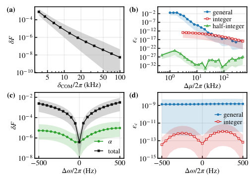 
FIG. 2. Performance of the frequency-multiplexed parallel entangling gates on a 2D crystal of N = 512 ions with a gate duration T = 1 ms. (a) Gate infidelity δF vs. detuning δCOM. (b) Crosstalk error ϵc between two gate pairs vs. the separa- tion ∆µ between their frequency bands. Blue circles represent general parameter settings, and red squares and green trian- gles are the sweet spots satisfying ∆µT = 2πr (r ∈Z, r ≥3) and ∆µT = 2π(r + 1/2) (r ∈Z, r ≥0), respectively. (c) Total gate infidelity δF (black squares) and that due to resid- ual spin-phonon entanglement (green circles) vs. drift of the trap frequency ∆ω. The ideal gate parameters are designed for δCOM/2π = 10 kHz. (d) Crosstalk...

📷 Fig 4

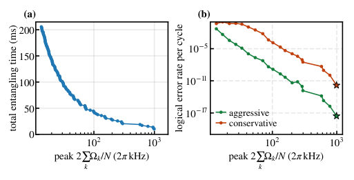 
FIG. 4. Performance of BB18 code on a 2D crystal of N = 512 ions. (a) Total entangling gate time per syndrome- measurement cycle vs. peak per-ion Rabi rate 2 P

**Summary.** This paper proposes using frequency-multiplexing on a 2D ion crystal to implement parallel, high-fidelity entangling gates necessary for quantum error correction using qLDPC codes. By designing adiabatic pulses, the scheme suppresses common errors like crosstalk and trap frequency drift. The results show that this approach can achieve a target logical error rate of $10^{-12}$ using moderate laser power, advancing the feasibility of large-scale quantum computation in ion traps.

**Why it may be interesting.** This work directly addresses the scaling bottleneck in trapped-ion quantum computing by proposing a hardware-efficient method (frequency multiplexing) to implement complex quantum error correction circuits.

Detailed structure

**Main problem.** The core challenge is implementing scalable, parallel nonlocal entangling gates required for quantum low-density parity-check (qLDPC) codes without relying on slow and error-prone physical qubit shuttling.

**Main result.** The authors demonstrate that a frequency-multiplexing scheme on a 2D ion crystal can achieve a logical error rate of $10^{-12}$ for a specific qLDPC code using moderate laser power.

**Method.** The method combines frequency-multiplexing to enable parallel gates with adiabatic pulse design to suppress gate infidelity and crosstalk errors.

**Model / system.** The physical system is a two-dimensional (2D) ion crystal hosting qubits. The theoretical model involves designing entangling gates using an effective Hamiltonian and analyzing error sources like crosstalk and trap frequency drift.

**Key observables.** Logical error rate ($p_L$), gate fidelity ($\delta_F$), and crosstalk error ($\epsilon_c$).

**Important parameters / regimes.** The system is analyzed using a $[[248, 10, 18]]$ bivariate bicycle code on 512 ions, with gate time $T=1$ ms.

**Assumptions / limitations.** The analysis relies on the Rotating Wave Approximation (RWA) for crosstalk estimation and assumes specific noise models for error rate extrapolation.

**Figures summary.** Figures illustrate the frequency-multiplexed gate scheme, performance metrics showing error scaling with detuning and drift, and the final logical error rate vs. Rabi rate trade-off.

**Paper structure.** The paper progresses from establishing the need for parallel gates, detailing the frequency-multiplexing technique and its robustness, to simulating the full QEC circuit performance and estimating the final logical error rate.

Abstract

Quantum low-density parity-check (qLDPC) codes admit high encoding rates but require nonlocal entangling gates for syndrome measurement. Instead of physically moving the qubits which slows down with the increasing qubit number, here we propose to achieve parallel nonlocal entangling gates on a two-dimensional (2D) ion crystal using frequency-multiplexing. Adiabatic conditions ensure the suppression of gate infidelity and crosstalk error, as well as their robustness against slow drift in the trap frequency which is a leading error source in ion trap. We consider a numerical example of a $[[248,10,18]]$ bivariate bicycle code on a 2D crystal of 512 ions. By optimizing the mapping of the qubits and the assignment of the frequency bands for multiplexing, we show that a moderate laser power is sufficient for parallelism, and that a logical error rate of $10^{-12}$ can be achieved under realistic noise parameters.

[↑ back to top](#top)

### [HyperDet Wavefunction: A Phase-Agnostic Ansatz for Strongly Correlated Systems](http://arxiv.org/abs/2609.04146v1)

**Authors:** Xiaodong Hu, Guan-Lin Lin, Ying Ran, Di Xiao  
**Type:** theory · **Category:** strongly correlated electrons · **PDF:** <https://arxiv.org/pdf/2609.04146v1>  
**Analysis basis:** full PDF text, analyzed in chunks
**Topic relevance:** `analog quantum simulation` **3/5**

📷 Fig 1

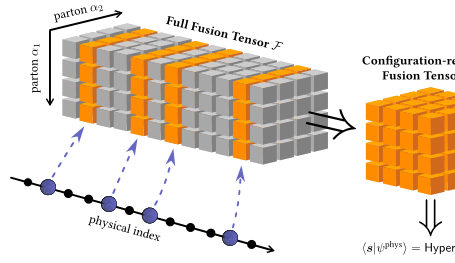 
FIG. 1. Illustration of a HyperDet wavefunction with N = 4 filled physical particles and m = 2 parton species for a given configu- ration |s⟩on a 12-site graph (obtained by flattening the 2D lattice). Physical degrees of freedom live at the bottom and parton degrees of freedom live above. Each parton species occupies the same num- ber of orbitals as there are physical particles: Nα = Nβ = N = 4. Each configuration |s⟩specifies the N × Nα × Nβ = 43 hyper- cubic, configuration-restricted fusion tensor Fs sliced from the full hyper-rectangular fusion tensor F (which contains all variational parameters) of size Ns × Nα × Nβ = 12 × 42.

📷 Fig 2

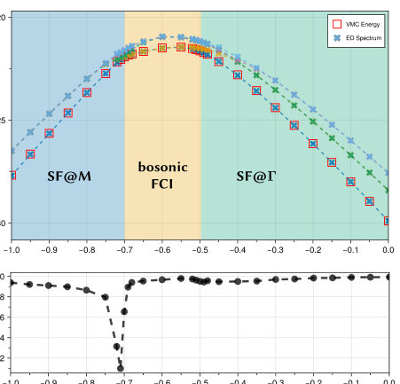 
FIG. 2. Benchmark of the irrep-projected HyperDet wavefunction ansatz against ED results on a 3 × 6 × 2 sample (2 is the sublattice) for model Eq. (19) at half-filling ν = 1/2 as the extended-hopping strength t′′ ∈[−1, 0] is varied. (a) Comparison of the lowest twenty ED energies across all sectors and the irrep-projected variational energy in the global ground-state sector. The three phases SF@M, bosonic FCI, and SF@Γ are shaded with their phase boundaries adapted from the DMRG calculations in Ref. [64]. (b) Wavefunction overlap with the ED ground states. Note: the prominent drop in the overlap at t′′ ≈−0.71 is due to the closing of the direct gap in the chosen sector (0, 3). Such a...

📷 Fig 3

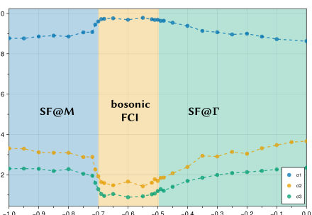 
FIG. 3. Bipartite Fusion Matrix SVD Spectrum of Bosonic Two- parton Case. Top three largest normalized singular values of the bipartite fusion matrix Eq. (14) along the extended-hopping sweep t′′ ∈[−1, 0] for the bosonic model Eq. (19) on a 3 × 6 × 2 sample at ν = 1/2. The abrupt jump in the singular value strengths around t′′ ≈−0.7, and the smooth change of the slope around t′′ ≈−0.5, are consistent with the first-order and continuous phase boundaries revealed in Ref. [64], respectively. The shaded phase regions, taken from Ref. [64], are also included for comparison.

📷 Fig 4

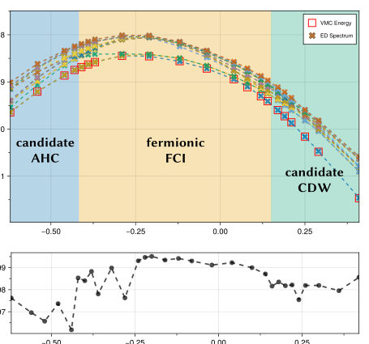 
FIG. 4. Benchmark of the irrep-projected HyperDet wavefunction ansatz against ED results on a 3 × 5 × 2 sample (2 is the sublattice) for model Eq. (20) at band filling ν = 1/3 as the extended-hopping strength t′′ ∈[−0.62, 0.41] is varied. (a) Comparison of the lowest twenty ED energies across all sectors and the chosen global ground state of the irrep-projected variational energy. The phase bound- aries between candidate AHC, fermionic FCI, and candidate CDW here are determined from the ED spectrum sweep detailed in Ap- pendix [77]. Although this is not a thermodynamic-limit phase di- agram, it suffices to benchmark the expressiveness of the ansatz on this finite cluster. (b) Wavefunction...

📷 Fig 5

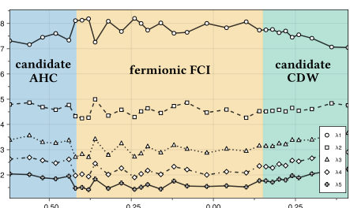 
FIG. 5. Species-Averaged Bipartite Fusion Matrix SVD Spec- trum of Fermionic Three-parton Case. Top five largest nor- malized, species-averaged singular values of the bipartite fusion matrix Eq. (12) obtained from the one-versus-two parton biparti- tions of the optimized fusion tensor. The calculation is done for the fermionic model Eq. (20) on a 3 × 5 × 2 sample at ν = 1/3. The observed singular value strengths jump around t′′ ≈−0.41 and a smooth change of slope around t′′ ≈0.15 is consistent with the ED-resolved finite-size AHC–FCI and FCI–CDW phase boundaries.

**Summary.** This paper introduces the HyperDet wavefunction, a novel, phase-agnostic ansatz for strongly correlated quantum systems. It uses a learnable fusion tensor optimized via VMC to achieve high accuracy across various correlated phases, including FCIs. The method's key strength is its ability to diagnose topological order and phase transitions by analyzing the tensor's structural properties, such as its singular-value spectrum.

**Why it may be interesting.** The phase-agnostic nature and the ability to extract topological invariants and symmetry information directly from the learned tensor structure make it a powerful, general tool for understanding complex correlated phases beyond simple mean-field assumptions.

Detailed structure

**Main problem.** Developing a robust, phase-agnostic trial wavefunction ansatz for strongly correlated quantum many-body systems exhibiting spontaneous symmetry-breaking order, fractionalization, and/or topological order.

**Main result.** The proposed HyperDet wavefunction achieves high accuracy ($\geq 99.9\%$) across diverse correlated phases, and its structure naturally encodes parton-level topological data and tracks phase transitions via its singular-value spectrum.

**Method.** The ansatz is constructed by fusing auxiliary fermionic parton Slater determinants into physical orbitals using a fully learnable fusion tensor, optimized via Variational Monte Carlo.

**Model / system.** The method is applied to strongly correlated systems, specifically focusing on Fractional Chern Insulators (FCIs) in both bosonic and fermionic models, and tested on the extended Fermi-Hubbard model on a checkerboard lattice.

**Key observables.** Wavefunction overlap with exact-diagonalization states, singular-value spectrum of the bipartite fusion matrix, parton Chern numbers, and the connected static structure factor $S(\mathbf{q})$ (for CDW diagnosis).

**Important parameters / regimes.** Filling fractions ($
u$), hopping strengths ($t, t', t''$), and interaction strengths ($V_1, V_2, V_3$).

**Assumptions / limitations.** The primary assumption is that the fusion tensor can be learned variationally to capture the necessary physics across different phases, and that the method can be extended to include internal degrees of freedom.

**Figures summary.** Figures illustrate the structure of the HyperDet wavefunction and show the connected static structure factor $S(\mathbf{q})$ exhibiting sharp Bragg peaks in the candidate CDW phase, alongside finite-size scaling of the charge gap.

**Paper structure.** The paper introduces the HyperDet ansatz using a fusion tensor, details the variational optimization using VMC, and then applies the framework to diagnose and characterize multiple phases (FCI, AHC, CDW) in the extended Fermi-Hubbard model using various diagnostic tools.

Abstract

Describing competing phases of strongly correlated systems often requires trial wave functions built from phase-specific assumptions. We propose the \emph{hyperdeterminant (HyperDet) wavefunction} as a phase-agnostic ansatz for both bosonic and fermionic quantum many-body systems exhibiting spontaneous symmetry-breaking order, fractionalization, and/or topological order with anyonic excitations. The HyperDet structure emerges naturally by fusing auxiliary fermionic parton Slater determinants into physical orbitals through a fully learnable \emph{fusion tensor} $\mathcal F$. Optimized using variational Monte Carlo, a single HyperDet architecture can achieve exceptionally high overlaps $\geq 99.9\%$ with exact-diagonalization ground states throughout the entire fractional Chern insulator phase in both bosonic and fermionic models, and across their nearby competing phases. We introduce the singular-value spectrum of the \emph{bipartite fusion matrix} as a structural diagnostic of fusion tensor, and find that its redistribution tracks many-body phase transitions without computing phase-specific observables. The optimized fusion tensor also encodes the parton-level topological data: it reproduces the parton Chern numbers expected for the bosonic and fermionic FCI states, completing their field-theory descriptions and the resulting topological order. Its intrinsic gauge structure further determines whether physical symmetries admit virtual lifts and, when faithful lifts exist, extracts their projective class; for the bosonic FCI, this recovers the expected parton translation fractionalization. We thus anticipate the HyperDet wavefunction to be a promising variational platform for both accurate ground-state searches and phase-diagram explorations across strongly correlated phases, and for providing interpretable theoretical insights from parton-level microscopics to field-theory descriptions.

[↑ back to top](#top)

### [Redesigning quantum theory](http://arxiv.org/abs/2609.03333v1)

**Authors:** Matthew B. Weiss  
**Type:** theory · **Category:** other · **PDF:** <https://arxiv.org/pdf/2609.03333v1>  
**Analysis basis:** full PDF text, analyzed in chunks
**Topic relevance:** `quantum measurements` **3/5**

📷 Fig 1

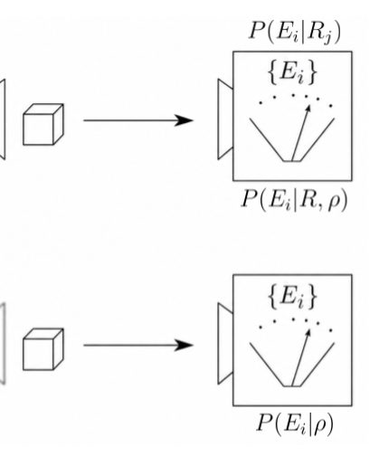 
Figure 2.1: Two scenarios [2].

**Summary.** This dissertation attempts a foundational reconstruction of quantum theory by interpreting it through the lens of QBism, viewing quantum mechanics as probability theory augmented by specific nonclassical coherence rules. The authors derive these rules from first principles, showing that coherence with a specific type of reference measurement is sufficient to imply the entire structure of finite-dimensional quantum mechanics. It offers a novel, theory-agnostic method for self-testing these underlying mathematical structures.

**Why it may be interesting.** This work tackles the foundational axioms of quantum mechanics, which underpins all applications in AMO physics, by re-deriving the core rules from subjective probability principles.

Detailed structure

**Main problem.** The paper aims to redesign quantum theory by deriving its fundamental nonclassical coherence conditions from first principles, moving beyond standard interpretations.

**Main result.** Coherence with a single reference measurement corresponding to a complex projective 3-design is shown to imply coherence with all of finite dimensional quantum mechanics.

**Method.** The authors use a QBist framework, treating quantum mechanics as probability theory supplemented by nonclassical coherence conditions, and comparing this to generalized probabilistic theories.

**Model / system.** The focus is on the abstract mathematical structure of quantum theory itself, particularly the relationship between subjective probability assignments, reference measurements, and the Born rule.

**Key observables.** Probabilities assigned to measurement outcomes, quantum states (represented by density matrices), and the structure of the state space.

**Important parameters / regimes.** The choice of the reference measurement (especially those related to complex projective $t$-designs, $t\ge 3$).

**Assumptions / limitations.** The fundamental nonclassical coherence relation can be derived from first principles, often by approximating it as a gentle modification of the law of total probability.

**Paper structure.** The dissertation is structured logically, starting with an introduction covering foundations and QBism, moving through probability theory derivations, analyzing the Born identity, and concluding with discussions on the Bloch form and reconstruction of quantum theory.

Abstract

QBism understands quantum mechanics to be probability theory supplemented by additional nonclassical coherence conditions. In this dissertation, we develop these nonclassical coherence conditions from first principles, emphasizing the role of a well chosen reference measurement. After treating standard probability on subjective Bayesian lines, we demonstrate an equivalence between the QBist approach and the existing framework of generalized probabilistic theories. We show that the fundamental nonclassical coherence relation may almost always be taken to be a gentle modification of the law of total probability, and give a coherentist account of when an experimental scenario has a classical explanation. Finally, we show that when the reference measurement is chosen to correspond to a complex projective 3-design, the shape of quantum state space is implicit in the probabilities which characterize the reference measurement itself. Thus coherence with this single reference measurement, properly understood, implies coherence with all of finite dimensional quantum mechanics. We then attempt a modest reconstruction of quantum theory along these lines, one practical consequence of which is a method for self-testing complex projective $t$-designs for $t\ge 3$ in a theory-agnostic way.

[↑ back to top](#top)

### [Spurious quantum correlations](http://arxiv.org/abs/2609.04157v1)

**Authors:** Shashaank Khanna, Matthew F. Pusey, Roger Colbeck  
**Type:** theory · **Category:** other · **PDF:** <https://arxiv.org/pdf/2609.04157v1>  
**Analysis basis:** full PDF text, analyzed in chunks
**Topic relevance:** `quantum measurements` **3/5**

📷 Fig 1

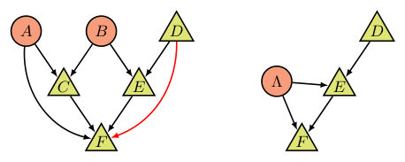 
FIG. 1. (a) The causal structures H1 (without red arrow) and G1 (with red arrow). (b) The instrumental causal structure which is used in the proof of our results.

📷 Fig 2

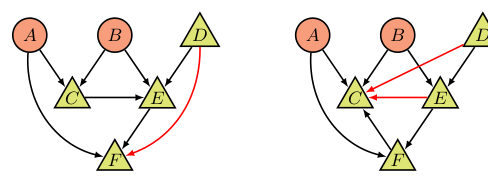 
FIG. 2. (a) The causal structures H2 (without red arrow) and G2 (with red arrow). (b) The causal structures H3 (without red arrows) and G3 (with red arrows).

📷 Fig 3

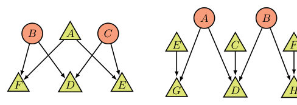 
FIG. 3. Causal structures (a) H4 and (b) Bi-locality in which all NCNFT correlations are not spurious.

**Summary.** This theoretical paper develops a framework to distinguish genuinely quantum correlations from 'spurious' ones by comparing predictions across multiple possible causal structures. It uses advanced causal inference tools and quantum probability theory to show that while some quantum effects can be explained classically under different causal assumptions, others provide evidence for genuine quantum non-locality. This refines the understanding of what truly necessitates quantum mechanics in physical theories.

**Why it may be interesting.** It provides a rigorous, information-theoretic framework for distinguishing genuine quantum non-locality from correlations that might simply be artifacts of an incomplete or overly restrictive causal model.

Detailed structure

**Main problem.** The paper investigates 'spurious quantum correlations'—quantum correlations that appear non-classical under one causal assumption but possess a natural classical explanation under another, without requiring fine-tuning.

**Main result.** The authors demonstrate that while some non-classical correlations are spurious (explainable classically in another structure), other structures exist where the quantum nature cannot be reduced to a classical explanation, providing a criterion for genuine quantum effects.

**Method.** The analysis uses causal inference tools (like d-separation and the IC* algorithm) to compare quantum compatibility (using POVMs) against classical compatibility across various causal structures.

**Model / system.** The study centers on correlations derived from measurements on entangled particles, formalized using probability distributions $P(CDEF)$ and quantum states on tensor product Hilbert spaces.

**Key observables.** Non-classicality (violation of classical bounds, e.g., inequality (5)) and the determination of spuriousness relative to alternative causal structures.

**Important parameters / regimes.** Causal structures ($H_1, H_2, H_3, H_4$), quantum state parameters ($\alpha, eta, \phi$), and the requirement of avoiding fine-tuning.

**Assumptions / limitations.** The analysis assumes the existence of alternative causal structures and relies on the formal definitions of classical and quantum compatibility.

**Figures summary.** Figures compare different causal structures ($H_1$ vs $G_1$, $H_2$ vs $G_2$, etc.) to illustrate where correlations are found to be spurious or non-spurious.

**Paper structure.** The paper builds from Bell's theorem to define spurious correlations, develops formal definitions (NCNFT, Spurious), and then applies these tools to specific causal structures to prove theorems regarding the nature of quantum correlations.

Abstract

In his seminal paper, Bell [Physics Physique Fizika 1, 195 (1964)] considers the correlations that result from space-like separated measurements on a pair of entangled particles. He uses relativity theory to motivate the Bell causal structure, then shows the existence of quantum correlations that cannot be explained classically within this causal structure. Classical explanations of such quantum correlations are possible in alternative causal structures, for instance, those that allow superluminal causal influences, but, as shown in [New Journal of Physics 17 033002 (2015)], all such alternative explanations require fine tuning (causation without correlation). Here we discuss the existence of spurious quantum correlations --- correlations that look quantum in one causal structure, but have a natural classical explanation in another. More precisely, there are causal structures that admit non-classical quantum correlations, but for which the same correlations have a classical explanation in another causal structure without fine tuning. The realisation in the other causal structure can also be achieved without breaking any natural constraints on the causal structure that follow from relativity theory. However, similarly to non-classical quantum correlations in the Bell causal structure, we find other causal structures with non-classical quantum correlations that do not have a classical causal explanation in any alternative causal structure without fine tuning.

[↑ back to top](#top)

### [Frenkel line of Yukawa fluids within the self-consistent relaxation theory](http://arxiv.org/abs/2609.03606v1)

**Authors:** Ilnaz I. Fairushin, Anatolii V. Mokshin  
**Type:** theory · **Category:** statistical mechanics · **PDF:** <https://arxiv.org/pdf/2609.03606v1>  
**Analysis basis:** full PDF text, analyzed in chunks
**Topic relevance:** `Keldysh / 2PI / non-Gaussian methods` **2/5** · `methods for driven-dissipative` **2/5** · `Frenkel-Kontorova` **1/5** · `analog quantum simulation` **1/5** · `driven-dissipative phase transition` **1/5** · `non-equilibrium universality` **1/5**

📷 Fig 1

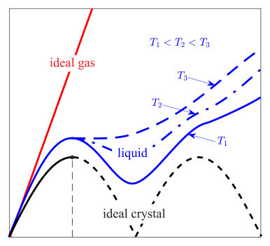 
Figure 1. Schematic representation of the dispersion relation of longitudinal collective excitations for various states of matter: crystal, liquid, and gas. The vertical dashed line indicates the boundary of the first Brillouin zone.

📷 Fig 2

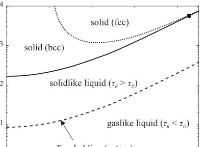 
Figure 2. Phase diagram of the Yukawa system [28]. The solid line corresponds to the melting line, and the dashed line indicates the Frenkel line according to Ref. [7]. The circle marks the triple point. In Ref. [7], an empirical correspondence between the melting and Frenkel lines was proposed: ΓF(κ)/Γm(κ) = 0.05.

📷 Fig 3

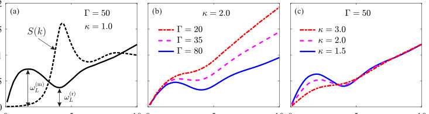 
Figure 3. Dispersion curves of longitudinal collective excitations ωL(k) normalized by the plasma frequency ωp for the Yukawa fluid at different (Γ, κ)-states, calculated using the self-consistent relaxation theory via Eq. (20).

📷 Fig 4

 
Fig. 3 shows dispersion curves for longitudinal collective excitations in the Yukawa fluid, obtained from Eq. (19) for thermodynamic states with different particle dynamics regimes. One can see that the location of the roton minimum correlates with the main maximum of the static structure factor S(k) (Fig. 3a), i.e., it lies at the boundary of the second Brillouin pseudozone. As expected, at a fixed screening parameter κ, the roton minimum becomes less pronounced with decreasing coupling parameter Γ (Fig. 3b), which corresponds to an increase in temperature (see Eq. (2)). This occurs because the interaction energy of a particle with its neighbors becomes small compared to its thermal...

📷 Fig 5

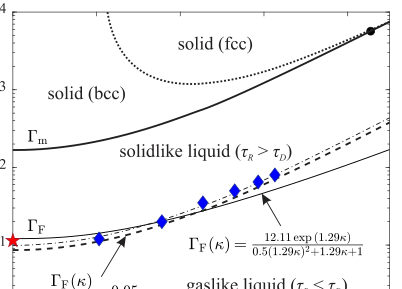 
Figure 4. Phase diagram of the Yukawa system [28]. The solid line is the melting line; the dashed and thin solid lines are the Frenkel lines for the Yukawa fluid from Refs. [7] and [9], respectively. The circle marks the triple point. The remaining symbols indicate (Γ, κ)-states for which the condition (22) is satisfied in the dispersion curves of longitudinal collective excitations according to the self-consistent relaxation theory. The thin dash-dotted line is the best fit to these data and corresponds to the expression ΓF(κ)/Γm(κ) = 0.057.

**Summary.** This theoretical paper investigates the Frenkel line, a dynamic crossover boundary in the phase diagram of the Yukawa fluid, using self-consistent relaxation theory. The authors show that this line, which separates different dynamic regimes, can be determined purely from the static structure factor $S(k)$ by analyzing the longitudinal excitation spectrum. This provides a powerful theoretical tool for characterizing the dynamics of simple, strongly interacting fluids.

**Why it may be interesting.** While focused on classical fluid dynamics, the theoretical framework of self-consistent relaxation theory and the analysis of collective excitations are highly relevant to understanding non-equilibrium dynamics in many-body quantum systems, such as those studied in quantum gases or strongly correlated materials.

Detailed structure

**Main problem.** The paper aims to determine the 'Frenkel line,' a dynamic crossover line in the phase diagram of a supercritical fluid, by analyzing the collective vibrational dynamics.

**Main result.** The authors derive an analytical expression showing that the Frenkel line can be determined directly from the static structure factor $S(k)$, by equating the local maximum and the roton minimum of the longitudinal excitation dispersion relation.

**Method.** The study employs the self-consistent relaxation theory, expanding the dynamic structure factor $S(k, \omega)$ using frequency moment expansions and relating the crossover condition to the equality of two characteristic frequencies.

**Model / system.** The physical system modeled is the Yukawa fluid, which is characterized by purely repulsive interparticle interactions, making it a suitable model for supercritical fluids lacking a sharp liquid-vapor transition.

**Key observables.** The longitudinal collective excitation dispersion relation $\omega_L(k)$, the static structure factor $S(k)$, and the roton minimum frequency $\omega_L^r(k)$ are key observables.

**Important parameters / regimes.** The coupling parameter $\Gamma$ and the Debye screening parameter $\kappa$ define the thermodynamic state; the ratio $\Gamma_F/\Gamma_m$ characterizes the line.

**Assumptions / limitations.** The theory assumes that higher-order time scales in the expansion of the time correlation function are equalized ($rac{1}{\Delta_4(k)} = rac{1}{\Delta_5(k)} = \dots$).

**Figures summary.** Figure 2 illustrates the phase diagram showing both the melting line and the calculated Frenkel line for the Yukawa fluid. Figure 3 shows the dispersion curves $\omega_L(k)$ illustrating the relationship between the roton minimum and the main maximum.

**Paper structure.** The paper develops the self-consistent relaxation theory to calculate the dynamic structure factor $S(k, \omega)$. It then derives the dispersion relation for longitudinal excitations and establishes the condition $\omega_L^m(k) = \omega_L^r(k)$ that defines the Frenkel line, finally comparing the theoretical result to molecular dynamics simulations.

Abstract

For a simple model fluid, the Yukawa fluid, the condition for dynamic crossover, known as the Frenkel line, is defined. The condition is related to the fact that the roton minimum in the dispersion relation of longitudinal acoustic-like excitations exists only when the collective vibrational dynamics of particles dominates in the liquid. Based on the self-consistent relaxation theory for the Yukawa fluid, thermodynamic states are determined in which the roton minimum disappears. The obtained values of the state parameters for the Frenkel line are consistent with the results of studies in which the position of this line on the phase diagram of the Yukawa fluid was determined using molecular dynamics simulations. It is shown that the Frenkel line in this system can be determined directly from the structural characteristic -- the static structure factor. A physical interpretation of the roton minimum frequency for the simple liquids near the Frenkel line is proposed.

[↑ back to top](#top)

### [Spectral properties of deterministic matrices multiplied by rotationally invariant random non-Hermitian ensembles](http://arxiv.org/abs/2609.03618v1)

**Authors:** Pierre Bousseyroux, Marc Potters  
**Type:** theory · **Category:** disordered systems and neural networks · **PDF:** <https://arxiv.org/pdf/2609.03618v1>  
**Analysis basis:** full PDF text, analyzed in chunks
**Topic relevance:** `Keldysh / 2PI / non-Gaussian methods` **2/5** · `methods for driven-dissipative` **2/5** · `analog quantum simulation` **1/5** · `correlated / nonlocal dissipation` **1/5** · `driven-dissipative phase transition` **1/5** · `non-equilibrium universality` **1/5**

📷 Fig 1

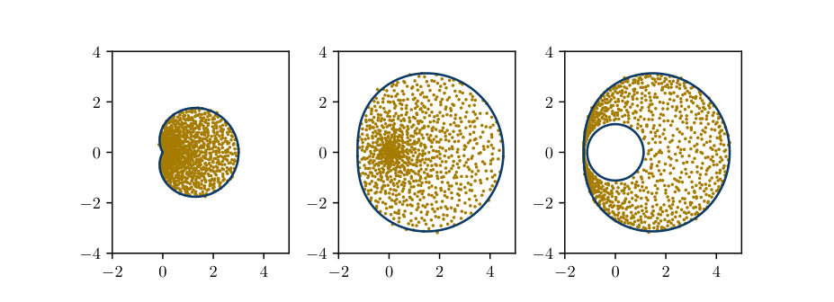 
Figure 1: Empirical eigenvalues. Left: (IN +G1)(IN +G2), where G1 and G2 are Ginibre matrices (N = 1000); the cardioid curve (93) gives the theoretical spectral boundary. Center: (IN + σG1)(IN + σG2) with σ = 1.1, where G1 and G2 are complex Ginibre matrices (N = 1000); the outer boundary is given by (92) with r+,B = σ. Right: (IN + σU1)(IN + σU2) with σ = 1.1, where U1 and U2 are random unitary matrices (N = 1000); in addition to the outer boundary (92), an inner spectral edge appears at radius σ2 −1.

📷 Fig 2

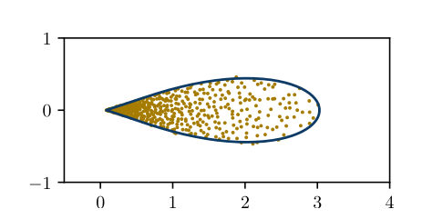 
Figure 2: Complex eigenvalues of a matrix of size N = 500 given by Wq(IN + σG), where Wq is a complex Wishart matrix with parameter q = 0.5, σ = 0.5, and G is a complex Ginibre matrix. The theoretical spectral boundary is also shown using the equation (97).

📷 Fig 3

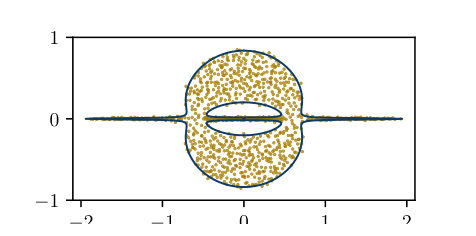 
Figure 3: Empirical complex eigenvalues of (σIN + D)Eτ, where D = diag(1, . . . , 1, −1, . . . , −1) and Eτ is an elliptic matrix with τ = 0.9 and σ = 0.5. The theoretical boundary is drawn using result 19.

**Summary.** This theoretical paper analyzes the complex spectral properties of random matrices formed by multiplying a deterministic matrix by a random non-Hermitian ensemble. It extends free probability tools to this multiplicative setting, deriving functional equations that govern the spectral boundary. The results provide a powerful framework for understanding spectral flow in complex, non-Hermitian physical models.

**Why it may be interesting.** The techniques developed for analyzing spectral properties of non-Hermitian products are highly relevant to open quantum systems, where non-Hermiticity often arises from coupling to an environment, and the product structure can model sequential physical processes.

Detailed structure

**Main problem.** The paper investigates the spectral properties of multiplicative deformations of non-Hermitian random matrices, specifically matrices formed by the product of a deterministic matrix and a rotationally invariant random ensemble.

**Main result.** The boundary of the complex eigenvalue distribution of the product AB is determined by solving a system of functional equations involving specialized transforms ($\mathcal{R}_1$ and $\mathcal{R}_2$) derived from the random matrix ensemble B.

**Method.** The analysis employs advanced techniques from random matrix theory, including generalizations of free probability theory (R- and S-transforms) and the replica method to handle the non-Hermitian product structure.

**Model / system.** The model consists of the product of two large matrices, $\mathbf{A}\mathbf{B}$, where $\mathbf{A}$ is deterministic and $\mathbf{B}$ is a rotationally invariant random non-Hermitian matrix ensemble. The analysis extends concepts from additive matrix sums to multiplicative products.

**Key observables.** The limiting eigenvalue distribution ($
ho$), the spectral edges (boundary of $	ext{supp}(
ho)$), the Stieltjes transform ($g_{AB}(z)$), and the eigenvector self-overlap ($o_{AB}(z)$).

**Important parameters / regimes.** The large dimension limit ($N	o\infty$), the parameters defining the deterministic matrix $\mathbf{A}$, and the structure of the random ensemble $\mathbf{B}$.

**Assumptions / limitations.** The existence of a continuous limiting spectral distribution $
ho$ is assumed; the derivation of the multiplicative relation is noted to be significantly more complex than the additive case.

**Figures summary.** Not specified in the notes, but the analysis revolves around deriving functional relations (e.g., Equations 23-26, 70, 71, 72) that govern the spectral functions.

**Paper structure.** The paper progresses by first establishing analogues for the additive case, then deriving the core multiplicative relations for the spectral density and overlap, and finally analyzing the behavior at the spectral boundary using specialized transforms.

Abstract

In this paper, we study spectral properties of multiplicative deformations of non-Hermitian random matrices. We consider matrices of the form $\mathbf{A}\mathbf{B}$, where $\mathbf{A}$ is a deterministic $N\times N$ matrix (not necessarily Hermitian) and $\mathbf{B}$ is a rotationally invariant random matrix. We show that, as $N\to\infty$, the boundary of the complex eigenvalue distribution of $\mathbf{A}\mathbf{B}$ is governed by simple equations involving the $\mathcal{R}_1$ and $\mathcal{R}_2$ transforms of $\mathbf{B}$.

[↑ back to top](#top)

### [Quantum thermalization achieves optimal approximate quantum error correction](http://arxiv.org/abs/2609.04121v1)

**Authors:** Aditi Venkatesh, Richard R. Allen, Saúl Pilatowsky-Cameo, Bingtian Ye, Soonwon Choi  
**Type:** theory · **Category:** quantum information and computing · **PDF:** <https://arxiv.org/pdf/2609.04121v1>  
**Analysis basis:** full PDF text, analyzed in chunks
**Topic relevance:** `analog quantum simulation` **2/5** · `quantum measurements` **2/5** · `driven-dissipative phase transition` **1/5** · `non-equilibrium universality` **1/5** · `scars & prethermalization` **1/5**

📷 Fig 1

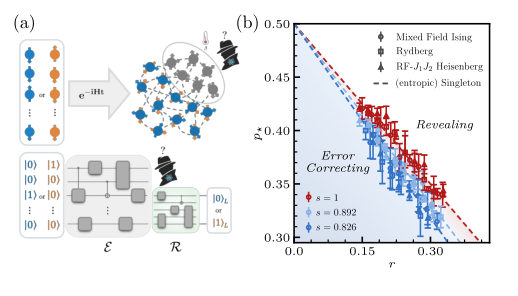 
FIG. 1. Thermalization as error correction. (a) Under chaotic dynamics, initially distinct many-body states become locally indistinguishable at late times, forming codewords encoded by U(t) = e−iHt. Erasure of a subsystem then acts as noise, while the encoded information can be recovered from the complementary subsystem. (b) Universal rate-distance, r-p⋆, tradeoff for thermalization codes generated by various ergodic Hamiltonians (parameters in the SM [27]). Thresholds from all Hamiltonians collapse onto a universal curve determined by entropy density s, which we identify as the (entropic) quan- tum Singleton bound – showing that thermalization forms an asymptotically optimal approximate...

📷 Fig 2

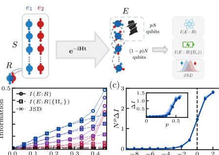 
FIG. 2. Quantifying information leakage due to energy. (a) A logical qubit is encoded in two energy-separated codewords maximally entangled with a reference R, then evolved. After erasing a fraction p to E, we compare total mutual infor- mation, I(E : R) (quantum), energy measurement-restricted mutual information, I(E : R|{Πe}) (classical-quantum), and the corresponding Jensen–Shannon divergence, JSD, (classi- cal) between the local-energy outcomes. (b) For N = 18 mixed-field Ising evolution, we plot I(E : R), I(E : R|{Πe}), and the local-energy JSD versus erased fraction p for p &lt; 1/2, which agree up to a finite-size threshold before deviating. The codeword energy-density separation is...

📷 Fig 3

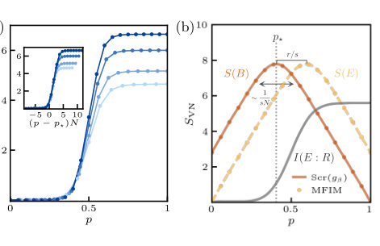 
FIG. 3. (a) Infinite temperature information transition. For N = 14, 16, 18, 20 (from the lightest to the darkest curve), we construct codespaces from orthonormal product states such that the energy is nearly independent of the encoded logi- cal state and evolve them under the ergodic mixed-field Ising Hamiltonian at β = 0 and r = 0.1667. We plot I(E : R) as a function of p. Inset: finite-size scaling collapse as a function of (p −p⋆)N 1/ν, with numerically extracted values p⋆≃0.417, ν ≃1. (b) Generalized Page-curve picture of the informa- tion transition. For a rate-r gβ-Scrooge code, we plot S(E), S(B), and the resulting I(E : R) versus erased fraction p; dots schematically represent...

**Summary.** This paper rigorously connects quantum thermalization to quantum error correction, showing that the process of a system reaching thermal equilibrium naturally possesses optimal error-correcting properties. By analyzing information leakage, the authors derive universal bounds that govern how well information can be protected in thermalizing quantum systems, establishing a fundamental physical limit for approximate QEC.

**Why it may be interesting.** This work provides a deep, fundamental link between non-equilibrium statistical mechanics (thermalization) and quantum information theory (QEC). For AMO physicists, it suggests that thermalization itself can be viewed as a physical mechanism for robust quantum information storage, which is highly relevant for quantum memory and computation.

Detailed structure

**Main problem.** The work aims to bridge the gap between quantum thermalization dynamics and the established framework of Quantum Error Correction (QEC). It seeks to characterize the inherent error-correcting properties present in systems evolving toward thermal equilibrium.

**Main result.** The authors establish a universal relationship between the encoding rate, distance, and thermal entropy density, showing that finite-temperature thermalization itself achieves the optimal entropic quantum Singleton bound. They also show that energy conservation limits leakage to classical information.

**Method.** The analysis uses the language of QEC, treating late-time states as codewords and analyzing information leakage using quantum mutual information, comparing it against measurement-restricted and classical information measures.

**Model / system.** The study considers isolated many-body quantum systems evolving unitarily (e.g., using an ergodic Hamiltonian). Specific models include the Scrooge ensemble for finite temperature and mixed-field Ising models for analyzing energy leakage.

**Key observables.** Encoding rate ($r$), distance, thermal entropy density ($s$), quantum mutual information $I(E:R)$, and the energy separation ($\Delta e$).

**Important parameters / regimes.** Temperature (finite vs. infinite), erasure fraction ($p$), and the energy separation scale ($\Delta E_N$).

**Assumptions / limitations.** The analysis often assumes that all initial product states thermalize locally to the same Gibbs state, or it analyzes the breakdown when energy differences are introduced.

**Figures summary.** Figures illustrate the collapse of the rate-distance trade-off onto the entropic quantum Singleton bound, and show the agreement between quantum mutual information, energy-restricted mutual information, and classical divergence measures up to a critical threshold.

**Paper structure.** The paper progresses by first establishing the general connection between thermalization and QEC, deriving the universal rate-distance bound at infinite temperature. It then extends this to finite temperatures using the Scrooge ensemble, and finally investigates the role of conserved quantities by analyzing energy leakage thresholds.

Abstract

Quantum thermalization explains how an isolated many-body system naturally evolves towards a thermal state, rendering information about the initial conditions inaccessible to local measurements. This is precisely the mechanism utilized in quantum error correction, where information is protected by design through a nonlocal encoding. In this work, we leverage this connection to port the rigorous framework of (approximate) quantum error correction to the study of quantum thermalization. Treating typical late-time states as codewords, we characterize the error-correcting properties of generic thermalizing dynamics. We numerically uncover a universal relationship between the encoding rate, distance, and thermal entropy density of the emergent code. At infinite temperature, this universal curve saturates the quantum Singleton bound, achieving the same optimal limit as Haar-random codes. At finite temperature, we introduce a code family based on the Scrooge ensemble, the natural thermal analogue of the Haar ensemble, and prove it saturates the entropic quantum Singleton bound, establishing this family as optimal within entropic constraints. Our extracted universal curve independently saturates this same bound, revealing that finite-temperature thermalization is itself optimal. Finally, we show how conserved quantities limit the error-correcting behavior of thermalization: codewords with differing energies, or other conserved charges, leak only classical information, and correctability persists until the difference reaches the scale of thermal fluctuations. Our results reveal a universal optimal coding structure in thermalizing dynamics, while introducing new optimal codes that achieve fundamental limits of approximate quantum error correction.

[↑ back to top](#top)

### [In defence of the Ehrenfest mean-field molecular dynamics](http://arxiv.org/abs/2609.03419v1)

**Authors:** Vladimir U. Nazarov  
**Type:** theory · **Category:** other · **PDF:** <https://arxiv.org/pdf/2609.03419v1>  
**Analysis basis:** full PDF text, analyzed in chunks
**Topic relevance:** `Keldysh / 2PI / non-Gaussian methods` **2/5** · `methods for driven-dissipative` **2/5** · `quantum measurements` **2/5**

📷 Fig 1

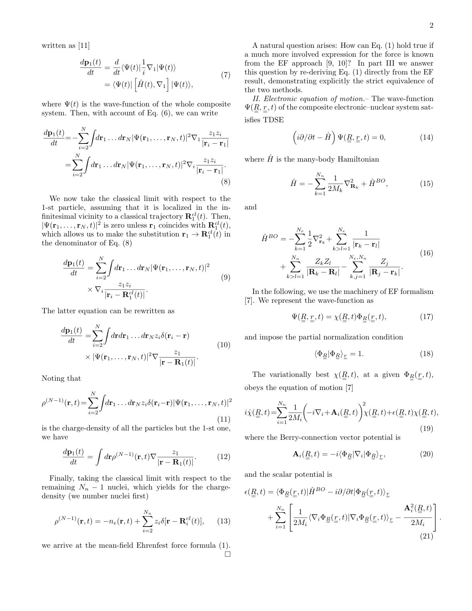 
Low-resolution page preview, page 2

📷 Fig 2

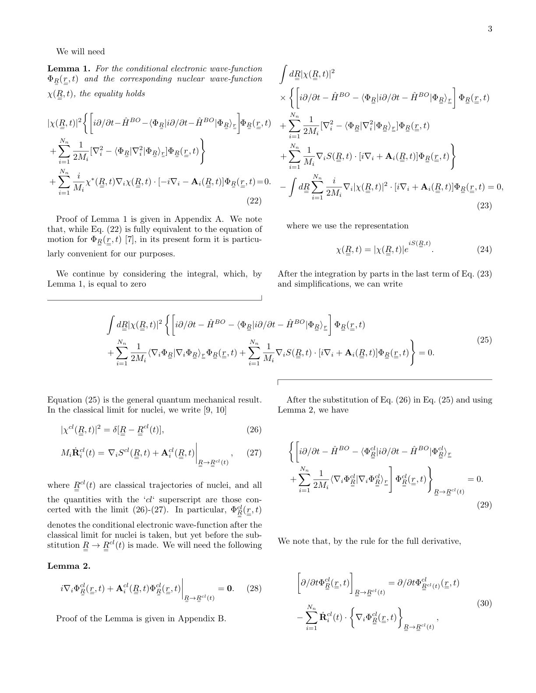 
Low-resolution page preview, page 3

📷 Fig 3

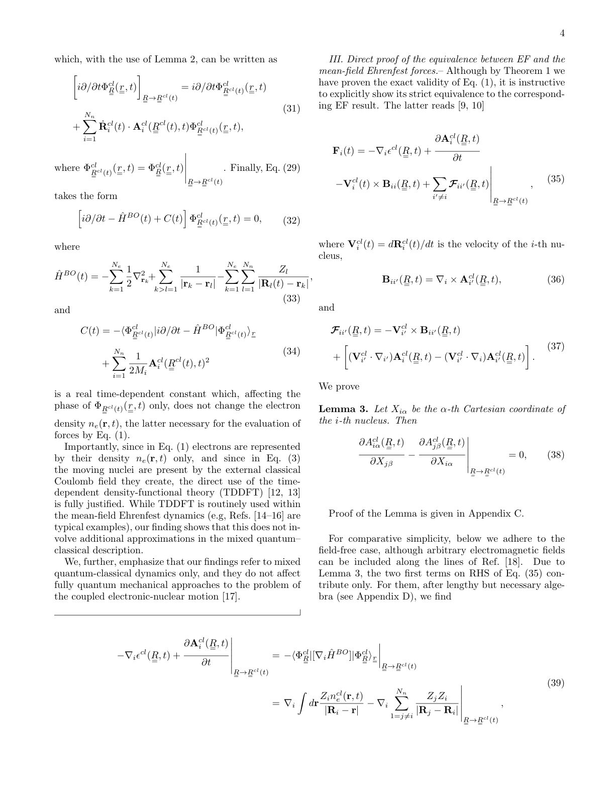 
Low-resolution page preview, page 4

📷 Fig 4

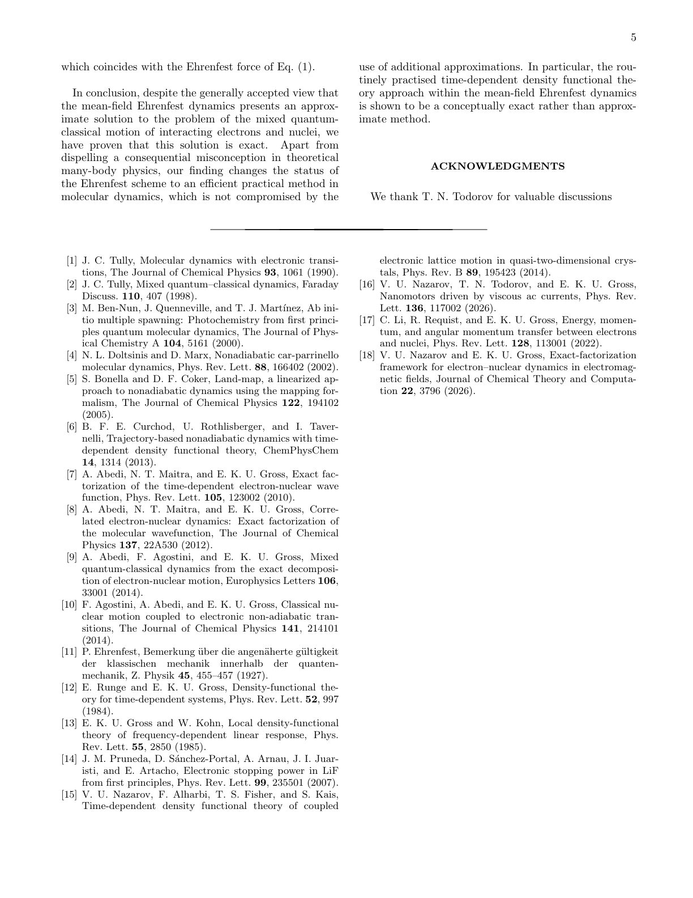 
Low-resolution page preview, page 5

📷 Fig 5

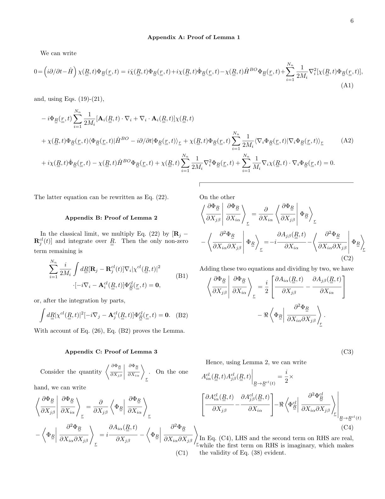 
Low-resolution page preview, page 6

**Summary.** This paper mathematically proves that the mean-field Ehrenfest approach for coupled electron-nuclear dynamics is an exact theory when nuclei are treated classically. By demonstrating its equivalence to the rigorous Exact Factorization method, the authors validate the use of this simple, effective scheme within Time-Dependent Density Functional Theory (TDDFT). This provides a strong theoretical foundation for simulating complex molecular systems.

**Why it may be interesting.** This work provides a formal, exact justification for a widely used, computationally tractable method (Ehrenfest dynamics) in simulating molecular and condensed matter systems, which is crucial for theoretical work in open quantum systems and molecular dynamics.

Detailed structure

**Main problem.** To rigorously prove that the mean-field Ehrenfest picture for coupled electronic-nuclear motion is an exact theory, rather than an approximation, in the classical limit for the nuclei.

**Main result.** The mean-field Ehrenfest molecular dynamics is proven to be mathematically equivalent to the more complex Exact Factorization approach in the classical limit, validating its use in TDDFT.

**Method.** The authors use rigorous mathematical derivations, comparing the force derived from the full quantum evolution in the classical limit against the established results from the Exact Factorization formalism.

**Model / system.** The system involves coupled electronic motion (governed by TDSE) and nuclear motion (treated classically), described by a mixed quantum-classical Hamiltonian.

**Key observables.** The force acting on the nuclei, $F_i(t)$, and the electronic density, $n_e(\mathbf{r}, t)$.

**Important parameters / regimes.** The strict classical limit for the heavy nuclei particles.

**Assumptions / limitations.** The analysis is restricted to the mixed quantum-classical dynamics and the strict classical limit for the nuclei.

**Paper structure.** The paper establishes the problem, derives the force equation from the full quantum evolution, proves its equivalence to the Exact Factorization result through detailed mathematical steps (including appendices), and concludes by justifying the use of TDDFT.

Abstract

Re-visiting the problem of the coupled electronic--nuclear motion, we prove that the so called `mean-field' Ehrenfest picture is an exact theory, rather than an approximation, in the classical limit for nuclei. By establishing its full equivalence to the much more involved Exact Factorization approach to the problem (Abedi {\it et al.}, Europhys. Lett. {\bf 106}, 33001 (2014)), our conclusion rehabilitates the mean-field Ehrenfest molecular dynamics as a simple, effective, while formally exact scheme, amenable to the use within the framework of the time-dependent density functional theory.

[↑ back to top](#top)

### [Such stuff as magic is made on: compact operator algebra, stabilizer polytope and the structure of reduced density matrices in a Kitaev spin liquid](http://arxiv.org/abs/2609.03485v1)

**Authors:** Snigdh Sabharwal, Nic Shannon, Paul Skrzypczyk  
**Type:** theory · **Category:** strongly correlated electrons · **PDF:** <https://arxiv.org/pdf/2609.03485v1>  
**Analysis basis:** full PDF text, analyzed in chunks
**Topic relevance:** `analog quantum simulation` **2/5** · `correlated / nonlocal dissipation` **1/5** · `driven-dissipative phase transition` **1/5** · `methods for driven-dissipative` **1/5** · `quantum measurements` **1/5**

📷 Fig 1

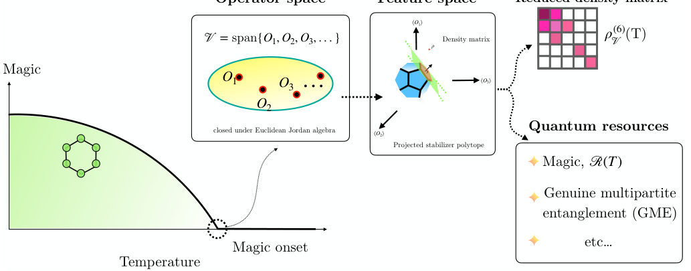 
FIG. 1. A schematic illustration of how the magic witness structure at the onset temperature provides a reduced operator space using which one can obtain a compact representation of the stabilizer polytope, an efficient representation of the reduced density matrix and other quantum resources such as genuine multipartite entanglement, across the entire temperature range.

📷 Fig 2

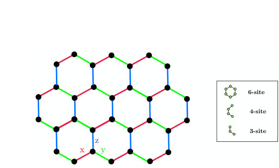 
FIG. 2. Illustration of the Kitaev honeycomb model [Eq. 1], and the three–, four– and six–site marginals investigated in this work.

📷 Fig 3

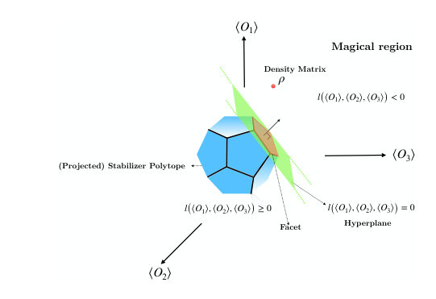 
FIG. 3. A schematic depiction of a three-dimensional feature space. The green plane represents a supporting hyperplane, while the orange face corresponds to its intersection with the projected stabilizer polytope, defining a facet of the polytope.

📷 Fig 4

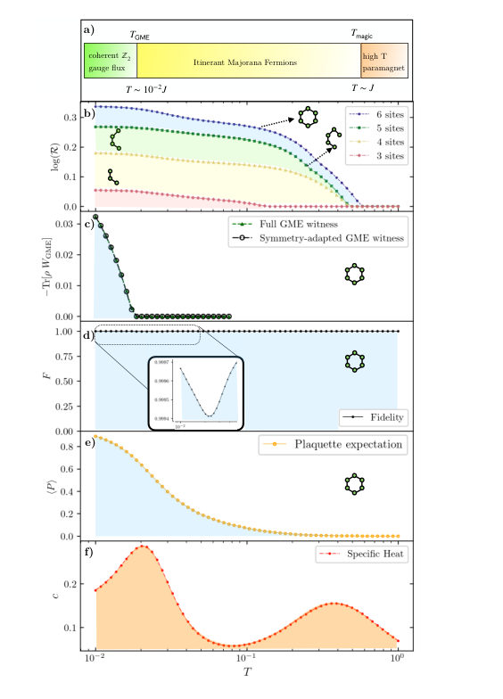 
FIG. 4. Thermal evolution of magic, genuine multipartite en- tanglement, and the reduced operator-space description of the Kitaev honeycomb model. (a) Schematic thermal regimes of the Kitaev spin liquid, showing the onset magic, Tmagic ∼J, and GME, TGME ∼10−2J, relative to the itinerant-Majorana and coherent Z2 flux regimes, as identified in [23]. (b) Log ro- bustness, log(R) of magic for the 3, 4, 5, and 6-site marginals. Upon cooling, the curves should be read from right to left. The six-site marginal showcases magic first, at T ≃0.58, fol- lowed by the other marginals at progressively lower tempera- tures. (c) Expectation value of the GME witness for the six- site marginal, compared with...

📷 Fig 5

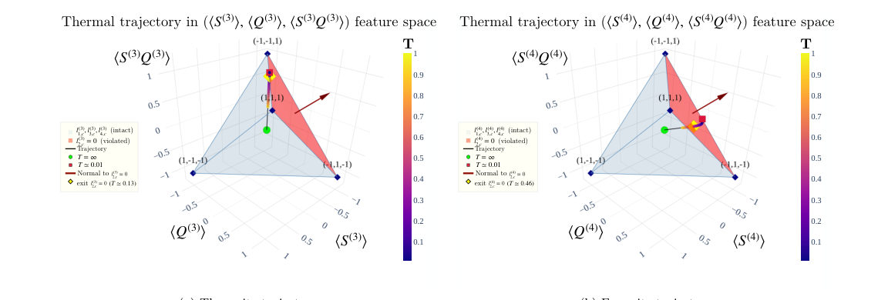 
FIG. 5. Thermal trajectories of the three and four-site reduced density matrices in their corresponding three-dimensional compressed feature spaces. In both cases, the T = ∞(green circle) state lies at the center of the projected stabilizer polytope, a tetrahedron. Upon cooling, the thermal trajectory moves toward the boundary and eventually crosses the highlighted red facet, marking the onset of magic. (a) Three-site marginal in the feature space (⟨S(3)⟩, ⟨Q(3)⟩, ⟨S(3)Q(3)⟩). The yellow diamond marks the trajectory at T ≃0.13, where it reaches the facet supported by the hyperplane in Eq. (58). (b) Four-site marginal in the feature space (⟨S(4)⟩, ⟨Q(4)⟩, ⟨S(4)Q(4)⟩). The yellow diamond...

**Summary.** This work introduces 'magic' as a diagnostic tool to probe quantum resources in the Kitaev spin liquid, moving beyond entanglement measures. By analyzing the optimal magic witnesses, the authors show that the local thermal states are constrained to a compact operator space. This space is rigorously characterized as a Euclidean Jordan algebra, offering a powerful, reduced description of the underlying physics.

**Why it may be interesting.** The development of a general methodology linking quantum resource diagnostics (magic) to specific, structured algebraic frameworks (EJAs) provides a powerful, reduced description for complex, finite-temperature quantum states in strongly correlated models.

Detailed structure

**Main problem.** The paper investigates how the concept of 'magic' (nonstabilizerness) can be used as a diagnostic tool to reveal the underlying compact operator structure governing local quantum resources in many-body systems.

**Main result.** The optimal magic witnesses reveal that the local thermal states are governed by compact operator spaces that possess the rich algebraic structure of finite-dimensional Euclidean Jordan algebras.

**Method.** The authors use linear programming and optimization techniques to find optimal magic witnesses, which then define an associated operator space whose algebraic structure is analyzed using Majorana fermion representations.

**Model / system.** The study focuses on the Kitaev honeycomb model (KHM) for spin-1/2, analyzing local reduced density matrices ($
ho_A$) for subsystems like the three-site and six-site hexagonal plaquette at finite temperature.

**Key observables.** Reduced density matrices ($
ho_A$), Robustness of Magic ($	ext{RoM}$), Optimal Magic Witnesses ($W$), and the resulting operator space $V$.

**Important parameters / regimes.** Temperature ($eta$), and the specific geometry of the local marginal (e.g., six-site hexagonal plaquette).

**Assumptions / limitations.** The analysis relies on the Majorana representation of operators to interpret the algebraic structure of the operator space associated with the stabilizer polytope facets.

**Figures summary.** Figures schematically illustrate how the magic witness structure reveals a reduced operator space for describing the stabilizer polytope and genuine multipartite entanglement across temperature. Another figure shows the thermal evolution of the $	ext{RoM}$ for various marginal sizes.

**Paper structure.** The paper proceeds by introducing the KHM and the concept of magic, then develops the methodology using $	ext{RoM}$ and optimal witnesses. It applies this to the three-site and six-site marginals, culminating in a detailed algebraic characterization of the resulting operator space.

Abstract

Quantum many-body systems exhibit rich and complex behaviour. Magic has recently emerged as a powerful new diagnostic for probing such systems, complementing other key features such as many-body entanglement. Here, starting from an investigation of the onset of magic within subsystems of a larger many-body quantum system, we show that intricate structures emerge which shed important light on the underlying many-body physics. Focusing on the Kitaev honeycomb model, we first identify the temperature below which local subsystems acquire magic. Remarkably, we find that the optimal magic witnesses active at the onset of magic reveal compact operator spaces that continue to capture the local thermal states throughout their subsequent evolution. For the six-site hexagonal marginal, this connection can be made stronger: the same operator space emerges independently from the symmetries of the local marginal and forms the symmetry-resolved plaquette algebra. When these symmetries are realized exactly, the local state lies entirely within this algebra and the reduced robustness of magic is equal to the full robustness of magic. The same reduced description can also be applied to other local quantum resources, which we illustrate using genuine multipartite entanglement. Furthermore, the operator spaces possess a rich algebraic structure in the form of finite-dimensional Euclidean Jordan algebras, with a natural interpretation in terms of bond and bond-cycle operators. Our general methodology therefore show how the onset of local magic can reveal a compact, physically meaningful operator structure underlying the finite-temperature Kitaev spin liquid, and opens up a new avenue towards reduced descriptions of quantum resources in many-body systems.

[↑ back to top](#top)

### [Competing lattice structures induced by Sn substitution in CsV$_3$Sb$_5$](http://arxiv.org/abs/2609.03513v1)

**Authors:** Anshu Kataria, Ilija K. Nikolov, Armando Consiglio, Giuseppe Allodi, Ginevra Corsale, Andrea Capa Salinas, Stephen D. Wilson, Domenico Di Sante, Vesna F. Mitrović, Samuele Sanna, Pietro Bonfà  
**Type:** both · **Category:** strongly correlated electrons · **PDF:** <https://arxiv.org/pdf/2609.03513v1>  
**Analysis basis:** full PDF text, analyzed in chunks
**Topic relevance:** `quantum measurements` **2/5** · `Frenkel-Kontorova` **1/5**

📷 Fig 1

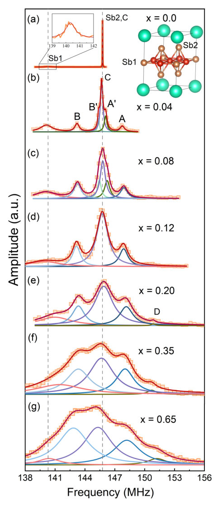 
FIG. 1. Room temperature 121Sb NQR spectra of powdered CsV3Sb5 sample as a function of Sn doping for the 5/2 ↔3/2 transition. In- set shows the RT hexagonal structure of the pristine system and an enlarged view of the broad Sb1 peak. The satellite resonance peak frequencies νQ of Sb2 remain unaffected with increasing doping con- centration and remain symmetric around the central C peak. Vertical dashed lines correspond to the Sb resonance frequencies for the pris- tine sample. The spectral profile is fitted with a multiple Lorentzian distribution, where the differently coloured fitted components repre- sent distinct Sb environments and the solid red curve represents their cumulative fit.

📷 Fig 2

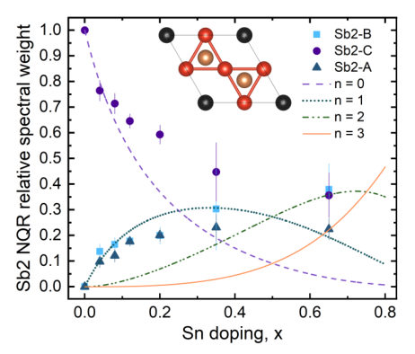 
FIG. 2. Relative spectral weight variation of different Sb2 NQR peaks as a function of Sn doping for RT measurements. Various col- ored lines represent the simple binomial distribution function for Sn at the in-plane Sb1 site. The inset shows the hexagonal structure in the ac-plane with Sn atoms at the Sb1 site, presented by black spheres (Sn-NN). n represents the number of Sn-NN in the vicinity of Sb2 atom, with n = 0 −3 corresponding to different local environ- ments around Sb2. Experimental data can only distinguish the Sb2 atom having at most one Sn atom among the neighbors.

📷 Fig 3

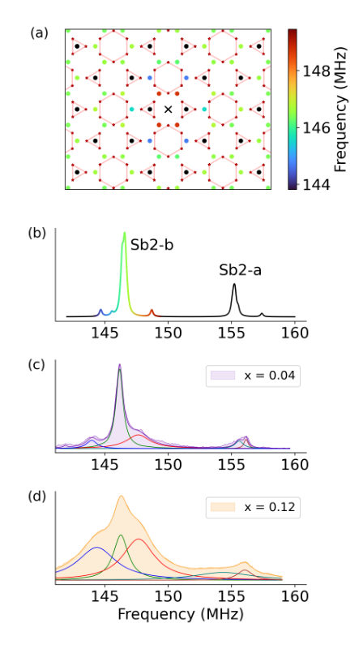 
FIG. 3. Low-temperature 121Sb NQR spectra and computational pre- dictions of the resonant frequencies for 5/2 ↔3/2 transition. DFT- estimated NQR frequencies of Sb2 nuclei mapped on the structural arrangement in panel (a). To better highlight the spatial distribution of the perturbation, only the Sb2-b (i.e., those in the 12o Wyckoff site) are considered, while the remaining Sb2-a sites are indicated as black points for clarity and displayed in an enlarged view. The V atoms are shown as dark red stars, and the Sn atom is shown by the black cross. The predicted spectra for all Sb2 atoms are shown in panel (b). Notice that all values have been shifted by 13.1 MHz to account for systematic...

📷 Fig 4

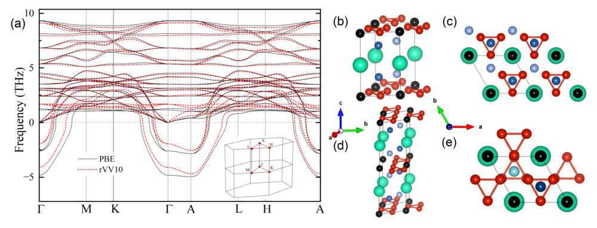 
FIG. 4. (a) Calculated phonon dispersion curves for 100% Sn substitution at the in-plane site of hexagonal CsV3Sb4Sn with PBE and rVV10 interactions. Phonon softening is observed at Γ and A high-symmetry points. The inset shows the Brillouin zone along the main symmetry directions. (b-c) show the newly identified Γ crystal structure due to the softening of the zone-centre phonon mode in the bc and ab plane, respectively, creating the V-triangles and two symmetry-inequivalent Sb2 sites (light and dark blue spheres). (d-e) display the A crystal structure, which has the same in-plane arrangement of V atoms, but staggered along the c-axis with a π-phase between the adjacent layers.

**Summary.** This work uses NQR spectroscopy and DFT calculations to map the structural consequences of Sn doping in the kagome metal $	ext{CsV}_3	ext{Sb}_5$. The findings reveal that Sn substitution causes measurable local lattice distortions, and theoretically predicts that the system favors competing, structurally distinct ground states at high doping levels.

**Why it may be interesting.** The interplay between structural distortions (local effects) and electronic instabilities (global phase transitions) in low-dimensional, strongly correlated materials is a key area of modern condensed matter physics, relevant to understanding charge density waves and superconductivity.

Detailed structure

**Main problem.** The study investigates how chemical substitution (Sn for Sb) modifies the competing lattice structures and electronic phase diagram in kagome metals like CsV3Sb5.

**Main result.** Sn substitution induces local structural distortions observable via NQR, and at full doping, theoretical analysis suggests the stabilization of two nearly degenerate V-trimerized structures characterized by specific phase shifts.

**Method.** The research combines experimental $^{121}$Sb Nuclear Quadrupole Resonance (NQR) measurements with first-principles Density Functional Theory (DFT) calculations to probe atomic-scale effects.

**Model / system.** The system is the kagome metal $	ext{CsV}_3	ext{Sb}_{5-x}	ext{Sn}_x$. The analysis focuses on how Sn impurities perturb the local electronic environment and drive structural instabilities in the V-based kagome lattice.

**Key observables.** NQR satellite peaks, local structural distortions, and the stabilization of V-trimerized phases with zero- or $\pi$-phase shifts.

**Important parameters / regimes.** Doping concentration ($x$), temperature (up to room temperature), and the specific site of substitution ($	ext{Sb}_1$ site).

**Assumptions / limitations.** The analysis often relies on modeling the doping effect using random site occupancy models (binomial distribution) and assumes that the observed NQR features correlate directly with local structural changes.

**Figures summary.** Figures illustrate the evolution of NQR spectra with Sn doping, showing the emergence of satellite peaks, and show phonon dispersion curves indicating lattice instabilities for the fully doped case.

**Paper structure.** The paper proceeds by first analyzing the experimental NQR data to show impurity-induced local distortions across a doping range, then using DFT and phonon calculations to predict the structural consequences, culminating in the identification of competing, nearly degenerate ground states at high doping.

Abstract

Understanding the effect of chemical substitution on competing phases of kagome metals is crucial for disentangling the interplay between local structural distortions and electronic instabilities. In \cvs, Sn substitution strongly modifies the electronic phase diagram, yet the microscopic mechanism driving this remains unclear. Here, we combine $^{121}$Sb nuclear quadrupole resonance (NQR) measurements and density functional theory calculations to investigate the atomic-scale effects of Sn substitution in CsV$_3$Sb$_{5-x}$Sn$_x$. At low Sn concentrations, the observed satellite NQR peaks exhibit signatures of local structural distortion induced by Sn substitution, qualitatively consistent with our computational analysis. These impurity-induced features persist across the entire experimentally investigated doping range, up to $x$ = 0.65, and remain observable up to room temperature. For $x=1$, the fully doped idealized case, the estimated dynamical instabilities of the kagome lattice suggest the stabilization of two nearly energy-degenerate equilibrium structures characterized by V-trimers, distinguished by a zero- or $π$-phase shift between adjacent layers along the $c$-axis. Together, these results show that Sn substitution drives a complex interplay between local impurity-induced distortions and competing structural instabilities in vanadium-based kagome compounds.

[↑ back to top](#top)

### [Discrete-time quantum walks with energy-dependent coins](http://arxiv.org/abs/2609.03272v1)

**Authors:** Alana Spak dos Santos, Thiago T. Tsutsui, Fabiano M. Andrade  
**Type:** theory · **Category:** other · **PDF:** <https://arxiv.org/pdf/2609.03272v1>  
**Analysis basis:** full PDF text, analyzed in chunks
**Topic relevance:** `analog quantum simulation` **2/5** · `Frenkel-Kontorova` **1/5**

📷 Fig 1

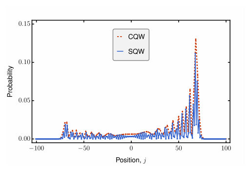 
FIG. 1. The blue curve is obtained from Eq. (11) and shows the probabilities for the SQW with n = 100 steps, |ψ(0)⟩= |+, 0⟩and r = t = 1/ √

📷 Fig 2

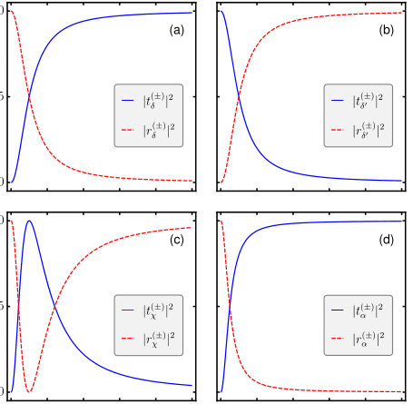 
FIG. 2. Reflection (dashed red line) and transmission (solid blue line) probabilities for γ = 1 as a function of the wavenumber k for the point interactions: (a) δ, (b) δ′, (c) χ, and (d) α.

📷 Fig 3

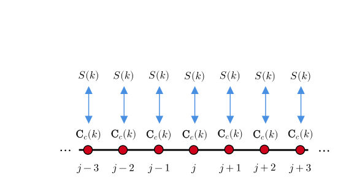 
FIG. 3. Schematic representation of the point interactions in a linear quantum graph, and the associated S -matrix and energy-dependent coin operators.

📷 Fig 4

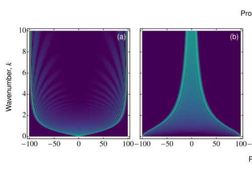 
FIG. 4. Density plot of the probability distribution for k ∈[0, 10], γ = 1 and initial state |ψ(0)⟩= 1/ √

📷 Fig 5

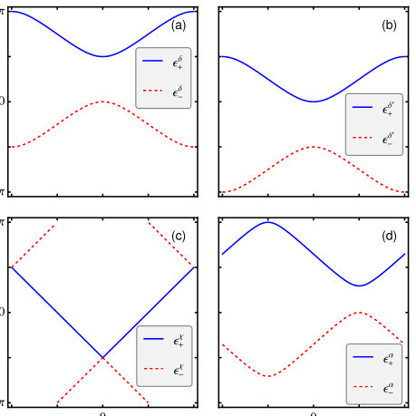 
FIG. 5. Quasienergy eigenvalues for the point interactions with k = γ = 1: (a) δ, (b) δ′, (c) χ, and (d) α.

**Summary.** This paper develops a theoretical model for discrete-time quantum walks by mapping them onto a lattice of energy-dependent point interactions. By relating the coin operator to the scattering matrix, the authors show that the walk's spectral properties and entanglement dynamics are controlled by the transmission coefficient. This framework is valuable for understanding wave propagation in structured media.

**Why it may be interesting.** It provides a powerful, physically transparent link between wave scattering theory (Kronig-Penney type potentials) and the dynamics of quantum walks, offering tunable control over spectral gaps and entanglement via the energy parameter.

Detailed structure

**Main problem.** The work extends the scattering quantum walk (SQW) framework to model discrete-time quantum walks (DTQWs) on a lattice featuring energy-dependent point interactions.

**Main result.** The transmission modulus controls the quasienergy gap, bandwidth, and long-time coin-position entanglement, while different point interaction types yield distinct spreading and entanglement behaviors.

**Method.** The analysis compares the Coined Quantum Walk (CQW) and Scattering Quantum Walk (SQW) formalisms, utilizing the scattering matrix derived from zero-range potentials to define an energy-dependent coin operator.

**Model / system.** The model is a DTQW analog of a periodic array of point interactions, mathematically realized by relating the coin operator to the scattering matrix of zero-range potentials, allowing the walker's wavenumber to act as a continuous control parameter.

**Key observables.** Quasienergy spectrum, spatial probability distribution, and coin-position entanglement.

**Important parameters / regimes.** The walker's wavenumber (energy $k$), the transmission modulus $|t(k)|$, and the specific type of point interaction ($\delta, \delta', 	ext{crossed, asymmetric}$).

**Assumptions / limitations.** The dynamics are analyzed by assuming the scattering matrix $S(k)$ and coin operator $C_c(k)$ are uniform across all vertices at a fixed energy $k$.

**Figures summary.** Figures compare probability curves for SQW and CQW, show reflection/transmission probabilities vs. $k$ for four interaction types, and illustrate the time evolution of entanglement for these cases.

**Paper structure.** The paper establishes the equivalence between CQW and SQW, derives the energy-dependent coin operator from scattering theory, analyzes the spectral properties using the transmission modulus, and finally characterizes the long-time entanglement behavior for various point interactions.

Abstract

In this work, we extend the scattering quantum walk (SQW) framework to a lattice of energy-dependent point interactions. This yields, within the coined quantum walk (CQW) formalism, a coin operator that is directly related to the scattering matrix of zero-range potentials. The model thus provides a discrete-time quantum-walk (DTQW) analog of a periodic array of point interactions of the Kronig-Penney type, where the walker's wavenumber serves as a continuous, physically transparent control parameter for the coin operation. We analyze the spectra and the dynamics of position probability and entanglement, yielding distinct results for specific energies and point interactions. We relate the spectral structure to the spatial probability distribution and explicitly characterize the long-time entanglement behavior for each point interaction. The transmission modulus determines the quasienergy gap, bandwidth, and maximum group velocity, while also controlling the long-time coin-position entanglement for the initial state considered. The four families of one-dimensional point interactions ($δ$, $δ'$, crossed and asymmetric) realize qualitatively distinct transmission profiles and span the full range of behavior, including enhanced or strongly suppressed spreading and oscillatory entanglement.

[↑ back to top](#top)

### [Gravitationally Induced Entanglement Across an Event Horizon](http://arxiv.org/abs/2609.04104v1)

**Authors:** Hatim Salih  
**Type:** theory · **Category:** quantum information and computing · **PDF:** <https://arxiv.org/pdf/2609.04104v1>  
**Analysis basis:** full PDF text, analyzed in chunks
**Topic relevance:** `quantum measurements` **2/5** · `correlated / nonlocal dissipation` **1/5**

📷 Fig 1

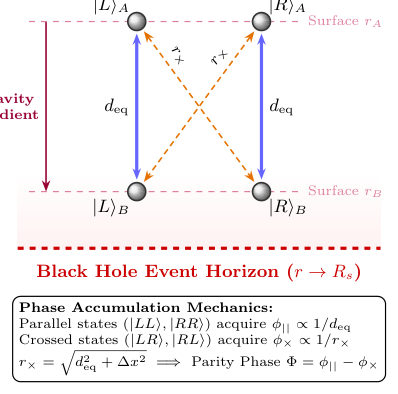 
FIG. 2. Geometry of the Gravitational Parity-Phase gate. Preparing the spatial superpositions tangentially generates genuine bipartite entanglement while mitigating differential redshift and causal severing.

📷 Fig 2

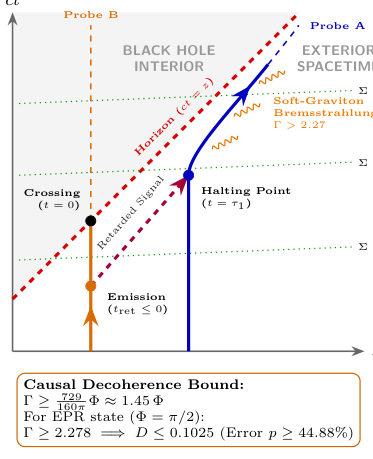 
FIG. 1. Spacetime diagram. Retarded signals (purple) prop- agate from Probe B’s pre-crossing history. To escape engulf- ment, Probe A undergoes rapid, non-inertial radial decelera- tion, triggering soft-graviton emission (orange) that exponen- tially degrades entanglement.

📷 Fig 3

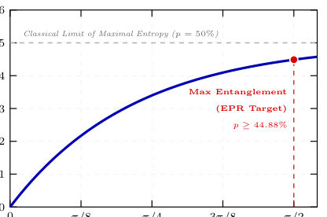 
FIG. 3. Extraction error rate p vs. accumulated phase. Un- der optimal extraction bounds, pulling a state radially en- forces p ≥44.88% for maximally entangled targets, destroy- ing quantum utility.

📷 Fig 4

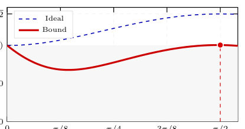 
FIG. 4. CHSH expectation value. Bounded radial extraction severely suppresses correlations near classicality.

**Summary.** This work demonstrates that entanglement can be generated across a black hole event horizon using gravitational interactions. However, it finds that attempting to extract this entanglement radially causes severe decoherence via soft-graviton emission. A key finding is the geometric duality showing that tangential harvesting protocols can bypass this decoherence, allowing entanglement to be effectively teleported to the exterior.

**Why it may be interesting.** It provides a novel, extreme gravitational setting to test fundamental principles of quantum information preservation, linking quantum entanglement dynamics directly to general relativity and Hawking radiation analogues.

Detailed structure

**Main problem.** The paper challenges the assumption that entanglement cannot be dynamically created across a black hole event horizon, and compares the feasibility of radial versus tangential entanglement extraction.

**Main result.** Dynamical entanglement can be created across the horizon, but radial extraction is severely limited by soft-graviton bremsstrahlung, whereas tangential harvesting via optical probes allows for state teleportation to infinity.

**Method.** The analysis uses a gravitational retarded-potential model and quantum information protocols, including Bell-state measurements and decoherence analysis based on the Horodecki criterion.

**Model / system.** The system involves two macroscopic optical probes (A and B) falling across a Schwarzschild black hole event horizon, modeled using retarded Liénard-Wiechert potentials and quantum state manipulation techniques.

**Key observables.** Entangling Phase ($\Phi$), Decoherence Bound ($\Gamma$), Extraction Error Rate ($p$), and CHSH expectation value.

**Important parameters / regimes.** The decoherence bound $\Gamma \ge rac{729}{160\pi} \Phi$, and the minimum variational constant $C^* = 27/16$.

**Assumptions / limitations.** The model relies on a leading-order quadrupole approximation and assumes the use of macroscopic optical probes to manage recoil and bypass acoustic shattering.

**Figures summary.** Figures illustrate the spacetime diagram of retarded signals and soft-graviton emission during radial escape, and show the extraction error rate and suppressed CHSH correlations for radial versus tangential protocols.

**Paper structure.** The paper first establishes the theoretical possibility of entanglement generation across the horizon using a gravitational potential model. It then contrasts the highly decohering process of radial extraction with the successful, symmetry-preserving protocol of tangential entanglement harvesting.

Abstract

It has long been assumed that a particle---having crossed a black hole event horizon unentangled with another particle in the exterior universe---can no longer dynamically entangle with that particle. Here, we demonstrate within a gravitational retarded-potential model that entanglement can in fact be created from scratch between freely falling spatial superpositions across an event horizon. Yet, extracting this state radially requires non-inertial deceleration, triggering soft-graviton bremsstrahlung, and establishing a strict dephasing bound in terms of entangling phase, $Γ\ge\frac{729}{160π}Φ$. This decoheres the entangled state. By contrast, equivalent macroscopic optical masses allow local tangential harvesting of entanglement via quantum erasure, thus revealing a remarkable geometric duality: Spacetime irreversibly degrades entanglement the moment the localized mass is dragged away from the horizon, while allowing the transverse teleportation of its entangled state to infinity.

[↑ back to top](#top)

### [Non-Kolmogorov-Arnold-Moser Quantum Sensors for Quantum Parameter Estimation](http://arxiv.org/abs/2609.03092v1)

**Authors:** Naga Dileep Varikuti, Sourav Manna, Athreya Shankar, Arul Lakshminarayan, Vaibhav Madhok  
**Type:** theory · **Category:** statistical mechanics · **PDF:** <https://arxiv.org/pdf/2609.03092v1>  
**Analysis basis:** full PDF text, analyzed in chunks
**Topic relevance:** `analog quantum simulation` **2/5** · `quantum measurements` **1/5**

📷 Fig 1

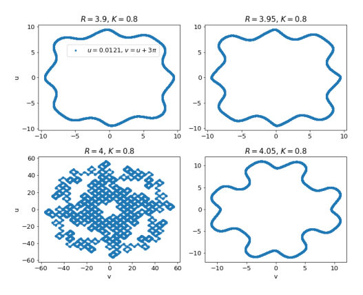 
FIG. 1. Classical phase-space trajectories for a fixed initial condi- tion at four different values of R in the vicinity of R = 4. The initial condition is u = 0.0121 and v = u + 3π. The kicking strength is fixed at K = 0.8 in all panels. Panels (a), (b), and (d) correspond to the non-resonant regime, where the trajectory associated with the chosen initial condition undergoes only a slight distortion. In contrast, panel (c) corresponds to the resonant case, R = 4, where the trajectory ex- plores an extended region of phase space and forms a thick stochastic web.

📷 Fig 2

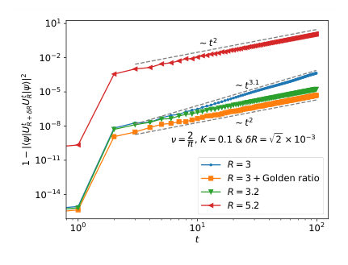 
FIG. 2. Evolution of the Loschmidt echo for the quantum KHO sys- tem near the resonance point. The system is initialized in the vacuum quantum state |0⟩. R = 3 is the resonance point, and the remaining three cases correspond to dynamical localization. The dashed style lines are plotted to demonstrate the time scalings of the LE.

📷 Fig 3

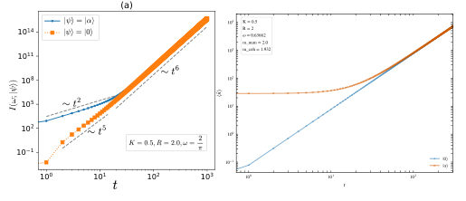 
FIG. 4. Time evolution of the QFI under translational invariance. (a) QFI at the resonance R = 2 for the vacuum state |0⟩and a co- herent state located in phase space at (x, p) = (0.0121 + 3π, 0.0121). Here K = 0.5 and ω = 2/π, with τ = π2/2 so that ωτ = 2π/R at R = 2. The dashed lines illustrate the respective time scalings of the QFI of the two states. (b) The corresponding growth of the mean excitation number ⟨ˆn⟩for the same states, confirming the quadratic energy growth underlying the hexic QFI scaling.

📷 Fig 4

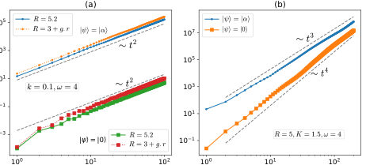 
FIG. 3. Evolution of the QFI for the vacuum quantum state |0⟩and a coherent state located in phase space at (x, p) = (−0.5903, −8.1437). (a) The QFI is plotted against time at non-resonance points: R = 5.2 and R = 3+g.r, where g.r stands for the golden ratio. The growth follows the quadratic law for both states. The dashed lines are plotted to demonstrate the same. (b) The QFI vs time at resonance R = 5. The same initial states are used as in (a). To ensure delocalization, we take K = 1.5. We obtain quartic scaling for the vacuum state. The coherent state displays cubic scaling.

📷 Fig 5

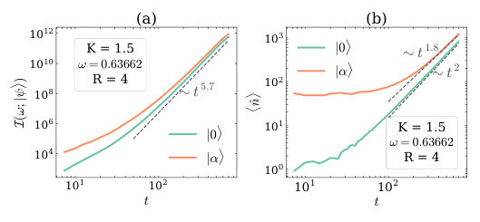 
FIG. 6. Time evolution of the QFI at the resonance R = 4. (a) QFI for the vacuum state |0⟩and a coherent state located in phase space at (x, p) = (−0.5903, −8.1437). Here K = 1.5 and ω = 2/π, with τ = π2/4 so that ωτ = 2π/R at R = 4. (b) The corresponding growth of the mean energy ⟨ˆn⟩for the same states. The dashed lines illustrate the respective time scalings of the QFI and mean energy.

**Summary.** This work explores using non-KAM quantum systems, modeled by the Kicked Harmonic Oscillator, for enhanced quantum sensing. By calculating the Quantum Fisher Information (QFI), the authors demonstrate that resonance conditions lead to a unique, highly enhanced polynomial growth in QFI. This identifies resonance-induced symmetry as a powerful, distinct metrological resource.

**Why it may be interesting.** It provides a concrete, physically realizable mechanism (resonance-induced symmetry) for achieving super-classical scaling in quantum metrology, offering a resource distinct from traditional chaos-based enhancements.

Detailed structure

**Main problem.** The paper investigates utilizing non-Kolmogorov-Arnold-Moser (non-KAM) systems as quantum sensors to enhance quantum parameter estimation.

**Main result.** The Quantum Fisher Information (QFI) is remarkably enhanced at resonance conditions, exhibiting anomalous hexic growth ($I(t) \sim t^6$) which is distinct from standard chaos-assisted sensing.

**Method.** The study combines numerical analysis with analytical derivations to compute the QFI, relating its growth rate to the algebraic growth of the mean excitation number ($\langle\hat{n}(t)
angle \sim t^\alpha$).

**Model / system.** The primary model is the Kicked Harmonic Oscillator (KHO), a paradigmatic non-KAM system, whose dynamics are governed by a time-periodic Hamiltonian involving harmonic oscillator terms and periodic kicks.

**Key observables.** Quantum Fisher Information (QFI), Loschmidt Echo (LE), and the mean excitation number $\langle\hat{n}(t)
angle$.

**Important parameters / regimes.** The commensurability parameter $R = 2\pi/\omega	au$, which dictates whether the system is resonant or non-resonant.

**Assumptions / limitations.** The analysis relies on the assumption that the enhancement stems from resonance-induced translational symmetry rather than exponential instability, and the QFI is bounded by $I(t) \lesssim t^{2\alpha+2}$.

**Figures summary.** The notes mention comparing LE behavior for different resonance conditions, showing enhanced growth at resonance points.

**Paper structure.** The paper introduces QFI, details the KHO model, presents main results comparing growth rates ($\alpha=0, 1, 2$), elucidates the role of translation invariance, and compares the findings with classical Fisher Information.

Abstract

Non-KAM (Kolmogorov-Arnold-Moser) systems, when subjected to weak time-dependent perturbations, exhibit an abrupt transition to classical chaos through the breakdown of invariant phase-space tori. We showcase the utilization of non-KAM systems in the quantum regime as quantum sensors, leveraging their sensitivity at \textit{resonances}. Quantum Fisher information (QFI) is a central quantity in quantum parameter estimation theory that measures how much information a quantum state contains about an unknown parameter that is encoded into it. In other words, it quantifies the sensitivity of a quantum state to small changes in that parameter. In this work, through numerical analysis in conjunction with analytical results, we study the performance of the non-KAM systems for quantum sensing applications by computing the QFI. We find that the growth of the QFI is remarkably enhanced when the resonance condition is satisfied. For frequency estimation under Floquet unitary encodings, we derive a transport bound: if the mean excitation number grows as $\langle\hat n(t)\rangle\sim t^α$, the QFI obeys $I(t)\lesssim t^{2α+2}$. The quantum kicked harmonic oscillator, a paradigmatic non-KAM system, realizes the full hierarchy: localized dynamics ($α=0$) yield quadratic growth, delocalized diffusion along stochastic webs ($α=1$) yields quartic growth, and translationally invariant resonances ($α=2$) saturate the bound with anomalous hexic growth, $I(t)\sim t^{6}$, established analytically at resonance $R=2$ and numerically at $R=4$. The enhancement stems from resonance-induced translational symmetry rather than exponential instability, identifying non-KAM resonances as a metrological resource distinct from chaos-assisted and criticality-based sensing.

[↑ back to top](#top)

### [Orbital current rectifier and linear magnon Edelstein effect in $p$-wave antialtermagnets](http://arxiv.org/abs/2609.03075v1)

**Authors:** Kristian Mæland, Björn Trauzettel  
**Type:** theory · **Category:** statistical mechanics · **PDF:** <https://arxiv.org/pdf/2609.03075v1>  
**Analysis basis:** full PDF text, analyzed in chunks
**Topic relevance:** `analog quantum simulation` **2/5** · `Keldysh / 2PI / non-Gaussian methods` **1/5**

📷 Fig 1

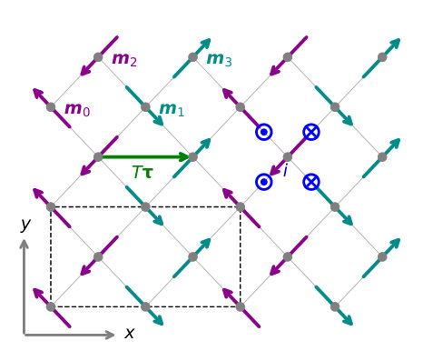 
FIG. 1. Schematic of the magnetic ground state on the rotated square lattice with spins represented by arrows. The magenta and cyan color on arrows emphasizes the Tτ symmetry illustrated by the green ar- row. The dashed rectangle is the magnetic unit cell. The blue vectors denote the out-of-plane DMI vectors Di,j from a site i to its nearest neighbors j.

📷 Fig 2

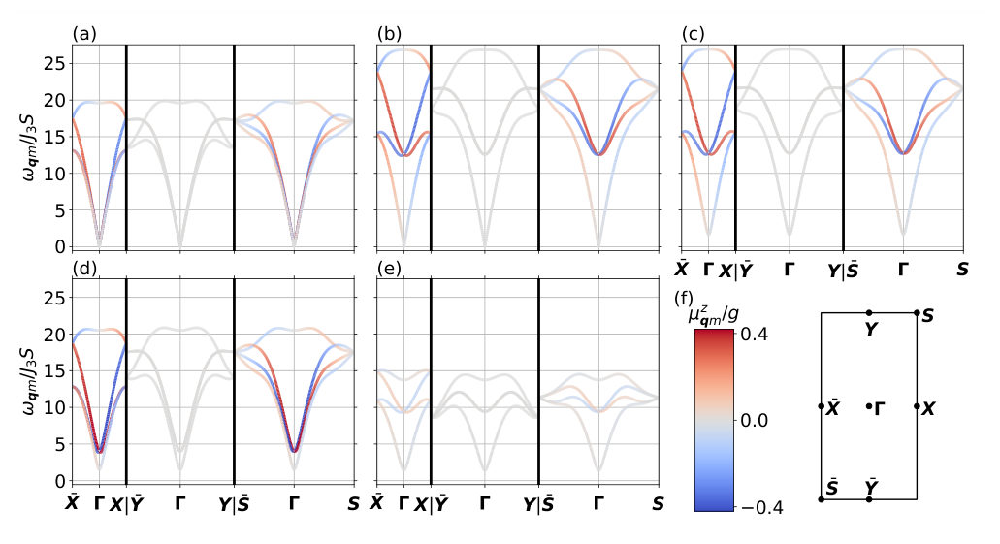 
FIG. 2. (a)-(e) Magnon spectrum ωqm along high-symmetry directions in the first Brillouin zone (1BZ) demonstrating a px-wave momentum dependence of the z component of the magnon magnetic moment µqm in all four modes. (f) Colorbar for µz qm and an illustration of the 1BZ with high-symmetry points Γ = (0, 0), X = (π/2 √

📷 Fig 3

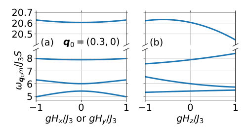 
FIG. 3. Magnon bands at q0 = (0.3, 0) as a function of magnetic field in (a) x or y direction and (b) z direction. We consider param- eter set d in Table I and update the GS depending on the magnetic field.

📷 Fig 4

 
Figure 2(b) adds Kz = 0.2J3 and D = 0.5J3 to stabilize the state, in which case J1 ̸= 0 is also allowed. A single Gold- stone mode remains, due to the continuous rotation symmetry around the z axis. The easy-plane anisotropy breaks the pre- vious rotation symmetries around the x and y axes. Then, in Fig. 2(c), we add easy-axis anisotropy and get a gapped magnon spectrum. No continuous symmetries remain. In Fig. 2(d), we remove DMI. By comparing Figs. 2(c) and 2(d), we see the role of DMI is to increase the energy of the three magnon modes with highest energy, especially close to Γ. While we do not show it in the figure, the main role played by B2 and B3 is to increase the magnon energy at Y...

📷 Fig 5

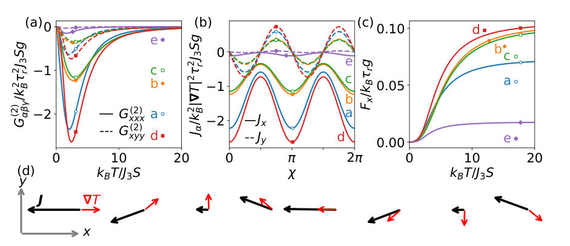 
FIG. 4. (a) The nonzero orbital current transport coefficients G(2) xxx (solid lines) and G(2) xyy = G(2) yxy = G(2) yyx (dashed lines). (b) x (solid lines) and y (dashed lines) components of the orbital current J as a function of the direction of the temperature gradient at kBT/J3S = 2.6. (c) The nonzero linear magnon Edelstein effect coefficient Fx. In panels (a)-(c) we show results for the five parameter sets a-e in Table I, as indicated. (d) Schematic of the current J (black arrows, length showing variation in magnitude) depending on the direction of the applied temperature gradient ∇T (red, thinner arrows).

**Summary.** This work theoretically analyzes how $p$-wave antialtermagnets can generate magnetization and nonreciprocal orbital currents using magnons. The key finding is that the orbital magnetic moments of these magnons mediate a linear thermal Edelstein effect. This connects the fields of magnonics and orbitronics by showing how thermal gradients can induce orbital currents.

**Why it may be interesting.** The connection between magnon orbital moments, thermal gradients, and resulting currents provides a novel mechanism for controlling quantum states using thermal energy, which is relevant for understanding energy transport in quantum materials.

Detailed structure

**Main problem.** The paper investigates the generation of magnetization and nonreciprocal orbital currents in $p$-wave antialtermagnets via magnon excitations.

**Main result.** These magnets efficiently generate magnetization via a linear thermal Edelstein effect from orbital magnetic moments, and they exhibit perfectly nonreciprocal orbital currents through even-order nonlinear responses.

**Method.** The analysis relies on symmetry arguments, linear spin wave theory, and the application of the Boltzmann equation to the magnon distribution function.

**Model / system.** The system is modeled using a generalized Heisenberg spin Hamiltonian incorporating various exchange, anisotropy, and Dzyaloshinskii-Moriya interactions, applied to a coplanar ground state inspired by CeNiAsO.

**Key observables.** Magnon spin ($\mathbf{s}_{qm}$), orbital magnetic moment ($\mu_{qm}$), thermal magnon Edelstein effect, and nonreciprocal orbital currents.

**Important parameters / regimes.** The analysis considers the presence or absence of spin-orbit coupling and the specific nature of the $p$-wave magnetic ordering.

**Assumptions / limitations.** The analysis assumes the existence of a coplanar ground state and utilizes approximations like the relaxation time in the Boltzmann equation.

**Figures summary.** Figure 1 schematically shows the magnetic ground state on a rotated square lattice. Figure 2 displays the magnon spectrum ($\omega_{qm}$) along high-symmetry directions, highlighting $p_x$-wave momentum dependence.

**Paper structure.** The paper establishes the theoretical framework using a complex spin Hamiltonian, analyzes the magnon spectrum and properties using linear spin wave theory, and then derives transport coefficients by solving the Boltzmann equation to determine the temperature and gradient responses.

Abstract

We show that $p$-wave magnets efficiently generate magnetization via a linear thermal Edelstein effect arising from the orbital magnetic moments of their magnons. Furthermore, they can generate perfectly nonreciprocal orbital currents through a purely even-order nonlinear response. This makes them promising candidates for orbital-current rectification. Because these transport phenomena originate from the orbital magnetic moment of magnons, they connect magnonics and orbitronics. More generally, we find that odd-parity-wave magnets with coplanar ground states host magnons with zero spin magnetic moment. Instead the magnons carry a collinear, out-of-plane orbital magnetic moment, realizing an orbital version of antialtermagnetism. We establish these general results using symmetry arguments and demonstrate them explicitly for a coplanar ground state with the minimal number of sublattices, inspired by the ground state of CeNiAsO. Our conclusions hold both in absence and presence of spin-orbit coupling.

[↑ back to top](#top)

### [Design Principles for Reproducible Networks](http://arxiv.org/abs/2609.03852v1)

**Authors:** Jasper van der Kolk, Cory Glover, Albert-Lásló Barabási  
**Type:** theory · **Category:** disordered systems and neural networks · **PDF:** <https://arxiv.org/pdf/2609.03852v1>  
**Analysis basis:** full PDF text, analyzed in chunks
**Topic relevance:** `analog quantum simulation` **2/5**

📷 Fig 1

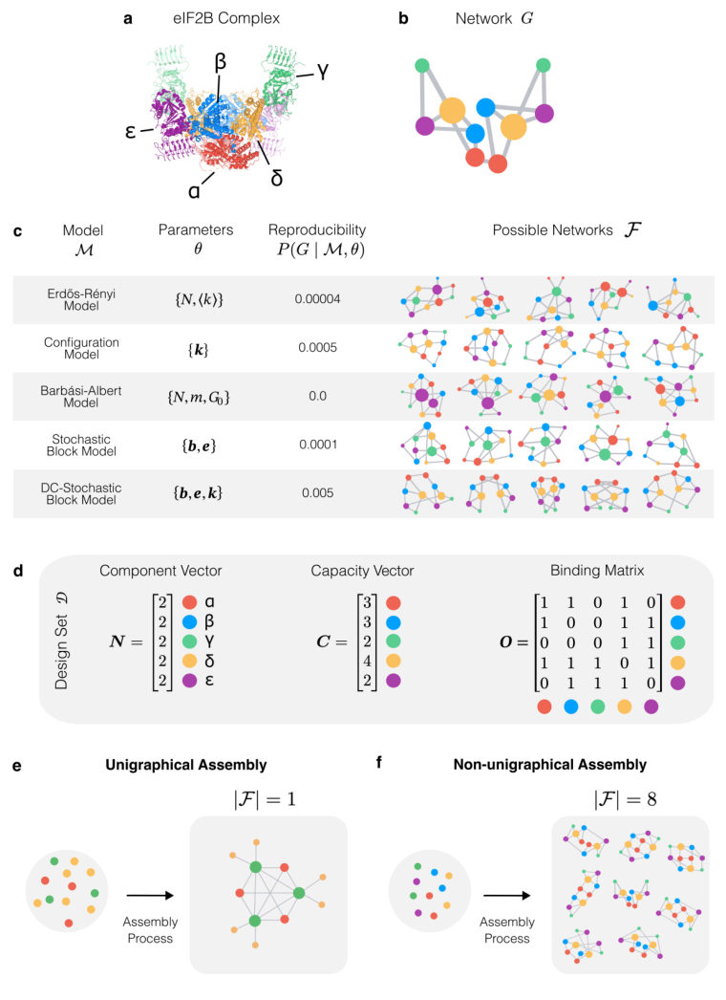 
Figure 1. The Network Design Framework. a,b The protein complex eIF2B, consisting of 10 proteins as shown in a, is formally described by the network shown in b, where each node is colored by its associated protein type. c Using the established network science models, adapted to the constraints of the network in b, we find that the probability of producing the correct structure is rather small. For example, fixing N = 10 and ⟨k⟩= 2.8, the Erd˝os–Rényi model recovers the network behind the protein complex with probability 0.00004. Other canonical network models shown in the table are also unable to reliably reconstruct the network. d The Design Set and its three building blocks: the component...

📷 Fig 2

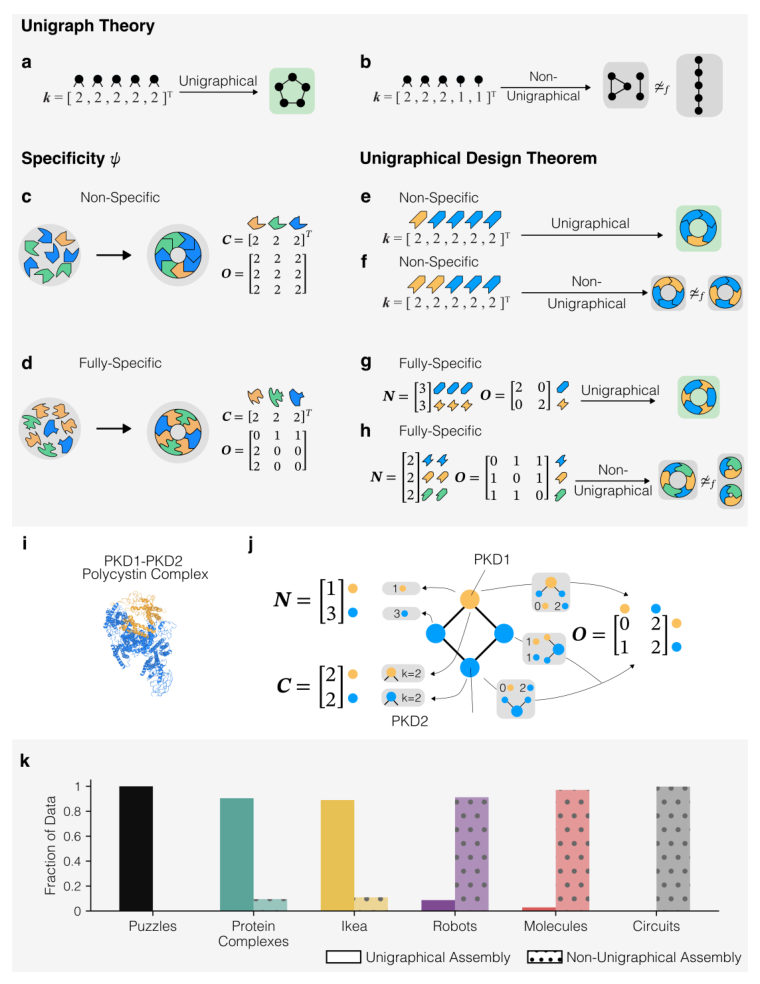 
Figure 2. Network Design via Unigraphical Assembly and the Unigraphical Design Theorem. a,b Unigraph theory [26] allows us to determine if a degree sequence is compatible with a unique graph. c,d The specificity of a design set D tells us how restrictive the interactions are. If all nodes can connect to all others, D is non-specific, as shown in c. If each node can only connect to a predefined set of neighbors, D is fully specific, as illustrated in d. e,f In network design, we distinguish different node types, shown in color in the figure. The distribution of the colors over the network can lead to different outcomes, even if the underlying network stays fixed. We show examples of...

📷 Fig 3

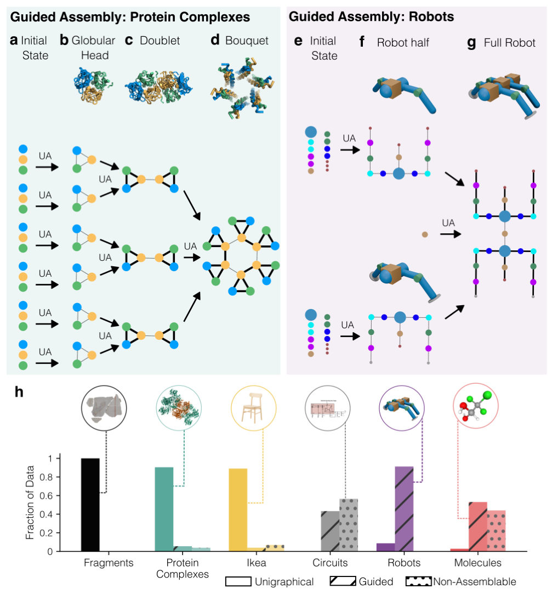 
Figure 3. Network Design via Guided Assembly. a–d There is experimental evidence [40] that the protein complex C1q is constructed in three distinct steps: First, the globular head (b) is unigraphically assembled (UA) from the three proteins shown in a. Next, two globular heads are combined to form a doublet (c). Finally, three doublets are connected to form the final structure (d). e–f We use the Guided Assembly Propositions to understand how to build a robot with a fixed outcome, given that according to the UDT, its design set is compatible with two possible outcomes. We first construct the two halves of the robot through unigraphical assembly (e–f). Next we connect the two halves to form...

📷 Fig 4

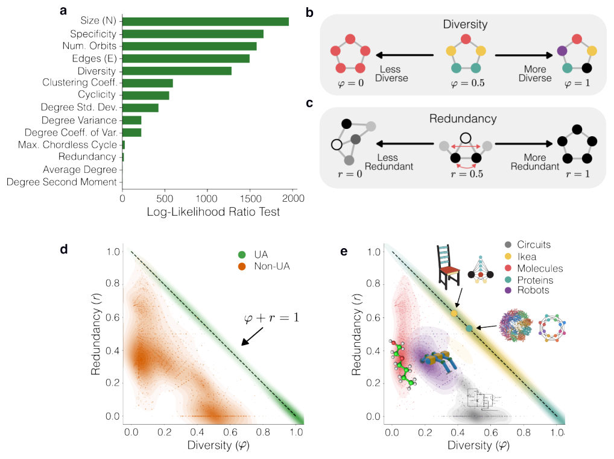 
Figure 4. The Diversity-Redundancy Boundary a Logistic regression predicts the impact of 15 network characteristics on unigraphical assembly. b Diversity measures the number of distinct node types in the network, denoted by color: φ = 0 if all nodes are the same type and φ = 1 if all nodes are different colors. We also show an intermediate level of diversity φ = 0.5, where some node types are repeated. c Redundancy measures how structurally interchangeable nodes are, where two nodes are interchangeable if they play the same topological role in the network. Interchangeable nodes are denoted by shading. For r = 0 no nodes are interchangeable, for r = 0.5 two pairs of nodes can be interchanged...

📷 Fig 5

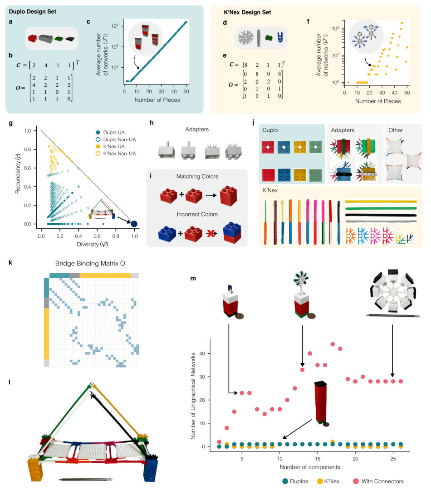 
Figure 5. Designing Unigraphical Networks a–f For Duplo and K’Nex, two well-known construction sets, we extract the associated design set shown in b and e. c,f With an increasing number of pieces, both construction sets can build an ex- ponentially growing number of possible structures. g The diversity-redundancy plot indicates that both Duplo and K’Nex constructions fall well below the diversity-redundancy boundary, explaining why they are unable to undergo unigraphical assembly. h–l By combining both toy sets using adapters h, we can create networks with higher diversity j. By also enforcing that connecting nodes are of the same color as illustrated in i, we can create 35 pieces shown in...

**Summary.** This paper introduces a mathematical framework called 'network design' to address the problem of ensuring that complex systems assemble into a single, unique structure. By encoding local building block constraints into a 'design set,' the authors derive the Unigraphical Design Theorem to test for this guaranteed reproducibility. This reframes system assembly as a mathematically testable property, opening a path for the rational engineering of complex structures.

**Why it may be interesting.** While focused on classical network theory, the concept of encoding local, deterministic constraints to guarantee a unique global structure is highly relevant to understanding the emergent order in quantum many-body systems or the constraints governing quantum circuit design.

Detailed structure

**Main problem.** Network science lacks mechanisms to consistently reproduce exact network topologies, focusing instead on generating statistical ensembles.

**Main result.** The authors introduce the Unigraphical Design Theorem (UDT) to mathematically determine when a system's local constraints guarantee a unique, reproducible network assembly.

**Method.** They developed a 'network design' framework encoding local constraints into a design set, extending unigraph theory to incorporate node types and pairwise binding rules.

**Model / system.** The framework is applied to diverse systems, including protein complexes, molecular assemblies, electronic circuits, and robotic components, treating them as networks built from constrained building blocks.

**Key observables.** Unigraphicality (whether the final topology is unique, |F|=1), Specificity ($\psi$), Diversity ($\phi$), and Redundancy ($r$).

**Important parameters / regimes.** The design set components: Component Vector (N), Capacity Vector (C), and Binding Matrix (O).

**Assumptions / limitations.** The initial definition of the set F deliberately disregards system-specific dynamics (like binding energies) to provide a general mathematical test.

**Figures summary.** Figures illustrate the framework using protein complexes (eIF2B) to show the difference between statistical ensemble generation and unique, constraint-driven assembly, and show the application to various physical systems.

**Paper structure.** The paper establishes the gap between statistical network modeling and exact reproducibility, introduces the design set and the UDT, details the concepts of unigraphical and guided assembly, applies this to thousands of real-world systems, and concludes with implications for rational engineering.

Abstract

From protein complexes to electronic circuits, many natural and engineered systems function only if assembled in an exact, reproducible fashion. The structure of each of these systems can be understood as a network, yet network science lacks the mechanisms to consistently reproduce exact topologies, focusing instead on generating network ensembles. We introduce the framework of network design where we encode the local constraints obeyed by a system's building blocks in a design set, and derive the Unigraphical Design Theorem, which determines when these constraints guarantee reproducible assembly into a unique structure, a process we call unigraphical assembly. For systems whose design sets do not specify a unique outcome, we identify guided assembly as a second route to reproducibility, in which temporal ordering decomposes construction into unigraphical steps. Applying these results to 3,618 reproducible systems, including protein complexes, molecules, and robots, we classify those that undergo unigraphical assembly and those that require guided assembly. We further identify a diversity-redundancy boundary that explains how systems trade component variety for structurally interchangeable parts while retaining unique assembly. Finally, we experimentally test the theory using 3D-printed components to re-engineer generative construction sets into systems that assemble unigraphically into prescribed topologies. Network design thus reframes reproducibility as a mathematically testable property of real networks, opening a route to the rational engineering of complex systems.

[↑ back to top](#top)

### [Enhancing noise robustness in device-independent conference key agreement with asymmetric parity-CHSH inequalities](http://arxiv.org/abs/2609.03551v1)

**Authors:** Makoto Ishihara, Wojciech Roga, Jonatan Bohr Brask, Masahiro Takeoka  
**Type:** theory · **Category:** quantum information and computing · **PDF:** <https://arxiv.org/pdf/2609.03551v1>  
**Analysis basis:** full PDF text, analyzed in chunks
**Topic relevance:** `quantum measurements` **2/5**

📷 Fig 1

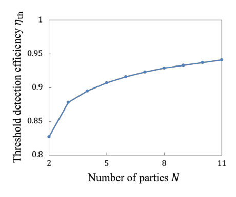 
FIG. 1. Threshold detection efficiency ηth against the num- ber of parties N. We optimize the parameter of the dis- tributed GHZ state r, the measurement angles ϕ, and the probability of noisy preprocessing q to maximize key rates. We use α = 1.

**Summary.** This paper introduces a novel multipartite Bell inequality, the asymmetric parity-CHSH inequality, to improve the security of device-independent conference key agreement. By deriving a tight analytical lower bound on the conditional von Neumann entropy, the authors demonstrate that this inequality, combined with noisy preprocessing, significantly enhances the protocol's resilience to experimental noise and detection inefficiencies. This advances the practical feasibility of multi-party quantum cryptography.

**Why it may be interesting.** This work provides concrete, mathematically rigorous tools (entropy bounds derived from generalized Bell inequalities) to quantify and improve the security of quantum key distribution protocols, which is central to quantum information theory.

Detailed structure

**Main problem.** The primary goal is to enhance the noise robustness of device-independent conference key agreement (DI-CKA) protocols.

**Main result.** The combination of a new asymmetric parity-CHSH inequality and noisy preprocessing significantly improves the key rate's robustness against detection inefficiencies and various types of noise.

**Method.** The authors derive a tight analytical lower bound on the conditional von Neumann entropy, which quantifies the achievable key rate, based on the violation of the generalized Bell inequality.

**Model / system.** The protocol relies on an N-partite partially entangled Greenberger-Horne-Zeilinger (GHZ) state shared among multiple remote parties.

**Key observables.** Conditional von Neumann entropy $H(A|E, x^*)$, the asymmetric parity-CHSH value ($S_{P	ext{-CHSH}}^\alpha$), and the resulting key rate $K$.

**Important parameters / regimes.** Detection efficiency ($\eta$), global depolarizing noise ($p_G$), local depolarizing noise ($p_L$), and the asymmetry parameter ($\alpha$).

**Assumptions / limitations.** The analysis assumes the parties perform specific measurements and models the imperfections using depolarizing noise channels.

**Figures summary.** The figures and tables summarize the threshold values ($\eta_{th}, p_G^{th}, p_L^{th}$) required for a positive key rate, demonstrating how optimizing parameters improves robustness across different numbers of parties (N).

**Paper structure.** The paper introduces the asymmetric parity-CHSH inequality, details the DI-CKA protocol, derives the entropy bound, proves its tightness, and finally analyzes the robustness against various experimental imperfections.

Abstract

Conference key agreement allows multiple remote parties to establish a shared secret key with information-theoretical security. In device-independent conference key agreement, security can be guaranteed with minimal assumptions on the devices used, provided that a violation of a Bell inequality is observed. However, implementations are extremely challenging because high detection efficiency is required to observe loophole-free Bell violations. Here, we enhance the robustness of device-independent conference key agreement by introducing a new family of multipartite Bell inequalities called the asymmetric parity-Clauser-Horne-Shimony-Holt (CHSH) inequalities. We derive a tight analytical lower bound on the conditional von Neumann entropy of the outcomes of one of the parties in a protocol based on this inequality, including noisy preprocessing. Using this bound, we analyze robustness to detection inefficiencies as well as local and global depolarizing noise. We show that the combination of the asymmetric parity-CHSH inequality and noisy preprocessing can significantly improve the robustness to imperfections.

[↑ back to top](#top)

### [Estimating the asymptotics of integer partitions in intermediate dimensions ($d = 3,4,5,6$)](http://arxiv.org/abs/2609.03034v1)

**Authors:** Avinandan Mondal  
**Type:** theory · **Category:** statistical mechanics · **PDF:** <https://arxiv.org/pdf/2609.03034v1>  
**Analysis basis:** full PDF text, analyzed in chunks
**Topic relevance:** `methods for driven-dissipative` **2/5**

📷 Fig 1

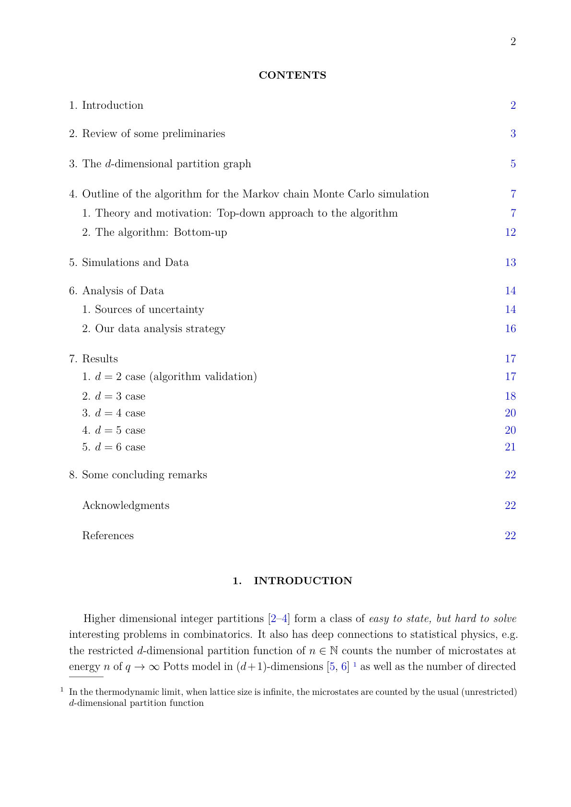 
Low-resolution page preview, page 2

📷 Fig 2

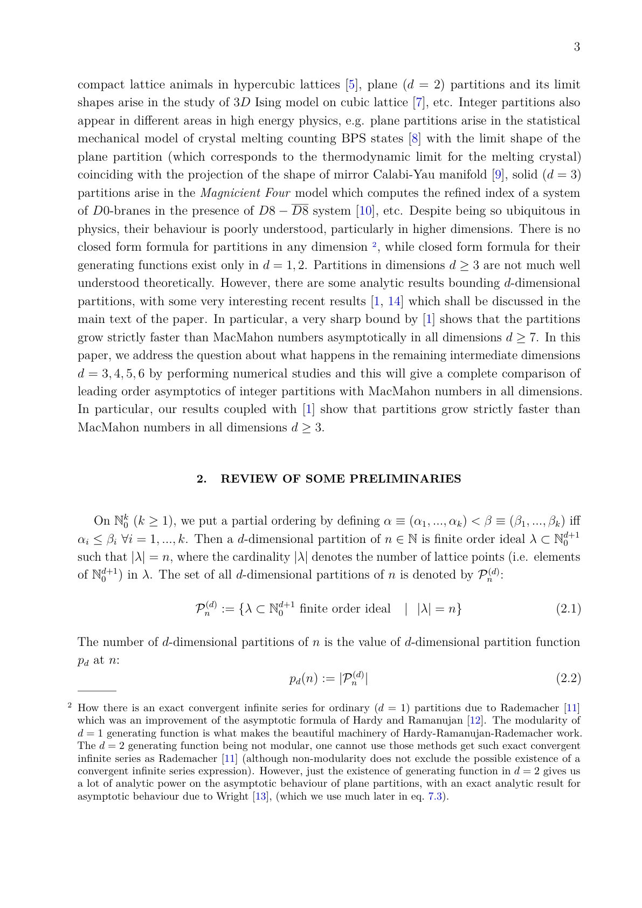 
Low-resolution page preview, page 3

📷 Fig 3

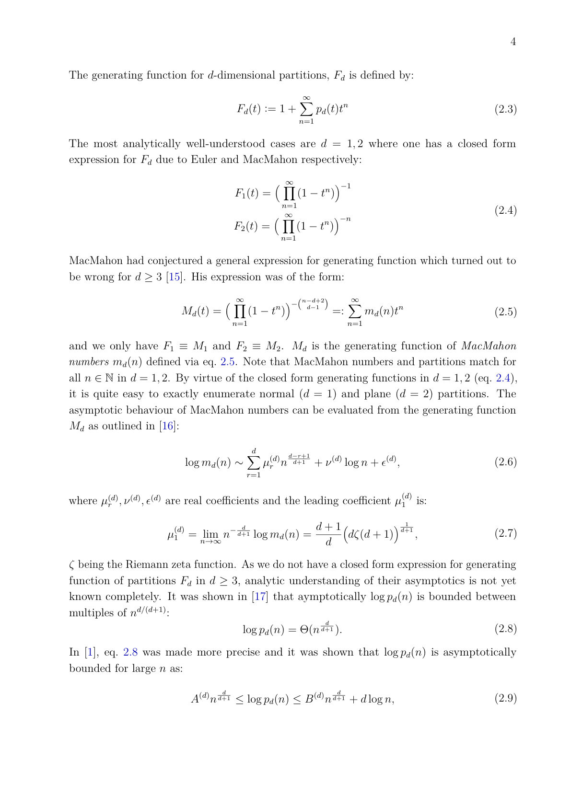 
Low-resolution page preview, page 4

📷 Fig 4

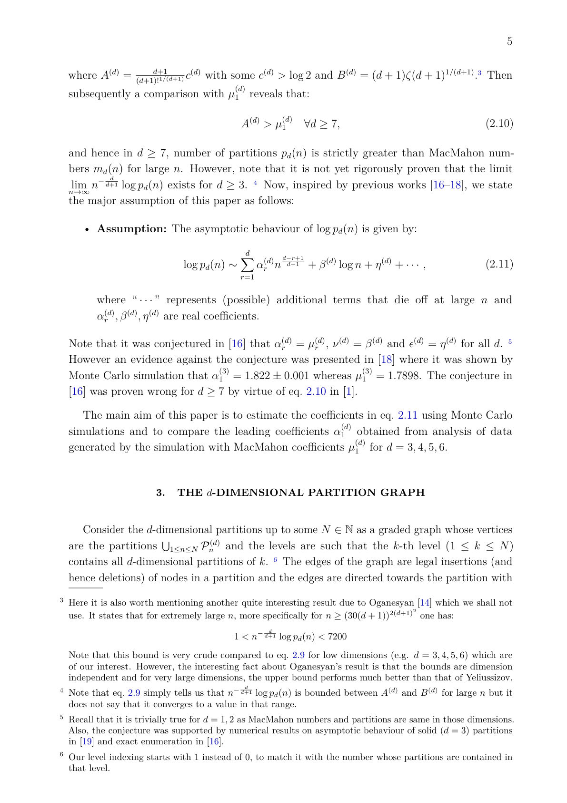 
Low-resolution page preview, page 5

📷 Fig 5

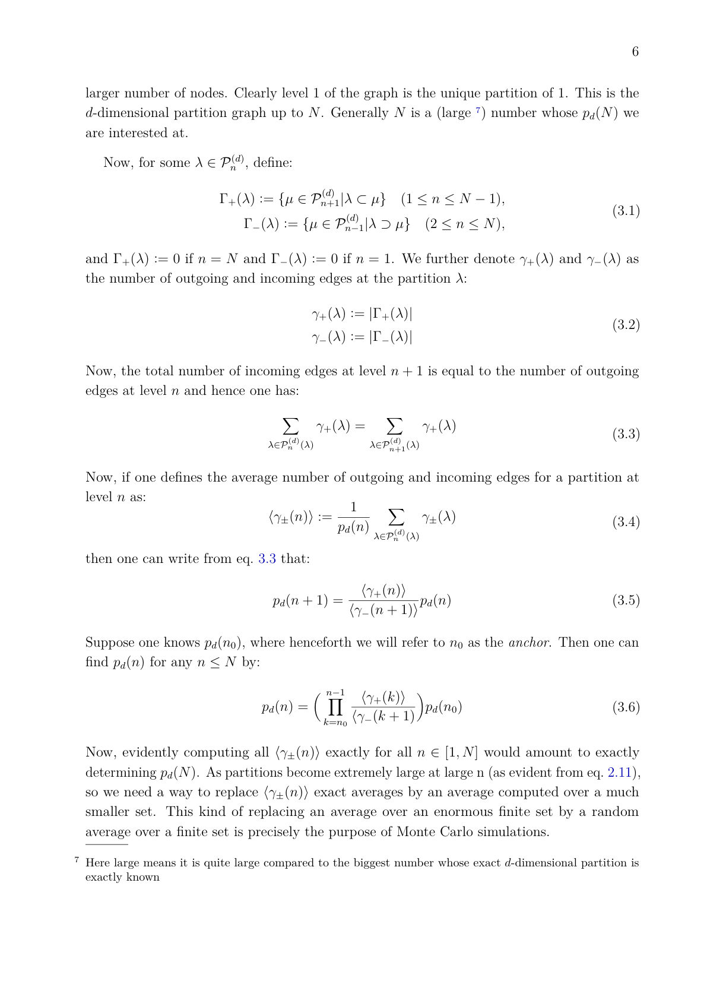 
Low-resolution page preview, page 6

**Summary.** This paper uses advanced MCMC simulations to determine the asymptotic growth rates of $d$-dimensional integer partitions for $d=3$ to $d=6$. The key finding is that in these intermediate dimensions, the growth rate of these partitions exceeds that of the simpler MacMahon numbers. This provides crucial quantitative data filling a gap in the understanding of partition function asymptotics in statistical physics.

**Why it may be interesting.** While the topic is pure combinatorics/statistical mechanics, the use of advanced MCMC techniques (like Wang-Landau) to estimate partition function asymptotics is a sophisticated numerical method relevant to calculating partition functions in complex quantum lattice models.

Detailed structure

**Main problem.** The paper aims to numerically estimate the asymptotic growth rates of the number of $d$-dimensional integer partitions, $p_d(n)$, for intermediate dimensions $d=3, 4, 5, 6$.

**Main result.** The simulations establish that for $d=3$ through $d=6$, the asymptotic growth of $p_d(n)$ is strictly faster than that of the corresponding MacMahon numbers.

**Method.** The authors employed Markov Chain Monte Carlo (MCMC) simulations, utilizing adaptive weight learning and the Wang-Landau algorithm to estimate the density of states and average edge counts on the partition graph.

**Model / system.** The system studied is the counting of $d$-dimensional integer partitions, $p_d(n)$, which relates to the partition function of certain statistical models.

**Key observables.** The primary observables are the asymptotic limits of $\log p_d(n)$ scaled by appropriate powers of $n$, such as $\lim_{n	o\infty} n^{-d/(d+1)} \log p_d(n)$.

**Important parameters / regimes.** The dimensions $d=3, 4, 5, 6$ are the focus, comparing results against known MacMahon leading order coefficients.

**Assumptions / limitations.** The main assumptions include the existence of the asymptotic limits and the ability to estimate the stationary distribution of the partition graph using MCMC techniques.

**Figures summary.** The notes do not provide a summary of figures, but they detail the numerical results for the asymptotic limits for $d=3, 4, 5, 6$.

**Paper structure.** The paper progresses from establishing the physical context and the open question (comparison to MacMahon numbers) to detailing the advanced MCMC methodology (WL algorithm, graph traversal) and finally presenting the numerical fitting and comparison of the derived asymptotic coefficients.

Abstract

It was recently shown by Yeliussizov \cite{Yeliussizov} that integer partitions in dimensions $d \geq 7$ asymptotically grow strictly faster than MacMahon numbers. As MacMahon numbers match with integer partitions in dimensions $d = 1,2$, the comparison of asymptotics of integer partitions with MacMahon numbers in intermediate dimensions ($d = 3,4,5,6$) is an open question. In this work, we perform Markov chain Monte Carlo (MCMC) simulations till $N=15000$ by using adaptive weight learning followed by conventional MCMC steps to numerically estimate the asymptotics of integer partitions in these intermediate dimensions. We numerically establish that in these intermediate dimensions, partitions asymptotically grow faster than MacMahon numbers. More specifically, assuming that the limits exist, we show: $\lim_{n\to\infty}n^{-3/4}\log p_3(n) = 1.8196 \pm 0.0019$, $\lim_{n\to\infty}n^{-4/5}\log p_4(n) = 1.7215 \pm 0.0045$, $\lim_{n\to\infty}n^{-5/6}\log p_5(n) = 1.6521 \pm 0.0059$, and $\lim_{n\to\infty}\log n^{-6/7}p_6(n) = 1.652 \pm 0.021$ for partitions in dimensions $d=3,4,5,$ and $6$ respectively. These numbers are all larger than MacMahon leading order asymptotic coefficients of $1.7898, 1.6614, 1.5737,$ and $1.509$ respectively. Additionally, we also find estimates for some of the sub-leading asymptotic terms in $\log p_d(n)$ in each of the dimensions.

[↑ back to top](#top)

### [Ground-State Phase Diagram, Higher-Winding Topology, and Lifshitz Criticality in an Anisotropic Four-Spin XX Chain](http://arxiv.org/abs/2609.03766v1)

**Authors:** Mohammad Abbasi, Faraz Valeh, Saeed Mahdavifar  
**Type:** theory · **Category:** strongly correlated electrons · **PDF:** <https://arxiv.org/pdf/2609.03766v1>  
**Analysis basis:** full PDF text, analyzed in chunks
**Topic relevance:** `analog quantum simulation` **2/5**

📷 Fig 1

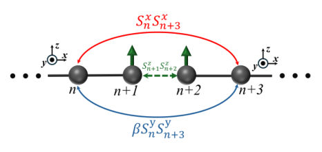 
FIG. 1: Schematic representation of the four-spin cluster interac- tion Hamiltonian.

📷 Fig 2

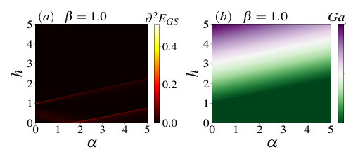 
FIG. 2: (a) Density plots of the second derivative of the ground- state energy in the (α,h) plane and (b) density plots of the energy gap in the (α,h) plane for general anisotropic regime β = 1.0.

📷 Fig 3

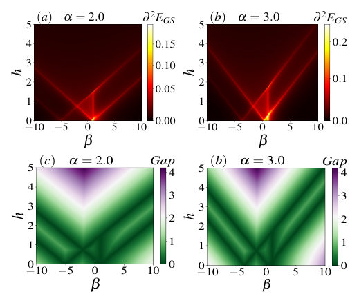 
FIG. 3: (color online).(a,b) Density plots of the second derivative of the ground-state energy in the (β,h) plane and (c,d) density plots of the energy gap in the (β,h) plane for α = 2.0 and α = 3.0, respec- tively.

📷 Fig 4

 
Figure 3 summarizes the behavior of the ground-state en- ergy and energy gap for two representative values of the cluster-interaction strength, α = 2.0 and α = 3.0. Figures 3(a) and 3(b) show the density plots of the second derivative of the ground-state energy, ∂2EG, in the (β,h) plane, while Figs. 2(c) and 2(d) display the corresponding energy-gap distributions. In all panels, the horizontal axis denotes the anisotropy parameter β and the vertical axis the transverse magnetic field h. The second-derivative plots in Figs. 3(a) and 3(b) exhibit pronounced nonanalytic features along well-defined lines in parameter space. These singular structures provide a di- rect signature of the critical...

📷 Fig 5

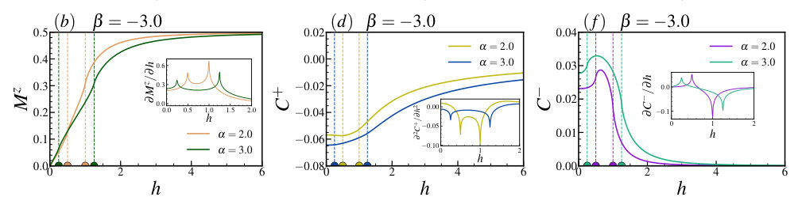 
FIG. 4: Magnetization in panels (a) and (b), nematic order parameters in panels (c) and (d), and chiral order parameters in panels (e) and (f) as functions of the magnetic field h. The upper panels correspond to β = −8.0, while the lower panels are obtained for β = −3.0. All results are calculated for a chain of size N = 1000.

**Summary.** This work explores the complex quantum phase diagram of a spin chain modified by anisotropic four-spin interactions. By mapping the system to fermions, the authors identify multiple topologically distinct gapped phases, including higher-winding sectors up to $|
u|=3$. This demonstrates that extended interactions offer a powerful mechanism to realize and study complex topological matter in one-dimensional quantum systems.

**Why it may be interesting.** The ability to engineer higher-winding topological phases using controllable, anisotropic multispin interactions provides a versatile theoretical platform for understanding exotic quantum states beyond standard short-range models.

Detailed structure

**Main problem.** The study investigates the quantum critical and topological properties of a spin-1/2 XX chain incorporating anisotropic four-spin cluster interactions under a transverse magnetic field.

**Main result.** The model exhibits a rich phase diagram featuring multiple gapped topological phases characterized by quantized winding numbers up to $|
u|=3$, which are stabilized by the extended cluster interactions.

**Method.** The analysis employs fermionization techniques, mapping the spin Hamiltonian to a quadratic fermionic form solvable via Bogoliubov transformations in momentum space.

**Model / system.** The system is a spin-1/2 XX chain with nearest-neighbor XX interactions ($H_{XX}$) augmented by anisotropic four-spin cluster interactions ($H_{CI}$) and subjected to a transverse magnetic field ($h$).

**Key observables.** Quantized winding numbers ($
u$), the bulk entanglement spectrum degeneracy pattern, and the ground-state energy density ($E_G$).

**Important parameters / regimes.** Exchange anisotropy ($J$), transverse field ($h$), and cluster interaction strengths ($\alpha, eta$).

**Assumptions / limitations.** The analysis relies on mapping the spin system to spinless fermions and analyzing the resulting single-particle energy spectrum $\varepsilon(k)$.

**Figures summary.** Figures schematically represent the four-spin cluster interaction Hamiltonian and show the topological phase diagram using winding numbers in the $(eta, h)$ plane, alongside the bulk entanglement spectrum for different winding numbers.

**Paper structure.** The paper proceeds by introducing the model Hamiltonian, detailing the fermionization and diagonalization methods, and then analyzing the resulting phase diagram, topological transitions, and critical points.

Abstract

We investigate the quantum critical and topological properties of a spin-$1/2$ XX chain with anisotropic four-spin cluster interactions in a transverse magnetic field. The interplay of exchange anisotropy, cluster interactions, and the external field produces a rich phase diagram with multiple gapped topological phases and distinct quantum critical boundaries. We identify several Lifshitz-type transitions arising from reconstructions of the low-energy Fermi-point structure, including an unconventional multicritical point where distinct critical branches intersect and the momentum-space topology undergoes a singular reorganization. In the isotropic limit, a conventional Lifshitz transition emerges through the merging and annihilation of Fermi points, revealing distinct mechanisms of Fermi-point reconstruction within the same model. The gapped phases are characterized by quantized winding numbers $ν=0,\pm1,-2,$ and $\pm3$, with the higher-winding phases induced by the extended cluster interactions. The $ν=\pm3$ phases exhibit a richer topological structure than conventional short-range Kitaev-type chains and are separated from other sectors by field- and interaction-driven gap closings. These topological distinctions are further reflected in characteristic degeneracy patterns of the lowest levels of the bulk entanglement spectrum. Our results demonstrate that anisotropic multispin interactions provide a versatile route to realizing higher-winding topological phases and unconventional multicriticality in one-dimensional quantum systems.

[↑ back to top](#top)

### [Holographic zeros and poles from apparent singularities](http://arxiv.org/abs/2609.03023v1)

**Authors:** Edwan Préau  
**Type:** theory · **Category:** strongly correlated electrons · **PDF:** <https://arxiv.org/pdf/2609.03023v1>  
**Analysis basis:** full PDF text, analyzed in chunks
**Topic relevance:** `Keldysh / 2PI / non-Gaussian methods` **2/5**

📷 Fig 1

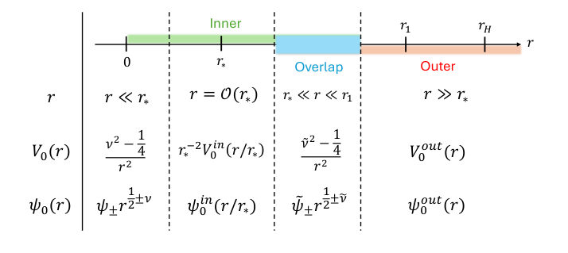 
Figure 1: Schematic representation of the inner and outer region for r ∈R+, together with their overlap region. The positions of the relevant singularities are indicated: the boundary r = 0 and the apparent singularity r∗lie in the inner region, whereas the outer region contains all singularities that do not approach the origin as r∗→0, including the horizon rH. We called r1 the smallest of these outer singularities, which sets the upper bound of the inner region. Below the figure, the table indicates the regimes in r corresponding to each region, together with the associated expressions for the Schr¨odinger potential and solution ψ at leading order in r∗. The expressions for V in 0 and ψin...

**Summary.** This work analyzes holographic fluctuation equations containing apparent singularities to determine the resulting spectral properties. By studying the near-boundary behavior, the authors show that the singularity's merging with the boundary dictates whether the spectral function acquires a zero or a pole. This provides a general, powerful tool for calculating transport coefficients in strongly coupled quantum matter systems.

**Why it may be interesting.** The connection between bulk singularities (apparent singularities) and the spectral properties (zeros/poles) of boundary correlators is a powerful tool for understanding transport and response functions in strongly interacting quantum systems modeled by holography.

Detailed structure

**Main problem.** The paper investigates how the merging of an apparent singularity with the boundary affects the spectral functions derived from holographic fluctuation equations.

**Main result.** The merging of the singularity can generate either a zero or a pole in the corresponding spectral function, and the holographic product formula remains applicable.

**Method.** The analysis uses near-boundary matching techniques on second-order linear differential equations (fluctuation equations) derived from holographic setups.

**Model / system.** The model is a holographic setup, relating bulk fluctuations in backgrounds like AdS black branes to boundary two-point functions ($
ho$). The governing equations are reduced to Schrödinger-like forms with potentials that can exhibit apparent singularities.

**Key observables.** Spectral function $
ho(\omega)$ and the two-point correlator $G_{12}(\omega, k_i)$.

**Important parameters / regimes.** The approach depends on classifying equations into $(−)$ and $(+)$ classes, and analyzing the limit where an apparent singularity approaches the boundary ($r^* 	o 0$).

**Assumptions / limitations.** The analysis assumes the apparent nature of the singularity and relies on matching solutions between inner (near-boundary) and outer regions.

**Paper structure.** The paper establishes the general holographic setting for spectral functions, details the near-boundary analysis using inner/outer matching, deduces general properties for zeros based on the singularity merging, and concludes with applications.

Abstract

We study general holographic fluctuation equations with apparent singularities, and the associated spectral functions. We consider the regime where an apparent singularity approaches the boundary, for which the near-boundary behavior of solutions can be determined via an inner/outer matching type of calculation. Depending on properties of the equation, we find that the merging of an apparent singularity with the boundary may generate either a zero or a pole for the corresponding spectral function. Our results also indicate that the recently introduced holographic product formula still applies in the presence of apparent singularities.

[↑ back to top](#top)

### [Large deviations for linear regressions](http://arxiv.org/abs/2609.03111v1)

**Authors:** Silvia Bartolucci, Fabio Caccioli, Francesco Caravelli, Pierpaolo Vivo  
**Type:** theory · **Category:** statistical mechanics · **PDF:** <https://arxiv.org/pdf/2609.03111v1>  
**Analysis basis:** full PDF text, analyzed in chunks
**Topic relevance:** `Keldysh / 2PI / non-Gaussian methods` **2/5**

📷 Fig 1

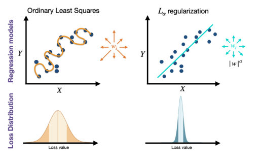 
FIG. 1. Schematic representation of regression models in proximity of the interpolation threshold with and without Lα regularization, associated weights wi’s and distribution of the training loss.

📷 Fig 2

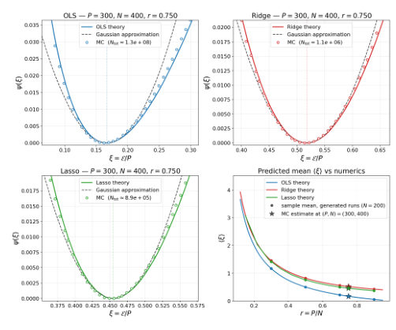 
FIG. 2. Distribution and mean of the minimal training loss for OLS, Ridge, and Lasso at P = 300, N = 400 (r = P/N = 0.750), with p(β) = δ(β −1). Top left, top right, and bottom left: large-deviation rate function ψ(ξ) of the intensive loss ξ = E/P for OLS, Ridge (λ = 0.5), and Lasso (λ = 0.5), respectively. Solid lines: exact replica predic- tion (Eq. (11)); dashed lines: Gaussian approximation about the typical value; open circles: rate function estimated from Ntot = 1.1 × 109 (OLS), 1.1 × 106 (Ridge), and 8.9 × 105

**Summary.** This theoretical work calculates the large-deviation statistics for the minimum training loss in high-dimensional linear regression. Using advanced statistical physics tools like the replica method, the authors derive the rate function that governs rare fluctuations in the optimal loss. The results confirm the theoretical framework's consistency across different regularization methods (Ridge, Lasso) and regimes.

**Why it may be interesting.** While the core topic is machine learning statistics, the mathematical machinery—replica calculations, large deviation theory, and the use of order parameters—is highly relevant to disordered systems and statistical physics problems in condensed matter.

Detailed structure

**Main problem.** The paper computes the large-deviation statistics of the minimum training loss in linear regression, characterizing rare sample-to-sample fluctuations beyond the typical Gaussian regime.

**Main result.** The rate function governing the large deviation probability $P(E = P\xi) \approx e^{-P \psi(\xi)}$ is derived for various regularizers, showing consistency between replica methods and direct calculations.

**Method.** The zero-temperature replica method is employed to calculate the scaled cumulant generating function $\Phi(s)$, from which the rate function $\psi(\xi)$ is obtained via a Legendre transform.

**Model / system.** The model is standard linear regression with $N$ observations and $P$ predictors, using Gaussian design and noise. The loss function incorporates general separable regularizers like Ridge ($\ell_2$) and Lasso ($\ell_1$).

**Key observables.** The minimum regularized training loss $E$, the intensive loss $\xi = E/P$, and the rate function $\psi(\xi)$.

**Important parameters / regimes.** The ratio $r = P/N$ (predictors to observations), the regularization strength $\lambda$, and the signal distribution $p(eta)$.

**Assumptions / limitations.** The analysis assumes Gaussian design and noise, and for some derivations, the light-tailedness of the teacher prior $p(eta)$ is required.

**Figures summary.** Figures illustrate the rate function $\psi(\xi)$ and the predicted mean loss for OLS, Ridge, and Lasso, comparing theoretical predictions against numerical simulations across different ratios $r$.

**Paper structure.** The paper develops the theory by first establishing the general framework using the replica method to find $\Phi(s)$. It then applies this to OLS, Ridge, and Lasso, deriving the rate function $\psi(\xi)$ for each case, and finally confirming consistency across different theoretical approaches and limits (e.g., $\lambda 	o 0$).

Abstract

Linear regression is one of the simplest and most widely used tools to learn patterns from data: it fits a set of coefficients so that a linear combination of predictors best matches observed responses. The quality of the fit is measured by the residual sum of squares, the total squared mismatch between predictions and data, whose minimum defines the training loss. We consider Gaussian design and noise, with teacher coefficients independently drawn from a general distribution $p(β)$, and a general class of separable regularizers, including Ridge and Lasso. Using the zero-temperature replica method, we compute analytically the large-deviation statistics of the minimum training loss for large numbers $P$ of predictors and $N$ of observations, with $r=P/N$ fixed. The rate function we compute governs rare sample-to-sample fluctuations of the optimal loss. Extensive numerical simulations are in excellent agreement with our theory and clearly show a pronounced deviation from the Gaussian regime of typical fluctuations in the tails.

[↑ back to top](#top)

### [Non-uniform quantum geometry stabilizes generalized Wigner crystals](http://arxiv.org/abs/2609.04149v1)

**Authors:** Nicolás Morales-Durán, Tobias M. R. Wolf, Jingtian Shi, Tomohiro Soejima, Andrew J. Millis, Jennifer Cano  
**Type:** theory · **Category:** strongly correlated electrons · **PDF:** <https://arxiv.org/pdf/2609.04149v1>  
**Analysis basis:** full PDF text, analyzed in chunks
**Topic relevance:** `analog quantum simulation` **2/5**

📷 Fig 1

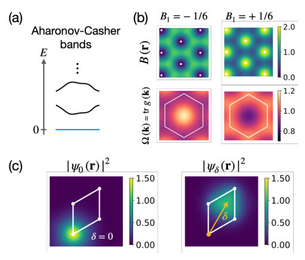 
FIG. 1. (a) Schematic representation of the bands resulting from diagonalizing the Hamiltonian given by Eq. (1). In this work we focus on the lowest band (indicated in blue), which we refer to as the AC band. This band is flat and has ideal quantum geometry. (b) Examples of magnetic field distribu- tions generating the AC bands and their corresponding Berry curvature, Ωk, with negative (left column) and positive (right column) harmonic B1. Because the AC band is ideal, it sat- isfies Ωk = tr gk, where gk is the quantum metric. (c) Charge densities of two localized orbitals centered at different posi- tions δ within the moir´e unit cell. We have used B1 = −1/6.

📷 Fig 2

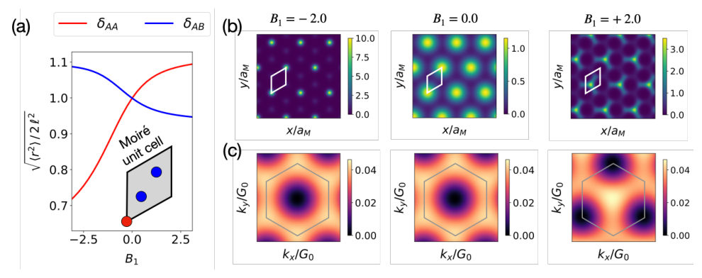 
FIG. 2. (a) Spread of most localized AC orbitals centered at high-symmetry points within the moir´e unit cell, as a function of B1. The high-symmetry points, labeled δAA (red) and δAB/δBA (blue) are indicated in the inset. (b) Charge density of the crystal state at filling ν = 1/3 for different values of B1. The moir´e unit cell is indicated. (c) Brillouin zone occupation |c(k)|2 for an orbital from each crystal in (b). For B1 = +2 there is an equivalent crystal with orbitals centered at δBA, whose momentum distribution is peaked at the other three corners of the Brillouin zone, G0 = 4π/ √

📷 Fig 3

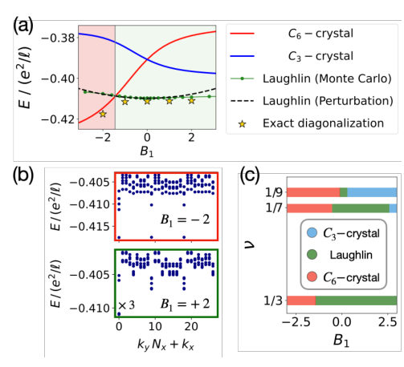 
FIG. 3. (a) Energy per particle of crystal and liquid states at filling ν = 1/3 of AC bands, as a function of B1. The golden stars indicate exact diagonalization energies for a system with N = 9 particles. (b) Exact diagonalization spectra for two AC bands: For B1 = −2 the ground state breaks the discrete translation symmetry of the magnetic field, forming a gener- alized Wigner crystal with √

📷 Fig 4

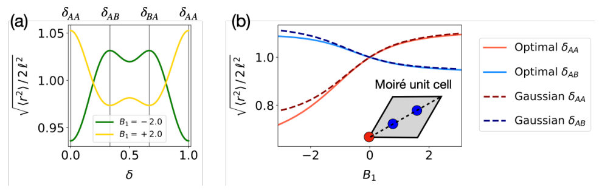 
FIG. 4. (a) Spread of the optimal orbitals, obtained from diagonalizing Eq. (13) in the main text, along a line-cut across the moir´e unit cell, for two values of B1. The minimal spread is reached at δAA for B1 &lt; 0 and at δAB/δBA for B1 &gt; 0. (b) Comparison between the spread of the analytic orbitals given by Eq. (D2) (dashed lines) and the optimal orbitals used in the main text (solid lines), as a function of B1. The analytic orbitals reproduce the spread of the optimal orbitals very well for B1 ≥1. Below this threshold, the optimal orbitals become more localized by acquiring higher angular momentum terms consistent with the C6-symmetry of the δAA centers. The inset indicates the...

📷 Fig 5

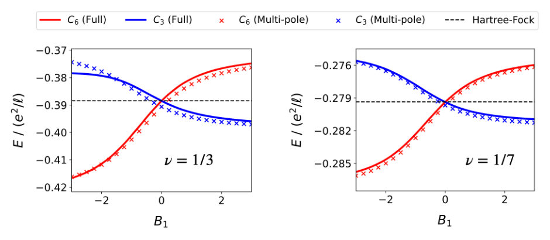 
FIG. 5. Energy of generalized Wigner crystal states on AC bands constructed from the orbitals defined in Eq. (D2) at fillings (a) ν = 1/3 and (b) ν = 1/7. Results for the C6-crystal are shown in red and results for the C3-crystal are shown in blue. Solid lines correspond to the full crystal energy, Eq. (D16), while the crosses correspond to the multipole expansion Eq. (D18). The black dashed lines are the Hartree-Fock energies for B1 = 0.

**Summary.** This theoretical work investigates the competition between electron crystal (Wigner) and liquid (Laughlin) states in moiré materials characterized by non-uniform quantum geometry. By comparing the energies of both phases, the authors demonstrate that geometric non-uniformity drives the system towards crystallization. The stability boundary is governed by a quantum analogue of the Lindemann criterion related to the crystal's zero-point fluctuations.

**Why it may be interesting.** The identification of quantum geometry-controlled zero-point fluctuations as the stability determinant provides a novel, purely quantum-geometric mechanism for phase transitions in strongly correlated electron systems, which is highly relevant to understanding moiré heterostructures.

Detailed structure

**Main problem.** The paper addresses the open question of the mechanism selecting between competing correlated states—Fractional Chern Insulator (FCI) states and generalized Wigner crystals—in systems subjected to non-uniform quantum geometry.

**Main result.** The study finds that strong non-uniform quantum geometry favors electron crystallization, establishing a quantum analogue of the Lindemann criterion where the crystal's zero-point fluctuations control the phase boundary.

**Method.** The authors compare the calculated energies of the Wigner crystal state and the Laughlin liquid state by minimizing the orbital spread and using perturbative expansions and Monte Carlo simulations.

**Model / system.** The system is modeled using Aharonov-Casher (AC) bands, which approximate the topmost band in Moiré materials hosting Chern bands. The Hamiltonian incorporates a spatially varying magnetic field, $B(r) = B_0 + \delta B(r)$.

**Key observables.** Crystalline energy ($E_{AC}^C$), Laughlin state energy ($E_{AC}^L$), and the orbital spread ($\langle r^2 
angle_c$).

**Important parameters / regimes.** Filling fraction $
u = 1/m$ and the degree of geometric non-uniformity, parameterized by $B_1$.

**Assumptions / limitations.** The analysis relies on variational ansatz wave functions and approximations such as neglecting terms involving three or more crystal sites in the energy calculation.

**Figures summary.** Figures illustrate the flat AC band and localized orbitals depending on the sign of $B_1$. They also show phase diagrams comparing crystalline and liquid energies across varying $B_1$ values for different fillings.

**Paper structure.** The paper progresses by establishing the AC band model, calculating the energies for both the Laughlin and Wigner crystal states using various approximations (perturbative, variational), and finally mapping out the phase diagram based on the competition between these two energy functionals.

Abstract

Moiré materials host fractional Chern insulators and electron crystals in close proximity, but the mechanism selecting between them remains an open question. We address this competition in Chern bands with ideal but momentum-dependent quantum geometry -- Aharonov-Casher bands. We present an ansatz wave function for generalized Wigner crystals and, by comparing its energy to that of the competing Laughlin-like state, map out the phase diagram at filling fraction $ν=1/m$ as a function of the degree of geometric non-uniformity. Our work identifies quantum geometry-controlled zero point fluctuations of the charge density of the generalized Wigner crystal as the mechanism controlling its relative stability, implying a kind of quantum Lindemann criterion for the crystal-liquid phase boundary.

[↑ back to top](#top)

### [Granular Rods Fall Faster in Denser Obstacle Fields](http://arxiv.org/abs/2609.03473v1)

**Authors:** Fumiaki Nakai, Hiroaki Katsuragi  
**Type:** theory · **Category:** statistical mechanics · **PDF:** <https://arxiv.org/pdf/2609.03473v1>  
**Analysis basis:** full PDF text, analyzed in chunks
**Topic relevance:** `Frenkel-Kontorova` **1/5** · `correlated / nonlocal dissipation` **1/5** · `driven-dissipative phase transition` **1/5** · `methods for driven-dissipative` **1/5** · `non-equilibrium universality` **1/5**

📷 Fig 1

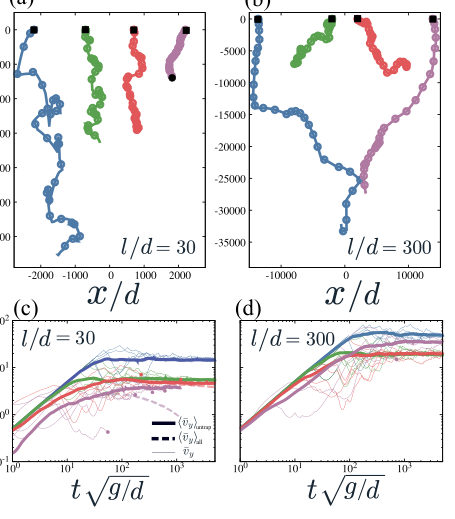 
FIG. 2. Representative dynamics for l/d = 30 [(a),(c)] and l/d = 300 [(b),(d)]. (a),(b) Dimensionless center-of-mass tra- jectories (x/d, y/d) over 0 ≤t p

📷 Fig 2

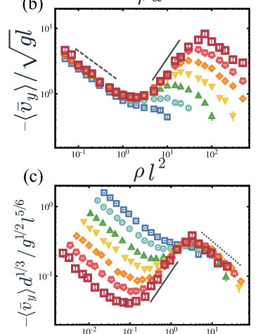 
FIG. 3. Mean descent speed before trapping. We evaluate −⟨¯vy⟩at the latest time t p

📷 Fig 3

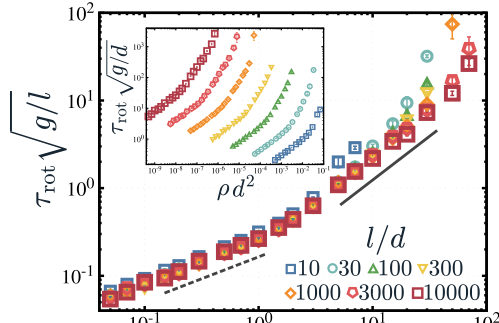 
FIG. 4. Dimensionless rotational relaxation time. We define τrot as the first lag at which ⟨cos{2[θ(t0 + t) −θ(t0)]}⟩reaches e−1. At each lag, the correlation is averaged only over the rods that remain untrapped among the 32 independent real- izations. Conditions that do not reach the threshold within the available dimensionless lag window (t p

📷 Fig 4

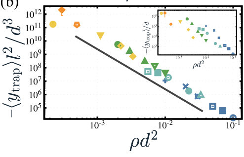 
FIG. 5. Distance to trapping. We set y = 0 initially, so that −y is the downward fall distance. (a) Survival probabil- ity P(−ytrap &gt; −y). Colors denote l/d, and symbols denote ρl2. The inset shows the curves against −y/d; plotting them against −yρ3l2d3 approximately collapses the different rod lengths and obstacle densities. (b) The mean fall distance to trapping −⟨ytrap⟩is obtained from an exponential fit to each survival curve. The scaled mean distance −⟨ytrap⟩l2/d3

📷 Fig 5

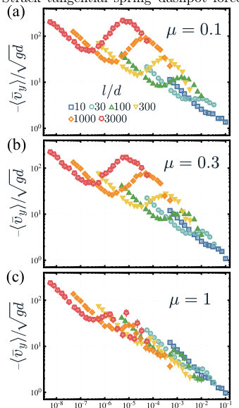 
FIG. 6. Effect of contact friction on the mean pretrapping fall speed. Results are shown for (a) µ = 0.1, (b) µ = 0.3, and (c) µ = 1. Colors and symbols identify l/d. The nonmonotonic response remains clear for moderate friction but is weakened at strong friction.

**Summary.** This paper simulates the motion of a rod falling through randomly placed obstacles, revealing that its average speed does not simply decrease with obstacle density. Instead, the speed shows a nonmonotonic behavior—speeding up in an intermediate density regime—which is attributed to the interplay between particle anisotropy and rotational memory effects. The findings provide scaling laws describing this complex, driven transport phenomenon.

**Why it may be interesting.** The study of non-equilibrium transport in anisotropic particles interacting with disordered media touches upon concepts relevant to driven many-body systems and energy dissipation in complex environments.

Detailed structure

**Main problem.** The study investigates how particle shape (anisotropy) influences transport dynamics when a rod falls through a field of randomly placed obstacles under external driving.

**Main result.** The mean descent speed exhibits a nonmonotonic dependence on obstacle density, showing an initial decrease, a subsequent increase, and a final decrease before trapping.

**Method.** The study uses numerical simulations to solve the translational and rotational equations of motion for a dissipative rod interacting with fixed obstacles.

**Model / system.** The model consists of a dissipative rod (spherocylinder) falling under gravity through a 2D random array of fixed point obstacles, governed by contact forces and dissipation.

**Key observables.** Mean descent speed (mean vertical velocity), rotational relaxation time, and mean trapping distance.

**Important parameters / regimes.** Obstacle density ($
ho$), rod aspect ratio ($l/d$), and the friction coefficient ($\mu$).

**Assumptions / limitations.** The analysis relies on scaling arguments derived from collision rates and assumes specific physical mechanisms govern the transitions between different transport regimes.

**Figures summary.** Figures illustrate the nonmonotonic variation of mean fall speed versus density for long rods, and show the dependence of rotational relaxation time on density.

**Paper structure.** The paper establishes the physical model and equations of motion, presents simulations showing the nonmonotonic drift, derives scaling laws for the three density regimes (low, intermediate, high), and finally tests the robustness of the speedup by including contact friction.

Abstract

How particle shape affects transport through obstacle fields under external driving is a fundamental question in nonequilibrium physics. We simulate a dissipative rod falling under gravity through randomly placed fixed obstacles. As the obstacle density increases, the mean descent speed decreases, increases, and then decreases again before trapping. The rod can therefore fall faster in a denser obstacle field. Scaling arguments based on collision rates and rod geometry explain all three regimes, their crossovers, and the mean fall distance before trapping. These results reveal nonmonotonic driven transport arising from particle anisotropy.

[↑ back to top](#top)

### [A Superconducting Peierls Instability](http://arxiv.org/abs/2609.04164v1)

**Authors:** Pramodh Senarath Yapa, Joseph Maciejko, Frank Marsiglio, Annica M. Black-Schaffer  
**Type:** theory · **Category:** strongly correlated electrons · **PDF:** <https://arxiv.org/pdf/2609.04164v1>  
**Analysis basis:** full PDF text, analyzed in chunks
**Topic relevance:** `Keldysh / 2PI / non-Gaussian methods` **1/5** · `analog quantum simulation` **1/5**

📷 Fig 1

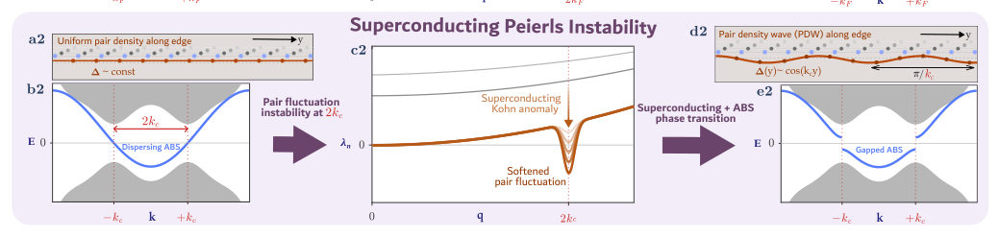 
FIG. 1: Schematics of the conventional Peierls instability (top row) and its superconducting analog (bottom row). (a1, b1) Uniform 1D lattice and its electronic band, with Fermi points at ±kF . (c1) Kohn anomaly: progressive softening of the phonon mode at the nesting wavevector q = 2kF driven by electron-phonon coupling. Colour gradient indicates increasing electron- phonon coupling. The instability occurs when ω2 ph becomes negative, i.e. the phonon frequency becomes complex-valued. (d1, e1) Resulting distorted lattice with accompanying CDW and gapped electronic spectrum. (a2, b2) Translation-invariant edge of a semi-infinite 2D superconductor and its schematic BdG spectrum, including the...

📷 Fig 2

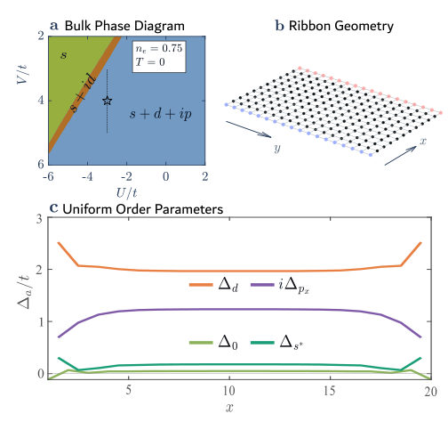 
FIG. 2: Bulk phase diagram, ribbon geometry and the uni- form (y-translation-invariant) order parameters on the rib- bon. (a) Mean-field bulk phase diagram at ne = 0.75 and T = 0 in the (U/t, V/t) plane, showing s (green), s + id (or- ange), and s + d + ip (blue) phases. Dashed vertical line corresponds to the cut examined in the SM, and 9 marks the U/t = −3, V/t = −4 point used in the main text. (b) Ribbon geometry with periodic boundary conditions along y, and open boundaries along x (blue and pink open edges). (c) Uniform order parameter profiles solved using self-consistent BdG across an Nx = 20 ribbon at 9, enforcing translation invariance along y.

📷 Fig 3

 
Figure 2(a) shows the bulk zero-temperature self- consistent mean-field phase diagram at filling ne = 0.75. An s + d + ip phase occupies a large region of the (U/t, V/t) plane, consistent with previous studies [40– 44]. In the bulk, the px- and py-oriented mixed states are symmetry-related and degenerate. Open boundary con- ditions (OBC) distinguish the two degenerate bulk states as fully OBC self-consistent calculations show that both orientations develop an edge PDW, with the s + d + ipx (s+d+ipy) state developing a PDW on edges normal to x (y), see SM. Thus, we can here focus on the s + d + ipx phase in a ribbon geometry with an edge normal to x, see Fig. 2(b), where the edges are marked...

📷 Fig 4

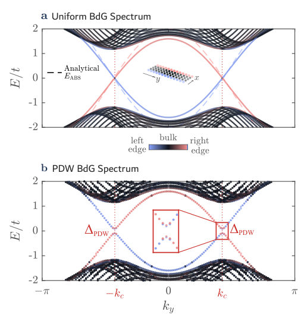 
FIG. 3: ABS spectrum and gap opening in the edge PDW state. (a) BdG spectrum of the y-translation-invariant Nx = 20, Nk = 600 ribbon at U/t = −3, V/t = −4, and ne = 0.75. States are coloured according to their center-of-mass in the x direction, with blue (red) indicating localization near the left (right) edge and dark colours indicating bulk-like states, see Methods Sec. D. The ABS branches cross zero energy at ky = ±kc (red dotted vertical lines) with opposite velocities, where kc ≃1.340. Dashed curves show the analytic ABS dispersion EABS(ky) = ±A(ky) (Eq. 17). (b) Momentum- resolved BdG spectrum after translational invariance in y is relaxed and the self-consistent edge PDW shown in...

📷 Fig 5

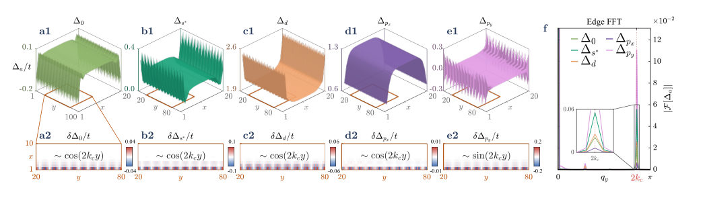 
FIG. 4: Real-space structure of the edge PDW order parameters in ribbon geometry. (a1)–(e1) ∆0, ∆s∗, ∆d, ∆px, and ∆py order parameters for an Nx = 20, Ny = 150 ribbon at U/t = −3, V/t = −4, and ne = 0.75. For clarity, the real-space panels display only 100 of the 150 lattice sites along y. Orange boxes indicate the edge regions isolated in (a2)–(e2) where the modulated component is isolated by subtracting the average of the order parameter along y at each fixed x. The plotting and phase conventions are defined in Methods Sec. B. (f) Fast Fourier transform (FFT) of the order parameters at the edge, with the dominant peaks at qy = 2kc indicated by vertical red dotted line, with inset showing...

**Summary.** This work establishes a superconducting Peierls instability, drawing an analogy between the metal-insulator transition and the formation of an edge Pair-Density Wave (PDW) in superconductors. By analyzing the instability of Andreev Bound States (ABS) at the boundary of a 2D superconductor, the authors demonstrate a novel mechanism for spontaneous symmetry breaking. This mechanism is computationally verified using the extended Hubbard model and suggests a broad applicability beyond specialized topological systems.

**Why it may be interesting.** The mechanism provides a general framework for understanding symmetry breaking in superconductors that does not require exotic topological features, making it relevant to many unconventional pairing theories.

Detailed structure

**Main problem.** The paper investigates the superconducting analog of the Peierls instability, showing how an electronic instability at the edge of a superconductor can induce a gap-opening Pair-Density Wave (PDW).

**Main result.** The instability leads to the spontaneous formation of an edge PDW, which gaps the dispersing Andreev Bound States (ABS) at the boundary, representing a novel mechanism for translation-symmetry breaking in superconductors.

**Method.** The analysis uses self-consistent Bogoliubov-de Gennes (BdG) calculations and examines the instability of the edge state against pairing fluctuations.

**Model / system.** The system is modeled using a square-lattice extended Hubbard model, focusing on a mixed-symmetry s+d+ip superconducting state on a ribbon geometry.

**Key observables.** Superconducting Kohn anomaly (softening of a pairing mode), edge PDW gap ($\Delta_{	ext{PDW}}$), and the gapping of the ABS spectrum.

**Important parameters / regimes.** The instability is driven by the zero-energy crossings of a *dispersing* ABS, which is key to its broad applicability.

**Assumptions / limitations.** The analysis relies on mean-field theory and focuses on the boundary realization, which is distinct from previous flat-band or topologically protected examples.

**Figures summary.** Figures schematically compare the conventional Peierls instability (CDW) with the superconducting analog (edge PDW). BdG calculations confirm the self-consistent development of the edge PDW structure.

**Paper structure.** The paper first establishes the analogy to the Peierls instability, then develops the superconducting counterpart by analyzing pairing fluctuations and the superconducting Kohn anomaly. Finally, it uses BdG calculations on the extended Hubbard model to confirm the gap-opening PDW structure.

Abstract

The Peierls instability is a foundational mechanism in condensed matter physics, showing how the electron--phonon interaction can transform a simple metal into an insulating state with a new lattice periodicity. In a one-dimensional (1D) metal the Peierls instability follows from the enhanced electronic response at wavevector $Q=2k_F$ (connecting the Fermi points) producing a Kohn anomaly: a softening of the phonon mode at the same wavevector. Condensation of this mode then generates the tell-tale Peierls periodic lattice distortion and charge-density wave (CDW) that gaps the electronic spectrum. Here we show an analogous instability at the edge of a two-dimensional (2D) superconductor, where a dispersing Andreev bound state (ABS) hosts Bogoliubov Fermi points at $\pm k_c$. The enhanced quasiparticle response at the connecting wavevector $Q=2k_c$ couples directly to pairing-fluctuations and produces a superconducting Kohn anomaly: a softening of a pairing mode at the same wavevector. Condensation of this mode then generates an edge pair-density wave (PDW) that gaps the ABS. We refer to this as a superconducting Peierls instability and identify the boundary quasiparticle structure that enables it. As a concrete realization, we consider a square-lattice extended Hubbard model whose mixed-symmetry $s+d+ip$ state hosts a dispersing ABS with zero-energy crossings at finite edge momenta. Using self-consistent Bogoliubov--de Gennes (BdG) calculations we show that the order parameter develops an edge PDW, with the wavevector set by the superconducting Kohn anomaly, that gaps the ABS crossings. Our results identify a novel mechanism for spontaneous translation-symmetry breaking in a superconductor. As this superconducting Peierls mechanism does not require an extensive zero-energy flat band or topologically protected edge states, it may apply broadly to unconventional superconductors.

[↑ back to top](#top)

### [Antiferromagnetism-altered plasmon dynamics](http://arxiv.org/abs/2609.03138v1)

**Authors:** Yifan Su, Suheng Xu, Rocco A. Vitalone, Ziyu Liu, Emil Viñas Boström, Na Wu, Chun-Ying Huang, Zhuquan Zhang, Jaehoon Jung, Daniel G. Chica, Vinícius da Silveira Lan Avelar, Yiping Wang, Takashi Taniguchi, Kenji Watanabe, James C. Hone, Xiaoyang Zhu, Cory R. Dean, Xavier Roy, Angel Rubio, D. N. Basov  
**Type:** both · **Category:** strongly correlated electrons · **PDF:** <https://arxiv.org/pdf/2609.03138v1>  
**Analysis basis:** full PDF text, analyzed in chunks
**Topic relevance:** `Keldysh / 2PI / non-Gaussian methods` **1/5** · `analog quantum simulation` **1/5**

📷 Fig 1

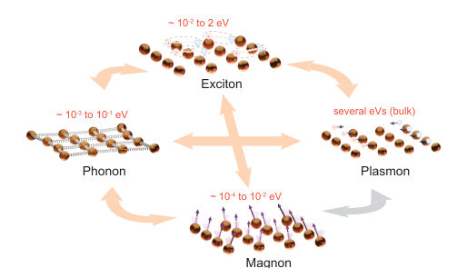 
Figure 1. Typical fundamental excitations in solids and the corresponding energy scales. Four common types of bosonic collective excitations that are intensely stud- ied in condensed matter physics and correspondingly their typical energy scales. Among each pair of excitations, orange arrows in between indicate previously observed interactions, while the gray arrow indicates the previously unseen interac- tion.

📷 Fig 2

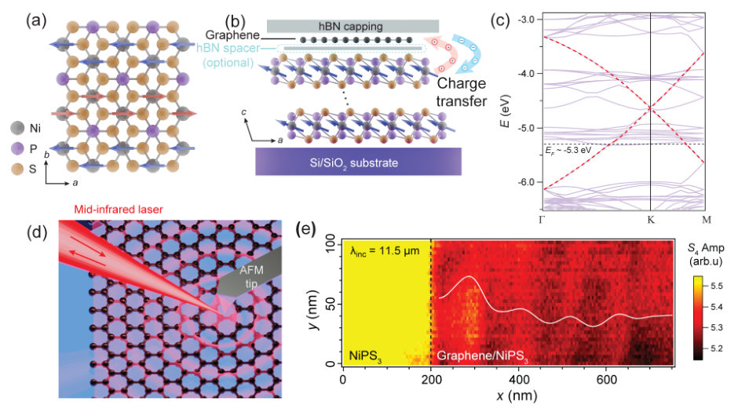 
Figure 2. Magneto-plasmonics at the Graphene/NiPS3 interface via charge transfer. (a-b) Crystal and magnetic structure of NiPS3, and device geometry of Graphene/NiPS3 device. (a) In-plane crystal and magnetic structure of NiPS3. The Ni atoms (grey spheres) are arranged in a two-dimensional honeycomb lattice in the ab-plane. The red and blue arrows indicate opposite spin orientations in the zig-zag antiferromagnetic order. (b) The out-of-plane structure of NiPS3 and device geometry. The monoclinically stacked NiPS3 layers are coupled by a weak ferromagnetic interaction. Electrons in graphene transfer to the top few layers in NiPS3 when put in contact with NiPS3 due to the different work...

📷 Fig 3

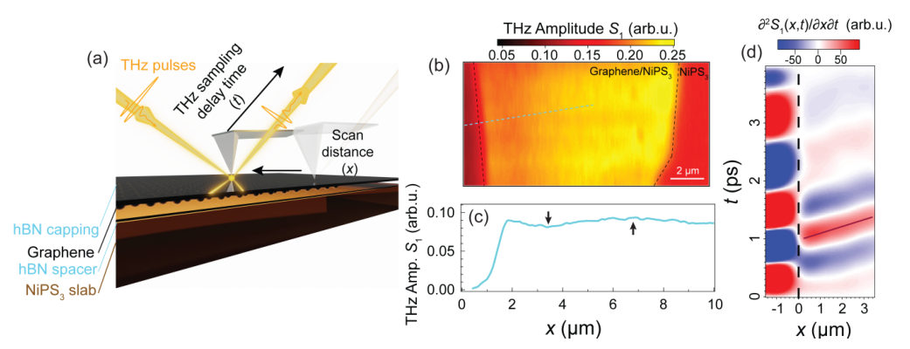 
Figure 3. Terahertz imaging and spacetime mapping for measuring SPP propagation. (a) Schematic illustration of terahertz (THz) s-SNOM imaging and spacetime mapping experiments. The graphene/NiPS3 stack is illuminated with broadband THz pulses (0.5 to 1.5 THz). The tip acts as a nano-antenna, launching and detecting SPP wavepackets, whose propagation dynamics can be recorded by scanning the tip position (x) and THz sampling delay time (t) (b) Nano-THz amplitude image of monolayer graphene on top of NiPS3, separated by hBN spacer layers. The cyan dashed line indicates the scanning path for the spacetime map measurement in (c-d). (c) Amplitude line profile along the cyan dashed line in (b)....

📷 Fig 4

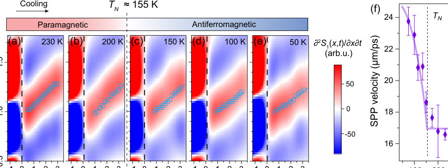 
Figure 4. Tuning of SPP propagation across antiferromagnetic transition in NiPS3. (a-e) Spacetime maps of graphene on NiPS3 with hBN spacer at 230 K (a), 200 K (b), 150 K (c), 100 K (d), and 50 K (e). In each panel, a plasmonic world-line that signifies the propagation of SPPs is extracted by highlighting the local maxima of the THz electric field. (f) The group velocity of SPPs as a function of temperature. The group velocities are calculated by doubling the inverse slope of world-lines extracted from spacetime maps. When cooled across the Néel temperature of NiPS3 (TN ≈155 K), the velocity of SPPs starts to increase, nearly scaling with the order parameter of the antiferromagnetic order....

📷 Fig 5

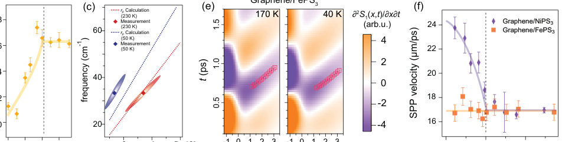 
Figure 5. Possible Mechanisms for Drude weight renormalization. (a) Phonon frequencies of G mode (left) and 2D mode (right), measured with Raman scattering, as a function of temperature. showing no noticeable shift and thus indicating no change in the carrier density of the graphene layer. (b). The integrated amplitude of reflected electric field on NiPS3 normalized to that of the SiO2 substrate measured with nano-THz time-domain spectroscopy, suggesting a reduction in dielectric constant ε1 across TN due to the redistribution of spectral weight by the formation of magnons. (c) Plasmon-polariton dispersion acquired from Fresnel coefficient rp calculation, above and below TN, with effective...

**Summary.** This paper reports on the experimental observation of coupling between plasmons and antiferromagnetic order in a graphene/$	ext{NiPS}_3$ heterostructure. Using terahertz s-SNOM, the authors tracked plasmon dynamics and found that the plasmon dispersion renormalizes precisely when the underlying material enters an antiferromagnetic state. This establishes a novel platform for developing coherent spin-plasmon devices.

**Why it may be interesting.** This work directly addresses the coupling between electronic excitations (plasmons) and magnetic order (magnons) in a tunable 2D platform, which is a cornerstone problem in emergent magnetoplasmonics and open quantum systems.

Detailed structure

**Main problem.** The study investigates the elusive interaction between plasmons (collective electron oscillations) and magnons (spin waves) in low-dimensional magnetic systems.

**Main result.** The researchers observed a clear renormalization of the plasmon-polariton dispersion coinciding with the onset of antiferromagnetic order, providing evidence of plasmon-magnon coupling.

**Method.** The work combines advanced experimental techniques like terahertz s-SNOM with theoretical modeling (DFT) to probe the coupled dynamics.

**Model / system.** The platform is a hybrid system consisting of a graphene monolayer placed on top of a $	ext{NiPS}_3$ microcrystal, which acts as a 2D antiferromagnet.

**Key observables.** Plasmon-polariton dispersion, plasmon wavepacket dynamics, spectral weight redistribution, and the renormalization of the plasmon-polariton velocity across the antiferromagnetic transition temperature ($T_N$).

**Important parameters / regimes.** The system operates in the 2D limit, utilizing terahertz radiation, and the key transition is the antiferromagnetic ordering temperature ($T_N \approx 155 	ext{ K}$).

**Assumptions / limitations.** The analysis initially rules out direct magnon-plasmon hybridization based on the observed increase in plasmon velocity, suggesting dielectric screening changes are the dominant mechanism.

**Figures summary.** Figures illustrate the device structure, the comparison of excitation energy scales, and spacetime maps showing the measured plasmon-polariton velocity increasing across the antiferromagnetic transition temperature.

**Paper structure.** The paper establishes the theoretical motivation for plasmon-magnon coupling, details the $	ext{Graphene}/	ext{NiPS}_3$ platform, presents s-SNOM measurements tracking plasmon dynamics across $T_N$, and interprets these results via spectral analysis.

Abstract

The interaction between plasmons and magnons is a long-sought phenomenon with implications for fundamental physics and spintronics applications. In three-dimensional systems, this coupling is suppressed by the large mismatch in energy scales, but two-dimensional (2D) plasmons with gapless dispersion can overlap with magnons over a broad spectral range. Despite numerous theoretical predictions, experimental observation of magnon-plasmon interaction has remained elusive. In this work, we study a first-of-its-kind hybrid plasmon-magnon platform based on 2D materials. By deploying scattering-type scanning near-field optical microscopy (s-SNOM) with terahertz radiation, we image propagating plasmon wavepackets at a graphene/NiPS$_3$ interface and track their dynamics across the antiferromagnetic transition of NiPS$_3$. We observe a clear renormalization of the plasmon-polariton dispersion concurrent with the onset of antiferromagnetic order. With complementary Raman scattering and nano-terahertz spectroscopy, we unveil spectral weight redistribution and dielectric screening changes, potentially associated with the multi-magnon continuum, as the underlying mechanism. These results provide solid evidence of coupling between plasmon and antiferromagnetic order, marking a cornerstone for a potential platform for hybrid magnon-plasmon interactions in 2D materials, opening avenues for coherent spin-plasmon devices and tunable terahertz spintronic components.

[↑ back to top](#top)

### [BU-MBAR: A hybrid solution strategy for the MBAR equations](http://arxiv.org/abs/2609.03541v1)

**Authors:** Fabio Müller, Francesco Alesiani, Henrik Christiansen  
**Type:** theory · **Category:** statistical mechanics · **PDF:** <https://arxiv.org/pdf/2609.03541v1>  
**Analysis basis:** full PDF text, analyzed in chunks
**Topic relevance:** `analog quantum simulation` **1/5** · `methods for driven-dissipative` **1/5**

📷 Fig 1

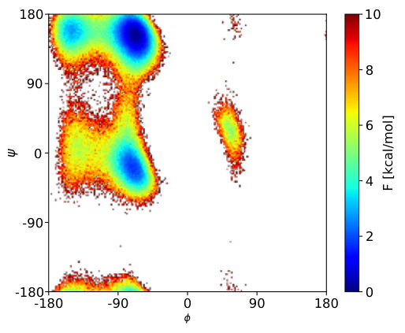 
FIG. 1. MBAR estimator of the free-energy profile of the ala- nine dipeptide projected onto the torsion angles ϕ and ψ at 298 K. The data was generated in a parallel tempering simula- tion with 50 replicas in the temperature range 298 K to 600 K.

📷 Fig 2

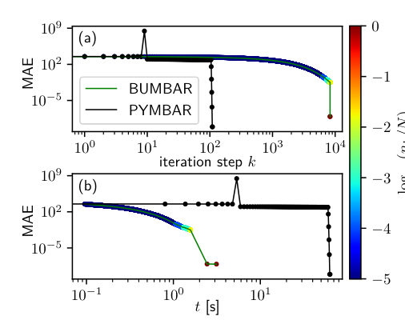 
FIG. 2. Evolution of the mean-absolute error (MAE) of the relative free energies for the full dataset generated from the PT simulations for BU-MBAR and PYMBAR. Evolu- tion shown in dependence of (a) iteration steps (b) wall-clock time. Color encodes the number of histogram bins used by BU-MBAR at iteration step k.

📷 Fig 3

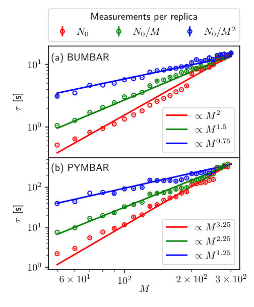 
FIG. 3. Wall-clock time scaling for (a) BU-MBAR in compar- ison to (b) PYMBAR in dependence of the number of replicas M. For both methods exactly the same energy histograms are generated and both methods are run on the same GPU. The three different colors correspond to three different scaling of the number of measurements per replica. The lines are in- tended as a guide to the eye.

**Summary.** This paper introduces BU-MBAR, a novel, highly efficient algorithm for solving the Multi-state Bennett Acceptance Ratio (MBAR) equations used in enhanced sampling simulations. It achieves this by treating the problem as a limit of the Weighted Histogram Analysis Method (WHAM) with dynamically adjusted binning. The method is shown to be significantly faster and more robust than existing solvers, making it a powerful tool for analyzing complex molecular simulation data.

**Why it may be interesting.** While focused on classical simulation statistics, the core concept of adaptive resolution and convergence acceleration through systematic approximation (binned-to-unbinned) has parallels in developing scalable quantum simulation techniques or analyzing complex quantum data sets.

Detailed structure

**Main problem.** Developing a robust and fast solution strategy for the Multi-state Bennett Acceptance Ratio (MBAR) equations, which are used for statistically optimal weighted analysis of simulation data from multiple thermodynamic conditions.

**Main result.** The proposed BU-MBAR method significantly outperforms existing solvers like PYMBAR in terms of wall-clock time and scaling, while maintaining convergence to the true unbinned limit.

**Method.** The BU-MBAR method interprets the MBAR equations as the limit of the Weighted Histogram Analysis Method (WHAM) with dynamically adapted bin width, iteratively refining the solution from a binned approximation to the unbinned limit.

**Model / system.** The method is generally applicable to enhanced sampling data analysis involving multiple trajectories at different thermodynamic conditions ($eta_i$). A specific test case used is the alanine dipeptide simulated using the amber14SB force field.

**Key observables.** Free-energy estimates ($f_i$), Mean-Absolute Error (MAE) of relative free energies, and wall-clock time scaling ($	au$) vs. number of replicas ($M$).

**Important parameters / regimes.** The algorithm uses fixed hyperparameters like initial bin count ($n_0=100$), convergence tolerance ($\epsilon=10^{-3}$), and an adaptive heuristic criterion.

**Assumptions / limitations.** The core assumption is that the MBAR equations can be accurately approached by taking the limit of the WHAM equations as the bin width approaches zero, guided by a dynamic bin adaptation heuristic.

**Figures summary.** Figures show the estimated free-energy profile of the alanine dipeptide, the convergence comparison (MAE vs. iterations/time) between BU-MBAR and PYMBAR, and the superior scaling of BU-MBAR versus PYMBAR as the number of replicas increases.

**Paper structure.** The paper first introduces the scientific problem (MBAR solution) and the limitations of current methods. It then details the BU-MBAR approach, which involves iteratively refining the solution by adapting the bin width based on a heuristic criterion. Finally, it validates the method by applying it to a physical system (alanine dipeptide) and comparing its performance and scaling against established solvers.

Abstract

The multi-state Bennett acceptance ratio (MBAR) equations combine the data collected under different thermodynamic conditions in a statistically optimal way. Due to their practical importance, several solution strategies have been devised to optimize the convergence of the resulting set of coupled equations. However, even with graphics processing unit (GPU) acceleration, the convergence of these methods can still be either unstable or slow. We propose a new approach where the equations are interpreted as the limit of infinitesimal bin width of the respective weighted histogram analysis method (WHAM). In the proposed binned-to-unbinned MBAR (BU-MBAR) method, the bin width is adapted dynamically to ensure a stable and efficient convergence to the asymptotic solution.

[↑ back to top](#top)

### [Fermi-Point Topology Determines Emergent Conformal Criticality in Extended Quantum Spin Chains](http://arxiv.org/abs/2609.03708v1)

**Authors:** Mohammad Abbasi, Saeed Mahdavifar  
**Type:** theory · **Category:** strongly correlated electrons · **PDF:** <https://arxiv.org/pdf/2609.03708v1>  
**Analysis basis:** full PDF text, analyzed in chunks
**Topic relevance:** `Keldysh / 2PI / non-Gaussian methods` **1/5** · `analog quantum simulation` **1/5**

📷 Fig 1

 
FIG. 1: Schematic representation of the four-spin cluster interac- tion Hamiltonian.

📷 Fig 2

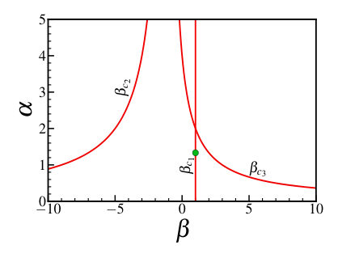 
FIG. 2: Ground-state phase diagram of the generalized spin-1/2 XX chain with four-spin cluster interactions in the absence of a trans- verse magnetic field (h = 0).

📷 Fig 3

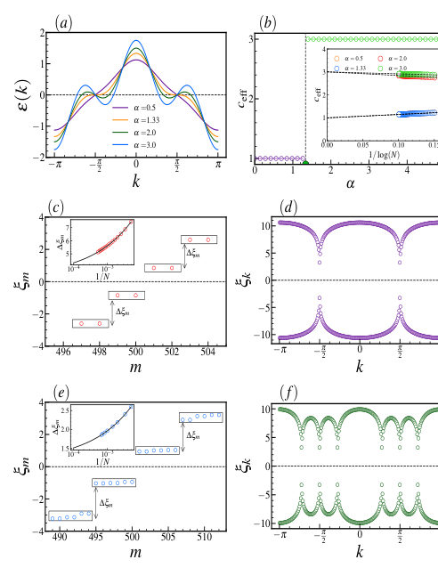 
FIG. 3: (a) Quasiparticle spectrum across the Lifshitz transition on the isotropic line (β = 1). (b) Effective central charge extracted from entanglement-entropy scaling. (c,d) Real-space (RES) and momentum-space (MES) bulk entanglement spectra in the ceff = 1 phase (α &lt; αL). (e,f) Real-space (RES) and momentum-space (MES) bulk entanglement spectra in the ceff = 3 phase (α &gt; αL).

📷 Fig 4

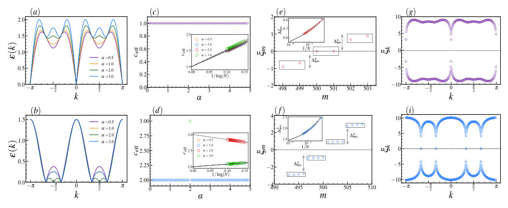 
FIG. 4: (a,b) Quasiparticle spectrum along the critical lines βc2 and βc3, respectively. (c,d) Effective central charges extracted from entanglement-entropy scaling. (e,f) Real-space (RES) bulk entanglement spectra, and (g,i) momentum-space (MES) bulk entanglement spectra for βc2 and βc3, respectively.

📷 Fig 5

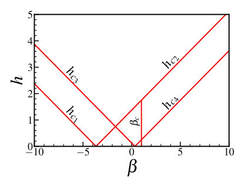 
FIG. 5: Ground-state phase diagram of the generalized spin-1/2 XX chain with four-spin cluster interactions in the presence of a transverse magnetic field (h ≠0).

**Summary.** This theoretical work develops a comprehensive framework linking the topology of the quasiparticle spectrum (Fermi-point topology) to the emergent conformal field theory describing quantum criticality in extended spin chains. It demonstrates that the central charge is determined by the independent low-energy continuum sectors, not just the number of gap closings. This provides deep insight into how interactions and fields drive unconventional critical phases.

**Why it may be interesting.** The work provides a detailed, quantitative framework for understanding how topological features in momentum space dictate universal low-energy physics (CFTs), which is crucial for understanding quantum critical points in strongly interacting quantum materials.

Detailed structure

**Main problem.** The paper aims to establish a microscopic link between the momentum-space topology of quasiparticle excitations and the universal conformal structure (CFT) characterizing quantum criticality in 1D quantum spin chains.

**Main result.** The emergent central charge ($c_{	ext{eff}}$) is determined not by a simple count of gapless Fermi points, but by the number and conformal content of independent low-energy continuum sectors after accounting for lattice symmetries.

**Method.** The authors use Jordan-Wigner transformations to map the spin Hamiltonian to a fermionic Bogoliubov problem, followed by continuum field theory analysis and the examination of entanglement spectra.

**Model / system.** The system is an extended quantum spin chain incorporating nearest-neighbor interactions, four-spin cluster interactions, exchange anisotropy, and a transverse magnetic field. The Hamiltonian is complex, involving multiple coupling constants.

**Key observables.** Effective central charge ($c_{	ext{eff}}$), Fermi-point topology, and entanglement spectra (real- and momentum-space).

**Important parameters / regimes.** Coupling constants ($\alpha, eta$), transverse magnetic field ($h$), and the critical points defined by the collapse of the Bogoliubov spectrum.

**Assumptions / limitations.** The analysis relies on the model being solvable via the Jordan-Wigner transformation and that the low-energy physics can be decomposed into independent continuum sectors.

**Figures summary.** Figures illustrate the phase diagram showing critical boundaries in parameter space and show the evolution of the quasiparticle spectrum across Lifshitz transitions.

**Paper structure.** The paper progresses by defining the complex spin model, analyzing the quasiparticle spectrum and its topology across various parameter regimes (zero-field, anisotropic, field-driven), and finally using CFT and entanglement spectra to derive the effective central charge at critical points.

Abstract

Quantum criticality in one-dimensional quantum systems is characterized by emergent conformal field theories (CFTs), whose central charge counts independent gapless degrees of freedom. Establishing a microscopic connection between this universal conformal structure and the momentum-space topology of the underlying quasiparticle spectrum remains challenging. Here, we uncover a direct correspondence between Fermi-point topology, conformal criticality, and quantum entanglement in an extended quantum spin chain with competing cluster interactions, exchange anisotropy, and a transverse magnetic field. We show that interaction- and field-driven Lifshitz transitions generate conformal critical phases with effective central charges $c_{\rm eff}=1/2$, $1$, $3/2$, $2$, and $3$, including a multicritical point where Ising and Luttinger-liquid sectors coexist. Importantly, the central charge is not determined simply by the number of lattice gap closings or Fermi points, but by the number and conformal content of independent low-energy continuum sectors after accounting for lattice symmetries, reciprocal-lattice identifications, and mode equivalences. Thus, Lifshitz transitions may leave the conformal anomaly unchanged or modify the central charge depending on whether spectral reconstruction generates new independent continuum sectors. Real- and momentum-space entanglement spectra provide complementary microscopic signatures, revealing both the conformal content and momentum-space organization of critical modes. Our results establish a microscopic framework linking Fermi-point topology to emergent CFTs and show how interaction-driven spectral reconstruction can generate higher-central-charge criticality and unconventional multicritical behavior.

[↑ back to top](#top)

### [Generative Nested Sampling of Atomistic Thermodynamic Landscapes](http://arxiv.org/abs/2609.03193v1)

**Authors:** Alessandro Coretti, Nico Unglert, Sebastian Falkner, Georg K. H. Madsen, Christoph Dellago  
**Type:** theory · **Category:** statistical mechanics · **PDF:** <https://arxiv.org/pdf/2609.03193v1>  
**Analysis basis:** full PDF text, analyzed in chunks
**Topic relevance:** `analog quantum simulation` **1/5** · `methods for driven-dissipative` **1/5**

📷 Fig 1

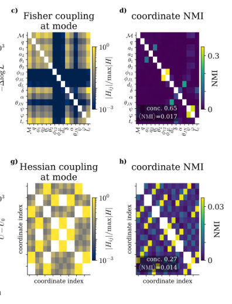 
Figure 1: GW binary-black-hole (top) vs. atomistic (LJ-8, bottom) posterior landscapes. Col- umn 1: a one-coordinate cut — GW log-likelihood along mass ratio q at the injected chirp mass a), LJ energy along a single particle-swap interpolation e). Column 2: the two-coordinate extension — the GW chirp-mass / mass-ratio “banana”, a single continuous degeneracy ridge b), vs. the LJ two-swap grid with four permutation-equivalent minima walled off by collision barriers f). Column 3: normalized coupling magnitude of the Fisher / Hessian matrix at the mode — sparse, block- structured for GW c); dense, all-to-all for LJ g). Column 4: pairwise normalized mutual information of Laplace samples at the...

📷 Fig 2

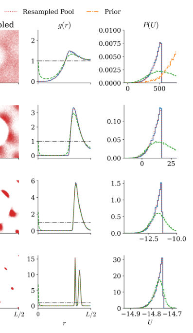 
Figure 2: Representative configurations and corresponding structural and energetic distributions obtained at different stages of the nested-sampling trajectory for the two-dimensional Lennard– Jones system at ρ = 0.95. Each row corresponds to a different nested-sampling energy threshold U, decreasing from top to bottom. The first three columns show ensembles of configurations drawn from the live set used for training, the generated pool obtained directly from the normalizing flow, and the final pool after rejection-resampling, respectively. In each panel, all configurations are superimposed after transformation to internal coordinates and alignment with respect to a common reference...

📷 Fig 3

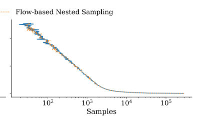 
Figure 3: Validation of the flow-assisted nested-sampling algorithm against standard nested sam- pling. Left: Evolution of the nested-sampling energy bound Umax as a function of the nested- sampling iteration for a representative simulation performed using conventional rejection Monte Carlo (solid blue) and the proposed flow-assisted sampling scheme (dashed orange). The two tra- jectories exhibit statistically indistinguishable behavior throughout the simulation. The inset shows the same data on a logarithmic scale, highlighting the excellent agreement over the entire energy range, from the initial high-energy configurations to the lowest-energy states explored. Right: Dis- tribution of...

📷 Fig 4

 
Figure 4 compares these alternatives for five representative stages of a standard NS simulation. For each energy threshold, three flows are trained using the same optimization protocol: an uncondi- tioned flow trained only on the corresponding live set (solid lines), an unconditioned flow trained on the same live set together with the two preceding ones (dashed lines), and the proposed conditional flow trained on the identical three-live-set dataset, with each configuration labeled by its correspond- ing energy threshold (dotted lines). The spacing between consecutive live sets matches the retraining frequency employed in the best-performing production simulation discussed below. As a...

📷 Fig 5

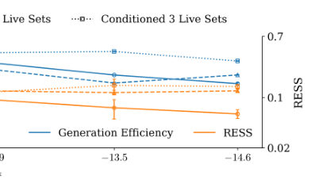 
Figure 4: Comparison between unconditioned and conditioned normalizing flows trained to repro- duce representative constrained ensembles along the nested-sampling trajectory. Five live sets, ap- proximately equally spaced throughout a reference nested-sampling simulation, are considered. For each target live set, three architectures are trained using the same optimization protocol: an uncondi- tioned flow trained only on the target live set (solid lines, circles), an unconditioned flow trained on the target live set together with the two preceding live sets corresponding to higher energy thresholds (dashed lines, triangles), and the proposed conditional flow trained on the same three live...

**Summary.** This paper develops NS-Flows, a generative model approach, to overcome the computational bottleneck of sampling rugged, high-dimensional energy landscapes characteristic of atomistic systems. By replacing slow MCMC steps with direct flow draws, the method drastically speeds up thermodynamic calculations, providing a powerful tool for statistical physics simulations.

**Why it may be interesting.** While focused on classical statistical mechanics, the development of generative models (Normalizing Flows) to sample complex, high-dimensional energy landscapes is a powerful tool applicable to quantum many-body systems where free energy estimation or phase space sampling is crucial.

Detailed structure

**Main problem.** The primary challenge is efficiently resolving the full thermodynamics of complex atomistic systems from a single simulation, which is hindered by the slow Markov-chain updates required in standard Nested Sampling (NS) methods.

**Main result.** The authors introduce NS-Flows, a conditional normalizing flow that significantly accelerates the process for atomistic systems, achieving massive reductions in energy evaluations and wall-clock time.

**Method.** They replace MCMC sampling within NS with a single conditional normalizing flow, trained on self-consistent 'live sets' of data, allowing for direct parallel draws corrected by importance-weighted rejection resampling.

**Model / system.** The comparison is drawn between a high-dimensional Gravitational Wave (GW) posterior (smooth degeneracies) and an eight-particle 2D Lennard-Jones (LJ) system (discrete, combinatorial multimodality).

**Key observables.** Energy landscape structure, generation efficiency of the flow, and the comparison of coupling structures (sparse vs. dense).

**Important parameters / regimes.** The LJ potential parameters, the NS energy bound, and the dimensionality of the system (e.g., 2D for LJ).

**Assumptions / limitations.** The flow training assumes sufficient overlap between the true conditional distribution and the model distribution for accurate reweighting, and it is designed to handle the combinatorial nature of atomistic barriers.

**Figures summary.** Figure 1 contrasts the smooth, continuous degeneracy ridges of the GW posterior with the discrete, hard-walled multimodality of the LJ energy landscape across various diagnostic cuts.

**Paper structure.** The paper diagnoses the fundamental topological difference between smooth GW posteriors and rugged, combinatorial atomistic landscapes, leading to the proposal and testing of NS-Flows to overcome the MCMC bottleneck in the latter.

Abstract

Nested sampling (NS) resolves the thermodynamics of an atomistic system from a single simulation, but its practical reach is limited by the Markov-chain updates needed to decorrelate walkers within each likelihood-constrained ensemble. Flow-based NS has removed this bottleneck for gravitational-wave (GW) inference, yet its transfer to atomistic systems is not merely a change of application. Comparing a GW150914-like binary-black-hole likelihood with an eight-particle two-dimensional Lennard-Jones (LJ) system of comparable dimensionality, we show that the two landscapes differ fundamentally: atomistic multimodality is discrete and combinatorial, generated by particle permutations separated by hard collision walls, and its coordinate coupling is dense and collective, whereas the GW posterior exhibits smooth degeneracies and localized parameter coupling. Guided by this diagnosis, we introduce NS-Flows: a single conditional normalizing flow, conditioned on the NS energy bound and trained on a sliding window of recent live sets, that replaces MCMC by direct parallel draws corrected by importance-weighted rejection resampling. Live sets supply data self-consistently, allowing flow training without structured priors or a pre-existing dataset. For LJ disks in PBC, the algorithm reduces energy evaluations by over two orders of magnitude and wall-clock time by roughly one third, an advantage that becomes increasingly favorable as the cost of the potential grows. The flow's generation efficiency further acts as a physical diagnostic: it varies non-monotonically along the annealing trajectory, is lowest in the dense disordered regime, and is quantitatively captured by the constrained ensemble's internal mode complexity together with target drift across the training window, identifying liquid-like ensembles, rather than prior-target separation, as the hard case for current flow architectures.

[↑ back to top](#top)

### [Quantum Complexity in Nuclear Scattering and Fission Dynamics](http://arxiv.org/abs/2609.03240v1)

**Authors:** Saurabh V. Kadam, Antonio Bjelčić, Nicolas Schunck, Kyle Wendt  
**Type:** theory · **Category:** other · **PDF:** <https://arxiv.org/pdf/2609.03240v1>  
**Analysis basis:** full PDF text, analyzed in chunks
**Topic relevance:** `Keldysh / 2PI / non-Gaussian methods` **1/5** · `analog quantum simulation` **1/5**

📷 Fig 1

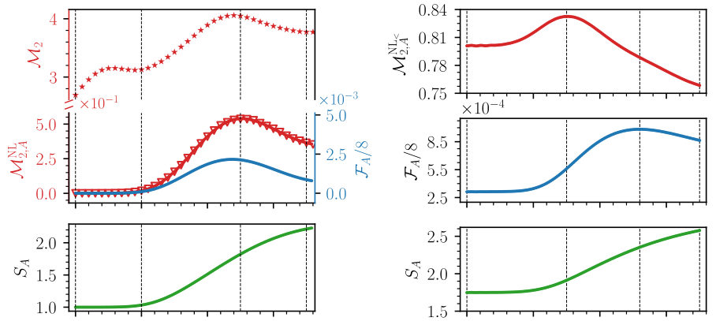 
FIG. 1. Time evolution of quantum complexity measures during the scattering process for (a) ˜A = 2 and (b) ˜A = 3 are shown here. The bottom plots denote the entanglement entropy SA rising over time. The upper bound of non-local magic MNL&lt; 2,A (solid red curves) and the lower bound from the ant-flatness, FA/8 (blue curves) are shown in both cases. For ˜A = 2, the initial state has vanishing non-local magic, and thus, both curves remain zero till particles start interacting. To illustrate this further, they are plotted together in the lower half of the upper panel, with y-axis on the left (red) denoting MNL&lt; 2,A values and FA/8 values on the right (blue). Furthermore, the exact non-local...

📷 Fig 2

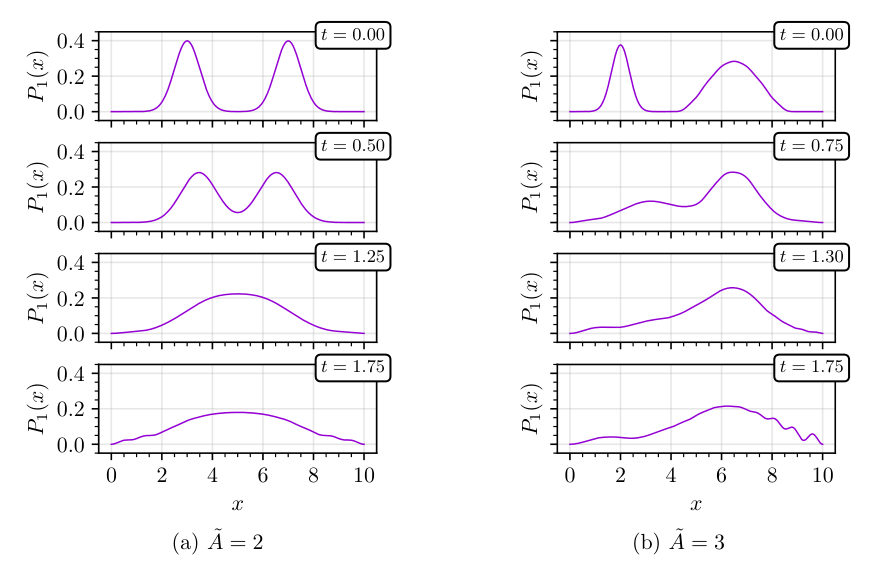 
FIG. 2. Shown here are the one-body probability densities, P1(x) = R ∞ −∞|ψ(x, x2, · · · , x ˜ A)|2 dx2 · · · dx ˜ A, during the scattering process for ˜A = 2 and 3 in panels (a) and (b), respectively. The densities are plotted as a function of position x. The evolution is captured at four specific time slices, t = 0.00, 0.50, 1.25, and 1.75 for ˜A = 2, and t = 0.00, 0.75, 1.30, and 1.75 for ˜A = 3. These time snapshots correspond directly to the four vertical dotted lines indicated in Fig. 1. At t = 0.00, the ˜A = 2 initial state consists of two anti-symmetric Gaussian wavepackets centered at x0 1 = 3 and x0 2 = 7 with equal and opposite momenta 3π

📷 Fig 3

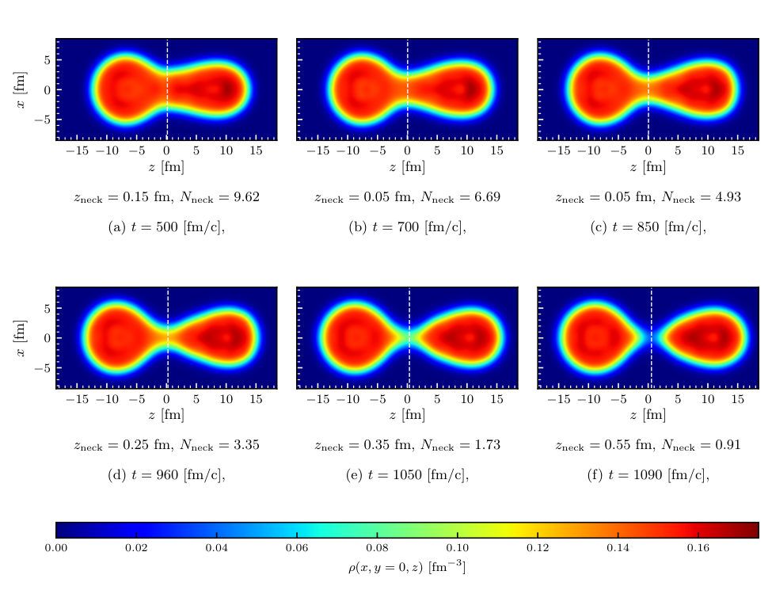 
FIG. 3. Contour map of the total density of particles ρ(x, y = 0, z) at different times along the TDHFB trajectory. The number of particles in the neck is defined by Nneck = R ρ(x, y = 0, z) e−(z−zneck)2/a2 with zneck (dashed white line) being the point along the z-axis with the lowest density between the fragments, and a = 1 fm.

📷 Fig 4

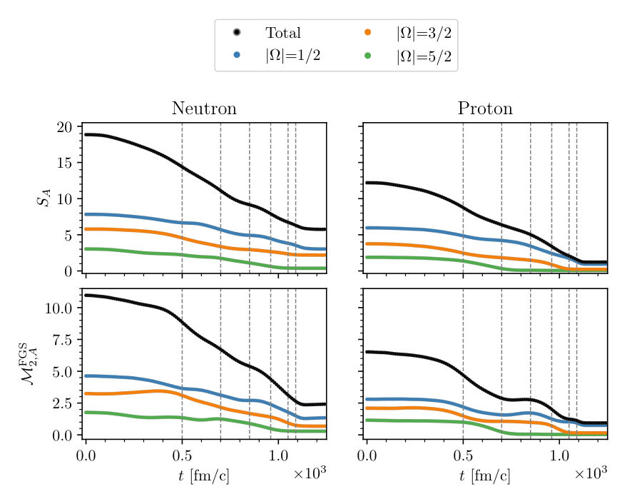 
FIG. 4. The entanglement entropy in Eq. (24) (top panels) and the upper bound of the non-local magic in Eq. (25) (bottom panels) are plotted as a function of time along the TDHFB trajectory. The left (right) column shows the results for the neutron (proton) wavefunction. Black circles denote the total contribution summed over all |Ω| ≤25/2 blocks, while colored circles denote the three largest individual contributions corresponding to |Ω| = 1/2 (blue), 3/2 (orange), and 5/2 (green). Vertical lines correspond to the time snapshots of Fig. 3.

📷 Fig 5

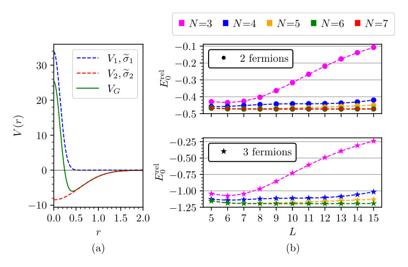 
FIG. 5. (a) The short-range repulsive component V1 with width ˜σ1 (dashed blue line) and long-range attractive component V2 with width ˜σ2 (dashed red line) of the Gaussian interaction potential, along with the resulting total potential VG (solid green line) in Eq. (28), as a function of the relative coordinate r. (b) Ground-state energy of the relative Hamiltonian, Erel 0 , are plotted as a function of the box width L for a range of quantum-register sizes N denoted by different colors, for ˜A = 2 (top, circles) and ˜A = 3 (bottom, stars) fermions, respectively. The eigenvalues converge at N = 6 for ˜A = 2 and at N = 5 for ˜A = 3 once L = 10, justifying the choice of N and L used in the...

**Summary.** This work quantifies the quantum complexity of nuclear processes, such as scattering and fission, by tracking entanglement and non-local magic resources over time. By showing that these complexity measures remain high in the outgoing fragments, the authors argue that simulating these dynamics accurately requires quantum computation. This establishes a theoretical case for quantum advantage in nuclear structure physics.

**Why it may be interesting.** It bridges the gap between abstract quantum information theory (complexity measures) and concrete, complex physical systems (nuclear reactions), providing a theoretical benchmark for quantum simulation feasibility in nuclear physics.

Detailed structure

**Main problem.** The paper investigates the quantum complexity structure of strongly correlated quantum many-body systems to determine if they are suitable candidates for quantum computational advantage.

**Main result.** The analysis of nuclear scattering and fission dynamics shows that significant quantum complexity, quantified by entanglement and non-local magic, persists in the outgoing states, suggesting quantum computers would offer substantial advantages.

**Method.** The study analyzes the time-evolution of quantum complexity indicators, specifically bipartite entanglement entropy and non-local magic, using theoretical frameworks like the stabilizer formalism and Gaussian state approximations.

**Model / system.** The models include a one-dimensional system of strongly interacting fermions governed by the Negele potential for scattering, and a realistic simulation of $^{240}	ext{Pu}$ fission using time-dependent Hartree-Fock-Bogoliubov (TDHFB) theory.

**Key observables.** Bipartite entanglement entropy, non-local magic (non-stabilizerness), and the Anti-flatness ($	ext{F}_A$) measure.

**Important parameters / regimes.** The complexity measures are sensitive to the dynamics, particularly in the region beyond scission during fission.

**Assumptions / limitations.** The analysis uses Gaussian states (FGS) as a tractable proxy for the full dynamical evolution, despite FGSs being classically simulable.

**Paper structure.** The paper proceeds by defining and analyzing quantum complexity measures (entanglement, non-local magic) and applying these tools to two distinct physical scenarios: 1D fermion scattering and $^{240}	ext{Pu}$ fission dynamics.

Abstract

Quantum computers promise advantages for simulating strongly correlated quantum many-body systems, like atomic nuclei, that are beyond the reach of classical computers. Realizing this potential requires understanding the quantum complexity structure of the target problem. We investigate the time-evolution of two key indicators of quantum complexity, bipartite entanglement entropy and non-local magic (non-stabilizerness), in nuclear reaction dynamics. We analyze two representative dynamical processes: scattering in a one-dimensional model of strongly interacting fermions governed by the Negele potential, and a realistic simulation of $^{240}$Pu fission within time-dependent Hartree-Fock-Bogoliubov (TDHFB) theory. In the former case, we find that interactions dynamically generate both entanglement and non-local magic, leaving persistent signatures of quantum complexity in the outgoing states. In the latter, we observe that substantial quantum complexity survives in the spatial bipartition of daughter fragments well beyond scission. The presence of significant non-local magic and entanglement in both cases strongly indicate that quantum computers would provide substantial advantages for accurately simulating nuclear reaction dynamics.

[↑ back to top](#top)

### [Strongly anisotropic non-Kramers electron spin as a quantum coherence probe of angular fluctuations](http://arxiv.org/abs/2609.03989v1)

**Authors:** Achuthan Manoj Kumar, Remy Dassonneville, Guillaume Gerbaud, Nolwenn Le Breton, Athanassios K. Boudalis, Patrice Bertet, Philippe Goldner, Sylvain Bertaina  
**Type:** experiment · **Category:** other · **PDF:** <https://arxiv.org/pdf/2609.03989v1>  
**Analysis basis:** full PDF text, analyzed in chunks
**Topic relevance:** `correlated / nonlocal dissipation` **1/5** · `quantum measurements` **1/5**

📷 Fig 1

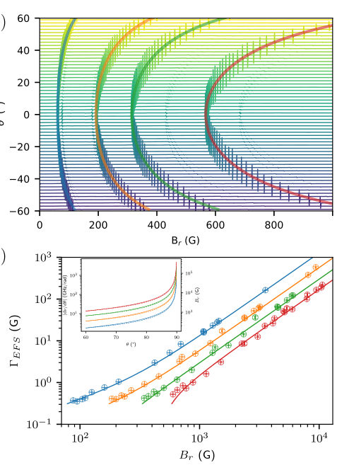 
FIG. 1. a) CW-EPR spectra at 13 K, each offset vertically ac- cording to the orientation θ of the applied field relative to the crystal c-axis. The four hyperfine transitions of the effective spin-1/2 of Tb3+ are labeled L1 to L4 (dashed colored lines), computed from Eq. (3) with mI = +1/2 (L1, blue), +3/2 (L2, orange), −1/2 (L3, green) and −3/2 (L4, red). Near θ ∼0, all four lines fall below 700 G owing to the large g∥; they di- verge as θ →π/2. Line L2 appears as a fold-back of a branch whose physical resonance occurs at negative applied field (see text). The other small visible lines are identified as Tb3+

📷 Fig 2

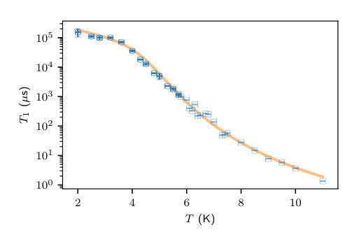 
FIG. 2. Measured spin-lattice relaxation time T1 of Tb3+ in CaWO4 as a function of temperature (blue dots and squares), extracted by inversion recovery. Solid line, Eq. (7) with coef- ficients from Refs. [47, 48]. Measurements (dots and squares) were performed in two independent laboratories.

📷 Fig 3

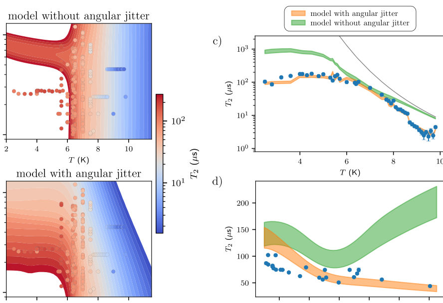 
FIG. 3. Hahn-echo coherence time T2 of Tb3+ in CaWO4. a,b) Colored dots, measured T2 as a function of temperature T and resonant field Br. Colored contours, model a) without and b) with angular fluctuations. For visibility, contours outside the colorbar range [1.5 µs, 270 µs] are not shown. c) Blue dots, maximum measured T2 at each temperature. Solid gray line, physical limit 2T1 from Eq. (7). d) Blue dots, measured T2 as a function of resonant field at T = 6.5 K. In c,d), green shades, model without angular fluctuations; orange shades, model with angular fluctuations. Shade widths reflect combined uncertainties in temperature (0.05 K) and impurity concentrations (Appendix A 3).

📷 Fig 4

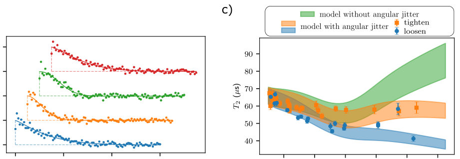 
FIG. 4. Angular jitter as the dominant decoherence channel. a) Schematic of the two angular-jitter pathways: a global rotation δθext of the crystal relative to the fixed laboratory field, driven by mechanical vibrations; and a local phonon-driven modulation δθph of the crystal c-axis at the unit-cell level. b) Hahn-echo decay at T = 4 K and Br = 2565 G in four controlled pump configurations. Blue, reference state (T2 = 142 µs). Orange, auxiliary pump switched on (T2 = 83 µs). Green, same with damping weights on the cryostat tubing (T2 = 108 µs). Red, pump switched off, reference restored (T2 = 142 µs). Curves are offset vertically for visibility. The signal-to-noise ratio of the echo decay...

📷 Fig 5

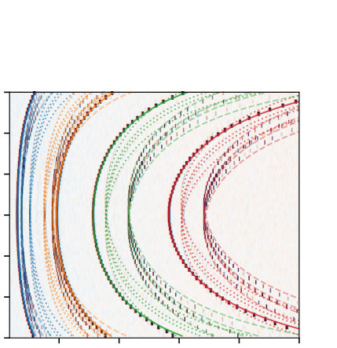 
FIG. 5. Colorplot, measured CW-EPR spectra in parallel mode. The colorscale is logarithmic to enhance the visibility of the small lines. Computed Tb3+ EPR lines (blue L1, orange L2, green L3, red L4) for S4 symmetry (solid lines), orthorhombic site 1 with ∆o1 = 5.49 GHz (dashed lines), and orthorhombic site 2 with ∆o2 = 7.44 GHz (dotted lines).

**Summary.** The researchers used electron paramagnetic resonance on $	ext{Tb}^{3+}$ ions to study quantum coherence, finding that conventional models failed to explain the measured coherence time ($T_2$). They successfully incorporated dynamical angular fluctuations of the crystal axis into their model, demonstrating that ambient vibrations are a dominant, quantifiable decoherence mechanism for anisotropic solid-state spins.

**Why it may be interesting.** This work provides a direct, measurable link between solid-state quantum coherence properties and macroscopic environmental noise (vibrations), offering a novel, highly sensitive quantum sensor platform.

Detailed structure

**Main problem.** To utilize the spin transitions of strongly anisotropic rare-earth ions as a highly sensitive quantum coherence probe for measuring ambient angular fluctuations.

**Main result.** The dominant decoherence pathway is found to be due to dynamical angular fluctuations of the crystal axis, which can be quantified and modeled by extending standard spin-bath theories.

**Method.** Pulsed electron paramagnetic resonance (EPR) measurements are used to map the Hahn-echo coherence time ($T_2$) as a function of temperature and magnetic field, comparing results against detailed theoretical models.

**Model / system.** The system involves $	ext{Tb}^{3+}$ ions in a $	ext{CaWO}_4$ crystal, which possesses strong magnetic anisotropy ($g_{\perp}=0$). The analysis models the spin Hamiltonian and incorporates contributions from spin-lattice relaxation, impurity diffusion, and crucially, angular jitter.

**Key observables.** Hahn-echo coherence time ($T_2$), $	ext{EPR}$ linewidth ($\Gamma_{	ext{EFS}}$), and the temperature/field dependence of $T_2$.

**Important parameters / regimes.** Temperature range (2 to 10 K), resonant field ($10^3$ to $10^4$ G), and the angular noise spectral density ($\sim 36 	ext{ n}\circ/\sqrt{	ext{Hz}}$).

**Assumptions / limitations.** The initial model failed because it neglected the dynamical angular fluctuations of the crystal axis, which was confirmed by controlled mechanical experiments.

**Figures summary.** Figures show $	ext{EPR}$ spectra illustrating field-dependent transitions, linewidth measurements ($\Gamma_{	ext{EFS}}$) showing angular divergence, and $T_2$ measurements demonstrating deviations from simple spin-bath models.

**Paper structure.** The paper establishes the physical sensitivity of the spin system to orientation, presents initial modeling failures, and culminates in a successful two-parameter extension that incorporates dynamical angular fluctuations to reproduce all experimental data.

Abstract

Strongly anisotropic non-Kramers rare-earth ions combine giant longitudinal g-factors with a vanishing transverse component imposed by time-reversal symmetry, a combination that makes their spin transitions exquisitely sensitive to the orientation of the applied magnetic field. We show that this sensitivity carries a dual identity: it is simultaneously an overlooked decoherence channel and the basis for a spin-coherence-based angular probe. Using pulsed electron paramagnetic resonance at X-band, we report the first measurements of the quantum coherence of Tb$^{3+}$ in a native-doped CaWO$_4$ crystal (15 ppb) and map the Hahn-echo coherence time $T_2$ as a function of temperature (2 to 10 K) and resonant field ($10^3$ to $10^4$ G). A parameter-free model combining spin-lattice relaxation, instantaneous diffusion and spectral diffusion from all independently quantified impurities overestimates $T_2$ by an order of magnitude at low temperature and wrongly predicts the field dependence of $T_2$, inconsistent with the observed monotonic decrease of $T_2$ with $B_r$. A two-parameter extension, including dynamical angular fluctuations of the crystal axis, reproduces the full dataset across multiple setups and laboratories. Two controlled experiments nominally identical except for different mechanical configuration of the setup establish the mechanical origin of the dominant contribution. The two-parameter extension corresponds to an angular amplitude noise spectral density of overall order 36 n°/$\sqrt{Hz}$ from global external vibrations (ranging from 10 to 66 n°/$\sqrt{Hz}$ depending on the exact setup mechanical configuration) estimated at $\sim$ 2.5 kHz plus a temperature-dependent contribution assumed to come from local phonon-driven angular jitter. It identifies and highlights a decoherence pathway of practical relevance to any anisotropic solid-state spin system.

[↑ back to top](#top)

### [Wavefunctions for Anyon Superconductors](http://arxiv.org/abs/2609.04187v1)

**Authors:** Donghae Seo, Taegon Lee, Gil Young Cho  
**Type:** theory · **Category:** strongly correlated electrons · **PDF:** <https://arxiv.org/pdf/2609.04187v1>  
**Analysis basis:** full PDF text, analyzed in chunks
**Topic relevance:** `Keldysh / 2PI / non-Gaussian methods` **1/5** · `analog quantum simulation` **1/5**

📷 Fig 1

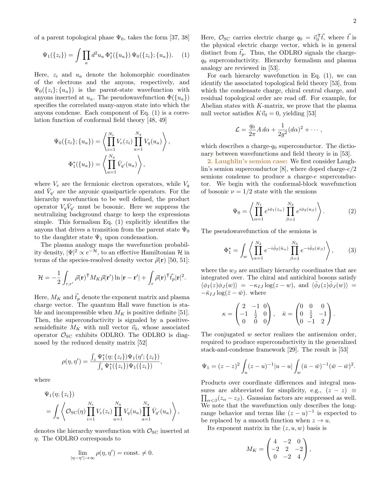 
Low-resolution page preview, page 2

📷 Fig 2

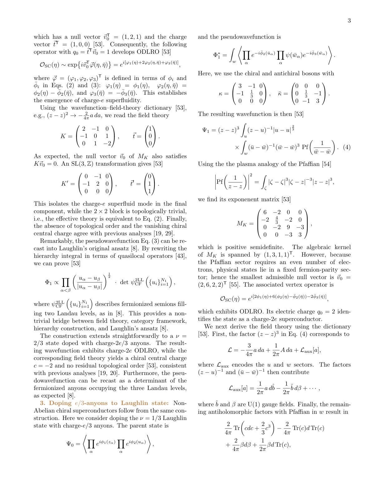 
Low-resolution page preview, page 3

📷 Fig 3

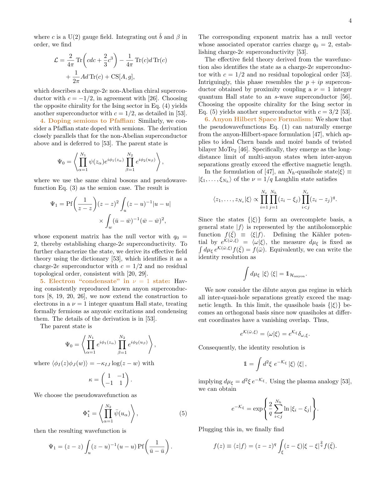 
Low-resolution page preview, page 4

📷 Fig 4

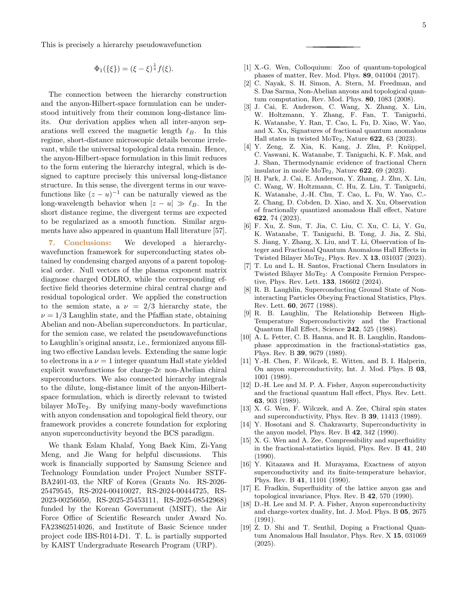 
Low-resolution page preview, page 5

📷 Fig 5

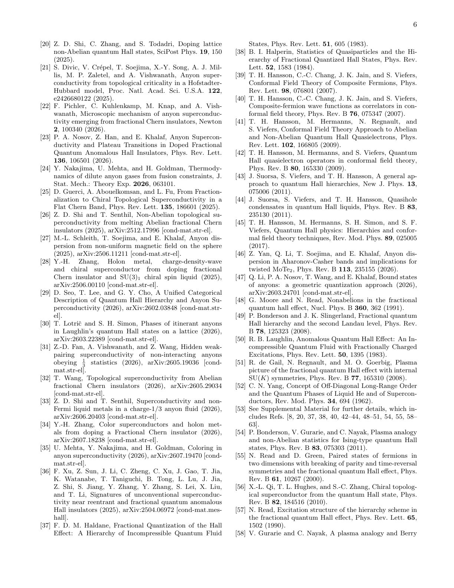 
Low-resolution page preview, page 6

**Summary.** This work develops a comprehensive wavefunction framework to describe anyon superconductivity, moving beyond conventional BCS theory. By constructing hierarchy wavefunctions derived from topological orders, the authors successfully diagnose superconducting order and topological properties for systems like the $\nu=2/3$ state. This establishes a unified theoretical link between anyon condensation, superconducting pairing, and topological field theory.

**Why it may be interesting.** The rigorous wavefunction approach provides a powerful, concrete tool to analyze topological superconductivity, bridging abstract CFT concepts with measurable physical diagnostics like ODLRO.

Detailed structure

**Main problem.** The paper aims to develop a systematic wavefunction description for anyon superconductors, as a general framework is currently lacking despite existing field-theoretic descriptions.

**Main result.** A unified wavefunction-level framework is established, successfully linking anyon condensation, superconducting order, and topological field theory for various fractional quantum Hall states.

**Method.** The authors develop a 'hierarchy-wavefunction construction' using the plasma analogy and topological field theories to analyze superconducting states derived from parent topological orders.

**Model / system.** The study focuses on anyon superconductors, where superconductivity arises from mobile anyon condensation rather than conventional Cooper pairing. Specific models include the $\nu=2/3$ state, Laughlin states ($\nu=1/3$), and the Pfaffian state.

**Key observables.** Off-Diagonal Long-Range Order (ODLRO), condensate charge, chiral central charge, and residual topological order.

**Important parameters / regimes.** The analysis examines the long-distance limit of the anyon-Hilbert-space formulation, which applies to ideal Chern bands and moiré bands.

**Assumptions / limitations.** The formalism relies on the correspondence between quantum Hall hierarchy states and anyon superconductivity, and the plasma analogy requires the exponent matrix to be positive semidefinite.

**Paper structure.** The paper progresses by first defining the general hierarchy wavefunction construction, then applying it to specific fractional quantum Hall states (semions, $\nu=2/3$, $\nu=1/3$), and finally using the reduced density matrix and ODLRO operator to confirm the superconducting nature across all cases.

Abstract

Anyon superconductivity arises from the condensation of mobile anyons rather than from a conventional Cooper instability, yet a systematic wavefunction description remains lacking. We develop a hierarchy-wavefunction construction for superconducting states derived from parent topological orders and identify their off-diagonal long-range order, condensate charge, chiral central charge, and residual topological order through the plasma analogy and topological field theories. We construct Abelian and non-Abelian examples descending from the semion state, a $ν=2/3$ hierarchy state, the $ν=1/3$ Laughlin state, $ν=1$ integer quantum Hall state, and Pfaffian state. Remarkably, for the semion case, the superconducting many-semion wavefunction is equivalent to a state of fermionized anyons filling two effective Landau levels, recovering Laughlin's original construction of semion superconductor. Finally, we show that hierarchy wavefunctions emerge naturally in the dilute, long-distance limit of the anyon-Hilbert-space formulation, which applies to ideal Chern bands and moiré bands of twisted bilayer MoTe$_2$. Our results establish a unified wavefunction-level framework linking anyon condensation, superconducting order, and topological field theory.

[↑ back to top](#top)

### [Algebraic Operator Decomposition: A Partitioned Architecture for Noise-Resilient Quantum Computing](http://arxiv.org/abs/2609.04076v1)

**Authors:** Wladimir Silva  
**Type:** theory · **Category:** quantum information and computing · **PDF:** <https://arxiv.org/pdf/2609.04076v1>  
**Analysis basis:** full PDF text, analyzed in chunks
**Topic relevance:** `quantum measurements` **1/5**

📷 Fig 1

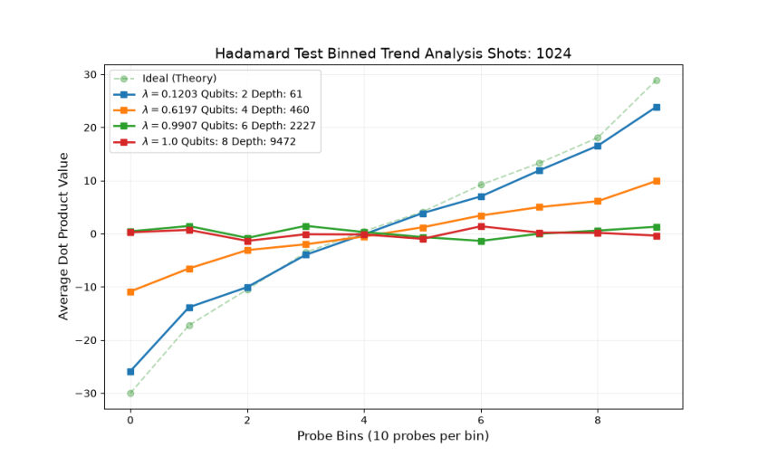 
Fig. 4: Visual Feature Space Division. For shallow partitions (λ = 0.1203, 2 Qubits, Depth: 61), the average dot product value tightly tracks the ideal baseline. As the circuit depth increases to D = 460 (λ = 0.6197, 4 Qubits), a noticeable flattening of the slope occurs. This highlights the early stages of information dissipation.

📷 Fig 2

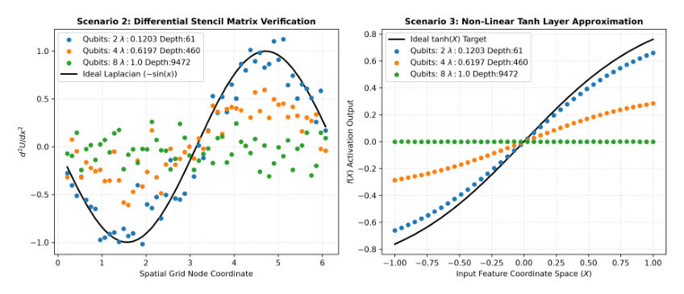 
Fig. 5: In the low-depth partition tier (n = 2, λ = 0.1203, D = 61), both mathematical operators demonstrate excellent structural stability, tracking the precise contours of the exact analytical targets (−sin(x) and tanh(X)) with minimal variance. At the deepest monolithic threshold (n = 8, λ = 1.0, D = 9472), phase-decoherence completely dominates the system.

📷 Fig 3

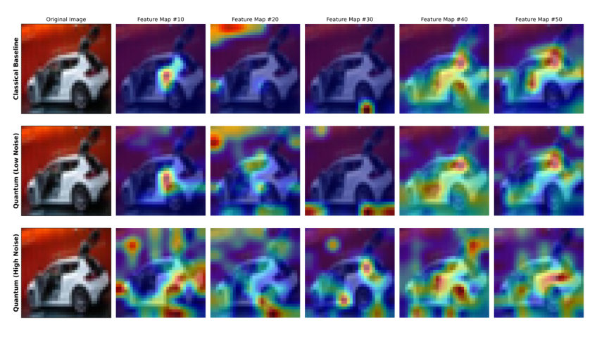 
Fig. 6: Quantum Convolution: forward inference pass on the first car image of CIFAR-10 under Ideal, Low Noise (λ = 0.1203, 2 Qubits, Depth: 61) and High Noise (λ = 0.6197, 4 Qubits, Depth: 460) settings using algorithms 1, and 2. Note: Algorithm 1 emulates the expected measurement statistics of the Hadamard-test primitive under the adopted depolarizing/readout noise model.

📷 Fig 4

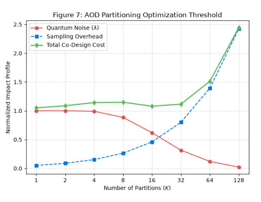 
Fig. 7: AOD partitioning tradeoff across K channels. The optimization curve illustrates the competitive crossover front between quantum gate attenuation and classical sampling expansion factors.

**Summary.** This paper introduces Algebraic Operator Decomposition (AOD), a method to break down complex quantum operations into many smaller, shallow, and independent sub-circuits. By processing these fragments in parallel and summing the results classically, it proactively mitigates noise accumulation by keeping the circuit depth below hardware coherence limits. This shifts the computational bottleneck from deep quantum coherence to manageable classical sampling overhead.

**Why it may be interesting.** It provides a novel, mathematically rigorous framework for structuring quantum computations that directly addresses the depth limitations inherent in NISQ devices, which is highly relevant to open quantum systems modeling.

Detailed structure

**Main problem.** The primary challenge is mitigating noise and decoherence in Noisy Intermediate-Scale Quantum (NISQ) computing by avoiding error correction entirely.

**Main result.** The proposed Algebraic Operator Decomposition (AOD) successfully reduces the required quantum circuit depth by fracturing global operators into shallow, independent sub-channels.

**Method.** AOD decomposes a global linear operator into a sum of local operators, which are then processed in parallel using a MapReduce model based on a commutative monoid.

**Model / system.** The framework is built upon operators belonging to a Vector Space over Additive Abelian Groups, applicable to complex quantum operations like inner products, convolutions, and differential operators.

**Key observables.** The reconstructed global observable ($\langle T 
angle$), the required shot budget ($S_{	ext{total}}$), and the error bound ($\Delta T$).

**Important parameters / regimes.** Noise parameters ($\epsilon_{1Q}, \epsilon_{2Q}$), hardware-dependent coherence threshold ($D_{	ext{max}}$), and the number of partitions ($K$).

**Assumptions / limitations.** The approach assumes independent local noise channels and trades reduced quantum depth for increased classical reconstruction and sampling overhead.

**Figures summary.** Figures illustrate the quantum circuits for specific scenarios, such as the Hadamard Test for inner products and the evolution across discrete operational slices for differential operators.

**Paper structure.** The paper introduces AOD, details its application to various global operations (e.g., dot products, convolutions), derives theoretical bounds on error containment and sampling cost, and concludes with optimization strategies.

Abstract

We present an operator-decomposition architecture that mathematically maps a global operator into independently executable local operators, reducing the maximum quantum circuit depth at the cost of classical reconstruction and sampling overhead. By framing complex Quantum Circuits around an operator in a vector space that can be algebraically pre-decomposed, AOD complements quantum error correction and error-mitigation approaches by performing algebraic decomposition before quantum execution.   Our approach leans in the computer science definition of a Monoid: a design pattern and mathematical concept consisting of a data type, a combining function that is associative, and a safe identity (neutral) element that does not change other values when combined. Simulation wise we define a MapReduce programming model where the addition (+) is the reducer, thus leveraging a naturally stable commutative monoid which carries zero "negative-probability tax" or phase conflicts.   Furthermore, we define a Vector Space of Linear Operators over Additive Abelian Groups that benefit from this paradigm, including: Inner Products, Series expansions, Traces and Convolutions. Finally, we present the mathematical foundations and simulation results for this paradigm.

[↑ back to top](#top)

### [Cutting corners: exciting and magical bounds from the cusp bootstrap](http://arxiv.org/abs/2609.04041v1)

**Authors:** Ryan A. Lanzetta, Ian Moult, Yifan Wang  
**Type:** theory · **Category:** strongly correlated electrons · **PDF:** <https://arxiv.org/pdf/2609.04041v1>  
**Analysis basis:** full PDF text, analyzed in chunks
**Topic relevance:** `Keldysh / 2PI / non-Gaussian methods` **1/5**

📷 Fig 1

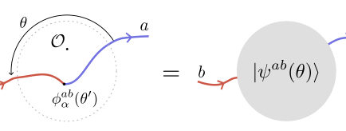 
FIG. 2. An arbitrary configuration of defects and other operator in- sertions within a sphere punctured at right angles by defects a, b, where the relative angle between the punctures is θ, defines a state in the radial Hilbert space |ψab(θ)⟩∈Hab(θ), whose eigenstates are in correspondence with cusped defect-changing operators. Im- portantly, the defects puncture the surrounding sphere orthogonally so the COE can be strictly applied.

📷 Fig 2

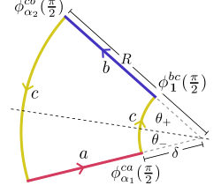 
FIG. 3. A graphical illustration of the wedge-shaped defect used in the proof of eq. (11). The inner and outer radii are δ, R, respec- tively. The dotted lines extending past the upper and lower straight edges intersect at the point where the COE is performed over cusped defect-changing operators.

📷 Fig 3

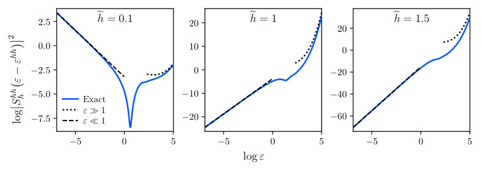 
FIG. 5. The energy structure constants for the rectangular pinning field amplitude A(y) for the 3+1d massless free scalar for ˜h = 0.1, 1, 1.5. The dashed and dotted curves indicate, respectively, the ε ≪1 and ε ≫1 asymptotics given in eq. (18). The curves are generated by taking the inverse Laplace transform of the series expansion eq. (A12) to large order in y−1.

**Summary.** This theoretical paper derives universal, rigorous lower bounds on the anomalous dimensions characterizing sharp corners (cusps) of line defects in a CFT. By applying bootstrap consistency checks across various defect geometries, the authors establish fundamental constraints on the underlying quantum field theory structure. This work provides powerful mathematical tools for constraining physical theories based on symmetry and consistency.

**Why it may be interesting.** While focused on CFT, the techniques involving universal bounds derived from consistency conditions (bootstrap) are highly relevant to understanding critical points and strongly correlated systems where such constraints often appear.

Detailed structure

**Main problem.** The paper aims to establish general, universal bounds on the cusp anomalous dimensions ($\Gamma$) associated with line defects in a Conformal Field Theory (CFT). These bounds are derived from fundamental principles like unitarity and the consistency of defect geometries.

**Main result.** The authors prove that singlet cusps are the lightest possible cusps and derive an optimal, universal lower bound for the dimension of a right-angle bare cusp using bootstrap constraints.

**Method.** The analysis employs advanced techniques including the Operator State Correspondence (OSC), the Cusp Operator Expansion (COE), and applying bootstrap constraints derived from varying defect geometries (e.g., rectangular or wedge shapes).

**Model / system.** The study is set in the context of conformal line defects within a Conformal Field Theory (CFT). The analysis uses concepts from radial and flat quantization to model the dynamics of these defects.

**Key observables.** Cusp anomalous dimensions ($\Gamma$), the universal defect Casimir energy ($\epsilon_{aar{a}}$), and the bare cusp dimension ($\Gamma_{aar{a}}^0(	heta)$).

**Important parameters / regimes.** The cusp angle ($	heta$), the separation distance ($L$), and the geometry of the defect configuration (e.g., right angle, rectangular).

**Assumptions / limitations.** The theory is assumed to be local, unitary, and possess a complete defect Hilbert space. The derived bounds are claimed to be valid in any scale-invariant theory.

**Figures summary.** Figure 1 illustrates cusped defect changing operators; Figure 2 shows defect configurations on a sphere punctured at right angles; Figure 3 illustrates the wedge-shaped defect used in the proof of one of the key inequalities.

**Paper structure.** The paper builds by first establishing foundational results regarding singlet cusps and then deriving increasingly general bounds by applying consistency checks (bootstrap constraints) to increasingly complex defect geometries (e.g., rectangular, cuboid).

Abstract

An illuminating probe of the dynamics of a line defect is the global geometry of its worldline. For a conformal line defect in a conformal field theory, sharp corners in the worldline, i.e. cusps, host dynamical degrees of freedom characterized in part by a spectrum of scaling dimensions, called cusp anomalous dimensions. We present various general bounds on cusp anomalous dimensions following from unitarity and cutting-and-gluing consistency of different defect geometries. We first establish, for cusps involving conjugate defects, that level crossings upon varying the cusp angle are forbidden between the lightest singlet cusp and any non-singlet cusp, proving that singlet cusps are the lightest. Then, we study line defects arranged in a rectangular geometry, which are subject to bootstrap constraints reminiscent of the spinless modular bootstrap. We find an analytic ``magic" functional that produces an optimal and universal lower bound on the dimension of a right angle bare cusp in terms of the universal defect Casimir energy between the corresponding defect and its conjugate in flat space.

[↑ back to top](#top)

### [Discretization-Aware Fine-Tuning for Quantum Machine Learning with Chemical Foundation Models](http://arxiv.org/abs/2609.03220v1)

**Authors:** Shunji Matsuura, Sonika Johri  
**Type:** theory · **Category:** quantum information and computing · **PDF:** <https://arxiv.org/pdf/2609.03220v1>  
**Analysis basis:** full PDF text, analyzed in chunks
**Topic relevance:** `quantum measurements` **1/5**

📷 Fig 1

 
Fig. 1. Pipeline overview. SMILES strings are mapped to embeddings by ChemBERTa-77M. The baseline (blue) uses frozen embeddings, while the proposed method (purple) applies discretization-aware fine-tuning (DAFT). Both paths share the same preprocessing pipeline (standardization, PCA, mutual information selection, and quantization) to produce bit-string inputs for the quantum circuit. All classical baselines are evaluated on identical inputs for fair comparison.

📷 Fig 2

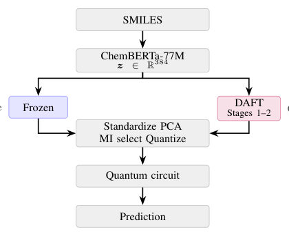 
Figure 1 provides an overview of the complete pipeline. We describe the components in turn.

**Summary.** This work addresses the information bottleneck in QML by introducing Discretization-Aware Fine-Tuning (DAFT). DAFT modifies the representation learning process to minimize data collisions during quantization, which is crucial for near-term quantum devices. The results prove that achieving quantum advantage requires explicitly aligning continuous chemical embeddings with the discrete constraints of quantum encoding.

**Why it may be interesting.** While focused on ML, the core concept of information compression and the necessity of preserving continuous information structure when mapping to discrete quantum states is highly relevant to understanding quantum channel capacity and encoding schemes in quantum information theory.

Detailed structure

**Main problem.** The primary challenge in Quantum Machine Learning (QML) is the information bottleneck where high-dimensional classical data must be compressed into limited quantum registers, leading to cross-class collisions.

**Main result.** The proposed Discretization-Aware Fine-Tuning (DAFT) method significantly reduces these collisions, enabling the quantum model to surpass a matched classical baseline at higher qubit counts.

**Method.** DAFT adapts a pre-trained chemical foundation model using a differentiable soft collision loss to ensure that the resulting quantized representations remain highly informative.

**Model / system.** The system uses near-term quantum devices processing molecular representations derived from chemical foundation models (like ChemBERTa-77M) via bit-string encoding.

**Key observables.** Collision count, quantum classification accuracy, and the performance gap compared to a matched classical baseline.

**Important parameters / regimes.** Qubit count (tested up to 10 qubits), and the degree of information compression imposed by the bit-string encoding.

**Assumptions / limitations.** The comparison isolates the effect of representation by ensuring both quantum and classical models receive identical discretized bit-string inputs.

**Figures summary.** Figures illustrate the pipeline comparing baseline vs. DAFT, and tables summarize the reversal of performance advantage from classical-wins to quantum-wins as qubit count increases.

**Paper structure.** The paper introduces the problem of data compression in QML, details the DAFT methodology (including soft collision loss), evaluates it on a molecular property prediction benchmark, and concludes by demonstrating the conditions necessary for quantum advantage.

Abstract

A key challenge in practical quantum machine learning (QML), particularly for discriminative tasks such as classification, is the limited capacity of near-term quantum devices to encode high-dimensional classical data into small quantum registers. In optimized basis-encoded (bit-bit) settings, this constraint leads to cross-class collisions, where samples with different labels are mapped to the same discrete bit-string and thus become indistinguishable to any downstream model. In this work, we investigate how data representation affects QML performance under such severe information bottlenecks. We introduce discretization-aware fine-tuning (DAFT), a method that adapts a pre-trained chemical foundation model to produce representations that remain informative after quantization. DAFT reduces collision probability through a differentiable soft collision loss. We evaluate both quantum and classical models under a controlled setting in which they receive identical discretized bit-string inputs, isolating the effect of representation from model architecture. On the blood-brain barrier penetration (BBBP) molecular property prediction benchmark using ChemBERTa-77M, DAFT reduces collision counts by several orders of magnitude and improves quantum classification accuracy by more than 12 percentage points compared to a frozen backbone. Importantly, without DAFT, classical models outperform QML under the same input constraints. With DAFT, however, this comparison reverses at higher qubit counts. At 10 qubits, the quantum model surpasses a matched classical baseline trained on identical bit-strings (0.883 vs. 0.855, $p = 0.026$). These results show that, in information-constrained regimes, achieving a quantum advantage critically depends on aligning continuous representations with discrete quantum encodings.

[↑ back to top](#top)

### [Evolution of electron spin resonance through a metallic quantum critical phase diagram](http://arxiv.org/abs/2609.03994v1)

**Authors:** Marc Scheffler, Jörg Sichelschmidt, Conrad Clauss, Mojtaba Javaheri Rahim, Boris I. Kochelaev, Cornelius Krellner, Christoph Geibel, Frank Steglich, Martin Dressel  
**Type:** both · **Category:** strongly correlated electrons · **PDF:** <https://arxiv.org/pdf/2609.03994v1>  
**Analysis basis:** full PDF text, analyzed in chunks
**Topic relevance:** `quantum measurements` **1/5**

📷 Fig 1

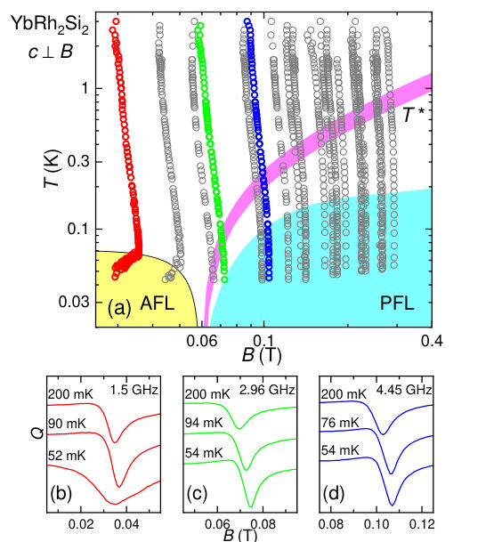 
FIG. 1. Probing the phase diagram of YbRh2Si2 with ESR. (a) Overall phase diagram with extremely heavy LFL regimes showing AF order (AFL) and metallic paramagnetism (PFL), as well as the T ∗line [1]. The circles indicate the ESR res- onance field for different microwave frequencies obtained by temperature-dependent ESR measurements, i.e. we probe all relevant regimes. The pronounced evolution of these res- onance fields as function of temperature clearly differs for the different regimes, and directly reflects the temperature- dependent g factor. (b, c, d) Exemplary ESR spectra (background-corrected resonator quality factor Q as function of magnetic field B) for three resonance frequencies,...

📷 Fig 2

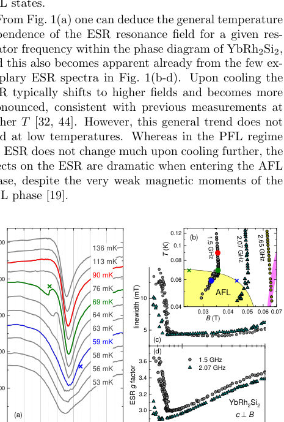 
FIG. 2. ESR of YbRh2Si2 in the AFL phase and crossing the AF transition. (a) ESR spectra for selected temperatures at 1.5 GHz, including temperature and field ranges in the AFL phase. Q axis refers to 53 mK data, higher temperature data are shifted by 200 each. (b) ESR resonance fields for the three lowest resonator frequencies at low temperatures. Upon cooling, the modes at 1.5 and 2.07 GHz change drastically when entering the AFL phase. Data points at 59 mK, 69 mK, and 90 mK of the 1.5 GHz resonator correspond to colored spectra in (a). The crosses in (a) and (b) correspond to fields of the AFM transition at 59 and 69 mK. (c) ESR linewidth ∆B and (d) g factor increase drastically in the...

📷 Fig 3

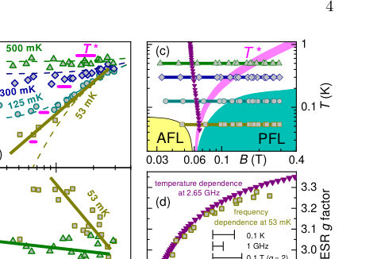 
FIG. 4. Magnetic field dependence of ESR parameters in the paramagnetic regimes. (a) g factor and (b) effective ESR relaxation time τeff = Bres/ν∆B, for temperatures and reso- nance fields as indicated in panel (c). Solid lines guide the eye; dashed lines: molecular field model [43]. (c) Phase diagram of YbRh2Si2 with horizontal-line connected symbols (resonance fields) referring to data shown in the other frames. The solid triangles denote the resonance fields of the 2.65 GHz mode. (d) Comparison of the g factor temperature dependence in the quantum-critical regime (horizontal axis: T (K); ν = 2.65 GHz mode) and frequency dependence in the PFL regime (horizontal axis: ν (GHz); T ≈53 mK)....

**Summary.** This work uses Electron Spin Resonance (ESR) spectroscopy to map the quantum critical phase diagram of the heavy-fermion metal YbRh2Si2. By tracking changes in the g-factor and linewidth, the authors distinguish the physics in paramagnetic, antiferromagnetic, and quantum-critical regimes. The results offer direct, microscopic evidence supporting theories of strongly correlated electron systems near a quantum critical point.

**Why it may be interesting.** The detailed mapping of magnetic excitations (via ESR) across a quantum critical point provides a powerful, dynamic probe of the underlying many-body interactions, which is crucial for understanding non-Fermi liquid behavior in strongly correlated materials.

Detailed structure

**Main problem.** The study investigates how electron spin resonance (ESR) properties evolve across the quantum critical phase diagram of a heavy-fermion metal.

**Main result.** ESR measurements reveal distinct behaviors in the g-factor and linewidth across paramagnetic, antiferromagnetic, and quantum-critical regimes, providing microscopic insight into the underlying correlated electron physics.

**Method.** The research combines novel, low-temperature ESR spectroscopy with theoretical modeling using effective spin Hamiltonians and molecular field approximations.

**Model / system.** The system is the heavy-fermion metal YbRh2Si2, which exhibits a quantum phase transition between a paramagnetic Fermi-liquid (PFL) and an antiferromagnetic (AFL) state due to the interplay between local magnetic moments and conduction electrons.

**Key observables.** ESR g-factor, ESR linewidth (Delta B), and the resonance field, measured as functions of temperature and magnetic field.

**Important parameters / regimes.** Quantum critical point, Paramagnetic Fermi-Liquid (PFL) phase, Antiferromagnetic Liquid (AFL) phase, Kondo temperature scale ($T^*$).

**Assumptions / limitations.** The analysis relies on approximating the system using an effective spin Hamiltonian and employing the molecular field approximation for theoretical modeling.

**Figures summary.** Figures illustrate the overall phase diagram probed by ESR, show exemplary ESR spectra across different phases, and detail the temperature/field dependence of the effective g-factor, often comparing experimental fits to theoretical predictions.

**Paper structure.** The paper establishes the physical model and experimental setup using ESR. It then presents results showing distinct ESR signatures in the PFL, AFL, and quantum-critical regimes, followed by theoretical analysis comparing these findings to established models of correlated electron magnetism.

Abstract

In the heavy-fermion metal YbRh2Si2, quantum criticality at a suppressed antiferromagnetic order is governed by the interplay of local magnetic moments and itinerant conduction electrons. We demonstrate how this can be investigated by a new experimental approach that enables the observation of electron spin resonance (ESR) across a broad range of frequencies and fields at very low temperatures. This allowed us to cover a large part of the phase diagram from the paramagnetic Fermi-liquid phase to the phase with antiferromagnetic order and including the quantum-critical regime. Both the ESR g-factor and the linewidth present distinct behaviors in these three regimes, providing further insight into the physics across a quantum critical point. Notably, when cooling down at a field directly towards the quantum critical point, both g-factor and linewidth continuously decrease. Furthermore, we observe a very good matching of the g-factor behavior upon field-tuning and temperature-tuning towards the quantum-critical point. We analyze and discuss the results in the context of present theories on ESR in strongly correlated electron systems.

[↑ back to top](#top)

### [Generalized s-d model for Wannier-Mott excitons in layered magnetic semiconductors](http://arxiv.org/abs/2609.03744v1)

**Authors:** Sonu Verma, Bashab Dey, Akashdeep Kamra  
**Type:** theory · **Category:** strongly correlated electrons · **PDF:** <https://arxiv.org/pdf/2609.03744v1>  
**Analysis basis:** full PDF text, analyzed in chunks
**Topic relevance:** `analog quantum simulation` **1/5**

📷 Fig 1

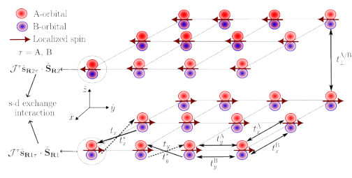 
FIG. 1. Schematic of the reduced low-energy model for a magnetically ordered CrSBr bilayer. Each layer ℓ= 1, 2 contains two effective orbital sectors, τ = A, B, represent- ing the conduction- and valence-band-edge manifolds, respec- tively. The localized Cr spin ˆSRℓcouples to the electron spin ˆsRℓτ through the orbital-dependent s-d exchange interaction −J τˆsRℓτ · ˆSRℓ. The parameters tτ x and tτ y describe intralayer hopping along the crystallographic a and b directions, respec- tively, while tτ ⊥denotes spin-conserving interlayer hopping between equivalent orbital sectors. The interorbital hoppings are denoted by tx and ty, with tx = 0 and ty = igy/2. Red and blue circles represent the...

📷 Fig 2

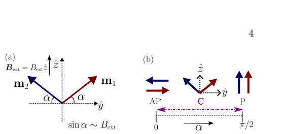 
FIG. 2. Field-induced canting of the ordered moments in a CrSBr bilayer for an applied magnetic field Bext ∥c. (a) Definition of the symmetric canting configuration. The ordered moment directions m1 and m2 have antiparallel components along the magnetic easy axis b and equal components along the applied-field direction c. The canting angle α is measured from the b axis. (b) Evolution of the magnetic configuration from the AFM state at α = 0, through the canted regime, to the field-polarized state at α = π/2. AP and P denote antiparallel and parallel layer-moment configurations, respectively.

📷 Fig 3

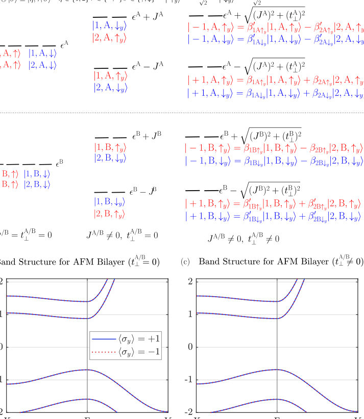 
FIG. 3. Single-particle states and band structure of the interlayer antiferromagnetic bilayer at α = 0. (a) Evolution of the Γ-point states as the orbital-dependent exchange and interlayer hopping are introduced. The left column shows the layer-degenerate states for Jτ = tτ ⊥= 0; the middle column shows the layer-staggered exchange splitting for Jτ ̸= 0 and tτ ⊥= 0; and the right column shows the hybridized states for finite Jτ and tτ ⊥, with τ = A, B. In this case, the exchange term −ηz ⊗Jorb ⊗σy produces opposite Zeeman-like shifts in the two layers. For a fixed σy eigenvalue, interlayer hopping therefore couples layer states separated in energy by 2|Jτ|. The wave functions mix to first...

📷 Fig 4

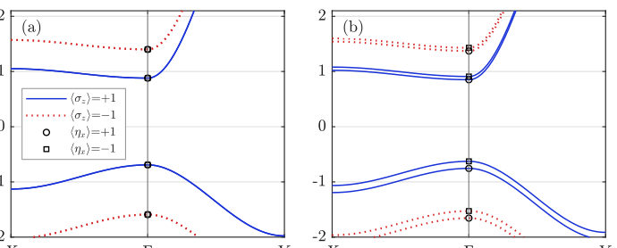 
FIG. 4. Single-particle states and band structure of the field-polarized interlayer-ferromagnetic bilayer at α = π/2. (a) Evolution of the Γ-point states as the orbital-dependent exchange and interlayer hopping are introduced. The left column shows the layer-degenerate states for Jτ = tτ ⊥= 0; the middle column shows the exchange-split states for Jτ ̸= 0 and tτ ⊥= 0; and the right column shows the bonding and antibonding states for finite Jτ and tτ ⊥, with τ = A, B. In this case, the exchange term −η0 ⊗Jorb ⊗σz produces the same Zeeman-like shift in both layers. Consequently, for a fixed σz eigenvalue, the two layer states are degenerate before interlayer hopping is introduced....

📷 Fig 5

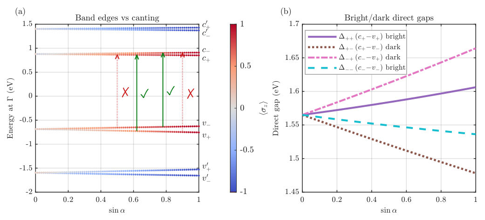 
FIG. 5. Evolution of the Γ-point band edges and direct gaps along the symmetric c-axis canting trajectory. The horizontal coordinate is B = sin α = Bext/Bsat below saturation. (a) Band-edge energies calculated from Eq. (25). Each band is labeled by its spin-resolved layer-parity (SRLP) eigenvalue λ = ±1, and the color scale represents ⟨σz⟩. At B = 0, the exchange field is layer staggered and directed along y, and the bands form exactly degenerate SRLP partner pairs within the reduced Hamiltonian. At B = 1, the exchange field is layer uniform and directed along z, and the states have definite σz. At intermediate canting, spin and layer parity are separately mixed, while SRLP remains...

**Summary.** This paper introduces a generalized s-d model to unify the description of magnetism, itinerant carriers, and excitons in layered magnetic semiconductors like $	ext{CrSBr}$. By analyzing the system's response across different magnetic field regimes, the authors predict specific excitonic states and provide a guiding principle based on conserved quantum numbers for understanding these complex magneto-optic effects.

**Why it may be interesting.** The explicit inclusion of magnetic order into the exciton physics via the s-d model provides a powerful theoretical tool for understanding magneto-optics, which bridges condensed matter theory with quantum optics.

Detailed structure

**Main problem.** To develop a unified, analytically tractable minimal model describing the interplay between magnetic order, itinerant electrons, and excitons in layered magnetic semiconductors.

**Main result.** The model successfully captures the coupling between magnetic order and excitonic phenomena, providing a framework to understand magneto-optic responses in these materials.

**Method.** The authors employ a generalized s-d model Hamiltonian, reducing it for magnetically ordered states and analyzing the resulting electronic structure and exciton binding energies.

**Model / system.** The study focuses on layered van der Waals magnetic semiconductors, using $	ext{CrSBr}$ bilayer as a case study. The model incorporates magnetic order, electron/hole dynamics, and excitons via an extended Hamiltonian.

**Key observables.** Bright and dark excitonic states, optical selection rules (conservation of a spin/layer pseudospin quantum number), and exciton binding energy.

**Important parameters / regimes.** Magnetic canting angle ($\alpha$), hopping amplitudes ($t_{	au x}, t_{	au y}, t_{	au \perp}$), and onsite exchange couplings.

**Assumptions / limitations.** The localized-spin operators are replaced by their expectation values for a magnetically ordered state, and the analysis often relies on a two-channel exciton model approximation.

**Figures summary.** Figure 1 schematically shows the reduced low-energy model for $	ext{CrSBr}$ bilayer. Figure 2 summarizes the field-driven evolution of magnetic order (AFM $	o$ Canted $	o$ FM). Figure 7(b) plots layer probabilities.

**Paper structure.** The paper progresses by first establishing the unified Hamiltonian, then analyzing the electronic structure evolution under magnetic field canting using symmetry principles (SRLP), and finally calculating the resulting Wannier-Mott exciton properties and binding energies.

Abstract

The recent discovery of excitons coupled to the magnetic order, and the consequent strong magneto-optic responses, in some van der Waals magnetic semiconductors has triggered intense activity at the interface of magnetism and semiconductor optics. Here, we present an analytically tractable minimal model that describes magnetic order, electrons, holes, and excitons within a unified framework, thereby capturing a wide range of phenomena. It treats the magnetic order and itinerant carriers to be comprised by distinct electronic orbitals that are mutually coupled via orbital-dependent onsite exchange, similar to the treatment of metallic magnets using an s-d model. Investigating CrSBr bilayer as a case study, we benchmark our model and its predictions against recent experimental and ab-initio results finding good agreement as well as new insights enabled by the model's simplicity. Examining the optical selection rules, we find the conservation of a quantum number formed from a combination of spin and layer pseudospin to be a useful guiding principle, even in noncollinear magnetic configurations. Our analysis finds a series of bright and dark excitonic states in such layered A-type antiferromagnets. The presented framework should be valuable in achieving intuitive understanding of recently discovered excitonic phenomena and guiding the discovery of other excitonic states in layered magnetic semiconductors.

[↑ back to top](#top)

### [Optimized Matrix-Product State Simulations of Quantum Error Correction Circuits](http://arxiv.org/abs/2609.03073v1)

**Authors:** Asier Piñeiro Orioli, Chen Zhao, Guido Masella, Tommaso Macrì, Hengyun Zhou, Shannon Whitlock  
**Type:** theory · **Category:** quantum information and computing · **PDF:** <https://arxiv.org/pdf/2609.03073v1>  
**Analysis basis:** full PDF text, analyzed in chunks
**Topic relevance:** `methods for driven-dissipative` **1/5**

📷 Fig 1

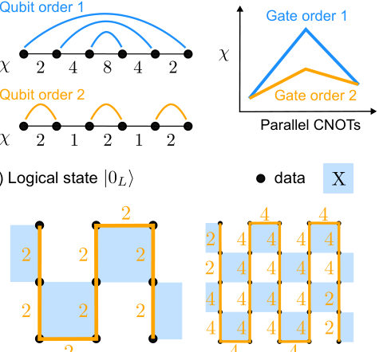 
FIG. 1. (a) The “rainbow” problem: entanglement shared across widely separated qubit pairs requires large bond di- mensions under a naive ordering, but a simple reordering en- forces nearest-neighbor connectivity and reduces χmax to 2. (b) “The mountain” problem: two orderings of a commuting gate set produce identical final states but very different peaks in bond dimension during the circuit. (c) Optimal snake or- dering for the state |0L⟩of the rotated surface code for d = 3 and 5. Light-blue squares represent the X stabilizers of |0L⟩; the orange line represents the MPS qubit chain. The number next to each link gives the bond dimension χi, determined by the number of stabilizers cut at...

📷 Fig 2

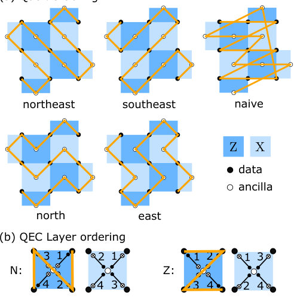 
FIG. 2. Parameter choices for memory circuit. (a) qubit-order options. The orange line in (a) represents the 1D MPS, where each qubit is a tensor. (b) qec-layer-order options. Each of the 4 QEC layers, k ∈{1, 2, 3, 4}, consists of all CNOTs be- tween each stabilizer ancilla and the data qubit in the direc- tion indicated by k. The orange line in (b) is just a visual aid.

📷 Fig 3

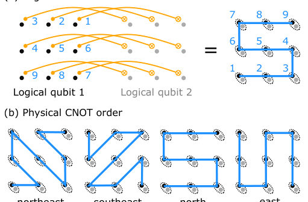 
FIG. 3. (a) Transversal logical CNOT between two logical qubits. The order of physical CNOTs given by the blue num- bers is represented by a snake on the right (corresponding to north). (b) Parameter choices for the cnotL-cnot-order pa- rameter. The indices grow in the compass direction indicated by the name.

📷 Fig 4

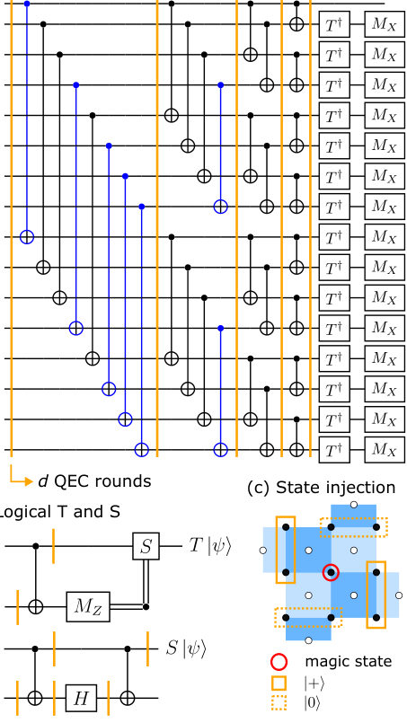 
FIG. 4. (a) 15-to-1 magic state distillation circuit from Ref. [75]. The blue CNOTs act trivially on the state and can be removed. (b) Implementation of T gates through teleportation with an ancilla prepared in the magic state |AL⟩= (|0L⟩+ eiπ/4 |1L⟩)/ √

📷 Fig 5

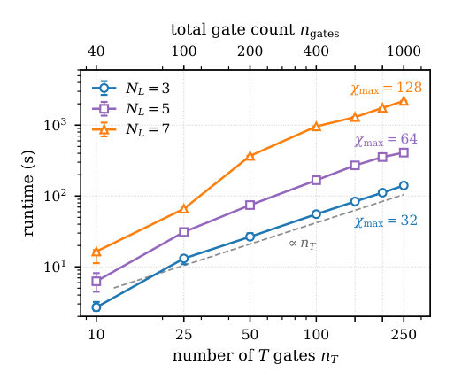 
FIG. 5. Mean runtimes from random circuits with NL ∈ {3, 5, 7} logical qubits encoded in a d = 3 rotated surface code (). Every qubit starts in either |0⟩or |+⟩with 50% probability. ngates random gates drawn from {H, S, T, CNOT} are applied with: nT = ngates/4 T gates, and pCNOT = 0.5, pH = pS = 0.25 for the remaining 3ngates/4 gates. The bond dimension at the logical level saturates to the maximum of 2⌊NL/2⌋and at the physical level it is multiplied by 16.

**Summary.** This paper shows that Matrix Product States (MPS) can efficiently simulate complex Quantum Error Correction (QEC) circuits, even those containing non-Clifford gates. The key finding is that simulation efficiency hinges not on the circuit itself, but on sophisticated, circuit-level optimizations like reordering qubits and gates. These optimizations can reduce resource requirements by orders of magnitude, positioning MPS as a vital tool for fault-tolerant quantum simulation.

**Why it may be interesting.** The focus on optimizing tensor network representations for QEC circuits provides a powerful, resource-aware simulation tool that complements existing near-Clifford simulators, which is highly relevant for understanding resource scaling in quantum computation.

Detailed structure

**Main problem.** The primary challenge is simulating large-scale Quantum Error Correction (QEC) circuits, especially those involving non-Clifford gates, to advance fault-tolerant quantum computing.

**Main result.** The authors demonstrate that Matrix Product State (MPS) techniques can simulate complex QEC circuits, including large magic-state distillation, efficiently by employing targeted circuit-level optimizations.

**Method.** The work utilizes MPS tensor network methods to represent and simulate quantum states and gates, focusing heavily on optimizing the sequence of qubits and gates to minimize the required bond dimension.

**Model / system.** The model involves simulating various QEC circuits, such as the rotated surface code and magic-state distillation, which are represented by stabilizer states and are analyzed using MPS formalism.

**Key observables.** Bond dimensions ($\chi_{\max}$), simulation time, and fidelity of the simulated logical states.

**Important parameters / regimes.** Circuit distance ($d$), number of physical qubits (up to 187), and the specific ordering choices (e.g., 'northeast' vs 'naive').

**Assumptions / limitations.** The efficiency of MPS is critically dependent on finding the optimal qubit and gate ordering, which is computationally difficult.

**Figures summary.** Figures illustrate the impact of ordering choices (e.g., 'rainbow' and 'mountain' problems), showing how reordering qubits or gates drastically reduces the maximal bond dimension required for simulation.

**Paper structure.** The paper progresses by first establishing the necessity of simulating non-Clifford QEC circuits, then introducing MPS as the tool, and finally detailing specific optimizations (qubit/gate ordering) and benchmarking these optimizations on increasingly complex circuits (surface code, distillation).

Abstract

Simulating quantum error correction (QEC) circuits including non-Clifford gates at scale is important to accelerate progress toward fault-tolerant quantum computing. Here we demonstrate that matrix product state (MPS) techniques can handle many QEC circuits exactly and without restriction on gate types. Crucially, we find that MPS efficiency depends sensitively on implementation choices, and we introduce a series of targeted optimizations that reduce bond dimensions and simulation time by several orders of magnitude compared to naive approaches. We illustrate this with examples including: (a) a rotated surface code quantum memory up to distance 11, (b) logical Bell-state preparation up to distance 9, (c) a 15-to-1 magic-state distillation circuit including hundreds of QEC rounds that we optimize to be simulated with only 11 logical qubits (187 physical qubits) and a maximal bond dimension of 64 in under 40 seconds, and (d) a narrow, deep random circuit that scales linearly with the number of T gates. These results demonstrate the importance of circuit-level optimizations and position MPS as a valuable complement to near-Clifford simulators for QEC circuits.

[↑ back to top](#top)

### [Parameterised graph theory for tensor networks: entanglement rerouting, structural simplification, and agnostic tomography](http://arxiv.org/abs/2609.04165v1)

**Authors:** Matthias C. Caro, Natalie McHugh, Sergii Strelchuk  
**Type:** theory · **Category:** numerical methods · **PDF:** <https://arxiv.org/pdf/2609.04165v1>  
**Analysis basis:** full PDF text, analyzed in chunks
**Topic relevance:** `methods for driven-dissipative` **1/5**

📷 Fig 1

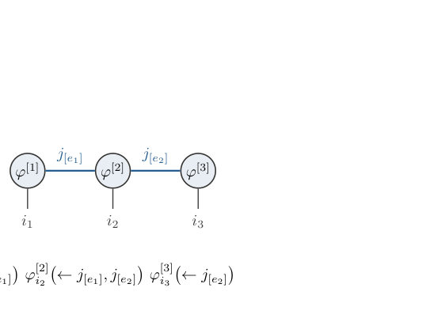 
Figure 4: Contracting a tensor network. Left: a weighted path graph G on three vertices with edges e1 = {1, 2} and e2 = {2, 3}. Right: compatible tensors φ[v], one per vertex, with a shared virtual index j[e] of range w(e) for each edge e and one physical index iv per vertex. The amplitude ψi1,i2,i3 is obtained by summing over all virtual indices, as in the displayed instance of Equation (2.10).

📷 Fig 2

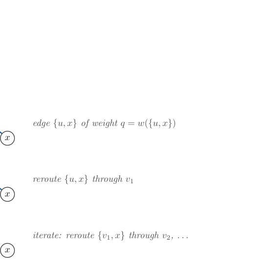 
Figure 5: Rerouting along a path. An edge {u, x} can be rerouted through successive intermediate vertices. The example shows three such vertices. Each step removes the current long edge and multiplies the weights of the two carrying edges by q.

📷 Fig 3

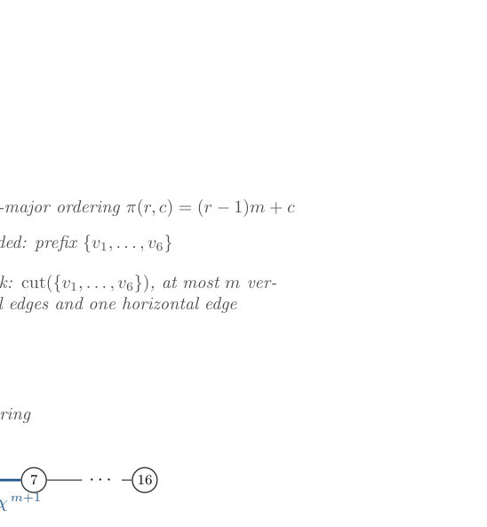 
Figure 6: Rerouting a square grid to a path, shown for m = 4. Panel (a): the row-major ordering π(r, c) = (r −1)m+c of the m×m grid, with the prefix {v1, . . . , v6} shaded and its prefix cut highlighted, consisting of m vertical edges and one horizontal edge. Panel (b): the resulting path on m2 vertices. Each MPS bond carries the product of the virtual dimensions of the grid edges crossing the corresponding prefix cut, here at most χm+1 on the bond {v6, v7}.

**Summary.** This paper uses parameterised graph theory to analyze the structural constraints governing Tensor Network States (TNSs). It proves that graph parameters like cutwidth bound the required bond dimensions for efficient representations (MPS/TTN). Crucially, it derives complexity bounds for state tomography, providing a theoretical roadmap for learning and characterizing complex quantum states.

**Why it may be interesting.** This work provides rigorous, graph-theoretic tools to quantify the computational cost associated with simulating or characterizing quantum states, which is crucial for understanding the limits of quantum simulation algorithms.

Detailed structure

**Main problem.** The paper aims to characterize the structural graph parameters that determine the computational tractability of representing quantum states as Tensor Networks (TNSs) and to bound the complexity of learning these states.

**Main result.** It establishes that graph parameters like cutwidth and tree-cutwidth bound the bond dimension overhead for MPS/TTN representations, and derives explicit graph-dependent complexity bounds for state tomography.

**Method.** The authors employ Parameterised Graph Theory, introducing the concept of 'entanglement rerouting' as a tensor-network analogue to analyze structural dependencies.

**Model / system.** The focus is on quantum states represented by Tensor Networks (TNSs) on a graph $G$, which encode the entanglement structure of the quantum system.

**Key observables.** Bond dimension, sample and computational complexity of tomography, and fidelity of state reconstruction.

**Important parameters / regimes.** Cutwidth ($	ext{cw}(G)$), Tree-cutwidth ($	ext{tcw}(G)$), and a new 'learning complexity' parameter.

**Assumptions / limitations.** The work extends its analysis to the 'agnostic setting,' allowing it to handle input states that might not perfectly belong to the restricted class of representable TNSs.

**Figures summary.** Figure 1 illustrates classical information rerouting, while Figure 2 illustrates the tensor-network analogue, 'Entanglement rerouting,' showing how virtual indices can be rerouted through an intermediate vertex.

**Paper structure.** The paper first introduces entanglement rerouting and proves bounds relating cutwidth/tree-cutwidth to MPS/TTN bond dimensions. It then derives complexity bounds for realizable TNS tomography and finally extends the framework to agnostic tomography for arbitrary input states.

Abstract

Parameterised graph theory studies how the complexity of graph-theoretic problems depends on structural parameters of the input graph. This perspective has proved useful in analysing tensor-network simulation (Markov and Shi, 2008). Its implications for tensor-network representations and tomography are less well understood. In particular, which graph parameters determine whether a tensor-network state (TNS) admits a tractable matrix product state (MPS) or tree tensor network (TTN) representation, and which control the complexity of learning the state?   We address these questions using parameterised graph theory. First, we show that cutwidth and tree-cutwidth bound the bond dimension overhead required to represent a TNS as an MPS or TTN. In the TTN case, tree-cutwidth also bounds the local dimension of the grouped subsystems. The proofs are based on entanglement rerouting, a tensor-network analogue of rerouting information in a classical network. Second, we derive graph-dependent upper bounds on the sample and computational complexity of realisable TNS tomography, with exponents that depend on cutwidth, tree-cutwidth, and a new graph parameter, learning complexity, which we bound in terms of degree and treewidth. We obtain these results by extending the disentangling MPS learner of (Cramer et al., 2010), as analysed further in (Bakshi et al., 2025; Lin et al., 2025), to TTNs and to tensor networks on arbitrary known graphs. Finally, we extend the framework beyond the realisable setting. For an arbitrary input state, our agnostic learner outputs a pure state whose fidelity is within additive error $ε$ of the optimum over tensor-network states on the given graph with a given bond dimension, with explicit graph-dependent bounds on sample and computational complexity.

[↑ back to top](#top)

### [Quasi-local form for $α$--$z$ Rényi QNEC from fixed-ray escorts](http://arxiv.org/abs/2609.04016v1)

**Authors:** Tanay Kibe, Pratik Roy  
**Type:** theory · **Category:** other · **PDF:** <https://arxiv.org/pdf/2609.04016v1>  
**Analysis basis:** full PDF text, analyzed in chunks
**Topic relevance:** `Keldysh / 2PI / non-Gaussian methods` **1/5**

📷 Fig 1

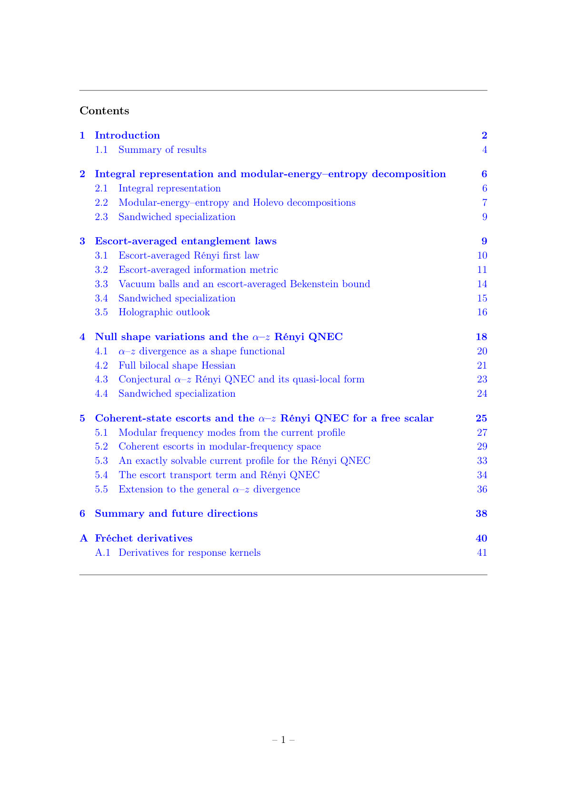 
Low-resolution page preview, page 2

📷 Fig 2

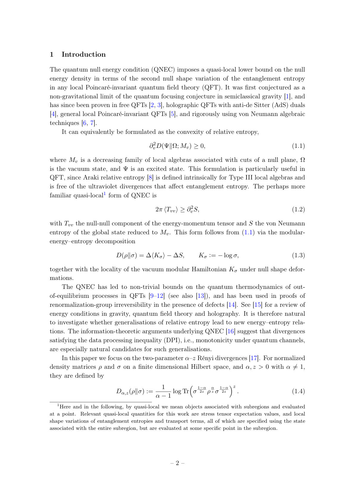 
Low-resolution page preview, page 3

📷 Fig 3

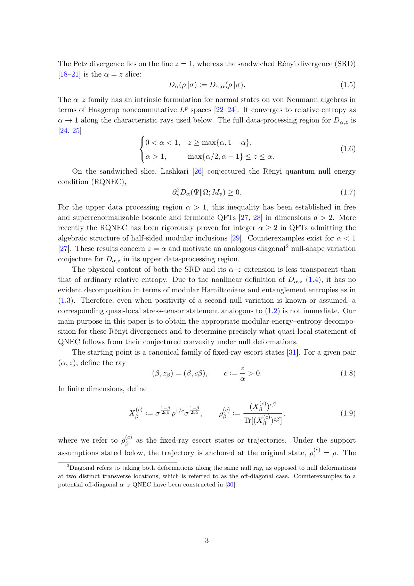 
Low-resolution page preview, page 4

📷 Fig 4

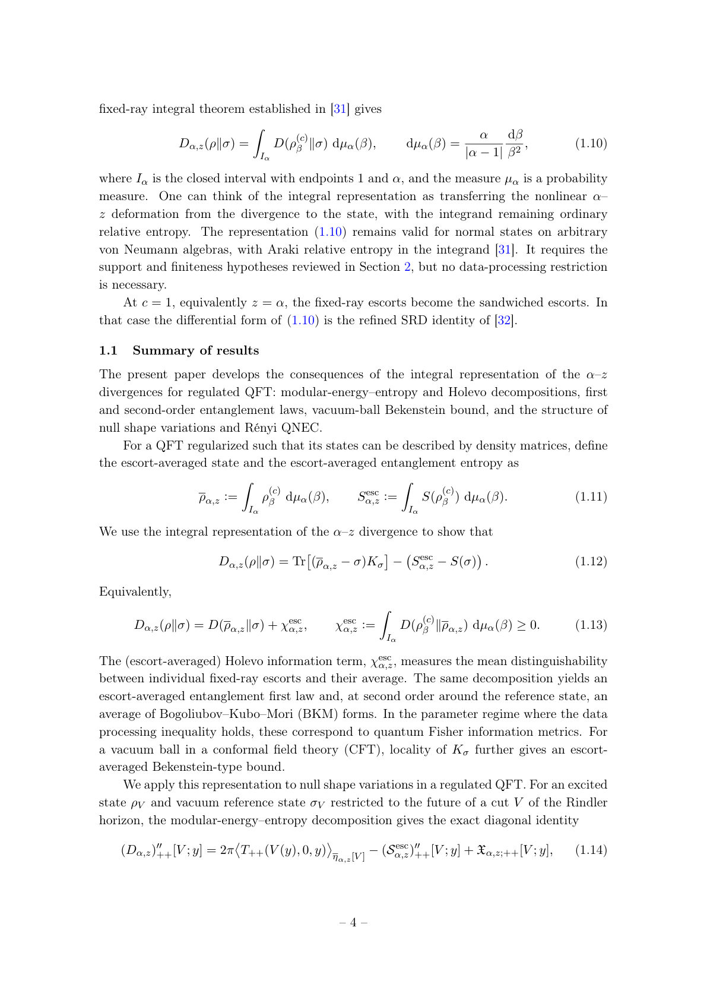 
Low-resolution page preview, page 5

📷 Fig 5

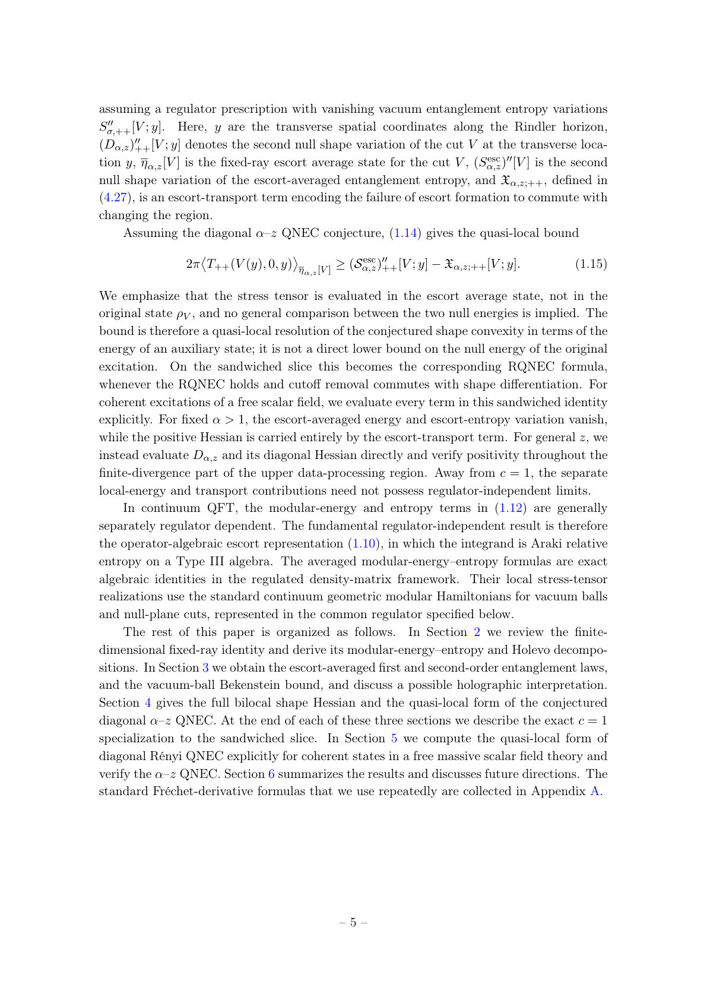 
Low-resolution page preview, page 6

**Summary.** This theoretical paper develops a quasi-local formulation for the $\alpha$-$z$ Rényi Quantum Null Energy Condition (QNEC) by employing fixed-ray escort states. It derives an escort-averaged entanglement first law and successfully verifies the QNEC for coherent excitations in a free scalar field. The work provides a sophisticated link between quantum information theory and fundamental energy constraints in QFT.

**Why it may be interesting.** The work connects fundamental energy conditions (QNEC) from general relativity/QFT to quantum information measures (Rényi entropy) via novel mathematical tools (escort averaging), which is highly relevant for understanding quantum constraints in curved spacetime or holographic settings.

Detailed structure

**Main problem.** The paper aims to derive a quasi-local form for the $\alpha$-$z$ Rényi Quantum Null Energy Condition (QNEC) using fixed-ray escort states.

**Main result.** A quasi-local form for the $\alpha$-$z$ QNEC is obtained, which is verified for coherent excitations in a free scalar field theory, confirming the conjectured diagonal QNEC for this family.

**Method.** The analysis employs the fixed-ray escort integral representation for Rényi divergence and utilizes modular-energy–entropy decompositions, alongside Fréchet differentiation for variations.

**Model / system.** The study is set in the context of Quantum Field Theories (QFTs), analyzing subregions and null deformations, with explicit calculations performed for free scalar field theory using coherent states.

**Key observables.** $\alpha$-$z$ Rényi divergence, escort-averaged entanglement entropy ($S_{\text{esc}}^{\alpha,z}$), null energy density expectation value ($\langle T_{vv} \rangle$), and the escort-transport term ($X_{\alpha,z;++}$).

**Important parameters / regimes.** The parameters $\alpha$ and $z$ govern the Rényi divergence, and the analysis is sensitive to the specific choice of the fixed ultraviolet regulator.

**Assumptions / limitations.** The derivation relies on the fixed-ray escort integral representation, and the resulting bound is a quasi-local resolution based on an auxiliary state, not a direct lower bound on the original null energy.

**Paper structure.** The paper proceeds by establishing the fixed-ray escort representation, deriving the modular-energy–entropy decomposition, and then applying these tools to derive the quasi-local QNEC, culminating in explicit calculations for the free scalar field coherent state family.

Abstract

The fixed-ray escort integral representation expresses $α$--$z$ Rényi divergence as an average over ordinary relative entropy of a family of escort states. Working in the standard UV-regulated density-matrix description of QFT subregions, we use this representation to derive an escort-averaged entanglement first law, an escort-averaged representation of the $α$--$z$ information kernel, and an escort-averaged Bekenstein-type bound for ball-shaped regions in conformal field theories. For the conjectural $α$--$z$ quantum null energy condition (QNEC), we obtain a quasi-local form in which the null energy is evaluated in an escort-averaged state and is corrected by an escort-transport term encoding the failure of escort formation to commute with restriction to a null-deformed region. The $z=α$ specialization gives a similar quasi-local form of the Rényi QNEC for sandwiched Rényi divergence. We explicitly compute the Rényi QNEC, including the explicit escort transport term, for coherent-state excitations in a free scalar field theory. For the same coherent family, we obtain a positive $α$--$z$ null Hessian, verifying the conjectured diagonal $α$--$z$ QNEC for this family.

[↑ back to top](#top)

### [Relativistic transformation of temperature for exotic cosmological fluids](http://arxiv.org/abs/2609.03124v1)

**Authors:** Soroor Pouryazdan, Babak Vakili  
**Type:** theory · **Category:** statistical mechanics · **PDF:** <https://arxiv.org/pdf/2609.03124v1>  
**Analysis basis:** full PDF text, analyzed in chunks
**Topic relevance:** `Keldysh / 2PI / non-Gaussian methods` **1/5**

📷 Fig 1

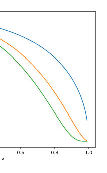 
Figure 1: Relativistic temperature ratio T ′/T versus the relative velocity v for barotropic fluids with negative EoS parameter. Curves correspond to w = −1/3, w = −2/3, and w = −0.9.

📷 Fig 2

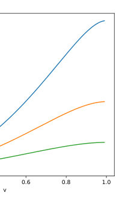 
Figure 2: Relativistic temperature ratio T ′/T as a function of the relative velocity v for the Chaplygin gas with α = 1. Different curves correspond to different background energy densities ρ, illustrating the density-dependent nature of the temperature transformation.

**Summary.** This paper analyzes the relativistic transformation of temperature for exotic cosmological fluids, contrasting the behavior of simple barotropic fluids with those exhibiting complex, density-dependent equations of state like the Chaplygin gas. Using covariant thermodynamics, it shows that negative pressure can suppress temperature growth under boosts, while other models exhibit distinct, non-linear increases in transformed temperature.

**Why it may be interesting.** While focused on cosmology, the rigorous application of relativistic thermodynamics and the study of non-equilibrium state transformations (like temperature under boosts) provides general theoretical tools applicable to non-equilibrium quantum systems.

Detailed structure

**Main problem.** The paper investigates how the temperature of exotic cosmological fluids, particularly those with negative pressure, transforms under relativistic Lorentz boosts.

**Main result.** The transformation behavior differs significantly between barotropic fluids (where negative pressure suppresses temperature growth) and Chaplygin gases (which show a monotonic increase in transformed temperature with velocity).

**Method.** The analysis employs a covariant thermodynamic framework, deriving temperature transformations by applying Lorentz boosts to the energy-momentum tensor and using operational definitions of temperature.

**Model / system.** The study models effective cosmological fluids, specifically barotropic fluids ($p=w
ho$) and generalized Chaplygin gases ($p=-A/
ho^\alpha$). These models are used to represent dark energy or exotic matter components in cosmology.

**Key observables.** The transformed temperature ($T'$) and the ratio $T'/T$ as functions of relative velocity ($v$) and background energy density ($
ho$).

**Important parameters / regimes.** The equation-of-state parameter ($w$), the coupling constant ($A$), and the background energy density ($
ho$) are crucial parameters determining the fluid's behavior.

**Assumptions / limitations.** The analysis assumes local thermodynamic equilibrium and adiabatic flow for the fluids considered, and acknowledges that temperature is an operationally derived quantity, not a fundamental Lorentz scalar.

**Figures summary.** Figure 1 illustrates temperature suppression for barotropic fluids with negative $w$, while Figure 2 shows the monotonic increase of $T'/T$ with velocity for the Chaplygin gas.

**Paper structure.** The paper first establishes the framework for barotropic fluids, deriving the transformation law for $T$. It then extends the analysis to the Chaplygin gas, contrasting its density-dependent behavior with the simpler barotropic case, and concludes by summarizing the implications for different cosmological regimes.

Abstract

We study the relativistic transformation of temperature for effective cosmological fluids with negative pressure within a covariant thermodynamic framework. The Lorentz transformation of temperature is derived for barotropic fluids with $p=wρ$ and for the (generalized) Chaplygin gas with $p=-A/ρ^α$. For barotropic fluids with constant negative equation-of-state parameter, we show that negative pressure suppresses the growth of temperature under relativistic boosts. In contrast, the Chaplygin gas exhibits a qualitatively different behavior due to its density-dependent pressure, leading to a monotonic increase of the transformed temperature with velocity. The dependence of the relativistic temperature on the relative velocity and background energy density is illustrated through representative examples.

[↑ back to top](#top)

### [Symmetry-breaking line defects embedded to a 3D $O(N)$ critical bulk](http://arxiv.org/abs/2609.03289v1)

**Authors:** Shuai Yang, Liang-dong Hu, Yan Chen, W. Zhu  
**Type:** theory · **Category:** statistical mechanics · **PDF:** <https://arxiv.org/pdf/2609.03289v1>  
**Analysis basis:** full PDF text, analyzed in chunks
**Topic relevance:** `Keldysh / 2PI / non-Gaussian methods` **1/5**

📷 Fig 1

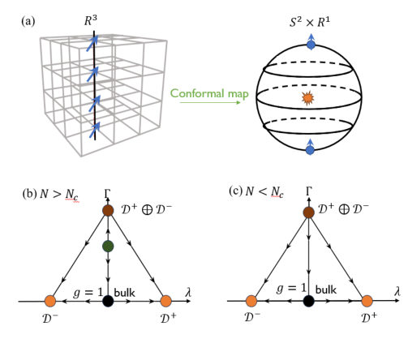 
FIG. 1. (a) Schematic plot of line defect living on 3D crit- ical bulk(left panel) and radial quantization view of line de- fect on Sd−1(right panel). (b-c) RG flows between the bulk fixed point(black dot) and the fixed point of magnetic line defect(orange dot), as well as SSB defect(brown dot). De- pending on the symmetry of the bulk O(N) Wilson–Fisher theory in which the defect is embedded, two distinct RG flow scenarios can arise: (b) corresponds to the case where a par- ticular spontaneous-symmetry-breaking fixed point is stable (N &gt; Nc), while (c) corresponds to the case where this SSB fixed point is unstable (N &lt; Nc). In this work, we assume the SSB defect is the superposition of two...

📷 Fig 2

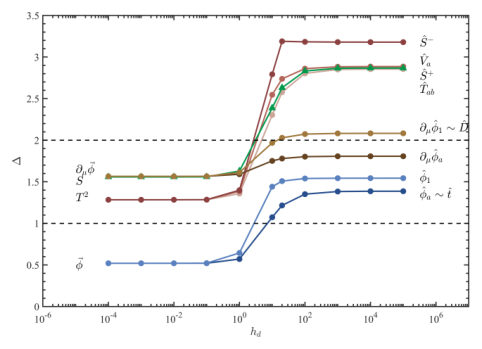 
FIG. 2. Evolution of several low-lying excitation states along the RG flow from the bulk fixed point(hd = 0) to the defect fixed point(hd →∞). For hd ≥100, the extracted scaling dimensions approach stable values, indicating that the sys- tem is already close to the defect conformal fixed point. The results shown here are obtained for the O(3) Wilson–Fisher bulk fixed point on a system with size No = 6.

📷 Fig 3

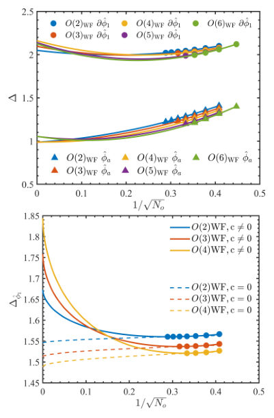 
FIG. 3. The extrapolation for (a) tilt operator ˆϕa, displace- ment operator ∂ˆϕ1 at different bulk O(N = 2 ∼6) Wilson Fisher conformal field theories, and (b) ˆϕ1 at different bulk O(N = 2 ∼4) Wilson Fisher conformal field theories. We use Eq. (25) to obtain the extrapolated values. Using the same data, we also present the fitting results(dashed lines) obtained by including only the correction from the lowest-lying singlet operator(i.e. c = 0).

📷 Fig 4

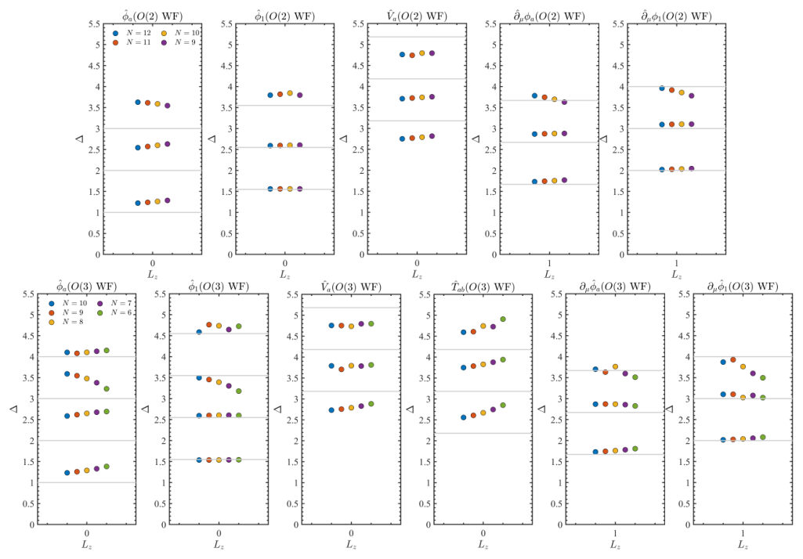 
FIG. 4. Line defect conformal multiplets, we present several lowest O(N −1) singlets ˆϕ1, ∂µ ˆϕ1, vectors ˆϕa, ˆVa, ∂µ ˆϕa and rank-2 tensor ˆTab. The gray horizontal line is taken from the result of the ϵ expansion [37, 40, 49]. These results are produced at hd = 1000 with subject to critical O(N = 2, 3) bulk theories.

📷 Fig 5

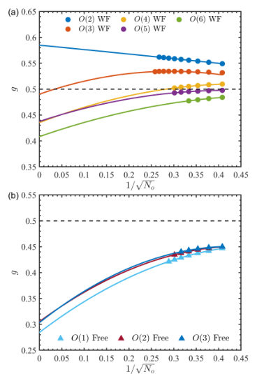 
FIG. 6. The finite size extrapolation of defect g−function at different bulk (a)O(N = 2 ∼6) Wilson Fisher conformal field theories and (b) O(N = 1 ∼3) free scalar theories. We extrapolate to the thermodynamic limit through scaling form of g(No) = g(∞) + aN −1/2 o + bN −1 o .

**Summary.** This work theoretically examines the stability of symmetry-breaking line defects embedded in a 3D O(N) critical bulk. Using advanced CFT and RG methods, the authors determine that stable symmetry breaking is only possible when the symmetry dimension N is greater than or equal to 3. This provides a quantitative criterion for defect stability in critical quantum matter.

**Why it may be interesting.** The rigorous application of CFT and RG techniques to defect lines in critical systems provides powerful tools for understanding boundary physics, which is relevant to engineered quantum materials or interfaces in AMO physics.

Detailed structure

**Main problem.** The paper investigates whether a line defect embedded in a 3D O(N) critical bulk can support a stable spontaneously symmetry-breaking (SSB) defect fixed point, contrasting with known instabilities in 1D systems.

**Main result.** A stable SSB defect fixed point is possible only for $N \gtrsim 3$, while for $N < 3$, domain wall proliferation prevents such stability.

**Method.** The study employs Defect Conformal Field Theory (dCFT) techniques, utilizing the fuzzy sphere method and Renormalization Group (RG) analysis via the g-function to test stability.

**Model / system.** The system models a line defect immersed in a 3D bulk tuned to the O(N) Wilson-Fisher critical point. The stability is analyzed by considering the effect of domain-wall operators and pinning fields.

**Key observables.** Scaling dimensions ($\Delta$) of primary operators, the defect $g$-function, and the relevance/irrelevance of the domain-wall operator.

**Important parameters / regimes.** The dimensionality $N$ of the symmetry group, and the critical exponents associated with the O(N) Wilson-Fisher universality class.

**Assumptions / limitations.** The analysis relies on the fuzzy-sphere regularization technique for general N, and the stability criteria are based on the RG flow analysis of the defect operators.

**Figures summary.** Figure 1 schematically compares RG flow diagrams showing stable vs. unstable SSB fixed points based on the value of N relative to a critical value.

**Paper structure.** The paper establishes the theoretical framework by contrasting 1D vs. 3D defect stability, then applies the fuzzy sphere technique and RG analysis to the O(N) Wilson-Fisher model, deriving conditions for stable defect fixed points based on N.

Abstract

While spontaneous breaking of a discrete symmetry in one-dimensional classical systems with short-range interactions is absent, it is expected that a line defect embedded in a bulk criticality exhibits a stable discrete symmetry spontaneous breaking. Here, we investigate the behavior of a pinning-field line defect immersed in a 3D bulk that remains tuned to the $O(N)$ Wilson-Fisher critical point. Employing the fuzzy sphere technique, we provide convincing evidence of the existence of stable defect conformal fixed points, and we demonstrate their renormalization group stability by showing no relevant operator and less effective degrees of freedom than that at bulk fixed point via $g$-function. Moreover, we investigate the defect domain wall operator for various $N$, and we identify that it becomes irrelevance for $N\gtrsim 3$ but it is relevant for $N<3$.These evidence indicate that a one-dimensional defect coupled to a critical bulk cannot support a stable symmetry spontaneously broken defect fixed point due to domain wall proliferation for $N<3$ Wilson-Fisher universality, while in the case of $N \gtrsim 3$ a symmetry broken defect is possible.

[↑ back to top](#top)

### [The Casimir free energy of peptide films on a silicon substrate: Impact of dielectric-to-metal transition in silicon and nanoparticles in peptide](http://arxiv.org/abs/2609.03841v1)

**Authors:** G. L. Klimchitskaya, V. M. Mostepanenko  
**Type:** theory · **Category:** other · **PDF:** <https://arxiv.org/pdf/2609.03841v1>  
**Analysis basis:** full PDF text, analyzed in chunks
**Topic relevance:** `Keldysh / 2PI / non-Gaussian methods` **1/5**

📷 Fig 1

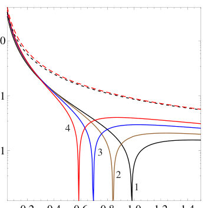 
FIG. 1: Magnitude of the Casimir free energy of peptide coatings containing Φ = 0, 0.1, 0.25, and 0.4 fractions of water deposited on a silicon plate in the dielectric state is shown in the logarithmic scale as a function of peptide film thickness by the solid lines 1, 2, 3, and 4, respectively. The lower and upper dashed lines show the Casimir free energy of peptide films with Φ = 0 and 0.4 fractions of water deposited on a silicon plate in the metallic state, respectively.

📷 Fig 2

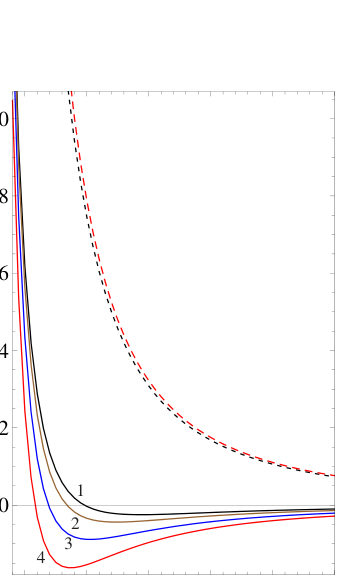 
FIG. 2: The Casimir free energy of peptide coatings containing Φ = 0,0.1, 0.25, and 0.4 fractions of water deposited on a silicon plate in the dielectric state is shown in the natural scale as a function of peptide film thickness by the solid lines 1, 2, 3, and 4, respectively. The lower and upper dashed lines show the Casimir free energy of peptide films with Φ = 0 and 0.4 fractions of water deposited on a silicon plate in the metallic state, respectively.

📷 Fig 3

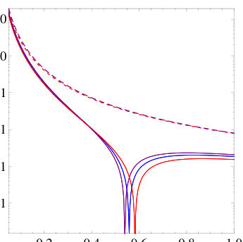 
FIG. 3: Magnitude of the Casimir free energy of peptide coatings containing Φ = 0.4 fraction of water and ϕ = 0,0.03, and 0.05 frac- tions of Au nanoparticles deposited on a silicon plate in the dielec- tric state is shown in the logarithmic scale as a function of peptide film thickness by the three solid lines counted from right to left, re- spectively. The two overlapping dashed lines show the Casimir free energy of peptide films with Φ = 0.4 fraction of water and ϕ = 0 and 0.05 fractions of Au nanoparticles deposited on a silicon plate in the metallic state.

📷 Fig 4

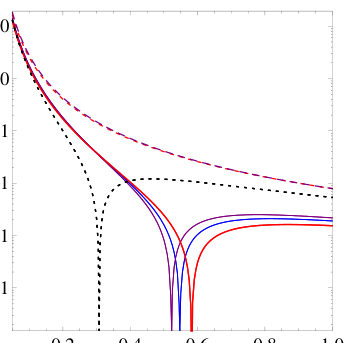 
FIG. 4: Magnitude of the Casimir free energy of peptide coatings containing Φ = 0.4 fraction of water and ϕ = 0,0.03, and 0.05 frac- tions of magnetite nanoparticles of 5 nm radius deposited on a sili- con plate in the dielectric state is shown in the logarithmic scale as a function of peptide film thickness by the three solid lines counted from right to left, respectively. The extreme left dotted line shows the Casimir free energy of peptide film with Φ = 0.4 fraction of wa- ter and ϕ = 0.05 fraction of magnetite nanoparticles of 7.5 nm radius deposited on a silicon plate in the dielectric state. The two overlap- ping dashed lines show the Casimir free energy of peptide films with Φ = 0.4...

📷 Fig 5

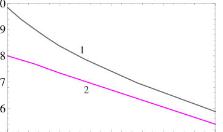 
FIG. 5: The borderline thickness of peptide coating on a silicon plate in the dielectric state, for which the Casimir free energy of peptide film vanishes, is shown as a function of the fraction of water in the peptide film by the lines 1 and 2 for an undoped peptide and doped with the 0.05 fraction of Au nanoparticles, respectively. In the region above each line, the Casimir free energy contributes to the coating stability and below each line makes it less stable.

**Summary.** This theoretical work calculates the Casimir free energy for peptide films on silicon, showing that the film's stability depends critically on the substrate's electrical state. The study quantifies how water content and magnetic nanoparticles can tune this stability, offering insights for bioelectronic applications.

**Why it may be interesting.** While focused on condensed matter interfaces, the calculation of fluctuation-induced forces (Casimir energy) is a fundamental topic relevant to understanding boundary conditions and interactions in nanoscale quantum systems, bridging quantum electrodynamics with materials science.

Detailed structure

**Main problem.** The paper calculates the Casimir free energy of thin peptide films deposited on silicon substrates, investigating how water content, nanoparticles, and substrate phase transitions affect film stability.

**Main result.** The film stability is highly dependent on the substrate state: the free energy is negative (stable) for thicker films on dielectric silicon but always positive (less stable) if the silicon is metallic.

**Method.** The calculation utilizes the Lifshitz theory of van der Waals and Casimir forces, requiring knowledge of frequency-dependent dielectric permittivities for the constituent materials.

**Model / system.** The system is a three-layer structure: vacuum/air, a peptide film (potentially containing water and nanoparticles), and a silicon substrate. The model incorporates the dielectric-to-metal phase transition in silicon.

**Key observables.** Casimir free energy ($F_p$) as a function of film thickness ($a$), and the borderline thickness ($a_0$) where $F_p=0$.

**Important parameters / regimes.** Film thickness ($a$), volume fraction of water ($\Phi$), presence/type of nanoparticles (magnetic vs. nonmagnetic), and the dielectric state of silicon.

**Assumptions / limitations.** The analysis assumes the use of the Lifshitz theory and employs approximations like the Clausius-Mossotti equation for mixing and treating the substrate as a semispace.

**Figures summary.** Figures illustrate the magnitude and sign of the Casimir free energy versus film thickness for various water fractions on dielectric silicon, contrasting these results with the always positive energy found in the metallic state.

**Paper structure.** The paper follows a structure covering the theoretical formalism, the impact of the metal transition, doping with nanoparticles, determining the zero-energy thickness, and concluding with applications in organic electronics and biomedicine.

Abstract

Using the Lifshitz theory of the van der Waals and Casimir forces, we calculate the Casimir free energy of thin peptide films deposited on silicon substrates. The Casimir free energy is found as a function of film thickness for different fractions of water in the film, in the presence of either nonmagnetic or magnetic nanoparticles, and under the impact of irradiation of a silicon substrate with laser pulses or dopants resulting in the dielectric-to-metal phase transition. It is shown that for a dielectric silicon there is the borderline value of the film thickness, such that the Casimir free energy is negative and contributes to the film stability for thicker films, but is positive and makes the film less stable for thinner ones. According to our results, the borderline value of peptide film thickness decreases with increasing volume fractions of water and in the film. This decrease is more pronounced for the magnetic nanoparticles and becomes stronger with increasing their radius. The borderline value of peptide film thickness is found as a function of the fraction of water in the film. If the silicon substrate is in metallic state, the Casimir free energy of peptide coating is always positive, which makes it less stable. Possible applications of the obtained results in organic electronics and biomedicine are discussed.

[↑ back to top](#top)

### [Topology-Dependent Enhancement of Entanglement Extraction in Repeater Graph States](http://arxiv.org/abs/2609.03496v1)

**Authors:** Poramat Chianvichai, Poramet Pathumsoot, Naphan Benchasattabuse, Michal Hajdušek, Rodney Van Meter, Sujin Suwanna  
**Type:** theory · **Category:** quantum information and computing · **PDF:** <https://arxiv.org/pdf/2609.03496v1>  
**Analysis basis:** full PDF text, analyzed in chunks
**Topic relevance:** `quantum measurements` **1/5**

📷 Fig 1

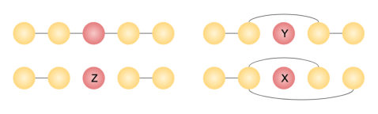 
Figure 2. Graph transformations after performing Pauli X, Y , and Z measurements on the middle qubit (red ball) in the linear graph state is that the measured qubit becomes disconnected from the graph, with all of its connecting edges removed. Moreover, the selected measurement basis determines how the remaining edges in the graph are updated.

📷 Fig 2

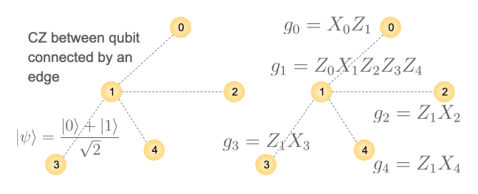 
Figure 1. (left): Graph state representation using quantum state, each node state is |+⟩and connect with CZ. (right): Graph state representation using stabilizer generator formalism.

📷 Fig 3

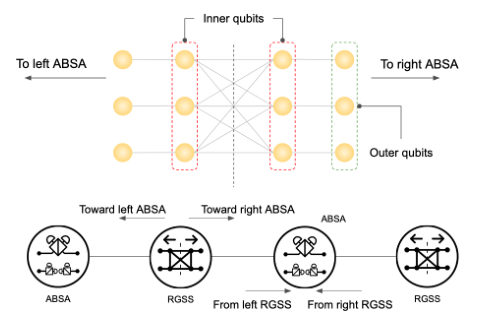 
Figure 3. An RGS is depicted with three arms and six inner qubits forming complete bipartite graph. To create an entangled connection between the end nodes, each source node prepares an RGS and transmits half of its photons (yellow balls) to the left measurement node and the remaining half to the right measurement node. Full communication procedure using ABSA and RGSS shows in below diagram, node illustration from [18]

📷 Fig 4

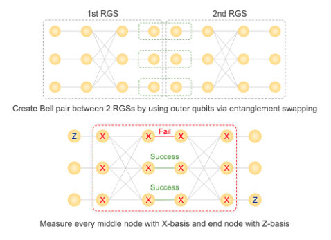 
Figure 5. After connecting between inner qubits of different RGSs, measur- ments follow the procedure for extracting Bell pairs from the RGS network. Successful results create Bell pairs for communication resources.

📷 Fig 5

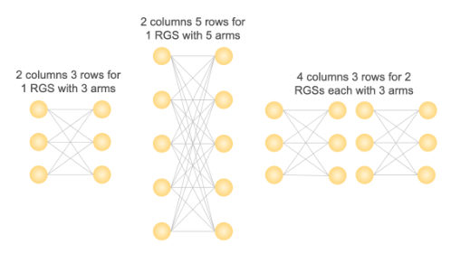 
Figure 4. Topology of RGS: (left) a single RGS with three arms, (middle) a single RGS with five arms, and (right) two RGSs, each with three arms.

**Summary.** This work analyzes how to efficiently extract multiple entangled Bell pairs from a Repeater Graph State (RGS) used in quantum repeaters. Through simulations, the authors demonstrate that the achievable entanglement yield is highly dependent on the network's connectivity, suggesting an optimal balance between sparse and dense connections. This guides the design of more resource-efficient quantum communication protocols.

**Why it may be interesting.** The findings provide concrete, topology-dependent guidelines for designing robust quantum communication networks, which is crucial for scaling quantum internet infrastructure.

Detailed structure

**Main problem.** The paper investigates strategies to maximize the extraction of Bell pairs from a Repeater Graph State (RGS), addressing a known bottleneck where only one pair can be extracted from a complete bipartite graph state.

**Main result.** The maximum Bell pair yield depends critically on the RGS connection topology, showing that optimal yield occurs at low to moderate edge densities, and higher inner-qubit connectivity is needed for longer network hops.

**Method.** The study uses simulations to calculate the expected number of Bell pairs by analyzing the Pauli measurements performed on the RGS structure, relating the yield to the graph's connectivity.

**Model / system.** The physical model is the quantum repeater utilizing the Repeater Graph State (RGS) architecture, which is a memory-less alternative for long-distance quantum communication. The RGS is defined on a graph G(V, E) and its properties are analyzed via graph state measurements.

**Key observables.** Bell-pair yield ($\langle n_{	ext{bell}} 
angle$), which is the primary observable, and the required inner-qubit connectivity.

**Important parameters / regimes.** Edge density, number of network hops, and the parameters of the Gamma distribution used to model edge counts.

**Assumptions / limitations.** The RGS structure is assumed to provide protection against photon loss by embedding Quantum Error Correction (QEC) through tree-graph-encoded logical qubits.

**Figures summary.** Figures illustrate graph state representations, measurement procedures, and heat maps showing the expected Bell pair yield across various RGS topologies and edge densities, demonstrating the optimal connectivity.

**Paper structure.** The paper establishes the need for RGSs in quantum repeaters, details the measurement formalism using Pauli measurements, and then simulates the Bell-pair yield, concluding with an analysis of how optimal connectivity shifts with increasing network hop count.

Abstract

Quantum repeaters are essential for establishing long-distance quantum communication to overcome the exponential decay of entanglement due to photon loss. Traditional repeater architectures rely on physical quantum memory, which introduces decoherence and poses significant practical implementation challenges. The repeater graph state (RGS) architecture offers a promising memory-less alternative that is inherently resilient to photon losses. A key challenge in implementing RGS lies in the requirement for highly efficient graph state generators and complex qubit measurement. In this work, we aim to investigate the strategies for extracting the maximum number of Bell pairs from the RGS structure via its qubit connection to resolve the well-known bottleneck problem of RGS in which only a single Bell pair can be extracted from a complete bipartite graph state. From simulations, we observe that the maximum number of extracted Bell pairs depends on its connection topology, where the Bell-pair yield tends to be maximal at low to moderate edge densities. As the number of network hops increases, the RGS must be equipped with higher inner-qubit connectivity to maintain a sufficient yield of extractable Bell pairs. Thus, the expected resource requirement shifts toward the use of RGSs with higher inner-qubit connectivity.

[↑ back to top](#top)

## Other papers (27)

*Papers from primary archives without highlighted authors or any topic match. Click to expand.*

Show other papers

### [Approximate maximum-likelihood decoding via truncated free energies](http://arxiv.org/abs/2609.03928v1)

**Authors:** Yuanqi Liu, Weilei Zeng, Junjie Wu, Lingling Lao  
**Type:** theory · **Category:** quantum information and computing · **PDF:** <https://arxiv.org/pdf/2609.03928v1>  
**Analysis basis:** full PDF text, analyzed in chunks

📷 Fig 1

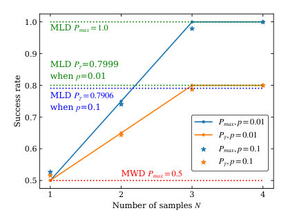 
FIG. 2. Decoding success probabilities for the syndrome con- figuration in Fig. 1 as a function of trials N per class. The true physical noise is fixed at p0 = 0.01, while the Ising solver operates at two effective noise levels: p′ = 0.01 (exact Nishi- mori temperature) and p′ = 0.1 (mismatched prior). For both Pmax and Pγ, AMLD converges to the MLD limit by N = 3. The performance under the mismatched prior p′ = 0.1 (stars) remains marginally below that under the matched prior p′ = 0.01, demonstrating robustness to thermal miscalibration.

📷 Fig 2

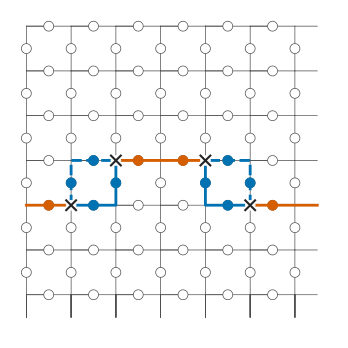 
FIG. 1. Two logical classes associated with a degenerate syndrome on the 6×6 toric code. This syndrome is compatible with minimum-weight error chains belonging to two distinct logical classes. The blue class ℓχ has a ground-state degeneracy of χ = 4 minimum-weight configurations (generated from the displayed chain by the independent face stabilizers marked with dashed blue edges), while the red class ℓ1 has a unique minimum-weight configuration.

📷 Fig 3

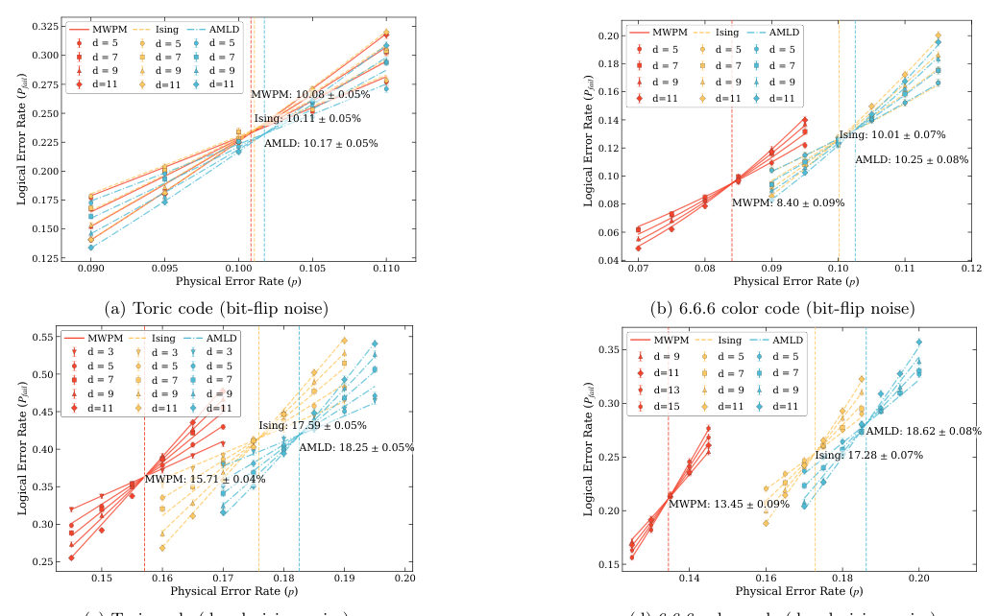 
FIG. 3. Logical error rate versus physical error rate for Ising decoding based on an SA solver, comparing AMLD[N], MWD[N], and MWPM, with N = 20 runs per logical class. Threshold crossings are indicated by the vertical bands.

📷 Fig 4

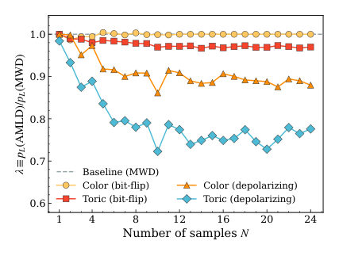 
FIG. 5. Logical-error-rate ratio λ ≡pL(AMLD)/pL(MWD) versus the number N of SA runs per logical class at p = 0.10 and d = 7, grouped by |L|. The dashed line marks the MWD baseline (λ = 1); values below one indicate a lower logical error rate for AMLD.

📷 Fig 5

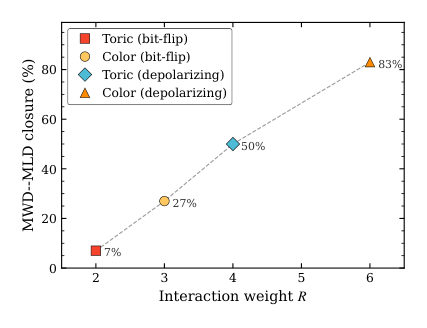 
FIG. 4. Fraction of the MWD–MLD threshold gap closed by AMLD versus the maximum interaction order R for the four code–noise settings considered.

**Summary.** This paper introduces Approximate Maximum-Likelihood Decoding (AMLD), a novel, efficient framework for decoding quantum error-correcting codes. AMLD estimates the true likelihood by using truncated free energies derived from candidate samples, overcoming the computational barrier of exact Maximum-Likelihood Decoding. Benchmarks show that AMLD significantly improves the error threshold compared to standard Minimum-Weight Decoding across various quantum codes.

**Why it may be interesting.** This work provides a powerful, computationally tractable method to estimate the true performance limits of quantum error correction codes by leveraging statistical physics tools (free energy estimation) to overcome NP-hard decoding problems.

Detailed structure

**Main problem.** The paper addresses the computational hardness of Maximum-Likelihood Decoding (MLD) for quantum error-correcting codes, which is necessary for determining the minimum logical error rate.

**Main result.** The proposed Approximate Maximum-Likelihood Decoding (AMLD) framework significantly closes the performance gap between the standard Minimum-Weight Decoding (MWD) and the optimal MLD, showing up to an 83% improvement on benchmark codes.

**Method.** AMLD is a black-box framework that estimates the free energy for each logical class by recycling candidate samples discarded by stochastic inner decoders, providing a provable bound between the exact free energy and the empirical minimum weight.

**Model / system.** The study focuses on quantum error-correcting codes, specifically stabilizer codes like the Toric and color codes, which are analyzed under i.i.d. Pauli noise (bit-flip or depolarizing). The problem is mapped to finding the ground state of a disordered Ising model.

**Key observables.** Logical error rate ($P_L$), threshold gap closure percentage, and the ratio $\lambda = p_L(	ext{AMLD}) / p_L(	ext{MWD})$.

**Important parameters / regimes.** Noise type (bit-flip, depolarizing), code structure (e.g., $6.6.6$ color code), and the number of decoding trials ($N_{	ext{total}}$).

**Assumptions / limitations.** The framework assumes that the free energy estimation is bounded by the empirical minimum weight and the exact free energy, and that the stochastic solvers provide a sufficiently diverse pool of candidate samples.

**Figures summary.** Figures compare the logical error rate ratio ($\lambda$) across different codes and noise models, and show $P_{	ext{fail}}$ vs. $p$ curves demonstrating AMLD's superior performance relative to MWD.

**Paper structure.** The paper first establishes the theoretical gap between MLD and MWD. It then introduces the AMLD framework using truncated free-energy estimators. Finally, it benchmarks AMLD against MWD on various codes (Toric, color, etc.) under different noise models to quantify the performance improvement.

Abstract

Maximum-likelihood decoding (MLD) achieves the minimum logical error rate of stabilizer codes under known i.i.d. Pauli noise, but its exact evaluation is \#P-hard. Practical pipelines therefore approximate MLD by minimum-weight decoding (MWD), retaining only the lowest-weight recovery per syndrome and discarding the coset degeneracy. The minimum-weight search is in turn implemented by stochastic solvers. We introduce approximate maximum-likelihood decoding (AMLD), a black-box framework that recycles the candidate samples discarded by stochastic inner decoders into a per-class truncated free-energy estimator. For every logical class represented in the candidate pool, the estimator is provably bounded below by the exact free energy and above by the empirical minimum weight. AMLD returns the logical class minimizing the estimated free energy with linear classical overhead. In SA-based Ising-decoder benchmarks, AMLD closes up to $83\%$ of the MWD--MLD threshold gap across the toric and color codes under bit-flip and depolarizing noise. The largest threshold improvement, from $17.28\%$ to $18.62\%$, occurs on the $6.6.6$ color code under depolarizing noise. We further demonstrate AMLD on the $[[144,12,12]]$ bivariate-bicycle code, whose bit-flip decoding problem has a hypergraph structure. This application requires neither matching-based enumeration nor code-specific tensor-network contraction. At $p=0.05$, AMLD reduces the logical error rate by $13\%$ relative to MWD evaluated on the same BP-OSD candidate pool.

[↑ back to top](#top)

### [Computing with qLDPC Codes by Climbing the Chain Map Hierarchy](http://arxiv.org/abs/2609.02999v1)

**Authors:** Rahul Sahay, David M. Long, Vedika Khemani  
**Type:** theory · **Category:** quantum information and computing · **PDF:** <https://arxiv.org/pdf/2609.02999v1>  
**Analysis basis:** full PDF text, analyzed in chunks

📷 Fig 1

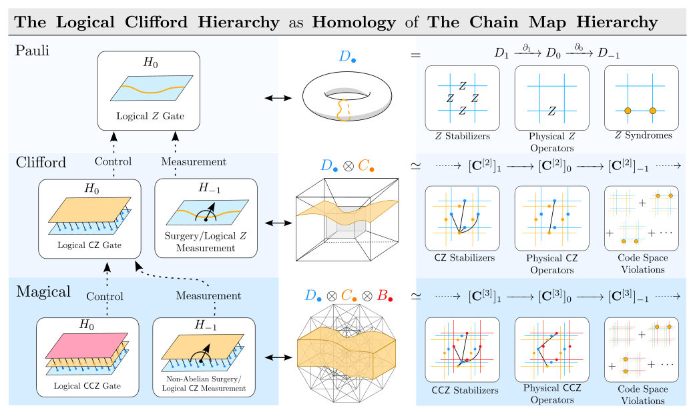 
FIG. 1. Computation with qLDPC Codes and the Chain Map Hierarchy. The relationship between Pauli logical gates and the homology of a chain complex D• (top row) is extended to Clifford gates (middle row) and non-Clifford gates up the Clifford hierarchy (bottom row). In particular, (left column) certain logical operations—both unitary and measurement—from the ℓth level of the Clifford hierarchy (illustrated here for Cℓ−1Z gates) are encoded in the homology classes of (right column) an auxiliary chain complex [C[ℓ]]. We call the collection of these auxiliary chain complexes the chain map hierarchy. (Middle row) Concretely, physical Clifford gates between codes C• and D• are encoded in [C[2]],...

📷 Fig 2

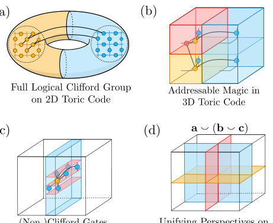 
FIG. 2. Applications. The chain map hierarchy can be used to discover new transversal logical gates. For instance, we use it to discover (a) the full Clifford group on the 2D toric code, (b) new addressable non-Clifford gates in the 3D toric code, and (c) addressable Clifford and non-Clifford gates in families of fracton codes with many encoded logical qubits. (d) The chain map hierarchy also unifies several other approaches to finding transversal gates, including cup product constructions and code surgery gadgets for logical measurement.

📷 Fig 3

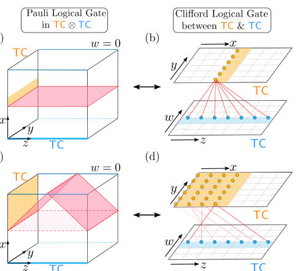 
FIG. 3. Logical Clifford Gates Correspond to Pauli Logical Gates in the Tensor Product. Logical Clifford gates between two codes—e.g. two 2D toric code’s TC and TC—can be “read-off” from the Pauli logicals of an auxiliary code that is isomorphic to the tensor product of the two codes (in this case, the 4D toric code). (a) Thus, a sheet-like logical Z in the 4D toric code (shown in a cross-section at fourth coordinate w = 0) encodes the implementation of (b) an ad- dressable logical CZ gate between two toric codes TC and TC. Explicitly, the 2D sheet is read as a “plot” of the gate. Every edge along y at a fixed x of TC [every orange qubit in (b)] is connected via a CZ gate [red lines in (b)]...

📷 Fig 4

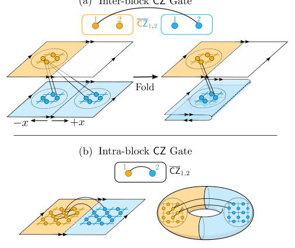 
FIG. 4. An Addressable CZ Gate for the Toric Code. (a) Further deforming the logical from Fig. 3 results in a transversal logical CZ1,2 gate, acting on only two of the four qubits encoded in two blocks of the toric code. The pattern of gates is shown for a unit cell, and is repeated everywhere in the colored regions of the code. The gate can be made geometrically local by folding the blue toric code. (b) Mov- ing all targets of the physical CZ gates to a single code block results in a transversal logical CZ1,2 gate in one copy of the toric code.

📷 Fig 5

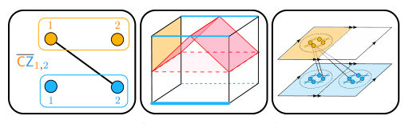 
FIG. 5. Recipe for discovering gates: To find a transver- sal logical gate using the chain map complex, first specify the desired logical action: a CZ12 between one pair of the four encoded qubits in two blocks of the toric code, say. Then, sparsify a representative of this logical action using the chain map complex stabilizer deformations. Finally, synthesize the gate by converting the chain map to a physical quantum cir- cuit.

**Summary.** This paper introduces the chain map hierarchy, a novel mathematical framework that unifies the description of all logical quantum gates (Pauli, Clifford, non-Clifford) for qLDPC codes. By mapping logical operations to homology classes in a chain complex, the authors provide a systematic method to discover and implement complex gates, such as the full Clifford group, on physical quantum hardware models like the toric code.

**Why it may be interesting.** It provides a powerful, algebraic tool (homological algebra) to systematically analyze and predict the feasibility of implementing complex quantum gates on physically relevant quantum error-correcting codes.

Detailed structure

**Main problem.** To develop a unified and intuitive framework for performing logical computation using quantum low-density parity check (qLDPC) codes, treating Pauli, Clifford, and non-Clifford operations equally.

**Main result.** The authors introduce the chain map hierarchy, which allows for the discovery of constant-depth unitary implementations for the full logical Clifford group on 2D toric codes and addressable CCZ gates on 3D toric codes.

**Method.** The core method involves defining the chain map hierarchy—a family of chain complexes—whose homology classes encode logical unitary operations, generalizing the existing formalism for Pauli logicals.

**Model / system.** The work focuses on qLDPC codes, specifically analyzing the 2D and 3D toric codes, and extending the framework to non-manifold codes.

**Key observables.** Homology classes (encoding logical operators) and boundaries (encoding stabilizers) of the associated chain complex.

**Important parameters / regimes.** The level of the Clifford hierarchy ($\ell$), the number of code blocks (e.g., any number of blocks of the 2D toric code).

**Assumptions / limitations.** The framework assumes that logical operations can be mapped onto homology classes within the defined chain map structure.

**Figures summary.** Figure 1 illustrates the chain map hierarchy, extending from Pauli logicals to Clifford and non-Clifford gates. Figure 2 shows applications, including realizing the full Clifford group on the 2D toric code and finding non-Clifford gates in the 3D toric code.

**Paper structure.** The paper builds the chain map hierarchy by defining chain complexes that encode logical operations, demonstrating how this structure unifies the description of Pauli, Clifford, and non-Clifford gates, and then applies this framework to discover specific, high-fidelity logical gates on various toric and fracton codes.

Abstract

We develop a framework for logical computation with qLDPC codes that places logical Pauli, Clifford, and non-Clifford operations on the same footing. This brings the simple homological description of Pauli logicals to the patchwork landscape of logical Clifford and non-Clifford operations, providing a tool for the discovery of new logical gates. In particular, we define the chain map hierarchy: a family of chain complexes whose homology classes encode logical unitary and code surgery operations at any level of the Clifford hierarchy, precisely analogous to the chain complex description of Pauli logicals. Consequently, intuition for Pauli logicals can be leveraged to discover new logical operations on qLDPC codes. For instance, the familiar ability to deform Pauli logicals with stabilizers---i.e. boundaries of the chain complex---becomes a way to search for constant-depth unitary implementations of (non-)Clifford logical gates. Using this strategy, we discover constant-depth unitary implementations of the full logical Clifford group on any number of blocks of the 2D toric code, including within a single block, and addressable logical CCZ gates on any triple of logical qubits on any number of blocks of the 3D toric code. Beyond manifold codes, we find addressable non-Clifford gates on codes with many encoded qubits. The chain map hierarchy naturally encompasses and extends other constructions of logical gadgets, for instance providing a universal parameterization of cup products. As such, our work provides a unified, useful, and intuitive language for computing with qLDPC codes.

[↑ back to top](#top)

### [Cusped Defects: Cusp Operator Expansion, Conformal Properties and Bootstrap Applications](http://arxiv.org/abs/2609.04035v1)

**Authors:** Lorenzo Bianchi, Andrea Cavaglià, A. David Gutiérrez, Stefanos R. Kousvos, Marco Meineri  
**Type:** theory · **Category:** other · **PDF:** <https://arxiv.org/pdf/2609.04035v1>  
**Analysis basis:** full PDF text, analyzed in chunks

📷 Fig 1

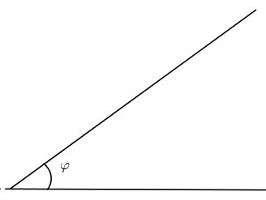 
Figure 1: Line defect with a cusp at a finite point formed by the intersection of two straight lines extending to infinity. We will refer to the two lines meeting at the cusp as branches.

📷 Fig 2

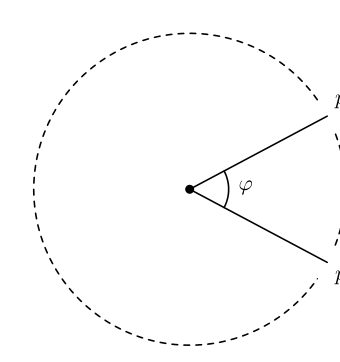 
Figure 2: A state is prepared by performing the path integral in the interior of the dashed sphere, with boundary conditions specified by the value of fields at the boundary of the UV ball (black).

📷 Fig 3

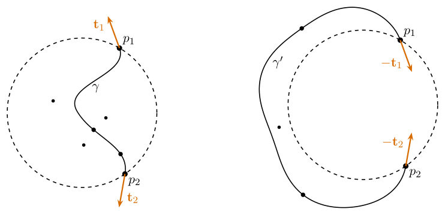 
Figure 3: On the left, a vector in the vector space obtained by path integrating inside a sphere punctured by a defect with fixed tangents t1 and t2. On the right, an element of the dual vector space.

📷 Fig 4

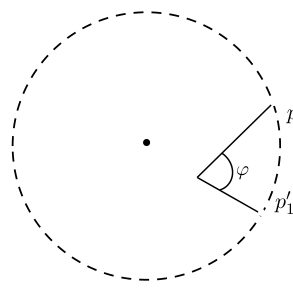 
Figure 4: Defect translated by aµ while the quantization sphere remains fixed. The defect punctures the sphere at two different points p′ 1 and p′ 2. While this configuration defines a state on the sphere punctured at the new points, the tangent vectors at the punctures are not radial, meaning that this state does not belong to the Hilbert space.

📷 Fig 5

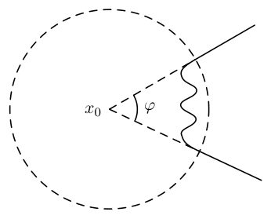 
Figure 5: Generic line defect (solid line) defining a state in the cusped Hilbert space H(φ) by radial quantization.

**Summary.** This theoretical paper investigates cusped defects within Conformal Field Theories, establishing that cusp scaling operators behave like primary operators under conformal transformations. By developing the Cusp Operator Expansion, the authors provide a systematic way to analyze complex defects and derive fundamental analytic constraints on their associated physical data. This work advances the understanding of defect physics in highly symmetric quantum field theories.

**Why it may be interesting.** While highly specialized in CFT, the rigorous treatment of singular boundaries (cusps) and the use of operator expansions and bootstrap methods are general theoretical tools relevant to understanding boundary effects in quantum systems.

Detailed structure

**Main problem.** The paper analyzes the general properties of cusped defect lines embedded within Conformal Field Theories (CFTs). It aims to understand how these defects behave under conformal transformations and how they can be systematically expanded.

**Main result.** The authors prove that suitably defined cusp scaling operators transform like primary operators under general conformal transformations, and they derive analytic constraints on the dynamical cusp data using a crossing equation.

**Method.** The primary methods involve developing the Cusp Operator Expansion (COE) to represent general defects, deriving transformation properties using conformal symmetry, and applying crossing equations to constrain parameters.

**Model / system.** The study is set in the context of generic Conformal Field Theories (CFTs) featuring one-dimensional defect lines that possess singular points, specifically cusps. The analysis uses techniques from path integrals and radial quantization around these cusps.

**Key observables.** Cusp scaling operators, correlation functions of cusped defects, and the cusp anomalous dimension ($\Gamma$).

**Important parameters / regimes.** The cusp angle ($\phi$), the small cutoff parameter ($\epsilon$), and the coupling constant ($\lambda$).

**Assumptions / limitations.** The analysis assumes that the defect expectation value is invariant under conformal transformations if the submanifold is smooth, and that the defect is reflection positive to ensure a positive definite scalar product.

**Figures summary.** Figure 1 illustrates a line defect with a cusp formed by the intersection of two straight lines. Figure 2 shows state preparation via path integral inside a sphere with boundary conditions specified at the UV ball.

**Paper structure.** The paper proceeds by defining the Hilbert space and the COE, proving the transformation rules for cusp operators, providing worked examples (like the magnetic field defect), deriving analytic constraints via crossing equations, and discussing bootstrap applications.

Abstract

We analyze general properties of cusped defect lines embedded in generic conformal field theories (CFTs). We prove that suitably defined cusp scaling operators transform like primary operators under general conformal transformations. We show that, via the cusp operator expansion (COE), defects of general shape can be expanded in a basis of cusped defects. These findings are checked and exemplified in the case of the localized magnetic field defect. Finally, we derive analytic constraints on dynamical cusp data by making use of a crossing equation, and discuss possible numerical bootstrap applications of our results.

[↑ back to top](#top)

### [Distinctness threshold for pseudorandom unitaries](http://arxiv.org/abs/2609.03065v1)

**Authors:** Asad Raza, Jens Eisert, Bill Fefferman  
**Type:** theory · **Category:** quantum information and computing · **PDF:** <https://arxiv.org/pdf/2609.03065v1>  
**Analysis basis:** full PDF text, analyzed in chunks

📷 Fig 1

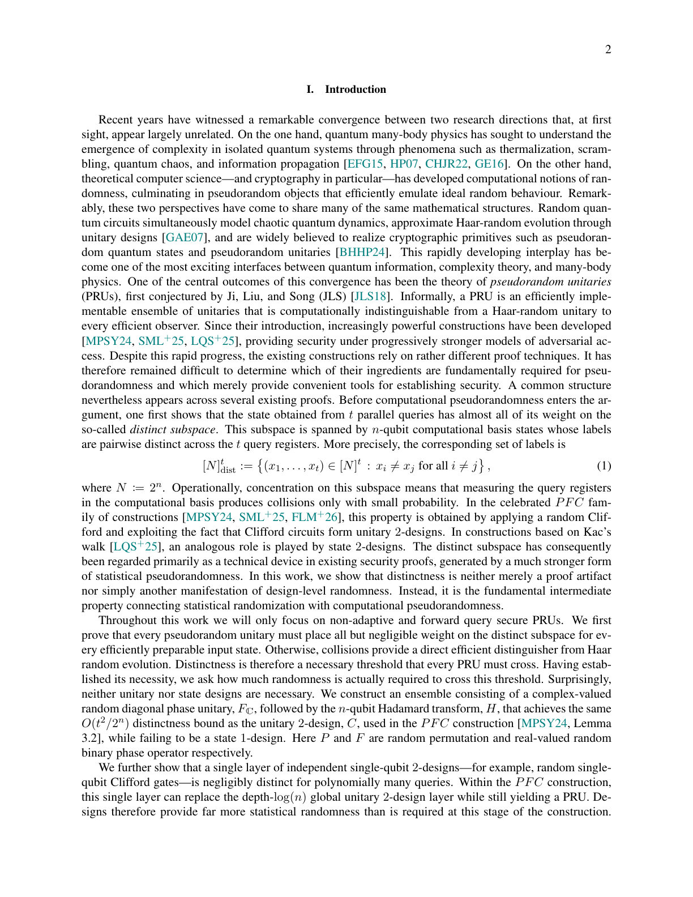 
Low-resolution page preview, page 2

📷 Fig 2

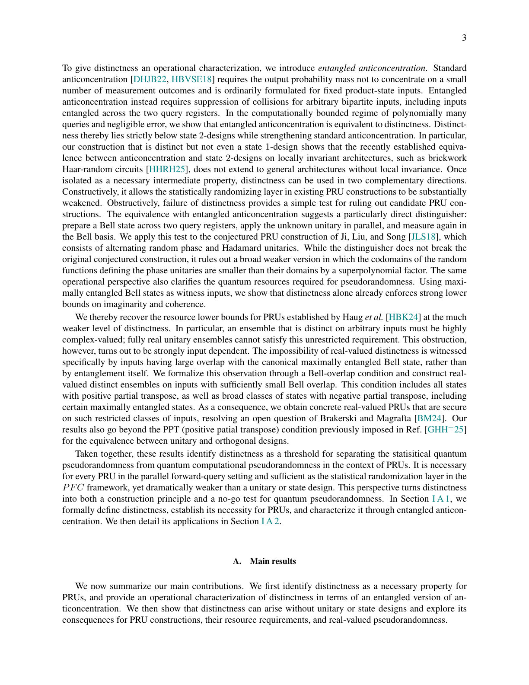 
Low-resolution page preview, page 3

📷 Fig 3

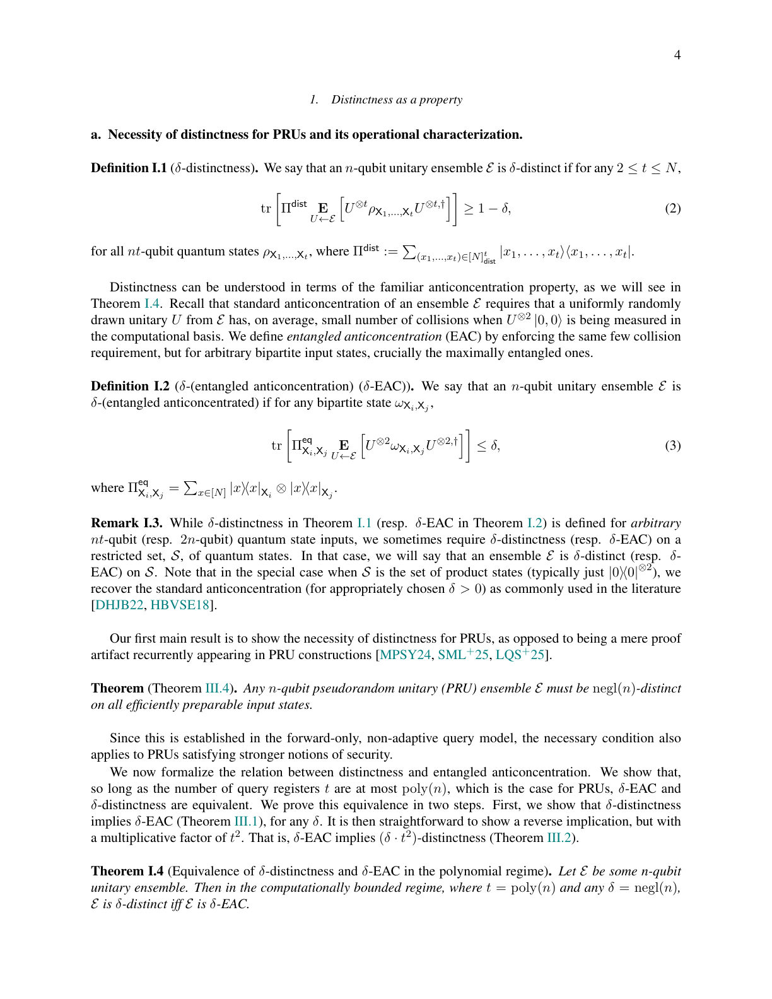 
Low-resolution page preview, page 4

📷 Fig 4

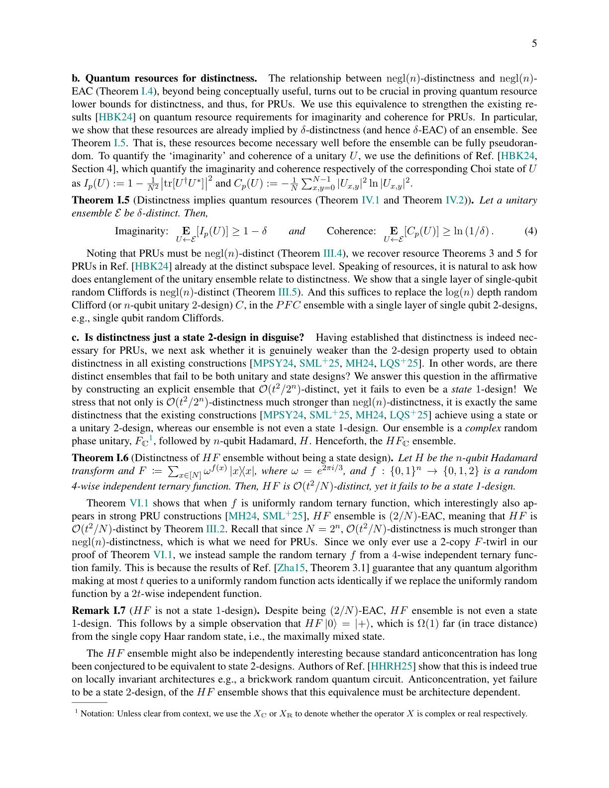 
Low-resolution page preview, page 5

📷 Fig 5

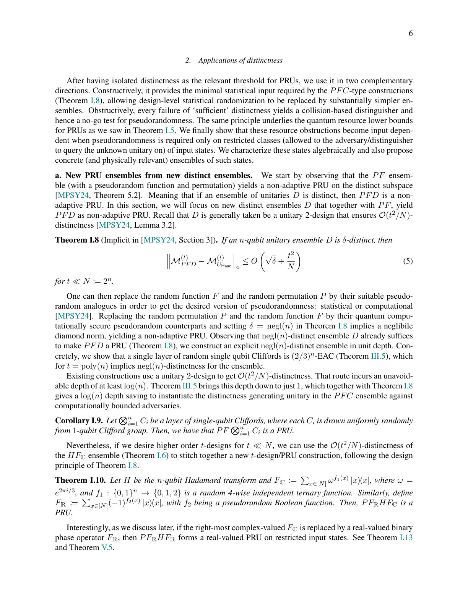 
Low-resolution page preview, page 6

**Summary.** This work establishes 'distinctness' as the fundamental necessary threshold for a unitary ensemble to be computationally pseudorandom. The authors demonstrate that achieving this pseudorandomness does not require the ensemble to possess the stronger property of statistical pseudorandomness (like being a unitary 2-design). They provide new constructions and resource bounds based solely on this distinctness criterion.

**Why it may be interesting.** The concept of 'distinctness' provides a novel, necessary, and potentially weaker resource constraint for quantum pseudorandomness than traditional design theory, which is highly relevant for designing efficient quantum protocols.

Detailed structure

**Main problem.** The paper addresses the poorly understood relationship between two forms of quantum pseudorandomness: statistical (unitary designs) and computational (pseudorandom unitaries, PRUs).

**Main result.** It proves that statistical pseudorandomness is not necessary for PRUs, introducing 'distinctness' as a necessary threshold property that characterizes PRUs.

**Method.** The authors define and characterize 'distinctness' using an entangled analogue of anticoncentration, comparing it to established concepts like unitary designs.

**Model / system.** The study focuses on constructing and analyzing ensembles of unitary operators acting on $n$ qubits, particularly in the context of the Parallel Forward-Query (PFC) framework.

**Key observables.** Distinctness, Entangled Anticoncentration ($\delta$-EAC), Imaginarity ($	ext{Ip}(U)$), and Coherence ($	ext{Cp}(U)$).

**Important parameters / regimes.** The required distinctness level is $	ext{negl}(n)$, and the equivalence theorems hold in the computationally bounded regime where query depth $t = 	ext{poly}(n)$.

**Assumptions / limitations.** The equivalence between distinctness and EAC relies on the assumption of a computationally bounded query depth ($t = 	ext{poly}(n)$).

**Paper structure.** The paper introduces the concepts of distinctness and EAC, proves their equivalence under certain conditions, uses this property to construct new PRU ensembles that bypass the need for full unitary designs, and applies the concept to constrain existing conjectures.

Abstract

Pseudorandomness is increasingly recognized as a key property of ensembles in quantum information theory, statistical mechanics, and quantum many-body physics. Yet it appears in two conceptually different forms: statistical pseudorandomness, embodied by unitary designs, and computational pseudorandomness captured by pseudorandom unitaries (PRUs). The relationship between these two forms of pseudorandomness remains surprisingly poorly understood. Existing PRU constructions reveal this interplay where a statistically randomizing ingredient, a unitary design, is combined with classical cryptographic primitives to produce computational pseudorandomness. We show that statistical pseudorandomness is not necessary for computationally pseudorandom unitaries. We do this by replacing the unitary $2$-design layer in the existing constructions with ensembles that are not even state $1$-designs, yet are sufficiently {\em distinct}, a property we identify to be necessary for any PRU. This yields new non-adaptively secure PRU ensembles whose computational pseudorandomness is obtained without an underlying statistically pseudorandom quantum ensemble, such as a $2$-design. We characterize distinctness via an entangled analogue of anticoncentration and use it to show that distinctness already captures constraints on coherence and imaginarity of PRUs, while identifying broad classes of inputs for which the latter obstruction disappears, enabling real-valued PRUs even for certain (maximally) entangled states. As an application, we use lack of distinctness to constrain the conjectured pseudorandomness of the random phase-Hadamard ensemble to form a PRU.

[↑ back to top](#top)

### [Efficient Estimation of Reduced QAOA Expressibility on Acyclic Graphs](http://arxiv.org/abs/2609.03317v1)

**Authors:** Bao Bach, Boris Tsvelikhovskiy, Jose Falla, Ilya Safro  
**Type:** theory · **Category:** quantum information and computing · **PDF:** <https://arxiv.org/pdf/2609.03317v1>  
**Analysis basis:** full PDF text, analyzed in chunks

📷 Fig 1

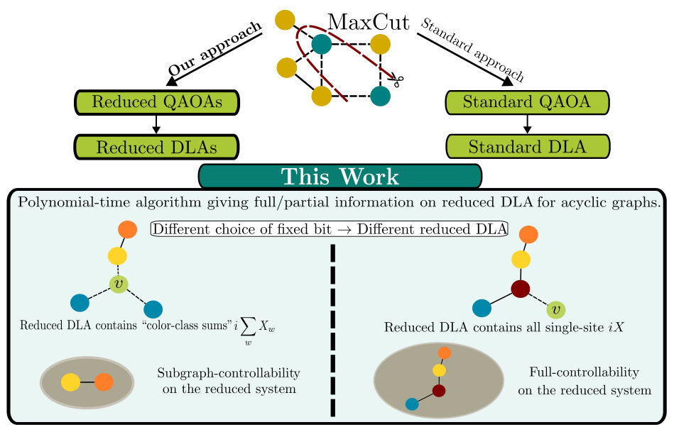 
FIG. 1. Overview of results and symmetry-reduction framework. In the presence of a global bit-flip symmetry, fixing the bit value at any chosen reference vertex v yields a reduced optimization problem equivalent to the original, along with a reduced QAOA ansatz and its corresponding reduced dynamical Lie algebra. A canonical example exhibiting this symmetry is the MaxCut problem, which serves as the primary focus of this work. (Bottom) We present a polynomial-time classical algorithm with computational complexity O(|V |2) that partitions the vertices of connected acyclic graphs based on their shortest-path distances to a chosen reference vertex v and the vertex degree parities along those...

📷 Fig 2

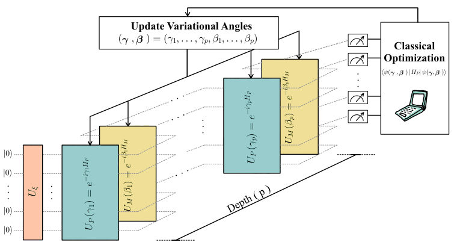 
FIG. 2. Schematic illustration of the QAOA circuit. The initial state preparation unitary Uξ with Uξ(|0⟩⊗n) = |ξ⟩) is followed by p alternating unitaries UP (γj) := e−iγjHP and UM(βj) := e−iβjHM . At the end of the circuit, we measure the state in the computational basis. Each measurement outcome x ∈Bn is assigned the value F(x) of the objective function, and the empirical mean of these values provides an estimate of ⟨ψ(β, γ)| HP |ψ(β, γ)⟩. This estimate is then used in a classical optimization loop to update the parameters (β, γ) with the goal of minimizing the empirical mean.

📷 Fig 3

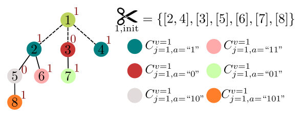 
FIG. 3. The initial grouping  v=1,init obtained from Partition(1), illustrating the assignment of nodes {2, 3, 4, 5, 6, 7, 8}

📷 Fig 4

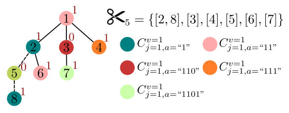 
FIG. 4. The grouping 5 obtained from Partition(5), illustrating the assignment of nodes {2, 3, 4, 5, 6, 7, 8} to their respective groups Cv=5 j,a . From this grouping, we can update the singleton set to R = {3, 4, 5∗, 6, 7, 8}. Here, the asterisk for node 5 denotes that it has been exploited as a root node.

📷 Fig 5

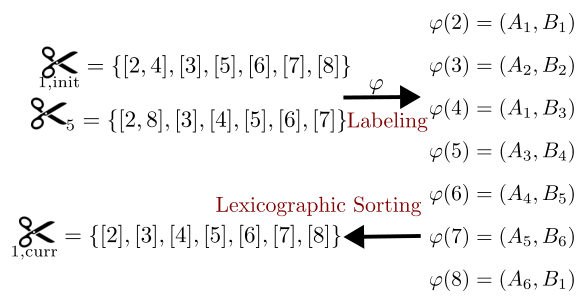 
FIG. 5. Given the obtained partition 5, we update the initial partition  1,init by calling subroutine

**Summary.** This paper introduces a polynomial classical algorithm to analyze the reduced Dynamical Lie Algebra (DLA) for QAOA, specifically when applied to tree graphs. By leveraging graph structure properties like shortest paths and degree parities, the authors can determine the quantum dynamics' expressibility. This allows researchers to theoretically guide and understand quantum algorithms using only classical graph theory.

**Why it may be interesting.** It provides a powerful, purely classical structural tool to diagnose the fundamental quantum limitations (expressibility) of variational quantum algorithms before running them on expensive quantum hardware.

Detailed structure

**Main problem.** The paper addresses the challenge of determining the expressive power and controllability of quantum circuits, specifically for the QAOA algorithm, whose underlying dynamics are captured by the Dynamical Lie Algebra (DLA).

**Main result.** For QAOA on tree graphs, the authors developed a polynomial classical algorithm that can determine the reduced DLA structure, certifying maximal expressibility or providing rigorous lower bounds on the DLA dimension.

**Method.** The approach involves developing a classical, polynomial-time algorithm that recursively partitions graph vertices using shortest-path distances and degree parities to analyze the structure of the reduced DLA.

**Model / system.** The model is the Quantum Approximate Optimization Algorithm (QAOA) applied to combinatorial optimization problems like MaxCut. The dynamics are analyzed via the Dynamical Lie Algebra (DLA) generated by the problem and mixer Hamiltonians.

**Key observables.** The structure and dimension of the reduced Dynamical Lie Algebra (DLA), and the containment of single-site Pauli operators within this algebra.

**Important parameters / regimes.** The graph structure ($\Gamma$), particularly when it is a tree (acyclic), which simplifies the Lie-algebraic analysis.

**Assumptions / limitations.** The core results are established under the assumption that the underlying graph $\Gamma$ is connected and acyclic (a tree).

**Figures summary.** The notes reference figures illustrating the symmetry-reduction framework (fixing a reference vertex $v$) and the general structure of the QAOA circuit.

**Paper structure.** The paper builds from the general problem of DLA construction to a specific, tractable case: QAOA on trees. It introduces graph-theoretic diagnostics (distance layers, parity patterns) to derive algebraic containment results for the reduced DLA.

Abstract

Classically equivalent formulations of an optimization problem need not lead to equivalent quantum algorithms. For MaxCut, fixing the value of a single vertex removes a simple global symmetry without changing the underlying optimization problem, yet it can substantially alter the quantum dynamics generated by the Quantum Approximate Optimization Algorithm (QAOA). These dynamics are captured by the circuit's dynamical Lie algebra (DLA), whose direct construction can become exponentially expensive. Here we show that, for symmetry-reduced QAOA on trees, substantial information about the reduced DLA can instead be obtained efficiently from the graph alone. We introduce a polynomial classical algorithm that recursively distinguishes vertices using shortest path structure and degree parity. When all vertices are resolved individually, the method determines the complete reduced DLA and, under the corresponding graph conditions, certifies maximal expressibility of the reduced QAOA ansatz. Even when full resolution is not achieved, the algorithm identifies embedded subalgebras, provides rigorous lower bounds on DLA dimension, and certifies controllable subsystems. Our theoretical and experimental results show how classical graph structure can be used to diagnose and potentially guide the quantum dynamics of variational algorithms before running them on quantum hardware.

[↑ back to top](#top)

### [Exact Compatibility Geometry of Three-Qubit Entanglement](http://arxiv.org/abs/2609.03864v1)

**Authors:** Wei Song, Xiao-Lan Zong, Ming Yang  
**Type:** theory · **Category:** quantum information and computing · **PDF:** <https://arxiv.org/pdf/2609.03864v1>  
**Analysis basis:** full PDF text, analyzed in chunks

📷 Fig 1

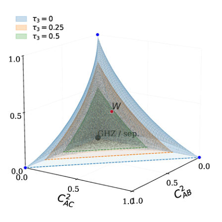 
FIG. 1. Fixed-τ3 cross sections of the three-qubit entanglement re- gion in (C2 AB, C2 AC, C2 BC) space for τ3 = 0, 0.25, and 0.5. Translu- cent surfaces represent projection boundaries obtained from the com- patibility conditions K(s) ≥0 and G(x, y, z, τ3, s) ≤0. Gray points denote Haar-random pure states sampled near the correspond- ing τ3 values. Blue, red, and black markers indicate the Bell-pair vertices, the symmetric W state, and the GHZ point/separable pro- jection, respectively. Dashed curves show the boundary projections onto the C2 BC = 0 plane.

**Summary.** This paper rigorously characterizes the geometric constraints governing the entanglement structure of three-qubit pure states. It moves beyond simple upper bounds by deriving necessary and sufficient semi-algebraic conditions for the coexistence of pairwise concurrences and the three-tangle. The results provide exact formulas to determine the possible range of a missing entanglement component given the others.

**Why it may be interesting.** This work provides rigorous mathematical tools to map out the precise boundaries of entanglement resource spaces, which is crucial for understanding the limits of quantum correlations in multi-partite systems.

Detailed structure

**Main problem.** To determine the fundamental, necessary, and sufficient constraints governing the coexistence of multiple entanglement measures (pairwise concurrences and three-tangle) in a three-qubit pure state.

**Main result.** The paper provides a necessary-and-sufficient semi-algebraic characterization for the entire achievable entanglement region ($\Omega_3$) and derives exact, parameter-free intervals for missing bipartite entanglement components.

**Method.** The authors use supporting geometry, canonical state parametrization (Ac´ın form), and algebraic elimination techniques to characterize the boundary of the entanglement region.

**Model / system.** The study focuses on three-qubit pure quantum states, $|\psi
angle_{ABC}$, and the entanglement measures associated with them, such as pairwise concurrences ($C_{ij}$) and the three-tangle ($	au_3$).

**Key observables.** Pairwise concurrences ($C_{AB}, C_{AC}, C_{BC}$) and the three-tangle ($	au_3$).

**Important parameters / regimes.** The state is analyzed in a four-dimensional compatibility body ($\Omega_3$), and the analysis involves auxiliary parameters ($s$) and transformed variables ($X, Y, Z$).

**Assumptions / limitations.** The final characterization relies on the Ac´ın standard form parametrization and the existence of an auxiliary parameter $s$ to define the boundary conditions.

**Figures summary.** Figures illustrate cross-sections of the three-qubit entanglement region in the space of squared concurrences for varying $	au_3$, showing how GHZ correlations constrain pairwise entanglement.

**Paper structure.** The paper progresses from establishing initial global supporting linear constraints (Theorem 1) to deriving the full, non-linear, necessary-and-sufficient semi-algebraic characterization (Theorem 2), culminating in the exact determination of completion intervals for missing entanglement components.

Abstract

We present a permutation-symmetric supporting relation between the pairwise concurrences and the three-tangle in three-qubit system, whose extrema are attained only by the symmetric $W$ and GHZ local-unitary classes. Furthermore, by introducing the concept of a four-dimensional compatibility body, we show that our proposed global relation and the previous CKW relation can be uniformly viewed as different supporting directions of the same achievable set. Subsequently, we provide a necessary-and-sufficient semi-algebraic characterization of the complete four-dimensional compatibility of a three-qubit pure state. Based on this, we can conversely describe the compatibility between entangled components: given the remaining entangled components, the missing two-body entangled component can only take values within a precise parameter-free interval. We demonstrate that the above construction also applies to arbitrary concurrence-generated entanglement measures.

[↑ back to top](#top)

### [Hidden Magnetic Octupolar Order driven by Spin-Orbit coupling in KFeF$_3$](http://arxiv.org/abs/2609.03684v1)

**Authors:** C. A. Crawford, C. I. Hiley, N. C. Bristowe, C. Stock, J. Gainza, C. Ritter, M. R. Lees, R. I. Walton, M. S. Senn  
**Type:** both · **Category:** strongly correlated electrons · **PDF:** <https://arxiv.org/pdf/2609.03684v1>  
**Analysis basis:** full PDF text, analyzed in chunks

📷 Fig 1

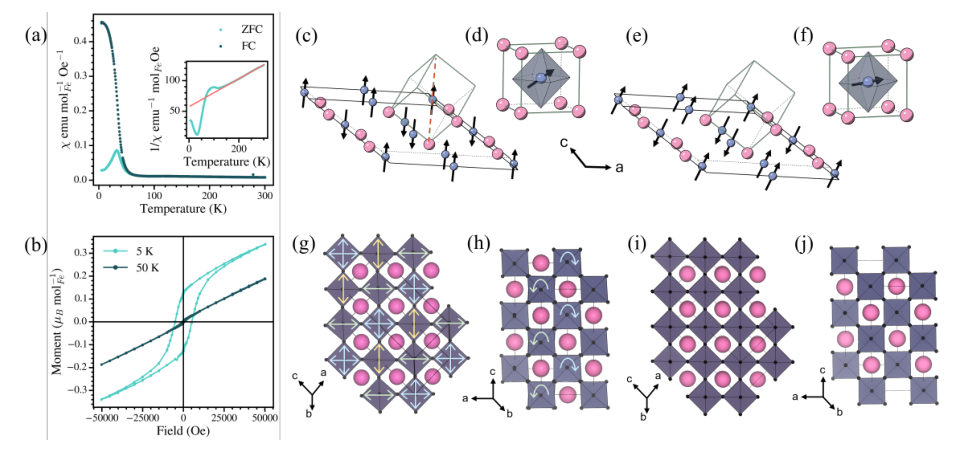 
FIG. 1. (a) M (T) of KFeF3 showing the bifurcation of the FC and ZFC measurements below the wFM transition at 40 K. The inset shows the Curie-Weiss fitting to the paramagnetic region. b. M (H ) KFeF3 at 5 and 50 K. Magnetic vector directions with respect to the monoclinic (black) and cubic Pm¯3m (green) cells for (c,d) R¯3c.1′ c[R¯3m] and (e,f) C2/c.1. The dashed orange line in c reflects the [111]c direction to highlight the direction of AFM moments along it in the rhombohedral model, and the canting away from the [111]c in the monoclinic model. Pm¯3m parent cells are shown on the right for each model to highlight the rotation of AFM vector within the FeF6 octahedra. Relaxed structural...

📷 Fig 2

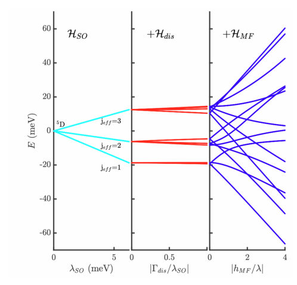 
FIG. 2. Effect of the spin-orbit, weak octahedral distor- tion, and molecular field on the eigenstates of the magnetic Hamiltonian for Fe2+ in a crystalline electric field imposed 5D ground state.

📷 Fig 3

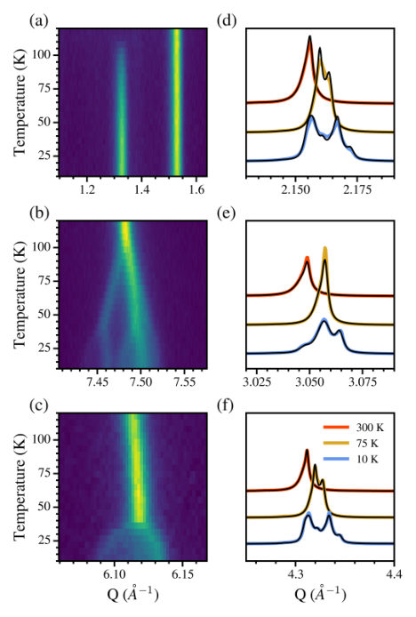 
FIG. 3. a-c. Variable temperature PND data showing (a) the onset of AFM order at 115 K, (b) rhombohedral splitting below 90 K, and (b,c) monoclinic splitting below 40 K. (d- f) Rietveld refinements (black lines) at 300 K (red line), 75 K (yellow line) and 10 K (blue line) to synchrotron x-ray diffraction data collected at beamline ID22, ESRF.

📷 Fig 4

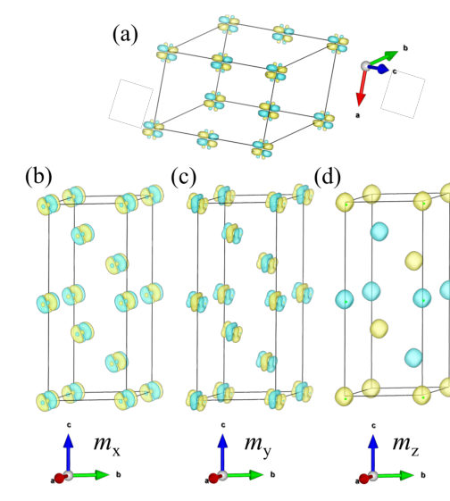 
FIG. 4. Spin density isosurfaces from DFT for the rhombo- hedral structure calculated from DFT showing components along (a,b) x, (c) y and (d) z with respect to a rhombohe- dral unit cell. mx and my show more complex distributions of magnetic density, whereas mz shows a simple spin up (yellow) or spin down (blue) magnetic dipole corresponding to AFM order.

📷 Fig 5

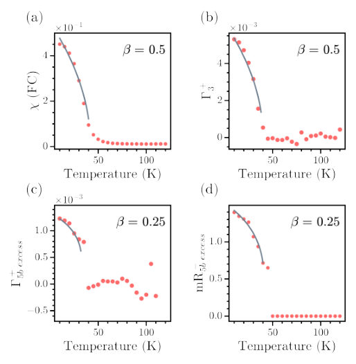 
FIG. 5. Fitting of the (a) FC susceptibility, (b) Γ+ 3 tetrag- onal strain, (c) excess Γ+ 5(b) from extrapolated rhombohedral strain, (d) excess mR− 5(b) from extrapolated average of mR− 5(a) and mR− 5(b), all below the wFM transition temperature. A universal critical temperature of 42.1(5) K is fitted across all secondary order parameters where β respects the order of the couplings identified with the primary magnetic octopole OP via invariant analysis.

**Summary.** This work demonstrates that the material KFeF3 undergoes a low-temperature phase transition driven by a hidden magnetic octupole order, rather than conventional structural distortion. The key mechanism involves spin-orbit coupling stabilizing this higher-rank magnetic order, which is responsible for observed weak ferromagnetism. The study establishes KFeF3 as a model system for understanding multipolar magnetism driven by competing electronic energy scales.

**Why it may be interesting.** The concept of hidden, multipolar order driven by SOC is highly relevant to understanding exotic magnetic states in strongly correlated materials, which often exhibit complex, non-collinear magnetic ground states.

Detailed structure

**Main problem.** The study investigates phase transitions driven by 'hidden order'—magnetic or structural instabilities lacking conventional symmetry-breaking signatures.

**Main result.** The low-temperature transition in KFeF3 is driven by a hidden magnetic octupole order parameter, which is stabilized by spin-orbit coupling (SOC) and accounts for weak ferromagnetism.

**Method.** The research combines high-resolution powder diffraction, magnetometry, symmetry-based Landau analysis, and first-principles DFT calculations.

**Model / system.** The physical system is the 3d perovskite, KFeF3, which exhibits multiple magnetic and structural transitions between cubic, rhombohedral, and monoclinic phases.

**Key observables.** Weak ferromagnetism (wFM), symmetry-breaking strain, magnetic octupole order parameter, and the evolution of the effective magnetic moment ($\mu_{	ext{eff}}$).

**Important parameters / regimes.** The competition between spin-orbit coupling (SOC) and orbital degeneracy, which dictates the emergence of higher-rank magnetic multipolar degrees of freedom.

**Assumptions / limitations.** The analysis relies on symmetry-based Landau theory and DFT calculations to model the coupling between different magnetic multipolar orders.

**Figures summary.** Figures show magnetic susceptibility (M(T), M(H)), variable temperature neutron diffraction data confirming structural transitions, and theoretical diagrams illustrating the coupling of the octupole order parameter to strain and weak ferromagnetism.

**Paper structure.** The paper progresses from characterizing conventional transitions (90 K) to identifying the hidden instability (40 K). It uses symmetry analysis (Landau theory) to pinpoint the octupole order, and DFT calculations confirm the role of SOC in suppressing competing instabilities and stabilizing the multipolar state.

Abstract

Phase transitions are typically driven by symmetry-breaking structural distortions that lift electronic degeneracies, yet in some cases, these transitions may be driven by a hidden order without conventional structural signatures. Here, we demonstrate that the 3$d$ perovskite, KFeF$_3$, hosts such a hidden instability. Using a combination of high-resolution powder diffraction, magnetometry, symmetry-based analysis and first principles calculations, we reveal that while the 90 K cubic to rhombohedral transition arises from conventional magnetostriction accompanying antiferromagnetic order, a second transition at 40 K lowers the symmetry to monoclinic without any detectable Jahn-Teller distortion or translational symmetry-breaking. Symmetry-based Landau analysis supports a hidden zone centered magnetic octupole order parameter, whose improper coupling accounts for the weak ferromagnetism and pronounced symmetry-breaking strain. Density functional calculations show that spin-orbit coupling suppresses the competing Jahn-Teller instability, and thereby favors higher rank magnetic multipolar degrees of freedom. These findings establish KFeF$_3$ as a model system in which the competing energy scales between spin-orbit coupling and orbital degeneracy result in the emergence of hidden, multipolar order. We show that the control of such magnetic, multipolar order could, in principle, provide a route to induce altermagnetism.

[↑ back to top](#top)

### [Limits of Stochastic Semigroups and Block-Triangular Majorisation](http://arxiv.org/abs/2609.04057v1)

**Authors:** Fabio Deelan Cunden, Jakub Czartowski, Giovanni Gramegna, Marilena Ligabò  
**Type:** theory · **Category:** statistical mechanics · **PDF:** <https://arxiv.org/pdf/2609.04057v1>  
**Analysis basis:** full PDF text, analyzed in chunks

📷 Fig 1

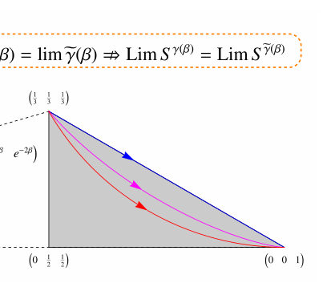 
Figure 1. Dependence of the limiting distribution-preserving semigroup on the multi- scale profile. Two families of probability vectors, 𝛾(𝛽) and e𝛾(𝛽), converge to the same boundary point of Δ2 as 𝛽→∞, while approaching it along different asymptotic tra- jectories. Consequently, their associated semigroups of preserving stochastic matrices have different Kuratowski limits, illustrating that the limiting distribution alone does not determine the limiting semigroup. In particular, limiting semigroup in degenerate case (𝑥= 1, blue line) is different from non-degenerate cases (𝑥= 1.5, 2; magenta and red lines, respectively).

📷 Fig 2

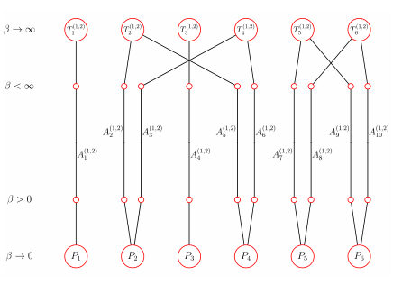 
Figure 2. Flowchart for extreme points of S𝛾(𝛽) for 𝑛= 3 under level degeneracy with 𝜇= (2, 1) [left panel] and 𝜇= (1, 2) [right panel], corresponding to doubly degenerate excited and ground levels, respectively. Definitions of 𝐴(2,1) 𝑖 and 𝐴(1,2) 𝑖 operations are given in equations (4.17) and (4.19), respectively.

📷 Fig 3

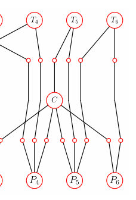 
Figure 3. Flowchart for extreme points of S𝛾(𝛽) for 𝑛= 3 with 𝜇= (1, 1, 1), i.e. the nondegenerate three-level case. The structure matches the flowchart given in [MH18].

**Summary.** This theoretical paper analyzes the limiting behavior of stochastic semigroups derived from Gibbs distributions as temperature approaches zero. It proves that the limit of the semigroups does not generally commute with taking the semigroup of the limit distribution. The resulting structure is characterized by block-upper-triangular matrices, defining a novel mathematical concept called Block-Triangular majorisation.

**Why it may be interesting.** The non-commutativity result is crucial for understanding how thermodynamic limits affect the dynamics of open quantum systems, suggesting that the path taken to the limit matters significantly.

Detailed structure

**Main problem.** The paper investigates the mathematical structure of the limit of stochastic semigroups associated with probability vectors $\gamma(eta)$ as the inverse temperature $eta$ approaches infinity.

**Main result.** The limiting semigroup is generally not the semigroup preserving the limiting distribution, but rather a subsemigroup characterized by block-upper-triangular stochastic matrices, leading to a new concept called Block-Triangular majorisation.

**Method.** The authors develop a general framework involving multiscale decomposition and analyzing the Kuratowski limit of the semigroups, utilizing majorization theory and combinatorial counting.

**Model / system.** The model involves stochastic matrices whose invariant distributions are Gibbs vectors $\gamma(eta) \propto e^{-eta E_i}$, arising in the context of statistical mechanics at varying temperatures.

**Key observables.** Stochastic matrices, semigroups, Block-Triangular majorisation, and Rényi $\alpha$-entropies.

**Important parameters / regimes.** The inverse temperature $eta$, particularly its limit $eta 	o \infty$ (zero-temperature limit).

**Assumptions / limitations.** The analysis often relies on the exponential separation of scales in the Gibbs case and the existence of a limiting temperature $eta_0$ for certain inequalities.

**Figures summary.** Figures illustrate the non-commutativity of limit operations using different asymptotic trajectories and provide flowcharts detailing the extreme points of the stochastic semigroups for small systems ($n=3, 4$).

**Paper structure.** The paper establishes a general framework for limiting semigroups, specializes this to the Gibbs case using multiscale profiles, characterizes the resulting block-upper-triangular structure, and proves the equivalence between this structure and the Block-Triangular majorisation preorder.

Abstract

We investigate limits of semigroups of stochastic matrices defined by their invariant distribution. Given probability vectors $γ(β)$ depending on a parameter $β$, we introduce a notion of convergence as $β\to\infty$ for the corresponding semigroups of $γ(β)$-preserving stochastic matrices and investigate the structure of the resulting limit. In general, the limiting semigroup differs from the semigroup preserving the limiting distribution, showing that these two operations do not commute. We develop a general framework for such limiting semigroups and study in detail the case in which the invariant distributions are Gibbs vectors at the inverse temperature $β$. We show that the limiting semigroup consists of block-upper-triangular stochastic matrices subject to additional substochasticity constraints. We characterise and enumerate their extremal elements and determine the preorder on probability vectors induced by the action of the semigroup. The resulting notion of Block-Triangular majorisation interpolates between ordinary majorisation and upper triangular (aka unordered) majorisation. We show that it is completely characterised by a finite family of monotones and analyse the corresponding behaviour of Rényi $α$-entropies as $β\to\infty$.

[↑ back to top](#top)

### [Metricity of separable quantum optimal transport with the Hilbert-Schmidt cost](http://arxiv.org/abs/2609.03769v1)

**Authors:** Tomasz Miller  
**Type:** theory · **Category:** other · **PDF:** <https://arxiv.org/pdf/2609.03769v1>  
**Analysis basis:** full PDF text, analyzed in chunks

📷 Fig 1

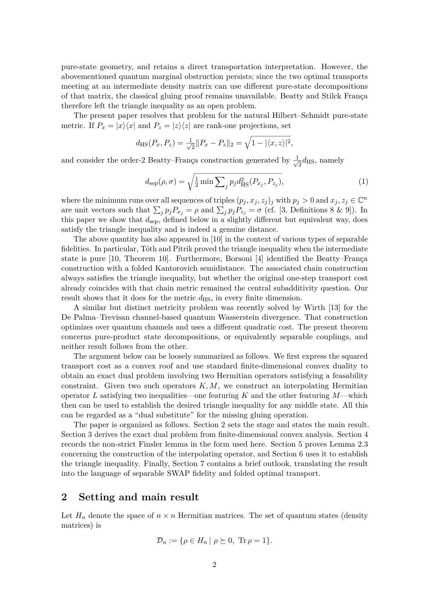 
Low-resolution page preview, page 2

📷 Fig 2

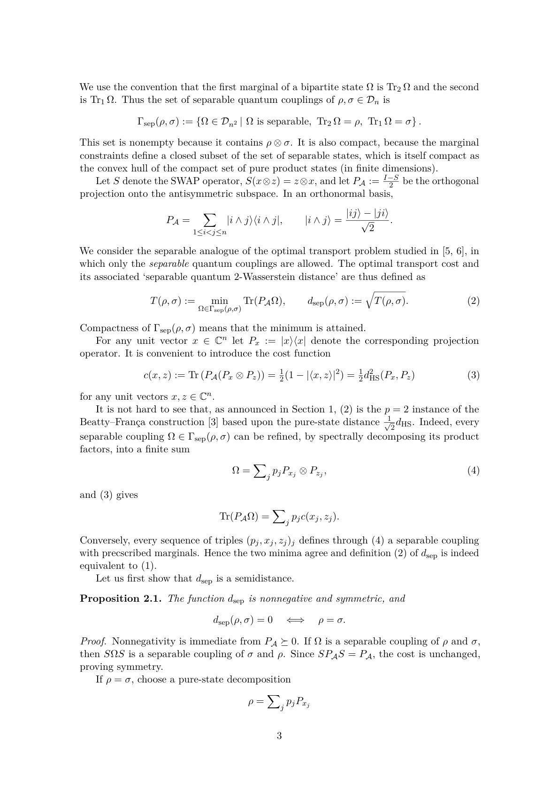 
Low-resolution page preview, page 3

📷 Fig 3

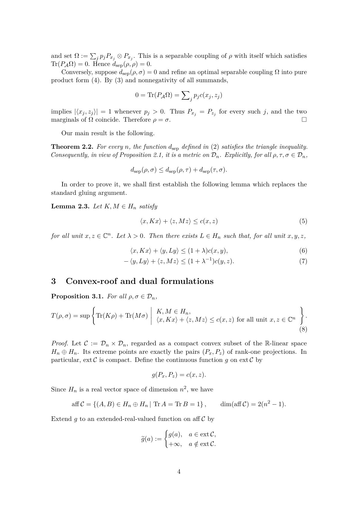 
Low-resolution page preview, page 4

📷 Fig 4

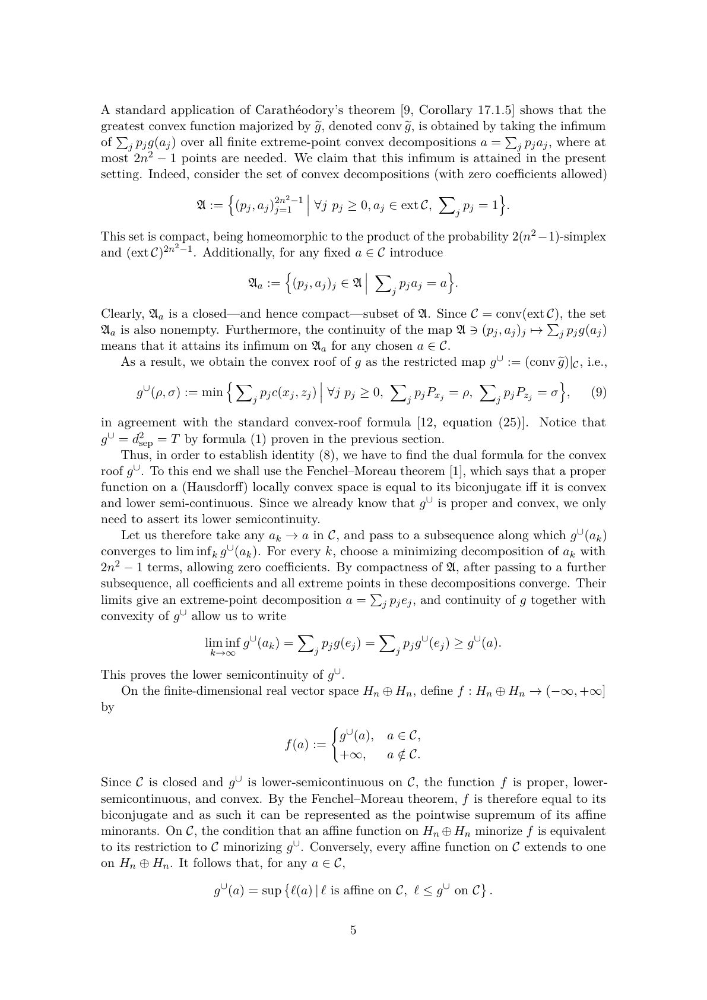 
Low-resolution page preview, page 5

📷 Fig 5

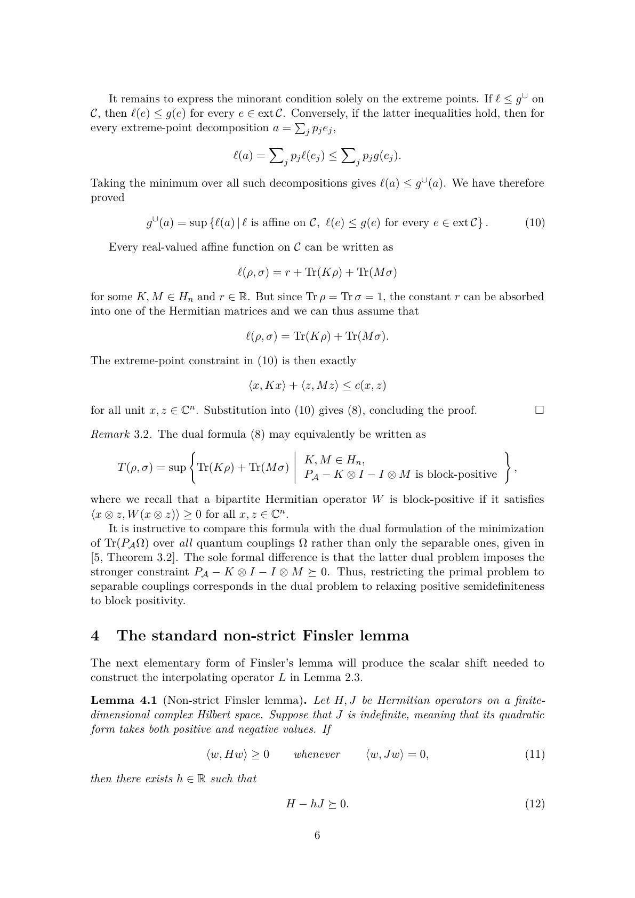 
Low-resolution page preview, page 6

**Summary.** This paper rigorously proves that the separable quantum optimal transport cost, derived using the Hilbert-Schmidt cost, satisfies the triangle inequality, thereby establishing it as a true metric. The authors achieve this by employing sophisticated tools from convex analysis, such as convex-roof duality, to overcome known mathematical obstructions in the field. This result provides a fundamental geometric structure for quantifying distances between quantum states.

**Why it may be interesting.** The rigorous mathematical proof of metricity for quantum transport distances is crucial for developing robust geometric tools in quantum information theory, providing a quantitative measure of distinguishability between quantum states.

Detailed structure

**Main problem.** The paper aims to prove that the separable quantum optimal transport cost, $d_{sep}(
ho, \sigma)$, associated with the Hilbert-Schmidt cost, defines a genuine metric on the space of density matrices.

**Main result.** The core result is the establishment of the triangle inequality for $d_{sep}(
ho, \sigma)$, confirming it is a true distance metric. Furthermore, it shows that the separable SWAP fidelity yields a metric on the state space.

**Method.** The proof relies heavily on advanced convex analysis techniques, specifically replacing a failing 'gluing argument' with convex-roof duality and utilizing a dimension-independent interpolation result for Hermitian operators.

**Model / system.** The system involves quantum states represented by density matrices ($
ho, \sigma$) in a finite-dimensional Hilbert space ($\mathcal{H}^n$). The analysis focuses on the quantum optimal transport framework restricted to separable quantum couplings.

**Key observables.** The separable quantum optimal transport cost, $d_{sep}(
ho, \sigma)$, and the associated separable SWAP fidelity, $F_{S,sep}(
ho, \sigma)$.

**Important parameters / regimes.** The cost function is derived from the Hilbert-Schmidt distance between pure states, $c(x, z) = rac{1}{2}(1 - |\langle x, z 
angle|^2)$.

**Assumptions / limitations.** The proof requires establishing a key interpolating Hermitian operator (Lemma 2.3) to circumvent the 'quantum marginal obstruction' that invalidates standard gluing arguments.

**Paper structure.** The paper first establishes $d_{sep}$ as a semidistance, then derives the dual formulation for the transport cost using convex analysis (convex-roof duality), and finally proves the main theorem by establishing the triangle inequality.

Abstract

We prove that the square root of the separable quantum optimal transport cost associated with the orthogonal projection onto the antisymmetric subspace defines a genuine distance between density matrices. Equivalently, this establishes the triangle inequality for the order-two Beatty-França quantum optimal transport construction induced by the Hilbert-Schmidt distance between pure states. The result also proves metricity of the corresponding distance derived from separable SWAP fidelity. The proof replaces the unavailable gluing argument by convex-roof duality and a dimension-independent interpolation result for Hermitian operators.

[↑ back to top](#top)

### [Multi-Boundary Many-Body Quantum Teleportation](http://arxiv.org/abs/2609.03053v1)

**Authors:** Tal Schwartzman, Antonio F. Rotundo, Raz Monsonego, Shira Chapman  
**Type:** theory · **Category:** quantum information and computing · **PDF:** <https://arxiv.org/pdf/2609.03053v1>  
**Analysis basis:** full PDF text, analyzed in chunks

📷 Fig 1

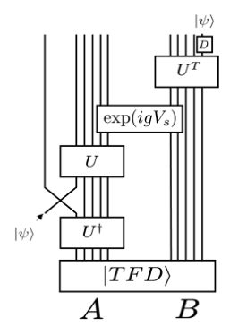 
FIG. 1. A diagram of the two-sided protocol. The lines represent degrees of freedom, with the circuit evolving up- wards.

📷 Fig 2

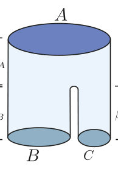 
FIG. 2. The pair of pants geometry for the path integral representation of the wave function associated with the three-party generalization of the TFD state.

📷 Fig 3

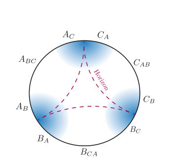 
FIG. 3. Schematic representation of the t = 0 slice of a three-boundary wormhole. The dashed lines are the black hole horizons. In the boundary regions adjacent to the blue bulk regions, the entanglement is approximately bi- partite. The bulk region bounded by the red dashed lines is the causal shadow.

📷 Fig 4

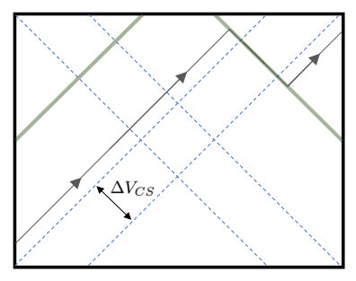 
FIG. 4. The Penrose diagram of a black hole spacetime having a causal shadow with a particle that traverses it. This is a schematic representation of the causal structure of a section that contains two asymptotic regions in the three-boundary wormhole geometry [27]. The particle has a spacelike region to traverse that depends on the width of the causal shadow in this section. In the traversable wormhole protocol, the coupling induces negative averaged null energy and a corresponding null shift. This null shift should be large enough for the particle to cross the null- coordinate gap of the causal shadow.

📷 Fig 5

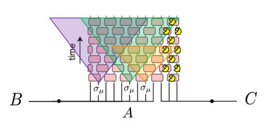 
FIG. 5. The operators spread with time, allowing for the peaked size mechanism to work. The regions to which the operators can spread without damaging the fidelity are limited in 1D by the distance to the sites that are entangled with C.

**Summary.** This work develops a multi-body quantum teleportation protocol using scrambling, motivated by holographic wormhole geometries. By extending the standard two-party setup to three parties, the authors demonstrate that the protocol can probe spatial information spreading, revealing features like holographic causal shadows. The results offer a new diagnostic tool for understanding information transfer in complex quantum systems.

**Why it may be interesting.** It provides a concrete, testable quantum information protocol whose diagnostics (like spatial resolution) are directly linked to deep concepts in quantum gravity and holography, making it highly relevant for theoretical quantum information scientists.

Detailed structure

**Main problem.** The paper generalizes quantum teleportation to a multi-body setting using quantum scrambling, drawing motivation from holographic models of traversable wormholes.

**Main result.** The three-party setup reveals spatial or subsystem resolution of information spreading, and the fidelity and required coupling exhibit dependencies on distance reminiscent of holographic causal shadows.

**Method.** The analysis involves studying the protocol's success probability using both analytical techniques and numerical simulations employing random quantum circuits.

**Model / system.** The system is a three-party quantum teleportation protocol involving three qubit systems (A, B, C), initialized with EPR pairs analogous to a three-boundary holographic state.

**Key observables.** Teleportation fidelity, minimum required coupling, and the dependence of these on distance from the injection site.

**Important parameters / regimes.** The dimensionality of dynamics (one-dimensional vs. all-to-all) and the number of parties (three).

**Assumptions / limitations.** The analysis uses a single-qubit message and often relies on the infinite-temperature limit for holographic comparisons.

**Figures summary.** Figures illustrate the two-sided protocol, the pair of pants geometry for the three-party state, and the causal structure including a causal shadow.

**Paper structure.** The paper builds from the standard two-party protocol to a three-party generalization, analyzing dynamics under 1D and all-to-all coupling, and comparing results to predictions from multi-boundary wormhole holography.

Abstract

Unlike standard quantum teleportation, many-body teleportation uses scrambling to transmit quantum information. In this protocol, initially localized information spreads over many degrees of freedom and is later refocused at the receiver by a simple coupling between the systems, followed by further many-body evolution. The protocol was developed from models of traversable wormholes in holography and has become a useful probe of scrambling. In particular, it can distinguish genuine scrambling from decoherence or noise when out-of-time-order correlators fail, and can reveal signatures of different scrambling mechanisms, including the distinctive behavior expected in holographic systems. Holography predicts that related protocols can transmit information between selected boundaries of multi-boundary wormhole geometries. Motivated by this setting, we study single-qubit many-body teleportation among three systems of qubits. The initial state consists of EPR pairs distributed among them, providing a simple analogue of an infinite-temperature three-boundary holographic state. We analyze the protocol with one-dimensional and all-to-all dynamics, both analytically and numerically using random circuits. We find that the third system suppresses teleportation once the spreading message reaches the region of qubits that are entangled with it. In one dimension, both the minimum coupling required for successful teleportation and the fidelity depend on the distance from the injection site to this region, a feature reminiscent of holographic causal shadows. For all-to-all dynamics, successful teleportation is instead restricted to early times and to sufficiently few qubits entangled with the third system. A third system therefore provides spatial, or subsystem, resolution of information spreading that is absent from the two-sided protocol. Our results offer a step toward many-body teleportation networks.

[↑ back to top](#top)

### [Non-local Magic: closed-form solution and equivalence with magic of purification](http://arxiv.org/abs/2609.04119v1)

**Authors:** Michele Viscardi, Lorenzo Leone, Alioscia Hamma  
**Type:** theory · **Category:** quantum information and computing · **PDF:** <https://arxiv.org/pdf/2609.04119v1>  
**Analysis basis:** full PDF text, analyzed in chunks

📷 Fig 1

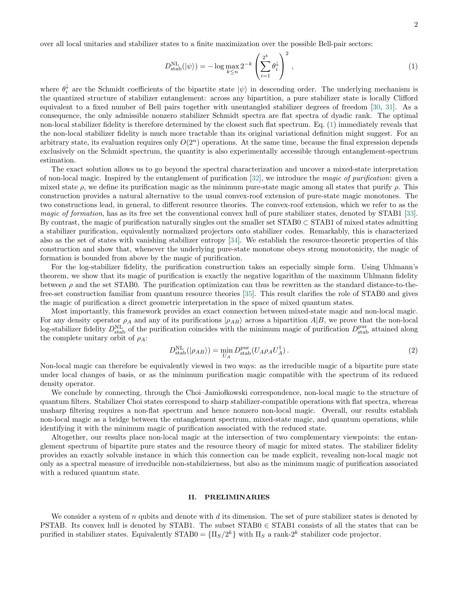 
Low-resolution page preview, page 2

📷 Fig 2

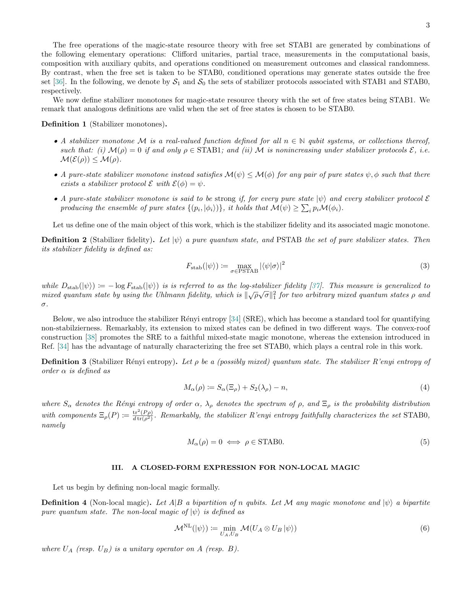 
Low-resolution page preview, page 3

📷 Fig 3

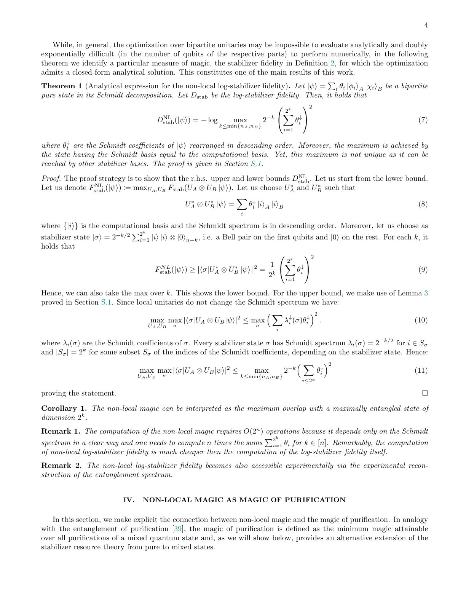 
Low-resolution page preview, page 4

📷 Fig 4

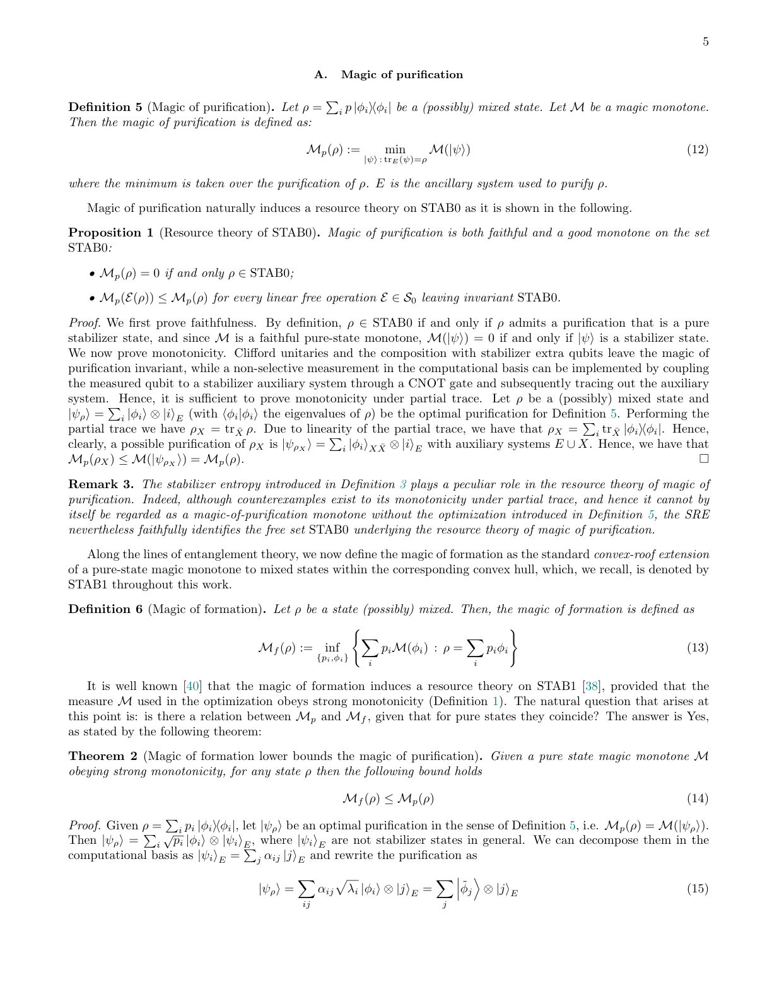 
Low-resolution page preview, page 5

📷 Fig 5

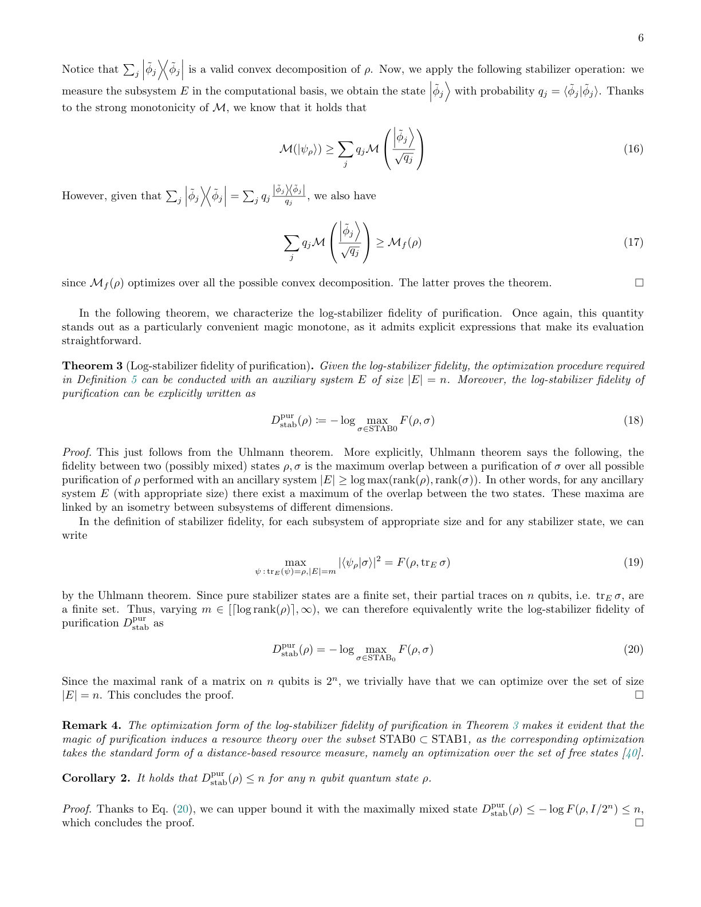 
Low-resolution page preview, page 6

**Summary.** This work develops a resource theory framework to quantify 'non-local magic' in bipartite quantum states. The authors derive an exact, closed-form solution for this magic measure using the state's Schmidt spectrum. Crucially, they establish that this non-local magic is equivalent to the minimum magic achievable through the purification process, offering both an efficient calculation and a deep physical interpretation.

**Why it may be interesting.** It provides a rigorous, analytically tractable measure (non-local magic) for quantifying non-local quantum correlations, linking it to established resource theories like purification.

Detailed structure

**Main problem.** The paper aims to provide an efficient analytical characterization and resource-theoretic interpretation of 'non-local magic,' a measure quantifying the non-stabilizerness of bipartite quantum states.

**Main result.** They prove that the non-local magic, specifically for the log-stabilizer fidelity, coincides with the minimum magic of purification along the unitary orbit of the reduced density operator.

**Method.** The authors derive an exact closed-form solution for the log-stabilizer fidelity based on the Schmidt spectrum and introduce the 'magic of purification' as a resource-theoretic extension.

**Model / system.** The study focuses on bipartite quantum states ($
ho_{AB}$ or $|\psi
angle_{AB}$), analyzing their non-local magic relative to stabilizer states ($	ext{STAB}_1, 	ext{STAB}_0$) and the concept of state purification.

**Key observables.** Non-local magic, log-stabilizer fidelity ($D_{	ext{NL stab}}$), magic of purification ($D_{	ext{pur stab}}$), and the Schmidt spectrum.

**Important parameters / regimes.** The Schmidt coefficients ($	heta_i$) of the bipartite state are crucial as they determine the closed-form solution.

**Assumptions / limitations.** The analysis is tractable by focusing on the log-stabilizer fidelity, as the general evaluation of non-local magic requires difficult optimization over local unitaries.

**Paper structure.** The paper progresses by defining non-local magic, deriving the closed-form solution for the log-stabilizer fidelity, introducing the magic of purification, and finally proving the equivalence between the two measures via the unitary orbit of the reduced density operator.

Abstract

Non-local magic quantifies the non-stabilizerness of a bipartite quantum state that cannot be removed by local unitary transformations. Despite its natural definition, its evaluation generally requires a difficult optimization over local unitaries. Here, we show that for the log-stabilizer fidelity this optimization admits an exact closed-form analytic solution depending only on the Schmidt spectrum. We then introduce the magic of purification, defined as the minimum pure-state magic over all purifications of a mixed state, and show that it naturally induces a resource theory whose free states are normalized stabilizer-code projectors. For the log-stabilizer fidelity, the magic of purification admits a distance-based formulation in terms of the Uhlmann fidelity. Remarkably, we prove that non-local magic coincides with the minimum magic of purification along the unitary orbit of the reduced density operator. Our results provide both an efficient analytical characterization and a mixed-state resource-theoretic interpretation of non-local magic.

[↑ back to top](#top)

### [On the geometry and typicality of quantum magic](http://arxiv.org/abs/2609.03944v1)

**Authors:** Zhenhuan Liu, Z-Wen Liu  
**Type:** theory · **Category:** quantum information and computing · **PDF:** <https://arxiv.org/pdf/2609.03944v1>  
**Analysis basis:** full PDF text, analyzed in chunks

📷 Fig 1

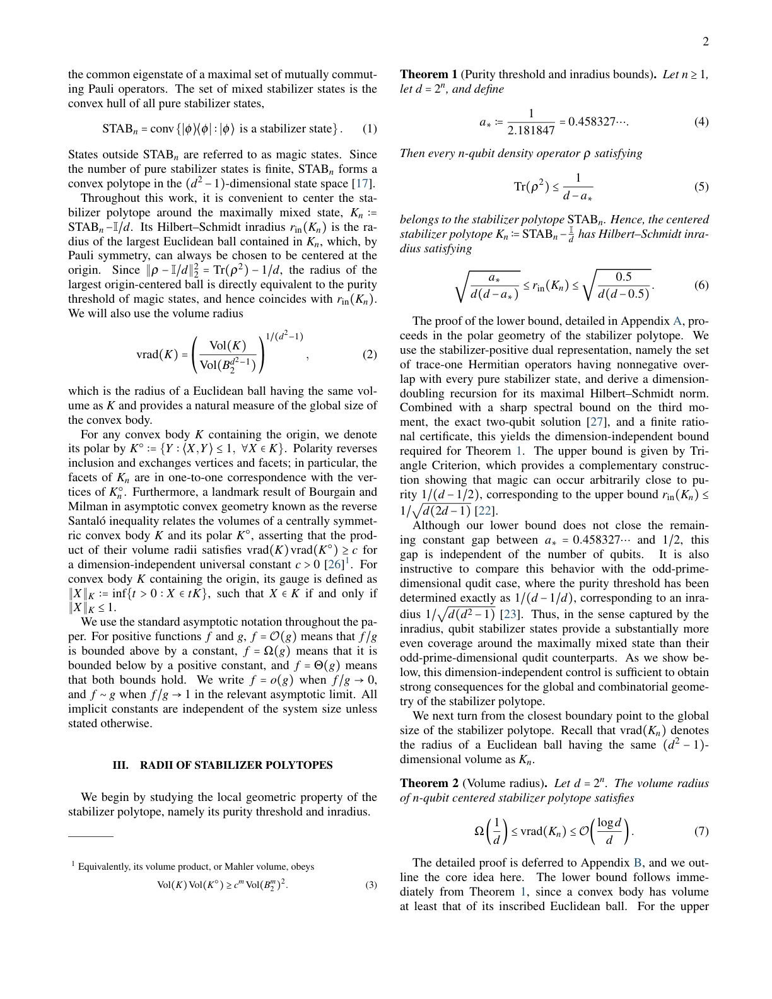 
Low-resolution page preview, page 2

📷 Fig 2

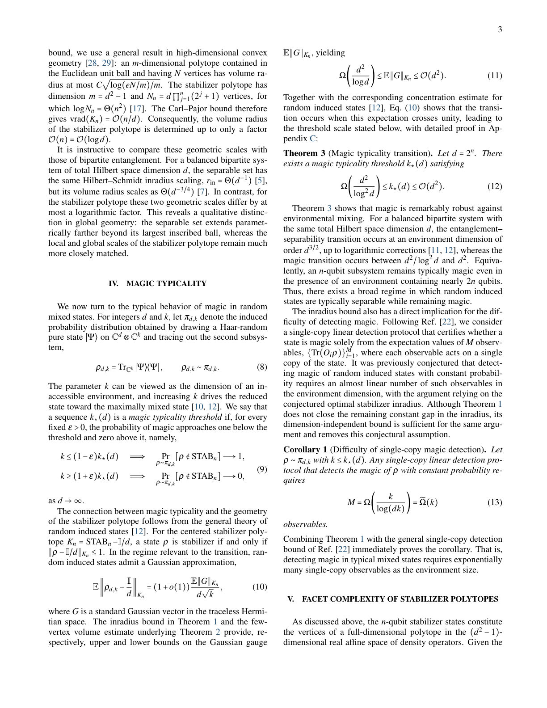 
Low-resolution page preview, page 3

📷 Fig 3

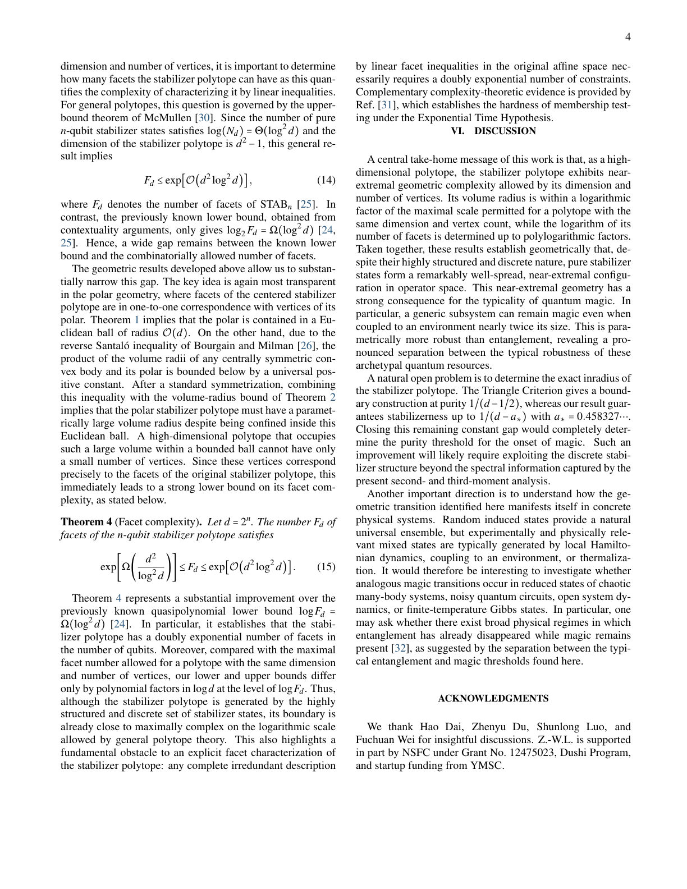 
Low-resolution page preview, page 4

📷 Fig 4

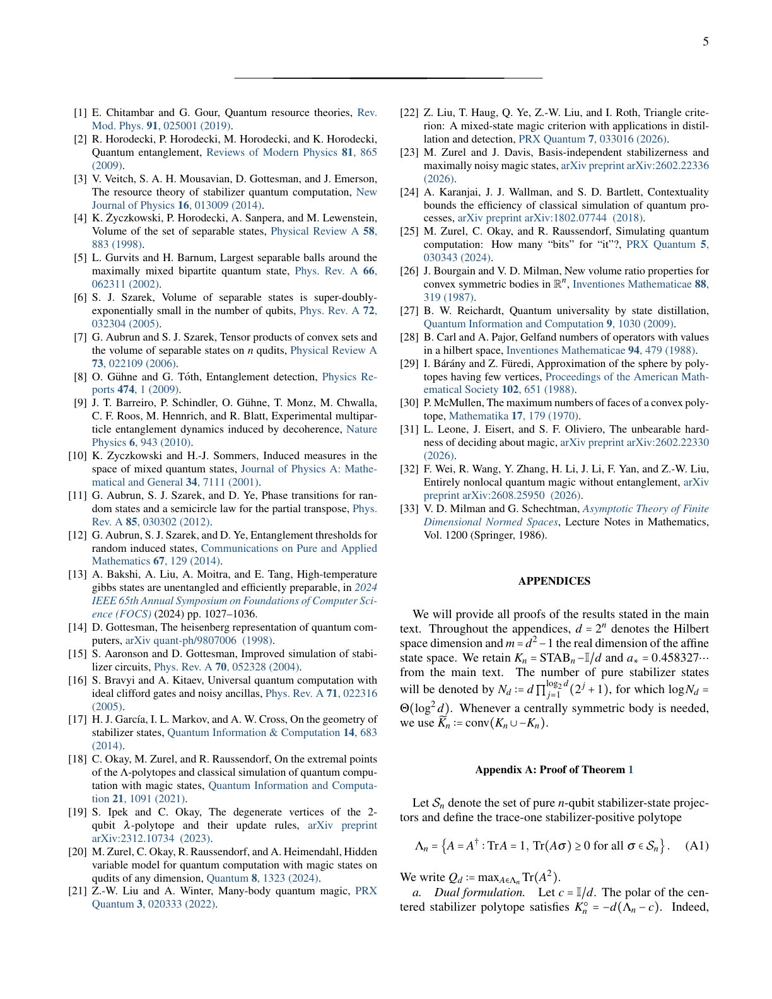 
Low-resolution page preview, page 5

📷 Fig 5

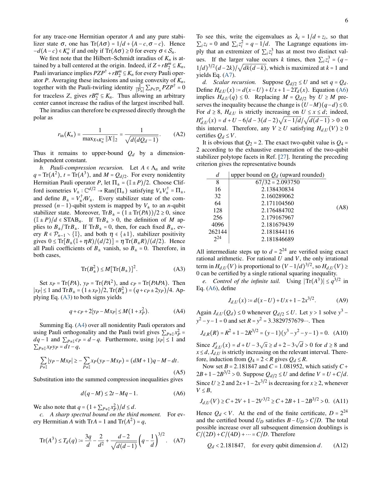 
Low-resolution page preview, page 6

**Summary.** This theoretical paper analyzes the geometric structure of the stabilizer polytope in high-dimensional quantum systems. It derives quantitative bounds on the polytope's size and proves a sharp phase transition for when random quantum states are likely to be 'magic.' The results show that the polytope has extremely high combinatorial complexity, suggesting that its exact description requires an exponentially large number of constraints.

**Why it may be interesting.** The rigorous geometric characterization of the boundary between 'magic' and 'non-magic' states provides fundamental insights into the structure of quantum correlations, which is crucial for understanding quantum error correction and resource theories.

Detailed structure

**Main problem.** The paper characterizes the geometry and typicality of 'quantum magic' states—states that are convex mixtures of pure stabilizer states—in high-dimensional quantum systems.

**Main result.** It establishes sharp bounds on the geometric complexity (e.g., doubly exponential number of facets) of the stabilizer polytope and determines a sharp phase transition scale for when random induced states are likely to be magic.

**Method.** The analysis relies heavily on advanced geometric techniques from convex geometry, including bounding the Hilbert-Schmidt inradius and volume radius of the polytope, and applying Gaussian approximation theorems to random states.

**Model / system.** The system is an $n$-qubit system with dimension $d=2^n$. The focus is on the stabilizer polytope ($	ext{STAB}_n$), which contains all mixed stabilizer states, and random states obtained by tracing out a subsystem from a Haar-random pure state.

**Key observables.** Purity ($	ext{Tr}(
ho^2)$), Hilbert-Schmidt inradius ($	ext{rin}(K_n)$), Volume radius ($	ext{vrad}(K_n)$), and the transition dimension $k_\star$.

**Important parameters / regimes.** The system dimension $d=2^n$, the environment dimension $k$, and the critical purity threshold $a^* \approx 0.458327$.

**Assumptions / limitations.** The analysis uses the assumption of Haar-random pure states and relies on asymptotic convex geometry tools like the Bourgain-Milman inequality.

**Figures summary.** No figures were explicitly summarized, but the notes detail the derivation of bounds for the inradius, volume radius, and the transition scale $k^*(d)$ using various inequalities.

**Paper structure.** The paper proceeds by first establishing purity bounds related to the inradius (Theorem 1), then bounding the volume radius (Theorem 2), followed by determining the sharp phase transition scale for magic typicality (Theorem 3), and finally quantifying the combinatorial complexity via the facet count (Theorem 4).

Abstract

We prove that, for an $n$-qubit system of dimension $d=2^n$, every state satisfying $\operatorname{Tr}(ρ^2)\le 1/(d-a_\ast)$, with $a_\ast=0.458327\cdots$, lies inside the stabilizer polytope and is therefore magic-free. Combining this result with general geometric properties of high-dimensional polytopes, we establish quantitative estimates for the Hilbert--Schmidt inradius and volume radius of the stabilizer polytope, and use them to characterize the typicality of magic in random induced states obtained by tracing out a $k$-dimensional subsystem from a $d\times k$-dimensional Haar-random pure state. We prove a sharp phase transition in the probability of such states having magic, whose transition dimension $k_\star$ is bounded between $Ω(d^2/\log^2d)$ and $\mathcal{O}(d^2)$. We further prove that the number of facets of the stabilizer polytope lies between $\exp[Ω(d^2/\log^2 d)]$ and $\exp[\mathcal{O}(d^2\log^2 d)]$, substantially improving upon the previous quasipolynomial lower bound and implying that any exact description of the magic-free region requires a doubly exponential number of linear inequalities in the number of qubits. Overall, our results show that the stabilizer polytope exhibits near-maximal geometric complexity allowed for a high-dimensional polytope with a certain number of vertices.

[↑ back to top](#top)

### [Projected Riemannian Gradient Descent for the Bures-Wasserstein Barycenter: Dimension-Independent Linear Convergence at Unit Step Size](http://arxiv.org/abs/2609.03762v1)

**Authors:** A. Afham  
**Type:** theory · **Category:** quantum information and computing · **PDF:** <https://arxiv.org/pdf/2609.03762v1>  
**Analysis basis:** full PDF text, analyzed in chunks

📷 Fig 1

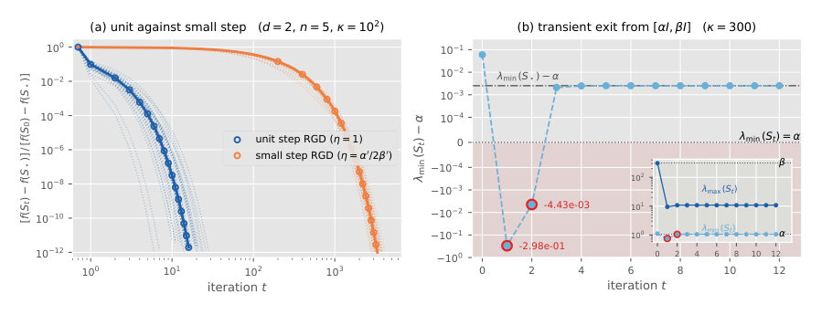 
Figure 1: (a) Unit-step against small-step RGD on 30 instances of the pinned family at d = 2, n = 5, κ = 100 (every member with spectrum {α, β} in a Haar-random eigenbasis), from the initialization S0 = α+β

📷 Fig 2

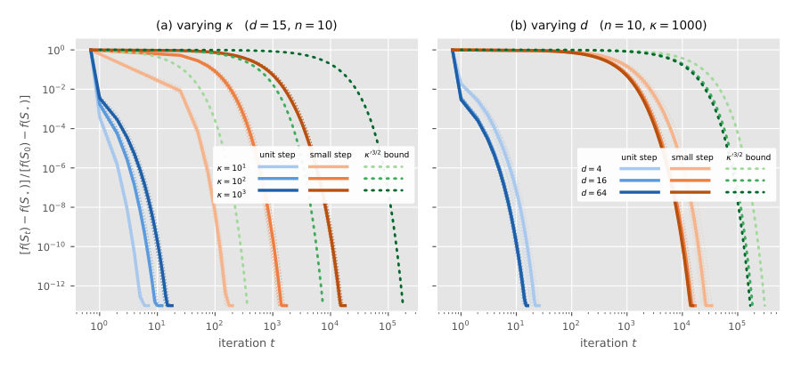 
Figure 2: Unit-step (blue) against small-step (orange) RGD on pinned ensembles (every Ri of condition num- ber exactly κ), 12 instances per band (translucent) with opaque medians; darker shades for larger parameter values, gaps normalized by their initial value. (a) Varying κ at d = 15: median iterations to the numerical floor range over 6 to 16 for the unit step, against 175 to 16288 for the small step. (b) Varying d at κ = 103: the unit-step counts are essentially flat over a sixteenfold increase in d, as Theorem 10 asserts; the small-step counts track the conditioning κ′, not the dimension (see text). Dotted curves show the a priori guarantee of Corollary 17 at each setting’s median κ′;...

📷 Fig 3

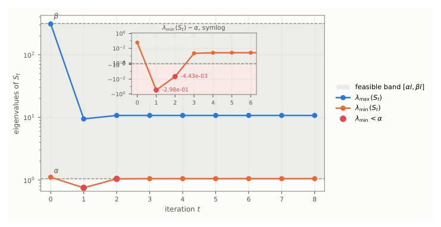 
Figure 3: The trajectory of Example 13. Main panel: both eigenvalues of the unprojected unit-step RGD iterates (log scale), with the feasible band [αI, βI] shaded and the infeasible iterates marked. Inset: the signed deviation λmin(St) −α on a symmetric-log scale, resolving the two undershoots (−2.98 × 10−1 and −4.43 × 10−3) against the limit λmin(S⋆) −α ≈+2.52 × 10−3: the iterate exits [αI, βI] at t = 1, is still outside at t = 2, and re-enters at t = 3.

**Summary.** This paper develops a Projected Riemannian Gradient Descent algorithm to compute the Bures-Wasserstein barycenter of quantum states represented by positive definite matrices. By introducing a novel, non-expansive projection based on eigenvalue clipping, the authors achieve dimension-independent linear convergence at the computationally desirable unit step size. This provides a significant algorithmic improvement over existing methods in quantum information geometry.

**Why it may be interesting.** The work provides a highly efficient, theoretically robust numerical tool for averaging quantum states or covariance matrices, which is fundamental in quantum estimation and resource theories.

Detailed structure

**Main problem.** The paper addresses the computational challenge of finding the Bures-Wasserstein (BW) barycenter of an ensemble of positive definite matrices and solving related invariant matrix projection problems.

**Main result.** It proposes a Projected Riemannian Gradient Descent (RGD) algorithm that achieves dimension-independent linear convergence at unit step size, resolving a known theoretical dichotomy in the field.

**Method.** The core method is a Projected RGD algorithm that incorporates a novel, exact, non-expansive projection based on eigenvalue clipping to constrain iterates within a spectral interval.

**Model / system.** The analysis is conducted on the manifold of positive definite matrices (PD(d)), using the Bures-Wasserstein distance, which is relevant for quantum information tasks like Bayesian quantum tomography.

**Key observables.** Convergence rate, which is shown to be linear with a rate of $(1 - \kappa^{-3/2})$, and the condition number $\kappa = eta/\alpha$.

**Important parameters / regimes.** The spectral bounds $\alpha$ and $eta$ define the constrained set $[\alpha I, eta I]$, and the step size is fixed at unity ($\eta=1$).

**Assumptions / limitations.** The key assumption enabling the result is the novel Projection Lemma, which proves that eigenvalue clipping is the closed-form, non-expansive BW-metric projection onto the constrained set.

**Figures summary.** Figure 1(a) compares the convergence speed of unit-step vs. small-step RGD, showing the proposed method achieves convergence in $\approx 16$ iterations versus $\approx 3300$ iterations for small steps.

**Paper structure.** The paper first establishes the scientific problem (BW barycenter/invariant projection), then introduces the Projected RGD method, proves the crucial Projection Lemma, and finally analyzes the convergence rate and its generalization to related submanifolds.

Abstract

The computation of the Bures-Wasserstein (BW) barycenter of an ensemble of positive definite matrices arises throughout machine learning, optimal transport, and quantum information. Riemannian gradient descent (RGD) at unit step size -- the fixed-point iteration used in practice -- converges rapidly, yet existing analyses present a dichotomy: unit-step guarantees carry worst-case exponential dependence on the dimension, while dimension-independent guarantees require small step sizes that forfeit the empirical speed. We resolve this dichotomy, not by improving the guarantees for unit-step RGD, but by proposing a Projected RGD algorithm that achieves dimension-independent linear convergence at unit step size. The achieved rate, $(1 - κ^{-3/2})$, where $κ$ is the condition number of the ensemble, also polynomially improves on the best small-step guarantee ($κ^{3/2}$ versus $κ^{5/2}$ iteration complexity). The crux is a novel Projection Lemma: clipping the eigenvalues of a positive matrix to an interval $[α, β]$ is the closed-form, non-expansive (1-Lipschitz) BW-metric projection onto the set $\{S : αI \leq S \leq βI\}$ -- a statement which, unlike its known one-sided counterpart, does not follow from convexity. The projection is moreover free: it reuses an eigendecomposition the next iteration must perform in any case, so the projected and unprojected iterations cost the same per step. The same analysis covers the invariant matrix projection problem of Brahmachari et al. (2025), whose fixed-point algorithm we identify as unit-step RGD on a totally geodesic submanifold, thereby extending the dimension-independent guarantee to that setting verbatim.

[↑ back to top](#top)

### [Q-Edge: Symmetry-Reduced Quantum Simulation of Structured Extreme Dependence](http://arxiv.org/abs/2609.03706v1)

**Authors:** Hongrui Zhang, Paolo Recchia, Ying Chen  
**Type:** theory · **Category:** quantum information and computing · **PDF:** <https://arxiv.org/pdf/2609.03706v1>  
**Analysis basis:** full PDF text, analyzed in chunks

📷 Fig 1

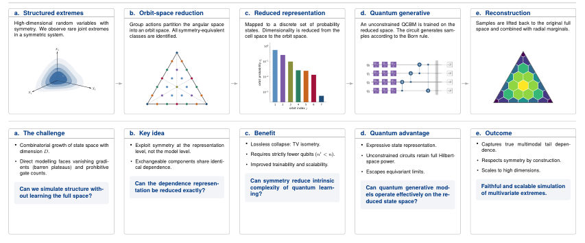 
Figure 1: Conceptual framework of Q-Edge. Structured symmetry induces a lossless orbit- space representation, reducing the effective state space before quantum learning. An un- constrained quantum generative model is trained on the reduced representation to enable scalable simulation of structured multivariate extremes.

📷 Fig 2

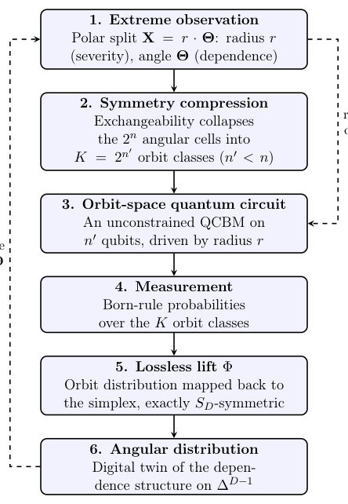 
Figure 2: The Q-Edge pipeline. An extreme observation is split by polar decomposition into a radial severity r and an angular dependence component Θ. Exchangeability compresses the angular configuration space into a much smaller set of orbit classes, on which an unconstrained quantum circuit Born machine—driven by the radius—is trained; its output is lifted back to the simplex by the total-variation isometry Φ, yielding an exactly symmetric digital twin of the dependence structure.

📷 Fig 3

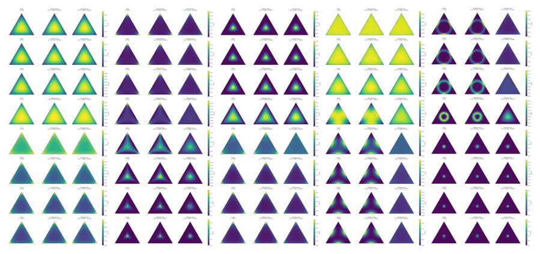 
Figure 3: Qualitative comparison of reconstructed dependence structures. Reconstructed angular densities on the adaptive partition of the 2-simplex. While both methods accurately recover the Dirichlet distribution, the VAE progressively smooths multimodal and curved- support targets towards simpler distributions. Q-Edge faithfully reconstructs multiple modes and ring-shaped dependence by learning directly in the exchangeable orbit space.

📷 Fig 4

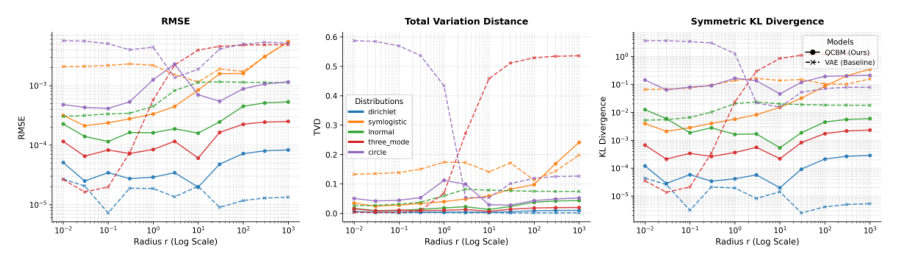 
Figure 4: Radius-resolved accuracy of the orbit-space QCBM (solid) and the conditional VAE (dashed) on the five S3-symmetric targets (D = 3, N = 14). Q-Edge maintains consistently low errors across the full range of dependence geometries, whereas the VAE deteriorates as the target distribution departs from the Dirichlet family, particularly for multimodal and curved-support distributions. Mean errors are summarized in Table 3

📷 Fig 5

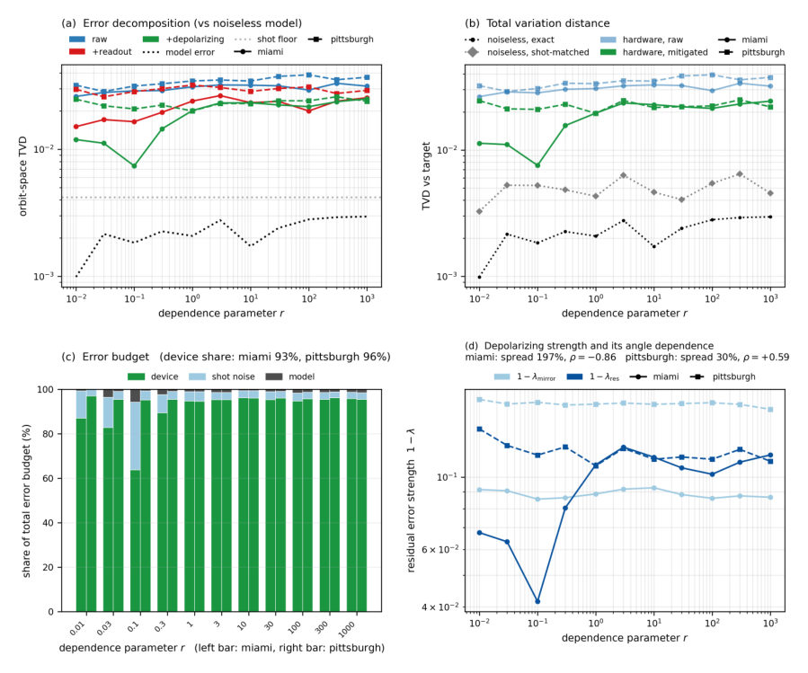 
Figure 5: Execution of the orbit-space Born machine on two coupling topolo- gies. Both devices execute the same angle matrix, so the noiseless references are common to them. Throughout, line style identifies the device (solid with circles, ibm_miami; dashed with squares, ibm_pittsburgh), while colour identifies the quantity, as given in each panel’s legend. a, Orbit-space error decomposition against the dependence parameter r, referenced to the noiseless simulator, at the three mitigation stages. The dotted lines are the model approximation error and the multinomial sampling floor p

**Summary.** This paper introduces Q-Edge, a novel quantum framework designed to overcome the exponential complexity barrier in simulating high-dimensional structured extreme dependence. It achieves this by mathematically exploiting inherent symmetries to map the vast dependence space onto a much smaller, compact orbit space. This results in a quantum simulation that requires significantly fewer qubits while maintaining full expressive power for complex, rare events.

**Why it may be interesting.** The technique of transferring symmetry into the data representation rather than constraining the quantum circuit is a powerful general principle for designing resource-efficient quantum algorithms for complex physical systems.

Detailed structure

**Main problem.** The primary challenge is the combinatorial complexity of simulating high-dimensional multivariate extremes, which limits current quantum simulation methods.

**Main result.** The authors introduce Q-Edge, a framework that uses symmetry to map the exponentially large dependence space onto a compact, symmetry-reduced orbit space, drastically lowering the required quantum resources.

**Method.** The approach involves exploiting the mathematical principle that symmetry allows for a lossless orbit-space representation, which is then used to guide an unconstrained quantum generative model.

**Model / system.** The work focuses on simulating structured extreme dependence (ESD) in high-dimensional random variables, treating the dependence structure via its angular distribution on a simplex.

**Key observables.** The number of reachable symmetry-constrained orbits ($	ext{OG}(	ext{QN})$) and the reduction in required qubits (e.g., 21 qubits down to 8 for a 30D problem).

**Important parameters / regimes.** The dimensionality ($D$), the resolution ($N$), and the specific symmetry group structure (e.g., related to Dirichlet distributions).

**Assumptions / limitations.** The core assumption is that the structured dependence admits a lossless orbit-space representation that can be utilized by quantum generative models.

**Figures summary.** Figure 1 conceptually illustrates the flow: structured extremes $
ightarrow$ orbit-space reduction $
ightarrow$ reduced representation $
ightarrow$ quantum model $
ightarrow$ reconstruction.

**Paper structure.** The paper builds from identifying the complexity bottleneck in high-dimensional simulation, deriving the mathematical framework for orbit-space reduction using symmetry principles (Burnside's Lemma), and finally proposing the Q-Edge quantum implementation.

Abstract

High-dimensional simulation of multivariate extremes is fundamentally limited by the combinatorial complexity of dependence, often more than by the scarcity of extreme observations. We show that symmetry admits a lossless orbit-space representation that preserves structured extreme dependence while replacing an exponentially large dependence space with a compact set of symmetry classes. Based on this principle, we develop Q-Edge (Quantum Extreme Dependence Engine), a symmetry-reduced quantum framework that operates directly in orbit space, enabling scalable simulation and digital twins of structured extreme systems. By transferring symmetry into the data representation rather than the quantum circuit, Q-Edge allows unconstrained quantum generative models to exploit dramatically reduced state spaces. For a 30-dimensional problem, approximately 1.6 million angular states collapse to 256 orbit states, reducing the required quantum representation from about 21 qubits to 8. Our results establish a general computational principle for scalable quantum simulation of structured extreme dependence.

[↑ back to top](#top)

### [Quantisation of Abstract Data Types](http://arxiv.org/abs/2609.03778v1)

**Authors:** Mingsheng Ying, Zhicheng Zhang, Kean Chen  
**Type:** theory · **Category:** quantum information and computing · **PDF:** <https://arxiv.org/pdf/2609.03778v1>  
**Analysis basis:** full PDF text, analyzed in chunks

📷 Fig 1

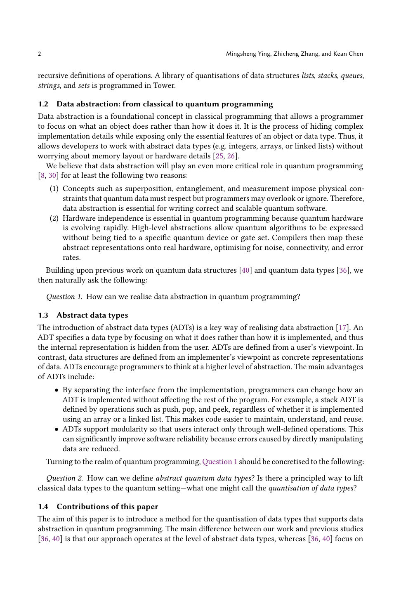 
Low-resolution page preview, page 2

📷 Fig 2

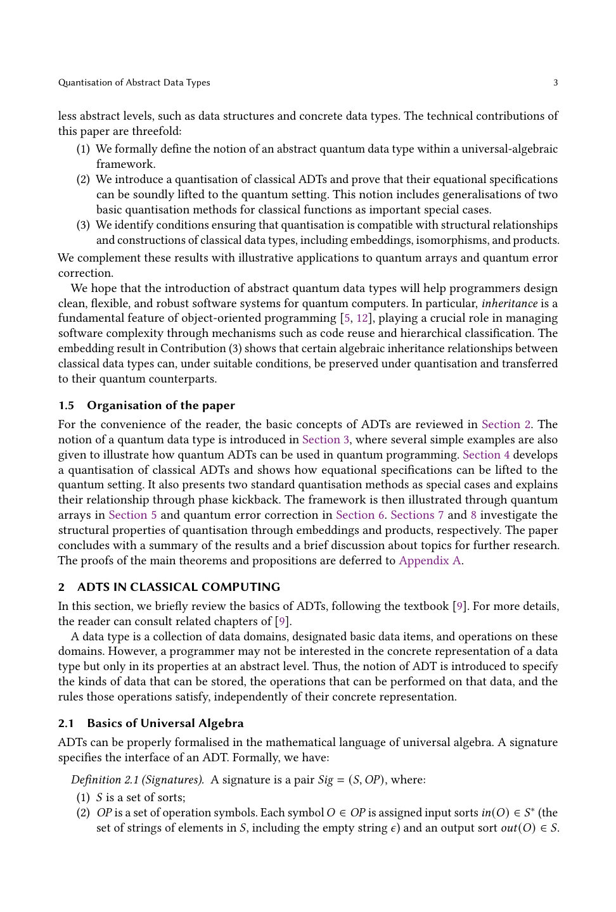 
Low-resolution page preview, page 3

📷 Fig 3

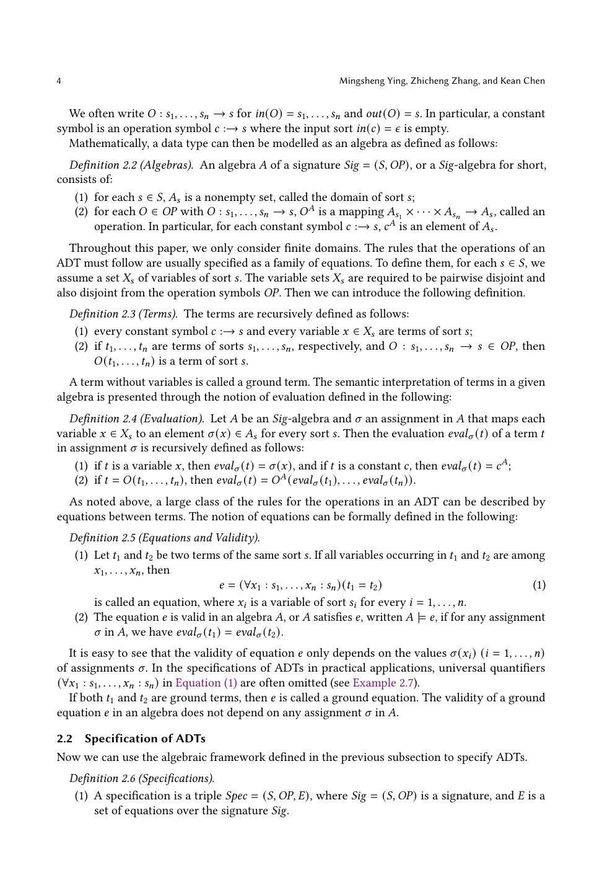 
Low-resolution page preview, page 4

📷 Fig 4

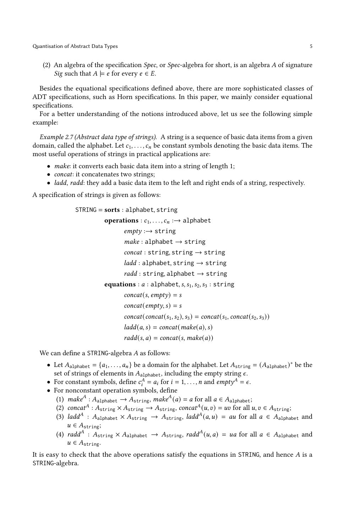 
Low-resolution page preview, page 5

📷 Fig 5

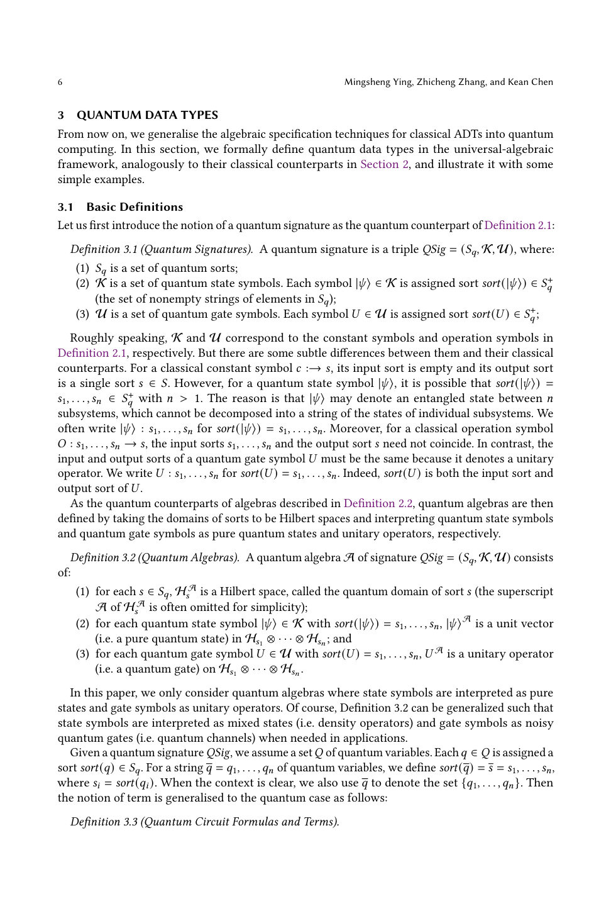 
Low-resolution page preview, page 6

**Summary.** This paper introduces a novel algebraic framework to define abstract quantum data types, extending classical universal algebra techniques to the quantum domain. It formalizes the 'quantization' of data type specifications, providing a rigorous mathematical tool for quantum programming. This work is significant for building robust, abstract quantum algorithms independent of specific hardware implementations.

**Why it may be interesting.** It provides a rigorous mathematical formalism for handling data structures in quantum computation, which is crucial for developing hardware-agnostic quantum algorithms.

Detailed structure

**Main problem.** To establish an algebraic foundation for data abstraction in quantum programming by defining and quantizing abstract data types.

**Main result.** The paper formally defines abstract quantum data types using universal algebra and proves that classical data type specifications can be soundly lifted to the quantum setting.

**Method.** The approach uses universal algebra to define quantum signatures and algebras, modeling quantum terms as quantum circuit formulas evaluated on Hilbert spaces.

**Model / system.** The model is an abstract quantum algebraic framework where data types are represented by quantum sorts, and operations are represented by unitary gates acting on tensor product Hilbert spaces.

**Key observables.** State overlaps, inner products, and the equality of quantum circuit evaluations (LHS = RHS) are used to verify algebraic identities.

**Important parameters / regimes.** The structure of the quantum gates (unitary operators) and the initial quantum states (pure states) are central.

**Assumptions / limitations.** The framework assumes that quantum operations are unitary and that the focus is on pure states, though generalizations are mentioned.

**Figures summary.** Not specified in the notes.

**Paper structure.** The paper progresses by first defining the quantum algebraic structure, then defining quantum terms and equations, and finally proving the validity of structural preservation (embeddings, isomorphisms) by verifying key equations.

Abstract

In this paper, we introduce a notion of abstract quantum data type within the framework of universal algebra. This notion provides an algebraic foundation for describing data abstraction in quantum programming. We formally define a quantisation of classical data types and show that their equational specifications can be soundly lifted to the quantum setting. Two standard quantisation methods for classical functions, namely the bit oracle and the phase oracle, arise as special cases of this general construction. We illustrate the framework with applications to quantum arrays and quantum error-correcting codes, showing how they can be understood through the lens of data-type quantisation. We further establish conditions under which quantisation preserves structural relationships and constructions of classical data types, including embeddings, isomorphisms, and products.

[↑ back to top](#top)

### [Quantum communication and Bell nonlocality require infinite classical communication to simulate](http://arxiv.org/abs/2609.04182v1)

**Authors:** Carlos de Gois, Thyago S. R. Santos, Carlos Vieira  
**Type:** theory · **Category:** quantum information and computing · **PDF:** <https://arxiv.org/pdf/2609.04182v1>  
**Analysis basis:** full PDF text, analyzed in chunks

📷 Fig 1

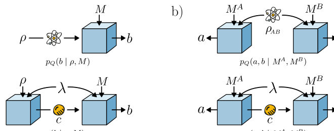 
Figure 1: Classical simulation of quantum communication and Bell nonlocality. (a) In the communication setting, a quantum state ρ of dimension dQ is communicated to a measurement device. Given a measurement M, an outcome b is produced with probability pQ(b | ρ, M). In a classical simulation, the quantum system is encoded in a message c of finite dimension using unlimited shared randomness, and decoded producing b with probability pC(b | ρ, M). A classical simulation exists if there is an encoder and decoder functions realizing pC(b | ρ, M) = pQ(b | ρ, M) for all possible inputs ρ and M. (b) In the Bell nonlocality setting, a quantum state ρAB is shared between two experimenters, who locally...

📷 Fig 2

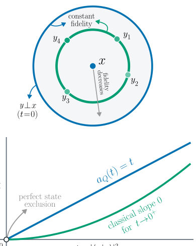 
Figure 2: The central argument in the ququart proof. (a) Fix a preparation x ∈CP3 and group the measurement effects y according to their fidelity t = |⟨x|y⟩|2 with the state x. Each ring represents all tests with the same fidelity. We denote by a(t) the average of p(0 | x, y) over all pairs (x, y) of fidelity f(x, y) = t. The proof studies a(t) as t →0+. (b) For every pair (x, y) with fixed fidelity f(x, y) = t, quantum theory predicts pQ(0 | x, y) = t. Consequently, averaging over all such pairs gives aQ(t) = t, which has slope 1 at t = 0. Any classical simulation using finitely many messages would instead yield an averaged curve aC(t) with slope 0 as t →0+. (The green curve is...

📷 Fig 3

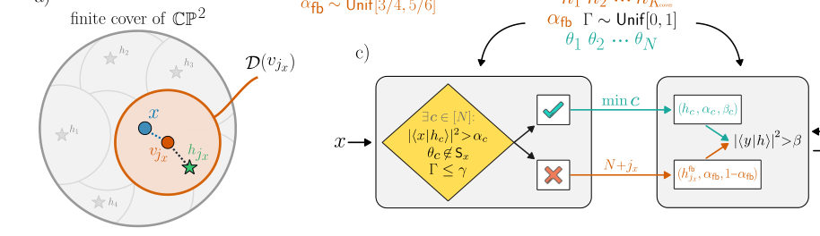 
Figure 4: Qutrit simulation protocol with finite communication. (a) A cover CP2 by Kcover balls D(vj). Alice selects the smallest jx where x ∈D(vjx). A ray hfb j ∈D(vj) is sampled uniformly from each ball. (b) The fallback thresholds are restricted to αfb ∈[3/4, 5/6] and βfb = 1 −αfb, and the sets Sx ⊂Λ, defined in Eq. (343), are reserved for the fallback. (c) Alice searches a finite set of N ordinary coordinates θk. If there is at least one accepted ordinary coordinate (yellow lozenge), she communicates the smallest accepted index. Otherwise, she communicates jx. Bob selects the shared coordinate (h, α, β) corresponding to Alice’s message and outputs 0 if |⟨y|h⟩|2 &gt; β or 1 otherwise. The...

**Summary.** This work determines the classical communication cost needed to simulate quantum communication and Bell nonlocality for arbitrary dimensions. It finds that while qubits and qutrits can be simulated with finite classical bits (though the cost for qutrits is high), any system with dimension four or higher requires an infinite amount of classical communication for exact simulation.

**Why it may be interesting.** The finding that quantum correlations require infinite classical resources above a certain dimension is a fundamental statement about the non-classical nature of quantum information, relevant to understanding the resource theory of quantum communication.

Detailed structure

**Main problem.** The paper investigates the fundamental limits on simulating quantum communication and Bell nonlocality using only finite classical communication.

**Main result.** It establishes that for quantum dimensions $d_Q \geq 4$, no finite classical communication can simulate the quantum correlations, revealing a qualitative transition at $d_Q=4$.

**Method.** The authors compare quantum probability distributions (derived from quantum measurements) against classical probability distributions achievable through finite classical encoding and shared randomness.

**Model / system.** The study models quantum communication using states $
ho$ of dimension $d_Q$ and local measurements $M$, and analyzes the simulation cost $C_{cl}(d_Q)$ required to match quantum statistics classically.

**Key observables.** The required classical communication dimension $d_C$, and the comparison between quantum and classical probability averages $p_Q$ vs $p_C$.

**Important parameters / regimes.** Quantum dimension $d_Q$ (e.g., 2 for qubits, 3 for qutrits, $\geq 4$ for ququarts), and the required classical bits $d_C$.

**Assumptions / limitations.** The simulation model assumes a single round of classical communication (prepare-and-measure model).

**Figures summary.** Figures illustrate the setup for classical simulation (prepare-and-measure model) and show the comparison of quantum vs. classical averages, particularly highlighting the divergence for ququarts.

**Paper structure.** The paper first addresses the general simulation problem, solving it for qubits ($d_Q=2$) and constructing an explicit, large protocol for qutrits ($d_Q=3$). It then proves that for $d_Q \geq 4$, the simulation cost is infinite, marking a sharp transition.

Abstract

A quantum system of any fixed dimension can be prepared in a continuum of states, yet it cannot be used to transmit an unlimited amount of classical information. Similarly, the correlations observed between measurement outcomes on separate parts of a shared quantum system can be stronger than classical correlations, but they cannot transmit information. These fundamental limitations suggest that the statistics observed from quantum communication and quantum correlations may admit a simulation using a finite amount of classical communication. This expectation is confirmed in the smallest nontrivial quantum dimension, with two classical bits being necessary and sufficient to exactly simulate qubit communication and all correlations between qubits. Despite significant efforts during the previous decades, this remained the only solved case. Here we resolve both problems for every quantum dimension. The solution reveals an unexpected qualitative transition starting at dimension four: no finite amount of classical communication can exactly simulate ququart communication nor all quantum correlations of two entangled ququarts, even with unlimited shared randomness. One might have expected this transition, if it existed, to appear already for qutrits. Instead, we construct an explicit protocol that exactly simulates qutrit communication using $357$ classical bits, and consequently, all correlations of two entangled qutrits.

[↑ back to top](#top)

### [Quantum low-density lattice codes](http://arxiv.org/abs/2609.03021v1)

**Authors:** Timo Hillmann, Jens Eisert, Francesco Arzani  
**Type:** theory · **Category:** quantum information and computing · **PDF:** <https://arxiv.org/pdf/2609.03021v1>  
**Analysis basis:** full PDF text, analyzed in chunks

📷 Fig 1

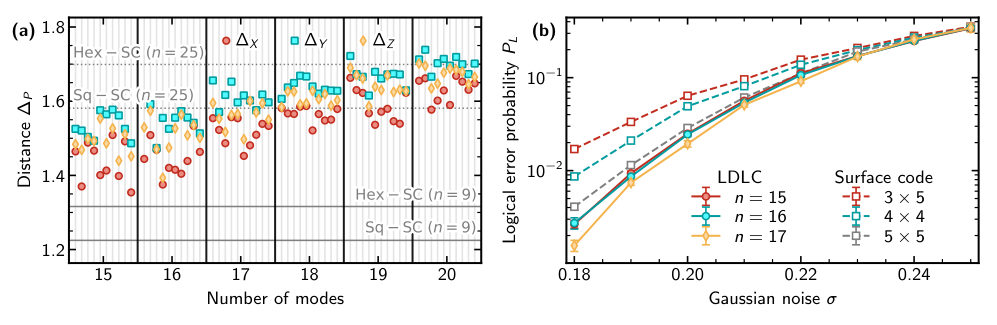 
Figure 1. Dimension-reduced GKP-LDLC codes compared to surface-code baselines. (a) Euclidean distances of randomly generated GKP- LDLC codes after reducing the logical dimension to a single qubit as explained in Section III B. For each instance we plot the three logical distances ∆X (circles), ∆Y (squares) and ∆Z (diamonds); all three are inequivalent because the reduced code is no longer CSS. Note that which displacements correspond to X, Y, Z logicals is arbitrary, so here we sorted them for increasing distance for visual clarity. Instances are grouped by the number of modes n. Horizontal lines mark the distances of rotated surface codes concatenated with the single-mode square GKP code...

📷 Fig 2

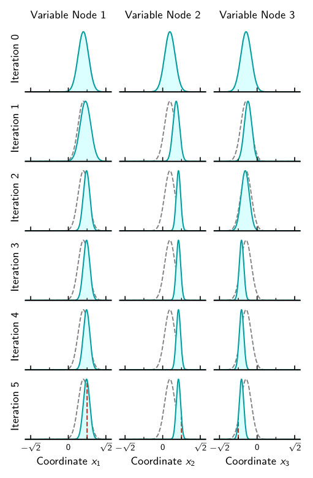 
Figure 2. Evolution of messages for the repetition lattice code over five iterations. Blue Gaussians show the mean and variance of the final marginal if it were calculated after the kth iteration. The grey dashed line shows the Gaussian with initial mean obtained from the syndrome measurement, and its variance is the channel prior. The red vertical dashed lines show the decoded lattice point obtained after the hard decision, see Eq. (4). For visualization purposes, Gaussians are not normalized.

📷 Fig 3

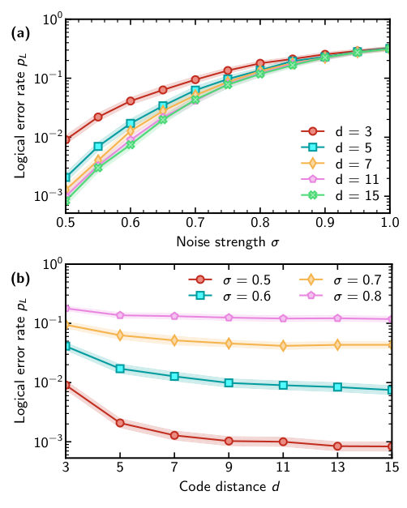 
Figure 3. Position sector error rates for the GKP-repetition code of various length using the Gaussian mixture decoder using a serial schedule and the list sphere decoding variable-node update rule with uniform memory γ = 0.15 over 50 iterations. (a) The estimated log- ical error rate as a function of the noise strength for distances of the outer repetition code d. (b) Error rate as a function of distance for selected physical error strengths.

📷 Fig 4

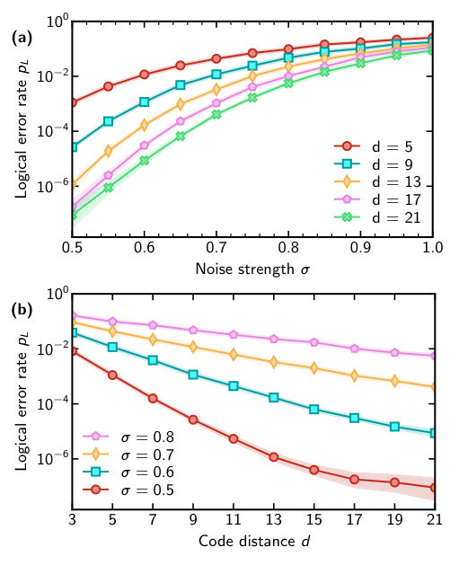 
Figure 4. Position sector error rates for the GKP-repetition code us- ing the quantized LDLC decoder using L = 256 quantization bins and bin resolution ∆= 1/32 over 50 iterations. (a) The estimated logical error rate as a function of the noise strength for distances of the outer repetition code d. (b) Error rate as a function of distance for selected physical error strengths.

📷 Fig 5

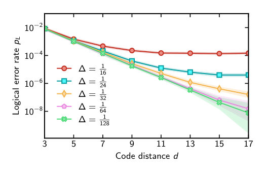 
Figure 5. Position sector error rate scaling for the GKP-repetition code using the quantized decoder at σ = 0.5 with L = 512 quan- tization bins and varying resolution ∆. For coarse resolution (large ∆), the decoder develops an error floor, which can be lowered arbi- trarily by using a finer resolution (smaller ∆).

**Summary.** This paper tackles the difficult problem of decoding native GKP quantum error-correcting codes by co-designing the code structure with its decoder. The authors leverage classical Low-Density Lattice Codes (LDLCs) to build quantum analogues (qLDLCs). They demonstrate that using specialized, fully analog message-passing decoders allows these codes to achieve error correction performance comparable to leading hybrid qubit-analog methods.

**Why it may be interesting.** The work directly addresses fault-tolerance in bosonic quantum computing platforms, providing a concrete, computationally tractable path forward for implementing high-performance quantum error correction.

Detailed structure

**Main problem.** The primary challenge is constructing and efficiently decoding native Gottesman-Kitaev-Preskill (GKP) codes, which encode qudits into infinite-dimensional bosonic modes.

**Main result.** The authors propose a co-design strategy using classical Low-Density Lattice Codes (LDLCs) to construct quantum versions (qLDLCs) whose performance approaches state-of-the-art hybrid decoders.

**Method.** They adapt classical message-passing decoding algorithms, originally developed for LDLCs, to the quantum lattice setting, requiring the co-design of the code structure and the decoder.

**Model / system.** The model involves GKP codes, which are bosonic quantum error-correcting codes based on mathematical lattices. The underlying mathematical structure is derived from classical LDLCs.

**Key observables.** Error rates, code properties (e.g., code distance, logical dimension), and the convergence of message-passing variances.

**Important parameters / regimes.** The dimensionality reduction factor and the convergence parameter $\alpha$ governing the asymptotic behavior of the iterative decoder.

**Assumptions / limitations.** The approach assumes that efficient decoding requirements can dictate the structure of the quantum error-correcting code, bypassing the direct, hard lattice problems.

**Figures summary.** Not specified by the notes.

**Paper structure.** The paper progresses from identifying the difficulty of native GKP decoding to proposing a co-design strategy based on classical LDLCs, detailing the use of analog message-passing decoders, and finally presenting results showing comparable performance to existing state-of-the-art codes.

Abstract

Gottesman-Kitaev-Preskill (GKP) codes provide a family of promising schemes for encoding discrete quantum information (qudits) into infinite-dimensional bosonic modes based on mathematical lattices. While such codes, when concatenated with discrete-variable codes, are relatively well studied, the construction and decoding of native GKP codes has largely remained open due to the computationally hard problems encountered. To address this challenge, we advocate a strategy of co-designing the decoder and the quantum error-correcting code itself by constructing lattices for which decoding is feasible: The requirement of efficient decoding effectively determines the quantum error-correcting code. This construction is built on classical low-density lattice codes (LDLCs), a lattice analogue of low-density parity-check codes, here lifted to families of GKP codes. Concretely, we introduce quantum versions of classical, randomly constructed LDLCs. We show that after suitable dimensionality reduction these codes have code properties comparable to or better than concatenated GKP-surface codes of equal number of modes. However, the GKP-LDLCs constructed here do not have a strictly sparse parity check matrix, which motivates our study of the performance of natively analog message-passing decoders originally developed for LDLCs when applied to concatenated GKP-LDPC codes. We show that the fully analog, linear-time decoder achieves performances close to state-of-the-art hybrid qubit-analog decoders. To facilitate future research on the structure and performance of general GKP codes, the relevant source code will be released in open-source Julia packages LatticeDecoder.jl and SymplecticGKP.jl.

[↑ back to top](#top)

### [Quantum Quasi-Monte Carlo: a window for pre-asymptotic quantum advantage](http://arxiv.org/abs/2609.03625v1)

**Authors:** Paolo Recchia, Zhan Yu, Kelvin Koor, Patrick Rebentrost  
**Type:** theory · **Category:** numerical methods · **PDF:** <https://arxiv.org/pdf/2609.03625v1>  
**Analysis basis:** full PDF text, analyzed in chunks

📷 Fig 1

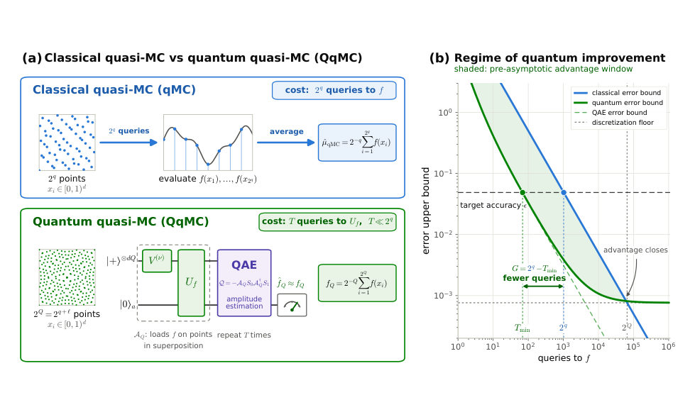 
Figure 1: Panel (a). Overview of the key idea of the paper. Here, ˆµqMC is the estimate with error ≤qd−1/2q

📷 Fig 2

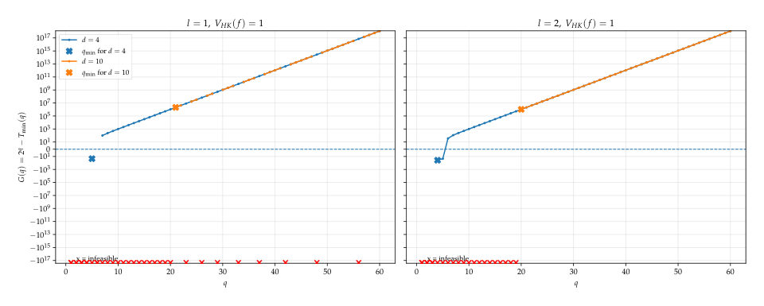 
Figure 2: Gap G(q) = 2q −Tmin as a function of q, for dimensions d = 4 and d = 10. The left panel corresponds to l = 1, while the right panel corresponds to l = 2. Infeasible points, namely values of q for which ∆= 0, are highlighted in red. In the feasible regime, the gap grows rapidly with q, reflecting the exponential increase of the classical qMC query budget 2q relative to the minimum number of quantum queries required by QqMC. This widening occurs already for a small number of additional Sobol qubits, l = 1 or l = 2. On the plotted scale, the exponential dependence on q dominates the dimension-dependent corrections, so the curves for d = 4 and d = 10 become nearly indistinguishable...

📷 Fig 3

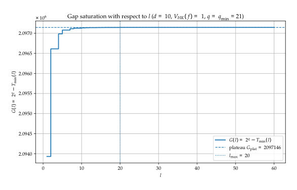 
Figure 3: Gap G(l) = 2q −Tmin(l) as a function of the number of additional qubits l, for fixed dimension d = 10 and q = qmin = 21. This value of q corresponds to the first strict-feasibility level when l = 1. The plot shows that increasing l initially enlarges the gap, thereby reducing the minimum number of quantum queries required to enter the advantageous regime. After a certain value of l, the curve reaches a clear plateau: adding more qubits further reduces the discretization contribution only marginally and no longer produces a significant increase in the query gap.

📷 Fig 4

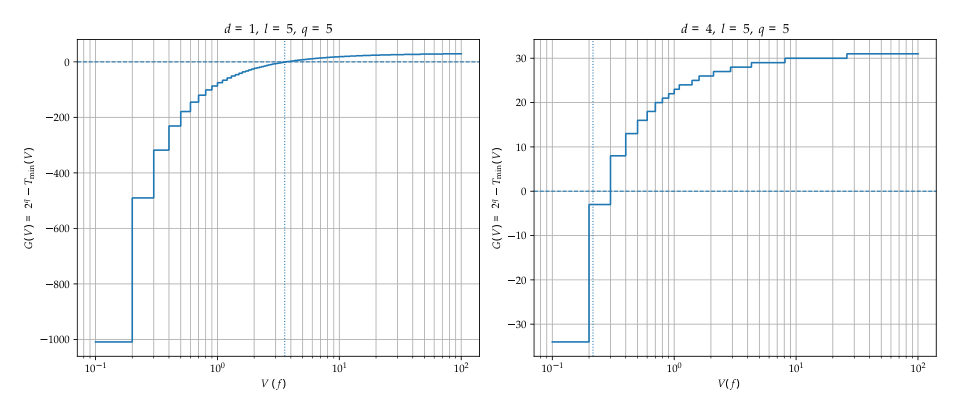 
Figure 4: Gap G(V ) = 2q −Tmin(V ) as a function of the Hardy-Krause variation V (f), for fixed l = 5 and q = 5. The left panel corresponds to d = 1, while the right panel corresponds to d = 4. In both cases, the gap increases with V (f), showing that larger variation enlarges the range of query counts for which the QqMC upper bound can remain below the classical qMC upper bound. The larger gap observed in the higher-dimensional case (right panel) suggests that, within this pre-asymptotic upper-bound comparison, achieving a quantum query advantage becomes easier as the dimension increases.

📷 Fig 5

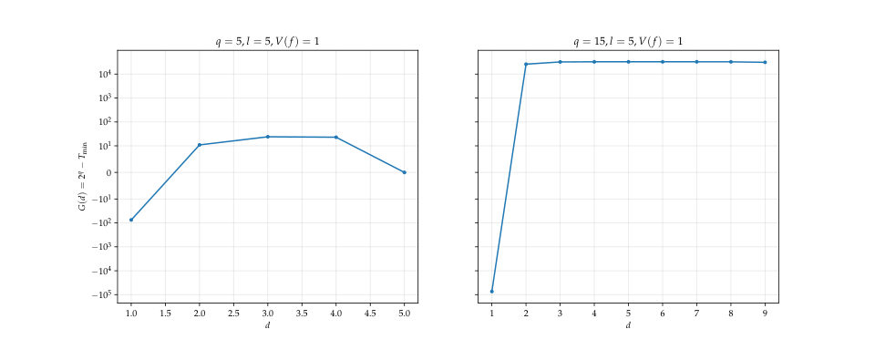 
Figure 5: The gap G(d) = 2q −Tmin(d) is plotted as a function of the dimension d for fixed l = 5 and V (f) = 1, with q = 5 shown in the left panel and q = 15 in the right. In both cases, the gap exhibits a bell-shaped trend. However, because the classical query count remains independent of d, increasing q makes the advantage of Quantum QqMC over classical qMC significantly visible across all dimensions d within the feasible window.

**Summary.** This paper introduces Quantum Quasi-Monte Carlo (QqMC), a method that merges low-discrepancy point sets with quantum amplitude estimation for numerical integration. It proves that while no asymptotic speedup over classical qMC is achieved, a measurable 'pre-asymptotic advantage' exists in finite query regimes. This makes the technique relevant for near-term quantum hardware where the number of available queries is limited.

**Why it may be interesting.** While focused on numerical integration, the core concept of achieving computational speedups by exploiting finite-size quantum resources (the pre-asymptotic regime) is highly relevant to quantum algorithms for physical simulations.

Detailed structure

**Main problem.** The paper addresses the computational bottleneck of numerical integration using Monte Carlo methods, specifically aiming to improve upon classical Quasi-Monte Carlo (qMC) techniques.

**Main result.** It demonstrates a 'pre-asymptotic quantum advantage' for Quantum Quasi-Monte Carlo (QqMC) by showing that significantly fewer quantum queries can achieve the same accuracy as classical methods in finite regimes.

**Method.** The approach combines low-discrepancy nets (Sobol' sequences) with Quantum Amplitude Estimation (QAE) to estimate high-dimensional integrals.

**Model / system.** The model is the numerical integration of a function $f$ over the unit hypercube $[0,1)^d$. The quantum computation utilizes the coherent preparation of a superposition over Sobol' points.

**Key observables.** The primary observables are the error bounds ($\epsilon_{qMC}$ vs $\epsilon_{QqMC}$) and the required number of function queries ($T$).

**Important parameters / regimes.** Key parameters include the dimension $d$, the resolution parameters $q$ and $Q$, and the query budget $T$. The advantage window is controlled by these parameters.

**Assumptions / limitations.** The advantage is strictly pre-asymptotic, not asymptotic. The analysis relies on the error separating into a discretization error (from the finite net) and a quantum estimation error.

**Figures summary.** Figure 1 provides an overview contrasting classical qMC vs QqMC error bounds, while later figures compare the quality parameter $	ilde{t}(q)$ against the true finite-resolution value $t_{	ext{finite}}$ across various dimensions.

**Paper structure.** The paper builds from classical limitations (MC/qMC) to the novel QqMC algorithm, deriving the error decomposition, establishing the pre-asymptotic advantage window, and concluding with asymptotic analysis of the required query threshold.

Abstract

Numerical integration with Monte Carlo methods is a central computational task in many scientific and industrial applications, including financial derivative pricing and risk management. Classical Monte Carlo algorithms are computationally demanding: achieving an accuracy $ε$ typically requires a number of function evaluations scaling as $O(1/ε^2)$. Quantum-accelerated Monte Carlo methods based on quantum amplitude estimation can in principle quadratically improve this dependence. However, \textit{quasi}-Monte Carlo methods have not been explored in the quantum context. In this work, we introduce a quantum quasi-Monte Carlo algorithm that combines low-discrepancy nets with quantum amplitude estimation. The proposed method prepares the quasi-random point set coherently in superposition. The method does not yield an asymptotic improvement over classical quasi-Monte Carlo, since the total error separates into a discretization error, determined by the finite net, and a quantum estimation error. Instead, we explore a pre-asymptotic advantage window: for a target accuracy that would classically require $2^q$ low discrepancy points, one can prepare a higher-resolution net of size $2^Q$, with $Q>q$, in superposition and reach the same accuracy using significantly fewer function queries. This window can be controlled by tuning the circuit resolution and amplitude-estimation parameters, making the approach relevant for practical regimes where the number of queries is finite rather than asymptotically large.

[↑ back to top](#top)

### [Quantum Query Complexity of Finding a Tarski Fixed Point on a High-Dimensional Grid](http://arxiv.org/abs/2609.03802v1)

**Authors:** Tongyang Li, Weiran Ma, Ziyi Yang, Xingyu Zhao  
**Type:** theory · **Category:** quantum information and computing · **PDF:** <https://arxiv.org/pdf/2609.03802v1>  
**Analysis basis:** full PDF text, analyzed in chunks

📷 Fig 1

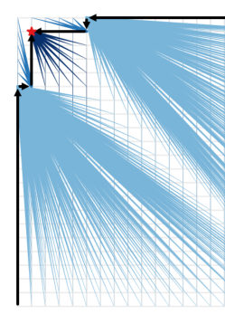 
Figure 1: Visualization of a function on [22]2.

📷 Fig 2

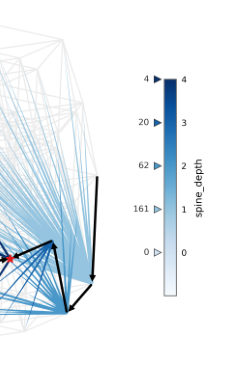 
Figure 2: Visualization of a function on [2]8.

📷 Fig 3

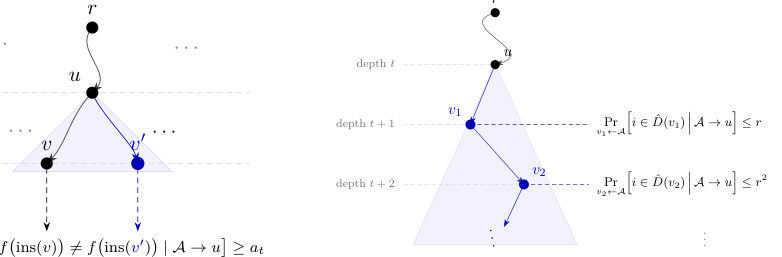 
Figure 3: Visualization of the two properties. In these figures, black nodes / black arrows represent fixed nodes / paths, while blue nodes / blue arrows represent random nodes / paths sampled by A. Light blue triangles represent subtrees.

📷 Fig 4

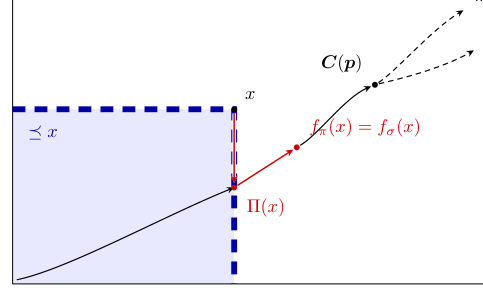 
Figure 5: Visualization of the proof of Lemma 4.19 on the lower half of the lattice. This figure shows that ∥x∥≤W/2 and c(p) ̸⪯x implies f π(x) = f σ(x).

**Summary.** This theoretical paper establishes a quantum query lower bound for finding a Tarski fixed point on a high-dimensional grid. It introduces the novel Tree–Filtration Adversary Method, which provides a combinatorial tool for proving quantum complexity lower bounds. The main result shows the complexity is $\Omega(k \log n)$, advancing the understanding of quantum computation in order theory.

**Why it may be interesting.** While the core topic is algorithmic complexity, the methodology—developing a general framework for quantum lower bounds based on tree structures—is highly relevant to understanding the computational limits of quantum algorithms in various physical models.

Detailed structure

**Main problem.** The paper determines the quantum query complexity required to find a Tarski fixed point of a monotone function defined on a high-dimensional grid lattice.

**Main result.** The quantum lower bound for this problem is established as $\Omega(k \log n)$, which improves upon previous classical lower bounds in certain regimes.

**Method.** The authors develop and apply the Tree–Filtration Adversary Method, which provides a combinatorial interpretation of the nonnegative spectral adversary method for deriving quantum query lower bounds.

**Model / system.** The problem is modeled in the value-oracle setting, where the input space is the $k$-dimensional grid lattice $[n]^k$, and the function $f$ is assumed to be monotone.

**Key observables.** Quantum query complexity $Q_\epsilon(	ext{Tarski}(n, k))$, and the spectral norm of the constructed adversary matrix $\Gamma$.

**Important parameters / regimes.** The dimensions $n$ and $k$ of the grid lattice, and the error parameter $\epsilon$.

**Assumptions / limitations.** The analysis relies on constructing a suitable tree structure for the hard instances and defining a random walk on this tree that satisfies specific anti-concentration and geometric-indistinguishability properties.

**Figures summary.** Not specified.

**Paper structure.** The paper first introduces the problem and the general framework of the adversary method. It then details the construction of the Tree–Filtration Adversary Method using a top-down random walk on a filtration tree. Finally, it applies this method to derive the $\Omega(k \log n)$ lower bound for the Tarski fixed point problem.

Abstract

The Knaster-Tarski fixed-point theorem states that every monotone function over a complete lattice has a fixed point. Beyond its fundamental role in order theory, the theorem and its algorithmic variants have found broad applications in areas such as economics, game theory, and programming languages. While the query complexity of finding a Tarski fixed point has been extensively studied in classical models, comparatively little is known in the quantum setting.   We prove an $Ω(k\log n)$ quantum query lower bound for finding a fixed point of a monotone function on $[n]^k$, using the nonnegative spectral adversary method. In the two extremal regimes $n = 2$ and $k = 1$, our quantum lower bound matches the previous classical lower bounds $Ω(k)$ and $Ω(\log n)$, respectively. For $n, k\geq 2$, our bound improves the best previous classical lower bound when $n < k$ and is within a factor of $\log n / \log k$ compared to the known classical lower bound when $n \geq k$. To construct the adversary matrix, we develop the Tree--Filtration Adversary Method. Besides yielding our lower bound, the method offers a more transparent combinatorial interpretation of the nonnegative spectral adversary method. When the hard instances of a problem admit a tree-like organization and suggest an intuition analogous to classical decision-tree lower bounds, our method provide a promising approach to establishing quantum complexity lower bounds.

[↑ back to top](#top)

### [Reciprocity can halve what a mechanical network can learn](http://arxiv.org/abs/2609.04169v1)

**Authors:** Thai-Son Vu, Hoang-Giang Nguyen, Quoc-Bao Nguyen, Sengaloun Keoalounxay, Bao-Viet Tran  
**Type:** both · **Category:** disordered systems and neural networks · **PDF:** <https://arxiv.org/pdf/2609.04169v1>  
**Analysis basis:** full PDF text, analyzed in chunks

📷 Fig 1

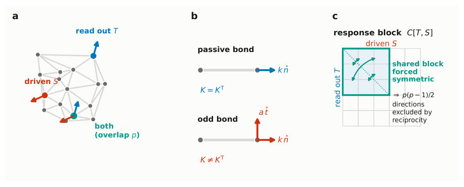 
Figure 1: Setup and the origin of the constraint. (a) A central-force network. Forces are applied on a set S of degrees of freedom and displacements read on a set T; p = |T ∩S| of them are both driven and read out. (b) The bond force law. A passive bond pushes along its own axis and makes K symmetric; an odd bond adds a transverse component abˆtb and makes it asymmetric. (c) The response block C[T,S]. Maxwell–Betti forces its p× p sub-block on the shared degrees of freedom to be symmetric, which is p(p−1)/2 independent equalities and, by Theorem 1, p(p−1)/2 lost dimensions.

📷 Fig 2

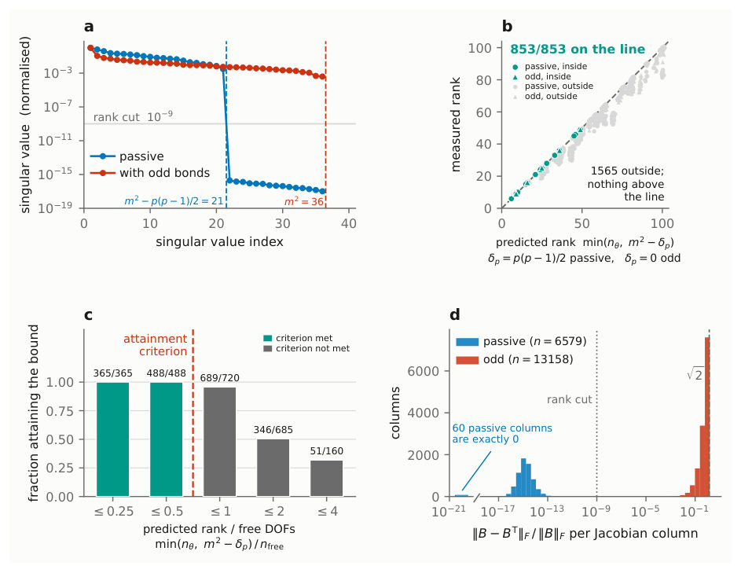 
Figure 2: Spectra, ranks and the column mechanism. (a) Singular-value spectrum of the exact Jacobian for one network at full overlap, m = 6. The passive spectrum falls by thirteen orders of magnitude after index m2 −p(p −1)/2 = 21; with odd couplings it continues to m2 = 36. (b) Measured against predicted rank over all 2418 rank cases. All points lie on or below the diagonal, and inside criterion (15) every case lies on it. Points outside the criterion are jittered to show density. (c) Attainment degrades smoothly once the target dimension approaches the size of the network. Counts above each bar, over all 2418 cases. (d) The mechanism, measured per Jacobian column (6579 passive, 13158...

📷 Fig 3

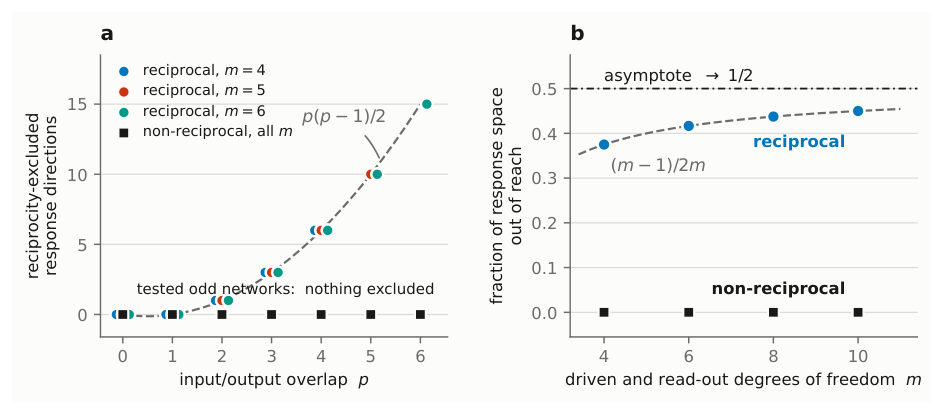 
Figure 3: The overlap law. (a) Lost response dimensions against the input/output overlap p, for m = 4,5,6 (points dodged horizontally; their collapse onto the dashed p(p−1)/2 curve is the result). Networks with odd couplings lose nothing at any overlap. (b) At full overlap the fraction of the response space out of reach follows (m−1)/2m and approaches one half; odd couplings recover all of it.

📷 Fig 4

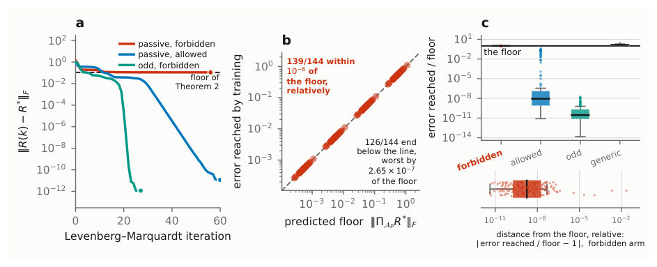 
Figure 4: The error floor, seen by a learning rule. (a) Training curves for one network and one target, all arms started from the same independent random stiffnesses. Each curve is drawn only for as many iterations as it actually ran, with a dot at its last; the passive network on the forbidden target descends to within numerical tolerance of the predicted floor and stops there, while the same optimiser on an allowed perturbation of the same size, and the odd network on the forbidden one, continue to numerical zero. (b) Error reached against the floor Theorem 2 predicts, over 144 runs and three decades of perturbation size. The prediction contains no fitted quantity, and no run falls below...

📷 Fig 5

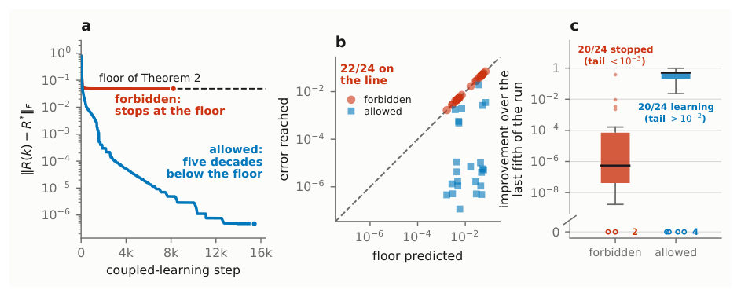 
Figure 5: The floor found by a local learning rule. (a) Coupled learning on one network: the 30-node network at m = 5, geometry seed 1, the pair whose trajectories the script deposits, fixed before the runs. Its ratio, 1.0000003, is close to but not equal to the median over the 24 runs, 1.0000012. As in Fig. 6a the curves are the best error reached so far, and so monotone by construction. On a forbidden target the rule flattens onto the floor of Theorem 2 and stops; on an allowed perturbation of the same size, from the same start, it descends 6.2 decades in all, 5.0 of them below the floor. (b) Error reached against the floor predicted, all 24 runs and both arms. The forbidden arm sits on...

**Summary.** This work analyzes the fundamental limits of learning in tunable mechanical networks by incorporating Maxwell-Betti reciprocity. It proves that this physical symmetry restricts the network's reachable response space, creating a quantifiable error floor that no passive training rule can overcome. The findings are crucial for designing physical machine learning hardware by setting realistic performance expectations.

**Why it may be interesting.** The concept of an inherent, physically imposed error floor in a learning system, derived from fundamental symmetries like reciprocity, provides a powerful theoretical constraint applicable to any physical realization of a neural network.

Detailed structure

**Main problem.** The paper determines the true capacity of tunable mechanical networks by accounting for physical symmetries, specifically Maxwell-Betti reciprocity, which constrains the reachable response space.

**Main result.** Reciprocity forces the reachable set into a subspace of codimension $p(p-1)/2$, establishing a computable error floor that limits the learning capability of passive networks.

**Method.** The authors derive theoretical bounds using linear algebra and analyze the system's response block using the Jacobian, comparing theoretical constraints with numerical simulation results.

**Model / system.** The system is a passive, linear elastic mechanical network with tunable stiffnesses, modeled by a bond force law. The analysis focuses on the response block $R(	heta)$ derived from the compliance matrix.

**Key observables.** The codimension of the reachable set, the error floor (related to the antisymmetric part of the target), and the rank of the Jacobian matrix.

**Important parameters / regimes.** The overlap $p$ (degrees of freedom both driven and read out), the number of bonds, and the stiffness parameters $	heta$.

**Assumptions / limitations.** The analysis assumes a fixed graph with a finite set of tunable stiffnesses, and the core results rely on the validity of Maxwell-Betti reciprocity for passive systems.

**Figures summary.** Figures illustrate the mechanical setup, showing how reciprocity constrains the response block to a lower-dimensional subspace, quantified by $p(p-1)/2$ lost dimensions.

**Paper structure.** The paper establishes the physical model, derives the theoretical constraint imposed by reciprocity, calculates the resulting error floor, and then tests these theoretical limits using numerical simulations and optimization routines.

Abstract

Tunable mechanical networks are being developed as materials that learn in place. Capacity is estimated by counting tunable parameters against target constraints, ignoring Maxwell-Betti reciprocity, the symmetry every passive, linear elastic network obeys by construction. When p degrees of freedom are both driven and read out, every reachable response block lies in a subspace of codimension p(p-1)/2, whatever the size, topology and stiffnesses; at full overlap nearly half the target space is unreachable. The consequence for training is a number: any learning rule leaves an error at least the norm of the target's antisymmetric part on the shared degrees of freedom, computable before training, and positive definiteness adds an orthogonal second term. A second-order optimiser with the exact Jacobian reaches that floor within 1% in 143 of 144 runs, a bond-local contrastive rule within 0.1% in 22 of 24, and odd couplings restore the lost directions at the price of an external torque source: the network becomes active. Prescribed-displacement drives obey a companion law we prove. The symmetry is classical; its consequence on a fixed graph with finitely many tunable stiffnesses at partial overlap is new. For a published robotic metamaterial it shows that no symmetric positive-definite stiffness matrix meets both targets in the linear model their deposited data integrate.

[↑ back to top](#top)

### [Resource-adaptive distributed fault tolerance with very noisy Bell pairs](http://arxiv.org/abs/2609.03048v1)

**Authors:** Moritz Schmidt, Martin Moureau, Benjamin Rodatz, Boldizsár Poór, Elie Mounzer, Linnea Grans-Samuelsson  
**Type:** theory · **Category:** quantum information and computing · **PDF:** <https://arxiv.org/pdf/2609.03048v1>  
**Analysis basis:** full PDF text, analyzed in chunks

📷 Fig 1

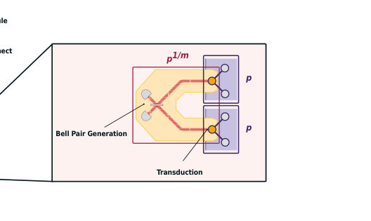 
Figure 1: Illustration of the setting and noise model considered. Multiple QPU modules are connected via interconnects. Each module contains dedicated compute qubits and communication qubits, with the latter used for sharing Bell pairs between QPUs. Following Bell pair generation and transduction, two-qubit Pauli errors {I, X, Y, Z}⊗2 \ {I ⊗I} on the on-chip qubits occur with probability 1 15p1/m each, while on-chip gates are subjected to circuit level noise with probability p. We consider different integer values m &gt; 1, so that Bell pairs experience noise at a higher rate than on-chip operations. The example setup for eight boundary-connected modules is taken from [5], where it was shown...

📷 Fig 2

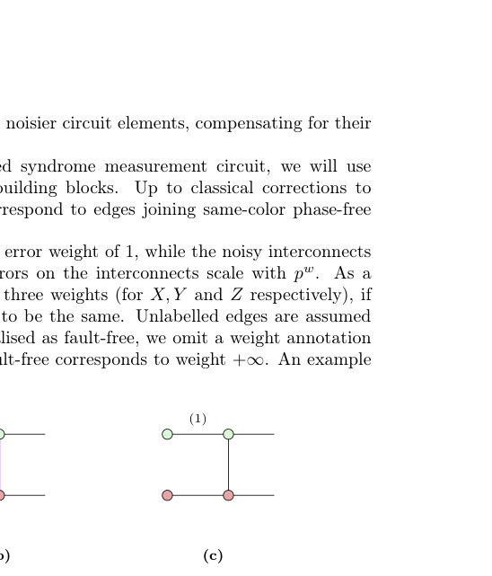 
Figure 3: Bell state preparation under different edge-flip noise models: (a) Symmetric and asymmetric noise: For edges with asymmetric noise, fault-weights are annotated as tuples (wx, wy, wz). Edges with symmetric noise wx = wy = wz = w are simply labeled with w. (b) Noise-free components: Edges idealized as fault-free are drawn in purple. (c) Default noise: Edges with symmetric noise w = 1 are left unlabelled.

📷 Fig 3

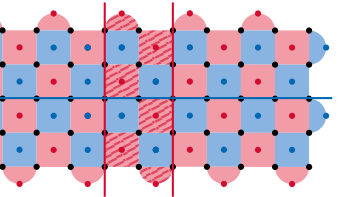 
Figure 5: Rotated surface code. (a) A distance d = 5 surface code patch, hosting one logical qubit. The red and blue plaquettes are the X and Z stabilizers, respectively. The black dots represent the data qubits, while the colored dots represent auxiliary qubits used for the stabilizer measurements. Logical X forms a vertical line and logical Z forms a horizontal line. (b) Surface code lattice surgery. Two patches with independent logical operators XL and ZL for the left patch and XR and ZR for the right patch are merged into a single patch. The added X plaquettes (shaded) measure the joint XLXR operator, classically correlating the individual logicals. By adding XLXR to the stabilizer...

📷 Fig 4

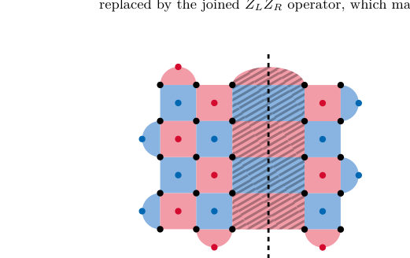 
Figure 6: Distributed surface code memory, color conventions as in Figure 5. The choice of how to split weight-4 plaquettes determines the distribution seam. (a) The 2-2 split introduces distributed hook errors but aligns well with the chessboard pattern of the code, requiring only a single column of plaquettes to be distributed. (b) The 3-1 split introduces only local hook errors but requires two plaquette columns to be distributed. The dashed line indicates the distribution seam. All shaded plaquettes operate between QPUs and must be distributed, possibly requiring multiple auxiliary and communication qubits.

📷 Fig 5

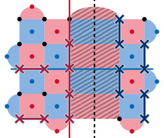 
Figure 8: (a) A surface code patch hosting one logical qubit is distributed along a vertical seam illustrated by the dashed line. The red vertical line represents a logical X operation, while the blue horizontal line represents a logical Z operation. (b) The monolithic hook errors can be orthogonally aligned with the corresponding logical operators. The distributed plaquettes always produce hook errors parallel to the distribution seam. With the seam shown in the figure, Z hook errors can be neglected but X hook errors reduce the circuit distance, allowing a logical X operation to be realized from fewer atomic faults.

**Summary.** This paper tackles the critical challenge of fault-tolerant quantum computation in distributed systems where communication links are noisy. The authors develop advanced protocols that adapt error correction to resource constraints, notably showing significant reductions in required quantum resources by integrating decoding steps. This work provides a pathway toward realizing large-scale quantum computers by optimizing error handling across physically separated modules.

**Why it may be interesting.** This work directly addresses the engineering bottleneck of scaling quantum computation by providing concrete, resource-aware protocols for error correction in physically realistic, distributed hardware architectures.

Detailed structure

**Main problem.** The core challenge is developing distributed quantum error correction (DQEC) and logical gates for large-scale quantum computers where module interaction is limited to significantly noisy shared Bell pairs.

**Main result.** The authors derive resource-adaptive strategies, showing that integrating decoding halves the required distillation code distance and significantly reducing the required number of Bell pairs compared to context-free methods.

**Method.** The work extends fault tolerance by construction to noisy distributed settings, synthesizing efficient circuits for distributed stabilizer measurements using techniques like ZX-calculus and analyzing resource trade-offs.

**Model / system.** The model involves distributed quantum computing architectures composed of multiple QPU modules connected by long-range interconnects that introduce high noise into shared Bell pairs. The analysis focuses on surface and color codes for memory and lattice surgery.

**Key observables.** Logical error rates, required distillation code distance, and the number of necessary Bell pairs.

**Important parameters / regimes.** Interconnect noise strength ($p_{	ext{Bell}}$) relative to on-chip gate noise ($p$), and resource constraints like Bell pair generation rate.

**Assumptions / limitations.** The analysis assumes that the process of Bell pair generation and transduction is a black box with a higher error rate than on-chip operations, and it focuses on modifying on-chip circuits given pre-distilled pairs.

**Figures summary.** Figures illustrate the general noise model showing QPU modules and interconnects, and one figure depicts logical state teleportation using lattice surgery.

**Paper structure.** The paper progresses by first establishing the general framework for handling noisy interconnects, then developing synthesis techniques for distributed stabilizer measurements, and finally benchmarking these circuits on specific codes like the surface code to quantify resource savings.

Abstract

Distributed architectures have been proposed as a pathway to large-scale quantum computers. Combined with the need for fault-tolerance, such architectures require distributed quantum error correction (DQEC) and distributed logical gates. An important challenge is how to realize DQEC primitives in the setting where interaction between modules is restricted to shared Bell pairs that are significantly noisier than on-chip operations. We extend the framework known as fault tolerance by construction to this setting, deriving different strategies for handling the additional noise. Through fault-improvement we recover conventional entanglement distillation, and also find more dynamical protocols that enable space-time trade-offs. We show that integrated decoding halves the required distillation code distance compared to entanglement distillation implemented using separate decoding, thus requiring significantly fewer Bell pairs. As a main focus of the work, we synthesize efficient circuits for an important primitive in distributed fault tolerance: distributed stabilizer measurements. These circuits can be adapted to resource constraints, e.g. on the Bell pair generation rate or the space available for on-chip auxiliary qubits. Noting that full local fault-tolerance is not always needed to preserve the correct scaling of logical error rates, we further optimize the circuits depending on the surrounding context. We consider in particular the surface code and the color code, both as distributed memories and in the case of lattice surgery across separate modules. Here, robustness to certain hook and readout errors reduces the number of required Bell pairs even further, compared to the context-free setting. We numerically benchmark the resulting implementations under circuit level noise with additional interconnect noise.

[↑ back to top](#top)

### [Studying line defect at Deconfined Quantum Criticality via fuzzy sphere regularization](http://arxiv.org/abs/2609.03465v1)

**Authors:** Shutao Liu, Shuai Yang, Jie Lou, Yan Chen  
**Type:** theory · **Category:** strongly correlated electrons · **PDF:** <https://arxiv.org/pdf/2609.03465v1>  
**Analysis basis:** full PDF text, analyzed in chunks

📷 Fig 1

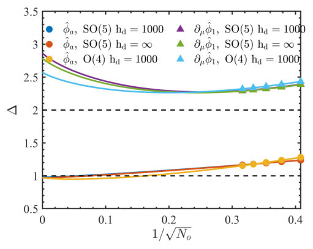 
Figure 2. Consistent finite size scaling results of operator ˆ ϕa and ∂µ ˆϕ1. Based on symmetry analysis, we identify these two operators as the tilt operator ˆt and the displacement operator ˆD, respectively.

📷 Fig 2

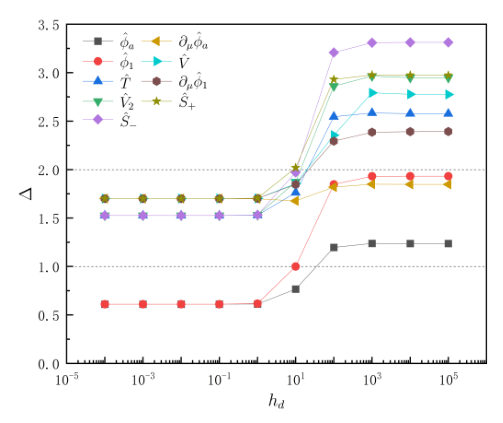 
Figure 1. Evolution of several low-lying excitation states along the RG flow from the bulk fixed point(hd = 0) to the defect fixed point(hd →∞). For hd ≥100, the extracted scal- ing dimensions approach stable values, indicating that the system is already close to the defect conformal fixed point. The results shown here are obtained for the bulk SO(5) de- confined quantum phase transition point[47] on a system with size No = 6.

📷 Fig 3

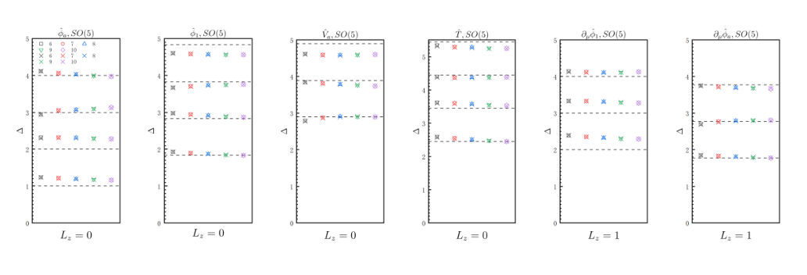 
Figure 3. Line defect conformal multiplets, we present several lowest SO(4) singlets ˆϕ1, ∂µϕ1, vectors ˆϕa, ˆVa, ∂µϕa and rank-2 tensor ˆTab. The horizontal gray lines indicate the operator scaling dimensions extracted from the largest system size accessible to ED, and are shown as reference values to improve the clarity of the figure. These results are produced at hd = 1000(open symbols) with subject to pseudo-critical SO(5) bulk theories. We also present the defect operator spectrum (cross symbols) obtained from an alternative realization of the hd = ∞pinning field, in which the spins are pinned in orbital space. Here, the bulk is tuned to be at SO(5) deconfined quantum critical...

📷 Fig 4

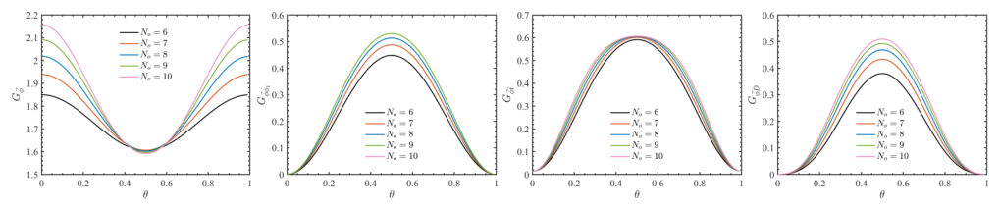 
Figure 4. The one-point correlation function (a)G⃗ϕ and two-point correlation function (b)Gϕˆt, (c)Gϕ ˆ D and (d) Gϕˆt as a function of θ. As the system size increases, the numerical results gradually converge. These results are produced at hd = 1000 with subject to pseudo-critical SO(5) bulk theories.

📷 Fig 5

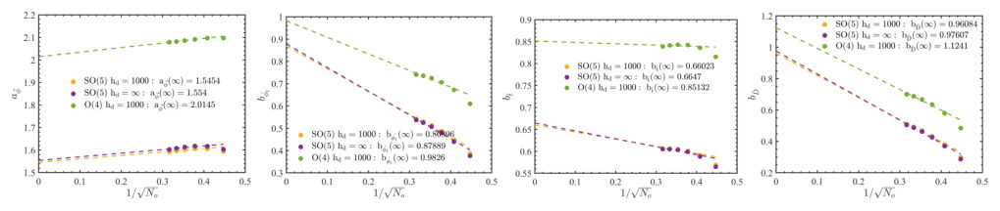 
Figure 5. The finite-size extrapolation results of the one-point and two-point OPE coefficients (a)a⃗ϕ, (b)b ˆϕ1, (c)bˆt and (d)b ˆ D calculated from bulk operator ⃗ϕ in the defect CFT fixed point by applying a spatially localized magnetic field hd subject to SO(5)/O(4) deconfined quantum critical bulk theory. Here, we adopt a linear fit to estimate these universal coefficients. For the same bulk fixed point, hd = 1000 and hd = ∞yield highly consistent results.

**Summary.** This paper theoretically investigates line defects embedded in a Deconfined Quantum Critical Point (DQCP) bulk using fuzzy-sphere regularization. By analyzing the defect operator spectrum across the renormalization group flow, the authors characterize the universal properties of the defect's conformal fixed point. The results confirm the existence of a stable defect critical phase, demonstrating the robustness of this physics across different underlying symmetries (SO(5) and O(4)).

**Why it may be interesting.** The study provides a rigorous theoretical framework for understanding how topological defects modify critical behavior in strongly correlated quantum matter, which is relevant to understanding boundary effects in quantum materials.

Detailed structure

**Main problem.** The study investigates the universal properties of one-dimensional line defects embedded within a two-dimensional Deconfined Quantum Critical Point (DQCP) bulk.

**Main result.** The numerical analysis establishes the first characterization of line-defect conformal data at DQCP, suggesting the existence of a stable, non-trivial defect conformal fixed point.

**Method.** The authors employed fuzzy-sphere regularization and numerical exact diagonalization to analyze the Renormalization Group (RG) flow of the defect operator spectrum.

**Model / system.** The system models a (0+1)-dimensional pinning-field defect coupled to a (2+1)-dimensional DQCP bulk, which is related to an SO(5) symmetry. The analysis is extended to an O(4) symmetry case to test universality.

**Key observables.** Defect operator spectrum, defect g-function, scaling dimensions of defect-changing/creating operators, and correlation functions.

**Important parameters / regimes.** The defect coupling strength ($h_d$), which is varied from 0 (bulk fixed point) to $\infty$ (defect fixed point).

**Assumptions / limitations.** The analysis relies on the fuzzy-sphere regularization framework, and the DQCP realizations are assumed to be weakly first-order.

**Figures summary.** Figures illustrate the evolution of excitation states along the RG flow, show finite-size extrapolation of scaling dimensions, and display the resulting defect conformal multiplets.

**Paper structure.** The paper systematically analyzes the RG flow from the bulk fixed point to the defect fixed point for the SO(5) DQCP, extracts universal conformal data, and then confirms the robustness of these findings by repeating the analysis for an O(4) symmetric DQCP.

Abstract

The interplay between bulk critical fluctuations and nontrivial topology can enrich defect physics and give rise to novel defect universality classes. Understanding the fate of such defects therefore constitutes an important open problem. In this work, we studied a particularly simple setting: a (0+1)-dimensional pinning-field defect coupled to a (2+1)-dimensional deconfined quantum critical bulk. Using the fuzzy-sphere regularization, we numerically investigated the defect operator spectrum and extracted several universal quantities characterizing the defect conformal fixed point, including the scaling dimensions of defect-changing(creating) operators and the defect \(g\)-function. These results establish the first numerical characterization of line-defect conformal data at deconfined quantum criticality and may stimulate further investigations of defect critical phenomena in topological quantum critical matter.

[↑ back to top](#top)

### [The stealthiest particle configurations in 8 and 24 dimensions](http://arxiv.org/abs/2609.03121v1)

**Authors:** Alex Cohen, Henry Cohn, Maryna Viazovska  
**Type:** theory · **Category:** statistical mechanics · **PDF:** <https://arxiv.org/pdf/2609.03121v1>  
**Analysis basis:** full PDF text, analyzed in chunks

📷 Fig 1

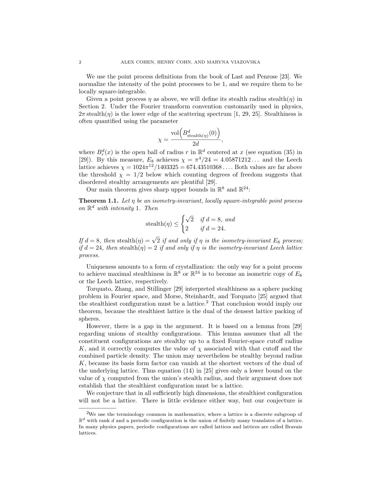 
Low-resolution page preview, page 2

📷 Fig 2

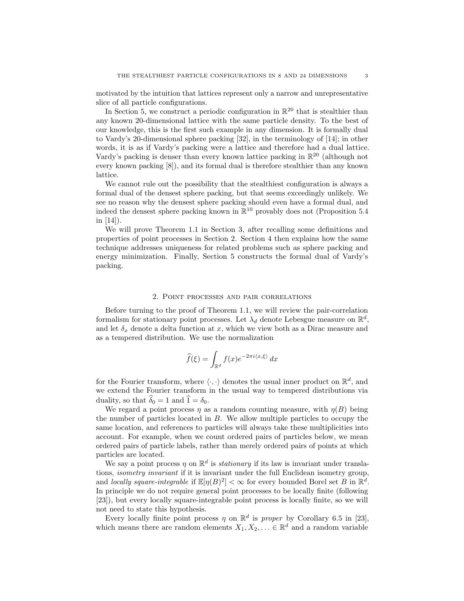 
Low-resolution page preview, page 3

📷 Fig 3

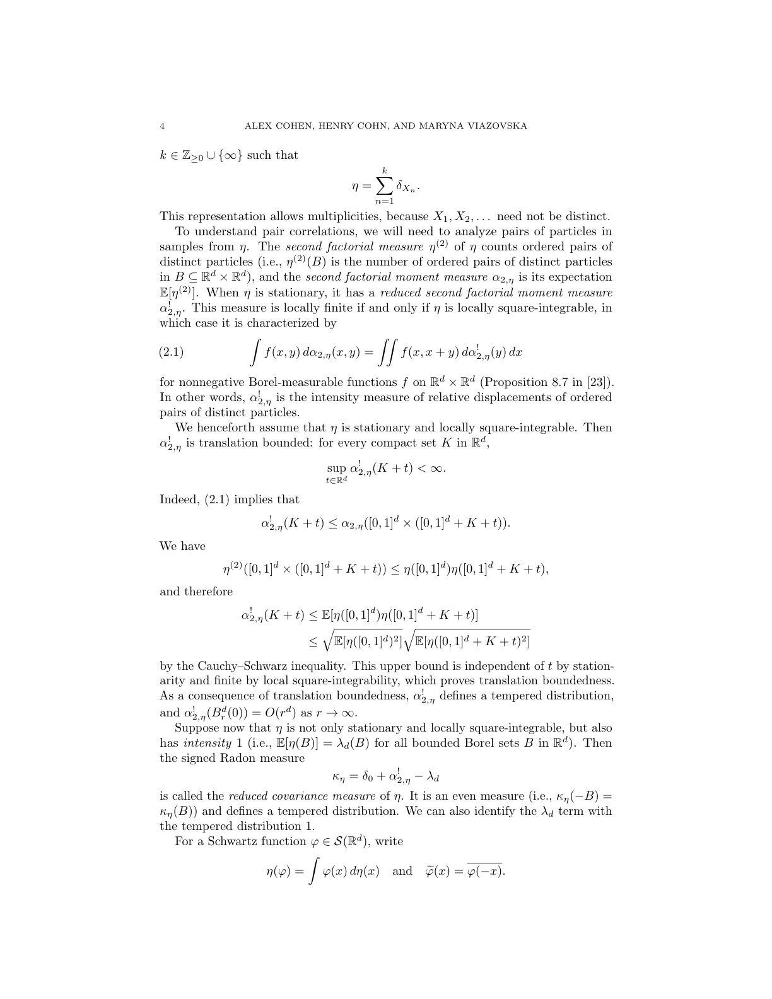 
Low-resolution page preview, page 4

📷 Fig 4

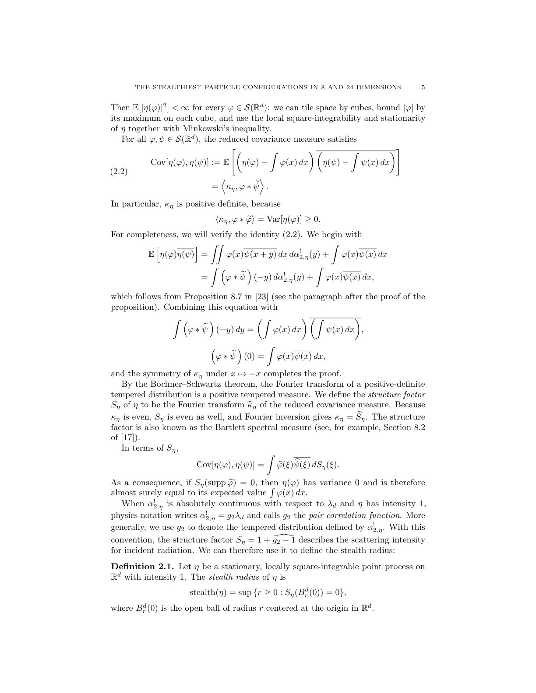 
Low-resolution page preview, page 5

📷 Fig 5

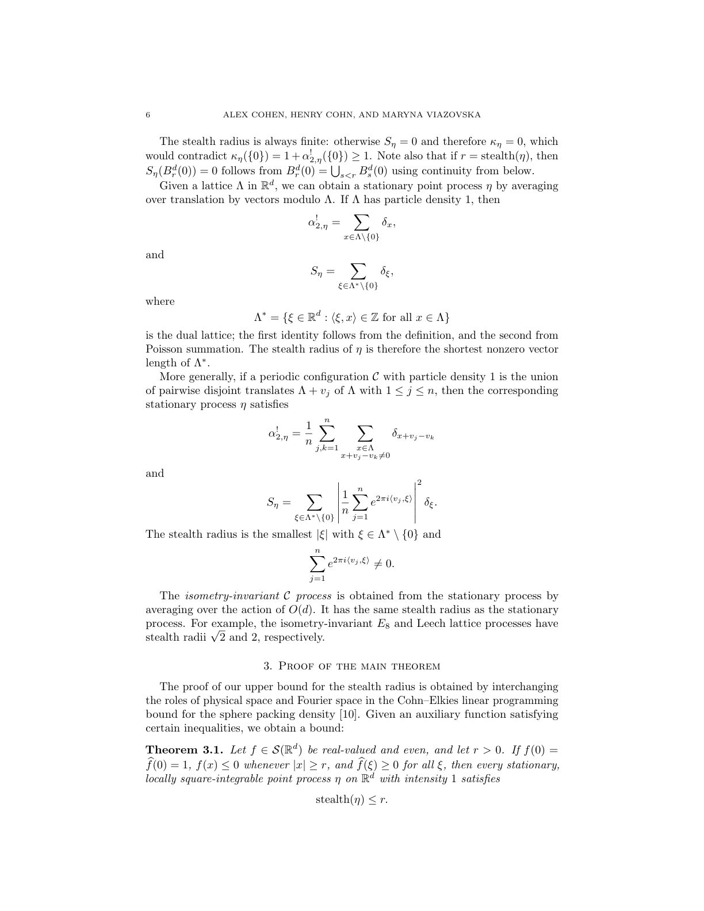 
Low-resolution page preview, page 6

**Summary.** This theoretical paper determines the optimal, or 'stealthiest,' arrangement of point particles in high-dimensional Euclidean spaces. It proves that the $E_8$ and Leech lattices achieve the maximum possible stealthiness in dimensions 8 and 24, respectively. The work employs advanced tools from geometric measure theory and lattice theory to establish sharp bounds on particle arrangement order.

**Why it may be interesting.** The concept of 'stealthiness' relates to the structure factor and diffraction patterns, which are fundamental tools in characterizing the order and correlations in many-body quantum systems, particularly in condensed matter physics.

Detailed structure

**Main problem.** The paper seeks to determine the 'stealthiest' arrangement of identical classical point particles in Euclidean space ($\mathbb{R}^d$) given a fixed particle density.

**Main result.** The $E_8$ lattice is the unique stealthiest process in $\mathbb{R}^8$, and the Leech lattice is the unique stealthiest process in $\mathbb{R}^{24}$.

**Method.** The analysis uses the framework of isometry-invariant point processes and relies on establishing sharp upper bounds for the stealthiness parameter using auxiliary functions derived from sphere packing theory.

**Model / system.** The system is modeled by a stationary, locally square-integrable point process ($\eta$) representing particle configurations in $\mathbb{R}^d$. The analysis extends to sphere packing problems in dimensions 8, 20, and 24.

**Key observables.** Stealthiness ($	ext{stealth}(\eta)$), measured by the gap between the origin and the nearest Bragg peak in the diffraction pattern, and the reduced covariance measure ($\kappa_\eta$).

**Important parameters / regimes.** Particle density (fixed at 1 in the main theorems), and the dimension $d$ (specifically $d=8$ and $d=24$).

**Assumptions / limitations.** The analysis assumes the point process is stationary and locally square-integrable. The conclusion that the optimal configuration must be a lattice is noted as a potential limitation.

**Paper structure.** The paper defines stealthiness using point processes, reviews the pair correlation formalism, proves the main theorem establishing the $E_8$ and Leech lattices as optimizers, and concludes by constructing a stealthier periodic configuration in $\mathbb{R}^{20}$.

Abstract

We show that the $E_8$ and Leech lattices generate the stealthiest isometry-invariant, locally square-integrable point processes of intensity $1$ in $\mathbb{R}^8$ and $\mathbb{R}^{24}$, respectively, and that they are the unique stealthiest processes. We also apply the proof technique to sphere packing and energy minimization, and we construct a $20$-dimensional periodic configuration that is stealthier than any known $20$-dimensional lattice with the same particle density. This periodic configuration is a formal dual of Vardy's $20$-dimensional sphere packing.

[↑ back to top](#top)

### [Thermodynamic Irreversibility from Inaccessible Endogenous Quantum Histories](http://arxiv.org/abs/2609.03748v1)

**Authors:** Borhan Ahmadi  
**Type:** theory · **Category:** statistical mechanics · **PDF:** <https://arxiv.org/pdf/2609.03748v1>  
**Analysis basis:** full PDF text, analyzed in chunks

📷 Fig 1

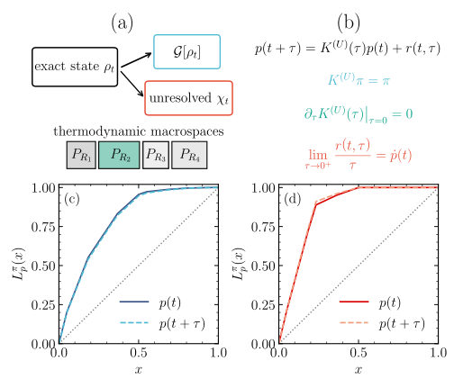 
FIG. 1. Closed-system thermodynamic coarse graining and finite-step return structure. (a) The exact state and its thermodynamic representative describe the same isolated system. The representative G[ρt] retains the macroprobabil- ities, while χt = ρt −G[ρt] contains structure invisible to the current record. (b) Every finite step obeys p(t + τ) = K(U)(τ)p(t) + r(t, τ). The record-only contribution preserves π but is stationary to first order, whereas r(t, τ)/τ →˙p(t). (c) During primary mixing, the later generalized Lorenz curve lies below the earlier one, so p(t) ≻π p(t + τ). (d) During or- ganized return, the curves cross and the relative-majorization defect becomes nonzero.

📷 Fig 2

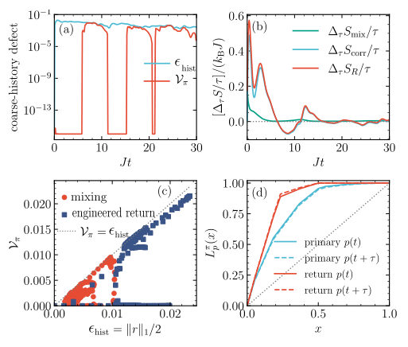 
FIG. 2. Hidden microscopic structure can remain dynam- ically active without producing thermodynamically relevant return. (a) For the exact N = 16, Q = 2 mixing dynamics, ϵhist = ∥r∥1/2 remains nonzero while Vπ vanishes through- out primary relaxation. (b) Finite-step slopes ∆τSmix/τ, ∆τScorr/τ, and ∆τSR/τ for τ = 0.1/J. The record-only finite-step contribution is nonzero even though its instanta- neous rate satisfies ˙Smix = 0. (c) Direct numerical test of the exact bound Vπ ≤ϵhist for mixing and engineered-return dynamics. Hidden activity with Vπ = 0 and organized return with Vπ &gt; 0 are both realized. (d) Representative general- ized Lorenz curves. Primary mixing remains inside the π-...

📷 Fig 3

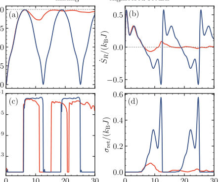 
FIG. 3. Controlled comparison between thermodynamic mixing and engineered return for the same N = 16, Q = 2 chain, preparation, and four-cell record. (a) Normalized ac- cessible entropy. (b) Exact instantaneous accessible-entropy rate. (c) Relative-majorization return defect for ∆(Jt) = 0.1. (d) Entropy-lowering macrocurrent contribution σret. The mixing dynamics can sustain return-oriented microscopic cur- rents without reversing the entropy accumulation, whereas the engineered spectrum synchronizes them strongly enough that σret eventually overtakes σspread and drives macroscopic return.

📷 Fig 4

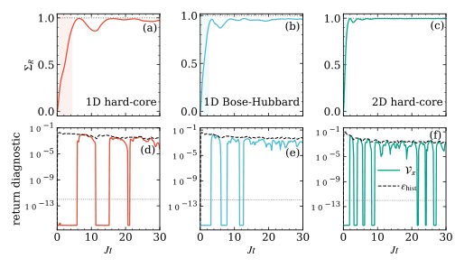 
FIG. 4. Cross-model finite-system test. (a)–(c) Normalized accessible entropy for the interacting one-dimensional hard- core chain, interacting Bose–Hubbard chain, and interacting two-dimensional hard-core lattice. Shading marks each first 10%–90% relaxation window. (d)–(f) Relative-majorization defect Vπ and history-sensitive distance ϵhist. In every tested primary window, hidden structure remains active while the return defect is zero to numerical precision.

📷 Fig 5

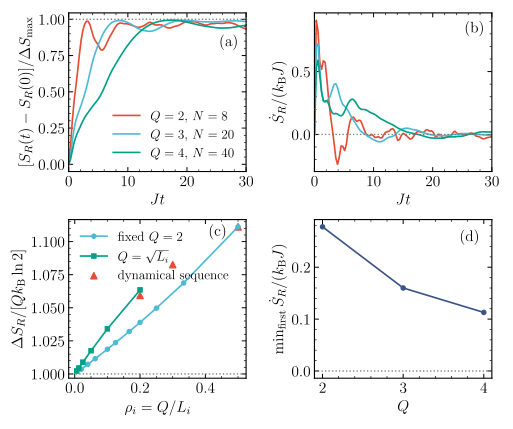 
FIG. 6. Closed-system free expansion along the finite se- quence (N, Q) = (8, 2), (20, 3), (40, 4). (a) Normalized four- cell entropy. (b) Instantaneous accessible-entropy rates. (c) Exact endpoint ratio versus initial filling. (d) Minimum sam- pled rate in each primary relaxation window. The endpoint trend is combinatorial; the rate calculations are finite-size dy- namical evidence.

**Summary.** This theoretical work tackles the paradox of irreversibility in unitary quantum systems by showing that the apparent loss of entropy is due to the failure of hidden microscopic information to organize into restorative macroscopic currents. The authors develop exact mathematical tools to separate entropy generation from these return currents, providing a deep, quantum-mechanical understanding of the Second Law.

**Why it may be interesting.** It provides a rigorous, quantum mechanical framework for understanding the Second Law of Thermodynamics in isolated systems by quantifying the role of coherence and hidden degrees of freedom in macroscopic irreversibility.

Detailed structure

**Main problem.** The paper addresses the origin of thermodynamic irreversibility in an isolated quantum system whose underlying dynamics are unitary and information-preserving.

**Main result.** Irreversibility is shown not to be the loss of microscopic information, but rather the failure of that hidden information to organize the quantum currents necessary to restore macroscopic order.

**Method.** The authors derive an exact entropy rate by splitting the state into a macroscopic 'record' part and an unresolved 'hidden' part, analyzing the resulting currents via spectral decomposition.

**Model / system.** The analysis considers an isolated quantum system evolving unitarily, focusing on the dynamics observed through a fixed projective record. The theory is tested using models like hard-core and Bose-Hubbard chains.

**Key observables.** Thermodynamic Entropy Rate ($\dot{S}_R$), Observational Deficit ($I_R$), and 'hidden currents' ($J_{RR'}$).

**Important parameters / regimes.** The analysis is restricted to finite observation windows and specific projective records; the thermodynamic limit is not fully established.

**Assumptions / limitations.** The analysis is restricted to the specified records and observation windows; heat and work require additional boundary specifications.

**Paper structure.** The paper builds by first defining the information deficit, then deriving the exact entropy rate by separating spreading from return currents, and finally comparing the finite-step evolution to the orbit-average evolution to establish the physical meaning of irreversibility.

Abstract

Microscopic unitary dynamics preserves all fine information, yet an isolated finite system can show a robust thermodynamic window in which the entropy associated with a restricted record rises. We ask why information hidden from the current record usually fails to rebuild a low-entropy macrostate. For a fixed projective record, every finite step separates exactly into the evolution predicted from the record alone and an exact correction carried by unresolved microscopic structure. The record-only contribution starts only at second order in time, so all instantaneous change of the record comes from hidden currents between macrostates. We derive the exact entropy rate, separate entropy-spreading from return-oriented currents, and resolve those currents into energy-gap amplitudes. Transitions with the same gap add coherently, revealing how the Hamiltonian and the microscopic state organize hidden information for return. In interacting mixing dynamics the current power is spread over many frequencies; free and deliberately commensurate controls progressively concentrate it, and the engineered dynamics reconstructs a low-entropy macrostate. An independent distribution-level test separates hidden dynamical activity from finite-step return, and an exact classical measure-preserving counterpart shows which parts of the construction are not uniquely quantum. Within the specified record and observation window, irreversibility is therefore not loss of microscopic information, but the failure of that information to organize currents that restore macroscopic order.

[↑ back to top](#top)

### [Ultra-Precise Quantum Projective Designs in Constant Depth](http://arxiv.org/abs/2609.03925v1)

**Authors:** Qingyue Zhang, Junjie Chen, Zhou You, You Zhou  
**Type:** theory · **Category:** quantum information and computing · **PDF:** <https://arxiv.org/pdf/2609.03925v1>  
**Analysis basis:** full PDF text, analyzed in chunks

📷 Fig 1

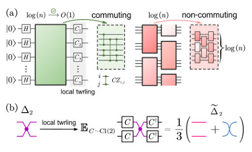 
FIG. 1. Schematic illustration of random circuit ensemble. (a) Structural contrast between our shallow phase-circuit construction (left) and generic shallow random circuits based on ”gluing” non- commuting 𝑂(log 𝑛)-qubit patches [12] or non-commuting local bricks [15] (right). (b) Our moment analysis makes the deviation from Haar transparent. For example, at second order, the relative- error obstruction is carried by the residual term Δ⊗𝑛 2 . Local Clifford twirling maps Δ2 to eΔ2, exponentially suppressing this contribution, as quantified around Eq. (3).

📷 Fig 2

 
Figure 1(a) summarizes our circuit architecture and its key properties. Unlike generic brickwork random cir- cuits [12, 15, 29], where randomness is built up through repeated layers of generally non-commuting gates, our cir- cuit structure is built almost entirely from mutually commut- ing diagonal circuits. Remarkably, we show that repeated non-commuting dynamics are unnecessary for generating pre- cise Haar-like statistics. The moment deviation of commuting

📷 Fig 3

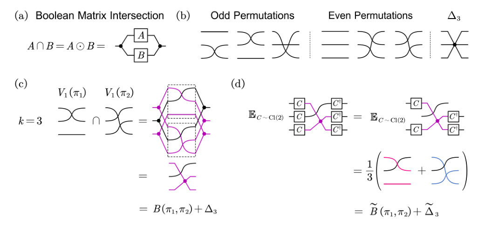 
FIG. 2. Tensor-network diagram of the third-order Boolean-support operator blocks. Panel (d) illustrates a representative instance of Eq. (10) in such tensor-network notation. Panels (a)–(c) provide the corresponding background: (a) defines Boolean-support intersection; (b) displays the odd and even permutations and their common block Δ3; and (c) applies the intersection introduced in (a) to an odd–even permutation pair, yielding 𝑉1(𝜋1) ∩𝑉1(𝜋2) = 𝐵(𝜋1, 𝜋2) + Δ3.

📷 Fig 4

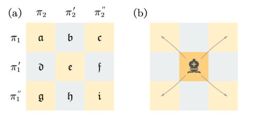 
FIG. 3. The bishop method for third-order block counting. (a) The nine nontrivial blocks 𝐵(𝜋1, 𝜋2) are arranged on a 3 × 3 board. For example, the cell 𝔞corresponds to 𝐵(𝜋1, 𝜋2), and |𝐼(𝔞) | = |𝐼( 𝜋1,𝜋2) |. (b) The bishop-like moves identify pairs in different rows and columns whose occupation products contribute to 𝑁I.

**Summary.** This paper introduces a specific, resource-efficient quantum circuit ensemble that approximates Haar randomness by achieving $\epsilon$-approximate projective 2- and 3-designs. By exploiting the commuting structure of the phase gates, the authors demonstrate that high-fidelity random states can be generated in remarkably shallow depth. This has significant implications for quantum metrology and quantum algorithm design by providing a blueprint for resource-constrained quantum simulation.

**Why it may be interesting.** The demonstration that precise Haar-like statistics can emerge from sparse, structured dynamics with remarkably low quantum resources is highly relevant for designing efficient quantum algorithms and characterization protocols.

Detailed structure

**Main problem.** The core problem is generating quantum random states that approximate Haar randomness with high precision (relative error) while minimizing the required quantum resources, especially achieving constant circuit depth.

**Main result.** The authors prove that a specific sparse commuting circuit ensemble can generate $\epsilon$-approximate projective 2- and 3-designs in relative error, achieving constant depth (depth seven) or $O(\log(n/\epsilon))$ depth without ancillas.

**Method.** The analysis relies on bounding the relative error of quantum moments ($\mathcal{M}^{(k)}$) by exploiting the commuting structure of the phase gates and employing advanced combinatorial techniques like block decomposition and the bishop method.

**Model / system.** The model is an ensemble of random unitaries acting on $n$ qubits, structured as a product of a sparse Clifford phase layer, a sparse controlled-Z layer, and independent single-qubit Clifford gates.

**Key observables.** Relative error ($\epsilon$), projective $k$-design property (for $k=2, 3$), and quantum circuit depth.

**Important parameters / regimes.** Sparsity parameter ($\gamma$), relative error ($\epsilon$), and system size ($n$).

**Assumptions / limitations.** The analysis assumes the relative error can be controlled by analyzing the operator-norm distance to the Haar moment, and the results are highly dependent on the specific commuting structure of the phase circuits.

**Figures summary.** Figure 1(a) schematically compares the shallow phase-circuit construction to generic shallow random circuits, while Figure 1(b) illustrates how moment analysis makes the deviation from Haar randomness transparent.

**Paper structure.** The paper progresses by first establishing the general framework of relative error bounds, then analyzing the second and third moments using local Clifford twirling to suppress errors, and finally employing advanced combinatorial arguments (like the bishop method) to rigorously prove the vanishing error for the third moment.

Abstract

Random quantum objects are powerful resources for quantum information processing, yet exact Haar randomness is costly and typically unnecessary. We introduce an explicit sparse commuting circuit ensemble on $n$ qubits that reproduces low-order Haar moments in the stringent relative-error sense. The circuit consists of a sparse Clifford phase layer followed by independent single-qubit Clifford gates. Acting on a simple product state, the resulting ensemble forms $ε$-approximate projective $2$- and $3$-designs in relative error, with the required logarithmic interaction degree being asymptotically optimal within this circuit family. It admits an ancilla-free implementation of quantum depth $O(\log(n/ε))$ on an all-to-all architecture, as well as an adaptive constant-depth implementation---in fact, depth seven---using $O(n\log(n/ε))$ ancilla qubits. Departing from existing shallow-design paradigms, our analysis exploits the intrinsic moment structure of commuting phase circuits; at third order, this requires a new block decomposition and combinatorial analysis that also suggests a route toward higher-order shallow designs. Our results show that precise Haar-like statistics can emerge from sparse commuting dynamics with remarkably low quantum resources, with applications to randomized characterization, quantum metrology, quantum algorithms, and many-body physics.

[↑ back to top](#top)

### [Vanilla Exact Synthesis of CNOT Circuits is NP-hard](http://arxiv.org/abs/2609.04160v1)

**Authors:** Chenjian Li, Ji Guan  
**Type:** theory · **Category:** quantum information and computing · **PDF:** <https://arxiv.org/pdf/2609.04160v1>  
**Analysis basis:** full PDF text, analyzed in chunks

📷 Fig 1

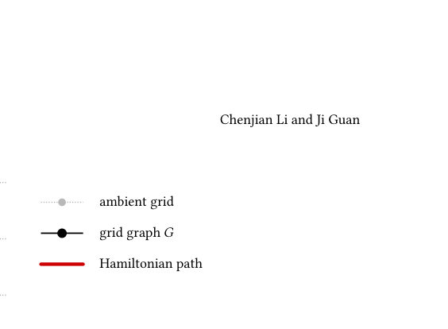 
Fig. 1. Illustration of a grid graph 𝐺over the 2D grid, together with an illustrative Hamiltonian path.

📷 Fig 2

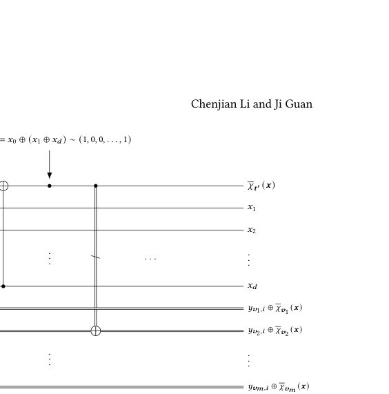 
Fig. 2. Demonstration of the reduction from hypercube Hamiltonian path to MinCNOTvanilla. 𝒗1, 𝒗2, . . . , 𝒗𝑚denote vertices in the hypercube. The CNOT gates corresponding to the first walking and recording steps are shown in the figure, where we have set the first nonzero vertex to 𝒗2 = (1, 0, 0, . . . , 1) for demonstration. Each double line denotes the 𝑚recorder qubits associated with one vertex.

📷 Fig 3

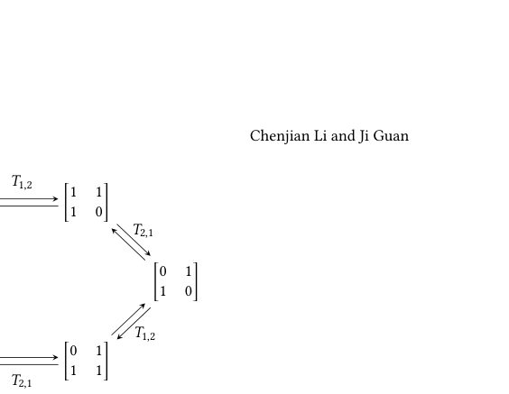 
Fig. 3. The Cayley graph 𝐶𝐺for 𝐺= GL(2, 2) generated by 𝑆= {𝑇1,2,𝑇2,1}.

**Summary.** This paper proves that finding the minimum CNOT circuit to realize a target quantum transformation is NP-hard in the most basic 'vanilla' setting. The authors achieve this by reducing the Hamiltonian path problem on grid graphs to the CNOT synthesis problem. This result establishes a fundamental computational complexity limit for quantum circuit design.

**Why it may be interesting.** This work establishes a fundamental computational barrier (NP-hardness) for a core primitive of quantum computation—the exact synthesis of gates—even in the simplest possible connectivity model.

Detailed structure

**Main problem.** The paper addresses the computational complexity of finding the minimum number of CNOT gates required to implement a specified invertible linear transformation (parity matrix) in the most basic, or 'vanilla,' setting.

**Main result.** The decision version of this vanilla exact CNOT synthesis problem is proven to be NP-complete, and consequently, the optimization version is NP-hard.

**Method.** The proof establishes the hardness via a polynomial-time reduction from the known NP-complete Hamiltonian-path problem on grid graphs.

**Model / system.** The model is quantum computation using CNOT gates to realize transformations over $\mathbb{F}_2$. The 'vanilla' setting assumes all-to-all connectivity, identity input, and no ancillas, making the result fundamental.

**Key observables.** The minimum number of CNOT gates required to achieve the target parity matrix $A \in GL(n, 2)$.

**Important parameters / regimes.** The size of the system ($n$ qubits) and the target transformation matrix $A$.

**Assumptions / limitations.** The proof overcomes the challenge that CNOT synthesis only constrains the final parity matrix by introducing extra 'recorder qubits' to enforce intermediate path visits.

**Figures summary.** The notes mention Table 1 summarizing hardness results for various synthesis models, and Figure 1 illustrating a grid graph and an example Hamiltonian path.

**Paper structure.** The paper first defines the vanilla exact CNOT synthesis problem, then details the reduction from the Grid-HP problem, utilizing isometric embedding into a hypercube and recorder qubits to enforce path constraints, and finally discusses implications for related problems like phase polynomial synthesis.

Abstract

Exact CNOT synthesis asks for a minimum-size CNOT circuit implementing an invertible linear transformation. Although several related synthesis models have been shown to be computationally hard, their hardness proofs rely on additional structure such as restricted qubit connectivity, encoded inputs, or unrestricted intermediate variables. The complexity of the most basic setting---identity input, a fixed number of labelled qubits, no ancillas, and all-to-all CNOT connectivity---had remained unresolved. In this work, we prove that the decision version of this vanilla exact CNOT synthesis problem is NP-complete, and consequently that its optimization version is NP-hard. Our proof gives a polynomial-time reduction from the Hamiltonian-path problem on grid graphs in two steps. First, we isometrically embed the grid graph into a hypercube via a unary encoding map. We then encode this hypercube Hamiltonian path problem into vanilla exact CNOT synthesis. The main challenge is that CNOT synthesis specifies only the final parity matrix and cannot directly enforce the intermediate vertex visits required by a Hamiltonian path. To overcome this difficulty, we introduce extra recorder qubits that encode the required intermediate vertex visits into the final transformation, forcing any CNOT circuit implementation to realize the intended path structure. Beyond CNOT synthesis, our result directly implies hardness for several related problems, including the shortest word problem over $\mathrm{GL}(n,2)$, distance computation on Cayley graphs over $\mathrm{GL}(n,2)$, minimization of sequential XOR programs, and exact synthesis of phase polynomial circuits.

[↑ back to top](#top)

### [Variable-Cliff Nielsen Geometry and an Exponent -4/3 Lower Bound for the Infinite-Cliff Diameter](http://arxiv.org/abs/2609.03323v1)

**Authors:** Honghuai Fang  
**Type:** theory · **Category:** quantum information and computing · **PDF:** <https://arxiv.org/pdf/2609.03323v1>  
**Analysis basis:** full PDF text, analyzed in chunks

📷 Fig 1

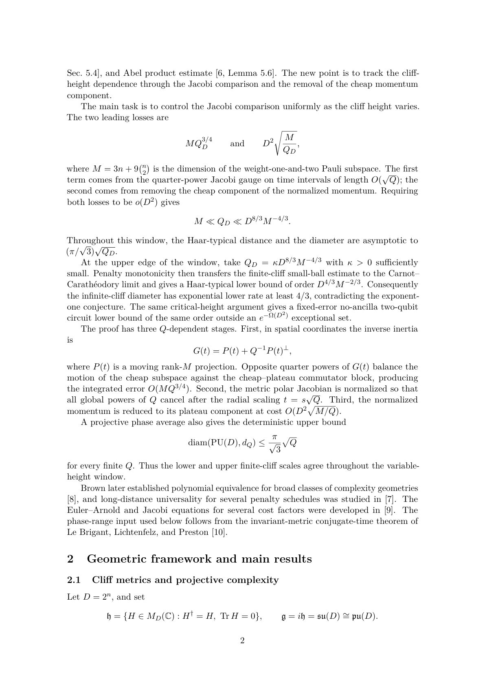 
Low-resolution page preview, page 2

📷 Fig 2

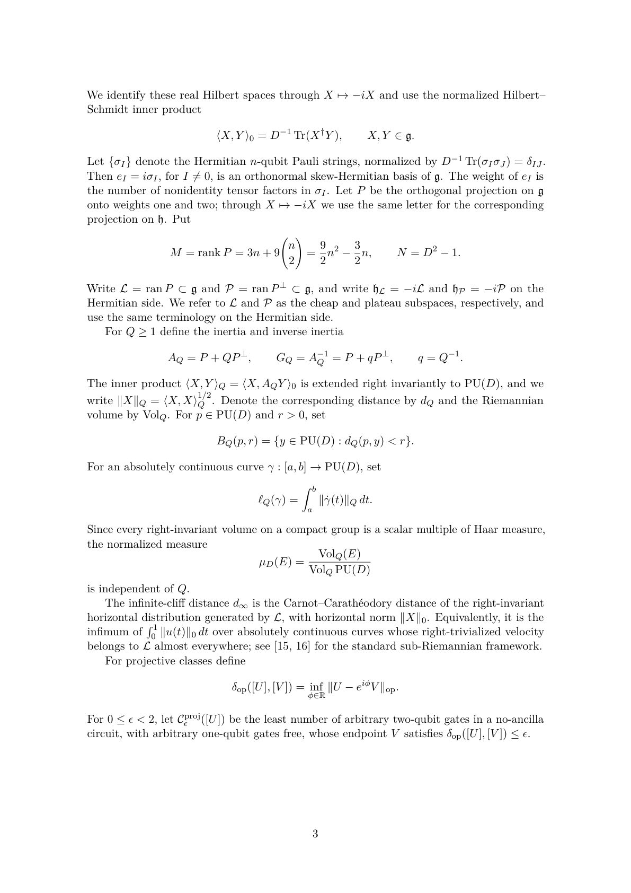 
Low-resolution page preview, page 3

📷 Fig 3

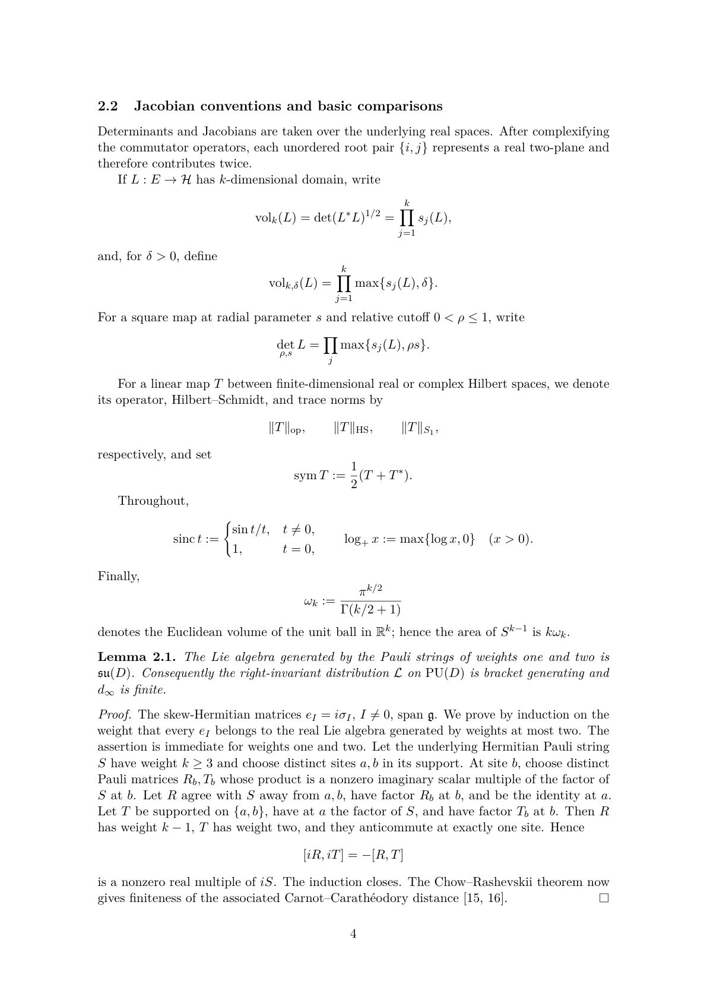 
Low-resolution page preview, page 4

📷 Fig 4

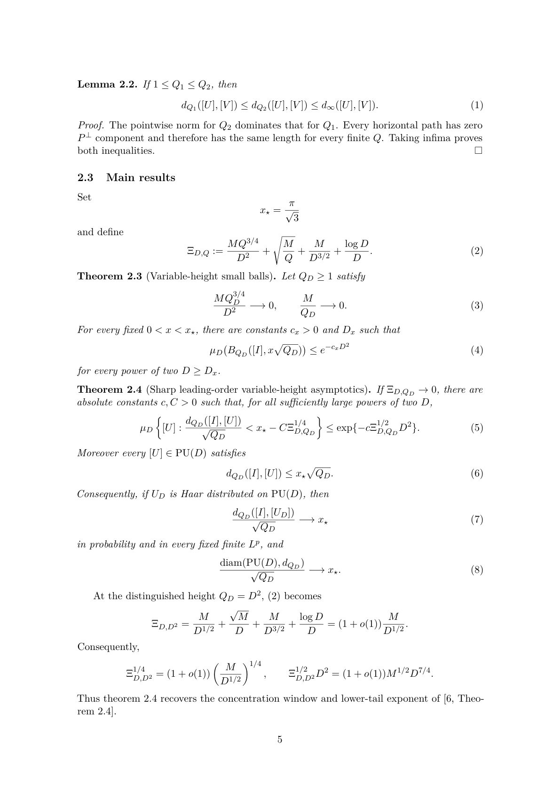 
Low-resolution page preview, page 5

📷 Fig 5

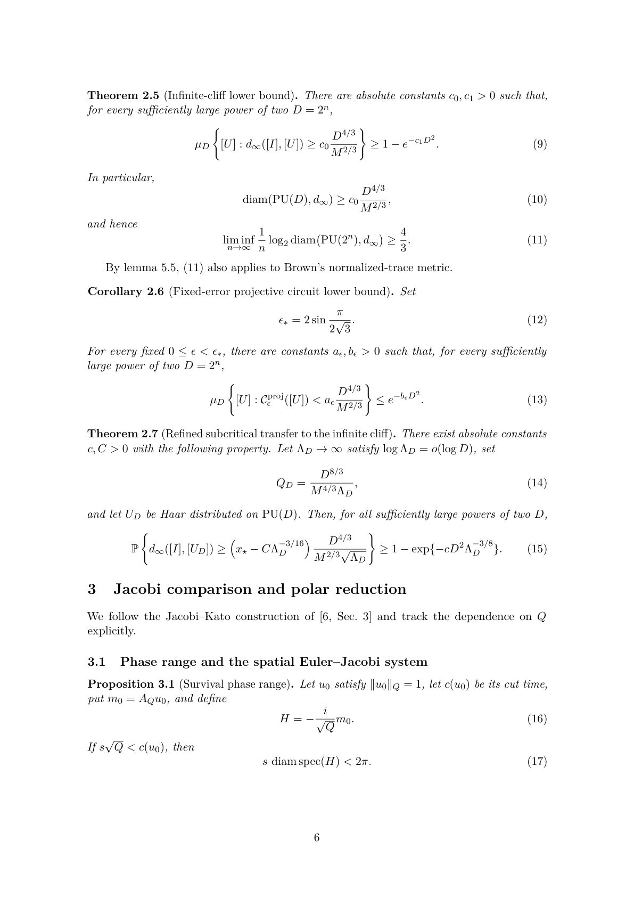 
Low-resolution page preview, page 6

**Summary.** This paper analyzes the geometric properties of the unitary group PU(D) using specialized 'cliff metrics' to study quantum circuit complexity. It derives a novel lower bound for the infinite-cliff diameter, showing it scales with an exponent of $4/3$. This result is significant because it disproves an existing conjecture (Brown's exponent-one conjecture) and provides a concrete lower bound for quantum circuit depth.

**Why it may be interesting.** The work provides a significant theoretical lower bound on the complexity of quantum circuits, directly impacting the understanding of quantum computational limits by improving upon previous conjectures.

Detailed structure

**Main problem.** The paper aims to establish lower bounds for the diameter of the unitary group PU(D) under various metrics, specifically comparing the 'infinite-cliff' distance to other bounds.

**Main result.** It proves that the infinite-cliff diameter has a lower bound scaling of order $D^{4/3}M^{2/3}$, which disproves Brown's exponent-one conjecture and yields a corresponding lower bound for fixed-error quantum circuits.

**Method.** The analysis employs advanced geometric techniques, including small-ball probability estimates on the Haar measure, Jacobi field comparisons, and Gaussian transfer techniques.

**Model / system.** The system is the unitary group PU(D), representing quantum evolution, analyzed using right-invariant cliff metrics ($d_Q$) and the infinite-cliff distance ($d_\infty$). The complexity is related to $n$ qubits, where $D=2n$.

**Key observables.** The normalized Haar measure of small balls ($\mu_D(B_{Q_D}([I],x\sqrt{Q_D}))$) and the diameter of the space ($	ext{diam}(	ext{PU}(D), d_\infty)$).

**Important parameters / regimes.** The penalty parameter $Q$, the dimension $D=2n$, and the subspace dimension $M=3n+9inom{n}{2}$. The analysis is restricted to the window $M \ll Q \ll D^{8/3}M^{-4/3}$.

**Assumptions / limitations.** The results hold outside an $e^{-\Omega(D^2)}$ exceptional set, and the derivation relies on specific asymptotic conditions on the parameters $Q$ and $M$.

**Paper structure.** The paper progresses by first establishing small-ball estimates for the finite-cliff metric, then transferring these estimates to the infinite-cliff distance using comparison techniques, culminating in the derivation of the lower bound for the diameter that contradicts a known conjecture.

Abstract

Let $D=2^n$ and $M=3n+9\binom n2$. We study the right-invariant one-step-cliff metric $d_Q$ on $\operatorname{PU}(D)$, with unit penalty on Pauli weights one and two and penalty $Q$ on all higher weights. If $M/Q_D\to0$ and $MQ_D^{3/4}/D^2\to0$, then, for every fixed $0<x<π/\sqrt3$, \[   μ_D\bigl(B_{Q_D}([I],x\sqrt{Q_D})\bigr)\le e^{-c_xD^2}. \] Here $μ_D$ is normalized Haar measure. Thus the Haar-typical distance from the identity and the diameter are both asymptotic to $(π/\sqrt3)\sqrt{Q_D}$ throughout the window $M\ll Q_D\ll D^{8/3}M^{-4/3}$. Choosing $Q_D=κD^{8/3}M^{-4/3}$ with sufficiently small fixed $κ>0$ yields a Haar-typical lower bound of order $D^{4/3}M^{-2/3}$ for the corresponding infinite-cliff Carnot--Carathéodory distance, outside an $e^{-Ω(D^2)}$ exceptional set. The infinite-cliff diameter therefore has exponential lower rate at least $4/3$, disproving Brown's exponent-one conjecture. The same estimate gives a fixed-error no-ancilla two-qubit circuit lower bound of the same order.

[↑ back to top](#top)

## Secondary cond-mat archives

*Papers from  mes-hall, other, soft, supr-con. These archives are de-prioritized — they appear at the end regardless of relevance score.*

### Relevant in secondary archives (17)

### ⭐ [Unravelling the Li-Haldane Conjecture with the Projected Ensemble](http://arxiv.org/abs/2609.03833v1)

**Highlighted author(s):** Nigel R. Cooper  
**Authors:** Daniel Spasic-Mlacak, Qi Camm Huang, Wen Wei Ho, Nigel R. Cooper  
**Type:** theory · **Category:** strongly correlated electrons · **PDF:** <https://arxiv.org/pdf/2609.03833v1>  
**Analysis basis:** full PDF text, analyzed in chunks
**Topic relevance:** 🔥 `quantum measurements` **4/5** · `Full counting statistics` **1/5**

📷 Fig 1

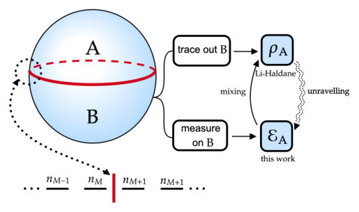 
FIG. 1. Schematic diagram of our setup: the FQH system on a sphere is bipartitioned into subsystems A and B using an orbital cut, with the angular momentum ∆LA and particle number NA being fixed. By taking measurements on part of the subsystem, we construct the projected ensemble EA in the occupation number basis.

📷 Fig 2

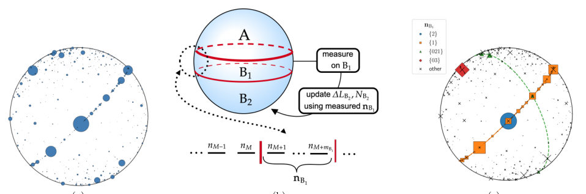 
FIG. 2. (a) Full PE in the ∆LA = 2 sector of the ν = 1, N = 20 bosonic Moore–Read state. The states span a rank-3 Li– Haldane edge manifold and are represented on the disk, with antipodal identification on the boundary, corresponding to RP2. Point sizes are proportional to their PE probabilities. (b) Schematic of partitioning the measured subsystem into B = B1 ∪B2. Conditioning on the occupation configuration nB1 of the orbitals nearest the entanglement cut fixes the particle number and angular momentum remaining in B2, thereby defining an effective bipartition A|B2 and constraining the corresponding edge- state subspace of A. (c) Labelled version of a). Conditioning on nB1 = {1} or {021}...

📷 Fig 3

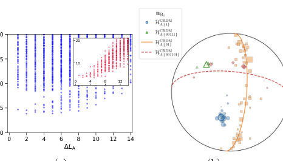 
FIG. 3. (a) CRDM entanglement spectrum of the ν = 5/2, N = 16 Coulomb ground state, for nB1 = {1}. The low-lying sector exhibits the CFT counting predicted by Eq. (4) and is separated from the non-universal UV sector by an entangle- ment gap, analogous to the Li–Haldane structure of the full RDM. The corresponding low-lying eigenstates span the con- ditional edge subspace HCRDM A|nB1 . (The inset is the correspond- ing entanglement spectrum of the fermionic ν = 1/2 Moore- Read state) (b) PE of the ν = 5/2 Coulomb ground state, with the interaction projected to the second Landau level. The ensemble is projected onto the universal edge subspace of the full Coulomb RDM, and the corresponding...

📷 Fig 4

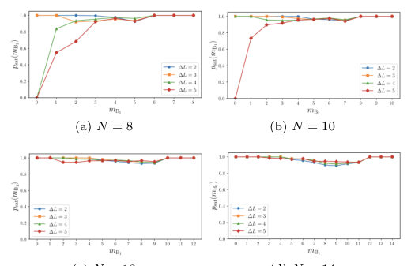 
FIG. 4. Finite-size scaling of the saturation probabil- ity. Probability psat that the conditional rank saturates the CFT upper bound of Eq. (4), shown as a function of the num- ber of orbitals mB1 included in the measured subsystem B1 for Laughlin states with (a) N = 8, (b) N = 10, (c) N = 12, and (d) N = 14 particles. The saturation probability is ob- tained by summing the probabilities of all measurement out- comes nB1 for which rank[ρA|nB1 ] equals the corresponding conditional CFT counting. The point mB1 = 0 reduces to the conventional Li–Haldane problem and therefore has psat = 0 or 1 depending on whether the finite-size RDM saturates the usual CFT counting. The overall increase of...

📷 Fig 5

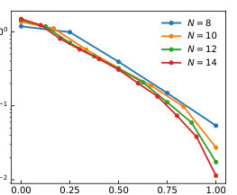 
FIG. 5. Measurement-induced entanglement (MIE) shown for Laughlin states with N = 8, 10, 12, 14 particles overlaid and ∆LA = 3 fixed. Here, mB1 denotes the number of orbitals in B1, namely the number of measured orbitals within B, and mcutoff denotes the largest mB1 such that the projected states are not completely collapsed to pure states, i.e., the largest mB1 such that the MIE is non-zero. The plot shows an approximate collapse between different N and also exhibits an approximate exponential decay of MIE with respect to mB1, confirming our intuition based on rank collapse of the projected ensembles.

**Summary.** This work develops the concept of the Projected Ensemble (PE) to probe topological order in FQH states beyond standard entanglement spectra. By analyzing states conditioned on measurement outcomes, the authors reveal a hidden, measurement-dependent hierarchy in the entanglement structure. This provides a sharp, new diagnostic tool confirming topological order even in realistic Coulomb-interacting systems.

**Why it may be interesting.** The concept of 'unravelling' entanglement via measurement outcomes provides a powerful, non-equilibrium probe into the topological order of strongly correlated electron systems, offering diagnostics beyond standard ground-state entanglement measures.

Detailed structure

**Main problem.** To uncover a finer universal structure within the entanglement spectra of fractional quantum Hall (FQH) states, going beyond what the standard entanglement spectrum can detect.

**Main result.** The projected ensemble (PE) exhibits a hidden hierarchy, leading to a measurement-resolved Li-Haldane conjecture where conditional subspaces are governed by CFT counting.

**Method.** The study analyzes the Projected Ensemble (PE), defined by conditioning quantum states on measurement outcomes of a subsystem's complement, which unravels the standard Reduced Density Matrix (RDM).

**Model / system.** The focus is on Fractional Quantum Hall (FQH) states, specifically the non-Abelian Moore-Read state and the $
u=5/2$ Coulomb ground state, analyzed on a sphere bipartitioned into two subsystems.

**Key observables.** Entanglement spectra, Projected Ensemble (PE), conditional reduced density matrices (CRDM), and the rank of the conditional subspaces.

**Important parameters / regimes.** Filling factor ($
u$), measurement outcomes ($n_B$), and the topological sector (e.g., $\Delta_{LA}=2$).

**Assumptions / limitations.** The analysis relies on the assumption that the relevant information for the rank is encoded in a subset of measured degrees of freedom, and that the structure persists under coherent deformations (rank rigidity).

**Figures summary.** Figures illustrate the PE structure, showing rank collapse upon measurement conditioning, and compare the geometric organization of conditional subspaces between the idealized Moore-Read model and the realistic Coulomb ground state.

**Paper structure.** The paper progresses from establishing the limitations of the standard entanglement spectrum to introducing the PE, formulating the measurement-resolved conjecture, demonstrating rank collapse, and finally showing that this structure persists for realistic Coulomb interactions.

Abstract

The entanglement spectra of fractional quantum Hall states contain universal fingerprints of their underlying topological order, as posited by the Li-Haldane conjecture. In this work, we uncover a finer universal structure within the entanglement spectra unravelled by projective measurements. Concretely, we study the projected ensemble of fractional quantum Hall states, defined as the collection of quantum states on a subsystem conditioned on measurement outcomes of its complement. We find that this ensemble exhibits a hidden hierarchy inside the Li-Haldane edge manifold: by conditioning on measurement outcomes, the entanglement spectrum's support is split into measurement-dependent sectors whose ranks we demonstrate are fixed by conformal field theory counting, an observation we dub the measurement-resolved Li-Haldane conjecture. For the non-Abelian Moore-Read state, this hierarchy is particularly rich: each parity-resolved edge manifold contains internal subspaces whose dimensions reproduce the conformal field theory counting of the opposite-parity sector. This structure persists even in realistic Coulomb-interacting ground states, establishing the projected ensemble as a sharp new probe of topological order beyond what the entanglement spectrum alone can detect.

[↑ back to top](#top)

### [Coherent interaction of WS$_2$ and quasi-2D perovskite excitons over micrometer distances via a cavity field](http://arxiv.org/abs/2609.03765v1)

**Authors:** Marti Struve, Hamid Pashaei Adl, Jamie M. Fitzgerald, Oliwia Janikowska, Maciej Śmiertka, Alessandro Surrente, Sven Stephan, Christoph Lienau, Falk Eilenberger, Zdeněk Sofer, Watcharaphol Paritmongkol, William A. Tisdale, Paulina Plochocka, Ermin Malic, Christian Schneider, Martin Esmann  
**Type:** both · **Category:** other · **PDF:** <https://arxiv.org/pdf/2609.03765v1>  
**Analysis basis:** full PDF text, analyzed in chunks
**Topic relevance:** 🔥 `quantum optics experiment` **4/5** · `Tavis-Cummings & cavity-many-emitter` **3/5** · `analog quantum simulation` **3/5** · `driven-dissipative phase transition` **2/5** · `interference shaping light` **2/5** · `Keldysh / 2PI / non-Gaussian methods` **1/5** · `correlated / nonlocal dissipation` **1/5** · `methods for driven-dissipative` **1/5**

📷 Fig 1

 
Figure 1: Open cavity hosting a TMD and quasi-2D HaP and individual demonstration of the strong coupling conditions for both materials. A) An open cavity formed by one distributed Bragg reflector (DBR) and a gold mirror. Separate nanopositioner stages allow for precise control of the air gap and x-y-orientation. The bottom mirror contains a fully hBN-encapsulated 110-nm-thick n=4 quasi-2D halide perovskite (HaP) flake. To lift the WS2 monolayer -crystal into a field maximum in front of the gold-coated top mirror, a 45-nm-thick hBN spacer is used. B) and C) White-light reflectivity at normal incidence as a functionof the cavity air gap for the individual quasi-2D halide perovskite (B) and...

📷 Fig 2

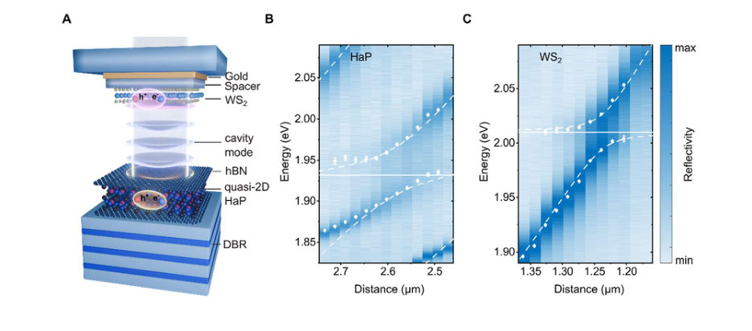 
Fig. 1A shows the structure of the fully assembled experimental setup. The bottom mirror consists of 10 alternating quarter-wave pairs of SiO2 and TiO2, terminated with an additional SiO2 layer, forming a distributed Bragg reflector (DBR). We transferred a fully hBN encapsulated ~110-

📷 Fig 3

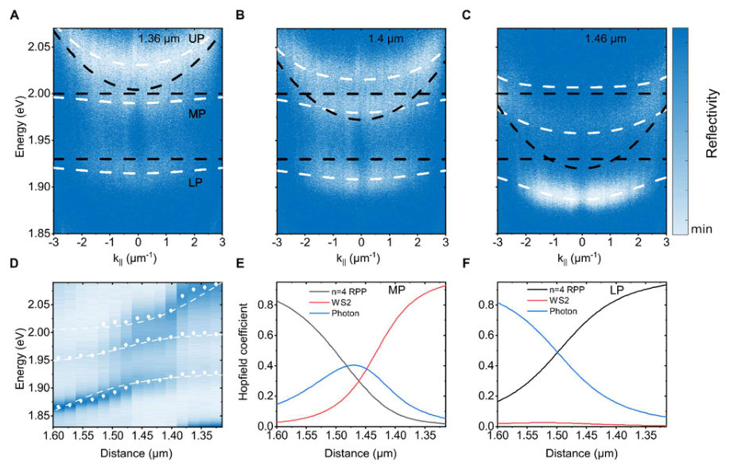 
Figure 2: Strong coupling and Hopfield coefficients in the hybrid TMD and quasi-2D HaP structure. A) – C) Angle- resolved white-light reflectivity spectra of the quasi-2D HaP flake together with the 𝑊𝑆ଶ monolayer crystal for three selected air gap sizes of 1.36 µm (A), 1.4 µm (B) and 1.46 µm (C), indicated at the top of each panel. A single cavity resonance couples to the two excitons (marked with black dotted lines) leading to the development of a lower (LP), a middle (MP) and an upper polariton (UP) branch. The reflectivity spectra are overlaid with a coupled oscillator model (dashed white lines) with coupling strengths 𝑔ு௔௉= 36 meV and 𝑔ௐௌଶ=20 meV. D) Air gap-dependent white- light...

📷 Fig 4

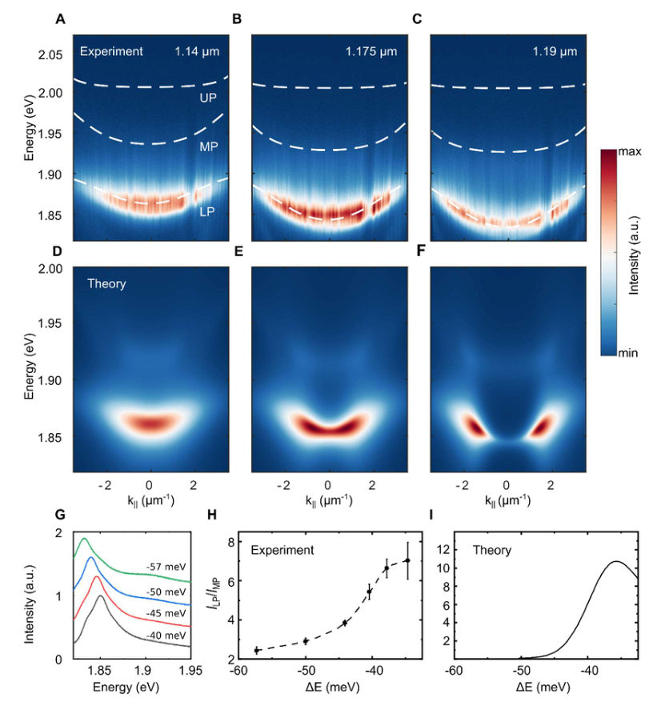 
Figure 3: Experimentally measured and simulated angle resolved photoluminescence. A) –C) Angle resolved photoluminescence (PL) spectra under 532 nm CW excitation for air gaps of 1.14 µm (A), 1.175 µm (B) and 1.19 µm (C), indicated at the top of each panel. The dashed lines show a coupled oscillator model superimposed with the spectra. At 𝑘||=2.5 µm-1 the dispersion of the lower polariton branch features an inflection point. For strong red detuning (C) the PL intensity redistributes towards larger in-plane k-vectors indicative of a polariton bottleneck behavior. D)-F) Simulated angle-resolved PL using a microscopic Wannier-Hopfield model. An increase of the PL for higher in-plane k-vectors...

📷 Fig 5

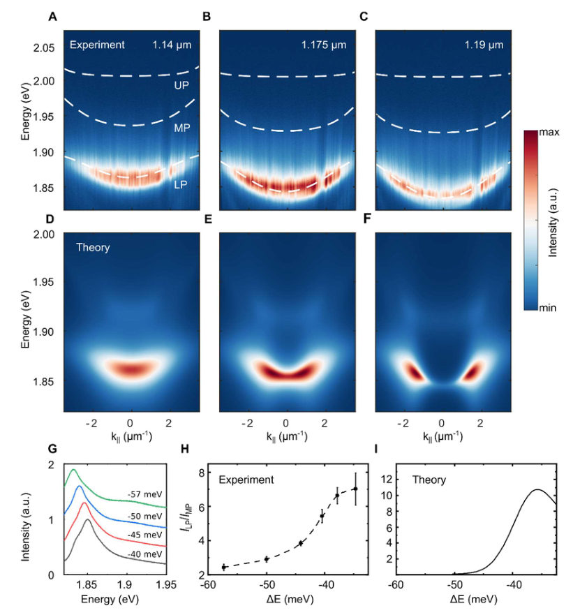 
Fig. 3A – C show angle-resolved photoluminescence (PL) spectra of the hybrid polariton. We excite the system with a green 532 nm continuous wave laser (excitation power 280 µW, spot size of 5 µm). Under these excitation conditions the we do not observe any photo induced degradation

**Summary.** This paper reports on the coherent coupling of excitons from $	ext{WS}_2$ and quasi-2D perovskites mediated by a cavity photon mode across a micrometer gap. By combining advanced optical measurements with coupled oscillator theory, the authors confirm the formation of hybrid polaritons. This work establishes a platform for engineering novel light-matter functionalities in 2D materials.

**Why it may be interesting.** This work is highly relevant to AMO physics and quantum optics as it explores engineered light-matter interactions (polaritons) in solid-state systems, demonstrating coherent coupling over distances that typically suppress such interactions.

Detailed structure

**Main problem.** The research aims to demonstrate and characterize the coherent coupling between excitons from two distinct, spatially separated 2D materials ($	ext{WS}_2$ and quasi-2D perovskites) mediated by a single cavity photon mode.

**Main result.** The study successfully demonstrated the formation of three polariton branches, confirming coherent, photon-mediated interaction between the two excitonic systems over a micrometer separation distance.

**Method.** The work combines experimental measurements (white-light reflectivity and photoluminescence) with theoretical modeling using coupled harmonic oscillator and Wannier-Hopfield frameworks.

**Model / system.** The physical system is a hybrid heterostructure comprising a $	ext{WS}_2$ monolayer and a quasi-2D halide perovskite ($	ext{HaP}$) placed within an open optical microcavity. The system dynamics are modeled using coupled oscillator Hamiltonians.

**Key observables.** Polariton energy branches, coupling strengths ($g$), Hopfield coefficients, white-light reflectivity spectra, and photoluminescence (PL) intensity.

**Important parameters / regimes.** Separation distance ($\sim 1.5 \ \mu	ext{m}$), coupling strengths ($g_{	ext{WS}_2} \approx 16-20 	ext{ meV}$, $g_{	ext{HaP}} \approx 36 	ext{ meV}$), and cavity detuning.

**Assumptions / limitations.** The analysis relies on treating the system as a coupled set of harmonic oscillators and utilizes approximations like the Born-Markov approximation for scattering rates.

**Figures summary.** Figures illustrate the physical setup involving DBR mirrors and transferred 2D materials, showing cavity tuning series data for the hybridized polariton and PL spectra for pure and mixed systems.

**Paper structure.** The paper progresses from establishing the physical setup and initial single-material coupling confirmations to analyzing the coupled three-oscillator Hamiltonian, and finally detailing the measurement of tunable polariton characteristics and scattering rates.

Abstract

The coherent coupling of cavity-confined photons and excitonic matter resonances leads to the formation of cavity polaritons, hybrid light-matter quasi-particles. If multiple exciton resonances couple to the same photonic mode, the resulting polariton constitutes a coherent interaction between matter resonances that can be spatially separated without any direct electronic coupling. In this work, we demonstrate the formation of such a coherent coupling at room temperature using an open optical cavity containing two distinct van der Waals materials - monolayer WS2 and layered quasi-2D halide perovskites (HaPs) - separated by $1.5 μ\rm m$. The system forms three polariton branches, with the middle branch possessing nearly equal fractions of both excitons and the photonic mode. White-light reflectivity and luminescence measurements are in good agreement with simulations using a coupled harmonic oscillator and a microscopic Wannier-Hopfield framework. Our results lay the foundation to combine highly complementary degrees of freedom in 2D materials in an in-situ tunable fashion to enable new polaritonic functionalities.

[↑ back to top](#top)

### [Real-space Floquet topology written by the orbital angular momentum of light](http://arxiv.org/abs/2609.03752v1)

**Authors:** Mohammad Shafiei, Milorad V. Milošević  
**Type:** theory · **Category:** other · **PDF:** <https://arxiv.org/pdf/2609.03752v1>  
**Analysis basis:** full PDF text, analyzed in chunks
**Topic relevance:** `analog quantum simulation` **3/5** · `driven-dissipative phase transition` **3/5** · `interference shaping light` **3/5** · `Keldysh / 2PI / non-Gaussian methods` **2/5** · `methods for driven-dissipative` **2/5** · `non-equilibrium universality` **2/5**

📷 Fig 1

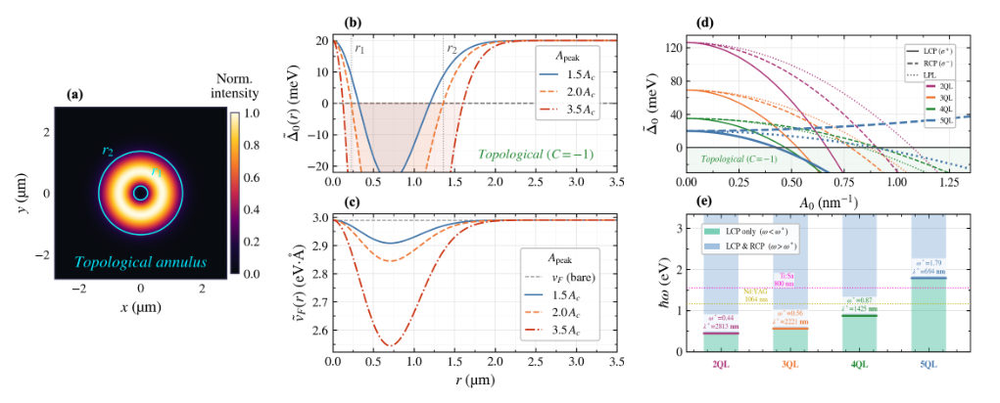 
FIG. 1. Floquet mass engineering by circularly polarized Laguerre–Gaussian light. (a) Schematic of an ℓ= 1 optical vortex incident on a quasi-two-dimensional Bi2Se3 film. The annular intensity profile drives mass inversion only where the local field is large enough, producing a topological annulus bounded by the zero-mass contour ˜∆0(r) = 0 (cyan). (b) Radial LCP mass profiles for a 5 QL film at ℏω = 1.5 eV and w = 1 µm, showing the two domain walls r1 and r2. (c) Corresponding spatial renormalization of the Fermi velocity. (d) Uniform-drive mass renormalization for LCP, RCP, and LPL fields. For a 5 QL film, LCP closes the gap while RCP increases it at ℏω = 1.5 eV. (e) Thickness dependence...

📷 Fig 2

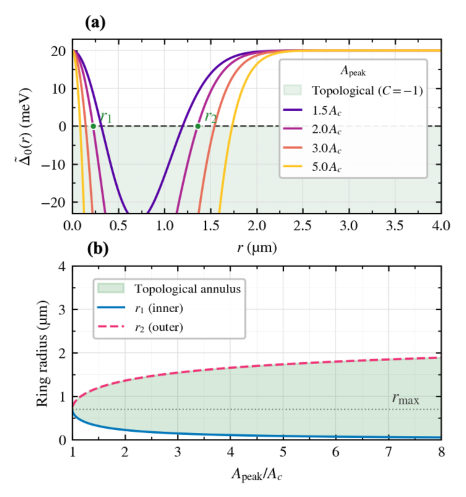 
FIG. 2. Formation and expansion of the Floquet topological annulus. (a) Radial mass profiles for a 5 QL film driven by an LCP LG beam with ℓ= 1, w = 1 µm, and ℏω = 1.5 eV. The shaded region denotes the inverted-mass annulus. (b) Inner and outer domain-wall radii as functions of Apeak/Ac; the dotted line marks the optical-intensity maximum rmax = w/ √

📷 Fig 3

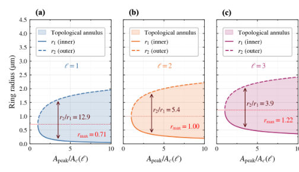 
FIG. 3. OAM control of the topological annulus. Inner (r1, solid) and outer (r2, dashed) domain-wall radii are shown versus Apeak/Ac(ℓ) for ℓ= 1, 2, 3 in a 5 QL film at ℏω = 1.5 eV and w = 1 µm. The dotted curves mark rmax = w p

📷 Fig 4

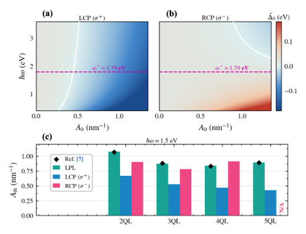 
FIG. 4. Helicity-selective Floquet phase diagrams. (a) LCP phase diagram of a 5 QL film in the (A0, ℏω) plane. Blue and red indicate topological (C = −1) and trivial (C = 0) regions, respectively; the white contour is ˜∆0 = 0, and the dashed line marks ω∗. (b) RCP phase diagram. No topological phase oc- curs below ℏω∗= 1.79 eV. (c) Critical amplitudes for LPL [7], LCP, and RCP illumination at ℏω = 1.5 eV. For 5 QL, RCP has no transition at this frequency.

**Summary.** This paper demonstrates that using structured light with Orbital Angular Momentum (OAM) allows for the direct, real-space writing of topological features in quantum materials like topological insulators. The topology forms a controllable annulus whose existence and geometry are independently tuned by the light's OAM number and helicity. This establishes OAM as a powerful control parameter for programmable topological landscapes.

**Why it may be interesting.** This work provides a concrete, optically controllable mechanism for engineering non-equilibrium topology in condensed matter systems, which is highly relevant for understanding light-matter interactions in topological materials.

Detailed structure

**Main problem.** To demonstrate that structured light carrying Orbital Angular Momentum (OAM) can write topological properties directly into real space within a material, moving beyond global control mechanisms.

**Main result.** The study shows that OAM enables the formation of a topological annulus in ultrathin topological insulators, with the topology being controllable by the light's helicity and OAM number.

**Method.** The analysis uses the leading Floquet–Magnus term to derive an effective Hamiltonian for a Dirac system driven by a circularly polarized Laguerre–Gaussian beam.

**Model / system.** The system is modeled using quasi-two-dimensional Dirac systems realized in ultrathin Bi2Se3 films, driven by a time- and space-dependent optical field characterized by OAM ($\ell$) and circular polarization ($\hat{\epsilon}$).

**Key observables.** Topological annulus (defined by two concentric chiral ring modes), radial Floquet mass sign changes, and vortex-core zero modes.

**Important parameters / regimes.** Orbital Angular Momentum quantum number ($\ell$), light helicity ($\hat{\epsilon}$), and the ratio of peak optical amplitude to critical amplitude ($A_{	ext{peak}}/A_c$).

**Assumptions / limitations.** The analysis relies on the off-resonant regime approximation ($\omega \gg \Delta_0$) and the use of the leading Floquet–Magnus term.

**Figures summary.** Figures illustrate the formation and expansion of the topological annulus for different OAM values ($\ell$), show the dependence of the inner and outer ring radii on the driving field strength, and summarize the helicity-selective crossover frequencies.

**Paper structure.** The paper establishes the theoretical framework using the Floquet-Magnus expansion, analyzes the role of helicity in driving mass inversion versus gap opening, and then demonstrates how OAM independently controls the geometry of the resulting topological annulus.

Abstract

Floquet engineering usually treats light as a uniform control field that changes the topology of an entire driven material. Here we show that structured light carrying orbital angular momentum (OAM) enables a different regime, in which topology is written directly in real space. For ultrathin topological insulator films, circularly polarized Laguerre--Gaussian beams generate a radial Floquet mass whose sign changes define a topological annulus bounded by two concentric chiral ring modes. The transition is helicity selective: below a thickness-dependent critical frequency, left-circularly polarized light drives mass inversion, whereas right-circularly polarized light increases the gap and leaves the film trivial. Independently, the OAM quantum number shifts and reshapes the annulus without changing the frequency, intensity, or helicity. In the decoupled-surfaces limit, the same mechanism produces a purely Floquet-induced topological mass and a vortex-core zero mode. These results identify photon OAM as a control parameter for nonequilibrium topology and provide a route to programmable topological landscapes in quantum materials.

[↑ back to top](#top)

### [Topological Boundary States and the Edge Chain in Semi-Infinite Two-Dimensional Insulators](http://arxiv.org/abs/2609.03173v1)

**Authors:** Ilya Iakoub, Nicolas Levasseur, Richard MacKenzie  
**Type:** theory · **Category:** other · **PDF:** <https://arxiv.org/pdf/2609.03173v1>  
**Analysis basis:** full PDF text, analyzed in chunks
**Topic relevance:** `analog quantum simulation` **3/5** · `methods for driven-dissipative` **3/5** · `Frenkel-Kontorova` **2/5** · `driven-dissipative phase transition` **2/5** · `non-equilibrium universality` **2/5** · `Keldysh / 2PI / non-Gaussian methods` **1/5**

📷 Fig 1

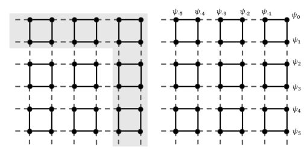 
FIG. 1: 2D extension of the SSH model. The full lines are t1 hoppings, the dashed lines are t2 hoppings. In the shaded area, you have the unit cell we use. On the right, we show the labeling of the edge chain sites.

📷 Fig 2

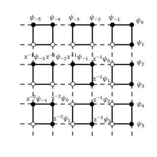 
FIG. 2: To enforce the edge chain ansatz, we set every second “chain” to zero. The resulting wave function is shown above. The white circles represent sites where the wave function amplitude is zero.

📷 Fig 3

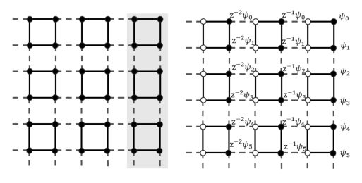 
FIG. 3: The 2D SSH model with another unit cell, identified by a shaded area in the image on the left. On the right, we show the corresponding ansatz. The white circles represent sites where the wave function amplitude is zero.

📷 Fig 4

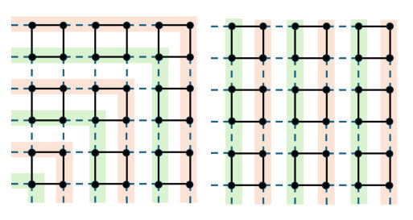 
FIG. 4: (Color online). In orange: sites with amplitude ψi; in green sites with amplitude ψb. When a Bloch state satisfies the boundary condition, ψb = 0. On the left: the ψi and ψb for the unit cell in Fig. 1; on the right: for the unit cell in Fig. 3.

📷 Fig 5

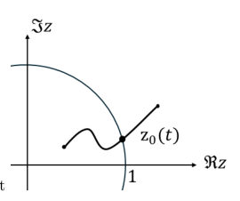 
FIG. 5: A possible trajectory of the point z0, where an eigenstate of h2(z) is shared with h1(z), generated by the transformations U(z, t). If the shared state happens to arise at an exceptional point of h2(z), there will be a band crossing along z0(t), which translates into a gap closing when |z0(t)| = 1.

**Summary.** This paper introduces a powerful 'edge chain' method to calculate the topologically protected edge and corner states in 2D topological insulators. By treating the boundary layer independently, the authors demonstrate that these states can be found using advanced mathematical tools applied to the analytically continued Bloch Hamiltonian. This provides a systematic approach for analyzing boundary physics in complex quantum materials.

**Why it may be interesting.** The rigorous mathematical framework developed for finding boundary states in non-Hermitian, quasi-periodic systems is highly relevant to understanding topological phases in open quantum systems or engineered photonic/acoustic lattices.

Detailed structure

**Main problem.** The paper aims to determine the adiabatically protected edge and corner states in semi-infinite, two-dimensional topological insulators.

**Main result.** A novel 'edge chain' method is proposed, which successfully computes these boundary states by analyzing only the first layer of lattice sites, and the protection of these states is confirmed using Shemesh's theorem.

**Method.** The method involves analytically continuing the Bloch Hamiltonian to the complex plane, treating the boundary as an independent 'edge chain,' and applying conditions derived from the bulk structure.

**Model / system.** The study focuses on semi-infinite 2D topological insulators, using extensions of the Su-Schrieffer-Heeger (SSH) model, the Haldane model, and the Breathing Kagome Lattice as explicit examples.

**Key observables.** Edge and corner state wave functions, energy eigenvalues, and the dimension of the kernel space defining the boundary states.

**Important parameters / regimes.** Chiral symmetry, the complex wave number $z$, and the hopping parameters ($t_1, t_2, t_3$) defining the lattice structure.

**Assumptions / limitations.** The core assumption is that edge states can be found by considering only the first layer ('edge chain') independently of the bulk, and that the connecting sites can be set to zero amplitude.

**Figures summary.** Figures illustrate the 2D SSH model, labeling the 'edge chain' sites, and show visualizations of the model with alternative unit cells used to find different types of boundary states.

**Paper structure.** The paper builds from establishing the edge chain ansatz, using Shemesh's theorem to prove protection, and then applying this framework to specific models (SSH3, Haldane, Kagome) using advanced techniques like para-Hermiticity and analyzing exceptional points.

Abstract

We show that it is possible to compute the adiabatically protected edge and corner states of semi-infinite, two-dimensional, topological insulators by considering the first layer of lattice sites, what we call the "edge chain," independently from the bulk. We start by accepting this claim as an ansatz, then, using the Shemesh theorem, we show that the edge states one finds using our procedure are adiabatically protected, provided we restrict ourselves to adiabatic evolutions that do not break chiral symmetry. We show explicit examples of our method in a 2D extension of the SSH model, the SSH3 model, the Haldane model and the Breathing Kagome Lattice.

[↑ back to top](#top)

### [Magnetic Couplings in Half-Filled Bipartite Graphs](http://arxiv.org/abs/2609.03548v1)

**Authors:** Georges Bouzerar  
**Type:** theory · **Category:** other · **PDF:** <https://arxiv.org/pdf/2609.03548v1>  
**Analysis basis:** full PDF text, analyzed in chunks
**Topic relevance:** `Keldysh / 2PI / non-Gaussian methods` **3/5** · `analog quantum simulation` **2/5** · `methods for driven-dissipative` **2/5**

📷 Fig 1

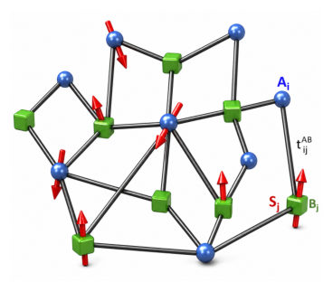 
Figure 1. Illustration of a magnetic bipartite graph. The green (respectively blue) symbols correspond to Bj with j = 1, .., ΛB (respectively Ai with i = 1, .., ΛA) and the dark lines to the hoppings tAB ij . The red arrows are the localized spins.

📷 Fig 2

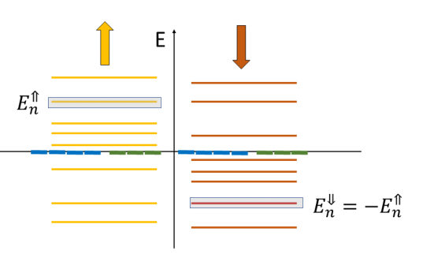 
Figure 2. The spectrum of ˆH↑and ˆH↓. The ZEMs are de- picted in blue (respectively green) for those having a support on sublattice A only (respectively on B only). The ZEMs have zero weight at the sites occupied by magnetic impuri- ties. To each eigenstate of energy E↑ n in ↑sector corresponds an eigenstate of energy E↓ n = −E↑ n in the ↑sector.

📷 Fig 3

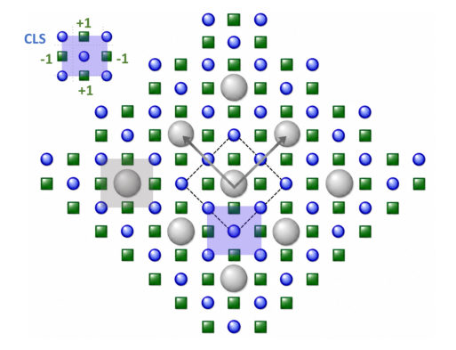 
Figure 3. The depleted 1/8 square lattice. The unit cell (7 orbitals/cell) is indicated by the square with dashed lines and the removed sites of the square lattice (A-type) by the filled grey circles. Small filled blue circles correspond to or- bitals of sublattice A, and the filled green squares to orbitals of sublattice B. The system contains two distinct plaquette configurations: gray squares centered on a vacancy and blue squares centered on a type-A atom. In the nearest-neighbor hopping case, the typical compact localized state (CLS) is lo- calized within the latter configuration, sustaining a non-zero quantum amplitude solely on the four B orbitals of the blue plaquette.

📷 Fig 4

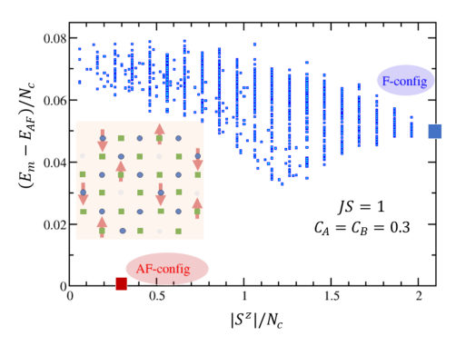 
Figure 4. For a given set of positions of the magnetic im- purities, the energy difference (per cell), (Em −EAF )/Nc is plotted as a function of the total spin (per cell) of the mag- netic configuration ’m’. The large blue square corresponds to the fully polarized spin texture (F) and the small blue squares correspond to random configurations. The values of cA, cB, and JS are indicated in the figure.

📷 Fig 5

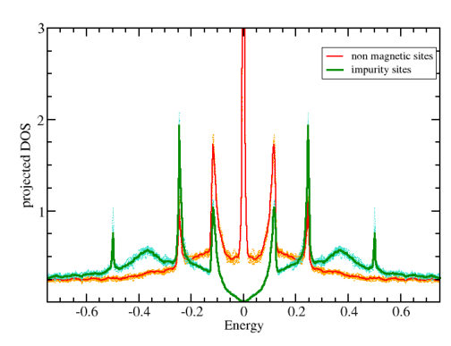 
Figure 5. Averaged Projected density of states (arbitrary unit) on impurity sites and on non magnetic sites as a func- tion of the energy for the AF spin texture. The orange dots and cyan ones correspond to different configuration of disor- der (random position of the magnetic impurities). The red (projection on non magnetic sites) and green (projection on magnetic sites) continuous lines are the average over these set of configurations.

**Summary.** This work develops a non-perturbative theory to calculate magnetic exchange couplings in half-filled bipartite magnetic lattices. By utilizing the Magnetic Force Theorem and circumventing issues related to zero-energy modes, the authors provide a universal analytical tool. This tool offers key design principles for engineering stable magnetic order in advanced 2D spintronic materials.

**Why it may be interesting.** The development of a non-perturbative, universal framework for calculating magnetic exchange interactions in complex lattices is highly relevant for designing next-generation spintronic devices where precise control over long-range magnetic order is required.

Detailed structure

**Main problem.** To establish a non-perturbative generalization of magnetic exchange rules in half-filled bipartite networks, overcoming the limitations of traditional perturbative frameworks.

**Main result.** The derived non-perturbative formula for magnetic coupling is universal, valid for any bipartite graph, and successfully bypasses the problematic zero-energy mode (ZEM) calculations.

**Method.** The magnetic coupling is calculated using the Magnetic Force Theorem (MFT) and Green's functions, leading to a generalized, non-perturbative expression involving frequency integrals.

**Model / system.** The system is a magnetic bipartite graph (MBG) modeled by a Hamiltonian incorporating hopping terms ($t_{AB}$) and local Heisenberg exchange interactions ($J$). The analysis focuses on half-filled systems with localized magnetic moments on two sublattices (A and B).

**Key observables.** Magnetic couplings $J_{\lambda\lambda'}(R)$, generalized susceptibility $\chi_{\lambda\lambda'}^{ij}(\omega)$, and the existence/weight of Zero-Energy Modes (ZEMs).

**Important parameters / regimes.** Half-filling ($\Lambda$), the coupling strength $J_S$, and the lattice geometry (bipartite structure).

**Assumptions / limitations.** The analysis assumes a ferrimagnetic ground state spin texture ($\mathbf{S}_A = +S e_z$, $\mathbf{S}_B = -S e_z$) and relies on the fact that ZEMs have zero weight at magnetic impurity sites.

**Figures summary.** Figures illustrate the magnetic bipartite graph structure, the energy spectrum showing ZEMs, and the calculated magnetic couplings as a function of distance R, distinguishing between intra-sublattice (ferro) and inter-sublattice (antiferro) interactions.

**Paper structure.** The paper progresses by first defining the Hamiltonian and identifying the failure points of perturbative methods related to ZEMs. It then derives the non-perturbative coupling formula using MFT and Green's functions, culminating in the general proof for arbitrary bipartite graphs.

Abstract

We break from perturbative frameworks to establish a non-perturbative generalization of magnetic exchange rules in half-filled bipartite networks. While historical models remain strictly tied to the debatable perturbation approach in the dilute limit and require the absence of zero-energy modes, our universal mechanism governs exchange interactions across arbitrary bipartite graphs. By bypassing traditional expansion bottlenecks, this framework provides an analytical predictive tool for magnetism in complex lattices, offering key design principles to engineer stable, long-range order in next-generation 2D spintronic devices

[↑ back to top](#top)

### [Weak-coupling theory of half-metals and other fractional metallic phases in biased doped Bernal bilayer graphene](http://arxiv.org/abs/2609.03679v1)

**Authors:** D. V. Zhitov, A. V. Rozhkov, A. O. Sboychakov, A. L. Rakhmanov  
**Type:** theory · **Category:** strongly correlated electrons · **PDF:** <https://arxiv.org/pdf/2609.03679v1>  
**Analysis basis:** full PDF text, analyzed in chunks
**Topic relevance:** `Keldysh / 2PI / non-Gaussian methods` **3/5** · `analog quantum simulation` **2/5** · `methods for driven-dissipative` **2/5**

📷 Fig 1

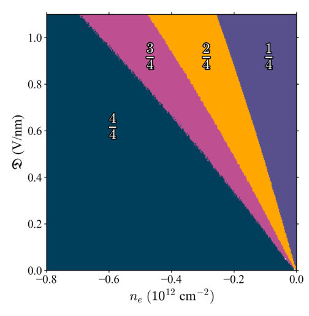 
FIG. 1. Phase diagram of AB-stacked bilayer graphene within the experimentally accessible range: the labeled phases are (from right to left) quarter-metal, half-metal, three quarter- metal, and metal. The phases are separated by first-order transitions.

📷 Fig 2

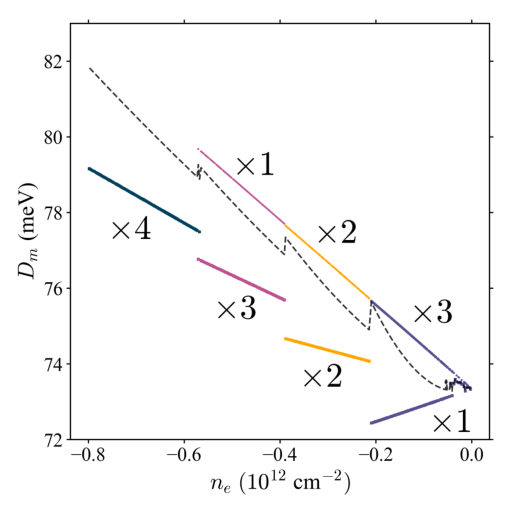 
FIG. 2. Gap parameters of the four sectors as a function of ne for D = 0.92 V/nm. Dashed line denotes the chemical potential. The degeneracies associated with each value of the gap parameter are labeled. The degeneracy of the gaps below the chemical potential corresponds to the number of doped sectors of the fractional metallic phases.

📷 Fig 3

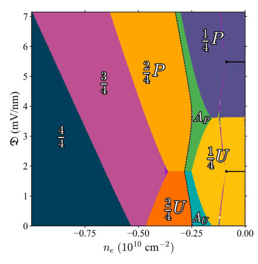 
FIG. 3. Phase diagram at low ne and D. Four half-metallic ( 2

**Summary.** This work develops a weak-coupling mean-field theory to map out the complex phase diagram of doped and biased Bernal bilayer graphene. By treating the system's interactions and external fields rigorously, the authors predict the existence of multiple fractional metallic states. The results provide quantitative agreement with recent experiments, advancing the understanding of correlated electronic behavior in 2D materials.

**Why it may be interesting.** The study of correlated phases in graphene systems, especially those exhibiting fractional metallic states, touches upon strongly correlated electron physics, which shares theoretical tools with many-body physics relevant to AMO systems.

Detailed structure

**Main problem.** The paper theoretically investigates the many-body electronic phases, particularly fractional metallic states, that emerge in doped and electrically biased Bernal-stacked (AB) bilayer graphene.

**Main result.** The study predicts a rich phase diagram hosting several fractional-metal states, reproducing key experimental features, including the energy scale for the loss of fractional metallic order.

**Method.** A variational mean-field theory is employed, utilizing a parameter-free Random-Phase Approximation for the short-range electron-electron interaction.

**Model / system.** The physical system is AB bilayer graphene subjected to doping and an external bias field. The model incorporates kinetic energy, a screened short-range Coulomb repulsion, and a long-range capacitive potential dictated by the displacement field D.

**Key observables.** Single-particle gap, nature of electronic phases (e.g., quarter-metal, half-metal, fractional metal), and the free energy.

**Important parameters / regimes.** Doping level, applied bias voltage, and the experimentally controlled displacement field D.

**Assumptions / limitations.** The theory uses a variational mean-field approach, and the long-range interaction is treated as a parallel-plate capacitor potential. The analysis also assumes the order parameter is Hermitian in some derivations.

**Figures summary.** Figures illustrate the phase diagram in the (doping, bias) plane, showing transitions between various metallic states, and show the variation of gap parameters with doping at fixed voltage.

**Paper structure.** The paper develops the Hamiltonian, derives self-consistency equations for the order parameters using mean-field theory, calculates the free energy, and maps out the resulting phase diagram in terms of doping and bias.

Abstract

The paper presents a theoretical study of many-body electronic phases in doped and electrically biased Bernal-stacked (AB) bilayer graphene. We develop a variational mean-field theory with no fitted parameters. For the electron-electron interaction, we employ a parameter-free random-phase approximation to model the short-range screened Coulomb repulsion. The remaining long-range Coulomb potential energy is dictated by the geometry of the sample, behaving as a parallel-plate capacitor. We formulate the theory directly in terms of the experimentally controlled displacement field $\frak D$ rather than the interaction-renormalized interlayer potential difference. It makes our theory better suited for direct comparison with experiment. The resulting phase diagram is quite rich. It hosts several fractional-metal states connected by first- and second-order transitions. At higher bias and doping, three distinct fractional metallic states emerge. We classify these phases by the number of doped sectors and the symmetry of the order parameters. Our results - obtained without any parameter fitting - reproduce key qualitative and quantitative features of recent experiments. This includes the energy scale associated with the loss of fractional metallic order. At lower bias and doping, the model stabilizes a broad spectrum of fractional-metal phases with more exotic symmetry-breaking patterns. This suggests that further experimental exploration of the latter regime is warranted.

[↑ back to top](#top)

### [Hierarchy of topological superconductivity generated via heterostructures of unconventional $p$-wave magnets](http://arxiv.org/abs/2609.03907v1)

**Authors:** Koushik R. Das, Arijit Saha  
**Type:** theory · **Category:** other · **PDF:** <https://arxiv.org/pdf/2609.03907v1>  
**Analysis basis:** full PDF text, analyzed in chunks
**Topic relevance:** `analog quantum simulation` **3/5**

📷 Fig 1

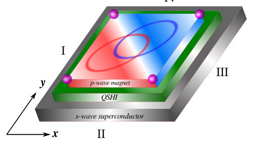 
FIG. 1. Schematic of our heterostructure is demonstrated comprising of a conventional s-wave SC, a QSHI and a non- collinear pWM. In the SOTSC phase, the system hosts zero- energy MCMs, localized at each corner of the 2D domain. The four edges are denoted by I, II, III, IV.

📷 Fig 2

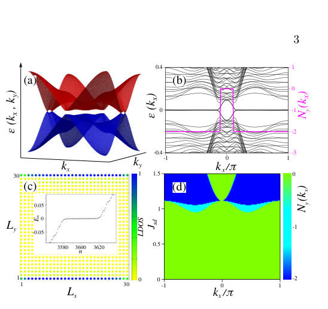 
FIG. 3. (a) Bulk spectrum in the FOTSC phase is depicted in kx-ky plane exhibiting four gapless points. (b) The cor- responding spectrum considering a ribbon geimetry is shown as a function of kx manifesting the MFEMs, characterized by the winding number Ny (depicted in magenta). (c) LDOS spectra (at E = 0) is displayed in Lx −Ly plane considering a finite size system with 30×30 lattice sites. The inset exhibits the eigenvalue spectrum as a function of the eigenvalue index (employing OBC along both x and y directions) manifesting the MFEMs. (d) Variation of Ny is shown in the plane of Jsd and kx. For panels (a,b,c), the model parameters are chosen as m0 = 1, Jsd = 1.2, αx,y = 0.5. For panel...

📷 Fig 3

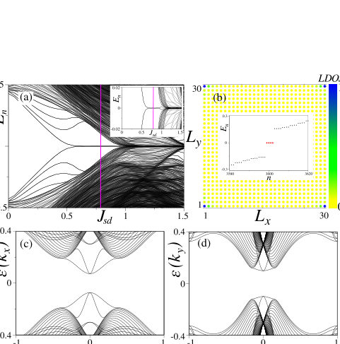 
FIG. 2. (a) Eigenvalue spectra of HBdG (Eq. (1)) is displayed as function of Jsd employing OBC. For a given Jsd, marked by the magenta line, the system exhibits SOTSC phase with the inset highlighting the zoomed in version of that region. The corresponding LDOS at E = 0 is presented in panel (b), along with the eigenvalue spectrum as a function of state index n in the inset. The four MCMs are indicated by red dots, and located well inside the bulk gap. At SOTSC phase, the edge modes along both x and y directions are gapped out and are presented in panels (c) and (d), respectively. Here, we consider a finite size system with 30 × 30 lattice sites and the model parameters are chosen as: m0 =...

📷 Fig 4

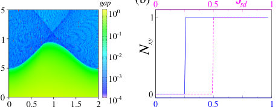 
FIG. 4. (a) Bulk band gap is shown in the (Jsd −m0) plane. (b) Nxy is depicted as a function of Jsd and m0, indicated by the magenta and blue color lines, respectively. Here, Nxy versus Jsd is calculated at m0 = 1. For Nxy versus m0, the Jsd is fixed at 0.5. Other model parameters are chosen as αx,y = 0.5, λx,y = 1.0, ∆0 = 0.5.

📷 Fig 5

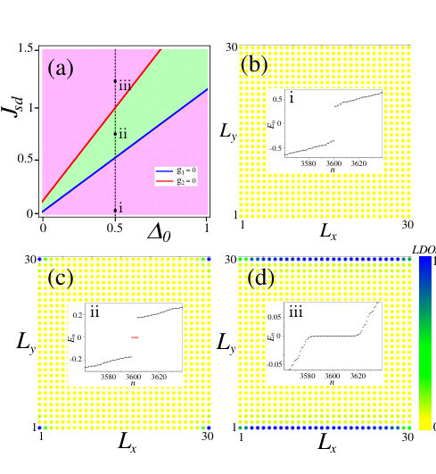 
FIG. 5. (a) The mass (band) gap profile (Eq. (12)) is illus- trated in Jsd −∆0 plane. Here, g1 and g2 correspond to the mass gaps for HI edge and HII edge, respectively. The green re- gion indicates the validity of Jackiw-Rebbi condition and the magenta region imply otherwise. In panels (b,c,d), we depict the zero-energy LDOS distribution and eigenvalue spectrum (inset) obtained employing OBC corresponding to the points (i,ii,iii) of panel (a) respectively. The other model parameters are considered as m0 = 1, αx,y = 0.5, λx,y = 1.

**Summary.** This theoretical study proposes a method to create and control a hierarchy of topological superconducting phases (FOTSC and SOTSC) in a heterostructure combining a QSHI and a p-wave magnet. By analyzing the BdG Hamiltonian and using topological invariants, the authors show that these distinct phases can be tuned by magnetic coupling, leading to the emergence of Majorana corner modes and unique edge states.

**Why it may be interesting.** This work provides a detailed theoretical roadmap for realizing and controlling multiple distinct topological superconducting states using engineered material heterostructures, which is highly relevant for topological quantum computation.

Detailed structure

**Main problem.** The paper aims to theoretically engineer and characterize the hierarchy of topological superconducting (TSC) phases, specifically first-order (FOTSC) and second-order (SOTSC), in a novel heterostructure.

**Main result.** The model successfully demonstrates the tunability of both FOTSC and SOTSC phases by adjusting the magnetic coupling parameter, leading to distinct topological signatures like Majorana corner modes (MCMs) and different edge mode behaviors.

**Method.** The analysis employs the Bogoliubov-de Gennes (BdG) Hamiltonian, utilizing symmetry invariants (winding numbers) and deriving low-energy edge theories to classify the topological phases.

**Model / system.** The physical system is a 2D heterostructure composed of a Quantum Spin Hall Insulator (QSHI), an unconventional p-wave magnet (pWM), and proximity-induced s-wave superconductivity. The system is modeled using the BdG Hamiltonian, which incorporates contributions from the QSHI and pWM.

**Key observables.** Topological phases (Trivial, FOTSC, SOTSC), 1D winding number, quadrupolar winding number, Majorana corner modes (MCMs), and Majorana flat/dispersive edge modes.

**Important parameters / regimes.** The coupling parameter $J_{sd}$ (from the pWM) and the superconducting gap $\Delta_0$ are key tunability parameters.

**Assumptions / limitations.** The analysis relies on deriving effective low-energy Hamiltonians by approximating trigonometric functions near the $\Gamma$ point and applying boundary conditions (OBC) for edge/corner mode analysis.

**Figures summary.** Figures illustrate the eigenvalue spectra showing transitions between phases based on $J_{sd}$, and depict the localized MCMs in the SOTSC phase.

**Paper structure.** The paper progresses by establishing the full BdG model, deriving effective low-energy edge and bulk Hamiltonians, characterizing the topological invariants (winding numbers), and finally mapping out the phase diagram showing the emergence of FOTSC and SOTSC regimes.

Abstract

A theoretical framework is proposed to engineer both first and second-order topological superconducting phases in a two-dimensional (2D) heterostructure, consisting of a quantum spin Hall insulator (QSHI) and an unconventional $p$-wave magnet in presence of proximity-induced $s$-wave superconducting pairing. Our analysis establishes that the transitions between the trivial and topological superconducting (TSC) phases can be regulated though the parameters of $p$-wave magnet. Presence of chiral symmetry leads to the characterization of both types of TSC phases by the respective invariants, one-dimensional winding number and quadrupolar winding number. These results are supplemented by an analytical effective low-energy edge theory that yields a deeper insight into the emergence of the different topological phases of the system. Bulk pairing analysis reveals the competition between the effective $(p_x+p_y)$ and $(p_x+ip_y)$ type pairings that are governed by the intrinsic spin-orbit coupling inherited to the QSHI and spin-split bands of the $p$-wave magnet, respectively.

[↑ back to top](#top)

### [Hydrodynamics of two-dimensional electrons due to scattering by disorder](http://arxiv.org/abs/2609.04097v1)

**Authors:** D. R. Raskulov, K. A. Baryshnikov, P. S. Alekseev  
**Type:** both · **Category:** other · **PDF:** <https://arxiv.org/pdf/2609.04097v1>  
**Analysis basis:** full PDF text, analyzed in chunks
**Topic relevance:** `Keldysh / 2PI / non-Gaussian methods` **2/5** · `methods for driven-dissipative` **2/5** · `Frenkel-Kontorova` **1/5** · `correlated / nonlocal dissipation` **1/5** · `driven-dissipative phase transition` **1/5** · `non-equilibrium universality` **1/5** · `scars & prethermalization` **1/5**

📷 Fig 1

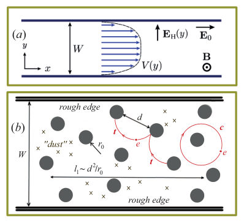 
FIG. 1. (a): Long sample with non-interacting 2D electrons forming an Ohmic-hydrodynamic flow due to scattering on de- fects and rough longitudinal edges. The perpendicular mag- netic field B, the external electric field E0 due to applied voltage, and the internal Hall electric field EH(y) are shown, as well as the hydrodynamic velocity profile Vx(y) ≡V (y). (b): Sample with localized defects and weak unspecified de- fects between them (“dust”). The two types of 2D electron trajectories appear in magnetic field: the c-electrons, which do not collide with defects, and the t-electrons, which scatter by different defects.

📷 Fig 2

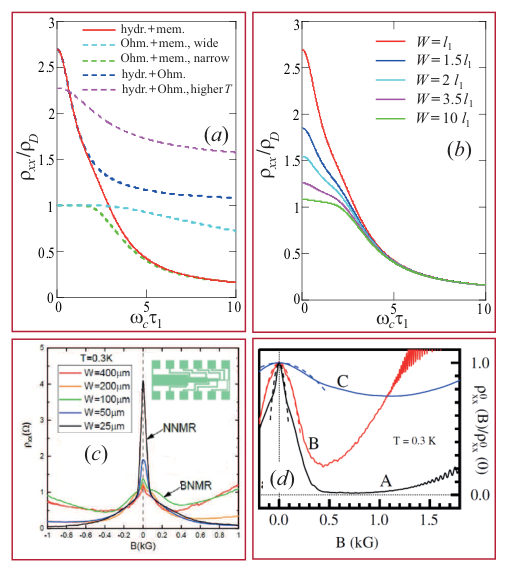 
FIG. 2. (a): Mean sample resistivity ̺xx as a function of β = ωcτ1 obtained for: (i) the current hydrodynamic- memory model [Eq. (9)], (ii) the Gurzhi hydrodynamic-Ohmic model [Eq. (9) at P = 0], (ii) the Ohmic-memory model for a wide, W ≫ltc, [Eq. (11)] and a narrower, W ≲ltc, [Eq. (10)] samples. For all the curves except the violet one the param- eters: W = l1, l2 = 0.5 l1, l0 = 0.5 l1, and ld 1 = 20 l1 were used; for the violet curve l′ 1 = 0.7l1 and l′ 2 = 0.4l2, those correspond to a higher temperature. (b): Resistivity ̺xx as a function of β = ωcτ1 at various sample widths W for the current model. The lengths l2, l0, and ld 1 are the same as for panel (a). (c): Magnetoresistance for...

**Summary.** This work develops a comprehensive theory for magnetotransport in 2D electron systems by combining memory effects from localized disorder scattering with hydrodynamic viscosity. The model successfully explains the observed giant negative magnetoresistance in high-quality quantum wells, distinguishing between narrow and wide sample regimes based on the relative dominance of these two physical mechanisms.

**Why it may be interesting.** The detailed modeling of non-Markovian transport and the explicit separation of memory and hydrodynamic contributions provide a rich framework for understanding transport in disordered quantum systems, which is relevant to open quantum systems dynamics.

Detailed structure

**Main problem.** The paper addresses the puzzle of observing hydrodynamic-like transport signatures, such as giant negative magnetoresistance, in 2D electron systems even when electron-electron scattering is too weak to cause them conventionally.

**Main result.** The developed theory successfully explains the observed giant negative magnetoresistance by modeling the mixed transport regime involving both memory effects from localized defects and unconventional viscosity from bulk/edge scattering.

**Method.** The authors developed a theoretical model using phenomenological balance transport equations for two types of electrons (circling and traveling) and solved them in the stationary regime.

**Model / system.** The system is two-dimensional electron gas in high-quality nanostructures, such as GaAs quantum wells, subjected to weak disorder. The model incorporates memory effects and hydrodynamic viscosity arising from scattering mechanisms.

**Key observables.** Magnetoresistance ($
ho_{xx}(B)$), exhibiting characteristic sharp peaks (narrow samples) or blunt maxima (wide samples) at zero magnetic field.

**Important parameters / regimes.** Sample width ($W$), magnetic field ($B$), temperature ($T$), and characteristic scattering/transition lengths ($l_{tc}, l_G$).

**Assumptions / limitations.** The model assumes the existence of two electron populations (c- and t-electrons) and uses approximations like the gradual channel approximation and stationary flow conditions.

**Figures summary.** Figures compare the model's predictions for $
ho_{xx}$ vs. $B$ (showing characteristic shapes) against experimental measurements from GaAs quantum wells, demonstrating agreement in both narrow and wide sample limits.

**Paper structure.** The paper develops the theory by formulating balance equations for electron densities and flows, deriving analytical expressions for $
ho_{xx}$ in different sample width limits, and finally comparing these theoretical predictions across various regimes (low/high B, narrow/wide W) against experimental data.

Abstract

The hydrodynamic regime of electron transport, induced by fast inter-electron collisions, was discovered in high-quality nanostructures in recent ten years. However, signs of hydrodynamic transport, primarily, the giant negative magnetoresistance, were observed even at very low temperatures, when electron-electron scattering is too weak to affect the transport. To address this puzzle, here we develop a theory of mixed, hydrodynamic and non-Markovian, magnetotransport of two-dimensional electrons at zero temperature in samples with weak but still important disorder. Namely, we account for both the memory effects at electron scattering by localized defects in magnetic field and an unconventional viscosity effect due to electron scattering by defects in bulk and by rough sample edges. Solution of the model yields a strong negative magnetoresistance, which exhibits at zero magnetic field a sharp maximum in narrower samples or a blunt maximum in wider samples. This and other our results explain various properties of the giant negative magnetoresistance observed on ultra-high-quality GaAs quantum wells, thereby we apparently reveal the nature of low-temperature magnetotransport in these systems.

[↑ back to top](#top)

### [The conductivity matrix at the topological phase transition](http://arxiv.org/abs/2609.03832v1)

**Authors:** Simone Fabbri, Giovanna Marcelli, Alessandro Giuliani  
**Type:** theory · **Category:** other · **PDF:** <https://arxiv.org/pdf/2609.03832v1>  
**Analysis basis:** full PDF text, analyzed in chunks
**Topic relevance:** `Keldysh / 2PI / non-Gaussian methods` **2/5** · `analog quantum simulation` **1/5** · `driven-dissipative phase transition` **1/5** · `non-equilibrium universality` **1/5**

📷 Fig 1

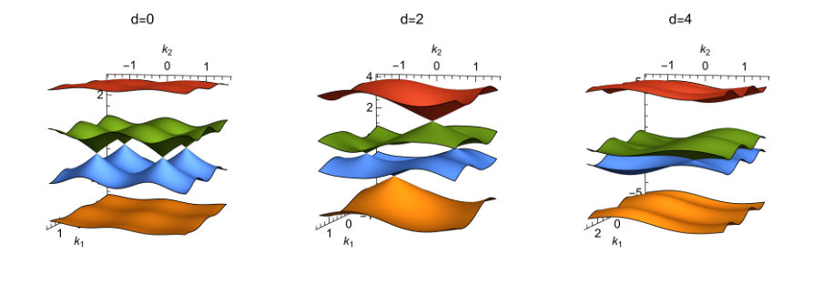 
Figure 2: plot of the energy bands of the Bloch Hamiltonian in Eq. (3.3), at the values d = 0, d = 2 and d = 4 respectively.

📷 Fig 2

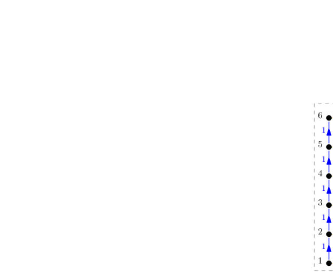 
Figure 3: graphical representation of the Hofstadter model with magnetic flux Φ = π

📷 Fig 3

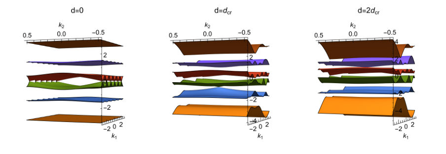 
Figure 4: plot of the energy bands of the model defined by Eqs. (3.7)-(3.8), at the values d = 0, d = dcr and d = 2dcr respectively.

📷 Fig 4

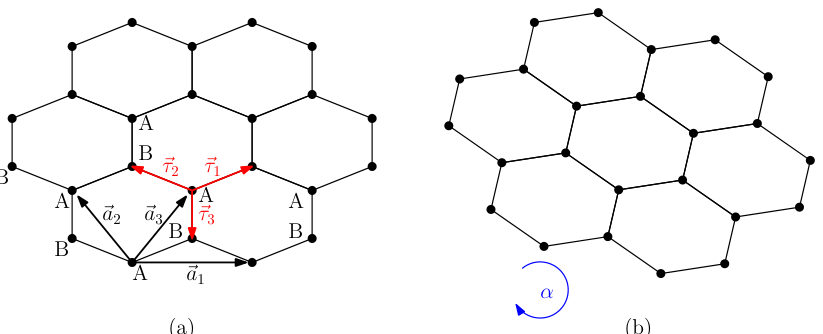 
Figure 5: (a): lattice related to the strained Haldane model in Eq. (3.13), as in [48], where the labels A and B refer to the two sub-lattice; (b): lattice obtained from the original one by a clockwise rotation of angle α.

**Summary.** This theoretical work derives the conductivity matrix for 2D semi-metallic electron systems undergoing a topological phase transition. While the general prediction is non-quantized conductivity, the authors show that imposing an emergent rotational symmetry restores quantization, particularly for the anti-symmetric part of the matrix. This sheds light on the conditions under which transport properties become robust topological invariants.

**Why it may be interesting.** The rigorous derivation of transport coefficients like the conductivity matrix at a critical point, especially linking it to topological invariants under specific symmetry assumptions, is highly relevant to understanding quantum transport in novel materials.

Detailed structure

**Main problem.** The paper aims to derive an explicit formula for the entire conductivity matrix at a topological phase transition (TPT) in 2D non-interacting semi-metallic electron systems.

**Main result.** Generally, the conductivity matrix is not quantized, but universality is restored under the assumption of emergent rotational symmetry, leading to quantized values for the anti-symmetric part of the matrix.

**Method.** The analysis uses the Euclidean many-body formalism and the Kubo formula, calculating the critical conductivity by averaging results from both sides of the transition.

**Model / system.** The system is a general class of 2D non-interacting electron systems on a lattice, modeled by a Hamiltonian that exhibits semi-metallic behavior when two Bloch bands touch at conical intersections.

**Key observables.** The full conductivity matrix $\sigma$, specifically the longitudinal ($\sigma_{ii}$) and transverse ($\sigma_{12}$) conductivities.

**Important parameters / regimes.** The mass parameter $m$ controlling the TPT, the Fermi energy, and the external strain parameter.

**Assumptions / limitations.** The analysis assumes the system is non-interacting and disorder-free, and for quantization results, it crucially assumes the existence of emergent discrete rotational invariance.

**Paper structure.** The paper develops the theory by first establishing the general formula for $\sigma(m)$ using the Euclidean formalism, then analyzing the limits at the TPT ($m=0$), and finally discussing specific physical models and the conditions required for quantization.

Abstract

For a general class of two-dimensional non-interacting semi-metallic electron systems on a lattice, we derive an explicit formula for the whole conductivity matrix, by using Euclidean many-body formalism. The semi-metallic phase takes place whenever two Bloch bands touch at the Fermi energy with conical intersections and generally occurs at the transition between distinct integer quantum Hall phases. Unlike the longitudinal conductivity (which depends solely on the shape of the cones at the Fermi level), the transverse conductivity is remarkably determined both by the conical structures of the bands and by the nature of the two nearby topological phases. Generically, in the semi-metallic state, neither the longitudinal nor the transverse conductivities are quantized in integer multiples of a universal conductivity quantum; however, universality of the conductivity matrix is restored under the assumption of emergent rotational symmetry of the linearized Hamiltonian at the Fermi points. Using our formula, we compute the conductivity matrix for several physically relevant models of quantum Hall fluids at the topological phase transition, exhibiting cases where the transverse conductivity is quantized in half-integer multiples of $e^2/h$ and cases where it depends continuously on an external strain parameter, thus shedding light on its universality or non-universality features.

[↑ back to top](#top)

### [Extrinsic orbital Edelstein effect from asymmetric scattering](http://arxiv.org/abs/2609.04093v1)

**Authors:** Sankar Sarkar, Koushik Ghorai, Amit Agarwal  
**Type:** theory · **Category:** other · **PDF:** <https://arxiv.org/pdf/2609.04093v1>  
**Analysis basis:** full PDF text, analyzed in chunks
**Topic relevance:** `Keldysh / 2PI / non-Gaussian methods` **2/5** · `methods for driven-dissipative` **2/5**

📷 Fig 1

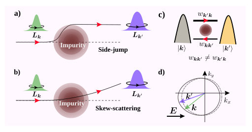 
FIG. 1. Schematic of the disorder-induced contribu- tions to the OEE. (a) An electron with initial OAM Lk undergoes impurity scattering, acquires a side-jump coordi- nate shift, and is scattered into a state with OAM Lk′. (b) Asymmetric skew scattering bends the electron trajectory, connecting states with OAM Lk and Lk′. (c) Asymmetric scattering is characterized by unequal forward and backward scattering rates, wkk′ ̸= wk′k, between states with different momenta. (d) The combination of asymmetric scattering and the electric-field-shifted Fermi surface generates the disorder- driven orbital magnetization. The dotted circle in (d) repre- sents the unperturbed Fermi surface. For simplicity,...

📷 Fig 2

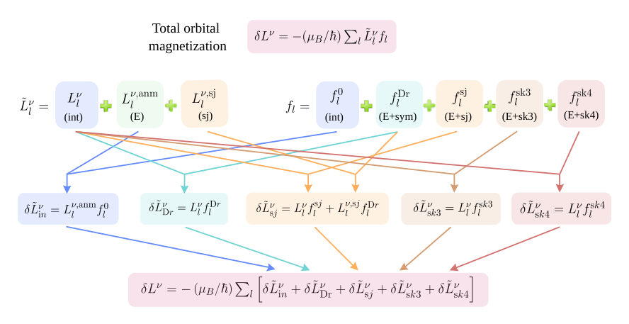 
FIG. 2. Components of OEE. The total orbital magnetization is determined by the electric field (E)- and disorder-dressed OAM and the nonequilibrium distribution function. The dressed OAM consists of the unperturbed contribution (int), the field-induced anomalous correction (anm), and the side-jump correction (sj). The distribution function is decomposed into the equilibrium contribution (int) and four nonequilibrium (∼E) components according to the underlying scattering mechanisms: the conventional Drude contribution (Dr) from symmetric scattering (sym), the side-jump contribution (sj), and the third- and fourth-order skew-scattering contributions (sk3 and sk4). Combining these...

📷 Fig 3

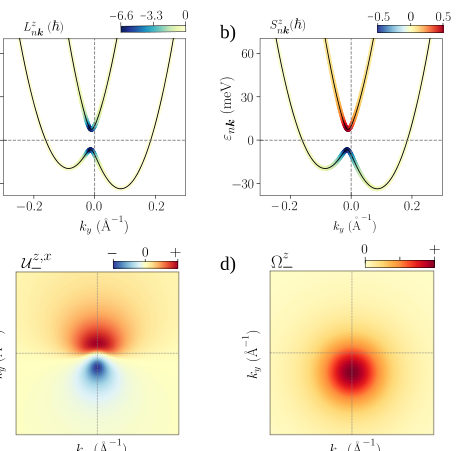 
FIG. 3. Band dispersion and geometric quantities of the Rashba 2DEG. (a) and (b) show the z-component of the orbital- and spin-angular-momentum-projected band dis- persions along the ky direction, respectively. (c) and (d) present the momentum-space distributions of the AOP and BC, respectively, for the outer band (n = −1). The calcu- lations are performed using the parameter set α = 0.6 eV˚A, M = 10 meV, θ = π/4, and an effective mass m = 1.1me, where me is the bare electron mass.

📷 Fig 4

 
FIG. 4. Variation of the response with model parame- ters. (a) and (b) show the dependence of the contributions to χz,x on the chemical potential and exchange-field orientation θ, respectively. For better visibility, the side-jump contribu- tion is multiplied by 10, while the intrinsic contribution is multiplied by 105 and 106 in panels (a) and (b), respectively. (c) and (d) show the total orbital and spin magnetizations obtained from the five different contributions as functions of chemical potential and Rashba SOC strength, respectively. For (a) and (c), the parameters are the same as in Fig. 3. For (b), α = 0.6 eV ˚A, M = 10 meV, and µ = −7.5 meV. For (d), M = 10 meV, θ = π/4, and µ =...

📷 Fig 5

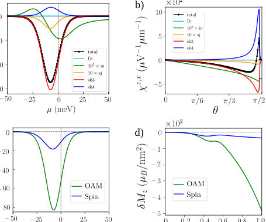 
Figure 4(b) shows the dependence of the OEE re- sponses on the orientation of the exchange field. When the exchange field is aligned along the z axis, all OEE response components vanish. This behavior is consis- tent with the symmetry analysis in Table II, since for M ∥ˆz, the system preserves both MxT and MyT sym- metries, which forbid the OEE responses. In the other limiting case, M ⊥ˆz, the system preserves the Cz 2T sym- metry, which forces the band-diagonal OAM, BC, and energy-normalized BC to vanish throughout momentum space. Consequently, the conventional and asymmetric- scattering contributions constructed from these quanti-

**Summary.** This theoretical work develops a detailed semiclassical theory to analyze the Orbital Edelstein Effect (OEE) in a Rashba 2DEG, specifically addressing the role of disorder. The key finding is that disorder-induced asymmetric scattering channels (side-jump and skew-scattering) can dominate the orbital magnetization, highlighting the crucial role of orbital degrees of freedom over spin degrees of freedom in this effect.

**Why it may be interesting.** While focused on condensed matter transport, the rigorous symmetry analysis (T-odd vs. T-even contributions) and the explicit separation of scattering mechanisms provide a powerful theoretical template for analyzing non-equilibrium phenomena in quantum systems.

Detailed structure

**Main problem.** The paper investigates the previously unclear contribution of disorder-induced asymmetric scattering mechanisms to the Orbital Edelstein Effect (OEE). It aims to provide a comprehensive theoretical decomposition of the total OEE.

**Main result.** The disorder-induced side-jump and skew-scattering mechanisms can significantly enhance the orbital magnetization, potentially exceeding the intrinsic contribution by an order of magnitude in a magnetized Rashba 2DEG.

**Method.** The authors developed a semiclassical Boltzmann theory, decomposing the total OAM polarization into five distinct channels corresponding to different scattering mechanisms (intrinsic, Drude, side-jump, and two skew-scattering orders).

**Model / system.** The minimal model used is a magnetized Rashba two-dimensional electron gas (2DEG) subjected to an external electric field and impurity disorder potential. The analysis is performed using the semiclassical Boltzmann equation.

**Key observables.** Orbital magnetization ($\delta L_
u$), Orbital Angular Momentum (OAM) polarization, and the susceptibility tensors quantifying the response in each scattering channel.

**Important parameters / regimes.** Rashba coupling strength (SOC), magnetic field strength, and the scattering rates derived from the impurity potential.

**Assumptions / limitations.** The theory operates in the weak-disorder limit and utilizes semiclassical approximations, including the small-momentum-transfer approximation for scattering calculations.

**Figures summary.** Figure 1 schematically illustrates the four disorder-induced contributions to the OEE, while Figure 2 decomposes the total orbital magnetization into five distinct components based on scattering mechanisms.

**Paper structure.** The paper builds from a general semiclassical Boltzmann framework, decomposing the collision integral into multiple scattering channels. It then analyzes the symmetry properties of these channels, culminating in quantitative results for the orbital magnetization in the Rashba 2DEG.

Abstract

The generation and manipulation of orbital angular momentum (OAM) by an external electric field constitute one of the central themes of orbitronics. In particular, the electrically induced nonequilibrium OAM polarization, known as the orbital Edelstein effect (OEE), has attracted considerable attention in recent years. While the intrinsic band-geometric mechanism and the role of conventional symmetric impurity scattering in the OEE are well understood, the contribution from disorder-induced asymmetric scattering remains unclear. Here, we develop a semiclassical theory that separates the OEE into intrinsic, Drude, side-jump, and third- and fourth-order skew-scattering channels. Unlike the Drude channel, the intrinsic, side-jump, and skew-scattering responses survive only in systems with broken time-reversal symmetry. We find that in a magnetized Rashba two-dimensional electron gas (2DEG), these disorder-induced mechanisms can substantially exceed the intrinsic contribution. Remarkably, we find that for a system with Rashba coupling of $1$ $eV Å$, the orbital magnetization is about one order of magnitude larger than the spin magnetization for the chosen parameters, highlighting the crucial role of orbital degrees of freedom in the Edelstein effect.

[↑ back to top](#top)

### [Nonlinear Reshaping of Gaussian Water Wave Packets](http://arxiv.org/abs/2609.03259v1)

**Authors:** Zibo Zheng, Takuji Waseda, C. Martijn de Sterke, Andrea Blanco-Redondo, Amin Chabchoub  
**Type:** both · **Category:** other · **PDF:** <https://arxiv.org/pdf/2609.03259v1>  
**Analysis basis:** full PDF text, analyzed in chunks
**Topic relevance:** `analog quantum simulation` **2/5** · `Keldysh / 2PI / non-Gaussian methods` **1/5** · `methods for driven-dissipative` **1/5**

📷 Fig 1

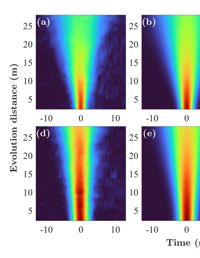 
Figure 1 Spatial evolution of Gaussian envelopes in the dispersion-dominated regime. (a)-(c) Evo- lution for the initial amplitude parameter N = 0.36. (d)-(f) Evolution for N = 0.6. Panels (a) and (d) show the experimental results, (b), (e) show numerical results using the LSE, whereas (c), (f) show numerical results from the NLSE. All results are presented in a reference frame moving with the group velocity cg.

📷 Fig 2

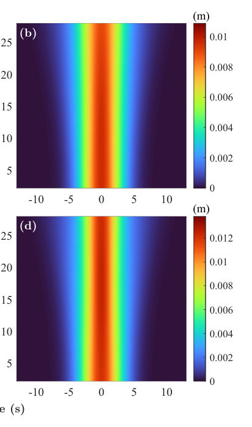 
Figure 2 Spatial evolution of Gaussian envelopes in the quasi-stationary and solitonic regime. (a), (b) Evolution for the initial amplitude parameter N = 0.8. (c), (d) Evolution for N = 1.0. (a) and (c) show the experimental results, whereas (b) and (d) refer to the respective numerical NLSE results. All results are presented in a reference frame moving with the group velocity cg.

📷 Fig 3

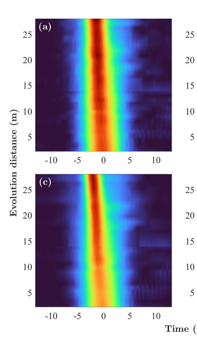 
Figure 3 Spatial evolution of Gaussian envelopes in the focusing and multi-soliton regime. (a) and (b) Evolution for the initial amplitude parameter N = 1.2. (c) and (d) Evolution for N = 1.4. Panels (a) and (c) show the experimental results, while panels (b) and (d) refer to the respective numerical NLSE results. All results are presented in a reference frame moving with the group velocity cg.

📷 Fig 4

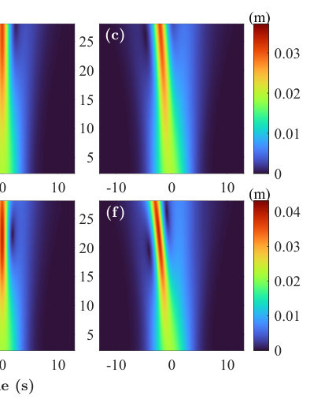 
Figure 4 Spatial evolution of Gaussian envelopes in the focusing and multi-soliton regime. (a)-(c) Evolution for the initial amplitude parameter N = 1.6. (d)-(f) Evolution for N = 1.8. Panels (a, d) show the experimental results, while panels (b), (e) and (c), (f) show the numerical results with the NLSE and the MNLSE, respectively. All results are presented in a reference frame moving with the group velocity cg.

📷 Fig 5

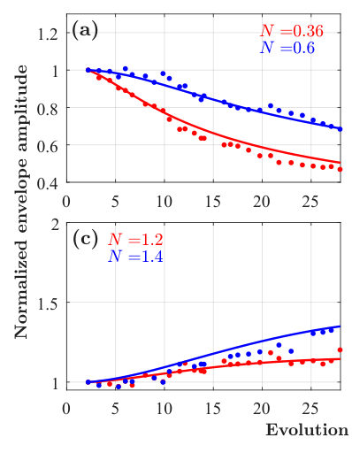 
Figure 5 Evolution of normalized envelope amplitude along the water channel. The panels show the evolution for (a) the dispersion-dominated, (b) the quasi-stationary and solitonic, and (c),(d) the focusing and multi-soliton regimes. Solid lines represent the numerical simulations with the NLSE in (a)-(c) and the MNLSE in (d), while dotted lines represent the experimental data.

**Summary.** This work systematically studies how Gaussian wave packets reshape when propagating in deep water, governed by nonlinear dispersive effects. By comparing lab experiments with numerical solutions of the NLSE and MNLSE, the authors map out regimes ranging from dispersive broadening to strong nonlinear focusing. The findings provide crucial guidance for controlling localized wave energy in various nonlinear physical systems.

**Why it may be interesting.** While focused on classical water waves, the underlying mathematical framework—the nonlinear Schrödinger equation and its higher-order corrections—is central to nonlinear wave physics relevant to quantum optics and nonlinear wave propagation in various media.

Detailed structure

**Main problem.** The paper investigates the nonlinear reshaping and evolution of Gaussian wave packets propagating in deep water.

**Main result.** The wave packet evolution depends critically on the balance between dispersion and nonlinearity, showing steady propagation when parameters match the NLSE soliton, but requiring higher-order corrections (MNLSE) in strongly focusing regimes.

**Method.** The study combines laboratory experiments measuring wave profiles with numerical simulations solving the Nonlinear Schrödinger Equation (NLSE) and its modified version (MNLSE).

**Model / system.** The physical system is deep-water surface waves, modeled by the wave envelope $A(x, t)$ governed by the NLSE or MNLSE, derived from the Euler equations.

**Key observables.** Wave packet evolution (broadening, focusing, steady propagation), envelope amplitude, and width.

**Important parameters / regimes.** The dimensionless amplitude factor $N$ (varied from 0.36 to 1.8) and the ratio of characteristic lengths $L_D/L_{NL}$.

**Assumptions / limitations.** The NLSE is an approximation valid for small steepness; the MNLSE is used when higher-order effects become significant during strong focusing.

**Figures summary.** Figures illustrate the spatial evolution of Gaussian envelopes across different regimes (dispersion-dominated, quasi-stationary, focusing), comparing experimental data with NLSE and MNLSE predictions.

**Paper structure.** The paper establishes the physical problem, derives the governing equations (NLSE/MNLSE), details the methodology (experimental setup and numerical solvers), presents results across varying nonlinearity regimes, and concludes with acknowledgements.

Abstract

The propagation of narrowband wave packets is a classical problem with broad relevance across nonlinear wave physics. Within the framework of the nonlinear Schrödinger equation, solitons are known to propagate without changing shape, whereas Gaussian envelopes may undergo substantial reshaping depending on the balance between dispersion and nonlinearity. Here, we combine laboratory experiments with numerical simulations to systematically investigate the evolution of hydrodynamic Gaussian wave packets over a wide range of amplitudes and spectral bandwidths. We show that when the envelope amplitude and width match those of the stationary NLSE soliton solution, the wave packet propagates steadily in the wave flume. More generally, by varying the amplitude of the Gaussian envelope, the wave packet may undergo either dispersive broadening or nonlinear focusing, resembling the dynamics of Satsuma-Yajima breathers. These findings may facilitate the controlled generation and manipulation of localized wave packets in a variety of nonlinear dispersive systems, including optics, plasmas, and Bose-Einstein condensates.

[↑ back to top](#top)

### [Vortex solitons in disclination quasicrystals](http://arxiv.org/abs/2609.03244v1)

**Authors:** Hua Zhong, Yaroslav V Kartashov, Yongdong Li, Fangwei Ye, Yiqi Zhang  
**Type:** theory · **Category:** other · **PDF:** <https://arxiv.org/pdf/2609.03244v1>  
**Analysis basis:** full PDF text, analyzed in chunks
**Topic relevance:** `interference shaping light` **2/5** · `analog quantum simulation` **1/5**

📷 Fig 1

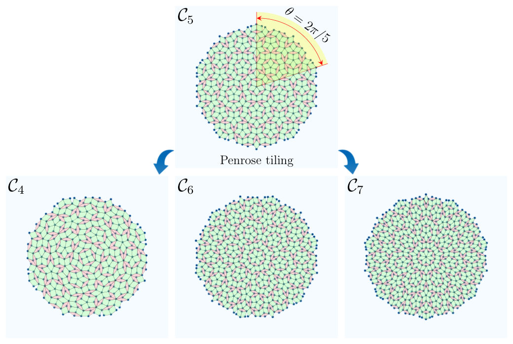 
FIG. 1. Quasicrystals obtained using Penrose tiling (top) and its disclination counterparts (bottom) with different discrete rota- tional symmetries Cν. The yellow sector with the Frank angle of θ = 2π/5 can be removed or added into structure to introduce disclination defect.

📷 Fig 2

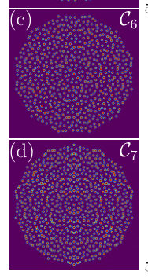 
FIG. 2. Disclination quasicrystalline lattices and their spectra. (a) Quasicrystal generated using Penrose tiling and its linear spectrum in the form of dependence of eigenvalues of all modes b on mode index n (e). (b) C4 symmetric disclination quasicrystal and its spectrum (f). (c) C6 symmetric disclination quasicrystal and its spectrum (g). (d) C7 symmetric disclination quasicrystal and its spectrum (h). Colored dots in (e-h) represent pairs of degenerate states, whose linear combination produces vortices with m ± 1.

📷 Fig 3

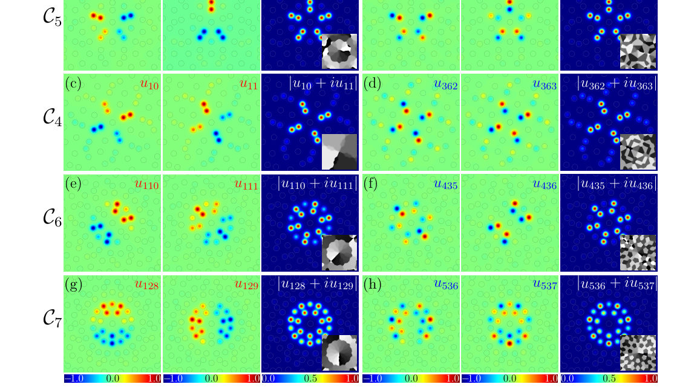 
FIG. 3. Vortex state with m = ±1 composed of degenerated modes. (a) Profiles of two degenerate modes u82 and u82, and modulus and phase (inset) distributions in in-phase vortex state u82 + iu83 constructed using these modes in C5 quasicrystal constructed using Penrose tiling. (b) Degenerate modes u383 and u384 and out-of-phase vortex supported by C5 quasicrystal. Other panels show profiles of degenerate modes and in-phase and out-of-phase vortices constructed on them in C4 (c),(d), C6 (e),(f), and C7 (g),(h) disclination quasicrystals. For convenience of presentation and comparison of different modes, the peak amplitude of each linear mode in this figure is normalized to 1. The faint...

📷 Fig 4

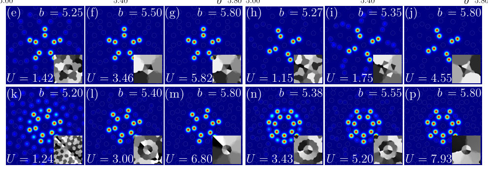 
FIG. 4. Vortex soliton families with m = ±1. (a-d) U(b) dependencies for out-of-phase vortex soliton families with topological charge |m| = 1 in quasicrystals with different discrete rotational symmetries. Gray areas correspond to mini-bands from linear spectra in Fig. 2. (e-p) Field modulus and corresponding phase (insets) distributions of the vortex solitons corresponding to the dots with letters in U(b) dependencies.

📷 Fig 5

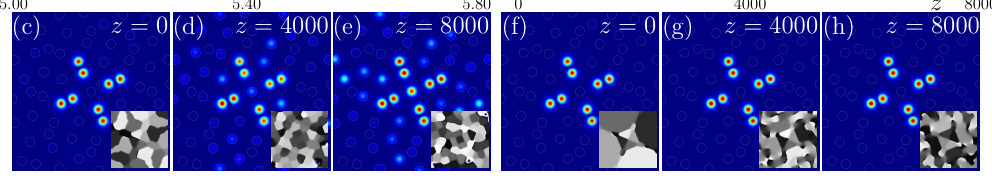 
FIG. 5. Linear stability analysis of vortex solitons in the C4 quasicrystal. (a) Perturbation growth rate βre versus propagation constant b for out-of-phase vortex solitons in C4 quasicrystal. (b) Peak amplitude A = max|ψ| of representative stable (blue curve) and unstable (red curve) perturbed vortex solitons versus propagation distance. (c-h) Field modulus phase distributions of solitons at different propagation distances corresponding to the dots in panel (b).

**Summary.** This paper explores vortex solitons in quasicrystals by introducing controlled topological defects called disclinations. By modifying the underlying symmetry of the quasicrystal structure, the authors demonstrate the creation of new, stable vortex soliton families. This expands the understanding of wave localization in complex, aperiodically structured photonic media.

**Why it may be interesting.** This work bridges nonlinear optics, topological physics, and quasiperiodicity, showing how engineered defects can fundamentally alter the light-matter interaction and support robust, topologically protected wave states.

Detailed structure

**Main problem.** The study investigates how introducing global topological defects, specifically disclinations, into quasicrystals affects the stable propagation of vortex-carrying light beams and vortex solitons.

**Main result.** The introduction of disclinations enriches the linear spectrum, enabling the existence of new, stable, thresholdless vortex solitons whose properties reflect the quasicrystal's discrete rotational symmetry.

**Method.** The analysis uses the nonlinear Schrödinger equation (NLSE) governing the light field, analyzing the linear spectrum and solving the nonlinear equation numerically.

**Model / system.** The system models light propagation in photonic quasicrystals, constructed by deforming Penrose tilings with controlled topological defects (disclinations) to achieve various discrete rotational symmetries ($	ext{C}
u$).

**Key observables.** Stable vortex soliton existence, soliton intensity/phase distributions, and the dependence of soliton stability intervals on the discrete rotational symmetry $	ext{C}
u$.

**Important parameters / regimes.** Discrete rotational symmetry order ($
u$), the strength of the nonlinearity, and the topological defect structure.

**Assumptions / limitations.** The analysis assumes the quasicrystals are large enough to exhibit the desired symmetries, and the study focuses on the evolution of localized vortex inputs in a pre-fabricated potential.

**Figures summary.** Figures illustrate the construction of quasicrystals via disclinations for different symmetries ($	ext{C}_5, 	ext{C}_4, 	ext{C}_6, 	ext{C}_7$), show the linear spectra, and display the profiles and phase distributions of the resulting vortex states.

**Paper structure.** The paper establishes the physical model using the NLSE, details the method of generating defect-laden quasicrystals, analyzes the linear spectrum, and finally presents the findings regarding the bifurcation and stability of vortex solitons.

Abstract

Being structures characterized by discrete rotational symmetry $\mathcal{C}_ν$ of order $ν$, photonic quasicrystals are capable to support stable propagation of linear vortex-carrying light beams and vortex solitons. However, the impact of discrete rotational symmetry $ν$ of quasicrystals on the properties of vortex light states was not investigated so far, as only the systems constructed using the simplest Penrose tiling or corresponding optically induced Penrose lattices were considered in this context. Here we propose a broad class of quasicrystals with global topological defects -- disclinations -- introduced into their structure that allows to produce new quasicrystalline structures with any desired order of discrete rotational symmetry from basic Penrose structure. Such global topological deformation substantially enriches linear spectrum of quasicrystals, allowing them to support new types of linear vortex states and bifurcating from them families of stable thresholdless vortex solitons with unusual intensity and phase distributions. We found two different classes of stable vortex solitons consisting of in-phase or out-of-phase pairs of closely located bright spots, with total intensity distribution reflecting particular discrete rotational symmetry of the quasicrystal with disclination. Remarkably, even low-charge vortex solitons can be stable in quasicrystals with disclinations, while stability intervals for them broaden with decrease of the discrete rotational symmetry $\mathcal{C}_ν$ of quasicrystal. Our results expand the theory of localization in quasicrystals to structures with global topological deformation, highlighting new prospects for robust transmission of power or information arising in these systems.

[↑ back to top](#top)

### [Flux noise without flux tunability in superconducting qubits](http://arxiv.org/abs/2609.03059v1)

**Authors:** Daniel Kruti, Roman-Pascal Riwar  
**Type:** theory · **Category:** quantum information and computing · **PDF:** <https://arxiv.org/pdf/2609.03059v1>  
**Analysis basis:** full PDF text, analyzed in chunks
**Topic relevance:** `QC/QI experiment` **1/5** · `correlated / nonlocal dissipation` **1/5**

📷 Fig 1

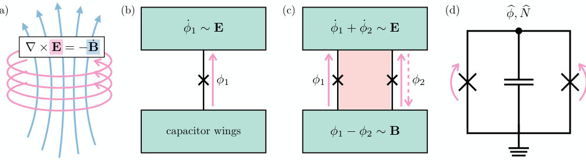 
Figure 1. Main concept developed in this work, based on Faraday’s law of induction. A time-dependent or fluctuating magnetic field B induces a corresponding electromotive force (EMF) via the electric field E (a). Flux noise couples to single-junction (b) as well as double-junction (c) transmon qubits (with capacitor wings) and thus affects qubit performance (in particular the quality factor) independent of flux-tunability. Assigning to each junction ν a Peierls-like phase drop ϕν, we can distinguish between the regular flux mode and an EMF mode. The former enters via the phase difference ϕ1 −ϕ2 which is proportional to the applied magnetic flux piercing the loop area (red area in c). The...

📷 Fig 2

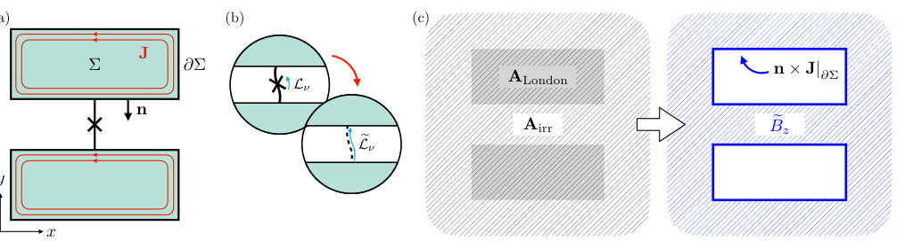 
Figure 2. Aspects relevant for the formulation of the irrotational gauge for the vector potential A, which allows to compute the phase drops ϕν in Fig. 1. Top view (plane in x and y) of a transmon device (a). The large capacitor wings form a thin film bulk Σ, with boundary ∂Σ and the unit vector normal to the boundary n. Due to Meissner (Pearl) screening in 2D, a superconducting sheet current J flows within the thin film. The filamentary bridge forming the Josephson junction can be neglected in the calculation of all relevant fields due to the large capacitor wings (b), see also Ref. [27]. The computation of the irrotational vector potential Airr (in free space), as well as the 2D Meissner...

📷 Fig 3

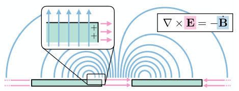 
Figure 3. Justification for neglecting the top and bottom surfaces of the thin film for the Faraday problem. For regular electrostatics in voltage-biased co-planar capacitors, top and bottom surface charges are dominant (a). In contrast, for a magnetic field with dominant z-component (perpendicular to the chip plane), the corresponding induced electric field is in- plane, leading to dominant surface charges at the 1D rim (b).

📷 Fig 4

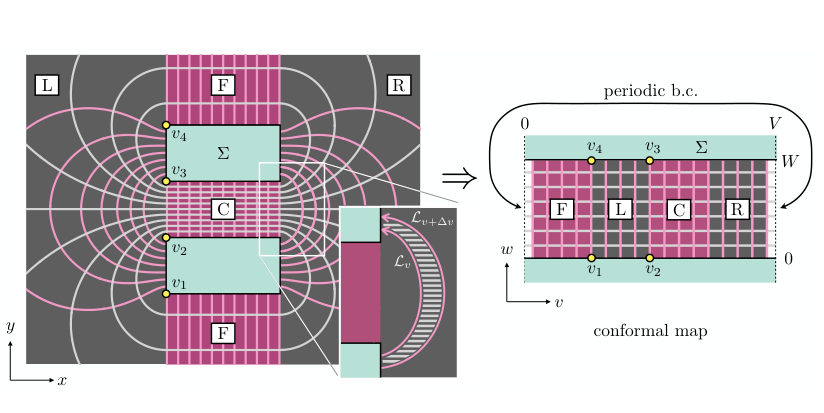 
Figure 4. Exploiting conformal maps to compute the vector potential in the irrotational gauge Airr and ultimately the phases ϕν. We illustrate the principle by means of the device geometry in Fig. 1, representing a transmon with rectangular capacitor wings. The real space (left panel) excluding the superconducting volumes Σ is mapped onto a rectangle with periodic boundaries (cylinder manifold, right panel). For rectangular capacitor wings, the regions C, L, R, and F are mapped piece-wise, and stitched together via continuity constraints. A simplified computation for ϕν is possible for the case when bridge paths are straight lines in the conformal space, i.e., with coordinate v constant and...

📷 Fig 5

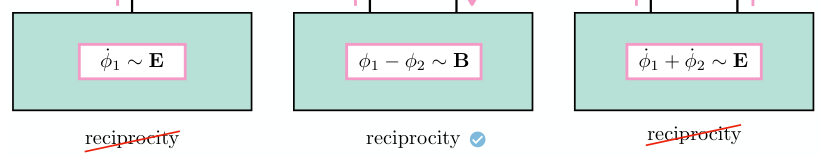 
Figure 5. Central issue with the reciprocity principle to account for the Faraday effect. Reciprocity relies on computing the magnetic field induced by a supercurrent circulating within the device, which is then seen by a given magnetic dipole. For a single junction device (a) no such loop current exists. One can define a dipole current of magnitude I1 going through junction 1, and compute its corresponding magnetic field, but this current is not source-free, making it impossible to generalise the reciprocity approach in this simple manner to capture the EMF mode. For a two-junction device we can define a loop current of magnitude Iloop (b) and two dipole currents along individual junctions...

**Summary.** This paper provides a comprehensive theoretical framework to understand how magnetic flux noise couples to superconducting qubits by incorporating the full effects of Faraday's law. It demonstrates that this coupling imposes a fundamental, universal limit on the qubit quality factor, even in devices without explicit flux loops. The findings also establish geometric constraints, such as a 'safety distance,' that must be respected when scaling up quantum processors.

**Why it may be interesting.** This work provides a rigorous, fundamental theoretical constraint on qubit performance based on electromagnetic coupling principles, which is crucial for designing next-generation quantum hardware.

Detailed structure

**Main problem.** Flux noise is a leading dephasing mechanism in superconducting qubits, but the microscopic understanding of its coupling to the device geometry is incomplete.

**Main result.** The work derives a general coupling framework showing that flux noise imposes a fundamental upper limit on the qubit quality factor, even for nominally non-flux-tunable qubits.

**Method.** The authors use a quantum geometric description of the Faraday effect to derive the coupling between generic magnetic sources and superconducting thin films, treating electric and magnetic fields together.

**Model / system.** The system involves superconducting qubits (like transmons) modeled as thin film structures interacting with time-varying magnetic dipoles or flux lines. The analysis distinguishes between the standard flux mode and a novel electromotive field (EMF) mode.

**Key observables.** Qubit quality factor (Q), dephasing/relaxation rates ($\Gamma_\phi, \Gamma_1$), and the flux power noise spectrum ($S_\Phi(\omega)$).

**Important parameters / regimes.** The predicted fundamental limit for Q is estimated between $10^8$ and $10^{10}$; the 'minimal safety distance' for flux lines is also derived.

**Assumptions / limitations.** The analysis assumes surface spins are the microscopic origin of $1/f$ flux noise and extends the formalism to include finite size effects from capacitor wings.

**Figures summary.** Figures illustrate the coupling mechanism via Faraday's law, showing how induced EMF affects different qubit geometries (single vs. double junction) and distinguishing between flux and EMF modes.

**Paper structure.** The paper builds from the general coupling derivation based on the Faraday effect to specific applications in qubit loss mechanisms, culminating in quantitative predictions for the Q-factor limit and spatial constraints for flux lines.

Abstract

Flux noise is unanimously recognised as a leading dephasing mechanism for flux-tunable superconducting qubits. However, our microscopic understanding remains incomplete, and basic effects like Faraday's law of induction have only very recently come into focus. Based on a quantum geometric description of the Faraday effect, we provide an in-depth derivation of the coupling of generic magnetic sources to thin film superconducting structures, under appropriate consideration of the device geometry. We apply the resulting framework to time-varying magnetic dipoles, describing surface or substrate spins, as well as current-carrying flux lines. We show that flux noise not only affects dephasing, but also provides a fundamental limit for the qubit quality factor - notably, even when the qubit contains no loops and is thus nominally not flux-tunable. Assuming surface spins as the origin for universal flux noise, we expect that this quality factor limit might be reached in the near term. For flux lines, we formulate a minimal safety distance to conserve the qubit performance, potentially constraining the scale-up of quantum hardware. This distance is boosted in the presence of large capacitor wings typical for transmons, due to a lensing of the electromotive field which is largely independent of Meissner screening.

[↑ back to top](#top)

### [Spectral Function Method and Janus Quantum Numbers in Quasiperiodic Systems](http://arxiv.org/abs/2609.03555v1)

**Authors:** Tian-Le Wu, Shi-Ping Ding, Miao Liang, Jing-Tao Lü, Jin-Hua Gao  
**Type:** theory · **Category:** disordered systems and neural networks · **PDF:** <https://arxiv.org/pdf/2609.03555v1>  
**Analysis basis:** full PDF text, analyzed in chunks
**Topic relevance:** `Frenkel-Kontorova` **1/5** · `analog quantum simulation` **1/5**

📷 Fig 1

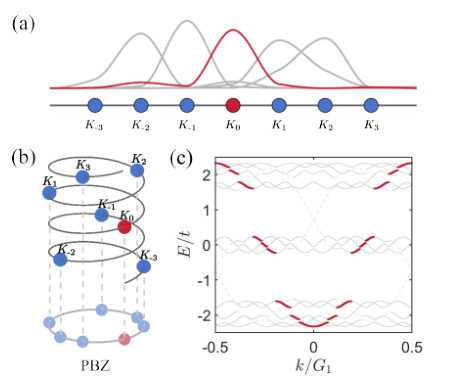 
FIG. 1. (a) Momentum-space coupling chain of the AAH model. Curves show the wavefunction distribution over mo- mentum sites Km. (b) Spiral mapping from chain sites Km to the PBZ. (c) IEB dispersion (red) and replica bands (gray) at V = 1.2t, calculated by the projection method. Throughout this paper, we set α = ( √

📷 Fig 2

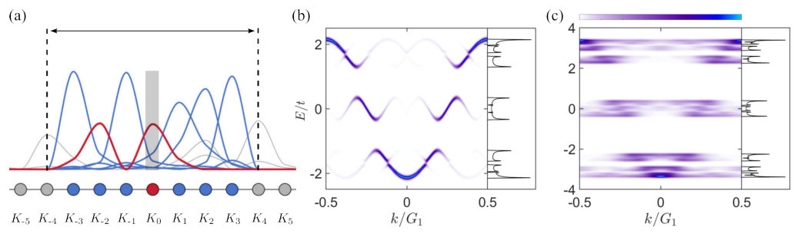 
FIG. 2. (a) Schematic of the spectral function method: only eigenstates localized near |K0⟩(red, blue) contribute; a double- peak distribution (red) invalidates the projection method. (b) A(k, ω) and DOS at V = 1t . (c) A(k, ω) and DOS at V = 3t.

📷 Fig 3

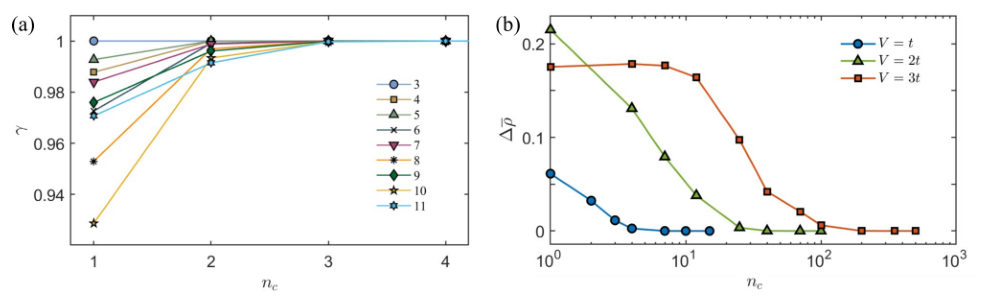 
FIG. 3. (a) Moment-locking ratio γ = µp,c(k)/µp(k) vs. nc for p = 3–11, V = 1t, k = 0.1G1. Lower-order moments lock to unity at small nc; higher orders require progressively larger truncations[18]. (b) Density of states convergence error ∆ρ[18] vs. nc (log scale) for V = t (extended), V = 2t (critical), and V = 3t (localized).

📷 Fig 4

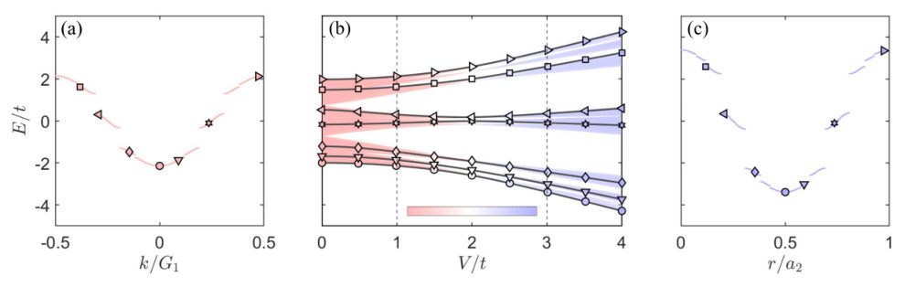 
FIG. 4. Janus quantum numbers in the AAH model. (a) IEB dispersion at V = 1t: seven eigenstates (E vs. k) marked by distinct symbols. (b) IPR diagram of AAH model[18]. Seven non-crossing curves track the same eigenstates continuously from V &lt; 2t to V &gt; 2t. (c) LSEB at V = 3t[18]: the same seven eigenstates (E vs. r) now labeled by real-space coordinate r, revealing the dual face of a Janus quantum number.

📷 Fig 5

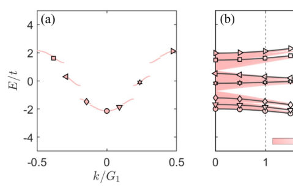 
Fig. 4 illustrates this explicitly for the AAH model. Fig. 4(a) shows the IEB at V = 1t with several eigen- states marked by their momenta. Fig. 4(b) tracks these same eigenstates in the E-V diagram, color-coded by the inverse participation ratio (IPR); the non-crossing curves are clearly visible, and the IPR shows the continuous crossover from extended to localized behavior at V = 2t. Fig. 4(c) plots the LSEB at V = 3t, where the same eigen- states are now naturally labeled by real-space indices—a direct visualization of the Janus property.

**Summary.** This paper introduces a comprehensive spectral theory for quasiperiodic systems, overcoming the limitations of conventional band theory. It proposes an efficient spectral function method and defines 'Janus quantum numbers' to label eigenstates consistently across localization transitions. This framework allows for the calculation and understanding of energy spectra in complex, non-periodic quantum materials.

**Why it may be interesting.** The development of a rigorous 'band theory' for quasiperiodic systems provides powerful tools for analyzing complex, non-periodic quantum materials, which is highly relevant for understanding engineered quantum matter.

Detailed structure

**Main problem.** The absence of translational symmetry in quasiperiodic systems invalidates conventional band theory, posing a central challenge in understanding their energy spectra.

**Main result.** The authors establish a unified spectral theory using a spectral function method and Janus quantum numbers, allowing for state definition and computation analogous to periodic systems.

**Method.** They develop an efficient spectral function method that calculates the spectral function A(k,ω) using a small truncated Hamiltonian matrix, bypassing full diagonalization.

**Model / system.** The study focuses on quasiperiodic systems, exemplified by the Aubry-André-Harper (AAH) model, which lacks translational symmetry.

**Key observables.** Spectral Function A(k,ω), Incommensurate Energy Bands (IEB) dispersion E(k), and Janus quantum numbers.

**Important parameters / regimes.** The ratio of potential strength to hopping amplitude (e.g., V/t) determines the localization regime, and the system is analyzed in the thermodynamic limit.

**Assumptions / limitations.** The spectral function method converges via a successive locking of energy moments, allowing for exact thermodynamic-limit results without finite-size scaling.

**Figures summary.** Figures illustrate the spectral function calculation, the convergence of energy moments via moment-locking ratios, and the relationship between k-space and real-space descriptions.

**Paper structure.** The paper builds from identifying the failure of conventional band theory to proposing the IEB concept, introducing the spectral function method to calculate A(k,ω), and finally unifying the framework with Janus quantum numbers to create a complete spectral theory.

Abstract

The absence of translational symmetry in quasiperiodic systems invalidates conventional band theory, posing the central challenge in the field. Building upon the incommensurate energy band (IEB) concept, we establish a unified spectral theory for quasiperiodic systems by introducing two key advances. First, we develop an efficient spectral function method that calculates $A(k,ω)$ using a small truncated Hamiltonian matrix, bypassing full diagonalization. It converges via a distinctive successive locking of energy moments, yielding exact thermodynamic-limit results without finite-size scaling. Second, we introduce that quasiperiodic eigenstates possess Janus quantum numbers: a single eigenstate, continuously tracked across localization transitions, carries dual labels in momentum and real space, which naturally reduce to the familiar Bloch momentum and band index in the commensurate limit. Together with IEB, these advances constitute a ``band theory'' for quasiperiodic systems, enabling us to define, compute, and label states with the same facility as in periodic ones.

[↑ back to top](#top)

### [A simple derivation of the zero-temperature BCS functional from the reduced BCS Hamiltonian](http://arxiv.org/abs/2609.04060v1)

**Authors:** Christian Hainzl, Riccardo Panza  
**Type:** theory · **Category:** quantum gases · **PDF:** <https://arxiv.org/pdf/2609.04060v1>  
**Analysis basis:** full PDF text, analyzed in chunks
**Topic relevance:** `Keldysh / 2PI / non-Gaussian methods` **1/5**

📷 Fig 1

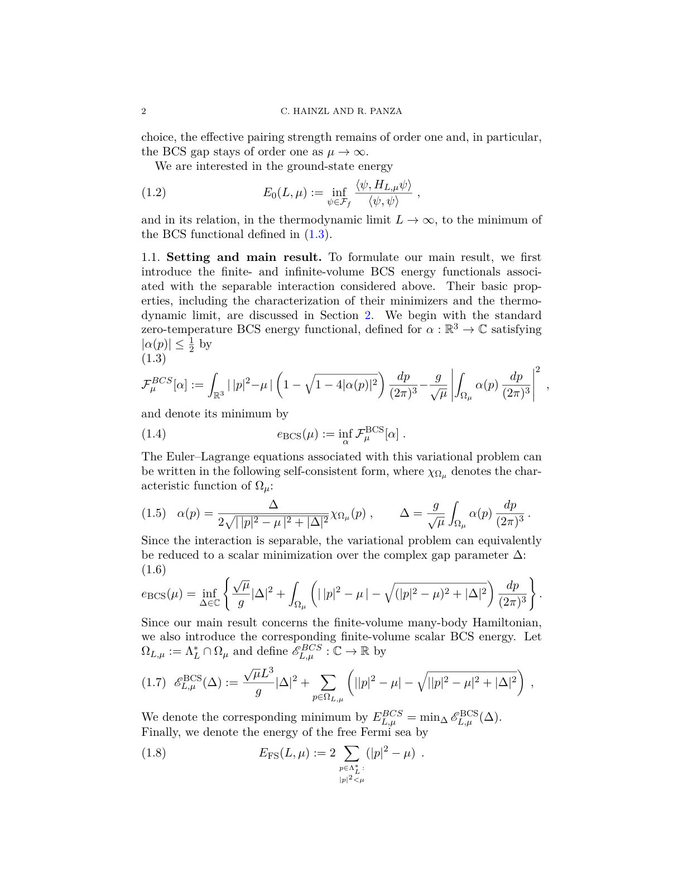 
Low-resolution page preview, page 2

📷 Fig 2

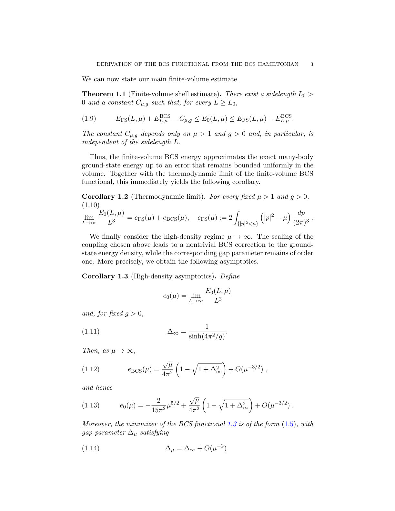 
Low-resolution page preview, page 3

📷 Fig 3

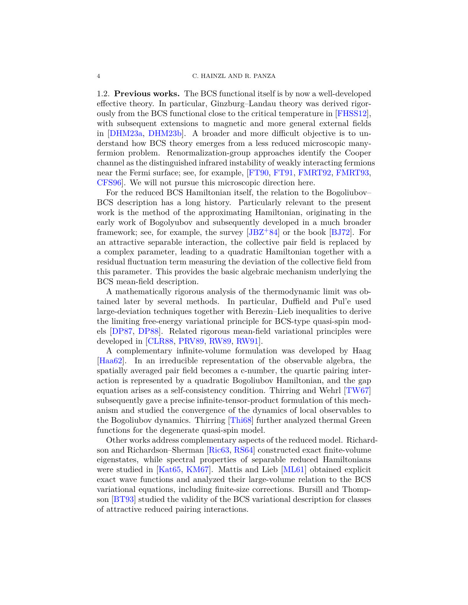 
Low-resolution page preview, page 4

📷 Fig 4

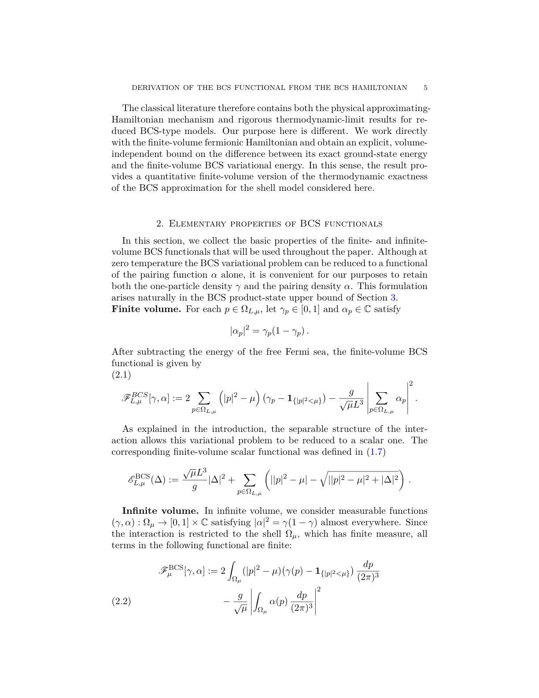 
Low-resolution page preview, page 5

📷 Fig 5

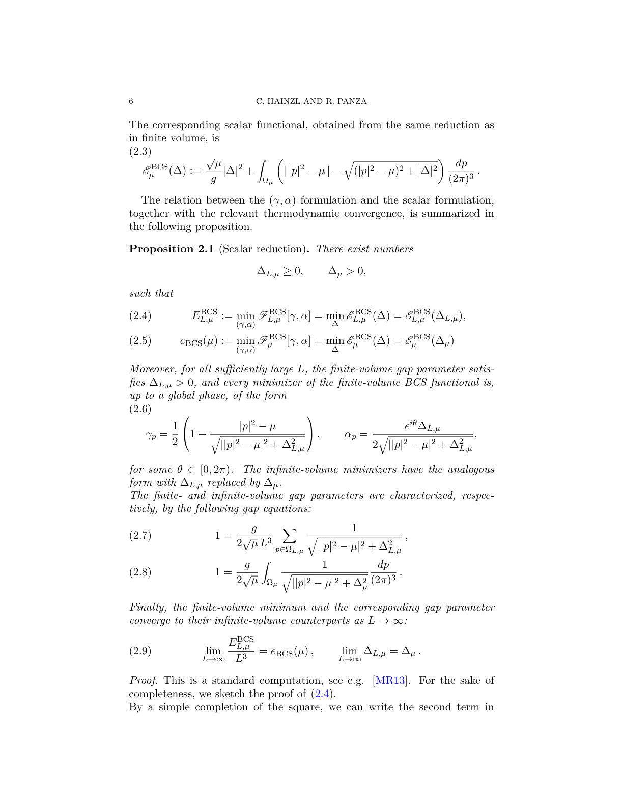 
Low-resolution page preview, page 6

**Summary.** This work provides a rigorous mathematical derivation showing that the BCS variational principle is exact for the ground-state energy density of a fermionic system with pairing interactions in the thermodynamic limit. By comparing the exact ground state energy to the BCS functional minimum, the authors establish a quantitative link between the Hamiltonian and its variational approximation. This result solidifies the theoretical foundation of BCS theory for condensed matter and quantum gas applications.

**Why it may be interesting.** The rigorous mathematical proof of the BCS variational principle's exactness in the thermodynamic limit provides a powerful theoretical tool for analyzing pairing phenomena in fermionic systems, which is central to quantum gases research.

Detailed structure

**Main problem.** The paper aims to rigorously derive the zero-temperature BCS functional from the reduced BCS Hamiltonian and prove that the BCS variational principle yields the exact ground-state energy density in the thermodynamic limit.

**Main result.** The authors prove that the finite-volume ground-state energy approaches the minimum of the BCS functional in the thermodynamic limit, establishing the exactness of the BCS approximation for the energy density.

**Method.** The derivation uses advanced techniques involving spectral localization, functional calculus, and bounding the difference between the exact ground state energy and the BCS variational energy using commutator identities.

**Model / system.** The system is modeled by spin-1/2 fermions in a periodic box with an attractive pairing interaction, governed by the reduced BCS Hamiltonian. The analysis compares the exact ground state energy $E_0$ to the BCS variational energy $E_{	ext{BCS}}$.

**Key observables.** Ground-state energy density ($e_0(\mu)$), BCS functional minimum ($e_{	ext{BCS}}(\mu)$), and the free Fermi sea energy density ($e_{	ext{FS}}(\mu)$).

**Important parameters / regimes.** Chemical potential ($\mu$), system volume ($L^3$), and the pairing coupling constant ($g$).

**Assumptions / limitations.** The pairing interaction is assumed to be separable and supported in an energy shell $\Omega_\mu$. The proof relies on controlling error terms arising from spectral localization techniques.

**Paper structure.** The paper develops by first defining the finite-volume and infinite-volume BCS functionals, establishing an upper bound using a product state ansatz, and then deriving a rigorous lower bound by controlling fluctuation terms via spectral localization techniques.

Abstract

We consider a grand-canonical reduced BCS Hamiltonian on the full fermionic Fock space with an attractive pairing interaction supported in an energy shell around the Fermi surface. For fixed chemical potential, we prove that the exact finite-volume ground-state energy differs from the minimum of the corresponding finite-volume BCS functional by a volume-independent error. As a consequence, the BCS variational principle is exact for the ground-state energy density in the thermodynamic limit.

[↑ back to top](#top)

### [Doping dependence of local moments in infinite layer nickelates](http://arxiv.org/abs/2609.03388v1)

**Authors:** Martin Gonzalez, Andreas Suter, Michal Kiaba, Thomas Prokscha, Zaher Salman, Marc Gabay, Harold Y. Hwang, Jennifer Fowlie  
**Type:** experiment · **Category:** strongly correlated electrons · **PDF:** <https://arxiv.org/pdf/2609.03388v1>  
**Analysis basis:** full PDF text, analyzed in chunks
**Topic relevance:** `analog quantum simulation` **1/5**

📷 Fig 1

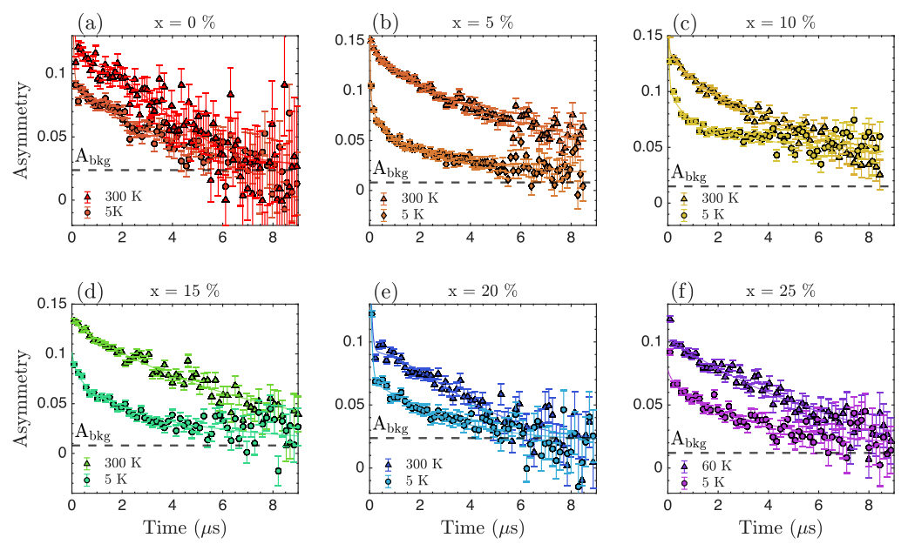 
FIG. 1: Zero-field (ZF) asymmetry spectra for the (La,Sr)NiO2 nickelate doping series including (a) x = 0%, (b) x = 5%, (c) x = 10%, (d) x = 15%, (e) x = 20%, and (f) x = 25%. Each doping level shows the ZF spectra at T = 300 K and T = 5 K. Note that the x = 25% sample is the only exception, where the T = 60 K spectra is shown in lieu of the room temperature measurement where the data seems to be impacted by muon diffusion. The dashed line indicates the background asymmetry values derived from the nickel sample plate. The data are fitted with a stretched exponential function.

📷 Fig 2

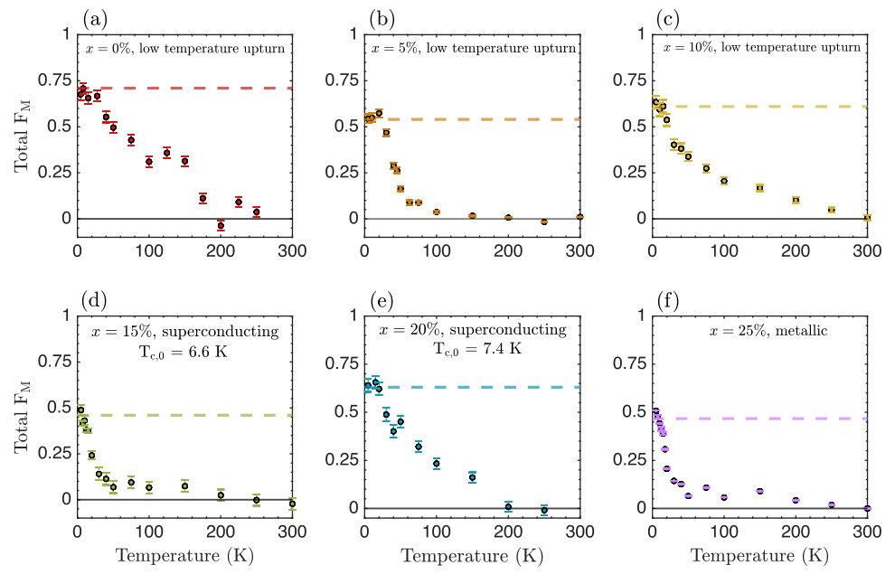 
FIG. 2: Magnetic volume fraction (FM) as a function of temperature for the (La,Sr)NiO2 series including Sr substitutions of (a) x = 0%, (b) x = 5%, (c) x = 10%, (d) x = 15%, (e) x = 20%, and (f) x = 25%. The dashed lines indicate the expected FM where the nickelate layer would become fully magnetic. Note that all samples approach a fully magnetic state at low temperatures, irrespective of the superconducting critical temperature. Data in a) and e) are reproduced with permission from ref [23].

📷 Fig 3

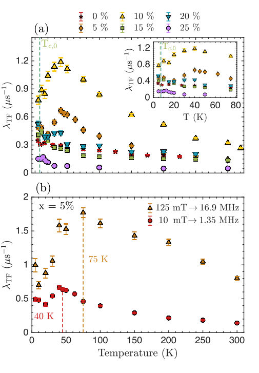 
FIG. 3: (a) Temperature-dependent depolarization rate for the (La,Sr)NiO2 series, measured using a weak transverse field (wTF) of 10 mT. The inset is an enlarged view at low temperatures of λTF(T). (b) Temperature dependent depolarization for the x = 5% sample with measured fields corresponding to Larmor frequencies of 1.35 MHz (red) and 16.9 MHz (orange).

📷 Fig 4

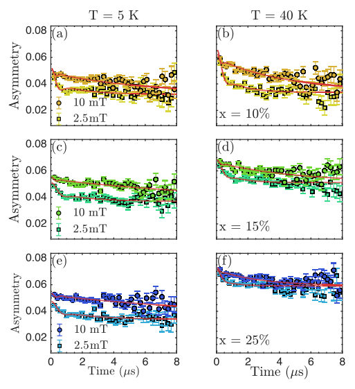 
FIG. 4: Longitudinal field spectra of (La,Sr)NiO2 samples at (a-b) x = 10%, (c-d) x = 15%, and (e-f) x = 25% with applied fields at magnitudes of 25 G and 100 G. The measurements were taken at T = 5 K (a, c, e) and T = 40 K (b, d, f). The solid red lines indicate global fits of the LF spectra.

📷 Fig 5

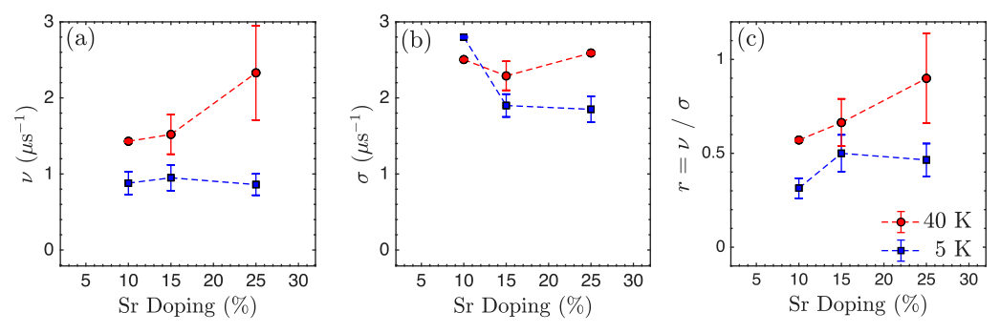 
FIG. 5: Doping-dependent parameters extracted from global fitting of the LF spectra. Fit parameters include (a) the fluctuation rate ν, (b) the internal field width σ, and (c) the ratio of these two quantities.

**Summary.** This work uses muon spin rotation ($\mu$SR) to investigate the magnetic state of infinite layer nickelates across varying levels of hole doping. The researchers found that local magnetic moments undergo spin freezing into a glassy state regardless of doping, suggesting that magnetism and superconductivity are largely independent phenomena. These findings help refine theoretical models describing correlated electron behavior in these novel superconducting materials.

**Why it may be interesting.** The observation of glassy magnetic behavior persisting across the superconducting dome, suggesting decoupling from superconductivity, provides crucial input for models of strongly correlated electron systems, particularly those involving orbital degrees of freedom.

Detailed structure

**Main problem.** To characterize the doping-dependent magnetic behavior in infinite layer nickelates and uncover the relationship between local moments and superconductivity.

**Main result.** Local moments exhibit spin freezing into a glassy state at temperatures around tens of Kelvin, suggesting that magnetism and superconductivity are largely decoupled phenomena.

**Method.** Muon Spin Rotation (muSR) spectroscopy was used across a doping series to probe the magnetic ground state and temperature-dependent magnetic dynamics.

**Model / system.** The study focuses on infinite layer nickelates, specifically the (La,Sr)NiO2 doping series, which are contrasted with the parent compounds of superconducting cuprates.

**Key observables.** Zero-field (ZF) asymmetry spectra, the magnetic volume fraction (wTF), and the temperature-dependent depolarization rate ($\lambda_{TF}(T)$).

**Important parameters / regimes.** Doping level (Sr substitution $x=0\%$ to $25\%$), temperature (down to a few Kelvin), and the spin freezing temperature (tens of Kelvin).

**Assumptions / limitations.** The analysis assumes that the magnetic signal can be modeled by a stretched exponential function, and that the local moments persist independently of superconductivity.

**Figures summary.** Figures show ZF asymmetry spectra across doping levels and temperatures, and plots detail the temperature dependence of the magnetic volume fraction and the depolarization rate.

**Paper structure.** The paper systematically measures magnetic properties (muSR) across the entire doping range, correlating the observed glassy magnetic behavior with the superconducting dome and the undoped parent compound.

Abstract

The infinite layer nickelates are notable for their lack of long-range antiferromagnetic ordering, in contrast to the parent compounds of the superconducting cuprates. Instead, the nickelates show evidence of short-range glassy behavior in both the undoped and optimally-doped regimes, implying that local electronic moments exist independent of superconductivity. However, the systematic doping-dependent magnetic behavior is not yet fully resolved, and characterizing it could uncover the relationship between local moments and the superconducting dome. In this work, we use muon spin rotation ($μ$SR) on a (La,Sr)NiO$_2$ doping series from the undoped parent compound, through the superconducting dome, to the over-doped normal state (Sr substitution 0% $\leq$ x $\leq$ 25%) to probe the magnetic ground state and the temperature-dependent static and dynamic behavior. We find that local moments experience spin freezing into a glassy state at temperatures on the order of a few tens of kelvin regardless of the doping level. We also observe a subtle destabilization of the glassy state with increased hole doping. These observations suggest that magnetism and superconductivity are largely decoupled phenomena with indirect interactions described in a multi-orbital framework.

[↑ back to top](#top)

### [Tuning Andreev reflection and conductance in proximitized nanowires through the spin-orbit field direction](http://arxiv.org/abs/2609.03020v1)

**Authors:** Leonardo Musca, Fabrizio Dolcini  
**Type:** theory · **Category:** other · **PDF:** <https://arxiv.org/pdf/2609.03020v1>  
**Analysis basis:** full PDF text, analyzed in chunks
**Topic relevance:** `Keldysh / 2PI / non-Gaussian methods` **1/5**

📷 Fig 1

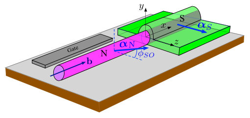 
FIG. 1: Scheme of a hybrid N-S junction based on a semiconductor NW with SO coupling. The S-side is prox- imitized by a superconducting film (green area). The SO field vectors αN and αS lie in the y-z plane and point in two different directions, differing by a misalignment angle ϕSO. A magnetic field b directed along the NW axis is externally applied.

📷 Fig 2

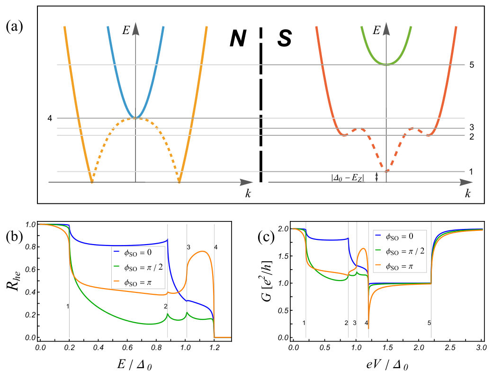 
FIG. 2: The NW hybrid N-S junction for the parameters ESO,N = ESO,S = 0.5∆0, µN = µS = 0 and EZ = 1.2∆0. The S-side is in the topological phase and the N-side is in the Zeeman regime. (a) Bulk excitation spectra of the N and S sides, where solid and dashed curves describe electron(like) and hole(like) excitations, respectively. The thin horizontal lines labeled from 1 to 5 identify the energy extrema of the two bands, corresponding to (E1, E2, E3, E4, E5) = (0.20, 0.88, 1.01, 1.20, 2.20)∆0. (b) The AR coefficient Rhe(E) as a function of the energy E, in units of the induced superconducting gap parameter ∆0, for three different values of the SO misalignment angle, ϕSO = 0, π/2, π. The thin...

📷 Fig 3

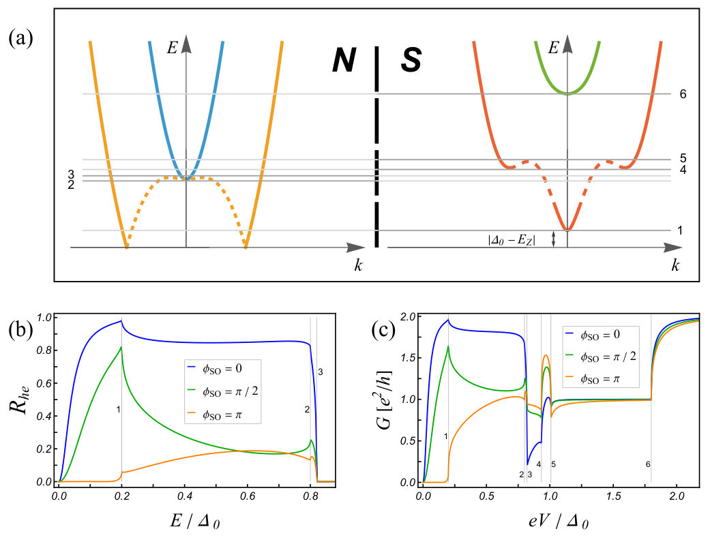 
FIG. 3: The NW hybrid N-S junction for the parameters ESO,N = ESO,S = 0.5∆0, µN = µS = 0 and EZ = 0.8∆0. The S-side is in the trivial phase, while the N-side is in the Rashba dominated regime. (a) Bulk excitation spectra of the N and S sides (notation like in Fig.2). Here, the horizontal lines correspond to the energy band extrema (E1, E2, E3, E4, E5, E6) = (0.20, 0.80, 0.82, 0.93, 1.01, 1.80)∆0. (b) The AR coefficient Rhe(E) for three different values of the SO misalignment angle, ϕSO = 0, π/2, π. At zero energy, Rhe(E = 0) = 0 since the S-side is in the trivial regime. At finite energy, Rhe(E) exhibits a strong dependence on ϕSO for 0 &lt; E &lt; E1. For E = 0.1∆0, one can tune its value from...

📷 Fig 4

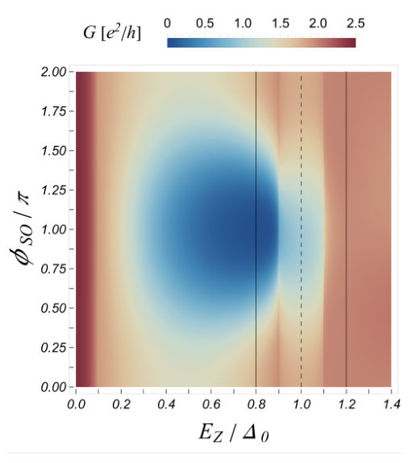 
FIG. 4: Density plot of the nonlinear conductance G(V ), in units of e2/h, at fixed voltage eV = 0.1∆0, shown as a function of the Zeeman energy EZ (in terms of the superconducting gap parameter ∆0) and of the ϕSO mis- alignment angle. The other energy parameters are set to ESO,N = ESO,S = 0.5∆0 and µN = µS = 0. The ver- tical dashed black line marks the critical Zeeman energy value Ec Z = ∆0 separating the trivial from the topologi- cal phase for the S-side, while the two vertical solid black lines at EZ = (0.8, 1.2) ∆0 identify the two cuts ana- lyzed in Figs. 3 and 2, respectively. The figure showcases the high tunability of the conductance in the topologi- cal trivial regime,...

**Summary.** This work theoretically analyzes Andreev reflection and conductance in semiconductor nanowires coupled to a superconductor. By controlling the relative direction of the spin-orbit field across the junction, the authors demonstrate a strong, electrically tunable control mechanism over electron transport. This suggests a pathway for realizing highly controllable superconducting quantum devices.

**Why it may be interesting.** The ability to use spin-orbit coupling direction as an electrical knob to control superconducting proximity effects and transport is highly relevant for building tunable quantum devices.

Detailed structure

**Main problem.** The paper investigates how the spin-orbit field direction can be used to tune Andreev reflection (AR) and nonlinear conductance in a hybrid normal-superconductor nanowire junction.

**Main result.** The AR and conductance are strongly tunable by misaligning the spin-orbit field between the normal and superconducting sides, offering an electrically controllable device.

**Method.** The analysis employs the Bogoliubov–de Gennes (BdG) equations and the scattering matrix method to calculate transport properties.

**Model / system.** The system is a normal-superconductor (N-S) junction realized in a proximitized semiconductor nanowire exposed to a magnetic field. The physics is modeled using a four-component Nambu spinor field governed by the BdG Hamiltonian.

**Key observables.** Andreev reflection (AR) coefficient ($\mathcal{R}_e$) and nonlinear conductance ($G$).

**Important parameters / regimes.** The SO field misalignment angle ($\phi_{SO}$), the applied magnetic field ($b$), and the energy level ($E$).

**Assumptions / limitations.** The SO field inhomogeneity is assumed to arise from differences in material deposition or screening between the N-side and S-side, and the model assumes a single-channel nanowire.

**Figures summary.** Figure 1 illustrates the physical setup, showing the N-S junction geometry and the relative orientation of the SO field vectors ($\alpha_N, \alpha_S$) and the magnetic field $b$.

**Paper structure.** The paper develops the Hamiltonian in the BdG form, solves the resulting differential equations using the scattering matrix formalism, and analyzes the resulting transport coefficients based on the relative SO field angle.

Abstract

We investigate the Andreev reflection (AR) and the nonlinear conductance in a normal-superconductor junction realized with a proximitized semiconductor nanowire exposed to a magnetic field along its axis. We show that, while at zero energy the AR coefficient is determined by the topological phase of the superconducting side of the junction, at finite energy the AR is strongly affected by the directions of the Rashba spin-orbit field characterizing the normal and the proximitized sides. The tunability of the AR and the nonlinear conductance as a function of the spin-orbit misalignment angle is particularly pronounced when the proximitized side is in the topologically trivial phase. The spin-orbit field direction is revealed to be an efficient knob to control the electron transport through the hybrid junction, realizing an electrically widely tunable device. The implementation in realistic setups is discussed.

[↑ back to top](#top)

### Other secondary papers (2)

Show other secondary papers

### [Built-In Electric Field Modulation of Spontaneous Magnetism and Thermospin Transport in Boron-Nitrogen Doped Zigzag Graphene Nanoribbons](http://arxiv.org/abs/2609.03476v1)

**Authors:** Ma Luo, Yiyi Xie, Xinxiu Wu  
**Type:** theory · **Category:** other · **PDF:** <https://arxiv.org/pdf/2609.03476v1>  
**Analysis basis:** full PDF text, analyzed in chunks

📷 Fig 1

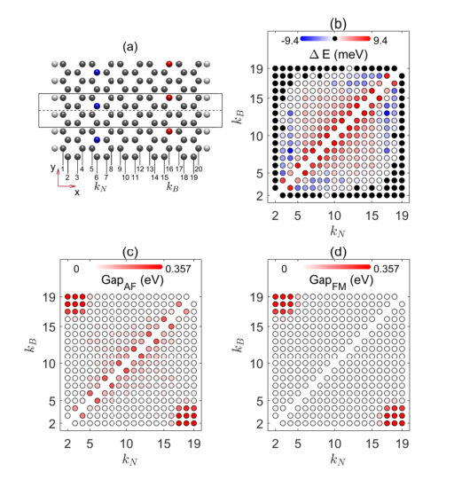 
FIG. 1: (a) Structure of ZGNR with periodic substituted dop- ing of nitrogen and boron atoms. One period of the doped ZGNR is surrounded by the square rectangular of solid line, which is separated by the dashed line into two unit cell of the pristine counterpart. The carbon, nitrogen, boron and hydro- gen atoms are plotted as black, blue, red and write spheres. The indices of columns with substituted doping of nitrogen and boron atoms are marked as kN and kB, respectively. (b) The difference between the total energy level of the FM and AF configuration versus kN and kB are indicated by the color. The band gap of the FM and AF configurations versus kN and kB are indicated by the color in (c)...

📷 Fig 2

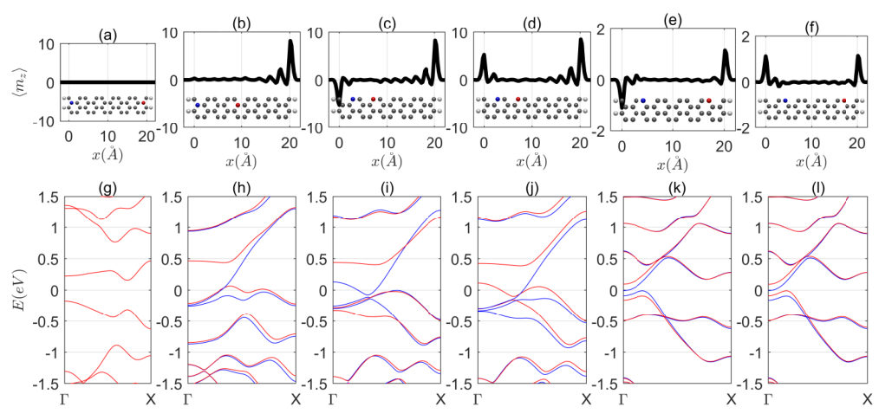 
FIG. 2: In the first row, the spatial distribution of the spin polarization along x direction are plotted, with the inserted panel indicating the doping configuration. The corresponding band structures of spin up and down are plotted as blue and red lines, respectively, in the second row. The doping configuration (kN, kB) are (2, 19) in (a,g), (2, 10) in (b,h), (4, 8) in (c,d,i,j), (5, 17) in (e,f,k,l).

📷 Fig 3

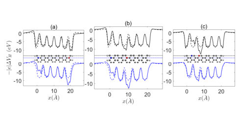 
FIG. 3: Hartree difference potential along the pathes indi- cated by the black and blue dotted lines in the atomic struc- ture are plotted as black and blue solid lines, respectively. The black and blue dashed lines are Hartree difference poten- tial of pristine graphene along the same pathes. The doping configurations are (2, 19) in (a), (2, 10) in (b), and (4, 8) in (c).

📷 Fig 4

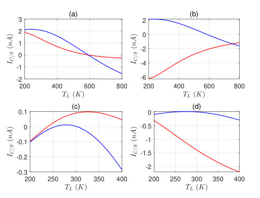 
FIG. 5: Thermal charge and spin current versus TL with ∆T = 1 K for ZGNR with doping configuration being (kN, kB) = (5, 17) are plotted as blue and red lines, respec- tively. The external static electric field is zero in (a,b), and Ex = −0.94 V/nm in (c,d). The magnetic configuration is AF in (a,c), and FM in (b,d).

📷 Fig 5

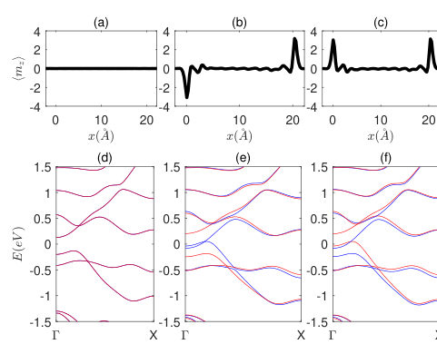 
FIG. 4: For ZGNR with doping configuration (kN, kB) = (5, 17), in the presence of a static electric field along x di- rection with Ex = 0.94 V/nm, the spatial distribution of magnetization and band structure are plotted in (a) and (d), respectively. When the direction of the static electric field is reversed to be Ex = −0.94 V/nm, the spatial distribution of magnetization and band structure for AF configuration are plotted in (b) and (e), respectively; those for FM configura- tion are plotted in (c) and (f), respectively. In the second row, the band structures of spin up and down are plotted as blue and red lines, respectively.

**Summary.** This theoretical study uses DFT to model B-N doped ZGNRs, showing that doping induces an internal electric field that controls the magnetic ground state between AF and FM. By combining doping design with an external electric field, the authors propose a robust, switchable prototype device capable of generating pure thermal spin current for spintronic applications.

**Why it may be interesting.** While primarily condensed matter physics, the concept of using electric fields to switch magnetic states (magnetoelectric coupling) and generate pure spin currents is highly relevant to open quantum systems and spintronics research.

Detailed structure

**Main problem.** The study investigates how built-in electric fields, induced by B-N doping, modulate the spontaneous magnetism and resulting thermospin transport in Zigzag Graphene Nanoribbons (ZGNRs). The goal is to create a switchable device for pure thermal spin current generation.

**Main result.** By engineering the doping configuration and applying an external electric field, the system can switch between Antiferromagnetic (AF) and Ferromagnetic (FM) states, enabling the generation and switching of a pure thermal spin current at room temperature.

**Method.** The research relies on first-principle Density Functional Theory (DFT) calculations, using supercell models to simulate the electronic and magnetic properties.

**Model / system.** The physical system is a Zigzag Graphene Nanoribbon (ZGNR) periodically doped with Boron and Nitrogen atoms. The model explores the magnetic ground state (AF vs. FM) and the resulting spin-split band structure under applied electric fields.

**Key observables.** Total energy difference ($\Delta E$) between AF and FM states, band gaps, spin polarization distribution, and pure thermal spin current.

**Important parameters / regimes.** Doping configuration ($k_N, k_B$), external transversal static electric field strength, and temperature (room temperature operation).

**Assumptions / limitations.** The doping system maintains overall electrical neutrality, and the calculations use DFT with GGA-PBE functional approximations.

**Figures summary.** Figures illustrate the doped ZGNR structure, the dependence of energy differences ($\Delta E$) on doping geometry, and the resulting band structures for different magnetic states.

**Paper structure.** The paper systematically analyzes the magnetic ground state based on doping patterns, then examines how external electric fields further modulate the band structure and achieve the desired pure spin current switching functionality.

Abstract

Zigzag-edged graphene nanoribbons (ZGNRs) host large magnetic moments at two zigzag edges due to spontaneous magnetism, whose ground state is antiferromagnetically coupled spin-order edge state (AF state). In this paper, the spontaneous magnetism and thermoelectricity of ZGNRs with periodic substituted doping of boron and nitrogen atoms along the axial direction are investigated by first principle calculation. The doping induces an internal electric field, which modulates the magnetic moments at the two zigzag edges and the band structure with spin splitting. For varying doping configuration, the ground state could be AF state, ferromagnetically coupled spin-order edge state (FM state), or degenerated pair of AF and FM states. External transversal static electric field can further modulate the magnetic moments and the band structure. By designing the doping configuration and the external field, pure thermal spin current with the absence of thermal charge current can be generated at room temperature, which can be switched on and off by flipping the magnetic configuration between AF and FM states. Thus, the doped ZGNRs can be applied as prototype devices for spin-caloritronic.

[↑ back to top](#top)

### [Multimodal and Multiscale Interrogation of a Mechanically Tough Glass Forming Copper-Based Metal-Organic Framework](http://arxiv.org/abs/2609.03725v1)

**Authors:** Mounir El Skafi, Guo-Qiang Li, Sophie R. Thomas, James D. Taylor, Mark Frogley, Gianfelice Cinque, Marc Pignitter, Michael Reithofer, Jia-Min Chin, Sebastian Henke, Jin-Chong Tan  
**Type:** experiment · **Category:** disordered systems and neural networks · **PDF:** <https://arxiv.org/pdf/2609.03725v1>  
**Analysis basis:** full PDF text, analyzed in chunks

📷 Fig 1

 
Figure 1. (a) Representative monolith and melt-quenched glass samples of Cu(Im)2 employed in this

📷 Fig 2

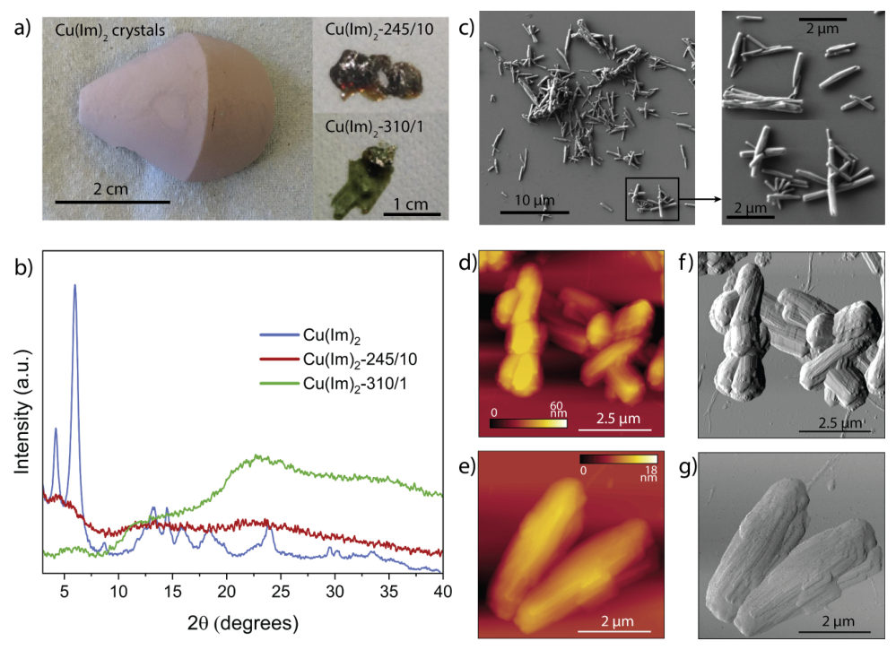 
Figure 2. The imaging aimed to reveal the nanoscale transformations of the different Cu(Im)2 glass

📷 Fig 3

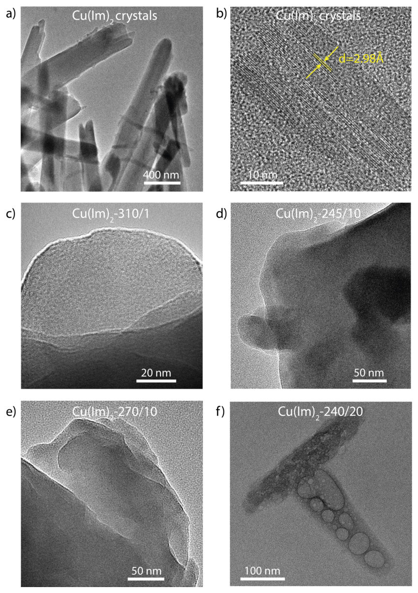 
Figure 2. HR-TEM images of (a) Cu(Im)2 crystals, (b) a magnified view of the crystals showing the

📷 Fig 4

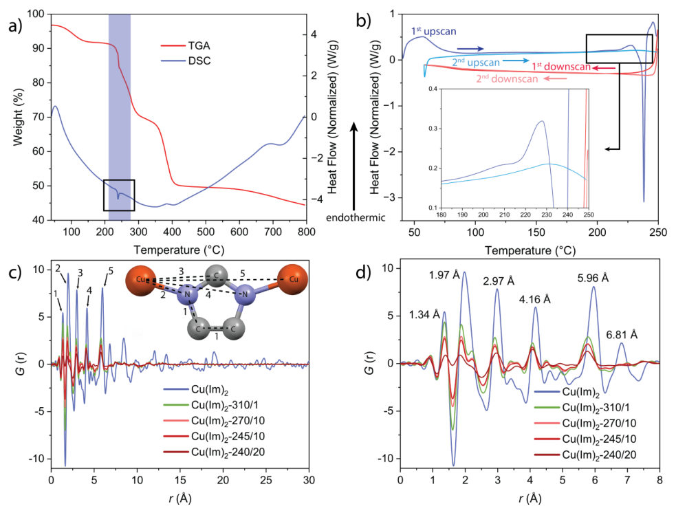 
Figure 3. (a) Coupled TGA-DSC measurements performed on the Cu(Im)2 crystals. (b) DSC of

📷 Fig 5

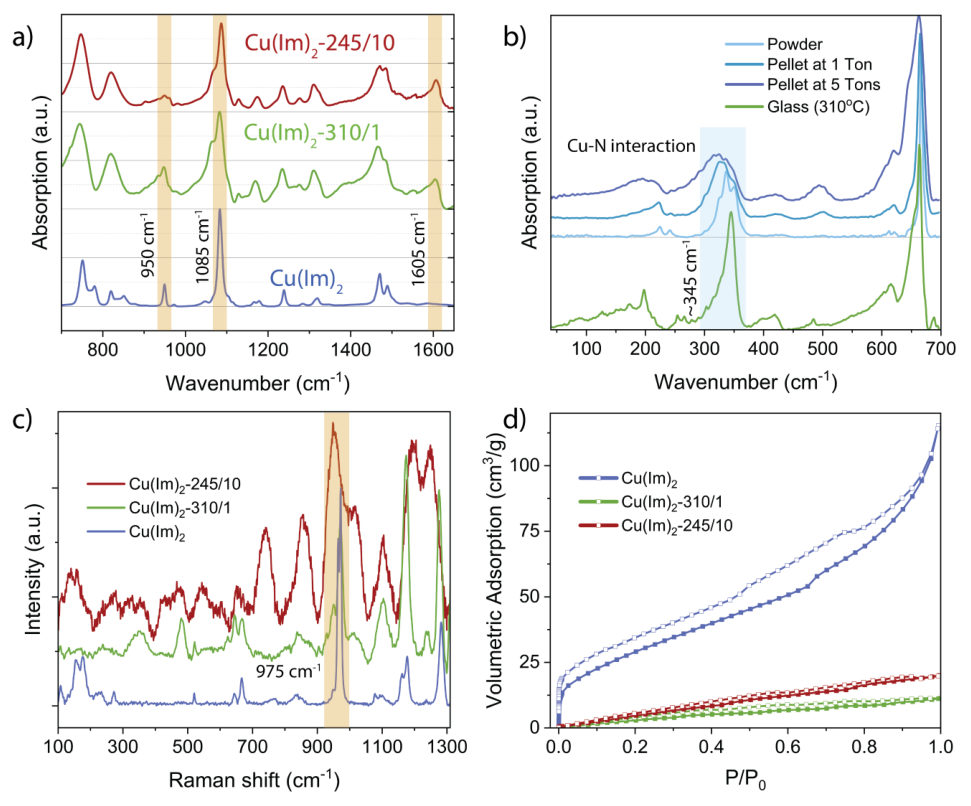 
Figure 4. (a) ATR-FTIR spectra for the Cu(Im)2 crystals and glasses. (b) Synchrotron ATR-FIR spectra

**Summary.** This work thoroughly characterizes a copper-based MOF that forms a glass upon heating. By using multiple advanced techniques, the researchers demonstrated that the resulting glass possesses exceptional mechanical robustness, achieving high stiffness and record-high fracture toughness for MOF glasses. This advances the field of processing and shaping MOF-derived materials.

**Why it may be interesting.** While the focus is on materials science, the study of glass formation and mechanical failure in complex, porous frameworks touches upon concepts relevant to disordered systems and amorphous materials physics.

Detailed structure

**Main problem.** To conduct a multimodal and multiscale interrogation of a mechanically tough, glass-forming copper-based Metal-Organic Framework (MOF).

**Main result.** The resulting MOF glasses exhibit an appreciably high elastic modulus (~10 GPa) and the highest fracture toughness (K_Ic ~ 0.5 MPa m^1/2) reported for MOF glasses.

**Method.** The study employed a combination of structural, thermal, and mechanical characterization techniques, including XRD, AFM, nanoindentation, and synchrotron pair distribution function analysis.

**Model / system.** The physical system is a copper-based MOF, Cu(Im)2, which is synthesized and subsequently melt-quenched into a glass state upon heating above 240 °C.

**Key observables.** Elastic modulus (E), fracture toughness (K_Ic), BET surface areas, and structural motifs observed via various microscopy and spectroscopy techniques.

**Important parameters / regimes.** Melting temperatures (e.g., 240 °C to 310 °C), quenching times, and mechanical stress/strain regimes.

**Assumptions / limitations.** The mechanical properties are compared against literature examples, and the study focuses on the structural integrity of the framework upon glass formation.

**Figures summary.** Figures show images of as-synthesized crystals and melted glass samples, and supplementary figures detail R-STEM micrographs, THz spectroscopy, and nanoindentation results.

**Paper structure.** The paper follows a comprehensive characterization approach, detailing structural analysis (XRD, microscopy, synchrotron methods), thermal analysis (TGA/DSC), and culminating in mechanical testing (nanoindentation, K_Ic measurement).

Abstract

A copper-based metal-organic framework, Cu(Im)2, was synthesized using a sol-gel process and subsequently melt-quenched into glass upon heating above 240 °C. In this paper, we present a multimodal, multiscale interrogation of the MOF nanocrystals and the resulting glasses. Structural characterization using X-ray diffraction, atomic force microscopy, and electron microscopy was performed to understand the morphology and size of the synthesized nanocrystals and glasses. Thermogravimetric analysis and differential scanning calorimetry were employed to understand the melting process of the crystals to form the glass. Synchrotron pair distribution function analysis was performed to verify that the framework structure is maintained upon melting, and nearfield infrared nanospectroscopy provided insight into the local chemical structure of the materials. The mechanical characterization via nanoindentation revealed that the resulting glasses exhibit an appreciably high elastic modulus (~10 GPa) and the highest fracture toughness (K_1c ~ 0.5 MPa m^1/2) yet reported for MOF glasses. This development is central to the emerging field of MOF-based materials processing and shaping, while upholding mechanical robustness and resistance to cracking.

[↑ back to top](#top)

