
# arxiv digest (quant-ph + cond-mat) — 2026-09-08

*114 papers · 10 relevant · 0 highlighted*

## 🔥 Most relevant (10)

*Every paper with at least one nonzero topic score, sorted by best-matching score. 🔥 marks scores ≥4/5. Click the title to jump to the full entry below; click [arXiv] to open the paper page. `(secondary)` marks papers from de-prioritized cond-mat archives.*

Show 10 relevant papers

- [Lindblad Multiproduct Formulas](#paper-2609.05024) [[arXiv]](http://arxiv.org/abs/2609.05024v1) — 🔥 `methods for driven-dissipative` **5/5** · `QC/QI experiment` **3/5** · `driven-dissipative phase transition` **3/5** · `quantum measurements` **3/5** · `Keldysh / 2PI / non-Gaussian methods` **1/5** · `analog quantum simulation` **1/5** · `correlated / nonlocal dissipation` **1/5** · `non-equilibrium universality` **1/5**
- [Environment-assisted transport in a strongly correlated boundary-driven Fermi-Hubbard chain](#paper-2609.05137) [[arXiv]](http://arxiv.org/abs/2609.05137v1) — 🔥 `methods for driven-dissipative` **4/5** · `analog quantum simulation` **3/5** · `correlated / nonlocal dissipation` **3/5** · `driven-dissipative phase transition` **3/5** · `non-equilibrium universality` **3/5** · `quantum measurements` **2/5** · `Keldysh / 2PI / non-Gaussian methods` **1/5**
- [One Bit of Collective Information Is Worth N ln 2 Bits of Local Information in a Many-Body Quantum Battery](#paper-2609.04730) [[arXiv]](http://arxiv.org/abs/2609.04730v1) — 🔥 `quantum measurements` **4/5** · `Tavis-Cummings & cavity-many-emitter` **3/5** · `analog quantum simulation` **3/5** · `correlated / nonlocal dissipation` **3/5** · `Dicke superradiance` **2/5** · `Full counting statistics` **1/5** · `driven-dissipative phase transition` **1/5** · `methods for driven-dissipative` **1/5** · `non-equilibrium universality` **1/5**
- [A photonic source with half-a-GHz single-photon flux](#paper-2609.05387) [[arXiv]](http://arxiv.org/abs/2609.05387v1) — 🔥 `QC/QI experiment` **4/5** · 🔥 `quantum optics experiment` **4/5** · `interference shaping light` **2/5** · `quantum measurements` **2/5** · `analog quantum simulation` **1/5**
- [Spin-Charge Subordination in the Infinite-$U$ $SU(N)$ Hubbard Chain](#paper-2609.04814) [[arXiv]](http://arxiv.org/abs/2609.04814v1) — 🔥 `Full counting statistics` **4/5** · `analog quantum simulation` **3/5** · `non-equilibrium universality` **2/5** · `Keldysh / 2PI / non-Gaussian methods` **1/5** · `quantum measurements` **1/5**
- [Three-Photon and Hybrid Coherent-Fock Interference in a Two-Phase Six-Port Mach-Zehnder Interferometer](#paper-2609.04368) [[arXiv]](http://arxiv.org/abs/2609.04368v1) — 🔥 `interference shaping light` **4/5** · `Full counting statistics` **2/5** · `analog quantum simulation` **2/5** · `methods for driven-dissipative` **1/5** · `quantum measurements` **1/5**
- [Coincidence-based spectral engineering for spectral matching in cascaded downconversion](#paper-2609.05379) [[arXiv]](http://arxiv.org/abs/2609.05379v1) — 🔥 `quantum optics experiment` **4/5** · `interference shaping light` **3/5** · `quantum measurements` **2/5**
- [QMClaw: A Scalable General-purpose Framework for Quantum Measurement and Control](#paper-2609.04674) [[arXiv]](http://arxiv.org/abs/2609.04674v1) — 🔥 `quantum measurements` **4/5** · `QC/QI experiment` **1/5** · `methods for driven-dissipative` **1/5**
- [A Sim-to-Real Study of Surface-Code Decoder Benchmarking](#paper-2609.04557) [[arXiv]](http://arxiv.org/abs/2609.04557v1) — 🔥 `QC/QI experiment` **4/5** · `quantum measurements` **1/5**
- [Transition between weak and strong measurements in the presence of post-selection](#paper-2609.04812) [[arXiv]](http://arxiv.org/abs/2609.04812v1) — 🔥 `quantum measurements` **4/5** · `Full counting statistics` **1/5**

## All papers (79, sorted by relevance)

*Papers from quant-ph and your primary cond-mat archives (quant-gas, stat-mech, str-el, dis-nn). Highlighted papers (⭐) come first, then everything else sorted by topic-relevance score, highest first.*

### [Lindblad Multiproduct Formulas](http://arxiv.org/abs/2609.05024v1)

**Authors:** Niall F. Robertson, Andrea D'Urbano, Anton Dekusar, Max Rossmannek, Eric D. Switzer, James R. Garrison, Nicolas Lorente, Igor Pasichnyk, Paolo D'Alberto, Muhammad Osama, Zachary Streeter, Yasuko Eckert, Constantinos Evangelinos, Sergiy Zhuk  
**Type:** both · **Category:** numerical methods · **PDF:** <https://arxiv.org/pdf/2609.05024v1>  
**Analysis basis:** full PDF text, analyzed in chunks
**Topic relevance:** 🔥 `methods for driven-dissipative` **5/5** · `QC/QI experiment` **3/5** · `driven-dissipative phase transition` **3/5** · `quantum measurements` **3/5** · `Keldysh / 2PI / non-Gaussian methods` **1/5** · `analog quantum simulation` **1/5** · `correlated / nonlocal dissipation` **1/5** · `non-equilibrium universality` **1/5**

↔ Scroll figures horizontally

<figure class="paper-figure-card">
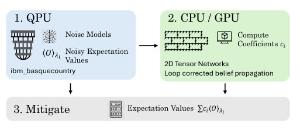
<figcaption class="paper-figure-caption"><b>Fig 1.</b> FIG. 1. Schematic of the Lindblad multiproduct formula ( L- MPF ) workflow. The workflow proceeds in three stages. (1) QPU: A noise model is first learned from the quantum device (ibm_basquecountry) following the procedure of [10], yield- ing the Pauli-Lindblad noise rates λi. The device is then used to measure noisy expectation values ⟨O⟩λi with either PEA or ergodic amplification. (2) CPU/GPU: Next, the coef- ficients ci are computed classically by minimizing the cost function Fχ(c) in equation (17). The overlaps entering the cost function are evaluated using two-dimensional tensor net- works contracted via loop-corrected belief propagation, with bond dimension extrapolation used to...</figcaption>
</figure>
<figure class="paper-figure-card">
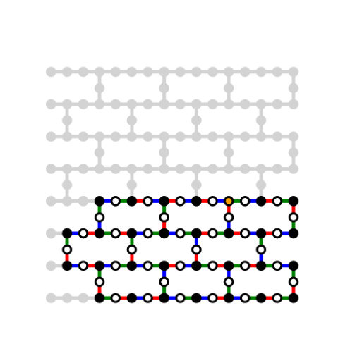
<figcaption class="paper-figure-caption"><b>Fig 2.</b> FIG. 2. Topology of the ibm_basquecountry quantum com- puter. We implement our experiments on the 65 colored qubits arranged on a 3×3 heavy hexagonal lattice. The qubit highlighted in orange is the one on which the single site Z expectation value is measured.</figcaption>
</figure>
<figure class="paper-figure-card">
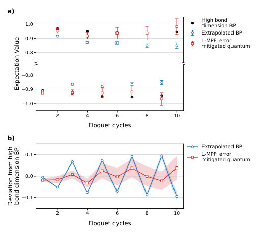
<figcaption class="paper-figure-caption"><b>Fig 3.</b> FIG. 3. Comparison of dimensionless expectation values ob- tained with three methods: (i) purely classical high bond dimension simulations, (ii) purely classical low bond dimen- sion simulations that have been extrapolated to the zero truncation error limit, and (iii) quantum hardware results on ibm_basquecountry that have been mitigated with the L-MPF method, where the expectation values in the sum ci⟨O⟩λi have been obtained with ergodic amplification. a) Expectation values of the target observable, with correspond- ing 1σ error bars, shown as a function of the Floquet cy- cles. The reference expectation values (black) are obtained from Schr¨odinger-picture tensor network simulations with...</figcaption>
</figure>
<figure class="paper-figure-card">
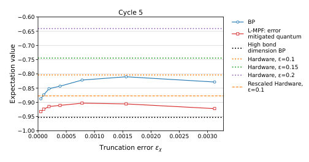
<figcaption class="paper-figure-caption"><b>Fig 4.</b> FIG. 4. Convergence analysis at Floquet cycle 5 as a function of the tensor network truncation error ϵχ which is given by the sum of the square of the discarded singular values at each step. Horizontal dotted lines indicate the raw hardware ex- pectation values at three values of the parameter ϵ defined in the model in (15) and used in the framework of ergodic ampli- fication. The line labeled as “Rescaled Hardware” represents the expectation value with ϵ = 0.1 obtained using Clifford rescaling - see main text. The blue and red markers respec- tively represent purely classical low bond dimension simula- tion and quantum hardware results mitigated with L-MPF.</figcaption>
</figure>
<figure class="paper-figure-card">
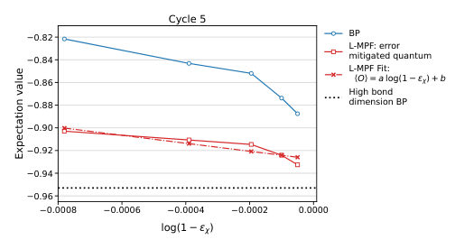
<figcaption class="paper-figure-caption"><b>Fig 5.</b> FIG. 5. Extrapolation of L-MPF in the ergodic amplification framework. Black line denotes the high bond dimension sim- ulation, blue circles denote low bond dimension simulations, and red circles denote L-MPF mitigated quantum hardware expectation values. The dash-dotted red line shows a linear fit to the mitigated data.</figcaption>
</figure>

**Summary.** This paper introduces Lindblad Multiproduct Formulas (L-MPF), a novel quantum error mitigation technique that combines tensor network contractions with belief propagation. It allows for the estimation of noise-free quantum expectation values by calculating optimal linear combinations of noisy measurements. The method is demonstrated on a 2D discrete time crystal model, showing its utility in analyzing complex quantum dynamics on near-term quantum hardware.

**Why it may be interesting.** It provides a powerful, computationally structured framework (tensor networks) to tackle the notoriously difficult problem of noise mitigation in open quantum systems simulations, which is highly relevant to modern quantum hardware characterization.

Detailed structure

**Main problem.** The paper addresses the challenge of accurately estimating expectation values of observables in noisy quantum circuits governed by Lindblad dynamics.

**Main result.** The proposed Lindblad Multiproduct Formulas (L-MPF) technique successfully mitigates noise by combining tensor network calculations with quantum measurements, showing potential advantages over existing methods.

**Method.** L-MPF uses two-dimensional tensor networks contracted with loop-corrected belief propagation to classically determine optimal linear combinations of noisy measurements, which are then used to estimate the noise-free expectation value.

**Model / system.** The method is applied to a model of two-dimensional discrete time crystals (DTCs) and is tested on a quantum computer (ibm_basquecountry) with 65 qubits in a heavy-hexagonal topology.

**Key observables.** Noiseless expectation value $\langle O(t) 
angle_{\lambda 0}$, order parameter $\Delta(t)$, and the estimated error bar.

**Important parameters / regimes.** Noise rates ($\lambda_i$), Floquet cycles, and the tensor network truncation error ($\epsilon_\chi$).

**Assumptions / limitations.** The workflow assumes that the required coefficients can be calculated efficiently using tensor networks, and it compares the performance of different noise amplification schemes (Ergodic vs. PEA).

**Figures summary.** Figures compare raw hardware expectation values using ergodic vs. PEA amplification; they also show convergence analysis of L-MPF results against various extrapolation methods as a function of truncation error ($\epsilon_\chi$).

**Paper structure.** The paper introduces the L-MPF technique, details its workflow involving QPU measurement and CPU/GPU tensor network computation, applies it to DTC models, and compares the performance and convergence of different noise amplification strategies.

Abstract

We introduce Lindblad Multiproduct Formulas: a quantum error mitigation technique that uses two-dimensional tensor networks contracted with loop-corrected belief propagation. The quantities required to implement the error mitigation scheme that are evaluated with tensor networks can be less computationally expensive to calculate than the expectation values themselves, thus allowing for the possibility of applying our method to certain systems for which tensor network methods may struggle to calculate the observable quantities of interest. The workflow incorporates Clifford rescaling techniques and outputs an estimated error bar. We apply our method to a model of two-dimensional discrete time crystals studied previously and implement it on $65$ qubits arranged in a $3\!\times\!3$ heavy-hexagonal topology on the quantum computer ibm_basquecountry. We show that a GPU implementation of the classical part of our workflow achieves a speedup of up to $5.6\times$.

[↑ back to top](#top)

### [Environment-assisted transport in a strongly correlated boundary-driven Fermi-Hubbard chain](http://arxiv.org/abs/2609.05137v1)

**Authors:** Hakan Yeler, Özgür Çakır  
**Type:** theory · **Category:** strongly correlated electrons · **PDF:** <https://arxiv.org/pdf/2609.05137v1>  
**Analysis basis:** full PDF text, analyzed in chunks
**Topic relevance:** 🔥 `methods for driven-dissipative` **4/5** · `analog quantum simulation` **3/5** · `correlated / nonlocal dissipation` **3/5** · `driven-dissipative phase transition` **3/5** · `non-equilibrium universality` **3/5** · `quantum measurements` **2/5** · `Keldysh / 2PI / non-Gaussian methods` **1/5**

↔ Scroll figures horizontally

<figure class="paper-figure-card">
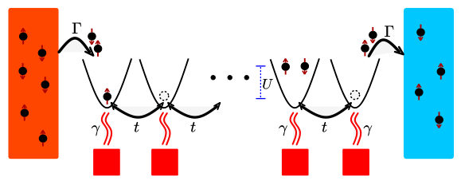
<figcaption class="paper-figure-caption"><b>Fig 1.</b> FIG. 1: Schematic representation of the boundary-driven Fermi-Hubbard chain with local</figcaption>
</figure>
<figure class="paper-figure-card">
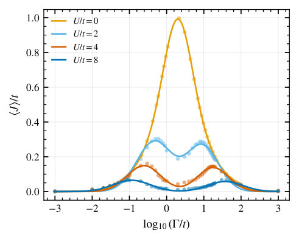
<figcaption class="paper-figure-caption"><b>Fig 2.</b> FIG. 2: Current ⟨J⟩as a function of driving rate Γ for an 8-site system without dephasing</figcaption>
</figure>
<figure class="paper-figure-card">
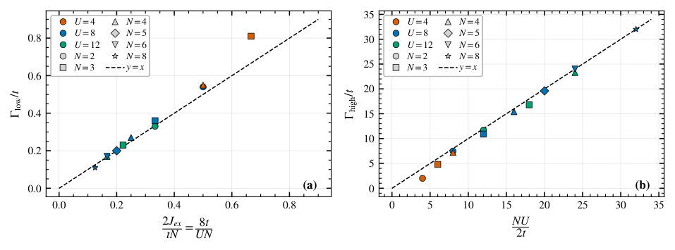
<figcaption class="paper-figure-caption"><b>Fig 3.</b> FIG. 3: Scaling of the two current resonances with system size N and interaction strength</figcaption>
</figure>
<figure class="paper-figure-card">
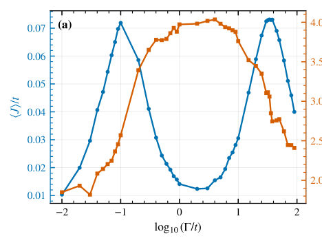
<figcaption class="paper-figure-caption"><b>Fig 4.</b> FIG. 4: (a) Steady-state current ⟨J⟩(left axis) and total doublon number P</figcaption>
</figure>
<figure class="paper-figure-card">
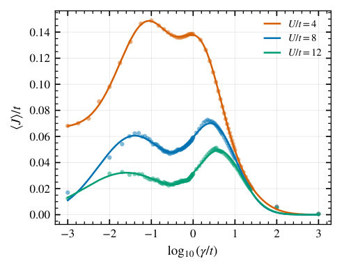
<figcaption class="paper-figure-caption"><b>Fig 5.</b> FIG. 5: Steady-state current as a function of the dephasing rate for an N = 8 chain with</figcaption>
</figure>

**Summary.** This paper analyzes quantum transport in a strongly correlated Fermi-Hubbard chain driven by boundaries and subjected to local dephasing. The authors find that dephasing does not simply suppress current but instead induces two separate, distinct regimes of transport enhancement. These regimes are linked to specific many-body processes, such as intra-band and inter-band energy redistributions, highlighting the complex interplay between environment, correlation, and quantum dynamics.

**Why it may be interesting.** This work provides a detailed, many-body perspective on how environmental coupling (dephasing) can actively enhance transport in strongly correlated quantum materials, revealing distinct physical mechanisms for this enhancement.

Detailed structure

**Main problem.** The study investigates environment-assisted quantum transport (ENAQT) in a strongly correlated, boundary-driven Fermi-Hubbard chain, focusing on how local dephasing affects current flow.

**Main result.** The system exhibits two distinct dephasing-induced transport-enhancement regimes, which are attributed to different many-body redistribution processes occurring within and between Hubbard bands.

**Method.** The dynamics are solved using the Time-Evolving Block Decimation (TEBD) method applied to the Lindblad master equation, supplemented by analytical derivations for scaling laws.

**Model / system.** The model is a one-dimensional Fermi-Hubbard chain governed by a Hamiltonian and subjected to boundary reservoirs and local dephasing baths, described by the Lindblad master equation.

**Key observables.** Steady-state particle current (J), doublon number, and the optimal dephasing rate ($\gamma_{high}$).

**Important parameters / regimes.** Interaction strength ($U$), hopping ($t$), boundary driving rate ($\Gamma$), and dephasing rate ($\gamma$).

**Assumptions / limitations.** The analysis relies on solving the Lindblad master equation via TEBD, and later sections use adiabatic elimination or phenomenological two-process models for scaling derivations.

**Figures summary.** Figures illustrate the current dependence on driving rate ($\Gamma$) showing two resonances, and the scaling of these resonances and enhancement rates ($\gamma_{low}, \gamma_{high}$) with system size ($N$) and interaction strength ($U$).

**Paper structure.** The paper progresses from establishing the basic model and observing two current resonances ($\Gamma_{low}, \Gamma_{high}$) in the absence of dephasing, to analyzing the effect of dephasing ($\gamma$), identifying two distinct enhancement regimes, and finally deriving scaling laws for the optimal dephasing rate.

Abstract

We study steady-state transport in a one-dimensional Fermi-Hubbard chain coupled to particle reservoirs at the boundaries and to local dephasing baths at each site, using the time-evolving block decimation (TEBD) method to solve the Lindblad master equation. In the absence of dephasing, the current exhibits two well-separated maxima as a function of the boundary driving rate, reflecting the distinct charge and spin energy scales of the strongly correlated regime. Upon introducing dephasing, we find two distinct dephasing-induced transport-enhancement regimes, in contrast to the single enhancement previously reported for spinless fermions. Analysis of the non-equilibrium steady state in the Hamiltonian eigenbasis reveals that the two regimes originate from distinct dephasing-induced redistribution processes: the first involves redistribution within the uppermost Hubbard band, while the second involves transitions between Hubbard bands. Our results demonstrate how many-body correlations shape the interplay between coherent driving, dephasing, and quantum Zeno physics in strongly correlated open systems.

[↑ back to top](#top)

### [One Bit of Collective Information Is Worth N ln 2 Bits of Local Information in a Many-Body Quantum Battery](http://arxiv.org/abs/2609.04730v1)

**Authors:** Akoramurthy B, Surendiran B, Xiaochun Cheng  
**Type:** theory · **Category:** other · **PDF:** <https://arxiv.org/pdf/2609.04730v1>  
**Analysis basis:** full PDF text, analyzed in chunks
**Topic relevance:** 🔥 `quantum measurements` **4/5** · `Tavis-Cummings & cavity-many-emitter` **3/5** · `analog quantum simulation` **3/5** · `correlated / nonlocal dissipation` **3/5** · `Dicke superradiance` **2/5** · `Full counting statistics` **1/5** · `driven-dissipative phase transition` **1/5** · `methods for driven-dissipative` **1/5** · `non-equilibrium universality` **1/5**

↔ Scroll figures horizontally

<figure class="paper-figure-card">
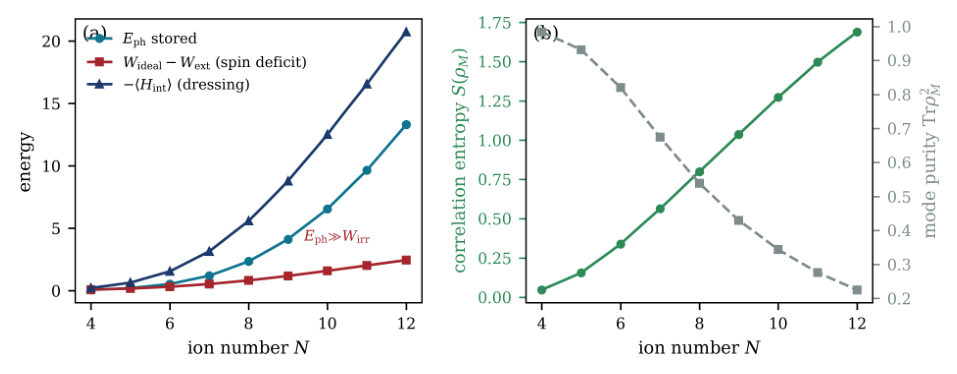
<figcaption class="paper-figure-caption"><b>Fig 1.</b> FIG. 1. (a) The stored mode energy far exceeds the spin work deficit; the balance is a polaron-like</figcaption>
</figure>
<figure class="paper-figure-card">
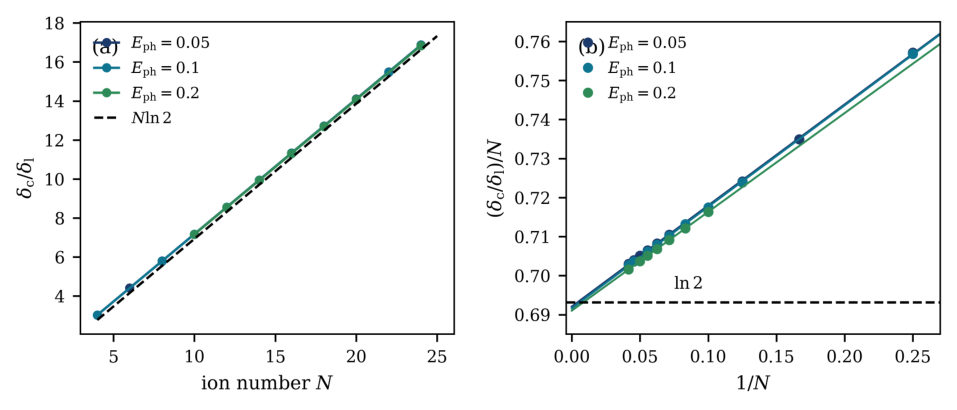
<figcaption class="paper-figure-caption"><b>Fig 2.</b> FIG. 2. (a) With both arms balanced at exactly one bit and matched stored energy, the gain</figcaption>
</figure>
<figure class="paper-figure-card">
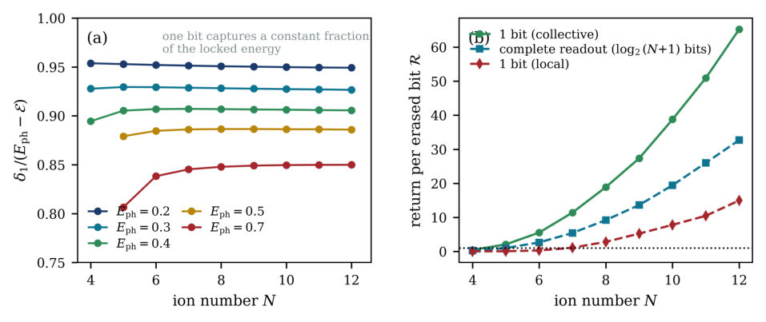
<figcaption class="paper-figure-caption"><b>Fig 3.</b> FIG. 3. (a) One bit of collective information recovers a constant fraction of the locked energy,</figcaption>
</figure>
<figure class="paper-figure-card">
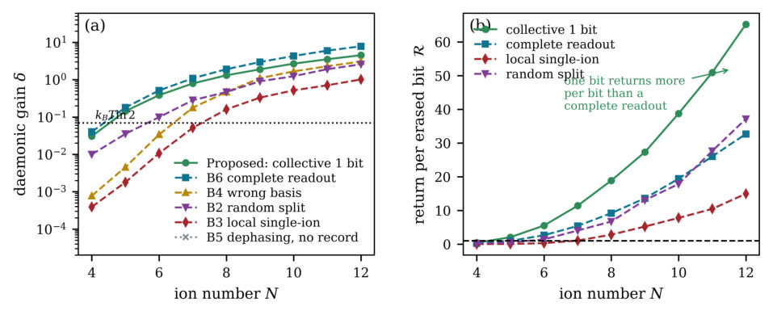
<figcaption class="paper-figure-caption"><b>Fig 4.</b> FIG. 4. (a) Daemonic gain for all baseline arms at fixed protocol; B5 is identically zero and does</figcaption>
</figure>
<figure class="paper-figure-card">
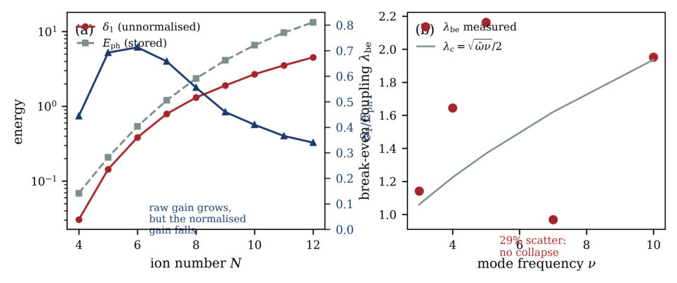
<figcaption class="paper-figure-caption"><b>Fig 5.</b> FIG. 5. (a) The unnormalised daemonic gain grows steeply, but so does the stored energy; the</figcaption>
</figure>

**Summary.** This paper investigates how much work can be extracted from a quantum battery using information gained from collective measurements versus local measurements. It finds that collective information provides a significant, system-size-dependent advantage, scaling as N ln(2) times more work per bit than local information. This highlights the fundamental physical advantage of exploiting global correlations in quantum energy harvesting.

**Why it may be interesting.** This work directly addresses quantum thermodynamics in many-body systems, providing quantitative metrics for how entanglement or collective correlations enhance work extraction beyond what local measurements can achieve.

Detailed structure

**Main problem.** The paper quantifies the advantage of extracting work from a quantum battery by measuring the difference in extractable energy (daemonic ergotropy) when using collective versus local measurements.

**Main result.** One bit of collective information unlocks N ln(2) times more work than one bit of local information, demonstrating a strong, system-size-dependent advantage for collective measurements.

**Method.** The analysis compares two protocols under matched constraints (matched stored energy and matched information cost) by deriving scaling laws and performing double extrapolations.

**Model / system.** The system is a quantum battery modeled by N two-level ions coupled to a shared bosonic mode, described by a Hamiltonian resembling the Dicke model. The analysis focuses on energy extraction via measurement outcomes.

**Key observables.** Daemonic ergotropy ($\delta$), locked energy, and the ratio of work extracted ($\delta_c / \delta_l$).

**Important parameters / regimes.** The system size N, the bosonic mode frequency ($
u$), and the information content (constrained to 1 bit).

**Assumptions / limitations.** The comparison is strictly constrained by matching both the stored energy and the information cost (1 bit) between the collective and local measurement protocols.

**Figures summary.** Figures illustrate the linear scaling of the gain ratio with N ($\propto N \ln 2$), the constant fraction of locked energy recovered per bit, and comparisons between unnormalised and normalised gain.

**Paper structure.** The paper establishes the physical model, defines the daemonic ergotropy, compares the scaling of collective vs. local information extraction under matched constraints, derives the $N \ln 2$ scaling law, and discusses the implications for information efficiency.

Abstract

Charging a quantum battery through a collective non-adiabatic stroke stores energy in a shared bosonic mode, but part remains locked in correlations with the collective spin and is inaccessible to cyclic unitaries acting on the mode alone. A demon holding one bit can unlock this energy, quantified by the daemonic ergotropy. We investigate the value of one bit and its dependence on where the information is obtained. Two protocols are compared at matched stored energy and matched information, using balanced two-outcome measurements carrying exactly one bit. We find that one bit about the collective coordinate unlocks N ln(2) times as much work as one bit about a single ion. For three stored-energy settings and N = 4-24, the measured scaling exponent is 0.990 +/- 0.043, while double extrapolation gives a prefactor of 0.69298 +/- 0.00044, within 0.02% of ln(2). To leading order, the daemonic gain equals nu mu^2 times the between-outcome variance of Jx, verified numerically to 1.3%. A balanced single-ion measurement resolves 1/4 of this variance, whereas a balanced collective split resolves (ln(2)/4)N. The microscopic origin of the prefactor remains open; a Gaussian median-split estimate of 1/(2pi) is excluded by 9%. One bit recovers a constant fraction of the locked energy independent of N and yields roughly twice as much work per bit as a complete readout, indicating strong diminishing returns. We also show that unnormalized gain comparisons can reverse the conclusion and that the break-even ion number does not collapse onto the Dicke superradiant threshold when the mode frequency is varied.

[↑ back to top](#top)

### [A photonic source with half-a-GHz single-photon flux](http://arxiv.org/abs/2609.05387v1)

**Authors:** P. Zahalka, S. Huijser, A. Pancaldi, S. Kruger, X. Zhao, Z. Liu, I. Suleiman, R. Jensen, L. Stefan, A. Ludwig, V. Remesh, J. C. Loredo, P. Lodahl  
**Type:** experiment · **Category:** quantum information and computing · **PDF:** <https://arxiv.org/pdf/2609.05387v1>  
**Analysis basis:** full PDF text, analyzed in chunks
**Topic relevance:** 🔥 `QC/QI experiment` **4/5** · 🔥 `quantum optics experiment` **4/5** · `interference shaping light` **2/5** · `quantum measurements` **2/5** · `analog quantum simulation` **1/5**

↔ Scroll figures horizontally

<figure class="paper-figure-card">
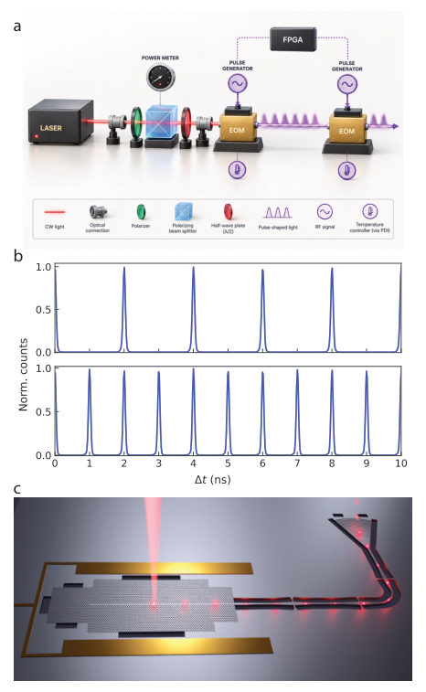
<figcaption class="paper-figure-caption"><b>Fig 1.</b> Figure 1. Pulse-carved excitation. a) Two synchronised inten- sity EOMs transform an input CW laser to coherent laser pulses (pulse carving) with tunable repetition rate controlled by an FPGA (AI-generated concept image). b) Measured time traces of carved pulses at 500 MHz (top) and 1 GHz (bottom). c) High repetition rate carved pulses excite a quantum dot embedded in a PCW mode. The rate of single-photon production is maxi- mum and limited by the inherent emitter decay-time.</figcaption>
</figure>
<figure class="paper-figure-card">
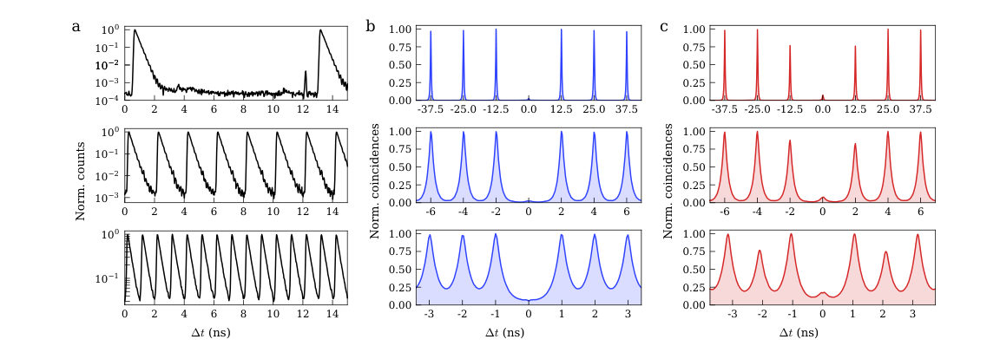
<figcaption class="paper-figure-caption"><b>Fig 2.</b> Figure 2. Single-photon metrics. Single-photon measurements at 80 MHz (top), 500 MHz (middle), and 1 GHz (bottom) excitation rates. a) Lifetime time traces, revealing a mono-exponential decay rate of 220 ps. b) Second-order autocorrelation g(2)(∆t), from where we obtain g(2)(0) values of (3.98±0.01)%, (3.63±0.02)%, and (11.13±0.03)%, respectively. c) Two-photon interference display uncorrected HOM visibilities VHOM of (81.83±0.03)%, (80.87±0.03)%, and (55.14±0.03)% . These values are obtained with no spectral filter in collection, and considering integration time windows of 2.2 ns, 0.9 ns, and 0.5 ns. The decreasing values of purity and HOM visibility originate from increasing peak overlap...</figcaption>
</figure>
<figure class="paper-figure-card">
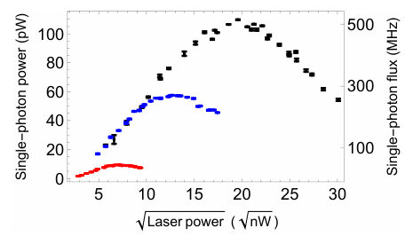
<figcaption class="paper-figure-caption"><b>Fig 3.</b> Figure 3. Powermeter-measured Rabi oscillations. Single- photon optical power displaying Rabi oscillations as function of excitation laser power, at 80 MHz (red), 500 MHz (blue), and 1 GHz (black) driving rate. A single-photon flux above 500 MHz occurs at π-pulse drive at maximum excitation rate.</figcaption>
</figure>

**Summary.** This paper presents an advanced, deterministic single-photon source based on a quantum dot coupled to a photonic crystal waveguide. The source achieves a record-high single-photon flux exceeding 500 MHz while maintaining high efficiency. This development is critical for advancing experimental quantum information processing by providing a reliable, high-rate quantum light source.

**Why it may be interesting.** This work provides a crucial experimental tool—a high-flux, high-purity single-photon source—that is foundational for implementing quantum information protocols in the lab.

Detailed structure

**Main problem.** The field requires high-quality, high-rate single-photon sources for advanced quantum technologies like quantum key distribution and quantum computing.

**Main result.** The authors report a deterministic single-photon source achieving over 500 MHz in-fibre single-photon flux, which is the highest reported value.

**Method.** The source was characterized by measuring single-photon time traces, the second-order autocorrelation function g^(2)(0), and Hong-Ou-Mandel (HOM) visibility.

**Model / system.** The system utilizes a quantum dot (QD) single-photon source coupled to a photonic crystal waveguide (PCW) and is driven using carved laser pulses from a continuous-wave laser.

**Key observables.** In-fibre single-photon flux, optical power, g^(2)(0), and HOM visibility.

**Important parameters / regimes.** QD emission wavelength (933.1 nm), QD decay lifetime (220 ps), and excitation rates up to 1 GHz.

**Assumptions / limitations.** Direct measurement of source fiber efficiency using a power meter avoids the need for complex calibration of superconducting nanowire single-photon detectors.

**Figures summary.** Figure 1 shows the pulse-carving setup. Figure 2 presents single-photon metrics (time traces, g^(2)(0), V_HOM) at various rates. Figure 3 shows Rabi oscillations measured by a power meter.

**Paper structure.** The paper details the setup for generating high-rate single photons, presents measurements of key quantum metrics (g^(2) and HOM), and concludes by highlighting the practical advantage of direct power measurement for efficiency determination.

Abstract

Advanced optical quantum technologies demands high quality quantum light generation at very high rates. Here, we report on a deterministic single-photon source that simultaneously combines high excitation rates with high system efficiency to reach over 500 MHz of in-fibre single-photon flux. The source delivers optical power of over 100 pW, as is measured with an off-the-shelf powermeter, enabling a simple and direct way of determining the single-photon source fiber efficiency.

[↑ back to top](#top)

### [Spin-Charge Subordination in the Infinite-$U$ $SU(N)$ Hubbard Chain](http://arxiv.org/abs/2609.04814v1)

**Authors:** Cătălin Paşcu Moca, Ovidiu I. Pâţu, Gergely Zaránd, Balázs Dóra  
**Type:** theory · **Category:** strongly correlated electrons · **PDF:** <https://arxiv.org/pdf/2609.04814v1>  
**Analysis basis:** full PDF text, analyzed in chunks
**Topic relevance:** 🔥 `Full counting statistics` **4/5** · `analog quantum simulation` **3/5** · `non-equilibrium universality` **2/5** · `Keldysh / 2PI / non-Gaussian methods` **1/5** · `quantum measurements` **1/5**

↔ Scroll figures horizontally

<figure class="paper-figure-card">
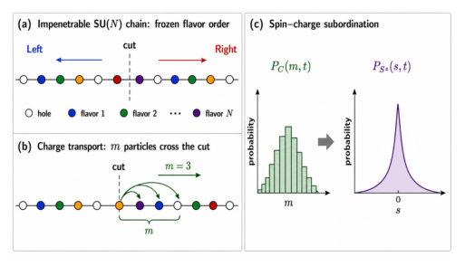
<figcaption class="paper-figure-caption"><b>Fig 1.</b> FIG. 1. Schematic of the spin–charge subordination in the infinite-U (impenetrable) SU(N) Hubbard chain. (a) The ordered sequence of SU(N) flavor labels is frozen, while the particle coordinates evolve as free spinless fermions. (b) The number of particles crossing the central bond determines the transferred charge, while the transported spin is the sum of the Cartan weights carried by those particles. (c) The spin generating function is subordinated to the charge generating function, as expressed in Eq. (1).</figcaption>
</figure>
<figure class="paper-figure-card">
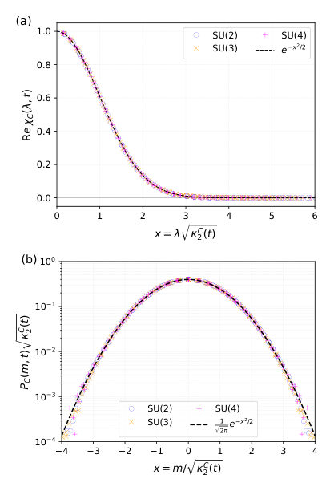
<figcaption class="paper-figure-caption"><b>Fig 2.</b> FIG. 2. (a) The generating function χC(λ, t) as function of the rescaled counting field λ p</figcaption>
</figure>
<figure class="paper-figure-card">
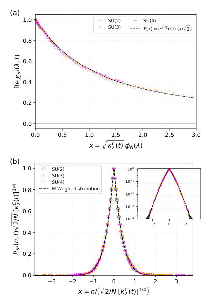
<figcaption class="paper-figure-caption"><b>Fig 3.</b> FIG. 3. Spin full counting statistics across the central cut. (a) Spin generating function for SU(2), SU(3), and SU(4), rescaled according to Eq. (25). The dashed line denotes the analytical subordination scaling function F(x). (b) Corre- sponding spin-transfer distributions plotted in the scaling variable set by p</figcaption>
</figure>

**Summary.** This theoretical work calculates the exact transport statistics for charge and flavor in the 1D SU(N) Hubbard model. It reveals that charge transport is standard (Gaussian, linear variance), but the flavor transport is anomalously slow, scaling as $t^{1/2}$ due to a kinematic subordination mechanism. This establishes a general principle for slow internal-state dynamics in quantum gases.

**Why it may be interesting.** The concept of spin-charge subordination provides a powerful, universal mechanism explaining anomalous transport dynamics in strongly correlated quantum systems, which is highly relevant for understanding transport in quantum materials.

Detailed structure

**Main problem.** The paper determines the exact full counting statistics (FCS) for charge and flavor transport in the one-dimensional infinite-U SU(N) Hubbard model, focusing on the mechanism of spin–charge subordination.

**Main result.** It establishes an exact subordination relation where charge transport is ballistic ($\kappa_C^2 \propto t$), while flavor transport exhibits anomalous, slower scaling ($\kappa_{Sz}^2 \propto t^{1/2}$) governed by a universal non-Gaussian M-Wright law.

**Method.** The analysis uses generating functions and exploits the exact conservation of flavor ordering, mapping the spin FCS onto the charge FCS via a subordination mechanism.

**Model / system.** The system is the one-dimensional SU(N) Hubbard chain in the infinite-repulsion limit. The Hamiltonian is projected onto a subspace where the 'no-passing constraint' freezes the flavor sequence while charge carriers behave as free spinless fermions.

**Key observables.** Full Counting Statistics (FCS) for charge and flavor, charge variance ($\kappa_C^2(t)$), and the asymptotic flavor distribution (M-Wright law).

**Important parameters / regimes.** The interaction strength is set to infinite ($U 	o \infty$), and the analysis focuses on the long-time limit ($Jt \gg 1$).

**Assumptions / limitations.** The derivation relies on the assumption of the infinite-temperature, balanced projected ensemble for the charge variance scaling; finite temperature requires alternative formulas.

**Figures summary.** Figure 2 compares the charge generating function and distribution for various N, showing convergence to Gaussian behavior. Figure 3 shows the spin generating function and distribution, confirming the collapse onto the M-Wright form.

**Paper structure.** The paper first establishes the physical model and the free-fermion nature of charge transport. It then derives the exact subordination relation between charge and flavor cumulants. Finally, it analyzes the asymptotic scaling of both variances, contrasting the linear charge growth with the sub-linear spin growth.

Abstract

We obtain the exact full counting statistics of charge and flavor transport in the one-dimensional infinite-$U$ $SU(N)$ Hubbard model. The no-passing constraint freezes the ordered flavor sequence while the particle coordinates evolve as free spinless fermions. Consequently, charge transfer is governed by a free-fermion determinant, whereas flavor transfer is exactly subordinated to the number of particles crossing the observation cut. For an arbitrary traceless Cartan generator this yields an exact relation between the charge and flavor cumulants. The complete asymptotic flavor distribution is a universal non-Gaussian M-Wright law. Together, these results establish spin--charge subordination as a kinematic mechanism for anomalously slow internal-state transport in one-dimensional impenetrable quantum gases.

[↑ back to top](#top)

### [Three-Photon and Hybrid Coherent-Fock Interference in a Two-Phase Six-Port Mach-Zehnder Interferometer](http://arxiv.org/abs/2609.04368v1)

**Authors:** P. O. Amadi, P. Pewkhom, N. Sitpathom, R. Endut, N. Ali, S. A. Aljunid, S. Suryadi, P. Kalasuwan  
**Type:** theory · **Category:** quantum information and computing · **PDF:** <https://arxiv.org/pdf/2609.04368v1>  
**Analysis basis:** full PDF text, analyzed in chunks
**Topic relevance:** 🔥 `interference shaping light` **4/5** · `Full counting statistics` **2/5** · `analog quantum simulation` **2/5** · `methods for driven-dissipative` **1/5** · `quantum measurements` **1/5**

↔ Scroll figures horizontally

<figure class="paper-figure-card">
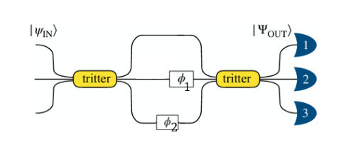
<figcaption class="paper-figure-caption"><b>Fig 1.</b> FIG. 1: Schematic representation of the 6p-MZI. The device consists of two identical tritters (six-port beam splitters) that are separated by two independent phase modulators ϕ1 and ϕ2 acting on arms 2 and 3, with arm 1 fixed as the phase reference. Input states |ψIN⟩= |1⟩1|1⟩2|1⟩3 enter the first tritter, evolve into the intermediate state |Ψ1⟩, accumulate relative phases through ˆUϕ. They interfere at the second tritter to produce the output state |ΨOUT⟩. The photon detection channels are represented by the output ports 1, 2, and 3.</figcaption>
</figure>
<figure class="paper-figure-card">
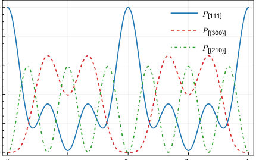
<figcaption class="paper-figure-caption"><b>Fig 2.</b> FIG. 2: Detection probabilities for the three-photon input |1⟩1|1⟩2|1⟩3, in the single-phase limit ϕ2 = 0, plotted as a function of ϕ1 ∈[0, 4π]. Panel (a) shows the per-state probabilities and Panel (b) shows the corresponding class total probabilities.P[111] (blue solid), P[{300}] (red dashed), and P[{210}] (green dash-dotted).</figcaption>
</figure>
<figure class="paper-figure-card">

<figcaption class="paper-figure-caption"><b>Fig 3.</b> Figure 3 presents the complete two-dimensional phase- space analysis referenced throughout this subsection. Three physical features of the full two-dimensional phase space (ϕ1, ϕ2) are revealed, which is not accessible in the single- phase limit. First, P[{210}] depends only on the pairwise sum P. This contains only pairwise phase differences ϕ1, ϕ2, and ϕ1 −ϕ2. The global phase Φ = ϕ1 + ϕ2 drops out entirely. This means the partial bunching channel is not sensitive to a uniform phase shift applied simultaneously to both arms. This symmetry is only invisible in the single-phase treatment, where pairwise and global contributions are locked to a single parameter.</figcaption>
</figure>
<figure class="paper-figure-card">
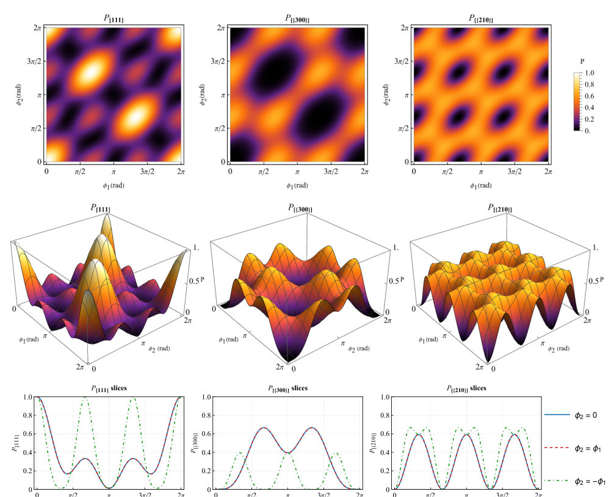
<figcaption class="paper-figure-caption"><b>Fig 4.</b> FIG. 3: Two-dimensional phase space analysis of three-photon interference for two-phase configuration (ϕ1, ϕ2) ∈[0, 2π]2. Top row: density maps of P[111], P[{300}], and P[{210}] over the full phase space; color encodes probability from 0 (dark) to 1 (bright). Middle row: corresponding 3D surface plots with the same color scale. Bottom row: one-dimensional slices along three physically motivated paths. The single-phase limit ϕ2 = 0 (blue solid), the symmetric configuration ϕ2 = ϕ1 (red dashed), and the antisymmetric configuration ϕ2 = −ϕ1 (green dash-dotted). In the antisymmetric slice, the cyclic sum C = 0 identically, decoupling P[{210}] completely from the other two channels.</figcaption>
</figure>
<figure class="paper-figure-card">
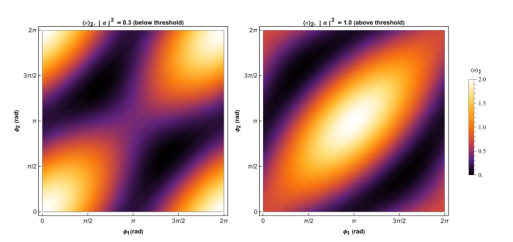
<figcaption class="paper-figure-caption"><b>Fig 5.</b> FIG. 4: Density maps of ⟨n2⟩over the full two-dimensional phase space (ϕ1, ϕ2) ∈[0, 2π]2, for |α|2 = 0.3 (below threshold) and |α|2 = 1.0 (above threshold).</figcaption>
</figure>

**Summary.** This paper provides a comprehensive theoretical analysis of three-photon and hybrid quantum interference in a complex Six-Port Mach-Zehnder Interferometer. By deriving the system's transfer matrix, the authors characterize how the interference visibility and mean photon numbers are precisely controlled by two independent phase modulators. The results confirm the device's utility as a highly programmable platform for quantum state manipulation and sensing.

**Why it may be interesting.** This work provides a detailed, analytical framework for controlling multi-photon quantum interference using phase control, which is fundamental to quantum optical circuits and quantum state engineering.

Detailed structure

**Main problem.** The paper analyzes the complex quantum interference patterns arising from three-photon and hybrid coherent-Fock states within a sophisticated optical setup.

**Main result.** The 6p-MZI is established as a programmable platform capable of manipulating tripartite quantum states and performing coherent amplitude sensing via phase-dependent interference visibility.

**Method.** The analysis involves deriving the system's transfer matrix analytically and calculating output probability distributions for both pure Fock and hybrid coherent-Fock input regimes.

**Model / system.** The physical system is a Six-Port Mach-Zehnder Interferometer (6p-MZI) constructed from two cascaded tritters, incorporating two independent phase modulators ($\phi_1, \phi_2$).

**Key observables.** Output probability distributions $P[111]$, $P[\{300\}]$, and $P[\{210\}]$, and the mean photon number $\langle n_k 
angle$ at each output port.

**Important parameters / regimes.** The two relative phase modulators $(\phi_1, \phi_2)$ are crucial, as the interference visibility and sensing threshold depend explicitly on their values.

**Assumptions / limitations.** The analysis relies on the unitary transformation structure derived from the tritter matrix based on the Discrete Fourier Transform (DFT).

**Figures summary.** Figures illustrate the schematic of the 6p-MZI and show the dependence of mean photon numbers $\langle n_{1,3} 
angle$ on the independent phase space $(\phi_1, \phi_2)$, revealing bright ridge behavior relative to the threshold.

**Paper structure.** The paper proceeds by deriving the transfer matrix, analyzing the pure single-photon input regime to confirm generalized Hong-Ou-Mandel effects, and then extending the analysis to the hybrid coherent-Fock input using the density matrix formalism.

Abstract

We present a unified theoretical analysis of three-photon quantum interference in a Six-Port Mach-Zehnder Interferometer (6p-MZI) constructed from two cascaded tritters, with two independent phase modulators placed between the tritter arms. We analytically derive the transfer matrix of the 6p-MZI and show how they organize into three symmetry classes, governed by the discrete Fourier transform (DFT) structure of the tritter and the conjugate relations. Furthermore, we analyze two input regimes: First, three indistinguishable single photons are injected into the tritter, and the output probability distributions $P_{[111]}$, $P_{[\{300\}]}$, and $P_{[\{210\}]}$ are derived as functions of the two relative phases $(φ_1, φ_2)$. At $φ_2 = 0$, the single-phase limit is recovered, which confirms 100\% visibility of the even-distribution fringe. Second, a hybrid coherent-Fock input $|α\rangle_1|α\rangle_2|1\rangle_3$ is analyzed via the density matrix formalism. The average photon number at each output port exhibits amplitude-dependent phase shifts. Our results establish the 6p-MZI as a programmable platform for tripartite quantum state manipulation and coherent amplitude sensing.

[↑ back to top](#top)

### [Coincidence-based spectral engineering for spectral matching in cascaded downconversion](http://arxiv.org/abs/2609.05379v1)

**Authors:** Mohammed Charafi, Alexandre Z. Leger, Samridhi Gambhir, Deny R. Hamel  
**Type:** experiment · **Category:** other · **PDF:** <https://arxiv.org/pdf/2609.05379v1>  
**Analysis basis:** full PDF text, analyzed in chunks
**Topic relevance:** 🔥 `quantum optics experiment` **4/5** · `interference shaping light` **3/5** · `quantum measurements` **2/5**

↔ Scroll figures horizontally

<figure class="paper-figure-card">
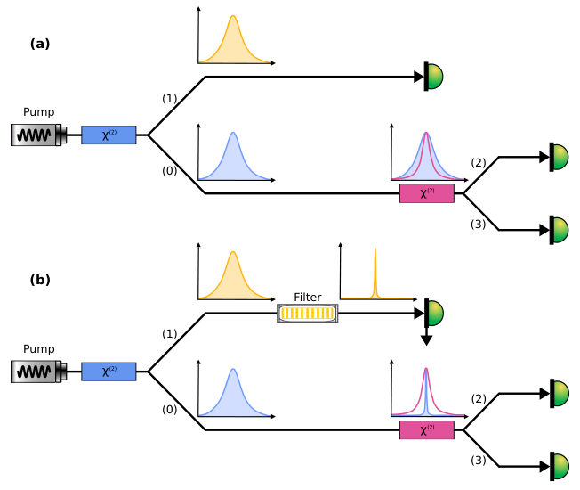
<figcaption class="paper-figure-caption"><b>Fig 1.</b> Figure 1: C-SPDC with (a) no spectral filtering and (b) filtering mode in (1). Filtering in mode 0 would be ineffective because such a filter would simply replicate the spectral filtering effect of the nonlinear crystal. By using a narrowband pump, filtering in mode 1 produces a narrowing of the coincidence spectrum in mode, which can be aligned with the conversion peak of the second nonlinear crystal, while the detection rate in mode 1 is reduced.</figcaption>
</figure>
<figure class="paper-figure-card">
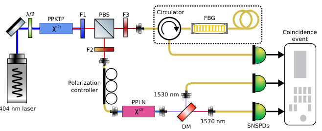
<figcaption class="paper-figure-caption"><b>Fig 2.</b> Figure 2: Experimental setup for the measurement of photon triplets. The dashed box shows the optional spectral filtering of the heralding photon.</figcaption>
</figure>
<figure class="paper-figure-card">

<figcaption class="paper-figure-caption"><b>Fig 3.</b> Figure 3: Experimental setup for the coincidence spectrum measurement. After 844 nm photons have been filtered by the FBG and circulator, they are detected on a Si single-photon avalanche diode (SPAD). This detector is used to trigger a Pockels cell, which changes the polarization of the 775 nm photons from horizontal to vertical, allowing them to pass through the polarizer placed after the Pockels cell. The beam is then directed into optical fibers towards the spectrometer.</figcaption>
</figure>
<figure class="paper-figure-card">
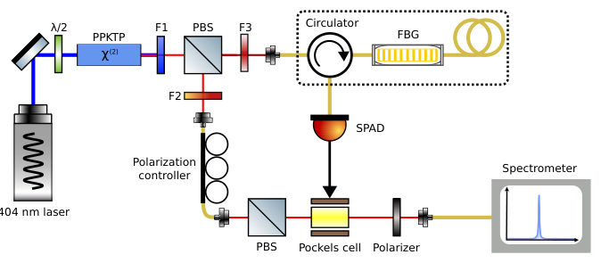
<figcaption class="paper-figure-caption"><b>Fig 4.</b> Figure 4, shows the results of the 844 nm spectrum measurements and 775 nm coincidence spectra in three situations: unfiltered, transmitted by the FBG, and reflected by the FBG and passing through the circulator. The results show that the filtering is effectively shaping the 775 nm post-selected spectrum, as expected from tight energy correlations imposed by the narrowband pump. In Figure 4 (c), the final 775 nm spectrum is compared to the PPLN acceptance bandwidth, showing that effective effeciency is now only reduced by a factor of 0.96. We therefore expect this filtering to yield an improvement of 1.57 compared to the unfiltered case.</figcaption>
</figure>
<figure class="paper-figure-card">
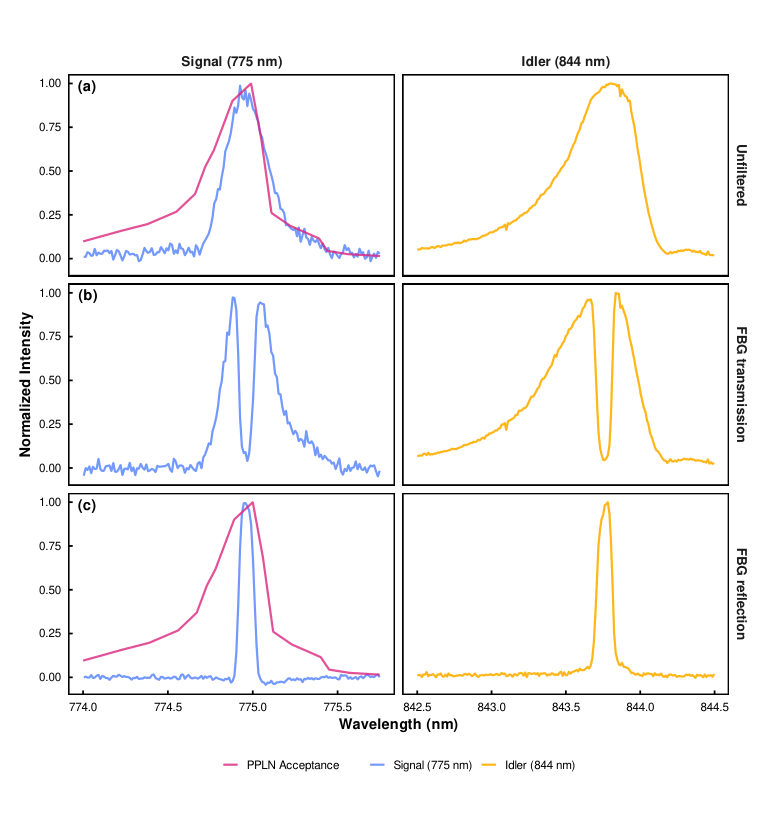
<figcaption class="paper-figure-caption"><b>Fig 5.</b> Figure 4: Spectra at 844 nm and corresponding coincidence spectra at 775 nm. (a) Unfiltered spec- tra: 844 nm photons are directly sent to the spectrometer after being produced by the PPKTP. (b) Spectra transmitted through the FBG: 844 nm photons pass through the FBG before reaching the spectrometer. (c) Spectra reflected by the FBG: 844 nm photons reflected by the FBG are col- lected by the circulator before being detected by the spectrometer. For the 775 nm measurements, noise is reduced using background subtraction, where the background signal is obtained by adding additional delay before the Pockels cell is activated.</figcaption>
</figure>

**Summary.** This paper introduces coincidence-based spectral engineering to overcome spectral mismatch limitations in cascaded spontaneous parametric downconversion. By conditionally filtering the spectrum of one photon in the first stage, the authors can tailor the pump spectrum for the second stage, significantly boosting the efficiency of generating multi-photon entangled states. This technique offers a flexible tool for building high-performance quantum light sources.

**Why it may be interesting.** This work provides a practical, experimentally validated technique for optimizing complex quantum light sources, which is highly relevant for quantum optics and quantum information applications.

Detailed structure

**Main problem.** Current cascaded spontaneous parametric downconversion (C-SPDC) setups are limited by the requirement for precise spectral matching between successive nonlinear stages, which restricts source choices.

**Main result.** The authors demonstrated that implementing coincidence-based spectral filtering relaxes this spectral matching constraint, leading to a measurable increase in the photon-triplet generation rate.

**Method.** They used an electro-optically gated spectrometer to measure the conditional spectra and experimentally verified the enhancement in the second-stage conversion probability per detected herald.

**Model / system.** The system involves a two-stage C-SPDC process, where the first stage generates photon pairs, and one photon acts as a pump for a second nonlinear interaction. The experiment uses specific nonlinear crystals (PPKTP, PPLN) and SNSPDs.

**Key observables.** Photon-triplet rate, conditional spectra, and the enhancement factor in the second-stage conversion probability.

**Important parameters / regimes.** The spectral acceptance bandwidth of the secondary nonlinear process, and the fixed heralding rate.

**Assumptions / limitations.** The primary assumption is that filtering the herald photon conditionally tailors the spectrum of its partner photon, allowing for efficient coupling between broadband and narrowband stages.

**Figures summary.** Figure 1 illustrates the concept of C-SPDC with and without spectral filtering. Figure 2 shows the experimental setup used to quantify the effect of filtering on photon triplets.

**Paper structure.** The paper first establishes the spectral matching problem in C-SPDC. It then introduces coincidence-based spectral filtering as a solution, detailing the measurement of conditional spectra. Finally, it presents quantitative measurements showing the improved triplet rates and compares them to theoretical predictions.

Abstract

Three-photon states generated via cascaded spontaneous parametric downconversion provide a direct route to multipartite entanglement. However, current implementations require careful spectral matching between successive nonlinear stages, which constrains the choice of downconversion sources. In this work, we show that coincidence-based spectral filtering relaxes this requirement by conditionally tailoring the spectrum of the pump photon entering the second stage. By filtering the herald photon, we conditionally tailor the spectrum of its partner to match the acceptance bandwidth of the secondary nonlinear process, enabling efficient coupling between broadband and narrowband stages without altering the sources themselves. Using an electro-optically gated spectrometer, we directly measure the conditional spectra that govern the cascaded process, allowing us to quantitatively predict the enhancement in second-stage conversion probability per detected herald. We then verify this prediction through photon-triplet measurements, demonstrating improved performance at fixed heralding rates. Our results establish coincidence-based spectral engineering as a practical tool for optimizing cascaded downconversion, particularly in regimes limited by detector saturation or spectral incompatibility.

[↑ back to top](#top)

### [QMClaw: A Scalable General-purpose Framework for Quantum Measurement and Control](http://arxiv.org/abs/2609.04674v1)

**Authors:** Zhiqiang Fan, Haoran He, Ping Lv, Junchao Wang, Yaqiang Sun, Chenhui Wang, Hanshi Zhao, Geyuyan Ma, Haoran Yang, Pengyu Han, Xiangdong Meng, Lixin Wang, Feng Yue, Weilong Wang, Zheng Shan  
**Type:** both · **Category:** quantum information and computing · **PDF:** <https://arxiv.org/pdf/2609.04674v1>  
**Analysis basis:** full PDF text, analyzed in chunks
**Topic relevance:** 🔥 `quantum measurements` **4/5** · `QC/QI experiment` **1/5** · `methods for driven-dissipative` **1/5**

↔ Scroll figures horizontally

<figure class="paper-figure-card">

<figcaption class="paper-figure-caption"><b>Fig 1.</b> Fig. 1 The overall design of QMClaw execution stack for scalable QMC</figcaption>
</figure>
<figure class="paper-figure-card">
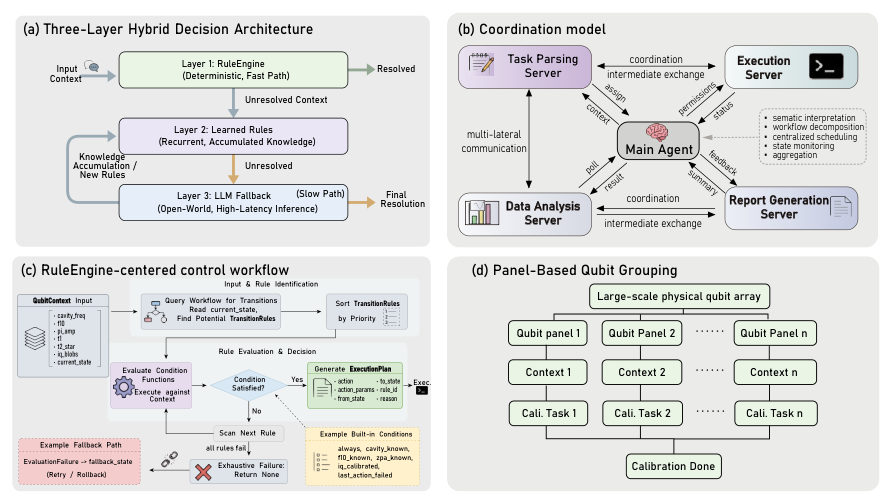
<figcaption class="paper-figure-caption"><b>Fig 2.</b> Fig. 2 System design of QMClaw for scalable QMC. The integrated figure combines four coordinated views: (a) the three-layer hybrid decision architecture, (b) the centralized-scheduling and distributed-execution coordination model, (c) RuleEngine-centered control architecture in QMClaw, (d) Panel-based qubit grouping. Together, these views summarize how QMClaw organizes end-to-end execution, fast-path rule-based control, role-specialized coordination, and feedback-driven workflow progression.</figcaption>
</figure>
<figure class="paper-figure-card">
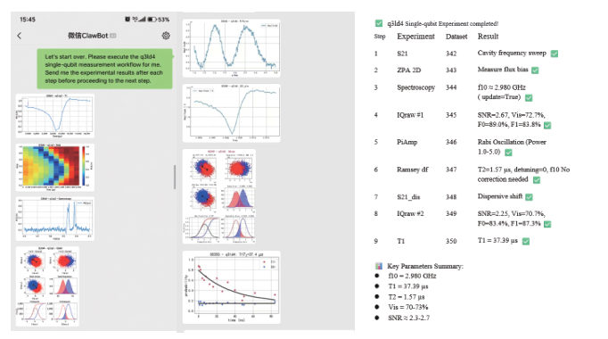
<figcaption class="paper-figure-caption"><b>Fig 3.</b> Fig. 3 Automated quantum measurement and control workflow executed by the QMClaw intelligent agent. The exper- imental instructions were sent to the QMClaw agent through the WeChat official account interface, including resonator frequency scanning, flux bias optimization, qubit spectroscopy, readout calibration, Rabi oscillation, Ramsey coherence detection, and relaxation time T1 measurement. The agent autonomously completed all experimental tasks and returned real-time measurement results, graphical data, and key performance metrics of the superconducting qubit.</figcaption>
</figure>
<figure class="paper-figure-card">
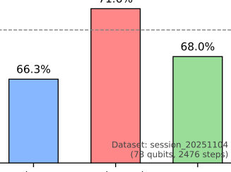
<figcaption class="paper-figure-caption"><b>Fig 4.</b> Fig. 4 Historical streaming prediction accuracy com- parison on real experimental data. The second-order Markov model achieves the highest accuracy of 71.6% under the multi-layer prediction strategy, outperforming the first-order Markov model (66.3%) and the LLM-based predictor (68%). The leave-one-qubit-out cross-validation ensures generalization, with a small overfitting gap of 2.2% observed. Dataset: session 20251104 (73 qubits, 2476 steps).</figcaption>
</figure>
<figure class="paper-figure-card">
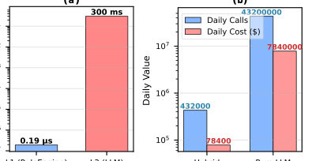
<figcaption class="paper-figure-caption"><b>Fig 5.</b> Fig. 5 LLM Overhead Performance Verification. (a) Latency breakdown between Layer-1 RuleEngine (0.19 µs) and LLM fallback (300 ms), showing a 500,000× speed gap. (b) Daily LLM invocations and operational cost at 1M qubits: the hybrid architecture reduces calls by 100× and cost by 1000× compared to a pure-LLM baseline. Results confirm minimal LLM overhead and strong scalability for large-scale quantum systems.</figcaption>
</figure>

**Summary.** This paper introduces QMClaw, a general, workflow-oriented framework designed to manage complex quantum measurement and control (QMC) tasks. It solves the latency and determinism issues of pure AI agents by using a RuleEngine as the fast, core control mechanism. This hybrid approach enables scalable, robust, and auditable calibration for large quantum systems.

**Why it may be interesting.** This work directly addresses the crucial engineering bottleneck of scaling quantum hardware by providing a structured, low-latency control layer that integrates modern AI techniques without sacrificing determinism.

Detailed structure

**Main problem.** Quantum Measurement and Control (QMC) workflows are complex, requiring low latency, robust exception handling, and traceable governance as quantum systems scale.

**Main result.** The proposed QMClaw framework achieves practical deployment by maintaining a fast, rule-based control path while using LLMs only for high-level interaction and exception support.

**Method.** It employs a general, workflow-oriented architecture centered on a RuleEngine for deterministic state transitions, hybridizing this with LLM assistance for natural language understanding.

**Model / system.** The framework is designed for controlling and calibrating quantum processors, such as superconducting qubits, by managing complex measurement and control sequences.

**Key observables.** Calibration workflows, state transitions, execution plans, resource cost, LLM calling times, and decision latency.

**Important parameters / regimes.** Scalability to large-scale qubit systems (e.g., million-qubit scenarios); latency and resource overhead.

**Assumptions / limitations.** The core assumption is that rule-centered architectures are superior to pure LLM control for the time-critical path in QMC.

**Figures summary.** Figures illustrate the overall six-layer execution stack, the three-layer hybrid decision architecture (RuleEngine, Learned Rules, LLM Fallback), and the centralized scheduling model.

**Paper structure.** The paper introduces the problem limitations, details the six-layer architecture and the three-layer hybrid decision mechanism, validates it with a single-qubit tune-up workflow, and concludes with performance metrics showing massive cost/latency reductions compared to pure LLM approaches.

Abstract

As quantum computing continues to scale, quantum measurement and control (QMC) are increasingly constrained by calibration workflow complexity and by requirements for low-latency execution, robust exception handling, and traceable workflow governance. Existing frameworks for QMC are specialized and task-specific, while language-model-based agents for QMC suffer from excessive latency and cannot satisfy the strict timing and control-density demands of large-scale quantum systems. Here we propose QMClaw, a general, workflow-oriented framework for QMC built, featuring a local-first, tool-governed, robust architecture. At its core is a RuleEngine-centered control layer that processes structured context, performs rule-based state transitions, and generates execution plans for typical calibration workflows. Language models are used only for natural-language interaction, high-level task understanding, and exception support, keeping the critical fast path efficient. We implement a single qubit tune-up workflow as a demonstration and validation using real quantum device dataset. We also prove that the framework achieves quantitatively acceptable levels in terms of resource cost, LLM calling times and decision latency, enabling its practical deployment in large-scale quantum qubit measurement and control scenarios. This work presents a general workflow-oriented framework for QMC and provides evidence that rule-centered architectures are a promising design choice for scalable quantum-system calibration.

[↑ back to top](#top)

### [A Sim-to-Real Study of Surface-Code Decoder Benchmarking](http://arxiv.org/abs/2609.04557v1)

**Authors:** Shay J. Manor, Leila S. Erhili, Yassine Jebbouri  
**Type:** both · **Category:** quantum information and computing · **PDF:** <https://arxiv.org/pdf/2609.04557v1>  
**Analysis basis:** full PDF text, analyzed in chunks
**Topic relevance:** 🔥 `QC/QI experiment` **4/5** · `quantum measurements` **1/5**

↔ Scroll figures horizontally

<figure class="paper-figure-card">
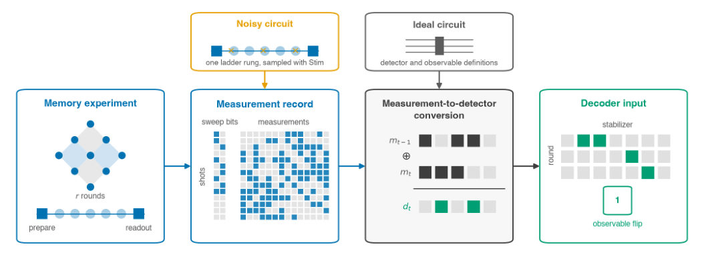
<figcaption class="paper-figure-caption"><b>Fig 1.</b> Fig. 1. Ingest pipeline: a memory experiment on-device is turned into the detection-event lattice a decoder consumes and the observable flip to score against.</figcaption>
</figure>
<figure class="paper-figure-card">

<figcaption class="paper-figure-caption"><b>Fig 2.</b> Fig. 2. Kendall’s τ between each synthetic noise model’s decoder ranking and the real-Willow ranking, by code distance, over the rounds 2–30 window. τ = 1 denotes an identical ordering. Filled markers indicate agreement significant at p &lt; 0.05 against a random ordering; open markers indicate agreement that does not reach significance, both under uniform depolarizing noise.</figcaption>
</figure>
<figure class="paper-figure-card">
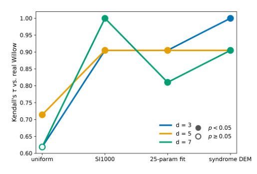
<figcaption class="paper-figure-caption"><b>Fig 3.</b> Figure 2 and Table VI give these values. Uniform noise agrees weakly with real hardware: τ = 0.619, 0.714, and 0.619 at d = 3, 5, and 7, and neither the d = 3 nor the d = 7 value reaches significance (p = 0.069 for both). The three rungs carrying circuit-level structure clear τ ≥0.810 in all nine rung–distance cells and reach exact agreement in two. Uniform noise is separated from the other three rungs by a wider margin than separates those three from each other. At d = 7 the generic SI1000 template reaches τ = 1.000, while the 25-parameter fitted model reaches 0.810 and the</figcaption>
</figure>
<figure class="paper-figure-card">
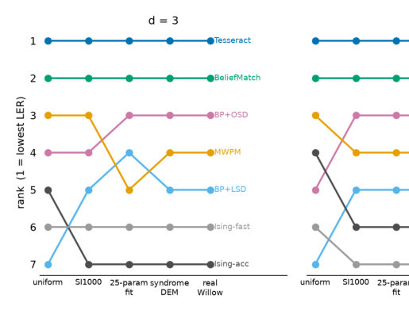
<figcaption class="paper-figure-caption"><b>Fig 4.</b> Fig. 3. Decoder rank under each noise model and on real Willow, by code distance. Rank 1 is the lowest per-cycle logical error rate.</figcaption>
</figure>
<figure class="paper-figure-card">
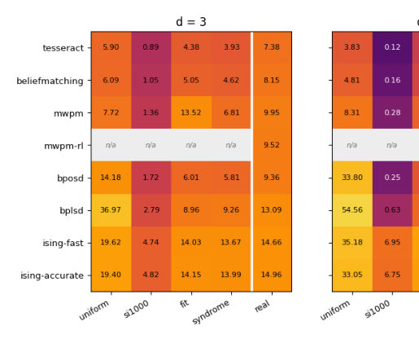
<figcaption class="paper-figure-caption"><b>Fig 5.</b> Fig. 4. Mean per-cycle logical error rate by decoder, noise model, and code distance, over the rounds 2–30 window.</figcaption>
</figure>

**Summary.** This work rigorously benchmarks quantum error-correction decoders on a real quantum processor, testing the assumption that synthetic noise models predict hardware performance. The authors find that simple noise model calibration is insufficient; only highly detailed, hardware-informed noise models yield reliable performance rankings. This provides a vital, open pipeline for the quantum community to compare future QEC algorithms.

**Why it may be interesting.** It provides crucial, hardware-validated benchmarks for QEC decoders, directly challenging the reliance on idealized noise models for assessing quantum computation feasibility.

Detailed structure

**Main problem.** The paper investigates the critical assumption that performance rankings of quantum error-correction (QEC) decoders established using synthetic noise models accurately predict performance on real quantum hardware.

**Main result.** The authors find that rank agreement between synthetic noise models and real hardware only emerges when the noise model accurately captures per-operation error rates, and they demonstrate that the Ising pre-decoder does not offer an inherent accuracy-latency advantage on the tested hardware.

**Method.** They benchmarked six decoders across a four-rung ladder of noise models, comparing results derived from synthetic circuits against real measurements from the Willow processor.

**Model / system.** The study uses the surface code implemented on the Willow processor, which is noted as operating below the surface-code threshold. Benchmarking involves processing raw measurement records to determine observable flips and logical error rates.

**Key observables.** Logical error rate (LER), rank agreement (quantified by Kendall's $\tau$), per-cycle error rate, and decode latency.

**Important parameters / regimes.** Code distances ($d=3, 5, 7$), number of rounds ($r$), and the fidelity level of the noise model.

**Assumptions / limitations.** The core assumption tested is the transferability of synthetic circuit-level noise rankings to real hardware, which the paper argues fails unless the noise model is highly detailed.

**Figures summary.** Figures summarize per-cycle LER vs. round count across different code distances, and tables compare LERs and rank agreements across various decoders and noise models.

**Paper structure.** The paper systematically compares decoder performance across multiple noise models (from simple depolarizing to complex detector error models) using a hardware-grounded benchmark, culminating in a detailed comparison of decoder performance metrics.

Abstract

Quantum error-correction decoders are typically benchmarked against synthetic circuit-level noise, under the assumption that a decoder's ranking under such noise transfers to hardware and improves as the noise model becomes more realistic. The Willow processor, the first to operate below the surface-code threshold, allows us to test this assumption. We rank a panel of six decoders using a four-rung ladder of noise models with increasing fidelity, evaluated against real data across three code distances, two bases, and fifteen round counts. Rank agreement with hardware appears once the noise model gives each operation type its own error rate. Calibrating the model to the device improves absolute error rates but not rank agreement. We additionally provide the first independent evaluation of NVIDIA's Ising pre-decoder on hardware, at code distances below its training receptive field and via a mapping onto the lattice on which it was trained. Under these conditions, it holds no accuracy-latency advantage: another panel decoder matches or improves on it in both per-cycle error rate and decode latency in 278 of the 280 evaluations. We release the full pipeline and the per-shot outcome of every evaluation, so future decoders and devices can be compared.

[↑ back to top](#top)

### [Transition between weak and strong measurements in the presence of post-selection](http://arxiv.org/abs/2609.04812v1)

**Authors:** Shogo Hanashiro, Holger F. Hofmann  
**Type:** theory · **Category:** other · **PDF:** <https://arxiv.org/pdf/2609.04812v1>  
**Analysis basis:** full PDF text, analyzed in chunks
**Topic relevance:** 🔥 `quantum measurements` **4/5** · `Full counting statistics` **1/5**

↔ Scroll figures horizontally

<figure class="paper-figure-card">
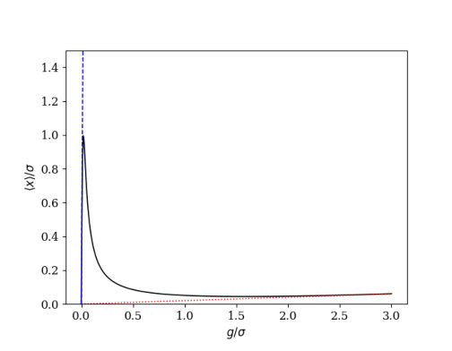
<figcaption class="paper-figure-caption"><b>Fig 1.</b> FIG. 1. Average meter position ⟨x⟩/σ after post-selection as a function of measurement strength g/σ for an initial weak value of w = 100. The black solid line shows the complete measurement strength dependence of the average meter po- sition. The blue dashed line illustrates the meter shift in the weak measurement limit (g ≪σ), and the red dotted line shows the average meter shift in the strong measurement limit. The slope of the blue dashed line is given by the weak value and the slope of the dotted red line is given by the ABL average.</figcaption>
</figure>
<figure class="paper-figure-card">
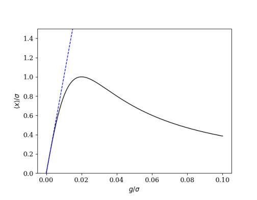
<figcaption class="paper-figure-caption"><b>Fig 2.</b> FIG. 2. Average meter position ⟨ˆx⟩/g at the transition from the weak measurement regime to the intermediate regime for w = 100. The average meter position reaches a maxim of ⟨ˆx⟩/g = 1 at g/σ = 2/w.</figcaption>
</figure>
<figure class="paper-figure-card">
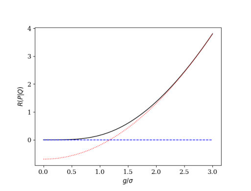
<figcaption class="paper-figure-caption"><b>Fig 3.</b> FIG. 3. Measurement strength dependence of relative entropy without post-selection for an initial state with ⟨ˆA⟩= 0 (black solid line). The blue dashed line indicates the relative entropy of zero observed in the weak measurement limit (g ≪σ). The red dotted line indicates the strong measurement limit (g ≫σ). The negative offset of the red dotted line is equal to the Shannon entropy of H(pa) = ln(2).</figcaption>
</figure>
<figure class="paper-figure-card">
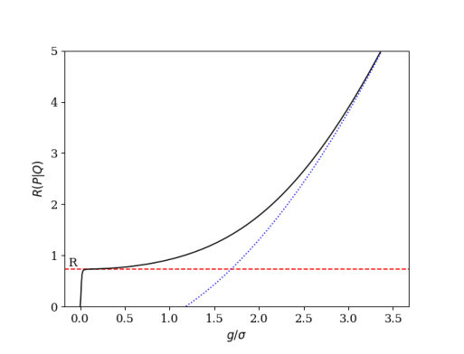
<figcaption class="paper-figure-caption"><b>Fig 4.</b> FIG. 4. Measurement strength dependence of the relative en- tropy R(P|Q) in the presence of post-selection for w = 100. An intermediate region appears between weak and strong measurements, characterized by a plateau of constant relative entropy indicated by the red dashed line. The blue dotted line shows the approximation for the strong measurement regime.</figcaption>
</figure>
<figure class="paper-figure-card">
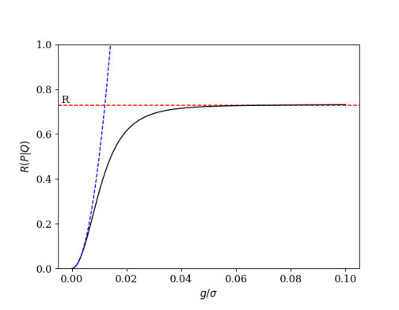
<figcaption class="paper-figure-caption"><b>Fig 5.</b> FIG. 5. Transition between the weak measurement regime and the intermediate regime. After a rapid quadratic rise, the relative entropy levels off at a plateau value of R.The transition happens around g/σ = 2/w.</figcaption>
</figure>

**Summary.** This paper theoretically examines how post-selection alters measurement statistics as the measurement strength transitions between weak and strong limits. It finds that in an intermediate regime, the system performs a momentum measurement on the meter, suggesting a fundamental role reversal in the measurement process. This sheds light on the physical interpretation of measurement outcomes beyond simple weak-value approximations.

**Why it may be interesting.** This work provides a detailed theoretical understanding of measurement back-action and how post-selection modifies the expected measurement outcomes, which is crucial for understanding open quantum systems dynamics.

Detailed structure

**Main problem.** The paper investigates the measurement process, specifically analyzing the transition between weak and strong measurement regimes when post-selection is applied.

**Main result.** In the intermediate measurement regime, the meter statistics are nearly independent of measurement strength and indicate that the system effectively measures the momentum of the meter.

**Method.** The analysis involves deriving and comparing meter statistics, post-selected meter states, and the dependence of these quantities on the measurement strength parameter ($g$) across different limits.

**Model / system.** The model describes a quantum system interacting with a meter via a unitary transformation $\hat{U} = e^{-ig \hat{A}\hat{p}}$, where $g$ is the measurement strength and $\hat{p}$ is the meter momentum operator.

**Key observables.** Meter statistics (average position $\langle\hat{x}\rangle$, distribution $P_{ps}(x)$), weak values, and the post-selection probability $P_f(g)$.

**Important parameters / regimes.** Measurement strength ($g$), initial meter uncertainty ($\sigma$), and the anomalous weak value ($w$).

**Assumptions / limitations.** The analysis relies on comparing the behavior in the weak, intermediate, and strong measurement limits, treating the post-selection as the key modifying factor.

**Figures summary.** Figures illustrate the dependence of the average meter position $\langle\hat{x}\rangle$ on measurement strength, showing distinct behaviors in the weak and strong limits, and the transition region.

**Paper structure.** The paper reviews post-selected measurements, derives expressions for meter distributions, uses relative entropy analysis, discusses the physics of the intermediate regime, and concludes by explaining the role reversal in the transition.

Abstract

In the weak measurement regime, post-selection can result in the observation of anomalous weak values, seemingly contradicting the eigenvalue statistics observed when the measurement interaction is strong. Here, we investigate the dependence of meter statistics on measurement strength in a post-selected measurement. We find that the meter statistics in the intermediate regime between weak and strong measurements is nearly independent of measurement strength and show that, in this regime, the system performs a measurement of momentum on the meter. The transition between weak and strong measurements is explained by a reversal of the roles of the system and the meter, where the post-selection acts as a readout of information about the meter.

[↑ back to top](#top)

### [Fluctuations of a Photon Bose-Einstein Condensate Coupled to a Reservoir: Describing Coherence Properties in a Free-Energy Model](http://arxiv.org/abs/2609.05287v1)

**Authors:** Martin Weitz, Andreas Redmann, Riccardo Panico, Leon Kleeblank, Kevin J. H. Peters, Frank Vewinger, Julian Schmitt  
**Type:** theory · **Category:** quantum gases · **PDF:** <https://arxiv.org/pdf/2609.05287v1>  
**Analysis basis:** full PDF text, analyzed in chunks
**Topic relevance:** `Keldysh / 2PI / non-Gaussian methods` **3/5** · `analog quantum simulation` **3/5** · `driven-dissipative phase transition` **3/5** · `Tavis-Cummings & cavity-many-emitter` **2/5** · `correlated / nonlocal dissipation` **2/5** · `methods for driven-dissipative` **2/5** · `non-equilibrium universality` **2/5** · `Dicke superradiance` **1/5** · `Full counting statistics` **1/5** · `quantum measurements` **1/5** · `superradiant laser` **1/5**

↔ Scroll figures horizontally

<figure class="paper-figure-card">
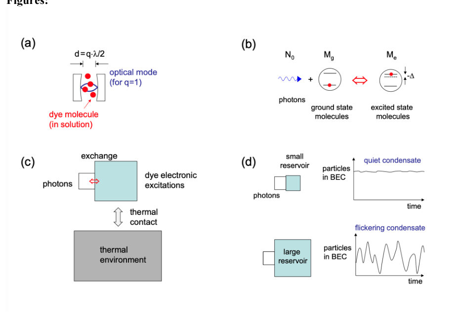
<figcaption class="paper-figure-caption"><b>Fig 1.</b> Fig. 1 (a): Scheme of an optical microresonator with harmonic trapping of a two-dimensional</figcaption>
</figure>
<figure class="paper-figure-card">
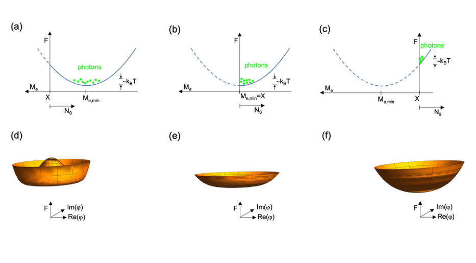
<figcaption class="paper-figure-caption"><b>Fig 2.</b> Fig. 2: Variation of the free energy F of photon condensate coupled to dye reservoir versus</figcaption>
</figure>
<figure class="paper-figure-card">
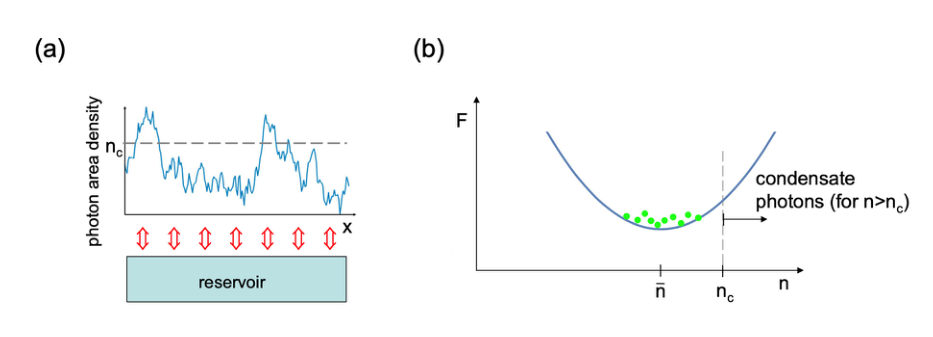
<figcaption class="paper-figure-caption"><b>Fig 3.</b> Fig. 3: (a) Cut though the spatial profile of a statistically varying photon area density in an</figcaption>
</figure>
<figure class="paper-figure-card">
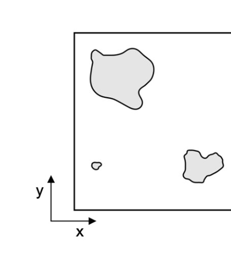
<figcaption class="paper-figure-caption"><b>Fig 4.</b> Fig. 4: Schematic representation of instantaneous emission pattern of a two-dimensional</figcaption>
</figure>

**Summary.** This paper models photon Bose-Einstein Condensation in a microcavity coupled to a material reservoir, using a free-energy approach. It demonstrates a fundamental transition in the system's statistics, moving from a canonical regime exhibiting spontaneous symmetry breaking to a grand canonical regime where condensation occurs without such breaking. This has implications for understanding coherence in various optical systems.

**Why it may be interesting.** This work bridges concepts from Bose-Einstein condensation (quantum gases) with open quantum systems dynamics, using free energy methods to predict the transition between different statistical descriptions of coherence in cavity QED systems.

Detailed structure

**Main problem.** The paper develops a theory model to study the fluctuation properties and coherence of photons in an optical microcavity coupled to a material reservoir.

**Main result.** The system's free energy landscape transitions from a Mexican-hat shape (canonical regime, suggesting spontaneous symmetry breaking) to a bowl-shaped form (grand canonical regime, suggesting BEC without SSB).

**Method.** The analysis uses a free-energy description, treating the system in both canonical and grand canonical ensembles to analyze the statistical fluctuations of the condensate.

**Model / system.** The system consists of noninteracting photons confined in a microcavity, coupled to a reservoir of material electronic excitations (e.g., dye molecules). The model is analyzed by varying the relative size of this reservoir.

**Key observables.** Condensate number fluctuations, free energy landscape shape, second-order coherence function g^(2)(0), and the order parameter $\langle N_0 \rangle$.

**Important parameters / regimes.** Reservoir size (determining the statistical regime), critical temperature $T_c$, and the coherence length $\xi$.

**Assumptions / limitations.** The model assumes the lossless limit and that the system can be described by interpolating between canonical and grand canonical ensembles.

**Figures summary.** Figures illustrate the free energy variation across different statistical regimes (canonical vs. grand canonical) and show spatial profiles indicating the onset of long-range coherence in localized 'microcondensates'.

**Paper structure.** The paper first establishes the single-mode free energy model, contrasting the canonical (Mexican-hat) and grand canonical (bowl-shaped) regimes. It then extends the analysis to include spatially distributed coupling, predicting localized coherence islands.

Abstract

Photons are mutually nearly noninteracting particles, so thermalized photon ensembles are commonly obtained not from direct particle-particle-interactions but rather from contact with matter, which can constitute a reservoir for the photon gas. We develop a theory model for photons in a material-filled (e.g. liquid dye) optical microcavity, with the aim to study the fluctuation properties using a free-energy description for noninteracting photons coupled to a reservoir of material electronic excitations. To begin with, we use a single mode description for the condensate. For a small relative size of the material reservoir, corresponding to the canonical regime, condensate number fluctuations are small, and the derived free energy landscape takes the usual Mexican-hat shaped form such that spontaneous symmetry breaking occurs. In contrast, for a large relative size of the reservoir, corresponding to the grand canonical regime, fluctuations become as large as the average particle number. We show that the resulting free energy landscape acquires a bowl-shaped form, with a single minimum at the origin. Thus, a macroscopic occupation of the ground state (i.e., Bose-Einstein condensation) in the absence of spontaneous symmetry breaking is expected. We also provide a model for the treatment of a photon gas trapped in a box-shaped potential with spatially distributed coupling to a reservoir. The model predicts, for example, a statistically fluctuating pattern of islands with long-range coherence, resembling transient microcondensates.

[↑ back to top](#top)

### [Ancilla mediated steady-state engineering in open quantum systems](http://arxiv.org/abs/2609.04905v1)

**Authors:** Soham Pal, Karen Hovhannisyan, Omri Porat, Shovan Dutta, Janet Anders, Helena Knowles  
**Type:** both · **Category:** statistical mechanics · **PDF:** <https://arxiv.org/pdf/2609.04905v1>  
**Analysis basis:** full PDF text, analyzed in chunks
**Topic relevance:** `QC/QI experiment` **3/5** · `driven-dissipative phase transition` **3/5** · `methods for driven-dissipative` **3/5** · `non-equilibrium universality` **3/5** · `scars & prethermalization` **3/5** · `quantum measurements` **2/5** · `Keldysh / 2PI / non-Gaussian methods` **1/5** · `analog quantum simulation` **1/5** · `correlated / nonlocal dissipation` **1/5**

↔ Scroll figures horizontally

<figure class="paper-figure-card">
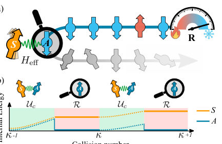
<figcaption class="paper-figure-caption"><b>Fig 1.</b> Figure 1. Schematic of the platform. (a) The system qubit S interacts sequentially with a stream of ancilla spins, each ini- tialized in either the |↑⟩or |↓⟩state, according to the reservoir spin temperature. (b) After each unitary interaction in the reversible Uc stroke, the ancilla A is reset to a chosen thermal state by the irreversible R stroke. The system–ancilla colli- sion is subsequently repeated.</figcaption>
</figure>
<figure class="paper-figure-card">
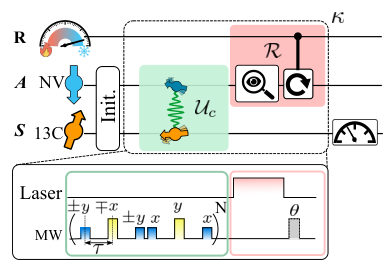
<figcaption class="paper-figure-caption"><b>Fig 2.</b> Figure 2. Circuit diagram for the solid-state implementation of the tunable thermodynamic platform with Uc (green) and R (red) representing the unitary and dissipative strokes, re- spectively. The lower panel shows the pulse sequence used to generate Uc and R strokes. The yellow (blue) bars are π (π/2) pulses with phases labeled above and the gray pulse shows θ rotation, with τ as the inter-pulse delay.</figcaption>
</figure>
<figure class="paper-figure-card">
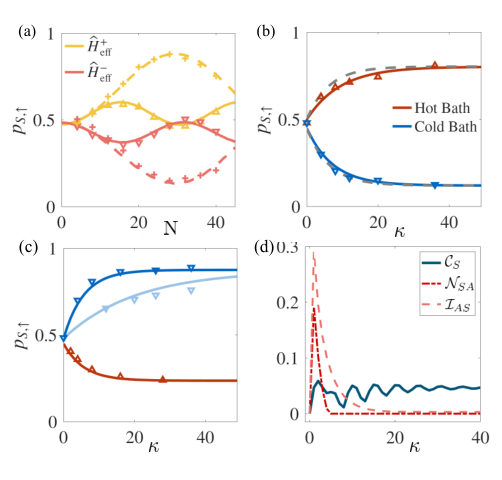
<figcaption class="paper-figure-caption"><b>Fig 3.</b> Figure 3. Simulated (solid/dashed) and experimental (mark- ers) system energetics: (a) Coherent evolution of the excited-state population of S, pS,↑, under the reversible chan- nels H+ eff (yellow) and H− eff (red), shown for inter-pulse de- lays of 376ns (dashed) and 370ns (solid) as a function of N (see Fig. 2). (b) Thermalisation of S under H− eff for hot and cold baths at 370ns (solid) and 376ns (dashed) and N= 8 as function of collision number, κ. (c) Anti-thermalisation un- der H+ eff, including a lighter trace for driving at 365ns. (d) Dynamics of system coherence CS (solid) and quantum corre- lations (dashed), quantified via Negativity NAS and Mutual Information IAS for inter-pulse...</figcaption>
</figure>
<figure class="paper-figure-card">
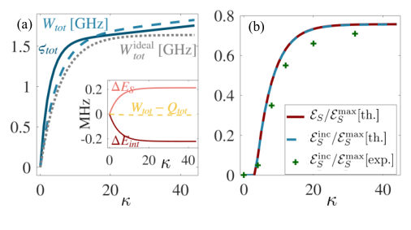
<figcaption class="paper-figure-caption"><b>Fig 4.</b> Figure 4. (a) Evolution of cumulative entropy (ςtot) and work (Wtot) injected as a function of the collision number κ. The continuous and dashed lines show the work and entropy pro- duction, respectively, for our experiment, whereas the dotted line shows the total work for the ideal U + c , W ideal tot . Inset shows the energy balance of work and heat (Qtot) with the change in energy of the system. (b) Evolution of the full ES and incoherent ergotropies Einc S for a quantum battery real- ized by qubit S and charged through qubit A and reservoir R. The continuous curves are the simulated values, whereas the green crosses show the experimentally measured incoherent ergotropy.</figcaption>
</figure>

**Summary.** This research details the use of an ancilla qubit (NV center) coupled to a target spin ($^{13}	ext{C}$) to engineer quantum thermodynamic processes. By implementing controlled unitary and dissipative strokes, the authors demonstrate the ability to achieve anti-thermalization and utilize the system as a quantum battery. This offers a powerful platform for studying non-equilibrium physics in solid-state quantum devices.

**Why it may be interesting.** This work provides a concrete, solid-state realization of fundamental concepts in non-equilibrium statistical mechanics, particularly concerning work extraction and thermalization control in open quantum systems.

Detailed structure

**Main problem.** The paper addresses the challenge of engineering quantum thermodynamic processes and generating inaccessible steady states by precisely controlling the coupling between a quantum system and its reservoir.

**Main result.** They experimentally demonstrate anti-thermalization, stabilizing the target system at a negative temperature, and utilize this steady state to operate the system as a quantum battery achieving high ergotropy.

**Method.** The dynamics are modeled using a collision framework involving alternating engineered unitary interactions and dissipative ancilla resets, allowing for cycle-by-cycle tracking of thermodynamic quantities.

**Model / system.** The platform uses a solid-state system: an NV center electron spin acts as the ancilla, coupled to a proximal $^{13}	ext{C}$ nuclear spin target. The dynamics are controlled via shaped microwave and optical pulses.

**Key observables.** Work, heat, coherence, entropy production, ergotropy, and the steady-state temperature of the target system.

**Important parameters / regimes.** The ability to tune the reservoir temperature ($T_R$) and the coupling strength via pulse sequences.

**Assumptions / limitations.** The theoretical framework relies on the collision model structure, and the analysis of entropy production assumes the reservoir is an ideal bath.

**Figures summary.** Figures illustrate the schematic interaction sequence (unitary and reset strokes), the solid-state circuit diagram, and comparisons of simulated vs. experimental system energetics, coherence, and correlations.

**Paper structure.** The paper builds a theoretical framework based on a collision model, details the experimental implementation using NV/C spins, and then demonstrates key thermodynamic phenomena like anti-thermalization and quantum battery operation.

Abstract

Engineering the properties of a reservoir and its coupling to a quantum system is a powerful tool for simulating quantum thermodynamic processes and for generating otherwise inaccessible steady states. Yet tailoring both the reservoir and its coupling within a single platform remains challenging. Here we introduce a platform, in which an ancilla qubit mediates the coupling of a target system to a reservoir, providing independent control over the interaction form, coupling strength, and effective reservoir temperature. Our implementation uses the electron spin of a single nitrogen-vacancy center in diamond as the ancilla and a proximal $^{13}$C nuclear spin as the target. By alternating engineered unitary interactions with dissipative ancilla resets, we realize dynamics naturally described by a collision model, enabling straight-forward tracking of the work, heat, coherence, and entropy generated at every collision. We experimentally demonstrate conventional thermalization and also realize anti-thermalization: the stabilization of the target system in a temperature opposite to that of its reservoir. Finally, harnessing this steady-state engineering, we utilize the nuclear spin as a quantum battery, achieving a steady-state ergotropy exceeding $70\%$ of the theoretical maximum.

[↑ back to top](#top)

### [Non-reciprocally interacting Ornstein-Uhlenbeck processes: Exceptional points, Anomalous relaxation, Pseudo-equilibrium and Boundary refrigeration](http://arxiv.org/abs/2609.05391v1)

**Authors:** Soumya Kanti Pal, Shamik Gupta  
**Type:** theory · **Category:** statistical mechanics · **PDF:** <https://arxiv.org/pdf/2609.05391v1>  
**Analysis basis:** full PDF text, analyzed in chunks
**Topic relevance:** `correlated / nonlocal dissipation` **3/5** · `driven-dissipative phase transition` **3/5** · `methods for driven-dissipative` **3/5** · `non-equilibrium universality` **3/5** · `Keldysh / 2PI / non-Gaussian methods` **2/5** · `analog quantum simulation` **2/5** · `Frenkel-Kontorova` **1/5** · `quantum measurements` **1/5** · `scars & prethermalization` **1/5**

↔ Scroll figures horizontally

<figure class="paper-figure-card">
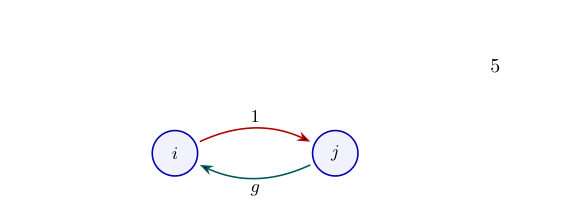
<figcaption class="paper-figure-caption"><b>Fig 1.</b> FIG. 1. Schematic representation of the non-reciprocal cou- pling between the particles i and j, where g is the non- reciprocity strength.</figcaption>
</figure>
<figure class="paper-figure-card">
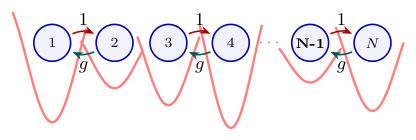
<figcaption class="paper-figure-caption"><b>Fig 2.</b> FIG. 3. Schematic representation of Model II: Non- interacting dimers with non-reciprocal interactions between their constituents that are confined in harmonic potentials of random stiffness.</figcaption>
</figure>
<figure class="paper-figure-card">
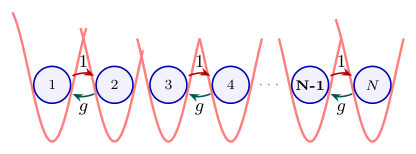
<figcaption class="paper-figure-caption"><b>Fig 3.</b> FIG. 2. Schematic representation of Model I: Non-interacting dimers with non-reciprocal interactions between their con- stituents that are confined in a harmonic potential of identical stiffness.</figcaption>
</figure>
<figure class="paper-figure-card">
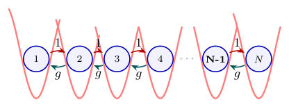
<figcaption class="paper-figure-caption"><b>Fig 4.</b> FIG. 5. Schematic representation of Model III: A one- dimensional open lattice of particles with non-reciprocal in- teractions, and individual particles confined by a harmonic potential of identical stiffness.</figcaption>
</figure>
<figure class="paper-figure-card">
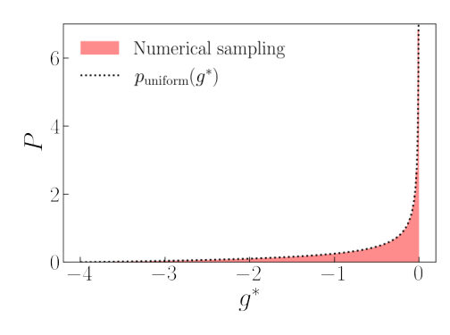
<figcaption class="paper-figure-caption"><b>Fig 5.</b> FIG. 4. For Model II, with the stiffness constant ki’s drawn uniformly from the interval [1, 5], the figure shows the distri- bution of the EP location g∗computed numerically for 108</figcaption>
</figure>

**Summary.** This work analyzes non-reciprocal stochastic systems using NROU models, linking them to the physics of Exceptional Points. It demonstrates how these non-Hermitian features lead to anomalous relaxation, unique steady-state behaviors like pseudo-equilibrium, and a controllable boundary refrigeration effect by tuning the system's asymmetry.

**Why it may be interesting.** It provides a concrete, solvable model connecting non-Hermitian physics (EPs) directly to measurable, non-equilibrium thermodynamic quantities like heat flow and energy dissipation, which is highly relevant for open quantum systems.

Detailed structure

**Main problem.** The paper investigates the non-equilibrium dynamics and steady-state properties of systems subjected to non-reciprocal interactions, which inherently drive them away from equilibrium.

**Main result.** The study reveals anomalous relaxation at exceptional points (EPs), the existence of 'pseudo-equilibrium' states with non-zero currents, and a boundary refrigeration effect controllable by tuning the non-reciprocity parameter.

**Method.** The analysis employs stochastic processes (Ornstein-Uhlenbeck models), connecting non-Hermitian spectral theory (Exceptional Points) to non-equilibrium thermodynamics via the Harada-Sasa relation and contour integration.

**Model / system.** The core model is a hierarchy of non-reciprocally interacting Ornstein-Uhlenbeck (NROU) processes, ranging from simple dimers to many-body chains mapping onto the Hatano-Nelson model.

**Key observables.** Autocorrelation/covariance functions, total steady-state heat dissipation ($\langle Q_{tot} 
angle$), and the sign of boundary heat flux.

**Important parameters / regimes.** The non-reciprocity parameter $g$, and the special point $g=g^*$ where the system exhibits Exceptional Points (EPs).

**Assumptions / limitations.** The analysis relies on the mathematical framework of non-Hermitian systems and assumes the validity of fluctuation-dissipation theorems and their extensions to non-equilibrium steady states.

**Figures summary.** Figures illustrate the schematic coupling of non-reciprocal interactions and likely show the dependence of observables on the non-reciprocity parameter $g$.

**Paper structure.** The paper systematically introduces the NROU models, analyzes the mathematical consequences of reaching an EP ($g=g^*$), derives anomalous relaxation scaling, and finally calculates thermodynamic quantities like heat dissipation and boundary effects using advanced mathematical techniques.

Abstract

Non-reciprocal interactions are ubiquitous in active, biological, and disordered systems, generically driving them out of equilibrium. Here, we introduce a hierarchy of non-reciprocally interacting Ornstein-Uhlenbeck (NROU) models governed by a tunable non-reciprocity parameter $g$. At a special point $g=g^*$, the drift matrix becomes non-diagonalizable, realizing exceptional points (EP's) of different orders, where eigenvalues and eigenvectors simultaneously coalesce. The hierarchy encompasses non-reciprocally coupled dimers, their disordered counterparts, and a many-body chain exactly mapping onto the paradigmatic Hatano-Nelson model in the arena of non-Hermitian quantum systems. For the disordered model, we show that the distribution of the EP location $g^*$ across disorder realizations develops a universal edge singularity precisely at the clean-system EP, and is manifestly non-self-averaging. Across all models, we find that at the EP, the usual exponential relaxation of the autocorrelation and covariance functions is dressed by a polynomial-in-time prefactor whose degree is set by the order of the EP and whose detailed structure encodes the spatial architecture of the chain. At complete asymmetry, the many-body chain exhibits ``pseudo-equilibrium'': its steady-state distribution factorizes into equilibrium-like single-particle measures despite a nonzero steady-state current. Moreover, the $N$-particle interacting system decomposes into $N/2$ independent complex OU processes. Finally, using the Harada-Sasa relation, we obtain a closed-form expression for the total steady-state heat dissipation and uncover a boundary refrigeration effect, in which the boundary particles switch from acting as a hot to a cold reservoir as the non-reciprocity is tuned.

[↑ back to top](#top)

### [Towards minimal conditions for ergotropy injection in open quantum systems](http://arxiv.org/abs/2609.04457v1)

**Authors:** Deependra Singh, Debarupa Saha, Ujjwal Sen  
**Type:** theory · **Category:** statistical mechanics · **PDF:** <https://arxiv.org/pdf/2609.04457v1>  
**Analysis basis:** full PDF text, analyzed in chunks
**Topic relevance:** `correlated / nonlocal dissipation` **3/5** · `driven-dissipative phase transition` **3/5** · `methods for driven-dissipative` **3/5** · `Keldysh / 2PI / non-Gaussian methods` **2/5** · `non-equilibrium universality` **2/5** · `scars & prethermalization` **2/5** · `quantum measurements` **1/5**

↔ Scroll figures horizontally

<figure class="paper-figure-card">
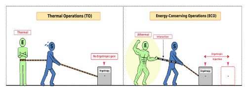
<figcaption class="paper-figure-caption"><b>Fig 1.</b> Figure 1. Conceptual schematic illustrating the central mes- sage of this work. The system S is depicted as pulling an “ergotropy box,” representing ergotropic gain in the system. Under thermal operations (TO) (left), the environment E is thermal and cannot assist S in pulling the box closer, in- dicating the absence of ergotropic gain. Under generalized energy-conserving operations (ECO) (right), environmental athermality and system–environment interaction empower E to assist S, thereby enabling ergotropic injection into the bat- tery.</figcaption>
</figure>
<figure class="paper-figure-card">

<figcaption class="paper-figure-caption"><b>Fig 2.</b> Figure 2. Difference between the ergotropic gain in the pres- ence of environment coherence and the optimal gain for an in- coherent environment, max(∆˜Ropt−∆Ropt, 0), for the initial conditions p = 1/2 and a = 0, as a function of τ11 ∈[0, 0.5] and θc ∈[0, 0.35]. Here, the environment coherence is taken to be maximal, |τ01| = p</figcaption>
</figure>
<figure class="paper-figure-card">
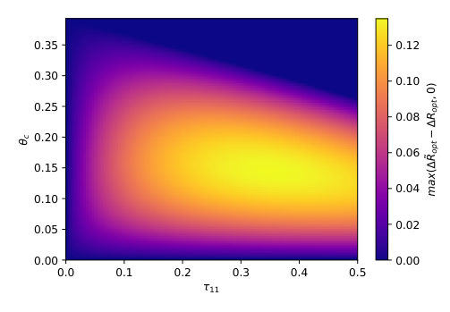
<figcaption class="paper-figure-caption"><b>Fig 3.</b> Figure 2 shows the difference max(∆˜Ropt −∆Ropt, 0) as a function of τ11 and θc. The enhancement is concen- trated in an extended interior region of the parameter space, with the largest values occurring for intermedi- ate τ11 and moderate values of θc. In particular, the enhancement is most pronounced around θc ≈0.15 and τ11 ≈0.3–0.4, where the color map reaches its maximum intensity. The enhancement gradually decreases as ei- ther parameter approaches the boundary of the allowed region. For θc →0, the factor sin(2θc) vanishes, and consequently the contribution of environment coherence disappears. Similarly, the enhancement becomes small when τ11 approaches the endpoints, since the maximum...</figcaption>
</figure>
<figure class="paper-figure-card">
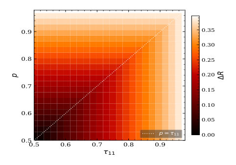
<figcaption class="paper-figure-caption"><b>Fig 4.</b> Figure 3. Optimal ergotropic gain ∆R in the double- degeneracy regime (J = Jc) for incoherent inputs, as a func- tion of the environment ground population τ11 and the system ground population p, maximized over all admissible energy- conserving unitaries U = W+ ⊕W−. The window shown is the passive quadrant p, τ11 ≥1</figcaption>
</figure>
<figure class="paper-figure-card">
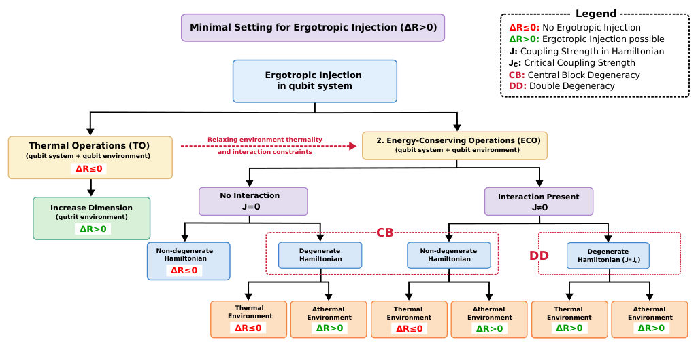
<figcaption class="paper-figure-caption"><b>Fig 5.</b> Figure 4. Summary of the ergotropic injection regimes considered in this work. Under thermal operations with a qubit system and a qubit environment, no injection is possible. Two routes circumvent this. Enlarging the environment to a qutrit restores injection within the thermal-operation framework. Alternatively, one may retain qubits and pass to the broader class of energy-conserving operations, where the unitary commutes with the full Hamiltonian including any interaction term and the environment need not be thermal. Injection is then governed by the degeneracy structure of the total Hamiltonian: for a nondegenerate non-interacting Hamiltonian it remains impossible; in the central-block...</figcaption>
</figure>

**Summary.** This paper investigates the fundamental conditions required for a quantum system to gain ergotropy—the extractable work—from its environment. It shows that strict thermal assumptions limit this gain, but relaxing these assumptions, particularly by allowing environmental athermality or increasing environmental dimensionality, enables positive ergotropic injection. This refines our understanding of quantum work extraction in realistic, interacting open systems.

**Why it may be interesting.** This work directly addresses the thermodynamics of open quantum systems, specifically quantifying the resource (environmental state/interaction) needed to violate standard thermodynamic bounds on work extraction.

Detailed structure

**Main problem.** The research aims to determine the minimal physical conditions, such as environmental dimensionality or interaction type, required for injecting ergotropy into an open quantum system.

**Main result.** Ergotropy injection is impossible under standard thermal operations for qubits but becomes possible by relaxing environmental thermality or increasing the environment's dimensionality (e.g., to a qutrit).

**Method.** The authors employ theoretical analysis by comparing results under Thermal Operations (TO) versus generalized Energy-Conserving Operations (ECO) using specific Hamiltonian models.

**Model / system.** The study models an open quantum system (S) interacting with an environment (E), initially focusing on qubit-qubit interactions using an isotropic XY Hamiltonian. The analysis distinguishes between different operational constraints (TO vs. ECO).

**Key observables.** Ergotropy (quantifying extractable work), Ergotropic Gain ($\Delta R$), and the coherence/thermal state of the environment.

**Important parameters / regimes.** Environmental dimensionality (qubit vs. qutrit), interaction strength, and the initial thermal state of the environment (thermal vs. athermal/population inversion).

**Assumptions / limitations.** The analysis relies on comparing the constraints of thermal operations versus the broader scope of energy-conserving unitaries.

**Figures summary.** Figure 1 conceptually illustrates the difference between TO (no gain) and ECO (potential for ergotropic injection) based on environmental resources.

**Paper structure.** The paper progresses by first establishing the limitations under thermal operations, then advancing the analysis by relaxing these constraints to allow for environmental athermality and interactions, finally analyzing specific degeneracy regimes (CB and DD) to pinpoint the necessary conditions.

Abstract

Interactions between a quantum system and its environment can inject ergotropy into the system, raising the question of the minimal dimensionality and physical resources required for such injection. We first show that ergotropy injection is impossible under thermal operations when both the system and environment are qubits, whereas it becomes possible when the environment is enlarged to a qutrit. We further show that already in the qubit-qubit setting, relaxing environmental thermality and allowing interactions between system and environment allows ergotropy increment under energy-conserving unitaries. To elucidate the role of interactions, we consider a two-qubit isotropic XY interaction Hamiltonian and identify its distinct degeneracy regimes. We show that, in the central-block regime, when both the initial system and environmental states are incoherent, no ergotropic gain is possible when the environment is initially thermal, irrespective of the interaction strength. In contrast, environmental athermality in the form of population inversion, while retaining incoherence, enables ergotropic injection. We derive the optimal ergotropic gain and show that environmental coherence can enhance it, while system coherence alone need not be beneficial and can even reduce the gain. We further consider the double-degenerate regime, characterized by a finite interaction strength, and demonstrate positive ergotropic gain even for a thermal environment.

[↑ back to top](#top)

### [Coarse-graining far-from-equilibrium dynamics using oblique projectors](http://arxiv.org/abs/2609.05217v1)

**Authors:** Gerhard Jung  
**Type:** theory · **Category:** statistical mechanics · **PDF:** <https://arxiv.org/pdf/2609.05217v1>  
**Analysis basis:** full PDF text, analyzed in chunks
**Topic relevance:** `Keldysh / 2PI / non-Gaussian methods` **3/5** · `driven-dissipative phase transition` **3/5** · `methods for driven-dissipative` **3/5** · `non-equilibrium universality` **3/5** · `correlated / nonlocal dissipation` **2/5** · `quantum measurements` **1/5**

↔ Scroll figures horizontally

<figure class="paper-figure-card">
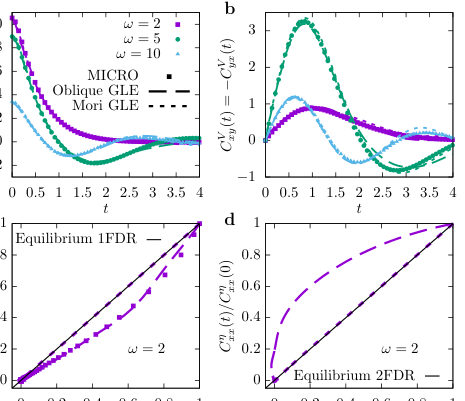
<figcaption class="paper-figure-caption"><b>Fig 1.</b> FIG. 2. Correlation functions and fluctuation-dissipation rela- tions of a passive tracer in chiral active matter, comparing the microscopic simulations (MICRO), the oblique GLE and the Mori GLE. (a) Diagonal component of the VACF for differ- ent chiral frequencies ω. (b) Same as (a) for the off-diagonal component. (c) Relation between the diagonal components of the VACF and the response function χV (t). (d) Relation between the memory kernel K(t) and Cη αβ(t) = ⟨ηα(t)ηβ(0)⟩.</figcaption>
</figure>
<figure class="paper-figure-card">
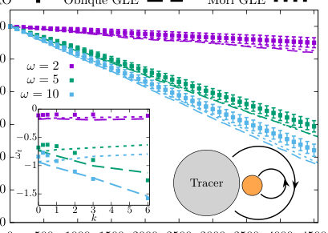
<figcaption class="paper-figure-caption"><b>Fig 2.</b> FIG. 3. Mean angular drift ⟨θ(t)⟩of the passive tracer. The data is averaged over many different trajectories, error bars show standard deviation. The illustration highlights oppo- site rotation of the tracer and the chiral particles. The in- set shows the emergent chiral frequency of the passive tracer ωt = d⟨θ(t)⟩/dt when confined in a harmonic potential of strength k.</figcaption>
</figure>
<figure class="paper-figure-card">
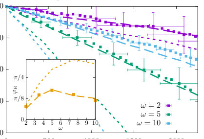
<figcaption class="paper-figure-caption"><b>Fig 3.</b> FIG. 4. Odd transport of the passive tracer with an external pulling force Fext = [Fx, 0]. The data is averaged over many different trajectories, error bars show standard deviation. The inset shows the hall angle tan(φH) = −y(t →∞)/x(t →∞) for various chiral frequencies ω.</figcaption>
</figure>
<figure class="paper-figure-card">

<figcaption class="paper-figure-caption"><b>Fig 4.</b> Fig. 2c). We observe a qualitative difference between the Mori and the oblique GLE. While the former perfectly follows the equilibrium 1FDR and thus indicates that the non-equilibrium dynamics is mapped onto an effective equilibrium model [24, 49, 81], the oblique GLE violates the 1FDR, in very good agreement with the microscopic simulations. We also find that the oblique GLE predicts a violation of the second fluctuation-dissipation relation (2FDR) [85–88], i.e., the relationship between the mem- ory kernel and the fluctuating force (see Fig. 2d). We can extract information on the emergent angular drift of the passive tracer. For this we calculate the smoothed velocity vector ˜v(t) = R t...</figcaption>
</figure>

**Summary.** This work generalizes the Mori-Zwanzig projection formalism by introducing an oblique projector to accurately model systems far from equilibrium, such as active matter. The resulting oblique Generalized Langevin Equation correctly captures non-equilibrium effects, such as odd transport and chiral dynamics, which the standard formalism fails to predict. It provides a powerful theoretical tool for analyzing complex, non-equilibrium many-body dynamics.

**Why it may be interesting.** The development of a mathematically rigorous projection technique (oblique projector) to handle non-equilibrium dynamics is crucial for modeling complex systems like active matter, which often fall outside the scope of standard equilibrium statistical mechanics.

Detailed structure

**Main problem.** The paper addresses the challenge of correctly coarse-graining the dynamics of complex physical systems that operate far from thermodynamic equilibrium, where standard projection operator methods fail.

**Main result.** The introduction of an oblique projector successfully derives a generalized Langevin equation (GLE) that correctly captures non-equilibrium physics, unlike the standard Mori projector.

**Method.** The core method involves generalizing the Mori-Zwanzig formalism by employing an oblique projector based on biorthogonal variables, leading to a non-equilibrium fluctuation-dissipation relation.

**Model / system.** The formalism is applied to model active or living matter, specifically analyzing the emergent chiral dynamics of a passive tracer immersed in a chiral active bath.

**Key observables.** Generalized Langevin Equation (GLE), non-equilibrium fluctuation-dissipation relations (FDRs), mean angular drift, and odd transport properties (Hall angle).

**Important parameters / regimes.** Chiral frequency ($\omega$), friction ($\gamma$), and the correlation time scales of the bath interactions.

**Assumptions / limitations.** The derivation relies on the assumption that the oblique projector correctly decomposes emergent interactions into systematic and stochastic parts, and that the resulting GLE can be accurately reconstructed from response functions.

**Figures summary.** Figures compare correlation functions and FDRs derived from the oblique GLE versus the standard Mori GLE, showing discrepancies in non-equilibrium regimes. Other figures illustrate the predicted odd transport and the shift in the chiral frequency.

**Paper structure.** The paper first introduces the failure of the standard Mori projector for non-equilibrium systems. It then develops the oblique projector formalism, deriving the oblique GLE. Finally, it applies this formalism to the active bath model, deriving quantitative predictions for chiral dynamics and odd transport.

Abstract

We generalize the Mori-Zwanzig projection operator formalism by introducing an oblique projector using biorthogonal variables to coarse-grain the dynamics of systems far from equilibrium, such as active or living matter. Improving on previously used orthogonal projectors, the oblique projector correctly decomposes the emergent interactions of the coarse-grained particles into systematic and stochastic contributions. We show that the formalism directly connects to established results in non-equilibrium linear response theory and adiabatic perturbation theory. Based on this formalism, we develop a coarse-graining algorithm which we apply to extract the emergent non-equilibrium chiral dynamics of a passive tracer in a chiral active bath. Our theory correctly predicts the odd transport properties and a confinement-induced shift of the chiral frequency of the tracer.

[↑ back to top](#top)

### [Gradient-based optimal control of the non-Hermitian skin effect in optomechanical arrays](http://arxiv.org/abs/2609.04492v1)

**Authors:** Juste Deuyekbe, Philippe Djorwé, A. -H. Abdel-Aty, A. Elrashidi, Nsangou Mama, Serge Guy Nana Engo  
**Type:** theory · **Category:** other · **PDF:** <https://arxiv.org/pdf/2609.04492v1>  
**Analysis basis:** full PDF text, analyzed in chunks
**Topic relevance:** `driven-dissipative phase transition` **3/5** · `methods for driven-dissipative` **3/5** · `analog quantum simulation` **2/5** · `correlated / nonlocal dissipation` **2/5** · `non-equilibrium universality` **2/5** · `quantum measurements` **2/5** · `Keldysh / 2PI / non-Gaussian methods` **1/5**

↔ Scroll figures horizontally

<figure class="paper-figure-card">
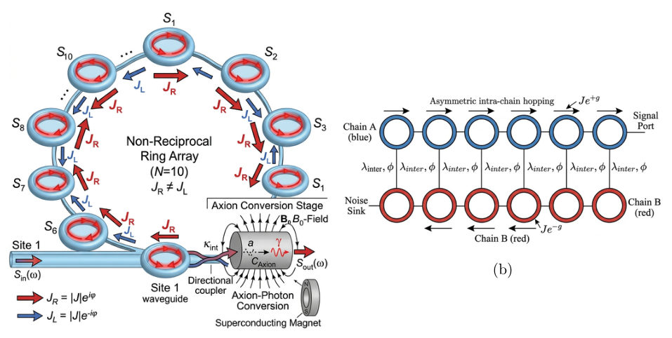
<figcaption class="paper-figure-caption"><b>Fig 1.</b> FIG. 1. Sensor geometries. (a) Single-chain ring baseline: N coupled cavity sites with non-</figcaption>
</figure>
<figure class="paper-figure-card">
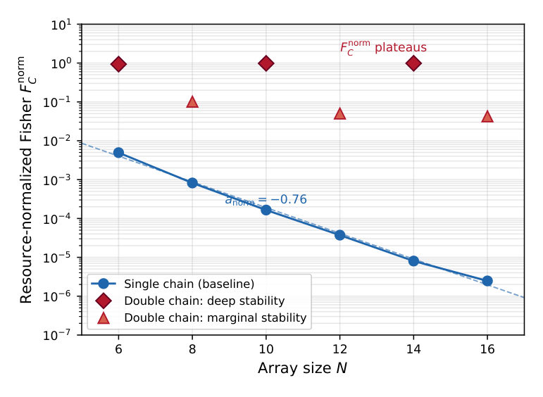
<figcaption class="paper-figure-caption"><b>Fig 2.</b> FIG. 2. Resource-normalized Fisher information F norm C versus array size N for the single-chain</figcaption>
</figure>
<figure class="paper-figure-card">
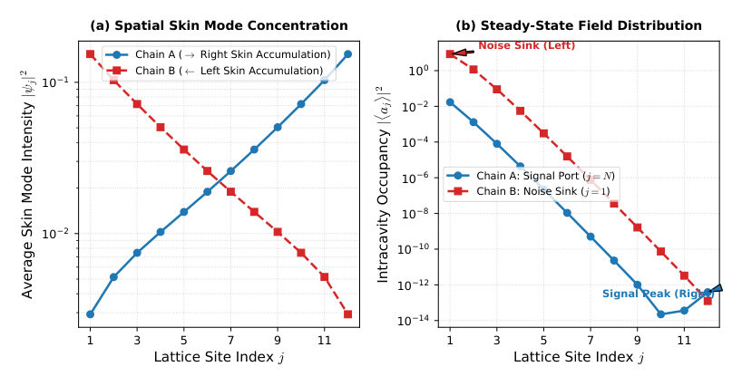
<figcaption class="paper-figure-caption"><b>Fig 3.</b> FIG. 3. Spatial skin-mode concentration in the double-chain ladder (N = 12). (a) Normalized</figcaption>
</figure>
<figure class="paper-figure-card">
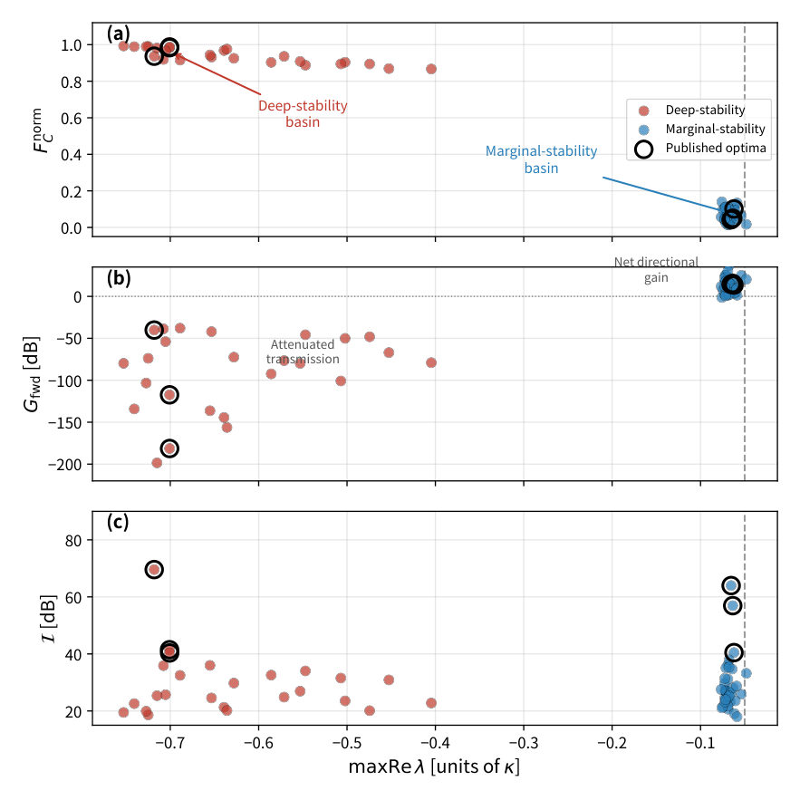
<figcaption class="paper-figure-caption"><b>Fig 4.</b> FIG. 4. Precision–gain trade-off across the stability margin. (a) Resource-normalized Fisher in-</figcaption>
</figure>
<figure class="paper-figure-card">
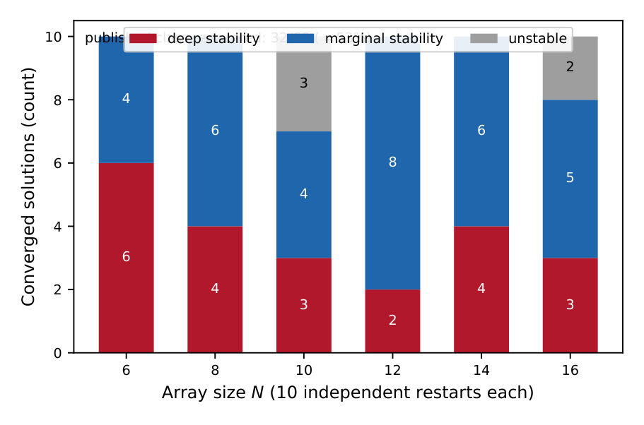
<figcaption class="paper-figure-caption"><b>Fig 5.</b> FIG. 5. Initialization dependence of the DOC solution landscape. Ten independent re-</figcaption>
</figure>

**Summary.** The authors propose a double-chain optomechanical ladder to overcome the inherent precision limitations of single-port non-Hermitian sensors. By using optimal control, they demonstrate that the architecture allows for two distinct operating regimes: one maximizing measurement precision and another providing high directional gain. This work shows a pathway to realizing advanced quantum sensors for applications like force sensing and axion searches.

**Why it may be interesting.** This work directly tackles open quantum systems and quantum sensing limits by engineering non-Hermitian structures to surpass fundamental metrological bounds, which is highly relevant to quantum optics and AMO.

Detailed structure

**Main problem.** The paper addresses the fundamental resource bound on metrological precision (set by the Petermann factor) in single-port non-Hermitian sensors.

**Main result.** A double-chain optomechanical ladder geometry evades this bound by spatially separating signal amplification from quantum-noise drainage, enabling high-precision sensing while maintaining directional gain.

**Method.** Gradient-based differentiable optimal control (DOC) is used to maximize the resource-normalized Fisher information subject to a strict Hurwitz-stability constraint.

**Model / system.** The system is a double-chain optomechanical ladder, modeled using non-Hermitian drift matrices, which exhibits the non-Hermitian skin effect (NHSE).

**Key observables.** Resource-normalized Fisher information (Fnorm), Directional Gain (Gfwd), and Isolation (Iso).

**Important parameters / regimes.** System size N (6 to 16), disorder strength (5% $\sigma_{RMS}$), and the stability constraint (Hurwitz stability).

**Assumptions / limitations.** The advantage relies on the architectural separation of signal and noise pathways, and the analysis assumes the system can be mapped to circuit-QED parameters.

**Figures summary.** Figures illustrate the comparison between single-chain (resource-bound) and double-chain (enhanced) performance regarding Fnorm vs. size N, and show the distinct deep-stability and marginal-stability operating regimes.

**Paper structure.** The paper first establishes the problem with single-port sensors, then introduces the double-chain ladder and uses DOC to find optimal parameters. It characterizes two distinct solution classes (deep vs. marginal stability) that define a precision-gain frontier, and finally tests the robustness of these solutions against disorder.

Abstract

In single-port non-Hermitian sensors the Petermann factor offsets susceptibility gains, imposing a strict resource bound on metrological precision. We test whether a multi-port geometry can evade this bound: a double-chain optomechanical ladder with opposing non-reciprocal hoppings spatially separates signal amplification from quantum-noise drainage, and gradient-based differentiable optimal control (DOC) maximizes the resource-normalized Fisher information $\Fnorm$ subject to a Hurwitz-stability constraint. Across system sizes $N\in\{\num{6},\dots,\num{16}\}$ the optimizer returns $\Fnorm>0$ in every case, with two coexisting solution classes whose selection is initialization-dependent: deep-stability configurations achieve $\Fnorm\in\numrange{0.937}{0.987}$ with attenuated transmission, while marginal-stability configurations deliver directional gain $\Gfwd\in\qtyrange{13.5}{15.5}{\dB}$ with isolation $\Iso\in\qtyrange{40}{64}{\dB}$. A multi-restart ensemble reveals these classes are the endpoints of a precision--gain frontier. All solutions remain Hurwitz-stable under \qty{5}{\percent} disorder (\qty{87.5}{\percent} recovery), and the deep-stability advantage survives realistic preamplifier noise at $\Fnormeff\approx\num{0.3}$--$\num{0.5}$. Mapped onto circuit-QED parameters, the architecture enables sub-attonewton force sensing and broadband axion searches across the \qtyrange{1}{10}{\giga\hertz} band.

[↑ back to top](#top)

### [Residual detuning in the laboratory-frame anti-Jaynes--Cummings model with a squeezed vacuum](http://arxiv.org/abs/2609.04580v1)

**Authors:** Onyango Stephen Okeyo  
**Type:** theory · **Category:** other · **PDF:** <https://arxiv.org/pdf/2609.04580v1>  
**Analysis basis:** full PDF text, analyzed in chunks
**Topic relevance:** `Tavis-Cummings & cavity-many-emitter` **3/5** · `analog quantum simulation` **3/5** · `Dicke superradiance` **2/5** · `correlated / nonlocal dissipation` **2/5** · `driven-dissipative phase transition` **1/5** · `methods for driven-dissipative` **1/5** · `quantum optics experiment` **1/5**

↔ Scroll figures horizontally

<figure class="paper-figure-card">
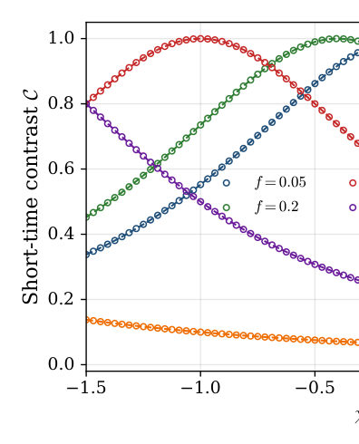
<figcaption class="paper-figure-caption"><b>Fig 1.</b> Fig. 1 Short-time AJC contrast versus Kerr strength at r = 0. Open circles: numerical diagonaliza- tion, nmax = 200. Dashed: Eq. (6). Five values of f are shown. The Lorentzian peak at χ = −2f lies inside the plotted window only for f ≤0.5; for f = 1 and f = 2 it sits at χ = −2 and χ = −4. Units λ = 1.</figcaption>
</figure>
<figure class="paper-figure-card">
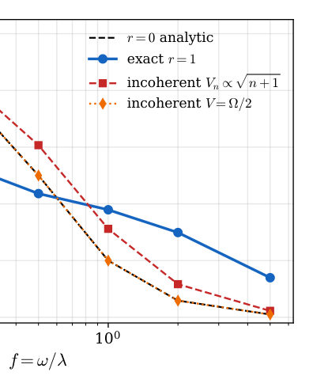
<figcaption class="paper-figure-caption"><b>Fig 2.</b> Fig. 2 Short-time AJC contrast at χ = 0 versus f. Filled circles: exact r = 1 evolution. Squares (dashed): incoherent average with Vn = (Ω/2)√n + 1. Diamonds (dotted): incoherent average with V = Ω/2. Black dashed: r = 0 analytic Lorentzian, Eq. (6).</figcaption>
</figure>
<figure class="paper-figure-card">

<figcaption class="paper-figure-caption"><b>Fig 3.</b> Figure 4 and Fig. 5, together with the last two columns of Table 1, are the Dicke scan at χ = 0, r = 1. Dashed curves are Eq. (2). At small residual detuning (f ≤0.2) the exact contrast lies below that formula. At large detuning (f ≥1) it lies above, and the gap widens with f. At f = 5, N = 8 one has C = 0.575 against 8/[8 + (2f)2] = 0.074. At N = 16 the contrast stays well above 16/[16 + (2f)2] = 0.138 but C and t∗still move at nmax = 160 (C ≃0.78); that cell is not quoted to three digits. Additional AJC channels opened by the squeezed ladder more than compensate the residual detuning once the collective Rabi frequency is large. Equation (2) is a reference curve, not a fit to the squeezed...</figcaption>
</figure>
<figure class="paper-figure-card">

<figcaption class="paper-figure-caption"><b>Fig 4.</b> Figure 6 is the definition of Eq. (5). The bottom-right panel is vacuum AJC at f = 1: a clean oscillation of amplitude 0.200, matching 1/(1 + 4). The other three panels are squeezed packets. Later collapse–revival structure [23] is not used.</figcaption>
</figure>
<figure class="paper-figure-card">
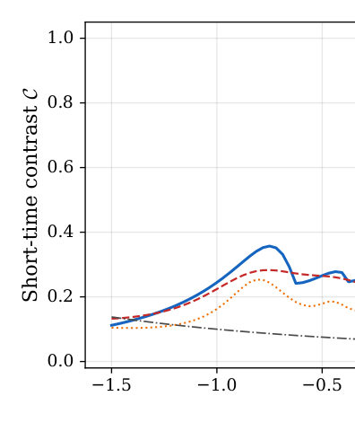
<figcaption class="paper-figure-caption"><b>Fig 5.</b> Fig. 3 Short-time contrast versus χ at f = 2, r = 1. Solid: exact evolution. Dashed and dotted: the two incoherent averages of Eq. (7). Dash-dotted: r = 0 analytic curve. Diagnostic slice only; no χ optimum is extracted.</figcaption>
</figure>

**Summary.** This paper analyzes the anti-Jaynes-Cummings model coupled to a squeezed vacuum, focusing on residual detuning effects. The authors test methods like Kerr shifts and collective coupling to restore ideal quantum contrast. They find that collective coupling is highly effective, suggesting that ultrastrong circuit QED is the most promising physical platform for realizing such controlled quantum interactions.

**Why it may be interesting.** This work tackles the subtle, non-trivial effects of residual detuning in cavity QED systems, providing concrete numerical evidence on how collective coupling can overcome fundamental limitations in achieving perfect quantum control.

Detailed structure

**Main problem.** The paper investigates the residual detuning present in the laboratory-frame anti-Jaynes-Cummings (AJC) model when coupled to a squeezed vacuum.

**Main result.** Neither a single Kerr shift nor an incoherent sum approximation can fully restore unit contrast; however, collective Dicke coupling significantly enhances the contrast, suggesting ultrastrong circuit QED is the relevant platform.

**Method.** The analysis relies on full truncated diagonalization of the Hamiltonian for non-vacuum states, comparing exact numerical results against simplified analytical approximations.

**Model / system.** The system is the anti-Jaynes-Cummings (AJC) model coupling a two-level emitter to a bosonic ladder, analyzed in the presence of a squeezed vacuum. The Hamiltonian includes terms for detuning, Kerr shifts, and collective Dicke coupling.

**Key observables.** The primary observable is the contrast ($C$), defined as the amplitude of the first turning point of the atomic ground-state population.

**Important parameters / regimes.** Key parameters include the residual detuning ($2f\lambda$), the squeezing parameter ($r=1$), the Kerr strength ($\chi$), and the number of emitters ($N$).

**Assumptions / limitations.** The analysis assumes the validity of the AJC model framework and requires full diagonalization because the free field term breaks simple conservation laws when the vacuum is squeezed ($r 
eq 0$).

**Figures summary.** Figures compare the short-time contrast ($C$) for various detunings and atom numbers, contrasting exact evolution with incoherent averages, and showing time traces of the ground-state population.

**Paper structure.** The paper first establishes the problem of residual detuning in the laboratory frame. It then tests two remedies—Kerr shifts and Dicke coupling—by calculating the contrast $C$ for the squeezed vacuum ($r=1$), concluding with quantitative comparisons between the exact and approximate results.

Abstract

The laboratory-frame anti-Jaynes--Cummings (AJC) interaction retains a residual detuning $2fλ$ that is absent from the rotating-frame model. We map two proposed remedies---a Kerr shift $χ(\hat a^\dagger\hat a)^2$ and collective Dicke coupling of $N$ two-level emitters---for a squeezed vacuum on that ladder ($r=1$, $\langle n\rangle=\sinh^2 r\simeq 1.38$). All quoted contrasts are the amplitude of the first turning point of the atomic ground-state population, which coincides with the two-level formula $\mathcal{C}=1/[1+(2f+χ)^2]$ at $r=0$ to $10^{-9}$. Three results follow. (i)~A single Kerr strength never restores unit contrast at $r=1$; the $r=0$ $n$-dependent shift $χ(2n+1)$ cannot cancel $2fλ$ on every occupied Fock component. (ii)~The exact $r=1$ contrast at $χ=0$ is not reproduced by an incoherent sum $\sum_n P_n(r)\,\mathcal{C}_n$ built from the $r=0$ two-level formula; pointwise deviations are several tenths. (iii)~Collective coupling raises the contrast systematically. At $f=5$ one finds $\mathcal{C}=0.140$ ($N=1$) and $\mathcal{C}=0.575$ ($N=8$), above the unsqueezed value $8/[8+(2f)^2]=0.074$. The $N=16$ point at this $f$ remains truncation-limited and is not quoted to three digits. The same $N\sim(2f)^2$ estimate for $\mathcal{C}=1/2$ places trapped-ion values $f\sim 10^{2}$--$10^{3}$ outside the present construction. The relevant platform is ultrastrong circuit QED with $f\sim 1$--$10$. The calculation is a numerical control landscape, not a new solvable limit.

[↑ back to top](#top)

### [Quantum-State Texture Dynamics: Theory and Experiment](http://arxiv.org/abs/2609.05248v1)

**Authors:** Carlos H. S. Vieira, Xinfang Nie, Dawei Lu, Fernando Parisio  
**Type:** both · **Category:** quantum information and computing · **PDF:** <https://arxiv.org/pdf/2609.05248v1>  
**Analysis basis:** full PDF text, analyzed in chunks
**Topic relevance:** `QC/QI experiment` **3/5** · `correlated / nonlocal dissipation` **2/5** · `driven-dissipative phase transition` **2/5** · `methods for driven-dissipative` **2/5** · `Keldysh / 2PI / non-Gaussian methods` **1/5** · `non-equilibrium universality` **1/5** · `quantum measurements` **1/5**

↔ Scroll figures horizontally

<figure class="paper-figure-card">
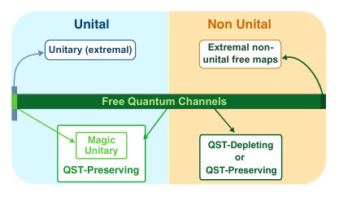
<figcaption class="paper-figure-caption"><b>Fig 1.</b> Fig. 1. Schematic classification of quantum channels from the perspective of QST theory. In the unital sector, unitary chan- nels are extremal maps. The set of free channels in this sector is QST-preserving and contains magic unitary operations. In the non-unital sector, free maps may deplete QST.</figcaption>
</figure>
<figure class="paper-figure-card">
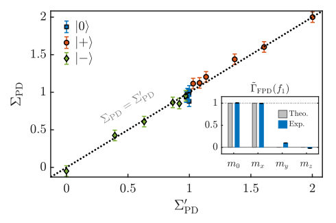
<figcaption class="paper-figure-caption"><b>Fig 2.</b> Fig. 2. Experimental verification of Prop. 1. Comparison be- tween the directly measured output grand sum ΣPD(ϱ) and the value Σ′ PD(ϱ) predicted from the dual evolution of the textureless state. Each point corresponds to an independent implementation of the phase-damping channel with a different damping parameter λ. The diagonal line ΣPD(ϱ) = Σ′ PD(ϱ) represents the relation predicted by Proposition 1. The agree- ment between the data and the line confirms that the grand sum response is completely determined by the single oper- ator, ˜ΓPD(f1). Inset: Experimental verification of the dual fixed-point criterion for QST preservation, Prop. 2. The blue bars show the experimentally...</figcaption>
</figure>
<figure class="paper-figure-card">
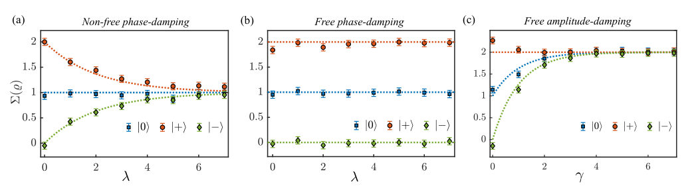
<figcaption class="paper-figure-caption"><b>Fig 3.</b> Fig. 3. Experimental records of QST dynamics. (a) Non-free unital phase-damping channel. The grand sum is redistributed among different input states despite the channel being unital. (b) Free-unital phase-damping channel. The grand sum remains constant throughout the evolution, demonstrating exact QST conservation. (c) Free non-unital amplitude-damping channel. The grand sum evolves toward the textureless state, exemplifying a texture-depleting free map. Symbols denote the experimental data while dotted curves are the theoretical predictions.</figcaption>
</figure>
<figure class="paper-figure-card">
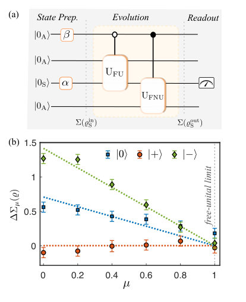
<figcaption class="paper-figure-caption"><b>Fig 4.</b> Fig. 4. Grand sum under composite free dynamics. (a) Quan- tum circuit implementing a continuous interpolation between free-unital (FU) and free non-unital (FNU) dynamics. The re- duced dynamics is described by the map Γµ(ϱ) = µΓFU(ϱ) + (1 −µ)ΓFNU(ϱ), where µ is controlled by the ancilla rotation. (b) Measured grand sum variation, ∆Σµ(ϱ) = ΣΓµ(ϱ)−Σin(ϱ) as a function of the control parameter µ, for three input states. The grand sum variation vanishes as the dynamics approach the free-unital limit µ = 1, in agreement with Prop. 3. Sym- bols denote the experimental data, while the dotted lines cor- respond to the theoretical predictions.</figcaption>
</figure>
<figure class="paper-figure-card">
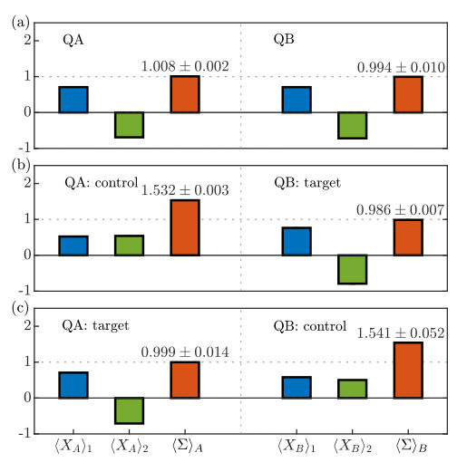
<figcaption class="paper-figure-caption"><b>Fig 5.</b> Fig. 5. QST-based diagnosis of a two-qubit entangling layer. All experiments are performed in the four-qubit register, while only the local responses of the interacting pair A, B are displayed. (a) Reference experiment containing only lo- cal unitary operations illustrating that the grand sum aver- age (red bars) over the two orthogonal input preparations remains balanced. Here, ⟨XA⟩1,2 and ⟨XB⟩1,2 denotes the x-magnetization measured for the two input states. (b,c) A CNOT breaks the local balance. Experimental identifi- cation of the control and target qubits for the CNOTA→B and CNOTB→A gates, respectively. The observed imbalance follows the gate orientation, providing a local signature of...</figcaption>
</figure>

**Summary.** This paper develops a general theory showing that Quantum-State Texture (QST) dynamics are simply determined by the dual evolution of a single reference state. The authors experimentally validate this theory using NMR to show that QST conservation is a hallmark of free-unital dynamics, allowing local measurements to diagnose the presence of entangling gates.

**Why it may be interesting.** The connection between QST conservation and the mathematical structure of free-unital dynamics provides a powerful, measurable signature for quantum operations, which is highly relevant for characterizing gate fidelity in quantum computation.

Detailed structure

**Main problem.** The primary challenge is the lack of a general theoretical framework to describe the dynamics of Quantum-State Texture (QST) when subjected to arbitrary open quantum channels.

**Main result.** The authors establish that QST dynamics are fully encoded in the dual evolution of a single reference state, and they demonstrate that QST conservation provides a practical diagnostic tool to distinguish entangling gates from non-entangling ones.

**Method.** The theory derives necessary and sufficient conditions for QST preservation using dual maps, which are then experimentally verified by measuring the 'grand sum' ($\Sigma$) on a liquid-state NMR quantum processor.

**Model / system.** The work uses a four-qubit liquid-state NMR processor. The theoretical models involve characterizing dynamics under various CPTP maps, such as Phase-Damping (PD) and Free Amplitude-Damping (FAD) channels.

**Key observables.** Quantum-State Texture (QST), measured via the 'grand sum' ($\Sigma$), and the deviation of this sum ($\Delta\Sigma$) from expected values.

**Important parameters / regimes.** The interpolation parameter $\mu$ controlling the mixture between free-unital and free-non-unital dynamics, and the damping parameter $\lambda$.

**Assumptions / limitations.** The initial theoretical development assumes a finite dimension $D$ for the system. Experimentally, the use of basis averaging (Proposition 5) is preferred over sampling the entire Haar measure.

**Figures summary.** Figures compare measured vs. predicted grand sums for PD channels, show $\Sigma$ conservation for Free-Unital (FPD) channels, and illustrate how $\Delta\Sigma$ varies continuously between free-non-unital and free-unital limits.

**Paper structure.** The paper first establishes the theoretical framework (encoding QST in the dual map) and then proceeds through experimental verification by analyzing specific channels (PD, FPD, FAD) and demonstrating the gate identification protocol using controlled interpolation.

Abstract

Quantum-state texture (QST) has found applications in several fields from quantum foundations and computation to quantum criticality. However, a general theory of QST dynamics under arbitrary physical processes remains unavailable, limiting both its practical application and experimental exploration. Here, we demonstrate that the QST response to an arbitrary finite-dimensional channel is fully encoded in the dual evolution of a single reference state. This description yields necessary and sufficient conditions for texture preservation and implies exact conservation under all free-unital dynamics. Using a nuclear magnetic resonance quantum processor, we experimentally verify these predictions across distinct channel classes. Furthermore, we show that local QST measurements provide an operational signature of entangling gates in circuit layers. Our results establish quantum-state texture as a resource and a practical diagnostic tool in quantum information processing.

[↑ back to top](#top)

### [Strong-Drive Limits in Josephson Circuits: From Chaos to an Unbound-Resonance Threshold](http://arxiv.org/abs/2609.04704v1)

**Authors:** Xinyuan You, Aniket Maiti, Yao Lu  
**Type:** both · **Category:** quantum information and computing · **PDF:** <https://arxiv.org/pdf/2609.04704v1>  
**Analysis basis:** full PDF text, analyzed in chunks
**Topic relevance:** `QC/QI experiment` **3/5** · `driven-dissipative phase transition` **3/5** · `methods for driven-dissipative` **3/5** · `non-equilibrium universality` **2/5** · `Keldysh / 2PI / non-Gaussian methods` **1/5**

↔ Scroll figures horizontally

<figure class="paper-figure-card">
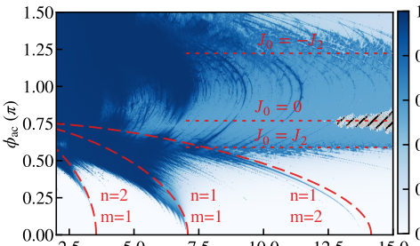
<figcaption class="paper-figure-caption"><b>Fig 1.</b> FIG. 1. Impurity at zero dc flux bias as a function of ac flux-drive amplitude and frequency. The color scale shows the steady-state impurity obtained from Floquet–Markov simulations. Red dashed curves indicate resonance conditions extracted from the eigenener- gies of the reduced static Hamiltonian Eq. (11). Red dotted lines mark drive amplitudes related to various Bessel functions. The hatched region denotes parameters for which the Floquet–Markov equation admits multiple stationary states. Parameters: EC/2π = 0.13 GHz, EJ/2π = 50 GHz, ng = 0.</figcaption>
</figure>
<figure class="paper-figure-card">
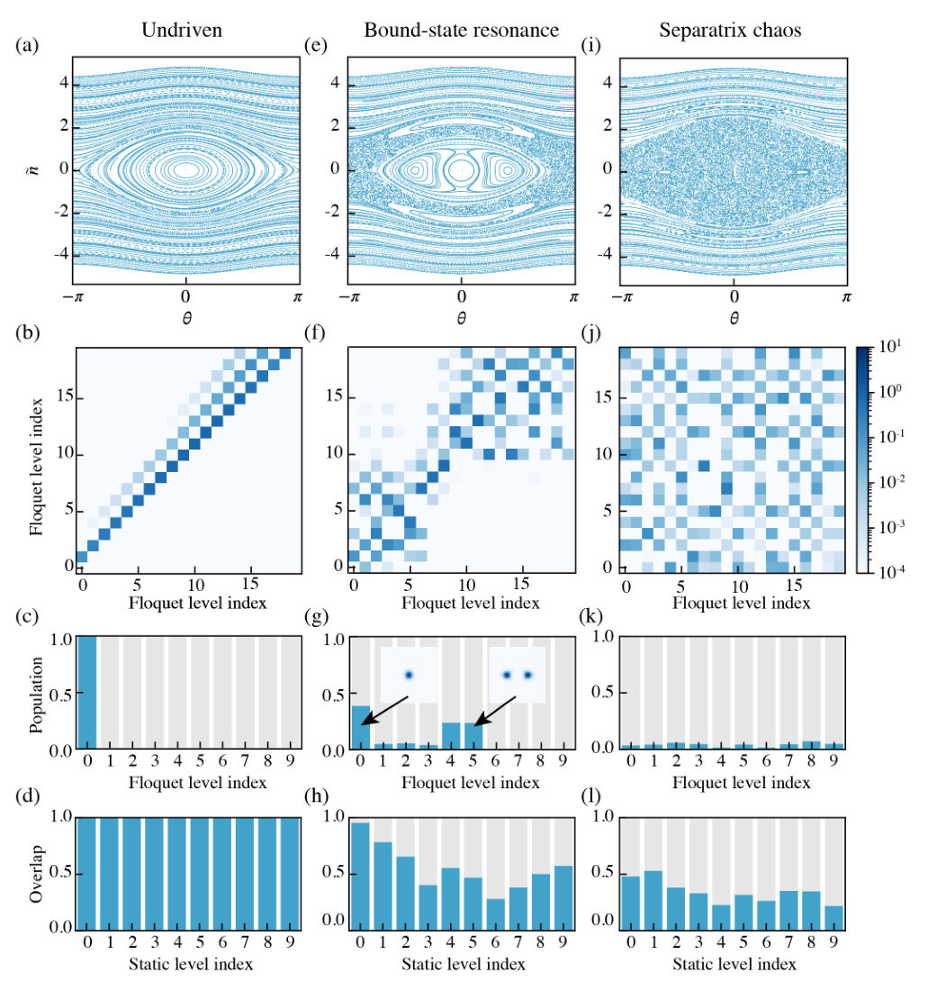
<figcaption class="paper-figure-caption"><b>Fig 2.</b> FIG. 2. Bound-state resonances and separatrix chaos under low-frequency flux drive at zero dc flux bias. (a) Poincar´e section of the undriven system, sampled stroboscopically at the drive period used for comparison. (b) Bath-induced transition rates between Floquet states. (c) Steady-state Floquet populations obtained from the Floquet–Markov equation. (d) Maximum overlap between each static eigenstate and the Floquet eigenstates. (e)–(h) and (i)–(l) show the corresponding quantities for two representative drive conditions, ϕac = 0.2π, ωd/2π = 6.3 GHz, and ϕac = 0.4π, ωd/2π = 5.0 GHz, respectively. The inset in (g) shows the Husimi functions of the relevant Floquet states. Parameters: EC/2π...</figcaption>
</figure>
<figure class="paper-figure-card">
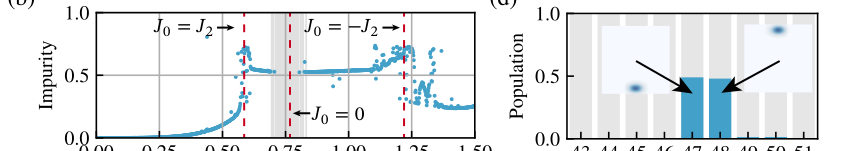
<figcaption class="paper-figure-caption"><b>Fig 3.</b> FIG. 3. Unbound-resonance transition under high-frequency flux drive. (a) Average Floquet energies as a function of drive amplitude for ωd/2π = 15 GHz. Gray curves show the average energies of the Floquet states, while the opacity of the red curves indicates the steady-state population of each Floquet state obtained from Floquet–Markov simulations. (b) Corresponding steady-state impurity. The shaded region denotes parameters for which the Floquet–Markov equation admits multiple stationary states. (c) Poincar´e section at the same drive frequency and ϕac = 0.7π. The central bound-state island around ˜n = 0 is confined by the renormalized Josephson potential, while the two symmetry- related...</figcaption>
</figure>
<figure class="paper-figure-card">
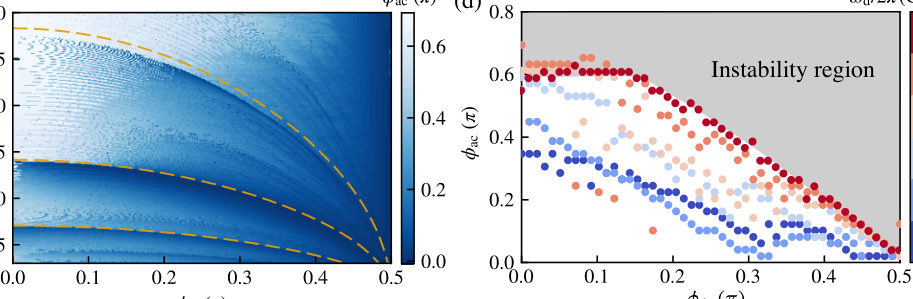
<figcaption class="paper-figure-caption"><b>Fig 4.</b> FIG. 4. DC-flux-bias dependence of the strong-drive thresholds. (a) Critical ac amplitude ϕac as a function of dc flux bias ϕdc in the low-frequency regime. The dots are extracted from Floquet–Markov simulations using a fixed impurity threshold of 1/2 at ωd/2π = 5 GHz, while the solid line is the analytical estimate from the separatrix-chaos criterion in Eq. (24). (b) Critical ac amplitude ϕac in the high-frequency regime, obtained from Floquet–Markov simulations at ωd/2π = 30 GHz and compared with the analytical unbound-resonance threshold in Eq. (28). (c) Critical ac amplitude ϕac at fixed impurity threshold as a function of dc flux bias and drive frequency. The color scale gives the...</figcaption>
</figure>
<figure class="paper-figure-card">
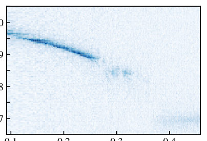
<figcaption class="paper-figure-caption"><b>Fig 5.</b> FIG. 5. Experimental dc-flux-bias dependence of the low- frequency strong-drive threshold. (a) Readout resonator spectrum versus ac flux-drive amplitude at zero dc flux bias. (b) Extracted resonance frequency (blue dots), experimentally identified thresh- old (blue dashed line), and simulated ac-Stark-shifted resonance fre- quency (red dots). Red dash-dot lines mark the undriven and bare- resonator frequencies. (c) Critical ac amplitude versus dc flux bias. Blue squares show experiment, and red dots show Floquet–Markov results for ng = 0, 0.1, . . . , 0.4, demonstrating weak offset-charge dependence. Parameters: EC/2π = 0.09 GHz, EJ/2π = 66 GHz, ωr/2π = 8.967 GHz, g/2π = 39 MHz.</figcaption>
</figure>

**Summary.** This paper provides a comprehensive theoretical and experimental study of the limits imposed by strong microwave drives on Josephson circuits. It unifies the description of dynamics in both flux- and charge-driven regimes, identifying distinct low- and high-frequency thresholds that govern stable operation. The results offer critical guidelines for designing faster and more robust superconducting quantum devices.

**Why it may be interesting.** This work is highly relevant as it provides concrete, measurable limits on the operational speed and stability of superconducting quantum devices, which is crucial for scaling up quantum computation.

Detailed structure

**Main problem.** The paper addresses the fundamental limits imposed by strong microwave drives on Josephson circuits, specifically detailing how these drives can induce unwanted transitions out of the desired low-energy operating manifold.

**Main result.** The study identifies two distinct thresholds: a low-frequency chaos threshold dependent on DC flux bias, and a high-frequency unbound-resonance threshold that is nearly independent of drive frequency but controlled by DC flux bias.

**Method.** The research employs a combination of classical phase-space analysis, Floquet-Markov simulations, and analytical derivation of resonance criteria to model the driven dynamics.

**Model / system.** The system modeled is a Josephson circuit, specifically analyzed using flux-driven and charge-driven Hamiltonian formulations, often represented by a SQUID structure. The analysis compares the structural differences between these two drive types.

**Key observables.** Impurity (diagnostic for steady-state distribution), resonance frequency, and the existence/location of chaos regions.

**Important parameters / regimes.** DC flux bias ($\phi_{	ext{dc}}$), drive frequency ($\omega$), and drive amplitude ($\phi_{	ext{ac}}$).

**Assumptions / limitations.** The analysis relies on developing a unified description across different drive types and regimes (low vs. high frequency).

**Figures summary.** Figure 1 (mentioned in notes) illustrates the impurity measure as a function of drive amplitude, showing distinct regions corresponding to bound-state resonances and separatrix chaos at low frequencies, and a sharp transition at high frequencies.

**Paper structure.** The paper develops a unified theoretical framework by comparing flux- and charge-driven Hamiltonians, analyzing dynamics via phase-space methods to characterize low-frequency chaos and high-frequency unbound resonances, culminating in analytical criteria and experimental verification.

Abstract

Strong microwave drives enable fast measurement and parametric control in superconducting circuits but can induce transitions out of the intended low-energy manifold. We develop a unified description of strong-drive limits in flux- and charge-driven Josephson circuits across drive frequency and dc flux bias. Using classical phase-space analysis and Floquet--Markov simulations, we identify distinct low- and high-frequency mechanisms. At low frequency, we characterize bound-state resonances and separatrix chaos and find that the flux-drive chaos threshold depends strongly on dc flux bias. At high frequency, these mechanisms are suppressed, and the dissipative steady state transfers from the central bound-state sector to outer resonances formed by above-barrier running trajectories. The resulting unbound-resonance threshold is nearly independent of drive frequency and circuit parameters over the regime studied and is controlled primarily by dc flux bias. Coherent simulations show that parametric operation persists beyond this threshold, but at a reduced rate, setting an effective upper bound on the achievable operation speed. We derive analytical criteria for both thresholds, validate them numerically, and experimentally confirm the predicted dc-bias dependence of the low-frequency threshold in a flux-driven SQUID. We also determine the timescales for transfer into the unbound-resonance regime and relaxation back to the bound-state manifold after the drive is removed. Finally, we relate the stability limits to a complementary picture based on the junction critical current and extend the framework to multitone drives and inductively shunted circuits. Together, these results identify the mechanisms limiting strong driving and suggest routes to extend the stable operating range of Josephson circuits.

[↑ back to top](#top)

### [Universal Thermodynamic Law Governing Stochastic Pendulum Clocks](http://arxiv.org/abs/2609.04957v1)

**Authors:** Yuki Izumida  
**Type:** theory · **Category:** statistical mechanics · **PDF:** <https://arxiv.org/pdf/2609.04957v1>  
**Analysis basis:** full PDF text, analyzed in chunks
**Topic relevance:** `non-equilibrium universality` **3/5** · `Keldysh / 2PI / non-Gaussian methods` **2/5** · `methods for driven-dissipative` **2/5** · `Frenkel-Kontorova` **1/5** · `correlated / nonlocal dissipation` **1/5** · `driven-dissipative phase transition` **1/5** · `quantum measurements` **1/5**

↔ Scroll figures horizontally

<figure class="paper-figure-card">
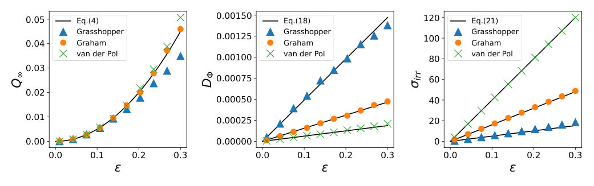
<figcaption class="paper-figure-caption"><b>Fig 1.</b> FIG. 1. Comparison of the theoretical predictions for (a) the long-time uncertainty product Q∞in Eq. (4), (b) the phase diffusion coefficient DΦ in Eq. (18), and (c) the entropy production rate σirr in Eq. (21), with the corresponding numerical results for the three models in Table I. In the numerical simulation, we replaced the sign function sgn(x) with tanh(nx) by noting limn→∞tanh(nx) = sgn(x). We used the Euler-Maruyama method with time step dt = 0.001 for numerical integration and 4000 samples for the ensemble averages. The parameters are chosen as T = 0.005, θr = 0.4, ψ0 = 0.1, and n = 20.</figcaption>
</figure>
<figure class="paper-figure-card">
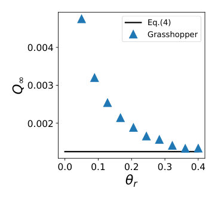
<figcaption class="paper-figure-caption"><b>Fig 2.</b> FIG. 3. The long-time uncertainty product Q∞of the Grasshopper-escapement model as a function of θr for ε = 0.05, compared with the theoretical line Q∞≈ε2/2 (Eq. (4)). The numerical method, sample size, and all other parameters are the same as in Fig. 1.</figcaption>
</figure>
<figure class="paper-figure-card">
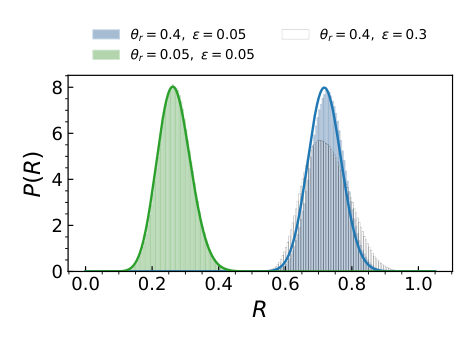
<figcaption class="paper-figure-caption"><b>Fig 3.</b> FIG. 2. Stationary probability distribution P(R) for the Grasshopper-escapement model with different ε and θr, com- pared with the analytical distribution given by Eq. (25) under the time-scale separation (ε ≪1) (solid curves). The numeri- cal method and all other parameters are the same as in Fig. 1.</figcaption>
</figure>
<figure class="paper-figure-card">
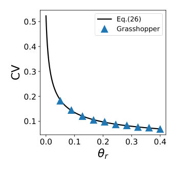
<figcaption class="paper-figure-caption"><b>Fig 4.</b> FIG. 4. The CV in Eq. (20) of the Grasshopper-escapement model as a function of θr for ε = 0.05, compared with the theoretical curve given by Eq (26). The numerical method, sample size, and all other parameters are the same as in Fig. 1.</figcaption>
</figure>

**Summary.** This paper establishes a new, universal thermodynamic law governing the precision limits of stochastic pendulum clocks. By analyzing the system's dynamics using stochastic thermodynamics, the authors show that the uncertainty product is constrained by a simple function of the nonlinearity parameter, surpassing the limitations of the standard Thermodynamic Uncertainty Relation. This provides a theoretical tool for designing optimal, high-precision physical clocks.

**Why it may be interesting.** It provides a concrete, non-equilibrium thermodynamic constraint for a classical, mechanical system, offering insights into fundamental limits of precision in physical devices beyond standard quantum bounds.

Detailed structure

**Main problem.** To derive a universal thermodynamic law governing stochastic pendulum clocks that supersedes the conventional Thermodynamic Uncertainty Relation (TUR), which is known to be violated in underdamped systems.

**Main result.** The long-time uncertainty product ($Q_\infty$) for these clocks takes a universal, simple form depending only on the degree of nonlinearity, specifically $Q_\infty \approx \varepsilon^2 / 2$.

**Method.** The analysis employs stochastic thermodynamics, utilizing time-scale separation ($\varepsilon \ll 1$) and phase averaging techniques on the Fokker-Planck equation describing the system's dynamics.

**Model / system.** The system is a stochastic pendulum clock modeled as a weakly nonlinear oscillator, $\ddot{	heta} = -	heta + \varepsilon h(	heta, \dot{	heta}) + \sqrt{2D\xi}$. Specific examples include grasshopper and graham escapement models.

**Key observables.** Phase diffusion coefficient ($D_\Phi$), Entropy Production Rate ($\sigma_{irr}$), and the long-time uncertainty product ($Q_\infty$).

**Important parameters / regimes.** The nonlinearity parameter ($\varepsilon$), the diffusion coefficient ($D$), and the temperature ($T$).

**Assumptions / limitations.** The analysis relies heavily on the assumption of time-scale separation ($\varepsilon \ll 1$) and approximating the stochastic radius by its deterministic limit cycle value ($R_*$).

**Figures summary.** Not specified in the notes, but the paper compares theoretical predictions for $Q_\infty$, $D_\Phi$, and $\sigma_{irr}$ against numerical simulations for various clock models.

**Paper structure.** The paper first establishes the general framework using stochastic thermodynamics, derives phase-averaged equations for amplitude and phase, and then calculates the universal uncertainty product by relating the phase diffusion coefficient and entropy production rate.

Abstract

Clocks' performance, especially their precision, is fundamentally limited by thermodynamic laws as they are physical devices. Yet, it is known that the established thermodynamic uncertainty relation (TUR), which imposes an upper bound on the uncertainty product of the precision of oscillations and entropy production, is violated for underdamped systems such as stochastic pendulum clocks. Here, we show that for a general class of stochastic pendulum clocks described as a weakly nonlinear oscillator the uncertainty product of the phase of a pendulum clock and entropy production takes a universal and simple form that depends solely on the degree of nonlinearity. Its validity and limitations are examined using several representative models of pendulum clocks. Our framework reveals a universal thermodynamic principle governing stochastic pendulum clocks beyond the conventional TUR and provides a foundation for designing optimal pendulum clocks that operate efficiently in stochastic environments.

[↑ back to top](#top)

### [Enhanced Multifractality Induced by Non-Hermitian Disorder in Quantum Percolation](http://arxiv.org/abs/2609.04625v1)

**Authors:** W. S. Oliveira, Julian Faundez, Rodrigo Arouca, Welles Morgado  
**Type:** theory · **Category:** disordered systems and neural networks · **PDF:** <https://arxiv.org/pdf/2609.04625v1>  
**Analysis basis:** full PDF text, analyzed in chunks
**Topic relevance:** `driven-dissipative phase transition` **3/5** · `non-equilibrium universality` **3/5** · `Keldysh / 2PI / non-Gaussian methods` **1/5** · `analog quantum simulation` **1/5** · `correlated / nonlocal dissipation` **1/5** · `methods for driven-dissipative` **1/5**

↔ Scroll figures horizontally

<figure class="paper-figure-card">
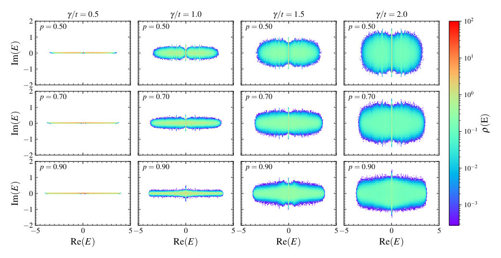
<figcaption class="paper-figure-caption"><b>Fig 1.</b> Figure 1. Density of states (DOS) in the complex energy plane as a function of the occupation probability p (rows) and the on-site disorder strength γ/t (columns), computed for a square lattice of linear size L = 40 over multiple independent disorder realizations.</figcaption>
</figure>
<figure class="paper-figure-card">
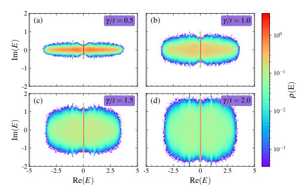
<figcaption class="paper-figure-caption"><b>Fig 2.</b> Figure 2. Density of states in the complex-energy plane for a lattice of size L = 40 with open boundary conditions (OBC) and fixed occupation probability p = 0.70, averaged over many disorder realizations for different on-site disorder strengths.</figcaption>
</figure>
<figure class="paper-figure-card">
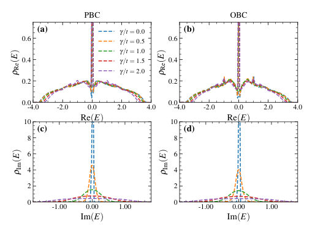
<figcaption class="paper-figure-caption"><b>Fig 3.</b> Figure 3. Density of states projected onto the real and imaginary energy axes for a lattice of size L = 40 and fixed occupation probability p = 0.70, averaged over many disorder realizations for different on-site disorder strengths. The left and right columns correspond to periodic and open boundary conditions, respectively.</figcaption>
</figure>
<figure class="paper-figure-card">
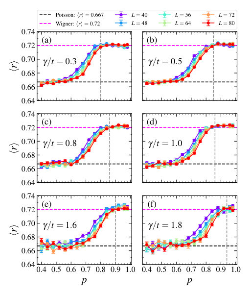
<figcaption class="paper-figure-caption"><b>Fig 4.</b> Figure 4. Mean adjacent-gap ratio ⟨r⟩as a function of the site-occupation probability p for different lattice sizes L and on-site disorder strengths γ/t. The horizontal black dashed lines indicate the Poisson limiting value (⟨r⟩≈0.667), while the pink dashed line represents the Wigner–Dyson limiting value (⟨r⟩≈0.72). These two reference values are associated with spectrally localized and spectrally delocalized regimes, respectively. The vertical grey dashed lines indicate the approximate crossing points of the curves corresponding to different L, which yield an estimate of the quantum percolation threshold pq for each value of γ/t. Error bars are smaller than the symbol size when not...</figcaption>
</figure>
<figure class="paper-figure-card">
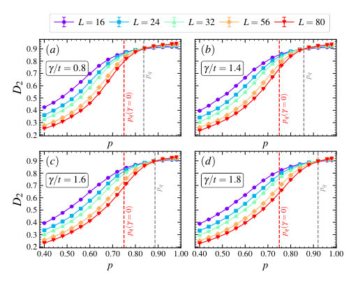
<figcaption class="paper-figure-caption"><b>Fig 5.</b> Figure 6. Approximant fractal dimension D2 as a function of p, for various lattice sizes L and on-site disorder strengths γ/t. The dashed gray vertical line indicates the approximate finite-size crossing point, pq(γ). The dashed red vertical line marks the critical point of the Hermitian system without on- site disorder, pq(γ = 0) ≈0.75, illustrating the shift of the transition induced by the non-Hermitian coupling. When not shown, error bars are smaller than the symbol sizes.</figcaption>
</figure>

**Summary.** This work examines quantum percolation in a 2D lattice subjected to both geometric dilution and non-Hermitian disorder (random gain/loss). Using multifractal analysis, the authors show that the imaginary nature of the disorder significantly alters the localization transition, enhancing the critical multifractal phase without changing the underlying universality class.

**Why it may be interesting.** The finding that the imaginary nature of the disorder specifically enhances the multifractal regime while preserving the universality class is highly relevant for understanding open quantum systems where gain and loss are present.

Detailed structure

**Main problem.** The study investigates how non-Hermitian disorder modifies the localization properties and multifractal nature of eigenstates in the two-dimensional quantum site-percolation model.

**Main result.** Non-Hermitian disorder shifts the quantum percolation threshold ($p_q$) to higher occupation probabilities and enhances the multifractal critical phase, while preserving the universality class of the transition.

**Method.** The analysis employs complex level-spacing statistics, participation entropy ($S_q$), and multifractal analysis techniques applied to the system's eigenstates.

**Model / system.** The system is a 2D quantum site-percolation model governed by a Hamiltonian incorporating geometric dilution (controlled by occupation probability $p$) and random imaginary on-site potentials ($i\gamma_i$) representing gain/loss.

**Key observables.** Complex level-spacing ratio ($\langle r 
angle$), Participation Entropy ($S_q$), Generalized Fractal Dimension ($D_q$), and the quantum percolation threshold ($p_q$).

**Important parameters / regimes.** Occupation probability ($p$), Non-Hermiticity strength ($\gamma/t$), Classical percolation threshold ($p_c$), and the localization-length exponent ($
u$).

**Assumptions / limitations.** The analysis assumes the Hamiltonian is complex symmetric ($H=H^T$) due to the specific form of the disorder (imaginary on-site potential with real hopping).

**Figures summary.** Figure 1 shows the Density of States (DOS) in the complex energy plane, varying $p$ and $\gamma/t$. Other figures/tables compare DOS and scaling exponents for Hermitian vs. Non-Hermitian disorder.

**Paper structure.** The paper systematically analyzes the system by first defining the Hamiltonian and diagnostic tools (level spacing, IPR, PE). It then uses finite-size scaling to map out the localization transition, comparing the effects of purely imaginary (non-Hermitian) disorder against real (Hermitian) disorder.

Abstract

We investigate the interplay between geometric dilution and non-Hermitian disorder in the two-dimensional quantum site-percolation model. Non-Hermiticity is introduced through random imaginary on-site potentials, representing spatially uncorrelated gain and loss, while the hopping amplitudes remain reciprocal. By combining complex level-spacing statistics, participation entropy, and multifractal analysis, we characterize the localization properties of the eigenstates as functions of the disorder and the non-Hermiticity strength. Our finite-size scaling results show that non-Hermitian disorder shifts the quantum percolation threshold ($p_q$) toward larger occupation probabilities. Consequently, the fully delocalized phase is progressively suppressed and disappears at sufficiently strong disorder. This suppression is not a simple consequence of adding on-site disorder of a given strength, but is specifically enhanced by its imaginary character, as an equally strong real (Hermitian) on-site potential produces a weaker shift of $p_q$. Nevertheless, the intermediate region between the classical ($p_c$) and quantum percolation thresholds presents a genuine multifractal critical phase, while the localization-length exponent $ν$ remains the same, relative to its Hermitian value. Altogether, our results demonstrate that random gain and loss enhance the multifractal regime while preserving the universality class of the quantum percolation transition.

[↑ back to top](#top)

### [Proof-of-principle long-distance Sagnac twin-field quantum key distribution network](http://arxiv.org/abs/2609.04447v1)

**Authors:** Reem Mandil, Yen-An Shih, Abhay Verma, Li Qian, Hoi-Kwong Lo  
**Type:** experiment · **Category:** quantum information and computing · **PDF:** <https://arxiv.org/pdf/2609.04447v1>  
**Analysis basis:** full PDF text, analyzed in chunks
**Topic relevance:** `QC/QI experiment` **3/5** · `interference shaping light` **3/5** · `quantum optics experiment` **3/5** · `quantum measurements` **1/5**

↔ Scroll figures horizontally

<figure class="paper-figure-card">
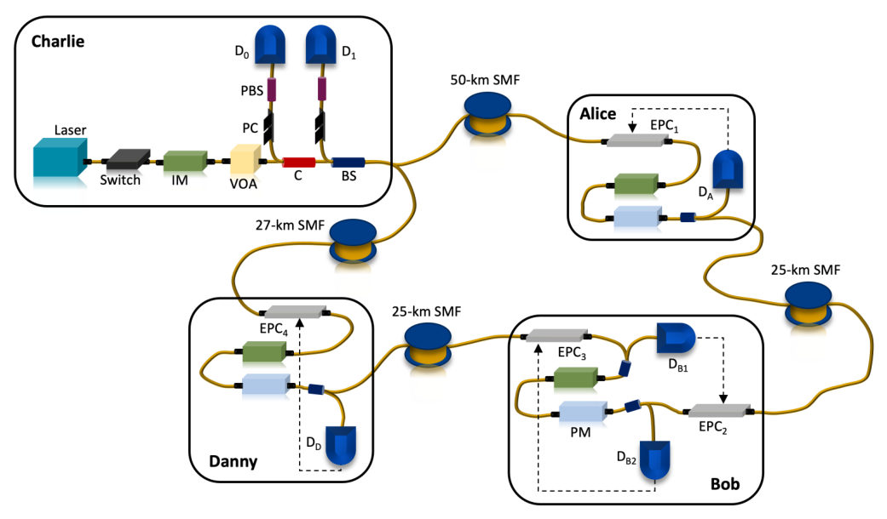
<figcaption class="paper-figure-caption"><b>Fig 1.</b> FIG. 1: Experimental setup of twin-field quantum key distribution network based on a Sagnac interferometer. Charlie passes light from a continuous-wave laser to a 1 × 1 optical switch to generate an on-off burst pattern. An intensity modulator (IM) and variable optical attenuator (VOA) are used to generate pulses that are launched into a fiber ring via a 50:50 beam splitter (BS). Three users (Alice, Bob, and Danny) are connected in the network. Any two users may perform key generation while the third user remains inactive. The active users employ an IM and a phase modulator (PM) to set the intensity and phase of their designated pulses. Interference of the counterpropagating paths is...</figcaption>
</figure>
<figure class="paper-figure-card">
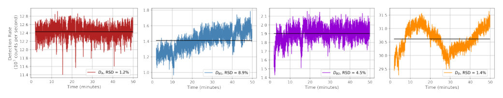
<figcaption class="paper-figure-caption"><b>Fig 2.</b> FIG. 2: Counts registered at single-photon detectors DA, DB1, DB2, and DD during one hour of active polarization control. DA and DB1 are used to monitor the clockwise traveling light. DD and DB2 are used to monitor the counterclockwise traveling light. The mean (solid line) and standard deviation are given in counts per second by DA: 12430 ± 150; DB1: 1410 ± 120; DB2: 1900 ± 90; DD: 30610 ± 430.</figcaption>
</figure>
<figure class="paper-figure-card">
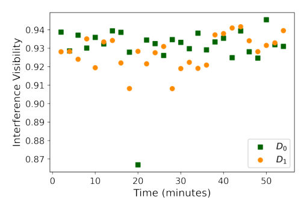
<figcaption class="paper-figure-caption"><b>Fig 3.</b> FIG. 3: Sagnac interference visibility in detectors D0 and D1 over one hour with active polarization control.</figcaption>
</figure>
<figure class="paper-figure-card">
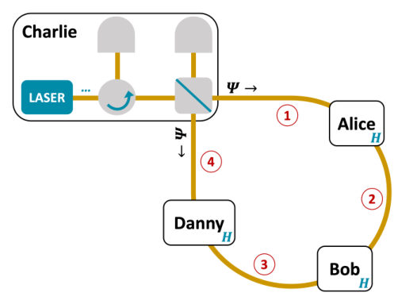
<figcaption class="paper-figure-caption"><b>Fig 4.</b> FIG. 4: Schematic diagram of Sagnac twin-field quantum key distribution network. Each user station acts as a linear polarizer with the polarization denoted H. The polarization launched into the Sagnac loop is denoted Ψ. The four fiber segments connecting stations are labeled numerically.</figcaption>
</figure>
<figure class="paper-figure-card">
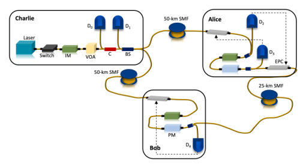
<figcaption class="paper-figure-caption"><b>Fig 5.</b> FIG. 5: Experimental setup of two-user Sagnac twin-field quantum key distribution. IM: intensity modulator; VOA: variable optical attenuator; C: circulator; BS: beam splitter; PM: phase modulator; EPC: electronic polarization controller.</figcaption>
</figure>

**Summary.** This paper reports the experimental realization of a three-user-pair Sagnac Twin-Field QKD network spanning 127-km. By using a Sagnac configuration, the system achieves long-distance quantum key distribution without complex active phase stabilization. The results demonstrate a highly practical and cost-effective method for building scalable quantum communication networks.

**Why it may be interesting.** This work provides a robust, hardware-efficient demonstration of multi-user quantum networking over metropolitan distances, which is crucial for realizing quantum internet infrastructure.

Detailed structure

**Main problem.** The primary challenge is developing a practical, cost-effective, and long-distance Quantum Key Distribution (QKD) network capable of supporting multiple users.

**Main result.** The authors experimentally demonstrated a proof-of-principle three-user-pair Sagnac TFQKD network spanning 127-km, achieving a stable key rate of $1.398	imes10^{-5}$ bits per pulse.

**Method.** The experiment utilizes the Twin-Field QKD protocol implemented in a Sagnac interferometer setup, which inherently avoids the need for active phase stabilization or postcompensation.

**Model / system.** The system is a three-user-pair network connected by long, lossy optical fibers, employing single-photon avalanche detectors (SPADs) and a Sagnac loop configuration for interference.

**Key observables.** Stable Sagnac interference visibility ($93\pm1\%$), Quantum Bit Error Rate (QBER), and secure key rate (e.g., $1.398	imes10^{-5}$ bits per pulse).

**Important parameters / regimes.** Total network length of 127-km, overall loss of 45-dB, and the use of single-photon detectors.

**Assumptions / limitations.** The setup operates without active phase stabilization or postcompensation, representing a highly practical and cost-effective approach.

**Figures summary.** Figures illustrate the experimental setup, showing stable intensity readings over time, and tracking the Sagnac interference visibility over an hour.

**Paper structure.** The paper details the experimental setup, demonstrates long-term stability measurements (visibility, intensity), quantifies key rates for multiple user pairs, and compares results to previous two-user demonstrations.

Abstract

Twin-field (TF) quantum key distribution (QKD) offers a promising approach to long-distance QKD networks due to its superior performance over large channel losses. Due to specialized hardware requirements, nearly all long-distance TFQKD demonstrations have only two users exchanging keys, rather than a network with three or more users. In this work, we experimentally demonstrate a proof-of-principle three-user-pair Sagnac TFQKD network spanning 127-km using single-photon avalanche detectors without any active phase stabilization or postcompensation. We implement efficient procedures for maintaining polarization stability and circumventing Rayleigh backscattering noise to achieve a stable Sagnac interference visibility of $93\pm1$% over one hour. A secure key rate of $1.398\times10^{-5}$ bits per pulse is achieved over an asymmetric communication channel with 102-km fiber and 45-dB overall loss. To our knowledge, this is the first TFQKD network without active phase stabilization or postcompensation achieved over long fibers. Our results represent a highly practical and cost-effective approach to long-distance QKD networks.

[↑ back to top](#top)

### [Efficient Quantum Error Correction from Three Dimensional Qubit Control](http://arxiv.org/abs/2609.04459v1)

**Authors:** Kevin Yipu Wu, Ohik Kwon, Maxwell F. Parsons  
**Type:** theory · **Category:** quantum information and computing · **PDF:** <https://arxiv.org/pdf/2609.04459v1>  
**Analysis basis:** full PDF text, analyzed in chunks
**Topic relevance:** `QC/QI experiment` **3/5** · `Rydberg arrays` **3/5** · `analog quantum simulation` **1/5** · `quantum measurements` **1/5**

↔ Scroll figures horizontally

<figure class="paper-figure-card">
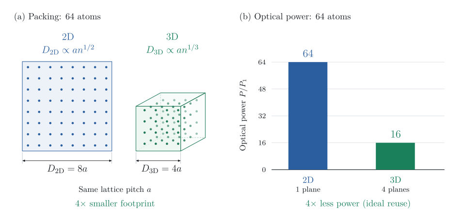
<figcaption class="paper-figure-caption"><b>Fig 1.</b> Figure 1. Packing and ideal optical-power benefits of 3D atom arrays. (a) At equal lattice pitch</figcaption>
</figure>
<figure class="paper-figure-card">
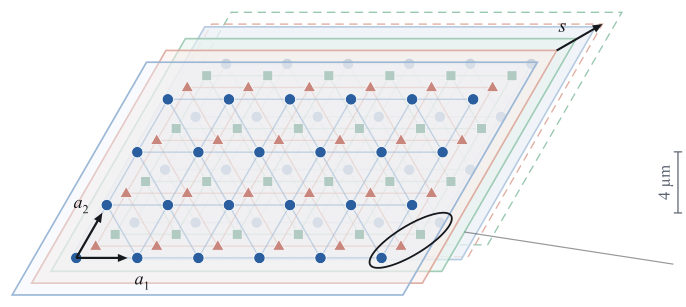
<figcaption class="paper-figure-caption"><b>Fig 2.</b> Figure 2. Schematic of triangular 3D layout with four layers leading to efficient implementation</figcaption>
</figure>
<figure class="paper-figure-card">
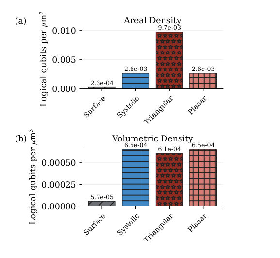
<figcaption class="paper-figure-caption"><b>Fig 3.</b> Figure 3. Spatial-footprint comparison for twelve logical qubits encoded using a planar distance-</figcaption>
</figure>
<figure class="paper-figure-card">
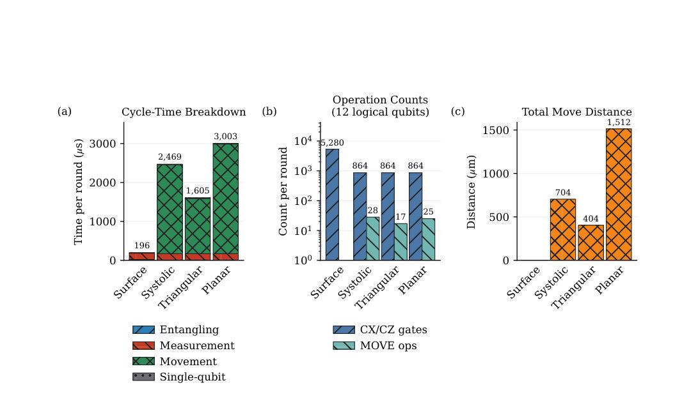
<figcaption class="paper-figure-caption"><b>Fig 4.</b> Figure 4. Syndrome-extraction schedule comparison for twelve planar distance-11 surface-code</figcaption>
</figure>
<figure class="paper-figure-card">
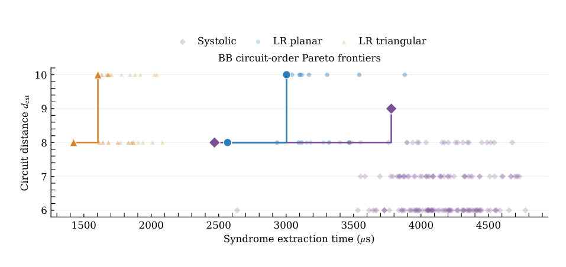
<figcaption class="paper-figure-caption"><b>Fig 5.</b> Figure 5. Trade-off between syndrome-extraction time and extended-code distance dext for systolic,</figcaption>
</figure>

**Summary.** This paper demonstrates that leveraging native three-dimensional geometry in neutral-atom quantum processors dramatically improves the feasibility of implementing high-rate quantum error correction codes. By comparing 2D planar layouts to 3D embeddings, the authors show that 3D control boosts qubit packing density and reduces syndrome extraction time, making scalable fault-tolerant quantum computing more physically viable.

**Why it may be interesting.** It provides concrete, quantitative architectural guidelines for realizing complex quantum error correction codes, directly informing the hardware requirements for fault-tolerant quantum computation using neutral atoms.

Detailed structure

**Main problem.** The primary challenge is reducing the overhead (qubit count, control complexity, and execution time) associated with implementing Quantum Error Correction (QEC) codes for scalable quantum computation.

**Main result.** Implementing nonlocal qLDPC codes using native three-dimensional (3D) geometry yields significantly higher logical-qubit density (up to 42x better than surface codes) and reduces syndrome-extraction time compared to planar layouts.

**Method.** The authors compare planar (2D) versus 3D embeddings of a fixed qLDPC code (the [[144, 12, 12]] bivariate bicycle code) by simulating syndrome extraction schedules and calculating spatial and temporal resource metrics.

**Model / system.** The work models quantum computation on neutral-atom quantum processors using optical tweezer arrays, specifically focusing on the physical realization of nonlocal syndrome extraction circuits.

**Key observables.** Logical-qubit density (logical qubits per unit spatial footprint), syndrome-extraction time, and logical error rates.

**Important parameters / regimes.** Code structure (e.g., [[144, 12, 12]]), lattice spacing, and the ratio of 3D vs. 2D embedding efficiency.

**Assumptions / limitations.** The 3D architecture is an extrapolation, assuming programmable, collision-free atom transport and simultaneous multi-layer measurements, which are not yet demonstrated.

**Figures summary.** Figures compare packing benefits of 3D vs. 2D arrays and show trade-offs between syndrome-extraction time and extended-code distance for different layouts.

**Paper structure.** The paper systematically compares scheduling algorithms and resource requirements for different physical embeddings (planar vs. 3D) of the same error-correcting code, culminating in a quantitative demonstration of 3D advantages.

Abstract

High-rate quantum low-density parity-check (qLDPC) codes can substantially reduce qubit overhead relative to surface codes, but their advantage depends on efficiently realizing nonlocal syndrome extraction. We study the \([[144,12,12]]\) bivariate bicycle code on a neutral-atom architecture with native three-dimensional (3D) geometry, comparing planar and 3D embeddings while holding the code fixed. We characterize spatial efficiency using the logical-qubit density, defined as the number of encoded logical qubits per unit spatial footprint. Because the optical controller's field of view limits the transverse extent of an array, this metric estimates the number of logical qubits that can be accommodated within a fixed optical field of view. The 3D embedding achieves approximately \(4\times\) greater areal logical-qubit density than the planar layout and \(42\times\) greater than a surface-code baseline. It also reduces the bivariate bicycle syndrome-extraction time by roughly \(2\times\) compared to a planar baseline, with fewer movement operations and substantially shorter atom-transport distance. Native 3D geometry can improve both the packing density and executable realization of nonlocal qLDPC codes, making practical performance depend jointly on code structure, optical geometry, transport scheduling, and hardware-level noise. This motivates further development of control techniques in 3D.

[↑ back to top](#top)

### [On Quasiparticles within the Refined Gribov-Zwanziger Model](http://arxiv.org/abs/2609.04423v1)

**Authors:** Felipe F. Garcia, Marcio A. L. Capri, Bruno W. Mintz  
**Type:** theory · **Category:** other · **PDF:** <https://arxiv.org/pdf/2609.04423v1>  
**Analysis basis:** full PDF text, analyzed in chunks
**Topic relevance:** `Keldysh / 2PI / non-Gaussian methods` **3/5** · `methods for driven-dissipative` **3/5** · `analog quantum simulation` **1/5** · `quantum measurements` **1/5**

↔ Scroll figures horizontally

<figure class="paper-figure-card">
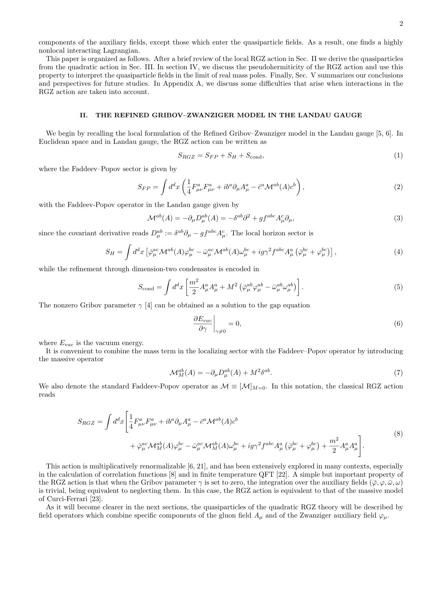
<figcaption class="paper-figure-caption"><b>Fig 1.</b> Low-resolution page preview, page 2</figcaption>
</figure>
<figure class="paper-figure-card">
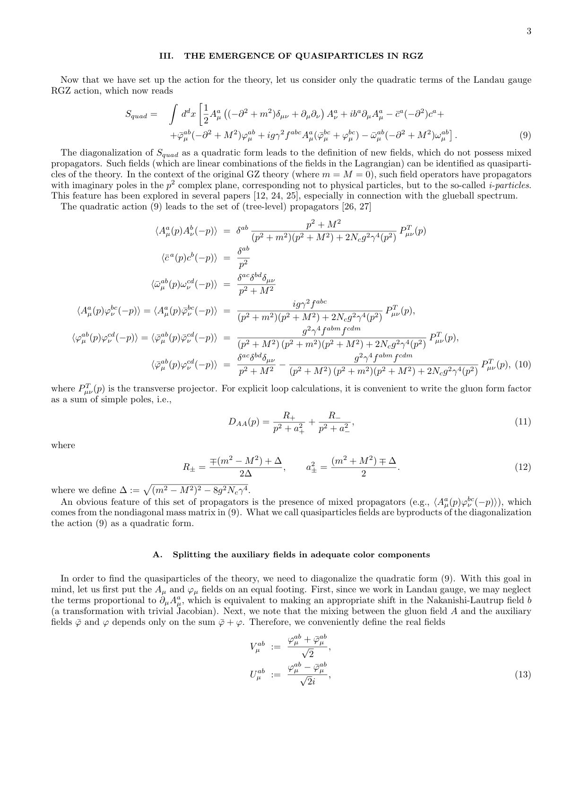
<figcaption class="paper-figure-caption"><b>Fig 2.</b> Low-resolution page preview, page 3</figcaption>
</figure>
<figure class="paper-figure-card">
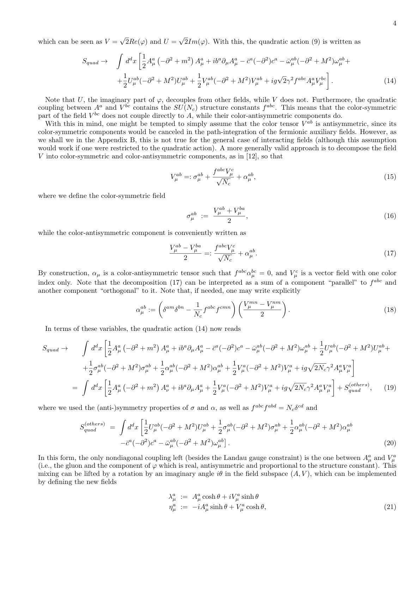
<figcaption class="paper-figure-caption"><b>Fig 3.</b> Low-resolution page preview, page 4</figcaption>
</figure>
<figure class="paper-figure-card">
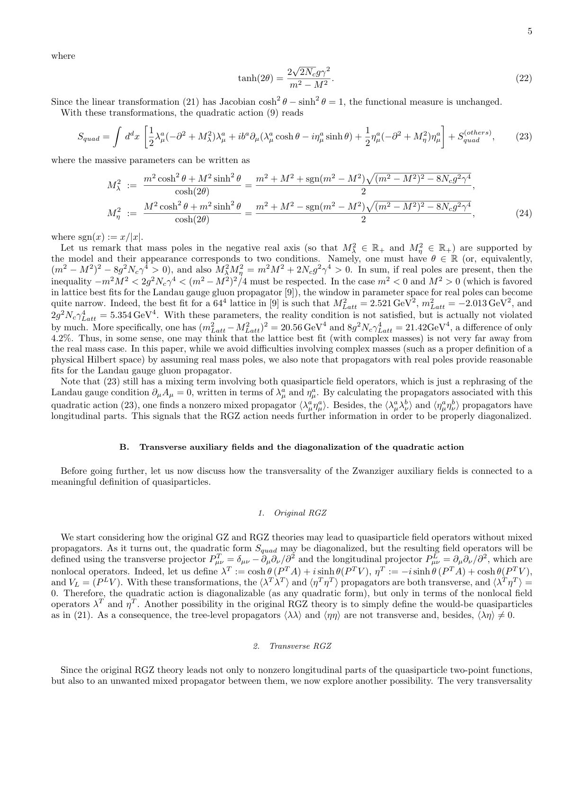
<figcaption class="paper-figure-caption"><b>Fig 4.</b> Low-resolution page preview, page 5</figcaption>
</figure>
<figure class="paper-figure-card">
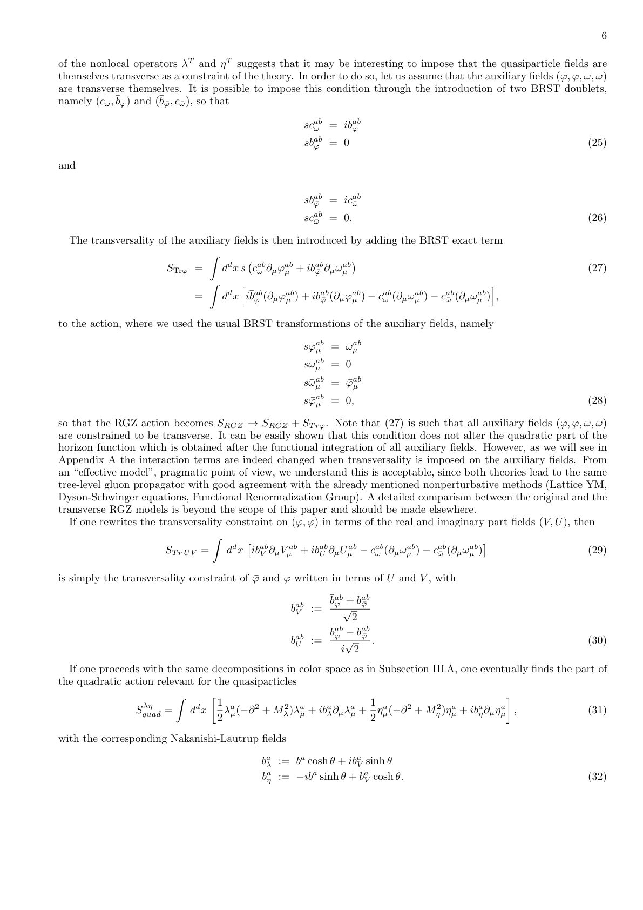
<figcaption class="paper-figure-caption"><b>Fig 5.</b> Low-resolution page preview, page 6</figcaption>
</figure>

**Summary.** This theoretical paper investigates the quasiparticle excitations within the Refined Gribov-Zwanziger model for pure Yang-Mills theories. By diagonalizing the quadratic action, the authors derive the propagators for these quasiparticles. The work provides a framework for understanding the nonperturbative structure of gauge theories by ensuring the resulting spectral functions are physically well-behaved for real mass poles.

**Why it may be interesting.** While focused on gauge theory, the rigorous mathematical techniques of diagonalizing complex quadratic actions and analyzing spectral functions for physical poles are highly relevant to understanding effective Hamiltonians in strongly coupled quantum systems.

Detailed structure

**Main problem.** The paper addresses the fundamental challenge of understanding the effective excitations (quasiparticles) of gauge theories in the nonperturbative regime, particularly concerning confinement.

**Main result.** The authors propose a novel interpretation for quasiparticles derived from the Refined Gribov-Zwanziger (RGZ) model, showing that for real mass poles, the resulting field operators yield a well-defined, positive spectral function.

**Method.** The primary method involves analyzing the quadratic action derived from the RGZ Lagrangian, diagonalizing this action, and imposing transversality constraints to simplify the resulting propagators.

**Model / system.** The study uses the Refined Gribov-Zwanziger (RGZ) theory as an effective model for pure gauge Yang-Mills theories, focusing on the behavior of gluon propagators.

**Key observables.** Gluon propagator poles, spectral functions ($
ho_{\lambda\lambda}(s)$, $
ho_{\eta\eta}(s)$), and the structure of quasiparticle propagators.

**Important parameters / regimes.** Real mass poles ($p^2 = -M^2 \pm < 0$), the coupling constant $g$, and the mass parameters $m^2$ and $M^2$ within the RGZ model.

**Assumptions / limitations.** The analysis is restricted to the case of real mass poles, avoiding the mathematical complexities associated with complex mass poles, and often relies on imposing transversality constraints (Transverse RGZ model).

**Paper structure.** The paper progresses by establishing the RGZ action, simplifying it by diagonalizing the quadratic form, and further refining the analysis by imposing transversality constraints to obtain a fully diagonal quadratic action for the quasiparticle propagators.

Abstract

The problem of the effective excitations of a gauge theory in the nonperturbative regime remains not completely understood. Using the Refined Gribov-Zwanziger (RGZ) theory as effective model for pure gauge Yang-Mills theories, we revisit the quasiparticle (quadratic) excitations of the theory. A novel interpretation of such quasiparticles is proposed, in the case of real mass poles, taking into account the manifest ${\cal PT}-$symmetry of the RGZ Lagrangian.

[↑ back to top](#top)

### [Glassy dynamics, crossover temperature and density scaling in fragile glass-formers](http://arxiv.org/abs/2609.05159v1)

**Authors:** Ankit Singh, Vinay Vaibhav, Swarn Lata Singh, Yashwant Singh  
**Type:** both · **Category:** disordered systems and neural networks · **PDF:** <https://arxiv.org/pdf/2609.05159v1>  
**Analysis basis:** full PDF text, analyzed in chunks
**Topic relevance:** `non-equilibrium universality` **3/5** · `scars & prethermalization` **3/5** · `analog quantum simulation` **1/5**

↔ Scroll figures horizontally

<figure class="paper-figure-card">
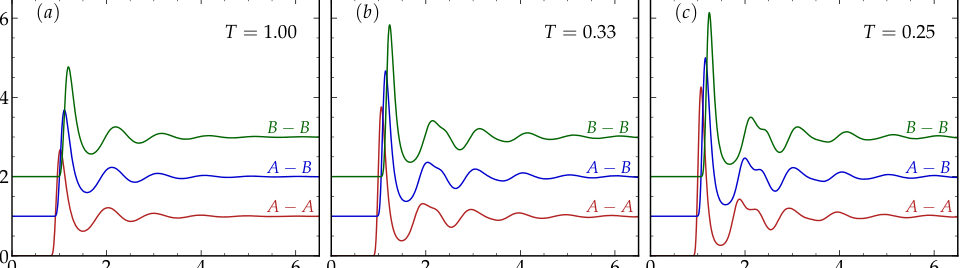
<figcaption class="paper-figure-caption"><b>Fig 1.</b> FIG. 1. Partial radial distribution functions gαγ(r) for A–A, A–B, and B–B correlations at density ρ = 0.80 for temperatures (a) T = 1.00, (b) T = 0.33, and (c) T = 0.25. For clarity, the gAB(r) and gBB(r) curves are vertically shifted upward by 1 and 2 units, respectively.</figcaption>
</figure>
<figure class="paper-figure-card">
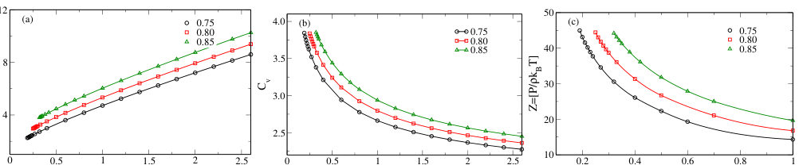
<figcaption class="paper-figure-caption"><b>Fig 2.</b> FIG. 2. (a) Internal energy per particle, U(T), plotted as a function of temperature, T, for three densities, ρ = 0.75, 0.80, and 0.85. The symbols represent the calculated values, while the lines show fits to the algebraic relation [48], U(T) = 3</figcaption>
</figure>
<figure class="paper-figure-card">
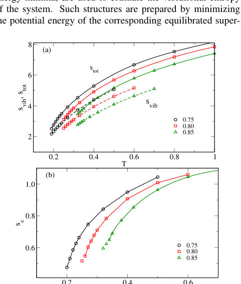
<figcaption class="paper-figure-caption"><b>Fig 3.</b> FIG. 3. Temperature dependence of the total entropy per particle stot = Stot/N (solid lines with open symbols) and vibrational entropy per particle svib = Svib/N (dashed lines with open symbols) for densi- ties ρ = 0.75, 0.80, and 0.85 (as indicated) in (a). The corresponding configurational entropy per particle sc as a function of temperature T in (b).</figcaption>
</figure>
<figure class="paper-figure-card">
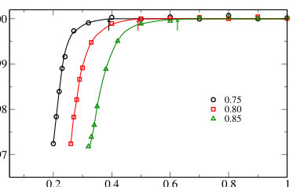
<figcaption class="paper-figure-caption"><b>Fig 4.</b> FIG. 4. Normalized inherent structure energy ¯eIS plotted as function of temperature T for the densities ρ = 0.75,0.80, and 0.85. Sym- bols represent the calculated values, while the solid lines represent the corresponding least square fit. The arrow indicates the crossover temperature TIS for different densities, which are listed in Table I.</figcaption>
</figure>
<figure class="paper-figure-card">
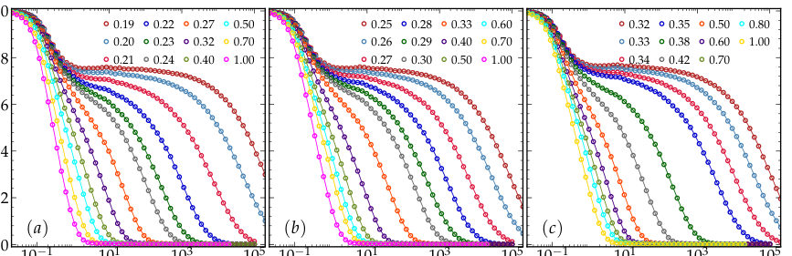
<figcaption class="paper-figure-caption"><b>Fig 5.</b> FIG. 5. Self-intermediate scattering function Fs(q,t) at q = 6.5 plotted as a function of time t for the indicated temperatures. The upper panels (a-c) correspond to densities ρ = 0.75, 0.80, and 0.85, respectively. The lower panels (d–f) show the corresponding time evolution of tF′s (q,t). Solid lines represent sixth-order polynomial fits to the derivative data.</figcaption>
</figure>

**Summary.** This work analyzes the dynamics of glass-forming liquids interacting via an IPL potential, showing that the slowing down of relaxation is governed by universal scaling laws. By combining molecular dynamics simulations with theory, the authors establish a unified description of both the thermodynamics and dynamics across varying densities and temperatures. This provides a powerful tool for predicting glassy behavior over wide parameter ranges.

**Why it may be interesting.** The concepts of structural arrest, scaling laws, and the role of local structural order (CRC) in determining macroscopic dynamics are fundamental to understanding complex many-body systems, which has parallels in quantum many-body physics.

Detailed structure

**Main problem.** The paper investigates the slowing down of dynamics and structural relaxation in glass-forming mixtures as they approach the glass transition.

**Main result.** The relaxation dynamics obey density-temperature scaling, and the structural relaxation time is successfully described by a theoretical framework involving a crossover temperature and a fluctuation-induced parameter.

**Method.** The study combines large-scale Molecular Dynamics simulations with theoretical calculations to analyze structural and dynamic properties.

**Model / system.** The system modeled is a binary mixture interacting via an Inverse-Power-Law (IPL) potential, simulating supercooled liquids or fragile glass-formers.

**Key observables.** Static pair-correlation function, configurational entropy, inherent-structure energy, and structural relaxation time ($\tau_\alpha$).

**Important parameters / regimes.** Density ($\rho$), Temperature ($T$), and the crossover temperature ($T_a$).

**Assumptions / limitations.** The theory identifies a 'cooperatively rearranging cluster' (CRC) as the key structural element governing the slowing down of dynamics.

**Figures summary.** Figures show partial radial distribution functions ($g_{\alpha\gamma}(r)$) indicating structural rigidity upon cooling, and plots demonstrating data collapse onto master curves using scaling variables.

**Paper structure.** The paper progresses by establishing the theoretical framework for relaxation time, calculating various thermodynamic and structural observables via simulation, and finally demonstrating that both dynamic and thermodynamic quantities collapse onto universal master curves via density-temperature scaling.

Abstract

We investigate the slowing down of dynamics in a glass-forming mixture interacting via an inverse-power-law (IPL) potential using a combination of theory and large-scale molecular dynamics simulations. We measure the static pair-correlation function, configurational entropy, inherent-structure energy, and structural relaxation time. We employ a theoretical framework to calculate the structural relaxation time $τ_α$, which is found to be in very good agreement with the simulation results. The theory identifies a local structural order which defines the cooperativity of the relaxation and brings forth a fluctuation induced parameter $ψ( T )$ and a crossover temperature $T_a$ that characterize the density and temperature dependence of the glassy dynamics. Furthermore, we determine a crossover temperature using independent dynamical and thermodynamic criteria and compare with the theoretically predicted crossover temperature $T_a$. Relaxation dynamics is shown to obey density-temperature scaling, similar to thermodynamic properties, in terms of a variable $Γ$ formed by an appropriate combination of density and temperature, characteristic of IPL interactions. Finally, we show that, when the excess thermodynamic and dynamic quantities obtained at different densities are plotted as functions of the reduced temperature $T/T_a$ (or $T_a/T$), the data collapse onto master curves with excellent agreement between theory and simulation. These scaling relations provide a unified description of the thermodynamics and dynamics in IPL systems, enabling the prediction of relaxation behavior over a wide range of densities from data at a single state point.

[↑ back to top](#top)

### [How dipolar interactions structure molecular droplets](http://arxiv.org/abs/2609.05344v1)

**Authors:** Wiiliam Freitas, Panagiotis Giannakeas, Jan M. Rost  
**Type:** theory · **Category:** other · **PDF:** <https://arxiv.org/pdf/2609.05344v1>  
**Analysis basis:** full PDF text, analyzed in chunks
**Topic relevance:** `analog quantum simulation` **3/5** · `Keldysh / 2PI / non-Gaussian methods` **2/5** · `methods for driven-dissipative` **2/5**

↔ Scroll figures horizontally

<figure class="paper-figure-card">
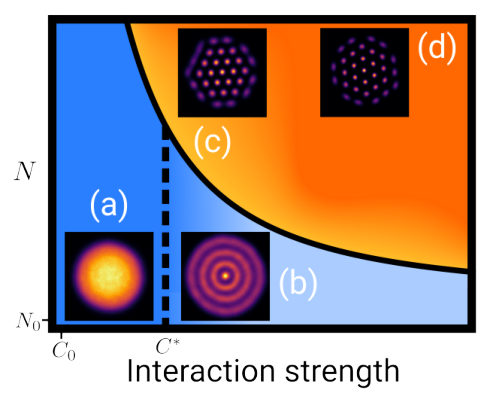
<figcaption class="paper-figure-caption"><b>Fig 1.</b> Figure 1. Illustration of ground state geometries with their de- pendence on system size N and interaction strength C. The solid black line marks the transition boundary between the droplet (blue) and crystal (orange) states; color gradients in- dicate smooth structural changes. C∗denotes the interaction strength, where the first dimer state occurs. The origins of the axes are given by N0 = 20 and C0 = 8.</figcaption>
</figure>
<figure class="paper-figure-card">
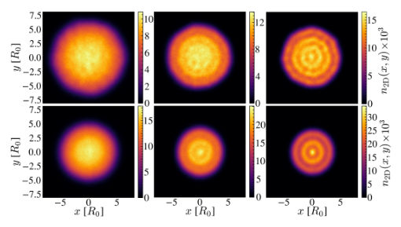
<figcaption class="paper-figure-caption"><b>Fig 2.</b> Figure 2. Gradual formation of radial modulations with in- creasing interaction C for droplets containing N = 37 (top row) and N = 19 (bottom row) molecules. From left to right, the panels correspond to C = 10, 15, and 20. Note that the potential supports at least one dimer state for C &gt; C∗= 12.3.</figcaption>
</figure>
<figure class="paper-figure-card">
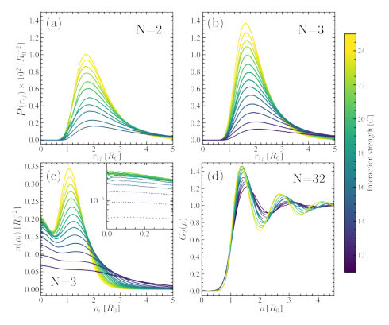
<figcaption class="paper-figure-caption"><b>Fig 3.</b> Figure 3. Correlated molecular densities; (a) and (b): pair</figcaption>
</figure>
<figure class="paper-figure-card">
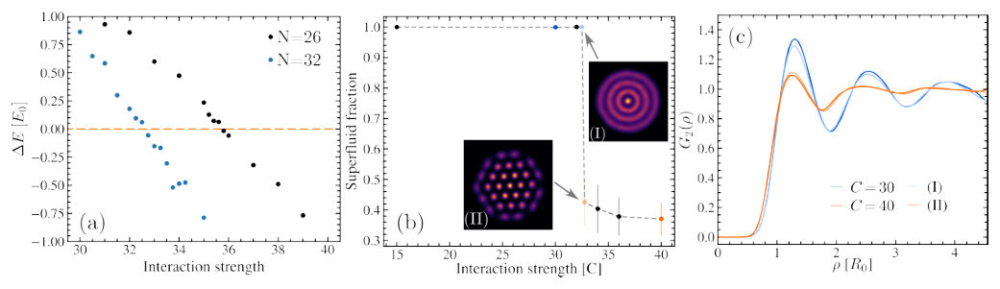
<figcaption class="paper-figure-caption"><b>Fig 4.</b> Figure 4. Structural changes across the transition form droplet to crystal as function of interaction strength C: (a) difference of droplet-ring and crystal energies from pair simulation, see text; (b) superfluid fraction (see text) and density profiles immediately before (I) and after (II) the transition for N=32; (c) density-density correlation G2(ρ) from (5) for selected C values and N=32.</figcaption>
</figure>

**Summary.** This paper uses advanced Variational Monte Carlo methods with Neural Quantum States to study how dipolar interactions organize molecular droplets. The authors distinguish between two types of structural changes: a smooth crossover to ring states and a sharp, first-order transition into a crystal phase. This work provides a detailed theoretical roadmap for understanding quantum matter under strong, anisotropic interactions.

**Why it may be interesting.** This work provides a detailed theoretical understanding of structural phase transitions in dipolar quantum gases, bridging the gap between liquid-like droplets and ordered crystalline phases using advanced quantum many-body techniques.

Detailed structure

**Main problem.** The study investigates how dipolar interactions structure self-bound molecular droplets and characterizes the nature of the transition from these droplets to crystalline phases.

**Main result.** The transition from droplet to crystal is identified as a finite-size first-order phase transition, while the transition to droplet-ring states is characterized as a smooth crossover.

**Method.** The research employs a Variational Monte Carlo (VMC) framework utilizing Neural Quantum States (NQS) to accurately describe the strongly correlated ground states of the system.

**Model / system.** The system consists of microwave-shielded polar molecules (MSPMs) forming self-bound droplets, governed by an N-body Hamiltonian incorporating long-range dipolar interactions. The effective potential is explicitly defined based on molecular geometry.

**Key observables.** Superfluid fraction, density-density correlations ($G_2(
ho)$), pair densities (dimers/trimers), and the energy difference ($\Delta E$) between droplet-ring and crystal states.

**Important parameters / regimes.** Interaction strength ($C$), number of molecules ($N$), and the critical interaction strength ($C^*$) marking the initial dimer state.

**Assumptions / limitations.** The analysis relies on the VMC framework with NQS to capture complex correlations, and the superfluid fraction calculation uses linear-response theory.

**Figures summary.** Figures illustrate the structural sequence (droplet $	o$ ring $	o$ crystal), showing abrupt changes in superfluid fraction and density correlations across the first-order transition point, contrasted with smooth changes during the crossover.

**Paper structure.** The paper systematically analyzes the system by first identifying the Hamiltonian and key parameters, then using VMC/NQS to map out the structural sequence. It distinguishes between the smooth crossover (droplet-ring) and the first-order transition (droplet-crystal) by analyzing multiple observables like superfluid fraction and correlation functions.

Abstract

We investigate how dipolar interactions between microwave-shielded polar molecules structure the self-bound droplets formed under variation of the interaction strength. We identify the transition from droplets to crystals as a finite-size first order transition. With droplet-ring states and transitional supersolid states we predict additional structure in the crystal and droplet phases, respectively. To describe this strongly correlated regime, and in particular the reconfiguration of quantum ground states, we design a variational Monte Carlo framework based on neural quantum states. It is especially suitable to describe ground states and almost degenerate states with very different configurations. Moreover, one can easily determine the superfluid fraction. Our results reveal the sequence of finite-size structures through which dipolar interactions reorganize molecular droplets into crystals.

[↑ back to top](#top)

### [Infrared Memory and Scrambling in a Dynamically Opened Coupled-SYK Majorana Junction](http://arxiv.org/abs/2609.05336v1)

**Authors:** Ali Vahedi  
**Type:** theory · **Category:** strongly correlated electrons · **PDF:** <https://arxiv.org/pdf/2609.05336v1>  
**Analysis basis:** full PDF text, analyzed in chunks
**Topic relevance:** `Keldysh / 2PI / non-Gaussian methods` **3/5** · `correlated / nonlocal dissipation` **1/5** · `methods for driven-dissipative` **1/5** · `non-equilibrium universality` **1/5** · `scars & prethermalization` **1/5**

↔ Scroll figures horizontally

<figure class="paper-figure-card">
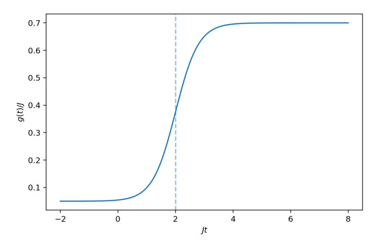
<figcaption class="paper-figure-caption"><b>Fig 1.</b> Figure 1: Smooth shutter protocol used in the finite-N calculations. The coupling rises from gcl = 0.05J to gop = 0.70J with Jt0 = 2 and τJ = 0.8. The labels “closed” and “open” are operational rather than universal thresholds.</figcaption>
</figure>
<figure class="paper-figure-card">
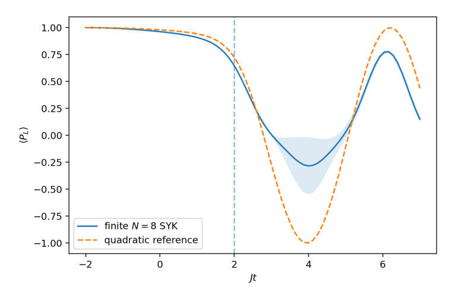
<figcaption class="paper-figure-caption"><b>Fig 2.</b> Figure 2: Normalized left parity PL(t) for the finite-N interacting shutter and the quadratic reference. The curves are obtained directly from ⟨PL(t)⟩/⟨PL(ti)⟩during the exact time evolution. The normalization removes the realization-dependent sign of the initial left parity, so every curve begins at +1.</figcaption>
</figure>
<figure class="paper-figure-card">
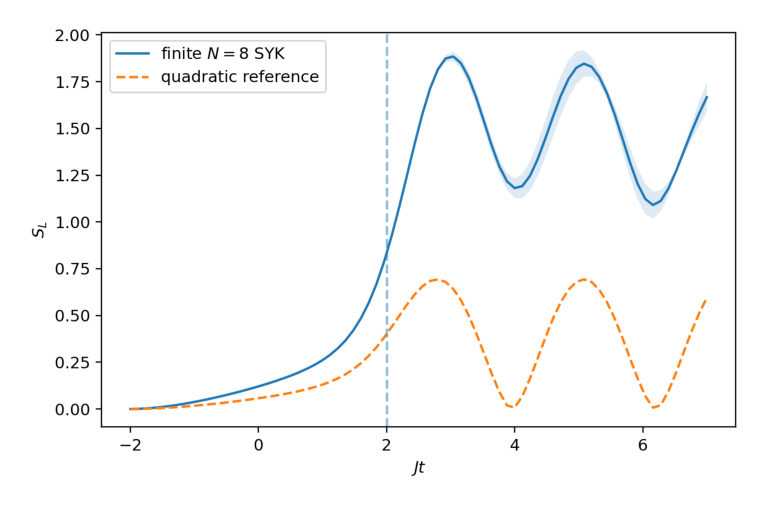
<figcaption class="paper-figure-caption"><b>Fig 3.</b> Figure 3: Left-right von Neumann entropy obtained from the exact reduced density matrix during the N = 8 evolution. At each time the full state is traced over the right SYK cluster. The SYK interaction populates substantially more entanglement sectors than the corresponding one-particle quadratic reference.</figcaption>
</figure>
<figure class="paper-figure-card">
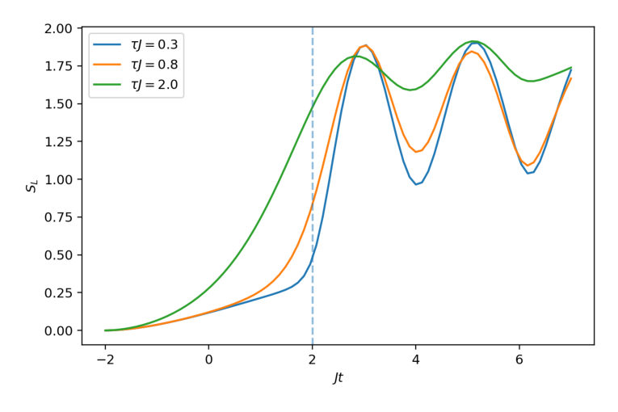
<figcaption class="paper-figure-caption"><b>Fig 4.</b> Figure 4: Entropy histories obtained from the same exact finite-N procedure for three switching times, τJ = 0.3, 0.8, and 2.0. Only the time scale of the shutter protocol is changed. The curves demonstrate protocol dependence in the finite interacting system and are not intended as a universal entropy-growth law.</figcaption>
</figure>
<figure class="paper-figure-card">
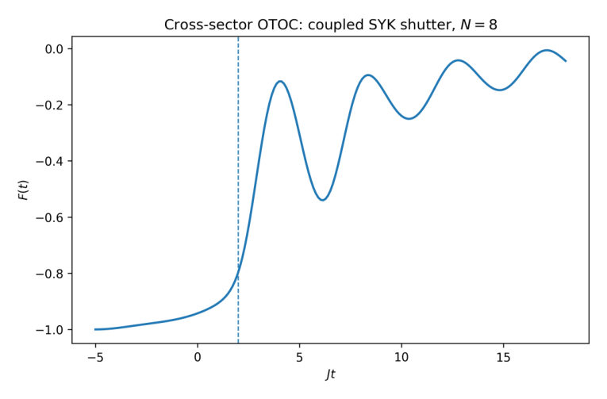
<figcaption class="paper-figure-caption"><b>Fig 5.</b> Figure 5: Exact infinite-temperature cross-sector OTOC for N = 8 Majoranas per SYK copy. The curve is obtained by explicit Heisenberg evolution of V = χL 1 followed by the trace in Eq. (55). The post-opening deviation demonstrates cross-sector operator sensitivity, while the later revival is a finite-size recurrence rather than evidence for a universal Lyapunov exponent.</figcaption>
</figure>

**Summary.** This paper analyzes a Majorana junction built from two coupled, strongly interacting SYK systems undergoing a dynamic coupling change. By analyzing the system's low-frequency response, the authors demonstrate that the strong interactions cause the junction to retain a measurable 'infrared memory' beyond what is predicted by simpler, quadratic models. This connects many-body scrambling diagnostics to fundamental low-energy physics.

**Why it may be interesting.** The findings provide a concrete, interacting realization of how quantum information (memory) can be stored or transferred across a junction, extending beyond simple quadratic models and touching upon holographic concepts.

Detailed structure

**Main problem.** The study investigates how information transfer and operator structure are affected when a quantum junction connecting two strongly interacting SYK systems is dynamically opened.

**Main result.** The interacting system retains a strong infrared memory, evidenced by the effective anomalous response acquiring a power-law infrared sensitivity ($\propto 1/\mu$), which is qualitatively different from the quadratic (free) case.

**Method.** The analysis combines low-frequency Keldysh theory applied to the large-N SYK saddle with exact finite-dimensional simulations of the coupled system.

**Model / system.** The model is a Majorana junction formed by two coupled Sachdev–Ye–Kitaev (SYK) systems, whose coupling strength $g(t)$ is varied smoothly over time, acting as a 'shutter'.

**Key observables.** Infrared memory retention, inter-sector entanglement, parity transfer, and cross-sector operator scrambling (measured via OTOC).

**Important parameters / regimes.** The coupling strength $g(t)$ switches between weak and strong regimes; the analysis focuses on the infrared cutoff $\mu 	o 0$.

**Assumptions / limitations.** The large-N Keldysh theory is used to linearize the response around the conformal saddle; the continuum limit ($\mu 	o 0$) is an idealization.

**Figures summary.** Figures illustrate the smooth shutter protocol, entropy histories showing protocol dependence, and cross-sector OTOC evolution over time.

**Paper structure.** The paper progresses from defining the coupled SYK junction and the dynamic coupling protocol, to analyzing the low-frequency response via Keldysh theory, contrasting the free vs. interacting results, and finally confirming the memory effect using finite-N diagnostics.

Abstract

We study a dynamically opened Majorana junction formed by two coupled Sachdev--Ye--Kitaev (SYK) systems. A time-dependent bilinear coupling drives the system from a nearly decoupled to a strongly hybridized regime, providing an interacting realization of a Majorana shutter. Using a low-frequency analysis of the large-$N$ Keldysh theory around the conformal $q=4$ SYK saddle, we find that the opening retains a strong infrared memory, with the associated anomalous response becoming increasingly sensitive to the infrared cutoff. Exact finite-dimensional simulations of two $N=8$ SYK clusters show enhanced inter-sector entanglement, parity transfer, and cross-sector operator scrambling after the opening. These results connect the infrared structure of conformal SYK dynamics with finite-size many-body scrambling and show how a dynamically opened interacting Majorana system can retain long-wavelength memory beyond the quadratic limit.

[↑ back to top](#top)

### [Markov chains at the onset of non-reversibility](http://arxiv.org/abs/2609.05183v1)

**Authors:** Gustave Robichon, Cecile Monthus, Werner Krauth  
**Type:** theory · **Category:** statistical mechanics · **PDF:** <https://arxiv.org/pdf/2609.05183v1>  
**Analysis basis:** full PDF text, analyzed in chunks
**Topic relevance:** `non-equilibrium universality` **3/5** · `correlated / nonlocal dissipation` **1/5** · `driven-dissipative phase transition` **1/5** · `methods for driven-dissipative` **1/5** · `scars & prethermalization` **1/5**

↔ Scroll figures horizontally

<figure class="paper-figure-card">
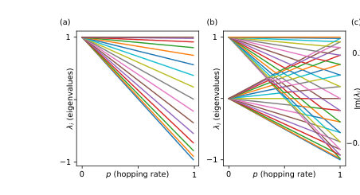
<figcaption class="paper-figure-caption"><b>Fig 1.</b> Fig. 1 Transition-matrix spectra for the flat steady state (N = 16). (a): Path graph of eq. (1) (reversible Markov chain). (b): Lifted path graph of eq. (6) (reversible Markov chain). (c): Lifted path graph of eq. (10) with p = 0.9 as a function of the non-reversibility δ (see also Fig. 2). The complex spectrum arises through the hybridization of the two fans in (b).</figcaption>
</figure>
<figure class="paper-figure-card">
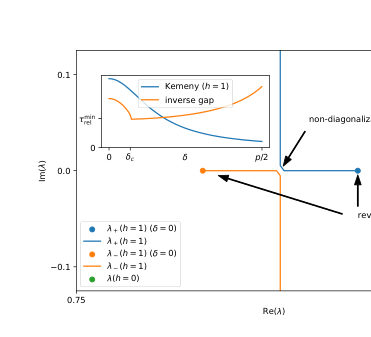
<figcaption class="paper-figure-caption"><b>Fig 2.</b> Fig. 2 Eigenvalues λ±(h = 1) as a function of the non-reversibility δ (flat steady state, N = 8, with ε = 0.05 and p = 0.9), as they approach each other on the real axis, then separate vertically along the imaginary direction. The eigenvalue λ+(h = 0) and its associated left eigenvector are independent of δ. Inset: The inverse of the gap (the minimum distance to the unit circle, see eq. (4)), thus the relaxation time τrel, is minimal when the two eigenvalues meet at δc and the transition matrix is non-diagonalizable. The Kemeny time τ∗(h = 1) = 1/[1−λ+(h = 1)]+1/[1−λ−(h = 1)] will be introduced in Sec. 2.2.</figcaption>
</figure>
<figure class="paper-figure-card">
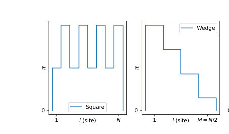
<figcaption class="paper-figure-caption"><b>Fig 3.</b> Fig. 3 Steady states treated in Sec. 4 for N = 8. (a): Square-wave steady state (see eq. (79)). On the path graph, the relaxation time is generically τrel ∼N2 while, on the lifted path graph we reach τrel ∼N. (b): Wedge steady state (see eq. (110)). On the path graph, generically, we have τrel ∼M2, and τrel ∼M on the lifted path graph. The mean first-passage time to reach site M starting from site 1 scales as ∼M2 logM on the path graph and as ∼M2 on the lifted path graph. (c): V-shape steady state (see eq. (111)). On the path graph, generically, τrel ∼N2 logN while on the lifted path graph, we have τrel ∼N2. These times have an evident interpretation in terms of the mean first-passage time,...</figcaption>
</figure>
<figure class="paper-figure-card">
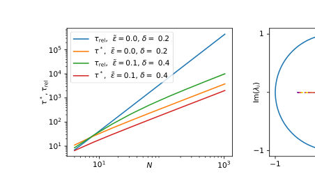
<figcaption class="paper-figure-caption"><b>Fig 4.</b> Fig. 4 Lifted path graph with square-wave steady state (from matrix diagonalizations). (a): Relaxation time τrel (inverse gap) and Kemeny time τ∗as a function of N for p = 0.8 for different non-reversibilities δ and resampling rates ε = ˜ε/N. The Kemeny times for δ = p/2 agree with eq. (108). For ε = 0, we have τrel ∼N2, yet τ∗∼N. (b): Spectrum of the transition matrix for N = 16, p = 0.8 as a function of the non-reversibility δ.</figcaption>
</figure>
<figure class="paper-figure-card">
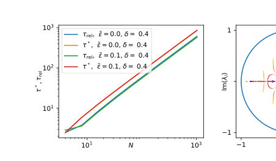
<figcaption class="paper-figure-caption"><b>Fig 5.</b> Fig. 5 Lifted path graph with wedge steady state (from matrix diagonalizations, p = 0.8). (a): Relaxation time τrel (inverse gap) and Kemeny time τ∗as a function of M for p = 0.8 for different non-reversibilities δ and resampling rates ε = ˜ε/M. The Kemeny times τ∗∼N for δ = p/2 and ε = 0 agree with eq. (135). (b): Spectrum of the transition matrix for M = 8, p = 0.8, as a function of the non-reversibility δ.</figcaption>
</figure>

**Summary.** This work analyzes how perturbing a reversible Markov chain on a path graph drives it into non-reversibility. Using spectral analysis and the Green's matrix formalism, the authors compute characteristic times like the mean first-passage time. The key finding is that non-reversibility can fundamentally change the relaxation dynamics, offering insights into non-equilibrium statistical physics.

**Why it may be interesting.** The study of non-equilibrium dynamics and the spectral properties of Markov chains is central to understanding relaxation in open quantum systems, providing tools to quantify how deviations from detailed balance affect mixing times.

Detailed structure

**Main problem.** The paper investigates the transition of a Markov chain from a reversible to a non-reversible dynamic by perturbing the system.

**Main result.** The introduction of non-reversibility can significantly alter the spectral gap and relaxation time, potentially leading to a faster relaxation scaling ($\sim N$ instead of $\sim N^2$) when eigenvalues hybridize.

**Method.** The analysis employs the Green's matrix formalism and spectral analysis of the transition matrix, comparing the spectrum of the reversible and perturbed non-reversible chains.

**Model / system.** The model is a Markov chain defined on a one-dimensional path graph and its 'lifted' version, which is constructed by duplicating sites to model the transition dynamics.

**Key observables.** Spectral gap ($\gamma^*$), Kemeny times, mean first-passage times ($	au_{mj}$), and the eigenvalues of the transition matrix.

**Important parameters / regimes.** The non-reversibility parameter ($\delta$), the system size ($N$), and the specific steady state (e.g., flat, square-wave).

**Assumptions / limitations.** The analysis assumes the existence of a flat steady state and relies on the Green's matrix approach, which is noted to be valid except for very small non-reversibility parameters.

**Figures summary.** Figures illustrate the spectrum of the reversible chain, the complex spectrum as a function of non-reversibility $\delta$, and plots showing the minimal relaxation time occurring when eigenvalues meet.

**Paper structure.** The paper first establishes the reversible case on the path graph, then introduces non-reversibility via a parameter $\delta$ on the lifted graph. It develops the Green's matrix formalism to calculate characteristic times and concludes with explicit formulas for mean first-passage times.

Abstract

For a one-dimensional path graph and a lifted path graph constructed from a duplication of each of its sites, we study how a reversible Markov chain can be perturbed and gradually driven into non-reversibility. The reversible Markov chain has a transition matrix that is diagonalizable and features real-valued eigenvalues and eigenvectors. The left and right eigenvectors form a biorthogonal system. We discuss in concrete examples how the transition matrix of a non-reversible Markov chain may be diagonalizable or non-diagonalizable, and it may have real eigenvalues and complex-conjugate pairs. For a number of steady states (flat, square-wave, wedge, V-shape), we compute eigenvalue spectra on both graphs and discuss the speedup that can be achieved through lifting. We develop a Green's matrix formalism, which we use to compute Kemeny times and mean first-passage times, and which provides valuable information and allows us to interpret the results for the characteristic times.

[↑ back to top](#top)

### [Microkelvin resolution thermometry at the nanometre scale](http://arxiv.org/abs/2609.04907v1)

**Authors:** Jack W. Hart, Soham Pal, Julien R. E. Roth, Katie Ninham, Abbie H. Aleksandrova, Xander Peetroons, Soumen Mandal, Oliver A. Williams, Gavin W. Morley, Mete Atature, Helena S. Knowles  
**Type:** experiment · **Category:** other · **PDF:** <https://arxiv.org/pdf/2609.04907v1>  
**Analysis basis:** full PDF text, analyzed in chunks
**Topic relevance:** `QC/QI experiment` **3/5** · `quantum measurements` **3/5** · `quantum optics experiment` **1/5**

↔ Scroll figures horizontally

<figure class="paper-figure-card">
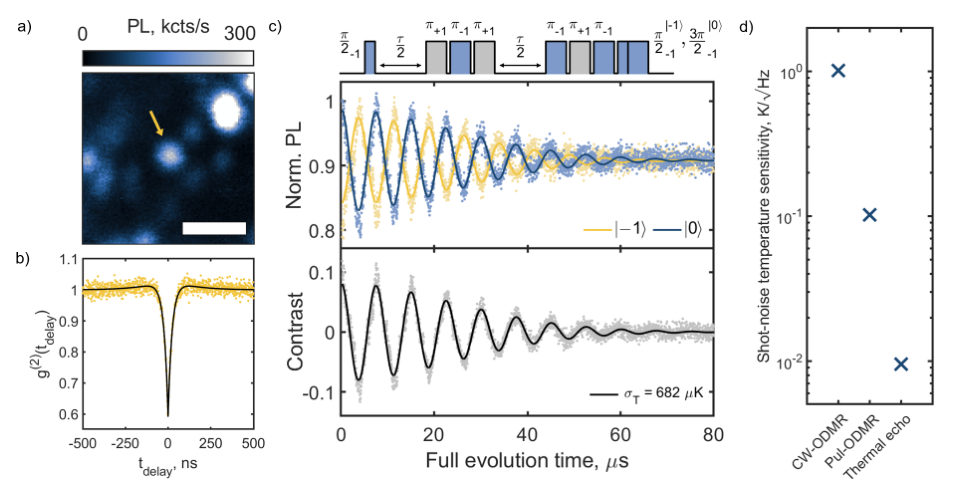
<figcaption class="paper-figure-caption"><b>Fig 1.</b> Figure 1 Exemplary dual-NV nanodiamond temperature measurements using thermal echo protocol. a) Confocal scan of exemplary nanodiamond fluorescence (highlighted with arrow), scalebar = 2 µm. b) Normalized correlation between photon detection events as a function of time delay, g(2)(tdelay), yielding from fit g(2)(tdelay=0) = 0.592 ± 0.004 indicating two NV centers within the nanodiamond. c) (Top) Thermal echo microwave pulse sequence over a full evolution time, τ, where subscripts correspond to the transition being driven (‘-1’ for |0⟩→|−1⟩and ‘+1’ for |0⟩→|+1⟩). The superscripts on the final pulse represent the state projection for readout. (Bottom) Thermal echo photoluminescence (PL)...</figcaption>
</figure>
<figure class="paper-figure-card">
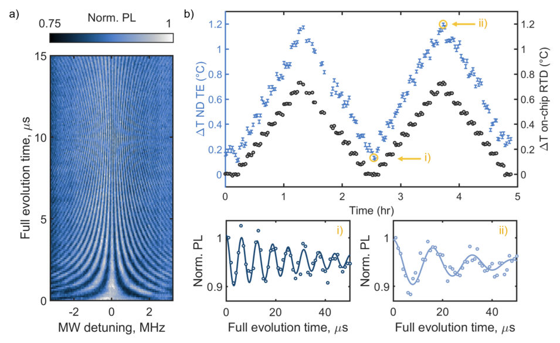
<figcaption class="paper-figure-caption"><b>Fig 2.</b> Figure 2 High fidelity temperature sensing using a dual-NV nanodiamond. a) Thermal echo chevron for simulated tempera- ture changes by deliberate microwave (MW) detuning in increments of 50 kHz in a ±3.2 MHz range. b) Temperature ramping using on-chip heating element. Relative changes in the nanodiamond temperature extracted using the thermal echo (blue) closely match the temperature reported by the on-chip resistance temperature detector (RTD, grey circles). Example thermal echo signals at the top (hottest) and bottom (coldest) parts of the heating ramp are show in the subsets i) and ii).</figcaption>
</figure>
<figure class="paper-figure-card">
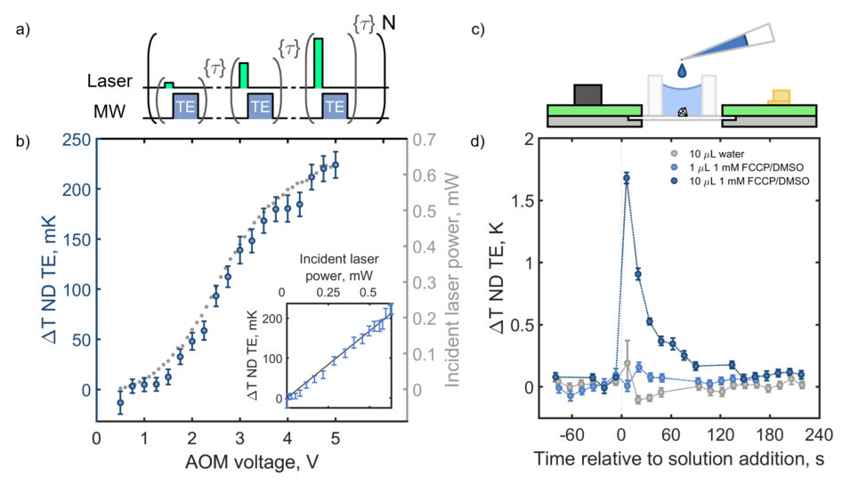
<figcaption class="paper-figure-caption"><b>Fig 3.</b> Figure 3 Laser-induced heating and single-shot exothermic chemical temperature sensing experiments. a) Pulse sequence for the laser-induced heating experiment, where the laser power is increased for each set of full evolution times, τ, for N repeats. b) Temperature increase of the nanodiamond as a function of AOM voltage, which corresponds directly to incident laser power. Inset: Linear relationship between incident laser power and temperature at the nanodiamond. c) Schematic of the solution addition experiment. The nanodiamond is submerged in 200 µL of deionized water in an on-chip well. Solutions are added in such a way as so no contact between the pipette tip and bulk solution is made...</figcaption>
</figure>

**Summary.** This paper reports a significant advancement in nanoscale thermometry by utilizing isotopically-purified dual-NV nanodiamonds. By employing a specialized Thermal Echo protocol, the researchers achieved sub-millikelvin temperature sensitivity, representing an order of magnitude improvement over previous methods. This capability opens new avenues for monitoring minute thermal fluctuations in biological and chemical processes at the nanoscale.

**Why it may be interesting.** This work represents a significant experimental advance in quantum sensing, pushing the limits of thermal measurement resolution using solid-state quantum emitters, which is highly relevant to open quantum systems and quantum optics.

Detailed structure

**Main problem.** The primary challenge addressed is achieving accurate temperature readings of transient events at the nanometer scale due to the low sensitivity of existing sensors.

**Main result.** The authors achieved an order of magnitude improvement in temperature measurement sensitivity using isotopically-purified dual-NV nanodiamonds, reaching a shot-noise limited sensitivity of 9.6 mK/sqrt(Hz).

**Method.** The technique utilizes Nitrogen-Vacancy (NV) centers in nanodiamonds, employing the Thermal Echo (TE) protocol to measure temperature-dependent changes in the NV spin state.

**Model / system.** The physical platform is nanodiamonds containing nitrogen-vacancy (NV) centers, specifically using isotopically-purified dual-NV structures on a bespoke quantum sensing chip.

**Key observables.** Temperature sensing resolution floor, experimental temperature sensitivities (e.g., 48.2 mK/sqrt(Hz)), and shot-noise limited sensitivity (9.6 mK/sqrt(Hz)).

**Important parameters / regimes.** Sub-millikelvin resolution, nanometer-scale localization, and the temperature-dependent zero-field splitting D(T) of the NV ground spin states.

**Assumptions / limitations.** The measurement is susceptible to minor changes in background fluorescence, and the methodology using external magnetic particles may not translate directly to all cellular environments.

**Figures summary.** Figures show exemplary dual-NV measurements using the TE protocol, comparing sensitivities between CW-ODMR and TE, and demonstrating the quantification of temperature changes from laser excitation and exothermic chemical mixing.

**Paper structure.** The paper details the use of the TE protocol for high-sensitivity thermometry, calibrates the system against an on-chip RTD, and then applies the technique to measure thermal loads from external sources like lasers and chemical reactions.

Abstract

Accurate temperature readings of transient events at the nanometer scale are challenging due to the low sensitivity of available sensors. Nanodiamonds containing nitrogen-vacancy (NV) centers have been used for nanoscale thermometry in complex environments, including inside living cells. However, their performance has been limited by short coherence times and low photon counts. In this work, we use isotopically-purified dual-NV nanodiamonds and a bespoke quantum sensing chip to showcase an order of magnitude improvement in temperature measurement sensitivity compared with previous reports. We demonstrate robust temperature measurements with an error of 682 $μ$K, experimental sensitivities below 50 mK/$\surd \text{Hz}$ and a shot-noise limited sensitivity of 9.6 mK/$\surd \text{Hz}$. To confirm the utility of these high-performance nanothermometers, we quantify the temperature change induced by the thermometry measurement itself, specifically the optical excitation laser used to probe the NV spin state. In addition, we observe directly at the nanometre scale the transient heating caused by the exothermic mixing of dimethyl sulfoxide in water. Sub-millikelvin resolution and millikelvin sensitivity thermometry unlock the possibility of monitoring minute thermal fluctuations in living systems and assessing catalyst performance at the nanometre scale.

[↑ back to top](#top)

### [Neural networks learn to reconstruct multipartite entanglement from quantum marginals](http://arxiv.org/abs/2609.04896v1)

**Authors:** Matreyee Kandpal, Arvind, Kavita Dorai  
**Type:** both · **Category:** quantum information and computing · **PDF:** <https://arxiv.org/pdf/2609.04896v1>  
**Analysis basis:** full PDF text, analyzed in chunks
**Topic relevance:** `QC/QI experiment` **3/5** · `methods for driven-dissipative` **2/5** · `quantum measurements` **2/5**

↔ Scroll figures horizontally

<figure class="paper-figure-card">
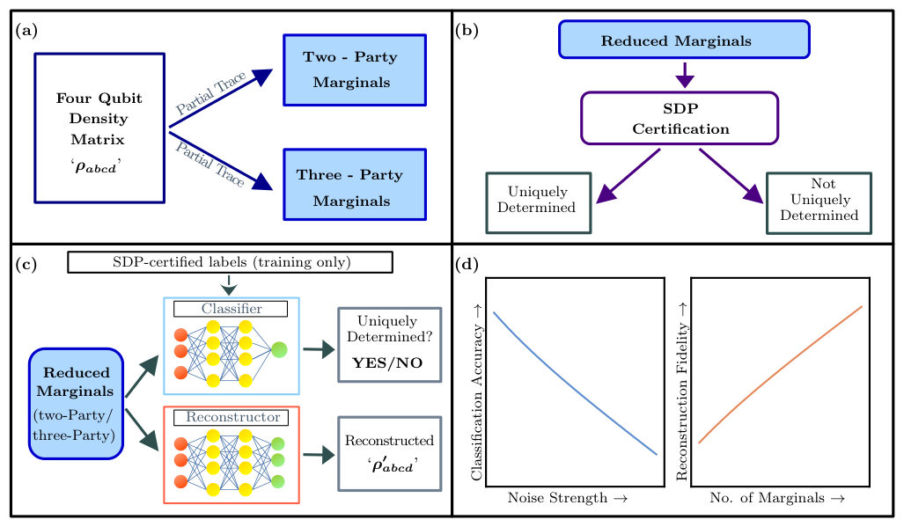
<figcaption class="paper-figure-caption"><b>Fig 1.</b> FIG. 1. ANN framework for the four-qubit quantum marginal problem. (a) Global four-qubit states are accessed only through their two-body and three-body reduced density matrices. (b) Reconstructability analysis using semidefinite programming (SDP), which determines whether a given set of marginals uniquely specifies a compatible global state. (c) Neural-network framework comprising two tasks: classification of reconstructability directly from marginals, and constructive reconstruction of four-qubit density matrices when uniqueness holds. (d) ANN performance analysis using classification accuracy and state- reconstruction fidelity as functions of noise strength and available marginal...</figcaption>
</figure>
<figure class="paper-figure-card">
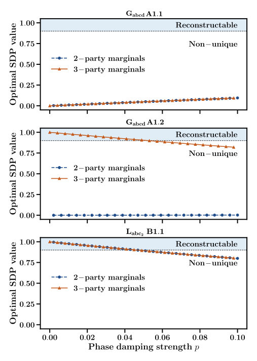
<figcaption class="paper-figure-caption"><b>Fig 2.</b> FIG. 2. SDP results for reconstructability of four-qubit states from reduced marginals. The effect of phase-damping noise on reconstructability is shown for three representative classes of four qubits, quantified by the optimal SDP value as a function of the noise strength p.</figcaption>
</figure>
<figure class="paper-figure-card">
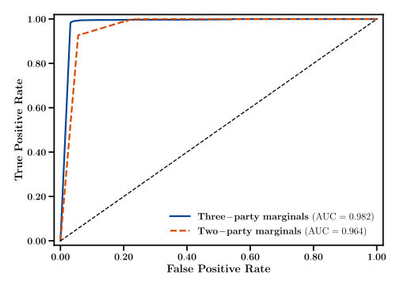
<figcaption class="paper-figure-caption"><b>Fig 3.</b> FIG. 3. Receiver operating characteristic (ROC) curves for classifiers based on three-party marginals (blue solid curve) and two-party marginals (orange dashed curve), evaluated at fixed phase damping noise strength p = 0.03. The curves show the true positive rate as a function of the false positive rate, with the diagonal dashed line indicating random guess- ing. The area under the curve (AUC) is 0.982 for three-party marginals and 0.964 for two-party marginals.</figcaption>
</figure>
<figure class="paper-figure-card">
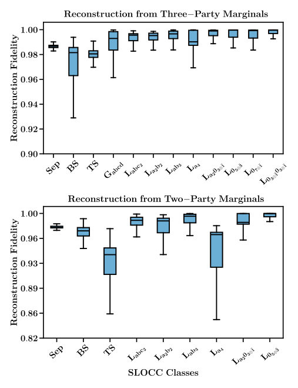
<figcaption class="paper-figure-caption"><b>Fig 4.</b> FIG. 4. Neural reconstruction of four-qubit states from re- duced density matrices. Upper panels show reconstruction using all three-party marginals, while lower panels show re- construction using all two-party marginals. The plots display class-resolved fidelity distributions across SLOCC families for SDP-certified reconstructible states, with each box plot com- piled from 104 samples per class including both pure and noisy states. All reconstructions used reduced density ma- trices alone, without access to the global four-qubit state.</figcaption>
</figure>
<figure class="paper-figure-card">
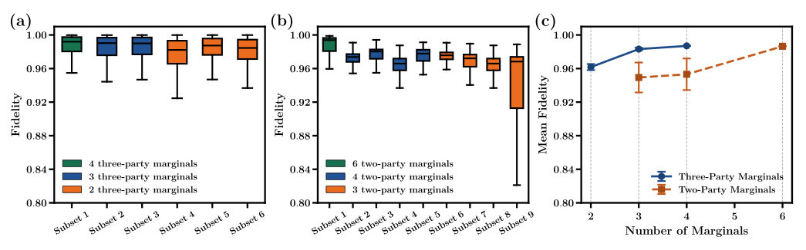
<figcaption class="paper-figure-caption"><b>Fig 5.</b> FIG. 5. Reconstruction fidelity as a function of marginal information. (a) Fidelity distributions for neural reconstruction of four- qubit states from subsets of three-party marginals, grouped by the number of marginals used. Each box plot corresponds to a distinct marginal configuration. (b) Corresponding fidelity distributions for reconstruction from subsets of two-party marginals. (c) Mean reconstruction fidelity versus the number of available marginals, averaged across all marginal configurations within each group. Error bars indicate the standard deviation across configurations. All fidelities are computed on sets of 104 states drawn from all SLOCC classes used in training, including...</figcaption>
</figure>

**Summary.** This work tackles the Quantum Marginal Problem by showing that neural networks can learn when local measurements (marginals) uniquely determine a global quantum state. By training on four-qubit systems, the authors demonstrate that higher-order marginals are key to reconstruction and validate this approach using both simulation and NMR quantum hardware. This offers a practical, data-driven method for quantum state characterization under realistic noise.

**Why it may be interesting.** It provides a powerful, data-driven tool to characterize the information content of local measurements, which is critical for designing robust quantum tomography protocols in noisy quantum computing hardware.

Detailed structure

**Main problem.** The paper addresses the Quantum Marginal Problem (QMP): determining if a collection of reduced density matrices (marginals) uniquely specifies a global quantum state.

**Main result.** Neural networks can accurately classify marginal reconstructability and reconstruct the full quantum state from reduced data, even when the system is subject to realistic experimental noise.

**Method.** The authors combine theoretical certification using Semidefinite Programming (SDP) with machine learning by training neural networks to learn the complex mapping from marginals to global state structure.

**Model / system.** The study focuses on four-qubit systems, tested both theoretically across 49 inequivalent SLOCC entanglement classes and experimentally on a four-qubit Nuclear Magnetic Resonance (NMR) quantum processor.

**Key observables.** Reconstruction fidelity, classification accuracy (AUC), and the ability to distinguish between reconstructible and non-reconstructible entanglement classes.

**Important parameters / regimes.** The order and type of marginals (two-party vs. three-party) are crucial, as is the noise strength (e.g., phase damping parameter $p$).

**Assumptions / limitations.** The ML approach assumes that the underlying structure of quantum information is encoded compactly in low-order marginals, and the reconstruction process requires projecting the raw network output onto the space of physical density matrices.

**Figures summary.** Figures illustrate the ANN framework, showing classification results (ROC curves) and reconstruction fidelity comparisons using different sets of marginals under varying noise levels.

**Paper structure.** The paper establishes the QMP, uses SDP to map the theoretical landscape, and then develops and tests an ANN framework to learn this mapping directly from reduced data, validating the approach on both simulated and experimental NMR data.

Abstract

Different sets of local correlations are not equivalent: some fragments of reduced data uniquely determine a global quantum state, while others leave it ambiguous. The quantum marginal problem asks whether a collection of reduced density matrices uniquely determines a compatible global quantum state. Although generic quantum states are uniquely specified by suitable sets of marginals, different collections of marginals are not equally informative: some uniquely determine the global state, whereas others leave it ambiguous. Identifying when uniqueness holds, and reconstructing the global state from partial information, remains computationally demanding and experimentally challenging.   We show that information about the multipartite entanglement class and reconstructability in four-qubit systems is compactly encoded in small sets of two- and three-qubit marginals. Using semidefinite programming, we chart the reconstructability landscape across 49 inequivalent SLOCC entanglement classes and show that uniqueness strongly depends on both entanglement structure and marginal order. Neural networks trained only on reduced density matrices learn this structure directly. They accurately classify marginal reconstructability and, when uniqueness holds, reconstruct the full four-qubit density matrix with high fidelity from two- and three-qubit marginals.   We benchmark the approach on a four-qubit nuclear magnetic resonance quantum processor and demonstrate that reconstructions from experimentally measured marginals remain faithful despite phase damping and control imperfections. Our results show that neural networks can learn when local correlations uniquely specify a global quantum state, and reveal how global quantum structure is encoded in reduced data.

[↑ back to top](#top)

### [Nitrogen Vacancy Centers in Diamond for Quantum Biosensing: Magnetometry Techniques, Platforms and Applications](http://arxiv.org/abs/2609.04733v1)

**Authors:** Sirsendu Ghosal, Umakant Prajapati, Sachin Negi, Saifian Farooq Bhat, Thejas B, Vibhav Bharadwaj  
**Type:** theory · **Category:** other · **PDF:** <https://arxiv.org/pdf/2609.04733v1>  
**Analysis basis:** full PDF text, analyzed in chunks
**Topic relevance:** `QC/QI experiment` **3/5** · `quantum measurements` **2/5** · `analog quantum simulation` **1/5** · `quantum optics experiment` **1/5**

↔ Scroll figures horizontally

<figure class="paper-figure-card">
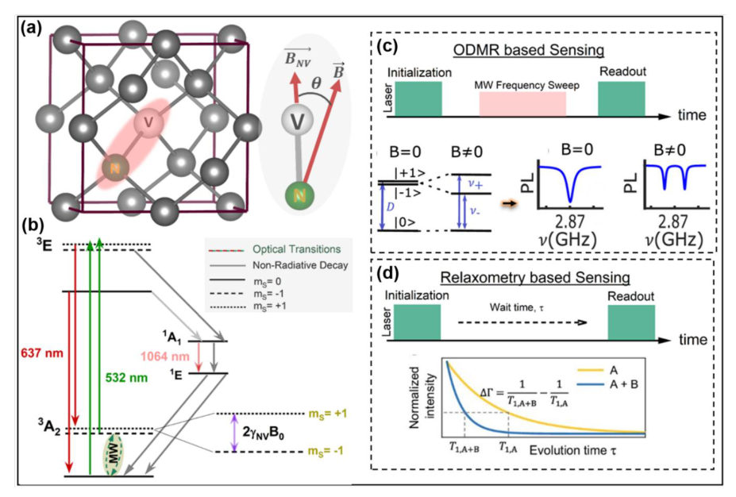
<figcaption class="paper-figure-caption"><b>Fig 1.</b> Fig. 1. (a) Atomic structure of an NV center in diamond, consisting of a substitutional nitrogen atom</figcaption>
</figure>
<figure class="paper-figure-card">
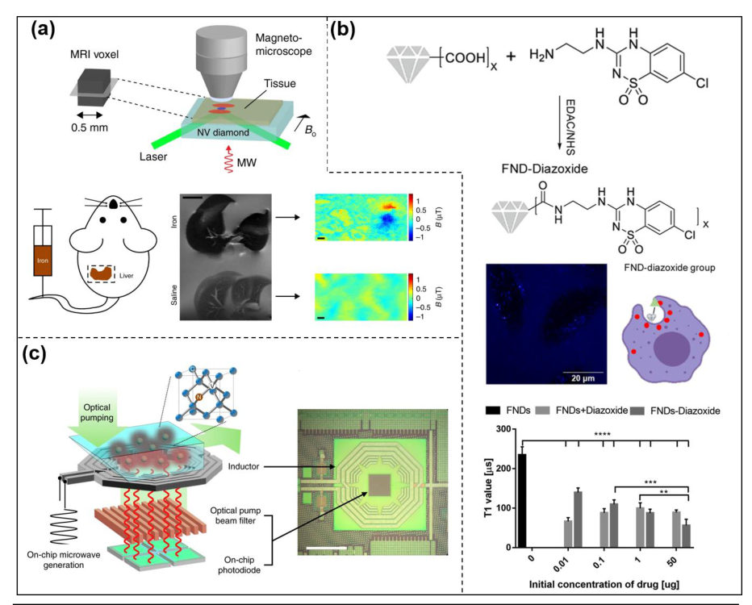
<figcaption class="paper-figure-caption"><b>Fig 2.</b> Fig. 2. Diamond platforms for biosensing and quantum bioimaging. (a) Single-crystal bulk diamond</figcaption>
</figure>
<figure class="paper-figure-card">
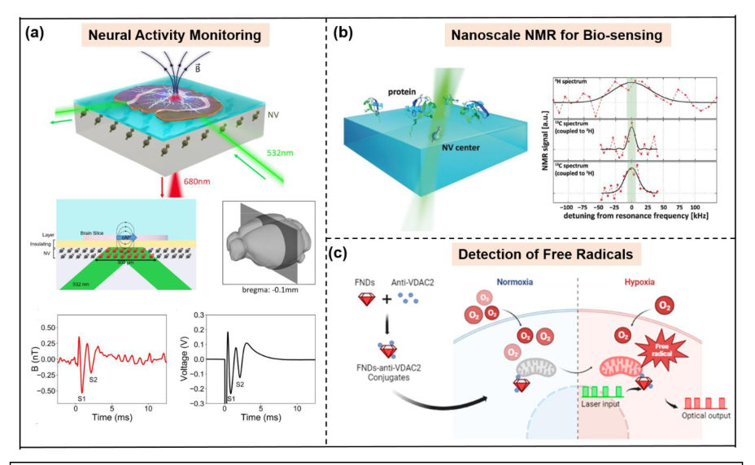
<figcaption class="paper-figure-caption"><b>Fig 3.</b> Fig. 3. Emerging applications of NV-center-based quantum biosensing. (a) Neuronal activity</figcaption>
</figure>
<figure class="paper-figure-card">
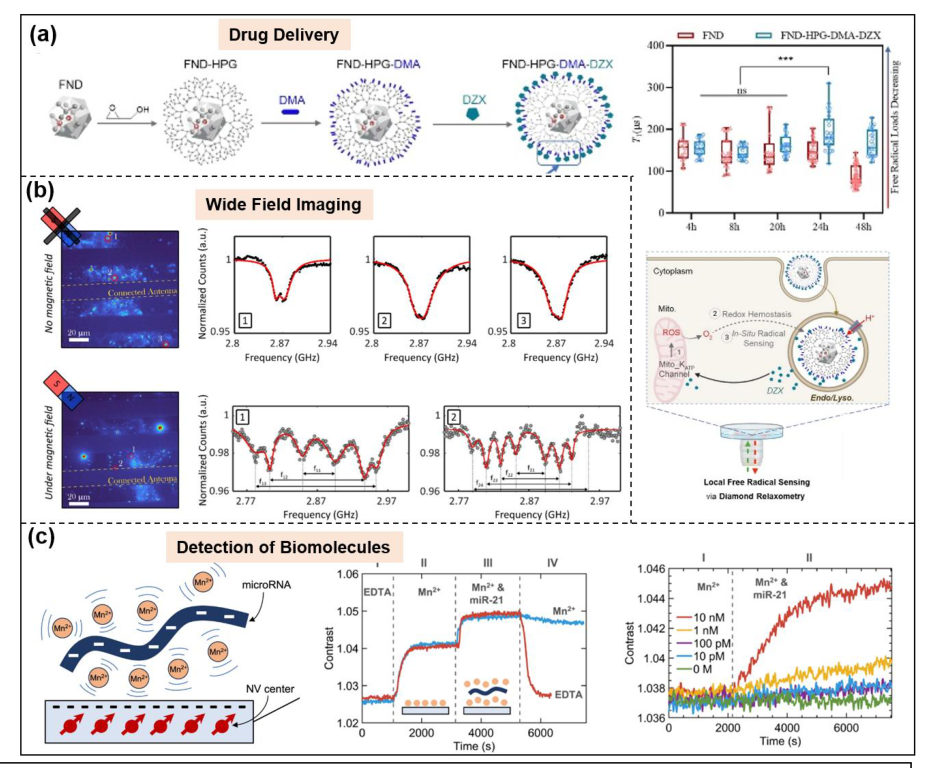
<figcaption class="paper-figure-caption"><b>Fig 4.</b> Fig. 4. Emerging applications of NV-center-based quantum biosensing (a) Drug Delivery:</figcaption>
</figure>
<figure class="paper-figure-card">
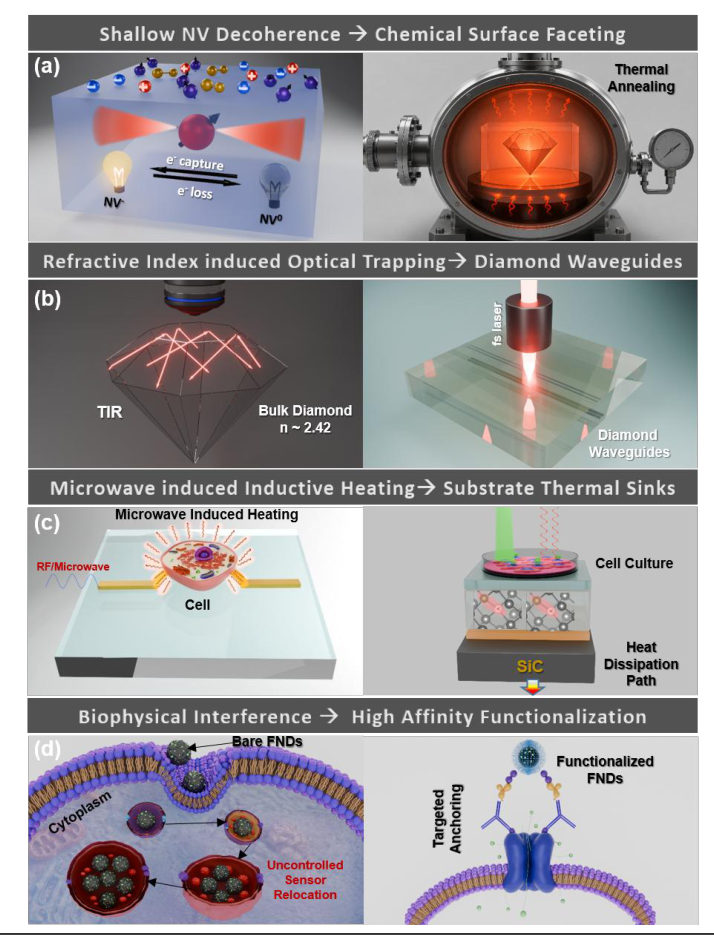
<figcaption class="paper-figure-caption"><b>Fig 5.</b> Fig. 5. Current challenges and prospective engineering solutions in NV-diamond biosensing.</figcaption>
</figure>

**Summary.** This review surveys the use of Nitrogen-Vacancy (NV) centers in diamond for quantum magnetometry in biological settings. It details the underlying spin physics and compares two key measurement techniques: ODMR for static fields and spin relaxometry for dynamic noise. The paper highlights the platform's potential for advanced, miniaturized, and biocompatible biomedical sensing.

**Why it may be interesting.** This work bridges quantum optics and condensed matter physics by applying solid-state quantum systems (NV centers) to complex, noisy, and biologically relevant environments, touching upon open quantum systems dynamics.

Detailed structure

**Main problem.** The central problem is developing quantum sensing technologies to detect ultra-low magnetic fields generated by biological processes in ambient, aqueous conditions.

**Main result.** The review establishes NV centers in diamond as a powerful, biocompatible platform for quantum magnetometry, detailing its application in biosensing and bio-imaging.

**Method.** The paper reviews two primary detection modalities: Optically Detected Magnetic Resonance (ODMR) for static fields and Spin Relaxometry for dynamic magnetic noise.

**Model / system.** The physical system is the Nitrogen-Vacancy (NV) center in diamond, whose spin physics is governed by a Hamiltonian involving zero-field splitting ($D\hat{S}_z^2$) and external magnetic field coupling ($\gamma_e \mathbf{B} \cdot \hat{\mathbf{S}}$).

**Key observables.** Resonance frequency shifts ($\Delta f$) via ODMR, and the longitudinal spin relaxation time ($T_1$) via spin relaxometry.

**Important parameters / regimes.** Spin coherence times, magnetic field strength ($B$), temperature, and the spatial scale (nanoscale to cellular level).

**Assumptions / limitations.** The primary limitations discussed include surface-induced decoherence and signal-to-noise limitations in biofluids.

**Figures summary.** Figures illustrate the NV structure, energy levels, the ODMR principle (using green laser and MW field), and the spin relaxometry measurement scheme.

**Paper structure.** The review proceeds by detailing the fundamental spin physics of NV centers, explaining the two core measurement techniques (ODMR and T1 relaxometry), exploring key application areas (NMR, neural monitoring), discussing enhancement strategies (functionalization, microfluidics), and concluding with open challenges and future prospects.

Abstract

Quantum sensing using nitrogen-vacancy (NV) centers in diamond has emerged as a powerful platform for detecting ultra-low magnetic fields under ambient conditions. Owing to their long spin coherence times, optical addressability, and compatibility with aqueous environments, it has found widespread applications in biosensing and bio-imaging. This review presents the fundamental principles and recent advances in NV-based quantum magnetometry for biosensing applications, with a particular focus on measurements in aqueous medium and at cellular and molecular length scales. We discuss the underlying spin physics of NV centers and highlight two primary detection modalities: optically detected magnetic resonance (ODMR) and T1 relaxometry-based sensing and how these approaches aids in the detection of both static magnetic fields and dynamic magnetic noise arising from biological processes. The review explores key application areas, including nanoscale nuclear magnetic resonance (NMR), monitoring of neural activity, detection of abnormal or rogue cells using NV-based platforms etc. In addition, strategies for enhancing sensitivity, such as surface functionalization of nanodiamonds, femtosecond (fs) laser-written photonic structures, and integration with microfluidic and lab-on-chip systems have also been discussed in depth. We also address the critical challenges, including surface-induced decoherence, charge-state instability, and signal-to-noise limitations in biofluids associated with NV-based biosensing applications. Finally, we outline future prospects, highlighting how NV-based magnetic biosensing provides a promising pathway for translating quantum sensing technologies into practical biomedical applications.

[↑ back to top](#top)

### [Research and simulation of analytical polarization control enabled by optical computing on an integrated photonics chip](http://arxiv.org/abs/2609.04666v1)

**Authors:** Xueying Ren, Junxin Yan, Xuyang Wang, Bailin Shen, Lingyan Zhang, Minyue Yang, Nannan Ning, Jiaxin Huang, Zhenguo Lu, Jun Zou, Yongmin Li  
**Type:** theory · **Category:** other · **PDF:** <https://arxiv.org/pdf/2609.04666v1>  
**Analysis basis:** full PDF text, analyzed in chunks
**Topic relevance:** `interference shaping light` **3/5** · `QC/QI experiment` **1/5** · `analog quantum simulation` **1/5** · `quantum measurements` **1/5** · `quantum optics experiment` **1/5**

↔ Scroll figures horizontally

<figure class="paper-figure-card">
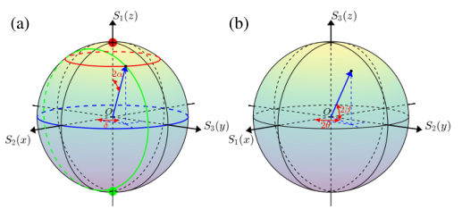
<figcaption class="paper-figure-caption"><b>Fig 1.</b> Fig. 1. Two types of Poincaré spheres. (a) The Poincaré sphere with phases δ and 2α; (b) The Poincaré sphere with phases 2θ and 2β.</figcaption>
</figure>
<figure class="paper-figure-card">
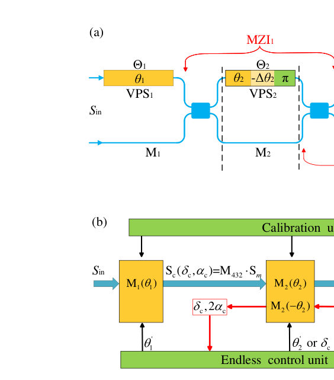
<figcaption class="paper-figure-caption"><b>Fig 2.</b> Fig. 4. Structure (a) and relationship of various functional units (b) in APC.</figcaption>
</figure>
<figure class="paper-figure-card">
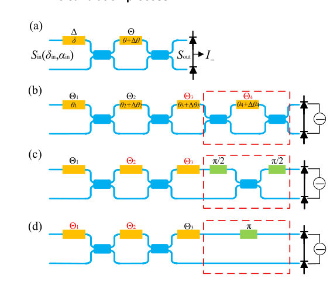
<figcaption class="paper-figure-caption"><b>Fig 3.</b> Fig. 5. Various structures for calibration. (a) Basic struc- ture of the pairwise scanning method; (b) Equivalent cas- caded MZI structures; (c) Equivalent cascaded MZI struc- tures when θ4 + ∆θ4 = π/2; (d) Equivalent cascaded MZI strugtures when θ4 + ∆θ4 = π.</figcaption>
</figure>
<figure class="paper-figure-card">
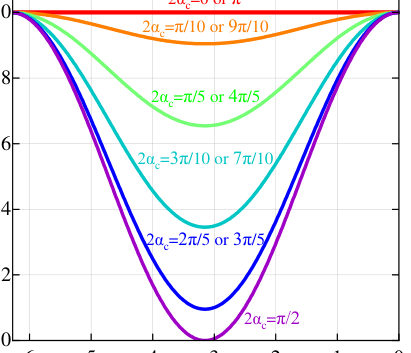
<figcaption class="paper-figure-caption"><b>Fig 4.</b> Fig. 8. Normalized output intensity versus the longitude phase δc at different latitude phases.</figcaption>
</figure>
<figure class="paper-figure-card">
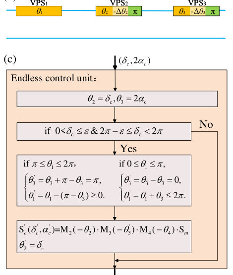
<figcaption class="paper-figure-caption"><b>Fig 5.</b> Fig. 9. Equivalent structure (a), (b) and flowchart (c) for the analytic polarization control.</figcaption>
</figure>

**Summary.** This paper introduces an Analytical Polarization Control (APC) method for integrated photonics chips, replacing inefficient search algorithms. By utilizing four phase shifters and implementing a novel calibration and endless control unit, the system achieves continuous, stable control over the polarization state. This establishes a practical, high-speed architecture for on-chip polarization manipulation.

**Why it may be interesting.** This work is highly relevant to quantum optics and open quantum systems as it details the hardware implementation required for robust polarization manipulation, which is critical for quantum communication protocols.

Detailed structure

**Main problem.** The paper addresses the need for an efficient, analytical method to control the polarization state of light on an integrated photonics chip, overcoming the limitations of traditional blind-search techniques.

**Main result.** An Analytical Polarization Control (APC) architecture using four phase shifters was proposed, enabling continuous polarization control and realizing rotations around all three axes of the Poincaré sphere.

**Method.** The authors developed the APC method by modeling polarization transformations using Jones and Mueller matrices, introducing a novel calibration procedure, and implementing an 'endless control unit' to maintain stability.

**Model / system.** The physical system is an integrated photonics chip utilizing Mach-Zehnder Interferometers (MZIs) and phase shifters. Polarization states are analyzed using the Poincaré sphere representation and quantified via the Stokes vector.

**Key observables.** Output extinction ratio (ER), output intensity stability, and the ability to achieve rotations around the three principal axes ($S_1, S_2, S_3$) of the Poincaré sphere.

**Important parameters / regimes.** The number of phase shifters (four are key), the phase differences ($\Delta	heta_4$), and the achievable extinction ratio (e.g., $>40$ dB).

**Assumptions / limitations.** The analysis assumes ideal operation regarding propagation loss and coupling ratios, though the final architecture is designed for practical implementation with FPGA acceleration.

**Figures summary.** Figures illustrate Poincaré sphere representations, basic chip structures for polarization rotation, and comparative plots showing output intensity stability with and without the proposed 'endless control' mechanism.

**Paper structure.** The paper first establishes the need for APC, details the basic structures and mathematical modeling using Jones/Mueller matrices, presents the calibration method for phase shifters, and finally simulates the performance benefits of the endless control unit and the fourth phase shifter.

Abstract

Dynamic polarization controllers are key devices with broad applications in many fields. However, most on-chip polarization controllers still rely on traditional blind-search methods, whereas analytical optical-computing approaches remain insufficiently explored, particularly with respect to calibration and endless polarization control. With the accurate relative phase of Mach-Zehnder interferometer (MZI) being fully controllable on an integrated photonics chip, we present an analytical polarization control (APC) method using four phase shifters and optical computing, eliminating the need for the traditional inefficient blind-search procedure. The basic structures and operations of APC are clarified. The proposed calibration method and endless control method enable continuous APC while compensating for phase differences within the MZI structures. We simulate the influence of the endless control unit on polarization control and quantify the effect of the fourth phase difference on the output extinction ratio. With the fourth phase shifter, the phase difference encountered during Stokes vector measurement can be effectively compensated, and rotations around all three axes on the Poincaré sphere can be realized. These results establish a practical APC architecture based on optical computing for photonics chips. The proposed APC methods, combined with a FPGA-based hardware acceleration, will enable high speed on-chip polarization controllers.

[↑ back to top](#top)

### [Tensor-Network Inference in a Field-Coupled XY Model for Portfolio Allocation](http://arxiv.org/abs/2609.05045v1)

**Authors:** Kartikeya Chowdhry, G Subrahmanya V. R. K. Rao  
**Type:** theory · **Category:** statistical mechanics · **PDF:** <https://arxiv.org/pdf/2609.05045v1>  
**Analysis basis:** full PDF text, analyzed in chunks
**Topic relevance:** `methods for driven-dissipative` **3/5** · `Frenkel-Kontorova` **1/5** · `Keldysh / 2PI / non-Gaussian methods` **1/5** · `analog quantum simulation` **1/5** · `driven-dissipative phase transition` **1/5**

↔ Scroll figures horizontally

<figure class="paper-figure-card">
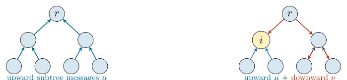
<figcaption class="paper-figure-caption"><b>Fig 1.</b> Figure 2: Two-pass contraction on a rooted tree. The upward pass produces the partition function; the downward pass combines the complementary part of the tree with each node’s child messages to obtain its marginal. The empirical path is the degree-two special case.</figcaption>
</figure>
<figure class="paper-figure-card">
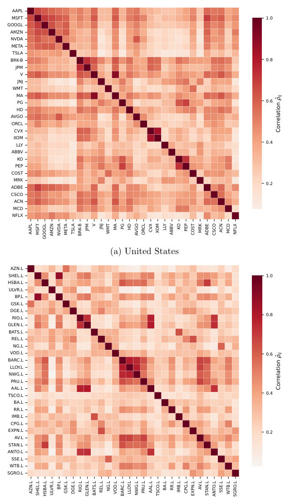
<figcaption class="paper-figure-caption"><b>Fig 2.</b> Figure 3: Sample correlation matrices of daily log returns over 2016–2026. Assets are shown in the fixed input order; every matrix is estimated from its market’s complete-case return panel.</figcaption>
</figure>
<figure class="paper-figure-card">
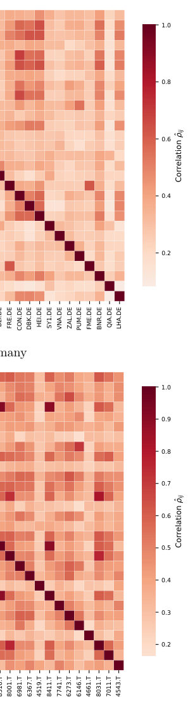
<figcaption class="paper-figure-caption"><b>Fig 3.</b> Figure 3: Figure 3 continued. Panel conventions follow the first page of the figure.</figcaption>
</figure>
<figure class="paper-figure-card">
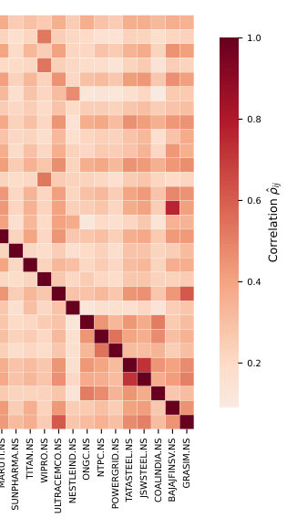
<figcaption class="paper-figure-caption"><b>Fig 4.</b> Figure 3: Figure 3 continued. Panel conventions follow the first page of the figure.</figcaption>
</figure>
<figure class="paper-figure-card">
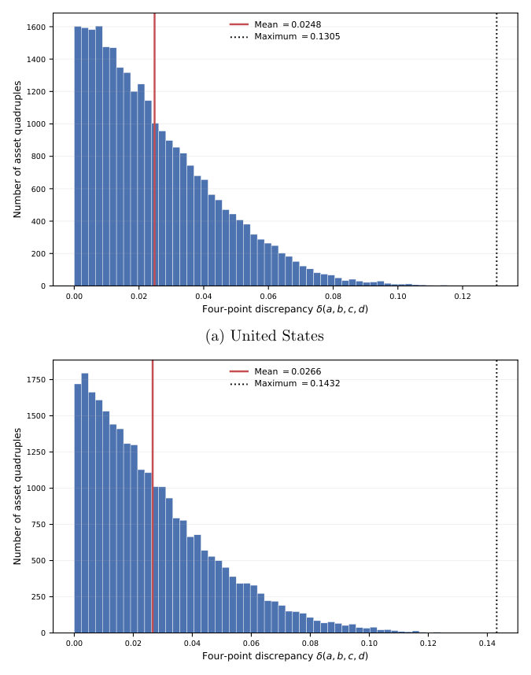
<figcaption class="paper-figure-caption"><b>Fig 5.</b> Figure 4: Distribution of δ(a, b, c, d) over all asset quadruples: 27,405 quadruples for N = 30 and 23,751 for N = 29. Vertical lines mark the sample mean and maximum.</figcaption>
</figure>

**Summary.** This paper reformulates portfolio optimization as an inference problem on a field-coupled XY model, using tensor networks to calculate equilibrium magnetizations from financial correlation data. It demonstrates a computationally tractable method to generate long-only portfolio weights that can be compared against traditional benchmarks using same-sample performance metrics.

**Why it may be interesting.** While applied to finance, the methodology heavily relies on advanced techniques from statistical mechanics (XY models, partition functions) and numerical physics (tensor networks), providing a rich example of applying many-body physics tools to complex, non-equilibrium systems.

Detailed structure

**Main problem.** The paper applies tensor-network methods to model long-only portfolio construction using a field-coupled XY model derived from financial time series data.

**Main result.** The resulting network-adjusted portfolio weights show favorable same-sample Sharpe ratios compared to standard benchmarks like equal-weighting, although the Markowitz tangency portfolio remained the strongest.

**Method.** The core method involves mapping the continuous XY partition function to a finite-current tensor network via Fourier-Bessel expansion, followed by bottom-up and top-down tensor contraction.

**Model / system.** The system is a field-coupled XY model defined by the Hamiltonian H(theta) = -sum J_ij cos(theta_i - theta_j) - sum h_i cos theta_i. The couplings J_ij and fields h_i are derived directly from empirical asset correlations and return statistics.

**Key observables.** One-site marginals (cosine scores, m_i) and the final positive, fully invested portfolio weights (w_i).

**Important parameters / regimes.** Inverse temperature beta (β) and concentration gamma (γ), which control the influence of interactions and the softmax allocation, respectively.

**Assumptions / limitations.** The primary assumptions include approximating the continuous spin system with a finite-current tensor network cutoff and restricting the graph structure to a path defined by Ward clustering.

**Figures summary.** Figures show the workflow from market data to network-adjusted portfolios, and comparative plots place the XY portfolios within the mean-variance space alongside standard benchmarks.

**Paper structure.** The paper follows a multi-stage workflow: data processing (returns/covariances) -> graph construction (distance/hyperbolicity/clustering) -> physical modeling (XY Hamiltonian/Tensor Network Inference) -> weight calculation (marginalization/softmax) -> performance comparison against benchmarks.

Abstract

We apply tensor-network methods to a field-coupled XY model for long-only portfolio construction. Daily return statistics set asset-specific fields and correlation couplings. Correlation distance, four-point Gromov hyperbolicity, and Ward clustering are used to construct a sparse interaction path. A Fourier-Bessel expansion maps the continuous angular partition function to a finite-current tensor network; bottom-up and top-down contractions then give the one-site marginals and equilibrium cosine scores. A softmax map converts these scores into positive, fully invested portfolio weights. We study five equity markets over continuous ranges of inverse temperature beta and concentration gamma, and compare selected parameter pairs with long-only Markowitz frontiers and standard benchmarks. The same-sample comparisons demonstrate a tractable route from financial time series to network-adjusted allocations; predictive trading performance is outside their scope.

[↑ back to top](#top)

### [Development of quantum technologies for optical/infrared interferometry](http://arxiv.org/abs/2609.04311v1)

**Authors:** John D. Monnier  
**Type:** theory · **Category:** other · **PDF:** <https://arxiv.org/pdf/2609.04311v1>  
**Analysis basis:** full PDF text, analyzed in chunks
**Topic relevance:** `interference shaping light` **3/5** · `quantum measurements` **3/5**

↔ Scroll figures horizontally

<figure class="paper-figure-card">
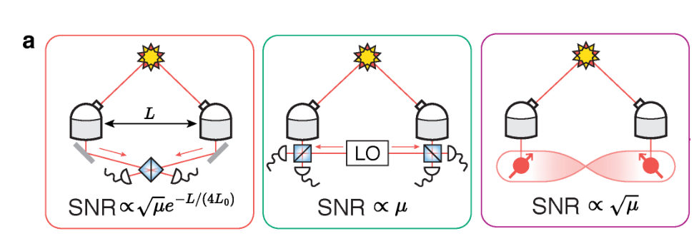
<figcaption class="paper-figure-caption"><b>Fig 1.</b> Figure 1. Three phase-sensitive architectures and representative weak-source SNR scalings; the source’s µ corresponds to n in our scalings. Cropped from Fig. 1a of P.-J. Stas et al., arXiv:2509.09464v2 (2025), under the CC BY 4.0 license; see also the published version.9</figcaption>
</figure>
<figure class="paper-figure-card">
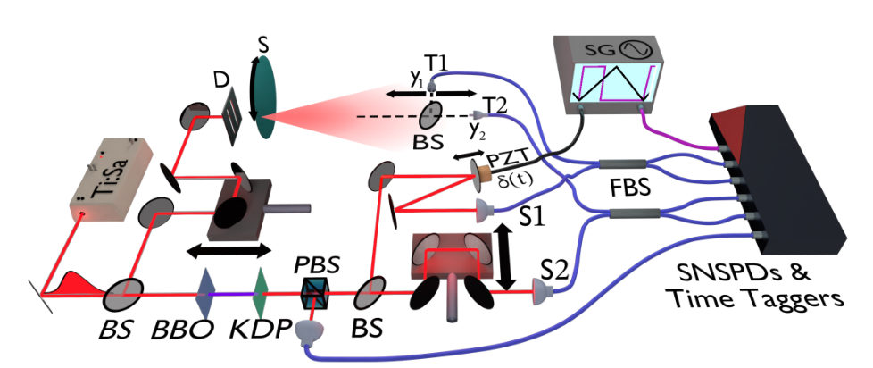
<figcaption class="paper-figure-caption"><b>Fig 2.</b> Figure 2. Laboratory implementation of the entangled-reference receiver of Brown et al.. A rotating diffuser produced the weak pseudo-thermal source, while SPDC supplied the heralded path-entangled reference. Cropped from Fig. 2 of M. R. Brown et al., “Interferometric Imaging Using Shared Quantum Entanglement,” Phys. Rev. Lett. 131, 210801 (2023), doi:10.1103/PhysRevLett.131.210801, under the CC BY 4.0 license; cropping is the only modification.</figcaption>
</figure>
<figure class="paper-figure-card">
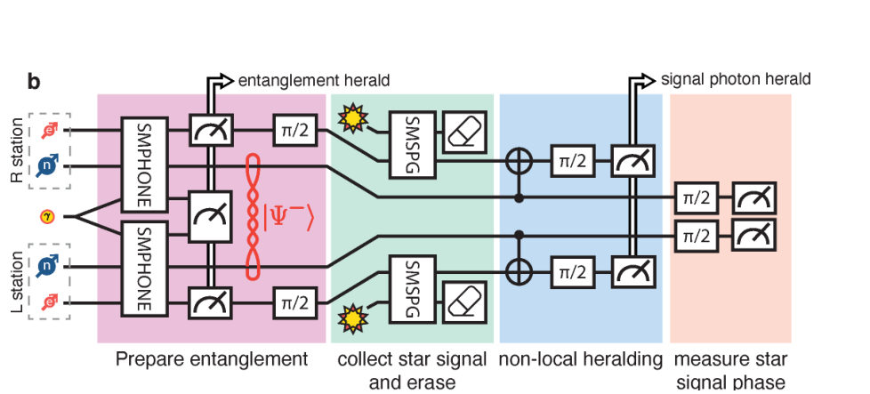
<figcaption class="paper-figure-caption"><b>Fig 3.</b> Figure 3. Diamond-memory sequence: entangle the two nodes, collect the weak signal without revealing its station, report a signal-present event, and read the stored differential phase. Cropped from Fig. 4b of P.-J. Stas et al., arXiv:2509.09464v2 (2025), under the CC BY 4.0 license; see also the published version.9</figcaption>
</figure>
<figure class="paper-figure-card">
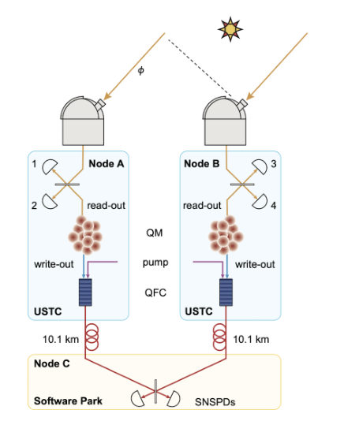
<figcaption class="paper-figure-caption"><b>Fig 4.</b> Figure 4. Cold-atom memory-assisted interferometer. Nodes A and B store a shared atomic excitation; a de- tector click at remote node C heralds successful prepa- ration. Reprinted with permission from Fig. 1 of B. Wang et al., Phys. Rev. Lett. 136, 240801 (2026). Copyright (2026) by the American Physical Society.</figcaption>
</figure>

**Summary.** This paper surveys the application of quantum technologies to optical/infrared interferometry, proposing that quantum resources can overcome classical limitations in measuring light coherence over long distances. While quantum methods promise unprecedented angular resolution, the authors caution that practical constraints like loss and bandwidth must be addressed before realizing these astronomical capabilities.

**Why it may be interesting.** It heavily involves quantum optics, quantum information transfer over physical links, and quantum measurement theory, making it highly relevant to quantum optics and open quantum systems.

Detailed structure

**Main problem.** The paper addresses how quantum technologies can revolutionize optical/infrared interferometry by enabling the distribution and preservation of electric-field amplitude and phase correlations over long baselines.

**Main result.** Quantum-enhanced interferometry promises sub-milliarcsecond imaging and microarcsecond-class differential astrometry by mitigating the need to transport the entire astronomical field.

**Method.** The review surveys quantum-sensing and quantum-networking protocols, comparing quantum-assisted measurements against classical techniques like direct detection and HBT interferometry.

**Model / system.** The physical system is optical/infrared interferometry using widely separated telescopes. The model involves distributing quantum resources (entanglement, reference photons) to measure complex visibility while keeping the astronomical field local at each node.

**Key observables.** Complex visibility, first-order coherence ($V_{AB}$), and second-order correlation ($g^{(2)}_{AB}(0)$).

**Important parameters / regimes.** Baseline length (potentially > 1 km), photon occupation number ($n$), and coherence time.

**Assumptions / limitations.** The primary limitations are practical constraints such as loss, bandwidth, coherence time, and synchronization, rather than purely fundamental quantum limits.

**Figures summary.** Figure 1 compares SNR scalings for three phase-sensitive architectures (direct transport, local-oscillator, quantum-assisted nonlocal detection) for weak sources.

**Paper structure.** The paper reviews existing classical architectures, introduces quantum-assisted methods using distributed quantum resources, compares the scaling of Signal-to-Noise Ratios (SNR) for various protocols, and concludes by detailing practical limitations.

Abstract

Quantum technologies may revolutionize optical interferometry through new means to distribute and preserve electric-field amplitude and phase correlations between widely separated telescopes. After reviewing existing techniques, I survey proposed quantum-sensing and quantum-networking applications and highlight recent laboratory demonstrations of key building blocks. By easing field-transport demands for baselines beyond $\sim$1 km, quantum-enhanced interferometry could enable sub-milliarcsecond imaging and microarcsecond-class differential astrometry.   That said, "going quantum" is not a magic shortcut to sensitivity because many of the most compelling science cases remain photon- and turbulence-limited. I therefore emphasize the practical constraints -- loss, bandwidth, coherence time, synchronization, and wavelength limits of quantum interfaces -- that must also be overcome to make these capabilities useful for astronomy, whether deployed on the ground or from space.

[↑ back to top](#top)

### [Excitation caging in a vertex-frustrated quasiperiodic Einstein artificial spin ice](http://arxiv.org/abs/2609.04854v1)

**Authors:** T. Wang, F. Museur, G. M. Macauley, J. Colbois, L. Berchialla, F. Flicker, P. M. Derlet, L. J. Heyderman  
**Type:** both · **Category:** statistical mechanics · **PDF:** <https://arxiv.org/pdf/2609.04854v1>  
**Analysis basis:** full PDF text, analyzed in chunks
**Topic relevance:** `analog quantum simulation` **3/5** · `methods for driven-dissipative` **2/5** · `Frenkel-Kontorova` **1/5**

↔ Scroll figures horizontally

<figure class="paper-figure-card">
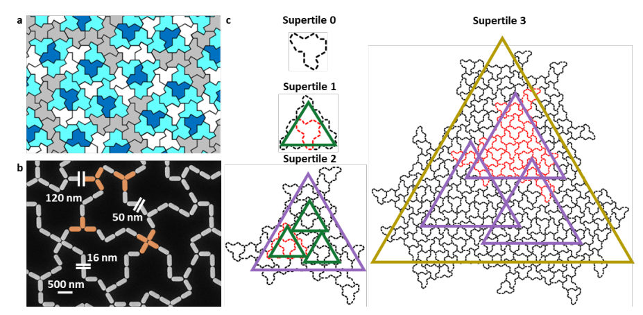
<figcaption class="paper-figure-caption"><b>Fig 1.</b> Fig. 1 | Geometry, vertex definition and hierarchical construction of the Einstein ASI. a, The quasiperiodic Hat tiling is composed of a single type of tile, called the hat. Hats are coloured according to the motif to which they belong: dark blue for antihats, which are the mirror images of the hat; grey for hats forming a three-legged triskelion; light blue for hats surrounding an antihat; and white for all remaining hats. b, Scanning electron micrograph of an Einstein ASI based on the Hat tiling. Nanomagnets, of length 450 nm and width 150 nm, are located along each edge of the Hat tiles, with one or two nanomagnets placed along each edge depending on the edge length. The positions of the...</figcaption>
</figure>
<figure class="paper-figure-card">
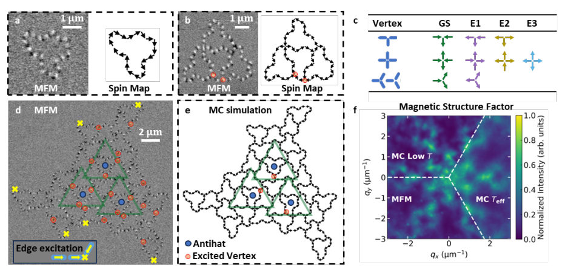
<figcaption class="paper-figure-caption"><b>Fig 2.</b> Fig. 2 | Magnetic configurations of thermally annealed Einstein ASIs of increasing size. a, MFM image and extracted spin map for a single hat. All of the macrospins are aligned head-to-tail, giving the expected ground-state configuration. b, MFM image and corresponding spin map for Supertile 1. c, Example vertex configurations for each energy level of the three vertex types: T-shaped, cross-shaped, and Y-shaped. d, MFM image of Supertile 2. Blue dots indicate the locations of the antihats, and green triangles indicate Supertile 1 building blocks. Edge excitations—defined as locations where two macrospins are arranged head-to-head or tail-to-tail—are identified with yellow crosses. A...</figcaption>
</figure>
<figure class="paper-figure-card">
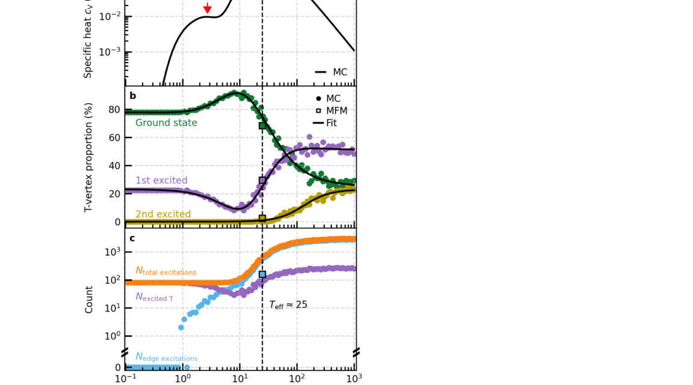
<figcaption class="paper-figure-caption"><b>Fig 3.</b> Fig. 3 | Two-stage thermodynamic ordering process and vertex frustration. a, Specific heat capacity computed from Monte Carlo (MC) simulations for Supertile 4, with 7633 nanomagnets. b, Populations of T- shaped vertices in the ground (green), first-excited (purple), and second-excited (yellow) states as a function of temperature. Dots correspond to the simulated populations, while squares denote experimental data extracted from MFM. Solid lines represent logistic fits to the simulation data. c, Number of edge excitations versus temperature (blue). The total number of low-temperature excitations, defined as the sum of the number of edge excitations and the number of T-shaped vertices in...</figcaption>
</figure>
<figure class="paper-figure-card">
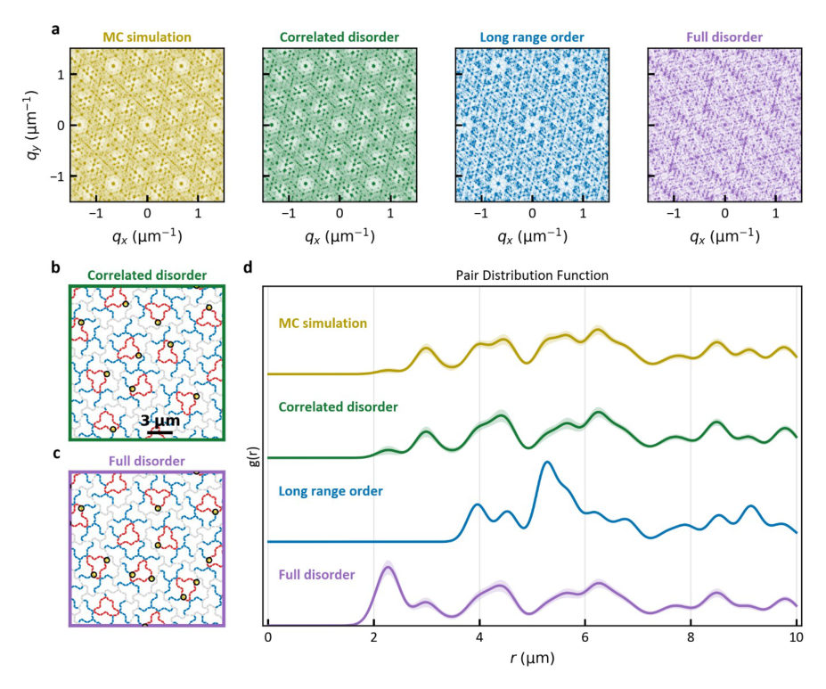
<figcaption class="paper-figure-caption"><b>Fig 4.</b> Fig. 4 | Ground state correlations between the numerical data and several models at short- and long- length scales. a, Structure factors of excited T-shaped vertices. The four graphs display the structure factor for: the simulated Monte Carlo ground-state manifold (yellow); a correlated disorder model (green); a maximally ordered configuration where every antihat hosts an excitation at the T1 position (blue), with locations of T1 and T2 given in Fig. S6a; and a fully disordered case (purple). b-c, Real-space schematics illustrating the two disordered models. Red and blue magnets represent the antihats and their associated clusters, respectively; all other magnets are shown in grey. Selected...</figcaption>
</figure>

**Summary.** This work models a quasiperiodic artificial spin ice built on the Hat tiling to study frustrated magnetism. By combining MFM experiments and Monte Carlo simulations, the authors characterize a two-stage ordering process and identify a unique medium-range order. The findings establish this system as a blueprint for understanding how quasiperiodic geometry dictates unconventional magnetic phases.

**Why it may be interesting.** The study provides a concrete, engineered platform to study complex frustration and disorder effects in a quasiperiodic setting, offering insights into how geometric constraints dictate emergent magnetic phases, which is relevant for understanding frustrated quantum magnets.

Detailed structure

**Main problem.** The study investigates the complex magnetic ordering and excitation dynamics in a quasiperiodic artificial spin ice that is frustrated due to its geometry.

**Main result.** The system exhibits a unique medium-range order characterized by quasiperiodic long-range order randomly modulated by strictly constrained disorder, with excitations being 'caged' on specific lattice elements.

**Method.** The research combines experimental measurements using Magnetic Force Microscopy (MFM) with theoretical modeling via Monte Carlo simulations to characterize thermodynamic crossovers and ground-state entropy.

**Model / system.** The model is an artificial spin ice built on the Hat tiling, a quasiperiodic structure. It consists of interacting nanomagnets whose interactions lead to inherent frustration, preventing a perfect ground state.

**Key observables.** Magnetic structure factor (MSF), specific heat capacity ($C_v$), population counts of vertex states (e.g., T-shaped vertices), and the residual ground-state entropy ($S_{0}^{	ext{indep}}$).

**Important parameters / regimes.** The system's behavior is analyzed across different temperature regimes, particularly focusing on the low-temperature crossover where excitations become localized.

**Assumptions / limitations.** The analysis assumes that the system's entropy can be calculated by treating contributions from different structural motifs (antihats, Y-shaped vertices) semi-independently, and that dipolar coupling can be truncated to nearest-neighbor interactions.

**Figures summary.** Figures illustrate the Hat tiling geometry and vertex types; others show the two-stage thermodynamic ordering process via $C_v$ and excitation counts; and final figures compare simulated structure factors to experimental MFM data.

**Paper structure.** The paper first establishes the quasiperiodic geometry and frustration. It then uses simulations and experiments to map out the temperature-dependent ordering process, identifying two distinct crossovers. Finally, it quantifies the ground-state degeneracy and entropy associated with the constrained disorder.

Abstract

Naturally occurring bulk quasicrystals are rare, and magnetic instances are rarer still, with chemical constraints typically permitting the synthesis of approximants rather than true quasicrystalline magnets. Here, we present an artificial spin ice based on a recently discovered Einstein lattice, the Hat tiling, which is built from the first known shape - the hat - that tiles the plane only aperiodically. The Einstein artificial spin ice has long-range structural order with no translational symmetry, and low-connectivity vertices with well-defined local ground states and excitations. Together, these properties provide a model two-dimensional quasicrystalline magnet, with magnetic correlations that we probe with magnetic force microscopy and parallel-tempered Monte Carlo simulations. We identify a two-stage partial ordering process, driven by the competition between two possible positions for magnetic excitations. This competition is resolved in the ground-state manifold, where exactly one magnetic excitation is caged on each antihat, yet the manifold remains macroscopically degenerate. This yields an unusual type of medium-range order, where the underlying quasiperiodic long-range order is randomly modulated by a strictly constrained disorder. Our findings establish the Einstein artificial spin ice as a blueprint for understanding quasicrystalline magnetism, demonstrating how quasiperiodic monotile geometries can be exploited to engineer unconventional magnetic phases with no direct equivalent in periodic systems.

[↑ back to top](#top)

### [On the Stability of the Polar Phase of Superfluid 3He in Nematic Aerogels](http://arxiv.org/abs/2609.04821v1)

**Authors:** E. V. Surovtsev  
**Type:** theory · **Category:** disordered systems and neural networks · **PDF:** <https://arxiv.org/pdf/2609.04821v1>  
**Analysis basis:** full PDF text, analyzed in chunks
**Topic relevance:** `Keldysh / 2PI / non-Gaussian methods` **3/5** · `methods for driven-dissipative` **3/5**

↔ Scroll figures horizontally

<figure class="paper-figure-card">
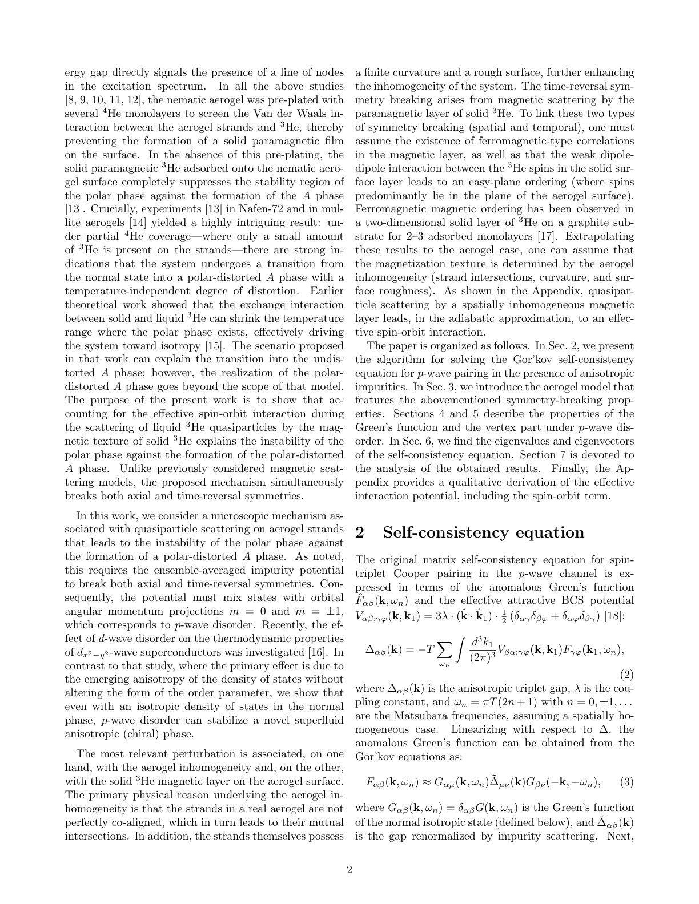
<figcaption class="paper-figure-caption"><b>Fig 1.</b> Low-resolution page preview, page 2</figcaption>
</figure>
<figure class="paper-figure-card">
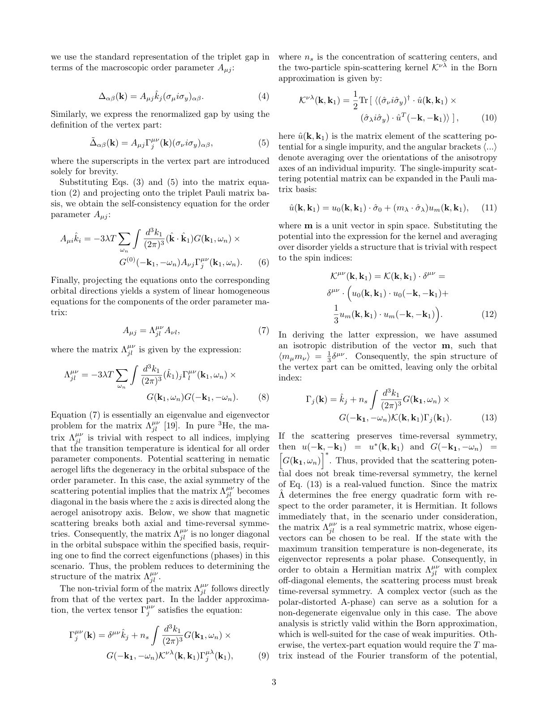
<figcaption class="paper-figure-caption"><b>Fig 2.</b> Low-resolution page preview, page 3</figcaption>
</figure>
<figure class="paper-figure-card">
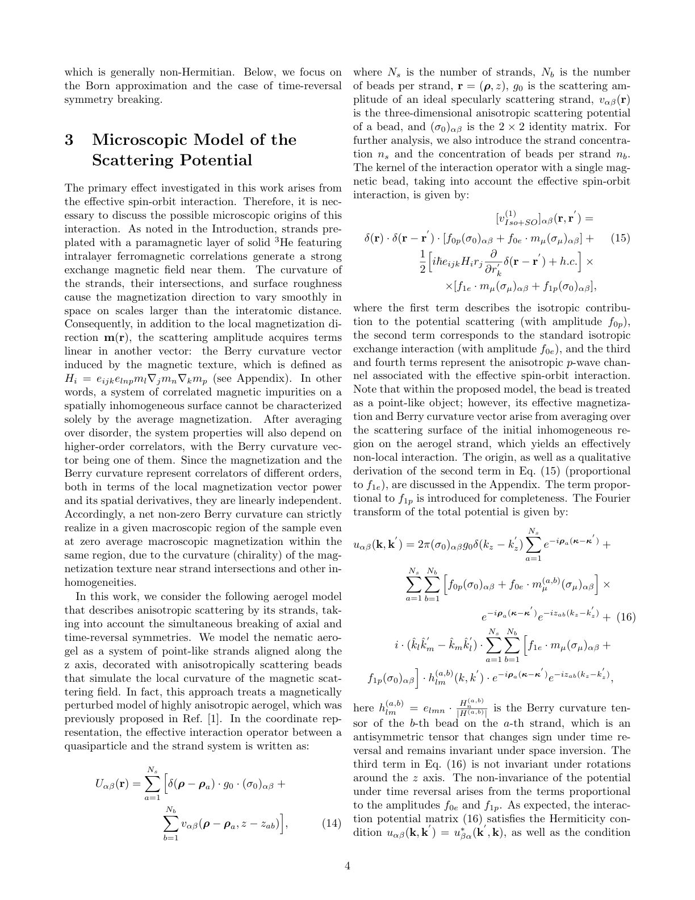
<figcaption class="paper-figure-caption"><b>Fig 3.</b> Low-resolution page preview, page 4</figcaption>
</figure>
<figure class="paper-figure-card">
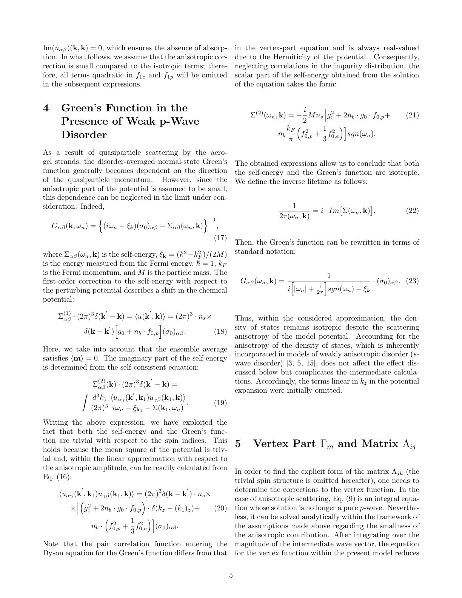
<figcaption class="paper-figure-caption"><b>Fig 4.</b> Low-resolution page preview, page 5</figcaption>
</figure>
<figure class="paper-figure-card">
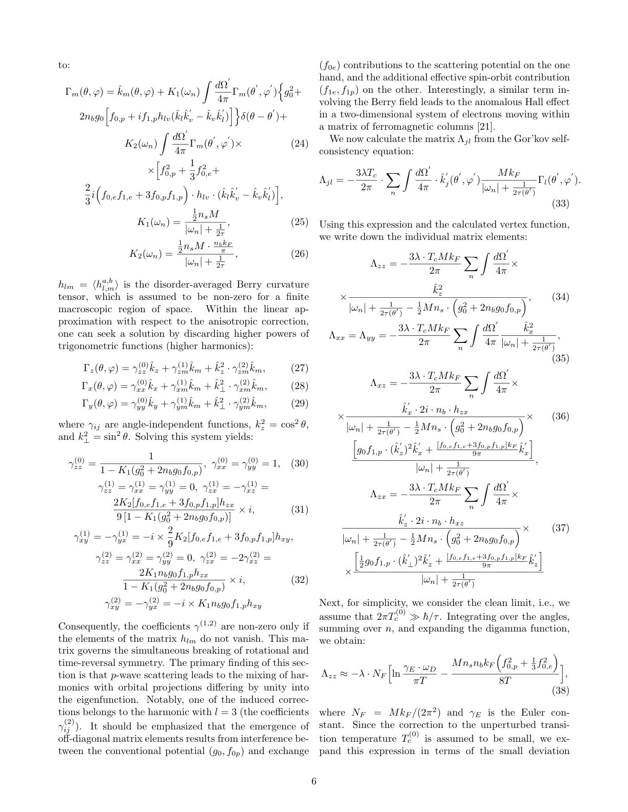
<figcaption class="paper-figure-caption"><b>Fig 5.</b> Low-resolution page preview, page 6</figcaption>
</figure>

**Summary.** This theoretical work examines how magnetic impurities in nematic aerogels affect the superconducting phase of superfluid 3He. By solving the Gor'kov equations under symmetry-breaking scattering, the authors predict that the pure polar phase is unstable. Instead, the system stabilizes into a polar-distorted A phase, providing a detailed theoretical description of disorder-induced quantum phase transitions.

**Why it may be interesting.** The interplay between magnetic disorder, symmetry breaking, and the resulting superconducting phase transition is highly relevant to understanding exotic quantum states in engineered disordered media.

Detailed structure

**Main problem.** The study investigates the stability of the polar phase of superfluid 3He when subjected to perturbations from magnetic impurity scattering within nematic aerogels.

**Main result.** The scattering, which breaks both axial and time-reversal symmetries, destabilizes the pure polar phase, leading instead to a polar-distorted A phase with the highest transition temperature.

**Method.** The analysis involves solving the eigenvalue problem derived from the Gor'kov self-consistency equation, utilizing Green's functions and perturbation theory.

**Model / system.** The system is superfluid 3He confined in nematic aerogels, modeled with a p-wave scattering potential incorporating an effective spin-orbit interaction derived from the magnetic moment texture.

**Key observables.** Transition temperature ($T_c$), order parameter components ($\Delta_{\alpha eta}$), and the distortion parameter ($\alpha$).

**Important parameters / regimes.** The nature of the scattering (specular vs. diffuse), and the symmetry breaking mechanism (simultaneous breaking of axial and time-reversal symmetry).

**Assumptions / limitations.** The analysis relies on the Born approximation for weak impurities and the adiabatic approximation for quasiparticle scattering.

**Figures summary.** Not specified.

**Paper structure.** The paper systematically derives the self-consistency equation, models the aerogel scattering potential, solves the resulting eigenvalue problem for the order parameter matrix, and analyzes the resulting phase stability.

Abstract

We study the stability of the solution corresponding to the polar phase of superfluid 3He in nematic aerogels with respect to perturbations induced by magnetic impurity scattering. We show that when the perturbation simultaneously breaks axial and time-reversal symmetry, the polar-distorted A phase is realized with the highest transition temperature. Within the proposed model of a p-wave scattering potential, which accounts for the effective spin-orbit interaction between the orbital angular momentum of a scattering quasiparticle and the magnetic moment texture of the scatterer, we solve the eigenvalue and eigenvector problem for the Gor'kov self-consistency equation. Finally, we discuss how our results relate to the available experimental data.

[↑ back to top](#top)

### [Breakdown of Anomalous Hall Scaling in Dilute Kondo System](http://arxiv.org/abs/2609.05319v1)

**Authors:** Arnab Bhattacharya, Prashant Singh, Ajay Kumar, Afsar Ahmed, Yaroslav Mudryk, I. Das, Anis Biswas  
**Type:** both · **Category:** strongly correlated electrons · **PDF:** <https://arxiv.org/pdf/2609.05319v1>  
**Analysis basis:** full PDF text, analyzed in chunks
**Topic relevance:** `analog quantum simulation` **3/5** · `Keldysh / 2PI / non-Gaussian methods` **2/5**

↔ Scroll figures horizontally

<figure class="paper-figure-card">
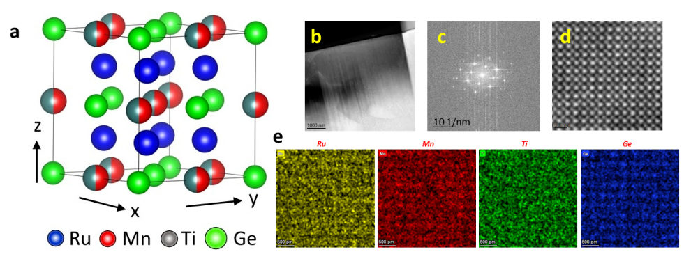
<figcaption class="paper-figure-caption"><b>Fig 1.</b> FIG. 1. (a) Crystal structure of Ru2Mn0.5Ti0.5Ge. (b) TEM image of prepared sample platelets. (c) Selected area diffraction pattern for the prepared sample platelets along [001] axis. (d) High-resolution scanning tunnelling microscopy image taken along the [001]-oriented plate. (e) Colour mapping of elemental distribution at atomic resolution.</figcaption>
</figure>
<figure class="paper-figure-card">
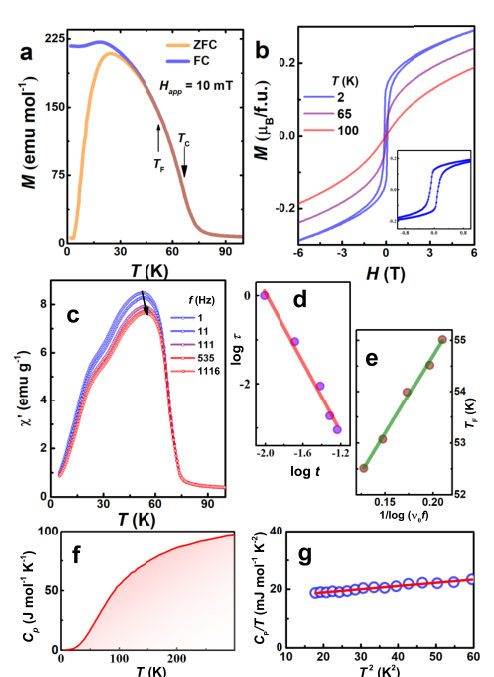
<figcaption class="paper-figure-caption"><b>Fig 2.</b> FIG. 2. (a) Temperature dependence of magnetization under 10 mT applied field. (b) magnetization isotherms M(H) at various temperatures. The inset shows the low-field hysteresis loop at T = 2 K. (c) Temperature variation of ac-susceptibility under various f under an excitation field of 6 Oe. (d) Depicts the plot of log(τ) versus log(t). (e) Graphical representation of the Vogel-Fulcher law. (f) Temperature variation of zero field heat capacity. (g) Heat capacity normalised by temper- ature CpT −1 with respect to T 2. The red line is the linear fit to CpT −1 over T 2 below 60 K2.</figcaption>
</figure>
<figure class="paper-figure-card">
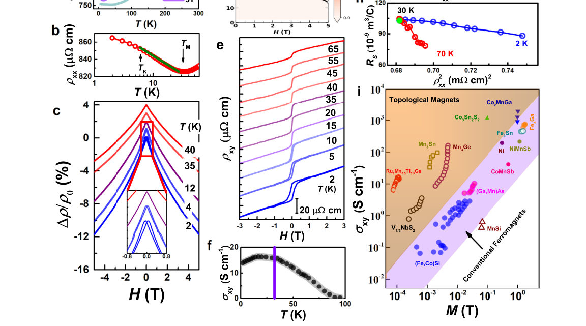
<figcaption class="paper-figure-caption"><b>Fig 3.</b> FIG. 3. (a) Temperature variation of ρxx under Happ of zero and 5 T. Green line depicts ρxx of parent Ru2TiGe. (b) Logarithmic ρxx(T) plot depicting the -clnT scaling between TM and Kondo temperature TK. (c) Field variation of magnetoresistance at various temperatures. The inset shows a zoomed view of low-field magnetoresistance for low temperatures. (d) Variation of the resistivity exponent n of the relation ρ = ρ0 + AT n in the H-T phase diagram. (e) Transverse resistivity ρxy at various temperatures. The y-axis is offset for clarity. (f) Temperature variation of anomalous Hall conductivity σA xy. The vertical line marks the TM. (g) |σA xy| versus σxx. The blue dot marks TM. (h) Scaling...</figcaption>
</figure>
<figure class="paper-figure-card">
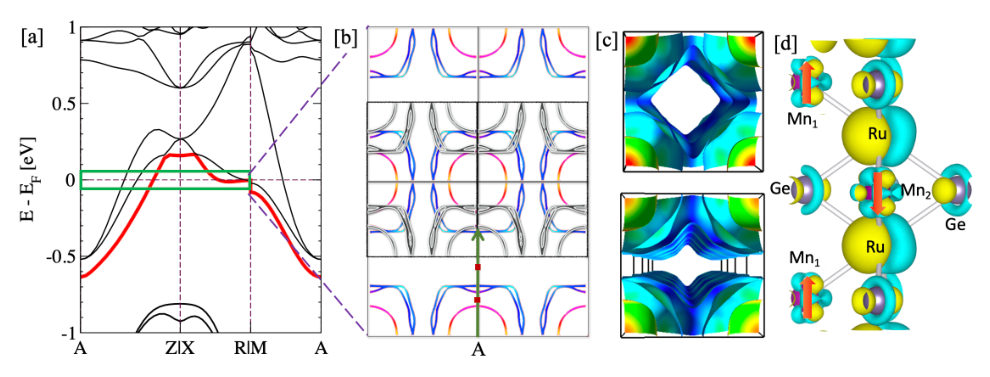
<figcaption class="paper-figure-caption"><b>Fig 4.</b> FIG. 4. (a) Electronic band structure of the compensated AFM phase along the A−Z|X−R|M−A high-symmetry path. The nearly flat Mn-3d band close to the Fermi level is highlighted in red. The green box marks the low-energy region enlarged in panel (b). (b) Enlarged view of the low-energy bands together with constant-kz Fermi-surface cross-sections, highlighting the multi-sheet topology and the estimated nesting vector (purple dashed line). (c) Three-dimensional Fermi surface viewed from two different perspectives, showing multiple electron- and hole-like sheets together with neck-like saddle regions near the Brillouin-zone boundaries. (d) Total charge-density distribution ρ(r) in the (110)...</figcaption>
</figure>

**Summary.** This work reports on anomalous Hall transport in a dilute Kondo Heusler alloy, $	ext{Ru}_2	ext{Mn}_{0.5}	ext{Ti}_{0.5}	ext{Ge}$, where strong correlations and flat bands coexist. The key finding is that the anomalous Hall effect deviates from simple scaling near the magnetic transition but is governed by Kondo coherence at low temperatures. The study uses a combination of advanced DFT calculations and transport measurements to establish the role of Berry curvature in this correlated topological regime.

**Why it may be interesting.** The explicit link drawn between Kondo coherence, flat-band physics, and topological transport mechanisms provides a rich playground for theoretical modeling of strongly correlated topological matter, relevant to quantum simulation.

Detailed structure

**Main problem.** The study investigates the complex interplay between strong electronic correlations, non-trivial band topology (flat bands), and Berry curvature-driven anomalous transport in non-f-electron systems.

**Main result.** The anomalous Hall response is found to be non-monotonic, violating Fermi-liquid scaling near the magnetic transition but recovering coherence at low temperatures, suggesting Kondo coherence profoundly impacts topological responses.

**Method.** The research combines *ab initio* DFT calculations (using SOC and Kubo-Greenwood formalism) with detailed transport measurements (resistivity, Hall measurements) on the material.

**Model / system.** The physical system is the dilute Kondo Heusler alloy, $	ext{Ru}_2	ext{Mn}_{0.5}	ext{Ti}_{0.5}	ext{Ge}$, which hosts flat bands near the Fermi level and exhibits spin-glassy magnetic behavior.

**Key observables.** Anomalous Hall conductivity ($\sigma_{Axy}$), longitudinal resistivity ($
ho_{xx}$), magnetic susceptibility ($\chi_{ac}$), and the scaling relationship between $\sigma_{Axy}$ and $\sigma_{xx}$.

**Important parameters / regimes.** Low temperatures (coincidence with Kondo coherence), magnetic transition temperature ($	ext{T}_{	ext{C}}$), and the presence of flat bands/van Hove singularities.

**Assumptions / limitations.** The anomalous transport is dominated by the intrinsic Berry curvature arising from the hybridization interplay between flat bands and spin-orbit coupling.

**Figures summary.** Figures detail magnetic ordering ($	ext{M}(	ext{T})$), spin-glass characteristics ($\chi_{ac}(	ext{T})$), and transport measurements showing Kondo scattering ($\ln T$ increase) and the temperature dependence of the AHE.

**Paper structure.** The paper progresses by first characterizing the magnetic and structural properties, then measuring transport signatures (AHE, resistivity) that show deviations from simple models, and finally using *ab initio* calculations to theoretically pinpoint the origin of the Berry curvature effect.

Abstract

The confluence of strong electronic correlations and Berry curvature-driven transport constitutes a largely underexplored frontier in quantum materials research, particularly in systems where electronic correlations arise from flat-band physics rather than conventional $f$-electron states. Here, we report an intrinsic Berry curvature driven anomalous Hall transport in the dilute Kondo system Ru$_2$Mn$_{0.5}$Ti$_{0.5}$Ge, a non-$f$-electron Heusler alloy hosting flat bands with van Hove singularity proximate to the Fermi level. The anomalous Hall response is strikingly non-monotonic, violating the Fermi-liquid scaling relation near the magnetic transition and is restored only at low temperature, coincident with the onset of Kondo coherence. \textit{Ab initio} calculations strongly establish that the Berry curvature originates from the Kondo hybridization induced interplay of flat bands and spin-orbit coupling mediated anticrossings at the Fermi level. Our findings demonstrate that Kondo coherence of flat bands bears a profound impact on Berry curvature associated ferroic responses, mandating a rigorous theoretical understanding of anomalous transport in the regime where reciprocal space topology and strong correlations are intrinsically intertwined.

[↑ back to top](#top)

### [Impact of Data Loss in Postprocessing on Training and Inference of Quantum Neural Networks](http://arxiv.org/abs/2609.05060v1)

**Authors:** Soraya V. Panambalom, Edoardo Altamura, Nick Chancellor, Jonte R. Hance  
**Type:** both · **Category:** quantum information and computing · **PDF:** <https://arxiv.org/pdf/2609.05060v1>  
**Analysis basis:** full PDF text, analyzed in chunks
**Topic relevance:** `QC/QI experiment` **3/5** · `quantum measurements` **2/5**

↔ Scroll figures horizontally

<figure class="paper-figure-card">
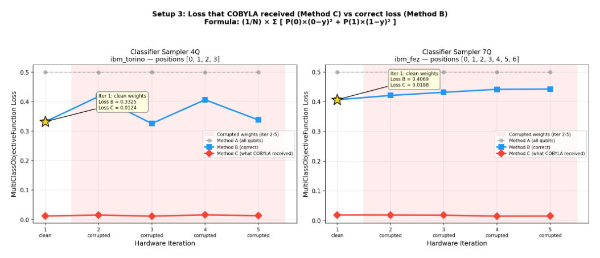
<figcaption class="paper-figure-caption"><b>Fig 1.</b> Fig. 1. Loss for 5 on-device fine-tuning iterations, recomputed from raw measurements. Method B (correct marginalisation) reveals the actual loss landscape; Method C (original filter) shows what COBYLA received. The star marks iteration 1 (clean simulator-trained weights); the shaded region marks iterations where the weights had already been affected by prior uncorrected updates.</figcaption>
</figure>

**Summary.** This paper reveals a critical flaw in the postprocessing step of QNNs when running on real quantum hardware. A filtering mechanism, designed for simulators, incorrectly discards a vast majority of valid measurement shots. This data loss corrupts both the model's predictive accuracy and the optimization process during training, necessitating a structural fix based on layout-aware marginalization.

**Why it may be interesting.** It highlights a critical, non-physical software artifact that severely degrades the performance metrics of quantum machine learning models, which is crucial knowledge for anyone building quantum algorithms for physical platforms.

Detailed structure

**Main problem.** The postprocessing routines in Quantum Neural Networks (QNNs) suffer from data loss when running on utility-scale quantum hardware compared to simulators.

**Main result.** This data loss causes the probability vector to be unnormalized, leading to significant drops in inference accuracy (e.g., 0.94 to 0.39) and compressing the loss signal during training (22-27x).

**Method.** The authors conducted a case study comparing different postprocessing methods (including the flawed filter) on real IBM quantum backends and proposing a layout-based marginalization fix.

**Model / system.** The study focuses on the Qiskit Machine Learning library, specifically the SamplerQNN class, applied to variational quantum classifiers (VQC) on large-scale quantum hardware (e.g., 156 qubits).

**Key observables.** Inference accuracy, training loss signal magnitude, and the percentage of surviving measurement shots.

**Important parameters / regimes.** Number of virtual qubits ($n$), number of physical qubits ($N$), and the threshold $2^n$.

**Assumptions / limitations.** The original postprocessing logic incorrectly assumes measurement bit-strings are confined to the virtual qubit space, which fails on physical hardware.

**Figures summary.** Figures compare the loss values received by the optimizer using the flawed method versus the correct method, and show weight drift confirming optimization probing rather than true learning.

**Paper structure.** The paper establishes the problem by detailing the data loss mechanism, quantifies the impact on inference and training, compares different postprocessing methods, and concludes by presenting the necessary layout-aware fix.

Abstract

As quantum hardware scales to larger devices, the classical software layers that interface with it must evolve in step. Postprocessing routines developed and tested primarily in simulator settings can encode assumptions that no longer hold on utility-scale devices, leading to data loss that can be difficult to detect from high-level model outputs alone. We present a case study of \texttt{SamplerQNN}, the sampling-based quantum neural network class in the Qiskit Machine Learning library. Here, the postprocessing method applies a filter that assumes measurement bit-strings are in virtual qubit space. On our quantum hardware runs, where bit-strings span over 100 physical qubits, this filter led to the loss of 85 to 99.6\% of valid measurement shots, depending on the transpiler's qubit placement. The resulting probability vector is unnormalised, allowing distorted prediction and loss values to propagate through the model without an API-level warning. We demonstrate the impact across five experiments on two IBM backends: for inference, accuracy drops from 0.94 to 0.39 on the same raw measurements; for training, the loss signal is compressed by 22 to 27$\times$, substantially reducing the sensitivity of the optimiser to the objective landscape. The behaviour arises in all released versions of the library (0.8.4 to 0.9.0). We implemented a layout-based marginalisation fix, merged into the GitHub codebase as Pull Request \#1041, that makes \texttt{SamplerQNN} postprocessing forward-compatible with current and upcoming hardware.

[↑ back to top](#top)

### [Phase Independent Measurement of Weak Coherent Optical Signals](http://arxiv.org/abs/2609.04363v1)

**Authors:** Lani Chastain, Priya Drashni, Mahadeva Chanda Durjoy, Hari P. Lamsal, Girish S. Agarwal, Tian Li  
**Type:** theory · **Category:** other · **PDF:** <https://arxiv.org/pdf/2609.04363v1>  
**Analysis basis:** full PDF text, analyzed in chunks
**Topic relevance:** `quantum measurements` **3/5** · `driven-dissipative phase transition` **1/5** · `interference shaping light` **1/5**

↔ Scroll figures horizontally

<figure class="paper-figure-card">
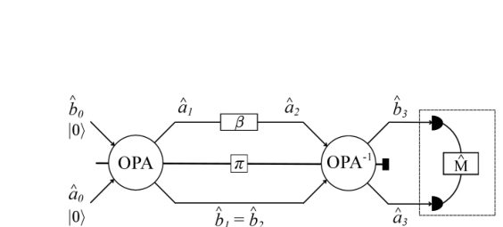
<figcaption class="paper-figure-caption"><b>Fig 1.</b> FIG. 1. Schematic of our proposed total intensity measure- ment scheme based on an idealized lossless SU(1,1) interfer- ometer. Input modes ˆa0 and ˆb0 are injected into the first OPA, generating correlated output modes ˆa1 and ˆb1. A weak coherent displacement operation ˆD(β) is subsequently applied to mode ˆa1 before the two modes are recombined in a second OPA. The central dark line denotes a strong classical pump field, which acquires a π phase shift prior to driving the second OPA, thereby realizing the inverse parametric transformation. The measurement operator ˆ M is performed by detecting the total output intensity of modes ˆa3 and ˆb3.</figcaption>
</figure>
<figure class="paper-figure-card">
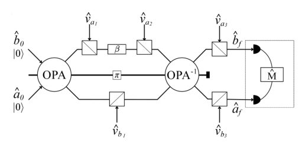
<figcaption class="paper-figure-caption"><b>Fig 2.</b> FIG. 2. Schematics of the lossy SU(1,1) interferometer under two measurement schemes: Total intensity detection is per- formed on the two output modes, ˆaf and ˆbf. Fictitious BSs with transmission coefficients ηa and ηb model photon loss in the two optical paths, while vacuum noise operators ˆvai and ˆvbi enter through the open BS ports. The dark central line represents the strong classical pump field, which undergoes a π phase shift between the two OPAs. ˆ M denotes the mea- surement operator acting on the detector outputs.</figcaption>
</figure>
<figure class="paper-figure-card">
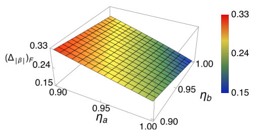
<figcaption class="paper-figure-caption"><b>Fig 3.</b> FIG. 3. Minimum uncertainty for estimating the displacement magnitude, given by the quantum Cramér bound (∆|β|)F for a lossy SU(1,1) interferometer as a function of the transmission coefficients ηa and ηb in the high-transmission regime from 0.9 to 1, for a squeezing parameter of r = 1.5.</figcaption>
</figure>
<figure class="paper-figure-card">
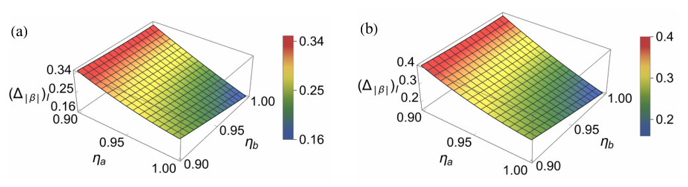
<figcaption class="paper-figure-caption"><b>Fig 4.</b> FIG. 4. Displacement sensitivity (∆|β|)I of a lossy SU(1,1) interferometer employing the total intensity detection scheme as a function of the transmission coefficients ηa and ηb in the high-transmission regime from 0.9 to 1, for a squeezing parameter of r = 1.5. Subfigures (a) and (b) correspond to coherent displacement amplitudes of |β| = 1 and |β| = 1/2, respectively, yielding SNR = 1 and SNR = 1/2. These cases represent operating regimes in which the mean coherent displacement is at or below the uncertainty associated with vacuum fluctuations.</figcaption>
</figure>
<figure class="paper-figure-card">
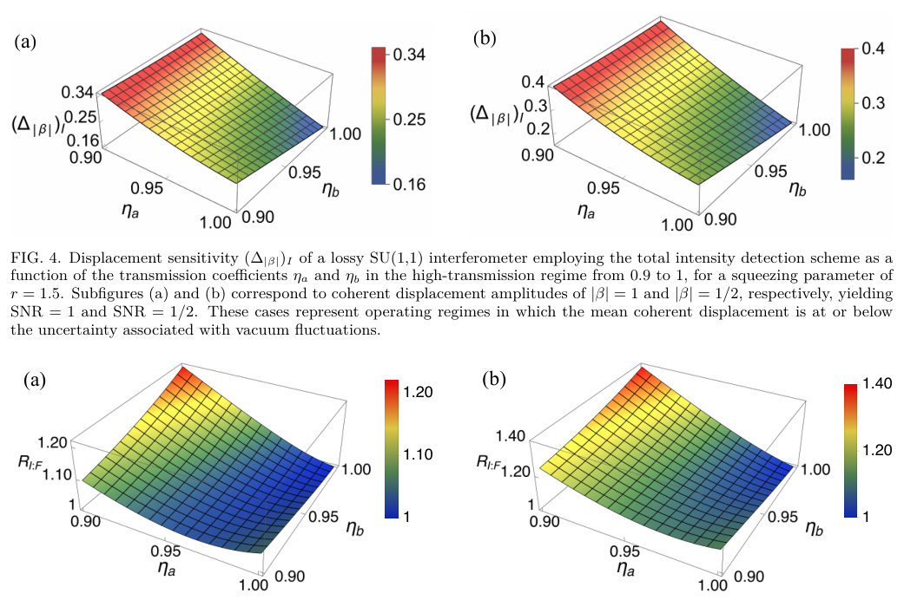
<figcaption class="paper-figure-caption"><b>Fig 5.</b> FIG. 5. Ratio between the sensitivity with total intensity detection and the quantum Cramér–Rao bound, (∆|β|)I/(∆|β|)F , for displacement-magnitude estimation in the lossy SU(1,1) interferometer as a function of transmission coefficients ηa and ηb in the high-transmission regime, 0.9 ≤ηa, ηb ≤1. The squeezing parameter is fixed at 1.5. Subfigures (a) and (b) correspond to coherent displacement amplitudes of |β| = 1 and |β| = 1/2, respectively, yielding SNR = 1 and SNR = 1/2.</figcaption>
</figure>

**Summary.** This paper proposes using SU(1,1) interferometry with total intensity detection for quantum sensing of weak optical displacements. It demonstrates that this method achieves the theoretical quantum limit for estimating the displacement magnitude, even when the signal phase is unknown or when optical loss is present. This establishes a practical, robust platform for phase-independent quantum measurements.

**Why it may be interesting.** This work is highly relevant to quantum optics and open quantum systems, providing a practical, robust measurement scheme for quantum sensing that bypasses the stringent requirements of phase-locking and local oscillators.

Detailed structure

**Main problem.** The paper addresses the development of a quantum sensing framework for the phase-independent detection of weak coherent optical displacements.

**Main result.** Total intensity detection using an SU(1,1) interferometer saturates the Quantum Cramér–Rao Bound for displacement magnitude estimation, proving its quantum optimality and eliminating the need for phase knowledge.

**Method.** The authors derive the Quantum Fisher Information and the Quantum Cramér–Rao Bound (QCRB) for both ideal lossless and lossy scenarios.

**Model / system.** The physical platform is an SU(1,1) interferometer, which utilizes nonlinear elements like Optical Parametric Amplifiers (OPAs) instead of passive beam splitters. The analysis covers both ideal lossless and lossy regimes incorporating photon loss.

**Key observables.** Displacement magnitude $|eta|$, total intensity $\hat{M}$, Quantum Fisher Information (QFI), and the QCRB for $|eta|$ estimation.

**Important parameters / regimes.** Squeezing parameter $r$, loss coefficients $\eta_a$ and $\eta_b$, and the displacement amplitude $|eta|$.

**Assumptions / limitations.** The ideal case assumes lossless conditions, while the lossy case models loss using standard beam splitter transmission coefficients.

**Figures summary.** Figures illustrate the schematics of the interferometer (lossy and ideal) and compare the achievable sensitivity ($\Delta|eta|_I$) against the theoretical limit ($	ext{QCRB}$) under varying loss parameters.

**Paper structure.** The paper first establishes the ideal lossless case, showing saturation of the QCRB using total intensity detection. It then extends the analysis to the lossy case, deriving the QFI and comparing the measured sensitivity to the QCRB, concluding that the intensity measurement remains near-optimal.

Abstract

We develop a quantum sensing framework for the phase independent detection of weak coherent optical displacements based on SU(1,1) interferometry. Unlike conventional quantum measurement protocols that require prior knowledge of the signal phase and coherent homodyne detection, the proposed approach estimates the displacement magnitude independently of its phase. We show that, under ideal lossless conditions, a conventional SU(1,1) interferometer employing only total intensity detection saturates the quantum Cramer Rao bound for displacement magnitude estimation. We further derive the analytical expression of the quantum Cramer Rao bound and the sensitivity of the conventional SU(1,1) interferometer with total intensity detection and systematically investigate its performance in the presence of optical loss. The proposed phase-independent intensity detection scheme achieves comparable performance over experimentally relevant operating regimes while eliminating the need for local oscillators, phase locking, and quadrature tracking. These results establish SU(1,1) based intensity detection as a practical platform for phase independent quantum sensing.

[↑ back to top](#top)

### [Strong-Drive Floquet Engineering of Interacting Qudits: From Finite-Duration Controls to Emergent Symmetry](http://arxiv.org/abs/2609.04309v1)

**Authors:** Ryan Scott, V. W. Scarola  
**Type:** theory · **Category:** other · **PDF:** <https://arxiv.org/pdf/2609.04309v1>  
**Analysis basis:** full PDF text, analyzed in chunks
**Topic relevance:** `analog quantum simulation` **3/5** · `Rydberg arrays` **2/5**

↔ Scroll figures horizontally

<figure class="paper-figure-card">
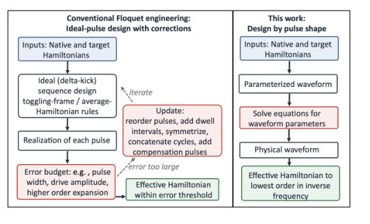
<figcaption class="paper-figure-caption"><b>Fig 1.</b> FIG. 1. Floquet-engineering approaches. Ideal-pulse approaches first design an effective Hamiltonian using instantaneous rotations and subsequently account for waveform-dependent implementation errors. The present approach incorporates a calibrated finite-duration waveform directly into the leading effective Hamiltonian and kick operator. The two approaches can be used independently or com- bined by embedding waveform-engineered blocks within longer pulse sequences.</figcaption>
</figure>
<figure class="paper-figure-card">
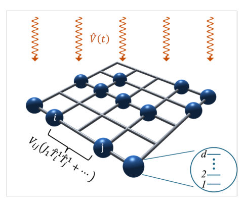
<figcaption class="paper-figure-caption"><b>Fig 2.</b> FIG. 2. Global driving of an interacting qudit array. Spheres rep- resent d-level systems on the vertices of an illustrative square lattice, with i and j labeling two sites. The dimensionless coupling Vij spec- ifies the bond dependence of a native interaction Jβ ˆT β i ˆT β j , where ˆT β i is a local d-level generator, e.g., a matrix proportional to a Pauli matrix for d = 2. Random site occupancy illustrates a general inter- action graph with nonuniform bond strengths. The wavy lines denote the global time-dependent drive ˆV (t).</figcaption>
</figure>
<figure class="paper-figure-card">
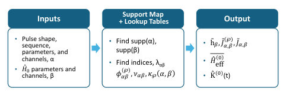
<figcaption class="paper-figure-caption"><b>Fig 3.</b> FIG. 4. Technical workflow underlying the use of Eqs. (29) and (32). The first panel defines inputs to ˆH0 + ˆV (t). The central panel indi- cates that the support map for generator matrices must be established. The map allows use of the lookup table to extract values for indices. The last panel shows that the output results in a specific effective Hamiltonian and kick operator.</figcaption>
</figure>
<figure class="paper-figure-card">
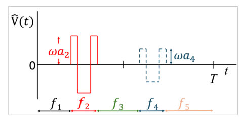
<figcaption class="paper-figure-caption"><b>Fig 4.</b> FIG. 3. Schematic of an example possible square pulse profile. ˆV (t) = ω P</figcaption>
</figure>
<figure class="paper-figure-card">
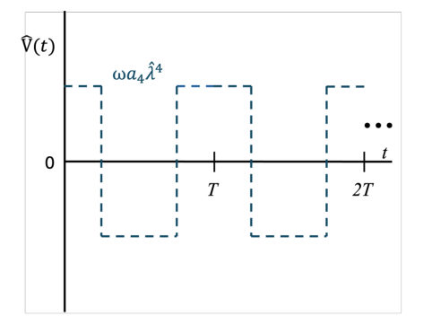
<figcaption class="paper-figure-caption"><b>Fig 5.</b> FIG. 5. Single pulse. Schematic of the pulse used to engineer Eq. (58) into Eq. (63). The pulse is ωa4ˆλ4.</figcaption>
</figure>

**Summary.** This paper introduces a strong-drive Floquet theory to engineer the effective interactions in interacting qudit systems using realistic, finite-duration control pulses. It demonstrates that going beyond qubits allows for the creation of novel interactions and symmetries. This framework offers a scalable method for designing quantum controls in diverse physical platforms.

**Why it may be interesting.** This work provides a powerful, generalizable framework for quantum control in complex, multi-level systems, directly addressing the practical limitations of current experimental quantum simulation protocols.

Detailed structure

**Main problem.** The primary challenge is designing effective quantum Hamiltonians for interacting qudits using experimentally realistic, finite-duration periodic controls, overcoming the limitations of idealized, instantaneous pulse approximations.

**Main result.** The authors developed a strong-drive Floquet theory showing that finite-duration driving in qudits ($d>2$) can generate novel interactions and symmetries unattainable in qubit systems.

**Method.** The theory incorporates finite-duration pulse waveforms directly into the effective Hamiltonian via a strong-drive Floquet formalism, treating pulse parameters (duration, amplitude, shape) as useful control variables.

**Model / system.** The system involves interacting $d$-level systems (qudits), applicable to platforms like trapped ions, Rydberg arrays, and molecules. The dynamics are governed by a time-dependent Hamiltonian $\hat{H}(t) = \hat{H}_0 + \hat{V}(t)$.

**Key observables.** Emergent symmetries (e.g., SU(2) x U(1), SU(3)), specific interaction terms (nematic couplings), and the resulting effective Hamiltonian $\hat{H}_{	ext{eff}}$.

**Important parameters / regimes.** Pulse duration, amplitude, and shape are crucial control parameters. The theory requires the drive frequency to exceed all energy scales of the bare Hamiltonian $\hat{H}_0$.

**Assumptions / limitations.** The theory assumes the drive frequency is high enough to treat the system in the strong-drive regime, and it is complementary to, not a replacement for, ideal-pulse methods.

**Figures summary.** Figure 1 compares ideal-pulse vs. finite-duration control approaches. Figure 2 illustrates the general setting of an interacting qudit array under a global time-dependent drive.

**Paper structure.** The paper develops the strong-drive Floquet theory, derives the effective Hamiltonian $\hat{H}_{	ext{eff}}$ and kick operator $\hat{K}$ using high-frequency expansions, and then demonstrates its application to specific physical systems like trapped molecules to engineer desired symmetries.

Abstract

Floquet driving uses periodic controls to tailor the behavior of quantum systems, with applications in quantum analogue simulation, sensing, and the protection of quantum information. Most approaches are designed using idealized, instantaneous pulses, even though experiments necessarily use pulses with finite duration and shape. This mismatch becomes especially challenging for interacting $d$-level systems, or qudits, because the number of possible controls grows rapidly with the number of levels. We develop a strong-drive Floquet theory that incorporates experimentally realizable pulse waveforms directly into the design of the effective interactions. The pulse duration, amplitude, and shape therefore become useful control parameters rather than sources of error. We show that systems with more than two levels offer capabilities unavailable in qubit systems: finite-duration driving can create new interactions that are absent from the original system and can substantially change its symmetries. We demonstrate these capabilities for interacting three-level systems. A single pulse transforms a diagonal interaction into a quantum spin-1 model dominated by nematic interactions, while pulse protocols motivated by trapped ultracold polar molecules produce models with enlarged $SU(2)\times U(1)$ and $SU(3)$ symmetries. Numerical tests of both short-time evolution and many-body dynamics confirm the accuracy of the resulting description. Our results provide a scalable analytical framework for designing finite-duration controls in interacting qudit platforms.

[↑ back to top](#top)

### [TETRIS-Q: Tiling-based Effective Transient-fault Reduction on Interleaved Superconducting Qubits](http://arxiv.org/abs/2609.05226v1)

**Authors:** Marzio Vallero, Gioele Casagranda, Flavio Vella, Paolo Rech  
**Type:** theory · **Category:** quantum information and computing · **PDF:** <https://arxiv.org/pdf/2609.05226v1>  
**Analysis basis:** full PDF text, analyzed in chunks
**Topic relevance:** `QC/QI experiment` **3/5** · `correlated / nonlocal dissipation` **2/5**

↔ Scroll figures horizontally

<figure class="paper-figure-card">
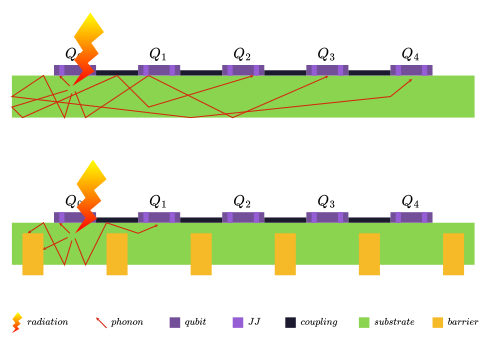
<figcaption class="paper-figure-caption"><b>Fig 1.</b> Fig. 1: Simplified effect of substrate barriers, side view. Without barriers, quasiparticles can easily disperse throughout the quantum chip, causing correlated faults (top). Barriers confine radiation-induced quasiparticle dispersion (bottom).</figcaption>
</figure>
<figure class="paper-figure-card">
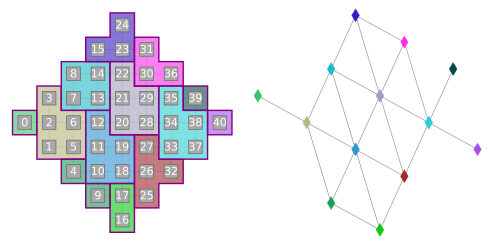
<figcaption class="paper-figure-caption"><b>Fig 2.</b> Fig. 2: The quantum chip’s topology (left) is used to create the barrier hypergraph (right) with a tiling pattern of dimension tilesize = 5, where each tile contains at most five qubits. The total phonon barrier perimeter is highlighted in purple.</figcaption>
</figure>
<figure class="paper-figure-card">
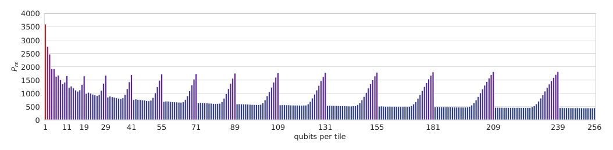
<figcaption class="paper-figure-caption"><b>Fig 3.</b> Fig. 3: The Prs barrier cost per tile size, onto a square lattice topology boasting 1741 qubits. Due to quantum chip topology boundaries, the tiling cost does not decrease monotonically. X-axis labels represent local maximum Prs cost.</figcaption>
</figure>
<figure class="paper-figure-card">
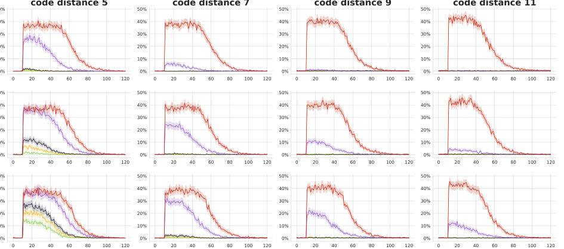
<figcaption class="paper-figure-caption"><b>Fig 4.</b> Fig. 4: Rotated surface code logical error rates with 1, 4 and 9 qubit tiles (top to bottom), varying over increasing rotated surface code distance d (left to right) and barrier permeability bp (plot hues). The case with no barriers acts as the base case, while barrier permeability costs follow Equation 1. The tiling with 4-qubit tiles and 9-qubit tiles incur in barrier tracing costs of 47% and 61%, respectively.</figcaption>
</figure>
<figure class="paper-figure-card">
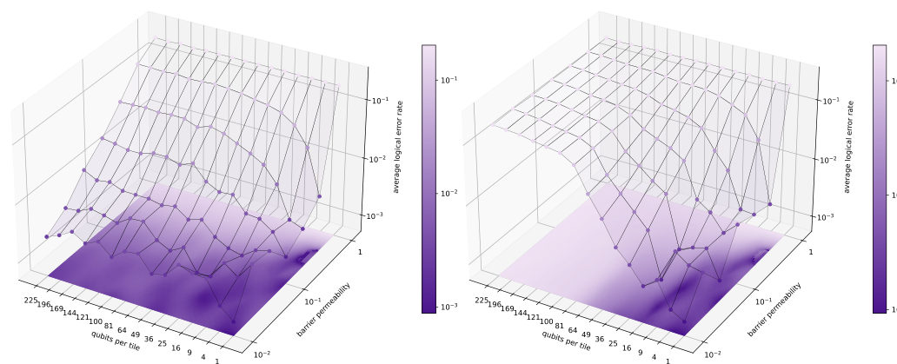
<figcaption class="paper-figure-caption"><b>Fig 5.</b> Fig. 5: Distance-9 rotated surface code average logical error rate (Z-axis, vertical), varying over qubits per tile (X-axis, left) and barrier permeability bp (Y-axis, right), differentiated by tiling positioning.</figcaption>
</figure>

**Summary.** This paper introduces TETRIS-Q, a novel hardware-software co-design approach that combines physical substrate barriers (phonon barriers) with QEC code interleaving. By tiling the superconducting qubit chip, it effectively suppresses correlated radiation-induced faults, achieving dramatic reductions in logical error rates while maintaining low overhead costs.

**Why it may be interesting.** This work directly addresses hardware-level noise sources (radiation) in superconducting qubits, which is a critical bottleneck for scaling quantum computation, providing a novel, physical layer mitigation technique beyond standard algorithmic QEC.

Detailed structure

**Main problem.** The primary challenge is suppressing error mechanisms, specifically radiation-induced correlated faults, which compromise the effectiveness of Quantum Error Correction (QEC) codes in superconducting qubits.

**Main result.** The proposed TETRIS-Q algorithm achieves peak logical error reductions exceeding 99.8% and can reduce the observable transient duration by 80% through the joint use of phonon barriers and QEC interleaving.

**Method.** The authors propose TETRIS-Q, a planar-mesh tiling algorithm that selectively combines substrate-level phonon barriers with QEC interleaving to mitigate correlated radiation faults.

**Model / system.** The work models superconducting qubits arranged on a planar substrate, utilizing a planar-mesh tiling algorithm to divide the chip into non-overlapping tiles for error mitigation.

**Key observables.** Peak logical error reductions ($>99.8\%$), reduction of observable transient duration ($80\%$), and logical error rate reductions (up to three orders of magnitude with joint use).

**Important parameters / regimes.** Barrier permeability quality factor ($b_p$), tile size, and the probability distribution of correlated radiation faults.

**Assumptions / limitations.** The analysis assumes that radiation-induced faults are spatio-temporally correlated and locally dense, exceeding the scope of standard QEC codes.

**Figures summary.** Figure 1 illustrates how substrate barriers confine radiation-induced quasiparticle dispersion. Other figures detail the quantum chip topology, the barrier hypergraph formed by tiling, and comparisons of logical error rates based on tile size and barrier permeability.

**Paper structure.** The paper introduces the problem of correlated radiation faults, proposes the TETRIS-Q tiling algorithm combining phonon barriers and QEC interleaving, models the fault suppression using extensive simulations, and presents quantitative results demonstrating high error reduction efficiencies.

Abstract

The struggle of the hour in quantum computing research is achieving effective suppression of the error mechanisms induced by the interaction of external radiation with superconducting quantum devices. Despite the rapid advancements in quantum error correction (QEC) of recent years, radiation-induced faults are yet to be fully addressed. These events are known to be the cause of simultaneous correlated defects in qubits that lie onto a single substrate, ultimately jeopardising QEC code effectiveness.   In this paper, we propose to selectively combine substrate-level phonon barriers and QEC interleaving via a planar-mesh tiling algorithm, TETRIS-Q, reaching efficient and effective suppression of radiation events. Our cross-layer solution comes at no extra cost in terms of QEC code execution or decoding time. We model and simulate radiation-induced transient faults over a plethora of barrier and QEC interleaving configurations. Through more than 51 million quantum circuit simulations, we show peak logical error reductions of more than $99.8 \%$, together with an $80\%$ reduction of the observable transient duration with permeable barriers. We find that sparser tiling can reach comparable performance to single qubit tiling, prompting cost reductions of upwards of $87 \%$ in barrier tracing. By leveraging independent QEC code interleaving, we measure up to one order of magnitude average logical error rate reductions without the use of permeable barriers, and up to three orders of magnitude with the joint usage of barriers.

[↑ back to top](#top)

### [Scaling laws and energy dissipation in the dynamics of SLE curve as a 1D turbulence model](http://arxiv.org/abs/2609.04719v1)

**Authors:** Yusuke K. Shibasaki  
**Type:** theory · **Category:** statistical mechanics · **PDF:** <https://arxiv.org/pdf/2609.04719v1>  
**Analysis basis:** full PDF text, analyzed in chunks
**Topic relevance:** `non-equilibrium universality` **3/5** · `driven-dissipative phase transition` **1/5**

↔ Scroll figures horizontally

<figure class="paper-figure-card">
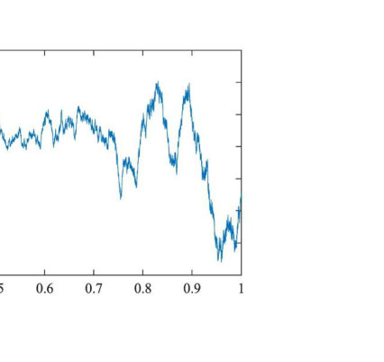
<figcaption class="paper-figure-caption"><b>Fig 1.</b> FIGURE 1. Time series of 𝑥(𝑡) calculated using the diffusion model in Eq. (6). The numerical</figcaption>
</figure>
<figure class="paper-figure-card">
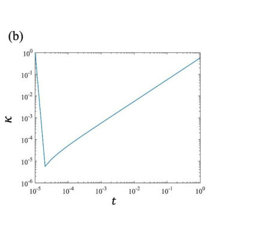
<figcaption class="paper-figure-caption"><b>Fig 2.</b> FIGURE 2. Time series of diffusivity parameter 𝜅. (a) Plot of 𝑡 and 𝜅. (b) Log-log plot of 𝑡 and 𝜅.</figcaption>
</figure>
<figure class="paper-figure-card">
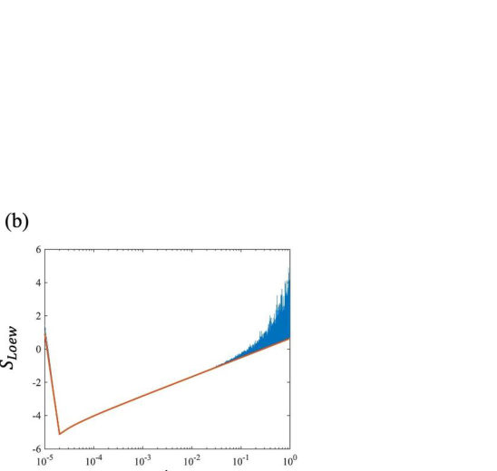
<figcaption class="paper-figure-caption"><b>Fig 3.</b> FIGURE 3. Time series of Loewner entropy 𝑆Loew. (a) Plot of 𝑡 and 𝑆Loew. (b) Semi-log plot of 𝑡</figcaption>
</figure>

**Summary.** This paper successfully demonstrates that Stochastic Loewner Evolution (SLE) can serve as a mathematical model for one-dimensional turbulence. By imposing specific conditions on the diffusivity parameter ($\kappa$) and relating energy dissipation to the Loewner entropy ($S_{Loew}$), the authors show the model satisfies fundamental turbulence scaling laws like Kolmogorov's 4/5th law.

**Why it may be interesting.** While the core topic is turbulence, the mathematical machinery—relating complex stochastic processes (SLE) to universal scaling laws (Kolmogorov's)—is highly relevant to non-equilibrium statistical mechanics and the study of critical phenomena in quantum systems.

Detailed structure

**Main problem.** The study aims to demonstrate that Stochastic Loewner Evolution (SLE) can model one-dimensional (1D) turbulence and to derive the necessary conditions for this model to satisfy Kolmogorov's 4/5th law.

**Main result.** The standard SLE becomes a beneficial model for 1D turbulence if the diffusivity parameter $\kappa$ satisfies a specific scaling relation, and the model's energy dissipation is linked to the Loewner entropy ($S_{Loew}$).

**Method.** The authors use analytical derivations by comparing the scaling laws of the 1D diffusion process derived from SLE with the known scaling laws of turbulence, particularly Kolmogorov's 4/5th law.

**Model / system.** The model is the Stochastic Loewner Evolution (SLE), which is adapted by applying a time coordinate transformation to yield a 1D diffusion process. This process is then analyzed as a proxy for 1D turbulence dynamics.

**Key observables.** Richardson's law scaling ($\langle x(t)^2 
angle \sim t^{3/2}$), Kolmogorov's 4/5th law ($\langle \Delta v(l)^3 
angle$), and Loewner entropy ($S_{Loew}$).

**Important parameters / regimes.** Diffusivity parameter ($\kappa$), Loewner entropy ($S_{Loew}$), and the fractal dimension ($d_f$).

**Assumptions / limitations.** The analysis assumes a specific time scaling ($t=al$) when comparing scaling laws, and the derivation relies on relating kinetic energy to $S_{Loew}$ via the fractal dimension.

**Figures summary.** Figure 2 shows the time series of $\kappa$, confirming $\kappa \sim t^1$. Figure 3 shows the time series of $S_{Loew}$, confirming the scaling relation $S_{Loew} \sim \ln t$.

**Paper structure.** The paper first establishes the 1D diffusion process from SLE, then derives the condition on $\kappa$ by matching the scaling laws to Kolmogorov's 4/5th law, and finally confirms these analytical results using numerical simulations.

Abstract

In this study, we demonstrate the characteristics of the stochastic Loewner evolution (SLE) as a one-dimensional (1D) turbulence model. First, we show that the diffusion process $x(t)$ obtained by the time coordinate change in the SLE becomes the time dependent diffusion process that satisfies Richardson's law of turbulence.Subsequently, we derive the condition on the diffusivity parameter $κ$ such that the diffusion process $x(t)$ satisfies Kolmogorov's 4/5th law, which determines the relation between the mean energy dissipation and velocity in the particles of turbulence. Further mathematical analysis showed that this condition is seen as the condition on Loewner entropy $S_{\mathrm{Loew}}$, which includes the white Gaussian noise term $W_{s}$ in the Loewner driving function of the present model. In addition, the numerical simulations were performed to verify the scaling relations of this 1D turbulence model. These results suggest that the standard SLE becomes a beneficial model of 1D turbulence by introducing an appropriate time coordinate change and imposing the conditions on $κ$ and $S_{\mathrm{Loew}}$.

[↑ back to top](#top)

### [Dipolar and quadrupolar spin supersolid states in a spin-1 triangular antiferromagnet](http://arxiv.org/abs/2609.05181v1)

**Authors:** Yixuan Huang, Yuan Gao, Wei Li, Seiji Yunoki, Sadamichi Maekawa  
**Type:** theory · **Category:** strongly correlated electrons · **PDF:** <https://arxiv.org/pdf/2609.05181v1>  
**Analysis basis:** full PDF text, analyzed in chunks
**Topic relevance:** `analog quantum simulation` **3/5**

↔ Scroll figures horizontally

<figure class="paper-figure-card">
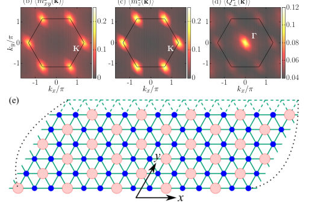
<figcaption class="paper-figure-caption"><b>Fig 1.</b> FIG. 1. Panel (a) sketches the quantum phase diagram with various single-ion anisotropy Dz/J and magnetic field hz/J. The symbols represent parameter points studied us- ing DMRG methods. The shaded regimes indicate the vanish of quadrupolar order in the thermodynamic limit within the dipolar SS phases. Panels (b) and (c) show the transverse and longitudinal dipolar orders defined in Eq. 2, respectively. Panel (d) shows the quadrupolar order defined in Eq. 3. Panel (e) shows the real-space distribution of ⟨Sz i ⟩. The blue solid circles represent positive ⟨Sz i ⟩, and red shaded circles repre- sent negative ⟨Sz i ⟩with radius proportional to its magnitude. The red shaded circles have ⟨Sz i...</figcaption>
</figure>
<figure class="paper-figure-card">
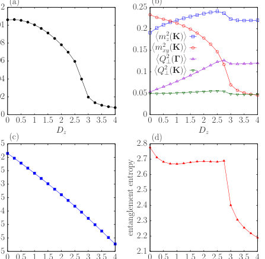
<figcaption class="paper-figure-caption"><b>Fig 2.</b> FIG. 2. (a) The superfluid stiffness, (b) various order pa- rameters, (c) the ground-state energy per site, and (d) the entanglement entropy for various Dz at hz = 0. The results are obtained on a fixed lattice of N = 36×6. We note that for larger Dz &gt; 1.75 the ground state in the total Sz = 0 sector converges to a stripe order with higher energy, which could be due to finite-size effect. In practice, the bulk properties of the ground state in the total Sz = 2 sector are used to approxi- mate the hz = 0 limit where most magnetization is found to distribute near the open boundary in the x direction.</figcaption>
</figure>
<figure class="paper-figure-card">
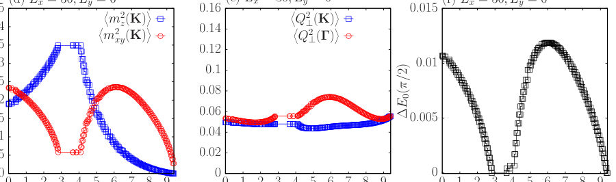
<figcaption class="paper-figure-caption"><b>Fig 3.</b> FIG. 3. Panel (a) and panels (b-c) show the finite-size scaling in Lx and Ly for various orders, respectively. Panels (d), (e), and (f) show the evolution of various orders and superfluid stiffness for different magnetic fields hz on a fixed lattice size. All results are obtained at Dz = 0.</figcaption>
</figure>
<figure class="paper-figure-card">
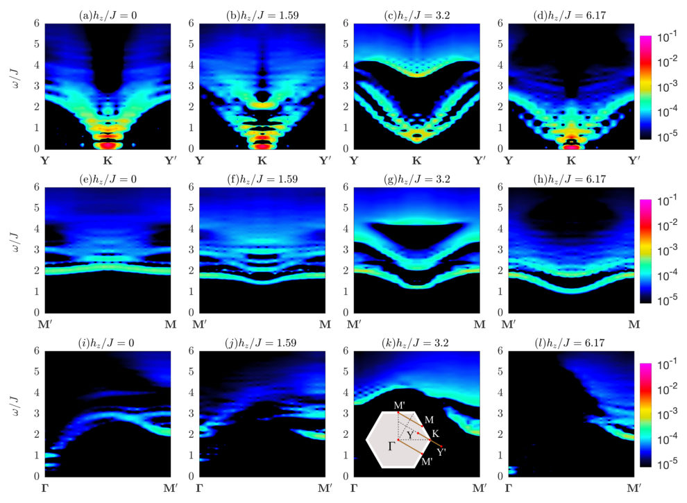
<figcaption class="paper-figure-caption"><b>Fig 4.</b> FIG. 4. The transverse component of the dynamical spin structure factor χxy(k, ω) for various hz at Dz = 0. Panels (a), (e) and (i) are obtained in the dipolar YSS at zero field. Panels (b), (f) and (j) are obtained in the dipolar YSS at finite field of hz = 1.59. Panels (c), (g) and (k) are obtained in the UUD phase. Panels (d), (h) and (l) are obtained in the dipolar VSS phase. Results in the SS and UUD phases are calculated on the lattice of N = 36 × 6 and N = 48 × 6, respectively.</figcaption>
</figure>
<figure class="paper-figure-card">
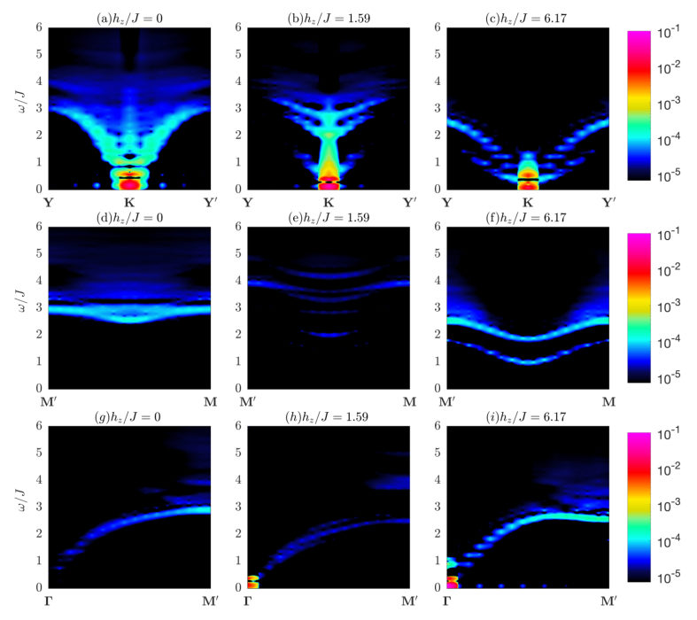
<figcaption class="paper-figure-caption"><b>Fig 5.</b> FIG. 5. Same as Fig. 4, but for the longitudinal component of the dynamical spin structure factor χz(k, ω). In the UUD state, the dynamical spin structure factor is dominated by χxy(k, ω), thus χz(k, ω) is not shown here.</figcaption>
</figure>

**Summary.** This paper uses DMRG simulations to map the quantum phase diagram of a spin-1 antiferromagnet on a triangular lattice. It identifies distinct dipolar and quadrupolar spin supersolid states arising from the competition between frustration, anisotropy, and magnetic fields. The results offer theoretical predictions for experimental observables like the spin superfluid stiffness and excitation spectra.

**Why it may be interesting.** The detailed mapping of quantum phases, especially the coexistence of superfluidity and broken translational symmetry, provides a rich theoretical framework applicable to understanding exotic quantum ground states in frustrated magnets.

Detailed structure

**Main problem.** The study aims to theoretically understand the complex interplay between geometric frustration, single-ion anisotropy, and external magnetic fields in driving distinct spin supersolid (SS) phases within a spin-1 quantum magnet.

**Main result.** The research identifies and maps out distinct dipolar and quadrupolar spin supersolid states, showing how the system transitions between these phases depending on the relative strengths of anisotropy ($D_z$) and the magnetic field ($h_z$).

**Method.** The study employs systematic numerical simulations using Density Matrix Renormalization Group (DMRG) methods to map the quantum phase diagram.

**Model / system.** The model is the spin-1 antiferromagnetic Heisenberg model defined on a triangular lattice, governed by a Hamiltonian incorporating exchange coupling, single-ion anisotropy ($D_z$), and an out-of-plane magnetic field ($h_z$).

**Key observables.** Order parameters (dipolar and quadrupolar), spin superfluid stiffness ($
ho_s$), and the dynamical spin structure factor (revealing Goldstone modes and roton minima).

**Important parameters / regimes.** The phase diagram is parameterized by the single-ion anisotropy $D_z$ and the magnetic field $h_z$. Key regimes include zero field, intermediate fields (UUD phase), and high fields.

**Assumptions / limitations.** The primary assumption is the applicability of the spin-1 Heisenberg model to describe the magnetic behavior of specific triangular-lattice antiferromagnets.

**Figures summary.** The figures are expected to present the quantum phase diagram ($D_z/J$ vs $h_z/J$) and show calculated order parameters (dipolar and quadrupolar) across different phases.

**Paper structure.** The paper systematically analyzes the quantum phase diagram by varying $D_z$ and $h_z$, characterizing the resulting supersolid phases using multiple order parameters and calculating the dynamical structure factor to predict experimental signatures.

Abstract

We present a systematic numerical study of the spin-1 antiferromagnetic Heisenberg model on the triangular lattice in an out-of-plane magnetic field, using Density Matrix Renormalization Group (DMRG) methods. By mapping out the quantum phase diagram as a function of the single-ion anisotropy $D_z$ and magnetic field, we identify distinct dipolar and quadrupolar spin supersolid states, characterized by spontaneous U(1) symmetry breaking with finite spin superfluid stiffness coexisting with longitudinal translational symmetry breaking. At zero field, the dipolar spin supersolid with a 'Y'-type spin configuration persists down to $D_z = 0$, whereas the quadrupolar spin supersolid prevails at large $D_z$. At intermediate fields, the phase diagram is dominated by an up-up-down phase. At high fields below saturation, a quadrupolar spin superfluid emerges in the large-$D_z$ regime, whereas a dipolar spin supersolid with a 'V'-type spin configuration dominates at small $D_z$. These phases are characterized through their order parameters and spin superfluid stiffness using calculations on various system sizes. Furthermore, the dynamical spin structure factor is obtained across the phase diagram, where characteristic spectral signatures of different phases are observed, including the gapless Goldstone mode and the roton-like minima. These features are directly accessible to inelastic neutron scattering experiments. Our results provide a theoretical understanding of the interplay between frustrations, anisotropy, and Zeeman interactions in driving distinct spin supersolid phases in the spin-1 system, which are relevant to various triangular-lattice antiferromagnets such as Na$_2$BaNi(PO$_4$)$_2$ and K$_2$Ni(SeO$_3$)$_2$.

[↑ back to top](#top)

### [Learning unknown stabilizer codes using product measurements](http://arxiv.org/abs/2609.04997v1)

**Authors:** Heather Leitch, Sowmya Tirukkovalluri, Yingkai Ouyang  
**Type:** theory · **Category:** quantum information and computing · **PDF:** <https://arxiv.org/pdf/2609.04997v1>  
**Analysis basis:** full PDF text, analyzed in chunks
**Topic relevance:** `quantum measurements` **3/5**

↔ Scroll figures horizontally

<figure class="paper-figure-card">
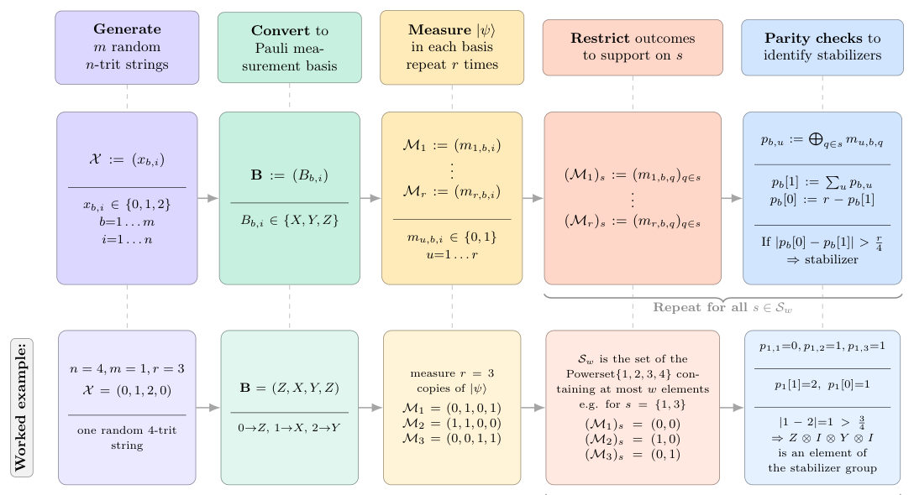
<figcaption class="paper-figure-caption"><b>Fig 1.</b> FIG. 1. Overview of the algorithm which allow us to identify the stabilizer generators of a stabilizer code, given any N codewords. The first 3 steps are explained in further detail in sec. II A and the final 2 in sec. II B.</figcaption>
</figure>

**Summary.** This paper details an algorithm to learn the stabilizer generators of an unknown quantum error correcting code using only random product measurements on multiple copies of the code state. It provides rigorous theoretical bounds showing that this characterization is possible with a polylogarithmic number of measurements for practical codes like qLDPC. This offers a powerful, structure-agnostic tool for verifying and characterizing quantum hardware.

**Why it may be interesting.** While focused on abstract codes, the reliance on product measurements and statistical inference techniques is highly relevant to experimental quantum information processing, particularly in characterizing noisy quantum hardware.

Detailed structure

**Main problem.** The core challenge is efficiently characterizing unknown quantum error correcting codes, specifically by learning their defining stabilizer generators.

**Main result.** The authors present an algorithm that can learn these generators using only random single-qubit measurements on $N$ copies of the code state, requiring only a polylogarithmic number of states for qLDPC codes.

**Method.** The method involves using random product measurements on multiple copies of the state and performing parity checks on the measurement outcomes to statistically identify the commuting Pauli operators that form the stabilizer group.

**Model / system.** The focus is on stabilizer codes, which are central to fault-tolerant quantum computation. The analysis is particularly applied to quantum Low-Density Parity-Check (qLDPC) codes.

**Key observables.** The primary observables are the measurement outcomes (parity checks) from multiple copies of the state, used to determine the stabilizer generators $G_1, \dots, G_g$.

**Important parameters / regimes.** Key parameters include $N$ (number of copies), $n$ (number of qubits), $g$ (number of generators), and the error probability $p$ associated with the depolarizing channel.

**Assumptions / limitations.** The analysis assumes the error model is a depolarizing channel and relies on deriving lower bounds for $N$ based on statistical confidence intervals (e.g., Chernoff bounds).

**Figures summary.** Figures illustrate the overall algorithm flow, detailing steps from generating random measurement bases to performing parity checks to identify potential stabilizer generators, with examples shown for small qubit systems.

**Paper structure.** The paper introduces the problem, details the measurement process (Algorithm 1), presents the procedure for identifying generators via parity checks (Algorithm 2), and provides rigorous proofs establishing the required number of copies ($N$) and the overall success probability.

Abstract

Efficiently characterizing quantum error correcting codes is a key challenge on the path to fault-tolerant quantum computation. Stabilizer codes, a central class of such codes, are defined by a set of stabilizer generators. Here, we present an algorithm that uses random single-qubit measurements to learn the stabilizer generators of any stabilizer code from $N$ copies of stabilizer states in its codespace, requiring no prior knowledge of the code's structure. This also enables verification that a device implements its intended code. We derive a lower bound on $N$ needed to recover the stabilizer generators with high probability, together with a bound on the algorithm's overall probability of success. When applied to quantum low-density parity-check (qLDPC) codes, a leading candidate for practical fault-tolerant architectures, our approach requires a number of states that scales polylogarithmically with $n$, the number of qubits.

[↑ back to top](#top)

### [SAR and InSAR Change Detection with Quantum Generative Models](http://arxiv.org/abs/2609.05313v1)

**Authors:** Samwel K. Sekwao, Shaunak De, Alexis Hocken, Scott Staniewicz, Evgeny Epifanovsky, Craig Stringham, Gordon Farquharson, Martin Roetteler, Panagiotis Kl. Barkoutsos, Jason Iaconis  
**Type:** both · **Category:** other · **PDF:** <https://arxiv.org/pdf/2609.05313v1>  
**Analysis basis:** full PDF text, analyzed in chunks
**Topic relevance:** `QC/QI experiment` **3/5**

↔ Scroll figures horizontally

<figure class="paper-figure-card">
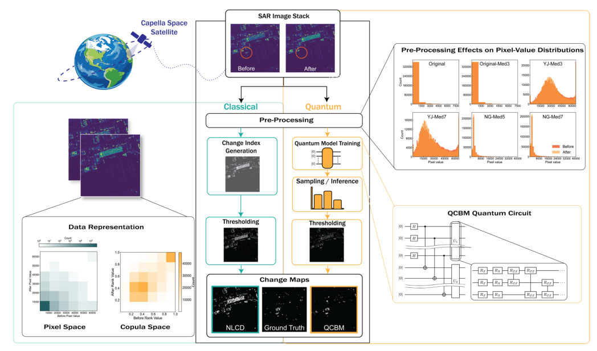
<figcaption class="paper-figure-caption"><b>Fig 1.</b> Figure 1: Overview schematic of classical and quantum pipelines for processing a given before and after SAR image stack acquired from Capella Space Satellite. Pixel-value distributions of the before and after images for the different preprocessing configurations of the Miramar1 dataset. The original Miramar1 and median-filtered (Med)/non-Gaussian (NG)transformed datasets exhibit strongly non-Gaussian distributions, whereas the Yeo–Johnson (YJ) transformed datasets exhibit more Gaussian-like distributions. The histograms and heatmaps illustrate the effect of preprocessing on the statistical characteristics of the before and after image pixels. The quantum circuits used in the QCBM method are...</figcaption>
</figure>
<figure class="paper-figure-card">
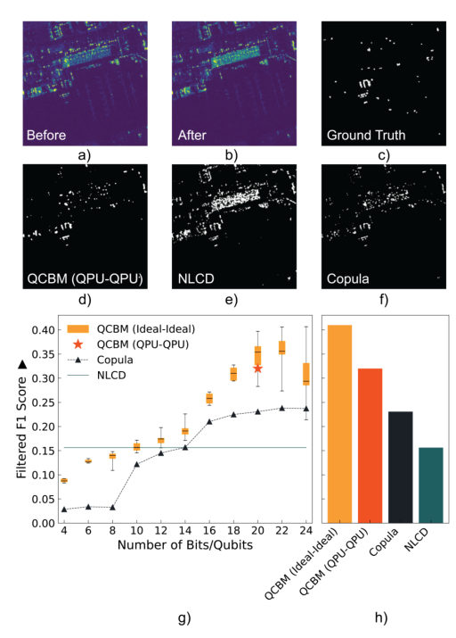
<figcaption class="paper-figure-caption"><b>Fig 2.</b> Figure 2: Qualitative comparison of change-detection re- sults for the non-Gaussian Miramar1-Med3 dataset. The top row shows the a) before image, b) after image, and c) ground-truth change mask, while the middle row shows the masks generated by d) QCBM, e) NLCD, and f) Cop- ula. The QCBM training and inference were both per- formed on IonQ’s Forte-Enterprise QPU. g) Filtered F1 scores for QCBM (training and inference performed with an ideal simulator), Copula, and NLCD at varying num- ber of bits vs qubits for the Miramar1-Med3 dataset. h) Comparison of the best F1 scores for models trained with 20 bits/qubits.</figcaption>
</figure>
<figure class="paper-figure-card">
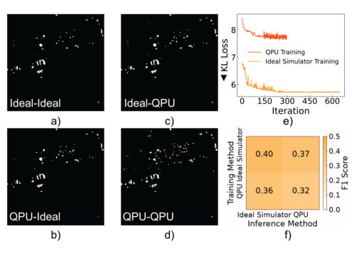
<figcaption class="paper-figure-caption"><b>Fig 3.</b> Figure 3: Effect of QPU execution on QCBM training and inference for image change detection on Miramar1-Med3 dataset. The change masks and corresponding filtered F1 scores compare four combinations of ideal-simulator and QPU training and inference (a-d). For QPU execution, training was performed on IonQ’s Forte QPU, whereas in- ference was performed on IonQ’s Forte-Enterprise QPU. e) The KL-loss curves compare the convergence behavior of ideal-simulator and QPU training, while f) the heatmap summarizes the filtered F1 scores across the four configu- rations.</figcaption>
</figure>
<figure class="paper-figure-card">
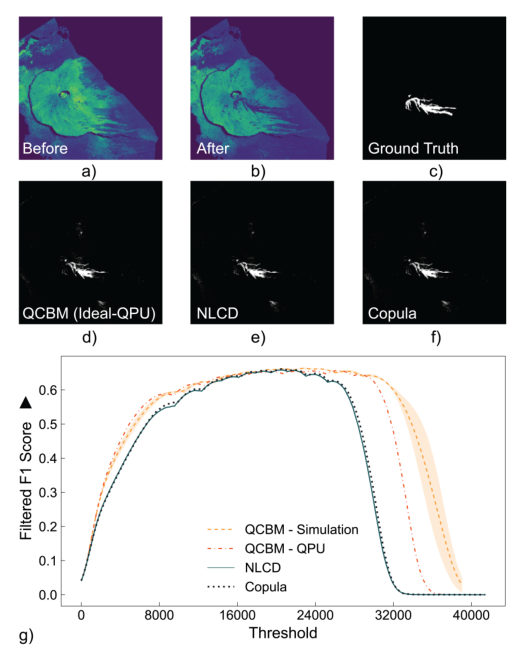
<figcaption class="paper-figure-caption"><b>Fig 4.</b> Figure 4: InSAR volcano lava flow change detection with QCBM and classical baselines. a) Before and b) after In- SAR images are shown with the c) ground-truth change mask and the masks generated by d) QCBM, e) NLCD and f) Copula. The QCBM was trained on an ideal quan- tum simulator with inference performed on IonQ’s Forte- Enterprise QPU. g) Threshold dependence of InSAR lava- flow change-detection performance. F1 score after uni- form filtering as a function of the detection threshold for QCBM, NLCD and Copula on the InSAR lava-flow dataset. The ideal-simulator QCBM curve shows the mean over 10 independent training runs, with the shaded band indicating one standard deviation.</figcaption>
</figure>

**Summary.** This paper applies quantum machine learning to enhance change detection in satellite radar imagery (SAR/InSAR). It replaces traditional, statistically limited background estimators with a Quantum Circuit Born Machine (QCBM) trained on the joint distribution in Copula space. The results show that this quantum approach substantially improves detection accuracy, particularly for noisy or sparse real-world data, demonstrating practical feasibility on trapped-ion quantum hardware.

**Why it may be interesting.** While the application is remote sensing, the core methodology involves using parameterized quantum circuits (QCBMs) to model complex, high-dimensional, correlated probability distributions (Copulas), which is a key area in quantum machine learning.

Detailed structure

**Main problem.** The core problem is improving change detection in SAR/InSAR imagery, which is limited by background estimators that fail when observed pixel statistics are sparse.

**Main result.** The Quantum Circuit Born Machine (QCBM) significantly outperforms classical baselines, especially when image statistics are sparse, demonstrating feasibility on trapped-ion hardware.

**Method.** The authors replace empirical conditional expectation estimators with a generative model sampled from a QCBM trained in Copula space.

**Model / system.** The system involves processing SAR/InSAR image pairs (before/after) using quantum circuits implemented on IonQ trapped-ion processors. The QCBM learns the joint distribution of pixel intensities in Copula space.

**Key observables.** Filtered F1 score (for change detection masks), and the performance comparison between QCBM, classical estimators (NLCD, Copula), and hardware execution fidelity.

**Important parameters / regimes.** Sub-meter resolution, heavy-tailed marginals, $n$-qubit registers, and the number of measurement shots (e.g., 100,000 for inference).

**Assumptions / limitations.** The approach assumes modeling the joint distribution via its copula, and performance comparisons are made against classical methods under various preprocessing assumptions.

**Figures summary.** Figures compare qualitative change-detection masks for non-Gaussian data and illustrate the performance drop when moving from ideal quantum simulation to actual QPU execution.

**Paper structure.** The paper introduces the problem, proposes the QCBM replacement for background estimation, details the quantum circuit training/inference process, and validates the method using multiple real-world SAR/InSAR datasets.

Abstract

Change detection in synthetic aperture radar (SAR) and interferometric synthetic aperture radar (InSAR) underpins disaster response, infrastructure monitoring and land-use enforcement. Detection is limited by the background estimator, which conventionally forms a conditional expectation directly from observed pixel statistics and degrades where those statistics are sparse, including the regime produced by the heavy-tailed marginals of sub-meter-resolution radars. In this work, we integrate state-of-the-art satellite imagery with quantum machine learning on IonQ trapped-ion-based quantum processors. By replacing the empirical conditional with a quantum circuit Born machine (QCBM)-sampled generative model in Copula space, we substantially improve change detection on sparse real-world images. On Capella Space satellite image acquisitions, the generative estimator matches conventional methods when the observed statistics are adequate, and substantially outperforms them when they are not. Executing the trained model on IonQ trapped-ion based hardware reproduces the results of the ideal and noisy simulations and demonstrates up to par, or even better, performance with the classical state-of-the-art methods. For a SAR dataset of an airport, QPU circuit evaluations for both training and inference achieved a maximized filtered F1 score of 0.32, compared with 0.16 and 0.24 for the two classical baselines. For an InSAR dataset of a volcanic lava flow, all three methods reached a maximum filtered F1 of approximately 0.66. These experiments demonstrate the feasibility of executing a QCBM-based background estimator on trapped-ion hardware. We further demonstrate that the QCBM method successfully extends to interferometric coherence data, achieving performance comparable to classical approaches.

[↑ back to top](#top)

### [Shapley Valuation of Finite-Copy Quantum Data Depends on Physical Access](http://arxiv.org/abs/2609.04788v1)

**Authors:** Qipeng Qian, Yuntao Qian  
**Type:** theory · **Category:** quantum information and computing · **PDF:** <https://arxiv.org/pdf/2609.04788v1>  
**Analysis basis:** full PDF text, analyzed in chunks
**Topic relevance:** `quantum measurements` **3/5**

↔ Scroll figures horizontally

<figure class="paper-figure-card">
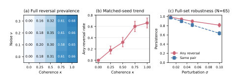
<figcaption class="paper-figure-caption"><b>Fig 1.</b> FIG. 1. Access-induced ranking reversals and their robustness. (a) Reversal prevalence across coherence κ and depolarizing noise ν. (b) The matched-seed trend as coherence increases. (c) Persistence of the 65 baseline reversal instances under increasing perturbation strength σ, reporting both re- tention of any reversal and retention of the same reversed contributor pair. Error bars represent 95% instance-bootstrap confidence intervals.</figcaption>
</figure>
<figure class="paper-figure-card">
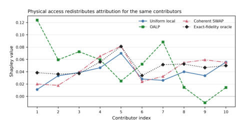
<figcaption class="paper-figure-caption"><b>Fig 2.</b> FIG. 2. Physical access redistributes attribution for the same contributors. Shapley values of the 10 fixed TFIM contributors under uniform local Pauli access, observable- aware local Pauli access (OALP), coherent reference-assisted SWAP access, and the exact-feature oracle. All methods use the same contributors, quantum states, feature coordinates, learner, and coalition definitions; only the physical procedure used to obtain the features is changed.</figcaption>
</figure>
<figure class="paper-figure-card">
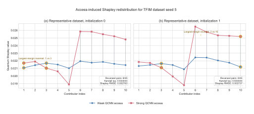
<figcaption class="paper-figure-caption"><b>Fig 3.</b> FIG. 4. Access-induced Shapley redistribution in a representative QCNN dataset. Weak and Strong QCNN Shapley values for TFIM dataset seed 5 under two matched initialization schedules. The highlighted pair in each panel is the largest-margin ranking reversal for that initialization.</figcaption>
</figure>
<figure class="paper-figure-card">
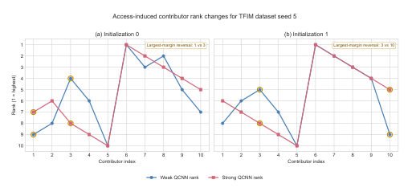
<figcaption class="paper-figure-caption"><b>Fig 4.</b> FIG. 5. Physical pooling access changes contributor rankings. The same seed-5 Shapley vectors are converted to contributor ranks, with rank one placed at the top. Cross- ings between the Weak and Strong rank curves make the access-induced ordering changes explicit under both matched initializations.</figcaption>
</figure>
<figure class="paper-figure-card">
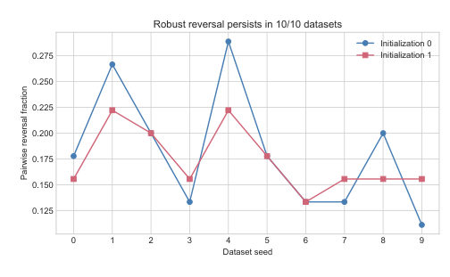
<figcaption class="paper-figure-caption"><b>Fig 5.</b> FIG. 6. Access-induced ranking reversals persist across datasets and initializations. Pairwise Weak–Strong re- versal fractions for all 10 pre-specified TFIM datasets under two matched QCNN initialization schedules. Every dataset contains at least one non-near-tie reversal under each initial- ization.</figcaption>
</figure>

**Summary.** This work introduces an access-aware Shapley valuation framework for quantum data, recognizing that the value of quantum states depends on how they can be physically measured. It proves that changing the allowed measurement protocols (physical access model) directly alters the Shapley attribution of value among data contributors. This establishes that quantum data value is an emergent property of the entire physical process, not just the initial quantum state.

**Why it may be interesting.** It provides a rigorous theoretical framework for understanding how physical limitations (measurement constraints) fundamentally alter the perceived utility and attribution of quantum information, which is crucial for quantum machine learning applications.

Detailed structure

**Main problem.** The paper addresses how the value assigned to finite-copy quantum data changes when the physical access model—the allowed measurement protocols—is altered.

**Main result.** Quantum data value is not an intrinsic property of the states alone; rather, it emerges from the complex interaction between the quantum states, the physical access model, and the downstream learning task.

**Method.** The authors develop an access-aware Shapley valuation framework, establishing exact mathematical connections between physical-access advantages and the resulting attribution shifts in the Shapley value vector.

**Model / system.** The system involves finite-copy quantum data (unknown quantum states $
ho_{	heta, S}$) supplied by multiple contributors, processed under a specific physical access model $R$ (a set of allowed quantum measurements).

**Key observables.** Shapley value ($\phi$), Physical-Access Advantage ($\delta$), and the Shapley Shift Vector ($\Delta_{R 	o R'}$).

**Important parameters / regimes.** The physical access model $R$, the set of contributors $N$, and the downstream learning task $t$.

**Assumptions / limitations.** The analysis assumes that access models share the same optimal no-data risk ($R_{\emptyset}$) and that the comparison is made by varying the physical access protocols while keeping the underlying states and task fixed.

**Figures summary.** Not specified, but numerical experiments are mentioned to demonstrate that identical quantum samples receive different values based only on the physical access model.

**Paper structure.** The paper follows a structure of defining the setting, developing the core theory (including theorems on nested and arbitrary access models), deriving operational representations, and concluding with numerical validation.

Abstract

Data valuation asks how learning utility should be attributed to training data contributors. Most classical formulations begin after data have become reusable records, so the physical readout of the data is effectively fixed. Finite-copy quantum data are different: unknown states are consumable physical systems, and the same supplied states and downstream task can yield different Shapley values under different physical access models. Our framework makes this dependence explicit by treating physical access as a component of quantum data valuation itself. We establish an exact connection between physical-access advantage and contributor-level data valuation. For nested access models, we prove that the maximal downstream utility gain enabled by richer physical access exactly determines the largest symmetric Shapley ranking-reversal margin. More generally, for arbitrary access-model pairs, including non-nested ones, we derive an exact geometric characterization of the possible shifts of the full Shapley attribution vector. For fixed learning pipelines, we further obtain an operational Shapley-observable representation for finite-copy valuation. Numerical experiments demonstrate that identical quantum samples can receive different values and rankings when only the physical access model is changed. These results establish that quantum data value is not an intrinsic property of the underlying states alone, but emerges from the interaction between quantum states, physical access, and the downstream learning task.

[↑ back to top](#top)

### [SIC dimension towers via cyclotomic polynomials](http://arxiv.org/abs/2609.04431v1)

**Authors:** Gary McConnell  
**Type:** theory · **Category:** other · **PDF:** <https://arxiv.org/pdf/2609.04431v1>  
**Analysis basis:** full PDF text, analyzed in chunks
**Topic relevance:** `quantum measurements` **3/5**

↔ Scroll figures horizontally

<figure class="paper-figure-card">
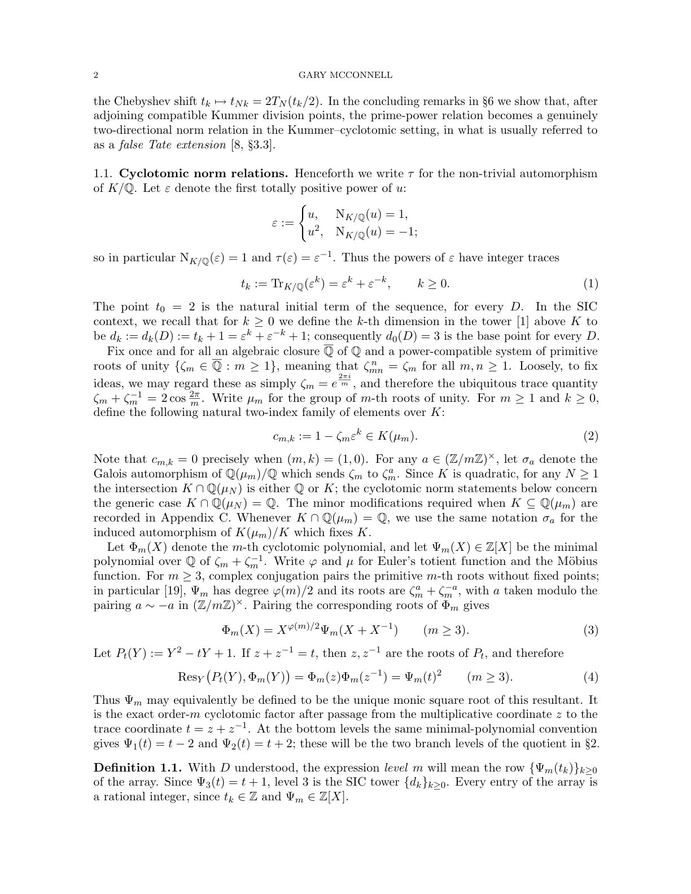
<figcaption class="paper-figure-caption"><b>Fig 1.</b> Low-resolution page preview, page 2</figcaption>
</figure>
<figure class="paper-figure-card">
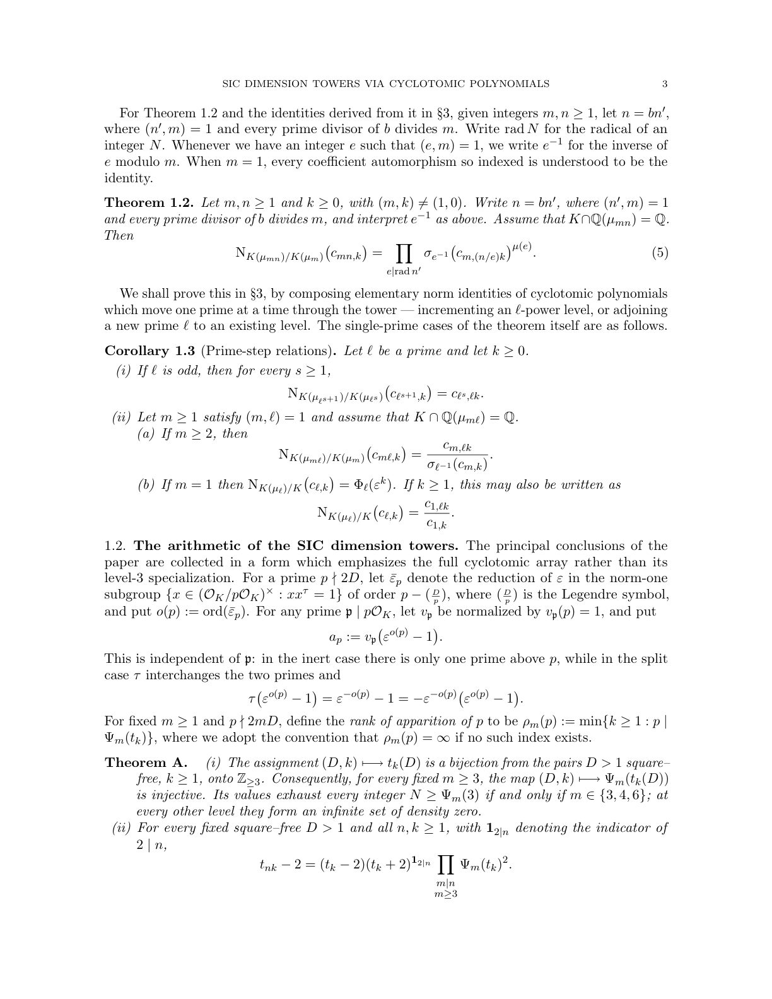
<figcaption class="paper-figure-caption"><b>Fig 2.</b> Low-resolution page preview, page 3</figcaption>
</figure>
<figure class="paper-figure-card">
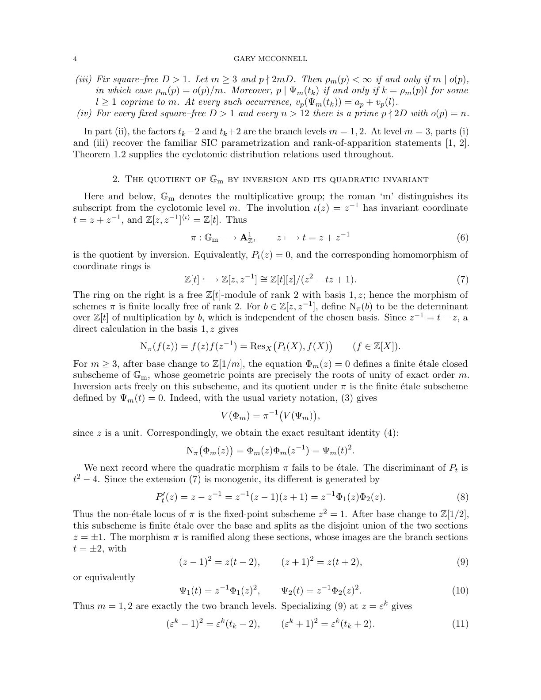
<figcaption class="paper-figure-caption"><b>Fig 3.</b> Low-resolution page preview, page 4</figcaption>
</figure>
<figure class="paper-figure-card">
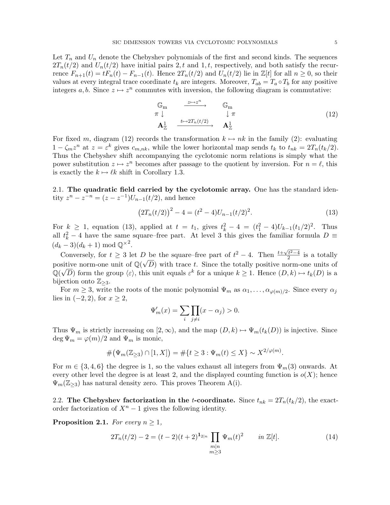
<figcaption class="paper-figure-caption"><b>Fig 4.</b> Low-resolution page preview, page 5</figcaption>
</figure>
<figure class="paper-figure-card">
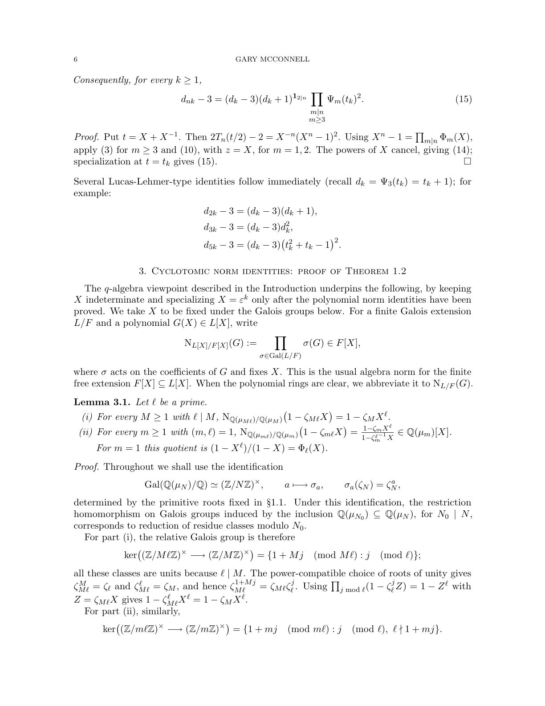
<figcaption class="paper-figure-caption"><b>Fig 5.</b> Low-resolution page preview, page 6</figcaption>
</figure>

**Summary.** This paper establishes a deep number-theoretic structure theorem for the dimension towers arising from the SIC-POVM conjecture over a real quadratic field. It embeds this quantum-related problem into the framework of cyclotomic arrays, relating it to advanced topics like Leopoldt's conjecture and $p$-adic L-functions. The work uses sophisticated tools from algebraic number theory to reveal underlying arithmetic symmetries.

**Why it may be interesting.** While highly abstract, the connection between quantum information concepts (SIC-POVM) and deep number theory (cyclotomic fields, $p$-adic L-functions) suggests potential arithmetic constraints on quantum system parameters.

Detailed structure

**Main problem.** The paper proves a structure theorem for dimension towers arising from the number-theoretic formulation of Zauner's SIC-POVM conjecture over a real quadratic field.

**Main result.** The SIC dimension tower is shown to be the level $m=3$ row of an infinite two-dimensional cyclotomic array, linking the conjecture to broader arithmetic contexts like Leopoldt's conjecture.

**Method.** The analysis heavily employs algebraic number theory, utilizing cyclotomic polynomials, field norms, and $p$-adic valuations to establish deep structural identities.

**Model / system.** The theoretical framework centers on the SIC-POVM conjecture, analyzed using algebraic structures derived from a real quadratic field $K=\mathbb{Q}(\sqrt{D})$ and its associated cyclotomic extensions.

**Key observables.** The SIC dimension tower $\{d_k\}$, the cyclotomic array $\{\Psi_m(t_k)\}$, and the rank of apparition $
ho_m(p)$ are key observables.

**Important parameters / regimes.** The fundamental unit $\varepsilon$ of $K$, the trace $t_k = \varepsilon^k + \varepsilon^{-k}$, and the prime $p$ are critical parameters.

**Assumptions / limitations.** The analysis is most precise away from primes dividing $2mD$, and some results rely on assumptions about the field structure (e.g., $K \cap \mathbb{Q}(\mu_N) = \mathbb{Q}$).

**Paper structure.** The paper builds from establishing the structure of the dimension tower using cyclotomic polynomials, deriving norm identities, and finally applying $p$-adic valuation techniques to relate these structures to $p$-adic L-functions and class number formulas.

Abstract

We prove a structure theorem for the dimension towers~$\{d_k(D)\}_{k\geq0}$ which arise in the number-theoretic formulation of Zauner's SIC-POVM conjecture over a real quadratic field~$K=\Q(\qD)$. If~$\eps$ denotes the first totally positive power of a fundamental unit of~$K$ and $t_k = \eps^k + \eps^{-k}$ the trace of its $k$-th power, then the SIC dimension tower~$\{d_k=1+t_k\}_{k\geq0}$ is the level~$m=3$ row of an infinite two-dimensional cyclotomic array~$\{Ψ_m(t_k)\}_{m\geq1,k\geq0}$ attached to~$K$, while the auxiliary factors~$(d_k+1)$ and $(d_k-3)$ are its ramified levels $m=2$ and $m=1$. Here~$Ψ_m$ denotes the minimal polynomial of~ $ζ_m+ζ_m^{-1} = 2\cos{2π/m}$. This construction arose initially from an attempt to formulate relations among SIC dimensions in $q$-algebraic terms.   The central object is a single closed composite norm relation for the two-parameter family $c_{m,k}=1-ζ_m\eps^k$ over the cyclotomic field tower $\{K(μ_m)\}_{m\geq1}$. This framework sheds new light on the mod-$p$ analogue of Leopoldt's conjecture, by placing the central 3-symmetry of Zauner's conjecture within a broader arithmetic context. Away from the primes dividing~$2mD$, the valuations $v_p(Ψ_m(t_k))$ at every fixed level~$m$ are described exactly in terms of a single local unit valuation, which is then related, through the~$p$-adic class number formula, to the corresponding $p$-adic $L$-value.

[↑ back to top](#top)

### [Anomalous diffusion in porous fractal media](http://arxiv.org/abs/2609.04992v1)

**Authors:** Alexander Iomin, Trifce Sandev  
**Type:** theory · **Category:** statistical mechanics · **PDF:** <https://arxiv.org/pdf/2609.04992v1>  
**Analysis basis:** full PDF text, analyzed in chunks
**Topic relevance:** `Keldysh / 2PI / non-Gaussian methods` **2/5** · `analog quantum simulation` **2/5** · `correlated / nonlocal dissipation` **2/5** · `driven-dissipative phase transition` **2/5** · `methods for driven-dissipative` **2/5** · `non-equilibrium universality` **2/5** · `quantum measurements` **2/5** · `scars & prethermalization` **2/5**

↔ Scroll figures horizontally

<figure class="paper-figure-card">
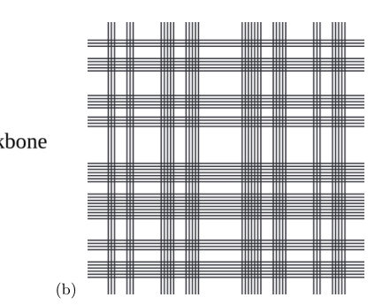
<figcaption class="paper-figure-caption"><b>Fig 1.</b> FIG. 1. Fractal structure development from (a) comb to (b) fractal mesh (Cantor tartan).</figcaption>
</figure>
<figure class="paper-figure-card">
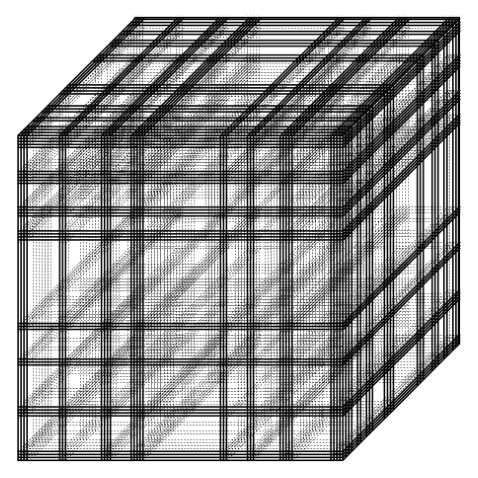
<figcaption class="paper-figure-caption"><b>Fig 2.</b> FIG. 2. A fractal sponge Sα,β,γ = Sα × Sβ × Sγ, which also defines a 3D fractal mesh of the diffusion coefficients matrix Di,j ̸= 0 in eq. (4), if (i, j) = {x, y, z} ∈Sα,β,γ.</figcaption>
</figure>
<figure class="paper-figure-card">
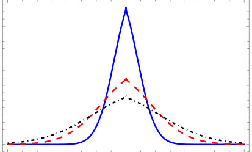
<figcaption class="paper-figure-caption"><b>Fig 3.</b> FIG. 3. PDF (27) for α = β = γ = 0.9 and t = 0.1 (blue solid line), t = 1 (red dashed line) and t = 2 (black dot-dashed line). We set Dx = Dy = Dz = 1.</figcaption>
</figure>
<figure class="paper-figure-card">
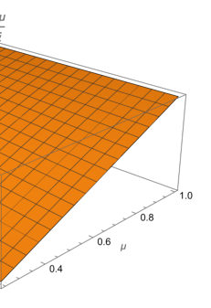
<figcaption class="paper-figure-caption"><b>Fig 4.</b> FIG. 4. Dependence of transport exponent 2µ/¯α on µ and α.</figcaption>
</figure>
<figure class="paper-figure-card">
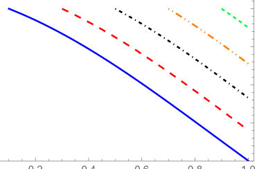
<figcaption class="paper-figure-caption"><b>Fig 5.</b> FIG. 5. Dependence of transport exponent 2µ/¯α on α for df = 2.1 (blue solid line); df = 2.3 (red dashed line); df = 2.5 (black dot-dashed line); df = 2.7 (orange dot-dot-dashed line); df = 2.9 (dotted green line). Here we use df = α + β + γ, with β = γ and Dx = Dy = Dz = 1.</figcaption>
</figure>

**Summary.** This theoretical paper models anomalous diffusion in porous fractal media using a sponge structure derived from Cantor sets. It shows that the resulting diffusion process is described by a generalized Fokker-Planck equation incorporating memory effects and spatial heterogeneity. The analysis relies heavily on advanced mathematical techniques like Laplace transforms and the Fox H-function to determine the scaling behavior of the Mean-Squared Displacement.

**Why it may be interesting.** While focused on classical transport, the mathematical machinery—involving fractional derivatives, memory effects, and generalized diffusion equations—is highly relevant to modeling non-Markovian dynamics in open quantum systems or quantum transport through disordered media.

Detailed structure

**Main problem.** The paper addresses the challenge of modeling anomalous diffusion and heat transport within complex porous fractal media.

**Main result.** The 1D diffusion process in the fractal structure is shown to be governed by a generalized Fokker-Planck equation featuring both a power-law memory kernel and a position-dependent diffusion coefficient.

**Method.** The analysis employs the Laplace transformation to solve the governing diffusion equation, leading to asymptotic and series expansions involving the Fox H-function.

**Model / system.** The system is modeled as a diffusive process within a fractal sponge structure, mathematically defined as the direct product of Cantor sets ($S = S_\alpha 	imes S_eta 	imes S_\gamma$).

**Key observables.** The probability density function (PDF), Mean-Squared Displacement (MSD) ($\langle x^2(t) 
angle$), and the transport exponent are key observables.

**Important parameters / regimes.** Fractal dimensions ($\alpha, eta, \gamma$), the memory kernel parameters ($\mu, ar{\alpha}$), and the time scale ($t$).

**Assumptions / limitations.** The derivation assumes the test function is well-behaved and involves approximations for the final steps, such as zero boundary conditions at infinity for slow transport.

**Figures summary.** Figures illustrate the fractal structure development (comb to fractal mesh), the definition of the sponge structure, and the dependence of the transport exponent and generalized diffusion coefficient on the fractal dimensions.

**Paper structure.** The paper develops the problem by defining the fractal model, deriving the 3D diffusion equation, transforming it into Laplace space, solving for the marginal PDF, and finally analyzing the asymptotic behavior of the solution using the Fox H-function.

Abstract

We suggest a model of a diffusive process inside a fractal sponge structure, which is a generalization of the diffusion processes on a comb and fractal mesh structure. The sponge model is considered as the direct product of Cantor sets. It is shown that the corresponding one-dimensional diffusion process is governed by a generalized Fokker-Planck equation with a power-law memory kernel and a position-dependent diffusion coefficient. That is, the fractal structure of the medium induces memory effects and heterogeneity in the transport system. The considered model may be of interest to describe anomalous heat transport in porous fractal media.

[↑ back to top](#top)

### [Breakdown of the Overdamped Approximation in Fluctuating Environments](http://arxiv.org/abs/2609.04668v1)

**Authors:** Kazuki Fukutani, Takuma Akimoto  
**Type:** theory · **Category:** statistical mechanics · **PDF:** <https://arxiv.org/pdf/2609.04668v1>  
**Analysis basis:** full PDF text, analyzed in chunks
**Topic relevance:** `Keldysh / 2PI / non-Gaussian methods` **2/5** · `methods for driven-dissipative` **2/5** · `Frenkel-Kontorova` **1/5** · `correlated / nonlocal dissipation` **1/5** · `driven-dissipative phase transition` **1/5** · `non-equilibrium universality` **1/5** · `quantum measurements` **1/5**

↔ Scroll figures horizontally

<figure class="paper-figure-card">
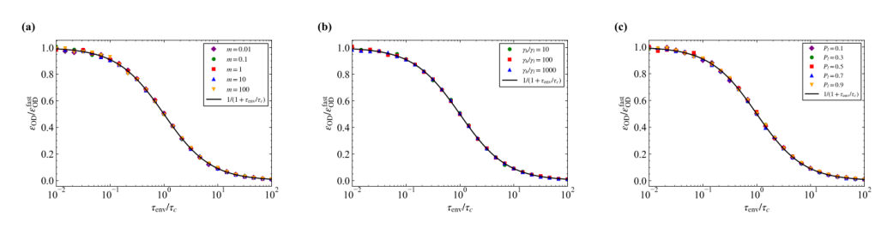
<figcaption class="paper-figure-caption"><b>Fig 1.</b> FIG. 1. Normalized relative error εOD/εfast OD of the overdamped approximation as a function of the normalized environmental relaxation time τenv/τc. (a) Variation with the particle mass m. (b) Variation with the friction ratio γh/γl. (c) Variation with the stationary low-friction-state probability Pl. Solid lines show the theoretical prediction [1 + τenv/τc]−1 from Eq. (62), while symbols show simulation results. In all three cases, the data collapse onto the same crossover function.</figcaption>
</figure>
<figure class="paper-figure-card">
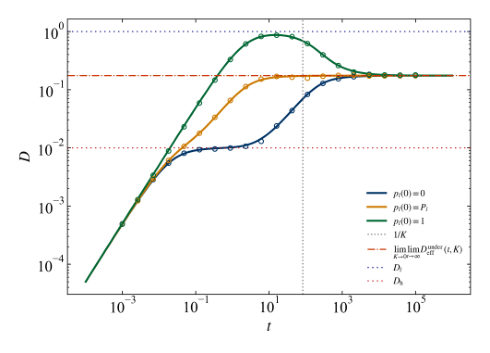
<figcaption class="paper-figure-caption"><b>Fig 2.</b> FIG. 2. Finite-time underdamped effective diffusion coeffi- cient Dunder eff (t, K) in the slow-switching regime for three ini- tial occupation probabilities, pl(0) = 0, Pl, and 1. The pa- rameters are γl = 1, γh = 100, m = kBT = 1, Pl = 1/6, Ph = 5/6, τl = 100, τh = 500, and K = 1.2×10−2. Solid lines show the theoretical results and symbols show simulations. At times shorter than the environmental relaxation time K−1, the curves retain a strong dependence on the initial occu- pation and approach the corresponding frozen-environment behavior predicted by Eq. (74). For t ≳K−1, environmen- tal switching progressively erases the initial-state dependence, and all curves converge toward the...</figcaption>
</figure>
<figure class="paper-figure-card">
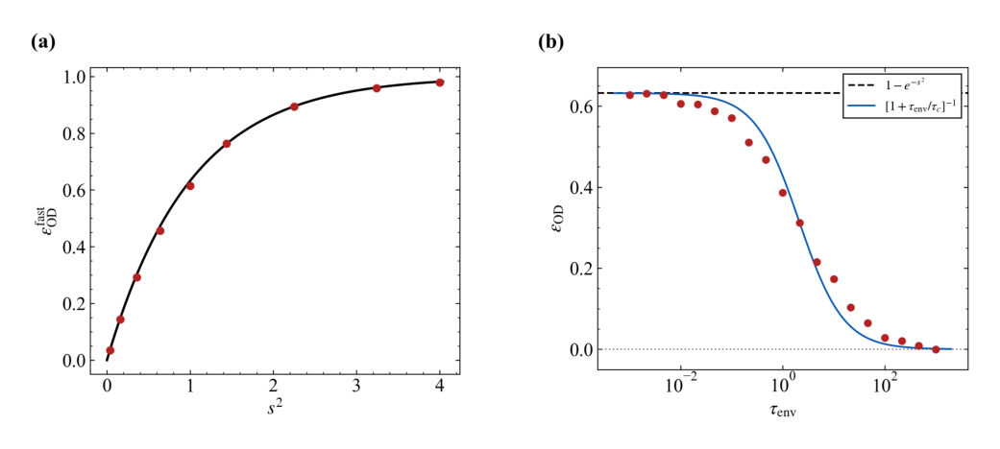
<figcaption class="paper-figure-caption"><b>Fig 3.</b> FIG. 3. (a) Fast-fluctuation relative error εfast OD for the log-Ornstein–Uhlenbeck friction as a function of the variance s2 = Var[ln γ] (µ = 0 and τenv = 10−3). The solid line shows the general fast-fluctuation prediction εfast OD = 1 −e−s2 from Eq. (92), and symbols show numerical simulations. The agreement demonstrates that the persistent overdamped discrepancy is not specific to dichotomous switching. (b) Crossover of the relative error εOD with the environmental timescale τenv for the log-Ornstein– Uhlenbeck friction at fixed s = 1 and µ = 0. As τenv →∞, the velocity has sufficient time to relax within each frictional environment, so that both descriptions reduce to kBT⟨γ−1⟩eq and εOD...</figcaption>
</figure>

**Summary.** This theoretical paper analyzes when the standard overdamped approximation fails for Brownian motion in environments where the friction coefficient fluctuates rapidly. By comparing the long-time diffusion coefficients derived from both underdamped and overdamped descriptions, the authors prove that these two limits yield different results when environmental fluctuations are fast. This establishes a timescale-dependent criterion for the validity of the overdamped limit in heterogeneous media.

**Why it may be interesting.** This work provides a rigorous, non-trivial extension to the standard Smoluchowski limit, which is crucial for understanding non-equilibrium dynamics in complex, fluctuating media relevant to biological or soft matter physics.

Detailed structure

**Main problem.** The paper investigates the breakdown of the standard overdamped approximation when the friction coefficient governing Brownian motion fluctuates in time due to the environment.

**Main result.** The effective diffusion coefficients derived from underdamped and overdamped descriptions differ significantly in the fast-fluctuation limit, demonstrating a non-commutativity between environmental averaging and inertial elimination.

**Method.** The authors derive and compare the long-time effective diffusion coefficients by analyzing the underdamped and overdamped Langevin dynamics separately, using state-resolved correlation functions for Markovian friction processes.

**Model / system.** The model considers a one-dimensional Brownian particle subject to a time-dependent friction coefficient $\gamma(t)$, which can be modeled as a two-state Markov process or a continuous log-Ornstein-Uhlenbeck process.

**Key observables.** Effective diffusion coefficient ($D_{	ext{eff}}$), state-resolved velocity correlations, and the crossover time ($	au_c$).

**Important parameters / regimes.** The ratio of environmental switching time to velocity relaxation time ($\Theta$), and the characteristic crossover time ($	au_c$).

**Assumptions / limitations.** The fluctuation-dissipation relation is satisfied instantaneously for every realization of the fluctuating friction coefficient $\gamma(t)$.

**Figures summary.** Figures illustrate the relative error in the overdamped approximation versus the ratio of environmental relaxation time to the crossover time, showing the crossover behavior.

**Paper structure.** The paper first establishes the general comparison between underdamped and overdamped dynamics. It then specializes to the two-state Markov friction, deriving the finite-time crossover exactly. Finally, it extends the analysis to general stationary processes, including the log-Ornstein-Uhlenbeck environment, to determine the crossover time.

Abstract

The overdamped approximation is widely used to describe Brownian motion in complex environments, but its validity becomes nontrivial when the friction coefficient itself fluctuates in time. We investigate this problem by comparing underdamped and overdamped Langevin dynamics subject to the same fluctuating friction and satisfying the fluctuation--dissipation relation at a common temperature. We show that environmental averaging and inertial elimination generally lead to different long-time transport when environmental fluctuations are fast compared with velocity relaxation. For rapidly fluctuating friction, the underdamped dynamics is governed by the arithmetic mean friction and yields $D_{\rm eff}^{\rm under}=k_{\rm B}T/\langleγ\rangle$, whereas the overdamped dynamics gives $D_{\rm eff}^{\rm over}=k_{\rm B}T\langleγ^{-1}\rangle$. For a two-state Markov friction, we derive the finite-time effective diffusion coefficient exactly and identify the full crossover between these two regimes, controlled by the competition between velocity relaxation and environmental switching. We further establish the fast-fluctuation result for general stationary friction processes and verify it for a continuous log-Ornstein--Uhlenbeck environment, for which the characteristic crossover time can also be determined independently. Our results reveal a noncommutativity between environmental averaging and inertial elimination, establish a timescale-dependent criterion for the validity of overdamped dynamics in temporally heterogeneous environments, and show that rapid environmental fluctuations can enhance, rather than suppress, the consequences of inertia.

[↑ back to top](#top)

### [Analytical model for polarization transfer during gas-phase collision events in spin-exchange optical pumping: Spin-$\frac{1}{2}$ $^{129}$Xe versus spin-$\frac{3}{2}$ $^{131}$Xe](http://arxiv.org/abs/2609.04743v1)

**Authors:** Perttu Hilla, Rajgowrav Cheenikundil, Juha Vaara  
**Type:** theory · **Category:** other · **PDF:** <https://arxiv.org/pdf/2609.04743v1>  
**Analysis basis:** full PDF text, analyzed in chunks
**Topic relevance:** `Keldysh / 2PI / non-Gaussian methods` **2/5** · `methods for driven-dissipative` **2/5** · `quantum measurements` **2/5** · `correlated / nonlocal dissipation` **1/5** · `driven-dissipative phase transition` **1/5**

↔ Scroll figures horizontally

<figure class="paper-figure-card">
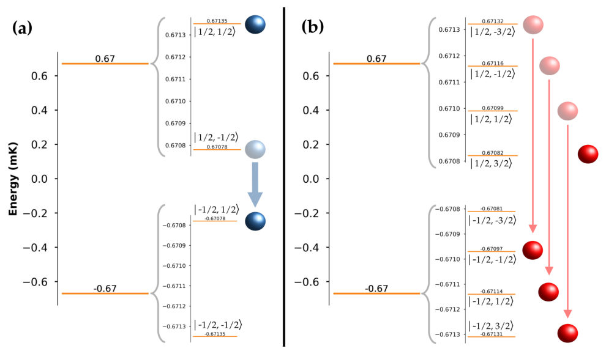
<figcaption class="paper-figure-caption"><b>Fig 1.</b> FIG. 1. Energy level diagrams of the (a) electron-129Xe and (b) electron-131Xe spin systems with the spin states denoted as |mS, mK⟩, using the energy eigenvalues of the spin Hamiltonian including the electron and nuclear Zeeman interactions at a magnetic field of B = 1 mT. The hyperfine-allowed ˆS± ˆK∓flip-flop transitions are shown as arrows between the initial states implied by Eq. (6) (transparent spheres) and the final states (solid spheres). The thickness of the arrows illustrates the relative magnitudes of the HFCs of the two isotopes.</figcaption>
</figure>
<figure class="paper-figure-card">
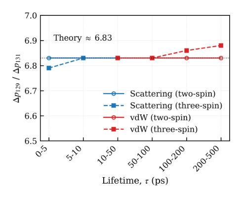
<figcaption class="paper-figure-caption"><b>Fig 2.</b> FIG. 2. Simulated polarization transfer ratios from Table I for scattering and vdW events, in the two- and three-spin models (with and without the 87Rb nuclear spin). The dotted line indicates the theoretical prediction of 6.83.</figcaption>
</figure>
<figure class="paper-figure-card">
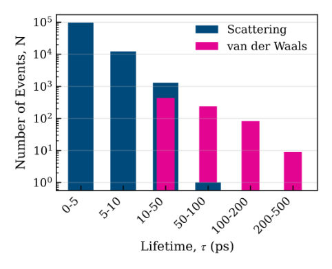
<figcaption class="paper-figure-caption"><b>Fig 3.</b> FIG. 3. Distribution of Rb-Xe collision event lifetimes for the scattering and vdW event categories.</figcaption>
</figure>

**Summary.** This paper develops an analytical model to predict how spin polarization is transferred to noble gas nuclei during gas-phase collisions via Spin-Exchange Optical Pumping. By analyzing the time evolution of the spin density operator, the authors derive a general result applicable to different nuclear spins, predicting a distinct polarization transfer efficiency ratio between $^{129}	ext{Xe}$ and $^{131}	ext{Xe}$. The model is rigorously tested against advanced numerical simulations.

**Why it may be interesting.** This work is highly relevant as it tackles the open quantum system dynamics of spin polarization transfer, requiring advanced techniques from quantum optics and open quantum system theory (e.g., master equations, time evolution operators) applied to fundamental atomic/molecular interactions.

Detailed structure

**Main problem.** To develop a rigorous theoretical model for the polarization transfer efficiency during gas-phase collision events in Spin-Exchange Optical Pumping (SEOP), specifically comparing spin-1/2 $^{129}	ext{Xe}$ and spin-3/2 $^{131}	ext{Xe}$.

**Main result.** The analytical model predicts a polarization transfer ratio of $\Delta p_{129}/\Delta p_{131} \approx 6.83$, suggesting $^{131}	ext{Xe}$ experiences significantly less polarization transfer than $^{129}	ext{Xe}$ under idealized conditions.

**Method.** The analysis uses the Baker-Campbell-Hausdorff expansion on the time evolution of the spin density operator, deriving the polarization transfer as a power series in the hyperfine coupling constant and collision time.

**Model / system.** The system involves the interaction between optically polarized alkali-metal atoms and noble gas nuclei ($	ext{Xe}$) during gas-phase collisions, governed by the hyperfine coupling Hamiltonian. The model is extended to handle arbitrary nuclear spin $I$ and is validated against detailed numerical multiscale simulations.

**Key observables.** Xe nuclear spin polarization level ($p_K(	au)$), and the ratio of polarization transfer ($\Delta p_{129}/\Delta p_{131}$).

**Important parameters / regimes.** Hyperfine coupling constants ($A_K$), collision lifetime ($	au$), and the nuclear spin quantum numbers ($I=1/2$ vs $I=3/2$).

**Assumptions / limitations.** The model neglects spin relaxation processes and assumes the leading-order quadratic term in the BCH expansion is dominant for short-lived collisions.

**Figures summary.** Figure 1 illustrates the energy level diagrams for electron-$^{129}	ext{Xe}$ and electron-$^{131}	ext{Xe}$ spin systems, detailing hyperfine-allowed flip-flop transitions.

**Paper structure.** The paper first establishes the general theoretical framework using the Liouville-von Neumann equation and the BCH expansion. It then derives the leading-order quadratic term for polarization transfer, applies this to compare $^{129}	ext{Xe}$ and $^{131}	ext{Xe}$, and finally validates the analytical result by comparing it to complex numerical multiscale simulations.

Abstract

Spin-exchange optical pumping (SEOP) is a method for producing spin-hyperpolarized noble gas nuclei, such as 129Xe and 131Xe, which are used in various magnetic resonance applications from fundamental physics to quantum sensing and medical imaging. In SEOP, optically polarized alkali-metal atoms transfer their spin polarization to the noble gas nuclei in gas-phase collision events via the hyperfine coupling (HFC) between the alkali valence electron and the noble gas nucleus. While the polarization transfer physics of spin $I = 1/2$ nuclei, such as 129Xe, is relatively well understood, that of spin $I > 1/2$ nuclei, such as 131Xe ($I = 3/2$), has been far less studied, and no rigorous theoretical model has been presented to date. To this end, we derive a simple analytical model for the upper limit, neglecting relaxation, of the SEOP polarization transfer, applicable to noble gases with arbitrary nuclear spin. Analytical evaluation of the Baker-Campbell-Hausdorff expansion for the time evolution of the spin density operator $\hatρ(t)$ reveals that only even-order terms in the HFC contribute to the polarization transfer, with the leading-order quadratic term being the most significant. We obtain a result similar to that derived for the spin-exchange cross section by Herman [Phys. Rev. 137, A 1062 (1965)], but in a more general framework for the time evolution of $\hatρ(t)$ that is also more familiar to magnetic resonance researchers. The model is applied to understand the difference in the polarization transfer efficiency between 129Xe and 131Xe, yielding results in agreement with previous experiments. We also validate the model by comparison to detailed numerical multiscale simulations of the SEOP process, where full quantum-chemically computed spin Hamiltonians sampled from molecular dynamics simulations of the gas-phase collision events are used to propagate the spin dynamics.

[↑ back to top](#top)

### [Low-Dimensional Phase Diagram of Higher-Order Networked Systems](http://arxiv.org/abs/2609.04692v1)

**Authors:** Jia-Jie Qin, Jack Murdoch Moore, Xiaozhu Zhang, Gang Yan  
**Type:** theory · **Category:** statistical mechanics · **PDF:** <https://arxiv.org/pdf/2609.04692v1>  
**Analysis basis:** full PDF text, analyzed in chunks
**Topic relevance:** `analog quantum simulation` **2/5** · `driven-dissipative phase transition` **2/5** · `non-equilibrium universality` **2/5** · `Keldysh / 2PI / non-Gaussian methods` **1/5** · `methods for driven-dissipative` **1/5**

↔ Scroll figures horizontally

<figure class="paper-figure-card">
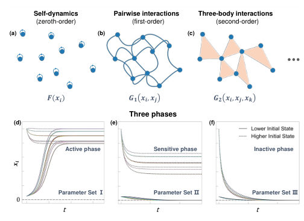
<figcaption class="paper-figure-caption"><b>Fig 1.</b> FIG. 1. Higher-order networks and three dynamical phases. (a–c) Interaction orders representing self-dynamics (zeroth order), pairwise (first order) and three-body (second order) couplings. (d–f) Under three representative parameter sets, the system evolves to distinct steady states depending on initial conditions, illustrating active, sensitive, and inactive phases.</figcaption>
</figure>
<figure class="paper-figure-card">
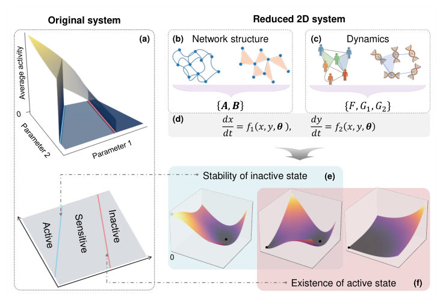
<figcaption class="paper-figure-caption"><b>Fig 2.</b> FIG. 2. Dimension reduction framework for higher-order networked systems. Starting from a higher-order network (b) and the associated dynamical process (c), our framework reduces the networked dynamics to an effective two-dimensional system (d). This reduction allows to analyze the stability of inactive state (e) and the existence of active state (f), determing the boundaries among active, sensitive, and inactive phases thereby yielding the full phase diagram (a).</figcaption>
</figure>
<figure class="paper-figure-card">
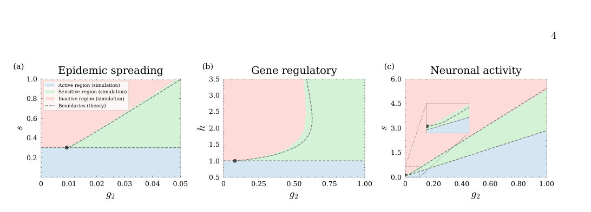
<figcaption class="paper-figure-caption"><b>Fig 3.</b> FIG. 3. Phase diagrams for three representative dynamics on higher-order networks. The inactive (red), sensitive (green), and active (blue) regions obtained from numerical simulations for (a) epidemic spreading dynamics on a high-school contact network (N = 180 nodes, L1 = 2, 220 edges, L2 = 3, 000 triangles) [41] with g1 = 0.01; (b) gene-regulatory dynamics on the yeast protein–protein interaction network (N = 1, 647 nodes, L1 = 5, 036 edges, L2 = 212 triangles) [42] with a = 1, g1 = 0.5, s = 7; (c) neuronal dynamics on a brain white-matter connectivity network (N = 906 nodes, L1 = 2, 225 edges, L2 = 1, 273 triangles) [43] with δ = 1, ζ = 2, g1 = 0.1. Dashed lines represent the theoretical...</figcaption>
</figure>
<figure class="paper-figure-card">
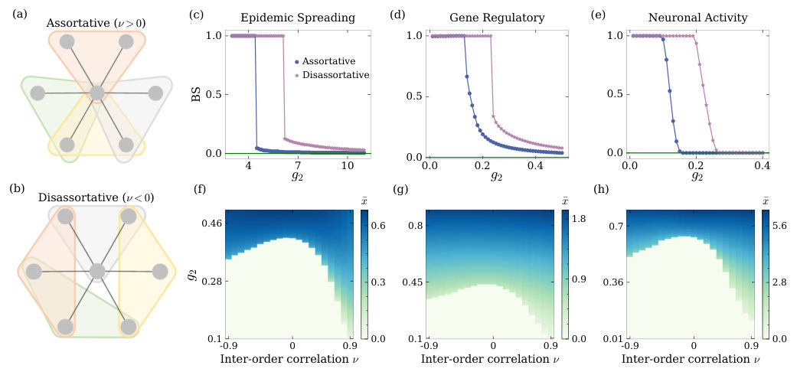
<figcaption class="paper-figure-caption"><b>Fig 4.</b> FIG. 4. Effect of inter-order mixing on system resilience. (a,b) Schematic illustration of assortative (ν &gt; 0) and disassortative (ν &lt; 0) mixing between pairwise and higher-order interactions. (c–e) Basin stability of the inactive state as a function of higher-order interaction strength g2 for both mixing types. (f–h) Average steady-state activity ¯x = P</figcaption>
</figure>

**Summary.** This work introduces a powerful analytical framework to study complex dynamical systems on higher-order networks, which go beyond simple pairwise interactions. By reducing the high-dimensional dynamics to a low-dimensional flow, the authors map out the system's phase diagram and show that network organization profoundly controls system resilience against tipping points.

**Why it may be interesting.** While focused on classical network dynamics, the methodology of dimensionality reduction and analyzing critical transitions in complex, interacting systems shares conceptual overlap with understanding collective behavior in quantum many-body systems, particularly in identifying effective low-energy subspaces.

Detailed structure

**Main problem.** The paper addresses the challenge of analyzing rich critical phenomena and predicting phase transitions in higher-order networked systems, which cannot be accurately modeled using traditional pairwise interaction approaches.

**Main result.** The authors developed a dimension-reduction framework that maps the high-dimensional dynamics onto an effective low-dimensional system, revealing that system resilience depends critically on the alignment between pairwise and higher-order connectivity.

**Method.** A dimension-reduction framework is developed to project the high-dimensional dynamics onto a low-dimensional flow (often 2D) by identifying effective mean fields associated with different interaction orders.

**Model / system.** The model is a general dynamical system defined on higher-order networks, incorporating self-dynamics, pairwise interactions ($A_{ij}$), and three-body interactions ($B_{ijk}$), governed by coupled differential equations.

**Key observables.** Phase diagram (Active, Sensitive, Inactive regions), Basin Stability (BS) of the inactive state, and the average steady-state activity ($ar{x}$).

**Important parameters / regimes.** Interaction strengths ($g_1, g_2$) and the inter-order correlation exponent ($
u$), which characterizes network organization (assortative vs. disassortative mixing).

**Assumptions / limitations.** The analysis relies on dimension reduction using dominant eigenvectors and assumes weak parameter heterogeneity when deriving effective descriptions.

**Figures summary.** Figures illustrate the emergence of distinct dynamical phases (active, sensitive, inactive) across different interaction orders and show how system resilience (BS) changes based on the inter-order mixing parameter ($
u$).

**Paper structure.** The paper introduces the high-order dynamics, develops the dimension-reduction framework using structural descriptors, analyzes the resulting low-dimensional flow to map the phase diagram, and finally investigates how network organization ($
u$) modulates system resilience (BS).

Abstract

Higher-order networks exhibit rich critical phenomena that cannot be captured by traditional pairwise models. Here, we develop an analytical dimension-reduction framework that maps higher-order networked dynamics onto an effective low-dimensional system, allowing accurate prediction of tipping boundaries, bistability regions, and the nature of phase transitions. We demonstrate the power of this framework across a range of dynamical processes, revealing distinct effects of higher-order interactions on transition continuity and hysteresis. Furthermore, we find that system resilience exhibits a profound dependence on the alignment between pairwise and higher-order connectivity, with assortative mixing enhancing tipping toward active states. Our findings establish a general theory for understanding the critical transitions in higher-order networks, offering new insights for anticipating and managing systemic risk in complex systems.

[↑ back to top](#top)

### [Mean-field theory for quantum spin chains](http://arxiv.org/abs/2609.04717v1)

**Authors:** Mylène Martirosyan, Astrid Monin-Baroille, Leïla Moueddene, Mohammed M. Shabat, Bertrand Berche  
**Type:** theory · **Category:** statistical mechanics · **PDF:** <https://arxiv.org/pdf/2609.04717v1>  
**Analysis basis:** full PDF text, analyzed in chunks
**Topic relevance:** `Keldysh / 2PI / non-Gaussian methods` **2/5** · `analog quantum simulation` **2/5** · `Frenkel-Kontorova` **1/5** · `driven-dissipative phase transition` **1/5** · `methods for driven-dissipative` **1/5** · `non-equilibrium universality` **1/5**

↔ Scroll figures horizontally

<figure class="paper-figure-card">
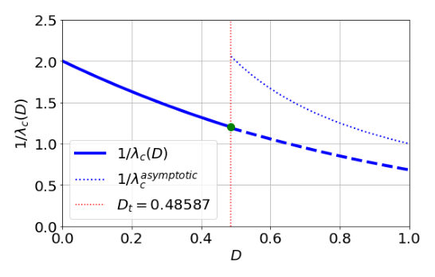
<figcaption class="paper-figure-caption"><b>Fig 1.</b> Figure 1. Phase diagram of the BC model. The vertical dotted line (red online) marks the tricritical value Dtri. The continuous line (blue online) at lower values of D is the second order regime while the dashed line (blue online) at larger values is the first order transition. The dotted line above the tricritical point is the asymptotic D ≫1 first-order transition coupling.</figcaption>
</figure>
<figure class="paper-figure-card">
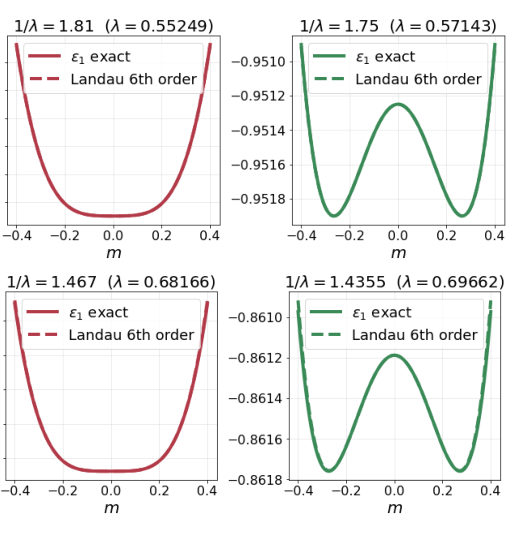
<figcaption class="paper-figure-caption"><b>Fig 2.</b> Figure 2. Landau expansion of the free energy crossing the Ising universality class transition at D = 0.1, 0.3. At the transition coupling, the free energy is flat.</figcaption>
</figure>
<figure class="paper-figure-card">
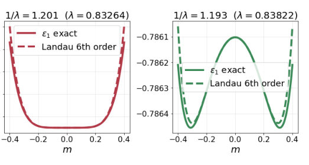
<figcaption class="paper-figure-caption"><b>Fig 3.</b> Figure 3. Landau expansion of the free energy crossing the tricritical universality class transition at D = 0.486. The plateau of the free energy at the transition is wider.</figcaption>
</figure>
<figure class="paper-figure-card">
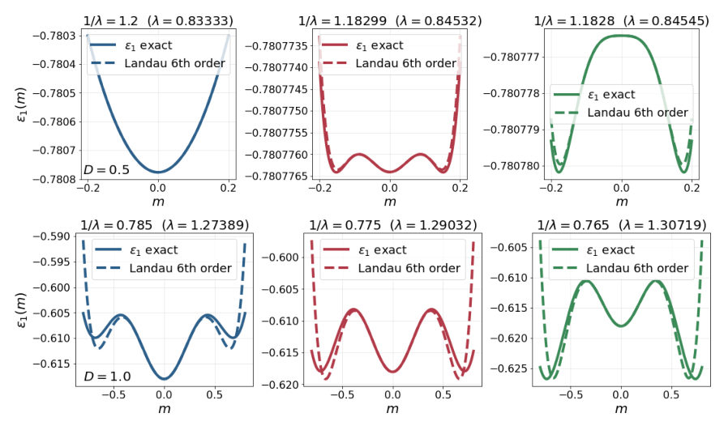
<figcaption class="paper-figure-caption"><b>Fig 4.</b> Figure 4. Landau expansion of the free energy crossing the first-order transition at D = 0.5, 1.0. Note the difference of scales on the horizontal axis. At the transition, the discontinuity of the order parameter becomes more pronounced when we go deeper in the first-order regime (increasing D).</figcaption>
</figure>
<figure class="paper-figure-card">
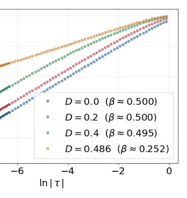
<figcaption class="paper-figure-caption"><b>Fig 5.</b> Figure 5. Log-log plot of the magnetisation vs τ and determination of the critical exponents βMFT along the critical line and βtri at the tricritical point. The fit of the data is performed on the left part of the plot (full lines).</figcaption>
</figure>

**Summary.** This pedagogical paper reviews the application of mean-field theory to quantum phase transitions, using the Ising and Blume-Capel spin chain models as primary examples. It details how mean-field approximations simplify the complex quantum Hamiltonians, allowing for the calculation of critical points and phase diagrams. The work is valuable for understanding the theoretical limits and pedagogical utility of mean-field methods in quantum many-body systems.

**Why it may be interesting.** While focused on classical statistical mechanics techniques, the application to quantum spin chains provides a powerful, albeit approximate, tool for understanding quantum critical points, which is foundational knowledge for many-body quantum physics.

Detailed structure

**Main problem.** The paper aims to clarify and explore the application of mean-field theory to the less common domain of quantum phase transitions, contrasting it with its established use in classical systems.

**Main result.** The mean-field approach successfully provides solvable, simplified Hamiltonians for models like the Ising and Blume-Capel chains, yielding critical exponents and phase boundaries that can be compared to exact results.

**Method.** The core method involves applying the mean-field approximation by decoupling spin-spin correlations and neglecting fluctuation terms, often combined with a variational or Landau free energy expansion.

**Model / system.** The study focuses on quantum spin chains, specifically analyzing the Ising model (in a transverse field) and the Blume-Capel (BC) model. The analysis is performed at zero temperature, driving quantum phase transitions.

**Key observables.** Order parameter (m = <sigma_x>), critical coupling constants (e.g., $\lambda_c = 1/2$ for Ising), and critical exponents ($eta_{MFT} = 1/2$).

**Important parameters / regimes.** Coupling constants ($\lambda$), crystal field ($D$), and the anisotropy limits ($K_s 	o 0, K_t 	o \infty$).

**Assumptions / limitations.** The primary assumption is the mean-field approximation, which neglects quantum fluctuations ($\mathcal{O}(\delta\sigma_x\delta\sigma_x)$). The analysis is performed at zero temperature ($T=0$).

**Figures summary.** Figures illustrate the phase diagram of the BC model, showing second-order lines, a tricritical point, and first-order transition lines. Other figures show the Landau expansion of the free energy at different parameter values.

**Paper structure.** The paper introduces the general framework of mean-field theory, applies it to the 2D Ising model via transfer matrices, and then develops the analysis for the more complex Blume-Capel model, using the free energy expansion to map out the phase diagram.

Abstract

Mean-field theory is a widely used approximation for describing phase transitions, particularly effective above the upper critical dimension. Its origins can be traced back to the van der Waals theory of the liquid-gas transition and Weiss's molecular field theory of the paramagnetic-ferromagnetic transition. However, it was Lev D. Landau who provided a unifying and general framework applicable to a broad class of physical systems. The mean-field approach typically involves neglecting thermal fluctuations, which is a reasonable assumption in many classical contexts. However, its application to quantum phase transitions at zero temperature is less common. The aim of this short pedagogical paper is to explore and clarify the use of the mean-field approach in the less familiar domain of quantum phase transitions. We specifically consider the Ising model and the Blume-Capel model.

[↑ back to top](#top)

### [Molecular interfacial rheology: Lipid membrane shear viscosity](http://arxiv.org/abs/2609.05373v1)

**Authors:** Zhi-Xun Xu, Amaresh Sahu  
**Type:** both · **Category:** statistical mechanics · **PDF:** <https://arxiv.org/pdf/2609.05373v1>  
**Analysis basis:** full PDF text, analyzed in chunks
**Topic relevance:** `Keldysh / 2PI / non-Gaussian methods` **2/5** · `methods for driven-dissipative` **2/5** · `Frenkel-Kontorova` **1/5** · `analog quantum simulation` **1/5** · `non-equilibrium universality` **1/5** · `quantum measurements` **1/5**

↔ Scroll figures horizontally

<figure class="paper-figure-card">
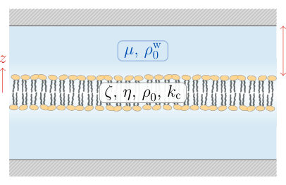
<figcaption class="paper-figure-caption"><b>Fig 1.</b> Figure 1: Schematic of the membrane–water system, sur- rounded by solid walls, in md simulations. Membrane and water parameters are described in the text. The bilayer is centered on the x–y plane, and ℓz is the water thickness above and below the membrane. Periodic boundary conditions are used in the in-plane directions.</figcaption>
</figure>
<figure class="paper-figure-card">
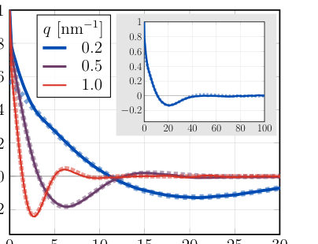
<figcaption class="paper-figure-caption"><b>Fig 2.</b> Figure 2: Normalized tvacfs from md simulations of a dopc bilayer in the fluid phase, at 25◦C. The lateral size of the simulation cell is ℓx = ℓy ≈62.5 nm, for which q ≥2π/ℓx ≈ 0.1 nm−1. The md data (thin solid lines) are observed to be well-approximated by [Aq cos(γqt) + Bq sin(γqt)] exp{−αqt}, as shown by the thick, transparent dashed lines. (inset) Data for q ≈0.2 nm−1 are shown over a longer time window.</figcaption>
</figure>
<figure class="paper-figure-card">
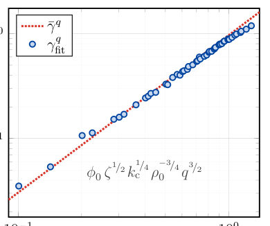
<figcaption class="paper-figure-caption"><b>Fig 3.</b> Figure 3: Oscillation frequency γq fit extracted from tvacfs as a function of wavevector magnitude. The observed q3/2</figcaption>
</figure>
<figure class="paper-figure-card">
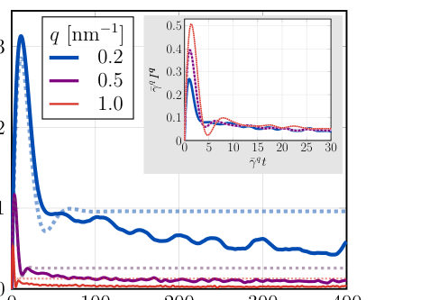
<figcaption class="paper-figure-caption"><b>Fig 4.</b> Figure 4: Running integral Iq(t) of the normalized tvacfs shown in Fig. 2 (solid lines). The slow decrease at long times is not captured by the damped sinusoidal fits of C q(t), whose running integrals are shown as dashed lines. (inset) A com- mon structure across wavelengths is revealed when Iq and t are scaled with the characteristic frequency ¯γq.</figcaption>
</figure>
<figure class="paper-figure-card">
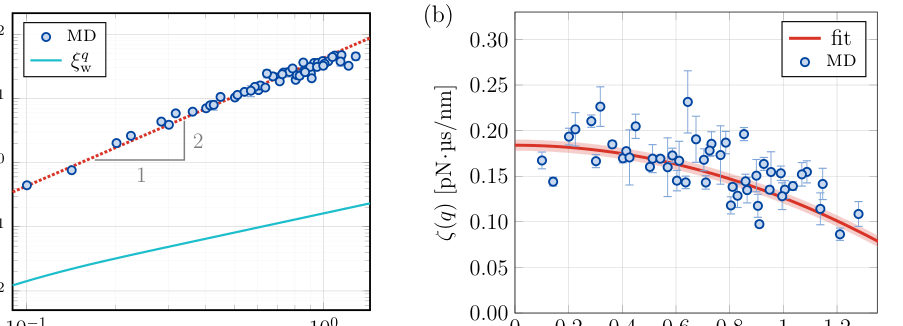
<figcaption class="paper-figure-caption"><b>Fig 5.</b> Figure 5: Protocol to determine the shear viscosity of a dopc bilayer in the fluid phase at 25◦C. (a) The Einstein–Helfand method is used to calculate Iq ∞from md simulations. It is convenient to plot 1/Iq ∞, which equals the decay rate ξq. The contribution to ξq from the surrounding water, ξq w := (2µq/ρ0) tanh(ℓzq), is negligible over the wavenumbers considered—as shown by the solid cyan line [50]. Consequently, ξq ≈q2ζ(q)/ρ0 and 1/Iq ∞roughly scales as q2 (dashed red line). (b) The generalized membrane shear viscosity is determined from md data according to Eq. (7), as shown by the blue circles. Results are fit to ζ(q) = ζ(1 −bq2), as shown by the red line; the thick bands depict one...</figcaption>
</figure>

**Summary.** This work establishes 'molecular interfacial rheology,' a computational method to determine the shear viscosity of lipid membranes from molecular dynamics simulations. By analyzing the transverse velocity autocorrelation function using the Mori-Zwanzig formalism, the authors successfully extracted quantitative viscosity values for model bilayers. This provides a rigorous link between microscopic molecular dynamics and macroscopic continuum rheological properties.

**Why it may be interesting.** While focused on soft matter rheology, the use of the Mori-Zwanzig formalism to analyze time correlation functions and extract transport coefficients from microscopic dynamics is a powerful technique applicable to open quantum systems and many-body dynamics.

Detailed structure

**Main problem.** The paper develops a method to accurately extract the shear viscosity of lipid membranes from equilibrium molecular dynamics simulations, termed 'molecular interfacial rheology.'

**Main result.** The authors successfully calculated wavevector-dependent shear viscosities for fluid-phase bilayers, finding values for DOPC and DPPC that agree with theoretical expectations and non-equilibrium simulations.

**Method.** The method utilizes the Mori-Zwanzig formalism applied to the transverse velocity autocorrelation function (tvacf) derived from MD simulations to extract the memory kernel and subsequently the viscosity.

**Model / system.** The system modeled is a lipid bilayer (e.g., DOPC, DPPC) confined in water and simulated using molecular dynamics. The rheology is characterized by analyzing the time evolution of the membrane's transverse velocity.

**Key observables.** Transverse velocity autocorrelation function (tvacf), wavevector-dependent shear viscosity ($\zeta(q)$), and the memory kernel $K_q(t)$.

**Important parameters / regimes.** Shear viscosities ($\zeta$) ranging from 0.064 to 0.18 pN*us/nm; wavevector ($q$); and the coupling between membrane and water viscosities.

**Assumptions / limitations.** The analysis relies on reconciling the observed damped oscillations in the tvacf with the predictions of continuum hydrodynamics using the Mori-Zwanzig formalism.

**Figures summary.** Figures illustrate the decay of the tvacf, the scaling of the oscillation frequency ($\gamma_q \sim q^{3/2}$), and the resulting dependence of the generalized shear viscosity $\zeta(q)$ on the wavevector $q$.

**Paper structure.** The paper introduces the concept of molecular interfacial rheology, details the theoretical framework using the Mori-Zwanzig formalism to analyze the tvacf, presents the extraction methodology, and validates the results using both equilibrium and non-equilibrium simulations.

Abstract

We develop a method to extract the shear viscosity of a lipid membrane from equilibrium molecular dynamics simulations. The method characterizes the rheology of general interfacial systems embedded in three-dimensional media; we term it molecular interfacial rheology. In our simulations the planar bilayer and surrounding water are confined between solid, parallel walls. Following Onsager's regression hypothesis, membrane and water fluctuations are assumed to relax according to the coupled continuum-mechanical equations governing the confined system---which predict that the membrane transverse velocity autocorrelation function (TVACF) decays exponentially, at a rate set by the membrane and water viscosities. The measured TVACF, however, exhibits damped oscillations followed by a slowly decaying tail. We reconcile these behaviors using the Mori--Zwanzig formalism, and extract the wavevector-dependent membrane viscosity from the time-integral of the TVACF. Results from theory and simulations agree over a decade of wavevectors, and extrapolating to long wavelengths yields shear viscosities ranging from 0.064 to 0.18 pN*us/nm across two representative single-component, fluid-phase bilayers. Our results are corroborated by nonequilibrium simulations where a spatially varying in-plane body force is applied to lipid molecules, thus validating the framework of molecular interfacial rheology.

[↑ back to top](#top)

### [Thermodynamic learning](http://arxiv.org/abs/2609.04732v1)

**Authors:** F. Corberi, S. dello Russo, G. Messuti, S. Scarpetta, L. Smaldone  
**Type:** theory · **Category:** disordered systems and neural networks · **PDF:** <https://arxiv.org/pdf/2609.04732v1>  
**Analysis basis:** full PDF text, analyzed in chunks
**Topic relevance:** `analog quantum simulation` **2/5** · `Keldysh / 2PI / non-Gaussian methods` **1/5** · `driven-dissipative phase transition` **1/5** · `methods for driven-dissipative` **1/5** · `non-equilibrium universality` **1/5**

↔ Scroll figures horizontally

<figure class="paper-figure-card">
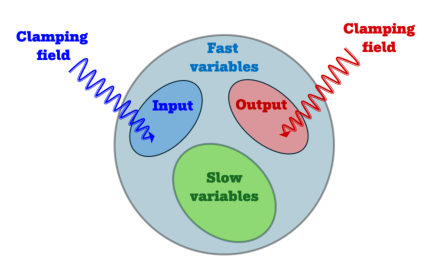
<figcaption class="paper-figure-caption"><b>Fig 1.</b> FIG. 1. Schematic drawing of a thermodynamic learning sys- tem.</figcaption>
</figure>
<figure class="paper-figure-card">
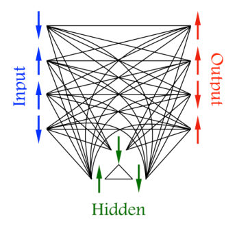
<figcaption class="paper-figure-caption"><b>Fig 2.</b> FIG. 2. The all-to-all network considered (for Nin = 4, Nhid = 3, Nout = 4).</figcaption>
</figure>
<figure class="paper-figure-card">
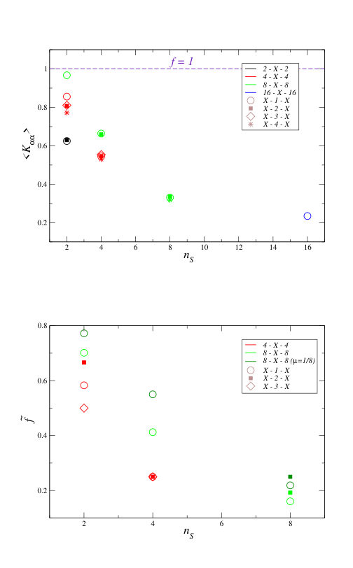
<figcaption class="paper-figure-caption"><b>Fig 3.</b> FIG. 3. Memorization (top) and generalization (bottom) properties of the system. In upper panel f ≡1 is plotted as a dotted line, and symbols refer to the fidelity values ⟨Kαα⟩, in lower panel ef is only plotted. In both panels different colors refer to networks with different Nin (Nin = 2, 4, 8, 16) cor- responding to, black, red, green, blue, respectively. Given a color, different symbols refer to the value of Nhid (Nhid = 1, 2, 3, 4 corresponding to circle, square, diamond, star, re- spectively). Same colors/symbols are used in the lower part of the figure for µ = 1/4. For µ = 1/8 and Nin = 8 we use the dark green.</figcaption>
</figure>

**Summary.** This paper proposes 'thermodynamic learning,' a paradigm where machine learning tasks are achieved by training a physical spin system governed solely by statistical mechanics. By treating input/output data as external fields, the system's equilibrium state naturally encodes learned patterns. The results show that this physical approach successfully achieves memorization and generalization, offering a compelling physical model for artificial intelligence.

**Why it may be interesting.** This work provides a physical, energy-based framework for machine learning, connecting concepts from statistical mechanics (like free energy minimization) directly to computational tasks, which is highly relevant for understanding physical implementations of computation.

Detailed structure

**Main problem.** To investigate if a thermodynamic system, governed purely by statistical mechanics, can perform learning tasks like memorization and generalization without explicit algorithmic rules.

**Main result.** The model demonstrates excellent memorization fidelity and good generalization capacity, with performance improving as the system size increases.

**Method.** The learning process is analyzed by calculating effective free energies and deriving the probability distribution of coupling configurations based on the system's equilibrium state.

**Model / system.** The system is a prototypical Ising model with annealed dichotomous couplings, whose dynamics are governed by a full Hamiltonian incorporating interaction, input, and output fields.

**Key observables.** Memorization fidelity ($K_{\alpha\alpha}$) and generalization capacity ($e_f$), which are calculated as averages over the system's equilibrium probability distribution.

**Important parameters / regimes.** The analysis relies on taking specific limits on the inverse temperatures ($eta_j, eta_\sigma, eta_S$), particularly the limit where external fields are quenched ($eta_S 	o 0$).

**Assumptions / limitations.** The primary assumption is that the system's behavior can be analyzed by separating timescales and calculating effective free energies, treating the training process as reaching a thermodynamic potential minimum.

**Figures summary.** Figure 1 schematically illustrates the thermodynamic learning setup involving fast and slow variables and input/output clampings. Figure 2 likely shows quantitative results regarding memorization and generalization performance.

**Paper structure.** The paper introduces the thermodynamic learning paradigm, details the Ising model Hamiltonian and the role of external fields as data, develops the analytical framework using effective free energies, and finally presents results showing successful learning capabilities.

Abstract

We discuss the possibility to train a thermodynamic system, whose micro-variables are fully determined through the Hamiltonian by the usual statistical mechanical rules, to perform tasks such as memorization and generalization. Training is achieved by the application of suitable external fields, playing the role of {\it data}. At variance with conventional machine learning, no other logical or algorithmic rules are introduced. The system is amenable, in principle, to exact analytical calculations. We specialize this general approach to a prototypical Ising system with annealed dichotomous couplings and study its learning ability. Results indicate excellent memorization and good generalization capacity already for small systems, and a tendency to improve with system size.

[↑ back to top](#top)

### [State-Based Quantum Operations: Chameleon Gates](http://arxiv.org/abs/2609.04506v1)

**Authors:** S. Alipour, A. T. Rezakhani  
**Type:** theory · **Category:** quantum information and computing · **PDF:** <https://arxiv.org/pdf/2609.04506v1>  
**Analysis basis:** full PDF text, analyzed in chunks
**Topic relevance:** `analog quantum simulation` **2/5** · `quantum measurements` **1/5**

↔ Scroll figures horizontally

<figure class="paper-figure-card">
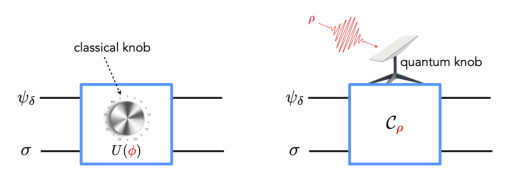
<figcaption class="paper-figure-caption"><b>Fig 1.</b> FIG. 1. Comparing conventional parameter-dependent quantum gates controlled-𝑈(𝜙) with operator-dependent quantum controlled-gates C𝜌. Both gates are controlled by some knobs; while the knob in the left one is classical (a parameter 𝜙), the knob in the right one is quantum (an operator, a quantum state/signal 𝜌). Both controlled gates have standard elements such as control and target systems, which here are represented by 𝜓𝛿and 𝜎. For the specific definitions of 𝜓𝛿and C𝜌 see the main text.</figcaption>
</figure>
<figure class="paper-figure-card">
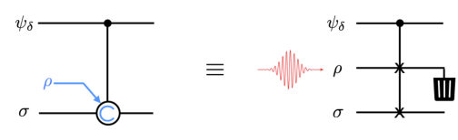
<figcaption class="paper-figure-caption"><b>Fig 2.</b> FIG. 2. [Left] Quantum-circuit schematic of a state-based controlled- gate C𝜌, which we refer to as the chameleon gate [Eq. (6)]. [Right] An equivalent standard gate-based construction is also shown for this gate, which uses a specific combination of quantum states, quantum controlled-swap gate, and partial tracing. Note that basically the control qubit can be any state. But when the control qubit is chosen as 𝜓𝛿with |𝛿| ≪1, this also yields an implementation for U𝜌[Eq. (1)] to an 𝑂(𝛿2) error.</figcaption>
</figure>
<figure class="paper-figure-card">
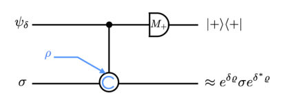
<figcaption class="paper-figure-caption"><b>Fig 3.</b> FIG. 3. SBQC circuit for simulating the dynamics generated by 𝐻= ℎ𝜌on the simulator state, i.e., 𝑒𝛿𝜌𝜎𝑒𝛿∗𝜌.</figcaption>
</figure>
<figure class="paper-figure-card">

<figcaption class="paper-figure-caption"><b>Fig 4.</b> FIG. 4. State-based quantum circuit for simulation of the dynamics generated by the nonlinear Hamiltonian (13). For the relation between the parameters 𝛿and Δ see the main text.</figcaption>
</figure>
<figure class="paper-figure-card">
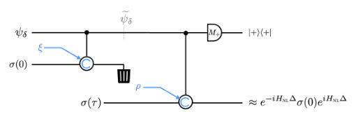
<figcaption class="paper-figure-caption"><b>Fig 5.</b> Figure 3 shows the corresponding SBQC circuit.</figcaption>
</figure>

**Summary.** This paper introduces 'chameleon gates,' a novel generalization of controlled-gates where the operation performed is determined by an input quantum state, called the 'quantum knob.' This capability allows for the simulation of nonlinear quantum dynamics, moving beyond fixed unitary evolution. The authors demonstrate this by realizing these gates using standard components and applying them within the State-Based Quantum Computation framework.

**Why it may be interesting.** The concept of a state-dependent gate is crucial for modeling complex physical systems where the evolution operator itself depends on the system's current state, which is a major challenge in quantum simulation.

Detailed structure

**Main problem.** The paper addresses the need to generalize conventional quantum controlled-gates to implement operations whose form depends dynamically on an input quantum state.

**Main result.** Chameleon gates provide a mechanism for state-dependent quantum operations, enabling the simulation of nonlinear quantum dynamics using existing gate-based components.

**Method.** The authors generalize controlled-gates by introducing a quantum signal, the 'quantum knob' ($
ho$), which determines the gate's action, and they realize this gate using standard controlled-swap gates.

**Model / system.** The model is quantum computation, specifically extending controlled-gates to 'chameleon gates' ($C_
ho$) within the State-Based Quantum Computation (SBQC) framework. This allows for simulating state-dependent (nonlinear) quantum evolutions.

**Key observables.** The effective action of the gate, $C_
ho$, and the ability to simulate nonlinear quantum dynamics.

**Important parameters / regimes.** The quantum knob state ($
ho$), the time step ($\Delta$), and the approximation parameter ($\delta$).

**Assumptions / limitations.** The realization of the gate is accurate up to $O(\delta^2)$, and the simulation of state-dependent dynamics relies on Trotter-Suzuki approximations.

**Figures summary.** Figures illustrate the comparison between conventional and chameleon gates, the quantum circuit schematic for the chameleon gate realization, and the SBQC circuits used for simulating both state-independent and state-dependent (nonlinear) Hamiltonians.

**Paper structure.** The paper first introduces chameleon gates as a generalization of controlled-gates, detailing their action and physical realization. It then applies this building block within the SBQC framework to demonstrate the simulation of state-dependent (nonlinear) quantum evolutions using Trotter-Suzuki expansion.

Abstract

We introduce chameleon gates as a natural generalization of conventional quantum controlled-gates. Chameleon gates are state-based quantum controlled-operations that retain standard elements such as control and target systems, while introducing a new feature: the quantum knob. This knob is a quantum signal (state) that determines the operation performed by the gate. Consequently, the action and form of a chameleon gate depend dynamically on the quantum knob, allowing the gate to adapt its operation and implement transformations that are not necessarily unitary. This shapeshifting property is in stark contrast to conventional quantum controlled-gates, whose actions are fixed and cannot be modified. We also propose how chameleon gates can be realized using conventional quantum gates available in current quantum technologies. We then employ chameleon gates as a useful building block within the recently proposed state-based quantum computation (SBQC) framework. Using this approach, we demonstrate the simulation of state-dependent (nonlinear) quantum evolutions.

[↑ back to top](#top)

### [A double-resonator coupler for high-fidelity two-qubit gates between superconducting qubits](http://arxiv.org/abs/2609.05222v1)

**Authors:** Seunghyeon Jin, Seungha Woo, Shinyoung Hwang, June-Young M. Lee, Jeongmin Shim, Sunje Kim, Dae Seok Han, Jaeho Shin, Eunjong Kim  
**Type:** theory · **Category:** quantum information and computing · **PDF:** <https://arxiv.org/pdf/2609.05222v1>  
**Analysis basis:** full PDF text, analyzed in chunks
**Topic relevance:** `QC/QI experiment` **2/5**

↔ Scroll figures horizontally

<figure class="paper-figure-card">
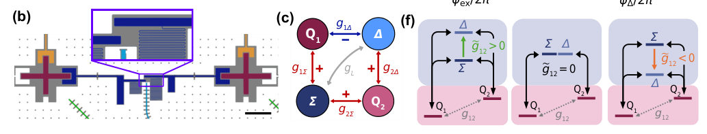
<figcaption class="paper-figure-caption"><b>Fig 1.</b> FIG. 1. (a) Circuit diagram of the proposed architecture. Two transmon qubits, Q1 and Q2 (purple), are capacitively coupled to a double- resonator coupler (DRC, blue). (b) False-color rendering of the device layout, with colors matching the circuit elements in (a). The scale bar denotes 200µm. (c) Mode-coupling diagram of the qubit–DRC system, with arrow colors indicating the coupling signs: red (blue) denotes positive (negative) coupling. The common mode Σ couples positively to both qubits, whereas the differential mode ∆couples negatively to Q1 and positively to Q2. Asymmetric inductance values (Lℓ̸= Lr) introduce an inter-mode coupling gL between the Σ and ∆modes. (d) Single-excitation...</figcaption>
</figure>
<figure class="paper-figure-card">
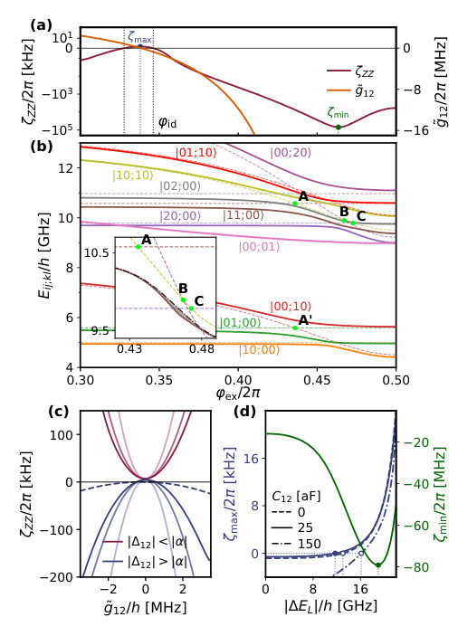
<figcaption class="paper-figure-caption"><b>Fig 2.</b> FIG. 2. (a) Static ZZ interaction ζZZ (burgundy) and effec- tive transverse coupling ˜g12 (orange) versus external flux ϕex. (b) Dressed energy spectrum versus ϕex, including the two-excitation levels relevant to ζZZ. Solid and dashed curves show dressed and bare eigenenergies, respectively. Markers A, A′, B, and C indicate the bare-state crossings associated with the enhanced ZZ interac- tion near ϕex = π. The dash-dotted curve shows E10;00 + E01;00. (c) ζZZ versus ˜g12 for several qubit–qubit detunings ∆12/2π ∈ {130,160,190,240,270,300} MHz, inside (burgundy) and outside (navy) the straddling regime. Darker shades indicate detunings far- ther from the straddling boundary; the dashed curve...</figcaption>
</figure>
<figure class="paper-figure-card">
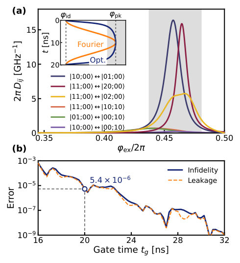
<figcaption class="paper-figure-caption"><b>Fig 3.</b> FIG. 3. (a) Adiabatic factor Dij for the six non-adiabatic population- transfer channels with the largest peak values over the flux excursion. The shaded region indicates the flux range of strong |ζZZ| interaction. Inset: optimized Slepian-like round-trip flux pulse compared with a simple Fourier-type parametrization, showing that the optimized tra- jectory slows near the region of large adiabatic factor. (b) Optimized coherent infidelity and leakage versus gate time tg, obtained from time-dependent simulations with pulse parameters optimized inde- pendently for each tg. The overall downward trend with increasing tg reflects improved adiabaticity, while the separation between in- fidelity...</figcaption>
</figure>
<figure class="paper-figure-card">
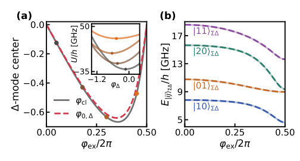
<figcaption class="paper-figure-caption"><b>Fig 4.</b> FIG. 4. (a) Flux dependence of the classical potential minimum ϕcl (solid gray) and the oscillator center ϕ0 (dashed red). Inset: effective potential Ueff(ϕ∆) at several external-flux biases, with the markers indicating the corresponding potential minima shown on the main curve. (b) Lowest four coupler excitation energies as functions of the external flux, measured from the ground-state energy. Solid and dashed curves are obtained by numerical diagonalization of the cou- pler sectors of Eqs. (A5) and (A18), respectively.</figcaption>
</figure>
<figure class="paper-figure-card">
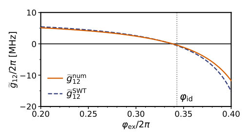
<figcaption class="paper-figure-caption"><b>Fig 5.</b> FIG. 5. Effective coupling strength ˜g12 as a function of the exter- nal flux ϕex/2π. The blue curve shows ˜gnum 12 obtained by numerical block diagonalization with the least-action unitary transform, while the orange curve shows ˜gSWT 12 obtained from the Schrieffer–Wolff transformation. The vertical dashed line indicates the idle flux bias ϕid.</figcaption>
</figure>

**Summary.** This paper introduces a Double-Resonator Coupler (DRC) designed to enhance superconducting quantum processors. The DRC allows researchers to tune the qubit-qubit interaction, enabling high-fidelity two-qubit gates while simultaneously suppressing unwanted residual interactions like the ZZ term. This architectural flexibility is crucial for scaling quantum computing systems.

**Why it may be interesting.** This work directly addresses the engineering challenge of controlling unwanted interactions (like ZZ coupling) in solid-state quantum hardware, which is a critical topic for building scalable quantum processors.

Detailed structure

**Main problem.** The central challenge is achieving high-fidelity two-qubit gates in superconducting quantum processors while simultaneously suppressing unwanted residual interactions and maintaining flexible qubit-frequency allocation.

**Main result.** The proposed Double-Resonator Coupler (DRC) enables complete cancellation of residual ZZ interaction outside the straddling regime and provides a strong, tunable ZZ interaction for high-fidelity controlled-Z gates.

**Method.** The authors derived the system Hamiltonian and used analytical techniques combined with numerical simulations to analyze the effective coupling ($	ilde{g}_{12}$) and the ZZ interaction ($\zeta_{ZZ}$) as a function of external flux.

**Model / system.** The system involves superconducting qubits coupled to a Double-Resonator Coupler (DRC), modeled using a full circuit Hamiltonian incorporating common and differential resonator modes. The analysis focuses on controlling the effective qubit-qubit interaction ($\zeta_{ZZ}$) and the transverse coupling ($	ilde{g}_{12}$).

**Key observables.** Gate fidelity, residual ZZ interaction ($\zeta_{ZZ}$), transverse coupling ($	ilde{g}_{12}$), and the controlled-Z gate time (20 ns).

**Important parameters / regimes.** The results are highly dependent on the external magnetic flux ($\phi_{ex}$), which is used to tune the coupling strength and achieve cancellation points.

**Assumptions / limitations.** The analysis assumes the system operates in the dispersive regime and that the DRC architecture remains robust against minor variations in Josephson energy.

**Figures summary.** Figures illustrate the circuit diagram, mode-coupling diagrams, and the dependence of $\zeta_{ZZ}$ and $	ilde{g}_{12}$ on the external flux, showing points of zero crossing for unwanted interactions.

**Paper structure.** The paper progresses from defining the physical problem and the DRC structure to deriving the effective Hamiltonian, analyzing the control mechanisms (flux tuning), and finally presenting quantitative results demonstrating high-fidelity gate operation.

Abstract

Tunable couplers have enabled two-qubit gate fidelities in superconducting quantum processors to approach $99.9\%$, yet simultaneously suppressing residual interactions and maintaining flexible qubit-frequency allocation remain central challenges for scaling. Here, we propose a double-resonator coupler (DRC) consisting of two resonators interconnected by a single Josephson junction and a capacitor. The hybridized resonator modes provide two mediated exchange paths whose interference controls the qubit-qubit interaction. The DRC enables complete cancellation of residual $ZZ$ interaction for qubit-qubit detunings well outside the straddling regime, even in the absence of direct qubit-qubit coupling, thereby relaxing constraints on frequency allocation and qubit placement. Away from the idle point, the same circuit provides a strong $ZZ$ interaction of approximately $70\,\mathrm{MHz}$, enabling a $20\,\mathrm{ns}$ controlled-Z gate with simulated coherent infidelity below $10^{-5}$. These results establish the DRC as a flexible single-junction coupler architecture for high-fidelity superconducting quantum processors.

[↑ back to top](#top)

### [AxQM: A Textbook-Scale Benchmark for Formal Proof Synthesis in a Library of Finite-Dimensional Quantum Mechanics](http://arxiv.org/abs/2609.05157v1)

**Authors:** Weichen Winston Yin, Jacob M. Taylor, Dirk R. Englund, Frank H. L. Koppens  
**Type:** theory · **Category:** quantum information and computing · **PDF:** <https://arxiv.org/pdf/2609.05157v1>  
**Analysis basis:** full PDF text, analyzed in chunks
**Topic relevance:** `quantum measurements` **2/5**

↔ Scroll figures horizontally

<figure class="paper-figure-card">
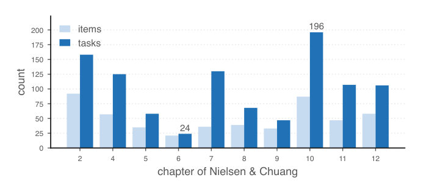
<figcaption class="paper-figure-caption"><b>Fig 1.</b> Figure 1: Coverage: items and tasks by chapter of Nielsen and Chuang. Items refer to explicitly numbered items in the book: theorems, problems, exercises, and examples. Tasks are individual Lean theorem statements that capture all or part of an item. Each item may have multiple tasks. Chapters 1 (overview) and 3 (classical computation) contribute no items to the benchmark. Chap- ters 7 (physical realization) and 10 (error correction) are the densest in tasks per item.</figcaption>
</figure>
<figure class="paper-figure-card">
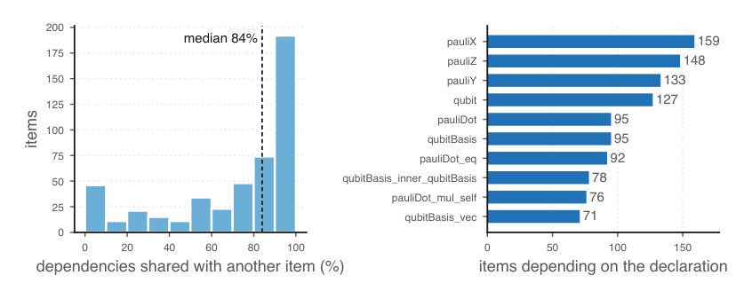
<figcaption class="paper-figure-caption"><b>Fig 2.</b> Figure 2: Shared use of the quantum physics library underlying the benchmark, measured on the full solution library. Left: for each item, the share of its dependency closure (declaration count) that at least one other item also depends on; the median item shares 84% of its dependencies with another item. Right: the ten most depended-upon declarations, by the number of distinct items whose statements reach them. A definitional error in any of these would have had to survive every one of those items’ proofs.</figcaption>
</figure>
<figure class="paper-figure-card">
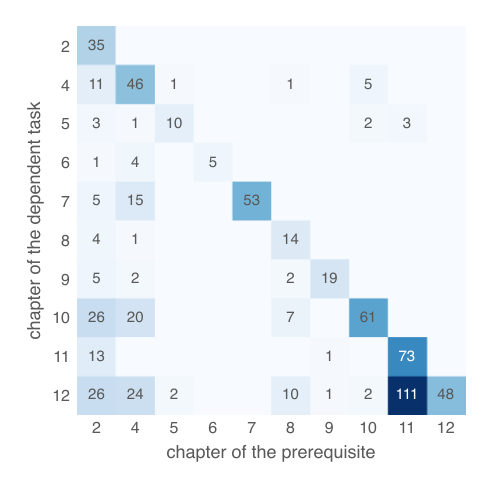
<figcaption class="paper-figure-caption"><b>Fig 3.</b> Figure 3: Direct dependencies between tasks, aggregated by chapter, measured on the full solution library. For example, there are 15 instances of tasks in chapter 7 directly depending on tasks in chapter 4. The matrix is close to lower-triangular, which reflects the pedagogical structure of the book, where later chapters build upon earlier chapters.</figcaption>
</figure>

**Summary.** This paper introduces AxQM, a massive, textbook-scale benchmark of 1,019 proof-synthesis tasks designed to test the rigor of automated formalization systems in quantum physics. By formalizing concepts from finite-dimensional quantum mechanics in the Lean proof assistant, it establishes a new standard for machine-checked theoretical physics. This benchmark is crucial for advancing AI's capability to handle complex scientific reasoning.

**Why it may be interesting.** This work provides a concrete, large-scale, and rigorously defined benchmark for testing the frontier of AI's ability to handle complex, multi-step theoretical derivations in quantum information theory.

Detailed structure

**Main problem.** The primary problem is evaluating and advancing autoformalization systems for quantum physics, requiring machine-checked rigor comparable to formal mathematics.

**Main result.** The authors introduce AxQM, the largest proof-synthesis benchmark in physics, consisting of 1,019 kernel-checkable tasks derived from a textbook.

**Method.** The methodology involves formal proof synthesis using the Lean 4 proof assistant to create a custom, rigorous benchmark library for finite-dimensional quantum mechanics.

**Model / system.** The focus is on finite-dimensional quantum mechanics, drawing its content from the textbook Quantum Computation and Quantum Information by Nielsen and Chuang, covering topics like density operators and quantum channels.

**Key observables.** The benchmark covers topics including density-operator formalism, Schmidt decomposition, universal gate sets, quantum Fourier transform, and von Neumann entropy.

**Important parameters / regimes.** The scope is limited to finite-dimensional Hilbert spaces; the benchmark size is 1,019 tasks.

**Assumptions / limitations.** The benchmark assumes a solvable structure, as it is derived from a near-complete formalization of the source textbook, guaranteeing a solution for every task.

**Figures summary.** Figure 1 shows the coverage of tasks across chapters of the source textbook; Figure 2 details the high degree of task interdependency (median item shares 84% of dependencies); Figure 3 shows the dependency structure forming a matrix close to lower-triangular.

**Paper structure.** The paper introduces the need for rigorous benchmarking in physics, details the construction of AxQM using Lean 4, presents the scale and structure of the 1,019 tasks, and discusses the implications of the dependency structure for formal verification.

Abstract

Formalizing mathematics in a proof assistant, where a machine checks every definition, statement and proof, has set a new standard of rigor. Large language models are now capable of formalizing autonomously, even at the scale of whole textbooks. We bring this standard of rigor to physics, where theoretical arguments carry idealizations that are rarely stated fully, and any logical gaps could have a cascading effect on interdependent results. Recognizing the need to evaluate autoformalization systems for physics, we release AxQM, 1,019 kernel-checkable proof-synthesis tasks over 479 items drawn from the textbook Quantum Computation and Quantum Information by Nielsen and Chuang. The tasks are stated in a custom Lean library of finite-dimensional quantum mechanics. By task count, it is the largest proof-synthesis benchmark in physics by a factor of four. AxQM is derived from a near-complete formalization of the formal portions of the textbook, so every task is guaranteed a solution, which we keep private. Grading of the benchmark is done deterministically by the Lean kernel, which checks that the proof compiles, that no sorry appears in it or in any declaration it depends on, and that it introduces no new axioms.

[↑ back to top](#top)

### [Compiling the 2D Fermi-Hubbard ground-state energy estimation algorithm for active volume quantum architectures](http://arxiv.org/abs/2609.05316v1)

**Authors:** Harriet Apel, Athena Caesura, Carys Harvey, Sam Heavey, Angus Kan, Jessica Lemieux, Ryan Levy, Sam Pallister, Joseph Peetz, William Pol, Sukin Sim, William A. Simon, Mark Steudtner, Gideon Uchehara  
**Type:** theory · **Category:** strongly correlated electrons · **PDF:** <https://arxiv.org/pdf/2609.05316v1>  
**Analysis basis:** full PDF text, analyzed in chunks
**Topic relevance:** `analog quantum simulation` **2/5**

↔ Scroll figures horizontally

<figure class="paper-figure-card">
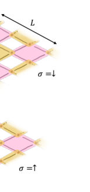
<figcaption class="paper-figure-caption"><b>Fig 1.</b> Figure 1: The Fermi-Hubbard lattice Hamiltonian. The model Hamiltonian considered is given in Eq. (1) where i indexes lattice sites on a L × L square lattice with two spin sectors σ ∈{↑, ↓}. ⟨i, j⟩ denotes nearest neighbors on the lattice drawn as edges. For the product formula the Hamiltonian is split into three components. The interaction term Eq. (4) is shown in green and is between fermions on the same site across the two spin sectors. The kinetic term is split into two disjoint sets of plaquettes shown in pink Eq. (5) and gold Eq. (6) where the shaded plaquette indicates a grouping of four edges.</figcaption>
</figure>
<figure class="paper-figure-card">
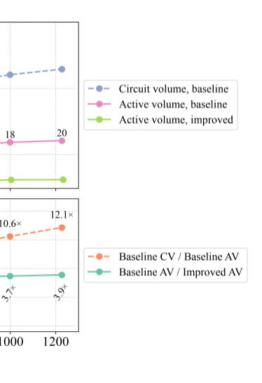
<figcaption class="paper-figure-caption"><b>Fig 2.</b> Figure 2: Comparison of computational volume of 2D square Fermi-Hubbard ground-state energy estimation for the baseline and improved implementations against the logical qubit count. The logical qubit count includes both the system qubits and the auxiliary qubits required to implement a single batch of Hamming-weight phasing. The numbers above the baseline active volume data points indicate the lattice size. Top: Absolute circuit volume (as defined in Ref. [22]) and active volume resource estimates for the total cost of QPE algorithm achieving a 0.0051tL2 error. Bottom: Relative speedups obtained by first replacing circuit volume with active volume as the resource metric (orange), and then...</figcaption>
</figure>
<figure class="paper-figure-card">
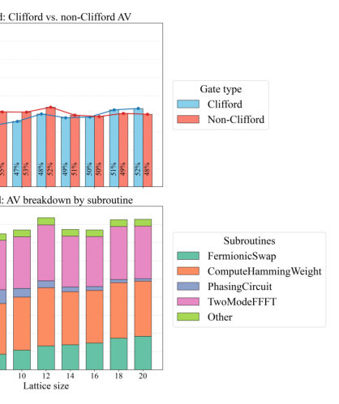
<figcaption class="paper-figure-caption"><b>Fig 3.</b> Figure 3: Active volume (AV) breakdown. Top row: Breakdown of the active volume into Clifford and non-Clifford contributions. The proposed compilation techniques reduce both components, result- ing in a substantially more balanced distribution of execution cost. Note that plots on the left column are active volume breakdowns of the baseline circuits while the plots of the right column are those of the improved circuits. Bottom row: Active volume breakdown of the baseline and improved circuits by major subroutine. The dominant contributions are grouped according to fermionic-mode routing (“FermionicSwap”), implementing towers of rotations (“ComputeHammingWeight” and “PhasingCir- cuit”), and...</figcaption>
</figure>
<figure class="paper-figure-card">
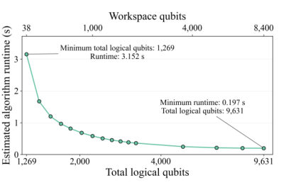
<figcaption class="paper-figure-caption"><b>Fig 4.</b> Figure 4: Runtime analyses using the block scheduler from Ref. [29]. (a) Comparison of estimated runtimes for the baseline and improved Fermi–Hubbard simulations for square lattice sizes L = 6 to 10, each using single batched Hamming weight phasing. (b) Estimated runtimes for the improved 20 × 20 Fermi–Hubbard circuit as a function of logical qubit capacity. Increasing the available qubits enables greater parallelization until the reaction-limited regime is reached, revealing an approximately order-of-magnitude space-time trade-off between qubit count and runtime.</figcaption>
</figure>
<figure class="paper-figure-card">
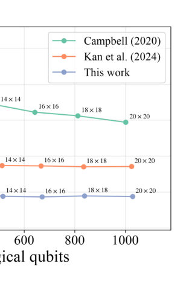
<figcaption class="paper-figure-caption"><b>Fig 5.</b> Figure 5: Comparison of the total Toffoli counts between this work and those reported by Campbell [11, Table II] and Kan et al. [12, Supplementary Table 5]. All T states are assumed to be catalyzed using CCZ states for consistency. All three works assume u = 8 and t = 1 Hamiltonian parameters, and these works assume Hamming weight phasing is applied to batches of L2/2 equiangular rotations. We additionally note that Ref. [11] rounded to two significant figures for the Toffoli counts.</figcaption>
</figure>

**Summary.** This work develops an advanced, architecture-aware compilation strategy for estimating the ground-state energy of the 2D Fermi-Hubbard model. By optimizing for 'active volume' rather than generic gate counts, the authors achieve significant reductions in required quantum resources. This demonstrates the critical need for hardware-specific compilation techniques as quantum computing moves toward fault tolerance.

**Why it may be interesting.** It provides a concrete, resource-aware roadmap for simulating strongly correlated electron models (like the Fermi-Hubbard model) on near-term, architecture-specific quantum hardware.

Detailed structure

**Main problem.** The paper addresses the challenge of compiling the ground-state energy estimation algorithm for the 2D Fermi-Hubbard model specifically for active volume quantum architectures.

**Main result.** The proposed compilation method achieves up to a 3.9x reduction in active volume compared to prior work, and also yields state-of-the-art Toffoli count reductions.

**Method.** The approach uses Quantum Phase Estimation (QPE) combined with Trotterized time evolution, optimizing the circuit compilation based on the active volume resource metric.

**Model / system.** The system is the two-dimensional Fermi-Hubbard model defined on an L x L square lattice, characterized by hopping and onsite interaction terms. The analysis is situated in the early fault-tolerant quantum computing regime.

**Key observables.** Active Volume, Toffoli Count, Ground-state energy, and various error bounds (e.g., $\epsilon$).

**Important parameters / regimes.** Lattice sizes up to L=20; Hamiltonian parameters like t=1 and u=8; error budget of $0.0051tL_xL_y$.

**Assumptions / limitations.** The primary assumption is that an active volume architecture dictates the true resource cost, making it superior to metrics like non-Clifford count.

**Figures summary.** Figure 2 compares Circuit Volume (CV) and Active Volume (AV) for the Fermi-Hubbard ground-state energy estimation across different lattice sizes, showing AV's advantage. Table 6 presents optimized resource estimates for different batching strategies.

**Paper structure.** The paper details the Hamiltonian decomposition, applies QPE with Trotterization, develops error bounding techniques for the Suzuki expansion, and finally presents resource estimates and runtime calculations tailored for active volume architectures.

Abstract

As quantum computing enters the early fault-tolerant era, circuit compilation choices will increasingly depend on details of the underlying architecture rather than solely optimizing for generic proxies such as non-Clifford count. We present an active-volume-aware compilation of the ground-state energy estimation algorithm for the two-dimensional Fermi-Hubbard model using quantum phase estimation and Trotterized time evolution. The proposed compilation reduces the active volume across $L\times L$ square lattices with $L=4$ to $20$, achieving up to a $3.9\times$ reduction over prior work optimized for non-Clifford cost. As a by-product of these compilation improvements, the resulting circuits also achieve state-of-the-art Toffoli counts, with a ~$2\times$ reduction for the $L=20$ case. Lastly, the active volume architecture and recent execution scheduling advances provide a means of translating these reduction trends into runtime. This demonstrates the increasing importance of architecture-aware compilation for practical early fault-tolerant quantum computing.

[↑ back to top](#top)

### [Fundamental Limits of Quantum Metrology Beyond Fixed Causal Order](http://arxiv.org/abs/2609.05355v1)

**Authors:** Wenjie Wei, Yutong Li, Shengshi Pang  
**Type:** theory · **Category:** quantum information and computing · **PDF:** <https://arxiv.org/pdf/2609.05355v1>  
**Analysis basis:** full PDF text, analyzed in chunks
**Topic relevance:** `quantum measurements` **2/5**

↔ Scroll figures horizontally

<figure class="paper-figure-card">
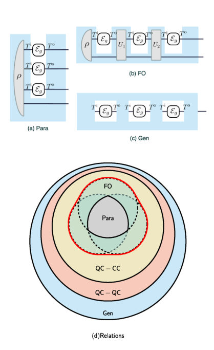
<figcaption class="paper-figure-caption"><b>Fig 1.</b> FIG. 1: Schematic of metrological strategies with dif- ferent causal structures. (a) Parallel strategies (Para), where all channels act simultaneously on an initial state ρ. (b) Fixed-order (FO) strategies with intermediate adaptive operations Ui between channel uses. (c) General ICO strategies (Gen). (d) Hierarchy of strategy classes.</figcaption>
</figure>
<figure class="paper-figure-card">
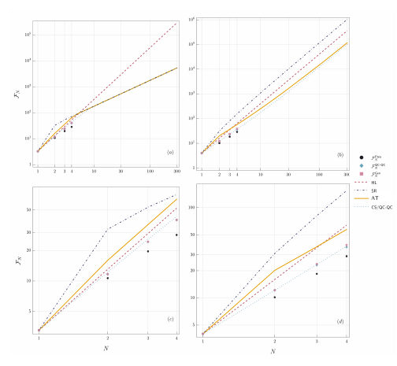
<figcaption class="paper-figure-caption"><b>Fig 2.</b> FIG. 2: Numerical comparison of the optimized QFI FN versus the number of channel uses N for parallel, QC–QC, and general-ICO strategies, together with the HL, SR, AT, and CS/QC–QC iterative bounds. Pan- els (a) and (c) consider phase estimation under a gener- alized amplitude-damping (GAD) channel described by Kraus operators E0 = cos θ  |0⟩⟨0| + √1 −p|1⟩⟨1|  , E1 = cos θ√p|0⟩⟨1|, E2 = sin θ √1 −p|0⟩⟨0| + |1⟩⟨1|  , and E3 = sin θ√p|1⟩⟨0| with p = 0.31 and θ = π/4, and the parameter is encoded by Ug = exp(−igσ3) with g = 1/2 before the noise. This channel satisfies the Hamiltonian- in-Kraus-span condition and is therefore SQL-limited. Panels (b) and (d) consider a...</figcaption>
</figure>

**Summary.** This work rigorously analyzes the role of indefinite causal order (ICO) in quantum metrology for channel estimation. By deriving and comparing universal upper bounds on the Quantum Fisher Information, the authors conclude that ICO does not provide an asymptotic advantage over standard parallel measurement strategies. This clarifies the ultimate role of causal structure as a metrological resource.

**Why it may be interesting.** It provides a rigorous theoretical boundary on how quantum control over causality can enhance measurement precision, which is fundamental to quantum sensing and quantum information theory.

Detailed structure

**Main problem.** The paper investigates the ultimate precision limits of quantum metrology when the causal order of quantum operations is indefinite (ICO), specifically for estimating a single parameter encoded in multiple uses of a quantum channel.

**Main result.** The authors prove that for general ICO strategies, the asymptotic Quantum Fisher Information (QFI) does not exceed that achievable by optimal parallel strategies, meaning ICO provides no fundamental asymptotic advantage.

**Method.** The analysis involves deriving universal Heisenberg-scaling upper bounds for the QFI using process-matrix formalism and iterative decomposition techniques, comparing these bounds against known limits.

**Model / system.** The system under study is quantum channel estimation using $N$ uses of a finite-dimensional quantum channel, analyzed through the process-matrix formalism and considering strategies ranging from fixed-order to general indefinite causal order.

**Key observables.** Quantum Fisher Information (QFI), $	ext{F}^N(E_g)$, and its scaling behavior in the Standard Quantum Limit (SQL) and Heisenberg Limit (HL) regimes.

**Important parameters / regimes.** Number of uses ($N$), channel parameters ($\mathcal{E}_g$), and the comparison between Parallel ($	ext{Para}$), Fixed-Order ($	ext{FO}$), and General ICO ($	ext{Gen}$) strategies.

**Assumptions / limitations.** The analysis is asymptotic ($N 	o \infty$), suggesting any potential advantage from ICO would be confined to finite-query or subleading-order effects.

**Figures summary.** Figures compare the optimized QFI for various strategies (Parallel, QC-QC, General-ICO) against theoretical bounds (HL, SR, AT) for specific channels like Generalized amplitude damping.

**Paper structure.** The paper establishes the general framework using the process-matrix, derives a universal Heisenberg-scaling upper bound for ICO, refines this bound for noisy channels, and finally proves an asymptotically tight bound showing equivalence with parallel strategies.

Abstract

Quantum metrology with indefinite causal order (ICO) has attracted intense interest due to its potential to surpass the limitations of conventional fixed-order strategies. A key open question is whether ICO can fundamentally enhance asymptotic precision scaling. In this work, we bridge this gap for the estimation of a single parameter encoded in $N$ identical uses of a finite-dimensional quantum channel. We first establish a universal Heisenberg-scaling upper bound for the full general ICO process-matrix class and show that for unitary channels its optimal quantum Fisher information (QFI) coincides exactly with that of parallel strategies. For noisy channels, a structurally refined bound shows that channels restricted to the standard quantum limit (SQL) under parallel strategies remain SQL-limited under general ICO strategies. Most significantly, an asymptotically tight (AT) bound is derived to close the remaining possibility of an asymptotic ICO advantage by showing that general ICO and optimal parallel strategies have exactly the same leading QFI coefficient in both the SQL and Heisenberg regimes. For the operationally motivated class of quantum circuits with quantum control of causal order, we further obtain an iterative constraint on finite-query precision whose asymptotic limit agrees with that of the AT bound. Our results clarify the ultimate role of indefinite causality as a metrological resource for quantum channel estimation.

[↑ back to top](#top)

### [Reply to the Comment on "The Axiom of Choice and the No-Signalling Principle"](http://arxiv.org/abs/2609.04321v1)

**Authors:** Ämin Baumeler, Borivoje Dakić, Flavio Del Santo, Miloš Milovanović  
**Type:** theory · **Category:** other · **PDF:** <https://arxiv.org/pdf/2609.04321v1>  
**Analysis basis:** full PDF text, analyzed in chunks
**Topic relevance:** `quantum measurements` **2/5**

↔ Scroll figures horizontally

<figure class="paper-figure-card">
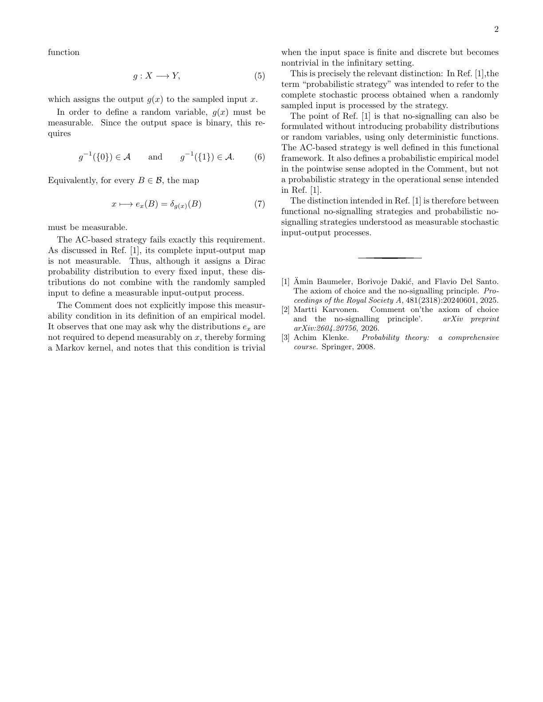
<figcaption class="paper-figure-caption"><b>Fig 1.</b> Low-resolution page preview, page 2</figcaption>
</figure>

**Summary.** This paper rigorously distinguishes between two ways of defining a probabilistic no-signalling strategy. It shows that while one definition only requires defining a probability measure for every fixed input, the physically meaningful operational definition requires this dependence to be measurable, forming a Markov kernel. The key finding is that strategies relying on the Axiom of Choice fail this crucial measurability test.

**Why it may be interesting.** It provides a rigorous mathematical constraint (measurability/Markov kernel) on what constitutes a physically realizable probabilistic process, which has implications for defining operational quantum correlations.

Detailed structure

**Main problem.** The paper clarifies the mathematical requirements for a 'probabilistic no-signalling strategy' when the input is itself a random variable, contrasting two definitions of such a strategy.

**Main result.** A strategy constructed using the Axiom of Choice, while defining a valid probability measure for any fixed input, fails the necessary measurability condition required for the overall process to be a proper Markov kernel.

**Method.** The analysis relies on comparing the pointwise definition of a strategy (for fixed inputs) against the operational definition requiring the conditional distributions to form a measurable Markov kernel.

**Model / system.** The framework involves abstract probability spaces for inputs ($X$) and outputs ($Y$), focusing on the mathematical structure of conditional probability distributions rather than a specific physical Hamiltonian or system.

**Key observables.** The measurability of the conditional output distribution $\epsilon_x$ with respect to the input $x$ and the input distribution $\mu$.

**Important parameters / regimes.** The input space $X$ and output space $Y$ are abstract measurable spaces; the core parameter is the requirement for the conditional distributions to form a Markov kernel.

**Assumptions / limitations.** The analysis assumes the existence of a background probability distribution $\mu$ over the input space $X$ and requires the input and output spaces to be measurable.

**Paper structure.** The paper proceeds by first defining the context (the No-Signalling Principle and strategies), then contrasting the definition used in a prior comment versus the intended operational definition, and finally proving that the AC-based construction violates the measurability requirement of the latter.

Abstract

We clarify the meaning of a probabilistic no-signalling strategy in Ref [Proc. R. Soc. A 481, 20240601]. For every fixed input, the deterministic strategy constructed using the Axiom of Choice can indeed be represented by a Dirac probability distribution over the outputs. The relevant distinction arises when one considers the complete process from input to output, with the input itself sampled according to a probability distribution. In this case, the input and output spaces must be measurable and the dependence of the conditional output distribution on the input must also be measurable. Equivalently, the conditional distributions must form a Markov kernel. The Axiom-of-Choice strategy fails precisely this measurability requirement.

[↑ back to top](#top)

### [Restricting the effects hides a nonphysical symmetry from every causal structure](http://arxiv.org/abs/2609.05322v1)

**Authors:** Chon-Fai Kam  
**Type:** theory · **Category:** other · **PDF:** <https://arxiv.org/pdf/2609.05322v1>  
**Analysis basis:** full PDF text, analyzed in chunks
**Topic relevance:** `quantum measurements` **2/5**

↔ Scroll figures horizontally

<figure class="paper-figure-card">
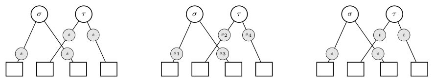
<figcaption class="paper-figure-caption"><b>Fig 1.</b> Figure 1: Where to attach the reference frame. Circles are sources, squares are parties, shaded discs are frame registers carrying a sign, and the two sources σ and τ each feed two parties, with their wires crossing so that grouping by source is visibly not grouping by position. In (a) a single register is shared by the whole experiment, which is the simulation of Ref. [3], and a causal structure with independent sources does not permit it. In (b) each wire carries its own register. That is permitted, but the sign patterns that survive the encoding then transpose single systems, and by Eq. (22) positivity fails. In (c) the register is attached to the source, so that wires from the same...</figcaption>
</figure>

**Summary.** This theoretical work explores the relationship between symmetries and the structure of quantum correlations. It demonstrates that by restricting the set of allowed effects, a quantum theory can appear indistinguishable from its symmetry-invariant subtheory, even when the symmetry itself is nonphysical. This highlights that the true boundary of quantum theory lies in the structure of its effects, not just its states.

**Why it may be interesting.** It provides a deep, foundational understanding of what truly constitutes a 'quantum' theory versus a classical or restricted version, which impacts how we model physical constraints like causality.

Detailed structure

**Main problem.** The paper investigates whether restricting the effects of a quantum theory can hide a nonphysical symmetry, leading to the coincidence of correlations between the theory and its symmetry-symmetrized subtheory.

**Main result.** The authors show that for a constructed theory $T$ (by restricting effects), the symmetry can be carried undetectably, meaning $T$ and its symmetrized subtheory $sT$ share the same correlations in all causal structures.

**Method.** The analysis compares the correlations of a general quantum theory $T$ with its symmetry-invariant subtheory $sT$, using concepts like sectorial closure and analyzing the gap between their respective correlation sets.

**Model / system.** The study uses generalized probabilistic theories defined by states, effects, and operations, focusing on the comparison between the full theory and its real-amplitude (complex conjugation invariant) subtheory.

**Key observables.** Correlations measured in various causal structures (e.g., bilocality scenario); the existence of a 'gap' between the correlations of $T$ and $sT$.

**Important parameters / regimes.** The degree of restriction on effects (e.g., partial transpose conditions); the structure of the symmetry group acting on the system.

**Assumptions / limitations.** The analysis relies on the concept of sectorial closure, which is shown to be sufficient for the absence of a gap under finite groups.

**Figures summary.** Not specified in the notes; the notes focus on mathematical derivations and theoretical comparisons rather than figure descriptions.

**Paper structure.** The paper develops the framework by defining the theory $T$ and its symmetry $sT$, proving that sectorial closure is key, and then constructing a specific theory $T$ whose effect restriction masks the symmetry, leading to the main conclusion.

Abstract

Real-amplitude quantum theory is the subtheory of quantum theory invariant under complex conjugation, and experiments in a network of independent sources have measured correlations above the real bound. A theory can nevertheless carry the same conjugation without complete positivity and still have exactly the correlations of its own conjugation-invariant subtheory in every causal structure, the bilocality scenario included. The states of that theory are all the density matrices, and its effects are the operators every partial transpose of which is again a quantum effect. Its symmetrized subtheory simulates it once each source carries a reference frame rather than each system. One map therefore receives three different verdicts in three theories, so the symmetry alone marks no boundary at all, and what sustains the separation in quantum theory is a property of quantum theory. Quantum theory admits every effect its states permit and this theory does not. What does have a boundary is the class of theories where the correlations of a theory and of its symmetrized subtheory coincide. We show that sectorial closure, meaning invariance of the effects and the operations under the symmetry acting independently on each source, suffices for the absence of a gap under any finite group, and that it cannot be weakened on the effects. Fixing unrestricted states and conjugation makes the effects of that theory the largest the symmetry admits, and its operations the largest sectorially closed ones. Locating where sectorial closure fails, for a candidate effect set built from a fixed bound entangled state, is a finite computation on a single ray of effects.

[↑ back to top](#top)

### [Schatten norms and determinants of linear combinations of matrix tensor powers via virtual representations](http://arxiv.org/abs/2609.04341v1)

**Authors:** Martin Áron Juhász, Mihály Weiner  
**Type:** theory · **Category:** other · **PDF:** <https://arxiv.org/pdf/2609.04341v1>  
**Analysis basis:** full PDF text, analyzed in chunks
**Topic relevance:** `analog quantum simulation` **2/5**

↔ Scroll figures horizontally

<figure class="paper-figure-card">
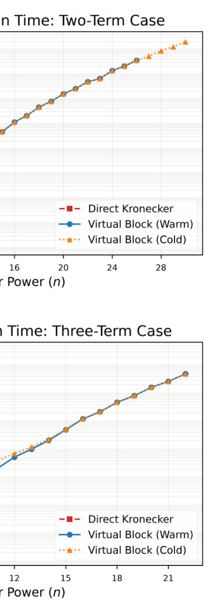
<figcaption class="paper-figure-caption"><b>Fig 1.</b> Figure 1: Single-thread CPU timings for the two-term (top) and three-term (bottom) trace- norm families. The ordinate is logarithmic. Warm timings reuse the calculator and cached representation data; cold timings start a fresh Python process. The direct method explicitly forms the Kronecker matrix and computes its dense SVD. The virtual-block method scales reliably up to n = 30. In the two-term case, after n = 26, warm benchmarking was skipped, since package loading overhead is constant in n. The three-term case was only performed until n = 22, as that was enough to show that the method is almost as fast for three-term, as for two-term, see Table 2</figcaption>
</figure>

**Summary.** This paper presents a novel, efficient mathematical technique to calculate the Schatten norms and determinants of sums of matrix tensor powers. By employing advanced representation theory, it transforms an exponentially complex problem into one solvable in polynomial time with respect to the power $n$. This breakthrough allows for the numerical analysis of complex quantum structures previously considered computationally intractable.

**Why it may be interesting.** Although highly mathematical, the ability to efficiently compute high-order correlation functions or expectation values involving tensor products of operators (like those found in quantum information or many-body physics) by exploiting underlying symmetry structures is crucial for analyzing complex quantum systems.

Detailed structure

**Main problem.** The paper addresses the computationally intractable problem of finding Schatten norms and determinants for linear combinations of high-order matrix tensor powers, $X_n = \sum t_i A_i^{\otimes n}$, as the power $n$ grows.

**Main result.** The authors developed an exact representation-theoretic method that computes these quantities in polynomial time in $n$, bypassing the exponential storage requirements of the full tensor construction.

**Method.** The method leverages Schur–Weyl duality and Jacobi–Trudi identities to decompose the problem into sums over symmetric powers (virtual representations), allowing for efficient, block-diagonal computation.

**Model / system.** The mathematical model involves matrices $A_i \in M_d(\mathbb{C})$ and their tensor powers. While the problem has physical analogues in quantum hypothesis testing, the core focus is on the algebraic structure of these tensor combinations.

**Key observables.** Schatten $p$-norm ($\|X_n\|_p$) and determinants of the linear combination $X_n$.

**Important parameters / regimes.** Matrix dimension $d$, number of terms $s$, and the power $n$. The difficulty scales rapidly with $s \ge 3$.

**Assumptions / limitations.** The method relies on the additivity of the Schatten $p$-functional, restricting its formal applicability to $0 < p < \infty$ (it does not cover the operator norm, $p=\infty$).

**Figures summary.** Figure 1 compares the runtime of the direct Kronecker construction versus the virtual-block method for two- and three-term trace-norm calculations, showing the dramatic computational advantage of the virtual method as $n$ increases.

**Paper structure.** The paper builds from establishing the computational bottleneck (exponential complexity) to introducing the representation-theoretic framework (Schur modules, Jacobi-Trudi identities), deriving master formulas for the norms/determinants, and finally benchmarking the resulting virtual-block algorithm against the direct construction.

Abstract

Let $$X_n=\sum_{i=1}^s t_i A_i^{\otimes n},$$ where $A_1,\ldots,A_s\in M_d(\mathbb C)$ and $t_1,\ldots,t_s\in\mathbb C$ are fixed, while $n$ grows. Direct computation of determinants or Schatten norms of $X_n$ is exponential in $n$. For a single tensor power these quantities are elementary, and even the determinant of a generic two-term combination admits a reduction to polynomially many scalar factors; however, no analogous elementary reduction is available for three or more terms.   We give an exact representation-theoretic method which, for fixed $d$ and $s$, computes $\|X_n\|_p$, $0<p<\infty$, and determinants in polynomial time in $n$. Schur--Weyl duality yields a simultaneous block decomposition, while Jacobi--Trudi identities in the Grothendieck ring replace Schur modules by signed combinations of tensor products of symmetric powers.   For $d=3$, each irreducible contribution reduces to the difference of two explicitly computable symmetric-power terms, leading to an open-source implementation. In a single-thread CPU benchmark, a genuine three-term $3\times3$ trace-norm problem with $n=18$ is evaluated in about $47$ seconds, whereas just storing the unreduced matrix would require approximately $2.4\times10^{18}$ bytes. Direct and reduced computations agree to relative error below $3.4\times10^{-15}$ throughout their common range $n\leq9$.

[↑ back to top](#top)

### [Toward Resilient Many-Body Formulations under Incomplete Correlation Models: A Dual-Space Variational Formulation](http://arxiv.org/abs/2609.04387v1)

**Authors:** Vibin Abraham, Bhumika Jayee, Bo Peng, Nicholas P. Bauman, Karol Kowalski  
**Type:** theory · **Category:** strongly correlated electrons · **PDF:** <https://arxiv.org/pdf/2609.04387v1>  
**Analysis basis:** full PDF text, analyzed in chunks
**Topic relevance:** `Keldysh / 2PI / non-Gaussian methods` **2/5**

↔ Scroll figures horizontally

<figure class="paper-figure-card">
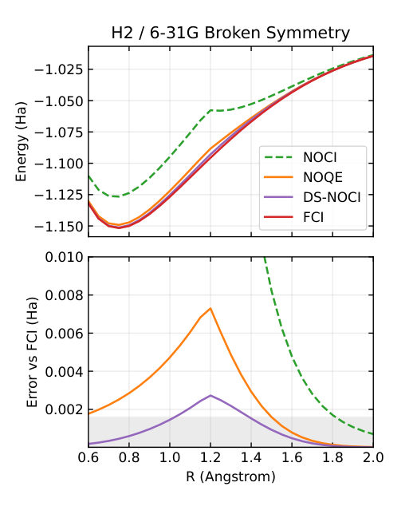
<figcaption class="paper-figure-caption"><b>Fig 1.</b> FIG. 1. H2/6-31G potential-energy surface obtained from two spin-complementary broken-symmetry UHF references. The upper panel shows total energies and the lower panel shows errors relative to FCI. Correlated companions are generated using unregularized UMP2 opposite-spin doubles amplitudes.</figcaption>
</figure>
<figure class="paper-figure-card">
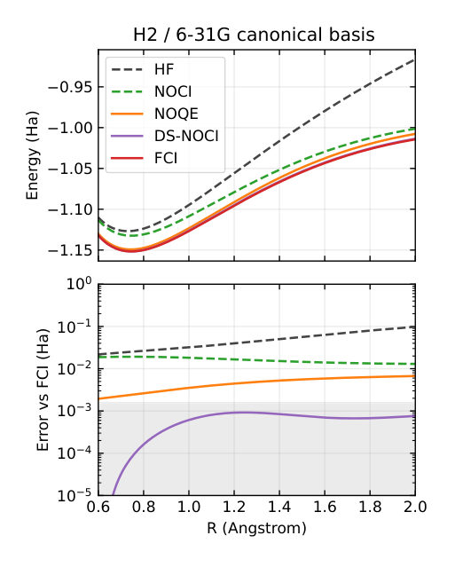
<figcaption class="paper-figure-caption"><b>Fig 2.</b> FIG. 2. H2/6-31G potential-energy surface in the canonical molecular-orbital representation using (1σg)2 and (1σu)2 as references. The upper panel shows total energies and the lower panel shows errors relative to FCI.</figcaption>
</figure>
<figure class="paper-figure-card">
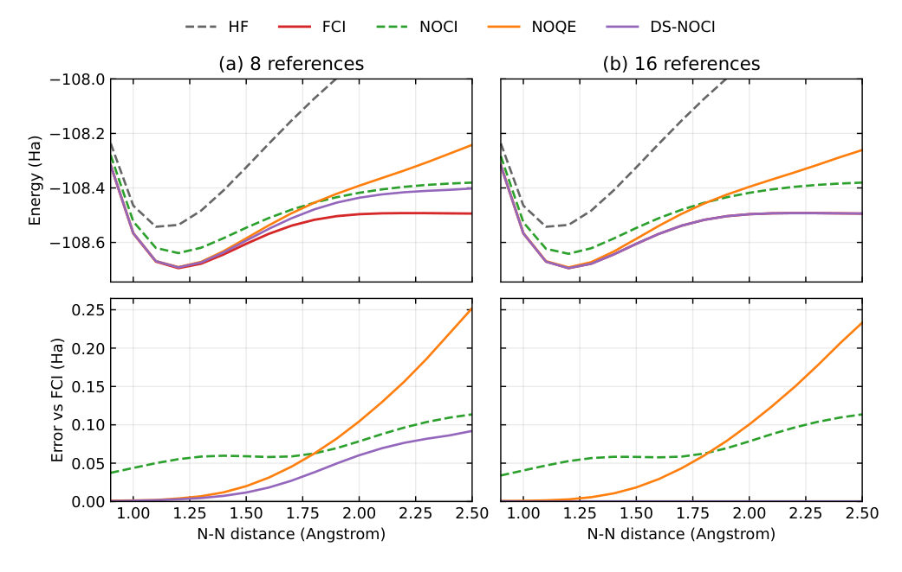
<figcaption class="paper-figure-caption"><b>Fig 3.</b> FIG. 3. N2/STO-6G potential-energy curves in a (6e, 6o) active space using (a) 8 and (b) 16 closed-shell seniority-zero references. The upper panels show the total energies and the lower panels show errors relative to FCI. Correlated companions are generated using doubles-only level-shifted MP2 amplitudes with δ = 0.2 Eh and no subsequent optimization. In panel (b), the DS-NOCI curve is indistinguishable from FCI: its error is below 10−7 Eh from R = 1.0 to 2.5 ˚A, and consequently lies on the horizontal axis in the lower panel.</figcaption>
</figure>
<figure class="paper-figure-card">
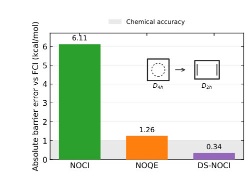
<figcaption class="paper-figure-caption"><b>Fig 4.</b> FIG. 4. Absolute cyclobutadiene automerization-barrier er- rors relative to CASCI/FCI(4e, 4o). Correlated companions use unregularized, reference-specific MP2-based amplitudes without subsequent optimization. The shaded region denotes chemical accuracy.</figcaption>
</figure>
<figure class="paper-figure-card">
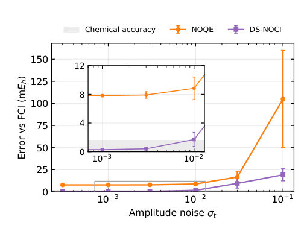
<figcaption class="paper-figure-caption"><b>Fig 5.</b> FIG. 5. Error relative to FCI for the correlated space only NOQE and DS-NOCI descriptions of linear H4/STO-3G at R = 2.0 bohr as a function of Gaussian perturbations to the MP2 doubles amplitudes. Markers denote the mean over 200 realizations and error bars indicate the standard deviation.</figcaption>
</figure>

**Summary.** This paper introduces the Dual-Space Nonorthogonal Configuration Interaction (DS-NOCI) framework to improve quantum simulations of strongly correlated systems. It addresses the critical issue of robustness by retaining a classical reference manifold alongside quantum-generated correlated states. This dual-space approach ensures that the calculated ground-state energy remains variationaly bounded by the best possible result from either component alone, making it resilient to model incompleteness and noise.

**Why it may be interesting.** It provides a rigorous theoretical framework for building quantum algorithms for chemistry that explicitly accounts for and mitigates errors arising from both the underlying many-body theory (incomplete correlation models) and the quantum hardware itself.

Detailed structure

**Main problem.** Developing quantum many-body formulations that remain robust and useful despite inherent imperfections, such as incomplete correlation models, approximate wave function ansätze, and hardware/statistical noise.

**Main result.** The proposed Dual-Space Nonorthogonal Configuration Interaction (DS-NOCI) framework ensures that the calculated ground-state energy is no higher than the energy obtained from either the reference-only or correlated-only descriptions, preventing variational degradation.

**Method.** The method constructs a variational space by explicitly retaining a classically accessible nonorthogonal reference manifold and coupling it variationally to a second manifold generated by correlated quantum states.

**Model / system.** The study focuses on electronic structure calculations for correlated many-body systems, using molecular benchmarks like H2 dissociation to test the framework's resilience.

**Key observables.** Ground-state energy ($E$), which is the primary variational observable.

**Important parameters / regimes.** The degree of correlation (multireference character) and the level of noise/imperfection in the input model.

**Assumptions / limitations.** The size consistency of the resulting energies is guaranteed assuming the basis functions are multiplicatively separable in the Noninteracting Subsystem Limit (NSL).

**Paper structure.** The paper introduces the DS-NOCI framework by identifying the limitations of current methods when faced with imperfect information. It details the mathematical construction by coupling the reference and correlated sectors variationally, proves the energy bounding property, and validates the approach using molecular benchmarks.

Abstract

Quantum simulations of correlated many-body systems will inevitably operate with imperfect information: the prepared states may arise from incomplete or approximate ansatze, while their measured Hamiltonian and overlap matrix elements are additionally affected by hardware and statistical noise. Robust quantum algorithms will be those that can improve upon reliable lower-level descriptions in spite of these imperfections. We introduce a dual-space nonorthogonal configuration-interaction (DS-NOCI) framework built around this principle. Rather than replacing a classically accessible NOCI reference manifold with correlated quantum states, DS-NOCI retains both spaces and couples them variationally. The reference sector provides a stable many-body backbone, while the quantum states contribute whatever additional correlation directions they contain. With exact matrix elements, the enlarged dual space gives a ground-state energy no higher than either the reference-only NOCI or correlated-only quantum-NOCI spaces, ensuring that an incomplete correlation model cannot degrade the underlying variational description. The additional reference--correlated matrix elements require only one correlated state preparation and are therefore less demanding than the correlated--correlated block already required by quantum variant of NOCI. Molecular benchmarks further show enhanced resilience to imperfect amplitudes and noisy matrix elements. DS-NOCI thus provides a general strategy for building quantum many-body formulations that remain useful when both correlation models and quantum computations are necessarily incomplete and noisy.

[↑ back to top](#top)

### [Diffusion under competing bulk and surface stopping mechanisms](http://arxiv.org/abs/2609.05247v1)

**Authors:** Yilin Ye  
**Type:** theory · **Category:** statistical mechanics · **PDF:** <https://arxiv.org/pdf/2609.05247v1>  
**Analysis basis:** full PDF text, analyzed in chunks
**Topic relevance:** `Keldysh / 2PI / non-Gaussian methods` **1/5** · `correlated / nonlocal dissipation` **1/5** · `driven-dissipative phase transition` **1/5** · `methods for driven-dissipative` **1/5** · `non-equilibrium universality` **1/5** · `quantum measurements` **1/5**

↔ Scroll figures horizontally

<figure class="paper-figure-card">
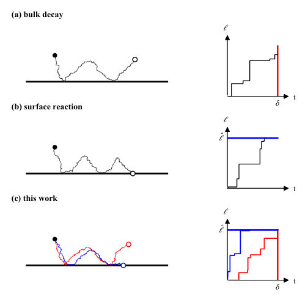
<figcaption class="paper-figure-caption"><b>Fig 1.</b> FIG. 1. Coarse schematic of the competing stopping mech- anisms. Two independent exponential clocks terminate the trajectory: the bulk lifetime δ ∼Exp(p) and surface reaction threshold ˆℓ∼Exp(q). (a) Pure bulk decay (p &gt; 0, q = 0): the trajectory ends at t = δ (vertical line in red). (b) Pure surface reaction (p = 0, q &gt; 0), the trajectory ends at ℓ= ˆℓ(horizon- tal line in blue). (c) Competing mechanisms (p &gt; 0, q &gt; 0): the trajectory may end at either threshold.</figcaption>
</figure>
<figure class="paper-figure-card">
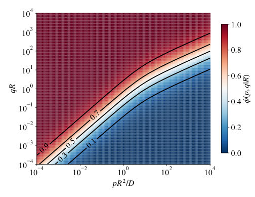
<figcaption class="paper-figure-caption"><b>Fig 2.</b> FIG. 2. Heat map of the splitting probability ϕ(p, q|R) for starting points on the reactive boundary of a three- dimensional ball (R = 1, D = 1) over the (pR2/D, qR) plane in log-log scale. Black curves indicate contour lines at ϕc = 0.1, 0.3, 0.5, 0.7, 0.9.</figcaption>
</figure>
<figure class="paper-figure-card">
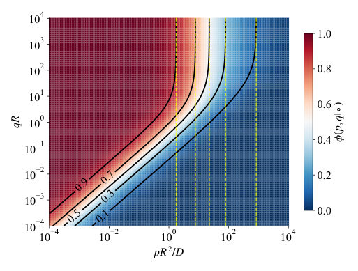
<figcaption class="paper-figure-caption"><b>Fig 3.</b> FIG. 3. Heat map of the splitting probability ϕ(p, q|◦) for uniformly distributed starting points in the three-dimensional ball (R = 1, D = 1) over the (pR2/D, qR) plane in log- log scale. Black curves indicate contour lines at ϕc = 0.1, 0.3, 0.5, 0.7, 0.9. Yellow dashed lines mark the corre- sponding crossover values pc solved from ϕc = ϕ∞(pc|◦) (Eq. (58)). Each (ϕc, pc) reads (0.1, 838.927), (0.3, 78.7298), (0.5, 22.4043), (0.7, 7.69806), and (0.9, 1.74768).</figcaption>
</figure>
<figure class="paper-figure-card">
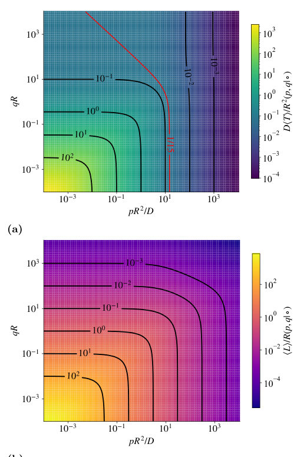
<figcaption class="paper-figure-caption"><b>Fig 4.</b> FIG. 4. Heat maps for uniformly distributed starting points in the ball (R = 1, D = 1) over the (pR2/D, qR) plane in log-log scale. (a) Mean stopping time ⟨T⟩(p, q|◦). Black curves indicate contour lines for ⟨T⟩(p, q|◦) = 10−3, 10−2, 10−1, 100, 101, 102, while the red line is the contour line for TD = R2/(15D) = 1/15. (b) Mean acquired boundary lo- cal time ⟨L⟩(p, q|◦). Black curves indicate contour lines for ⟨L⟩(p, q|◦) = 10−3, 10−2, 10−1, 100, 101, 102.</figcaption>
</figure>
<figure class="paper-figure-card">
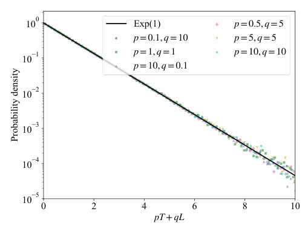
<figcaption class="paper-figure-caption"><b>Fig 5.</b> FIG. 5. Empirical probability densities of the cumulative risk RT = pT + qL obtained by Monte Carlo simulations for sev- eral (p, q) rate pairs (symbols), compared with the unit ex- ponential density (black line). For each (p, q) pair, starting points are uniformly distributed in the ball (R = 1, D = 1). Each dataset contains N = 106 independent trajectories gen- erated by the WoS-EFL algorithm with the boundary layer thickness ε = 10−3.</figcaption>
</figure>

**Summary.** This work analyzes diffusion in a bounded domain where the particle can stop due to either an internal bulk decay or a surface reaction. By treating these as competing exponential processes, the authors derive exact statistics for the stopping time and accumulated surface time. The most striking result is that the combined risk process follows a simple exponential distribution, providing a universal law for competing decay channels.

**Why it may be interesting.** The universal exponential distribution of the total risk process is a powerful result applicable to various open quantum systems where multiple decay or loss channels compete.

Detailed structure

**Main problem.** The paper investigates the joint statistics of two independent, competing stopping mechanisms acting on a diffusing particle in a bounded domain.

**Main result.** The total cumulative risk process ($pT + qL$) is found to be exponentially distributed with a unit rate, and a key identity $p\langle T
angle + q\langle L
angle = 1$ is established.

**Method.** The analysis uses advanced probabilistic methods, including the encounter-based approach and Laplace transforms, to derive moment generating functions and spectral representations.

**Model / system.** The system models reflected diffusion (Brownian motion) in a bounded domain $\Omega$ subject to two independent stopping events: an exponential bulk decay (rate $p$) and a surface reaction triggered by exceeding an exponential local time threshold (rate $q$).

**Key observables.** Stopping time ($T$), acquired boundary local time ($L$), splitting probability ($\phi$), and the total risk process ($pT + qL$).

**Important parameters / regimes.** Bulk decay rate ($p$), surface reaction rate ($q$), and the geometry of the domain (e.g., radius $R$ for a 3D ball).

**Assumptions / limitations.** The bulk decay time and the surface reaction threshold are assumed to be mutually independent exponential random variables.

**Figures summary.** Figures illustrate heat maps showing the dependence of mean stopping time ($\langle T 
angle$), mean acquired local time ($\langle L 
angle$), and the correlation coefficient ($C$) on the rates $p$ and $q$ for a 3D ball.

**Paper structure.** The paper progresses by deriving the marginal distributions and joint Laplace transform of $(T, L)$, establishing key identities like the sum rule, and finally analyzing specific geometries (like the 3D ball) to compute higher moments and correlation coefficients.

Abstract

We investigate reflected diffusion in a bounded domain subject to two independent, competing stopping mechanisms: an exponentially distributed bulk lifetime of rate $p$ and a surface reaction triggered when the boundary local time exceeds an independent exponential threshold of rate $q$. Denoting by $T$ the stopping time and by $L$ the acquired boundary local time at stopping, we derive their marginal distributions, joint Laplace transform, and complete hierarchy of mixed moments. These statistics are determined by the splitting probability $φ$ that surface reaction occurs before bulk decay. In particular, we establish the identity $p\expect{T}+q\expect{L}=1$ and show that the cumulative risk $pT+qL$ is exponentially distributed with unit rate. We further obtain equivalent representations of $φ$ in terms of the Robin-Laplacian and the generalized Steklov spectra. Explicit results for a three-dimensional ball reveal how competing rates $p,q$ control $φ$ and the $(T,L)$ statistics. Monte Carlo simulations test the universal cumulative-risk law.

[↑ back to top](#top)

### [Stability of Collective Neutrino Oscillations -- A Distributional Approach](http://arxiv.org/abs/2609.04441v1)

**Authors:** Rupak Majumder, Dwaipayan Mukherjee, Shamik Gupta, Basudeb Dasgupta  
**Type:** theory · **Category:** statistical mechanics · **PDF:** <https://arxiv.org/pdf/2609.04441v1>  
**Analysis basis:** full PDF text, analyzed in chunks
**Topic relevance:** `Keldysh / 2PI / non-Gaussian methods` **1/5** · `correlated / nonlocal dissipation` **1/5** · `driven-dissipative phase transition` **1/5** · `methods for driven-dissipative` **1/5** · `non-equilibrium universality` **1/5**

↔ Scroll figures horizontally

<figure class="paper-figure-card">
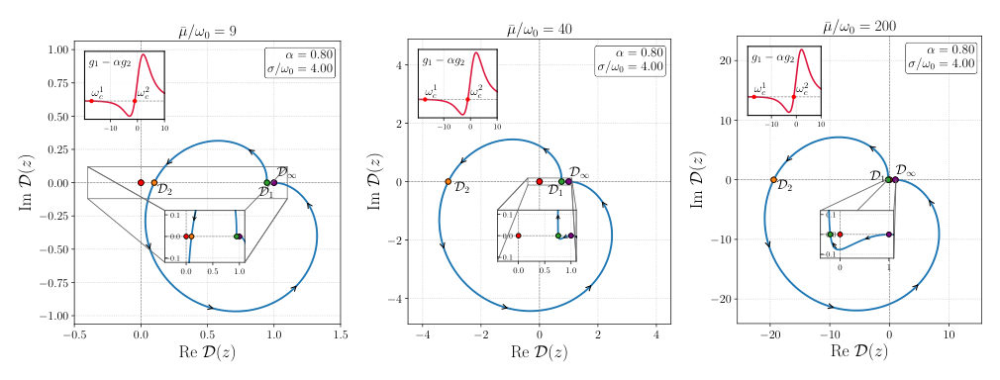
<figcaption class="paper-figure-caption"><b>Fig 1.</b> Figure 1. Contours of the dispersion relation D(z) for the crossing criterion for the effective two-Lorentzian spectrum g1(ω) −αg2(ω) shown in the top-left inset. The panels show the contours below, inside, and above the unstable interval. The center insets show a zoomed-in region near the origin, with the contours not encircling, encircling, and not encircling the origin, respectively.</figcaption>
</figure>
<figure class="paper-figure-card">
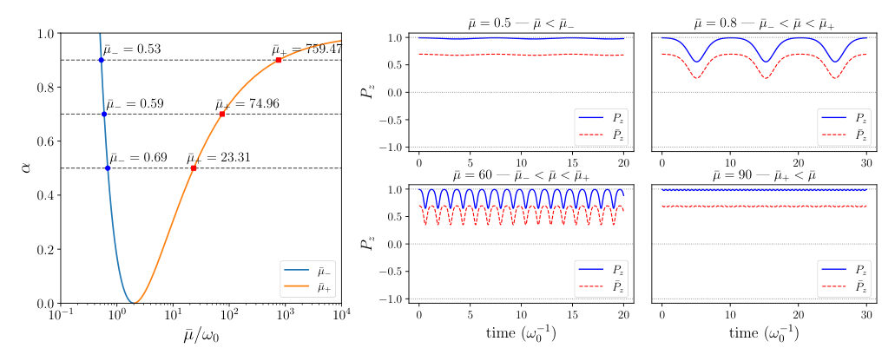
<figcaption class="paper-figure-caption"><b>Fig 2.</b> Figure 2. Phase diagram and time evolution for the two thick-beam model. Left panel: The analytically predicted phase diagram in the ¯µ/ω0 −α plane, showing the stable and unstable bipolar regions separated by the boundaries ¯µ± given in Eq. (24). The horizontal dashed lines mark three representative asymmetry values, α = 0.9, 0.7, 0.5, with the corresponding critical points indicated. Right panels: Time evolution of Pz and ¯Pz for α = 0.7 as the neutrino self-interaction strength ¯µ is varied. For ¯µ &lt; ¯µ−and ¯µ &gt; ¯µ+, the Pz and ¯Pz remain close to their initial values. Within ¯µ−&lt; ¯µ &lt; ¯µ+, they develop bipolar oscillations, with small dips near the lower boundary and large-amplitude...</figcaption>
</figure>
<figure class="paper-figure-card">
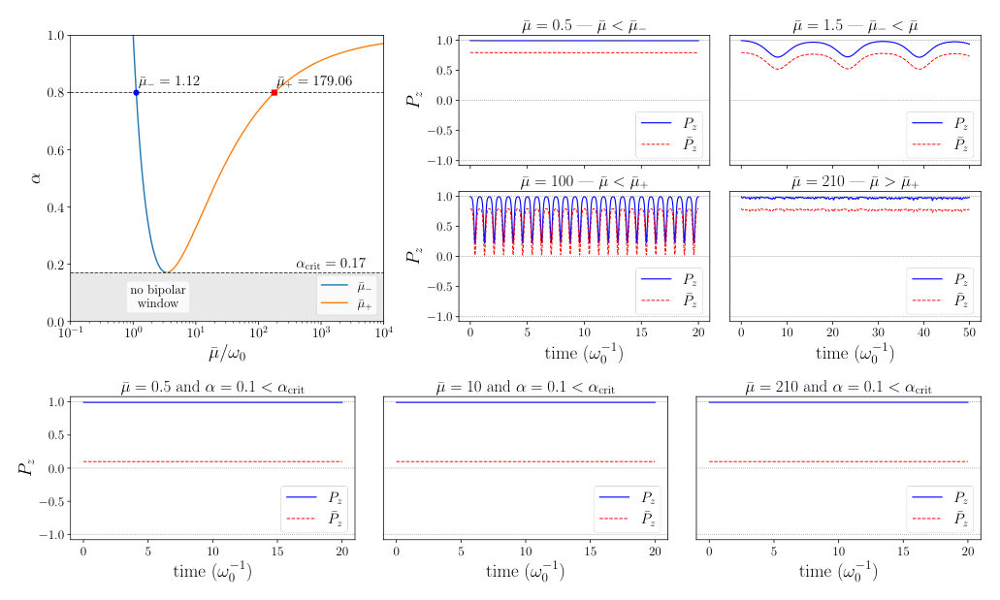
<figcaption class="paper-figure-caption"><b>Fig 3.</b> Figure 3. Phase diagram and time evolution for the two-Lorentzian model. The top-left panel shows the analytical instability boundaries in the ¯µ/ω0 −α plane, obtained for the two-Lorentzian spectrum given in Eq. (29). The upper-right panels show the time evolution of Pz and ¯Pz for α = 0.8, and ¯µ is varied across the stable and unstable regimes. The lower panels show the evolution for α = 0.1 in the no-bipolar-window (shaded in gray); no instability appears even as ¯µ is varied across a large range.</figcaption>
</figure>
<figure class="paper-figure-card">
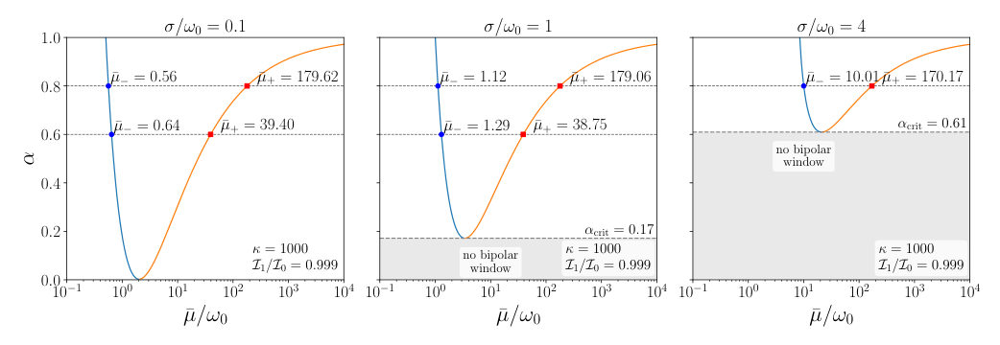
<figcaption class="paper-figure-caption"><b>Fig 4.</b> Figure 4. Phase diagrams for the north-south cohort with two-Lorentzian distributions centered at ±ω0. Here κ and I1(κ)/I0(κ) are fixed for all the panels, while the Lorentzian width is varied across the panels: σ/ω0 = 0.1, 1, 4. As the width of the frequency distribution increases, the bipolar window narrows. For sufficiently broad widths, the no-bipolar-window becomes significantly large in the phase space, and no bipolar instability is predicted.</figcaption>
</figure>
<figure class="paper-figure-card">
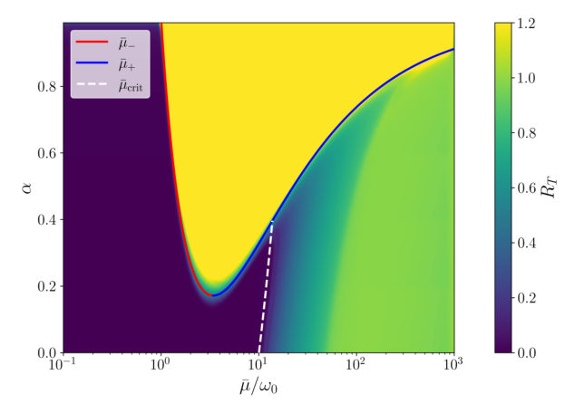
<figcaption class="paper-figure-caption"><b>Fig 5.</b> Figure 5. Combined phase diagram in the ¯µ/ω0 −α plane for the two-Lorentzian spectrum. The red and blue solid curves denote the analytical instability boundaries ¯µ−and ¯µ+, respectively, while the white dashed curve shows the synchronization threshold ¯µcrit, continued into the instability region for numerical comparison. Dark regions correspond to RT ≃0, while nonzero values indicate collective transverse motion. The color scale is clipped at RT = 1.2 for visual clarity. In the simulations we use ω0 = 1, σ/ω0 = 1, δ = 2θmix = 0.1 rad, and κ = 1000, with 1.5 × 104 frequency modes per cohort and a total of 4 × 105 sampled points in the ¯µ/ω0 −α plane.</figcaption>
</figure>

**Summary.** This work analyzes the stability of collective neutrino oscillations using a sophisticated distributional approach rooted in statistical mechanics. By deriving and analyzing a nonlinear Fokker-Planck equation, the authors establish a stability criterion that is valid for any initial state, not just those near full coherence. This provides a significant theoretical advancement for understanding flavor dynamics in extreme astrophysical environments.

**Why it may be interesting.** The use of a distributional approach and connection to synchronization phenomena (Kuramoto model) provides a powerful, non-standard tool for analyzing non-equilibrium many-body dynamics, relevant to open quantum systems.

Detailed structure

**Main problem.** The paper investigates the stability of collective neutrino oscillations, treating the system in the thermodynamic limit to derive a generalized stability criterion.

**Main result.** A distributional approach yields an eigenvalue condition that determines stability for any initial distribution, significantly extending beyond conventional linear stability analyses.

**Method.** The authors derive and analyze a nonlinear Fokker-Planck equation for the one-body distribution, linearizing it around stationary solutions to find the growth/decay rate of perturbations.

**Model / system.** The system models neutrino flavor oscillations in a dense environment, governed by the evolution of the one-body distribution function F(S, omega, t) on the flavor sphere S^2.

**Key observables.** The order parameter (P), the complex frequency of perturbations (Omega), and the stability phase diagrams.

**Important parameters / regimes.** Concentration parameter (kappa), asymmetry parameter (alpha), and the interaction strength (mu).

**Assumptions / limitations.** The analysis uses the single-angle approximation and linearizes the evolution equation around specific stationary states.

**Paper structure.** The paper establishes the nonlinear Fokker-Planck equation, derives the stationary solutions (like the 'north-south' family), and then analyzes the stability by linearizing the equation and solving the resulting eigenvalue condition.

Abstract

We study the stability of collective neutrino oscillations using a distributional approach motivated by the statistical mechanics of Kuramoto synchronization. Treating the ensemble of neutrino flavor polarization vectors in the thermodynamic limit $N\to\infty$, we derive an exact nonlinear Fokker--Planck (continuity) equation for the one-body distribution $F(\vec{\mathbf{S}},ω,t)$ on the flavor sphere. This equation admits a two-parameter family of azimuthally symmetric stationary solutions, whose stability we analyze by linearizing around them. The resulting eigenvalue condition determines the growth or decay rate of small perturbations from \emph{any} initial distribution -- not merely from a state close to full flavor coherence -- thereby going significantly beyond the conventional linear stability analysis of collective modes. In special limits the condition reproduces known synchronization thresholds in the two-beam model, providing a non-trivial check of the framework. We present analytical results for the eigenvalue equation and explore stability phase diagrams for physically relevant frequency distributions.

[↑ back to top](#top)

### [Thermal lifetime of the centralized repetition code: From quantum annealing to social dynamics](http://arxiv.org/abs/2609.04408v1)

**Authors:** Ari Mizel, Van Molino  
**Type:** theory · **Category:** quantum information and computing · **PDF:** <https://arxiv.org/pdf/2609.04408v1>  
**Analysis basis:** full PDF text, analyzed in chunks
**Topic relevance:** `Keldysh / 2PI / non-Gaussian methods` **1/5** · `correlated / nonlocal dissipation` **1/5** · `driven-dissipative phase transition` **1/5** · `methods for driven-dissipative` **1/5** · `non-equilibrium universality` **1/5**

↔ Scroll figures horizontally

<figure class="paper-figure-card">

<figcaption class="paper-figure-caption"><b>Fig 1.</b> FIG. 1. Depiction of the centralized repetition code in which each circle represents a qubit. The spokes represent interac- tions between the central qubit (hub) and each of the periph- eral qubits. The case of n = 13 qubits is shown.</figcaption>
</figure>
<figure class="paper-figure-card">
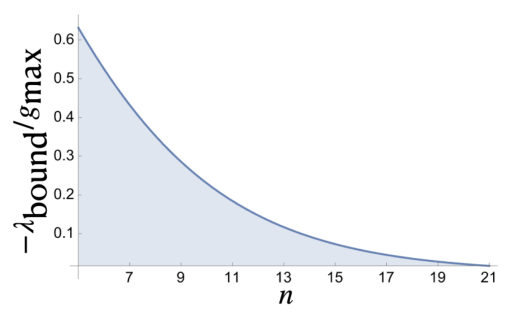
<figcaption class="paper-figure-caption"><b>Fig 2.</b> FIG. 2. Plot of bound (16) on λ1 as a function of n for the particular choice βJ = 0.8. As n increases to ∞, the code becomes increasingly stable despite the fact that the temperature kBT exceeds J.</figcaption>
</figure>

**Summary.** This paper analyzes the thermal stability of the centralized repetition code, a quantum error-correcting code, by modeling its interaction with a thermal bath. Using the Lindblad master equation and spectral analysis, the authors prove that the star-graph configuration imparts significant thermal stability. This stability allows for the robust storage of quantum information, demonstrating a key mechanism for fault-tolerant quantum computation.

**Why it may be interesting.** This work directly addresses the fundamental challenge of noise in quantum computation by analyzing the thermal robustness of a specific quantum error-correcting code structure.

Detailed structure

**Main problem.** The paper investigates the thermal stability and lifetime of the centralized repetition code when subjected to environmental noise.

**Main result.** The centralized configuration demonstrates thermal stability, allowing for the robust storage of a logical bit, with the storage lifetime scaling exponentially with the system size $n$.

**Method.** The analysis employs the Lindblad master equation framework, utilizing spectral analysis and a variational argument to bound the relaxation rate (second eigenvalue).

**Model / system.** The system is the centralized repetition code, modeled as a star-graph structure with a central hub qubit connected by ferromagnetic Ising interactions to peripheral qubits. The evolution is governed by a master equation derived from the total Hamiltonian.

**Key observables.** Thermal lifetime ($	au \sim 1/|\lambda_1|$), which determines the rate of information decay.

**Important parameters / regimes.** Coupling strength ($J$), inverse temperature ($eta = 1/k_B T$), and system size ($n$).

**Assumptions / limitations.** The analysis relies on Born-Markov assumptions for the bath interaction and uses a variational approach to bound the relaxation rate.

**Figures summary.** Figure 1 illustrates the structure of the centralized repetition code for $n=13$. Figure 2 plots the bound on the second eigenvalue ($\lambda_1$) versus $n$, showing it approaches zero as $n$ increases.

**Paper structure.** The paper first establishes the physical model and the master equation. It then uses spectral analysis and variational methods to derive an upper bound on the relaxation rate, demonstrating the exponential scaling of the lifetime with $n$. Finally, it compares this stability to simpler codes like the 1D chain.

Abstract

There is an extensive body of research probing the potential of adiabatic quantum computation and quantum annealing to solve hard computational problems. This research endeavor is complicated by noise afflicting hardware during the computational process. An error-correcting approach called quantum annealing correction (QAC) was suggested to mitigate this noise. The QAC approach employs a centralized version of the repetition code in which the qubits are configured in a star-graph pattern with one special qubit playing the role of the hub. In this paper, we explore the thermal physics of the centralized repetition code, using a Lindblad equation framework to analyze its lifetime when coupled to a thermal bath. We show that its centralized configuration leads to thermal stability, enabling the robust storage of a logical bit of information, despite the fact that there is only 1 ferromagnetic Ising interaction per qubit like a 1-dimensional Ising chain.

[↑ back to top](#top)

### [Connecting heterogeneous dynamics with local entropy](http://arxiv.org/abs/2609.05276v1)

**Authors:** Jun Wu, Walter Kob, Yujie Wang, Zhen Zhang  
**Type:** theory · **Category:** disordered systems and neural networks · **PDF:** <https://arxiv.org/pdf/2609.05276v1>  
**Analysis basis:** full PDF text, analyzed in chunks
**Topic relevance:** `analog quantum simulation` **1/5** · `non-equilibrium universality` **1/5** · `scars & prethermalization` **1/5**

↔ Scroll figures horizontally

<figure class="paper-figure-card">
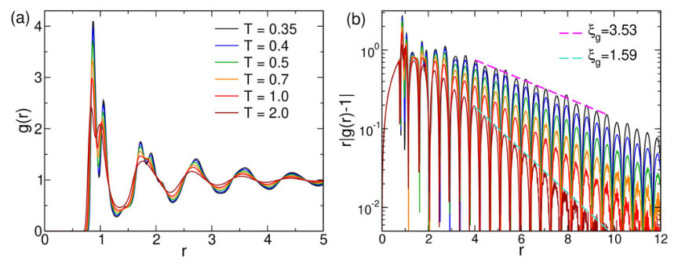
<figcaption class="paper-figure-caption"><b>Fig 1.</b> FIG. 1. (a) Radial distribution function g(r) at various temperatures. (b) r|g(r) −1|. The dashed</figcaption>
</figure>
<figure class="paper-figure-card">

<figcaption class="paper-figure-caption"><b>Fig 2.</b> Fig. 2b, the temperature dependence of D deviates from Arrhenius behavior upon cooling.</figcaption>
</figure>
<figure class="paper-figure-card">
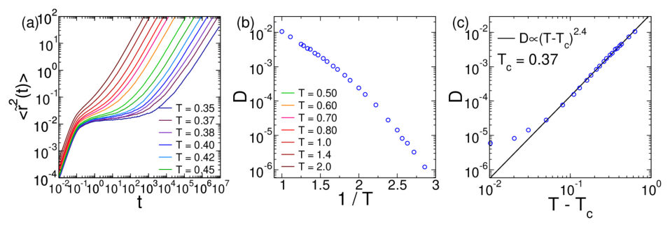
<figcaption class="paper-figure-caption"><b>Fig 3.</b> FIG. 2. (a) Cage-relative mean squared displacement as a function of time. (b) Self diffusion</figcaption>
</figure>
<figure class="paper-figure-card">
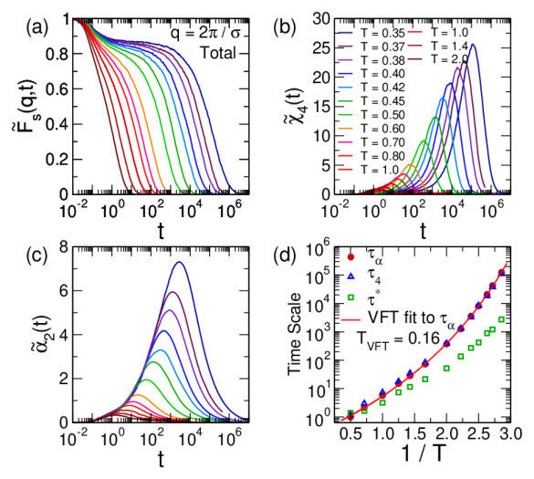
<figcaption class="paper-figure-caption"><b>Fig 4.</b> FIG. 3. (a) Cage-relative self intermediate scattering function, defined in Eq. (13). (b) Dynamical</figcaption>
</figure>
<figure class="paper-figure-card">
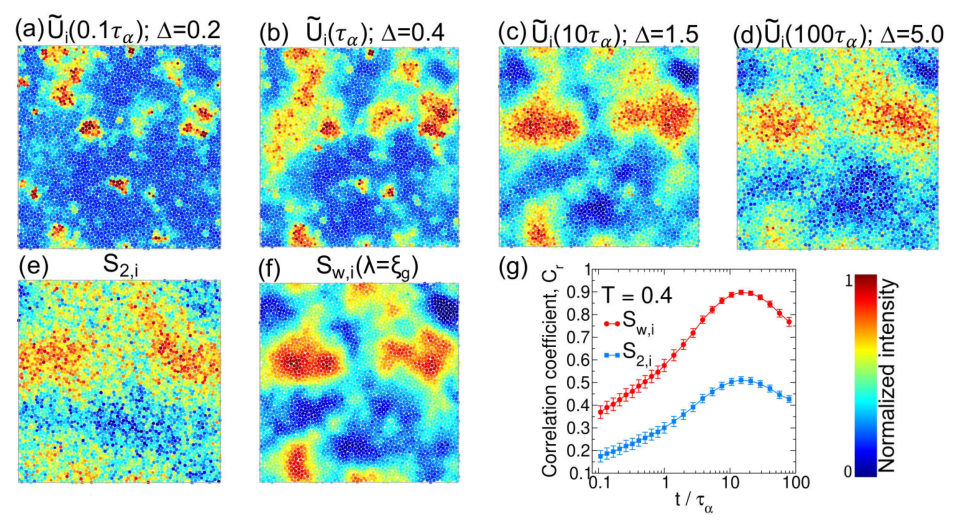
<figcaption class="paper-figure-caption"><b>Fig 5.</b> FIG. 4. Structure–dynamics correlation at T = 0.4. (a-d) Normalized dynamical propensity</figcaption>
</figure>

**Summary.** This work proposes a weighted pair-entropy descriptor to bridge the gap between static structure and dynamic behavior in glass formers. By incorporating a physically motivated length scale into the entropy calculation, the authors significantly improve the descriptor's ability to predict particle dynamics. This provides a general, interpretable framework for studying structure-dynamics correlations in disordered systems.

**Why it may be interesting.** While focused on classical glass physics, the methodology of using structural descriptors (like entropy) to predict complex, non-equilibrium dynamics is highly relevant to understanding energy landscapes and relaxation in quantum many-body systems.

Detailed structure

**Main problem.** The central challenge is establishing a physically interpretable link between the static structure and the heterogeneous relaxation dynamics in glass-forming systems.

**Main result.** A novel weighted pair-entropy descriptor significantly enhances the predictive power of structure-based metrics, achieving a high correlation (up to 0.9) with particle-level dynamics.

**Method.** The authors introduce a weighted pair-entropy descriptor by multiplying the standard excess entropy integrand with a weight function related to the pair correlation function's length scale.

**Model / system.** The study uses a canonical two-dimensional Lennard-Jones glass former, simulating its structural and dynamic properties across various temperatures.

**Key observables.** Weighted pair-entropy descriptor ($S_{w,i}$), particle-level dynamical propensity (DP), structure-dynamics correlation coefficient ($C_r$), and structural/dynamic correlation functions.

**Important parameters / regimes.** Temperature (cooling from $T=4.0$ down to $0.35 \le T \le 2.0$), structural length scale ($\lambda$), and the $\alpha$-relaxation time ($	au_\alpha$).

**Assumptions / limitations.** The method assumes that incorporating a physically motivated structural length scale into entropy descriptors improves predictive power while maintaining physical interpretability.

**Figures summary.** Figures illustrate the radial distribution function $g(r)$, the correlation between the weighted entropy and dynamical propensity, and the evolution of dynamic heterogeneity measures like $	ilde{\alpha}_2(t)$ with temperature.

**Paper structure.** The paper develops the weighted entropy descriptor, applies it to molecular dynamics simulations of a 2D glass former, and quantitatively compares its correlation with particle dynamics against conventional entropy measures.

Abstract

Establishing a robust and physically interpretable link between static structure and heterogeneous relaxation dynamics remains a fundamental challenge in glass physics. Here, we introduce a weighted pair-entropy descriptor based on the conventional two-body excess entropy. For this, we multiply the integrand used to calculate the excess entropy by a weight function that is directly related to the length scale of the pair correlation function. This multiplication does not affect the contribution of the short range order to the local excess entropy, but allows to take into account the structure present on intermediate distances, i.e., the medium-range order. For a canonical two-dimensional Lennard-Jones glass former, the resulting descriptor exhibits a strong correlation with particle-level dynamical propensity at long times (multiples of the alpha-relaxation time), with a maximum structure--dynamics correlation reaching about 0.9, substantially outperforming the predictive power of the conventional local pair excess entropy. These results demonstrate that incorporating a physically motivated structural length scale into entropy-based descriptors markedly enhances their predictive power while preserving physical interpretability. Our findings provide a simple and general framework for investigating structure--dynamics correlations in glass-forming systems.

[↑ back to top](#top)

### [From the Light Quantum to the Photon: The Evolution of a Physical Concept](http://arxiv.org/abs/2609.04985v1)

**Authors:** Aaron Collavini, Valentina Bologna, Francesco Longo, Stefano Ansoldi, Fulvio Parmigiani  
**Type:** theory · **Category:** other · **PDF:** <https://arxiv.org/pdf/2609.04985v1>  
**Analysis basis:** full PDF text, analyzed in chunks
**Topic relevance:** `correlated / nonlocal dissipation` **1/5** · `quantum measurements` **1/5**

↔ Scroll figures horizontally

<figure class="paper-figure-card">
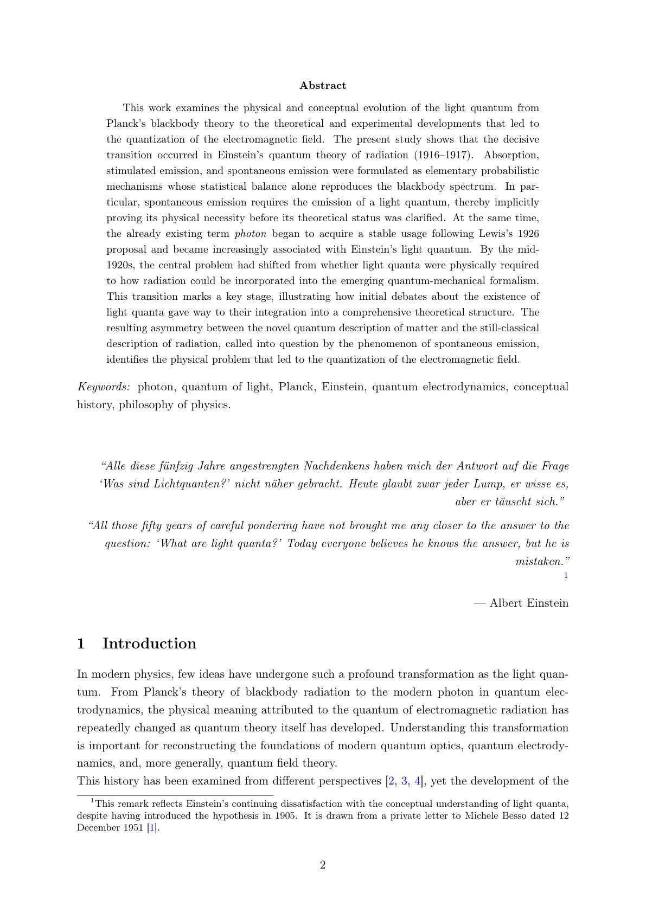
<figcaption class="paper-figure-caption"><b>Fig 1.</b> Low-resolution page preview, page 2</figcaption>
</figure>
<figure class="paper-figure-card">
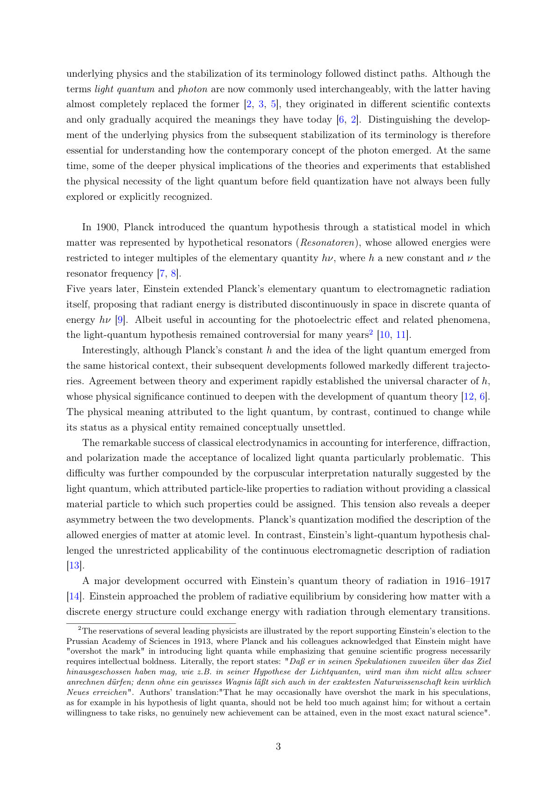
<figcaption class="paper-figure-caption"><b>Fig 2.</b> Low-resolution page preview, page 3</figcaption>
</figure>
<figure class="paper-figure-card">
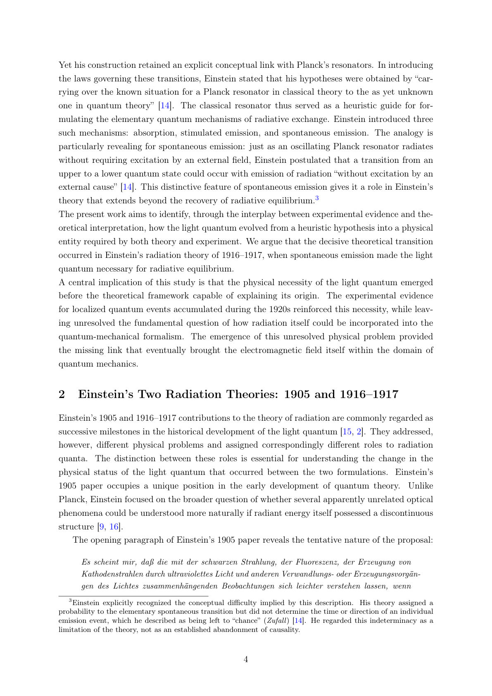
<figcaption class="paper-figure-caption"><b>Fig 3.</b> Low-resolution page preview, page 4</figcaption>
</figure>
<figure class="paper-figure-card">
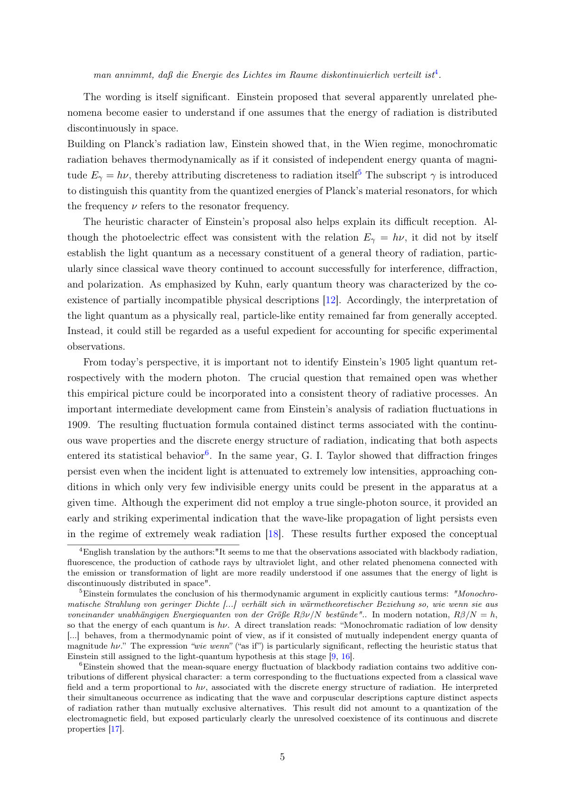
<figcaption class="paper-figure-caption"><b>Fig 4.</b> Low-resolution page preview, page 5</figcaption>
</figure>
<figure class="paper-figure-card">
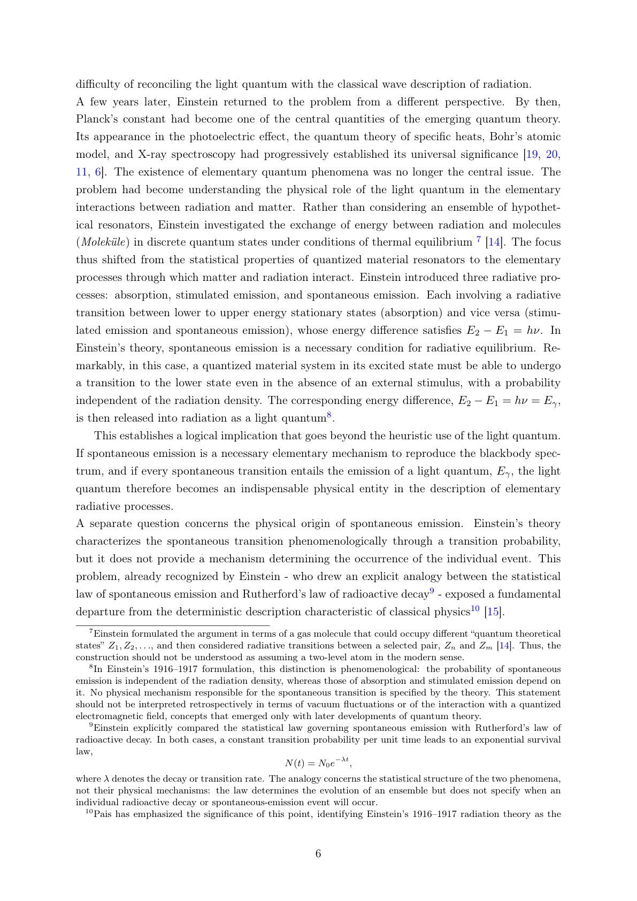
<figcaption class="paper-figure-caption"><b>Fig 5.</b> Low-resolution page preview, page 6</figcaption>
</figure>

**Summary.** This paper provides a historical account of how the concept of the light quantum evolved from Planck's initial ideas to its modern understanding as the photon. It argues that the physical necessity of the quantum nature of light was first revealed through the analysis of spontaneous emission. Ultimately, it charts the crucial theoretical shift required to incorporate radiation into a consistent quantum mechanical formalism.

**Why it may be interesting.** This paper is foundational for understanding quantum optics and open quantum systems, as it details the historical necessity of treating the electromagnetic field quantum mechanically to explain processes like spontaneous emission.

Detailed structure

**Main problem.** The paper traces the conceptual and physical evolution of the light quantum, from Planck's initial blackbody theory to its eventual incorporation into a full quantum description of the electromagnetic field.

**Main result.** The physical necessity of the light quantum was established by analyzing spontaneous emission, which required the emission of a discrete quantum, preceding the full theoretical framework for quantizing the EM field.

**Method.** The work employs a historical analysis, comparing theoretical developments from Planck, Einstein, and subsequent quantum theorists to track the conceptual shifts.

**Model / system.** The primary systems analyzed are blackbody radiation, the interaction of light with matter (photoelectric effect, spontaneous emission), and the theoretical transition from classical wave descriptions to quantum field theory.

**Key observables.** Blackbody spectrum, energy quanta ($E=h
u$), and the rates/probabilities of radiative transitions (absorption, stimulated, spontaneous emission).

**Important parameters / regimes.** Planck's constant (h), frequency ($
u$), and the energy levels of matter systems.

**Assumptions / limitations.** The analysis highlights the tension between the classical continuous description of the EM field and the discrete quantum nature implied by radiative processes.

**Paper structure.** The paper follows a historical progression: starting with Planck's work, moving to Einstein's crucial 1916-1917 theory based on spontaneous emission, and concluding with the conceptual challenges of unifying matter and radiation quantization.

Abstract

This work examines the physical and conceptual evolution of the light quantum from Planck's blackbody theory to the theoretical and experimental developments that led to the quantization of the electromagnetic field. The present study shows that the decisive transition occurred in Einstein's quantum theory of radiation (1916-1917). Absorption, stimulated emission, and spontaneous emission were formulated as elementary probabilistic mechanisms whose statistical balance alone reproduces the blackbody spectrum. In particular, spontaneous emission requires the emission of a light quantum, thereby implicitly proving its physical necessity before its theoretical status was clarified. At the same time, the already existing term photon began to acquire a stable usage following Lewis's 1926 proposal and became increasingly associated with Einstein's light quantum. By the mid-1920s, the central problem had shifted from whether light quanta were physically required to how radiation could be incorporated into the emerging quantum-mechanical formalism. This transition marks a key stage, illustrating how initial debates about the existence of light quanta gave way to their integration into a comprehensive theoretical structure. The resulting asymmetry between the novel quantum description of matter and the still-classical description of radiation, called into question by the phenomenon of spontaneous emission, identifies the physical problem that led to the quantization of the electromagnetic field.

[↑ back to top](#top)

### [Structural tuning of reduced exciton mass in layered HOIP compounds: Causation vs. correlation](http://arxiv.org/abs/2609.04558v1)

**Authors:** Isaac R. Burkholder, Cindy Y. Wong, André Schleife, Kameron R. Hansen, John S. Colton, Branton J. Campbell  
**Type:** theory · **Category:** strongly correlated electrons · **PDF:** <https://arxiv.org/pdf/2609.04558v1>  
**Analysis basis:** full PDF text, analyzed in chunks
**Topic relevance:** `Keldysh / 2PI / non-Gaussian methods` **1/5** · `analog quantum simulation` **1/5**

↔ Scroll figures horizontally

<figure class="paper-figure-card">
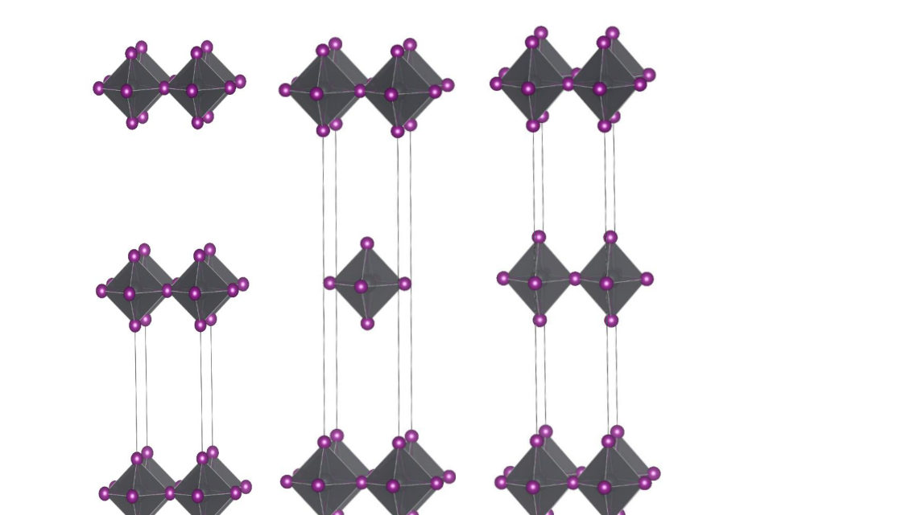
<figcaption class="paper-figure-caption"><b>Fig 1.</b> Figure 1. Examples of topological parent structures for n=1 2D HOIPs. From left to right: Dion-Jacobson (DJ, P4/mmm, #123), Ruddlesden-Popper (RP, I4/mmm, #139), and Half- Zero (H0, Cmmm, #65), with boxes indicating the conventional unit cell. All structures in this study were analyzed using the DJ topological parent structure.</figcaption>
</figure>
<figure class="paper-figure-card">
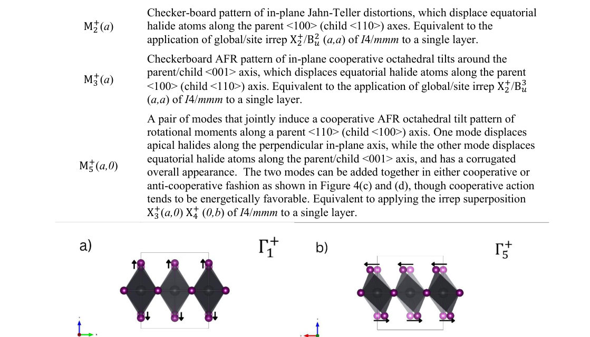
<figcaption class="paper-figure-caption"><b>Fig 2.</b> Figure 2. Graphical representation of the (a) 𝛤1</figcaption>
</figure>
<figure class="paper-figure-card">
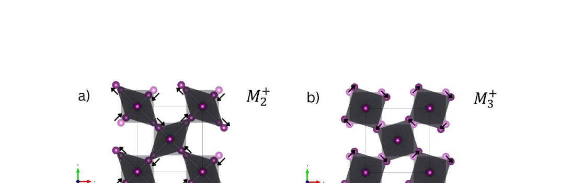
<figcaption class="paper-figure-caption"><b>Fig 3.</b> Figure 3. Graphical representation of the (a) 𝑀2</figcaption>
</figure>
<figure class="paper-figure-card">
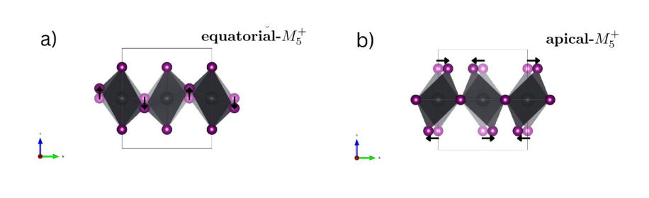
<figcaption class="paper-figure-caption"><b>Fig 4.</b> Figure 4. Graphical representation of the 𝑀5</figcaption>
</figure>
<figure class="paper-figure-card">
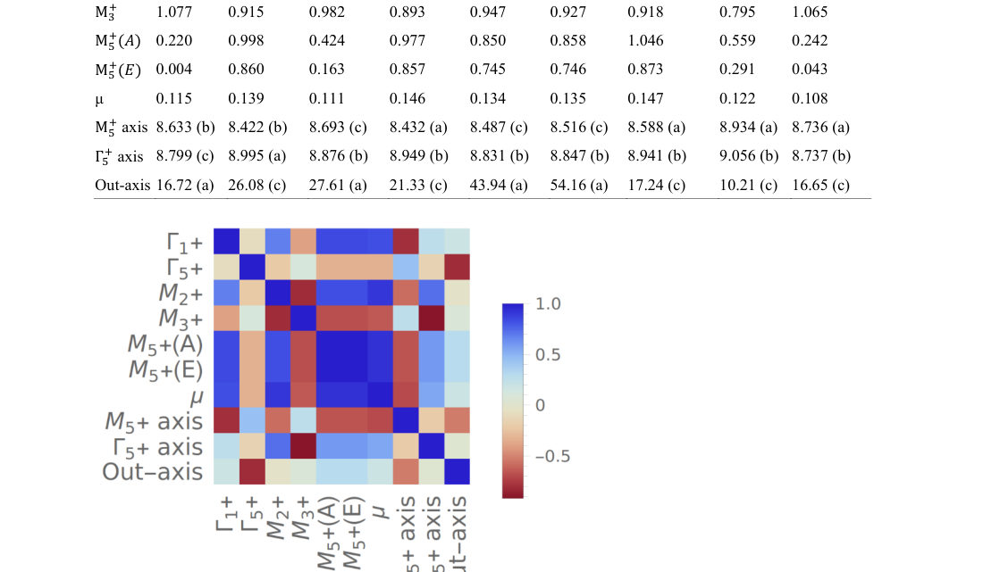
<figcaption class="paper-figure-caption"><b>Fig 5.</b> Figure 5. Correlation heat map for structural and exciton-reduced-mass parameters from Table 5, where blue indicates positive correlation values and red indicates negative correlation values. The 𝑀5</figcaption>
</figure>

**Summary.** This work tackles the challenge of distinguishing cause from correlation in the relationship between crystal structure and electronic properties in layered perovskites. By employing group theory to decompose structural distortions into fundamental symmetry modes, the authors systematically vary these modes using DFT. They successfully demonstrate that specific types of halide displacements directly control the reduced exciton mass, providing a powerful new tool for designing optoelectronic materials.

**Why it may be interesting.** While focused on solid-state materials, the rigorous use of symmetry group theory to decouple correlated structural parameters into independent variables mirrors techniques used in analyzing complex quantum Hamiltonians or effective models in AMO physics.

Detailed structure

**Main problem.** The study aims to definitively distinguish whether the structural distortions in layered perovskites are the cause or merely correlated with changes in the reduced exciton mass ($\mu$).

**Main result.** The analysis reveals that bond-transverse displacements of equatorial halide atoms increase $\mu$, while displacements of apical halide atoms decrease it, establishing new structure-property relationships for exciton engineering.

**Method.** The authors use group representation theory to decompose observed distortions into independent symmetry modes, which are then varied individually using Density Functional Theory (DFT) calculations to isolate the effect of each structural component on $\mu$.

**Model / system.** The physical system is single-layer (2D) metal-halide perovskite (HOIP) semiconductors, modeled using an inorganic framework of corner-sharing $	ext{BX}_6$ octahedra.

**Key observables.** Reduced exciton mass ($\mu$), which is calculated from the effective electron and hole masses ($m_e, m_h$).

**Important parameters / regimes.** The amplitudes of specific symmetry modes, such as those corresponding to equatorial and apical halide displacements.

**Assumptions / limitations.** The methodology assumes that the structural distortions can be accurately decomposed into independent symmetry modes, allowing for the isolation of causal effects.

**Figures summary.** Figures show correlations between $\mu$ and the amplitudes of various symmetry modes ($\Gamma_1^+, M_2^+, \Gamma_5^+, M_5^+, M_3^+$), mapping out how specific bond displacements affect the exciton mass.

**Paper structure.** The paper progresses from identifying the correlation between $\mu$ and octahedral tilt to developing a rigorous symmetry-mode analysis framework. It then applies this framework by varying individual mode amplitudes via DFT to establish direct, causal links between specific bond displacements and the resulting electronic structure.

Abstract

Reduced exciton mass ($μ$) was recently reported to correlate strongly with a framework distortion in a series of nine single-layer (2D) metal-halide perovskite (HOIP) compounds. Specifically, $μ$ was observed to increase in tandem with an alternating PbI4 octahedral tilt about an in-plane axis. In this work, we use group representation theory to decompose the observed framework distortions into displacive symmetry modes of a common high-symmetry parent framework. We find that all nine distorted frameworks involve linear combinations of the same six symmetry modes, which have been reported to contribute to the framework distortions of a wide range of HOIP compounds. We show that these modes have highly correlated impacts on the band structure. To differentiate causation from correlation, we vary the amplitude of each mode independently and use density-functional theory to determine the resulting electronic band structures, from which $μ$ is extracted. We find that bond-transverse displacements of the equatorial halide atoms increase $μ$, while bond-transverse displacements of the apical halide atoms decrease it. Bond-axis displacements appear to have little or no effect on $μ$. Our results demonstrate three new structure-property relationships, revealing a promising new avenue for exciton engineering in layered perovskite materials.

[↑ back to top](#top)

### [The influence of quantum geometry on the phase boundary and collective excitations of electron liquids and crystals](http://arxiv.org/abs/2609.04330v1)

**Authors:** Paul Froese, Mark R. Hirsbrunner, Yong Baek Kim  
**Type:** theory · **Category:** strongly correlated electrons · **PDF:** <https://arxiv.org/pdf/2609.04330v1>  
**Analysis basis:** full PDF text, analyzed in chunks
**Topic relevance:** `Keldysh / 2PI / non-Gaussian methods` **1/5** · `analog quantum simulation` **1/5**

↔ Scroll figures horizontally

<figure class="paper-figure-card">
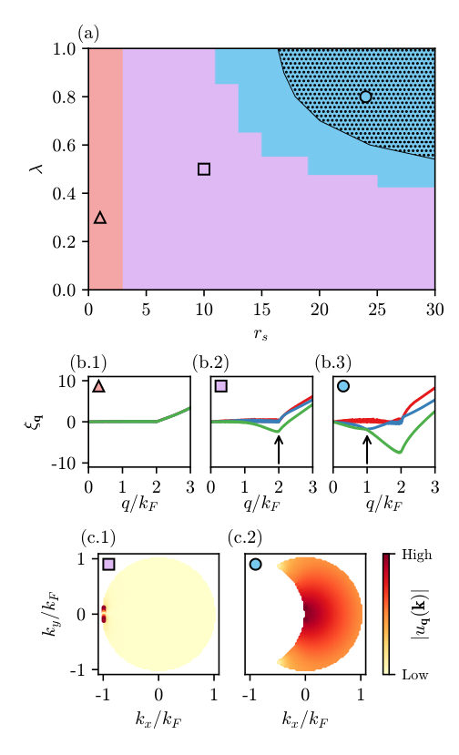
<figcaption class="paper-figure-caption"><b>Fig 1.</b> FIG. 1. (a) The liquid–crystal phase diagram. The dotted re- gion indicates where the crystal phase is lower in energy than the liquid, with the energies computed via TDHF. The colour indicates the nature of any instabilities of the mean-field FL ground state. In the red region, no eigenvalues of the stabil- ity matrix Sq are significantly negative. In the purple region, Sq possesses one band with negative eigenvalues, peaked at q = 2kF. In the blue region, there are two bands with nega- tive eigenvalues, one peaked at q = 2kF and one at q = kF. (b) Band structures of Sq at three representative points in the phase diagram. Each plot depicts the three lowest eigenval- ues of Sq as a function...</figcaption>
</figure>
<figure class="paper-figure-card">
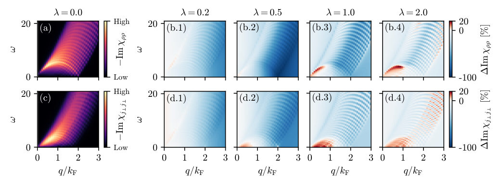
<figcaption class="paper-figure-caption"><b>Fig 2.</b> FIG. 2. (a) The imaginary part of the density-density response, χρρ(q, ω), in the Fermi liquid phase at rs = 1 and λ = 0. (b) The percent change in the imaginary part of the density-density response compared to the λ = 0 case for four values of λ, demonstrating how non-trivial quantum geometry reshapes the response. (c) The imaginary part of the transverse current-current response, χj⊥j⊥(q, ω), for rs = 1 and λ = 0. (d) The percent change in the imaginary part of the transverse current-current response compared to the λ = 0 case.</figcaption>
</figure>
<figure class="paper-figure-card">
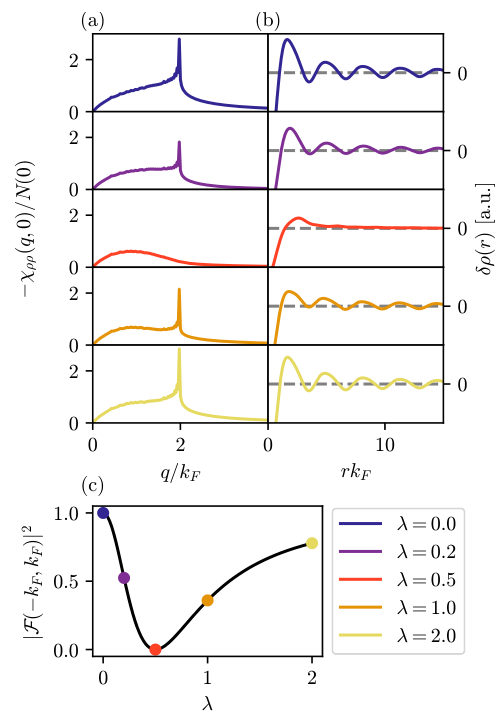
<figcaption class="paper-figure-caption"><b>Fig 3.</b> FIG. 3. (a) The static limit of the density-density response χρρ(q, ω = 0) in the Fermi liquid at rs = 1 for a range of differ- ent λ. The sharp peaks at q = 2kF correspond to Friedel oscil- lations in the real space charge density. (b) The induced real space charge density δρ(r), given by a Fourier transform of χρρ(q, 0). The peak at 2kF and corresponding real space oscil- lations vanish at λ = 0.5. (c) The form factor |F(−kF, kF)|2, which connects states at opposite edges of the Fermi surface, the relevant scattering states for Friedel oscillations. The ma- trix element is completely suppressed at λ = 0.5.</figcaption>
</figure>
<figure class="paper-figure-card">
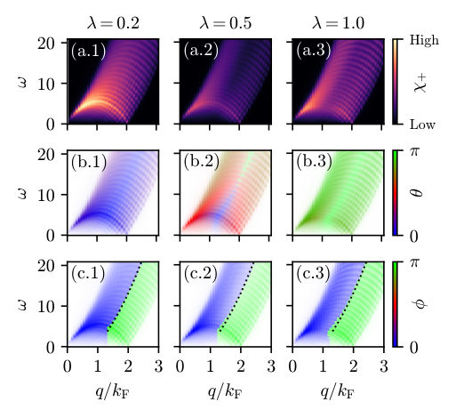
<figcaption class="paper-figure-caption"><b>Fig 4.</b> FIG. 4. (a.1-a.3) The dominant eigenvector of the orbital- resolved density-density response, χ+, in the Fermi liquid at rs = 1, plotted for λ = 0.2, 0.5, and 1.0, respectively. (b.1- b.3) The angle θ that characterizes the orbital polarization of the response for the same values of λ. When θ = 0, the response is entirely polarized on the pseudospin ↑orbital, and entirely polarized on the ↓orbital when θ = π. (c.1-c.3) The angle ϕ that characterizes the phase of the inter-orbital re- sponse. This phase is only meaningful if 0 &lt; θ &lt; π, in regions where both orbitals contribute. ϕ = 0 indicates an in-phase response, while ϕ = π indicates an out-of-phase response. The black dotted lines depict...</figcaption>
</figure>
<figure class="paper-figure-card">
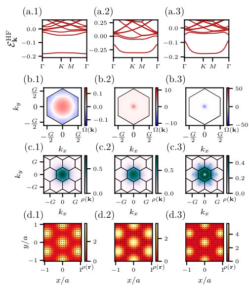
<figcaption class="paper-figure-caption"><b>Fig 5.</b> FIG. 5. The (a) HF band structure plotted along high- symmetry lines across the BZ, (b) Berry curvature of the lowest occupied band, (c) momentum space occupation ρ(k), and (d) real-space charge density, of three different crystalline phases. Panels (a.1-d.1) correspond to the WC at rs = 20, λ = 0.2, (a.2-d.2) correspond to the AHC at rs = 10, λ = 1.6, and (a.3-d.3) correspond to the HWC at rs = 20, λ = 2.0. The charge density in (d) is depicted by the coloured map, and the ground state current density is overlaid with arrows.</figcaption>
</figure>

**Summary.** This theoretical work analyzes the interplay between quantum geometry and electron interactions in 2D electron systems, using the $\lambda$-jellium model. By applying TDHF, the authors demonstrate that quantum geometry stabilizes the crystalline phase and modifies collective excitations like plasmons. The findings provide deeper insight into the fundamental mechanisms driving electronic phase transitions in correlated materials.

**Why it may be interesting.** The explicit inclusion of quantum geometry (via Berry curvature) into the many-body Hamiltonian provides a mechanism to tune electronic properties, which is highly relevant for understanding topological materials and correlated electron behavior in low-dimensional systems.

Detailed structure

**Main problem.** The study investigates how quantum geometry influences the phase boundary and the nature of collective excitations in electron systems, specifically comparing liquid and crystalline states.

**Main result.** Quantum geometry is found to favor electron crystallization, shifting the transition to higher densities, and it causes spectral weight transfer leading to the suppression of plasmon dispersion in the liquid phase.

**Method.** The primary method employed is Time-dependent Hartree-Fock (TDHF) applied to the $\lambda$-jellium model, supplemented by the Quasi-boson approximation to analyze collective modes.

**Model / system.** The system is modeled using the $\lambda$-jellium model, which describes interacting electron liquids and crystals in platforms like multilayer graphene. The model incorporates a non-trivial quantum geometry characterized by a Berry curvature distribution $\Omega(\mathbf{q})$.

**Key observables.** Electron liquid–crystal phase diagram, collective modes (plasmon mode, density/current responses), and instabilities in the Fermi liquid ground state.

**Important parameters / regimes.** The key parameters are the interaction strength ($r_s$) and the quantum geometry scale ($\lambda$), which controls the momentum-space skyrmion texture.

**Assumptions / limitations.** The analysis relies on the TDHF formalism, which is noted to be perturbative and suffers from mean-field instabilities at low densities. The $\lambda$-jellium model is used as a simplified representation.

**Paper structure.** The paper progresses by first establishing the physical model and the role of quantum geometry. It then applies TDHF to map the phase diagram, analyzing instabilities in the liquid phase and identifying corresponding modes in the crystal phase.

Abstract

Recent experiments on multilayer graphene systems have reinvigorated the study of electron crystallization, now with the inclusion of quantum geometry. In this work, we apply time-dependent Hartree-Fock (TDHF) to the $λ$-jellium model to analyze the impact that quantum geometry has on the electronic liquid--crystal phase diagram and how it modifies the collective modes and responses of the liquid and crystal phases. In agreement with recent results utilizing neural quantum states, we find that quantum geometry favours electron crystallization, shifting the transition to higher densities. We also study the instabilities revealed by TDHF in the Fermi liquid ground state at low densities, providing insight into the fluctuations driving the crystallization transition. We further find that quantum geometry reduces the dispersion of the plasmon mode and suppresses Friedel oscillations deep in the liquid phase. Resolving the density response in terms of individual orbitals, we find that this suppression is caused by spectral weight transfer to an out-of-phase inter-orbital mode. Finally, we show that an analogous mode that emerges in the crystal phase corresponds to the breathing mode of an emergent real-space pseudospin skyrmion lattice.

[↑ back to top](#top)

### [Accelerating Atom Simulations with Variable-Block Sparse Matrix Library](http://arxiv.org/abs/2609.04397v1)

**Authors:** Zhanghao Zhouyin, Hong Guo  
**Type:** theory · **Category:** numerical methods · **PDF:** <https://arxiv.org/pdf/2609.04397v1>  
**Analysis basis:** full PDF text, analyzed in chunks
**Topic relevance:** `analog quantum simulation` **1/5**

↔ Scroll figures horizontally

<figure class="paper-figure-card">

<figcaption class="paper-figure-caption"><b>Fig 1.</b> FIG. 1. VBCSR uses a shared distributed graph and a unified Python-facing matrix interface across automatically selected CSR, BSR, and VBCSR backends. The backends support common sparse operations through MPI communication, thread-level parallelism, and dense numerical kernels.</figcaption>
</figure>
<figure class="paper-figure-card">
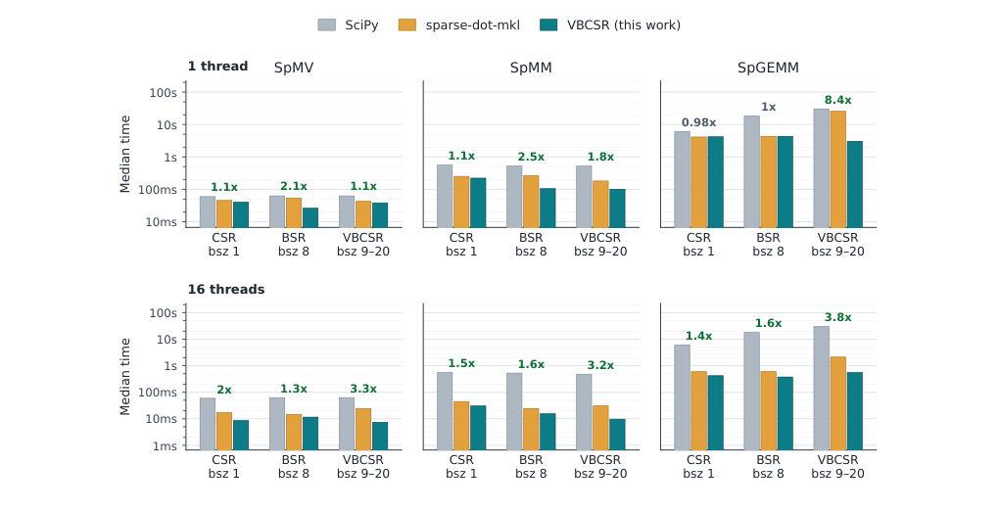
<figcaption class="paper-figure-caption"><b>Fig 2.</b> FIG. 2. Kernel-efficiency benchmarks for sparse matrix-vector multiplication (SpMV), sparse matrix-dense matrix multiplica- tion (SpMM), and sparse general matrix-matrix multiplication (SpGEMM). Each structural domain targets a matrix storage budget of approximately 500 MiB; graph block counts therefore differ by domain. CSR uses scalar blocks, BSR uses block size 8, and VBCSR uses variable block sizes from 9 to 20. SpMM uses 16 right-hand sides, and the reported SpGEMM case uses zero threshold. Bars report the median kernel time over seven timed repetitions following three warm-up iterations. Speedup labels report VBCSR performance relative to the fastest reference implementation; values...</figcaption>
</figure>
<figure class="paper-figure-card">
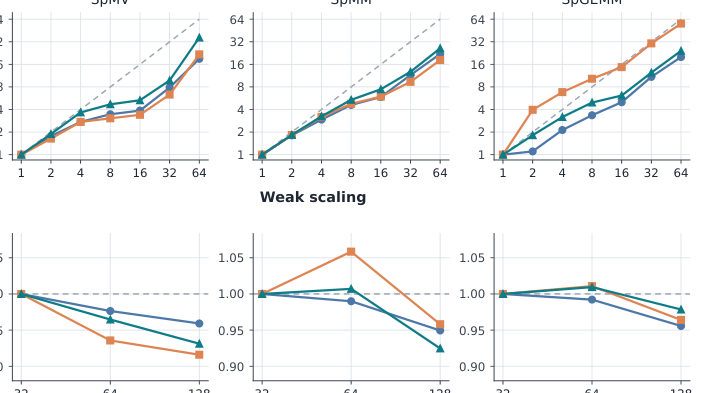
<figcaption class="paper-figure-caption"><b>Fig 3.</b> FIG. 3. Distributed scaling benchmarks. Strong scaling uses a fixed global matrix storage target of approximately 500 MiB per structural domain. Weak scaling keeps the local matrix size approximately fixed at 32 MiB per rank and per domain, and increases the global problem size in proportion to the MPI rank count. Strong-scaling speedup is measured as S(p) = T(1)/T(p), and weak-scaling efficiency is defined as Ew(p) = T(32)/T(p), where T denotes the execution time. Dashed curves mark ideal strong scaling and ideal weak-scaling efficiency.</figcaption>
</figure>
<figure class="paper-figure-card">
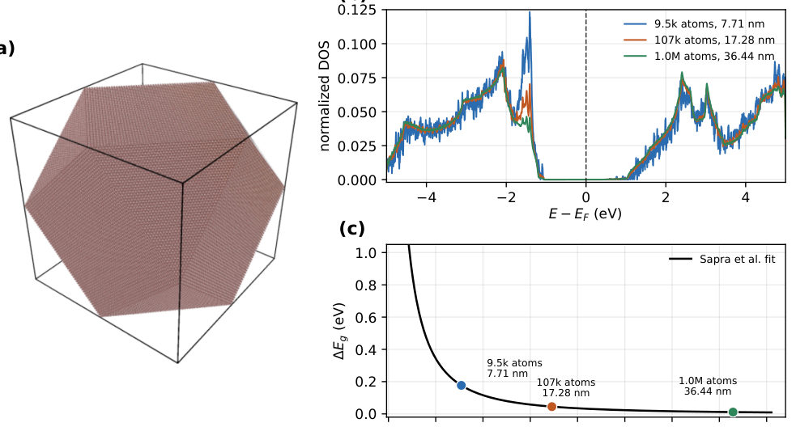
<figcaption class="paper-figure-caption"><b>Fig 4.</b> FIG. 4. Atomistic density-of-states and band-gap calculation for hydrogen-passivated zinc-blende InP nanoparticles. (a) Visualization of the largest completed particle, containing 1,063,609 atoms including surface H passivation, with an effective diameter of 36.44 nm. (b) Normalized DOS for the three particle sizes studied here: 12,083 atoms (D = 7.71 nm), 120,250 atoms (D = 17.28 nm), and 1,063,609 atoms (D = 36.44 nm). The DOS is computed from the In(sp3)–P(sp3d5)–H(s) tight-binding Hamiltonian with interactions through second-nearest neighbours, using the parameterization of Sapra et al. [11]. The spectra are aligned to a common mid-gap reference energy and shown as normalized DOS per...</figcaption>
</figure>

**Summary.** This paper introduces VBCSR, a novel distributed sparse matrix library designed to efficiently handle the block-sparse matrices arising from localized orbital representations in atomistic simulations. By automatically adapting to variable block sizes and optimizing kernel execution, VBCSR significantly accelerates linear algebra operations. It successfully demonstrates its scalability and accuracy by simulating the electronic structure of large InP nanoparticles.

**Why it may be interesting.** While focused on numerical acceleration, the ability to efficiently handle complex, spatially varying Hamiltonians derived from localized orbitals is crucial for simulating open quantum systems and material properties in AMO physics.

Detailed structure

**Main problem.** The core challenge is accelerating large-scale atomistic simulations that generate sparse block matrices with variable block shapes due to localized orbital representations.

**Main result.** The proposed VBCSR library significantly outperforms existing reference implementations for block-sparse benchmarks, achieving speedups up to 8.4x for SpGEMM.

**Method.** VBCSR is a distributed sparse matrix library that automatically selects between CSR, BSR, or VBCSR formats, grouping blocks of equal shape for optimized dense kernel execution.

**Model / system.** The library is applied to atomistic systems, specifically simulating InP nanoparticles using a tight-binding Hamiltonian with localized $sp^3$ orbitals.

**Key observables.** Performance benchmarks (speedup), density of states (DOS), and size-dependent band gap shifts ($\Delta E_g$).

**Important parameters / regimes.** System size up to $10^6$ atoms, various block-size regimes, and parallelization levels (up to 16 threads/128 MPI ranks).

**Assumptions / limitations.** The speedups are specific to tested operators and hardware; the method assumes the ability to map physical atomic structure onto a block-graph model.

**Figures summary.** Figure 1 illustrates the unified interface mapping physical structure to CSR/BSR/VBCSR backends. Figure 2 compares kernel times and speedups across different domains. Figure 3 shows strong/weak scaling. Figure 4 displays DOS and band-gap shifts for varying nanoparticle sizes.

**Paper structure.** The paper introduces VBCSR to solve the block-sparse matrix problem, details its automatic backend selection and acceleration mechanisms (grouping/kernels), benchmarks its performance against references, and finally demonstrates its application to calculating electronic properties (DOS, band gap) of large InP nanoparticles.

Abstract

Modern atomistic simulations increasingly employ localized orbitals to represent quantum operators, yielding sparse block matrices whose block shapes vary with chemical species and basis choice. Conventional scalar sparse formats store the entries of each block individually, obscuring this local structure and limiting the use of efficient block algorithms. We present VBCSR, a distributed sparse matrix library that preserves variable-size atomic blocks and accelerates the core linear algebra of large-scale atomistic simulations. A unified interface automatically maps scalar, uniform-basis, and multispecies operators to compressed sparse row (CSR), block sparse row (BSR), or variable-block compressed sparse row (VBCSR). Our advanced acceleration method groups blocks of equal shape and dispatches them to optimized dense kernels. In the reported benchmarks, VBCSR outperforms the tested Python-accessible reference implementations for several block-sparse benchmarks. We further demonstrate VBCSR in an InP nanoparticle application containing more than \(10^6\) atoms.

[↑ back to top](#top)

### [DPRQ: A Dynamic Programming-based Qubit Routing Algorithm for Collective Communication in Distributed Quantum Computing](http://arxiv.org/abs/2609.04524v1)

**Authors:** Dhaval Vaidya, Ruozhou Yu  
**Type:** theory · **Category:** quantum information and computing · **PDF:** <https://arxiv.org/pdf/2609.04524v1>  
**Analysis basis:** full PDF text, analyzed in chunks
**Topic relevance:** `analog quantum simulation` **1/5**

↔ Scroll figures horizontally

<figure class="paper-figure-card">
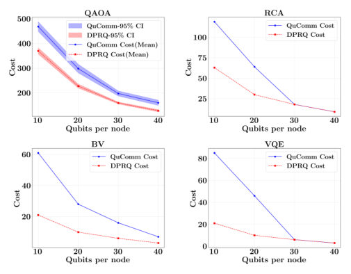
<figcaption class="paper-figure-caption"><b>Fig 1.</b> Figure 3: Cost comparison of DPRQ and QuComm on the four benchmark circuits as number of qubits per node increases from 10 to 40. The EPR capacity is 3 and the total number of qubits is 150.</figcaption>
</figure>
<figure class="paper-figure-card">
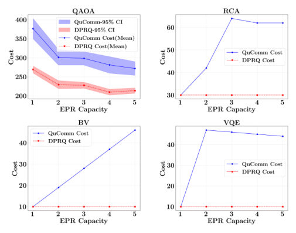
<figcaption class="paper-figure-caption"><b>Fig 2.</b> Figure 1: The cost comparison of DPRQ and QuComm on the four benchmark circuits as the EPR capacity increases from 1 to 5. The total number of qubits is 150 and the qubits per node is 20.</figcaption>
</figure>
<figure class="paper-figure-card">
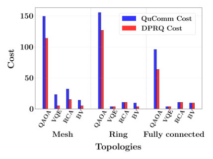
<figcaption class="paper-figure-caption"><b>Fig 3.</b> Figure 4: Cost comparison of DPRQ and QuComm for 3 dif- ferent network topologies on the four benchmark circuits. The EPR capacity is 3, total number of qubits is 150 and the number of qubits per node is 20.</figcaption>
</figure>
<figure class="paper-figure-card">
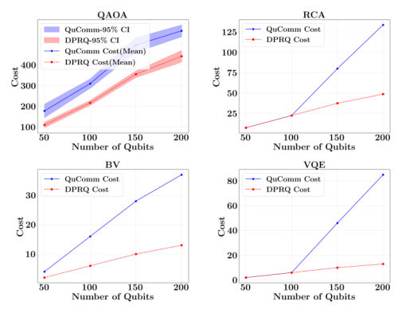
<figcaption class="paper-figure-caption"><b>Fig 4.</b> Figure 2: Cost comparison of DPRQ and QuComm on the 4 benchmark circuits as total number of qubits increases from 50 to 200. The EPR capacity is 3 and the number of qubits per node is 20.</figcaption>
</figure>

**Summary.** This paper introduces DPRQ, a dynamic programming algorithm designed to optimize qubit routing for distributed quantum computing. It addresses the critical bottleneck of inter-node communication by optimizing entanglement resource usage across the entire circuit, not just local blocks. DPRQ significantly outperforms existing greedy methods, providing a robust framework for scaling quantum computation across multiple processors.

**Why it may be interesting.** While focused on quantum networking, the optimization techniques (dynamic programming, resource minimization across coupled subsystems) are highly relevant to modeling complex quantum many-body dynamics or open quantum systems where resource constraints dictate feasible evolution paths.

Detailed structure

**Main problem.** The primary challenge addressed is minimizing the inter-node communication cost, specifically the required entanglement resource (EPR pairs), in Distributed Quantum Computing (DQC) circuits.

**Main result.** The proposed DPRQ algorithm achieves significant reductions in inter-node communication, showing an average reduction of 24.40% and a maximum reduction of 85.06% compared to the state-of-the-art QuComm compiler.

**Method.** DPRQ employs a dynamic programming approach to optimize qubit routing globally across the entire quantum circuit, unlike greedy methods that only optimize within local blocks.

**Model / system.** The model is Distributed Quantum Computing (DQC) implemented across a network of quantum processors, where communication relies on consuming EPR pairs via quantum teleportation.

**Key observables.** Inter-node communication cost, measured by the number of EPR pairs consumed, and the resulting percentage reduction compared to baseline algorithms.

**Important parameters / regimes.** EPR Capacity (E(n_a)), total number of data qubits (up to 200), and the specific DQC network topology (e.g., mesh-grid, ring).

**Assumptions / limitations.** The analysis assumes the circuit consists of one-qubit and two-qubit gates, and the DP formulation simplifies the tracking of qubit layouts to manage computational complexity.

**Figures summary.** Figures compare the communication cost of DPRQ versus QuComm across varying parameters, including increasing EPR capacity, increasing total qubits, increasing qubits per node, and across different network topologies.

**Paper structure.** The paper progresses from establishing the bottleneck of DQC communication to introducing DPRQ, detailing the intra-block cost calculation using an optimal aggregator node, and finally applying the dynamic programming approach for global, inter-block optimization.

Abstract

Distributed quantum computing (DQC) offers a promising approach to scale quantum computing by overcoming the resource limitations of a single quantum processor. However, inter-node communication remains a major bottleneck of DQC due to inefficient and error-prone entanglement distribution. Optimizing inter-node communication can not only reduce the amount of entanglement resource needed to execute a quantum circuit but also improve execution speed and accuracy of the results. This paper proposes DPRQ, a qubit routing algorithm for minimizing inter-node communication in distributed quantum circuits divided into collective communication blocks. Unlike current approaches that utilize greedy block-level qubit routing strategies, DPRQ employs a dynamic programming-based technique focused on global circuit-level optimization, while capturing inter-block dependencies. We evaluated DPRQ on four sets of quantum circuits and a variety of DQC configurations. The results demonstrate that DPRQ's innovative routing strategy achieves an average of 24.40% reduction with a maximum of 85.06% reduction in inter-node communication, when compared to the state-of-the-art collective communication-based DQC compiler QuComm.

[↑ back to top](#top)

### [Dual Charge-Density-Waves in Two-dimensional DyTe3 and Their Distinct Impacts on Magneto-Transport Properties](http://arxiv.org/abs/2609.04370v1)

**Authors:** Shuvankar Gupta, Yasemin Ozbek, Olajumoke Oluwatobiloba Emmanuel, Maya Bostock, Johnathan Kowalski, Pengpeng Zhang, Xianglin Ke  
**Type:** experiment · **Category:** strongly correlated electrons · **PDF:** <https://arxiv.org/pdf/2609.04370v1>  
**Analysis basis:** full PDF text, analyzed in chunks
**Topic relevance:** `Frenkel-Kontorova` **1/5**

↔ Scroll figures horizontally

<figure class="paper-figure-card">
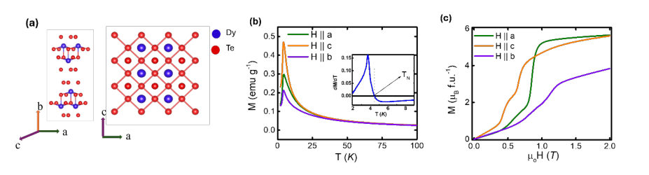
<figcaption class="paper-figure-caption"><b>Fig 1.</b> Figure 1: (a) Crystal structure of DyTe3, showing the overall structure (left) and an in-plane</figcaption>
</figure>
<figure class="paper-figure-card">
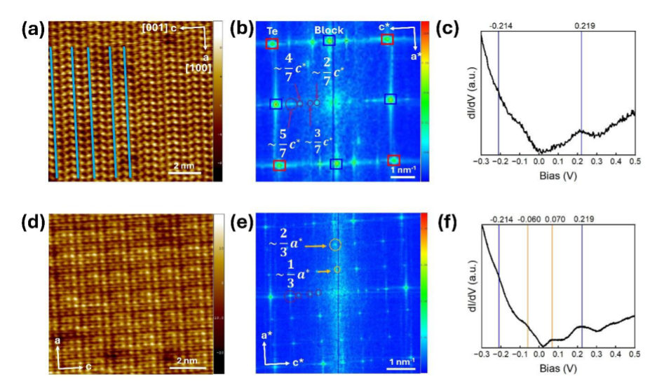
<figcaption class="paper-figure-caption"><b>Fig 2.</b> Figure 2: (a-c) STM data at 77K. (a) Morphology scan displaying the incommensurate first</figcaption>
</figure>
<figure class="paper-figure-card">
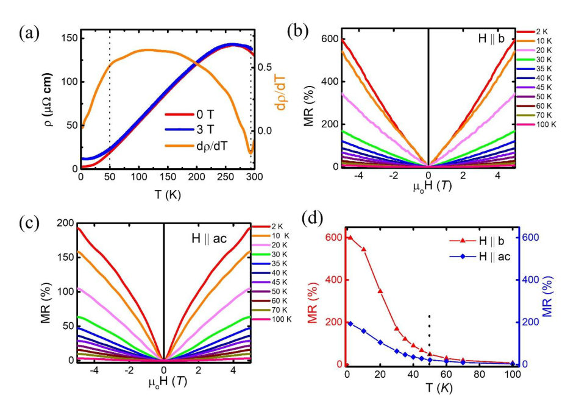
<figcaption class="paper-figure-caption"><b>Fig 3.</b> Figure 3: (a) Temperature dependence of in-plane (ac-plane) resistivity measured at 0 T and 3</figcaption>
</figure>
<figure class="paper-figure-card">
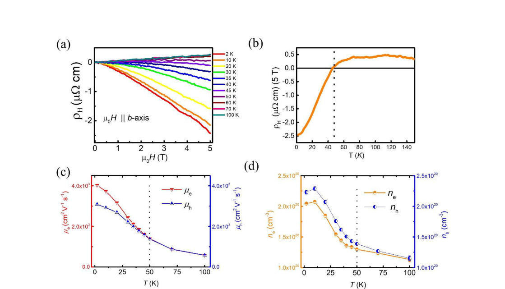
<figcaption class="paper-figure-caption"><b>Fig 4.</b> Figure 4: (a) Magnetic field-dependence of in-plane (ac-plane) Hall resistivity (ρH) measured</figcaption>
</figure>

**Summary.** This work investigates how two distinct, coexisting Charge-Density-Waves (CDW1 and CDW2) affect the electronic transport in the material DyTe3. By combining STM measurements with magnetotransport analysis, the authors demonstrate that while CDW1 shows little transport anomaly, the emergence of CDW2 causes a dramatic enhancement in magnetoresistance and a unique nonlinear Hall response. This establishes DyTe3 as a key model system for understanding multiple CDW effects.

**Why it may be interesting.** The study provides a concrete example of how multiple competing quantum ground states (multiple CDWs) can lead to complex, distinct, and measurable changes in macroscopic transport properties, which is relevant to understanding correlated electron physics in low-dimensional materials.

Detailed structure

**Main problem.** To investigate the distinct impacts of two orthogonal Charge-Density-Waves (CDW1 and CDW2) coexisting at low temperature in DyTe3 on its electronic transport properties.

**Main result.** The emergence of CDW2 drives a drastic enhancement in magnetoresistance and a multiband-governed nonlinear Hall response, indicating that the two CDWs affect transport in qualitatively distinct ways.

**Method.** The study combines Scanning Tunneling Microscopy/Spectroscopy (STM/STS) to identify CDW phases with magnetotransport measurements (Magnetoresistance and Hall resistivity) analyzed using a two-band model.

**Model / system.** The physical system is DyTe3, a quasi-two-dimensional Van der Waals layered crystal belonging to the rare-earth tritellurides (RTe3). The research focuses on the electronic consequences of multiple, coexisting CDW states.

**Key observables.** Magnetoresistance (MR), nonlinear Hall response ($
ho_H$), CDW periodicity/wavevectors ($	ext{q}_1, 	ext{q}_2$), and spectral gaps measured via STS.

**Important parameters / regimes.** Low temperature (down to 4.5 K), the transition temperatures of the two CDWs ($	ext{T}_{	ext{CDW1}} \sim 308 	ext{K}$, $	ext{T}_{	ext{CDW2}} \sim 50 	ext{K}$), and applied magnetic fields (H).

**Assumptions / limitations.** The analysis of transport data relies on fitting the results to a minimal two-band model to characterize carrier dynamics.

**Figures summary.** Figures show the layered crystal structure, STM/FFT confirming the coexistence of CDW1 and CDW2, and plots of resistivity/Hall resistivity vs. T and H demonstrating anomalies correlated with the onset of CDW2.

**Paper structure.** The paper establishes the structural context (crystal structure), uses STM/STS to confirm the coexistence of two distinct CDWs, and then analyzes the transport properties (MR and $
ho_H$) to show that the two CDWs have different impacts on electronic conduction.

Abstract

Charge-density-waves (CDWs) are macroscopic quantum states defined by periodic modulations in electronic charge density coupled with lattice distortions. Despite significant research efforts, the evolution of electromagnetic transport properties in the presence of CDWs remains largely unexplored. Here, we report the effects of two orthogonal CDWs (CDW1 and CDW2) coexisting at low-temperature in DyTe3 on its electronic transport properties. Importantly, we find that while no clear magnetotransport anomaly is resolved across CDW1 transition under the present experimental conditions, the emergence of CDW2 drives a drastic enhancement in magnetoresistance and a multiband-governed nonlinear Hall response. These results demonstrate that CDW1 and CDW2 in DyTe3 are fundamentally different and impact its electronic transport in qualitatively distinct ways, establishing DyTe3 as a model system for understanding the transport consequences of multiple CDWs in quasi-two-dimensional materials.

[↑ back to top](#top)

### [Fukui-Kawakami chains: spectrum and hidden $\mathfrak{gl}(1|1)$-symmetry](http://arxiv.org/abs/2609.04378v1)

**Authors:** Rob Klabbers, Antoine Lefebvre  
**Type:** theory · **Category:** strongly correlated electrons · **PDF:** <https://arxiv.org/pdf/2609.04378v1>  
**Analysis basis:** full PDF text, analyzed in chunks
**Topic relevance:** `Frenkel-Kontorova` **1/5**

↔ Scroll figures horizontally

<figure class="paper-figure-card">
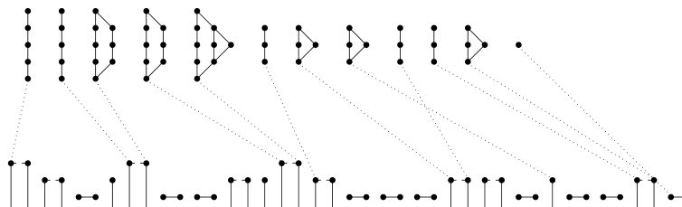
<figcaption class="paper-figure-caption"><b>Fig 1.</b> Figure 1. Schematic picture of the spectra of the twisted and untwisted chains for length N = 6. Each dot represents an eigenvector. The vectors in the upper picture represent the untwisted (HS) chain, and are grouped by Yangian representations and labelled by four times their energy. The lower picture represents the twisted chain (at φ = 1/2), with the vectors grouped into quadruplets (or doublets) as generated by the action of the spin-flip and parity operators, also labelled by four times their energy. The dotted lines between the upper and lower spectra indicate how the Yangian-highest-weight state of a Yangian representation in the untwisted chain gives rise to an eigenvector in the...</figcaption>
</figure>
<figure class="paper-figure-card">
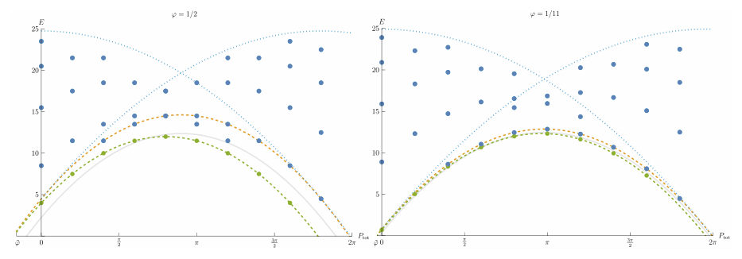
<figcaption class="paper-figure-caption"><b>Fig 2.</b> Figure 2. The two magnon spectrum at length N = 10 for φ = 1/2 and φ = 1/11 in the energy-momentum plane, with ˜φ = 2πφ/N. The blue dots are motif states as parametrised by ( IV.13 ) (allowing for µ1 = 0), with energies that are sums of single particle energies, and lie above the single particle dispersion (indicated in gray) but below the (two-valued, blue dotted) curve of two identical magnons. The orange dashed line contains the descendants obtained by adding a zero-momentum excitation. The green dashed line contains the descendants (as green dots) which cannot be obtained from ( IV.13 ). In the limit φ →0 the three curves, as well as the dots on them, coincide (see e.g. Fig.12 in [ 24...</figcaption>
</figure>
<figure class="paper-figure-card">
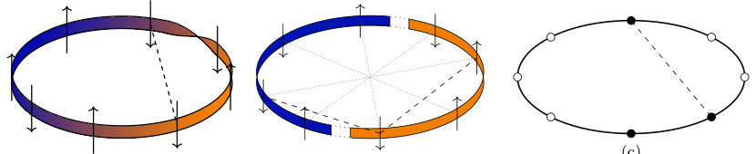
<figcaption class="paper-figure-caption"><b>Fig 3.</b> Figure 3. Graphical depictions of three of the spin chains discussed in § VI . In (a), the Fukui-Kawakami chain corresponding to φ = 1/2, characterised by the antiperiodic boundary condition, with a typical pair interaction indicated by the dashed line. In (b), the chain introduced in [ 14 ], which can be thought of as taking a chain (in orange) and gluing its spin-flipped mirror to it (in blue), with spins connected to their mirror by a dotted line. Considering interactions between each pair of spins, and between each pair of a spin and a mirror spin, as indicated by the dashed lines. In (c), the gl(1|1) HS chain, with each site either empty (◦) or occupied by a fermion (•), with pair...</figcaption>
</figure>
<figure class="paper-figure-card">
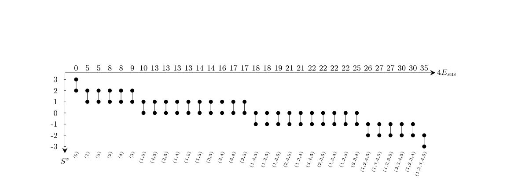
<figcaption class="paper-figure-caption"><b>Fig 4.</b> Figure 4. Schematic picture of the Hilbert space for the supersymmetric chain for length N = 6. It consists of gl(1|1)-doublets only, which are labelled uniquely by a supermotif as indicated on the bottom and four times their energy on the top. For easy comparison we have organised the spectrum using its decomposition into Sz-eigenspaces rather than the gl(1|1)-native fermionic number operator NG = N/2 −Sz from ( VI.9 ). Compare with the bottom half of Fig. 1 , which uses a different method to organise the same spectrum.</figcaption>
</figure>

**Summary.** This work studies the spectral properties of Fukui-Kawakami (FK) chains, which are twisted versions of the Haldane-Shastry spin chain. The authors establish that the antiperiodic case reveals a hidden $\mathfrak{gl}(1|1)$-symmetry. This symmetry is crucial as it connects the chain's structure to supersymmetric models, providing deep theoretical understanding of its integrability.

**Why it may be interesting.** The discovery of hidden $\mathfrak{gl}(1|1)$-symmetry in a spin chain model provides deep structural insights into its solvability, connecting it to supersymmetric generalizations relevant in condensed matter theory.

Detailed structure

**Main problem.** The paper revisits and analyzes the spectrum and hidden symmetries of Fukui-Kawakami (FK) chains, which are twisted deformations of the trigonometric Haldane-Shastry (HS) spin chain.

**Main result.** The antiperiodic FK chain possesses a hidden $\mathfrak{gl}(1|1)$-symmetry, which allows relating the HS motifs to their supersymmetric counterparts. The spectrum is partially described by twisted Bethe equations.

**Method.** The analysis uses techniques involving Yangian symmetry, twisted boundary conditions, and relating the system to known integrable models via spectral analysis.

**Model / system.** The system is an integrable spin chain, specifically the FK chain, which is a twisted version of the trigonometric Haldane-Shastry (HS) spin chain. The analysis focuses on the antiperiodic boundary condition case.

**Key observables.** Energy spectrum ($E_{fk}$), Yangian highest weight states, and the presence of hidden symmetries.

**Important parameters / regimes.** The twist parameter ($\varphi$), the chain length ($N$), and the underlying spin structure.

**Assumptions / limitations.** The analysis only constructs *part* of the spectrum using the Bethe equations, and the integrability of the FK chains remains open.

**Figures summary.** Figure 1 schematically compares the spectra of the twisted ($\varphi=1/2$) and untwisted (HS) chains for $N=6$, illustrating the role of Yangian representations.

**Paper structure.** The paper analyzes the FK Hamiltonian via twisted boundary conditions, relating its spectrum to the HS chain using Yangian symmetry and Bethe equations. It then focuses on the antiperiodic case to reveal the hidden $\mathfrak{gl}(1|1)$-symmetry, and finally derives mathematical identities related to the underlying structure.

Abstract

Fukui and Kawakami showed that the trigonometric Haldane--Shastry (HS) spin chain can be deformed by introducing twisted boundary conditions. In this work we revisit the resulting twisted HS chains, which we call Fukui--Kawakami (FK) chains.   We analyse their spectra in dependence of the twist parameter, utilising a direct connection with the (untwisted) HS chain. This allows us to explain why part of the spectrum can be described by Fukui and Kawakami's twisted Bethe equations, and can be constructed from Yangian highest weight states. These states can be labelled by combinatorial data called `motifs', as in the HS chain, which cover some of the (deformed) descendants. We furthermore show that there are other descendants which do not follow from these Bethe equations, but whose energy can be described as a sum of two single-particle energies, suggesting additional hidden symmetries.   We then focus on the special case of antiperiodic boundary conditions, and show that this chain coincides with the `minimally polarised' long-range model recently introduced by Basu-Mallick, Finkel, and González-López. Remarkably, this connection implies that the antiperiodic chain has a hidden $\mathfrak{gl}(1|1)$-symmetry, which we use to relate the HS motifs to their `supersymmetric' $\mathfrak{gl}(1|1)$ counterparts.

[↑ back to top](#top)

### [Ni-O hybridization as a stabilizer for $s^{\pm}$ superconductivity in La$_3$Ni$_2$O$_7$: a DFT+RPA study](http://arxiv.org/abs/2609.05185v1)

**Authors:** Lauro B. Braz, Daniel D. Rivera, Emmanuel V. C. Lopes, George B. Martins, Gustavo M. Dalpian, Luis G. G. V. Dias da Silva  
**Type:** theory · **Category:** strongly correlated electrons · **PDF:** <https://arxiv.org/pdf/2609.05185v1>  
**Analysis basis:** full PDF text, analyzed in chunks
**Topic relevance:** `Keldysh / 2PI / non-Gaussian methods` **1/5**

↔ Scroll figures horizontally

<figure class="paper-figure-card">
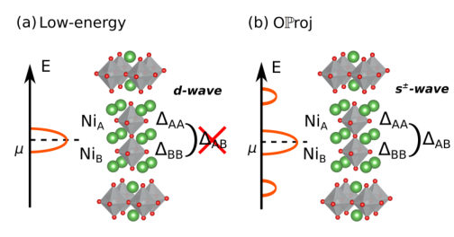
<figcaption class="paper-figure-caption"><b>Fig 1.</b> FIG. 1. Schematic representation highlighting the main differences between (a) low-energy models and (b) OProj, as well as their conse- quences for the physics of La3Ni2O7. The low-energy Wannier-based model predicts dominant intralayer ∆AA and ∆BB superconducting pairing leading to d-wave superconductivity (a). By explicitly includ- ing states far from the Fermi level, OProj captures interlayer pairing ∆AB, besides the intralayer ∆AA and ∆BB, leading to a dominant s± wave (b) and important implications for both the magnetic prop- erties of the material.</figcaption>
</figure>
<figure class="paper-figure-card">
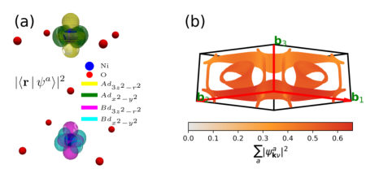
<figcaption class="paper-figure-caption"><b>Fig 2.</b> FIG. 2. (a) Isosurfaces including |⟨r|ψa⟩|2 &gt; 0.5 probability of finding an effective electron inside the isosurfaces for the high- pressure (29.5 GPa) bilayer nickelate atomic structure. Colors indi- cate different orbitals and atom types. (b) Fermi surface along the first Brillouin zone with spectral weights (colors) given by the or- thonormalized projections, OProj, model in (a).</figcaption>
</figure>
<figure class="paper-figure-card">
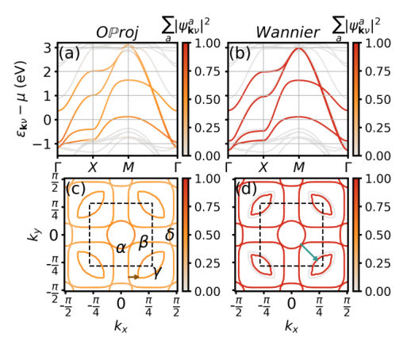
<figcaption class="paper-figure-caption"><b>Fig 3.</b> FIG. 3. OProj (left column) and Wannier (right column) band structure (a,b) and Fermi surface cuts setting kz = 0 (c,d). The color code denotes the spectral weights for the different models. The Wannier model is contrasted with the DFT band structure, the latter shown in grey color in panels (b,d). α, β, γ, and δ in panel (c) label pockets. Panels (c) and (d) show the respective nesting vectors for each model in brown and pool green, respectively. The dashed black lines represent the conventional Brillouin zone of the two- dimensional Ni bilayer square lattice.</figcaption>
</figure>
<figure class="paper-figure-card">
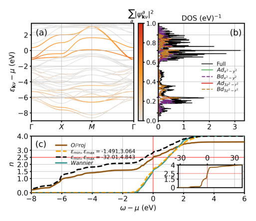
<figcaption class="paper-figure-caption"><b>Fig 4.</b> FIG. 4. Panels (a) and (b) respectively show the spectral weights and the density of states (DOS) for a wider energy range. The density of states is shown in full (black) and in its orbital-resolved components in colors. The OProj features spectral weights beyond the low-energy band width of the Wannier states. Panel (c) shows the normalized occupation number as a function of energy for the Wannier model (green pool full line) and the OProj in three cases: The full model in brown, and imposing cutoff energies of ϵmin = −1.491 and ϵmax = 3.054 eV (yellow dashed line), and ϵmin = −32.01 and ϵmax = 4.843 eV (black dashed line). The inset shows the full energy range where the OProj varies from...</figcaption>
</figure>
<figure class="paper-figure-card">

<figcaption class="paper-figure-caption"><b>Fig 5.</b> Fig. 4(c). Notice that this result is not trivial since it takes into account the spectral weight from both unoccupied and occupied states, as the projection procedure is performed over the entire DFT spectrum (i.e., the sum in Eq. (2)), encompassing all bands in the energy range from roughly −32 eV to +32 eV. As a consequence, the entire n(ω) curve, shown in the inset of Fig. 4, only reaches the maximum occupation (n(∞) = 4) for ω ≳30 eV. Thus, disregarding even a few unnoccupied states far away from the Fermi level in the projection would change the result. This is shown in the black dashed curve in Fig. 4(c), where the set of bands entering the projection procedure was restricted to...</figcaption>
</figure>

**Summary.** This theoretical study investigates the superconducting pairing symmetry in bilayer nickelates using a sophisticated full-spectrum model (OProj). By accurately capturing $	ext{Ni-O}$ hybridization and enhanced interlayer spin fluctuations, the authors argue that the pairing symmetry is $s^{\pm}$, suggesting that retaining the full electronic spectrum is vital for correct predictions in strongly correlated superconductors.

**Why it may be interesting.** The rigorous comparison between full-spectrum and low-energy models provides a template for analyzing complex correlated materials where subtle spectral weight redistribution dictates macroscopic properties like superconductivity.

Detailed structure

**Main problem.** The superconducting gap symmetry in bilayer nickelates ($	ext{La}_3	ext{Ni}_2	ext{O}_7$) is controversial, depending heavily on the theoretical approach used.

**Main result.** Using a full-spectrum model (OProj) that incorporates interlayer coupling enhances spin fluctuations, leading to a prediction of a sign-changing $s^{\pm}$ superconducting state, contrasting with low-energy models that favor $d$-wave pairing.

**Method.** The study employs a full-spectrum model based on orthonormalized projections (OProj) of Kohn-Sham states, combined with a weak-coupling matrix random-phase approximation (mRPA) within a spin-fluctuation framework.

**Model / system.** The physical system is the bilayer nickelate $	ext{La}_3	ext{Ni}_2	ext{O}_7$. The analysis builds upon DFT calculations, using OProj to accurately model the electronic structure by preserving the full band spectrum, which is crucial for capturing hybridization effects.

**Key observables.** Superconducting gap symmetry ($	ext{s}\pm$ vs. $	ext{d}$-wave), interlayer spin fluctuations, orbital-resolved spectral function, and electron occupation numbers ($n$).

**Important parameters / regimes.** High pressure (29.5 GPa), $	ext{Ni-O}$ hybridization, and the inclusion of the full electronic spectrum versus low-energy approximations.

**Assumptions / limitations.** The OProj method is used to manage the computational complexity while retaining the full DFT band structure; the analysis relies on mapping the system to a molecular-orbital picture for superconductivity.

**Figures summary.** Figures compare low-energy vs. OProj predictions for pairing symmetry (Fig. 1), show probability density isosurfaces (Fig. 2), compare band structures (Fig. 3), and illustrate the $s^{\pm}$ mechanism via interlayer pairing (Fig. 7a).

**Paper structure.** The paper first establishes the problem of gap symmetry, then details the OProj method to accurately model the electronic structure and hybridization (comparing to Wannier models), followed by applying the spin-fluctuation framework to predict the $s^{\pm}$ pairing symmetry, emphasizing the role of interlayer coupling.

Abstract

The superconducting gap symmetry of high-pressure bilayer nickelates remains under debate, with weak- and strong-coupling approaches yielding different pairing tendencies. In this work, we investigate how the weak-coupling treatment of electronic states away from the Fermi level influences magnetic fluctuations and superconductivity in La$_3$Ni$_2$O$_7$. We employ a full-spectrum model based on orthonormalized projections of Kohn-Sham states onto local Ni-$e_g$ orbitals, which preserves the density-functional band structure while redistributing spectral weight over a wide energy range. Compared to a low-energy description, this approach yields enhanced interlayer spin fluctuations and a commensurate magnetic instability. Within a spin-fluctuation framework, these features favor a sign-changing $s^\pm$ superconducting state, whereas low-energy models tend to stabilize $d$-wave pairing. Our results suggest that interlayer coupling in full-energy models may play an important role in shaping the predicted pairing symmetry of bilayer nickelates.

[↑ back to top](#top)

### [Non-local games and communication complexity with noisy entanglement](http://arxiv.org/abs/2609.05122v1)

**Authors:** Srijita Kundu, Olivier Lalonde  
**Type:** theory · **Category:** quantum information and computing · **PDF:** <https://arxiv.org/pdf/2609.05122v1>  
**Analysis basis:** full PDF text, analyzed in chunks
**Topic relevance:** `correlated / nonlocal dissipation` **1/5**

↔ Scroll figures horizontally

<figure class="paper-figure-card">
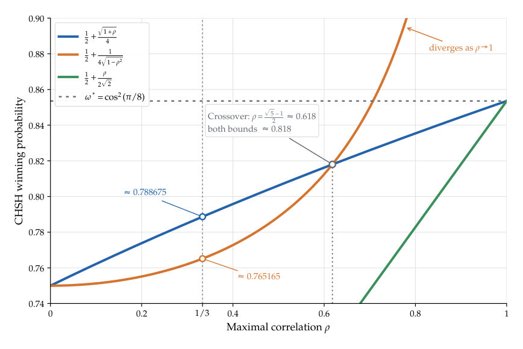
<figcaption class="paper-figure-caption"><b>Fig 1.</b> Figure 1: The two upper bounds for ωuni K (CHSH), and the lower bound. The bound from Theo- rem 49 performs better up to ∥K∥∞= ρ = √</figcaption>
</figure>
<figure class="paper-figure-card">
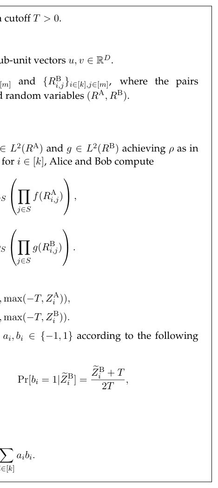
<figcaption class="paper-figure-caption"><b>Fig 2.</b> Figure 2: The SMP protocol for RealIPD,ε,δ using noisy shared randomness</figcaption>
</figure>

**Summary.** This work rigorously quantifies the degradation of quantum nonlocality and entanglement-assisted communication capacity when quantum resources (EPR pairs) are corrupted by various noise channels. By establishing separation bounds and lower bounds for tasks like the Equality function, it sets fundamental limits on the utility of noisy quantum resources.

**Why it may be interesting.** It provides concrete, quantitative measures of how noise degrades quantum correlations, which is crucial for designing robust quantum communication protocols and understanding the limits of quantum computation in realistic noisy environments.

Detailed structure

**Main problem.** The paper investigates how noise affects fundamental quantum concepts like nonlocality (non-local games) and the communication capacity derived from shared entanglement.

**Main result.** The authors establish separation bounds between communication complexity using noisy versus noiseless entanglement, and derive polynomial lower bounds for computing functions like Equality using noisy EPR pairs.

**Method.** The study employs rigorous mathematical analysis, including deriving upper bounds for CHSH games under various noise models and proving parallel repetition theorems for non-local games.

**Model / system.** The core model involves Alice and Bob sharing an arbitrarily large number of noisy EPR pairs, subjected to four specific noise channels: depolarizing, unital, biased reset, and erasure noise.

**Key observables.** CHSH game value, communication complexity lower bounds, and the distillable entanglement rate.

**Important parameters / regimes.** The noise parameters ($\mu, s_1, s_2, \lambda, \epsilon$) and the number of required copies ($n$) of the noisy entangled state.

**Assumptions / limitations.** The analysis assumes the shared resource is an unbounded supply of a fixed mixed state, and the results are compared against the ideal noiseless case.

**Figures summary.** Table 1 summarizes the derived upper and lower bounds on the noisy quantum value of the CHSH game for the four studied noise models.

**Paper structure.** The paper proceeds by analyzing the impact of noise on non-local games (CHSH bounds, parallel repetition theorems), then uses these results to prove separations in communication complexity, and finally establishes lower bounds for specific computational tasks.

Abstract

We study the impact of noise on the theories of quantum nonlocality and entanglement-assisted communication complexity. We consider non-local games and entanglement-assisted communication complexity in a model where Alice and Bob may share arbitrarily many noisy EPR pairs. We study four noise models: depolarizing noise, unital noise, biased reset noise, and erasure noise. Our results are as follows:   1. We upper bound the value of the CHSH game under all these noise models in terms of the noise parameter, without any assumptions on the measurements used in the strategy.   2. We prove a parallel repetition theorem for general non-local games under all noise models except biased reset noise; we prove an improved parallel repetition theorem for unique games. Our parallel repetition rate is smaller than the quantum parallel repetition rate for CHSH in a nontrivial noise regime.   3. Using our unique-game parallel repetition theorem and a relation defined by the CHSH game, we prove a separation between communication complexity with noisy vs noiseless entanglement. This implies an $Ω(n)$ two-way communication lower bound for distilling $n$ EPR pairs from noisy EPR pairs, in the same nontrivial noise regime.   4. We show that any interactive entanglement-assisted communication protocol can be simulated by an SMP communication protocol with noisy shared randomness, with an exponential blowup in communication. This generalizes a known result on the simulation of noiseless shared randomness with noisy shared randomness.   5. We show a polynomial lower bound on the number of copies of noisy EPR pairs required to compute the Equality function with constant communication, under all four noise models. The previous result gives a matching upper bound, and moreover, this answers an open question in the literature on whether logarithmically many noisy shared bits suffice for communication.

[↑ back to top](#top)

### [On the growth of operator entanglement in brickwork circuits with Yang--Baxter gates](http://arxiv.org/abs/2609.05121v1)

**Authors:** Balázs Pozsgay  
**Type:** theory · **Category:** statistical mechanics · **PDF:** <https://arxiv.org/pdf/2609.05121v1>  
**Analysis basis:** full PDF text, analyzed in chunks
**Topic relevance:** `analog quantum simulation` **1/5**

↔ Scroll figures horizontally

<figure class="paper-figure-card">
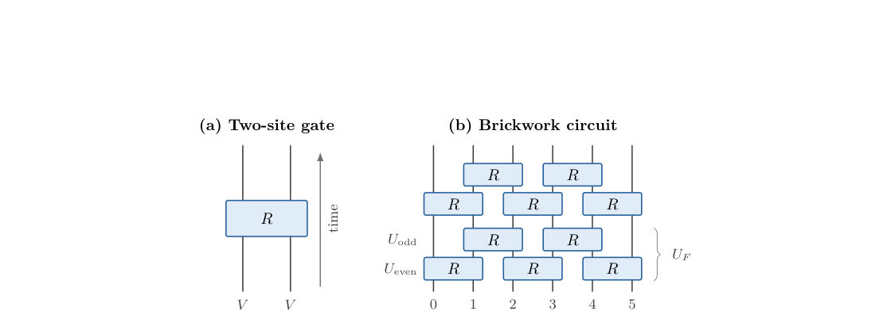
<figcaption class="paper-figure-caption"><b>Fig 1.</b> Figure 1: Notations for quantum circuits. A two-site gate is a rectangle with two incoming and two outgoing legs. The even and odd layers make one Floquet period UF = UoddUeven. The second period is included only to make the staggering visible.</figcaption>
</figure>
<figure class="paper-figure-card">
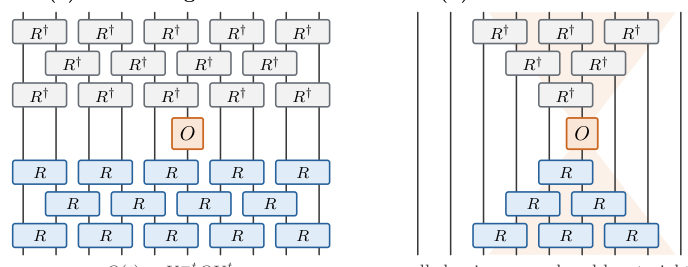
<figcaption class="paper-figure-caption"><b>Fig 2.</b> Figure 2: Evolution of a local operator and its causal structure. Panel (a) keeps the forward and backward circuits visible. Ordinary unitarity removes all gates which cannot affect the insertion. Panel (b) displays the resulting finite network. The braid relation has not yet been used.</figcaption>
</figure>
<figure class="paper-figure-card">
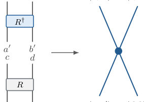
<figcaption class="paper-figure-caption"><b>Fig 3.</b> Figure 4: Folding the local Heisenberg action. The left-hand side shows the physical gates R and R†. The ends facing the operator insertion become the incoming ends at the bottom of the folded crossing, while the four outer ends become its outgoing ends at the top. The filled circle denotes the resulting folded gate bRH.</figcaption>
</figure>
<figure class="paper-figure-card">
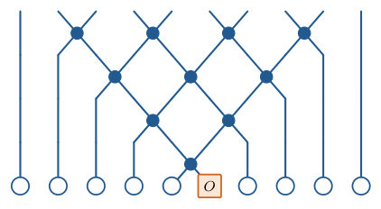
<figcaption class="paper-figure-caption"><b>Fig 4.</b> Figure 7: Causal simplification of the folded network. The ten input strands make the cancelled exterior visible: empty-circle identity inputs continue vertically wherever the local rule of Fig. 6 removes a crossing. Only the expanding network of crossings reached by the folded local operator remains.</figcaption>
</figure>
<figure class="paper-figure-card">
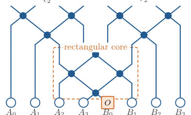
<figcaption class="paper-figure-caption"><b>Fig 5.</b> Figure 8: The factorized crossing network for t = 2. The four crossings between A = (A2, A3) and B = (B0, B1) form the complete 2 × 2 folded rectangular core. The other six crossings form the two triangular networks ℓ2 and r2.</figcaption>
</figure>

**Summary.** This work analyzes how operator entanglement grows in quantum circuits defined by Yang-Baxter gates. The authors derive rigorous upper bounds on this entanglement for constrained gates, implying constant or logarithmic growth. Crucially, they also provide counterexamples demonstrating that exponential growth is possible when these constraints are lifted, highlighting the importance of the underlying algebraic structure.

**Why it may be interesting.** The study of entanglement growth in integrable or near-integrable quantum systems is central to understanding thermalization, quantum chaos, and the limitations of quantum computation in many-body physics.

Detailed structure

**Main problem.** The paper investigates the growth rate of operator entanglement in one-dimensional quantum brickwork circuits governed by Yang-Baxter gates.

**Main result.** It establishes upper bounds on the operator Schmidt rank, showing it is bounded (constant or logarithmic) for specific classes of Yang-Baxter gates, while also constructing counterexamples showing exponential growth in the general case.

**Method.** The analysis uses the Operator Schmidt Rank (OSR) to quantify entanglement and relies on analyzing the structure imposed by the Yang-Baxter braid relation on the evolution operator.

**Model / system.** The model is a one-dimensional quantum brickwork circuit where the evolution is dictated by a two-site unitary gate satisfying the braid relation (a Yang-Baxter gate). The analysis considers the Heisenberg evolution of local operators.

**Key observables.** Operator Schmidt Rank (OSR) and associated operator-space von Neumann and Rényi entropies.

**Important parameters / regimes.** The nature of the two-site gate (e.g., qubit, involutive, dual-unitary) and the time evolution parameter $t$.

**Assumptions / limitations.** The analysis focuses on the OSR for a one-site operator initially placed at site zero, and the general Yang-Baxter case remains open.

**Figures summary.** No specific figure summaries were extracted, though the notes mention Figure 22 illustrating a logical reading path through the paper's sections.

**Paper structure.** The paper systematically analyzes the constraints imposed by the Yang-Baxter condition on the gate, deriving upper bounds for OSR for specific gate types, and then constructing counterexamples to delineate the limits of these bounds.

Abstract

We study the operator entanglement of local operators in one-dimensional brickwork circuits whose two-site gate satisfies the braid relation; throughout this work, we call such a gate a Yang--Baxter gate. We establish upper bounds for several structured, overlapping classes of Yang--Baxter gates. We show that the operator Schmidt rank remains uniformly bounded in time for all qubit Yang--Baxter gates and, in arbitrary local dimension, for permutation gates obtained from non-degenerate Yang--Baxter maps. We also show that it grows at most polynomially for involutive dual-unitary Yang--Baxter gates and for arbitrary phase dressings of permutation gates obtained from non-degenerate Yang--Baxter maps. These results imply, respectively, constant and logarithmic upper bounds on the operator entanglement. Conversely, we construct a seven-state involutive Yang--Baxter gate without dual unitarity and a one-site operator whose exact operator Schmidt rank grows exponentially, although the corresponding operator entropies remain undetermined. Entanglement growth in the general Yang--Baxter case remains open. All proofs and selected examples were constructed by ChatGPT 5.6 Sol.

[↑ back to top](#top)

### [One-Shot and Concurrent Hitting Times for Grover-Coined Quantum Walks on Cubelike Graphs](http://arxiv.org/abs/2609.04503v1)

**Authors:** Jaideep Mulherkar  
**Type:** theory · **Category:** quantum information and computing · **PDF:** <https://arxiv.org/pdf/2609.04503v1>  
**Analysis basis:** full PDF text, analyzed in chunks
**Topic relevance:** `quantum measurements` **1/5**

↔ Scroll figures horizontally

<figure class="paper-figure-card">
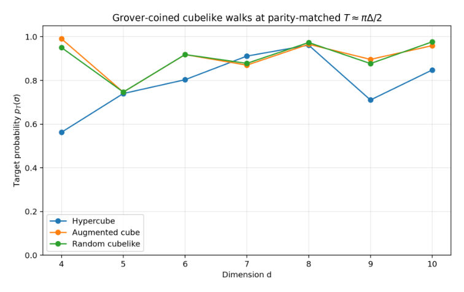
<figcaption class="paper-figure-caption"><b>Fig 1.</b> Figure 1: Target probability pT (σ) for Grover-coined walks on hypercubes, augmented cubes, and one randomly generated connected cubelike graph in each dimension. The observation time is the parity-matched integer nearest to π∆/2. The numerical results illustrate the high target probabilities predicted by Theorem 7, while also showing finite-size oscillations.</figcaption>
</figure>

**Summary.** This paper analyzes the efficiency of finding a target vertex on a quantum walk defined on a cubelike graph. It derives asymptotic bounds showing that the probability of detection approaches unity after a time proportional to the graph's degree ($\Delta$). The methodology relies on advanced Fourier analysis techniques applied to the quantum walk operator.

**Why it may be interesting.** This work provides rigorous, general bounds on quantum search/hitting times on structured graphs, extending known results from the hypercube to broader classes of graphs using powerful spectral methods.

Detailed structure

**Main problem.** The paper studies the probability of finding a quantum walker at a specific target vertex ($\sigma$) on a cubelike graph, comparing one-shot detection versus concurrent detection.

**Main result.** The target is found with high probability ($1-O(\Delta^{-1/5})$) after $\Theta(\Delta)$ steps, and the concurrent detection probability is $\Omega(\Delta^{-1})$ over the same time scale.

**Method.** The analysis heavily relies on Walsh-Fourier decomposition and properties of character sums to analyze the evolution of the quantum walk operator.

**Model / system.** The model is a discrete-time Grover-coined quantum walk on a cubelike graph $G = 	ext{Cay}(\mathbb{Z}_2^d, \Omega)$, where $\Delta$ is the degree of the graph.

**Key observables.** One-shot hitting probability $p_T(\sigma)$ and concurrent hitting probability $H_{	ext{Conc}}^T(\sigma)$.

**Important parameters / regimes.** The degree $\Delta = |\Omega|$, and the time $T$ must satisfy parity and proximity conditions relative to $\Delta$ for the asymptotic results.

**Assumptions / limitations.** The proof uses a second-moment identity for character sums, and the results are shown to be general for arbitrary cubelike generating sets, not just the hypercube.

**Figures summary.** Figure 1 numerically simulates the target probability $p_T(\sigma)$ for various graph types (hypercubes, augmented cubes, random graphs), showing high probabilities.

**Paper structure.** The paper establishes the problem setup using the quantum walk model, develops the mathematical tools via Fourier decomposition, derives the asymptotic bounds for both one-shot and concurrent hitting times, and generalizes these findings to arbitrary cubelike structures.

Abstract

We study the one-shot and concurrent hitting for the discrete-time Grover-coined quantum walk on cubelike graphs $G=\text{Cay}(\mathbb Z_2^d,Ω)$ of degree $Δ=|Ω|$. Starting from the vertex labeled $0$, we identify $σ=\bigoplus_{ω\inΩ}ω$ as a natural target vertex; for the hypercube, $σ$ is precisely the antipodal vertex.   For families with $Δ\to\infty$, let $T$ be an integer having the same parity as $Δ$ and satisfying $ \left|T-\frac{πΔ}{2}\right|\leq 1. $ We show that the probability $p_T(σ)$ of finding the walker at $σ$ when it is measured at time $T$ satisfies $$ p_T(σ)=1-O(Δ^{-1/5}). $$ Thus the target is found with probability tending to one after $Θ(Δ)$ steps.   For the concurrently measured walk, let $H_T^{\mathrm{Conc}}(σ)$ denote the probability that the target is detected at or before time $T$ when it is tested after every step. We prove $$ p_T(σ)\leq T H_T^{\mathrm{Conc}}(σ), $$ which implies $H_T^{\mathrm{Conc}}(σ)=Ω(Δ^{-1})$ over the same time scale.   The proof uses the Walsh-Fourier decomposition, an exact two-dimensional reduction of each Fourier mode, and a universal second-moment identity for the associated character sums. Our results extend Kempe's hypercube hitting phenomenon (J. Kempe, Probab. Theory Relat. Fields 133, 215-235, 2005) to arbitrary cubelike generating sets and establish the conjectured asymptotic hitting behavior for cublelike and augmented cubes in Mulherkar, Rajdeepak and Sunitha (Int. J. Quantum Inf. 20,2250020, 2022)

[↑ back to top](#top)

### [Operational Roles of QRNG-Derived Quantum Entropy in Bitcoin Proof-of-Work Architectures](http://arxiv.org/abs/2609.05092v1)

**Authors:** Ricardo Fernandes da Silva, Paulo Vitor Batista Santos  
**Type:** both · **Category:** other · **PDF:** <https://arxiv.org/pdf/2609.05092v1>  
**Analysis basis:** full PDF text, analyzed in chunks
**Topic relevance:** `quantum measurements` **1/5**

↔ Scroll figures horizontally

<figure class="paper-figure-card">
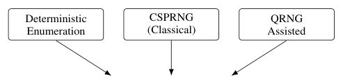
<figcaption class="paper-figure-caption"><b>Fig 1.</b> Fig. 1. Different entropy strategies converge to the same effective sampling distribution over the hash space. Under distinct-header testing, determinis- tic enumeration, strong classical pseudorandomization, and QRNG-assisted scheduling differ in entropy provisioning, but not in the first-order PoW success law.</figcaption>
</figure>
<figure class="paper-figure-card">
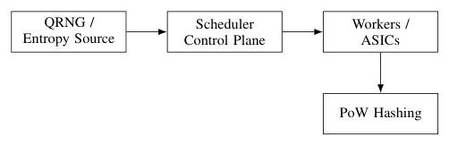
<figcaption class="paper-figure-caption"><b>Fig 2.</b> Fig. 2. Architectural separation between entropy provisioning, scheduler control, and PoW execution. QRNG, when present, affects seeding, reseeding, and namespace management in the control plane, while the PoW hashing engine remains unchanged.</figcaption>
</figure>
<figure class="paper-figure-card">
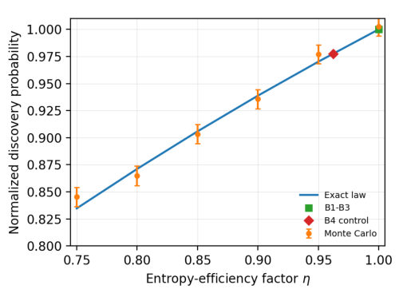
<figcaption class="paper-figure-caption"><b>Fig 3.</b> Fig. 3. Normalized discovery probability versus entropy-efficiency factor η. Monte Carlo points with 95% confidence intervals follow the exact law. Competent baselines B1–B3 cluster at η ≈1, while the correlated-restart control B4 falls on the same curve at lower effective coverage.</figcaption>
</figure>

**Summary.** This paper analyzes the role of quantum entropy from QRNGs in Bitcoin PoW, finding that while QRNGs don't change the mining success rate, they significantly improve system assurance and robustness during faults. The authors provide a simulation benchmark using metrics like entropy-efficiency ($\eta$) and reboot-diversity ($
ho$) to guide future hardware-in-the-loop validation.

**Why it may be interesting.** The paper provides a rigorous, simulation-based framework for quantifying the non-computational, infrastructural value of quantum randomness in large-scale classical distributed systems, which is relevant for understanding the practical deployment of quantum primitives.

Detailed structure

**Main problem.** To determine the operational value of quantum entropy derived from QRNGs within the control plane of Bitcoin Proof-of-Work (PoW) architectures.

**Main result.** QRNGs do not change the core PoW success probability for honest mining, but they provide measurable value in assurance-oriented scenarios involving correlated restart faults and entropy provenance.

**Method.** The authors developed a reproducible benchmark using Monte Carlo and scheduler simulations to compare deterministic, classical, and QRNG-assisted entropy provisioning strategies.

**Model / system.** The system modeled is the hybrid quantum-classical infrastructure surrounding Bitcoin PoW, focusing on the scheduler and entropy management layers rather than the hashing algorithm itself.

**Key observables.** Entropy-efficiency factor ($\eta$) and reboot-diversity index ($
ho$).

**Important parameters / regimes.** The simulation uses fixed parameters like $k=10^3$ and $W=64$, varying the degree of correlated restart faults (0% to 30%).

**Assumptions / limitations.** The study is a simulation-based validation framework, modeling the QRNG as an idealized high-entropy root, and does not test the physical QRNG device itself.

**Figures summary.** Figures illustrate that different entropy sources yield the same PoW success distribution, while tables quantify the measurable losses in $\eta$ and $
ho$ when correlated restart faults are introduced.

**Paper structure.** The paper establishes the problem by noting that PoW success is insensitive to entropy source, then develops the simulation framework using $\eta$ and $
ho$ to quantify system assurance, concluding with guidelines for when QRNG integration is technically justified.

Abstract

Replacing classical entropy with QRNG output does not change honest Bitcoin PoW success probability when candidate headers remain distinct. The original contribution of this paper is a reproducible benchmark that locates and measures the operational value of quantum entropy in hybrid quantum-classical mining infrastructure through two scheduler-level observables, the entropy-efficiency factor $η$ and the reboot-diversity index $ρ$. Monte Carlo and scheduler simulations with confidence intervals show parity for competent deterministic and strong-classical baselines, while QRNG value emerges in assurance-oriented scenarios involving correlated restart faults, namespace reuse, and entropy provenance. The study is therefore positioned as a simulation-based validation framework rather than as a device-level QRNG demonstration; hardware-in-the-loop validation with recorded or live QRNG streams is identified as the next experimental step.

[↑ back to top](#top)

## Other papers (15)

*Papers from primary archives without highlighted authors or any topic match. Click to expand.*

Show other papers

### [A Representation-Theoretic Framework for Characterizing Barren Plateaus](http://arxiv.org/abs/2609.04462v1)

**Authors:** Pedro Alcântara, Leandro Morais, Rafael Chaves  
**Type:** theory · **Category:** quantum information and computing · **PDF:** <https://arxiv.org/pdf/2609.04462v1>  
**Analysis basis:** full PDF text, analyzed in chunks

↔ Scroll figures horizontally

<figure class="paper-figure-card">
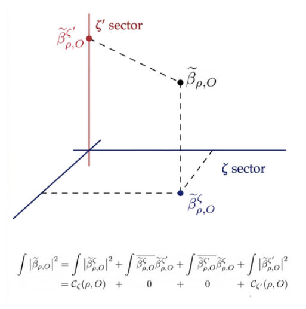
<figcaption class="paper-figure-caption"><b>Fig 1.</b> FIG. 1: Geometric interpretation of the cost function variance decomposition. The function eβρ,O is projected onto distinct irreducible representation sectors, cf. (12). Upon integration over the group, cross-correlation terms vanish due to Schur’s orthogonality, reducing the second moment to a sum of independent, non-negative contributions as established in Lemma 4.</figcaption>
</figure>
<figure class="paper-figure-card">
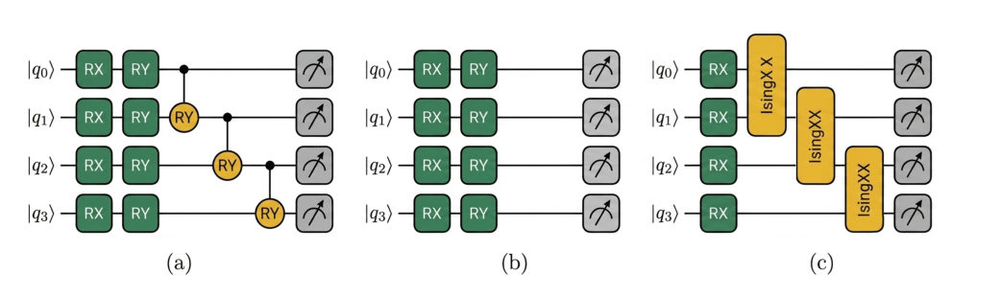
<figcaption class="paper-figure-caption"><b>Fig 2.</b> FIG. 2: Parameterized building blocks for quantum circuit architectures (ans¨atze) used for the 1D ANNNI model energy minimization. In general, a number of layers of each building block are combined. (a) Hardware-Efficient Ansatz (HEA) with full entangling capabilities, generating the DLA su(2n). (b) Local separable ansatz with independent single-qubit operations, generating the DLA su(2)n. (c) Structured ansatz featuring nearest-neighbor interactions, generating the DLA u(1)2n−1.</figcaption>
</figure>
<figure class="paper-figure-card">
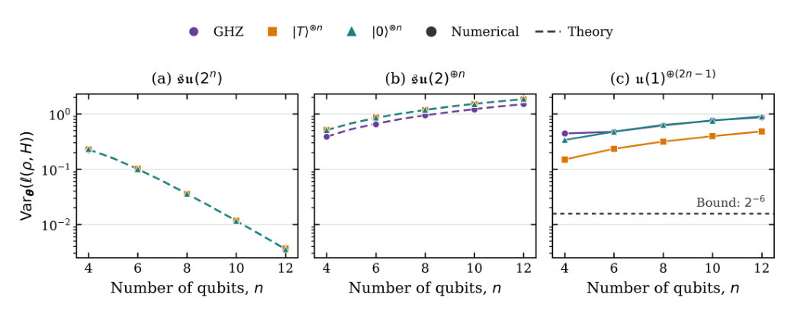
<figcaption class="paper-figure-caption"><b>Fig 3.</b> FIG. 3: Cost-function variance as a function of system size for different ansatz architectures. Comparison between numerical estimates (markers, sampled over 104 independent realizations) and analytical predictions/bounds (dashed and dotted lines) for initial separable states (|0⟩⊗n, |T⟩⊗n) and the maximally entangled state (|GHZ⟩). (a) Fully expressive su(2n) ansatz, exhibiting exponential concentration (barren plateau) independent of the initial state. (b) Local su(2)n architecture, demonstrating extensive scaling, where separable states and the GHZ state split according to their populated representation sectors. (c) u(1)2n−1 architecture, showing non-vanishing scaling that remains...</figcaption>
</figure>
<figure class="paper-figure-card">
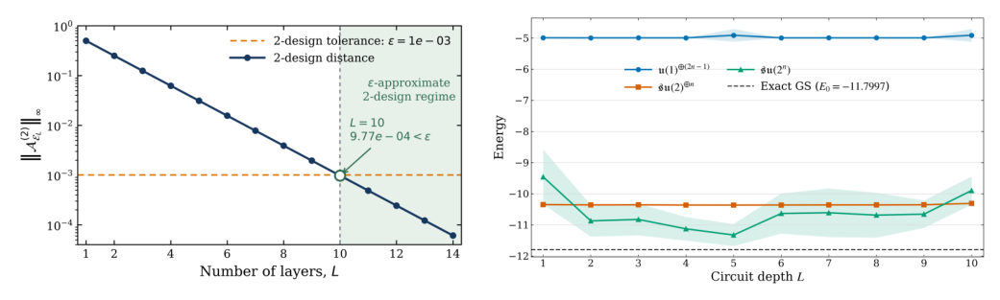
<figcaption class="paper-figure-caption"><b>Fig 4.</b> FIG. 4: Convergence to a 2-design and optimization performance. (a) Distance to a unitary 2-design (A(2) ϵ ) as a function of the number of layers L for the SU(2n) architecture. As circuit depth increases, the ansatz ensemble approaches an approximate 2-design regime, crossing the tolerance threshold ϵ = 10−3 around L = 10. (b) Variational ground-state energy for the 10-qubit ANNNI model (κ = 0.5, γ = 1.0) across circuit depths L ∈{1, . . . , 10} comparing the three architectures: su(2n), su(2)n, and u(1)2n−1. The horizontal dashed line denotes the exact ground-state energy (E0 ≈−11.7997). As su(2n) approaches 2-design statistics, exponential concentration leads to optimization bottlenecks,...</figcaption>
</figure>

**Summary.** This work introduces a representation-theoretic framework to analyze the barren plateau problem in VQAs. By decomposing the cost function's variance across irreducible representation channels, it yields exact analytical bounds that are valid for general quantum states and observables. This advances the theory by providing a symmetry-aware method to guide the design of scalable quantum algorithms.

**Why it may be interesting.** It provides a powerful, symmetry-based diagnostic tool to predict the scalability of quantum machine learning algorithms, guiding the design of hardware-efficient ansatze that avoid barren plateaus.

Detailed structure

**Main problem.** The paper addresses the barren plateau effect in Variational Quantum Algorithms (VQAs), where the cost-function variance vanishes exponentially with system size, hindering optimization.

**Main result.** It establishes a general representation-theoretic framework that provides exact analytical bounds for the cost-function variance applicable to arbitrary initial states and observables, extending previous Lie-algebraic results.

**Method.** The authors utilize a representation-theoretic framework based on the 2-design hypothesis, decomposing the cost function's variance into contributions from irreducible representation channels.

**Model / system.** The analysis is applied to general VQAs, with specific illustrations using the energy landscape of the one-dimensional Axial Next-Nearest-Neighbor Ising (ANNNI) model.

**Key observables.** Cost-function variance ($	ext{Var}_	heta[\ell_	heta(
ho, O)]$), mean cost ($\langle eta_{
ho,O} 
angle$), and the representation contributions ($C_\zeta(
ho, O)$).

**Important parameters / regimes.** System size ($n$), circuit architecture (e.g., $	ext{su}(2n)$ vs. $	ext{u}(1)^{2n-1}$), and the 2-design hypothesis.

**Assumptions / limitations.** The primary assumption is that the variational circuit ensemble realizes a unitary 2-design over a compact Lie group $G$.

**Figures summary.** FIG. 1 geometrically interprets the cost function variance decomposition by projecting the expectation value onto distinct irreducible representation sectors.

**Paper structure.** The paper develops the theory by first analyzing the mean cost (dependent only on the trivial representation), then deriving the general decomposition of the second moment using group averaging and Schur's relations, culminating in the variance being the sum of contributions from nontrivial irreducible representations.

Abstract

The scalability of variational quantum algorithms is fundamentally limited by the barren plateau effect, where the cost-function variance vanishes with system size, rendering optimization impractical. Recent Lie-algebraic approaches for deep parameterized have enabled a unified analytical understanding of this challenge but require either the initial state or the measurement observable to belong to the dynamical Lie algebra generated by the circuit. Here, we introduce a representation-theoretic framework under $2$-design hypothesis showing that variational quantum landscapes admit a natural decomposition into irreducible representation channels. This yields exact expressions and analytical bounds for the cost-function variance applicable to arbitrary initial states and observables, with previous Lie-algebraic results emerging as a special case. We illustrate the framework by analyzing the energy landscape of the one-dimensional ANNNI model for several circuit architectures, revealing trainability regimes inaccessible to existing methods. Our results establish a general representation-theoretic framework for analyzing variational quantum landscapes, substantially extending the analytical theory of barren plateaus.

[↑ back to top](#top)

### [Calculation of DFT Spin-Orbit Spillage with Quantum ESPRESSO](http://arxiv.org/abs/2609.04517v1)

**Authors:** Duy Quan Nguyen, Paul C. H. Li  
**Type:** theory · **Category:** other · **PDF:** <https://arxiv.org/pdf/2609.04517v1>  
**Analysis basis:** full PDF text, analyzed in chunks

↔ Scroll figures horizontally

<figure class="paper-figure-card">
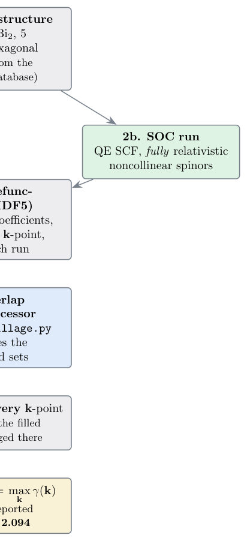
<figcaption class="paper-figure-caption"><b>Fig 1.</b> Figure 1: Workflow of the spillage computation.</figcaption>
</figure>

**Summary.** This work details a computational methodology to calculate 'spin-orbit spillage,' a metric used to predict topological character in materials. By comparing DFT calculations performed with and without SOC using Quantum ESPRESSO, the authors quantify the change in occupied electronic states. The resulting workflow provides a reliable, code-specific method for assessing topological properties in crystalline solids.

**Why it may be interesting.** While the core physics is solid-state band theory, the rigorous, reproducible computational workflow developed for calculating a topological invariant (spillage) using established codes like QE is highly valuable for theoretical condensed matter research.

Detailed structure

**Main problem.** The paper calculates the 'spin-orbit spillage,' a quantitative measure derived from Density Functional Theory (DFT) that estimates the likelihood of a material possessing topological electronic character.

**Main result.** The authors successfully applied their Quantum ESPRESSO (QE) workflow to calculate the spillage for $	ext{BaMg}_2	ext{Bi}_2$, yielding a result ($2.094$) that agrees within $0.9\%$ of published values.

**Method.** The calculation involves performing two separate DFT runs—one with and one without Spin-Orbit Coupling (SOC)—and then analyzing the overlap between the occupied electronic wavefunctions from both calculations.

**Model / system.** The study uses DFT within a plane-wave basis set framework, applied to crystalline solids like $	ext{BaMg}_2	ext{Bi}_2$. The core physics involves comparing electronic bands calculated under both SOC (fully relativistic) and non-SOC (scalar-relativistic) approximations.

**Key observables.** Spin-orbit spillage ($\eta = \max_{\mathbf{k}} \gamma(\mathbf{k})$), the overlap integral $\gamma(\mathbf{k})$, and the electronic band gap (both with and without SOC).

**Important parameters / regimes.** Plane-wave cutoffs ($	ext{ecut}_{	ext{wfc}}=70 	ext{ Ry}$, $	ext{ecut}_{	ext{rho}}=280 	ext{ Ry}$), Monkhorst–Pack k-point meshes (e.g., $6	imes6	imes4$), and the pseudopotential type (Norm-Conserving).

**Assumptions / limitations.** The calculation assumes that the spillage metric is robustly defined by the overlap of occupied states between the SOC and non-SOC wavefunctions, and that the use of norm-conserving pseudopotentials allows for a simple coefficient dot product for the overlap.

**Figures summary.** Figure 1 illustrates the complete computational workflow: from crystal structure input through two separate DFT runs (non-SOC and SOC) to the final wavefunction overlap analysis yielding the maximum spillage value.

**Paper structure.** The paper details the theoretical definition of spillage, outlines the necessary computational workflow using QE (requiring two separate SCF calculations), describes the specific implementation details (pseudopotentials, basis sets, k-point sampling), and presents comparative results against established literature values.

Abstract

This work describes the calculation of spin-orbit spillage from a crystal structure. Spin-orbit spillage provides a measure of the likelihood that a material has topological character. The spillage also provides the reference quantity for the machine-learning classifier of Choudhary et al., which predicts whether the spillage exceeds a specified threshold rather than the calculation of its numerical value directly. The complete computation workflow was applied to the insulating compound BaMg2Bi2, yielding a spillage of 2.094 compared with the published VASP spillage of 2.075, corresponding to a difference of 0.9%. The calculation is described in terms of two Quantum ESPRESSO (QE) calculations of spillage performed with and without spin-orbit coupling, the role of relativistic pseudopotentials, and the subsequent wavefunction-overlap analysis. The limitations of the same calculation procedure for semimetals are also examined.

[↑ back to top](#top)

### [Coarse-Graining Hidden Representations: Unsupervised Neuron Selection via Mapping Entropy](http://arxiv.org/abs/2609.05126v1)

**Authors:** Margherita Mele, Andrea Castagna, Roberto Menichetti, Raffaello Potestio, Alessandro Ingrosso  
**Type:** theory · **Category:** disordered systems and neural networks · **PDF:** <https://arxiv.org/pdf/2609.05126v1>  
**Analysis basis:** full PDF text, analyzed in chunks

↔ Scroll figures horizontally

<figure class="paper-figure-card">
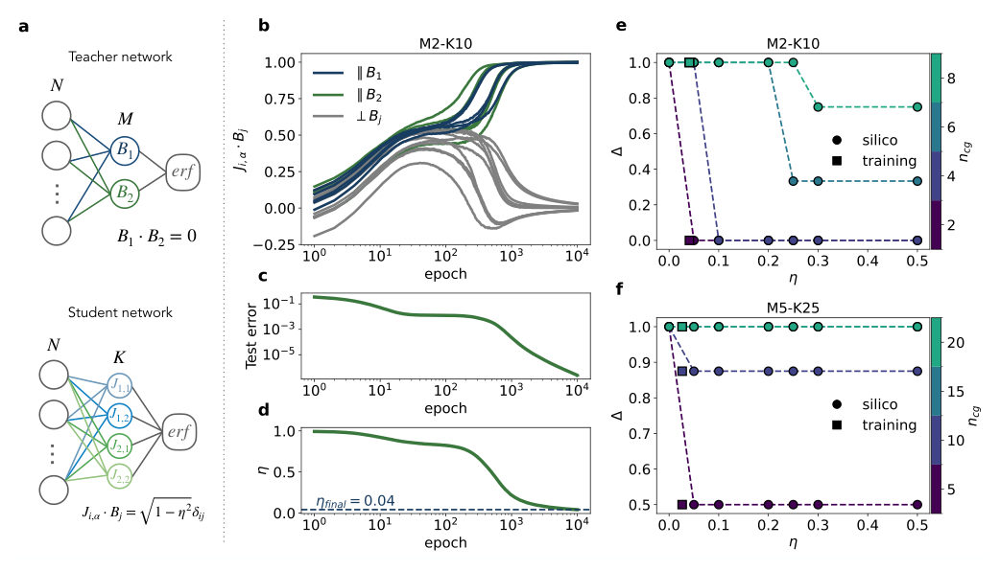
<figcaption class="paper-figure-caption"><b>Fig 1.</b> FIG. 1. TS system and ME analysis of hidden-layer representations. (a) Schematic representation of the teacher and student networks. The teacher has M hidden units with orthogonal first-layer weights Bi, while the student has K &gt; M hidden units labelled by (i, α). In the controlled construction, the student weights satisfy Ji,α·Bj = p</figcaption>
</figure>
<figure class="paper-figure-card">
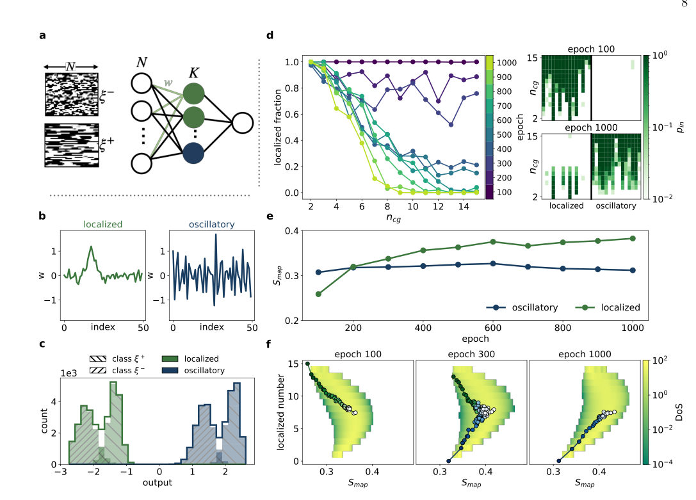
<figcaption class="paper-figure-caption"><b>Fig 2.</b> FIG. 2. NLGP system and ME analysis of hidden-layer representations. (a) Schematic of the classification task and network architecture. Input patterns from the two classes, characterised by different correlation lengths, are shown alongside the one- hidden-layer network with K = 30 neurons. (b) Representative examples of hidden neurons after training: a localised neuron (left), with weights concentrated on a subset of input coordinates, and an oscillatory neuron (right), with extended alternating- sign structure. (c) Distribution of the network output evaluated using only localised neurons (green) or only oscillatory neurons (blue), compared across the two classes (hatched histograms). (d)...</figcaption>
</figure>
<figure class="paper-figure-card">
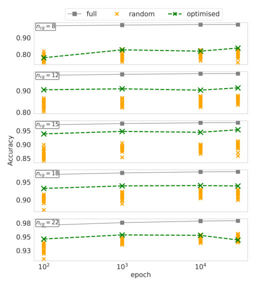
<figcaption class="paper-figure-caption"><b>Fig 3.</b> FIG. 3. NLGP reduced-network performance at different training epochs. Classification accuracy as a function of the number of retained neurons ncg. For each ncg, the green mark- ers denote the accuracy of the reduced network obtained from the ME-selected subset, the orange markers the accuracies ob- tained from random subsets of the same size, and the dashed grey line the accuracy of the full network. After pruning, the output bias is re-optimised while keeping the hidden-layer pa- rameters fixed. Note that the y axes do not start from zero.</figcaption>
</figure>
<figure class="paper-figure-card">
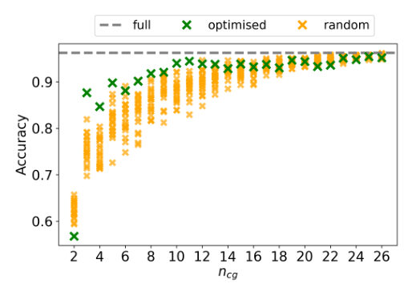
<figcaption class="paper-figure-caption"><b>Fig 4.</b> FIG. 4. Reduced-network performance for the MNIST bi- nary classification task (1 vs 7) with data augmentation by random translations. Classification accuracy as a function of the number of retained neurons ncg. For each ncg, the green markers denote the accuracy of the reduced network obtained from the ME-selected subset, the orange markers the accura- cies obtained from random subsets of the same size, and the dashed grey line the accuracy of the full network. Note that the y axes do not start from zero.</figcaption>
</figure>

**Summary.** This work proposes using Mapping Entropy (ME) to perform unsupervised pruning of overparameterized neural networks by identifying the most statistically informative subset of hidden neurons. By minimizing ME, the authors quantify the loss of discriminatory power upon compression. The method demonstrates that this purely statistical criterion effectively guides the selection of functionally relevant units, providing a powerful tool for understanding network redundancy.

**Why it may be interesting.** The methodology of using information-theoretic measures like ME to characterize the essential degrees of freedom in a complex, high-dimensional system mirrors approaches used in statistical mechanics for coarse-graining physical models.

Detailed structure

**Main problem.** The paper addresses the challenge of identifying which hidden units in an overparameterized neural network are functionally essential without relying on labeled data or gradient information.

**Main result.** Minimizing the Mapping Entropy (ME) provides a fully unsupervised criterion that successfully selects informative subsets of neurons, outperforming random selections, especially under strong network compression.

**Method.** Neuron selection is framed as coarse-graining the hidden layer, quantified by minimizing the Mapping Entropy (ME), which measures the loss of discriminatory power when discarding units.

**Model / system.** The study uses overparameterized neural networks, analyzing their hidden activation statistics. Specific tests include teacher-student networks and non-linear Gaussian process tasks.

**Key observables.** Mapping Entropy (ME), classification accuracy, and the structural descriptors like the Inverse Participation Ratio (IPR).

**Important parameters / regimes.** The compression ratio (number of retained neurons, $n_{cg}$), and the mismatch parameter ($\eta$) in the teacher-student setup.

**Assumptions / limitations.** The analysis relies on binarizing hidden activations ($	ext{sign}(h_{\mu,i})$) and assumes that the statistical structure of hidden configurations is sufficient to determine functional importance.

**Figures summary.** Figure 4 compares the classification accuracy of ME-selected subnetworks against random subsets and the full network for MNIST classification, showing superior performance for ME selection under strong compression.

**Paper structure.** The paper introduces the problem of unsupervised neuron selection via coarse-graining, defines the ME as the key diagnostic, and validates this criterion across multiple controlled tasks (TS networks, NLGP, MNIST).

Abstract

Overparameterized neural networks carry far more hidden units than a task nominally requires, raising the question of which neurons are essential and whether that distinction is legible in the representation itself, without labels or gradients. We cast neuron selection as the problem of coarse-graining the hidden layer by retaining a subset of its neurons, and score each putative selection by the mapping entropy (ME). This quantity measures the loss of discriminatory power inherent in discarding part of the network neurons, and the selection that minimises the ME is taken as particularly informative. This criterion is fully unsupervised, in that it depends only on hidden-activation statistics. In teacher-student networks, ME optimisation recovers the minimal teacher-consistent representation and retains extra units in proportion to the hidden layer's residual variability; in a non-linear Gaussian process task, it selects coherent functional-class mappings whose preferred class shifts across training. On this task and on translation-augmented MNIST, ME-selected subnetworks outperform random subsets of equal size, most clearly under strong compression - linking configurational distinguishability to predictive performance.

[↑ back to top](#top)

### [Fanout Complexity of Symmetric Boolean Functions in $\mathsf{QAC}^0$](http://arxiv.org/abs/2609.05153v1)

**Authors:** Boyan Xu, Lvzhou Li  
**Type:** theory · **Category:** quantum information and computing · **PDF:** <https://arxiv.org/pdf/2609.05153v1>  
**Analysis basis:** full PDF text, analyzed in chunks

↔ Scroll figures horizontally

<figure class="paper-figure-card">
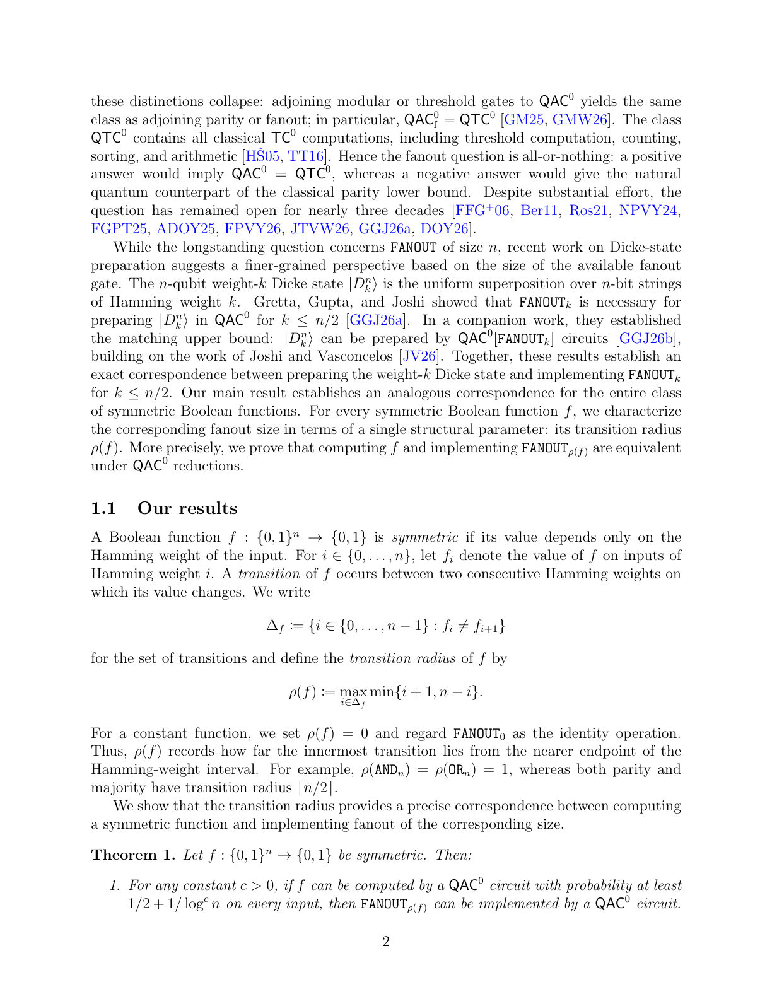
<figcaption class="paper-figure-caption"><b>Fig 1.</b> Low-resolution page preview, page 2</figcaption>
</figure>
<figure class="paper-figure-card">
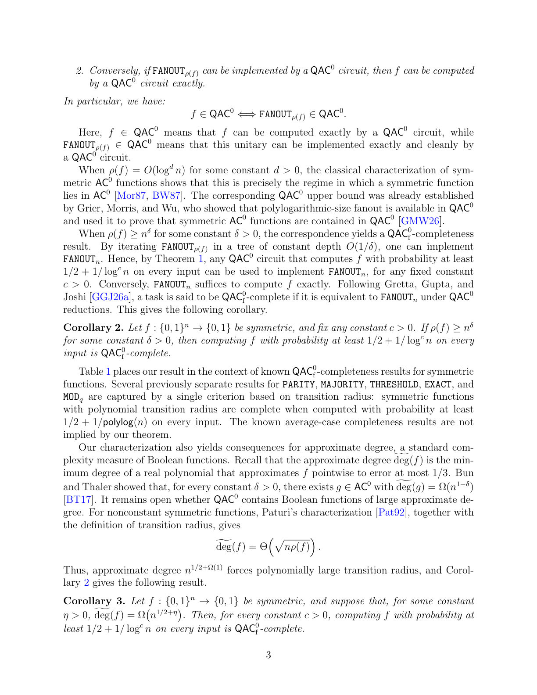
<figcaption class="paper-figure-caption"><b>Fig 2.</b> Low-resolution page preview, page 3</figcaption>
</figure>
<figure class="paper-figure-card">
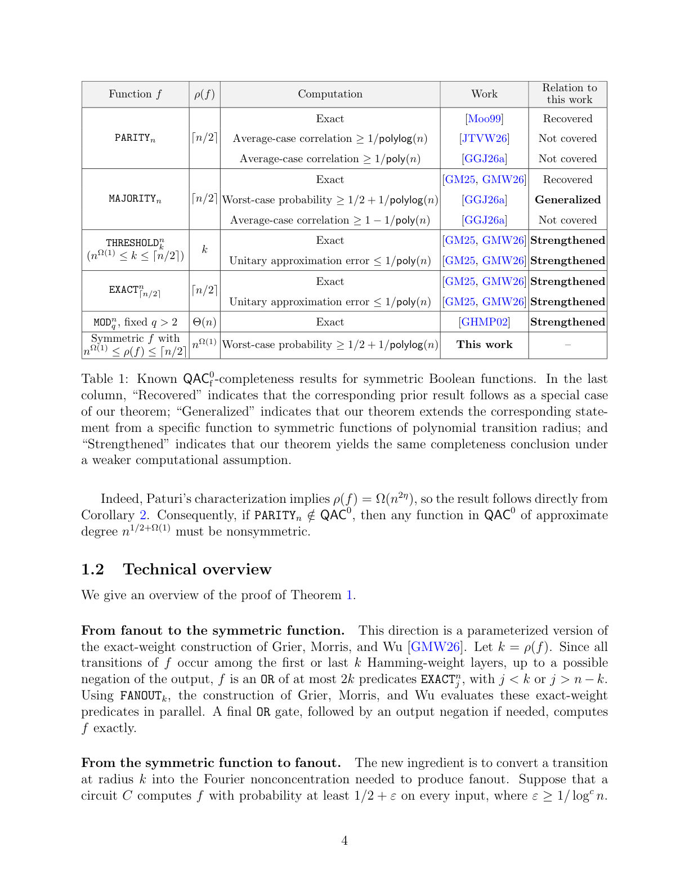
<figcaption class="paper-figure-caption"><b>Fig 3.</b> Low-resolution page preview, page 4</figcaption>
</figure>
<figure class="paper-figure-card">
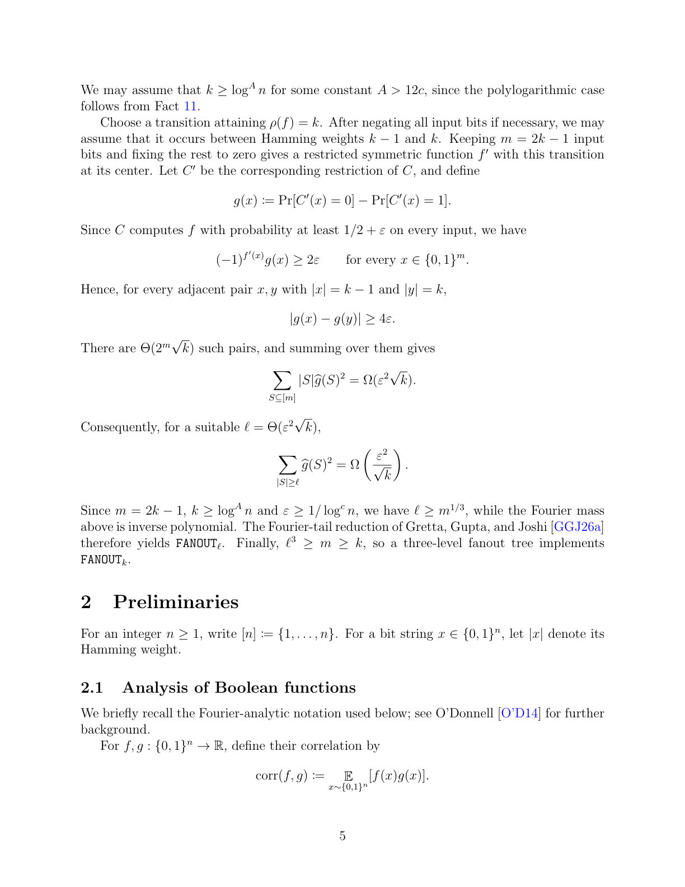
<figcaption class="paper-figure-caption"><b>Fig 4.</b> Low-resolution page preview, page 5</figcaption>
</figure>
<figure class="paper-figure-card">
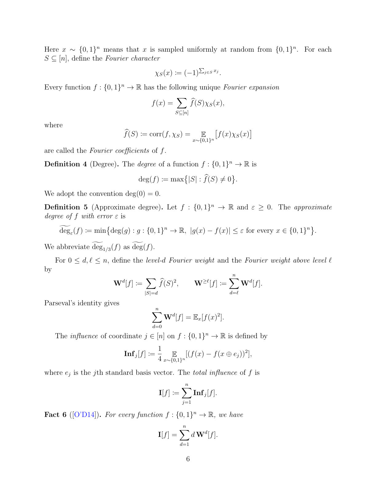
<figcaption class="paper-figure-caption"><b>Fig 5.</b> Low-resolution page preview, page 6</figcaption>
</figure>

**Summary.** This paper characterizes the computational power of quantum circuits ($\mathsf{QAC}^0$) for symmetric Boolean functions by relating it to the fanout complexity of the $\mathsf{FANOUT}$ function. The core result shows that computing a function $f$ is equivalent to implementing $\mathsf{FANOUT}_{
ho(f)}$, where $
ho(f)$ is the function's transition radius. This provides a powerful tool for classifying the complexity of quantum computations based on structural properties of the function.

**Why it may be interesting.** This work provides a deep structural characterization of computational power in quantum circuits by linking it directly to a fundamental graph/combinatorial parameter ($
ho(f)$), which is highly relevant for understanding the limitations of quantum computation models.

Detailed structure

**Main problem.** The paper aims to characterize the minimum fanout size required to compute an arbitrary symmetric Boolean function within the quantum circuit complexity class $\mathsf{QAC}^0$.

**Main result.** The computation of a symmetric function $f$ is equivalent to implementing the $\mathsf{FANOUT}_{
ho(f)}$ operation under $\mathsf{QAC}^0$ reductions, where $
ho(f)$ is the function's transition radius.

**Method.** The authors use Fourier analysis and establish two key reductions: one showing $\mathsf{FANOUT}_{
ho(f)}$ suffices for $f$, and another showing $f$ implies $\mathsf{FANOUT}_{
ho(f)}$ using a Fourier-tail reduction.

**Model / system.** The analysis is conducted within the $\mathsf{QAC}^0$ model, which uses single-qubit gates and multi-controlled Toffoli gates. The complexity is measured by the required fanout size, $\mathsf{FANOUT}_n$.

**Key observables.** The transition radius $
ho(f)$ is the key structural parameter characterizing the required fanout size.

**Important parameters / regimes.** The required fanout size $
ho(f)$ is compared against polynomial bounds like $n^\delta$ and the approximate degree $	ext{gdeg}(f)$.

**Assumptions / limitations.** The results rely on specific facts regarding Fourier analysis and require the computation probability to be sufficiently high (e.g., $\ge 1/2 + 1/\log_c n$) for the completeness results.

**Figures summary.** Table 1 summarizes known $\mathsf{QAC}^0_{\mathsf{FANOUT}_n}$-completeness results for various functions, showing how the new theorem generalizes prior findings based on $
ho(f)$.

**Paper structure.** The paper builds by first establishing the equivalence between computing $f$ and implementing $\mathsf{FANOUT}_{
ho(f)}$ (Theorem 1). It then derives completeness results by showing that if $
ho(f)$ is large, the function is $\mathsf{QAC}^0_{\mathsf{FANOUT}_n}$-complete, connecting this to the function's approximate degree.

Abstract

Whether $\mathsf{QAC}^0$ can compute $\mathtt{PARITY}_n$ remains open. Computing $\mathtt{PARITY}_n$ is equivalent to implementing $\mathtt{FANOUT}_n$ under $\mathsf{QAC}^0$ reductions. This raises a more general question: for an arbitrary symmetric Boolean function $f:\{0,1\}^n\to\{0,1\}$, what fanout size is necessary and sufficient for computing $f$ in $\mathsf{QAC}^0$? We show that the answer is exactly the transition radius $ρ(f)$: computing $f$ and implementing $\mathtt{FANOUT}_{ρ(f)}$ are equivalent under $\mathsf{QAC}^0$ reductions. In particular, if $ρ(f)\ge n^δ$ for some constant $δ>0$, then computing $f$ is $\mathsf{QAC}^0_{\mathrm{f}}$-complete. Combined with Paturi's theorem, our characterization implies that if $\mathtt{PARITY}_n \notin \mathsf{QAC}^0$, then any Boolean function in $\mathsf{QAC}^0$ of approximate degree $n^{1/2+Ω(1)}$ must be nonsymmetric.

[↑ back to top](#top)

### [Layer Architecture Shapes Electronic, Magnetic, and Lattice Interactions in Ruddlesden-Popper Nickelates](http://arxiv.org/abs/2609.04532v1)

**Authors:** W. He, X. Guo, X. Luo, J. Thomas, J. Sears, Sophia F. R. TenHuisen, Ziqiang Guan, Xinglong Chen, D. A. Dahlbom, B. Zager, J. Pelliciari, Yi-Feng Zhao, H. LaBollita, Hong Zheng, M. K. Lajer, J. F. Mitchell, V. Bisogni, A. S. Botana, M. Mitrano, S. Johnston, M. P. M. Dean  
**Type:** both · **Category:** strongly correlated electrons · **PDF:** <https://arxiv.org/pdf/2609.04532v1>  
**Analysis basis:** full PDF text, analyzed in chunks

↔ Scroll figures horizontally

<figure class="paper-figure-card">
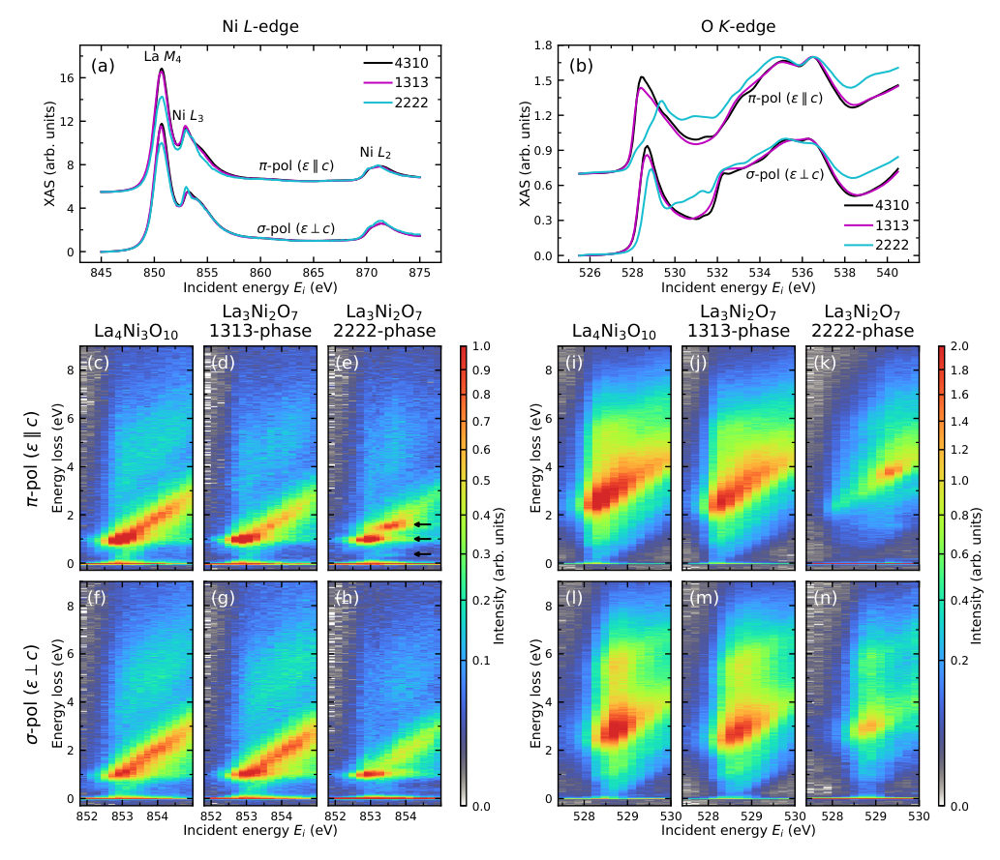
<figcaption class="paper-figure-caption"><b>Fig 1.</b> FIG. 1. Electronic structure of La4Ni3O10 and the two polymorphs of La3Ni2O7. (a),(b) XAS spectra measured in total fluorescence yield mode for (a) the Ni L-edge and (b) the O K-edge, respectively. (c)–(n), RIXS intensity maps as a function of incident x-ray energy across (c)–(h) the Ni L3 and (i)–(n) the O K resonances, respectively. The Ni L-edge data were taken at 80 K with an incident angle of θ = 10◦and scattering angle of 2Θ = 150◦in the (H0L) scattering plane, while the O K-edge data were taken at 22 K with an incident angle of θ = 15◦and scattering angle of 2Θ = 150◦in the (HHL) scattering plane. Therefore, the polarization of σ(π)-polarized incident x-rays is perpendicular...</figcaption>
</figure>
<figure class="paper-figure-card">
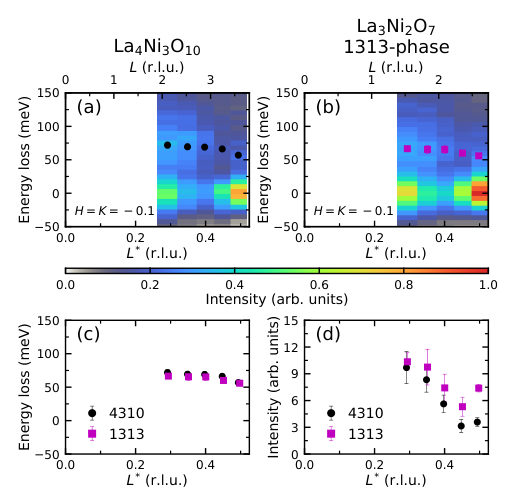
<figcaption class="paper-figure-caption"><b>Fig 2.</b> FIG. 3. Out-of-plane magnetic-excitation dispersion of La4Ni3O10 and LNO-1313. (a),(b) Ni L3-edge RIXS inten- sity maps as a function of the out-of-plane momentum trans- fer with a focus on the low-energy magnetic excitations. The overlaid black dots (for La4Ni3O10) and magenta squares (for LNO-1313) are extracted magnetic-excitation energies from the fits described in Supplemental Material Sec. S6. Both the incident angle θ and scattering angle 2Θ were adjusted to ensure a fixed q∥= (−0.1, −0.1) r.l.u. The coordinate L is based on the c-axis lattice constant, whereas L∗= Ld/c is based on the interlayer separation of NiO2 planes d ≈3.9 ˚A. (c),(d) Comparison of the (c) fitted...</figcaption>
</figure>
<figure class="paper-figure-card">
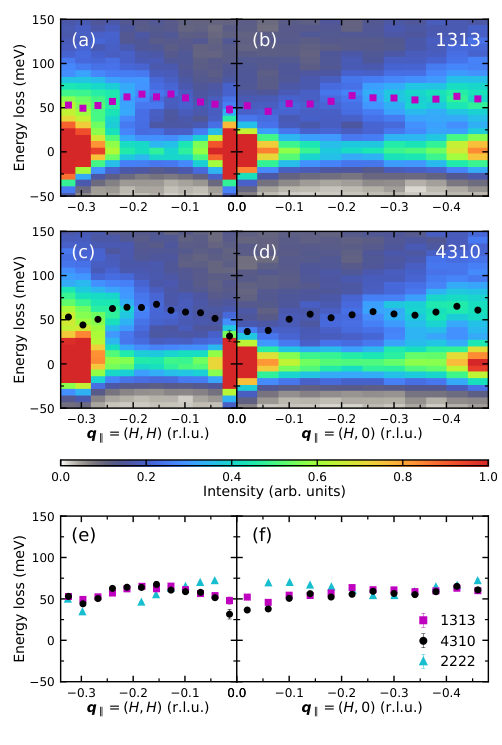
<figcaption class="paper-figure-caption"><b>Fig 3.</b> FIG. 2. In-plane magnetic-excitation dispersion of La4Ni3O10 and LNO-1313. (a)–(d) Ni L3-edge RIXS intensity maps as a function of the in-plane momentum transfer q∥along the (a),(c) (H, H) and (b),(d) (H, 0) directions, respectively, with a focus on the low-energy magnetic excitations. The overlaid black dots (for La4Ni3O10) and magenta squares (for LNO- 1313) are extracted magnetic-excitation energies from the fits described in Supplemental Material Sec. S6. (e),(f) Compar- ison of the fitted magnetic-excitation dispersion in these two materials. All the measurements were taken at T = 80 K using π-polarized incident x-rays at an incident energy of ∼852.9 eV to maximize the...</figcaption>
</figure>
<figure class="paper-figure-card">
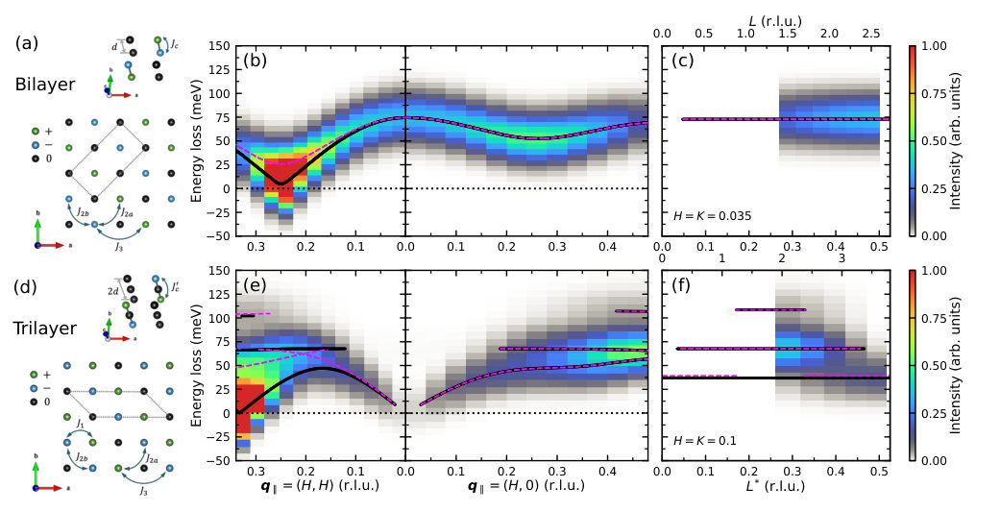
<figcaption class="paper-figure-caption"><b>Fig 4.</b> FIG. 4. Simulated magnetic-excitation spectra for a bilayer model of LNO-2222 and a trilayer model of La4Ni3O10 and LNO- 1313. (a),(d) Schematic illustration of the magnetic structures and relevant exchange interactions for the bilayer and trilayer models, respectively. The green, blue, and black spheres represent spin-up, spin-down, and spinless Ni sites, respectively. For each panel, the bottom part displays one representative layer in the ab plane and the top part displays the structure along the out-of-plane c axis. Dotted lines illustrate the in-plane magnetic unit cells. (b),(e), Calculated magnetic-excitation spectra projected onto the in-plane high-symmetry (H, H) and (H, 0)...</figcaption>
</figure>
<figure class="paper-figure-card">
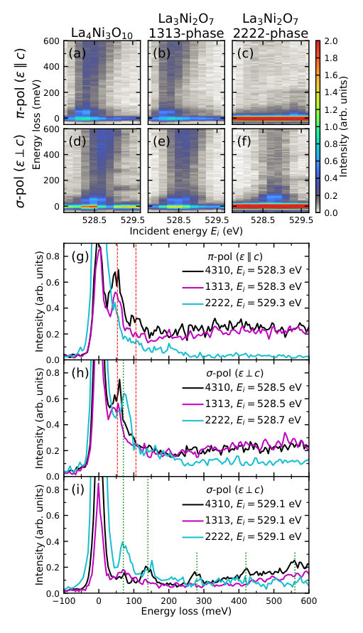
<figcaption class="paper-figure-caption"><b>Fig 5.</b> FIG. 5. Comparison of phonons in La4Ni3O10 and the two polymorphs of La3Ni2O7. (a)–(f) O K-edge RIXS intensity maps as a function of incident x-ray energy. These maps are zoomed-in views of the data in Figs. 1(i)–1(n), emphasizing the low-energy phonon features. Panels (g)–(i) display sev- eral representative RIXS spectra with red and green vertical lines marking multiples of 53 and 70 meV, respectively, based on La4Ni3O10 and LNO-1313. The data were taken at 22 K with an incident angle of θ = 15◦and scattering angle of 2Θ = 150◦in the (HHL) scattering plane. The polarization of σ(π)-polarized incident x-rays is perpendicular (approxi- mately parallel) to the sample c-axis.</figcaption>
</figure>

**Summary.** This work uses RIXS spectroscopy to compare the electronic and magnetic properties of different layer structures in nickelates. By comparing polymorphs, the authors find that layer architecture dictates the nature of magnetic interactions. They complement this with advanced spin-wave theory, providing critical experimental constraints for future theoretical models of superconductivity in these materials.

**Why it may be interesting.** The application of advanced quantum many-body techniques, such as the entangled-unit formalism for spin waves, to model correlated electron systems in layered materials provides a rich playground for theoretical physicists studying quantum magnetism and strongly correlated phenomena.

Detailed structure

**Main problem.** The study investigates how the specific layer architecture (polymorph) within Ruddlesden-Popper nickelates dictates the electronic, magnetic, and lattice interactions crucial for superconductivity.

**Main result.** The alternating monolayer-trilayer and related trilayer compounds share similar excitation spectra compared to the bilayer structure, which exhibits distinct features, suggesting layer structure strongly controls low-energy physics.

**Method.** The research combines detailed experimental measurements using Resonant Inelastic X-ray Scattering (RIXS) with theoretical modeling employing an entangled-dimer spin-wave formalism.

**Model / system.** The system is the Ruddlesden-Popper nickelates, specifically comparing $	ext{La}_3	ext{Ni}_2	ext{O}_7$ polymorphs (LNO-1313 and LNO-2222) and $	ext{La}_4	ext{Ni}_3	ext{O}_{10}$. The magnetic excitations are modeled using an entangled-unit formalism treating $	ext{S}=1$ Ni moments.

**Key observables.** Electronic, magnetic, and lattice excitations measured via Ni $	ext{L}_3$-edge and O $	ext{K}$-edge RIXS; orbital polarization; spin fluctuations; and electron-phonon coupling (EPC).

**Important parameters / regimes.** The effective coordinate $L^* = L_d/c$; magnetic gaps constrained to $\sim 5 	ext{ meV}$ and $25 	ext{ meV}$ for $	ext{LNO-2222}$.

**Assumptions / limitations.** For the magnetic modeling, the system state is approximated using an entangled-dimer scenario, and the analysis often excludes elastic-line regions due to surface sensitivity.

**Figures summary.** Figures compare XAS/RIXS spectra across the three polymorphs, showing differences in peak profiles. Simulated magnetic-excitation dispersion for $	ext{LNO-2222}$ is shown as an incoherent average of two orthogonal stripe domains.

**Paper structure.** The paper first establishes the problem by comparing the polymorphs using RIXS. It then details the spectroscopic findings (XAS/RIXS) that reveal differences in orbital character and excitations. Finally, it applies advanced modeling (entangled-dimer spin-wave theory) to fit the observed magnetic excitation spectra and constrain exchange parameters.

Abstract

The discovery of superconductivity in Ruddlesden-Popper nickelates has raised a central question: how does layer architecture shape the electronic, magnetic, and lattice interactions relevant to pairing? Here, we report a detailed comparative study of the two polymorphs of La3Ni2O7--the alternating monolayer-trilayer (LNO-1313) and bilayer (LNO-2222) structures--and the related trilayer compound La4Ni3O10, using both Ni L3- and O K-edge RIXS. We find that LNO-1313 and La4Ni3O10 share strikingly similar electronic, magnetic, and lattice excitations, whereas bilayer LNO-2222 exhibits distinct features. Compared to LNO-2222, LNO-1313 and La4Ni3O10 have weaker orbital polarization, enhanced 3d8L character, a reduced out-of-plane magnetic-exchange scale, and stronger EPC. Within an effective local-moment framework, an entangled-dimer scenario provides a natural description of the spin excitations generated by strong antiferromagnetic interlayer coupling. Its advantage over conventional spin-wave theory is clearest in bilayer LNO-2222, where the interlayer coupling dominates the intralayer interactions. These findings provide critical experimental constraints for future theoretical models for the low-energy physics relevant to superconductivity in these layered nickelates.

[↑ back to top](#top)

### [Memory-Optimal Sequential Synthesis of Multimode Gaussian Transformations](http://arxiv.org/abs/2609.05250v1)

**Authors:** Fucheng Guo, Frank Mueller, Yuan Liu  
**Type:** theory · **Category:** quantum information and computing · **PDF:** <https://arxiv.org/pdf/2609.05250v1>  
**Analysis basis:** full PDF text, analyzed in chunks

↔ Scroll figures horizontally

<figure class="paper-figure-card">
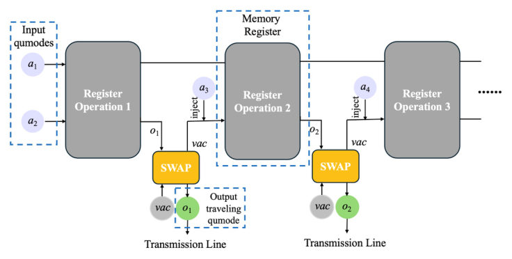
<figcaption class="paper-figure-caption"><b>Fig 1.</b> FIG. 1. Sequential implementation of a multimode Gaussian transformation S using a reusable memory register. The memory register consists of stationary qumodes on which Gaussian operations can be performed. Time proceeds from left to right. The initial input qumodes are first loaded into the register. At each step, an in-register Gaussian operation maps the next output qumode ok onto one memory qumode while retaining the information required for later outputs in the remaining memory qumodes. The state of ok is then transferred to a vacuum traveling qumode through a beam-splitter full swap (θ = π, labeled “SWAP”) and released into a transmission line. The swap leaves the corresponding memory...</figcaption>
</figure>
<figure class="paper-figure-card">
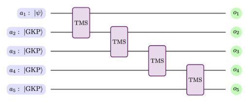
<figcaption class="paper-figure-caption"><b>Fig 2.</b> FIG. 2. Five-qumode chain encoder. The input qumode a1 carries the data state |ψ⟩, while a2, . . . , a5 are GKP an- cilla qumodes. Consecutive qumodes are coupled by nearest- neighbor TMS gates with squeezing parameter r. The corre- sponding output qumodes are labeled o1, . . . , o5.</figcaption>
</figure>
<figure class="paper-figure-card">
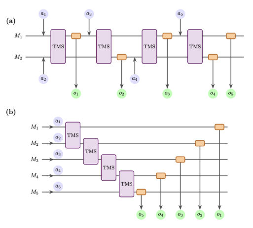
<figcaption class="paper-figure-caption"><b>Fig 3.</b> FIG. 3. Sequential emission of the N = 5 chain code in two different orders, generated by Algorithm 1. Horizontal lines denote memory qumodes M1, M2, . . . , vertical arrows denote input injections, and the orange blocks denote π full swaps to traveling qumodes. (a) Forward order. Two memory qumodes are sufficient, giving nmem = 2. The first step injects a1 and a2; each subsequent step injects the next input into the memory qumode freed by the previous emission, applies one TMS gate, and emits the next output. The final step emits o5 without an additional gate. (b) Reverse order. Since o5 depends on all inputs, all five inputs and all four TMS gates are required before the first emission....</figcaption>
</figure>
<figure class="paper-figure-card">
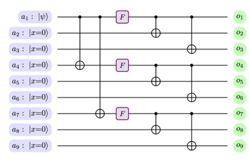
<figcaption class="paper-figure-caption"><b>Fig 4.</b> FIG. 4. Encoding circuit of the nine-qumode analog Shor code. The input qumode a1 carries the data state |ψ⟩, while a2, . . . , a9 are initialized in the position eigenstate |x = 0⟩. The circuit consists of Fourier gates F and SUM gates, and the corresponding output qumodes are labeled o1, . . . , o9.</figcaption>
</figure>
<figure class="paper-figure-card">
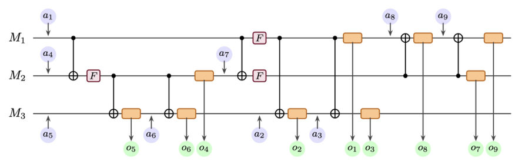
<figcaption class="paper-figure-caption"><b>Fig 5.</b> FIG. 5. Emission circuit for the analog Shor code in the greedy emission order of Eq. (23), generated by Algorithm 1. The circuit proceeds from left to right. The horizontal lines represent the three memory qumodes M1, M2, M3, and the vertical arrows labeled a1, . . . , a9 indicate input injections. A SUM gate is represented by a control dot and a target ⊕, while F denotes the Fourier gate. Each orange block represents a π full swap between a memory qumode and a vacuum traveling qumode. The traveling qumode is then emitted as the corresponding output ok, indicated by a downward arrow. In the circuit shown, the emission operations are distributed among different memory qumodes. Nevertheless,...</figcaption>
</figure>

**Summary.** This work tackles the resource challenge in modular quantum computing by finding the minimum memory required to execute a desired Gaussian transformation. It derives this minimum memory cost from the rank of submatrices of the transformation matrix and proposes a concrete, memory-optimal sequential protocol to achieve it. This offers a resource-efficient blueprint for intermodule communication in continuous-variable quantum computation.

**Why it may be interesting.** It provides a rigorous, resource-efficient framework for understanding and implementing complex quantum operations (Gaussian transformations) in physically constrained, modular quantum computing hardware.

Detailed structure

**Main problem.** The paper determines the minimum memory cost and constructs an explicit sequential protocol for realizing a prescribed multimode Gaussian transformation on $N$ qumodes.

**Main result.** The minimum memory cost is determined by a rank-based counting rule, $n_{	ext{mem}}(S) = \max_{1 \le k \le N} \{|P_k| - k + 1\}$, and an efficient algorithm achieves this minimum.

**Method.** The authors derive the minimum memory requirement using symplectic rank analysis and develop an iterative, memory-optimal synthesis algorithm based on matrix updates.

**Model / system.** The system models modular quantum computing architectures where Gaussian transformations are implemented by sequentially emitting output qumodes ($o_k$) from a reusable set of stationary memory qumodes via beam-splitter interactions.

**Key observables.** Minimum memory cost ($n_{	ext{mem}}(S)$), which is the maximum rank of specific submatrices of the symplectic transformation matrix $S$.

**Important parameters / regimes.** The symplectic matrix $S \in Sp(2N, \mathbb{R})$, the number of qumodes $N$, and the dimensionality $D$ for lattice support.

**Assumptions / limitations.** The beam-splitter interaction is assumed to completely transfer the state and leave the memory qumode in the vacuum state; the analysis focuses on exact implementations.

**Figures summary.** Figure 1 illustrates the sequential implementation process: input loading, in-register operation mapping, BS full swap to vacuum, and memory qumode reset/reuse.

**Paper structure.** The paper establishes the physical model, derives the theoretical lower bound for memory cost using rank analysis, and then presents an explicit, memory-optimal synthesis algorithm (Algorithm 3) compared against heuristic methods.

Abstract

In modular quantum computing architectures, communication between hardware modules is mediated by traveling qumodes sent through transmission lines. Each output qumode interacts with the emitting module only once through a beam-splitter-type interaction and becomes inaccessible to that module after emission. Information required for subsequent outputs must therefore remain in long-lived memory qumodes. For a prescribed multimode Gaussian transformation on $N$ qumodes, this work determines the minimum memory cost for any given emission order, constructs an explicit sequential protocol attaining this minimum, and develops a greedy method for identifying memory-efficient emission orders. The transformation is represented by a symplectic matrix $S$, specified either directly or through a Gaussian gate sequence. The exact minimum memory cost is obtained from the ranks of submatrices of $S$ and further reduces to a support-based counting rule whose computational cost is linear in the size of the support data. When $S$ is specified directly, a matrix-based protocol attains the minimum memory cost. If instead $S$ is specified through a gate sequence, the original gates can be reused without additional synthesis, although the resulting memory usage need not be minimal. Gaussian transformations with local support on a $D$-dimensional cubic lattice can be realized sequentially with $O(N^{(D-1)/D})$ memory qumodes. The protocols also apply to non-Gaussian inputs, including GKP and cat states, and thereby provide an explicit, resource-efficient scheme for intermodule communication in modular architectures for universal continuous-variable quantum computation.

[↑ back to top](#top)

### [Optimal inequalities for completely bounded polynomials and the limitations of quantum query algorithms](http://arxiv.org/abs/2609.05201v1)

**Authors:** Francisco Escudero Gutiérrez, Miquel Saucedo, Carlos Palazuelos  
**Type:** theory · **Category:** quantum information and computing · **PDF:** <https://arxiv.org/pdf/2609.05201v1>  
**Analysis basis:** full PDF text, analyzed in chunks

↔ Scroll figures horizontally

<figure class="paper-figure-card">
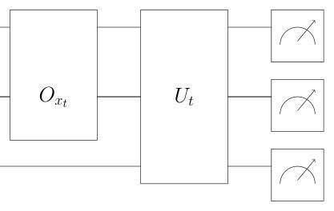
<figcaption class="paper-figure-caption"><b>Fig 1.</b> Figure 1: Quantum query algorithm that queries disjoint blocks of variables x1, . . . , xt.</figcaption>
</figure>
<figure class="paper-figure-card">
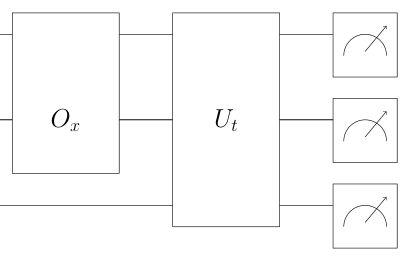
<figcaption class="paper-figure-caption"><b>Fig 2.</b> Figure 2: Standard quantum query algorithm.</figcaption>
</figure>
<figure class="paper-figure-card">
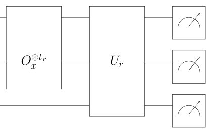
<figcaption class="paper-figure-caption"><b>Fig 3.</b> Figure 3: Quantum query algorithm with r −1 rounds of adaptivity.</figcaption>
</figure>
<figure class="paper-figure-card">
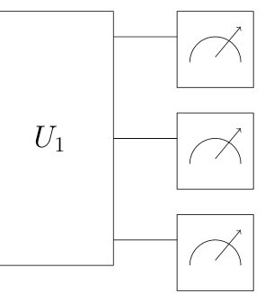
<figcaption class="paper-figure-caption"><b>Fig 4.</b> Figure 4: Non-adaptive quantum query algorithms.</figcaption>
</figure>

**Summary.** This paper uses advanced polynomial methods, particularly the completely bounded norm, to derive optimal functional inequalities that constrain the behavior of quantum query algorithms. By establishing tight bounds on root-influence and Fourier growth, the authors provide significant improvements in understanding the classical simulation limits of quantum computation. This work advances the theoretical understanding of quantum query complexity.

**Why it may be interesting.** This work provides deep mathematical tools (like optimal functional inequalities) to quantify the separation between quantum and classical computational models, which is fundamental to understanding quantum advantage.

Detailed structure

**Main problem.** The paper aims to establish rigorous mathematical limitations on the computational power of quantum query algorithms.

**Main result.** The authors prove optimal functional inequalities involving completely bounded polynomials, leading to improved bounds for classical simulation and Fourier growth for quantum query algorithms.

**Method.** The core method involves applying the polynomial method, specifically utilizing the completely bounded norm ($\|p\|_{cb}$) and Fourier analysis to characterize the acceptance probability of quantum circuits.

**Model / system.** The focus is on quantum query algorithms, whose acceptance probability is modeled by a polynomial $p: \{-1, 1\}^n 	o \mathbb{R}$ of degree $2t$, where $t$ is the number of queries.

**Key observables.** Completely bounded norm ($\|p\|_{cb}$), root-influence bounds ($	ext{Inf}_i[p]$), and the $\ell_1$ norm of Fourier coefficients ($\|\widehat p_{2t}\|_{\ell_1}$).

**Important parameters / regimes.** The number of queries ($t$), the input dimension ($n$), and the degree of the polynomial ($2t$).

**Assumptions / limitations.** The analysis relies on the polynomial method and the characterization of quantum query algorithms via completely bounded polynomials.

**Figures summary.** Figure 1 illustrates a quantum query algorithm querying disjoint blocks of variables, while Figure 2 illustrates a standard quantum query algorithm querying the whole input repeatedly.

**Paper structure.** The paper proceeds by proving optimal functional inequalities for completely bounded polynomials, first establishing a root-influence bound for block-multilinear polynomials, and then deriving a tight Fourier growth bound for general quantum query algorithms.

Abstract

We consider the problem of establishing limitations on the power of quantum query algorithms via the completely bounded polynomial method. In particular, we prove several optimal functional inequalities involving different notions of completely bounded polynomials. These inequalities lead to limiting theorems for the power of quantum query algorithms that improve on prior works.   1. An optimal root-influence bound for block-multilinear polynomials. Prior work showed that block-multilinear polynomials $p$ of degree $t$ satisfy a root-influence bound, $\|p\|_{\text{cb}}\geq \sum_i \sqrt{\mathrm{Inf}_i[p]}/t^2$, which is stronger than the bound appearing in the Aaronson-Ambainis conjecture. We find the optimal constant in that inequality: $\|p\|_{\text{cb}}\geq \sum_i \sqrt{\mathrm{Inf}_i[p]}/t$. Since the amplitudes of quantum algorithms that query disjoint blocks of inputs-such as $t$-fold forrelation- are block-multilinear polynomials with $\|p\|_{\text{cb}}\leq 1,$ our inequality shows that they satisfy $t\geq \sum_i\sqrt{\mathrm{Inf}_i[p]}$. We prove that this inequality yields both a more efficient classical simulation than prior results based on the Aaronson-Ambainis argument, and a qualitative improvement: all classical queries are nonadaptive.   2. Optimal Fourier growth of the highest level of quantum query algorithms. We show that for every polynomial $p$ defined on $\{-1,1\}^n$ of degree $2t$, the Fourier Growth at the level $2t,$ namely $\|\widehat p_{2t}\|_{\ell_1}$, satisfies $\|\widehat p_{2t}\|_{\ell_1}\leq (en/(2t-1))^{\frac{2t-1}{2}}\|p\|_{\text{cb}}$. This is optimal up to the factor $e$, as witnessed by $2t$-fold forrelation. As quantum query algorithms that make $t$ queries (to the whole input) satisfy $\|p\|_{\text{cb}}\leq 1$, this yields a Fourier growth bound for these algorithms, partially resolving a question by Girish (STOC, 2026).

[↑ back to top](#top)

### [p-Adic Dirac Equations, Continuous-Time Quantum Walks, and Quantum Networks](http://arxiv.org/abs/2609.04358v1)

**Authors:** W. A. Zúñiga-Galindo  
**Type:** theory · **Category:** quantum information and computing · **PDF:** <https://arxiv.org/pdf/2609.04358v1>  
**Analysis basis:** full PDF text, analyzed in chunks

↔ Scroll figures horizontally

<figure class="paper-figure-card">
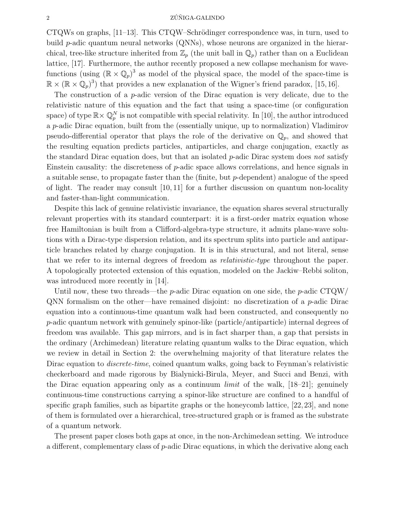
<figcaption class="paper-figure-caption"><b>Fig 1.</b> Low-resolution page preview, page 2</figcaption>
</figure>
<figure class="paper-figure-card">
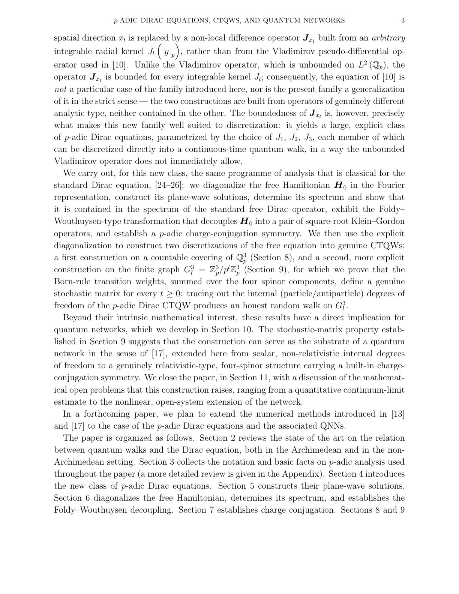
<figcaption class="paper-figure-caption"><b>Fig 2.</b> Low-resolution page preview, page 3</figcaption>
</figure>
<figure class="paper-figure-card">
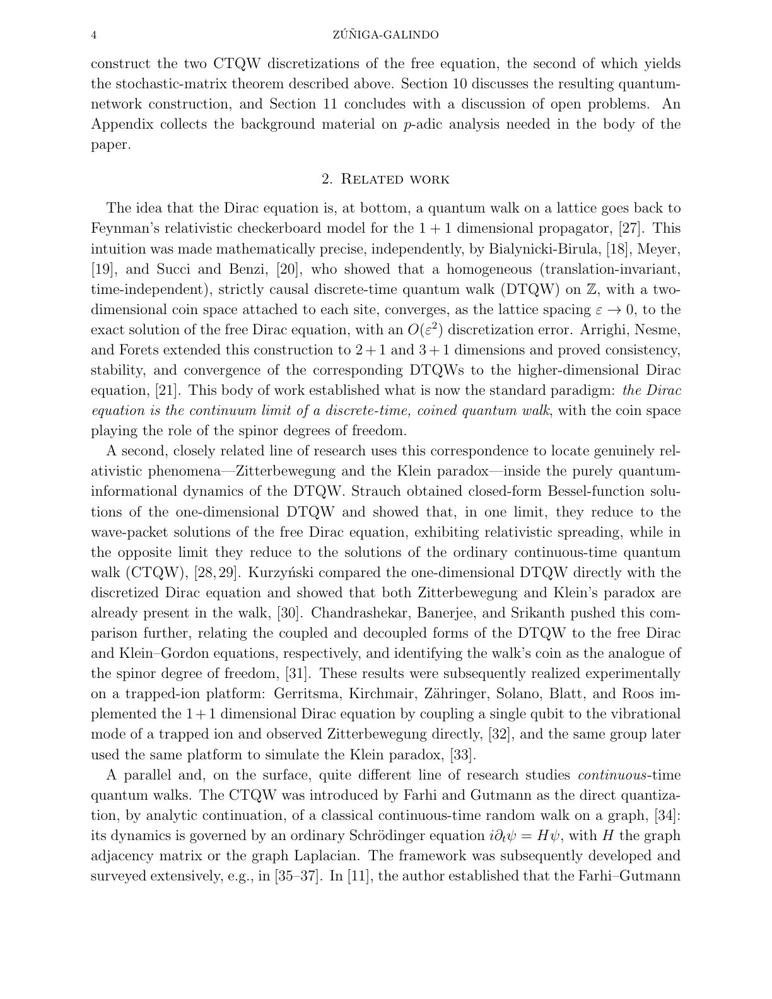
<figcaption class="paper-figure-caption"><b>Fig 3.</b> Low-resolution page preview, page 4</figcaption>
</figure>
<figure class="paper-figure-card">
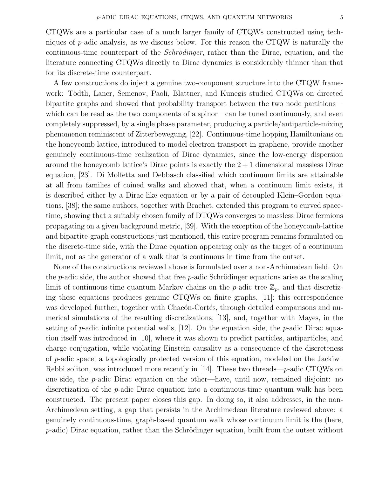
<figcaption class="paper-figure-caption"><b>Fig 4.</b> Low-resolution page preview, page 5</figcaption>
</figure>
<figure class="paper-figure-card">
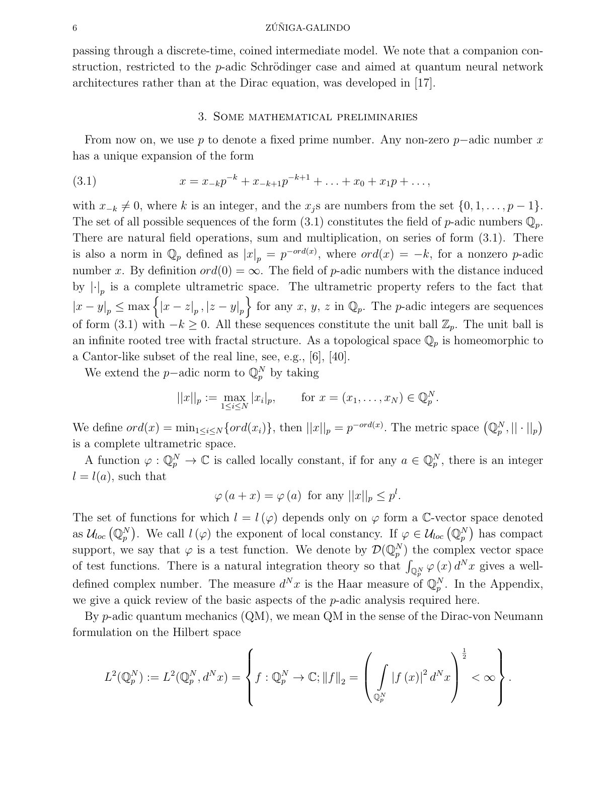
<figcaption class="paper-figure-caption"><b>Fig 5.</b> Low-resolution page preview, page 6</figcaption>
</figure>

**Summary.** This paper pioneers the connection between p-adic Dirac equations and Continuous-Time Quantum Walks by constructing a CTQW whose free dynamics exactly mirrors the p-adic Dirac equation on a hierarchical graph. This breakthrough provides a theoretical foundation for building quantum networks incorporating relativistic internal degrees of freedom within the non-Archimedean mathematical framework.

**Why it may be interesting.** This work is highly relevant as it develops a framework for quantum computation and networking based on non-standard mathematical structures (p-adic numbers), potentially leading to novel quantum hardware models beyond standard lattice or photonic implementations.

Detailed structure

**Main problem.** The paper addresses the theoretical challenge of constructing a continuous-time quantum walk (CTQW) whose free dynamics precisely matches a p-adic Dirac equation, thereby bridging non-Archimedean quantum mechanics with quantum walk theory.

**Main result.** The authors introduce a novel construction showing that the free dynamics of a CTQW on a hierarchical, tree-structured p-adic graph exactly reproduces the p-adic Dirac equation, which can serve as a foundation for relativistic quantum networks.

**Method.** The methodology involves diagonalizing the free p-adic Dirac Hamiltonian in momentum space and then discretizing the resulting equation using two methods: one on a countable covering and another explicitly on a finite, tree-structured graph.

**Model / system.** The model centers on p-adic Dirac equations, which are formulated using non-local operators replacing standard spatial derivatives. The dynamics are analyzed through the lens of Continuous-Time Quantum Walks (CTQWs) on p-adic spaces ($\mathbb{Q}_p^N$) and hierarchical graphs.

**Key observables.** The spectrum of the Hamiltonian, the proper normalization of transition probabilities (behaving like an ordinary random walk when internal structure is ignored), and the emergence of relativistic-type internal degrees of freedom (four-spinor structure).

**Important parameters / regimes.** The p-adic norm $|\cdot|_p$, the level of discretization $l$ (for the graph $G^3_l$), and the integrable kernels defining the non-local operators.

**Assumptions / limitations.** The primary assumption is the validity of extending standard quantum mechanical frameworks (like the Dirac equation) into the non-Archimedean p-adic setting. Limitations include the lack of a quantitative continuum limit estimate and the unaddressed coupling to gauge fields.

**Figures summary.** Not specified in the notes.

**Paper structure.** The paper first establishes the mathematical tools (Fourier transform on $\mathbb{Q}_p^N$) before tackling the physics. It then introduces the new p-adic Dirac equation, diagonalizes the free Hamiltonian, and proceeds to discretize the equation into two types of CTQWs, culminating in the discussion of its application to quantum networks and open problems.

Abstract

We introduce a new class of p-adic Dirac equations, formulated in the standard axiomatic framework of quantum mechanics, in which the ordinary spatial derivatives are replaced by non-local operators built from arbitrary integrable kernels. We diagonalize the resulting free Dirac Hamiltonian in momentum space, construct its plane-wave solutions, determine its spectrum, and establish a p-adic charge-conjugation symmetry relating particle and antiparticle sectors. We then discretize the free equation in two ways, both giving genuine continuous-time quantum walks rather than the discrete-time, coined walks that dominate the existing literature: a first construction on a countable covering of the underlying p-adic space, and a second, more explicit construction on a finite, tree-structured graph, for which we prove that the transition probabilities, once the internal (particle/antiparticle) components of the wavefunction are combined, form a genuine, properly normalized set of transition probabilities at every instant of time; in other words, ignoring the internal structure of the walk, it behaves exactly like an ordinary random walk on that graph. Building on this stochastic-matrix property, we discuss how the resulting construction can serve as the foundation of a quantum network with genuinely relativistic-type internal degrees of freedom, complementing earlier, non-relativistic p-adic quantum neural networks. To the best of our knowledge, this is the first continuous-time quantum walk whose free dynamics coincides exactly with a Dirac equation on a hierarchical graph. We close with a discussion of the open mathematical and computational problems raised by this construction.

[↑ back to top](#top)

### [Qlippy: A Retrieval-Augmented GenAI Assistant for Reproducible Quantum Workflows and Experiment Tracking](http://arxiv.org/abs/2609.05039v1)

**Authors:** Mahee Gamage, Vlad Stirbu  
**Type:** both · **Category:** quantum information and computing · **PDF:** <https://arxiv.org/pdf/2609.05039v1>  
**Analysis basis:** full PDF text, analyzed in chunks

↔ Scroll figures horizontally

<figure class="paper-figure-card">
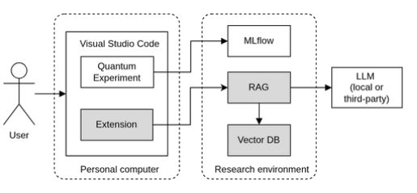
<figcaption class="paper-figure-caption"><b>Fig 1.</b> Fig. 1. The system architecture (newly developed components in gray)</figcaption>
</figure>
<figure class="paper-figure-card">

<figcaption class="paper-figure-caption"><b>Fig 2.</b> Fig. 2. Qlippy in the advisory scenario for experiment tracking.</figcaption>
</figure>
<figure class="paper-figure-card">

<figcaption class="paper-figure-caption"><b>Fig 3.</b> Fig. 3. Using the Qlippy in the injection of experiment tracking code</figcaption>
</figure>

**Summary.** This paper introduces Qlippy, a Retrieval-Augmented Generative AI assistant designed to solve the reproducibility crisis in quantum software development. Qlippy integrates into the coding environment to provide context-aware advice and automatically injects industry-standard experiment tracking code (like MLflow) into quantum programs. This makes advanced practices accessible to quantum developers while ensuring rigorous provenance tracking.

**Why it may be interesting.** While focused on software engineering, the need for rigorous provenance tracking and reproducible workflows is critical for any advanced quantum simulation or algorithm development, impacting the reliability of results derived from complex quantum systems.

Detailed structure

**Main problem.** Quantum software development is complex, error-prone, and lacks standardized tooling for tracking experiment provenance and ensuring reproducibility.

**Main result.** Qlippy, a RAG-based AI assistant, successfully provides context-aware advisory support and actively augments quantum code to integrate MLflow-based experiment tracking.

**Method.** The system uses a Retrieval-Augmented Generation (RAG) architecture, grounding LLM responses in a curated knowledge base to guide code augmentation and concept explanation.

**Model / system.** The system is an AI assistant embedded in a development environment (VSCode) designed to interact with and modify quantum programs written using frameworks like Qiskit.

**Key observables.** Experiment tracking metadata, structured provenance information aligned with the QProv schema, and successful execution of augmented code.

**Important parameters / regimes.** The reliance on curated knowledge corpus size and the choice between local vs. commercial LLMs for deployment.

**Assumptions / limitations.** The system assumes that domain knowledge can be effectively curated and retrieved to guide code generation, mitigating general LLM hallucination.

**Figures summary.** Figure 1 illustrates the overall system architecture; Figure 2 shows Qlippy's advisory role in explaining tracking concepts; Figure 3 demonstrates the code augmentation process.

**Paper structure.** The paper introduces the problem of quantum workflow reproducibility, details the Qlippy architecture (RAG components), demonstrates its advisory and augmentation capabilities, and presents preliminary evaluation results.

Abstract

Quantum software development is iterative and error-prone. Noisy hardware and repeated re-execution make experiment tracking, provenance, and reproducibility essential, yet these practices are hard to adopt because of tooling complexity and the specialized knowledge they demand. General-purpose language models can help but tend to hallucinate and lack grounding in domain-specific tooling. We present Qlippy, a retrieval-augmented GenAI assistant embedded in the development environment that grounds its responses in a curated corpus of quantum-software-engineering knowledge. Qlippy explains reproducibility and provenance concepts in context and augments existing Qiskit programs with MLflow-based experiment tracking aligned to the QProv schema. By separating knowledge from model parameters, grounding gives explicit control over the scope and provenance of the assistant's responses and reduces reliance on model scale, which points toward low-cost, privacy-preserving local deployment.

[↑ back to top](#top)

### [Qmes: Quantum Meta-Learning for Encoding Selection in Quantum Kernel Methods](http://arxiv.org/abs/2609.04652v1)

**Authors:** Dao Duy Tung, Quoc Chuong Nguyen, Vu Tuan Hai, Le Bin Ho, Lan Nguyen Tran  
**Type:** theory · **Category:** quantum information and computing · **PDF:** <https://arxiv.org/pdf/2609.04652v1>  
**Analysis basis:** full PDF text, analyzed in chunks

↔ Scroll figures horizontally

<figure class="paper-figure-card">
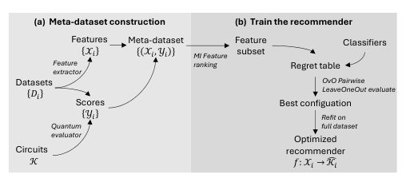
<figcaption class="paper-figure-caption"><b>Fig 1.</b> FIG. 1. Overview of the proposed circuit selection framework. Stage (a): data processing and ground-truth label generation. Stage (b): recommender training with multiple classifiers and feature subset configurations.</figcaption>
</figure>
<figure class="paper-figure-card">
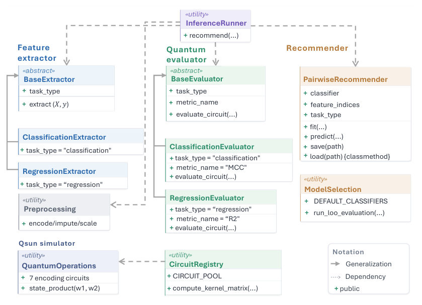
<figcaption class="paper-figure-caption"><b>Fig 2.</b> FIG. 2. Software architecture of Qmes. The three core components are defined as abstract base classes with task-specific subclasses, and are supported by four utility modules.</figcaption>
</figure>
<figure class="paper-figure-card">
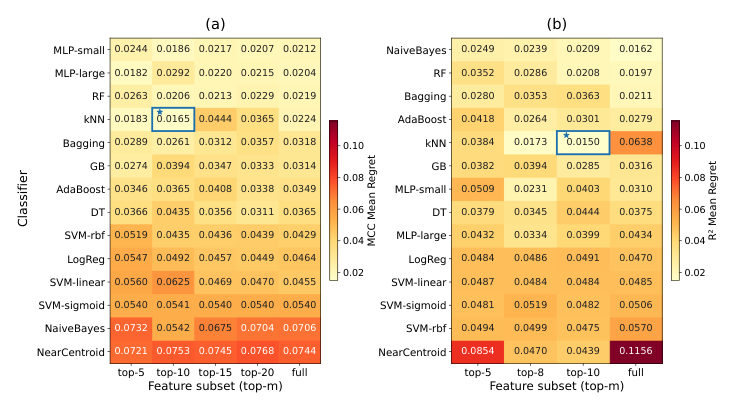
<figcaption class="paper-figure-caption"><b>Fig 3.</b> FIG. 3. LOO mean regret across all classifier-feature subset configurations for (a) classification (¯ρ(MCC)) and (b) regression (¯ρ(R2)). Lower values (lighter cells) are better. In each panel, the minimum-regret configuration is marked with ⋆, and classifiers are ordered by ascending overall mean regret within that panel.</figcaption>
</figure>
<figure class="paper-figure-card">
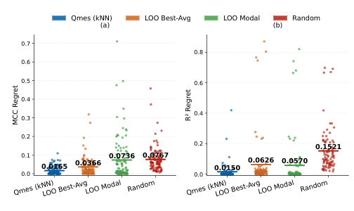
<figcaption class="paper-figure-caption"><b>Fig 4.</b> FIG. 4. Per-dataset regret ρi of the Qmes kNN Recommender compared with the three baselines above, for (a) classification (MCC regret) and (b) regression (R2 regret). Each point is one dataset; horizontal bars mark the mean regret ¯ρ per group (annotated).</figcaption>
</figure>
<figure class="paper-figure-card">
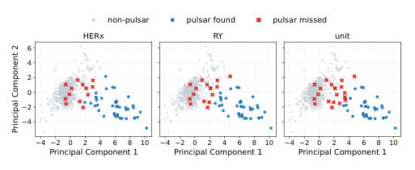
<figcaption class="paper-figure-caption"><b>Fig 5.</b> FIG. 5. Classification of the HTRU2 candidates under each recommended encoding. One panel per circuit; each point is one candidate: grey marks a non-pulsar, blue a pulsar that is classified correctly, and a red cross a pulsar that is misclassi- fied as noise. The axes are the first two principal components of the standardised features.</figcaption>
</figure>

**Summary.** This paper introduces Qmes, a meta-learning framework designed to automate the selection of optimal quantum encoding circuits for Quantum Kernel Methods. By training a classical recommender model on a large meta-dataset, Qmes predicts high-performing circuits without needing expensive quantum evaluations at inference time. This makes QKMs significantly more practical for real-world data analysis.

**Why it may be interesting.** While focused on ML, the reliance on quantum circuits as the core computational primitive makes this highly relevant to understanding the practical utility and limitations of quantum feature mapping in quantum information processing.

Detailed structure

**Main problem.** The primary challenge addressed is the computationally expensive selection of an optimal encoding quantum circuit for Quantum Kernel Methods (QKMs).

**Main result.** The proposed Qmes package significantly reduces the mean recommendation regret for both classification (2.2x) and regression (4.2x) compared to non-adaptive baselines.

**Method.** The authors developed Qmes, an open-source meta-learning framework that trains a classical recommender model on a meta-dataset derived from evaluating many circuits across numerous benchmark datasets.

**Model / system.** The system involves Quantum Kernel Methods, where the quantum kernel is defined by the overlap of quantum states $|\phi(x)
angle$ generated by an encoding circuit $U(x)$. The meta-learning process uses classical ML to predict circuit performance.

**Key observables.** Mean recommendation regret ($ar{
ho}$), Matthews correlation coefficient (MCC) for classification, and the coefficient of determination ($R^2$) for regression.

**Important parameters / regimes.** The meta-dataset comprises 105 classification and 86 regression benchmark datasets. The process is limited to noiseless state-vector simulation.

**Assumptions / limitations.** The process assumes the use of fixed, non-trainable circuits and relies on noiseless state-vector simulation, ignoring hardware noise.

**Figures summary.** Figure 1 illustrates the two-stage pipeline: meta-dataset construction (evaluating circuits on many datasets) and recommender training. Figure 2 details the software architecture, showing components like FeatureExtractor and Recommender.

**Paper structure.** The paper first establishes the problem of circuit selection in QKMs. It then details the Qmes methodology, involving meta-feature extraction, training a recommender model (using an One-vs-One approach), and finally evaluating performance by minimizing mean regret on benchmark datasets.

Abstract

Selecting an effective encoding quantum circuit is a key challenge in quantum kernel methods because different feature maps can lead to different performance. Conventional methods require constructing and evaluating every circuit for each new dataset, making it computationally expensive. We present Qmes, an open-source Python package that automatically recommends circuits through meta-learning. Qmes characterizes a dataset using classical complexity measures and queries a pre-trained model to recommend circuits without quantum evaluation at inference time. The package provides modular components for meta-feature extraction, quantum-kernel evaluation, recommender training, model selection, and user-defined circuit extension. We validate Qmes on 105 classification and 86 regression benchmark datasets. Qmes reduces the mean recommendation regret by 2.2x and 4.2x for classification and regression, respectively, compared to a non-adaptive baseline, with statistical significance confirmed via a paired Wilcoxon signed-rank test ($p < 10^{-4}$). Qmes thus enables efficient and practical encoding-circuit selection for quantum kernel methods.

[↑ back to top](#top)

### [Quantum Graph Neural Networks for Jet Tagging on Quantum Hardware](http://arxiv.org/abs/2609.04367v1)

**Authors:** Benjamin Jobilal, Jinghong Yang, Trevor Smith, Vincent Calvo, Zhong-Bo Kang, Shabnam Jabeen  
**Type:** theory · **Category:** other · **PDF:** <https://arxiv.org/pdf/2609.04367v1>  
**Analysis basis:** full PDF text, analyzed in chunks

↔ Scroll figures horizontally

<figure class="paper-figure-card">
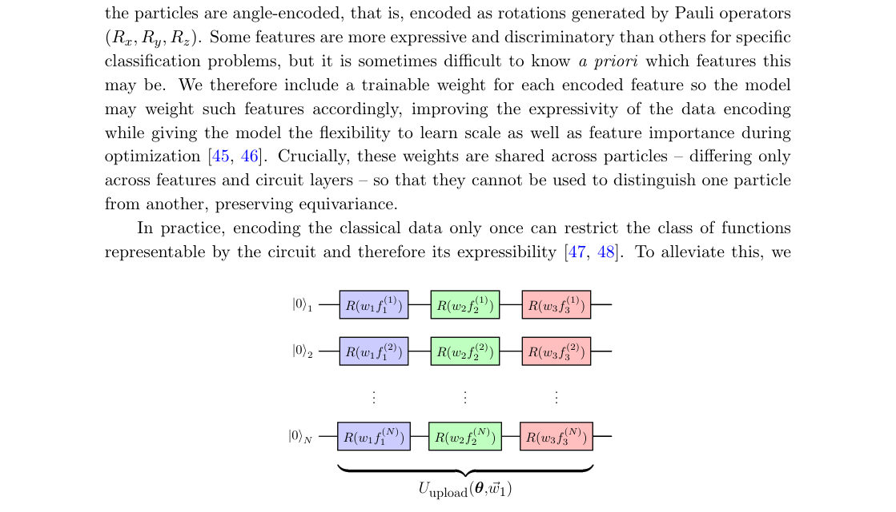
<figcaption class="paper-figure-caption"><b>Fig 1.</b> Figure 1: A single N-qubit encoding layer in which qubit i receives angle-encoded features {f(i) 1 , f(i) 2 , f(i) 3 } weighted by a shared uniform vector ⃗w = (w1, w2, w3), constituting one upload block Uupload(θ, ⃗w). Each qubit starts in the initial state |0⟩.</figcaption>
</figure>
<figure class="paper-figure-card">
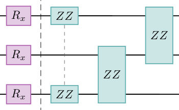
<figcaption class="paper-figure-caption"><b>Fig 2.</b> Figure 2: One layer Lθk(A) as defined in the main text for N = 3 qubits. In the depicted layer, the node gates (Rx) are parametrized by θnode and the edge gates (ZZ) are parametrized by θedge.</figcaption>
</figure>
<figure class="paper-figure-card">
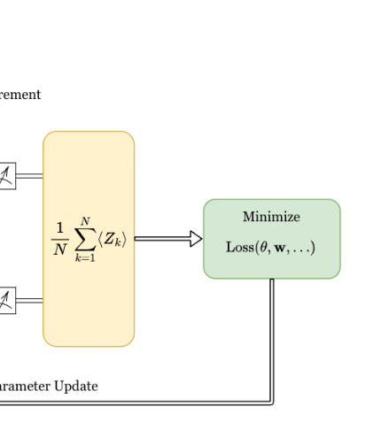
<figcaption class="paper-figure-caption"><b>Fig 3.</b> Figure 3: A summary of our Quantum Graph Neural Network.</figcaption>
</figure>
<figure class="paper-figure-card">
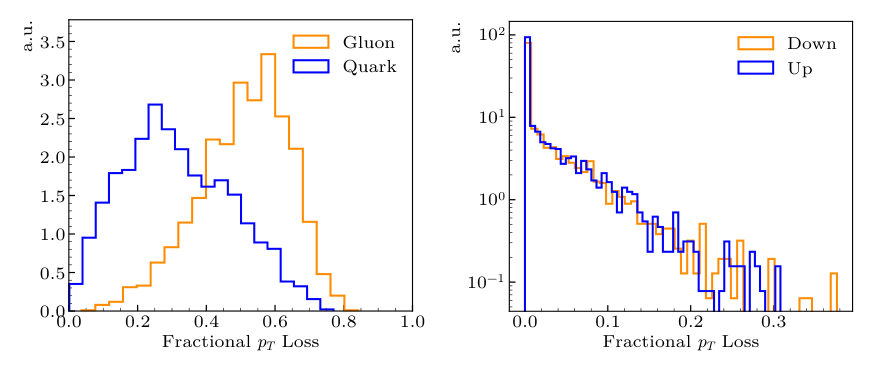
<figcaption class="paper-figure-caption"><b>Fig 4.</b> Figure 4: Total removed fraction of pT for each jet as a result of the 5-particle and 10- particle truncation schemes for the quark-gluon and flavor models respectively. A larger pT loss indicates that more of the jet’s transverse momentum is lost post-truncation.</figcaption>
</figure>
<figure class="paper-figure-card">
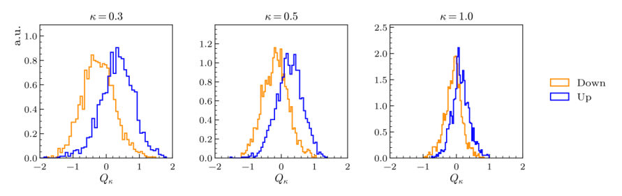
<figcaption class="paper-figure-caption"><b>Fig 5.</b> Figure 5: Jet Charge distributions for up (blue) and down (yellow) jets for κ = 0.3 (left), κ = 0.5 (middle), and κ = 1.0 (right).</figcaption>
</figure>

**Summary.** This paper proposes using a permutation-invariant Quantum Graph Neural Network (QGNN) to classify particle jets in high-energy physics experiments. The model is tested on quark/gluon and up/down quark tagging tasks, showing competitive performance against classical methods in simulations. Crucially, the authors perform an interpretability analysis, linking the quantum model's learned features back to established physical observables like jet charge and angularities.

**Why it may be interesting.** While the primary focus is high-energy physics, the methodology involves applying quantum machine learning (QML) techniques (QGNNs) to complex, structured data, which shares conceptual overlap with advanced pattern recognition in condensed matter systems.

Detailed structure

**Main problem.** The paper addresses jet classification in high-energy particle collisions, specifically distinguishing between quark vs. gluon jets and performing up vs. down quark flavor tagging.

**Main result.** The Quantum Graph Neural Network (QGNN) performs competitively against classical benchmarks in ideal simulations and shows promising results when deployed on current quantum hardware.

**Method.** A permutation-invariant QGNN, implemented via a Variational Quantum Classifier (VQC), is used to process particle-cloud representations of jets.

**Model / system.** The system is jets formed in high-energy collisions (LHC/EIC). The model is a QGNN ansatz designed to be equivariant under the symmetric group, applied to particle features like $(z, \eta, \phi)$ or including PID/charge.

**Key observables.** Quark vs. gluon discrimination, up vs. down quark flavor tagging, generalized angularities ($\lambda^\kappa_eta$), and jet charge ($Q_\kappa$).

**Important parameters / regimes.** Number of layers ($L=6$), trainable parameters (e.g., 30 or 42), and the particle truncation limit (e.g., 5 or 10 particles).

**Assumptions / limitations.** The analysis assumes that the QGNN can learn physically relevant correlations, and the hardware deployment is limited by current QPU fidelity and scale.

**Figures summary.** Figures illustrate the L1/L2 norms of cross-layer weights showing feature importance (e.g., $z$ for QG, $q$ for UD), and the distance correlation ($	ext{dCor}$) between the QGNN score and established physical observables like angularities and jet charge.

**Paper structure.** The paper introduces the physical problem, details the QGNN architecture ensuring permutation invariance, applies it to two specific tagging tasks (QG and UD), and concludes with an interpretability analysis correlating model weights to known physical observables.

Abstract

Jets are central to the physics programs of both current and future colliders, from precision Standard Model measurements and searches for new physics at the Large Hadron Collider to studies of nucleon structure at the future Electron-Ion Collider. Motivated by these applications, we explore quantum machine learning for jet classification and present a permutation-invariant Quantum Graph Neural Network (QGNN) applied to particle-cloud representations of jets. We apply the model to two such discrimination tasks: quark vs. gluon and up vs. down quark flavor tagging, with the latter being, to our knowledge, the first application of a quantum model to this problem. In the ideal simulation, the QGNN performs competitively against the Particle Flow Network and traditional QCD observables. We further deploy scaled-down models to IBM and IonQ quantum processing units (QPUs), where we train and evaluate them, obtaining promising results. Finally, we perform an interpretability analysis to characterize the observables learned by the quantum model, relating them to generalized angularities for the quark-gluon study and to jet charge for the flavor study.

[↑ back to top](#top)

### [Quantum Optimisation for Protein-Protein Interaction Network Alignment](http://arxiv.org/abs/2609.05238v1)

**Authors:** Merle Stahl, Robert J. Banks, Matthias Traube, Josua Unger, Wolfgang Lechner, Jan Baumbach, Mhaned Oubounyt  
**Type:** theory · **Category:** quantum information and computing · **PDF:** <https://arxiv.org/pdf/2609.05238v1>  
**Analysis basis:** full PDF text, analyzed in chunks

↔ Scroll figures horizontally

<figure class="paper-figure-card">
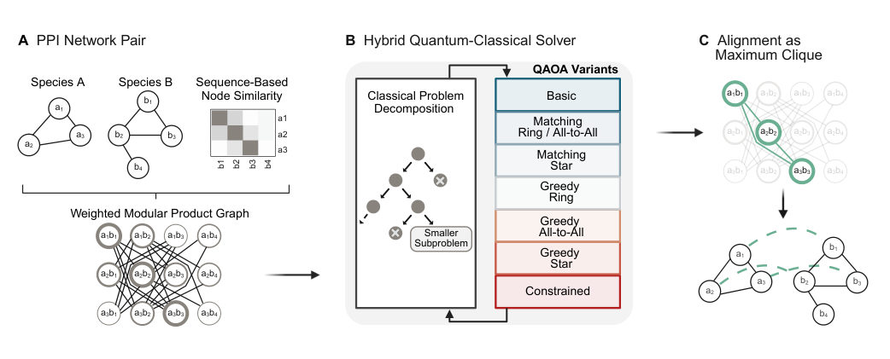
<figcaption class="paper-figure-caption"><b>Fig 1.</b> Figure 1. Overview of the QAOA-based pipeline for PPI network alignment. (A) The two PPI networks to be aligned, together with a sequence-based node-similarity matrix between their proteins, are combined into a weighted modular product graph. Its nodes are candidate protein pairs, weighted by sequence similarity, and two nodes are adjacent if the pairs they represent are compatible, i.e. if the corresponding proteins are connected in both networks or in neither. (B) The maximum-weight clique problem on the modular product graph is reformulated as a minimum-weight vertex cover problem on the complement graph and reduced to a QUBO. Branch-and-bound with kernelisation shrinks each instance to...</figcaption>
</figure>
<figure class="paper-figure-card">
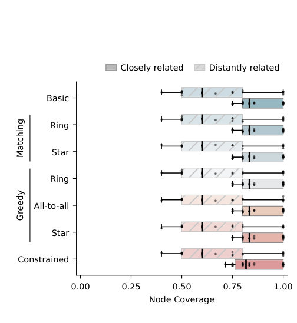
<figcaption class="paper-figure-caption"><b>Fig 2.</b> Figure 2. Node coverage of the QAOA variants on the small NAPAbench2 instances. Solid boxes are closely related pairs, hatched boxes distantly related ones. Colours run from blue to red as feasibility moves from the penalty term (Basic) into the mixer (Constrained).</figcaption>
</figure>
<figure class="paper-figure-card">
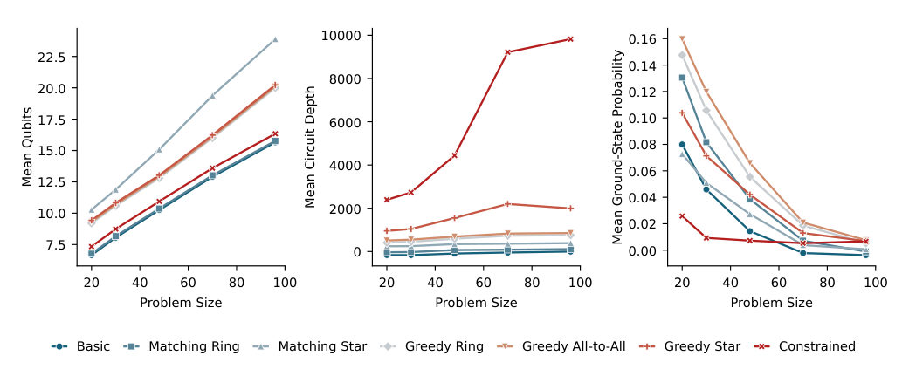
<figcaption class="paper-figure-caption"><b>Fig 3.</b> Figure 3. Hardware cost and sampler behaviour of the QAOA variants on closely related synthetic pairs. Qubit count, circuit depth (decomposed to a {u, cx} basis), and ground-state probability, the fraction of samples that hit the exact optimum with increasing problem size. Colours run from blue to red as feasibility moves from the penalty term (Basic) into the mixer (Constrained).</figcaption>
</figure>
<figure class="paper-figure-card">
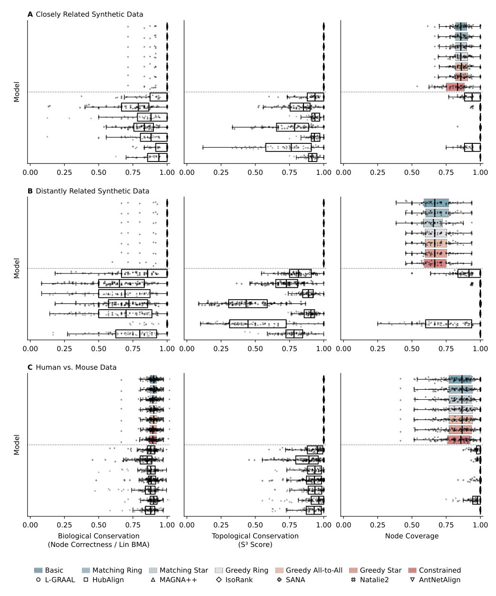
<figcaption class="paper-figure-caption"><b>Fig 4.</b> Figure 4. Alignment quality of the branch-and-bound decomposition combined with the QAOA variants com- pared against the classical aligners. Each panel shows the distribution of alignment quality over network pairs for one metric: biological conservation (node correctness for synthetic data, Lin best-match-average GO semantic similarity for real- world data), topological conservation (S3 score), and node coverage. Rows correspond to (A) closely related and (B) distantly related synthetic NAPAbench2 pairs, and (C) real human–mouse KEGG pathway pairs. Colours run from blue to red as feasibility moves from the penalty term (Basic) into the mixer (Constrained).</figcaption>
</figure>
<figure class="paper-figure-card">
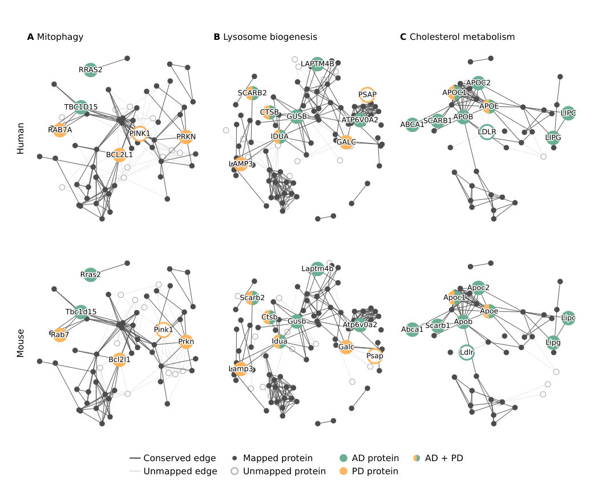
<figcaption class="paper-figure-caption"><b>Fig 5.</b> Figure 5. Cross-species alignment of disease-protein neighbourhoods in three neurodegeneration-associated pathways. Human and mouse STRING networks for (A) Mitophagy (KEGG hsa04137), (B) Lysosome biogenesis (hsa04142) and (C) Cholesterol metabolism (hsa04979). Proteins whose genes are associated with Alzheimer’s disease (AD) in Open Targets are shown in green, those associated with Parkinson’s disease (PD) in yellow. Proteins aligned to a counterpart by the Matching Ring QAOA variant are drawn at matching positions in the two species’ layouts.</figcaption>
</figure>

**Summary.** This paper proposes using quantum optimization, specifically multiple QAOA formulations, to solve the NP-hard problem of aligning PPI networks across species. By mapping the alignment to a minimum vertex cover problem, the authors demonstrate a hybrid quantum-classical solver. The results confirm the potential of quantum methods for this biological problem while clearly outlining the current resource limitations regarding circuit depth and qubit count.

**Why it may be interesting.** It provides a concrete, complex application of quantum optimization algorithms (QAOA) to a highly structured problem in computational biology, demonstrating the necessary trade-offs between circuit depth and solution quality.

Detailed structure

**Main problem.** The paper addresses the challenge of optimally aligning Protein-Protein Interaction (PPI) networks across different species, which is modeled as a weighted maximum common induced subgraph problem.

**Main result.** The developed hybrid quantum-classical framework using QAOA variants achieves high topological conservation comparable to classical methods, though this comes at the cost of reduced node coverage.

**Method.** The problem is reformulated as a minimum-weight vertex cover problem, which is then solved using a hybrid approach combining classical branch-and-bound decomposition with multiple Quantum Approximate Optimization Algorithm (QAOA) formulations.

**Model / system.** The system involves PPI networks, which are modeled using a modular product graph. The optimization is framed by mapping the problem to a QUBO/Ising Hamiltonian, suitable for QAOA execution.

**Key observables.** Topological conservation, biological conservation, and node coverage of the aligned subnetwork.

**Important parameters / regimes.** QAOA depth (p), penalty parameter (lambda), and the number of qubits (limited to $\le 33$ by the branch-and-bound decomposition).

**Assumptions / limitations.** The primary limitation is the resource requirement, suggesting that quantum advantage might require fault-tolerant hardware beyond current capabilities.

**Figures summary.** Figure 1 illustrates the entire QAOA-based pipeline: combining networks into a weighted graph, reformulating it as a vertex cover, and solving it via QAOA within a branch-and-bound structure.

**Paper structure.** The paper first defines the PPI alignment problem and its mathematical formulation (MCIS $
ightarrow$ Min-Weight Vertex Cover). It then details the quantum approach using multiple QAOA variants, comparing constraint enforcement methods. Finally, it applies this framework to synthetic and real-world KEGG pathway benchmarks.

Abstract

Protein-protein interaction (PPI) network alignment combines topological and sequence information to identify conserved modules across species, but global alignment remains challenging: heuristics sacrifice optimality, while exact methods lack scalability. We model the alignment as a weighted maximum common induced subgraph problem and reformulate it through the modular product graph to a minimum-weight vertex cover on the complement, with node weights carrying sequence similarity. To solve this problem, we develop a hybrid framework combining kernelisation, branch-and-bound, and seven Quantum Approximate Optimisation Algorithm (QAOA) formulations. These formulations differ in how the cover constraints are enforced, from penalty terms in the cost Hamiltonian to mixers confined to the feasible subspace. For single round QAOA, we derive closed-form expressions for the expected cost of four circulant mixer variants, enabling performance characterisation without circuit simulation. Applied to synthetic and real-world networks reduced to KEGG pathways, the QAOA formulations achieve high topological conservation on the aligned core while at least maintaining biological conservation comparable to leading classical aligners, at the cost of reduced node coverage. Across selected KEGG pathways, the aligned subnetworks retain disease-associated proteins, preserving biologically relevant information. Cheaper formulations leave more edges uncovered, while enforcing feasibility in the mixer raises circuit depth by one to two orders of magnitude. Together, these results highlight the potential of quantum optimisation for PPI network alignment and the resource trade-offs that will shape its scalability as quantum hardware matures.

[↑ back to top](#top)

### [Robustness of RKKY interactions across a Weyl node-annihilation transition](http://arxiv.org/abs/2609.05219v1)

**Authors:** João V. F. Alves, Joelson F. Silva, Luis G. G. V. Dias da Silva  
**Type:** theory · **Category:** strongly correlated electrons · **PDF:** <https://arxiv.org/pdf/2609.05219v1>  
**Analysis basis:** full PDF text, analyzed in chunks

↔ Scroll figures horizontally

<figure class="paper-figure-card">
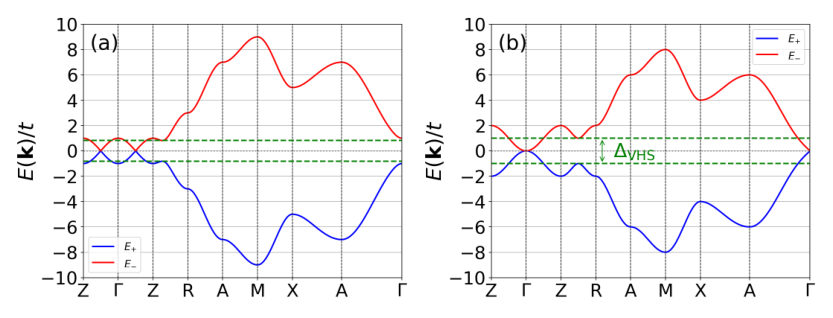
<figcaption class="paper-figure-caption"><b>Fig 1.</b> Figure 1: Band structure along the high-symmetry points of the Brillouin zone for the two-band tight-binding model with m = 2 and (a) k0 = π/2, (b) k0 = 0. Dashed green lines mark the energies of the Van-Hove singularities, separated by an energy interval ∆VHS. Notice that the well-defined Weyl nodes at (0, 0, ±π/2) in (a) have merged into a quadratic band-touching at the Γ point in (b).</figcaption>
</figure>
<figure class="paper-figure-card">
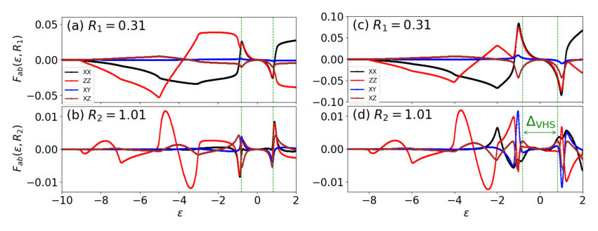
<figcaption class="paper-figure-caption"><b>Fig 2.</b> Figure 2: Integrand of Eqs. (28) for m = 2 and (a,b) k0 = π/2 (Weyl semimetal) (c,d) k0 = 0 (merged Weyl cones) and for R = 0.31 (a,c) and R = 1.01 (b,d). The vertical dashed lines indicate the energies of the Van-Hove singularities, separated by ∆VHS.</figcaption>
</figure>
<figure class="paper-figure-card">
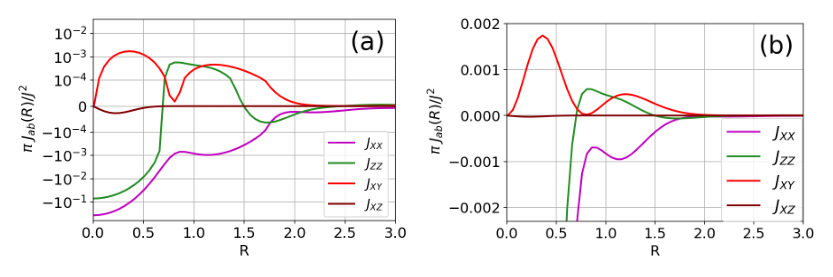
<figcaption class="paper-figure-caption"><b>Fig 3.</b> Figure 3: RKKY matrix elements in (a) log-linear (b) linear-linear scale for ϵF = 0, m = 2 and k0 = π/2.</figcaption>
</figure>
<figure class="paper-figure-card">

<figcaption class="paper-figure-caption"><b>Fig 4.</b> Figure 4 explores the behavior of the RKKY interaction matrix the Fermi energy is varied away from charge neutrality. For Fermi energy values within the VHS gap (|ϵF| &lt; ∆VHS/2 ≈1.0t, Figs. 4(a-b)), the overall behavior is the same as in the charge</figcaption>
</figure>
<figure class="paper-figure-card">
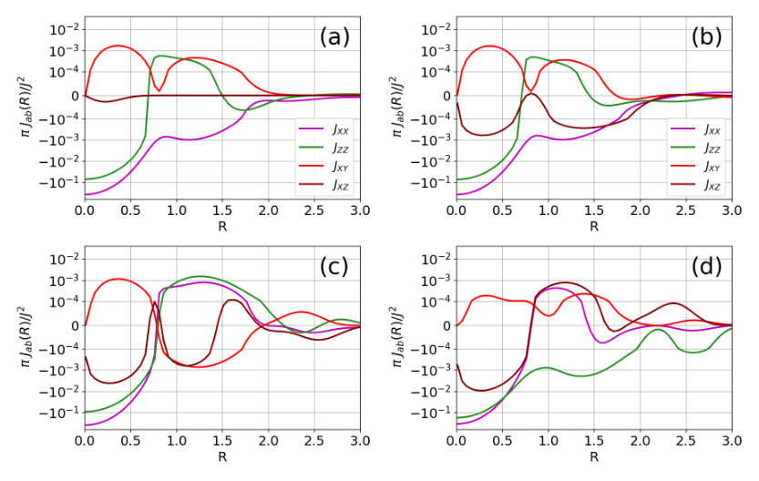
<figcaption class="paper-figure-caption"><b>Fig 5.</b> Figure 4: RKKY matrix elements for k0 = π/2 and different values of the Fermi energy (a) ϵF = 0 (b) ϵF = 0.5 (c) ϵF = 1.0 (d) (c) ϵF = 2.0.</figcaption>
</figure>

**Summary.** This theoretical work analyzes the RKKY magnetic interaction in Weyl semimetals as they undergo a topological phase transition (Weyl node annihilation). By calculating the exchange tensor using full-band tight-binding methods, the authors demonstrate that the magnetic coupling strength is robust across the transition. This implies that the interaction is governed by the global quantum metric of the entire band structure, offering key insights for material design.

**Why it may be interesting.** The finding that global band structure properties govern magnetic interactions, rather than just local topological features, provides a crucial, non-trivial constraint for modeling magnetic anisotropy in topological materials.

Detailed structure

**Main problem.** The study investigates the robustness of the Ruderman-Kittel-Kasuya-Yosida (RKKY) interaction when the underlying electronic structure undergoes a Weyl node-annihilation transition.

**Main result.** The spatial profile, magnitude, and anisotropic structure of the RKKY exchange couplings remain remarkably robust across the transition, suggesting mediation by the global, Brillouin-zone-integrated quantum metric rather than local Berry curvature monopoles.

**Method.** The RKKY tensor is derived analytically using energy-integrating real-space Green's functions calculated across the entire Brillouin zone for two-band spinful lattice systems.

**Model / system.** The system is a time-reversal symmetry-breaking Weyl semimetal modeled by a two-band tight-binding lattice Hamiltonian, which is tuned to interpolate between a Weyl phase and a quadratic band-touching semimetal phase.

**Key observables.** The full RKKY exchange tensor, decomposed into Heisenberg, anisotropic Ising, and Dzyaloshinskii-Moriya (DM) terms; the spatial profile and magnitude of these couplings.

**Important parameters / regimes.** Fermi energy ($\epsilon_F$), lattice coupling constants ($t$), and the parameter controlling the Weyl node separation ($k_0$).

**Assumptions / limitations.** The analysis relies on full-band tight-binding formulations, emphasizing that low-energy linearized continuum models are insufficient for accurate predictions.

**Figures summary.** Figures illustrate the dependence of the DM term on $\epsilon_F$ (showing suppression at charge neutrality) and the overall RKKY coupling strength across the node-annihilation transition, comparing tight-binding results to free electron gas predictions.

**Paper structure.** The paper develops a unified matrix framework for the RKKY tensor, calculates the exchange couplings using Green's functions, and then applies this framework to study the transition between Weyl and semimetallic phases, focusing on the persistence of coupling structure.

Abstract

Weyl semimetals (WSMs), with their unique topological properties and distinct electronic structure, exhibit intriguing properties when either time-reversal or inversion symmetries are broken. In this work, we consider the Ruderman-Kittel-Kasuya-Yosida (RKKY) interaction between magnetic impurities in time-reversal symmetry-breaking WSMs. We derive analytical expressions for the full RKKY exchange tensor in arbitrary two-band spinful lattice systems. Our approach reveals both Heisenberg, anisotropic Ising and Dzyaloshinsky-Moriya terms, which can be calculated by energy-integrating real-space Green's functions across the entire Brillouin zone, with the band edge acting as a natural energy cutoff. We apply this framework to study a two-band tight-binding model for a time-reversal symmetry-breaking WSM that interpolates between a Weyl phase with well-separated chiral nodes and a quadratic band-touching semimetal phase. Remarkably, the spatial profile, magnitude, and anisotropic tensor structure of the exchange couplings remain persistent across the node-annihilation transition. This topological robustness reveals that short- and intermediate-range RKKY interactions are mediated by the global, Brillouin-zone-integrated quantum metric of the full valence band rather than being strictly dictated by local low-energy Berry curvature monopoles. These findings demonstrate the necessity of full-band tight-binding formulations when predicting real-space magnetic interactions, providing key insights for electric-field tuning of magnetic anisotropy and constructing realistic models of heavy-fermion and Weyl-Kondo semimetals.

[↑ back to top](#top)

### [The marginal is pretty good](http://arxiv.org/abs/2609.05225v1)

**Authors:** Lukas Schmitt, Joseph M. Renes  
**Type:** theory · **Category:** quantum information and computing · **PDF:** <https://arxiv.org/pdf/2609.05225v1>  
**Analysis basis:** full PDF text, analyzed in chunks

↔ Scroll figures horizontally

<figure class="paper-figure-card">
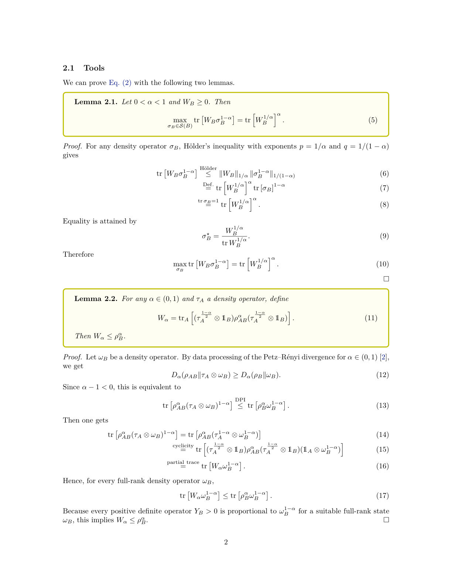
<figcaption class="paper-figure-caption"><b>Fig 1.</b> Low-resolution page preview, page 2</figcaption>
</figure>
<figure class="paper-figure-card">
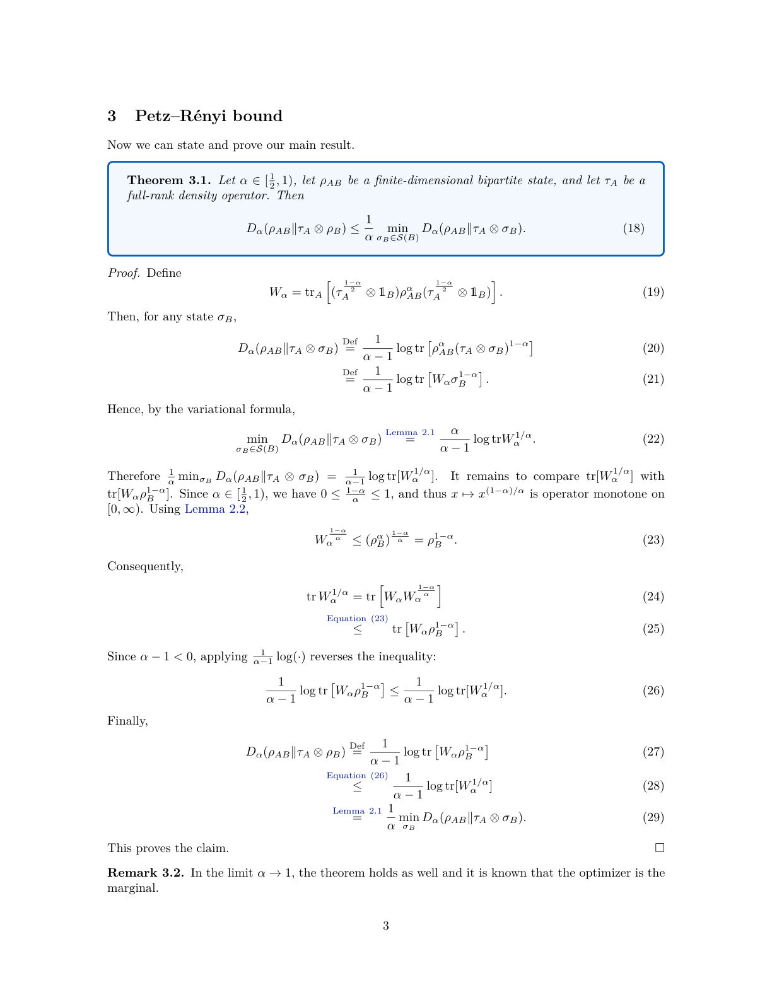
<figcaption class="paper-figure-caption"><b>Fig 2.</b> Low-resolution page preview, page 3</figcaption>
</figure>
<figure class="paper-figure-card">
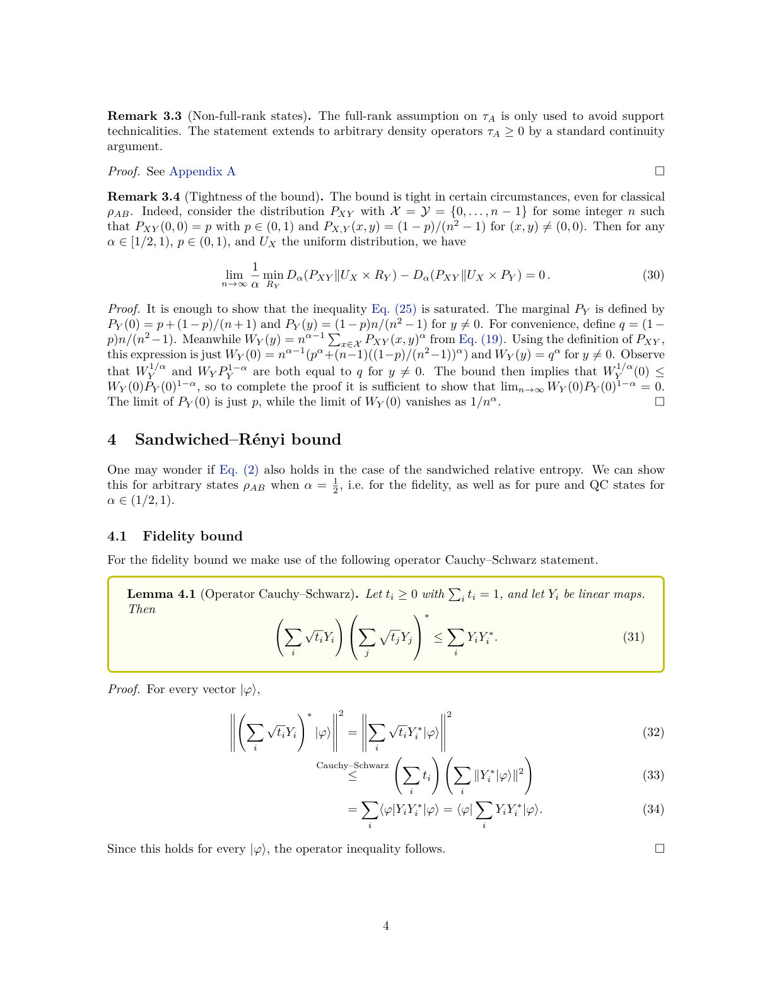
<figcaption class="paper-figure-caption"><b>Fig 3.</b> Low-resolution page preview, page 4</figcaption>
</figure>
<figure class="paper-figure-card">
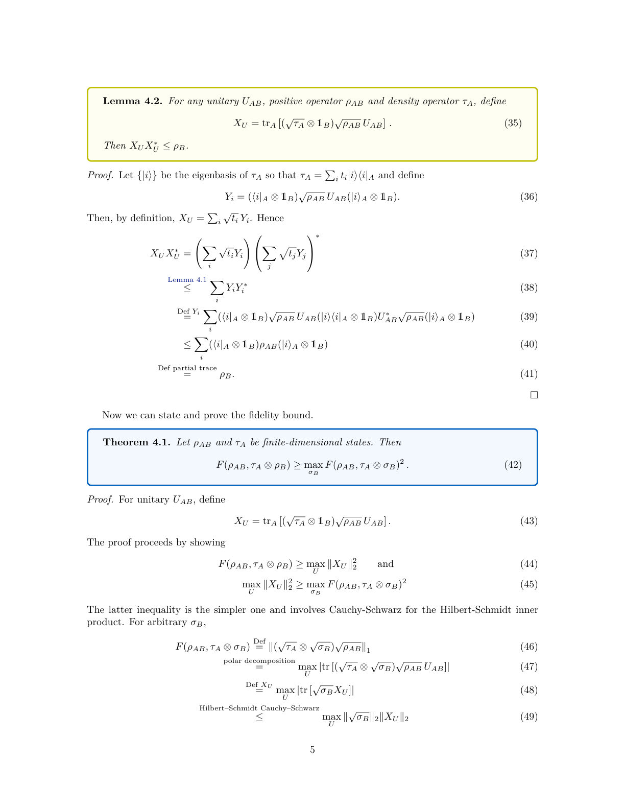
<figcaption class="paper-figure-caption"><b>Fig 4.</b> Low-resolution page preview, page 5</figcaption>
</figure>
<figure class="paper-figure-card">
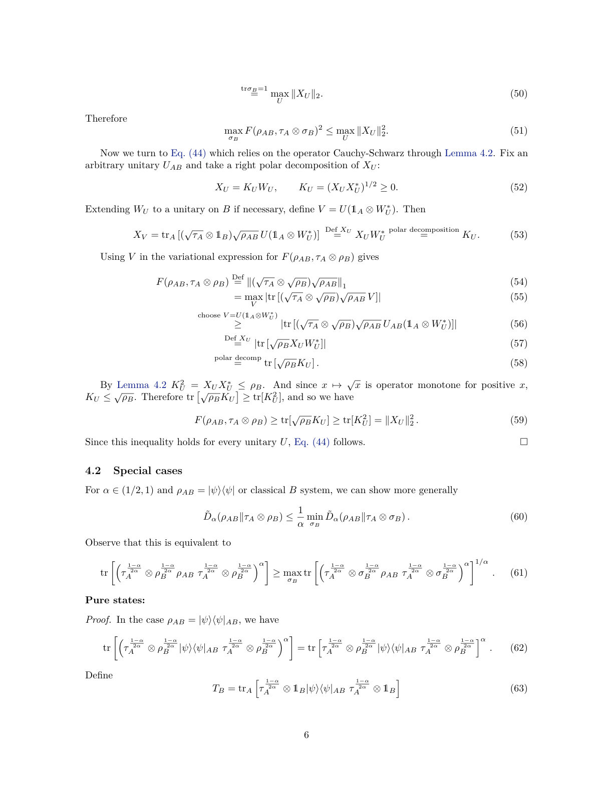
<figcaption class="paper-figure-caption"><b>Fig 5.</b> Low-resolution page preview, page 6</figcaption>
</figure>

**Summary.** This paper analyzes the error incurred when simplifying the optimal state used in one-shot quantum information measures, such as the Petz-Rényi divergence. The authors prove that using the marginal state instead of the true optimal state introduces an overhead factor bounded by $1/\alpha$. This result is significant for theoretical quantum information science as it quantifies the practical accuracy of using marginal approximations.

**Why it may be interesting.** This work provides concrete, quantitative bounds on approximation errors in quantum information measures, which is crucial for designing robust quantum protocols and understanding the limitations of using simplified state representations.

Detailed structure

**Main problem.** The paper investigates the error introduced when approximating the optimal state $\sigma_B$ in one-shot quantum information measures (like Petz-Rényi divergence) with the marginal state $
ho_B$.

**Main result.** It proves that for the Petz-Rényi divergence $D_\alpha$ with $\alpha \in [1/2, 1)$, replacing the optimal state with the marginal state results in a multiplicative overhead of at most $1/\alpha$.

**Method.** The analysis relies on proving operator inequalities and applying variational formulas to compare the divergence calculated using the marginal state versus the minimum over all possible states.

**Model / system.** The study is set in the context of quantum information theory, analyzing bipartite quantum states $
ho_{AB}$ and their marginal states $
ho_B$. The measures used are quantum divergences, specifically the Petz-Rényi and sandwiched Rényi divergences.

**Key observables.** Petz-Rényi divergence $D_\alpha$, sandwiched Rényi divergence $	ilde{D}_\alpha$, and fidelity $F$.

**Important parameters / regimes.** The order of the divergence $\alpha$, restricted to the range $[1/2, 1)$.

**Assumptions / limitations.** The primary result holds for $\alpha \in [1/2, 1)$; the authors also discuss relaxing the full-rank assumption on one of the subsystems.

**Paper structure.** The paper first establishes the main bound for $D_\alpha$ using variational methods, then analyzes the fidelity bound, and finally extends the result to the sandwiched Rényi divergence $	ilde{D}_\alpha$ using continuity arguments to remove initial restrictions.

Abstract

One-shot information theory measures often require an optimization over states, but the form of these optimizers can be complicated or depend on the initial problem in nonlinear ways. In this note, we show that in many instances using the marginal instead of the optimal state is sufficiently good and only changes the result by a small factor. We prove that for the Petz-Rényi divergence of order $α\in[1/2,1)$, replacing the optimizing state on $B$ by the marginal $ρ_B$ results in a multiplicative overhead of at most $1/α$. We also show a similar relation for the fidelity, and in the case of pure or quantum-classical states for the sandwiched Rényi divergence.

[↑ back to top](#top)

### [Towards Scaling Quantum Fine-Tuning of Foundational Time Series Models for Classification](http://arxiv.org/abs/2609.05408v1)

**Authors:** Sang Hyub Kim, Julien Baglio, Rajiv Krishnakumar, Chi Chen, Oliver Knitter, Jonathan Mei, Claudio Girotto, Masako Yamada, Frederik F. Flöther, Martin Roetteler  
**Type:** theory · **Category:** quantum information and computing · **PDF:** <https://arxiv.org/pdf/2609.05408v1>  
**Analysis basis:** full PDF text, analyzed in chunks

↔ Scroll figures horizontally

<figure class="paper-figure-card">
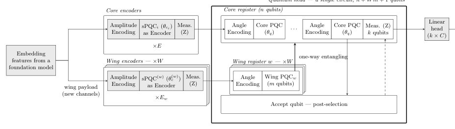
<figcaption class="paper-figure-caption"><b>Fig 1.</b> Fig. 1: The wing architecture. Classical encoders (shaded; sPQC = simulated parameterized quantum circuit) are separate per module, while the second module is a single quantum circuit whose register is partitioned into a core, the wing registers, and one accept qubit. The core (n qubits, E encoders, R data re-uploading blocks, fixed depth) carries all readout: Pauli-Z on k qubits feeds a k × C linear head. Each wing (one register and Ew encoders per wing, ×W) adds m qubits and couples to the core only through a few one-way entangling gates (fixed CNOTs in this work) at staggered points; wings never couple to each other. The accept qubit, coupled late to the core, is measured and only...</figcaption>
</figure>
<figure class="paper-figure-card">
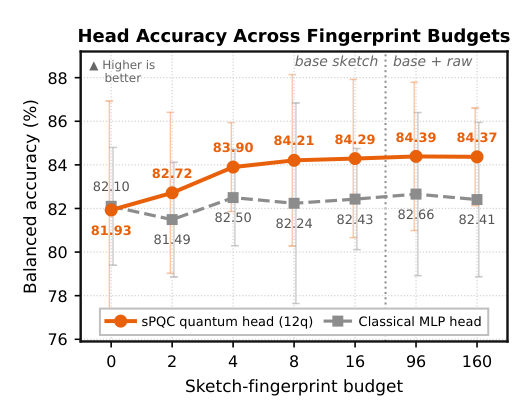
<figcaption class="paper-figure-caption"><b>Fig 2.</b> Fig. 2: Balanced accuracy of the sPQC quantum head and the classical MLP head vs. sketch-fingerprint budget (best configuration per budget; error bars: fold standard deviation). The dotted divider marks the family switch: budgets up to 16 use the base sketch only, 96 and 160 use the base+raw family. Values are five-fold cross-validation means (Table V).</figcaption>
</figure>
<figure class="paper-figure-card">
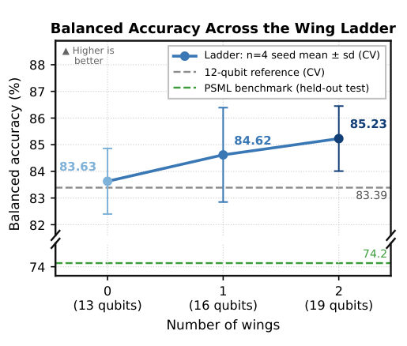
<figcaption class="paper-figure-caption"><b>Fig 3.</b> Fig. 3: Balanced accuracy vs. number of wings. Points: mean over seeds 42–45 at each rung’s peak learning rate (selected on the seed-42 sweep); error bars: standard deviation across the four seed fold-means. Dashed line: the 12-qubit reference (different apparatus, bit-identical core features). Ladder and reference are internal five-fold cross-validation on the training split. The dotted green line is the published PSML-5 baseline (best reported result) of 74.2% [21], the mean over ten random initializations of the model weights on the designated train/test split.</figcaption>
</figure>
<figure class="paper-figure-card">
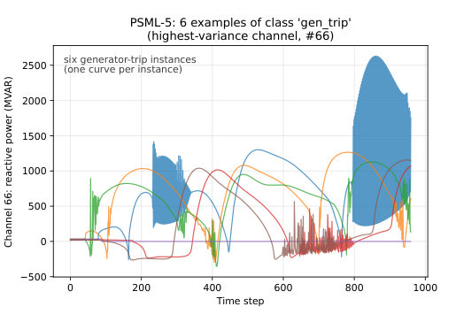
<figcaption class="paper-figure-caption"><b>Fig 4.</b> Fig. 4: Six PSML generator trip instances overlaid on the dataset’s highest-variance channel (#66, reactive power). De- spite the shared event label, they vary widely in baseline, onset timing, and amplitude.</figcaption>
</figure>
<figure class="paper-figure-card">
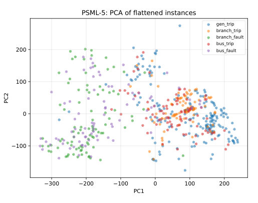
<figcaption class="paper-figure-caption"><b>Fig 5.</b> Fig. 5: PCA projection (2 components) of flattened, standard- ized PSML instances, colored by class. PC1 predominantly separates fault-type from trip-type events; classes within each group overlap substantially.</figcaption>
</figure>

**Summary.** This work addresses the scalability limits of quantum models applied to time-series classification by introducing the 'wing module.' The authors prove that performance gains are limited by the data intake bandwidth, not circuit size, and demonstrate that adding these modular wings successfully expands the model's capacity for complex, high-dimensional inputs.

**Why it may be interesting.** It provides a concrete, application-driven framework for understanding how to scale quantum circuits in the NISQ era by decoupling parameter scaling from input bandwidth scaling, which is highly relevant for quantum machine learning.

Detailed structure

**Main problem.** The paper investigates the scalability of quantum fine-tuning when applying quantum models to complex, high-dimensional time-series classification tasks.

**Main result.** The authors demonstrate that the performance bottleneck is not circuit expressiveness but the data intake bandwidth, which can be overcome by introducing a modular 'wing module' to expand the quantum circuit's input capacity.

**Method.** They fine-tuned a hybrid classical-quantum model (Chronos + quantum head) on power-grid event classification data, systematically scaling the quantum circuit's input width using the novel wing architecture.

**Model / system.** The system uses a hybrid architecture combining a classical time-series foundation model (Chronos) with a quantum head. The quantum head's input bandwidth is expanded via 'wing modules,' which are self-contained few-qubit circuits coupled sparsely to the core.

**Key observables.** Balanced accuracy, which increases systematically with the addition of wings, and the comparison of performance gains versus simply increasing the number of qubits without new inputs.

**Important parameters / regimes.** The core quantum circuit size (e.g., 12 qubits) and the number of added wings (e.g., 2 wings increasing qubits to 19).

**Assumptions / limitations.** The quantum circuit is simulated in a noiseless environment, and the analysis relies on the assumption that added qubits must carry added, independent information to improve performance.

**Figures summary.** Figures illustrate the wing architecture flow, and tables report the balanced accuracy gains across different qubit counts achieved by adding wings.

**Paper structure.** The paper first establishes the problem of scaling quantum fine-tuning for time series, then introduces the wing module to address bandwidth limitations, and finally presents ablation studies and results showing performance gains correlated with added input bandwidth.

Abstract

Time-series foundation models produce rich embeddings, but whether quantum models can exploit them, and how far hybrid classical-quantum architectures scale, remains unclear. We address this by fine-tuning Chronos for power-grid event classification (PSML-5) with a quantum head on the model's embeddings. Grouping embeddings by physical sensor type before summarization already surpasses the best published baseline built for this benchmark, and with finer-grained features the quantum head outperforms a larger classical multilayer perceptron on identical inputs by 1.7-2.0 percentage points of balanced accuracy. Yet the gains saturate: past a point, feeding more information to the same fixed-width register yields no improvement. We show the bottleneck is neither the supply of information nor circuit expressiveness, but the bandwidth of the data intake. To overcome this limitation, we introduce the wing module, a self-contained few-qubit circuit that feeds additional information into the core circuit through a sparse, one-way coupling. Under a preregistered four-seed protocol, we attach wings to a fixed 12-qubit core with fixed features. Balanced accuracy increases with each added wing, from 83.6% with no wings (13 qubits, including a post-selection qubit) to 85.2% with two (19 qubits). Ablations establish that a circuit enlarged without new information gains nothing, while a wing fed information from the wrong sample harms accuracy. These results reframe scaling for quantum fine-tuning: added qubits help when they carry added inputs, not merely more parameters. Wings offer a modular and stable route to widening that bandwidth.

[↑ back to top](#top)

## Secondary cond-mat archives

*Papers from cond-mat.mtrl-sci, mes-hall, other, soft, supr-con. These archives are de-prioritized — they appear at the end regardless of relevance score.*

### Relevant in secondary archives (18)

### [Evolution of instability fronts in sine-Gordon equation dynamics](http://arxiv.org/abs/2609.04873v1)

**Authors:** A. M. Kamchatnov  
**Type:** theory · **Category:** statistical mechanics · **PDF:** <https://arxiv.org/pdf/2609.04873v1>  
**Analysis basis:** full PDF text, analyzed in chunks
**Topic relevance:** `Keldysh / 2PI / non-Gaussian methods` **3/5** · `non-equilibrium universality` **3/5** · `Frenkel-Kontorova` **2/5** · `driven-dissipative phase transition` **2/5** · `methods for driven-dissipative` **2/5** · `analog quantum simulation` **1/5**

↔ Scroll figures horizontally

<figure class="paper-figure-card">
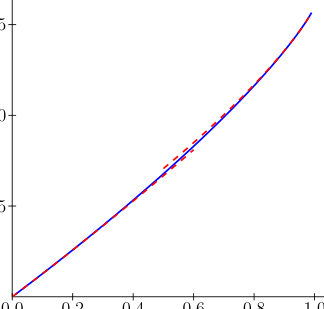
<figcaption class="paper-figure-caption"><b>Fig 1.</b> FIG. 1. Plot of the function G(e) defined in Eq. (30). Red dashed lines correspond to the asymptotic expressions (32) and (33).</figcaption>
</figure>
<figure class="paper-figure-card">
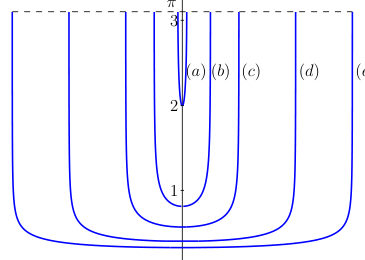
<figcaption class="paper-figure-caption"><b>Fig 2.</b> FIG. 2. Envelopes of amplitudes ϕm for the sine-Gordon instability wave at different moments of time: (a) t = 0.1; (b) t = 0.5; (c) t = 1; (d) t = 2; (e) t = 3. The dashed line corresponds to the maximal amplitude ϕmax = π.</figcaption>
</figure>
<figure class="paper-figure-card">
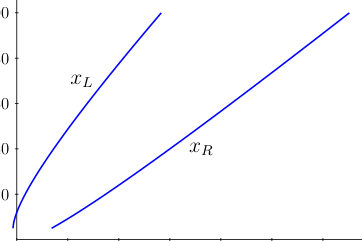
<figcaption class="paper-figure-caption"><b>Fig 3.</b> FIG. 6. Paths of the left xL and right xR edges of the nonlinear wave packet in the (x,t)-plane calculated according to Eqs. (72) and (74), respectively.</figcaption>
</figure>
<figure class="paper-figure-card">
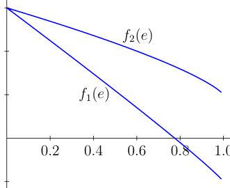
<figcaption class="paper-figure-caption"><b>Fig 4.</b> FIG. 5. Plots of functions f1(e) and f2(e) defined by Eqs. (66).</figcaption>
</figure>
<figure class="paper-figure-card">
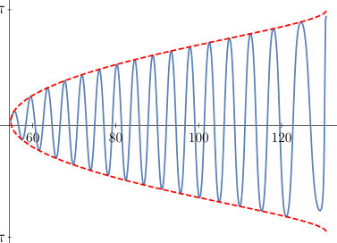
<figcaption class="paper-figure-caption"><b>Fig 5.</b> FIG. 7. The profile of the modulated nonlinear packet ϕ(x,t) at t = 100.</figcaption>
</figure>

**Summary.** This theoretical paper analyzes how instability fronts evolve in the sine-Gordon equation using Whitham modulation theory. It establishes a deep connection between this nonlinear wave problem and relativistic fluid dynamics. The key finding is the specific, time-dependent propagation velocity of the instability front, providing detailed insights into non-equilibrium wave packet dynamics.

**Why it may be interesting.** The mathematical techniques used—connecting nonlinear wave dynamics (sine-Gordon) to fluid dynamics and solving via elliptic/hypergeometric functions—are highly relevant for modeling complex, non-equilibrium dynamics in many-body systems.

Detailed structure

**Main problem.** The paper investigates the evolution of oscillatory regions behind an instability front propagating into an unstable regime governed by the sine-Gordon equation.

**Main result.** The instability front propagates with a velocity tending to unity at large times, forming a modulated train of kinks, which is distinct from the behavior seen in the focusing NLS equation.

**Method.** The analysis employs Whitham modulation theory, which is shown to be mathematically equivalent to the conservation laws of relativistic hydrodynamics.

**Model / system.** The physical system is described by the sine-Gordon equation, derived from the generalized Klein-Gordon equation with a potential U(phi) = 1 - cos(phi).

**Key observables.** The evolution of averaged modulation parameters (A and v), the positions of the instability front edges (x_L and x_R), and the group velocity v(e).

**Important parameters / regimes.** The modulation instability parameter 'e' and the time scale 't', which governs the asymptotic decay of the amplitude.

**Assumptions / limitations.** The analysis assumes that the system can be averaged over fast oscillations to study slow modulation parameters, and that the effective relativistic 'fluid' moves by inertia at large times.

**Figures summary.** Figures illustrate the envelopes of the instability wave amplitude over time, the paths of the left and right edges of the nonlinear packet, and the dependence of the amplitude on time, confirming asymptotic decay laws.

**Paper structure.** The paper progresses from establishing the connection between the sine-Gordon dynamics and relativistic hydrodynamics via Whitham theory. It then derives self-similar solutions, applies the hodograph transform to linearize the problem, and finally calculates the time evolution and velocity of the instability front edges.

Abstract

Solutions of the Whitham modulation equations for one-phase periodic waves obeying the sine-Gordon equation are found that describe the evolution of an oscillatory region behind an instability front propagating into the instability region. A simple self-similar solution describes the whole region between two fronts of instability resulting from a localized initial disturbance in the unstable state. Another hodograph solution represents typical waves close to the instability fronts. This theory generalizes the approach used previously for systems obeying the nonlinear Schroedinger equation.

[↑ back to top](#top)

### [Quantum oscillations of helical edge states of periodically deformed 2D topological insulator in magnetic field](http://arxiv.org/abs/2609.04359v1)

**Authors:** A. V. Tsvetkova, P. D. Grigoriev, Ya. I. Rodionov  
**Type:** theory · **Category:** other · **PDF:** <https://arxiv.org/pdf/2609.04359v1>  
**Analysis basis:** full PDF text, analyzed in chunks
**Topic relevance:** `Frenkel-Kontorova` **3/5** · `Keldysh / 2PI / non-Gaussian methods` **2/5** · `analog quantum simulation` **1/5**

↔ Scroll figures horizontally

<figure class="paper-figure-card">
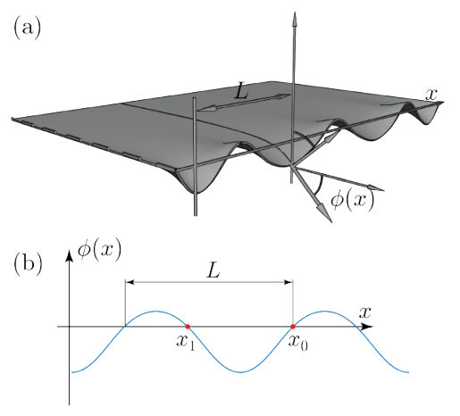
<figcaption class="paper-figure-caption"><b>Fig 1.</b> Figure 1: (a) A schematic illustration of a periodic sign- changing geometric undulation of the edge of a 2D topo- logical insulator sample. (b) The red dots (zeroes of the deformation correspond to two successive LZ-transitions)</figcaption>
</figure>
<figure class="paper-figure-card">
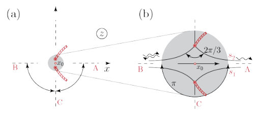
<figcaption class="paper-figure-caption"><b>Fig 2.</b> Figure 3: Sign - changing undulation of the edge of TI. (a) Large scale pattern of anti-Stokes lines emanating from the branch points of the semiclassical momentum π(z), x0 is the root of the deformation potential ϕ. The anti-Stokes lines are separated by π/2 angle. The am- biguity of the analytical continuation is resolved via de- tailed pattern of the semiclassical phase R π(ζ)dζ pre- sented in subplot (b). (b) Two anti-Stokes lines s1 and s2 merge into the hor- izontal transmission line A. The incident and reflected waves propagate along line B, rotated with respect to the transmission line by angle π. Anti-Stokes line C proves to be irrelevant.</figcaption>
</figure>
<figure class="paper-figure-card">
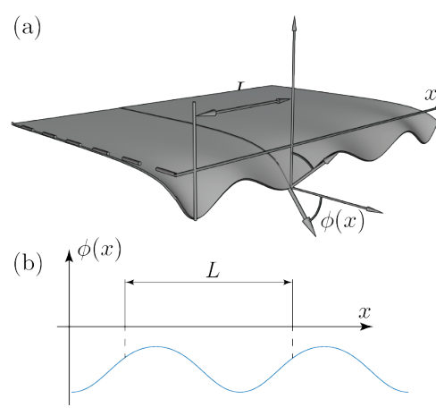
<figcaption class="paper-figure-caption"><b>Fig 3.</b> Figure 2: (a) A schematic illustration of a periodic sign-definite geometric undulation of the edge of a 2D topological insulator sample. (b) The corresponding deformation profile ϕ(x).</figcaption>
</figure>
<figure class="paper-figure-card">
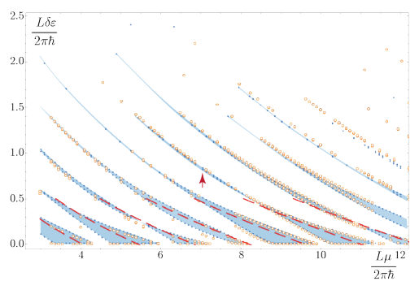
<figcaption class="paper-figure-caption"><b>Fig 4.</b> Figure 4: The pattern of forbidden bands (δε = ε −µ) for the potential ϕ(x) = 0.5 + cos(2πx/L), obtained with semiclassical expression (29) (orange dots) and numeri- cal solution of the original Dirac equation (11) (blue dots with light blue filling) as a function of the magnetic field µ. The band centers are obtained with analytic expres- sion (33) for small δε are shown with red dashed lines. The width of the band highlighted by the red arrow n = 8 is depicted in detail below in Fig. 5.</figcaption>
</figure>
<figure class="paper-figure-card">
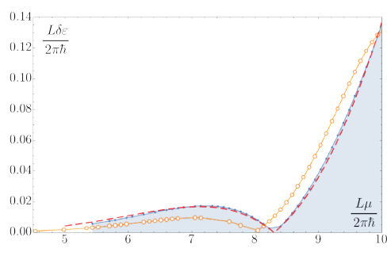
<figcaption class="paper-figure-caption"><b>Fig 5.</b> Figure 5: The n = 8 band gap for ϕ(x) = 0.5 + cos(2πx/L), calculated from semiclassical expression (29) (orange dots), direct numerical integration of the Dirac equation (11) (blue dots) and the analytical approxima- tions (36) and (37) (red dashed line).</figcaption>
</figure>

**Summary.** This paper theoretically analyzes how quantum oscillations manifest in the edge states of a 2D topological insulator when the edge geometry is periodically deformed and a magnetic field is applied. Using semiclassical and perturbation methods, the authors predict a novel type of magnetic quantum oscillation that is periodic in the magnetic field itself. This provides a unique diagnostic tool for characterizing topological edge transport.

**Why it may be interesting.** The prediction of magnetic quantum oscillations periodic in $H$ rather than $1/H$ offers a distinct, experimentally testable signature for topological edge states, which is highly relevant for understanding quantum transport in engineered quantum materials.

Detailed structure

**Main problem.** The study investigates the quantum oscillations of helical edge states in a two-dimensional topological insulator when the edge is periodically deformed and subjected to a uniform magnetic field.

**Main result.** The predicted magnetic quantum oscillations are unique because they are periodic in the magnetic field ($H$) itself, unlike conventional oscillations which are periodic in $1/H$.

**Method.** The research employs a combination of semiclassical treatments (Pokrovsky–Khalatnikov–Dykhne method) and perturbation theory applied to the Dirac equation governing the edge states.

**Model / system.** The system is a 2D topological insulator with a periodically deformed edge. The physics is modeled by an effective 1D Hamiltonian incorporating the Fermi velocity, Zeeman coupling ($\mu \propto H$), and a periodic deformation potential $\hat{U}(x)$.

**Key observables.** Oscillations of the forbidden-band widths and the resulting edge conductance.

**Important parameters / regimes.** The magnetic field strength ($H$), the Fermi velocity ($v_F$), and the effective g-factor ($g$). The analysis distinguishes between strong-field and weak-field regimes.

**Assumptions / limitations.** The analysis assumes the edge deformation is smooth relative to the carrier's de Broglie wavelength, allowing for semiclassical approximations. The weak-field analysis relies on complex continuation techniques.

**Figures summary.** Figure 1 schematically illustrates a periodic sign-changing geometric undulation of the edge and the locations of the deformation zeroes.

**Paper structure.** The paper develops the Hamiltonian and Dirac equation for the system. It then applies semiclassical methods to analyze the gap modulation in the strong-field limit, followed by a detailed perturbation theory analysis in the weak-field limit, culminating in the derivation of the unique $H$-periodic oscillation condition.

Abstract

We study edge-state transport in a two-dimensional topological insulator with a periodically deformed edge subjected to a uniform magnetic field. Zeeman coupling breaks time-reversal symmetry and enables elastic backscattering, producing oscillations of the forbidden-band widths. In the strong-field regime, the gaps can close completely at discrete field values. In the weak-field regime, we identify an important class of periodic deformations for which the dominant semiclassical scattering is controlled by complex infinity rather than by the nearest turning points. We develop a semiclassical treatment of this process and establish its agreement with perturbation theory and direct numerical calculations. The gap modulation should produce observable oscillations of the edge conductance. Unlike conventional magnetic quantum oscillations, which are periodic in inverse field, the predicted oscillations are periodic in the magnetic field itself, with a period determined by the Fermi velocity and effective g-factor

[↑ back to top](#top)

### [Orientation selection and superconducting properties of epitaxial Al on ferromagnetic semiconductor (In,Fe)As](http://arxiv.org/abs/2609.04744v1)

**Authors:** Hirotaka Hara, Keita Ishihara, Masaaki Tanaka, Le Duc Anh  
**Type:** experiment · **Category:** other · **PDF:** <https://arxiv.org/pdf/2609.04744v1>  
**Analysis basis:** full PDF text, analyzed in chunks
**Topic relevance:** `QC/QI experiment` **3/5** · `analog quantum simulation` **2/5**

↔ Scroll figures horizontally

<figure class="paper-figure-card">
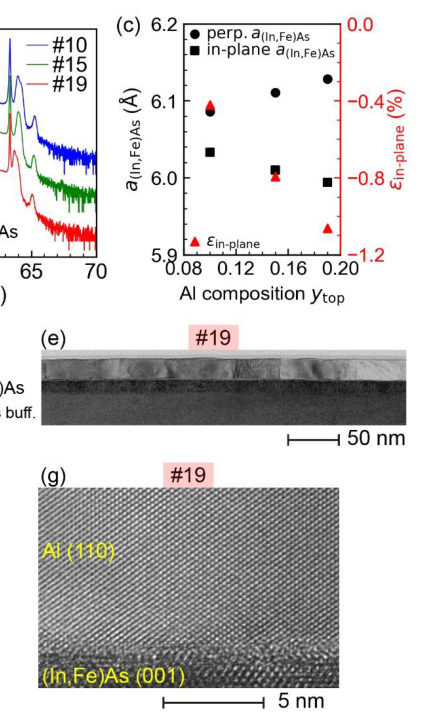
<figcaption class="paper-figure-caption"><b>Fig 1.</b> Figure 1. (a) Schematic illustration of the heterostructure examined in this study. (b) XRD θ-2θ scans over the 2θ range from 50 to 70 degree. For clarity, the data for samples #10 and #15 are vertically offset by 10000 and 100, respectively. Black triangles indicate the peaks from (In,Fe)As, and the black dashed curves represent Gaussian fits to these peaks. The inset shows scans over the 2θ range from 36 to 40 degree. The peaks around 38.5 degree are attributed to the face-centered cubic Al (111) reflection. (c) Out-of-plane</figcaption>
</figure>
<figure class="paper-figure-card">
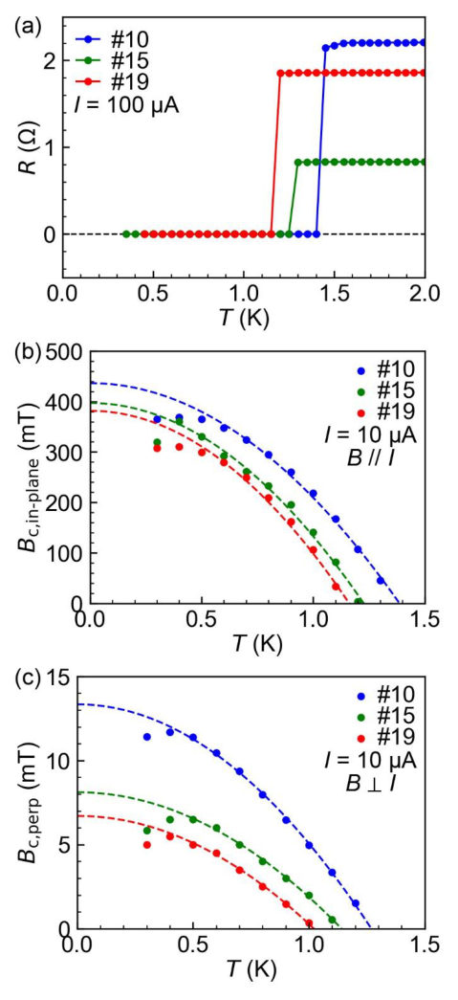
<figcaption class="paper-figure-caption"><b>Fig 2.</b> Figure 2. (a) Temperature dependence of the resistance of the Al layers measured with a bias current of 100 μA. (b), (c) Temperature dependence of the critical magnetic field Bc of the Al layers under in-plane and perpendicular magnetic fields, respectively. The dashed curves are fitting curves based on the BCS theory. The bias current is 10 μA.</figcaption>
</figure>
<figure class="paper-figure-card">
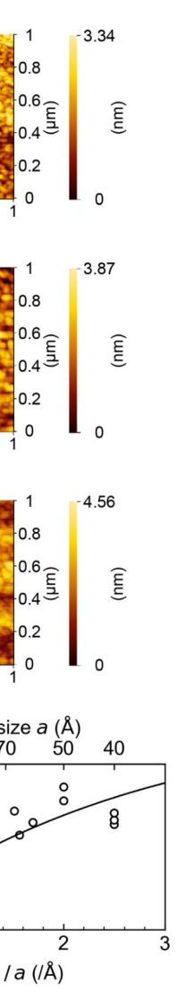
<figcaption class="paper-figure-caption"><b>Fig 3.</b> Figure 3. (a)-(c) AFM images of the Al layers. (d) Relationship between the enhancement of the superconducting critical temperature Tc relative to the bulk value Tc0, and average grain size a. The colored stars represent our data, whereas the open circles denote the data reported by Pettit [36]. The solid line shows the theoretical curve from the works of</figcaption>
</figure>
<figure class="paper-figure-card">
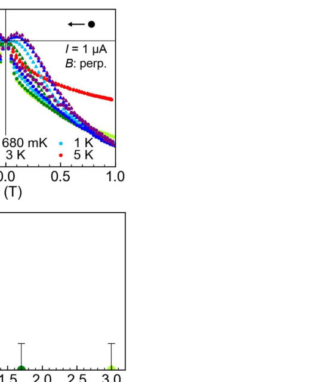
<figcaption class="paper-figure-caption"><b>Fig 4.</b> Figure 4. (a) Magnetoresistance of (In,Fe)As measured at different temperatures. The magnetic field is applied perpendicular to the sample plane, and the bias current is 1 μA. Triangle and circle symbols indicate magnetic field sweeps from negative to positive fields and from positive to negative fields, respectively. (b) Temperature dependence of the coercive field of (In,Fe)As, estimated from the peak positions in Fig. 4(a). The error bars correspond to the magnetic-field interval between adjacent measurement points.</figcaption>
</figure>

**Summary.** This work characterizes Al superconducting films grown on strained ferromagnetic semiconductor (In,Fe)As heterostructures. By correlating structural changes, such as Al growth orientation and substrate strain, with superconducting properties, the authors identify an anomalous suppression of the critical magnetic field. This suggests a strong, proximity-induced magnetic coupling mechanism useful for designing next-generation hybrid quantum devices.

**Why it may be interesting.** The study explores proximity effects between superconductivity and ferromagnetism in a semiconductor platform, which is highly relevant for designing hybrid quantum devices where superconducting qubits or Josephson junctions interact with magnetic elements.

Detailed structure

**Main problem.** The study investigates the structural and superconducting properties of Al thin films grown on strained ferromagnetic semiconductor (In,Fe)As heterostructures.

**Main result.** The superconducting critical magnetic field ($B_c$) of Al shows an anomalous decrease below 0.5 K, suggesting a magnetic coupling effect with the underlying ferromagnetic layer.

**Method.** The research combines structural characterization using XRD and TEM with electrical transport measurements (measuring $T_c$ and $B_c$) on the epitaxial heterostructures.

**Model / system.** The physical system is an epitaxial Al/(In,Fe)As heterostructure grown by MBE on InP substrates, allowing for the systematic tuning of strain and magnetic coupling.

**Key observables.** Superconducting critical temperature ($T_c$), critical magnetic field ($B_c$), Al growth orientation ((110) vs (111)), and the in-plane lattice constant of (In,Fe)As.

**Important parameters / regimes.** Temperature (especially below 0.5 K), in-plane compressive strain ($\epsilon_{	ext{in-plane}}$), and the magnetic coupling strength between Al and (In,Fe)As.

**Assumptions / limitations.** The anomalous $B_c$ suppression is hypothesized to be due to magnetic coupling effects, rather than solely stray magnetic fields calculated from simple models.

**Figures summary.** Figures show XRD scans confirming lattice shifts, TEM images detailing single-crystalline Al domains with varying orientations, and electrical measurements plotting $R(T)$ and $B_c(T)$ for superconducting behavior.

**Paper structure.** The paper systematically presents structural characterization (XRD/TEM) to establish the epitaxial growth and orientation dependence, followed by electrical measurements to correlate structural parameters (strain, grain size) with superconducting properties ($T_c, B_c$), concluding with a discussion on proximity effects.

Abstract

Superconductor/ferromagnet heterostructures provide a versatile platform for exploring spin-dependent superconducting phenomena arising from interfacial proximity effects. In this article, we investigate the structural and superconducting properties of Al thin films grown in situ by molecular beam epitaxy on strained Fe-doped ferromagnetic semiconductor (FMS) (In,Fe)As layers. X-ray diffraction and transmission electron microscopy reveal the epitaxial growth of single-crystalline Al layers, with the growth orientation changing from (110) to (111) as the in-plane lattice constant of (In,Fe)As increases. The superconducting critical temperature of Al varies systematically with the film surface morphology and grain size. In addition, the critical magnetic field of Al exhibits an anomalous decrease below 0.5 K, possibly reflecting magnetic coupling to the underlying FMS (In,Fe)As layer. These findings provide a guideline for material design of epitaxial Al/(In,Fe)As heterostructures, which may serve as a promising platform for investigating proximity-induced superconducting and magnetic phenomena in semiconductor-based hybrid quantum devices.

[↑ back to top](#top)

### [Interlayer Exciton Condensate Stiffness Is Non-Monotonic in Quantum Metric](http://arxiv.org/abs/2609.04729v1)

**Authors:** Bo Zou, Yitong Zhang, Siddhartha Sarkar, Shi-Zeng Lin, Allan H. MacDonald, Kai Sun  
**Type:** theory · **Category:** strongly correlated electrons · **PDF:** <https://arxiv.org/pdf/2609.04729v1>  
**Analysis basis:** full PDF text, analyzed in chunks
**Topic relevance:** `analog quantum simulation` **3/5**

↔ Scroll figures horizontally

<figure class="paper-figure-card">
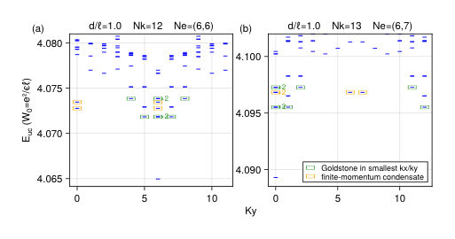
<figcaption class="paper-figure-caption"><b>Fig 1.</b> FIG. 1. ED energy spectrum of the bilayer exciton condensate with Coulomb interaction obtained in the lowest Landau level modeled on a torus with a 1 × Nk square momentum mesh with (a) Nk=12 and Ne=(6,6) and (b) Nk=13 and Ne=(6,7). The vertical axis shows the energy per unit cell Euc. The ground state appears at total momentum Ky = Nk/2 = 6 in (a) and shifts to Ky = 0 in (b). Green rectangles mark the Goldstone modes: those in neighboring momentum sec- tors correspond to excitations with the smallest available mo- mentum from the k mesh in the y-direction, while those in the same sector as the ground state correspond to excitations in the x-direction. Four orange rectangles indicate the...</figcaption>
</figure>
<figure class="paper-figure-card">
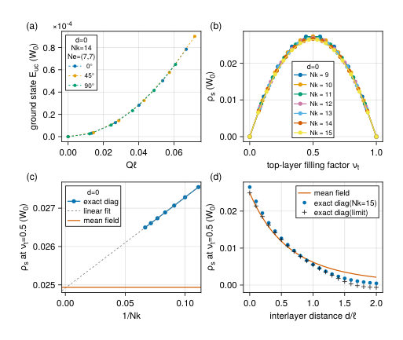
<figcaption class="paper-figure-caption"><b>Fig 2.</b> FIG. 2. Superfluid stiffness ρs from ED and MF calculations. (a) Increase in ED ground state energy as a function of pairing momentum Q enforced by imposing layer-twisted boundary conditions. The dependence is quadratic and isotropic, inde- pendent of Q’s angle to the x-axis; 0◦, 45◦, and 90◦results are shown. (b) ED extracted ρs as a function of top-layer filling factor νt for various system sizes at d=0. The stiffness is proportional to the exciton density νt(1 −νt) and is max- imized when the two layers are equally occupied. (c) Finite- size scaling of stiffness ρs at νt=0.5 and d=0. ED results (blue dots) with Nk from 9 to 15 are extrapolated linearly in 1/Nk (dashed line) to the...</figcaption>
</figure>
<figure class="paper-figure-card">
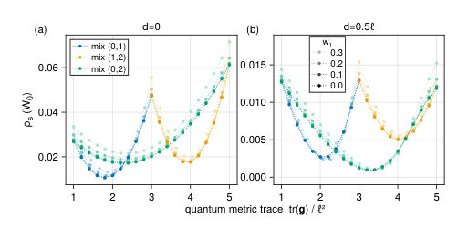
<figcaption class="paper-figure-caption"><b>Fig 3.</b> FIG. 4. Superfluid stiffness in the real-space modulated mixed Landau level model with quantum-geometry fluctua- tions in a hexagonal BZ. The value of w1 is indicated by the line transparency, with larger values of w1 corresponding to more transparency. The stiffness values are computed us- ing Nk=12 ED without extrapolation to the thermodynamic limit, and the plot arrangement is similar to that in Fig. 3. Spatial modulation induces small increases in the stiffness for all mixing rates.</figcaption>
</figure>
<figure class="paper-figure-card">
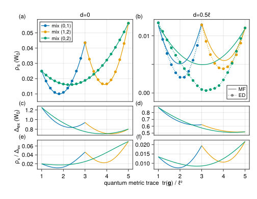
<figcaption class="paper-figure-caption"><b>Fig 4.</b> FIG. 3. Superfluid properties, (a,b) stiffness, (c,d) excitonic gaps, and (e,f) their ratios, of multi-component mixed Lan- dau levels at half filling of each layer plotted against the trace of the quantum metric tensor, tr(g), as determined by the mixing rates. Dots represent ED stiffness extrapolated to the thermodynamic limit, while solid lines represent MF calcula- tions of stiffness and excitonic gap. Blue, orange, and green curves correspond to mixtures of Landau levels (0, 1), (1, 2), and (0, 2), respectively. The endpoints of these curves corre- spond to pure n = 0, 1, 2 Landau levels with quantum metric traces of ℓ2, 3ℓ2, and 5ℓ2. (a, c, e) In the d=0 limit, the MF result is exact...</figcaption>
</figure>
<figure class="paper-figure-card">

<figcaption class="paper-figure-caption"><b>Fig 5.</b> Fig. 3 presents two superfluid properties, stiffness ρs and excitonic gap ∆ex, calculated for three distinct Lan- dau level mixing scenarios: (0, 1), (1, 2), and (0, 2). The dots represent the stiffness ρs obtained via ED with lin- ear extrapolation to the thermodynamic limit, while the solid lines correspond to MF calculations. In Fig. 3(a) we report results for d=0, where MF theory is exact. At the finite layer separation (d = 0.5ℓ) shown in Fig. 3(b), the MF approximation systematically overestimates the stiffness compared to the exact numerical results, and the overestimation is more severe for the mixed bands than for pure Landau levels. Both methods reveal that the stiffness is...</figcaption>
</figure>

**Summary.** This work investigates the superfluid stiffness of interlayer exciton condensates in flat-band systems, comparing results from exact diagonalization and mean-field theory. The key finding is that the stiffness is non-monotonic with respect to the quantum metric and can be significantly enhanced in moiré bands compared to simple Landau levels. This offers new theoretical guidelines for engineering highly robust correlated quantum states.

**Why it may be interesting.** The findings provide new guiding principles for designing robust flat-band condensates, which is crucial for understanding strongly correlated phases in artificial quantum materials.

Detailed structure

**Main problem.** The study aims to determine the origin and behavior of the superfluid stiffness in electron-electron and electron-hole pair condensates, particularly within the context of flat-band physics.

**Main result.** The superfluid stiffness is found to be non-monotonic with respect to the trace of the quantum metric, peaking when band wavefunctions resemble Landau levels. Furthermore, moiré flat bands can exhibit stiffness larger than that of simple Landau levels.

**Method.** The research employs a combination of Exact Diagonalization (ED) techniques and Mean-Field (MF) theory to calculate the superfluid stiffness ($
ho_s$).

**Model / system.** The system models interlayer exciton condensates in bilayer systems, analyzed across various flat Chern band structures, including Landau levels, mixed Landau levels, and moiré bands, using a gate-screened Coulomb interaction.

**Key observables.** Superfluid stiffness ($
ho_s$), Quantum Metric Tensor (QGT) trace, Excitonic Gap ($\Delta_{ex}$), and the ground state energy spectrum.

**Important parameters / regimes.** Interlayer distance ($d$), filling factors ($
u$), and the trace of the quantum metric ($	ext{tr}(g)$).

**Assumptions / limitations.** MF theory is noted to systematically overestimate the stiffness compared to ED results in many cases, and ED calculations are performed within fixed number sectors.

**Figures summary.** Figures illustrate the ED energy spectrum, the dependence of $
ho_s$ on the quantum metric trace, and comparisons between stiffness in different band structures (e.g., Landau vs. moiré).

**Paper structure.** The paper systematically investigates the stiffness by first establishing the theoretical framework using ED and MF comparisons, then exploring the dependence on geometric parameters like the quantum metric, and finally comparing results across different physical realizations like moiré bands and Landau levels.

Abstract

Identifying the origin of the superfluid stiffness of electron-electron and electron-hole pair condensates is an important issue in flat-band physics. Here, we study the stiffness of bilayer exciton condensates using exact diagonalization and realistic Coulomb interactions across a wide variety of flat Chern band systems, including Landau levels, mixed Landau levels, and moiré bands. We find that stiffness is non-monotonic in the trace of the quantum metric and that it develops peaks when the band wavefunctions are engineered to be similar to those of Landau levels. The stiffness predicted by mean-field theory agrees quantitatively with exact diagonalization in these optimal cases, but systematically overestimates it otherwise. Flat bands with identical quantum geometry tensors can exhibit substantial differences in stiffness. The stiffness of condensates formed between moiré flat bands, which typically have strong variations in Berry curvature and quantum metric across their Brillouin zones, tends to be larger when the bands have non-zero Chern numbers and can be larger than that of Landau levels. Our results reveal a behavior that is richer than that suggested by simple geometric bounds and provide new guiding principles for the design of robust flat-band condensates with large superfluid stiffness.

[↑ back to top](#top)

### [Cascade spin dynamics of excitons localized in indirect-band-gap (In,Al)As/AlAs quantum dots with type-I band alignment](http://arxiv.org/abs/2609.04951v1)

**Authors:** S. V. Nekrasov, I. V. Kalitukha, A. A. Golovatenko, Ya. A. Kuznetsova, N. O. Mikhailenko, M. D. Ragoza, T. S. Shamirzaev, Yu. G. Kusrayev  
**Type:** both · **Category:** other · **PDF:** <https://arxiv.org/pdf/2609.04951v1>  
**Analysis basis:** full PDF text, analyzed in chunks
**Topic relevance:** `quantum measurements` **2/5** · `Keldysh / 2PI / non-Gaussian methods` **1/5** · `analog quantum simulation` **1/5** · `correlated / nonlocal dissipation` **1/5** · `driven-dissipative phase transition` **1/5** · `methods for driven-dissipative` **1/5** · `non-equilibrium universality` **1/5** · `quantum optics experiment` **1/5** · `scars & prethermalization` **1/5**

↔ Scroll figures horizontally

<figure class="paper-figure-card">
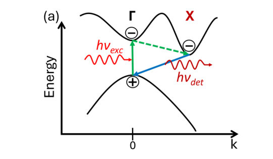
<figcaption class="paper-figure-caption"><b>Fig 1.</b> FIG. 1. (a) Diagram of an exciton life cycle in the (In,Al)As/AlAs QDs. Absorption of the photon</figcaption>
</figure>
<figure class="paper-figure-card">
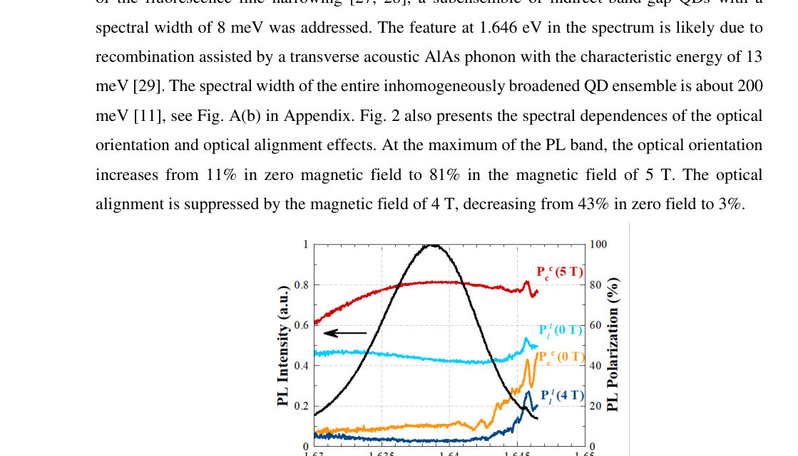
<figcaption class="paper-figure-caption"><b>Fig 2.</b> FIG. 2. PL spectrum and polarization under excitation with a photon energy of 1.66 eV. The PL</figcaption>
</figure>
<figure class="paper-figure-card">
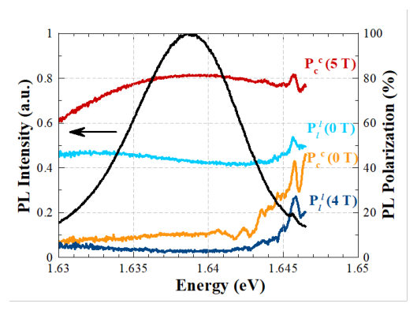
<figcaption class="paper-figure-caption"><b>Fig 3.</b> Fig. 3(a) shows the magnetic-field dependence of the optical orientation effect. The optical</figcaption>
</figure>
<figure class="paper-figure-card">

<figcaption class="paper-figure-caption"><b>Fig 4.</b> FIG. 3. (a) Circular polarization of PL under circularly polarized excitation as a function of the</figcaption>
</figure>
<figure class="paper-figure-card">
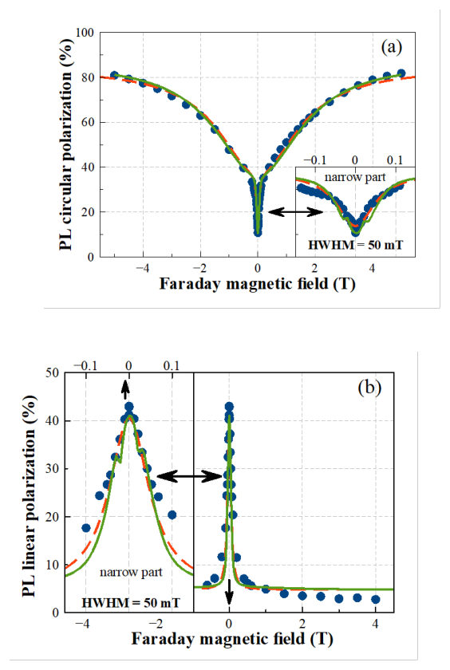
<figcaption class="paper-figure-caption"><b>Fig 5.</b> Fig. 4(a) shows the conversion of laser light linearly polarized along the [110]</figcaption>
</figure>

**Summary.** This paper experimentally and theoretically investigates the spin dynamics of excitons in indirect-band-gap quantum dots. It reveals a two-step spin cascade involving relaxation from direct to indirect exciton states. By analyzing polarization changes under magnetic fields, the authors quantify the anisotropic exchange splittings and provide a detailed picture of spin coherence evolution in semiconductor nanostructures.

**Why it may be interesting.** This work is highly relevant to open quantum systems and quantum optics because it models coherent spin evolution (coherence loss/restoration) in a solid-state system driven by multiple relaxation pathways and external fields, providing quantitative parameters for spin-orbit coupling effects.

Detailed structure

**Main problem.** The study investigates the complex, multi-step spin dynamics of excitons localized within indirect-band-gap quantum dots (QDs). The goal is to elucidate the physical mechanisms governing the spin evolution as the system transitions between direct and indirect exciton states.

**Main result.** The spin dynamics follow a distinct two-step cascade: initial short-term dynamics from direct excitons, followed by long-term dynamics of indirect excitons. The analysis quantifies anisotropic exchange splittings for both states and explains zero-field optical orientation via hyperfine interactions.

**Method.** The research combines polarized selective photoluminescence spectroscopy under magnetic fields (up to 5 T) with theoretical modeling using both the pseudospin formalism and the density matrix formalism.

**Model / system.** The system is based on (In,Al)As/AlAs QDs exhibiting a type-I band alignment and an indirect band structure. The physics is modeled by considering the coupling and relaxation between the $\Gamma$-valley (direct) and the X-valley (indirect) exciton states.

**Key observables.** Optical orientation, optical alignment, linear-to-circular polarization conversion, and the magnetic field dependence of these polarization signals.

**Important parameters / regimes.** Magnetic fields up to 5 T; anisotropic exchange splittings ($\sim 210 \mu	ext{eV}$ for direct, $1.3 \mu	ext{eV}$ for indirect); hyperfine interaction strengths.

**Assumptions / limitations.** The dynamics are modeled as a two-step process involving electron relaxation from the $\Gamma$-valley to the X-valley. The pseudospin formalism is employed, which simplifies the description by neglecting certain optically inactive states.

**Figures summary.** Figures illustrate the exciton life cycle and the magnetic field dependence of polarization measurements, showing the recovery of optical orientation and suppression of optical alignment.

**Paper structure.** The paper first establishes the experimental setup and the two-step spin evolution mechanism observed via polarization spectroscopy. It then applies theoretical frameworks (pseudospin/density matrix) to derive quantitative expressions for the observed magnetic field dependencies, culminating in the determination of key splitting energies.

Abstract

We investigate the spin dynamics of excitons localized in type I (In,Al)As/AlAs quantum dots with an indirect in momentum space band structure. Polarized selective photoluminescence spectroscopy, i.e. fluorescence line narrowing, under magnetic fields up to 5 T applied in the Faraday geometry is employed. The experiment reveals a cascade spin evolution process of excitons in the indirect band-gap quantum dots: an initial short term spin dynamics associated with excited direct exciton states possessing a large oscillator strength is followed by electron relaxation into the X valley of the Brillouin zone and subsequent long term spin dynamics of indirect excitons. The two step mechanism manifests itself in the distinct features of the magnetic field dependences of photoluminescence: two component recovery of optical orientation, two component linear to circular polarization conversion and the presence of the linear polarization plane rotation. At the same time, suppression of the optical alignment shows one-component behavior governed by the spin dynamics of the indirect exciton states. Within the pseudospin formalism, we derive analytical expressions that quantitatively describe the observed dependences and yield estimates for the anisotropic exchange splitting: 210 μeV for direct excitons and 1.3 μeV for indirect excitons. Further analysis using the density matrix formalism agrees well with the pseudospin model calculations and shows that the finite optical orientation at zero magnetic field is due to comparable magnitudes of the anisotropic splitting of the indirect exciton states and the splitting of the X-valley electron states caused by the hyperfine interaction with nuclei.

[↑ back to top](#top)

### [Bias-field control of the Neel skyrmion nonlinearity in a confined nanostructure](http://arxiv.org/abs/2609.04972v1)

**Authors:** A. V. Valkov, A. A. Matveev, O. Yu. Arkhipova, R. V. Shcherbakov, A. R. Safin, S. A. Nikitov  
**Type:** theory · **Category:** other · **PDF:** <https://arxiv.org/pdf/2609.04972v1>  
**Analysis basis:** full PDF text, analyzed in chunks
**Topic relevance:** `analog quantum simulation` **2/5** · `Frenkel-Kontorova` **1/5** · `Keldysh / 2PI / non-Gaussian methods` **1/5** · `driven-dissipative phase transition` **1/5** · `methods for driven-dissipative` **1/5** · `non-equilibrium universality` **1/5** · `quantum measurements` **1/5**

↔ Scroll figures horizontally

<figure class="paper-figure-card">
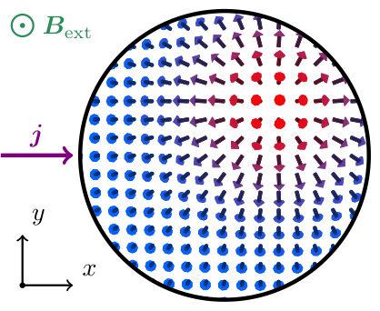
<figcaption class="paper-figure-caption"><b>Fig 1.</b> FIG. 1. Sketch of the structure under study. The ground magnetization state is a Néel skyrmion, whose dynamics is excited by passing a spin-polarized current through the sam- ple.</figcaption>
</figure>
<figure class="paper-figure-card">
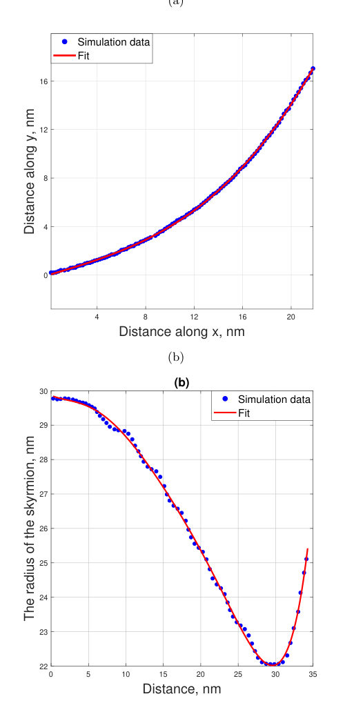
<figcaption class="paper-figure-caption"><b>Fig 2.</b> FIG. 2. (a) Trajectory of the skyrmion center in the nanocylinder driven by a CIP current applied along the x axis. (b) Skyrmion radius as a function of the displacement of its center |R|.</figcaption>
</figure>
<figure class="paper-figure-card">
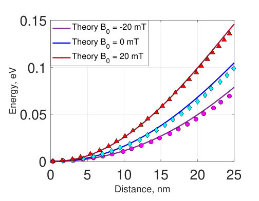
<figcaption class="paper-figure-caption"><b>Fig 3.</b> FIG. 3. System energy E as a function of the skyrmion dis- placement |R|. Solid lines show the results of the theoretical calculations based on minimization of the magnetic energy functional. Circles represent the data obtained from micro- magnetic simulations.</figcaption>
</figure>
<figure class="paper-figure-card">
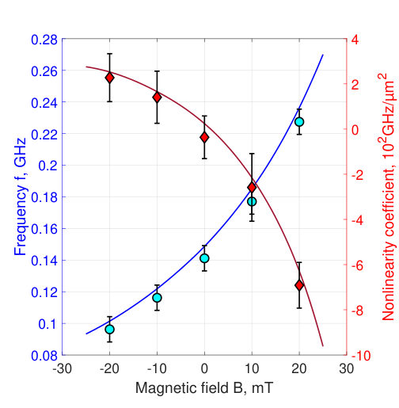
<figcaption class="paper-figure-caption"><b>Fig 4.</b> FIG. 4. Frequency f = ω/2π (blue solid line) and nonlinearity coefficient N (red dashed line) as functions of the bias mag- netic field B0 perpendicular to the plane of the nanocylinder.</figcaption>
</figure>
<figure class="paper-figure-card">
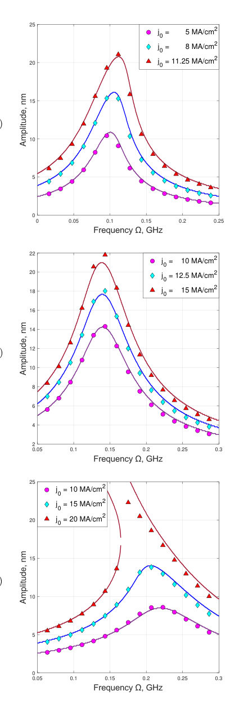
<figcaption class="paper-figure-caption"><b>Fig 5.</b> FIG. 5. Amplitude–frequency response of the skyrmion oscil- lator in a magnetic field B0 of magnitude (a) −20 mT, (b) 0 T, (c) 20 mT.</figcaption>
</figure>

**Summary.** This work theoretically models the nonlinear dynamics of a skyrmion oscillator in a nanostructure, showing that an applied bias magnetic field provides a powerful knob to tune its fundamental oscillation frequency and nonlinearity. The ability to control these nonlinear properties opens promising avenues for developing novel, tunable components for neuromorphic spintronic devices.

**Why it may be interesting.** While focused on classical magnetism, the concept of controlling nonlinear oscillators via external fields and achieving tunable resonance behavior is analogous to controlling nonlinear quantum systems or cavity QED elements.

Detailed structure

**Main problem.** The study investigates the nonlinear dynamics of a skyrmion-based oscillator and quantifies how an external bias magnetic field influences its oscillation frequency and nonlinearity coefficient.

**Main result.** The bias field can tune the response frequency and significantly alter the nonlinearity coefficient, even causing it to reverse sign, which suggests potential for tunable neuromorphic computing elements.

**Method.** The analysis employs a generalized Thiele model derived from minimizing a magnetic energy functional, followed by a canonical nonlinear transformation to analyze the steady-state amplitude-frequency response.

**Model / system.** The system is a Néel skyrmion confined within a nanocylinder, whose dynamics are modeled using a generalized Thiele equation derived from the Landau-Lifshitz-Gilbert equation. The energy functional incorporates anisotropy, demagnetizing, exchange, DMI, and Zeeman interactions.

**Key observables.** Oscillation frequency, nonlinearity coefficient, and the system energy $E$ as a function of skyrmion displacement.

**Important parameters / regimes.** Bias magnetic field ($\mathbf{B}_{	ext{ext}}$), which acts as the primary tuning parameter for the system's nonlinear properties.

**Assumptions / limitations.** The model assumes the magnetization is a weighted sum of a skyrmion ansatz and a domain wall, and utilizes approximations to simplify the full micromagnetic dynamics into the Thiele model framework.

**Figures summary.** Figures compare the theoretical dependence of the system energy $E$ on skyrmion displacement $|\mathbf{R}|$ against micromagnetic simulation results for various applied bias fields.

**Paper structure.** The paper builds from defining the physical system and energy functional, deriving the generalized Thiele equation, simplifying it via canonical transformations, and finally analyzing the steady-state amplitude-frequency response to determine the field-dependent nonlinear properties.

Abstract

We study the nonlinear dynamics of a cylindrical skyrmion-based oscillator within the framework of a generalized Thiele model. We demonstrate the influence of an bias magnetic field applied perpendicular to the plane of the nanocylinder on the oscillation frequency and on the nonlinearity coefficient. It is shown that the field tunes the response frequency, while also producing a substantial change in the nonlinear frequency shift. We find that the nonlinearity coefficient reverses its sign as the field crosses a certain critical value. The variation of the nonlinearity coefficient with the field is clearly illustrated by the observed qualitative changes in nonlinear amplitude-frequency responses. Controlling the nonlinear properties of a skyrmion oscillator by changing the bias magnetic field opens up prospects for creating tunable computational elements for neuromorphic applications.

[↑ back to top](#top)

### [ANT:UI: An interactive 3D tool for preparing ANT.Gaussian molecular junction geometries](http://arxiv.org/abs/2609.05030v1)

**Authors:** A. Martinez-Garcia, J. J. Palacios, C. Sabater  
**Type:** theory · **Category:** other · **PDF:** <https://arxiv.org/pdf/2609.05030v1>  
**Analysis basis:** full PDF text, analyzed in chunks
**Topic relevance:** `Keldysh / 2PI / non-Gaussian methods` **2/5** · `methods for driven-dissipative` **2/5** · `analog quantum simulation` **1/5** · `quantum measurements` **1/5**

↔ Scroll figures horizontally

<figure class="paper-figure-card">
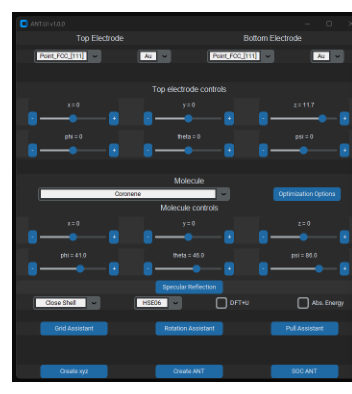
<figcaption class="paper-figure-caption"><b>Fig 1.</b> Figure 1: The ANT.UI interface, showing the controller window (left) and the 3D viewer (right).</figcaption>
</figure>
<figure class="paper-figure-card">
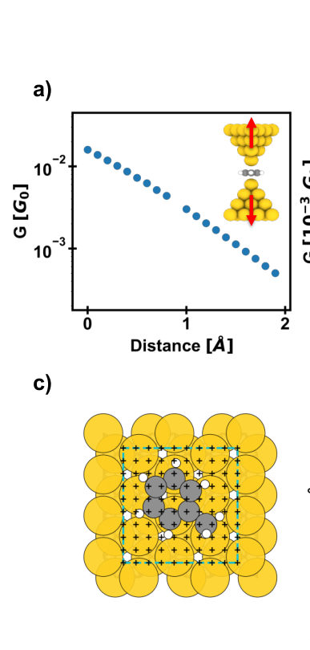
<figcaption class="paper-figure-caption"><b>Fig 2.</b> Figure 2: Examples of sequential-output calculations enabled by ANT.UI, each using first- step-only geometry optimization. (a) Transmission vs. electrode separation from a sym- metric pulling sequence on benzene. (b) Transmission vs. rotation angle of a glycerol molecule relative to the electrodes. (c) Grid scan of a toluene molecule on an Au(111) slab. Left: top view of the slab and molecule, with a cross marking each scan point. Right: 2D contour map interpolated from the data.</figcaption>
</figure>

**Summary.** This paper introduces ANT.UI, an interactive 3D graphical tool designed to automate the complex and manual process of preparing input files for NEGF-DFT quantum transport calculations. By allowing users to visually construct molecular junctions and automate systematic scans (pulling, rotating, gridding), the tool drastically lowers the barrier to entry and accelerates research in theoretical molecular electronics.

**Why it may be interesting.** While focused on computational tools, the underlying physics—quantum transport through molecular junctions—is highly relevant to open quantum systems and mesoscopic physics, providing a practical framework for simulating electronic coupling.

Detailed structure

**Main problem.** The primary bottleneck in theoretical molecular electronics is the time-consuming and error-prone manual preparation of 3D atomistic geometries and input files for quantum transport calculations.

**Main result.** The developed tool, ANT.UI, replaces days of custom scripting with an interactive, point-and-click workflow, significantly accelerating high-throughput research in molecular electronics.

**Method.** The authors created ANT.UI, a Python graphical interface with a 3D viewer, to automate the construction and formatting of input files for NEGF-DFT calculations using Gaussian and ANT.Gaussian.

**Model / system.** The tool models molecular junctions consisting of metallic electrodes (e.g., Au, Pt) connected to organic molecules (e.g., benzene, glycerol). Calculations are based on Non-Equilibrium Green's Functions combined with Density Functional Theory (NEGF-DFT).

**Key observables.** Zero-bias transmission (as a function of distance, angle, or position), 2D contour maps of transmission, and spatial variation in zero-bias transmission.

**Important parameters / regimes.** Electrode separation distance (dz), molecular orientation angle, Hubbard-U correction values, and DFT parameters.

**Assumptions / limitations.** The tool requires an ANT.Gaussian installation on an HPC and user configuration via USER_CONF.txt to adapt to the specific computational environment.

**Figures summary.** Figure 1 shows the interactive ANT.UI interface. Figure 2 demonstrates the tool's automation capabilities by showing representative calculations for transmission vs. separation (benzene), transmission vs. rotation angle (glycerol), and a 2D grid scan (toluene on Au(111)).

**Paper structure.** The paper introduces ANT.UI as a solution to geometry preparation bottlenecks, details its interactive 3D visualization and automation assistants (Pull, Grid, Rotation), and demonstrates its utility through examples of complex, multi-parameter quantum transport simulations.

Abstract

ANT.UI is a Python graphical interface that automates the construction of molecular-junction geometries for NEGF-DFT quantum transport calculations. Through a real-time 3D viewer, users interactively position electrodes and molecules and generate complete, ready-to-run input files for Gaussian and ANT.Gaussian without manual scripting. Dedicated Pull, Grid, and Rotation assistants further automate electrode-pulling sequences, surface scans, and step-wise rotation studies, with optional geometry-optimisation chaining across each sequence. By replacing a process that previously demanded days of custom scripting with a point-and-click workflow, ANT.UI accelerates research in theoretical molecular electronics and lowers the barrier to entry for new users. The software also exports all constructed geometries in standard XYZ format, allowing direct reuse in molecular dynamics codes or third-party visualization tools without manual reformatting.

[↑ back to top](#top)

### [Variable Charge State, Magnetic Excitations, and Kondo Effect of Sm/g/Ir(111)](http://arxiv.org/abs/2609.05394v1)

**Authors:** Shixuan Shan, Tamara de Ara, Lina Liu, Zhipeng Wang, Marina Pivetta, François Patthey, Tadahiro Komeda, Daria Kývala, Jindřich Kolorenč, Harald Brune  
**Type:** both · **Category:** strongly correlated electrons · **PDF:** <https://arxiv.org/pdf/2609.05394v1>  
**Analysis basis:** full PDF text, analyzed in chunks
**Topic relevance:** `quantum measurements` **2/5** · `Keldysh / 2PI / non-Gaussian methods` **1/5** · `analog quantum simulation` **1/5**

↔ Scroll figures horizontally

<figure class="paper-figure-card">
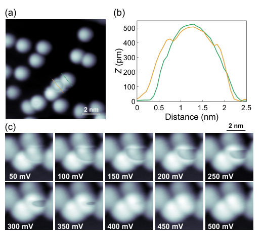
<figcaption class="paper-figure-caption"><b>Fig 1.</b> Figure 1. (a) STM image of individual Sm adatoms on a graphene island on Ir(111) (ΘSm = 8×10−3 ML, Vt = 100 mV, It = 10 pA). One atom shows a particular charge state mani- fested by a concentric ring, while all other atoms appear as regular smooth protrusions. (b) Profiles taken through a reg- ular adatom (green) and through the one with a charge ring (yellow). (c) The charge ring changes radius as the tunnel volt- age is varied, pointing to an electric field effect (It = 10 pA).</figcaption>
</figure>
<figure class="paper-figure-card">
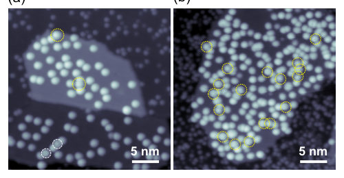
<figcaption class="paper-figure-caption"><b>Fig 2.</b> Figure 2. Coverage dependent abundance of adatoms with charge ring. (a) The upper half shows a graphene island sur- rounded by Ir(111) substrate, the lower part is a graphene island on the next lower atomic terrace. Atoms with charge ring are marked with dashed yellow circles on the upper island and with dashed white ones on the lower island (ΘSm = 8 × 10−3 ML, Vt = 100 mV, It = 10 pA). (b) Sample with 2.5 times higher Sm coverage. There is one graphene island surrounded by Ir(111). Atoms with charge ring are marked with dashed yellow circles (ΘSm = 2 × 10−2 ML, Vt = 100 mV, It = 10 pA).</figcaption>
</figure>
<figure class="paper-figure-card">
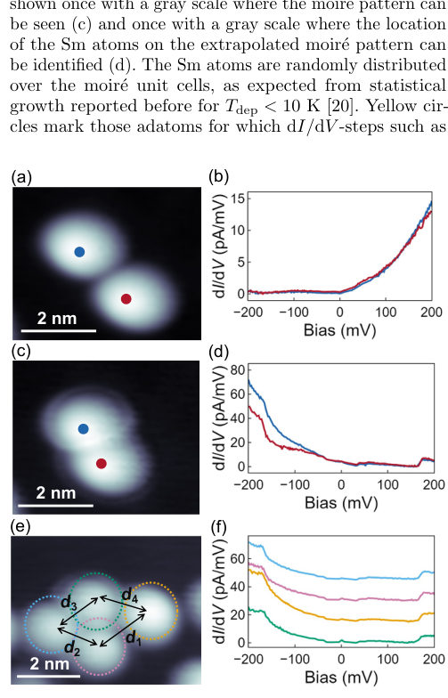
<figcaption class="paper-figure-caption"><b>Fig 3.</b> Figure 3. (a) and (c) STM images of two isolated Sm adatoms that are approached by atomic manipulation; their summits are marked in red and blue. (b) and (d) dI/dV -spectra of the two adatoms (Vt = 200 mV, It = 400 pA). Inelastic con- ductance steps appear at 160–170 mV once the atoms are approached. (e) An ensemble of four Sm adatoms with varying interatomic distances d1–d4 (Vt = 100 mV, It = 10 pA). (f) The corresponding dI/dV -curves display the inelastic conduc- tance steps for each of the four Sm atoms. The spectra are vertically offset for clarity.</figcaption>
</figure>
<figure class="paper-figure-card">
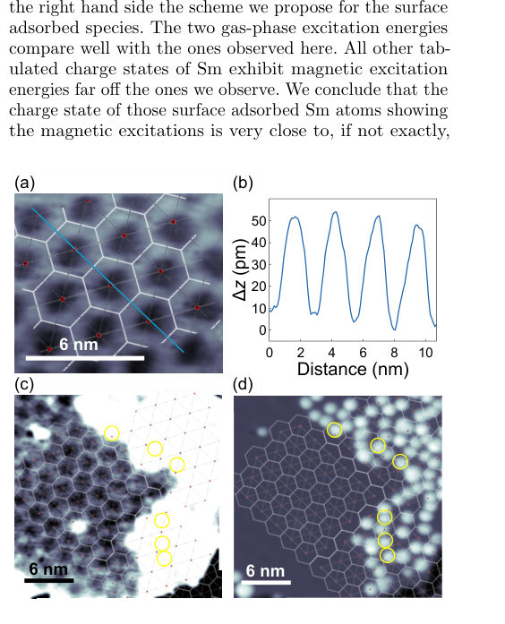
<figcaption class="paper-figure-caption"><b>Fig 4.</b> Figure 4. (a) Moir´e pattern of g/Ir(111) marked as honey- comb (white) and hexagonal (black) lattice (Vt = 100 mV, It = 10 pA). (b) Profile along the blue line in (a). (c) and (d) Sample prepared to localize the Sm adatoms on the moir´e unit cell. (c) Contrast shows the moir´e on the left side, where Sm atoms have been removed. (d) Contrast shows the adatoms on the extrapolated moir´e pattern. Yellow circles mark Sm adatoms with dI/dV steps (Vt = 100 mV, It = 10 pA).</figcaption>
</figure>
<figure class="paper-figure-card">
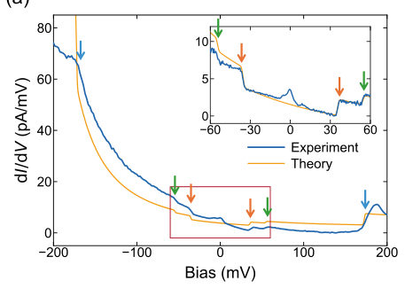
<figcaption class="paper-figure-caption"><b>Fig 5.</b> Figure 5. (a) Main figure: Wide bias voltage range dI/dV - curve recorded on a Sm+ adatom on g/Ir(111) showing three conductance steps indicated by blue, green, and yellow arrows (Vt = 200 mV, It = 400 pA). The yellow curve represents the theoretical calculation based on cotunneling theory, modeling the inelastic transitions within the adatom’s electronic shells. Inset: dI/dV -curve of a smaller energy interval showing the two low energy steps more clearly (Vt = 50 mV, It = 500 pA). The curves have a parabolic, respectively, linear background that has not been subtracted. (b) Energy level diagram of Sm+ in the gas-phase (left) and on g/Ir(111) (right). Colored arrows indicate the...</figcaption>
</figure>

**Summary.** This paper uses low-temperature STM to study Samarium adatoms on graphene/Ir(111), revealing that the adatoms exist in variable charge states and exhibit a Kondo resonance. By analyzing magnetic excitations and the Kondo peak's Zeeman splitting, the authors confirm the electronic structure, suggesting $	ext{Sm}^+$ is the ground state and providing valuable parameters for understanding correlated electron physics on surfaces.

**Why it may be interesting.** The combination of local spectroscopy (STM) with many-body physics concepts like the Kondo effect and crystal field theory provides a direct experimental probe into the correlated electron physics of rare-earth adatoms, which is highly relevant to open quantum systems.

Detailed structure

**Main problem.** The study investigates the charge state, magnetic excitations, and Kondo effect of individual Samarium (Sm) adatoms adsorbed on graphene/Ir(111). The goal is to understand how local electronic correlations govern the material's magnetic and charge behavior.

**Main result.** The research confirms that Sm adatoms exhibit variable charge states ($	ext{Sm}^+$ vs. $	ext{Sm}^{2+}$) and display a Kondo resonance, indicating strong coupling to the substrate. The observed magnetic excitations allow for the determination of crystal field parameters for the $4f$ shell.

**Method.** The work combines low-temperature Scanning Tunneling Microscopy (STM) spectroscopy ($dI/dV$) measurements with theoretical modeling, including cotunneling theory and Wigner-Eckart theorem applications.

**Model / system.** The system is Sm adatoms on a graphene/Ir(111) substrate. The electronic structure is modeled using the $4f$ and $6s$ shells, considering crystal field splitting and Kondo screening effects.

**Key observables.** Charge state (reversible switching via STM tip), magnetic excitations (steps in $dI/dV$ at 35 meV and 54 meV), Kondo resonance peak, and Zeeman splitting ($\Delta E_Z$).

**Important parameters / regimes.** Low temperatures, interatomic distances (critical range 0.9 to 1.5 nm), and the large gas-phase $g$-factor of Sm.

**Assumptions / limitations.** The analysis assumes the coupling between the adatom and electrodes is much smaller than the charging energy (cotunneling theory) and that the crystal-field splitting is small enough for certain theoretical approximations.

**Figures summary.** Figures show STM images demonstrating charge rings, $dI/dV$ spectra revealing multiple conductance steps (165 meV, 54meV, 35meV), and plots detailing the Zeeman splitting of the Kondo peak.

**Paper structure.** The paper progresses by first characterizing the variable charge states using STM imaging, then measuring magnetic excitations via $dI/dV$ spectroscopy, and finally analyzing the Kondo resonance and its Zeeman splitting to confirm the electronic structure and ground state.

Abstract

Using low-temperature scanning tunneling microscopy we investigate the charge state, magnetic excitations, and Kondo features of individual Sm adatoms on graphene/Ir(111). Depending on the number and distance of their neighbors, Sm atoms can be in two discrete charge states. At certain distances, a reversible transition between these two states is induced by the electric field of the STM tip leading to concentric charge rings in the images. Only atoms in one of the two charge states exhibit magnetic excitations in d$I$/d$V$ spectra. Two such excitations are located at 35~meV and 54~meV and related to transitions from the $J = 1/2$ ground state doublet to the first crystal field split $J = 3/2$ multiplet. Together with the intra-atomic exchange excitations at higher energy, these observations indicate that Sm transfers one $6s$ electron to the substrate while it retains its gas-phase $4f$ filling. New for lanthanide adatoms, we observe a Kondo resonance. The Zeeman splitting of the Kondo peak reveals that Sm retains its large gas-phase $g$-factor. Comparison of d$I$/d$V$ spectra to cotunneling theory yields the crystal field acting on the $4f$ shell and, consequently, on the $J = 3/2$ quadruplet, confirms Sm$^+$ as the ground state, and identifies Sm$^{2+}$ as being energetically close, thereby rationalizing our observation of variable charge states.

[↑ back to top](#top)

### [Global Fixed Point Potentials in the Abelian Higgs Model with $N$ flavors](http://arxiv.org/abs/2609.04938v1)

**Authors:** Gergely Fejős, Shunsuke Yabunaka  
**Type:** theory · **Category:** other · **PDF:** <https://arxiv.org/pdf/2609.04938v1>  
**Analysis basis:** full PDF text, analyzed in chunks
**Topic relevance:** `Keldysh / 2PI / non-Gaussian methods` **2/5**

↔ Scroll figures horizontally

<figure class="paper-figure-card">
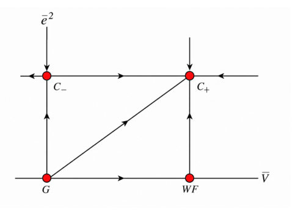
<figcaption class="paper-figure-caption"><b>Fig 1.</b> FIG. 1. Schematic of the RG flows (indicated by the arrows) and its fixed points (indicated by the red circles) deduced from the formal argument given below Eq. (30) based on the conventional large N scaling, corroborated near d = 4 for N ≥ 183 by d = 4 −ϵ expansion. G refers to the Gaussian, while WP to the Wilson-Fisher fixed point. For the definitions of C+ and C−, see the text. The temperature direction, relevant in all fixed points, can be considered perpendicular to the plane.</figcaption>
</figure>
<figure class="paper-figure-card">
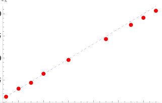
<figcaption class="paper-figure-caption"><b>Fig 2.</b> FIG. 4. The inverse of the scaled squared charge, 1/˜e2 k, at the C+ FP as a function of the flavor number N in d = 3 when setting ˜mA,k=0. The dashed line refers to the line ˜e2 k = 0.587/(N −1.00625).</figcaption>
</figure>

**Summary.** This paper uses the Functional Renormalization Group to study the fixed point structure of the Abelian Higgs model in $d$ dimensions. It demonstrates that standard perturbative methods fail near $d=3$, revealing a richer fixed point structure. The work provides non-perturbative insights into how the critical flavor number and gauge symmetry behave in this quantum field theory.

**Why it may be interesting.** While focused on particle physics, the use of FRG techniques to study non-perturbative fixed points and symmetry restoration in gauge theories is a powerful theoretical tool applicable to strongly interacting quantum systems.

Detailed structure

**Main problem.** The study investigates the existence and properties of charged fixed points in the Abelian Higgs model with $N$ flavors in $d$ dimensions.

**Main result.** The authors find that the $\epsilon=4-d$ expansion fails near $d=3$, and global fixed point potentials reveal significant modifications to the critical flavor number compared to perturbative predictions.

**Method.** The functional renormalization group (FRG) formalism is employed, utilizing the Local Potential Approximation (LPA') to derive and solve coupled flow equations for couplings and the effective potential.

**Model / system.** The system is the $N$-component Abelian Higgs model, involving an $N$-component complex scalar field $\phi_a$ and a $U(1)$ gauge field $A_i$. The analysis focuses on the flow of the effective action $\Gamma_k$ using the Wetterich equation.

**Key observables.** Scale-dependent couplings ($Z_{\phi,k}, Z_{A,k}, e_k$), the effective potential $V_k(
ho)$, and the critical flavor number $N_c$.

**Important parameters / regimes.** Dimensionality $d$, the number of flavors $N$, and the gauge fixing parameter $\xi$.

**Assumptions / limitations.** The analysis relies on the Landau gauge ($\xi 	o 0$) and imposes constraints derived from Ward-Takahashi identities to ensure gauge symmetry restoration in the infrared limit.

**Paper structure.** The paper systematically derives the FRG flow equations for the effective potential and anomalous dimensions, paying special attention to deriving and comparing the gauge mass flow equation from the Wetterich equation versus the Modified Ward-Takahashi Identity.

Abstract

Existence of charged fixed points in the Abelian Higgs model with $N$ flavors in $d$ dimensions is studied using the functional renormalization group. We numerically solve the coupled fixed point equations for the scale dependent charge and the non-perturbative effective potential for the scalar field. We show that the $ε=4-d$ expansion, famously successful in theories with $O(N)$ symmetry, fails to produce reliable results when taking the $ε\rightarrow 1$ limit. By determining global fixed point potentials, it is shown that the critical flavor number at which charged fixed points appear, modifies significantly compared to the perturbative treatment. In $d=3$, signs of a richer fixed point structure with presumably multicritical fixed points are also found. Discussions include subtleties of the gauge fixing and the corresponding modified Ward-Takahashi identities, including the possibility of a nonzero dimensionless photon mass at the infrared fixed point.

[↑ back to top](#top)

### [Challenges in orbital current-driven domain wall motion in light metal/ferrimagnet heterostructures](http://arxiv.org/abs/2609.04811v1)

**Authors:** Min-Gu Kang, Jaerin Kim, Benjamin J. Jacot, Laura Van Schie, Pietro Gambardella  
**Type:** experiment · **Category:** other · **PDF:** <https://arxiv.org/pdf/2609.04811v1>  
**Analysis basis:** full PDF text, analyzed in chunks
**Topic relevance:** `Keldysh / 2PI / non-Gaussian methods` **1/5** · `analog quantum simulation` **1/5** · `correlated / nonlocal dissipation` **1/5** · `driven-dissipative phase transition` **1/5** · `methods for driven-dissipative` **1/5** · `non-equilibrium universality` **1/5** · `quantum measurements` **1/5**

↔ Scroll figures horizontally

<figure class="paper-figure-card">
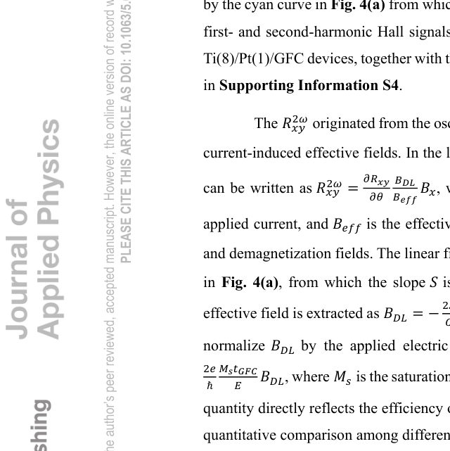
<figcaption class="paper-figure-caption"><b>Fig 1.</b> Figure 4(d) summarizes the extracted 𝜉𝐷𝐿</figcaption>
</figure>
<figure class="paper-figure-card">
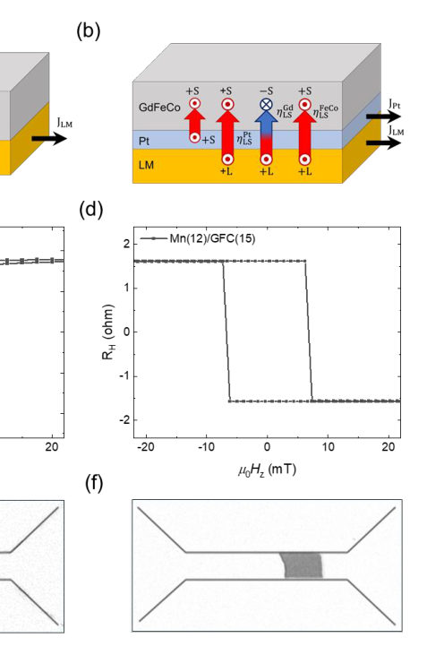
<figcaption class="paper-figure-caption"><b>Fig 2.</b> Figure 1. (a) Schematic of orbital-current-induced torque in LM/GFC bilayers. A charge current in the</figcaption>
</figure>
<figure class="paper-figure-card">
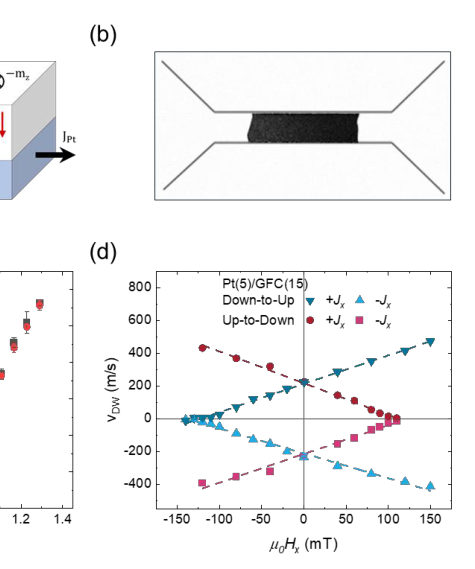
<figcaption class="paper-figure-caption"><b>Fig 3.</b> Figure 2. (a) Schematics of the Pt(5)/GFC(15) device structure. The sublattice magnetic moments in</figcaption>
</figure>
<figure class="paper-figure-card">
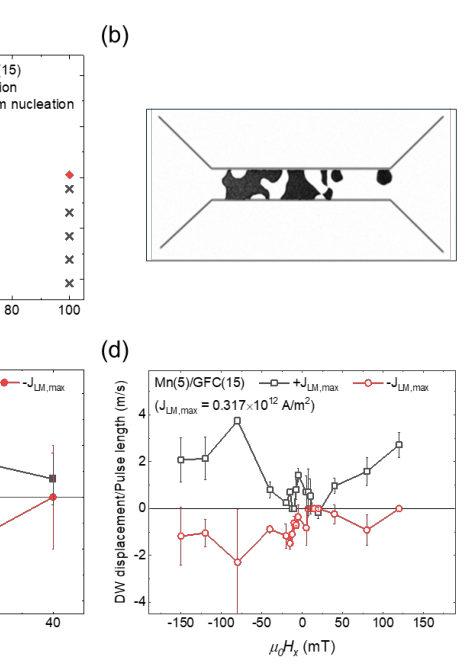
<figcaption class="paper-figure-caption"><b>Fig 4.</b> Figure 3. (a) Diagram showing the effect of pulse injection in a Mn(12)/GFC(15) racetrack as a function</figcaption>
</figure>
<figure class="paper-figure-card">
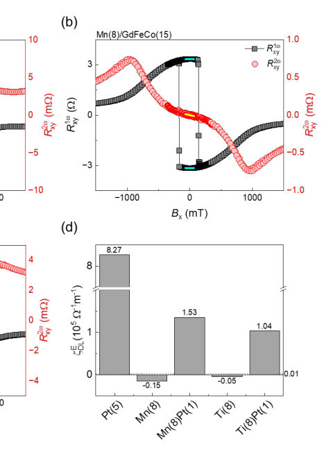
<figcaption class="paper-figure-caption"><b>Fig 5.</b> Figure 4. (a-c) Representative first- (𝑅𝑥𝑦 1𝜔 , black) and second-harmonic (𝑅𝑥𝑦 2𝜔 , red) Hall resistance</figcaption>
</figure>

**Summary.** This work explores using orbital currents from light metals to drive domain wall motion in ferrimagnets, bypassing the need for strong SOC. Experiments showed that while the reference Pt/GFC structure works well, direct injection from Mn or Ti fails to move the domain walls, highlighting that efficient orbital-to-spin torque conversion remains a major hurdle.

**Why it may be interesting.** Although focused on condensed matter magnetism, the study of torque generation and dissipation at interfaces, particularly involving non-equilibrium currents, touches upon concepts relevant to open quantum systems and energy transfer dynamics.

Detailed structure

**Main problem.** The study investigates whether orbital currents generated by charge injection in light metals can effectively drive domain wall (DW) motion in ferrimagnetic heterostructures, offering a mechanism independent of strong spin-orbit coupling (SOC).

**Main result.** While the reference Pt/GFC structure showed robust DW motion, direct injection from Mn/GFC or Ti/GFC failed to drive measurable DW motion, suggesting weak torque conversion is the primary challenge.

**Method.** The authors used polar MOKE microscopy to measure DW displacement ($\Delta x$) after applying current pulses, complemented by SQUID magnetometry and second-harmonic Hall measurements.

**Model / system.** The system involves light metal (LM) / ferrimagnet (GFC) heterostructures, where GFC is $	ext{Gd}_{25}(	ext{Fe}_9	ext{Co}_1)_{75}$. The mechanism relies on injecting orbital angular momentum via the Orbital Hall Effect and its subsequent conversion to spin torque at the interface.

**Key observables.** Domain wall velocity ($v_{DW}$), damping-like torque, and interfacial Dzyaloshinskii-Moriya interaction (DMI).

**Important parameters / regimes.** Current densities ($J_{LM}$), pulse duration ($t_p$), and the thickness of the Pt conversion layer (1 nm).

**Assumptions / limitations.** The analysis assumes that the lack of motion in Mn/Ti/GFC is due to insufficient torque generation or poor interfacial coupling, rather than intrinsic magnetic failure.

**Figures summary.** Not specified, but the notes indicate measurements of DW displacement vs. current density and field dependence.

**Paper structure.** The paper compares three heterostructures ($	ext{Pt}/	ext{GFC}$, $	ext{LM}/	ext{GFC}$, $	ext{LM}/	ext{Pt}/	ext{GFC}$), presents transport measurements (AHE, 2nd-harmonic Hall), and concludes by analyzing the required torque mechanisms and interfacial coupling strengths.

Abstract

Recent advances in spintronics suggest that orbital Hall currents generated by charge injection in light metals can provide nonequilibrium angular momentum without relying on strong spin-orbit coupling (SOC). Here, we examine whether such orbital currents can drive domain wall (DW) motion in an amorphous ferrimagnetic alloy, Gd$_{25}$(Fe$_{9}$Co$_{1}$)$_{75}$ (GFC), where the rare-earth sublattice offers strong SOC for orbital-to-spin conversion. We compare three representative heterostructures: Pt/GFC as a spin Hall reference, light-metal (Mn or Ti)/GFC for direct orbital-current injection, and light-metal/Pt/GFC incorporating an ultrathin Pt layer for orbital-to-spin conversion. Whereas Pt/GFC exhibits robust and reproducible spin-orbit-torque-driven DW motion, no current-driven DW motion is detected in Mn/GFC or Ti/GFC. Second-harmonic Hall measurements nevertheless reveal finite damping-like torques in both Mn/GFC and Ti/GFC, demonstrating that angular-momentum transfer into GFC does occur but is far weaker than in Pt/GFC. Inserting a 1-nm-thick Pt conversion layer strongly enhances the damping-like torque and restores DW motion. Thickness-dependent analysis further shows that DW mobility and depinning thresholds correlate with the interfacial Dzyaloshinskii-Moriya interaction and domain-wall width, highlighting weak torque conversion and insufficient interfacial stabilization of chiral DWs as key challenges for orbital-driven DW motion in light-metal/ferrimagnet heterostructures.

[↑ back to top](#top)

### [Nonreciprocal plasmonic response of drift-biased two-dimensional metals](http://arxiv.org/abs/2609.04954v1)

**Authors:** Gonzalo Álvarez-Pérez, Joel D. Cox  
**Type:** theory · **Category:** other · **PDF:** <https://arxiv.org/pdf/2609.04954v1>  
**Analysis basis:** full PDF text, analyzed in chunks
**Topic relevance:** `Keldysh / 2PI / non-Gaussian methods` **1/5** · `interference shaping light` **1/5** · `methods for driven-dissipative` **1/5**

↔ Scroll figures horizontally

<figure class="paper-figure-card">
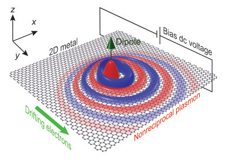
<figcaption class="paper-figure-caption"><b>Fig 1.</b> FIG. 1. Schematics of a 2D metal under drift-induced nonre- ciprocity. A dc voltage induces an electron drift in a 2DEG, giving rise to nonreciprocal plasmon propagation.</figcaption>
</figure>
<figure class="paper-figure-card">
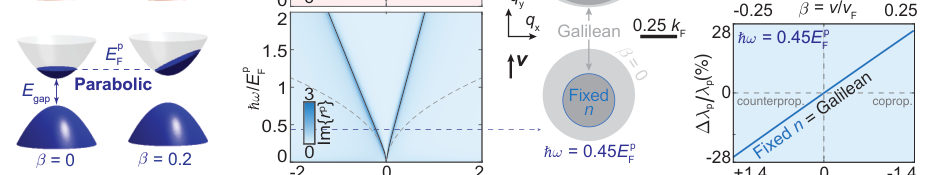
<figcaption class="paper-figure-caption"><b>Fig 2.</b> FIG. 2. Drift-induced nonreciprocity in 2DEGs with Dirac and parabolic dispersions. (a) Schematic band structures and corresponding Fermi surfaces in momentum space for Dirac (upper) and parabolic (lower) dispersions, without drift (β = 0, left) and with drift (β ̸= 0, right). The drift velocity v = βvFˆv biases the occupied states in k-space, breaking inversion symmetry about k = 0. The parabolic Fermi sea is rigidly translated by kd = m∗v/ℏ, whereas the Dirac contour is deformed. (b) Loss function Im{rp(q, ω)} for Dirac (upper) and parabolic (lower) 2DEGs, for β = 0.2 at fixed n. Solid contours show the drift-biased response; the undrifted dispersion (β = 0) and Galilean dispersion are...</figcaption>
</figure>

**Summary.** This theoretical work analyzes how applying a constant drift bias to 2D electron gases induces nonreciprocal plasmonic responses. By comparing Dirac and parabolic band structures, the authors show that parabolic systems are particularly promising platforms because their nonreciprocity is strongly tunable by the interplay between the drift velocity and the material's inherent plasmon nonlocality.

**Why it may be interesting.** The work provides a detailed theoretical understanding of how external biases (drift) can induce directional asymmetry in plasmonics in solid-state systems, which is relevant to engineered quantum optical components.

Detailed structure

**Main problem.** The paper develops a framework to understand and predict the nonreciprocal plasmonic response in two-dimensional electron gases (2DEGs) when subjected to a drift bias, circumventing the need for large external magnetic fields.

**Main result.** Nonreciprocal plasmon propagation is observed in both Dirac and parabolic 2DEGs, with parabolic systems showing stronger nonreciprocity due to the interplay of drift and plasmon nonlocality.

**Method.** The study derives closed-form, drift-dependent conductivity tensors by solving the Boltzmann transport equation in the relaxation-time approximation.

**Model / system.** The physical system is a drift-biased 2DEG, analyzed for two distinct band dispersions: Dirac (linear) and parabolic (quadratic). The theory models the response using nonlocal electrodynamics.

**Key observables.** Plasmon dispersion, near-field emission of a point dipole, nonreciprocal propagation (directional asymmetry), and the Fizeau shift ($\Delta\lambda/\lambda$).

**Important parameters / regimes.** The dimensionless drift parameter $eta = v/v_{
u F}$ (ratio of drift speed to undrifted Fermi velocity); the band dispersion type (Dirac vs. Parabolic).

**Assumptions / limitations.** The analysis relies on the relaxation-time approximation for the Boltzmann transport equation and assumes an isotropic Fermi surface for initial derivations.

**Figures summary.** Figures compare band structures and Fermi surfaces under drift, and plot the loss function and Fizeau shift for both Dirac and parabolic systems, demonstrating directional asymmetry.

**Paper structure.** The paper progresses by deriving the nonlocal conductivity tensor from the BTE for both band types, analyzing the resulting plasmon dispersion and nonreciprocity, and concluding with a comparison of the physical mechanisms governing the observed directional asymmetry.

Abstract

We develop a nonlocal electrodynamic framework for drift-biased two-dimensional electron gases (2DEGs) with Dirac (linear) and parabolic (quadratic) dispersions, deriving closed-form drift-dependent conductivity tensors from the Boltzmann transport equation. We obtain the plasmon dispersion and near-field emission of a point dipole, revealing nonreciprocal propagation in both systems. At equal drift parameter, the parabolic 2DEG exhibits stronger nonreciprocity than the Dirac system, although we find that a larger drift parameter does not by itself produce stronger nonreciprocity: the response is set by the interplay of drift and plasmon nonlocality. As such, the combination of strong nonlocality and experimentally accessible drift velocities of semiconductor 2DEGs identifies parabolic systems as a promising platform for tunable, nonreciprocal plasmonics.

[↑ back to top](#top)

### [Dynamical Reduction of Two Series Josephson Junctions to a Synthetic High-Transparency Josephson Element](http://arxiv.org/abs/2609.05192v1)

**Authors:** Claudio Guarcello, Sergio Pagano, Carlo Barone, Alessandro Bruno, A. Mert Bozkurt, Giovanni Filatrella  
**Type:** theory · **Category:** other · **PDF:** <https://arxiv.org/pdf/2609.05192v1>  
**Analysis basis:** full PDF text, analyzed in chunks
**Topic relevance:** `driven-dissipative phase transition` **1/5** · `methods for driven-dissipative` **1/5**

↔ Scroll figures horizontally

<figure class="paper-figure-card">
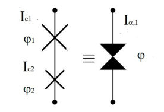
<figcaption class="paper-figure-caption"><b>Fig 1.</b> Fig. 1. The Josephson synthetic element: a larger JJ of critical current Ic1 in series with a smaller JJ with critical current Ic2 = αIc1, 0 &lt; α ≤1.</figcaption>
</figure>
<figure class="paper-figure-card">
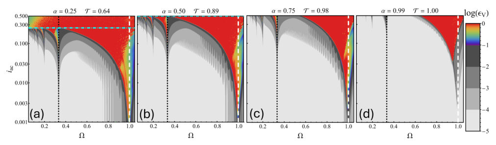
<figcaption class="paper-figure-caption"><b>Fig 2.</b> Fig. 2. Normalized RMS waveform error ϵV versus the normalized drive frequency Ωand ac-current amplitude iac. Panels (a)–(d) correspond to α = 0.25, 0.50, 0.75, and 0.99, respectively, with effective transparencies T ≃{0.64, 0.89, 0.98, 1.00}. The white dashed line marks the common plasma frequency Ωp1 = Ωp2 = Ωp,eff = 1, while the black dotted line indicates the third-order superharmonic condition Ω= Ωp/3. The cyan dot-dashed line, when within the displayed range, marks iac = α, corresponding to Iac = Ic2. The color scale reports log10(ϵV ), with values below 10−5 clipped at the numerical floor.</figcaption>
</figure>
<figure class="paper-figure-card">
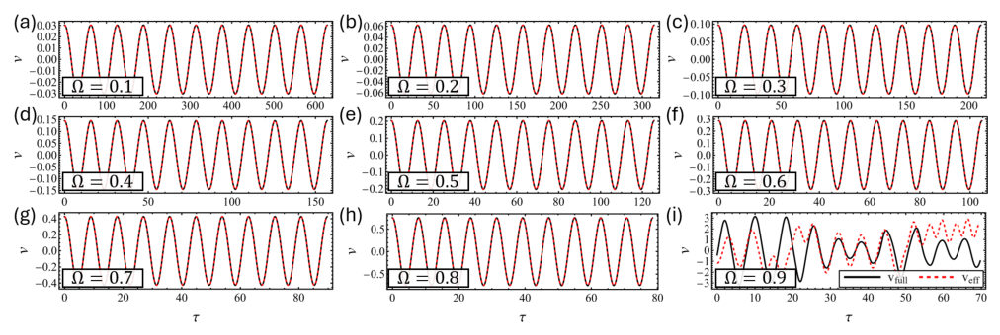
<figcaption class="paper-figure-caption"><b>Fig 3.</b> Fig. 3. Time-domain comparison between the normalized voltage vfull of the complete two-JJ system (black solid line) and veff of the effective model (red dashed line), for α = 0.5 and iac = 0.1. Panels (a)–(i) correspond to Ω= 0.1, 0.2, 0.3, 0.4, 0.5, 0.6, 0.7, 0.8, and 0.9, respectively. The effective model closely follows the full voltage response up to Ω= 0.8, including the strong increase in oscillation amplitude on approaching resonance. A pronounced nonlinear waveform mismatch appears at Ω= 0.9. The legend in panel (i) refers to all panels.</figcaption>
</figure>

**Summary.** This paper analyzes whether two series Josephson Junctions can be accurately modeled by a single, synthetic high-transparency element, especially when considering finite-frequency driving. By deriving an effective single-element model using low-amplitude approximations, the authors quantitatively test its validity against the full two-junction dynamics. The results establish clear operational limits, showing the approximation breaks down near the system's plasma frequency.

**Why it may be interesting.** This work provides a quantitative dynamical criterion for model reduction in superconducting circuits, which is crucial for simulating complex Josephson junction arrays and metamaterials where full numerical simulation is intractable.

Detailed structure

**Main problem.** The paper investigates the dynamical validity of simplifying the complex dynamics of two series Josephson Junctions (JJs) into a single, effective high-transparency element.

**Main result.** The single-element description provides high accuracy over a broad range of low drive frequencies and amplitudes, but significant deviations appear near the system's plasma frequency scale.

**Method.** The authors derived an effective single second-order differential equation by applying low-frequency and small-phase approximations to the full two-junction system, and validated this reduction by comparing voltage waveforms.

**Model / system.** The system consists of two conventional JJs in series, modeled by the Resistively and Capacitively Shunted Junction (RCSJ) equations. The reduction maps the two coupled second-order dynamics to a single effective element.

**Key observables.** Normalized root-mean-square (RMS) error ($\epsilon_V$) between the full and effective voltage waveforms, and the voltage waveforms themselves.

**Important parameters / regimes.** Junction asymmetry ratio ($\alpha$), drive frequency ($\Omega$), drive amplitude ($i_{ac}$), and the system's plasma frequency scale ($\Omega_{p,eff}$).

**Assumptions / limitations.** The effective element parameters are derived under low-frequency and small-amplitude approximations, which limits the guaranteed validity of the reduction.

**Figures summary.** Figure 2 shows the RMS error ($\epsilon_V$) vs. drive frequency ($\Omega$) and amplitude ($i_{ac}$), illustrating the error region. Figure 3 compares time-domain voltage waveforms, showing agreement up to a certain frequency before divergence.

**Paper structure.** The paper first establishes the static limit mapping, then derives the effective single-element dynamics using approximations, and finally validates this reduction by numerically comparing the full two-JJ system against the effective single-element model across varying drive conditions.

Abstract

Two conventional Josephson junctions connected in series can reproduce, in the static limit in which the currents through the capacitive and resistive channels are negligible, the current-phase relation of a single effective weak link with tunable transparency. Therefore, the two-junction series can be treated as a single synthetic high-transparency element. Here, we investigate to what extent this mapping remains valid under finite-frequency drive and retaining the junctions' resistive and capacitive terms. The full resistively and capacitively shunted junction equations are compared with an effective synthetic element with tunable transparency that retains the synthetic tunable-transparency current-phase relation together with effective capacitive and dissipative terms, thus reducing the two second order degree of freedom system to a single second order degree of freedom. The resulting single-element dynamics is compared with the complete two-junction system under ac excitation. The agreement is quantified through a normalized root-mean-square error between the full and effective voltage waveforms. A broad low-error region is found at low drive frequency, while pronounced deviations emerge as the drive frequency approaches the relevant plasma-frequency scale and at larger drive amplitudes. The results provide a quantitative dynamical criterion for using the reduced single-element description of a synthetic high-transparency Josephson element in superconducting circuits.

[↑ back to top](#top)

### [Electrostatic splitting of an Edge Magnetoplasmon Resonator](http://arxiv.org/abs/2609.05188v1)

**Authors:** Sloän Kouamé, Elric Frigerio, Giacomo Rebora, Suvankar Purkait, Yong Jin, Ulf Gennser, Antonella Cavanna, Jean-Marc Berroir, Emmanuel Baudin, Pascal Degiovanni, François D. Parmentier, Gwendal Fève, Gerbold C. Ménard  
**Type:** experiment · **Category:** strongly correlated electrons · **PDF:** <https://arxiv.org/pdf/2609.05188v1>  
**Analysis basis:** full PDF text, analyzed in chunks
**Topic relevance:** `analog quantum simulation` **1/5** · `quantum measurements` **1/5**

↔ Scroll figures horizontally

<figure class="paper-figure-card">
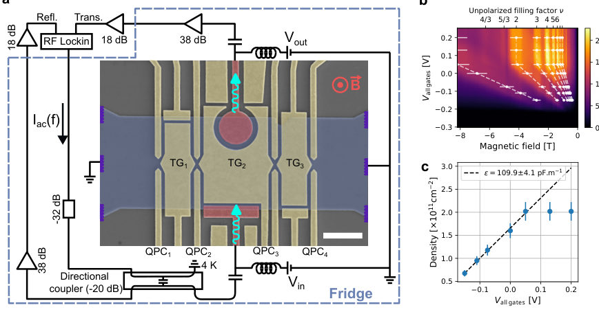
<figcaption class="paper-figure-caption"><b>Fig 1.</b> FIG. 1. Sample and measurement apparatus: The sample is constituted of a 2DEG covered by a set of electrostatic (yellow) and rf (red) gates. Ohmic contacts are also present at the edge of the sample and are simply schematically represented here (purple). The input rf signal is sent from a radiofrequency lock-in amplifier and passes through distributed attenuators (-32 dB total attenuation) and a directional coupler (-20 dB attenuation). The signal then has two possible paths, either go through the sample where it is collected by a first set of amplifiers, or is reflected and collected by the second set of amplifiers and sent to another input of the lock-in amplifier. The applied magnetic...</figcaption>
</figure>
<figure class="paper-figure-card">
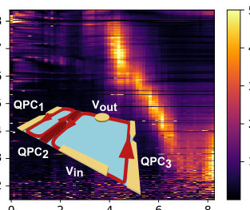
<figcaption class="paper-figure-caption"><b>Fig 2.</b> FIG. 2. RF characterization of the device: (a) Transmis- sion map of the cavity in the ”middle left” configuration. In this situation, QPC1 and QPC3 are pinched-off. (b) Same in the ”small” configuration. In this case, QPC2 is also pinched- off, therefore isolating the left part of the device from the input and output gates. The insets show the cavity configu- rations schematically where the top gates have been removed for clarity.</figcaption>
</figure>
<figure class="paper-figure-card">
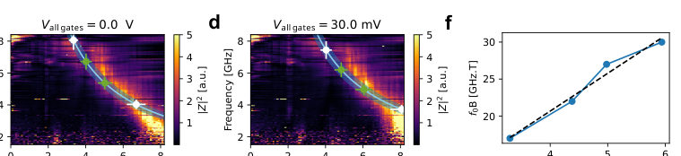
<figcaption class="paper-figure-caption"><b>Fig 3.</b> FIG. 3. Estimation of gate capacitance: (a)-(d) Frequency vs. Magnetic field maps of the transmission through the cavity in the ”middle left” configuration (see inset of figure 2.b) for various polarization Vall gates of gates TG1, TG2 and QPC2 (−100 mV, −30 mV, 0 mV and 30 mV respectively). The white dots correspond to the position of the integer plateaus and the green ones to the fractional ones. The full lines correspond to the fit of f0B that follows the 1/B trend of the resonance frequency. (e) Extracted value of the electronic density (based on the position of the intensity maxima). The dashed line indicates the linear fit of the density dependence on the gate voltage from which we...</figcaption>
</figure>
<figure class="paper-figure-card">
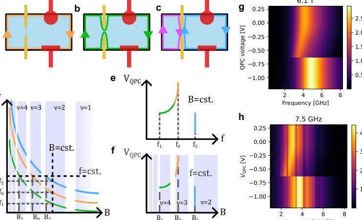
<figcaption class="paper-figure-caption"><b>Fig 4.</b> FIG. 4. Effect of the QPC closing on the EMP resonance: By applying a voltage on a QPC within an EMP resonator, we go from the configuration of (a) an edge mode traveling around the edge of the full cavity to a (b) pinched mode at the level of the QPC and finally, to (c) two fully separated cavities for very negative voltages. (d) Frequency- and field-dependence of tracked resonance frequencies: in the (f, B) plane, the open QPC configuration leads to the resonance shown in orange. As the QPC voltage becomes more negative, the perimeter increase leads to the decrease of the resonance frequency shown here in green. Finally, after the pinch-off point, the perimeter is smaller than the one of...</figcaption>
</figure>
<figure class="paper-figure-card">
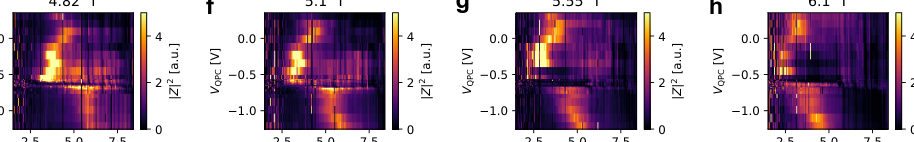
<figcaption class="paper-figure-caption"><b>Fig 5.</b> FIG. 5. Acquisition methods, fixed frequency vs fixed field: (a)-(d) Transmission signal acquired as a function of gate voltage and magnetic field for frequencies f = 4.3 GHz, 5.0 GHz, 6.0 GHz and 7.5 GHz. The only treatment applied to the data is the subtraction of the background signal. (e)-(h) Transmission signal acquired as a function of QPC voltage and frequency for a magnetic fields B = 4.82 T, 5.1 T, 5.55 T and 6.1 T. In order to display the data, the normalization procedure described in [20] has been used on every field vs. frequency map before extracting the necessary data to plot this figure. Only the offset has been subtracted from the data.</figcaption>
</figure>

**Summary.** This paper experimentally investigates edge magnetoplasmon resonators in quantum Hall systems to detect and characterize various quantum Hall states. By embedding a quantum point contact, the researchers precisely control the cavity geometry and measure the resulting shifts in magnetoplasmon resonance frequencies. This work provides strong evidence for both integer and fractional quantum Hall physics using microwave spectroscopy.

**Why it may be interesting.** The work provides highly controlled experimental access to probing fractional quantum Hall states via collective excitations (magnetoplasmons), which is a key area in strongly correlated electron physics.

Detailed structure

**Main problem.** The study investigates how embedding a quantum point contact within an edge magnetoplasmon resonator affects the propagating magnetoplasmonic mode.

**Main result.** The experiment unambiguously detects signatures of both integer ($
u=1, 2$) and fractional quantum Hall states ($
u=4/3, 2/3$) using radiofrequency transmission measurements.

**Method.** The research combines DC transport measurements with RF characterization, using electrostatic gating to control the system and probe resonance shifts.

**Model / system.** The physical platform is a two-dimensional electron gas (2DEG) in an AlGaAs/GaAs heterostructure, configured as an edge magnetoplasmon resonator with multiple QPCs defining cavity geometries.

**Key observables.** Quantum Hall plateau signatures ($
u$), RF resonance frequencies, and the dependence of the cavity perimeter on gate voltage.

**Important parameters / regimes.** Filling factors ($
u=1, 2, 4/3, 2/3$), magnetic field ($B$), and gate voltages ($V_G$).

**Assumptions / limitations.** The analysis assumes the EMP velocity is proportional to the electronic density and that the resonance frequency follows a predictable dependence on the cavity perimeter.

**Figures summary.** Figures show sample setups, RF transmission maps ($|Z|^2$) varying with magnetic field and frequency for different cavity configurations, and plots demonstrating resonance shifts upon QPC closing.

**Paper structure.** The paper progresses by first detailing the setup and using DC measurements to characterize the 2DEG, then employing RF measurements to map magnetoplasmon resonances, and finally analyzing how QPC gating controls the cavity size and reveals the underlying quantum Hall physics.

Abstract

Edge-magnetoplasmon resonators have been proposed as a powerful tool to detect anyons by introducing a quantum point contact into an isolated quantum Hall system probed via radiofrequency radiation. In this paper, we study the effect of a quantum point contact embedded within an edge-magnetoplasmon resonator and how its polarization influences the propagating magnetoplasmonic mode. Combining dc and rf measurements, we unambiguously evidence the signature of both integer ($ν= 1$ and $2$) and fractional quantum Hall states ($ν= 4/3$ and $2/3$) within the radiofrequency transmission signal. Using electrostatic gating, we determine the physical parameters characterizing the electrostatic edge of an AlGaAs/GaAs based two-dimensional electron gas. We extract the dependence of the cavity perimeter with the gate voltage of the quantum point contact and fully characterize the path followed by edge magnetoplasmons in this system. Finally, we provide a geometric model in good agreement with experimental results.

[↑ back to top](#top)

### [Engineering Giant Thermoelectric Performance through Electrode-Coupling Geometry and Magnetic Flux in Quasiperiodic Su-Schrieffer-Heeger Rings](http://arxiv.org/abs/2609.05078v1)

**Authors:** Sridhar, Souvik Roy, Malay Bandyopadhyay  
**Type:** theory · **Category:** other · **PDF:** <https://arxiv.org/pdf/2609.05078v1>  
**Analysis basis:** full PDF text, analyzed in chunks
**Topic relevance:** `Keldysh / 2PI / non-Gaussian methods` **1/5** · `methods for driven-dissipative` **1/5**

↔ Scroll figures horizontally

<figure class="paper-figure-card">
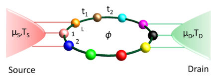
<figcaption class="paper-figure-caption"><b>Fig 1.</b> FIG. 1. Schematic of the symmetric electrode-coupling geom- etry with three lattice sites coupled to each reservoir.</figcaption>
</figure>
<figure class="paper-figure-card">
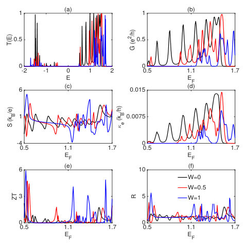
<figcaption class="paper-figure-caption"><b>Fig 2.</b> FIG. 2. Symmetric electrode-coupling geometry in the topo- logical dimerized regime (t1 &lt; t2). (a) Transmission spec- trum, (b) electrical conductance, (c) Seebeck coefficient, (d) electronic thermal conductance, (e) thermoelectric figure of merit (ZT ), and (f) Lorenz ratio as functions of the Fermi energy for different quasiperiodic modulation strengths. The parameters are γ = 0.05, T = 0.005, φ = 0, t1 = 0.5, and t2 = 1.</figcaption>
</figure>
<figure class="paper-figure-card">
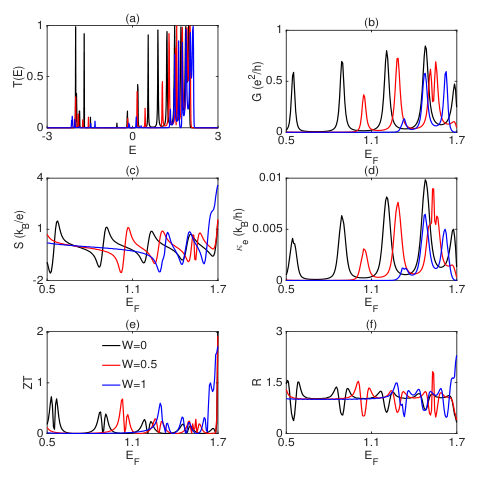
<figcaption class="paper-figure-caption"><b>Fig 3.</b> FIG. 3. Symmetric electrode-coupling geometry in the homogeneous-hopping regime (t1 = t2). (a) Transmission spectrum, (b) electrical conductance, (c) Seebeck coefficient, (d) electronic thermal conductance, (e) thermoelectric figure of merit (ZT ), and (f) Lorenz ratio as functions of the Fermi energy for different quasiperiodic modulation strengths. The parameters are γ = 0.05, T = 0.005, φ = 0, and t1 = t2 = 1.</figcaption>
</figure>
<figure class="paper-figure-card">
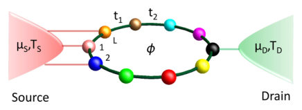
<figcaption class="paper-figure-caption"><b>Fig 4.</b> FIG. 5. Schematic of the asymmetric electrode-coupling ge- ometry with three lattice sites coupled to the source reservoir and a single lattice site coupled to the drain reservoir.</figcaption>
</figure>
<figure class="paper-figure-card">
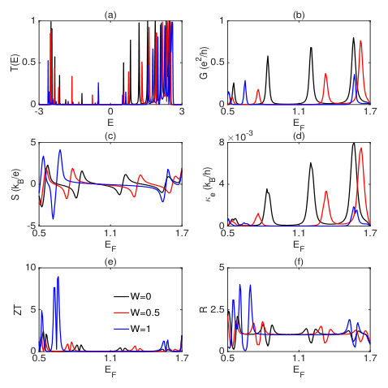
<figcaption class="paper-figure-caption"><b>Fig 5.</b> FIG. 4. Symmetric electrode-coupling geometry in the trivial dimerized regime (t1 &gt; t2). (a) Transmission spectrum, (b) electrical conductance, (c) Seebeck coefficient, (d) electronic thermal conductance, (e) thermoelectric figure of merit (ZT ), and (f) Lorenz ratio as functions of the Fermi energy for dif- ferent quasiperiodic modulation strengths. The parameters are γ = 0.05, T = 0.005, φ = 0, t1 = 1.5, and t2 = 1.</figcaption>
</figure>

**Summary.** This work demonstrates a versatile strategy for enhancing thermoelectric efficiency in quasiperiodic SSH rings by manipulating external parameters. By engineering the electrode coupling geometry and applying a magnetic flux, the system can be tuned into a topological regime that strongly decouples charge and heat currents. This control mechanism allows for theoretical prediction of extremely high thermoelectric figure of merit values.

**Why it may be interesting.** The explicit control over energy filtering and the resulting violation of the Wiedemann-Franz law provides a powerful theoretical blueprint for designing next-generation quantum thermoelectric devices.

Detailed structure

**Main problem.** The goal is to engineer giant thermoelectric performance in nanoscale conductors by precisely controlling energy-selective charge transport and suppressing electronic heat transport.

**Main result.** The combination of quasiperiodicity, topological phases, magnetic flux, and engineered electrode coupling can boost the thermoelectric figure of merit ($ZT$) dramatically, reaching values up to $\approx 90$.

**Method.** The study employs the non-equilibrium Green's function (NEGF) formalism within the Landauer-Büttiker framework to calculate transport properties.

**Model / system.** The system is a quasiperiodic Su-Schrieffer-Heeger (SSH) ring threaded by a magnetic flux, coupled to source and drain reservoirs. The Hamiltonian includes terms for the ring, the reservoirs, and the coupling.

**Key observables.** Thermoelectric figure of merit ($ZT$), electrical conductance ($G$), Seebeck coefficient ($S$), electronic thermal conductance ($\kappa_e$), and the violation of the Wiedemann-Franz law.

**Important parameters / regimes.** Electrode-coupling geometry (symmetric vs. asymmetric), magnetic flux ($\Phi$), and SSH dimerization parameters ($t_1, t_2$) defining topological/trivial regimes.

**Assumptions / limitations.** The source and drain reservoirs are modeled as noninteracting metallic baths, and the analysis uses the Wide-Band Limit approximation.

**Figures summary.** Figures illustrate the dependence of transport quantities ($T(E)$, $G_{max}$, $|S|_{max}$, $\kappa_e$, $ZT_{max}$) on magnetic flux ($\phi$) for different coupling geometries and SSH regimes.

**Paper structure.** The paper systematically investigates how electrode coupling geometry acts as a control parameter, followed by analyzing the effect of magnetic flux, and finally demonstrating the synergistic enhancement of $ZT$ through the interplay of all these factors.

Abstract

We investigate coherent thermoelectric transport in magnetic-flux-threaded quasiperiodic Su-Schrieffer-Heeger (SSH) rings with engineered multi-site electrode couplings using the nonequilibrium Green's function formalism within the Landauer-Büttiker framework. We demonstrate that the electrode-coupling geometry serves as a powerful control parameter for tailoring quantum interference, thereby reshaping the transmission spectrum and thermoelectric response. In the absence of magnetic flux, the trivial dimerized phase ($t_1>t_2$) exhibits the highest thermoelectric efficiency, with asymmetric coupling producing a substantially larger figure of merit than the symmetric geometry. Magnetic flux further reconstructs the transmission spectrum through Aharonov-Bohm interference, driving a crossover of the optimal thermoelectric regime from the trivial to the topological dimerized phase. Under optimal flux conditions, the thermoelectric figure of merit reaches $ZT \approx 12$ for symmetric coupling and is dramatically enhanced to $ZT \approx 90$ for asymmetric coupling through enhanced energy filtering and suppressed electronic thermal transport. We further establish a clear correlation between the enhancement of thermoelectric efficiency and the violation of the Wiedemann-Franz law. Our results demonstrate that the combined interplay of quasiperiodicity, topology, magnetic flux, and electrode-coupling geometry provides a versatile strategy for engineering high-performance coherent thermoelectric devices.

[↑ back to top](#top)

### [Evidence of Crystal-Field-Mediated Anisotropic Orbital Rashba Effect in Epitaxial Ru/FM Heterostructure](http://arxiv.org/abs/2609.04642v1)

**Authors:** Yu Zhang, Wenhao Niu, Yumin Yang, Wenqi Xu, Gengchen Meng, Hailong Wang, Na Lei, Dahai Wei  
**Type:** experiment · **Category:** other · **PDF:** <https://arxiv.org/pdf/2609.04642v1>  
**Analysis basis:** full PDF text, analyzed in chunks
**Topic relevance:** `analog quantum simulation` **1/5** · `quantum measurements` **1/5**

↔ Scroll figures horizontally

<figure class="paper-figure-card">
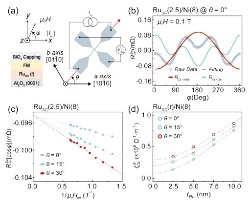
<figcaption class="paper-figure-caption"><b>Fig 1.</b> FIG. 1. HHV results for Ru/Ni series samples. (a) Schematic illustration of HHV measurement and sample geometry. (b) R2ω xy results for RuSC(2.5)/Ni(8) at µ0H = 0.1T. The applied electric field was along [10¯10]. (c) Extracted R2ω xy as a function of 1/(Hxy + Hk) in RuSC(2.5)/Ni(8) at θ = 0°, 15° and 30°, respectively. (d) ξE DL as a function of tRu, measured at θ = 0°, 15° and 30°, respectively. Black curves were fits to the diffusive transport model.</figcaption>
</figure>
<figure class="paper-figure-card">
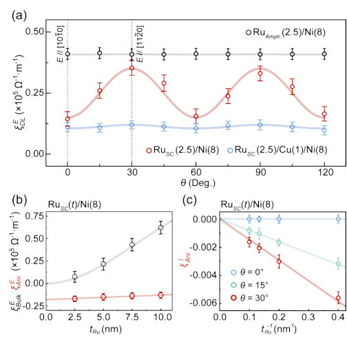
<figcaption class="paper-figure-caption"><b>Fig 2.</b> FIG. 2. Crystalline dependence of orbital torque. (a) ξE DL for RuSC(2.5)/Ni(8), RuSC(2.5)/Cu(1)/Ni(8) and RuAmph(2.5)/Ni(8) samples at different in-plane crystalline direction. (b) Extracted ξE Bulk and ξE Ani terms as a function of tRu. (c) Extracted ξj Ani as a function of t−1 Ru at θ = 0°, 15° and 30°.</figcaption>
</figure>
<figure class="paper-figure-card">
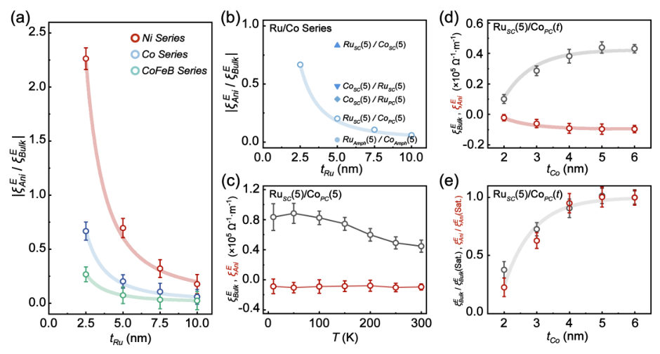
<figcaption class="paper-figure-caption"><b>Fig 3.</b> FIG. 3. (a) Comparison of |ξE Ani/ξE Bulk| for RuSC(t)/Ni, RuSC(t)/Co and RuSC(t)/CoFeB series samples as a function of tRu. (b) Detailed comparison of |ξE Ani/ξE Bulk| results for Ru/Co series sample, with different interfacial crystalline and stacking order. (c) Temperature dependence of ξE Bulk and ξE Ani terms in RuSC(5)/CoP C(5) sample. (d) Extracted ξE Bulk and ξE Ani in RuSC(5)/CoP C(t) as a function of tCo. (e) Scaling of ξE Bulk and ξE Ani data with its values at tCo=6 nm. The light gray line</figcaption>
</figure>
<figure class="paper-figure-card">
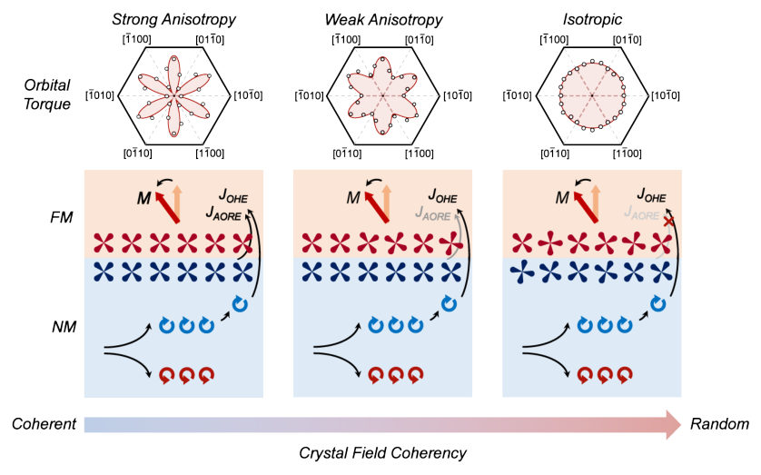
<figcaption class="paper-figure-caption"><b>Fig 4.</b> FIG. 4. Schematic illustration of crystal-field-mediated AORE. A coherent crystal field modulates the orbital textures and further gives anisotropic ORE response. In the highly coherent limit, CFC modulation produces a pronounced anisotropic orbital response (left panel). As CFC was progressively reduced, such modulation was weakened and the lattice-locked anisotropic component is strongly suppressed (middle panel). In the fully disordered limit, the crystallographic modulation becomes negligible, leaving a predominantly isotropic response (right panel).</figcaption>
</figure>

**Summary.** This work experimentally investigates the anisotropic orbital Rashba effect in epitaxial Ru/FM interfaces. By decomposing the measured orbital torque, the authors isolate an interfacial, anisotropic component ($\xi_{E}^{	ext{Ani}}$) that is critically dependent on the structural coherence of the interface. This establishes interfacial crystal-field coherency as a key mechanism for engineering directional orbital torques in spintronic devices.

**Why it may be interesting.** While primarily condensed matter/spintronics, the precise control over orbital textures via interfacial symmetry breaking and crystal fields touches upon concepts of engineered quantum states and topological responses, which can be relevant to advanced quantum materials research.

Detailed structure

**Main problem.** The primary challenge addressed is the effective control and understanding of orbital Rashba textures, specifically investigating the role of the interfacial crystal field in generating orbital angular momentum (OAM) torques.

**Main result.** The authors experimentally report evidence for a crystal-field-mediated anisotropic orbital Rashba effect (AORE) in epitaxial Ru/FM heterostructures, confirming that interfacial crystal-field coherency is crucial for manipulating orbital torques.

**Method.** The study uses epitaxial heterostructure fabrication, structural characterization (XRD, RHEED), and electrical measurements, specifically Harmonic Hall Voltage (HHV) measurements, to quantify orbital torques.

**Model / system.** The physical system is epitaxial Ru/ferromagnet (FM) heterostructures (e.g., Ru/Ni, Ru/Co). The mechanism involves the hybridization of Ru 4d orbitals with FM 3d orbitals, modulated by interfacial symmetry breaking and crystal field coherency (CFC).

**Key observables.** The key observables are the total orbital torque ($\xi_{E}^{	ext{Total}}$), which is decomposed into isotropic bulk ($\xi_{E}^{	ext{Bulk}}$) and anisotropic interfacial ($\xi_{E}^{	ext{Ani}}$) contributions, measured via $	ext{R}_{2\omega}^{xy}$ and $\xi_{E}^{	ext{DL}}(	heta)$.

**Important parameters / regimes.** Key parameters include the Ru thickness ($t_{Ru}$), the nature of the FM layer (Ni, Co, CoFeB), and the degree of interfacial crystallinity (CFC).

**Assumptions / limitations.** The analysis assumes that the anisotropic torque ($\xi_{E}^{	ext{Ani}}$) is intrinsically linked to the interfacial crystal-field coherency, and that the total torque can be successfully decomposed into bulk and interfacial components.

**Figures summary.** Figures demonstrate the angular dependence of the orbital torque ($	ext{R}_{2\omega}^{xy}$) and show that the anisotropic torque ($\xi_{E}^{	ext{Ani}}$) vanishes when crystallinity is degraded (e.g., by Cu insertion or amorphous Ru), while the bulk torque ($\xi_{E}^{	ext{Bulk}}$) shows thickness dependence.

**Paper structure.** The paper establishes the problem of controlling orbital torques, presents the experimental setup using Ru/FM heterostructures, measures the total torque, decomposes it into bulk and anisotropic interfacial parts, and concludes by linking the anisotropic component directly to the structural coherence of the interface.

Abstract

Electrical generation of orbital angular momentum provides a promising route to current-induced torques, yet effective control of orbital Rashba textures still remains challenging, particularly because the role of the interfacial crystal field remains largely unexplored. Here, we report experimental evidence for a crystal-field-mediated interfacial anisotropic orbital Rashba effect (AORE) in epitaxial Ru/ferromagnet heterostructures. Total orbital torque was disentangled into an isotropic bulk contribution and an in-plane anisotropic interfacial contribution. The latter was strongly suppressed by degrading the crystallinity of either constituent and by inserting a Cu spacer, highlighting the essential roles of coherent interfacial orbital hybridization and direct Ru/ferromagnet contact. These results identify interfacial crystal-field coherency as a key ingredient in manipulating orbital Rashba textures and establish a route toward engineering the symmetry and directionality of orbital torques.

[↑ back to top](#top)

### [A locally ab initio computational framework for arbitrary incommensurate materials interfaces](http://arxiv.org/abs/2609.05082v1)

**Authors:** Drake Niedzielski, Tomás A. Arias  
**Type:** theory · **Category:** numerical methods · **PDF:** <https://arxiv.org/pdf/2609.05082v1>  
**Analysis basis:** full PDF text, analyzed in chunks
**Topic relevance:** `Frenkel-Kontorova` **1/5**

↔ Scroll figures horizontally

<figure class="paper-figure-card">
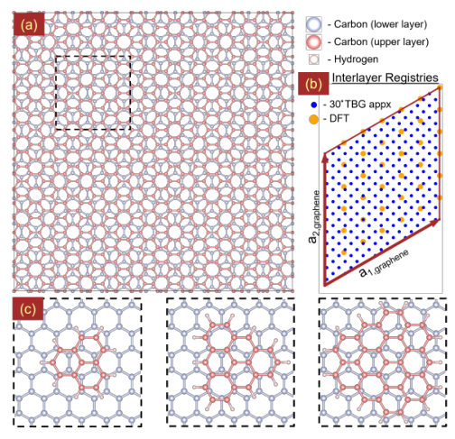
<figcaption class="paper-figure-caption"><b>Fig 1.</b> FIG. 1. Atomic-scale sampling of local interlayer registries in 30◦twisted bilayer graphene. (a) Commensurate approxi- mant of 30◦-TBG containing 1672 atoms. (b) Local interlayer registries of all atomic environments in this 1672 atom sys- tem (blue dots) and a sparser 6 × 6 sampling (orange dots) at which we perform DFT calculations. (c) Three elements of MINT-proxy sequence whose structures converge to the local atomic environment of the bulk system (black dashed-line box in (a)). Atomic visualizations performed with VESTA [19].</figcaption>
</figure>
<figure class="paper-figure-card">
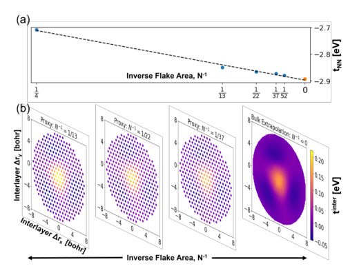
<figcaption class="paper-figure-caption"><b>Fig 2.</b> FIG. 2. Power-law extrapolation of Wannier matrix elements to the bulk limit (a) First nearest neighbor Wannier matrix elements for monolayer graphene proxy systems versus the inverse number of carbon atoms N −1. Matrix elements ob- tained from graphene proxy systems (blue dots) show a clear power-law convergence trend with system size (dashed line fit) to the bulk graphene matrix element of −2.89 eV (orange dot), demonstrating the validity of this approach. Color indicates magnitude of the Wannier matrix element. (b) DFT calcu- lated interlayer Wannier matrix elements from MINT proxy systems plotted as a function of the radial displacement and inverse flake size. Bulk values shown in the...</figcaption>
</figure>
<figure class="paper-figure-card">
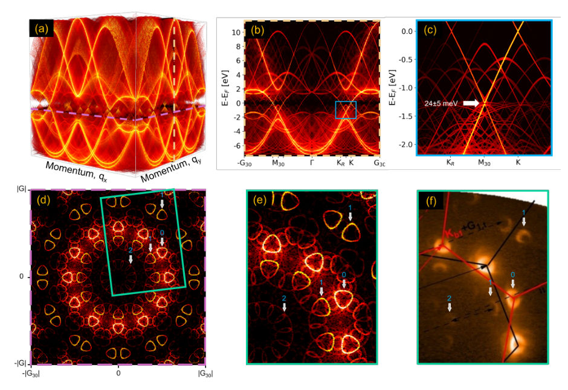
<figcaption class="paper-figure-caption"><b>Fig 3.</b> FIG. 3. Twelve-fold symmetric electronic structure and mirrored Dirac cones of 30◦twisted bilayer graphene. Electronic structure of 30◦-TBG. (a) 3D Rendering of the momentum resolved DOS of 30◦-TBG calculated as described in the main text. Intensity is indicated by color hue and is plotted on a log scale to help visualize subtle features. Partial transparency is used for visualization purposes. (b) Slice through (a) at qy = 0 showing the bandstructure. In addition to the regular Dirac cones at K and K’, mirrored Dirac cones appear at KR and K’R as expected. (c) Zoom-in of blue-box region of (b) with higher sample density. Energy and momentum windows chosen to match the experimental Fig. 3D...</figcaption>
</figure>
<figure class="paper-figure-card">
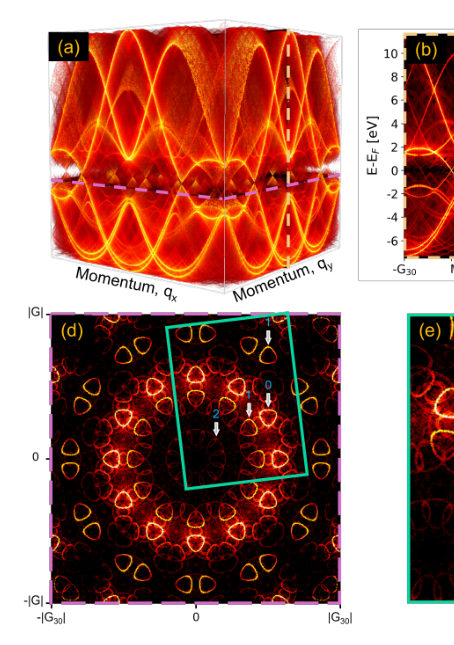
<figcaption class="paper-figure-caption"><b>Fig 4.</b> Fig. 3(b) shows a representative slice through n(q, E) at qy = 0, displayed in the conventional energy– momentum format. In addition to the primary Dirac cones inherited from the individual graphene layers at the K and K′ points, the calculation clearly reproduces the mirrored Dirac cones at the expected KR and K′ R locations. A magnified view of this region, shown in Fig. 3(c), is computed using denser momentum sampling</figcaption>
</figure>
<figure class="paper-figure-card">
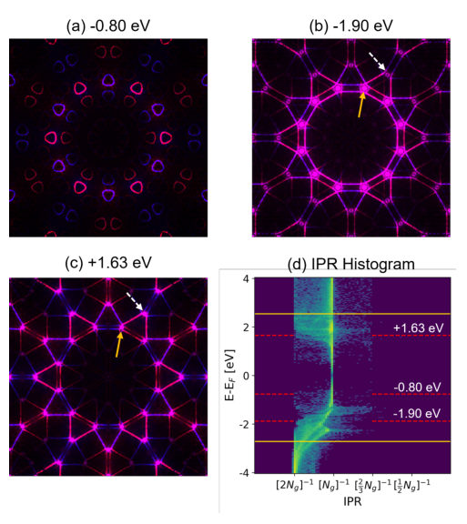
<figcaption class="paper-figure-caption"><b>Fig 5.</b> FIG. 4. Interlayer hybridization and localization of quasiperi- odic flat-band states in 30◦twisted bilayer graphene. (a-c) Layer projected momentum resolved DOS with red(blue) hue corresponding top(bottom) layer occupation. RGB coloring is used such that states hybridized equally across both layers appear magenta. Color intensity corresponds to the square- root of the total spectral intensity to preserve relative layer- weight contrast. (a) slice at -0.80 eV shows Dirac cones and their mirrors originate primarily from a single layer. (b,c) slices at -1.90 eV and 1.63 eV displaying the formation of cir- cular flat band features (magenta circles at solid-yellow and dashed-white arrows), at...</figcaption>
</figure>

**Summary.** This work presents a novel, scalable computational framework to calculate electronic structures for incommensurate materials interfaces, circumventing the limitations of periodicity-based methods. By exploiting the nearsightedness of Wannier functions, the authors interpolate and extrapolate Hamiltonian parameters based on local interlayer registries. This allows for accurate, first-principles prediction of emergent phenomena in complex systems like twisted bilayer graphene.

**Why it may be interesting.** The reliance on local environment descriptors and interpolation techniques to bypass large supercells is a powerful numerical tool applicable to complex, quasiperiodic, or disordered quantum systems.

Detailed structure

**Main problem.** Developing a computationally efficient and accurate first-principles electronic-structure method for incommensurate materials interfaces, which lack shared periodicity.

**Main result.** The framework successfully reproduces key spectral features of quasicrystalline twisted bilayer graphene, establishing a general, predictive route for electronic structure calculations in such systems.

**Method.** It constructs locally ab initio electronic Hamiltonians by exploiting the nearsightedness of Wannier matrix elements, allowing systematic extrapolation and interpolation across arbitrary interlayer registries.

**Model / system.** The study focuses on incommensurate materials interfaces, exemplified by $30^\circ$-twisted bilayer graphene. The electronic structure is modeled using a Wannier Hamiltonian incorporating intra- and inter-layer hopping terms.

**Key observables.** Momentum-resolved density of states ($n(\vec{q}, E)$), mirrored Dirac cones, minigaps, and the Inverse Participation Ratio (IPR).

**Important parameters / regimes.** Interlayer registry ($\vec{r}(\vec{r}_A)$), twist angle ($30^\circ$), and the size/scope of the local environment description.

**Assumptions / limitations.** The local electronic environment varies smoothly with the interlayer registry, allowing for reliable interpolation and extrapolation from finite proxy systems.

**Figures summary.** Figures illustrate local interlayer registries, the convergence of Wannier matrix elements, and the resulting 3D momentum-resolved density of states showing characteristic spectral features.

**Paper structure.** The paper introduces the computational framework, validates it on $30^\circ$-TBG by reproducing known spectral features, and establishes its general applicability to any structurally incommensurate interface.

Abstract

Incommensurate materials interfaces constitute a broad and technologically important class of systems, yet their lack of shared periodicity limits predictive and computationally efficient first-principles electronic-structure methods. Here we introduce a scalable computational framework for constructing locally ab initio electronic Hamiltonians for arbitrary materials interfaces. Our approach exploits the nearsightedness of Wannier Hamiltonian matrix elements, enabling their systematic extrapolation and interpolation across interlayer registries. This strategy yields transferable Hamiltonians that retain first-principles accuracy while bypassing the need for prohibitively large commensurate supercells or Moiré approximations. We validate the framework on quasicrystalline 30° twisted bilayer graphene, reproducing experimentally observed spectral features including mirrored Dirac cones and minigaps at avoided crossings arising from generalized interlayer scattering. We further predict quasiperiodic flat-band states in experimentally accessible doping regimes. By enabling predictive electronic-structure calculations across structurally incommensurate interfaces, this framework establishes a practical route to first-principles exploration of emergent interfacial phenomena.

[↑ back to top](#top)

### [Band Gaps and Localization of Surface Waves at Hyperbolic Material and Topological Insulator Interfaces](http://arxiv.org/abs/2609.04587v1)

**Authors:** Andrei I. Maimistov, Ildar R. Gabitov, Ilia Kuk  
**Type:** theory · **Category:** other · **PDF:** <https://arxiv.org/pdf/2609.04587v1>  
**Analysis basis:** full PDF text, analyzed in chunks
**Topic relevance:** `interference shaping light` **1/5**

↔ Scroll figures horizontally

<figure class="paper-figure-card">
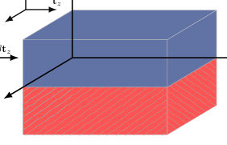
<figcaption class="paper-figure-caption"><b>Fig 1.</b> FIG. 1. Interface geometry for the hyperbolic material (HM) and topological insulator (TI) structure. The HM occupies x &lt; 0 and is shown with hatching, while the TI occupies x &gt; 0. The surface wave propagates along the z direction with propagation constant β. The unit normal n points from the HM into the TI, and ty and tz denote tangential directions along the interface.</figcaption>
</figure>
<figure class="paper-figure-card">
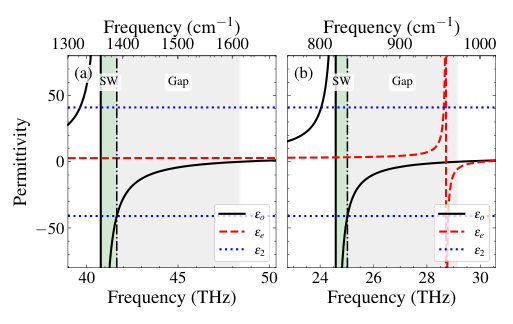
<figcaption class="paper-figure-caption"><b>Fig 2.</b> FIG. 2. Frequency-dependent permittivities and surface wave (SW) band gap boundaries for natural Reststrahlen-band hy- perbolic materials: (a) hBN/Bi2Se3 and (b) α-MoO3/Bi2Se3. The curves show the permittivity components denoted by εo and εe in the effective uniaxial model, together with the topo- logical insulator permittivity ε2. For α-MoO3, εo and εe correspond to the selected [100] and [010] principal compo- nents, respectively. The mirrored horizontal line at −ε2,α is included to show the finite-coupling band-edge condition |εo(ω)| = ε2,α. The green shaded regions indicate the al- lowed SW windows, while the gray shaded regions indicate the band gaps where |εo(ω)| &lt; ε2,α. The vertical...</figcaption>
</figure>
<figure class="paper-figure-card">
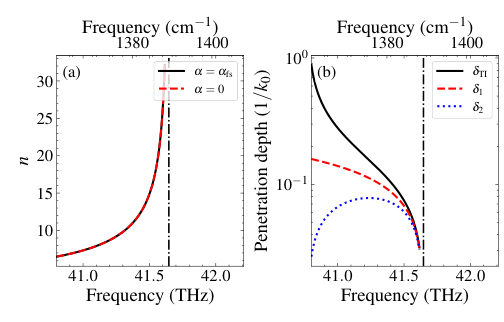
<figcaption class="paper-figure-caption"><b>Fig 3.</b> FIG. 3. Surface wave dispersion and confinement at the hBN/Bi2Se3 interface within the allowed spectral window. (a) Effective index n = β/k0 computed with the topological cou- pling α = αfs and in the non-topological limit α = 0. (b) Penetration depths δTI, δ1, and δ2, shown in units of 1/k0. The vertical dash-dotted line marks ω∗, the upper boundary of the allowed surface wave window.</figcaption>
</figure>
<figure class="paper-figure-card">
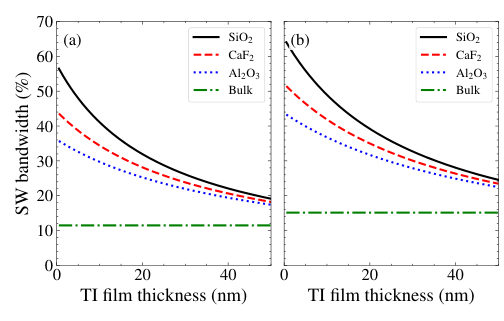
<figcaption class="paper-figure-caption"><b>Fig 4.</b> FIG. 4. Surface wave bandwidth fraction fSW as a function of Bi2Se3 film thickness for thin-film TI configurations on dif- ferent dielectric substrates. Panels show two hyperbolic part- ners: (a) hBN and (b) SiC. The curves correspond to SiO2, CaF2, and Al2O3 substrates, while the horizontal dash-dotted line shows the corresponding bulk Bi2Se3 limit.</figcaption>
</figure>
<figure class="paper-figure-card">
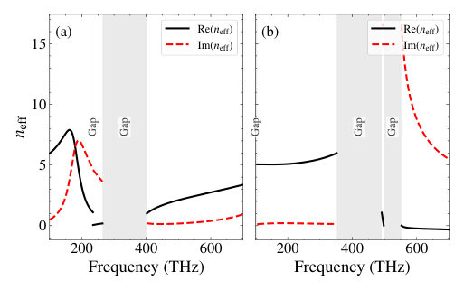
<figcaption class="paper-figure-caption"><b>Fig 5.</b> FIG. 6. Complex effective index neff of the dissipative artifi- cial Ti-Si/Bi2Se3 effective medium surface wave. Panels show the two optical axis orientations: (a) tangential axis, l = ty, and (b) normal axis, l = n. The black solid and red dashed curves show Re neff and Im neff, respectively. Shaded regions mark gaps in the retained physical branch, where the complex branch-selection conditions are not simultaneously satisfied.</figcaption>
</figure>

**Summary.** This theoretical work establishes criteria for surface electromagnetic waves at the interface between hyperbolic metamaterials and topological insulators. It shows that while the topological coupling introduces a small correction, the primary control over the band gaps and confinement remains with the dielectric contrast of the materials. The results offer crucial design guidelines for engineering mid-infrared photonic structures.

**Why it may be interesting.** This work bridges concepts from topological physics (axion electrodynamics) with advanced photonics (hyperbolic metamaterials), providing detailed theoretical guidelines for controlling light confinement and band gaps in novel material interfaces.

Detailed structure

**Main problem.** The paper develops analytical criteria for understanding surface electromagnetic waves supported at the interface between a hyperbolic material (HM) and a topological insulator (TI).

**Main result.** The topological coupling causes only a small, perturbative shift in the band edge, which is otherwise primarily governed by the dielectric contrast of the materials.

**Method.** The analysis involves solving bulk field equations for TE and TM components, deriving dispersion relations, and analyzing the conditions for field decay and energy flow in both lossless and dissipative regimes.

**Model / system.** The system modeled is an interface between an HM (uniaxial anisotropic medium) and a TI, where the TI's response is governed by axion electrodynamics. The analysis considers different orientations of the HM's optical axis relative to the interface normal and propagation direction.

**Key observables.** Existence and localization of surface waves, spectral band gaps, field penetration depths, and energy flow profiles.

**Important parameters / regimes.** Dielectric contrast, topological coupling constant ($\alpha$), and the effective index ($n$) of the structure.

**Assumptions / limitations.** The analysis assumes a planar interface and notes that in lossy systems, satisfying the dispersion relation is insufficient; physical decay and energy flow must also be verified.

**Figures summary.** Figure 1 illustrates the interface geometry, showing the HM on one side and the TI on the other, with propagation along the z-axis.

**Paper structure.** The paper proceeds by establishing the theoretical framework using axion electrodynamics and boundary conditions, deriving dispersion relations for different alignments of the optical axis, and then analyzing the results separately for lossless and dissipative media, concluding with design guidelines.

Abstract

We develop analytical criteria for surface electromagnetic waves at interfaces between hyperbolic materials and topological insulators. The analysis identifies propagation conditions, field penetration depths, and spectral band gaps. In the lossless model, the band edge is governed primarily by dielectric contrast, while the bulk topological coupling produces only a small shift and a weak correction to the dispersion. For structures combining hexagonal boron nitride with bismuth selenide, a thin topological insulator film on a dielectric substrate with low permittivity can substantially broaden the accessible propagation window. We also analyze a dissipative titanium and silicon hyperbolic effective medium interfaced with bismuth selenide. To make the complex branch structure visible, this lossy calculation uses an intentionally enhanced interface response and is therefore illustrative rather than a quantitative prediction for a conventional topological insulator. In the lossy case, a root of the dispersion relation represents a physical guided mode only when the fields decay away from the interface, attenuate consistently along the propagation direction, have finite penetration depths, and exhibit a consistent energy flow profile. Apparent gaps and jumps can occur when the complex quantities controlling transverse decay approach square root branch cuts. These results provide design guidelines for controlling dispersion, confinement, band gaps, and propagation loss in mid-infrared photonic structures.

[↑ back to top](#top)

### [Transparency-engineered SQUID cells for Kerr-free three-wave-mixing Josephson metamaterials](http://arxiv.org/abs/2609.05177v1)

**Authors:** Claudio Guarcello, A. Mert Bozkurt, Carlo Barone, Giovanni Filatrella, Alessandro Bruno, Sergio Pagano  
**Type:** theory · **Category:** other · **PDF:** <https://arxiv.org/pdf/2609.05177v1>  
**Analysis basis:** full PDF text, analyzed in chunks
**Topic relevance:** `interference shaping light` **1/5**

↔ Scroll figures horizontally

<figure class="paper-figure-card">
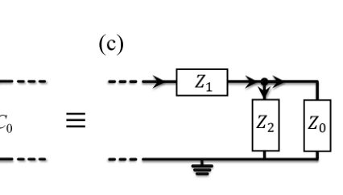
<figcaption class="paper-figure-caption"><b>Fig 1.</b> Figure 1: Schematic construction of the TRAIL cell and its equivalent π-section model. (a) Two Josephson junctions in series, with energies EJ1 and EJ2, define an effective transparent Josephson element with energy–phase relation E▷◁. (b) The effective element is embedded in a flux-biased inductive loop of inductance L, with ground capacitance C0, yielding the elementary TRAIL cell; the linearized Joseph- son branch is described by the differential inductance LJ and capacitance CJ. (c) Equivalent π-cell representation used for passive matching, with series impedance Z1, ground impedance Z2, and line impedance Z0.</figcaption>
</figure>
<figure class="paper-figure-card">
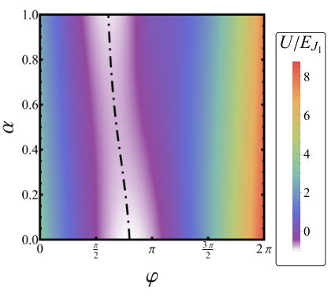
<figcaption class="paper-figure-caption"><b>Fig 2.</b> Figure 2: Normalized potential U/EJ1 for the transparent junction built from two series JJs for β = 0.73. Panel (a): U(ϕ,φ) and α = 0.75; the black dot-dashed line marks ϕmin(φ). Panel (b): U(ϕ,α) and φ = 0.4; the black dot-dashed line marks ϕmin(α).</figcaption>
</figure>
<figure class="paper-figure-card">
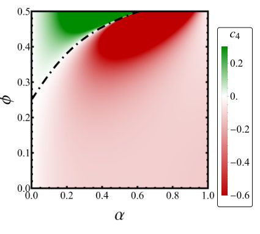
<figcaption class="paper-figure-caption"><b>Fig 3.</b> Figure 3: Cubic and quartic coefficients in the local expansion of the normalized potential u for β = 0.73. Panel (a): map of c3(α,φ). Panel (b): map of c4(α,φ). The black dot-dashed curve marks the Kerr-free ridge c4 = 0.</figcaption>
</figure>
<figure class="paper-figure-card">
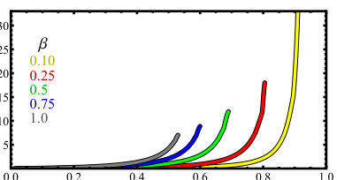
<figcaption class="paper-figure-caption"><b>Fig 4.</b> Figure 4: Kerr-free operating ridge and cubic-to-stiffness ratio. Panel (a): φ⋆(α;β) solving c4 = 0 for β ∈{0.10,0.25,0.5,0.75,1}, i.e., the zero-anharmonicity ridge in the (α,φ) plane. Panel (b): F(α;β) = |c3|/c2 evaluated along the same ridge. In the parameter range explored here, the design trend is to move toward the largest feasible α, subject to c2 &gt; 0, matching, phase-matching, and fabrication constraints.</figcaption>
</figure>
<figure class="paper-figure-card">
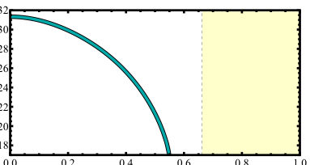
<figcaption class="paper-figure-caption"><b>Fig 5.</b> Figure 5: Frequency-dependent matching, at fixed β = 0.73, along the Kerr-free ridge. Panel (a): ground capacitance Cmatch 0 (α) obtained from both Eqs. (37) and (42), at a given ω = 14 GHz. Panel (b): cutoff frequency ωcutoff(α) from Eq. (44). The gray dashed vertical line marks αcrit; the shaded region corresponds to α &gt; αcrit, where passive matching is no longer possible.</figcaption>
</figure>

**Summary.** This paper introduces a novel, transparency-engineered SQUID cell design to realize Kerr-free three-wave-mixing in Josephson metamaterials. By replacing a standard junction with two series junctions, the authors generate a tunable non-sinusoidal energy-phase relation. They derive the conditions for suppressing the Kerr term while maintaining cubic nonlinearity, providing a practical unit-cell blueprint for advanced superconducting parametric amplifiers.

**Why it may be interesting.** This work provides a concrete, tunable circuit design principle for achieving specific nonlinear optical responses (Kerr-free 3WM) in superconducting circuits, which is highly relevant for quantum optics and parametric amplification research.

Detailed structure

**Main problem.** The goal is to design a Josephson metamaterial unit-cell capable of achieving Kerr-free three-wave-mixing (3WM) by suppressing the unwanted quartic Kerr term while maintaining a finite cubic nonlinearity.

**Main result.** The authors propose a transparency-engineered rf-SQUID cell using two series junctions, providing a compact unit-cell design principle for Kerr-free 3WM Josephson metamaterials.

**Method.** The analysis involves deriving the effective energy-phase relation from the series junctions and performing a local Taylor expansion of the potential to identify the Kerr-free operating ridge in parameter space.

**Model / system.** The system is an rf-SQUID cell where the conventional junction is replaced by an effective Josephson element formed by two junctions in series, yielding a non-sinusoidal energy-phase relation.

**Key observables.** The local nonlinear coefficients ($c_3$ for cubic nonlinearity and $c_4$ for the quartic Kerr term), the required ground capacitance ($C_{match,0}$), and the cutoff frequency ($\omega_{cutoff}$).

**Important parameters / regimes.** The junction asymmetry parameter ($\alpha = I_{c2}/I_{c1}$), the applied magnetic flux bias ($\varphi$), and the screening parameter ($eta$).

**Assumptions / limitations.** The derivation assumes that Josephson energies dominate over charging energy ($E_{Ji} \gg E_C$), and the analysis relies on local nonlinear potential expansion and passive matching constraints.

**Figures summary.** Figure 1 illustrates the TRAIL cell schematic; Figure 2 shows the potential dependence on $\alpha$ and $\varphi$; and Figure 3 maps the cubic ($c_3$) and quartic ($c_4$) coefficients, revealing the Kerr-free ridge.

**Paper structure.** The paper introduces the physical model (TRAIL cell), derives the effective nonlinear potential, analyzes the local coefficients to find the Kerr-free condition, and finally constrains this design space using passive matching and cutoff frequency analysis.

Abstract

We introduce a transparency-engineered rf-SQUID cell for Kerr-free three-wave-mixing Josephson metamaterials. This design replaces the conventional tunnel-junction element with an effective Josephson element formed by two junctions in series, yielding a non-sinusoidal energy-phase relation that can be used as a tunable nonlinear design resource. We show that the asymmetry between the two series junctions and the applied flux bias provide independent control over the local expansion of the rf-SQUID potential, enabling operating points where the leading quartic Kerr term is suppressed while the cubic nonlinearity remains finite. We derive the corresponding Kerr-free condition, identify the resulting operating ridge in parameter space, and analyze the local stability and passive-matching constraints that bound its physically accessible portion. Our results provide a compact unit-cell design principle for three-wave-mixing Josephson metamaterials and suggest a route toward Kerr-suppressed Josephson traveling-wave parametric amplifiers.

[↑ back to top](#top)

### Other secondary papers (2)

Show other secondary papers

### [Light alkali metal functionalized two-dimensional C5N monolayers for enhanced hydrogen storage](http://arxiv.org/abs/2609.04605v1)

**Authors:** Gom Dorji, Sonam Peden, Syed Faraz Hasan, Kondo-Francois Aguey-Zinsou, Tanveer Hussain  
**Type:** theory · **Category:** statistical mechanics · **PDF:** <https://arxiv.org/pdf/2609.04605v1>  
**Analysis basis:** full PDF text, analyzed in chunks

↔ Scroll figures horizontally

<figure class="paper-figure-card">
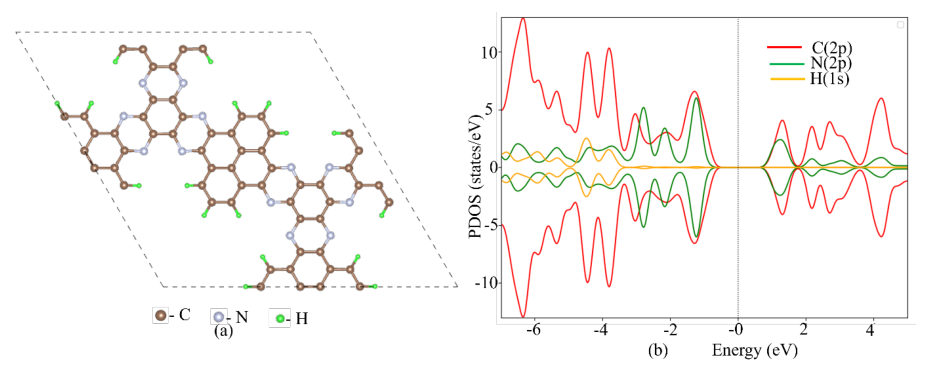
<figcaption class="paper-figure-caption"><b>Fig 1.</b> Figure 1. (a) Optimized structure of C5N (brown – carbon, grey – nitrogen, green-hydrogen). (b) Electronic properties showing orbital hybridization and band gaps.</figcaption>
</figure>
<figure class="paper-figure-card">
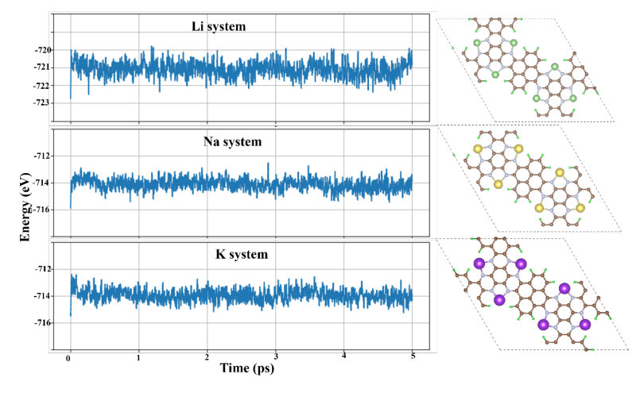
<figcaption class="paper-figure-caption"><b>Fig 2.</b> Figure 3. Variation of total energies at an elevated temperature and the optimized structures of 6M-C5N. (light green- Li, yellow – Na, and purple – K)</figcaption>
</figure>
<figure class="paper-figure-card">
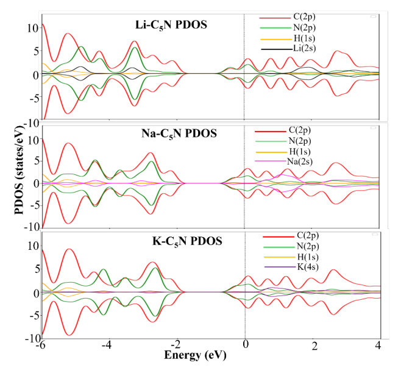
<figcaption class="paper-figure-caption"><b>Fig 3.</b> Figure 4. Projected density of state plot for 6Li-C5N, 6Na-C5N, and 6K-C5N. The Fermi level is adjusted to 0.</figcaption>
</figure>
<figure class="paper-figure-card">
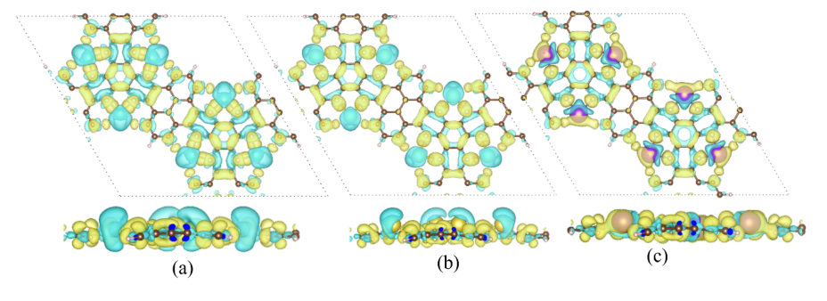
<figcaption class="paper-figure-caption"><b>Fig 4.</b> Figure 5. Charge density differences of (a) 6Li-C5N, (b) 6Na-C5N, and 6K-C5N. Cyan colour represents charge depletion, yellow colour represents charge accumulation with iso surface 0.004e/Å3.</figcaption>
</figure>
<figure class="paper-figure-card">
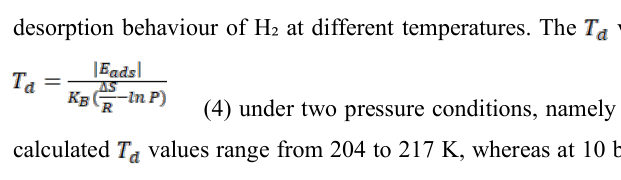
<figcaption class="paper-figure-caption"><b>Fig 5.</b> Figure 6. The stepwise loading of H2 on 6Li-C5N is shown in Figure S5 (Supporting</figcaption>
</figure>

**Summary.** This theoretical study uses DFT to investigate alkali-metal functionalized 2D C5N monolayers as potential hydrogen storage materials. The research demonstrates that functionalization significantly boosts H2 adsorption capacity and maintains thermal stability. The findings suggest that these modified 2D materials are promising candidates for efficient and reversible hydrogen energy storage.

**Why it may be interesting.** While focused on materials science, the thermodynamic analysis (Gibbs free energy, Van't Hoff equation) and the study of adsorption isotherms and phase stability touch upon concepts relevant to statistical mechanics and phase transitions in confined systems.

Detailed structure

**Main problem.** Developing efficient and reversible hydrogen (H2) storage systems to mitigate the intermittency of renewable energy sources.

**Main result.** Alkali-metal-functionalized C5N monolayers show promising gravimetric storage capacities (up to 9.42 wt% for Li) with moderate and favorable H2 adsorption energies.

**Method.** Density Functional Theory (DFT) calculations, supplemented by *ab initio* molecular dynamics (AIMD) simulations and thermodynamic analysis.

**Model / system.** The study investigates the interaction of molecular hydrogen with pristine and alkali-metal (Li, Na, K) functionalized two-dimensional (2D) C5N monolayers.

**Key observables.** H2 adsorption energies (E_ads), gravimetric storage capacities (wt%), thermal stability, and binding energies (E_b).

**Important parameters / regimes.** Operating temperature (300 K), H2 adsorption energy range (-0.16 to -0.17 eV/H2), and maximum storage capacity (48 H2 molecules/unit cell).

**Assumptions / limitations.** The calculations rely on DFT approximations (PBE functional) and assume the feasibility of reversible adsorption/desorption under practical conditions.

**Paper structure.** The paper follows a structure of presenting the physical problem (H2 storage), detailing the computational methodology (DFT/AIMD), presenting the results showing enhancement upon functionalization, and concluding with the potential of the optimized material.

Abstract

This work presents a density functional theory (DFT) investigation of a two-dimensional (2D) C5N monolayer functionalized with Li, Na, and K for hydrogen storage. Pristine C5N exhibits weak H2 adsorption, while alkali-metal functionalization significantly enhances its storage capability. The C5N monolayer can stably accommodate up to six metal dopants, with binding energies stronger than the corresponding cohesive energies, indicating resistance to metal aggregation. Ab initio molecular dynamics simulations further confirm the thermal stability of the functionalized systems at 300 K. Charge transfer from the metal dopants to C5N enhances polarization and strengthens H2 adsorption. Each dopant can adsorb up to eight H2 molecules, yielding a maximum of 48 H2 molecules per unit cell and gravimetric storage capacities of 9.42, 8.61, and 7.93 wt% for Li-, Na-, and K-functionalized C5N, respectively. The average H2 adsorption energies of -0.16 to -0.17 eV/H2 indicate moderate interactions suitable for reversible storage. Thermodynamic analysis further demonstrates favourable H2 adsorption/desorption under practical operating conditions, while desorption-temperature, recovery-time, and volumetric analyses support the potential reversibility and storage performance of these systems. Overall, alkali-metal-functionalized C5N emerges as a promising 2D material for efficient and reversible H2 storage.

[↑ back to top](#top)

### [Spin-Point-Group Classification of Multipoles for Nonrelativistic Collinear Magnets](http://arxiv.org/abs/2609.04883v1)

**Authors:** Yuuki Ogawa, Satoru Hayami  
**Type:** theory · **Category:** other · **PDF:** <https://arxiv.org/pdf/2609.04883v1>  
**Analysis basis:** full PDF text, analyzed in chunks

↔ Scroll figures horizontally

<figure class="paper-figure-card">
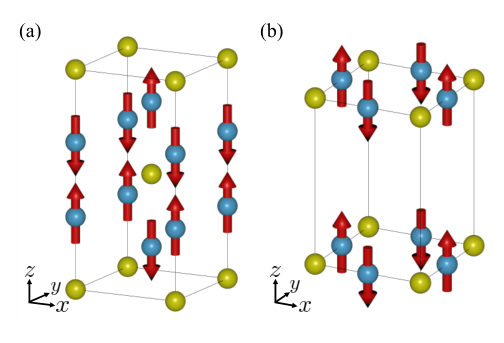
<figcaption class="paper-figure-caption"><b>Fig 1.</b> FIG. 1. (a) Collinear antiferromagnetic structure with the PT sym- metry. (b) Collinear antiferromagnetic (d-wave altermagnetic) struc- ture without the PT symmetry.</figcaption>
</figure>

**Summary.** This paper develops a comprehensive symmetry classification for orbital and spin multipoles in nonrelativistic collinear magnets using Spin Point Groups. It provides a systematic, symmetry-based database that distinguishes between physical responses arising from structure versus those induced purely by magnetic ordering. This framework is crucial for predicting spin-dependent electromagnetic and transport phenomena in magnetic materials without relying on spin-orbit coupling.

**Why it may be interesting.** While focused on condensed matter magnetism, the rigorous application of group theory to classify fundamental physical responses (multipoles) provides a powerful, generalizable symmetry framework applicable to understanding emergent quantum phenomena in strongly correlated or magnetic systems.

Detailed structure

**Main problem.** To provide a complete symmetry classification of active orbital and spin multipoles for nonrelativistic collinear magnets, addressing limitations in existing classifications when spin-orbit coupling is absent.

**Main result.** The work completes the multipole classification for all 122 collinear spin point groups, establishing a symmetry-based database that distinguishes structural and magnetic contributions to active multipoles.

**Method.** The authors use Spin Point Groups (SPGs) to treat spin and spatial degrees of freedom independently, classifying multipoles based on symmetry operations ($P, T, PT$).

**Model / system.** The focus is on nonrelativistic collinear magnets, analyzing the symmetry constraints imposed by the spin point group structure.

**Key observables.** Active orbital and spin multipoles (e.g., electric, magnetic, toroidal types), and symmetry-allowed physical responses (e.g., anomalous Hall effect).

**Important parameters / regimes.** Nonrelativistic limit, collinear magnetic ordering, and the specific symmetry operations defining the SPGs.

**Assumptions / limitations.** The analysis assumes that treating spin and orbital degrees of freedom independently via SPGs is appropriate when spin-orbit coupling is negligible.

**Figures summary.** The notes mention Table I classifying $P, T, PT$ parities for four types of multipoles, and Table II summarizing which classes of multipoles are active for nonmagnetic and collinear SPGs.

**Paper structure.** The paper details the SPGs, presents the multipole classification, identifies active multipoles, establishes the correspondence to physical responses, and concludes with implications for understanding spin-dependent phenomena.

Abstract

Multipole moments provide a unified symmetry language for describing electronic degrees of freedom and their associated physical responses. Although active multipoles have been systematically classified for crystallographic and magnetic point groups, their classification in spin point groups, which naturally describe magnetic systems in the absence of spin-orbit coupling, has remained unexplored. In this work, we present a complete classification of active orbital and spin multipoles for all 32 nonmagnetic and 122 collinear spin point groups. Treating orbital and spin degrees of freedom independently, we identify the symmetry-allowed multipoles associated with nonmagnetic and collinear magnetic orderings and clarify their hierarchy through comparisons among the corresponding spin point groups. The resulting classification provides a symmetry-based database that distinguishes structural and magnetic contributions to active multipoles and directly identifies microscopic order parameters, including those responsible for $d$-, $g$-, and $i$-wave altermagnetism. Furthermore, by classifying response tensors within the same framework, we establish a correspondence between active multipoles and symmetry-allowed physical responses. This correspondence systematically distinguishes nonrelativistic responses that survive without spin-orbit coupling from those requiring relativistic effects, providing a unified framework for understanding and predicting spin-dependent electromagnetic and transport phenomena in magnetic materials.

[↑ back to top](#top)

