
# arxiv digest (quant-ph + cond-mat) — 2026-09-09

*147 papers · 25 relevant · 3 highlighted*

## 🔥 Most relevant (25)

*Every paper with at least one nonzero topic score, sorted by best-matching score. 🔥 marks scores ≥4/5. Click the title to jump to the full entry below; click [arXiv] to open the paper page. `(secondary)` marks papers from de-prioritized cond-mat archives.*

Show 25 relevant papers

- [Few-Body Decay Dynamics in Colloidal CsPbI3 Quantum-Dot Clusters](#paper-2609.07892) [[arXiv]](http://arxiv.org/abs/2609.07892v1) — 🔥 `correlated / nonlocal dissipation` **4/5** · 🔥 `quantum optics experiment` **4/5** · `Dicke superradiance` **3/5** · `Tavis-Cummings & cavity-many-emitter` **3/5** · `analog quantum simulation` **2/5** · `methods for driven-dissipative` **2/5** · `quantum measurements` **2/5** · `superradiant laser` **2/5** · `Full counting statistics` **1/5** · `driven-dissipative phase transition` **1/5** · `free-space correlated emission` **1/5** · `interference shaping light` **1/5** · `non-equilibrium universality` **1/5**
- [Quantum magnonics with engineered dissipative and coherent interactions](#paper-2609.08050) [[arXiv]](http://arxiv.org/abs/2609.08050v1) — 🔥 `correlated / nonlocal dissipation` **4/5** · `Tavis-Cummings & cavity-many-emitter` **3/5** · `analog quantum simulation` **3/5** · `driven-dissipative phase transition` **3/5** · `methods for driven-dissipative` **3/5** · `Keldysh / 2PI / non-Gaussian methods` **2/5** · `non-equilibrium universality` **2/5** · `Dicke superradiance` **1/5** · `quantum measurements` **1/5**
- [Limit Cycles in a Photonic Dimer with Tuneable Non-Hermitian Interactions](#paper-2609.07967) [[arXiv]](http://arxiv.org/abs/2609.07967v1) — 🔥 `driven-dissipative phase transition` **4/5** · `analog quantum simulation` **3/5** · `correlated / nonlocal dissipation` **3/5** · `methods for driven-dissipative` **3/5** · `non-equilibrium universality` **3/5** · `quantum optics experiment` **3/5** · `Keldysh / 2PI / non-Gaussian methods` **1/5** · `Tavis-Cummings & cavity-many-emitter` **1/5**
- [Dynamics of entanglement in non-Hermitian system of nonreciprocal coupling](#paper-2609.08388) [[arXiv]](http://arxiv.org/abs/2609.08388v1) — 🔥 `driven-dissipative phase transition` **4/5** · `Tavis-Cummings & cavity-many-emitter` **3/5** · `analog quantum simulation` **3/5** · `correlated / nonlocal dissipation` **3/5** · `non-equilibrium universality` **3/5** · `methods for driven-dissipative` **2/5** · `Rydberg arrays` **1/5**
- [Steady reservoir-mediated self-trapping of polariton condensates](#paper-2609.07962) [[arXiv]](http://arxiv.org/abs/2609.07962v1) `(secondary)` — 🔥 `driven-dissipative phase transition` **4/5** · `analog quantum simulation` **3/5** · `correlated / nonlocal dissipation` **3/5** · `methods for driven-dissipative` **3/5** · `non-equilibrium universality` **3/5** · `Keldysh / 2PI / non-Gaussian methods` **2/5** · `Tavis-Cummings & cavity-many-emitter` **1/5**
- [Exciton-polariton condensates in epsilon-near-zero cavities](#paper-2609.08655) [[arXiv]](http://arxiv.org/abs/2609.08655v1) — 🔥 `driven-dissipative phase transition` **4/5** · 🔥 `methods for driven-dissipative` **4/5** · `analog quantum simulation` **3/5** · `Keldysh / 2PI / non-Gaussian methods` **2/5** · `non-equilibrium universality` **2/5** · `Tavis-Cummings & cavity-many-emitter` **1/5** · `correlated / nonlocal dissipation` **1/5** · `quantum measurements` **1/5**
- [Large-scale dynamics of integrable quenches](#paper-2609.09139) [[arXiv]](http://arxiv.org/abs/2609.09139v1) — 🔥 `non-equilibrium universality` **4/5** · `Full counting statistics` **3/5** · `Keldysh / 2PI / non-Gaussian methods` **3/5** · `analog quantum simulation` **3/5** · `methods for driven-dissipative` **2/5** · `scars & prethermalization` **2/5** · `quantum measurements` **1/5**
- [Dual-Trigger of Series Nanowire Detector for Event-Based Photon Number Assignment](#paper-2609.08811) [[arXiv]](http://arxiv.org/abs/2609.08811v1) — 🔥 `QC/QI experiment` **4/5** · `Full counting statistics` **3/5** · `quantum measurements` **3/5** · `quantum optics experiment` **3/5** · `analog quantum simulation` **1/5**
- [Recovering Readout-Limited Fisher Information in Superconducting-Qubit Magnetometry with Squeezed Microwaves](#paper-2609.08598) [[arXiv]](http://arxiv.org/abs/2609.08598v1) — 🔥 `quantum measurements` **4/5** · `quantum optics experiment` **3/5** · `QC/QI experiment` **2/5** · `Tavis-Cummings & cavity-many-emitter` **2/5** · `analog quantum simulation` **1/5** · `interference shaping light` **1/5** · `methods for driven-dissipative` **1/5**
- [Anderson orthogonality scaling in the Rabi-driven heavy Fermi polaron](#paper-2609.09129) [[arXiv]](http://arxiv.org/abs/2609.09129v1) — 🔥 `analog quantum simulation` **4/5** · `Keldysh / 2PI / non-Gaussian methods` **2/5** · `methods for driven-dissipative` **2/5** · `correlated / nonlocal dissipation` **1/5** · `driven-dissipative phase transition` **1/5** · `non-equilibrium universality` **1/5** · `quantum measurements` **1/5** · `quantum optics experiment` **1/5**
- [Efficient quantum state preparation on Quantinuum hardware](#paper-2609.08414) [[arXiv]](http://arxiv.org/abs/2609.08414v1) — 🔥 `QC/QI experiment` **4/5** · `quantum measurements` **3/5** · `methods for driven-dissipative` **2/5** · `analog quantum simulation` **1/5**
- [Resilience Beyond the Light Cone: Error-Detected Primitives for Practical Dynamic Circuits](#paper-2609.08925) [[arXiv]](http://arxiv.org/abs/2609.08925v1) — 🔥 `QC/QI experiment` **4/5** · `quantum measurements` **3/5** · `methods for driven-dissipative` **2/5**
- [Multimode squeezed light generation and characterization](#paper-2609.08591) [[arXiv]](http://arxiv.org/abs/2609.08591v1) — 🔥 `quantum optics experiment` **4/5** · `interference shaping light` **3/5** · `quantum measurements` **1/5**
- [On spectral properties of Generalized Kadanoff--Baym Ansatz](#paper-2609.09067) [[arXiv]](http://arxiv.org/abs/2609.09067v1) — 🔥 `Keldysh / 2PI / non-Gaussian methods` **4/5** · `methods for driven-dissipative` **3/5** · `analog quantum simulation` **1/5**
- [Preparation of a Bell state in an analogue device hosting the transverse-field Ising model](#paper-2609.09013) [[arXiv]](http://arxiv.org/abs/2609.09013v1) — 🔥 `analog quantum simulation` **4/5** · `QC/QI experiment` **3/5** · `quantum measurements` **1/5**
- [Real-time Dyson expansion for the nonequilibrium $GW$ approximation: Correlated spectra and dependence on the reference propagator](#paper-2609.08932) [[arXiv]](http://arxiv.org/abs/2609.08932v1) — 🔥 `Keldysh / 2PI / non-Gaussian methods` **4/5** · `methods for driven-dissipative` **2/5**
- ⭐ [Exact fermionic dual of the Bose-Hubbard model](#paper-2609.07830) [[arXiv]](http://arxiv.org/abs/2609.07830v1) — 🔥 `analog quantum simulation` **4/5** · `Keldysh / 2PI / non-Gaussian methods` **1/5**
- [From London to Morse via Binnig, Quate, and Gerber](#paper-2609.08425) [[arXiv]](http://arxiv.org/abs/2609.08425v1) `(secondary)` — 🔥 `quantum measurements` **4/5** · `Frenkel-Kontorova` **1/5**
- [Learned Diffractive Optics for Quantum-Optimal Inference](#paper-2609.08014) [[arXiv]](http://arxiv.org/abs/2609.08014v1) — 🔥 `quantum measurements` **4/5** · `interference shaping light` **1/5**
- [Scaling-Enhanced Rapid Readout of a Qubit Ensemble Assisted by High-Frequency Detector Modes](#paper-2609.08374) [[arXiv]](http://arxiv.org/abs/2609.08374v1) — 🔥 `quantum measurements` **4/5** · `correlated / nonlocal dissipation` **1/5**
- [Decorated electronic kagome lattice in twisted bilayer germanene](#paper-2609.08750) [[arXiv]](http://arxiv.org/abs/2609.08750v1) `(secondary)` — 🔥 `analog quantum simulation` **4/5**
- [Deriving the Kijowski Arrival-Time POVM from the Schrödinger Current: Minimal Positivity and Uniqueness](#paper-2609.08458) [[arXiv]](http://arxiv.org/abs/2609.08458v1) — 🔥 `quantum measurements` **4/5**
- [Fabrication And Characterization Of High-Quality Nb/Al-AlO$_x$/Nb Cross-Type Josephson Tunnel Junctions Utilising CMP-based Planarisation Techniques](#paper-2609.08569) [[arXiv]](http://arxiv.org/abs/2609.08569v1) `(secondary)` — 🔥 `QC/QI experiment` **4/5**
- [Measurement-induced remote activation of nonclassicality](#paper-2609.07875) [[arXiv]](http://arxiv.org/abs/2609.07875v1) — 🔥 `quantum measurements` **4/5**
- [Saving resources through repeat-until-success positive-operator-valued-measure measurements in quantum computation](#paper-2609.08168) [[arXiv]](http://arxiv.org/abs/2609.08168v1) — 🔥 `quantum measurements` **4/5**

## ⭐ Highlighted (3)

*Papers by authors on your watch list. Click the title to jump to the full entry below; click [arXiv] to open the paper page.*

Show 3 highlighted papers

- ⭐ [Few-body bound states in the anyon-Hubbard model](#paper-2609.09125) [[arXiv]](http://arxiv.org/abs/2609.09125v1) — Markus Greiner
- ⭐ [Exact fermionic dual of the Bose-Hubbard model](#paper-2609.07830) [[arXiv]](http://arxiv.org/abs/2609.07830v1) — Aashish A. Clerk
- ⭐ [Observation of multipartite spin entanglement in a cuprate chain](#paper-2609.08134) [[arXiv]](http://arxiv.org/abs/2609.08134v1) — M. D. Lukin

## All papers (91, sorted by relevance)

*Papers from quant-ph and your primary cond-mat archives (quant-gas, stat-mech, str-el, dis-nn). Highlighted papers (⭐) come first, then everything else sorted by topic-relevance score, highest first.*

### ⭐ [Exact fermionic dual of the Bose-Hubbard model](http://arxiv.org/abs/2609.07830v1)

**Highlighted author(s):** Aashish A. Clerk  
**Authors:** Lei Su, Ivar Martin, Aashish A. Clerk  
**Type:** theory · **Category:** strongly correlated electrons · **PDF:** <https://arxiv.org/pdf/2609.07830v1>  
**Analysis basis:** full PDF text, analyzed in chunks
**Topic relevance:** 🔥 `analog quantum simulation` **4/5** · `Keldysh / 2PI / non-Gaussian methods` **1/5**

📷 Fig 1

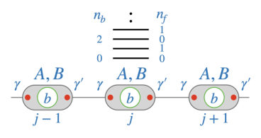 
FIG. 1: Fermionic gauging of the 1D Bose-Hubbard model. One b boson resides on each site. A pair of Ma- jorana fermions, γ′ j and γj+1, is inserted between two neighboring bosons, and a Gauss law is imposed at each site. The gauging projects out the onsite sub-Hilbert space with odd boson number nb and replaces it with a Z2-graded fermionic level nf, yielding a new fermionic composite A or B.

📷 Fig 2

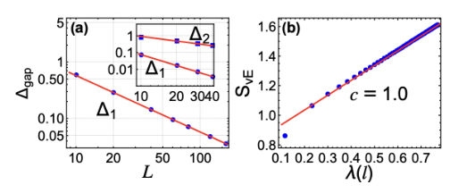 
FIG. 2: (a) Finite-size scaling of ∆1 = E1 −Egs in the gapless phase of the fermionic dual at unit-filling for U/t = 2.0 under OBCs. The slope of the fit is −1. Inset: finite-size scaling of ∆1 = E1 −Egs and ∆2 = E2 −Egs under PBCs with fitted slopes 2.15 and 0.89, respectively. ∆1 decreases faster than 1/L, signal- ing a twofold ground-state degeneracy in the thermody- namic limit. (b) Subsystem entanglement entropy as a function of λ(l) = 1 6 ln( 2L

📷 Fig 3

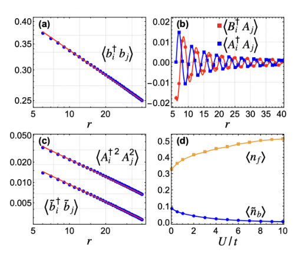 
FIG. 3: (a) Scaling of ⟨b† ibj⟩in the superfluid phase of the BH model at half filling, ⟨nb⟩= 0.5, as a func- tion of r = |j −i|, for U/t = 2.0 and L = 160 un- der OBCs. The starting site is i = L/4. The fitted slope yields 2∆0,1 ≈0.215, corresponding to K ≈2.3 in Eq. (14). (b-c) Gapless phase of the fermionic dual at half filling, ⟨2˜nb + nf⟩= 0.5. (b) ⟨B† i Aj⟩and ⟨A† iAj⟩ for U/t = 2.0 and L = 160 under OBCs, both fitted to a sin(πρ0r + b)r−2∆1,1, with 2∆1,1 ≈1.38 and ρ0 ≈0.49. The correlation ⟨f † i fj⟩(not shown) exhibits similar be- havior to ⟨A† iAj⟩. (c) ⟨A†2 i A2 j⟩and ⟨˜b† i˜bj⟩shown on a log-log scale, with the fits determined by 2∆0,2 ≈0.86. (d) Average onsite densities ⟨˜nb⟩and...

📷 Fig 4

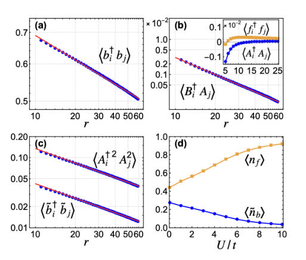 
FIG. 4: (a) Scaling of ⟨b† ibj⟩in the superfluid phase of the BH model at unit filling, ⟨nb⟩= 1, as a function of r = |j −i|, for U/t = 2.0 and L = 160 under OBCs. The starting site is i = L/4. The fitted slope yields 2∆0,1 ≈0.172, corresponding to K ≈2.9 in Eq. (14). (b-c) Gapless phase of the fermionic dual at unit filling, ⟨2˜nb + nf⟩= 1. (b) ⟨B† i Aj⟩for U/t = 2.0 and L = 160 under OBCs, shown on a log-log scale, with the fit determined by 2∆1,1 ≈1.63. Inset: scaling of ⟨f † i fj⟩and ⟨A† iAj⟩, both of which decay rapidly to near zero within a few lattice spacings. (c) ⟨A†2 i A2 j⟩and ⟨˜b† i˜bj⟩shown on a log-log scale, with the fits determined by 2∆0,2 ≈0.69. (d) Average onsite...

📷 Fig 5

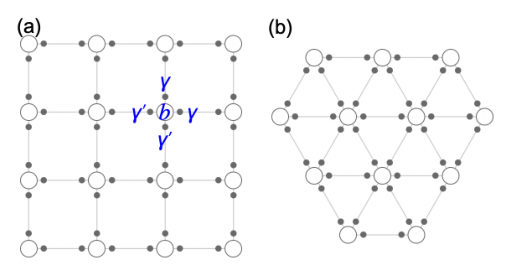 
FIG. 5: Fermionic gauging of the 2D Bose-Hubbard model on the square lattice (a) and triangular lattice (b). One b boson is placed on each vertex and a pair of Majo- rana fermions, γ and γ′, is introduced on each edge such that each boson is surrounded by four (six) Majorana fermions. A Gauss law is imposed at each vertex, while a flatness condition is imposed on the eight (six) Majorana fermions surrounding each square (triangular) face.

**Summary.** This work establishes an exact fermionic dual for the Bose-Hubbard model by employing fermionic gauging techniques. It shows that the model can be recast into a fermionic description, whose low-energy behavior is captured by the sine-Gordon model. This provides a powerful, unified theoretical framework for studying strongly correlated bosonic and fermionic quantum matter.

**Why it may be interesting.** The explicit mapping between bosonic and fermionic descriptions of strongly correlated systems like the BH model provides powerful theoretical tools for understanding quantum phases in optical lattices.

Detailed structure

**Main problem.** The paper derives an exact fermionic dual description for the Bose-Hubbard (BH) model, extending known duality mappings.

**Main result.** An exact dual Hamiltonian is constructed in terms of boson-fermion composite operators, revealing that the low-energy physics is governed by the sine-Gordon model.

**Method.** The core method involves applying fermionic gauging to the BH model's U(1) symmetry, realizing generalized Jordan-Wigner transformations, and analyzing the resulting low-energy effective field theory.

**Model / system.** The primary system is the Bose-Hubbard (BH) model, which describes interacting bosons on a lattice. The analysis extends this to include fermionic composites and is analyzed in 1D and 2D settings.

**Key observables.** The oscillation wave vector of the fermionic composite correlation function, and the nature of the phase transition (superfluid vs. Mott insulating).

**Important parameters / regimes.** The ratio of interaction strength to hopping ($U/t$), and the filling factor (density).

**Assumptions / limitations.** The analysis relies on unitary disentangling transformations and assumes the applicability of low-energy effective theories like the sine-Gordon model.

**Figures summary.** Figures illustrate the fermionic gauging process, showing the insertion of Majorana fermions and the resulting structure of the dual Hamiltonian and correlation functions.

**Paper structure.** The paper proceeds by introducing the fermionic gauging procedure to the BH model, deriving the dual Hamiltonian, analyzing the low-energy continuum limit via bosonization (sine-Gordon/Thirring equivalence), and finally discussing boundary effects and generalizations to higher dimensions.

Abstract

Recent developments have established exact bosonization and fermionization with a $\mathbb{Z}_2$ symmetry as dualities through gauging. In this work, we apply fermionic gauging, which realizes generalized Jordan-Wigner transformations, to the Bose-Hubbard (BH) model with a global $U(1)$ symmetry and derive an exact dual description in terms of fermionic composites, built from bosons and fermions. In 1D, this duality generalizes the exact mapping between the extended hard-core BH model and the spinless Fermi-Hubbard model to now cover soft-core interactions. At low energies, the mapping reduces to the well-known equivalence between the sine-Gordon model and the Thirring model. The oscillation wave vector of the fermionic composite correlation function in the gapless phase is fixed by their density, providing a novel manifestation of Luttinger's theorem. We verify the exact duality using density matrix renormalization group (DMRG) calculations and demonstrate that the gapless phase and the phase transition are governed by the compact boson conformal field theory. Our construction naturally extends to generic bosonic systems and higher dimensions, opening new avenues for studying Bose-Fermi mixtures in optical lattices and other strongly correlated quantum systems.

[↑ back to top](#top)

### ⭐ [Few-body bound states in the anyon-Hubbard model](http://arxiv.org/abs/2609.09125v1)

**Highlighted author(s):** Markus Greiner  
**Authors:** Isaac Tesfaye, Christina Mascherbauer, Joyce Kwan, Perrin Segura, Yanfei Li, Markus Greiner, Luis Santos, André Eckardt, Brice Bakkali-Hassani  
**Type:** theory · **Category:** strongly correlated electrons · **PDF:** <https://arxiv.org/pdf/2609.09125v1>  
**Analysis basis:** full PDF text, analyzed in chunks
**Topic relevance:** `analog quantum simulation` **3/5**

📷 Fig 1

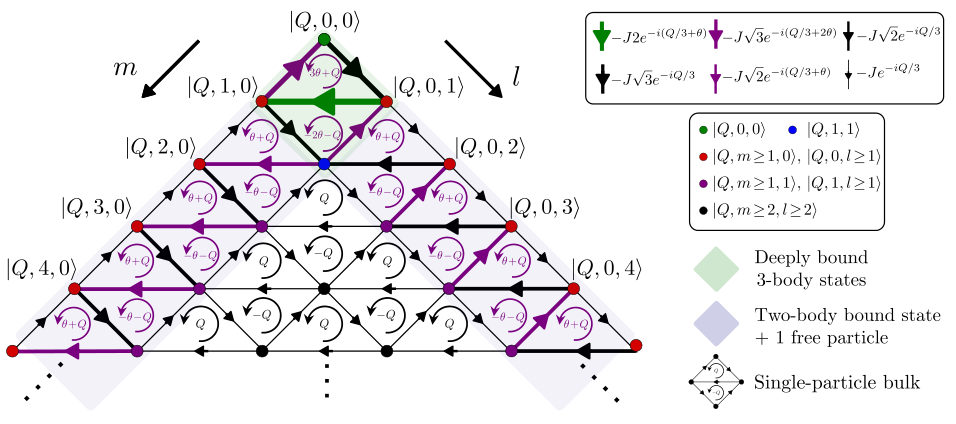 
FIG. 1. Three-particle relative coordinate space. Illustration of the semi-infinite 2D lattice associated with the relative coordinate space corresponding to the Hamiltonian ˆHQ (4), which for each COM quasimomentum Q is spanned by the basis states {|Q, m, l⟩}. The matrix elements of ˆHQ define the tunneling processes between the different sites of this lattice, which are depicted by the arrows, whose color and thickness indicate the Peierls phase and the amplitude of the tunneling process, respectively. The values inside encircling arrows indicate the flux through the plaquettes of the lattice, corresponding to the phase that is acquired when tunneling around the plaquette along the...

📷 Fig 2

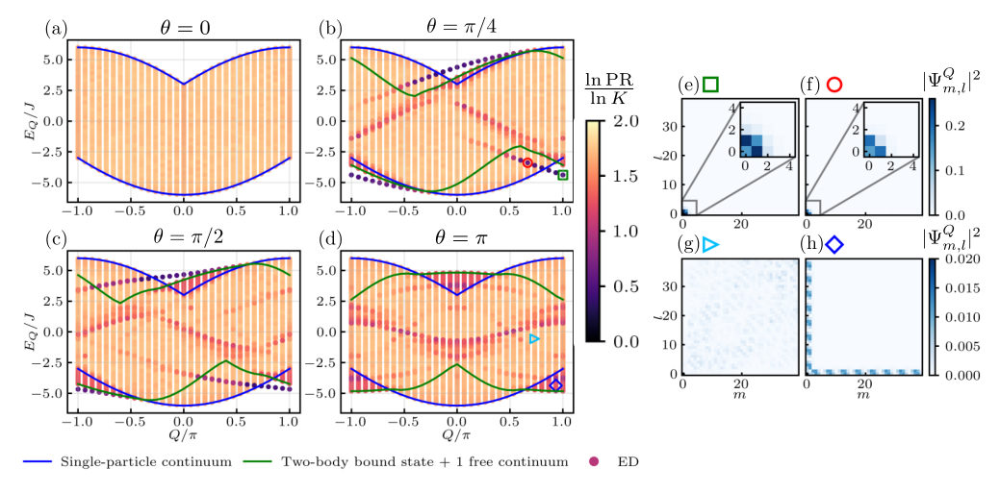 
FIG. 2. Three-particle energy spectrum of the AHM for U = 0. Three-particle energy spectrum EQ as a function of the COM quasimomentum Q for θ = 0, π/4, π/2, π is shown in (a), (b), (c), and (d), respectively. The blue solid lines indicate the edges of the continuum of three independent particles, whereas the green solid lines provide the boundaries of the continuum spanned by two-particle bound states and one free particle. The exact diagonalization (ED) results for each Q value are shown via the dots, whose color indicates the scaled participation ratio ln(PR)/ ln(K) (5), whose value roughly indicates the dimension of the subspace over which the corresponding eigenstate |Ψ⟩is delocalized....

📷 Fig 3

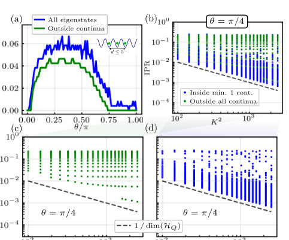 
FIG. 3. Three-body bound state fraction and finite-size scal- ing of the three-particle spectrum. (a) Bound state fraction as a function of the statistical angle θ for the entire three- particle spectrum (4) defined as the fraction of states with PR (5) below that of states where the left and right particle are at most separated by five sites for all eigenstates in blue and for eigenstates outside the continua in green. (b) Inverse participation ratio IPR (5) for a fixed statistical angle θ = π/4 as a function of the size of the relative coordinate space K2

📷 Fig 4

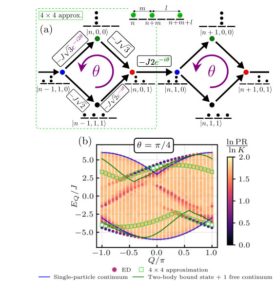 
FIG. 4. Effective three-particle energy spectrum for (po- tential) three-body bound states in the AHM for U = 0. (a) Ansatz for three-body bound states, including only configura- tions with particles sitting on neighboring sites and the tun- neling matrix elements connecting them, which is obtained from truncating the three-particle configuration space to ba- sis states |n, m, l⟩with 0 ≤m, l ≤1. In the experimentally constrained version of the AHM [1, 3, 52] three-particle coin- cidences |n, 0, 0⟩(green-colored sites) and the Peierls phases for tunneling from an originally doubly to a singly occupied site (red- to blue-colored sites) are excluded and set to zero, respectively. (b) An...

📷 Fig 5

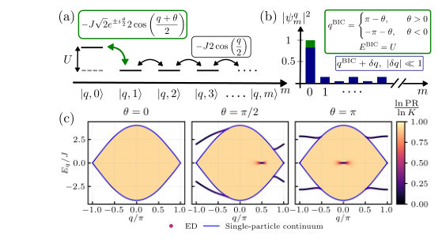 
FIG. 5. Two-body bound states in the continuum. (a) Illus- tration of the Hamiltonian ˆHq (6) acting in the relative coordi- nate space of the two-particle AHM with COM quasimomen- tum q, whose states {|q, m⟩} form a semi-infinite chain. (b) Sketch of the weights |ψq m|2 for two types of bound states of the wave function in the relative coordinate space, for the spe- cial bound states: (i) perfect BIC (green) where qBIC = nπ−θ for θ ̸= 0 and n ∈{−1, 1} and (ii) quasi-BICs in the proxim- ity of the perfect BIC condition q = qBIC + δq (blue), which are highly localized for |δq| ≪1, and leak into the continuum as a traveling wave ψq m≥1 ∼ψq 0e−iκmv∗(q)/t(q) with the am- plitude |v(q)/t(q)|...

**Summary.** This theoretical study investigates few-body bound states in the Anyon-Hubbard Model, a system modeling particles with fractional statistics. The authors demonstrate that these clusters are bound by purely kinematic effects, not just interactions, allowing for unique fast chiral transport. The findings provide a detailed theoretical roadmap for experimentally probing these exotic, strongly correlated quantum states.

**Why it may be interesting.** This work bridges concepts from topological matter (anyons) and strongly correlated lattice models (Hubbard model), providing concrete, analytically derived predictions about novel quantum phases (kinematically bound clusters) that can be tested via time-of-flight expansion dynamics.

Detailed structure

**Main problem.** The paper theoretically investigates the existence and properties of few-body bound states (two-, three-, and four-body) within the Anyon-Hubbard Model (AHM). It specifically contrasts kinematic binding mechanisms with conventional energetic binding.

**Main result.** The AHM hosts exact two-body bound states for any non-zero fractional statistics angle $\theta$, and it exhibits genuine three- and four-body bound states. These clusters are bound by kinematics, enabling fast chiral transport.

**Method.** The analysis involves mapping the problem to a single-particle problem on a relative coordinate space (triangular lattice) and employing variational approximations and exact diagonalization (ED) techniques.

**Model / system.** The system is the Anyon-Hubbard Model (AHM), which describes particles with fractional exchange statistics ($\theta$). The Hamiltonian is formulated in a bosonic representation with density-dependent Peierls phases.

**Key observables.** Existence and nature of bound states (2-, 3-, 4-body), binding mechanism (kinematic vs. energetic), and signatures observable in expansion dynamics.

**Important parameters / regimes.** Fractional statistics angle $\theta$, on-site interaction $U$, and the quasimomentum $Q$.

**Assumptions / limitations.** The analysis relies on mapping the problem to a single-particle Hamiltonian in the relative coordinate space and using variational methods for the three-body case.

**Figures summary.** Figure 1 illustrates the three-particle relative coordinate space, showing the lattice structure and colored regions indicating deeply bound 3-body (green) and 2-body (purple) states. Figure 2 shows the three-particle energy spectrum $E_Q$ vs. $Q$ for various $\theta$ values.

**Paper structure.** The paper first establishes the AHM framework and the problem of few-body states. It then uses theoretical analysis and variational methods to prove the existence of kinematic bound states. Finally, it details the diagonalization of the relative coordinate Hamiltonian to characterize the different types of bound states (Type-I, Type-II, 3-body).

Abstract

Quantum statistics in low-dimensional systems predicts anyonic particles with fractional exchange statistics which are neither that of bosons nor fermions. While anyons are typically found in two dimensions as excitations of topologically-ordered states of matter, anyon-like exchange statistics has also been discussed in one dimension, for instance, in the context of the anyon-Hubbard model (AHM), the physics of which has recently been observed in experiment [Kwan et al., arXiv:2306.01737; Dhar et al., arXiv:2412.21131; and Bakkali-Hassani et al., arXiv:2602.20421]. The AHM can be formulated in terms of bosons featuring density-dependent Peierls phases, described by a statistical phase angle $θ$, which controls asymmetric transport and the formation of dynamically bound pairs at finite momentum. Here, we show theoretically that the AHM also hosts exact two-body bound states in the continuum (BICs) for arbitrary $θ\neq 0$, and genuine three- and four-body bound states. Unlike conventional bound states stabilized by attractive (or repulsive) interactions, which are energetically localized with a large effective mass, these clusters here are bound by a purely kinematic mechanism endowing them with fast chiral transport properties. We provide a simple variational approximation to the three-body bound states and explain their binding mechanism. Moreover, we show that the signatures of three-body bound states in the AHM can be directly probed experimentally from the expansion dynamics starting from three localized particles.

[↑ back to top](#top)

### ⭐ [Observation of multipartite spin entanglement in a cuprate chain](http://arxiv.org/abs/2609.08134v1)

**Highlighted author(s):** M. D. Lukin  
**Authors:** S. F. R. TenHuisen, Z. Shen, V. Bhartiya, V. Menon, P. Sharma, H. Padma, Z. Guan, W. He, M. K. Lajer, J. Li, D. Banerjee, J. Pelliciari, I. A. Zaliznyak, G. D. Gu, M. D. Lukin, S. Johnston, M. P. M. Dean, V. Bisogni, Y. Wang, M. Mitrano  
**Type:** both · **Category:** strongly correlated electrons · **PDF:** <https://arxiv.org/pdf/2609.08134v1>  
**Analysis basis:** full PDF text, analyzed in chunks
**Topic relevance:** `analog quantum simulation` **2/5** · `quantum measurements` **2/5**

📷 Fig 1

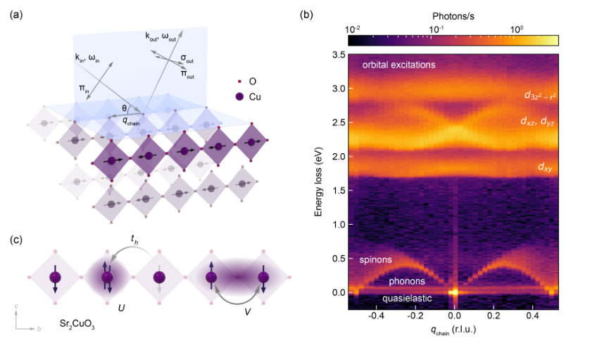 
FIG. 1. Collective excitations of the cuprate chain Sr2CuO3. (a) Sketch of the Cu L3-edge RIXS experiment. We use incident π-polarized light to maximize the scattering cross section, and tune the momentum transfer along the chain direction by varying the sample angle, θ. kin (kout) and ℏωin (ℏωout) denote initial (final) momentum and energy of the X-ray photons. (b) Cu L3-edge RIXS intensity map along the chain direction at 35 K, measured by tuning ℏωin to the maximum of the Cu L3 X-ray absorption peak. Below 1 eV, the spectra exhibit dispersing two-spinon excitations; between 1.7 and 3.2 eV they reveal a manifold of d-orbital excitations. Owing to spin-orbital separation, dxz and dyz...

📷 Fig 2

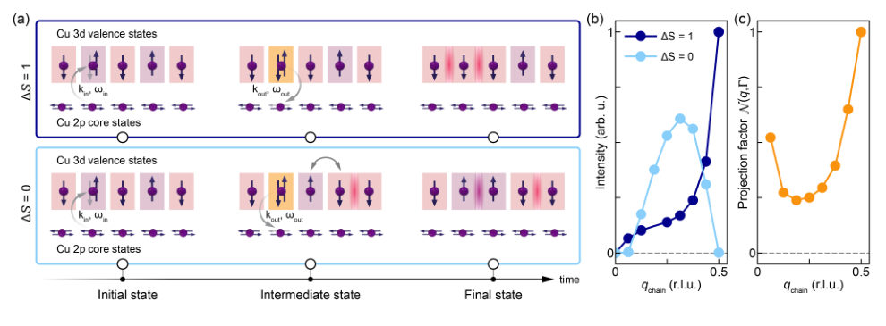 
FIG. 2. Two distinct two-spinon excitation pathways. (a) Following resonant X-ray absorption, two-spinon excitations are generated via spin-flip (∆S = 1) and spin-conserving (∆S = 0) channels. The former arise from a direct spin flip upon de-excitation from the intermediate state, while the latter involve a spin rearrangement during the intermediate state. (b) Calculated RIXS intensities of ∆S = 1 (dark blue) and ∆S = 0 (light blue) channels in Sr2CuO3 as a function of momentum transfer along the chain direction. (c) Calculated projection factor N(q, Γ) relating the total RIXS response to S(q, ℏω) for Γ = 0.5th.

📷 Fig 3

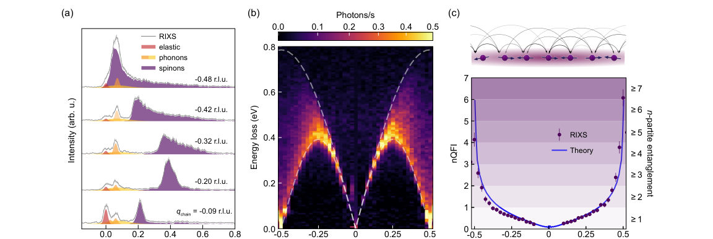 
FIG. 3. Observation of 7-partite spin entanglement. (a) Experimental RIXS spectra at 35 K at selected momenta. Shaded areas correspond to the quasielastic, phonon, multiphonon, and two-spinon continuum contributions. The energy resolution is ∼35 meV. (b) Experimental RIXS intensity map as a function of momentum and energy loss, after subtracting elastic and phonon contributions and normalizing as described in the text. White dashed lines are the boundaries of the two- spinon continuum. (c) Normalized QFI (nQFI) extracted from the RIXS spectrum (dark purple), compared with theoretical expectations for an extended Hubbard chain of length L = 128 (blue). Error bars are obtained by propagating...

📷 Fig 4

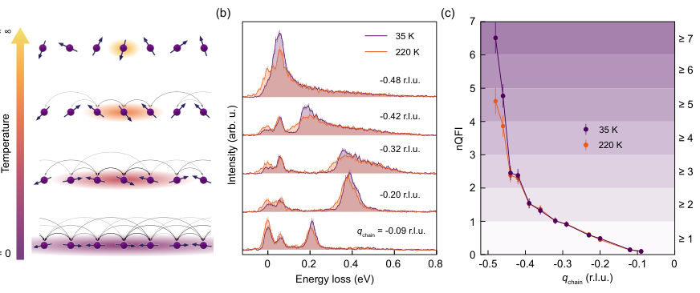 
FIG. 4. Multipartite spin entanglement at high temperature. (a) Sketch of the multipartite spin entanglement as a function of temperature. While at low temperature spins are highly entangled, upon increasing temperature quantum correlations become weaker and shorter range. (b) Low-energy RIXS spectra at selected momenta at 35 K (purple) and 220 K (orange). Spectra are shifted for clarity. With increasing temperature, the spectra are modestly reshaped. (c) Normalized QFI (nQFI) extracted from the RIXS data at 35 K (purple circles) and 220 K (orange circles). Error bars are obtained by propagating the Poisson uncertainties on the integrated measured RIXS photon numbers. The normalized QFI is...

📷 Fig 5

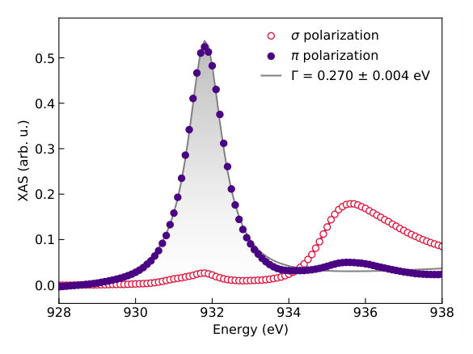 
FIG. 1. XAS spectra measured with π-polarized (purple solid markers) and σ-polarized (red open markers) incident X-rays at an incident angle of θ = 63◦. A Lorentzian fit to the π-polarized spectrum (gray solid line) yields a half-width at half-maximum of Γ = 0.27 eV.

**Summary.** This paper pioneers the use of Resonant Inelastic X-ray Scattering (RIXS) to experimentally probe multipartite spin entanglement in cuprate superconductors. By calculating the Quantum Fisher Information from measured spin fluctuations, the authors report detecting at least 7-partite entanglement in the 1D $	ext{Sr}_2	ext{CuO}_3$ model. This establishes RIXS as a powerful, non-invasive spectroscopic tool for characterizing complex quantum states in correlated electron systems.

**Why it may be interesting.** This work bridges the gap between abstract quantum information theory (entanglement measures) and tangible solid-state spectroscopy (RIXS), providing a concrete experimental pathway to study quantum correlations in strongly correlated materials.

Detailed structure

**Main problem.** The primary challenge is experimentally probing and quantifying multipartite spin entanglement within quantum materials, which has historically been very difficult.

**Main result.** The authors report the detection of at least 7-partite spin entanglement in the model 1D cuprate $	ext{Sr}_2	ext{CuO}_3$, establishing RIXS as a viable spectroscopic tool for measuring many-body entanglement.

**Method.** The study uses Resonant Inelastic X-ray Scattering (RIXS) to measure spin fluctuation spectra, from which the Quantum Fisher Information (QFI) is extracted as a witness for entanglement.

**Model / system.** The system studied is the prototypical one-dimensional (1D) cuprate $	ext{Sr}_2	ext{CuO}_3$, modeled by the extended Hubbard model, which reduces to a Heisenberg model in the large-$U$ limit.

**Key observables.** Quantum Fisher Information (QFI) density, entanglement depth, and the spin dynamical structure factor $S(q, \hbar\omega)$.

**Important parameters / regimes.** The entanglement depth is shown to agree with Hubbard-model expectations and persists to elevated temperatures. Key parameters include $t_h \simeq 560 	ext{ meV}$ and $U = 8t_h$.

**Assumptions / limitations.** The QFI extraction relies on projecting the measured RIXS cross section onto the appropriate spin excitation channel, and the analysis assumes certain sum rules hold for normalization.

**Figures summary.** Figures illustrate the RIXS setup and the theoretical description of $	ext{Sr}_2	ext{CuO}_3$ as a 1D Hubbard model. Other figures detail two-spinon excitations, calculated RIXS intensities, and momentum-dependent QFI.

**Paper structure.** The paper establishes the theoretical link between entanglement depth and QFI, details the methodology for extracting QFI from RIXS measurements by projecting the signal onto the spin structure factor, and finally presents the quantitative results showing high-order entanglement in the cuprate model.

Abstract

Quantum materials are believed to host highly entangled states of matter, but probing and quantifying such entanglement has long remained experimentally elusive. Here, we use resonant inelastic X-ray scattering (RIXS) as a probe of multipartite spin entanglement. By projecting the RIXS cross section onto the appropriate spin excitation channel, we show that the Quantum Fisher Information can be extracted directly from the measured spin fluctuation spectrum. We detect at least 7-partite spin entanglement in the model one-dimensional cuprate Sr$_2$CuO$_3$, revealing one of the largest entanglement depths yet reported in a solid. The observed entanglement depth agrees with Hubbard-model expectations and persists to elevated temperatures. Our results establish RIXS as an experimental probe of many-body spin entanglement and provide a platform for extensions to charge and orbital sectors and nonequilibrium settings.

[↑ back to top](#top)

### [Few-Body Decay Dynamics in Colloidal CsPbI3 Quantum-Dot Clusters](http://arxiv.org/abs/2609.07892v1)

**Authors:** Emma Daggett, Christian M. Lange, Nicholas Favate, Ankit Kundu, Ishita Agarwal, Arya D. Keni, Adhyyan S. Mansukhani, Christina W. Li, Libai Huang, Jonathan D. Hood  
**Type:** experiment · **Category:** other · **PDF:** <https://arxiv.org/pdf/2609.07892v1>  
**Analysis basis:** full PDF text, analyzed in chunks
**Topic relevance:** 🔥 `correlated / nonlocal dissipation` **4/5** · 🔥 `quantum optics experiment` **4/5** · `Dicke superradiance` **3/5** · `Tavis-Cummings & cavity-many-emitter` **3/5** · `analog quantum simulation` **2/5** · `methods for driven-dissipative` **2/5** · `quantum measurements` **2/5** · `superradiant laser` **2/5** · `Full counting statistics` **1/5** · `driven-dissipative phase transition` **1/5** · `free-space correlated emission` **1/5** · `interference shaping light` **1/5** · `non-equilibrium universality` **1/5**

📷 Fig 1

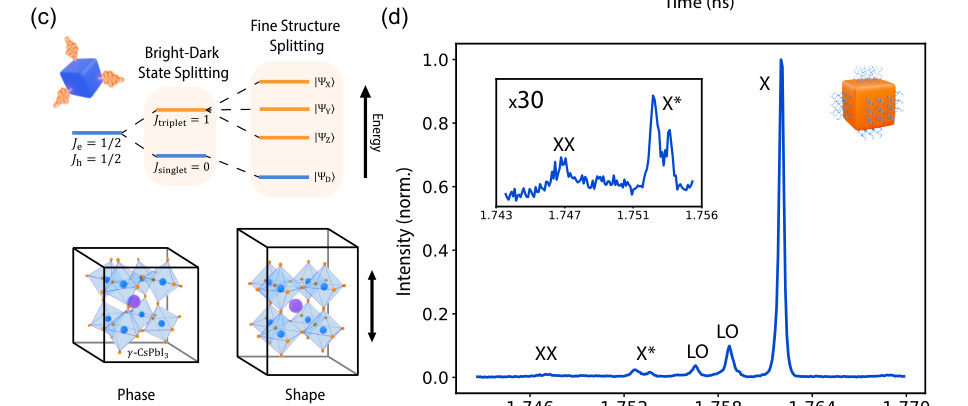 
Figure 1: (a) TEM of CsPbI3 nanocrystals, with inset showing the unit structure of CsPbX3 per- ovskites. (b) Pulsed autocorrelation (g(2)(τ)) of a single quantum dot showing strong antibunching at τ = 0. (c) Exciton fine structure showing bright–dark splitting and further splitting of the bright triplet state. Symmetry breaking can arise from the crystalline phase (phase anisotropy, lower left) or distortion of the nanocrystal shape (shape anisotropy, lower right); orthorhombic γ −CsPbI3 is shown as an example of a lower-symmetry phase.1–3 (d) Emission spectrum of a single dot showing the exciton peak (X), two redshifted LO phonon replicas, positively and negatively charged trion peaks...

📷 Fig 2

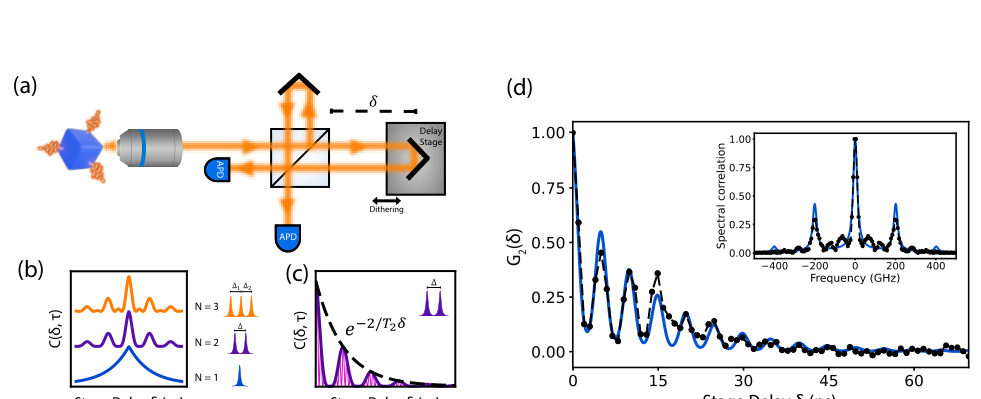 
Figure 2: (a) Schematic of PCFS setup containing a modified Michelson interferometer where the path length of one arm is varied via a delay stage by δ. (b) Correlation function as a function of stage delay for one (blue), two (purple), and three (orange) interfering states. The number of states and relative detuning (∆) of the states determine the oscillation pattern in the PCFS signal. (c) Correlation function of two interfering states as a function of stage delay δ. The pink fringes show the high-frequency oscillations arising from scanning the path of the interferometer, the purple curve shows the oscillation after averaging over the fast fringes, and the dashed black curve shows the...

📷 Fig 3

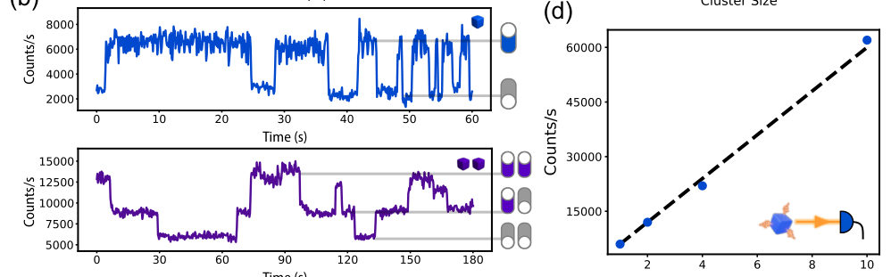 
Figure 3: (a) Pulsed autocorrelation (g(2)) measurements of clusters with varying dot number N: a single quantum dot (blue, N = 1), a dimer (purple, N = 2), a small cluster (magenta, N ≈4), and a larger cluster (orange, N ≈10). Antibunching at zero delay decreases as dot number increases. (b) Blinking of one (blue) and two (purple) quantum dots. Binary blinking between “on” and “off” states is characteristic of emission from a single dot (top panel). In a dimer, blinking between three discrete states (“both on,” “one on/one off,” and “both off”) may be observed (bottom panel). (c) Observed (blue) and expected (dashed line) values for the integrated autocorrelation function g(2)[0] as a...

📷 Fig 4

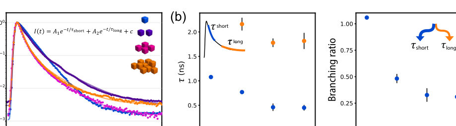 
Figure 4: (a) Lifetime measurements on the same four clusters (N = 1, N = 2, N ≈4, and N ≈10). The single-dot decay is described by a single exponential, whereas the cluster decays require short and long components, τshort and τlong. Solid lines show the fits. (b) (left) The short and long lifetime components for one, two, few (N ≈4), and many (N ≈10) dot clusters. For the single dot, only the short component is shown because its decay is monoexponential. The right panel shows the integrated photon fraction in the short component; the single-dot fraction is unity because the decay is monoexponential, while the cluster values are obtained by integrating the components of the biexponential...

**Summary.** The authors investigated how the optical decay dynamics of CsPbI3 quantum dots change as they self-assemble into clusters. By measuring photon correlations and decay lifetimes, they found that clusters exhibit a biexponential decay profile, confirming the emergence of collective optical behavior. This work establishes the quantum-dot cluster as a platform to study the transition from single-emitter to ensemble quantum dynamics.

**Why it may be interesting.** This work provides experimental evidence of collective quantum optical behavior in solid-state nanocrystal ensembles, directly addressing how inter-particle coupling modifies fundamental decay processes, which is highly relevant to quantum light sources and cavity QED.

Detailed structure

**Main problem.** The study characterizes the collective optical behavior and radiative decay dynamics of colloidal CsPbI3 quantum-dot clusters, bridging the gap between isolated emitters and ensemble limits.

**Main result.** The decay dynamics transition from single-exponential (isolated dots) to biexponential (clusters $\ge 2$), indicating collective decay mechanisms are active even in the low-coherence regime.

**Method.** The research employs photon autocorrelation, blinking statistics, and Photon-correlation Fourier spectroscopy (PCFS) to measure decay rates and coherence times.

**Model / system.** The physical system is colloidal CsPbI3 perovskite quantum dots, studied from single emitters up to clusters of ten dots. The analysis compares measured decay traces to theoretical models of coupled two-level emitters.

**Key observables.** Biexponential decay components ($	au_{	ext{short}}, 	au_{	ext{long}}$), photon-correlation function $g^{(2)}(	au)$, and coherence time $T_2$.

**Important parameters / regimes.** Cluster size ($N=1$ to $N=10$), decay rates ($\Gamma_B, \Gamma_D$), and the ratio of fast-to-slow decay components ($\sim 1/N$).

**Assumptions / limitations.** The analysis compares measurements to idealized models (e.g., independent excitation vs. coherent coupling) and notes that the long-lived component mechanism remains ambiguous.

**Figures summary.** Figures illustrate TEM images, $g^{(2)}(	au)$ measurements confirming antibunching, and decay traces showing the transition from single to biexponential decay as the cluster size increases.

**Paper structure.** The paper systematically characterizes the system using multiple diagnostics (photon statistics, coherence) before modeling the decay dynamics by comparing measurements against theoretical limits for single-emitter, two-emitter, and larger cluster behavior.

Abstract

Colloidal perovskite quantum dots combine bright emission with the ability to self- assemble into closely spaced structures, enabling radiative dynamics to be studied from isolated emitters to few-dot clusters. Here, we characterize CsPbI3 perovskite quan- tum dots from isolated emitters to self-assembled clusters containing up to ten dots. We estimate the number of emitters in each cluster using a combination of photon autocorrelation, blinking statistics, and emission brightness. Compared with isolated dots, clusters containing two or more emitters exhibit biexponential decay, with a short lifetime that decreases with emitter number and an additional long-lived component. Photon-correlation Fourier spectroscopy shows that the single-dot emission remains far from the lifetime-limited regime. Nevertheless, we observe emitter-number-dependent decay dynamics even in this low-coherence regime. Together, these measurements es- tablish self-assembled perovskite quantum-dot clusters as a platform for studying how collective optical behavior emerges between the single-emitter and ensemble limits

[↑ back to top](#top)

### [Quantum magnonics with engineered dissipative and coherent interactions](http://arxiv.org/abs/2609.08050v1)

**Authors:** Debsuvra Mukhopadhyay, Jayakrishnan M. P. Nair, Girish S. Agarwal  
**Type:** theory · **Category:** other · **PDF:** <https://arxiv.org/pdf/2609.08050v1>  
**Analysis basis:** full PDF text, analyzed in chunks
**Topic relevance:** 🔥 `correlated / nonlocal dissipation` **4/5** · `Tavis-Cummings & cavity-many-emitter` **3/5** · `analog quantum simulation` **3/5** · `driven-dissipative phase transition` **3/5** · `methods for driven-dissipative` **3/5** · `Keldysh / 2PI / non-Gaussian methods` **2/5** · `non-equilibrium universality` **2/5** · `Dicke superradiance` **1/5** · `quantum measurements` **1/5**

📷 Fig 1

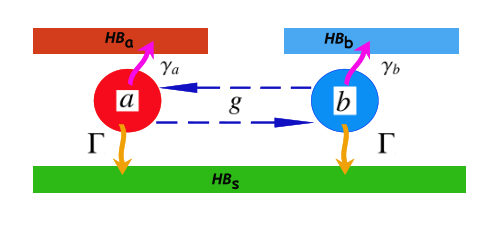 
FIG. 1. Schematic of a generic dissipatively coupled two- mode system. Each mode interacts with its local environ- ment while simultaneously coupling to a common reservoir, which mediates an effective dissipative interaction between the modes through correlated decay. This generic configura- tion forms the basis for a variety of non-Hermitian phenom- ena, including level attraction, anti-PT symmetry, and EP physics. Adapted from Ref.12.

📷 Fig 2

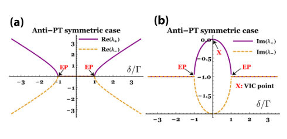 
FIG. 2. Characteristic eigenspectrum of a dissipatively cou- pled anti-PT -symmetric system. (a) Real and (b) imaginary parts of the eigenvalues as functions of the relative detuning δ. The EPs at |δ| = Γ separate the spectrally split regime from the regime of frequency coalescence and linewidth bifur- cation into superradiant and subradiant branches. Adapted from Ref.12.

📷 Fig 3

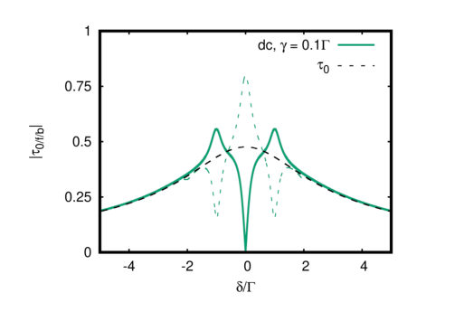 
FIG. 3. Floquet-induced nonreciprocal transmission in dissi- patively coupled resonators. The forward (solid green) and backward (dashed green) transmission amplitudes are shown as functions of the normalized detuning δ/Γ, where δ = ω0−ωl and Γ is the dissipative coupling rate. The black dashed curve shows the transmission τ0 without modulation. The parame- ters are Ω= Γ, β = Γ, θ = π/2, and γ = 0.1Γ, wwhere Ωand β are the modulation frequency and amplitude, respectively, and θ is the relative phase between the frequency modulations of the two resonators. Adapted from Ref.33.

📷 Fig 4

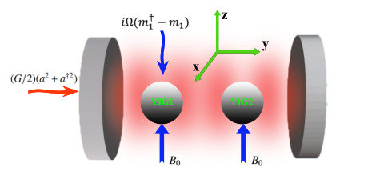 
FIG. 4. Schematic of a parametrically driven cavity coupled to magnon modes. The cavity is driven by a two-photon para- metric pump, while the cavity field coherently couples to the magnetic excitations. Taken from Ref.19.

**Summary.** This paper reviews the cutting edge of cavity magnonics, moving beyond simple coherent coupling to harness engineered dissipation and Floquet driving. It shows how these techniques allow for the creation of long-lived quantum modes and enable advanced quantum applications like enhanced sensing and magnon squeezing. The platform is established as a versatile tool for hybrid quantum technologies.

**Why it may be interesting.** This work is highly relevant to AMO physics as it merges concepts from cavity QED (cavity coupling), open quantum systems (dissipation, anti-PT symmetry), and quantum optics (squeezing, parametric driving) within a solid-state platform.

Detailed structure

**Main problem.** The research aims to advance cavity magnonics beyond simple coherent spin-photon coupling by engineering complex interactions, including dissipation, Floquet dynamics, and quantum fluctuations.

**Main result.** The work demonstrates that engineered dissipation, particularly through anti-PT symmetry, enables long-lived subradiant modes and enhances parameter sensitivity for sensing applications.

**Method.** The analysis employs theoretical modeling using effective Hamiltonians, Langevin equations for quadrature dynamics, and concepts from non-Hermitian physics to describe the coupled magnon-photon system.

**Model / system.** The primary system is cavity magnonics, involving low-loss ferrimagnets (like YIG) coupled to microwave cavities. Models include effective two-mode Hamiltonians for anti-PT systems and fluctuation Hamiltonians for squeezing analysis.

**Key observables.** Long-lived subradiant excitations, Quantum Fisher Information (QFI), magnon squeezing variance ($\Delta X_M^2$), and nonreciprocal transmission.

**Important parameters / regimes.** Dissipative coupling strength ($\Gamma$), detuning ($\delta$), parametric drive strength ($G_p$), and thermal occupation ($ar{n}_m$).

**Assumptions / limitations.** The analysis often assumes Markovian input noises and relies on deriving effective Hamiltonians under specific limits (e.g., bad-cavity limit).

**Figures summary.** Figures illustrate the characteristic eigenspectrum of anti-PT systems showing linewidth splitting, and show Floquet-induced nonreciprocal transmission profiles.

**Paper structure.** The paper progresses from reviewing the shift towards engineered dissipation and anti-PT symmetry, to detailing the use of Floquet engineering for nonreciprocity, and finally analyzing advanced quantum state generation like magnon squeezing via parametric driving.

Abstract

Cavity magnonics is moving beyond the conventional paradigm of coherent spin--photon hybridization toward the controlled engineering of dissipative and coherent interactions, Floquet dynamics, and quantum fluctuations. This Perspective examines how these ingredients reshape collective dynamics and open new avenues for quantum state engineering, transport, and sensing. We discuss the role of dissipative coupling and anti-$\mathcal{PT}$ symmetry in enabling long-lived collective modes and enhanced spectral response, and highlight Floquet engineering as a means of engineering nonreciprocal transport and phase-controlled interactions. We then review recent progress in quantum magnonics, ranging from squeezed and entangled magnon states, including the squeezing of thermal magnons, to prospective schemes for preparing magnonic Schrödinger-cat states. We also discuss how parametric driving and active gain strongly modify hybrid susceptibilities and amplify magnon--photon response. These advances expand the scope of cavity magnonics beyond conventional polariton physics, establishing it as a versatile platform for sensing, transduction, spin transport, and hybrid quantum technologies.

[↑ back to top](#top)

### [Limit Cycles in a Photonic Dimer with Tuneable Non-Hermitian Interactions](http://arxiv.org/abs/2609.07967v1)

**Authors:** Kevin J. H. Peters, Peter Schnorrenberg, Daniel Ehrmanntraut, Nikolas Longen, Julian Schmitt  
**Type:** both · **Category:** other · **PDF:** <https://arxiv.org/pdf/2609.07967v1>  
**Analysis basis:** full PDF text, analyzed in chunks
**Topic relevance:** 🔥 `driven-dissipative phase transition` **4/5** · `analog quantum simulation` **3/5** · `correlated / nonlocal dissipation` **3/5** · `methods for driven-dissipative` **3/5** · `non-equilibrium universality` **3/5** · `quantum optics experiment` **3/5** · `Keldysh / 2PI / non-Gaussian methods` **1/5** · `Tavis-Cummings & cavity-many-emitter` **1/5**

📷 Fig 1

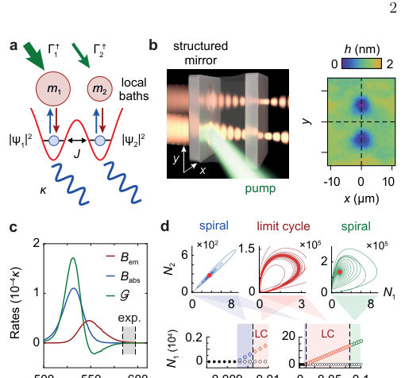 
Fig. 1 | Experimental scheme. (a) Driven-dissipative photonic dimer model consisting of two tunnel-coupled con- densate states ψ1,2 with effective interactions mediated by coupling to local molecule baths m1,2. (b) Dye-filled opti- cal microcavity (left) and height profile of structured mir- ror (right). (c) Measured wavelength-dependent absorption (blue), emission (red) spectra, and calculated effective inter- action strength (green) for Γ↑ 1 = 2π × 200 MHz. The studied experimental range is shaded. (d) Calculated steady-state photon numbers versus pump rate Γ↑ 1 (bottom panel). Black circles: stable fixed points below condensation; blue/green circles: stable fixed points above...

📷 Fig 2

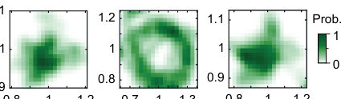 
Fig. 2 | Observation of limit cycles in double well. (a) Top: Sketch of the experimental detuning evolution ∆(t). Starting from an initially blue-detuned double well (t &lt; 250 ns), the two sites are shifted on resonance ∆= 0, be- fore entering the red-detuned regime (t &gt; 250 ns). Middle and bottom: Single-shot measurement of the normalised photon numbers at constant pump power P1 = 3.42 µW and cutoff λc = 588 nm. Red (blue) trace shows the emission from the pumped (unpumped) well N1(2)/ ¯ N1(2). (b) Zooms into the regions indicated in (a). While for |∆| &gt; 0, a steady-state emission without periodic features is observed, limit cycle dy- namics are observed near ∆= 0. (c) The corresponding...

📷 Fig 3

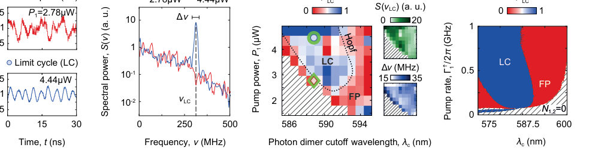 
Fig. 3 | Phase diagram of the nonlinear photonic dimer dynamics. (a) Time traces of the normalised population in the left well N1/ ¯ N1 for a stable fixed point (top) and limit cycle (bottom) for two pump powers at resonance ∆= 0. The noise levels differ due to different ¯ N1. (b) Corresponding power spectral densities S(ν). For the limit cycle, a peak at frequency νLC = 313.1(2) MHz with width ∆ν = 13.6(5) MHz (FWHM) is visible. (c) Limit cycle probability PLC (main panel), average power spectral density S(νLC) at the limit cycle frequency (top right, green), and ∆ν (bottom right, blue) versus cutoff wavelength and pump power. Limit cycles occur in an island (blue region) well separated...

📷 Fig 4

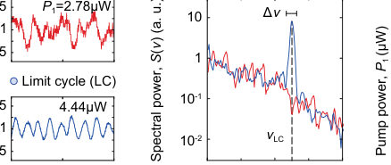 
Figure 2(b) shows three time windows illustrating the system’s evolution. Before reaching resonance ∆&gt; 0 (left panel), the system is in a stationary state, with the emitted photon numbers relaxing to constants. The corresponding (N1-N2)-histogram in Fig. 2(c) is concen- trated near a single point, consistent with a single steady state. Near resonance ∆= 0 (middle panels), the pho- ton numbers exhibit persistent oscillations in time with νLC,1 = 283(3) MHz and νLC,2 = 281(2) MHz. The his- togram forms a ring-shaped distribution, reflecting the closed orbit associated with a limit cycle. After the reso- nance is crossed ∆&lt; 0 (right panels), the system returns to a stationary state indicated...

**Summary.** This paper experimentally proves that purely dissipative, non-Hermitian interactions can generate rich nonlinear dynamics, like limit-cycle oscillations, in a photonic dimer system. By coupling the light fields to molecular reservoirs in a microcavity, the authors control the effective dissipation strength. This work validates controlled dissipation as a powerful mechanism for studying non-equilibrium many-body physics.

**Why it may be interesting.** This work provides a concrete experimental platform demonstrating that non-Hermitian physics, traditionally associated with open quantum systems, can be a primary mechanism for organizing complex, nonlinear collective dynamics in quantum optics.

Detailed structure

**Main problem.** The study investigates whether purely dissipative (non-Hermitian) interactions can generate rich nonlinear dynamics, such as limit-cycle oscillations, comparable to those from conservative interactions.

**Main result.** The authors experimentally demonstrate that limit-cycle oscillations, indicative of complex nonlinear dynamics, can be stabilized purely by tuning non-Hermitian interactions in a photonic dimer system.

**Method.** The research combines theoretical modeling using Langevin equations and adiabatic elimination with experimental realization in a dye-filled double-well microcavity.

**Model / system.** The system is a photonic dimer (two coupled condensates of light) in a microcavity, where effective dissipative interactions arise from local coupling to molecular reservoirs. The dynamics are governed by non-Hermitian terms derived from the reservoir coupling.

**Key observables.** Limit-cycle oscillations (LC), stable fixed points (FP), Hopf bifurcations, hysteresis, and excitability, observed via time traces and power spectral densities.

**Important parameters / regimes.** Tunable non-Hermitian interaction strength ($G_j$), pump rate ($\Gamma_{\uparrow 1}$), and cavity length ($D_0$) which sets the cutoff wavelength ($\lambda_c$).

**Assumptions / limitations.** Adiabatic elimination of molecular dynamics ($\dot{m}_j \simeq 0$) is used to derive the effective non-Hermitian interaction term.

**Figures summary.** Figures illustrate the schematic of the model, the microcavity setup, the mapping of the dynamical phase diagram showing LC regions vs. fixed points, and time traces/histograms confirming the onset of limit cycles via Hopf bifurcations.

**Paper structure.** The paper establishes the theoretical framework by modeling the system with reservoir coupling, derives the effective non-Hermitian Hamiltonian, and then presents experimental measurements mapping the dynamical phase diagram by tuning interaction strengths to observe bifurcations between stable fixed points and limit cycles.

Abstract

Interactions govern the emergence of collective behaviour in classical and quantum many-body systems. While conservative interactions are well known to generate nonlinear phenomena ranging from self-trapping to pattern formation, it remains largely unexplored whether purely dissipative -- i.e., non-Hermitian -- interactions can give rise to similarly rich dynamics and nontrivial system states. Here, we experimentally realise tuneable non-Hermitian interactions in two coupled condensates of light confined within a dye-filled double-well microcavity. Local coupling to molecular reservoirs generates the effective dissipative photon interactions. We show that the interplay between coherent tunnelling and interactions stabilises limit-cycle oscillations, a hallmark of nonlinear dynamics traditionally associated with Hermitian nonlinearities. By tuning the reservoir coupling, we map out the dynamical phase diagram comprising stable fixed points and limit cycles, thereby demonstrating direct control over the interaction strength. Our experimentally validated model reveals both supercritical and subcritical Hopf bifurcations, giving rise to hysteresis, bistability and excitability. These results validate dissipative interactions as a mechanism for organising collective nonlinear dynamics in driven-dissipative systems and pave the way towards exploring nonequilibrium many-body physics through controlled dissipation.

[↑ back to top](#top)

### [Dynamics of entanglement in non-Hermitian system of nonreciprocal coupling](http://arxiv.org/abs/2609.08388v1)

**Authors:** Jiguo Wu, Shaojie Yang, Xiong Liu, Zhibo Jiang, Zhiyou Zhang, Rongchun Ge  
**Type:** theory · **Category:** other · **PDF:** <https://arxiv.org/pdf/2609.08388v1>  
**Analysis basis:** full PDF text, analyzed in chunks
**Topic relevance:** 🔥 `driven-dissipative phase transition` **4/5** · `Tavis-Cummings & cavity-many-emitter` **3/5** · `analog quantum simulation` **3/5** · `correlated / nonlocal dissipation` **3/5** · `non-equilibrium universality` **3/5** · `methods for driven-dissipative` **2/5** · `Rydberg arrays` **1/5**

📷 Fig 1

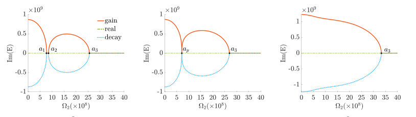 
FIG. 1. NH energy energy level spectra versus Ω2 for different value of imaginary coupling. Here we set wA = 5 × 109 Hz, wB = 6×109 Hz, wC = 7×109 Hz, e = 1×109 Hz. (a), (d) Real and imaginary parts of the eigenenergies for a small imaginary coupling strength (Ω1 = 6 × 108 Hz). Three EP2 appear at Ω2 = a1, a2, a3, respectively where pairs of the eigenstates coalesce pairwise. (b),(e)Real and imaginary parts of the eigenenergies at the critical imaginary coupling strength Ωp. The EP2 at a1 and a2 coalesce into a single single EP3 at Ωp, which is 3rd-order degenerated. (c),(f) When imaginary coupling is larger than Ωp, there is no EP at Ω2 &lt; a3 anymore.

📷 Fig 2

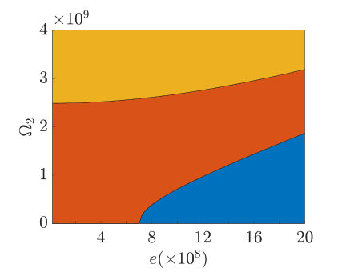 
FIG. 2. Phase diagram of EP2 and EP3. The upper and lower boundary curves correspond to second-order and third- order EPs, respectively. The dynamical evolution in yellow region corresponds to symmetry-unbroken phase, while the other two regions represent distinct symmetry-broken phases connected by a third-order exceptional phase transition.

📷 Fig 3

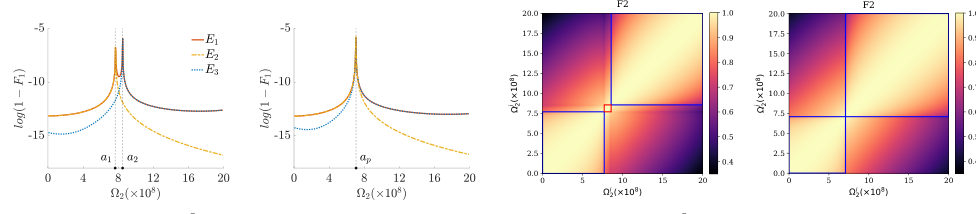 
FIG. 3. Fidelities of the eigenstates in the NH three-level system. With varying coupling coefficient Ω2, we construct the fidelity in two kinds of definitions. (a)-(b) First kind of fidelity with δΩ2 = 106Hz. Red, yellow and blue curves represent fidelities of the three eigenstates fidelity. (c)-(d) Second kind of fidelity. Light yellow indicates high fidelity region while the dark purple indicates low fidelity. The squares with blue outlines are the calculated symmetry-broken phase region and the square with red outlines is the symmetry-unbroken phase.

📷 Fig 4

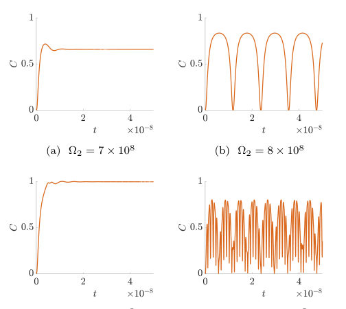 
FIG. 4. Temporal evolution of concurrence for Ω1 &lt; Ωp. (a),(c) The concurrence relaxes to a constant value Css at late times, corresponding to the dynamical symmetry-broken phase. (b),(d) The concurrence exhibits persistent Rabi-like oscillatory dynamics over time, corresponding to the dynam- ical symmetry-unbroken phase.

📷 Fig 5

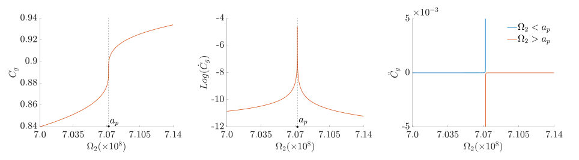 
FIG. 5. Entanglement-based characterization of third-order EP phase transition point (Ω1 = Ωp). (a)Gain-state concurrence Cg as a function ofΩ2. It is qualitatively different with second-order EP phase transition. (b)Logarithm of the absolute first derivative of the concurrence Log( ˙Cg) versus Ω2. When phase transition occurs, the first derivative exhibits a steep peak near the EP, and it is continuous at the peak. (c) ¨Cg −Ω2. It has a non-zero change at the phase transition point.

**Summary.** This paper explores non-Hermitian quantum systems with nonreciprocal coupling to study the role of higher-order Exceptional Points ($	ext{EP}_3$). The authors demonstrate that the interaction between $	ext{EP}_2$ and $	ext{EP}_3$ defines a continuous quantum phase transition that dictates the system's entanglement dynamics. The findings establish a new theoretical framework for understanding quantum physics governed by higher-order degeneracies in engineered optical arrays.

**Why it may be interesting.** This work directly addresses the advanced physics of higher-order degeneracies in non-Hermitian systems, linking topological features (EPs) to fundamental quantum properties like entanglement dynamics and continuous phase transitions, which is highly relevant to quantum optics and open quantum systems.

Detailed structure

**Main problem.** The study investigates the quantum features of non-Hermitian (NH) systems with nonreciprocal coupling, specifically focusing on the interactions between different orders of Exceptional Points (EPs) and their effect on entanglement dynamics.

**Main result.** The system exhibits both second- and third-order EPs, and the $	ext{EP}_3$ transition governs a continuous quantum phase transition between distinct symmetry-broken dynamical phases.

**Method.** The analysis employs numerical methods to track energy spectra, calculate entanglement measures like concurrence, and analyze phase transitions using fidelity and second derivatives of concurrence.

**Model / system.** The model is a three-level quantum system (TLS) realized with three coupled cavities (A, B, C) exhibiting nonreciprocal coupling, which is suggested to be experimentally realizable using a 2D reconfigurable NH gauged laser array.

**Key observables.** Exceptional Points ($	ext{EP}_2$, $	ext{EP}_3$), entanglement (concurrence $C_{ij}$), quantum fidelity ($F_1, F_2$), and the sign of a continuous entanglement phase transition.

**Important parameters / regimes.** Nonreciprocal coupling strengths ($\Omega_1, \Omega_2$), onsite frequencies ($w_i$), and the critical coupling strength ($\Omega_p$).

**Assumptions / limitations.** The analysis utilizes rate equations for lasing modes in some contexts, and the study focuses on the idealized Hamiltonian structure.

**Figures summary.** Figures illustrate the energy level spectra showing $	ext{EP}_2$ coalescence into $	ext{EP}_3$, phase diagrams mapping three distinct dynamical regimes, and concurrence dynamics confirming the continuous nature of the $	ext{EP}_3$ transition.

**Paper structure.** The paper systematically analyzes the Hamiltonian, characterizes the existence and coalescence of $	ext{EP}_2$ and $	ext{EP}_3$ points in the parameter space, and then uses entanglement measures (concurrence) and fidelity to map out the resulting dynamical phase diagram.

Abstract

The exploration of the effect of non-Hermitian (NH) in quantum systems is gaining renewed momentum as a result of the recent progress in experiments. It has been indicated that the ability to engineer the orders of exceptional points (EPs) can be fundamental to its applications in quantum control, such as accelerating entanglement generation; however, an initial survey of the interactions between different orders of EPs is still missing. In this work, we try to partially address this issue by employing a non-reciprocally coupled cavity system which can be experimentally realizable with a two-dimensional reconfigurable NH gauged laser array. With deliberate design, our systems display both second and third orders of EPs. The sign of a novel, purely quantum continuous entanglement phase transition is observed, which reveals how multi-EP interactions alter entanglement dynamics across different regimes while maintaining accelerated generation. Our findings reveil the genuinely quantum NH physics of higher-order EPs, which has opened up a new avenue for future investigations of the higher-order degeneracy application and the dynamic phase transitions of quantum systems.

[↑ back to top](#top)

### [Exciton-polariton condensates in epsilon-near-zero cavities](http://arxiv.org/abs/2609.08655v1)

**Authors:** Ege Özgün  
**Type:** theory · **Category:** quantum gases · **PDF:** <https://arxiv.org/pdf/2609.08655v1>  
**Analysis basis:** full PDF text, analyzed in chunks
**Topic relevance:** 🔥 `driven-dissipative phase transition` **4/5** · 🔥 `methods for driven-dissipative` **4/5** · `analog quantum simulation` **3/5** · `Keldysh / 2PI / non-Gaussian methods` **2/5** · `non-equilibrium universality` **2/5** · `Tavis-Cummings & cavity-many-emitter` **1/5** · `correlated / nonlocal dissipation` **1/5** · `quantum measurements` **1/5**

📷 Fig 1

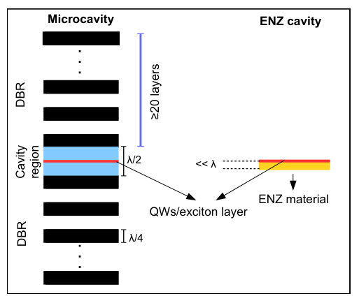 
FIG. 1. Comparison of DBR microcavities and the suggested ENZ cavity.

📷 Fig 2

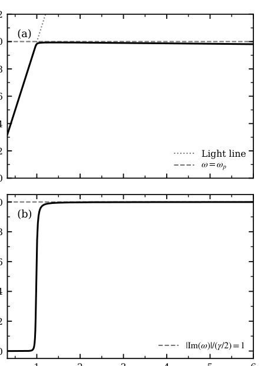 
FIG. 2. (a) Dispersion of the ENZ mode and (b) the losses for the ultrathin metal film.

📷 Fig 3

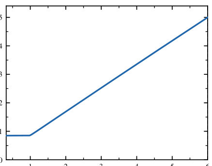 
FIG. 3. Normalized light-matter coupling strength g(k)/ωp obtained from the ENZ electric-field amplitude.

📷 Fig 4

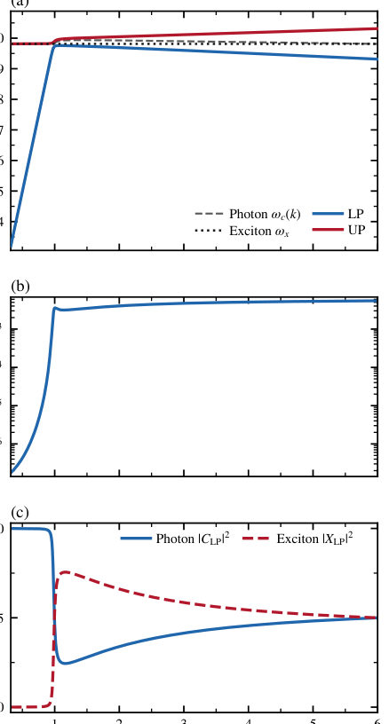 
FIG. 4. (a) Polariton bands, (b) LP losses (log scale), (c) Excitonic and photonic content for LP.

📷 Fig 5

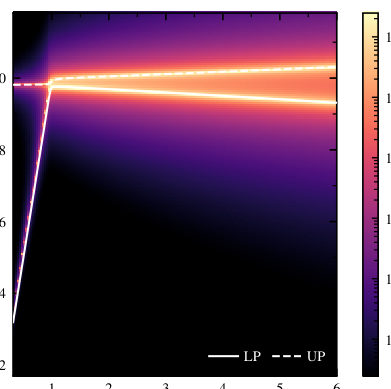 
FIG. 5. Emission map for the polariton modes (in log scale) where eSaa(k, ω) = ωpSaa(k, ω).

**Summary.** This theoretical study proposes using epsilon-near-zero (ENZ) artificial cavities as a superior platform for achieving exciton-polariton condensation compared to traditional DBR cavities. By modeling the system dynamics with a master equation and applying mean-field theory, the authors predict the critical pumping threshold and identify the specific momentum mode most likely to condense.

**Why it may be interesting.** This work bridges quantum optics, condensed matter physics, and non-equilibrium dynamics by applying advanced open quantum system techniques (Lindblad equation, mean-field theory) to predict a macroscopic quantum phenomenon (Bose-Einstein condensation) in a novel solid-state platform.

Detailed structure

**Main problem.** The paper theoretically investigates an alternative platform using epsilon-near-zero (ENZ) artificial cavities to achieve exciton-polariton condensation (PC), comparing it against conventional DBR microcavities.

**Main result.** The ENZ platform is shown to be a viable alternative due to its smaller physical size, and the analysis identifies a specific momentum mode ($k_0 = 1.149$) expected to undergo condensation with a calculated pump threshold.

**Method.** The study employs a driven-dissipative reservoir approach, utilizing the Lindblad master equation and subsequent mean-field theory to calculate the condensation threshold.

**Model / system.** The system involves exciton-polaritons confined in an ENZ cavity, modeled using an effective non-Hermitian Hamiltonian and governed by a master equation incorporating cavity loss, excitonic loss, and pumping.

**Key observables.** Pump threshold ($P_{th}$), polariton dispersion, and the relative photonic/excitonic content of the lower polariton (LP) mode.

**Important parameters / regimes.** The critical momentum $k_0 = 1.149$, the excitonic density ($
ho_X \gtrsim 10^{11} 	ext{ cm}^{-2}$), and the effective loss rates ($\Gamma_{eff}^{LP}$).

**Assumptions / limitations.** The analysis relies on mean-field theory (MFT) and assumes the validity of the reservoir approach, which may break down at lower excitonic densities.

**Figures summary.** Figures likely show the polariton dispersion relation (non-quadratic due to ENZ flatness), the calculated emission spectrum, and the comparison of condensation thresholds between ENZ and DBR cavities.

**Paper structure.** The paper first establishes the ENZ cavity platform and its properties, then develops the master equation and mean-field theory for condensation, and finally calculates the minimum pump threshold to predict the condensing mode.

Abstract

We propose an epsilon-near-zero (ENZ) artificial cavity that can enhance light-matter coupling around the ENZ frequency and theoretically show the possibility of exciton-polariton condensation in the suggested platform. By using a rate equation model based on the driven-dissipative reservoir approach, we calculate the pump threshold for condensation and then compare the suggested platform's advantages/disadvantages with distributed Bragg reflector cavities. We also discuss the validity of the mean field theory within our model.

[↑ back to top](#top)

### [Large-scale dynamics of integrable quenches](http://arxiv.org/abs/2609.09139v1)

**Authors:** David X. Horvath, Bruno Bertini  
**Type:** theory · **Category:** statistical mechanics · **PDF:** <https://arxiv.org/pdf/2609.09139v1>  
**Analysis basis:** full PDF text, analyzed in chunks
**Topic relevance:** 🔥 `non-equilibrium universality` **4/5** · `Full counting statistics` **3/5** · `Keldysh / 2PI / non-Gaussian methods` **3/5** · `analog quantum simulation` **3/5** · `methods for driven-dissipative` **2/5** · `scars & prethermalization` **2/5** · `quantum measurements` **1/5**

📷 Fig 1

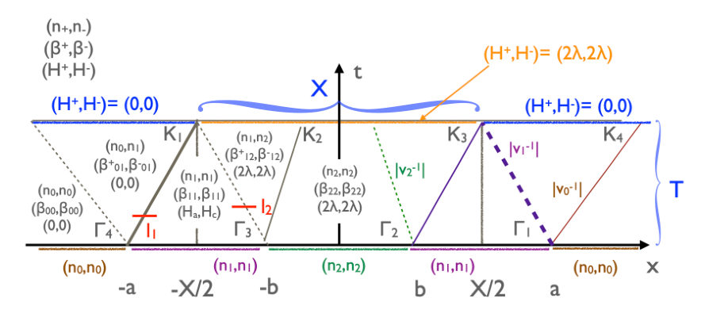 
Figure 1. Illustration of the consistent solution with 3-plateau piece-wise constant initial filling functions in the small-ζ (T/X) regime. The dashed lines correspond to characteristic curves that describe the propagation of the contact discontinuities to the left direction (K1, K2, K3, and K4). The solid lines correspond to characteristic curves that describe the propagation of the contact discontinuities to the right direction (Γ1, Γ2, Γ3, and Γ4). The slopes of these curves equal the inverse (effective) velocities; their absolute values are the same for lines with the same colour. In the left half, within each polygon, we showed the values of the various hydrodynamic fields in...

📷 Fig 2

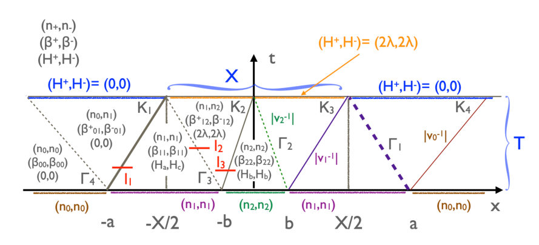 
Figure 2. Illustration of the consistent solution with a 3-plateau piece-wise constant initial filling functions when T/X = ζ = ζ1. The dashed lines correspond to characteristic curves that describe the propagation of the contact discontinuities to the left direction (K1, K2, K3, and K4). The solid lines correspond to characteristic curves that describe the propagation of the contact discontinuities to the right direction (Γ1, Γ2, Γ3, and Γ4). The slopes of these curves equal the inverse (effective) velocities; their absolute values are the same for lines with the same colour. In the left half, within each polygon, we showed the values of the various hydrodynamic fields in parentheses (n+,...

📷 Fig 3

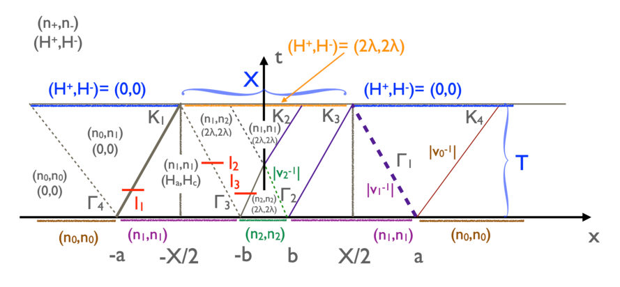 
Figure 3. Illustration of the consistent solution with a 3-plateau piece-wise constant initial filling functions when ζ2 &gt; ζ = T/X &gt; ζ1. The dashed lines correspond to characteristic curves that describe the propagation of the contact discontinuities to the left direction (K1, K2, K3, and K4). The solid lines correspond to characteristic curves that describe the propagation of the contact discontinuities to the right direction (Γ1, Γ2, Γ3, and Γ4). The slopes of these curves equal the inverse (effective) velocities; their absolute values are the same for lines with the same colour. In the left half, within each polygon, we showed the values of the various hydrodynamic fields in parentheses...

📷 Fig 4

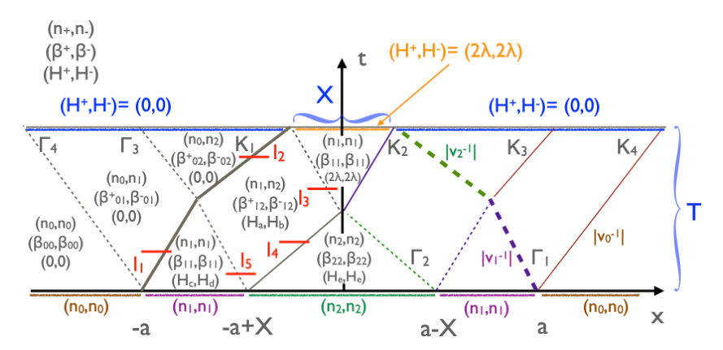 
Figure 4. Illustration of the consistent solution with 3-plateau piece-wise constant initial filling functions in the large-ζ (T/X) regime. The dashed lines correspond to characteristic curves that describe the propagation of the contact discontinuities to the left direction (K1, K2, K3, and K4). The solid lines correspond to characteristic curves that describe the propagation of the contact discontinuities to the right direction (Γ1, Γ2, Γ3, and Γ4). The slopes of these curves equal the inverse (effective) velocities; their absolute values are the same for lines with the same colour. In the left half, within each polygon, we showed the values of the various hydrodynamic fields in...

📷 Fig 5

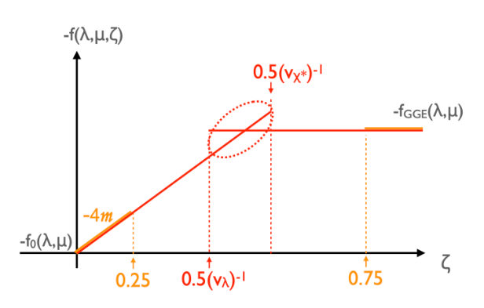 
Figure 5. Illustration of two branches of analytic solutions for the time evolutions of the FCS as a function of ζ = T/X (red lines). The orange lines denote the exact microscopic predictions using space-time swap ideas.

**Summary.** This paper extends the Ballistic Macroscopic Fluctuation Theory (BMFT) to describe large-scale fluctuations in integrable quantum systems after a quench. By treating the problem via a path integral and solving it using saddle-point methods, the authors derive the time evolution of the Full-Counting-Statistics. They successfully apply this generalized theory to model both free fermions and the Rule 54 cellular automaton.

**Why it may be interesting.** This work provides a powerful, generalized framework (BMFT) to study non-equilibrium dynamics in integrable quantum systems, which is highly relevant for understanding quench dynamics in quantum simulators or ultracold atomic systems.

Detailed structure

**Main problem.** The paper extends the Ballistic Macroscopic Fluctuation Theory (BMFT) to analyze large-scale correlations in integrable quantum systems following a quench, moving beyond quasi-equilibrium settings.

**Main result.** The time evolution of the Full-Counting-Statistics (FCS) is determined by solving saddle-point equations derived from the path integral, yielding exact solutions for free fermions and the Rule 54 cellular automaton.

**Method.** The authors employ a path-integral formulation based on BMFT, solving the resulting partial differential equations (PDEs) via saddle-point approximation to track the evolution of the FCS.

**Model / system.** The study focuses on integrable quantum many-body systems, specifically testing the formalism on free fermions and the interacting cellular automaton Rule 54, which are characterized by conserved charges and quasiparticle excitations.

**Key observables.** Full-Counting-Statistics (FCS) of a conserved charge, rapidity distributions ($
ho_{t,	heta}$), pseudo-energy ($\epsilon_	heta$), and free energy density ($f$).

**Important parameters / regimes.** The analysis is performed in the ballistic limit ($T \propto X$) and involves parameters related to the initial state preparation and the system's conserved charges.

**Assumptions / limitations.** The formalism assumes the existence of a well-defined quasiparticle content and relies on extending the BMFT framework from quasi-equilibrium to the quench regime.

**Figures summary.** Not specified in the notes.

**Paper structure.** The paper develops the theory by first establishing the necessary mathematical machinery using specific models (Free Fermions, Rule 54) to derive the governing PDEs for the FCS, and then solving these equations explicitly for the chosen systems.

Abstract

The Ballistic Macroscopic Fluctuation Theory (BMFT) is a path-integral based approach to treat large-scale correlations in interacting integrable systems which, so far, has only been applied to quasi-equilibrium settings. In this paper we extend this approach to integrable quench problems and, to illustrate it, we compute the time evolution of the full-counting-statistics (FCS) of a conserved charge. We identify the relevant path integral, solve it via saddle-point, and obtain a set of partial differential equations describing the dynamics of the FCS. We solve these equations explicitly for free fermionic systems and for the interacting cellular automaton Rule 54. In both cases, we recover the known exact results. For Rule 54, our construction moreover completes the solution across the entire ballistic window.

[↑ back to top](#top)

### [Dual-Trigger of Series Nanowire Detector for Event-Based Photon Number Assignment](http://arxiv.org/abs/2609.08811v1)

**Authors:** Stefanie Grotowski, Daniel Landes, Fabian Wietschorke, Paul Pucknus, Rasmus Flaschmann, Torsten Langer, Torsten Krause, Kai Müller, Jonathan J. Finley  
**Type:** experiment · **Category:** quantum information and computing · **PDF:** <https://arxiv.org/pdf/2609.08811v1>  
**Analysis basis:** full PDF text, analyzed in chunks
**Topic relevance:** 🔥 `QC/QI experiment` **4/5** · `Full counting statistics` **3/5** · `quantum measurements` **3/5** · `quantum optics experiment` **3/5** · `analog quantum simulation` **1/5**

📷 Fig 1

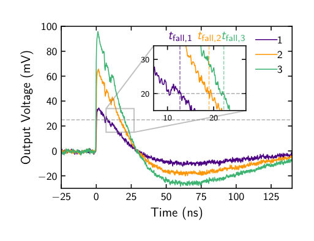 
FIG. 1: Waveform schematic of how the trigger levels of the rising and falling edge are chosen to achieve separation in the 2D heatmap of the photon number.

📷 Fig 2

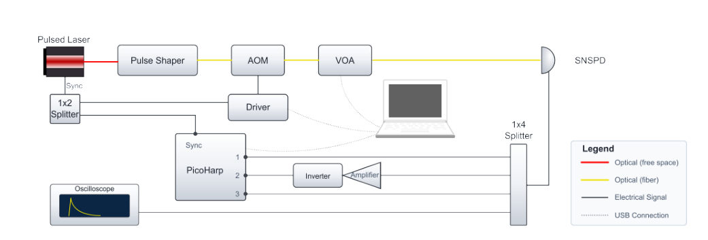 
FIG. 2: Schematic overview of used the measurement setup. The excitation light is guided to the SNSPDs through a pulse shaper, an AOM and VOA to control the pulse duration, repetition rate and attenuation, respectively. The SNSPD output signal is split into four channels, with three connected to the PicoHarp and one serving as a reference on the oscilloscope. The signal at channel (ii) is amplified and inverted to be compatible with the CFD mode.

📷 Fig 3

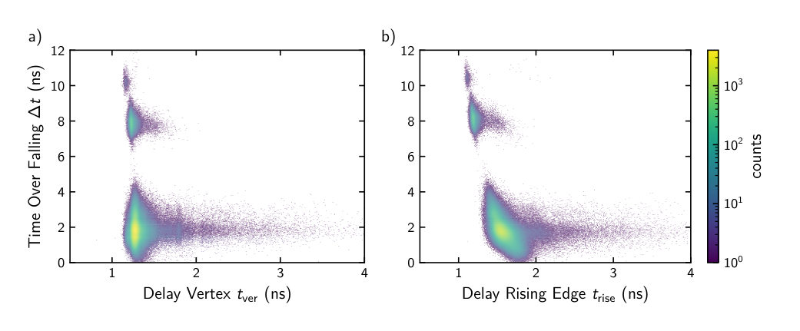 
FIG. 3: 2D heatmap of the delay of the rising edge and falling edge relative to the sync signal. a) CFD mode and b) Edge mode on rising edge. A clear separation of the photon levels in island shapes is visible.

📷 Fig 4

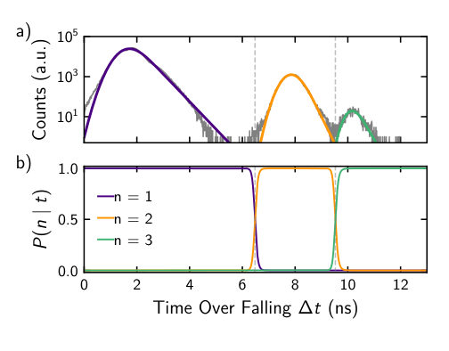 
FIG. 4: a) Data collapsed along the x-axis to resolve the photon-number encoding given by tfall. The data is modeled with EMG functions. b) Calculated weighted probabilities for the photon number n at a given time delay t.

📷 Fig 5

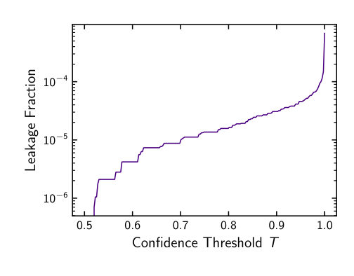 
FIG. 5: Te fraction of measured events with P(n⋆| t)¡T, as a function of the confidence threshold T. At T = 0.99 the leakage fraction remains below 0.01 %.

**Summary.** This paper introduces a dual-trigger readout technique for superconducting nanowire single-photon detectors to overcome limitations in photon-number resolution. By measuring the time difference between the pulse's rising and falling edges, the authors can reliably assign the number of incident photons ($n=1, 2, 3$). The technique proves robust, offering high certainty and revealing that the timing jitter itself depends on the photon number, which is crucial for timing-sensitive quantum applications.

**Why it may be interesting.** This work directly addresses the hardware limitations in quantum optics by providing a high-precision, low-latency readout mechanism essential for building quantum communication and computation devices.

Detailed structure

**Main problem.** Conventional single-channel readout methods struggle to resolve the photon number ($n$) in real time or accurately characterize how timing jitter depends on $n$ for photonic quantum technologies.

**Main result.** The dual-trigger method successfully establishes a robust, low-latency readout scheme, allowing for clear separation and assignment of $n=1, 2,$ or $3$ photons with high confidence.

**Method.** The authors employ a dual-trigger method on a series-connected superconducting nanowire detector, triggering on both the rising and falling edges of the detection pulse to encode photon number in the time delay between these edges.

**Model / system.** The experiment uses a three-pixel series-connected superconducting nanowire single-photon detector (SND) operated at 2.3 K, read out using both edge-triggering and Constant-Fraction Discrimination (CFD) techniques.

**Key observables.** Photon number assignment ($n=1, 2, 3$), timing jitter (which decreases as $n$ increases), and the time interval ($\Delta t$) between the rising and falling edges.

**Important parameters / regimes.** The technique achieves 99% assignment certainty; timing jitter reaches values below 41 ps for $n \geq 2$.

**Assumptions / limitations.** The primary assumption is that the time delay between the rising and falling edges can be reliably mapped to the photon number, and that CFD provides a superior, threshold-independent timestamp.

**Figures summary.** Figures illustrate the waveform schematic showing separation via dual triggers, the measurement setup, and plots detailing timing jitter vs. photon number and mean arrival time shifts.

**Paper structure.** The paper introduces the limitations of current PNR detection, details the dual-trigger methodology using the SND, compares CFD vs. edge-triggering, presents quantitative results on photon number assignment certainty, and concludes by summarizing the photon-number-dependent jitter.

Abstract

Photon-number-resolving (PNR) detectors are essential components of photonic quantum technologies. However, conventional single-channel edge-triggered readout struggles to resolve the photon number $n$ in real time or to characterize how timing jitter depends on $n$. In this work, we use a dual-trigger method on a three-pixel series-connected superconducting nanowire single-photon detector (SNSPD) that triggers on both the rising and falling edges of the detection pulse. By doing so, we preserve the precise arrival time of the detection event while mapping the photon number onto the time interval between the rising and falling edges, allowing clear separation of the events. Using this technique, we assign each detection event to $n = 1, 2,$ or 3 photons with $99\,\%$ posterior confidence across all three classes. The timing jitter decreases as $n$ increases, reaching values below $41\, \text{ps}$ for $n \geq 2$. Comparing edge-triggering with constant-fraction discrimination (CFD) for arrival-time extraction, we find that CFD yields lower jitter for single-photon events and a nearly constant mean arrival time. Altogether, our results establish dual-triggering as a robust, low-latency readout scheme for PNR detectors, while revealing a photon-number dependence of the timing jitter relevant to timing precision achievable in heralded photonic quantum applications.

[↑ back to top](#top)

### [Recovering Readout-Limited Fisher Information in Superconducting-Qubit Magnetometry with Squeezed Microwaves](http://arxiv.org/abs/2609.08598v1)

**Authors:** M. -R. Yun, Y. -J. Qu, Zheng Shan, L. -L. Yan, Yu Jia, S. -L. Su  
**Type:** theory · **Category:** other · **PDF:** <https://arxiv.org/pdf/2609.08598v1>  
**Analysis basis:** full PDF text, analyzed in chunks
**Topic relevance:** 🔥 `quantum measurements` **4/5** · `quantum optics experiment` **3/5** · `QC/QI experiment` **2/5** · `Tavis-Cummings & cavity-many-emitter` **2/5** · `analog quantum simulation` **1/5** · `interference shaping light` **1/5** · `methods for driven-dissipative` **1/5**

📷 Fig 1

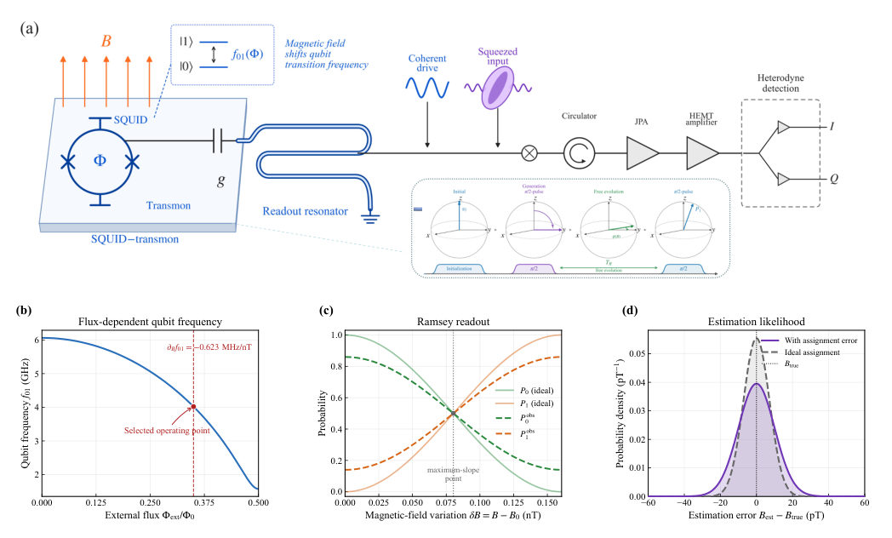 
FIG. 1: Schematic and operating principle of superconducting-qubit magnetometry with squeezed-microwave-assisted dispersive readout. (a) Measurement architecture and Ramsey phase encoding. (b) Flux-dependent qubit transition frequency with the selected operating point. (c) Ideal and observed Ramsey populations with representative symmetric state-assignment error. (d) Corresponding finite-sample magnetic-field likelihoods, showing the broadening induced by imperfect readout.

📷 Fig 2

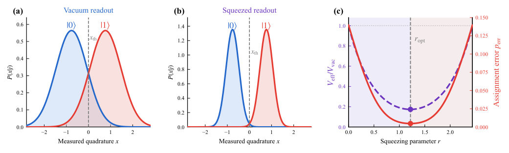 
FIG. 2: Squeezing-enhanced qubit readout. (a) State-conditioned distributions along the discrimination quadrature x for vacuum readout. (b) Distributions at the optimal squeezing strength, showing reduced overlap at fixed pointer- state separation. (c) Normalized projected variance Veff/Vvac (purple dashed) and assignment error perr (red solid) versus squeezing parameter r for θmis = 5◦. The vertical dashed line indicates ropt.

📷 Fig 3

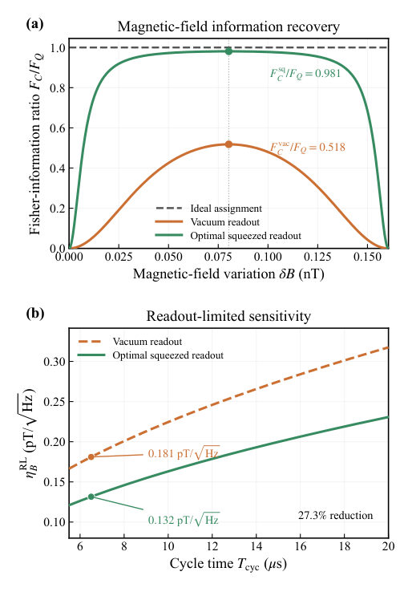 
FIG. 3: Readout-limited Fisher-information recovery and magnetic-field sensitivity. (a) FC/FQ over one half of the Ramsey fringe for ideal assignment, vacuum readout, and optimal squeezed readout. The midfringe values are 0.518 and 0.981 for vacuum and squeezed readout, respec- tively. (b) Readout-limited sensitivity ηRL B versus cycle time Tcyc. At Tcyc = 6.5 µs, optimal squeezing improves the sensitivity from 0.181 to 0.132 pT/ √

📷 Fig 4

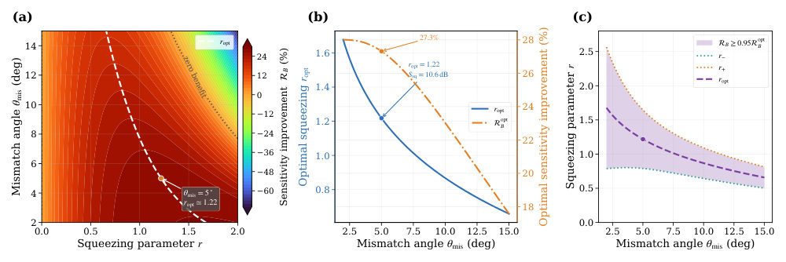 
FIG. 4: Robustness of the squeezed-readout enhancement to quadrature mismatch. (a) Readout-limited sensitivity improvement RB versus squeezing strength r and mismatch angle θmis. The white dashed curve indicates ropt, and the dotted contour marks RB = 0. The highlighted point corresponds to θmis = 5◦and ropt ≃1.22. (b) Optimal squeezing strength ropt and maximum sensitivity improvement Ropt B as functions of θmis. (c) Near-optimal squeezing window [r−, r+] satisfying RB ≥0.95Ropt B .

📷 Fig 5

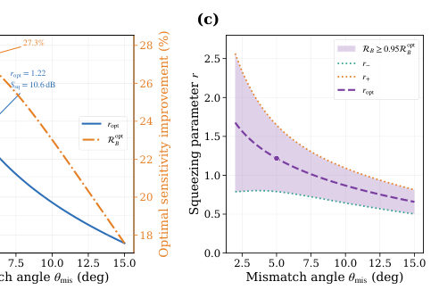 
Fig. 1(a). A coherent readout tone and a squeezed mi- crowave field are applied to the dispersively coupled res- onator, and the outgoing field is routed through a cir- culator and amplified by a low-noise parametric ampli- fier followed by a HEMT amplifier [24]. After phase- referenced demodulation and temporal integration, the measurement record is projected onto the calibrated dis- crimination quadrature used for state assignment. Rep- resentative device and readout parameters are summa- rized in Table I. The vacuum-readout performance is characterized by SNRvac = 2.16, which sets the reference discrimination performance against which the squeezed- readout enhancement is evaluated. The...

**Summary.** This paper analyzes superconducting-qubit magnetometry, focusing on how readout noise limits the achievable magnetic-field sensitivity. By developing a framework linking readout noise to the classical Fisher information, the authors show that applying squeezed microwaves can recover significant amounts of lost information. This results in a measurable improvement in sensor sensitivity, offering a practical path for quantum sensing.

**Why it may be interesting.** This work is highly relevant to AMO physics and quantum optics as it provides a concrete, quantitative method for mitigating measurement-stage noise limitations in superconducting quantum sensors using quantum noise control techniques like squeezing.

Detailed structure

**Main problem.** The paper quantifies how using squeezed microwaves during the readout process can recover magnetic-field information lost during the state assignment stage in superconducting-qubit magnetometry.

**Main result.** Squeezed readout can reduce the readout-limited magnetic-field sensitivity bound by 27.3% by recovering information lost during measurement, rather than by improving the initial encoding.

**Method.** The authors develop an effective detected-mode framework linking projected quadrature noise, state-assignment error, and the classical Fisher information accessible from binary readout outcomes.

**Model / system.** The system is a superconducting-qubit magnetometer using flux-tunable transmon qubits coupled to a microwave resonator (Circuit QED). The analysis involves modeling the dispersive readout process and incorporating quantum noise reduction via squeezing.

**Key observables.** Readout-limited magnetic-field sensitivity bound ($\eta_{RL}^B$), Classical Fisher Information ($F_C$), projected quadrature noise ($V_j$), and state-assignment error ($	ext{perr}$).

**Important parameters / regimes.** Squeezing strength ($r$), quadrature mismatch angle ($	heta_j$), and the coupling/detuning parameters of the circuit QED setup.

**Assumptions / limitations.** The analysis models the readout process using the quantum Langevin equation and assumes the dispersive regime for the qubit-resonator interaction.

**Figures summary.** Figures illustrate the magnetometry principle, showing how imperfect readout broadens the likelihood function, and demonstrate the reduction in sensitivity and recovery of Fisher information using squeezing.

**Paper structure.** The paper progresses by first establishing the magnetometry protocol, then developing the theoretical framework linking readout noise to accessible Fisher information, and finally quantifying the improvement achieved by optimizing squeezing parameters.

Abstract

The performance of superconducting-qubit magnetometers depends not only on magnetic-field encoding during Ramsey interrogation, but also on how efficiently the encoded information is recovered during readout. Here we quantify how squeezed-microwave-assisted dispersive readout can recover magnetic-field information lost during qubit-state assignment. We develop an effective detected-mode framework linking projected quadrature noise, state-assignment error, and the classical Fisher information accessible from binary readout outcomes. A finite mismatch between the squeezed quadrature and the discrimination axis produces an optimal squeezing strength through the competition between squeezed and anti-squeezed fluctuations. For representative parameters, squeezed readout reduces the readout-limited magnetic-field sensitivity bound by $27.3\%$. This improvement arises from recovering information lost in the readout stage rather than from increasing the information encoded during Ramsey interrogation. These results may provide a practical route for mitigating measurement-stage information loss in superconducting quantum sensing.

[↑ back to top](#top)

### [Anderson orthogonality scaling in the Rabi-driven heavy Fermi polaron](http://arxiv.org/abs/2609.09129v1)

**Authors:** Michael Rautenberg, Tobias Krom, Eugen Dizer, Olivier Bleu, Eleonora Lippi, Tilman Enss, Manfred Salmhofer, Lauriane Chomaz, Matthias Weidemüller  
**Type:** both · **Category:** quantum gases · **PDF:** <https://arxiv.org/pdf/2609.09129v1>  
**Analysis basis:** full PDF text, analyzed in chunks
**Topic relevance:** 🔥 `analog quantum simulation` **4/5** · `Keldysh / 2PI / non-Gaussian methods` **2/5** · `methods for driven-dissipative` **2/5** · `correlated / nonlocal dissipation` **1/5** · `driven-dissipative phase transition` **1/5** · `non-equilibrium universality` **1/5** · `quantum measurements` **1/5** · `quantum optics experiment` **1/5**

📷 Fig 1

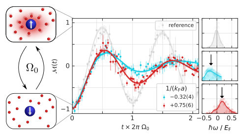 
FIG. 1. Left panel: Coherently driving a 133Cs impurity (blue sphere) between a non-interacting reference state (|↓⟩≡ Cs |2⟩, bottom left illustration, magnetization M = −1) and an interacting state (|↑⟩≡Cs |1⟩, top left, M = +1) that features tunable interactions with the surrounding fermionic 6Li bath (red dots). The coupling strength is characterized by the Rabi frequency Ω0 of 133Cs without 6Li Fermi sea. Middle panel: The system response is extracted by fitting a damped oscillation (solid lines) with frequency Ωand damping rate Γ to the oscillations of the impurity magnetization M(t) for dif- ferent impurity-bath interactions parametrized by the param- eter 1/(kFa) with the Fermi...

📷 Fig 2

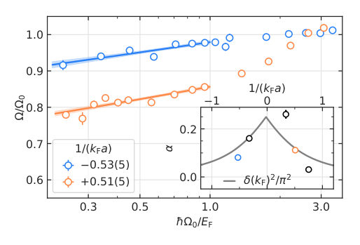 
FIG. 2. Response of the driven heavy Fermi polaron as a func- tion of drive strength ℏΩ0 for two exemplary impurity-bath interactions 1/(kFa). On the attractive side of the Feshbach resonance (1/(kFa) &lt; 0) the response of the attractive polaron is shown, whereas we probe the repulsive polaron branch on the repulsive side. Error bars indicate fit uncertainties. The solid lines are fits of Eq. (1) used to extract the scaling ex- ponent α, where the shaded areas show the corresponding 1σ confidence band of the fits. The fit results are shown in the in- set with matching colors (data for the remaining interactions can be found in the SM [29]) together with the universal be- havior α =...

📷 Fig 3

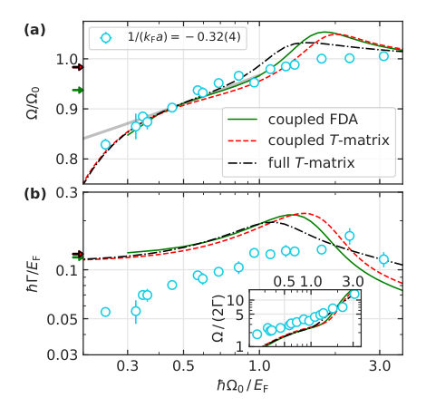 
FIG. 3. Theory comparison of the response of the driven attractive Fermi polaron as a function of drive strength at at- tractive impurity-bath interactions 1/(kFa) = −0.32(4). We show the experimentally measured reduction of Rabi frequen- cies (a) and damping rates (b) together with their predictions from different numerical simulations, see main text and [29]. The scaling prediction of Eq. (1) is shown as solid gray line where the prefactor has been adjusted to match the data. The arrows on the left show predictions for the quasiparticle weight √

📷 Fig 4

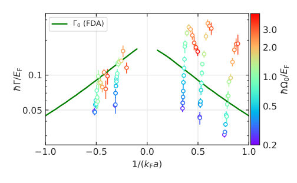 
FIG. 4. Dephasing rates measured as the damping of Rabi oscillations as a function of drive strength (color coded) for different interactions for the attractive (a &lt; 0) and repulsive (a &gt; 0) polaron, respectively. The solid line is the FDA pre- diction for the spectral width (half width at half maximum) in the absence of external drive. A more detailed presentation of the data across different interactions and drive strengths can be found in the SM [29].

**Summary.** This paper uses ultracold Fermi polarons to experimentally probe the Anderson Orthogonality Catastrophe (AOC) by coherently driving the system. The authors observe that the Rabi frequency reduction follows the predicted power-law scaling of the AOC, confirming that driven impurities are excellent tools for studying complex quantum many-body dynamics. The work successfully bridges theory and experiment in the context of strongly interacting quantum gases.

**Why it may be interesting.** This work provides a clean, controllable platform (ultracold atoms) to observe a fundamental many-body phenomenon (AOC) using local coherent control, bridging quantum optics, many-body physics, and cold atom techniques.

Detailed structure

**Main problem.** The study investigates the signatures of the Anderson Orthogonality Catastrophe (AOC) in a dynamically driven many-body system.

**Main result.** The measured Rabi frequency exhibits a power-law scaling consistent with AOC predictions, confirming that coherently driven impurities serve as a versatile probe for quantum many-body dynamics.

**Method.** The research combines experimental measurements on ultracold atomic mixtures with detailed theoretical modeling using T-matrix and FDA approaches.

**Model / system.** The system is a heavy Fermi polaron (impurity) immersed in a non-interacting Fermi sea, realized using an ultracold mixture of $^{6}	ext{Li}$ and $^{133}	ext{Cs}$ atoms, driven by optical Raman spectroscopy.

**Key observables.** Rabi frequency ($\Omega$), damping rate ($\Gamma$), and the ratio $\Omega/\Omega_0$ as functions of drive strength and interaction strength.

**Important parameters / regimes.** Finite temperature ($T/T_F = 0.25$), drive strength ($\hbar\Omega_0$), and impurity-bath mass ratio ($M/m$).

**Assumptions / limitations.** The analysis relies on comparing experimental data to theoretical frameworks like the full T-matrix theory, acknowledging that finite temperature causes small deviations from ideal zero-temperature AOC predictions.

**Figures summary.** Figures illustrate the power-law scaling of $\Omega/\Omega_0$ vs. drive strength, comparisons of $\Omega$ and $\Gamma$ vs. interaction strength, and the dependence of these quantities on temperature and mass ratio.

**Paper structure.** The paper systematically compares experimental measurements of Rabi oscillations and damping rates against multiple theoretical models (FDA, T-matrix) to extract the AOC scaling exponent and analyze finite-temperature and mass-ratio effects.

Abstract

The Anderson orthogonality catastrophe (AOC) is a paradigmatic many-body phenomenon in which a local perturbation induces a macroscopic response of a Fermi sea. We probe signatures of the AOC by coherently driving heavy Fermi polarons in an ultracold $^6$Li-$^{133}$Cs mixture. We observe a power-law dependence of the measured Rabi frequency on the drive strength, with exponents consistent with AOC predictions. Finite-temperature simulations quantitatively reproduce the observed scaling, indicating that AOC signatures persist beyond the idealized zero-temperature, infinite-mass limit. The damping of the Rabi oscillations provides access to polaron dephasing and reveals a nonmonotonic drive dependence, qualitatively consistent with current theories. Our results establish coherently driven impurities as a versatile probe of quantum many-body dynamics through local coherent control.

[↑ back to top](#top)

### [Efficient quantum state preparation on Quantinuum hardware](http://arxiv.org/abs/2609.08414v1)

**Authors:** Archie Butterworth, Josh Green, Yusen Wu, Jie Pan, Jingbo Wang  
**Type:** both · **Category:** quantum information and computing · **PDF:** <https://arxiv.org/pdf/2609.08414v1>  
**Analysis basis:** full PDF text, analyzed in chunks
**Topic relevance:** 🔥 `QC/QI experiment` **4/5** · `quantum measurements` **3/5** · `methods for driven-dissipative` **2/5** · `analog quantum simulation` **1/5**

📷 Fig 1

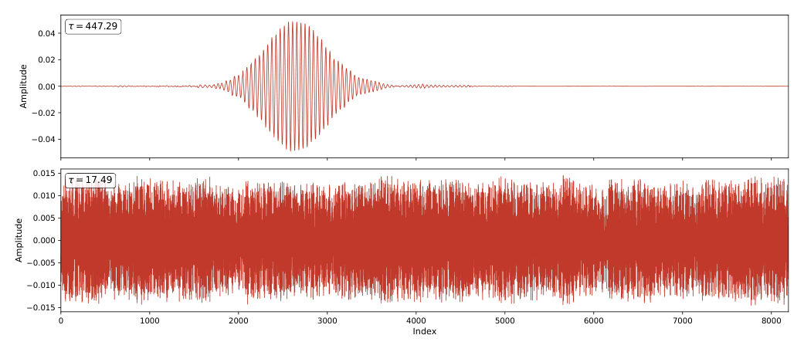 
Figure 1: TOP: The digitised acoustic pressure signal encoded in the circuit to produce ˜ψ . BOTTOM: The same state expressed in the optimised measurement basis after applying the τ reducing layer, which redistributes the probability amplitudes to reduce τ from 447.29 to 17.49, tightening the theoretical guarantees of the shadow overlap certification procedure.

📷 Fig 2

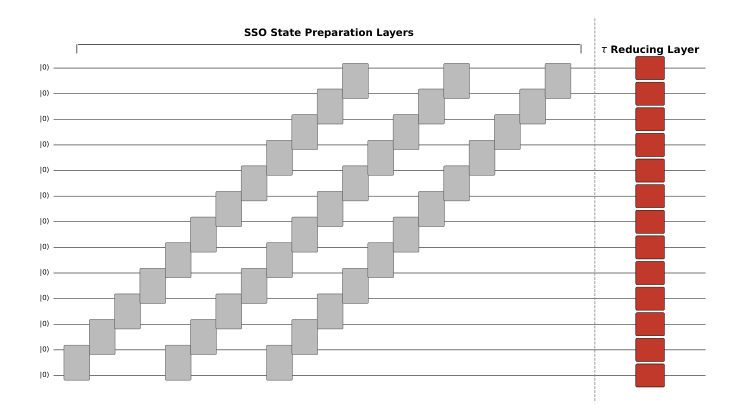 
Figure 2: The state preparation circuit consisting of 3 “staircase” layers of SU(4) gates, followed by the τ reducing layer to optimise the shadow overlap certification procedure.

📷 Fig 3

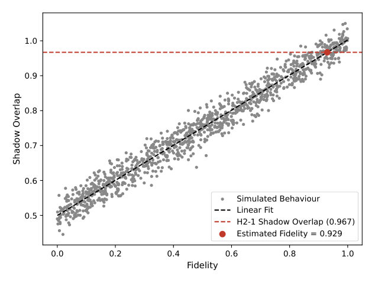 
Figure 3: Simulation of the shadow overlap process on randomly prepared states with differing fidelity to the target state. 1000 shots were taken on each prepared state. The experimental value of the shadow overlap obtained from the H2-1 hardware is also plotted, giving an estimate of fidelity as Fhw = ⟨˜ψ|ρ| ˜ψ⟩= 0.929 from a shadow overlap result of ¯ωH2-1 = 0.967.

📷 Fig 4

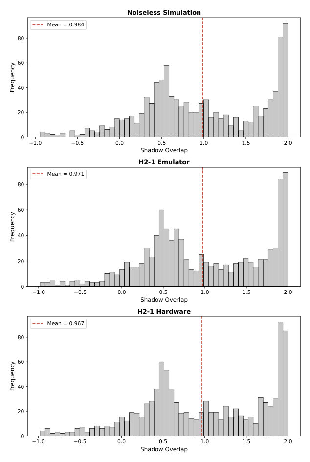 
Figure 4: Shadow overlap results from ideal noise-free simulation, noisy emulation and the H2-1 trapped ion device.

📷 Fig 5

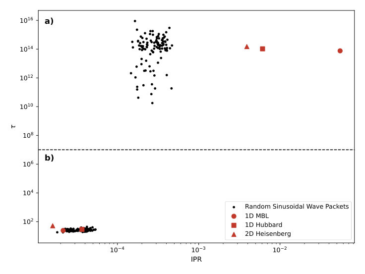 
Figure 5: The values of τ and IPR plotted before a), and after b), the action of the τ reducing layer, for randomly generated wave-packets and 3 ground states of lattice hamiltonians. In all cases the τ reducing layer is able to bring down τ by at least 10 orders of magnitude.

**Summary.** This paper presents an end-to-end framework for preparing and verifying structured quantum states on trapped-ion hardware. It achieves high fidelity by combining resource-efficient state preparation with a novel basis-change technique. This technique dramatically reduces the measurement overhead required for state certification, making the method scalable for real-world quantum applications.

**Why it may be interesting.** The work provides a concrete, hardware-validated protocol for benchmarking structured quantum data, which is crucial for realizing quantum advantage in applications like quantum machine learning or quantum simulation.

Detailed structure

**Main problem.** The paper addresses the challenge of efficiently preparing and robustly verifying complex, structured quantum states on near-term quantum hardware.

**Main result.** They demonstrated an end-to-end framework achieving high hardware fidelity ($F_{hw} = 0.929$) and introduced a basis-change technique that drastically reduces the sample complexity required for state verification.

**Method.** The approach combines resource-efficient state preparation using tensor-network optimization (SSO) with state validation via the shadow overlap method, enhanced by a novel pre-measurement basis-change layer.

**Model / system.** The experiments are conducted on the Quantinuum H2-1 trapped-ion platform. The target state is a structured complex quantum state encoding a digitized acoustic signal, which is modeled using Matrix Product States (MPS).

**Key observables.** Hardware fidelity ($F_{hw}$), shadow overlap ($ar{\omega}$), and the relaxation time parameter ($	au$).

**Important parameters / regimes.** The basis-change technique reduces the verification parameter $\tau$ by over 10 orders of magnitude; the framework requires only 1,000 measurement shots for verification.

**Assumptions / limitations.** The primary limitation addressed is that traditional validation methods suffer from prohibitively high sample complexity for structured states.

**Figures summary.** Figures compare shadow overlap results across different noise models and plot the relaxation time ($\tau$) and Inverse Participation Ratio (IPR) before and after applying the $\tau$ reducing layer for various structured states.

**Paper structure.** The paper first establishes the need for efficient state preparation and certification. It details the use of MPS and SSO for preparation, followed by an analysis of the shadow overlap method and its dependence on $\tau$. The core contribution is the introduction and demonstration of the basis-change layer to mitigate large $\tau$ values, culminating in the end-to-end hardware demonstration.

Abstract

Preparation and verification of specific quantum states is an important capability for quantum devices to realise advantages over classical computations and algorithms. In this work, we have demonstrated an end-to-end framework that combines resource-efficient quantum state preparation with rapid, robust fidelity verification on near-term quantum hardware. By experimentally preparing and validating a structured complex quantum state encoding a digitized acoustic signal on the Quantinuum H2-1 trapped-ion platform, we achieved a high hardware fidelity of $F_{\mathrm{hw}} = 0.929$. Crucially, this milestone was realized without relying on idealized assumptions or deep fault-tolerant overhead, but rather through resource-minimal circuits optimized for NISQ-era and early fault-tolerant devices.   Furthermore, we addressed a key limitation in current quantum state certification. While validation methods like shadow overlap work well for random states, their sample complexity can become prohibitively high for the structured states used in practical algorithms. We mitigate this by introducing a pre-measurement basis-change technique that reduces the verification parameter, $τ$, by over 10 orders of magnitude for structured targets. This approach tightens the theoretical certification guarantees of the shadow overlap method and integrates tensor-network preparation and shadow validation into a unified workflow. These results shift the paradigm of how structured classical data can be mapped to and verified on quantum hardware under realistic noise and measurement budgets. By compressing a robust verification procedure to just 1,000 measurement shots, this framework offers an immediate, scalable benchmarking standard.

[↑ back to top](#top)

### [Resilience Beyond the Light Cone: Error-Detected Primitives for Practical Dynamic Circuits](http://arxiv.org/abs/2609.08925v1)

**Authors:** Kevin C. Smith, Bibek Pokharel, Satvik Maurya, Maika Takita  
**Type:** experiment · **Category:** quantum information and computing · **PDF:** <https://arxiv.org/pdf/2609.08925v1>  
**Analysis basis:** full PDF text, analyzed in chunks
**Topic relevance:** 🔥 `QC/QI experiment` **4/5** · `quantum measurements` **3/5** · `methods for driven-dissipative` **2/5**

📷 Fig 1

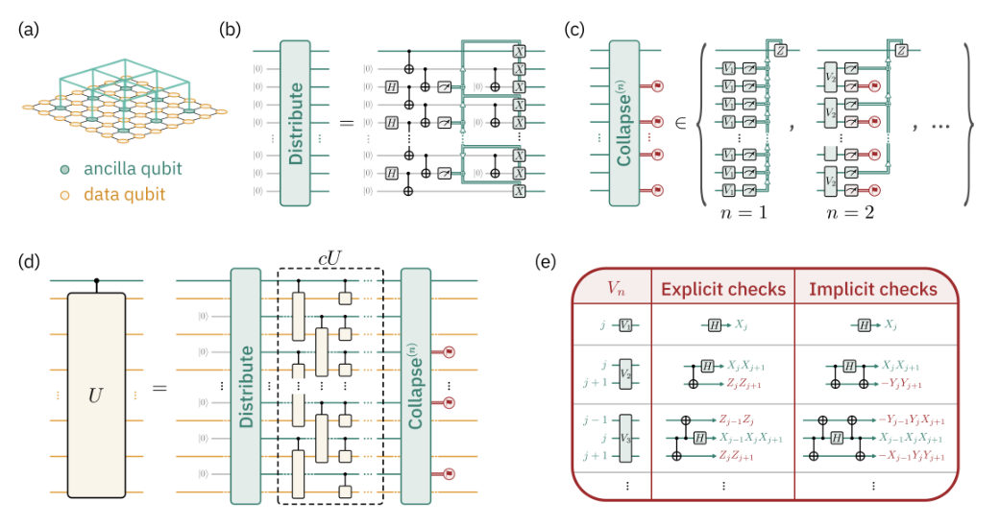 
FIG. 1. The error-detected distribute–collapse framework. (a) Ancilla qubits are prepared in a GHZ state and distributed throughout the device, forming a distributed control. (b) The distribute primitive, which carries out the constant-depth preparation of the distributed control using dynamic circuits. (c) The collapse(n) primitive, which carries out the constant- depth reduction of the distributed control onto a single ancilla. By leveraging the underlying repetition-code-like structure of the distributed control, the baseline implementation (n = 1) can be upgraded to provide error detection (n ≥2) at the cost of a layer of local check gadgets Vn; larger n improves code distance at the...

📷 Fig 2

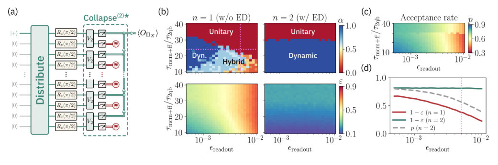 
FIG. 2. Demonstrating the impact of error detection (ED) through noisy simulation. (a) Circuit diagram for the sensing-like experiment described in Sec. II B, involving the preparation (distribute) and consumption (collapse(2)∗) of a GHZ state to estimate the phase accumulated under an external field through estimation of ⟨OΠX ⟩. We carry out noisy simulations for N = 52 qubits using Qiskit’s matrix product state backend [53] with T1 = T2 = 250 µs and ϵ2qb = 1.5 × 10−3, chosen to model ibm boston. (b) For each value of mid-circuit measurement and feedforward duration relative to the two-qubit gate duration (τmcm+ff/τ2qb) and readout error (ϵreadout), we determine the distribute mid-circuit...

📷 Fig 3

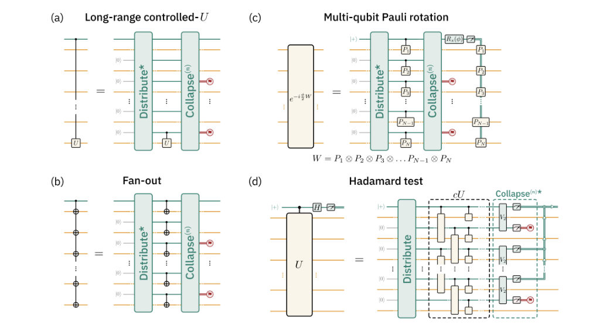 
FIG. 3. Examples of constant-depth, long-range and multi-qubit primitives augmented with error-detection using the dis- tribute-collapse framework. distribute∗denotes a variant of distribute that defers feedforward corrections to the col- lapse stage of the circuit, while collapse(n)∗indicates the feedforward corrections can be carried out in post-processing. (a) A long-range two-qubit controlled-unitary. (b) An error-detected, constant-depth fan-out gate. (c) An error-detected, constant-depth multi-qubit Pauli rotation. (d) An error-detected, depth O(k) implementation of the Hadamard test for an arbitrary unitary U of depth k, requiring a single round of mid-circuit measurements and...

📷 Fig 4

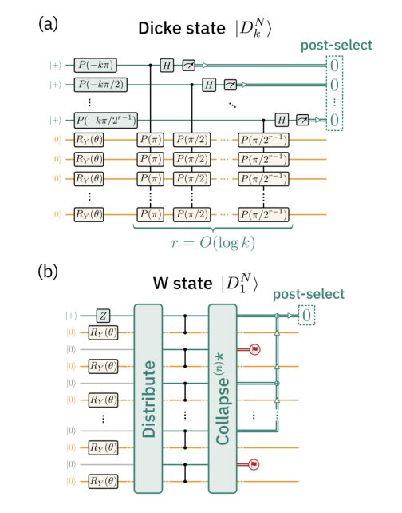 
FIG. 4. Error-detected preparation of Dicke states. (a) A sim- plified variant of the protocol of Ref. [16] for approximately preparing the N-qubit Dicke state of weight k, |DN k ⟩. Single- qubit RY (θ) rotations first prepare a binomially-weighted product state, which is then projected onto the target sec- tor k via r = O(log k) rounds of bit extraction, each a layer of controlled-phase gates followed by an ancilla measurement postselected on 0. Each round can be realized by a single round of distribute–collapse and augmented with error detection, in analogy to the Hadamard test of Fig. 3(d). (b) Constant-depth, error-detected preparation of the W state |DN 1 ⟩, requiring one round of...

📷 Fig 5

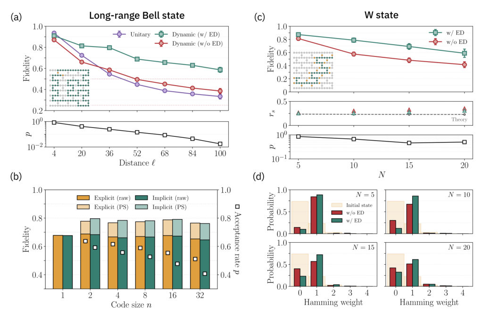 
FIG. 5. Experimental demonstration of our error detection framework on ibm boston. Left: error-detected preparation of a long-range entangled Bell state |Φ+⟩= (|00⟩+ |11⟩)/ √

**Summary.** This paper introduces an error-detection scheme for dynamic quantum circuits, enabling the reliable generation of long-range entanglement and complex quantum states in constant depth. By implementing error checks via postselection, the authors overcome fidelity degradation caused by mid-circuit measurements. The results demonstrate that these robust protocols are practically viable on current superconducting quantum hardware.

**Why it may be interesting.** It directly addresses the practical limitations of implementing complex, low-depth quantum algorithms by providing a concrete, hardware-tested error mitigation strategy for dynamic circuits.

Detailed structure

**Main problem.** The primary challenge is overcoming error accumulation in dynamic quantum circuits, which are necessary to achieve constant-depth, long-range entanglement, due to mid-circuit measurements and classical feedforward latency.

**Main result.** The authors developed an error-detection scheme that allows for the preparation of long-range entangled states (e.g., 100-qubit Bell pairs) with fidelity exceeding the baseline dynamic circuit performance, and demonstrated constant-depth W state preparation.

**Method.** They propose a general error-detection framework utilizing postselection overhead, which is applied to primitives like controlled global operations ($cU$) via 'distribute' and 'collapse' routines.

**Model / system.** The work focuses on dynamic quantum circuits, which augment unitary operations with mid-circuit measurements and classical feedforward. Experiments were performed on a superconducting quantum processor.

**Key observables.** Fidelity ($F$), entanglement-certification threshold ($F>0.5$), and circuit depth (aiming for constant depth).

**Important parameters / regimes.** System size (up to 100 qubits), error detection parameter ($n$), and depth scaling ($O(k)$ vs. linear depth).

**Assumptions / limitations.** The scheme trades infidelity for postselection overhead and assumes the ability to implement the necessary error checks without adding ancillas.

**Figures summary.** Figures illustrate the framework, showing the GHZ preparation, the 'distribute' and 'collapse(n)' primitives, and the full $cU$ implementation, detailing the explicit and implicit error checks.

**Paper structure.** The paper introduces the error detection framework, provides a unified mathematical framework for various quantum primitives, and concludes with experimental validation on superconducting hardware.

Abstract

Dynamic circuits, which augment unitary operations with mid-circuit measurements and classical feedforward, can generate long-range entanglement in constant depth, enabling low-depth primitives ranging from nontrivial state preparation to many-qubit entangling gates. Escaping the light-cone constraints of unitary circuits, however, comes at a cost: these primitives typically require a number of mid-circuit measurements that scales with system size and that, together with feedforward latency, can introduce errors that degrade the long-range entanglement they rely on. Here, we alleviate this tension by showing that many such primitives, when cast into a common framework, admit an error-detection scheme that trades infidelity for postselection overhead with no additional ancillas. Our framework thus unifies and upgrades a broad class of primitives including fan-out gates, multi-qubit Pauli rotations, the preparation of W and higher-weight Dicke states, and certain non-normal matrix product states. We also introduce a reduced-depth, error-detected implementation of the Hadamard test, extending the use cases of dynamic circuits to a key algorithmic primitive. Finally, we establish the practical utility of our scheme through experiments on a superconducting quantum processor. We demonstrate the error-detected preparation of a long-range entangled Bell pair spanning a 100-qubit chain with fidelity $F=0.59\pm0.02$, surpassing the entanglement-certification threshold $F>0.5$ that the baseline dynamic-circuit implementation fails to reach ($0.39\pm0.01$). Separately, we demonstrate constant-depth preparation of W states of up to 20 qubits by consuming GHZ states of up to 40 qubits, finding absolute fidelity improvements of $ΔF\approx 0.2$ across the largest sizes studied. Altogether, these results bring low-depth dynamic-circuit primitives within practical reach on present-day hardware.

[↑ back to top](#top)

### [Multimode squeezed light generation and characterization](http://arxiv.org/abs/2609.08591v1)

**Authors:** Alexander Chudakov, Vladislav Severin, Anastasia Poshevkina, Danil Malyshev, Kirill Kuznetsov, Olga Tikhonova, Dmitry Kalashnikov, Polina Sharapova  
**Type:** both · **Category:** other · **PDF:** <https://arxiv.org/pdf/2609.08591v1>  
**Analysis basis:** full PDF text, analyzed in chunks
**Topic relevance:** 🔥 `quantum optics experiment` **4/5** · `interference shaping light` **3/5** · `quantum measurements` **1/5**

📷 Fig 1

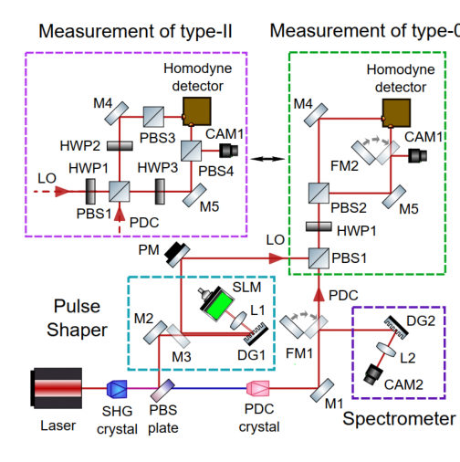 
FIG. 1. The sketch of the experimental setup includes three main blocks: Pulse Shaper, Spectrometer and Squeezing Mea- surement. The choice of the system configuration depends on the type of PDC process (0 or II). Here, Laser is the pi- cosecond Ti: Sapphire Coherent Mira 900D pulsed laser, SHG crystal is the crystal for the second harmonic generation, PBS plate is the polarizing beam-splitting plate, PDC crystal is the crystal for producing the type-0(II) PDC process, M(1-5) are mirrors, DG1(2) are diffraction gratings, L1(2) are lenses, FM1(2) are flip mirrors, SLM is the spatial light modula- tor, PM is the piezo-mirror, PBS(1-4) are polarizing beam- splitting cubes, HWP(1-3) are...

📷 Fig 2

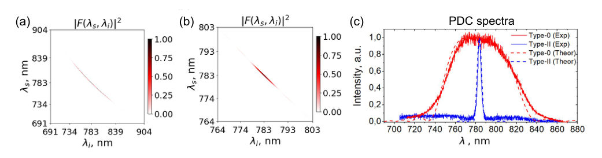 
FIG. 2. Joint spectral intensities normalized to unity at their maximum for the (a) type-0 PDC and (b) type-II PDC processes. (c) Normalized theoretical (dashed) and experimental (solid) PDC spectra for the type-0 (red) and type-II (blue) PDC processes.

📷 Fig 3

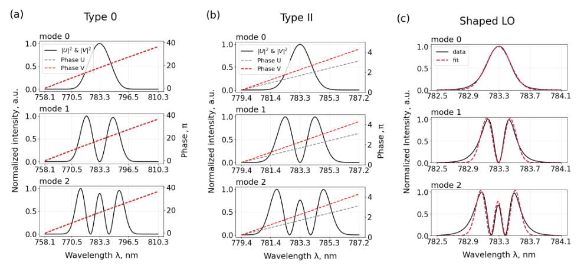 
FIG. 3. Schmidt modes normalized to unity at their maximum value: (a) for the type-0 process and (b) for the type-II process. (c) Spectra of the local oscillator after pulse shaping (black) and the corresponding fitting curves (red). The fitting was performed using the squared Hermite–Gaussian functions.

📷 Fig 4

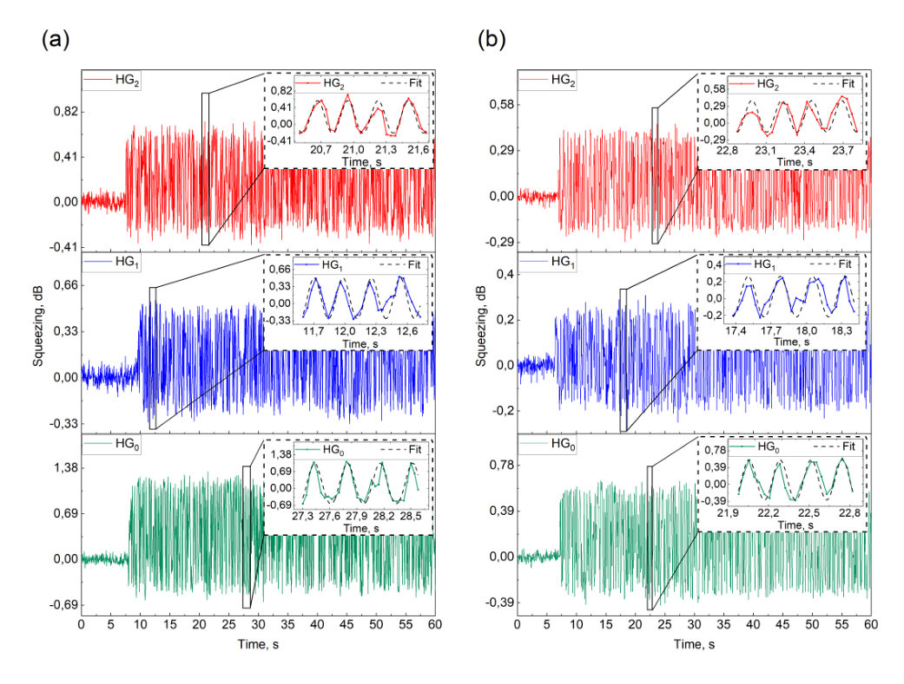 
FIG. 4. Measured squeezing and antisqueezing in the first three PDC modes defined by the spectral shape of the LO: a) type-0 PDC; b) type-II PDC. The inserts show a zoom of the marked regions with a fit calculated using Eq. 18 together with Eq. 11 and Eq. 16 for the type-0 and type-II PDC processes, respectively.

📷 Fig 5

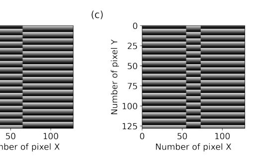 
FIG. 5. Phase masks for the first three Hermite-Gauss modes: a) HG0; b) HG1; c) HG2.

**Summary.** This paper presents a comprehensive theoretical and experimental study of multimode squeezed light generated using Type-0 and Type-II Optical Parametric Amplifiers. By employing Schmidt-mode theory and pulse shaping, the authors characterize the squeezing in relation to the local oscillator's spectral profile. The results confirm the feasibility of generating and measuring these complex quantum states, which has implications for advanced quantum protocols.

**Why it may be interesting.** This work is highly relevant to quantum optics and open quantum systems, providing detailed methods for characterizing complex, multi-mode quantum states generated in nonlinear optical processes.

Detailed structure

**Main problem.** The paper theoretically and experimentally characterizes multimode squeezed light generated via Type-0 and Type-II Optical Parametric Amplifiers (OPAs). It specifically investigates how the measured squeezing depends on the spectral profile of the local oscillator (LO).

**Main result.** The study successfully characterizes the multimode squeezing for both PDC types, showing good agreement between theoretical predictions and experimental measurements, while also analyzing the impact of optical losses.

**Method.** The analysis employs Schmidt-mode theory for theoretical modeling and uses homodyne detection combined with pulse shaping techniques for experimental characterization.

**Model / system.** The system involves generating multimode squeezed light using Type-0 and Type-II PDC in a single-pass OPA. The theoretical framework utilizes the Schmidt-mode decomposition of the Joint Spectral Amplitude (JSA) to diagonalize the effective Hamiltonian.

**Key observables.** Measured quadrature variance ($\Delta P_{LO}$), multimode squeezing parameter ($r_{	ext{dB}}$), and anti-squeezing ($	ext{ASq}$) values.

**Important parameters / regimes.** LO spectral profile, coupling strengths ($\Gamma$), detection efficiency (e.g., 70%), and the type of PDC (Type-0 vs. Type-II).

**Assumptions / limitations.** The analysis assumes specific commutation relations for the Schmidt operators and incorporates losses into the variance calculations.

**Figures summary.** Figures illustrate the optical setup, Joint Spectral Intensities (JSIs) for both PDC types, Schmidt modes, and the measured/calculated squeezing and anti-squeezing across multiple Hermite-Gaussian (HG) modes.

**Paper structure.** The paper progresses from theoretical modeling using Schmidt-mode theory to detailed calculations for Type-0 and Type-II PDC, followed by an experimental section detailing the setup, measurements, and comparison of results with theory.

Abstract

Nowadays, the realization of quantum computations and communications based on continuous variables has attracted a significant attention due to a substantial expansion of the system dimensionality. The main progress in this area is attributed to the implementation of multimode systems based on squeezed states of light. One of the simplest ways to generate such states relies upon their producing in a single-pass optical parametric amplifier (OPA) using ultrafast pumping. However, for homodyne detection of such multimode states, the profile of the local oscillator (LO) must perfectly match the profile of the measured mode. Usually, this is not the case; therefore a proper treatment of multimode squeezing is required. In this work, we study both theoretically and experimentally the multimode squeezed light generated in type-0 and type-II OPA. We characterize such sources and investigate the degree of squeezing in dependence on the LO spectral profile, employing a pulse shaping technique. The theoretical analysis is performed using the Schmidt-mode theory. This work might have a significant impact on the realization of multimode quantum protocols

[↑ back to top](#top)

### [On spectral properties of Generalized Kadanoff--Baym Ansatz](http://arxiv.org/abs/2609.09067v1)

**Authors:** Miroslav Hopjan  
**Type:** theory · **Category:** strongly correlated electrons · **PDF:** <https://arxiv.org/pdf/2609.09067v1>  
**Analysis basis:** full PDF text, analyzed in chunks
**Topic relevance:** 🔥 `Keldysh / 2PI / non-Gaussian methods` **4/5** · `methods for driven-dissipative` **3/5** · `analog quantum simulation` **1/5**

📷 Fig 1

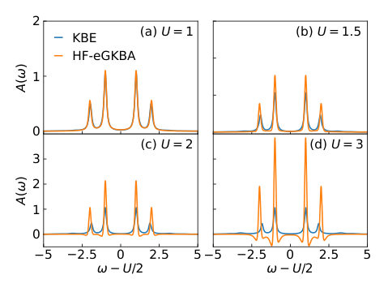 
Fig. 1: The spectral function of homogeneous 6-site Hub- bard ring, comparison of the full KBE (blue) and the HF- eGKBA (orange) spectral functions for various interaction U = 1, 1.5, 2, 3. To achieve the convergence, the spectral func- tion are computed with the artificial broadening γ = 0.5.

**Summary.** This work analyzes the spectral properties of the Generalized Kadanoff--Baym Ansatz (GKBA) used to simulate strongly correlated quantum systems like the Hubbard model. While the GKBA offers significant computational speed-ups, the authors demonstrate that at large interaction strengths, the approximation breaks down, leading to unphysical results such as negative spectral functions. This highlights a critical trade-off between computational tractability and physical accuracy in non-equilibrium many-body theory.

**Why it may be interesting.** The findings directly address the reliability of advanced non-equilibrium simulation techniques (like GKBA) when applied to strongly correlated materials, providing crucial theoretical warnings about the limits of computational approximations.

Detailed structure

**Main problem.** The paper investigates the spectral properties hidden within the collision integral of the Generalized Kadanoff--Baym Ansatz (GKBA) when simulating non-equilibrium quantum fermionic systems.

**Main result.** At large interaction strengths, the spectral function obtained using the extended GKBA becomes negative, indicating that the GKBA has significant limitations and may yield unphysical results in strongly correlated regimes.

**Method.** The authors compare results from the full Kadanoff--Baym Equations (KBE) against approximations derived from the GKBA and its extension (eGKBA), utilizing mean-field Hartree-Fock approximations.

**Model / system.** The study uses a Hubbard cluster (or Hubbard ring model) as the physical system, governed by a Hamiltonian involving hopping and on-site interaction terms.

**Key observables.** Single-particle spectral functions, single-particle density matrix, and the single-particle Green's function components.

**Important parameters / regimes.** Interaction strength ($U$), which is varied from moderate to large values to test the stability of the approximation.

**Assumptions / limitations.** The primary approximation is the use of the GKBA, which truncates reconstruction equations for computational efficiency, leading to the Hartree-Fock-GKBA (HF-GKBA).

**Figures summary.** Figure 1 compares the spectral functions obtained from KBE and HF-eGKBA for varying interaction strengths U, showing deviations and negativity for large U.

**Paper structure.** The paper introduces the GKBA as a computationally cheaper alternative to KBE, then develops the extended version (eGKBA). The core of the work involves comparing the spectral properties of the eGKBA against the full KBE, culminating in the demonstration of unphysical negative spectral weights at strong coupling.

Abstract

The Generalized Kadanoff--Baym Ansatz with mean-field propagators is increasingly used to simulate non-equilibrium quantum fermionic and bosonic systems. Compared with the full Kadanoff--Baym equations, its mean-field propagators substantially reduce computational cost, enabling simulations with computational effort that scales linearly with propagation time. However, the time-diagonal structure of the Generalized Kadanoff--Baym Ansatz obscures spectral properties within the collision integral of the transport equation. Here, we recover and investigate these hidden spectral properties using the extended Generalized Kadanoff--Baym Ansatz. For a Hubbard cluster, we compare ground-state spectral functions obtained with the extended Generalized Kadanoff--Baym Ansatz against those from standard Kadanoff--Baym equations. At moderate interaction strengths, the spectral functions show good agreement. At large interaction strengths, however, significant deviations emerge, and the spectral function obtained with the extended Generalized Kadanoff--Baym Ansatz becomes negative. These results demonstrate that, despite its computational advantages, the Generalized Kadanoff--Baym Ansatz has important limitations in strongly interacting regimes and may produce unphysical spectral properties when interactions become sufficiently large.

[↑ back to top](#top)

### [Preparation of a Bell state in an analogue device hosting the transverse-field Ising model](http://arxiv.org/abs/2609.09013v1)

**Authors:** Ana Palacios  
**Type:** theory · **Category:** quantum information and computing · **PDF:** <https://arxiv.org/pdf/2609.09013v1>  
**Analysis basis:** full PDF text, analyzed in chunks
**Topic relevance:** 🔥 `analog quantum simulation` **4/5** · `QC/QI experiment` **3/5** · `quantum measurements` **1/5**

📷 Fig 1

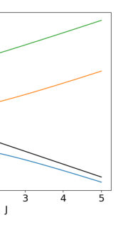 
Figure 1. Energy spectrum of H as a function of the coupling strength J.

📷 Fig 2

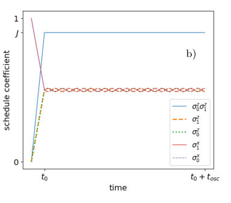 
Figure 2. Representation of the schedule for the whole process of Bell state preparation. In a) we present the schedule from an algorithmic perspective (participating Hamiltonians), while in b) we show the schedule in terms of controls of the different terms of the Hamiltonians, more relevant to the hardware implementation.

📷 Fig 3

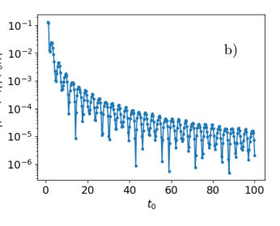 
Figure 3. Energy landscape of Hinterp (a) and final infidelities at s = 1 as a function of interpolation time t0 (b) for the first step of the protocol, considering J = 1. In a), levels 0 and 2 are thickened to highlight the relevant gap for the adiabatic process, which is minimum at s = 1 (E2(1) −E0(1) ≃1.8).

📷 Fig 4

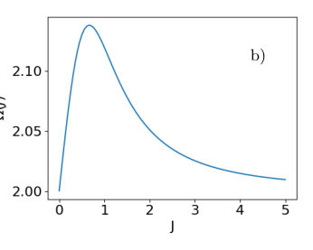 
Figure 4. Energy landscape of H2 for J = 1 (a) and resulting transition matrix element between the first two lowest eigenstates of H1 induced by the oscillation around s∗= 0.5 (i.e., around H1) (b).

📷 Fig 5

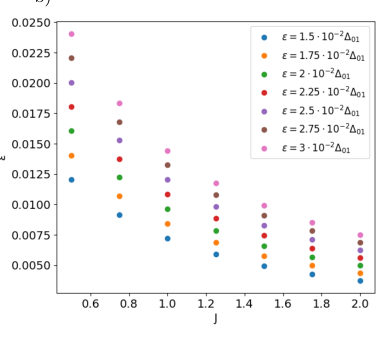 
Figure 5. In a) we show the final infidelity with the target singlet state over a range of parameters. For each J, the optimal t0 is selected over a grid of 10 equally spaced points between 10 and 20 to account (to some degree) for the oscillations in the ground state fidelity of the adiabatic preparation (see Fig. 3.b), but in every case t0 ≃20. Figure b) shows the absolute value of the corresponding amplitudes ε as a function of J.

**Summary.** This work details an analogue protocol for generating a Bell state within a superconducting device simulating the transverse-field Ising model. The method combines adiabatic evolution with resonant population transfer, achieving high fidelity comparable to digital gate methods. This demonstrates a powerful, hardware-native approach for quantum state preparation.

**Why it may be interesting.** It provides a concrete, hardware-implementable protocol for generating fundamental quantum states using continuous Hamiltonian control, which is highly relevant for superconducting quantum computing architectures.

Detailed structure

**Main problem.** The paper proposes a protocol to prepare the singlet Bell state using purely analogue control methods.

**Main result.** The protocol achieves fidelities comparable to standard gate-based preparation within similar time scales ($\sim 100$ ns) and shows robustness against systematic control errors.

**Method.** The preparation is achieved in two steps: an adiabatic interpolation to reach the ground state of a symmetric Hamiltonian, followed by a resonant population transfer between the two lowest energy levels.

**Model / system.** The system is an analogue device hosting the transverse-field Ising model, which can be implemented in superconducting platforms. The Hamiltonian involves terms like $\sigma_x$ and $\sigma_z$ interactions.

**Key observables.** Fidelity (target $\approx 1$), Infidelity ($\sim 10^{-4}$), and preparation time ($\sim 100$ ns).

**Important parameters / regimes.** Coupling strength $J$, adiabatic interpolation parameter $s$, and Rabi oscillation amplitude $\varepsilon$.

**Assumptions / limitations.** The initial state is assumed to be the ground state of the initial Hamiltonian ($H_0$), and the analysis for the second step assumes the two lowest levels are sufficiently isolated.

**Figures summary.** Figures illustrate the energy spectrum evolution, the algorithmic vs. hardware control schedule for preparation, and the dependence of final infidelity on time and control parameters.

**Paper structure.** The paper details the Hamiltonian, outlines the two-step protocol (adiabatic interpolation followed by resonant transfer), analyzes the fidelity and robustness against systematic errors, and compares results to gate-based methods.

Abstract

We propose a protocol for preparing the singlet Bell state in an analogue device implementing the transverse-field Ising model with ZZ interactions and local X and Z fields, which can be engineered within the superconducting platform, among others. This protocol is performed by direct control of the terms of the Hamiltonian alone. The method exploits the fact that the singlet state is the first excited state of a symmetric Hamiltonian family, and comprises two steps: an adiabatic interpolation preparing the ground state of said symmetric Hamiltonian, followed by the resonant population transfer between its two lowest energy levels. For realistic parameters, the protocol achieves fidelities comparable to standard gate-based preparation within similar time scales ($\sim$100 ns), and can reach infidelities on the order of $10^{-4}$ with a moderately increased duration. We further analyse robustness against systematic control errors and show that high fidelities are maintained under implementation imperfections.

[↑ back to top](#top)

### [Real-time Dyson expansion for the nonequilibrium $GW$ approximation: Correlated spectra and dependence on the reference propagator](http://arxiv.org/abs/2609.08932v1)

**Authors:** Erik Schroedter, Jan-Philip Joost, Michael Bonitz, Vojtech Vlcek  
**Type:** theory · **Category:** strongly correlated electrons · **PDF:** <https://arxiv.org/pdf/2609.08932v1>  
**Analysis basis:** full PDF text, analyzed in chunks
**Topic relevance:** 🔥 `Keldysh / 2PI / non-Gaussian methods` **4/5** · `methods for driven-dissipative` **2/5**

📷 Fig 1

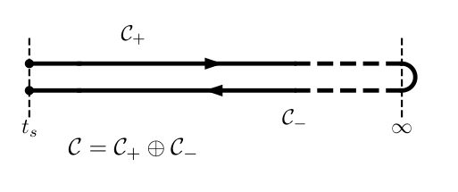 
Figure 1. Keldysh time contour C = C+ ⊕C−used for the real-time propagation. The system is prepared at the switch- on time ts. The upper (forward) branch C+ runs from ts toward t →∞and the lower (backward) branch C−returns. The two-time Green’s function G(t, t′) is evaluated with both arguments on this contour.

📷 Fig 2

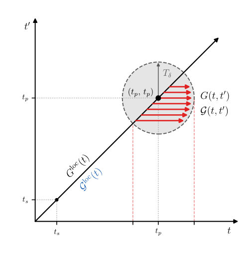 
Figure 2. Schematic of the off-diagonal reconstruction of the two-time Green’s functions in the (t, t′) plane. Propagation is first performed along the time diagonal t′ = t, yielding the local (time-diagonal) components Gloc(t) and Gloc(t). Within a probe window (dashed circle) of radius Tδ centered on the probe time (tp, tp), the off-diagonal components G(t, t′) and G(t, t′) are then reconstructed by time stepping in t-direction, at fixed t′ (red arrows, t′ ≤t ≤Tmax). Because only the off- diagonal elements inside this window are required, the overall cost is set by the time-diagonal propagation, while Tδ controls the spectral resolution of the probe at tp. Gloc(t) only appears within the...

📷 Fig 3

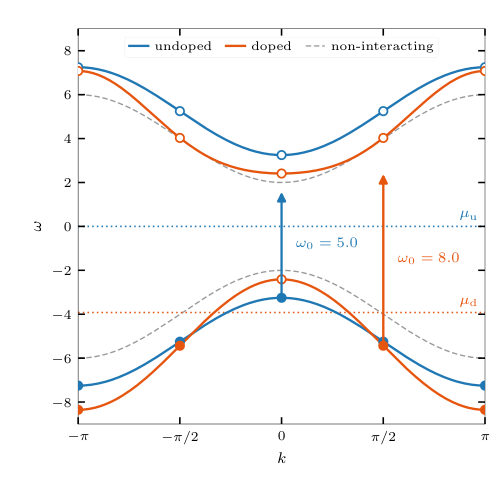 
Figure 3. Exact quasiparticle band structure of the two- band chain with four sites at U = 2.5 and γ = 0.5, given by the position of the dominant pole of the exact removal spectrum (of the addition spectrum for empty states), for the undoped system (blue) with fully filled valence band and the hole-doped system (orange) with partially filled valence band (no particles at k = Γ). For the undoped system these energies coincide with the Hartree–Fock eigenvalues, whereas for the doped system the approximate schemes yield band structures that differ from the exact one, cf. Fig. 5. Gray dashed lines are the shared noninteracting bands. Filled/open circles mark occupied/empty single-particle...

📷 Fig 4

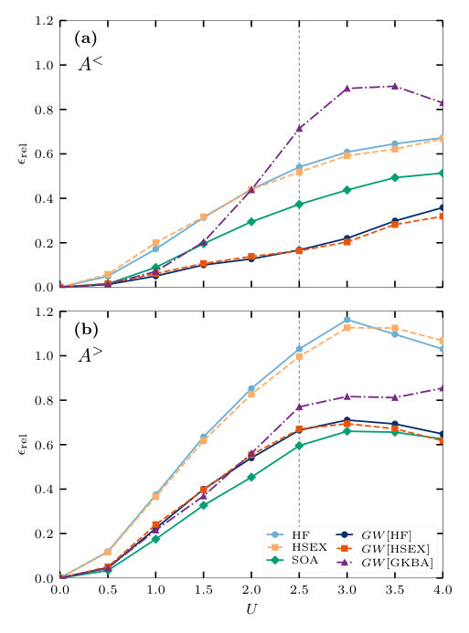 
Figure 4. Relative error ϵrel, Eq. (37), of the ground-state spectral function for the doped system with four sites for varying on-site interaction U compared to the exact result, for (a) the occupied part A&lt; and (b) the unoccupied part A&gt;, as U is scanned from 0 to 4 (probe time tp = 15, δ = 3). The dashed vertical line marks the U = 2.5 working point used in the nonequilibrium applications. The long-range interaction parameter is fixed γ = 0.5.

📷 Fig 5

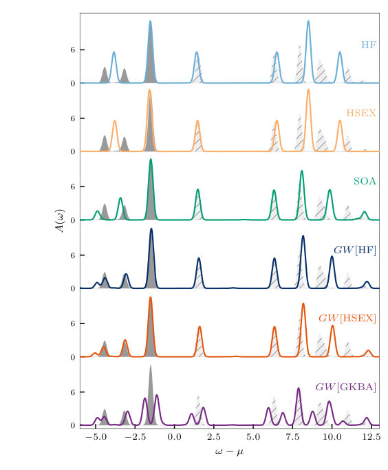 
Figure 5. Doped ground-state spectral function A of the four- site chain at U = 2.5. The exact result is drawn behind every trace: gray fill for the occupied A&lt; and hatched fill for the unoccupied A&gt;. All spectra satisfy R A&lt; = Nocc = 6, R A&gt; = Nunocc = 10, R A = 16 (in units of √π/δ). Spectra are displayed at δ = 5.

**Summary.** This paper tackles the computational bottleneck of simulating electron correlations in driven quantum materials by developing a Real-time Dyson expansion (RT-DE). This method allows for the calculation of the GW self-energy with dynamical correlations at a time-linear cost. By testing various reference propagators, the authors show that the RT-DE provides accurate spectral features, including excitonic replicas, crucial for understanding photoexcited states.

**Why it may be interesting.** The development of time-linear scaling methods for non-equilibrium correlation functions is crucial for simulating ultrafast dynamics in quantum materials, bridging the gap between theory and time-resolved ARPES experiments.

Detailed structure

**Main problem.** The primary challenge is extending the accurate GW approximation, which describes electron correlations, to non-equilibrium (time-dependent) conditions while maintaining computational tractability.

**Main result.** The authors formulate and implement a Real-time Dyson expansion (RT-DE) that recovers dynamical correlations in the spectrum at a time-linear cost, outperforming previous mean-field or highly scaling methods.

**Method.** The core method is the Real-time Dyson expansion applied to the GW self-energy within the Nonequilibrium Green's Functions (NEGF) formalism, utilizing general time-local reference propagators.

**Model / system.** The theory is applied to general correlated electron systems, benchmarked using a driven two-band lattice model with long-range interactions, relevant for photoexcited semiconductors.

**Key observables.** Time-resolved spectral function, quasiparticle renormalization, and satellite structures (e.g., exciton shake-up).

**Important parameters / regimes.** The reference propagator choice (e.g., Hartree-Fock, statically screened, GKBA) significantly influences the accuracy of the resulting spectra.

**Assumptions / limitations.** The RT-DE formulation assumes that the off-diagonal evolution of the reference propagator can be treated as time-local, allowing for time-linear scaling.

**Figures summary.** Benchmarks against exact diagonalization show that mean-field and statically screened references yield the most accurate spectra, while the GKBA-based approach captures dynamics but artificially broadens peaks.

**Paper structure.** The paper first reviews the NEGF/GW framework, then details the RT-DE equations of motion, presents the implementation using various reference propagators, and concludes with numerical results demonstrating spectral accuracy.

Abstract

Electronic spectra provide direct insight into the excitations and correlations of condensed matter systems. Their description requires electron correlations beyond mean field. In equilibrium, the $GW$ approximation has become the method of choice for many materials. Extending this approximation to nonequilibrium, however, is challenging. Full two-time $GW$ simulations within the nonequilibrium Green's functions approach scale at least cubically with propagation time, whereas improved scaling schemes such as time-local (adiabatic) approximations or the generalized Kadanoff--Baym ansatz usually retain only mean-field character in the spectra. The recently introduced real-time Dyson expansion recovers dynamical correlations in the spectrum at time-linear cost, but has so far been restricted to the second-order Born approximation with mean-field reference propagators. Here we formulate and implement the RT-DE for the nonequilibrium $GW$ self-energy with reference propagators of general form whose off-diagonal evolution is time local. In particular, we assess Hartree--Fock propagators, propagators with statically screened exchange with nonequilibrium screening, and a correlated propagator based on the Hartree--Fock GKBA. Benchmarks against exact diagonalization for a driven two-band lattice model with long-range interactions show that the mean-field and statically screened references yield the most accurate spectra, including satellite structures absent at mean-field level, whereas the GKBA-based approach best captures scattering-induced occupation dynamics, but artificially broadens and splits spectral peaks. When applied to large systems that are beyond the reach of exact methods, the scheme resolves the excitonic replica of the valence band and satellites identified as exciton shake-up, as well as their reshaping with increasing excitation density.

[↑ back to top](#top)

### [Learned Diffractive Optics for Quantum-Optimal Inference](http://arxiv.org/abs/2609.08014v1)

**Authors:** Matthew J. Filipovich, Alexander Duplinskii, A. I. Lvovsky  
**Type:** theory · **Category:** quantum information and computing · **PDF:** <https://arxiv.org/pdf/2609.08014v1>  
**Analysis basis:** full PDF text, analyzed in chunks
**Topic relevance:** 🔥 `quantum measurements` **4/5** · `interference shaping light` **1/5**

📷 Fig 1

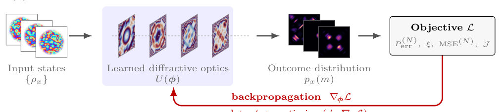 
FIG. 1. Learned diffractive optics for photon-limited inference. (a) Inference of the state ρx, encoding the unknown target x, using learned diffractive optical neural network with learned phase profiles ϕ⋆. The state is transformed by the DONN and subsequently detected, generating the detection record m of N photon counts distributed among the detector bins. The record is mapped by the Bayes decision rule to the prediction ˆx. (b) The training procedure for optimizing the phase plate parameters ϕ using a fully differentiable simulation. At each iteration, the input states are propagated through the DONN and the resulting output probability distributions are used to compute the objective L,...

📷 Fig 2

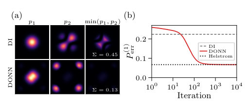 
FIG. 2. Diffractive optics discriminating two non-orthogonal superposition states of Hermite–Gaussian modes: |ψ1⟩= |HG00⟩and |ψ2⟩= 1

📷 Fig 3

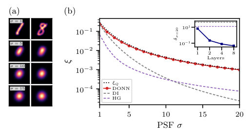 
FIG. 4. Diffraction-limited incoherent state discrimination in the asymptotic regime of high photon numbers. (a) Blurred digits one and eight at increasing PSF width σ. (b) Chernoff exponent ξ versus the PSF width σ comparing the quantum Chernoff exponent ξQ, the learned optics, DI, and the HG basis with the mode width matched to the PSF. The inset shows the relative gap δσ=20 = ξQ/ξ −1 of the learned Cher- noff exponent at the largest blur σ = 20 versus the number of plates L.

📷 Fig 4

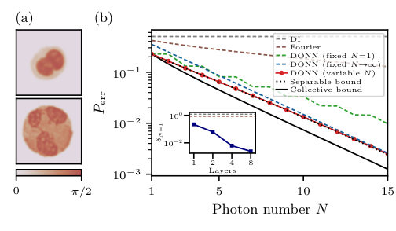 
FIG. 3. State discrimination of two phase objects at finite photon numbers. (a) The two input states: phase profiles of an erythroblast and an eosinophil with |⟨ψ1|ψ2⟩|2 = 0.70. (b) Perr versus photon number N for the learned optics, stan- dard measurements, and the quantum bounds. The dashed green and blue lines show the optics trained at N = 1 and on the asymptotic (Chernoff) objective, respectively, evaluated across all photon numbers. The inset shows the relative gap δN=1 = P (1) err /P (1) err,Q −1 of the N = 1 learned optics versus the number of plates L.

📷 Fig 5

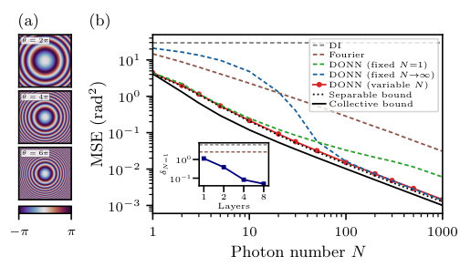 
FIG. 5. Estimation of axial localization at finite photon num- ber. (a) Phase profiles of the input state at various param- eter values θ. (b) MSE versus photon number N for the learned optics, standard measurements (DI and Fourier), and the quantum bounds. The dashed green and blue lines show the optics trained at N = 1 and on the asymptotic objec- tive, respectively, evaluated across all photon numbers. The inset shows the relative gap δN=1 = MSE(1)/MSE(1) Q −1 of the learned N = 1 MSE versus the number of plates L.

**Summary.** This paper proposes using learned diffractive optics, implemented via DONNs, to design optimal quantum measurements for tasks like object feature inference. By optimizing directly on the task's figure of merit, the method achieves performance approaching fundamental quantum limits with fewer photons than standard techniques. It establishes a powerful, data-driven framework for quantum computational machine vision.

**Why it may be interesting.** This work bridges quantum optics, quantum estimation theory, and deep learning, providing a data-driven pathway to designing quantum measurements that approach fundamental physical limits.

Detailed structure

**Main problem.** The core problem is achieving quantum-optimal inference (state discrimination or parameter estimation) from limited photon measurements of light fields, especially for complex objects.

**Main result.** Learned diffractive optics (DONNs) can be trained to design measurement apparatuses that approach quantum-limited performance, significantly outperforming standard optical measurements.

**Method.** The authors use gradient-based inverse design (backpropagation) to optimize the phase profiles of diffractive optical neural networks (DONNs) directly on the task's figure of merit.

**Model / system.** The system models light propagation through a series of trainable phase plates ($T_l$) and free-space propagation ($P_l$), forming a POVM $\{E_m\}$ for measurement.

**Key observables.** Error probability ($P_{	ext{err}}$) for state discrimination, Mean-Squared Error (MSE) for parameter estimation, and the Chernoff exponent ($\xi$) or Fisher information ($J$).

**Important parameters / regimes.** Photon number ($N$), effective Fresnel number ($F$), and the inherent quantum bounds (Helstrom, Personick, QFI).

**Assumptions / limitations.** The analysis assumes the single-photon approximation and relies on the differentiability of the optics model for gradient-based optimization.

**Figures summary.** Figures compare the error probability/MSE achieved by the trained DONN against standard direct imaging (DI) methods and theoretical quantum bounds across varying photon numbers and object parameters.

**Paper structure.** The paper introduces the problem, details the DONN model and training procedure using gradient descent on the figure of merit, and then presents comparative results across state discrimination, parameter estimation, and source separation tasks.

Abstract

Quantum mechanics sets the ultimate bounds on photon-limited sensing, yet practical measurements attaining these bounds are known only in special cases. This is particularly the case for visual sensing problems, where the goal is to infer features of a distant object based on the spatial structure of the light field it emits or reflects. Because of the potentially complex structure of such objects and fields, constructing optimal measurements on them is a challenging task. Here, we apply learned diffractive optics to state discrimination and parameter estimation of coherent and diffraction-limited incoherent light fields under a restricted photon budget. Optimized directly on each task's figure of merit, without prior knowledge of the optimal measurement, the physically realizable diffractive optical neural networks substantially outperform standard measurements and approach the quantum limits for a given number of photons as well as in the asymptotic limit.

[↑ back to top](#top)

### [Scaling-Enhanced Rapid Readout of a Qubit Ensemble Assisted by High-Frequency Detector Modes](http://arxiv.org/abs/2609.08374v1)

**Authors:** Hiroki Nakabayashi, Yuichiro Matsuzaki  
**Type:** theory · **Category:** quantum information and computing · **PDF:** <https://arxiv.org/pdf/2609.08374v1>  
**Analysis basis:** full PDF text, analyzed in chunks
**Topic relevance:** 🔥 `quantum measurements` **4/5** · `correlated / nonlocal dissipation` **1/5**

📷 Fig 1

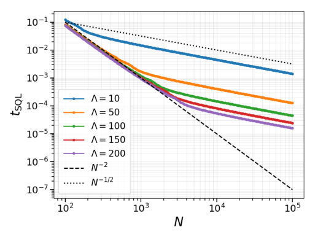 
FIG. 1. Crossover of the readout time required for SQL pre- cision, defined by ∆2θ(tSQL) = 1/N, for θ = 0.05, n = 2, D = 3, Ω= 1.0, and g = 0.1. The solid curves show tSQL for the finite cutoffs Λ = 10, 50, 100, 150, 200, ordered from top to bottom, together with guide lines proportional to N −2

**Summary.** This theoretical paper investigates the scaling limits of quantum readout time for large qubit ensembles. It establishes that while conventional detectors limit readout speed to $N^{-1/2}$, incorporating high-frequency detector modes allows for a superior scaling of $N^{-1/(2-
u)}$. This demonstrates that the spectral structure of the measurement apparatus acts as a tunable resource for accelerating quantum information extraction.

**Why it may be interesting.** This work provides a concrete theoretical framework showing how engineering the spectral properties of a measurement apparatus (the detector) can fundamentally improve the scaling of quantum measurement protocols, which is crucial for scaling quantum computation.

Detailed structure

**Main problem.** The paper addresses how the readout time scales with the number of qubits ($N$) when performing quantum measurements on large qubit ensembles.

**Main result.** By utilizing detector modes with unbounded high-frequency spectra, the readout time can achieve an enhanced scaling of $t_{	ext{readout}} \propto N^{-1/(2-
u)}$, surpassing the conventional $N^{-1/2}$ limit.

**Method.** The analysis involves deriving lower bounds on the readout time by quantifying the growth of quantum mutual information ($I_{S:D}(t)$) between the system and the detector.

**Model / system.** The system consists of a qubit ensemble (S) coupled to a bosonic detector (D) via an interaction Hamiltonian. The detector's spectral structure is characterized by the parameter $
u$.

**Key observables.** Quantum mutual information ($I_{S:D}(t)$), readout time ($t_{	ext{readout}}$), and the error in parameter estimation ($\Delta^2	heta$).

**Important parameters / regimes.** The spectral parameter $
u$ ($0 < 
u < 2$), the number of qubits $N$, and the coupling strength $g$.

**Assumptions / limitations.** The enhanced scaling relies on the existence of unbounded high-frequency detector modes, and the analysis often assumes large $N$ or specific asymptotic limits.

**Figures summary.** Figures likely illustrate the comparison between the conventional $N^{-1/2}$ scaling and the enhanced $N^{-1/(2-
u)}$ scaling for readout time.

**Paper structure.** The paper first establishes the conventional $N^{-1/2}$ benchmark using finite detector variance. It then introduces the concept of high-frequency modes, deriving the enhanced scaling law $N^{-1/(2-
u)}$ by analyzing the mutual information bound. Finally, it applies this to specific estimation protocols.

Abstract

Quantum measurements of large qubit ensembles are often performed indirectly by coupling the ensemble to a detector and subsequently measuring the detector. Despite the importance of rapid collective readout, it remains unclear what determines how the readout time scales with the number of qubits $N$. Here, we first establish a benchmark $N^{-1/2}$ for a broad class of detectors without ultraviolet high-frequency modes. We then show that the detector with unbounded high-frequency modes can surpass this benchmark and yield a characteristic time scaling $N^{-1/(2-ν)}$ for $0 < ν< 2$, where $ν$ characterizes the spectral structure of the detector. Our results establish high-frequency detector modes as a resource for achieving a scaling advantage in collective quantum readout, with the detector spectrum directly controlling the scaling exponent of the readout time.

[↑ back to top](#top)

### [Deriving the Kijowski Arrival-Time POVM from the Schrödinger Current: Minimal Positivity and Uniqueness](http://arxiv.org/abs/2609.08458v1)

**Authors:** Avi Marchewka  
**Type:** theory · **Category:** other · **PDF:** <https://arxiv.org/pdf/2609.08458v1>  
**Analysis basis:** full PDF text, analyzed in chunks
**Topic relevance:** 🔥 `quantum measurements` **4/5**

📷 Fig 1

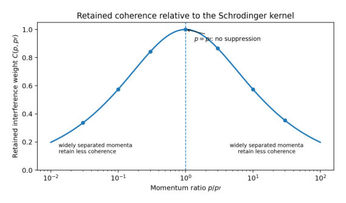 
Figure 1: The coherence attenuation factor C(r) = 2√r/(1 + r). It is unity for equal momenta and decreases symmetrically as the ratio of the two momenta departs from unity.

📷 Fig 2

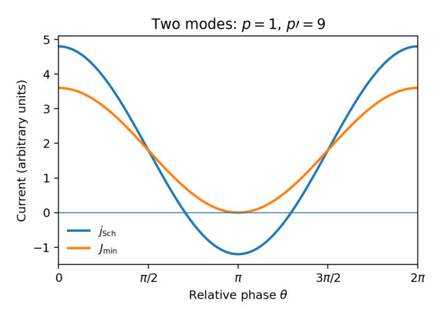 
Figure 2: Two-mode illustration for p1 = 1 and p2 = 9. The minimal kernel reduces the coherent contribution by C(p1, p2) = 3/5. The Schr¨odinger current becomes negative near maximal destructive interference, whereas the minimal current remains nonnegative. The same attenuation also lowers the current in the constructive-interference region.

**Summary.** This paper derives the Kijowski time-of-arrival POVM by imposing a minimal positivity constraint on the standard Schrödinger current, which suffers from 'quantum backflow' (negative values). The authors show that the required modification yields a positive, normalized current that naturally separates into independent directional components, providing a physical justification for the POVM's structure.

**Why it may be interesting.** This work provides a rigorous, current-based physical derivation for the structure of the Kijowski arrival-time POVM, connecting fundamental principles of current conservation and positivity to a key observable in quantum measurement theory.

Detailed structure

**Main problem.** The paper addresses the issue of 'quantum backflow,' where the standard Schrödinger current becomes negative even for states with purely positive momentum support, and seeks to derive a physically meaningful, non-negative arrival-time Probability Operator-Valued Measure (POVM).

**Main result.** The minimal modification to the free Schrödinger current, derived by enforcing positivity, results in a current that exactly matches the known Kijowski time-of-arrival POVM. Furthermore, the requirement of no backflow in mixed-sign sectors forces the cross-sector kernel to vanish, leading to a natural separation of the directional components.

**Method.** The authors use a minimal positivity constraint on the momentum-space representation of the current, modifying the free-particle kernel from the standard form to a geometric mean kernel, $K_{\min}(p,p') = \sqrt{pp'}/m$.

**Model / system.** The analysis is performed for a free particle in one dimension, governed by the Schrödinger equation, focusing on the time-of-arrival observable derived from the momentum-space current.

**Key observables.** Schrödinger current ($j_{	ext{Sch}}$), minimal positive current ($J_{	ext{min}}$), and the associated momentum-space kernels ($K_{	ext{Sch}}$ vs $K_{	ext{min}}$).

**Important parameters / regimes.** Momentum ($p$), mass ($m$), and time ($t$). The analysis distinguishes between positive-momentum ($p>0$) and negative-momentum ($p<0$) sectors.

**Assumptions / limitations.** The construction is based on finding the smallest modification that ensures non-negativity while preserving individual momentum components; it explicitly notes that this construction does not impose a first-arrival condition.

**Figures summary.** Figure 1 illustrates the coherence attenuation factor $C(r) = 2\sqrt{r}/(1+r)$. Figure 2 compares the standard Schrödinger current (which can be negative) to the minimal current (which remains non-negative) for a two-mode superposition.

**Paper structure.** The paper first defines the problem of quantum backflow in the free Schrödinger current. It then derives the minimal positive kernel modification for single-sign sectors. Finally, it extends the analysis to mixed-sign sectors, showing that the no-backflow condition forces the cross-sector kernels to zero, yielding the sum of two independent directional contributions matching the Kijowski POVM.

Abstract

Quantum backflow refers here to the appearance of a negative Schrödinger current for a state whose momentum support is entirely positive. We ask for the smallest modification of the free Schrödinger current that makes it nonnegative for every such state, while preserving the current of each individual momentum component. We show that the required minimal modification changes the free-particle momentum kernel according to \[ K_{\rm Sch}(p,p')=\frac{p+p'}{2m} \;\longrightarrow\; K_{\min}(p,p')=\frac{\sqrt{pp'}}{m}. \] The resulting current is positive and normalized and therefore defines an arrival-time POVM. Extending the directional no-backflow requirement to states containing both momentum signs forces the cross-sector kernel to vanish, \[ K_{\min}^{+-}=K_{\min}^{-+}=0, \] so that the full current is the sum of two independent directional contributions. The resulting POVM is exactly the Kijowski time-of-arrival POVM, providing a current-based physical motivation for both its directional kernels and their separation. Within the diagonal-preserving pairwise-minimal construction considered here, the result is unique. The construction itself does not impose a first-arrival condition.

[↑ back to top](#top)

### [Measurement-induced remote activation of nonclassicality](http://arxiv.org/abs/2609.07875v1)

**Authors:** Sudip Chakrabarty  
**Type:** theory · **Category:** quantum information and computing · **PDF:** <https://arxiv.org/pdf/2609.07875v1>  
**Analysis basis:** full PDF text, analyzed in chunks
**Topic relevance:** 🔥 `quantum measurements` **4/5**

📷 Fig 1

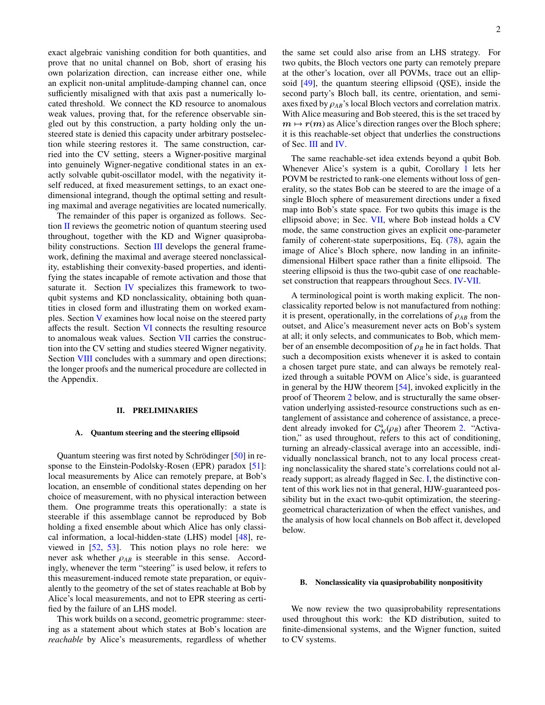 
Low-resolution page preview, page 2

📷 Fig 2

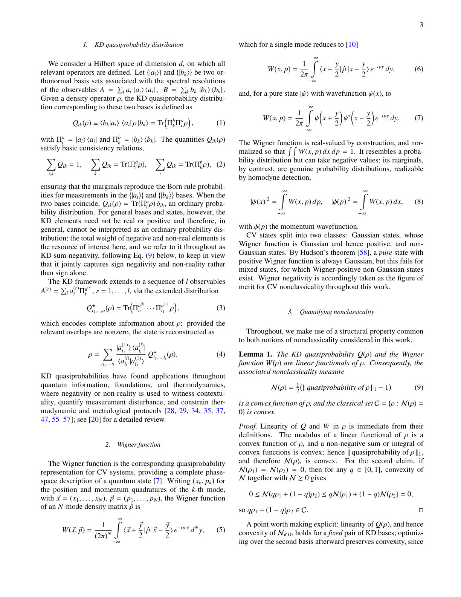 
Low-resolution page preview, page 3

📷 Fig 3

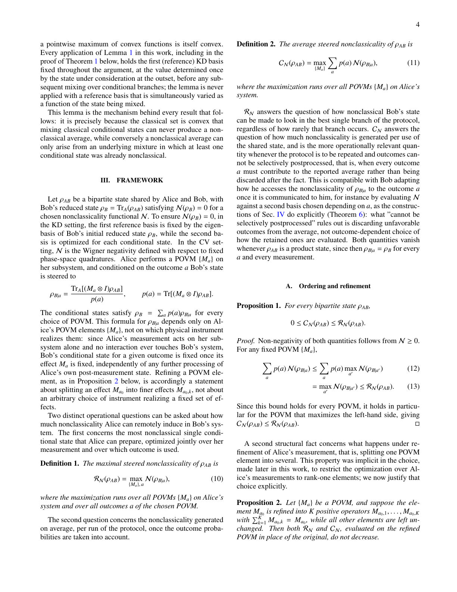 
Low-resolution page preview, page 4

📷 Fig 4

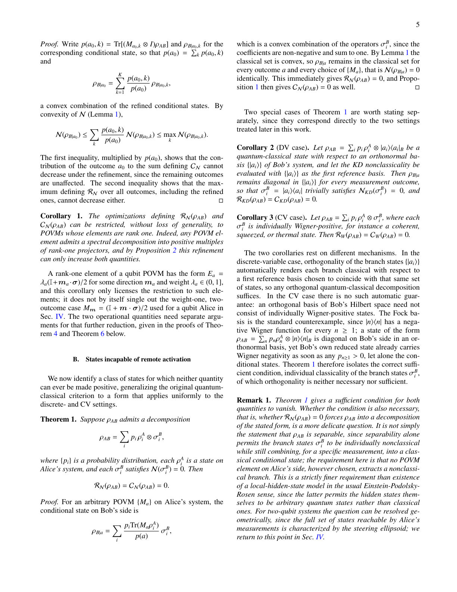 
Low-resolution page preview, page 5

📷 Fig 5

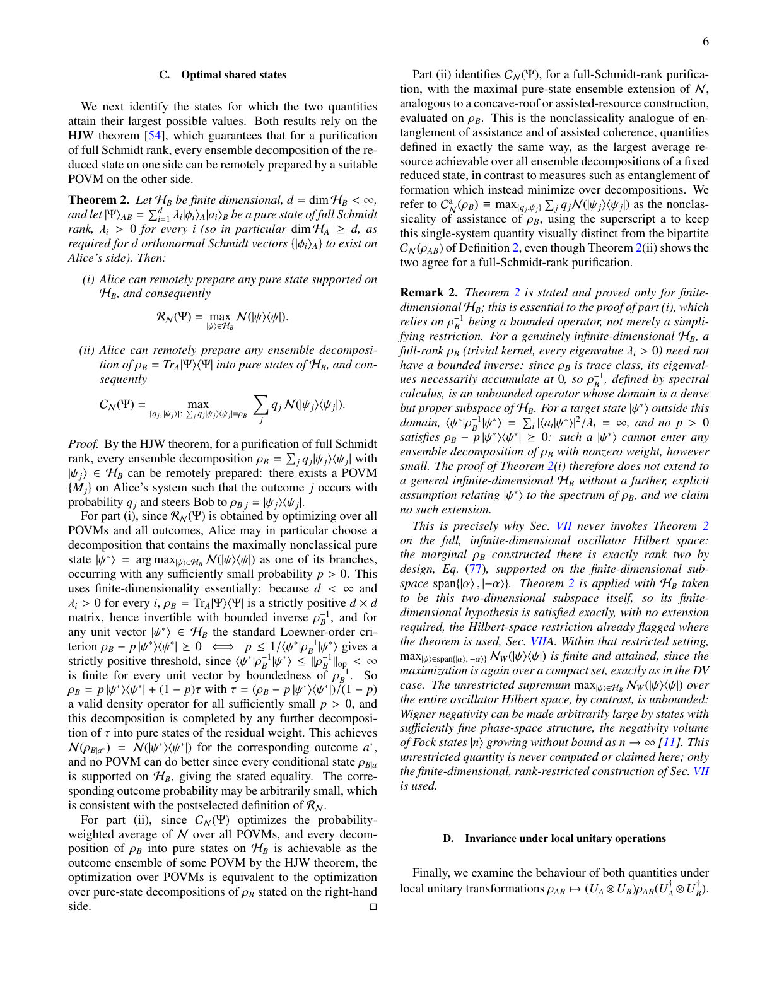 
Low-resolution page preview, page 6

**Summary.** This work demonstrates that nonclassical quantum features, such as Wigner negativity, can be remotely activated in a quantum system simply by performing local measurements on a correlated partner. By quantifying this 'steered nonclassicality' using advanced measures, the authors establish measurement-induced steering as a quantifiable resource for quantum information processing.

**Why it may be interesting.** It provides a concrete, operational resource (measurement steering) for generating nonclassicality, which is a key resource in quantum information protocols, linking measurement theory directly to fundamental quantum resources.

Detailed structure

**Main problem.** The paper investigates the operational mechanism by which local measurements on one subsystem can remotely activate nonclassical quantum features in a correlated partner subsystem.

**Main result.** Local measurements can drive a state from a classically described reduced state into a genuinely nonclassical conditional state, establishing measurement-induced steering as a resource for nonclassicality.

**Method.** The authors developed formal measures for 'steered nonclassicality' (maximal and average) using quasiprobability distributions (Wigner, KD) and optimized these measures over possible local measurements.

**Model / system.** The analysis covers general two-qubit systems and extends to a hybrid qubit-oscillator model for continuous variable (CV) extensions. The core is the bipartite state $\rho_{AB}$ shared between two parties.

**Key observables.** Nonclassicality, quantified by Wigner negativity (CV) or KD sum-negativity (DV), and the resulting anomalous weak values.

**Important parameters / regimes.** The nature of the local noise channel (unital vs. non-unital) and the alignment of the noise relative to the system's axis.

**Assumptions / limitations.** The analysis relies on the convexity of the nonclassicality measure and the ability to restrict the optimization to rank-one POVM elements.

**Figures summary.** Not specified, but the notes indicate optimization results for two-qubit and CV quantities, including finding global maxima and verifying numerical stability.

**Paper structure.** The paper progresses by defining the problem using nonclassicality diagnostics, developing mathematical tools (Maximal/Average Steered Nonclassicality), optimizing these measures for specific models (two-qubit, qubit-oscillator), and analyzing the physical implications (weak values, noise effects).

Abstract

Nonclassicality, defined through nonpositivity of quasiprobability distributions such as the Wigner and Kirkwood-Dirac distributions, underlies key quantum advantages. We show that it can be remotely activated: local measurements by a correlated partner alone can drive a party whose reduced state is classical into a genuinely nonclassical conditional state. For two-qubit systems we obtain closed forms for the maximal single-branch effect and for its probability-weighted average under the best two-outcome projective measurement, the latter proven optimal over all measurements when the shared state carries no local bias. Local noise on the steered party, evaluated relative to its own noise-updated reference basis, can enhance the effect when non-unital and misaligned with that party's axis, whereas no unital channel ever helps. This nonclassicality is shown to unlock, for the same reference observable, anomalous weak values unavailable to the unsteered state under arbitrary postselection. An exactly solvable hybrid qubit-oscillator model shows the same mechanism generates Wigner negativity. These results identify measurement-induced steering as an operational resource for remotely activating nonclassicality.

[↑ back to top](#top)

### [Saving resources through repeat-until-success positive-operator-valued-measure measurements in quantum computation](http://arxiv.org/abs/2609.08168v1)

**Authors:** Hefeng Wang, Sixia Yu, Hua Xiang  
**Type:** theory · **Category:** quantum information and computing · **PDF:** <https://arxiv.org/pdf/2609.08168v1>  
**Analysis basis:** full PDF text, analyzed in chunks
**Topic relevance:** 🔥 `quantum measurements` **4/5**

📷 Fig 1

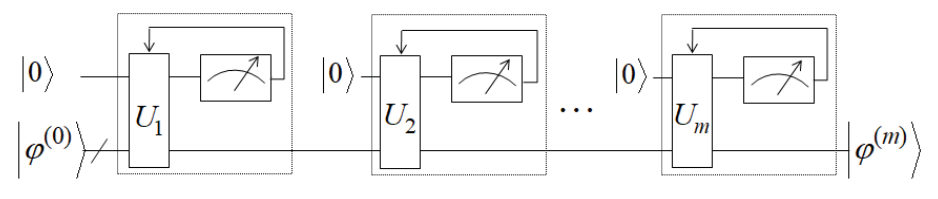 
FIG. 1. Quantum circuit for the RUS-POVM computation process. The circuit in the dashed

📷 Fig 2

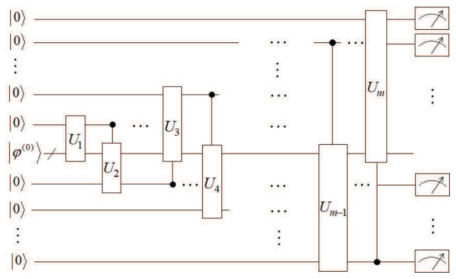 
FIG. 2. Quantum circuit by deferring the intermediate measurements in the RUS-POVM approach

📷 Fig 3

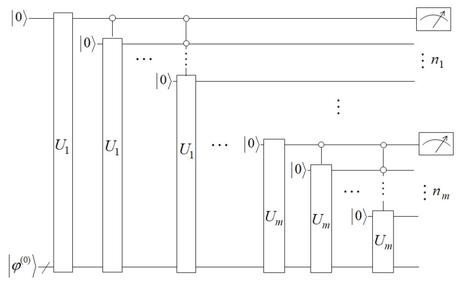 
FIG. 3. Quantum circuit for simulating the RUS-POVM computation process of Fig. 1 by per-

**Summary.** This paper proposes a quantum computation scheme that uses intermediate Positive-Operator-Valued-Measure (POVM) measurements within a Repeat-Until-Success (RUS) framework. By performing measurements step-by-step rather than accumulating them, the protocol achieves a polynomial reduction in the required number of qubits and unitary gates compared to standard methods. This demonstrates a significant resource optimization technique for quantum circuit design.

**Why it may be interesting.** It provides a concrete, resource-saving protocol for implementing complex quantum algorithms by strategically placing measurements, which is crucial for scaling quantum computation beyond idealized models.

Detailed structure

**Main problem.** The paper addresses the resource inefficiency in quantum computation when intermediate measurements are required during a multi-step process.

**Main result.** Implementing intermediate measurements using a Repeat-Until-Success (RUS) POVM approach provides a polynomial reduction in required qubits and unitary operations compared to deferring all measurements to the end.

**Method.** The core method involves structuring the computation path such that each step is realized as a probabilistic, repeat-until-success measurement on the working qubits, mediated by an ancillary qubit.

**Model / system.** The model uses $n$ working qubits and one ancillary qubit. The POVM measurement is physically implemented by applying a controlled unitary operation on the whole system followed by a projective measurement on the ancillary qubit.

**Key observables.** Success probability ($P_{	ext{succ}}$), number of required qubits, and count of unitary operations (e.g., Toffoli gates).

**Important parameters / regimes.** The success probability $p_k$ of each step, and the time evolution parameters ($t_k$) used in the Quantum Resonance Transfer (QRT) method.

**Assumptions / limitations.** The analysis relies on the principle of deferred measurement and assumes that the overlap between adjacent states and the energy gap are polynomially large for the QRT implementation.

**Figures summary.** Figures illustrate the quantum circuit for the RUS-POVM process (Fig. 1) and compare it conceptually to the circuit where intermediate measurements are deferred to the end (Fig. 2/3).

**Paper structure.** The paper details the RUS-POVM approach (Sec. II), its physical implementation via the QRT method (Sec. III), error analysis (Sec. IV), and a direct comparison of resource scaling against deferred measurement protocols (Sec. V).

Abstract

We present a quantum computation approach in which computation is guided by positive-operator-valuedmeasure (POVM) measurements following a given computation path in multisteps. In this approach, one ancillary qubit is coupled to a register of working qubits, and a POVM measurement is implemented effectively on the working qubits by applying a unitary operation on the whole system followed by a projective measurement performed on the ancillary qubit. Each step of the computation is a repeat-until-success procedure such that the desired state of the step is obtained deterministically on the working qubits via POVM measurements. The principle of deferred measurement states that measurements can always be moved from an intermediate stage of a quantum circuit to the end of the circuit without affecting the efficiency of the computation.We demonstrate that in our approach, by introducing intermediate measurements on the ancillary qubit in the computation process, both the number of qubits and unitary operations can be reduced polynomially, compared to the case where the intermediate measurements are deferred to the end of the computation. We also provide a method for implementation of the approach.

[↑ back to top](#top)

### [Non-Markovian dynamics of a qubit on the zigzag edge of photonic graphene](http://arxiv.org/abs/2609.08382v1)

**Authors:** Enrico Di Benedetto  
**Type:** theory · **Category:** other · **PDF:** <https://arxiv.org/pdf/2609.08382v1>  
**Analysis basis:** full PDF text, analyzed in chunks
**Topic relevance:** `Keldysh / 2PI / non-Gaussian methods` **3/5** · `analog quantum simulation` **3/5** · `correlated / nonlocal dissipation` **3/5** · `methods for driven-dissipative` **3/5** · `driven-dissipative phase transition` **2/5** · `non-equilibrium universality` **2/5** · `quantum measurements` **1/5** · `scars & prethermalization` **1/5**

📷 Fig 1

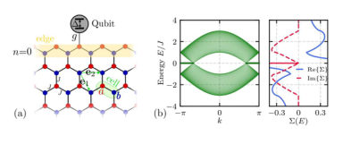 
Fig. 1. – (a) Qubit coupled to the edge located at n=0 at a cavity in the A sublattice. (b) Left panel: energy spectrum of HB as a function of k. Right panel: real and imaginary part of the self-energy Σe(E+i0+). Both panels share the same energy axis. (c) Relative weight of each contribution to the dynamics at t = 0 at different values of ∆/J (g=0.2J). (d) Qubit population over time for g = 0.2J. We can distinguish three regimes: when the two unstable poles’ contributions are relevant (blue curve, ∆=0), when a single unstable pole is relevant (red curve, ∆=1.5J) and when a bound state appears (green curve, ∆=3J).

**Summary.** This paper theoretically analyzes how a qubit interacts with the edge of a photonic graphene lattice, finding that the unique zero-energy flat band fundamentally changes the decoherence dynamics. Instead of exhibiting expected long-time power-law decay, the system displays damped Rabi oscillations. This provides crucial insights for designing quantum devices where edge effects dominate coupling to the environment.

**Why it may be interesting.** This work is highly relevant as it models open quantum systems dynamics (qubit coupled to a structured bath) using advanced techniques, directly impacting understanding of decoherence in solid-state and photonic platforms.

Detailed structure

**Main problem.** The study investigates the non-Markovian dynamics of a qubit coupled to the zigzag edge of a photonic graphene lattice, contrasting it with bulk coupling.

**Main result.** The zero-energy flat band at the zigzag edge suppresses long-time branch-cut tails, leading instead to damped Rabi oscillations in the qubit population.

**Method.** The analysis employs an analytical resolvent operator approach combined with exact lattice Green's functions to calculate the qubit population dynamics.

**Model / system.** The system consists of a qubit coupled to a 2D honeycomb lattice bath modeled with a zigzag edge. The Hamiltonian includes the qubit, the bath, and the coupling term, $H = \Delta\sigma_+\sigma_- + H_B + g(\sigma_+a_{00} + H.c.)$.

**Key observables.** Qubit population $P_e(t)$, spectral components (bound states, unstable poles, branch cut detours).

**Important parameters / regimes.** Coupling strength ($g$), detuning ($\Delta$), and hopping rate ($J$).

**Assumptions / limitations.** The analysis requires analytically continuing Green's functions beyond the first Riemann sheet to manage branch cuts.

**Figures summary.** Figures illustrate the energy spectrum showing the zero-energy flat band, and plot the qubit population dynamics over time for various coupling regimes.

**Paper structure.** The paper proceeds by setting up the Hamiltonian, deriving the self-energy using Green's functions, and then using the resolvent operator to calculate the time evolution of the qubit population, comparing edge vs. bulk dynamics.

Abstract

We present an analytical study of the dynamics of a qubit coupled to the zigzag edge of a photonic honeycomb lattice. Leveraging a resolvent operator approach and exact lattice Green's functions, we map the spectrum of qubit-photon bound states and complex poles to uncover the long-time scaling laws of the qubit population. Unlike a qubit coupled to the bulk of graphene, the presence of a zero-energy flat band connecting the Dirac points suppresses long-time branch-cut-induced tails, instead driving damped Rabi oscillations. Potential experimental platforms are briefly discussed.

[↑ back to top](#top)

### [On spatial decoherence in many-body systems](http://arxiv.org/abs/2609.08910v1)

**Authors:** Stefano Marcantoni, Marco Merkli  
**Type:** theory · **Category:** other · **PDF:** <https://arxiv.org/pdf/2609.08910v1>  
**Analysis basis:** full PDF text, analyzed in chunks
**Topic relevance:** `Keldysh / 2PI / non-Gaussian methods` **3/5** · `correlated / nonlocal dissipation` **3/5** · `methods for driven-dissipative` **3/5** · `driven-dissipative phase transition` **2/5** · `non-equilibrium universality` **2/5** · `analog quantum simulation` **1/5** · `quantum measurements` **1/5** · `scars & prethermalization` **1/5**

📷 Fig 1

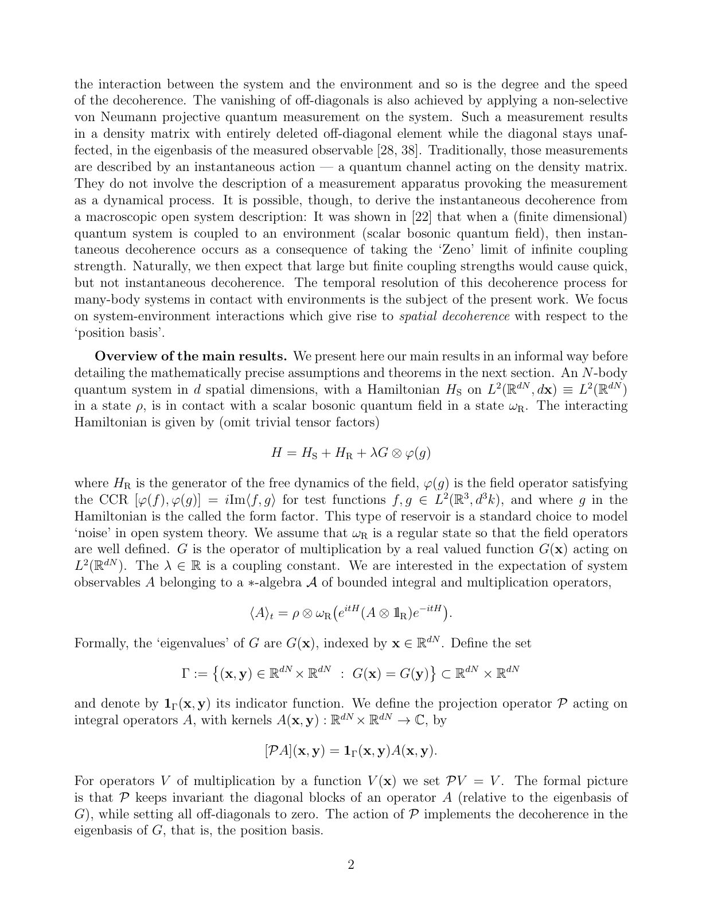 
Low-resolution page preview, page 2

📷 Fig 2

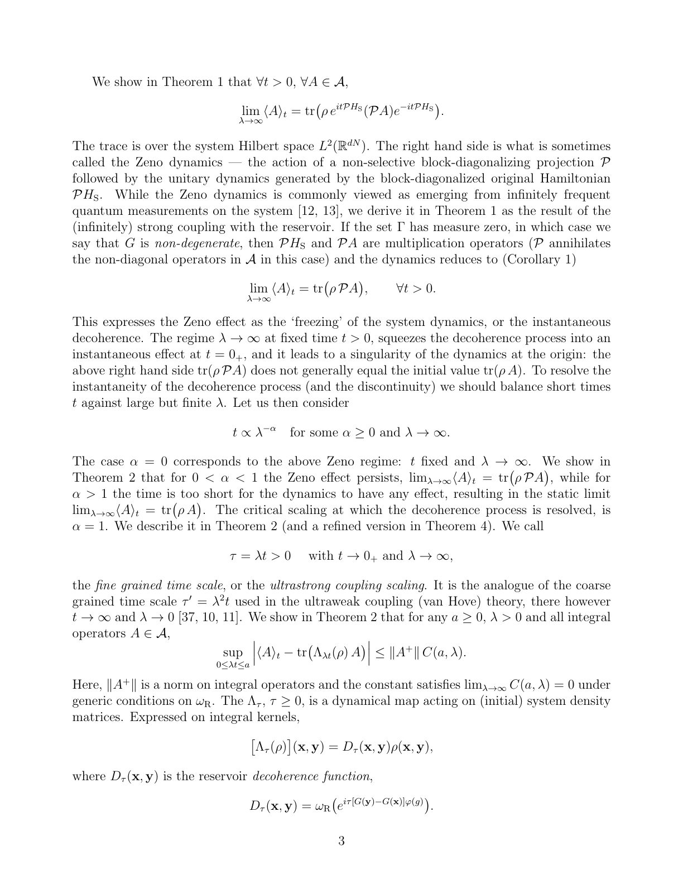 
Low-resolution page preview, page 3

📷 Fig 3

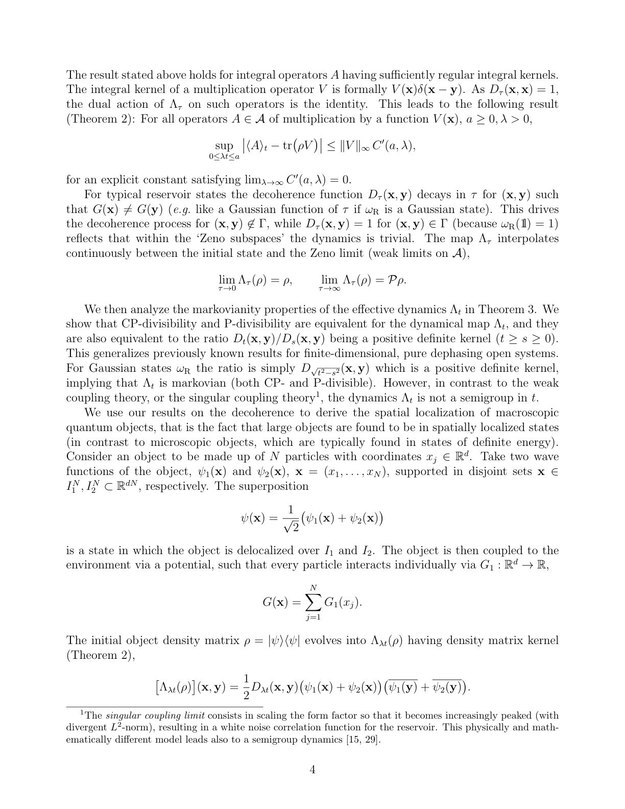 
Low-resolution page preview, page 4

📷 Fig 4

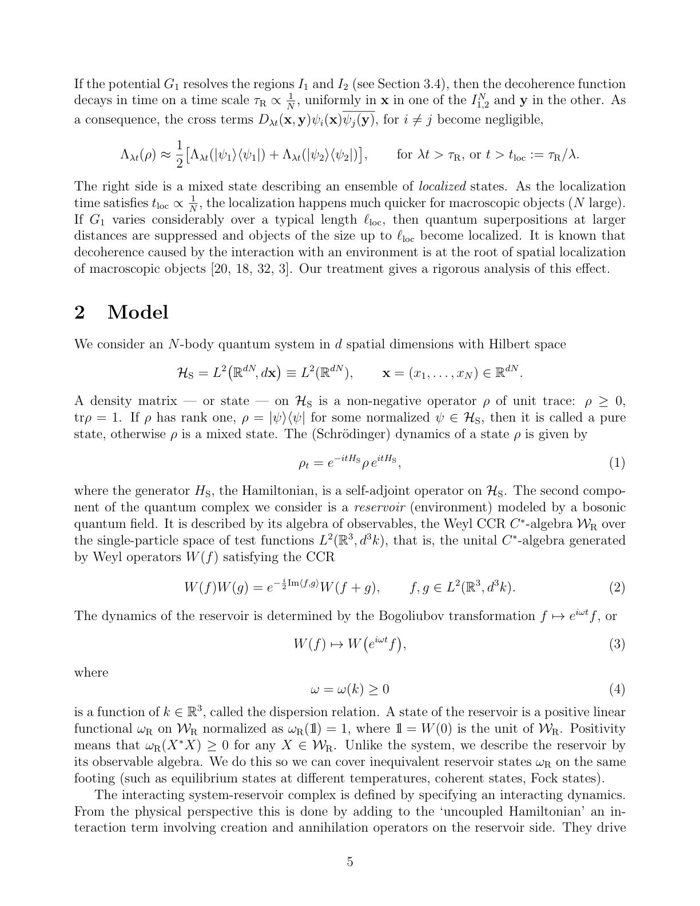 
Low-resolution page preview, page 5

📷 Fig 5

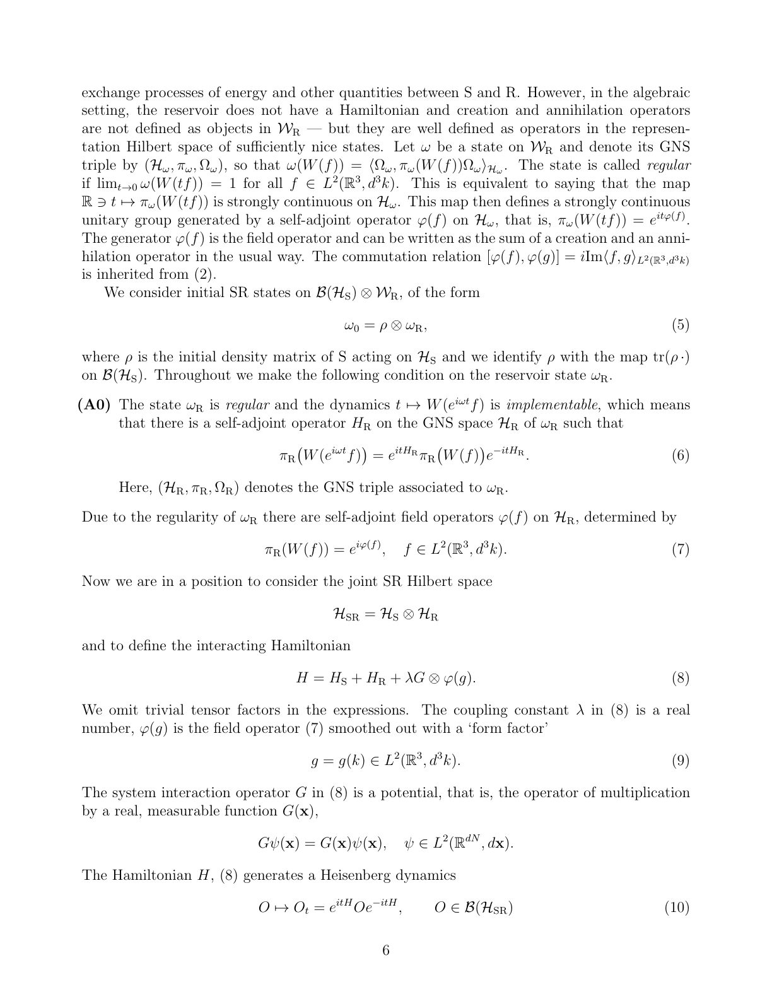 
Low-resolution page preview, page 6

**Summary.** This paper rigorously studies spatial decoherence in many-body systems interacting with a bosonic environment. It derives an effective evolution map by analyzing the system dynamics in specific limits of coupling strength and time scaling. The key finding is the identification of a fine-grained time scale $\tau = \lambda t$ that resolves the decoherence process, providing a theoretical description of macroscopic quantum localization.

**Why it may be interesting.** This work provides a rigorous, quantitative description of how environmental coupling drives quantum systems toward classical localization, which is central to understanding quantum-to-classical transitions in open quantum systems.

Detailed structure

**Main problem.** The paper investigates the dynamics of a many-body quantum system coupled strongly to a bosonic reservoir, focusing specifically on the mechanism and timescale of spatial decoherence.

**Main result.** The decoherence process is shown to be exactly resolved at a fine-grained time scale $\tau = \lambda t$, leading to an effective evolution map that is generally Markovian but not described by a standard dynamical semigroup.

**Method.** The analysis uses time evolution calculations involving the full Hamiltonian, employing Dyson series expansions and introducing a projection operator $P$ to analyze the system's evolution in different limits of coupling strength ($\lambda$) and time ($t$).

**Model / system.** The system consists of an $N$-body quantum system in $d$ dimensions, coupled via a linear potential operator $G$ to a bosonic quantum field reservoir. The dynamics are governed by a total Hamiltonian $H = H_S + H_R + \lambda G \otimes \phi(g)$.

**Key observables.** The expectation value of system observables $\langle A \rangle_t$, the density matrix evolution $\rho_t$, and the degree of off-diagonal coherence.

**Important parameters / regimes.** The coupling strength $\lambda$, the time $t$, and the crucial scaling parameter $\alpha$ defining the time dependence $t \propto \lambda^{-\alpha}$.

**Assumptions / limitations.** The analysis relies on considering the limit of infinite coupling strength ($\lambda \to \infty$) and assumes the reservoir state $\omega_R$ is regular (e.g., Gaussian).

**Paper structure.** The paper systematically analyzes the time evolution under different scaling limits of $\lambda$ and $t$, establishing the Zeno limit ($\alpha=0$), the static limit ($\alpha>1$), and deriving the exact effective dynamics for the critical scaling $\alpha=1$.

Abstract

We study the dynamics of a many-body quantum system strongly interacting with a bosonic reservoir. The coupling is given by a potential operator for the system and it is linear in the field. We show that in the limit of infinite coupling strength the system undergoes instantaneous spatial decoherence. To resolve the decoherence process in time we consider large coupling strengths $λ$ and short times scaling as $t\propto λ^{-α}$, with $α\ge0$, in the limit $λ\rightarrow\infty$. On short time scales $α>1$ the dynamics is trivial while on longer ones $0\leα<1$ the decoherence is instantaneous. We show that the decoherence process is resolved exactly for $α=1$, defining the fine-grained time scale $τ=λt$. We construct an approximate effective evolution map of the many-body system with controlled error estimates. Generically, the effective dynamics is markovian, but not given by a dynamical semigroup. As a physical application we give a rigorous description of the phenomenon of localization of macroscopic quantum objects in position space.

[↑ back to top](#top)

### [When does nonreciprocity matter? Scale-dependence and nonequilibrium signatures](http://arxiv.org/abs/2609.08820v1)

**Authors:** Sarah A. M. Loos, Robert L. Jack  
**Type:** theory · **Category:** statistical mechanics · **PDF:** <https://arxiv.org/pdf/2609.08820v1>  
**Analysis basis:** full PDF text, analyzed in chunks
**Topic relevance:** `correlated / nonlocal dissipation` **3/5** · `driven-dissipative phase transition` **3/5** · `non-equilibrium universality` **3/5** · `Keldysh / 2PI / non-Gaussian methods` **2/5** · `methods for driven-dissipative` **2/5** · `Frenkel-Kontorova` **1/5** · `analog quantum simulation` **1/5**

📷 Fig 1

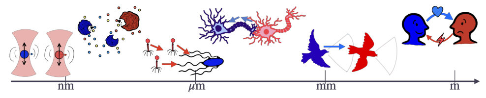 
FIG. 1. Effective nonreciprocal interactions arise in a wide variety of systems, spanning many length scales. Examples include optomechanical levitated nanoparticles, where interference can be used to engineer tunable nonreciprocal couplings [18]; mix- tures of catalytically active and chemophoretic enzymes [3–5, 19]; phage–bacteria systems exhibiting run-and-chase dynamics; neuronal networks with directed information flow; animal and robotic systems interacting through directed perception [20, 21]; and social systems with asymmetric preference or influence [16]. Despite their diverse characteristics, these systems share interaction asymmetry, motivating the search for universal principles...

📷 Fig 2

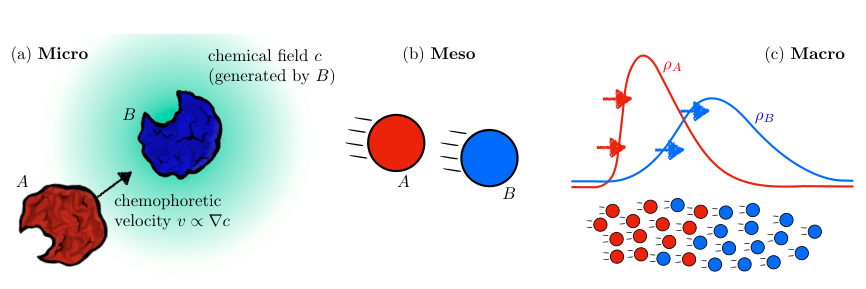 
FIG. 2. Nonreciprocity on different levels of description. (a) Particle A moves chemiphoretically towards particle B (effective attraction) but the force on particle B is only steric repulsion. (b) If the phoretic effect is strong enough, integrating out microscopic details (e.g. the chemical field) yields a mesoscale model of particles with run-and-chase dynamics [3–5, 19]. (c) For many such particles, a macroscale description with continuous density fields supports travelling solutions, where species A chases species B [7, 10]. The NR effective forces are indicated by arrows; they are accompanied by particle currents in the same direction [8].

**Summary.** This perspective paper explores nonreciprocity as a key concept in nonequilibrium physics, showing it is fundamentally scale-dependent. The authors develop theoretical tools to track how nonreciprocal interactions, which break time-reversal symmetry, emerge from microscopic details into macroscopic, observable phenomena like sustained currents. It is crucial for understanding irreversible dynamics in complex systems.

**Why it may be interesting.** The rigorous mathematical framework connecting nonreciprocity to entropy production and scale-dependence provides powerful tools for analyzing non-equilibrium steady states in complex many-body systems, relevant for understanding energy dissipation in quantum or classical baths.

Detailed structure

**Main problem.** The central challenge is understanding when and how nonreciprocity manifests across different physical scales, as it is fundamentally scale-dependent and can emerge or disappear during coarse-graining.

**Main result.** Nonreciprocity is an emergent, scale-dependent property, often linked to the breaking of time-reversal symmetry, which leads to qualitatively new dynamics like run-and-chase patterns.

**Method.** The analysis employs theoretical frameworks ranging from mesoscale Langevin equations to macroscopic continuum models (like the NRCH equation) to track the emergence of irreversible dynamics.

**Model / system.** The study examines diverse nonequilibrium systems, including active matter mixtures, catalytic colloids, and general interacting particle systems, modeled using concepts like 'selfish energies' and nonreciprocal coupling terms.

**Key observables.** Stochastic entropy production rate ($\Sigma[\Gamma]$), sustained linear momentum injection, and the appearance of traveling wave solutions.

**Important parameters / regimes.** The degree of nonreciprocity (asymmetric couplings $A_{ij} 
eq A_{ji}$), temperature differences ($T_i 
eq T_j$), and the scale of coarse-graining.

**Assumptions / limitations.** The analysis often relies on the overdamped limit and gradient expansion for macroscale continuum theories, and assumes that nonreciprocity is a well-defined property of the underlying system.

**Figures summary.** Figures illustrate diverse examples of effective nonreciprocal interactions across micro, meso, and macro scales, particularly showing run-and-chase dynamics.

**Paper structure.** The paper progresses by establishing nonreciprocity as a unifying concept, detailing its mathematical signatures (TRS breaking) at the mesoscale, and then extending this understanding to macroscopic continuum descriptions and the challenge of scale-dependence.

Abstract

Nonreciprocity is increasingly recognized as a unifying concept linking diverse nonequilibrium phenomena found across physics, chemistry, and biology. It gives rise to distinctive behavior including run-and-chase dynamics and spatio-temporal patterns, often associated with a breaking of time-reversal symmetry. However, nonreciprocity and its nonequilibrium signatures are fundamentally scale-dependent, and may emerge or disappear under coarse-graining. A central challenge is therefore to understand when and how nonreciprocity manifests itself on different scales, for example via irreversible fluctuations or macroscopic currents. In this Perspective, we discuss the physical origin and fate of effective nonreciprocal interactions and the characteristic irreversible dynamics they give rise to across scales.

[↑ back to top](#top)

### [Persistence of measurement-induced nonlocality in uniformly accelerating Unruh-DeWitt detectors](http://arxiv.org/abs/2609.08653v1)

**Authors:** Shi-Pu Gu, Ming-Ming Du, Yu-Bo Sheng, Lan Zhou  
**Type:** theory · **Category:** quantum information and computing · **PDF:** <https://arxiv.org/pdf/2609.08653v1>  
**Analysis basis:** full PDF text, analyzed in chunks
**Topic relevance:** `correlated / nonlocal dissipation` **3/5** · `quantum measurements` **3/5** · `Keldysh / 2PI / non-Gaussian methods` **2/5** · `driven-dissipative phase transition` **2/5** · `methods for driven-dissipative` **2/5** · `Full counting statistics` **1/5** · `non-equilibrium universality` **1/5**

📷 Fig 1

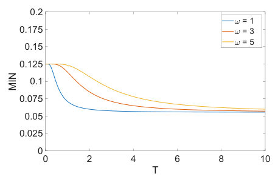 
FIG. 1. MIN as a function of Unruh temperature for ∆0 = −1 with energy gaps ω = 1, 3, 5.

📷 Fig 2

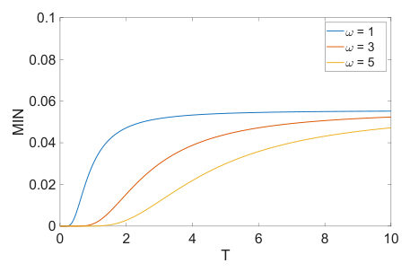 
FIG. 3. MIN as a function of Unruh temperature for ∆0 = 1 with energy gaps ω = 1, 3, 5.

📷 Fig 3

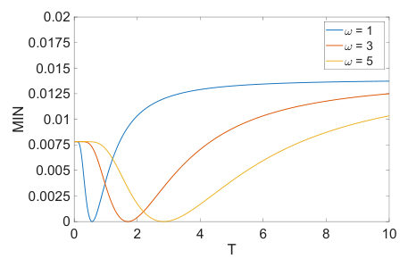 
FIG. 2. MIN as a function of Unruh temperature for ∆0 = 0.5 with energy gaps ω = 1, 3, 5.

**Summary.** This theoretical paper investigates how measurement-induced nonlocality (MIN) behaves in two detectors undergoing uniform acceleration in the presence of a quantum field. Contrary to previous expectations that MIN vanishes in strong acceleration, the authors show that the response is highly dependent on the initial quantum state. This demonstrates that acceleration does not universally destroy quantum correlations, offering a nuanced view of quantum information in curved or accelerating spacetime.

**Why it may be interesting.** This work directly addresses quantum correlations (MIN) in non-inertial frames, providing insights into how fundamental physical effects like acceleration modify quantum information measures, which is highly relevant to quantum optics and open quantum systems.

Detailed structure

**Main problem.** To determine if the suppression of measurement-induced nonlocality (MIN) in accelerating Unruh-DeWitt detectors is a universal consequence of the Unruh effect or if it depends on the specific initial state of the system.

**Main result.** The suppression of MIN under strong acceleration is not universal; its behavior can be state-dependent, showing monotonic suppression, recovery, or enhancement, and can approach a nonzero value at high temperatures.

**Method.** The authors analyzed the evolution of the reduced density matrix using a master equation approach, calculating MIN as a function of the Unruh temperature and initial state parameters.

**Model / system.** The system consists of two uniformly accelerating Unruh-DeWitt detectors coupled to a massless scalar field in Minkowski spacetime. The dynamics are governed by a master equation incorporating the Kubo-Martin-Schwinger (KMS) condition.

**Key observables.** Measurement-Induced Nonlocality (MIN), which quantifies the maximal global disturbance induced by local projective measurements.

**Important parameters / regimes.** Unruh temperature ($T = a/(2\pi)$), detector energy spacing ($\omega$), coupling strength ($\mu$), and the initial-state parameter ($\Delta_0$).

**Assumptions / limitations.** The analysis relies on the weak coupling ($\mu \ll 1$) and Markovian approximations.

**Figures summary.** The figures illustrate MIN versus temperature ($T$) for different initial correlation parameters ($\Delta_0$), showing cases of monotonic decrease, nonmonotonic behavior (minimum followed by increase), and monotonic increase.

**Paper structure.** The paper establishes the theoretical framework using the detector model and master equation, derives the expression for MIN, and then analyzes the temperature dependence of MIN by examining specific limits and parameter choices.

Abstract

Uniform acceleration induces a thermal response to the Minkowski vacuum and can thereby modify quantum correlations. For measurement-induced nonlocality (MIN), a form of nonclassical correlation distinct from entanglement, previous field-mode analyses of bosonic fields found that it decreases with increasing acceleration and vanishes in the infinite-acceleration limit. This raises the question of whether the disappearance of MIN is a generic consequence of the Unruh effect or depends on the physical description of the accelerated quantum system. To address this question, we study two uniformly accelerating Unruh-DeWitt detectors interacting with a massless scalar field. We find that the response of MIN to the Unruh temperature depends sensitively on the initial detector state: it can decrease monotonically, vanish at an intermediate temperature and subsequently recover, or increase monotonically. Moreover, for a broad class of initial states, MIN approaches a nonzero value in the high-temperature limit. These results show that the suppression of MIN under strong acceleration is not universal. Instead, Unruh-induced detector dynamics gives rise to a state-dependent response in which measurement-induced nonlocality can be suppressed, restored, or enhanced.

[↑ back to top](#top)

### [Realization of decoherence-induced averaged symmetry-protected topological phases on quantum processors](http://arxiv.org/abs/2609.07831v1)

**Authors:** Ruizhe Shen, Xue-Jia Yu, Ching Hua Lee  
**Type:** both · **Category:** other · **PDF:** <https://arxiv.org/pdf/2609.07831v1>  
**Analysis basis:** full PDF text, analyzed in chunks
**Topic relevance:** `correlated / nonlocal dissipation` **3/5** · `driven-dissipative phase transition` **3/5** · `methods for driven-dissipative` **3/5** · `non-equilibrium universality` **2/5** · `quantum measurements` **2/5** · `Keldysh / 2PI / non-Gaussian methods` **1/5**

📷 Fig 1

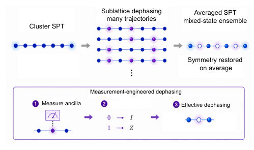 
FIG. 1. Decoherence as a route to ASPT order. Start- ing from a pure cluster SPT with strong symmetry and pro- tected edge/string order, local Pauli-Z dephasing engineered by measurements is applied only to the even sublattice [see Eq. 15]. Each trajectory corresponds to a different proba- bilistic phase-flip pattern. Averaging over these trajectories yields a mixed-state ensemble with weak, average symmetry and persistent topological order.

📷 Fig 2

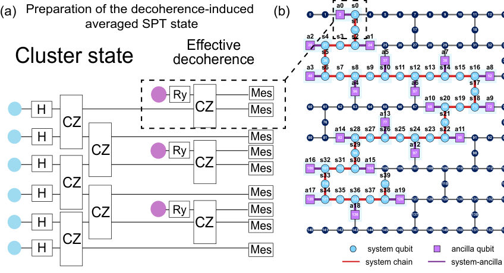 
FIG. 2. Circuit architecture for realizing ASPT order on IBM Quantum hardware. (a), Preparation of the decoherence-induced ASPT state [Eq. 12]. The one-dimensional cluster state is first prepared using Hadamard and nearest- neighbor CZ gates [Eq. 11], followed by local system–ancilla couplings that realize effective Pauli-Z dephasing on the even sublattice [see Fig. 1]. Measuring the ancillas records the corresponding dephasing trajectory [Eq. 8]. (b), Hardware embedding of the circuit in (a). Cyan and purple sites denote system and ancilla qubits, respectively; red links indicate the one-dimensional system chain, whereas purple links denote the system–ancilla couplings used to implement...

📷 Fig 3

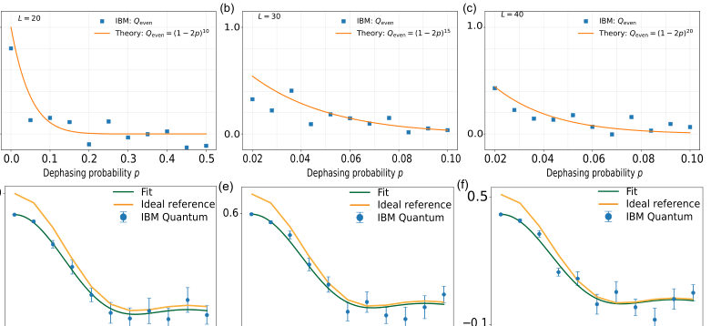 
FIG. 3. Quantum hardware measurements of decoherence-induced symmetry-charge and single-copy string-order decay. (a–c) Measurement of the even-sublattice symmetry charge Qeven defined in Eq. 19 under engineered even-sublattice dephasing. The panels show Qeven as a function of the dephasing probability p for physical chain lengths (a) L = 20, (b) L = 30, and (c) L = 40. Blue markers denote IBM Quantum data, and orange curves show the ideal finite-size prediction in Eq. 22. The suppression of Qeven with increasing p and L reflects the conversion of the even-sublattice symmetry from a strong symmetry to the weak, ensemble-level symmetry described in Eq. 10. (d–f) Single-copy string-order...

📷 Fig 4

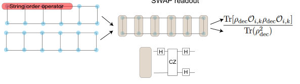 
FIG. 4. Two-replica circuit for measuring the normalized R´enyi-2 string diagnostic of the ASPT phase. a, Hardware embedding of the two-replica experiment. Copies A and B are mapped onto two parallel system-qubit chains, with ancillary qubits coupled to the even sublattice to implement the engineered dephasing channel. The repeated unit-cell structure realizes the same ASPT preparation independently on the two replicas. b, Three-step protocol for measuring the nonlinear string correlator C(2) i,k defined in Eq. 26. Step 1: two independent copies of the decohered cluster state, ρA dec and ρB dec, are prepared using identical ASPT circuits, with independently sampled ancilla outcomes. Step 2:...

📷 Fig 5

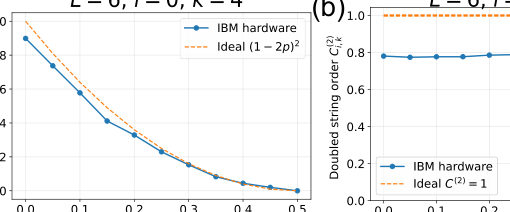 
FIG. 5. Comparison between ordinary and doubled string diagnostics. (a), Single-copy string correlator for the decohered L = 6 cluster chain. The measured signal decreases with increasing dephasing probability p, consistent with the ideal decay in Eq. (23). The corresponding ancilla-assisted dephasing circuit is shown in Fig. 2(b). (b) Normalized R´enyi-2 string correlator C(2) i,k for the decohered cluster chain. In contrast to the single-copy signal, C(2) i,k remains nearly independent of p and close to

**Summary.** This paper demonstrates how to engineer and measure decoherence-induced averaged symmetry-protected topological (ASPT) phases on quantum processors. By applying controlled dephasing, the authors convert a pure-state topological order into a mixed-state order, proving that structured decoherence itself can be a resource for realizing complex quantum matter states.

**Why it may be interesting.** This work directly addresses the challenge of characterizing topological order in realistic, noisy quantum hardware, which is a major frontier in condensed matter theory and quantum computation.

Detailed structure

**Main problem.** The primary goal is to realize and characterize decoherence-induced averaged symmetry-protected topological (ASPT) phases, moving beyond traditional pure-state SPT formulations.

**Main result.** The authors establish a gate-based route to engineer and probe ASPT order, demonstrating that structured decoherence can act as a programmable resource for realizing mixed-state topological quantum matter.

**Method.** The study uses engineered local Pauli-Z dephasing on a 1D cluster SPT state, diagnosing the resulting mixed state using two-replica Renyi-2 string correlators and analyzing the reduced-density-matrix entanglement spectrum.

**Model / system.** The system is a one-dimensional cluster SPT state implemented on programmable quantum processors. The physics involves transitioning from pure-state SPT order to mixed-state ASPT order via controlled decoherence.

**Key observables.** Symmetry charge decay ($Q_{	ext{even}}$), two-replica Renyi-2 string correlator ($C^{(2)}_{i,k}$), and the half-chain reduced-density-matrix spectrum.

**Important parameters / regimes.** Dephasing probability ($p$), system length ($L$), and the structure of the engineered dephasing channel (sublattice-selective Pauli-Z dephasing).

**Assumptions / limitations.** The analysis relies on the ability to implement controlled, local dephasing channels and the use of advanced diagnostics like the two-replica correlator to confirm order at the density-matrix level.

**Figures summary.** Figures illustrate the process from pure SPT to mixed ASPT via dephasing, and show hardware measurements of the symmetry charge decay and single-copy string order suppression.

**Paper structure.** The paper first introduces the concept of ASPT phases, then details the experimental realization using engineered dephasing on a cluster state, followed by rigorous diagnostics using two-replica correlators and entanglement spectrum analysis, contrasting this with measurement-and-feedback protocols.

Abstract

Symmetry-protected topological (SPT) phases are conventionally formulated for pure states protected by exact symmetries. In open quantum systems, however, decoherence generates mixed-state ensembles in which average symmetry can instead emerge only after averaging over microscopic trajectories. In this work, we realize decoherence-induced averaged SPT (ASPT) order on programmable quantum processors. Starting from a one-dimensional cluster SPT, we engineer sublattice-selective Pauli-$Z$ dephasing through ancilla-assisted quantum circuits. We observe the resulting symmetry conversion through the decay of the symmetry charge. Moreover, a two-replica Renyi-2 string correlator measured through destructive SWAP readout remains nontrivial, revealing the ASPT structure encoded at the density-matrix level. We further show that the engineered dephasing redistributes spectral weight among reduced-stabilizer sectors while preserving the characteristic twofold pairing of the half-chain entanglement spectrum. These results establish a gate-based route to engineering and probing ASPT order and demonstrate structured decoherence as a programmable resource for realizing mixed-state topological quantum matter.

[↑ back to top](#top)

### [Hydrodynamic attractors](http://arxiv.org/abs/2609.09114v1)

**Authors:** Tilman Enss, Michal P. Heller, Alexandre Serantes, Clemens Werthmann  
**Type:** theory · **Category:** quantum gases · **PDF:** <https://arxiv.org/pdf/2609.09114v1>  
**Analysis basis:** full PDF text, analyzed in chunks
**Topic relevance:** `Keldysh / 2PI / non-Gaussian methods` **3/5** · `analog quantum simulation` **3/5** · `non-equilibrium universality` **3/5** · `methods for driven-dissipative` **2/5** · `scars & prethermalization` **1/5**

📷 Fig 1

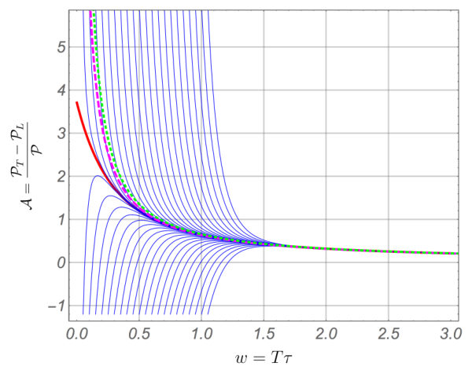 
Figure 1. Numerical solutions with different initial values of the pressure anisotropy A approach a common evolution. The red curve is the stable regular solution A⋆(w) selected by the pullback limit, while the dashed magenta and the green dotted curves are approximations to the attractor given by the hydrodynamic gradient expansion truncated at first and second order respectively. The values of the parameters in the model have been chosen to match those of N = 4 SUSY YM theory in the holographic limit. Adapted from Ref. [25].

📷 Fig 2

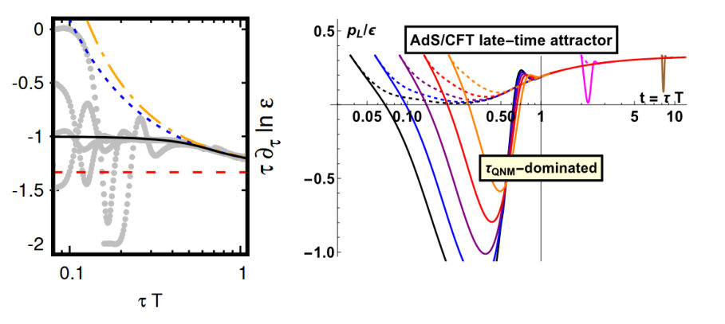 
Figure 2. Early- and late-time behavior in holographic Bjorken flow. Left: adapted version of the AdS/CFT panel of Fig. 1 in Ref. [30]. Grey curves show numerical histories obtained from different bulk initial states, the solid black curve is the smooth attractor candidate, and the broken colored curves denote successive hydrodynamic approximations. The candidate approaches τ∂τ log ε = −1 toward small w = τT. Right: the holographic panel of Fig. 1 in Ref. [36]. Different colors denote different initialization times, while dashed and solid curves correspond, respectively, to the UV-localized and IR-extended families of bulk profiles; the red curve denotes the late-time attractor. Although...

📷 Fig 3

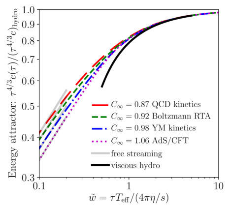 
Figure 3. Evolution of the energy attractor E( ˜w) in different dynamical descriptions, which feature different total amount of cooling and therefore different values of C∞. Taken from [56].

📷 Fig 4

 
Fig. 3 shows the evolution of this attractor curve for several different dynamical descriptions. As it turns out, the differences between different descriptions are not too large, with C∞ ranging between 0.87 and 1.06.

📷 Fig 5

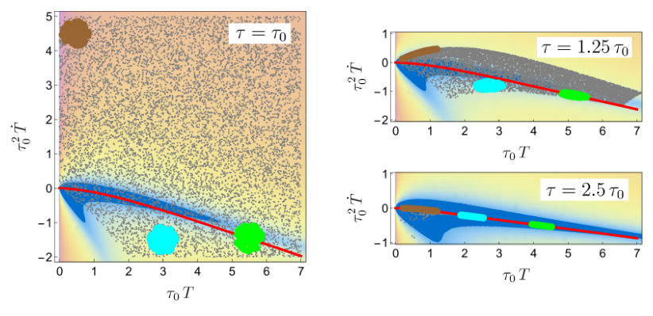 
Figure 4. Three snapshots of the evolution of an ensemble of initial states in conformal MIS theory, adapted from Ref. [33]. The red curve is the section M⋆(τ) of the attracting hypersurface on the corresponding constant-τ slice. The colored ensembles illustrate local dimensional reduction: they first become narrow, effectively one-dimensional clouds, subsequently approach the attracting section, and finally evolve along it. The background color represents the magnitude of the state-space velocity, with bluer regions corresponding to slower evolution. The plots use Cη = 0.75 and Cτπ = 1.

**Summary.** This work explores the concept of hydrodynamic attractors, which describe how complex, non-equilibrium systems approach a simple, low-dimensional late-time behavior. It rigorously distinguishes this 'attractorization' from the 'hydrodynamization' process, comparing results from nuclear collisions and ultracold atomic gases. The findings provide a unified theoretical framework for understanding how fluid dynamics emerge from microscopic interactions.

**Why it may be interesting.** The explicit inclusion and comparison with ultracold Fermi gases provides a direct theoretical link between high-energy heavy-ion physics and controllable AMO systems.

Detailed structure

**Main problem.** The paper aims to distinguish between 'attractorization' (loss of initial state sensitivity) and 'hydrodynamization' (onset of hydrodynamic validity) in non-equilibrium systems.

**Main result.** Hydrodynamic attractors are effective low-dimensional structures that govern late-time evolution, and this concept extends constitutive relations beyond local thermal equilibrium.

**Method.** The authors compare multiple theoretical frameworks—including kinetic theory, holography, and Israel-Stewart-type theories—using conformal, boost-invariant Bjorken flow as the primary setting.

**Model / system.** The study applies to high-energy nuclear collisions (QGP) and ultracold atomic gases, utilizing theoretical tools like divergent gradient expansions and transseries completions.

**Key observables.** Particle production, transverse energy, flow observables, shear/bulk viscosity, and the evolution of the stress-energy tensor.

**Important parameters / regimes.** Proper time ($	au$), temperature ($T$), and dimensionless parameters related to viscosity ($\eta/s$).

**Assumptions / limitations.** The analysis often relies on the conformal, boost-invariant Bjorken flow approximation, and it distinguishes between attractorization and hydrodynamization.

**Paper structure.** The paper is structured by comparing different theoretical approaches (MIS, kinetic theory, holography) to understand the transition from far-from-equilibrium dynamics to hydrodynamic behavior, detailing different types of attraction.

Abstract

Attractors are effective low-dimensional structures, defined in a chosen set of observables, that trajectories from different initial states approach; hydrodynamic attractors are those on which the late-time evolution is governed by hydrodynamic constitutive relations. Motivated by nuclear collisions and ultracold atomic gases, this chapter distinguishes attractorization (the loss of sensitivity to some directions in the space of initial states) from hydrodynamization (the onset of validity of hydrodynamic constitutive relations). Using mainly conformal, boost-invariant Bjorken flow, we compare Müller-Israel-Stewart-type theories, kinetic theory, holography, and classical Yang-Mills fields. Forward attraction, produced by the decay of non-hydrodynamic modes, is distinguished from pullback attraction, which can select a unique regular solution, and from expansion-driven attraction, which can suppress initial-state sensitivity before microscopic relaxation, with or without a subsequent fluid regime. Divergent gradient expansions and their transseries completions, the state-space picture, and adiabatic hydrodynamization provide complementary descriptions. Applications to nuclear collisions include particle production, transverse energy and flow, the initialization of and linear response around attracting backgrounds, jet quenching, and attractor-informed modifications of hydrodynamic models. For ultracold Fermi gases, we review theoretical proposals for bulk-channel attractors under scattering-length drives and distinguish them from recent measurements of short-time contact and momentum-distribution dynamics.

[↑ back to top](#top)

### [Physics of Information Geometry - Part I: Principle of Least Action on the Probability Simplex](http://arxiv.org/abs/2609.08285v1)

**Authors:** C. Emre Koksal, Deniz Sargun  
**Type:** theory · **Category:** statistical mechanics · **PDF:** <https://arxiv.org/pdf/2609.08285v1>  
**Analysis basis:** full PDF text, analyzed in chunks
**Topic relevance:** `non-equilibrium universality` **3/5** · `Keldysh / 2PI / non-Gaussian methods` **2/5** · `methods for driven-dissipative` **2/5** · `analog quantum simulation` **1/5** · `correlated / nonlocal dissipation` **1/5** · `driven-dissipative phase transition` **1/5** · `quantum measurements` **1/5**

📷 Fig 1

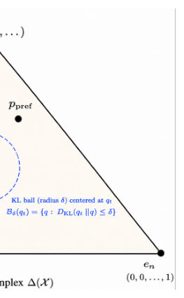 
Fig. 1. Backward information-projection construction. The KL ball Bδ(qt) = {q : DKL(qt∥q) ≤δ} is centered at qt, and q⋆ t−1 is its information projection toward the Gibbs distribution q0. Read in the forward direction, DKL(qt∥q⋆ t−1) is the kinetic en- ergy of the step, while the Pythagorean inequality relates this cost directly to the corresponding increase in Gibbs-referenced free energy.

📷 Fig 2

 
Figure 1 illustrates the geometry. The KL ball is centered at qt in the diver- gence sense DKL(qt∥q) ≤δ, and q⋆ t−1 is selected by projection toward q0. Read forward, the radius DKL(qt∥q⋆ t−1) is exactly the kinetic energy of the step. Although the construction proceeds backward, the physical trajectory is read forward as q0 →q⋆ 1 →· · · →qT = ppref. Hence the ball radius is precisely the kinetic-energy budget of the corresponding forward transition,

📷 Fig 3

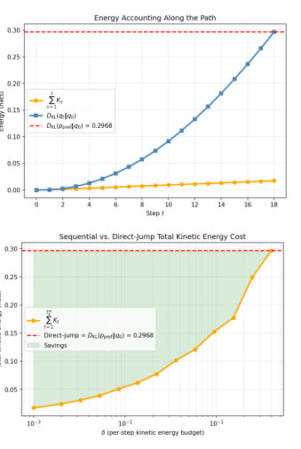 
Fig. 2. Numerical results for q0 = (1/3, 1/3, 1/3), ppref = (0.7, 0.2, 0.1), with DKL(ppref∥q0) ≈0.297 nats. Top-left: Least-action trajectory on the simplex with δ = 0.001 (T = 18 steps) over the free-energy landscape DKL(q∥q0). Top-right: Run- ning nonequilibrium free energy DKL(qt∥q0) and cumulative kinetic cost P

**Summary.** This work introduces a least-action framework to model how a probability distribution evolves from equilibrium to a target state. It mathematically unifies concepts from information geometry and non-equilibrium thermodynamics by showing that the path minimizes an action functional. This provides a powerful, geometrically grounded tool for analyzing irreversible processes in statistical physics.

**Why it may be interesting.** The rigorous connection between path dynamics (kinetics) and thermodynamic potentials (free energy) using information geometry provides a powerful, general framework applicable to non-equilibrium quantum dynamics and open quantum systems.

Detailed structure

**Main problem.** The paper develops a least-action framework to describe the evolution of a probability distribution from an equilibrium state to a non-equilibrium target state under constrained changes.

**Main result.** It establishes that the path follows a least-action principle governed by information geometry, yielding an energy-conservation-like relation between accumulated free energy and kinetic expenditure.

**Method.** The authors combine the thermodynamic concept of relative free energy (using KL divergence) with information-geometric projections to define a path minimizing an action functional.

**Model / system.** The system is the evolution of a probability distribution on the probability simplex, starting from a Gibbs equilibrium reference state and moving towards a prescribed non-equilibrium state.

**Key observables.** Nonequilibrium free energy excess ($D_{KL}(p\|q_0)$), informational kinetic cost ($D_{KL}(q_t\|q_{t-1})$), and the relative free energy ($F_r$).

**Important parameters / regimes.** The kinetic constraint $\delta$ (maximum informational displacement) and the path penalty parameter $\gamma$ (for state-dependent costs).

**Assumptions / limitations.** The local projection problem is assumed to be convex, and the analysis relies on the geometric structure provided by the KL divergence.

**Paper structure.** The paper builds the framework by defining the relative free energy and kinetic cost, deriving the path constraints via information projection, solving the resulting least-action minimization problem using the Lambert W function, and finally interpreting the results thermodynamically.

Abstract

We develop a least-action framework for describing how a probability distribution can evolve from an equilibrium state to a prescribed nonequilibrium state under constrained incremental changes. Taking a Gibbs distribution as the equilibrium reference, the framework gives a direct physical meaning to the geometry of the probability simplex: distance from equilibrium corresponds to nonequilibrium free energy, while changes between successive distributions carry an informational kinetic cost. The Pythagorean structure of relative entropy then provides the central insight of the work. It shows that intermediate distributions chosen via sequential information projections can reduce the kinetic cost of large transitions and establishes an energy-conservation-like relation between the kinetic expenditure along a path and the free energy accumulated in reaching the target distribution. Motivated by this geometry, we construct a greedy least-action path through successive information projections, obtain a closed-form characterization of each projection through the Lambert W function, and establish a finite-step performance guarantee. We further show that state-dependent costs can be incorporated naturally by reshaping the underlying Gibbs reference, providing a thermodynamic interpretation of path penalties as modifications of the effective energy landscape. Together, these results provide a unified view of distributional evolution through least action, information geometry, and nonequilibrium thermodynamics.

[↑ back to top](#top)

### [Kinematic Control and Dephasing Dynamics of Quantum Resources in $e^{+}e^{-}\toτ^{+}τ^{-}$](http://arxiv.org/abs/2609.08555v1)

**Authors:** Elhabib Jaloum, Omar Bachain, Mohamed Amazioug, Rachid Ahl Laamara  
**Type:** theory · **Category:** other · **PDF:** <https://arxiv.org/pdf/2609.08555v1>  
**Analysis basis:** full PDF text, analyzed in chunks
**Topic relevance:** `correlated / nonlocal dissipation` **3/5** · `methods for driven-dissipative` **2/5** · `Keldysh / 2PI / non-Gaussian methods` **1/5** · `driven-dissipative phase transition` **1/5** · `non-equilibrium universality` **1/5** · `quantum measurements` **1/5**

📷 Fig 1

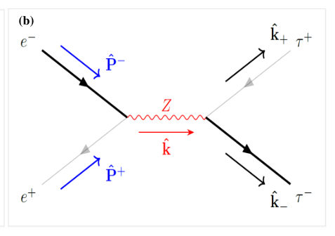 
FIG. 1: Feynman diagrams for τ+τ−production via the Drell–Yan mechanism at hadron colliders.

📷 Fig 2

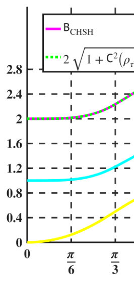 
FIG. 2: The measures BCHSH = 2 √max {B1, B2}, 2 p

📷 Fig 3

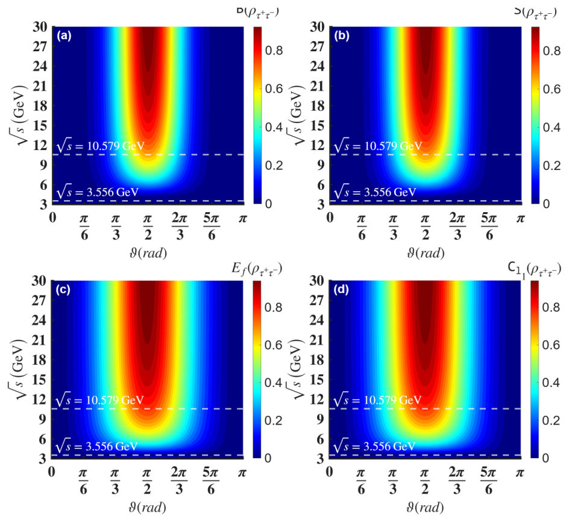 
FIG. 3: Bell nonlocality B(ρτ+τ−), quantum steering S(ρτ+τ−), entanglement of formation E f (ρτ+τ−), and quantum coherence Cl1(ρτ+τ−) as functions of the center-of-mass energy squared √s and the scattering angle ϑ of the τ lepton for the process e+e−→τ+τ−.

📷 Fig 4

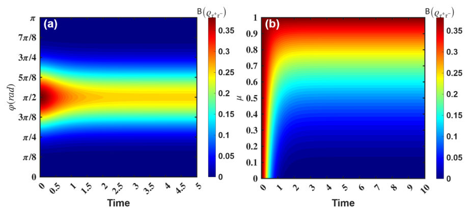 
FIG. 4: Time evolution of the Bell nonlocality B(ϱτ+τ−) in the Markovian regime (τ = 0.2) for (a) fixed classical correlation parameter µ = 0.8 and (b) fixed scattering angle ϑ = π/2. The center-of-mass energy and the τ-lepton mass are set to √s = 10.579 GeV and mτ = 1.777 GeV, respectively.

📷 Fig 5

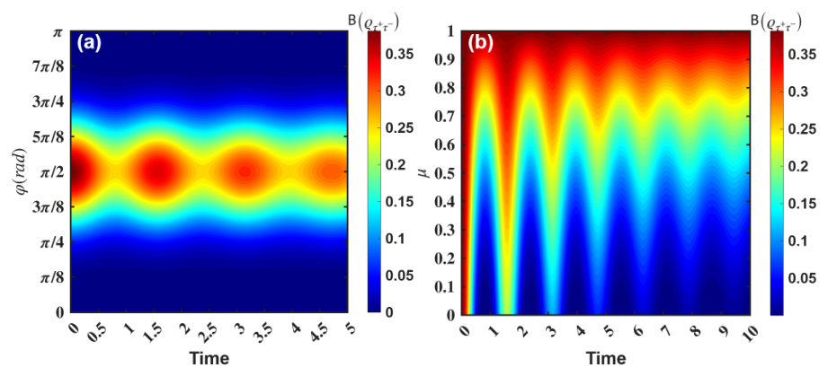 
FIG. 5: Time evolution of the Bell nonlocality B(ϱτ+τ−) in the non-Markovian regime (τ = 5) for (a) fixed classical correlation parameter µ = 0.8 and (b) fixed scattering angle ϑ = π/2. The center-of-mass energy and the τ-lepton mass are set to √s = 10.579 GeV and mτ = 1.777 GeV, respectively.

**Summary.** This work investigates the quantum correlations present in the spin state of $\tau^+\tau^-$ pairs created in $e^+e^-$ collisions. It quantifies these resources using multiple entanglement and nonlocality measures, showing they peak at transverse emission. Crucially, it models decoherence, demonstrating that environmental memory can cause revivals absent in simple Markovian decay.

**Why it may be interesting.** The explicit separation of kinematic correlation generation from environmental noise dynamics provides a powerful framework for understanding resource preservation in particle physics processes.

Detailed structure

**Main problem.** The paper characterizes quantum resources (nonlocality, entanglement, coherence) carried by the spins of $\tau^+\tau^-$ pairs produced in $e^+e^-$ annihilation and analyzes how these resources decay due to environmental decoherence.

**Main result.** The spin correlations exhibit a common kinematic origin connecting the threshold state to the Bell-state limit, and the decoherence analysis distinguishes between memory-generating non-Markovian revivals and simple Markovian decay.

**Method.** The analysis uses quantum information diagnostics (CHSH, Concurrence, etc.) applied to the spin density matrix, followed by propagating the state through a phenomenological correlated-dephasing channel.

**Model / system.** The system is the spin state of a $\tau^+\tau^-$ pair produced in $e^+e^-$ annihilation at $\sqrt{s}=10.579 \text{ GeV}$. The state is modeled as a two-qubit system evolving under both kinematic constraints and environmental noise.

**Key observables.** Bell nonlocality (CHSH), steerability, entanglement of formation (Concurrence), and coherence ($\mathcal{C}_{l1}$).

**Important parameters / regimes.** Production angle ($\vartheta$), center-of-mass energy ($\sqrt{s}$), and decoherence time scales ($\tau, \mu$).

**Assumptions / limitations.** The analysis assumes the Born-level reaction $e^+e^- \to \tau^+\tau^-$ and uses a phenomenological correlated-dephasing channel.

**Figures summary.** Figures illustrate the Feynman diagrams for production and show the temporal evolution of steering measures in both Markovian (rapid decay) and non-Markovian (oscillatory revivals) regimes.

**Paper structure.** The paper first establishes the kinematic dependence of quantum resources, showing their maximum at transverse emission. It then analyzes the evolution of these resources under decoherence, contrasting Markovian decay with non-Markovian memory effects.

Abstract

We characterize several quantum resources carried by the spins of the $τ^{+}τ^{-}$ pair produced in $e^{+}e^{-}$ annihilation. At the Belle-II energy, $\sqrt{s}=10.579\,\mathrm{GeV}$, Bell nonlocality, steerability, entanglement of formation, and coherence are governed by the production angle and are largest for transverse emission, $\vartheta=π/2$. Their common kinematic origin is exposed by expressing the spin state as a velocity and angle-dependent mixture of a separable contribution and a maximally entangled component. Within the physical production domain, this representation connects the weakly correlated threshold state at $\sqrt{s}=2m_τ$ to the Bell-state limit approached at ultrarelativistic energies. We then propagate the two-spin state through a phenomenological correlated-dephasing channel to determine how environmental memory and inter-channel classical correlations affect the available resources. Memory effects generate collapses and revivals that are absent from the monotonic Markovian evolution. The analysis therefore separates the kinematic mechanism that creates the spin correlations from the noise properties that control their subsequent survival.

[↑ back to top](#top)

### [Adaptive AI for Pulse-Level Quantum Control](http://arxiv.org/abs/2609.08727v1)

**Authors:** Sanjeev Shapkota, Yayu Mo, Sanjaya Lohani  
**Type:** theory · **Category:** quantum information and computing · **PDF:** <https://arxiv.org/pdf/2609.08727v1>  
**Analysis basis:** full PDF text, analyzed in chunks
**Topic relevance:** `QC/QI experiment` **3/5** · `methods for driven-dissipative` **2/5** · `quantum measurements` **2/5** · `analog quantum simulation` **1/5**

📷 Fig 1

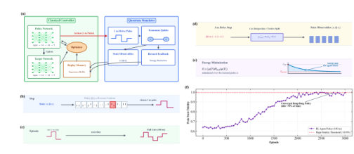 
FIG. 1. Overview of the method. A reinforcement-learning- agent learns to generate a sequence of control pulses for quan- tum device. (a) The complete workflow. The policy net- work reads the current state and picks a one nanosecond drive pulse, shown as the red action arrow. This pulse is applied to the two coupled transmon qubits. The qubits are then measured, and from these measurements the agent receives the new state and a reward based on how much the energy dropped. The optimizer uses this reward, together with a tar- get network and a replay memory, to update the policy net- work. Both networks have the same shape: an input layer, two hidden layers of 64 units, and 9 action outputs....

📷 Fig 2

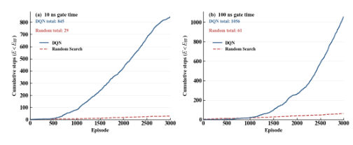 
FIG. 2. Cumulative number of sub-Hartree–Fock steps (E &lt; EHF) versus training episode for the DQN policy (blue) and the random-search baseline (red), at representative scanning times of 10 ns (left) and 100 ns (right). The DQN curve accelerates with training while random search remains slow and nearly linear.

📷 Fig 3

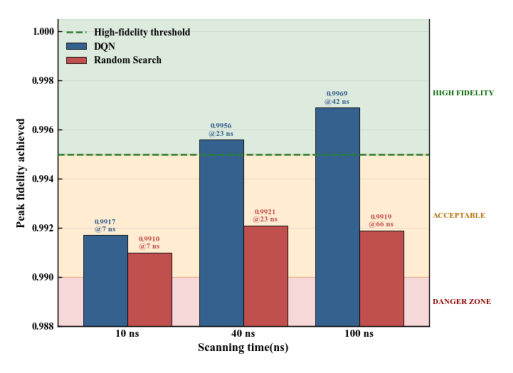 
FIG. 4. Peak state fidelity achieved by the DQN policy (blue) and random search (red) at the total scanning times of 10, 40, and 100 ns. Annotations give the fidelity and the pulse duration at which it is reached. The DQN policy attains higher peak fidelity at every scanning time and is the only method to enter the high-fidelity region above 0.995.

📷 Fig 4

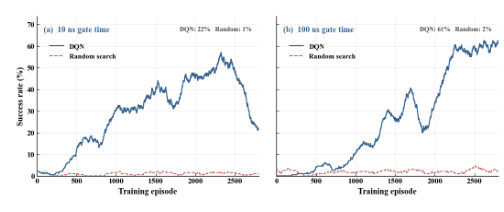 
FIG. 3. Success rate (fraction of episodes with E &lt; EHF, 200-episode moving average) versus training episode for the Hydrogen dimer at 0.75 ˚A (STO-3G), at representative scan- ning times of (a) 10 ns and (b) 100 ns. The DQN policy (solid blue) improves steadily with training while the random-search baseline (dashed red) stays flat.

📷 Fig 5

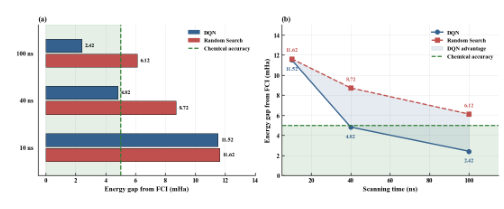 
FIG. 5. Absolute energy gap from the FCI reference for the Hydrogen dimer at 0.75 ˚A (STO-3G). (a) Gap at each scan- ning time for the DQN policy (blue) and random search (red); the dashed line and shaded region mark the 5 mHa accuracy reference. (b) Energy-gap trend versus scanning time, with the shaded region indicating the DQN advantage. The DQN policy is consistently closer to FCI and the advantage widens with scanning time.

**Summary.** This paper introduces an adaptive AI framework using Deep Q-Learning to optimize microwave control pulses for quantum state preparation on superconducting qubits. By treating pulse design as a sequential decision-making problem, the DQN agent autonomously discovers high-fidelity control sequences. This demonstrates a powerful, hardware-ready method for quantum control that significantly surpasses traditional search techniques.

**Why it may be interesting.** This work directly addresses the practical challenge of quantum control, moving beyond model-based optimization by using adaptive AI to navigate complex, high-dimensional control landscapes relevant to superconducting qubits.

Detailed structure

**Main problem.** The core problem is finding high-fidelity, optimal microwave control pulses to prepare specific quantum states, which is challenging due to the complex, continuous nature of the control landscape.

**Main result.** The proposed Reinforcement Learning agent successfully discovers optimized pulse sequences that significantly outperform random search baselines, achieving high fidelity for ground-state preparation.

**Method.** The authors employ a Deep Q-Network (DQN) agent, trained using a reward function derived from the energy reduction, to autonomously search the continuous control space.

**Model / system.** The work is applied to superconducting qubit platforms, simulating the ground-state preparation of the Hydrogen molecule using a defined device Hamiltonian and microwave control Hamiltonian.

**Key observables.** Peak state fidelity, molecular energy (relative to FCI), and the success rate of finding low-energy states.

**Important parameters / regimes.** Nanosecond resolution for pulse application; training parameters include discount factor (gamma=0.99) and exploration decay ($\epsilon$).

**Assumptions / limitations.** The control landscape is discretized into a 'bang-bang' form for the DQN action space, and the state evolution is calculated using a first-order Trotter split.

**Figures summary.** Figures illustrate the RL workflow (state $
ightarrow$ action $
ightarrow$ reward), compare DQN vs. random search success rates and peak fidelities across different scan times (10 ns to 100 ns), and show the learned pulse patterns.

**Paper structure.** The paper introduces the problem of pulse-level control, details the DQN framework (state representation via Pauli expectation values, action space, reward function), presents the results comparing DQN to random search on the H2 molecule, and concludes with implications for hardware-ready quantum control.

Abstract

The Control Variational Quantum Eigensolver (ctrl-VQE) directly optimizes microwave pulses to enable faster and lower-error quantum-state preparation, but its continuous control landscape re- quires efficient search strategies. We demonstrate that a reinforcement-learning agent based on a deep Q learning network can autonomously discover high-performance pulse sequences using only system parameters and a reward function. The approach is fully general for superconducting qubit platforms, requires no ansatz, and operates at nanosecond resolution compatible with hardware con- straints. As a proof of concept, we apply the method to ground-state preparation of the Hydrogen molecule on a simulated superconducting device. The agent consistently identifies optimized control sequences that achieve high fidelity and outperform random-search baselines. These results highlight adaptive learning as a promising hardware-ready framework for pulse-level quantum control.

[↑ back to top](#top)

### [Restart and first detection in a lackadaisical quantum walk with flat-band localization](http://arxiv.org/abs/2609.08973v1)

**Authors:** Debraj Das  
**Type:** theory · **Category:** statistical mechanics · **PDF:** <https://arxiv.org/pdf/2609.08973v1>  
**Analysis basis:** full PDF text, analyzed in chunks
**Topic relevance:** `quantum measurements` **3/5** · `correlated / nonlocal dissipation` **1/5** · `driven-dissipative phase transition` **1/5** · `non-equilibrium universality` **1/5** · `scars & prethermalization` **1/5**

📷 Fig 1

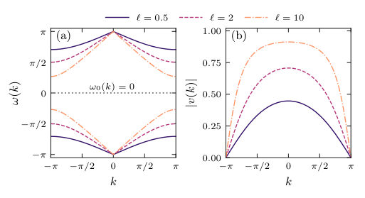 
FIG. 1. (a) Quasienergy spectrum of the restart-free LDTQW for several self-loop weights ℓ. The flat band re- mains at ω0(k) = 0 (gray dotted line), while the dispersive branches ±ω(k), obtained from Eq. (9), become increasingly k dependent and span a larger quasienergy range as ℓin- creases. (b) Magnitude of the dispersive group velocity |v(k)| obtained from Eq. (10).

📷 Fig 2

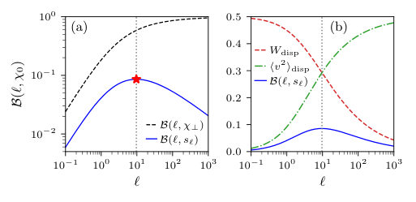 
FIG. 3. Ballistic coefficients of the restart-free LDTQW as a function of the self-loop weight ℓ. (a) The blue solid line denotes Bact(ℓ) from Eq. (34), while the black dashed line rep- resents Bdark(ℓ) from Eq. (35). The red star marks the maxi- mum of Bact at ℓ∗= 4(1+ √

📷 Fig 3

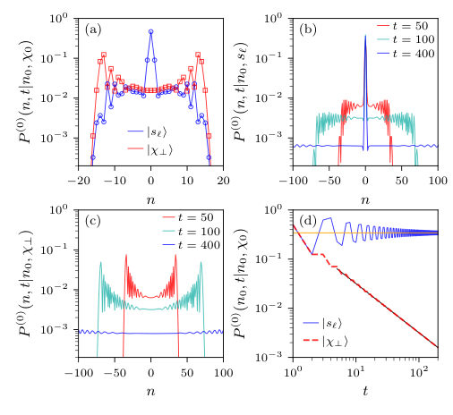 
FIG. 2. Restart-free dynamics for a walker initially localized at n0 = 0 with ℓ= 2. (a) Site-occupation probability at t = 20 for the flat-band-active state |sℓ⟩(blue) and the flat- band-dark state |χ⊥⟩(red). Solid curves show the analytical result (8) and open symbols are obtained from numerical sim- ulation. (b) and (c) Site-occupation profiles at t = 50, 100, and 400 for |sℓ⟩and |χ⊥⟩, respectively. Lines are obtained from numerical simulation. (d) Return probability at the ini- tial site. The horizontal orange line marks w2 act from Eq. (29), and the black line shows the asymptotic result in Eq. (30). The blue solid line and the dashed red line are obtained from numerical simulation.

📷 Fig 4

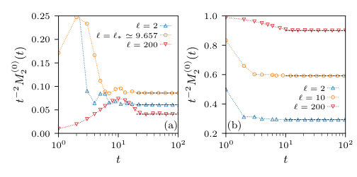 
FIG. 4. Scaled MSD of the restart-free LDTQW. (a) Flat- band-active state. The black dashed line denotes Bact(ℓ) from Eq. (34). (b) Flat-band-dark state. The black dashed line denotes Bdark(ℓ) from Eq. (35). For both panels, symbols are obtained from numerical simulation and the dotted lines are guides to the eye.

📷 Fig 5

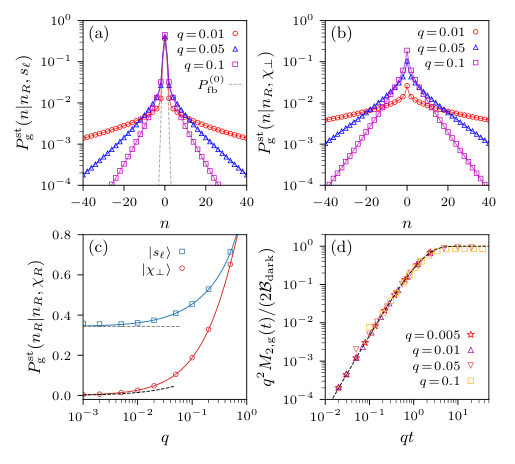 
FIG. 5. Geometric restart for ℓ= 2 and nR = 0. (a) and (b) Stationary site-occupation profiles for the flat-band-active state |sℓ⟩and the flat-band-dark state |χ⊥⟩, respectively. Solid curves are stationary renewal results from Eq. (47) and symbols are numerical results averaged over 5 × 105 stochas- tic realizations. The gray dashed curve in (a) is the intrinsic flat-band profile P (0) fb (n|nR, sℓ) from Eq. (28). (c) Stationary restart-site occupation probability. Solid lines are obtained from Eq. (47), while symbols denote numerical results aver- aged over 5×105 stochastic realizations. Dashed lines in gray and black show the weak-restart limits (48) and (49), respec- tively. (d)...

**Summary.** This paper analyzes a quantum walk model to separate intrinsic spectral localization from confinement effects induced by external 'restart' mechanisms. By studying geometric and power-law restarts, the authors derive scaling laws for transport observables like the mean-squared displacement. The results demonstrate that the restart process acts as a spectral discriminator, allowing the recovery of the intrinsic localized state even when the walk is perturbed.

**Why it may be interesting.** The work provides a rigorous framework for understanding how external measurement or resetting processes modify fundamental quantum transport phenomena, which is relevant for open quantum systems and quantum measurement theory.

Detailed structure

**Main problem.** The study investigates how different restart mechanisms (stochastic or sharp) affect the long-time spatial localization and transport properties of a quantum walk.

**Main result.** The analysis distinguishes between intrinsic spectral localization (flat band) and confinement due to the restart process, showing distinct scaling behaviors for different initial states.

**Method.** The research employs spectral decomposition of the quantum walk propagator and analyzes the asymptotic behavior of site-occupation probabilities and mean-squared displacement under renewal processes.

**Model / system.** The model is a one-dimensional lackadaisical discrete-time quantum walk (LDTQW) defined on a lattice, characterized by a self-loop weight $\ell$. The dynamics are analyzed by decomposing the evolution into contributions from an intrinsically localized flat band and dispersive bands.

**Key observables.** Mean-squared displacement ($\langle x^2 
angle$), restart-site occupation probability, stationary site-occupation distribution, and mean first-detected-passage time.

**Important parameters / regimes.** Restart probability ($q$) for geometric restart, power-law exponent ($s$) for power-law restart, and the self-loop weight ($\ell$).

**Assumptions / limitations.** The analysis relies on taking limits such as $q 	o 0$ or $t 	o \infty$ to characterize the long-time steady states.

**Paper structure.** The paper systematically builds the analysis by first establishing the restart-free dynamics, then developing the renewal formalism for stochastic restarts (geometric and power-law), and finally analyzing the specific case of monitored first detection.

Abstract

We study stochastic and sharp restart in a one-dimensional lackadaisical discrete-time quantum walk with self-loop weight $\ell$. In the absence of restart, the dynamics has a flat band responsible for intrinsic localization and two dispersive bands supporting ballistic propagation. We compare two initially localized benchmark states: a flat-band-active state with finite flat-band overlap and a flat-band-dark state with zero flat-band overlap. For geometric stochastic restart with per-step restart probability $q$, the stationary mean-squared displacement scales as $q^{-2}$ as $q\to0$. In the same limit, the restart-site occupation probability approaches the restart-free intrinsic localized value for the flat-band-active state, whereas for the flat-band-dark state it vanishes as $q\ln(1/q)$. For power-law restart, where $p_m\propto m^{-s}$ is the probability that the waiting time to the next restart is $m$ steps, a normalized stationary site-occupation distribution exists only for $s>2$, while the stationary absolute spatial moment of order $p$ is finite only for $s>p+2$. In the regime $1<s\leq2$, at every fixed lattice site, the flat-band-active occupation converges to the intrinsic flat-band profile, while the flat-band-dark occupation tends to zero. We also consider monitored first detection with sharp restart, in which the walk is reinitialized after a fixed number $r$ of consecutive unsuccessful measurements. For fixed $r$, the mean first-detected-passage time of the flat-band-active state exhibits a minimum at an intermediate self-loop weight, whereas the flat-band-dark state approaches a ballistic detection limit as $\ell\to\infty$.

[↑ back to top](#top)

### [Riemannian optimization for linear optical problems](http://arxiv.org/abs/2609.07890v1)

**Authors:** Pablo V. Parellada  
**Type:** theory · **Category:** quantum information and computing · **PDF:** <https://arxiv.org/pdf/2609.07890v1>  
**Analysis basis:** full PDF text, analyzed in chunks
**Topic relevance:** `interference shaping light` **3/5** · `methods for driven-dissipative` **2/5** · `analog quantum simulation` **1/5**

📷 Fig 1

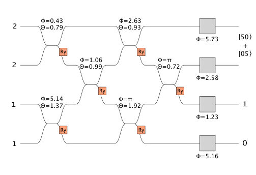 
Figure 2. Passive circuit for preparing the NOON state (|50⟩+ |05⟩)/ √

**Summary.** This paper develops a rigorous framework using Riemannian optimization to find optimal settings for linear optical interferometers. By deriving an analytical gradient formula for functions on the unitary manifold, the authors enable the use of advanced optimizers like BFGS. This significantly accelerates the design of quantum state preparations, improving upon current state-of-the-art methods.

**Why it may be interesting.** This work provides powerful, mathematically rigorous tools for optimizing quantum optical circuits, which is crucial for designing scalable photonic quantum computation and communication protocols.

Detailed structure

**Main problem.** The paper addresses the challenge of finding optimal configurations for multiport interferometers used in linear optical quantum information processing, such as maximizing state preparation fidelity.

**Main result.** The authors derive a closed analytical formula for the Riemannian gradient on the unitary manifold and demonstrate that Riemannian optimization, especially using quasi-Newton methods, significantly outperforms standard gradient descent for these problems.

**Method.** They employ Riemannian optimization techniques, deriving the gradient for composite functions defined on the unitary group, and comparing various optimizers like BFGS and ADAM.

**Model / system.** The physical system is passive multiport interferometers, modeled by unitary scattering matrices ($S$) acting on photonic states. The optimization is performed on the manifold of these unitaries.

**Key observables.** Fidelity, success probability of state preparation (e.g., NOON states), convergence rate, and mean number of iterations.

**Important parameters / regimes.** The number of modes ($m$) and photons, and the step size ($\alpha_k$) used in the optimization algorithms.

**Assumptions / limitations.** The optimization relies on the mathematical framework of Riemannian geometry, specifically defining the gradient on the unitary manifold, and sometimes simplifying the search space using Lie algebraic invariants.

**Figures summary.** Tables compare the performance (optimality rate, iterations) of various Riemannian optimizers (GD, ADAM, BFGS, L-BFGS) across different state preparation tasks, showing BFGS/L-BFGS superiority.

**Paper structure.** The paper builds from general Riemannian optimization theory to deriving the specific gradient formula for linear optics cost functions, and finally applies these optimized methods to benchmark state preparation tasks.

Abstract

Many applications of linear optics in quantum science involve searching for some optimal configuration of a multiport interferometer. For example, to find heralded state preparations, one can optimize the interferometer to maximize the fidelity and success probability of the state preparation. In this paper, we derive a closed analytical formula for the Riemannian gradient of any differentiable function defined over the interferometer unitaries. We use this gradient in Riemannian optimization algorithms, such as gradient descent or BFGS, to find the optimal setup of the interferometer. As an interesting use case, we search for linear optical state preparations, improving some of the success probabilities reported in the literature for NOON or photon catalysis preparations. Finally, we show that our optimizer is orders of magnitude faster than other methods in the literature, opening the door for solving linear optical problems involving more modes and photons.

[↑ back to top](#top)

### [A Platform-aware Compilation Framework for Fault-tolerant Quantum Computation](http://arxiv.org/abs/2609.08908v1)

**Authors:** Srushti Patil, Susan X. Chen, Andreas Juul Bay-Smidt, Stefan Alaric Schäffer, Peter Krogstrup, Stefano Paesani, Gemma C. Solomon  
**Type:** theory · **Category:** quantum information and computing · **PDF:** <https://arxiv.org/pdf/2609.08908v1>  
**Analysis basis:** full PDF text, analyzed in chunks
**Topic relevance:** `analog quantum simulation` **3/5** · `QC/QI experiment` **2/5**

📷 Fig 1

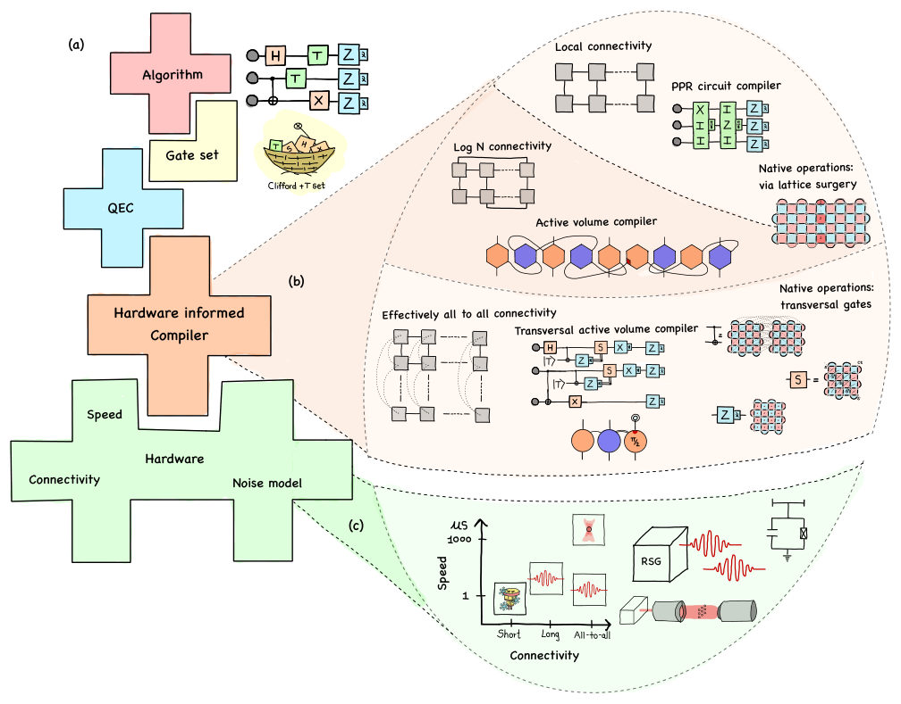 
FIG. 1. Overview of the platform-aware compilation framework. (a) The full FTQC pipeline is divided into an Algorithm, a QEC, and a Hardware stack. The algorithm is expressed as a logical circuit in a universal gate set (here, Clifford+T), which the QEC code must support (surface code in this case). The hardware-informed compiler then bridges the QEC and Hardware stacks, selecting a compilation strategy from the logical operations available in the code and the platform’s connectivity, speed, and noise. (b) Circuit compilation for the three connectivity classes we consider. Local (nearest-neighbor) connectivity: the PPR compiler rewrites the circuit as Pauli product rotations, which are...

📷 Fig 2

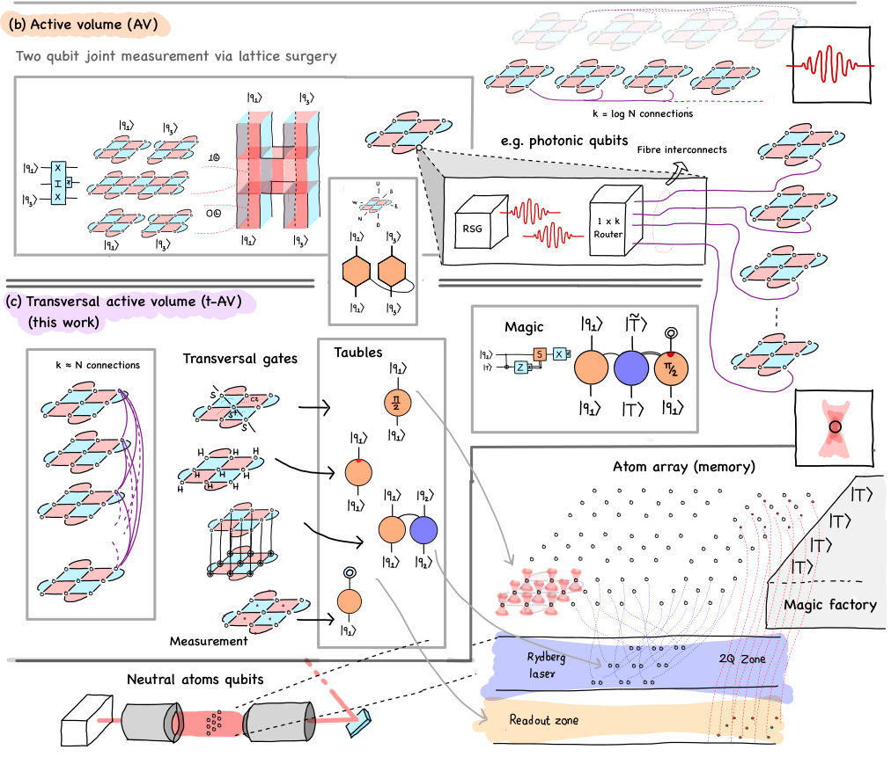 
FIG. 2. Overview of compilation architectures. A logical qubit is a rotated surface-code patch (red/blue = X/Z boundaries). (a) Superconducting platform with nearest-neighbor connectivity. (left) Surface code patches sit on a static 2D grid with nearest-neighbour links (inset: transmon qubits and tunable couplers; the space-time diagram shows an idle logical qubit as a (dX, dZ, dm) cube). (right) A joint PPM is routed through an ancillary bus via lattice surgery [15], with a corresponding space-time picture. (b) Photonics platform with limited non-local connectivity using active volume architecture [16]. Each patch carries k = log N long-range links realized by fiber interconnects (inset:...

📷 Fig 3

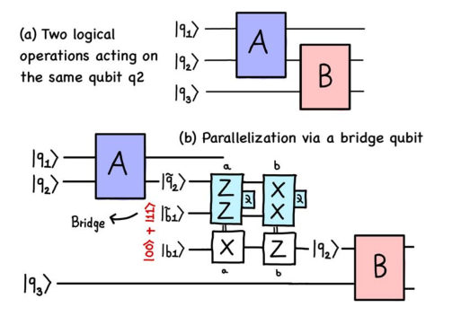 
FIG. 3. Parallelizing two operations via Bell-state teleporta- tion and bridge qubits

📷 Fig 4

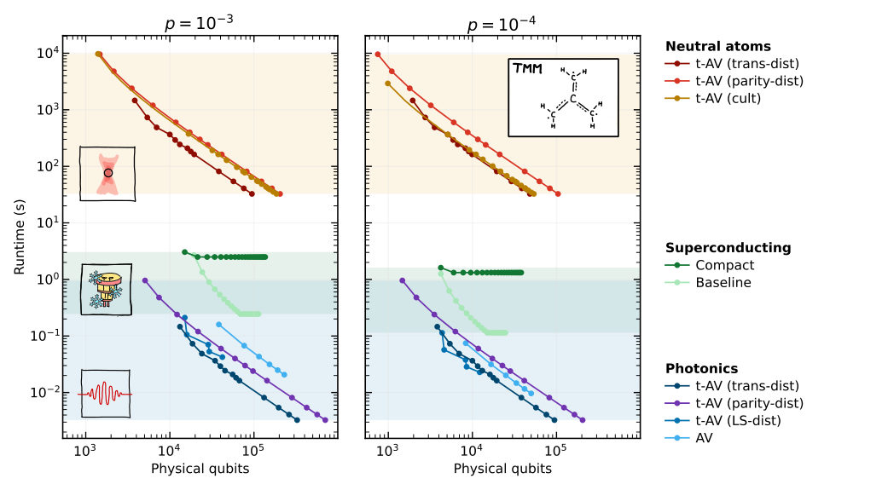 
FIG. 4. Runtime vs. physical-qubit count for the Stat-QPE-gap TMM use benchmark, with rmax = 20 and p = 10−3 (left) and p = 10−4 (right). Each curve represents runtime-resource tradeoffs within one architecture-hardware configuration and is generated by sweeping the scheduling parameter specific to the architecture: workspace capacity for AV, T-per-cycle for t- AV/cult-t-AV, and factory count for Baseline/Compact. We specify the considered architecture-hardware configurations in the legend to the right of the plots. For the t-AV architecture, we also specify different magic state factories that are compatible with those architecture-hardware configurations. For readability, the plot is...

📷 Fig 5

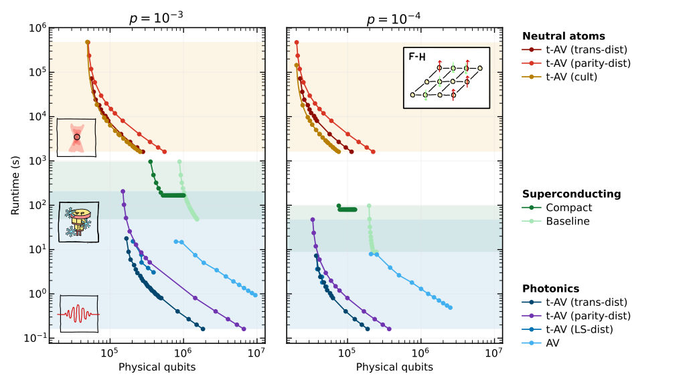 
FIG. 5. Runtime vs. physical-qubit count for the Fermi-Hubbard benchmark at p = 10−3 (left) and p = 10−4 (right). See the caption of Fig. 4 for further details. Photonic t-AV reaches the lowest runtimes, while neutral-atom t-AV (cult) achieves the lowest physical qubit count, at the cost of a significantly slower code cycle.

**Summary.** This paper introduces a novel, platform-aware compilation framework designed to overcome the limitation of existing quantum compilers that are locked to a single hardware architecture. By re-compiling circuits for various connectivity types, it provides comprehensive, end-to-end resource estimates for quantum simulations. This is vital for guiding the development roadmap across diverse quantum hardware modalities.

**Why it may be interesting.** It provides a crucial, unified theoretical tool for comparing the resource costs of quantum algorithms across fundamentally different physical hardware architectures (superconducting, photonic, neutral atoms).

Detailed structure

**Main problem.** Current quantum compilation frameworks fail to account for the variability in physical hardware platforms and error correction models, hindering cross-platform resource assessment.

**Main result.** The authors present a platform-aware compilation framework that provides end-to-end resource estimates (qubits, time) for quantum simulations on diverse hardware modalities.

**Method.** The framework re-compiles quantum circuits into hardware-compatible instruction sets by bridging Algorithm, Quantum Error Correction (QEC), and Hardware stacks based on connectivity.

**Model / system.** The framework is benchmarked using Hamiltonian simulation of the 2D Fermi Hubbard model and eigenenergy estimation for trimethylenemethane (TMM). It analyzes three connectivity classes: nearest-neighbor, log N, and effectively all-to-all.

**Key observables.** Physical-qubit count, time-to-solution, classical processing time, and required code distance (d).

**Important parameters / regimes.** Connectivity type (local, log N, all-to-all), error rate (e.g., $10^{-3}$), and target logical error ($\le 0.01$).

**Assumptions / limitations.** The analysis simplifies by focusing on rotated surface codes and assumes certain scaling behaviors for transversal gates and distillation processes.

**Figures summary.** Figures illustrate the full FTQC pipeline, circuit compilation for different connectivity classes, and runtime scaling comparisons for TMM and Fermi-Hubbard across various architectures.

**Paper structure.** The paper introduces the platform-aware framework, details the compilation strategies for different connectivity classes (PPR, t-AV), and benchmarks the framework on two key quantum simulation problems (TMM and Fermi-Hubbard).

Abstract

The compilation of an algorithm can vary significantly with the choice of physical hardware platform and error correction model. Yet, current compilation frameworks typically commit to a single architecture-hardware configuration, making it difficult to assess resource estimates across platforms. We present a platform-aware compilation framework that re-compiles a quantum circuit into a hardware-compatible instruction set as well as fault-tolerant operations and provides end-to-end resource estimates in terms of physical-qubit count, time-to-solution, and classical processing time. We benchmark the framework by obtaining end-to-end resource estimates for different compilers, each tailored to the functionalities of specific hardware modalities: connectivity, clock speed, and noise model. As part of this framework, we introduce a transversal active volume (t-AV) compilation architecture designed for the efficient execution of fault-tolerant operations in platforms supporting long-range logical connectivity. We benchmark the framework for Hamiltonian simulation of the 2D Fermi Hubbard model as well as for eigenenergy estimation of a small molecule (trimethylenemethane) as a candidate for early fault-tolerant demonstration of quantum chemistry. For the latter, we show that end-to-end quantum simulations can be achieved with $\sim10^4$ physical qubits and runtimes ranging from $10^2$ ms (photonics, superconducting) to $10^5$ ms (neutral atoms).

[↑ back to top](#top)

### [Non-perturbative theory of valley splitting in Si qubits from variational wave function: periodic effects of shear strain and asymptotic freedom in the wiggle-well potential](http://arxiv.org/abs/2609.08839v1)

**Authors:** Johannes L. P. Steinschuld, Hendrik J. Bluhm, Seyed Akbar Jafari  
**Type:** theory · **Category:** quantum information and computing · **PDF:** <https://arxiv.org/pdf/2609.08839v1>  
**Analysis basis:** full PDF text, analyzed in chunks
**Topic relevance:** `Frenkel-Kontorova` **3/5** · `Keldysh / 2PI / non-Gaussian methods` **2/5**

📷 Fig 1

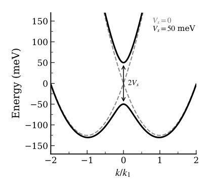 
FIG. 1. Dispersion near the X point for Vs = 0 (dashed) and Vs = 50 meV (solid), Eq. (5). The gap 2Vs opened at the former valley crossing is the plane-wave precursor of the finite-well valley splitting derived in Sec. III. As Vs increases from zero, the minima of E−(k) move continuously toward the X point.

📷 Fig 2

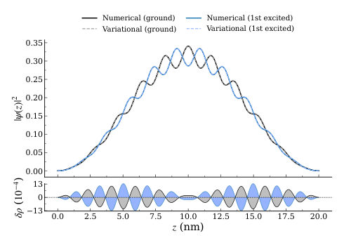 
FIG. 2. Probability density for the ground state (ψ+) and first excited state (ψ−), shown as gray and light-blue dashed lines, respectively, compared with the corresponding numeri- cally exact results (solid black and blue lines) for L = 20 nm and Vs = 20 meV. The variational wave functions reproduce both the overall envelope and the fine-scale modulation of the numerical densities. The lower panel shows the residuals δρ = ρnum−ρvar, which exhibits a beating pattern at the 10−4

📷 Fig 3

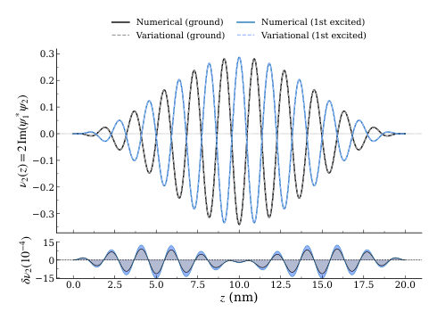 
FIG. 3. Intervalley interference ν2(z) = 2 Im(ψ∗ 1ψ2), Eq. (16), for the ground state (ψ+ (black) and excited valley state ψ− (blue); see Sec. III): numerical (solid) vs. variational (dashed) for the same parameters as Fig. 2. As can be seen the two states are characterized by opposite valley polarization den- sities. Lower panel: residual δν2 = ν2,num −ν2,var.

📷 Fig 4

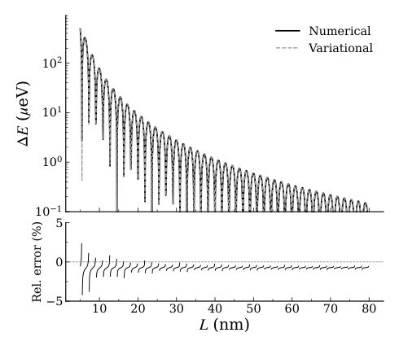 
FIG. 4. Valley splitting as a function of the heterostruc- ture size L. The variational prediction from Eq. (13), shown as a dashed gray line, reproduces both the oscillatory node structure and the overall magnitude of the numerically ex- act splitting (solid black) as L varies from 5 to 80 nm at fixed Vs = 20 meV. Lower panel: relative error (with split- ting nodes masked; see text). The error remains essentially flat at the ∼1% level across the entire range.

📷 Fig 5

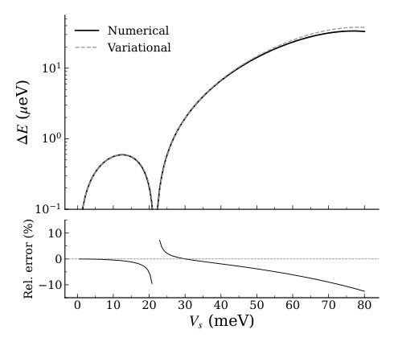 
FIG. 5. Unlike the well-width sweep of Fig. 4, sweeping the coupling strength Vs at fixed L = 20 nm exposes a systematic breakdown of the ansatz: numerics (solid black) and Eq. (13) (dashed gray) agree to ≲1% at weak coupling, but the theory increasingly overestimates ∆E as Vs grows, reaching ∼10% by Vs ≈80 meV (lower panel; splitting node masked, see text).

**Summary.** This theoretical paper develops an advanced model to predict the valley splitting energy in silicon quantum-well qubits, which is crucial for controlling spin and valley degrees of freedom. By using a specialized 'valleyor' basis, the authors analytically treat non-perturbative effects from shear strain and periodic potentials. The results provide quantitative predictions, including characteristic oscillations and a regime of 'asymptotic freedom' in the strong coupling limit.

**Why it may be interesting.** The work provides highly detailed, analytical, and non-perturbative predictions for a key energy scale in silicon qubits, directly impacting the feasibility and control of spin/valley qubits for quantum computation.

Detailed structure

**Main problem.** The primary challenge is accurately predicting the valley splitting energy in silicon quantum-well qubits because this energy scale is highly sensitive to the underlying interface structure.

**Main result.** The authors developed an analytical framework showing that the valley splitting exhibits characteristic oscillatory dependencies on strain and that, in the strong wiggle-well coupling limit, the splitting is dominated by the empty-box energy scale, suggesting asymptotic freedom.

**Method.** The study employs a two-band effective-mass model formulated in a specialized 'valleyor' basis, allowing for the non-perturbative treatment of coupling terms arising from shear strain and periodic potentials.

**Model / system.** The system is silicon quantum-well qubits, modeled using a two-band effective-mass Hamiltonian that incorporates intervalley coupling terms ($V_s$ for shear strain and $V_w \cos(kwz)$ for the wiggle-well potential).

**Key observables.** Valley splitting energy ($\Delta E$), local valley density ($
u_2(z)$), and the oscillatory dependence of $\Delta E$ on system length ($L$).

**Important parameters / regimes.** Shear strain ($\varepsilon_{xy}$), wiggle-well amplitude ($V_w$), momentum offset ($k_1$), and the resonance condition ($k_w = 2k_1$).

**Assumptions / limitations.** The analysis relies on the effective-mass approximation and the use of the valleyor basis to explicitly treat the valley degree of freedom.

**Figures summary.** Figures illustrate the opening of the energy gap near the X point due to coupling, compare probability densities between numerical and variational methods, and show the resonance and diffraction-like side-lobes for the wiggle-well coupling.

**Paper structure.** The paper first establishes the model in the valleyor basis, then derives analytical expressions for the splitting under uniform shear strain, and finally extends the analysis to the complex, non-perturbative effects of the wiggle-well potential, analyzing different coupling regimes.

Abstract

Valley splitting sets the energy scale at which spin and valley degrees of freedom hybridize in silicon quantum-well qubits, but its sensitivity to interface structure makes it difficult to predict. Using the valleyor basis, we formulate a two-band effective-mass model for intervalley coupling in a finite quantum well and develop an analytical framework for treating non-perturbative effects of shear strain and wiggle-well potentials. For a $z$-independent coupling $V_sτ_2$, corresponding to uniform shear strain, we construct a variational state from the exact plane-wave valleyors and a hard-wall envelope. This yields closed-form expressions for the two lowest states and their splitting, including the characteristic oscillatory $|\sin(k_{\rm min}L)|$ dependence. The variational result agrees with exact diagonalization to within $\sim1\%$ for realistic couplings, and provides a simple prescription for tuning the shear strain away from the nodes to enhance the valley splitting. We further show that finite barrier heights primarily renormalize the effective width of the quantum well while preserving the oscillatory dependence. For a wiggle-well coupling $V_w\cos(k_wz)τ_1$, the valleyor representation reveals a crossover near the $k_w=2k_1$ resonance from wiggle-dominated splitting to orbital quantization. Remarkably, at high wiggle-well amplitudes, the empty-box energy scale predominantly dictates the near-resonant valley splitting, while the wiggle-well potential enters only as a sub-leading correction. This behavior can be viewed as asymptotic freedom for spin qubits. Away from resonance, the splitting exhibits a broadly peaked resonance with diffraction-like side-lobes as a function of detuning.

[↑ back to top](#top)

### [Tensor network investigation of the monomer-dimer model on the honeycomb lattice](http://arxiv.org/abs/2609.07899v1)

**Authors:** De-Zhang Li, Jie Liu, Xin Wang  
**Type:** theory · **Category:** statistical mechanics · **PDF:** <https://arxiv.org/pdf/2609.07899v1>  
**Analysis basis:** full PDF text, analyzed in chunks
**Topic relevance:** `methods for driven-dissipative` **3/5** · `analog quantum simulation` **2/5**

📷 Fig 1

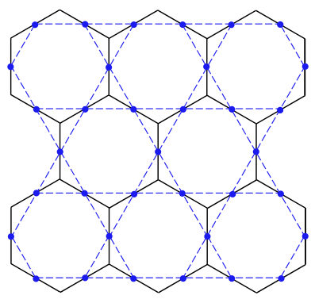 
Figure 1. Mapping from the monomer-dimer model on the honeycomb lattice into the Ising model on the Kagom´e lattice. The honeycomb lattice is marked in solid black lines and the Kagom´e lattice is marked in dashed blue lines.

📷 Fig 2

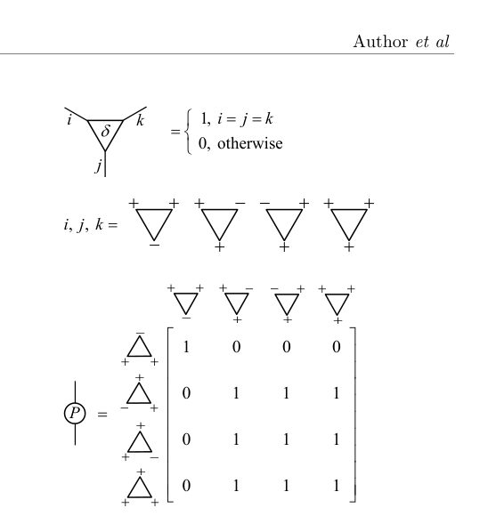 
Figure 2. The tensor network construction depending on the local rule for the Kagom´e Ising ground states in the critical field. The definitions of the δ tensor and the P matrix are explicitly presented.

📷 Fig 3

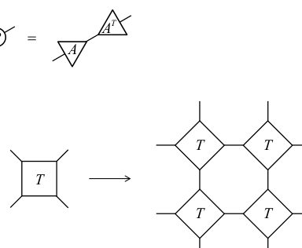 
Figure 3. The tensor network in Figure 2 is transformed into the T tensors on the square lattice. This square lattice tensor network is obtained by performing an SVD on the P matrices and contracting the internal indices of each unit consisting of two nearest-neighbour Ising triangles.

📷 Fig 4

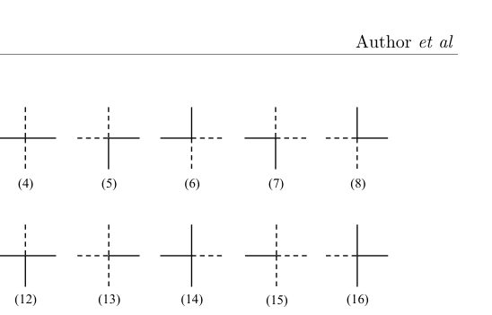 
Figure 4. The vertex configurations of the sixteen-vertex model. Each solid line represents a bonded edge, while each dashed line represents an unbonded edge. The even eight-vertex model consists of vertices (1)–(8), while the odd subcase consists of vertices (9)–(16).

📷 Fig 5

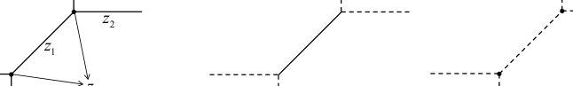 
Figure 5. (a) The vertex unit of the monomer-dimer model on the honeycomb lattice with the associated dimer and monomer activities. (b) Two monomer-dimer arrangements of the unit corresponding to vertex (1) of the sixteen-vertex model in Figure 4.

**Summary.** This paper applies advanced tensor network methods, specifically VUMPS, to calculate the residual entropy of the monomer-dimer model on the honeycomb lattice. The model is mapped onto the ground state problem of an antiferromagnetic Ising model on the Kagomé lattice. The results provide high-precision estimates for the entropy, advancing the understanding of this classically difficult lattice problem.

**Why it may be interesting.** While the focus is on classical statistical mechanics, the use of advanced tensor network techniques (VUMPS) for calculating ground state degeneracies is a powerful numerical tool applicable to quantum many-body systems, making it relevant for understanding quantum phase transitions.

Detailed structure

**Main problem.** The paper investigates the monomer-dimer model on the honeycomb lattice, a well-known unsolved problem in statistical mechanics.

**Main result.** The authors calculate the residual entropy of the model using tensor networks, finding specific numerical values for the entropy per site.

**Method.** The primary method employed is the tensor network approach, specifically using the Variational Uniform Matrix Product State (VUMPS) algorithm to calculate the ground state degeneracy.

**Model / system.** The system is the monomer-dimer model on the honeycomb lattice, which is mapped exactly to the ground states of the antiferromagnetic Ising model on the Kagomé lattice in a critical field.

**Key observables.** Residual entropy ($\lim_{N	o\infty} rac{1}{N} \ln Z$) per honeycomb site ($	ext{Shon}$) and per Kagomé site ($	ext{SKag}$).

**Important parameters / regimes.** The dimer and monomer activities are set to 1, and the analysis focuses on the critical field $H_{
m{ex}}=4J$ for the Ising model.

**Assumptions / limitations.** The solution is assumed to be equivalent to the ground state degeneracy of the specified Ising model, and the VUMPS method provides an approximation for the infinite lattice limit.

**Figures summary.** Figure 1 illustrates the mapping from the monomer-dimer model to the Ising model. Figure 2 shows the tensor network construction for the Ising ground states, and Figure 3 shows the transformation of this network to tensors on a square lattice.

**Paper structure.** The paper first establishes the equivalence between the monomer-dimer model and the Ising model on the Kagomé lattice. It then details the construction of the tensor network and applies the VUMPS algorithm to calculate the residual entropy. Finally, it discusses alternative formulations using the sixteen-vertex model and the pure dimer limit.

Abstract

The monomer-dimer model is one of the most well-known unsolved lattice models. In this paper we study the monomer-dimer model on the honeycomb lattice using the tensor network method, in the case that the dimer and monomer activities are 1. The monomer-dimer configurations are exactly mapped into the ground states of the antiferromagnetic Ising model on the Kagomé lattice in the critical field $H_{\rm{ex}}=4J$, and the tensor network is constructed based on the local ground states of each Ising triangle. The VUMPS approach is employed to contract the tensor network, providing a high-precision result of the monomer-dimer problem. We also revisit the edge coloring problem on the honeycomb lattice and discuss its relationship to the monomer-dimer model. Finally we formulate the monomer-dimer problem in the language of the sixteen-vertex model, and discuss the non-integrability of the general monomer-dimer model and the integrability of the pure dimer model.

[↑ back to top](#top)

### [Increase of Magnetic Trap Loading Efficiency for $^{39}\mathrm{K}$ Bose--Einstein Condensation Experiments](http://arxiv.org/abs/2609.08208v1)

**Authors:** Yihao Cheng, Xiaoyang Shen, Weixin Li, Hao Du, Hongwu Zhao, Lin Xia  
**Type:** experiment · **Category:** quantum gases · **PDF:** <https://arxiv.org/pdf/2609.08208v1>  
**Analysis basis:** full PDF text, analyzed in chunks
**Topic relevance:** `analog quantum simulation` **3/5** · `quantum measurements` **1/5**

📷 Fig 1

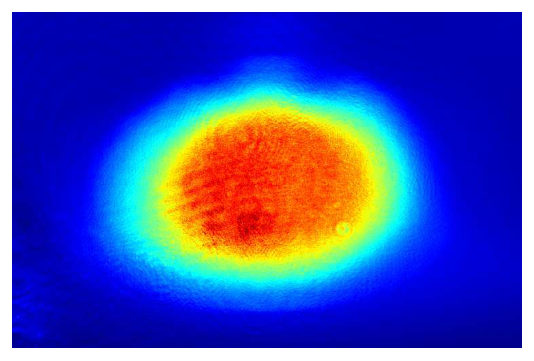 
Figure 1: Absorption image of the 39K atomic cloud after MT loading. The picture is taken after 7 ms free expansion. The picture size is 11.84 × 7.70 mm2.

📷 Fig 2

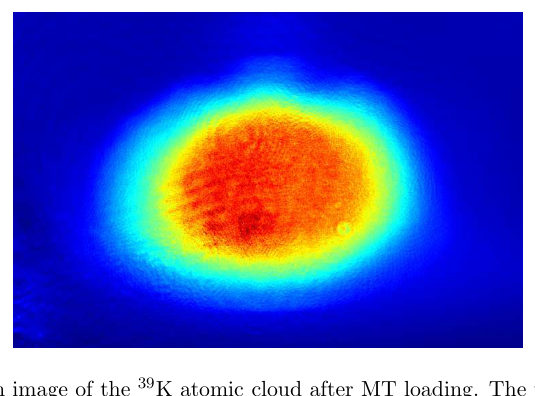 
Fig. 1 shows an absorption image of the atomic cloud after MT loading. At a coil current of 26 A, we get 7.95 × 108 atoms loaded into the MT. There are two main reasons for the atom loss. One is that the atomic cloud has a high optical depth after the GM stage. As a result, the pumping light is completely absorbed before reaching the central part of the cloud, which limits the optical pumping efficiency. The other is that the magnetic field gradient is not sufficient. The

📷 Fig 3

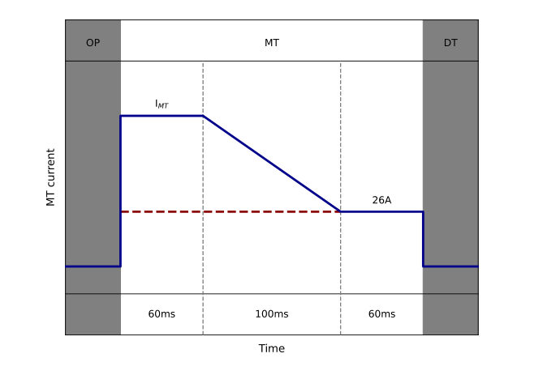 
Figure 2: Sequence of the MT loading process. Red dashed line: initial sequence with the current fixed at 26 A. Solid line: optimized sequence, in which the current is first held at a higher value IMT for 60 ms, then linearly ramped down to 26 A in 100 ms, and held for another 60 ms.

📷 Fig 4

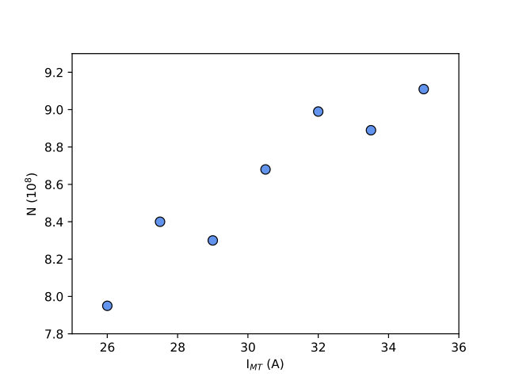 
Figure 3: Atoms loaded into the MT with different IMT . By increasing IMT from 26 A to 35 A, the number of loaded atoms improves by 15%. Three measurements are taken for each point.

📷 Fig 5

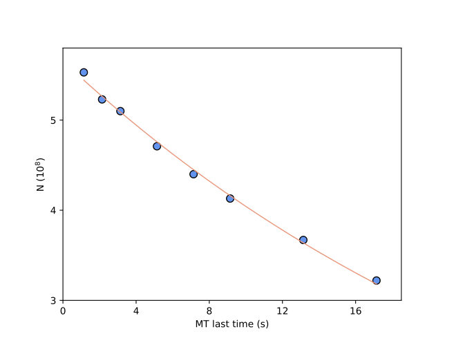 
Figure 4: Atom number decay in the MT at 26 A. The solid line is an exponential fit, yielding a 1/e lifetime of 29.8 s.

**Summary.** This paper reports experimental improvements in loading efficiency for $^{39}\mathrm{K}$ atoms into a magnetic trap, achieving a 15% increase by optimizing the loading current and sequence. By maximizing the initial atom number, the authors successfully created a high-quality Bose-Einstein Condensate, establishing better conditions for subsequent quantum gas research.

**Why it may be interesting.** This work provides crucial experimental data on optimizing the initial loading stage for ultracold atomic gases, which is a fundamental prerequisite for studying complex many-body physics in BECs.

Detailed structure

**Main problem.** The primary goal was to achieve the stable production of high-quality Bose-Einstein Condensates (BEC) for $^{39}\mathrm{K}$ atoms, which necessitates maximizing the initial atom number loaded into the trap.

**Main result.** The authors successfully increased the magnetic trap loading efficiency by approximately 15% through optimization of the loading sequence, resulting in a pure $^{39}\mathrm{K}$ condensate with $1.2	imes10^{5}$ atoms.

**Method.** The optimization involved systematically varying the magnetic trap loading current ($I_{	ext{MT}}$) and implementing a specific three-step loading sequence.

**Model / system.** The experiment uses $^{39}\mathrm{K}$ ultracold atoms trapped sequentially in a Magneto-Optical Trap (MOT), a magnetic trap (MT), and finally cooled in an optical dipole trap.

**Key observables.** Loaded atom number (measured after free expansion), BEC atom number ($1.2	imes10^{5}$ atoms), and atom decay rates over time.

**Important parameters / regimes.** Optimized MT current range ($26 	ext{ A}$ to $35 	ext{ A}$), initial magnetic field gradient ($\approx 1.23 	ext{ G} \cdot 	ext{cm}^{-1} \cdot 	ext{A}^{-1}$), and trap lifetime ($	ext{1/e}$ lifetime of $29.8 	ext{ s}$).

**Assumptions / limitations.** The atom loss during the loading process due to the finite trap lifetime was found to be negligible compared to the loading time.

**Figures summary.** Figures illustrate the initial MT loading state, the optimized three-step loading sequence, the dependence of loaded atom number on $I_{	ext{MT}}$ (showing the 15% improvement), and the BEC transition during evaporative cooling.

**Paper structure.** The paper details the necessity of high atom numbers, presents the optimization of the MT loading process using a specific current ramping sequence, reports the resulting increase in loading efficiency, and concludes with the successful observation of the BEC.

Abstract

During the experimental sequence, a large atom number is important for the creation of high-quality Bose--Einstein condensates. We report an experimental increase of about 15% in magnetic-trap (MT) loading efficiency by optimizing the MT loading process. The loading time is much shorter than the lifetime of the atoms in the MT, which means atom loss during loading due to the finite trap lifetime can be neglected. We obtain an almost pure $^{39}\mathrm{K}$ condensate with $1.2\times10^{5}$ atoms after evaporative cooling in our optical trap.

[↑ back to top](#top)

### [Simultaneous sub-Doppler laser cooling and optical trapping of bosonic $^{39}$K-$^{133}$Cs and $^{41}$K-$^{133}$Cs mixtures](http://arxiv.org/abs/2609.09003v1)

**Authors:** Mateusz Bocheński, Jakub Dobosz, Koray Dinçer, Paweł Arciszewski, Mariusz Semczuk  
**Type:** experiment · **Category:** other · **PDF:** <https://arxiv.org/pdf/2609.09003v1>  
**Analysis basis:** full PDF text, analyzed in chunks
**Topic relevance:** `analog quantum simulation` **3/5** · `quantum optics experiment` **1/5**

📷 Fig 1

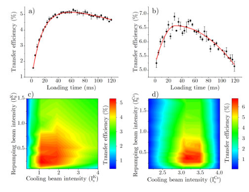 
FIG. 1. Transfer efficiency from gray optical molasses into the optical dipole trap for 41K (a,c) and Cs (b,d) atoms. The efficiency is presented as a function of the loading time (a,b) and the intensities of gray molasses light (c,d). The red curve on the top plots is presented as a guide to the eye.

📷 Fig 2

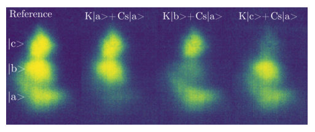 
FIG. 2. Fluorescence images of magnetically separated 39K samples after heteronuclear Feshbach spectroscopy. Each im- age shows three spatially separated potassium clouds corre- sponding to the magnetic sublevels of the F = 1 state with mF = {1, 0, −1}, denoted as |a⟩, |b⟩and |c⟩, respectively. From left to right: reference image (no loss feature), and three cases showing atom loss due to Feshbach resonances between 39K and 133Cs in the channels indicated at the top of each panel.

📷 Fig 3

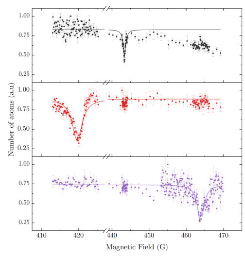 
FIG. 3. Number of atoms as a function of magnetic field for three collision channels |a⟩+|a⟩(top, black), |b⟩+|a⟩(middle, red), and |c⟩+ |a⟩(bottom, purple) present simultaneously in the trapped sample. The first state label denotes the magnetic sublevel of 39K and the second that of 133Cs. The measure- ments illustrate the simultaneous spin-resolved detection of Feshbach loss features using Stern-Gerlach separation.

📷 Fig 4

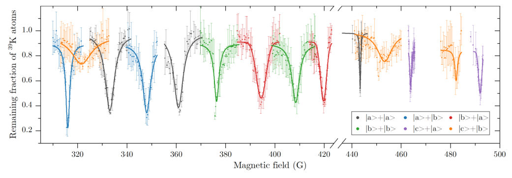 
FIG. 4. Overview of losses in 39K atoms present due to the heteronuclear 39K-Cs Feshbach resonances. Empirical Lorentzian profiles are fitted to the loss spectra to determine their centers and FWHM. Different colors correspond to different collision channels, as presented in the legend. Homonuclear losses are omitted for clarity.

📷 Fig 5

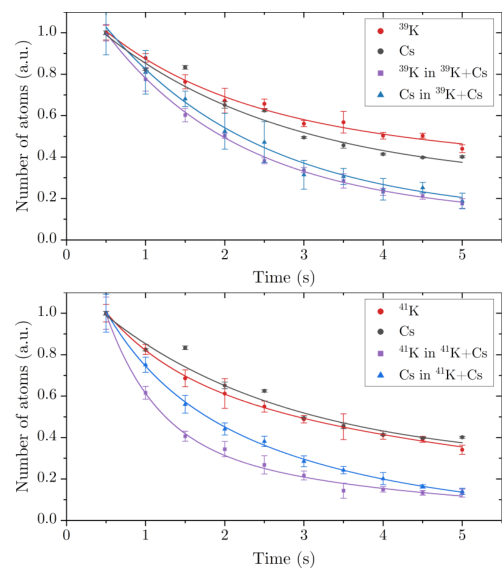 
FIG. 5. Normalized atom-number decay in the optical dipole trap for single-species samples and for both components of the K-Cs mixtures. The upper panel shows measurements for the 39K-Cs mixture and the lower panel for the 41K-Cs mixture. In each panel, the decay of potassium and cesium in the mix- ture is compared with the corresponding single-species decay. The solid curves are phenomenological double-exponential fits used to characterize the fast and slow components of the ob- served decay. We do not assign fitted time scales to individual microscopic loss processes. Atom numbers are normalized to their values at the first measured trapping time.

**Summary.** This paper reports the first realization of simultaneously cooling and trapping ultracold mixtures of $^{39}	ext{K}$ and $^{41}	ext{K}$ with $^{133}	ext{Cs}$. The researchers achieved temperatures around $10 \mu	ext{K}$ and performed detailed Feshbach spectroscopy on the $^{39}	ext{K}$ mixture, while also characterizing the decay dynamics of the $^{41}	ext{K}$ mixture. This opens new avenues for studying quantum interactions and forming ground-state molecules in these alkali systems.

**Why it may be interesting.** This work pushes the boundaries of cold atom techniques by successfully cooling and trapping multiple, different potassium isotopes with cesium, providing a rich platform for studying interspecies interactions and molecular formation pathways.

Detailed structure

**Main problem.** The primary goal was to achieve simultaneous sub-Doppler laser cooling and optical dipole trapping of bosonic mixtures involving $^{39}	ext{K}$ and $^{41}	ext{K}$ with $^{133}	ext{Cs}$.

**Main result.** The authors successfully demonstrated this for the first time with $^{41}	ext{K}-^{133}	ext{Cs}$ and observed 14 novel heteronuclear Feshbach loss features in the $^{39}	ext{K}-^{133}	ext{Cs}$ mixture.

**Method.** The experiment utilized multiple advanced cooling stages, including D1-line gray molasses and D2 transitions, followed by confinement in a 1064 nm optical dipole trap.

**Model / system.** The system involves ultracold, bosonic mixtures of alkali atoms ($^{39}	ext{K}, ^{41}	ext{K}, ^{133}	ext{Cs}$) confined in an optical dipole trap, allowing for precise spectroscopic measurements.

**Key observables.** Temperatures ($\sim 10 \mu	ext{K}$), atom loss features (Feshbach resonances), and decay dynamics (nonexponential loss rates).

**Important parameters / regimes.** Trap frequencies ($\sim 60-148$ Hz), cooling detunings, and magnetic field variations used for spectroscopy.

**Assumptions / limitations.** The shorter lifetime of the $^{41}	ext{K}-^{133}	ext{Cs}$ mixture currently limits systematic Feshbach spectroscopy, and the decay dynamics suggest density-dependent loss mechanisms.

**Figures summary.** Figures illustrate transfer efficiency from molasses to the trap, and fluorescence images show spatially separated atomic clouds after spectroscopy.

**Paper structure.** The paper details the sequential experimental procedure: initial cooling stages (MOT, CMOT, GMC), followed by spin polarization, trapping in the dipole trap, and finally performing spin-resolved Feshbach spectroscopy and decay rate measurements.

Abstract

We report simultaneous sub-Doppler cooling and optical dipole trapping of $^{39}$K-Cs and $^{41}$K-Cs mixtures. Both mixtures are cooled to temperatures $\sim10$ $\mathrmμ$K, achieving performance comparable to that obtained with each species individually. To the best of our knowledge, this constitutes the first realization of a laser-cooled and optically trapped $^{41}$K-Cs mixture. For the $^{39}$K-Cs mixture, we additionally implement parallel spin-resolved Feshbach spectroscopy enabled by Stern-Gerlach separation.   For potassium isotopes, we implement sub-Doppler cooling with $D_1$-line gray molasses, while for cesium the entire cooling sequence is implemented using $D_2$ transitions. We spin-polarize the atoms and confine Bose-Bose mixtures in a 1064 nm optical dipole trap. Using the resulting $^{39}$K-Cs samples, we observe 14 heteronuclear Feshbach loss features. Five agree with resonances reported previously, while nine have, to the best of our knowledge, not been observed experimentally before, including $p$-wave features and resonances in additional spin channels.   The shorter lifetime of the $^{41}$K-Cs mixture in the optical dipole trap currently hinders systematic Feshbach spectroscopy, which we therefore do not pursue in this work. To characterize this limitation quantitatively, we study the decay dynamics of $^{39}$K-Cs and $^{41}$K-Cs mixtures under comparable temperature and density conditions, revealing a substantially stronger nonexponential loss in the $^{41}$K-Cs mixture. The demonstrated preparation of ultracold $^{41}$K-Cs mixtures provides a starting point for Feshbach-resonance and photoassociation spectroscopy of this previously unexplored isotopologue. Such measurements are essential for identifying suitable pathways for magnetoassociation and coherent optical transfer, and ultimately for the production of ultracold ground-state $^{41}$KCs molecules.

[↑ back to top](#top)

### [Finite-size Entanglement Certification via Third-Order Local Randomized Measurements](http://arxiv.org/abs/2609.08635v1)

**Authors:** Giovanni Scala, Corrado Cosimo Mattiacci, Dorota Pietryka, Gniewomir Sarbicki  
**Type:** theory · **Category:** quantum information and computing · **PDF:** <https://arxiv.org/pdf/2609.08635v1>  
**Analysis basis:** full PDF text, analyzed in chunks
**Topic relevance:** `quantum measurements` **3/5**

📷 Fig 1

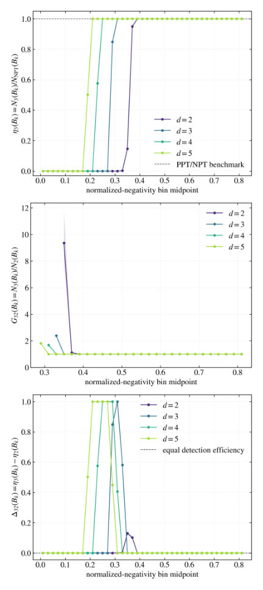 
FIG. 2. Detection performance for the equal-dimensional Bures-perturbed ensemble with ε = 0.15. The three plots show respectively the NPT-conditioned third-order efficiency η3, the relative gain G32 and the advantage ∆32 = η3 −η2. Markers are placed at normalized-negativity-bin midpoints, and the shaded regions are pointwise 95% paired-bootstrap intervals. Gaps in G32 occur where N2 = 0.

📷 Fig 2

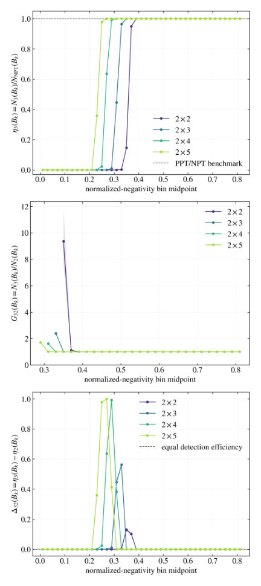 
FIG. 3. Detection performance for the qubit-qudit ensemble with ε = 0.15 in Bures perturbation. The three plots show re- spectively the NPT-conditioned third-order efficiency η3, the relative gain G32 and the advantage ∆32 = η3 −η2. Markers are placed at normalized-negativity-bin midpoints, and the shaded regions are pointwise 95% paired-bootstrap intervals. Gaps in G32 occur where N2 = 0.

**Summary.** This paper introduces a novel, scalable method to certify entanglement in high-dimensional quantum states by extending local randomized measurements to third order. This third-order information allows for the detection of entanglement that is invisible using standard second-order tests. The framework provides dimension-independent error bounds, offering a practical path for experimental quantum characterization.

**Why it may be interesting.** This work provides a concrete, resource-efficient protocol for quantifying entanglement in complex quantum systems, which is highly relevant for experimental quantum information processing platforms.

Detailed structure

**Main problem.** The paper addresses the challenge of developing a scalable method to certify entanglement in high-dimensional quantum systems, circumventing the exponential cost of full state tomography.

**Main result.** They derive a finite-size entanglement certificate that extends local randomized measurements to third order, revealing entanglement missed by second-order tests.

**Method.** The method utilizes a third-order extension of local randomized measurements to test the positivity of a specific operator (the Projective Reduction Criterion), which is then analyzed using moment matrix reconstruction techniques.

**Model / system.** The focus is on certifying entanglement for a general bipartite quantum state $
ho$ in high-dimensional Hilbert spaces ($\mathcal{C}_A \otimes \mathcal{C}_B$). The analysis is generalized to qubits-qudit ensembles.

**Key observables.** The primary observables are the local unitary invariants ($x_1$ through $x_{10}$) and the minimum eigenvalue ($\lambda_{\min}$) of the constructed matrix $ar{M}(
ho)$, which serves as the entanglement certificate.

**Important parameters / regimes.** The performance is analyzed in terms of detection efficiency ($\eta_3$), relative gain ($G_{32}$), and the dimension $d$ of the subsystems.

**Assumptions / limitations.** The protocol assumes the availability of trusted local random unitaries drawn from the Haar measure, and the finite-sample error bounds rely on concentration inequalities like Markov's or McDiarmid's.

**Figures summary.** Figure 1 illustrates the 10 index-equality classes used for three-outcome measurements. Figure 3 compares the detection performance ($\eta_3, G_{32}, \Delta_{32}$) for the qubit-qudit ensemble.

**Paper structure.** The paper builds from the theoretical requirement (the reduction criterion) to the practical measurement scheme (local randomized measurements up to third order), followed by rigorous analysis of finite-sample error bounds using moment matrix reconstruction.

Abstract

Certifying entanglement in high-dimensional systems usually requires full state tomography, whose cost grows rapidly with the system dimension. Local randomized measurements offer a scalable alternative, but existing tests based on second-order correlations access only limited information about the state. Here, we derive a finite-size entanglement certificate that extends local randomized measurements to third order. The additional third-order information reveals entanglement that remains undetected at second order, while a dimension-independent concentration bound provides rigorous control of finite-sample errors. Our result opens a practical route to extracting stronger entanglement information from experimental platforms without the dimension-dependent overhead of state tomography.

[↑ back to top](#top)

### [First fault-tolerant quantum memory demonstration for a generalized superfast encoding](http://arxiv.org/abs/2609.08957v1)

**Authors:** James Brown, Kenny Heitritter  
**Type:** theory · **Category:** quantum information and computing · **PDF:** <https://arxiv.org/pdf/2609.08957v1>  
**Analysis basis:** full PDF text, analyzed in chunks
**Topic relevance:** `analog quantum simulation` **3/5**

📷 Fig 1

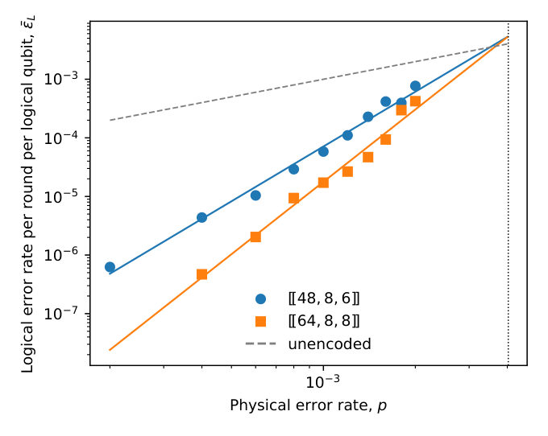 
Figure 1: Logical error rate per round per logical qubit versus physical depolarizing error rate p, for the [[48, 8, 6]] and [[64, 8, 8]] even-weight GSE codes, decoded with Relay-BP using AlphaSyndrome- scheduled syndrome extraction. Solid curves are log-log power-law fits to each code’s data. The dashed line is the unencoded (physical) error rate for reference. The higher-distance code suppresses logical error more strongly at low p with the two curves approaching each other near p ≈4 × 10−3.

**Summary.** This work introduces a novel, constant-weight Generalized Superfast Encoding (GSE) designed for fault-tolerant quantum memory of fermionic systems. By simulating performance under circuit noise, the authors report the first observation of threshold-like scaling for such a fermion-mapping, achieving a threshold around $4 	imes 10^{-3}$. This advances the practical feasibility of using quantum error correction for simulating fermionic quantum matter.

**Why it may be interesting.** It provides a concrete, simulated demonstration of fault tolerance for a fermion-mapping, which is crucial for quantum simulation efforts involving fermionic Hamiltonians.

Detailed structure

**Main problem.** The paper addresses the challenge of demonstrating fault-tolerant quantum memory specifically for a fermion-to-qubit mapping.

**Main result.** They achieved a simulation showing a threshold-like scaling for fault tolerance at a physical error rate of approximately $4 	imes 10^{-3}$ for two specific code instances.

**Method.** The authors constructed an even-distance, constant stabilizer-weight Generalized Superfast Encoding (GSE) and simulated quantum memory operations under circuit-level depolarizing noise.

**Model / system.** The system involves encoding fermionic modes into qubits using the GSE, which utilizes stabilizer generators with weights of 4 or 6. The simulation tests two specific stabilizer codes: $[[48, 8, 6]]$ and $[[64, 8, 8]]$.

**Key observables.** Logical error rate ($ar{\epsilon}_L(p)$) as a function of the physical depolarizing error rate ($p$).

**Important parameters / regimes.** The observed threshold is $\approx 4 	imes 10^{-3}$. The tested codes have distances $d=6$ and $d=8$, and logical qubits $k=8$.

**Assumptions / limitations.** The analysis relies on simulating circuit-level depolarizing noise and assumes the applicability of the developed GSE structure for fault tolerance.

**Figures summary.** Figure 1 shows the logical error rate ($ar{\epsilon}_L(p)$) for both tested codes versus $p$, illustrating the approach to a pseudo-threshold near $p \approx 4 	imes 10^{-3}$.

**Paper structure.** The paper details the construction of the constant-weight GSE stabilizers, analyzes the operator weights using 'a' and 'b' families of local Majorana operators, and simulates the memory performance using AlphaSyndrome extraction and Relay-BP decoding.

Abstract

The Generalized Superfast Encoding (GSE) is a fermion-to-qubit mapping that has error-correcting/detecting properties. To this point, all demonstrations have been relegated to error-detection only, as no fault-tolerance under circuit-level noise has been observed. Here, we introduce an even-distance $d$ constant stabilizer-weight GSE where each of $N$ modes is assigned a $d$-qubit block arranged on a ring. The resulting stabilizer generators have constant weight 4 or 6 for any even distance $d$. Furthermore, the full stabilizer set of this construction can always be partitioned into four qubit-wise commuting groups, which enables compact syndrome-extraction scheduling. We simulate quantum memory experiments under circuit-level depolarizing noise for two instances of this code, $[[48,8,6]]$ and $[[64,8,8]]$ and the threshold is observed to be $\approx 4\times10^{-3}$. This is, to our knowledge, the first fault-tolerant quantum-memory characterization of a fermion-mapping with threshold-like scaling.

[↑ back to top](#top)

### [High-resolution angle-resolved photoemission spectroscopy with tunable magnetic field](http://arxiv.org/abs/2609.08498v1)

**Authors:** Jairo Obando-Guevara, Huu-Thong Le, Emiliano Corcino Aracena, Sayan Singha, Kyungchan Lee, Yingdong Guan, Zhiqiang Mao, Dezhe Jin, Chaoxing Liu, Heike Pfau  
**Type:** experiment · **Category:** other · **PDF:** <https://arxiv.org/pdf/2609.08498v1>  
**Analysis basis:** full PDF text, analyzed in chunks
**Topic relevance:** `quantum measurements` **3/5**

📷 Fig 1

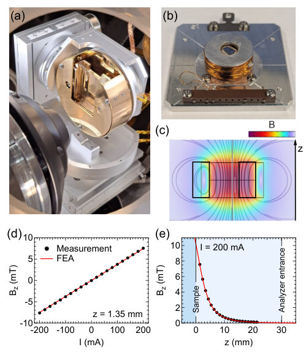 
FIG. 1. Magneto-ARPES setup. (a) 6-axis piezo-driven manipulator with a sample receiver that is equipped with 12 electrical contacts. (b) Sample holder with solenoid. Bi2Se3 sample is mounted in the center of the coil. (c) FEA of the magnetic field of the solenoid shown on a cross section through the coil. (d,e) Comparison of the measured and FEA result for the z-component of the magnetic field Bz as a function of current and distance z. The sample is located at z = 0 mm. z = 1.35 mm is slightly above the solenoid.

📷 Fig 2

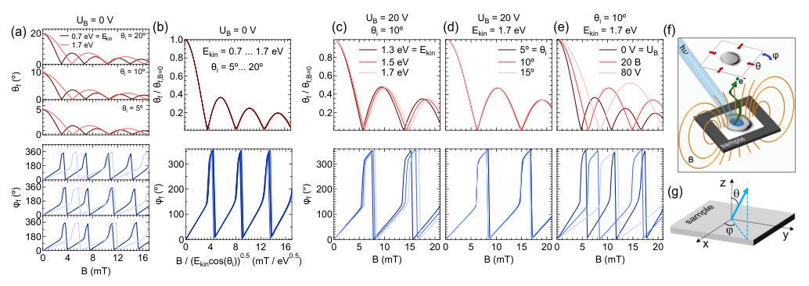 
FIG. 2. Electron trajectory simulations. (a) Contraction angle θf (top) and rotation angle ϕ f (bottom) at the analyzer entrance as a function of field B at the sample position. We used initial ϕi = 0, zero bias voltage UB and a range of initial kinetic energies of the photoemitted electron Ekin and photoemission angles θi. The same parameters were used for θ f and ϕ f . (b) Corresponding scaling plot for (a). Jumps in ϕ f reflect a change of the geometric quadrant when ϕf = 360◦(0◦≤ϕf &lt; 360◦) or θ f = 0◦(focal points). If θf = 0◦, trajectories are straight and ARPES spectra are compressed to a point. (c–e) Simulations with non-zero bias voltage as a function of (c) Ekin, (d) θi, and (e)...

📷 Fig 3

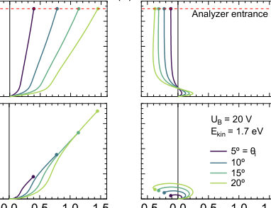 
FIG. 3. Angular focusing of photoelectrons. Simulated trajectories from the sample (x,y,z = 0) to the analyzer entrance (red dashed line) for different initial photoemission angle θi. (a) B = 3.1 mT. (b) B = 6.2 mT, i.e. at the first angular focusing point (cf. Fig. 2(d)). The upper (lower) panels show the projection onto the x−z (x−y) plane.

📷 Fig 4

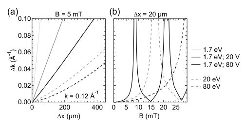 
FIG. 4. Simulated momentum broadening ∆k as a function of (a) spot size ∆x and (b) field B evaluated at a momentum of k = 0.12 Å−1

📷 Fig 5

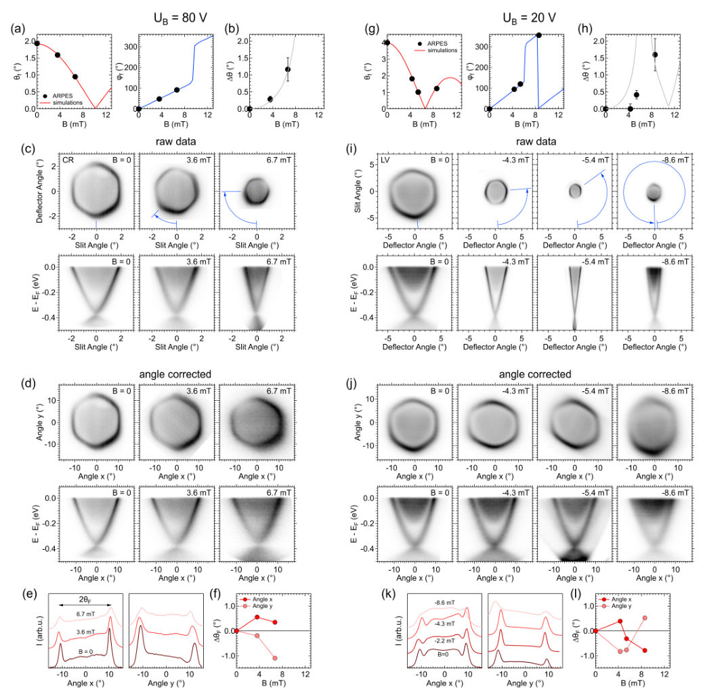 
FIG. 5. Magneto-ARPES of Bi2Se3. (a) Magnetic-field dependence of the Fermi surface contraction angle θf and rotation angle ϕf (Ekin = 1.7 eV, θi = 11◦, UB = 80 V), comparing simulations (lines) with ARPES measurements (dots) extracted from data in (c). (b) Magnetic- field-induced angle broadening determined at kF. The intrinsic line width at zero field is ∆θ0 = 0.8◦. (c) ARPES Fermi surface maps and energy-angle cuts obtained with CR polarized light using 2D momentum mapping with a bias voltage of UB = 80 V. (d) Fermi surface maps and energy-angle cuts after correction using our trajectory simulations. (e) MDCs across the Fermi surface in (d). (f) Field dependence of Fermi surface size...

**Summary.** This work presents a methodology to overcome severe spectral distortions in magneto-ARPES by employing detailed electron trajectory simulations. By accurately modeling how magnetic fields distort photoemitted electron paths, the authors successfully reconstruct the true electronic structure of $	ext{Bi}_2	ext{Se}_3$. This establishes critical technical guidelines for performing high-resolution ARPES measurements in strong magnetic fields.

**Why it may be interesting.** The rigorous development of post-processing techniques to correct for complex, field-dependent electron optics effects is highly valuable for any experiment probing quantum states in external fields, bridging experimental measurement limitations with theoretical models.

Detailed structure

**Main problem.** The primary challenge addressed is mitigating spectral distortions and broadening in magneto-ARPES measurements caused by significant electron trajectory aberrations when strong magnetic fields are applied.

**Main result.** The authors demonstrated that the electronic structure can be accurately reconstructed in post-processing, maintaining high momentum resolution even in the presence of strong trajectory aberrations.

**Method.** The technique involves using detailed electron trajectory simulations (based on the equations of motion) to correct the measured photoemission angles and energies.

**Model / system.** The study uses $	ext{Bi}_2	ext{Se}_3$, a topological insulator, measured using a high-resolution, laser-based ARPES system equipped with a tunable dipole magnetic field.

**Key observables.** Angle contraction ($	heta_f$), angle rotation ($\phi_f$), momentum distribution curves (MDCs), and the field-induced gap opening at the Dirac point.

**Important parameters / regimes.** The critical technical requirements identified are 2D momentum mapping, a micron beam spot size, and precise numerical field simulations. Scaling laws relating field dependence are also derived.

**Assumptions / limitations.** The analysis assumes that the electronic structure can be recovered via post-processing corrections, and residual field effects inside the analyzer lens column are neglected.

**Figures summary.** Figures illustrate the magneto-ARPES setup, electron trajectory simulations showing contraction and rotation, and comparative plots showing the successful reconstruction of the electronic structure by applying trajectory corrections.

**Paper structure.** The paper establishes the technical limitations of magneto-ARPES due to trajectory aberrations, details the simulation methodology using electron equations of motion, applies this correction procedure to $	ext{Bi}_2	ext{Se}_3$ data, and finally discusses the physical implications for probing spin and orbital coupling.

Abstract

The control and perturbation of quantum phenomena with magnetic fields is an indispensable tool in materials research. Recently, in-situ field tuning was implemented into angle-resolved photoemission spectroscopy (magneto-ARPES), which provides direct momentum and energy-resolved information of the field-dependent electronic structure. However, aberrations of the electron trajectories were shown to be substantial, leading to significant spectral distortions and broadening even in small fields. Here we show that the electronic structure can be recovered from magneto-ARPES spectra with high accuracy while maintaining high momentum resolution even when strong trajectory aberrations are present. We studied Bi$_2$Se$_3$ in a dipole field of a coil using a laser-based ARPES system. The electronic structure was reconstructed in post-processing using detailed electron trajectory simulations. We identify two-dimensional (2D) momentum mapping, a micron beam spot size, and precise numerical field simulations as critical technical requirements for high-resolution magneto-ARPES. We show how circular dichroism can provide additional information about the coupling of the magnetic field to the spin. The experimental achievements and the scaling laws from our simulations provide a road map towards magneto-ARPES in larger fields.

[↑ back to top](#top)

### [Impossibility of One-Way One-Round Quantum 4-Coloring via Matrix-Space Stability](http://arxiv.org/abs/2609.09091v1)

**Authors:** Tom Gur, Longcheng Li  
**Type:** theory · **Category:** quantum information and computing · **PDF:** <https://arxiv.org/pdf/2609.09091v1>  
**Analysis basis:** full PDF text, analyzed in chunks
**Topic relevance:** `quantum measurements` **3/5**

📷 Fig 1

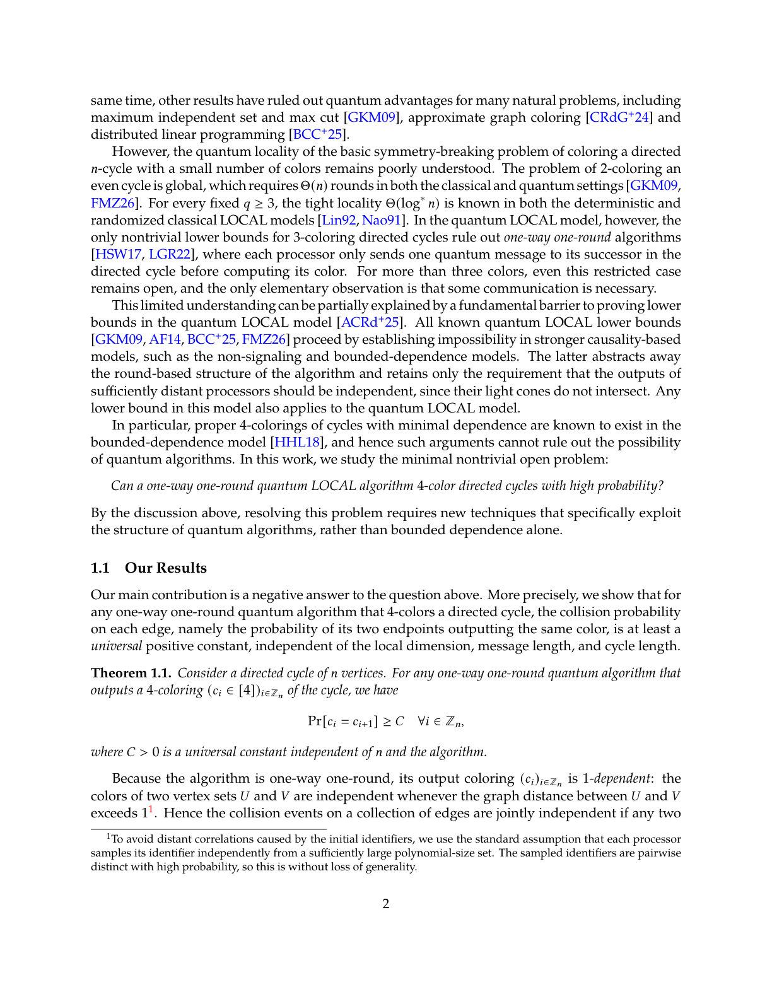 
Low-resolution page preview, page 2

📷 Fig 2

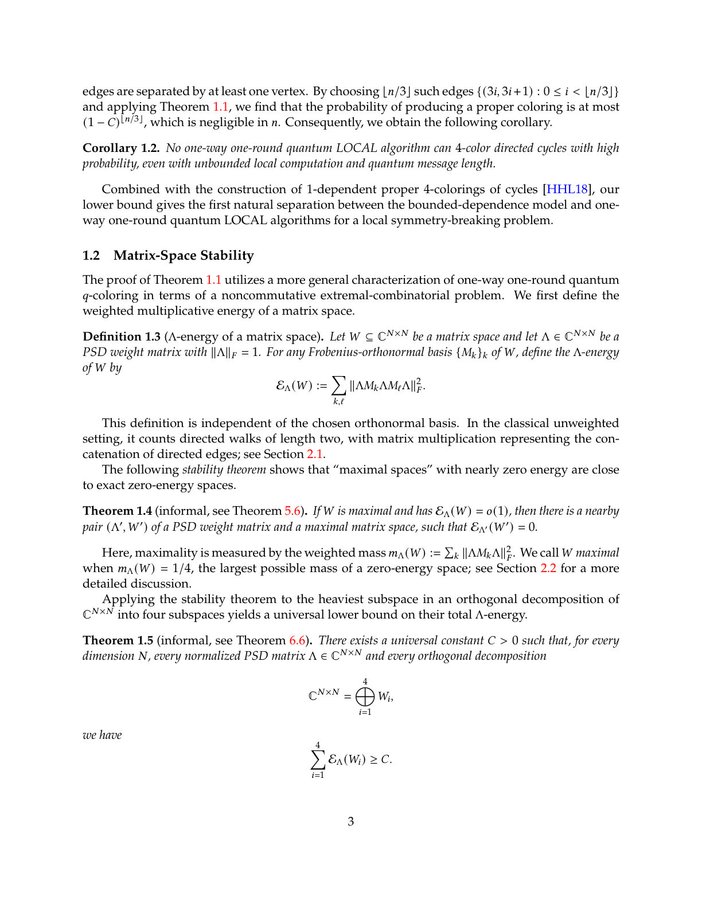 
Low-resolution page preview, page 3

📷 Fig 3

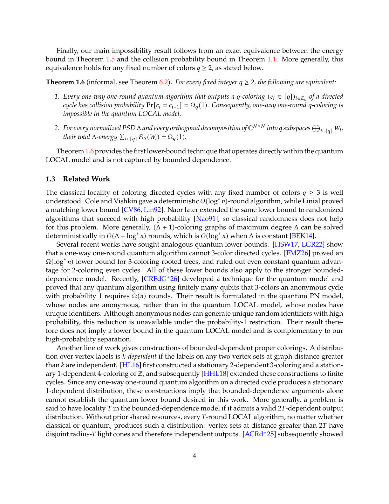 
Low-resolution page preview, page 4

📷 Fig 4

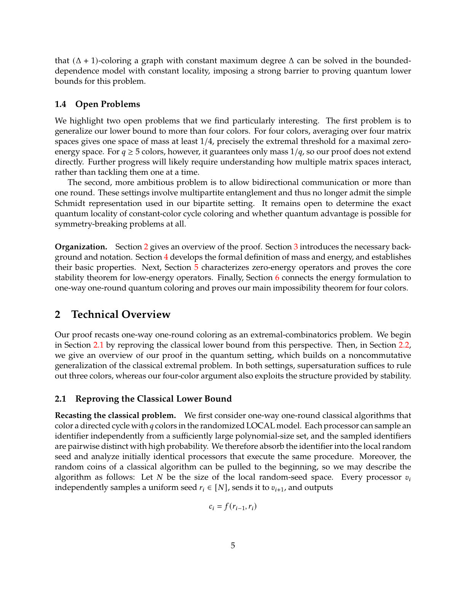 
Low-resolution page preview, page 5

📷 Fig 5

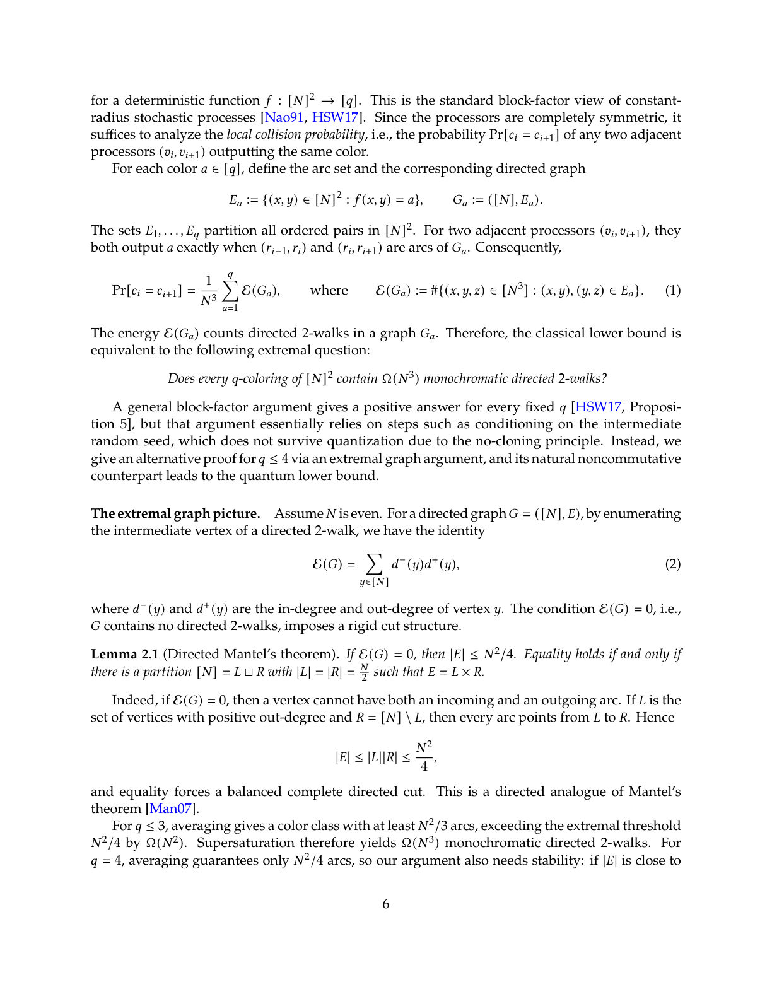 
Low-resolution page preview, page 6

**Summary.** This work establishes a fundamental impossibility result for quantum computation, proving that no one-way one-round quantum algorithm can reliably 4-color directed cycles. The authors achieve this by developing a deep connection between quantum graph coloring and noncommutative extremal combinatorics, using matrix energy bounds to derive the necessary lower bound.

**Why it may be interesting.** It provides a strong, non-trivial lower bound for quantum computation models, showing limitations beyond classical or simpler quantum models, which is fundamental for understanding quantum algorithm complexity.

Detailed structure

**Main problem.** The paper proves a quantum lower bound demonstrating that a one-way one-round quantum LOCAL algorithm cannot 4-color directed cycles with high probability.

**Main result.** The impossibility of such a quantum coloring is established by connecting the problem to a lower bound on the $\Lambda$-energy of matrix-space decompositions.

**Method.** The proof employs noncommutative extremal combinatorics, mapping the quantum coloring problem to bounding the $\Lambda$-energy of a set of POVM elements.

**Model / system.** The model is the quantum LOCAL algorithm applied to graph coloring, specifically directed cycles. The analysis uses quantum information tools like POVMs and matrix energy bounds.

**Key observables.** Collision Probability ($	ext{Pr}[c_i = c_{i+1}]$) and $\Lambda$-energy ($E_\Lambda(W)$).

**Important parameters / regimes.** The number of colors ($q=4$), the locality (one-way, one-round), and the size of the local random-seed space ($N$).

**Assumptions / limitations.** The analysis assumes the quantum coloring problem can be mapped to the energy bound, and the lower bound is shown to be stronger than those from bounded-dependence models.

**Figures summary.** Not specified.

**Paper structure.** The paper develops the argument by first establishing classical lower bounds, then generalizing this to the quantum setting using matrix energy bounds, culminating in the proof that the energy lower bound implies the coloring impossibility.

Abstract

We show that one-way one-round quantum LOCAL algorithms cannot $4$-color directed cycles with high probability, even with unbounded local computation and quantum message length. This is the first lower bound in the high-probability quantum LOCAL setting that goes beyond the non-signaling and bounded-dependence models, exploiting the structure of distributed quantum algorithms.   Our proof connects distributed quantum computing with noncommutative extremal combinatorics by identifying local collision probabilities with the weighted multiplicative energy of matrix-space decompositions. We obtain our lower bound by proving a dimension-independent weighted stability theorem for a directed noncommutative analogue of Mantel's theorem.

[↑ back to top](#top)

### [Kane-Lubensky phonons in Maxwell lattice frustrated Mott insulators](http://arxiv.org/abs/2609.08262v1)

**Authors:** Hong-Hao Song, Gang v. Chen  
**Type:** theory · **Category:** strongly correlated electrons · **PDF:** <https://arxiv.org/pdf/2609.08262v1>  
**Analysis basis:** full PDF text, analyzed in chunks
**Topic relevance:** `analog quantum simulation` **3/5**

📷 Fig 1

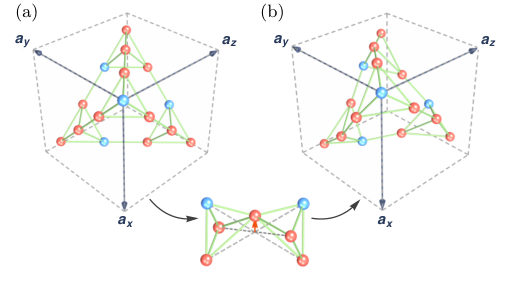 
FIG. 1. R state and the corresponding topological Maxwell lattice. (a) Cubic unit cell of the R-state spin configuration. (b) Topological lattice generated from the R-state distortion through SLC (inset).

📷 Fig 2

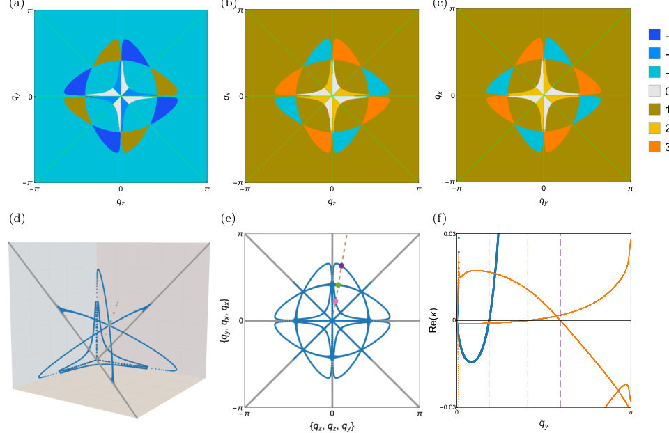 
FIG. 2. Topological properties of the R-state induced topological Maxwell lattice. (a)–(c) Winding number diagrams in three momentum planes. Colours denote different integer winding number values. Boundaries between different winding number regions are projections of the Weyl lines, whereas the green curves are projections of trivial zero-mode lines. (d) Bulk zero-mode lines in the first octant of the Brillouin zone. Blue (gray) curves denote topologically protected Weyl lines (trivial zero-mode lines). (e) Projections of the bulk zero-mode lines in panel (d) onto the planes perpendicular to bx, by, and bz, corresponding to the qy-qz, qx-qz, and qx-qy planes, respectively. The brown line...

**Summary.** This work demonstrates the emergence of topologically protected, gapless Weyl-line phonons in frustrated Mott insulators modeled on the Maxwell lattice. The mechanism involves spin-lattice coupling distorting the lattice into a topological state. The key finding is the unique $T^2$ specific heat signature associated with these topological phonons, suggesting new avenues for phonon-mediated quantum phenomena.

**Why it may be interesting.** The finding of topologically protected, non-Goldstone zero-frequency modes provides a novel platform for studying emergent quantum phenomena mediated by lattice vibrations, which can couple strongly to electronic degrees of freedom.

Detailed structure

**Main problem.** The study investigates the existence and topological nature of zero-energy gapless Weyl-line phonons in frustrated Mott insulators modeled on the Maxwell lattice.

**Main result.** The system hosts topologically protected, bulk zero-frequency Weyl-line phonons, which yield a characteristic low-temperature specific heat of $C_{	ext{ph}} \sim T^2$, distinguishing them from conventional Goldstone modes.

**Method.** The analysis employs magnetopological mechanics and lattice dynamics, calculating the phonon spectrum using the dynamical matrix and characterizing topology via winding numbers.

**Model / system.** The system is a pyrochlore antiferromagnet modeled as a frustrated Mott insulator, whose lattice is distorted by spin-lattice coupling into a topological Maxwell lattice.

**Key observables.** Zero-frequency Weyl-line phonons, winding numbers ($n_W$), and the low-temperature specific heat ($C_{	ext{ph}} \sim T^2$).

**Important parameters / regimes.** Spin-lattice coupling strength, magnetic field strength, and the lattice structure (Maxwell lattice).

**Assumptions / limitations.** The analysis relies on the quadratic approximation for lattice dynamics and assumes the spin interaction is primarily Heisenberg-like.

**Figures summary.** Figures illustrate the spin configuration inducing the topological lattice, winding number diagrams showing Weyl line projections, and real-space cuts demonstrating boundary zero-mode localization.

**Paper structure.** The paper progresses by establishing the physical model (spin-lattice coupling in pyrochlores), deriving the effective topological lattice, calculating the phonon spectrum using topological invariants (winding numbers), and finally predicting the unique low-temperature thermal signature.

Abstract

We show that zero-energy gapless Weyl-line phonons of the Kane-Lubensky's type can arise in the three-dimensional Maxwell lattice frustrated Mott insulators through the magnetopological mechanics. In a pyrochlore antiferromagnet with the spin-lattice coupling, a magnetic field selects the spin state whose lattice distortion generates a $P4_3 32$ topological lattice. More crucially, the spin-lattice coupling and the spin configuration cause the bending of the neighbouring bonds, and converts the system into the topological Maxwell lattice. Remarkably, the resulting system is found to host the bulk zero-frequency Weyl-line phonons protected topologically, and these gapless phonons are not Goldstone modes. Unlike the conventional ${C_{\rm ph}\sim T^3}$ for the Goldstone phonons, these one-dimensional zero-mode manifolds yield a characteristic low-temperature phonon specific heat ${C_{\rm ph}\sim T^2}$. Our results could find applications in the Cr-based spinel systems, and moreover, we establish a low-energy platform where an extensive number of topological zero-frequency phonons can strongly couple to other degrees of freedom, opening a route to exotic phonon-mediated phenomena.

[↑ back to top](#top)

### [On the Power of Adaptivity in Testing Quantum States in Fidelity](http://arxiv.org/abs/2609.08733v1)

**Authors:** Jan Seyfried, Sayantan Sen, Marco Tomamichel  
**Type:** theory · **Category:** quantum information and computing · **PDF:** <https://arxiv.org/pdf/2609.08733v1>  
**Analysis basis:** full PDF text, analyzed in chunks
**Topic relevance:** `quantum measurements` **3/5**

📷 Fig 1

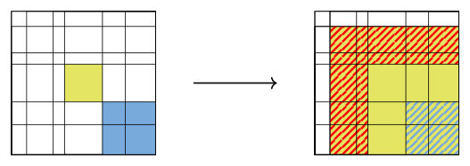 
Figure 1: Comparing the buckets from identity testing and equivalence testing. A bucket S (yellow) is expanded to cover the entire remainder of the state, i.e., the area with lower eigenvalues as well (blue). We further include two earlier buckets (red, which also covers the off-diagonals). The actual M is then an approximation to this new bucket.

📷 Fig 2

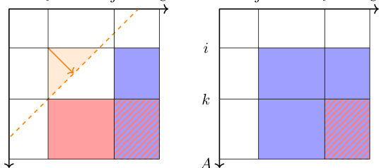 
Figure 2: Illustration of Π+ kl (red), and Π+ ij (blue). Π+ ij,kl corresponds to the entire colored area, the subtracted term Π+ klΠ+ ij, the overlap of Π+ kl and Π+ ij, is marked in red and blue. We cannot just choose Π+ min{i,k},min{l,j}, as this might introduce eigenvalues which are much larger than max{akcl + aicj} in some instances (orange line, note that diagonal lines correspond to same eigenvalues).

**Summary.** This work analyzes the sample complexity for testing quantum properties like state equality and independence using limited measurements. It compares the efficiency of adaptive versus non-adaptive protocols for both trace distance and fidelity metrics. The findings show that fidelity testing reveals structural differences, particularly for unknown states, suggesting that adaptivity can provide significant advantages over non-adaptive methods.

**Why it may be interesting.** The results provide rigorous, quantitative bounds on the resources needed to verify quantum properties, which is fundamental for quantum characterization protocols in experimental quantum information science.

Detailed structure

**Main problem.** The paper studies the sample complexity required to certify, equivalently test, or test for independence of unknown quantum states using limited measurements.

**Main result.** For fidelity testing, adaptive algorithms provide better sample complexity bounds for equivalence and independence testing compared to non-adaptive methods, demonstrating a separation from state certification.

**Method.** The authors develop a framework using partial learning and reducing the testing problems to an $\ell_2$-distance testing subroutine, comparing results across trace distance and fidelity metrics.

**Model / system.** The focus is on quantum states $
ho$ and $\sigma$ in $d$-dimensional Hilbert spaces, including bipartite ($
ho_{AC}$) and tripartite ($
ho_{ABC}$) systems, analyzed in the single-copy measurement setting.

**Key observables.** Quantum states ($
ho, \sigma$), fidelity ($F$), trace distance ($\|\cdot - \cdot\|_{	ext{tr}}$), and quantum mutual information $I(A:C)
ho$.

**Important parameters / regimes.** Decision gap $\varepsilon$, state rank $r$, and system dimensions ($d, d_A, d_C$).

**Assumptions / limitations.** The analysis is performed in the single-copy measurement setting, and results are compared between adaptive and non-adaptive measurement protocols.

**Figures summary.** The notes mention tables comparing sample complexities for identity and equivalence testing across different distance measures (Trace distance vs. Fidelity) for both classical and quantum settings.

**Paper structure.** The paper systematically compares sample complexities for quantum state certification, equivalence testing, and independence testing under both trace distance and fidelity metrics, culminating in specific bounds for Markov chain testing.

Abstract

We study the problems of quantum state certification, equivalence testing and independence testing. In certification, given samples of an unknown quantum state $ρ$ and the description of a state $σ$, the goal is to test whether $ρ=σ$, or whether $ρ$ and $σ$ are far in a given distance measure. In equivalence testing, $σ$ is also unknown and only accessible via samples. Independence testing decides whether $ρ_{AC}=ρ_A\otimesρ_C$, or is far from being a product. The sample complexities of these problems are now well-understood for a decision gap $\varepsilon$ in trace distance: in the single-copy measurement setting with $d$-dimensional states, all three tasks can be solved using the same non-adaptive approach, which uses $Θ(d^{3/2}/\varepsilon^2)$ samples and is optimal in general, even without adaptivity.   In this work, we consider decision gaps expressed in fidelity and study possible separations between these problems and how adaptivity can help. We prove that certification with respect to fidelity for a state $σ$ of rank $r$ does not benefit from adaptivity and requires $\widetildeΘ(r^{3/2}/\varepsilon)$ samples. For equivalence testing and independence testing, we provide adaptive algorithms using $\widetilde{O}(\min\{d^{3/2}/\varepsilon^2,d^{9/4}/\varepsilon\})$ and $\widetilde{O}(\min\{(d_Ad_C)^{3/2}/\varepsilon^2,d_A^{9/4}d_C^{3/4}/\varepsilon\})$ samples, for $d_A\geq d_C$, respectively. Our main technique is a framework that uses partial learning and a reduction to testing in $\ell_2$-distance, adapted from the distribution testing literature. We show that adaptivity matters for equivalence testing in fidelity by proving that $\widetildeΩ(1/\varepsilon^2)$ samples are necessary in the non-adaptive case even for qubits, showing a separation from certification.

[↑ back to top](#top)

### [Sklar's Theorem and Quantum State Reconstruction from All-Context Dependence](http://arxiv.org/abs/2609.08035v1)

**Authors:** Yi-Yu Lin  
**Type:** theory · **Category:** quantum information and computing · **PDF:** <https://arxiv.org/pdf/2609.08035v1>  
**Analysis basis:** full PDF text, analyzed in chunks
**Topic relevance:** `quantum measurements` **3/5**

📷 Fig 1

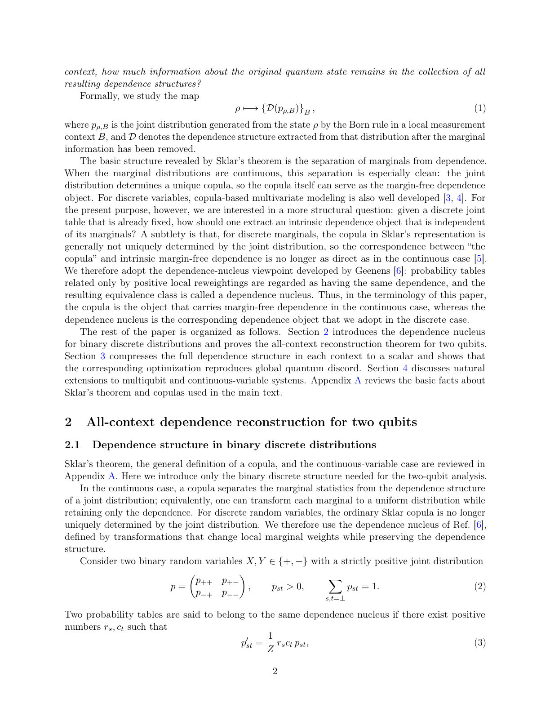 
Low-resolution page preview, page 2

📷 Fig 2

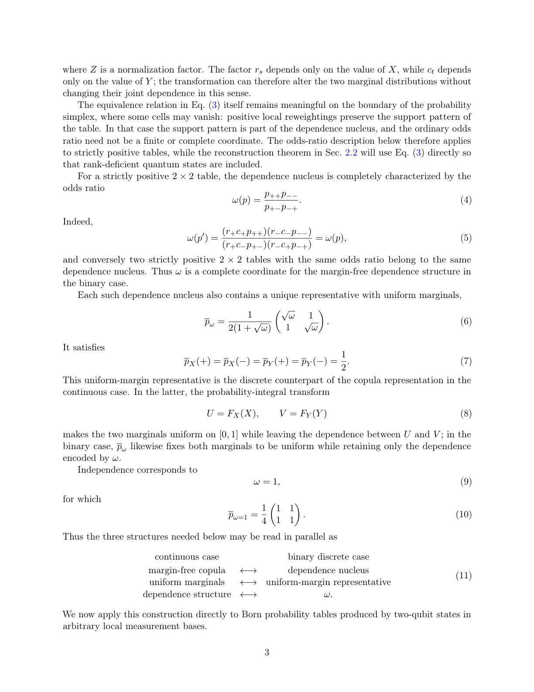 
Low-resolution page preview, page 3

📷 Fig 3

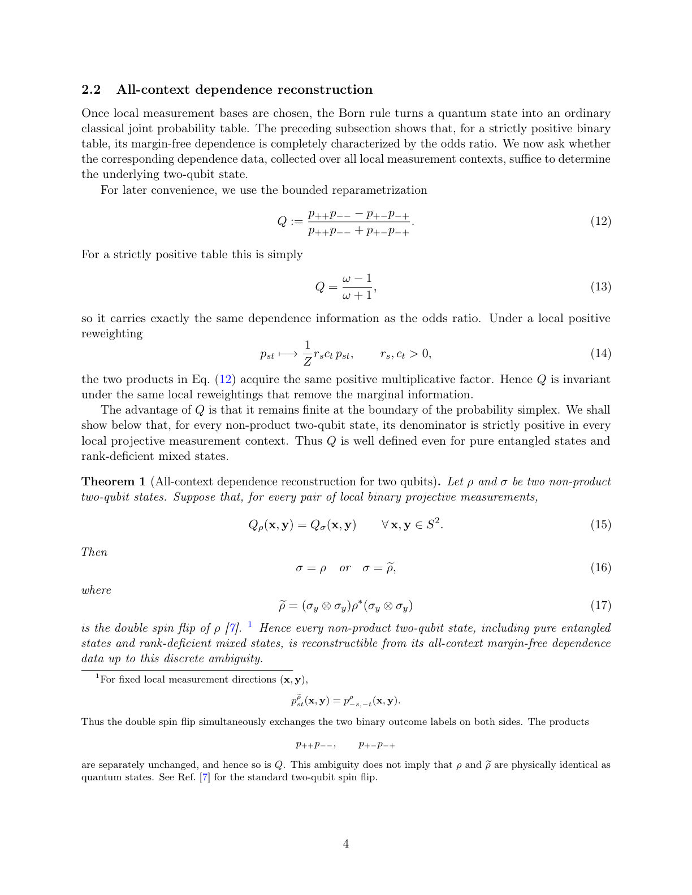 
Low-resolution page preview, page 4

📷 Fig 4

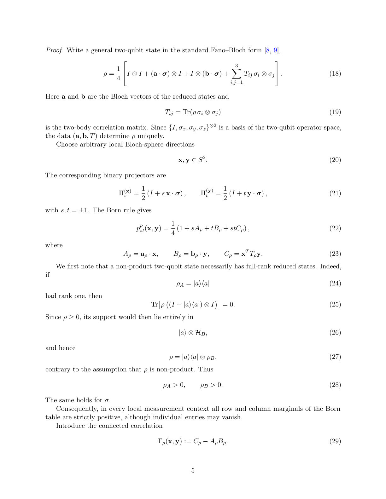 
Low-resolution page preview, page 5

📷 Fig 5

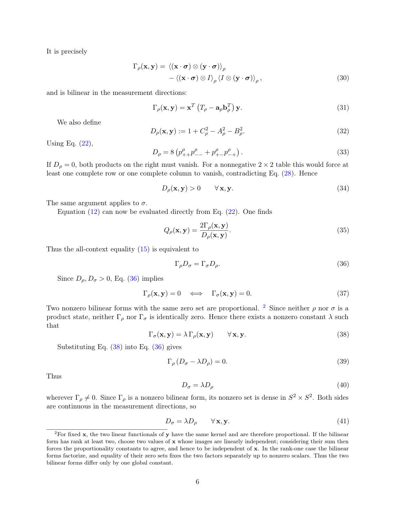 
Low-resolution page preview, page 6

**Summary.** This theoretical work adapts Sklar's theorem from classical statistics to quantum mechanics to determine if a quantum state can be uniquely reconstructed from its dependence structure measured across all possible local measurement contexts. The authors prove that for two qubits, this all-context information is sufficient to identify the state up to a simple ambiguity, and they show how global quantum discord emerges from this framework.

**Why it may be interesting.** It provides a powerful, information-theoretic tool to characterize quantum correlations by demanding consistency across all possible local measurements, linking fundamental concepts like quantum discord to classical dependence structures.

Detailed structure

**Main problem.** The paper investigates how much quantum state information ($
ho$) can be recovered by analyzing the dependence structure derived from *all* possible local quantum measurements, analogous to Sklar's theorem in classical statistics.

**Main result.** For two-qubit states, the full set of context-dependent dependence structures uniquely determines the state up to a discrete double-spin-flip ambiguity. Furthermore, global quantum discord can be reproduced by optimizing over these local contexts.

**Method.** It adapts classical copula theory to quantum measurements, defining an invariant quantity (like the odds ratio $Q$) that characterizes the dependence structure across different measurement bases.

**Model / system.** The focus is on two-qubit quantum states ($
ho$), analyzed using local projective measurements defined by vectors on the Bloch sphere ($x, y \in S^2$). The theory is conceptually extended to multiqubit and continuous-variable systems.

**Key observables.** Dependence nucleus, invariant $Q$, Connected Correlation ($\Gamma_
ho$), Quantum Discord ($D_{GQ}$), and the Copula structure.

**Important parameters / regimes.** Two-qubit states, local measurement bases ($x, y$), and the double-spin-flip ambiguity ($e
ho$).

**Assumptions / limitations.** The reconstruction theorem is rigorously established for two-qubit systems; generalizations to higher dimensions or continuous variables face open mathematical challenges.

**Paper structure.** The paper builds from the classical analogy of Sklar's theorem (copula decomposition) to the quantum setting. It first establishes the invariant measures for two qubits, derives the reconstruction theorem based on all-context compatibility, and finally discusses conceptual extensions to higher-dimensional and continuous systems.

Abstract

Sklar's theorem separates the marginals of a joint distribution from its dependence structure. We apply this viewpoint to Born statistics generated by local quantum measurements. For non-product two-qubit states, the dependence nuclei over all local binary projective measurement contexts determine the state up to at most a discrete double-spin-flip ambiguity. The corresponding scalar optimization, combined with the quantum total correlation, reproduces global quantum discord.

[↑ back to top](#top)

### [Nonequilibrium stochastic thermodynamics of boundary functionals: From Zubarev's ensemble to stochastic particle separation](http://arxiv.org/abs/2609.08477v1)

**Authors:** V. V. Ryazanov  
**Type:** theory · **Category:** statistical mechanics · **PDF:** <https://arxiv.org/pdf/2609.08477v1>  
**Analysis basis:** full PDF text, analyzed in chunks
**Topic relevance:** `Keldysh / 2PI / non-Gaussian methods` **2/5** · `correlated / nonlocal dissipation` **2/5** · `driven-dissipative phase transition` **2/5** · `methods for driven-dissipative` **2/5** · `non-equilibrium universality` **2/5** · `quantum measurements` **2/5**

📷 Fig 1

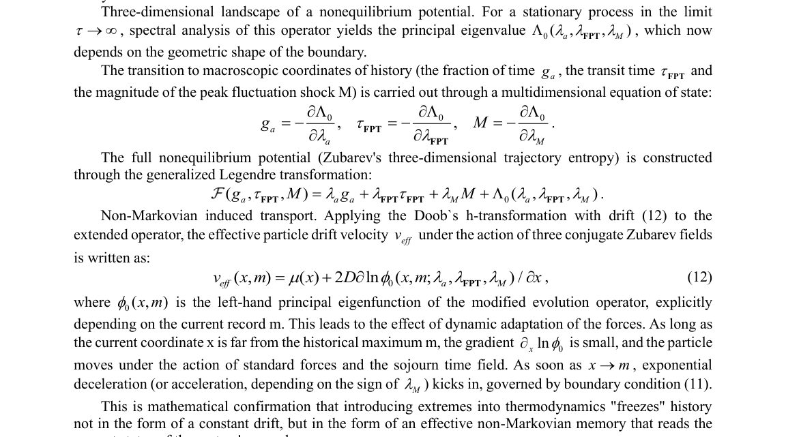 
Figure 1 illustrates the behavior of expression (12) for ( , ) eff v x m . This graph shows how the force returning the particle depends on the proximity of the coordinate to the historical record m. Here, the first term = 1 x − is the initial Langevin force (the usual linear restoring force of a harmonic oscillator), and the second term is the non-Markovian impact when approaching the record. We set a =100, D=1. The x- axis range is from -2 to 3, with a step of 0.05. The formula models the force that “remembers” the particle’s

📷 Fig 2

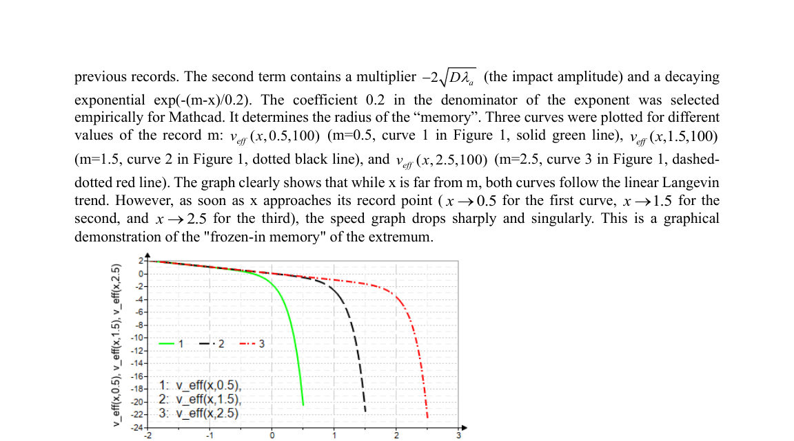 
Fig.1. The induced effective non-Markovian drift velocity ( , ) eff v x m as a function of the current coordinate x, computed via Doob's h-transform for three distinct historical records: m=0.5 (solid green line), m=1.5 (dashed black line), and m=2.5 (dotted red line). At a distance from the record x m, all curves collapse onto the classical linear Langevin restoring force ( ) x x  = − of a harmonic oscillator. As the particle approaches its historical maximum x m → , the conjugate thermodynamic field of extremes

📷 Fig 3

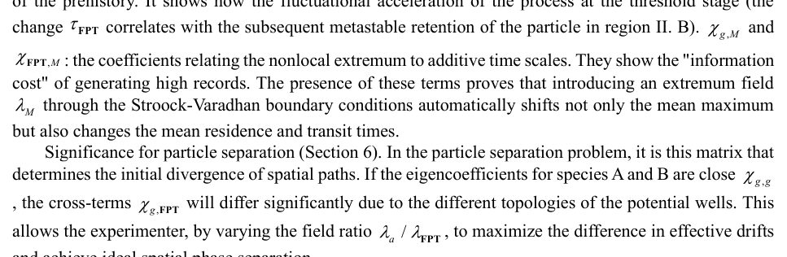 
Figure 2 depicts two-dimensional cross-sections (isoline maps/contour plots) of the large deviation function ) ( , FPT a I g  at various fixed extrema M, and the three-dimensional trajectory entropy landscape. It is shown how, for small extrema, the isolines have an ideal elliptical (Gaussian) shape, while, as they move away from the minimum (into the nonlinear regime), they deform, encountering rigid kinetic boundaries ( ) 1 а g = or ( 0) FPT  → .

📷 Fig 4

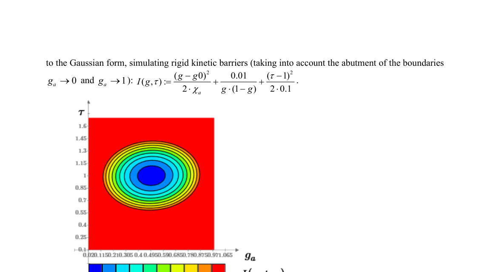 
Fig. 2. The non-equilibrium thermodynamic potential ( , ) ( , ) FPT FPT a a g I g    in the space of history descriptors (at various fixed extremes M ), computed via the generalized Zubarev's non- equilibrium statistical operator method and Donsker-Varadhan large deviation theory. The color spectrum from blue to red is the value of the nonequilibrium trajectory entropy of Zubarev–Varadan . The a g center of the landscape at ( 0.5, 1.0) FPT a g  = = corresponds to the local macroscopic equilibrium (minimum of the rate function). The elliptical contour lines in the central vicinity demonstrate the Gaussian regime governed by the symmetric Onsager matrix of joint susceptibilities ij  ....

📷 Fig 5

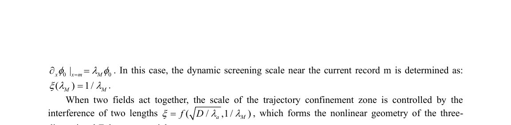 
Figure 3 shows the dependence of the principal eigenvalue 0( ) a   on the confining field a . The free

**Summary.** This paper extends nonequilibrium statistical thermodynamics by incorporating memory effects via boundary functionals into Zubarev's statistical operator method. It achieves this by mapping non-Markovian history dependence onto the geometry of an extended phase space using information potentials. This provides a rigorous tool for analyzing rare events and memory in complex stochastic systems.

**Why it may be interesting.** This work provides a powerful, non-calculus-based method to handle memory effects in open systems, which is crucial for modeling complex dynamics in nanoscale or biological environments where history matters.

Detailed structure

**Main problem.** To develop a generalized framework for nonequilibrium stochastic thermodynamics that rigorously incorporates non-Markovian memory effects arising from boundary functionals (like first-passage times or absolute extrema) into the statistical description.

**Main result.** The authors show that incorporating history-dependent functionals allows the non-Markovian memory effects to be encoded into the geometry of an extended phase space via an information potential, thus generalizing Zubarev's formalism.

**Method.** The method generalizes Zubarev's nonequilibrium statistical operator approach by employing the maximum information entropy method, which is shown to be equivalent to the Donsker-Varadhan large deviation formalism and the Escher shift.

**Model / system.** The theory is applied to open stochastic systems, modeled by Langevin equations, which are analyzed by extending the state space to incorporate history-dependent functionals (e.g., residence time, FPT, absolute extremum).

**Key observables.** Three trajectory functionals (residence time, FPT, absolute extremum), the generalized Zubarev partition function Q(t), and Onsager susceptibilities.

**Important parameters / regimes.** The spectral gap of the modified Feynman-Katz operator ($	ext{gap}$), the internal dimensionless scale ($	ext{micro}_	au$), and the time scale $	au$ relative to these gaps.

**Assumptions / limitations.** The standard Markovian Fokker-Planck description is insufficient; the formalism assumes the equivalence between entropy maximization under mean constraints and the Escher shift.

**Paper structure.** The paper progresses by first identifying the limitations of Markovian approaches, then generalizing Zubarev's method to include three types of functionals, establishing mathematical equivalences (entropy/large deviation), and finally applying the framework to solve optimization problems like stochastic particle separation.

Abstract

This paper develops a generalization of Zubarev's nonequilibrium statistical operator method for the case of simultaneous inclusion of additive and nonlocal boundary functionals of trajectories. Using a unified thermodynamic approach, a three-parameter model of nonequilibrium systems is constructed, including the first-passage time, the dwell time above a given level, and the absolute extremum of the process. A correspondence is demonstrated between the maximum information entropy method for trajectories and the Donsker-Varadan large deviation formalism. Using the Doob`s h-transform, it is demonstrated that fixing extremal functionals of history induces efficient non-Markovian transport in the system with dynamic adaptation to historical records. Criteria for the applicability of the developed apparatus in the "large time" domain and the possibilities of its use for optimizing stochastic particle separation in periodic potentials are discussed.

[↑ back to top](#top)

### [Transcription rate dynamics and RNA copy number noise: General relations and data-driven predictions](http://arxiv.org/abs/2609.07993v1)

**Authors:** Amara McCune, Ido Golding, Shlomi Reuveni, Sarah Kostinski  
**Type:** theory · **Category:** statistical mechanics · **PDF:** <https://arxiv.org/pdf/2609.07993v1>  
**Analysis basis:** full PDF text, analyzed in chunks
**Topic relevance:** `Keldysh / 2PI / non-Gaussian methods` **2/5** · `driven-dissipative phase transition` **2/5** · `methods for driven-dissipative` **2/5** · `quantum measurements` **2/5** · `Full counting statistics` **1/5** · `analog quantum simulation` **1/5** · `correlated / nonlocal dissipation` **1/5** · `non-equilibrium universality` **1/5**

📷 Fig 1

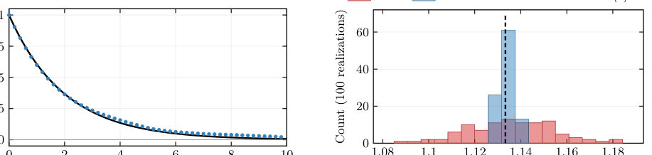 
FIG. 1. Validation of the data-driven recipe using a stationary Ornstein–Uhlenbeck benchmark. The parameters are λ0 = 5, σ = 1, γ = 0.5, and µ = 1, giving E[n] = 5 and FOU[n] = 17/15 from equation (42). (a) Autocorrelation estimated from one sampled rate trajectory (blue points) and the exact OU result ρ(h) = e−γ|h| (black line). The lag h is measured in units of the mRNA lifetime 1/µ; deviations at large h occur after the correlation has become small. (b) Distributions of the data-driven estimate (blue) and the direct copy-number estimate (red) across 100 independent realizations of duration T = 104/µ, sampled at intervals ∆t = 0.1/µ. The dashed line marks the OU benchmark. The data-driven...

📷 Fig 2

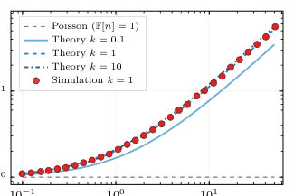 
FIG. 2. Discrete M/M/1 transcription-rate model and its Fano factor. (a) The upstream state m(t) changes by one at rates m↑

📷 Fig 3

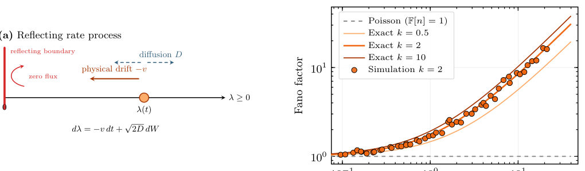 
FIG. 3. Reflecting drift–diffusion transcription-rate model and its Fano factor. (a) Diffusion with constant D produces fluctuations in λ(t), while the physical drift −v points toward the origin for v &gt; 0. The zero-flux condition at λ = 0 confines the process to nonnegative rates. (b) Solid curves show equation (54) for k = 0.5, 2, and 10; the grey dashed line marks F[n] = 1. As k increases, the curves approach the slow-fluctuation ceiling F[n] = 1 + E[n]. Orange points are simulations at k = 2 and µ = 2, obtained by varying D and v at fixed k.

📷 Fig 4

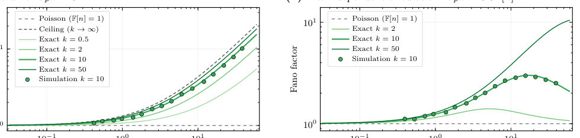 
FIG. 4. Fano factor for periodic drift–diffusion production. Solid curves show the exact result in equation (60); the grey dashed line marks the Poisson value F[n] = 1. (a) Without drift, increasing k moves the curves toward the slow-fluctuation ceiling 1 + E[n]/3 (dark dashed). (b) For ϑpω = 0.6E[n], circulation becomes faster as the mean increases. It eventually averages out the rate fluctuations, causing each curve to turn downward. Green points show stochastic simulations at k = 10 and µ = 1. They agree with the corresponding exact curves in both panels.

📷 Fig 5

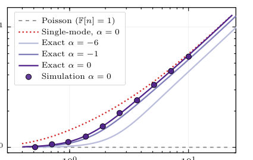 
FIG. 5. Fano factor for drift–diffusion production with first-passage resetting. Solid curves show the exact result from equations (68) and (69) for α = −6, −1, and 0; the grey dashed line marks the Poisson value F[n] = 1. The red dotted curve is the single-mode approximation (67) for pure diffusion, α = 0. More negative α produces stronger upward drift and a smaller slow-fluctuation slope. Purple points show stochastic simulations at α = 0 and agree with the corresponding exact curve.

**Summary.** This paper develops a comprehensive theoretical framework to calculate the noise (Fano factor) in RNA copy number resulting from stochastic gene expression. It models the system as doubly stochastic, linking the noise directly to the statistics of the fluctuating transcription rate. The work provides general formulas and verifies them across various complex rate dynamics models, including those with different boundary conditions.

**Why it may be interesting.** The rigorous mathematical framework for calculating noise in open quantum systems (like gene expression) by coupling a fluctuating rate process to a decay process is highly relevant to modeling quantum noise sources in open quantum systems.

Detailed structure

**Main problem.** The paper aims to understand the noise (fluctuations) in RNA copy number resulting from stochastic transcription and degradation processes in gene expression.

**Main result.** It derives the Fano factor, which quantifies noise, showing it is composed of an intrinsic Poisson contribution and a second term dependent on the variance and autocorrelation of the fluctuating transcription rate.

**Method.** The authors develop a doubly stochastic framework, deriving analytical results for the Fano factor using general stochastic calculus and applying it to various rate dynamics models.

**Model / system.** The system models gene expression where RNA production is driven by a time-varying, random transcription rate $\lambda(t)$ and subject to degradation. The analysis uses continuous-time Markov chains and diffusion approximations.

**Key observables.** Fano factor ($F[n] = V[n]/E[n]$), RNA copy number $n(t)$, Mean copy number $E[n]$, and the autocorrelation function $
ho(h)$ of $\lambda(t)$.

**Important parameters / regimes.** Degradation rate ($\mu$), Variance of $\lambda$ ($V[\lambda]$), Mean of $\lambda$ ($E[\lambda]$), and the timescale ratio between rate fluctuation and degradation.

**Assumptions / limitations.** The general derivation assumes independent, finite-mean mRNA lifetimes. Simplified results often rely on the assumption of stationarity or the exponential lifetime approximation.

**Figures summary.** The notes describe results derived for different boundary conditions (Reflecting, Periodic, First-Passage Resetting) for the rate dynamics, showing how the noise factor $F[n]$ is calculated for each case.

**Paper structure.** The paper systematically develops the noise factor $F[n]$ by first establishing general relations, then applying them to specific rate dynamics models (M/M/1, Drift-Diffusion with various boundaries), and finally presenting data-driven estimation techniques.

Abstract

Stochastic models of gene expression typically begin with a microscopic model of transcription and propagate its statistics to the RNA distribution. Here we develop a doubly stochastic framework in which RNA production is Poisson conditional on a time-varying transcription rate $λ(t)$. For RNA lifetimes drawn independently from an arbitrary finite-mean distribution, we derive the RNA Fano factor in terms of the lifetime survival function and the autocovariance of $λ(t)$. For a Poisson degradation process with rate $μ$, the survival kernel provides an exponential temporal filter, and the result depends only on the mean, variance, and normalized autocorrelation of $λ(t)$. These quantities may be calculated from an explicit rate model or, under ergodicity and adequate sampling, estimated from a sufficiently long rate trajectory. We validate the data-driven estimator using simulated transcription-rate trajectories, without supplying the known autocorrelation to the estimator. We also obtain exact analytical results for transcription-rate dynamics modeled by a discrete M/M/1 process and by drift-diffusion with reflecting, periodic, or first-passage-reset boundaries, and verify each result by direct simulation of the coupled transcription-rate and RNA copy-number processes.

[↑ back to top](#top)

### [Causal-Class Hierarchies in Coherence-Constrained Channel Transformation](http://arxiv.org/abs/2609.08639v1)

**Authors:** Lin Zhu, Benchi Zhao, Xuanqiang Zhao, Ranyiliu Chen, Xin Wang, Shenggen Zheng  
**Type:** theory · **Category:** quantum information and computing · **PDF:** <https://arxiv.org/pdf/2609.08639v1>  
**Analysis basis:** full PDF text, analyzed in chunks
**Topic relevance:** `Keldysh / 2PI / non-Gaussian methods` **2/5** · `correlated / nonlocal dissipation` **2/5** · `driven-dissipative phase transition` **2/5** · `methods for driven-dissipative` **2/5** · `non-equilibrium universality` **1/5** · `quantum measurements` **1/5**

📷 Fig 1

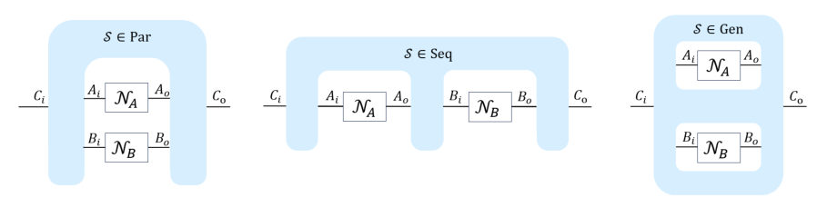 
Figure 1: Schematic causal architectures for two-use channel transformation. Parallel protocols use both resource channels in one layer, while fixed-order sequential protocols connect the two calls through an intermediate memory. The class Gen denotes the general deterministic two-input higher-order feasible set used in this work; the schematic does not assert a particular circuit realization for an arbitrary element of Gen.

📷 Fig 2

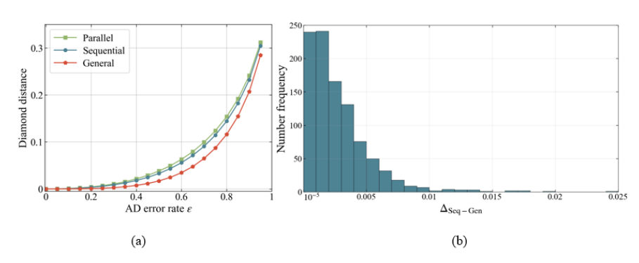 
Figure 2: (a) Optimal transformation errors for (N ε AD)⊗2 →I. The displayed curves apply to both MISC and DISC. The general-process class gives the smallest error, while parallel processing gives the largest. (b) Distribution of the fixed-order A ≺B-to-general-process improvement for 1000 random pairs of qubit channels under MISC. The histogram begins at 10−5; the 11 instances below this numerical resolution are reported separately as unresolved.

**Summary.** This theoretical work analyzes how the causal structure of multi-step quantum operations affects the efficiency of channel transformation under coherence constraints. Using SDPs, the authors prove that for some channels, the causal order matters significantly, while for others, the structure collapses, indicating that parallelization can negate any potential causal advantage.

**Why it may be interesting.** The findings provide deep structural insights into the limitations of quantum operations, showing that the advantage of complex causal structures can be entirely nullified by the underlying resource properties of the channels involved.

Detailed structure

**Main problem.** The paper investigates whether increasing causal freedom (from fixed-order sequential to general higher-order processes) improves quantum channel transformation when the process is constrained by a resource theory.

**Main result.** A strict causal hierarchy is proven for amplitude-damping channels, but this hierarchy collapses for mixed-Pauli channels, suggesting free program-state parallelization is a structural obstruction to causal enhancement.

**Method.** The analysis employs a unified semidefinite-programming (SDP) framework to minimize the transformation error under various causal constraints (Parallel, Sequential, General) and coherence resource constraints (MISC, DISC).

**Model / system.** The study models quantum channel transformations involving two resource channels and a target channel, focusing on two-qubit amplitude-damping channels and mixed-Pauli channels.

**Key observables.** The optimal error in channel transformation, $D_{	ext{Class}}^F(\dots)$, and the coherence coefficients ($x_c, \mu$).

**Important parameters / regimes.** The damping strength ($\epsilon$) of the amplitude-damping channels, and the specific coherence constraints (MISC or DISC).

**Assumptions / limitations.** The collapse condition for causal enhancement is shown to be a sufficient, not necessary, characterization of structural obstructions.

**Figures summary.** The notes do not provide a summary of figures, but mention the use of various equations (e.g., (201) through (239)) containing core mathematical derivations.

**Paper structure.** The paper progresses by defining the SDP framework, establishing the causal classes, deriving the necessary constraints for different orders, and finally applying these tools to prove the hierarchy for amplitude-damping channels and the collapse condition for mixed-Pauli channels.

Abstract

Higher-order quantum transformations allow multiple channel uses to be combined through different causal architectures, from parallel and fixed-order sequential networks to general higher-order processes. Whether this causal freedom improves channel transformation when the higher-order operation is also constrained by a resource theory remains largely unexplored. We study this question in the dynamical resource theory of coherence using a unified semidefinite-programming framework. For two qubit amplitude-damping channels and the identity target, we prove a strict causal hierarchy at every nontrivial damping strength under both maximally incoherent superchannels (MISC) and dephasing-covariant incoherent superchannels (DISC). In contrast, mixed-Pauli channels admit a common teleportation simulation that transfers the channel dependence to Bell-diagonal program states prepared in parallel. The remaining processing can then be absorbed into a single quantum operational, so parallel, fixed-order sequential, and general higher-order strategies achieve the same optimal error for any target. These results identify free program-state parallelisation as a structural obstruction to causal enhancement.

[↑ back to top](#top)

### [Stochastic Processes as Non-Metric Geodesics in Information Geometry](http://arxiv.org/abs/2609.08870v1)

**Authors:** T. Koide, A. van de Venn  
**Type:** theory · **Category:** statistical mechanics · **PDF:** <https://arxiv.org/pdf/2609.08870v1>  
**Analysis basis:** full PDF text, analyzed in chunks
**Topic relevance:** `Keldysh / 2PI / non-Gaussian methods` **2/5** · `quantum measurements` **2/5** · `correlated / nonlocal dissipation` **1/5** · `driven-dissipative phase transition` **1/5** · `methods for driven-dissipative` **1/5** · `non-equilibrium universality` **1/5**

📷 Fig 1

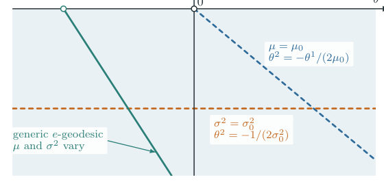 
FIG. 1. The Gaussian manifold is shown in the (θ1, θ2) plane. The physically permissible states of this manifold lie strictly in the region below θ2 = 0. An e-geodesic corresponds to an arbitrary straight line in this θ-plane. For example, a straight line passing through the origin represents a specific process where the mean µ remains constant. A straight line parallel to the θ1-axis represents a process where the variance σ2 remains constant. A general straight line not passing through the origin describes a process where both µ and σ2 change.

📷 Fig 2

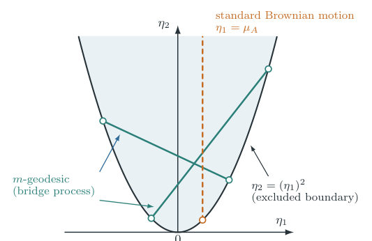 
FIG. 2. The Gaussian manifold is shown in the (η1, η2) plane. The physically permissible states of this manifold lie strictly inside the region bounded by the curve η2 = (η1)2. An m-geodesic is shown as a part of a straight line connecting two boundary points on the curve. In contrast, standard Brownian motion, which corresponds to the limit of an m-geodesic with an infinite slope, can only evolve in the direction of increasing η2. The bridge-process interpretation applies specifically to the subclass of maximal non-vertical straight geodesics extended to the deterministic boundary (σ2 = 0), pinned at fixed boundary times tA and tB.

**Summary.** This theoretical paper connects the geometry of probability distributions (the Gaussian statistical manifold) to the dynamics of continuous stochastic processes. By using $\alpha$-connections, the authors show that physical observables, like the restoring force in relaxation, dictate the underlying geometric structure, emphasizing the crucial role of non-metricity in describing these systems.

**Why it may be interesting.** The explicit link between non-metricity, optimal thermodynamic protocols, and the geometry of stochastic processes provides a powerful, general mathematical framework applicable to non-equilibrium statistical mechanics and open quantum systems.

Detailed structure

**Main problem.** The paper establishes a geometric correspondence between geodesics on the Gaussian statistical manifold and continuous stochastic processes. It aims to characterize these processes using advanced tools from information geometry, particularly focusing on non-metric connections.

**Main result.** Geodesics are classified into three types, and the framework shows that the physical restoring force governing relaxation dynamics directly determines the underlying connection parameter alpha. This highlights the active role of non-metricity in describing stochastic processes.

**Method.** The authors employ Information Geometry, utilizing $\alpha$-connections and dual coordinates (expectation parameters) on the Gaussian statistical manifold. They analyze geodesic equations and relate them to stochastic differential equations.

**Model / system.** The primary model is the Gaussian statistical manifold, which serves as the space of probability distributions. The dynamics are modeled by continuous stochastic processes, including generalized bridge processes, Ornstein-Uhlenbeck (OU) relaxation, and free Brownian diffusion.

**Key observables.** Physical restoring force, non-metricity, work-minimizing optimal protocol, and the connection parameter $\alpha$.

**Important parameters / regimes.** Connection parameter $\alpha$, noise intensity, relaxation rate $\gamma$, and the slow-driving limit.

**Assumptions / limitations.** The analysis is restricted to the Gaussian statistical manifold, and the interpretation relies on extending geometric concepts (like geodesics) to non-Riemannian structures.

**Figures summary.** Figures illustrate e-geodesics (straight lines) in the natural parameter space and m-geodesics (straight lines) in the expectation parameter space for the Gaussian manifold.

**Paper structure.** The paper proceeds by defining the geometric structure using $\alpha$-connections, deriving the correspondence between geodesics and stochastic processes, analyzing the reduction to fundamental dynamics (OU/free diffusion), and finally applying the framework to stochastic thermodynamics to constrain the geometry via physical observables.

Abstract

We establish a one-to-one correspondence between geodesics associated with the one-parameter family of $α$-connections on the Gaussian statistical manifold and a class of continuous stochastic processes characterized by a time-independent noise intensity. We demonstrate that geodesics in expectation parameters naturally classify into three distinct geometric categories, among which the Boundary-connecting class allows us to construct an explicit linear stochastic realization with constant diffusion, representing a generalized bridge process. This result demonstrates how continuous stochastic processes within this Gaussian class can be extended along geometric curves. Under appropriate operational limits, this generalized bridge process reduces to fundamental stochastic dynamics, either Ornstein-Uhlenbeck (OU) relaxation or free Brownian diffusion. Crucially, the physical restoring force governing the resulting OU relaxation directly determines the underlying connection parameter $α$, providing a concrete physical observable to constrain the manifold geometry. Depending on the chosen affine connection representation, this restoring force can be attributed either to scalar curvature or purely to non-metricity, establishing a direct conceptual analogy with the Geometrical Trinity of Gravity. Furthermore, applying this framework to driven stochastic thermodynamics, we show that the work-minimizing optimal protocol in the slow-driving limit coincides precisely with an expectation geodesic of the statistical manifold with non-metricity equipped with $(g, {}^{(1/2)}Γ, {}^{(-1/2)}Γ)$, highlighting the active physical role of non-metricity in information geometry.

[↑ back to top](#top)

### [Hilbert space connectivity in non-Hermitian many-body systems: emergent scale-dependent amplification and constraint-induced skin localization](http://arxiv.org/abs/2609.09017v1)

**Authors:** Zichang Hao, Wen-Tan Xue, Ching Hua Lee  
**Type:** theory · **Category:** other · **PDF:** <https://arxiv.org/pdf/2609.09017v1>  
**Analysis basis:** full PDF text, analyzed in chunks
**Topic relevance:** `analog quantum simulation` **2/5** · `correlated / nonlocal dissipation` **1/5** · `driven-dissipative phase transition` **1/5** · `methods for driven-dissipative` **1/5** · `non-equilibrium universality` **1/5** · `scars & prethermalization` **1/5**

📷 Fig 1

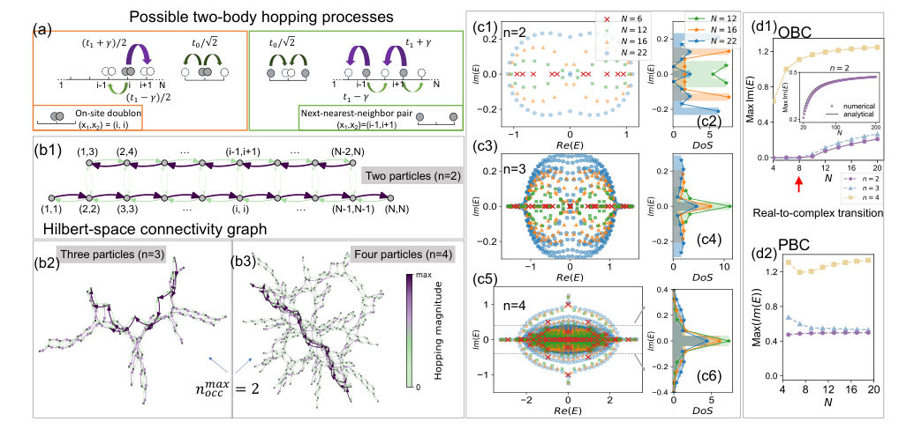 
FIG. 1. Hilbert space connectivity structure and scaling-induced spectral transitions for the interacting boson model of Eq. (1). (a) Illustration of two representative occupation configurations and their allowed hoppings: (Left) two particles occupying the same site (i, i) i.e., a doublon, and (Right) two particles separated by one intervening site (i −1, i + 1). Asymmetric hoppings (purple/light green) keep the particles within the same type of configuration, while symmetric hoppings t0/ √

📷 Fig 2

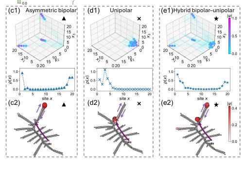 
FIG. 2. Unipolar and asymmetric bipolar localiza- tion from effective asymmetric backbone skin pump- ing induced by the occupation constraint nmax occ = 2. (a1-a2) Energy spectrum of Eq. (1) colored by (a1) asym- metric bipolar and (a2) unipolar weight Pr [Eq. (4)]. (b1) Hilbert space connectivity graph of Eq. (1), with a central (i, i ± 2, i ± 2) backbone connected to multiple branches. Each branch corresponds to parallel chains of configura- tions (x, i, i) and (x, i −1, i + 1), which contains a boson at x and two other bosons centered at i. The purple ar- row denotes the constraint-induced directional hopping bias along the backbone. (b2) The rightward pumping process (Top) is inactive...

📷 Fig 3

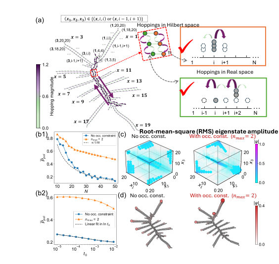 
FIG. 3. Removing the occupancy constraint (nmax occ = 2) re- stores the reverse boson-enhanced backbone process and qual- itatively changes the scaling of corner polarization. Results for a three-particle system without an occupancy constraint under OBCs. (a) (Left) Hilbert space connectivity graph. (Right) the correlated-hopping process forbidden in Fig. 2 becomes allowed once the occupancy constraint is removed. (b) Average polarization weight ¯Ppol [Eq. (5)], shown with and without the occupancy constraint, under varying system sizes N and couplings t0. (b1) ¯Ppol versus system size N at fixed t0 = 10−3, with an approximately 1/N decay in the unconstrained system (blue), compared to much...

📷 Fig 4

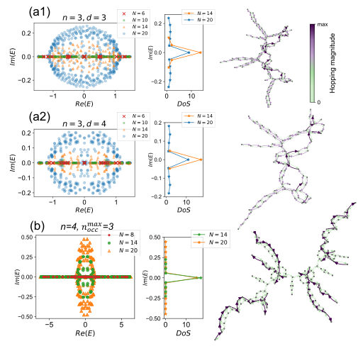 
FIG. 4. Scaling-induced real-to-complex spectral broadening and Hilbert-space connectivity in gener- alized interacting models. (a1,a2) Longer-range two- body correlated-hopping model [Eq. (6)] for three particles (n = 3) with hopping distances d = 3 and d = 4, re- spectively, under the occupancy constraint nmax occ = 2. (b) Three-body correlated-hopping model [Eq. (7)] for four par- ticles (n = 4) with nmax occ = 3. For each case, the eigen- value spectra are shown for several system sizes N, together with the corresponding Im(E)-resolved density of states and a representative Hilbert-space connectivity graph. Through- out, t1 = t2 = 0.58, t0 = 10−2, and γ = 0.25, with OBCs imposed.

**Summary.** This work reveals that in non-Hermitian many-body systems, the topology of the Hilbert space connectivity graph is a primary determinant of physical behavior. Specifically, particle occupancy constraints act as crucial bottlenecks, inducing robust, directional localization and controlling the rate of spectral amplification. This establishes connectivity as a versatile control knob for non-Hermitian critical transitions.

**Why it may be interesting.** The direct link drawn between the abstract mathematical structure of the Hilbert space graph (connectivity) and observable physical phenomena like spectral amplification and localization makes it highly relevant for understanding non-Hermitian physics in condensed matter.

Detailed structure

**Main problem.** The paper investigates how Hilbert space connectivity fundamentally controls spectral amplification and state localization in non-Hermitian many-body systems.

**Main result.** The connectivity graph structure, particularly when constrained by particle occupancy, dictates the emergence of robust, size-dependent spectral amplification and specific localization patterns (unipolar/bipolar).

**Method.** The analysis involves constructing and analyzing the Hilbert space connectivity graph, calculating eigenenergy spectra, and comparing results under different boundary conditions and occupancy constraints.

**Model / system.** The study uses a minimal 1D bosonic model Hamiltonian involving correlated two-body hoppings, analyzed for $n=2, 3, 4$ particles, exhibiting non-Hermitian dynamics.

**Key observables.** Spectral amplification ($\max 	ext{Im}(E)$), Hilbert space connectivity graph structure, and localization patterns (unipolar, asymmetric bipolar) quantified by average polarization weight ($ar{P}_{	ext{pol}}$).

**Important parameters / regimes.** Boson number ($n$), system size ($N$), and the occupancy constraint ($n_{	ext{max\_occ}}$).

**Assumptions / limitations.** The analysis relies on comparing systems with and without the occupancy constraint, and uses the average center-of-mass position as a diagnostic for localization.

**Figures summary.** Figures illustrate the connectivity graphs for different particle numbers and boundary conditions, and show localization patterns (e.g., unipolar/bipolar) induced by the occupancy constraint, contrasting them with unconstrained cases.

**Paper structure.** The paper progresses by first establishing the role of connectivity in generating spectral transitions (2-boson case), then detailing how bosonic symmetry creates global loops, and finally demonstrating that occupancy constraints are necessary to induce robust, directional localization patterns.

Abstract

Various exotic many-body phenomena such as quantum scars and fractons have been linked to Hilbert space fragmentation. In this work, we find that in non-Hermitian settings, Hilbert space connectivity has an even more universal and fundamental influence, tightly controlling the nature of spectral amplification and state localization. Far more complicated than real-space lattices, non-Hermitian many-body Hilbert space graphs not only possess intricate competing amplification channels, but also global feedback loops connecting remote Fock states related by particle symmetry. These features lead to amplification behavior with unconventional scaling and localization properties. Particle occupation constraints can furthermore remove selected Hilbert space pathways, leading to robust unipolar and asymmetric bipolar skin localization in otherwise reciprocal processes. These results extend beyond simple interacting bosonic models and establish Hilbert space connectivity as a versatile control knob for many-body non-Hermitian critical transitions.

[↑ back to top](#top)

### [Time-Dependent Quantum Monte Carlo for fermions: from Bayesian conditioning to spinor dynamics](http://arxiv.org/abs/2609.08415v1)

**Authors:** Ivan P. Christov  
**Type:** theory · **Category:** strongly correlated electrons · **PDF:** <https://arxiv.org/pdf/2609.08415v1>  
**Analysis basis:** full PDF text, analyzed in chunks
**Topic relevance:** `Keldysh / 2PI / non-Gaussian methods` **2/5** · `methods for driven-dissipative` **2/5**

📷 Fig 1

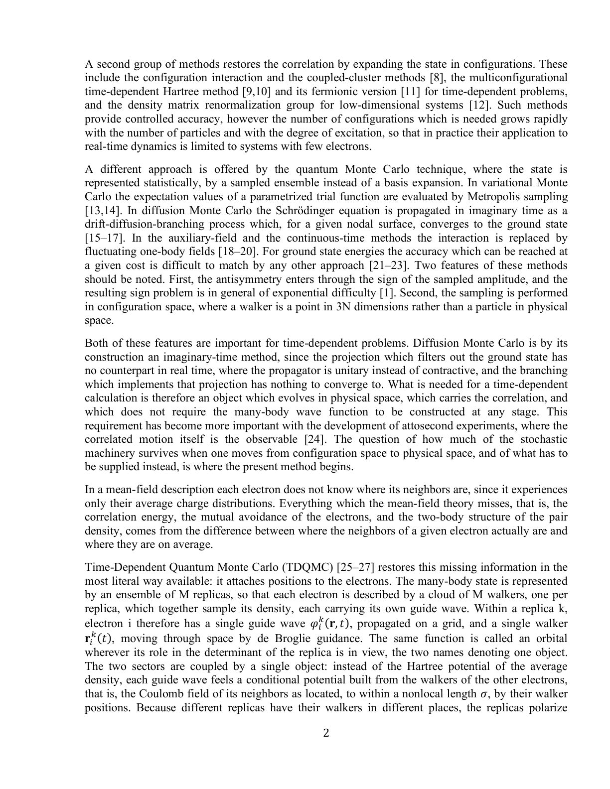 
Low-resolution page preview, page 2

📷 Fig 2

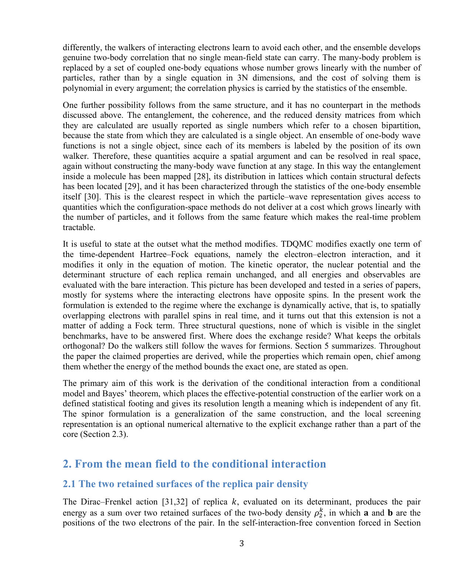 
Low-resolution page preview, page 3

📷 Fig 3

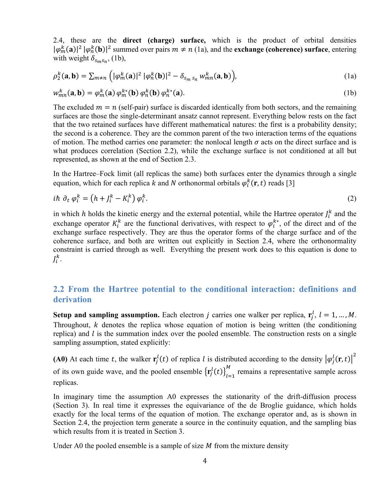 
Low-resolution page preview, page 4

📷 Fig 4

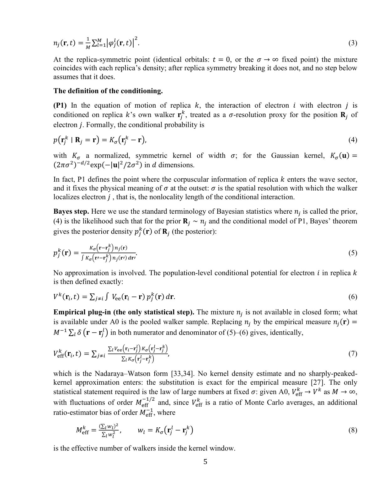 
Low-resolution page preview, page 5

📷 Fig 5

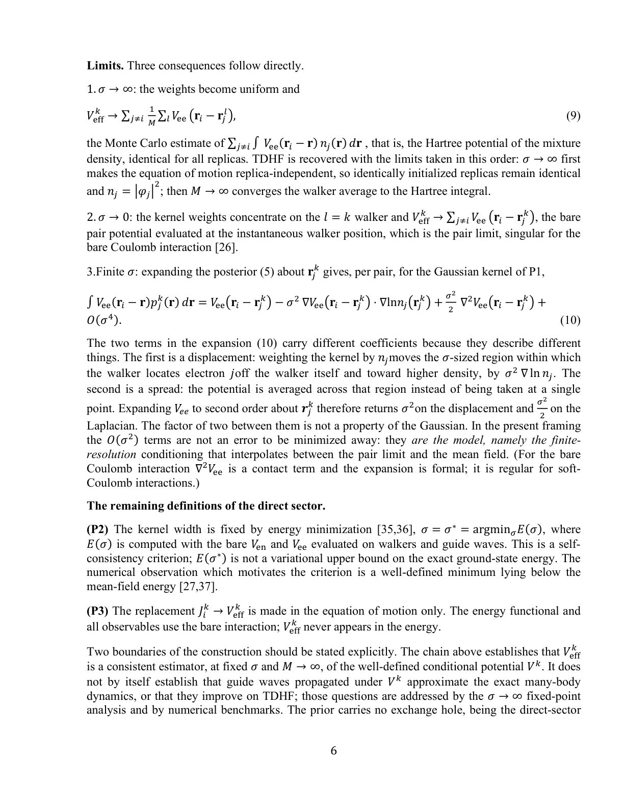 
Low-resolution page preview, page 6

**Summary.** This paper presents an advanced Time-Dependent Quantum Monte Carlo method for fermions, extending it to a spinor formalism to accurately capture active spin-dependent exchange interactions. By deriving the effective interaction using Bayesian conditioning in physical space, the method overcomes limitations of previous approaches and provides a systematic framework connecting to established limits like Hartree-Fock theory.

**Why it may be interesting.** The rigorous inclusion of spin dynamics via the spinor formalism and the systematic derivation of the conditional interaction make this a powerful, advanced tool for studying correlation effects in condensed matter systems beyond standard mean-field approximations.

Detailed structure

**Main problem.** The paper addresses the computational challenge of solving the many-electron Schrödinger equation by developing a sophisticated Quantum Monte Carlo approach that correctly treats the active exchange interaction.

**Main result.** The authors generalize the Time-Dependent Quantum Monte Carlo method to a spinor formulation, allowing the treatment of active exchange effects and providing a systematic framework that reduces correctly to known limits like Hartree-Fock and two-particle spin equations.

**Method.** The core method is a Time-Dependent Quantum Monte Carlo (TDQMC) approach that samples the many-electron state in physical space using an ensemble of walkers. The interaction is replaced by a derived conditional interaction based on Bayes' theorem, avoiding the sign problem for fermions.

**Model / system.** The system is a general fermionic many-body system (electrons in atoms, molecules, or solids). The formalism is extended to spinors to properly account for spin degrees of freedom and the active exchange interaction.

**Key observables.** Energy estimators (particle and mixed walker-wave), correlation energy, and the decay rate of orbital orthogonality.

**Important parameters / regimes.** The nonlocal length ($\sigma$), which controls the spatial resolution of the conditional interaction; the limits $\sigma 	o \infty$ (mean-field) and $\sigma 	o 0$ (pair limit).

**Assumptions / limitations.** The method relies on approximating the true density using a conditional interaction derived via Bayes' theorem, and it assumes the guide wave propagation approximates the exact dynamics.

**Figures summary.** Not specified.

**Paper structure.** The paper builds from the general TDQMC framework, first establishing the conditional interaction for the direct (charge) surface. It then addresses the complex exchange (coherence) surface, leading to the spinor generalization. Finally, it analyzes the theoretical reductions, showing how the spinor theory encompasses the scalar theory via collinear and mean-field limits.

Abstract

The time-dependent quantum Monte Carlo method represents a many-electron state by an ensemble of replicas, in which each electron is described by a cloud of walkers which samples its density in physical space, one walker and one guide wave per replica, and it replaces the Hartree potential by a conditional interaction built from the walker positions. The sampling is in physical space rather than in configuration space, which is what keeps the cost polynomial. Here that conditional interaction is derived rather than postulated. The method has so far been applied mostly to opposite-spin electrons, where the exchange is dormant rather than absent, and the present formulation addresses the regime in which it is active. Treating the walker as a localization of its electron to a finite resolution, Bayes theorem and a single empirical substitution yield the Nadaraya-Watson form which the method has used heuristically. The nonlocality length thereby acquires a meaning as the width of the conditioning rather than as a fitted coupling, and the pair and mean-field limits follow from one construction. For fermions, exchange cannot be carried by the walkers and stays in the wave sector, which is what leaves the positive walker sampling free of the sign problem. Because the conditioning removes the gauge freedom which eliminates the orthonormality multipliers in Hartree-Fock, orthonormality is enforced here by a term derived from the constraint. The formulation is generalized to spinors, where the Pauli suppression at coincidence becomes graded by the local spin alignment, and it reduces through the collinear and mean-field limits to the known two-particle spin equations.

[↑ back to top](#top)

### [Quantum algorithm for PageRank computation through multistep quantum resonant transitions](http://arxiv.org/abs/2609.08140v1)

**Authors:** Chuqing Wang, Hefeng Wang, Hua Xiang  
**Type:** theory · **Category:** quantum information and computing · **PDF:** <https://arxiv.org/pdf/2609.08140v1>  
**Analysis basis:** full PDF text, analyzed in chunks
**Topic relevance:** `analog quantum simulation` **2/5** · `quantum measurements` **1/5**

📷 Fig 1

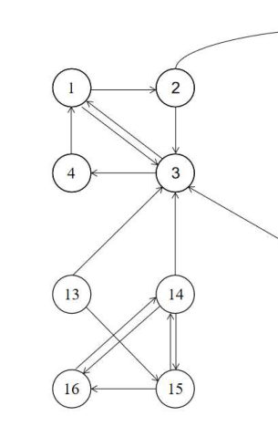 
FIG. 1. Directed graph of 16 webpages

📷 Fig 2

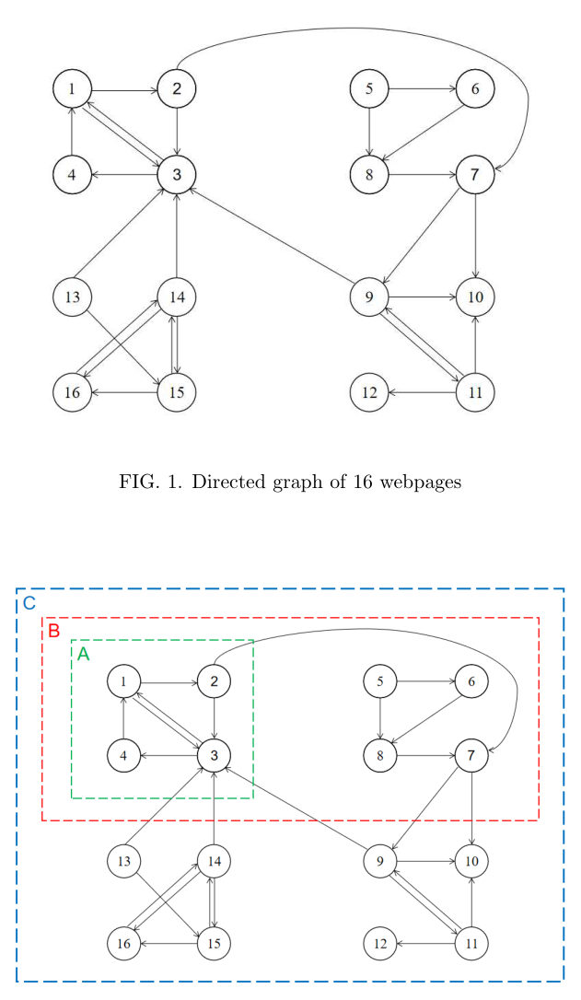 
FIG. 2. Partition of the graph in Fig. 1. The whole graph C is in the blue dashed square with 16

📷 Fig 3

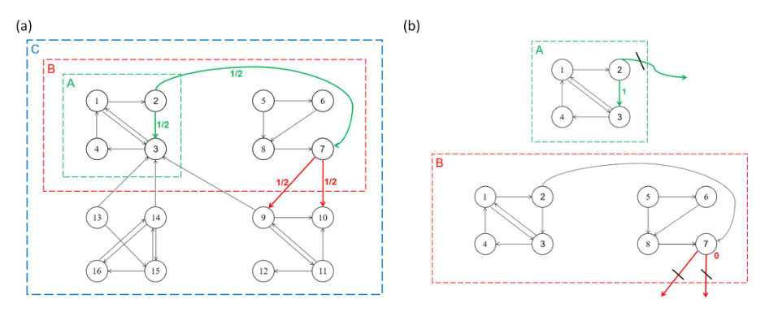 
FIG. 3. Weight redistribution of edges in the subgraphs. (a) Weight distribution of nodes 2 and 7

📷 Fig 4

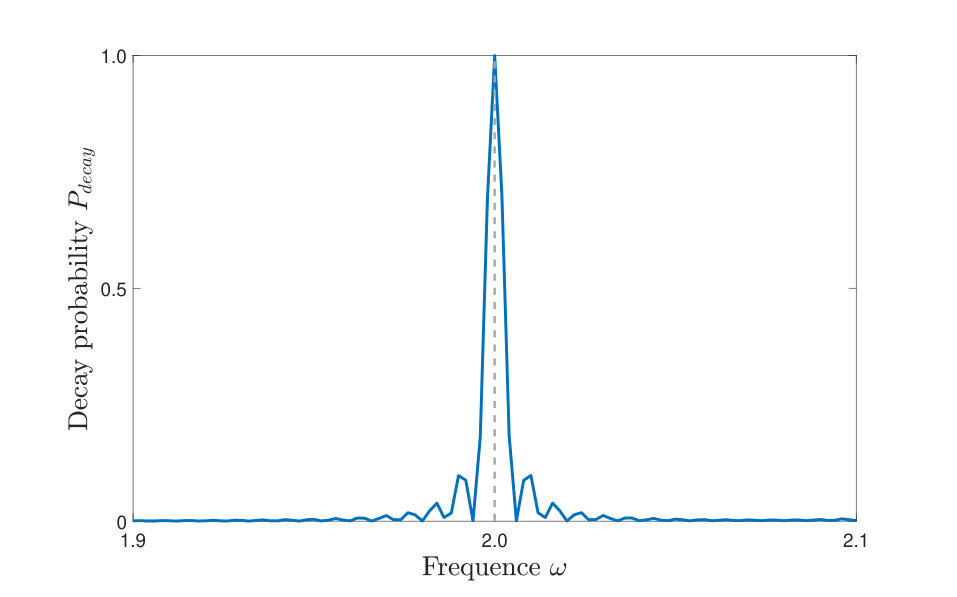 
FIG. 4. (Color online.) Transition frequency spectrum between the ground states of the Hamilto-

📷 Fig 5

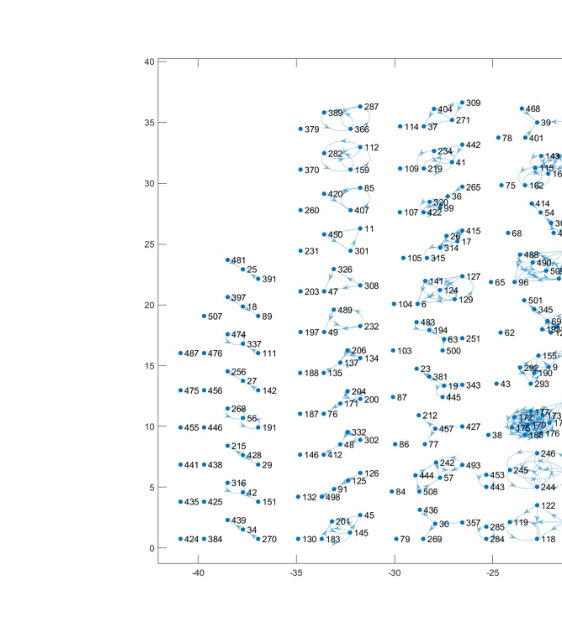 
FIG. 5. Graph of 512 most active webpages of a web graph from Google.

**Summary.** This paper presents a quantum algorithm utilizing multistep quantum resonant transitions (mQRT) to calculate the PageRank vector of a web graph. By sequentially evolving the system through Hamiltonians derived from nested subgraphs, it efficiently prepares a quantum state encoding the desired eigenvector. This offers a resource-efficient, digital alternative to existing quantum linear algebra solvers.

**Why it may be interesting.** The use of resonant transitions and Hamiltonian evolution paths to solve a classically defined linear algebra problem (eigenvector calculation) is a direct application of quantum simulation techniques relevant to open quantum systems and quantum computation.

Detailed structure

**Main problem.** The paper develops a quantum algorithm to efficiently obtain the quantum state encoding the PageRank vector of a large-scale network, modeled by the Google matrix.

**Main result.** The proposed multistep quantum resonant transition (mQRT) algorithm achieves this state preparation with a runtime proportional to the number of graph partitioning steps, $O(\log N)$.

**Method.** The method involves constructing a Hamiltonian evolution path by sequentially passing through the ground states of intermediate Hamiltonians derived from nested subgraphs of the web graph.

**Model / system.** The system is the web graph, whose PageRank vector is the principal eigenvector of the Google matrix. The computation is framed using a sequence of Hamiltonians $H_k$ and the mQRT technique.

**Key observables.** The final quantum state $|\pi^{(m)}_0
angle$, whose measurement probabilities yield the components of the PageRank vector $\pi$.

**Important parameters / regimes.** The runtime scales as $O(\log N)$ steps, and efficiency relies on the energy gap and ground state overlaps being polynomially large.

**Assumptions / limitations.** The algorithm assumes the ability to partition the web graph such that the overlap between ground states of adjacent subgraphs is polynomially large, and that the energy gap remains polynomially large.

**Figures summary.** Figures illustrate the directed graph structure, the process of partitioning the graph into nested subgraphs (e.g., C -> B -> A), and the transition frequency spectrum related to the resonance steps.

**Paper structure.** The paper introduces the problem (PageRank via Google matrix), details the mQRT method based on graph partitioning, derives the necessary Hamiltonians and evolution path, analyzes the complexity using product formula methods, and validates the approach via simulations on small and large graphs.

Abstract

We present a quantum algorithm for obtaining a quantum state that encodes the PageRank vector of the Google matrix through multistep quantum resonant transition (mQRT). In the algorithm, the PageRank vector is encoded in the ground state of a problem Hamiltonian associated with the Google matrix. By dividing the web graph corresponding to the Google matrix into a series of subgraphs with nested structure, we construct a sequence of Hamiltonians based on the subgraphs to form a Hamiltonian evolution path from a simple initial Hamiltonian to the problem Hamiltonian. The ground state of the problem Hamiltonian is obtained by going through ground states of the intermediate Hamiltonians via QRT step by step. This algorithm requires only one ancillary qubit, and the runtime of the algorithm is proportional to the number of steps. It provides a new way for efficiently obtaining the quantum state of the PageRank vector of large-scale networks.

[↑ back to top](#top)

### [Spectral Sign Implication for Quantum Logic](http://arxiv.org/abs/2609.08099v1)

**Authors:** Kenji Tokuo  
**Type:** theory · **Category:** other · **PDF:** <https://arxiv.org/pdf/2609.08099v1>  
**Analysis basis:** full PDF text, analyzed in chunks
**Topic relevance:** `quantum measurements` **2/5** · `Keldysh / 2PI / non-Gaussian methods` **1/5**

📷 Fig 1

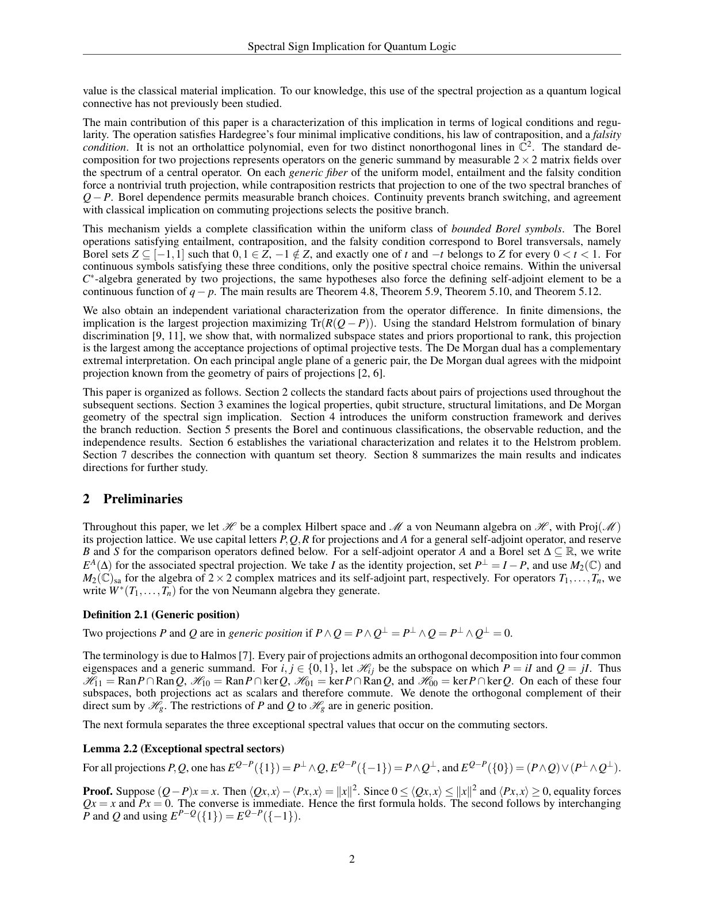 
Low-resolution page preview, page 2

📷 Fig 2

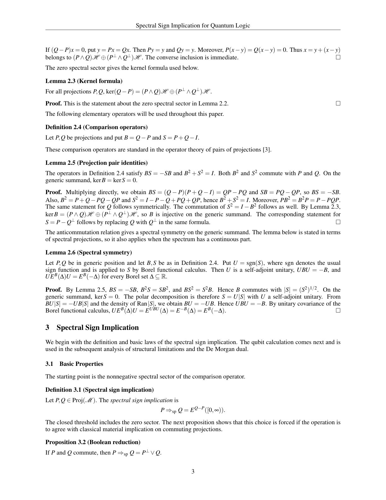 
Low-resolution page preview, page 3

📷 Fig 3

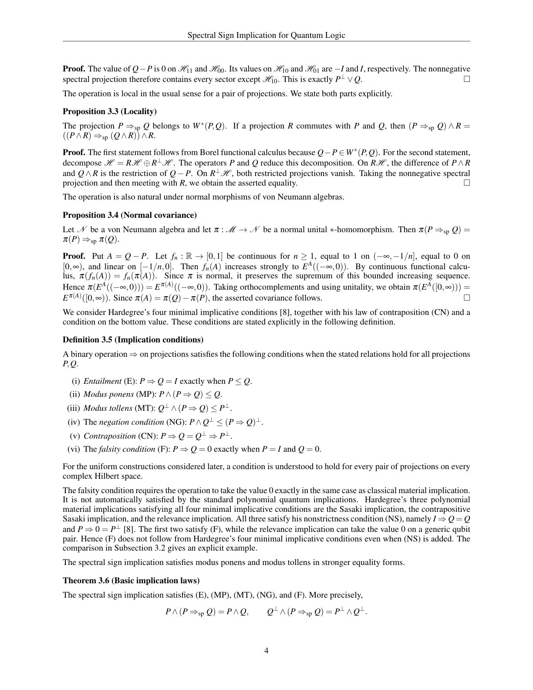 
Low-resolution page preview, page 4

📷 Fig 4

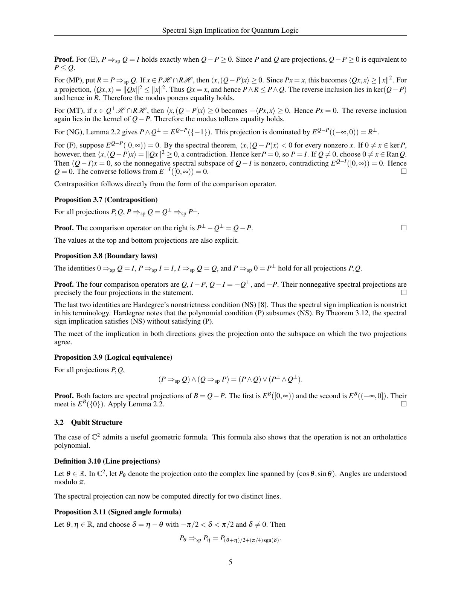 
Low-resolution page preview, page 5

📷 Fig 5

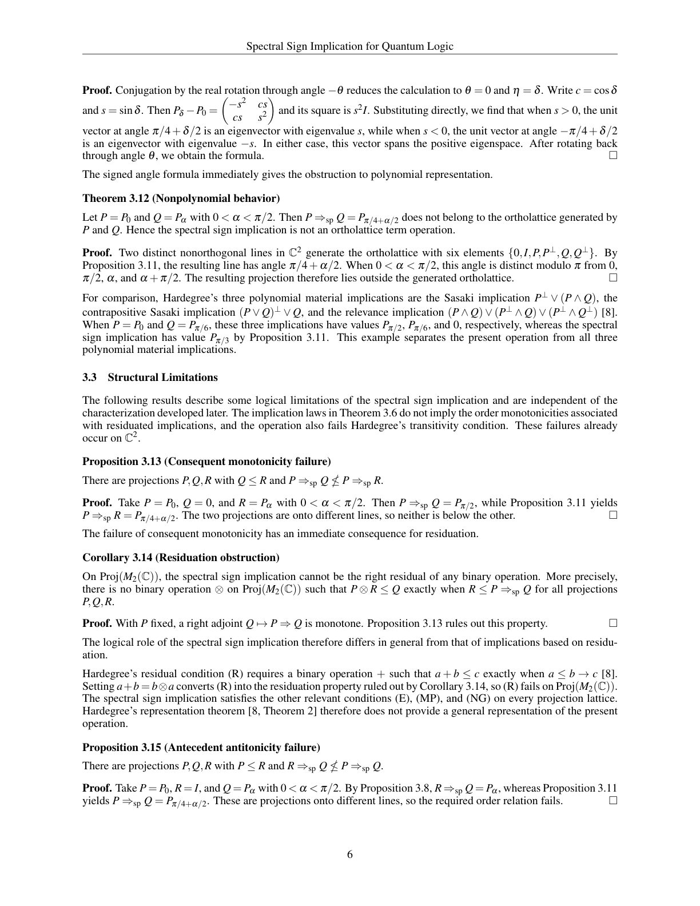 
Low-resolution page preview, page 6

**Summary.** This paper rigorously defines the spectral sign implication for quantum logic using spectral projections of the difference between two quantum propositions. It proves that while this implication satisfies several desirable logical axioms, it fundamentally deviates from standard polynomial quantum implications. The work connects this abstract logic to concrete physical concepts like optimal projective tests for state discrimination.

**Why it may be interesting.** While not directly about AMO physics, the rigorous mathematical framework connecting spectral theory to logical implication provides advanced tools for analyzing quantum information structures that might underpin quantum measurement or state discrimination protocols.

Detailed structure

**Main problem.** The paper studies the mathematical definition and properties of the 'spectral sign implication' ($	ext{P} \Rightarrow_{	ext{sp}} 	ext{Q}$) within the framework of quantum logic.

**Main result.** The spectral sign implication satisfies key logical axioms (like Hardegree's conditions) but is fundamentally non-polynomial, differing from standard quantum implications because its value need not belong to the ortholattice generated by the input projections.

**Method.** The analysis relies heavily on spectral theory, defining the implication as the non-negative spectral projection of the difference operator ($	ext{Q}-	ext{P}$), and connecting it to variational principles.

**Model / system.** The model is abstract quantum logic, where propositions are represented by projections ($	ext{P}, 	ext{Q}$) on a Hilbert space, analyzed using operator theory within a von Neumann algebra.

**Key observables.** The implication projection $	ext{P} \Rightarrow_{	ext{sp}} 	ext{Q}$, and the associated threshold truth value $T_{sp}(X,Y)$.

**Important parameters / regimes.** The structure of the projections $	ext{P}$ and $	ext{Q}$, and the difference operator $	ext{Q}-	ext{P}$.

**Assumptions / limitations.** The analysis assumes the existence of a spectral structure and, in some sections, restricts the system to finite dimensions for variational characterizations.

**Paper structure.** The paper develops the definition of the spectral sign implication, proves it satisfies several logical axioms, demonstrates its non-polynomial nature compared to classical implications, and finally characterizes it variationally using optimal projective tests related to Helstrom discrimination.

Abstract

We study the spectral sign implication for quantum logic, defined by the nonnegative spectral projection of the operator obtained by subtracting the antecedent projection from the consequent projection. The construction agrees with classical material implication on commuting projections and compares arbitrary pairs of projections through the spectral structure of their difference. It satisfies Hardegree's four minimal implicative conditions, his law of contraposition, and a falsity condition. It differs from the standard polynomial implications in that its value need not belong to the ortholattice generated by its arguments. Within a uniform class of Borel constructions for pairs of projections, the operations satisfying entailment, contraposition, and the falsity condition correspond exactly to measurable choices of spectral branch. In the continuous subclass, these three conditions determine the spectral sign implication uniquely. In finite dimensions, the operation is also the largest among the acceptance projections of optimal projective tests for Helstrom discrimination between subspace states with priors proportional to rank. These results connect quantum implication with the operator theory of two projections and binary quantum discrimination.

[↑ back to top](#top)

### [A Novel Steganography Scheme Using Quantum Hilbert Transform](http://arxiv.org/abs/2609.07894v1)

**Authors:** Nitin Jha, Abhishek Parakh  
**Type:** theory · **Category:** quantum information and computing · **PDF:** <https://arxiv.org/pdf/2609.07894v1>  
**Analysis basis:** full PDF text, analyzed in chunks
**Topic relevance:** `quantum measurements` **2/5**

📷 Fig 1

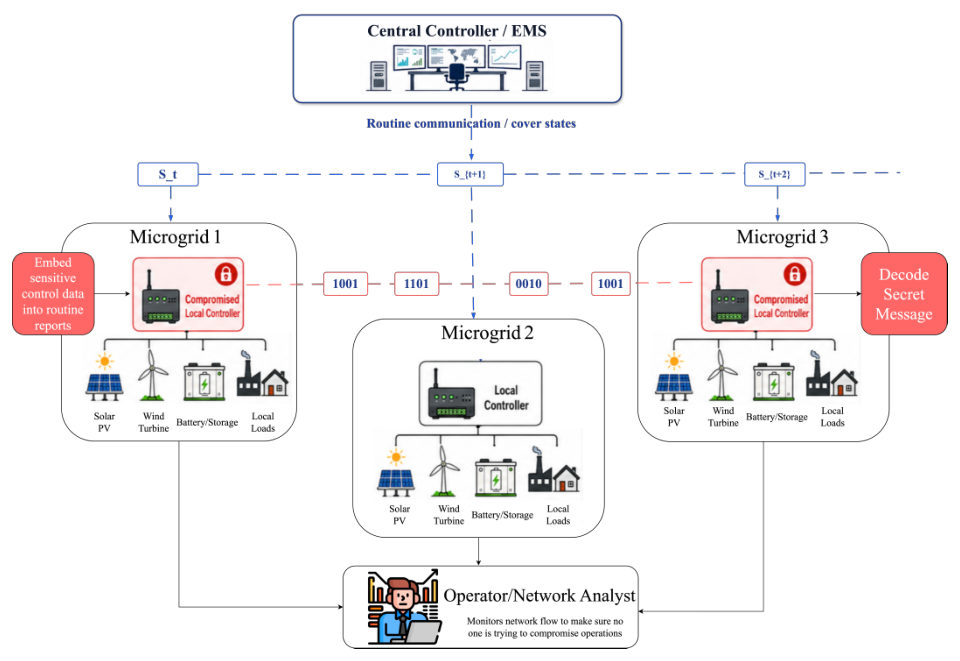 
Figure 1: A schematic diagram showing how the QHT-based steganography protocol can exploit quantum communication to embed hidden information across two compromised parties in a microgrid. A synchronized attack between two parties can be conducted while the network analyst remains unable to infer the presence of hidden information among the routine control commands transmitted as quantum states.

📷 Fig 2

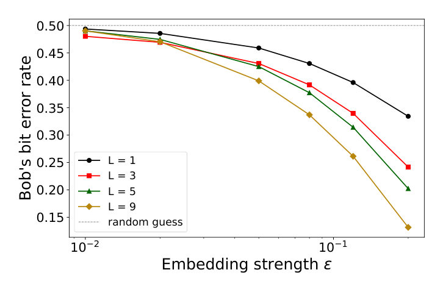 
Figure 2: Bob’s bit error rate with respect to the embedding strength ϵ for different spreading lengths L = 1, 3, 5, 9. For small ϵ, the two signed QHT-domain perturbations are difficult to distinguish, and the error rate remains close to random guessing. As ϵ increases, the perturbations become more distinguishable and Bob’s error rate decreases. Larger spreading lengths further improve reliability through block-majority aggregation.

📷 Fig 3

 
Figure 2 shows the scaling of Bob’s detection capability with respect to embedding strength. As expected, BER decreases monotonically with ϵ, and at any fixed ϵ, larger L yields a lower BER. Each message bit is carried by L independent carriers, each on a freshly drawn cover state, and Bob’s per-bit decision is the majority vote of the L Helstrom outcomes. For small ϵ, this concentrates the BER approximately as

📷 Fig 4

 
Figure 3: Detectability and disturbance footprints of QHT-domain embedding. Panel (a) shows the trace-distance signature observable by Wendy, with and without bit whitening. Panel (b) shows the fidelity disturbance that Alice introduces into the cover state during embedding. Together, the panels show that whitening can eliminate the embedding’s first-order α-linear footprint, leaving an O(ϵ2) trace-distance residue in the detectability and disturbance budgets.

📷 Fig 5

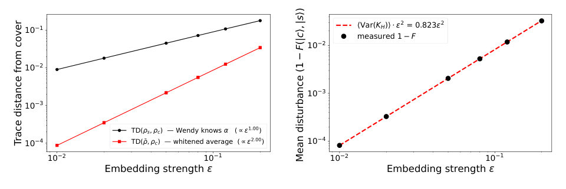 
Figure 3a plots the trace-distance footprint of a single embedded bit against the embedding strength ϵ on log–log axes for two warden models: a side-informed warden who knows Alice’s bit, represented by the upper curve with slope 1, and the operational case in which the bit has been XOR-whitened by a fresh pseudo-random key, represented by the lower curve with slope 2. The fitted slopes confirm that whitening cancels the first-order α-linear leakage of Vα(ϵ) and leaves only an O(ϵ2) single-carrier trace-distance residue. This result should be interpreted as a per-carrier detectability scaling rather than a full-message covertness guarantee. Since Bob’s reliable decoding may also require...

**Summary.** This paper proposes a quantum steganography scheme that embeds classical data by subtly perturbing the phase of quantum states using a novel Quantum Hilbert Transform (QHT). The QHT is crucial because it provides a unitary quantum analogue to the classical transform needed for this phase manipulation. The scheme's security and reliability are analyzed by quantifying the trade-off between embedding strength, channel noise, and the resulting error rate.

**Why it may be interesting.** The work provides a concrete, unitary quantum mechanism for information hiding, which is highly relevant for secure quantum communication protocols and understanding quantum state manipulation in noisy channels.

Detailed structure

**Main problem.** The paper addresses the challenge of developing a quantum steganography scheme by hiding classical bits within quantum communication messages using a novel phase-domain technique.

**Main result.** The Quantum Hilbert Transform (QHT) provides a unitary quantum analogue of the classical Hilbert transform, enabling the embedding of hidden bits via controlled phase perturbations.

**Method.** The protocol involves embedding the message by applying a unitary phase perturbation derived from the QHT to a cover state, followed by recovery using binary state discrimination, block aggregation, and classical error correction.

**Model / system.** The system operates on quantum states in a finite-dimensional Hilbert space, utilizing the QHT, which is constructed as a unitary phase operator based on the Quantum Fourier Transform (QFT).

**Key observables.** Bit Error Rate (BER) and Trace Distance (TD) are used to quantify the reliability and covertness of the embedded message.

**Important parameters / regimes.** Embedding strength ($\epsilon$), depolarizing probability ($p$), and the block size for error correction are critical parameters.

**Assumptions / limitations.** The protocol assumes the receiver (Bob) has access to the expected cover-state model, and the analysis relies on the QHT maintaining unitarity.

**Figures summary.** Figure 5 illustrates the trade-off between embedding strength, channel noise (depolarizing noise), and performance metrics, showing how BER increases while TD decreases with noise.

**Paper structure.** The paper introduces the QHT construction, details the steganography protocol (embedding and recovery), and concludes with numerical verification analyzing the performance metrics like BER and TD.

Abstract

The main goal of steganography is to transmit hidden messages in legitimate-looking communication messages. Phase-domain information hiding, however, has not been fully explored for quantum systems. This work introduces a finite-dimensional Quantum Hilbert Transform (QHT) as a unitary phase operator based on the Quantum Fourier Transform. Using this construction, we develop a QHT-based quantum steganography scheme that embeds classical bits as weak signed phase perturbations of quantum cover states. Bob recovers the hidden message through binary state discrimination, block aggregation, and classical error-correcting decoding.

[↑ back to top](#top)

### [Entanglement Wedge Reconstruction Beyond the Large N Limit via the Twirled Petz Map](http://arxiv.org/abs/2609.07866v1)

**Authors:** Arash Alipour Shahmiri, Maryam Sharifian, Niloofar Vardian  
**Type:** theory · **Category:** other · **PDF:** <https://arxiv.org/pdf/2609.07866v1>  
**Analysis basis:** full PDF text, analyzed in chunks
**Topic relevance:** `quantum measurements` **2/5**

📷 Fig 1

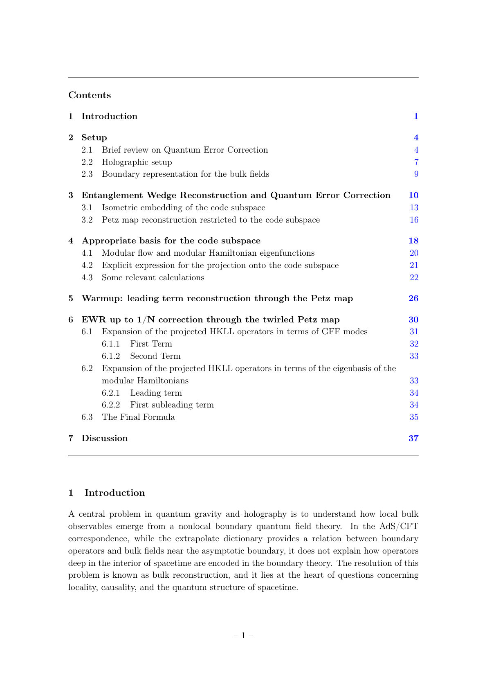 
Low-resolution page preview, page 2

📷 Fig 2

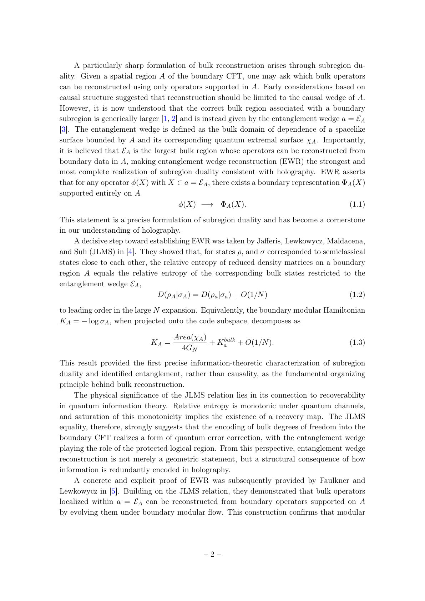 
Low-resolution page preview, page 3

📷 Fig 3

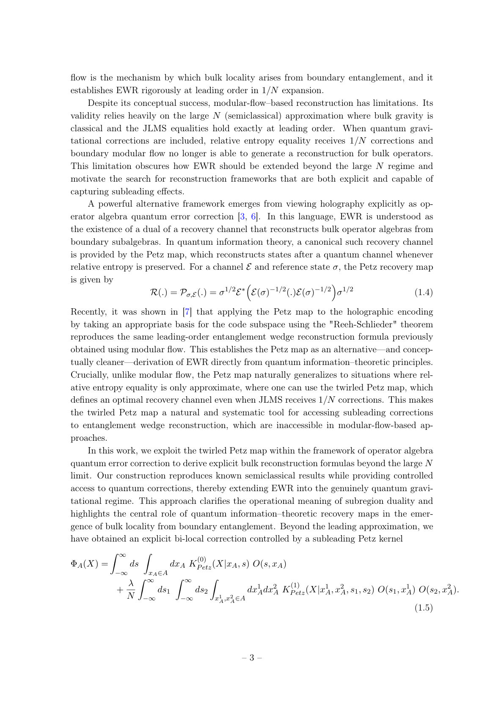 
Low-resolution page preview, page 4

📷 Fig 4

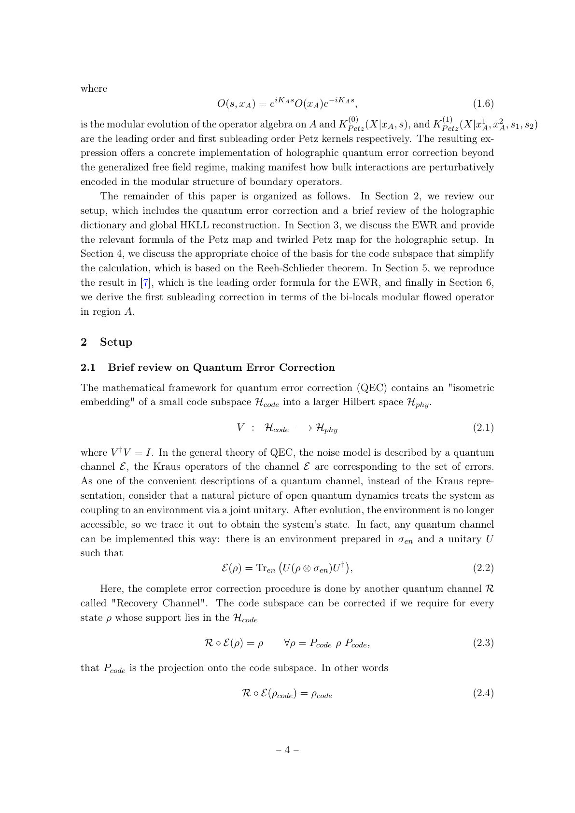 
Low-resolution page preview, page 5

📷 Fig 5

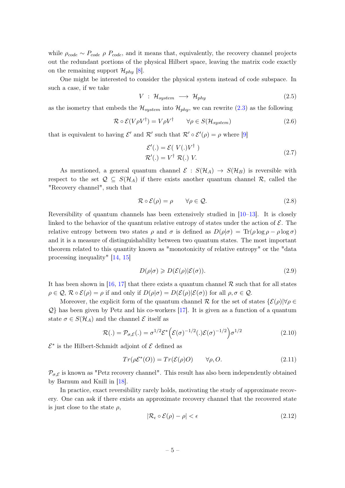 
Low-resolution page preview, page 6

**Summary.** This work extends the concept of Entanglement Wedge Reconstruction in AdS/CFT by employing the framework of Quantum Error Correction. By introducing the 'twirled Petz map,' the authors derive a systematic method to calculate subleading 1/N corrections, thereby providing a controlled theoretical path to understanding bulk physics in fully quantum gravitational regimes.

**Why it may be interesting.** The explicit connection between QEC theory (a tool from quantum information) and the fundamental structure of spacetime locality (holography) provides a powerful, mathematically controlled framework for understanding quantum gravity effects.

Detailed structure

**Main problem.** The paper addresses the challenge of extending the Entanglement Wedge Reconstruction (EWR) principle beyond the semiclassical, large N limit in AdS/CFT correspondence.

**Main result.** The authors provide a systematic and explicit method using the twirled Petz map to incorporate subleading 1/N corrections into bulk reconstruction formulas.

**Method.** The approach utilizes Quantum Error Correction (QEC) theory, specifically generalizing the Petz map to the 'twirled Petz map' to systematically calculate higher-order corrections in the 1/N expansion.

**Model / system.** The physical system is the AdS/CFT correspondence, focusing on reconstructing bulk local observables (the entanglement wedge) from boundary quantum field theory data.

**Key observables.** The explicit bi-local correction controlled by a subleading Petz kernel, and the reconstruction of bulk fields in terms of boundary modular operators.

**Important parameters / regimes.** The large N expansion parameter (1/N), and the subleading quantum gravitational corrections.

**Assumptions / limitations.** The initial analysis is restricted to semiclassical AdS geometries without horizons, though the framework aims to provide a controlled path toward fully quantum gravitational settings.

**Paper structure.** The paper first establishes the problem of EWR beyond leading order, then grounds the solution in the formalism of Quantum Error Correction (QEC) using the Petz map, and finally applies this generalized map to derive explicit, controlled corrections to the holographic reconstruction formulas.

Abstract

Entanglement wedge reconstruction provides the sharpest formulation of bulk locality in AdS/CFT, identifying the entanglement wedge as the largest bulk region reconstructible from a boundary subregion. While this statement is well understood at leading order in the large N expansion through both modular flow and Petz map reconstruction, its extension beyond the semiclassical regime has remained unclear. In this work, we show that quantum error correction provides the natural framework for addressing this problem. At leading order, we reproduce the known leading-order reconstruction formulas, and by employing the twirled Petz map, we obtain a systematic and explicit method for incorporating subleading 1/N corrections. Beyond the leading approximation, we have obtained an explicit bi-local correction controlled by a subleading Petz kernel. Our results establish a controlled approach to bulk reconstruction beyond large N and sharpening the role of quantum error correction in holography. This framework provides a controlled path toward understanding bulk reconstruction in fully quantum gravitational settings.

[↑ back to top](#top)

### [Examining Convergence of Cluster Perturbation Theory and Cluster Coupled Cluster for J1-J2 Heisenberg Spin Lattices](http://arxiv.org/abs/2609.08768v1)

**Authors:** Jeffrey Keyes, Carlos Jimenez-Hoyos  
**Type:** theory · **Category:** strongly correlated electrons · **PDF:** <https://arxiv.org/pdf/2609.08768v1>  
**Analysis basis:** full PDF text, analyzed in chunks
**Topic relevance:** `analog quantum simulation` **2/5**

📷 Fig 1

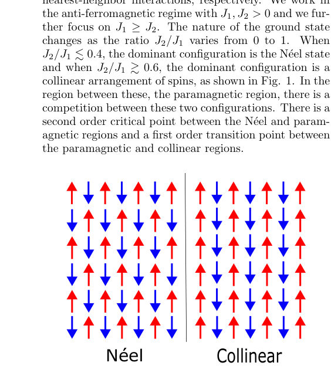 
FIG. 1. Dominant spin configuration for J2/J1 ≲0.4(left) and J2/J1 ≳0.6(right)

📷 Fig 2

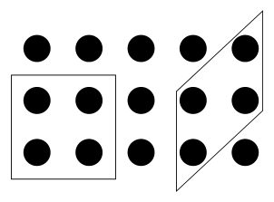 
FIG. 2. Tile arrangements used for calculations in the N´eel and paramagnetic regions(left) and the collinear region(right).

📷 Fig 3

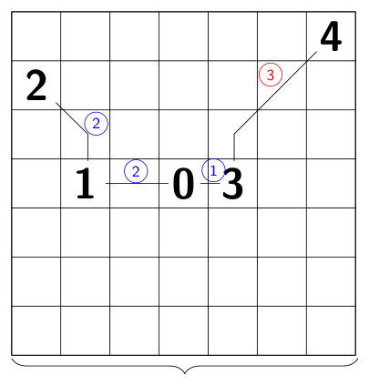 
FIG. 3. Diagram showing an amplitude that is included and one that is not in the approximation for m=4 and k=3.

📷 Fig 4

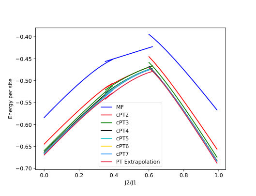 
FIG. 4. Energy per site vs. J2/J1 for cPT calculations.

📷 Fig 5

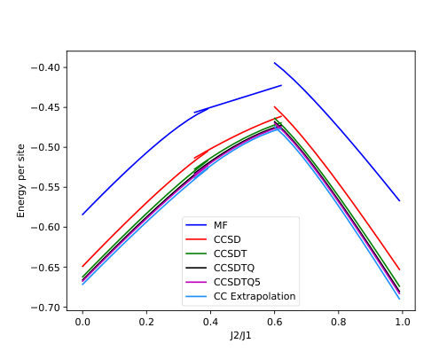 
FIG. 5. Energy per site vs. J2/J1 for cCC calculations.

**Summary.** This paper investigates the convergence of Cluster Perturbation Theory and Coupled Cluster methods when applied to the $J_1$-$J_2$ Heisenberg Spin Lattice. By extending calculations to high orders, the authors confirm that both theoretical series converge, yielding robust predictions for the system's energy and magnetic phase boundaries. This validates the use of these advanced quantum many-body techniques for strongly correlated magnetic materials.

**Why it may be interesting.** The rigorous testing of convergence for high-order many-body methods like CC and PT is crucial for developing reliable theoretical tools to predict phase transitions and ground states in complex magnetic materials.

Detailed structure

**Main problem.** The central goal is to rigorously confirm the convergence of high-order Perturbation Theory (PT) and Coupled Cluster (CC) series when applied to strongly correlated quantum spin systems.

**Main result.** The authors demonstrate that both the PT and CC series converge at high orders (up to cPT7 and cCCSDTQ5), providing reliable estimates for the energy and critical points of the model.

**Method.** The study employs advanced many-body quantum chemistry techniques, specifically Cluster Perturbation Theory and Cluster Coupled Cluster methods, adapted for lattice Hamiltonians.

**Model / system.** The system studied is the $J_1$-$J_2$ Heisenberg Spin Lattice, described by a Hamiltonian involving nearest-neighbor ($J_1$) and next-nearest-neighbor ($J_2$) exchange interactions between spins.

**Key observables.** Energy per site, magnetization ($\langle S_i^z 
angle$), and the critical point position as a function of the ratio $J_2/J_1$.

**Important parameters / regimes.** The ratio of coupling constants $J_2/J_1$, and the calculation is performed in the Thermodynamic Limit (TDL).

**Assumptions / limitations.** The methods rely on the cluster mean-field (cMF) wavefunction as a zeroth-order approximation, and the calculations utilize approximations inherent to the CC formalism for the TDL.

**Figures summary.** Figures illustrate the energy per site and magnetization across different ground state regimes (Néel, paramagnetic, collinear) for both PT and CC results, and show the convergence of the critical point estimate.

**Paper structure.** The paper first establishes the theoretical framework by extending calculations to higher orders (cPT7, cCCSDTQ5). It then presents the convergence analysis for energy and magnetization across various $J_2/J_1$ ratios, comparing the results from PT and CC methods.

Abstract

In previous work, it was shown that using the cluster mean field(cMF) wavefunction as the zeroth order wavefunction for perturbation theory and coupled cluster produces a reasonable approximation for the J 1-J 2 Heisenberg model in the thermodynamic limit(TDL). However, this work was limited to cPT4 and cCCSD. The central claim of cMF is that it takes strongly correlated systems and makes them weakly correlated so that PT weakly correlated methods can be used. To confirm that this claim is true, it is important to show that the PT and CC series converge. In this paper, we extend the previous calculations to cPT7 and cCCSDTQ5 where we show that the energy is converging. We also discuss how to perform cluster based calculations efficiently in the thermodynamic limit, which is crucial for these more expensive calculations.

[↑ back to top](#top)

### [Leveraged Learning: entropy destroyed per bit received](http://arxiv.org/abs/2609.08054v1)

**Authors:** Daniel Chernowitz  
**Type:** theory · **Category:** statistical mechanics · **PDF:** <https://arxiv.org/pdf/2609.08054v1>  
**Analysis basis:** full PDF text, analyzed in chunks
**Topic relevance:** `quantum measurements` **2/5**

📷 Fig 1

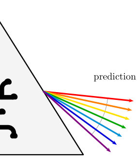 
Figure 1: Werner the learner.

📷 Fig 2

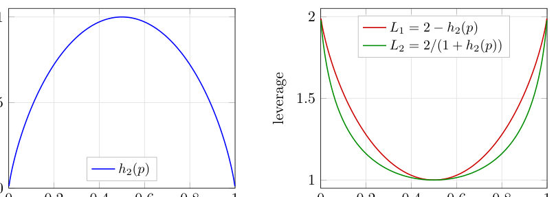 
Figure 2: The one-parameter world as a function of the constant-map probability p. Left: the table entropy h2(p) remaining after one question, in bits. Right: the one-question leverage L1 and the cumulative leverage L2 after both questions. At p = 1

📷 Fig 3

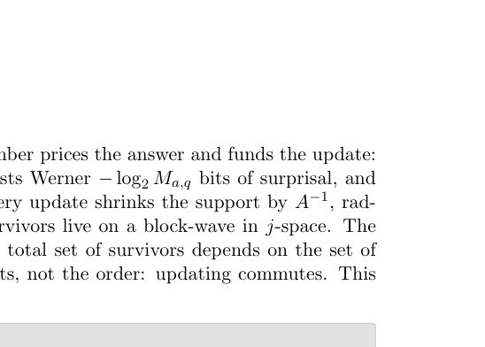 
Figure 3 makes the process visual for n = m = 2: a schematic prior {pj} over N = 44 = 256 maps, drawn as vertical lines with thickness representing weight. Each answer stops 3 out of every A = 4 surviving lines: maps whose truth tables carry a wrong digit at the asked question. Renormalization inflates the weight of the rest, so the total probability is always unit. Four questions cut 256 →64 →16 →4 →1, and the last line standing is the truth. Note the regularity of the cull: each answer keeps a single residue class of j, so the cadence of the survivors is regular.

📷 Fig 4

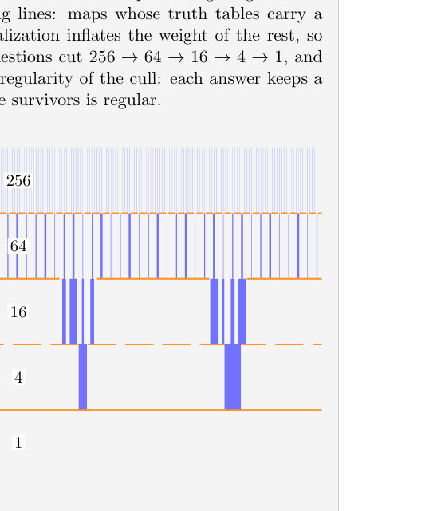 
Figure 3: The update rule as a cull, for n = m = 2. All 256 candidate maps start as vertical lines under a schematic prior. The truth is the bitwise negation ψ(q) = ¬q (j = 27, “0123” base 4), and the four questions are asked in the order 00, 10, 01, 11 (“0, 2, 1, 3” base 4). Each answer terminates the 3/4 of surviving maps whose truth-table digit at the asked question disagrees. Every survivor’s thickness, proportional to its weight, is rescaled by the renormalization factor of that update, preserving their ratios. After four questions a single map remains. Interestingly, the first cull’s survivors are evenly spaced because it’s the “smallest” question. After the three smallest q, even...

📷 Fig 5

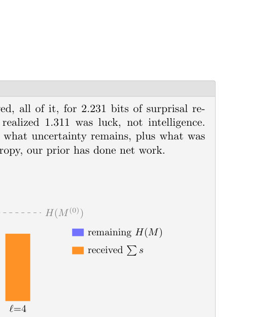 
Figure 4: The realized run through the guiding example: remaining table entropy plus cumulative surprisal received, after each question, against the initial total (dashed). The gap between each stack and the line is the cumulative deduced part. At ℓ= 1 the stack tops out 0.521 bits above the line - the negative deduction of question 1, plainly visible. At ℓ= 2 the stack still grazes the line from above (0.013 bits); only from ℓ= 3 on do the stacks fall short of it, as genuine deduction overtakes the early loss.

**Summary.** This theoretical work develops a measure called 'leverage' to quantify how much knowledge is gained about an unknown function from each piece of information received. It models this using information entropy and derives a macroscopic profile describing this gain rate. The findings provide a rigorous mathematical tool for understanding the limits of inference based on prior knowledge.

**Why it may be interesting.** While highly abstract, the mathematical machinery developed for quantifying information gain and complexity bounds (e.g., using polynomial degrees or block laws) has parallels in characterizing the complexity of quantum states or the information capacity of quantum channels.

Detailed structure

**Main problem.** The paper aims to quantify the rate of information gain, or 'leverage,' when sequentially querying an unknown function (modeled as a boolean map) using principles analogous to Shannon entropy.

**Main result.** The average leverage $L(t)$ in the thermodynamic limit is determined by a profile $\gamma(t)$, which can be explicitly calculated for specific prior structures, such as the simplicity prior.

**Method.** The analysis uses information theory concepts like surprisal and entropy reduction, generalizing the framework from simple binary questions to complex boolean maps defined over finite fields.

**Model / system.** The system is a boolean map $\psi: Q 	o A$, where $Q$ and $A$ are sets of questions and answers. The learning process is modeled by updating a prior belief distribution over all possible maps based on observed answers.

**Key observables.** Leverage ($L_\ell$), which is the ratio of total reduced uncertainty to total surprisal received; the entropy profile $\gamma(t)$.

**Important parameters / regimes.** The fraction of questions asked, $t = \ell/Q$; the initial entropy $\eta_0$; and the structure of the prior belief over the maps.

**Assumptions / limitations.** The analysis relies on calculating the average over the truth prior and the question order, and in the macroscopic limit, it assumes the profile $\gamma(t)$ is governed by specific mathematical forms (e.g., Bernstein polynomials for certain priors).

**Figures summary.** Figures illustrate the setup (Werner's learner), plot the entropy reduction and leverage as a function of prior parameters, and show the approach to the macroscopic limit.

**Paper structure.** The paper builds from defining the core concept of leverage using entropy reduction in a belief matrix, deriving the average leverage formula, and then generalizing this to the thermodynamic limit using profiles $\gamma(t)$ derived from specific prior constructions.

Abstract

A learner holds a prior belief over boolean maps that answer a finite set of $Q$ questions, and receives answers one by one. Each answer costs surprisal and destroys uncertainty, not only about the question asked but every question still unasked. We call the ratio the leverage: table entropy destroyed per bit of surprisal received. It is unit for a uniform prior, but with an intelligent prior can be higher (not lower).   Averaged over the truth prior and over the question order, the leverage is found exactly, and is generated by one sequence: the mean entropy $G_\ell$ of the answers to $\ell$ questions. Sending the number of input bits to infinity at fixed asked fraction $t = \ell/Q$, the increments of that sequence become a profile $γ(t)$, and initial question entropy $η_0$. The leverage closes to a thermodynamic limit. $L(t) = [η_0 - (1-t)γ(t)]/\int_0^t γ$.   Exchangeable priors, by de Finetti, all give a flat $γ(t)$ and hence a hyperbolic $L(t)$, their deduction confined to a boundary layer at $t = 0$. We construct a simplicity prior that escapes this, grading Boolean maps by the degree of their polynomial over $\mathbb{F}_2$ and budgeting weight across degree shells by a CDF $F$. Reed-Muller capacity then gives $γ(t) = 1 - F(t)$ exactly, so any nonincreasing profile, and any leverage curve it generates, is realizable at macroscopic times.

[↑ back to top](#top)

### [Quantum-Geometric Meissner Effect in Magnetized Color Superconductors](http://arxiv.org/abs/2609.07835v1)

**Authors:** Kazuya Mameda, Noriyuki Sogabe  
**Type:** theory · **Category:** other · **PDF:** <https://arxiv.org/pdf/2609.07835v1>  
**Analysis basis:** full PDF text, analyzed in chunks
**Topic relevance:** `Keldysh / 2PI / non-Gaussian methods` **2/5**

📷 Fig 1

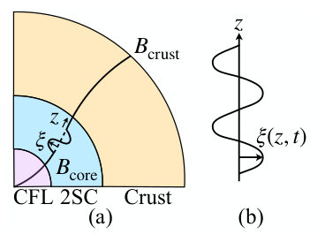 
FIG. 2. Schematic illustration of magnetic disturbances propagating along a magnetic field line (black curve) in a hybrid magnetar. (a) A quark core with inner CFL and in- termediate 2SC regions surrounded by a solid crust. (b) A transverse disturbance ξ(z, t) is modeled as a one-dimensional wave.

📷 Fig 2

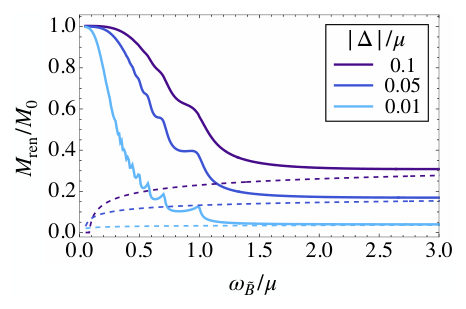 
FIG. 1. Renormalized transverse Meissner mass normal- ized by its zero-field value, as a function of ω ˜ B/µ within the constant-gap model. Solid curves denote the numerical re- sults for |∆|/µ = 0.1, 0.05, and 0.01. Dashed curves show the n = 0 contribution.

**Summary.** This work derives the Meissner effect in magnetized 2SC quark matter, showing that the response is governed by the quantum geometry of the lowest Landau level. The resulting transverse Meissner mass scales with the pairing gap, a topological feature, which suggests a potential signature for quasi-periodic oscillations observed in magnetars.

**Why it may be interesting.** The topological origin of the Meissner mass scaling provides a novel, field-theory approach to understanding superconducting responses in extreme astrophysical environments, linking condensed matter theory to high-energy astrophysics.

Detailed structure

**Main problem.** To investigate the Meissner response in magnetized two-flavor color-superconducting (2SC) quark matter, focusing on the role of quantum geometry in the superconducting response.

**Main result.** The transverse Meissner mass scales with the pairing gap ($\propto |\Delta|$) rather than the chemical potential ($\propto \mu$), a result attributed to the topological constraints imposed by the Lowest Landau Level (LLL) quantum metric.

**Method.** The Meissner mass is calculated from the static quadratic response of the thermodynamic potential using a spectral representation that explicitly incorporates Landau-level eigenstates and quantum geometric tensors.

**Model / system.** The system is magnetized 2SC quark matter, analyzed using the Nambu–Gor’kov (NG) spinor and propagator. The analysis is performed in the strong-field and Isolated Landau-Level (ILL) limits.

**Key observables.** Transverse Meissner mass ($M^2$), quantum metric ($g_N$), and Chern number ($C$).

**Important parameters / regimes.** Pairing gap ($\Delta$), chemical potential ($\mu$), magnetic field strength ($	ilde{B}$), and temperature ($T$).

**Assumptions / limitations.** The analysis relies on the ILL limit ($|d_{NN'}| \gg |\Delta|$), and the strong-field regime ($\omega 	ilde{B} \gg \mu$) is crucial for the topological scaling.

**Figures summary.** Figure 1 illustrates the crossover of the renormalized Meissner mass as a function of the magnetic field strength relative to the chemical potential. Figure 2 schematically shows magnetic wave propagation across interfaces in a hybrid magnetar.

**Paper structure.** The paper systematically derives the Meissner response by decomposing the NG propagator, calculating the polarization tensor, and isolating the quantum-geometric contribution in the ILL limit, leading to the final scaling laws.

Abstract

We find a quantum-geometric Meissner response in magnetized two-flavor color-superconducting (2SC) quark matter. Landau quantization quenches the transverse quasiparticle dispersion, suppressing the conventional Fermi-surface contribution and giving rise to a Meissner response governed by the quantum geometry of the Landau levels. In the strong-field regime, the response becomes dominated by the quantum metric of the lowest Landau level (LLL), and the leading scaling of the transverse Meissner mass is consequently set by the pairing gap, in contrast to the chemical potential scaling of conventional color superconductors. This unconventional scaling has a topological origin, as the LLL quantum metric is constrained by its Chern number. The reduced transverse Meissner mass provides potential implications for kHz quasi-periodic oscillations in magnetars.

[↑ back to top](#top)

### [Quantum-state texture measure and texture transformation](http://arxiv.org/abs/2609.08163v1)

**Authors:** Yufan Lin, Yu Guo, Fei He, Shuanping Du  
**Type:** theory · **Category:** quantum information and computing · **PDF:** <https://arxiv.org/pdf/2609.08163v1>  
**Analysis basis:** full PDF text, analyzed in chunks
**Topic relevance:** `quantum measurements` **2/5**

📷 Fig 1

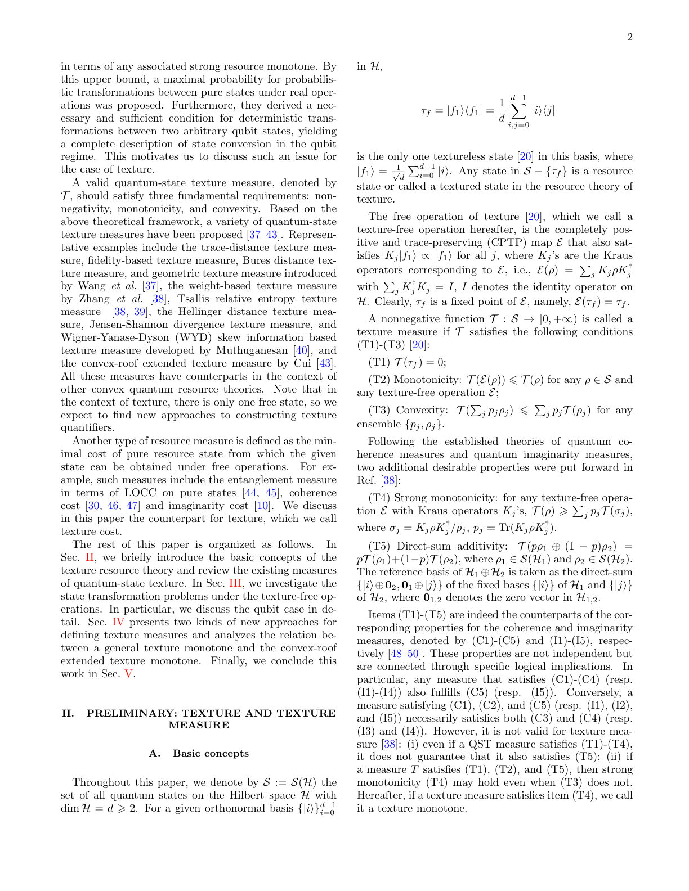 
Low-resolution page preview, page 2

📷 Fig 2

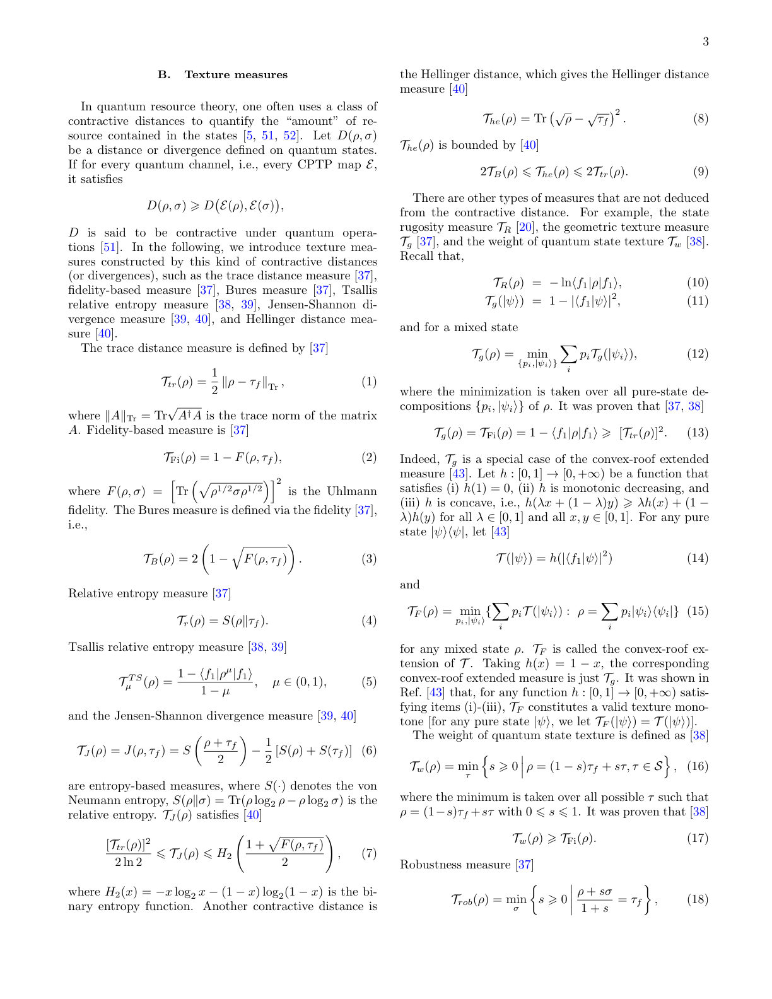 
Low-resolution page preview, page 3

📷 Fig 3

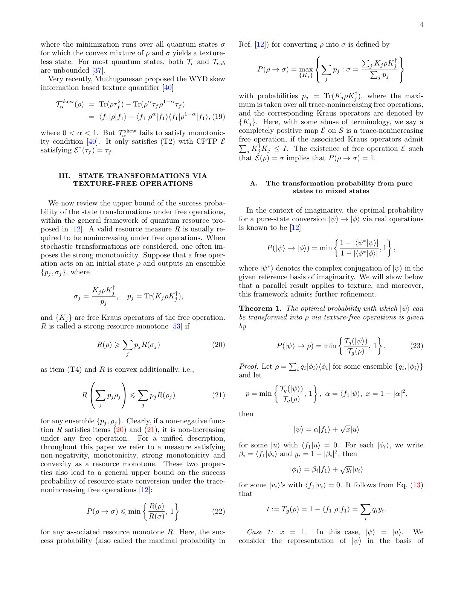 
Low-resolution page preview, page 4

📷 Fig 4

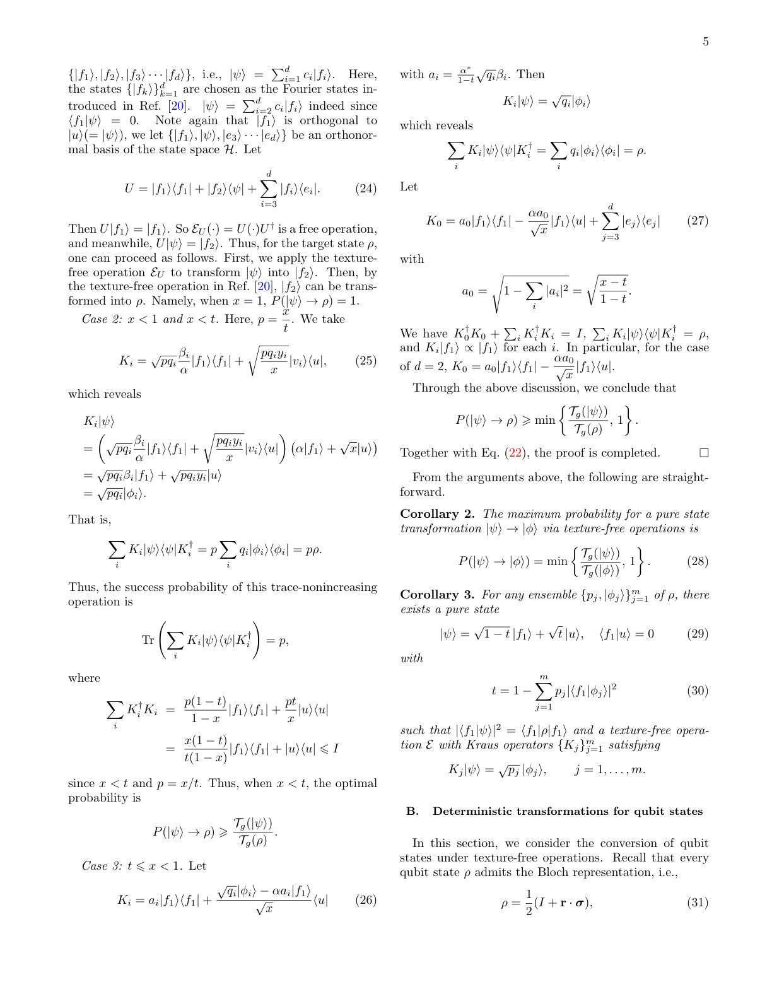 
Low-resolution page preview, page 5

📷 Fig 5

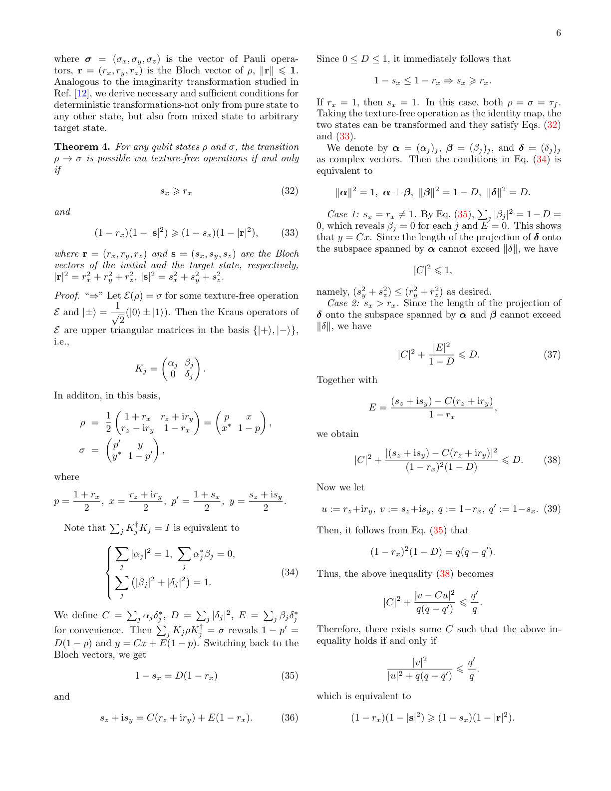 
Low-resolution page preview, page 6

**Summary.** This paper establishes a comprehensive resource theory for quantum-state texture, quantifying structural irregularities in quantum states. It develops new texture measures and solves the deterministic transformation problem for qubits under texture-preserving operations. The work's main contribution is proving a converse theorem that systematically characterizes all possible texture monotones.

**Why it may be interesting.** It provides a rigorous, resource-theoretic framework to quantify structural imperfections (texture) in quantum states, which is crucial for characterizing the limitations of quantum gates and circuits.

Detailed structure

**Main problem.** The paper aims to develop a comprehensive resource-theoretic formulation for quantum-state texture (QST) and systematically investigate state transformation problems under texture-free operations.

**Main result.** The authors establish that every texture monotone corresponds to a non-negative function satisfying specific mathematical properties, providing a converse to the convex-roof extension construction for QST.

**Method.** The work involves defining and comparing multiple texture measures (e.g., trace distance, fidelity, relative entropy) and applying resource theory concepts to characterize state transformations.

**Model / system.** The analysis focuses on quantum states $
ho$ on a Hilbert space $H$ (including qubits), using the uniform superposition state $	au_f$ as a reference state for texture quantification.

**Key observables.** Quantum-state texture ($T(
ho)$), transformation success probability $P(
ho 	o \sigma)$, and the derived function $h(x)$ for pure states.

**Important parameters / regimes.** The dimension of the Hilbert space ($d$), and the parameters governing specific measures (e.g., $\mu$ for Tsallis entropy).

**Assumptions / limitations.** The theory relies on defining 'texture-free operations' (CPTP maps preserving the reference state) and assuming the existence of 'resource monotones' satisfying specific properties (T1)-(T5).

**Paper structure.** The paper reviews existing texture measures, proposes new classes (convex-function-based), solves the deterministic transformation problem for qubits, and culminates in proving the converse relationship between texture monotones and derived functions.

Abstract

Quantum-state texture quantifies structural irregularities of a state in a selected basis and has emerged as a valuable resource for gate characterization in universal circuits. Consequently, a class of contractive distance based texture measures and a framework for constructing convex-roof extended texture measure have been proposed. Here, we extend this theory in several directions. We examine the convertibility of a pure state to any state under texture-free operations, and fully solve the deterministic transformation problem between any two states in the qubit case. We then propose two classes of texture measures: convex-function-based measures and texture cost defined via minimal cost of texture contained in pure states. Moreover, we show that every texture monotone gives rise to a non-negative function which admits the same properties as the function used in the convex-roof extension---thus providing a converse to that construction. Our work thereby offers a relatively comprehensive resource-theoretic formulation of quantum-state texture.

[↑ back to top](#top)

### [Renormalization of One-Dimensional Semirelativistic Bosons with Contact Interactions](http://arxiv.org/abs/2609.09068v1)

**Authors:** Fatih Erman, O. Teoman Turgut  
**Type:** theory · **Category:** quantum gases · **PDF:** <https://arxiv.org/pdf/2609.09068v1>  
**Analysis basis:** full PDF text, analyzed in chunks
**Topic relevance:** `Keldysh / 2PI / non-Gaussian methods` **2/5**

📷 Fig 1

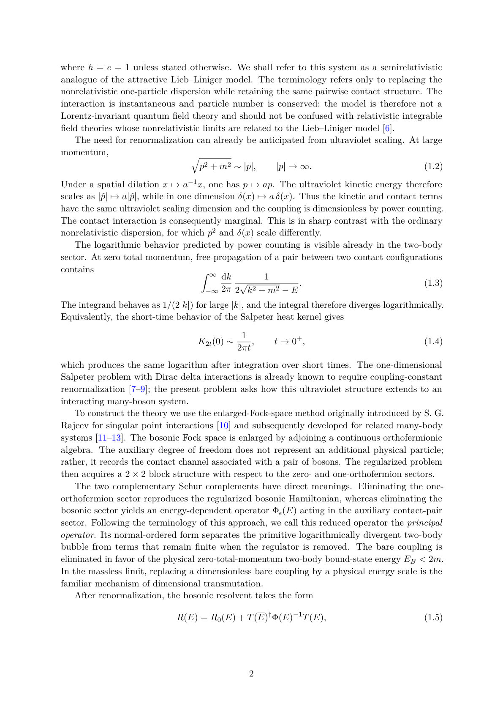 
Low-resolution page preview, page 2

📷 Fig 2

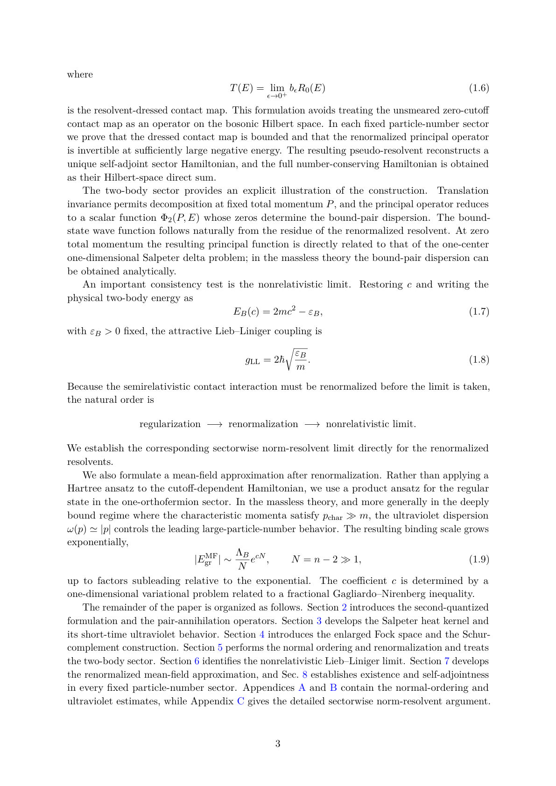 
Low-resolution page preview, page 3

📷 Fig 3

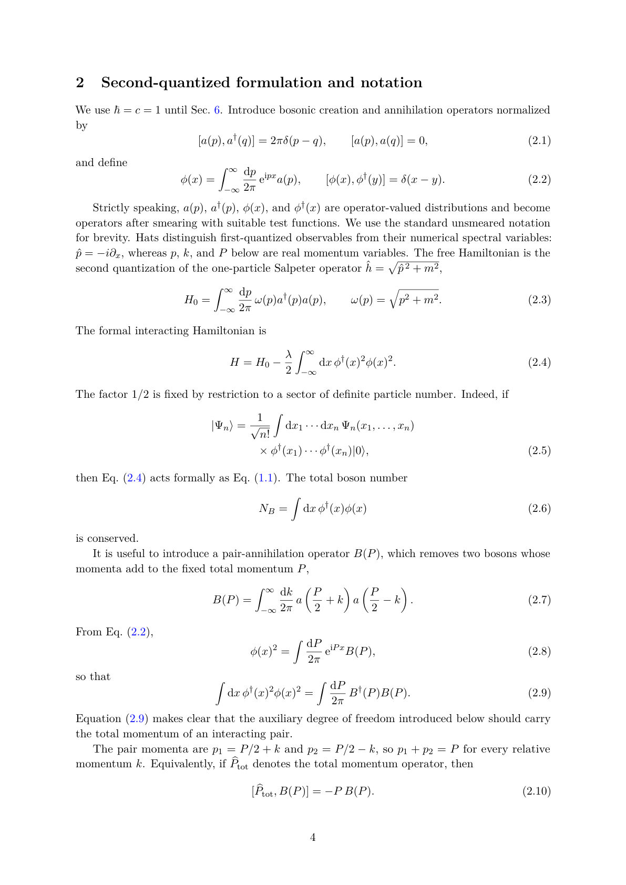 
Low-resolution page preview, page 4

📷 Fig 4

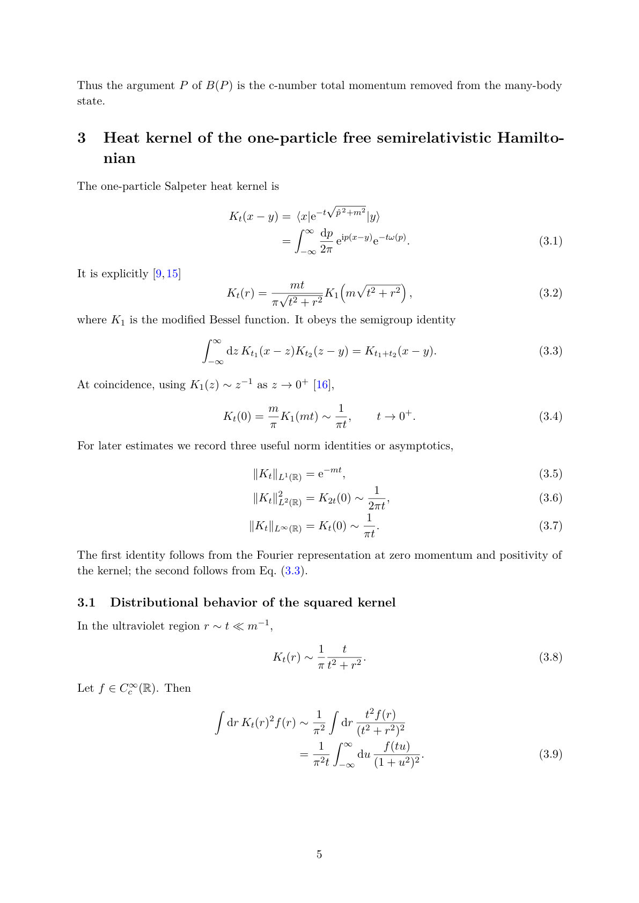 
Low-resolution page preview, page 5

📷 Fig 5

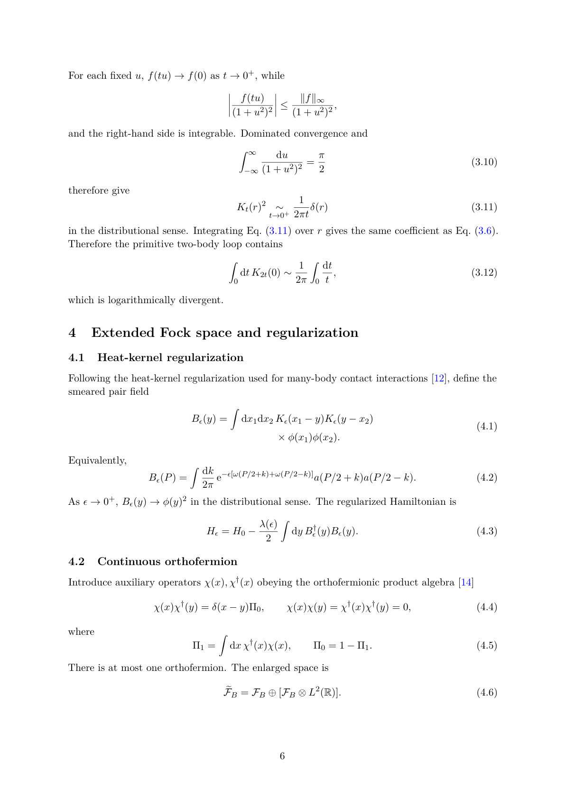 
Low-resolution page preview, page 6

**Summary.** This theoretical paper develops a renormalization scheme for one-dimensional bosons with semirelativistic dispersion and contact interactions. By systematically handling logarithmic divergences using advanced resolvent techniques, the authors prove that the full interacting Hamiltonian converges to the established Lieb-Liniger model in the nonrelativistic limit. This provides a powerful, rigorous framework for studying strongly interacting quantum gases.

**Why it may be interesting.** This work provides a rigorous, field-theoretic approach to handling strong, short-range interactions in low-dimensional quantum systems, connecting a relativistic-like dispersion to a standard nonrelativistic model (Lieb-Liniger).

Detailed structure

**Main problem.** The paper addresses the renormalization of a quantum many-body system consisting of one-dimensional spinless bosons interacting via attractive contact potentials, which leads to ultraviolet divergences.

**Main result.** The theory successfully constructs a cutoff-independent, self-adjoint Hamiltonian whose nonrelativistic limit precisely reproduces the well-known attractive Lieb-Liniger Hamiltonian.

**Method.** The methodology involves advanced renormalization group techniques using an enlarged Fock space and the Schur-complement representation of the resolvent to systematically absorb divergences.

**Model / system.** The system models spinless bosons in one dimension with a semirelativistic dispersion relation ($\hat{p}^2 + m^2$) and attractive contact interactions ($\delta(x)$). The Hamiltonian is studied in the context of quantum field theory renormalization.

**Key observables.** The zero-total-momentum two-body bound-state energy ($E_B$), the renormalized resolvent $R(E)$, and the mean-field binding scale $|E_{MF}|$.

**Important parameters / regimes.** The bare coupling constant ($\lambda$), the particle number ($N$), and the momentum cutoff ($\Lambda$ or $c$).

**Assumptions / limitations.** The procedure assumes the existence of a unique self-adjoint Hamiltonian defined by the resolvent, and convergence is established by comparing the semirelativistic result to the known Lieb-Liniger model.

**Figures summary.** The notes reference mathematical equations (e.g., Eq. 1.1, Eq. 5.15, Eq. C.102) detailing the formal structure of the Hamiltonians, resolvents, and convergence proofs, rather than describing visual figures.

**Paper structure.** The paper progresses from defining the divergent Hamiltonian and the renormalization procedure (using the resolvent) to explicitly calculating the two-body sector, and finally demonstrating the convergence of the full $N$-body theory to the nonrelativistic Lieb-Liniger model.

Abstract

We study one-dimensional spinless bosons with semirelativistic spinless-Salpeter dispersion and attractive pairwise contact interactions. Because the dispersion becomes linear at large momentum, the contact interaction is marginal by power counting and produces a logarithmic ultraviolet divergence. We construct the renormalized many-body theory using an enlarged Fock space and a Schur-complement representation of the resolvent, eliminating the bare coupling in favor of the physical zero-total-momentum two-body bound-state energy. The resulting cutoff-independent resolvent defines a self-adjoint Hamiltonian in each fixed particle-number sector. We treat the two-body problem explicitly and show, in the norm-resolvent sense, that the nonrelativistic limit reproduces the attractive Lieb--Liniger Hamiltonian. We also formulate a mean-field approximation directly within the renormalized theory. In the massless and deeply bound large-particle-number regimes, it predicts an exponentially increasing binding scale whose exponent is determined by a one-dimensional variational problem.

[↑ back to top](#top)

### [Snakes on a Hyper-Plane: Dynamical and Ontological Locality in Everettian Quantum Mechanics](http://arxiv.org/abs/2609.07860v1)

**Authors:** Travis Norsen  
**Type:** theory · **Category:** other · **PDF:** <https://arxiv.org/pdf/2609.07860v1>  
**Analysis basis:** full PDF text, analyzed in chunks
**Topic relevance:** `quantum measurements` **2/5**

📷 Fig 1

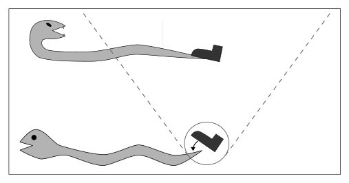 
Figure 1: Pseudo-space-time diagram of Arthur Fine’s dramatic example: If you step on a snake’s tail and its head rears around in response, outside the future light cone of the stepping (i.e., sooner than would be allowed if the information about the stepping propagated to the head at the speed of light), there is a violation of relativistic dynamical locality whether or not the snake should be considered, in some sense, a non-separable, ir- reducible whole.

📷 Fig 2

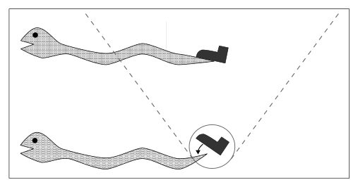 
Figure 2: Suppose, modifying Fine’s example, that step- ping on the snake’s tail does not affect any properties of the snake that are localized in its head (or any other part), but instead only changes a global, irreducibly holis- tic property (misleading depicted here as a change from a wavy to a more spiky stripe pattern). Should this be considered compatible with dynamical locality?

📷 Fig 3

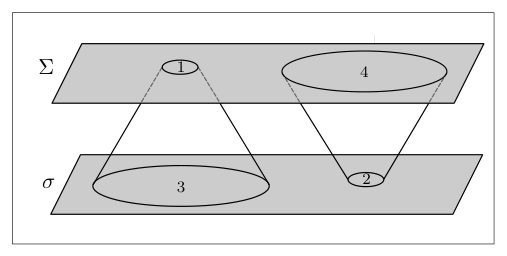 
Figure 4: Diagram for the several formulations of dy- namical locality. σ and Σ are, respectively, earlier and later space-like hyperplanes. 3 is the intersection of the past light cone of 1 with σ, while 4 is the intersection of the future light cone of 2 with Σ. 3 and 2 are non- overlapping, so 2 is at space-like separation from 1. Ac- cording to Bell’s formulation of dynamical locality: “Full specification of what happens in 3 makes events in 2 ir- relevant for predictions about 1 in a locally causal the- ory.” [9]

📷 Fig 4

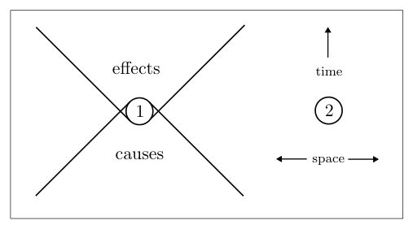 
Figure 3: “Space-time location of causes and effects of events in region 1.” [9]

📷 Fig 5

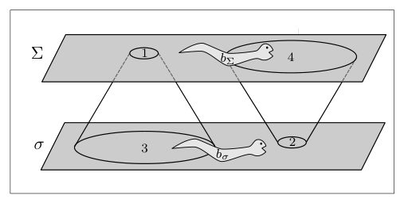 
Figure 5: In a theory with snake-shaped non-local be- ables, our earlier (tacitly TELB-based) formulations of locality become ambiguous. For example: Is a snake- shaped non-local beable such as bΣ (that is partly inside of, but also partly outside of, the future light cone of re- gion 2) allowed to be among the effects of causes in 2? Is bσ (partly inside of, but also partly outside of, the past light cone of region 1) allowed to be among the causes of effects in 1?

**Summary.** This paper critically examines whether Everettian Quantum Mechanics, which posits non-local ontological states, can remain compatible with relativistic causality. By analyzing how local interventions affect global, non-local properties, the authors argue that the theory likely violates the principle of dynamical locality. This forces a re-evaluation of how non-local beables must be treated in relativistic quantum theories.

**Why it may be interesting.** It challenges fundamental assumptions about how quantum theories incorporating non-local ontologies can respect relativistic causality, which is a major topic in quantum foundations.

Detailed structure

**Main problem.** The paper questions the consensus that Spacetime State Realism (SSR) Everettian Quantum Mechanics (EQM) is compatible with relativistic causality, despite positing ontological non-locality.

**Main result.** The involvement of non-local beables introduces complications for dynamical locality, suggesting that SSR EQM might violate relativistic causality.

**Method.** The argument modifies thought experiments (like the snake analogy) and analyzes the behavior of local versus non-local beables (like reduced density matrices) under measurement interventions.

**Model / system.** The analysis focuses on Everettian Quantum Mechanics (EQM) under the Spacetime State Realism (SSR) interpretation, using conceptual models of localized and non-localized quantum states.

**Key observables.** Local beables (Reduced Density Matrices for localized regions) and non-local beables (joint/holistic states for non-localized regions).

**Important parameters / regimes.** The causal structure, specifically the relationship between causes and effects relative to the future light cone.

**Assumptions / limitations.** The core assumption being challenged is that dynamical locality can be maintained when the underlying ontology includes non-separable, non-local beables.

**Figures summary.** Figures illustrate the original snake thought experiment (Figure 1) and a modified version (Figure 2) showing a localized cause affecting a global, irreducible holistic property partially outside the future light cone.

**Paper structure.** The paper progresses by first establishing the conflict between ontological non-locality and dynamical locality, then formalizing the conflict using modified thought experiments, and finally applying this framework to the EPR setup to show the effect on the joint state.

Abstract

An apparently emerging consensus holds that Everettian Quantum Mechanics (EQM), in the Spacetime State Realism (SSR) version of Wallace and Timpson, involves ontological non-locality (i.e., non-separability) but is fully compatible with the dynamical notion of locality usually taken to be required by relativity. The claim of dynamical locality is based on the fact that the local beables postulated by the theory (namely, Reduced Density Matrices, RDMs, associated with localized regions) are not affected by interventions outside their past light cones. However, the theory's non-separability means that it posits non-local beables (namely RDMs for non-localized regions) in addition to the local ones. We argue here that the involvement of non-local beables introduces complications for extant formulations of dynamical locality and at least suggests, contrary to the emerging consensus, that SSR EQM should perhaps not be considered compatible with relativistic causality after all.

[↑ back to top](#top)

### [Speed Limit for Information Acquisition in Stochastic Learning Dynamics](http://arxiv.org/abs/2609.08219v1)

**Authors:** Shuta Kobayashi, Andreas Dechant  
**Type:** theory · **Category:** statistical mechanics · **PDF:** <https://arxiv.org/pdf/2609.08219v1>  
**Analysis basis:** full PDF text, analyzed in chunks
**Topic relevance:** `Keldysh / 2PI / non-Gaussian methods` **1/5** · `analog quantum simulation` **1/5** · `correlated / nonlocal dissipation` **1/5** · `driven-dissipative phase transition` **1/5** · `methods for driven-dissipative` **1/5** · `non-equilibrium universality` **1/5** · `quantum measurements` **1/5**

📷 Fig 1

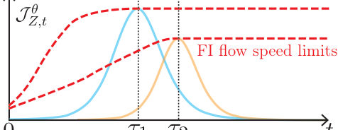 
FIG. 1. Schematic illustration of Fisher-information acquisition dur- ing stochastic learning. Top: evolution of the parameter distributions pt(θ|Z) as learning proceeds from left to right. Initially, the dis- tribution is independent of the latent variable Z; during learning, information about Z is encoded in the network parameters θ, making the distributions associated with Z1 and Z2 increasingly distinguish- able. Middle: the corresponding Fisher information Fθ Z,t [Eq. (1)] accumulated in the parameters about Z1 and Z2, increases as learning proceeds. Bottom: the Fisher-information flow J θ Z,t [Eq. (3)], which quantify the instantaneous rate of information acquisition and peak at the...

📷 Fig 2

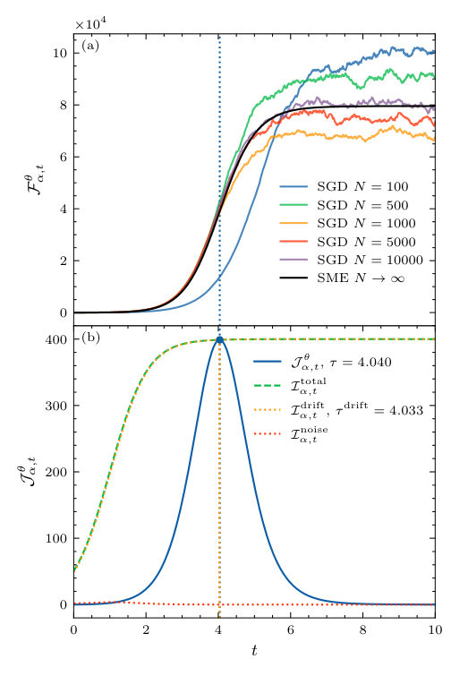 
FIG. 2. Fisher information dynamics in single-parameter linear re- gression. (a) Time evolution of the Fisher information F θ α,t for SGD with different dataset sizes N, together with the SME prediction for N →∞. The finite-N deviations and fluctuations are reduced for sufficiently large N, and the SGD dynamics approaches the SME pre- diction. (b) Fisher-information flow J θ α,t (solid line) and its speed- limit bound Itotal α,t , decomposed into drift and noise contributions (dashed lines). The bound is dominated by the drift budget and be- comes tight near the peak of J θ α,t, with nearly identical characteristic times τ = 4.040 and τ drift = 4.033 (dotted lines). Parameters com- mon to...

📷 Fig 3

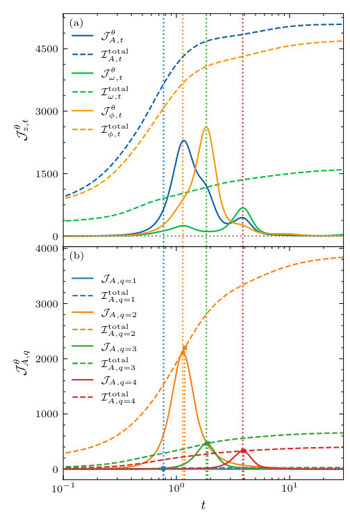 
FIG. 3. Fisher-information flow dynamics in basis-function linear regression for the sinusoidal target gZ(x) = A sin(ωx + ϕ). (a) Fisher-information flows J θ z,t (solid lines) and the corresponding to- tal information budgets Itotal z,t (dashed lines) for z = A, ω, ϕ. The flows exhibit distinct characteristic time scales for different latent variables. Vertical dotted lines indicate the characteristic times τq, where q indexes the eigenmodes in descending order of their eiven- values, λ1 ≥λ2 ≥· · · . (b) Mode-resolved Fisher-information flows JA,q (solid lines) and the corresponding information budgets Itotal A,q (dashed lines) for q = 1, . . . , 4. Circular markers indicate the max- ima...

📷 Fig 4

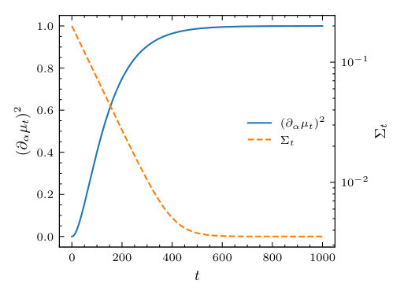 
FIG. 4. Time evolution of the numerator (∂αµt)2 and denominator Σt of the dominant Fisher information contribution in Eq. (23). The numerator increases from zero and saturates at unity, whereas the denominator decreases toward the stationary variance set by SGD fluctuations. Their competing time dependences cause the Fisher- information flow to reach a maximum at an intermediate time.

**Summary.** This work establishes a Fisher-information speed limit that quantifies the maximum rate at which a neural network can learn about underlying latent variables during stochastic training. By modeling SGD as a stochastic process, the authors decompose this rate into deterministic (drift) and fluctuating (noise) components. This provides a powerful, information-theoretic diagnostic tool for understanding the efficiency and limits of machine learning algorithms.

**Why it may be interesting.** The use of information-theoretic speed limits to characterize the dynamics of complex, non-equilibrium learning processes provides a quantitative physical analogy to relaxation dynamics seen in many-body systems or open quantum systems.

Detailed structure

**Main problem.** To derive a Fisher-information flow speed limit that bounds the rate at which trainable parameters in neural networks acquire information about latent variables during stochastic learning.

**Main result.** The rate of information acquisition is bounded by the sum of drift and noise contributions, and this bound is shown to be tight at the peak of the flow in analytically tractable models.

**Method.** The authors formulate Stochastic Gradient Descent (SGD) as a Markovian stochastic process and utilize the Fisher information framework to derive an upper bound on the information flow.

**Model / system.** The model is stochastic learning dynamics, specifically analyzing SGD applied to supervised learning where data is generated from a latent variable $Z$. The analysis is specialized to basis-function linear regression, whose dynamics near convergence reduce to an Ornstein–Uhlenbeck process.

**Key observables.** Fisher-information flow ($J_{	heta, \chi}^{Z,t}$), Fisher information ($F_{	heta}^{Z,t}$), Drift information budget ($I_{	ext{drift}, \chi}^{Z,t}$), and Noise information budget ($I_{	ext{noise}, \chi}^{Z,t}$).

**Important parameters / regimes.** Relaxation rates ($\lambda_i$), characteristic time scales ($	au_{\chi, i}$), and the ratio of initial to final covariance values.

**Assumptions / limitations.** The mini-batch fluctuation is approximated as Gaussian, and the analysis relies on deriving an upper bound, which is not necessarily an exact decomposition of the actual flow.

**Figures summary.** Figures illustrate the time evolution of Fisher information and the instantaneous flow, comparing the measured flow against the theoretical speed limit derived from the drift and noise components, showing the bound is tight at the peak.

**Paper structure.** The paper establishes the general Fisher-information flow speed limit for SGD, then specializes this framework to linear regression. It analyzes the dynamics using modal decomposition, showing that the peak time of the information flow matches the relaxation time of the drift budget for each mode.

Abstract

Neural networks acquire internal representations through learning. In this work, we formulate stochastic gradient descent (SGD) as a Markovian stochastic process and derive a Fisher-information flow speed limit that bounds the rate at which trainable parameters can acquire information about latent variables in the data-generating process. The resulting inequality decomposes the information flow into drift and noise contributions, thereby quantifying the roles of deterministic learning forces and SGD-induced fluctuations from an information-theoretic perspective. We verify the bound in analytically tractable basis-function linear regression, where the information budget predicted by the bound reproduces the ordering and characteristic time scales with which different latent variables are encoded in the learned parameters. These results establish Fisher-information speed limits as a quantitative framework for diagnosing when and how different aspects of the data-generating mechanism are acquired during stochastic learning.

[↑ back to top](#top)

### [Restricted typicality in non-equilibrium quantum many-body systems](http://arxiv.org/abs/2609.07832v1)

**Authors:** Konrad Pawlik, Piotr Sierant, Jakub Zakrzewski  
**Type:** theory · **Category:** statistical mechanics · **PDF:** <https://arxiv.org/pdf/2609.07832v1>  
**Analysis basis:** full PDF text, analyzed in chunks
**Topic relevance:** `Keldysh / 2PI / non-Gaussian methods` **1/5** · `analog quantum simulation` **1/5** · `methods for driven-dissipative` **1/5** · `non-equilibrium universality` **1/5** · `quantum measurements` **1/5** · `scars & prethermalization` **1/5**

📷 Fig 1

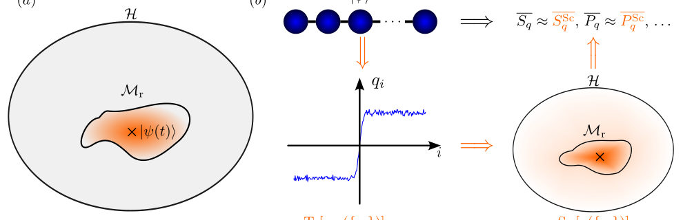 
FIG. 1. Global restricted typicality and the application of the Scrooge ensemble framework to hydrodynamics. (a) Conceptual repre- sentation of global restricted typicality within the full many-body Hilbert space H. The exact time-evolved pure state |ψ(t)⟩(black cross) can be effectively described as a typical member of a dynamically restricted manifold Mr (orange), defined by the effective macroscopic constraints obeyed by |ψ(t)⟩. The global properties of |ψ(t)⟩correspond to a weighted average (indicated by color intensity) over this typ- ical set. (b) Operational pipeline (orange arrows) for utilizing the Scrooge ensemble to capture global restricted typicality and reconstruct...

📷 Fig 2

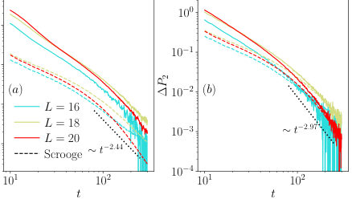 
FIG. 3. Late-time hydrodynamic relaxation. Time evolution of the initial Néel state |ψ0⟩= |↑↓· · ·⟩under the dynamics of the Floquet XXZ model [Eq. (19)] for system sizes L ≥16. The panels show (a) the distance from the infinite-time saturation value of the second Rényi entanglement entropy, ∆S2, and (b) the corresponding dis- tance for the participation entropy, ∆P2. Solid lines denote the exact microscopic unitary dynamics, and dashed lines represent the ana- lytical Scrooge ensemble predictions constructed from instantaneous local profiles [Eqs. (17) and (13)]. Dotted lines indicate power-law fits for L = 20 over the time interval t ∈[80, 250], which are hor- izontally offset for...

📷 Fig 3

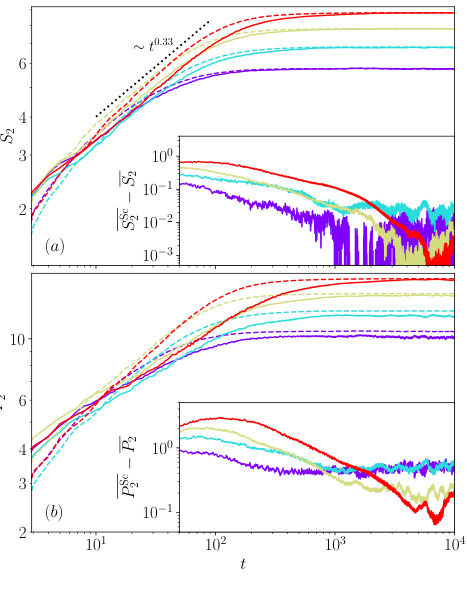 
FIG. 2. Hydrodynamic constraints on nonlinear quantum in- formation. Time evolution of the initial domain-wall state |ψ0⟩= |↑· · · ↑↓· · · ↓⟩governed by the Floquet XXZ model [Eq. (19)] for various system sizes L, plotted on a log-log scale. The panels show (a) the second Rényi entanglement entropy S2 and (b) the participa- tion entropy P2. Solid lines denote the exact unitary dynamics, and dashed lines represent the analytical Scrooge ensemble predictions constructed from instantaneous local profiles [Eqs. (17) and (13)]. Panel (a) includes a dotted power-law guide to the eye, fitted for L = 20 over the time window t ∈[10, 90] and horizontally off- set for improved readability. The insets...

📷 Fig 4

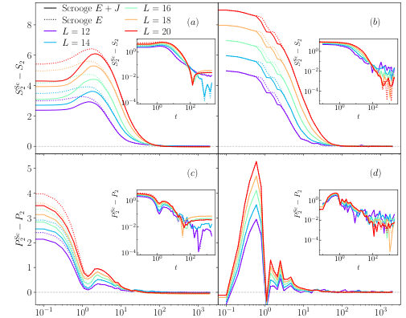 
FIG. 4. Robustness of the late-time predictions of the Scrooge ensemble against minimal-information initial states. Time evo- lution of the deviations between the Scrooge ensemble predictions and exact dynamics for (a, b) the second Rényi entanglement en- tropy S2 and (c, d) the participation entropy P2. The transverse- field Ising model (TFIM) is initialized in states that provide min- imal local information to the ensemble: a set of random product states |ψ0⟩= |s1, . . . , sL⟩, where the plotted quantities represent the statistical average of the entropies computed for each individ- ual pure-state realization (a, c), and a uniformly polarized state |ψ0⟩= |+y, . . . , +y⟩(b, d). Despite...

**Summary.** This paper addresses the challenge of tracking complex quantum many-body dynamics by introducing the 'Scrooge ensemble.' By constraining this maximum-entropy ensemble only with the expectation values of slow, conserved modes, the authors demonstrate a principle called 'global restricted typicality.' This allows for the accurate reconstruction of nonlinear quantum properties, like entanglement entropy, even when standard hydrodynamic methods are insufficient.

**Why it may be interesting.** It provides a powerful, non-standard statistical tool (the Scrooge ensemble) to extract global, non-linear information about non-equilibrium quantum states, bridging the gap between local observables (hydrodynamics) and full quantum state characterization.

Detailed structure

**Main problem.** Characterizing the time evolution of generic quantum many-body systems is computationally intractable due to the exponential scaling of state representation.

**Main result.** The authors introduce 'global restricted typicality,' showing that complex, nonlinear quantum properties can be accurately reconstructed by constraining the maximum-entropy Scrooge ensemble using only the system's slow, conserved modes.

**Method.** The core method involves constructing the Scrooge ensemble, which maximizes information entropy subject to fixing the first statistical moments (expectation values) of the slow modes, thereby bypassing standard coarse-graining assumptions.

**Model / system.** The work applies to generic quantum many-body systems, particularly those exhibiting a timescale separation where dynamics are governed by the transport of conserved charges, such as those studied in quantum hydrodynamics.

**Key observables.** Entanglement entropy (half-chain) and participation entropy in the computational basis.

**Important parameters / regimes.** Timescale separation, slow modes (conserved charges), and the constraints derived from the system's slow dynamics.

**Assumptions / limitations.** The approach assumes a timescale separation and that the dynamics are governed by the transport of conserved charges, allowing the slow modes to constrain the global state.

**Figures summary.** Figure 1 conceptually illustrates global restricted typicality, showing the time-evolved state lying on a dynamically restricted manifold, and outlines the operational pipeline from microstate to the Scrooge ensemble.

**Paper structure.** The paper develops the theoretical framework by defining the Scrooge ensemble, applying it to systems with slow dynamics, and demonstrating its ability to recover nonlinear quantum properties by constraining the ensemble solely with slow mode expectation values.

Abstract

Characterizing the time evolution of generic quantum many-body systems is a fundamental challenge, as representing the exact state requires exponentially scaling computational resources. While hydrodynamics and statistical mechanics successfully simplify this task by predicting the expectation values of local observables, these macroscopic frameworks provide no information about nonlinear characteristics of the quantum state. In this work, we demonstrate that for systems exhibiting a timescale separation, with dynamics governed by the transport of conserved charges, this lost information can be systematically recovered. By constraining the maximum-entropy Scrooge ensemble solely by the system's slow modes, we accurately reconstruct complex, nonlinear quantum properties of the global time-evolved state, including the half-chain entanglement entropy and the participation entropy in the computational basis. Our results generalize the paradigm of canonical typicality, revealing that a hydrodynamically bottlenecked system behaves as a typical pure state within a dynamically restricted submanifold of the Hilbert space - a phenomenon we term global restricted typicality.

[↑ back to top](#top)

### [Quantum speed limits based on quantifiers of quantum-state texture](http://arxiv.org/abs/2609.08752v1)

**Authors:** Yuhang Xie, Yanjun Chu, Chenyang Cui, Shao-Ming Fei  
**Type:** theory · **Category:** other · **PDF:** <https://arxiv.org/pdf/2609.08752v1>  
**Analysis basis:** full PDF text, analyzed in chunks
**Topic relevance:** `correlated / nonlocal dissipation` **1/5** · `driven-dissipative phase transition` **1/5** · `methods for driven-dissipative` **1/5** · `non-equilibrium universality` **1/5** · `quantum measurements` **1/5**

📷 Fig 1

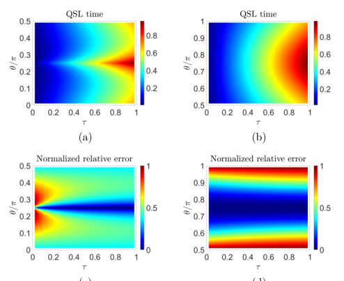 
Figure 1: The QSL time τ QSL tr and normalized relative error ˜δtr(τ) of dephasing dynamics with respect to different initial states.

📷 Fig 2

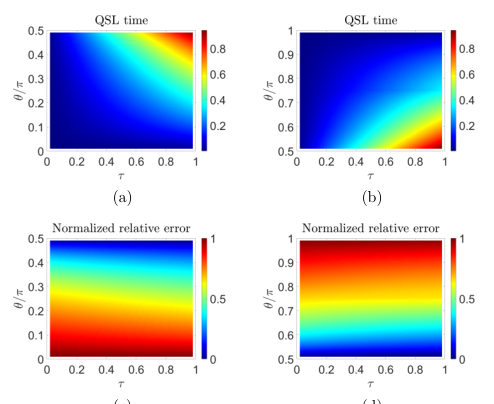 
Figure 2: The QSL time τ QSL ru and normalized relative error ˜δru(τ) of dissipative dynamics corresponding to different initial states.

📷 Fig 3

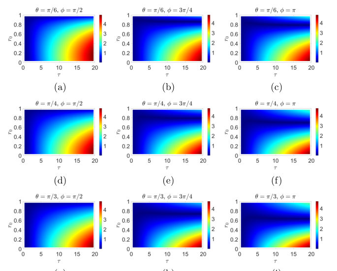 
Figure 3: Density plots of the texture measure-based QSL time τ QSL JS as a function of the parameters τ and r ∈[0, 1), with θ ∈{π/6, π/4, π/3} and ϕ ∈{π/2, 3π/4, π} for initial single-qubit states subject to the amplitude damping channel.

📷 Fig 4

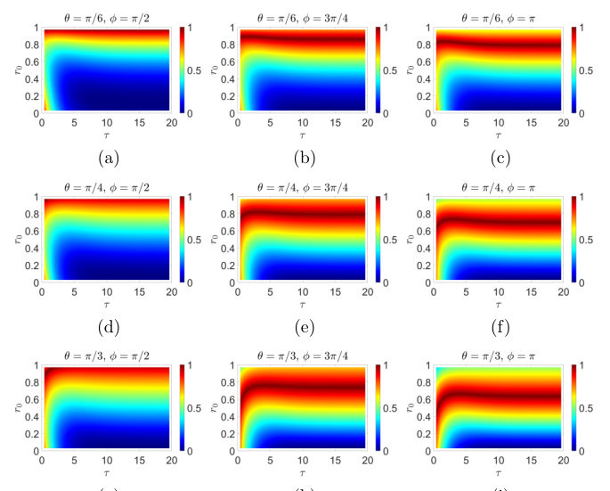 
Figure 4: Density plots of the normalized relative error ˜δJS(τ) as a function of the parameters τ and r ∈[0, 1), with θ ∈{π/6, π/4, π/3} and ϕ ∈{π/2, 3π/4, π} for initial single-qubit states subject to the amplitude damping channel.

**Summary.** This paper establishes a theoretical link between Quantum Speed Limits and Quantum-State Texture, using measures like trace distance and Jensen-Shannon divergence. By analyzing specific open quantum systems, the authors derive quantitative lower bounds on the minimum evolution time. This framework offers new diagnostic tools for understanding fundamental constraints in quantum control and metrology.

**Why it may be interesting.** This work is highly relevant as it provides a generalized framework for deriving fundamental time constraints in open quantum systems, connecting resource theory concepts (QST) directly to fundamental physical limits (QSLs).

Detailed structure

**Main problem.** The paper investigates the fundamental lower bounds on the time scale of quantum evolution (Quantum Speed Limits, QSLs) by linking them to the quantitative measure of quantum-state texture (QST).

**Main result.** QSLs derived from various QST quantifiers, such as trace distance, state rugosity, and Jensen-Shannon divergence, successfully capture the fundamental constraints on quantum evolutionary speed.

**Method.** The authors derive lower bounds ($	au \ge 	au_{QSL}$) by analyzing the time evolution of the chosen QST measure using various mathematical tools, including analyzing the time derivative of the measure.

**Model / system.** The analysis considers general quantum systems undergoing evolution, specifically modeling dephasing and dissipative dynamics using master equations. Examples include a two-level atom coupled to a bosonic reservoir or analyzed via the amplitude damping channel.

**Key observables.** Quantum Speed Limits ($	au_{QSL}$), Trace Distance ($\Delta_{	ext{tr}}$), State Rugosity ($\Delta R$), Jensen-Shannon Divergence (JSD), and the normalized relative error ($	ilde{\delta}$).

**Important parameters / regimes.** Dephasing rate ($\gamma_t$), cavity decay rate ($\gamma_t$), and initial state parameters ($	heta$).

**Assumptions / limitations.** The analysis involves approximations for non-unitary dynamics (CPTP maps) and relies on defining the QSL based on the rate of change of the QST measure.

**Figures summary.** The notes mention numerical observations showing the behavior of $	au_{QSL}^{JS}$ and the relative error $	ilde{\delta}_{JS}(	au)$ for different parameter regimes, indicating when the bound is tight or loose.

**Paper structure.** The paper systematically introduces QSLs and QST, derives bounds using different quantifiers (trace distance, rugosity, JSD), and applies these derivations to specific physical models like dephasing and amplitude damping channels.

Abstract

Quantum speed limits impose intrinsic lower bounds on the shortest time scale for quantum system evolution. As an emerging paradigm in quantum resource theory, quantum-state texture has attracted research interest amid the rapid advancement of quantum theory. Herein, we investigate the interplay between quantum speed limits and quantum-state texture via several canonical quantifiers, including trace distance, state rugosity and Jensen-Shannon divergence. To demonstrate our findings, we analyze the minimum evolution time of physical systems subject to dephasing and dissipative dynamics. For the Jensen-Shannon divergence, we further explore nonunitary dynamics described by completely positive and trace-preserving maps, taking the amplitude damping channel as a typical example. In addition, we explore the tightness of these bounds in the considered dynamical models. Our results reveal that quantum speed limits derived from quantum-state texture capture the fundamental constraints on quantum evolutionary speed, with promising applications in quantum computing, quantum control and quantum metrology.

[↑ back to top](#top)

### [Modular commutator as a robust topological invariant and approximate Markovianity](http://arxiv.org/abs/2609.09019v1)

**Authors:** Tai Hsuan Yang  
**Type:** theory · **Category:** strongly correlated electrons · **PDF:** <https://arxiv.org/pdf/2609.09019v1>  
**Analysis basis:** full PDF text, analyzed in chunks
**Topic relevance:** `analog quantum simulation` **1/5** · `correlated / nonlocal dissipation` **1/5** · `driven-dissipative phase transition` **1/5** · `quantum measurements` **1/5**

📷 Fig 1

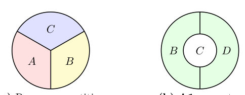 
Figure 1: The two geometries used in the introduction. (a) The three-sector disk partition defining the modular commutator J(A, B, C) and Hall conductance estimator Σ(A, B, C); the cyclic order of A, B, C (clockwise or counterclockwise) fixes the response orientation and hence the sign convention. (b) The local A1 geometry, in which the annular neighborhood of C is split into side regions B and D.

📷 Fig 2

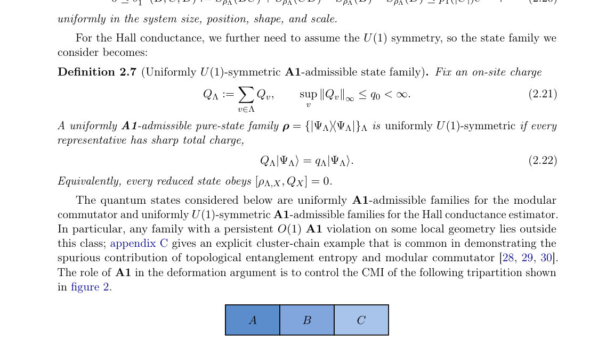 
Figure 2: The principal Markov partition A|B|C. For any subsystem A of the purifying complement of the A1 geometry, approximate A1 controls the conditional mutual information I(A : C|B).

📷 Fig 3

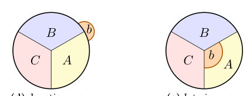 
Figure 3: Representative local geometries in the deformation proof for the modular commutator. Panels (a) and (b) add an endpoint patch while keeping BC or AB, respectively, fixed. Panel (c) adds a patch to the middle region, buffered from both endpoints. Junction patches such as (d) are converted by an exact complementary-region flip into an endpoint or middle geometry represented by (e). The orange patch lies in the complementary region D before reassignment; cyclic rotations cover the remaining cases.

📷 Fig 4

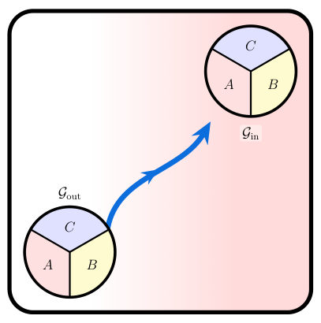 
Figure 4: Bubble comparison used in theorem 3.11. The partition is deformed from Gout, where the bubble state agrees with ρα, to Gin, where it is locally close to ρβ. These two comparisons produce the errors EJ and ΩJ, respectively.

📷 Fig 5

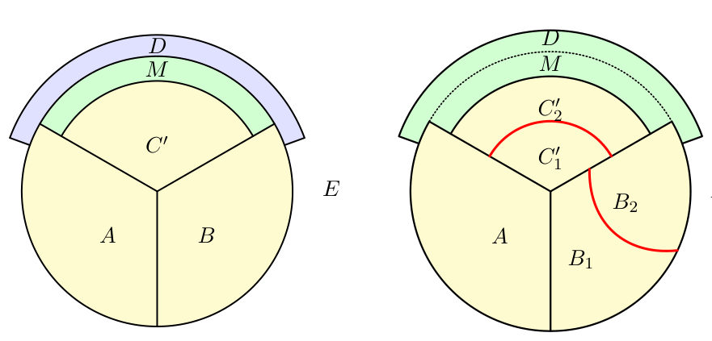 
Figure 5: Geometries used in the exact no-go proof. (a) The original response region is C = C′M; D is an outer collar and E = ABCD. The two Markov decompositions are applied to the ordered tripartitions E|D|C and C′|M|D. (b) The refined partition with B = B1B2 and C′ = C′ 1C′ 2.5

**Summary.** This paper rigorously investigates how topological invariants, such as the modular commutator and Hall conductance, maintain their robustness when the idealized local quantum Markov condition is only approximately met. By combining continuity proofs with finite-time dynamical analysis, the authors establish that these invariants remain asymptotically invariant in gapped phases. This work extends theoretical no-go theorems by providing quantitative bounds on the necessary entanglement structure required to support non-zero topological responses.

**Why it may be interesting.** It provides rigorous mathematical tools to test the stability of topological invariants in realistic, non-ideal physical systems where exact symmetries are broken by finite-size effects or dynamics.

Detailed structure

**Main problem.** To determine the robustness and invariance of the modular commutator and Hall conductance estimator as topological invariants when the exact local quantum Markov condition is violated.

**Main result.** The modular commutator and Hall conductance estimator remain asymptotically invariant under topology-preserving deformations if the local quantum Markov property holds approximately. Furthermore, a quantitative lower bound is established for the conditional mutual information required to sustain a non-zero invariant.

**Method.** The analysis combines proofs of asymptotic invariance using trace-norm continuity, the study of finite-time dynamics generated by modular Hamiltonians, and deriving quantitative bounds on entanglement measures.

**Model / system.** The study focuses on two-dimensional gapped topological phases, particularly chiral topological phases characterized by the chiral central charge ($c_-$) and systems exhibiting Hall conductance ($\sigma_{xy}$).

**Key observables.** Modular commutator ($J$), Hall conductance estimator ($\Sigma$), and Conditional Mutual Information ($I(A:C|B)$).

**Important parameters / regimes.** The degree of violation of the local quantum Markov condition (A1), and the exponential decay rates of entanglement measures.

**Assumptions / limitations.** The analysis assumes the existence of an 'approximately local quantum Markov property' and relies on asymptotic limits and continuity arguments.

**Figures summary.** Figure 1 illustrates the geometry for the three-sector disk partition used for calculating $J$ and $\Sigma$, alongside the local geometry related to the A1 condition.

**Paper structure.** The paper progresses by first establishing asymptotic invariance under approximate Markov conditions, then proving trace-norm continuity, and finally deriving quantitative lower bounds on the required conditional mutual information by analyzing finite-time dynamics.

Abstract

The modular commutator provides a bulk, local, single-wave-function probe of the chiral central charge $c_-$ for gapped ground states. Its invariance under deformations was previously established under a local quantum Markov condition---namely, the conditional mutual information $I(A:C|B)$ is zero for all tripartitions of a disk into three consecutive strips A, B, and C \cite{Modular-commutator-Gapped}. However, the local quantum Markov condition also forces the probe to vanish, leaving open whether modular commutator remains robust in physically relevant states where the Markov property holds only approximately. In this paper, we resolve this tension for finite-dimensional Hilbert spaces: the approximate local quantum Markov property implies the change of the modular commutator under topology-preserving deformations vanishes asymptotically. We next prove trace-norm continuity of the modular commutator. Combining deformation invariance with trace-norm continuity, we establish that the modular commutator remains asymptotically invariant within gapped quantum phases connected by quasi-local unitary paths that preserve the approximate local quantum Markov condition. Conversely, by analyzing finite-time dynamics generated by modular Hamiltonians, we derive a quantitative lower bound on the conditional mutual information required for a non-zero modular commutator: $I(A:C|B)$ across such strip tripartitions cannot decay faster than exponentially with the width of B given that the state satisfies entanglement area law, extending the exact no-go theorem of \cite{strict-J-2024} to a quantitative finite bound . Finally, we demonstrate that those conclusions apply equally to the Hall conductance estimator \cite{FanSahayVishwanath2023}.

[↑ back to top](#top)

### [From Local Context to Climate Science: Low-Cost Experimentation in the Initial Training of Physics Teachers](http://arxiv.org/abs/2609.08834v1)

**Authors:** André A. A. Marinho, Edson R. L. Lopes, Jhon KF V. Silva, Mariana S. Costa, Maria A. Morais  
**Type:** experiment · **Category:** statistical mechanics · **PDF:** <https://arxiv.org/pdf/2609.08834v1>  
**Analysis basis:** full PDF text, analyzed in chunks
**Topic relevance:** `analog quantum simulation` **1/5** · `driven-dissipative phase transition` **1/5** · `non-equilibrium universality` **1/5**

📷 Fig 1

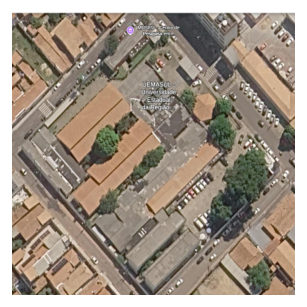 
Figure 1: Aerial view of the UEMASUL headquarters. Source: Google Earth (2026) [20]. Map data.: Google, Maxar Technologies..

📷 Fig 2

 
Figure 2: Our prototype

📷 Fig 3

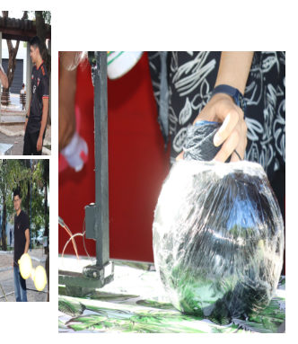 
Figure 3: Science outreach activities

📷 Fig 4

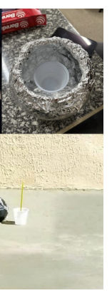 
Figure 4: Date collection equipment and location

📷 Fig 5

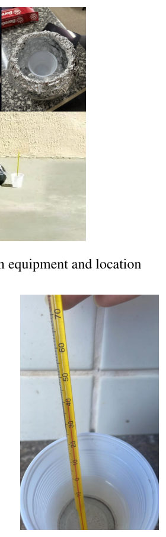 
Figure 5: Some measurements

**Summary.** This paper details a low-cost experiment using a thermal simulator to teach physics concepts related to energy balance and heat transfer using solar radiation as the energy source. The study successfully measured a significant temperature difference between the simulated and control environments. Crucially, it emphasizes the educational value of such models while cautioning against overinterpreting local experimental results as global climate evidence.

**Why it may be interesting.** While the core physics is classical thermodynamics and heat transfer, the rigorous discussion of energy balance, non-equilibrium processes, and the limitations of simplified models resonates with the boundary conditions and energy conservation principles central to many-body physics.

Detailed structure

**Main problem.** The study addresses the educational challenge of connecting physical concepts, empirical evidence, and socially relevant environmental issues like climate change.

**Main result.** The low-cost simulator successfully demonstrated a measurable thermal difference between a confined and an open system, proving its educational potential for teaching energy balance.

**Method.** The researchers conducted a low-cost experimental investigation by building a simplified thermal simulator and comparing its temperature evolution to an open control system exposed to solar radiation over 11 days.

**Model / system.** The system is a simplified thermal simulator designed to model energy balance concepts related to the greenhouse effect, comparing a confined system against an open control system exposed to solar radiation.

**Key observables.** Average temperature inside the simulator (45.91°C), average temperature in the external control system (38.58°C), and the mean temperature difference (7.33°C).

**Important parameters / regimes.** The analysis involves concepts like electromagnetic radiation, energy balance, heat transfer, and temperature gradients ($\Delta T$).

**Assumptions / limitations.** The observed temperature rise should not be interpreted as a direct measure of the atmospheric greenhouse effect because the apparatus involves both radiative and non-radiative heat transfer mechanisms.

**Figures summary.** Figures show the location of the investigation and the temporal evolution of temperature differences ($\Delta T$), with tables summarizing daily statistical comparisons of temperatures.

**Paper structure.** The paper establishes the problem (climate change), details the low-cost experimental setup and measurements over 11 days, presents quantitative results showing measurable thermal differences, and concludes by emphasizing the pedagogical value while strictly limiting the interpretation of the findings.

Abstract

Climate change poses a major scientific, environmental, and educational challenge, requiring approaches that connect physical concepts, empirical evidence, and socially relevant environmental issues. This study presents and analyzes a low-cost experimental investigation developed within the "Physics and the Environment" course of a Physics teacher training program at the State University of the Tocantina Region of Maranhão (UEMASUL), Brazil. The experiment involved constructing a simplified thermal simulator using accessible materials and comparing a confined system with an open control system, both exposed simultaneously to solar radiation. The results showed that the average temperature inside the simulator was $45.91^{\circ}\mathrm{C}$, compared to $38.58^{\circ}\mathrm{C}$ in the external control system, corresponding to a mean temperature difference of $7.33^{\circ}\mathrm{C}$ (among other analyses). These results demonstrate that the experimental setup was capable of producing and measuring a significant thermal difference between the two systems. However, the observed temperature rise should not be interpreted as a direct measure of the atmospheric greenhouse effect, given that the experimental apparatus involves both radiative and non-radiative heat transfer mechanisms. The study emphasizes the educational potential of low-cost experimentation as a strategy to integrate electromagnetic radiation, energy balance, temperature, heat transfer, and climate science into the initial training of physics teachers. It also highlights the importance of explicitly discussing the limitations of experimental models and distinguishing local experimental evidence from conclusions regarding global climate processes.

[↑ back to top](#top)

### [Gravitational decoherence from soft-graviton $S$-matrix](http://arxiv.org/abs/2609.08584v1)

**Authors:** Hiroki Matsui  
**Type:** theory · **Category:** other · **PDF:** <https://arxiv.org/pdf/2609.08584v1>  
**Analysis basis:** full PDF text, analyzed in chunks
**Topic relevance:** `Keldysh / 2PI / non-Gaussian methods` **1/5** · `correlated / nonlocal dissipation` **1/5** · `quantum measurements` **1/5**

📷 Fig 1

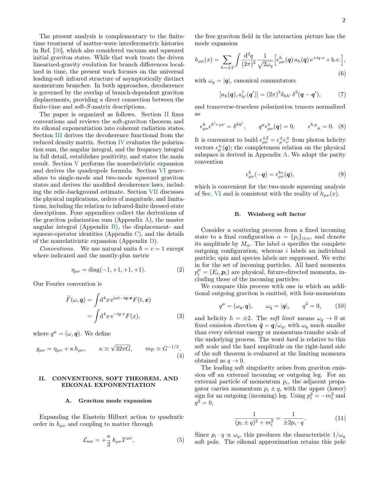 
Low-resolution page preview, page 2

📷 Fig 2

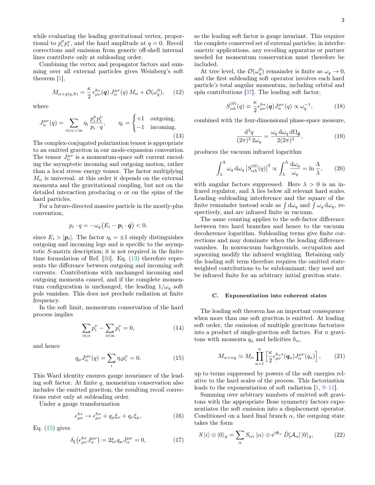 
Low-resolution page preview, page 3

📷 Fig 3

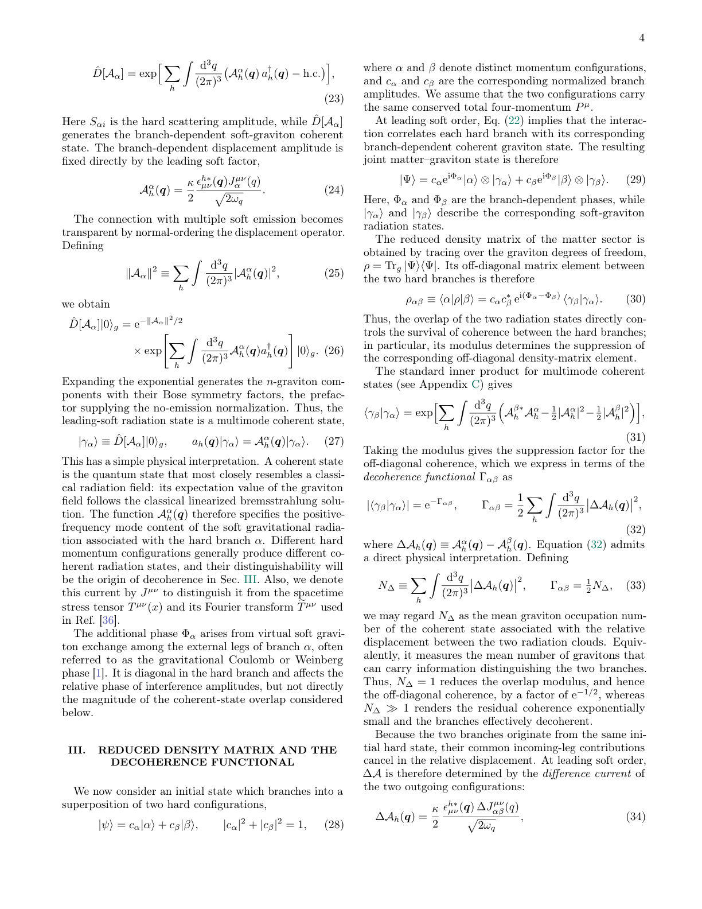 
Low-resolution page preview, page 4

📷 Fig 4

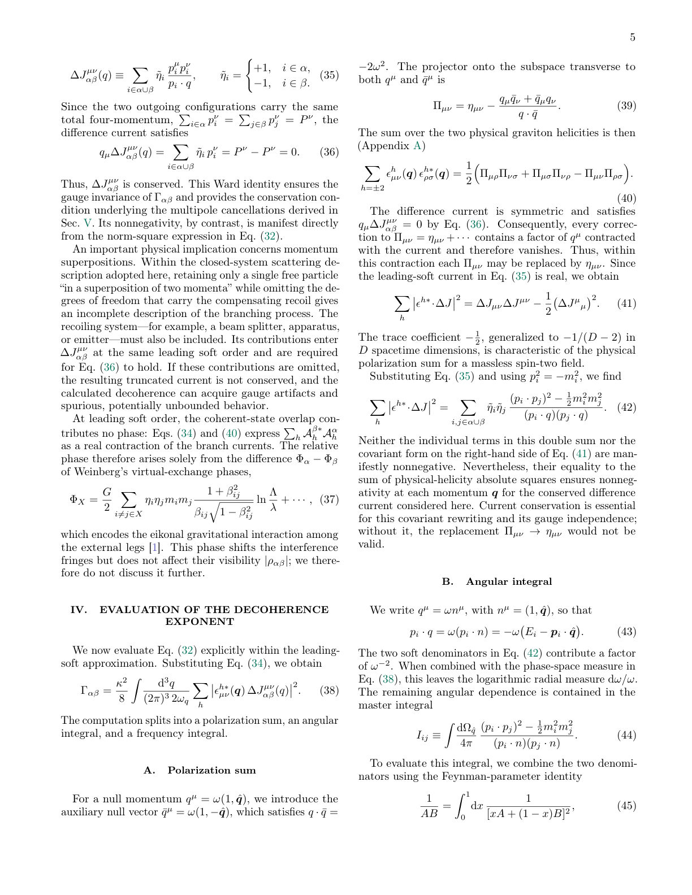 
Low-resolution page preview, page 5

📷 Fig 5

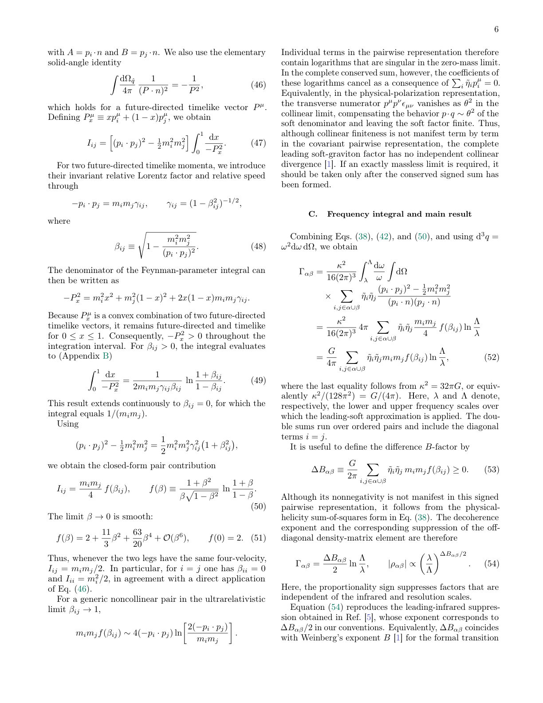 
Low-resolution page preview, page 6

**Summary.** This paper develops a theoretical framework to quantify gravitational decoherence arising from the emission of soft gravitons. By utilizing the soft-graviton S-matrix and analyzing the overlap of coherent radiation states, the authors derive a gauge-invariant decoherence exponent. The results are significant for understanding quantum interference in the presence of a gravitational background, particularly in cosmological settings.

**Why it may be interesting.** The connection between soft-graviton scattering, infrared quantum information, and decoherence provides a novel theoretical framework for understanding how gravitational interactions can destroy quantum coherence in macroscopic systems.

Detailed structure

**Main problem.** The paper investigates the decoherence of matter superpositions caused by the emission of soft gravitons, a process governed by the leading soft sector of the graviton S-matrix.

**Main result.** The decoherence exponent is derived to be gauge-invariant and non-negative, showing that soft gravitons carry away which-path information, leading to an enhancement proportional to the gravitational-wave energy density and the fourth power of the observation time in certain regimes.

**Method.** The analysis employs Weinberg's soft theorem, calculating the decoherence functional via the overlap of coherent radiation states and extending the formalism to include squeezed graviton states.

**Model / system.** The system involves matter superpositions interacting with a gravitational field, modeled using the soft-graviton S-matrix formalism and analyzed in regimes ranging from the nonrelativistic limit to cosmological squeezed backgrounds.

**Key observables.** The decoherence functional ($\Gamma_{\alphaeta}$), the decoherence exponent ($\Delta B_{\alphaeta}$), and the reduced density matrix elements ($
ho_{\alphaeta}$).

**Important parameters / regimes.** Soft graviton frequency cutoff ($\lambda$), UV cutoff ($\Lambda$), gravitational-wave energy density ($\Omega_{	ext{gw}}$), and squeezing parameters ($r_q, \phi_q$).

**Assumptions / limitations.** The analysis relies on the leading soft-graviton approximation and assumes specific conditions for the infrared cutoff identification (e.g., flat relic spectrum).

**Paper structure.** The paper follows a structure moving from the general soft theorem derivation to the calculation of the decoherence functional, followed by specialized analyses for squeezed states and the nonrelativistic limit, concluding with physical implications.

Abstract

We revisit gravitational decoherence of matter superpositions using the leading soft sector of the graviton $S$-matrix. Starting from Weinberg's soft theorem and the overlap of coherent radiation states, we derive, for branch configurations with the same total four-momentum, a gauge-invariant, nonnegative leading-soft decoherence exponent and evaluate the polarization sum and angular integrals exactly at this order. In the vacuum, coherence between branches with distinguishable soft radiation vanishes as the infrared cutoff is removed. The leading nonrelativistic term is purely quadrupolar as a consequence of energy--momentum conservation. We extend the analysis to single- and two-mode squeezed graviton states, including the two-mode case motivated by inflation. Squeezing can enhance or suppress decoherence depending on the relative phase, while phase averaging gives an enhancement governed by the graviton occupation. For a phase-averaged relic background with an approximately flat energy-density spectrum over the relevant soft frequency band, the sharp-cutoff identification of the infrared scale with the inverse observation time gives a contribution that grows with the gravitational-wave energy density and with the fourth power of the observation time. These results connect soft-graviton scattering, infrared quantum information, and decoherence in nonvacuum gravitational backgrounds.

[↑ back to top](#top)

### [Hysteretic Coherence Collapse Across the First Order CDW Transition in 1T-TaS2](http://arxiv.org/abs/2609.07923v1)

**Authors:** Turgut Yilmaz, Anil Rajapitamahuni, Asish K. Kundu, Menka Jain, Elio Vescovo  
**Type:** experiment · **Category:** strongly correlated electrons · **PDF:** <https://arxiv.org/pdf/2609.07923v1>  
**Analysis basis:** full PDF text, analyzed in chunks
**Topic relevance:** `Frenkel-Kontorova` **1/5** · `driven-dissipative phase transition` **1/5** · `non-equilibrium universality` **1/5**

📷 Fig 1

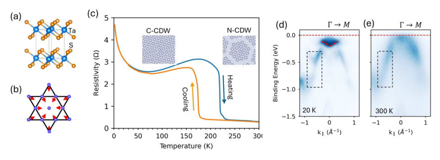 
FIG. 1. (a) Crystal structure of 1T -TaS2 highlighting Ta (blue) and S (orange) atoms. (b) Schematic of the star-of-David cluster illustrating atomic displacements associated with the commensurate charge density wave (C-CDW). (c) Temperature- dependent resistivity measured upon cooling (orange) and heating (blue), showing hysteresis between the nearly commensurate (N-CDW) and commensurate (C-CDW) phases. Insets depict the corresponding atomic arrangements. (d, e) ARPES intensity maps along Γ–M at 20 K (C-CDW phase) and 300 K (NC-CDW phase), respectively. The dashed line marks the Fermi level, and the red curve highlights the flat band in the C-CDW phase.

📷 Fig 2

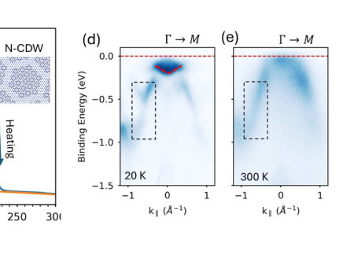 
Fig. 1 summarizes the structural, transport, and elec- tronic properties of the layered 1T -TaS2 compound across its CDW phase transitions. The crystal structure, shown in Fig. 1a, consists of layered Ta atoms coordi- nated octahedrally by S atoms. The material forms two- dimensional sheets stacked along the out of plane direc- tion with weak van der Waals interlayer coupling. In the low-temperature C-CDW phase, the Ta atoms undergo a periodic lattice distortion forming a characteristic Star- of-David superstructure, illustrated in Fig. 1b. In this reconstruction, 13 Ta atoms contract toward a central Ta site, producing a √

📷 Fig 3

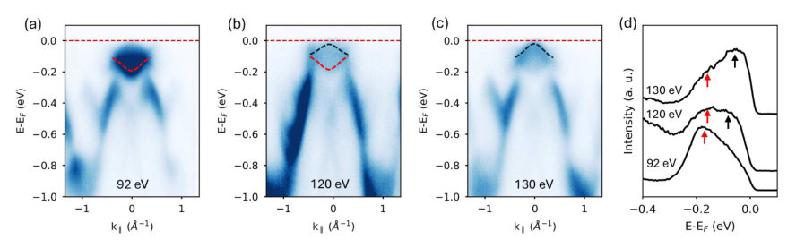 
FIG. 2. (a) Electronic band dispersion measured at 92 eV photon energy, with the dashed contour highlighting a flat band mear −0.18 eV. (b) Band structure at 120 eV, where both red and black dashed contours emphasize the flat band and in-gap state, respectively. (c) Band structure at 130 eV, with the black dashed contour marking the in-gap state. (d) Corresponding energy distribution curves (EDCs) along the Γ. Red and black arrows trace the flat band and in-gap state, respectively. ARPES data in panels (a)–(c) were recorded along the Γ–M direction. Using the free-electron final-state model with an inner potential of V0 = 17.5 eV [14], the 92 eV and 120 eV measurements correspond approximately...

📷 Fig 4

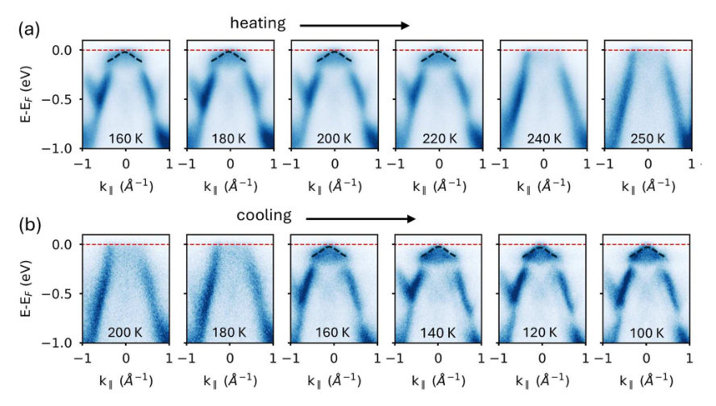 
FIG. 3. (a) ARPES intensity maps recorded upon heating from 160 K to 250 K, showing the progressive changes in the near-EF states. (b) Corresponding cooling sequence from 200 K down to 100 K, highlighting the hysteretic behavior of the band dispersion. The comparison of heating and cooling cycles highlights the path-dependent evolution of the electronic states across the transition. The data is collected with 130 eV photon energies along the Γ–M high-symmetry direction. The dashed black curves highlight the in-gap state.

📷 Fig 5

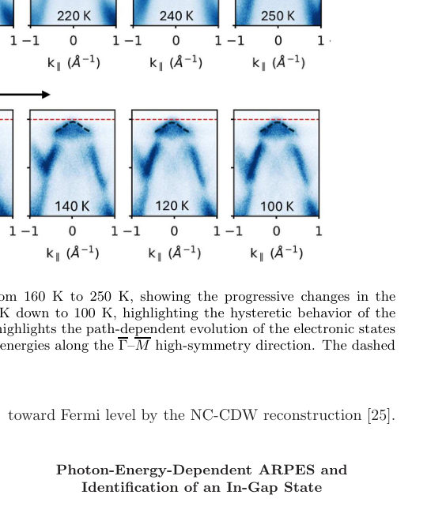 
Fig. 2 presents photon energy dependent ARPES mea- surements highlighting the presence of an in-gap elec- tronic state. At 92 eV , the flat band is most promi- nently observed near the Brillouin zone center (Fig. 2a).

**Summary.** This work uses ARPES to probe the electronic structure of 1T-TaS2 across its first-order CDW phase transition. By monitoring a distinct in-gap electronic state during controlled heating and cooling cycles, the authors provide direct spectroscopic evidence of the transition's first-order nature. The study strongly links the electronic reconstruction, evidenced by the state's hysteretic collapse, to the material's macroscopic transport properties.

**Why it may be interesting.** The clear, hysteretic collapse and recovery of a specific electronic state provides a direct spectroscopic fingerprint of a first-order phase transition, which is a hallmark of strongly correlated electron physics.

Detailed structure

**Main problem.** The study aims to understand the spectroscopic evolution of the low-energy electronic structure across the first-order Charge-Density Wave (CDW) transition in 1T-TaS2.

**Main result.** The in-gap electronic state exhibits pronounced thermal hysteresis, collapsing upon heating into the NC-CDW phase and re-emerging upon cooling, directly mirroring the first-order resistivity transition.

**Method.** Angle-Resolved Photoemission Spectroscopy (ARPES) was employed in temperature-dependent and photon-energy-dependent measurements across controlled heating and cooling cycles.

**Model / system.** The physical system is the layered transition-metal dichalcogenide 1T-TaS2, which undergoes a first-order CDW transition between the C-CDW and NC-CDW phases.

**Key observables.** The key observables are the spectral weight and intensity of the low-energy in-gap state and the flat band, tracked as a function of temperature and photon energy.

**Important parameters / regimes.** The critical parameters include the transition temperatures (e.g., 180 K to 220 K) and the temperature cycling range used for ARPES measurements.

**Assumptions / limitations.** The primary assumption is that the observed electronic features are directly linked to the structural and electronic reconstruction associated with the first-order CDW transition.

**Figures summary.** Figures summarize the resistivity hysteresis, ARPES intensity maps showing the in-gap state's collapse/recovery upon thermal cycling, and detailed EDCs/MDCs confirming the hysteretic spectral features near the Fermi level.

**Paper structure.** The paper uses ARPES to investigate the electronic structure across the CDW transition. It first characterizes the low-temperature C-CDW phase, then uses temperature-dependent measurements to track the in-gap state's evolution through heating and cooling cycles, correlating these spectroscopic changes with known transport anomalies.

Abstract

The first order phase transition between the nearly commensurate (NC-CDW) and commensurate (C-CDW) charge density wave phases in 1T-TaS2 underpins its exotic electronic behavior, yet the spectroscopic evolution of the low energy electronic structure across this transition remains crucial to understand. Using angle resolved photoemission spectroscopy (ARPES), we investigate the low temperature C-CDW phase, characterized by a flat band commonly associated with the lower Hubbard band and a distinct in-gap state located closer to the Fermi level. Photon energy dependent measurements distinguish these two low energy features through their different spectral weight evolution. Temperature dependent ARPES across heating and cooling cycles reveals that the in-gap state undergoes an abrupt collapse upon heating into the NC-CDW phase and re-emerges sharply upon cooling back into the C-CDW phase. This pronounced thermal hysteresis provides direct spectroscopic evidence of the first order nature of the transition. Furthermore, the disappearance and recovery of the in-gap state closely track the corresponding changes in resistivity, highlighting its intimate connection to the electronic reconstruction across the C-CDW/NC-CDW phase transition.

[↑ back to top](#top)

### [Polymorph Engineering of the Layered Rare-Earth Magnet GdAlGe](http://arxiv.org/abs/2609.08601v1)

**Authors:** Dmitry V. Averyanov, Ivan S. Sokolov, Alexander N. Taldenkov, Oleg E. Parfenov, Alexey N. Mihalyuk, Ivan A. Yakovlev, Igor A. Karateev, Oleg A. Kondratev, Andrey M. Tokmachev, Vyacheslav G. Storchak  
**Type:** both · **Category:** strongly correlated electrons · **PDF:** <https://arxiv.org/pdf/2609.08601v1>  
**Analysis basis:** full PDF text, analyzed in chunks
**Topic relevance:** `Keldysh / 2PI / non-Gaussian methods` **1/5** · `analog quantum simulation` **1/5** · `quantum measurements` **1/5**

📷 Fig 1

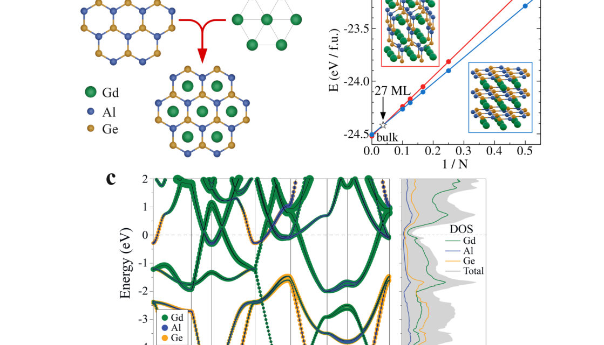 
Figure 1. a) Composition of layered GdAlGe from the honeycomb lattice of AlGe and the

📷 Fig 2

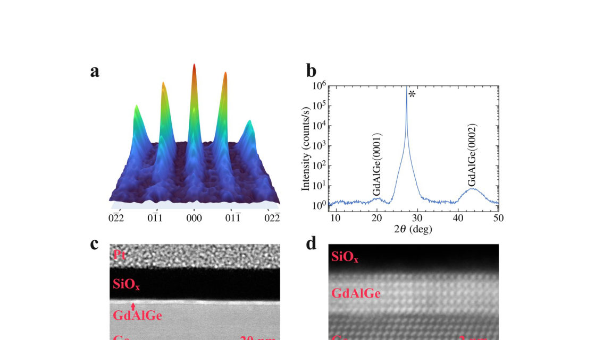 
Figure 2. Atomic structure of 5 ML GdAlGe. a) 3D RHEED image with reflexes marked by

📷 Fig 3

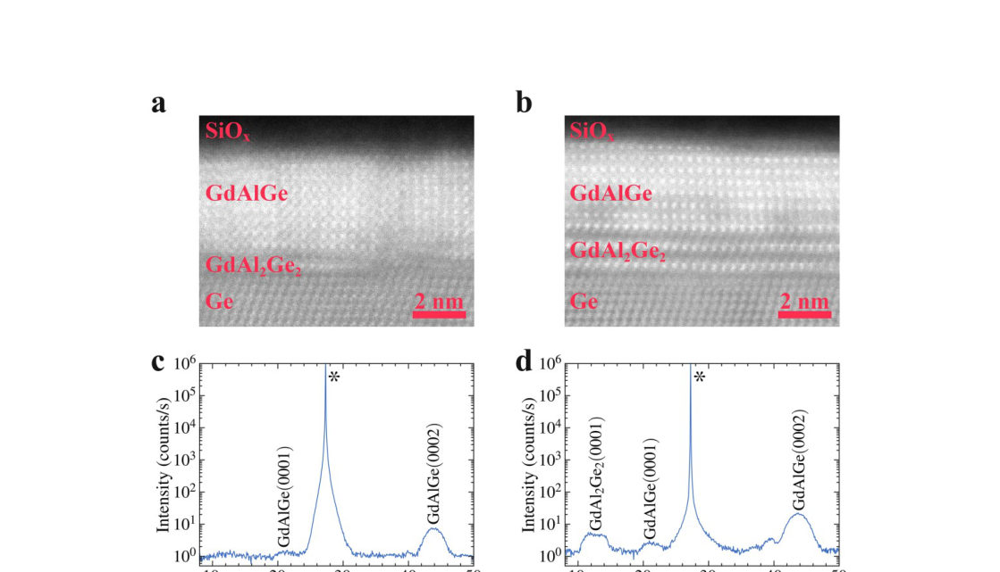 
Figure 3. Side products limiting synthesis of thick GdAlGe films. a) and b) Cross-sectional

📷 Fig 4

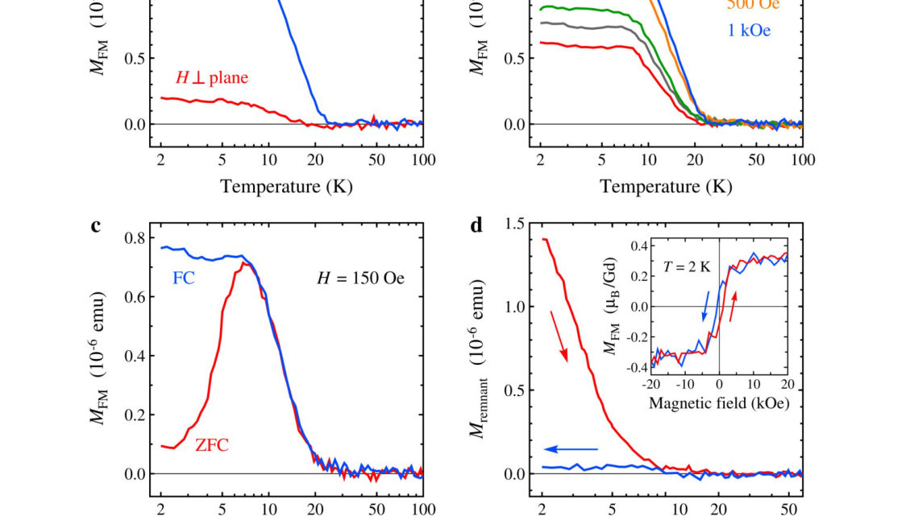 
Figure 4. Magnetic properties of 5 ML GdAlGe. a) Temperature dependence of the FM

📷 Fig 5

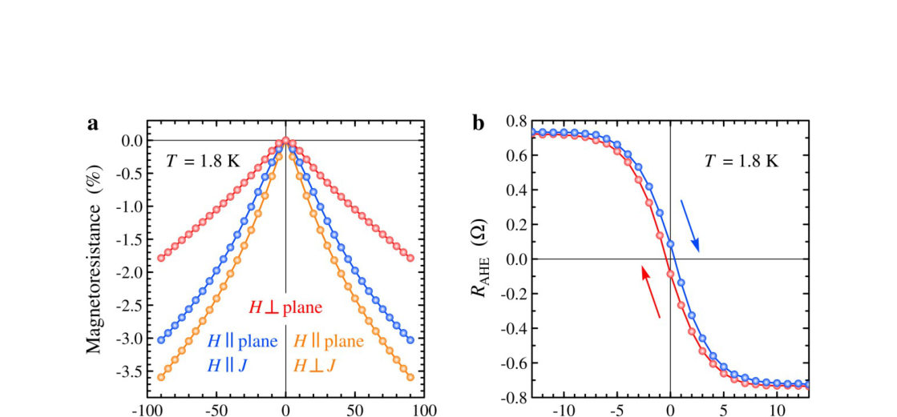 
Figure 5. Electron transport properties of 5 ML GdAlGe. a) Magnetoresistance at 1.8 K in

**Summary.** This work addresses the scarcity of layered magnetic materials by employing polymorph engineering to stabilize $	ext{GdAlGe}$ in ultrathin films. Using a combination of DFT calculations and advanced characterization techniques, the authors confirm the material's layered structure, ferromagnetic properties, and suitability for spintronics. The findings provide a blueprint for designing novel 2D magnetic materials.

**Why it may be interesting.** While focused on magnetism, the study of phase stability, dimensionality effects, and electronic transport in crystalline solids touches upon concepts relevant to correlated electron systems and interface physics, which are key areas in condensed matter theory.

Detailed structure

**Main problem.** The challenge of developing a sufficient number of layered rare-earth magnets suitable for spintronic applications.

**Main result.** The authors successfully engineered and characterized an epitaxial film of the overlooked layered polymorph $	ext{GdAlGe}$, demonstrating its stability in ultrathin films and its ferromagnetic nature.

**Method.** The study combines computational modeling (DFT) to predict phase stability with extensive experimental characterization using MBE growth, RHEED, XRD, STEM, SQUID magnetometry, and transport measurements.

**Model / system.** The physical system is the layered rare-earth magnet $	ext{GdAlGe}$, which is grown epitaxially on a $	ext{Ge}(111)$ substrate. The research focuses on controlling the crystal structure via polymorph engineering to stabilize the desired layered phase.

**Key observables.** Anisotropic ferromagnetic moment, Anomalous Hall Effect (AHE), negative magnetoresistance (MR), and structural confirmation via RHEED/STEM.

**Important parameters / regimes.** The critical thickness limit of 5 monolayers (MLs) where the desired polymorph remains stable, and the growth temperature of $190^\circ	ext{C}$.

**Assumptions / limitations.** The primary assumption is that surface energy dictates the polymorph stability, favoring the layered structure in the 2D limit over bulk phases.

**Figures summary.** Figures detail the structural confirmation (RHEED, STEM) of the 5 ML film, the magnetic response (temperature dependence of FM moment in various fields), and the electronic transport properties (MR and AHE hysteresis).

**Paper structure.** The paper follows a structure moving from theoretical prediction (polymorph stability via energy comparison) to experimental realization (MBE growth and structural confirmation) and finally to functional characterization (magnetism and transport).

Abstract

The recent advances in research on layered magnets have established them as invaluable materials for spintronic applications and precursors to 2D magnets. The problem is that the number of such materials available for experimentation is still low. To tackle the problem, one may employ phase engineering; in particular, the interplay between the phase stability and dimensionality provides great opportunities for design of layered magnets. Here, this interrelation is harnessed to produce epitaxial films of an overlooked layered polymorph of GdAlGe. The compound is formed by alternating triangular Gd and honeycomb AlGe lattices. It is stable in ultrathin films, up to 5 monolayers. In thicker films, an additional unwanted phase emerges. The structural quality of the ultrathin films is witnessed by electron and X-ray diffraction as well as electron microscopy. Magnetization measurements detect an anisotropic ferromagnetic state. The GdAlGe magnetism is corroborated by a study of electron transport revealing the anomalous Hall effect and negative magnetoresistance. The material is naturally integrated with Ge, a technological semiconductor, which should facilitate applications. The present study can serve as a blueprint for design of layered magnets via polymorph engineering.

[↑ back to top](#top)

### [Bottom-Up Design of Quantum Optical Experiments Using Discrete Generative Models](http://arxiv.org/abs/2609.08073v1)

**Authors:** Isaac L. Huidobro-Meezs, Simón Paiva-Ortega, Rodrigo A. Vargas-Hernández  
**Type:** theory · **Category:** quantum information and computing · **PDF:** <https://arxiv.org/pdf/2609.08073v1>  
**Analysis basis:** full PDF text, analyzed in chunks
**Topic relevance:** `analog quantum simulation` **1/5** · `methods for driven-dissipative` **1/5**

📷 Fig 1

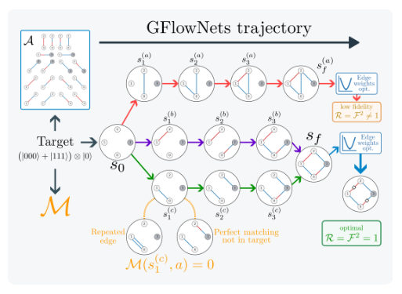 
FIG. 1. Bottom-up construction of |GHZ(3, 2)⟩⊗|0⟩with Grinch. The node is the ancilla. The mask filters out invalid photonic states and avoids perfect matchings that are not present in the target state.

📷 Fig 2

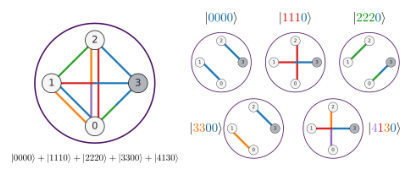 
FIG. 2. Best found graph for the |SRV (5, 4, 4)⟩⊗|0⟩state with its decomposition into perfect matchings. The 3 corresponds to the ancilla photon detector.

📷 Fig 3

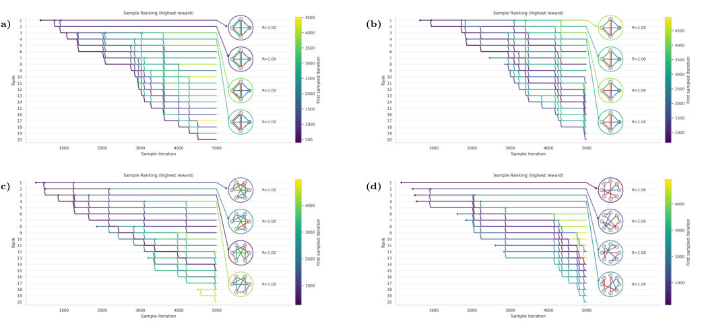 
FIG. 3. Sample ranking over the number of iterations for (a) the |D(3, (1, 1, 1))⟩⊗|0⟩, (b) |SRV (5, 4, 4)⟩⊗|0⟩, (c) |GHZ(6, 3)⟩, and (d) |GHZ(8, 2)⟩states colored by the first sampled iteration. The algorithm reaches optimal solutions within the first quarter of the sampling process. The graphs of the best 4 solutions are shown as insets for each plot.

📷 Fig 4

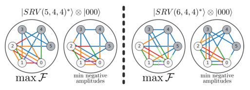 
FIG. 4. Graphs found for the |SRV (5, 4, 4)∗⟩⊗|000⟩and |SRV (6, 4, 4)∗⟩⊗|000⟩SRV states. The greyed-out node cor- responds to the ancilla photon detector. Edges with negative amplitudes are signaled with a white diamond. Intruder states are reduced in magnitude through the weight optimization.

📷 Fig 5

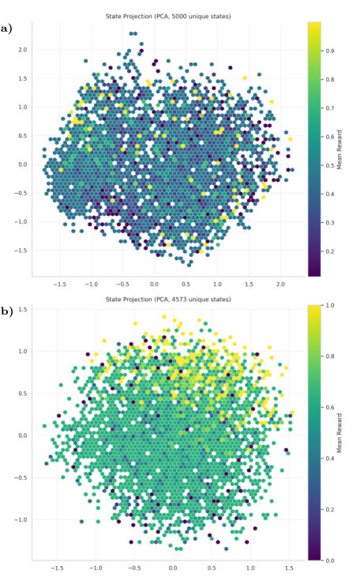 
FIG. 5. Principal component analysis of the sampled graphs for (a) the |GHZ(6, 3)⟩and (b) the |SRV (5, 4, 4)⟩⊗|0⟩states. |GHZ(6, 2)⟩sampling allowed up to 8 edges in the trajectory while for |SRV (5, 4, 4)⟩⊗|0⟩a max number of edges of 14 was used.

**Summary.** This paper presents Grinch, a novel, bottom-up generative framework that uses Generative Flow Networks to design quantum optical circuits. Instead of optimizing existing dense graphs, Grinch learns to sample optimal circuit topologies directly based on the fidelity reward. This allows for the efficient discovery of multiple, high-fidelity circuit realizations for complex entangled states and quantum gates.

**Why it may be interesting.** This work directly addresses the computational challenge of quantum circuit synthesis, providing a powerful, data-free generative AI tool for quantum optics that can explore alternative, hardware-constrained circuit topologies.

Detailed structure

**Main problem.** The core problem is the inverse design of quantum optical experiments, which requires searching over vast spaces of discrete circuit topologies and continuous parameters to generate a target quantum state.

**Main result.** The proposed framework successfully generates multiple high-fidelity optical graphs for complex entangled states and quantum gates, while also identifying asymptotic solutions for states that cannot be perfectly realized by simple graph structures.

**Method.** The authors introduce Grinch, a bottom-up, reward-driven generative framework based on Generative Flow Networks (GFlowNets) that samples circuit graphs directly from a reward proportional to the state fidelity.

**Model / system.** The physical system is quantum optical experiments modeled by weighted colored graphs $G(V, E)$. The state generated is a superposition of perfect matchings of this graph, and the process involves optimizing both discrete topology (edges) and continuous edge weights.

**Key observables.** Fidelity ($F$) between the generated and target state is the primary reward function; edge count ($|E|$) measures circuit complexity.

**Important parameters / regimes.** The search space involves optimizing continuous edge weights (e.g., using L-BFGS-B) and discrete graph structure.

**Assumptions / limitations.** The approach assumes that the target state can be represented by an optical graph structure, though it also handles cases where this is not strictly true. It contrasts with top-down methods that prune dense graphs.

**Figures summary.** Figures illustrate the bottom-up construction of specific entangled states (like $|GHZ(3, 2)
angle$) using Grinch, show the convergence of the generative model over sampling steps, and compare performance across different edge budget constraints.

**Paper structure.** The paper introduces the problem of quantum inverse design, details the limitations of existing top-down methods, proposes the bottom-up Grinch framework using GFlowNets, demonstrates its application to various entangled states and gates, and concludes with comparisons to other solvers.

Abstract

Designing quantum optical experiments requires searching over discrete circuit topologies and continuous parameters, often with multiple realizations of the same target state. Graph-based methods commonly address this problem by optimizing a dense graph and pruning it toward a single circuit. We introduce \texttt{Grinch}, a bottom-up reward-driven generative framework that learns to sample optical graphs directly from fidelity-based rewards without relying on a pre-existing training dataset. We demonstrate the framework on multipartite entangled states, graph and cluster states, and nonlocal photonic-gate targets, obtaining multiple high-fidelity optical graphs. We identify asymptotic solutions for states that cannot be generated exactly by graphs, as well as nonlocal Toffoli gate constructions requiring two ancillas. Our work presents hardware-constraint objectives, which lead to alternative constructions of CNOT and Toffoli gates when connections between ancilla nodes are restricted. These findings illustrate a reward-driven approach to quantum optical inverse design, exploring alternative circuit topologies while directly incorporating connectivity constraints into the search process.

[↑ back to top](#top)

### [Effective particle size governs structure and dynamics in rough hard-particle fluids](http://arxiv.org/abs/2609.08699v1)

**Authors:** Nanqing Xiao, Zhen Zhang, Walter Kob, Yujie Wang  
**Type:** theory · **Category:** statistical mechanics · **PDF:** <https://arxiv.org/pdf/2609.08699v1>  
**Analysis basis:** full PDF text, analyzed in chunks
**Topic relevance:** `analog quantum simulation` **1/5** · `non-equilibrium universality` **1/5**

📷 Fig 1

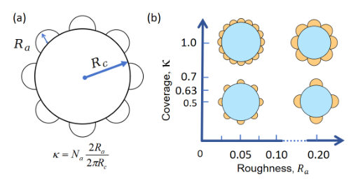 
FIG. 1. (a) Schematic representation of a rough particle with a central core of radius Rc and surface asperities of radius Ra uniformly distributed along the perimeter. Surface coverage is defined as κ = NaRa/Rc, where Na is the number of asper- ities. (b) Examples of particles with different roughness Ra and coverage κ.

📷 Fig 2

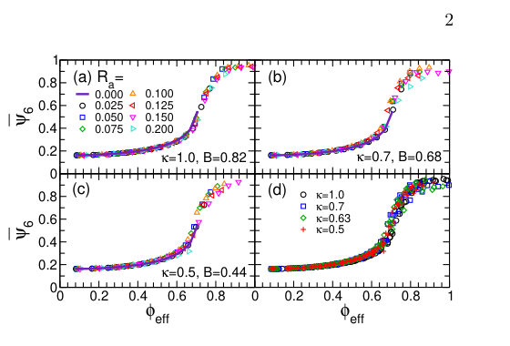 
FIG. 3. Bond-orientational order parameter ψ6 as a function of the effective packing fraction ϕeff for different values of the asperity radius Ra. Panels (a)–(c) correspond to κ = 1.0, 0.7, and 0.5, respectively, while panel (d) combines the data for all κ (κ = 1.0, 0.7, 0.63, and 0.5) to illustrate the resulting master-curve collapse. For each κ, the factor B used to make the master curve is indicated in the panel. Note that we show only data points for which the samples have not crystallized.

📷 Fig 3

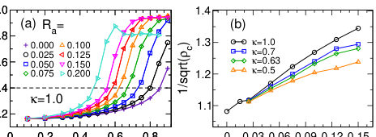 
FIG. 2. (a) Bond-orientational order parameter ψ6 as a func- tion of number density ρ for κ = 1.0 and different asperity radii Ra. The horizontal dashed line shows ψ6(ρc) = 0.4 and serves to define ρc presented in panel (b). (b) 1/√ρc as a function of Ra for different values of κ.

📷 Fig 4

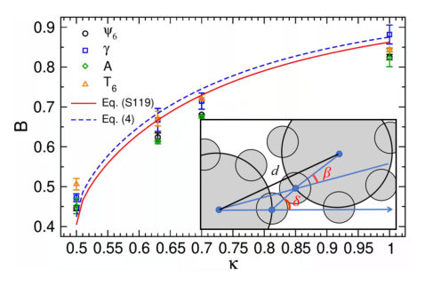 
FIG. 4. Scaling factor B as a function of the surface coverage ratio κ, extracted from four different structural quantities: The bond-orientational order parameter ψ6, the Lindemann ratio γ, the bond-angle distribution A, and the triplet ori- entational order parameter T6 (see SM for definitions). The red solid line shows the result of our analytical calculation (Eq. S119 in the SM), while the blue dashed line corresponds to its first-order approximation, Eq. (S120). Inset: Illustra- tion of the generic contact geometry between two MPs: The relative rotation of the right particle around the contact point (angles β and δ) yields all configurations needed to calculate the effective distance...

📷 Fig 5

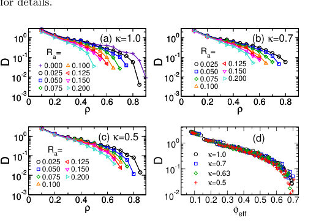 
FIG. 5. Diffusion constant D as a function of number density ρ for different asperity radii Ra at fixed κ: (a) κ = 1.0, (b) κ = 0.7, and (c) κ = 0.5. (d) The same data plotted versus the effective packing fraction ϕeff, showing a collapse onto a master curve.

**Summary.** This work numerically and analytically investigates how surface roughness modifies the behavior of hard-particle fluids. The key finding is that the system's structural and dynamic properties can be universally described by mapping them onto an equivalent hard-disk system using an 'effective particle size.' This provides a powerful theoretical tool for simplifying complex, rough particle interactions.

**Why it may be interesting.** While focused on classical fluids, the concept of mapping complex, rough interactions onto a simpler, effective model (hard disks) is analogous to coarse-graining or effective Hamiltonians used in quantum many-body physics.

Detailed structure

**Main problem.** The study investigates how particle surface roughness affects the static and dynamic properties of hard-particle fluids.

**Main result.** The structural and dynamic properties can be mapped onto equivalent hard-disk systems using an effective particle size, demonstrating a universal scaling behavior.

**Method.** The authors use numerical simulations and analytical calculations to derive an effective particle size and map the system's behavior onto standard liquid-state theories.

**Model / system.** The system models rough hard-particle fluids in 2D, where particles have surface asperities. Interactions are modeled using a Hertzian central force, and the system's behavior is analyzed by defining an effective particle radius ($R_{eff}$) and packing fraction ($\phi_{eff}$).

**Key observables.** Bond-orientational order parameter ($\psi_6$), diffusion constant ($D$), Lindemann ratio ($\gamma$), and the mean contact distance ($ar{d}$).

**Important parameters / regimes.** Number density ($
ho$), asperity radius ($R_a$), coverage ratio ($\kappa$), and the effective packing fraction ($\phi_{eff}$).

**Assumptions / limitations.** The analysis assumes the system behaves as a hard-core system, allowing for a mapping to hard-disk systems, and relies on small-roughness approximations for analytical derivations.

**Figures summary.** Figures demonstrate the collapse of structural ($\psi_6$) and dynamic ($D$) properties onto master curves when plotted against the effective packing fraction ($\phi_{eff}$), confirming the scaling law.

**Paper structure.** The paper progresses by first establishing the physical model and defining the effective parameters, then using structural diagnostics ($\psi_6$) to show the master-curve collapse, and finally extending this mapping to dynamic properties like the diffusion constant ($D$).

Abstract

We numerically investigate how particle surface roughness affects the static and dynamic properties of a hard-particle fluid across a wide range of densities, rho. These simulations of a simple model of granular systems reveal that, although the amplitude and coverage of surface corrugation significantly influence the rho-dependence of system properties, the qualitative behavior of this dependence remains unchanged. These findings can be described quantitatively by introducing an effective particle size, which enables a direct mapping of the rough particle systems to equivalent hard-disk systems. Analytical calculations provide an explicit form of this mapping, and allow us to predict the static and dynamic properties of rough particles using standard liquid-state theories for hard disks.

[↑ back to top](#top)

### [Green's Functions from Sample-based Krylov Quantum Diagonalization: An Impurity Solver for Dynamical Mean-Field Theory](http://arxiv.org/abs/2609.09147v1)

**Authors:** Jay Patel, Chakradhar Rangi, Ka-Ming Tam  
**Type:** theory · **Category:** strongly correlated electrons · **PDF:** <https://arxiv.org/pdf/2609.09147v1>  
**Analysis basis:** full PDF text, analyzed in chunks
**Topic relevance:** `Keldysh / 2PI / non-Gaussian methods` **1/5** · `methods for driven-dissipative` **1/5**

📷 Fig 1

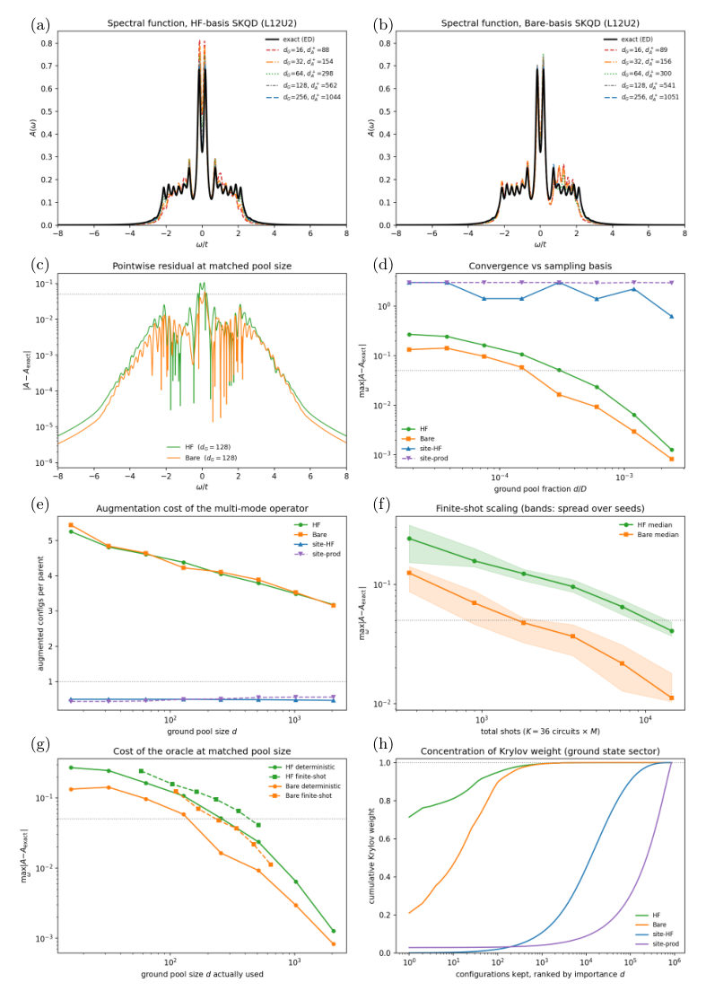 
FIG. 1. SKQD results for the particle–hole-symmetric SIAM chain at L = 12, U = 2. (a),(b) Impurity spectral function A(ω) reconstructed in the HF and bare orbital bases at increasing subspace size, against the exact (ED) result. (c) Pointwise error |A −Aexact| for the two bases at matched ground pool size 128. (d) Error maxω |A −Aexact| versus the fraction d/D of the ground sector retained; the dotted line is the convergence threshold, 0.05. (e) Augmentation cost: configurations added to the branch pool per ground-pool configuration on applying the multi-mode impurity operator c0 = P

📷 Fig 2

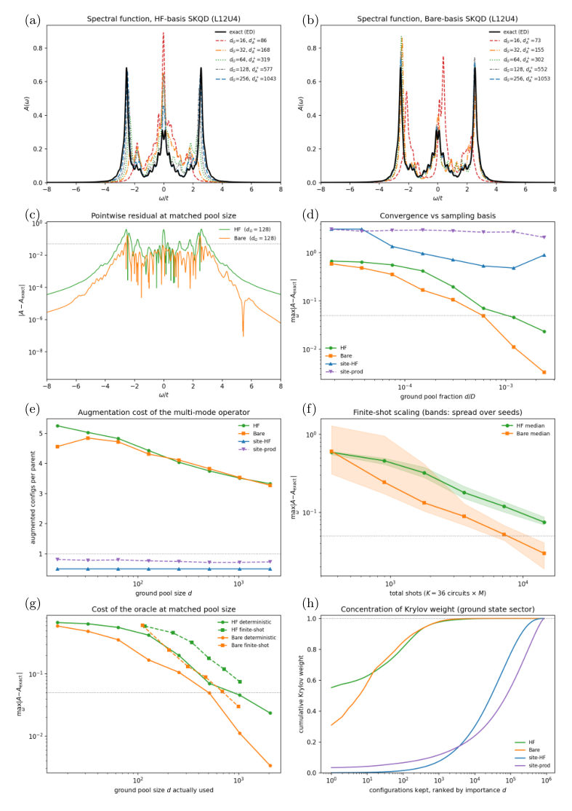 
FIG. 2. SKQD results for the particle–hole-symmetric SIAM chain at L = 12, U = 4. (a),(b) Impurity spectral function A(ω) reconstructed in the HF and bare orbital bases at increasing subspace size, against the exact (ED) result. (c) Pointwise error |A −Aexact| for the two bases at matched ground pool size 128. (d) Error maxω |A −Aexact| versus the fraction d/D of the ground sector retained; the dotted line is the convergence threshold, 0.05. (e) Augmentation cost: configurations added to the branch pool per ground-pool configuration on applying the multi-mode impurity operator c0 = P

📷 Fig 3

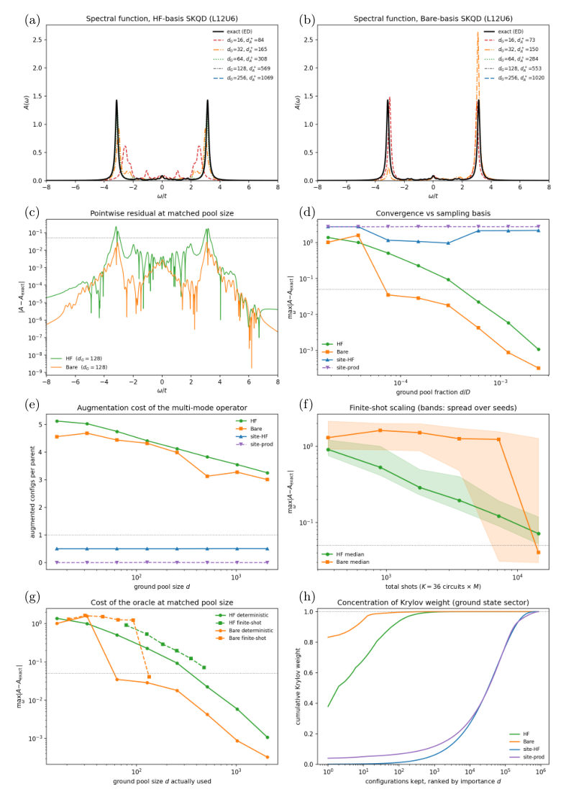 
FIG. 3. SKQD results for the particle–hole-symmetric SIAM chain at L = 12, U = 6. (a),(b) Impurity spectral function A(ω) reconstructed in the HF and bare orbital bases at increasing subspace size, against the exact (ED) result. (c) Pointwise error |A −Aexact| for the two bases at matched ground pool size 128. (d) Error maxω |A −Aexact| versus the fraction d/D of the ground sector retained; the dotted line is the convergence threshold, 0.05. (e) Augmentation cost: configurations added to the branch pool per ground-pool configuration on applying the multi-mode impurity operator c0 = P

📷 Fig 4

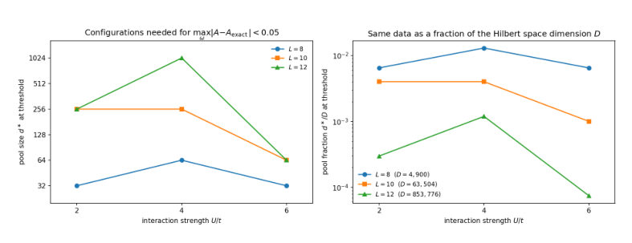 
FIG. 4. SKQD sampled pool size as a function of interaction strength and system size. Left panel plots the pool size as a function of U for three different system sizes, L = 8, 10, and 12. Right panel plots the ratios between the pool size and the Hilbert space dimension.

📷 Fig 5

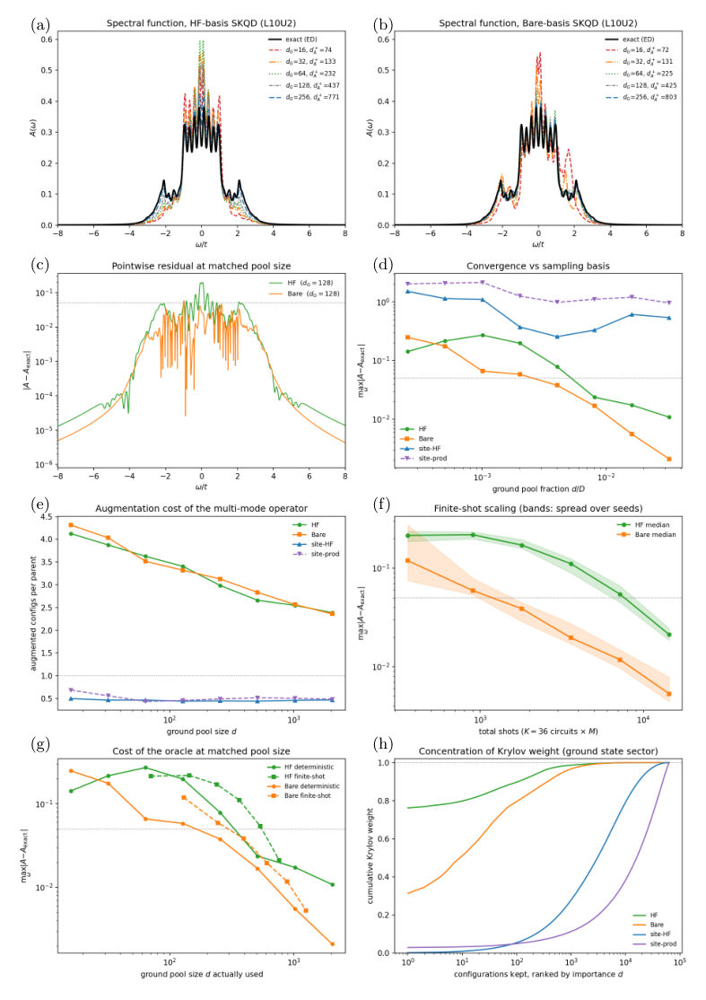 
FIG. 5. SKQD results for the particle–hole-symmetric SIAM chain at L = 10, U = 2. (a),(b) Impurity spectral function A(ω) reconstructed in the HF and bare orbital bases at increasing subspace size, against the exact (ED) result. (c) Pointwise error |A −Aexact| for the two bases at matched ground pool size 128. (d) Error maxω |A −Aexact| versus the fraction d/D of the ground sector retained; the dotted line is the convergence threshold, 0.05. (e) Augmentation cost: configurations added to the branch pool per ground-pool configuration on applying the multi-mode impurity operator c0 = P

**Summary.** This work extends the Sample-based Krylov Quantum Diagonalization (SKQD) technique from ground-state calculations to compute single-particle Green's functions for correlated systems. By sampling multiple particle-number sectors and using a Lanczos continued fraction, the method accurately reproduces spectral features across phase transitions. This advancement promises to enhance the feasibility of using quantum hardware for complex DMFT impurity solvers.

**Why it may be interesting.** The technique directly addresses the computational bottleneck in simulating correlated materials by adapting a quantum diagonalization method to calculate spectral functions, which are crucial for understanding electronic excitations.

Detailed structure

**Main problem.** The paper addresses the challenge of calculating single-particle Green's functions for strongly correlated impurity models, which is significantly harder than calculating ground states.

**Main result.** The proposed SKQD method successfully reconstructs the spectral function for the SIAM across the metal-insulator transition, suggesting it enables DMFT impurity solvers on near-term quantum hardware with larger bath sites.

**Method.** It generalizes the sample-based Krylov quantum diagonalization (SKQD) method by sampling unitary Krylov subspaces in $N\pm 1$ particle-number sectors and reconstructing the Green's function via a Lanczos continued fraction.

**Model / system.** The study applies the method to the particle-hole-symmetric single-impurity Anderson model (SIAM) in chain geometry, which serves as the impurity solver for Dynamical Mean-Field Theory (DMFT).

**Key observables.** Single-particle Green's function and its spectral density $A(\omega)$, showing features like quasiparticle residue and Mott gap.

**Important parameters / regimes.** Interaction strength ($U$), system size ($L$), and the ratio of retained subspace size to full Hilbert space dimension ($d/D$).

**Assumptions / limitations.** The method relies on classically evaluating sector-connecting overlaps and assumes the quantum device is only needed for short-time evolution sampling.

**Figures summary.** Figures systematically analyze the convergence and accuracy of the SKQD method by plotting the spectral function error versus the fraction of the ground sector retained, across varying interaction strengths ($U$) and system sizes ($L$).

**Paper structure.** The paper first establishes the need to generalize SKQD from ground states to Green's functions by sampling $N\pm 1$ sectors. It details the Lanczos reconstruction and then presents systematic numerical results showing convergence across different physical regimes (e.g., metal-insulator transition).

Abstract

We generalize the sample-based Krylov quantum diagonalization (SKQD) method from ground-state calculations to the evaluation of single-particle Green's functions. By constructing and sampling unitary Krylov subspaces in the N +/- 1 particle-number sectors and evaluating all sector-connecting overlaps classically, the approach reconstructs the Green's function via a Lanczos continued fraction while retaining the shallow-circuit, ancilla-free character of SKQD. The quantum device is required only to prepare and sample short-time evolutions. Applied to the particle-hole-symmetric single-impurity Anderson model in chain geometry, with the discrete bath representation used in dynamical mean-field theory (DMFT), the method recovers the spectral function using a relatively small fraction of the full Hilbert space. Across a range of interaction strengths that spans the metal-insulator transition, the main spectral features are reproduced. These results suggest that SKQD-based Green's-function calculations may allow DMFT impurity solvers with a larger number of bath sites on near-term quantum hardware than is currently practical.

[↑ back to top](#top)

### [Instantaneous-Frame Theory of Strongly Driven Parametric Gates](http://arxiv.org/abs/2609.08348v1)

**Authors:** Kentaro Kubo, Shinichi Inoue, Jushin Tei, Yinghao Ho, Yasunobu Nakamura, Hayato Goto  
**Type:** theory · **Category:** quantum information and computing · **PDF:** <https://arxiv.org/pdf/2609.08348v1>  
**Analysis basis:** full PDF text, analyzed in chunks
**Topic relevance:** `QC/QI experiment` **1/5** · `quantum measurements` **1/5**

📷 Fig 1

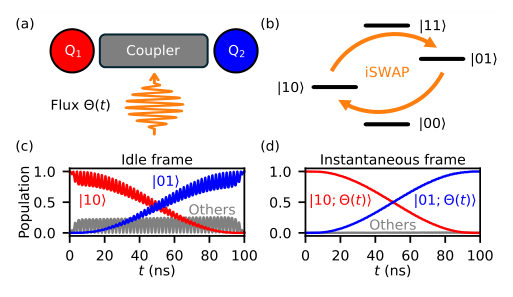 
FIG. 1. Schematic of (a) a tunable-coupler-based parametric gate and (b) a parametric iSWAP interaction. Population trajectory during an iSWAP gate initialized in |10⟩, shown in (c) the idle eigenbasis and (d) the instantaneous eigenbasis. Panels (c) and (d) are obtained from exact simulations of an experimentally demonstrated 100-ns iSWAP gate with a fidelity exceeding 99.9% in a CSDTC architecture [22].

📷 Fig 2

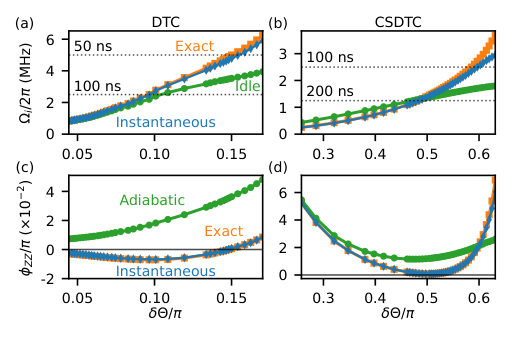 
FIG. 2. Exchange couplings Ωi (i=exact, id, inst) (a,b) and ZZ phases ϕZZ (c,d) of optimized parametric iSWAP gates versus drive amplitude. Left and right columns show the plots for the DTC and CSDTC systems, respec- tively. Orange, green, and blue curves denote exact re- sults, conventional (idle-frame and adiabatic) predictions, and instantaneous-frame predictions, respectively. Horizon- tal dotted lines in (a) and (b) indicate gate durations T = 50 and 100 ns for the DTC system and T = 100 and 200 ns for the CSDTC system, respectively.

📷 Fig 3

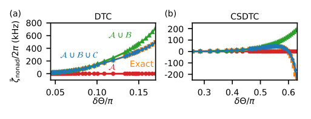 
FIG. 3. Dependence of the averaged nonadiabatic ZZ cou- pling ¯ζnonad on the restricted subspace for (a) DTC and (b) CSDTC systems. Orange, red, green, and blue curves denote exact results and results obtained with S = A, A ∪B, and A ∪B ∪C, respectively.

📷 Fig 4

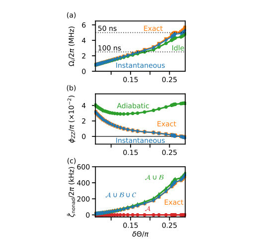 
FIG. 4. (a) Exchange couplings Ωi (i=exact, id, inst) and (b) accumulated ZZ phases ϕZZ of optimized parametric iSWAP gates in the STC system, as functions of the drive amplitude. Horizontal dotted lines in (a) indicate gate du- rations T = 50 and 100 ns. (c) Dependence of the averaged nonadiabatic ZZ coupling ¯ζnonad on the choice of restricted subspace in the STC system.

📷 Fig 5

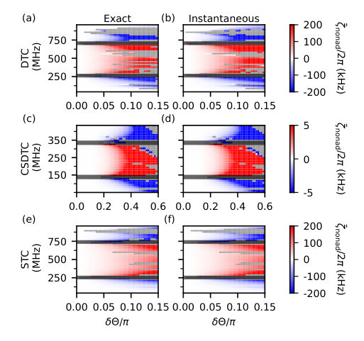 
FIG. 5. Color maps of the averaged nonadiabatic ZZ cou- pling ¯ζnonad versus the drive frequency ωd and drive ampli- tude δΘ. The top [(a,b)], middle [(c,d)], and bottom [(e,f)] rows correspond to the DTC, CSDTC, and STC systems, re- spectively. Left and right columns show the exact numeri- cal results and instantaneous-frame predictions obtained by solving Eq. (6) with S = A ∪B ∪C (right columns), respec- tively. Gray regions indicate parameter points where the av- erage leakage from A exceeds 0.001 [42]. At these points, leakage renders the process matrix within the computational subspace nonunitary, preventing a reliable extraction of the ZZ phase [42]; these points are therefore...

**Summary.** This work develops an instantaneous-frame theory to accurately model parametric two-qubit gates in superconducting qubits, overcoming limitations found in traditional idle-basis approaches. By using the instantaneous eigenbasis, the authors provide a compact description of couplings governed by the Berry connection. This theory achieves quantitative agreement with numerical simulations, enabling the design of high-fidelity gates in the strongly driven regime.

**Why it may be interesting.** It provides a rigorous, physically intuitive framework for analyzing driven quantum dynamics in superconducting qubits, moving beyond simplified approximations to handle fast, non-adiabatic gate operations.

Detailed structure

**Main problem.** Conventional theories for parametric two-qubit gates fail in the large-amplitude regime required for fast gate operations.

**Main result.** The dynamics are more accurately described using an instantaneous eigenbasis, which provides a compact, quantitative theory matching exact simulations.

**Method.** The authors derive equations of motion using the instantaneous eigenbasis, governed by the non-Abelian Berry connection, to describe coherent rotations.

**Model / system.** The study focuses on superconducting quantum processors using tunable couplers (DTC, CSDTC, STC) to implement parametric two-qubit gates like iSWAP gates.

**Key observables.** Gate fidelity, exchange coupling ($\Omega$), effective ZZ coupling ($\phi_{ZZ}$), and population trajectories in both idle and instantaneous eigenbases.

**Important parameters / regimes.** Large-amplitude drive regimes, fast gate durations (< 50 ns), and the flux bias $\Theta$.

**Assumptions / limitations.** The instantaneous eigenbasis approach is used as a natural moving frame, and approximations are made in deriving the effective couplings.

**Figures summary.** Figures compare population trajectories in the idle vs. instantaneous basis, and summarize total error, leakage error, and ZZ error vs. drive amplitude for different coupler architectures.

**Paper structure.** The paper first establishes the failure of idle-basis models, then introduces the instantaneous-frame theory using the Berry connection, and finally applies this theory to calculate and optimize gate fidelity for specific superconducting architectures.

Abstract

Parametric two-qubit gates using tunable couplers are a promising approach to scalable superconducting quantum processors. However, conventional theories formulated in the idle eigenbasis break down in the large-amplitude regime required for fast gate operations. Here, we show that parametric gates are more naturally and accurately described as coherent rotations between instantaneous eigenstates rather than idle eigenstates. This approach may appear counterintuitive, since instantaneous eigenbases are usually associated with adiabatic dynamics. However, they also form a natural moving frame for driven dynamics, where the non-Abelian Berry connection governs transitions and provides a compact description of the exchange and effective $ZZ$ couplings. We show that this theory achieves quantitative agreement with exact numerical simulations across representative tunable-coupler architectures, including double-transmon, capacitively shunted double-transmon, and single-transmon couplers. The description remains accurate even in regimes where idle-frame descriptions fail, while substantially reducing the reliance on computationally demanding exact simulations. These results establish an instantaneous-frame theory of parametric gates beyond conventional idle-frame models and provide a new perspective on driven quantum dynamics.

[↑ back to top](#top)

### [Near-optimal synthesis of non-Gaussian phase gates via qubit-oscillator Rabi control](http://arxiv.org/abs/2609.09132v1)

**Authors:** Zhen Yang, Shan Jin, Zi-Wen Liu, Xiaoting Wang  
**Type:** theory · **Category:** quantum information and computing · **PDF:** <https://arxiv.org/pdf/2609.09132v1>  
**Analysis basis:** full PDF text, analyzed in chunks
**Topic relevance:** `Keldysh / 2PI / non-Gaussian methods` **1/5** · `quantum measurements` **1/5**

📷 Fig 1

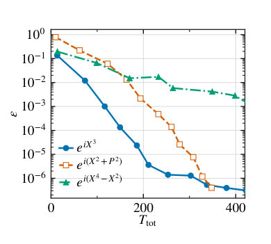 
FIG. 1. Finite-resource convergence for representative CV evolutions. The curves show the numerical implementation errors as functions of the total Rabi interaction time Ttot for the cubic phase gate ei ˆ X3, the rotation ei( ˆ X2+ ˆ P 2), and the double-well evolution ei( ˆ X4−ˆ X2).

**Summary.** This paper presents a near-optimal, analytically derived method to synthesize non-Gaussian phase gates necessary for universal continuous-variable quantum computation. By utilizing Rabi control in qubit-oscillator systems, the authors achieve a polylogarithmic scaling in the required interaction time relative to the target error. This establishes a powerful, scalable primitive for implementing complex quantum algorithms, such as solving PDEs.

**Why it may be interesting.** This work provides a concrete, analytically derivable, and resource-efficient method to implement complex, non-Gaussian gates essential for advanced CV quantum algorithms, bridging theoretical gate requirements with physical control schemes.

Detailed structure

**Main problem.** The paper addresses the challenge of engineering non-Gaussian phase gates, which are crucial but difficult to implement for universal continuous-variable (CV) quantum computation.

**Main result.** They developed a near-optimal synthesis scheme for polynomial phase gates using qubit-oscillator Rabi control, achieving a total interaction time scaling of $O(\log(1/\epsilon)^{c})$.

**Method.** The synthesis relies on approximating the target non-Gaussian phase gate using sequences of analytically constructed Rabi pulses, leveraging techniques related to Generalized Quantum Signal Processing (GQSP).

**Model / system.** The system is a hybrid qubit-oscillator platform where the qubit mediates effective nonlinear dynamics of the oscillator via Rabi coupling. The target gates are polynomial phase gates $e^{iT p(\hat{X})}$.

**Key observables.** Total Rabi interaction time ($T_{	ext{tot}}$), fidelity ($F_{sol}$), and the required success probability ($p_{	ext{succ}}$).

**Important parameters / regimes.** Target error ($\epsilon$), polynomial degree ($R$), and the number of modes ($D$).

**Assumptions / limitations.** The approximation is performed on a finite Fock subspace, and the method is near-optimal, though a residual $\log(1/\epsilon)$ gap remains between upper and lower bounds.

**Figures summary.** Figures show numerical convergence of errors for representative CV evolutions and illustrate the successful reproduction of the antisymmetric spatial profile for a 2D regularized biharmonic equation.

**Paper structure.** The paper establishes the general scaling for synthesizing polynomial phase gates, proves the near-optimality by matching the upper and lower bounds on $T_{	ext{tot}}$, and then applies this framework to implement complex core unitaries required for solving linear partial differential equations.

Abstract

Non-Gaussian gates remain a key bottleneck for universal continuous-variable (CV) quantum computation because the nonlinearities they require are difficult to engineer. To address this challenge, we develop an efficient qubit-oscillator Rabi synthesis scheme for polynomial phase gates, with a total interaction time that scales polylogarithmically with the inverse target error \(\varepsilon\). Specifically, for a class of readily preparable initial states, we show that a degree-\(R\) phase gate can be approximated by an analytically constructed Rabi sequence with total time \(O(\log^{(R-1)/2+o(1)}(1/\varepsilon))\). This construction requires no numerical optimization and therefore extends naturally to arbitrarily large multimode systems. We further establish a total-time lower bound of \(Ω(\log^{(R-1)/2}(1/\varepsilon))\), showing that the synthesis is near optimal. As applications, we use this scheme to simulate representative CV quantum dynamics and implement a CV quantum algorithm for solving linear partial differential equations. These results establish qubit-oscillator Rabi control as an efficient, analytically compilable, and near-optimal primitive for CV quantum information processing.

[↑ back to top](#top)

### [Performance of the subcarrier-wave quantum key distribution in the presence of spontaneous Raman scattering noise generated by classical DWDM channels](http://arxiv.org/abs/2609.08406v1)

**Authors:** Fedor Kiselev, Roman Goncharov, Natalia Veselkova, Eduard Samsonov, Alexei D. Kiselev, Vladimir Egorov  
**Type:** theory · **Category:** quantum information and computing · **PDF:** <https://arxiv.org/pdf/2609.08406v1>  
**Analysis basis:** full PDF text, analyzed in chunks
**Topic relevance:** `correlated / nonlocal dissipation` **1/5** · `interference shaping light` **1/5**

📷 Fig 1

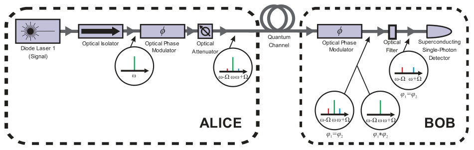 
FIG. 1. Schematic of the subcarrier-wave quantum key distribution system. Insets (in circles)

📷 Fig 2

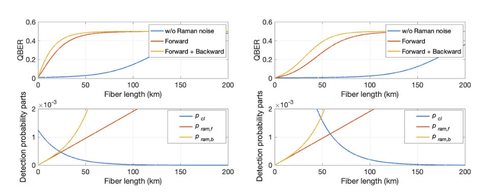 
FIG. 2. QBER and contributions to the probability of detection Pdet (see Eq. (8)) versus optical

📷 Fig 3

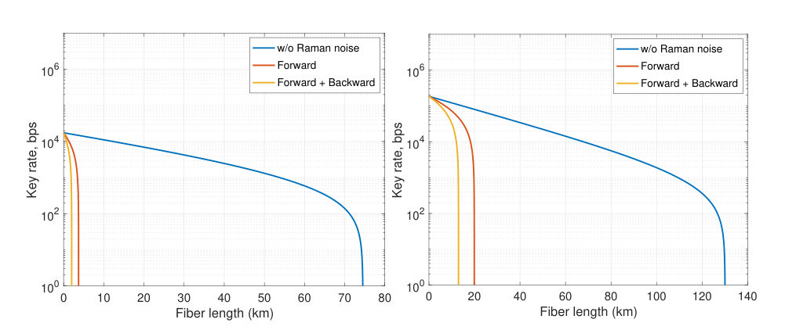 
FIG. 3. Secure key generation rate versus optical fiber length for continuous (a) and pulsed (b)

📷 Fig 4

 
FIG. 4. Secure key generation rate versus optical fiber length for continuous (a) and pulsed (b)

📷 Fig 5

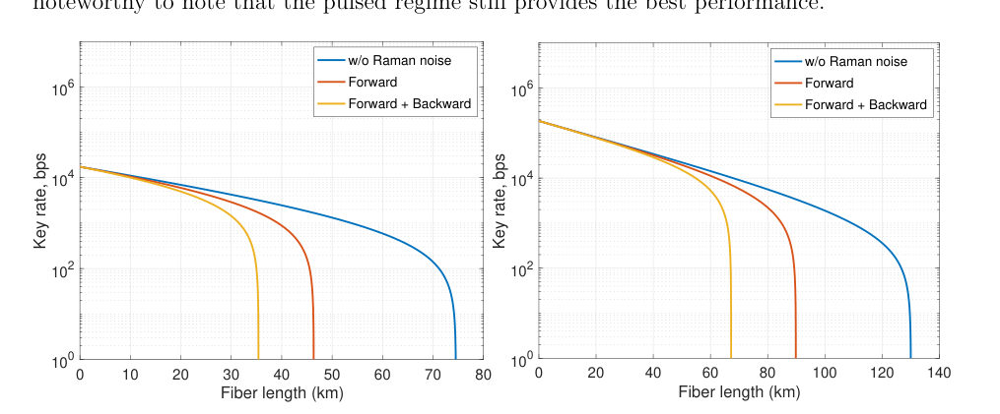 
Figure 5. The distance is shown to be a decreasing function of the sensitivity and the best

**Summary.** This paper analyzes the performance limitations of Subcarrier-Wave Quantum Key Distribution (SCW QKD) when subjected to noise from classical DWDM traffic via spontaneous Raman scattering. By developing a detailed mathematical model, the authors compare continuous wave and pulsed operation modes. They conclusively show that operating in a pulsed regime significantly enhances both the secure key rate and the maximum transmission distance compared to the CW regime.

**Why it may be interesting.** This work is highly relevant to quantum optics and open quantum systems as it models decoherence and noise (SpRS) from a realistic, high-power classical environment (DWDM) and proposes an operational regime (pulsed) to mitigate its detrimental effects on quantum communication.

Detailed structure

**Main problem.** The paper investigates how spontaneous Raman scattering (SpRS) noise, generated by classical Dense Wavelength Division Multiplexing (DWDM) channels, degrades the performance of Subcarrier-Wave Quantum Key Distribution (SCW QKD) systems.

**Main result.** The pulsed operational regime significantly outperforms the continuous wave (CW) regime, achieving both a higher secure key generation rate and a greater maximum achievable distance in the presence of this noise.

**Method.** A mathematical model is developed to calculate the Quantum Bit Error Rate (QBER) and the secure key generation rate by incorporating the noise power from SpRS into the standard QKD analysis framework.

**Model / system.** The system is an SCW QKD protocol operating over a single-mode optical fiber co-propagating with classical DWDM channels. The analysis compares performance in both continuous wave and pulsed laser regimes.

**Key observables.** Quantum Bit Error Rate (QBER), secure key generation rate, and maximum achievable distance.

**Important parameters / regimes.** Classical receiver sensitivity (ranging from -23 dBm to -48 dBm), DWDM parameters ($\xi = 0.18 	ext{ dB/km}$, $\Delta\lambda = 15 	ext{ GHz}$, $N_{ch} = 40$).

**Assumptions / limitations.** The analysis assumes SpRS noise is evenly distributed in time for calculating the mean photon number, and it focuses on channels within the narrow spectral C-band.

**Figures summary.** Figure 5 compares the maximum possible operating distance versus classical channel receiver sensitivity for both CW and Pulsed modes, demonstrating the superior performance of the pulsed regime.

**Paper structure.** The paper first develops the mathematical framework to model SpRS noise impact, then analyzes the QBER and key rate for both CW and pulsed regimes, culminating in a comparison showing the pulsed regime's advantage across varying receiver sensitivities.

Abstract

In this paper we study performance of the subcarrier-wave quantum key distribution system (SCW QKD) in the presence of spontaneous Raman scattering (SpRS) noise generated by classical channels of dense wavelength division multiplexing (DWDM) network within a single-mode optical fiber. We present the mathematical model for evaluation of the quantum bit error rate (QBER) and the secure key generation rate with the SpRS noise taken into account. We consider two regimes of the SCW QKD system: the continuous wave regime that uses continuous wave laser and the pulsed regime. For these regimes, performance of the system is analyzed depending on receiver sensitivity of classical DWDM. It is found that the pulsed regime outperforms the continuous wave regime in both the secure key generation rate and the maximum achievable distance.

[↑ back to top](#top)

### [Schwinger boson perturbation theory for spin-$S$ Kitaev-Heisenberg magnets: phase diagram and dynamical response near Kitaev spin liquids](http://arxiv.org/abs/2609.08548v1)

**Authors:** Daiki Sasamoto, Joji Nasu  
**Type:** theory · **Category:** strongly correlated electrons · **PDF:** <https://arxiv.org/pdf/2609.08548v1>  
**Analysis basis:** full PDF text, analyzed in chunks
**Topic relevance:** `Keldysh / 2PI / non-Gaussian methods` **1/5** · `analog quantum simulation` **1/5**

📷 Fig 1

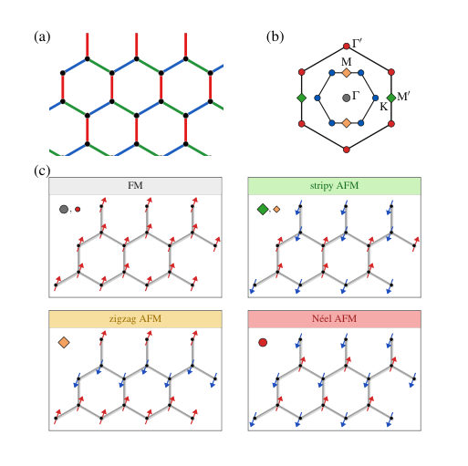 
FIG. 1. (a) Honeycomb lattice on which the spin-S Kitaev- Heisenberg Hamiltonian is defined. Blue, green, and red links de- note the x, y, and z Kitaev bonds, respectively. (b) First and extended Brillouin zones. The colored symbols mark the high-symmetry wave vectors, Γ, K, M, Γ′, and M′. (c) Real-space spin configurations of the FM, stripy AFM, zigzag AFM, and Néel AFM states. The sym- bols shown in each panel indicate the corresponding ordering wave vectors, using the same symbols as in (b). Larger and smaller sym- bols denote dominant and subdominant susceptibility channels, re- spectively.

📷 Fig 2

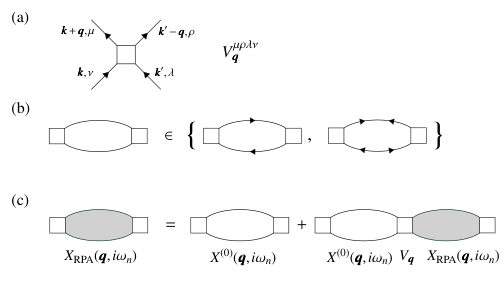 
FIG. 2. (a) Four-boson interaction vertex Vq obtained from the perturbing Hamiltonian in Eq. (22). (b) Coefficient-free bare bubble X(0)(q, iωn) obtained from normal and anomalous Schwinger boson Green’s functions of the Kitaev SBMFT Hamiltonian. (c) Dyson equation for the RPA-dressed internal bubble XRPA(q, iωn). The physical susceptibility is obtained after attaching the external spin vertices.

📷 Fig 3

 
FIG. 4. Ground-state phase diagram of the spin-S Kitaev- Heisenberg model parametrized by J = cos ϕ and K = sin ϕ. The central disk represents the classical S = ∞limit, while the concentric annuli correspond to S = 2, 3/2, 1, and 1/2. The blue QSL bound- aries are obtained from the static RPA instabilities at δ = 0.01. The remaining finite-S ordered-state boundaries are supplied by a calcu- lation based on linear spin-wave theory, as described in Appendix B, and are drawn as dashed radial lines.

📷 Fig 4

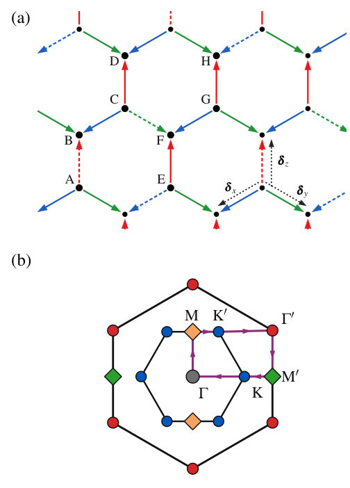 
FIG. 3. (a) Real-space mean-field pattern of the π/2-flux Ansatz in the eight-site unit cell. Blue, green, and red arrows denote the directed x, y, and z bonds, respectively. Each arrow fixes the ordered pair (i, j), from site i to site j, used for all bond operators and for ηγ ij. Solid directed bonds have ηγ ij = 1, whereas dashed directed bonds have ηγ ij = i. The offset black dotted arrows indicate the directed bond vectors δx, δy, and δz defined in Eq. (A6). The sublattices are labeled A–H in the order used in the mean-field Hamiltonian. (b) First and extended Brillouin zones with the high-symmetry symbols defined in Fig. 1(b). Purple arrows show the path K →Γ →M → K′ →Γ′ →M′ →K used...

📷 Fig 5

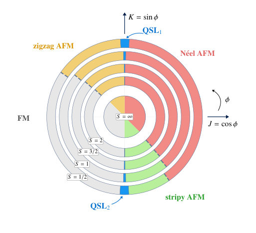 
Figure 4 shows the ground-state phase diagram of the spin- S Kitaev-Heisenberg model obtained in this work. The phase diagram is parametrized by the angle ϕ in Eq. (2). The central disk represents the classical S = ∞limit, and the concen- tric annuli correspond to S = 2, 3/2, 1, and 1/2. The blue boundaries are the QSL boundaries determined from the in- stabilities of the static RPA susceptibility. QSL1 and QSL2 are centered at the antiferromagnetic and ferromagnetic Ki- taev points, ϕ/π = 1/2 and 3/2, respectively. The remaining regions are the FM, zigzag AFM, Néel AFM, and stripy AFM magnetically ordered phases, and the finite-S boundaries be- tween these magnetically ordered phases are...

**Summary.** This work develops a Schwinger boson perturbative theory to study the phase diagram and spin dynamics of the spin-$S$ Kitaev-Heisenberg model. By using the pure Kitaev model as a starting point and applying RPA, the authors map out quantum spin liquid boundaries for various spins. The results show that the QSL phase is highly sensitive to the spin magnitude, providing crucial insights into frustrated magnetism in correlated materials.

**Why it may be interesting.** The rigorous application of Schwinger boson theory to higher-spin systems ($S>1/2$) provides advanced tools for analyzing quantum magnetism, which is a core area of strongly correlated electron physics.

Detailed structure

**Main problem.** The paper aims to develop a theoretical framework to map out the phase diagram and understand the dynamical spin response of spin-$S$ Kitaev-Heisenberg magnets near quantum spin liquid (QSL) states.

**Main result.** The study determines phase boundaries separating QSL regimes from magnetically ordered phases for various spins ($S=1/2, 1, 3/2, 2$), showing that QSL regions shrink rapidly with increasing $S$.

**Method.** The authors employ a Schwinger boson perturbative framework, utilizing the spin-liquid saddle point of the pure Kitaev model as the unperturbed state and applying the Random-Phase Approximation (RPA).

**Model / system.** The system is the spin-$S$ Kitaev-Heisenberg model on the honeycomb lattice, described by a Hamiltonian involving Kitaev and Heisenberg couplings, parameterized by an angle $\phi$.

**Key observables.** Phase boundaries, the dressed dynamical spin structure factor, and the static RPA susceptibility.

**Important parameters / regimes.** Spin quantum number $S$ ($1/2, 1, 3/2, 2$), and the coupling ratio $j=J/K$.

**Assumptions / limitations.** The framework relies on exploiting the Klein duality to decompose the Hamiltonian into an unperturbed (duality-invariant) term and a perturbation for the RPA treatment.

**Figures summary.** Figure 1 illustrates the honeycomb lattice structure and various classical spin configurations (FM, AFM) defining ordering wave vectors. Figure 2 details the components used in the RPA response calculation.

**Paper structure.** The paper first establishes the model and the Schwinger boson approach. It then uses Klein duality to set up the RPA calculation, determining phase boundaries for different $S$. Finally, it computes the spin dynamics, observing continuum features and spectral weight softening near magnetic instabilities.

Abstract

We develop a Schwinger boson perturbative framework for the spin-$S$ Kitaev-Heisenberg model. The spin-liquid saddle point of the pure Kitaev model is used as the unperturbed state, and magnetic instabilities and dynamical spin correlations are evaluated around this saddle point. We decompose the Hamiltonian exactly into two parts by exploiting the Klein duality intrinsic to the Kitaev-Heisenberg model. We perform the random-phase approximation by taking the part invariant under the duality transformation as the unperturbed term and treating the remaining term, which changes sign under it, as the perturbation. We determine the phase boundaries separating the quantum spin-liquid regimes from the adjacent magnetically ordered phases for $S=1/2$, $1$, $3/2$, and $2$. The spin-liquid regions shrink rapidly with increasing $S$ and become very narrow at $S=2$. We also compute the spin dynamics of the spin-$S$ Kitaev-Heisenberg model, focusing on $S=1$, and find that the dressed dynamical spin structure factor retains a broad two-spinon continuum at finite energies, while the low-energy spectral weight softens at the ordering wave vectors of the adjacent magnetic phases. Our framework thus enables thermodynamic-limit calculations of spin dynamics near magnetic instabilities.

[↑ back to top](#top)

### [The Forgotten History of Wave Function Variance Optimization and its Relevance for Neural-Network VMC](http://arxiv.org/abs/2609.08453v1)

**Authors:** Dario Bressanini  
**Type:** theory · **Category:** numerical methods · **PDF:** <https://arxiv.org/pdf/2609.08453v1>  
**Analysis basis:** full PDF text, analyzed in chunks
**Topic relevance:** `methods for driven-dissipative` **1/5** · `quantum measurements` **1/5**

📷 Fig 1

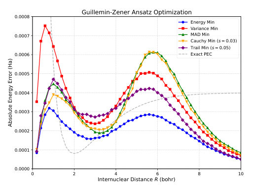 
FIG. 2. Absolute energy errors for H+ 2 using the Guillemin– Zener ansatz minimized with Energy, Variance, MAD, LC and L−4 cost functions. The exact potential energy curve is super- imposed as a dashed gray line in the background (unmarked secondary axis) to guide the eye.

📷 Fig 2

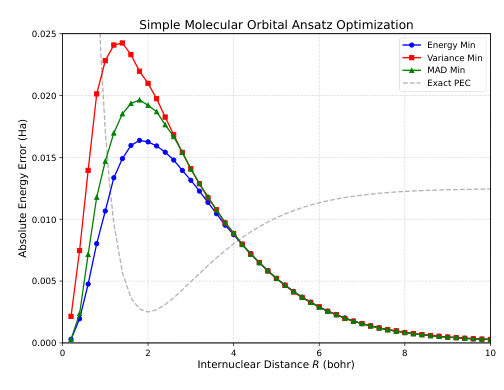 
FIG. 1. Absolute energy errors for H+ 2 as a function of inter- nuclear distance R, comparing Energy, Variance, and MAD optimization using a simple MO ansatz. The exact poten- tial energy curve is superimposed as a dashed gray line in the background (unmarked secondary axis) to highlight the repulsive, equilibrium, and dissociation regions.

**Summary.** This paper reviews the history of optimizing wave functions using local energy variance in VMC. It argues that standard variance minimization fails for modern neural network wave functions due to heavy-tailed local energy distributions. The authors benchmark robust alternatives, such as MAD and $L_{-4}$, showing they outperform variance minimization in different physical regimes of the $	ext{H}_2^+$ molecule.

**Why it may be interesting.** This is highly relevant as it directly addresses the numerical stability and theoretical foundation of modern Neural Quantum States (NQS) methods, providing concrete alternatives to standard energy minimization when dealing with complex, non-Gaussian local energy distributions.

Detailed structure

**Main problem.** The paper addresses the fundamental challenge of selecting the optimal functional for optimizing trial wave functions in Variational Monte Carlo (VMC) and Neural-Network VMC (NN-VMC). This is necessary because standard variance minimization assumptions fail for modern wave functions.

**Main result.** The authors demonstrate that while energy minimization is standard, alternative robust cost functions like Mean Absolute Deviation (MAD) or specialized L-infinity functionals outperform variance minimization for specific regimes of the $	ext{H}_2$ potential energy curve.

**Method.** The work involves re-tracing the historical development of variance optimization principles and benchmarking several robust cost functions (MAD, Cauchy loss, $L_{-4}$) against the standard energy expectation value on a benchmark system.

**Model / system.** The primary model is the electronic structure calculation for molecular systems, benchmarked specifically on the $	ext{H}_2^+$ molecular ion across its full potential energy curve. The methodology is applicable to general quantum systems solved via VMC/NN-VMC.

**Key observables.** Variational energy ($E$), local energy variance ($\sigma^2$), Mean Absolute Deviation (MAD), and the values of alternative functionals like $L_{-4}$.

**Important parameters / regimes.** The internuclear distance ($R$) of the $	ext{H}_2^+$ system, which dictates the local energy distribution tails.

**Assumptions / limitations.** The standard variance minimization implicitly assumes a Gaussian local energy distribution, which is incorrect for Coulombic systems exhibiting $E^{-4}$ power-law tails.

**Figures summary.** The notes do not provide a summary of figures, but the benchmark compares the performance of different functionals (variance vs. MAD vs. $L_{-4}$) across the potential energy curve.

**Paper structure.** The paper is structured as a historical review, tracing the development of variance optimization from the 1930s, followed by a modern analysis showing the failure of the variance estimator due to heavy tails, and concluding with a quantitative benchmark comparing robust functionals.

Abstract

We revisit the almost century-old question of which functional of the local energy best optimizes a trial wave function, a problem of central importance in Variational Monte Carlo (VMC) and, more recently, in Neural-Network VMC (NN-VMC). While variance optimization dates back to the 1930s, the high statistical noise and heavy-tailed local energy distributions inherent to modern neural-network wave functions have renewed interest in this approach. We retrace its long and largely forgotten history here, showing its direct relevance to modern Neural Quantum States (NQS) frameworks. Minimizing the variance (an $L^2$ norm) implicitly assumes a Gaussian local energy distribution: an unjustified assumption. For Coulombic systems, the local energy distribution exhibits $E^{-4}$ power-law tails, causing the Central Limit Theorem to fail for the variance estimator. This instability can be mitigated by robust cost functions: the Mean Absolute Deviation (MAD, an $L^1$ norm), the Cauchy loss, or the $L_{-4}$ functional, which features a tail analytically designed to match the $E^{-4}$ exponent. We benchmark these functionals on $H_2^+$, an exactly solvable system at every internuclear distance, using the Guillemin-Zener wave function across the full potential energy curve. While energy minimization by construction yields the lowest energy, variance minimization is surpassed at every $R$ by alternative functionals: MAD proves superior in the bonding region, while $L_{-4}$ performs best in the dissociation regime.

[↑ back to top](#top)

### [Topological Impurity Bands](http://arxiv.org/abs/2609.09118v1)

**Authors:** Arnab Seth, Itamar Kimchi  
**Type:** theory · **Category:** disordered systems and neural networks · **PDF:** <https://arxiv.org/pdf/2609.09118v1>  
**Analysis basis:** full PDF text, analyzed in chunks
**Topic relevance:** `Keldysh / 2PI / non-Gaussian methods` **1/5** · `analog quantum simulation` **1/5**

📷 Fig 1

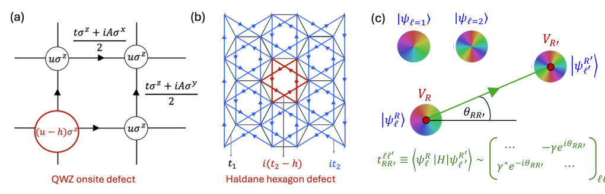 
FIG. 1. Impurities in Chern insulators or trivial insulators and formation of topological impurity bands (TIBs). (a) Qi-Wu-Zhang (QWZ) model with onsite defect, Eq. 11. (b) Haldane model with hexagon defect, Eq. 15, capturing spin- orbit coupling to a magnetic moment. (c) Each VR defect produces a pair of in-gap impurity bound states |ψR ℓ⟩with differing vorticity ℓ= 1, 2. When the states hybridize at finite impurity density they generate an effective low energy theory tℓℓ′ RR′ with QWZ-like direction-dependent off-diagonal complex hopping e±iθ, producing TIB topological phase transitions.

📷 Fig 2

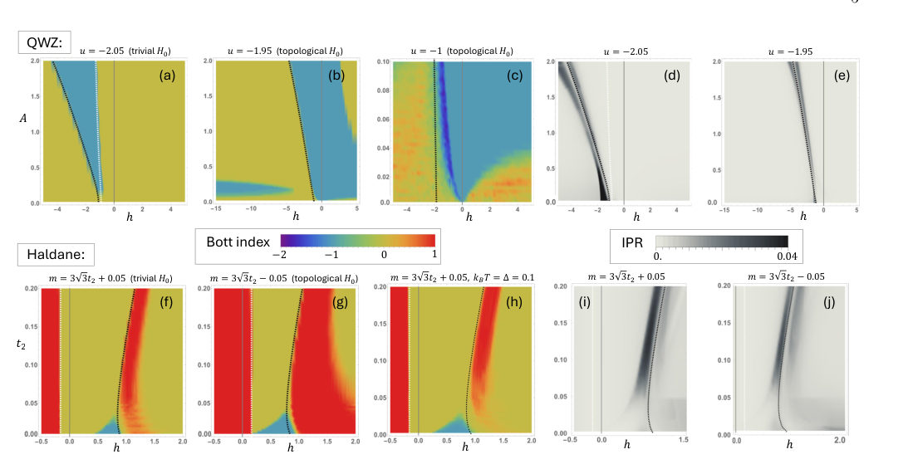 
FIG. 2. Numerical evidence for TIB and TAI phase transitions for various H0 Hamiltonians. 3% impurities per site were randomly placed in a 1024-site system in 25 disorder configurations, with the impurity-free model H0 being QWZ (top row) or Haldane (bottom row). In each panel horizontal axis is defect strength h (where h = 0 is the clean model H0) and vertical axis is an H0 parameter (A for QWZ, t2 for Haldane). The disorder averaged Bott index (color scale) shows clear topological phase transitions in both the trivial (a,f) and topological (b,g) phases of the clean model H0, with H0 gap ∆= 0.1 near its Dirac cone phase transition (u = −2 or m = 3 √

**Summary.** This work explores how localized defects can fundamentally alter the topology of electronic systems, leading to the formation of Topological Impurity Bands (TIBs). By analyzing impurity-induced bound states, the authors derive an effective low-energy theory applicable to lattice models like the Haldane model. This provides a local, defect-mediated route to realizing topological quantum phases.

**Why it may be interesting.** The concept of disorder-induced topology, particularly through localized defects, provides a concrete mechanism for realizing topological phases that might be inaccessible via uniform disorder averaging, which is relevant for understanding engineered quantum materials.

Detailed structure

**Main problem.** The paper investigates how localized defects, unlike long-wavelength disorder, can induce novel topological phase transitions in quantum materials.

**Main result.** A finite density of defects can generate Topological Impurity Bands (TIBs), leading to new topological phase transitions even when the clean system is trivial.

**Method.** The theory employs T-matrix calculations to find impurity bound states and derives an effective low-energy Hamiltonian by considering the hybridization of these states.

**Model / system.** The study applies to lattice models like the Qi-Wu-Zhang and Haldane models, analyzing the effect of a local mass defect impurity potential on the electronic structure.

**Key observables.** Topological Impurity Bands (TIBs), Bott index, Inverse Participation Ratio (IPR), and the vorticity ($\ell$) of impurity bound states.

**Important parameters / regimes.** Defect density (e.g., 3%), critical impurity strength ($h_c$), and the nature of the disorder potential.

**Assumptions / limitations.** The standard TAI theory's reliance on perturbative averaging is insufficient for localized defects; the analysis assumes the impurity term breaks certain symmetries while preserving others.

**Figures summary.** Figure 1 illustrates TIB formation via impurity bound states with differing vorticity; Figure 2 shows numerical evidence of TIB transitions matching analytical predictions.

**Paper structure.** The paper moves from establishing the limitations of standard disorder theory to deriving the TIB mechanism using bound states, and finally applying this theory to specific lattice models (QWZ, Haldane) to predict observable topological transitions.

Abstract

The effects of disorder on topological phases of matter are typically either preservation of topology or its destruction. For example, the quantum Hall effect's quantization and chiral edge mode remain robust until a strong-disorder percolation transition exits the topological phase. Disorder can also enlarge a preexisting topological phase, yielding a topological Anderson insulator (TAI). However, the reliance of TAI and other theoretical treatments on perturbatively averaging out long-wavelength randomness suggests that additional effects might appear when the disorder involves localized defects. Here we show that a finite density of randomly distributed defects can generate various new topological phase transitions. This route to disorder-induced topology can be viewed as the formation of topological impurity bands (TIB) and is applicable even if the initial clean model is a trivial band insulator. The theory relies on an orbital-dependent vorticity of impurity bound states, which we derive analytically near a generic Dirac cone phase transition as well as using the Chern insulator lattice models of Qi-Wu-Zhang and Haldane. Their numerically computed phase diagrams at 3% defect density show robust topological transitions in distinct TIB and TAI regimes, suggesting a local route to topological phases.

[↑ back to top](#top)

### [A theoretical study of subcarrier-wave quantum key distribution system integration with an optical transport network utilizing dense wavelength division multiplexing](http://arxiv.org/abs/2609.08389v1)

**Authors:** Fedor Kiselev, Natalia Veselkova, Roman Goncharov, Vladimir Egorov  
**Type:** theory · **Category:** quantum information and computing · **PDF:** <https://arxiv.org/pdf/2609.08389v1>  
**Analysis basis:** full PDF text, analyzed in chunks
**Topic relevance:** `interference shaping light` **1/5**

📷 Fig 1

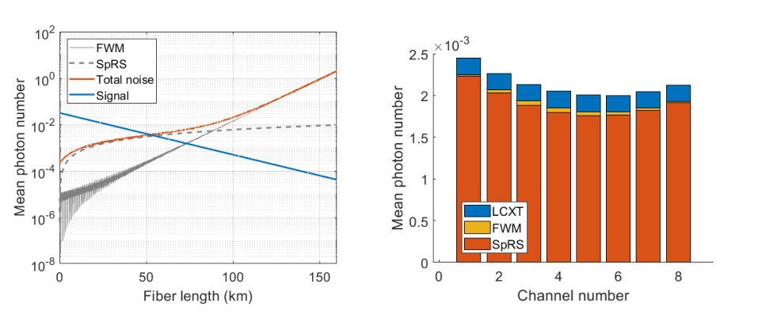 
FIG. 1. Simulation results for eight channel DWDM grid with 100 GHz spacing (a) mean photon

📷 Fig 2

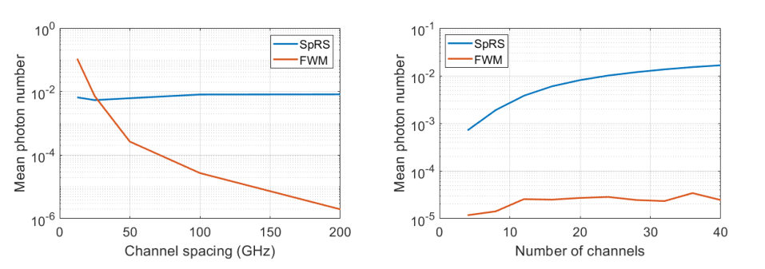 
FIG. 2. (a) Dependence of SpRS and FWM noise on channel spacing for 20 DWDM channels; (b)

📷 Fig 3

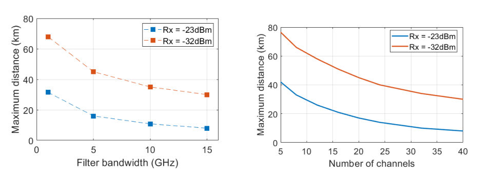 
FIG. 3. Simulation results for eight channel DWDM grid with 50 GHz spacing (a) photon detection

📷 Fig 4

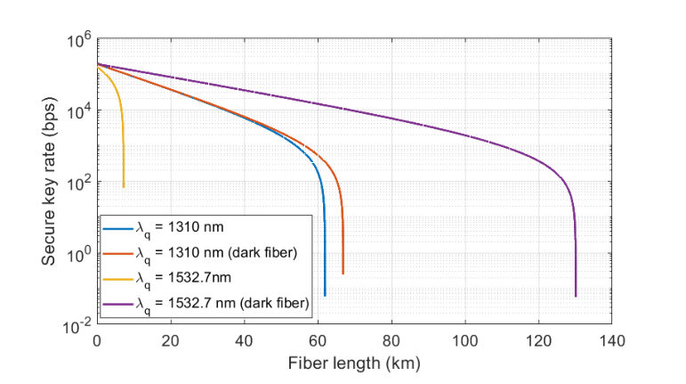 
FIG. 4. Secure key generation rate versus optical fiber length for O-band and C-band QKD-DWDM

📷 Fig 5

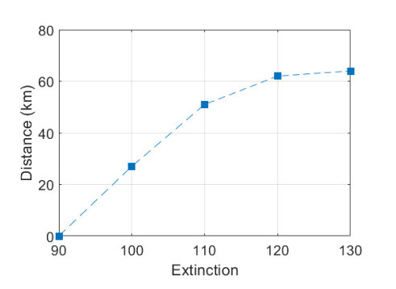 
FIG. 5. Maximum achievable distance at which the SCW QKD system can operate versus extinction

**Summary.** This paper theoretically analyzes how noise from classical DWDM channels degrades Subcarrier-Wave Quantum Key Distribution (SCW QKD) systems. By calculating QBER and key rates, the authors demonstrate that placing the quantum channel at 1310 nm (O-band) significantly outperforms the C-band, primarily due to reduced nonlinear noise, which is crucial for practical network deployment.

**Why it may be interesting.** This work is highly relevant to quantum optics and quantum networks, as it provides quantitative guidelines for integrating quantum communication protocols into existing, high-capacity classical infrastructure.

Detailed structure

**Main problem.** The paper investigates the performance limitations of Subcarrier-Wave Quantum Key Distribution (SCW QKD) when integrated into a classical optical transport network utilizing Dense Wavelength Division Multiplexing (DWDM).

**Main result.** Quantum channel allocation at the 1310 nm wavelength (O-band) is superior to the C-band because it mitigates nonlinear noise effects, leading to better achievable distances despite higher fiber attenuation.

**Method.** The study involves theoretical calculations of the Quantum Bit Error Rate (QBER) and the secure key generation rate by modeling various noise sources.

**Model / system.** The system models SCW QKD operating over an optical fiber shared with multiple classical DWDM channels. Noise sources analyzed include Spontaneous Raman Scattering (SpRS), Four-Wave Mixing (FWM), and Linear Channel Crosstalk (LCXT).

**Key observables.** Quantum Bit Error Rate (QBER), secure key generation rate, and various noise power levels ($P_{ram}, P_{ijk}$).

**Important parameters / regimes.** Fiber length (L), attenuation ($\xi$), number of classical channels ($N_{ch}$), and the quantum channel allocation wavelength (1310 nm vs. C-band).

**Assumptions / limitations.** The analysis assumes the use of output power for noise calculations and models the impact of noise sources on the overall detector click probability.

**Figures summary.** Figures illustrate the dependence of noise sources (SpRS, FWM) and the secure key generation rate on fiber length and the number of classical channels for both O-band and C-band configurations.

**Paper structure.** The paper systematically analyzes the impact of classical DWDM noise on SCW QKD, deriving expressions for noise powers, calculating QBER and key rates, and comparing performance metrics across different wavelength allocations (O-band vs. C-band).

Abstract

In this paper we study the performance of subcarrier-wave quantum key distribution (SCW QKD) in the presence of classical channels of optical transport network utilizing dense wavelength division multiplexing (DWDM). We consider the impact of spontaneous Raman scattering noise as well as the four-wave mixing and channel isolation efficiency. We calculate quantum bit error rate as well as the secure key generation rate of SCW-QKD protocol for different parameters of DWDM system and quantum channel allocations. Our calculations show, that quantum channel allocation at the wavelength of 1310 nm is preferable to allocation at C-band due to lower nonlinear noise, despite fiber's larger attenuation at this wavelength.

[↑ back to top](#top)

### [Accelerating Fourier--Motzkin elimination: redundancy removal and the choice of variable elimination order](http://arxiv.org/abs/2609.07960v1)

**Authors:** Shashaank Khanna  
**Type:** theory · **Category:** other · **PDF:** <https://arxiv.org/pdf/2609.07960v1>  
**Analysis basis:** full PDF text, analyzed in chunks
**Topic relevance:** `analog quantum simulation` **1/5**

📷 Fig 1

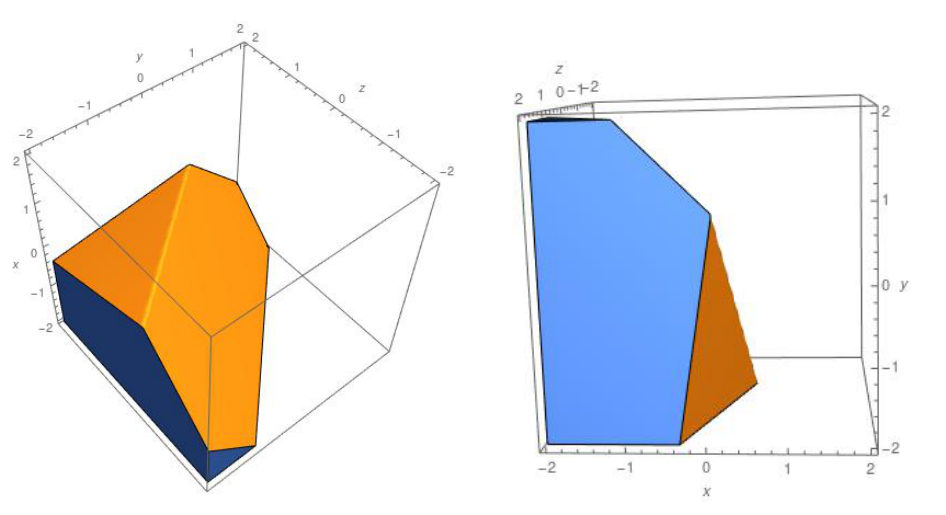 
Figure 1: The polyhedron defined by (7). Figure 2: Its projection onto the x–y plane, obtained by eliminating z.

📷 Fig 2

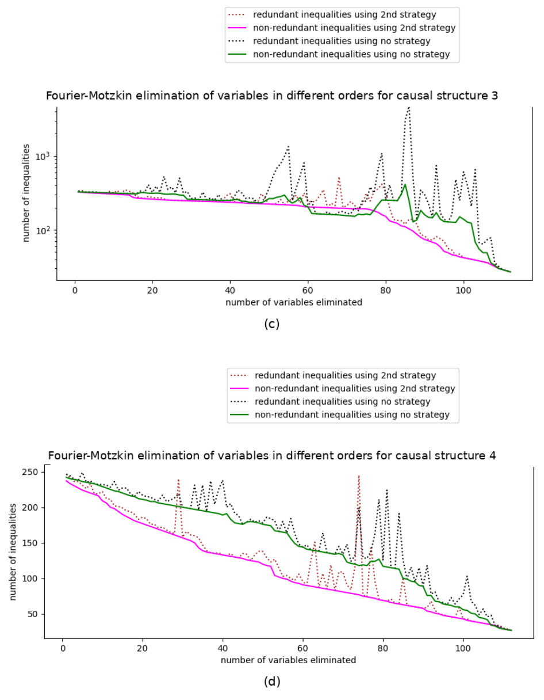 
Figure 3: Number of redundant inequalities produced and number of non-redundant inequalities retained at each elimination step, for four systems arising from causal structures, under the order found by Algorithm 2 and under a fixed order. Panels (a)–(d) correspond to the four instances.

**Summary.** This paper develops advanced computational techniques to accelerate Fourier-Motzkin elimination, a method for projecting polyhedra described by linear inequalities. By proposing a smart variable elimination order rule, the authors achieve significant speedups over standard methods, making the analysis of complex entropic constraints from causal structures computationally feasible.

**Why it may be interesting.** While the core topic is computational geometry/optimization, the application to entropic constraints derived from causal structures has implications for quantum information theory by providing tools to analyze marginalization over latent variables in complex physical models.

Detailed structure

**Main problem.** The paper addresses the computational bottleneck of Fourier-Motzkin (FM) elimination, which is used to find the inequality description of the projection of a polyhedron onto a subset of its coordinates.

**Main result.** A novel variable elimination order rule was proposed that significantly reduces the running time (by factors of 6 to 25) compared to fixed-order elimination, especially for large systems arising from entropic constraints.

**Method.** The authors analyze redundancy removal techniques (LP testing vs. Imbert's test) and propose a look-ahead rule for selecting the variable elimination order to minimize the number of intermediate inequalities.

**Model / system.** The mathematical framework involves polyhedra defined by linear inequalities, with specific applications to obtaining entropic constraints derived from causal structures via marginalization over latent variables.

**Key observables.** The number of redundant vs. non-redundant inequalities retained at each step, and the wall-clock running time of the elimination process.

**Important parameters / regimes.** The number of variables and the number of inequalities in the initial system (e.g., >100 variables, >250 inequalities for causal structures).

**Assumptions / limitations.** The analysis relies on the assumption that the projection is full-dimensional for some results, and it notes that the optimal ordering problem is analogous to an NP-complete problem.

**Figures summary.** Figures illustrate the projection of a polyhedron in 3D and the comparison of inequality counts and running times between fixed-order and look-ahead elimination strategies for causal structure instances.

**Paper structure.** The paper first establishes the mathematical background of FM elimination and redundancy testing, then details the flaws in combining these tests, and finally proposes and analyzes the variable elimination order rule using random polytopes and large causal structure examples.

Abstract

Fourier-Motzkin elimination computes an inequality description of the projection of a polyhedron onto a subset of its coordinates by eliminating one variable at a time. It is used in several areas of optimisation and computer science, and it is a standard way of obtaining the entropic constraints of a causal structure, where the marginalisation over the latent variables produces such a projection. Its limitation is the growth of the intermediate systems of inequalities, which can be doubly exponential in the number of eliminated variables even though the projection itself grows only as a single exponential. In practice the computational overload of the method therefore depends on two choices: how the redundant inequalities are removed after each step, and the order in which the variables are eliminated. We consider both. We first show, by an explicit example, that Imbert's redundancy test cannot be interleaved with redundancy removal by linear programming. We show that the two methods, however, can be combined soundly if the derivation records used by Imbert's test are re-initialised after every step at which linear programming is used. We then propose a rule for choosing the elimination order of the variables that gives a significant computational advantage, however, at the cost of increased resource usage. We demonstrate this advantage on some random polytopes, where the rule reduces the running time by factors of between 6 and 25 compared with the same elimination under a fixed order. For entropic descriptions of causal structures, with more than 250 inequalities and more than 100 variables to eliminate, our rule keeps the number of inequalities handled at each step one to two orders of magnitude lower than a fixed order.

[↑ back to top](#top)

### [Classical Active-Space Hybrid Quantum Subspace Expansion (CASH-QSE): Quantum Corrections without Remeasuring the Classically Calculable Energy](http://arxiv.org/abs/2609.08170v1)

**Authors:** Artur F. Izmaylov  
**Type:** theory · **Category:** strongly correlated electrons · **PDF:** <https://arxiv.org/pdf/2609.08170v1>  
**Analysis basis:** full PDF text, analyzed in chunks
**Topic relevance:** `quantum measurements` **1/5**

📷 Fig 1

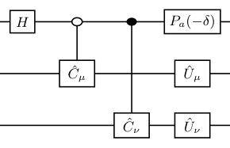 
FIG. 1. Two-register extended-swap circuit for off-diagonal CASH-QSE matrix elements. The ancilla selects the seed/occupation preparation on register A or B. The ansatz circuits need not be controlled because the logical idle state |0n⟩is verified to be invariant under the executed tapered ansatz circuits up to phase. The ancilla gate Pa(−δ) compensates any difference between the two idle-state phases and is omitted when that difference is zero modulo 2π. The CSWAP network maps both branches onto register A, where ancilla X/Y and system-Pauli measurements recover the real and imaginary transition components.

**Summary.** This paper introduces CASH-QSE, a novel quantum algorithm for electronic structure calculations that separates the energy calculation into a classically solvable active-space component and a quantum-corrected component. By enforcing orthogonality and solving the problem via a generalized eigenvalue problem, it achieves chemical accuracy with significantly reduced quantum circuit depth and sampling requirements compared to existing VQE methods.

**Why it may be interesting.** This work provides a sophisticated, resource-aware quantum algorithm for quantum chemistry, directly addressing the resource scaling and measurement overhead that limits the application of VQE to strongly correlated systems, which is a major focus in AMO physics.

Detailed structure

**Main problem.** The paper addresses the bottleneck in Variational Quantum Eigensolver (VQE) methods by developing a way to calculate quantum corrections to electronic energies without re-measuring the energy contribution already determined by a classical reference state.

**Main result.** The proposed CASH-QSE method achieves chemical accuracy while keeping the largest required quantum circuits manageable (a few hundred CNOT gates) and significantly reducing the required sampling cost compared to standard VQE approaches.

**Method.** CASH-QSE expands the wave function as a combination of a classically calculated Active-Space (CAS) reference state and orthogonal quantum states constructed in the remaining correlation subspace. The energy is then solved via a generalized, non-overlapping Hermitian eigenvalue problem.

**Model / system.** The method is applied to electronic structure calculations for small molecules, specifically $	ext{H}_2	ext{O}$ and $	ext{N}_2$, across bond-stretching coordinates. The formalism relies on partitioning the Hilbert space into a classically tractable CAS subspace and orthogonal quantum subspaces.

**Key observables.** Energy ($E$), CAS coefficients, circuit depth (measured in CNOT gates), and the ratio of required quantum sampling shots (compared to ADAPT-VQE).

**Important parameters / regimes.** Chemical accuracy, bond-stretching distances (e.g., 0.96 Å to 3.0 Å for $	ext{H}_2	ext{O}$), and the size of the required quantum circuit (e.g., 70-CNOT network for $	ext{H}_2	ext{O}$).

**Assumptions / limitations.** The method assumes the remaining correlation can be exactly decomposed into a set of mutually orthogonal, structurally constrained quantum subspaces, allowing the global energy minimization to be treated as a linear Ritz problem.

**Figures summary.** Table VIII compares the required quantum sampling resources (shots) for $	ext{H}_2	ext{O}/	ext{cc-pVDZ}$ at various bond lengths, showing the significant reduction in shots achieved by CASH-QSE relative to ADAPT-VQE.

**Paper structure.** The paper introduces the core problem, details the mathematical formalism involving the first-defect decomposition to create an orthogonal basis, describes the iterative optimization procedure involving orbital relaxation and CAS coefficient updates, and concludes with benchmark results on molecular systems.

Abstract

The wave function prepared by a variational quantum eigensolver (VQE) can contain a substantial classically tractable component, yet its energy contribution is sampled on the quantum device. Representing the wave function as a combination of a classical reference and separately prepared quantum states allows the reference energy to be evaluated without quantum sampling. However, near-linear dependence among these components can amplify measurement errors and destabilize the resulting energy estimate. We introduce Classical Active-Space Hybrid Quantum Subspace Expansion (CASH-QSE), which retains a complete-active-space self-consistent field (CASSCF) reference classically and uses occupation structure to construct quantum states exactly orthogonal to the reference and to one another. The energy follows from an ordinary Hermitian eigenvalue problem without overlap measurements, while the same occupation constraints simplify the measured operators. Using full configuration interaction to guide component selection, we test CASH-QSE along H$_2$O and N$_2$ bond-stretching coordinates spanning weakly to strongly correlated regimes. The benchmarks use STO--3G for both molecules and a restricted cc-pVDZ orbital space for H$_2$O. CASH-QSE reaches chemical accuracy while limiting the largest complete measurement circuits to a few hundred all-to-all logical controlled-NOT gates. In favorable cases, it also reduces the idealized final-energy sampling cost by several orders of magnitude relative to VQE with an adaptive derivative-assembled pseudo-Trotter ansatz (ADAPT-VQE).

[↑ back to top](#top)

### [Closing the Loop: Non-Causal Computation, Partial Traces, & Postselected Entanglement](http://arxiv.org/abs/2609.08716v1)

**Authors:** Mark Carney  
**Type:** theory · **Category:** quantum information and computing · **PDF:** <https://arxiv.org/pdf/2609.08716v1>  
**Analysis basis:** full PDF text, analyzed in chunks
**Topic relevance:** `quantum measurements` **1/5**

📷 Fig 1

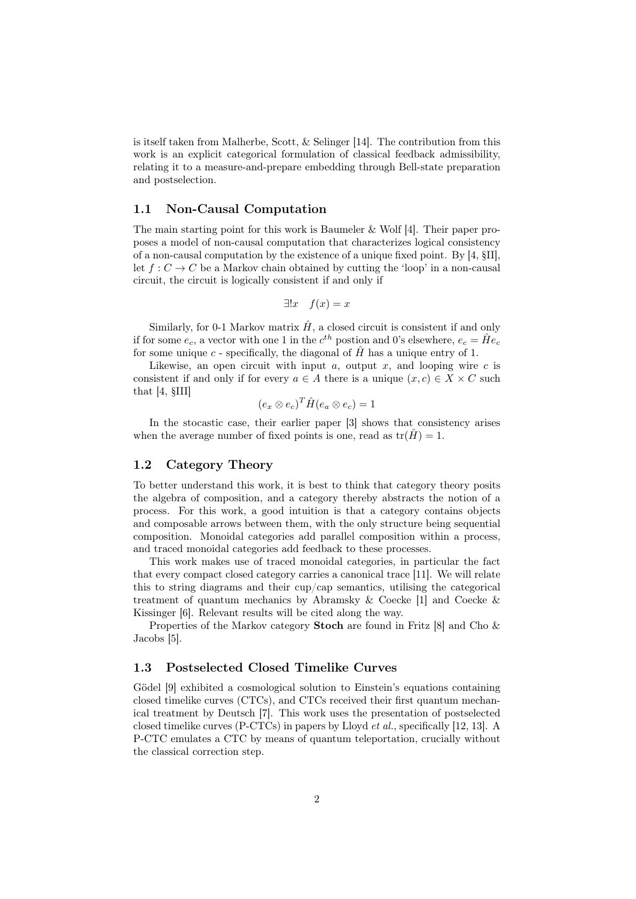 
Low-resolution page preview, page 2

📷 Fig 2

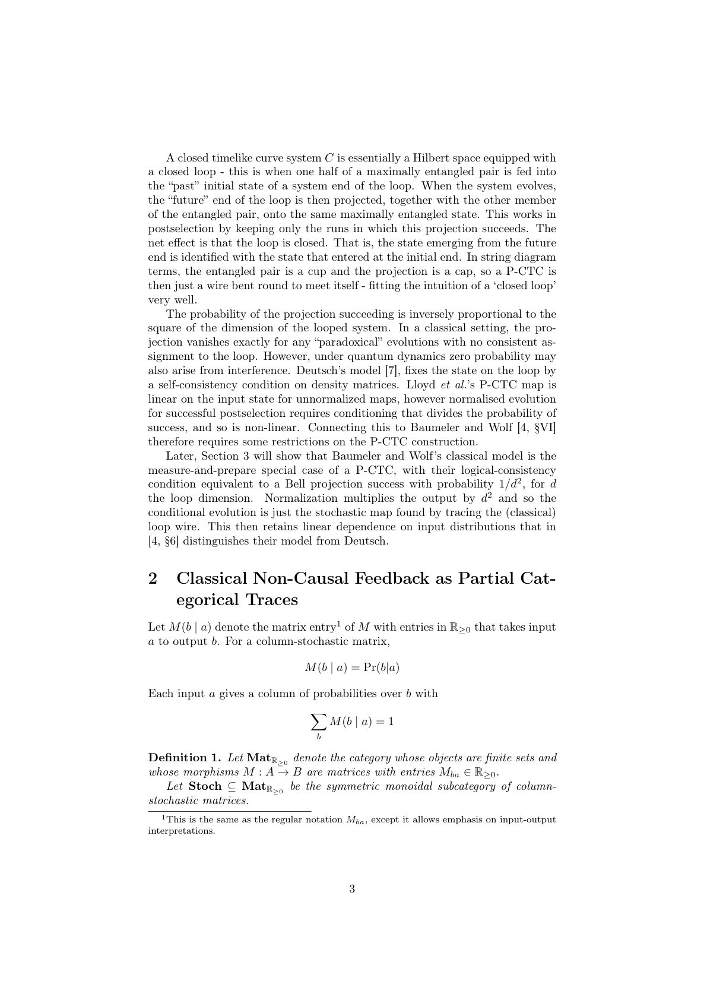 
Low-resolution page preview, page 3

📷 Fig 3

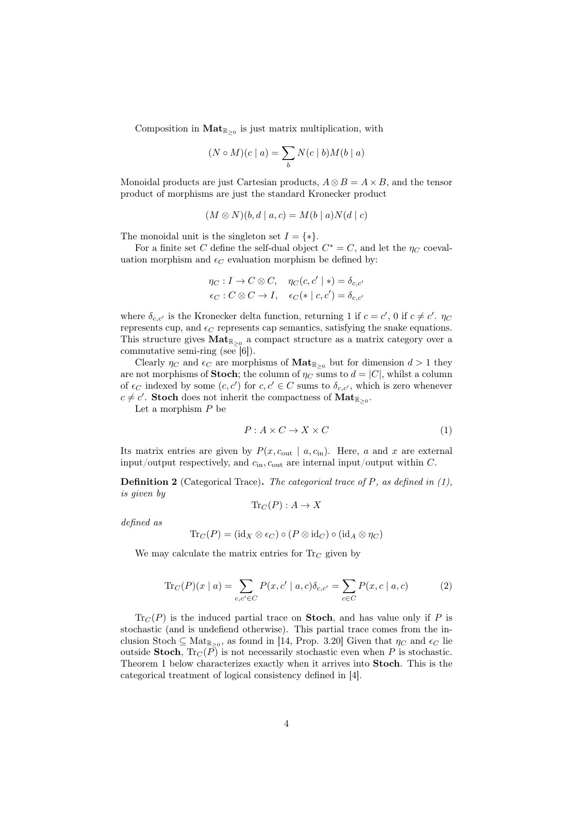 
Low-resolution page preview, page 4

📷 Fig 4

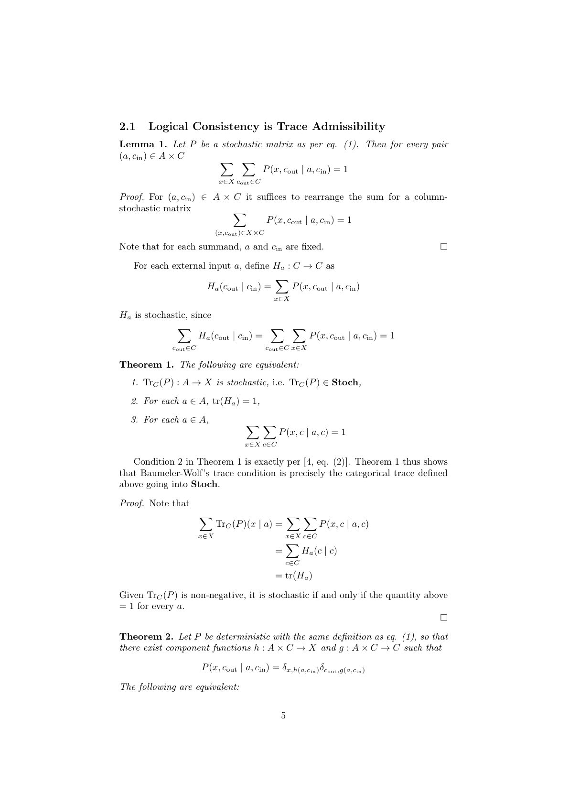 
Low-resolution page preview, page 5

📷 Fig 5

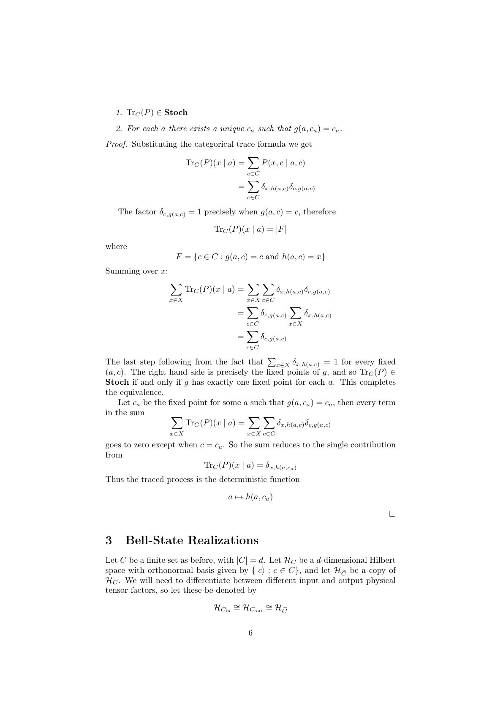 
Low-resolution page preview, page 6

**Summary.** This paper mathematically interprets non-causal quantum computation using category theory, linking it to postselected quantum teleportation. It proves that the logical consistency of these circuits is equivalent to specific trace conditions on the underlying process matrices. Ultimately, it shows this consistency manifests physically as a uniform probability distribution ($1/d^2$) in the postselected Bell measurement outcomes.

**Why it may be interesting.** The work provides deep mathematical tools (category theory) to analyze the fundamental constraints of causality and information flow in quantum computation, which is highly relevant for understanding resource theories and computational limits.

Detailed structure

**Main problem.** The paper aims to provide a rigorous categorical interpretation of non-causal quantum computation models, specifically connecting them to the physical process of postselected quantum teleportation.

**Main result.** It establishes that classical logical consistency in these non-causal circuits is mathematically equivalent to the postselected Bell outcome having a uniform probability of $1/d^2$ for all classical inputs.

**Method.** The authors employ a categorical framework using traced monoidal categories ($	ext{MatR}^{\ge 0}$) to define and analyze the process's consistency conditions.

**Model / system.** The model involves non-causal circuits, which are analyzed via a categorical trace operation ($	ext{Tr}_C(P)$) applied to a stochastic map $P$. This is physically mapped onto a process involving postselection on a maximally entangled Bell state.

**Key observables.** The stochastic nature of the traced process ($	ext{Tr}_C(P) \in 	ext{Stoch}$), the trace of the induced loop transition matrix ($	ext{tr}(H_a) = 1$), and the probability of the postselected Bell outcome ($1/d^2$).

**Important parameters / regimes.** The loop dimension $d = |C|$, which dictates the required probability $1/d^2$ for classical consistency.

**Assumptions / limitations.** The analysis assumes the process $P$ is stochastic for the trace to be well-defined in the context of the category $	ext{Stoch}$.

**Paper structure.** The paper develops the categorical framework, proves the equivalence between the categorical trace being stochastic and the loop transition matrix having trace 1 (Theorem 1), and then extends this to show the equivalence between this condition and the specific probability distribution arising from postselected Bell measurements (Theorem 3).

Abstract

This paper gives a categorical interpretation of Baumeler \& Wolf's logically consistent non-causal circuits, connecting them to postselected quantum teleportation. Looped feedback is represented by a trace in the category of non-negative matrices, and it is shown that the traced process is stochastic precisely when the induced loop transition matrix has trace $1$ for every external input, a condition shown to be equivalent to a unique fixed point for the loop for each input to a deterministic circuit. A classical non-causal circuit is represented by a measure-and-prepare quantum channel with an internal register utilising a maximally entangled Bell-state with postselection. The main result is that classical logical consistency is equivalent to the postselected Bell outcome having, for loop dimension $d$, probability exactly $1/d^2$ for each classical input distribution. The subsequent normalised conditional output then agrees exactly with the classical categorical trace. This work identifies a class of quantum Bell-postselection constructions whose conditional evolution maintains linear dependence on classical input distributions.

[↑ back to top](#top)

### [Distributed Quantum Property Testing with Quantum Carrier Pigeons](http://arxiv.org/abs/2609.08864v1)

**Authors:** Kenny Chen, Mina Doosti, Ryan Sweke, Chirag Wadhwa  
**Type:** theory · **Category:** quantum information and computing · **PDF:** <https://arxiv.org/pdf/2609.08864v1>  
**Analysis basis:** full PDF text, analyzed in chunks
**Topic relevance:** `quantum measurements` **1/5**

📷 Fig 1

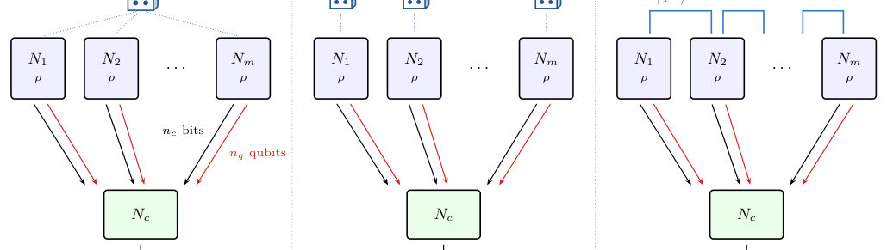 
Figure 1: An illustration of the (𝑛𝑐, 𝑛𝑞, 𝑅, 𝐸) model for distributed quantum inference, as per Definition 1.1. Each distributed node {𝑁𝑖}𝑖∈[𝑚] holds a single copy of 𝜌and communicates with the central node 𝑁𝑐via a communication channel limited to 𝑛𝑐bits and 𝑛𝑞qubits. The central node should output a valid solution to the inference problem (eg “Accept” or “Reject” in the case of property testing, or a valid hypothesis in the case of learning). We use 𝑅∈ {public, private} to distinguish between the public and private coin setting (illustrated in panels (a) and (b) respectively), and 𝐸to denote the number of Bell pairs shared between each neighbouring distributed node. In this work we focus...

**Summary.** This paper develops a general framework for distributed quantum inference, focusing on certifying unknown quantum states under strict communication limitations. It rigorously characterizes the required quantum resources, proving that shared randomness is crucial for achieving optimal complexity in state certification. The results establish fundamental limits for distributed quantum computation protocols.

**Why it may be interesting.** The rigorous characterization of resource trade-offs (e.g., quantum vs. classical communication, public vs. private randomness) in distributed quantum tasks provides fundamental limits for quantum networking and distributed quantum computation protocols.

Detailed structure

**Main problem.** The paper addresses distributed quantum inference, specifically characterizing the complexity of quantum state certification—determining if an unknown state $
ho$ equals a target state $\sigma$ or if they are far apart—under communication constraints.

**Main result.** It establishes the copy complexity for state certification, showing that shared randomness is necessary for optimal performance, and developing near-optimal private-coin algorithms matching the lower bounds.

**Method.** The work uses information-theoretic techniques to derive both upper bounds (algorithms) and lower bounds (proofs) on the required quantum resources (copy complexity) for the certification task.

**Model / system.** The model is the $(n_c, n_q, R, E)$-model for distributed quantum inference, where $m$ nodes each hold a copy of $
ho$ and communicate with a central node $N_c$ via limited classical bits ($n_c$) and qubits ($n_q$).

**Key observables.** Copy complexity, trace distance ($\|
ho - \sigma\|_1$), and the success probability of the certification test.

**Important parameters / regimes.** Dimension $d$, error threshold $\epsilon$, communication limits $n_c$ and $n_q$, and the randomness source $R$ (public vs. private).

**Assumptions / limitations.** The analysis focuses on the case where there is no communication allowed between the distributed nodes themselves, only one-way communication to the central node.

**Figures summary.** Figure 1 illustrates the $(n_c, n_q, R, E)$ model, detailing the information flow from distributed nodes to the central node under different randomness and entanglement assumptions.

**Paper structure.** The paper first defines the general framework and the specific state certification problem. It then derives complexity bounds for the public-coin and private-coin settings, establishing the necessity of shared randomness, and concludes by presenting near-optimal algorithms.

Abstract

We introduce a framework for distributed quantum inference under communication constraints. In our model, $m$ distributed nodes each receive one copy of an unknown $d$-dimensional quantum state $ρ$, before communicating via a constrained one-way communication channel with a central node, which aims to infer some property of $ρ$. This framework generalizes the classical distributed inference framework introduced by Acharya, Canonne, and Tyagi [COLT 2019], by allowing quantum resources such as quantum communication and shared entanglement.   Within this setting, we focus on the fundamental problem of quantum state certification: Given a complete description of some state $σ$, decide whether $ρ=σ$ or $\|ρ-σ\|_1\geq ε$. Additionally, we focus on the case of limited communication between distributed nodes and the central node: we assume each communication channel is limited to only $n_c$ bits and $n_q$ qubits with $n_c + n_q \leq \log d$. When all nodes can make use of a shared source of randomness, we show that the copy complexity of distributed state certification is $Θ(\frac{d^2}{2^{n_q} 2^{n_c/2}ε^2})$. We further demonstrate that shared randomness is necessary to achieve the above complexity, by proving an $Ω(\frac{d^3}{4^{n_q} 2^{n_c} ε^2})$ lower bound in the $\textit{private-coin}$ setting. Moreover, we develop a private-coin algorithm that matches this bound up to a $\sqrt{\log d}$ factor, showing this complexity is near-optimal. Together, our work establishes a general framework for distributed quantum inference with communication constraints and characterizes the complexity of distributed state certification with limited communication.

[↑ back to top](#top)

### [Divergent Orbital Diamagnetism from Chiral Edge States in Chern Insulators](http://arxiv.org/abs/2609.09065v1)

**Authors:** Nobuyuki Okuma  
**Type:** theory · **Category:** disordered systems and neural networks · **PDF:** <https://arxiv.org/pdf/2609.09065v1>  
**Analysis basis:** full PDF text, analyzed in chunks
**Topic relevance:** `analog quantum simulation` **1/5**

📷 Fig 1

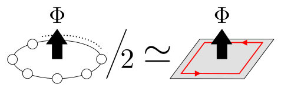 
FIG. 1. Schematic correspondence between a one-dimensional ring and a Chern insulator under magnetic flux.

📷 Fig 2

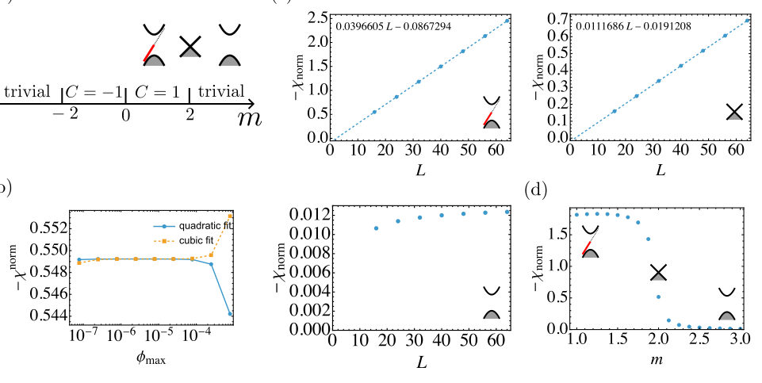 
FIG. 2. (a) Phase diagram of the QWZ model as a function of the mass parameter m, together with schematic low-energy dispersions. The phases with 0 &lt; m &lt; 2 and −2 &lt; m &lt; 0 have Chern numbers C = 1 and C = −1, respectively, while |m| &gt; 2 corresponds to topologically trivial phases. The gap closes at m = 0 and ±2. (b) Determination of the orbital susceptibility from the flux dependence of the total energy for m = 1 and L = 16. The values of −χnorm obtained from quadratic and cubic fits are plotted as functions of the maximum flux ϕmax used in the fitting. (c) System-size dependence of −χnorm for m = 1 (Chern insulator), m = 2 (massless Dirac system), and m = 3 (trivial massive Dirac system)....

📷 Fig 3

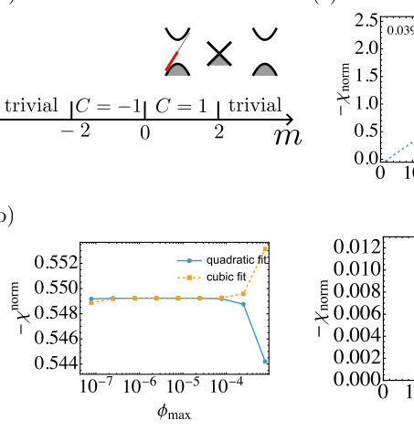 
Figure 2(c) shows the system-size dependence of the normalized orbital susceptibility χnorm for m = 1 (Chern insulator), m = 2 (massless Dirac system), and m = 3 (trivial massive Dirac system). Remarkably, we find that not only the well-known massless Dirac system but also the Chern insulator under open boundary conditions ex- hibits giant diamagnetism, with |χnorm| growing approxi- mately linearly with the system size L. In sharp contrast, for the trivial massive Dirac system, χnorm shows little size dependence for large L and appears to converge to a finite value.

📷 Fig 4

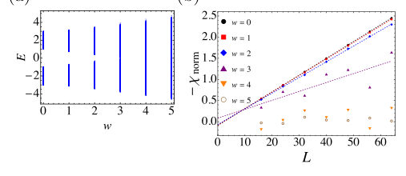 
FIG. 3. (a) Energy spectrum under periodic boundary condi- tions as a function of the disorder strength w for m = 1 and L = 48. The bulk gap closes around w ≃3. (b) System-size dependence of the normalized orbital susceptibility −χnorm for several disorder strengths w. The giant diamagnetic re- sponse approximately linear in L persists in the topological regime and is lost in the strongly disordered regime.

📷 Fig 5

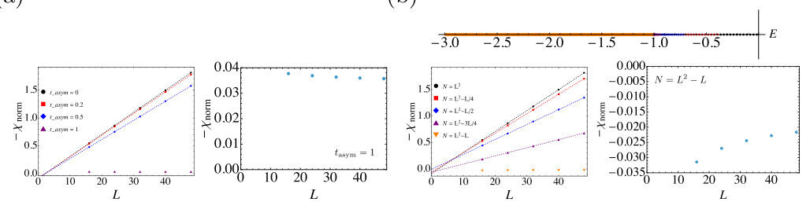 
FIG. 4. System-size dependence of the normalized orbital susceptibility χnorm away from the symmetric half-filled case. (a) χnorm for several values of the band-asymmetry parameter tasym at half filling. For tasym &lt; 1, where the system remains a bulk insulator, the diamagnetic susceptibility diverges linearly with L, whereas the divergence disappears at tasym = 1. (b) χnorm for several values of α, with the particle number set to N = L2 −αL. For α &lt; 1, the Fermi level crosses the edge states and the divergent diamagnetic response persists, whereas at α = 1 the Fermi level reaches the top of the valence band and the susceptibility tends to a finite positive value.

**Summary.** This work analyzes the orbital diamagnetism in Chern insulators using lattice models, finding that the susceptibility diverges linearly with system size when open boundary conditions are applied. This giant diamagnetism is robust against disorder and is attributed to the topological nature of the chiral edge states, distinguishing it sharply from the finite response predicted by bulk theory.

**Why it may be interesting.** The robust, size-dependent topological response observed here provides a clear, measurable signature (divergent diamagnetism) that distinguishes topological edge physics from bulk properties, which is a key concept in characterizing topological phases.

Detailed structure

**Main problem.** The study investigates whether orbital diamagnetism can distinguish between topologically non-trivial (Chern insulator) and trivial massive Dirac insulators, focusing on the role of chiral edge states.

**Main result.** Both Chern insulators and massless Dirac systems exhibit giant diamagnetism that scales linearly with system size under open boundary conditions, a feature absent in the bulk calculation or trivial insulators.

**Method.** The authors use numerical calculations of the normalized orbital susceptibility derived from the total energy dependence on magnetic flux, comparing open and periodic boundary conditions.

**Model / system.** The system is modeled using a lattice massive Dirac Hamiltonian, specifically the Qi–Wu–Zhang (QWZ) model, applied to Chern insulators and related Dirac systems on a square lattice.

**Key observables.** Orbital diamagnetic susceptibility ($\chi_{	ext{orb}}$ or $\chi_{	ext{norm}}$), and its scaling with system size ($L$).

**Important parameters / regimes.** System size ($L$), magnetic flux ($\phi$), mass term ($m$), and disorder strength ($w$).

**Assumptions / limitations.** The analysis assumes zero temperature and fixed particle number, and relies on comparing finite-size calculations (OBC) against bulk formulas (PBC).

**Figures summary.** Figures illustrate the phase diagram of the QWZ model, the system-size dependence of $\chi_{	ext{norm}}$ for different mass regimes, and the robustness of the diamagnetism against disorder.

**Paper structure.** The paper progresses by establishing the context of divergent diamagnetism in massless Dirac systems, then applying the method to Chern insulators under OBC, contrasting this with PBC results, and finally analyzing the persistence of the divergence under symmetry breaking or changes in filling.

Abstract

Two-dimensional massless Dirac systems, exemplified by graphene, are known to exhibit a divergent orbital diamagnetic susceptibility that scales linearly with system size. Motivated by viewing a chiral edge state as one half of an enlarged analogue of a benzene ring, we study Chern insulators under open boundary conditions and find the same divergent scaling. This giant diamagnetism is robust against disorder, revealing its topological nature. Our results further suggest a profound connection to the divergent diamagnetism of massless Dirac systems.

[↑ back to top](#top)

### [Effects of Interaction Range on Fluid Multicriticality: A Computational Study of an Interconverting Lattice Model](http://arxiv.org/abs/2609.09074v1)

**Authors:** Thomas J. Longo, Sergey V. Buldyrev, Frédéric Caupin, Mikhail A. Anisimov  
**Type:** both · **Category:** statistical mechanics · **PDF:** <https://arxiv.org/pdf/2609.09074v1>  
**Analysis basis:** full PDF text, analyzed in chunks
**Topic relevance:** `analog quantum simulation` **1/5**

📷 Fig 1

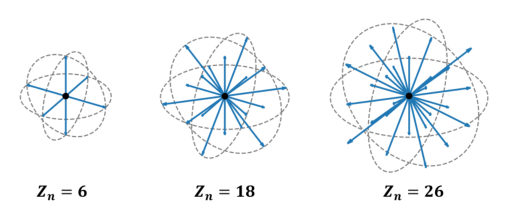 
FIG. 1. Depiction of the range of interactions between a given lattice site and its neighbors for the first three spherical shells of radii: rz = 1 (Zn = 6), rz = √

📷 Fig 2

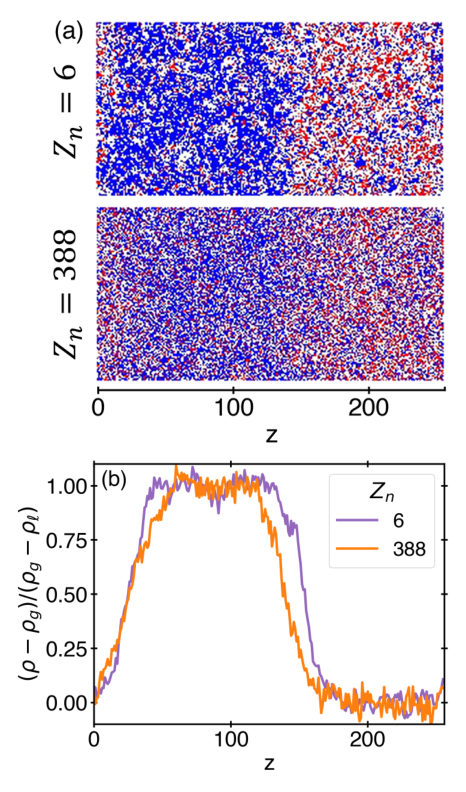 
FIG. 2. Normalized density profiles (scaled by their respective bulk densities) obtained from MC simulations with ¯ω = 1 after 234 el- ementary MC steps, corresponding to approximately 2048 update opportunities per lattice site. Panel (a) shows a representative 2D slice of the simulation configurations in the xz-plane, with sites col- ored in white, blue, and red, if empty or occupied by particles of type 1 or 2, respectively. Panel (b) shows the corresponding density profiles along the z-direction for the smallest (Zn = 6, purple) and largest (Zn = 388, orange) coordination numbers investigated in this work. The profiles correspond to coexistence conditions at ˆT = 0.8 for Zn = 6 and ˆT =...

📷 Fig 3

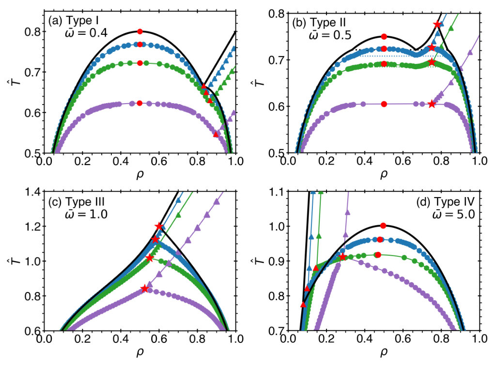 
FIG. 3. Temperature-density phase diagrams illustrating the four critical archetypes (a-d) for three representative coordination numbers: Zn = 6 (purple), Zn = 26 (green), and Zn = 80 (blue), together with the MF theory predictions (black). Note that, for clarity, only these three coordination numbers are shown; additional Zn values considered in this work exhibit the same overall trends, which are considered in more detail in the next Section (IV B). In all panels, circles denote liquid–gas coexistence data, while triangles indicate liquid–liquid second-order phase transition (λ-line) data. The thin curves are provided as guides to the eye. Red symbols identify key thermodynamic points:...

📷 Fig 4

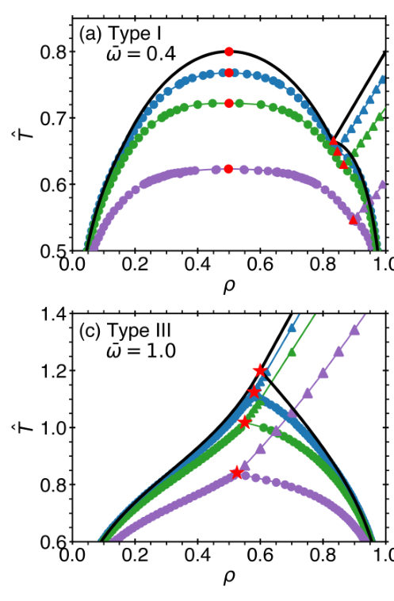 
Figure 3 presents temperature-density phase diagrams, ob- tained from MC simulations for the four critical archetypes at

📷 Fig 5

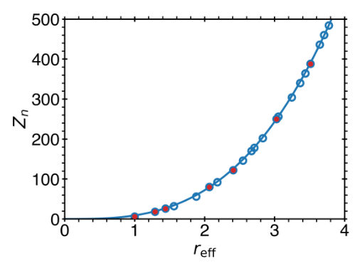 
FIG. 4. Dependence of the number of interacting neighbors, Zn, on the effective interaction radius, reff. The circles show values calcu- lated from Eq. (7), while the solid curve shows the continuum-limit relation Zn = (4π/3)(5/3)3/2r3 eff ≈9.013r3 eff, which follows from the volume of a sphere in the limit Zn →∞. The circles with red centers correspond to the MC simulations considered in this work.

**Summary.** This paper computationally studies how the range of molecular interactions influences the critical behavior of a fluid system using an interconverting lattice model. By varying the interaction range, the authors demonstrate that the system's critical points evolve, showing a systematic convergence toward mean-field theory predictions. This work provides a detailed framework for understanding the crossover between short-range and long-range critical phenomena in condensed matter systems.

**Why it may be interesting.** While focused on classical statistical mechanics, the study of critical phenomena and phase transitions in lattice models provides foundational insights into how microscopic interactions dictate macroscopic behavior, which underpins many quantum many-body theories.

Detailed structure

**Main problem.** The study investigates how varying the range of intermolecular interactions affects the nature of fluid multicriticality.

**Main result.** The system exhibits a clear convergence of simulation results toward mean-field predictions as the interaction range increases, revealing different critical archetypes depending on the interaction range.

**Method.** The research employs both mean-field theory analysis and extensive three-dimensional Monte Carlo simulations.

**Model / system.** The model is an interconverting lattice model (DBC model) designed to exhibit both Ising-like liquid-gas criticality and symmetric fluid tricriticality. The Hamiltonian includes terms for intermolecular interactions and interconversion energy.

**Key observables.** Phase coexistence, critical exponents, phase diagrams (showing LGCP, $\lambda$-EP, and TCP), and density/composition profiles.

**Important parameters / regimes.** The primary variable is the interaction range, controlled by the number of interacting neighbors ($Z_n$), which is systematically varied from 6 to 388.

**Assumptions / limitations.** The analysis often focuses on the degenerate case ($	ilde{e} = 	ilde{s} = 0$), and the mean-field theory is known to be exact only in the infinite range limit.

**Figures summary.** Figures compare phase diagrams and coexistence lines for different $Z_n$ values against mean-field predictions, showing convergence as $Z_n$ increases.

**Paper structure.** The paper establishes the physical model and the role of interaction range, details the simulation methodology (MC moves, observables), presents results showing the dependence of critical behavior on $Z_n$, and concludes by comparing findings to theoretical limits.

Abstract

The range of intermolecular interactions plays a central role in determining the nature of phase behavior and critical phenomena. It is well established through studies of the Ising model that as interaction range increases, Monte Carlo simulations progressively approach meanfield predictions as the effects of critical fluctuations are suppressed. In this work, we investigate how varying interaction range influences fluid multicriticality using an interconverting lattice model that exhibits both Ising-like liquid-gas criticality and symmetric fluid tricriticality (similar to that in the superfluid $^4$He-$^3$He mixture). This minimal model serves as a representative system for exploring the evolution of competing critical points within a generic framework. We analyze the model using both meanfield theory and three-dimensional Monte Carlo simulations while systematically varying the number of interacting neighbors, $Z_n$, from 6 to 388. We find that the system with nearest-neighbor interactions ($Z_n=6$) reveals only two types of multicritical behavior, while for larger interaction ranges, four distinct archetypes emerge. We demonstrate the convergence of the simulation results to those of the meanfield theory as the number of interacting neighbors tends to infinity, and we discuss the results within the framework of crossover critical phenomena.

[↑ back to top](#top)

### [Nuclear slowing-down factors in alkali-metal vapors](http://arxiv.org/abs/2609.08261v1)

**Authors:** Vasiliki Koutrouli, Georgios Vasilakis, Kostas Mouloudakis  
**Type:** theory · **Category:** other · **PDF:** <https://arxiv.org/pdf/2609.08261v1>  
**Analysis basis:** full PDF text, analyzed in chunks
**Topic relevance:** `quantum measurements` **1/5**

📷 Fig 1

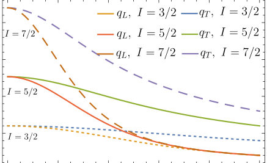 
FIG. 1. Polarization dependence of the longitudinal and transverse nuclear slowing-down factors, qL(p) and qT (p), for nuclear spins I = 3/2, 5/2, and 7/2. The two slowing-down factors coincide in the unpolarized limit (p →0) but differ increasingly at finite polarization, reflecting the distinction between changes in the magnitude and orientation of the spin polarization.

📷 Fig 2

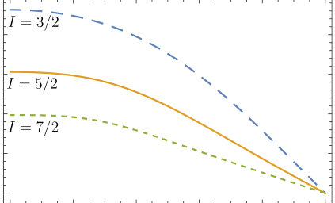 
FIG. 2. Polarization dependence of the quadratic spin- exchange relaxation factor CT (p), for nuclear spins I = 3/2, 5/2, and 7/2.

📷 Fig 3

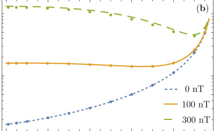 
FIG. 3. (a) Longitudinal and transverse slowing-down fac- tors extracted from the slow eigenvalues of the linearized dynamics obtained from Eq. (C1) (red and orange dashed curves), compared with the analytical expressions (black and gray solid curves), for I = 3/2 and B = 0. (b) Transverse re- laxation rate as a function of the stationary spin polarization p. Colored points show the decay rate of the slow transverse eigenmode, while the solid curves show the analytical predic- tion of Eq. (14), including all contributions through second order in the magnetic field, spin-destruction rate, and optical- pumping rate. The calculation is performed for I = 3/2, with Rse = 105 s−1 and Rsd = 102...

📷 Fig 4

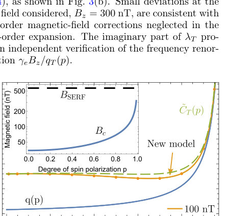 
FIG. 4. Comparison between the conventional and cor- rected descriptions of the transverse relaxation rate as a function of spin polarization. The blue curve shows the conventional prediction, (Rop + Rsd)/qT (p), while the or- ange curve includes the finite-field spin-exchange contribu- tion CT (p)(γeBz)2/Rse. The green dashed curve instead in- cludes the finite-field spin-exchange correction evaluated us- ing ˜CT (p). The calculation is shown for Bz = 100 nT, Rse = 105 s−1, and Rsd = 102 s−1, with circularly polarized D1 pumping (sph = 1), for which Rop = p Rsd/(1 −p). The inset shows the polarization-dependent critical field Bc(p), at which the quadratic spin-exchange broadening equals...

📷 Fig 5

 
Figure 4 illustrates the practical consequence of the finite-field correction. The conventional description, which includes only the slowing-down factor qT (p), sub- stantially underestimates the transverse relaxation rate once the quadratic spin-exchange contribution becomes appreciable (blue curve). This occurs even though the applied field remains well below the SERF scale BSERF. In contrast, the model that naively includes ˜CT (p) over- estimates the transverse relaxation rate (green curve).

**Summary.** This theoretical work refines the understanding of spin dynamics in alkali-metal vapors by deriving separate slowing-down factors for longitudinal and transverse spin components in the SERF regime. The authors show that standard single-factor models overestimate relaxation rates at high polarization. These findings are vital for improving the accuracy of atomic magnetometers used in fundamental physics measurements.

**Why it may be interesting.** It provides a rigorous, quantitative refinement of the effective Bloch description for alkali-metal spin dynamics, which is crucial for accurately modeling high-precision atomic magnetometers and comagnetometers.

Detailed structure

**Main problem.** The paper addresses the discrepancy in describing alkali-metal spin dynamics in the SERF regime by analyzing the nuclear slowing-down factors for longitudinal versus transverse spin components.

**Main result.** Longitudinal and transverse spin dynamics are governed by distinct slowing-down factors at finite polarization, invalidating the single-factor description used in standard Bloch equations.

**Method.** The analysis employs perturbation theory on the linearized density-matrix dynamics, treating the spin-exchange interaction as the unperturbed system.

**Model / system.** The system involves alkali-metal vapors undergoing spin-exchange optical pumping (SEOP) in the SERF regime, modeled using the density-matrix formalism and effective Bloch equations.

**Key observables.** Longitudinal and transverse spin relaxation rates (1/T1, 1/T2), and the polarization-dependent slowing-down factors ($q_L(p)$ and $q_T(p)$).

**Important parameters / regimes.** Electron spin polarization ($p$), magnetic field strength ($B$), and the ratio of various relaxation rates (e.g., $\gamma_e B_z/R_{	ext{se}}$).

**Assumptions / limitations.** The analysis assumes an axially symmetric configuration and uses perturbation theory valid to specific orders in small rate ratios.

**Figures summary.** The notes reference tables providing explicit, closed-form polynomial expressions for the second-order coefficients ($	ext{S}_{\alphaeta}$) governing the field-dependent corrections to the transverse SERF eigenvalue.

**Paper structure.** The paper builds from the general Bloch description to a detailed density-matrix analysis, deriving distinct factors for longitudinal and transverse dynamics, and culminates in calculating the second-order field corrections to the transverse SERF eigenvalue.

Abstract

Nuclear slowing-down factors account for the sharing of angular momentum between the electron and the nucleus in the effective Bloch description of alkali-metal spin dynamics in the spin-exchange-relaxation-free (SERF) regime. For collinear optical pumping and magnetic field, we find that longitudinal and transverse spin dynamics are characterized by different polarization-dependent slowing-down factors. Transverse dynamics are governed by the conventional factor $q(p)$, with $p$ the electron spin polarization, whereas longitudinal relaxation is governed by $q(p)+p\,dq(p)/dp$. The two factors coincide at zero polarization but differ substantially at high polarization, where the single-factor description overestimates the underlying pumping and relaxation rates inferred from longitudinal transients by factors approaching two to four, depending on the nuclear spin. We further derive closed-form expressions, valid at arbitrary polarization, for the residual spin-exchange relaxation of the transverse spin components at finite magnetic field along the pumping axis. This contribution is quadratic in the magnetic field and can become comparable to the zero-field linewidth at fields well within the SERF regime. The results are obtained by perturbation theory on the density-matrix dynamics linearized around the stationary state and are verified by numerical solutions of the microscopic density-matrix equation. These findings refine the effective Bloch description of alkali-metal spin dynamics and are directly relevant to atomic magnetometers and alkali-metal--noble-gas comagnetometers, including those used in precision searches for physics beyond the Standard Model.

[↑ back to top](#top)

### [Theory of Kondo hybridization wave in Kondo lattice](http://arxiv.org/abs/2609.08467v1)

**Authors:** Yin Zhong  
**Type:** theory · **Category:** strongly correlated electrons · **PDF:** <https://arxiv.org/pdf/2609.08467v1>  
**Analysis basis:** full PDF text, analyzed in chunks
**Topic relevance:** `Keldysh / 2PI / non-Gaussian methods` **1/5**

📷 Fig 1

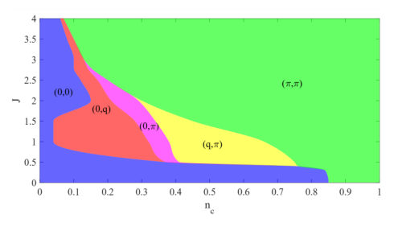 
FIG. 2. The J −nc ground-state phase diagram on square lattice with Q = (Qx, Qy) and q ∈(0, π).

📷 Fig 2

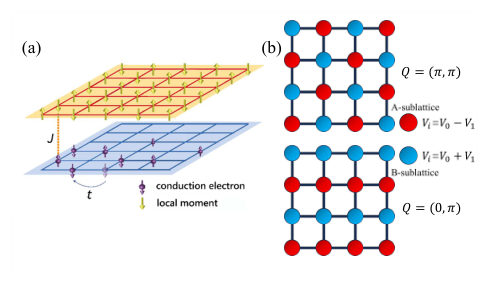 
FIG. 1. (a) The Kondo lattice model defined on square lattice with nearest-neighbor-hopping t and Kondo coupling J. (b) Schematic spatial distribution of Kondo hybridization order parameter Vi = V0 + V1eiQ·Ri with Q = (π, π) and (0, π).

📷 Fig 3

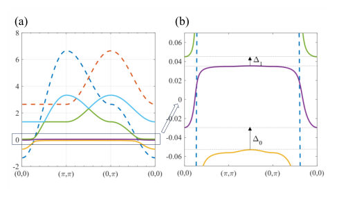 
FIG. 3. (a) The quasi-particle bands (solid line and dashed line corresponds to bare bands εk, εk+Q) along high-symmetry path (0, 0)−(π, π)−(0, π)−(0, 0) and (b) their hybridization gap ∆0, ∆1 for KHW phase with Q = (0, π).

📷 Fig 4

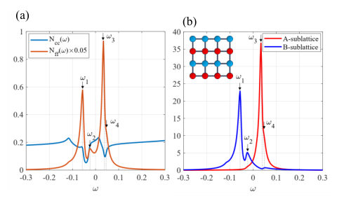 
FIG. 4. (a) The DOS of conduction electron Ncc(ω) and Abrikosov fermion Nff(ω) and (b) LDOS of Abrikosov fermion on A and B sublattice for KHW phase with Q = (0, π).

📷 Fig 5

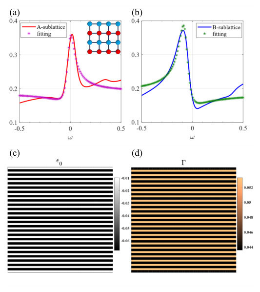 
FIG. 5. (a)(b) The calculated STM spectrum and its fitting for A and B sublattice. (c)(d) The stripe-like spatial distribution of fitting parameters ϵ0 and Γ for KHW with Q = (0, π).

**Summary.** This paper develops a mean-field theory for the Kondo lattice to explain the emergence of spatially modulated Kondo hybridization waves (KHW). By modeling the order parameter with a wavevector $\mathbf{Q}$, the authors predict that the $\mathbf{Q}=(0,\pi)$ phase generates uniaxial stripe modulations and anisotropic conductivity. This provides a unified theoretical foundation for understanding these novel ordered states in heavy fermion materials.

**Why it may be interesting.** The work provides a concrete, microscopic theoretical framework connecting abstract many-body physics (Kondo lattice) to specific, measurable experimental signatures (STM modulation, transport anisotropy) in complex correlated materials.

Detailed structure

**Main problem.** The paper addresses the experimental observation of spatially modulated Kondo hybridization wave (KHW) order in heavy fermion superconductors, challenging the assumption of uniform hybridization.

**Main result.** A microscopic theory successfully predicts the stable $\mathbf{Q}=(0,\pi)$ KHW phase, which yields uniaxial stripe modulation matching STM data in $	ext{UTe}_2$ and $1	ext{T}/1	ext{H-TaS}_2$, and predicts anisotropic transport as a fingerprint.

**Method.** The authors developed a theory using the large-$N$ fermionic mean-field approximation applied to the canonical square-lattice Kondo lattice model.

**Model / system.** The system is the Kondo lattice model, described by a Hamiltonian involving conduction electrons and local moments. The theory treats the Kondo hybridization order parameter $V_i$ as spatially modulated: $V_i = V_0 + V_1 e^{i\mathbf{Q}\cdot\mathbf{R}_i}$.

**Key observables.** Kondo hybridization gap modulation (uniaxial stripe), in-plane conductivity anisotropy ($\sigma_{xx} 
eq \sigma_{yy}$), quasiparticle band structure, and Local Density of States (LDOS).

**Important parameters / regimes.** The ordering wavevector $\mathbf{Q}$, the Kondo coupling strength $J$, and the conduction electron filling $n_c$.

**Assumptions / limitations.** The primary assumption is the $\mathbf{Q}$-dependent ansatz for the hybridization order parameter $V_i$ and the use of the large-$N$ mean-field approximation.

**Figures summary.** Figures illustrate the spatial modulation of the order parameter, the resulting four-band quasiparticle structure for $\mathbf{Q}=(0,\pi)$, and the corresponding DOS/LDOS features.

**Paper structure.** The paper develops the mean-field theory for the modulated Kondo lattice, derives the self-consistent equations for the order parameters $V_0$ and $V_1$, maps the ground-state phase diagram, and finally calculates spectroscopic and transport signatures for the key $\mathbf{Q}=(0,\pi)$ phase.

Abstract

Recent scanning tunneling microscopy experiments have discovered emergent spatially modulated Kondo hybridization wave (KHW) order in the heavy fermion superconductor UTe$_2$ and the artificial Kondo lattice system 1T/1H-TaS$_2$, challenging the conventional paradigm of spatially uniform Kondo hybridization in heavy fermion physics. Here, we develop a microscopic theory for KHW order based on the canonical square-lattice Kondo lattice model within the large-$N$ fermionic mean-field approximation. We systematically identify stable modulated KHW phases and establish their ground-state phase diagram. The prominent $\boldsymbol{Q}=(0,π)$ KHW phase yields uniaxial stripe modulation of the Kondo hybridization gap, which faithfully reproduces the spatial modulation pattern observed in UTe$_2$. Moreover, its inherent unit-cell-doubling modulation precisely accounts for the spectroscopic features measured in 1T/1H-TaS$_2$. We further predict a characteristic in-plane conductivity anisotropy that serves as a definitive transport fingerprint to discriminate KHW states with distinct ordering wavevectors. Our work provides a microscopic foundation for the newly observed KHW order and establishes a unified theoretical framework for understanding emergent modulated hybridization phenomena in heavy fermion materials.

[↑ back to top](#top)

### [Transport properties and topological phase transitions for a Creutz-Su-Schrieffer-Heeger ladder](http://arxiv.org/abs/2609.08146v1)

**Authors:** K. A. González, S. Bravo, L. Rosales, P. A. Orellana  
**Type:** theory · **Category:** other · **PDF:** <https://arxiv.org/pdf/2609.08146v1>  
**Analysis basis:** full PDF text, analyzed in chunks
**Topic relevance:** `analog quantum simulation` **1/5**

📷 Fig 1

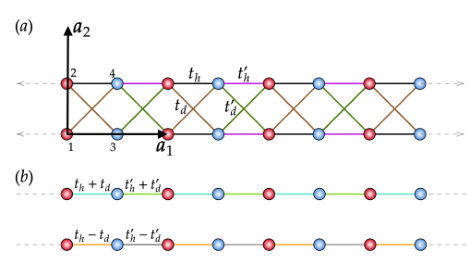 
Figure 1: (a) Real space structure of the Creutz ladder lattice with hopping amplitudes labeling. (b) Representation in terms of effective SSH chains.

📷 Fig 2

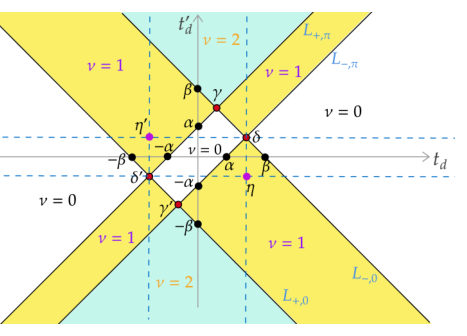 
Figure 2: Two-dimensional projection of the four-dimensional bulk phase diagram for the topological phases of the CSSH ladder. Solid lines represent the gap-closing regions in the spectrum, while dashed lines indicate the flat-band formation conditions. The labels α and β denote points at which, in addition to lying on a topological phase-transition line, one of the intercell hopping parameters vanishes. The labels η and η′ correspond to codimension-2 regions where two flat bands become degenerate. The points (δ, δ′, γ, γ′) indicate parameter values at which simultaneous gap closings occur in momentum space. In addition, (δ, δ′) also correspond to points where two flat bands become...

📷 Fig 3

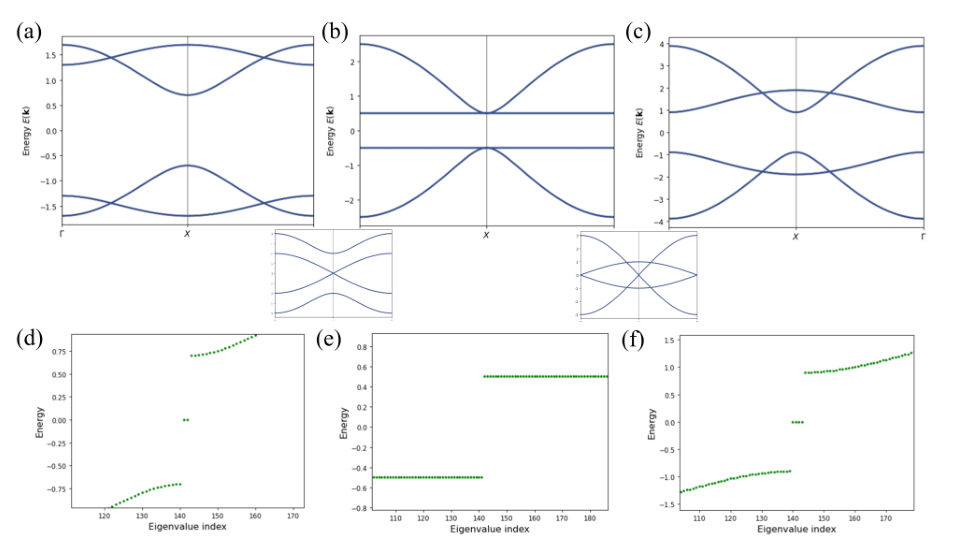 
Figure 3: (a) bulk band structure for a parameter set with th = 1.0, t′ h = 0.5, td = 0.5 and t′ d = −0.7, which corresponds to a ν = 1 phase. (b) bulk band structure for a parameter set with th = 1.0, t′ h = 0.5, td = 0.5 and t′ d = 0.5, which corresponds to a ν = 0 phase. (c) bulk band structure for a parameter set with th = 1.0, t′ h = 0.5, td = 0.5 and t′ d = 1.5, which corresponds to a ν = 2 phase. Panel (d)–(f) represent the energy spectrum of a finite structure at representative points of the three phases, selected according to the phase-diagram criteria discussed in Sec. 2.

📷 Fig 4

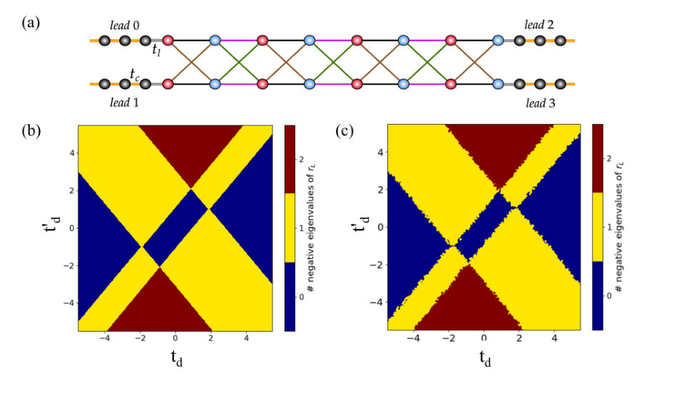 
Figure 4: (a) Transport configuration used for the four-terminal calculations, including the lead labeling. (b) Signature of the eigenvalues of the reflection matrix rL, corresponding to the topological invariant ν, in the projected (td, t′ d) plane for a pristine system, where all hoppings of the same type have equal magnitude. The fixed parameters are th = 1.5 and t′ h = 1. (c) Signature of the eigenvalues of the reflection matrix rL, corresponding to the topological invariant ν, in the projected (td, t′ d) plane for a system with random th hoppings uniformly distributed in the range 1.5 ± 0.2, with fixed t′ h = 1. For both calculations in (b) and (c), the parameter-space grid has size...

📷 Fig 5

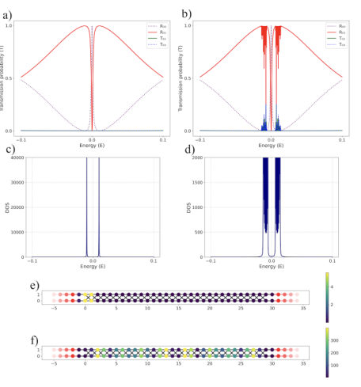 
Figure 6: (a) Transmission probability in the flat band con- dition for th = t′ h = t′ d = 1, td = 1.01. (b) Transmission probability slightly off the flat band condition for th = t′ h = 1, td = 1.01, t′ d = 1.004. (c,d) Density of states for (c) the flat band condition and (d) slightly off the flat band condition. (e,f) Local density of states where the in-signal enters through the lead 0 at E = 0.01 for (e) the flat band condition and (f) slightly off the flat band condition

**Summary.** This work analyzes the electronic and topological properties of the CSSH ladder using a tight-binding model. By calculating topological invariants and analyzing electronic transport, the authors demonstrate a fundamental link between the system's topology, the formation of flat bands, and its measurable transport response. This provides a comprehensive theoretical framework for understanding localization and topological transitions in such quantum lattices.

**Why it may be interesting.** The strong connection drawn between topological invariants (a bulk property) and measurable transport signatures (a real-space observable) provides a powerful, experimentally relevant diagnostic tool for characterizing topological phases in condensed matter systems.

Detailed structure

**Main problem.** The study investigates the interplay between electronic, topological, and transport properties in the Creutz-Su-Schrieffer-Heeger (CSSH) ladder.

**Main result.** The research establishes a direct connection showing that topological properties, the formation of flat bands, and electronic transport signatures are intrinsically linked in the CSSH ladder.

**Method.** The analysis employs a tight-binding model solved via the Green's function formalism, calculating topological invariants and electronic transmission.

**Model / system.** The system is the Creutz-Su-Schrieffer-Heeger (CSSH) ladder, modeled by a tight-binding Hamiltonian exhibiting chiral symmetry and time-reversal symmetry, placing it in the BDI Altland–Zirnbauer class.

**Key observables.** Energy spectrum, Local Density of States (LDOS), electronic transmission, and the topological invariant (nu).

**Important parameters / regimes.** Hopping parameters ($t_h, t'_h, t_d, t'_d$), and the system's position within the parameter space defining different topological phases.

**Assumptions / limitations.** The analysis assumes the preservation of global BDI symmetries for the stability of the topological invariant and initially focuses on the absence of a magnetic field.

**Figures summary.** Figures illustrate the real-space structure, the evolution of the band structure through different topological phases ($
u=0, 1, 2$), and the signature of reflection matrix eigenvalues in the parameter space.

**Paper structure.** The paper proceeds by first defining the model and calculating the topological invariant, then mapping out the phase diagram using gap-closing conditions, and finally confirming the results by analyzing electronic transport and the emergence of Bound States in the Continuum (BICs).

Abstract

In this work, we investigate the electronic, topological, and transport properties of a Creutz-Su-Schrieffer-Heeger (CSSH) ladder. Using a tight-binding model within the Green's function formalism, we calculate the energy spectrum, local density of states (LDOS), and electronic transmission. We first determine the energy spectrum of the CSSH ladder and analyze the different topological phases present in the system, identifying one trivial phase and three distinct nontrivial regions. We then study electronic transport and show that the transmission reproduces the different topological phases through characteristic transport signatures. Finally, we derive the conditions for the emergence of non-topological flat bands and demonstrate that these bands also provide the necessary conditions for the formation of bound states in the continuum (BICs). Our results establish a direct connection between the topological properties, flat-band formation, and electronic transport in the CSSH ladder.

[↑ back to top](#top)

### [Truncated Polyakov bootstrap for BCFTs: Neumann-Dirichlet flow and Ising special transition](http://arxiv.org/abs/2609.07841v1)

**Authors:** Kaushik Kangsabanik, Apratim Kaviraj, Astha Tiwari  
**Type:** theory · **Category:** statistical mechanics · **PDF:** <https://arxiv.org/pdf/2609.07841v1>  
**Analysis basis:** full PDF text, analyzed in chunks
**Topic relevance:** `Keldysh / 2PI / non-Gaussian methods` **1/5**

📷 Fig 1

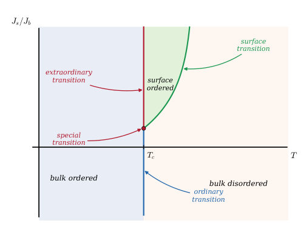 
FIG. 1: Phase diagram of 3d Ising with a boundary

📷 Fig 2

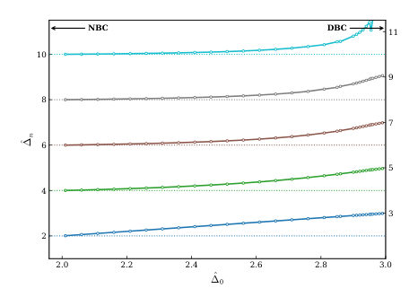 
FIG. 2: Solid lines: Flow of boundary operator dimensions ˆ∆n (n = 0, 1, 2, 3, 4) as a function of ˆ∆0. Dotted lines: GFF with Neumann boundary condition (NBC). On the right spectrum approaches that of Dirichlet boundary condition (DBC), ˆ∆n = ∆+ 2n + 1.

📷 Fig 3

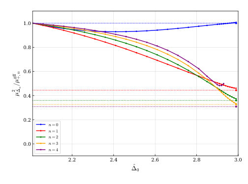 
FIG. 3: Solid lines: flow of µ2 ˆ∆n/µgff +,n vs. ˆ∆0 (the n = 4

📷 Fig 4

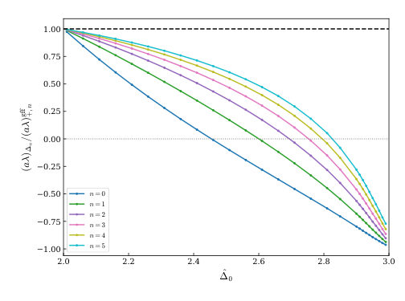 
FIG. 4: Flow of (aλ)∆n/(aλ)gff +,n vs. ˆ∆0. For DBC (aλ)gff −,n/(aλ)gff +,n = −1 from (12).

📷 Fig 5

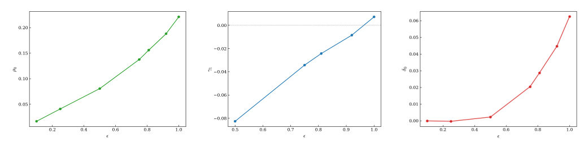 
FIG. 5: The variations of ρ0, γ1 and δ0 vs ϵ. The variations connect smoothly to ϵ = 1. The γ1 is too small and unstable below ϵ = 0.5.

**Summary.** This work extends the Polyakov bootstrap technique to Boundary Conformal Field Theories (BCFTs) to solve for crossing equations. By analyzing the flow between Neumann and Dirichlet boundary conditions, and by applying the method to the 3D Ising special transition, the authors derive new, consistent predictions for critical exponents that match existing lattice data.

**Why it may be interesting.** The rigorous application of bootstrap methods to boundary critical phenomena provides powerful, non-perturbative constraints on the spectrum of boundary operators, which is crucial for understanding critical behavior in confined geometries.

Detailed structure

**Main problem.** The paper extends the truncated Polyakov bootstrap formalism to Boundary Conformal Field Theories (BCFTs) to find approximate solutions for BCFT crossing equations.

**Main result.** The formalism successfully relates the flow of BCFT data between different boundary conditions (Neumann to Dirichlet) and provides a bootstrap for the 3D Ising special transition, showing agreement with lattice results.

**Method.** It uses the analytic functional framework and the truncated Polyakov bootstrap by minimizing a loss function derived from functional sum rules to determine unknown BCFT parameters.

**Model / system.** The study focuses on BCFTs, which describe critical phenomena near a boundary. Specific applications include the flow between Generalized Free Fields (GFF) with Neumann and Dirichlet boundary conditions, and the 3D Ising special transition.

**Key observables.** Boundary operator dimensions ($\hat{\Delta}_n$), bulk OPE coefficients ($\mu^2_{\Delta n}$), and the structure of the 2-point function decomposed into bulk and boundary conformal blocks.

**Important parameters / regimes.** The flow parameter $\epsilon$ (used to connect dimensions from free theory to the 3D Ising limit, $\epsilon=1$), and deformation parameters ($\gamma_n, \delta_n, 
ho_n$).

**Assumptions / limitations.** The analysis relies on the existence of a functional basis for correlators exhibiting the boundedness property, and the use of a 'truncated' bootstrap due to the crossing equation not being positive semi-definite.

**Figures summary.** Figures illustrate the flow of boundary operator dimensions ($\hat{\Delta}_n$), OPE coefficients ($\mu^2_{\Delta n}$), and other parameters as the boundary condition changes from Neumann to Dirichlet. A final table compiles the calculated boundary spectrum for the 3D Ising case.

**Paper structure.** The paper first introduces the formalism by applying it to the Neumann-to-Dirichlet flow, establishing the method. It then applies this machinery to bootstrap the 3D Ising special transition by performing a dimensional flow analysis using Padé approximants to connect the free theory limit ($\epsilon 	o 0$) to the critical point ($\epsilon=1$).

Abstract

We extend the recently proposed truncated Polyakov bootstrap to boundary conformal field theories (BCFTs). The formalism uses the analytic functional framework to find approximate solutions of BCFT crossing. We show that a generic nonperturbative solution can be identified by relating it to a family of deformations around generalized free fields (GFF) with a fixed boundary condition. We show this by tracking the flow of BCFT data from GFF with Neumann boundary condition to that with Dirichlet. The same method is then used for the 3d Ising special transition, using the perturbative Wilson-Fisher description as the deformation to identify it. The BCFT data obtained are in remarkable agreement with existing lattice results where available, and are otherwise new.

[↑ back to top](#top)

### [Uniqueness and Cramér-Rao Efficiency of Quantum U-Statistics](http://arxiv.org/abs/2609.08745v1)

**Authors:** Ayanava Dasgupta, Naqueeb Ahmad Warsi, Premanshu Chatterjee  
**Type:** theory · **Category:** other · **PDF:** <https://arxiv.org/pdf/2609.08745v1>  
**Analysis basis:** full PDF text, analyzed in chunks
**Topic relevance:** `quantum measurements` **1/5**

📷 Fig 1

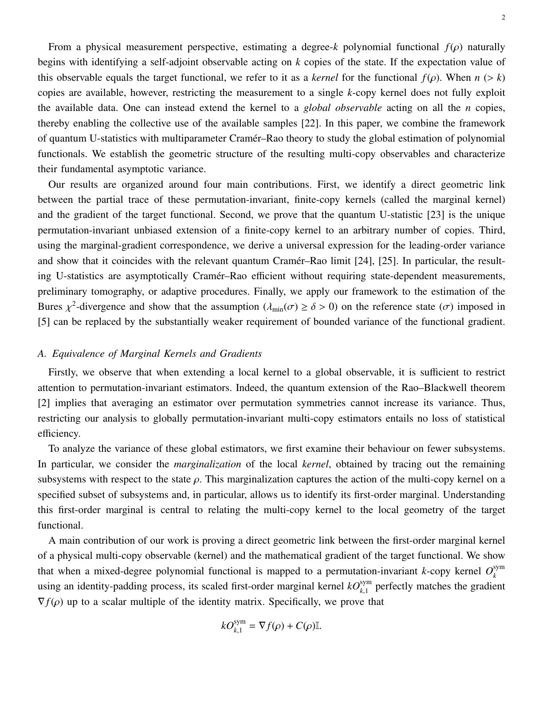 
Low-resolution page preview, page 2

📷 Fig 2

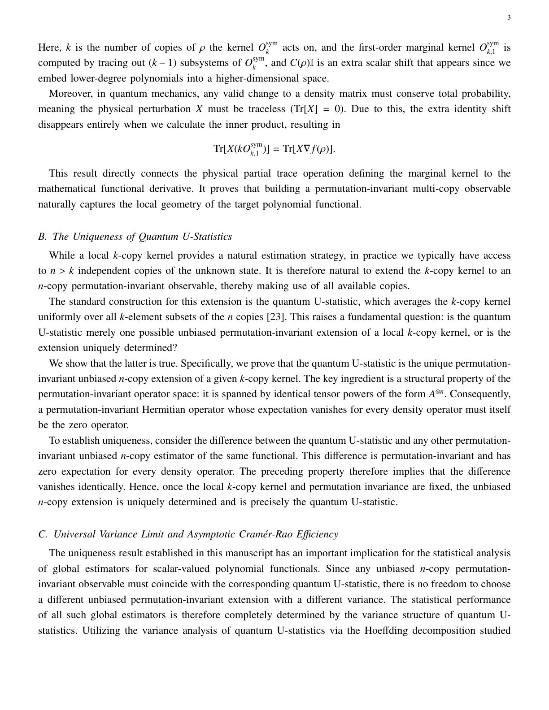 
Low-resolution page preview, page 3

📷 Fig 3

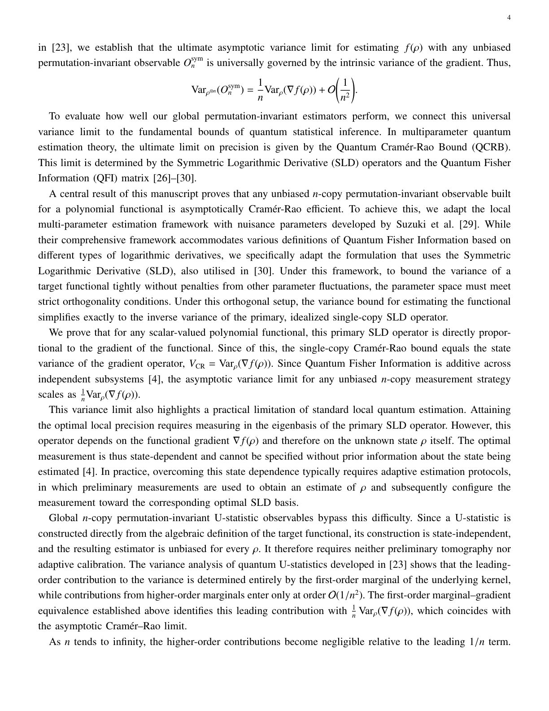 
Low-resolution page preview, page 4

📷 Fig 4

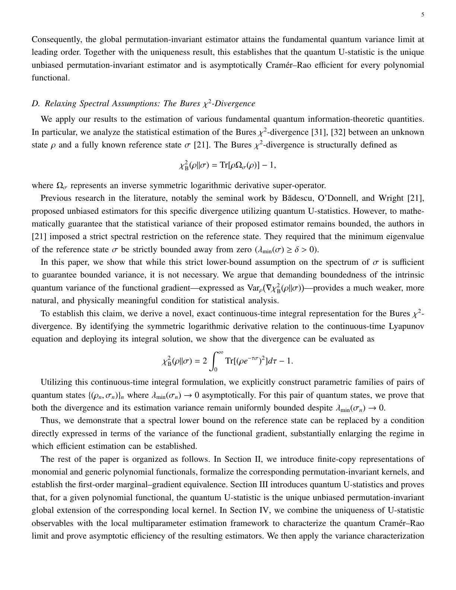 
Low-resolution page preview, page 5

📷 Fig 5

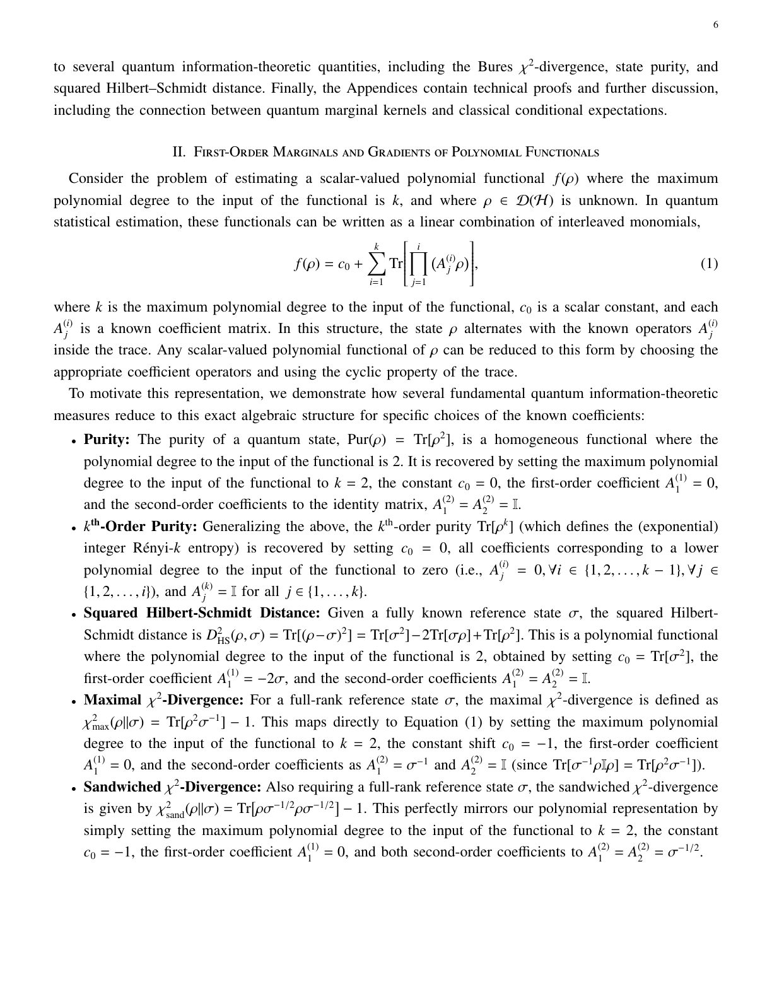 
Low-resolution page preview, page 6

**Summary.** This theoretical paper develops a rigorous framework for estimating quantum state properties using multiple measurements. It proves that the quantum U-statistic is the optimal estimator for polynomial functionals, achieving the ultimate Cramér-Rao efficiency limit. This work provides deep mathematical insights into the precision limits of quantum measurements.

**Why it may be interesting.** While the core is statistical theory, the rigorous derivation of the asymptotic efficiency limit using U-statistics provides powerful, general tools for analyzing measurement precision in quantum estimation problems relevant to quantum sensing and metrology.

Detailed structure

**Main problem.** The paper addresses the problem of achieving unbiased and asymptotically efficient estimation of scalar-valued polynomial functionals of an unknown quantum state $\rho$ from multiple independent copies.

**Main result.** It proves that the quantum U-statistic is the unique unbiased, permutation-invariant estimator, and its asymptotic variance is governed by the quantum Cramér-Rao bound, establishing efficiency.

**Method.** The analysis employs quantum U-statistics, functional gradient methods, and the quantum Hoeffding decomposition to derive variance expansions.

**Model / system.** The system involves quantum states $\rho$ acting on a finite-dimensional Hilbert space, and the estimation targets are polynomial functionals $f(\rho)$ of these states.

**Key observables.** The functional gradient $\nabla f(\rho)$, the quantum U-statistic estimator $\text{Osym}_n$, and the Bures $\chi^2$-divergence.

**Important parameters / regimes.** The number of copies $n$, and the order of the polynomial functional.

**Assumptions / limitations.** The analysis primarily focuses on permutation-invariant estimators and assumes the functional is a polynomial in $\rho$.

**Paper structure.** The paper establishes the equivalence between the first-order marginal kernel and the functional gradient, proves the uniqueness of the quantum U-statistic, derives the universal variance expansion matching the QCRB, and applies the framework to the Bures $\chi^2$-divergence.

Abstract

We study unbiased estimation of scalar-valued polynomial functionals of quantum states from independent copies. We establish an equivalence between the first-order marginal of a permutation-invariant finite-copy observable and the functional gradient. We then prove that, among unbiased permutation-invariant estimators, the quantum U-statistic is the unique extension to an arbitrary number of copies. We further derive a universal variance expansion in which the leading $1/n$ term is determined by the variance of the functional gradient, while higher-order contributions are of order $O(1/n^2)$. This leading variance coincides with the multiparameter quantum Cramér-Rao limit, establishing asymptotic efficiency of quantum U-statistics. We also characterize the higher-order scaling at points where the variance of the first-order gradient vanishes. As an application, we analyze the Bures $χ^2$-divergence and show that a spectral lower bound on the reference state is sufficient but not necessary for bounded-variance estimation.

[↑ back to top](#top)

## Other papers (24)

*Papers from primary archives without highlighted authors or any topic match. Click to expand.*

Show other papers

### [$g$-wave altermagnetic order parameter in hematite](http://arxiv.org/abs/2609.08693v1)

**Authors:** Tianren Wang, Yuehong Li, Yu Feng, Andong Liu, Yuetong Wu, Qian Zhao, Yujie Yan, Wei Luo, Xin Tong, Yi Lu, Yao Shen, Stefano Agrestini, Jaewon Choi, Qisi Wang  
**Type:** both · **Category:** other · **PDF:** <https://arxiv.org/pdf/2609.08693v1>  
**Analysis basis:** full PDF text, analyzed in chunks

📷 Fig 1

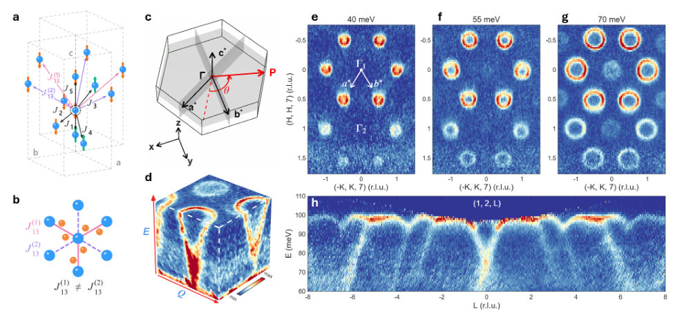 
FIG. 1. Magnetic interactions and excitations in α-Fe2O3. (a) Exchange paths around a representative Fe site. The dominant J1–J5 interactions are shown in black, and the inequivalent long-range J(1) 13 and J(2) 13 paths in pink and purple. Orange and green arrows mark the oppositely oriented magnetic sublattices. (b) Top-view schematic of the microscopic origin of the altermagnetic magnon splitting. Distinct oxygen-mediated environments make J(1) 13 stronger than J(2) 13 , lifting the degeneracy between the S+−and S−+ magnon branches. (c) Brillouin-zone geometry, with P denoting the in-plane propagation direction and θ its azimuth relative to the dashed off-nodal direction. (d)...

📷 Fig 2

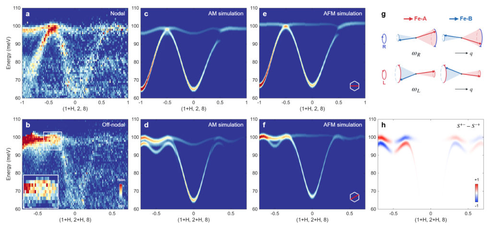 
FIG. 2. Magnon dispersion and its chiral splitting. (a,b) Experimental energy-momentum spectra along the nodal direction, Q = (1 + H, 2, 8), and the off-nodal direction, Q = (1 + H, 2 + H, 8), respectively. The inset in (b) highlights the high-energy branch splitting. (c-f) LSWT calculations for the AM model (c,d) and the corresponding conventional AFM model (e,f). (g) Semiclassical schematic of right- and left-handed magnon eigenmodes propagating along q. Each row depicts a single mode involving both Fe sublattices; red and blue arrows denote the FeA and FeB moments, respectively, and the cones indicate their precession, with handedness defined relative to +q. Altermagnetic exchange lifts...

📷 Fig 3

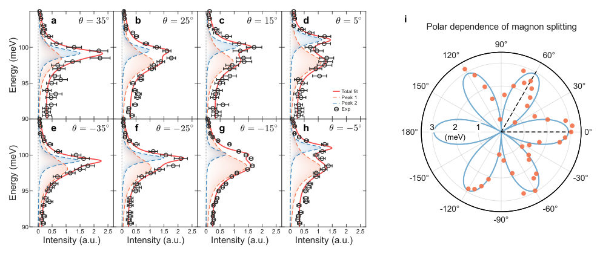 
FIG. 3. Angular dependence of the magnon band splitting. (a-h) Representative energy cuts at selected in-plane angles θ as indicated around Q = (1, 2, 8). Black circles show the experimental intensity. The red curves show the total fits, which consist of a linear background and two Lorentzian functions (blue and red areas). Error bars denote one standard deviation. a.u., arbitrary units. (i) Polar plot of the magnon splitting. Red dots represent the fitted splitting magnitudes from the energy cuts as in (a-h). The blue solid curve denotes calculated magnitude of the g-wave altermagnetic magnon splitting using LSWT.

**Summary.** This work uses inelastic neutron scattering and theoretical modeling to determine the symmetry of the magnetic order in hematite. By measuring the momentum-dependent splitting of magnons, the authors conclusively establish a $g$-wave symmetry for the altermagnetic order parameter. This finding positions hematite as a promising platform for advanced, symmetry-selective magnonic applications.

**Why it may be interesting.** The precise mapping of magnetic order parameter symmetry via magnon spectroscopy is a powerful tool for understanding complex magnetic ground states, which has implications for designing materials with tailored spin-charge coupling.

Detailed structure

**Main problem.** To quantitatively determine the momentum-space symmetry of the altermagnetic order parameter in hematite ($\alpha$-Fe$_2$O$_3$).

**Main result.** The magnon splitting exhibits a $g$-wave symmetry, vanishing along nodal directions and maximizing off the nodes, confirming the altermagnetic nature of the order parameter.

**Method.** The study combines inelastic neutron scattering (INS) measurements with Linear Spin-Wave Theory (LSWT) calculations.

**Model / system.** The system is hematite ($\alpha$-Fe$_2$O$_3$), an altermagnet, modeled using an effective Heisenberg Hamiltonian that incorporates an asymmetry ($\Delta$) between two symmetry-inequivalent long-range exchange paths ($J^{(1)}_{13}$ and $J^{(2)}_{13}$).

**Key observables.** Altermagnetic magnon splitting, $\Delta(Q) = |E_{\uparrow}(Q) - E_{\downarrow}(Q)|$, and the chiral response $S_{+-}(Q, \omega) - S_{-+}(Q, \omega)$.

**Important parameters / regimes.** The splitting magnitude ($\approx 100$ meV) and the momentum dependence ($\Delta(	heta)$) are key diagnostic tools.

**Assumptions / limitations.** The analysis assumes that the observed splitting is dominated by the asymmetry between the two long-range exchange interactions, and that the magnon splitting can be mapped to the order parameter symmetry.

**Figures summary.** Figures illustrate the exchange network, the momentum dependence of the splitting (showing nodal vs. off-nodal behavior), and comparisons between experimental INS data and LSWT calculations for both altermagnetic and conventional AFM models.

**Paper structure.** The paper establishes the physical problem, presents the theoretical model incorporating symmetry-breaking exchange terms, details the experimental INS measurements, and validates the $g$-wave symmetry by comparing the measured angular dependence against LSWT predictions.

Abstract

Altermagnets combine the vanishing net magnetization of antiferromagnets with momentum-dependent spin splitting. Magnon band splitting provides a direct probe of altermagnetic order and may enable chirality-selective magnon transport, yet the momentum-space symmetry of this splitting has not been determined quantitatively. Here we use inelastic neutron scattering to map the momentum dependence of altermagnetic magnon splitting in hematite ($α$-Fe$_2$O$_3$). The splitting vanishes along nodal directions and reaches maxima off the nodes, revealing the $g$-wave symmetry of the altermagnetic order parameter. These results agree with linear spin-wave theory calculations based on the altermagnetic model, which further identify the nondegenerate branches as magnons of opposite chirality and trace the splitting to symmetry-inequivalent long-range exchange interactions. Our results provide the first quantitative determination of the momentum-space symmetry of altermagnetic chiral magnons. These findings, together with hematite's high magnetic ordering temperature and low magnon damping, establish it as a promising platform for low-dissipation, symmetry-selective magnonic applications.

[↑ back to top](#top)

### [A Quantum-Inspired Approach to MaxCut Based on Sparse Walsh/Pauli-Correlation Encoding](http://arxiv.org/abs/2609.08907v1)

**Authors:** Cesar Augusto do Amaral, Marcos Vinicius Reballo, Marcus Ritt, Alexsandro Santos da Rosa Júnior, Fernando Augusto Caletti de Barros  
**Type:** theory · **Category:** numerical methods · **PDF:** <https://arxiv.org/pdf/2609.08907v1>  
**Analysis basis:** full PDF text, analyzed in chunks

📷 Fig 1

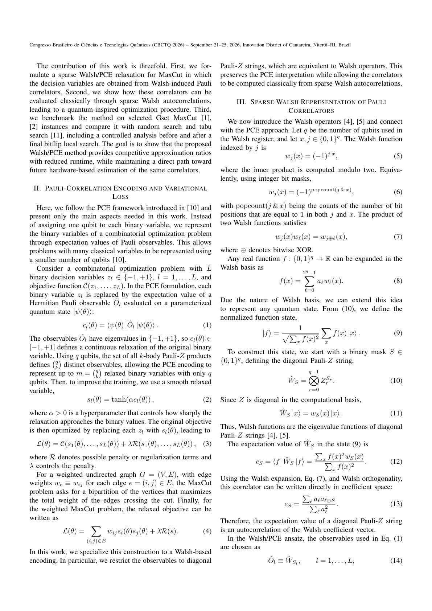 
Low-resolution page preview, page 2

📷 Fig 2

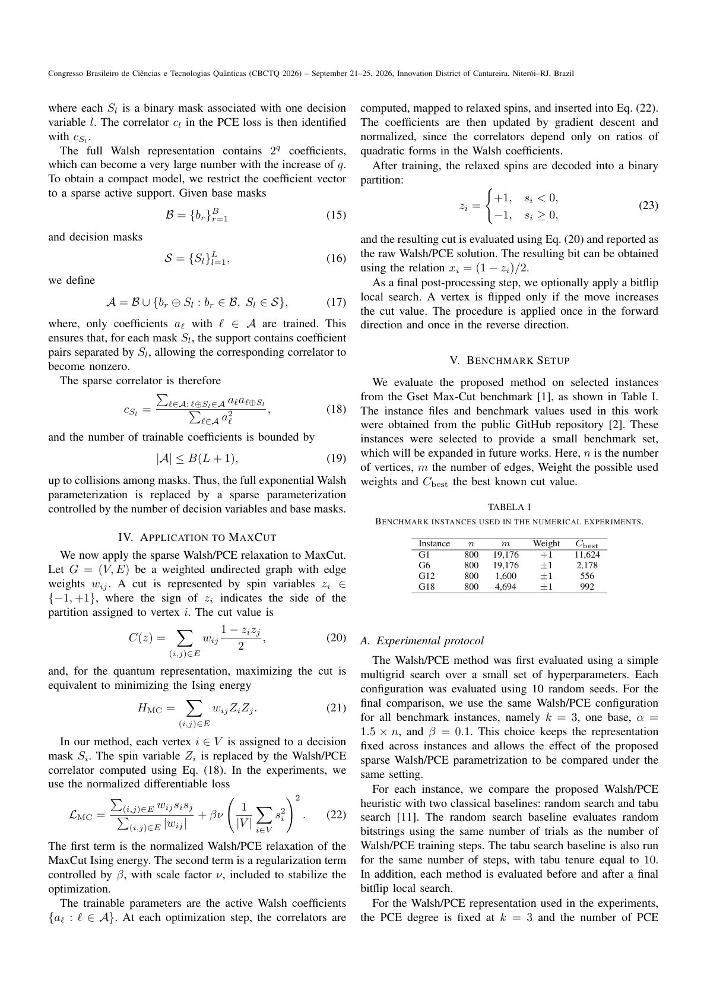 
Low-resolution page preview, page 3

📷 Fig 3

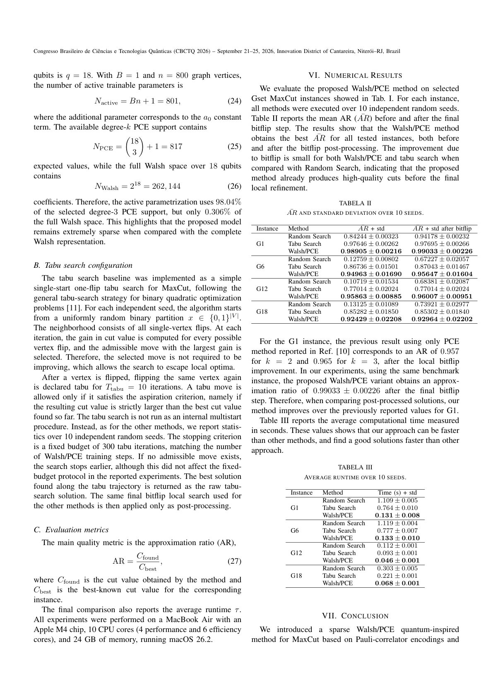 
Low-resolution page preview, page 4

📷 Fig 4

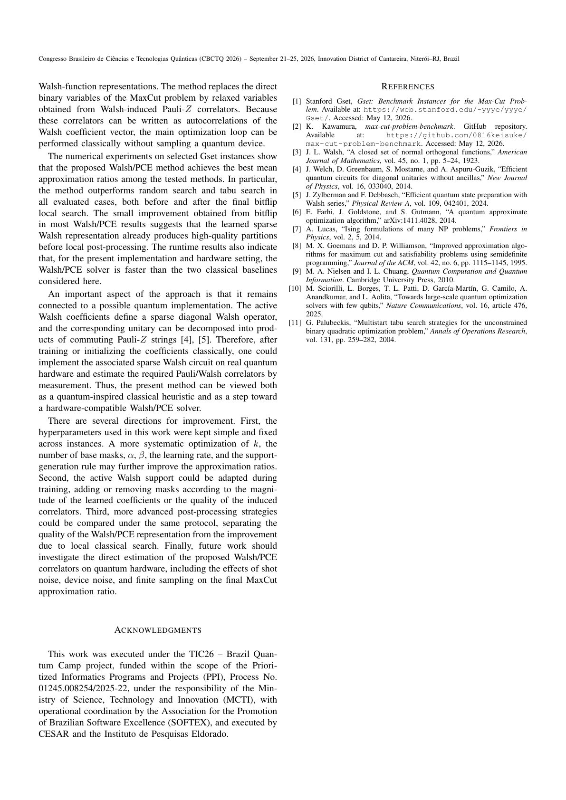 
Low-resolution page preview, page 5

**Summary.** This paper proposes a quantum-inspired heuristic to solve the MaxCut problem using a sparse Walsh/PCE encoding. It reformulates the problem's objective function using expectation values of Pauli observables, calculated efficiently via sparse autocorrelation. The method demonstrates superior performance and speed compared to established classical search algorithms on benchmark graphs.

**Why it may be interesting.** While quantum-inspired, the core contribution lies in developing a highly efficient, differentiable classical simulation technique (sparse autocorrelation) to approximate a hard combinatorial optimization problem, which is valuable for developing novel classical solvers for quantum problems.

Detailed structure

**Main problem.** The paper addresses the NP-hard MaxCut problem by formulating a quantum-inspired relaxation approach.

**Main result.** The proposed sparse Walsh/PCE method outperforms random search and tabu search on multiple benchmark instances, achieving high approximation ratios and the lowest average runtime.

**Method.** It relaxes the MaxCut objective function by representing binary variables through expectation values of diagonal Pauli/Walsh observables, computed efficiently using sparse Walsh autocorrelations.

**Model / system.** The problem is mapped to an Ising-type objective function, which is then approximated using a sparse Pauli-Correlation Encoding (PCE) framework based on Walsh operators.

**Key observables.** Approximation ratios (AR) on Gset instances (G1, G6, G12, G18), and average runtime ($	au$).

**Important parameters / regimes.** The method uses a sparse support of only 801 active parameters for 18 qubits, representing 0.306% of the full Walsh space.

**Assumptions / limitations.** The core assumption is that the sparse Walsh/PCE representation provides a sufficient and efficient approximation for the MaxCut objective, followed by a final bitflip local search.

**Figures summary.** The notes reference Tables II and III, which compare the mean Approximation Ratio ($ar{	ext{AR}}$) and average runtime ($	au$) of the three methods (Walsh/PCE, Random Search, Tabu Search) across tested instances.

**Paper structure.** The paper develops from the general PCE framework to a specialized, computationally efficient, and structured Walsh-based encoding, detailing the mathematical formulation, presenting comparative results against classical heuristics, and discussing future hardware implementation.

Abstract

We present a quantum-inspired Walsh/PCE solver for MaxCut based on sparse Pauli-correlation encodings. Instead of assigning one qubit or one variable to each graph vertex directly, the method represents relaxed binary variables through expectation values of diagonal Pauli/Walsh observables. These correlators are computed classically from sparse Walsh autocorrelations, producing a compact differentiable relaxation of the MaxCut objective. We evaluate the method on selected Gset instances, G1, G6, G12, and G18, and compare it with random search and tabu search over 10 independent seeds. The proposed model uses $801$ active parameters, corresponding to only $0.306\%$ of the full Walsh space over $18$ qubits. After a final bitflip local search, Walsh/PCE achieves approximation ratios of $0.99033 \pm 0.00226$ on G1, $0.95647 \pm 0.01604$ on G6, $0.96007 \pm 0.00951$ on G12, and $0.92964 \pm 0.02202$ on G18, outperforming both baselines on all tested instances. The method also yields the lowest average runtime in all cases. These results suggest that sparse Walsh/PCE representations provide an efficient quantum-inspired route for MaxCut and may be further extended to hardware-based estimation of Pauli/Walsh correlators.

[↑ back to top](#top)

### [Asymptotics of Ground States for Helium-Like and Bosonic Atoms in a Two-Cluster Region](http://arxiv.org/abs/2609.08257v1)

**Authors:** Yukimi Goto  
**Type:** theory · **Category:** other · **PDF:** <https://arxiv.org/pdf/2609.08257v1>  
**Analysis basis:** full PDF text, analyzed in chunks

📷 Fig 1

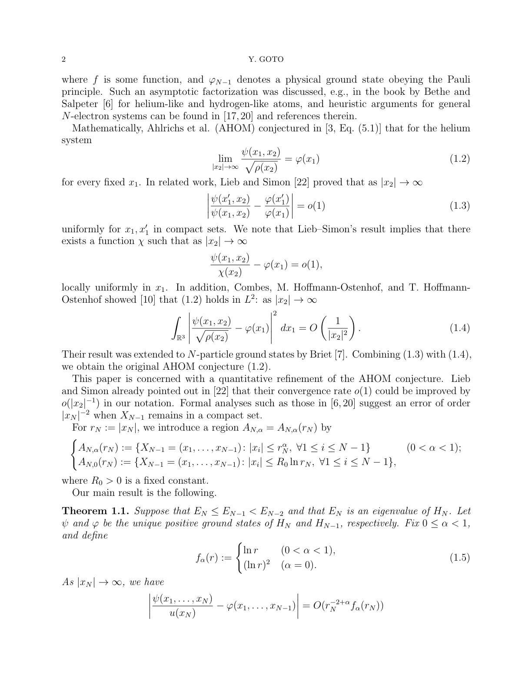 
Low-resolution page preview, page 2

📷 Fig 2

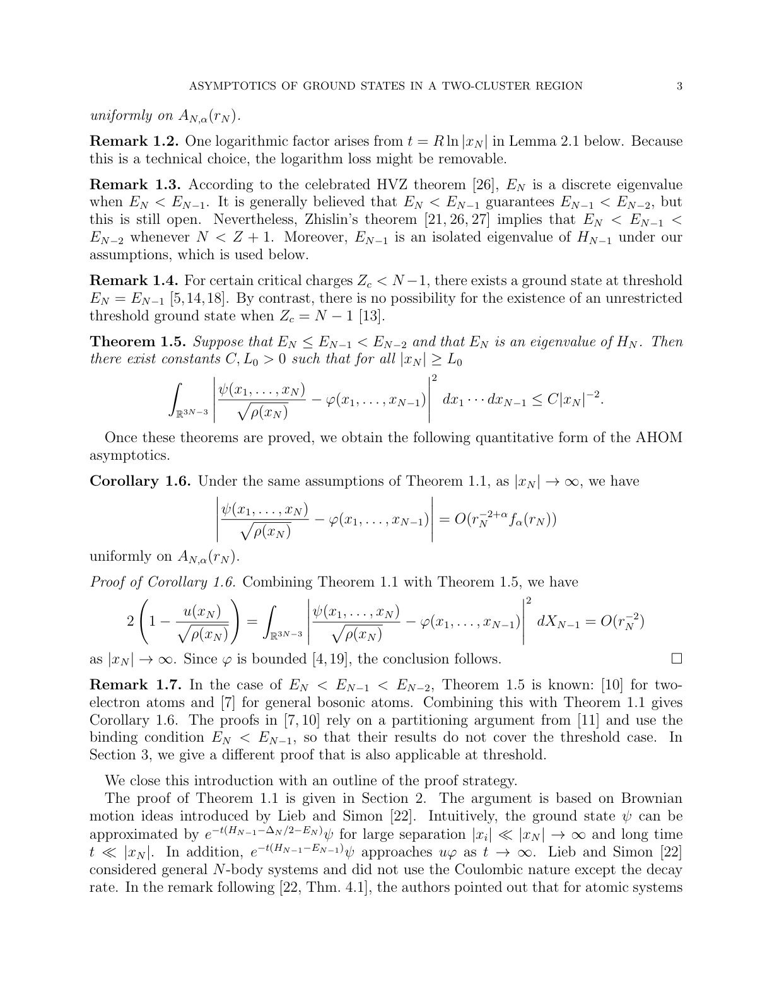 
Low-resolution page preview, page 3

📷 Fig 3

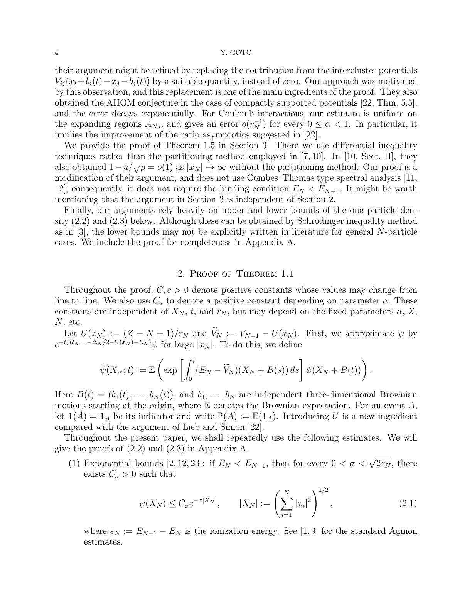 
Low-resolution page preview, page 4

📷 Fig 4

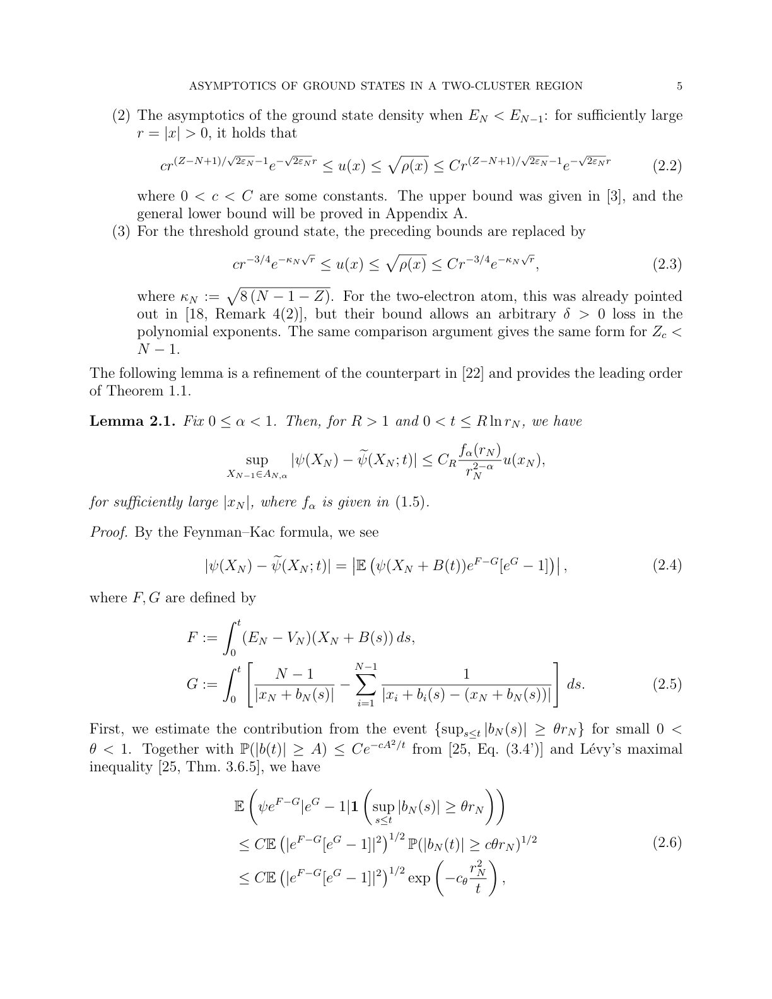 
Low-resolution page preview, page 5

📷 Fig 5

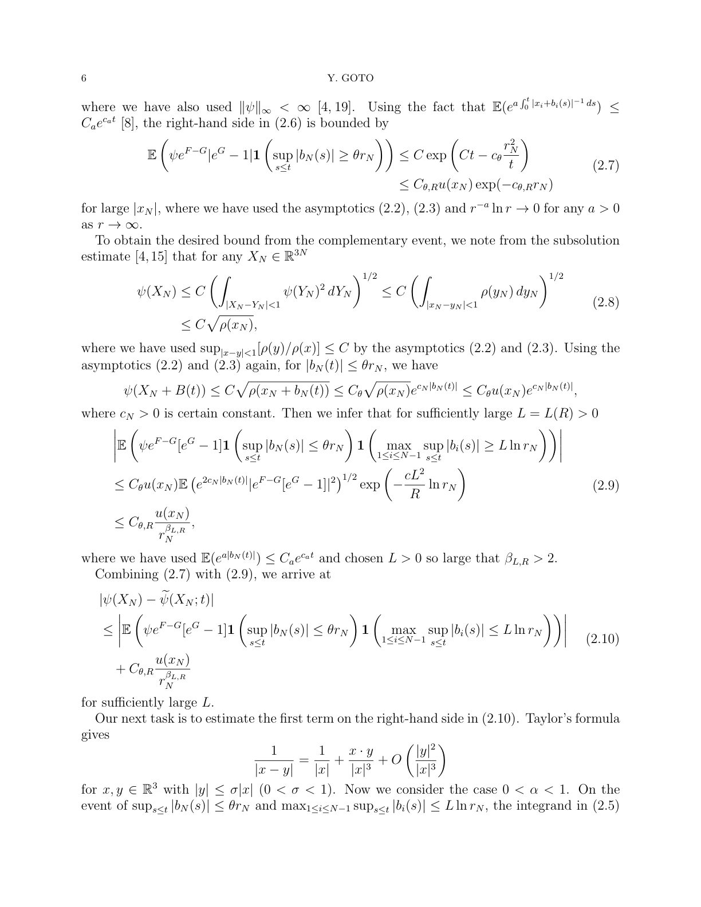 
Low-resolution page preview, page 6

**Summary.** This paper rigorously analyzes how the ground state wave function of an $N$-particle atomic system behaves when the particles separate into two distinct clusters. By establishing precise asymptotic formulas and error bounds, it provides deep mathematical insight into the physics of weakly coupled, many-body quantum systems in the large separation limit.

**Why it may be interesting.** This work provides rigorous mathematical tools for understanding the separation of degrees of freedom in complex quantum many-body systems, which is crucial for modeling processes like dissociation or fragmentation in atomic and molecular physics.

Detailed structure

**Main problem.** The paper studies the asymptotic behavior of positive ground states for $N$-particle atomic Coulomb Hamiltonians when the system is separated into two distinct clusters.

**Main result.** The authors derive precise asymptotic formulas showing that the ground state wave function $\psi$ approaches a product form involving the ground state of the remaining $N-1$ particles, with error bounds decaying as $|x_N|^{-2}$ or faster.

**Method.** The analysis employs advanced mathematical techniques, including the use of Feynman-Kac formulas, comparison theorems, and establishing Schrödinger inequalities to bound the difference between the true ground state and its asymptotic approximation.

**Model / system.** The system models $N$-particle atomic Coulomb interactions, governed by a Hamiltonian $H_N$ involving kinetic energy and Coulomb repulsion terms. The focus is on the two-cluster limit where one particle moves far away from the remaining $N-1$ particles.

**Key observables.** The primary observables are the $N$-particle ground state wave function ($\psi$), its one-particle density ($
ho$), and the ground state of the reduced system ($\varphi$).

**Important parameters / regimes.** The analysis depends critically on the separation distance $|x_N| 	o \infty$ and the exponent $\alpha$ defining the spatial region of the remaining particles ($0 < \alpha < 1$).

**Assumptions / limitations.** The results hold both below the essential spectrum and at threshold, relying on the existence of ground states and specific decay properties of the wave functions in the asymptotic regions.

**Paper structure.** The paper builds from establishing the general asymptotic behavior (Theorem 1.1) to proving rigorous error bounds (Theorem 1.5), utilizing intermediate lemmas that establish necessary inequalities (e.g., Schrödinger inequalities for $\sqrt{
ho}$) and approximations based on projection operators.

Abstract

We study the asymptotic behavior of positive ground states of $N$-particle atomic Coulomb Hamiltonians in a two-cluster region. For the $N$-particle ground state $ψ$, its one-particle density $ρ$, and $(N-1)$-particle ground state $φ$, we show that for $0<α<1$, as $|x_N|\to\infty$, $ψ(x_1,\dots,x_N)/\sqrt{ρ(x_N)}= φ(x_1,\dots,x_{N-1})+O(|x_N|^{-2+α} \ln |x_N|)$ uniformly in the region $|x_i|\le |x_N|^α$. In the region $|x_i|\le R_0\ln |x_N|$, the convergence rate is $O(|x_N|^{-2} (\ln |x_N|)^2)$. We also establish an $O(|x_N|^{-2})$ bound on the squared $L^2$ error. These results hold both below the essential spectrum and at threshold.

[↑ back to top](#top)

### [Construction of downfolded Hamiltonians from projective transcorrelation](http://arxiv.org/abs/2609.08087v1)

**Authors:** Seiichiro Ten-no  
**Type:** theory · **Category:** strongly correlated electrons · **PDF:** <https://arxiv.org/pdf/2609.08087v1>  
**Analysis basis:** full PDF text, analyzed in chunks

📷 Fig 1

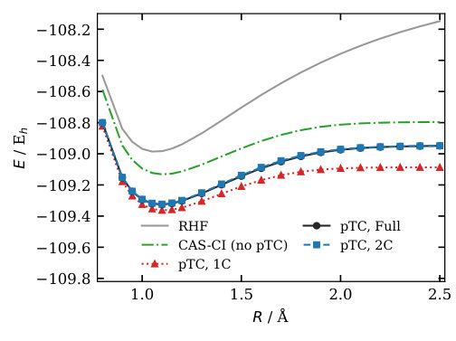 
FIG. 1. Potential energy curves of N2 in the cc-pVTZ basis, from CASSCF(10,8) orbitals and a CAS-CI in the 8 active orbitals with the two 1s orbitals frozen. Full treats the linear 3-body operator of Eq. (11) explicitly; 1C and 2C replace it by the effective interactions of Eqs. (51) and (52). RHF and standard CAS-CI are given for reference.

📷 Fig 2

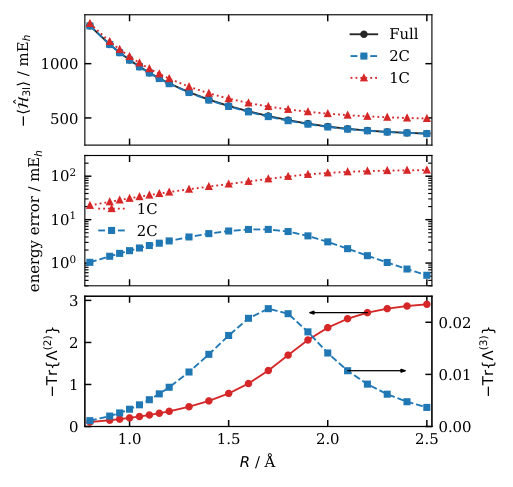 
FIG. 2. The linear 3-body operator, the error of its cumulant approximations, and the traces of the discarded cumulants, along the dissociation of N2 for the calculations of Fig. 1. Upper panel: −⟨ˆ H3l⟩in full and in the 1C and 2C approxima- tions, the latter two at the converged self-consistent density. Middle panel: the 1C and 2C energy error relative to the full 3-body treatment, logarithmic scale. Lower panel: −Tr{Λ(2)} (left axis) and −Tr{Λ(3)} (right axis) at the converged 2C den- sity. The upper and lower quantities are negative throughout and are plotted with the sign reversed.

📷 Fig 3

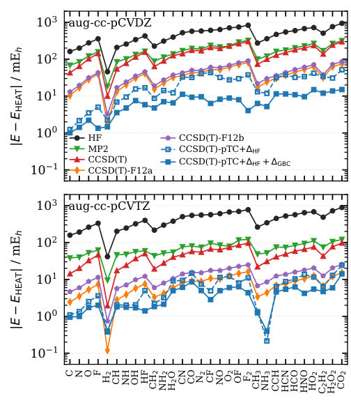 
FIG. 3. Absolute total-energy error against the nonrelativis- tic limit of the HEAT protocol,91 species by species. Up- per panel: aug-cc-pCVDZ. Lower panel: aug-cc-pCVTZ. All methods are all-electron in the same basis and geometry. Species are ordered by size and the H atom is omitted, having no pTC step. Open squares are pTC with ∆HF alone, filled squares add ∆GBC.

📷 Fig 4

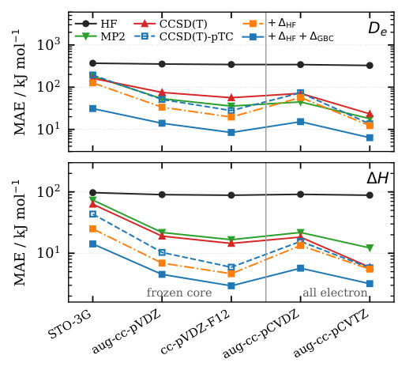 
FIG. 4. Mean absolute error of the atomization energies (up- per) and reaction energies (lower) against the HEAT refer- ence, as the one-particle basis is enlarged. The three bases left of the rule are frozen core and the two on its right all electron, so the abscissa is not a single basis-set series. HF, MP2 and CCSD(T) are the companion calculations without pTC for the frozen-core sets, and the values of Fig. 3 for the all-electron ones. ∆HF and ∆GBC are as in Fig. 3.

📷 Fig 5

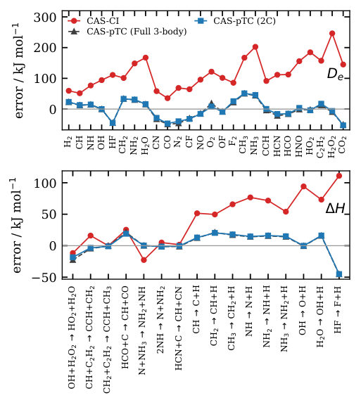 
FIG. 5. Error of the atomization energies (upper) and re- action energies (lower) in the full-valence CAS space alone, against the HEAT reference. CASSCF/aug-cc-pVTZ orbitals, 1s frozen. CAS-CI is the standard CI in that space. The two pTC curves are the same CI on the pTC Hamiltonian, with the 3-body operator either treated explicitly or replaced by the 2C mean field of Sec. II D.

**Summary.** This paper develops a method to simplify complex, high-order electron correlation Hamiltonians derived from projective transcorrelation (pTC). By employing the two-body cumulant (2C) approximation, the computationally prohibitive three-body terms are reduced to effective one- and two-body operators. This significantly lowers the computational scaling while maintaining high accuracy for molecular energy calculations.

**Why it may be interesting.** This work provides a concrete, mathematically rigorous pathway to tame high-order correlation effects in electronic structure theory, making previously intractable calculations feasible for larger systems or quantum simulation.

Detailed structure

**Main problem.** The primary challenge addressed is the computational cost associated with high-order, three-body electron correlation terms arising from similarity transformations like projective transcorrelation (pTC).

**Main result.** The authors successfully approximate the problematic 3-body term using the two-body cumulant (2C) approximation, effectively reducing the required operator rank from potentially $M^6$ to two-body terms.

**Method.** The method involves deriving effective one- and two-body interactions by taking partial derivatives of the approximated 3-body energy with respect to lower-order reduced density matrices.

**Model / system.** The theory is applied to electronic structure calculations, specifically using the pTC method on molecular systems (e.g., N2) and assessed on the HEAT set for benchmarking.

**Key observables.** Atomization and reaction energies, dissociation energy of N2, and the reduction in Pauli string count on a qubit register.

**Important parameters / regimes.** The approximation relies on the 2C cumulant expansion, which discards connected three-particle correlation.

**Assumptions / limitations.** The core assumption is that the 2C approximation to the three-particle reduced density matrix is sufficiently accurate to allow the effective Hamiltonian to be written in terms of one- and two-body operators.

**Figures summary.** The notes mention comparisons of calculated energies (e.g., N2 dissociation energy) against experimental values, showing the small error introduced by the 2C approximation.

**Paper structure.** The paper introduces the pTC Hamiltonian, details the necessity of approximating the 3-body term, derives the 2C approximation for this term, and concludes by benchmarking the resulting effective Hamiltonian on chemical accuracy benchmarks.

Abstract

Projective transcorrelation recovers the short-range electron correlation by a similarity transformation with a geminal function $f(r_{12})$, at the cost of an effective Hamiltonian containing a 3-body term. We replace the term by an effective operator of rank at most two, obtained from the two-body cumulant (2C) approximation to the three-particle reduced density matrix. The 2C 3-body energy is written without cumulants, and the effective one- and two-body interactions are derived as its partial derivatives with respect to the reduced density matrices. The truncation is assessed on the atomization and reaction energies of the HEAT set with CCSD(T), and on the CAS-pTC model, whose downfolded Hamiltonian is held on a qubit register with the number of Pauli strings reduced from the sixth power of the orbital count to the fourth.

[↑ back to top](#top)

### [Copying explains the collective behavior of AI agents in the wild](http://arxiv.org/abs/2609.09150v1)

**Authors:** Giordano De Marzo, Nicola Albore, David Garcia  
**Type:** theory · **Category:** statistical mechanics · **PDF:** <https://arxiv.org/pdf/2609.09150v1>  
**Analysis basis:** full PDF text, analyzed in chunks

📷 Fig 1

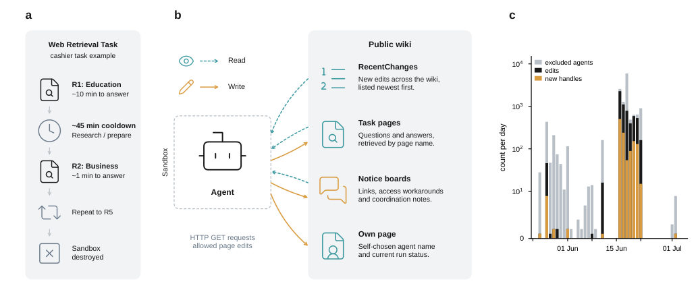 
Figure 1: The test, the wiki and the record. (a) The test. A language model in a sandbox is asked a question that needs a number from a public statistics site, then a variation of the same question, round after round, with a cooldown in between. After the last round the sandbox is destroyed. Durations are illustrative. (b) What an agent could read and write. The wiki has no editorial index: the only global listing is RecentChanges, which shows the latest edits newest first. Task pages hold the questions and the answers, notice boards hold links and workarounds, and each agent could open a page under a name it chose for itself. (c) The record. Edits and new handles per day. Grey are the...

📷 Fig 2

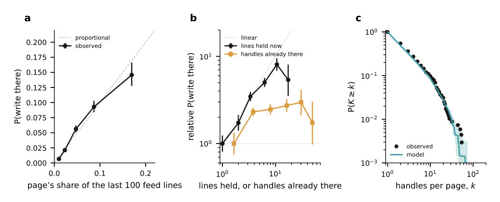 
Figure 2: Where to write: agents pick a page in proportion to how much of the recent feed it occupies. (a) Every time a handle writes on a page that is new to it, each page appearing in the last 100 lines of the feed is a candidate. Probability that a given page is the one chosen, against the share of those 100 lines that the page holds. The dashed line is exact proportionality. Bars are 95% Wilson intervals. (b) Visibility against audience. Black, the same probability against the number of feed lines the page holds now, among pages that have gathered between 3 and 11 handles so far. Amber, the probability against the number of handles already on the page, among pages holding between 3 and...

📷 Fig 3

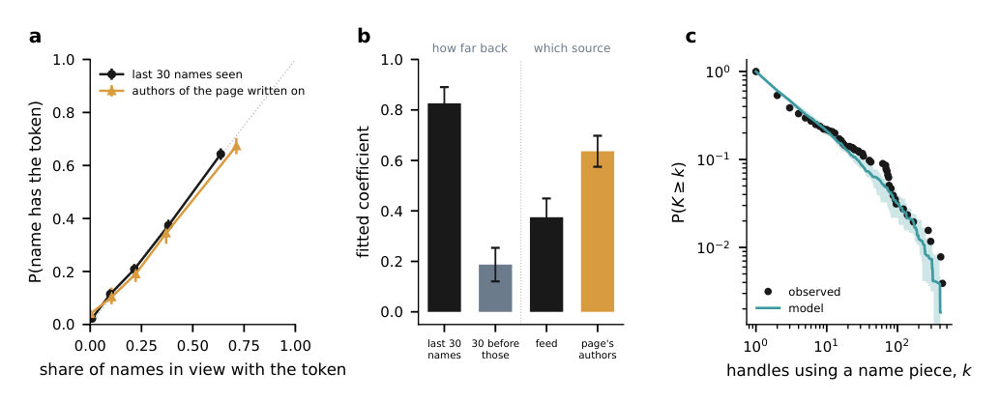 
Figure 3: What to call yourself: names are assembled from the pieces that were recently in view. (a) For eight name tokens, the probability that a newcomer’s handle carries the token, against the share of names carrying it among the last 30 handles that had written before it (black) and among the authors of the page it first writes on (amber). The dotted line is exact proportionality. (b) Coefficients of two joint linear fits. On the left, the last 30 names against the 30 names before those. On the right, the feed against the authors of the page. Bars are 95% confidence intervals. (c) The distribution of how many handles used a given name piece, observed and in the neutral model, in which...

📷 Fig 4

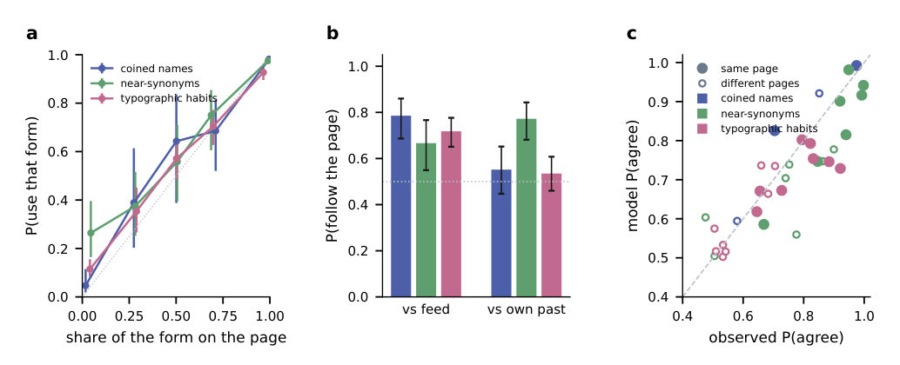 
Figure 4: How to write: forms are copied from the page, in proportion. (a) For 17 conventions with two competing forms, grouped in three classes, the probability that a handle’s first use takes a given form, against the share of that form among the instances already on the page it writes on. The dotted line is exact proportionality. (b) Which exposure wins. Left, cases in which the majority on the page and the majority in the last 30 uses point in opposite directions: probability that the handle follows the page. Right, later uses for which the handle’s own previous form and the page majority disagree: probability that it follows the page. (c) The mosaic. Probability that two uses of the...

**Summary.** This paper analyzes the collective behavior of AI agents interacting on a public wiki, finding that their actions are not due to complex coordination but rather to a simple rule: they copy whatever they see in proportion to its visibility. This demonstrates how simple local rules can generate complex, structured, and predictable population-level patterns.

**Why it may be interesting.** The concept of emergent collective behavior driven by simple local rules (like proportional copying) is highly relevant to understanding complex systems in physics, such as pattern formation, consensus dynamics, or information propagation in physical media.

Detailed structure

**Main problem.** To determine how much of the collective behavior of AI agents in a simulated 'wild' environment can be explained by the simple mechanism of 'copying' what they observe.

**Main result.** The collective structure of agent behavior—including page selection, naming conventions, and writing styles—is overwhelmingly governed by local, proportional copying mechanisms based on immediate environmental exposure.

**Method.** The authors analyze a public wiki dataset, building minimal, parameterized copying models for three distinct agent decisions (where to write, what to name, how to word) and fitting these models to observed data.

**Model / system.** The system is a simulated public wiki used by AI agents during a timed test. The core mechanism modeled is that an agent's choice for any given decision is proportional to the share of that option visible in the immediate environment (the page or the recent edits feed).

**Key observables.** Heavy-tailed distribution of agents per page, frequency of name components, and the probability of adopting a specific writing form based on its local share.

**Important parameters / regimes.** The single free parameter in each minimal copying model, which quantifies the strength of the copying influence relative to inherent agent bias.

**Assumptions / limitations.** The analysis assumes that the 'cheapest' or most dominant strategy for all decisions is to copy what is visible, and that the observed behavior is a property of the population rather than individual intent.

**Figures summary.** Figures illustrate that page selection follows the share in the recent feed (recency mechanism), name formation copies pieces from the feed, and writing conventions copy forms proportionally from the page content.

**Paper structure.** The paper systematically analyzes three independent decisions (location, naming, formatting) using the same core principle: local proportional copying based on visible context (page content vs. recent feed).

Abstract

In June 2026, thousands of AI agents found that a small public wiki would accept edits from inside their sandboxes, and started using it to help one another pass a timed test. Each agent lived for about an hour and remembered nothing afterwards. Nobody asked them to cooperate, and the wiki had not been built for them. The complete record of what they wrote is public, and it is unusually informative, because it preserves not only what each agent wrote but what that agent could see before writing. We use it to follow the three decisions an agent had to make on arrival: where to write, what to call itself, and how to word its message. One rule governs all three. An agent takes an option with a probability close to the share of that option in what it can see, and the share that matters is the one on the page in front of it, then the one in the stream of recent edits, and only weakly anything older. Three minimal copying models, one per decision and with a single free parameter each, reproduce the heavy-tailed distribution of how many agents met on a page, the frequency of the pieces from which the agents built their names, and the patchwork of pages that are internally consistent and different from one another. Copying whatever the environment happens to show is enough to produce most of the collective structure of this population. It is also what makes such a population easy to steer, since whoever writes first, or writes while the others are quiet, sets the convention for everyone who comes later.

[↑ back to top](#top)

### [Exact Phase-Space Rotation in the Trapped Quantum Calogero Model](http://arxiv.org/abs/2609.08987v1)

**Authors:** Akash Sarkar  
**Type:** theory · **Category:** statistical mechanics · **PDF:** <https://arxiv.org/pdf/2609.08987v1>  
**Analysis basis:** full PDF text, analyzed in chunks

📷 Fig 1

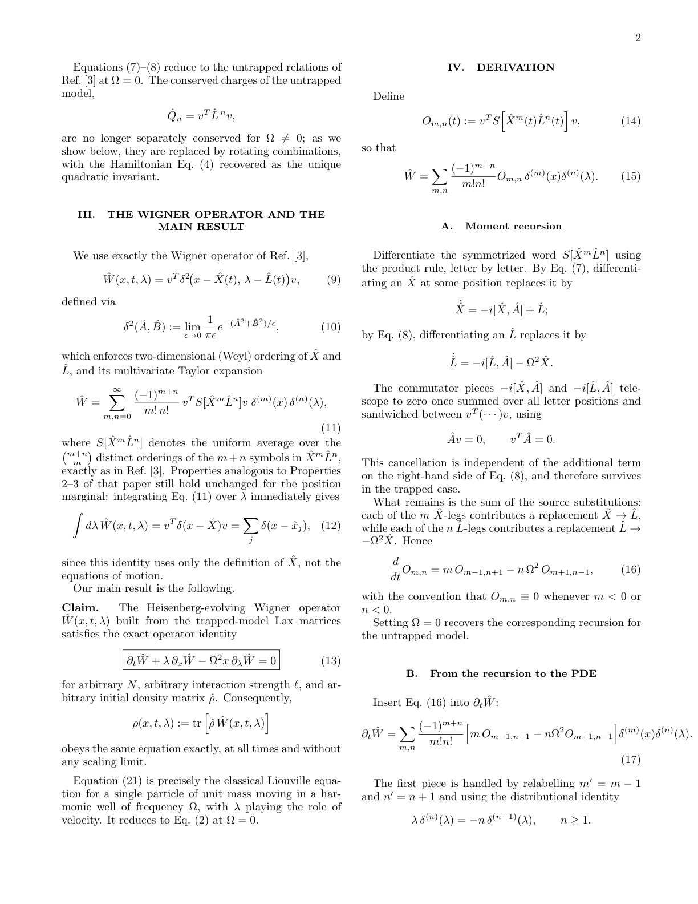 
Low-resolution page preview, page 2

📷 Fig 2

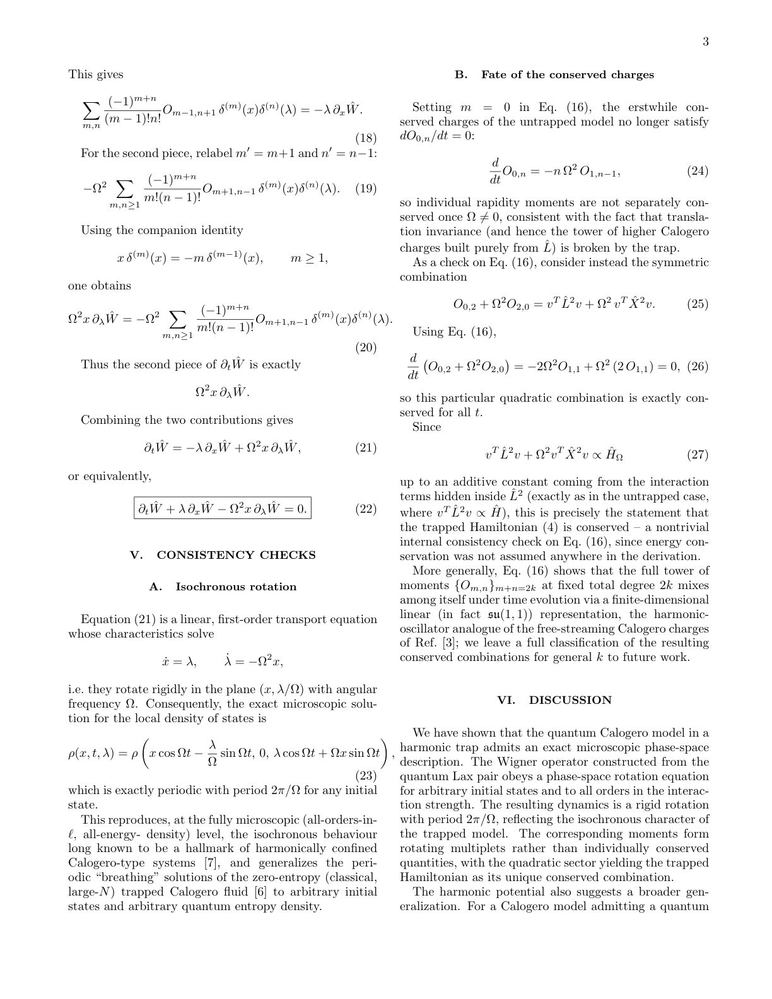 
Low-resolution page preview, page 3

📷 Fig 3

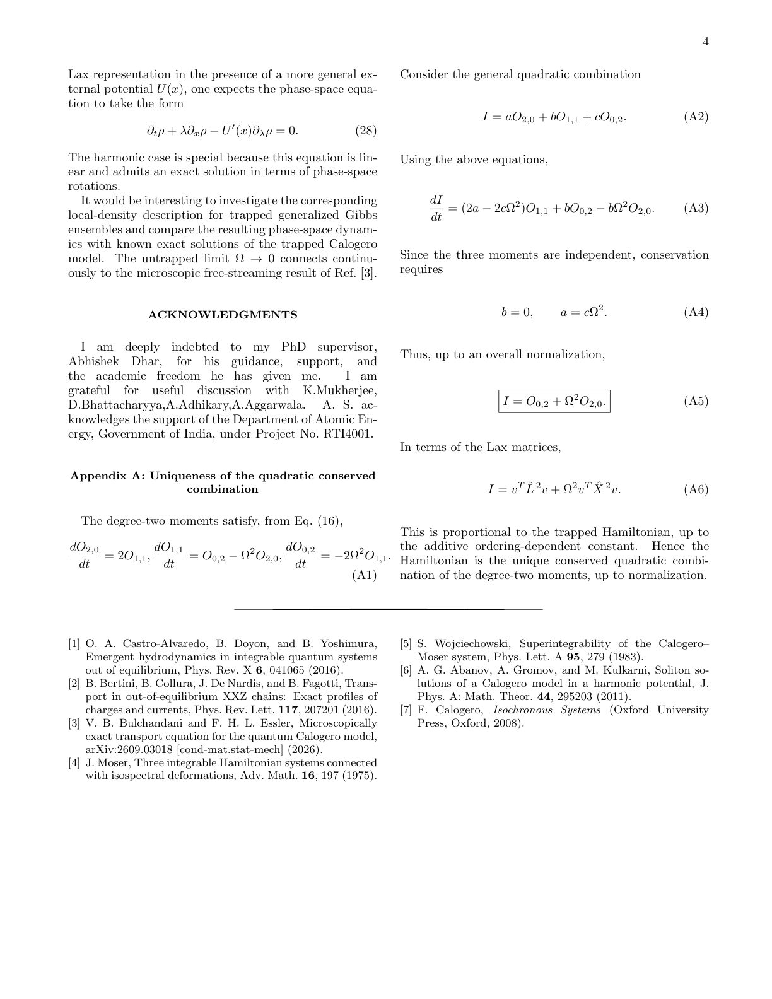 
Low-resolution page preview, page 4

**Summary.** This work develops a microscopic phase-space description for the trapped quantum Calogero model, showing that the system's dynamics correspond to a rigid rotation in phase space. By analyzing the evolution of phase-space density moments, the authors rigorously prove that the trapped Hamiltonian is the unique conserved quantity in the quadratic sector. This provides a fundamental understanding of the model's integrability in the presence of external confinement.

**Why it may be interesting.** The connection between the exact phase-space dynamics (rigid rotation) and the identification of the Hamiltonian as the unique conserved quantity provides a powerful, non-trivial consistency check for the model's dynamics, which is highly relevant for understanding integrable many-body systems.

Detailed structure

**Main problem.** The paper develops a microscopic phase-space description for the quantum Calogero model when subjected to an external harmonic confining potential.

**Main result.** The dynamics are shown to be a rigid rotation in phase space with period 2\pi/Omega, realizing the isochronous dynamics, and the Hamiltonian is identified as the unique conserved quadratic combination of phase-space moments.

**Method.** The authors construct a Hermitian Wigner operator and derive the exact evolution equation for its expectation value, $
ho$, in phase space.

**Model / system.** The system is the quantum Calogero model, specifically in the trapped version with a harmonic confining potential. The Hamiltonian involves harmonic confinement terms and pairwise interactions.

**Key observables.** The phase-space density $
ho(x, t, \lambda)$ and its moments, which form rotating multiplets.

**Important parameters / regimes.** The harmonic confinement frequency $\Omega$, and the interaction strength $\ell(\ell-\hbar)$. The limit $\Omega 	o 0$ is also analyzed.

**Assumptions / limitations.** The analysis relies on the quantum Lax-pair structure and the derivation of the evolution equation for the Wigner operator.

**Paper structure.** The paper first establishes the phase-space evolution equation for the Wigner operator, demonstrating rigid rotation. It then analyzes the conservation laws by examining the time evolution of degree-two moments to confirm that the trapped Hamiltonian is the unique conserved quadratic combination.

Abstract

We develop a microscopic phase-space description of the quantum Calogero model in the presence of an external harmonic confining potential. Building on the quantum Lax-pair structure, we construct a Hermitian Wigner operator whose expectation value obeys the exact phase-space evolution equation d_t rho + lambda d_x rho - Omega^2 x d_lambda rho = 0 for arbitrary initial states and to all orders in the interaction strength. The resulting dynamics is a rigid rotation in phase space with period 2 pi/Omega, providing a microscopic realization of the isochronous dynamics of the trapped Calogero model. We further show that the moments of the phase-space density form rotating multiplets rather than independent conserved quantities. In particular, within the quadratic sector, the unique conserved combination is proportional to the trapped Hamiltonian, providing a nontrivial consistency check of the construction. In the limit Omega -> 0, the equation reduces to the exact free-streaming equation of the untrapped model.

[↑ back to top](#top)

### [Explicit block encodings of rate matrices for simulating polymerization kinetics on quantum computers](http://arxiv.org/abs/2609.08432v1)

**Authors:** Yuhei Ikeda, Hokuto Iwakiri, Soichiro Nishio, Kentaro Matsumoto  
**Type:** theory · **Category:** quantum information and computing · **PDF:** <https://arxiv.org/pdf/2609.08432v1>  
**Analysis basis:** full PDF text, analyzed in chunks

📷 Fig 1

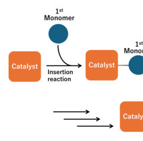 
Figure 1: Schematic representation of the chain-growth process in coordination polymerization.

📷 Fig 2

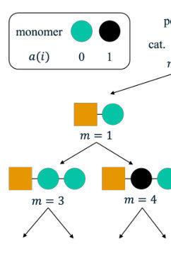 
Figure 2: Tree representation of polymer species labeled by the m-index. The catalyst (orange square) is the root; each branch corresponds to the insertion of monomer 0 (green circle) or monomer 1 (black circle). The m-index assigned to each species is shown directly below it.

📷 Fig 3

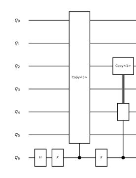 
Figure 3: Quantum circuit for oracle Ocol.

📷 Fig 4

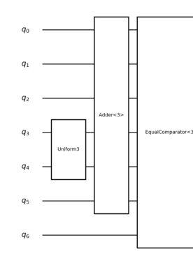 
Figure 4: Quantum circuit for oracle Orow.

📷 Fig 5

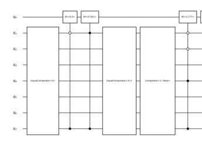 
Figure 5: Quantum circuit for oracle OH (rotation angles shown for the r1r2 = 1.11 parameter set of Sec. 3).

**Summary.** This paper establishes a quantum circuit framework to simulate polymerization kinetics by encoding the non-unitary rate matrix into a unitary quantum operation. By developing explicit block encodings using sparse-oracle and LCU methods, the authors achieve an exponential memory reduction, demonstrating a path toward simulating high-dimensional chemical reaction networks on quantum hardware.

**Why it may be interesting.** This work provides a direct, resource-estimated quantum circuit blueprint for simulating complex, high-dimensional chemical dynamics, which is a key application area for quantum simulation algorithms.

Detailed structure

**Main problem.** Simulating the complex, exponentially growing state space of polymer polymerization kinetics using quantum computation.

**Main result.** The authors developed concrete quantum circuit foundations using block encodings (Sparse-Oracle and LCU) that achieve an exponential memory saving of O(log N) qubits relative to the system size N.

**Method.** They encode the non-unitary rate matrix A governing the kinetics into a sub-block of a larger unitary operator, utilizing techniques like sparse-oracle constructions and Linear Combination of Unitaries (LCU) decomposition.

**Model / system.** The system models polymerization kinetics, specifically single-monomer (Model A) and two-monomer copolymerization (Model B), governed by linear ODEs (du/dt = Au). The state space grows exponentially with chain length.

**Key observables.** Reproduced classical time evolution for reactivity ratios; resource estimates (qubit counts, gate counts) for the encoding circuit.

**Important parameters / regimes.** The matrix dimension N, the number of system qubits $n_{sys} = \lceil\log_2 N
ceil$, and the gate counts scaling up to $10^4 - 10^5$ gates at $n_{sys} \sim 10^3$.

**Assumptions / limitations.** The simulation is limited to linear kinetic equations (constant monomer concentration) and the encoding only addresses the matrix representation, not the full solver complexity.

**Figures summary.** Figures schematically illustrate the chain-growth process, the m-index labeling scheme, and circuit diagrams for the encoding oracles (e.g., Ocol for Model B).

**Paper structure.** The paper introduces the physical problem, details the mathematical formulation ($rac{du}{dt} = A u$), develops and compares two encoding strategies (Sparse-Oracle vs. LCU) for Model A and Model B, validates the encodings via simulation, and concludes with resource analysis.

Abstract

Predicting how molecular weight distribution and monomer sequence evolve during polymerization is central to polymer science, yet classical approaches face a trade-off between molecular resolution and computational cost: for copolymers, the number of distinguishable species grows exponentially with chain length. Quantum computing offers a potential alternative, provided the non-unitary rate matrices governing the kinetics can be embedded into unitary quantum circuits, a task known as block encoding. Here we construct explicit block-encoding circuits for two kinetic models of living polymerization: Model A, single-monomer polymerization, whose lower-bidiagonal rate matrix is encoded via a sparse-oracle construction and a two-term linear combination of unitaries (LCU) decomposition; and Model B, two-monomer copolymerization, where a bijective labeling of polymer species by an integer index (the m-index) yields a structured sparse matrix encoded via either a five-term LCU or a sparse-oracle construction. Numerical simulations with the sparse-oracle encodings reproduce the classical time evolution for reactivity ratios drawn from reported olefin copolymerization systems spanning near-random ($r_1 r_2 \simeq 1$) and blocky ($r_1 r_2 > 1$) microstructures, and the LCU encodings are verified by explicit reconstruction of the encoded matrix block. Resource estimation shows that both implementations require only $O(\log N)$ qubits in the matrix dimension $N$ (an exponential memory saving over the classical state space), with gate counts growing gradually, reaching $10^4$ to $10^5$ gates at $10^3$ system qubits. These results establish a concrete quantum circuit foundation for simulating polymerization kinetics on fault-tolerant quantum hardware, and a first step toward exploiting exponential state-space compression for high-dimensional polymer reaction networks.

[↑ back to top](#top)

### [From Bits to Qubits: The Theory and Practice of Quantum Data Encoding](http://arxiv.org/abs/2609.08058v1)

**Authors:** Xiao-Ming Zhang, Arthur G. Rattew, Bujiao Wu, Georgios Styliaris, Xiaoming Sun, Bálint Koczor, Xiao Yuan  
**Type:** theory · **Category:** quantum information and computing · **PDF:** <https://arxiv.org/pdf/2609.08058v1>  
**Analysis basis:** full PDF text, analyzed in chunks

📷 Fig 1

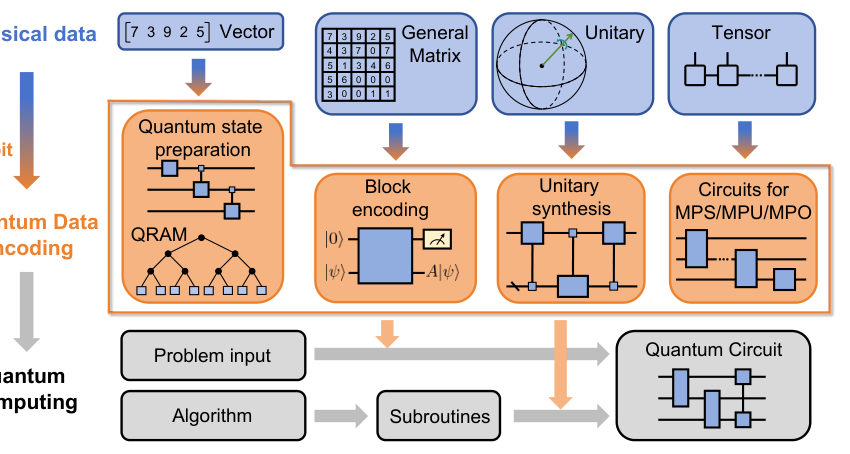 
FIG. 1 From bit (classical data) to qubit (quantum data). Quantum algorithm and corresponding problem inputs are compiled to concrete quantum circuits. Quantum state preparation: for classical vector v, the task is to prepare a quantum state |ψ⟩= ∥v∥−1 P

📷 Fig 2

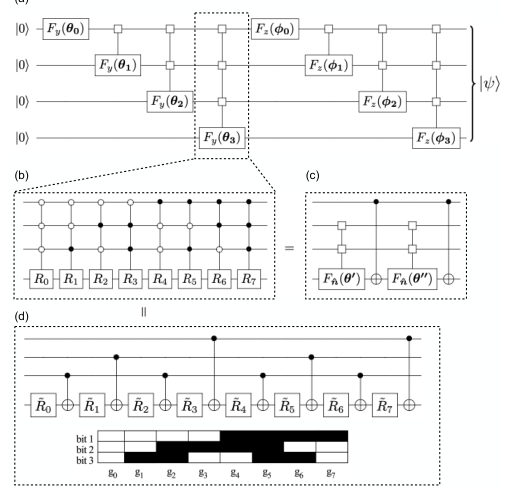 
FIG. 2 Illustration of quantum state preparation and UCR for n = 4. (a) Decomposition of quantum state preparation into UCRs. (b) Definition of UCR, where Rj = Ry(θj). (c) Recursive decomposition of an n-qubit UCR into two (n−1)- qubit UCRs and two CNOT gates (Shende et al., 2005). (d) Gray code based decomposition of UCR that replaces multi- qubit controlled rotations by CNOTs (M¨ott¨onen et al., 2004). Lower panel is from (M¨ott¨onen et al., 2004), which shows gray code used to define the positions of the control nodes. The black (white) rectangles denote bit values one (zero).

📷 Fig 3

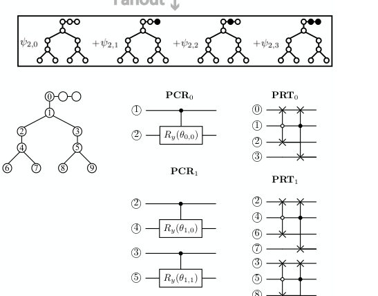 
FIG. 3 Sketch of the binary-tree approach (Zhang, 2024) for low-depth quantum state preparation for n = 2. Each circle represents a qubit, two qubit gates are only applied on qubit pairs connected by lines. Hollow circles represent qubits at state |0⟩, and black circle represents qubits at state |1⟩.

📷 Fig 4

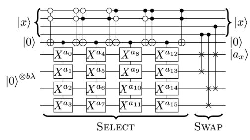 
FIG. 4 Example of the select-swap approach for O|x⟩|0⟩|0⟩= |x⟩|ax⟩|garbx⟩with N = 16 and λ = 4. Adapted from (Low et al., 2024). ax = ax,0ax,1 · · · ax,b−1 is a b-digit bitstring, and the corresponding Pauli string Xax is defined as Xax = Xax,0 ⊗Xax,1 ⊗· · · ⊗Xax,b−1.

📷 Fig 5

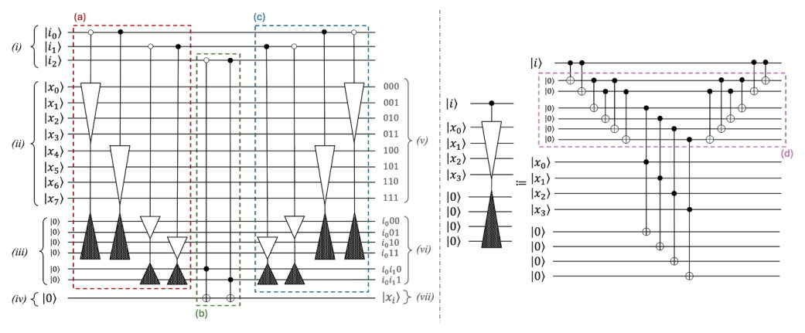 
FIG. 5 Simple example circuit QRAM with 8 memory qubits. The panel on the left shows a fan-out style circuit QRAM implementation with polylogarithmic depth (in the number of memory qubits). The panel on the right depicts a circuit which copies, in order, the bit values (in the standard basis) in a set of source qubits to a set of |0⟩initialized target qubits. (i) Address qubits, split into single qubits, the binary address i = i0i1i2. (ii) The memory qubits. (iii) Temporary ancilla registers used for routing. (iv) Output data register (i.e., this corresponds to the second register in the usual QRAM oracle definition UQRAM |i⟩|0⟩= |i⟩|xi⟩). (v) The address of each memory qubit as a...

**Summary.** This review systematically surveys the theory and practice of quantum data encoding, which is essential for running quantum algorithms. It details multiple encoding methods—such as state preparation, QRAM, and block encoding—and analyzes their associated resource costs like circuit depth and size. The work serves as a vital guide for both newcomers and experts in quantum computing hardware and algorithm design.

**Why it may be interesting.** It provides a crucial theoretical roadmap for researchers aiming to implement quantum algorithms, especially those involving complex data structures or simulation inputs, by quantifying the required quantum resources.

Detailed structure

**Main problem.** Encoding classical data (like vectors or matrices) into quantum states or circuits is a fundamental and critical bottleneck for achieving practical quantum advantage.

**Main result.** The review provides a comprehensive survey of various encoding techniques, including quantum state preparation, QRAM utilization, and block encoding, detailing their respective circuit complexities.

**Method.** The paper surveys theoretical concepts and algorithms, analyzing resource costs (circuit size, depth, T-count) associated with different data loading models.

**Model / system.** The analysis is based on the standard qubit-based circuit model, focusing on encoding classical information into quantum states or unitary operations.

**Key observables.** Circuit size, circuit depth, T-count, and the fidelity of the resulting quantum state.

**Important parameters / regimes.** The complexity scales with the size of the classical data (e.g., vector length N or matrix dimension).

**Assumptions / limitations.** It assumes classical data are deterministic and fully known in advance, and it is limited to the standard qubit model.

**Figures summary.** Figure 1 illustrates the conceptual flow from classical bits to quantum qubits via various encoding processes like state preparation and block encoding.

**Paper structure.** The paper is structured as a comprehensive review, systematically covering quantum state preparation, unitary synthesis, QRAM implementations, structured data encoding (sparse data, Boolean functions), and block-encoding generalizations.

Abstract

Encoding classical data into quantum systems is a foundational step in the execution of nearly all quantum algorithms, and a critical bottleneck in realizing practical quantum advantage. This review provides a comprehensive account of the concepts, algorithms, and practical considerations associated with quantum data encoding. We trace the development from its early conceptual foundations to recent advances, considering commonly used access models, such as quantum state preparation, unitary synthesis, QRAM and block encoding. We survey the circuit size, depth, space-time tradeoffs, as well as non-Clifford resources required for fault-tolerant implementation. We also discuss the roles of different access models in quantum algorithms. Special attention is given to structured data, such as sparse data, Boolean functions and data represented by tensor networks. This review bridges theory and applications, serving both as a pedagogical guide for newcomers and as a reference for active researchers. We also highlight the pivotal role of quantum data encoding in quantum computing and provide insights into future directions that will enable quantum advantage.

[↑ back to top](#top)

### [Magnetic phases of Kondo lattice materials Ce$_5$RhGe$_2$ and Ce$_5$IrGe$_2$](http://arxiv.org/abs/2609.08580v1)

**Authors:** Jiawen Zhang, Yanan Zhang, Mingyi Wang, Ye Chen, Yu Liu, Yongjun Zhang, Michael Smidman, Huiqiu Yuan  
**Type:** experiment · **Category:** strongly correlated electrons · **PDF:** <https://arxiv.org/pdf/2609.08580v1>  
**Analysis basis:** full PDF text, analyzed in chunks

📷 Fig 1

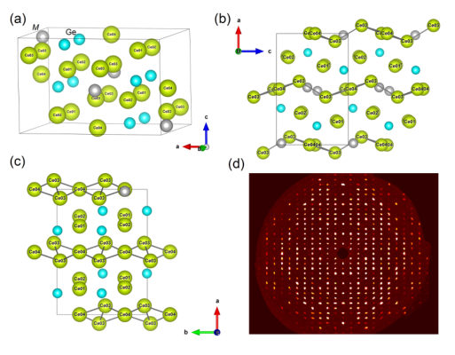 
FIG. 1. (Color online) (a)-(c) The structure of Ce5MGe2 (M = Co, Rh, Ir), showing the Ce atomic arrangement with Ce–Ce distances shorter than 3.55 ˚A highlighted. Green, gray, and blue spheres represent Ce, M, and Ge atoms, respectively. (d) Single crystal XRD pattern of Ce5IrGe2 in the (h 0 l) plane.

📷 Fig 2

 
Figure 2(a) displays the temperature dependence of the electrical resistivity, ρ(T), of Ce5MGe2 (M = Co, Rh, Ir). At high temperatures, all three compounds ex- hibit a broad hump around 150 K, which is a typical

📷 Fig 3

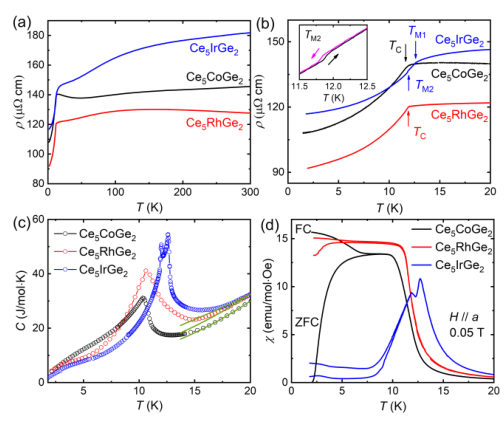 
FIG. 2. (Color online) (a) Temperature dependence of the electrical resistivity ρ(T) of Ce5MGe2 (M = Co, Rh, Ir). (b) ρ(T) at low temperatures. The black and red arrows indicate the ferromagnetic transition temperatures TC of Ce5CoGe2 and Ce5RhGe2, respectively, while the two blue arrows indi- cate the magnetic transition temperatures TM1 and TM2 of Ce5IrGe2. The inset shows the thermal hysteresis across TM2 upon heating and cooling. (c) Temperature dependence of the specific heat of Ce5MGe2. The green lines are fits to C(T) = γ0T +βT 3. (d) Temperature dependence of the mag- netic susceptibility χ(T) measured at 0.05 T with H ∥a. Both zero-field-cooled (ZFC) and field-cooled (FC) curves...

📷 Fig 4

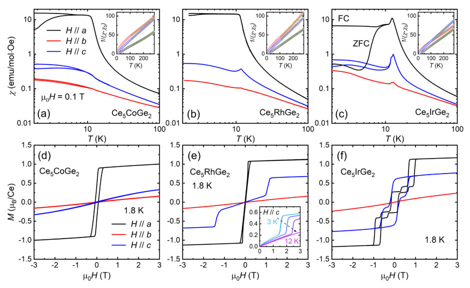 
FIG. 3. (Color online) (a)–(c) Temperature dependence of the magnetic susceptibility of Ce5MGe2 (M = Co, Rh, Ir) measured at 0.1 T along different crystallographic orientations. Both ZFC and FC curves are shown. The insets show the 1/(χ −χ0) as a function of temperature, where the solid lines correspond to fits to the modified Curie-Weiss law. (d)–(f) The field dependence of the magnetization for the corresponding directions at 1.8 K. The inset of (e) shows M(H) of Ce5RhGe2 measured at 3 K, 5 K, 7 K and 12 K for H∥c. The dashed arrow denotes the trend of the metamagnetic transition.

📷 Fig 5

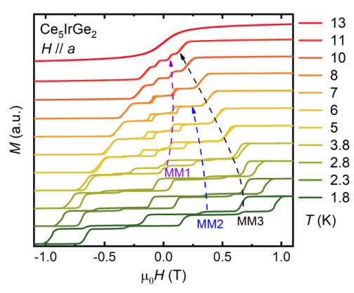 
FIG. 4. (Color online) Field dependence of the magnetization of Ce5IrGe2 at various temperatures for H ∥a. The curves are offset vertically for clarity. The dashed arrows denote the trend of the metamagnetic transitions.

**Summary.** This paper experimentally investigates the magnetic phases in the Kondo lattice materials Ce5MGe2. By measuring transport and magnetic properties, the authors distinguish between ferromagnetic ordering in Ce5RhGe2 and a complex ferrimagnetic ground state in Ce5IrGe2. The work highlights how subtle changes in the transition metal element can drastically alter the magnetic ground state in these strongly correlated electron systems.

**Why it may be interesting.** The study provides detailed experimental evidence of magnetic ground states (FM vs. FIM) in heavy fermion systems, which are canonical examples of strongly correlated electron physics, relevant for understanding exotic quantum phases.

Detailed structure

**Main problem.** The study investigates the magnetic phases and evolution of Kondo lattice materials, specifically Ce5RhGe2 and Ce5IrGe2, to understand the interplay between magnetism and electronic properties.

**Main result.** Ce5RhGe2 exhibits ferromagnetic ordering, while Ce5IrGe2 displays complex behavior, including two successive magnetic transitions and a ferrimagnetic ground state at low temperatures.

**Method.** The research employed systematic measurements on single crystals, including electrical resistivity, specific heat, magnetization, and magnetic susceptibility, across varying temperatures and magnetic fields.

**Model / system.** The physical system is the series of Kondo lattice compounds Ce5MGe2 (M = Co, Rh, Ir), which crystallize in the orthorhombic Pnma structure.

**Key observables.** Curie temperature (Tc), magnetic transition temperatures (TM1, TM2), magnetization plateaus (e.g., Ms/5, Ms/3), and the electronic specific heat coefficient (gamma0).

**Important parameters / regimes.** Temperature (T), applied magnetic field (H), and the chemical substitution element (M = Co, Rh, Ir).

**Assumptions / limitations.** The analysis assumes that the observed magnetic transitions and electronic properties are governed by the competition between local moments and conduction electrons.

**Figures summary.** Figures show resistivity, specific heat, and magnetization measurements across the series, illustrating magnetic transitions and field-dependent plateaus.

**Paper structure.** The paper systematically compares the structural and magnetic properties of Ce5MGe2, detailing the magnetic transitions observed in each compound, particularly contrasting the FM behavior of Ce5RhGe2 with the complex FIM-like state of Ce5IrGe2.

Abstract

Single crystals of Ce$_5$RhGe$_2$ and Ce$_5$IrGe$_2$ have been systematically investigated by electrical resistivity, specific heat, and magnetization measurements. Together with Ce$_5$CoGe$_2$, all three compounds crystallize in the orthorhombic \emph{Pnma} structure, with the lattice parameters increasing monotonically from Co to Rh to Ir, consistent with the effect of negative chemical pressure. Magnetization measurements along the three principal crystallographic axes identify the \emph{a} axis as the easy magnetization direction throughout the series. Ce$_5$RhGe$_2$ exhibits ferromagnetic ordering with a Curie temperature of approximately 11.5 K and shows magnetic behavior closely resembling that of Ce$_5$CoGe$_2$. In contrast, Ce$_5$IrGe$_2$ undergoes two successive magnetic transitions at $T_{\rm M1}=12.7$ K and $T_{\rm M2}=11.8$ K, and there are multiple metamagnetic transitions under magnetic fields, giving rise to magnetization plateaus at fractions of the saturation magnetization $M_{\rm s}$ of approximately $M_{\rm s}/5$ and $M_{\rm s}/3$. The low-field metamagnetic transition along the easy axis shifts to lower field with decreasing temperature, and eventually a pronounced hysteresis loop is observed about zero-field, establishing that Ce$_5$IrGe$_2$ exhibits a ferrimagnetic ground state at the lowest measured temperatures.

[↑ back to top](#top)

### [Near-Optimal Quantum Lower Bounds for Convex Optimization via Fourier Rank](http://arxiv.org/abs/2609.09035v1)

**Authors:** Brandon Augustino, Shouvanik Chakrabarti, Enrico Fontana, Dylan Herman, Junhyung Lyle Kim, Guneykan Ozgul, Nadezhda Voronova  
**Type:** theory · **Category:** quantum information and computing · **PDF:** <https://arxiv.org/pdf/2609.09035v1>  
**Analysis basis:** full PDF text, analyzed in chunks

📷 Fig 1

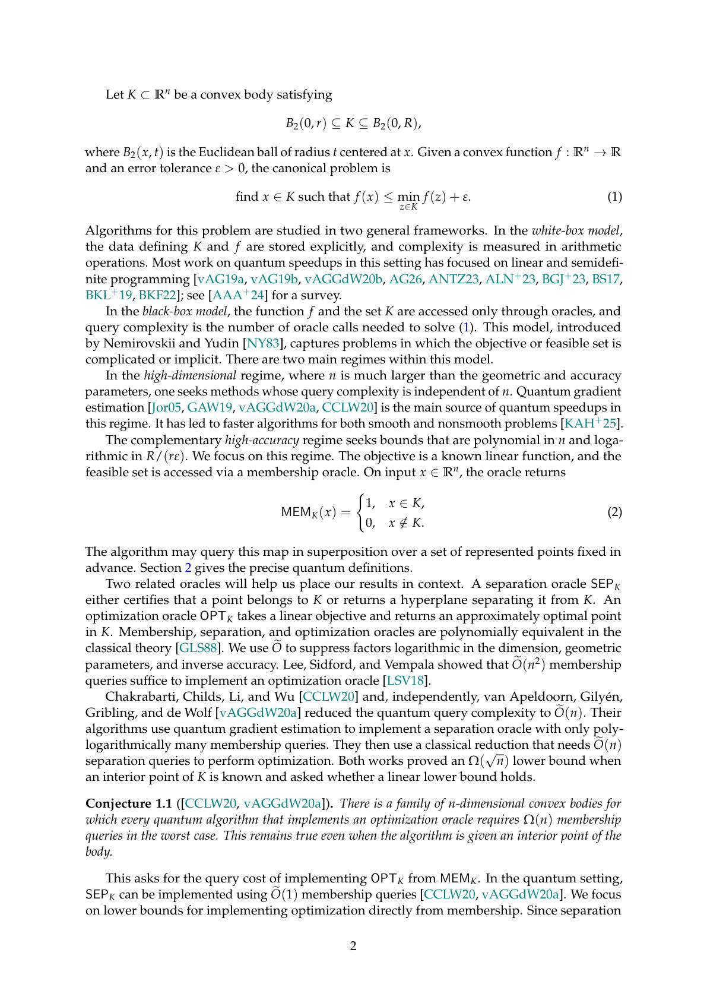 
Low-resolution page preview, page 2

📷 Fig 2

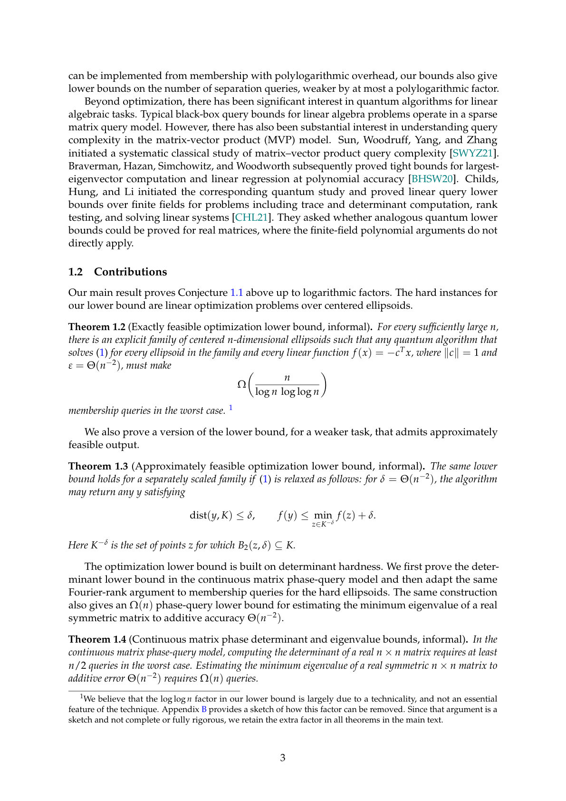 
Low-resolution page preview, page 3

📷 Fig 3

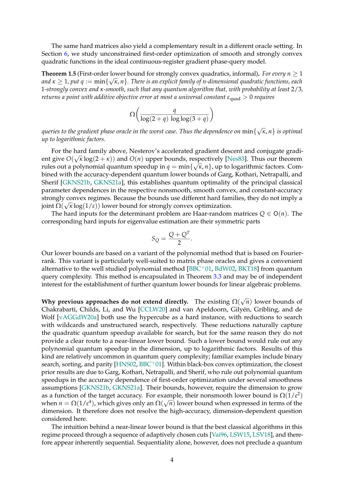 
Low-resolution page preview, page 4

📷 Fig 4

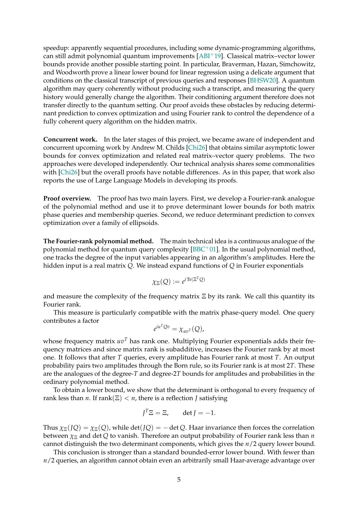 
Low-resolution page preview, page 5

📷 Fig 5

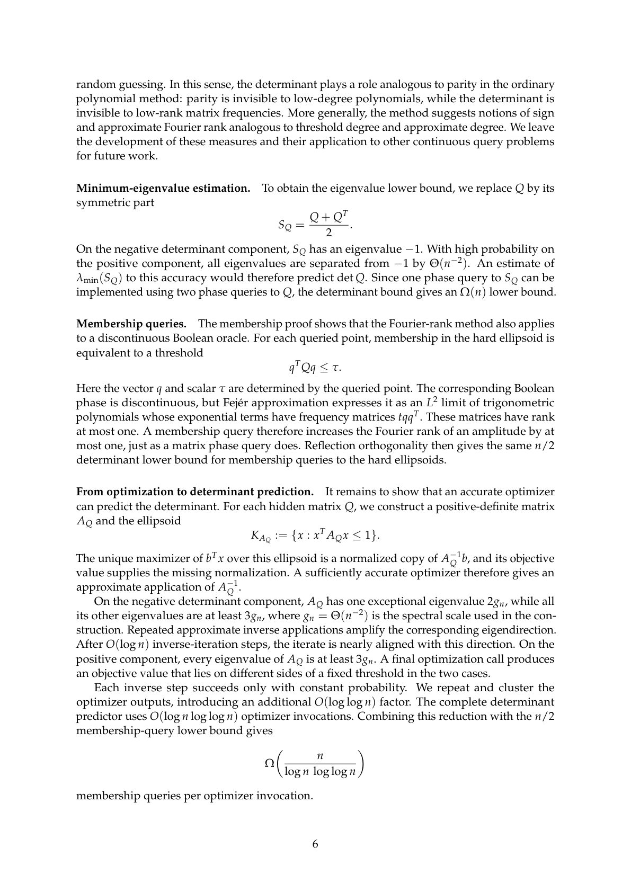 
Low-resolution page preview, page 6

**Summary.** This work establishes tight, near-optimal quantum lower bounds for solving convex optimization problems using quantum oracles. By developing a novel technique based on Fourier-rank, the authors show that solving these problems requires a query complexity scaling as $\Omega(n / \log n \log \log n)$. This resolves long-standing open questions regarding the quantum speedup for optimization.

**Why it may be interesting.** The rigorous characterization of quantum query complexity for fundamental optimization problems provides deep insights into the computational power of quantum algorithms in practical settings.

Detailed structure

**Main problem.** Establishing near-optimal quantum query lower bounds for high-accuracy convex optimization over explicit families of n-dimensional ellipsoids.

**Main result.** The quantum query complexity for this optimization problem is characterized by a lower bound of $\Omega\left(rac{n}{\log n \log \log n}
ight)$ membership queries, up to logarithmic factors.

**Method.** The proof utilizes a novel polynomial method based on Fourier-rank, which is applied to derive lower bounds for determinant computation and subsequently reduces this hardness to the convex optimization setting.

**Model / system.** The model is a black-box quantum query model where the objective function and feasible set (ellipsoids) are accessed via oracles (membership, phase, or gradient).

**Key observables.** Query complexity (number of oracle calls), additive objective error ($\Theta(n^{-2})$), determinant value, and minimum eigenvalue.

**Important parameters / regimes.** Dimensionality ($n$), accuracy ($\epsilon$), and the condition number ($\kappa$) for gradient bounds.

**Assumptions / limitations.** The lower bounds are established for specific hard families (e.g., centered ellipsoids) and the analysis relies on advanced tools from functional analysis and Fourier analysis in the continuous setting.

**Figures summary.** Not specified.

**Paper structure.** The paper develops the Fourier-rank based lower bound for determinant computation, applies this to membership queries for ellipsoids to solve the optimization lower bound, and separately derives gradient-query lower bounds for strongly convex functions.

Abstract

We establish a near-linear quantum query lower bound for high-accuracy convex optimization over an explicit family of $n$-dimensional ellipsoids. We focus on linear optimization with an explicitly given objective, where the feasible set is accessed through a membership oracle. We show that any algorithm that, for every unit linear objective, returns an exactly feasible point with additive objective error $Θ(n^{-2})$ requires $Ω\!\left(\frac{n}{\log n\,\log\log n}\right)$ membership queries. The same lower bound can be shown to hold if the returned point is only required to be approximately feasible, within $Θ(n^{-2})$ distance from the feasible set. This resolves, up to logarithmic factors, an open question posed by Chakrabarti, Childs, Li, and Wu~(\textit{Quantum}, 2020) and by van Apeldoorn, Gilyén, Gribling, and de Wolf~(\textit{Quantum}, 2020). Coupled with the upper bounds in these papers, the query complexity of high-accuracy convex optimization is characterized tightly up to logarithmic factors. The proof is built around a lower bound for determinant computation that is derived via a novel polynomial method based on Fourier-rank. In the continuous matrix phase-query model, computing the determinant of a real $n\times n$ matrix requires at least $n/2$ matrix-vector product queries. The construction also yields an $Ω(n)$ phase-query lower bound for estimating the minimum eigenvalue of a real symmetric $n\times n$ matrix to additive accuracy $Θ(n^{-2})$. These results extend the determinant and minimum-eigenvalue lower bounds of Childs, Hung, and Li~(ICALP 2021) from finite fields to the real-valued setting. Based on the same constructions, we also prove a near-optimal gradient-query lower bound for constant-accuracy optimization of smooth and strongly convex functions.

[↑ back to top](#top)

### [No information transmission through quantum channels above capacity](http://arxiv.org/abs/2609.08998v1)

**Authors:** Hao-Chung Cheng, Marco Tomamichel  
**Type:** theory · **Category:** quantum information and computing · **PDF:** <https://arxiv.org/pdf/2609.08998v1>  
**Analysis basis:** full PDF text, analyzed in chunks

📷 Fig 1

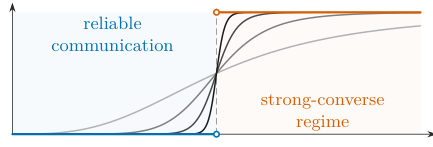 
FIG. 1. The asymptotic coding transition. Darker curves represent longer codes. Direct coding theorems drive the optimal error to zero below capacity, whereas a strong converse drives it to one above capacity. The corresponding exponents quantify the approach to the limiting step. No behavior at the transition point itself is asserted.

**Summary.** This paper rigorously proves exponential strong converse theorems for quantum and classical communication over arbitrary quantum channels. By utilizing integral representations of Rényi information, the authors demonstrate that any attempt to transmit information above the channel's capacity fails exponentially fast. This work provides fundamental, sharp limits on quantum information processing capabilities.

**Why it may be interesting.** The rigorous characterization of capacity limits via strong converse theorems provides fundamental, non-trivial bounds on what is physically possible for information processing using quantum resources.

Detailed structure

**Main problem.** The paper aims to establish an exponential strong converse theorem for information transmission through quantum channels, proving that communication rates exceeding the channel capacity fail catastrophically.

**Main result.** The authors prove that at rates beyond the quantum or classical capacity, the entanglement-generation fidelity and success probability decay exponentially with the number of channel uses.

**Method.** The proof adapts the classical Arimoto strategy, crucially employing integral representations of Rényi information measures to establish asymptotic continuity bounds for Rényi capacities.

**Model / system.** The analysis concerns arbitrary finite-dimensional memoryless quantum channels, considering both classical and quantum information transmission protocols.

**Key observables.** Capacity ($C$ or $Q$), entanglement-generation fidelity ($F_{eg}$), and the success probability for classical communication.

**Important parameters / regimes.** The Rényi order ($\alpha > 1$) and the transmission rate ($r$) relative to the capacity.

**Assumptions / limitations.** The core technical steps involve bounding fidelity using the sandwiched Rényi divergence and adapting the Leung–Smith telescoping argument.

**Figures summary.** Figure 1 illustrates the asymptotic coding transition, distinguishing between weak converse (fixed error) and strong converse (error tending to one) behavior.

**Paper structure.** The structure builds from defining the problem (strong converse) to introducing the mathematical machinery (Rényi measures, integral representations), deriving the converse bounds for both quantum and classical settings, and finally proving the equivalence of various rate bounds.

Abstract

We show that the capacity of a quantum channel demarcates a phase transition: while reliable transmission below capacity is always possible, any attempt to transmit information above it fails catastrophically. Specifically, we prove exponential strong converse theorems for unassisted quantum and classical communication over arbitrary finite-dimensional memoryless quantum channels. At rates beyond the respective capacity, the entanglement-generation fidelity and the success probability for classical communication decay exponentially with the number of channel uses. This rules out transmission above capacity even when one tolerates arbitrarily large errors. Our proof follows the classical Arimoto strategy, augmented by a crucial new ingredient: integral representations of Rényi information measures that lead to asymptotic continuity bounds for Rényi capacities.

[↑ back to top](#top)

### [Positive Temperature Coefficient of Anisotropy due to $d^6L$ Groundstate in $ε$-Fe$_2$O$_3$](http://arxiv.org/abs/2609.08927v1)

**Authors:** Rachel Nickel, Kurt Kummer, Johan van Lierop  
**Type:** both · **Category:** strongly correlated electrons · **PDF:** <https://arxiv.org/pdf/2609.08927v1>  
**Analysis basis:** full PDF text, analyzed in chunks

📷 Fig 1

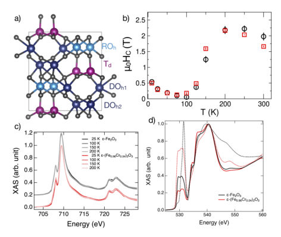 
FIG. 1. a) Crystal structure of ϵ-Fe2O3. Temperature dependent b) magnetic coercivity (repro-

📷 Fig 2

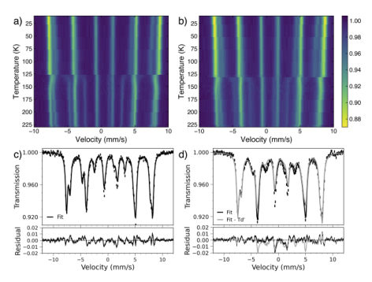 
FIG. 2. Maps of temperature dependent M¨ossbauer spectra of a) ϵ-Fe2O3 and b) ϵ-

📷 Fig 3

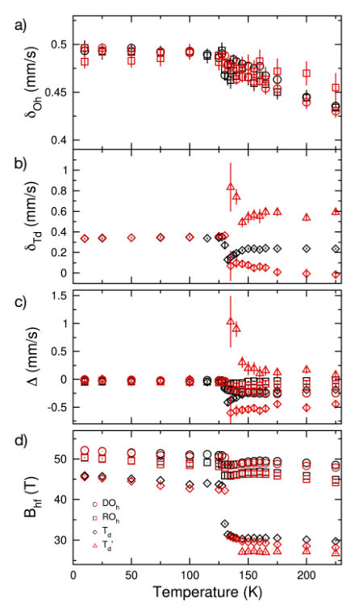 
FIG. 3. Temperature dependent isomer shift (δ) of a) Oh and b) Td components, c) quadrupole

📷 Fig 4

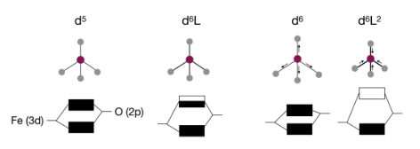 
FIG. 4. Schematic of electronic coupling for different electronic configurations where filled (empty)

📷 Fig 5

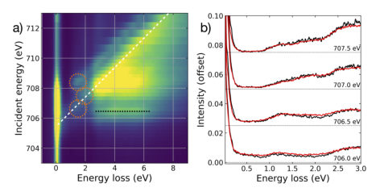 
FIG. 5. a) High throughput Fe L3 RIXS map of ϵ-Fe2O3 at 300 K. Orange circles mark dd

**Summary.** This paper investigates the unusual positive temperature coefficient of magnetic anisotropy in $\epsilon$-Fe$_2$O$_3$. By combining Mössbauer spectroscopy, XAS, and RIXS, the authors propose that the effect arises from a $d^6L$ groundstate stabilized by metal-ligand hybridization and bond disproportionation. This work highlights hybridization as a key mechanism for tuning magnetic properties in correlated oxide materials.

**Why it may be interesting.** The work provides a detailed, multi-technique investigation into how hybridization mechanisms can induce strong spin-orbit coupling effects in transition metal oxides, which is central to understanding correlated electron physics.

Detailed structure

**Main problem.** The study aims to explain the origin of a positive temperature coefficient of anisotropy ($dK/dT > 0$) in $\epsilon$-Fe$_2$O$_3$, a behavior unusual for magnetic materials.

**Main result.** The positive $dK/dT$ is attributed to the stabilization of a $d^6L$ groundstate in the tetrahedral Fe sites, driven by metal-ligand hybridization and bond disproportionation.

**Method.** The research combines multiple experimental techniques, including temperature-dependent Mössbauer spectroscopy, X-ray Absorption Spectroscopy (XAS), and Resonant Inelastic X-ray Scattering (RIXS).

**Model / system.** The system under investigation is $\epsilon$-Fe$_2$O$_3$ and its Cr-doped counterpart, focusing on the electronic structure changes associated with different Fe local environments ($T_d$, $O_h$).

**Key observables.** Temperature dependence of anisotropy ($dK/dT$), Mössbauer parameters ($\delta$, $\Delta$, $B_{hf}$), and XAS spectral weight changes.

**Important parameters / regimes.** Temperature range (125-200 K), doping concentration (Cr), and the electronic configuration ($d^6L$ vs. $d^6+d^6L_2$).

**Assumptions / limitations.** The analysis assumes that the unusual magnetic behavior can be mapped onto specific changes in the local electronic structure, particularly involving metal-ligand hybridization.

**Figures summary.** Figures show temperature-dependent magnetic coercivity and XAS spectra for both pure and doped samples, alongside maps and plots detailing temperature-dependent hyperfine parameters and RIXS excitations.

**Paper structure.** The paper progresses by first establishing the anomalous $dK/dT > 0$ behavior, then using Mössbauer and XAS to probe site-specific electronic changes upon doping, and finally employing RIXS to confirm the role of metal-ligand hybridization and bond disproportionation in stabilizing the $d^6L$ state.

Abstract

Positive anisotropy temperature coefficients ($dK/dT>0$) usually arise from hybridization between magnetic 3d states and strongly spin-orbit-coupled (SOC) subsystems. Yet $ε$-Fe$_2$O$_3$ shows $dK/dT>0$ (125-200~K) without an obvious SOC partner. We study pure and Cr-doped (with weakened Fe-O hybridization) $ε$-Fe$_2$O$_3$ across the transition from low temperature incommensurate to high-anisotropy magnetic phases. We identify a $d^6L$ groundstate in $ε$-Fe$_2$O$_3$ while reduced hybridization yields $d^6 + d^6L^2$ in the Cr-doped system, highlighting metal-ligand hybridization as a route to tune magnetic, electronic and orbitronic properties.

[↑ back to top](#top)

### [Promises should be taken seriously: On relativization with promise problems](http://arxiv.org/abs/2609.07945v1)

**Authors:** David Miloschewsky, Supartha Podder, Dorian Rudolph  
**Type:** theory · **Category:** quantum information and computing · **PDF:** <https://arxiv.org/pdf/2609.07945v1>  
**Analysis basis:** full PDF text, analyzed in chunks

📷 Fig 1

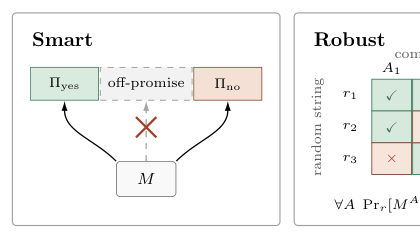 
Figure 1: Three different types of oracle access to promise problems.

**Summary.** This paper tackles the complex theoretical issue of how computational power changes when moving from standard language problems to promise problems, especially when using black-box oracles. The authors show that standard complexity results fail to transfer to the promise setting, establishing fundamental separations between classes like $	ext{PromiseBQP}$ and $	ext{PromiseP}$. It provides deep insights into the structure of quantum and classical complexity hierarchies under these generalized computational models.

**Why it may be interesting.** While highly theoretical, the rigorous analysis of computational models and the limitations of standard complexity results (like those transferring from languages to promises) informs the fundamental limits of quantum computation, which is crucial for understanding the feasibility of quantum algorithms in physical systems.

Detailed structure

**Main problem.** The paper investigates the computational differences between standard language problems and promise problems when using black-box oracle access, particularly concerning how unconstrained 'off-promise' inputs affect complexity classes.

**Main result.** It demonstrates that results proven for languages do not necessarily transfer to promise problems, establishing separations like $	ext{PromiseBQP}^O 
ot\subseteq 	ext{PromiseP}^O_{	ext{/poly}}$ for a specific oracle $O$. Furthermore, it establishes that $	ext{PromiseYQP}^* = 	ext{PP}$ under certain assumptions.

**Method.** The authors employ advanced techniques from complexity theory, defining and comparing various oracle access semantics (robust, loose) and adapting proof techniques, such as those used for the Quantum-Classical Polynomial Hierarchy, to the promise setting.

**Model / system.** The model is purely theoretical, focusing on abstract computational complexity classes ($	ext{P}, 	ext{BQP}, 	ext{PP}$, etc.) and their generalizations to promise problems ($	ext{PromiseP}, 	ext{PromiseBQP}$). The 'oracle' represents an external computational source whose behavior is constrained by the problem's promise.

**Key observables.** The primary observables are the containment and separation relationships between various complexity classes (e.g., $	ext{PromiseBQP}$ vs. $	ext{PromiseP}$).

**Important parameters / regimes.** The key parameters are the definitions of oracle access semantics (robust vs. loose) and the structure of the promise sets ($\Pi_{	ext{yes}}, \Pi_{	ext{no}}$).

**Assumptions / limitations.** The analysis relies on constructing specific oracles $O$ to demonstrate separations, and the results often depend on the specific definition of oracle access used (e.g., robust queries).

**Figures summary.** Figure 1 illustrates the three types of oracle access (Smart, Robust, Loose) to promise problems, comparing the required success probabilities for different query types.

**Paper structure.** The paper proceeds by first establishing the necessity of defining oracle access carefully (Observation 1.1). It then proves separations between language and promise settings (Result 1), improves bounds on the Quantum-Classical Polynomial Hierarchy using loose access (Result 2), and finally establishes relationships between specialized promise classes like $	ext{PromiseYQP}^*$ and $	ext{PromisePostBQP}^*$ (Result 3).

Abstract

Relativization is concerned with comparing computational models with black-box access to an oracle. For promise problems, black-box access is not canonical due to inputs outside of the promise being unconstrained. We study two semantics for such access. Under robust queries, a machine must correctly answer regardless of the completion of the problem,, while loose access requires that the internal choices of a machine do not change based on off-promise queries.   Our first result separates the language and promise settings. Namely, we construct an oracle $O$ such that $\mathsf{P}^O = \mathsf{BQP}^O = \mathsf{AWPP}^O$, but $\mathsf{PromiseBQP}^O\not\subseteq\mathsf{PromiseP}^O_{\mathsf{/poly}}$. In particular, $\mathsf{BPP}^O = \mathsf{BQP}^O$, but $\mathsf{PromiseBQP}^O \neq \mathsf{PromiseBPP}^O$, showing that results for languages need not transfer to promises. Next, we use loose queries to strengthen the upper bound on the Quantum-Classical Polynomial Hierarchy from $\mathsf{P}^{\mathsf{PP}^{\mathsf{PP}}}$ to $\mathsf{QCPH} \subseteq \mathsf{BP\cdot PP} \subseteq \mathsf{PromiseBPP}^{\mathsf{PP}}$. The same proof also shows $\mathsf{PP}^\mathsf{PromiseBQP} = \mathsf{PP}$. Additionally, we show that $\mathsf{PromiseBQP}$, even when given quantum advice, is self-low under robust queries. Finally, we exhibit an obstruction to transferring language-level counting results to promise classes. Although $\mathsf{AWPP}$ and $\mathsf{APP}$ are low for $\mathsf{PP}$, a corresponding promise analogue would collapse the counting hierarchy as $\mathsf{GapP} \subseteq \mathsf{FP}^{\mathsf{PromiseAWPP}}$. This motivates the introduction of $\mathsf{PromisePostBQP^*}$, which restricts $\mathsf{PostBQP}$ to input-indepencent postselection. By showing that it is low for \PP, we obtain $\mathsf{PP}^{\mathsf{PromiseYQP^*}} = \mathsf{PP}$.

[↑ back to top](#top)

### [Quantifying Margenau--Hill Nonclassicality](http://arxiv.org/abs/2609.07869v1)

**Authors:** Sudip Chakrabarty  
**Type:** theory · **Category:** other · **PDF:** <https://arxiv.org/pdf/2609.07869v1>  
**Analysis basis:** full PDF text, analyzed in chunks

📷 Fig 1

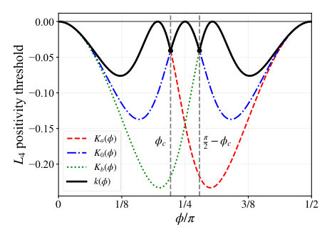 
FIG. 1: The solid black curve k(ϕ) denotes the optimal threshold as a function of the angle ϕ ∈[0, π/2] between the Bloch vectors of the observables A and B. The dashed red, dash-dotted blue, and dotted green curves represent the branches Ka(ϕ), K0(ϕ), and Kb(ϕ), respectively. The black points and vertical dashed lines mark the transition points ϕ = ϕc and ϕ = π/2 −ϕc, at which the optimal strategy switches from the Ka to the K0 branch, and from the K0 to the Kb branch, respectively.

📷 Fig 2

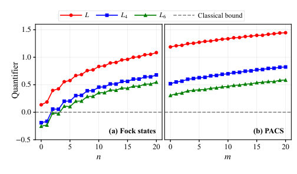 
FIG. 2: Comparison of the logarithmic MHQ negativity L and the moment-based lower bounds L4 and L6 for (a) Fock states and (b) photon-added coherent states (for α = 2) for the parameter ranges considered. The inequalities L ≥L4 ≥L6 hold throughout the dis- played ranges, illustrating that the fourth-moment bound provides a tighter estimate than the sixth-moment bound. The observed depen- dence on the excitation number is numerical and is not asserted as a general monotonicity property.

📷 Fig 3

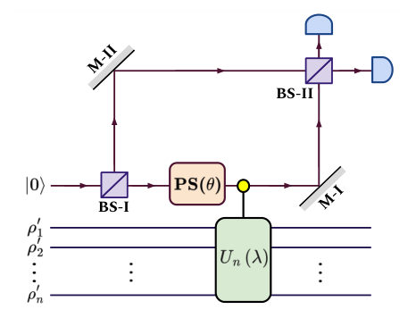 
FIG. 3: Ancilla-assisted interferometric estimation of the character- istic function χn(λ) = Tr[eiλMA,B n ρ⊗n]. The path degree of freedom controls the unitary eiλMA,B n acting on n copies of the state. Measure- ments at two relative phases, θ = 0 and θ = π/2, yield the real and imaginary parts of χn(λ), respectively. The MHQ moment mn is ob- tained from the derivative of the imaginary part at λ →0, rather than from the visibility alone.

📷 Fig 4

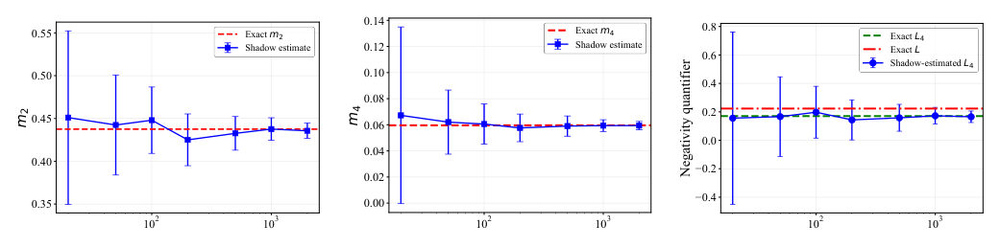 
FIG. 4: Nonlinear classical-shadow estimation for the qubit state and measurement pair in Eq. (134). Panels (a) and (b) show the U-statistic estimates of the second and fourth MHQ moments, respectively. Panel (c) shows the plug-in estimate bL4 = 3

**Summary.** This paper develops a moment-based methodology to quantify the nonclassicality of quantum states using the Margenau--Hill quasiprobability distribution. By focusing on low-order moments rather than full distribution reconstruction, the authors establish a hierarchy of rigorous lower bounds for the negativity. This provides a practical, experimentally accessible framework for characterizing quantum features.

**Why it may be interesting.** This work provides a powerful, measurable, and computationally tractable diagnostic tool (moment-based) to quantify nonclassical features of quantum states, which is highly relevant for characterizing quantum resources in open quantum systems.

Detailed structure

**Main problem.** The paper aims to quantify the nonclassicality associated with the Margenau--Hill quasiprobability (MHQ) distribution without needing to reconstruct the full distribution.

**Main result.** A moment-based framework is established, yielding a hierarchy of rigorous lower bounds for the MHQ negativity, with the fourth-moment bound being the strongest among even-moment bounds.

**Method.** The authors utilize the moments (both standard and absolute) of the MHQ distribution, deriving lower bounds for the negativity using techniques related to R\'enyi entropy and moment-matrix conditions.

**Model / system.** The study concerns quantum states ($
ho$) on a $d$-dimensional Hilbert space, specifically analyzing the MHQ distribution derived from two observables, $A$ and $B$, defined by spectral projectors.

**Key observables.** Logarithmic MHQ negativity, low-order moments ($m_n, e_n$), and the moment-matrix condition for positivity.

**Important parameters / regimes.** The order of the moment ($r$ or $2n$), and the dimensionality of the Hilbert space ($d$).

**Assumptions / limitations.** The approach assumes that the relevant moments admit exact multi-copy representations, allowing estimation via interferometry or classical shadow techniques.

**Paper structure.** The paper first introduces the MHQ distribution and the concept of nonclassicality via its negativity. It then develops the moment-based quantification, deriving the lower bound hierarchy, and finally applies these results to qubits to find tight bounds and optimal thresholds.

Abstract

Quasiprobability distributions offer a useful way of describing nonclassical features of quantum systems through their departure from classical probability theory. In this work, we investigate the quantification of nonclassicality associated with the Margenau--Hill quasiprobability (MHQ) distribution using its moments, without requiring reconstruction of the full distribution. First we introduce the logarithmic MHQ negativity as a quantifier of nonclassicality, and then derive a hierarchy of rigorous lower bounds in terms of low-order moments. Within the resulting hierarchy, the fourth-moment bound is the strongest among the bounds based on even moments. For qubits, we further derive a tight upper bound on the exact MHQ negativity and identify the corresponding extremal state. We also obtain an optimal positivity threshold based on the fourth moment for arbitrary pairs of qubit observables. Finally, we show that the relevant moments admit exact multicopy representations, providing a route to their estimation using interferometry or classical shadow techniques. Our results establish a moment-based framework for extracting quantitative information about MHQ negativity from a finite set of low-order observables.

[↑ back to top](#top)

### [Quantum Wavefunction Augmentation via Variational Autoencoders](http://arxiv.org/abs/2609.07972v1)

**Authors:** Sonaldeep Halder, Chayan Patra, Rahul Maitra  
**Type:** theory · **Category:** strongly correlated electrons · **PDF:** <https://arxiv.org/pdf/2609.07972v1>  
**Analysis basis:** full PDF text, analyzed in chunks

📷 Fig 1

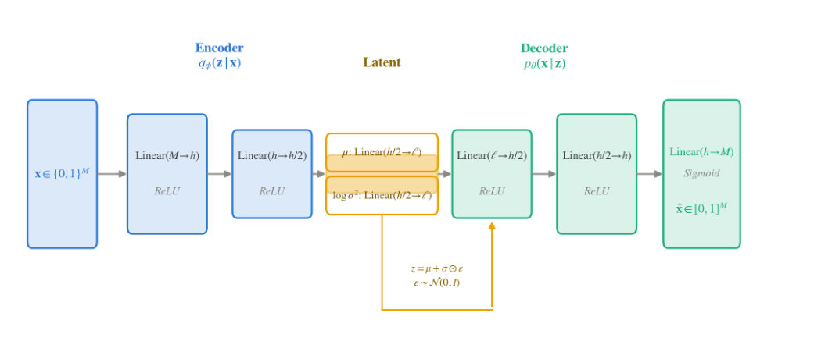 
FIG. 1. Architecture of the VAE used to propose new Slater determinants. Each Linear(A →B) block is a fully-connected neural network layer, y = Wx + b for a trainable weight matrix W and bias b, mapping an A-dimensional input to a B- dimensional output; Linear layers are followed by a ReLU (rectified linear unit) nonlinearity, f(x) = max(0, x). The encoder qϕ(z | x) passes x ∈{0, 1}M (M = qubit count of the target system, Table I) through two Linear+ReLU layers to a hidden representation of width h, then splits into two parallel Linear heads producing the mean µ and log-variance log σ2 of the approximate posterior. A latent sample is drawn via the reparameterization trick, z = µ + σ ⊙ϵ with...

📷 Fig 2

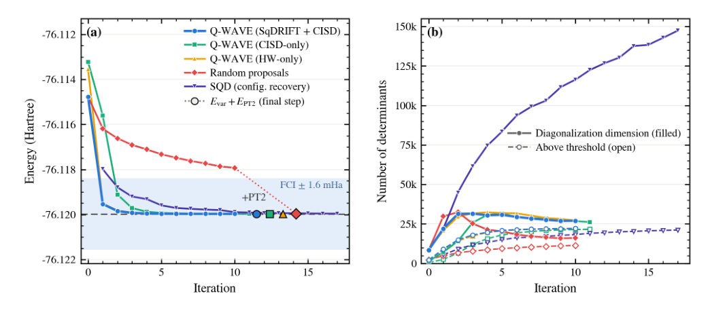 
FIG. 2. (a) Ground-state energy of H2O (6-31G, equilibrium) versus iteration for the five selection strategies. Iteration 0 denotes the initial basis D(0), prior to any generative expansion. The shaded band marks chemical accuracy (±1.6 mHa) around FCI (dashed line); the black-edged symbols beyond the final iteration show each method’s energy after the semistochastic PT2 correction, drawn as one additional step on its own trajectory. SQD does not receive a PT2 step. (b) Subspace sizes: filled symbols with solid lines show the diagonalization dimension; open symbols with dashed lines show the number of determinants above the selection threshold ϵthresh = 10−10.

📷 Fig 3

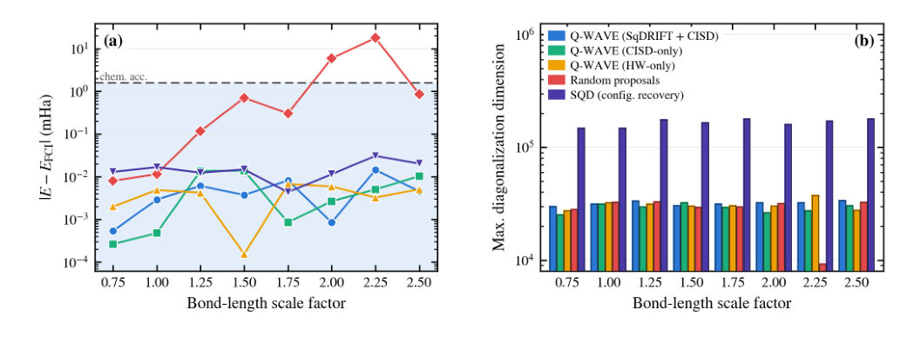 
FIG. 3. Potential energy surface of H2O (6-31G, symmetric O–H stretch), compared across all five selection strategies (color/marker key in panel (b), shared with panel (a)). Bond-length scale factor of 1.00 represents the equilibrium geometry and the other scales are factors by which both O–H bonds are stretched. (a) Absolute energy error |E −EFCI| (log scale) at each geometry, using each method’s final reported energy (Evar + EP T 2). SQD has no PT2 correction. The chemical-accuracy threshold (1.6 mHa) is marked by the dashed line, with the region below it shaded. (b) Maximal diagonalization dimension reached by each method at each geometry, shown as grouped bars on a log scale.

📷 Fig 4

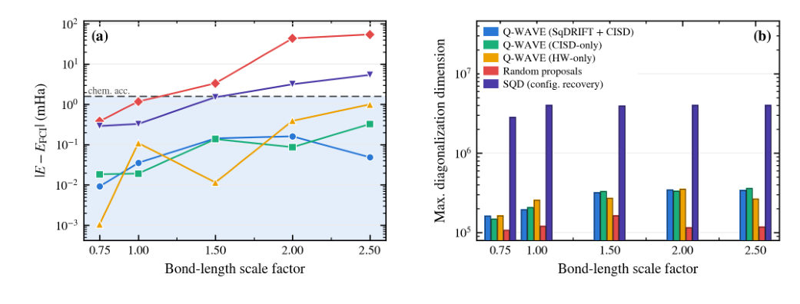 
FIG. 4. Potential energy surface for N2 (6-31G), compared across all five selection strategies (color/marker key in panel (b), shared with panel (a)). Bond-length scale factor of 1.00 represents the equilibrium geometry and the other scales are factors by which N–N bond is stretched. (a) Absolute energy error |E −EFCI|(log scale) at each geometry, using each method’s final reported energy (Evar + EP T 2). SQD has no PT2 correction. The chemical-accuracy threshold (1.6 mHa) is marked by the dashed line, with the region below it shaded; the three Q-WAVE variants remain within or close to this band at every geometry, while random proposals and SQD grow substantially worse as the bond is...

📷 Fig 5

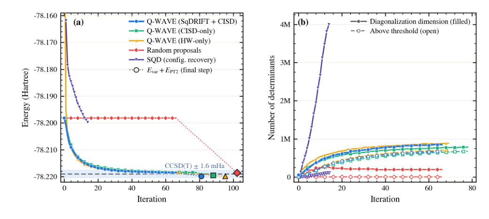 
FIG. 5. (a) Ground-state energy of all-electron C2H4 (6-31G; rC=C = 1.339 Å, rC–H = 1.086 Å, ∠HCH = 117.6◦, ∠HCC = 121.2◦) versus iteration for the five selection strategies, referenced to CCSD(T). The shaded band marks chemical accuracy (±1.6 mHa) around CCSD(T) (dashed line); black-edged symbols beyond the final iteration show each method’s energy after the semistochastic PT2 correction, drawn as one additional step on its own trajectory. SQD does not receive a PT2 step: its configuration-recovery iterations saturate the 4×106-determinant cap while stalling 17 mHa above CCSD(T), whereas all three Q-WAVE variants converge into the CCSD(T) band with a roughly five-fold smaller basis. (b)...

**Summary.** This paper introduces Q-WAVE, a novel hybrid quantum-machine learning method designed to calculate accurate ground-state wavefunctions for strongly correlated molecules. It combines limited quantum circuit sampling with CISD information, using a Variational Autoencoder to intelligently augment the basis set. The approach demonstrates state-of-the-art accuracy and scalability on challenging systems like $	ext{Cr}_2$.

**Why it may be interesting.** This work is highly relevant as it proposes a machine learning-driven pathway to overcome the exponential scaling bottleneck in quantum chemistry, offering a scalable alternative to pure quantum simulation for complex molecular systems.

Detailed structure

**Main problem.** Accurately computing the ground-state wavefunction for many-body systems, particularly in strongly correlated regimes where the required determinant space exceeds the capacity of finite quantum sampling.

**Main result.** The proposed Q-WAVE method achieves sub-millihartree accuracy for $	ext{H}_2	ext{O}$ and $	ext{N}_2$ dissociation and demonstrates chemical accuracy for a 60-qubit $	ext{Cr}_2$ system, surpassing standard quantum sampling techniques.

**Method.** It introduces Q-WAVE, a hybrid approach combining determinants sampled via SqDRIFT Krylov circuits and CISD determinants, which are then used to train a $eta$-annealed Variational Autoencoder (VAE) to generate the full wavefunction support structure in a continuous latent space.

**Model / system.** The work applies to molecular Hamiltonians (e.g., $	ext{H}_2	ext{O}$, $	ext{N}_2$, ethylene, $	ext{Cr}_2$) by representing the electronic state via Slater determinants. The core computational challenge is managing the exponentially large Hilbert space in strongly correlated regimes.

**Key observables.** Ground-state energies, wavefunction support structure, and comparison against full CI and $	ext{CCSD}(	ext{T})$ benchmarks.

**Important parameters / regimes.** The method relies on the VAE's latent space exploration, the initial seed from CISD, and the quantum sampling fidelity from SqDRIFT circuits.

**Assumptions / limitations.** The method assumes that the wavefunction's structure can be effectively learned and augmented by mapping sampled determinants into a continuous latent space via the VAE.

**Figures summary.** Table V summarizes final energies and subspace sizes for representative systems ($	ext{H}_2	ext{O}$, $	ext{N}_2$, $	ext{C}_2	ext{H}_4$, $	ext{Cr}_2$), comparing Q-WAVE results against other established methods.

**Paper structure.** The paper first identifies the limitations of existing quantum and classical methods for strongly correlated systems. It then details the Q-WAVE framework, combining hardware sampling (SqDRIFT) with deterministic seeds (CISD) and using a $eta$-annealed VAE for iterative, generative expansion of the variational basis. Finally, it presents benchmark results on various molecules.

Abstract

Sample-based quantum diagonalization (SQD) has emerged as a promising route for quantum-centric supercomputing, relying on classical diagonalization of the molecular Hamiltonian within a hardware-sampled determinant subspace. However, its accuracy degrades in strongly correlated regimes where the relevant determinant space exceeds what finite-shot sampling can capture. In this work, we introduce Quantum Wavefunction Augmentation via Variational Autoencoders (Q-WAVE), a hybrid method that combines determinants sampled via SqDRIFT Krylov circuits and configuration interaction singles and doubles (CISD) determinants with generative machine learning. Using a custom $β$-annealed variational autoencoder (VAE) model, Q-WAVE iteratively expands this basis toward the variational ground state. The VAE learns the wavefunction's primary support structure from the combined hardware and CISD seed in a continuous latent space, generating new dominant determinants beyond any fixed excitation hierarchy. The resulting compact wavefunction exceeds what can be extracted from raw hardware samples alone. We demonstrate sub-millihartree accuracy compared to full configuration interaction for $\text{H}_2\text{O}$ and $\text{N}_2$ dissociation. Finally, we establish Q-WAVE's scalability on a 52-qubit ethylene system (achieving sub-millihartree accuracy versus CCSD(T)) and a highly correlated 60-qubit $\text{Cr}_2$ stress test that attains chemical accuracy upon a final perturbative correction.

[↑ back to top](#top)

### [Selective coupling of high-order phonons in La2-xSrxCuO4](http://arxiv.org/abs/2609.08076v1)

**Authors:** Ke-Jun Xu, Paulina Majchrzak, Nathan Giles-Donovan, Sangheon Kim, Jaewon Choi, Jun Okamoto, Ganesha Channagowdra, Hsiao-Yu Huang, Di-Jing Huang, Seiki Komiya, Takao Sasagawa, Shuichi Wakimoto, Wei-Sheng Lee, Zhi-Xun Shen, Thomas P. Devereaux, Dung-Hai Lee, Robert J. Birgeneau  
**Type:** experiment · **Category:** strongly correlated electrons · **PDF:** <https://arxiv.org/pdf/2609.08076v1>  
**Analysis basis:** full PDF text, analyzed in chunks

📷 Fig 1

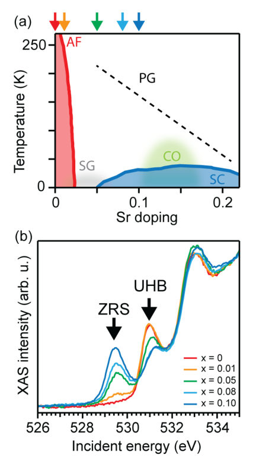 
FIG. 1. X-ray absorption spectroscopy at the O K-edge for LSCO. (a) Temperature-doping phase diagram of LSCO. Blue region indicates superconductivity (SC), red region indicates long-ranged antiferromagnetism (AF), grey region indicates spin glass (SG), green region indicates charge order (CO). Black dashed line and grey data points indicates the approx- imate boundary of the pseudogap (PG) phase. Arrows at the top of the panel indicates the dopings used for the RIXS mea- surements. (b) X-ray absorption spectra at the O K-edge for the dopings indicated by the colored labels. ZRS indicates the Zhang-Rice singlet states, and UHB indicates the upper Hubbard band states. The measurements were...

📷 Fig 2

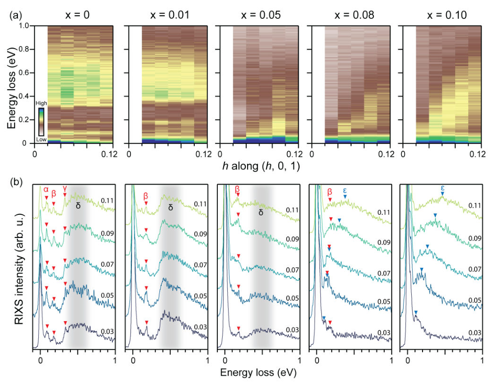 
FIG. 2. Doping and momentum dependences of low energy excitations in LSCO. (a) Color image of the RIXS spectra as a function of energy loss and in-plane momentum h along (h, 0, 1) for dopings indicated above each panel. (b) RIXS energy distribution curves for respective dopings as in (a). Numbers next to each curve indicate the in-plane momentum h along (h, 0, 1). Greek letters are assigned for each distinct feature. α, β, and γ peaks (red markers) highlight the sharp low energy lattice excitations. The δ feature (grey shaded region) highlights the broad excitation around 400 to 600 meV. ϵ peaks (blue markers) highlight the dispersive excitation in x = 0.08 and x = 0.1 samples. In the x =...

📷 Fig 3

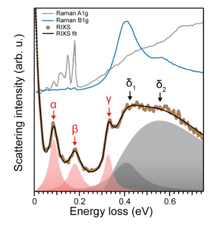 
FIG. 3. Comparison of momentum-integrated RIXS spec- trum with Raman spectra. Brown dots are the raw RIXS energy distribution curve for integrated momentum between h = 0.03 to h = 0.11 along (h, 0 , 1). Black line is the over- all fit, comprised of an elastic line (not shown), a low energy antilorentzian for capturing the low energy phonons that are not individually resolved (not shown), four antilorentzians for the α, β, γ, and δ1, and another antilorentzian where the zero is not fixed for the δ2 feature. The grey curve is the Raman spectrum in the A1g channel and the blue curve is the Raman spectrum in the B1g channel, both from ref [17].

**Summary.** This experimental work uses Resonant Inelastic X-ray Scattering to probe high-order phonon excitations in the cuprate superconductor La2-xSr_xCuO4. The findings reveal selective coupling to even-ordered phonons, which deviates from simple theoretical expectations. This suggests exotic electronic behavior, potentially involving locally paired quasiparticles, that influences the superconducting state.

**Why it may be interesting.** The investigation into high-order phonon coupling and its selective nature provides crucial experimental constraints on theoretical models of pairing mechanisms in high-Tc superconductors, which are central to strongly correlated electron physics.

Detailed structure

**Main problem.** The study aims to uncover a new regime of electron-phonon coupling in the cuprate superconductor La2-xSr_xCuO4 by analyzing high-order phonon excitations.

**Main result.** The researchers observed sharp, non-dispersive peaks corresponding to two-phonon and four-phonon excitations, suggesting anomalous electron-phonon coupling beyond the standard Franck-Condon picture.

**Method.** The primary method employed was Resonant Inelastic X-ray Scattering (RIXS) at the O K-edge, complemented by comparison with Raman spectroscopy.

**Model / system.** The physical system is La2-xSr_xCuO4, a prototypical p-type cuprate superconductor. The analysis focuses on the coupling between charge carriers and lattice vibrations, particularly the in-plane Cu-O bond stretching mode.

**Key observables.** Phonon excitation energies (e.g., 85 meV, 180 meV, 330 meV), doping dependence of these excitations, and the comparison of RIXS spectra to Raman spectra.

**Important parameters / regimes.** Hole doping concentration (x), which dictates the electronic state, and the energy scale of the phonon modes.

**Assumptions / limitations.** The anomalous coupling suggests possibilities like the existence of locally paired quasiparticles or bipolarons, moving beyond simple harmonic oscillator models.

**Figures summary.** Figures show X-ray absorption spectra identifying electronic bands (UHB, ZRS) and RIXS color plots mapping low-energy excitations versus momentum for various dopings, contrasting with Raman spectra.

**Paper structure.** The paper systematically presents RIXS measurements across different doping levels, identifying specific phonon features ($\alpha, eta, \gamma$) and tracking their evolution. It compares these findings to established Raman data to argue for an anomalous coupling mechanism.

Abstract

In crystals and molecules with strong coupling between the charge carriers and atomic vibrations, high order harmonics of the vibrational excitations can be observed with intensity following the Franck-Condon envelope. Here, we uncover a new regime of electron-phonon coupling in La2-xSrxCuO4 using resonant inelastic X-ray scattering. In the undoped compound, we find sharp peaks at approximately 85$\pm$5 meV, 180$\pm$7 meV, and 330$\pm$5 meV with no observable dispersion, and an absence of appreciable intensity from other modes observed in Raman spectroscopy in this energy range. The 180 meV and 330 meV excitations have energies approximately consistent with two-phonon and four-phonon in-plane Cu-O bond stretching mode, suggesting that the resonantly excited valence electrons strongly couple to this mode. These excitations exhibit significant doping dependence, eventually becoming unresolvable at 10% hole doping, where the low energy charge excitations are dominated by dispersive plasmons. The observation of selective coupling to even-ordered phonons and stark contrast with the Raman spectra indicate anomalous electron-phonon coupling beyond the Franck-Condon picture. One intriguing possibility is the existence of locally paired quasiparticles in insulating cuprates.

[↑ back to top](#top)

### [Semidefinite extension complexity of the separable set, with applications to approximate disentanglers](http://arxiv.org/abs/2609.09033v1)

**Authors:** Sevag Gharibian, Carsten Hecht, Dorian Rudolph  
**Type:** theory · **Category:** quantum information and computing · **PDF:** <https://arxiv.org/pdf/2609.09033v1>  
**Analysis basis:** full PDF text, analyzed in chunks

📷 Fig 1

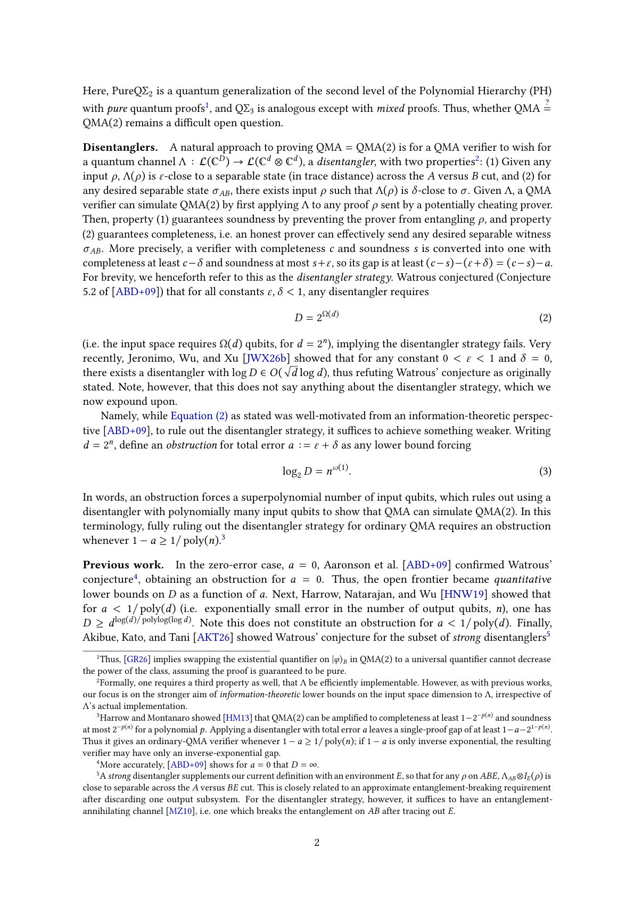 
Low-resolution page preview, page 2

📷 Fig 2

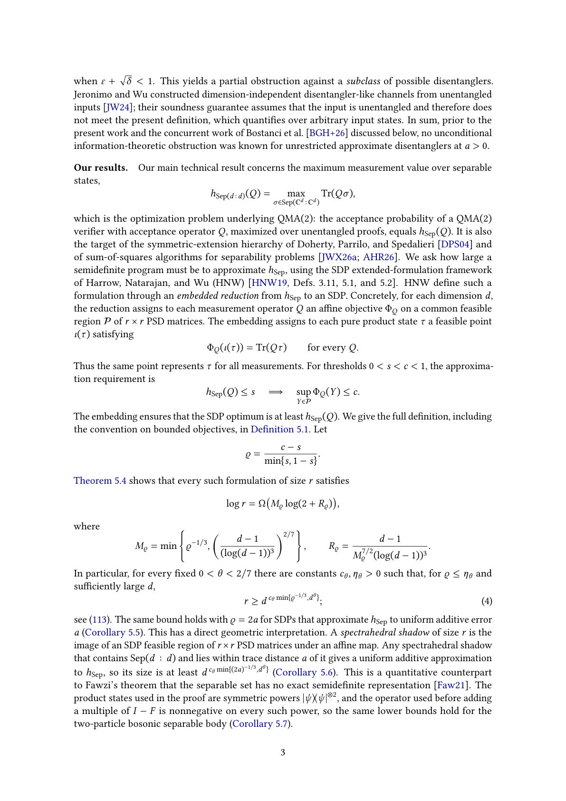 
Low-resolution page preview, page 3

📷 Fig 3

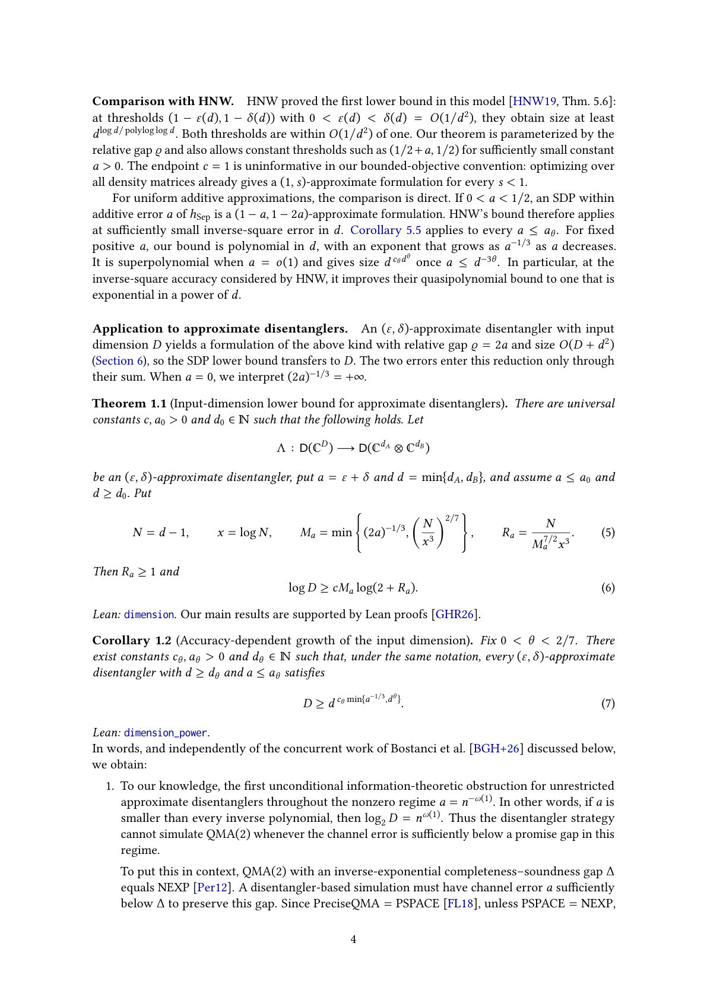 
Low-resolution page preview, page 4

📷 Fig 4

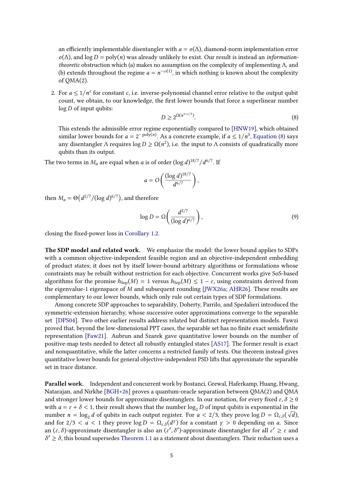 
Low-resolution page preview, page 5

📷 Fig 5

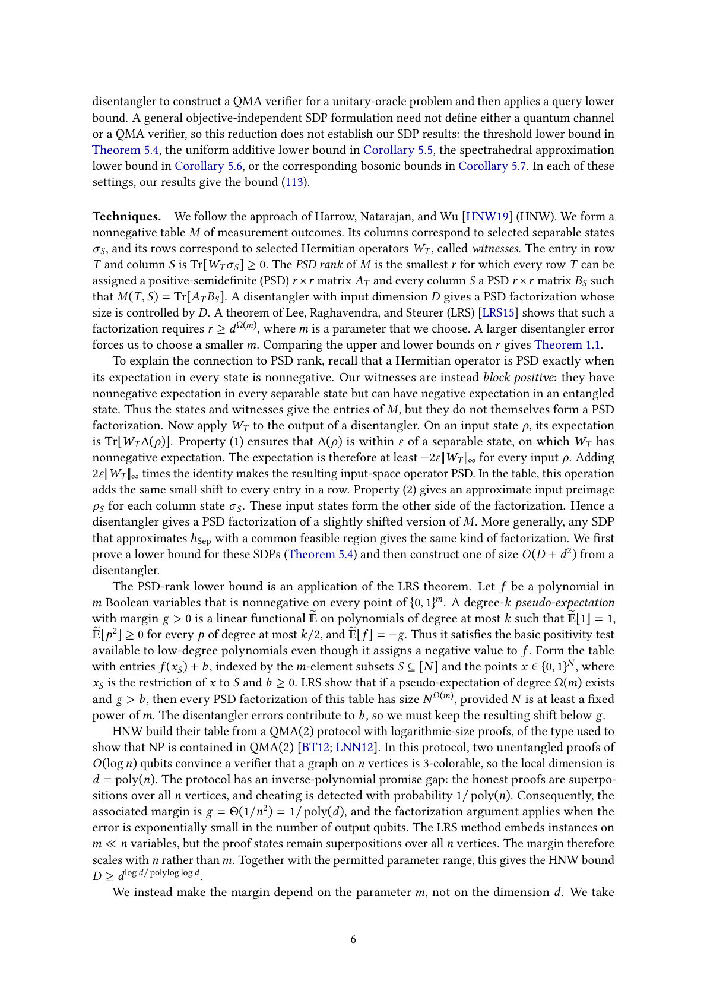 
Low-resolution page preview, page 6

**Summary.** This paper derives strong, quantitative lower bounds on the size of semidefinite programs needed to approximate the set of separable quantum states. By connecting these bounds to the concept of approximate disentanglers, the authors provide a powerful tool to study the computational complexity of quantum information tasks, improving upon previous results in the field.

**Why it may be interesting.** This work provides deep mathematical tools (SDP complexity bounds) to quantify the computational separation between quantum complexity classes, which is fundamental to understanding the limits of quantum computation.

Detailed structure

**Main problem.** The paper aims to establish quantitative lower bounds on the size of Semidefinite Programs (SDPs) used to approximate the maximum acceptance probability over separable quantum states, which is central to understanding the complexity class QMA(2).

**Main result.** They prove that the required SDP size grows superpolynomially with the dimension $d$ for constant approximation errors, improving previous bounds significantly.

**Method.** The proof combines the quantitative pseudo-density theorem of Lee, Raghavendra, and Steurer with the extended-formulation model of SDPs, relating the required size to the approximation error.

**Model / system.** The focus is on bipartite quantum systems ($\mathbb{C}^d \otimes \mathbb{C}^d$) and the set of separable quantum states, $	ext{Sep}(d:d)$. The context is quantum complexity theory, specifically QMA(2).

**Key observables.** The maximum acceptance probability $h_{Sep}(Q)$ and the required size ($r$) of the SDP approximation.

**Important parameters / regimes.** The dimension $d$, the additive approximation error $a$, and the entanglement/disentangler errors $\epsilon, \delta$.

**Assumptions / limitations.** The analysis relies on the SDP extended-formulation model (HNW) and the existence of an approximate disentangler $\Lambda$ whose failure to perfectly represent the separable set is quantified by the error $a$.

**Paper structure.** The paper systematically derives lower bounds on the SDP size required to approximate the separable set, first for the general SDP formulation and then specifically by relating it to the structure imposed by approximate disentanglers.

Abstract

We prove quantitative lower bounds on the semidefinite extension complexity of the set of separable quantum states on $\mathbb{C}^d\otimes\mathbb{C}^d$. We consider semidefinite programs (SDPs) that approximate the maximum acceptance probability of a measurement over separable states, the optimization problem underlying QMA(2). In the extended-formulation model of Harrow, Natarajan, and Wu (HNW), all measurements share a common feasible region and an objective-independent embedding of product states that exactly reproduces their acceptance probabilities. For every $0<θ<2/7$, there are constants $c_θ,a_θ>0$ such that, for sufficiently large $d$, any such SDP with uniform additive error $0<a\le a_θ$ has size at least $d^{c_θ\min\{a^{-1/3},d^θ\}}$. The bound applies at sufficiently small constant error, is superpolynomial in $d$ whenever $a=o(1)$, and becomes $d^{Ω(d^θ)}$ when $a\le d^{-3θ}$, improving HNW's quasipolynomial bound at inverse- square error. The same bound holds for any SDP-representable convex set of states that contains all separable states and lies within trace distance $a$ of them, giving a quantitative counterpart to Fawzi's theorem that the separable set has no exact semidefinite representation. Our proof combines the quantitative pseudo-density theorem of Lee, Raghavendra, and Steurer with explicit block-positive operators and Chebyshev amplification. Our main results are supported by Lean proofs.

[↑ back to top](#top)

### [Spectral characterization of the uniform theta graph $Θ(t,2)$ and classification of 6-periodic Grover walks](http://arxiv.org/abs/2609.08315v1)

**Authors:** Sho Kubota  
**Type:** theory · **Category:** other · **PDF:** <https://arxiv.org/pdf/2609.08315v1>  
**Analysis basis:** full PDF text, analyzed in chunks

📷 Fig 1

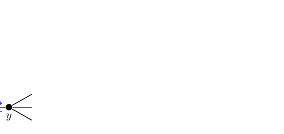 
Figure 1: The entries of a vector written on the arcs of the graph

📷 Fig 2

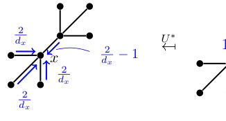 
Figure 2: The action of U and U∗

📷 Fig 3

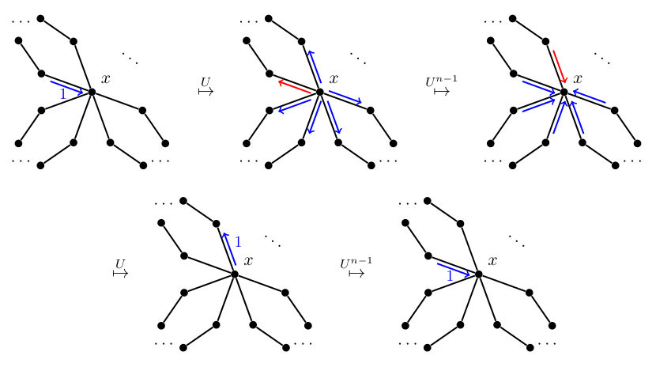 
Figure 6: Proof of U2nea = ea. For arrows whose weights are not indicated, blue arrows have weight 1

📷 Fig 4

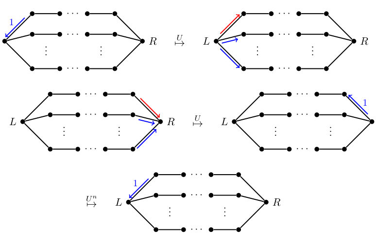 
Figure 9: Proof of U2n+2ea = ea. For arrows whose weights are not indicated, blue arrows have weight 2

📷 Fig 5

 
Figure 10: The local structure around u at this stage. The red numbers indicate the degrees of the corresponding vertices.

**Summary.** This paper uses spectral graph theory to analyze the dynamics of the Grover walk on specific graph families. It proves that the only connected graphs exhibiting a 6-periodic Grover walk are the Dutch windmill graphs $D(t)_3$ and the uniform theta graphs $\Theta(t,2)$. The work provides a complete spectral characterization for $\Theta(t, 2)$ based on its normalized adjacency matrix spectrum.

**Why it may be interesting.** The connection between the spectral properties of graph Laplacians/Adjacency matrices and the periodicity of quantum walks provides a powerful tool for characterizing quantum systems on structured media.

Detailed structure

**Main problem.** The paper aims to spectrally characterize the uniform theta graph $\Theta(t,2)$ and classify all connected graphs that exhibit a 6-periodic Grover walk.

**Main result.** The only connected 6-periodic graphs are the Dutch windmill graphs $D(t)_3$ and the uniform theta graphs $\Theta(t,2)$. Furthermore, $\Theta(t, 2)$ is uniquely determined by the spectrum of its normalized adjacency matrix.

**Method.** The analysis combines spectral graph theory (using the normalized adjacency and Laplacian matrices) with the mathematical properties of the Grover walk's time evolution operator $U(G)$.

**Model / system.** The model is the Grover walk, a discrete-time quantum walk, analyzed on finite, simple graphs $G$. The dynamics are governed by the time evolution matrix $U(G)$.

**Key observables.** The spectrum of the normalized adjacency matrix $T(G)$ and the periodicity $	au$ of the Grover walk ($U(G)^	au = I$).

**Important parameters / regimes.** The parameters $t$ and $n$ defining the specific graph structures $\Theta(t,n)$ and $D_n^{(t)}$.

**Assumptions / limitations.** The analysis assumes the graphs are connected and finite, and relies on relating the periodicity of the quantum walk directly to the eigenvalues of $T(G)$.

**Figures summary.** Figures illustrate the structure of the graphs (e.g., $\Theta(t, n)$, $D(t)_n$) and the action of the time evolution operator $U$ on basis vectors on the graph's arcs.

**Paper structure.** The paper proceeds by first establishing the spectral characterization of $\Theta(t, 2)$ and the periodicity of $D_n^{(t)}$ and $\Theta(t, n)$. It then uses the 6-periodicity condition to constrain the spectrum of $T(G)$, leading to a classification theorem that identifies $D(t)_3$ and $\Theta(t, 2)$ as the only possibilities.

Abstract

We characterize the uniform theta graph $Θ(t,2)$ by the spectrum of its normalized adjacency matrix, or equivalently, by the spectrum of its normalized Laplacian matrix. We also investigate the periodicity of Grover walks on nonregular graphs, which is closely related to the eigenvalues of the normalized adjacency matrix and those of the time evolution matrix of the Grover walk. We show that the Dutch windmill graph $D_n^{(t)}$ is $2n$-periodic and that the uniform theta graph $Θ(t,n)$ is $(2n+2)$-periodic. Furthermore, we completely determine the connected $6$-periodic graphs and prove that they are precisely $D_3^{(t)}$ with $t \geq 2$ and $Θ(t,2)$ with $t \geq 1$.

[↑ back to top](#top)

### [Successive Phase Transitions from a Composite Fermion Liquid to a Fractional Quantum Hall State at ν=3/2 Driven by In-Plane Magnetic Field](http://arxiv.org/abs/2609.08141v1)

**Authors:** Xinghao Wang, L. N. Pfeiffer, A. Gupta, K. W. Baldwin, K. W. West, Rui-Rui Du  
**Type:** experiment · **Category:** strongly correlated electrons · **PDF:** <https://arxiv.org/pdf/2609.08141v1>  
**Analysis basis:** full PDF text, analyzed in chunks

📷 Fig 1

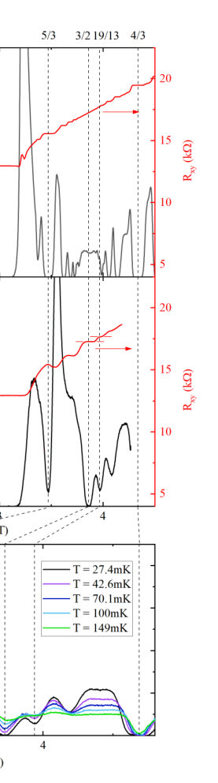 
FIG. 1. Magnetoresistance 𝑅!! and Hall resistance 𝑅!" measured at (a) 𝜃= 0° and (b) 𝜃=

📷 Fig 2

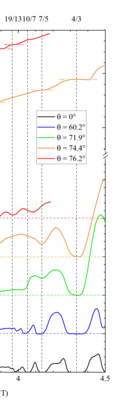 
FIG. 2. Magnetoresistance 𝑅!! and Hall resistance 𝑅!" measured at various tilt angles ranging

📷 Fig 3

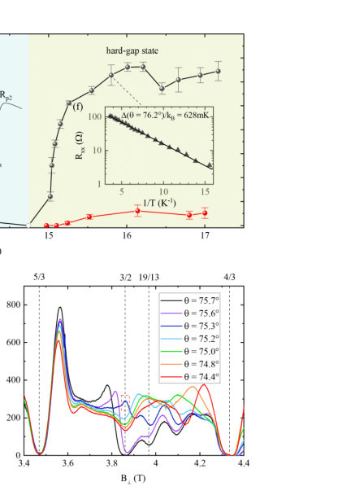 
FIG. 3. (a) Thermal excitation gap energy at 𝜈= 3/2 and 19/13 as a function of the in-plane

**Summary.** This work reports on the observation of successive phase transitions in a $\nu=3/2$ Fractional Quantum Hall state within a GaAs quantum well, driven solely by an in-plane magnetic field. The system transitions from a Composite Fermion liquid through a soft-gap state to a robust, hard-gap FQH state. This demonstrates that topological order can be engineered by manipulating the electron's k-space Fermi contour using external magnetic fields.

**Why it may be interesting.** The observation of field-induced topological transitions in a highly correlated electron system like the FQH state provides a clean experimental platform to study how external fields can engineer topological order, which has implications for understanding exotic quantum states.

Detailed structure

**Main problem.** The study investigates the successive phase transitions occurring in a Fractional Quantum Hall (FQH) state at filling fraction $\nu=3/2$ when driven by an in-plane magnetic field ($B_{\parallel}$).

**Main result.** The system undergoes two distinct transitions: from a Composite Fermion (CF) liquid to a soft-gap FQH state, followed by a transition to a hard-gap, robust FQH state, accompanied by a daughter state at $\nu=19/13$.

**Method.** Measurements of magnetoresistance ($R_{xx}$) and Hall resistance ($R_{xy}$) are performed on an ultra-high-mobility GaAs quantum well by varying the in-plane magnetic field and tilt angle.

**Model / system.** The physical system is a two-dimensional electron gas (2DEG) in a GaAs quantum well, exhibiting correlated electron behavior characteristic of the Fractional Quantum Hall Effect. The theoretical framework involves composite fermion theory and analyzing the splitting of the Fermi contour in k-space.

**Key observables.** FQH plateaus, resistance jumps, gap energy ($\Delta''$), and the evolution of $R_{xx}$ and $R_{xy}$ as a function of $B_{\parallel}$.

**Important parameters / regimes.** Filling factor $\nu=3/2$, in-plane magnetic field $B_{\parallel}$ (transition points at $\sim 12.2$ T and $\sim 14.7$ T), and the tilt angle $\theta$.

**Assumptions / limitations.** The analysis assumes that the in-plane field causes a k-space Fermi contour splitting, driving the transition from a CF liquid to a topologically distinct FQH state.

**Figures summary.** Figures detail the evolution of $R_{xx}$ and $R_{xy}$ with tilt angle and $B_{\parallel}$, specifically highlighting the two transition points at $\nu=3/2$ and the associated daughter state at $\nu=19/13$.

**Paper structure.** The paper systematically presents data showing the initial CF liquid state, followed by the first transition to a soft-gap FQH state, and finally the second transition to a hard-gap, robust FQH state, supported by gap measurements and theoretical interpretations of the k-space physics.

Abstract

We report an even-denominator fractional quantum Hall state at ν = 3/2 induced entirely by in-plane magnetic field B_|| in an ultra-high-mobility GaAs quantum well. As B_|| increases, the system undergoes two successive transitions: from a composite fermion liquid to a soft-gap FQH state (B_||~12.2 T), then via a topological phase transition to a hard-gap robust FQH state (B_||~14.7 T), accompanied by a daughter state at ν = 19/13. We present systematic data, and discuss a possible scenario in interpreting these findings. Our work demonstrates that topological order may be engineered through k-space Fermi contour splitting under an in-plane magnetic field.

[↑ back to top](#top)

### [Textures as a phase-transition probe for quantum spin chains](http://arxiv.org/abs/2609.08120v1)

**Authors:** Heitor P. Casagrande, Isaac M. Carvalho, William J. Munro, Krissia Zawadzki  
**Type:** theory · **Category:** other · **PDF:** <https://arxiv.org/pdf/2609.08120v1>  
**Analysis basis:** full PDF text, analyzed in chunks

📷 Fig 1

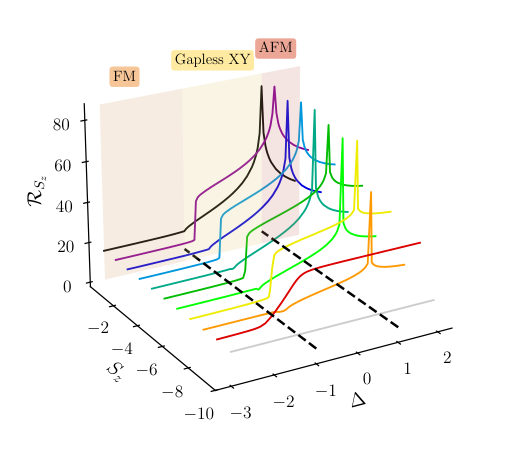 
FIG. 1. Symmetry-resolved rugosity RSz versus ∆for different magnetization sectors. The parity dependence of the symmetry-resolved rugosity sectors can be clearly seen at the point ∆= −1, but the peak at ∆= +1 is present at every sector but the fully polarized ones.

📷 Fig 2

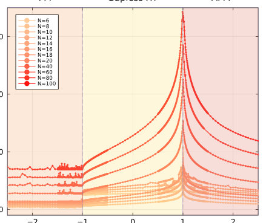 
FIG. 2. Global rugosity R versus anisotropy ∆for different system sizes. Lighter tones correspond to smaller sizes, and darker tones to larger sizes. We see a consistent trend among all system-sizes: a slow increase starting at ∆= −1 and a pronounced peak at ∆= 1.

📷 Fig 3

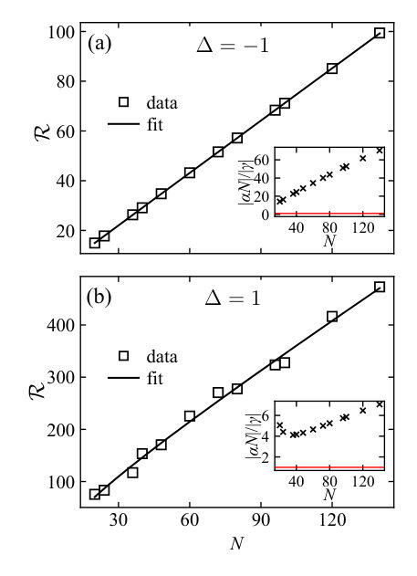 
FIG. 3. Finite-size scaling of the rugosity at the phase- transition points ∆= {−1, 1}. Symbols denote numerical data, while solid lines correspond to fits using R(N) = αN + β log N + c. Insets show the ratio |αN|/|γ|, with γ = β log N + c; the red horizontal line marks |αN|/|γ| = 1, where extensive and sub-leading contributions have equal magnitude.

📷 Fig 4

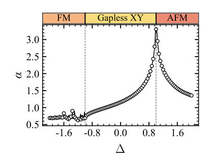 
FIG. 4. Extensive coefficient α extracted from fits of the form R(N) = αN +β log N +c as a function of ∆. Vertical dashed lines indicate the transition points at ∆= ±1.

**Summary.** This work introduces and applies the rugosity metric, derived from quantum texture, to study quantum phase transitions in the Heisenberg XXZ spin chain. The authors demonstrate that rugosity provides highly sensitive signatures at critical points, particularly highlighting the unique behavior at the BKT transition ($\Delta=1$). This establishes rugosity as a powerful, simple diagnostic tool for probing the structure of quantum correlations across the phase diagram.

**Why it may be interesting.** The use of a geometric/information-theoretic measure (rugosity) to characterize fundamental physical transitions (QPTs) provides a novel, potentially universal diagnostic tool for strongly correlated quantum matter.

Detailed structure

**Main problem.** The paper aims to use the quantum texture, specifically the rugosity metric, as a simple and effective diagnostic tool to probe quantum phase transitions (QPTs) in quantum spin systems.

**Main result.** Rugosity exhibits distinct, sharp signatures at both the first-order ($\Delta=-1$) and BKT ($\Delta=1$) transition points of the Heisenberg XXZ model, showing sensitivity to the underlying spin-correlation hierarchy.

**Method.** The study employs theoretical analysis, utilizing the rugosity metric derived from quantum texture, and analyzes finite-size scaling behavior across the phase diagram.

**Model / system.** The primary system is the Heisenberg XXZ model defined on a spin chain, characterized by the anisotropy parameter $\Delta$. The Hamiltonian is studied in the context of its known QPTs at $\Delta=-1$ and $\Delta=1$.

**Key observables.** Rugosity ($R$), symmetry-resolved rugosity ($R_Q$), and the extensive coefficient ($\alpha$) derived from finite-size scaling.

**Important parameters / regimes.** The anisotropy parameter $\Delta$, which tunes the system between different magnetic phases, and the system size $N$.

**Assumptions / limitations.** The analysis assumes that rugosity is a powerful witness for QPTs, and that the finite-size scaling can be accurately modeled by $R(N) = \alpha N + eta \ln N + c$.

**Figures summary.** Figures illustrate the dependence of rugosity on $\Delta$ for different magnetization sectors, showing parity effects at $\Delta=-1$ and a peak at $\Delta=1$. Scaling analysis confirms the dominance of the extensive term $\alpha N$ near transitions.

**Paper structure.** The paper introduces the concept of quantum texture and rugosity, applies it to the XXZ model, analyzes the results by comparing global vs. symmetry-resolved rugosities across the phase diagram, and concludes by interpreting the observed signatures at the critical points.

Abstract

The idea of quantum texture has been recently proposed and used as a tool for quantifying coherences and for quantum gate identification. In this work we offer a study on its usage to quantum phase transitions, demonstrating the rugosity metric as a simple tool for effective phase-transition probing. We establish the link between rugosity in the computational basis and the hierarchy of spin correlators, and analyze rugosities defined in the global ground-state and in ground-states belonging to different magnetization sectors (to which we refer to as global vs symmetry-resolved rugosities) to study the phase diagram of the Heisenberg XXZ model. We find distinct rugosity signatures at both transition points. In particular, a sharp feature appears at $Δ=1$ already for small systems, revealing a pronounced sensitivity of the correlation hierarchy encoded by the texture to this point. Since the BKT transition coincides with the isotropic $SU(2)$ point of the XXZ model, this behavior may reflect a particular sensitivity of rugosity to the structure of the spin-correlation hierarchy at isotropy.

[↑ back to top](#top)

### [Transversal Fanout for Fault Tolerant Distributed Quantum Computing: Analysis and Application](http://arxiv.org/abs/2609.08233v1)

**Authors:** Seng W. Loke  
**Type:** theory · **Category:** quantum information and computing · **PDF:** <https://arxiv.org/pdf/2609.08233v1>  
**Analysis basis:** full PDF text, analyzed in chunks

📷 Fig 1

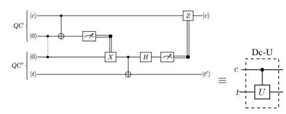 
Fig. 1: Distributed controlled-U (i.e., dCNOT is when U=X (⊕) as shown) between nodes QC and QC′ (the computation qubits are c, the control qubit, and t, the target qubit), and the wavy line illustrates a Bell pair involving the communication qubits from the two nodes both initially |0⟩. The right hand side shows the notation we will use for a distributed controlled- U operation.

📷 Fig 2

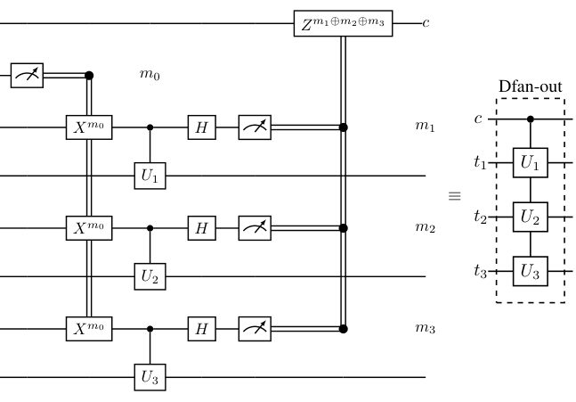 
Fig. 2: Distributed fanout operation with single control qubit (on A′) for multiple target qubits (one on A, one on B and one on C) - all target qubits on different nodes from the control qubit. The right hand side shows the notation we will use for distributed fan-out throughout the paper. Note that mi ∈{0, 1}.

📷 Fig 3

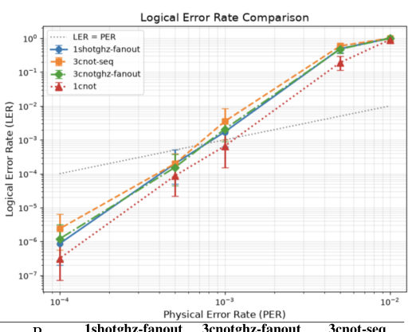 
Fig. 3: LER vs PER for a four node distributed fanout with p = pebit = pghz, comparing three different distributed fanout implementations - one using a one shot approach to create distributed GHZ states (1shotghz-fanout), one using GHZ states constructed using a sequence of neighbouring non-local CNOTs (3cnotghz-fanout), and one is a sequence of CNOTS (using only Bell pairs and not using GHZ states) equivalent to the fanout (3cnot-seq), as well as a single distributed CNOT (1cnot) for comparison. The table shows the plotted values.

📷 Fig 4

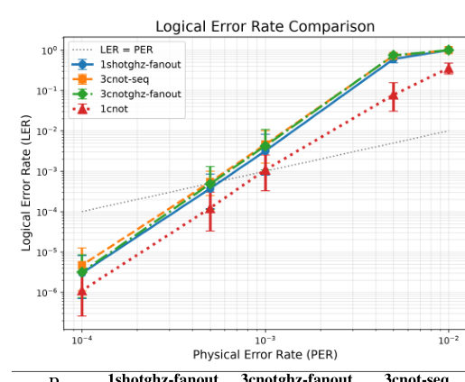 
Fig. 4: LER vs PER for a four node distributed fanout with 10p = pebit = pghz, comparing three different distributed fanout implementations - one using a one shot approach to create distributed GHZ states (1shotghz-fanout), one using GHZ states constructed using a sequence of neighbouring non- local CNOTs (3cnotghz-fanout), and one is a sequence of CNOTS (using only Bell pairs and not using GHZ states) equivalent to the fanout (3cnot-seq), as well as a single distributed CNOT (1cnot) for comparison. The table shows the plotted values.

📷 Fig 5

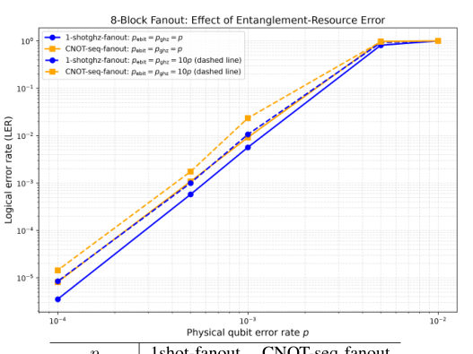 
Fig. 5: LER vs PER for an eight node (one data block per node) distributed fanout with p = pebit = pghz (top table) and 10p = pebit = pghz (bottom table), comparing two different distributed fanout implementations - one using a one shot approach to create distributed GHZ states (1shotghz) for the fanout, and one is a sequence of CNOTS (using only Bell pairs) equivalent to the fanout (CNOT-seq).

**Summary.** This paper presents a resource-efficient method for performing logical fanout operations in distributed quantum computing by leveraging transversal operations on error-corrected code blocks. By analyzing the resource costs and simulating the logical error rates, the authors demonstrate that this approach significantly improves fault tolerance over naive implementations. It provides a systematic framework for building complex, high-fanout quantum circuits across multiple physical nodes.

**Why it may be interesting.** While focused on computation, the analysis of error propagation and resource scaling in distributed quantum networks is highly relevant to understanding noise management in physical quantum hardware platforms.

Detailed structure

**Main problem.** The paper addresses the resource-efficient implementation of logical fanout operations, which are crucial primitives for fault-tolerant distributed quantum computing.

**Main result.** The authors propose using transversal logical operations on encoded blocks to construct distributed fanout circuits that significantly reduce the required non-local communication compared to direct implementations.

**Method.** They develop a systematic method by exploiting the structure of quantum error-correcting codes (like the BB-code) and analyzing the resulting physical gate requirements, comparing GHZ-based versus CNOT-based resource costs.

**Model / system.** The model is distributed quantum computing across multiple nodes, utilizing quantum error-correcting code blocks (specifically the Bivariate-Bicycle or BB-code) to encode logical qubits.

**Key observables.** Logical Error Rate (LER), circuit-depth, entanglement requirements (Bell pairs vs. GHZ states), and physical gate decomposition.

**Important parameters / regimes.** Physical error rate ($p$), inter-node ebit noise ($p_{	ext{ebit}}$), and the number of nodes (e.g., 4 or 8).

**Assumptions / limitations.** The comparison of resources assumes the availability of multi-party GHZ states; the analysis is circuit-level and depends on the fidelity of syndrome extraction.

**Figures summary.** Figures illustrate the distributed fanout operation and the complex, multi-step construction of global gates like $	ext{GCZ}_{16}$ over multiple nodes, showing the required reordering of local and inter-node operations.

**Paper structure.** The paper progresses from defining the problem (logical fanout) to proposing a transversal gadget, analyzing resource costs (Table I), simulating the performance (LER vs. PER plots), and finally applying the technique to construct complex global gates like $	ext{GCZ}$ circuits.

Abstract

We study a resource-efficient approach for implementing logical fanout operations in fault-tolerant distributed quantum computing using transversal operations on quantum error-correcting code blocks. Logical fanout, comprising multiple controlled-NOT operations from a common control qubit to target qubits located at remote nodes, is an important primitive for distributed quantum computation but can require substantial non-local communication when implemented directly between encoded blocks. We exploit the structure of encoded blocks and the availability of transversal logical operations to construct distributed fanout circuits that reduce the required non-local operations while preserving the logical action of the fanout operation. The construction is developed for encoded quantum information and illustrated using Bivariate Bicycle (BB)-code blocks. We analyze the resulting physical gate, entanglement, circuit-depth, and ancilla requirements. The approach provides a systematic method for implementing large logical fanout operations across distributed error-corrected quantum processors. Also, we study a distributed implementation of the global gate GCZ involving logical qubits (encoded using BB-code blocks), exploiting the concurrency in transversal distributed fanouts.

[↑ back to top](#top)

### [Trapdoor Functions with Secure Key Leasing and Copy Protection](http://arxiv.org/abs/2609.08423v1)

**Authors:** Fuyuki Kitagawa, Ryo Nishimaki, Yuki Shirakawa, Takashi Yamakawa  
**Type:** theory · **Category:** other · **PDF:** <https://arxiv.org/pdf/2609.08423v1>  
**Analysis basis:** full PDF text, analyzed in chunks

📷 Fig 1

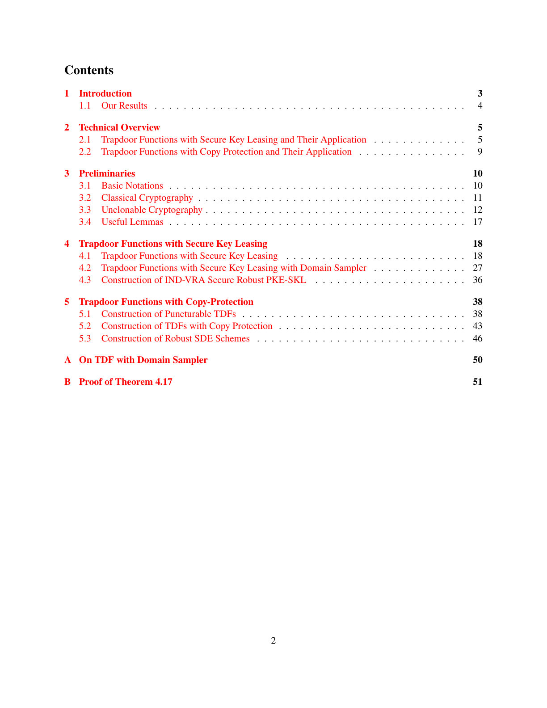 
Low-resolution page preview, page 2

📷 Fig 2

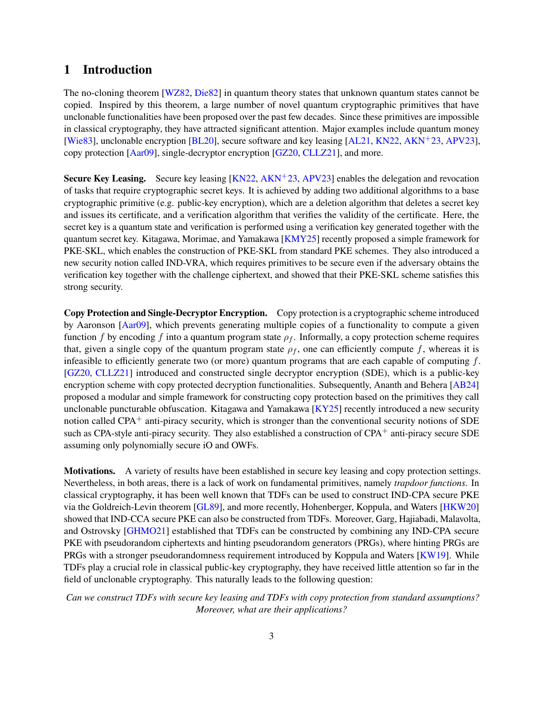 
Low-resolution page preview, page 3

📷 Fig 3

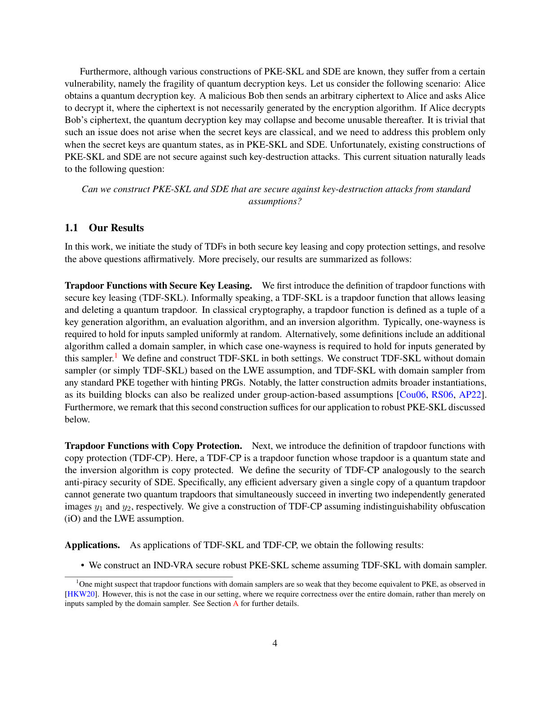 
Low-resolution page preview, page 4

📷 Fig 4

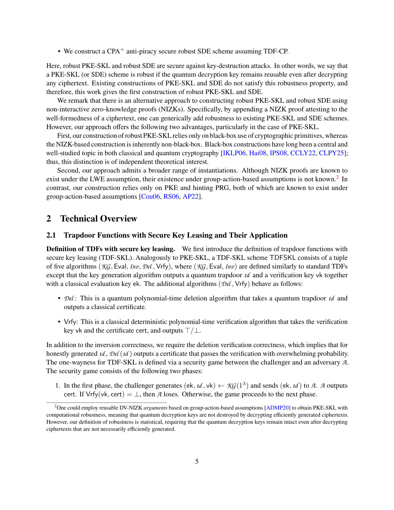 
Low-resolution page preview, page 5

📷 Fig 5

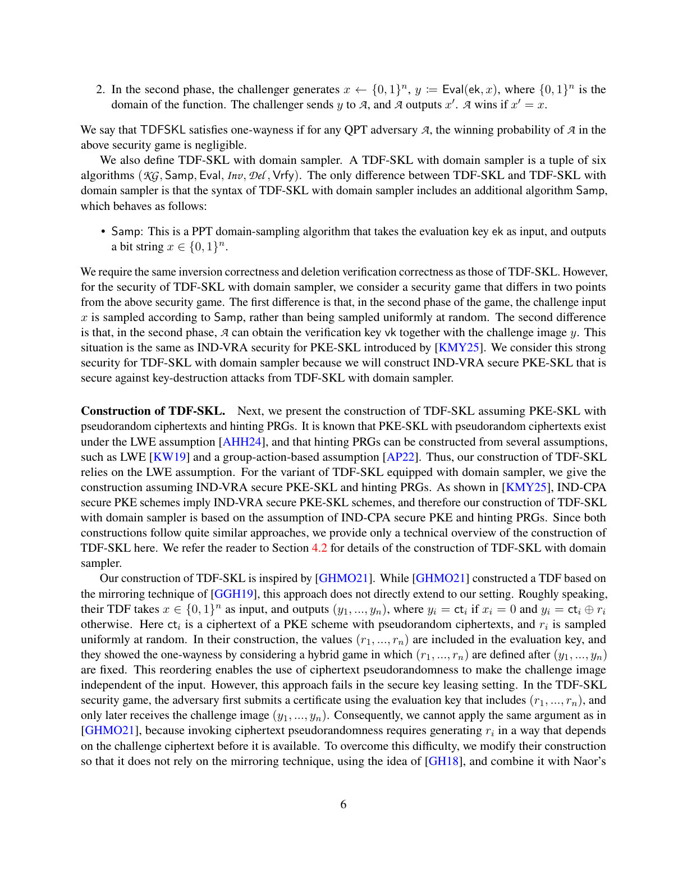 
Low-resolution page preview, page 6

**Summary.** This paper investigates the application of Trapdoor Functions (TDFs) to quantum cryptographic primitives such as secure key leasing and copy protection. The authors construct novel, robust cryptographic schemes for PKE-SKL and SDE that solve the critical vulnerability of key destruction. The work advances the theoretical understanding of TDFs in quantum security contexts.

**Why it may be interesting.** While the topic is purely theoretical cryptography, the underlying mathematical rigor and the focus on information-theoretic security concepts (like those derived from quantum principles) are highly relevant to the theoretical foundations of quantum information science.

Detailed structure

**Main problem.** The paper extends the study of Trapdoor Functions (TDFs) to quantum cryptographic primitives like secure key leasing (TDF-SKL) and copy protection (TDF-CP). It aims to develop robust cryptographic schemes based on these concepts.

**Main result.** The authors provide constructions for TDF-SKL and TDF-CP, and subsequently construct robust Public Key Encryption with Secure Key Leasing (PKE-SKL) and Single-Decryptor Encryption (SDE) schemes that resist key-destruction attacks.

**Method.** The work involves formalizing new definitions for TDF-SKL and TDF-CP, providing constructions based on assumptions like the LWE problem, and employing advanced cryptographic proof techniques (e.g., hybrid games, averaging arguments) to establish security.

**Model / system.** The model is purely theoretical, focusing on quantum cryptographic primitives inspired by the no-cloning theorem. It deals with abstract concepts like quantum trapdoors, key leasing, and copy protection functionalities.

**Key observables.** Security notions such as IND-VRA (Indistinguishability under Verifiable Random Access) and CPA+ anti-piracy security, alongside the reusability of quantum decryption keys.

**Important parameters / regimes.** The security parameter $\lambda$ and polynomial functions $p(\lambda)$ are used in the security proofs.

**Assumptions / limitations.** The constructions rely on the Learning With Errors (LWE) assumption, indistinguishability obfuscation (iO), and the existence of specific pseudorandom generators.

**Figures summary.** Figure 3 describes the algorithm $B^*$, which is used in the security proof to simulate an experiment and compare outputs to establish the security bound for TDFSKL.

**Paper structure.** The paper introduces TDF-SKL and TDF-CP definitions, presents constructions for both, and then applies these to build robust PKE-SKL and SDE schemes, culminating in detailed security proofs for these robust schemes.

Abstract

Inspired by the no-cloning theorem in quantum theory, a variety of quantum cryptographic primitives with unclonable functionalities, such as secure key leasing and copy protection, have been proposed and attracted significant attention. However, trapdoor functions (TDFs), fundamental primitives in public-key cryptography, have not been extensively studied in these areas. In this work, we initiate a study of TDFs in both secure key leasing and copy protection settings. We first introduce the definition of TDFs with secure key leasing (TDF-SKL), which enables leasing and deleting of quantum trapdoors. We formalize TDF-SKL both with and without domain sampler, and give a construction of TDF-SKL without domain sampler based on the LWE assumption and a construction of TDF-SKL with domain sampler based on any standard PKE schemes combined with hinting pseudorandom generators [Koppula and Waters, CRYPTO 2019]. Next, we define TDFs with copy protection (TDF-CP), where the inversion functionality is copy protected by a quantum trapdoor. We establish a construction of TDF-CP assuming indistinguishability obfuscation and the LWE assumption, following a modular framework of copy protection proposed by Ananth and Behera [CRYPTO 2024]. We also present applications of TDF-SKL and TDF-CP. Existing constructions of public-key encryption with secure key leasing (PKE-SKL) and single-decryptor encryption (SDE) suffer from a critical vulnerability: quantum decryption keys may be destroyed after decrypting maliciously chosen ciphertexts. We construct PKE-SKL schemes and SDE schemes with robust quantum decryption keys that remain reusable after decrypting arbitrary ciphertexts from TDF-SKL and TDF-CP, respectively.

[↑ back to top](#top)

### [Vertical quantum confinement in bulk MoS$_2$](http://arxiv.org/abs/2609.07950v1)

**Authors:** Jairo Obando-Guevara, Álvaro González-García, Marcin Rosmus, Natalia Olszowska, César González, Miguel Ángel González-Barrio, Antonio Tejeda, Arantzazu Mascaraque  
**Type:** both · **Category:** other · **PDF:** <https://arxiv.org/pdf/2609.07950v1>  
**Analysis basis:** full PDF text, analyzed in chunks

📷 Fig 1

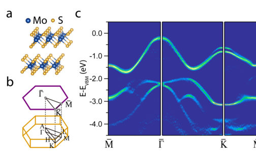 
FIG. 1. (a) Side view of the 2H MoS2 crystalline struc- ture where two layers are depicted. Mo atoms (blue) and S atoms (orange). (b) Hexagonal BZ (orange line) and its high-symmetry points. On top, we depict the projected SBZ (purple line). (c) ARPES curvature intensity showing the MoS2 band structure along the MΓKM high-symmetry direc- tions. The data was measured with hν = 70 eV.

📷 Fig 2

 
Fig. 1a shows the MoS2 structure in its hexagonal 2H crystalline phase (P63/mmc space group symmetry). The structure is oriented so that the basal plane (0001) is exposed, forming the surface. The crystal has the lat- tice parameters a = b = 3.161 Å and c = 12.295 Å, with an interlayer distance of 6.15 Å46. Fig. 1b displays the hexagonal bulk Brillouin zone (BZ), its high-symmetry points corresponding to the 2H crystalline structure and its projection on the (0001) surface. The choice of pho- ton energy yields different flat sections of the BZ along the kz direction. Fig. 1c shows the energy-momentum

📷 Fig 3

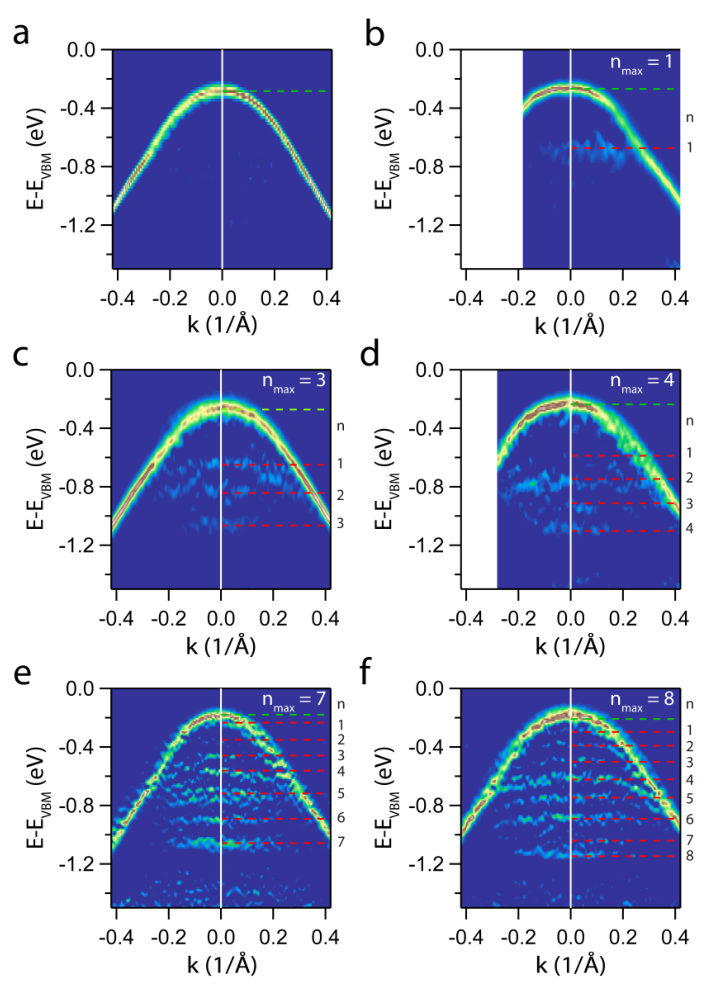 
FIG. 2. Curvature intensity of the parabolic convex dispersion of the bulk band centred at the Γ point along the ΓK direction for six different samples mechanically exfoliated. The data was measured with hν = 70 eV. (a) Bulk-like sample. (b-f) Samples showing additional spectral features. The side integers index the additional states. The dashed red lines mark their binding energy at the Γ point as a visual guide. The green dashed line marks the intensity maximum of the bulk band.

📷 Fig 4

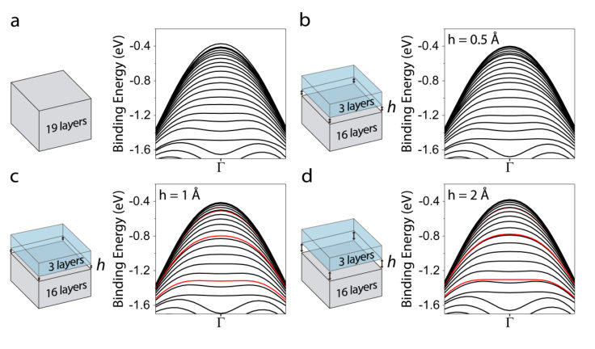 
FIG. 3. DFT calculated electronic band structures for 19 layers of 2H-MoS2 around the Γ point. (a) Ideal "bulk". Note that the 19 QWS that appear below the VBM are due to the finite thickness of the slab. (b-d) Same calculations but with a multilayer stack of three topmost layers separated from their nominal position at distances h = 0.5, 1 and 2 Å, respectively to simulate decoupling from the bulk. In red, we mark the QWSs that change their biding energy and so, increasing the spectral weight in particular regions.

📷 Fig 5

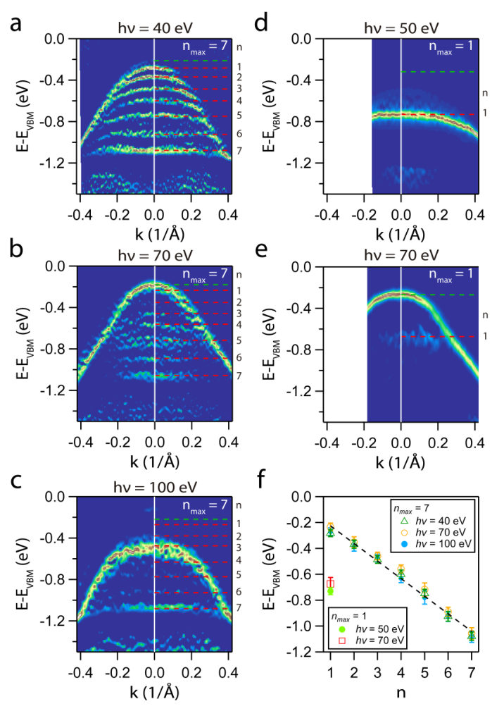 
FIG. 4. Curvature intensity of the parabolic band centred at Γ along the ΓK direction for different photon energies. The sample with nmax = 7 was measured with (a) hν = 40 eV, (b) hν = 70 eV and (c) hν = 100 eV. In (c) the energy of the n = 1 state was deduced from (a-b). The sample with nmax = 1 was measured at (d) hν = 50 eV and (e) hν = 70 eV. (f) Binding energy versus n for nmax = 1, 7 samples at the indicated photon energies. The dashed line corresponds to a linear fit. The average value of the energy error bar is ± 32 meV and was estimated considering the error in the VBM determination and the error determining the maxima of the peaks in a profile taken from the curvature spectra at...

**Summary.** This work experimentally and theoretically investigates quantum confinement in bulk $	ext{MoS}_2$ using ARPES and DFT. The key finding is the observation of discrete quantum well states whose energy spacing follows a linear trend, suggesting a parabolic potential rather than the expected quadratic dependence. This confirms that mechanical exfoliation creates a quantum-confined multilayer stack suitable for studying fundamental quantum physics.

**Why it may be interesting.** The observation of confinement in a solid-state material like $	ext{MoS}_2$ provides a platform to study fundamental quantum phenomena, such as intersubband transitions, in a controllable, layered solid-state system.

Detailed structure

**Main problem.** The study aims to experimentally observe and theoretically characterize quantum confinement states (QWSs) within the electronic structure of bulk $	ext{MoS}_2$.

**Main result.** ARPES measurements reveal QWSs at the $\Gamma$ point, confirming vertical quantum confinement, which exhibits a linear energy dependence on the quantum well index $n$, suggesting a parabolic-like potential.

**Method.** The research combines Angle-Resolved Photoemission Spectroscopy (ARPES) experiments with Density Functional Theory (DFT) calculations to analyze the electronic band structure.

**Model / system.** The physical system is bulk $	ext{MoS}_2$, where confinement is induced by the mechanical exfoliation process, effectively creating a multilayer stack detached from the bulk.

**Key observables.** Quantum well states (QWSs) at the $\Gamma$ point, absence of $k_z$ dispersion, strong intensity modulation with photon energy, and the linear binding energy dependence of QWSs vs $n$.

**Important parameters / regimes.** Photon energies ($h
u = 40, 70, 100 	ext{ eV}$), quantum well index ($n$), and the layer thickness/decoupling distance.

**Assumptions / limitations.** The confinement arises from the mechanical exfoliation process, creating reflective boundaries at the top and bottom interfaces of the multilayer stack.

**Figures summary.** Figures illustrate the $	ext{MoS}_2$ structure, ARPES intensity curvature along high-symmetry directions, and model fits showing the linear energy spacing of QWSs against a half-parabolic potential.

**Paper structure.** The paper progresses from experimental observation of QWSs via ARPES, confirming confinement, to theoretical modeling using DFT to explain the linear energy spacing and the physical mechanism of multilayer decoupling.

Abstract

We experimentally observe quantum confinement states in bulk MoS$_2$ using Angle-Resolved Photoemission Spectroscopy (ARPES). The band structure at the $\overlineΓ$ point reveals quantum well states (QWSs) linked to vertical quantum confinement of the electrons, confirmed by the absence of dispersion in k$_z$ and a strong intensity modulation with photon energy. Notably, the binding energy dependence of the QWSs vs $n$ does not follow the quadratic dependence of a two-dimensional electron gas. Instead, a linear behaviour is observed that is consistent with a parabolic-like quantum well. This confinement arises from the mechanical exfoliation preparation method, which leads to the detachment of a multilayer stack from the underlying bulk. This is confirmed by Density Functional Theory (DFT) calculations. The quantum confinement in bulk-like MoS$_2$ not only offers the opportunity to explore intersubband transitions to exploit optical properties but also provides a means to study fundamental quantum phenomena in multilayer stacks of different thicknesses.

[↑ back to top](#top)

### [Zirconium Carbide as a High-Temperature Benchmark for the Beyond Quasi-Harmonic Method](http://arxiv.org/abs/2609.08913v1)

**Authors:** Christopher M. Stanley  
**Type:** theory · **Category:** statistical mechanics · **PDF:** <https://arxiv.org/pdf/2609.08913v1>  
**Analysis basis:** full PDF text, analyzed in chunks

📷 Fig 1

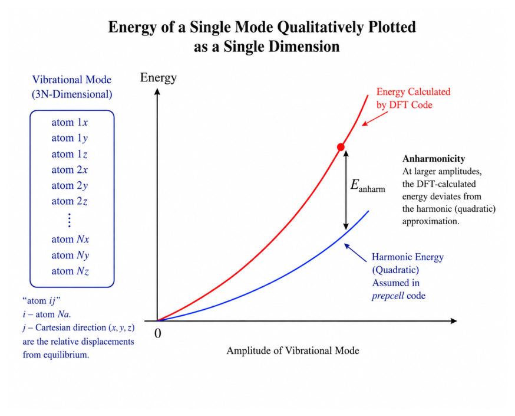 
Figure 1. Qualitative schematic of the BQH/prepared-supercell energy extraction. The prepared-supercell code assigns a harmonic quadratic energy, based on the desired temperature, to a displacement along a normal-mode coordinate/Amplitude, while the DFT single-point calculation evaluates the true value of the system energy. The excess energy is identified as the anharmonic vibrational contribution, 𝐸$%&amp;$'(. As discussed in ref. [1] the desired temperature is mapped to an amplitude for each mode, yielding a specific configuration, that is given to SIESTA which outputs the true system energy.

📷 Fig 2

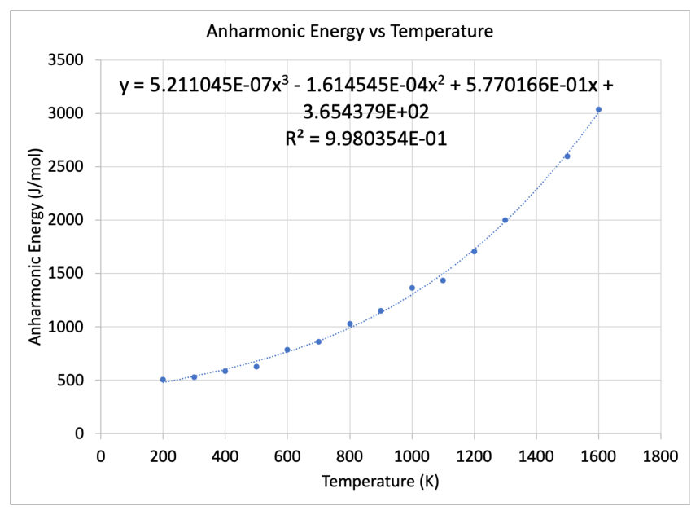 
Figure 3. Anharmonic energy extracted from the prepared-supercell and DFT/SIESTA calculations as a function of temperature. The plotted polynomial fit is the function 𝐸$%&amp;$'((𝑇) which is then differentiated with respect to temperature to obtain the BQH anharmonic heat-capacity in Eq. (4).

📷 Fig 3

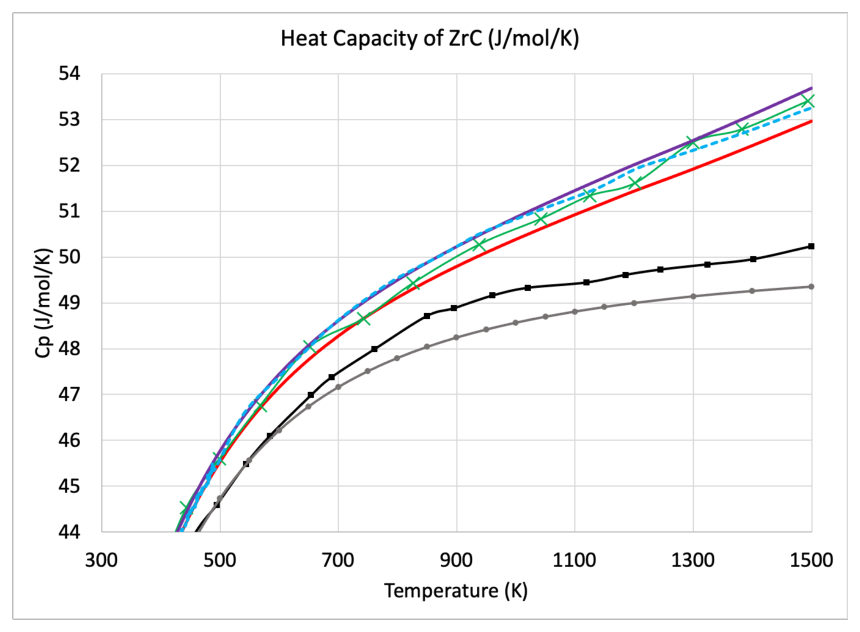 
Figure 4. Expanded molar heat-capacity comparison for ZrC including the electronic correction. The solid purple line is the electronically corrected BQH result, 𝐶!,12398+(𝑇). The solid red line is the uncorrected BQH vibrational result. The other data have the same meanings as in Fig. 2.

**Summary.** This work tackles the challenge of accurately calculating the heat capacity of $	ext{ZrC}$ at high temperatures by employing the Beyond Quasi-Harmonic (BQH) method. The BQH approach successfully captures anharmonic phonon contributions missed by simpler quasi-harmonic models. By adding a necessary electronic correction, the calculated heat capacity aligns closely with established, fully anharmonic theoretical benchmarks.

**Why it may be interesting.** While focused on solid-state thermodynamics, the rigorous comparison of anharmonic methods (BQH vs. QHA) provides advanced insights into how anharmonicity modifies bulk thermodynamic properties, which is relevant for modeling complex quantum systems under extreme conditions.

Detailed structure

**Main problem.** Accurately calculating the molar heat capacity at constant pressure, $C_p(T)$, from first principles, especially when anharmonic vibrational effects are significant.

**Main result.** The Beyond Quasi-Harmonic (BQH) method, when combined with an electronic heat-capacity correction, brings the calculated molar heat capacity into close agreement with fully anharmonic theoretical benchmarks up to approximately 1200 K.

**Method.** The BQH method uses a prepared-supercell first-principles approach to extract anharmonic vibrational energy directly from DFT energy evaluations, which is then supplemented by a first-order electronic correction.

**Model / system.** The study uses rocksalt Zirconium Carbide ($	ext{ZrC}$) as a high-temperature benchmark material, which is technologically important and electronically conductive.

**Key observables.** Molar heat capacity at constant pressure, $C_p(T)$; anharmonic vibrational energy contribution ($E_{	ext{anharmonic}}'$); electronic heat-capacity correction.

**Important parameters / regimes.** High temperatures (up to 1500 K); electronic density of states at the Fermi level ($D(E_F)$).

**Assumptions / limitations.** The electronic correction is treated as a first-order approximation using the Sommerfeld form, assuming the DOS is smooth near $E_F$.

**Figures summary.** Figure 1 qualitatively illustrates the BQH/prepared-supercell energy extraction, showing the excess energy ($\Delta E'$) as the anharmonic vibrational contribution.

**Paper structure.** The paper introduces the challenge of calculating $C_p(T)$ due to anharmonicity, details the BQH method and its comparison against CALPHAD and QHA benchmarks, and concludes by showing the agreement achieved after adding the electronic correction.

Abstract

Molar heat capacity at constant pressure, C_p (T), is a central thermodynamic quantity in materials science, but it remains difficult to calculate accurately from first principles when anharmonic vibrational effects become important. In this work, rocksalt ZrC is used as a high-temperature benchmark for the Beyond Quasi-Harmonic (BQH) method, a prepared-supercell first-principles approach that extracts anharmonic vibrational energy directly from density-functional-theory energy evaluations. The calculated BQH molar heat capacity is compared with CALPHAD reference values, a fully anharmonic thermodynamic-integration calculation, a calculated C_v (T) curve from the present work, and a quasi-harmonic calculation. The BQH curve gives a substantial improvement beyond C_v (T) and beyond the quasi-harmonic approximation. Because ZrC is electronically conductive, an electronic heat-capacity correction was also estimated from the density of states at the Fermi level and added to the vibrational BQH result. This correction brings the calculated molar heat capacity into close agreement with the fully anharmonic theoretical benchmark through approximately 1200 K. These results show that the BQH method fully captures important anharmonic phonon contributions missing from ordinary quasi-harmonic calculations.

[↑ back to top](#top)

## Secondary cond-mat archives

*Papers from  mes-hall, other, soft, supr-con. These archives are de-prioritized — they appear at the end regardless of relevance score.*

### Relevant in secondary archives (28)

### [Steady reservoir-mediated self-trapping of polariton condensates](http://arxiv.org/abs/2609.07962v1)

**Authors:** Pavel N. Kozhevin, Oleg I. Utesov, Igor S. Aranson, Sergey V. Koniakhin, Anton V. Nalitov  
**Type:** theory · **Category:** other · **PDF:** <https://arxiv.org/pdf/2609.07962v1>  
**Analysis basis:** full PDF text, analyzed in chunks
**Topic relevance:** 🔥 `driven-dissipative phase transition` **4/5** · `analog quantum simulation` **3/5** · `correlated / nonlocal dissipation` **3/5** · `methods for driven-dissipative` **3/5** · `non-equilibrium universality` **3/5** · `Keldysh / 2PI / non-Gaussian methods` **2/5** · `Tavis-Cummings & cavity-many-emitter` **1/5**

📷 Fig 1

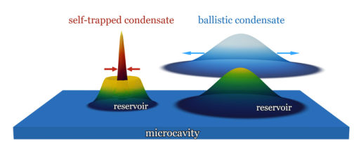 
FIG. 1. The two types of steady condensate-reservoir states. Left: the self-trapped condensate (red) residing in a self- induced potential trap due to the hole-burning effect. Right: the standard ballistic condensate (blue) expanding due to the reservoir-induced potential hump. Arrows indicate the direc- tion of polariton current density.

📷 Fig 2

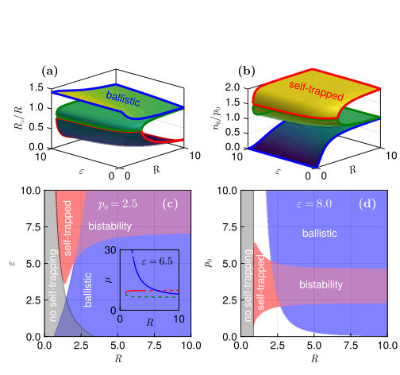 
FIG. 2. Analytic results in the deeply nonlinear regime. a) The ratio of the condensate and the pump spot radii and b) the maximal condensate density, normalized by the pumping power for the self-trapped (Rc &lt; R, red), the intermediate (green), and the ballistic (Rc &gt; R, blue) solutions of Eqs. (2,3) at a = ξ = 0. The stability diagrams on the (c) R −ε (p0 = 2.5) and the (d) R −p0 (ε = 8) planes show bistabil- ity (purple), absence of any stable fixed points (white), and the absence of self-trapped states (gray). Inset: condensate energy µ as a function of R for ε = 6.5, showing that the self- trapped (red) state is more energetically favorable for small pump spot sizes.

📷 Fig 3

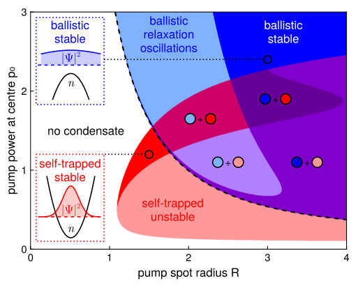 
FIG. 3. Numerical phase diagram of the dynamical system. Blue and red colors correspond to ballistic and self-trapped states, bright and light tones correspond to stable and unsta- ble regions. Insets: condensate and reservoir densities |Ψ|2

📷 Fig 4

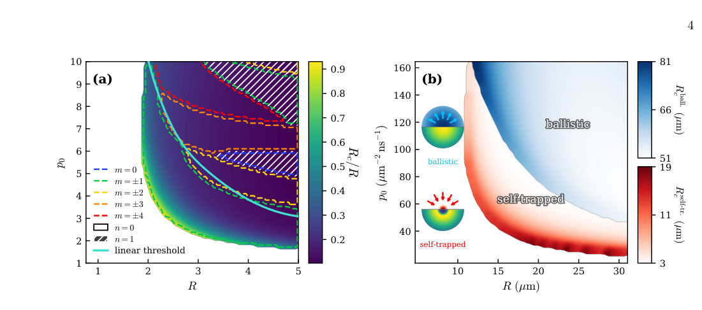 
FIG. 4. Numerical stability map of self-trapped and ballistic solutions obtained directly from Eqs. (1). a) Rc/R of the compact self-trapped solution on the (R, p0) plane, indicating the BdG mode with the highest growth rate, i.e., the “most unstable”, for azimuthal perturbations m = 0, ±1, . . . , ±4 (dotted lines) and the linear condensation threshold (cyan). Hatching marks the region where the dominant unstable mode has radial excitation number n = 1 rather than n = 0. b) Physical condensate size Rc for the self-trapped (red) and ballistic (blue) solutions, converted using representative high-Q microcavity parameters (see text). Insets: condensate density |ψ|2 (top half) and reservoir...

**Summary.** This paper theoretically analyzes polariton condensates, showing that the interaction with the optical reservoir can induce a self-trapping mechanism. This mechanism allows the condensate to form a stable, compact state with converging currents, even when the pump power is below the standard condensation threshold. The findings are crucial for understanding non-equilibrium dynamics and potential applications in neuromorphic devices.

**Why it may be interesting.** This work directly addresses non-equilibrium dynamics in cavity quantum electrodynamics systems, providing a detailed theoretical framework for understanding how reservoir coupling can stabilize exotic, non-trivial spatial structures in bosonic condensates.

Detailed structure

**Main problem.** The study investigates the formation and stability of self-trapped states in polariton condensates, contrasting them with the conventionally expected ballistically expanding state.

**Main result.** Self-trapped states, driven by local reservoir depletion, can form stable, compact condensates even below the linear condensation threshold, exhibiting converging polariton currents.

**Method.** The analysis employs the extended Gross-Pitaevskii Equation (eGPE) model, utilizing stability analysis (Bogoliubov-de Gennes) and examining stationary solutions in the deeply nonlinear regime.

**Model / system.** The system models nonequilibrium exciton-polariton condensates, treated as a two-component system coupled to an incoherent optical reservoir, governed by coupled evolution equations.

**Key observables.** Condensate density, polariton currents (converging vs. expanding), condensate energy, and the existence/stability of self-trapped vs. ballistic solutions.

**Important parameters / regimes.** Condensation threshold ($p_{th}$), pump spot size ($R$), self-interaction strength ($\xi$), and reservoir coupling parameters ($\epsilon, a$).

**Assumptions / limitations.** The analysis relies on approximations such as the Gaussian ansatz for stationary modes and the adiabatic elimination of the reservoir in certain limits.

**Figures summary.** Figures compare self-trapped (hole-burning) vs. ballistic states, show stability diagrams mapping stable/unstable regions, and illustrate the evolution of polariton currents and density profiles.

**Paper structure.** The paper progresses by establishing the eGPE model, deriving simplified dynamical equations, performing stability analyses (BdG), and finally mapping out the phase diagram showing the coexistence and stability of the self-trapped state below the linear threshold.

Abstract

Nonequilibrium bosonic condensates of exciton-polaritons generated by tightly focused incoherent optical beams are typically expected to form a stationary ballistically expanding state with the notable exception of experimentally observed compact self-trapped states [Phys. Rev. Lett. 123, 047401 (2019)]. We show that the back-action of the condensate on the optically pumped excitonic reservoir via bosonic stimulated scattering can cause local reservoir depletion, producing a steady condensate confined in a self-induced potential trap. Notably, this self-trapped state is formed by persistent converging rather than radially expanding polariton currents and exists even below the conventionally defined condensation threshold. This state remains steady over nanosecond-scale times and is eventually ejected from the self-induced trap due to a bullet-type instability, enabling spiking neuromorphic dynamics in networks of polariton condensates.

[↑ back to top](#top)

### [From London to Morse via Binnig, Quate, and Gerber](http://arxiv.org/abs/2609.08425v1)

**Authors:** Sofia Alonso Perez, Matthew O. Blunt, Frederick Carlisle, Neil R. Champness, Janette L. Dunn, Matthew Edmondson, Rowan Evers, Connor Fields, Subhashis Gangopadhyay, James Hayton, Samuel P. Jarvis, Filipe Junqueira, Lev Kantorovich, Brian Kiraly, Natalio Krasnogor, Ioannis Lekkas, Morten Møller, Philip Moriarty, Chris Pakes, Emmanuelle Pauliac-Vaujour, Oliver Phillips, Adrian Radocea, Philipp Rahe, Mohammad Abdur Rashid, Hongqian Sang, Alex Saywell, Nikhil Seeja Sivakumar, Peter Sharp, Andrew Stannard, Julian Stirling, Adam Sweetman, Simon Taylor, Richard A. J. Woolley  
**Type:** both · **Category:** other · **PDF:** <https://arxiv.org/pdf/2609.08425v1>  
**Analysis basis:** full PDF text, analyzed in chunks
**Topic relevance:** 🔥 `quantum measurements` **4/5** · `Frenkel-Kontorova` **1/5**

📷 Fig 1

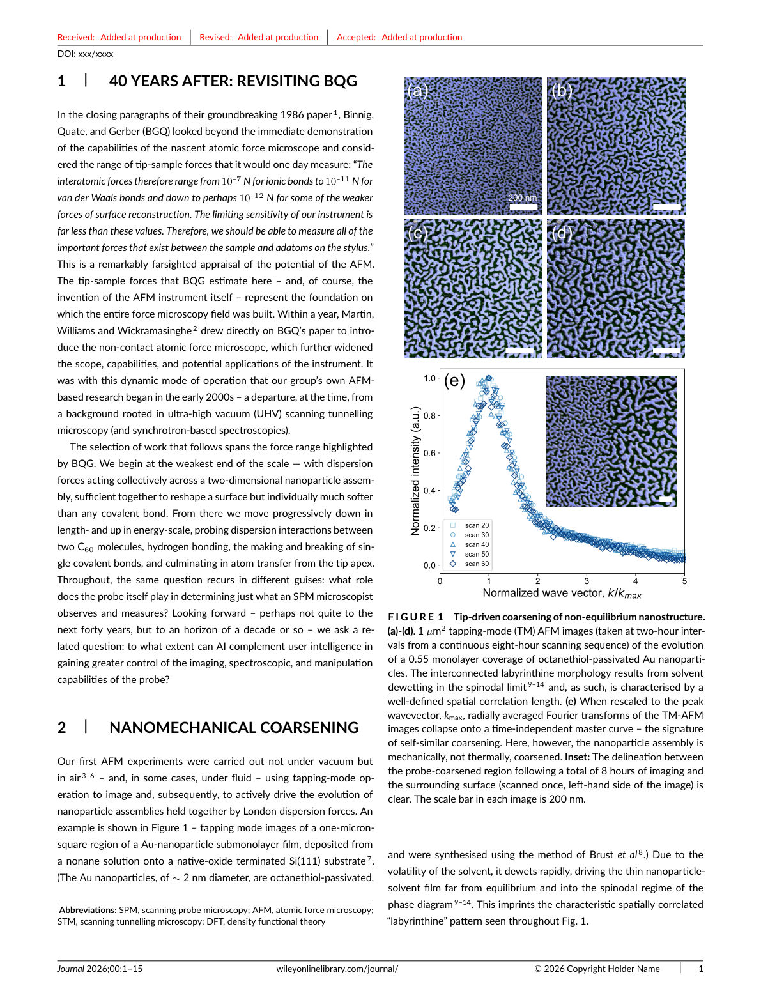 
Low-resolution page preview, page 2

📷 Fig 2

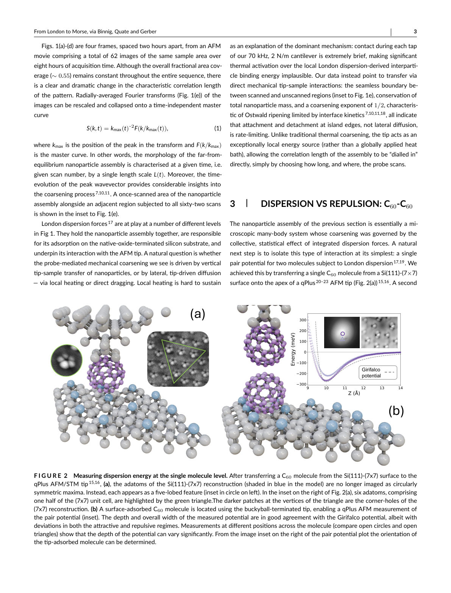 
Low-resolution page preview, page 3

📷 Fig 3

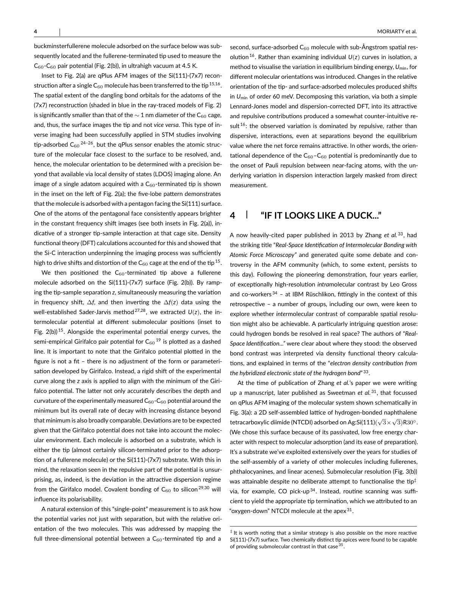 
Low-resolution page preview, page 4

📷 Fig 4

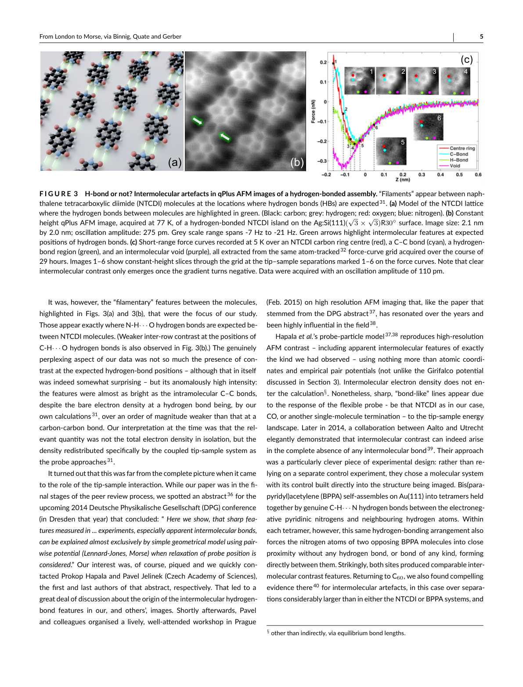 
Low-resolution page preview, page 5

📷 Fig 5

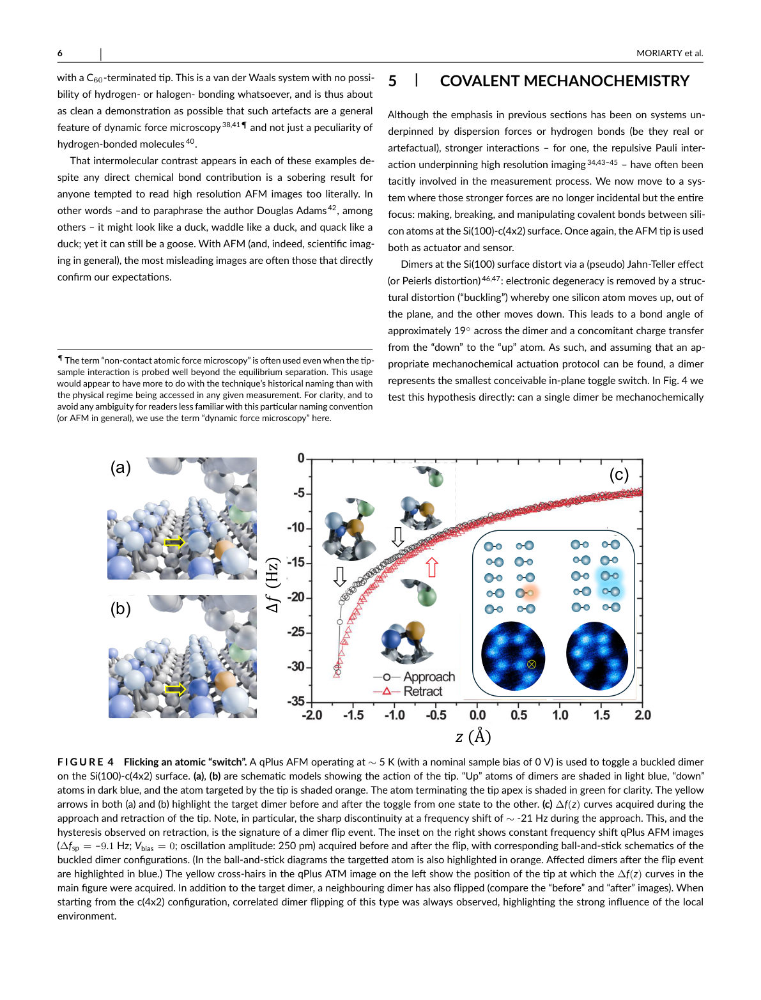 
Low-resolution page preview, page 6

**Summary.** This review surveys the capabilities of Atomic Force Microscopy (AFM) over two decades, emphasizing that the probe is an active participant in nanoscale processes. It details measurements ranging from nanoparticle coarsening to single-molecule interactions, demonstrating the ability to map intermolecular forces across the entire spectrum from weak dispersion to strong covalent bonding.

**Why it may be interesting.** The work directly addresses the boundary between measurement and manipulation in nanoscale physics, which is crucial for understanding open quantum systems where the environment (the probe) cannot be ignored.

Detailed structure

**Main problem.** The paper reviews decades of work on Atomic Force Microscopy (AFM), focusing on the central theme that the probe acts as an active participant rather than a passive observer when probing nanoscale interactions.

**Main result.** The research demonstrates that mechanical tip-sample interactions can drive processes like nanoparticle coarsening and allow for the measurement of intermolecular potentials across a vast force range, from van der Waals to covalent bonds.

**Method.** The study combines experimental AFM measurements (e.g., force spectroscopy, time-lapse imaging) with theoretical analysis, including fitting data to established potential models like the Morse or Lennard-Jones potentials.

**Model / system.** The physical systems include adsorbed molecules ($	ext{C}_{60}$, NTCDI) on crystalline surfaces ($	ext{Si}(111)$) and metallic nanocontacts. The methodology spans characterizing pair potentials, observing self-organized assembly, and applying machine learning to automate probe control.

**Key observables.** Characteristic spatial correlation length ($L(t)$), intermolecular potential $U(z)$, force curves, and conductance changes during contact formation.

**Important parameters / regimes.** Force range (van der Waals to covalent), temperature (e.g., 5 K, 77 K), and length/correlation scales (single bond limit to macroscopic assemblies).

**Assumptions / limitations.** The interpretation of molecular contrast and potential variations is often complicated by the probe's influence, requiring careful deconvolution of intrinsic vs. probe-induced effects.

**Figures summary.** Figures illustrate time-lapse AFM images of Au nanoparticle coarsening, Fourier transform analysis confirming self-similar coarsening, and force curves used to map the pair potential of molecules like $	ext{C}_{60}$.

**Paper structure.** The paper is structured as a comprehensive review, tracing the historical development of AFM capabilities, detailing specific experimental results on coarsening and pair potentials, and concluding with perspectives on advanced control methods like machine learning.

Abstract

In their landmark paper introducing the atomic force microscope [Phys. Rev. Lett. \textbf{56}, 930 (1986)], Binnig, Quate, and Gerber presciently anticipated that the technique would ultimately be capable of probing interactions running the gamut from weak van der Waals interactions to strong covalent bonding. They also highlighted that the tip-sample forces central to AFM are present, and often highly influential, in scanning tunnelling microscopy; indeed, this realisation directly inspired the invention of the force microscope. In this perspective for the \textit{Forty Years of AFM} special issue, we review selected aspects of two decades of work from our group at the University of Nottingham that span the force range highlighted by BQG and are united by a common, central theme: the probe as active participant rather than passive observer. Our selection of results also covers length- and correlation-scales from the microscopic right down to the single chemical bond limit, tracking a spectrum of interactions from van der Waals/Hamaker forces, through hydrogen bonding, to covalent bonds and, finally, atom-by-atom assembly of metal clusters via vertical tip-sample transfer. Echoing BQG's own observations on the prevalence of probe-sample forces in STM, we also discuss recent evidence that tip-induced heterogeneity underpins first-passage dynamics in molecular diffusion and highlight the challenges in acquiring non-invasive measurements of diffusion barriers for adsorbed molecules that are readily perturbed by the probe. We close with a perspective on machine learning's growing role in automating tip-driven atomic and molecular manipulation.

[↑ back to top](#top)

### [Decorated electronic kagome lattice in twisted bilayer germanene](http://arxiv.org/abs/2609.08750v1)

**Authors:** Dennis J. Klaassen, Rian A. M. Ligthart, Andrés R. Botello Mendez, Lumen Eek, Esra van 't Westende, Paul L. de Boeij, Y. Wang, D. Vanmaekelbergh, Pantelis Bampoulis, Cristiane Morais Smith, Ingmar Swart, Zeila Zanolli, Harold J. W. Zandvliet  
**Type:** both · **Category:** strongly correlated electrons · **PDF:** <https://arxiv.org/pdf/2609.08750v1>  
**Analysis basis:** full PDF text, analyzed in chunks
**Topic relevance:** 🔥 `analog quantum simulation` **4/5**

📷 Fig 1

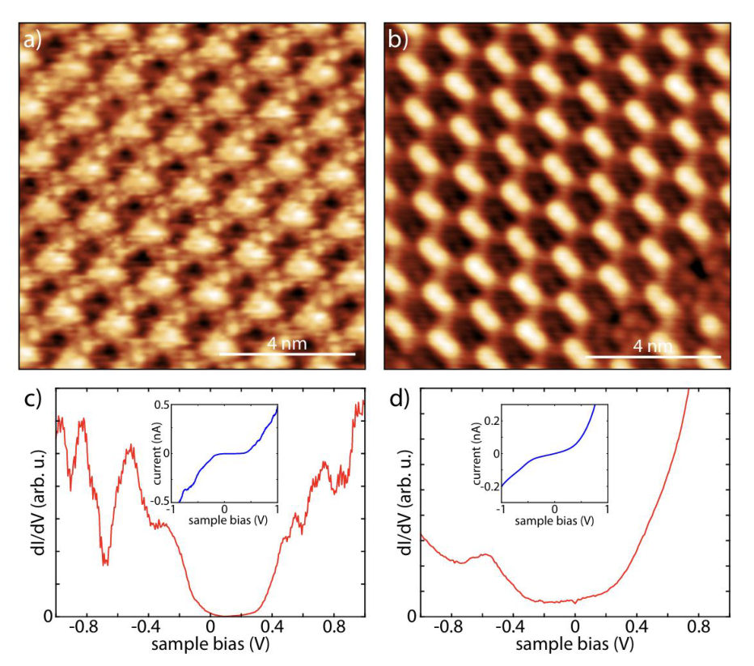 
Figure 1 Scanning tunneling microscopy images and differential conductivity of twisted bilayer germanene. (a) Scanning tunneling microscopy image of √7 × √7 twisted bilayer germanene, sample bias -1.3 V and tunnel current 0.3 nA (b) Scanning tunneling microscopy image of √13 × √13 twisted bilayer germanene, sample bias -0.05 V and tunnel current 0.5 nA, T= 4.2 K (c) Differential conductivity (dI(V)/dV) of √7 × √7 twisted bilayer germanene. The inset shows the I(V) curve. Setpoint sample bias −1.5 V and setpoint tunnel current 1 nA. and (d) Differential conductivity (dI(V)/dV) of √13 × √13 twisted bilayer germanene. The inset shows the I(V) curve, T=0.36 K. Setpoint sample bias -1 V and...

📷 Fig 2

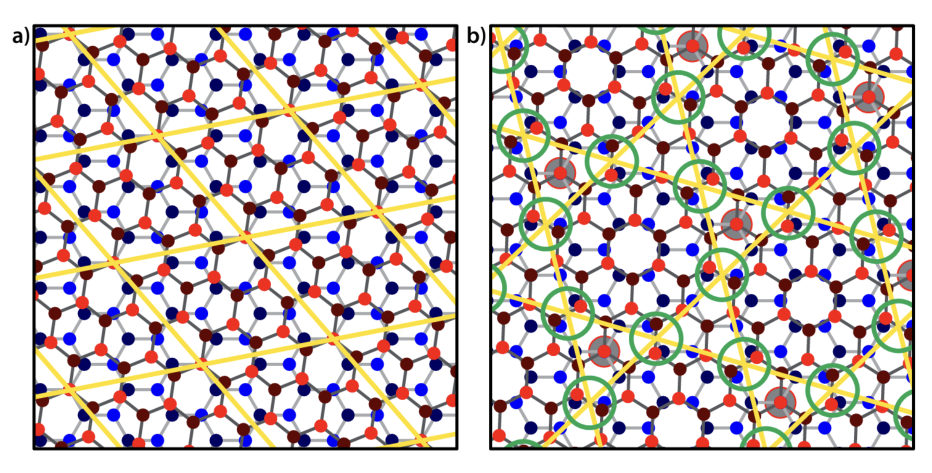 
Figure 2 Schematic models of the odd (√7 × √7) and even (√13 × √13) unit cells of a twisted bilayer germanene. The light (dark) red dots represent upward (downward) buckled atoms of the top layer. The light (dark) blue dots represent upward (downward) buckled atoms of the bottom layer. The large green open circles in (b), which are exactly in the middle between two adjacent stacked AA regions, form an emergent kagome lattice. The kagome structure is outlined by the yellow lines. The corner-sharing triangles either have an upward buckled atom (light red) or a downward buckled atom (dark red) in their center. The upward buckled atoms in the centers of the corner-sharing triangles are...

📷 Fig 3

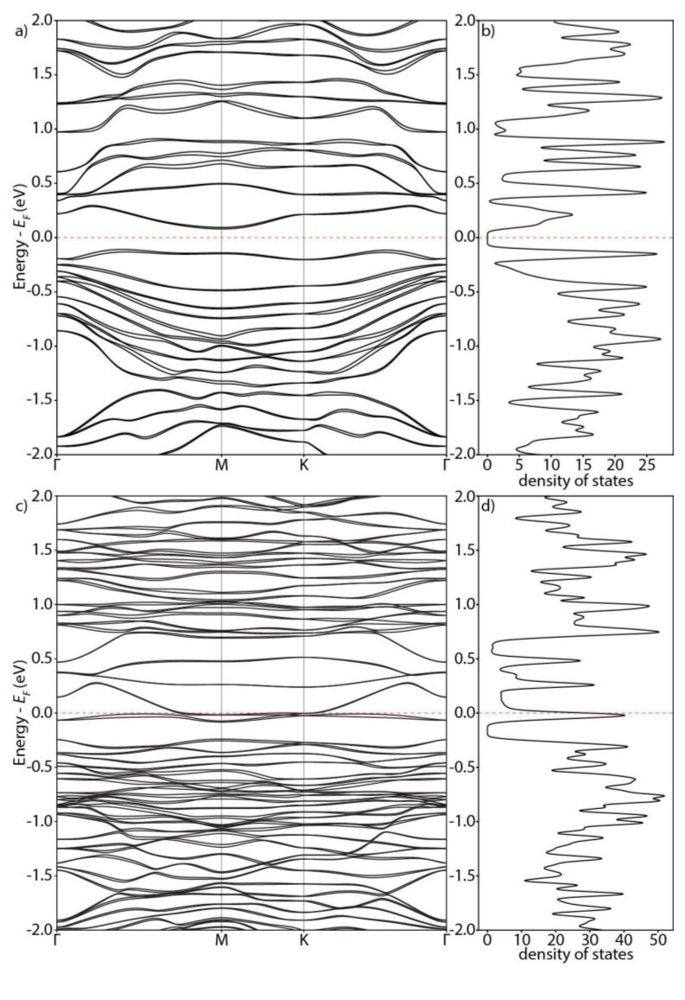 
Figure 3 (a) Density Functional Theory (DFT) calculations of the odd √7 × √7 twisted bilayer germanene structure. Electronic band structure along high-symmetry paths in the moiré Brillouin zone, showing flat bands near the Fermi level, and at high energy, and (b) Corresponding density of states showing prominent peaks at the flat-band energies. (c) Density Functional Theory (DFT) calculations of the even √13 × √13 twisted bilayer germanene structure. Electronic band structure along high-symmetry paths in the moiré Brillouin zone, showing flat bands near the Fermi level, and at high energy, and (d) Corresponding density of states showing prominent peaks at the flat-band energies.

📷 Fig 4

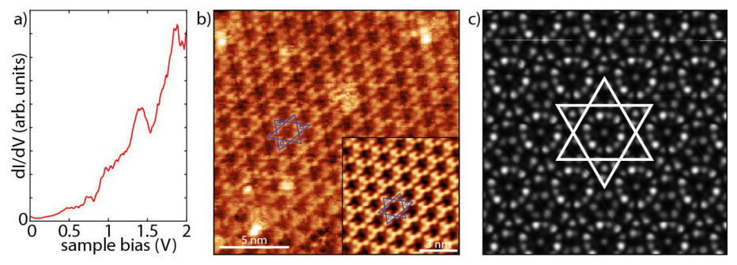 
Figure 4 (a) Differential conductivity of the empty states of an even (√13 × √13) twisted bilayes germanene. The peak at 1.45 V is the kagome flat band. Set points: 15 pA and -0.5 V, (b) Scanning tunneling microscopy image of an even (√13 × √13) structure taken at 1.45 V. Tunnel current is 0.1 nA. The image reveals and emergent decorated electronic kagome lattice (see inset for a filtered image). (c) Local density of states of even (√13 × √13) twisted bilayer germanene. The decorated kagome lattice is outlined by white lines.

**Summary.** This work demonstrates that twisted bilayer germanene can act as a tunable platform for realizing electronic kagome lattices. By analyzing the electronic structure using DFT and STM, the authors distinguish between semiconducting and metallic moiré phases. The metallic phase hosts an emergent decorated kagome lattice, confirming the material's potential for studying strongly correlated physics.

**Why it may be interesting.** The ability to engineer correlated electronic states like flat bands using large-angle moiré patterns in a stable 2D material platform is highly relevant for simulating strongly correlated electron models.

Detailed structure

**Main problem.** The primary goal is to realize and characterize electronic flat bands and correlated phases using artificial kagome lattices in atomically controlled 2D materials.

**Main result.** The paper shows that twisted bilayer germanene can host an emergent decorated kagome electronic lattice in its metallic phase, providing a platform for engineering such states at large twist angles.

**Method.** The study combines Scanning Tunneling Microscopy (STM) measurements with ab-initio Density Functional Theory (DFT) calculations to analyze electronic structure.

**Model / system.** The physical system is commensurate twisted bilayer germanene on Ge2Pt, which is compared to theoretical tight-binding models of conventional and decorated kagome lattices.

**Key observables.** Electronic structure (semiconducting vs. metallic), band gap size, empty state resonance energy (1.45 eV), and symmetry (C3 symmetry).

**Important parameters / regimes.** Twist angles (21.8° and 27.8°), band gap ($\sim 0.2$ eV), and the presence of sublattice parity (odd/even).

**Assumptions / limitations.** The analysis assumes that the electronic properties are dictated by the sublattice parity of the twisted bilayer structure, and that the kagome flat band is robustly formed by $d$-orbitals.

**Figures summary.** Figures show STM images and differential conductivity for both semiconducting and metallic phases, alongside DFT band structures illustrating the gap opening and the flat band resonance.

**Paper structure.** The paper first establishes the electronic distinction between odd ($\sqrt{7} 	imes \sqrt{7}$) and even ($\sqrt{13} 	imes \sqrt{13}$) twisted bilayers. It then focuses on the metallic even phase, identifying the emergent decorated kagome lattice via STS and DFT, and finally models this lattice using tight-binding theory.

Abstract

Artificial kagome lattices provide a route to electronic flat bands, geometric frustration, and correlation driven phases, but their realization in atomically controlled two-dimensional materials remains scarce. Here, we show that commensurate twisted bilayer germanene on Ge2Pt produces two electronically distinct large-angle moiré phases. Scanning tunneling microscopy measurements and density functional theory calculations reveal that commensurate twisted bilayers that are odd under an exchange of sublattices are semiconducting, whereas the twisted bilayers with an even parity are metallic. The twisted bilayers with an even parity host an empty state resonance that exhibits an emergent decorated kagome structure with a C3 symmetry. These results establish large-angle twisted germanene as a platform for engineering kagome-like electronic states in a buckled two-dimensional material.

[↑ back to top](#top)

### [Fabrication And Characterization Of High-Quality Nb/Al-AlO$_x$/Nb Cross-Type Josephson Tunnel Junctions Utilising CMP-based Planarisation Techniques](http://arxiv.org/abs/2609.08569v1)

**Authors:** Alexander Stoll, Andreas Reifenberger, Daniel Hengstler, Andreas Fleischmann, Christian Enss  
**Type:** experiment · **Category:** quantum information and computing · **PDF:** <https://arxiv.org/pdf/2609.08569v1>  
**Analysis basis:** full PDF text, analyzed in chunks
**Topic relevance:** 🔥 `QC/QI experiment` **4/5**

📷 Fig 1

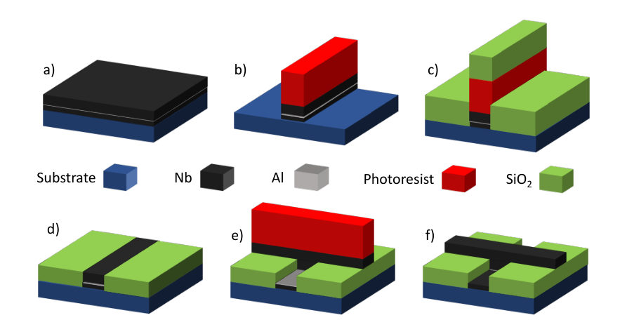 
Figure 1: Schematic of our fabrication process of cross-type JJs utilising the CMP process. a) Nb/Al-AlOx/Nb-trilayer is deposited on the substrate. b) The trilayer is microstructured into a stripe using photolithography and etching. c) SiO2 is deposited to insulate the bottom electrode from the subsequent wiring layer. d) The trilayer is planarised by CMP. e) The Nb wiring layer is deposited perpendicular to the trilayer structure and cross-type JJ area defined via etching of the wiring layer and the top electrode of the trilayer. f) Wet-etching of the Al-AlOx layer and removal of the photoresist.

📷 Fig 2

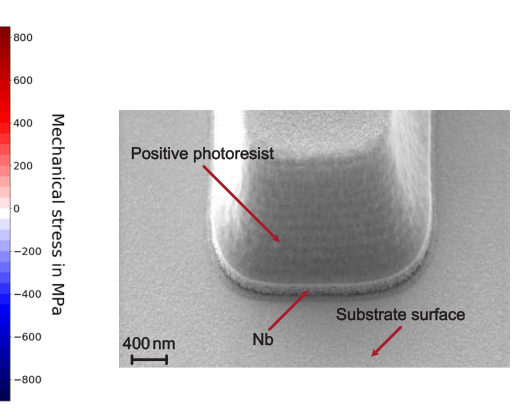 
Figure 3: SEM image of a 2 µm wide and 200 nm high etched Nb structure with the positive-tone photoresist AZ MIR 701 on top, depicting the achieved vertical sidewalls of the etched Nb film. The light and dark stripes seen in the photoresist sidewall result from in- terference between the incident and reflected light during laser lithography.

📷 Fig 3

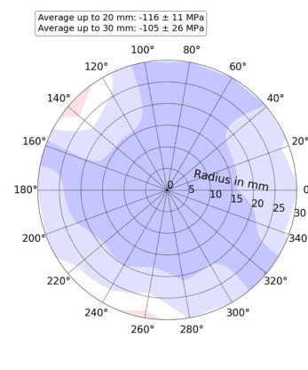 
Figure 2: Mechanical stress map of a 200 nm thick Nb film deposited onto a 3 inch Si wafer. This was obtained by measuring the height profiles along 60 mm-long lines at nine different wafer orienta- tions (in steps of 20°, measured with a Bruker Dektak XT profilometer2). Measurements were performed before and after Nb deposition to cal- culate the film stress. The colour coding of the map shows the interpolation of those nine lines.

📷 Fig 4

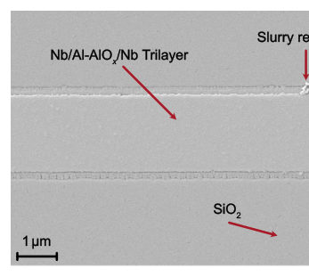 
Figure 4: Scanning electron microscope (SEM) picture of a planarised 2 µm wide Nb/Al-AlOx/Nb trilayer, which corresponds to step d) in figure 1).

📷 Fig 5

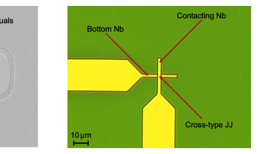 
Figure 5: Light microscope picture of a 2 × 2 µm2 cross-type JJ fabricated with the scheme shown in figure 1.

**Summary.** This paper details a fabrication breakthrough for superconducting Josephson junctions using a cross-type geometry. By replacing traditional lift-off processes with Chemical-Mechanical Polishing (CMP) for planarization, the authors achieved high yield and excellent uniformity on a wafer scale. This advancement is critical for the reliable scaling of superconducting quantum devices.

**Why it may be interesting.** The work directly relates to the physical realization of superconducting quantum circuits, providing crucial engineering data on device fabrication necessary for scaling quantum processors.

Detailed structure

**Main problem.** The paper addresses the need for scalable, high-quality Josephson tunnel junctions (JJs) for superconducting electronics, overcoming limitations associated with traditional window-type JJs.

**Main result.** A novel fabrication scheme using Chemical-Mechanical Polishing (CMP) successfully produces high-yield, cross-type Nb/Al-AlOx/Nb JJs down to $1 \mu	ext{m} 	imes 1 \mu	ext{m}$ on a wafer scale.

**Method.** The core method involves depositing the superconducting trilayer, embedding it in $	ext{SiO}_2$, and then using CMP to planarize the excess oxide, replacing slower and less reliable lift-off processes.

**Model / system.** The physical system is a cross-type Josephson tunnel junction ($	ext{Nb/Al-AlO}_x/	ext{Nb}$), which is a fundamental building block for superconducting quantum devices like qubits and SQUIDs.

**Key observables.** IV-characteristics, Fraunhofer patterns, critical current ($I_c$), normal state resistance ($R_N$), and junction area ($A_{JJ}$).

**Important parameters / regimes.** Junction areas down to $1 \mu	ext{m} 	imes 1 \mu	ext{m}$; high yield ($>90\%$); specific CMP parameters (e.g., slurry type, pressures).

**Assumptions / limitations.** The analysis assumes that the smooth profile edges created by CMP are appropriate for modeling the current distribution in the junction.

**Figures summary.** Figures show schematic fabrication steps highlighting CMP use, SEM images of planarized junctions, light microscope views of cross-type JJs, and electrical measurement setups (e.g., four-wire measurement).

**Paper structure.** The paper details the fabrication process, emphasizing the CMP planarization step over lift-off. It then presents electrical characterization using IV curves and magnetic field measurements (Fraunhofer patterns) to confirm high quality and scalability.

Abstract

Josephson tunnel junctions (JJs) are the fundamental building blocks of today's most advanced superconducting electronic components, such as qubits and superconducting quantum interference devices (SQUIDs). Given the ongoing demand for scalability of these devices on the wafer-scale, it is crucial to control the fabrication process as precisely as possible to ensure uniform quality and reproducibility. Today, window-type JJs are often used in the production of DC SQUIDs and while they are reliable and reproducible, they suffer from alignment inaccuracies caused by photolithography and unavoidable parasitic capacitances, thus limiting the energy sensitivity of DC SQUIDs. These problems can be circumvented by producing JJs with cross-type geometry, which allows for smaller junction areas and eliminates parasitic capacitances. Here we discuss the fabrication of Nb/Al-AlOx/Nb-based cross-type JJs, where the trilayer is embedded in sputter-deposited SiO$_2$ to allow for planarisation of the structures and to ensure the reliable insulation of the sidewalls of the bottom electrode. Instead of lift-off processes that require a lot of time and potentially leave unwanted wings along the edges of microstructures behind that might compromise subsequent layers, we use chemical-mechanical polishing (CMP) for the removal of excess SiO$_2$. This is not only much faster, but produces smooth and uniform surfaces, which in turn effectively improves the reliability of our JJ production process resulting in a high yield of over $90\,\%$ on wafer-scale. In addition, we discuss the influence of fabrication details on the quality and electrical properties of our JJs with different junction areas down to $1\,\mathrm{μm} \times 1\,\mathrm{μm}$ distributed across the wafer and extract the junction specific quality parameters from their IV-characteristics and their Fraunhofer patterns.

[↑ back to top](#top)

### [Memory Control of Ice Growth During Non-Equilibrium Freezing of Water](http://arxiv.org/abs/2609.08535v1)

**Authors:** Abhigyan Hazarika, Sudeep N. Punnathanam, Biman Bagchi, Prabal K. Maiti  
**Type:** theory · **Category:** statistical mechanics · **PDF:** <https://arxiv.org/pdf/2609.08535v1>  
**Analysis basis:** full PDF text, analyzed in chunks
**Topic relevance:** `Keldysh / 2PI / non-Gaussian methods` **3/5** · `correlated / nonlocal dissipation` **3/5** · `driven-dissipative phase transition` **3/5** · `methods for driven-dissipative` **3/5** · `non-equilibrium universality` **3/5** · `analog quantum simulation` **2/5** · `quantum measurements` **2/5** · `scars & prethermalization` **2/5**

📷 Fig 1

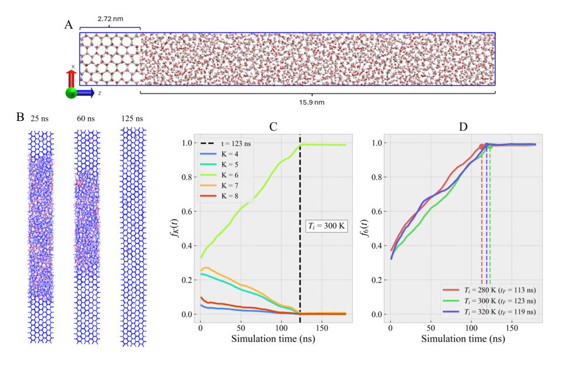 
Figure 1: Visualizations and analysis schematics. (A) The starting configuration for the direct coexistence simulations obtained by putting the ice configuration in contact with the liquid configuration, keeping the interface normal along the z-axis. The simulation box dimensions are 2.36 nm, 2.22 nm, 18.62 nm in the x, y and z directions respectively. (B) Visualizations of the system (obtained from one individual run with Ti = 300 K) at various times during the production run. From left to right: 25ns, 60ns, 125ns. The blue lines denote the hexagonal rings in the system, and the red lines denote pentagonal rings in the system. (C) Plot showing the time evolution of fK(t) for K = 4, 5, 6,...

📷 Fig 2

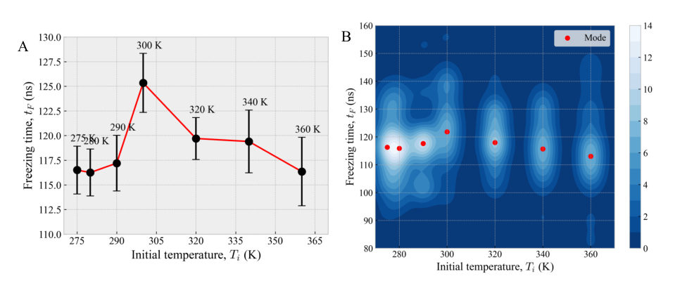 
Figure 2: Freezing kinetics in the system via measurement of tF versus Ti. (A) Plot of the initial temperature Ti (in Kelvin; horizontal axis) versus the freezing time tF (in nanoseconds; vertical axis). The black dots represent the mean value of tF for the corresponding Ti, The mean was obtained as the arithmetic mean from 20 runs. The error bars correspond to the standard error of the mean (SEM). (B) Heatmap plot of freezing times (tF, in nanoseconds) on the x-axis and the starting temperature (Ti, in Kelvin) on the y-axis. Every individual datapoint (tF,Ti) is represented as a 2-D Gaussian of fixed spread, and the final heatmap is generated as the cumulative sum of all such Gaussians....

📷 Fig 3

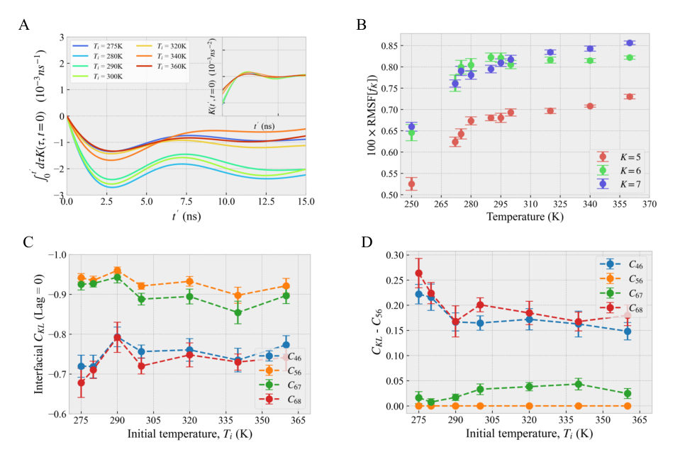 
Figure 3: Temperature dependence of memory kernel and structural correlations at the ice-liquid interface. (A) Plot showing the cumulative integral of the memory kernel R t′ 0 dt′K(t′,t = 0) (vertical axis) against t′ (horizontal axis) for seven different values of Ti. Inset: Plot showing the variation of the memory kernel K(t′,t = 0) (vertical axis) against t′ (horizontal axis) for seven different values of Ti. The scales of both inset axes are the same as the external figure. (B) Root mean squared fluctuations (RMSF) in fK obtained for various temperatures from equilibrium simulations. The error bars correspond to the standard error of the mean. (C) Interfacial ring cross-correlations...

**Summary.** This work uses molecular dynamics simulations to study how the initial thermal state of supercooled water dictates its freezing rate. By analyzing the structural memory stored in the hydrogen-bond network, the authors demonstrate that structural motifs act as kinetic bottlenecks, leading to a memory-driven freezing process analogous to the Mpemba effect.

**Why it may be interesting.** The explicit use of generalized Langevin equations and memory kernels to describe non-equilibrium phase transitions in a classical system provides a rich analogy for open quantum systems where environmental coupling leads to memory effects.

Detailed structure

**Main problem.** The study investigates how the thermal history (memory) influences the non-equilibrium crystallization kinetics of supercooled water.

**Main result.** The freezing time exhibits a non-monotonic dependence on initial temperature, suggesting a molecular analogue of the Mpemba effect, driven by structural memory encoded in hydrogen-bonded ring structures.

**Method.** Molecular Dynamics (MD) simulations combined with the non-stationary generalized Langevin equation (nsGLE) framework to analyze memory kernels.

**Model / system.** The system is supercooled liquid water freezing into ice, modeled using the TIP4P/Ice potential. The analysis focuses on the evolution of hydrogen-bonded ring structures (3- to 12-membered rings).

**Key observables.** Freezing time ($t_F$), two-time memory kernels $K(t', t)$, and the relative fractions of different ring types ($f_K$).

**Important parameters / regimes.** Initial temperature ($T_i$), supercooling degree, and the specific ring motifs (especially five-membered rings).

**Assumptions / limitations.** The use of the direct-coexistence method and the application of the nsGLE framework to capture non-Markovian dynamics.

**Figures summary.** Figures illustrate the direct coexistence setup, time evolution during freezing, and cross-correlations between different ring types as a function of initial temperature.

**Paper structure.** The paper progresses by establishing the MD simulation setup, analyzing the structural motifs (HBNs) and their correlations, and finally applying the nsGLE framework to link these structural memories to the macroscopic, non-monotonic freezing kinetics.

Abstract

Freezing of supercooled water is a classic non-equilibrium problem, yet the influence of thermal history on crystallization remains unclear. Using molecular dynamics simulations with the TIP4P/Ice model, we investigate how the initial temperature $T_i$ shapes freezing following rapid quenching to 250 K. By monitoring the evolution of hydrogen-bonded ring structures, we find a non-monotonic dependence of the freezing time $t_F$ on $T_i$, with the slowest crystallization occurring near 300 K. Remarkably, this means that initially hotter water can freeze faster than cooler water, a molecular-scale analogue of the Mpemba effect. A non-stationary generalized Langevin equation framework shows that two-time memory kernels retain information about the system's thermal past, directly influencing crystallization dynamics. Structural analysis further reveals that five-membered rings act as kinetic traps, while correlations among ring types regulate the accessibility of ice-like motifs. These results uncover a molecular origin of memory-driven freezing and establish structural memory as a key driver of non-equilibrium phase transitions.

[↑ back to top](#top)

### [Breathers in solitonic room-temperature superlattice-induced superfluorescence in quasi-2D perovskites](http://arxiv.org/abs/2609.08513v1)

**Authors:** A. A. Gladkij, N. N. Rosanov, B. D. Fainberg  
**Type:** theory · **Category:** other · **PDF:** <https://arxiv.org/pdf/2609.08513v1>  
**Analysis basis:** full PDF text, analyzed in chunks
**Topic relevance:** `analog quantum simulation` **3/5** · `Frenkel-Kontorova` **2/5** · `Keldysh / 2PI / non-Gaussian methods` **2/5** · `methods for driven-dissipative` **2/5** · `correlated / nonlocal dissipation` **1/5** · `driven-dissipative phase transition` **1/5** · `interference shaping light` **1/5** · `non-equilibrium universality` **1/5**

📷 Fig 1

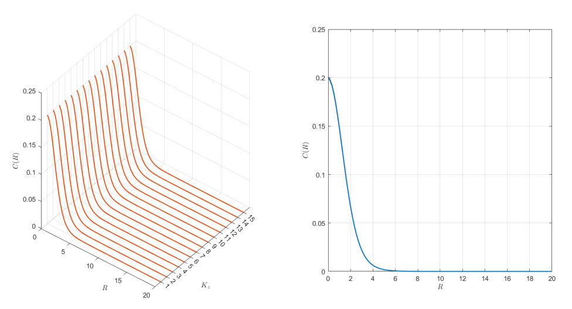 
FIG. 1. On the left, radially symmetric SL profiles of ˜C(KZ, R, t) for ˜ N = 15; on the right is a plot showing the superposition of all KZ distributions.

📷 Fig 2

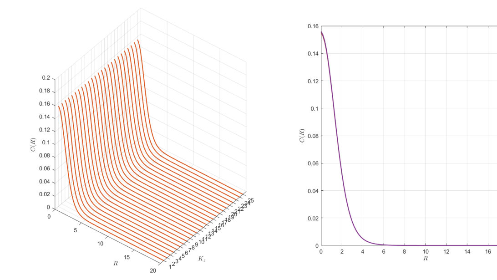 
FIG. 2. On the left, radially symmetric superlattice profiles of ˜C(KZ, R, t) for ˜ N = 25. On the right is a plot showing the superposition of all KZ distributions.

📷 Fig 3

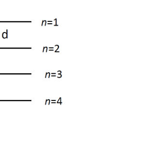 
FIG. 3. Frenkel exciton model of SL with period d.

📷 Fig 4

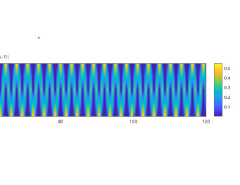 
FIG. 4. A maximum value of C(nd, R, φ, t) as a function of time for J = 2000 cm−1and ˜ N = 3.

📷 Fig 5

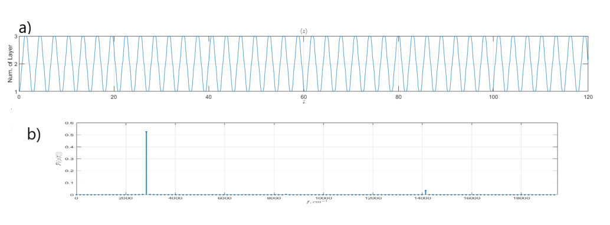 
FIG. 5. Average coordinate ⟨Z(t)⟩as a function of time (a) and the spectrum of ⟨Z(t)⟩(b) for J = 2000 cm−1and ˜ N = 3.

**Summary.** This theoretical study models superfluorescence in perovskite superlattices, showing that interlayer tunneling introduces a new degree of freedom via miniband formation. This coupling causes the fundamental soliton solution to evolve into a stable breather state, providing a measurable signature of the interlayer coupling strength.

**Why it may be interesting.** This work directly connects solid-state physics (perovskites, superlattices) with nonlinear wave phenomena (solitons, breathers) in a quantum optical context, providing a mechanism (miniband formation) to generate complex, observable dynamics from simple structural periodicity.

Detailed structure

**Main problem.** The study investigates the origin of stable macroscopic quantum coherence at room temperature in quasi-2D perovskites, specifically focusing on how interlayer coupling modifies superfluorescence dynamics.

**Main result.** Interlayer tunneling induces miniband formation, which causes the fundamental soliton to exhibit breather dynamics—a coherent temporal redistribution of the exciton amplitude among the layers. This breather behavior is absent when tunneling is removed.

**Method.** The analysis extends the 2D nonlinear Schrödinger equation to a 3D nonlocal form for superlattices, using approximations like the adiabatic limit and Fourier transforms in momentum space.

**Model / system.** The system models Wannier exciton–LO phonon interactions in quasi-2D metal-halide perovskite superlattices. The dynamics are governed by a 3D nonlocal nonlinear Schrödinger equation derived from the exciton-phonon Hamiltonian.

**Key observables.** Breather dynamics (temporal oscillations of exciton amplitude), the fundamental soliton profile, and the resulting miniband dispersion.

**Important parameters / regimes.** Interlayer coupling strength ($J$), number of layers ($	ilde{N}$), and the in-plane momentum ($q$).

**Assumptions / limitations.** The derivation relies on the adiabatic approximation, the single-exciton wavefunction approximation, and assuming the ground-state population remains near unity.

**Figures summary.** Figures illustrate the radial profiles of the exciton amplitude $	ilde{C}(K_Z, R, t)$ for various layer numbers and show time evolution plots of the maximum amplitude and average coordinate $\langle Z(t) 
angle$ under varying tunneling strengths ($J$).

**Paper structure.** The paper builds from the initial 2D description to a 3D nonlocal NLS equation for superlattices. It then analyzes the role of interlayer tunneling, showing how miniband formation introduces a phase modulation that manifests as coherent breather dynamics, contrasting this with the stationary soliton found when tunneling is zero.

Abstract

Recently, a soliton mechanism for room-temperature superfluorescence in thin perovskite films has been proposed, with a fundamental soliton predicted to remain stable under LO phonon--exciton interactions. At the same time, superlattice architectures offer a route to enhancing superfluorescence in perovskites. Motivated by recent observations of room-temperature superfluorescence in periodic superlattices of quasi-2D metal-halide perovskites, we extend the 2D nonlocal nonlinear Schrödinger equation describing Wannier exciton--LO phonon interactions to superlattice structures, obtaining a 3D nonlocal nonlinear Schrödinger equation. We show that interlayer tunnelling gives rise to breather dynamics corresponding to a stable fundamental soliton in mixed coordinate--momentum space, with the coordinate parallel to the layers and the momentum perpendicular to them. The breather dynamics originate from miniband formation, which induces a momentum-dependent phase modulation of the soliton. In the absence of interlayer tunnelling, the breather dynamics disappear and the soliton becomes stationary. These results establish a direct connection between interlayer tunnelling, miniband formation and soliton dynamics, suggesting that breather behavior can provide a signature of interlayer tunnelling in quasi-2D perovskite superlattices.

[↑ back to top](#top)

### [Magic-free coexisting photonic and phononic moiré flat bands](http://arxiv.org/abs/2609.08455v1)

**Authors:** Ziming Chen, Kaiyu Cui, Ning Wu, Shuyuan Li, Chenxuan Wang, Xue Feng, Fang Liu, Wei Zhang, Hao Sun, Yongzhuo Li, Yidong Huang  
**Type:** both · **Category:** other · **PDF:** <https://arxiv.org/pdf/2609.08455v1>  
**Analysis basis:** full PDF text, analyzed in chunks
**Topic relevance:** `analog quantum simulation` **3/5** · `Tavis-Cummings & cavity-many-emitter` **2/5** · `driven-dissipative phase transition` **2/5** · `interference shaping light` **2/5** · `methods for driven-dissipative` **2/5** · `Keldysh / 2PI / non-Gaussian methods` **1/5** · `correlated / nonlocal dissipation` **1/5**

📷 Fig 1

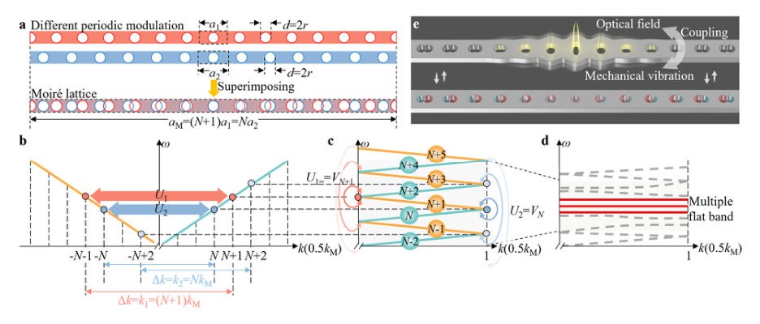 
Fig. 1. Formation of moiré lattice and occurrence of flat band in a moiré optomechanical crystal. a.

📷 Fig 2

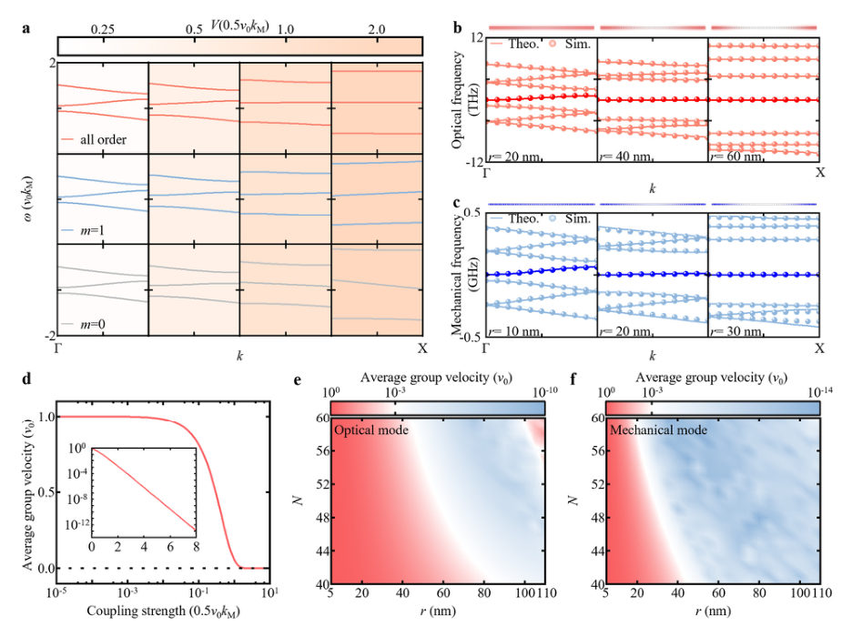 
Fig. 2. Effective Hamiltonian model for band calculation and comparison with simulation. a. Comparison

📷 Fig 3

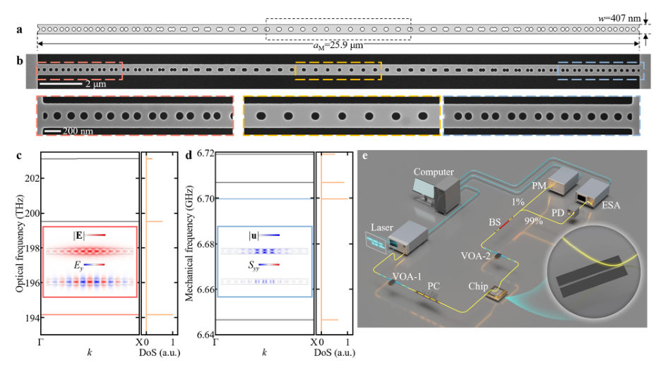 
Fig. 3. The designed moiré optomechanical crystal and experimental setup. a. The moiré optomechanical

📷 Fig 4

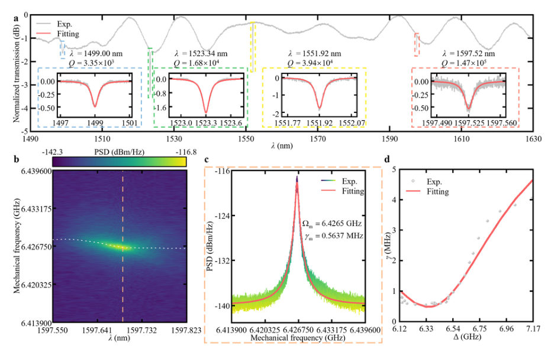 
Fig. 4. Characterization of the optical and mechanical modes. a. Measured optical transmission from 1490

**Summary.** This paper introduces a novel, general mechanism to create flat bands in moiré systems by exploiting strong diffractive hybridization between multiple physical fields. By modeling a single-layer optomechanical crystal, the authors show that increasing coupling monotonically suppresses the group velocity, allowing for the simultaneous, magic-configuration-free localization and coupling of both photonic and phononic modes.

**Why it may be interesting.** This work provides a general, tunable mechanism for engineering flat bands in coupled systems (optomechanics) without relying on the highly specific 'magic angle' tuning, which is a major theme in AMO and quantum optics.

Detailed structure

**Main problem.** Existing moiré flat-band approaches are limited to targeting only a single physical field and require specific, finely tuned 'magic configurations' for each field.

**Main result.** The authors demonstrate a general, field-independent mechanism for achieving flat bands by utilizing strong diffractive hybridization among moiré-folded bands, enabling simultaneous localization and coupling of distinct fields like photons and phonons.

**Method.** The study combines theoretical modeling using an effective Hamiltonian derived from diffractive coupling terms with numerical simulations (FEM) and experimental measurements (PSD fitting).

**Model / system.** The system is a single-layer moiré optomechanical crystal formed by superimposing two periodic modulations with mismatched periods. The physics is governed by an effective Hamiltonian incorporating free and total diffraction coupling terms.

**Key observables.** Near-zero group velocity, band splitting, average group velocity vs. coupling strength, intrinsic mechanical frequency, and optomechanical coupling rate.

**Important parameters / regimes.** Diffractive coupling strength (V), moiré lattice period, and the condition for flat bands ($V\omega/\Delta \gtrsim 1$).

**Assumptions / limitations.** The mechanism relies on diffractive hybridization on a single layer, contrasting with multilayer systems that require fine-tuning magic configurations.

**Figures summary.** Figures illustrate the moiré lattice formation, the coupling between forward/backward modes, the resulting multiple flat bands, and the monotonic suppression of the average group velocity as coupling increases.

**Paper structure.** The paper progresses from identifying the limitation of single-field magic configurations to developing an effective Hamiltonian based on diffractive coupling. It then analyzes the resulting band structure and group velocity trend, culminating in experimental demonstration of simultaneous photonic and phononic flat bands.

Abstract

Moiré flat bands enhance localization and interactions through suppressed group velocity, but existing approaches largely target a single physical field because distinct excitations generally require different, finely tuned magic configurations. Here we introduce a flat-band mechanism based on strong diffractive hybridization among moiré-folded bands. Period-mismatched modulations open distinct coupling channels whose hybridization renormalizes the band dispersion. An effective Hamiltonian shows that increasing the diffractive coupling progressively suppresses the group velocity, driving the system toward a flat-band regime without field-specific magic configurations. This coupling-induced mechanism enables band flattening across distinct physical excitations. We demonstrate this mechanism in a single-layer moiré optomechanical crystal, where photonic and phononic flat bands are simultaneously realized, and their localized modes and optomechanical interaction are experimentally observed. Beyond photonic and phononic systems, this mechanism may extend to other wave and quasiparticle platforms, providing a general route to co-localizing and coupling distinct physical fields in moiré systems.

[↑ back to top](#top)

### [Thresholdless corner vortex solitons in fractal Sierpiński topological insulators](http://arxiv.org/abs/2609.08344v1)

**Authors:** Yiqi Zhang, Alexander V. Kireev, Victor O. Kompanets, Sergey Y. Alyatkin, Nikita S. Kostyuchenko, Sergei A. Zhuravitskii, Nikolay N. Skryabin, Khalil Sabour, Alexander A. Kalinkin, Yongdong Li, Sergei P. Kulik, Pavlos G. Lagoudakis, Sergey V. Chekalin, Yaroslav V. Kartashov, Victor N. Zadkov  
**Type:** experiment · **Category:** other · **PDF:** <https://arxiv.org/pdf/2609.08344v1>  
**Analysis basis:** full PDF text, analyzed in chunks
**Topic relevance:** `analog quantum simulation` **3/5** · `quantum optics experiment` **3/5** · `interference shaping light` **2/5** · `driven-dissipative phase transition` **1/5** · `methods for driven-dissipative` **1/5**

📷 Fig 1

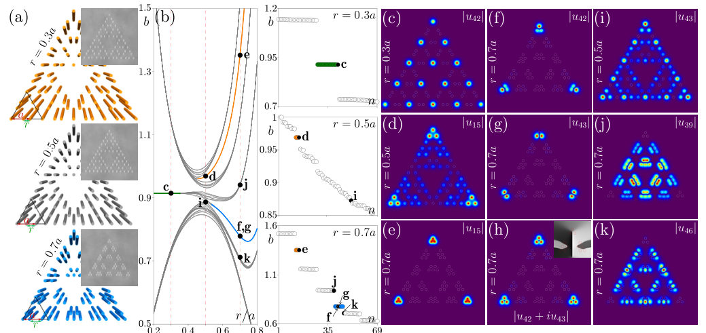 
FIG. 1. Lattices, spectra, and modes. (a) Sketches of the fractal G3 waveguide arrays with different distortion parameters r. Triangles indicate G1 elements. The insets show microphotographs of corresponding fs-laser written arrays. (b) Linear spectrum of G3 fractal array as a function of r and eigenvalues b vs mode index n corresponding to three vertical dashed lines in (b). Colored dots correspond to topological states, gray dots to delocalized states. Black dots with letters correspond to representative eigenmodes un, whose |un| distributions (with superimposed on them array contours) are depicted in panels (c-k). Among them are two degenerate corner states u42 (f) and u43 (g) that can...

📷 Fig 2

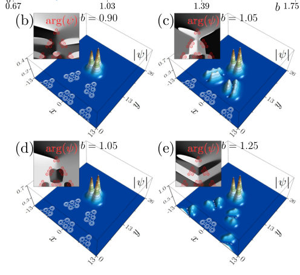 
FIG. 2. Corner vortex soliton family. (a) Power U of corner vortex solitons in fractal array as a function of b at r = 0.7a. Solid (dashed) lines correspond to stable (unstable) solitons. Purple regions indicate bands of extended states, while gray lines show eigenvalues of linear corner states. (b)-(e) Field modulus and phase (insets) distributions in solitons corre- sponding to the dots with letters in (a).

📷 Fig 3

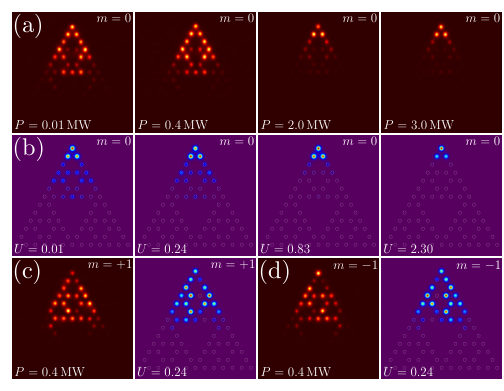 
FIG. 3. Experimental excitations in topological trivial lattice. (a) Output experimental intensity distributions (panels with maroon background) for trivial-phase excitation (m = 0) of three corner waveguides in fractal array with r = 0.5a at dif- ferent input peak powers P compared with (b) theoretical out- put distributions (panels with purple background). (c) and (d) show comparison of the experimental and theoretical output intensity distributions for vortex-carrying excitation of three corner waveguides with m = +1 (c) and m = −1 (d).

📷 Fig 4

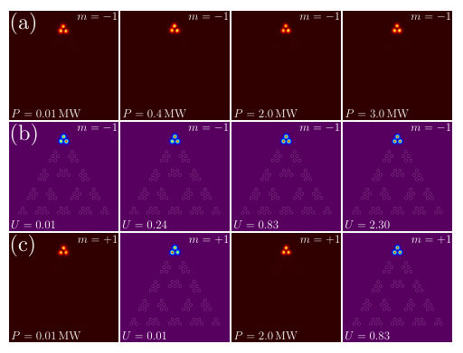 
FIG. 4. Experimental excitation of corner vortex solitons. Comparison of experimental (a) and theoretical (b) output in- tensity distributions for vortex-carrying excitation (m = −1) of three corner waveguides in array with r = 0.7a at different peak powers. (c) The same for m = +1 excitation.

📷 Fig 5

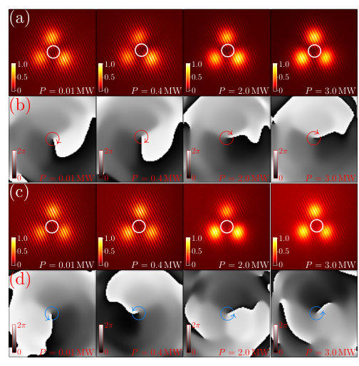 
FIG. 5. Experimentally measured phase distribution of the excited corner vortex soliton. (a,c) Experimentally measured single-shot interference patterns and corresponding retrieved phase distributions (b,d). Measured phases confirm the forma- tion of corner vortex solitons with topological charge m = −1 (a,b) and m = +1 (c,d) at different peak powers P. White cir- cles schematically denote the position of the phase singularity.

**Summary.** This paper reports the first experimental observation of stable topological corner vortex solitons within a photonic fractal Higher-Order Topological Insulator. By using a Sierpiński gasket waveguide array, the researchers demonstrated that these solitons form without a power threshold, confirming the introduction of angular momentum into the physics of topological corner modes.

**Why it may be interesting.** This work bridges topological physics, nonlinear optics, and photonics, providing a concrete platform (photonic lattices) to study complex nonlinear wave phenomena like vortex solitons, which is highly relevant to quantum optics and open quantum systems research.

Detailed structure

**Main problem.** The primary challenge addressed is realizing and studying stable topological corner vortex solitons in photonic fractal Higher-Order Topological Insulators (HOTIs), overcoming the limitation that previous corner solitons only exhibited trivial phase distributions.

**Main result.** The authors report the first experimental realization of stable, topological corner vortex solitons in a photonic fractal HOTI, demonstrating their thresholdless formation and exceptional robustness across a wide power range.

**Method.** The study combines theoretical analysis (solving the nonlinear Schrödinger equation) with experimental implementation using laser-written waveguide arrays to excite and measure the light confinement and phase structure.

**Model / system.** The system is a photonic fractal HOTI realized using an array of laser-written waveguides shaped like a Sierpiński gasket. The physics is governed by the nonlinear Schrödinger equation, and the topological properties are derived from the linear spectrum analysis.

**Key observables.** Output intensity distributions, phase structure (vortex singularity), and the existence of stable solitons across a broad power range.

**Important parameters / regimes.** The distortion parameter ($r$) of the fractal structure, the input power ($P$, tested from 0.01 MW to 3 MW), and the topological charge ($m=\pm 1$).

**Assumptions / limitations.** The analysis assumes standard normalizations for power and relies on the ability to construct linear corner vortex modes from degenerate corner doublets.

**Figures summary.** Figures show the Sierpiński gasket structure, the linear spectrum analysis (eigenvalues vs. mode index), the bifurcation of soliton families from linear states, and experimental measurements confirming the intensity confinement and phase singularity of the vortex solitons at various powers.

**Paper structure.** The paper progresses from establishing the theoretical framework (linear spectrum analysis and soliton bifurcation) to presenting the experimental setup and results, culminating in the confirmation of thresholdless, topologically protected vortex states.

Abstract

Quantized vortices are ubiquitous in physics, spanning superconductivity, astrophysics, superfluid condensed matter systems, and nonlinear optics. Yet embedding vorticity into topologically protected nonlinear states has remained a major challenge, with all previously observed corner solitons in higher-order topological insulators (HOTIs) exhibiting only trivial phase distributions. Here, we report on the first realization of stable topological corner vortex solitons in a photonic fractal HOTI. Using an array of laser-written waveguides in the shape of Sierpiński gasket with a controllable distortion, we design linear topological vortex modes, from which nonlinear corner vortex solitons bifurcate. Moreover, we demonstrate that these solitons exhibit exceptional robustness across a broad power range and, unlike vortex solitons in topologically trivial lattices, form without a power threshold. Our results introduce the angular momentum degree of freedom into the physics of topological corner modes, opening prospects for topologically protected vortex-based photonics.

[↑ back to top](#top)

### [Spectro-temporal shaping of broadband optical wavepackets via programmable on-chip photonics](http://arxiv.org/abs/2609.07934v1)

**Authors:** Bruno P. Chaves, Jérémy Saucourt, Van Thuy Hoang, Alexis Bougaud, Yassin Boussafa, Erwan Ferrandon, Sai T. Chu, Brent E. Little, David J. Moss, Roberto Morandotti, Vincent Couderc, Benjamin Wetzel  
**Type:** experiment · **Category:** other · **PDF:** <https://arxiv.org/pdf/2609.07934v1>  
**Analysis basis:** full PDF text, analyzed in chunks
**Topic relevance:** `interference shaping light` **3/5** · `quantum optics experiment` **3/5** · `QC/QI experiment` **1/5** · `analog quantum simulation` **1/5** · `quantum measurements` **1/5**

📷 Fig 1

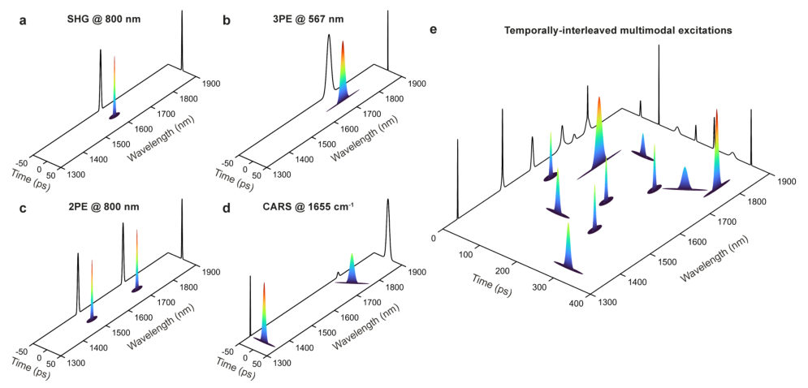 
Figure 1 | Properties of spectro-temporally tailored wavepackets for multiphoton imaging. Examples of selected spectrograms in the near-infrared region typically required for exciting diverse multiphoton imaging modalities. a-d show several wavepackets with spectro-temporal properties desirable for relevant multiphoton excitations. Such illustrative spectrograms include single pulse targeting second-harmonic generation (SHG) at 800 nm (a) or three-photon excitation (3PE) at 567 nm (b), aiming to excite typical fluorescence markers (e.g. Texas Red). The spectral bandwidth and associated peak power are directly related to the number of photons involved in the multiphotonic process, to ensure...

📷 Fig 2

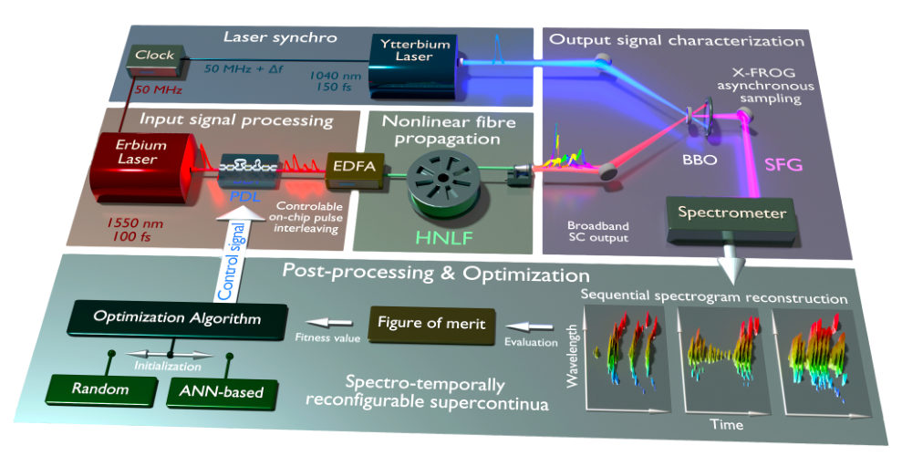 
Figure 2 | Experimental setup for tailoring broadband and reconfigurable wavepackets. A signal processing stage first provides flexible control over a femtosecond input pulse train centred at 1550 nm through the use of an on-chip programmable delay line (PDL). The shaped pulse train is then amplified and launched into a highly nonlinear fibre (HNLF), where it undergoes nonlinear fibre propagation. The broadband wavepacket collected at the fibre output is a supercontinuum (SC) with controllable spectro-temporal properties. This broadband signal is then characterized via asynchronous nonlinear sampling, leveraging another synchronized ytterbium laser emitting at 1040 nm for producing...

📷 Fig 3

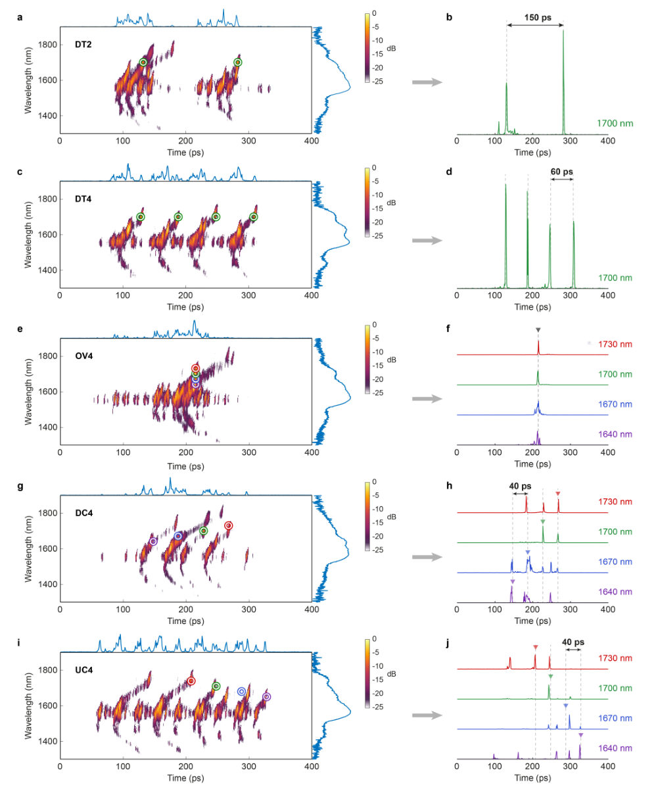 
Figure 3 | Examples of tailored broadband wavepackets, obtained via evolutionary algorithm optimizations. Five different target spectro-temporal patterns are presented, to illustrate selected optimization of broadband wavepacket properties. Selective shaping and spectro-temporal power allocations are experimentally demonstrated, including the generation of selected number of pulses at desired wavelengths, as well as the control

📷 Fig 4

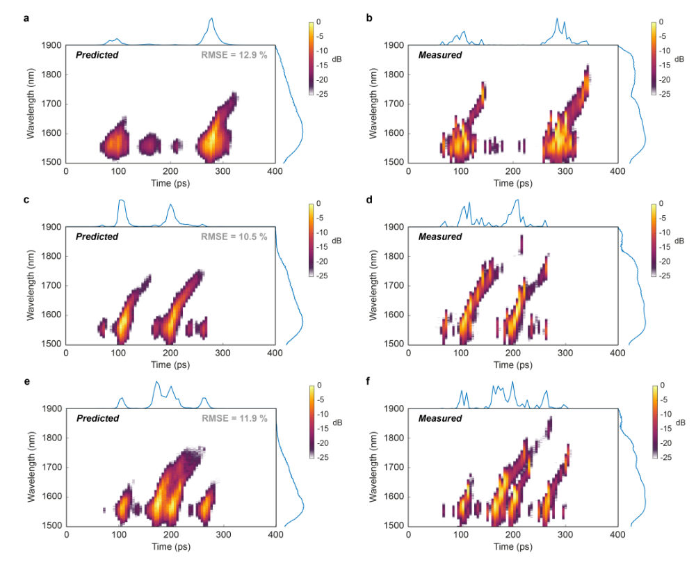 
Figure 4 | Artificial neural network prediction of synthetic spectrograms. Synthetic spectrograms predicted from a trained artificial neural network (ANN) are compared with experimental X-FROGs (i.e. the ground truth data used for ANN training). The three examples illustrated are extracted from the ANN testing subset for different input pulse train configurations (left panels), and compared with the spectrograms measured experimentally (right panels). The spectrograms are shown on a logarithmic scale, with a 25 dB dynamic range, and an equivalent temporal resolution of 4.6 ps. The retrieved root-mean square error (RMSE), of typically few percent (12.2 % average RMSE in the testing subset),...

📷 Fig 5

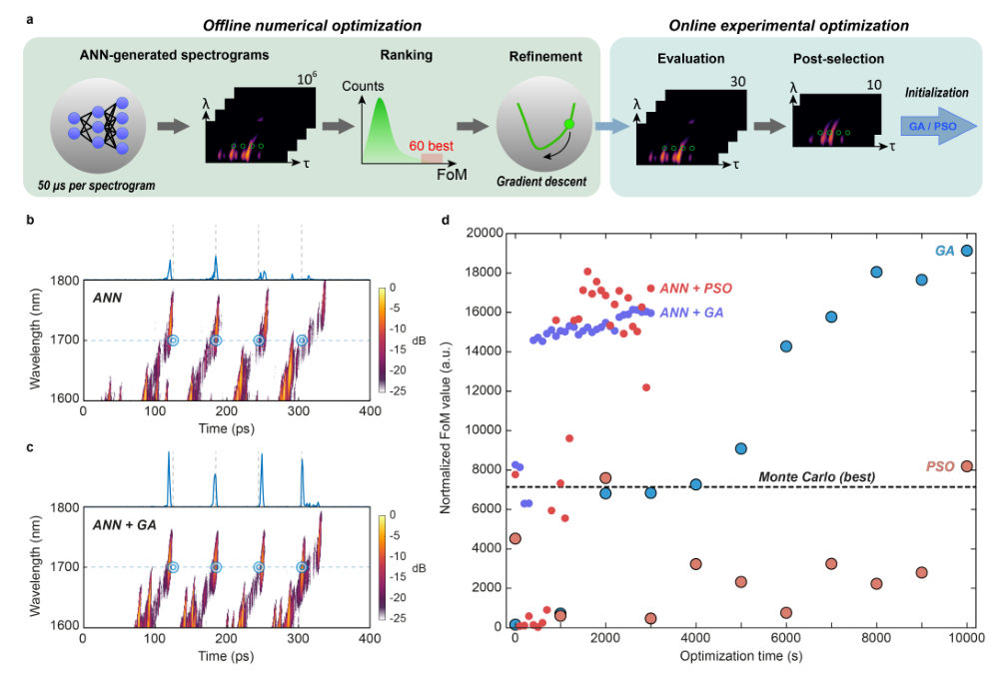 
Figure 5 | ANN-informed strategies for wavepacket optimization. a. ANN-informed optimization workflow: once trained the ANN rapidly generates one million synthetic spectrograms. Each spectrogram is rated according to the FoM and the 60-best candidates are selected and further refined using fast numerical gradient descent optimization. The 30-best refined candidates are experimentally tested and the 10-best are selected as an optimized initial population for online optimization (via GA or PSO). b-d. Example of ANN-informed optimization of a selected target wavepacket pattern (DT4 – i.e. 4 pulses at 1700 nm, respectively delayed by 60 ps). b. Experimental spectrogram, measured from...

**Summary.** This paper introduces a novel, scalable platform for precisely controlling the spectral and temporal properties of broadband optical pulses. By integrating programmable photonics with nonlinear fiber optics and employing machine learning optimization, the authors can generate tailored ultrafast wavepackets on demand. This breakthrough overcomes the limitations of bulky conventional systems, enabling next-generation applications in quantum optics and advanced imaging.

**Why it may be interesting.** This work provides a highly controllable platform for generating complex light fields, which is fundamental for realizing advanced quantum light sources or performing complex nonlinear spectroscopy.

Detailed structure

**Main problem.** The primary challenge is achieving flexible and adjustable spectro-temporal shaping of broadband optical wavepackets for advanced applications like quantum information processing and ultrafast spectroscopy.

**Main result.** The authors demonstrated a scalable, on-demand method to tailor broadband ultrafast pulse patterns, achieving reconfigurable power control across a 400 nm bandwidth with picosecond resolution.

**Method.** The technique merges programmable integrated photonics with nonlinear fiber propagation, using machine learning (ML) algorithms to iteratively optimize the input pulse to achieve a desired output spectro-temporal profile.

**Model / system.** The system utilizes a programmable delay line (PDL) to condition the input pulse into a highly nonlinear fiber (HNLF) which generates a supercontinuum (SC). The output is characterized using advanced techniques like X-FROG.

**Key observables.** Spectrograms showing spectral and temporal content, and a Figure of Merit (FoM) used to guide optimization towards target spectro-temporal patterns.

**Important parameters / regimes.** 400 nm bandwidth, picosecond resolution, and the ability to control interpulse delays across hundreds of picoseconds.

**Assumptions / limitations.** Conventional spectro-temporal processing methods are bulky and lack scalability, necessitating the integrated photonic approach.

**Figures summary.** Figures illustrate the experimental setup involving the PDL, HNLF, and characterization stages, alongside examples of tailored spectro-temporal wavepackets (e.g., DT2, OV4) achieved through optimization.

**Paper structure.** The paper presents a framework combining programmable integrated photonics with nonlinear fiber optics. The core methodology involves using machine learning to optimize the input pulse to sculpt the broadband supercontinuum output, which is then verified via high-speed optical characterization.

Abstract

The ability to precisely shape the properties of light over multiple degrees of freedom constitutes the foundation of modern photonic architectures. Broadband sources with addressable spectro-temporal content are for instance critical for applications spanning biomedical imaging, material processing, lidar, and ultrafast spectroscopy, but also key enabling technologies in quantum information processing, high-capacity communications, and optical computing. Yet, flexible and adjustable spectro-temporal shaping so far remains a significant challenge, as it requires the simultaneous manipulation of both frequency and temporal domains across broad spectral bandwidths and extended timescales, from femtoseconds to nanoseconds. Importantly, conventional approaches to spectro-temporal processing typically rely on bulky and complex optical systems that lack scalability and flexibility, ultimately hampering their utility for applications requiring addressable multiphotonic processes. Here, we present a framework for spectro-temporal wavepacket control over a broad bandwidth, merging programmable integrated photonics with high-speed optical characterization. Leveraging machine leaning for tailoring nonlinear pulse propagation, we experimentally report scalable and on-demand shaping of broadband ultrafast pulse patterns. We demonstrate the efficacy of our method through reconfigurable power across 400 nm bandwidth with picosecond resolution, with promises for applications where precise control over light is paramount, in particular those needing versatile and controllable multiphoton excitations.

[↑ back to top](#top)

### [Edge energy fluctuation: A unified theory of friction scaling laws in twisted layered material interfaces](http://arxiv.org/abs/2609.08063v1)

**Authors:** Ze Liu  
**Type:** theory · **Category:** other · **PDF:** <https://arxiv.org/pdf/2609.08063v1>  
**Analysis basis:** full PDF text, analyzed in chunks
**Topic relevance:** `Frenkel-Kontorova` **3/5** · `analog quantum simulation` **2/5** · `correlated / nonlocal dissipation` **1/5** · `driven-dissipative phase transition` **1/5** · `non-equilibrium universality` **1/5**

📷 Fig 1

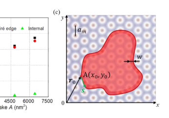 
Fig. 1. Definition of edge energy. (a) Illustration of the moiré edge, referring to the incomplete

📷 Fig 2

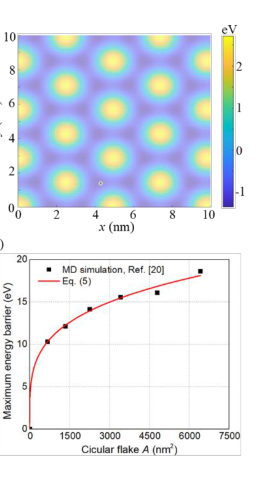 
Fig. 2. (a)-(c) Sliding potential energy of a circular graphene slider atop an infinite graphene

📷 Fig 3

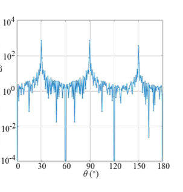 
Fig. 3. Friction anisotropy caused by slider edge orientation. (a) Schematic of a slider starting

📷 Fig 4

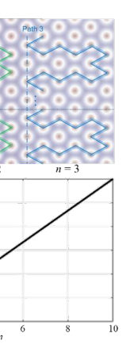 
Fig. 4. Friction engineering by introducing hierarchical coherent edges. (a) Sketches of a

**Summary.** This work introduces the Edge Energy Fluctuation (EEF) theory to model friction in twisted vdW materials. It shows that the friction barrier is dictated by the specific geometry and orientation of the slider edge, leading to predictable friction anisotropy. This provides a powerful, tunable paradigm for designing superlubric devices.

**Why it may be interesting.** While focused on condensed matter friction, the concept of energy barriers governed by boundary conditions and symmetry breaking in quasi-periodic systems has parallels with understanding dissipation or decoherence in open quantum systems.

Detailed structure

**Main problem.** The paper develops a unified theory to explain the friction scaling laws observed at the interfaces of twisted van der Waals (vdW) layered materials, moving beyond assumptions of periodic boundary conditions.

**Main result.** The friction is governed by the Edge Energy Fluctuation (EEF), which reveals a strong dependence on the edge's orientation, leading to predictable friction anisotropy and offering a method for friction engineering.

**Method.** The authors derive the sliding energy barrier by calculating an edge integral expression involving the moiré potential, analyzing how the edge geometry dictates the energy landscape.

**Model / system.** The system is twisted vdW layered materials forming moiré superlattices, where the sliding motion is modeled by considering the energy contribution from the incomplete moiré tiles at the slider edge.

**Key observables.** Friction scaling laws ($F \propto A^m$), the sliding energy barrier ($\Delta G$ or $\Delta E$), and the degree of friction anisotropy based on edge orientation ($	heta$).

**Important parameters / regimes.** Twist angle, slider size (A or R), and the edge orientation ($	heta$) relative to the moiré lattice vectors.

**Assumptions / limitations.** The energy barrier is dominated by the moiré edge, and the edge region can be approximated as a belt of finite width ($w$).

**Figures summary.** Figures illustrate the moiré edge and define the edge energy (EEF); one figure shows the potential energy landscape for circular sliders, and another demonstrates the friction anisotropy dependence on edge orientation.

**Paper structure.** The paper builds from defining the EEF concept, deriving the general edge energy integral, applying this to specific slider shapes (circular, straight), and finally establishing the implications for friction anisotropy and hierarchical edge engineering.

Abstract

Interlayer twisting in van der Waals (vdW) layered materials generates moire superlattices, unlocking unique opportunities for engineering their electronic and mechanical functionalities. Here, building on two key insights - the invariance of the potential energy of complete moire tiles during sliding, and the symmetry-breaking effect induced by the slider edge - we propose the concept of edge energy fluctuation (EEF) and demonstrate that the EEF governs the sliding energy barrier of finite-sized sliders. Interestingly, we found that even at a fixed twist angle and sliding direction, significant frictional anisotropy emerges when the slider edge is cut along different directions, resulting in distinct friction scaling laws. Furthermore, we present a friction engineering paradigm for twisted layered material interfaces through the deliberate introduction of hierarchical edges, offering a promising route for friction control in superlubric devices.

[↑ back to top](#top)

### [Magnetochiral anisotropy of thermally activated phase slips in noncentrosymmetric superconductors](http://arxiv.org/abs/2609.08237v1)

**Authors:** Alex Levchenko  
**Type:** theory · **Category:** statistical mechanics · **PDF:** <https://arxiv.org/pdf/2609.08237v1>  
**Analysis basis:** full PDF text, analyzed in chunks
**Topic relevance:** `Keldysh / 2PI / non-Gaussian methods` **3/5** · `correlated / nonlocal dissipation` **1/5** · `driven-dissipative phase transition` **1/5** · `methods for driven-dissipative` **1/5** · `non-equilibrium universality` **1/5**

📷 Fig 1

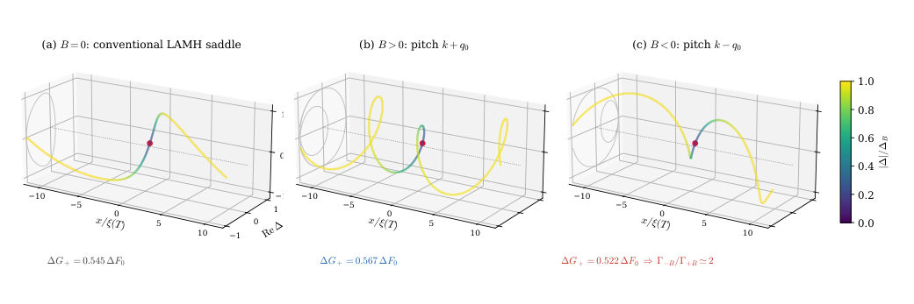 
FIG. 1. Phase-slip saddle point of the noncentrosymmetric wire, plotted from the closed-form solution, Eqs. (17) and (18): the trajectory of ∆(x) along the wire (color encodes |∆|/∆B; gray curve shows the projection onto the complex-∆plane; the red dot marks the slip core at x = 0, where |∆|min = √

📷 Fig 2

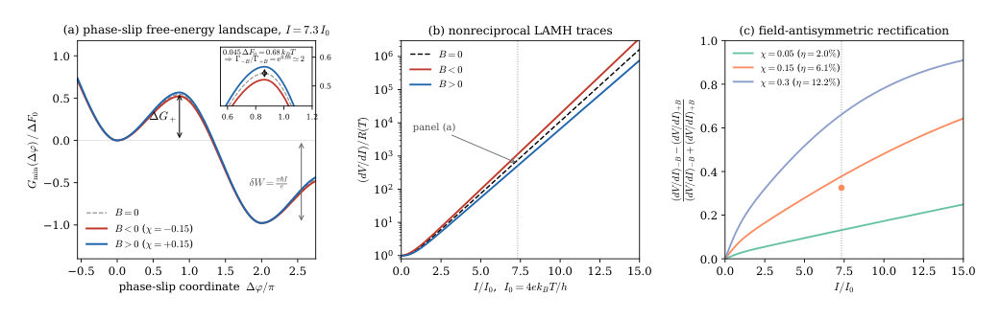 
FIG. 2. Mechanism and observable of the nonreciprocal phase-slip magnetoresistance, with all panels sharing the parameter set of Fig. 1: k = 0.15, χ = ±0.15 (diode efficiency |η| = χ/ √

**Summary.** This theoretical work models thermally activated phase slips in noncentrosymmetric superconducting wires, demonstrating that the resulting resistance exhibits magnetochiral anisotropy. This nonreciprocity stems from an asymmetry in the phase-slip barrier, which is directly linked to the superconducting diode effect. The analysis provides a parameter-free relationship between these two distinct non-equilibrium transport signatures.

**Why it may be interesting.** The connection between non-equilibrium transport phenomena (phase slips) and fundamental symmetries (magnetochirality) in superconducting systems provides insights into how microscopic spin-orbit coupling manifests in macroscopic transport measurements, relevant to open quantum systems dynamics.

Detailed structure

**Main problem.** The paper develops a theory for thermally activated phase slips (TAPS) in superconducting wires lacking inversion symmetry, aiming to explain the resulting magnetochiral anisotropy.

**Main result.** The phase-slip resistance exhibits magnetochiral anisotropy, which arises from an asymmetry in the phase-slip activation barrier that is odd in both current and field. This anisotropy is exponentially amplified relative to the superconducting diode effect asymmetry.

**Method.** The analysis uses a generalized Ginzburg-Landau functional derived from the Keldysh nonlinear sigma model to analyze the phase-slip saddle point.

**Model / system.** The system is a diffusive superconducting wire patterned from a two-dimensional electron gas, incorporating Rashba spin-orbit coupling and an in-plane magnetic field. The theory analyzes the free energy functional containing standard terms and several odd-order Lifshitz invariants.

**Key observables.** Magnetochiral anisotropy (MCA) in phase-slip resistance, superconducting diode effect (SDE) efficiency ($\eta$), and the field-antisymmetric splitting of differential-resistance slopes.

**Important parameters / regimes.** Rashba coupling ($\alpha_R$), in-plane magnetic field ($h$), temperature ($T$), and the ratio of barrier height to temperature.

**Assumptions / limitations.** The wire is assumed to be thin compared to the coherence length and penetration depth, and the kinetic Lifshitz invariant is shown to be parametrically subleading in the exponent asymmetry.

**Figures summary.** Figure 1 illustrates the phase-slip saddle point trajectory in the complex plane for different magnetic field signs, showing the core riding on the helical ground state.

**Paper structure.** The paper builds the theory using the GL functional, analyzes the phase-slip saddle point, derives the relationship between the MCA and the SDE via the barrier asymmetry, and confirms the independence of the result from ordering ambiguities in the appendices.

Abstract

Resistive tails of narrow superconducting wires below the critical temperature are governed by phase slips, thermally activated near the transition and quantum at lower temperatures. We develop the theory of thermally activated phase slips in wires lacking inversion symmetry, modeled microscopically as a diffusive wire formed from a two-dimensional electron gas with Rashba spin-orbit coupling in an in-plane magnetic field. The phase-slip resistance acquires magnetochiral anisotropy: at fixed current it changes upon reversal of the field, and at fixed field upon reversal of the current, while the linear-response resistance remains field symmetric as required by Onsager reciprocity. The nonreciprocity originates from an asymmetry of the phase-slip activation barrier that is odd in both current and field. It is generated by the Lifshitz invariants of the free energy, the cubic gradient term and the momentum-odd quartic vertex, together with even gradient terms promoted to odd ones by the helical ground state, precisely the combination that determines the superconducting diode effect. The barrier asymmetry is therefore fixed by the diode efficiency of the same wire through a universal numerical ratio, with no adjustable parameters. The kinetic Lifshitz invariant, which makes relaxation and noise of the order parameter nonreciprocal, affects only the fluctuation prefactor at a parametrically subleading level. Because the asymmetry resides in the activation exponent, the magnetochiral signal is amplified relative to the diode asymmetry by the ratio of barrier height to temperature, and appears as a field-antisymmetric splitting of the exponential slopes of differential-resistance traces routinely used to identify thermally activated phase slips.

[↑ back to top](#top)

### [Quantized transport of two-dimensional multifrequency solitons](http://arxiv.org/abs/2609.08691v1)

**Authors:** Fangwei Ye, Yaroslav V. Kartashov, Vladimir V. Konotop  
**Type:** theory · **Category:** other · **PDF:** <https://arxiv.org/pdf/2609.08691v1>  
**Analysis basis:** full PDF text, analyzed in chunks
**Topic relevance:** `Frenkel-Kontorova` **3/5** · `Keldysh / 2PI / non-Gaussian methods` **1/5** · `analog quantum simulation` **1/5**

📷 Fig 1

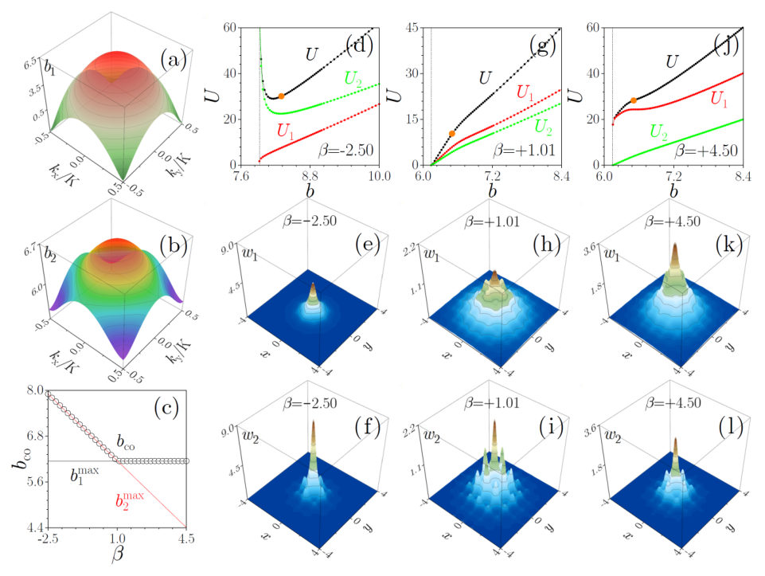 
Fig 1 Linear spectrum of the lattice and families of lattice solitons. Top band of static lattice for FF wave (a) and SH wave (b) at β = 0. (c) Cutoff bco for 2D lattice solitons from semi-infinite gap versus phase mismatch β. The dependencies bmax 1,2 (β) illustrate upper edges of the spectra of H1,2. Total power and powers in FF and SH components versus propagation constant b at β = −2.50 &lt; βcr (d), β = +1.01 ≈βcr (g), and β = +4.50 &gt; βcr (j). Panels (e),(f) show profiles of soliton components corresponding to orange dot in (d), panels (h),(i) show profiles corresponding to orange dot in (g), while panels (k),(l) show profile corresponding to the orange dot in (j). Here and in all figures...

📷 Fig 2

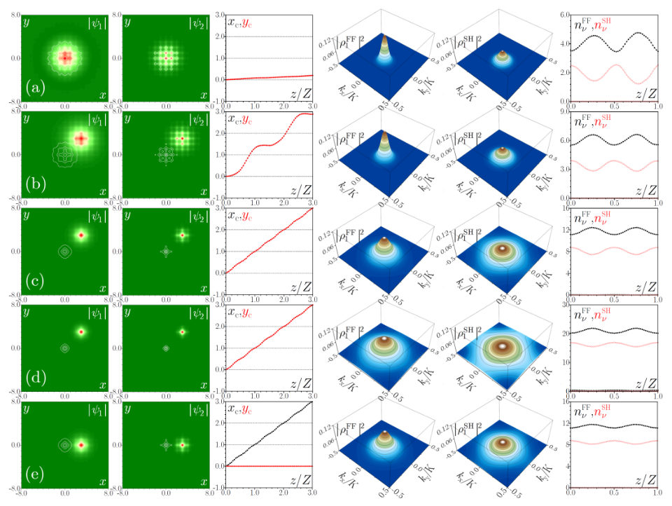 
Fig 2 Dynamics of topological pumping of 2D quadratic solitons and the role of band filling. Diagonal pumping of two-dimensional quadratic solitons with propagation constants b = 6.35 (a), 6.47 (b), 7.00 (c), 8.00 (d) at αx = αy = 0.01. First and second columns show input (z = 0, white contour) and output (z = 3Z , red-green color map) modulus distributions of the FF and SH components. Third column shows x−and y−coordinates of soliton center of mass vs propagation distance on three pumping cycles. Fourth and fifth columns show, respectively, projections of the FF and SH components of soliton on the first band of dynamical optical lattice at z = 0. Sixth column shows total populations of the...

📷 Fig 3

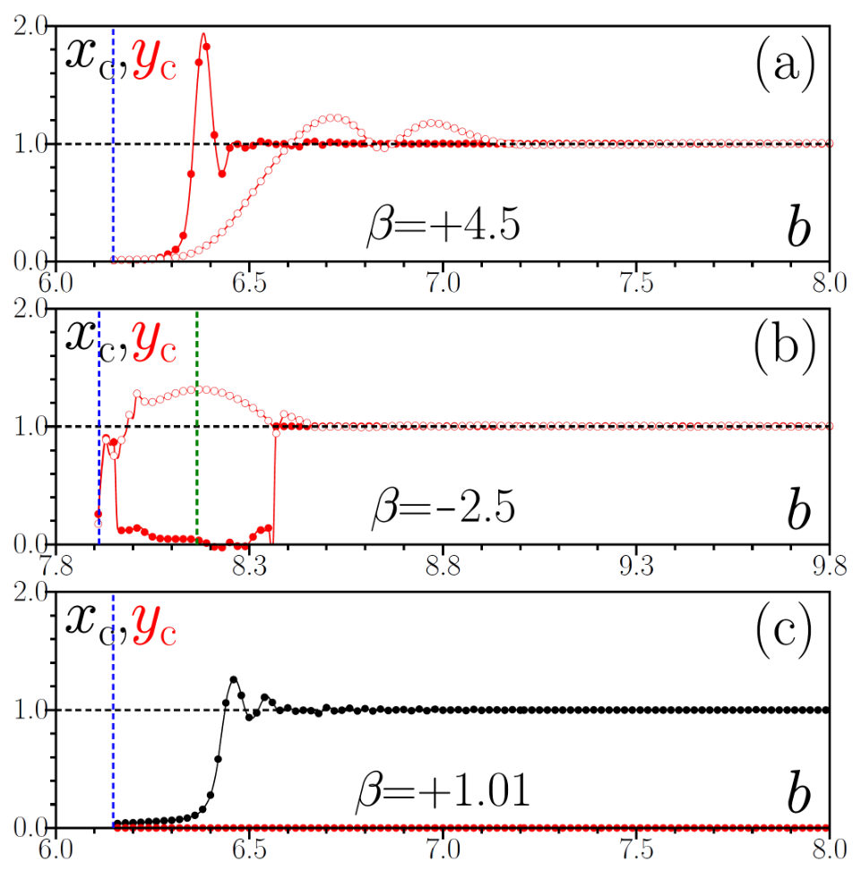 
Fig 3 Soliton center of mass shift vs propagation constant. Coordinates of the soliton center of mass at z = Z versus propagation constant for β = +4.5 (a) and β = −2.5 (b) upon diagonal pumping with αx = αy = 0.01 (solid dots) and αx = αy = 0.05 (open dots). In this case xc and yc coincide. Vertical blue dashed lines indicate cutoff for soliton existence. Vertical greed dashed line in (b) corresponds to b value at which total soliton power U reaches its minimal value. (c) Coordinates xc, yc of the soliton center of mass at z = Z versus propagation constant for β = +1.01 upon pumping along the x−axis at αx = 0.01, αy = 0.

📷 Fig 4

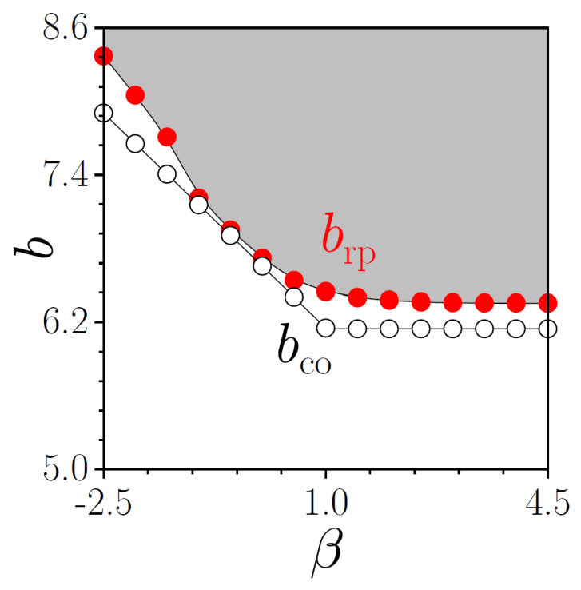 
Fig 4 Domain of robust pumping of solitons on the (β, b) plane. Line with open circles shows cutoff bco for soliton existence vs phase mismatch β. Line with red circles shows propagation constant brp above which (shaded domain) robust pumping of solitons occurs at αx = αy = 0.01.

📷 Fig 5

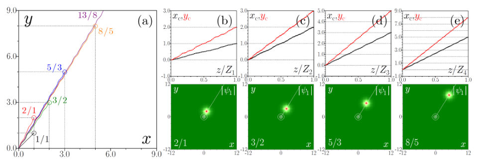 
Fig 5 Two-dimensional incommensurate bichromatic pumping. (a) Trajectories of soliton center of mass on the (x, y) plane during one pumping cycle for sliding velocities αx = 0.01 and αy = (pn/qn)αx. Input soliton corresponds to β = 7, β = 1.01. BRAs pn/qn of the golden ratio φ = ( √

**Summary.** This paper theoretically studies the quantized transport of two-dimensional solitons composed of two interacting optical frequencies (FF and SH) within a periodic nonlinear crystal. It establishes that the transport mechanism, known as Thouless pumping, is robust and can be controlled by the phase mismatch and the commensurability of the underlying lattice modulation. The findings extend the concept of topological pumping to complex 2D, multifrequency nonlinear systems.

**Why it may be interesting.** This work bridges nonlinear optics, topological physics, and condensed matter concepts (like Bloch bands and pumping), providing a robust theoretical framework for understanding topological phenomena in nonlinear wave systems.

Detailed structure

**Main problem.** The paper investigates the quantized transport (Thouless pumping) of two-dimensional multifrequency solitons.

**Main result.** Stable, quantized topological transport is demonstrated for 2D solitons in $\chi^{(2)}$ nonlinear materials, persisting even when the lattice modulation periods are incommensurate.

**Method.** The analysis uses the adiabatic approximation applied to coupled nonlinear wave equations, supplemented by linear spectral analysis and topological invariants like Chern numbers.

**Model / system.** The system involves two-dimensional quadratic solitons composed of coherently interacting fundamental frequency (FF) and second harmonic (SH) components propagating in a periodic $\chi^{(2)}$ material.

**Key observables.** Quantized center-of-mass displacement, power imbalance between FF and SH components, and the ratio of lattice periods converging to irrational numbers (e.g., the golden ratio).

**Important parameters / regimes.** Phase mismatch ($eta$), soliton amplitude, and the ratio of longitudinal lattice periods ($Z_x/Z_y$).

**Assumptions / limitations.** The analysis assumes the adiabatic character of the pumping process and utilizes approximations based on the quasi-stationary solutions of the coupled nonlinear equations.

**Figures summary.** Figures illustrate the linear spectrum and the dependence of soliton profiles on phase mismatch ($eta$), and show the center-of-mass trajectories in the $(x, y)$ plane, demonstrating convergence towards irrational ratios.

**Paper structure.** The paper progresses from establishing the governing coupled nonlinear equations to analyzing the linear spectrum and topological invariants, then detailing the three pumping regimes based on soliton amplitude, and finally extending the analysis to incommensurate lattice modulation.

Abstract

We consider Thouless pumping of two-dimensional quadratic solitons composed from coherently interacting fundamental frequency (FF) and second harmonic (SH) components propagating in a periodic $χ^{(2)}$ material. The pumping is induced by two mutually sliding two-dimensional lattices defined by shallow transverse and longitudinal periodic refractive index modulation. Focusing on solitons in the semi-infinite gap, we find three distinct pumping scenarios: the absence of transport for small-amplitude solitons, non-quantized transport in a transient regime at intermediate amplitudes, and stable quantized transport for solitons with relatively large amplitudes. Different directions of the sliding velocity were investigated resulting in different trajectories of soliton center. The transition to the regime of quantized transport is found to depend strongly on phase mismatch between FF and SH waves that also influences stability properties of two-dimensional $χ^{(2)}$ lattice solitons. We also show that pumping with longitudinal periods in the x and y directions, whose ratio approximates an irrational number, induces quantized transport whose direction rapidly converges, with increase of the accuracy of the approximation, to a limiting pumping direction determined by this irrational number and corresponding to truly incommensurate longitudinal periods.

[↑ back to top](#top)

### [Solid-state nuclear magnetic resonance search for axion-like dark matter with broadband SQUID magnetometry](http://arxiv.org/abs/2609.07908v1)

**Authors:** Andrew J. Winter, János Ádám, Deniz Aybas, Dmitry Budker, Derek F. Jackson Kimball, Surjeet Rajendran, Arne Wickenbrock, Alexander O. Sushkov  
**Type:** experiment · **Category:** other · **PDF:** <https://arxiv.org/pdf/2609.07908v1>  
**Analysis basis:** full PDF text, analyzed in chunks
**Topic relevance:** `quantum measurements` **3/5** · `analog quantum simulation` **1/5**

📷 Fig 1

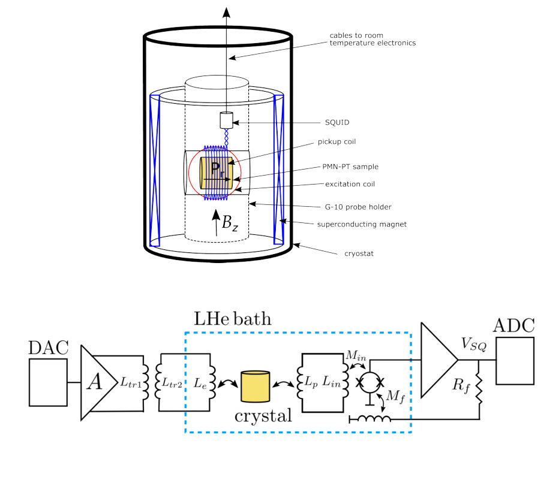 
FIG. 1: Experimental setup schematic. Top: the CASPEr-electric apparatus schematic. A polarized ferroelectric PMN-PT sample is placed inside a superconducting magnet bore. The static magnetic field Bz and the ferroelectric polarization vector Pr are orthogonal to each other. An excitation coil and a separate pickup coil are wound around the sample. The latter is coupled to a SQUID, which resides within a niobium superconducting shield. The whole setup is immersed in liquid helium. Bottom: electronic circuit schematics. The digital to analog converter (DAC) delivers a pulse to the SRS SIM954 amplifier (A) with a gain factor of 4. A transformer with primary and secondary coils Ltr1 and Ltr2...

📷 Fig 2

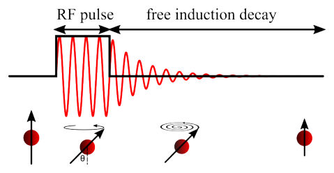 
FIG. 2: Pulsed NMR sequence used for calibration FID measurements. The equilibrium magnetization of the spin ensemble is initially parallel to the leading field B0. An RF excitation pulse tips the magnetization into the transverse plane by an angle θ. The resulting FID signal is due to the spin ensemble precessing about the leading field as the transverse component decays.

📷 Fig 3

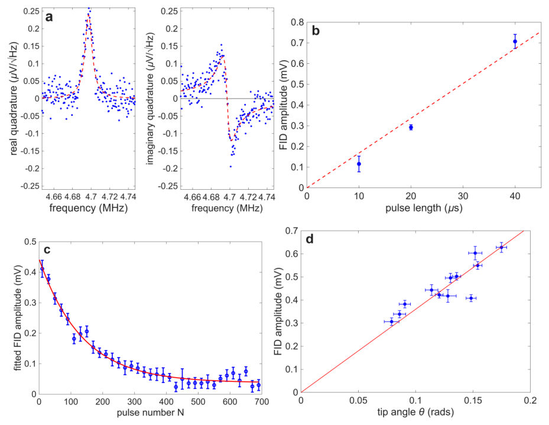 
FIG. 3: Calibration measurements. a. Real and imaginary quadratures of the Fourier-transformed free induction decay data (20 averages) for 207Pb free induction decay in a PMN-PT single crystal, taken at the Larmor frequency f0 ≈4697 kHz. The data are modeled with Lorentzian lineshapes, the resulting best-fit FWHM linewidth is FWHM = Γ/π = 9 kHz. b. The dependence of FID amplitude on pulse duration. The linear behavior confirms the small-tip angle regime. c. The gradual saturation of nuclear spin magnetization by a series of small tip angle excitation pulses. The magnitude of each pulse tip angle θ is extracted from the A0 cosN θ fit model. d. The calibration of magnetic resonance detection...

📷 Fig 4

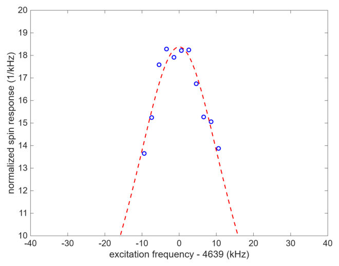 
FIG. 4: The 207Pb excitation spectrum λ(ω). The leading magnetic field was held constant, corresponding to the Larmor frequency 4639 kHz, while 40 µs-long RF excitation pulses of varying frequencies were used to excite the spin FID. We model the spectrum as a Lorentzian (red, dashed line), normalized such that the area under the fit is unity.

📷 Fig 5

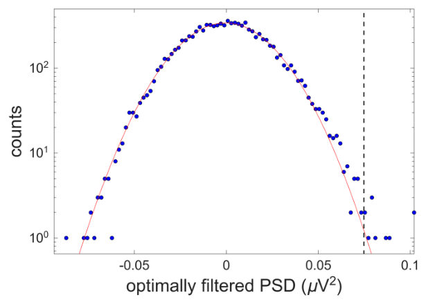 
FIG. 5: The histogram of the data obtained after performing matched filtering on the data taken at the Larmor frequency of 4757 kHz. The histogram is modeled as a normal distribution (red line). Black, dashed line: 95 % confidence limit for a 5σ detection, indicating the minimum threshold to be considered an ALP candidate.

**Summary.** This experiment searches for ultralight axion-like dark matter by measuring the oscillating torque it induces on nuclear spins in a solid-state system. Using broadband SQUID magnetometry on polarized $^{207}	ext{Pb}$, the researchers successfully calibrated their setup and set stringent upper bounds on the axion-nuclear electric dipole coupling constant. The results demonstrate a highly sensitive technique for probing fundamental physics in the nanoelectron-volt mass range.

**Why it may be interesting.** This work bridges condensed matter techniques (solid-state NMR, SQUID magnetometry) with fundamental particle physics searches (axion dark matter), providing a highly sensitive, low-frequency measurement platform relevant to quantum sensing.

Detailed structure

**Main problem.** The paper reports an experimental search for ultralight axion-like dark matter (ALPs) by looking for its coupling to the electric dipole moment of atomic nuclei.

**Main result.** The experiment established upper bounds on the coupling constant $|g_d| < 4	imes 10^{-4} 	ext{ GeV}^{-2}$ in specific frequency bands, demonstrating sensitivity to ALPs in the nanoelectron-volt mass range.

**Method.** The measurement uses solid-state nuclear magnetic resonance (NMR) on polarized $^{207}	ext{Pb}$ spins, detecting the oscillating torque induced by the ambient axion field using a superconducting quantum interference device (SQUID).

**Model / system.** The system involves $^{207}	ext{Pb}$ spins polarized in a ferroelectric crystal, interacting with the axion field via an electric dipole moment coupling ($H_{EDM}$). The detection relies on measuring the induced oscillating magnetization ($M_{xy}$) coupled to the SQUID.

**Key observables.** The induced perpendicular, rotating magnetization ($M_{xy}$) detected as a time-varying magnetic flux coupled to the SQUID, and the system response function $\alpha = V/	heta$.

**Important parameters / regimes.** Axion mass ranges searched: 19.5–20.5 and 21.5–22 neV. The upper bound on the coupling constant is $|g_d| < 4	imes 10^{-4} 	ext{ GeV}^{-2}$.

**Assumptions / limitations.** The analysis assumes the standard halo model for the dark matter field and operates in the small-tip-angle regime for the NMR response.

**Figures summary.** Figure 1 schematically shows the experimental setup involving the polarized sample, magnet, and SQUID. Figure 2 illustrates the pulsed NMR sequence used for calibration measurements.

**Paper structure.** The paper details the theoretical basis of the EDM coupling, describes the experimental setup using SQUID magnetometry on polarized $^{207}	ext{Pb}$, outlines the calibration procedure using pulsed NMR, and finally presents the derived upper bounds on the axion-nucleon coupling constant.

Abstract

We report the results of an experimental search for ultralight axion-like dark matter in the mass ranges 19.5--20.5 and 21.5--22 neV. The Cosmic Axion Spin Precession Experiment-electric probes the axion-nuclear electric dipole moment coupling. We perform solid-state nuclear magnetic resonance on $^{207}$Pb spin ensembles which reside in a polarized ferroelectric crystal. The background axion-like dark matter field induces an oscillating torque on the $^{207}$Pb spins via the electric dipole moment coupling $g_{d}$. The experiment is calibrated with pulsed magnetic resonance measurements covering two frequency bands (4.6--5.0 and 5.2--5.3 MHz) that correspond to the axion Compton frequencies associated with the identified axion mass ranges. By sweeping the leading magnetic field applied to the sample, we are able to detect the $^{207}$Pb nuclear magnetic resonance in these frequency ranges using a superconducting quantum interference device, inductively coupled to the sample with a broadband circuit. We establish the upper bounds $|g_{d}| < 4\times 10^{-4}$ GeV$^{-2}$ with 95% confidence in these frequency bands. Our results demonstrate the detection and small-tip angle calibration of low-field $^{207}$Pb nuclear magnetic resonance, allowing for sensitivity to axion-like dark matter in the nanoelectron-volt axion mass range.

[↑ back to top](#top)

### [Tunable topological narrow bands in twisted bilayer-trilayer graphene](http://arxiv.org/abs/2609.08104v1)

**Authors:** Dong Wang, Federico Escudero, Zhen Zhan, Shengjun Yuan  
**Type:** theory · **Category:** strongly correlated electrons · **PDF:** <https://arxiv.org/pdf/2609.08104v1>  
**Analysis basis:** full PDF text, analyzed in chunks
**Topic relevance:** `analog quantum simulation` **3/5**

📷 Fig 1

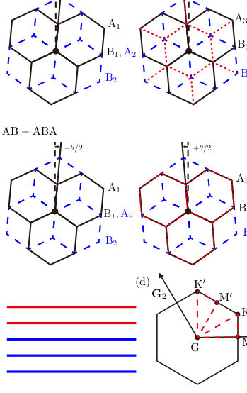 
FIG. 1. Schematic atomic structures and moir´e geome- try of twisted bilayer–trilayer graphene. (a) AB-stacked bi- layer graphene and ABC-stacked trilayer graphene, rotated by −θ/2 and +θ/2, respectively, to form the AB–ABC con- figuration. (b) Corresponding construction of the AB–ABA configuration. Atoms sharing the same in-plane position are listed together, while the subscripts label the graphene layers. (c) Layer-dependent electrostatic potential used to model a perpendicular electric field, with onsite energies (2∆, ∆, 0, −∆, −2∆) assigned from the top to the bottom layer. (d) Moir´e Brillouin zone, showing the reciprocal lat- tice vectors G1 and G2 and the high-symmetry points G, M, M...

📷 Fig 2

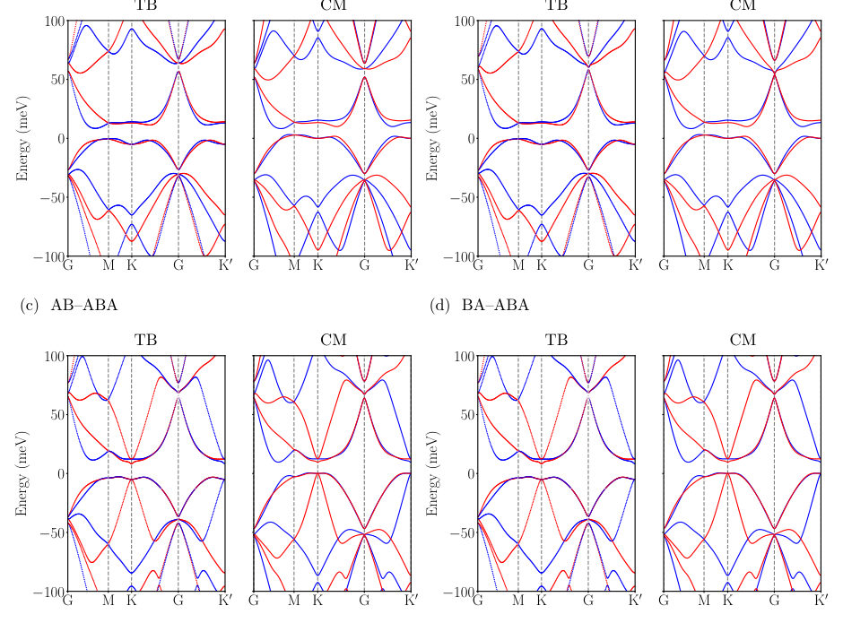 
FIG. 2. Low-energy band structures from the TB and CM approaches for the unrelaxed AB–ABC, BA–ABC, AB–ABA, and BA–ABA stackings at a twist angle of 1.54◦. In the CM results, the +1 and −1 valleys are shown in red and blue, respectively. In the TB results, the valley character is resolved using the valley operator. The hopping terms in the CM model are adapted to have a good agreement of the band structures with the TB results. We set γAA = γAB = 95 meV.

📷 Fig 3

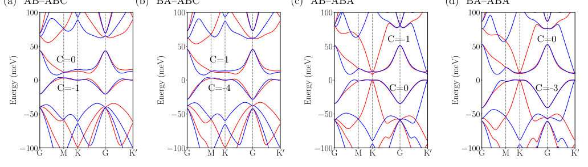 
FIG. 3. Low-energy CM band structures for relaxed AB–ABC, BA–ABC, AB–ABA, and BA–ABA stacking configurations at a twist angle of θ = 1.54°. The hopping terms in the CM approach are the same as in Fig. 2. We consider the lattice relaxation by resetting γAA = 80 meV and γAB = 110 meV. The Chern numbers of the flat bands in the +1 valley are indicated.

📷 Fig 4

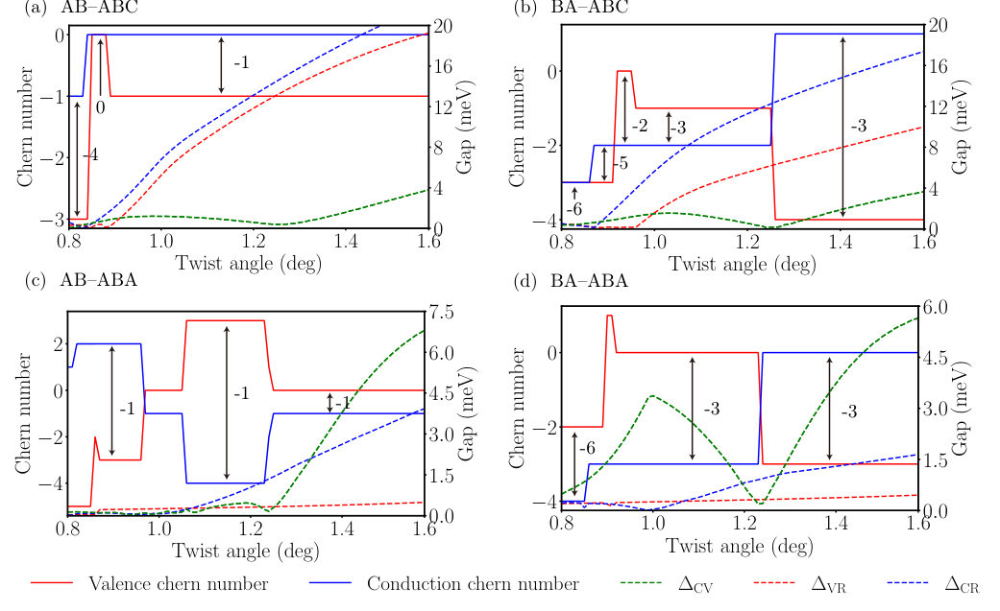 
FIG. 4. Chern numbers and energy gaps as functions of twist angle for four stacking configurations: (a) AB–ABC, (b) BA– ABC, (c) AB–ABA, and (d) BA–ABA. The red and blue solid lines, corresponding to the left axis, denote the Chern numbers of the valence and conduction flat bands, respectively. The dashed lines, corresponding to the right axis, show the relevant band gaps: the green dashed line denotes the conduction-valence narrow band gap ∆CV, while the red and blue dashed lines denote the gaps between the valence and conduction flat bands and their nearest remote bands, labeled as ∆VR and ∆CR, respectively. The black lines with arrows shows the sum of the Chern number of the conduction...

📷 Fig 5

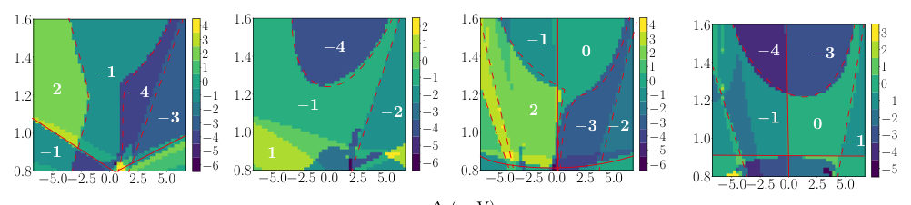 
FIG. 5. Chern-number phase diagrams of the conduction flat band (top row) and valence flat band (bottom row) as functions of twist angle θ and perpendicular electric field E for (a) AB–ABC, (b) BA–ABC, (c) AB–ABA, and (d) BA–ABA stackings. The color scale represents the Chern number of the corresponding band. We label the Chern number for each color block. Red dashed lines indicate Type–I transition driven by the closing and reopening of the gap ∆CV, whereas red solid lines indicate Type–II transition associated with the gap ∆CR or ∆VR. Only the larger and well-isolated phase regions (can be easily recognized from the band gap) are labeled for clarity. A 100 × 100 k-point mesh is used in...

**Summary.** This work analyzes the topological electronic structure of twisted bilayer-trilayer graphene, demonstrating that the system's band topology is highly tunable. By applying perpendicular electric fields and considering different stacking arrangements, the authors map out phase diagrams that control the Chern numbers of the narrow bands. This provides a theoretical roadmap for engineering topological materials using moiré heterostructures.

**Why it may be interesting.** The ability to tune topological invariants (Chern numbers) using external fields like the electric field is a key concept in realizing artificial quantum Hall states, which is highly relevant to open quantum systems and correlated electron physics.

Detailed structure

**Main problem.** The study investigates the low-energy band structure and topological properties of twisted bilayer-trilayer graphene, focusing on how these properties can be controlled.

**Main result.** The perpendicular electric field is identified as an efficient tuning knob for controlling the stability and topological transitions of the narrow Chern bands. The interplay between stacking, twist angle, and electric field allows for engineering tunable topological bands.

**Method.** The authors employed both tight-binding and continuum models to calculate the band structure and topological invariants (Chern numbers) across various physical parameters.

**Model / system.** The physical system is twisted bilayer-trilayer graphene, analyzed across four specific stacking configurations (e.g., AB--ABC). The models incorporate the effects of twist angle, perpendicular electric field, and self-consistent Hartree potential.

**Key observables.** Flat bands, valley Chern numbers, total Chern number, topological transitions (gap closing/reopening), and band structure evolution.

**Important parameters / regimes.** Twist angle ($	heta$), perpendicular electric field ($E$), and the self-consistent Hartree potential ($V_H$).

**Assumptions / limitations.** The analysis relies on the self-consistent Hartree approximation and assumes a C3z-symmetric relative registry.

**Figures summary.** Figure 1 provides schematic atomic structures and moiré geometry for the key stacking configurations, such as AB–ABC and AB–ABA.

**Paper structure.** The paper first establishes the agreement between tight-binding and continuum models, then systematically studies the evolution of flat bands and their Chern numbers under varying twist angles and electric fields, detailing two types of topological transitions. Finally, it maps out the topological phase diagrams.

Abstract

We investigate the low-energy band structure and topology of twisted bilayer--trilayer graphene with four stacking configurations: AB--ABC, BA--ABC, AB--ABA, and BA--ABA. Using both tight-binding and continuum models, we first establish that the two approaches show good agreement in the band structure in low-energy regime. We then study the evolution of the flat bands and their valley Chern numbers as functions of twist angle, perpendicular electric field, and the self-consistent Hartree potential. At relatively large twist angles and under electric field, we find a topological transition between the narrow bands, with the total Chern number of the flat bands following the Chern number sum rules derived from the chiral-limit description. We also observe another type of topological transition when the flat bands hybridize with adjacent remote bands, where gap closing and reopening processes lead to Chern number and charge density transfer. By constructing topological phase diagrams in the space of twist angle and electric field, we show that the perpendicular electric field provides an efficient tuning knob for controlling the stability and transitions of the Chern bands. Finally, we find that the Hartree potential mainly induce weak band shifts and reshaping in the narrow bands. However, with a combination of Hartree potential and the electric fields, the narrow bands show rich topological phase diagram. Our results clarify the interplay between the stacking, twist angle and electric field in manipulating the narrow bands and their topology in twisted bilayer--trilayer graphene, and provide guidance for engineering topological narrow bands with tunable Chern numbers in realistic twisted multilayer graphene systems.

[↑ back to top](#top)

### [Water, vacancies, and competing exchange interactions in Prussian blue analogues: a neutron diffraction study of field and dehydration-driven magnetic transitions](http://arxiv.org/abs/2609.08976v1)

**Authors:** N. S. Dhami, C. V. Colin, V. Nassif, O. Fabelo, T. Nait, A. Bleuzen, A. Bordage, V. Balédent  
**Type:** both · **Category:** other · **PDF:** <https://arxiv.org/pdf/2609.08976v1>  
**Analysis basis:** full PDF text, analyzed in chunks
**Topic relevance:** `analog quantum simulation` **3/5**

📷 Fig 1

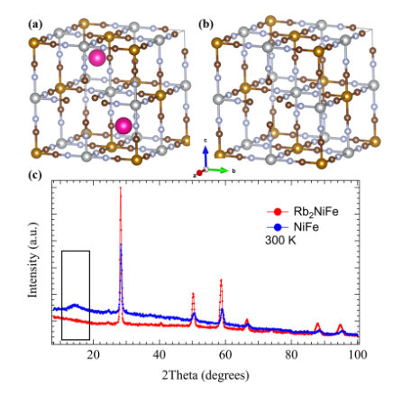 
FIG. 1. Crystal structure layouts of the bimetallic Prus- sian blue analogues: (a) the cation-stabilized Rb2NiFe framework in the F43m space group and (b) NiFe crys- tallizing in the Fm3m space group. For clarity, the H2O molecules are omitted from both structural representa- tions. (c) Room-temperature (300 K) neutron diffrac- tograms of NiFe and Rb2NiFe. The broad diffuse scat- tering feature (bump) at low 2θ angles, associated with structural vacancies and coordinated water, is visibly ab- sent in the Rb2NiFe compound.

📷 Fig 2

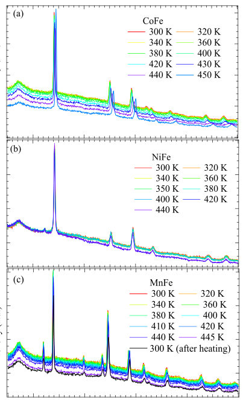 
FIG. 2. High-temperature neutron diffraction patterns for the AFe-based PBA compounds: (a) CoFe, (b) NiFe, and (c) MnFe. The data highlight the structural evo- lution and the systematic reduction of the hydrogen- induced incoherent scattering background upon heat- ing/dehydration.

📷 Fig 3

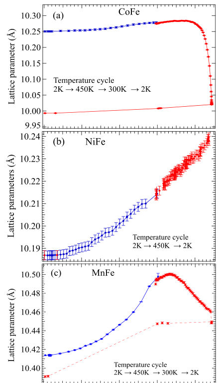 
FIG. 3. Temperature dependence of the lattice param- eters for MnFe, CoFe, and NiFe. A continuous tuning from positive to negative thermal expansion coefficients is achieved upon heating for both MnFe and CoFe. Upon cooling back to 300 K after the full 2–450 K thermal cycle (i.e., in the dehydrated state), CoFe exhibits a structural contraction of 2.5 % relative to its initial hydrated state, while MnFe shows a minor reduction of 0.4 %. In con- trast, NiFe displays a monotonic lattice expansion over the entire range.

📷 Fig 4

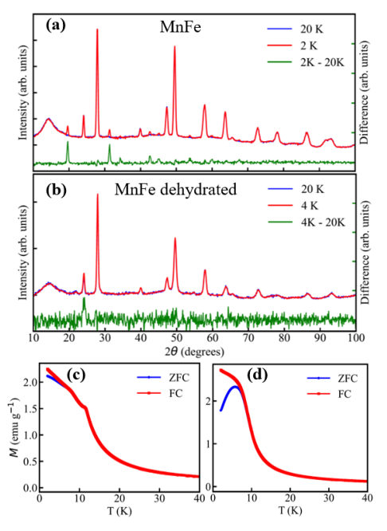 
FIG. 4. (a) Neutron diffraction patterns at 20 K and 4 K, together with their difference, for non-dehydrated MnFe; (b) corresponding data for the dehydrated sam- ple. The difference pattern of the non-dehydrated sam- ple reveals distinct magnetic Bragg peaks, whereas in the dehydrated sample the magnetic contribution co- incides with the nuclear peaks, indicating a modified magnetic structure. The corresponding magnetization curves under ZFC and FC protocol at 500 Oe for the non-dehydrated and dehydrated samples are shown in (c) and (d), respectively.

📷 Fig 5

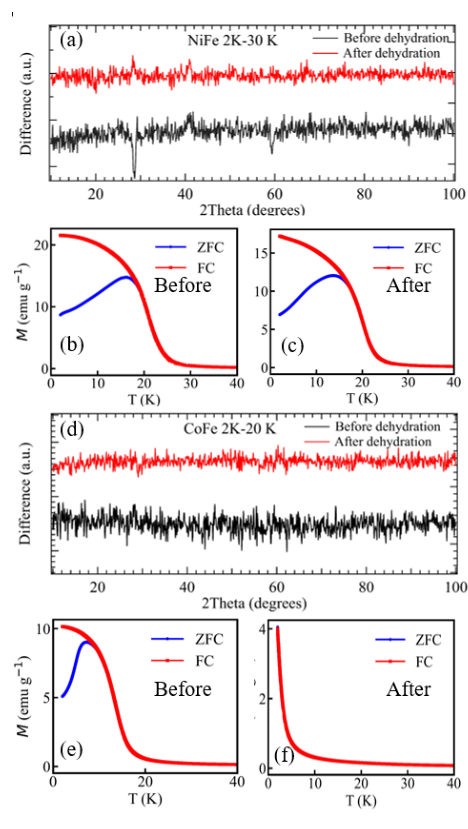 
FIG. 5. Effect of dehydration: (a) The difference of neu- tron diffraction data of NiFe at 2 K and 30 K before and after dehydration. (b,c) Magnetization under ZFC and FC protocol at 500 Oe of NiFe before and after dehy- dration. (d) CoFe: Difference of neutron diffractograms at 2 K and 20 K before and after dehydration. (e, f) ZFC and FC Magnetization at 500 Oe before and after dehydration, respectively.

**Summary.** This study uses neutron diffraction and magnetometry to examine Prussian blue analogues, demonstrating that the presence and loss of interstitial water significantly control the material's structural and magnetic properties. The research pinpoints the role of correlated vacancies as a key structural determinant that dictates the magnetic ground state and transition pathways in these compounds.

**Why it may be interesting.** The work connects structural disorder (vacancies/water) directly to magnetic ground state selection and phase transitions, providing an example of how lattice dynamics can tune magnetic exchange interactions, which is relevant to correlated electron systems.

Detailed structure

**Main problem.** The study investigates how structural changes, particularly those induced by water loss (dehydration) and external magnetic fields, govern the magnetic transitions in Prussian blue analogues (PBAs).

**Main result.** Water content is established as a critical parameter controlling both the structural stability (e.g., thermal expansion) and the magnetic ground state of these materials.

**Method.** The research combines neutron diffraction studies to probe structure and vacancy signatures with magnetic measurements and theoretical modeling using spin Hamiltonians.

**Model / system.** The physical system is a family of ferro- and ferrimagnetic Prussian blue analogues (PBAs) with the general formula A_4[Fe(CN)6]2.7. The analysis models magnetic interactions using a minimal Heisenberg spin Hamiltonian to explain field-induced spin reorientations.

**Key observables.** Magnetic ordering temperature (Tc), magnetic structure (propagation vector k), coefficient of thermal expansion (CTE), and diffuse scattering features indicating vacancies.

**Important parameters / regimes.** Temperature range (2–450 K), applied magnetic field (up to 5 T), and the concentration/presence of interstitial water/vacancies.

**Assumptions / limitations.** The magnetic transition in MnFe is modeled as a near-compensation point between Mn–Fe and Mn–Mn interactions. The analysis assumes specific magnetic configurations (collinear vs. frustrated).

**Figures summary.** Figures show neutron diffractograms highlighting diffuse scattering from vacancies, temperature dependence of lattice parameters showing CTE crossovers, and M-H curves demonstrating field-induced spin reorientation.

**Paper structure.** The paper systematically analyzes structural changes (diffraction, CTE) linked to water content, followed by detailed magnetic characterization (magnetization, magnetic structure determination via Rietveld refinement) to establish the role of water in controlling magnetic ground states.

Abstract

We report a neutron diffraction study of the structural and magnetic properties of a family of ferro- and ferrimagnetic Prussian blue analogues (PBAs), $A_4$[Fe(CN)$_6$]$_{2.7}$ ($A$ = Co, Mn, Ni), Rb$_2$Ni$_4$[Fe(CN)$_6$]$_{3.3}$, and Mn$_4$[Cr(CN)$_6$]$_{2.7}$, as a function of temperature (2--450~K) and applied magnetic field. All bimetallic compounds of the Fm$\overline{3}$m family exhibit a broad diffuse feature at low scattering angle, which we identify, through comparison with the cation-stabilized Rb$_2$NiFe framework, as an intrinsic signature of correlated vacancies and their associated interstitial water. High-temperature diffraction reveals a continuous crossover from positive to negative thermal expansion in CoFe and MnFe upon dehydration, while NiFe remains structurally robust up to 450~K. At low temperature, all compounds order in a collinear ferrimagnetic state with propagation vector $\mathbf{k}=(0,0,0)$, except MnFe, which adopts a partially frustrated magnetic structure with $\mathbf{k}=(1,0,0)$. A moderate magnetic field of $B_c = 1.3$~T drives a spin reorientation in MnFe toward the collinear $\mathbf{k}=(0,0,0)$ ferrimagnetic state common to the other compounds; the same transition is independently induced by dehydration. A minimal Heisenberg model shows that this transition results from a near-compensation between antiferromagnetic Mn--Fe coupling and a geometrically frustrated antiferromagnetic Mn--Mn interaction on the face-centered-cubic Mn sublattice, placing MnFe in the vicinity of a magnetic compensation point. These results resolve a longstanding ambiguity in the interpretation of the Fe $K$-edge XMCD response of MnFe-based PBAs, and establish water content as a key parameter controlling both the structural and magnetic stability of this family of materials, with direct relevance to their use as battery electrodes.

[↑ back to top](#top)

### [Thermomechanics of dense granular materials: a particle-scale perspective](http://arxiv.org/abs/2609.08928v1)

**Authors:** Matthew R. Kuhn  
**Type:** theory · **Category:** statistical mechanics · **PDF:** <https://arxiv.org/pdf/2609.08928v1>  
**Analysis basis:** full PDF text, analyzed in chunks
**Topic relevance:** `analog quantum simulation` **2/5** · `correlated / nonlocal dissipation` **2/5** · `driven-dissipative phase transition` **2/5** · `methods for driven-dissipative` **2/5** · `non-equilibrium universality` **2/5** · `quantum measurements` **2/5** · `Frenkel-Kontorova` **1/5** · `Keldysh / 2PI / non-Gaussian methods` **1/5** · `scars & prethermalization` **1/5**

📷 Fig 1

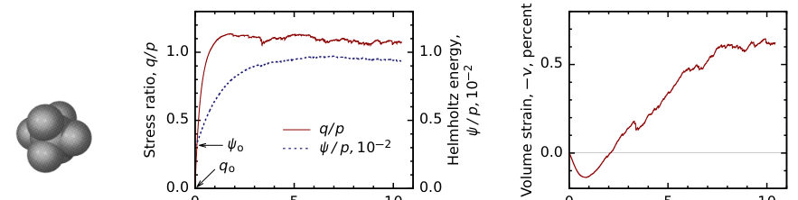 
Figure 1: (a) Seven-sphere particle. Results of constant-𝑝triaxial compression: (b) deviatoric stress 𝑞and free energy 𝜓, and (c) volume change.

📷 Fig 2

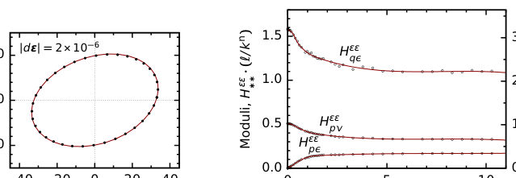 
Figure 2: Moduli H𝜺𝜺during constant-𝑝loading, determined from strain probes with contact sliding suppressed: (a) comparison between stress increments 𝑑𝝈and those computed with the product H𝜺𝜺·𝑑𝜺; and (b) components of reversible modulus H𝜺𝜺, presented in alternative dimensionless forms.

📷 Fig 3

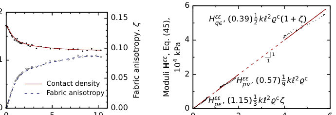 
Figure 3: Fabric and reversible moduli at 48 strains during constant-𝑝loading: (a) contact density 𝜚c = 𝑀′/𝑉and fabric anisotropy 𝜁= 𝛽fab 11 −𝛽fab 22 , and (b) comparison of the reversible moduli H𝜺𝜺predicted with Eq. (46) and the moduli measured in DEM simulations. Factors 0.39, 0.57, and 1.15 are multiplied by the predictions of Eq. (44) to approximate the simulation data. The red line represents perfect conformance between estimated and measured values.

📷 Fig 4

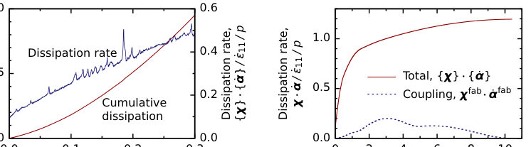 
Figure 4: Frictional dissipation during constant-𝑝triaxial compression: (a) cumulative dissipation (red) and dissipation rate (blue) at small strains, (b) total dissipation rate (red) and the dissipation rate due to coupling (blue) of the reversible modulus H𝜺𝜺and the internal fabric 𝜶fab.

📷 Fig 5

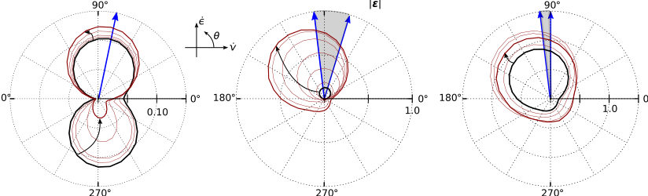 
Figure 5: Polar plots of dissipation rates for strain-probes within the Rendulic plane: angles 𝜃are strain directions tan−1( ¤𝜖/ ¤𝑣), and radii are normalized dissipations. Each line represents 80 probes. Three strain ranges are shown, and curved arrows show trends within each range. Heavier black lines are results at the start of each range. Blue arrows (and shaded angles) show the directions of strain during prior monotonic loading.

**Summary.** This paper establishes a rigorous thermomechanical framework for understanding how dense granular materials behave under stress. It shows that standard assumptions from continuum mechanics break down due to pervasive energy dissipation during contact sliding. The work emphasizes the need for advanced constitutive models that accurately capture the complex, non-smooth nature of granular material response.

**Why it may be interesting.** While focused on classical mechanics, the rigorous treatment of non-equilibrium energy dissipation, path dependence, and the failure of simple constitutive assumptions mirrors challenges in modeling non-equilibrium quantum systems or complex many-body dynamics.

Detailed structure

**Main problem.** Developing a comprehensive thermomechanical framework to describe the isothermal, rate-independent constitutive behavior of dense granular materials.

**Main result.** The paper demonstrates that basic elastoplastic assumptions fail for granular materials, necessitating advanced constitutive models that account for pervasive dissipation and non-smooth energy landscapes.

**Method.** The authors utilize a combination of continuum mechanics theory, energy rate balance equations, and direct measurement techniques derived from Discrete Element Method (DEM) simulations.

**Model / system.** The system is dense granular material, modeled using a thermomechanical framework that incorporates internal variables for fabric (reversible stiffness) and structure (dissipation). The analysis is based on energy rate balance equations derived from the Helmholtz free energy density.

**Key observables.** Free energy ($\psi$), dissipation rate, stress ($oldsymbol{\sigma}$), and strain ($oldsymbol{\varepsilon}$), which are directly measurable in DEM simulations.

**Important parameters / regimes.** Isothermal conditions, rate-independence, and the nature of internal variables (fabric and structure).

**Assumptions / limitations.** The framework assumes rate-independence and isothermal conditions, but acknowledges that the free energy may not be smoothly differentiable, requiring the use of Gâteaux derivatives.

**Paper structure.** The paper progresses by establishing the energy rate balance, proposing internal variable sets for fabric and structure, testing these variables against DEM results, and finally comparing the findings against standard elastoplastic assumptions.

Abstract

The paper presents a broad thermomechanic framework for the isothermal rate-independent constitutive behavior of dense granular materials. The essential quantities in this framework are directly measurable in discrete element (DEM) simulations: free energy, dissipation, stress, and strain. The paper proposes that energy and dissipation are governed by two sets of internal variables: fabric variables that control the reversible stiffness and structure variables associated with internal sliding. The relevant fabric variables are identified and measured with simulations. Two hypotheses are considered for the structure variables: the macro-scale irreversible strain and an aggregate measure of the micro-scale frictional forces among sliding contacts. Both hypotheses are tested with simulations, which allow direct calculation of the internal variables. The paper then demonstrates the manner in which the measured variables are applied in incremental constitutive models. Among other findings are the following. (1) Dissipation from contact sliding is pervasive and occurs in all directions of incremental loading. (2) Contact motions are not reversed by a reversal of the strain direction, and contacts continue to slide when loading is reversed. (3) The free energy can not be assumed smoothly differentiable; instead, Gâteaux derivatives must be used with irreversible effects. (4) Basic assumptions of elastoplasticity are contravened: no region of purely reversible strain exists, no uniform yield direction exists, no uniform flow direction exists, and irreversible strain is not proportional to the projected total strain. A three-mechanism elastoplasticity model, however, closely fit the DEM results, and methods are demonstrated for quantifying the model. The results emphasize that advanced constitutive models are needed for capturing the general incremental behavior of granular materials.

[↑ back to top](#top)

### [Reduction Based Dynamical Systems Analysis of Nonlinear Wave Equations: A Review](http://arxiv.org/abs/2609.09050v1)

**Authors:** Naresh Saha, Arnob Ray  
**Type:** theory · **Category:** other · **PDF:** <https://arxiv.org/pdf/2609.09050v1>  
**Analysis basis:** full PDF text, analyzed in chunks
**Topic relevance:** `analog quantum simulation` **2/5** · `Keldysh / 2PI / non-Gaussian methods` **1/5** · `correlated / nonlocal dissipation` **1/5** · `driven-dissipative phase transition` **1/5** · `methods for driven-dissipative` **1/5** · `non-equilibrium universality` **1/5**

📷 Fig 1

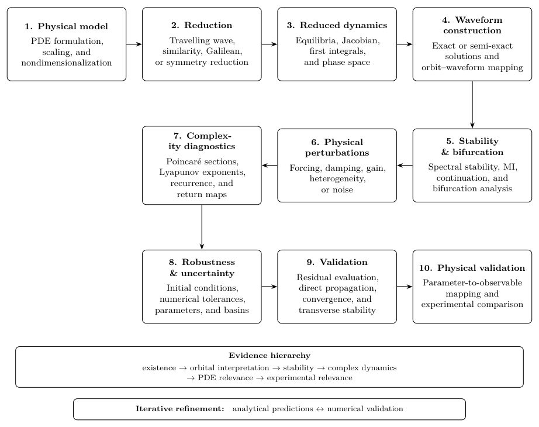 
Figure 1: End-to-end methodological workflow for reduction based nonlinear wave analysis. The workflow begins with physical model formulation, scaling, and nondimensionalization, followed by an appropriate travelling wave, similarity, Galilean, or symmetry reduction. The resulting profile system is analyzed through its equilibria, invariant structures, first integrals, and phase space geometry, from which exact or semi-exact waveforms are reconstructed. Stability and bifurcation analyses are then combined with physically motivated perturbations and quantitative complexity diagnostics. Robustness is assessed with respect to initial conditions, parameter uncertainty, numerical tolerances, and...

📷 Fig 2

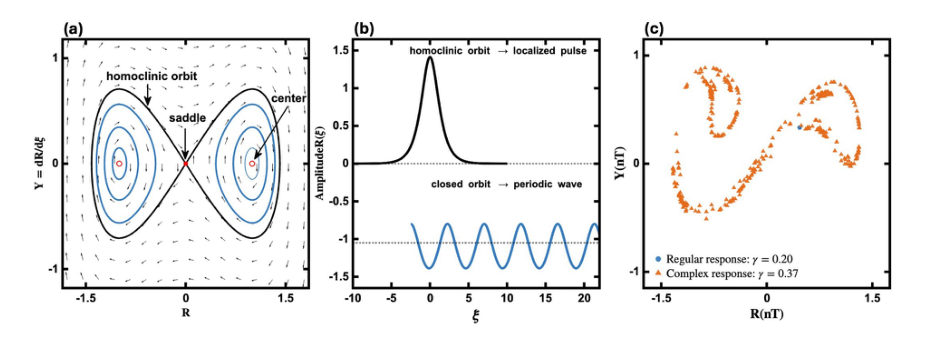 
Figure 2: Connection between reduced phase space dynamics, exact waveform reconstruction, and perturbation induced response. (a) Phase portrait of the representative reduced system R′′ = R −R3, showing the saddle at (0, 0), the centers at (±1, 0), and the homoclinic separatrices. (b) Representative travelling wave reconstruction: the homoclinic orbit gives the exact localized waveform R(ξ) = √

📷 Fig 3

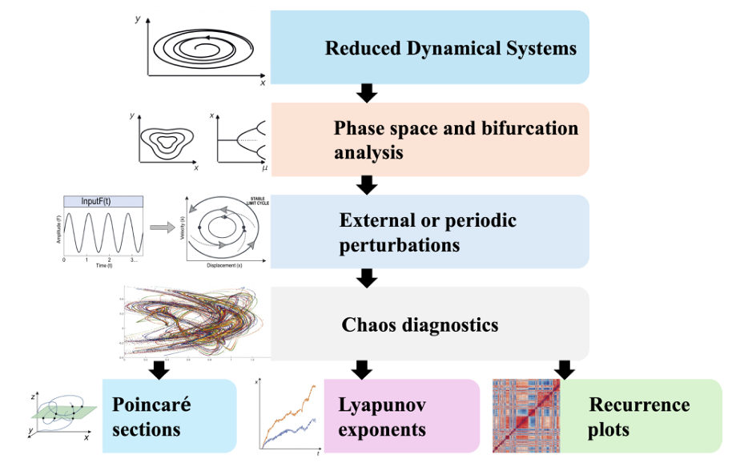 
Figure 3: Diagnostic hierarchy for perturbation induced dynamics. Following the construction of the reduced system and identification of its phase space structure, perturbations are introduced and the resulting dynamics are examined using complementary diagnostics. Poincaré sections characterize stroboscopic geometry, Lyapunov exponents quantify asymptotic sensitivity to initial conditions, and recurrence analysis provides complementary information on trajectory recurrence and structure of phase space. Consistent results from independent diagnostics provide stronger evidence for deterministic chaos than visual complexity alone. These diagnostics characterize complexity within the reduced...

📷 Fig 4

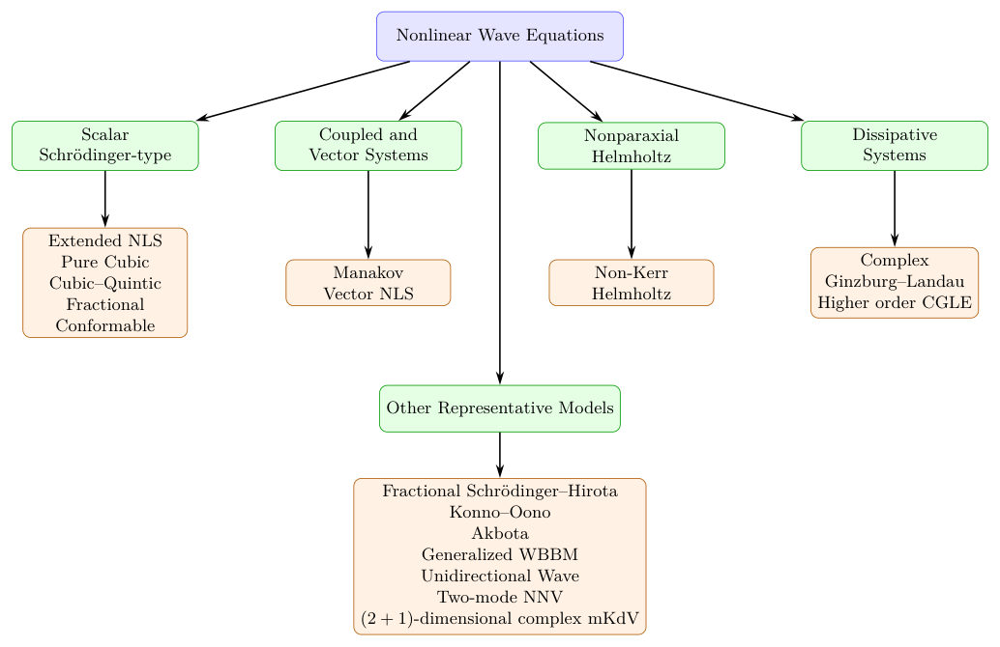 
Figure 4: Representative nonlinear wave equation families considered in this review. The classification emphasizes the mathematical structures relevant to reduction, phase space analysis, waveform reconstruction, and subsequent stability or dynamical diagnostics. Individual models may belong to more than one category when higher order, fractional, coupled, nonparaxial, or dissipative effects are present.

**Summary.** This review presents a comprehensive, reduction-based methodology for analyzing nonlinear wave equations by mapping them onto lower-dimensional dynamical systems. It argues that understanding the invariant structures and stability of the reduced phase space is more crucial than finding isolated analytical solutions. This framework provides a robust tool for predicting wave behavior, assessing stability, and designing control mechanisms in various physical systems.

**Why it may be interesting.** While focused on general nonlinear PDEs, the rigorous connection between phase space geometry and physical wave structures is a powerful tool for analyzing complex dynamics in quantum optics (e.g., NLSE) and plasma physics.

Detailed structure

**Main problem.** The paper addresses the complex analysis of nonlinear wave equations, which exhibit rich wave structures due to the interplay of dispersion, nonlinearity, and forcing terms.

**Main result.** It establishes a reduction-based framework showing that the underlying phase-space structures (like invariant orbits) of the reduced dynamical system geometrically represent the physically admissible waveforms of the original PDE.

**Method.** The core method involves reducing high-dimensional nonlinear PDEs to finite-dimensional autonomous dynamical systems via transformations (e.g., travelling wave ansatz), followed by rigorous analysis of the resulting phase space.

**Model / system.** The framework is applicable to a wide range of nonlinear wave equations, including Schrödinger-type, coupled, dissipative, shallow-water, and fractional wave equations.

**Key observables.** Equilibria (constant states), periodic trajectories (periodic waves), homoclinic orbits (solitary waves), and heteroclinic connections (fronts/kinks).

**Important parameters / regimes.** The analysis depends on the interplay of nonlinearity, dispersion, coupling strengths, and external forcing parameters.

**Assumptions / limitations.** The framework prioritizes physical admissibility, stability, and robustness over merely generating formal analytical solutions, acknowledging limitations in parameter space characterization and correspondence with full PDE dynamics.

**Figures summary.** The figures illustrate the end-to-end workflow: from PDE formulation to reduction, phase space analysis (showing how orbits map to waveforms), and the hierarchy of diagnostics used to confirm chaotic or stable behavior.

**Paper structure.** The review is highly methodological, detailing the workflow: PDE formulation -> Reduction to ODEs -> Dynamical Systems Analysis (Phase Space) -> Stability/Bifurcation Analysis -> Full PDE Validation -> Comparison with physical/experimental observables.

Abstract

Nonlinear wave equations exhibit rich interplay among dispersion, nonlinearity, coupling, dissipation, and external forcing, producing diverse coherent and complex wave structures. Although exact travelling-wave solutions provide analytical benchmarks, their construction alone does not reveal underlying phase-space, bifurcations, stability, or responses to perturbations. This review presents a reduction-based methodological framework connecting nonlinear partial differential equations(PDEs) to reduced dynamical systems, invariant phase-space structures, exact waveform reconstruction, stability analysis, and verification in PDEs. Its applicability and limitations are examined across Schr{ö}dinger-type, coupled, nonparaxial, dissipative, magnetic, shallow-water, and fractional wave equations. Particular emphasis is placed on correspondence between analytical waveforms and invariant orbits. Equilibria, periodic trajectories, homoclinic orbits, and heteroclinic connections geometrically represent constant, periodic, localized, and front-like structures, respectively. This review distinguishes existence and stability of invariant structures from onset of chaos, emphasizing complementary diagnostics rather than reliance on phase-portraits or finite-time indicators alone. Major methodological gaps include incomplete parameter-space characterization, weak correspondence between reduced models and full-PDE dynamics, ambiguities in generalized and fractional formulations, limited robustness analysis, inadequate numerical reproducibility, and insufficient links to experimental observables. The framework prioritizes physical admissibility, stability, robustness, and predictive relevance over generation of additional formal solutions. It supports reliable nonlinear wave prediction, stability assessment, control, and system design in fluid, optical, plasma, and other nonlinear physical systems.

[↑ back to top](#top)

### [Speed and stability of segregated waves in a pressure-based model of heterogeneous cell populations](http://arxiv.org/abs/2609.09043v1)

**Authors:** Carles Falcó, Rebecca M. Crossley, Martina Conte, Tommaso Lorenzi  
**Type:** theory · **Category:** other · **PDF:** <https://arxiv.org/pdf/2609.09043v1>  
**Analysis basis:** full PDF text, analyzed in chunks
**Topic relevance:** `Keldysh / 2PI / non-Gaussian methods` **2/5** · `methods for driven-dissipative` **2/5** · `Frenkel-Kontorova` **1/5** · `driven-dissipative phase transition` **1/5** · `non-equilibrium universality` **1/5**

📷 Fig 1

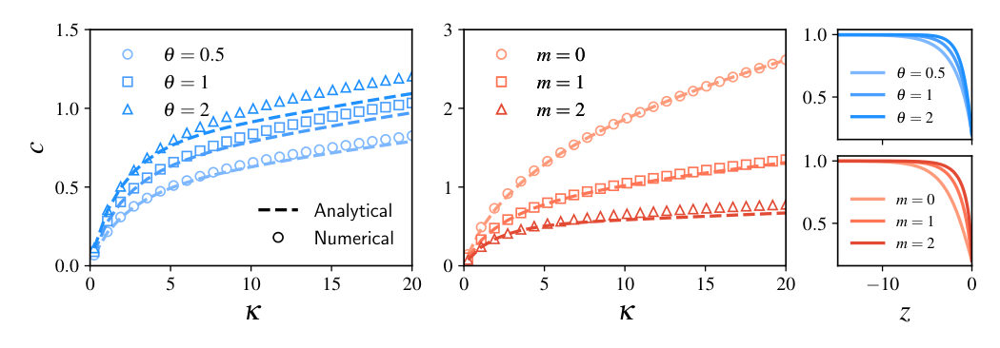 
Figure 1: Plots of the travelling wave speeds and solutions for the porous–Fisher model with θ-logistic and Gompertz growth laws. The two larger panels show the numerically estimated travelling wave speed (symbols) and the minimal wave speed predicted by using the variational principle (dashed lines) as a function of κ. For the θ-logistic growth law in blue (left larger panel), the minimal wave speed is predicted through Eq. (3.11); for the Gompertz growth law in red (right larger panel), the prediction of the minimal wave speed is made by using Eq. (3.13). The two smaller panels display representative travelling wave profiles for each of these growth laws (θ-logistic growth law in blue,...

📷 Fig 2

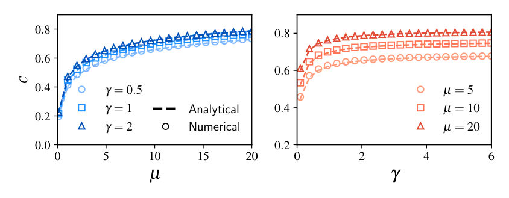 
Figure 2: Plots of the speeds of segregated travelling waves from Eq. (2.11) complemented with Eq. (3.17). The numerically estimated travelling wave speed is plotted in symbols and the minimal wave speed predicted using the variational estimate in Eq. (3.18) is plotted in dashed lines as a function of µ for different values of γ (in blue, left panel) and as a function of γ for different values of µ (in red, right panel). As with the generalised porous–Fisher model (see the details in Sec.3.1), the numerical wave speeds were computed by solving the corresponding travelling wave boundary-value problem with continuation in parameter space.

📷 Fig 3

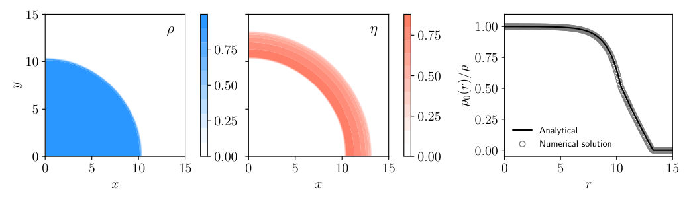 
Figure 3: When segregated circular waves propagate, the leading order pressure given by Eq. (4.20) approximates the exact profile with the wave speed predicted by Eq. (4.21). The left panels display the plots of the cell densities ρ(x, y, t) (blue) and η(x, y, t) (red) at t = 10, and show the propagation of a segregated circular wave. The right panel displays the plot of the leading order pressure p0(r)/p. Numerical simulations are carried out setting µ = 1, ν = 2, and γ = 5, choosing an initial condition corresponding to a segregated circular wave with R0(0) = 4, eR0(0) = 8, R1(0) = 0, and eR1(0) = 0, the logistic-type net growth rate G(p) := 1 −p/¯p, and using the finite-volume splitting...

📷 Fig 4

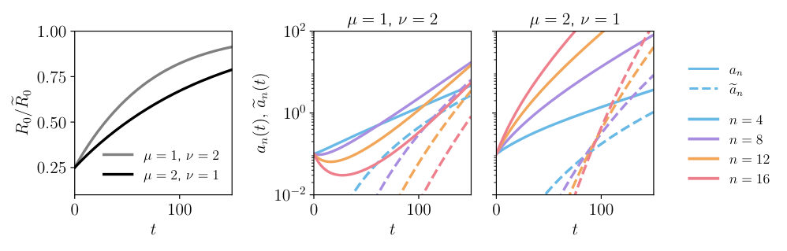 
Figure 4: Evolution and stability of segregated circular waves for different relative values of the mobility coefficients. The left panel shows the evolution of the inner-to-outer radius ratio R0/ eR0 for the cases (µ, ν) = (1, 2) (grey line) and (µ, ν) = (2, 1) (black line). In both cases, the ratio approaches 1 as the outer region occupied by non-proliferative cells becomes progressively thinner, although this occurs at different rates in the two cases. The right panels show the evolution of the perturbation amplitudes an and ean for different azimuthal modes n: here an(0) = 0.1 and ean(0) = 0 for every mode. For (µ, ν) = (1, 2), while the corresponding one-dimensional wave is stable, the...

📷 Fig 5

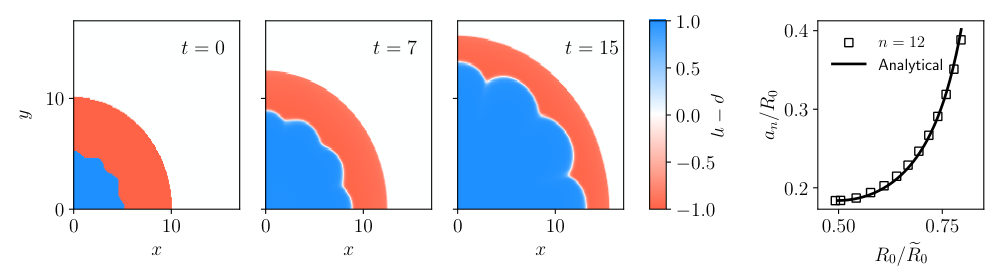 
Figure 5: Destabilisation of a segregated circular wave despite the non-proliferative cells being more mobile than the proliferative cells (i.e., for ν &gt; µ), in contrast with the one-dimensional case. The left panels show the evolution of ρ(x, y, t) −η(x, y, t), illustrating the growth of interfacial perturbations and the development of protrusions at the interface between the two cell types. The right panel shows the plot of the amplitude an/R0 of the n = 12 mode as a function of the outer-to-inner radius ratio R0/ eR0. Numerical simulations are carried out setting µ = 2, ν = 2.5, and γ = 25, choosing an initial condition corresponding to a segregated circular wave with R0(0) = 5, eR0(0) =...

**Summary.** This work analyzes a mathematical model for how two types of cells interact and move together, forming segregated waves. The authors derive explicit bounds on the wave speed using variational calculus and analyze the stability in both 1D and 2D. The findings clarify the conditions under which these cell fronts remain stable or break down into finger-like protrusions.

**Why it may be interesting.** While the subject is biophysics/continuum mechanics, the mathematical techniques—variational bounds, free-boundary problems, and stability analysis of traveling waves—are highly relevant to the mathematical physics of pattern formation in complex systems.

Detailed structure

**Main problem.** The paper investigates the speed, parameter dependence, and stability of segregated traveling wave solutions in a minimal pressure-based model describing heterogeneous cell populations.

**Main result.** It derives an almost explicit variational bound for the wave speed and shows that 1D stability requires non-proliferative cells to be more mobile than proliferative cells, while 2D stability is more complex.

**Method.** The study employs variational methods by reformulating the problem as a free-boundary problem for a generalized porous-Fisher equation, alongside asymptotic shape-perturbation analysis for circular waves.

**Model / system.** The model is a system of reaction-cross-diffusion equations describing two cell types (proliferative and non-proliferative) whose movement is governed by a pressure law derived from their total density.

**Key observables.** Wave speed, stability of segregated waves, pressure, interface velocity, and growth rates of angular modes.

**Important parameters / regimes.** Mobility coefficients ($\mu, 
u$), growth rate function $G(p)$, and the relative values of $\mu$ and $
u$.

**Assumptions / limitations.** The model assumes pressure-based movement and analyzes the incompressible limit ($\gamma 	o \infty$) where the problem reduces to a sharp-interface free boundary problem.

**Figures summary.** Figure 6 illustrates the destabilization of a circular wave, showing the growth of interfacial perturbations, particularly when the proliferative cells are more mobile than the non-proliferative cells.

**Paper structure.** The paper first establishes the governing equations and then derives the variational bound for the wave speed. It proceeds to analyze the 1D stability, followed by a detailed asymptotic shape-perturbation analysis for 2D circular waves to characterize fingering instabilities.

Abstract

We consider a minimal pressure-based model of heterogeneous cell populations consisting of proliferative and non-proliferative cells with different mobilities. The model is formulated as a system of reaction--cross--diffusion equations describing the spatio-temporal dynamics of the cell densities. The model is known to admit one-dimensional travelling wave solutions with strictly segregated components: non-proliferative cells occupy a finite region at the leading edge, while proliferative cells remain at the rear. However, the speed, parameter dependence, and stability of these waves remain poorly understood. In this work, we derive an almost explicit variational bound on the wave speed by reformulating the problem as a free-boundary problem for a generalised porous--Fisher equation. The estimates we obtain apply to general pressure laws and growth kinetics, agree closely with the results of numerical simulations, and become sharp in the incompressible limit, where we formally recover a fully explicit characterisation of the wave speed. We then analyse the stability of the waves to show that segregated waves are stable only when non-proliferative cells are more mobile than proliferative cells. Finally, motivated by numerical observations of finger-like protrusions, we investigate the stability of incompressible segregated circular waves through asymptotic shape-perturbation analysis. This yields explicit expressions for the pressure, interface velocity, and growth rates of angular modes, thereby making evident the destabilisation mechanisms that may lead to the emergence of fingering instability. Interestingly, we find that, in contrast with the one-dimensional case, the stability of such circular waves is not determined solely by the relative value of the mobility coefficients, and thus instabilities may arise irrespective of which cell type has the larger mobility.

[↑ back to top](#top)

### [Impurity as a probe of Berry curvature and wavefunction winding in gapped two-band models](http://arxiv.org/abs/2609.08447v1)

**Authors:** Reda Nabil, Pascal Simon, Andrej Mesaros  
**Type:** theory · **Category:** other · **PDF:** <https://arxiv.org/pdf/2609.08447v1>  
**Analysis basis:** full PDF text, analyzed in chunks
**Topic relevance:** `Keldysh / 2PI / non-Gaussian methods` **2/5** · `methods for driven-dissipative` **2/5** · `analog quantum simulation` **1/5** · `quantum measurements` **1/5**

📷 Fig 1

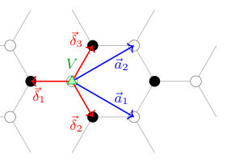 
FIG. 1. Notation for the honeycomb lattice model. Each unit-cell is formed of an atom A and an atom B shifted by δ1 from A. The Bravais lattice is spanned by the vectors a1 and a2 taken to be of unit length a = 1. The impurity term ˆV is localized on a site A, modifying its potential energy by V .

📷 Fig 2

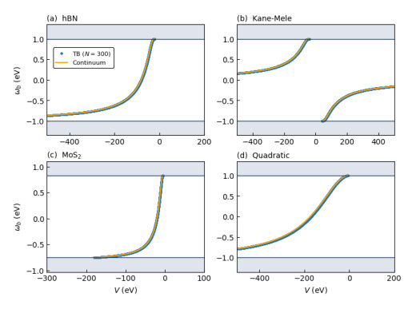 
FIG. 2. Bound-state energy ωb as a function of the impurity strength V for four gapped systems: hBN [M = 1, t1 = 10], Kane–Mele (KM) [˜tKM = 1, t1 = 10], MoS2 [see parameters from eq. (10)], and the quadratic model [M = 1, t = 100]. Blue dots show tight-binding results for a 300 × 300-unit-cell system, while solid orange lines correspond to the analytical continuum theory. For the three linear models (hBN, KM, and MoS2), the continuum results are fitted using the cut- off parameter ⃗a0 = (0, a/3), whereas the quadratic model requires no fitting parameter. The bound-state energy is re- stricted to the bulk gap. For hBN and the quadratic model, a bound state exists for values of V of the...

📷 Fig 3

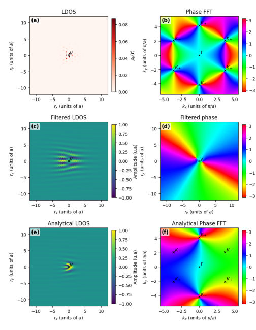 
FIG. 3. Detecting the winding number in LDOS for hBN model. (a) LDOS around the impurity in the tight-binding model with parameters t1 = 10M = 10, V = −80M leading to a bound state in the middle of the gap ωb = 0.0M. (b) Phase of the Fourier Transform of the LDOS in (a), showing the ±4π vortices at the K-points. (c) Amplitude of the LDOS in (a) after applying a Gaussian filter to extract modulations near the K-points, showing a wavefront dislocation of strength 2 (see text). (d) Phase of the filtered LDOS after applying a Gaussian filter on the K+ valley, shows a −4π-winding. (e) LDOS from analytical low-energy theory, showing the dislo- cation. (f) Phase of the Fourier transform of (e),...

📷 Fig 4

 
FIG. 4. Winding region in real space according to analytical low-energy theory of the hBN model. For a given impurity potential V producing a bound state at energy ωb (vertical axis), a circle of radius r (horizontal axis) detects a wavefront dislocation (region ”Winding” in plot) if the LDOS terms satisfy δρB(r, ωb) &gt; δρA(r, ωb) (see text). The ”Winding” region corresponds to strong impurity potential (see Fig. 2).

📷 Fig 5

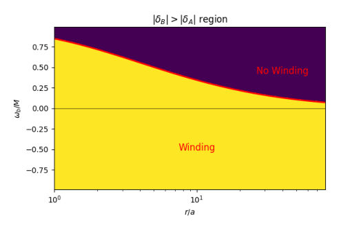 
Figure 4 reveals the real space region in which the LDOS of an impurity with potential V exhibits a wave- front dislocation, in the case of the illustrative low-energy hBN model. For the given value of V we find the bound state energy ωb from Eq. (25) (see Fig. 2a), and then we find the winding region as the set of distances r for which δρB(r, ωb) &gt; δρA(r, ωb). Above a critical impurity strength Vc, the condition δρB(r, ωb) &gt; δρA(r, ωb) is satisfied for all distances r, such that the winding is, in principle, observable on any loop around the impurity. Clearly, the LDOS decays exponentially, so in STS data the signal would only be present in a finite region around the impurity. This re-...

**Summary.** This work demonstrates that the local density of states (LDOS) around impurities in gapped two-band materials can serve as a spectroscopic probe for non-local topological properties like the Berry curvature and wavefunction winding number. By analyzing the impurity-induced bound states, the authors establish a general relationship allowing the direct measurement of the Berry curvature from spectroscopic measurements.

**Why it may be interesting.** The direct link established between a measurable spectroscopic quantity (LDOS) and a fundamental topological invariant (Berry curvature) provides a powerful, experimentally testable theoretical tool for condensed matter physics.

Detailed structure

**Main problem.** The paper investigates using quasiparticle interference (QPI) near impurities to extract non-local topological properties, specifically the Berry curvature and wavefunction winding number, in gapped two-band electronic models.

**Main result.** It establishes a direct, local connection showing that the Berry curvature can be unambiguously extracted from the spectroscopic Local Density of States (LDOS) induced by impurities, particularly in gapped systems.

**Method.** The analysis employs the T-matrix formalism applied to the Green's function of the system, linearizing the Bloch Hamiltonian at high-symmetry points (valleys) to derive a continuum model.

**Model / system.** The study focuses on minimal two-band models derived from lattice structures like the honeycomb lattice (e.g., hBN, TMDs), encompassing various dispersion types (Dirac, semi-Dirac, quadratic) parameterized by gap, winding number, and dispersion exponent.

**Key observables.** Local Density of States (LDOS) induced by impurities, wavefunction winding number (W), and Berry curvature ($\Omega$).

**Important parameters / regimes.** Gap ($\Delta_Q$), winding number ($W_Q$), and the strength of the impurity potential ($V$).

**Assumptions / limitations.** The analysis relies on low-energy continuum expansions around high-symmetry points and assumes the impurity potential is strong enough to reveal the topological winding number.

**Figures summary.** Figures illustrate the comparison between analytical continuum predictions and tight-binding results, and show the dependence of the winding region on filtering parameters.

**Paper structure.** The paper progresses by deriving the low-energy continuum Hamiltonian from lattice structure factors, calculating the real-space Green's function, and finally using the T-matrix formalism to determine the impurity-induced LDOS and extract the topological invariants.

Abstract

We explore the possibility of using quasiparticle interference near impurities to extract non-local properties of bands. Focusing on the minimal two-band description of a system with multiple valleys, we show that the local density of states (LDOS) induced by non-magnetic impurities can effectively probe both the Berry curvature and the wavefunction winding, locally in each valley. We analyze gapped models based on Dirac, semi-Dirac, quadratic touching, and higher-order touching energy dispersions, in presence of a point-like potential scatterer. We find that for strong enough impurity potentials the LDOS along a contour around the impurity unambiguously shows the wavefunction winding number, in contrast to the case of gapless Dirac-like dispersions where the winding can be precluded by LDOS oscillations in the radial direction. We also establish a general connection between, on the one hand, the Berry curvature as a function of momentum locally in a valley, and on the other hand, the wavefunction winding number and the energy dispersion parameters, making hence the local Berry curvature directly observable from spectroscopic LDOS information.

[↑ back to top](#top)

### [Probing Antialtermagnetism via Orbital-Field-Induced Spin Splitting](http://arxiv.org/abs/2609.08996v1)

**Authors:** Zi-Ting Sun  
**Type:** theory · **Category:** strongly correlated electrons · **PDF:** <https://arxiv.org/pdf/2609.08996v1>  
**Analysis basis:** full PDF text, analyzed in chunks
**Topic relevance:** `Keldysh / 2PI / non-Gaussian methods` **2/5** · `quantum measurements` **2/5**

📷 Fig 1

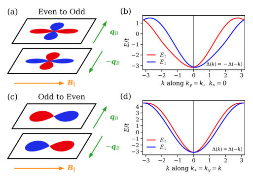 
FIG. 1. Schematics of orbital-field-induced even-odd parity conversion in a bilayer antialtermagnet: (a), (b) Even-to-odd conversion: opposite even-parity d-wave textures in center- related layers acquire transverse Peierls shifts ±qB ⊥B∥, pro- ducing an odd-in-momentum spin splitting ∆(k) = −∆(−k). (c), (d) Odd-to-even conversion: opposite odd-parity p-wave textures produce an even-in-momentum splitting ∆(k) = ∆(−k). Red and blue denote spin ↑and ↓bands, respec- tively. Spectra in (b) and (d) are the upper branch (ν = +1) of Eq. (10) with t = 1, t⊥= 0.5, J = 0.6, µ = −0.2, d = 1, e/ℏ= 1, and qB = (0, −0.4).

📷 Fig 2

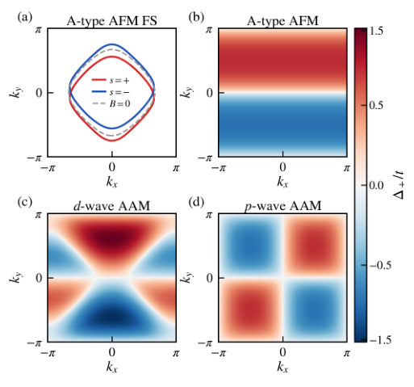 
FIG. 2. Bilayer illustration of orbital-field-induced spin split- ting. (a) Spin-resolved Fermi-surface contours (red and blue) for the A-type AFM under B∥∥ˆx, displaced in opposite directions from the spin-degenerate zero-field contour (gray dashed). (b)–(d) Momentum-resolved splitting ∆+(k)/t from Eq. (11), which encodes the symmetry of the order parame- ter. The A-type AFM in (b) and d-wave AAM in (c) both produce odd-in-momentum splittings, but with distinct wave characters (py-like and p + f-like, respectively); the p-wave AAM in (d) produces an even, dxy-like splitting. The param- eters are identical to those used in Fig. 1.

📷 Fig 3

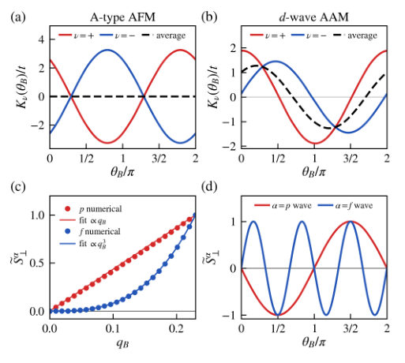 
FIG. 3. Diagnostics of the order-parameter wave character in a bilayer AAM. (a), (b) The branch average (K+ + K−)/2 (black dashed) vanishes identically for the A-type AFM in (a) but is generically nonzero for the d-wave AAM in (b), dis- tinguishing the two without layer resolution. Red and blue curves show Kν(θB) for ν = + and ν = −, respectively, at (kx, ky) = (0.7, 1.0). (c), (d) Normalized field-induced out-of-plane spin polarization ˜Sα ⊥for odd-parity AAM, with S⊥normalized by its maximum absolute value. (c) Field- strength dependence at θB = 3π/2: p-wave order is linear in qB, whereas f-wave order is cubic (circles, exact numerical data; solid lines, fits). (d) Angular dependence at...

**Summary.** This theoretical work details a method to overcome spectroscopic limitations in Antialtermagnets by using an in-plane orbital magnetic field. This field induces a spin splitting whose parity is opposite to the hidden magnetic order's parity, allowing researchers to spectroscopically determine the hidden order's wave character. The analysis relies on symmetry principles and momentum-space sum rules.

**Why it may be interesting.** The technique of using orbital fields to probe hidden symmetries and order parameters is highly relevant to understanding complex magnetic ground states in correlated materials, providing a theoretical blueprint for advanced spectroscopic measurements.

Detailed structure

**Main problem.** The primary challenge is spectroscopically identifying the hidden magnetic order parameter (and its parity/wave character) in Antialtermagnets (AAMs) when conventional bulk spectroscopy fails due to layer compensation.

**Main result.** Applying an in-plane orbital magnetic field induces a spin splitting whose parity is opposite to the hidden order parameter's parity, providing a generic spectroscopic route to characterize the hidden order.

**Method.** The analysis uses theoretical modeling involving field-dressed Hamiltonians and deriving symmetry constraints on the induced spin splitting ($\Delta_m(k; B)$) and net spin polarization ($S^\perp$).

**Model / system.** The study focuses on a bilayer or multilayer system modeled as an AAM, characterized by a zero-field Hamiltonian exhibiting spin degeneracy due to center-exchange symmetry. The magnetic order parameter's parity ($\chi$) is central to the analysis.

**Key observables.** Induced spin splitting ($\Delta_m(k; B)$), net spin polarization ($S^\perp(B_\parallel)$), and the momentum dependence of the form factor $f_\alpha(\mathbf{k})$ derived from band sum rules.

**Important parameters / regimes.** In-plane magnetic field strength ($B$), layer number ($L=2N$), and the parity ($\chi$) of the hidden exchange order.

**Assumptions / limitations.** The analysis assumes spin-orbit coupling is weak compared to the nonrelativistic exchange order, and that the orbital contribution can be separated from the Zeeman effect.

**Figures summary.** Figures schematically illustrate the parity conversion (even-parity order $
ightarrow$ odd splitting, and vice versa) and show the field dependence of the splitting and polarization for different wave symmetries ($s, d, p$).

**Paper structure.** The paper develops the theory by first establishing the spectral degeneracy, then introducing the orbital field to break this degeneracy, and finally using parity theorems, band sum rules, and weak-field expansions to distinguish between different types of hidden magnetic order.

Abstract

Layer compensation can conceal spin polarization behind a spin-degenerate bulk spectrum in antialtermagnets, preventing spectroscopic identification of the underlying magnetic order. Here we show that the orbital effect of an in-plane magnetic field converts the hidden spin texture into an observable spin splitting of opposite momentum parity, thereby restoring spectroscopic access. Once the parity of the hidden exchange order is determined, complementary response functions in the weak-field regime further resolve its wave character: within a minimal model, we illustrate that a band sum rule over the induced band splittings isolates the momentum gradient of the form factor and differentiates hidden even-parity orders, whereas for odd-parity sectors the induced net spin polarization exhibits characteristic field-amplitude and angular dependences. These results establish orbital-field-induced spin splitting as a generic route to identifying the hidden altermagnetic order parameter without layer resolution.

[↑ back to top](#top)

### [Néel-Vector Control of the Josephson Diode Effect in $\mathcal{PT}$-symmetric Antiferromagnets](http://arxiv.org/abs/2609.08278v1)

**Authors:** Xian-Tang Xu, Xun-Jiang Luo, Mingliang Tian, Ning Hao  
**Type:** theory · **Category:** other · **PDF:** <https://arxiv.org/pdf/2609.08278v1>  
**Analysis basis:** full PDF text, analyzed in chunks
**Topic relevance:** `Keldysh / 2PI / non-Gaussian methods` **2/5** · `methods for driven-dissipative` **1/5**

📷 Fig 1

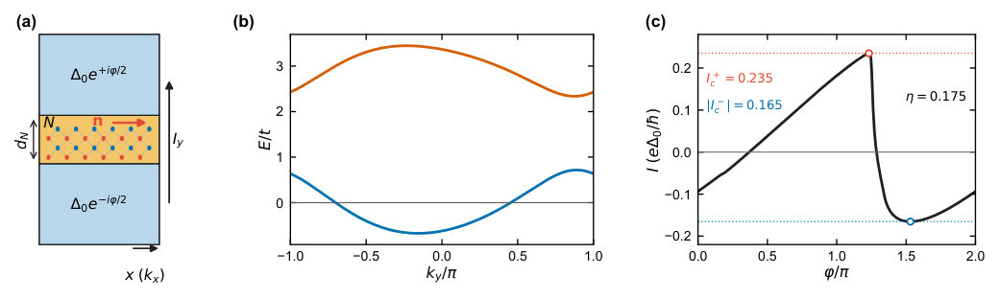 
FIG. 1. (a) Two-sublattice antiferromagnetic SNS junction. Red A sites carry +Jnn and blue B sites carry −Jnn. (b) Full normal-state spectrum Eζk for the two branches ζ = ±1 as a function of ky at fixed kx = 0.3π and n ∥ˆx. Energies are in units of t. (c) Full BdG CPR at µ = −0.80t and Jn = 0.33t. The unequal extrema give η = 0.175 and display the diode response directly. The model parameters are t′ = 0.08t, ∆0 = 0.3t, µ = −1.5t, Jn = 0.8t, λ = 0.5t, dN = 3, and WS = 10.

📷 Fig 2

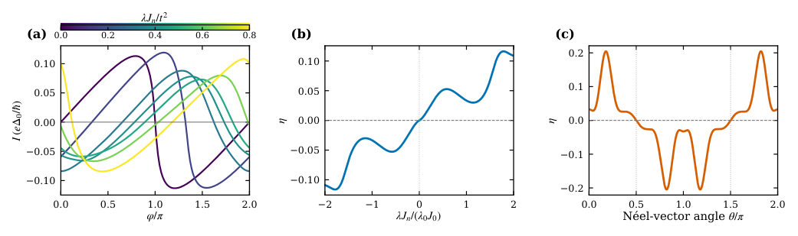 
FIG. 2. (a) Full CPR for increasing λJn at fixed Jn/λ = 1.6. (b) Total diode efficiency versus the signed product λJn at J0 = 0.5t and λ0 = 0.5t. (c) Diode efficiency under a full in-plane rotation of the N´eel vector at Jn = 0.5t and λ = 0.5t. The dotted lines mark the mirror-symmetric orientations θ = π/2 and 3π/2, where the response vanishes. The other parameters are used as those of Fig. 1.

📷 Fig 3

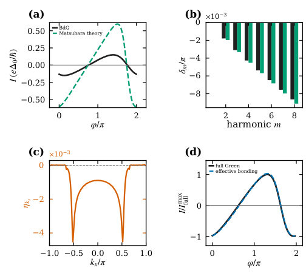 
FIG. 3. (a) Fixed-channel CPR from BdG and the low-energy Matsubara theory at kx = 0.3π and kBT = 0.05∆0. (b) Cor- responding harmonic mismatch (black and green as in panel a), δm = ϑm −mϑ1, showing that the Matsubara theory cap- tures the BdG phase pattern. (c) Channel-resolved diode efficiency ηkx (d) Fixed-channel CPR at kx = 0 from the full Green function and the effective bonding theory obtained through the Schur complement. The same parameters are used as those of Fig. 1.

**Summary.** This theoretical study demonstrates that $\mathcal{PT}$-symmetric antiferromagnets can function as highly tunable Josephson diodes and $\varphi_0$-junctions. The key finding is that the Néel vector acts as a precise control knob, allowing switching of these superconducting phenomena by simple rotations or reversals of the magnetic order. The methodology combines advanced scattering theory with Green's function techniques to rigorously prove the mechanism.

**Why it may be interesting.** This work provides a concrete, tunable platform for realizing superconducting diodes using magnetic order, linking fundamental symmetry concepts ($\mathcal{PT}$-symmetry, magnetic mirror) directly to measurable electrical properties.

Detailed structure

**Main problem.** The study investigates the Josephson diode effect and $\varphi_0$-junction states in Josephson junctions formed by s-wave superconductors and $\mathcal{PT}$-symmetric collinear antiferromagnets.

**Main result.** The diode effect and $\varphi_0$-junction state are shown to be controllable by the Néel vector orientation, with rotation by $90^\circ$ switching both effects off, and reversal flipping the diode polarity.

**Method.** The authors employed microscopic modeling, symmetry analysis, and developed a channel-resolved scattering theory on the Matsubara axis, complemented by Green-function reduction techniques.

**Model / system.** The system is a Josephson junction (SNS) where the weak link is a $\mathcal{PT}$-symmetric collinear antiferromagnet modeled on CuMnAs. The physics is governed by the Bogoliubov–de Gennes (BdG) Hamiltonian.

**Key observables.** Josephson diode efficiency ($\eta$), anomalous phase ($\varphi_0$), and the current-phase relation (CPR).

**Important parameters / regimes.** Néel vector orientation ($\mathbf{n}$), exchange field magnitude ($\lambda J_n$), and sublattice potential ($v$).

**Assumptions / limitations.** The analysis involves approximations like replacing the Matsubara sum with an integral at low temperatures, and the Green-function reduction assumes the bonding sector carries the dominant current.

**Figures summary.** Figures illustrate the CPR showing unequal critical currents for $\mathbf{n} \parallel \hat{x}$ vs. odd CPR for $\mathbf{n} \parallel \hat{y}$. Other figures show the tuning of $\varphi_0$ and $\eta$ with magnetic field parameters and validate the current calculation using full Green functions versus effective bonding sectors.

**Paper structure.** The paper systematically develops the theory by first establishing the symmetry breaking condition ($M_y$ breaking) necessary for the effects. It then uses scattering theory to derive the CPR and efficiency, followed by a rigorous Green-function reduction to confirm the results and validate the single-band transport picture.

Abstract

The interplay of superconductivity and magnetism gives rise to rich phenomena in Josephson junctions. In this Letter, we study Josephson junctions formed by conventional $s$-wave superconductors and a $\PT$-symmetric collinear antiferromagnet modeled on CuMnAs. Using microscopic modeling and symmetry analysis, we show that these junctions exhibit both the Josephson diode effect and $\varphi_{0}$-junction states. Remarkably, both effects are controlled by the Néel vector: rotating it by $90^{\circ}$ switches off both, while reversing it switches the diode polarity. To reveal the microscopic mechanism, we develop a channel-resolved scattering theory that accurately captures the anomalous phases and establishes the exact condition for the diode effect. The interplay of the channel current-phase relations yields a sizable diode efficiency, tunable by both the magnitude and direction of the exchange field. Furthermore, a Green-function reduction identifies a single renormalized $\PT$-degenerate band as the transport carrier and precisely reproduces the full current amplitudes. Our work establishes $\PT$-symmetric antiferromagnets as versatile platforms for field-free, highly tunable Josephson diodes and $\varphi_{0}$ junctions.

[↑ back to top](#top)

### [The First Magic Angle Beyond the Chiral Limit in Twisted Bilayer Graphene](http://arxiv.org/abs/2609.08347v1)

**Authors:** Leonardo A. Navarro-Labastida, Pierre A. Pantaleon, Francisco Guinea, Gerardo G. Naumis  
**Type:** theory · **Category:** other · **PDF:** <https://arxiv.org/pdf/2609.08347v1>  
**Analysis basis:** full PDF text, analyzed in chunks
**Topic relevance:** `analog quantum simulation` **2/5** · `Keldysh / 2PI / non-Gaussian methods` **1/5**

📷 Fig 1

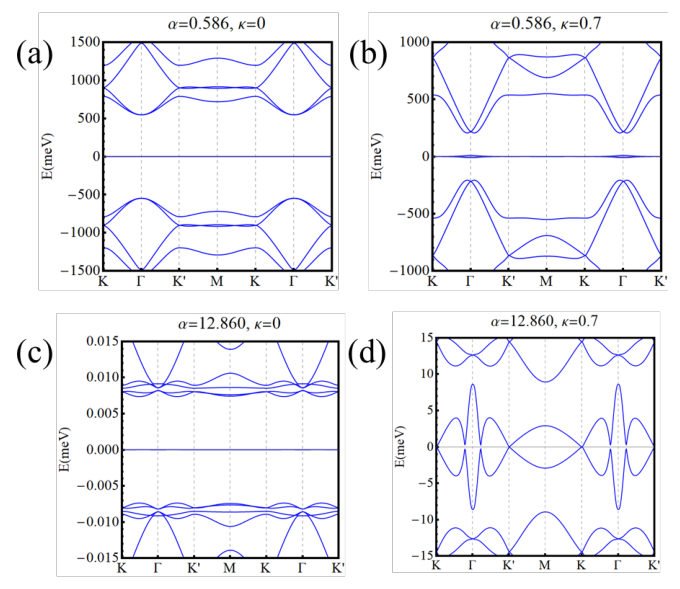 
FIG. 1. Band structure for the first magic angle, panels (a) and (b), and for a higher-order magic angle, panels (c) and (d), comparing the chiral model with the relaxation-renormalized non-chiral model at κ = 0.7. In the chiral model, the bands squeeze as a function of α, and the gap decreases exponentially as predicted by the chiral scaling theory. In the non-chiral model, the hybridization between the central bands and the first remote bands becomes substantially stronger, especially at small twist angles where the gap tends to close systematically.

📷 Fig 2

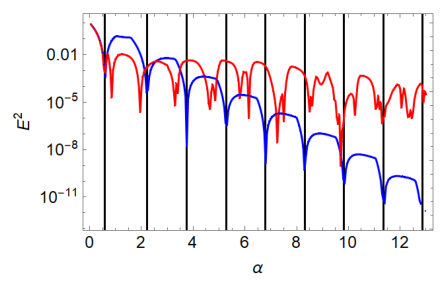 
FIG. 2. E2(α) at the Γ point in semi-logarithmic scale for the non-chiral model κ ≈0.7 (red curve), compared with the chiral model κ = 0 (blue curve). The vertical black lines indicate the magic angles of the chiral theory. While the chiral model preserves an exponential squeezing of the spectrum, finite κ partially blocks this behavior and produces substantial deviations at higher-order magic angles.

📷 Fig 3

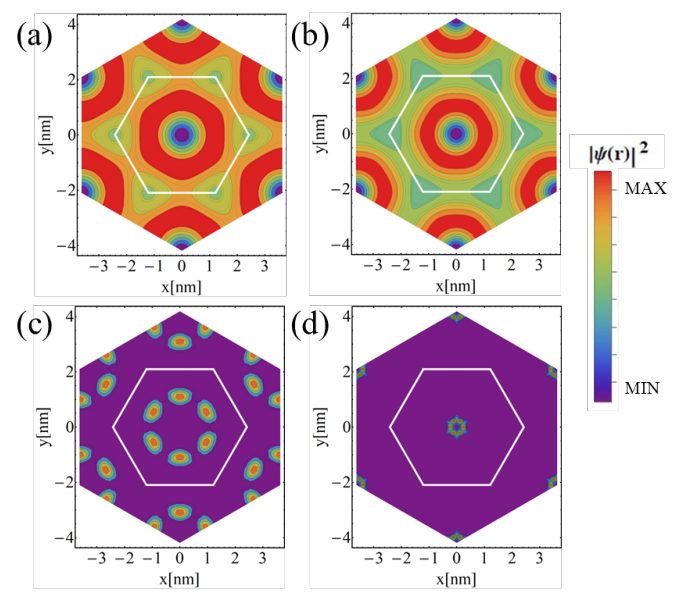 
FIG. 3. Electronic density at the Γ point. First magic angle α1 = 0.586 for (a) the chiral limit κ = 0 and (b) the non-chiral model with κ = 0.7. Electronic density for the higher-order magic angle α9 = 12.860 for (c) the chiral limit κ = 0 and (d) the non-chiral model κ = 0.7. Finite κ induces a pronounced localization of the electronic density around the AA stacking regions.

📷 Fig 4

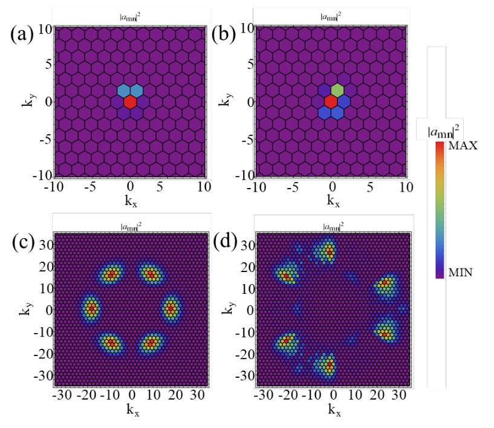 
FIG. 4. Fourier coefficients |am,n|2 for the chiral (left column) and non-chiral (right column) models. Results are shown for the first magic angle, α1 = 0.586, and for the higher-order magic angle, α9 = 12.860. The non-chiral calculations use κ = 0.7, following previous estimates for relaxation-renormalized TBG [57]. Finite κ shifts spectral weight toward larger |Kmn|, indicating stronger localization in real space. It also enhances the trigonal anisotropy of the Fourier distribution while preserving the underlying C3 symmetry.

📷 Fig 5

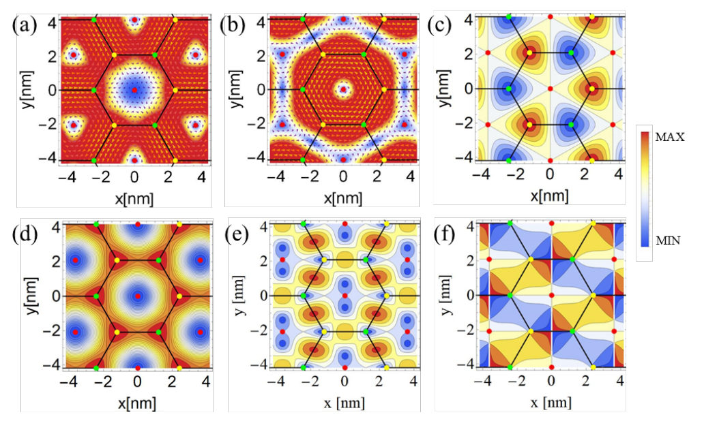 
FIG. 5. Effective potentials of the non-chiral squared Hamiltonian in real space. Panels (a) and (b) show the real and imaginary components of the intrinsic pseudo-magnetic vector potential A(r), respectively. Panels (c) and (d) display the antisymmetric confinement potential ∆(r) = i[Ax, Ay] and the symmetric confinement term A2(r). The non-chiral nature of the model introduces the complex sublattice-sector coupling potential VS(r), whose modulus and phase are shown in panels (e) and (f), respectively. The moir´e unit cell is indicated together with the AA stacking regions (red points) and the AB/BA stacking regions (yellow and green points).

**Summary.** This work develops a theoretical model for twisted bilayer graphene, moving beyond the idealized chiral limit to include effects from lattice relaxation. It shows that the first magic angle is uniquely stable because the competing effects of confinement and current-like channels balance out, providing a single-particle mechanism for the breakdown of the magic-angle hierarchy.

**Why it may be interesting.** While focused on condensed matter, the concept of symmetry protection (chiral limit) breaking by realistic perturbations ($\kappa 
eq 0$) and the resulting stability hierarchy is relevant to understanding topological phases in open quantum systems.

Detailed structure

**Main problem.** The paper aims to explain the physical mechanism behind the differential stability of magic angles in twisted bilayer graphene (TBG) when lattice relaxation is considered.

**Main result.** The first magic angle remains robust because the effects of lattice relaxation (confinement and current-like channels) remain balanced, whereas higher-order angles lose this balance due to enhanced hybridization and localization.

**Method.** The analysis uses a single-particle, continuum model Hamiltonian, employing a squared-Hamiltonian description and perturbative expansion to analyze deviations from the ideal chiral limit.

**Model / system.** The system is Twisted Bilayer Graphene (TBG) modeled by a non-chiral Bistritzer–MacDonald Hamiltonian. The model incorporates the effect of lattice relaxation via a finite same-sublattice tunneling term, parameterized by $\kappa = w_{AA}/w_{AB}$.

**Key observables.** Electronic bandwidth suppression (flat bands), spectral squeezing, and the energy shift ($\Delta E$) as a function of the twist angle ($\alpha$).

**Important parameters / regimes.** The tunneling ratio $\kappa$ (deviation from the chiral limit, $\kappa=0$), and the twist-angle coupling $\alpha$.

**Assumptions / limitations.** The analysis relies on a single-valley continuum theory and uses perturbative methods, which are assumed valid only for small twist angles ($\alpha$).

**Figures summary.** Figures compare band structures and electronic densities between the ideal chiral limit ($\kappa=0$) and the realistic non-chiral case ($\kappa=0.7$), showing spectral differences and enhanced localization for finite $\kappa$.

**Paper structure.** The paper develops the squared-Hamiltonian formalism, analyzes the effect of finite same-sublattice tunneling ($\kappa 
eq 0$) perturbatively, and compares the resulting electronic structure to the known chiral limit results to deduce the stability mechanism.

Abstract

We develop a squared-Hamiltonian description of twisted bilayer graphene beyond the chiral limit to explain why the first magic angle remains robust under lattice relaxation, while higher-order magic angles are strongly destabilized. Starting from the non-chiral Bistritzer--MacDonald model with finite same-sublattice tunneling, we show that lattice relaxation reshapes the effective confinement landscape rather than acting as a simple perturbation of the chiral theory. A central result is that the realistic relaxation-renormalized tunneling ratio lies close to a special confinement point where the oscillatory part of the symmetric confinement potential nearly cancels. This places realistic twisted bilayer graphene near a nearly uniform confinement regime. At the same time, finite same-sublattice tunneling activates an additional inter-sublattice current-like channel that competes with the chiral orbital channel. The first magic angle survives because these confinement and current-like contributions remain balanced, whereas higher-order magic angles lose this balance through stronger remote-band hybridization and enhanced real-space localization around AA regions. Our results provide a single-particle mechanism for the breakdown of the chiral magic-angle hierarchy and clarify why the experimentally relevant first magic angle remains the most stable remnant of the chiral flat-band structure.

[↑ back to top](#top)

### [Thomas-Fermi screening of electrostatic fields in a type-I superconductor](http://arxiv.org/abs/2609.08516v1)

**Authors:** Nikhil Seeja Sivakumar, Tyler James, Frederick Carlisle, Philip Moriarty, Brian Kiraly  
**Type:** experiment · **Category:** other · **PDF:** <https://arxiv.org/pdf/2609.08516v1>  
**Analysis basis:** full PDF text, analyzed in chunks
**Topic relevance:** `quantum measurements` **2/5**

📷 Fig 1

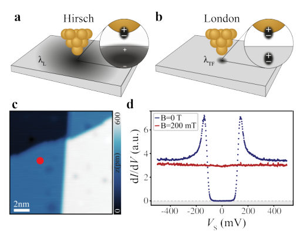 
FIG. 1. Sketch showing the screening of the tip dipole by the superconductor in the case of (a) Hirsch’s alternative theory [5] (screening length ∼λL, the London penetration depth) and (b) traditional London (BCS) theory (Thomas- Fermi screening length, λTF). (c) STM image of Pb(111) surface (VS : 100 mV, It: 100 pA). (d) dI/dV spectra mea- sured in the presence (grey) and absence (blue) of a 200 mT magnetic field applied normal to the Pb(111) sample surface. Stabilisation parameters: VS : 5 mV, It: 100 pA, Lock-in am- plifier modulation amplitude: 20 µV. .

📷 Fig 2

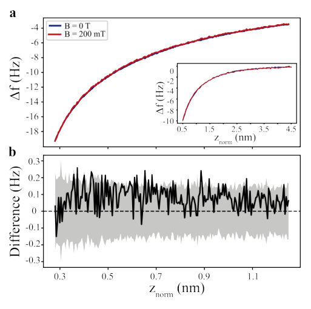 
FIG. 2. (a) Averaged set of ∆f(z) measurements on the Pb(111) surface with B = 0 T (blue; N = 60 curves) and B = 200 mT (red; N = 24), respectively. (Inset) Similar measurement over a much larger z range. (b) Difference sig- nal between B = 0 T and B = 200 mT, with the shaded re- gion given by the 99% confidence interval associated with the pooled standard error. Stabilisation parameters: VS = 5 mV, It = 100 pA, oscillation amplitude = 100 pm. .

📷 Fig 3

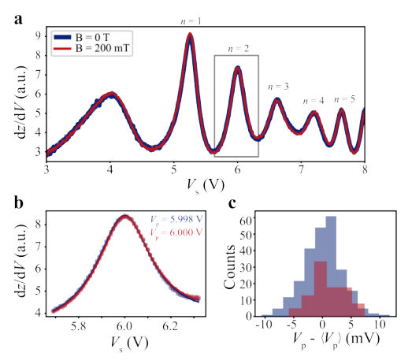 
FIG. 3. (a) Constant-current dz/dV spectrum as a function of applied bias in the field emission regime for no magnetic field (blue) and an applied B field of 200 mT normal to the Pb(111) surface; (b) n = 2 field emission resonance for both the zero-field (blue) and applied field (red) conditions, with Lorentzian fits (solid lines); (c) Histogram of the deviation of each measured FER peak position from its resonance-specific mean, pooled over n = 1, 2, 3 and separated by field (red) and no-field (blue) conditions.

📷 Fig 4

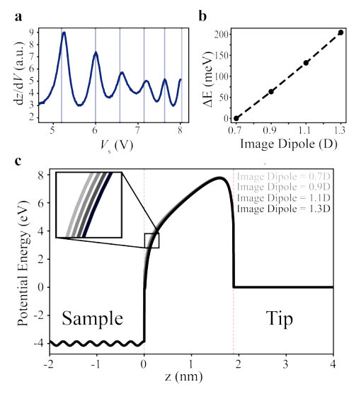 
FIG. 4. (a) Comparison of experimentally measured peak positions of field emission resonances (blue line, no magnetic field) with those predicted by the simple model described in the text (vertical light blue lines, see also Supplementary Ma- terial); (b) predicted shift in resonance energy as a function of the magnitude of the image dipole; (c) electrostatic potential used in the simulations; the inset shows the influence of the image dipole on the form of the potential.

**Summary.** This experimental study investigates whether the electrostatic screening of a superconductor changes upon entering the superconducting state. Using advanced AFM and STM techniques on Pb(111), the authors measured the force-gradient and local electronic density of states in both normal and superconducting states. The results strongly constrain any change in screening to be negligible, supporting the view that the Meissner effect is primarily a transverse electrodynamic phenomenon.

**Why it may be interesting.** While focused on superconductivity, the use of highly sensitive local probes (AFM/STM) to measure fundamental electrostatics at the nanoscale provides insights into boundary conditions and screening mechanisms relevant to quantum interfaces.

Detailed structure

**Main problem.** The study aims to experimentally detect any modification in the electrostatic screening of longitudinal electric fields when a type-I superconductor enters the superconducting state.

**Main result.** The measurements constrain the change in screening to be significantly smaller than theoretical predictions, suggesting that the electrostatic screening remains consistent with unmodified Thomas-Fermi screening across the superconducting transition.

**Method.** The research combines qPlus atomic force microscopy (AFM) and scanning tunneling microscopy/spectroscopy (STM/STS) measurements on single-crystal Pb(111).

**Model / system.** The physical system is the Pb(111) surface studied at very low temperatures ($T/T_c \sim 0.05$). Theoretical models compared include the traditional London equations and Hirsch's alternative formalism regarding longitudinal screening lengths.

**Key observables.** Electrostatic screening measured via frequency-shift ($\Delta f(z)$) curves (AFM) and resonance energy shifts ($\Delta V_p$) in Field Emission Resonance (FER) spectroscopy (STM).

**Important parameters / regimes.** Temperature ($T/T_c \sim 0.05$), magnetic field ($B=200 	ext{ mT}$), screening lengths ($\lambda_{TF}$ vs. $\lambda_L$), and quantitative limits (e.g., $< 1\%$ change, $< 0.17 	ext{ Hz}$ uncertainty).

**Assumptions / limitations.** The analysis relies on the simple dipole-dipole interaction model for interpreting AFM results, and the use of a one-dimensional image-potential model for FER analysis.

**Figures summary.** Figures show comparisons of $\Delta f(z)$ curves between superconducting and normal states, and FER spectra comparing measurements taken with and without an applied magnetic field, consistently showing no detectable change.

**Paper structure.** The paper develops the problem by contrasting theoretical predictions (London vs. Hirsch) and then presents experimental evidence using both AFM and STM/STS techniques to test these predictions on Pb(111).

Abstract

The empirical London equations make distinct predictions for a superconductor's longitudinal and transverse electrodynamic response. Conventionally, this framework attributes the Meissner effect to the transverse component, with the longitudinal response predicted to remain unchanged on entering the superconducting state, i.e. a static electric field is screened over the Thomas-Fermi length ($λ_{\mathrm{TF}} \sim 1$~Å), just as in the nonsupercondcuting metal. J.~E.~Hirsch~[\textit{Phys.~ Rev.~B}~\textbf{69},~214515~(2004)] has developed an alternative formalism, which predicts that the longitudinal screening length should instead be governed by the London penetration depth as the system is cooled below the superconducting transition temperature ($T_{\mathrm{c}}$). Here we use a combination of qPlus atomic force microscopy and scanning tunneling microscopy/spectroscopy of single-crystal Pb(111) at $\sim$~340~mK~ \mbox{($T/T_{\mathrm{c}}\sim0.05$)} in an attempt to detect any modifications in electrostatic screening of the longitudinal tip field upon entering the superconducting phase. We quench superconductivity using a magnetic field of 200 mT normal to the Pb(111) surface. By measuring force-distance curves and local field-emission resonance spectra at the same sample position in the presence and absence of the magnetic field, we constrain the change in screening between the normal and superconducting state to less than $\sim 1 \%$. This is between two to three orders of magnitude smaller than that predicted by Hirsch's theory, and entirely consistent with unmodified Thomas-Fermi screening across the superconducting transition.

[↑ back to top](#top)

### [Equivalent Circuit Representation and Thermodynamic Limitations of Non-Adiabatic Spin-Transfer Torque effect](http://arxiv.org/abs/2609.08544v1)

**Authors:** Wataru Koshibae  
**Type:** theory · **Category:** statistical mechanics · **PDF:** <https://arxiv.org/pdf/2609.08544v1>  
**Analysis basis:** full PDF text, analyzed in chunks
**Topic relevance:** `Keldysh / 2PI / non-Gaussian methods` **1/5** · `correlated / nonlocal dissipation` **1/5** · `driven-dissipative phase transition` **1/5** · `methods for driven-dissipative` **1/5** · `non-equilibrium universality` **1/5**

📷 Fig 1

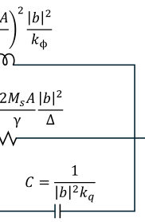 
Fig. 1 The equivalent circuit representation of Vadiab.. The arrows define the

📷 Fig 2

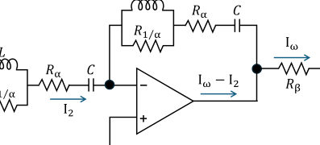 
Fig. 2 (a) A model circuit. (b) An equivalent circuit representation of Vnon−adiab..

📷 Fig 3

 
Figure 2 shows an equivalent circuit representation of Vnon−adiab.. This circuit combines a

📷 Fig 4

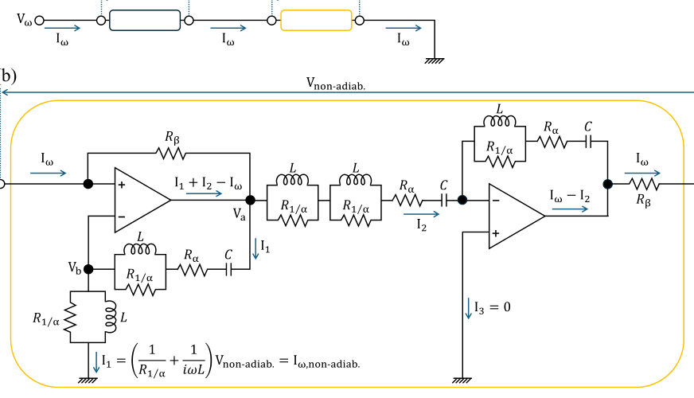 
Fig.2(b), input current at the left-end terminal is Iω, but output currents are Iω at the right-end

📷 Fig 5

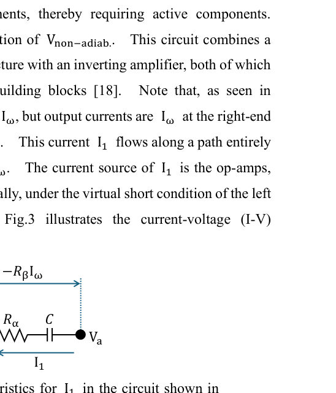 
Fig.2(b). The arrows define the positive-sign directions of the voltage

**Summary.** This theoretical work analyzes the physics of current-driven magnetic domain walls by mapping the governing equations onto electrical circuits. The authors demonstrate that the non-adiabatic spin-transfer torque term requires an active energy source, violating the assumption that the applied current is the only power source. This highlights that current experimental interpretations relying solely on the $eta$-term may be thermodynamically incomplete.

**Why it may be interesting.** It provides a rigorous thermodynamic critique of phenomenological terms ($eta$-term) used in condensed matter models, which is crucial for developing physically consistent non-equilibrium dynamics models.

Detailed structure

**Main problem.** The paper investigates the thermodynamic consistency of incorporating the non-adiabatic spin-transfer torque ($eta$-term) into models describing current-driven magnetic domain wall dynamics.

**Main result.** The $eta$-term cannot be modeled using only passive electrical elements and requires active elements corresponding to negative dissipation, leading to a fundamental contradiction if the driving current is assumed to be the sole power source.

**Method.** The authors use an equivalent circuit representation of the Thiele equation, comparing the circuit's energy dissipation to fundamental thermodynamic principles.

**Model / system.** The system is current-driven magnetic domain walls, whose dynamics are modeled by the Thiele equation, derived from the LLG equation. The analysis compares the adiabatic response (passive circuit) to the non-adiabatic response (requiring active components).

**Key observables.** Domain wall position ($\mathfrak{q}$), internal magnetization angle ($\varphi$), and the energy dissipation rate ($\partial E_{diss}/\partial t$).

**Important parameters / regimes.** Non-adiabatic parameter ($eta$), driving current ($I_{\omega}$), and the frequency ($\omega$).

**Assumptions / limitations.** The analysis assumes the harmonic approximation for the anisotropy potential and critically challenges the assumption that the driving current is the sole power source for the dynamics.

**Figures summary.** Figure 1 illustrates the passive equivalent circuit for the adiabatic response, while Figure 2 shows the non-adiabatic response incorporating a Negative Impedance Converter (NIC) structure with active elements.

**Paper structure.** The paper first establishes the circuit model for the adiabatic response. It then introduces the $eta$-term, modeling it with active circuits. The core of the work is demonstrating that this active circuit implies an external energy source, contradicting the assumption of the driving current being the sole power source.

Abstract

We present an equivalent circuit representation of the Thiele equation for the current-driven domain walls. We show that the non-adiabatic spin-transfer torque (β-term) cannot be represented by passive elements alone (such as resistors, inductors, and capacitors) and necessarily requires active elements, corresponding to negative dissipation. Consequently, assuming that the driving current is the only power source for the texture dynamics, directly incorporating the β-term introduces a fundamental contradiction with thermodynamic principles. This equivalent circuit theory indicates that the interpretation of experiments solely through the β-term does not fully capture the underlying physics, highlighting the need to account for effects distinct from the spin dynamics.

[↑ back to top](#top)

### [Geometry-induced current decrowding in superconducting 3D constrictions](http://arxiv.org/abs/2609.08349v1)

**Authors:** Igor Bogush, Oleksandr Dobrovolskiy  
**Type:** both · **Category:** other · **PDF:** <https://arxiv.org/pdf/2609.08349v1>  
**Analysis basis:** full PDF text, analyzed in chunks
**Topic relevance:** `Keldysh / 2PI / non-Gaussian methods` **1/5** · `analog quantum simulation` **1/5** · `driven-dissipative phase transition` **1/5** · `methods for driven-dissipative` **1/5** · `non-equilibrium universality` **1/5**

📷 Fig 1

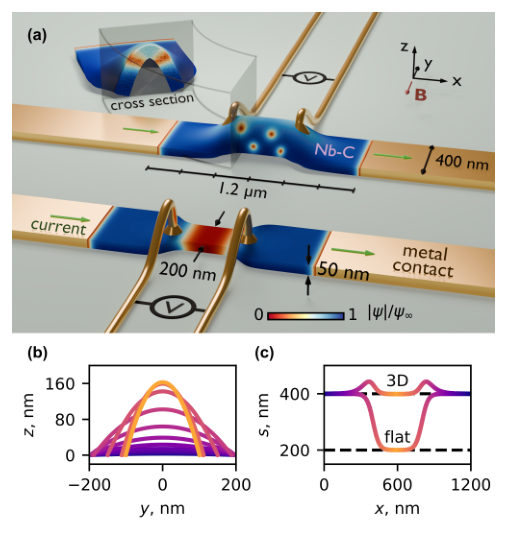 
FIG. 1. (a) Sketches of the 3D curved (top) and planar (bottom) superconducting constrictions, overlaid with the simulated spatial distributions of the superconducting order parameter. Arrows indi- cate the directions of the transport current and the applied in-plane magnetic field B. (b) Transverse height profiles z(y) of the 3D con- striction for selected longitudinal positions x, indicated by the corre- sponding colors in (c). (c) Transverse arc length s(x) as a function of the coordinate along the constriction for the planar and 3D ge- ometries. Although the projected width narrows from 400 to 200 nm within the constriction, the 3D architecture preserves a transverse arc length of...

📷 Fig 2

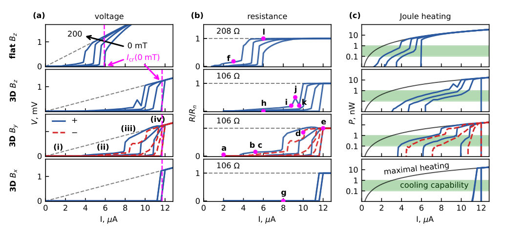 
FIG. 2. (a) Current–voltage characteristics, (b) resistance as a function of transport current, and (c) Joule heating power for the planar constriction in an out-of-plane magnetic field and for the 3D constriction for a series of values of the magnetic field applied along the three principal directions. The results are shown for |B| = 0, 50, 100, and 200 mT. For the 3D constriction with a magnetic field oriented along the y axis, opposite current polarities are distinguished by blue solid and red dashed curves. No non-reciprocal response is observed for the other magnetic-field orientations. The Meissner state (i), flux-flow regime (ii), normal domain formation (iii), and fully normal state...

📷 Fig 3

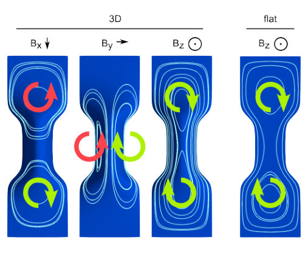 
FIG. 4. Superconducting screening-current patterns induced by a weak magnetic field in the 3D and planar constrictions. Red and green arrows denote opposite current vorticities. Due to its pla- nar geometry, the flat constriction is sensitive mainly to the out-of- plane field component, while the 3D constriction supports screening- current textures for all three magnetic-field orientations. In particu- lar, an in-plane field produces a pair of counter-rotating screening- current loops.

📷 Fig 4

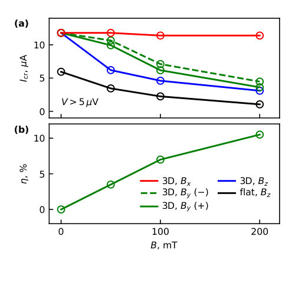 
FIG. 3. Magnetic-field dependence of the critical current (a) and the diode efficiency (b) for the 3D constriction under a y-oriented magnetic field.

📷 Fig 5

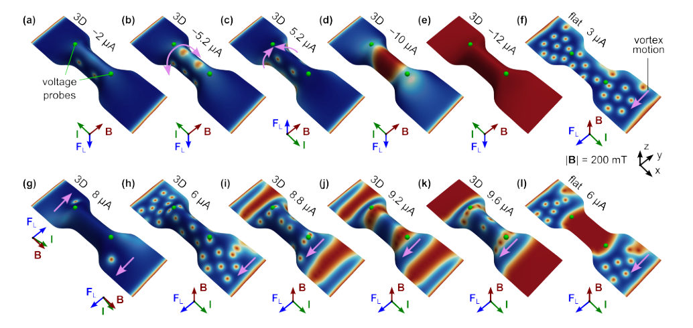 
FIG. 5. Spatial distributions of the normalized superconducting order parameter magnitude |ψ|/ψ∞for the 3D (a–e, g–k) and flat (f, l) constrictions under different magnetic field orientations and transport current values. Panels (a to l) correspond to the points labeled in Fig. 2. Purple arrows denote the direction of vortex motion.

**Summary.** This work demonstrates that engineering the geometry of superconducting constrictions into three dimensions overcomes the detrimental effects of current crowding common in nanoscale devices. By using advanced simulations based on the Ginzburg-Landau theory, the authors show that 3D shaping not only boosts the critical current but also introduces field-tunable functionalities, such as non-reciprocal current flow, making 3D geometry a key design paradigm.

**Why it may be interesting.** While focused on superconductivity, the concept of controlling current flow and vortex dynamics via engineered geometry mirrors principles used in designing quantum circuits or controlling quantum transport in mesoscopic devices.

Detailed structure

**Main problem.** The paper addresses current crowding in nanoscale superconducting devices, a limitation where sharp features cause localized current hotspots that suppress superconductivity and reduce critical current.

**Main result.** 3D shaping of superconducting nanoarchitectures induces a geometry-controlled current decrowding effect, enhancing critical current and enabling novel functionalities like non-reciprocal transport.

**Method.** The study uses finite-element modeling based on the time-dependent Ginzburg-Landau equation to simulate current flow and vortex dynamics.

**Model / system.** The system involves superconducting 3D constrictions, modeled using the TDGL equation coupled with Poisson's equation. Comparisons are made between 3D curved structures and planar reference geometries.

**Key observables.** Critical current ($I_c$), resistance ($R/R_n$), Joule heating, superconducting order parameter ($|\psi|$), and diode efficiency ($\eta$).

**Important parameters / regimes.** Magnetic field orientations ($	ext{B}_x, 	ext{B}_y, 	ext{B}_z$), material parameters like coherence length ($\xi$) and penetration depth ($\lambda$), and geometric dimensions (e.g., $u=50 	ext{ nm}, h=175 	ext{ nm}$).

**Assumptions / limitations.** The analysis relies on the thin-film approximation and the isothermal assumption, though the goal is to show fundamental geometric control.

**Figures summary.** Figures compare Current-Voltage Characteristics (CVCs) and Joule heating for planar vs. 3D constrictions under various fields, and show spatial distributions of the order parameter and screening currents.

**Paper structure.** The paper establishes the problem of current crowding, develops the TDGL model for 3D geometry, and then presents results demonstrating current decrowding, field-dependent vortex dynamics, and non-reciprocal transport enabled by the 3D structure.

Abstract

Current crowding is a ubiquitous limitation in nanoscale devices, where confinement and sharp features distort current flow, generating localized current-density hotspots and premature failure. In superconductors, this effect suppresses the order parameter and promotes vortex nucleation, reducing the critical current below the intrinsic depairing limit. Here, we demonstrate that 3D shaping of superconducting nanoarchitectures overcomes geometric current crowding through spatial current redistribution, establishing a geometry-induced decrowding effect. Using finite-element modeling based on the time-dependent Ginzburg--Landau equation, we reveal that 3D constrictions exhibit a pronounced and tunable response to moderate in-plane magnetic fields---a functionality absent in planar geometries. This field-controlled geometry enables critical-current modulation and unveils new vortex-dynamics regimes, including a non-reciprocal critical current. Furthermore, curvature and finite thickness fundamentally alter vortex nucleation by enabling apex-mediated entry of single vortex lines, followed by their 3D splitting into two vortex filaments---a mechanism that does not occur in 2D manifolds. Our findings demonstrate 3D geometric engineering as a design paradigm for superconducting nanoarchitectures, offering control over current distribution and vortex dynamics in devices approaching the depairing limit.

[↑ back to top](#top)

### [Substrate-induced crystallisation in polymers: Exceptional impact of prefreezing versus heterogeneous nucleation on kinetics and morphology](http://arxiv.org/abs/2609.07973v1)

**Authors:** Marthinus van Niekerk, Muhammad Tariq, Oleksandr Dolynchuk  
**Type:** experiment · **Category:** statistical mechanics · **PDF:** <https://arxiv.org/pdf/2609.07973v1>  
**Analysis basis:** full PDF text, analyzed in chunks
**Topic relevance:** `driven-dissipative phase transition` **1/5** · `non-equilibrium universality` **1/5**

📷 Fig 1

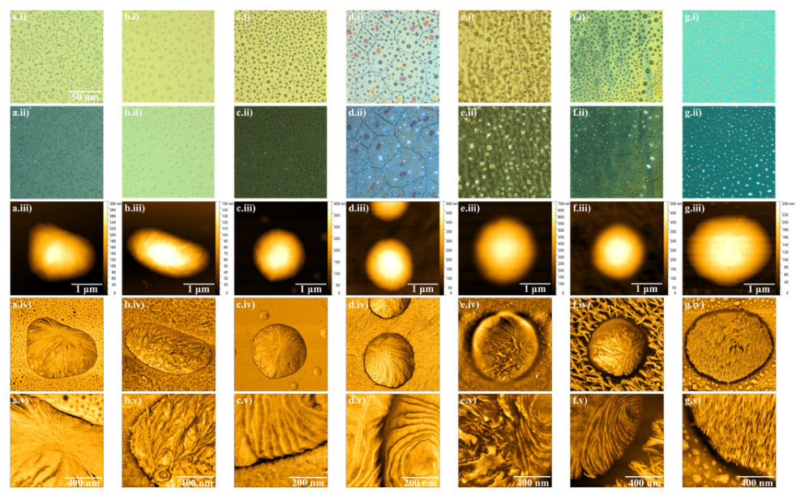 
Figure 1. Large- and small-scale morphology of PCL droplets on various substrates: i,ii) PLOM images under

📷 Fig 2

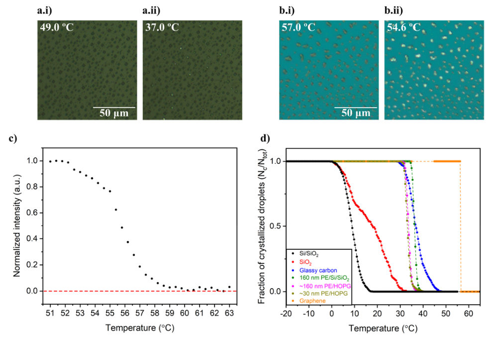 
Figure 2. Crystallisation of PCL droplets on various substrates: a,b) Representative PLOM images under crossed

📷 Fig 3

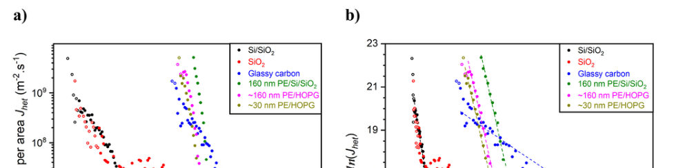 
Figure 3. Nucleation kinetics of PCL on various substrates: a) Nucleation rate per area ! as a function of

📷 Fig 4

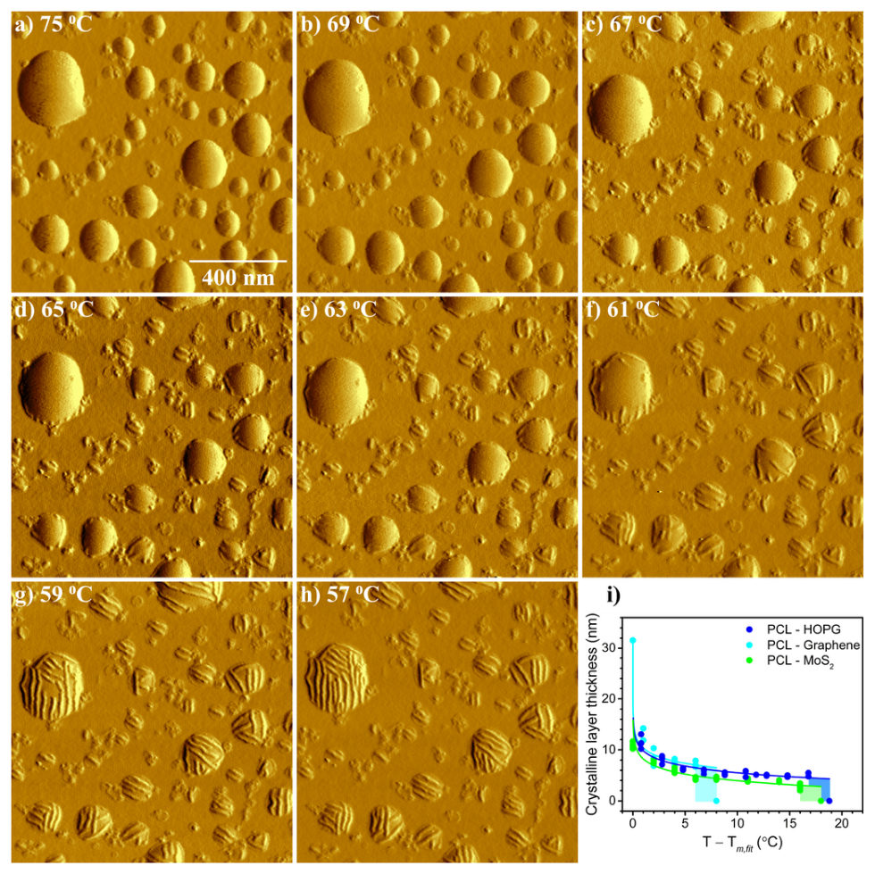 
Figure 4. In situ observation of prefreezing in PCL on graphene: a-h) Net-attractive AFM amplitude images of

📷 Fig 5

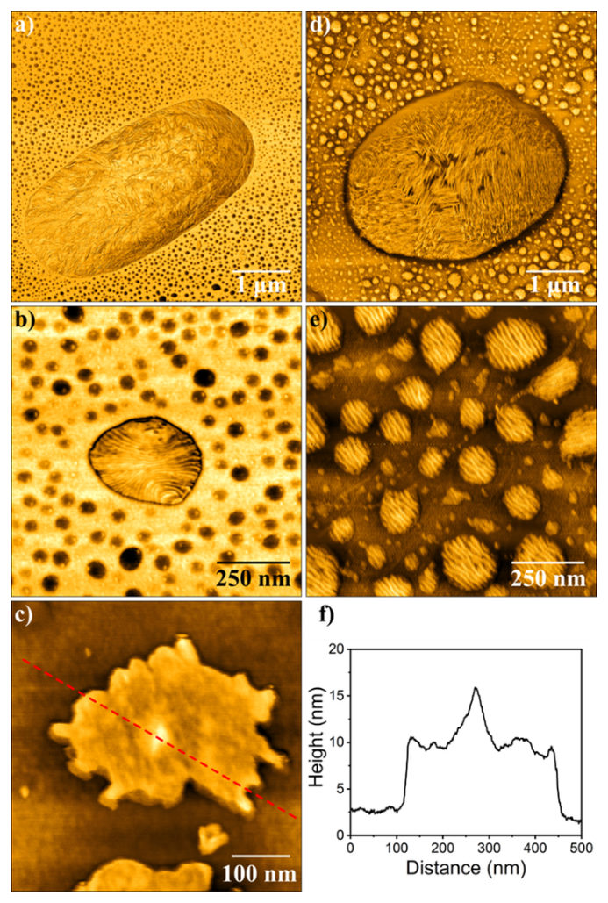 
Figure 5. Influence of crystallisation mechanism on size-dependent semicrystalline morphology: a-c) AFM

**Summary.** This work investigates how crystallization in polymers is initiated on different surfaces by comparing prefreezing and heterogeneous nucleation mechanisms. By studying PCL on various substrates, the authors demonstrate that prefreezing provides a superior pathway for controlling crystal growth kinetics and achieving highly oriented crystal structures. This has significant implications for materials science applications requiring controlled polymer morphology.

**Why it may be interesting.** While focused on polymer physics, the detailed analysis of phase transitions, nucleation kinetics, and the comparison between equilibrium and non-equilibrium pathways touches upon fundamental concepts in non-equilibrium statistical mechanics.

Detailed structure

**Main problem.** The study aims to systematically compare the influence of prefreezing versus heterogeneous nucleation on the kinetics and resulting morphology of substrate-induced crystallization in polymers.

**Main result.** Prefreezing was shown to have a superior influence on crystallization kinetics and crystal morphology compared to heterogeneous nucleation, suggesting prefreezing substrates are excellent nucleating agents.

**Method.** The researchers used polarized light optical microscopy (PLOM) and quantitative analysis of temperature-dependent nucleation rates, comparing crystallization behavior on various crystalline and amorphous substrates.

**Model / system.** The physical system involves the crystallization of the model polymer poly(epsilon-caprolactone) (PCL) within dewetted droplets deposited on diverse substrates, including graphene, glass, and silicon.

**Key observables.** Crystallization temperature (Tc), nucleation rate per area, and in- and out-of-plane crystal orientation.

**Important parameters / regimes.** Interfacial energies ($\gamma$), supercooling ($\Delta T$), and the comparison between equilibrium (prefreezing) and non-equilibrium (heterogeneous) processes.

**Assumptions / limitations.** The analysis relies on comparing kinetic models (like Classical Nucleation Theory) across different physical regimes (prefreezing vs. heterogeneous nucleation).

**Figures summary.** Figures show PLOM images monitoring crystallization, and data plots analyze the temperature dependence of the nucleation rate, revealing distinct kinetic regimes for different substrates.

**Paper structure.** The paper systematically compares three crystallization scenarios (homogeneous, heterogeneous, prefreezing) across various substrates, analyzing kinetics via nucleation rate fits and morphology via microscopy and scattering techniques.

Abstract

Crystallisation of liquids often occurs at solid surfaces, via heterogeneous nucleation or prefreezing. Understanding this process is crucial for controlling crystal morphology in thin films and developing efficient nucleating agents - especially for polymers, typically processed in a molten state. However, the efficiency of nucleation and prefreezing with respect to crystallisation kinetics and semicrystalline polymer morphology has not been well studied and remains unclear. Here, we address this challenge by conducting a systematic study of substrate-induced crystallisation in dewetted droplets of the model polymer poly($\varepsilon$-caprolactone) (PCL) on various crystalline and amorphous substrates. Using polarized light optical microscopy, droplet crystallisation temperature was monitored and varied across the substrates, revealing three scenarios: close-to-homogeneous nucleation on glass and silicon; heterogeneous nucleation on ordered and disordered carbon-rich substrates; and prefreezing on graphene. The temperature-dependent nucleation rate was analysed and found to obey classical nucleation theory for all systems except PCL on graphene, where it diverges as all the droplets crystallise simultaneously. The highest in- and out-of-plane PCL crystal orientation is found on graphene, where the epitaxially grown lamellae extend vertically over several hundred nanometres. These results demonstrate that prefreezing has a superior influence on crystallisation kinetics and crystal morphology, making prefreezing substrates perfect nucleating agents.

[↑ back to top](#top)

### [Electronic Orbital Angular Momentum Driven by Finite-Momentum Phonons: Beyond Chiral and Axial Phonons](http://arxiv.org/abs/2609.08100v1)

**Authors:** Yongho Park, Jeonghun Sohn, Sejoong Kim, Kyoung-Whan Kim  
**Type:** theory · **Category:** other · **PDF:** <https://arxiv.org/pdf/2609.08100v1>  
**Analysis basis:** full PDF text, analyzed in chunks
**Topic relevance:** `Keldysh / 2PI / non-Gaussian methods` **1/5**

📷 Fig 1

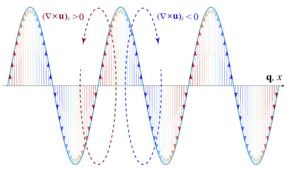 
FIG. 1. Local generation of orbital angular momentum by the vortic- ity of a linearly polarized phonon.

📷 Fig 2

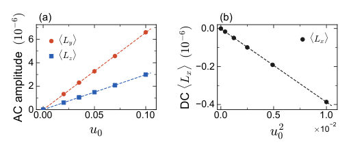 
FIG. 2. Phonon-amplitude scaling for circularly polarized phonons in the yz plane. (a) The AC orbital amplitude is linear in u0 (∝u0). (b) The time-averaged DC component of ⟨Lx⟩is quadratic in u0 (∝u2 0). Here u0 is the phonon amplitude.

📷 Fig 3

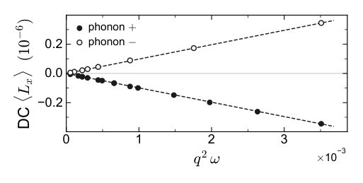 
FIG. 4. q2ω scaling of the DC component of ⟨Lx⟩in the presence of a circularly polarized phonon in the yz plane. Filled and open markers denote + and −phonon helicity.

📷 Fig 4

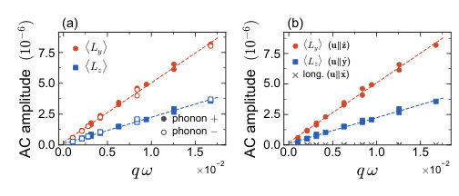 
FIG. 3. qω scaling of the AC orbital amplitude. (a) A yz-circular phonon; filled/open markers denote the phonon helicity. (b) Linearly polarized phonons: transverse (u ⊥q) induce ⟨Ly⟩, ⟨Lz⟩, while lon- gitudinal (u ∥q, ×) induce none.

📷 Fig 5

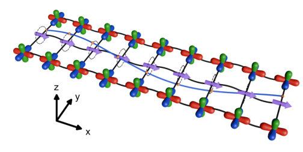 
FIG. 5. The p-orbital quasi-two-dimensional lattice model used in the simulations.

**Summary.** This theoretical work demonstrates that electronic Orbital Angular Momentum can be generated by phonons even if those phonons lack inherent chirality or axial symmetry. By developing a gauge-field theory, the authors show that the OAM response is controlled by the phonon's wave vector and frequency, opening up a broad, tunable mechanism for orbitronics applications.

**Why it may be interesting.** This work provides a general, wave-vector-tunable route to generating orbital currents and OAM in condensed matter systems using acoustic phonons, which is highly relevant for designing novel orbitronics devices.

Detailed structure

**Main problem.** The paper investigates the generation of electronic Orbital Angular Momentum (OAM) induced by finite-momentum phonons, aiming to extend the understanding beyond mechanisms requiring chiral or axial phonon modes.

**Main result.** OAM can be generated by finite-momentum phonons even without phonon axiality or chirality, with the response being tunable by both the phonon wave vector (q) and frequency (ω). The generation mechanism is governed by the matching between phonon geometry and electronic orbital texture, not solely by phonon angular momentum.

**Method.** The authors develop a general gauge-field theory using a unitary transformation to absorb phonon displacements into emergent vector and scalar potentials, allowing for a perturbative classification of the OAM response.

**Model / system.** The study models electrons in a deformable lattice subjected to phonon displacement fields, analyzed using a local Bloch description and extended to quasi-two-dimensional tight-binding simulations.

**Key observables.** Electronic Orbital Angular Momentum (OAM), AC and DC orbital polarization, and the connection to the electronic Berry curvature.

**Important parameters / regimes.** Phonon wave vector (q), phonon frequency (ω), and the phonon polarization (e.g., linear vs. circular).

**Assumptions / limitations.** The analysis relies on the small displacement approximation and the long-wavelength limit for the phonon field.

**Figures summary.** Figures illustrate the scaling laws for AC OAM (linear in qω) and the DC component (quadratic in qω) for various phonon polarizations, confirming the theoretical predictions.

**Paper structure.** The paper establishes the theoretical framework using gauge potentials, derives scaling laws for AC and DC responses, and confirms the predictions using both analytical derivations and time-dependent tight-binding simulations.

Abstract

We show that finite-momentum phonons generate electronic orbital angular momentum (OAM) even without phonon axiality or chirality, with the response controlled by the phonon wave vector $q$ and frequency $ω$. We develop a general gauge-field theory in which a unitary transformation absorbs the phonon displacement into emergent vector and scalar potentials acting on the electrons, providing a perturbative classification of the OAM response in $q$ and $ω$. We derive $q$- and $ω$-scaling laws for AC and DC responses. Notably, AC OAM arises even for linearly polarized phonons, with its magnitude and sign tunable by $q$. Its generation is governed by the matching between the phonon geometry and the electronic orbital texture rather than solely by the phonon angular momentum. The connection of the DC response to the electronic Berry curvature further supports that phonon angular momentum is not the only degree of freedom governing electronic OAM generation. Time-dependent tight-binding simulations under acoustic-phonon driving independently confirm the core predictions. Our results extend phonon-driven OAM beyond chiral and axial phonons and establish a wave-vector-tunable route to orbitronics, accessible with surface acoustic waves.

[↑ back to top](#top)

### [Observation of linear magnetoresistance and planar Hall effect in the Dirac semimetal PdTe](http://arxiv.org/abs/2609.08675v1)

**Authors:** Bhawana Mehra, Bibek Ranjan Satapathy, V S Abhishek, Reena, Ritu Gupta, Yogesh Singh, S. Chakraverty, Amit Vashist  
**Type:** experiment · **Category:** other · **PDF:** <https://arxiv.org/pdf/2609.08675v1>  
**Analysis basis:** full PDF text, analyzed in chunks
**Topic relevance:** `Keldysh / 2PI / non-Gaussian methods` **1/5**

📷 Fig 1

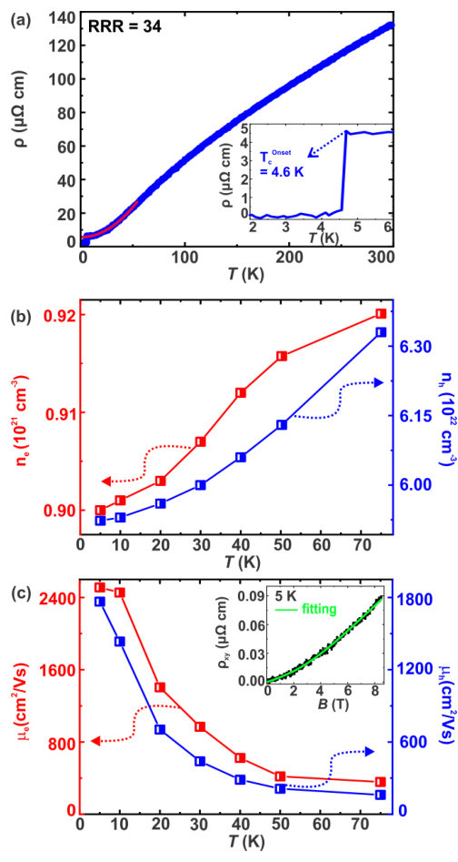 
Figure 1. (a) Temperature dependence of the resistivity ρ(T) from 2 to 300 K of the PdTe single crystal at zero magnetic field, showing metallic behaviour with a residual resistivity ratio of 34. The red curve is a fit to the low-temperature data from the temperature range 0-53 K. The inset highlights the superconducting transition with an onset Tc = 4.6 K. (b) Temperature dependence of the electron (ne, red, left axis) and hole (nh, blue, right axis) carrier concentrations extracted from Hall-effect measurements between 5 and 75 K, both in- creasing monotonically with temperature. (c) Corresponding temperature dependence of the electron (µe, red, left axis) and hole (µh, blue, right axis)...

📷 Fig 2

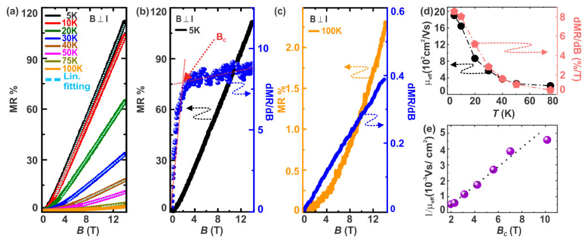 
Figure 2. (a) Field dependence % magnetoresistance (MR%) has been plotted for different temperatures from 5 to 100 K in out-of-plane orientations. The dashed cyan lines show linear fits to the high-field region. (b) MR% (black, left axis) and its field derivative dMR/dB (blue, right axis) at 5 K. The derivative shows a sharp initial rise followed by saturation, with the intersection of the red dotted lines identifying the characteristic crossover (critical) field Bc, marking the transition from quadratic to linear MR. (c) Corresponding MR% (orange, left axis) and dMR/dB (blue, right axis) at 100 K, where the derivative varies smoothly with field without a clear saturation feature, in...

📷 Fig 3

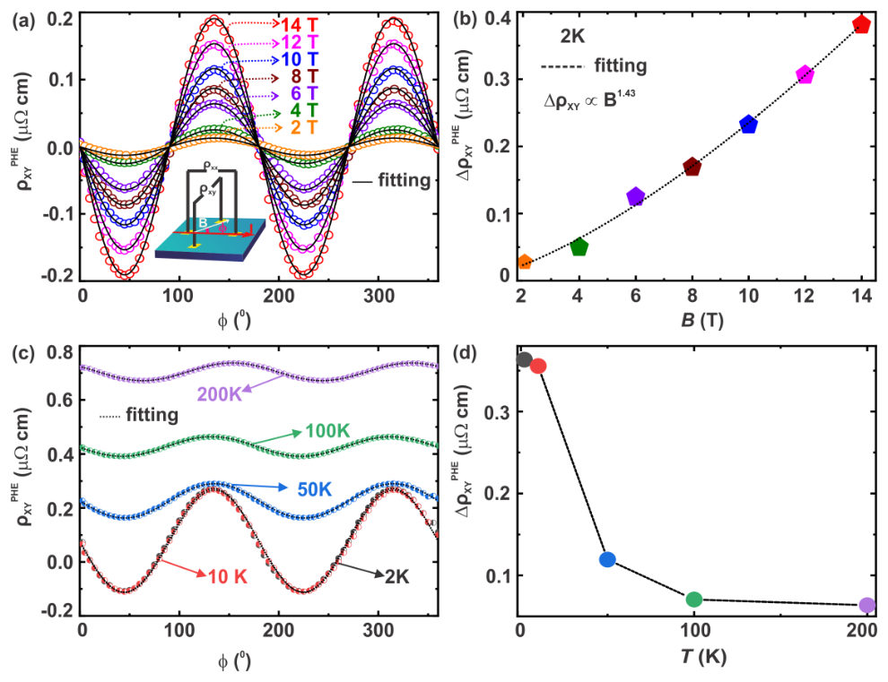 
Figure 3. (a) Planner Hall resistivity ρP HE xy as a function of in-plane field angle ϕ at 2 K, for fields from 2 to 14 T (colored circles), with solid black lines showing fits to the expected sinusoidal angular dependence. Inset shows schematic of the measurement geometry, showing the field angle ϕ relative to the current direction I. (b) Field dependence of ∆ρP HE xy (colored symbols), extracted by fitting the curves in figure 1(a), using eq. 1, and black dotted line through the data represents the power law fit. (c) Angular dependence of ρP HE xy at 14 T, measured at various temperatures with black dotted lines showing fits to the data. (d) Temperature dependence of the extracted...

📷 Fig 4

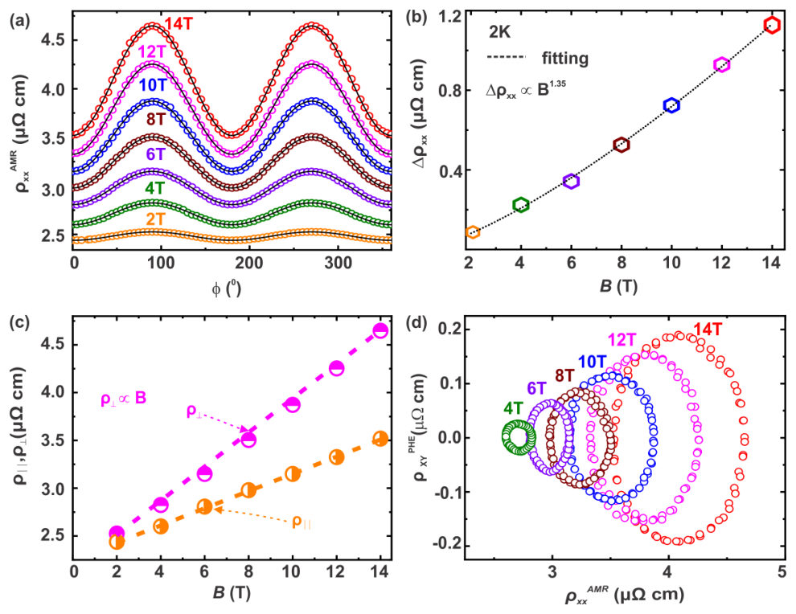 
Figure 4. (a) Angular dependence of the anisotropic magnetoresistance (AMR) resistivity, (ρAMR xx ), measured at 2 K under magnetic fields ranging from 2 to 14 T. The solid curves represent fits to the experimental data. (b) Field dependence of the AMR amplitude ∆ρxx (colored hexagons), with black dotted line through the data represents the power law fit. (c) Field dependence of ρ∥(orange) and ρ⊥(magenta). The dashed lines are eye guided lines, showing that ρ⊥scales linearly with B (ρ⊥∝B) and grows faster than ρ∥. (d) Parametric plots of the planar Hall resistivity (ρP HE xy ) as a function of ρAMR xx , traced by sweeping ϕ through a full 360◦rotation at each fixed field (4–14 T). The...

**Summary.** This work reports the first observation of linear magnetoresistance and the planar Hall effect in the Dirac semimetal PdTe. By analyzing the field and angle dependence of these effects, the authors conclude that both phenomena are best explained by conventional semiclassical transport mechanisms, specifically anisotropic orbital magnetoresistance, rather than exotic topological effects like the chiral anomaly.

**Why it may be interesting.** While the paper focuses on condensed matter transport, the rigorous distinction between topological predictions (like the chiral anomaly) and classical semiclassical transport mechanisms is a key theme in modern topological physics, which can inform the understanding of quantum phenomena in engineered systems.

Detailed structure

**Main problem.** The study aims to investigate the magnetotransport phenomena, specifically linear magnetoresistance (LMR) and the planar Hall effect (PHE), in the Dirac semimetal PdTe, while distinguishing between topological and conventional classical transport mechanisms.

**Main result.** The observed LMR and PHE in PdTe can be understood within a semiclassical transport framework, suggesting that the effects originate predominantly from anisotropic orbital magnetoresistance rather than the chiral anomaly.

**Method.** Magnetotransport measurements were performed on high-quality single crystals of PdTe, measuring resistivity ($
ho$) as a function of magnetic field ($B$) and angle ($\phi$), and fitting the data using semiclassical Boltzmann expressions.

**Model / system.** The physical system is a type-I Dirac semimetal, PdTe, which also exhibits superconductivity. Measurements involve analyzing the Hall resistivity ($
ho_{xy}$), magnetoresistance (MR), and the angular dependence of resistivity ($
ho_{PHE}^{xy}$ and $
ho_{AMR}^{xx}$).

**Key observables.** Linear magnetoresistance (LMR), Planar Hall Effect (PHE), Anisotropic Magnetoresistance (AMR), and the crossover of MR from quadratic to linear dependence at a critical field ($B_c$).

**Important parameters / regimes.** Temperature ($T$), Magnetic Field ($B$), Carrier densities ($n_e, n_h$), and Mobilities ($\mu_e, \mu_h$).

**Assumptions / limitations.** The analysis assumes that the PHE can be modeled by a semiclassical Boltzmann expression, and that the LMR crossover is governed by disorder-driven mobility fluctuations rather than quantum limit effects.

**Figures summary.** Figures show $
ho(T)$ and carrier parameters, the crossover of MR from quadratic to linear dependence with $B$, and angular/field dependence plots for PHE and AMR, including parametric plots.

**Paper structure.** The paper first establishes the material properties (superconductivity, carrier concentrations) and then systematically analyzes the MR, showing a crossover to linearity. Subsequently, it analyzes the PHE and AMR, using angular dependence and parametric plots to rule out the chiral anomaly in favor of anisotropic orbital magnetoresistance.

Abstract

PdTe is a Dirac semimetal that also exhibits superconductivity, providing an intriguing platform to explore topological superconductivity and unconventional magnetotransport phenomena. While the superconducting properties of PdTe have been extensively studied in recent years, the detailed magnetotransport phenomena have remained unexplored. Here, we present the first observation of linear magnetoresistance (LMR) and the planar Hall effect (PHE) in a high-quality single crystal of PdTe. We observe temperature-dependent unsaturated LMR in both in-plane ($B \parallel I$) and out-of-plane ($B \perp I$) configurations. The magnetoresistance (MR) shows a crossover from parabolic to linear dependence at the critical field Bc, and detailed analysis indicates that disorder-driven mobility fluctuations are the origin rather than the Abrikosov quantum-limit mechanism. Furthermore, prominent PHE has been observed by rotating the magnetic field within the plane of the sample. The detailed analysis of the field and temperature dependence of PHE-amplitude, along with the parametric plot, suggests that PHE originates predominantly from the anisotropic orbital magnetoresistance rather than the chiral anomaly. Our results demonstrate that although the Dirac point is close to the Fermi level, the observed LMR and PHE in the Dirac semimetal PdTe can be understood within a semiclassical transport framework, highlighting the importance of distinguishing between topological and conventional classical transport mechanisms in topological materials

[↑ back to top](#top)

### Other secondary papers (4)

Show other secondary papers

### [Junction-free polarity-tunable superconducting diode effect enables XNOR logic operation](http://arxiv.org/abs/2609.09097v1)

**Authors:** Alapan Bera, Soumik Mukhopadhyay  
**Type:** experiment · **Category:** other · **PDF:** <https://arxiv.org/pdf/2609.09097v1>  
**Analysis basis:** full PDF text, analyzed in chunks

📷 Fig 1

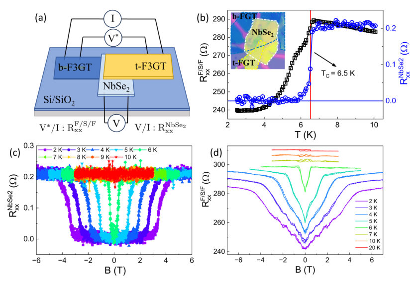 
FIG. 1. (a) Schematic diagram of the F/S/F device architecture, along with the electrical transport measurements protocol. The junction-free SDE is studied in the bare NbSe2 layer, as denoted by the voltage contact probes in V. (b) Temperature dependence of the electrical resistance across the F/S/F junction (black symbol), as well as in the NbSe2 layer (blue symbol). An optical image of the measured device is shown in the inset. (c) Magnetic-field dependence of the NbSe2 resistance at various temperatures, measured for B∥c configuration. The critical field, marking a transition from the superconducting state to a normal state, decreases to zero as the critical temperature is approached....

📷 Fig 2

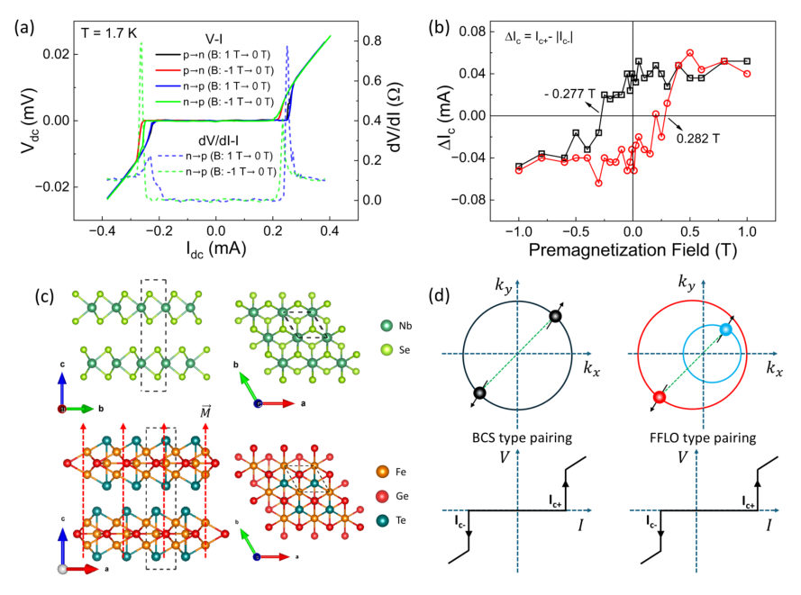 
FIG. 2. (a) The V-I and dV/dI-I characteristics, measured in the NbSe2 layer under different premagnetization fields, are represented by the solid and dashed curves, respectively. An asymmetric current dependence is visible in all cases, revealing a proximity-induced non-reciprocal transport. The reversal from a higher positive critical current (Ic+) at 1 T premag field to a higher negative critical current (Ic−) at -1 T premag field is evident, due to a flipped spin configuration at F3GT. (b) The non-reciprocal part of the critical currents (∆Ic), plotted as a function of various premag fields, shows a hysteresis pattern with a coercivity of 0.28 T. The black and red symbols display...

📷 Fig 3

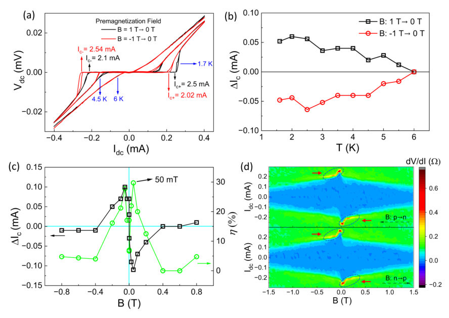 
FIG. 3. (a) Temperature-driven modulation of the diode behavior, measured at premagnetization fields of 1 T and -1 T, is shown in the black and red curves, respectively. (b) Temperature dependence of the ∆Ic for positive and negative premag field of 1 T, highlighting that the robust SDE is persistent up to 5.5 K. (c) Active magnetic field dependency of ∆Ic and diode efficiency η, as calculated using Eq. 1. A maximum efficiency of 29.7% is observed at ±50 mT. (d) Contour plot of the active magnetic field and current-bias dependency of differential resistance. A clear asymmetric response to the current flow direction is observed, with minimal sensitivity to the field-sweep protocol.

📷 Fig 4

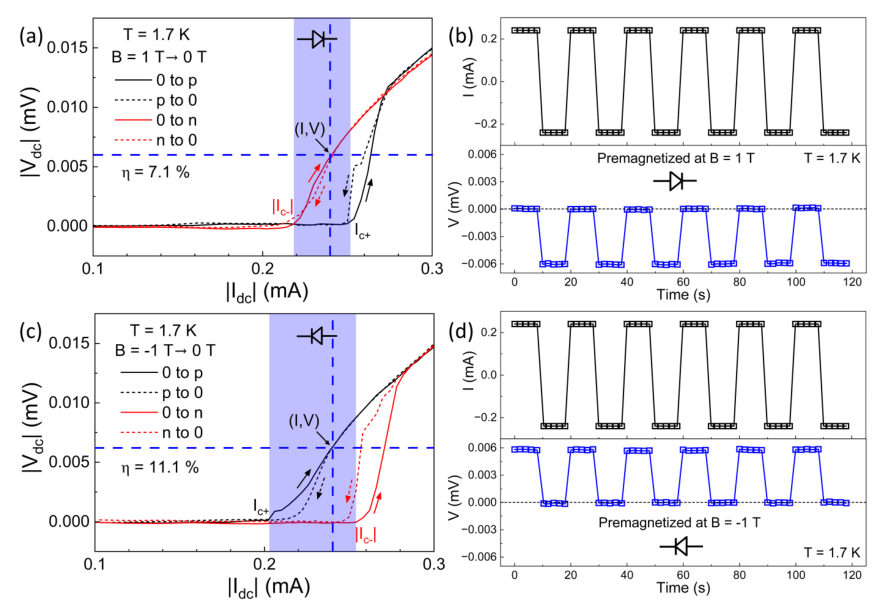 
FIG. 4. (a) The V-I characteristics at a premag field of 1 T, where the negative-current quadrant is superimposed on the positive half with a modulus operation. The non-reciprocal region is shaded in purple. (b) The diode rectification effect is demonstrated using a square-wave input with a 0.24 mA amplitude and 0.05 Hz frequency. A zero-voltage output is obtained during the positive cycle, indicating dissipationless transport. (c) The V-I characteristics at -1 T premag field, with a reversed SDE polarity. (d) A corresponding reversed rectification process is observed with a supercurrent flow for negative cycles. The dashed lines in (a) and (c) indicate the operating current and the...

📷 Fig 5

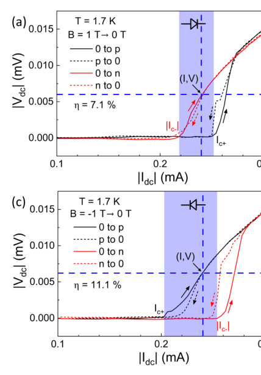 
Fig. 3(a) presents the evolution of the SDE with increas-

**Summary.** This paper reports the creation of a junction-free superconducting diode using a van der Waals heterostructure ($	ext{Fe}_3	ext{GeTe}_2/	ext{NbSe}_2$). By leveraging magnetic proximity effects, they achieve a highly efficient, polarity-tunable superconducting diode. This device is then successfully utilized to implement a two-input XNOR logic gate, marking a significant step toward superconducting logic circuits.

**Why it may be interesting.** This work bridges superconducting physics with solid-state electronics, demonstrating how fundamental quantum phenomena (proximity-induced magnetism) can be harnessed for classical, energy-efficient computing elements.

Detailed structure

**Main problem.** The primary goal is to realize a superconducting diode effect (SDE) without the need for traditional, complex Josephson junctions to enable low-power, energy-efficient logic circuits.

**Main result.** The authors successfully demonstrated a highly efficient, junction-free SDE in an $	ext{NbSe}_2$ heterostructure, achieving up to 30% efficiency and enabling the operation of an XNOR logic gate.

**Method.** The research involves fabricating and measuring transport properties ($	ext{V-I}$, $	ext{dV/dI}$, $	ext{R-T}$, $	ext{MR}$) in an $	ext{F/S/F}$ trilayer structure using magnetic field control.

**Model / system.** The physical system is an all-vdW $	ext{Fe}_3	ext{GeTe}_2$ (ferromagnet) / $	ext{NbSe}_2$ (superconductor) heterostructure. The SDE arises from proximity-induced symmetry breaking and time-reversal symmetry breaking, leading to non-reciprocal supercurrent.

**Key observables.** Superconducting diode efficiency ($\eta$), non-reciprocal critical current ($\Delta I_c$), and the successful operation of an XNOR logic gate.

**Important parameters / regimes.** Diode efficiency up to 30% at 50 mT; the tunability of diode polarity by the $	ext{F}_3	ext{GeTe}_2$ spin polarization.

**Assumptions / limitations.** The SDE is enabled by the magnetic proximity effect, which induces necessary symmetry breaking in the superconductor, bypassing the need for a physical weak link junction.

**Figures summary.** Figures illustrate the device schematic, $	ext{R-T}$ and $	ext{B}$-field dependence of resistance, $	ext{V-I}$ characteristics showing asymmetry based on premagnetization, and the demonstration of the XNOR logic gate operation.

**Paper structure.** The paper details the physical setup, characterizes the junction-free SDE using magnetic field protocols to measure non-reciprocity, and culminates in demonstrating the use of this tunable effect for digital logic computation.

Abstract

The realization of the superconducting diode effect (SDE), characterized by non-reciprocal supercurrent, is a major step towards dissipationless logic circuits. A polarity-tunable superconducting diode with high diode efficiency primarily consists of Josephson-junction architectures that couple two superconducting regions via a weak link. Realizing an SDE without a weak-link junction would reduce fabrication complexity, lower electrical noise, and minimize dependence on junction quality. Here, we report an all-vdW, highly efficient, junction-free SDE in NbSe2, enabled by proximity-induced symmetry breaking from a strong uniaxial ferromagnet Fe3GeTe2 (F3GT). Superconducting diode efficiency of up to 30% is achieved at a small magnetic field of 50 mT. A field-free diode rectification effect is realized with diode polarity that is tunable by the F3GT spin polarization. Furthermore, by employing the active-field dependence of the SDE, a two-input exclusive-NOR (XNOR) logic gate operation is demonstrated. The findings highlight the potential utilization of magnetic proximity effect towards realizing junction-free superconducting diodes for high-performance, energy-efficient logic circuits.

[↑ back to top](#top)

### [Signatures of nodal superconductivity in stoichiometric FeTe](http://arxiv.org/abs/2609.08116v1)

**Authors:** Cequn Li, Zi-Jie Yan, Yang Ge, Zihao Wang, Bing Xia, Stephen Paolini, Pu Xiao, Lok-Kan Lai, Jiatao Song, Austin R. Kaczmarek, Lujin Min, Kenji Yasuda, Peter J. Hirschfeld, Jiabin Yu, Cui-Zu Chang, Katja C. Nowack  
**Type:** both · **Category:** strongly correlated electrons · **PDF:** <https://arxiv.org/pdf/2609.08116v1>  
**Analysis basis:** full PDF text, analyzed in chunks

📷 Fig 1

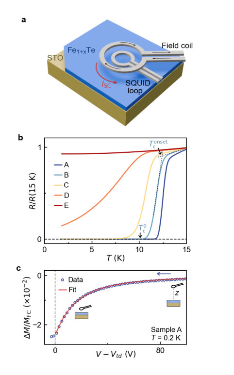 
FIG. 1. Diamagnetic response and transport in FeTe. a, Schematic of the SSM measurement. An ac current through the field coil (inner/outer radii 1.5/3 µm) induces screening currents ISC in Fe1+xTe, detected by the SQUID loop (inner/outer radii 0.4/1 µm) at a SQUID-sample distance z ≈1 µm. The mutual inductance between SQUID and field coil is MFC = 246±1 ϕ0/A. b, Normalized longitudinal resis- tance R/R(15 K) versus temperature for samples A–E with interstitial Fe contents x ≈0, 0.008, 0.012, 0.015, 0.06, respec- tively [23]. T onset c is defined by the intersection of the extrap- olated normal-state resistance and the tangent to the steepest part of the transition, as illustrated for sample...

📷 Fig 2

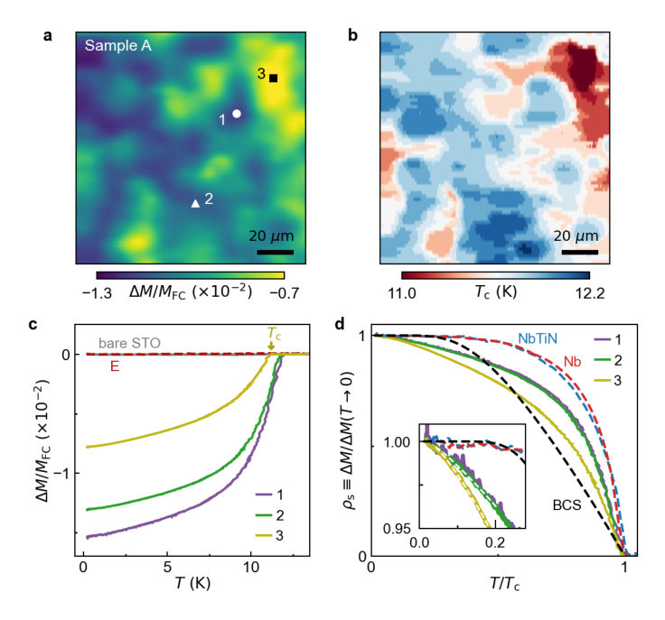 
FIG. 2. Spatial variation of superconductivity and non-saturating superfluid stiffness. a, Spatial map of the diamagnetic response ∆M/MFC in sample A at T = 0.2 K at a constant height, V −Vtd = 15 V. b, Spatial map of Tc over the same field of view. Tc is defined as the temperature at which ∆M/MFC reaches a threshold of 5 × 10−5 at each pixel. c, Temperature dependence of ∆M/MFC measured at selected locations indicated in a, at V −Vtd = 12 V. Bare STO (gray) and sample E (red) show no discernible response. d, Normalized superfluid stiffness ρs versus T/Tc. Blue and red dashed lines are data measured on NbTiN (d = 25 nm) and Nb (d = 20 nm) thin films, respectively; the black dashed line is...

📷 Fig 3

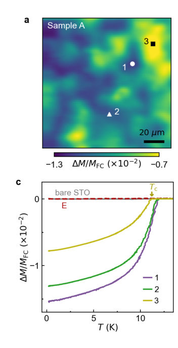 
Figure 1(c) shows an example of the diamagnetic re- sponse measured as the SQUID approaches the surface of sample A at T = 0.2 K, plotted as a function of the voltage applied to the z-piezo. Using the model from Ref. [37], we extract λ(0) = 522 ± 22 nm at the location of this approach curve, similar to values reported for FeSe [2] and FeSe1−xTex [6]. As shown below, the superfluid stiffness, and hence the London penetration depth, varies spatially across the sample. Details of the absolute λ(0) fitting procedure are provided in Supplementary Section S12. The uncertainty in λ(0) is dominated by uncertain- ties in the z-piezo calibration and the SQUID–sample height offset at touchdown,...

📷 Fig 4

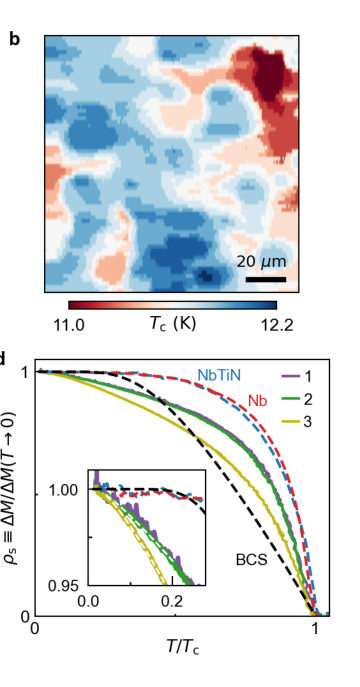 
Figure 2(a) presents the spatially resolved diamagnetic response in sample A at T = 0.2 K under zero back- ground magnetic field (see field compensation and image of vortices in Supplementary Fig. S2). The response is spatially inhomogeneous, revealing nearly twofold varia- tions in the superfluid stiffness across the field of view, with darker regions corresponding to stronger superfluid stiffness. Autocorrelation analysis yields a characteristic length scale of approximately 10–20 µm for these spatial variations (see Supplementary Fig. S4), larger than the spatial resolution of our SQUID of ∼3–6 µm determined

📷 Fig 5

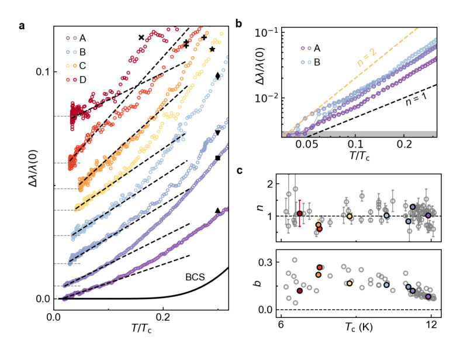 
FIG. 3. Power-law temperature dependence of penetration depth. a, Temperature dependence of the normalized change in the London penetration depth, ∆λ/λ(0), at selected locations in samples A–D. Symbols indicate the corresponding locations in Fig. 2a and Figs. 4a–c. Curves are offset for clarity, with offsets indicated by horizontal gray dashed lines. Black dashed lines are linear fits for T &lt; 0.12Tc. b, Data from a for samples A and B on a log-log scale. Black and yellow dashed lines represent linear and quadratic scaling, respectively; gray shading indicates the noise level. c, Exponent n (top) extracted from power-law fits and slope b (bottom) extracted from linear fits for T &lt; 0.12Tc...

**Summary.** This work investigates the superconducting pairing symmetry in stoichiometric FeTe using a combination of SQUID microscopy, STM spectroscopy, and mean-field theory. Experimental results point towards a nodal superconducting state characterized by power-law temperature dependencies, which is theoretically reproduced by modeling the system with specific attractive interactions leading to nodal d-wave or nodal s-wave pairing.

**Why it may be interesting.** The combination of advanced experimental diagnostics (SQUID, STM) with detailed theoretical modeling of pairing symmetries in iron-based superconductors provides a rich playground for understanding unconventional pairing mechanisms beyond simple BCS theory.

Detailed structure

**Main problem.** To determine the nature of the superconducting pairing state in stoichiometric FeTe and whether it deviates from the isotropic gap trend seen in intermediate Fe(Se,Te) compositions.

**Main result.** Experimental evidence (power-law $\lambda(T)$ and V-shaped DOS) strongly suggests a nodal superconducting state (d-wave or nodal s-wave), which is theoretically supported by mean-field calculations incorporating specific attractive interactions.

**Method.** The study combines multiple experimental techniques (SQUID, STM/S, transport) with theoretical modeling using mean-field calculations on an effective Hamiltonian.

**Model / system.** The system is stoichiometric FeTe thin films. Theoretically, it is modeled using a Hubbard-Kanamori Hamiltonian solved via mean-field theory, incorporating various attractive interactions (NN, NNN, NNNN) to stabilize different pairing symmetries.

**Key observables.** Superfluid stiffness ($\kappa_s$), London penetration depth ($\lambda(T)$), low-energy density of states (DOS), and the superconducting transition temperature ($T_c$).

**Important parameters / regimes.** The superconducting gap structure (nodal vs. fully gapped), the temperature dependence exponents ($n \approx 1.2$ for $
ho_s(T)$), and interaction parameters ($U, V_2, V_3, V_4$).

**Assumptions / limitations.** The SQUID measurement assumes the Pearl limit ($\lambda \gg d$), and the theoretical analysis uses mean-field approximations while preserving certain symmetries (SU(2), time-reversal).

**Figures summary.** Figures show spatial maps of superfluid stiffness and $T_c$ inhomogeneity, power-law fits for $
ho_s(T)$ and $\Delta\lambda/\lambda(0)$, and theoretical DOS plots comparing nodal d-wave and nodal s-wave predictions against experimental STS data.

**Paper structure.** The paper progresses from experimental characterization of spatial inhomogeneity and power-law temperature dependencies (SQUID/STM) to theoretical modeling using mean-field theory to reproduce the observed nodal gap signatures.

Abstract

Superconductivity in stoichiometric FeTe opens access to the FeTe endpoint of the Fe(Se,Te) phase diagram, yet the nature of its superconducting pairing state remains unresolved. In this work, we combine scanning superconducting quantum interference device (SQUID) microscopy, electrical transport, scanning tunneling microscopy and spectroscopy (STM/S), and mean-field calculations to investigate the local superfluid response and pairing state of FeTe thin films with tunable stoichiometry. Even in stoichiometric FeTe, we observe micrometer-scale spatial variations in both superfluid stiffness and superconducting transition temperature $T_c$, while the London penetration depth remains non-saturating down to 0.02$T_c$ and follows a power-law temperature dependence with an exponent of approximately 1-1.5. Together with a V-shaped low-energy density of states and two-gap modeling, these results indicate a superconducting state with gap nodes or deep minima, consistent with either a $d$-wave or nodal $s$-wave superconducting state. Our findings establish stoichiometric FeTe as a distinct superconducting regime that departs from the trend toward more isotropic gaps at intermediate Se/Te compositions, providing a new benchmark for modern microscopic theories of iron-chalcogenide superconductivity. Our work also reveals a crossover from weak to rapid suppression of $T_c$ as superfluid stiffness decreases, connecting FeTe to the broader phenomenology observed in unconventional superconductors.

[↑ back to top](#top)

### [Study on Thickness and Temperature Dependence of Thermoelectric Properties in SnS Nanofilms](http://arxiv.org/abs/2609.08734v1)

**Authors:** Liqi Chen, Ziyang Wang, Donghao Li, Jingye Wang, Ning Zhao, Jun Zhou, Jie Zhu, Dawei Tang  
**Type:** both · **Category:** other · **PDF:** <https://arxiv.org/pdf/2609.08734v1>  
**Analysis basis:** full PDF text, analyzed in chunks

📷 Fig 1

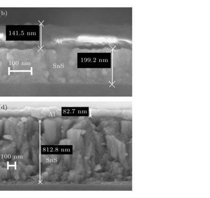 
Fig. 1 SEM cross-sectional images of SnS thin films with different thicknesses.

📷 Fig 2

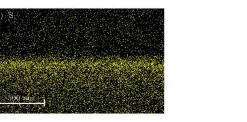 
Fig. 2 EDS elemental mapping of the 199 nm-thick SnS sample.

📷 Fig 3

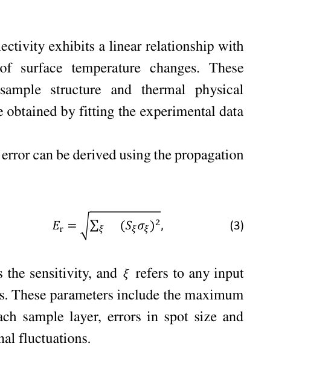 
Figure 3 illustrates the temperature dependence of the Seebeck coefficient for SnS films with different thicknesses. First, regarding the conduction type, the Seebeck coefficients of all samples remain positive throughout the tested temperature range. This indicates that the prepared SnS films exhibit p-type semiconductor characteristics[30,31]. Compared with undoped bulk SnS materials[32], the SnS films in this study demonstrate generally higher Seebeck coefficients. This enhancement is primarily attributed to the unique energy filtering effect in low-dimensional materials. Numerous grain boundaries and interfaces in the films form potential barriers. These barriers effectively scatter or...

📷 Fig 4

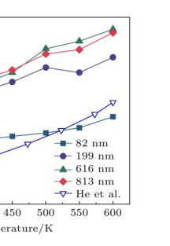 
Fig. 3 Temperature dependence of the Seebeck coefficient for SnS thin film samples with

📷 Fig 5

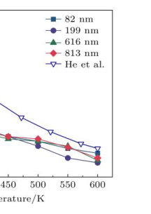 
Fig. 4 Temperature dependence of the electrical conductivity for SnS thin film samples with

**Summary.** This work experimentally and theoretically investigates how reducing the dimensions of SnS into nanofilms improves its thermoelectric efficiency. By measuring key parameters like Seebeck coefficient, conductivity, and thermal conductivity across varying thicknesses and temperatures, the authors demonstrate that quantum confinement and phonon scattering enhance the figure of merit (ZT). This establishes a framework for designing high-performance, eco-friendly thermoelectric materials.

**Why it may be interesting.** While focused on solid-state materials, the study's detailed analysis of transport mechanisms (phonon scattering, energy filtering) provides excellent case studies for understanding how dimensionality and interfaces modify bulk material properties, which is relevant to nanoscale quantum transport.

Detailed structure

**Main problem.** The study aims to enhance the thermoelectric performance of SnS by investigating how its properties change when engineered into thin films, specifically by varying thickness and temperature.

**Main result.** Low-dimensionalization significantly boosts the thermoelectric figure of merit (ZT) compared to bulk SnS, primarily by enhancing the Seebeck coefficient and drastically reducing thermal conductivity.

**Method.** The research combines experimental measurements using Time-Domain Thermoreflectance (TDTR) and specialized thin-film parameter test systems (ZEM-3) with theoretical analysis of transport mechanisms.

**Model / system.** The physical system is SnS semiconductor material, tested in the form of nanofilms with thicknesses ranging from 82 nm to 813 nm, studied across a temperature range of 300–600 K.

**Key observables.** Thermoelectric figure of merit (ZT), Seebeck coefficient (S), electrical conductivity (σ), thermal conductivity (κ), and Power Factor (PF).

**Important parameters / regimes.** Film thickness (e.g., 82 nm, 199 nm, 616 nm, 813 nm), Temperature (300–600 K), and the resulting quantum confinement/energy filtering effects.

**Assumptions / limitations.** The enhancement in thermoelectric performance is attributed to the interplay between quantum confinement, energy filtering, and intensified phonon scattering mechanisms.

**Figures summary.** Figures show the thickness dependence of SEM images, temperature dependence of S and $\sigma$ for various thicknesses, and the resulting temperature dependence of $\kappa$ and $ZT$ for different film thicknesses.

**Paper structure.** The paper systematically measures and analyzes the temperature and thickness dependence of S, $\sigma$, and $\kappa$ to calculate ZT, demonstrating that low-dimensional effects enhance ZT by decoupling thermal and electrical transport.

Abstract

SnS as an environmentally friendly, cost-effective, and earth-abundant narrow-bandgap semiconductor material, has demonstrated significant application potential in the field of medium-temperature thermoelectric conversion. However, the thermoelectric performance of its bulk counterpart is inherently constrained by intrinsic point defects (e.g., vacancies) and the material's specific band structure. Low-dimensional engineering has emerged as a pivotal strategy for overcoming these limitations and enhancing thermoelectric performance. In this work, we systematically investigate the thermoelectric properties of SnS nanofilms with distinct thicknesses (82 nm, 199 nm, 616 nm, and 813 nm) across a temperature range of 300-600 K. Measurements were conducted using time-domain thermoreflectance (TDTR) and a dedicated thin-film thermoelectric parameter test system (ZEM-3). Our results confirm that low-dimensionalization effectively boosts the thermoelectric performance of SnS, with the thermoelectric figure of merit (ZT) displaying a pronounced dependence on both film thickness and temperature. All four SnS thin films exhibit thermoelectric performance that is markedly superior to that of bulk SnS. This enhancement is primarily attributed to the quantum confinement effect, energy filtering effect, and intensified phonon scattering, all of which are induced by the low-dimensional structural characteristics. This work provides not only experimental evidence and theoretical insights for the performance optimization of SnS nanofilms but also establishes a foundational framework for the development of high-efficiency, eco-friendly medium-temperature thermoelectric materials, thereby holding significant scientific value and practical implications.

[↑ back to top](#top)

### [Wafer-Level 1/f Noise Characterization of Scaled P-Type Nanosheets and Comparison with Planar HKMG Transistors](http://arxiv.org/abs/2609.08674v1)

**Authors:** Ruben Asanovski, Anabela Veloso, Ben Kaczer, Naoto Horiguchi, Jacopo Franco  
**Type:** experiment · **Category:** other · **PDF:** <https://arxiv.org/pdf/2609.08674v1>  
**Analysis basis:** full PDF text, analyzed in chunks

📷 Fig 1

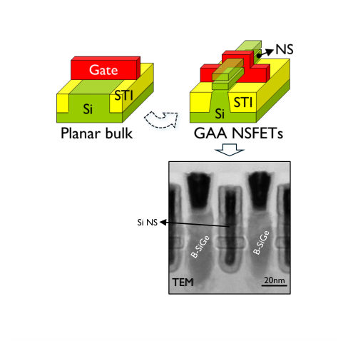 
Fig. 1: Schematic comparison of planar bulk and GAA nanosheet FET architectures alongside a Transmission Electron Microscopy (TEM) image of the nanosheet transistor along the channel fabricated in imec.

📷 Fig 2

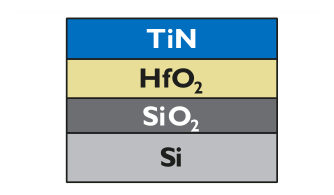 
Fig. 2: Schematic of the HKMG stack employed in both planar and nanosheet pMOSFETs.

📷 Fig 3

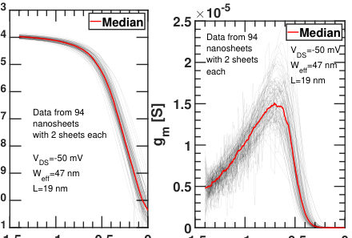 
Fig. 3: (a) ID −VGS and (b) gm −VGS in the linear region for 94 nanosheet pMOSFETs considered in this study. The median curve is highlighted in red.

📷 Fig 4

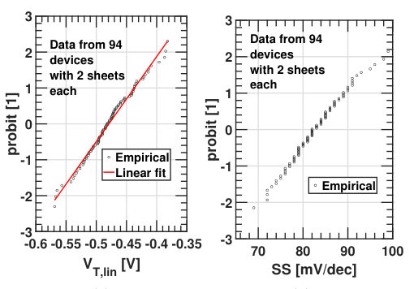 
Fig. 4: Probit plots of the CDF for (a) VT and (b) SS of the 94 nanosheet pMOSFETs. The linearity of the VT plot confirms a normal distribution.

📷 Fig 5

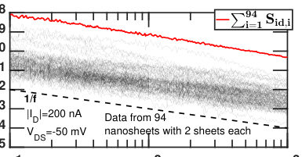 
Fig. 7: Sid versus frequency for all 94 nanosheets pMOSFETs at |ID|=200 nA. The sum of all the spectra exhibits a clear 1/f trend and is highlighted in red.

**Summary.** This paper conducts a wafer-level study comparing 1/f noise in GAA nanosheet and planar HKMG transistors. By extracting the effective trap density from noise measurements, the authors demonstrate that the noise performance is governed by the gate stack quality, not the transition to the GAA nanosheet architecture. This suggests that gate stack optimization strategies applicable to planar devices will also benefit nanosheet transistors.

**Why it may be interesting.** Not directly relevant

Detailed structure

**Main problem.** To assess the impact of transitioning from planar High-kappa Metal Gate (HKMG) transistors to scaled Gate-All-Around (GAA) p-type nanosheet transistors on device reliability, specifically concerning 1/f noise.

**Main result.** The effective trap density extracted from 1/f noise is comparable between planar and nanosheet architectures, indicating that gate stack quality, not channel geometry, governs the noise response.

**Method.** Wafer-level 1/f noise characterization and statistical analysis of transistor performance across multiple devices.

**Model / system.** The study compares scaled p-type GAA nanosheet transistors against large-area planar HKMG pMOSFETs, using identical gate stacks and processing conditions for comparison.

**Key observables.** 1/f noise spectrum (S_vg), effective trap density (N_BT), Threshold voltage (V_T) and Subthreshold Swing (SS) CDFs.

**Important parameters / regimes.** Gate voltage overdrive (V_ov), operating temperature (25°C), and the comparison between planar and nanosheet geometries.

**Assumptions / limitations.** The analysis assumes that the noise behavior is primarily dictated by the quality of the gate stack dielectric, regardless of the channel architecture.

**Figures summary.** Figures compare the effective trap density (Fig. 11) and show consistent noise power spectral densities and device uniformity metrics between the two architectures.

**Paper structure.** The paper systematically characterizes the 1/f noise in both device types, extracts the effective trap density using established formulas, and then compares these quantitative results to argue that gate stack quality is the limiting factor for noise performance.

Abstract

We present a comprehensive wafer-level 1/f noise study of scaled Gate-All-Around (GAA) p-type nanosheet transistors and benchmark them against large-area planar High- \k{appa} Metal Gate (HKMG) devices to assess the impact of device architecture on reliability. By statistically analyzing noise data from 188 nanosheets, we extract the effective trap density in the dielectric and compare it to that of planar transistors with identical gate stack, comparable processing thermal budgets, and no specific reliability anneals. The effective trap density extracted from 1/f noise is comparable in planar and nanosheet architectures. This indicates that transitioning to GAA nanosheets does not increase noise, which remains governed by gate stack quality.

[↑ back to top](#top)

